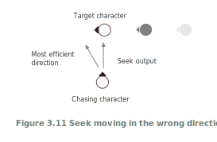
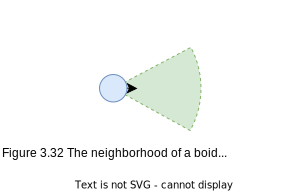
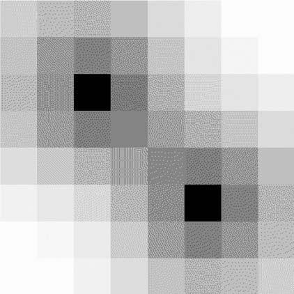
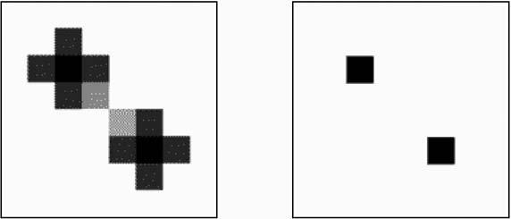
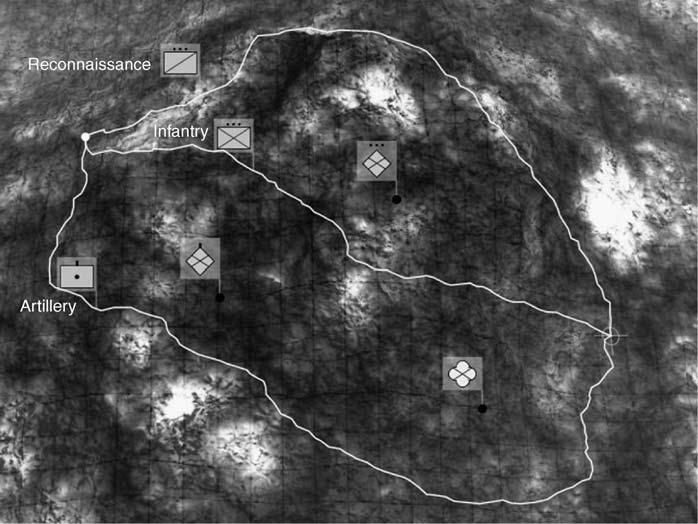
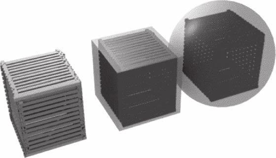
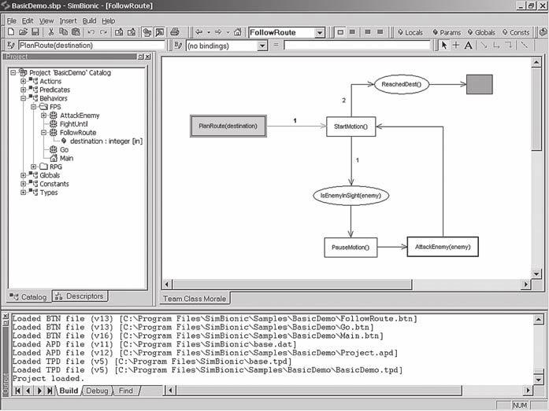

Artificial Intelligence For Games
=================================

   

   https://www.ai4g.com
   https://github.com/shrimpy56/AI4G-Errata
   https://spada.uns.ac.id/pluginfile.php/629724/mod_resource/content/1/gameng_AIFG.pdf
   https://github.com/kurong00/GameProgramBooks
   [code for Artificial Intelligence for Games 1st edition(2005)](https://github.com/idmillington/aicore)
   [A Study Path for Game Programmer](https://github.com/miloyip/game-programmer/)
   [Introduction to Game AI (Winter 2021) GAME3001 by Tom Tsiliopoulos](https://www.bilibili.com/video/BV16b4y1v7yp/)
   [GAME3001 Assignment Framework using SDL2](https://github.com/GeorgeBrownCollege/SDL_Engine)
   [Introduction to Neural Computation by Michale Fee, 大脑认识科学](https://www.bilibili.com/video/BV1954y1q7Ck)
   https://ocw.mit.edu/courses/9-40-introduction-to-neural-computation-spring-2018/pages/lecture-notes/
   Artificial Intelligence and Games By Georgios N. Yannakakis and Julian Togelius https://gameaibook.org

      ARTIFICIAL
      INTELLIGENCE
      FOR GAMES
      Second Edition

      IAN MILLINGTON and JOHN FUNGE

      AMSTERDAM • BOSTON • HEIDELBERG • LONDON
      NEWYORK • OXFORD • PARIS • SAN DIEGO
      SAN FRANCISCO • SINGAPORE • SYDNEY • TOKYO

      Morgan Kaufmann Publishers is an imprint of Elsevier.

      30 Corporate Drive, Suite 400, Burlington, MA 01803, USA

      This book is printed on acid-free paper.

      Copyright © 2009 by Elsevier Inc. All rights reserved.

   >  ![TIP]
      教员说过，战略上藐视敌人，战术上重视敌人。学习一门技术亦然，从系统高度概括它，从基础细节掌握它。
      Teacher Mao once said, 'Strategically despise the enemy, tactically value the opponent.'.
      有些书写得生硬，有些书写得啰嗦，有些书写得简明。而这本书是介于后两者之间的产物，作者将 AI 领域
      中的各种技术一一作了介绍，甚至作者还想教读者写脚本编译器，当然就这本书的体量来说是不够的，只能作为
      衔接编译实现课程阅读材料。第三版本增加 Procedural Content Generation 和 Programming Game AI
      两章内容，达到 1000 页，后者相当于 5.10 Scripting 独立成一章。对于不能快速泛读的人来说，真的
      是“大部头”。以下是编译器实现的理想教材，我称之为编译原理填坑三步曲：

      + Introduction to the Theory of Computation third Edition Michael Sipser
      + Formal Languages and Compilation (Texts in Computer Science) 3rd ed. 2019 Edition
      + Writing Compilers and Interpreters: A Modern Software Engineering Approach Using Java ® , Third Edition

   Designations used by companies to distinguish their products are often claimed as trademarks or registered trademarks. In all
   instances in which Morgan Kaufmann Publishers is aware of a claim, the product names appear in initial capital or all capital
   letters. All trademarks that appear or are otherwise referred to in this work belong to their respective owners. Neither Morgan
   Kaufmann Publishers nor the authors and other contributors of this work have any relationship or affiliation with such
   trademark owners nor do such trademark owners confirm, endorse or approve the contents of this work. Readers, however,
   should contact the appropriate companies for more information regarding trademarks and any related registrations.

   No part of this publication may be reproduced, stored in a retrieval system, or transmitted in any form or by any
   means—electronic, mechanical, photocopying, scanning, or otherwise—without prior written permission of the publisher.

   Permissions may be sought directly from Elsevier’s Science & Technology Rights Department in Oxford, UK: phone: (+44) 1865
   843830, fax: (+44) 1865 853333, E-mail: permissions@elsevier.com. You may also complete your request online via the Elsevier
   homepage (http://elsevier.com), by selecting “Support & Contact” then “Copyright and Permission” and then “Obtaining
   Permissions.”

      Library of Congress Cataloging-in-Publication Data
      Millington, Ian.

      Artificial intelligence for games / Ian Millington, John Funge. – 2nd ed.

      p. cm.

      Includes index.

      ISBN 978-0-12-374731-0 (hardcover : alk. paper)
      1. Computer games–Programming. 2. Computer animation. 3. Artificial intelligence.
      I. Funge, John David, 1968- II. Title.
         QA76.76.C672M549 2009
         006.3–dc22

                                                                     2009016733
      British Library Cataloguing-in-Publication Data
      A catalogue record for this book is available from the British Library.

      ISBN: 978-0-12-374731-0

      For information on all Morgan Kaufmann publications
      visit our Website at www.mkp.com or www.elsevierdirect.com

      Typeset by: diacriTech, India

      Printed in the United States of America
      09 10 11 12 13 5 4 3 2 1


   **For Conor – I.M.**

   **For Xiaoyuan – J.F.**

<a id=Piv href=Ptoc>⋈iv</a>

About the Authors
=================

   **Ian Millington** is a partner of Icosagon Ltd. (www.icosagon.com), a consulting company
   developing next-generation AI technologies for entertainment, modeling, and simulation. Previously
   he founded Mindlathe Ltd., the largest specialist AI middleware company in computer games,
   working on a huge range of game genres and technologies. He has a long background in AI,
   including PhD research in complexity theory and natural computing. He has published academic
   and professional papers and articles on topics ranging from paleontology to hypertext.

   **John Funge** (www.jfunge.com) recently joined Netflix to start and lead the new Game Platforms
   group. Previously, Johnco-founded AiLive and spent nearly ten years helping to create a successful
   company that is now well known for it spioneering machine learning technology for games. AiLive
   co-created the Wii MotionPlus hardware and has established its LiveMove products as the industry
   standard for automatic motion recognition. At AiLive John also worked extensively on Live AI, a
   real-time behavior capture product that is being used by the former lead game designer of Guitar
   Hero and Rock Band to create a new genre of game. John is also an Assistant Adjunct Professor
   at the University of California, Santa Cruz (UCSC) where he teaches a Game AI course that he
   proposed, designed and developed. John has a PhD from the University of Toronto and an MSc
   from the University of Oxford. He holds several patents, is the author of numerous technical
   papers, and wrote two previous books on Game AI.


<a id=Piv href=Ptoc>⋈iv</a>

Contents At a Glance
====================

   [Part I - AI and Games](#P001)
   [Chapter 1 Introduction](#P003)
   [Chapter 2 Game AI](#P019)

   [Part II - Techniques](#P037)
   [Chapter 3 Movement](#P039)
   [Chapter 4 Pathfinding](#P197)
   [Chapter 5 Decision Making](#P293)
   [Chapter 6 Tactical and Strategic AI](#P493)
   [Chapter 7 Learning](#P579)
   [Chapter 8 Board Games](#P667)

   [Part III - Supporting Technologies](#P711)
   [Chapter 9 Execution Management](#P713)
   [Chapter 10 World Interfacing](#P745)
   [Chapter 11 Tools and Content Creation](#P785)

   [Part IV - Designing Game AI](#P805)
   [Chapter 12 Designing Game AI](#P807)
   [Chapter 13 AI-Based Game Genres](#P831)


Contents
========

   [About the Authors](#Piv)
   [Acknowledgments](#Pxix)
   [Preface](#Pxxi)
   [About the Website](#Pxxiii)

   [Part I - AI and Games](#P001)

   [Chapter 1 Introduction](#P003)
   [1.1 What Is AI?](#P004)
   ◯  [1.1.1 Academic AI](#P005)
   ◯  [1.1.2 Game AI](#P007)
   [1.2 Model of Game AI](#P008)
   ◯  [1.2.1 Movement](#P009)
   ◯  [1.2.2 Decision Making](#P010)
   ◯  [1.2.3 Strategy](#P010)
   ◯  [1.2.4 Infrastructure](#P011)
   ◯  [1.2.5 Agent-Based AI](#P011)
   ◯  [1.2.6 In the Book](#P012)
   [1.3 Algorithms, Data Structures, and Representations](#P012)
   ◯  [1.3.1 Algorithms](#P012)
   ◯  [1.3.2 Representations](#P015)
   [1.4 On the Website](#P016)
   ◯  [1.4.1 Programs](#P016)
   ◯  [1.4.2 Libraries](#P017)
   [1.5 Layout of the Book](#P018)

   [Chapter 2 Game AI](#P019)
   [2.1 The Complexity Fallacy](#P019)
   ◯  [2.1.1 When Simple Things Look Good](#P019)
   ◯  [2.1.2 When Complex Things Look Bad](#P020)
   ◯  [2.1.3 The Perception Window](#P021)
   ◯  [2.1.4 Changes of Behavior](#P021)
   [2.2 The Kind of AI in Games](#P022)
   ◯  [2.2.1 Hacks](#P022)
   ◯  [2.2.2 Heuristics](#P023)
   ◯  [2.2.3 Algorithms](#P024)
   [2.3 Speed and Memory](#P025)
   ◯  [2.3.1 Processor Issues](#P025)
   ◯  [2.3.2 Memory Concerns](#P028)
   ◯  [2.3.3 PC Constraints](#P029)
   ◯  [2.3.4 Console Constraints](#P029)
   [2.4 The AI Engine](#P031)
   ◯  [2.4.1 Structure of an AI Engine](#P032)
   ◯  [2.4.2 Toolchain Concerns](#P033)
   ◯  [2.4.3 Putting It All Together](#P034)

   [Part II - Techniques](#P037)

   [Chapter 3 Movement](#P039)
   [3.1 The Basics of Movement Algorithms](#P040)
   ◯  [3.1.1 Two-Dimensional Movement](#P041)
   ◯  [3.1.2 Statics](#P042)
   ◯  [3.1.3 Kinematics](#P045)
   [3.2 Kinematic Movement Algorithms](#P049)
   ◯  [3.2.1 Seek](#P049)
   ◯  [3.2.2 Wandering](#P053)
   ◯  [3.2.3 On the Website](#P055)
   [3.3 Steering Behaviors](#P055)
   ◯  [3.3.1 Steering Basics](#P055)
   ◯  [3.3.2 Variable Matching](#P056)
   ◯  [3.3.3 Seek and Flee](#P056)
   ◯  [3.3.4 Arrive](#P059)
   ◯  [3.3.5 Align](#P062)
   ◯  [3.3.6 Velocity Matching](#P066)
   ◯  [3.3.7 Delegated Behaviors](#P067)
   ◯  [3.3.8 Pursue and Evade](#P068)
   ◯  [3.3.9 Face](#P071)
   ◯  [3.3.10 Looking WhereYou’re Going](#P072)
   ◯  [3.3.11 Wander](#P073)
   ◯  [3.3.12 Path Following](#P076)
   ◯  [3.3.13 Separation](#P082)
   ◯  [3.3.14 Collision Avoidance](#P084)
   ◯  [3.3.15 Obstacle and Wall Avoidance](#P090)
   ◯  [3.3.16 Summary](#P095)
   [3.4 Combining Steering Behaviors](#P095)
   ◯  [3.4.1 Blending and Arbitration](#P096)
   ◯  [3.4.2 Weighted Blending](#P096)
   ◯  [3.4.3 Priorities](#P103)
   ◯  [3.4.4 Cooperative Arbitration](#P107)
   ◯  [3.4.5 Steering Pipeline](#P108)
   [3.5 Predicting Physics](#P120)
   ◯  [3.5.1 Aiming and Shooting](#P121)
   ◯  [3.5.2 Projectile Trajectory](#P121)
   ◯  [3.5.3 The Firing Solution](#P123)
   ◯  [3.5.4 Projectiles with Drag](#P126)
   ◯  [3.5.5 Iterative Targeting](#P128)
   [3.6 Jumping](#P134)
   ◯  [3.6.1 Jump Points](#P135)
   ◯  [3.6.2 Landing Pads](#P138)
   ◯  [3.6.3 Hole Fillers](#P143)
   [3.7 Coordinated Movement](#P144)
   ◯  [3.7.1 Fixed Formations](#P144)
   ◯  [3.7.2 Scalable Formations](#P146)
   ◯  [3.7.3 Emergent Formations](#P146)
   ◯  [3.7.4 Two-Level Formation Steering](#P147)
   ◯  [3.7.5 Implementation](#P151)
   ◯  [3.7.6 Extending to More than Two Levels](#P157)
   ◯  [3.7.7 Slot Roles and Better Assignment](#P159)
   ◯  [3.7.8 Slot Assignment](#P162)
   ◯  [3.7.9 Dynamic Slots and Plays](#P166)
   ◯  [3.7.10 Tactical Movement](#P168)
   [3.8 Motor Control](#P171)
   ◯  [3.8.1 Output Filtering](#P172)
   ◯  [3.8.2 Capability-Sensitive Steering](#P174)
   ◯  [3.8.3 Common Actuation Properties](#P175)
   [3.9 Movement in the Third Dimension](#P178)
   ◯  [3.9.1 Rotation in Three Dimensions](#P178)
   ◯  [3.9.2 Converting Steering Behaviors to Three Dimensions](#P180)
   ◯  [3.9.3 Align](#P180)
   ◯  [3.9.4 Align toVector](#P181)
   ◯  [3.9.5 Face](#P183)
   ◯  [3.9.6 Look WhereYou’re Going](#P186)
   ◯  [3.9.7 Wander](#P186)
   ◯  [3.9.8 Faking Rotation Axes](#P188)
   [Exercises](#P192)

   [Chapter 4 Pathfinding](#P197)
   [4.1 The Pathfinding Graph](#P198)
   ◯  [4.1.1 Graphs](#P198)
   ◯  [4.1.2 Weighted Graphs](#P199)
   ◯  [4.1.3 Directed Weighted Graphs](#P202)
   ◯  [4.1.4 Terminology](#P203)
   ◯  [4.1.5 Representation](#P203)
   [4.2 Dijkstra](#P204)
   ◯  [4.2.1 The Problem](#P205)
   ◯  [4.2.2 The Algorithm](#P206)
   ◯  [4.2.3 Pseudo-Code](#P210)
   ◯  [4.2.4 Data Structures and Interfaces](#P212)
   ◯  [4.2.5 Performance of Dijkstra](#P214)
   ◯  [4.2.6 Weaknesses](#P214)
   [4.3 A*](#P215)
   ◯  [4.3.1 The Problem](#P216)
   ◯  [4.3.2 The Algorithm](#P216)
   ◯  [4.3.3 Pseudo-Code](#P220)
   ◯  [4.3.4 Data Structures and Interfaces](#P223)
   ◯  [4.3.5 Implementation Notes](#P228)
   ◯  [4.3.6 Algorithm Performance](#P228)
   ◯  [4.3.7 Node Array A*](#P229)
   ◯  [4.3.8 Choosing a Heuristic](#P231)
   [4.4 World Representations](#P237)
   ◯  [4.4.1 Tile Graphs](#P239)
   ◯  [4.4.2 Dirichlet Domains](#P241)
   ◯  [4.4.3 Points of Visibility](#P244)
   ◯  [4.4.4 Navigation Meshes](#P246)
   ◯  [4.4.5 Non-Translational Problems](#P251)
   ◯  [4.4.6 Cost Functions](#P251)
   ◯  [4.4.7 Path Smoothing](#P251)
   [4.5 Improving on A*](#P255)
   [4.6 Hierarchical Pathfinding](#P255)
   ◯  [4.6.1 The Hierarchical Pathfinding Graph](#P256)
   ◯  [4.6.2 Pathfinding on the Hierarchical Graph](#P259)
   ◯  [4.6.3 Hierarchical Pathfinding on Exclusions](#P262)
   ◯  [4.6.4 Strange Effects of Hierarchies on Pathfinding](#P263)
   ◯  [4.6.5 Instanced Geometry](#P265)
   [4.7 Other Ideas in Pathfinding](#P271)
   ◯  [4.7.1 Open Goal Pathfinding](#P272)
   ◯  [4.7.2 Dynamic Pathfinding](#P272)
   ◯  [4.7.3 Other Kinds of Information Reuse](#P273)
   ◯  [4.7.4 Low Memory Algorithms](#P273)
   ◯  [4.7.5 Interruptible Pathfinding](#P274)
   ◯  [4.7.6 Pooling Planners](#P275)
   [4.8 Continuous Time Pathfinding](#P276)
   ◯  [4.8.1 The Problem](#P276)
   ◯  [4.8.2 The Algorithm](#P277)
   ◯  [4.8.3 Implementation Notes](#P281)
   ◯  [4.8.4 Performance](#P281)
   ◯  [4.8.5 Weaknesses](#P282)
   [4.9 Movement Planning](#P282)
   ◯  [4.9.1 Animations](#P282)
   ◯  [4.9.2 Movement Planning](#P283)
   ◯  [4.9.3 Example](#P286)
   ◯  [4.9.4 Footfalls](#P287)
   [Exercises](#P288)

   [Chapter 5 Decision Making](#P293)
   [5.1 Overview of Decision Making](#P293)
   [5.2 Decision Trees](#P295)
   ◯  [5.2.1 The Problem](#P295)
   ◯  [5.2.2 The Algorithm](#P295)
   ◯  [5.2.3 Pseudo-Code](#P300)
   ◯  [5.2.4 On the Website](#P302)
   ◯  [5.2.5 Knowledge Representation](#P303)
   ◯  [5.2.6 Implementation Nodes](#P303)
   ◯  [5.2.7 Performance of Decision Trees](#P304)
   ◯  [5.2.8 Balancing the Tree](#P304)
   ◯  [5.2.9 Beyond the Tree](#P305)
   ◯  [5.2.10 Random Decision Trees](#P306)
   [5.3 State Machines](#P309)
   ◯  [5.3.1 The Problem](#P311)
   ◯  [5.3.2 The Algorithm](#P311)
   ◯  [5.3.3 Pseudo-Code](#P311)
   ◯  [5.3.4 Data Structures and Interfaces](#P312)
   ◯  [5.3.5 On the Website](#P315)
   ◯  [5.3.6 Performance](#P316)
   ◯  [5.3.7 Implementation Notes](#P316)
   ◯  [5.3.8 Hard-Coded FSM](#P316)
   ◯  [5.3.9 Hierarchical State Machines](#P318)
   ◯  [5.3.10 Combining Decision Trees and State Machines](#P331)
   [5.4 Behavior Trees](#P334)
   ◯  [5.4.1 Implementing Behavior Trees](#P340)
   ◯  [5.4.2 Pseudo-Code](#P340)
   ◯  [5.4.3 Decorators](#P345)
   ◯  [5.4.4 Concurrency and Timing](#P351)
   ◯  [5.4.5 Adding Data to Behavior Trees](#P361)
   ◯  [5.4.6 Reusing Trees](#P365)
   ◯  [5.4.7 Limitations of Behavior Trees](#P370)
   [5.5 Fuzzy Logic](#P371)
   ◯  [5.5.1 A Warning](#P371)
   ◯  [5.5.2 Introduction to Fuzzy Logic](#P371)
   ◯  [5.5.3 Fuzzy Logic Decision Making](#P381)
   ◯  [5.5.4 Fuzzy State Machines](#P390)
   [5.6 Markov Systems](#P395)
   ◯  [5.6.1 Markov Processes](#P396)
   ◯  [5.6.2 Markov State Machine](#P398)
   [5.7 Goal-Oriented Behavior](#P401)
   ◯  [5.7.1 Goal-Oriented Behavior](#P402)
   ◯  [5.7.2 Simple Selection](#P404)
   ◯  [5.7.3 Overall Utility](#P406)
   ◯  [5.7.4 Timing](#P408)
   ◯  [5.7.5 Overall Utility GOAP](#P413)
   ◯  [5.7.6 GOAP with IDA*](#P418)
   ◯  [5.7.7 Smelly GOB](#P425)
   [5.8 Rule-Based Systems](#P427)
   ◯  [5.8.1 The Problem](#P428)
   ◯  [5.8.2 The Algorithm](#P433)
   ◯  [5.8.3 Pseudo-Code](#P433)
   ◯  [5.8.4 Data Structures and Interfaces](#P434)
   ◯  [5.8.5 Implementation Notes](#P441)
   ◯  [5.8.6 Rule Arbitration](#P441)
   ◯  [5.8.7 Unification](#P443)
   ◯  [5.8.8 Rete](#P445)
   ◯  [5.8.9 Extensions](#P455)
   ◯  [5.8.10 Where Next](#P459)
   [5.9 Blackboard Architectures](#P459)
   ◯  [5.9.1 The Problem](#P459)
   ◯  [5.9.2 The Algorithm](#P460)
   ◯  [5.9.3 Pseudo-Code](#P461)
   ◯  [5.9.4 Data Structures and Interfaces](#P462)
   ◯  [5.9.5 Performance](#P464)
   ◯  [5.9.6 Other Things Are Blackboard Systems](#P465)
   [5.10 Scripting](#P466)
   ◯  [5.10.1 Language Facilities](#P467)
   ◯  [5.10.2 Embedding](#P468)
   ◯  [5.10.3 Choosing a Language](#P468)
   ◯  [5.10.4 A Language Selection](#P470)
   ◯  [5.10.5 RollingYour Own](#P474)
   ◯  [5.10.6 Scripting Languages and Other AI](#P479)
   [5.11 Action Execution](#P480)
   ◯  [5.11.1 Types of Action](#P480)
   ◯  [5.11.2 The Algorithm](#P484)
   ◯  [5.11.3 Pseudo-Code](#P485)
   ◯  [5.11.4 Data Structures and Interfaces](#P487)
   ◯  [5.11.5 Implementation Notes](#P489)
   ◯  [5.11.6 Performance](#P490)
   ◯  [5.11.7 Putting It All Together](#P490)

   [Chapter 6 Tactical and Strategic AI](#P493)
   [6.1 Waypoint Tactics](#P494)
   ◯  [6.1.1 Tactical Locations](#P494)
   ◯  [6.1.2 Using Tactical Locations](#P502)
   ◯  [6.1.3 Generating the Tactical Properties of a Waypoint](#P507)
   ◯  [6.1.4 Automatically Generating the Waypoints](#P512)
   ◯  [6.1.5 The Condensation Algorithm](#P513)
   [6.2 Tactical Analyses](#P518)
   ◯  [6.2.1 Representing the Game Level](#P518)
   ◯  [6.2.2 Simple Influence Maps](#P519)
   ◯  [6.2.3 Terrain Analysis](#P525)
   ◯  [6.2.4 Learning with Tactical Analyses](#P527)
   ◯  [6.2.5 A Structure for Tactical Analyses](#P528)
   ◯  [6.2.6 Map Flooding](#P533)
   ◯  [6.2.7 Convolution Filters](#P538)
   ◯  [6.2.8 Cellular Automata](#P549)
   [6.3 Tactical Pathfinding](#P553)
   ◯  [6.3.1 The Cost Function](#P553)
   ◯  [6.3.2 Tactic Weights and Concern Blending](#P555)
   ◯  [6.3.3 Modifying the Pathfinding Heuristic](#P557)
   ◯  [6.3.4 Tactical Graphs for Pathfinding](#P557)
   ◯  [6.3.5 Using Tactical Waypoints](#P558)
   [6.4 Coordinated Action](#P559)
   ◯  [6.4.1 Multi-Tier AI](#P559)
   ◯  [6.4.2 Emergent Cooperation](#P565)
   ◯  [6.4.3 Scripting Group Actions](#P568)
   ◯  [6.4.4 Military Tactics](#P573)
   [Exercises](#P576)

   [Chapter 7 Learning](#P579)
   [7.1 Learning Basics](#P579)
   ◯  [7.1.1 Online or Offline Learning](#P579)
   ◯  [7.1.2 Intra-Behavior Learning](#P580)
   ◯  [7.1.3 Inter-Behavior Learning](#P581)
   ◯  [7.1.4 A Warning](#P581)
   ◯  [7.1.5 Over-Learning](#P582)
   ◯  [7.1.6 The Zoo of Learning Algorithms](#P582)
   ◯  [7.1.7 The Balance of Effort](#P582)
   [7.2 Parameter Modification](#P583)
   ◯  [7.2.1 The Parameter Landscape](#P583)
   ◯  [7.2.2 Hill Climbing](#P585)
   ◯  [7.2.3 Extensions to Basic Hill Climbing](#P588)
   ◯  [7.2.4 Annealing](#P591)
   [7.3 Action Prediction](#P596)
   ◯  [7.3.1 Left or Right](#P596)
   ◯  [7.3.2 Raw Probability](#P596)
   ◯  [7.3.3 String Matching](#P597)
   ◯  [7.3.4 N-Grams](#P597)
   ◯  [7.3.5 Window Size](#P601)
   ◯  [7.3.6 Hierarchical N-Grams](#P602)
   ◯  [7.3.7 Application in Combat](#P605)
   [7.4 Decision Learning](#P606)
   ◯  [7.4.1 Structure of Decision Learning](#P606)
   ◯  [7.4.2 What ShouldYou Learn?](#P607)
   ◯  [7.4.3 Four Techniques](#P607)
   [7.5 Naive Bayes Classifiers](#P608)
   ◯  [7.5.1 Implementation Notes](#P612)
   [7.6 Decision Tree Learning](#P613)
   ◯  [7.6.1 ID3](#P613)
   ◯  [7.6.2 ID3 with Continuous Attributes](#P622)
   ◯  [7.6.3 Incremental Decision Tree Learning](#P626)
   [7.7 Reinforcement Learning](#P631)
   ◯  [7.7.1 The Problem](#P631)
   ◯  [7.7.2 The Algorithm](#P632)
   ◯  [7.7.3 Pseudo-Code](#P635)
   ◯  [7.7.4 Data Structures and Interfaces](#P636)
   ◯  [7.7.5 Implementation Notes](#P637)
   ◯  [7.7.6 Performance](#P637)
   ◯  [7.7.7 Tailoring Parameters](#P638)
   ◯  [7.7.8 Weaknesses and Realistic Applications](#P641)
   ◯  [7.7.9 Other Ideas in Reinforcement Learning](#P644)
   [7.8 Artificial Neural Networks](#P646)
   ◯  [7.8.1 Overview](#P647)
   ◯  [7.8.2 The Problem](#P649)
   ◯  [7.8.3 The Algorithm](#P650)
   ◯  [7.8.4 Pseudo-Code](#P654)
   ◯  [7.8.5 Data Structures and Interfaces](#P655)
   ◯  [7.8.6 Implementation Caveats](#P657)
   ◯  [7.8.7 Performance](#P658)
   ◯  [7.8.8 Other Approaches](#P658)
   [Exercises](#P662)

   [Chapter 8 Board Games](#P667)
   [8.1 Game Theory](#P668)
   ◯  [8.1.1 Types of Games](#P668)
   ◯  [8.1.2 The Game Tree](#P669)
   [8.2 Minimaxing](#P671)
   ◯  [8.2.1 The Static Evaluation Function](#P672)
   ◯  [8.2.2 Minimaxing](#P674)
   ◯  [8.2.3 The Minimaxing Algorithm](#P675)
   ◯  [8.2.4 Negamaxing](#P678)
   ◯  [8.2.5 AB Pruning](#P681)
   ◯  [8.2.6 The AB Search Window](#P684)
   ◯  [8.2.7 Negascout](#P686)
   [8.3 Transposition Tables and Memory](#P689)
   ◯  [8.3.1 Hashing Game States](#P689)
   ◯  [8.3.2 What to Store in the Table](#P692)
   ◯  [8.3.3 Hash Table Implementation](#P693)
   ◯  [8.3.4 Replacement Strategies](#P694)
   ◯  [8.3.5 A Complete Transposition Table](#P695)
   ◯  [8.3.6 Transposition Table Issues](#P696)
   ◯  [8.3.7 Using Opponent’s Thinking Time](#P696)
   [8.4 Memory-Enhanced Test Algorithms](#P697)
   ◯  [8.4.1 Implementing Test](#P697)
   ◯  [8.4.2 The MTD Algorithm](#P699)
   ◯  [8.4.3 Pseudo-Code](#P700)
   [8.5 Opening Books and Other Set Plays](#P701)
   ◯  [8.5.1 Implementing an Opening Book](#P702)
   ◯  [8.5.2 Learning for Opening Books](#P702)
   ◯  [8.5.3 Set Play Books](#P703)
   [8.6 Further Optimizations](#P703)
   ◯  [8.6.1 Iterative Deepening](#P704)
   ◯  [8.6.2 Variable Depth Approaches](#P705)
   [8.7 Turn-Based Strategy Games](#P706)
   ◯  [8.7.1 Impossible Tree Size](#P706)
   ◯  [8.7.2 Real-Time AI in a Turn-Based Game](#P708)
   [Exercises](#P708)

   [Part III - Supporting Technologies](#P711)

   [Chapter 9 Execution Management](#P713)
   [9.1 Scheduling](#P714)
   ◯  [9.1.1 The Scheduler](#P714)
   ◯  [9.1.2 Interruptible Processes](#P722)
   ◯  [9.1.3 Load-Balancing Scheduler](#P724)
   ◯  [9.1.4 Hierarchical Scheduling](#P726)
   ◯  [9.1.5 Priority Scheduling](#P728)
   [9.2 Anytime Algorithms](#P731)
   [9.3 Level of Detail](#P732)
   ◯  [9.3.1 Graphics Level of Detail](#P732)
   ◯  [9.3.2 AI LOD](#P732)
   ◯  [9.3.3 Scheduling LOD](#P733)
   ◯  [9.3.4 Behavioral LOD](#P734)
   ◯  [9.3.5 Group LOD](#P740)
   ◯  [9.3.6 In Summary](#P743)
   [Exercises](#P744)

   [Chapter 10 World Interfacing](#P745)
   [10.1 Communication](#P745)
   [10.2 Getting Knowledge Efficiently](#P746)
   ◯  [10.2.1 Polling](#P746)
   ◯  [10.2.2 Events](#P747)
   ◯  [10.2.3 Determining What Approach to Use](#P748)
   [10.3 Event Managers](#P748)
   ◯  [10.3.1 Implementation](#P750)
   ◯  [10.3.2 Event Casting](#P753)
   ◯  [10.3.3 Inter-Agent Communication](#P755)
   [10.4 Polling Stations](#P756)
   ◯  [10.4.1 Pseudo-Code](#P756)
   ◯  [10.4.2 Performance](#P757)
   ◯  [10.4.3 Implementation Notes](#P757)
   ◯  [10.4.4 Abstract Polling](#P758)
   [10.5 Sense Management](#P759)
   ◯  [10.5.1 Faking It](#P760)
   ◯  [10.5.2 What Do We Know?](#P760)
   ◯  [10.5.3 Sensory Modalities](#P761)
   ◯  [10.5.4 Region Sense Manager](#P767)
   ◯  [10.5.5 Finite Element Model Sense Manager](#P775)
   [Exercises](#P783)

   [Chapter 11 Tools and Content Creation](#P785)
   ◯  [11.0.1 Toolchains Limit AI](#P786)
   ◯  [11.0.2 Where AI Knowledge Comes from](#P786)
   [11.1 Knowledge for Pathfinding and Waypoint Tactics](#P786)
   ◯  [11.1.1 Manually Creating Region Data](#P787)
   ◯  [11.1.2 Automatic Graph Creation](#P789)
   ◯  [11.1.3 Geometric Analysis](#P790)
   ◯  [11.1.4 Data Mining](#P793)
   [11.2 Knowledge for Movement](#P795)
   ◯  [11.2.1 Obstacles](#P795)
   ◯  [11.2.2 High-Level Staging](#P797)
   [11.3 Knowledge for Decision Making](#P798)
   ◯  [11.3.1 Object Types](#P798)
   ◯  [11.3.2 Concrete Actions](#P798)
   [11.4 The Toolchain](#P799)
   ◯  [11.4.1 Data-Driven Editors](#P799)
   ◯  [11.4.2 AI Design Tools](#P800)
   ◯  [11.4.3 Remote Debugging](#P801)
   ◯  [11.4.4 Plug-Ins](#P802)
   [Exercises](#P802)

   [Part IV - Designing Game AI](#P805)

   [Chapter 12 Designing Game AI](#P807)
   [12.1 The Design](#P807)
   ◯  [12.1.1 Example](#P808)
   ◯  [12.1.2 Evaluating the Behaviors](#P809)
   ◯  [12.1.3 Selecting Techniques](#P811)
   ◯  [12.1.4 The Scope of One Game](#P813)
   [12.2 Shooters](#P814)
   ◯  [12.2.1 Movement and Firing](#P814)
   ◯  [12.2.2 Decision Making](#P816)
   ◯  [12.2.3 Perception](#P817)
   ◯  [12.2.4 Pathfinding and Tactical AI](#P818)
   ◯  [12.2.5 Shooter-Like Games](#P818)
   [12.3 Driving](#P820)
   ◯  [12.3.1 Movement](#P821)
   ◯  [12.3.2 Pathfinding and Tactical AI](#P822)
   ◯  [12.3.3 Driving-Like Games](#P823)
   [12.4 Real-Time Strategy](#P823)
   ◯  [12.4.1 Pathfinding](#P824)
   ◯  [12.4.2 Group Movement](#P825)
   ◯  [12.4.3 Tactical and Strategic AI](#P825)
   ◯  [12.4.4 Decision Making](#P826)
   [12.5 Sports](#P827)
   ◯  [12.5.1 Physics Prediction](#P827)
   ◯  [12.5.2 Playbooks and Content Creation](#P828)
   [12.6 Turn-Based Strategy Games](#P828)
   ◯  [12.6.1 Timing](#P829)
   ◯  [12.6.2 Helping the Player](#P830)

   [Chapter 13 AI-Based Game Genres](#P831)
   [13.1 Teaching Characters](#P831)
   ◯  [13.1.1 Representing Actions](#P832)
   ◯  [13.1.2 Representing the World](#P832)
   ◯  [13.1.3 Learning Mechanism](#P833)
   ◯  [13.1.4 Predictable Mental Models and Pathological States](#P835)
   [13.2 Flocking and Herding Games](#P836)
   ◯  [13.2.1 Making the Creatures](#P836)
   ◯  [13.2.2 Tuning Steering for Interactivity](#P837)
   ◯  [13.2.3 Steering Behavior Stability](#P838)
   ◯  [13.2.4 Ecosystem Design](#P838)

   Appendix [References](#P841)
   [A.1 Books, Periodicals, and Papers](#P841)
   [A.2 Games](#P842)
   [Index](#P847)

<a id=Pxix href=Ptoc>⋈xix</a>

Acknowledgments
===============

   Although our names are on the cover, this book contains relatively little that originated with us,
   but on the other hand it contains relatively few references. When the first edition of this book was
   written Game AI wasn’t as hot as it is today: it had no textbooks, no canonical body of papers,
   and few well-established citations for the origins of its wisdom.

   Game AI is a field where techniques, gotchas, traps, and inspirations are shared more often
   on the job than in landmark papers. We have drawn the knowledge in this book from a whole
   web of developers, stretching out from here to all corners of the gaming world. Although they
   undoubtedly deserve it, we’re at a loss how better to acknowledge the contribution of these
   unacknowledged innovators.

   There are people with whom we have worked closely who have had a more direct influence
   on our AI journey. For Ian that includes his PhD supervisor Prof. Aaron Sloman and the team of
   core AI programmers he worked with at Mindlathe: Marcin Chady, who is credited several times
   for inventions in this book; Stuart Reynolds;Will Stones; and Ed Davis. For John the list includes
   his colleagues and former colleagues atAiLive:Brian Cabral, Wolff (Daniel) Dobson, Nigel Duffy,
   Rob Kay, Yoichiro Kawano, Andy Kempling, Michael McNally, Ron Musick, Rob Powers, Stuart
   Reynolds (again), Xiaoyuan Tu, Dana Wilkinson, Ian Wright, and WeiYen.

   Writing a book is a mammoth task that includes writing text, producing code, creating
   illustrations, acting on reviews, and checking proofs. We would therefore especially like to acknowledge
   the hard work and incisive comments of the review team: Toby Allen, Jessica D. Bayliss, Marcin
   Chady (again), David Eberly, John Laird, and Brian Peltonen. We have missed one name from the
   list: the late, and sorely missed, Eric Dybsand, who also worked on there viewing of this book, and
   we’re proud to acknowledge that the benefit we gained from his comments are yet another part
   of his extensive legacy to the field.

   We are particularly grateful for the patience of the editorial team led by Tim Cox at Morgan
   Kauffman, aided and abetted by Paul Gottehrer and Jessie Evans, with additional wisdom and
   series guidance from Dave Eberly.

   Late nights and long days aren’t a hardship when you love what you do. So without doubt the
   people who have suffered the worst of the writing process are our families. Ian thanks his wife
   Mel for the encouragement to start this and the support to see it through. John also thanks his
   wife Xiaoyuan and dedicates his portion of the book to her for all her kind and loving support
   over the years.

   Ian would like to dedicate the book to his late friend and colleague Conor Brennan. For two
   years during the writing of the first edition he’d constantly ask if it was out yet, and whether he
   could get a copy. Despite Conor’s lack of all technical knowledge Ian continually promised him
   one on the book’s publication. Conor sadly died just a few weeks before the first edition went to
   press.

   Conor enjoyed having his name in print. He would proudly show off a mention in Pete Slosberg’s
   book Beer for Pete’s Sake. It would have appealed to his wry sense of humor to receive
   the dedication of a book whose contents would have baffled him.

Changes to the second edition
-----------------------------

   One of the things about the first edition of this book that regularly gets very good feedback is
   the idea that the book contains a palette of lots of different approaches. This gives readers the
   general sense that doing AI in games is about drawing together a bag of useful tools for a specific
   project. One developer said,“I love the fact you understand games are about more than just A*
   and flocking.”

   That general philosophy is carried into the new edition of this book. The major new addition
   is of exercises at the end of all the chapters that describe tools and techniques. These exercises are
   in response to the widespread use of the book in Game AI courses around the world. Courses
   like the one John proposed, designed, developed, and teaches once a year at the University of
   California, Santa Cruz. In fact, many of the exercises came out of that course and we are grateful
   to the students who over the years have taken CMPS146 – Game AI for all the helpful feedback.

   If you’re an instructor teaching a course with Game AI content, solutions to many of the
   exercises are available to you online. To gain access to the solutions please send an email to
   solutions@ai4g.com. Be sure to include a link to your homepage and the course website so that we
   can verify your status.

<a id=Pxxi href=Ptoc>⋈xxi</a>

Preface
=======

   In this second edition of the book John joins Ian as a co-author. We have both had long careers in
   the world of game AI, but two memories that stand out from Ian’s career provide the philosophical
   underpinnings for the book.

   The first memory takes place in a dingy computer lab on the top floor of the computer
   science building at Birmingham University in the UK. Ian was halfway through the first year of his
   Artificial Intelligence degree, and he had only been in the department for a couple of weeks after
   transferring from a Mathematics major. Catching up on a semester of work was, unexpectedly,
   great fun, and a great bunch of fellow students was eager to help him learn about Expert Systems,
   Natural Language Processing, Philosophy of Mind, and the Prolog programming language.

   One of his fellow students had written a simple text-based adventure game in Prolog. Ian
   was not new to game programming—he was part of the 8-bit bedroom coding scene through his
   teenage years, and by this time had written more than ten games himself. But this simple game
   completely captivated him. It was the first time he’d seen a finite state machine (FSM) in action.
   There was an Ogre, who could be asleep, dozing, distracted, or angry. And you could control his
   emotions through hiding, playing a flute, or stealing his dinner.

   All thoughts of assignment deadlines were thrown to the wind, and a day later Ian had his
   own game in C written with this new technique. It was a mind-altering experience, taking him to
   an entirely new understanding of what was possible. The enemies he’d always coded were stuck
   following fixed paths or waited until the player came close before homing right in. In the FSM
   he saw the prospect of modeling complex emotional states, triggers, and behaviors. And he knew
   Game AI was what he wanted to do.

   Ian’s second memory is more than ten years later. Using some technology developed to simulate
   military tactics, he had founded a company called Mindlathe, dedicated to providing artificial
   intelligence middleware to games and other real-time applications. It was more than two years
   into development, and the company was well into the process of converting prototypes and legacy
   code into a robust AI engine. Ian was working on the steering system, producing a formation
   motion plug-in.

   On screen he had a team of eight robots wandering through a landscape of trees. Using
   techniques in this book, they stayed roughly in formation while avoiding collisions and taking
   the easiest route through more difficult terrain. The idea occurred to Ian to combine this with
   an existing demo they had of characters using safe tactical locations to hide in. With a few lines
   of code he had the formation locked to tactical locations. Rather than robots trying to stay in a
   V formation, they tried to stick to safe locations, moving forward only if they would otherwise get
   left behind. Immediately the result was striking: the robots dashed between cover points, moving
   one at a time, so the whole group made steady progress through the forest, but each individual
   stayed in cover as long as possible.

   The memory persists, not because of that idea, but because it was the fastest and most striking
   example of something we will see many times in this book: that incredibly realistic results can be
   gained from intelligently combining very simple algorithms.

   Both memories, along with our many years of experience have taught us that, with a good
   toolbox of simple AI techniques, you can build stunningly realistic game characters—characters
   with behaviors that would take far longer to code directly and would be far less flexible to changing
   needs and player tactics.

   This book is an outworking of our experience. It doesn’t tell you how to build a sophisticated
   AI from the ground up. It gives you a huge range of simple (and not so simple) AI techniques that
   can be endlessly combined, reused, and parameterized to generate almost any character behavior
   that you can conceive.

   This is the way we, and most of the developers we know, build game AI. Those who do it
   long-hand each time are a dying breed. As development budgets soar, as companies get more risk
   averse, and as technology development costs need to be spread over more titles, having a reliable
   toolkit of tried-and-tested techniques is the only sane choice.

   We hope you’ll find an inspiring palette of techniques in this book that will keep you in realistic
   characters for decades to come.

<a id=Pxxiii href=Ptoc>⋈xxiii</a>

About the Website
=================

   This book is associated with a website, at https://www.ai4g.com, that contains a library of source code
   that implements the techniques found in this book. The library is designed to be relatively easy to
   read and includes copious comments and demonstration programs.


    🎨 This page intentionally left blank

<a id=P001 href=Ptoc>⋈1</a>

Part I - AI and Games
=====================

    🎨 This page intentionally left blank

<a id=P003 href=Ptoc>⋈3</a>

    ⬜⬜⬜⬛⬛⬛⬛⬜⬜⬜
    ⬜⬜⬜⬛⬜⬛⬜⬜⬜⬜
    ⬜⬜⬜⬛⬛⬛⬛⬜⬜⬜
    ⬜⬜⬜⬜⬛⬛⬜⬜⬜⬜
    ⬜⬛⬛⬛⬛⬛⬛⬛⬛⬜
    ⬛⬛⬛⬛⬛⬛⬛⬛⬛⬛
    ⬛⬛⬜⬛⬛⬛⬛⬜⬛⬛
    ⬛⬛⬜⬛⬛⬛⬛⬜⬛⬛
    ⬜⬜⬜⬛⬛⬛⬛⬜⬜⬜
    ⬜⬜⬜⬛⬛⬛⬛⬜⬜⬜
    ⬜⬜⬜⬛⬛⬛⬛⬜⬜⬜
    ⬜⬜⬛⬛⬜⬜⬛⬛⬜⬜
    ⬜⬜⬛⬛⬜⬜⬛⬛⬜⬜
    ⬜⬜⬛⬛⬜⬜⬛⬛⬜⬜
    ⬜⬜⬛⬛⬜⬜⬛⬛⬜⬜
    ⬜⬛⬛⬛⬜⬜⬛⬛⬛⬜


Chapter 1 Introduction
======================

   Game development lives in its own technical world. It has its own idioms, skills, and
   challenges. That’s one of the reasons it is so much fun to work on. There’s a reasonably
   good chance of being the first person to meet and beat a new programming challenge.

   Despite numerous efforts to bring it into line with the rest of the development industry,
   going back at least 15 years, the style of programming in a game is still very different from
   that in any other sphere of development. There is a focus on speed, but it isn’t very similar to
   programming for embedded or control applications. There is a focus on clever algorithms, but
   it doesn’t share the same rigor as database server engineering. It draws techniques from a huge
   range of different sources, but almost without exception modifies them beyond resemblance. And,
   to add an extra layer of intrigue, developers make their modifications in different ways, leaving
   algorithms unrecognizable from studio to studio.

   As exciting and challenging as this may be, it makes it difficult for developers to get the
   information they need. Ten years ago, it was almost impossible to get hold of information about
   techniques and algorithms that real developers used in their games. There was an atmosphere of
   secrecy, even alchemy, about the coding techniques in top studios. Then came the Internet and an
   ever-growing range of websites, along with books, conferences, and periodicals. It is now easier
   than ever to teach yourself new techniques in game development.

   This book is designed to help you master one element of game development: artificial intelligence
   (AI). There have been many articles published about different aspects of game AI: websites
   on particular techniques, compilations in book form, some introductory texts, and plenty of
   lectures at development conferences. But this book covers it all, as a coherent whole.

   We have developed many AI modules for lots of different genres of games. We’ve developed
   AI middleware tools that have a lot of new research and clever content. We work on research and
   development for next-generation AI, and we get to do a lot with some very clever technologies.

<a id=P004 href=Ptoc>⋈4</a>

   However, throughout this book we’ve tried to resist the temptation to pass off how we think it
   should be done as how it is done. Our aim has been to tell it like it is (or for those next-generation
   technologies, to tell you how most people agree it will be).

   The meat of this book covers a wide range of techniques for game AI. Some of them are barely
   techniques, more like a general approach or development style. Some are full-blown algorithms
   and others are shallow introductions to huge fields well beyond the scope of this book. In these
   cases we’ve tried to give enough technique to understand how and why an approach may be useful
   (or not).

   We’re aiming this book at a wide range of readers: from hobbyists or students looking to get
   a solid understanding of game AI through to professionals who need a comprehensive reference
   to techniques they may not have used before.

   Before we get into the techniques themselves, this chapter introduces AI, its history, and the
   way it is used. We’ll look at a model of AI to help fit the techniques together, and we’ll give some
   background on how the rest of the book is structured.


1.1 What Is AI?
---------------

   Artificial intelligence is about making computers able to perform the thinking tasks that humans
   and animals are capable of.

   We can already program computers to have superhuman abilities in solving many problems:
   arithmetic, sorting, searching, and so on. We can even get computers to play some board games
   better than any human being (Reversi or Connect 4, for example). Many of these problems were
   originally considered AI problems, but as they have been solved in more and more comprehensive
   ways, they have slipped out of the domain of AI developers.

   But there are many things that computers aren’t good at which we find trivial: recognizing
   familiar faces, speaking our own language, deciding what to do next, and being creative. These
   are the domain of AI: trying to work out what kinds of algorithms are needed to display these
   properties.

   In academia, some AI researchers are motivated by philosophy: understanding the nature
   of thought and the nature of intelligence and building software to model how thinking might
   work. Some are motivated by psychology: understanding the mechanics of the human brain and
   mental processes. Others are motivated by engineering: building algorithms to perform human-like
   tasks. This threefold distinction is at the heart of academic AI, and the different mind-sets are
   responsible for different subfields of the subject.

   As games developers, we are primarily interested in only the engineering side: building
   algorithms that make game characters appear human or animal-like. Developers have always drawn
   from academic research, where that research helps them get the job done.

   It is worth taking a quick overview of the AI work done in academia to get a sense of what
   exists in the subject and what might be worth plagiarizing. We don’t have the room (or the interest
   and patience) to give a complete walk-through of academic AI, but it will be helpful to look at
   what kinds of techniques end up in games.


<a id=P005 href=Ptoc>⋈5</a>


### 1.1.1 Academic AI

   You can, by and large, divide academic AI into three periods: the early days, the symbolic era, and
   the modern era. This is a gross oversimplification, of course, and the three overlap to some extent,
   but we find it a useful distinction.

   **The Early Days**

   The early days include the time before computers, where philosophy of mind occasionally made
   forays into AI with such questions as: “What produces thought?” “Could you give life to an
   inanimate object?” “What is the difference between a cadaver and the human it previously was?”
   Tangential to this was the popular taste in mechanical robots, particularly in Victorian Europe.
   By the turn of the century, mechanical models were created that displayed the kind of animated,
   animal-like behaviors that we now employ game artists to create in a modeling package.

   In the war effort of the 1940s, the need to break enemy codes and to perform the calculations
   required for atomic warfare motivated the development of the first programmable computers.
   Given that these machines were being used to perform calculations that would otherwise be done
   by a person, it was natural for programmers to be interested in AI. Several computing pioneers
   (such as Turing, von Neumann, and Shannon) were also pioneers in early AI. Turing, inparticular,
   has become an adopted father to the field, as a result of a philosophical paper he published in
   1950 [Turing, 1950].

   **The Symbolic Era**

   From the late 1950s through to the early 1980s the main thrust of AI research was “symbolic”
   systems. A symbolic system is one in which the algorithm is divided into two components: a
   set of knowledge (represented as symbols such as words, numbers, sentences, or pictures) and a
   reasoning algorithm that manipulates those symbols to create new combinations of symbols that
   hopefully represent problem solutions or new knowledge.

   An expert system, one of the purest expressions of this approach, is the most famous AI
   technique. It has a large database of knowledge and applies rules to the knowledge to discover
   new things. Other symbolic approaches applicable to games include blackboard architectures,
   pathfinding, decision trees, state machines, and steering algorithms. All of these and many more
   are described in this book.

   A common feature of symbolic systems is a trade-off: when solving a problem the more
   knowledge you have, the less work you need to do in reasoning. Often, reasoning algorithms
   consist of searching: trying different possibilities to get the best result. This leads us to the golden
   rule of AI: search and knowledge are intrinsically linked. The more knowledge you have, the less
   searching for an answer you need; the more search you can do (i.e., the faster you can search), the
   less knowledge you need.

   It was suggested by researchers Newell and Simon in 1976 that this is the way all intelligent
   behavior arises. Unfortunately, despite its having several solid and important features, this theory
   has been largely discredited. Many people with a recent education in AI are not aware that, as an
   engineering trade-off, knowledge versus search is unavoidable. Recent work on the mathematics
   of problem solving has proved this theoretically [Wolpert and Macready, 1997], and AI engineers
   have always known it.

<a id=P006 href=Ptoc>⋈6</a>


   **The Modern Era**

   Gradually through the 1980s and into the early 1990s, there was an increasing frustration with
   symbolic approaches. The frustration came from various directions. From an engineering point
   of view, the early successes on simple problems didn’t seem to scale to more difficult problems
   or handle the uncertainty and complexity of the real world. It seemed easy to develop AI that
   understood (or appeared to understand) simple sentences, but developing an understanding of a
   full human language seemed no nearer.

   There was also an influential philosophical argument made that symbolic approaches weren’t
   biologically plausible. The proponents argued that you can’t understand how a human being plans
   a route by using a symbolic route planning algorithm any more than you can understand how
   human muscles work by studying a forklift truck.

   The effect was a move toward natural computing: techniques inspired by biology or other
   natural systems. These techniques include neural networks, genetic algorithms, and simulated
   annealing. It is worth noting, however, that some of the techniques that became fashionable in the
   1980s and 1990s were invented much earlier. Neural networks, for example, predate the symbolic
   era; they were first suggested in 1943 [McCulloch and Pitts, 1943]. Unfortunately, the objective
   performance of some of these techniques never matched the evangelising rhetoric of their most
   ardent proponents.

   Gradually, mainstream AI researchers realized that the key ingredient of this new approach
   was not so much the connection to the natural world, but the ability to handle uncertainity
   and the importance it placed on solving real-world problems. They understood that techniques
   such as neural networks could be explained mathematically in terms of a rigorous probablistic
   and statistical framework. Free from the necessity for any natural interpretation, the probablistic
   framework could be extended to found the core of modern statistical AI that includes Bayes nets,
   support-vector machines (SVMs), and Gaussian processes.

   **Engineering**

   The sea change in academic AI is more than a fashion preference. It has made AI a key
   technology that is relevant to solving real-world problems. Google’s search technology, for example, is
   underpinned by this new approach to AI. It is no coincidence that Peter Norvig is both Google’s
   Director of Research and the co-author (along with his former graduate advisor, professor Stuart
   Russell) of the canonical reference for modern academic AI [Russell and Norvig, 2002].

   Unfortunately, there was a tendency for a while to throw the baby out with the bath water and
   many people bought the hype that symbolic approaches were dead. The reality for the practical
   application of AI is that there is no free lunch, and subsequent work has shown that no single
   approach is better than any other. The only way any algorithm can outperform another is to focus
   on a specific set of problems. The narrower the problem domain you focus on, the easier it will
   be for the algorithm to shine—which, in a roundabout way, brings us back to the golden rule of
   AI:search (trying possible solutions) is the other side of the coin to knowledge (knowledge about
   the problem is equivalent to narrowing the number of problems your approach is applicable to).

<a id=P007 href=Ptoc>⋈7</a>

   There is now a concerted effort among some of the top statistical AI researchers to create
   a unified framework for symbolic and probabilistic computation. It is also important to realize
   that engineering applications of statistical computing always use symbolic technology. A voice
   recognition program, for example, converts the input signals using known formulae into a format
   where the neural network can decode it. The results are then fed through a series of symbolic
   algorithms that look at words from a dictionary and the way words are combined in the language.
   A stochastic algorithm optimizing the order of a production line will have the rules about
   production encoded into its structure, so it can’t possibly suggest an illegal timetable: the knowledge
   is used to reduce the amount of search required.

   We’ll look at several statistical computing techniques in this book, useful for specific problems.
   We have enough experience to know that for games they are often unnecessary: the same effect
   can often be achieved better, faster, and with more control using a simpler approach. Although
   it’s changing, overwhelmingly the AI used in games is still symbolic technology.

### 1.1.2 Game AI

   **Pac-Man** [Midway Games West, Inc., 1979] was the first game many people remember playing
   with fledgling AI. Up to that point there had been **Pong** clones with opponent-controlled bats
   (that basically followed the ball up and down) and countless shooters in the **Space Invaders** mold.
   But Pac-Man had definite enemy characters that seemed to conspire against you, moved around
   the level just as you did, and made life tough.

   Pac-Man relied on a very simple AI technique: a state machine (which we’ll cover later in
   Chapter 5). Each of the four monsters (later called ghosts after a disastrously flickering port to the
   Atari 2600) was either chasing you or running away. For each state they took as emi-random route
   at each junction. In chase mode, each had a different chance of chasing the player or choosing a
   random direction. In run-away mode, they either ran away or chose a random direction. All very
   simple and very 1979.

   Game AI didn’t change much until the mid-1990s. Most computer-controlled characters prior
   to then were about as sophisticated as a Pac-Man ghost.

   Take a classic like **Golden Axe** [SEGA Entertainment, Inc., 1987] eight years later. Enemy
   characters stood still (or walked back and forward a short distance) until the player got close to
   them, whereupon they homed in on the player. Golden Axe had a neat innovation with enemies
   that would rush past the player and then switch to homing mode, attacking from behind. The
   sophistication of the AI is only a small step from Pac-Man.

   In the mid-1990s AI began to be a selling point for games. Games like **Beneath a Steel Sky**
   [Revolution Software Ltd., 1994] even mentioned AI on the back of the box. Unfortunately, its
   much-hyped “Virtual Theatre” AI system simply allowed characters to walk backward and forward
   through the game—hardly a real advancement.


<a id=P008 href=Ptoc>⋈8</a>

   **Goldeneye 007** [Rare Ltd., 1997] probably did the most to show gamers what AI could
   do to improve gameplay. Still relying on characters with a small number of well-defined states,
   Goldeneye added a sense simulation system: characters could see their colleagues and would
   notice if they were killed. Sense simulation was the topic of the moment, with Thief:
   **The Dark Project** [Looking Glass Studios, Inc., 1998] and **Metal Gear Solid** [Konami Corporation, 1998]
   basing their whole game design on the technique.

   In the mid-1990s real-time strategy (RTS) games also were beginning to take off. **Warcraft**
   [Blizzard Entertainment, 1994] was one of the first times pathfinding was widely noticed in action
   (it had actually been used several times before). AI researchers were working with emotional
   models of soldiers in a military battlefield simulation in 1998 when they saw **Warhammer:Dark Omen**
   [Mindscape, 1998] doing the same thing. It was also one of the first times people saw
   robust formation motion in action.

   Recently, an increasing number of games have made AI the point of the game. **Creatures**
   [Cyberlife Technology Ltd., 1997] did this in 1997, but games like **The Sims** [Maxis Software, Inc.,
   2000] and **Black and White** [Lionhead Studios Ltd., 2001] have carried on the torch. Creatures
   still has one of the most complex AI systems seen in a game, with a neural network-based brain
   for each creature (that admittedly can often look rather stupid in action).

   Now we have a massive diversity of AI in games. Many genres are still using the simple AI
   of 1979 because that’s all they need. Bots in first person shooters have seen more interest from
   academic AI than any other genre. RTS games have co-opted much of the AI used to build training
   simulators for the military (to the extent that **Full Spectrum Warrior** [Pandemic Studios, 2004]
   started life as a military training simulator).

   Sports games and driving games in particular have their own AI challenges, some of which
   remain largely unsolved (dynamically calculating the fastest way around a race track, for
   example), while role-playing games (RPGs) with complex character interactions still implemented as
   conversation trees feel overdue for some better AI. A number of lectures and articles in the last
   five or six years have suggested improvements that have not yet materialized in production games.

   The AI in most modern games addresses three basic needs: the ability to move characters, the
   ability to make decisions about where to move, and the ability to think tactically or strategically.
   Even though we’ve gone from using state-based AI everywhere (they are still used in most places)
   to a broad range of techniques, they all fulfil the same three basic requirements.

1.2 Model of Game AI
--------------------

   In this book there is a vast zoo of techniques. It would be easy to get lost, so it’s important to
   understand how the bits fit together.

   To help, we’ve used a consistent structure to understand the AI used in a game. This isn’t the
   only possible model, and it isn’t the only model that would benefit from the techniques in this
   book. But to make discussions clearer, we will think of each technique as fitting into a general
   structure for making intelligent game characters.

   Figure 1.1 illustrates this model. It splits the AI task into three sections: movement, decision
   making, and strategy. The first two sections contain algorithms that work on a character-by-character
   basis, and the last section operates on a whole team or side. Around these three AI
   elements is a whole set of additional infrastructure.

<a id=P009 href=Ptoc>⋈9</a>

   -----------------------------------------------------------------------------
                    AI gets given processor time
                     ┌────────────────────────┐
     AI gets its   ┌─┤  Execution management  ├─┐
     information   │ └────────────────────────┘ │
    ┌───────────┐  │                            │ ┌────────────────────┐
    │           │  │┌── Group AI ──────────────┐│ │  Content creation  │
    │           │  ││╔════════════════════════╗││ └────────────────────┘
    │           ┼──┼┼►  Strategy              ║││ ┌────────────────────┐
    │           │  ││╚═══════════╦════════════╝││ │  Scripting         │
    │ World     │  │└────────────┼─────────────┘│ └────────────────────┘
    │ interface │  │┌── Character│AI ──────────┐│  AI has implications for
    │           │  ││╔═══════════▼════════════╗││  related technologies
    │           │  ││║  Decision making       ║││
    │           ┼──┼┼►────────────────────────║││
    │           │  ││║  Movement              ║││
    └───────────┘  ││╚════════════╦═══════════╝││
                   │└─────────────┼────────────┘│
                   └──────────────┼─────────────┘
                     ┌───────────┐▼┌──────────┐
                     │ Animation │ │ Physics  │
                     └───────────┘ └──────────┘
                 AI gets turned into on-screen action
   -----------------------------------------------------------------------------

   **Figure 1.1** The AI model


   Not all game applications require all levels of AI. Board games like Chess or Risk require only
   the strategy level; the characters in the game (if they can even be called that) don’t make their own
   decisions and don’t need to worry about how to move.

   On the other hand, there is no strategy at all in very many games. Characters in a platform
   game, such as **Jak and Daxter** [Naughty Dog, Inc., 2001], or the first **Oddworld** [Oddworld
   Inhabitants, Inc., 1997] game are purely reactive, making their own simple decisions and acting
   on them. There is no coordination that makes sure the enemy characters do the best job of
   thwarting the player.


### 1.2.1 Movement

   Movement refers to algorithms that turn decisions into some kind of motion. When an enemy
   character without a gun needs to attack the player in **Super Mario Sunshine** [Nintendo
   Entertainment, Analysis and Development, 2002], it first heads directly for the player. When it is
   close enough, it can actually do the attacking. The decision to attack is carried out by a set of
   movement algorithms that home in on the player’s location. Only then can the attack animation be played
   and the player’s health be depleted.

   Movement algorithms can be more complex than simply homing in. A character may need
   to avoid obstacles on the way or even work their way through a series of rooms. A guard in
   some levels of **Splinter Cell** [Ubisoft Montreal Studios, 2002] will respond to the appearance of
   the player by raising an alarm. This may require navigating to the nearest wall-mounted alarm
   point, which can be a long distance away and may involve complex navigation around obstacles
   or through corridors.


<a id=P010 href=Ptoc>⋈10</a>

   Lots of actions are carried out using animation directly. If a Sim, in The Sims, is sitting by the
   table with food in front of him and wants to carry out an eating action, then the eating animation
   is simply played. Once the AI has decided that the character should eat, no more AI is needed (the
   animation technology used is not covered in this book). If the same character is by the back door
   when he wants to eat, however, movement AI needs to guide him to the chair (or to some other
   nearby source of food).


### 1.2.2 Decision Making

   Decision making involves a character working out what to do next. Typically, each character has
   a range of different behaviors that they could choose to perform: attacking, standing still, hiding,
   exploring, patroling, and so on. The decision making system needs to work out which of these
   behaviors is the most appropriate at each moment of the game. The chosen behavior can then be
   executed using movement AI and animation technology.

   At its simplest, a character may have very simple rules for selecting a behavior. The farm
   animals in various levels of the Zelda games will stand still unless the player gets too close,
   whereupon they will move away a small distance.

   At the other extreme, enemies in **Half-Life 2** [Valve, 2004] display complex decision making,
   where they will try a number of different strategies to reach the player: chaining together
   intermediate actions such as throwing grenades and laying down suppression fire in order to achieve
   their goals.

   Some decisions may require movement AI to carry them out. A melee (hand-to-hand) attack
   action will require the character to get close to its victim. Others are handled purely by animation
   (the Sim eating, for example) or simply by updating the state of the game directly without any
   kind of visual feedback (when a country AI in **Sid Meier’s Civilization III** [Firaxis Games, 2001]
   elects to research a new technology, for example, it simply happens with no visual feedback).

### 1.2.3 Strategy

   You can go a long way with movement AI and decision making AI, and most action-based
   threedimensional (3D) games use only these two elements. But to coordinate a whole team, some
   strategic AI is required.

   In the context of this book, strategy refers to an overall approachused by a group of characters.
   In this category are AI algorithms that don’t control just one character, but influence the behavior
   of a whole set of characters. Each character in the group may (and usually will) have their own
   decision making and movement algorithms, but overall their decision making will be influenced
   by a group strategy.

   In the original **Half-Life** [Valve, 1998], enemies worked as a team to surround and eliminate
   the player. One would often rush past the player to take up a flanking position. This has been
   followed in more recent games such as **Tom Clancy’s Ghost Recon** [Red Storm Entertainment,
   Inc., 2001] with increasing sophistication in the kinds of strategic actions that a team of enemies
   can carry out.


<a id=P011 href=Ptoc>⋈11</a>


### 1.2.4 Infrastructure

   AI algorithms on their own are only half of the story, however. In order to actually build AI for
   a game, we’ll need a whole set of additional infrastructure. The movement requests need to be
   turned into action in the game by using either animation or, increasingly, physics simulation.

   Similarly, the AI needs information from the game to make sensible decisions. This is sometimes
   called “perception” (especially in academic AI): working out what information the character
   knows. In practice, it is much broader than just simulating what each character can see or hear,
   but includes all interfaces between the game world and the AI. This world interfacing is often a
   large proportion of the work done by an AI programmer, and in our experience it is the largest
   proportion of the AI debugging effort.

   Finally, the whole AI system needs to be managed so it uses the right amount of processor
   time and memory. While some kind of execution management typically exists for each area of the
   game (level of detail algorithms for rendering, for example), managing the AI raises a whole set
   of techniques and algorithms of its own.

   Each of these components may be thought of as being out of the remit of the AI developer.
   Sometimes they are (in particular, the animation system is almost always part of the
   graphics engine), but they are so crucial to getting the AI working that they can’t be avoided
   altogether. In this book we have covered each infrastructure component except animation in
   some depth.


### 1.2.5 Agent-Based AI

   We don’t use the term “agents” very much in this book, even though the model we’ve described is
   an agent-based model.

   In this context, agent-based AI is about producing autonomous characters that take in
   information from the game data, determine what actions to take based on the information, and carry
   out those actions.

   It can be seen as bottom-up design: you start by working out how each character will behave
   and by implementing the AI needed to support that. The overall behavior of the whole game
   is simply a function of how the individual character behaviors work together. The first two
   elements of the AI model we use, movement and decision making, make up the AI for an agent in
   the game.

   In contrast, a non-agent-based AI seeks to work out how everything ought to act from the top
   down and builds a single system to simulate everything. An example is the traffic and pedestrian
   simulation in the cities of **Grand Theft Auto 3** [DMA Design, 2001]. The overall traffic and
   pedestrian flows are calculated based on the time of day and city region and are only turned into
   individual cars and people when the player can see them.

   The distinction is hazy, however. We’ll look at level of detail techniques that are very much top
   down, while most of the character AI is bottom up. A good AI developer will mix and match any
   reliable techniques that get the job done, regardless of the approach. That pragmatic approach is
   the one we always follow. So in this book, we avoid using agent-based terminology. We prefer to
   talk about game characters in general, however they are structured.


<a id=P012 href=Ptoc>⋈12</a>


### 1.2.6 In the Book

   In the text of the book each chapter will refer back to this model of AI, pointing out where it
   fits in. The model is useful for understanding how things fit together and which techniques are
   alternatives for others.

   But the dividing lines aren’t always sharp; this is intended to be a general model, not a
   straightjacket. In the final game code there are no joins. The whole set of AI techniques from each
   category, as well as a lot of the infrastructure, will all operate seamlessly together.

   Many techniques fulfill roles in more than one category. Pathfinding, for example, can be both
   a movement and a decision making technique. Similarly, some tactical algorithms that analyze
   the threats and opportunities in a game environment can be used as decision makers for a single
   character or to determine the strategy of a whole team.


1.3 Algorithms, Data Structures, and Representations
----------------------------------------------------

   There are three key elements to implementing the techniques described in this book: the algorithm
   itself, the data structures that the algorithm depends on, and the way the game world is represented
   to the algorithm (often encoded as an appropriate data structure). Each element is dealt with
   separately in the text.


### 1.3.1 Algorithms

   Algorithms are step-by-step processes that generate a solution to an AI problem. We will look at
   algorithms that generate routes through a game level to reach a goal, algorithms that work out
   which direction to move in to intercept a fleeing enemy, algorithms that learn what the player will
   do next, and many others.

   Data structures are the other side of the coin to algorithms. They hold data in such a way
   that an algorithm can rapidly manipulate it to reach a solution. Often, data structures need to
   be particularly tuned for one particular algorithm, and their execution speeds are intrinsically
   linked.

   You will need to know a set of elements to implement and tune an algorithm, and these are
   treated step by step in the text:

   ■ The problem that the algorithm tries to solve

   ■ A general description of how the solution works, including diagrams where they are needed

   ■ A pseudo-code presentation of the algorithm

   ■ An indication of the data structures required to support the algorithm, including
   pseudocode, where required

<a id=P013 href=Ptoc>⋈13</a>

   ■ Particular implementation nodes

   ■ Analysis of the algorithm’s performance: its execution speed, memory footprint, and
   scalability

   ■ Weaknesses in the approach

   Often, a set of algorithms is presented that gets increasingly more efficient. The simpler
   algorithms are presented to help you get a feeling for why the complex algorithms have their
   structure. The stepping-stones are described a little more sketchily than the full system.

   Some of the key algorithms in game AI have literally hundreds of variations. This book can’t
   hope to catalog and describe them all. When a key algorithm is described, we will often give a
   quick survey of the major variations in briefer terms.

   **Performance Characteristics**

   To the greatest extent possible, we have tried to include execution properties of the algorithm in
   each case. Execution speed and memory consumption often depend on the size of the problem
   being considered. We have used the standard O() notation to indicate the order of the most
   significant element in this scaling.

   An algorithm might be described as being $ O(n \log n) $ in execution and $ O(n) $ in memory, where
   n is usually some kind of component of the problem, such as the number of other characters in
   the area or the number of power-ups in the level.

   Any good text on general algorithm design will give a full mathematical treatment of how
   O() values are arrived at and the implications they have for the real-world performance of an
   algorithm. In this book we will omit derivations; they’re not useful for practical implementation.
   We’ll rely instead on a general indication. Where a complete indication of the complexity is too
   involved, we’ll indicate the approximate running time or memory in the text, rather than attempt
   to derive an accurate O() value.

   Some algorithms have confusing performance characteristics. It is possible to set up highly
   improbable situations to deliberately make them perform poorly. In regular use (and certainly in
   any use you’re likely to have in a game), they will have much better performance. When this is the
   case, we’ve tried to indicate both the expected and the worst case results. You can probably ignore
   the worst case value safely.

   **Pseudo-Code**

   Algorithms in this book are presented in pseudo-code for brevity and simplicity. Pseudo-code
   is a fake programming language that cuts out any implementation details particular to one
   programming language, but describes the algorithm in sufficient detail so that implementing it becomes
   simple. The pseudo-code in this book has more of a programming language feel than some in pure
   algorithm books (because the algorithms contained here are often intimately tied to surrounding
   bits of software in a way that is more naturally captured with programming idioms).

<a id=P014 href=Ptoc>⋈14</a>

   In particular, many AI algorithms need to work with relatively sophisticated data structures:
   lists, tables, and so on. In C++ these structures are available as libraries only and are accessed
   through functions. To make what is going on clearer, the pseudo-code treats these data structures
   transparently, simplifying the code significantly.

   When creating the pseudo-code in this book, we’ve stuck to these conventions, where possible:

   ■ Indentation indicates block structure and is normally preceded by a colon. There are no
   including braces or “ end ” statements. This makes for much simpler code, with less redundant
   lines to bloat the listings. Good programming style always uses indentation as well as other
   block markers, so we may as well just use indentation.

   ■ Functions are introduced by the keyword def , and classes are introduced by the keywords
   class or struct . Inherited classes are given after the class name, in parentheses. Just as in
   C++, the only difference between classes and structures is that structures are intended to
   have their member variables accessed directly.

   ■ Looping constructs are while a and for a in b . The for loop can iterate over any array. It
   can also iterate over a series of numbers (in C++ style), using the syntax for a in 0..5 . The
   latter item of syntax is a range.

   ■ Ranges always include their lowest value, but not their highest, so 1..4 includes the numbers
   (1, 2, 3) only. Ranges can be open, such as 1.. , which is all numbers greater than or equal
   to 1; or ..4 , which is identical to 0..4 . Ranges can be decreasing, but notice that the highest
   value is still not in the range: 4..0 is the set (3, 2, 1, 0). ➊

   ■ All variables are local to the function or method.Variables declared within a class definition,
   but not in a method, are class instance variables.

   ■ The single equal sign “ = ” is an assignment operator, whereas the double equal sign “ == ” is an
   equality test.

   ■ Boolean operators are “ and ,”“ or ,” and “ not .”

   ■ Class methods are accessed by name using a period between the instance variable and the
   method—for example, instance.variable() .

   ■ The symbol “ # ” introduces a comment for the remainder of the line.

   ■ Array elements are given in square brackets and are zero indexed (i.e., the first element of
   array a is a[0] ). A sub-array is signified with a range in brackets, so a[2..5] is the sub-array
   consisting of the 3rd to 5th elements of the array a. Open range forms are valid: a[1..] is a
   sub-array containing all but the first element of a.

   ■ In general, we assume that arrays are equivalent to lists. We can write them as lists and freely
   add and remove elements: if an array a is [0, 1, 2] and we write a += 3 , then a will have the
   value [0, 1, 2, 3] .

   ■ Boolean values can be either “ true ” or “ false .”

   ➊. The justification for this interpretation is connected with the way that loops are normally used to iterate over an array.
   Indices for an array are commonly expressed as the range 0..length(array) , in which case we don’t want the last item in
   the range. If we are iterating backward, then the range length(array)..0 is similarly the one we need. We were undecided
   about this interpretation for a long time, but felt that the pseudo-code was more readable if it didn’t contain lots of “ -1 ”
   values.


<a id=P015 href=Ptoc>⋈15</a>

   As an example, the following sample is pseudo-code for a simple algorithm to select the highest
   value from an unsorted array:

   ```py
   def maximum(array):
      max = array[0]
      for element in array[1..]:
         if element > max: max = element
      return max
   ```

   Occasionally, an algorithm-specific bit of syntax will be explained as it arises in the text.

   Programming polymaths will probably notice that the pseudo-code has more than a passing
   resemblance to the Python programming language, with Ruby-like structures popping up occasionally
   and a seasoning of Lua. This is deliberate, insofar as Python is an easy-to-read language.
   Nonetheless, they are still pseudo-code and not Python implementations, and any similarity is
   not supposed to suggest a language or an implementation bias. ➋

### 1.3.2 Representations

   Information in the game often needs to be turned into a suitable format for use by the AI. Often,
   this means converting it to a different representation or data structure. The game might store the
   level as sets of geometry and the character positions as 3D locations in the world.

   The AI will often need to convert this information into formats suitable for efficient processing.
   This conversion is a critical process because it often loses information (that’s the point: to simplify
   out the irrelevant details), and you always run the risk of losing the wrong bits of data.

   Representations are a key element of AI, and certain key representations are particularly
   important in game AI. Several of the algorithms in the book require the game to be presented to
   them in a particular format.

   Although very similar to a data structure, we will often not worry directly about how the
   representation is implemented, but instead will focus on the interface it presents to the AI code.
   This makes it easier for you to integrate the AI techniques into your game, simply by creating the
   right glue code to turn your game data into the representation needed by the algorithms.

   For example, imagine we want to work out if a character feels healthy or not as part of some
   algorithm for determining its actions. We might simply require a representation of the character
   with a method we can call:

   ```py
   class Character:
      # Returns true if the character feels healthy,
      # and false otherwise.

      def feelsHealthy()
   ```

   ➋. Infact, while Python and Ruby are good languages for rapid prototyping, they are too slow for building the core AI engine
   in a production game. They are sometimes used as scripting languages in a game, and we’ll cover their use in that context
   in Chapter 5.


<a id=P016 href=Ptoc>⋈16</a>

   You may then implement this by checking against the character’s health score, by keeping a
   Boolean “healthy” value for each character, or even by running a whole algorithm to determine the
   character’s psychological state and its perception of its own health. As far as the decision making
   routine is concerned, it doesn’t matter how the value is being generated.

   The pseudo-code defines an interface (in the object-oriented sense) that can be implemented
   in any way you choose.

   When a representation is particularly important or tricky (and there are several that are), we
   will describe possible implementations in some depth.


1.4 On the Website
------------------

   The text of this book contains no C++ source code. This is deliberate. The algorithms given in
   pseudo-code can simply be converted into any language you would like to use. As we’ll see, many
   games have some AI written in C++ and some written in a scripting language. It is easier to
   reimplement the pseudo-code into any language you choose than it would be if it were full of
   C++ idioms.

   The listings are also about half the length of the equivalent full C++ source code. In our
   experience, full source code listings in the text of a book are rarely useful and often bloat the size
   of the book dramatically.

   Most developers use C++ (although a significant but rapidly falling number use C) for their
   core AI code. In places some of the discussion of data structures and optimizations will assume
   that you are using C++, because the optimizations are C++ specific.

   Despite this, there are significant numbers using other languages such as Java, Lisp, Lua, Lingo,
   ActionScript, or Python, particularly as scripting languages. We’ve personally worked with all these
   languages at one point or another, so we’ve tried to be as implementation independent as possible
   in the discussion of algorithms.

   But you will want to implement this stuff; otherwise, what’s the point? And you’re more
   than likely going to want to implement it in C++, so we’ve provided source code at the website
   associated with this book (http://www.ai4g.com) rather than in the text. You can run this code
   directly or use it as the basis of your own implementations. The code is commented and (if we do
   say so ourselves) well structured.

   The licence for this source code is very liberal, but make sure you do read the licence.txt file
   on the website before you use it.


### 1.4.1 Programs

      📜 Program

   A range of executable programs is available at the website that illustrates topics in the book. The
   book will occasionally refer to these programs. When you see the Program website icon in the
   left margin, it is a good idea to run the accompanying program. Lots of AI is inherently dynamic:
   things move. It is much easier to see some of the algorithms working in this way than trying to
   figure them out from screenshots.


<a id=P017 href=Ptoc>⋈17</a>


### 1.4.2 Libraries

      📒 Library

   The executables use the basic source code for each technique. This source code is available at
   the website and forms an elementary AI library that you can use and extend for your own
   requirements. When an algorithm or data structure is implemented in the library, it will be
   indicated by the Library website icon in the left margin.

   **Optimizations**

   The library source code on the website is suitable for running on any platform, including consoles,
   with minimal changes. The executable software is designed for a PC running Windows only
   (a complete set of requirements is given in the readme.txt file with the source code on the
   website).

   We have not included all the optimizations for some techniques that we would use in
   production code. Many optimizations are very esoteric; they are aimed at getting around performance
   bottlenecks particular to a given console, graphics engine, or graphics card. Some optimizations
   canonly be sensibly implemented in machine-specific assembly language (such as making the best
   use of different processors on the PC), and most complicate the code so that the core algorithms
   cannot be properly understood.

   Our aim in this book is always that a competent developer can take the source code and use
   it in a real game development situation, using their knowledge of standard optimization and
   profiling techniques to make changes where needed. A less hard-core developer can use the source
   code with minor modifications. In very many cases the code is sufficiently efficient to be used as
   is, without further work.

   **Rendering and Maths**

   We’ve also included a simple rendering and mathematics framework for the executable programs
   on the website. This can be used as is, but it is more likely that you will replace it with the math
   and rendering libraries in your game engine.

   Our implementation of these libraries is as simple as we could possibly make it. We’ve made
   no effort to structure this for performance or its usability in a commercial game. But we hope
   you’ll find it easy to understand and transparent enough that you can get right to the meat of the
   AI code.

   **Updating the Code**

   Inevitably, codeisconstantlyevolving.Newfeaturesareadded, andbugsarediscoveredandfixed.
   We are constantly working on the AI code and would suggest that you may want to check back at
   the website from time to time to see if there’s an update.


<a id=P018 href=Ptoc>⋈18</a>


1.5 Layout of the Book
----------------------

   This book is split into five sections.

   **Part I** introduces AI and games in Chapters 1 and 2, giving an overview of the book and the
   challenges that face the AI developer in producing interesting game characters.

   **Part II** is the meat of the technology in the book, presenting a range of different algorithms
   and representations for each area of our AI model. It contains chapters on decision making and
   movement and a specific chapter on pathfinding (a key element of game AI that has elements of
   both decision making and movement). It also contains information on tactical and strategic AI,
   including AI for groups of characters. There is a chapter on learning, a key frontier in game AI,
   and finally a chapter on board game AI. None of these chapters attempts to connect the pieces into
   a complete game AI. It is a pick and mix array of techniques that can be used to get the job done.

   **Part III** looks at the technologies that enable the AI to do its job. It covers everything from
   execution management to world interfacing and getting the game content into an AI-friendly
   format.

   **Part IV** looks at designing AI for games. It contains a genre-by-genre breakdown of the way
   techniques are often combined to make a full game. If you are stuck trying to choose among
   the range of different technique options, you can look up your game style here and see what is
   normally done (then do it differently, perhaps). It also looks at a handful of AI-specific game
   genres that seek to use the AI in the book as the central gameplay mechanic.

   Finally, appendices provide references to other sources of information.

<a id=P019 href=Ptoc>⋈19</a>

    ⬜⬜⬜⬛⬛⬛⬛⬜⬜⬜
    ⬛⬜⬜⬛⬜⬛⬜⬜⬜⬛
    ⬛⬛⬜⬛⬛⬛⬛⬜⬛⬛
    ⬜⬛⬜⬜⬛⬛⬜⬜⬛⬜
    ⬜⬛⬛⬛⬛⬛⬛⬛⬛⬜
    ⬜⬜⬛⬛⬛⬛⬛⬛⬜⬜
    ⬜⬜⬜⬛⬛⬛⬛⬜⬜⬜
    ⬜⬜⬜⬛⬛⬛⬛⬜⬜⬜
    ⬜⬜⬜⬛⬛⬛⬛⬜⬜⬜
    ⬜⬜⬜⬛⬛⬛⬛⬜⬜⬜
    ⬜⬜⬜⬛⬛⬛⬛⬜⬜⬜
    ⬜⬜⬛⬛⬜⬜⬛⬛⬜⬜
    ⬜⬜⬛⬛⬜⬜⬛⬛⬜⬜
    ⬜⬜⬛⬛⬜⬜⬛⬛⬜⬜
    ⬜⬜⬛⬛⬜⬜⬛⬛⬜⬜
    ⬜⬛⬛⬛⬜⬜⬛⬛⬛⬜

Chapter 2 Game AI
=================

   Before going into detail with particular techniques and algorithms, it is worth spending a
   little time thinking about what we need from our game’s AI. This chapter looks at the
   high-level issues around game AI: what kinds of approaches work, what they need to take account
   of, and how they can all be put together.


2.1 The Complexity Fallacy
--------------------------

   It is a common mistake to think that the more complex the AI in a game, the better the characters
   will look to the player. Creating good AI is all about matching the right behaviors to the right
   algorithms. There is a bewildering array of techniques in this book, and the right one isn’t always
   the most obvious choice.

   Countless examples of difficult to implement, complex AI have come out looking stupid.
   Equally, a very simple technique used well can be perfect.


### 2.1.1 When Simple Things Look Good

   https://jimboyeah.github.io/pacman/
   https://github.com/jimboyeah/demo/tree/pacman

   In the last chapter we mentioned **Pac-Man** [Midway Games West, Inc., 1979], one of the first
   games with any form of character AI. The AI has two states: one normal state when the player is
   collecting pips and another state when the player has eaten the power-up and is out for revenge.

   In their normal state, each of the four ghosts (or monsters) moves in a straight line until it
   reaches a junction. At a junction, they semi-randomly choose a route to move to next. Each ghost
   chooses either to take the route that is in the direction of the player (as calculated by a simple
   offset to the player’s location, no pathfinding at work) or to take a random route. The choice
   depends on the ghost: each has a different likelihood of doing one or the other.

<a id=P020 href=Ptoc>⋈20</a>

   This is about as simple as you can imagine an AI. Any simpler and the ghosts would be either
   very predictable (if they always homed in) or purely random. The combination of the two gives
   great gameplay. In fact, the different biases of each ghost are enough to make the four together a
   significant opposing force—so much so that the AI to this day gets comments. For example, this
   comment recently appeared on a website: “To give the game some tension, some clever AI was
   programmed into the game. The ghosts would group up, attack the player, then disperse. Each
   ghost had its own AI.”

   Other players have reported strategies among the ghosts:“The four of them are programmed
   to set a trap, with Blinky leading the player into an ambush where the other three lie in wait.”
   The same thing has been reported by many other developers on their games. Chris Kingsley of
   Rebellion talks about an unpublished Nintendo Game Boy title in which enemy characters home
   in on the player, but sidestep at random intervals as they move forward. Players reported that
   characters were able to anticipate their firing patterns and dodge out of the way. Obviously, they
   couldn’t always anticipate it, but a timely sidestep at a crucial moment stayed in their minds and
   shaped their perception of the AI.


### 2.1.2 When Complex Things Look Bad

   Of course, the opposite thing can easily happen. A game that many looked forward to immensely
   was **Herdy Gerdy** [Core Design Ltd., 2002], one of the games Sony used to tout the new gameplay
   possibilities of their PlayStation 2 hardware before it was launched. The game is a herding game.
   An ecosystem of characters is present in the game level. The player has to herd individuals of
   different species into their corresponding pens. Herding had been used before and has since as
   a component of a bigger game, but in Herdy Gerdy it constituted all of the gameplay. There is a
   section on AI for this kind of game in Chapter 13.

   Unfortunately, the characters neglected the basics of movement AI. It was easy to get them
   caught on the scenery, and their collision detection could leave them stuck in irretrievable places.
   The actual effect was one of frustration.

   Unlike Herdy Gerdy, **Black and White** [Lionhead Studios Ltd., 2001] achieved significant sales
   success. But at places it also suffered from great AI looking bad. The game involves teaching a
   character what to do by a combination of example and feedback. When people first play through
   the game, they often end up inadvertently teaching the creature bad habits, and it ends up being
   unable to carry out even the most basic actions. By paying more attention to how the creature
   works players are able to manipulate it better, but the illusion of teaching a real creature can
   be gone.

   Most of the complex things we’ve seen that looked bad never made it to the final game. It is a
   perennial temptation for developers to use the latest techniques and the most hyped algorithms
   to implement their character AI. Late in development, when a learning AI still can’t learn how to
   steer a car around a track without driving off at every corner, the simpler algorithms invariably
   come to the rescue and make it into the game’s release.


<a id=P021 href=Ptoc>⋈21</a>

   Knowing when to becomplex and when to stay simple is the most difficult element of the game
   AI programmer’s art. The best AI programmers are those who can use a very simple technique to
   give the illusion of complexity.


### 2.1.3 The Perception Window

   Unless your AI is controlling an ever-present sidekick or a one-on-one enemy, chances are your
   player will only come across a character for a short time.

   This can be a significantly short time for disposable guards whose life purpose is to be shot.
   More difficult enemies can be on-screen for a few minutes as their downfall is plotted and executed.
   When we size someone up in real life, we naturally put ourselves into their shoes. We look at
   their surroundings, the information they are gleaning from their environment, and the actions
   they are carrying out. A guard standing in a dark room hears a noise:“I’d flick the light switch,”
   we think. If the guard doesn’t do that, we think he’s stupid.

   If we only catch a glimpse of someone for a short while, we don’t have enough time to
   understand their situation. If we see a guard who has heard a noise suddenly turn away and move
   slowly in the opposite direction, we assume the AI is faulty. The guard should have moved across
   the room toward the noise. If we do hang around for a bit longer and see the guard head over
   to a light switch by the exit, we will understand his action. Then again, the guard might not flick
   on the light switch, and we take that as a sign of poor implementation. But the guard may know
   that the light is inoperable, or he may have been waiting for a colleague to slip some cigarettes
   under the door and thought the noise was a predefined signal. If we knew all that, we’d know the
   action was intelligent after all.

   This no-win situation is the perception window. You need to make sure that a character’s AI
   matches its purpose in the game and the attention it will get from the player. Adding more AI to
   incidental characters might endear you to the rare gamer who plays each level for several hours,
   checking for curious behavior or bugs, but everyone else (including the publisher and the press)
   may think your programming was sloppy.


### 2.1.4 Changes of Behavior

   The perception window isn’t only about time. Think about the ghosts in Pac-Man again. They
   might not give the impression of sentience, but they don’t do anything out of place. This is because
   they rarely change behavior (the only occasion being their transformation when the player eats a
   power-up).

   Whenever a character in a game changes behavior, the change is far more noticeable than the
   behavior itself. In the same way, when a character’s behavior should obviously change and doesn’t,
   warning bells sound. If two guards are standing talking to each other and you shoot one down,
   the other guard shouldn’t carry on the conversation!

   A change in behavior almost always occurs when the player is nearby or has been spotted.
   This is the same in platform games as it is in real-time strategy. A good solution is to keep only
   two behaviors for incidental characters—a normal action and a player-spotted action.

<a id=P022 href=Ptoc>⋈22</a>


2.2 The Kind of AI in Games
---------------------------

   Game shave always come under criticism for being poorly programmed (in a software engineering
   sense): they use tricks, arcane optimizations, and unproven technologies to get extra speed or neat
   effects. Game AI is no different. One of the biggest barriers between game AI people and AI
   academics is what qualifies as AI.

   In our experience, AI for a game is equal parts hacking (ad hoc solutions and neat effects),
   heuristics (rules of thumb that only work in most, but not all, cases), and algorithms (the “proper”
   stuff). Most of this book is aimed at the last group, because that’s the stuff we can examine
   analytically, can use in multiple games, and can form the basis of an AI engine with.
   But the first two categories are just as important and can breathe as much life into characters
   as the most complicated algorithm.


### 2.2.1 Hacks

   There’s a saying that goes “If it looks like a fish and smells like a fish, it’s probably a fish.” The
   psychological correlate is behaviorism. We study behavior, and by understanding how a behavior
   is constructed, we understand all we can about the thing that is behaving.

   As a psychological approach it has its adherents but has been largely superseded (especially
   with the advent of neuro psychology). This fall from fashion has influenced AI, too. Whereas a tone
   point it was quite acceptable to learn about human intelligence by making a machine to replicate
   it, it is now considered poor science. And with good reason; after all, building a machine to play
   Chess involves algorithms that look tens of moves ahead. Human beings are simply not capable
   of this.

   On the other hand, for in-game AI, behaviorism is often the way to go. We are not interested in
   the nature of reality or mind; we want characters that look right. In most cases, this means starting
   from human behaviors and trying to work out the easiest way to implement them in software.

   Good AI in games usually works in this direction. Developers rarely build a great new algorithm
   and then ask themselves, “So what can I do with this?” Instead, you start with a design for a
   character and apply the most relevant tool to get the result.

   This means that what qualifies as game AI may be unrecognizable as an AI technique. In the
   previous chapter, we looked at the AI for Pac-Man ghosts—a simple random number generator
   applied judiciously. Generating a random number isn’t an AI technique as such. In most languages
   there are built-in functions to get a random number, so there is certainly no point giving an
   algorithm for it! But it can work in a surprising number of situations.

   Another good example of creative AI development is **The Sims** [Maxis Software, Inc., 2000].
   While there are reasonably complicated things going on under the surface, a lot of the character
   behavior is communicated with animation. In **Star Wars: Episode 1 Racer** [Lucas Arts
   Entertainment Company LLC, 1999], characters who are annoyed will give a little sideswipe to other
   characters. **Quake II** [id Software, Inc., 1997] has the “gesture” command where characters (and
   players) can flip their enemy off. All these require no significant AI infrastructure. They don’t
   need complicated cognitive models, learning, or genetic algorithms. They just need a simple bit
   of code that performs an animation at the right point.


<a id=P023 href=Ptoc>⋈23</a>

   Always be on the look out for simple things that can give the illusion of intelligence. If you want
   engaging emotional characters, is it possible to add a couple of emotion animations (a frustrated
   rub of the temple, perhaps, or a stamp of the foot) to your game design? Triggering these in the
   right place is much easier than trying to represent the character’s emotional state through their
   actions. Do you have a bunch of behaviors that the character will choose from? Will the choice
   involve complex weighing of many factors? If so, it might be worth trying a version of the AI
   that picks a behavior purely at random (maybe with different probabilities for each behavior).
   You might be able to tell the difference, but your customers may not; so try it out on a quality
   assurance guy.


### 2.2.2 Heuristics

   A heuristic is a rule of thumb, an approximate solution that might work in many situations but is
   unlikely to work in all.

   Human beings use heuristics all the time. We don’t try to work out all the consequences of
   our actions. Instead, we rely on general principles that we’ve found to work in the past (or that
   we have been brainwashed with, equally). It might range from something as simple as “if you lose
   something then retrace your steps” to heuristics that govern our life choices, such as “never trust
   a used-car salesman.”

   Heuristics have been codified and incorporated into some of the algorithms in this book, and
   saying “heuristic” to an AI programmer often conjures up images of pathfinding or goal-oriented
   behaviors. Still, many of the techniques in this book rely on heuristics that may not always
   be explicit. There is a trade-off between speed and accuracy in areas such as decision making,
   movement, and tactical thinking (including board game AI). When accuracy is sacrificed, it is
   usually by replacing the search for a correct answer with a heuristic.

   A wide range of heuristics can be applied to general AI problems that don’t requirea particular
   algorithm.

   In our perennial Pac-Man example, the ghosts home in on the player by taking the route at a
   junction that leads toward its current position. The route to the player might be quite complex;
   it may involve turning back on oneself, and it might be ultimately fruitless if the player continues
   to move. But the rule of thumb (move in the current direction of the player) works and provides
   sufficient competence for the player to understand that the ghosts aren’t purely random in their
   motion.

   In **Warcraft** [Blizzard Entertainment, 1994] (and many other RTS games that followed) there
   is a heuristic that moves a character forward slightly into ranged-weapon range if an enemy is a
   fraction beyond the character’s reach. While this worked in most cases, it wasn’t always the best
   option. Many players got frustrated as comprehensive defensive structures went walkabout when
   enemies came close. Later, RTS games allowed the player to choose whether this behavior was
   switched on or not.

   In many strategic games, including board games, different units or pieces are given a single
   numeric value to represent how “good” they are. This is a heuristic; it replaces complex calculations
   about the capabilities of a unit with a single number. And the number can be defined by the
   programmer in advance. The AI can work out which side is ahead simply by adding the numbers.

<a id=P024 href=Ptoc>⋈24</a>

   In an RTS it can find the best value offensive unit to build by comparing the number with the
   cost. A lot of useful effects can be achieved just by manipulating the number.

   There isn’t an algorithm or a technique for this. And you won’t find it in published AI research.
   But it is the bread and butter of an AI programmer’s job.

   **Common Heuristics**

   A handful of heuristics appears over and over in AI and software in general. They are good starting
   points when initially tackling a problem.

   **Most Constrained**

   Given the current state of the world, one item in a set needs to be chosen. The item chosen should
   be the one that would be an option for the fewest number of states.

   For example, a group of characters come across an ambush. One of the ambushers is wearing
   phased force-field armor. Only the new, and rare, laser rifle can penetrate it. One character has
   this rifle. When they select who to attack, the most constrained heuristic comes into play; it is rare
   to be able to attack this enemy, so that is the action that should be taken.

   **Do the Most Difficult Thing First**

   The hardest thing to do often has implications for lots of other actions. It is better to do this first,
   rather than find that the easy stuff goes well but is ultimately wasted. This is a case of the most
   constrained heuristic, above.

   For example, an army has two squads with empty slots. The computer schedules the creation
   of five Orc warriors and a huge Stone Troll. It wants to end up with balanced squads. How should
   it assign the units to squads? The Stone Troll is the hardest to assign, so it should be done first.

   If the Orcs were assigned first, they would be balanced between the two squads, leaving room
   for half a Troll in each squad, but nowhere for the Troll to go.

   **Try the Most Promising Thing First**

   If there are a number of options open to the AI, it is often possible to give each one a really
   rough-and-ready score. Even if this score is dramatically inaccurate, trying the options in decreasing
   score order will provide better performance than trying things purely at random.

### 2.2.3 Algorithms

   And so we come to the final third of the AI programmer’s job: building algorithms to support
   interesting character behavior. Hacks and heuristics will get you a long way, but relying on them
   solely means you’ll have to constantly reinvent the wheel. General bits of AI, such as movement,
   decision making, and tactical thinking all benefit from tried and tested methods that can be
   endlessly reused.


<a id=P025 href=Ptoc>⋈25</a>

   This book is about this kind of technique, and the next part introduces a large number of
   them. Just remember that for every situation where a complex algorithm is the best way to go,
   there are likely to be at least five where a simpler hack or heuristic will get the job done.

2.3 Speed and Memory
--------------------

   The biggest constraint on the AI developer’s job is the physical limitations of the game’s machine.
   Game AI doesn’t have the luxury of days of processing time and gigabytes of memory. Developers
   often work to a speed and memory budget for their AI.

   One of the major reasons why new AI techniques don’t achieve wide spread use is their processing
   time or memory requirements. What might look like a compelling algorithm in a simple demo
   (such as the example programs on the website associated with this book) can slow a production
   game to a standstill.

   This section looks at low-level hardware issues related to the design and construction of AI
   code. Most of what is contained here is general advice for all game code. If you’re up to date with
   current game programming issues and just want to get to the AI, you can safely skip this section.

### 2.3.1 Processor Issues

   The most obvious limitation on the efficiency of a game is the speed of the processor on which it is
   running. As graphics technology has improved, there is an increasing tendency to move graphics
   functions onto the graphics hardware. Typical processor bound activities, like animation and
   collision detection, are being shared between GPU and CPU or moved completely to the graphics
   chips.

   This frees up a significant amount of processing power for AI and other new technologies
   (physics most notably, although environmental audio is also more prominent now). The share
   of the processing time dedicated to AI has grown in fits and starts over the last five years to
   around 20% in many cases and over 50% in some. This is obviously good news for AI developers
   wanting to apply more complicated algorithms, particularly to decision making and strategizing.
   But, while incremental improvements in processor time help unlock new techniques, they don’t
   solve the underlying problem. Many AI algorithms take a long time to run. A comprehensive
   pathfinding system can take tens of milliseconds to run per character. Clearly, in an RTS with
   1000 characters, there is no chance of running each frame for many years to come.

   Complex AI that does work in games needs to be split into bite-size components that can be
   distributed over multiple frames. The chapter on resource management shows how to accomplish
   this. Applying these techniques to any AI algorithm can bring it into the realm of usability.

   **SIMD**

   As well as faster processing and increasing AI budgets, modern games CPUs have additional
   features that help things move faster. Most have dedicated SIMD (single instruction, multiple
   data) processing, a parallel programming technique where a single program is applied to several
   items of data at the same time, just as it sounds. So, if each character needs to calculate the
   Euclidean distance to its nearest enemy and the direction to run away, the AI can be written in
   such a way that multiple characters (usually four on current hardware) can perform the calculation
   at the same time.

<a id=P026 href=Ptoc>⋈26</a>


   The reare several algorithms in this book that benefit dramatically from SIMD implementation
   (the steering algorithms being the most obvious). But, in general, it is possible to speed up
   almost all the algorithms with judicious use of SIMD. On consoles, SIMD may be performed in a
   conceptually separate processing unit. In this case the communication between the main CPU and
   the SIMD units, as well as the additional code to synchronize their operation, can often eliminate
   the speed advantage of parallelizing a section of code.

   In this book we’ve not provided SIMD implementations for algorithms. The use of SIMD is
   very much dependent on having several characters doing the samething at the same time. Data for
   each set of characters must be stored together (rather than having all the data for each character
   together, as is normal), so the SIMD units can find them as a whole. This leads to dramatic code
   restructuring and a significant decrease in the readability of many algorithms. Since this book is
   about techniques, rather than low-level coding, we’ll leave parallelization as an implementation
   exercise, if your game needs it.

   **Multi-Core Processing and Hyper-Threading**

   Modern processors have several execution paths active at the same time. Code is passed into the
   processor, dividing into several pipelines which execute in parallel. The results from each pipeline
   are then recombined into the final result of the original code. When the result of one pipeline
   depends on the result of another, this can involve back tracking and repeating a set of instructions.
   There is a set of algorithms on the processor that works out how and where to split the code and
   predicts the likely outcome of certain dependent operations; this is called branch prediction. This
   design of processor is called super-scalar.

   Normal threading is the process of allowing different bits of code to process at the same time.
   Since in a serial computer this is not possible, it is simulated by rapidly switching backward and
   forward between different parts of the code. At each switch (managed by the operating system
   or manually implemented on many consoles), all the relevant data must also be switched. This
   switching can be a slow process and can burn precious cycles.

   Hyper-threading is an Intel trademark for using the super-scalar nature of the processor to
   send different threads down different pipelines. Each pipeline can be given a different thread to
   process, allowing threads to be genuinely processed in parallel.

   The processors in current-generation consoles (PlayStation 3, Xbox 360, and so on) are all
   multi-core. Newer PC processors from all vendors also have the same structure.

   A multi-core processor effectively has multiple separate processing systems (each may be
   super-scalar in addition). Different threads can be assigned to different processor cores, giving
   the same kind of hyper-threading style speed ups (greater in fact, because there are even fewer
   interdependencies between pipelines).

   In either case, the AI code can take advantage of this parallelism by running AI for different
   characters in different threads, to be assigned to different processing paths. On some platforms
   (Intel-based PCs, for example), this simply requires an additional function call to set up. On
   others (PlayStation 3, for example), it needs to be thought of early and to have the entire AI code
   structured accordingly.

<a id=P027 href=Ptoc>⋈27</a>


   All indications are that there will be an increasing degree of parallelism in future hardware
   platforms, particularly in the console space where it is cheaper to leverage processing power using
   multiple simpler processors rather than a single behemoth CPU. It will not be called hyper-threading
   (other than by Intel), but the technique is here to stay and will be a key component of
   game development on all platforms until the end of the decade at least.

   **Virtual Functions/Indirection**

   There is one particular trade-off that is keenly felt among AI programmers: the trade-off between
   flexibility and the use of indirect function calls.

   In a conventional function call, the machine code contains the address of the code where
   the function is implemented. The processor jumps between locations in memory and continues
   processing at the new location (after performing various actions to make sure the function can
   return to the right place). The super-scalar processor logicis optimized for this, and it can predict,
   to some extent, how the jump will occur.

   An indirect function call is a little different. It stores the location of the function’s code in
   memory. The processor fetches the contents of the memory location and then jumps to the
   location it specifies. This is how virtual function calls in C++ are implemented: the function
   location is looked up in memory (in the virtual function table) before being executed.
   This extra memory load adds a trivial amount of time to processing, but it plays havoc with
   the branch predictor on the processor (and has negative effects on the memory cache, as we’ll
   see below). Because the processor can’t predict where it will be going, it often stalls, waits for all
   of its pipelines to finish what they are doing, and then picks up where it left off. This can also
   involve additional clean-up code being run in the processor. Low-level timing shows that indirect
   function calls are typically much more costly than direct function calls.

   Traditional game development wisdom is to avoid unnecessary function calls of any kind, particularly
   indirect function calls, but virtual function calls make code far more flexible. They
   allow an algorithm to be developed that works in many different situations. A chase behavior,
   for example, doesn’t need to know what it’s chasing, as long as it can get the location of its
   target easily.

   AI, in particular, benefits immensely from being able to slot in different behaviors. This is
   called polymorphism in an object-oriented language: writing an algorithm to use a generic object
   and allowing a range of different implementations to slot in.

   We’ve used polymorphism throughout this book, and we’ve used it throughout many of the
   game AI systems we’ve developed. We felt it was clearer to show algorithms in a completely
   polymorphic style, even though some of the flexibility may be optimized out in the production
   code. Several of the implementations in the source code on the website do this: removing the
   polymorphism to give an optimized solution for a subset of problems.

   It is a trade-off, and if you know what kinds of objects you’ll be working with in your
   game, it can be worth trying to factor out the polymorphism in some algorithms (in pathfinding
   particularly, we have seen speed ups this way).


<a id=P028 href=Ptoc>⋈28</a>

   Our viewpoint, which is not shared by all (or perhaps even most) developers, is that in efficiencies
   due to indirect function calls are not worth losing sleep over. If the algorithm is distributed
   nicely over multiple frames, then the extra function call over head will also be distributed and barely
   noticeable. We know of at least one occasion where a game AI programmer has been berated for
   using virtual functions that “slowed down the game” only to find that profiling showed they caused
   no bottleneck at all.


### 2.3.2 Memory Concerns

   Most AI algorithms do not require a large amount of memory. Memory budgets for AI are
   typically around 1Mb on 32Mb consoles and 8Mb on 512Mb machines—ample storage for even
   heavyweight algorithms such as terrain analysis and pathfinding. Massively multi-player online
   games (MMOGs) typically require much more storage for their larger worlds but are run on
   server farms with a far greater storage capacity (measured in gigabytes of RAM).

   **Cache**

   Memory size alone isn’t the only limitation on memory use. The time it takes to access memory
   from the RAM and prepare it for use by the processor is significantly longer than the time it takes
   for the processor to perform its operations. If processors had to rely on the main RAM, they’d be
   constantly stalled waiting for data.

   All modern processors use at least one level of cache: a copy of the RAM held in the processor
   that can be very quickly manipulated. Cache is typically fetched in pages;a whole section of main
   memory is streamed to the processor. It can then be manipulated at will. When the processor
   has done its work, the cached memory is sent back to the main memory. The processor typically
   cannot work on the main memory; all the memory it needs must be on cache. Systems with an
   operating system may add additional complexity to this, as a memory request may have to pass
   through an operating system routine that translates the request into a request for real or virtual
   memory. This can introduce further constraints, as two bits of physical memory with a similar
   mapped address might not be available at the same time (called an aliasing failure).

   Multiple levels of cache work the same way as a single cache. A large amount of memory is
   fetched to the lowest level cache, a subset of that is fetched to each higher level cache, and the
   processor only ever works on the highest level.

   If an algorithm uses data spread around memory, then it is unlikely that the right memory
   will be in the cache from moment to moment. These cache misses are very costly in time. The
   processor has to fetch a whole new chunk of memory into the cache for one or two instructions,
   then it has to stream it all back out and request another block. A good profiling system will show
   when cache misses are happening. In our experience, dramatic speed ups can be achieved by
   making sure that all the data needed for one algorithm are kept in the same place.

   In this book, for ease of understanding, we’ve used an object-oriented style to layout the data.
   All the data for a particular game object are kept together. This may not be the most cache-efficient
   solution. In a game with 1000 characters, it may be better to keep all their positions together in
   an array, so algorithms that make calculations based on their positions don’t need to constantly
   jump around memory. As with all optimizations, profiling is everything, but a general level of
   efficiency can be gained by programming with data coherency in mind.

<a id=P029 href=Ptoc>⋈29</a>


### 2.3.3 PC Constraints

   PCs are both the most powerful and weakest games machines. They can be frustrating for developers
   because of their lack of consistency. Where a console has fixed hardware, there is a bewildering
   array of different configurations for PCs. Things are easier than they were: application
   programming interfaces (APIs) such as DirectX insulate the developer from having to target specific
   hardware, but the game still needs to detect feature support and speed and adjust accordingly.

   Working with PCs involves building software that can scale from a casual gamer’s limited
   system to the hard-core fan’s up-to-date hardware. For graphics, this scaling can be reasonably
   simple; for example, for low-specification machines we switch off advanced rendering features.
   A simpler shadow algorithm might be used, or pixel shaders might be replaced by simple texture
   mapping. A change in graphics sophistication usually doesn’t change gameplay.

   AI is different. If the AI gets less time to work, how should it respond? It can try to perform
   less work. This is effectively the same as having more stupid AI and can affect the difficulty level of
   the game. It is probably not acceptable to your quality assurance (QA) team or publisher to have
   your game be dramatically easier on lower specification machines. Similarly, if we try to perform
   the same amount of work, it might take longer. This can mean a lower frame rate, or it can mean
   more frames between characters making decisions. Slow-to-react characters are also often easier
   to play against and can cause the same problems with QA.

   The solution used by most developers is to target AI at the lowest common denominator: the
   minimum specification machine listed in the technical design document. The AI time doesn’t
   scale at all with the capabilities of the machine. Faster machines simply use proportionally less of
   their processing budget on AI.

   There are many games, however, where scalable AI is feasible. Many games use AI to control
   ambient characters: pedestrians walking along the sidewalk, members of the crowd cheering a
   race, or flocks of birds swarming in the sky. This kind of AI is freely scalable: more characters can
   be used when the processor time is available. The chapter on resource management covers some
   techniques for the level of detail AI that can cope with this scalability.

### 2.3.4 Console Constraints

   Consoles can be simpler to work with than a PC. You know exactly the machine you are targeting,
   and you can usually see code in operation on your target machine. There is no future proofing
   for new hardware or ever-changing versions of APIs to worry about.

   Developers working with next-generation technology often don’t have the exact specs of the
   final machine or a reliable hardware platform (initial development kits for the Xbox 360 were
   little more than a dedicated emulator), but most console development has a fairly fixed target.


<a id=P030 href=Ptoc>⋈30</a>

   The technical requirements checklist (TRC) process, by which a console manufacturer places
   minimum standards on the operation of a game, serves to fix things like frame rates (although
   different territories may vary—PAL and NTSC, for example). This means that AI budgets can be
   locked down in terms of a fixed number of milliseconds. In turn, this makes it much easier to
   work out what algorithms can be used and to have a fixed target for optimization (provided that
   the budget isn’t slashed at the last milestone to make way for the latest graphics technique used in
   a competitor’s game).

   On the other hand, consoles generally suffer from a long turnaround time. It is possible, and
   pretty essential, to set up a PC development project so that tweaks to the AI can be compiled
   and tested without performing a full game build. As you add new code, the behavior it supports
   can be rapidly assessed. Often, this is in the form of cut-down mini-applications, although many
   developers use shared libraries during development to avoid re-linking the whole game. You can
   do the same thing on a console, of course, but the round trip to the console takes additional time.

   AI with parameterized values that need a lot of tweaking (movement algorithms are notorious
   for this, for example) almost requires some kind of in-game tweaking system for a console. Some
   developers go further and allow their level design or AI creation tool to be directly connected
   across a network from the development PC to the running game on a text console. This allows
   direct manipulation of character behaviors and instant testing. The infrastructure needed to do
   this varies, with some platforms (Nintendo’s Game Cube comes to mind) making life considerably
   more difficult. In all cases it is a significant investment of effort, however, and is well beyond
   the scope of this book (not to mention a violation of several confidentiality agreements). This is
   one area where middleware companies have begun to excel, providing robust tools for on-target
   debugging and content viewing as part of their technology suites.

   **Working with Rendering Hardware**

   The biggest problem with older (i.e., previous generation) consoles is their optimization for
   graphics. Graphics are typically the technology driver behind games, and with only a limited
   amount of juice to put in a machine it is natural for a console vendor to emphasize graphic
   capabilities.

   The original Xbox architecture was a breath of fresh air in this respect, providing the first
   PC like console architecture: a PC-like main processor, an understandable (but non-PC-like) graphics
   bus, and a familiar graphics chipset. At the other end of the spectrum, for the same generation, the
   PlayStation 2 (PS2) was optimized for graphics rendering, unashamedly. To make best use of the
   hardware you needed to parallelize as much of the rendering as possible, making synchronization
   and communication issues very difficult to resolve. Several developers simply gave up and used
   laughably simple AI in their first PS2 games. Throughout the console iteration, it continued to be
   the thorn in the side of the AI developer working on a cross-platform title. Fortunately, with the
   multi-core processor in PlayStation 3, fast AI processing is considerably easier to achieve.

   Rendering hardware works on a pipeline model. Data go in at one end and are manipulated
   through a number of different simple programs. At the end of the pipeline, the data are ready to
   be rendered on-screen. Data cannot easily pass back up the pipeline, and where there is support
   the quantity of data is usually tiny (a few tens of items of data, for example). Hardware can
   be constructed to run this pipeline very efficiently; there is a simple and logical data flow, and
   processing phases have no interaction except to transform their input data.

<a id=P031 href=Ptoc>⋈31</a>

   AI doesn’t fit into this model; it is inherently branchy, as different bits of code run at different
   times. It is also highly self-referential; the results of one operation feed into many others, and their
   results feed back to the first set, and so on.

   Even simple AI queries, such as determining where characters will collide if they keep moving,
   are difficult to implement if all the geometry is being processed in dedicated hardware. Older
   graphics hardware can support collision detection, but the collision prediction needed by AI code
   is still a drag to implement. More complex AI is inevitably run on the CPU, but with this chip
   being relatively underpowered on last-generation consoles, the AI was restricted to the kind of
   budgets seen on 5- or even 10-year-old PCs.

   Historically, all this has tended to limit the amount of AI done on consoles, in comparison
   to a PC with equal processing power. The most exciting part of doing AI in the last 18 months
   has been the availability of the current generation of consoles with their facility to run more
   PC-like AI.

   **Handheld Consoles**

   Handheld consoles typically lag around 5 to 10 years behind the capabilities of full-sized consoles
   and PCs. This is also true of the typical technologies used to build games for them. Just as AI came
   into its own in the mid-1990s, the 2000s are seeing the rise of handhelds capable of advanced AI.

   Most of the techniques in this book are suitable for use on current-generation handheld
   devices (PlayStation Portable and beyond), with the same set of constraints as for any other
   console.

   On simpler devices (non-games-optimized mobile phones, TV set-top boxes, or low-specification
   PDAs), you are massively limited by memory and processing power. In extreme
   cases there isn’t enough juice in the machine to implement a proper execution management layer,
   so any AI algorithm you use has to be fast. This limits the choice back to the kind of simple state
   machines and chase-the-player behaviors we saw in the historical games of the last chapter.

2.4 The AI Engine
-----------------

   There has been a distinct change in the way games have been developed in the last 15 years. When
   we started in the industry, a game was mostly built from scratch. Some bits of code were dragged
   from previous projects, and some bits were reworked and reused, but most were written from
   scratch.

   A handful of companies used the same basic code to write multiple games, as long as the
   games were a similar style and genre. Lucasarts’ SCUMM engine, for example, was a gradually
   evolving game engine used to power many point-and-click adventure games.

   Since then, the game engine has become ubiquitous, a consistent technical platform on which
   a company builds most of its games. Some of the low-level stuff (like talking to the operating
   system, loading textures, model file formats, and so on) is shared among all games, often with a
   layer of genre-specific stuff on top. A company that produces both a third-person action adventure
   and a space shooter might still use the same basic engine for both projects.

<a id=P032 href=Ptoc>⋈32</a>

   The way AI is developed has changed, also. Initially, the AI was written for each game and for
   each character. For each new character in a game there would be a block of code to execute its
   AI. The character’s behavior was controlled by a small program, and there was no need for the
   decision making algorithms in this book.

   Now there is an increasing tendency to have general AI routines in the game engine and to
   allow the characters to be designed by level editors or technical artists. The engine structure is
   fixed, and the AI for each character combines the components in an appropriate way.

   So, building a game engine involves building AI tools that can be easily reused, combined,
   and applied in interesting ways. To support this, we need an AI structure that makes sense over
   multiple genres.


### 2.4.1 Structure of an AI Engine

   In our experience, there are a few basic structures that need to be in place for a general AI system.
   They conform to the model of AI given in Figure 2.1.

   First, we must have some kind of infrastructure in two categories: a general mechanism for
   managing AI behaviors (deciding which behavior gets to run when, and so on) and a
   worldinterfacing system for getting information into the AI. Every AI algorithm created needs to honor
   these mechanisms.

   Second, we must have a means to turn whatever the AI wants to do into action on-screen.
   This consists of standard interfaces to a movement and an animation controller, which can turn
   requests such as “pull lever 1” or “walk stealthily to position x, y” into action.
   Third, a standard behavior structure must serve as a liaison between the two. It is almost
   guaranteed that you will need to write one or two AI algorithms for each new game. Having
   all AI conform to the same structure helps this immensely. New code can be in development
   while the game is running, and the new AI can simply replace placeholder behaviors when it is
   ready.

   -----------------------------------------------------------------------------
                    AI gets given processor time
                     ┌────────────────────────┐
     AI gets its   ┌─┤  Execution management  ├─┐
     information   │ └────────────────────────┘ │
    ┌───────────┐  │                            │ ┌────────────────────┐
    │           │  │┌── Group AI ──────────────┐│ │  Content creation  │
    │           │  ││╔════════════════════════╗││ └────────────────────┘
    │           ┼──┼┼►  Strategy              ║││ ┌────────────────────┐
    │           │  ││╚═══════════╦════════════╝││ │  Scripting         │
    │ World     │  │└────────────┼─────────────┘│ └────────────────────┘
    │ interface │  │┌── Character│AI ──────────┐│  AI has implications for
    │           │  ││╔═══════════▼════════════╗││  related technologies
    │           │  ││║  Decision making       ║││
    │           ┼──┼┼►────────────────────────║││
    │           │  ││║  Movement              ║││
    └───────────┘  ││╚════════════╦═══════════╝││
                   │└─────────────┼────────────┘│
                   └──────────────┼─────────────┘
                     ┌───────────┐▼┌──────────┐
                     │ Animation │ │ Physics  │
                     └───────────┘ └──────────┘
                 AI gets turned into on-screen action
   -----------------------------------------------------------------------------

   **Figure 2.1** The AI model


<a id=P033 href=Ptoc>⋈33</a>


   All this needs to be thought out in advance, of course. The structure needs to be in place before
   you get well into your AI coding. Part III of this book discusses support technologies, which are
   the first thing to implement in an AI engine. The individual techniques can then slot in.

   We’re not going to harp on about this structure throughout the book. There are techniques
   that we will cover that can work on their own, and all the algorithms are fairly independent. For
   a demo, or a simple game, it might be sufficient to just use the technique.

   The code on the website conforms to a standard structure for AI behaviors: each can be
   given execution time, each gets information from a central messaging system, and each outputs
   its actions in a standard format. The particular set of interfaces we’ve used shows our own
   development bias. They were designed to be fairly simple, so the algorithms aren’t overburdened
   by infrastructure code. By the same token, there are easy optimizations you will spot that we
   haven’t implemented, again for the sake of clarity.

   A full-size AI system may have a similar interface to the code on the website, but with
   numerous speed and memory optimizations. Other AI engines on the market have a different structure,
   and the graphics engine you are using will likely put additional constraints on your own
   implementation. As always, use the code on the website as a jumping-off point.

   A good AI structure helps reduce reuse, debugging, and development time, but creating the
   AI for a specific character involves bringing different techniques together in just the right way.
   The configuration of a character can be done manually, but increasingly it requires some kind of
   editing tool.


### 2.4.2 Toolchain Concerns

   The complete AI engine will have a central pool of AI algorithms that can be applied to many
   characters. The definition for a particular character’s AI will therefore consist of data (which
   may include scripts in some scripting language), rather than compiled code. The data specify
   how a character is put together: what techniques will be used and how those techniques are
   parameterized and combined.

   The data need to come from somewhere. Data can be manually created, but this is no better
   than writing the AI by hand each time. Stable and reliable toolchains are a hot topic in game
   development, as they ensure that the artists and designers can create the content in an easy way,
   while allowing the content to be inserted into the game without manual help.

   An increasing number of companies are developing AI components in their toolchain: editors
   for setting up character behaviors and facilities in their level editor for marking tactical locations
   or places to avoid.

   Being toolchain driven has its own effects on the choice of AI techniques. It is easy to set
   up behaviors that always act the same way. Steering behaviors (covered in Chapter 3) are a good
   example: they tend to be very simple, they are easily parameterized (with the physical capabilities
   of a character), and they do not change from character to character.


<a id=P034 href=Ptoc>⋈34</a>

   It is more difficult to use behaviors that have lots of conditions, where the character needs
   to evaluate special cases. A rule-based system (covered in Chapter 5) needs to have complicated
   matching rules defined. When these are supported in a tool they typically look like program code,
   because a programming language is the most natural way to express them.

   Many developers have these kind of programming constructs exposed in their level editing
   tools. Level designers with some programming ability can write simple rules, triggers, or scripts
   in the language, and the level editor handles turning them into data for the AI.

   A different approach, used by several middleware packages, is to visually lay out conditions
   and decisions. AI-Implant’s Maya module, for example, exposes complex Boolean conditions and
   state machines through graphical controls.


### 2.4.3 Putting It All Together

   The final structure of the AI engine might look something like Figure 2.2. Data are created in a
   tool (the modeling or level design package or a dedicated AI tool), which is then packaged for
   use in the game. When a level is loaded, the game AI behaviors are created from level data and
   registered with the AI engine. During gameplay, the main game code calls the AI engine which
   updates the behaviors, getting information from the world interface and finally applying their
   output to the game data.

   -----------------------------------------------------------------------------
    Content creation    │      Main game engine      │      AI engine
                        │                            │
                        │            AI data is used │  Behavior database
     AI specific tools  │            to construct    │      ┌─────┐
          ┌─────┐       │     ┌─────┐characters  ┌───┼─────►│     │◄─────┐
          │     ├─────┐ │ ┌──►│     ├────────────┘   │      └─────┘      │
          └─────┘     │ │ │   └─────┘                │                   │
                      │ │ │  Level loader            │                   │
     Modeling package │ │ │                          │    World interface│
          ┌─────┐     │ │ │        World interface   │      ┌─────┐      │
    ┌─────┤     │     │ │ │        extracts relevant─┼─────►│     ├─────┐│
    │     └─────┘     │ │ │        game data         │      └─────┘     ││
    │                 │ │ │                          │                  ││
    │                 │ │ │            Game engine   │     AI behavior  ││
    │Level design tool│ │ │            calls AI each │     manager      ││
    │     ┌─────┐     │ │ │    ┌─────┐ frame         │      ┌─────┐     ││
    └────►│     │◄────┘ │ │    │     ├───────────────┼─────►│     │◄────┘│
          └──┬──┘       │ │    └─────┘               │      └──┬──┘◄─────┘
             │          │ │   Per-frame              │         │
             │          │ │   processing             │         │     AI gets data
          ┌──▼──┐       │ │                          │         │     from the game
          │     ├───────┼─┘         Results of AI    │         │     and from its
          └─────┘       │           are written back │◄────────┘     internal
    Packaged level data │           to game data     │               information
   -----------------------------------------------------------------------------

   **Figure 2.2** AI schematic


<a id=P035 href=Ptoc>⋈35</a>

   The techniques used depend heavily on the genre of the game being developed. We’ll cover
   a wide range of techniques for many different genres. As you develop your game AI, you’ll need
   to take a mix and match approach to get the behaviors you are looking for. The final chapter of
   the book gives some hints on this; it looks at how the AI for games in the major genres are put
   together piece by piece.

    🎨 This page intentionally left blank

<a id=P037 href=Ptoc>⋈37</a>

Part II Techniques
==================

    🎨 This page intentionally left blank

<a id=P039 href=Ptoc>⋈39</a>

    ⬜⬜⬜⬛⬛⬛⬛⬜⬜⬜
    ⬜⬜⬜⬜⬛⬜⬛⬜⬜⬛
    ⬜⬜⬜⬛⬛⬛⬛⬜⬛⬛
    ⬜⬜⬜⬜⬛⬛⬜⬜⬛⬜
    ⬛⬛⬛⬛⬛⬛⬛⬛⬛⬜
    ⬛⬛⬛⬛⬛⬛⬛⬛⬜⬜
    ⬜⬜⬜⬛⬛⬛⬛⬜⬜⬜
    ⬜⬜⬜⬛⬛⬛⬛⬜⬜⬜
    ⬜⬜⬜⬛⬛⬛⬛⬜⬜⬜
    ⬜⬜⬜⬛⬛⬛⬛⬜⬜⬜
    ⬛⬜⬜⬛⬛⬛⬛⬜⬜⬜
    ⬛⬛⬛⬛⬜⬜⬛⬛⬜⬜
    ⬛⬛⬛⬛⬜⬜⬛⬛⬜⬜
    ⬜⬜⬜⬜⬜⬜⬛⬛⬜⬜
    ⬜⬜⬜⬜⬜⬜⬛⬛⬜⬜
    ⬜⬜⬜⬜⬜⬜⬛⬛⬛⬜

Chapter 3 Movement
==================

   One of the most fundamental requirements of AI is to move characters around in the game
   sensibly. Even the earliest AI-controlled characters (the ghosts in **Pac-Man**, for example,
   or the opposing bat in some **Pong** variants) had movement algorithms that weren’t far removed
   from the games on the shelf today. Movement forms the lowest level of AI techniques in our
   model, shown in Figure 3.1.

   -----------------------------------------------------------------------------
                    AI gets given processor time
                     ┌────────────────────────┐
     AI gets its   ┌─┤  Execution management  ├─┐
     information   │ └────────────────────────┘ │
    ┌───────────┐  │                            │ ┌────────────────────┐
    │           │  │┌── Group AI ──────────────┐│ │  Content creation  │
    │           │  ││╔════════════════════════╗││ └────────────────────┘
    │           ┼──┼┼►  Strategy              ║││ ┌────────────────────┐
    │           │  ││╚═══════════╦════════════╝││ │  Scripting         │
    │ World     │  │└────────────┼─────────────┘│ └────────────────────┘
    │ interface │  │┌── Character│AI ──────────┐│  AI has implications for
    │           │  ││╔═══════════▼════════════╗││  related technologies
    │           │  ││║  Decision making       ║││
    │           ┼──┼┼►────────────────────────║││
    │           │  ││║    >>> Movement <<<    ║││
    └───────────┘  ││╚════════════╦═══════════╝││
                   │└─────────────┼────────────┘│
                   └──────────────┼─────────────┘
                     ┌───────────┐▼┌──────────┐
                     │ Animation │ │ Physics  │
                     └───────────┘ └──────────┘
                 AI gets turned into on-screen action
   -----------------------------------------------------------------------------

   **Figure 3.1** The AI model


<a id=P040 href=Ptoc>⋈40</a>

   Many games, including some with quite decent-looking AI, rely solely on movement algorithms
   and don’t have any more advanced decision making. At the other extreme, some games
   don’t need moving characters at all. Resource management games and turn-based games often
   don’t need movement algorithms; once a decision is made where to move, the character can simply
   be placed there.

   There is also some degree of overlap between AI and animation; animation is also about
   movement. This chapter looks at large-scale movement: the movement of characters around the
   game level, rather than the movement of their limbs or faces. The dividing line isn’t always
   clear, however. In many games animation can take control over a character, including some
   large-scale movement. In-engine cutscenes, completely animated, are increasingly being merged
   into gameplay; however, they are not AI driven and therefore aren’t covered here.

   This chapter will look at a range of different AI-controlled movement algorithms, from the
   simple Pac-Man level up to the complex steering behaviors used for driving a racing car or piloting
   a spaceship in full three dimensions.


3.1 The Basics of Movement Algorithms
-------------------------------------

   Unless you’re writing an economic simulator, chances are the characters in your game need to
   move around. Each character has a current position and possibly additional physical properties
   that control its movement. A movement algorithm is designed to use these properties to work out
   where the character should be next.

   All movement algorithms have this same basic form. They take geometric data about their
   own state and the state of the world, and they come up with a geometric output representing the
   movement they would like to make. Figure 3.2 shows this schematically. In the figure, the velocity
   of a character is shown as optional because it is only needed for certain classes of movement
   algorithms.

   Some movement algorithms require very little input: the position of the character and the
   position of an enemy to chase, for example. Others require a lot of interaction with the game
   state and the level geometry. A movement algorithm that avoids bumping into walls, for example,
   needs to have access to the geometry of the wall to check for potential collisions.

   The output can vary too. In most games it is normal to have movement algorithms output a
   desired velocity. A character might see its enemy immediately west of it, for example, and respond
   that its movement should be westward at full speed. Often, characters in older games only had
   two speeds: stationary and running (with maybe a walk speed in there, too). So the output was
   simply a direction to move in. This is kinematic movement; it does not account for how characters
   accelerate and slow down.

   Recently, there has been a lot of interest in “steering behaviors.” Steering behaviors is the
   name given by Craig Reynolds to his movement algorithms;they are not kinematic, but dynamic.
   Dynamic movement takes account of the current motion of the character. A dynamic algorithm
   typically needs to know the current velocities of the character as well as its position. A dynamic
   algorithm outputs forces or accelerations with the aim of changing the velocity of the character.

<a id=P041 href=Ptoc>⋈41</a>

    ┌───────────────────┐  Movement request
    │ Character         │◄──────────────────────────────┐
    │───────────────────│                               │
    │ Position          │                               │
    │ (velocity)        │    ┌────────────────────┐     │
    │ Other state       ├───►│ Movement algorithm │     │
    └───────────────────┘    │────────────────────├─────┤
    ┌───────────────────┐    │                    │     │
    │ Game              ├───►└────────────────────┘     │
    │───────────────────│                 ┌─────────────┴─────┐
    │ Other characters  │                 │  Movement request │
    │ Level geometry    │                 │───────────────────│
    │ Special locations │                 │  New velocity     │
    │ Paths             │                 │  or               │
    │ Other game state  │                 │  Forces to apply  │
    └───────────────────┘                 └───────────────────┘

   **Figure 3.2** The movement algorithm structure


   Dynamics adds an extra layer of complexity. Let’s say your character needs to move from
   one place to another. A kinematic algorithm simply gives the direction to the target; you move
   in that direction until you arrive, whereupon the algorithm returns no direction: you’ve arrived.
   A dynamic movement algorithm needs to work harder. It first needs to accelerate in the right
   direction, and then as it gets near its target it needs to accelerate in the opposite direction,
   so its speed decreases at precisely the correct rate to slow it to a stop at exactly the right
   place. Because Craig’s work is so well known, in the rest of this chapter we’ll usually
   follow the most common terminology and refer to all dynamic movement algorithms as steering
   behaviors.

   Craig Reynolds also invented the flocking algorithm used in countless films and games to
   animate flocks of birds or herds of other animals. We’ll look at this algorithm later in the
   chapter. Because flocking is the most famous steering behavior, all steering (in fact, all movement)
   algorithms are sometimes wrongly called “flocking.”

### 3.1.1 Two-Dimensional Movement

   Many games have AI that works in two dimensions. Although games rarely are drawn in two
   dimensions any more, their characters are usually under the influence of gravity, sticking them to
   the floor and constraining their movement to two dimensions.

   A lot of movement AI can be achieved in just two dimensions, and most of the classic
   algorithms are only defined for this case. Before looking at the algorithms themselves, we need to
   quickly cover the data needed to handle two-dimensional (2D) maths and movement.

<a id=P042 href=Ptoc>⋈42</a>

   **Characters as Points**

   Although a character usually consists of a three-dimensional (3D) model that occupies some
   space in the game world, many movement algorithms assume that the character can be treated as
   a single point. Collision detection, obstacle avoidance, and some other algorithms use the size of
   the character to influence their results, but movement itself assumes the character is at a single
   point.

   This is a process similar to that used by physics programmers who treat objects in the game as
   a “rigid body” located at its center of mass. Collision detection and other forces can be applied to
   anywhere on the object, but the algorithm that determines the movement of the object converts
   them so it can deal only with the center of mass.


### 3.1.2 Statics

   Characters in two dimensions have two linear coordinates representing the position of the object.
   These coordinates are relative to two world axes that lie perpendicular to the direction of gravity
   and perpendicular to each other. This set of reference axes is termed the orthonormal basis of the
   2D space.

   In most games the geometry is typically stored and rendered in three dimensions. The geometry
   of the model has a 3D orthonormal basis containing three axes: normally called x, y, and z. It
   is most common for the y-axis to be in the opposite direction of gravity (i.e.,“up”) and for the x
   and z axes to lie in the plane of the ground. Movement of characters in the game takes place along
   the x and z axes used for rendering, as shown in Figure 3.3. For this reason this chapter will use
   the x and z axes when representing movement in two dimensions, even though books dedicated
   to 2D geometry tend to use x and y for the axis names.

                     y (up)
                        ▲
                        │
                        │
                        │
                        │
                       /──────────► x
                      /
                     /
                    /
                   /
                 z

   **Figure 3.3** The 2D movement axes and the 3D basis


<a id=P043 href=Ptoc>⋈43</a>

   <!--
      z        x
      2.2      2
      1.5 radians

      Character is at
      x = 2.2
      z = 2
      orientation = 1.5
      -->

   

   **Figure 3.4** The positions of characters in the level


   In addition to the two linear coordinates, an object facing in any direction has one orientation
   value. The orientation value represents an angle from a reference axis. In our case we use a
   counterclockwise angle, in radians, from the positive z-axis. This is fairly standard in game
   engines; by default (i.e., with zero orientation) a character is looking down the z-axis.

   With these three values the static state of a character can be given in the level, as shown in
   Figure 3.4.

   Algorithms or equations that manipulate this data are called static because the data do not
   contain any information about the movement of a character.

   We can use a data structure of the form:

   ```py
   1 struct Static:
   2    position    # a 2D vector
   3    orientation # a single floating point value
   ```

   We will use the term orientation throughout this chapter to mean the direction in which a
   character is facing. When it comes to rendering characters, we will make them appear to face one
   direction by rotating them (using a rotation matrix). Because of this, some developers refer to
   orientation as rotation. We will use rotation in this chapter only to mean the process of changing
   orientation; it is an active process.

   **$ 2 \frac{1}{2} $ Dimensions**

   Some of the math involved in 3D geometry is complicated. The linear movement in three
   dimensions is quite simple and a natural extension of 2D movement, but representing an orientation
   has tricky consequences that are better to avoid (at least until the end of the chapter).

   As a compromise, developers often use a hybrid of 2D and 3D geometry which is known as
   $ 2 \frac{1}{2} $ D, or four degrees of freedom.

   In $ 2 \frac{1}{2} D $ we deal with a full 3D position but represent orientation as a single value,
   as if we are in two dimensions. This is quite logical when you consider that most games involve characters
   under the influence of gravity. Most of the time a character’s third dimension is constrained because it
   is pulled to the ground. In contact with the ground, it is effectively operating in two dimensions,
   although jumping, dropping off ledges, and using elevators all involve movement through the
   third dimension.

<a id=P044 href=Ptoc>⋈44</a>


   Even when moving up and down, characters usually remain upright. There may be a slight
   tilt forward while walking or running or a lean sideways out from a wall, but this tilting doesn’t
   affect the movement of the character; it is primarily an animation effect. If a character remains
   upright, then the only component of its orientation we need to worry about is the rotation about
   the up direction.

   This is precisely the situation we take advantage of when we work in $ 2 \frac{1}{2} $ D, and the
   simplification in the math is worth the decreased flexibility in most cases.

   Of course, if you are writing a flight simulator or a space shooter, then all the orientations
   are very important to the AI, so you’ll have to go to complete three dimensions. At the other end
   of the scale, if your game world is completely flat and characters can’t jump or move vertically
   in any other way, then a strict 2D model is needed. In the vast majority of cases, $ 2 \frac{1}{2} D $ is an
   optimal solution. We’ll cover full 3D motion at the end of the chapter, but aside from that, all the
   algorithms described in this chapter are designed to work in $ 2 \frac{1}{2} $ D.

   **Math**

      📒 Library

   In the remainder of this chapter we will assume that you are comfortable using basic vector
   and matrix mathematics (i.e., addition and subtraction of vectors, multiplication by a scalar).
   Explanations of vector and matrix mathematics, and their use in computer graphics, are beyond
   the scope of this book. Other books in this series, such as Schneider and Eberly [2003], cover
   mathematical topics in computer games to a much deeper level. The source code on the
   site provides implementations of all of these functions, along with implementations for other
   3D types.

   Positions are represented as a vector with x and z components of position. In $ 2 \frac{1}{2} $ D, a y
   component is also given.

   In two dimensions we need only an angle to represent orientation. This is the scalar representation.
   The angle is measured from the positive z-axis, in a right-handed direction about the
   positive y-axis (counterclockwise as you look down on the x–z plane from above). Figure 3.4
   gives an example of how the scalar orientation is measured.

   It is more convenient in many circumstances to use a vector representation of orientation. In
   this case the vector is a unit vector (it has a length of one) in the direction that the character is
   facing. This can be directly calculated from the scalar orientation using simple trigonometry:

   $$ \vec{ω}_v =
      \begin{bmatrix}
      \sin ω_s \\
      \cos ω_s
      \end{bmatrix} , $$

   where $ ω_s $ is the orientation as a scalar, and ? $ ω_v $ is the orientation expressed as a vector.
   We are assuming a right-handed coordinate system here, in common with most of the game engines

<a id=P045 href=Ptoc>⋈45</a>

   <!--
      1.5 radians
      0.997
      0.071
      -->

   

   **Figure 3.5** The vector form of orientation


   we’ve worked on. ➊ If you use a left-handed system, then simply flip the sign of the x coordinate:

   $$ \vec{ω}_v =
      \begin{bmatrix}
      -\sin ω_s \\
       \cos ω_s
      \end{bmatrix} . $$

   If you draw the vector form of the orientation, it will be a unit length vector in the direction
   that the character is facing, as shown in Figure 3.5.


### 3.1.3 Kinematics

   So far each character has had two associated pieces of information: its position and its orientation.
   We can create movement algorithms to calculate a target velocity based on position and orientation
   alone, allowing the output velocity to change instantly.

   While this is fine for many games, it can look unrealistic. A consequence of Newton’s laws of
   motion is that velocities cannot change instantly in the real world. If a character is moving in one
   direction and then instantly changes direction or speed, it will look odd. To make smooth motion
   or to cope with characters that can’t accelerate very quickly, we need either to use some kind of
   smoothing algorithm or to take account of the current velocity and use accelerations to change it.

   To support this, the character keeps track of its current velocity as well as position. Algorithms
   can then operate to change the velocity slightly at each time frame, giving a smooth motion.

   Characters need to keep track of both their linear and their angular velocities. Linear velocity
   has both x and z components, the speed of the character in each of the axes in the orthonormal
   basis. If we are working in $ 2 \frac{1}{2} $ D, then there will be three linear velocity components,
   in x, y, and z.

   The angular velocity represents how fast the character’s orientation is changing. This is given
   by a single value: the number of radians per second that the orientation is changing.

   ➊. Left-handed coordinates work just as well with all the algorithms in this chapter. See Eberly [2003] for more details of the
   difference and how to convert between them.


<a id=P046 href=Ptoc>⋈46</a>

   We will call angular velocity rotation, since rotation suggests motion. Linear velocity will
   normally be referred to as simply velocity. We can therefore represent all the kinematic data for a
   character (i.e., its movement and position) in one structure:

   ```py
   1 struct Kinematic:
   2     position    # a 2 or 3D vector
   3     orientation # a single floating point value
   4     velocity    # another 2 or 3D vector
   5     rotation    # a single floating point value
   ```

   Steering behaviors operate with these kinematic data. They return accelerations that will
   change the velocities of a character in order to move them around the level. Their output is a set
   of accelerations:

   ```py
   1 struct SteeringOutput:
   2     linear  # a 2 or 3D vector
   3     angular # a single floating point value
   ```

   **Independent Facing**

   Notice that there is nothing to connect the direction that a character is moving and the direction
   it is facing. A character can be oriented along the x-axis but be traveling directly along the z-axis.
   Most game characters should not behave in this way; they should orient themselves so they move
   in the direction they are facing.

   Many steering behaviors ignore facing altogether. They operate directly on the linear
   components of the character’s data. In these cases the orientation should be updated so that it matches
   the direction of motion.

   This can be achieved by directly setting the orientation to the direction of motion, but this
   can mean the orientation changes abruptly.

   A better solution is to move it aproportion of the way toward the desired direction: to smooth
   the motion over many frames. In Figure 3.6, the character changes its orientation to be halfway
   toward its current direction of motion in each frame. The triangle indicates the orientation, and
   the gray shadows show where the character was in previous frames, to indicate its motion.


   

   <!-- Frame 1 Frame 2 Frame 3 Frame 4 -->
   **Figure 3.6** Smoothing facing direction of motion over multiple frames


<a id=P047 href=Ptoc>⋈47</a>

   **Updating Position and Orientation**

   If your game has a physics simulation layer, it will be used to update the position and orientation
   of characters. If you need to update them manually, however, you can use a simple algorithm of
   the form:

   ```py
   1 struct Kinematic:
   2
   3     ... Member data as before ...
   4
   5 def update(steering, time):
   6
   7     # Update the position and orientation
   8     position += velocity * time +
   9                 0.5 * steering.linear * time * time
   10    orientation += rotation * time +
   11                   0.5 * steering.angular * time * time
   12
   13    # and the velocity and rotation
   14    velocity += steering.linear * time
   15    orientation += steering.angular * time
   ```

   The updates use high-school physics equations for motion. If the frame rate is high, then the
   update time passed to this function is likely to be very small. The square of this time is likely to
   be even smaller, and so the contribution of acceleration to position and orientation will be tiny.
   It is more common to see these terms removed from the update algorithm, to give what’s known
   as the Newton-Euler-1 integration update:

   ```py
   1 struct Kinematic:
   2
   3     ... Member data as before ...
   4
   5 def update (steering, time):
   6
   7     # Update the position and orientation
   8     position += velocity * time
   9     orientation += rotation * time
   10
   11    # and the velocity and rotation
   12    velocity += steering.linear * time
   # 13    orientation += steering.angular * time
   13    rotation += steering.angular * time
   ```

<a id=P048 href=Ptoc>⋈48</a>

   This is the most common update used for games. Note that in both blocks of code we’ve
   assumed that we can do normal mathematical operations with vectors, such as addition and
   multiplication by a scalar. Depending on the language you are using, you may have to replace
   these primitive operations with function calls.

   The *Game Physics* [Eberly, 2004] book in the Morgan Kaufmann Interactive 3D Technology
   series, and Ian’s *Game Physics Engine Development* [Millington, 2007], also in that series, have a
   complete analysis of different update methods and cover the complete range of physics tools for
   games (as well as detailed implementations of vector and matrix operations).

   **Variable Frame Rates**

   Note that we have assumed that velocities are given in units per second rather than per frame.
   Older games often used per-frame velocities, but that practice has largely died out. Almost all
   games (even those on a console) are now written to support variable frame rates, so an explicit
   update time is used.

   If the character is known to be moving at 1 meter per second and the last frame was of
   20 milliseconds’ duration, then they will need to move 20 millimeters.

   **Forces and Actuation**

   In the real world we can’t simply apply an acceleration to an object and have it move. We apply
   forces, and the forces cause a change in the kinetic energy of the object. They will accelerate, of
   course, but the acceleration will depend on the inertia of the object. The inertia acts to resist the
   acceleration; with higher inertia, there is less acceleration for the same force.

   To model this in a game, we could use the object’s mass for the linear inertia and the moment
   of inertia (or inertia tensor in three dimensions) for angular acceleration.

   We could continue to extend the character data to keep track of these values and use a more
   complex update procedure to calculate the new velocities and positions. This is the method used
   by physics engines: the AI controls the motion of a character by applying forces to it. These forces
   represent the ways in which the character can affect its motion. Although not common for human
   characters, this approach is almost universal for controlling cars in driving games: the drive force
   of the engine and the forces associated with the steering wheels are the only ways in which the AI
   can control the movement of the car.

   Because most well-established steering algorithms are defined with acceleration outputs, it is
   not common to use algorithms that work directly with forces. Usually, the movement controller
   considers the dynamics of the character in a post-processing step called actuation.

   Actuation takes as input a desired change in velocity, the kind that would be directly applied
   in a kinematic system. The actuator then calculates the combination of forces that it can apply to
   get as near as possible to the desired velocity change.

   At the simplest level this is just a matter of multiplying the acceleration by the inertia to give
   a force. This assumes that the character is capable of applying any force, however, which isn’t
   always the case (a stationary car can’t accelerate sideways, for example). Actuation is a major
   topic in AI and physics integration, and we’ll return to actuation at some length in Section 3.8 of
   this chapter.

<a id=P049 href=Ptoc>⋈49</a>


3.2 Kinematic Movement Algorithms
---------------------------------
static
   Kinematic movement algorithms use static data (position and orientation, no velocities) and
   output a desired velocity. The output is often simply an on or off and a target direction, movingat
   full speed or being stationary. Kinematic algorithms do not use acceleration, although the abrupt
   changes in velocity might be smoothed over several frames.

   Many games simplify things even further and force the orientation of a character to be in the direction
   it is traveling. If the character is stationary, it faces either a pre-set direction or the last
   direction it was moving in. If its movement algorithm returns a target velocity, then that is used
   to set its orientation.

   This can be done simply with the function:

   ```py
   1  def getNewOrientation(currentOrientation, velocity):
   2
   3     # Make sure we have a velocity
   4     if velocity.length() > 0:
   5
   6        # Calculate orientation using an arc tangent of
   7        # the velocity components.
   # 8        return atan2(-static.x, static.z)
   8        return atan2(-velocity.x, velocity.z)
   9
   10    # Otherwise use the current orientation
   11    else: return currentOrientation
   ```

   We’ll look at two kinematic movement algorithms: seeking (with several of its variants) and
   wandering. Building kinematic movement algorithms is extremely simple, so we’ll only look at
   these two as representative samples before moving on to dynamic movement algorithms, the bulk
   of this chapter.

   We can’t stress enough, however, that this brevity is not because they are uncommon or
   unimportant. Kinematic movement algorithms still form the bread and butter of movement
   systems in most games. The dynamic algorithms in the rest of the book are becoming more
   widespread, but they are still a minority.


### 3.2.1 Seek

   A kinematic seek behavior takes as input the character’s and its target’s static data. It calculates the
   direction from the character to the target and requests a velocity along this line. The orientation
   values are typically ignored, although we can use the getNewOrientation function above to face
   in the direction we are moving.


<a id=P050 href=Ptoc>⋈50</a>

   The algorithm can be implemented in a few lines:

   ```py
   1  class KinematicSeek:
   2     # Holds the static data for the character and target
   3     character
   4     target
   5
   6     # Holds the maximum speed the character can travel
   7     maxSpeed
   8
   9  def getSteering():
   10
   11    # Create the structure for output
   12    steering = new KinematicSteeringOutput()
   13
   14    # Get the direction to the target
   15    steering.velocity =
   16    target.position - character.position
   17
   18    # The velocity is along this direction, at full speed
   19    steering.velocity.normalize()
   20    steering.velocity *= maxSpeed
   21
   22    # Face in the direction we want to move
   23    character.orientation =
   24    getNewOrientation(character.orientation,
   25    steering.velocity)
   26
   27    # Output the steering
   28    steering.rotation = 0
   29    return steering
   ```

   where the normalize method applies to a vector and makes sure it has a length of one. If the vector
   is a zero vector, then it is left unchanged.

   **Data Structures and Interfaces**

   We use the Static data structure as defined at the start of the chapter and a KinematicSteeringOutput
   structure for output. The KinematicSteeringOutput structure has the following form:

   ```py
   1 struct KinematicSteeringOutput:
   2     velocity
   3     rotation
   ```

<a id=P051 href=Ptoc>⋈51</a>

   In this algorithm rotation is never used; the character’s orientation is simply set based on their
   movement. You could remove the call to getNewOrientation if you want to control orientation
   independently somehow (to have the character aim at a target while moving, as in **Tomb Raider**
   [Core Design Ltd., 1996], for example).

   **Performance**

   The algorithm is O(1) in both time and memory.

   **Flee**

   If we want the character to run away from the target, we can simply reverse the second line of the
   getSteering method to give:

   ```py
   1 # Get the direction away from the target
   2 steering.velocity = character.position - target.position
   ```

   The character will then move at maximum velocity in the opposite direction.

   **Arriving**

   The algorithm above is intended for use by a chasing character; it will never reach its goal, but
   continues to seek. If the character is moving to a particular point in the game world, then this
   algorithm may cause problems. Because it always moves at full speed, it is likely to overshoot
   an exact spot and wiggle backward and forward on successive frames trying to get there. This
   characteristic wiggle looks unacceptable. We need to end stationary at the target spot.

   To avoid this problem we have two choices. We can just give the algorithm a large radius of
   satisfaction and have it be satisfied if it gets closer to its target than that. Alternatively, if we
   support a range of movement speeds, then we could slow the character down as it reaches its
   target, making it less likely to overshoot.

   The second approach can still cause the characteristic wiggle, so we benefit from blending both
   approaches. Having the character slow down allows us to use a much smaller radius of satisfaction
   without getting wiggle and without the character appearing to stop instantly.

   We can modify the seek algorithm to check if the character is within the radius. If so, it doesn’t
   worry about outputting anything. If it is not, then it tries to reach its target in a fixed length of
   time. (We’ve used a quarter of a second, which is a reasonable figure. You can tweak the value
   if you need to.) If this would mean moving faster than its maximum speed, then it moves at its
   maximum speed. The fixed time to target is a simple trick that makes the character slow down as
      it reaches its target. At 1 unit of distance away it wants to travel at 4 units per second. At a quarter
   of a unit of distance away it wants to travel at 1 unit per second, and so on. The fixed length of
   time can be adjusted to get the right effect. Higher values give a more gentle deceleration, and
   lower values make the braking more abrupt.


<a id=P052 href=Ptoc>⋈52</a>

   The algorithm now looks like the following:

   ```py
   1  class KinematicArrive:
   2     # Holds the static data for the character and target
   3     character
   4     target
   5
   6     # Holds the maximum speed the character can travel
   7     maxSpeed
   8
   9     # Holds the satisfaction radius
   10    radius
   11
   12    # Holds the time to target constant
   13    timeToTarget = 0.25
   14
   15 def getSteering():
   16
   17    # Create the structure for output
   18    steering = new KinematicSteeringOutput()
   19
   20    # Get the direction to the target
   21    steering.velocity =
   22    target.position - character.position
   23
   24    # Check if we’re within radius
   25    if steering.velocity.length() < radius:
   26
   27       # We can return no steering request
   28       return None
   29
   30    # We need to move to our target, we’d like to
   31    # get there in timeToTarget seconds
   32    steering.velocity /= timeToTarget
   33
   34    # If this is too fast, clip it to the max speed
   35    if steering.velocity.length() > maxSpeed:
   36       steering.velocity.normalize()
   37       steering.velocity *= maxSpeed
   38
   39    # Face in the direction we want to move
   40    character.orientation =
   41       getNewOrientation(character.orientation,
   42       steering.velocity)
   43
   44    # Output the steering
   45    steering.rotation = 0
   46    return steering
   ```

<a id=P053 href=Ptoc>⋈53</a>

   We’ve assumed a length function that gets the length of a vector.


### 3.2.2 Wandering

   A kinematic wander behavior always moves in the direction of the character’s current orientation
   with maximum speed. The steering behavior modifies the character’s orientation, which allows
   the character to meander as it moves forward. Figure 3.7 illustrates this. The character is shown
   at successive frames. Note that it moves only forward at each frame (i.e., in the direction it was
   facing at the previous frame).

   **Pseudo-Code**

   It can be implemented as follows:

   ```py
   1  class KinematicWander:
   2     # Holds the static data for the character
   3     character
   4
   5     # Holds the maximum speed the character can travel
   6     maxSpeed
   7
   8     # Holds the maximum rotation speed we’d like, probably
   9     # should be smaller than the maximum possible, to allow
   10    # a leisurely change in direction
   11    maxRotation
   12
   13 def getSteering():
   14
   15    # Create the structure for output
   16    steering = new KinematicSteeringOutput()
   17
   18    # Get velocity from the vector form of the orientation
   19    steering.velocity = maxSpeed *
   20       character.orientation.asVector()
   21
   22    # Change our orientation randomly
   23    steering.rotation = randomBinomial() * maxRotation
   24
   25    # Output the steering
   26    return steering
   ```

   **Figure 3.7** A character using kinematic wander


<a id=P054 href=Ptoc>⋈54</a>

   **Data Structures**

   Orientation values have been given an asVector function that converts the orientation into a
   direction vector using the formulae given at the start of the chapter.

   **Implementation Notes**

   We’ve used randomBinomial to generate the output rotation. This is a handy random number
   function that isn’t common in the standard libraries of programming languages. It returns a
   random number between −1 and 1, where values around zero are more likely. It can be simply
   created as:

   ```py
   1 def randomBinomial():
   2     return random() - random()
   ```

   where random returns a random number from 0 to 1.

   For our wander behavior, this means that the character is most likely to keep moving in its
   current direction. Rapid changes of direction are less likely, but still possible.

<a id=P055 href=Ptoc>⋈55</a>


### 3.2.3 On the Website


      📜 Program

   The Kinematic Movement program that is part of the source code on the website gives you access
   to a range of different movement algorithms, including kinematic wander, arrive, seek, and flee.
   You simply select the behavior you want to see for each of the two characters. The game world is
   toroidal: if a character goes off one end, then that character will reappear on the opposite side.

3.3 Steering Behaviors
----------------------

   Steering behaviors extend the movement algorithms in the previous section by adding velocity
   and rotation. They are gaining larger acceptance in PC and console game development. In some
   genres (such as driving games) they are dominant; in other genres they are only just beginning to
   see serious use.

   There is a whole range of different steering behaviors, often with confusing and conflicting
   names. As the field has developed, no clear naming schemes have emerged to tell the difference
   between one atomic steering behavior and a compound behavior combining several of them
   together.

   In this book we’ll separate the two: fundamental behaviors and behaviors that can be built up
   from combinations of these.

   There are a large number of named steering behaviors in various papers and code samples.
   Many of these are variations of one or two themes. Rather than catalog a zoo of suggested
   behaviors, we’ll look at the basic structures common to many of them before looking at some
   exceptions with unusual features.


### 3.3.1 Steering Basics

   By and large, most steering behaviors have a similar structure. They take as input the kinematic of
   the character that is moving and a limited amount of target information. The target information
   depends on the application. For chasing or evading behaviors, the target is often another moving
   character. Obstacle avoidance behaviors take a representation of the collision geometry of the
   world. It is also possible to specify a path as the target for a path following behavior.

   The set of inputs to a steering behavior isn’t always available in an AI-friendly format. Collision
   avoidance behaviors, in particular, need to have access to the collision information in the level.
   This can be an expensive process: checking the anticipated motion of the character using ray casts
   or trial movement through the level.

   Many steering behaviors operate on a group of targets. The famous flocking behavior, for
   example, relies on being able to move toward the average position of the flock. In these behaviors
   some processing is needed to summarize the set of targets into something that the behavior can
   react to. This may involve averaging properties of the whole set (to find and aim for their center
   of mass, for example), or it may involve ordering or searching among them (such as moving away
   from the nearest or avoiding bumping into those that are on a collision course).

<a id=P056 href=Ptoc>⋈56</a>

   Notice that the steering behavior isn’t trying to do everything. There is no behavior to avoid
   obstacles while chasing a character and making detours via nearby power-ups. Each algorithm
   does a single thing and only takes the input needed to do that. To get more complicated behaviors,
   we will use algorithms to combine the steering behaviors and make them work together.

### 3.3.2 Variable Matching

   The simplest family of steering behaviors operates by variable matching: they try to match one or
   more of the elements of the character’s kinematic to a single target kinematic.

   We might try to match the position of the target, for example, not caring about the other
   elements. This would involve accelerating toward the target position and decelerating once we are
   near. Alternatively, we could try to match the orientation of the target, rotating so that we align
   with it. We could even try to match the velocity of the target, following it on a parallel path and
   copying its movements but staying a fixed distance away.

   Variable matching behaviors take two kinematics as input: the character kinematic and the
   target kinematic. Different named steering behaviors try to match a different combination of
   elements, as well as adding additional properties that control how the matching is performed. It is
   possible, but not particularly helpful, to create a general variable matching steering behavior and
   simply tell it which combination of elements to match. We’ve seen this type of implementation
   on a couple of occasions.

   The problem arises when more than one element of the kinematic is being matched at the same
   time. They can easily conflict. We can match a target’s position and orientation independently.
   But what about position and velocity? If we are matching their velocity, then we can’t be trying to
   get any closer.

   A better technique is to have individual matching algorithms for each element and then
   combine them in the right combination later. This allows us to use any of the steering behavior
   combination techniques in this chapter, rather than having one hard-coded. The algorithms for
   combing steering behaviors are designed to resolve conflicts and so are perfect for this task.

   For each matching steering behavior, there is an opposite behavior that tries to get as far away
   from matching as possible. A behavior that tries to catch its target has an opposite that tries to
   avoid its target, and so on. As we saw in the kinematic seek behavior, the opposite form is usually
   a simple tweak to the basic behavior. We will look at several steering behaviors as pairs along with
   their opposites, rather than separating them into separate sections.


### 3.3.3 Seek and Flee

   Seek tries to match the position of the character with the position of the target. Exactly as for the
   kinematic seek algorithm, it finds the direction to the target and heads toward it as fast as possible.
   Because the steering output is now an acceleration, it will accelerate as much as possible.

   Obviously, if it keeps on accelerating, its speed will grow larger and larger. Most characters
   have a maximum speed they can travel; they can’t accelerate indefinitely. The maximum can be
   explicit, held in a variable or constant. The current speed of the character (the length of the
   velocity vector) is then checked regularly, and it is trimmed back if it exceeds the maximum speed.

<a id=P057 href=Ptoc>⋈57</a>

   This is normally done as a post-processing step of the update function. It is not performed in a
   steering behavior. For example,

   ```py
   1  struct Kinematic:
   2
   3     ... Member data as before ...

   4
   5  def update(steering, maxSpeed, time):
   6
   7     # Update the position and orientation
   8     position += velocity * time
   9     orientation += rotation * time
   10
   11    # and the velocity and rotation
   12    velocity += steering.linear * time
   13    orientation += steering.angular * time
   14
   15    # Check for speeding and clip
   16    if velocity.length() > maxSpeed:
   17    velocity.normalize()
   18    velocity *= maxSpeed
   ```

   Alternatively, maximum speed might be a result of applying a drag to slow down the character
   a little at each frame. Games that rely on physics engines typically include drag. They do not need
   to check and clip the current velocity; the drag (applied in the update function) automatically
   limits the top speed.

   Drag also helps another problem with this algorithm. Because the acceleration is always
   directed toward the target, if the target is moving, the seek behavior will end up orbiting rather
   thanmovingdirectlytowardit.If thereisdraginthesystem, thentheorbitwillbecomeaninward
   spiral. If drag is sufficiently large, the player will not notice the spiral and will see the character
   simply move directly to its target.

   Figure 3.8 illustrates the path that results from the seek behavior and its opposite, the flee
   path, described below.

   **Pseudo-Code**

   The dynamic seek implementation looks very similar to our kinematic version:

   ```py
   1  class Seek:
   2     # Holds the kinematic data for the character and target
   3     character
   4     target
   5
   6     # Holds the maximum acceleration of the character
   7     maxAcceleration
   8
   9     # Returns the desired steering output
   10 def getSteering():
   11
   12    # Create the structure to hold our output
   13    steering = new SteeringOutput()
   14
   15    # Get the direction to the target
   16    steering.linear = target.position -
   17    character.position
   18
   19    # Give full acceleration along this direction
   20    steering.linear.normalize()
   21    steering.linear *= maxAcceleration
   22
   23    # Output the steering
   24    steering.angular = 0
   25    return steering
   ```

<a id=P058 href=Ptoc>⋈58</a>

   ----------------------------------------------------------------------------
      ····                                        ····
           · ·                                 ··      ·
      Flee path ·                           · ·        ···  Seek path
                 · ·                       ·             ·
                     ·                   ·          ···   ·
                       ·               ·           ·      ·
                         ·            ·            ·      ·
                          ·           ·             ·    ·
                            ·        ·              ··   ·
                              ·      ·                ···
                               ·    ·
                               ·· ··
                                · ·
                                ···
                                ┌──┐
                                │  │
                                └──┘
   ----------------------------------------------------------------------------

   Flee path Seek path
   **Figure 3.8** Seek and flee

   Note that we’ve re oved the change in orientation that was included in the kinematic version.
   We can simply set the orientation, as we did before, but a more flexible approach is to use variable
   matching to make the character face in the correct direction. The align behavior, described below,
   gives us the tools to change orientation using angular acceleration. The “look where you’re going”
   behavior uses this to face the direction of movement.

<a id=P059 href=Ptoc>⋈59</a>

   **Data Structures and Interfaces**

   This class uses the SteeringOutput structure we defined earlier in the chapter. It holds linear and
   angular acceleration outputs.

   **Performance**

   The algorithm is again O(1) in both time and memory.

   **Flee**

   Flee is the opposite of seek. It tries to get as far from the target as possible. Just as for kinematic
   flee, we simply need to flip the order of terms in the second line of the function:

   ```py
   1 # Get the direction to the target
   2 steering.linear = character.position -
   3                   target.position
   ```

   The character will now move in the opposite direction of the target, accelerating as fast as
   possible.

   **On the Website**


      📜 Program

   It is almost impossible to show steering behaviors in diagrams. The best way to get a feel of how
   the steering behaviors look is to run the Steering Behavior program from the source code on the
   website. In the program two characters are moving around a 2D game world. You can select the
   steering behavior of each one from a selection provided. Initially, one character is seeking and the
   other is fleeing. They have each other as a target.

   To avoid the chase going off to infinity, the world is toroidal: characters that leave one edge of
   the world reappear at the opposite edge.


### 3.3.4 Arrive

   Seek will always move toward its goal with the greatest possible acceleration. This is fine if the
   target is constantly moving and the character needs to give chase at full speed. If the character

<a id=P060 href=Ptoc>⋈60</a>

   ----------------------------------------------------------------------------

         ··········     Seek path     ········   Arrive path
        ··         ···            ····        ····
       ·       ···   ··        ···                ··
      ·        ·  ●   ·       ··         ●         ·
      ·        ·     ··      ··          ·        ··
     ·          ·····        ·            ··   ···
     ·                       ·              ···
      ·                      ·
      ·                       ·
     ┌─·─┐                  ┌─·─┐
     │   │                  │   │
     └───┘                  └───┘
   ----------------------------------------------------------------------------

   **Figure 3.9** Seeking and arriving

   arrives at the target, it will overshoot, reverse, and oscillate through the target, or it will more likely
   orbit around the target without getting closer.

   If the character is supposed to arrive at the target, it needs to slow down so that it arrives
   exactly at the right location, just as we saw in the kinematic arrive algorithm. Figure 3.9 shows the
   behavior of each for a fixed target. The trails show the paths taken by seek and arrive. Arrive goes
   straight to its target, while seek orbits a bit and ends up oscillating. The oscillation is not as bad
   for dynamic seek as it was in kinematic seek: the character cannot change direction immediately,
   so it appears to wobble rather than shake around the target.

   The dynamic arrive behavior is a little more complex than the kinematic version. It uses two
   radii. The arrival radius, as before, lets the character get near enough to the target without letting
   small errors keep it in motion. A second radius is also given, but is much larger. The incoming
   character will begin to slow down when it passes this radius. The algorithm calculates an ideal
   speed for the character. At the slowing-down radius, this is equal to its maximum speed. At the
   target point, it is zero (we want to have zero speed when we arrive). In between, the desired speed
   is an interpolated intermediate value, controlled by the distance from the target.

   The direction toward the target is calculated as before. This is then combined with the desired
   speed to give a target velocity. The algorithm looks at the current velocity of the character and
   works out the acceleration needed to turn it into the target velocity. We can’t immediately change
   velocity, however, so the acceleration is calculated based on reaching the target velocity in a fixed
   time scale.

   This is exactly the same process as for kinematic arrive, where we tried to get the character to
   arrive at its target in a quarter of a second. The fixed time period for dynamic arrive can usually
   be a little smaller; we’ll use 0.1 as a good starting point.

   When a character is moving too fast to arrive at the right time, its target velocity will be smaller
   than its actual velocity, so the acceleration is in the opposite direction—it is acting to slow the
   character down.


<a id=P061 href=Ptoc>⋈61</a>

   **Pseudo-Code**

   The full algorithm looks like the following:

   ```py
   1  class Arrive:
   2     # Holds the kinematic data for the character and target
   3     character
   4     target
   5
   6     # Holds the max acceleration and speed of the character
   7     maxAcceleration
   8     maxSpeed
   9
   10    # Holds the radius for arriving at the target
   11    targetRadius
   12
   13    # Holds the radius for beginning to slow down
   14    slowRadius
   15
   16    # Holds the time over which to achieve target speed
   17    timeToTarget = 0.1
   18
   19 def getSteering(target):
   20
   21    # Create the structure to hold our output
   22    steering = new SteeringOutput()
   23
   24    # Get the direction to the target
   25    direction = target.position - character.position
   26    distance = direction.length()
   27
   28    # Check if we are there, return no steering
   29    if distance < targetRadius
   30       return None
   31
   32    # If we are outside the slowRadius, then go max speed
   33    if distance > slowRadius:
   34       targetSpeed = maxSpeed
   35
   36    # Otherwise calculate a scaled speed
   37    else:
   38       targetSpeed = maxSpeed * distance / slowRadius
   39
   40    # The target velocity combines speed and direction
   41    targetVelocity = direction
   42    targetVelocity.normalize()
   43    targetVelocity *= targetSpeed
   44
   45    # Acceleration tries to get to the target velocity
   46    steering.linear =
   47       targetVelocity - character.velocity
   48    steering.linear /= timeToTarget
   49
   50    # Check if the acceleration is too fast
   51    if steering.linear.length() > maxAcceleration:
   52       steering.linear.normalize()
   53       steering.linear *= maxAcceleration
   54
   55    # Output the steering
   56    steering.angular = 0
   57    return steering
   ```

<a id=P062 href=Ptoc>⋈62</a>

   **Performance**

   The algorithm is O(1) in both time and memory, as before.

   **Implementation Notes**

   Many implementations do not use a target radius. Because the character will slow down to reach
   its target, there isn’t the same likelihood of oscillation that we saw in kinematic arrive. Removing
   the target radius usually makes no noticeable difference. It can be significant, however, with low
   frame rates or where characters have high maximum speeds and low accelerations. In general, it
   is good practice to give a margin of error around any target, to avoid annoying instabilities.

   **Leave**

   Conceptually, the opposite behavior of arrive is leave. There is no point in implementing it,
   however. If we need to leave a target, we are unlikely to want to accelerate with miniscule (possibly
   zero) acceleration first and then build up. We are more likely to accelerate as fast as possible. So
   for practical purposes the opposite of arrive is flee.


### 3.3.5 Align

   Align tries to match the orientation of the character with that of the target. It pays no attention
   to the position or velocity of the character or target. Recall that orientation is not directly related
   to direction of movement for a general kinematic. This steering behavior does not produce any
   linear acceleration; it only responds by turning.

<a id=P063 href=Ptoc>⋈63</a>


   Align behaves in a similar way to arrive. It tries to reach the target orientation and tries to have
   zero rotation when it gets there. Most of the code from arrive we can copy, but orientations have
   an added complexity that we need to consider.

   Because orientations wrap around every 2π radians, we can’t simply subtract the target
   orientation from the character orientation and determine what rotation we need from the result.
   Figure 3.10 shows two very similar align situations, where the character is the same angle away
   from its target. If we simply subtracted the two angles, the first one would correctly rotate a small
   amount clockwise, but the second one would travel all around to get to the same place.

   To find the actual direction of rotation, we subtract the character orientation from the target
   and convert the result into the range (−π,π) radians. We perform the conversion by adding or
   subtracting some multiple of 2π to bring the result into the given range. We can calculate the
   multiple to use by using the mod function and a little jiggling about. The source code on the
   website contains an implementation of a function that does this, but many graphics libraries also
   have one available.

      📒 Library

   We can then use the converted value to control rotation, and the algorithm looks very similar
   to arrive. Like arrive, we use two radii: one for slowing down and one to make orientations near
   the target acceptable. Because we are dealing with a single scalar value, rather than a 2D or 3D
   vector, the radius acts as an interval.

   We have no such problem when we come to subtracting the rotation values. Rotations, unlike
   orientations, don’t wrap around. You can have huge rotation values, well out of the (−π,π) range.
   Large values simply represent very fast rotation.

                z axis direction ▲
                                 │
                                 │
    Target = 0.52 radians               Target = 0.52 radians
            ↖                                   ↖
             ·                                   ·
              ·                                   ·
               ·                                   ·
                ·                                   ·
                 ·                                   · ▲
               ↖┌───┐                                ┌─┼─┐
                │   │                                │   │
                └───┘                                └───┘
    Orientation = 1.05 radians          Orientation = 6.27 radians

   **Figure 3.10** Aligning over a 2π radians boundary


<a id=P064 href=Ptoc>⋈64</a>

   **Pseudo-Code**

   Most of the algorithm is similar to arrive, we simply add the conversion:

   ```py
   1  class Align:
   2     # Holds the kinematic data for the character and target
   3     character
   4     target
   5
   6     # Holds the max angular acceleration and rotation
   7     # of the character
   8     maxAngularAcceleration
   9     maxRotation
   10
   11    # Holds the radius for arriving at the target
   12    targetRadius
   13
   14    # Holds the radius for beginning to slow down
   15    slowRadius
   16
   17    # Holds the time over which to achieve target speed
   18    timeToTarget = 0.1
   19
   20 def getSteering(target):
   21
   22    # Create the structure to hold our output
   23    steering = new SteeringOutput()
   24
   25    # Get the naive direction to the target
   26    rotation = target.orientation -
   27    character.orientation
   28
   29    # Map the result to the (-pi, pi) interval
   30    rotation = mapToRange(rotation)
   31    rotationSize = abs(rotationDirection)
   32
   33    # Check if we are there, return no steering
   34    if rotationSize < targetRadius
   35       return None
   36
   37    # If we are outside the slowRadius, then use
   38    # maximum rotation
   39    if rotationSize > slowRadius:
   40       targetRotation = maxRotation
   41
   42    # Otherwise calculate a scaled rotation
   43    else:
   44       targetRotation =
   45          maxRotation * rotationSize / slowRadius
   46
   47    # The final target rotation combines
   48    # speed (already in the variable) and direction
   49    targetRotation *= rotation / rotationSize
   50
   51    # Acceleration tries to get to the target rotation
   52    steering.angular =
   53       targetRotation - character.rotation
   54    steering.angular /= timeToTarget
   55
   56    # Check if the acceleration is too great
   57    angularAcceleration = abs(steering.angular)
   58    if angularAcceleration > maxAngularAcceleration:
   59       steering.angular /= angularAcceleration
   60       steering.angular *= maxAngularAcceleration
   61
   62    # Output the steering
   63    steering.linear = 0
   64    return steering
   ```

<a id=P065 href=Ptoc>⋈65</a>

   where the function abs returns the absolute (i.e., positive) value of a number; for example, −1 is
   mapped to 1.

   **Implementation Notes**

   Whereas in the arrive implementation there are two vector normalizations, in this code we need
   to normalize a scalar (i.e., turn it into either +1 or −1). To do this we use the result that:

   ```py
   1 normalizedValue = value / abs(value)
   ```

   In a production implementation in a language where you can access the bit pattern of a
   floating point number (C and C++, for example), you can do the same thing by manipulating
   the non-sign bits of the variable. Some C libraries provide an optimized sign function
   faster than the approach above. Be aware that many provide implementations involving an
   IF-statement, which is considerably slower (although in this case the speed is unlikely to be
   significant).


<a id=P066 href=Ptoc>⋈66</a>

   **Performance**

   The algorithm, unsurprisingly, is O(1) in both memory and time.

   **The Opposite**

   There is no such thing as the opposite of align. Because orientations wrap a round every 2π, fleeing
   from an orientation in one direction will simply lead you back to where you started. To face the
   opposite direction of a target, simply add π to its orientation and align to that value.

### 3.3.6 Velocity Matching

   So far we have looked at behaviors that try to match position with a target. We could do the same
   with velocity, but on its own this behavior is seldom useful. It could be used to make a character
   mimic the motion of a target, but this isn’t very useful. Where it does become critical is when
   combined with other behaviors. It is one of the constituents of the flocking steering behavior, for
   example.

   We have already implemented an algorithm that tries to match a velocity. Arrive calculates a
   target velocity based on the distance to its target. It then tries to achieve the target velocity. We
   can strip the arrive behavior down to provide a velocity matching implementation.

   **Pseudo-Code**

   The stripped down code looks like the following:

   ```py
   1  class VelocityMatch:
   2     # Holds the kinematic data for the character and target
   3     character
   4     target
   5
   6     # Holds the max acceleration of the character
   7     maxAcceleration
   8
   9     # Holds the time over which to achieve target speed
   10    timeToTarget = 0.1
   11
   12 def getSteering(target):
   13
   14    # Create the structure to hold our output
   15    steering = new SteeringOutput()
   16
   17    # Acceleration tries to get to the target velocity
   18    steering.linear = target.velocity -
   19    character.velocity
   20    steering.linear /= timeToTarget
   21
   22    # Check if the acceleration is too fast
   23    if steering.linear.length() > maxAcceleration:
   24       steering.linear.normalize()
   25       steering.linear *= maxAcceleration
   26
   27    # Output the steering
   28    steering.angular = 0
   29    return steering
   ```

<a id=P067 href=Ptoc>⋈67</a>

   **Performance**

   The algorithm is O(1) in both time and memory.


### 3.3.7 Delegated Behaviors

   We have covered the basic building block behaviors that help to create many others. Seek and flee,
   arrive, and align perform the steering calculations for many other behaviors.

   All the behaviors that follow have the same basic structure: they calculate a target, either
   position or orientation (they could use velocity, but none of those we’re going to cover does), and
   then they delegate to one of the other behaviors to calculate the steering. The target calculation can
   be based on many inputs. Pursue, for example, calculates a target for seek based on the motion of
   another target. Collision avoidance creates a target for flee based on the proximity of an obstacle.
   And wander creates its own target that meanders around as it moves.

   In fact, it turns out that seek, align, and velocity matching are the only fundamental behaviors
   (there is a rotation matching behavior, by analogy, but we’ve never seen an application for it). As
   we saw in the previous algorithm, arrive can be divided into the creation of a (velocity) target
   and the application of the velocity matching algorithm. This is common. Many of the delegated
   behaviors below can, in turn, be used as the basis of another delegated behavior. Arrive can be
   used as the basis of pursue, pursue can be used as the basis of other algorithms, and so on.

   In the code that follows we will use a polymorphic style of programming to capture these
   dependencies. You could alternatively use delegation, having the primitive algorithms as members
   of the new techniques. Both approaches have their problems. In our case, when one behavior
   extends another, it normally does so by calculating an alternative target. Using inheritance means
   we need to be able to change the target that the super-class works on.

   If we use the delegation approach, we’d need to make sure that each delegated behavior has the
   correct character data, maxAcceleration , and other parameters. This requires a lot of duplication
   and data copying that using sub-classes removes.


<a id=P068 href=Ptoc>⋈68</a>


### 3.3.8 Pursue and Evade

   So far we have moved based solely on position. If we are chasing a moving target, then constantly
   moving toward its current position will not be sufficient. By the time we reach where it is now, it
   will have oved. This isn’t too much of a problem when the target is close and we are re considering
   its location every frame. We’ll get there eventually. But if the character is a long distance from its
   target, it will set off in a visibly wrong direction, as shown in Figure 3.11.

   Instead of aiming at its current position, we need to predict where it will be at some time
   in the future and aim toward that point. We did this naturally playing tag as children, which is
   why the most difficult tag players to catch were those who kept switching direction, foiling our
   predictions.

   We could use all kinds of algorithms to perform the prediction, but most would be overkill.
   Various research has been done into optimal prediction and optimal strategies for the character
   being chased (it is an active topic in military research for evading incoming missiles, for example).
   Craig Reynolds’s original approach is much simpler: we assume the target will continue moving
   with the same velocity it currently has. This is a reasonable assumption over short distances, and
   even over longer distances it doesn’t appear too stupid.

   The algorithm works out the distance between character and target and works out how long it
   would take to get there, at maximum speed. It uses this time interval as its prediction lookahead.
   It calculates the position of the target if it continues to move with its current velocity. This new
   position is then used as the target of a standard seek behavior.

   If the character is moving slowly, or the target is a long way away, the prediction time could
   be very large. The target is less likely to follow the same path forever, so we’d like to set a limit
   on how far ahead we aim. The algorithm has a maximum time parameter for this reason. If the
   prediction time is beyond this, then the maximum time is used.

   Figure 3.12 shows a seek behavior and a pursue behavior chasing the same target. The pursue
   behavior is more effective in its pursuit.

   

   <!--
      Target character
      Seek output
      Most efficientdirection
      Chasing character
      -->

   **Figure 3.11** Seek moving in the wrong direction


<a id=P069 href=Ptoc>⋈69</a>

   

   <!--
      Chasing character
      Pursue
      route
      Seek route -->
   **Figure 3.12** Seek and pursue

   **Pseudo-Code**

   The pursue behavior derives from seek, calculates a surrogate target, and then delegates to seek to
   perform the steering calculation:

   ```py
   1  class Pursue (Seek):
   2
   3     # Holds the maximum prediction time
   4     maxPrediction
   5
   6     # OVERRIDES the target data in seek (in other words
   7     # this class has two bits of data called target:
   8     # Seek.target is the superclass target which
   9     # will be automatically calculated and shouldn’t
   10    # be set, and Pursue.target is the target we’re
   11    # pursuing).
   12    target
   13
   14    # ... Other data is derived from the superclass ...
   15
   16 def getSteering():
   17
   18    # 1. Calculate the target to delegate to seek
   19
   20    # Work out the distance to target
   21    direction = target.position - character.position
   22    distance = direction.length()
   23
   24    # Work out our current speed
   25    speed = character.velocity.length()
   26
   27    # Check if speed is too small to give a reasonable
   28    # prediction time
   29    if speed <= distance / maxPrediction:
   30       prediction = maxPrediction
   31
   32    # Otherwise calculate the prediction time
   33    else:
   34       prediction = distance / speed
   35
   36    # Put the target together
   37    Seek.target = explicitTarget
   38    Seek.target.position += target.velocity * prediction
   39
   40    # 2. Delegate to seek
   41    return Seek.getSteering()
   ```

<a id=P070 href=Ptoc>⋈70</a>

   **Implementation Notes**

   In this code we’ve used the slightly unsavory technique of naming a member variable in a derived
   class with the same name as the super-class. In most languages this will have the desired effect of
   creating two members with the same name. In our case this is what we want: setting the pursue
   behavior’s target will not change the target for the seek behavior it extends.

   Be careful, though! In some languages (Python, for example) you can’t do this. You’ll have to
   name the target variable in each class with a different name.

   As mentioned previously, it may be beneficial to cut out these polymorphic calls altogether
   to improve the performance of the algorithm. We can do this by having all the data we need
   in the pursue class, removing its inheritance of seek, and making sure that all the code the
   class needs is contained in the getSteering method. This is faster, but at the cost of duplicating
   the delegated code in each behavior that needs it and obscuring the natural reuse of the
   algorithm.

   **Performance**

   Once again, the algorithm is O(1) in both memory and time.


<a id=P071 href=Ptoc>⋈71</a>

   **Evade**

   The opposite behavior of pursuit is evade. Once again we calculate the predicted position of the
   target, but rather than delegating to seek, we delegate to flee.

   In the code above, we change the class definition so that it is a sub-class of Flee rather than
   Seek and adjust the call Seek.getSteering to Flee.getSteering .

   **Overshooting**

   If the chasing character is able to move faster than the target, it will overshoot and oscillate around
   its target, exactly as the normal seek behavior does.

   To avoid this, we can replace the delegated call to seek with a call to arrive. This illustrates the
   power of building up behaviors from their logical components; when we need a slightly different
   effect, we can easily modify the code to get it.


### 3.3.9 Face

   The face behavior makesa character look at its target. It delegates tothealign behavior toperform
   the rotation but calculates the target orientation first.

   The target orientation is generated from the relative position of the target to the character. It
   is the same process we used in the getOrientation function for kinematic movement.

   **Pseudo-Code**

   The implementation is very simple:

   ```py
   1  class Face (Align):
   2
   3     # Overrides the Align.target member
   4     target
   5
   6     # ... Other data is derived from the superclass ...

   7
   8     # Implemented as it was in Pursue
   9  def getSteering():
   10
   11    # 1. Calculate the target to delegate to align
   12
   13    # Work out the direction to target
   14    direction = target.position - character.position
   15
   16    # Check for a zero direction, and make no change if so
   17    if direction.length() == 0: return target
   18
   19    # Put the target together
   20    Align.target = explicitTarget
   21    Align.target.orientation = atan2(-direction.x, direction.z)
   22
   23    # 2. Delegate to align
   24    return Align.getSteering()
   ```

<a id=P072 href=Ptoc>⋈72</a>


### 3.3.10 Looking Where You’re Going

   We have assumed that the direction a character is facing does not have to be its direction of
   motion. In many cases, however, we would like the character to face in the direction it is moving.
   In the kinematic movement algorithms we set it directly. Using the align behavior, we can give
   the character angular acceleration to make it face the right way. In this way the character changes
   facing gradually, which can look more natural, especially for aerial vehicles such as helicopters or
   hovercraft or for human characters that can move sideways (providing sidestep animations are
   available, of course).

   This is a process similar to the face behavior, above. The target orientation is calculated using
   the current velocity of the character. If there is no velocity, then the target orientation is set to the
   current orientation. We have no preference in this situation for any orientation.

   **Pseudo-Code**

   The implementation is even simpler than face:

   ```py
   1  class LookWhereYoureGoing (Align):
   2
   3     # No need for an overridden target member, we have
   4     # no explicit target to set.
   5
   6     # ... Other data is derived from the superclass ...
   7
   8  def getSteering():
   9
   10    # 1. Calculate the target to delegate to align
   11
   12    # Check for a zero direction, and make no change if so
   13    if character.velocity.length() == 0: return
   14
   15    # Otherwise set the target based on the velocity
   16    target.orientation =
   17    atan2(-character.velocity.x, character.velocity.z)
   18
   19    # 2. Delegate to align
   20    return Align.getSteering()
   ```

<a id=P073 href=Ptoc>⋈73</a>

   **Implementation Notes**

   In this case we don’t need another target member variable. There is no overall target; we are
   creating the current target from scratch. So, we can simply use Align.target for the calculated
   target (in the same way we did with pursue and the other derived algorithms).

   **Performance**

   The algorithm is O(1) in both memory and time.


### 3.3.11 Wander

   The wander behavior controls a character moving aimlessly about.


      📜 Program

   When we looked at the kinematic wander behavior, we perturbed the wander direction by
   a random amount each time it was run. This makes the character move forward smoothly, but
   the rotation of the character is erratic, appearing to twitch from side to side as it moves
   (run the Kinematic Steering program in the source code on the website to see it in action).

   This initial idea for a wander behavior ( move in a random direction ) gave linear jerkiness. The
   kinematic version added a layer of indirection and produced rotational jerkiness. We can smooth
   this twitching by adding an extra layer, making the orientation of the character indirectly reliant
   on the random number generator.

   We can think of kinematic wander as behaving as a delegated seek behavior. There is a circle
   around the character on which the target is constrained. Each time the behavior is run, we move
   the target around the circle a little, by a random amount. The character then seeks the target.
   Figure 3.13 illustrates this configuration.

   We can improve this by moving the circle around which the target is constrained. If we move
   it out in front of the character (where front is determined by its current facing direction) and
   shrink it down, we get the situation in Figure 3.14.

   The charactert ries to face the target in each frame, using the face behavior to align to the target.
   It then adds an extra step: applying full acceleration in the direction of its current orientation.
   We could also implement the behavior by having it seek the target and perform a look where
   you’re going behavior to correct its orientation.

   In either case, the orientation of the character is retained between calls (so smoothing the
   changes in orientation). The angles that the edges of the circle subtend to the character determine
   how fast it will turn. If the target is on one of these extreme points, it will turn quickly. The target
   will twitch and jitter around the edge of the circle, but the character’s orientation will change
   smoothly.


<a id=P074 href=Ptoc>⋈74</a>


   <!--
      Target
      Seek output -->
   

   **Figure 3.13** The kinematic wander as a seek

   <!--
      Circle at fixed
      distance ahead
      Target
      Seek output -->

   

   **Figure 3.14** The full wander behavior

   This wander behavior biases the character to turn (in either direction). The target will spend
   more time toward the edges of the circle, from the point of view of the character.

   **Pseudo-Code**

   ```py
   1  class Wander (Face):
   2
   3     # Holds the radius and forward offset of the wander
   4     # circle.
   5     wanderOffset
   6     wanderRadius
   7
   8     # Holds the maximum rate at which the wander orientation
   9     # can change
   10    wanderRate
   11
   12    # Holds the current orientation of the wander target
   13    wanderOrientation
   14
   15    # Holds the maximum acceleration of the character
   16    maxAcceleration
   17
   18    # Again we don’t need a new target
   19
   20    # ... Other data is derived from the superclass ...
   21
   22 def getSteering():
   23
   24    # 1. Calculate the target to delegate to face
   25
   26    # Update the wander orientation
   27    wanderOrientation += randomBinomial() * wanderRate
   28
   29    # Calculate the combined target orientation
   30    targetOrientation = wanderOrientation +
   31    character.orientation
   32
   33    # Calculate the center of the wander circle
   34    target = character.position +
   35    wanderOffset * character.orientation.asVector()
   36
   37    # Calculate the target location
   38    target += wanderRadius * targetOrientation.asVector()
   39
   40    # 2. Delegate to face
   41    steering = Face.getSteering()
   42
   43    # 3. Now set the linear acceleration to be at full
   44    # acceleration in the direction of the orientation
   45    steering.linear = maxAcceleration *
   46    character.orientation.asVector()
   47
   48    # Return it
   49    return steering
   ```

<a id=P075 href=Ptoc>⋈75</a>


<a id=P076 href=Ptoc>⋈76</a>

   **Data Structures and Interfaces**

   We’ve used the same asVector function as earlier to get a vector form of the orientation.

   **Performance**

   The algorithm is O(1) in both memory and time.


### 3.3.12 Path Following

   So far we’ve seen behaviors that take a single target or no target at all. Path following is a steering
   behavior that takes a whole path as a target. A character with path following behavior should
   move along the path in one direction.

   Path following, as it is usually implemented, is a delegated behavior. It calculates the position
   of a target based on the current character location and the shape of the path. It then hands its
   target off to seek. There is no need to use arrive, because the target should always be moving along
   the path. We shouldn’t need to worry about the character catching up with it.

   The target position is calculated in two stages. First, the current character position is mapped
   to the nearest point along the path. This may be a complex process, especially if the path is
   curved or made up of many line segments. Second, a target is selected which is further along
   the path than the mapped point by a fixed distance. To change the direction of motion along
   the path, we can change the sign of this distance. Figure 3.15 shows this in action. The current
   path location is shown, along with the target point a little way farther along. This approach
   is sometimes called “chase the rabbit,” after the way grayhounds chase the cloth rabbit at the
   dog track.

   <!--
      Seek output
      Nearest point
      on the path
      Target -->

   

   **Figure 3.15** Path following behavior


<a id=P077 href=Ptoc>⋈77</a>

   <!--
      Predicted future position
      Seek output
      Nearest point
      on the path
      Target -->

   

   **Figure 3.16** Predictive path following behavior


   Some implementations generate the target slightly differently. They first predict where the
   character will be in a short time and then map this to the nearest point on the path. This is a
   candidate target. If the new candidate target has not been placed farther along the path than it
   was at the last frame, then it is changed so that it is. We’ll call this predictive path following. It is
   shown in Figure 3.16. This latter implementation can appear smoother for complex paths with
   sudden changes of direction, but has the downside of cutting corners when two paths come close
   together.

   Figure 3.17 shows this cutting-corner behavior. The character misses a whole section of the
   path. The character is shown at the instant its predictive future position crosses to a later part of
   the path.

   This might not be what you want if, for example, the path represents a patrol route.

   **Pseudo-Code**

   ```py
   1  class FollowPath (Seek):
   2
   3     # Holds the path to follow
   4     path
   5
   6     # Holds the distance along the path to generate the
   7     # target. Can be negative if the character is to move
   8     # along the reverse direction.
   9     pathOffset
   10
   11    # Holds the current position on the path
   12    currentParam
   13
   14    # ... Other data is derived from the superclass ...
   15
   16 def getSteering():
   17
   18    # 1. Calculate the target to delegate to face
   19
   20    # Find the current position on the path
   21    currentParam = path.getParam(character.position, currentPos)
   22
   23    # Offset it
   24    targetParam = currentParam + pathOffset
   25
   26    # Get the target position
   27    target.position = path.getPosition(targetParam)
   28
   29    # 2. Delegate to seek
   30    return Seek.getSteering()
   ```


<a id=P078 href=Ptoc>⋈78</a>

   <!--
      Path
      Predicted future position
      Nearest point
      on the path
      Target -->
   

   **Figure 3.17** Vanilla and predictive path following


<a id=P079 href=Ptoc>⋈79</a>

   We can convert this algorithm to a predictive version by first calculating a surrogate position
   for the call to path.getParam . The algorithm looks almost identical:

   ```py
   1  class FollowPath (Seek):
   2
   3     # Holds the path to follow
   4     path
   5
   6     # Holds the distance along the path to generate the
   7     # target. Can be negative if the character is to move
   8     # along the reverse direction.
   9     pathOffset
   10
   11    # Holds the current position on the path
   12    currentParam
   13
   14    # Holds the time in the future to predict the
   15    # character’s position
   16    predictTime = 0.1
   17
   18    # ... Other data is derived from the superclass ...
   19
   20 def getSteering():
   21
   22    # 1. Calculate the target to delegate to face
   23
   24    # Find the predicted future location
   25    futurePos = character.position +
   26    character.velocity * predictTime
   27
   28    # Find the current position on the path
   29    currentParam = path.getParam(futurePos, currentPos)
   30
   31    # Offset it
   32    targetParam = currentParam + pathOffset
   33
   34    # Get the target position
   35    target.position = path.getPosition(targetParam)
   36
   37    # 2. Delegate to seek
   38    return Seek.getSteering()
   ```

<a id=P080 href=Ptoc>⋈80</a>

   **Data Structures and Interfaces**

   The path that the behavior follows has the following interface:

   ```py
   1 class Path:
   2     def getParam(position, lastParam)
   3     def getPosition(param)
   ```

   Both these functions use the concept of a path parameter. This is a unique value that increases
   monotonically along the path. It can be thought of as a distance along the path. Typically, paths
   are made up of line or curve splines; both of these are easily assigned parameters. The parameter
   allows us to translate between the position on the path and positions in 2D or 3D space.

   **Path Types**

   Performing this translation (i.e., implementing a path class) can be tricky, depending on the
   format of the path used.

   It is most common to use a path of straight line segments as shown in Figure 3.18. In this case
   the conversion is not too difficult. We can implement getParam by looking at each line segment
   in turn, determining which one the character is nearest to, and then finding the nearest point on
   that segment. For smooth curved splines common in some driving games, however, the math can
   be more complex. A good source for closest-point algorithms for a range of different geometries
   is Schneider and Eberly [2003].

      📒 Library

   The source code on the website gives a path class implementation for a series of line segments.
   This can work directly with the paths generated by the pathfinding algorithms of the next chapter
   and is best suited to human characters moving around.

   <!--
      Line segments
      Splines -->

   

   **Figure 3.18** Path types


<a id=P081 href=Ptoc>⋈81</a>

   **Keeping Track of the Parameter**

   The pseudo-code interface above provides for sending the last parameter value to the path in
   order to calculate the current parameter value. This is essential to avoid nasty problems when
   lines are close together.

   We limit the getParam algorithm to only considering areas of the path close to the previous
   parameter value. The character is unlikely to have moved far, after all. This technique, assuming
   the new value is close to the old one, is called coherence, and it is a feature of many geometric
   algorithms. Figure 3.19 shows a problem that would fox a non-coherent path follower but is easily
   handled by assuming the new parameter is close to the old one.

   Of course, you may really want corners to be cut or a character to move between very different
   parts of the path. If another behavior interrupts and takes the character across the level, for
   example, you don’t necessarily want it to come all the way back to pick up a circular patrol route.
   In this case, you’ll need to remove coherence or at least widen the range of parameters that it
   searches for a solution.

   **Performance**

   The algorithm is O(1) in both memory and time. The getParam function of the path will usually
   be O(1), although it may be O(n), where n is the number of segments in the path. If this is the
   case, then the getParam function will dominate the performance scaling of the algorithm.

   <!--
      Closest point?
      Previous
      point
      Closest point?
      Closest point? -->

   

   **Figure 3.19** Coherence problems with path following


<a id=P082 href=Ptoc>⋈82</a>


### 3.3.13 Separation

   The separation behavior is common in crowd simulations, where a number of characters are all
   heading in roughly the same direction. It acts to keep the characters from getting too close and
   being crowded.

   It doesn’t work as well when characters are moving across each other’s paths. The collision
   avoidance behavior, below, should be used in this case.

   Most of the time, the separation behavior has a zero output; it doesn’t recommend any
   movement at all. If the behavior detects another character closer than some threshold, it acts
   in a way similar to an evade behavior to move away from the character. Unlike the basic evade
   behavior, however, the strength of the movement is related to the distance from the target. The
   separation strength can decrease according to any formula, but a linear or an inverse square law
   decay is common.

   Linear separation looks like the following:

   ```py
   1 strength = maxAcceleration * (threshold - distance) / threshold
   ```

   The inverse square law looks like the following:

   ```py
   1 strength = min(k / (distance * distance), maxAcceleration)
   ```

   In each case, distance is the distance between the character and its nearby neighbor, threshold
   is the minimum distance at which any separation output occurs, and maxAcceleration is the
   maximum acceleration of the character. The k constant can be set to any positive value. It controls
   how fast the separation strength decays with distance.

   Separation is sometimes called the “repulsion steering” behavior, because it acts in the same
   way as a physical repulsive force (an inverse square law force such as magnetic repulsion).
   Where there are multiple characters within the avoidance threshold, the steering is calculated
   for each in turn and summed. The final value may be greater than the maxAcceleration , in which
   case it can be clipped to that value.

   **Pseudo-Code**

   ```py
   1  class Separation:
   2
   3     # Holds the kinematic data for the character
   4     character
   5
   6     # Holds a list of potential targets
   7     targets
   8
   9     # Holds the threshold to take action
   10    threshold
   11
   12    # Holds the constant coefficient of decay for the
   13    # inverse square law force
   14    decayCoefficient
   15
   16    # Holds the maximum acceleration of the character
   17    maxAcceleration
   18
   19 # See the Implementation Notes for why we have two
   20 # getSteering methods
   21 def getSteering():
   22
   23    # The steering variable holds the output
   24    steering = new Steering
   25
   26    # Loop through each target
   27    for target in targets:
   28
   29       # Check if the target is close
   30       direction = target.position - character.position
   31       distance = direction.length()
   32       if distance < threshold:
   33
   34          # Calculate the strength of repulsion
   35          strength = min(decayCoefficient / (distance * distance),
   36          maxAcceleration)
   37
   38          # Add the acceleration
   39          direction.normalize()
   40          steering.linear += strength * direction
   41
   42       # We’ve gone through all targets, return the result
   43       return steering
   ```

<a id=P083 href=Ptoc>⋈83</a>

   **Implementation Notes**

   In the algorithm above, we simply look at each possible character in turn and work out whether
   we need to separate from them. For a small number of characters, this will be the fastest approach.
   For a few hundred characters in a level, we need a faster method.

   Typically, graphics and physics engines rely on techniques to determine what objects are close
   to one another. Objects are stored in spatial data structures, so it is relatively easy to make this
   kind of query. Multi-resolution maps, quad-or octrees, and binary space partition (BSP) trees are
   all popular data structures for rapidly calculating potential collisions. Each of these can be used
   by the AI to get potential targets more efficiently.

<a id=P084 href=Ptoc>⋈84</a>


   Implementing a spatial data structure for collision detection is beyond the scope of this book.
   Other books in this series cover the topic in much more detail, particularly Ericson [2005] and
   van den Bergen [2003].

   **Performance**

   The algorithm is O(1) in memory and O(n) in time, where n is the number of potential targets to
   check. If there is some efficient way of pruning potential targets before they reach the algorithm
   above, the over all performance in time will improve. A BSP system, for example, can give $ O(\log n) $
   time, where n is the total number of potential targets in the game. The algorithm above will always
   remain linear in the number of potential targets it checks, however.

   **Attraction**

   Using the inverse square law, we can set a negative valued constant of decay and get an attractive
   force. The character will be attracted to others within its radius, but this is rarely useful.

   Some developers have experimented with having lots of attractors and repulsors in their level
   and having character movement mostly controlled by these. Characters are attracted to their goals
   and repelled from obstacles, for example. Despite being ostensibly simple, this approach is full of
   traps for the unwary.

   The next section, on combining steering behaviors, shows why simply having lots of attractors
   or repulsors leads to characters that regularly get stuck and why starting with a more complex
   algorithm ends up being less work in the long run.

   >  [!TIP]
      The Inverse Square Law，数学关系可以表达为 $ X \propto \frac{1}{d^{2}} $。
      平方反比定律指物体或粒子的作用强度，随距离的平方而线性衰减，即作用力与距离平方成反比关系。
      如果任何一个物理定律中，某种物理量的分布或强度，会按照距离源的远近的平方反比而下降，那么这个
      关系就可以称为是一个平方反比定律。万有引力定律是牛顿致力二十多年研究的结果，他思考苹果落地，
      直到星际间的运动，总结出物体之间的作用规律，最后发表于 1687 年，其数学表述为：
      $ F = \frac{GM_m}{e^2} $。他是在开普勒、第谷研究得出了行星运动规律的基础上，总结并推广
      到任何物体之间存在相互作用的引力，宣告天上和地下的万物都遵循同一条规律，彻底否定宗教势力的
      天上地下不同的思想。

   **Independence**

   The separation behavior isn’t much use on its own. Characters will jiggle out of separation, but
   then never move again. Separation, along with the remaining behaviors in this chapter, is designed
   to work in combination with other steering behaviors. We return to how this combination works
   in the next section.


### 3.3.14 Collision Avoidance

   In urban areas, it is common to have large numbers of characters moving around the same space.
   These characters have trajectories that cross each other, and they need to avoid constant collisions
   with other moving characters.

   A simple approach is to use a variation of the evade or separation behavior, which only engages
   if the target is within a cone in front of the character. Figure 3.20 shows a cone that has another
   character inside it.


<a id=P085 href=Ptoc>⋈85</a>

   The cone check can be carried out using a dot product:

   ```py
   1 if orientation.asVector() . direction > coneThreshold:
   2     # do the evasion
   3 else:
   4     # return no steering
   ```
   where direction is the direction between the behavior’s character and the potential collision. The
   coneThreshold value is the cosine of the cone half-angle, as shown in Figure 3.20.

   <!--
      Ignored character
      Character to avoid
      Half-angle of the cone -->

   

   **Figure 3.20** Separation cones for collision avoidance


   If there are several characters in the cone, then the behavior needs to avoid them all. It is often
   sufficient to find the average position and speed of all characters in the cone and evade that target.
   Alternatively, the closest character in the cone can be found and the rest ignored.

   Unfortunately, this approach, while simple to implement, doesn’t work well with more than
   a handful of characters. The character does not take into account whether it will actually collide
   but instead has a “panic” reaction to even coming close. Figure 3.21 shows a simple situation
   where the character will never collide, but our naive collision avoidance approach will still take
   action.

   Figure 3.22 shows another problem situation. Here the characters will collide, but neither
   will take evasive action because they will not have the other in their cone until the moment of
   collision.

   A better solution works out whether or not the characters will collide if they keep to their
   current velocity. This involves working out the closest approach of the two characters and determining
   if the distance at this point is less than some threshold radius. This is illustrated in Figure 3.23.

   Note that the closest approach will not normally be the same as the point where the future
   trajectories cross. The characters may be moving at very different velocities, and so are likely to
   reach the same point at different times. We simply can’t see if their paths will cross to check if the
   characters will collide. Instead, we have to find the moment that they are at their closest, use this
   to derive their separation, and check if they collide.


<a id=P086 href=Ptoc>⋈86</a>

   <!--
      Future path
      without avoidance
      Future path
      without avoidance
      Never close enough
      to collide
      Character to avoid -->

   

   **Figure 3.21** Two in-cone characters who will not collide

   <!--
      Collision -->

   

   **Figure 3.22** Two out-of-cone characters who will collide

   <!--
      Position of
      B at closest
      Position of
      A at closest
      Character B
      Character A
      Closest
      distance -->

   

   **Figure 3.23** Collision avoidance using collision prediction


<a id=P087 href=Ptoc>⋈87</a>

   The time of closest approach is given by

   $$ t_{closest} = − \frac{d_p \cdot d_v}{|d_v|^2}   , [3.1] $$

   where $ d_p $ is the current relative position of target to character (what we called the distance vector
   from previous behaviors):

   $$ d_p = p_t − p_c $$

   and $ d_v $ is the relative velocity:

   $$ d_v = v_t − v_c . $$

   If the time of closest approach is negative, then the character is already moving away from the
   target, and no action needs to be taken.

   From this time, the position of character and target at the time of closest approach can be
   calculated:

   $$ p'_c = p_c +v_c t_{closest} , \\
      p'_t = p_t +v_t t_{closest} . $$

   We then use these positions as the basis of an evade behavior; we are performing an evasion
   based on our predicted future positions, rather than our current positions. In other words, the
   behavior makes the steering correction now, as if it were already at the most compromised position
   it will get to.

   For a real implementation it is worth checking if the character and target are already in
   collision. In this case, action can be taken immediately, without going through the calculations to
   work out if they will collide at some time in the future. In addition, this approach will not return
   a sensible result if the centers of the character and target will collide at some point. A sensible
   implementation will have some special case code for this unlikely situation to make sure that the
   characters will sidestep in different directions. This can be as simple as falling back to the evade
   behavior on the current positions of the character.

   For avoiding groups of characters, averaging positions and velocities do not work well with
   this approach. Instead, the algorithm needs to search for the character whose closest approach
   will occur first and to react to this character only. Once this imminent collision is avoided, the
   steering behavior can then react to more distant characters.

   **Pseudo-Code**

   ```py
   1  class CollisionAvoidance:
   2
   3     # Holds the kinematic data for the character
   4     character
   5
   6     # Holds the maximum acceleration
   7     maxAcceleration
   8
   9     # Holds a list of potential targets
   10    targets
   11
   12    # Holds the collision radius of a character (we assume
   13    # all characters have the same radius here)
   14    radius
   15
   16 def getSteering():
   17
   18    # 1. Find the target that’s closest to collision
   19
   20    # Store the first collision time
   21    shortestTime = infinity
   22
   23    # Store the target that collides then, and other data
   24    # that we will need and can avoid recalculating
   25    firstTarget = None
   26    firstMinSeparation
   27    firstDistance
   28    firstRelativePos
   29    firstRelativeVel
   30
   31    # Loop through each target
   32    for target in targets:
   33
   34       # Calculate the time to collision
   35       relativePos = target.position - character.position
   36       relativeVel = target.velocity - character.velocity
   37       relativeSpeed = relativeVel.length()
   38       timeToCollision = (relativePos . relativeVel) /
   39       (relativeSpeed * relativeSpeed)
   40
   41       # Check if it is going to be a collision at all
   42       distance = relativePos.length()
   43       minSeparation = distance-relativeSpeed*shortestTime
   44       if minSeparation > 2*radius: continue
   45
   46       # Check if it is the shortest
   47       if timeToCollision > 0 and
   48          timeToCollision < shortestTime:
   49
   50       # Store the time, target and other data
   51       shortestTime = timeToCollision
   52       firstTarget = target
   53       firstMinSeparation = minSeparation
   54       firstDistance = distance
   55       firstRelativePos = relativePos
   56       firstRelativeVel = relativeVel
   57
   58       # 2. Calculate the steering
   59
   60       # If we have no target, then exit
   61       if not firstTarget: return None
   62
   63       # If we’re going to hit exactly, or if we’re already
   64       # colliding, then do the steering based on current
   65       # position.
   66       if firstMinSeparation <= 0 or distance < 2*radius:
   67          relativePos = firstTarget.position -
   68                        character.position
   69
   70       # Otherwise calculate the future relative position
   71       else:
   72          relativePos = firstRelativePos +
   73                        firstRelativeVel * shortestTime
   74
   75       # Avoid the target
   76       relativePos.normalize()
   77       steering.linear = relativePos * maxAcceleration
   78
   79       # Return the steering
   80       return steering
   ```

<a id=P088 href=Ptoc>⋈88</a>


<a id=P089 href=Ptoc>⋈89</a>


   **Performance**

   The algorithm is O(1) in memory and O(n) in time, where n is the number of potential targets
   to check.

   As in the previous algorithm, if there is some efficient way of pruning potential targets before
   they reach the algorithm above, the overall performance in time will improve. This algorithm will
   always remain linear in the number of potential targets it checks, however.

<a id=P090 href=Ptoc>⋈90</a>


### 3.3.15 Obstacle and Wall Avoidance

   The collision avoidance behavior assumes that targets are spherical. It is interested in avoiding
   getting too close to the center point of the target.

   This can also be applied to any obstacle in the game that is easily represented by a bounding
   sphere. Crates, barrels, and small objects can be avoided simply this way.

   More complex obstacles cannot be easily represented in this way. The bounding sphere of a
   large object, such as a staircase, can fill a room. We certainly don’t want characters sticking to the
   outside of the room just to avoid a staircase in the corner. By far the most common obstacles in
   the game, walls, cannot be simply represented by bounding spheres at all.

   The obstacle and wall avoidance behavior uses a different approach to avoiding collisions. The
   moving character casts one or more rays out in the direction of its motion. If these rays collide
   with an obstacle, then a target is created that will avoid the collision, and the character does a
   basic seek on this target. Typically, the rays are not infinite. They extend a short distance ahead of
   the character (usually a distance corresponding to a few seconds of movement).

   Figure 3.24 shows a character casting a single ray that collides with a wall. The point and
   normal of the collision with the wall are used to create a target location at a fixed distance from
   the surface.

   **Pseudo-Code**

   ```py
   1 class ObstacleAvoidance (Seek):
   2
   3     # Holds a collision detector
   4     collisionDetector
   5
   6     # Holds the minimum distance to a wall (i.e., how far
   7     # to avoid collision) should be greater than the
   8     # radius of the character.
   9     avoidDistance
   10
   11    # Holds the distance to look ahead for a collision
   12    # (i.e., the length of the collision ray)
   13    lookahead
   14
   15    # ... Other data is derived from the superclass ...
   16
   17 def getSteering():
   18
   19    # 1. Calculate the target to delegate to seek
   20
   21    # Calculate the collision ray vector
   22    rayVector = character.velocity
   23    rayVector.normalize()
   24    rayVector *= lookahead
   25
   26    # Find the collision
   27    collision = collisionDetector.getCollision(
   28    character.position, rayVector)
   29
   30    # If have no collision, do nothing
   31    if not collision: return None
   32
   33    # Otherwise create a target
   34    target = collision.position + collision.normal * avoidDistance
   35
   36    # 2. Delegate to seek
   37    return Seek.getSteering()
   ```

   <!--
      Collision
      point
      normal
      Single ray cast
      Collision -->
   

   **Figure 3.24** Collision ray avoiding a wall


<a id=P091 href=Ptoc>⋈91</a>


   **Data Structures and Interfaces**

   The collision detector has the following interface:

   ```py
   1 class CollisionDetector:
   2     def getCollision(position, moveAmount)
   ```

   where getCollision returns the first collision for the character if it begins at the given position
   and moves by the given movement amount. Collisions in the same direction, but farther than
   moveAmount , are ignored.

   Typically, this call is implemented by casting a ray from position to position + moveAmount
   and checking for intersections with walls or other obstacles.


<a id=P092 href=Ptoc>⋈92</a>

   The getCollision method returns a collision data structure of the form

   ```py
   1 struct Collision:
   2     position
   3     normal
   ```

   where `position` is the collision point and `normal` is the normal of the wall at the point of collision.
   These are standard data to expect from a collision detection routine, and most provide such data
   as a matter of course.

   **Performance**

   The algorithm is O(1) in both time and memory, excluding the performance of the collision
   detector (or rather, assuming that the collision detector is O(1)). In reality, collision detection
   using ray casts is quite expensive and is almost certainly not O(1) (it normally depends on the
   complexity of the environment). You should expect that most of the time spent in this algorithm
   will be spent in the collision detection routine.

   **Collision Detection Problems**

   So far we have assumed that we are detecting collisions with a single ray cast. In practice, this isn’t
   a good solution.

   Figure 3.25 shows a one-ray character colliding with a wall that it never detects. Typically, a
   character will need to have two or more rays. The figure shows a three-ray character, with the rays
   splayed out to act like whiskers. This character will not graze the wall.

   <!--
      Position of character
      at undetected collision
      Single ray cast
      Triple ray cast
      Detected collision -->
   

   **Figure 3.25** Grazing a wall with a single ray and avoiding it with three


<a id=P093 href=Ptoc>⋈93</a>

   <!--
      Parallel side rays
      Central ray with short
      fixed length whiskers
      Whiskers only
      Single only -->
   

   **Figure 3.26** Ray configurations for obstacle avoidance

   Several basic ray configurations are used over and over for wall avoidance. Figure 3.26
   illustrates these.

   There are no hard and fast rules as to which configuration is better. Each has its own particular
   idiosyncrasies. A single ray with short whiskers is often the best initial configuration to try but
   can make it impossible for the character to move down tight passages. The single ray
   configuration is useful in concave environments but grazes convex obstacles. The parallel configuration
   works well in areas where corners are highly obtuse but is very susceptible to the corner trap, as
   we’ll see.

   **The Corner Trap**

   The basic algorithm for multi-ray wall avoidance can suffer from a crippling problem with acute
   angled corners (any convex corner, in fact, but it is more prevalent with acute angles). Figure 3.27
   illustrates a trapped character. Currently, its left ray is colliding with the wall. The steering
   behavior will therefore turn it to the left to avoid the collision. Immediately, the right ray will
   then be colliding, and the steering behavior will turn the character to the right.

   When the character is run in the game, it will appear to home into the corner directly, until it
   slams into the wall. It will be unable to free itself from the trap.

   The fan structure, with a wide enough fan angle, alleviates this problem. Often, there is a
   trade-off, however, between avoiding the corner trap with a large fan angle and keeping the angle
   small to allow the character to access small passageways. At worst, with a fan angle near π radians,
   the character will not be able to respond quickly enough to collisions detected on its side rays and
   will still graze against walls.

   Several developers have experimented with adaptive fan angles. If the character is moving
   successfully without a collision, then the fan angle is narrowed. If a collision is detected, then the
   fan angle is widened. If the character detects many collisions on successive frames, then the fan
   angle will continue to widen, reducing the chance that the character is trapped in a corner.

   Other developers implement specific corner-trap avoidance code. If a corner trap is detected,
   the none of the rays is considered to have won, and the collisions detected by other rays are ignored
   for a while.


<a id=P094 href=Ptoc>⋈94</a>

   

   **Figure 3.27** The corner trap for multiple rays

   <!--
      Projected
      collision volume -->

   

   **Figure 3.28** Collision detection with projected volumes

   Both approaches work well and represent the most practical solutions to the problem. The
   only complete solution, however, is to perform the collision detection using a projected volume
   rather than a ray, as shown in Figure 3.28.

   Many game engines are capable of doing this, for the sake of modeling realistic physics. Unlike
   for AI, the projection distances required by physics are typically very small, however, and the
   calculations can be very slow when used in a steering behavior.

   In addition, there are complexities involved in interpreting the collision data returned from
   a volume query. Unlike for physics, it is not the first collision point that needs to be considered
   (this could be the edge of a polygon on one extreme of the character model), but how the overall
   character should react to the wall. So far there is no widely trusted mechanism for doing volume
   prediction in wall avoidance.


<a id=P095 href=Ptoc>⋈95</a>

   ----------------------------------------------------------------------------
                        ┌────────────────────┐
                     ┌─►│ LookWhereYoureGoing│
         ┌────────┐  │  └────────────────────┘
         │ Align  ├──┤  ┌────────────────────┐
         └────────┘  └─►│        Face        │
                        └────────────────────┘
                        ┌────────────────────┐
                   ┌───►│       Wander       │
                   │    └────────────────────┘
                   │    ┌────────────────────┐
                   ├───►│ Pursue/Evade       │
                   │    └────────────────────┘
      ┌───────────┐│    ┌────────────────────┐
      │ Seek/Flee ├┼───►│ Path following     │
      └───────────┘│    └────────────────────┘
                   │    ┌────────────────────┐
                   ├───►│ CollisionAvoidance │
                   │    └────────────────────┘
                   │    ┌────────────────────┐
                   └───►│ ObstacleAvoidance  │
                        └────────────────────┘
    ┌─────────────┐     ┌────────────────────┐
    │VelocityMatch├────►│       Arrive       │
    └─────────────┘     └────────────────────┘
    ┌─────────────┐     ┌────────────────────┐
    │ ForceField  ├────►│     Separation     │
    └─────────────┘     └────────────────────┘
   ----------------------------------------------------------------------------

   **Figure 3.29** Steering family tree

   For now, it seems that the most practical solution is to use adaptive fan angles, with one long
   ray cast and two shorter whiskers.


### 3.3.16 Summary

   Figure 3.29 shows a family tree of the steering behaviors we have looked at in this section. We’ve
   marked a steering behavior as a child of another if it can be seen as extending the behavior of its
   parent.


3.4 Combining Steering Behaviors
--------------------------------

   Individually, steering behaviors can achieve a good degree of movement sophistication. In many
   games steering simply consists of moving toward a given location: the seek behavior.

   Higher level decision making tools are responsible for determining where the character intends
   to move. This is often a pathfinding algorithm, generating intermediate targets on the path to a
   final goal.

   This only gets us so far, however. A moving character usually needs more than one steering
   behavior. It needs to reach its goal, avoid collisions with other characters, tend toward safety as
   it moves, and avoid bumping into walls. Wall and obstacle avoidance can be particularly difficult
   to get when working with other behaviors. In addition, some complex steering, such as flocking
   and formation motion, can only be accomplished when more than one steering behavior is active
   at once.

<a id=P096 href=Ptoc>⋈96</a>


   This section looks at increasingly sophisticated ways of accomplishing this combination: from
   simple blending of steering outputs to complicated pipeline architectures designed explicitly to
   support collision avoidance.


### 3.4.1 Blending and Arbitration

   By combining steering behaviors together, more complex movement can be achieved. There are
   two methods of combining steering behaviors: blending and arbitration.

   Each method takes a portfolio of steering behaviors, each with its own output, and generates
   a single overall steering output. Blending does this by executing all the steering behaviors and
   combining their results using some set of weights or priorities. This is sufficient to achieve some
   very complex behaviors, but problems arise when there are a lot of constraints on how a character
   can move. Arbitration selects one or more steering behaviors to have complete control over the
   character. There is a whole range of arbitration schemes that control which behavior gets to have
   its way.

   Blending and arbitration are not exclusive approaches, however. They are the ends of a
   continuum.

   Blending may have weights or priorities that change over time. Some process needs to change
   these weights, and this might be in response to the game situation or the internal state of
   the character. The weights used for some steering behaviors may be zero; they are effectively switched off.
   At the same time, there is nothing that requires an arbitration architecture to return a single
   steering behavior to execute. It may return a set of blending weights for combining a set of different
   behaviors.

   A general steering system needs to combine elements of both blending and arbitration.
   Although we’ll look at different algorithms for each, an ideal implementation will mix elements
   of both.


### 3.4.2 Weighted Blending

   The simplest way to combine steering behaviors is to blend their results together using weights.
   Suppose we have a crowd of rioting characters in our game. The characters need to move as
   a mass, while making sure that they aren’t consistently bumping into each other. Each character
   needs to stay by the others, while keeping a safe distance. Their overall behavior is a blend of
   two behaviors: arriving at the center of mass of the group and separation from nearby
   characters. At no point is the character doing just one thing. It is always taking both concerns into
   consideration.


<a id=P097 href=Ptoc>⋈97</a>

   **The Algorithm**

   A group of steering behaviors can be blended together to act as a single behavior. Each steering
   behavior in the portfolio is asked for its acceleration request, as if it were the only behavior
   operating.

   These accelerations are combined together using a weighted linear sum, with coefficients
   specific to each behavior. There are no constraints on the blending weights; they don’t have to
   sum to one, for example, and rarely do (i.e., it isn’t a weighted mean).

   The final acceleration from the sum may be too great for the capabilities of the character, so it
   is trimmed according to the maximum possible acceleration (a more complex actuation step can
   always be used; see Section 3.8 on motor control later in the chapter).

   In our crowd example, we may use weights of 1 for both separation and cohesion. In this case
   the requested accelerations are summed and cropped to the maximum possible acceleration. This
   is the output of the algorithm. Figure 3.30 illustrates this process.

   As in all parameterized systems, the choice of weights needs to be the subject of inspired
   guesswork or good trial and error. There have been research projects that have tried to evolve the
   steering weights using genetic algorithms or neural networks. Results have not been encouraging,
   however, and manual experimentation still seems to be the most sensible approach.

   **Pseudo-Code**

   The algorithm for blended steering is as follows:

   ```py
   1 class BlendedSteering:
   2
   3     struct BehaviorAndWeight:
   4        behavior
   5        weight
   6
   7        # Holds a list of BehaviorAndWeight instances.
   8        behaviors
   9
   10       # Holds the maximum acceleration and rotation
   11       maxAcceleration
   12       maxRotation
   13
   14       # Returns the acceleration required.

   15    def getSteering():
   16
   17       # Create the steering structure for accumulation
   18       steering = new Steering()
   19
   20       # Accumulate all accelerations
   21       for behavior in behaviors:
   22          steering += behavior.weight *
   23          behavior.behavior.getSteering()
   24
   25       # Crop the result and return
   26       steering.linear = max(steering.linear, maxAcceleration)
   27       steering.angular = max(steering.angular, maxRotation)
   28       return steering
   ```

   <!--
      Separation
      Resulting
      acceleration
      Cohesion -->
   

   **Figure 3.30** Blending steering outputs


<a id=P098 href=Ptoc>⋈98</a>

   **Data Structures**

   We have assumed that instances of the steering structure can be added together and multiplied
   by a scalar. In each case these operations should be performed component-wise (i.e., each linear
   and angular component should individually be added and multiplied).

   **Performance**

   The algorithm requires only temporary storage for the acceleration. It is O(1) in memory. It is
   O(n) for time, where n is the number of steering behaviors in the list. The practical execution
   speed of this algorithm depends on the efficiency of the component steering behaviors.

   **Flocking and Swarming**

   The original research into steering behaviors by Craig Reynolds modeled the movement patterns
   of flocks of simulated birds (known as “boids”). Flocking is the most common steering behavior,
   relying on a simple weighted blend of simpler behaviors.

   It is so ubiquitous that all steering behaviors are sometimes referred to, incorrectly, as
   “flocking.” We’ve even seen AI programmers fall into this habit at times.


<a id=P099 href=Ptoc>⋈99</a>

   The flocking algorithm relies on blending three simple steering behaviors: move away from
   boids that are too close (separation), move in the same direction and at the same velocity as
   the flock (alignment and velocity matching), and move toward the center of mass of the flock
   (cohesion). The cohesion steering behavior calculates its target by working out the center of mass
   of the flock. It then hands off this target to a regular arrive behavior.

   For simple flocking, using equal weights may be sufficient. In general, however, separation
   is more important than cohesion, which is more important than alignment. The latter two are
   sometimes seen reversed.

   These behaviors are shown schematically in Figure 3.31.

   In most implementations the flocking behavior is modified to ignore distant boids. In each
   behavior there is a neighborhood in which other boids are considered. Separation only avoids
   nearby boids; cohesion and alignment calculate and seek the position, facing, and velocity of
   only neighboring boids. The neighborhood is most commonly a simple radius cut-off, although
   Reynolds suggests it should have an angular cut-off, as shown in Figure 3.32.

   <!--
      Separation
      Cohesion
      Result
      Match velocity/align
      Center of
      gravity
      Average
      velocity -->
   

   **Figure 3.31** The three components of flocking behaviors

   

   **Figure 3.32** The neighborhood of a boid


<a id=P100 href=Ptoc>⋈100</a>

   **On the Website**


      📜 Program

   There is a Flocking program as part of the source code on the website that demonstrates the classic
   flocking algorithm in two dimensions, modeling a herd of animals. You can switch on and off
   each of the three component behaviors at any time to see the contribution they make to the whole
   movement.

   **Problems**

   There are several important problems with blended steering behaviors in real games. It is no
   coincidence that demonstrations of blended steering often use very sparse outdoor environments,
   rather than indoor or urban levels.

   In more realistic settings, characters can often get stuck in the environment in ways that
   are difficult to debug. As with all AI techniques, it is essential to be able to get good debugging
   information when you need it and at the very least to be able to visualize the inputs and outputs
   to each steering behavior in the blend.

   Some of these problems, but by no means all of them, will be solved by introducing arbitration
   into the steering system.

   **Stable Equilibria**

   Blending steering behaviors causes problems when two steering behaviors want to do conflicting
   things. This can lead to the character doing nothing, being trapped at an equilibrium. In
   Figure 3.33, the character is trying to reach its destination while avoiding the enemy. The seek
   steering behavior is precisely balanced against the evade behavior.

   This balance will soon sort itself out. As long as the enemy is stationary, numerical instability
   will give the character a minute lateral velocity. It will skirt around increasingly quickly before
   making a dash for the destination. This is an unstable equilibrium.

   Figure 3.34 shows a more serious situation. Here, if the character does make it out of equilibrium
   slightly (by numerical error, for example), it will immediately head back into equilibrium.
   There is no escape for the character. It will stay fixed to the spot, looking stupid and indecisive.
   The equilibrium is stable.

   Stable equilibria have a basin of attraction: the region of the level where a character will fall
   into the equilibrium point. If this basin is large, then the chances of a character becoming trapped
   are very large. Figure 3.34 shows a basin of attraction that extends in a corridor for an unlimited
   distance. Unstable equilibria effectively have a basin of zero size.

   <!--
      Avoid enemy Seek target
      Enemy Target -->
   

   **Figure 3.33** An unstable equilibrium


<a id=P101 href=Ptoc>⋈101</a>

   <!--
      Avoid enemy 2
      Avoid enemy 1
      Seek target
      Enemy 2
      Basin of
      attraction
      Enemy 1
      Target -->
   

   **Figure 3.34** A stable equilibrium

   <!--
      Wall
      avoidance
      Result
      Pursue
      Pursued enemy -->
   

   **Figure 3.35** Can’t avoid an obstacle and chase


   Basins of attraction aren’t only defined by a set of locations. They might only attract characters
   that are traveling in a particular direction or that have a particular orientation. For this reason
   they can be very difficult to visualize and debug.

   **Constrained Environments**

   Steering behaviors, either singly or blended, work well in environments with few constraints.
   Movement in an open 3D space has the fewest constraints. Most games, however, take place
   in constrained 2D worlds. Indoor environments, racetracks, and formation motion all greatly
   increase the number of constraints on a character’s movement.

   Figure 3.35 shows a chasing steering behavior returning a pathological suggestion for the
   motion of a character. The pursue behavior alone would collide with the wall, but adding the wall
   avoidance makes the direction even farther from the correct route for capturing the enemy.

<a id=P102 href=Ptoc>⋈102</a>

   This problem is often seen in characters trying to move at acute angles through narrow
   doorways, as shown in Figure 3.36. The obstacle avoidance behavior kicks in and can send the
   character past the door, missing the route it wanted to take.

   The problem of navigating into narrow passages is so perennial that many developers
   deliberately get their level designers to make wide passages where AI characters need to navigate.

   **Nearsightedness**

   Steering behaviors act locally. They make decisions based on their immediate surroundings only.
   As human beings, we anticipate the result of our actions and evaluate if it will be worth it. Basic
   steering behaviors can’t do this, so they often take the wrong course of action to reach their goal.

   Figure 3.37 shows a character avoiding a wall using a standard wall avoidance technique. The
   movement of the character catches the corner on just the wrong side. It will never catch the enemy
   now, but it won’t realize that for a while.

   There is no way to augment steering behaviors to get around this problem. Any behavior that
   does not lookahead can be foiled by problems that are beyond its horizon. The only way to solve
   this is to incorporate pathfinding into the steering system. This integration is discussed below,
   and the pathfinding algorithms themselves are found in the next chapter.


   <!--
      Resulting acceleration
      Collision
      ray Route of character
      Target -->
   

   **Figure 3.36** Missing a narrow doorway

   <!--
      Collision ray
      Route of character -->
   

   **Figure 3.37** Long distance failure in a steering behavior


<a id=P103 href=Ptoc>⋈103</a>


### 3.4.3 Priorities

   We have met a number of steering behaviors that will only request an acceleration in particular
   conditions. Unlike seek or evade, which always produce an acceleration, collision avoidance,
   separation, and arrive will suggest no acceleration in many cases.

   When these behaviors do suggest an acceleration, it is unwise to ignore it. A collision a voidance
   behavior, for example, should be honored immediately to avoid banging into another character.

   When behaviors are blended together, their acceleration requests are diluted by the requests
   of the others. A seek behavior, for example, will always be returning maximum acceleration in
   some direction. If this is blended equally with a collision avoidance behavior, then the collision
   avoidance behavior will never have more than 50% influence over the motion of the character.
   This may not be enough to get the character out of trouble.

   **The Algorithm**

   A variation of behavior blending replaces weights with priorities. In a priority-based system,
   behaviors are arranged in groups with regular blending weights. These groups are then placed in
   priority order.

   The steering system considers each group in turn. It blends the steering behaviors in the group
   together, exactly as before. If the total result is very small (less than some small, but adjustable,
   parameter), then it is ignored and the next group is considered. It is best not to check against
   zero directly, because numerical instability in calculations can mean that a zero value is never
   reached for some steering behaviors. Using a small constant value (conventionally called the
   epsilon parameter) avoids this problem.

   When a group is found with a result that isn’t small, its result is used to steer the character.
   A pursuing character working in a team, for example, may have three groups: a collision
   avoidance group, a separation group, and a pursuit group. The  collision avoidance group contains
   behaviors for obstacle avoidance, wall avoidance, and avoiding other characters. The separation
   group simply contains the separation behavior, which is used to avoid getting too close to other
   members of the chasing pack. The pursuit group contains the pursue steering behavior used to
   home in on the target.

   If the character is far from any interference, the collision avoidance group will return with no
   desired acceleration. The separation group will then be considered but will also return with no
   action. Finally, the pursuit group will be considered, and the acceleration needed to continue the
   chase will be used. If the current motion of the character is perfect for the pursuit, this group
   may also return with no acceleration. In this case, there are no more groups to consider, so the
   character will have no acceleration, just as if they’d been exclusively controlled by the pursuit
   behavior.


<a id=P104 href=Ptoc>⋈104</a>

   In a different scenario, if the character is about to crash into a wall, the first group will
   return an acceleration that will help avoid the crash. The character will carry out this acceleration
   immediately, and the steering behaviors in the other groups will never be considered.

   **Pseudo-Code**

   The algorithm for priority-based steering is as follows:

   ```py
   1  class PrioritySteering:
   2
   3     # Holds a list of BlendedSteering instances, which in turn
   4     # contain sets of behaviors with their blending weights.
   5     groups
   6
   7     # Holds the epsilon parameter, should be a small value
   8     epsilon
   9
   10 # Returns the acceleration required.
   11 def getSteering():
   12
   13    # Go through each group
   14    for group in groups:
   15
   16    # Create the steering structure for accumulation
   17    steering = group.getSteering()
   18
   19    # Check if we’re above the threshold, if so return
   20    if steering.linear.length() > epsilon or
   21    abs(steering.angular) > epsilon:
   22    return steering
   23
   24    # If we get here, it means that no group had a large
   25    # enough acceleration, so return the small
   26    # acceleration from the final group.
   27    return steering
   ```


   **Data Structures and Interfaces**

   The priority steering algorithm uses a list of BlendedSteering instances. Each instance in this list
   makes up one group, and within that group the algorithm uses the code we created before to blend
   behaviors together.


<a id=P105 href=Ptoc>⋈105</a>

   **Implementation Notes**

   The algorithm relies on being able to find the absolute value of a scalar (the angular acceleration)
   using the abs function. This function is found in most standard libraries.

   The method also uses the length method to find the magnitude of a linear acceleration vector.
   Because we’re only comparing the result with a fixed epsilon value, we may as well get the squared
   magnitude and use that ( making sure our epsilon value is suitable for comparing against a squared
   distance). This saves a square root calculation.

   **On the Website**

      📜 Program

   The Combining Steering program that is part of the source code on the website lets you see this
   in action.

   Initially, the character moving around has a two-stage, priority-based steering behavior, and
   the priority stage that is in control is shown. Most of the time the character will wander around,
   and its lowest level behavior is active. When the character comes close to an obstacle, its higher
   priority avoidance behavior is run, until it is no longer in danger of colliding.

   You can switch the character to blend its two steering behaviors. Now it will wander and
   avoid obstacles at the same time. Because the avoidance behavior is being diluted by the wander
   behavior, you will notice the character responding less effectively to obstacles.

   **Performance**

   The algorithm requires only temporary storage for the acceleration. It is O(1) in memory. It is
   O(n) for time, where n is the total number of steering behaviors in all the groups. Once again, the
   practical execution speed of this algorithm depends on the efficiency of the getSteering methods
   for the steering behaviors it contains.

   **Equilibria Fallback**

   One notable feature of this priority-based approach is its ability to cope with stable equilibria.
   If a group of behaviors is in equilibrium, its total acceleration will be near zero. In this case the
   algorithm will drop down to the next group to get an acceleration.

   By adding a single behavior at the lowest priority (wander is a good candidate), equilibria can
   be broken by reverting to a fallback behavior. This situation is illustrated in Figure 3.38.

   **Weaknesses**

   While this works well for unstable equilibria (it avoids the problem with slow creeping around
   the edge of an exclusion zone, for example), it cannot avoid large stable equilibria.

<a id=P106 href=Ptoc>⋈106</a>

   <!--
      Enemy 2
      Basin of
      attraction
      Under fallback
      behavior
      Main behavior
      returning to equilibrium
      Enemy 1
      Target
      Target for fallback -->
   

   **Figure 3.38** Priority steering avoiding unstable equilibrium

   In a stable equilibrium the fallback behavior will engage at the equilibrium pointand move the
   character out, where upon the higher priority behaviors will start to generate acceleration requests.
   If the fallback behavior has not moved the character out of the basin of attraction, the higher
   priority behaviors will steer the character straight back to the equilibrium point. The character
   will oscillate in and out of equilibrium, but never escape.

   **Variable Priorities**

   The algorithm above uses a fixed order to represent priorities. Groups of behavior that appear
   earlier in the list will take priority over those appearing later in the list. In most cases priorities
   are fairly easy to fix; a collision avoidance, when activated, will always take priority over a wander
   behavior, for example.

   In some cases, however, we’d like more control. A collision avoidance behavior may be low
   priority as long as the collision isn’t imminent, becoming absolutely critical near the last possible
   opportunity for avoidance.

   We can modify the basic priority algorithm by allowing each group to return a dynamic
   priority value. In the PrioritySteering.getSteering method, we initially request the priority
   values and then sort the groups into priority order. The remainder of the algorithm operates in
   exactly the same way as before.

   Despite providing a solution for the occasional stuck character, there is only a minor practical
   advantage to using this approach.On the other hand, the process of requesting priority values and
   sorting the groups into order adds time. Although it is an obvious extension, our feeling is that if
   you are going in this direction, you may as well bite the bullet and upgrade to a full cooperative
   arbitration system.


<a id=P107 href=Ptoc>⋈107</a>


### 3.4.4 Cooperative Arbitration

   So far we’ve looked at combining steering behaviors in an independent manner. Each steering
   behavior knows only about itself and always returns the same answer. To calculate the resulting
   steering acceleration, we select one or blend together several of these results. This approach has
   the advantage that individual steering behaviors are very simple and easily replaced. They can be
   tested on their own.

   But as we’ve seen, there are a number of significant weaknesses in the approach that make it
   difficult to let characters loose without glitches appearing.

   There is a trend toward increasingly sophisticated algorithms for combining steering
   behaviors. A core feature of this trend is the cooperation among different behaviors.

   Suppose, for example, a character is chasing a target using a pursue behavior. At the same
   time it is avoiding collisions with walls. Figure 3.39 shows a possible situation. The collision is
   imminent and so needs to be avoided.

   The collision avoidance behavior generates an avoidance acceleration away from the wall.
   Because the collision is imminent, it takes precedence, and the character is accelerated away.

   The overall motion of the character is shown in Figure 3.39. It slows dramatically when
   it is about to hit the wall because the wall avoidance behavior is providing only a tangential
   acceleration.

   The situation could be mitigated by blending the pursue and wall avoidance behaviors
   (although, as we’ve seen, simple blending would introduce other movement problems in
   situations with unstable equilibria). Even in this case it would still be noticeable
   because the forward acceleration generated by pursue is diluted by wall avoidance.

   To get a believable behavior, we’d like the wall avoidance behavior to take into account what
   pursue is trying to achieve. Figure 3.40 shows a version of the same situation. Here the wall
   avoidance behavior is context sensitive; it understands where the pursue behavior is going, and it
   returns an acceleration which takes both concerns into account.

   <!--
      Wall avoidance
      acceleration
      Character
      path -->
   

   **Figure 3.39** An imminent collision during pursuit


<a id=P108 href=Ptoc>⋈108</a>

   <!--
      Wall avoidance
      acceleration taking
      target into account
      Character path -->
   

   **Figure 3.40** A context-sensitive wall avoidance

   Obviously, taking context into account in this way increases the complexity of the steering
   algorithm. We can no longer use simple building blocks that selfishly do their own thing.

   Many collaborative arbitration implementations are based on techniques we will cover in
   Chapter 5 on decision making. It makes sense; we’re effectively making decisions about where
   and how to move. Decision trees, state machines, and blackboard architectures have all been used
   to control steering behaviors. Blackboard architectures, in particular, are suited to cooperating
   steering behaviors; each behavior is an expert that can read (from the blackboard) what other
   behaviors would like to do before having its own say.

   As yet it isn’t clear whether one approach will become the de facto standard for games.
   Cooperative steering behaviors is an area that many developers have independently stumbled
   across, and it is likely to be sometime before any consensus is reached on an ideal implementation.

   Even though it lacks consensus, it is worth looking in depth at an example, so we’ll introduce
   the steering pipeline algorithm, an example of a dedicated approach that doesn’t use the decision
   making technology in Chapter 5.


### 3.4.5 Steering Pipeline

   The steering pipeline approach was pioneered by Marcin Chady, as an intermediate step between
   simply blending or prioritizing steering behaviors and implementing a complete movement
   planning solution (discussed in Chapter 4). It is a cooperative arbitration approach that allows
   constructive interaction between steering behaviors. It provides excellent performance in a range of
   situations that are normally problematic, including tight passages and integrating steering with
   pathfinding. So far it has been used by only a small number of developers.

   Bear in mind when reading this section that this is just one example of a cooperative arbitration
   approach. We’re not suggesting this is the only way it can be done.

   **Algorithm**

   Figure 3.41 shows the general structure of the steering pipeline.


<a id=P109 href=Ptoc>⋈109</a>

                       ┌──────────┐
                       │ Targeter │
                       └─────┬────┘
                       ┌─────▼──────┐
                       │ Decomposer ├┐   Uses all
                       └┬───────────┘├┐  in series
                        └┬───────────┘│
                         └─┬──────────┘
                           │     ┌──────┐
                       ┌───▼─────▼──┐   │ Loops if
                     ┌─┤ Constraint ├┐  │ necessary
                     │ └┬───────────┘├┐ │
      Uses only the  │  └┬───────────┘├─┘
      most important │   └────────────┘
                     │   ┌──────────┐     Outputs
                     └──►│ Actuator ├────►
                         └──────────┘     accelerations

   **Figure 3.41** Steering pipeline

   There are four stages in the pipeline: the targeters work out where the movement goal is,
   decomposers provide sub-goals that lead to the main goal, constraints limit the way a character
   can achieve a goal, and the actuator limits the physical movement capabilities of a character.

   In all but the final stage, there can be one or more components. Each component in the pipeline
   has a different job to do. All are steering behaviors, but the way they cooperate depends
   on the stage.

   **Targeters**

   Targeters generate the top-level goal for a character. There can be several targets: a positional
   target, an orientation target, a velocity target, and a rotation target. We call each of these elements
   a channel of the goal (e.g., position channel, velocity channel). All goals in the algorithm can have
   any or all of these channels specified. An unspecified channel is simply a “don’t care.”

   Individual channels can be provided by different behaviors (a chase-the-enemy targeter may
   generate the positional target, while a look-toward targeter may provide an orientation target),
   or multiple channels can be requested by a single targeter. When multiple targeters are used,
   only one may generate a goal in each channel. The algorithm we develop here trusts that the
   targeters cooperate in this way. No effort is made to avoid targeters overwriting previously set
   channels.

   To the greatest extent possible, the steering system will try to fulfill all channels, although some
   sets of targets may be impossible to achieve all at once. We’ll come back to this possibility in the
   actuation stage.

   At first glance it can appear odd that we’re choosing a single target for steering. Behaviors
   such as run away or avoid obstacle have goals to move away from, not to seek. The pipeline forces
   you to think in terms of the character’s goal. If the goal is to run away, then the targeter needs to
   choose somewhere to run to. That goal may change from frame to frame as the pursuing enemy
   weaves and chases, but there will still be a single goal.


<a id=P110 href=Ptoc>⋈110</a>

   Other “away from” behaviors, like obstacle avoidance, don’t become goals in the steering
   pipeline. They are constraints on the way a character moves and are found in the constraints
   stage.

   **Decomposers**

   Decomposers are used to split the overall goal into manageable sub-goals that can be more easily
   achieved.

   The targeter may generate a goal somewhere across the game level, for example. A decomposer
   can check this goal, see that is not directly achievable, and plan a complete route (using a
   pathfinding algorithm, for example). It returns the first step in that plan as the sub-goal. This is
   the most common use for decomposers: to incorporate seamless path planning into the steering
   pipeline.

   There can be any number of decomposers in the pipeline, and their order is significant. We
   start with the first decomposer, giving it the goal from the targeter stage. The decomposer can
   either do nothing (if it can’t decompose the goal) or can return a new sub-goal. This sub-goal is
   then passed to the next decomposer, and so on, until all decomposers have been queried.

   Because the order is strictly enforced, we can perform hierarchical decomposition very
   efficiently. Early decomposers should act broadly, providing large-scale decomposition. For example,
   they might be implemented as a coarse pathfinder. The sub-goal returned will still be a long way
   from the character. Later decomposers can then refine the sub-goal by decomposing it. Because
   they are decomposing only the sub-goal, they don’t need to consider the big picture, allowing
   them to decompose in more detail. This approach will seem familiar when we look at hierarchical
   pathfinding in the next chapter. With a steering pipeline in place, we don’t need a hierarchical
   pathfinding engine; we can simply use a set of decomposers pathfinding on increasingly detailed
   graphs.

   **Constraints**

   Constraints limit the ability of a character to achieve its goal or sub-goal. They detect if moving
   toward the current sub-goal is likely to violate the constraint, and if so, they suggest away to avoid
   it. Constraints tend to represent obstacles: moving obstacles like characters or static obstacles like
   walls.

   Constraints are used in association with the actuator, described below. The actuator works
   out the path that the character will take toward its current sub-goal. Each constraint is allowed to
   review that path and determine if it is sensible. If the path will violate a constraint, then it returns
   a new sub-goal that will avoid the problem. The actuator can then work out the new path and
   check if that one works and so on, until a valid path has been found.

   It is worth bearing in mind that the constraint may only provide certain channels in its
   subgoal. Figure 3.42 shows an upcoming collision. The collision avoidance constraint could generate
   a positional sub-goal, as shown, to force the character to swing around the obstacle. Equally, it
   could leave the position channel alone and suggest a velocity pointing away from the obstacle, so
   that the character drifts out from its collision line. The best approach depends to a large extent
   on the movement capabilities of the character and, in practice, takes some experimentation.

<a id=P111 href=Ptoc>⋈111</a>

   <!--
      Path taken
      Object to avoid
      Sub-goal
      Original goal -->
   

   **Figure 3.42** Collision avoidance constraint

   Of course, solving one constraint may violate another constraint, so the algorithm may need to
   loop around to find a compromise where every constraint is happy. This isn’t always possible, and
   the steering system may need to give up trying to avoid getting into an endless loop. The steering
   pipeline incorporates a special steering behavior, deadlock, that is given exclusive control in this
   situation. This could be implemented as a simple wander behavior in the hope that the character
   will wander out of trouble. For a complete solution, it could call a comprehensive movement
   planning algorithm.

   The steering pipeline is intended to provide believable yet light weight steering behavior, so that
   it can be used to simulate a large number of characters. We could replace the current constraint
   satisfactionalgorithmwithafullplanningsystem, andthepipelinewouldbeabletosolvearbitrary
   movement problems. We’ve found it best to stay simple, however. In the majority of situations,
   the extra complexity isn’t needed, and the basic algorithm works fine.

   As it stands, the algorithm is not always guaranteed to direct an agent through a complex
   environment. The deadlock mechanism allows us to call upon a pathfinder or another higher
   level mechanism to get out of trickier situations. The steering system has been specially designed
   to allow you to do that only when necessary, so that the game runs at the maximum speed. Always
   use the simplest algorithms that work.

   **The Actuator**

   Unlike each of the other stages of the pipeline, there is only one actuator per character. The
   actuator’s job is to determine how the character will go about achieving its current sub-goal.
   Given a sub-goal and its internal knowledge about the physical capabilities of the character, it
   returns a path indicating how the character will move to the goal.

   The actuator also determines which channels of the sub-goal take priority and whether any
   should be ignored.

   For simple characters, like a walking sentry or a floating ghost, the path can be extremely
   simple: head straight for the target. The actuator can often ignore velocity and rotation channels
   and simply make sure the character is facing the target.

   If the actuator does honor velocities, and the goal is to arrive at the target with a particular
   velocity, we may choose to swing around the goal and take a run up, as shown in Figure 3.43.

<a id=P112 href=Ptoc>⋈112</a>

   <!--
      Path
      taken
      Target
      velocity -->
   

   **Figure 3.43** Taking a run up to achieve a target velocity

   More constrained characters, like an AI-controlled car, will have more complex actuation: the
   car can’t turn while stationary, it can’t move in any direction other than the one in which it is
   facing, and the grip of the tires limits the maximum turning speed. The resulting path may be
   more complicated, and it may be necessary to ignore certain channels. For example, if the sub-goal
   wants us to achieve a particular velocity while facing in a different direction, then we know the
   goal is impossible. Therefore, we will probably throw away the orientation channel.

   In the context of the steering pipeline, the complexity of actuators is often raised as a problem
   with the algorithm. It is worth bearing in mind that this is an implementation decision; the
   pipeline supports comprehensive actuators when they are needed (and you obviously have to pay
   the price in execution time), but they also support trivial actuators that take virtually no time at
   all to run.

   Actuation as a general topic is covered later in this chapter, so we’ll avoid getting into the grimy
   details at this stage. For the purpose of this algorithm, we will assume that actuators take a goal
   and return a description of the path the character will take to reach it.

   Eventually, we’ll want to actually carry out the steering. The actuator’s final job is to return
   the forces and torques (or other motor controls—see Section 3.8 for details) needed to achieve
   the predicted path.

   **Pseudo-Code**

   The steering pipeline is implemented with the following algorithm:

   ```py
   1 class SteeringPipeline:
   2     # Lists of components at each stage of the pipe
   3     targeters
   4     decomposers
   5     constraints
   6     actuator
   7
   8     # Holds the number of attempts the algorithm will make
   9     # to fund an unconstrained route.
   10    constraintSteps
   11
   12    # Holds the deadlock steering behavior
   13    deadlock
   14
   15    # Holds the current kinematic data for the character
   16    kinematic
   17
   18 # Performs the pipeline algorithm and returns the
   19 # required forces used to move the character
   20 def getSteering():
   21
   22    # Firstly we get the top level goal
   23    goal
   24    for targeter in targeters:
   25    goal.updateChannels(targeter.getGoal(kinematic))
   26
   27    # Now we decompose it
   28    for decomposer in decomposers:
   29       goal = decomposer.decompose(kinematic, goal)
   30
   31    # Now we loop through the actuation and constraint
   32    # process
   33    validPath = false
   34    for i in 0..constraintSteps:
   35
   36       # Get the path from the actuator
   37       path = actuator.getPath(kinematic, goal)
   38
   39       # Check for constraint violation
   40       for constraint in constraints:
   41          # If we find a violation, get a suggestion
   42          if constraint.isViolated(path):
   43             goal = constraint.suggest(path, kinematic, goal)
   44
   45             # Go back to the top level loop to get the
   46             # path for the new goal
   47             break continue
   48
   49       # If we’re here it is because we found a valid path
   50       return actuator.output(path, kinematic, goal)
   51
   52    # We arrive here if we ran out of constraint steps.
   53    # We delegate to the deadlock behavior
   54    return deadlock.getSteering()
   ```

<a id=P113 href=Ptoc>⋈113</a>


<a id=P114 href=Ptoc>⋈114</a>


   **Data Structures and Interfaces**

   We are using interface classe store present each component in the pipeline. At each stage, a different
   interface is needed.

   **Targeter**

   Targeters have the form:

   ```py
   1  class Targeter:
   2     def getGoal(kinematic)
   ```

   The getGoal function returns the targeter’s goal.

   **Decomposer**

   Decomposers have the interface:

   ```py
   1  class Decomposer:
   2     def decompose(kinematic, goal)
   ```

   The decompose method takes a goal, decomposes it if possible, and returns a sub-goal. If the
   decomposer cannot decompose the goal, it simply returns the goal it was given.

   **Constraint**

   Constraints have two methods:

   ```py
   1  class Constraint:
   2     def willViolate(path)
   3     def suggest(path, kinematic, goal)
   ```

   The willViolate method returns true if the given path will violate the constraint at some
   point. The suggest method should return a new goal that enables the character to avoid
   violating the constraint. We can make use of the fact that suggest always follows a positive result
   from willViolate . Often, willViolate needs to perform calculations to determine if the path
   poses a problem. If it does, the results of these calculations can be stored in the class and reused
   in the suggest method that follows. The calculation of the new goal can be entirely performed
   in the willViolate method, leaving the suggest method to simply return the result. Any
   channels not needed in the suggestion should take their values from the current goal passed into
   the method.

<a id=P115 href=Ptoc>⋈115</a>


   **Actuator**

   The actuator creates paths and returns steering output:

   ```py
   1  class Actuator:
   2     def getPath(kinematic, goal)
   3     def output(path, kinematic, goal)
   ```

   The getPath function returns the route that the character will take to the given goal. The
   output function returns the steering output for achieving the given path.

   **Deadlock**

   The deadlock behavior is a general steering behavior. Its getSteering function returns a steering
   output that is simply returned from the steering pipeline.

   **Goal**

   Goals need to store each channel, along with an indication as to whether the channel should
   be used. The updateChannel method sets appropriate channels from another goal object. The
   structure can be implemented as:

   ```py
   1  struct Goal:
   2     # Flags to indicate if each channel is to be used
   3     hasPosition, hasOrientation, hasVelocity, hasRotation
   4
   5     # Data for each channel
   6     position, orientation, velocity, rotation
   7
   8  # Updates this goal
   9  def updateChannels(o):
   10    if o.hasPosition: position = o.position
   11    if o.hasOrientation: orientation = o. orientation
   12    if o.hasVelocity: velocity = o. velocity
   13    if o.hasRotation: rotation = o. rotation
   ```

<a id=P116 href=Ptoc>⋈116</a>

   **Paths**

   In addition to the components in the pipeline, we have used an opaque data structure for the
   path. The format of the path doesn’t affect this algorithm. It is simply passed between steering
   components unaltered.

   We’ve used two different path implementations to drive the algorithm. Pathfinding-style paths,
   made up of a series of line segments, give point-to-point movement information. They are suitable
   for characters who can turn very quickly—for example, human beings walking. Point-to-point
   paths are very quick to generate, they can be extremely quick to check for constraint violation,
   and they can be easily turned into forces by the actuator.

   The production version of this algorithm uses a more general path representation. Paths are
   made up of a list of maneuvers, such as “accelerate” or “turn with constant radius.” They are
   suitable for the most complex steering requirements, including race car driving, which is the
   ultimate test of a steering algorithm. They can be more difficult to check for constraint violation,
   however, because they involve curved path sections.

   It is worth experimenting to see if your game can make do with straight line paths before
   going ahead and using maneuver sequences.

   **Performance**

   The algorithm is O(1) in memory. It uses only temporary storage for the current goal.

   It is O(cn) in time, where c is the number of constraint steps and n is the number of constraints.
   Although c is a constant (and we could therefore say the algorithm is O(n) in time), it helps
   to increase its value as more constraints are added to the pipeline. In the past we’ve used a
   number of constraint steps similar to the number of constraints, giving an algorithm $ O(n^2 ) $
   in time.

   The constraint violation test is at the lowest point in the loop, and its performance is critical.
   Profiling a steering pipeline with no decomposers will show that most of the time spent executing
   the algorithm is normally spent in this function.

   Since decomposers normally provide pathfinding, they can be very long running, even though
   they will be inactive for much of the time. For a game where the pathfinders are extensively used
   (i.e., the goal is always a long way away from the character), the speed hit will slow the AI
   unacceptably. The steering algorithm needs to be split over multiple frames.

   **On the Website**

      📒 Library

   The algorithm is implemented in the source code on the website in its basic form and as an
   interruptible algorithm capable of being split over several frames. The Steering Pipeline program
   shows it in operation.


      📜 Program

   An AI character is moving around a landscape in which there are many walls and boulders.
   The pipeline display illustrates which decomposers and constraints are active in each frame.

<a id=P117 href=Ptoc>⋈117</a>

   **Example Components**

   Actuation will be covered in Section 3.8 later in the chapter, but it is worth taking a look at a sample
   steering component for use in the targeter, decomposer, and constraint stages of the pipeline.

   **Targeter**

   The chase targeter keeps track of a moving character. It generates its goal slightly ahead of its
   victim’s current location, in the direction the victim is moving. The distance ahead is based on
   the victim’s speed and a lookahead parameter in the targeter.

   ```py
   1  class ChaseTargeter (Targeter):
   2
   3     # Holds a kinematic data structure for the chasee
   4     chasedCharacter
   5
   6     # Controls how much to anticipate the movement
   7     lookahead
   8
   9  def getGoal(kinematic):
   10
   11    goal = Goal()
   12    goal.position = chasedCharacter.position +
   13    chasedCharacter.velocity * lookahead
   14    goal.hasPosition = true
   15    return goal
   ```
   **Decomposer**

   The pathfinding decomposer performs pathfinding on a graph and replaces the given goal with
   the first node in the returned plan. See Chapter 4 on pathfinding for more information.

   ```py
   1  class PlanningDecomposer (Decomposer):
   2     # Data for the graph
   3     graph
   4     heuristic
   5
   6  def decompose(kinematic, goal):
   7
   8     # First we quantize our current location and our goal
   9     # into nodes of the graph
   10    start = graph.getNode(kinematic.position)
   11    end = graph.getNode(goal.position)
   12
   13    # If they are equal, we don’t need to plan
   14    if startNode == endNode: return goal
   15
   16    # Otherwise plan the route
   17    path = pathfindAStar(graph, start, end, heuristic)
   18
   19    # Get the first node in the path and localize it
   20    firstNode = path[0].to_node
   21    position = graph.getPosition(firstNode)
   22
   23    # Update the goal and return
   24    goal.position = position
   25    return goal
   ```

<a id=P118 href=Ptoc>⋈118</a>

   **Constraint**

   The avoid obstacle constraint treats an obstacle as a sphere, represented as a single 3D point and a
   constant radius. For simplicity, we are assuming that the path provided by the actuator is a series
   of line segments, each with a start point and an end point.

   ```py
   1  class AvoidObstacleConstraint (Constraint):
   2
   3     # Holds the obstacle bounding sphere
   4     center, radius
   5
   6     # Holds a margin of error by which we’d ideally like
   7     # to clear the obstacle. Given as a proportion of the
   8     # radius (i.e. should be > 1.0)
   9     margin
   10
   11    # If a violation occurs, stores the part of the path
   12    # that caused the problem
   13    problemIndex
   14
   15 def willViolate(path):
   16    # Check each segment of the path in turn
   17    for i in 0..len(path):
   18       segment = path[i]
   19
   20       # If we have a clash, store the current segment
   21       if distancePointToSegment(center, segment) < radius:
   22          problemIndex = i
   23          return true
   24
   25    # No segments caused a problem.
   26    return false
   27
   28 def suggest(path, kinematic, goal):
   29    # Find the closest point on the segment to the sphere
   30    # center
   31    closest = closestPointOnSegment(segment, center)
   32
   33    # Check if we pass through the center point
   34    if closest.length() == 0:
   35
   36       # Get any vector at right angles to the segment
   37       dirn = segment.end - segment.start
   38       newDirn = dirn.anyVectorAtRightAngles()
   39
   40       # Use the new dirn to generate a target
   41       newPt = center + newDirn*radius*margin
   42
   43    # Otherwise project the point out beyond the radius
   44    else:
   45       newPt = center + (closest-center)*radius*margin /
   46               closest.length()
   47
   48    # Set up the goal and return
   49    goal.position = newPt
   50    return goal
   ```

<a id=P119 href=Ptoc>⋈119</a>


   The suggest method appears more complex that it actually is. We find a new goal by finding
   the point of closest approach and projecting it out so that we miss the obstacle by far enough.
   We need to check that the path doesn’t pass right through the center of the obstacle, however,
   because in that case we can’t project the center out. If it does, we use any point around the edge
   of the sphere, at a tangent to the segment, as our target. Figure 3.44 shows both situations in two
   dimensions and also illustrates how the margin of error works.

   We added the anyVectorAtRightAngles method just to simplify the listing. It returns a new
   vector at right angles to its instance. This is normally achieved by using across product with some
   reference direction and then returning a cross product of the result with the original direction.
   This will not work if the reference direction is the same as the vector we start with. In this case a
   backup reference direction is needed.


<a id=P120 href=Ptoc>⋈120</a>

   

   **Figure 3.44** Obstacle avoidance projected and at right angles

   **Conclusion**

   The steering pipeline is one of many possible cooperative arbitration mechanisms. Unlike other
   approaches, such as decision trees or blackboard architectures, it is specifically designed for the
   needs of steering.

   On the other hand, it is not the most efficient technique. While it will run very quickly for
   simple scenarios, it can slow down when the situation gets more complex. If you are determined
   to have your characters move intelligently, then you will have to pay the price in execution speed
   sooner or later (in fact, to guarantee it, you’ll need full motion planning, which is even slower
   than pipeline steering). In many games, however, the prospect of some foolish steering is not a
   major issue, and it may be easier to use a simpler approach to combining steering behaviors, such
   as blending.


3.5 Predicting Physics
----------------------

   A common requirement of AI in 3D games is to interact well with some kind of physics simulation.
   This may be as simple as the AI in variations of Pong, which tracked the current position of the
   ball and moved the bat so that it intercepted the ball, or it might involve the character correctly
   calculating the best way to throw a ball so that it reaches a teammate who is running. We’ve seen
   examples of this already. The pursue steering behavior predicted the future position of its target by
   assuming it would carry on with its current velocity. At its most complex, it may involve deciding
   where to stand to minimize the chance of being hit by an incoming grenade.

<a id=P121 href=Ptoc>⋈121</a>

   In each case, we are doing AI not based on the character’s own movement (although that may
   be a factor), but on the basis of other characters’or objects’movement.

   By far, the most common requirement for predicting movement is for aiming and shooting firearms.
   This involves the solution of ballistic equations: the so-called “Firing Solution.” In this
   section we will first look at firing solutions andthe mathematics behind them. We will then look at
   the broader requirements of predicting trajectories and a method of iteratively predicting objects
   with complex movement patterns.


### 3.5.1 Aiming and Shooting

   Firearms, and their fantasy counterparts, are a key feature of game design. In almost any game
   you choose to think of, the characters can wield some variety of projectile weapon. In a fantasy
   game it might be a crossbow or fireball spell, and in a science fiction (sci-fi) game it could be a
   disrupter or phaser.

   This puts two common requirements on the AI. Characters should be able to shoot accurately,
   and they should be able to respond to incoming fire. The second requirement is often omitted,
   since the projectiles from many firearms and sci-fi weapons move too fast for anyone to be able
   to react to. When faced with weapons such as rocket-propelled grenades (RPGs) or mortars,
   however, the lack of reaction can appear unintelligent.

   Regardless of whether a character is giving or receiving fire, it needs to understand the likely
   trajectory of a weapon. For fast-moving projectiles over small distances, this can bea pproximated
   by a straight line, so older games tended to use simple straight line tests for shooting. With the
   introduction of increasingly complex physics simulation, however, shooting along a straight line
   to your targets is likely to result in your bullets landing in the dirt at their feet. Predicting correct
   trajectories is now a core part of the AI in shooters.


### 3.5.2 Projectile Trajectory

   A moving projectile under gravity will follow a curved trajectory. In the absence of any air
   resistance or other interference, the curve will be part of a parabola, as shown in Figure 3.45.
   The projectile moves according to the formula:

   $$ \vec{p_t} = \vec{p_0} + \vec{u} s_m t + \frac{\vec{g}t^2}{2}  , \qquad [3.2] $$


           ,···''''··,,
        ,·'            '·,
       ··                 ··
      ··                    ··
      ↗                      ··
     ◼                        ·


   **Figure 3.45** Parabolic arc


<a id=P122 href=Ptoc>⋈122</a>

   where $ \vec{p_t} $ is its position (in three dimensions) at time t, $ \vec{p_0} $ is the firing position (again in
   three dimensions), $ s_m $ is the muzzle velocity (the speed at which the projectile left the weapon—it
   is not strictly a velocity because it is not a vector), $ \vec{u} $ is the direction the weapon was fired in
   (a normalized 3D vector), t is the length of time since the shot was fired, and $ \vec{g} $ is the acceleration
   due to gravity. The notation $ \vec{x} $ denotes that x is a vector. Others values are scalar.

   It is worth noting that although the acceleration due to gravity on Earth is

   $$ \vec{g} = \begin{bmatrix} 0 \\ −9.81 \\ 0 \end{bmatrix} ms^{-2} $$

   (i.e., $ 9.81 ms^−2 $ in the down direction), this can look too slow in a game environment. Physics
   middleware vendors such as Havok recommend using a value around double that for games,
   although some tweaking is needed to get the exact look.

   The simplest thing we can do with the trajectory equations is to determine if a character will
   be hit by an incoming projectile. This is a fairly fundamental requirement of any character in a
   shooter with slow-moving projectiles (such as grenades).

   We will split this into two elements: determining where a projectile will land and determining
   if its trajectory will touch the character.

   **Predicting a Landing Spot**

   The AI should determine where an incoming grenade will land and then move quickly away from
   that point (using a flee steering behavior, for example, or a more complex compound steering
   system that takes into account escape routes). If there’s enough time, an AI character might move
   toward the grenade point as fast as possible (using arrive, perhaps) and then intercept and throw
   back the ticking grenade, forcing the player to pull the grenade pin and hold it for just the right
   length of time.

   We can determine where a grenade will land by solving the projectile equation for a fixed value
   of $ p_y $ (i.e., the height). If we know the current velocity of the grenade and its current position,
   we can solve for just the y component of the position and get the time at which the grenade will
   reach a known height (i.e., the height of the floor on which the character is standing):

   $$ t_i = \frac{−u_y s_m ± \sqrt{u^2_y s^2_m − 2g_y (p_{y0} − p_{yt})}}{g_y} , \qquad [3.3] $$

   where $ p_{yi} $ is the position of impact, and $ t_i $ is the time at which this occurs. There may be zero, one,
   or two solutions to this equation. If there are zero solutions, then the projectile never reaches the
   target height; it is always below it. If there is one solution, then the projectile reaches the target
   height at the peak of its trajectory. Otherwise, the projectile reaches the height once on the way
   up and once on the way down. We are interested in the solution when the projectile is descending,
   which will be the greater time value (since whatever goes up will later come down). If this time
   value is less than zero, then the projectile has already passed the target height and won’t reach
   it again.

<a id=P123 href=Ptoc>⋈123</a>


   The time $ t_i $ from Equation [3.3] can be substituted into Equation [3.2] to get the complete position
   of impact:

   $$ \vec{p_i} = \begin{bmatrix}
      p_{x0} + u_x s_m t_i + \frac{1}{2} g_x t^2_i \\
      p_{yi} \\
      p_{z0} + u_z s_m t_i + \frac{1}{2} g_z t^2_i
      \end{bmatrix} , \qquad [3.4] $$

   which further simplifies, if (as it normally does) gravity only acts in the down direction, to:

   $$ \vec{p_i} = \begin{bmatrix}
      p_{x0} + u_x s_m t_i \\
      p_{yi} \\
      p_{z0} + u_z s_m t_i
      \end{bmatrix} . \qquad $$

   For grenades, we could compare the time to impact with the known length of the grenade fuse
   to determine whether it is safer to run from or catch and return the grenade.

   Note that this analysis does not deal with the situation where the ground level is rapidly
   changing. If the character is on a ledge or walkway, for example, the grenade may miss impacting
   at its height entirely and sail down the gap behind it. We can use the result of Equation [3.4] to
   check if the impact point is valid.

   For outdoor levels with rapidly fluctuating terrain, we can also use the equation iteratively,
   generating (x, z) coordinates with Equation [3.4] and then feeding the p y coordinate of the impact
   point back into the equation, until the resulting (x, z) values stabilize. There is no guarantee that
   they will ever stabilize, but in most cases they do. In practice, however, high explosive projectiles
   typically damage a large area, so inaccuracies in the impact point prediction are difficult to spot
   when the character is running away.

   The final point to note about incoming hit prediction is that the floor height of the character
   is not normally the height at which the character catches. If the character is intending to catch the
   incoming object (as it will in most sports games, for example), it should use a target height value
   at around chest height. Otherwise, it will appear to maneuver in such a way that the incoming
   object drops at its feet.


### 3.5.3 The Firing Solution

   To hit a target at a given point ? E, we need to solve Equation [3.2]. In most cases we know the firing point
   $ \vec{S} $ (i.e., $ \vec{S} ≡ \vec{p_0} $ ), the muzzle velocity $ s_m $ , and the acceleration due to gravity
   $ \vec{g} $; we’d like to find just $ \vec{u} $, the direction to fire in (although finding the time to
   collision can also be useful for deciding if a slow-moving shot is worth it).

   Archers and grenade throwers can change the velocity of the projectile as they fire (i.e., they
   select an $ s_m $ value), but most weapons have a fixed value for $ s_m $. We will assume, however, that
   characters who can select a velocity will always try to get the projectile to its target in the shortest
   time possible. In this case they will always choose the highest possible velocity.

<a id=P124 href=Ptoc>⋈124</a>

   In an indoor environment with many obstacles (such as barricades, joists, and columns), it
   might be advantageous for a character to throw its grenade more slowly so that it arches over
   obstacles. Dealing with obstacles in this way gets to be very complex and is best solved by a trial
   and error process, trying different $ s_m $ values (normally trials are limited to a few fixed values:
   “throw fast,”“throw slow,” and “drop,” for example). For the purpose of this book, we’ll assume
   that $ s_m $ is constant and known in advance.

   The quadratic Equation [3.2] has vector coefficients. Add the requirement that the firing vector
   should be normalized,

   $$ |\vec{u}| = 1, $$

   and we have four equations in four unknowns:

   $$ E_x = S_x + u_x s_m t_i + \frac{1}{2} g_{x} t^2_i , \\
      E_y = S_y + u_y s_m t_i + \frac{1}{2} g_{y} t^2_i , \\
      E_z = S_z + u_z s_m t_i + \frac{1}{2} g_{z} t^2_i , \\
      1 = u^2_x + u^2_y + u^2_z . $$

   These can be solved to find the firing direction and the projectile’s time to target. First, we get
   an expression for $ t_i $:

   $$ |\vec{g}|^2 t^4_i − 4 (\vec{g} \cdot \Delta + s^2_m ) t^2_i + 4|\vec{\Delta}|^ 2 = 0, $$

   where $ \vec{\Delta} $ is the vector from the start point to the end point, given by ? ? = ? E_− ? S. This is a quartic
   in $ t_i $, with no odd powers. We can therefore use the quadratic equation formula to solvefor $ t^2_i $ and
   take the square root of the result. Doing this, we get

   $$ t_i = + 2 \sqrt{\frac{
         \vec{g} \cdot \Delta + s^2m
         ± \sqrt{(\vec{g} \cdot \vec{\Delta} + s^2_m)^2
         − |\vec{g}|^2 |\vec{\Delta}|^2}
      }{2|\vec{g}|^2 }}, $$

   which gives us two real-valued solutions for time, of which a maximum of two may be positive.
   Note that we should strictly take into account the two negative solutions also (replacing the
   positive sign with a negative sign before the first square root). We omit these because solutions
   with a negative time are entirely equivalent to aiming in exactly the opposite direction to get a
   solution in positive time.

   There are no solutions if:

   $$ (\vec{g} \cdot \vec{\Delta} + s^2_m)^2 < |\vec{g}|^2 |\vec{\Delta}|^2 . $$

   In this case the target point cannot be hit with the given muzzle velocity from the start point.
   If there is one solution, then we know the end point is at the absolute limit of the given firing
   capabilities. Usually, however, there will be two solutions, with different arcs to the target. This is
   illustrated in Figure 3.46. We will almost always choose the lower arc, which has the smaller time
   value, since it gives the target less time to react to the incoming projectile and produces a shorter
   arc that is less likely to hit obstacles (especially the ceiling).

<a id=P125 href=Ptoc>⋈125</a>

       Long time trajectory
               ·····
             ··    ···
           ··        ···
          ·            ··
        ··              ··
        ·                ··
      ··       ······      ··
     ··   ···''      ''···  ··
    ┌·┐·''               ''··┌·┐Target
    └─┘                      └─┘
        Short time trajectory

   **Figure 3.46** Two possible firing solutions


   We might want to choose the longer arc if we are firing over a wall, such as in a castle-strategy
   game.

   With the appropriate $ t_i $ value selected, we can determine the firing vector using the equation:

   $$ \vec{u} = \frac{ 2\vec{\Delta} − \vec{g}t^2_i}{2s_m t_i}. \qquad [3.5] $$

   The intermediate derivations of these equations are left as an exercise.

   This is admittedly a mess to look at, but can be easily implemented as follows:

   ```py
   1  def calculateFiringSolution(start, end, muzzle_v, gravity):
   2
   3     # Calculate the vector from the target back to the start
   4     delta = start - end
   5
   6     # Calculate the real-valued a, b, c coefficients of a conventional
   7     # quadratic equation
   8     a = gravity * gravity
   9     b = -4 * (gravity * delta + muzzle_v*muzzle_v)
   10    c = 4 * delta * delta
   11
   12    # Check for no real solutions
   13    if 4*a*c > b*b: return None
   14
   15    # Find the candidate times
   16    time0 = sqrt((-b + sqrt(b*b-4*a*c)) / (2*a))
   17    time1 = sqrt((-b - sqrt(b*b-4*a*c)) / (2*a))
   18
   19    # Find the time to target
   20    if times0 < 0:
   21       if times1 < 0:
   22          # We have no valid times
   23          return None
   24       else:
   25          ttt = times1
   26    else:
   27       if times1 < 0:
   28          ttt = times0
   29       else:
   30          ttt = min(times0, times1)
   31
   32    # Return the firing vector
   33    return (2 * delta - gravity * ttt*ttt) / (2 * muzzle_v * ttt)
   ```

<a id=P126 href=Ptoc>⋈126</a>


      📒 Library

   This code assumes that we can take the scalar product of two vectors using the a * b notation.
   The algorithm is O(1) in both memory and time. There are optimizations to be had, and the C++
   source code on the website contains an implementation of this function where the math has been
   automatically optimized by a commercial equation to code converter for added speed.

### 3.5.4 Projectiles with Drag

   The situation becomes more complex if we introduce air resistance. Because it adds complexity, it
   is very common to see developers ignoring drag altogether for calculating firing solutions. Often,
   a drag-free implementation of ballistics is a perfectly acceptable approximation. Once again, the
   gradual move toward including drag in trajectory calculations is motivated by the use of physics
   engines. If the physics engine includes drag (and most of them do to avoid numerical instability
   problems), then a drag-free ballistic assumption can lead to inaccurate firing over long distances.
   It is worth trying an implementatio nwithout drag, however, even if you are using a physics engine.
   Often, the results will be perfectly usable and much simpler to implement.

   The trajectory of a projectile moving under the influence of drag is no longer a parabolic arc.
   As the projectile moves, it slows down, and its overall path looks like Figure 3.47.

   Adding drag to the firing calculations considerably complicates the mathematics, and for this
   reason most games either ignore drag in their firing calculations or use a kind of trial and error
   process that we’ll look at in more detail later.

   Although drag in the real world is a complex process caused by many interacting factors, drag
   in computer simulation is often dramatically simplified. Most physics engines relate the drag force
   to the speed of a body’s motion with components related to either velocity or velocity squared or
   both. The drag force on a body, D, is given (in one dimension) by:

   $$ D = −kv − cv^2 , $$

<a id=P127 href=Ptoc>⋈127</a>

                      .···˙··.
                 .···˙        ˙·
             .··˙               ·
          .·˙                    ·
     ┌─┐·˙                        ·
     └─┘                          ·

   **Figure 3.47** Projectile moving with drag

   where v is the velocity of the projectile, and k and c are both constants. The k coefficient is
   sometimes called the viscous drag and c the aerodynamic drag (or ballistic coefficient). These
   terms are somewhat confusing, however, because they do not correspond directly to real-world
   viscous or aerodynamic drag.

   Adding these terms changes the equation of motion from a simple expression into a
   secondorder differential equation:

   $$ \ddot{\vec{p}_t} = g − k \dot{\vec{p}}_t − c \dot{\vec{p}}_t  \dot{\vec{p}}_t . $$

   Unfortunately, the second term in the equation, $ c \dot{\vec{p}}_t |\dot{\vec{p}}_t| $,
   is where the complications set in.

   It relates the drag in one direction to the drag in another direction. Up to this point, we’ve
   assumed that for each of the three dimensions the projectile motion is independent of what
   is happening in the other directions. Here the drag is relative to the total speed of the
   projectile: even if it is moving slowly in the x-direction; for example, it will experience a great deal
   of drag if it is moving quickly in the z-direction. This is the characteristic of a non-linear
   differential equation, and with this term included there can be no simple equation for the firing
   solution.

   Our only option is to use an iterative method that performs a simulation of the projectile’s
   flight. We will return to this approach below.

   More progress can be made if we remove the second term to give:

   $$ \ddot{\vec{p}}_t = g − k \dot{\vec{p}}_t . \qquad   [3.6] $$


   While this makes the mathematics tractable, it isn’t the most common setup for a physics engine.
   If you need very accurate firing solutions and you have control over the kind of physics you are
   running, this may be an option. Otherwise, you will need to use an iterative method.

      📒 Library

   We can solve this equation to get an equation for the motion of the particle. If you’re not
   interested in the math, you can skip to the implementation in the source code on the website.
   Omitting the derivations, we solve Equation [3.6] and find that the trajectory of the particle is
   given by:

   $$ \vec{p_t} = \frac{\vec{g}_t − \vec{A}e^{−kt}}{k} + \vec{B}, \qquad [3.7] $$

<a id=P128 href=Ptoc>⋈128</a>

   where $ \vec{A} $ and $ \vec{B} $ are constants found from the position and velocity of the particle at time t = 0:

   $$ \vec{A} = s_m \vec{u} − \frac{\vec{g}}{k} $$

   and

   $$ \vec{B} = \vec{p_0} − \frac{\vec{A}}{k}. $$

   We can use this equation for the path of the projectile on its own, if it corresponds to the
   drag in our physics (or if accuracy is less important). Or we can use it as the basis of an iterative
   algorithm in more complex physics systems.

   **Rotating and Lift**

   Another complication in the movement calculations occurs if the projectile is rotating while it is
   in flight.

   We have treatedall projectiles as if they are not rotating during their flight. Spinning projectiles
   (golf balls, for example) have additional lift forces applying to them as a result of their spin and
   are more complex still to predict. If you are developing an accurate golf game that simulates
   this effect (along with wind that varies over the course of the ball’s flight), then it is likely to
   be impossible to solve the equations of motion directly. The best way to predict where the ball
   will land is to run it through your simulation code (possibly with a coarse simulation resolution,
   for speed).


### 3.5.5 Iterative Targeting

   When we cannot create an equation for the firing solution, or when such an equation would be
   very complex or prone to error, we can use an iterative targeting technique. This is similar to the
   way that long-range weapons and artillery (euphemistically called “effects” in military speak) are
   really targeted.

   **The Problem**

   We would like to be able to determine a firing solution that hits a given target, even if the equations
   of motion for the projectile cannot be solved or if we have no simple equations of motion at all.

   The generated firing solution may be approximate (i.e., it doesn’t matter if we are slightly off
   center as long as we hit), but we need to be able to control its accuracy to make sure we can hit
   small or large objects correctly.


<a id=P129 href=Ptoc>⋈129</a>

   **The Algorithm**

   The processhas two stages. We initially make a guess as to the correct firing solution. The trajectory
   equations are then processed to check if the firing solution is accurate enough (i.e., does it hit the
   target?). If it is not accurate, then a new guess is made, based on the previous guess.

   The process of testing involves checking how close the trajectory gets to the target location.
   In some cases we can find this mathematically from the equations of motion (although it is very
   likely that if we can find this, then we could also solve the equation of motion and find a firing
   solution without an iterative method). In most cases the only way to find the closest approach
   point is to follow a projectile through its trajectory and record the point at which it made its
   closest approach.

   To make this process faster, we only test at intervals along the trajectory. For a relatively
   slow-moving projectile with a simple trajectory, we might check every half second. For a
   fastmoving object with complex wind, lift, and aerodynamic forces, we may need to test every tenth
   or hundredth of a second. The position of the projectile is calculated at each time interval. These
   positions are linked by straight line segments, and we find the nearest point to our target on this
   line segment. We are approximating the trajectory by a piecewise linear curve.

   We can add additional tests to avoid checking too far in the future. This is not normally a full
   collision detection process, because of the time that would take, but we do a simple test such as
   stopping when the projectile’s height is a good deal lower than its target.

   The initial guess for the firing solution can be generated from the firing solution function
   described earlier; that is, we assume there is no drag or other complex movement in our first
   guess.

   After the initial guess, the refinement depends to some extent on the forces that exist in the
   game. If no wind is being simulated, then the direction of the first-guess solution in the x–z plane
   will be correct (called the “bearing”). We only need to tweak the angle between the x–z plane and
   the firing direction (called the “elevation”). This is shown in Figure 3.48.

   If we have a drag coefficient, then the elevation will need to be higher than that generated by
   the initial guess. If the projectile experiences no lift, then the maximum elevation should be 45◦ .
   Any higher than that and the total flight distance will start decreasing again. If the projectile does
   experience lift, then it might be better to send it off higher, allowing it to fly longer and to generate
   more lift, which will increase its distance.

                     Final guess
                     ···········
                ·····          ····
              ···                 ···
           ···   ············       ··
         ··  ·······         ···     ··
        ·····      ···         ···    ·
     ┌─··             ··          ···┌─┐ Target
     └─┘               ··            └─┘
         Initial guess:   Initial guess:
         actual           without drag

   **Figure 3.48** Refining the guess


<a id=P130 href=Ptoc>⋈130</a>

   If we have a crosswind, then just adjusting the elevation will not be enough. We will also need
   to adjust the bearing. It is a good idea to iterate between the two adjustments in series: getting
   the elevation right first for the correct distance, then adjusting the bearing to get the projectile
   to land in the direction of the target, then adjusting the elevation to get the right distance,
   and so on.

   You would be quite right if you get the impression that refining the guesses is a kin to complete
   improvisation. In fact, real targeting systems for military weapons use complex simulations for
   the flights of their projectiles and a range of algorithms, heuristics, and search techniques to find
   the best solution. In games, the best approach is to get the AI running in a real game environment
   and adjust the guess refinement rules until good results are generated quickly.

   Whatever the sequence of adjustment or the degree to which the refinement algorithm takes
   into account physical laws, a good starting point is a binary search, the stalwart of many algorithms
   in computer science, described in depth in any good text on algorithmics or computer science.

   **Pseudo-Code**

   Because the refinement algorithm depends to a large extent on the kind of forces we are modeling
   in the game, the pseudo-code presented below will assume that we are trying to find a firing
   solution for a projectile moving with drag alone. This allows us to simplify the search from a
   search for a complete firing direction to just a search for an angle of elevation.

   This is the most complex technique we’ve seen in a commercial game for this situation,
   although, as we have seen, in military simulation more complex situations occur.

   The code uses the equation of motion for a projectile experiencing only viscous drag, as we
   derived earlier.

   ```py
   1  def refineTargeting(source, target, muzzleVelocity, gravity,
   2                      margin):
   3
   4     # Get the target offset from the source
   5     deltaPosition = target - source
   6
   7     # Take an initial guess from the dragless firing solution
   8     direction = calculateFiringSolution(source, target,
   9                                         muzzleVelocity,
   10                                        gravity)
   11
   12    # Convert it into a firing angle.

   13    minBound = asin(direction.y / direction.length())
   14
   15    # Find how close it gets us
   16    distance = distanceToTarget(direction, source,
   17    target, muzzleVelocity)
   18
   19    # Check if we made it
   20    if distance*distance < margin*margin:
   21       return direction
   22
   23    # Otherwise check if we overshot
   24    else if minBoundDistance > 0:
   25
   26       # We’ve found a maximum, rather than a minimum bound,
   27       # put it in the right place
   28       maxBound = minBound
   29
   30       # Use the shortest possible shot as the minimum bound
   31       minBound = -90
   32
   33    # Otherwise we need to find a maximum bound, we use
   34    # 45 degrees
   35    else:
   36       maxBound = 45
   37
   38       # Calculate the distance for the maximum bound
   39       direction = convertToDirection(deltaPosition, angle)
   40       distance = distanceToTarget(direction, source,
   41                                   target, muzzleVelocity)
   42
   43       # See if we’ve made it
   44       if distance*distance < margin*margin:
   45          return direction
   46
   47       # Otherwise make sure it overshoots
   48       else if distance < 0:
   49
   50          # Our best shot can’t make it
   51          return None
   52
   53    # Now we have a minimum and maximum bound, use a binary
   54    # search from here on.
   55    distance = margin
   56    while distance*distance < margin*margin:
   57
   58       # Divide the two bounds
   59       angle = (maxBound - minBound) * 0.5
   60
   61       # Calculate the distance
   62       direction = convertToDirection(deltaPosition, angle)
   63       distance = distanceToTarget(direction, source,
   64                                   target, muzzleVelocity)
   65
   66       # Change the appropriate bound
   67       if distance < 0: minBound = angle
   68       else: maxBound = angle
   69
   70    return direction
   ```

<a id=P131 href=Ptoc>⋈131</a>


<a id=P132 href=Ptoc>⋈132</a>


   **Data Structures and Interfaces**

   In the code we rely on three functions. The calculateFiringSolution function is the function we
   defined earlier. It is used to create a good initial guess.

   The distanceToTarget function runs the physics simulator and returns how close the projectile
   got to the target.The sign of this value is critical. It should be positive if the projectile overshot
   its target and negative if it undershot. Simply performing a 3D distance test will always give a
   positive distance value, so the simulation algorithm needs to determine whether the miss was too
   far or too near and set the sign accordingly.

   The convertToDirection function creates a firing direction from an angle. It can be
   implemented in the following way:

   ```py
   1  def convertToDirection(deltaPosition, angle):
   2
   3     # Find the planar direction
   4     direction = deltaPosition
   5     direction.y = 0
   6     direction.normalize()
   7
   8     # Add in the vertical component
   9     direction *= cos(angle)
   10    direction.y = sin(angle)
   11
   12    return direction
   ```

   **Performance**

   The algorithm is O(1) in memory and $ O(r \log n^{−1} ) $ in time, where r is the resolution of the
   sampling we use in the physics simulator for determining the closest approach to target, and n is
   the accuracy threshold that determines if a hit has been found.


<a id=P133 href=Ptoc>⋈133</a>

   **Iterative Targeting without Motion Equations**

   Although the algorithm given above treats the physical simulation as a black-box, in the discussion
   we assumed that we could implement it by sampling the equations of motion at some resolution.

   The actual trajectory of an object in the game may be affected by more than just mass and
   velocity. Drag, lift, wind, gravity wells, and all manner of other exotica can change the movement
   of a projectile. This can make it impossible to calculate a motion equation to describe where the
   projectile will be at any point in time.

   If this is the case, then we need a different method of following the trajectory to determine
   how close to its target it gets.The real projectile motion, once it has actually been released, is likely
   to be calculated by a physics system. We can use the same physics system to perform miniature
   simulations of the motion for targeting purposes.

   At each iteration of the algorithm, the projectile is set up and fired, and the physics is updated
   (normally at relatively coarse intervals compared to the normal operation of the engine; extreme
   accuracy is probably not needed). The physics update is repeatedly called, and the position of
   the projectile after each update is recorded, forming the piecewise linear curve we saw previously.
   This is then used to determine the closest point of the projectile to the target.

   This approach has the advantage that the physical simulation can be as complex as necessary
   to capture the dynamics of the projectile’s motion. We can even include other factors, such as a
   moving target.

   On the other hand, this method requires a physics engine that can easily set up isolated
   simulations. If your physics engine is only optimized for having one simulation at a time (i.e.,
   the current game world), then this will be a problem. Even if the physics system allows it, the
   technique can be time consuming. It is only worth contemplating when simpler methods (such
   as assuming a simpler set of forces for the projectile) give visibly poor results.

   **Other Uses of Prediction**

   Prediction of projectile motion is the most complex common type of motion prediction in
   games.

   In games involving collisions as an integral part of gameplay, such as ice hockey games and
   pool or snooker simulators, the AI may need to be able to predict the results of impacts. This
   is commonly done using an extension of the iterative targeting algorithm: we have a go in a
   simulation and see how near we get to our goal.

   Throughout this chapter we’ve used another prediction technique that is so ubiquitous that
   developers often fail to realize that its purpose is to predict motion.

   In the pursue steering behavior, for example, the AI aims its motion at a spot some way in front
   of its target, in the direction the target is moving. We are assuming that the target will continue
   to move in the same direction at the current speed and choose a target position to effectively cut
   it off. If you remember playing tag at school, the good players did the same thing: predict the
   motion of the player they wanted to catch or evade.


<a id=P134 href=Ptoc>⋈134</a>

   We can add considerably more complex prediction to a pursuit behavior, making a genuine
   prediction as to a target’s motion (if the target is coming up on a wall, for example, we know it
   won’t carry on in the same direction and speed; it will swerve to avoid impact). Complex motion
   prediction for chase behaviors is the subject of active academic research (and is beyond the scope
   of this book). Despite the body of research done, games still use the simple version, assuming the
   prey will keep doing what they are doing.

   In the last 10 years, motion prediction has also started to be used extensively outside
   character based AI. Networking technologies for multi-player games need to cope when the details of a
   character’s motion have been delayed or disrupted by the network. In this case, the server can use
   a motion prediction algorithm (which is almost always the simple “keep doing what they were
   doing” approach) to guess where the character might be. If it later finds out it was wrong, it can
   gradually move the character to its correct position (common in massively multi-player games)
   or snap it immediately there (more common in shooters), depending on the needs of the game
   design.

   An active area of research in at least one company we know of is to use more complex
   character AI to learn the typical actions of players and use the AI to control a character when
   network lag occurs. Effectively, they predict the motion of characters by trying to simulate the
   thought processes of the real-life player controlling them.


3.6 Jumping
-----------

   The biggest problem with character movement in shooters is jumping. The regular steering
   algorithms are not designed to incorporate jumps, which are a core part of the shooter genre.
   Jumps are inherently risky. Unlike other steering actions, they can fail, and such a failure may
   make it difficult or impossible to recover (at the very limit, it may kill the character).

   For example, consider a character chasing an enemy around a flat level. The steering algorithm
   estimates that the enemy will continue to move at its current speed and so sets the character’s
   trajectory accordingly. The next time the algorithm runs (usually the next frame, but it may
   be a little later if the AI is running every few frames) the character finds that its estimate was
   wrong and that its target has decelerated fractionally. The steering algorithm again assumes that
   the target will continue at its current speed and estimates again. Even though the character
   is decelerating, the algorithm can assume that it is not. Each decision it makes can be
   fractionally wrong, and the algorithm can recover the next time it runs. The cost of the error is
   almost zero.

   By contrast, if a character decides to make a jump between two platforms, the cost of an
   error may be greater. The steering controller needs to make sure that the character is moving at
   the correct speed and in the correct direction and that the jump action is executed at the right
   moment (or at least not too late). Slight perturbations in the character’s movement (caused by
   clipping an obstacle, for example, from gun recoil, or the blast wave from an explosion) can lead
   to the character missing the landing spot and plummeting to its doom, a dramatic failure.
   Steering behaviors effectively distribute their thinking over time. Each decision they make
   is very simple, but because they are constantly reconsidering the decision, the overall effect is
   competent. Jumping is a one-time, fail-sensitive decision.


<a id=P135 href=Ptoc>⋈135</a>


### 3.6.1 Jump Points

   The simplest support for jumps puts the onus on the level designer. Locations in the game
   level are labeled as being jump points. These regions need to be manually placed. If
   characters can move at many different speeds, then jump points also have an associated minimum
   velocity set. This is the velocity at which a character needs to be traveling in order to make
   the jump.

   Depending on the implementation, characters either may seek to get as near their target
   velocity as possible or may simply check that the component of their velocity in the correct
   direction is sufficiently large.

   Figure 3.49 shows two walkways with a jump point placed at their nearest point. A character
   that wishes to jump between the walkways needs to have enough velocity heading toward the
   other platform to make the jump. The jump point has been given a minimum velocity in the
   direction of the other platform.

   In this case it doesn’t make sense for a character to try to make a run up in that exact direction.
   The character should be allowed to have any velocity with a sufficiently large component in the
   correct direction, as shown in Figure 3.50.

   If the structure of the landing area is a little different, however, the same strategy would result
   in disaster. In Figure 3.51 the same run up has disastrous results.

    ┌────────────────────────────────────┐
    │┌──────────────────────────────────┐│
    ││                                  ││
    ││                                  ││
    ││                                  ││
    ││            ┌───────┐             ││
    ││            │       │ Jump point  ││
    ││            └───┬───┘             ││
    │└────────────────┼─────────────────┘│
    │                 ▼                  │
    │        Minimum jump velocity       │
    │                 ▲                  │
    │ ┌───────────────┼─────────────────┐│
    │ │           ┌───┴───┐             ││
    │ │           │       │ Jump point  ││
    │ │           └───────┘             ││
    │ │                                 ││
    │ │                          ▼┌─┐   ││
    │ │                           └─┘   ││
    │ └─────────────────────────────────┘│
    └────────────────────────────────────┘

   **Figure 3.49** Jump points between walkways


<a id=P136 href=Ptoc>⋈136</a>

     ┌────────────────────────────────────┐
     │┌──────────────────────────────────┐│
     ││                                  ││
     ││      │                           ││
     ││      │                           ││
     ││      │                           ││
     ││      └───────┐                   ││
     ││              │                   ││
     │└──────────────┼───────────────────┘│
     │               │                    │
     │               └─┐  Character path  │
     │                 │                  │
     │ ┌───────────────┼─────────────────┐│
     │ │           ┌───┼───┐             ││
     │ │           │   └──┐│ Jump point  ││
     │ │           └──────┼┘             ││
     │ │                  └───────┐      ││
     │ │                          ▼┌─┐   ││
     │ │                           └─┘   ││
     │ └─────────────────────────────────┘│
     └────────────────────────────────────┘

   **Figure 3.50** Flexibility in the jump velocity

     ┌────────────────────────────────────┐
     │            ┌────────┐              │
     │            │        │              │
     │            │        │              │
     │            │        │              │
     │            │        │              │
     │    ╳  ┌────│──┐     │              │
     │     ──┘    └──┼─────┘              │
     │               │                    │
     │               └─┐  Character path  │
     │                 │                  │
     │ ┌───────────────┼─────────────────┐│
     │ │           ┌───┼───┐             ││
     │ │           │   └──┐│ Jump point  ││
     │ │           └──────┼┘             ││
     │ │                  └───────┐      ││
     │ │                          ▼┌─┐   ││
     │ │                           └─┘   ││
     │ └─────────────────────────────────┘│
     └────────────────────────────────────┘

   **Figure 3.51** A jump to a narrower platform


<a id=P137 href=Ptoc>⋈137</a>

   **Achieving the Jump**

   To achieve the jump, the character can use a velocity matching steering behavior to take a run
   up. For the period before its jump, the movement target is the jump point, and the velocity the
   character is matching is that given by the jump point. As the character crosses onto the jump
   point, a jump action is executed, and the character becomes airborne.

   This approach requires very little processing at runtime.

   1. The character needs to decide to make a jump. It may use some pathfinding system to determine
      that it needs to be on the other side of the gap, or else it may be using a simple steering behavior
      and be drawn toward the ledge.

   2. The character needs to recognize which jump it will make. This will normally happen
      automatically when we are using a pathfinding system (see the section on jump links, below). If we
      are using a local steering behavior, then it can be difficult to determine that a jump is ahead in
      enough time to make it. A reasonable lookahead is required.

   3. Once the character has found the jump point it is using, a new steering behavior takes over that
      performs velocity matching to bring the character into the jump point with thecorrect velocity
      and direction.

   4. When the character touches the jump point, a jump action is requested. The character doesn’t
      need to work out when or how to jump, it simply gets thrown into the air as it hits the jump
      point.

   **Weaknesses**

   The examples at the start of this section hint at the problems suffered by this approach. In general,
   the jump point does not contain enough information about the difficulty of the jump for every
   possible jumping case.

   Figure 3.52 illustrates a number of different jumps that are difficult to mark up using jump
   points. Jumping onto a thin walkway requires velocity in exactly the right direction, jumping
   on to a narrowledge requires exactly the right speed, and jumping onto apedestal involves correct
   speed and direction. Notice that the difficulty of the jump also depends on the direction it is taken
   from. Each of the jumps in Figure 3.52 would be easy in the opposite direction.

   In addition, not all failed jumps are equal. A character might not mind occasionally missing
   a jump if it only lands in two feet of water with an easy option to climb out. If the jump crosses a
   50-foot drop into boiling lava, then accuracy is more important.

   We can incorporate more information into the jump point—data that include the kinds of
   restrictions on approach velocities and how dangerous it would be to get it wrong. Because they
   are created by the level designer, such data are prone to error and difficult to tune. Bugs in the
   velocity information may not surface throughout QA if the AI characters don’t happen to attempt
   the jump in the wrong way.

<a id=P138 href=Ptoc>⋈138</a>

    ┌────────────────────────┐  ┌────────────────────────┐  ┌────────────────────────┐
    │         ┌────┐         │  │                        │  │                        │
    │         │    │         │  │                        │  │                        │
    │         │    │         │  │                        │  │                        │
    │         │    │         │  │                        │  │                        │
    │         │    │         │  │┌──────────────────────┐│  │         ┌────┐         │
    │         │    │         │  ││                      ││  │         │    │         │
    │         │    │         │  │└──────────────────────┘│  │         └────┘         │
    │         └────┘         │  │                        │  │                        │
    │                        │  │                        │  │                        │
    │                        │  │                        │  │                        │
    │                        │  │                        │  │                        │
    │┌──────────────────────┐│  │┌──────────────────────┐│  │┌──────────────────────┐│
    ││        ┌────┐        ││  ││        ┌────┐        ││  ││        ┌────┐        ││
    ││        │    │        ││  ││        │    │        ││  ││        │    │        ││
    ││        └────┘        ││  ││        └────┘        ││  ││        └────┘        ││
    ││      Jump point      ││  ││      Jump point      ││  ││      Jump point      ││
    ││                      ││  ││                      ││  ││                      ││
    ││                      ││  ││                      ││  ││                      ││
    │└──────────────────────┘│  │└──────────────────────┘│  │└──────────────────────┘│
    └────────────────────────┘  └────────────────────────┘  └────────────────────────┘

   **Figure 3.52** Three cases of difficult jump points


   A common workaround is to limit the placement of jump points to give the AI the best chance of
   looking intelligent. If there are no risky jumps that the AI knows about, then it is less
   likely to fail. To avoid this being obvious to the player, some restrictions on the level structure
   are commonly imposed, reducing the number of risky jumps that the player can make, but AI
   characters choose not to. This is typical of many aspects of AI development: the capabilities of
   the AI put natural restrictions on the layout of the game’s levels. Or, put another way, the level
   designers have to avoid exposing weaknesses in the AI.


### 3.6.2 Landing Pads

   A better alternative is to combine jump points with landing pads. A landing pad is another region
   of the level, very much like the jump point. Each jump point is paired with a landing pad. We can
   then simplify the data needed in the jump point. Rather than require the level designer to set up
   the required velocity, we can leave that up to the character.

   When the character determines that it will make a jump, it adds an extra processing step.
   Using trajectory prediction code similar to that provided in the previous section, the character
   calculates the velocity required to land exactly on the landing pad when taking off from the
   jump point. The character can then use this calculation as the basis of its velocity matching
   algorithm.

   This approach is significantly less prone to error. Because the character is calculating the
   velocity needed, it will not be prone to accuracy errors in setting up the jump point. It also
   benefits from allowing characters to take into account their own physics when determining how
   to jump. If characters are heavily laden with weapons, they may not be able to jump up so high.
   In this case they will need to have a higher velocity to carry themselves over the gap. Calculating
   the jump trajectory allows them to get the exact approach velocity they need.

<a id=P139 href=Ptoc>⋈139</a>


   **The Trajectory Calculation**

   The trajectory calculation is slightly different to the firing solution discussed previously. In the
   current case we know the start point S, the end point E, the gravity g, and the y component of
   velocity $ v_y $. We don’t know the time t or the x and z components of velocity. We therefore have
   three equations in three unknowns:

   $$ E_x = S_x + v_x t, \\
      E_y = S_y + v_y t + \frac{1}{2} g_y t^2 , \\
      E_z = S_z + v_z t. $$

   We have assumed here that gravity is acting in the vertical direction only and that the known
   jump velocity is also only in the vertical direction. To support other gravity directions, we would
   need to allow the maximum jump velocity not only to be just in the y-direction but also to have
   an arbitrary vector. The equations above would then have to be rewritten in terms of both the
   jump vector to find and the known jump velocity vector. This causes significant problems in the
   mathematics that are best avoided, especially since the vast majority of cases require y-direction
   jumps only, exactly as shown here.

   We have also assumed that there is no drag during the trajectory. This is the most common
   situation. Drag is usually non-existent or negligible for these calculations. If you need to include
   drag for your game, then replace these equations with those given in Section 3.5.4; solving them
   will be correspondingly more difficult.

   We can solve the system of equations to give:

   $$ t = \frac{−v_y ± \sqrt{2g(E_y − S_y )+v^2_y}}{g} \qquad [3.8] $$

   and then

   $$ v_x = \frac{E_x −S_x}{t} $$

   and

   $$ v_z = \frac{E_z −S_z}{t} . $$

   Equation [3.8] has two solutions. We’d ideally like to achieve the jump in the fastest time
   possible, so we want to use the smaller of the two values. Unfortunately, this value might give us
   an impossible launch velocity, so we need to check and use the higher value if necessary.

   We can now implement a jumping steering behavior to use a jump point and landing pad.
   This behavior is given a jump point when it is created and tries to achieve the jump. If the jump
   is not feasible, it will have no effect, and no acceleration will be requested.

<a id=P140 href=Ptoc>⋈140</a>

   **Pseudo-Code**

   The jumping behavior can be implemented in the following way:

   ```py
   1  class Jump (VelocityMatch):
   2
   3     # Holds the jump point to use
   4     jumpPoint
   5
   6     # Keeps track of whether the jump is achievable
   7     canAchieve = False
   8
   9     # Holds the maximum speed of the character
   10    maxSpeed
   11
   12    # Holds the maximum vertical jump velocity
   13    maxYVelocity
   14
   15    # Retrieve the steering for this jump
   16    def getSteering():
   17
   18    # Check if we have a trajectory, and create
   19    # one if not.
   20    if not target:
   21       target = calculateTarget()
   22
   23    # Check if the trajectory is zero
   24    if not canAchieve:
   25       # If not, we have no acceleration
   26       return new SteeringOutput()
   27
   28    # Check if we’ve hit the jump point (character
   29    # is inherited from the VelocityMatch base class)
   30    if character.position.near(target.position) and
   31       character.velocity.near(target.velocity):
   32
   33       # Perform the jump, and return no steering
   34       # (we’re airborne, no need to steer).
   35       scheduleJumpAction()
   36       return new SteeringOutput()
   37
   38    # Delegate the steering
   39    return VelocityMatch.getSteering()
   40
   41 # Works out the trajectory calculation
   42 def calculateTarget():
   43
   44    target = new Kinematic()
   45    target.position = jumpPoint.jumpLocation
   46
   47    # Calculate the first jump time
   48    sqrtTerm = sqrt(2*gravity.y*jumpPoint.deltaPosition.y +
   49                    maxYVelocity*maxVelocity)
   50    time = (maxYVelocity - sqrtTerm) / gravity.y
   51
   52    # Check if we can use it
   53    if not checkJumpTime(time):
   54
   55       # Otherwise try the other time
   56       time = (maxYVelocity + sqrtTerm) / gravity.y
   57       checkJumpTime(time)
   58
   59 # Private helper method for the calculateTarget
   60 # function
   61 def checkJumpTime(time):
   62
   63    # Calculate the planar speed
   64    vx = jumpPoint.deltaPosition.x / time
   65    vz = jumpPoint.deltaPosition.z / time
   66    speedSq = vx*vx + vz*vz
   67
   68    # Check it
   69    if speedSq < maxSpeed*maxSpeed:
   70
   71       # We have a valid solution, so store it
   72       target.velocity.x = vx
   73       target.velocity.z = vz
   74       canAchieve = true
   75
   ```

<a id=P141 href=Ptoc>⋈141</a>


   **Data Structures and Interfaces**

   We have relied on a simple jump point data structure that has the following form:

   ```py
   1 struct JumpPoint:
   2
   3     # The position of the jump point
   4     jumpLocation
   5
   6     # The position of the landing pad
   7     landingLocation
   8
   9     # The change in position from jump to landing
   10    # This is calculated from the other values
   11    deltaPosition
   ```

<a id=P142 href=Ptoc>⋈142</a>

   In addition, we have used the near method of a vector to determine if the vectors are roughly
   similar. This is used to make sure that we start the jump without requiring absolute accuracy
   from the character. The character is unlikely to ever hit a jump point completely accurately,
   so this function provides some margin of error. The particular margin for error depends on
   the game and the velocities involved: faster moving or larger characters require larger margins
   for error.

   Finally, we have used a `scheduleJumpAction` function to force the character into the air. This
   can schedule an action to a regular action queue (a structure we will look at in depth in Chapter 5),
   or it can simply add the required vertical velocity directly to the character, sending it upward. The
   latter approach is fine for testing but makes it difficult to schedule a jump animation atthe correct
   time. As we’ll see later in the book, sending the jump through a central action resolution system
   allows us to simplify animation selection.

   **Implementation Notes**

   When implementing this behavior as part of an entire steering system, it is important to make
   sure it can take complete control of the character. If the steering behavior is combined with others
   using a blending algorithm, then it will almost certainly fail eventually. A character that is avoiding
   an enemy at a tangent to the jump will have its trajectory skewed. It either will not arrive at the
   jump point (and therefore not take off) or will jump in the wrong direction and plummet.

   **Performance**

   The algorithm is O(1) in both time and memory.

   **Jump Links**

   Rather than have jump points as a new type of game entity, many developers incorporate jumping
   into their pathfinding framework. Pathfinding will be discussed at length in Chapter 4, so we don’t
   want to anticipate too much here.

   As part of the pathfinding system, we create a network of locations in the game. The connections
   that link locations have information stored with them (the distance between the locations
   in particular). We can simply add jumping information to this connection.


<a id=P143 href=Ptoc>⋈143</a>

   A connection between two nodes on either side of a gap is labeled as requiring a jump. At
   runtime, the link can be treated just like a jump point and landing pad pair, and the algorithm we
   developed above can be applied to carry out the jump.


### 3.6.3 Hole Fillers

   Another approach used by several developers allows characters to choose their own jump points.
   The level designer fills holes with an invisible object, labeled as a jumpable gap.

   The character steers as normal but has a special variation of the obstacle avoidance steering
   behavior (we’ll call it a jump detector). This behavior treats collisions with the jumpable gap
   object differently from collisions with walls. Rather than trying to avoid the wall, it moves toward
   it at full speed. At the point of collision (i.e., the last possible moment that the character is on the
   ledge), it executes a jump action and leaps into the air.

   This approach has great flexibility; characters are not limited to a particular set of locations
   from which they can jump. In a room that has a large chasm running through it, for example,
   the character can jump across at any point. If it steers toward the chasm, the jump detector will
   execute the jump across automatically. There is no need for separate jump points on each side of
   the chasm. The same jumpable gap object works for both sides.

   We can easily support one-directional jumps. If one side of the chasm is lower than the other,
   we could set up the situation shown in Figure 3.53. In this case the character can jump from the
   high side to the low side, but not the other way around. In fact, we can use very small versions of
   this collision geometry in a similar way to jump points (label them with a target velocity and they
   are the 3D version of jump points).

   <!--
      Gaps at the edge ensure the character
      doesn’t try to jump here and hit the
      edge of the opposite wall
      Jumpable gap object -->
   

   **Figure 3.53** A one-direction chasm jump


<a id=P144 href=Ptoc>⋈144</a>

   While hole fillers are flexible and convenient, this approach suffers even more from the problem
   of sensitivity to landing areas. With no target velocity, or notion of where the character wants to
   land, it will not be able to sensibly work out how to take off to avoid missing a landing spot. In
   the chasm example above, the technique is ideal because the landing area is so large, and there is
   very little possibility of failing the jump.

   If you use this approach, then make sure you design levels that don’t show the weaknesses in
   the approach. Aim only to have jumpable gaps that are surrounded by ample take off and landing
   space.


3.7 Coordinated Movement
------------------------

   Games increasingly require groups of characters to move in a coordinated manner. Coordinated
   motion can occur at two levels. The individuals can make decisions that compliment each other,
   making their movements appear coordinated. Or they can make a decision as a whole and move
   in a prescribed, coordinated group.

   Tactical decision making will be covered in Chapter 6. This section looks at ways to move
   groups of characters in a cohesive way, having already made the decision that they should move
   together. This is usually called formation motion.

   Formation motion is the movement of a group of characters so that they retain some group
   organization. At its simplest it can consist of moving in a fixed geometric pattern such as a V
   or line abreast, but it is not limited to that. Formations can also make use of the environment.
   Squads of characters can move between cover points using formation steering with only minor
   modifications, for example. Formation motion is used in team sports games, squad-based games,
   real-time strategy games, and an increasing number of first-person shooters, driving games, and
   action adventures. It is a simple and flexible technique that is much quicker to write and execute
   and can produce much more stable behavior than collaborative tactical decision making.

### 3.7.1 Fixed Formations

   The simplest kind of formation movement uses fixed geometric formations. A formation is defined
   by a set of slots: locations where a character can be positioned. Figure 3.54 shows some common
   formations used in military-inspired games.

   One slot is marked as the leader’s slot. All the other slots in the formation are defined relative
   to this slot. Effectively, it defines the “zero” for position and orientation in the formation.

   The character at the leader’s location moves through the world like any non-formation
   character would. It can be controlled by any steering behavior, it may follow a fixed path, or it may
   have apipeline steering system blending multiple movement concerns. What ever the mechanism,
   it does not take account of the fact that it is positioned in the formation.

   The formation pattern is positioned and oriented in the game so that the leader is located in
   its slot, facing the appropriate direction. As the leader moves, the pattern also moves and turns in
   the game. In turn, each of the slots in the pattern move and turn in unison.

<a id=P145 href=Ptoc>⋈145</a>

   <!--  Line
      V, or "Finger four"
      Defensive circle
      Two abreast in cover-->
   

   **Figure 3.54** A selection of formations

   Each additional slot in the formation can then be filled by an additional character. The position
   of each character can be determined directly from the formation geometry, without requiring a
   kinematic or steering system of its own. Often, the character in the slot has its position and
   orientation set directly.

   If a slot is located at $ r_s $ relative to the leader’s slot, then the position of the character at that
   slot will be

   $$ p_s = p_l + \Omega_l r_s , $$

   where $ p_s $ is the final position of slot s in the game, $ p_l $ is the position of the leader character,
   and $ \Omega_l $ is the orientation of the leader character, in matrix form. In the same way, the orientation of
   the character in the slot will be

   $$ ω_s = ω_l +ω_s , $$

   where $ ω_s $ is the orientation of slot s, relative to the leader’s orientation, and $ ω_l $ is the orientation
   of the leader.

   The movement of the leader character should take into account the fact that it is carrying the
   other characters with it. The algorithms it uses to move will be no different to a non-formation
   character, but it should have limits on the speed it can turn (to avoid outlying characters sweeping
   round at implausible speeds), and any collision or obstacle avoidance behaviors should take into
   account the size of the whole formation.

   In practice, these constraints on the leader’s movement make it difficult to use this kind of
   formation for anything but very simple formation requirements (small squads of troops in a
   strategy game where you control 10, 000 units, for example).


<a id=P146 href=Ptoc>⋈146</a>

   <!--
      4 characters
      7 characters
      12 characters -->
   

   **Figure 3.55** A defensive circle formation with different numbers of characters


### 3.7.2 Scalable Formations

   In many situations the exact structure of a formation will depend on the number of characters
   that are participating in it. A defensive circle, for example, will be wider with 20 defenders than
   with 5. With 100 defenders, it may be possible to structure the formation in several concentric
   rings. Figure 3.55 illustrates this.

   It is common to implement scalable formations without an explicit list of slot positions and
   orientations. A function can dynamically return the slot locations, given the total number of
   characters in the formation, for example.

   This kind of implicit, scalable formation can be seen very clearly in **Homeworld** [Relic
   Entertainment, 1999]. When additional ships are added to a formation, the formation accommodates
   them, changing its distribution of slots accordingly. Unlike our example so far, Homeworld uses
   a more complex algorithm for moving the formation around.


### 3.7.3 Emergent Formations

   Emergent formations provide a different solution to scalability. Each character has its own steering
   system using the arrive behavior. The characters select their target based on the position of other
   characters in the group.

   Imagine that we are looking to create a large V formation. We can force each character to
   choose another target character in front of it and select a steering target behind and to the side, for
   example. If there is another character already selecting that target, then it selects another. Similarly,
   if there is another character already targeting a location very near, it will continue looking. Once
   a target is selected, it will be used for all subsequent frames, updated based on the position and
   orientation of the target character. If the target becomes impossible to achieve (it passes into a
   wall, for example), then a new target will be selected.


<a id=P147 href=Ptoc>⋈147</a>

   

   **Figure 3.56** Emergent arrowhead formation

   Overall, this emergent formation will organize itself into a V formation. If there are many
   members of the formation, the gap between the bars of the V will fill up with smaller V shapes.
   As Figure 3.56 shows, the overall arrowhead effect is pronounced regardless of the number of
   characters in the formation. In the figure, the lines connect a character with the character it is
   following.

   There is no overall formation geometry in this approach, and the group does not necessarily
   have a leader (although it helps if one member of the group isn’t trying to position itself relative
   to any other member). The formation emerges from the individual rules of each character, in
   exactly the same way as we saw flocking behaviors emerge from the steering behavior of each flock
   member.

   This approach also has the advantage of allowing each character to react individually to
   obstacles and potential collisions. There is no need to factor in the size of the formation when
   considering turning or wall avoidance, because each individual in the formation will act
   appropriately (as long as it has those avoidance behaviors as part of its steering system).
   While this method is simple and effective, it can be difficult to set up rules to get just the right
   shape.IntheVexampleabove, a number of characters often endup jostling for position in the
   center of the V. With more unfortunate choices in each character’s target selection, the same rule can
   give a formation consisting of a single long diagonal line with no sign of the characteristic V shape.

   Debugging emergent formations, like any kind of emergent behavior, can be a challenge. The
   overall effect is often one of controlled disorder, rather than formation motion. For military
   groups, this characteristic disorder makes emergent formations of little practical use.

### 3.7.4 Two-Level Formation Steering

   We can combine strict geometric formations with the flexibility of an emergent approach using
   a two-level steering system. We use a geometric formation, defined as a fixed pattern of slots,
   just as before. Initially, we will assume we have a leader character, although we will remove this
   requirement later.


<a id=P148 href=Ptoc>⋈148</a>

   

   **Figure 3.57** Two-level formation motion in a V

   Rather than directly placing each character it its slot, it follows the emergent approach by
   using the slot at a target location for an arrive behavior. Characters can have their own collision
   avoidance behaviors and any other compound steering required.

   This is two-level steering because there are two steering systems in sequence: first the leader
   steers the formation pattern, and then each character in the formation steers to stay in the pattern.
   As long as the leader does not move at maximum velocity, each character will have some flexibility
   to stay in its slot while taking account of its environment.

   Figure 3.57 shows a number of agents moving in V formation through the woods. The
   characteristic V shape is visible, but each character has moved slightly from its slot position to
   avoid bumping into trees.

   The slot that a character is trying to reach may be briefly impossible to achieve, but its steering
   algorithm ensures that it still behaves sensibly.


   **Removingthe Leader**

   In the example above, if the leader needs to move sideways to avoid a tree, then all the slots in
   the formation will also lurch sideways and every other character will lurch sideways to stay with
   the slot. This can look odd because the leader’s actions are mimicked by the other characters,
   although they are largely free to cope with obstacles in their own way.

   We can remove the responsibility for guiding the formation from the leader and have all the
   characters react in the same way to their slots. The formation is moved around by an invisible
   leader: a separate steering system that is controlling the whole formation, but none of the
   individuals. This is the second level of the two-level formation.


<a id=P149 href=Ptoc>⋈149</a>

   Because this new leader is invisible, it does not need to worry about small obstacles, bumping
   into other characters, or small terrain features. The invisible leader will still have a fixed location
   in the game, and that location will be used to lay out the formation pattern and determine the
   slot locations for all the proper characters. The location of the leader’s slot in the pattern will not
   correspond to any character, however. Because it is not acting like a slot, we call this the pattern’s
   anchor point.

   Having a separate steering system for the formation typically simplifies implementation. We
   no longer have different characters with different roles, and there is no need to worry about
   making one character take over as leader if another one dies.

   The steering for the anchor point is often simplified. Outdoors, we might only need to use a
   single high-level arrive behavior, for example, or maybe a path follower. In indoor environments
   the steering will still need to take account of large scale obstacles, such as walls. A formation that
   passes straight through into a wall will strand all its characters, making them unable to follow
   their slots.

   **Moderating the Formation Movement**

   So far in formation has flowed in only one direction: fromthe formation tothe characters with init.
   When we have a two-level steering system, this causes problems. The formation could be
   steering ahead, oblivious to the fact that its characters are having problems keeping up. When the
   formation was being led by a character, this was less of a problem, because difficulties faced by the
   other characters in the formation were likely to also be faced by the leader.

   When we steer the anchor point directly, it is usually allowed to disregard small-scale obstacles
   and other characters. The characters in the formations may take considerably longer to move than
   expected because they are having to navigate these obstacles. This can lead to the formation and
   its characters getting a long way out of synch.

   One solution is to slow the formation down. A good rule of thumb is to make the maximum
   speed of the formation around half that of the characters. In fairly complex environments,
   however, the slow down required is unpredictable, and it is better not to burden the whole game with
   slow formation motion for the sake of a few occasions when a faster speed would be problematic.

   A better solution is to moderate the movement of the formation based on the current positions
   of the characters in its slots: in effect to keep the anchor point on a leash. If the characters in the
   slots are having trouble reaching their targets, then the formation as a whole should be held back
   to give them a chance to catch up.

   This can be simply achieved by resetting the kinematic of the anchor point at each frame. Its
   position, orientation, velocity, and rotation are all set to the average of those properties for the
   characters in its slots. If the anchor point’s steering system gets to run first, it will move forward a
   little, moving the slots forward and forcing the characters to move also. After the slot characters
   are moved, the anchor point is reined back so that it doesn’t move too far ahead.

   Because the position is reset at every frame, the target slot position will only be a little way
   ahead of the character when it comes to steer toward it. Using the arrive behavior will mean that
   each character is fairly nonchalant about moving such a small distance, and the speed for the
   slot characters will decrease. This, in turn, will mean that the speed of the formation decreases
   (because it is being calculated as the average of the movement speeds for the slot characters).

<a id=P150 href=Ptoc>⋈150</a>

   On the following frame the formation’s velocity will be even less. Over a handful of frames it will
   slow to a halt.

   An offset is generally used to move the anchor point a small distance ahead of the center of
   mass. The simplest solution is to move it a fixed distance forward, as given by the velocity of the
   formation:

   $$ p_{anchor} = p_c + k_{offset} v_c , \qquad [3.9] $$

   where $ p_c $ is the position, and $ v_c $ is the velocity of the center of mass. It is also necessary to
   set a very high maximum acceleration and maximum velocity for the formation’s steering. The formation
   will not actually achieve this acceleration or velocity because it is being held back by the actual
   movement of its characters.


   **Drift**

   Moderating the formation motion requires that the anchor point of the formation always be at
   the center of mass of its slots (i.e., its average position). Otherwise, if the formation is supposed
   to be stationary, the anchor point will be reset to the average point, which will not be where it was
   in the last frame. The slots will all be updated based on the new anchor point and will again move
   the anchor point, causing the whole formation to drift across the level.

   It is relatively easy, however, to recalculate the offsets of each slot based on a calculation of the
   center of mass of a formation. The center of mass of the slots is given by:

   $$ p_c = \frac{1}{n} \sum_{i=1..n} \begin{cases}
      p_{s_i} \text{ if slot i is occupied,} \\
      0 \text{ otherwise, }
      \end{cases} $$

   wherep $ s_i $ is the position of slot i. Changing from the old to the new anchor point involves changing
   each slot coordinate according to:

   $$ p'_{s_i} = p_{s_i} − p_c. \qquad [3.10] $$

   For efficiency, this should be done once and the new slot coordinates stored, rather than being
   repeated every frame.It may not be possible, however, to perform the calculation offline. Different
   combinations of slots may be occupied at different times. When a character in a slot gets killed,
   for example, the slot coordinates will need to be recalculated because the center of mass will have
   changed.

   Drift also occurs when the anchor point is not at the average orientation of the occupied slots
   in the pattern. In this case, rather than drifting across the level, the formation will appear to spin
   on the spot. We can again use an offset for all the orientations based on the average orientation
   of the occupied slots:

   $$ \vec{ω_c} = \frac{\vec{v_c}}{|\vec{v_c}|} , $$

<a id=P151 href=Ptoc>⋈151</a>

   where

   $$ \vec{v_c} = \frac{1}{n} \sum_{i=1..n} \begin{cases}
      \vec{\omega}_{s_i} \text{ if slot i is occupied, } \\
      0 \text{ otherwise, } \end{cases} $$

   and $ \vec{ω}_{s_i} $ is the orientation of slot i. The average orientation is given in vector form and
   can be converted back into an angle $ ω_c $, in the range (−π,π). As before, changing from the old to the
   new anchor point involves changing each slot orientation according to:

   $$ ω'_{s_i} = ω_{s_i} − ω_c . $$

   This should also be done as infrequently as possible, being cached internally until the set of
   occupied slots changes.


### 3.7.5 Implementation

   We can now implement the two-level formation system. The system consists of a formation
   manager that processes a formation pattern and generates targets for the characters occupying its
   slots.

   The formation manager can be implemented in the following way:

   ```py
   1  class FormationManager:
   2
   3     # Holds the assignment of a single character to a slot
   4     struct SlotAssignment:
   5     character
   6     slotNumber
   7
   8     # Holds a list of slots assignments.

   9     slotAssignments
   10
   11    # Holds a Static structure (i.e., position and orientation)
   12    # representing the drift offset for the currently filled
   13    # slots.
   14    driftOffset
   15
   16    # Holds the formation pattern
   17    pattern
   18
   19
   20 # Updates the assignment of characters to slots
   21 def updateSlotAssignments():
   22
   23    # A very simple assignment algorithm: we simply go through
   24    # each assignment in the list and assign sequential slot
   25    # numbers
   26    for i in 0..slotAssignments.length():
   27       slotAssignments[i].slotNumber = i
   28
   29    # Update the drift offset
   30    driftOffset = pattern.getDriftOffset(slotAssignments)
   31
   32
   33 # Add a new character to the first available slot. Returns
   34 # false if no more slots are available.
   35 def addCharacter(character):
   36
   37    # Find out how many slots we have occupied
   38    occupiedSlots = slotAssignments.length()
   39
   40    # Check if the pattern supports more slots
   41    if pattern.supportsSlots(occupiedSlots + 1):
   42
   43       # Add a new slot assignment
   44       slotAssignment = new SlotAssignment()
   45       slotAssignment.character = character
   46       slotAssignments.append(slotAssignment)
   47
   48       # Update the slot assignments and return success
   49       updateSlotAssignments()
   50       return true
   51
   52    # Otherwise we’ve failed to add the character
   53    return false
   54
   55
   56 # Removes a character from its slot.
   57 def removeCharacter(character):
   58
   59    # Find the character’s slot
   60    slot = charactersInSlots.find(character)
   61
   62    # Make sure we’ve found a valid result
   63    if slot in 0..slotAssignments.length():
   64
   65       # Remove the slot
   66       slotAssignments.removeElementAt(slot)
   67
   68       # Update the assignments
   69       updateSlotAssignments()
   70
   71
   72 # Write new slot locations to each character
   73 def updateSlots():
   74
   75    # Find the anchor point
   76    anchor = getAnchorPoint()
   77
   78    # Get the orientation of the anchor point as a matrix
   79    orientationMatrix = anchor.orientation.asMatrix()
   80
   81    # Go through each character in turn
   82    for i in 0..slotAssignments.length():
   83
   84       # Ask for the location of the slot relative to the
   85       # anchor point. This should be a Static structure
   86       relativeLoc =
   87          pattern.getSlotLocation(slotAssignments[i].slotNumber)
   88
   89       # Transform it by the anchor point’s position and
   90       # orientation
   91       location = new Static()
   92       location.position = relativeLoc.position *
   93                           orientationMatrix +
   94                           anchor.position
   95       location.orientation = anchor.orientation +
   96                              relativeLoc.orientation
   97
   98       # And add the drift component
   99       location.position -= driftOffset.position
   100      location.orientation -= driftOffset.orientation
   101
   102      # Write the static to the character
   103      slotAssignments[i].character.setTarget(location)
   ```

<a id=P152 href=Ptoc>⋈152</a>


<a id=P153 href=Ptoc>⋈153</a>

   For simplicity, in the code we’ve assumed that we can look up a slot in the `slotAssignments` list
   by its character using a `findIndexFromCharacter` method. Similarly, we’ve used a remove method
   of the same list to remove an element at a given index.


<a id=P154 href=Ptoc>⋈154</a>

   **Data Structures and Interfaces**

   The formation manager relies on access to the current anchor point of the formation through
   the `getAnchorPoint` function. This can be the location and orientation of a leader character, a
   modified center of mass of the characters in the formation, or an invisible but steered anchor
   point for a two-level steering system.

      📒 Library

   In the source code on the website, `getAnchorPoint` is implemented by finding the current
   center of mass of the characters in the formation.

   The formation pattern class generates the slot offsets for a pattern, relative to its anchor point.
   It does this after being asked for its drift offset, given a set of assignments. In calculating the
   drift offset, the pattern works out which slots are needed. If the formation is scalable and returns
   differen tslot locations depending on the number of slots occupied, it can use the slot assignments
   passed into the `getDriftOffset` function to work out how many slots are used and therefore what
   positions each slot should occupy.

   Each particular pattern (such as a V, wedge, circle) needs its own instance of a class that
   matches the formation pattern interface:

   ```py
   1  class FormationPattern:
   2
   3     # Holds the number of slots currently in the
   4     # pattern. This is updated in the getDriftOffset
   5     # method. It may be a fixed value.

   6     numberOfSlots
   7
   8     # Calculates the drift offset when characters are in
   9     # given set of slots
   10    def getDriftOffset(slotAssignments)
   11
   12       # Gets the location of the given slot index.

   13    def getSlotLocation(slotNumber)
   14
   15    # Returns true if the pattern can support the given
   16    # number of slots
   17    def supportsSlots(slotCount)
   ```

   In the manager class, we’ve also assumed that the characters provided to the formation
   manager can have their slot target set. The interface is simple:

   ```py
   1  class Character:
   2
   3     # Sets the steering target of the character. Takes a
   4     # Static object (i.e. containing position and orientation).
   5     def setTarget(static)
   ```


<a id=P155 href=Ptoc>⋈155</a>

   **Implementation Caveats**

   In reality, the implementation of this interface will depend on the rest of the character data we
   need to keep track of for a particular game. Depending on how the data are arranged in your game
   engine, you may need to adjust the formation manager code so that it accesses your character data
   directly.

   **Performance**

   The target update algorithm is O(n) in time, where n is the number of occupied slots in the
   formation. It is O(1) in memory, excluding the resulting data structure into which the assignments
   are written, which is O(n) in memory, but is part of the overall class and exists before and after
   the class’s algorithms run.

   Adding or removing a character consists of two parts in the pseudo-code above: (1) the actual
   addition or removal of the character from the slot assignments list, and (2) the updating of the
   slot assignments on the resulting list of characters.

   Adding a character is an O(1) process in both time and memory. Removing a character involves
   finding if the character is present in the slot assignments list. Using a suitable hashing
   representation, this can be $ O(\log n) $ in time and O(1) in memory.

   As we have it above, the assignment algorithm is O(n) in time and O(1) in memory (again
   excluding the assignment data structure). Typically, assignment algorithms will be more
   sophisticated and have worse performance than O(n), as we will see later in this chapter.

   In the (somewhat unlikely) event that this kind of assignment algorithm is suitable, we can
   optimize it by having the assignment only reassign slots to characters that need to change (adding
   a new character, for example, may not require the other characters to change their slot numbers).
   We have deliberately not tried to optimize this algorithm, because we will see that it has serious
   behavioral problems that must be resolved with more complex assignment techniques.

   **Sample Formation Pattern**

   To make things more concrete, let’s consider a usable formation pattern. The defensive circle posts
   characters around the circumference of a circle, so their backs are to the center of the circle. The
   circle can consist of any number of characters (although a huge number might look silly, we will
   not put any fixed limit).

   The defensive circle formation class might look something like the following:

   ```py
   1  class DefensiveCirclePattern:
   2
   3     # The radius of one character, this is needed to determine
   4     # how close we can pack a given number of characters around
   5     # a circle.
   6     characterRadius
   7
   8     # Calculates the number of slots in the pattern from
   9     # the assignment data. This is not part of the formation
   10    # pattern interface.
   11    def calculateNumberOfSlots(assignments):
   12
   13       # Find the number of filled slots: it will be the
   14       # highest slot number in the assignments
   15       filledSlots = 0
   16       for assignment in assignments:
   17          if assignment.slotNumber >= maxSlotNumber:
   18             filledSlots = assignment.slotNumber
   19
   20          # Add one to go from the index of the highest slot to the
   21          # number of slots needed.
   22          numberOfSlots = filledSlots + 1
   23
   24       return numberOfSlots
   25
   26    # Calculates the drift offset of the pattern.
   27    def getDriftOffset(assignments):
   28
   29       # Store the center of mass
   30       center = new Static()
   31
   32       # Now go through each assignment, and add its
   33       # contribution to the center.
   34       for assignment in assignments:
   35          location = getSlotLocation(assignment.slotNumber)
   36          center.position += location.position
   37          center.orientation += location.orientation
   38
   39       # Divide through to get the drift offset.
   40       numberOfAssignments = assignments.length()
   41       center.position /= numberOfAssignments
   42       center.orientation /= numberOfAssignments
   43       return center
   44
   45    # Calculates the position of a slot.
   46    def getSlotLocation(slotNumber):
   47
   48       # We place the slots around a circle based on their
   49       # slot number
   50       angleAroundCircle = slotNumber / numberOfSlots * PI * 2
   51
   52       # The radius depends on the radius of the character,
   53       # and the number of characters in the circle:
   54       # we want there to be no gap between character’s shoulders.
   55       radius = characterRadius / sin(PI / numberOfSlots)
   56
   57       # Create a location, and fill its components based
   58       # on the angle around circle.
   59       location = new Static()
   60       location.position.x = radius * cos(angleAroundCircle)
   61       location.position.z = radius * sin(angleAroundCircle)
   62
   63       # The characters should be facing out
   64       location.orientation = angleAroundCircle
   65
   66       # Return the slot location
   67       return location
   68
   69    # Makes sure we can support the given number of slots
   70    # In this case we support any number of slots.
   71    def supportsSlots(slotCount):
   72       return true
   ```


<a id=P156 href=Ptoc>⋈156</a>


<a id=P157 href=Ptoc>⋈157</a>


   If we know we are using the assignment algorithm given in the previous pseudo-code, then
   we know that the number of slots will be the same as the number of assignments (since
   characters are assigned to sequential slots). In this case the calculateNumberOfSlots method can be
   simplified:

   ```py
   1  def calculateNumberOfSlots(assignments):
   2     return assignments.length()
   ```

   In general, with more useful assignment algorithms, this may not be the case, so the long form
   above is usable in all cases, at the penalty of some decrease in performance.

### 3.7.6 Extending to More than Two Levels

   The two-level steering system can be extended to more levels, giving the ability to create formations
   of formations. This is becomingly increasingly important in military simulation games with lots
   of units; real armies are organized in this way.

   The framework above can be simply extended to support any depth of formation. Each formation
   has its own steering anchor point, either corresponding to a leader character or representing
   the formation in an abstract way. The steering for this anchor point can be managed in turn
   by another formation. The anchor point is trying to stay in a slot position of a higher level
   formation.

<a id=P158 href=Ptoc>⋈158</a>

    Platoon sergeant         Platoon ‘HQ’:
    and aidman (first aid)   leader, communications and heavy weapons

    ┌─┐      ┌─┐             ┌─┐     ┌─┐           ┌─┐     ┌─┐
    │ ┼►     │ ┼►   ┌─┐      │ ┼►    │ ┼►          │ ┼►    │ ┼►  ┌─┐
    └─┘      └─┘    │ ┼►     └─┘     └─┘           └─┘     └─┘   │ ┼►
         ┌─┐        └─┘           ┌─┐     ┌─┐        ┌─┐         └─┘
         │ ┼►          ┌─┐  ┌─┐   │ ┼►    │ ┼►  ┌─┐  │ ┼►     ┌─┐
    ┌─┐  └┬┘     ┌─┐   │ ┼► │ ┼►  └┬┘┌─┐  └─┘   │ ┼► └┬┘ ┌─┐  │ ┼►
    │ ┼►  │      │ ┼►  └─┘  └─┘    │ │ ┼►       └─┘   │  │ ┼► └─┘
    └─┘   │      └─┘               │ └─┘              │  └─┘
          │                        │                  │
          │                        │                  │
        Squad leader             Squad leader       Squad leader
    └───────┘   └───────┘   └───────┘   └───────┘   └───────┘  └───────┘
    Fire team   Fire team   Fire team   Fire team   Fire team  Fire team
    in wedge    in wedge    in wedge    in wedge    in wedge   in wedge
    └───────────────────┘   └───────────────────┘   └──────────────────┘
        Infantry squad         Infantry squad         Infantry squad

   **Figure 3.58** Nesting formations to greater depth


   Figure 3.58 shows an example adapted from the U.S. infantry soldiers training manual [U.S.
   Army Infantry School, 1992]. The infantry rifle fire team has its characteristic finger-tip formation
   (called the “wedge” in army-speak). These finger-tip formations are then combined into the
   formation of an entire infantry squad. In turn, this squad formation is used in the highest level
   formation: the column movement formation for a rifle platoon.

   Figure 3.59 shows each formation on its own to illustrate how the overall structure of
   Figure 3.58 is constructed. ➋ Notice that in the squad formation there are three slots, one of
   which is occupied by an individual character. The same thing happens at an entire platoon level:
   additional individuals occupy slots in the formation. As long as both characters and formations
   expose the same interface, the formation system can cope with putting either an individual or a
   whole sub-formation into a single slot.

   The squad and platoon formations in the example show a weakness in our current implementation.
   The squad formation has three slots. There is nothing to stop the squad leader’s slot
   from being occupied by a rifle team, and there is nothing to stop a formation from having two
   leaders and only one rifle team. To avoid these situations we need to add the concept of slot
   roles.

   ➋. The format of the diagram uses military mapping symbols common to all ~~NATO~~ countries. A full guide on military
   symbology can be found in Kourkolis [1986], but it is not necessary to understand any details for our purposes in this
   book.


<a id=P159 href=Ptoc>⋈159</a>


                           Squad leader
       ┌─┐ ┌─┐ ┌─┐   ┌─┐   ┌─┐  │   ┌─┐
       │╳│●└─┘ │╳│● ○│╳│   │╳│  ○─► │╳│    ┌─┐
       └─┘     └─┘   └─┘   └─┘      └─┘    ├─┤─► Machine gun crew
       └───────────────┘   └──────────┘    └─┘ ┌─┐
            Infantry         Infantry┌─┐       │ │─► Communication
            platoon          squad   │╳│●      └─┘
     ┌─┐                             └─┘         ┌─┐
     │ │─►                                       │ │─► Forward observer
     └─┘                 ┌─┐                     └─┘
      ┌─┐                │ │─► Platoon sergeant    ┌─┐
      │ │─►              └─┘                       │ │─► Platoon leader
      └─┘               ┌─┐                     ┌─┐└─┘
     ┌─┐                │ │─► Aidman            │ │─► Communication
     │ │─►              └─┘                   ┌─└─┘
     └─┘                                      ├─┤─► Machine gun crew
                                              └─┘
    └────────┘    └───────────────────────┘  └──────────────────────┘
     Fire ┌─┐     Platoon sergeant      ┌─┐        Platoon ‘HQ’: ○
     team │╳│     and aidman (first aid)└─┘
          └─┘

   **Figure 3.59** Nesting formations shown individually


### 3.7.7 Slot Roles and Better Assignment

   So far we have assumed that any character can occupy each slot. While this is normally the case,
   some formations are explicitly designed to give each character a different role. A rifle fire team in a
   military simulation game, for example, will have a rifle man, grenadier, machine gunner, and squad
   leader in very specific locations. In a real-time strategy game, it is often advisable to keep the heavy
   artillery in the center of a defensive formation, while using agile infantry troops in the vanguard.

   Slots in a formation can have roles so that only certain characters can fill certain slots. When
   a formation is assigned to a group of characters (often, this is done by the player), the characters
   need to be assigned to their most appropriate slots. Whether using slot roles or not, this should not
   be a haphazard process, with lots of characters scrabbling over each other to reach the formation.
   Assigning characters to slots in a formation is not difficult or error prone if we don’t use slot
   roles. With roles it can become a complex problem. In game applications, a simplification can be
   used that gives good enough performance.

   **Hard and Soft Roles**

   Imagine a formation of characters in a fantasy RPG game. As they explore a dungeon, the party
   needs to be ready for action. Magicians and missile weapon users should be in the middle of the
   formation, surrounded by characters who fight hand to hand.


<a id=P160 href=Ptoc>⋈160</a>

   We can support this by creating a formation with roles. We have three roles: magicians (we’ll
   assume that they do not need a direct line of sight to their enemy), missile weapon users (including
   magicians with fireballs and spells that do follow a trajectory), and melee (hand to hand) weapon
   users. Let’s call these roles “melee,” “missile,” and “magic” for short.

   Similarly, each character has one or more roles that it can fulfill. An elf might be able to fight
   with a bow or sword, while a dwarf may rely solely on its axe. Characters are only allowed to fill a
   slot if they can fulfill the role associated with that slot. This is known as a hard role.

   Figure 3.60 shows what happens when a party is assigned to the formation. We have four kinds
   of character: fighters (F) fill melee slots, elves (E) fill either melee or missile slots, archers (A) fill
   missile slots, and mages (M) fill magic slots. The first party maps nicely onto the formation, but
   the second party, consisting of all melee combatants, does not.

   We could solve this problem by having many different formations for different compositions
   of the party. In fact, this would be the optimal solution, since a party of sword-wielding thugs
   will move differently to one consisting predominantly of highly trained archers. Unfortunately, it
   requires lots of different formations to be designed. If the player can switch formation, this could
   multiply up to several hundred different designs.

   On the other hand, we could use the same logic that gave us scalable formations: we feed in
   the number of characters in each role, and we write code to generate the optimum formation for
   those characters. This would give us impressive results, again, but at the cost of more complex
   code. Most developers would ideally want to move as much content out of code as possible, ideally
   using separate tools to structure formation patterns and define roles.

   A simpler compromise approach uses soft roles: roles that can be broken. Rather than a character
   having a list of roles it can fulfill, it has a set of values representing how difficult it
   would find it to fulfill every role. In our example, the elf would have low values for both melee
   and missile roles, but would have a high value for occupying the magic role. Similarly, the fighter
   would have high values in both missile and magic roles, but would have a very low value for the
   melee role.

                          2 Archers, 3 Elves,        2 Elves,
                          3 Fighters, 1 Mage         7 Fighters
        ╳      ┐
               │                 ┌─▲─┐                 ┌─▲─┐
     ╳     ╳   │ Melee   ┌─▲─┐   │ E │   ┌─▲─┐    ┌─▲─┐│ F │  ┌─▲─┐
               ┘         │ F │   └───┘   │ F │    │ F │└───┘  │ F │
               ┐         └───┘┌─▲─┐ ┌─▲─┐└───┘    └───┘       └───┘
      ╳   ╳    │ Missile      │ E │ │ A │              ┌─▲─┐   ╳
               ┘              └───┘ └───┘              │ E │
               ┐                 ┌─▲─┐                 └───┘ ╳
        ╳      │ Magic           │ M │                   ┌─▲─┐
               ┘                 └───┘                   │ E │
               ┐                ┌─▲─┐              ┌─▲─┐ └───┘ ┌─▲─┐
        ╳      │ Missile        │ A │              │ F │       │ F │
               ┘                └───┘              └───┘       └───┘
               ┐            ┌─▲─┐  ┌─▲─┐              ┌─▲─┐┌─▲─┐ ┐
     ╳     ╳   │ Melee      │ E │  │ F │              │ F ││ F │ │ Unassigned
               ┘            └───┘  └───┘              └───┘└───┘ ┘

   **Figure 3.60** An RPG formation, and two examples of the formation filled


<a id=P161 href=Ptoc>⋈161</a>


   The value is known as the slot cost. To make a slot impossible for a character to fill, its slot cost
   should be infinite. Normally, this is just a very large value. The algorithm below works better if the
   values aren’t near to the upper limit of the data type (such as FLT_MAX ) because several costs will
   be added. To make a slot ideal for a character, its slot cost should be zero. We can have different
   levels of unsuitable assignment for one character. Our mage might have a very high slot cost for
   occupying a melee role but a slightly lower cost for missile slots.

   We would like to assign characters to slots in such a way that the total cost is minimized. If
   there are no ideal slots left for a character, then it can still be placed in a non-suitable slot. The
   total cost will be higher, but at least characters won’t be left stranded with nowhere to go. In our
   example, the slot costs are given for each role below:

            │ Magic    Missile  Melee
    ────────┼────────────────────────
    Archer  │ 1000     0        1500
    Elf     │ 1000     0        0
    Fighter │ 2000     1000     0
    Mage    │ 0        500      2000

   Figure 3.61 shows that a range of different parties can now be assigned to our formation.

   These flexible slot costs are called soft roles. They act just like hard roles when the formation
   can be sensibly filled but don’t fail when the wrong characters are available.

     2 Archers, 3 Elves,          2 Elves,                2 Elves,
     3 Fighters, 1 Mage           7 Fighters              4 Fighters, 3 Mages
            ┌─▲─┐                    ┌─▲─┐                    ┌─▲─┐
    ┌─▲─┐   │ E │   ┌─▲─┐      ┌─▲─┐ │ F │ ┌─▲─┐        ┌─▲─┐ │ E │ ┌─▲─┐
    │ F │   └───┘   │ F │      │ F │ └───┘ │ F │        │ F │ └───┘ │ F │
    └───┘┌─▲─┐ ┌─▲─┐└───┘      └───┘       └───┘        └───┘       └───┘
         │ E │ │ A │              ┌─▲─┐  ┌─▲─┐             ┌─▲─┐  ┌─▲─┐
         └───┘ └───┘              │ E │  │ E │             │ E │  │ M │
            ┌─▲─┐                 └───┘  └───┘             └───┘  └───┘
            │ M │                     ┌─▲─┐                    ┌─▲─┐
            └───┘                     │ F │                    │ M │
           ┌─▲─┐                      └───┘                    └───┘
           │ A │                      ┌─▲─┐                    ┌─▲─┐
           └───┘                      │ F │                    │ M │
       ┌─▲─┐  ┌─▲─┐             ┌─▲─┐ └───┘ ┌─▲─┐        ┌─▲─┐ └───┘ ┌─▲─┐
       │ E │  │ F │             │ F │       │ F │        │ F │       │ F │
       └───┘  └───┘             └───┘       └───┘        └───┘       └───┘

      Slot cost: 0               Slot cost: 3000            Slot cost: 1000

   **Figure 3.61** Different total slot costs for a party


<a id=P162 href=Ptoc>⋈162</a>


### 3.7.8 Slot Assignment

   We have grazed along the topic of slot assignment several times in this section, but have not looked
   at the algorithm.

   Slot assignment needs to happen relatively rarely in a game. Most of the time a group of
   characters will simply be following their slots around. Assignment usually occurs when a group
   of previously disorganized characters are assigned to a formation. We will see that it also occurs
   when characters spontaneously change slots in tactical motion.

   For large numbers of character and slots, the assignment can be done in many different
   ways. We could simply check each possible assignment and use the one with the lowest slot cost.
   Unfortunately, the number of assignments to check very quickly gets huge. The number of possible
   assignments of k characters to n slots is given by the permutations formula:

   $$ \ _n P_k ≡ \frac{n!}{(n −k)!} . $$

   For a formation of 20 slots and 20 characters, this gives nearly 2500 trillion different possible
   assignments. Clearly, no matter how infrequently we need to do it, we can’t check every possible
   assignment. And a highly efficient algorithm won’t help us here. The assignment problem is an
   example of a non-polynomial time complete (NP-complete) problem; it cannot be properly solved
   in a reasonable amount of time by any algorithm.

   Instead, we simplify the problem by using a heuristic. We won’t be guaranteed to get the best
   assignment, but we will usually get a decent assignment very quickly. The heuristic assumes that
   a character will end up in a slot best suited to it. We can therefore look at each character in turn
   and assign it to a slot with the lowest slot cost.

   We run the risk of leaving a character until last and having nowhere sensible to put it. We can
   improve the performance by considering highly constrained characters first and flexible characters
   last. The characters are given an ease of assignment value which reflects how difficult it is to find
   slots for them.

   The ease of assignment value is given by:

   $$ \sum_{i=1..n} \begin{cases}
      \frac {1} {1+c_i} \text{ if } c_i < k, \\
      0                 \text{ otherwise,  }
      \end{cases} $$

   where $ c_i $ is the cost of occupying slot i, n is the number of possible slots, and k is a slot-cost limit,
   beyond which a slot is considered to be too expensive to consider occupying.

   Characters that can only occupy a few slots will have lots of high slot costs and therefore a low
   ease rating. Notice that we are not adding up the costs for each role, but for each actual slot. Our
   dwarf may only be able to occupy melee slots, but if there are twice the number of melee slots
   than other types, it will still be relatively flexible. Similarly, a magician that can fulfill both magic
   and missile roles will be inflexible if there is only one of each to choose from in a formation of
   ten slots.


<a id=P163 href=Ptoc>⋈163</a>

   The list of characters is sorted according to their ease of assignment values, and the most
   awkward characters are assigned first. This approach works in the vast majority of cases and is the
   standard approach for formation assignment.


   **Generalized Slot Costs**

   Slot costs do not necessarily have to depend only on the character and the slot roles. They can be
   generalized to include any difficulty a character might have in taking up a slot.

   If a formation is spread out, for example, a character may choose a slot that is close by over
   a more distant slot. Similarly, a light infantry unit may be willing to move farther to get into
   position than a heavy tank. This is not a major issue when the formations will be used formotion,
   but it can be significant in defensive formations. This is the reason we used a slot cost, rather than
   a slot score (i.e., high is bad and low is good, rather than the other way around). Distance can be
   directly used as a slot cost.

   There may be other trade-offs in taking up a formation position. There may be a number of
   defensive slots position edat cover points around the room. Characters should take up positions in
   order of the cover they provide. Partial cover should only be occupied if no better slot is available.

      📒 Library

   Whatever the source of variation in slot costs, the assignment algorithm will still operate
   normally. In our implementation, we will generalize the slot cost mechanism to be a method call;
   we ask a character how costly it will be to occupy a particular slot. The source code on the website
   includes an implementation of this interface that supports the basic slot roles mechanism.

   **Implementation**

   We can now implement the assignment algorithm using generalized slot costs. The calculate
   Assignment method is part of the formation manager class, as before.

   ```py
   1  class FormationManager
   2
   3     # ... other content as before ...
   4
   5     def updateSlotAssignments():
   6
   7        # Holds a slot and its corresponding cost.
   8        struct CostAndSlot:
   9           cost
   10          slot
   11
   12       # Holds a character’s ease of assignment and its
   13       # list of slots.
   14       struct CharacterAndSlots:
   15       character
   16       assignmentEase
   17       costAndSlots
   18
   19       # Holds a list of character and slot data for
   20       # each character.
   21       characterData
   22
   23       # Compile the character data
   24       for assignment in slotAssignments:
   25
   26          # Create a new character datum, and fill it
   27          datum = new CharacterAndSlots()
   28          datum.character = assignment.character
   29
   30          # Add each valid slot to it
   31          for slot in 0..pattern.numberOfSlots:
   32
   33             # Get the cost of the slot
   34             cost = pattern.getSlotCost(assignment.character)
   35
   36             # Make sure the slot is valid
   37             if cost >= LIMIT: continue
   38
   39             # Store the slot information
   40             slotDatum = new CostAndSlot()
   41             slotDatum.slot = slot
   42             slotDatum.cost = cost
   43             datum.costAndSlots.append(slotDatum)
   44
   45             # Add it to the character’s ease of assignment
   46             datum.assignmentEase += 1 / (1+cost)
   47
   48       # Keep track of which slots we have filled
   49       # Filled slots is an array of booleans of size:
   50       # numberOfSlots. Initially all should be false
   51       filledSlots = new Boolean[pattern.numberOfSlots]
   52
   53       # Clear the set of assignments, in order to keep track
   54       # of new assignments
   55       assignments = []
   56
   57       # Arrange characters in order of ease of assignment, with
   58       # the least easy first.
   59       characterData.sortByAssignmentEase()
   60       for characterDatum in characterData:
   61
   62          # Choose the first slot in the list that is still
   63          # open
   64          characterDatum.costAndSlots.sortByCost()
   65          for slot in characterDatum.costAndSlots:
   66
   67          # Check if this slot is valid
   68          if not filledSlots[slot]:
   69
   70             # Create an assignment
   71             assignment = new SlotAssignment()
   72             assignment.character = characterDatum.character
   73             assignment.slotNumber = slot
   74             assignments.append(assignment)
   75
   76             # Reserve the slot
   77             filledSlots[slot] = true
   78
   79             # Go to the next character
   80             break continue
   81
   82          # If we reach here, it is because a character has no
   83          # valid assignment. Some sensible action should be
   84          # taken, such as reporting to the player.
   85          error
   86
   87       # We have a complete set of slot assignments now,
   88       # so store them
   89       slotAssignments = assignments
   ```

<a id=P164 href=Ptoc>⋈164</a>


<a id=P165 href=Ptoc>⋈165</a>


   The break continue statement indicates that the innermost loop should be left and the
   surrounding loop should be restarted with the next element. In some languages this is not an easy
   control flow to achieve. In C/C++ it can be done by labeling the outermost loop and using a
   named continue statement (which will continue the named loop, automatically breaking out of
   any enclosing loops). See the reference information for your language to see how to achieve the
   same effect.

   **Data Structures and Interfaces**

   In this code we have hidden a lot of complexity in data structures. There are two lists,
   characterData and costAndSlots , within the CharacterAndSlots structure that are both
   sorted.


<a id=P166 href=Ptoc>⋈166</a>

   In the first case, the character data are sorted by the ease of assignment rating, using the
   `sortByAssignmentEase` method. This can be implemented as any sort, or alternatively the method
   can be rewritten to sort as it goes, which may be faster if the character data list is implemented as a
   linked list, where data can be very quickly inserted. If the list is implemented as an array (which is
   normally faster), then it is better to leave the sort till last and use a fast in-place sorting algorithm
   such as quicksort.

   In the second case, the character data is sorted by slot cost using the sortByCost method.
   Again, this can be implemented to sort as the list is compiled if the underlying data structure
   supports fast element inserts.

   **Performance**

   The performance of the algorithm is O(kn) in memory, where k is the number of characters and
   n is the number of slots. It is $ O(ka \log a) $ in time, where a is the average number of slots that can
   be occupied by any given character. This is normally a lower value than the total number of slots
   but grows as the number of slots grows. If this is not the case, if the number of valid slots for a
   character is not proportional to the number of slots, then the performance of the algorithm is
   also O(kn) in time.

   In either case, this is significantly faster than an $ O( \ _n P_k ) $ process.

   Often, the problem with this algorithm is one of memory rather than speed. There are ways
   to get the same algorithmic effect with less storage, if necessary, but at a corresponding increase
   in execution time.

   Regardless of the implementation, this algorithm is often not fast enough to be used regularly.
   Because assignment happens rarely (when the user selects a new pattern, for example, or adds a
   unit to a formation), it can be split over several frames. The player is unlikely to notice a delay of
   a few frames before the characters begin to assemble into a formation.


### 3.7.9 Dynamic Slots and Plays

   So far we have assumed that the slots in a formation pattern are fixed relative to the anchor point.
   A formation is a fixed 2D pattern that can move around the game level. The framework we’ve
   developed so far can be extended to support dynamic formations that change shape over time.

   Slots in a pattern can be dynamic, moving relative to the anchor point of the formation.
   This is useful for introducing a degree of movement when the formation itself isn’t moving, for
   implementing set plays in some sports games, and for using as the basis of tactical movement.
   Figure 3.62 shows how fielders move in a textbook baseball double play.

   This can be implemented as a formation. Each fielder has a fixed slot depending on the position
   they play. Initially, they are in a fixed pattern formation and are in their normal fielding positions
   (actually, there may be many of these fixed formations depending on the strategy of the defense).
   When the AI detects that the double play is on, it sets the formation pattern to a dynamic double
   play pattern. The slots move along the paths shown, bringing the fielders in place to throw out
   both batters.


<a id=P167 href=Ptoc>⋈167</a>

   

   **Figure 3.62** A baseball double play

   In some cases, the slots don’t need to move along a path; they can simply jump to their new
   locations and have the characters use their arrive behaviors to move there. In more complex plays,
   however, the route taken is not direct, and characters weave their way to their destination.

   To support dynamic formations, an element of time needs to be introduced. We can simply
   extend our pattern interface to take a time value. This will be the time elapsed since the formation
   began. The pattern interface now looks like the following:

   ```py
   1  class FormationPattern:
   2
   3     # ... other elements as before ...
   4
   5     # Gets the location of the given slot index at a given time
   6     def getSlotLocation(slotNumber, time)
   ```

   Unfortunately, this can cause problems with drift, since the formation will have its slots
   changing position over time. We could extend the system to recalculate the drift offset in each
   frame to make sure it is accurate. Many games that use dynamic slots and set plays do not use
   two-level steering, however. For example, the movement of slots in a baseball game is fixed with
   respect to the field, and in a football game, the plays are often fixed with respect to the line of
   scrimmage. In this case, there is no need for two-level steering (the anchor point of the formation
   is fixed), and drift is not an issue, since it can be removed from the implementation.

<a id=P168 href=Ptoc>⋈168</a>

   <!--
      Position of player
      when kick is taken
      Position of player
      when ball arrives
      Path of player -->
   

   **Figure 3.63** A corner kick in soccer

   Many sports titles use techniques similar to formation motion to manage the coordinated
   movement of players on the field. Some care does need to be taken to ensure that the players don’t
   merrily follow their formation oblivious to what’s actually happening on the field.

   There is nothing to say that the moving slot positions have to be completely pre-defined. The
   slot movement can be determined dynamically by a coordinating AI routine. At the extreme, this
   gives complete flexibility to move players anywhere in response to the tactical situation in the
   game. But that simply shifts the responsibility for sensible movement onto a different bit of code
   and begs the question of how should that be implemented?

   In practical use some intermediate solution is sensible. Figure 3.63 shows a set soccer play for
   a corner kick, where only three of the players have fixed play motions.

   The movement of the remaining offensive players will be calculated in response to the
   movement of the defending team, while the key set play players will be relatively fixed, so the player
   taking the corner knows where to place the ball. The player taking the corner may wait until just
   before he kicks to determine which of the three potential scorers he will cross to. This again will
   be in response to the actions of the defense.

   The decision can be madebyany of the techniques in the decision making chapter ( Chapter 5).
   We could, for example, look at the opposing players in each of A, B, and C’s shot cone and pass to
   the character with the largest free angle to aim for.


### 3.7.10 Tactical Movement

   An important application of formations is tactical squad-based movement.

   When they are not confident of the security of the surrounding area, a military squad will move
   in turn, while other members of the squad provide a lookout and rapid return of fire if an enemy
   should be spotted. Known as bounding overwatch, this movement involves stationary squad
   members who remain in cover, while their colleagues run for the next cover point. Figure 3.64
   illustrates this.

<a id=P169 href=Ptoc>⋈169</a>

   <!--
      1. Squad A provides lookout for squad B's move
      2. Squad A leaves bushes to take cover behind wall
      3. Squad A provides lookout for squad B's move
      1. Squad B moves into cover behind tree
      2. Squad B provides lookout for squad A's move
      3. Squad B leaves tree to take up next cover position
      -->
   

   **Figure 3.64** Bounding overwatch


   Dynamic formation patterns are not limited to creating set plays for sports games, they can
   also be used to create a very simple but effective approximation of bounding overwatch. Rather
   than moving between set locations on a sports field, the formation slots will move in a predictable
   sequence between whatever cover is near to the characters.

   First we need access to the set of cover points in the game. A cover point is some location in
   the game where a character will be safe if it takes cover. These locations can be created manually
   by the level designers, or they can be calculated from the layout of the level. Chapter 6 will look at
   how cover points are created and used in much more detail. For our purposes here, we’ll assume
   that there is some set of cover points available.

   We need a rapid method of getting a list of cover points in the region surrounding the anchor
   point of the formation. The overwatch formation pattern accesses this list and chooses the closest
   se tof cover points to the formation’s anchor point. If there are four slots, it finds four cover points,
   and so on.

   When asked to return the location of each slot, the formation pattern uses one of this set
   of cover points for each slot. This is shown in Figure 3.65. For each of the illustrated formation
   anchor points, the slot positions correspond to the nearest cover points.


<a id=P170 href=Ptoc>⋈170</a>

   <!--
      Formation
      anchor point
      Selected
      cover point
      Numbers
      indicate
      slot IDs
      Cover point
       -->
   

   **Figure 3.65** Formation patterns match cover points

   Thus the pattern of the formation is linked to the environment, rather than geometrically
   fixed beforehand. As the formation moves, cover points that used to correspond to a slot will
   suddenly not be part of the set of nearest points. As one cover point leaves the list, another (by
   definition) will enter. The trick is to give the new arriving cover point to the slot whose cover
   point has just been removed and not assign all the cover points to slots afresh.

   Because each character is assigned to a particular slot, using some kind of slot ID (an integer
   in our sample code), the newly valid slot should have the same ID as the recently disappeared
   slot. The cover points that are still valid should all still have the same IDs. This typically requires
   checking the new set of cover points against the old ones and reusing ID values.

   Figure 3.66 shows the character at the back of the group assigned to a cover point called slot 4.
   A moment later, the cover point is no longer one of the four closest to the formation’s anchor
   point. The new cover point, at the front of the group, reuses the slot 4 ID, so the character at the
   back (who is assigned to slot 4) now finds its target has moved and steers toward it.

      📒 Library

   The accompanying source code on the website gives an example implementation of abounding
   overwatch formation pattern.

   **Tactical Motion and Anchor Point Moderation**

   We can now run the formation system. We need to turn off moderation of the anchor point’s
   movement; otherwise, the characters are likely to get stuck at one set of cover points. Their center
   of mass will not change, since the formation is stationary at their cover points. Therefore, the
   anchor point will not move forward, and the formation will not get a chance to find new cover
   points.


<a id=P171 href=Ptoc>⋈171</a>

   <!--
      Formation
      anchor point
      Selected
      cover point
      Newly
      de-selected
      cover point
      Cover point
      1
      2
      3
      4 -->
   

   **Figure 3.66** An example of slot change in bounding overwatch

   Because moderation is now switched off, it is essential to make the anchor point move slowly
   in comparison with the individual characters. This is what you’d expect to see in any case, as
   bounding overwatch is not a fast maneuver.

   An alternative used in a couple of game prototypes we’ve seen is to go back to the idea of having
   a leader character that acts as the anchor point. This leader character can be under the player’s
   control, or it can be controlled with some regular steering behavior. As the leader character moves,
   the rest of the squad moves in bounding overwatch around it. If the leader character moves at full
   speed, then its squad doesn’t have time to take their defensive positions, and it appears as if they
   are simply following behind the leader. If the leader slows down, then they take cover around it.

   To support this, make sure that any cover point near the leader is excluded from the list of
   cover points that can be turned into slots. Otherwise, other characters may try to join the leader
   in its cover.


3.8 Motor Control
-----------------

   So far the chapter has looked at moving characters by being able to directly affect their physical
   state. This is an acceptable approximation in many cases. But, increasingly, motion is being
   controlled by physics simulation. This is almost universal in driving games, where it is the cars
   that are doing the steering. It has also been used for flying characters and is starting to filter
   through to human character physics.


<a id=P172 href=Ptoc>⋈172</a>

   The outputs from steering behaviors can be seen as movement requests. An arrive behavior,
   for example, might request an acceleration in one direction. We can add a motor control layer to
   our movement solution that takes this request and works out how to best execute it; this is the
   process of actuation. In simple cases this is sufficient, but there are occasions where the capabilities
   of the actuator need to have an effect on the output of steering behaviors.

   Think about a car in a driving game. It has physical constraints on its movement: it cannot
   turn while stationary; the faster it moves, the slower it can turn (without going into a skid); it can
   brake much more quickly than it can accelerate; and it only moves in the direction it is facing
   (we’ll ignore power slides for now). On the other hand, a tank has different characteristics; it can
   turn while stationary, but it also needs to slow for sharp corners. And human characters will have
   different characteristics again. They will have sharp acceleration inall direction sand different top
   speeds for moving forward, sideways, or backward.

   When we simulate vehicles in a game, we need to take into account their physical capabilities.
   A steering behavior may request a combination of accelerations that is impossible for the vehicle
   to carry out. We need some way to end up with a maneuver that the character can perform.

   A very common situation that arises in first- and third-person games is the need to match
   animations. Typically, characters have a palette of animations. A walk animation, for example,
   might be scaled so that it can support a character moving between 0.8 and 1.2 meters per second.

   A jog animation might support a range of 2.0 to 4.0 meters per second. The character needs to
   move in one of these two ranges of speed; no other speed will do. The actuator, therefore, needs
   to make sure that the steering request can be honored using the ranges of movement that can be
   animated.

   There are two angles of attack for actuation: output filtering and capability-sensitive steering.

### 3.8.1 Output Filtering

   The simplest approach to actuation is to filter the output of steering based on the capabilities of
   the character. In Figure 3.67, we see a stationary car that wants to begin chasing another. The
   indicated linear and angular accelerations show the result of a pursue steering behavior. Clearly,
   the car cannot perform these accelerations: it cannot accelerate sideways, and it cannot begin to
   turn without moving forward.

   A filtering algorithm simply removes all the components of the steering output that cannot be
   achieved. The result is for no angular acceleration and a smaller linear acceleration in its forward
   direction.

   If the filtering algorithm is run every frame (even if the steering behavior isn’t), then the car
   will take the indicated path. At each frame the car accelerates forward, allowing it to accelerate
   angularly. The rotation and linear motion serve to move the car into the correct orientation so
   that it can go directly after its quarry.

   This approach is very fast, easy to implement, and surprisingly effective. It even naturally
   provides some interesting behaviors. If we rotate the car in the example below so that the target
   is almost behind it, then the path of the car will be a J-turn, as shown in Figure 3.68.

   There are problems with this approach, however. When we remove the unavailable components
   of motion, we will be left with a much smaller acceleration than originally requested. In the
   first example above, the initial acceleration is small in comparison with the requested acceleration.

<a id=P173 href=Ptoc>⋈173</a>

   <!--
      Requested acceleration Filtered acceleration
      Pursuing car
      Target car -->
   

   **Figure 3.67** Requested and filtered accelerations

   <!--
      Car moving forward
      Car reversing
      Pursuing car
      Target car -->
   

   **Figure 3.68** A J-turn emerges

   In this case it doesn’t look too bad. We can justify it by saying that the car is simply moving off
   slowly to perform its initial turn.

   We could also scale the final request so that it is the same magnitude as the initial request.
   This makes sure that a character doesn’t move more slowly because its request is being filtered.

   In Figure 3.69 the problem of filtering becomes pathological. There is now no component of
   the request that can be performed by the car. Filtering alone will leave the car immobile until the
   target moves or until numerical errors in the calculation resolve the deadlock.

   To resolve this last case, we can detect if the final result is zero and engage a different actuation
   method. This might be a complete solution such as the capability-sensitive technique below, or it
   could be a simple heuristic such as drive forward and turn hard.

   In our experience a majority of cases can simply be solved with filtering-based actuation.
   Where it tends not to work is where there is a small margin of error in the steering requests. For
   driving at high speed, maneuvering through tight spaces, matching the motion in an animation,
   or jumping, the steering request needs to be honored as closely as possible. Filtering can cause
   problems, but, to be fair, so can the other approaches in this section (although to a lesser
   extent).

<a id=P174 href=Ptoc>⋈174</a>

   <!--
      Pursuing car
      Requested acceleration
      (all filtered)
      Target car -->
   

   **Figure 3.69** Everything is filtered: nothing to do


### 3.8.2 Capability-Sensitive Steering

   A different approach to actuation is to move the actuation into the steering behaviors themselves.
   Rather than generating movement requests based solely on where the character wants to go, the
   AI also takes into account the physical capabilities of the character.

   If the character is pursuing a nenemy, it will consider each of the maneuvers that it can achieve
   and choose the one that best achieves the goal of catching the target. If the set of maneuvers that
   can be performed is relatively small (we can move forward or turn left or right, for example), then
   we can simply look at each in turn and determine the situation after the maneuver is complete.
   The winning action is the one that leads to the best situation (the situation with the character
   nearest its target, for example).

   In most cases, however, there is an almost unlimited range of possible actions that a character
   can take. It may be able to move with a range of different speeds, for example, or to turn through
   a range of different angles. A set of heuristics is needed to work out what action to take depending
   on the current state of the character and its target. Section 3.8.3 gives examples of heuristic sets
   for a range of common movement AIs.

   The key advantage of this approach is that we can use information discovered in the steering
   behavior to determine what movement to take. Figure 3.70 shows a skidding car that needs to
   avoid an obstacle. If we were using a regular obstacle avoiding steering behavior, then path A
   would be chosen. Using output filtering, this would be converted into putting the car into reverse
   and steering to the left.

   We could create a new obstacle avoidance algorithm that considers both possible routes around
   the obstacle, in the light of a set of heuristics (such as those in Section 3.8.3).

<a id=P175 href=Ptoc>⋈175</a>

   <!--
      Velocity
      (skidding)
      Route A
      Route B
      Target
      Obstacle -->
   

   **Figure 3.70** Heuristics make the right choice

   Because a car will prefer to move forward to reach its target, it would correctly use route B,
   which involves accelerating to avoid the impact. This is the choice a rational human being would
   make.

   There isn’t a particular algorithm for capability-sensitive steering. It involves implementing
   heuristics that model the decisions a human being would make in the same situation: when it is
   sensible to use each of the vehicle’s possible actions to get the desired effect.

   **Coping with Combined Steering Behaviors**

   Although it seems an obvious solution to bring the actuation into the steering behaviors, it causes
   problems when combining behaviors together. In a real game situation, where there will be several
   steering concerns active at one time, we need to do actuation in a more global way.

   One of the powerful features of steering algorithms, as we’ve seen earlier in the chapter, is the
   ability to combine concerns to produce complex behaviors. If each behavior is trying to take into
   account the physical capabilities of the character, they are unlikely to give a sensible result when
   combined.

   If you are planning to blend steering behaviors, or combine them using a blackboard system,
   state machine, or steering pipeline, it is advisable to delay actuation to the last step, rather than
   actuating as you go.

   This final actuation step will normally involve a set of heuristics. At this stage we don’t have
   access to the inner workings of any particular steering behavior; we can’t look at alternative
   obstacle avoidance solutions, for example. The heuristics in the actuator, therefore, need to be
   able to generate a roughly sensible movement guess for any kind of input; they will be limited to
   acting on one input request with no additional information.


### 3.8.3 Common Actuation Properties

   This section looks at common actuation restrictions for a range of movement AI in games, along
   with a set of possible heuristics for performing context-sensitive actuation.

<a id=P176 href=Ptoc>⋈176</a>


   **Human Characters**

   Human characters can move in any direction relative to their facing, although they are considerably
   faster in their forward direction than any other. As a result, they will rarely try to achieve
   their target by moving sideways or backward, unless the target is very close.

   They can turn very fast at low speed, but their turning abilities decrease at higher speeds. This
   is usually represented by a “turn on the spot” animation that is only available to stationary or very
   slow-moving characters. At a walk or a run, the character may either slow and turn on the spot
   or turn in its motion (represented by the regular walk or run animation, but along a curve rather
   than a straight line).

   Actuation for human characters depends, to a large extent, on the animations that are available.
   At the end of Chapter 4, we will look at a technique that can always find the best combination of
   animations to reach its goal. Most developers simply use a set of heuristics, however.

   ■  If the character is stationary or moving very slowly, and if it is a very small distance from its
      target, it will step there directly, even if this involves moving backward or sidestepping.

   ■  If the target is farther away, the character will first turn on the spot to face its target and then
      move forward to reach it.

   ■  If the character is moving with some speed, and if the target is within a speed-dependent arc
      in front of it, then it will continue to move forward but add a rotational component (usually
      while still using the straight line animation, which puts a natural limit on how much rotation
      can be added to its movement without the animation looking odd).

   ■  If the target is outside its arc, then it will stop moving and change direction on the spot before
      setting off once more.

   The radius for sidestepping, how fast is “moving very slowly,” and the size of the arc are all
   parameters that need to be determined and, to a large extent, that depend on the scale of the
   animations that the character will use.


   **Cars and Motorbikes**

   Typical motor vehicles are highly constrained. They cannot turn while stationary, and they cannot
   control or initiate sideways movement (skidding). At speed, they typically have limits to their
   turning capability, which is determined by the grip of their tires on the ground.

   In a straight line, a motor vehicle will be able to brake more quickly than accelerate and will
   be able to move forward at a higher speed (though not necessarily with greater acceleration) than
   backward. Motorbikes almost always have the constraint of not being able to travel backward
   at all.

   There are two decision arcs used for motor vehicles, as shown in Figure 3.71. The forward arc
   contains targets for which the car will simply turn without braking. The rear arc contains targets
   for which the car will attempt to reverse. This rear arc is zero for motorbikes and will usually have
   a maximum range to avoid cars reversing for miles to reach a target behind them.


<a id=P177 href=Ptoc>⋈177</a>

   <!--
      Braking zone
      Braking zone
      Rear arc
      Rear arc
      Front arc
      Front arc
      Maximum
      reversing
      distance
      Stationary/very slow Very fast -->
   

   **Figure 3.71** Decision arcs for motor vehicles

   At high speeds, the arcs shrink, although the rate at which they do so depends on the grip
   characteristics of the tires and must be found by tweaking. If the car is at low speed (but not
   at rest), then the two arcs should touch, as shown in the figure. The two arcs must still be touching
   when the car is moving slowly. Otherwise, the car will attempt to brake to stationary in order
   to turn toward a target in the gap. Because it cannot turn while stationary, this will mean it will
   be unable to reach its goal. If the arcs are still touching at too high a speed, then the car may be
   traveling too fast when it attempts to make a sharp turn and might skid.

   ■  If the car is stationary, then it should accelerate.

   ■  If the car is moving and the target lies between the two arcs, then the car should brake while
      turning at the maximum rate that will not cause a skid. Eventually, the target will cross back
      into the forward arc region, and the car can turn and accelerate toward it.

   ■  If the target is inside the forward arc, then continue moving forward and steer toward it. Cars
      that should move as fast as possible should acceleratein this case. Other cars should accelerate
      to their optimum speed, whatever that might be (the speed limit for a car on a public road,
      for example).

   ■  If the target is inside the rearward arc, then accelerate backward and steer toward it.

   This heuristic can be a pain to parameterize, especially when using a physics engine to drive
   the dynamics of the car. Finding the forward arc angle so that it is near the grip limit of the tires
   but doesn’t exceed it (to avoid skidding all the time) can be a pain. In most cases it is best to err
   on the side of caution, giving a healthy margin of error.

   A common tactic is to artificially boost the grip of AI-controlled cars. The forward arc can
   then be set so it would be right on the limit, if the grip was the same as for the player’s car. In this
   case it is the AI that is limiting the capabilities of the car, not the physics, but its vehicle does not
   behave in an unbelievable or unfair way. The only downside with this approach is that the car will
   never skid out, which may be a desired feature of the game.

   These heuristics are designed to make sure the car does not skid. In some games lots of wheel
   spinning and handbrake turns are the norm, and the parameters need to be tweaked to allow this.

<a id=P178 href=Ptoc>⋈178</a>

   **Tracked Vehicles (Tanks)**

   Tanks behave in a very similar manner to cars and bikes. They are capable of moving forward and
   backward (typically with much smaller acceleration than a car or bike) and turning at any speed.
   At high speeds, their turning capabilities are limited by grip once more. At low speed or when
   stationary, they can turn very rapidly.

   Tanks use decision arcs in exactly the same way as cars. There are two differences in the
   heuristic.

   ■  The two arcs may be allowed to touch only at zero speed. Because the tank can turn without
      moving forward, it can brake right down to nothing to perform a sharp turn. In practice this
      is rarely needed, however. The tank can turn sharply while still moving forward. It doesn’t
      need to stop.

   ■  The tank does not need to accelerate when stationary.


3.9 Movement in the Third Dimension
-----------------------------------

   So far we have looked at 2D steering behavior. We allowed the steering behavior to move vertically
   in the third dimension, but forced its orientation to remain about the up vector. This is $ 2 \frac{1}{2} $ D,
   suitable for most development needs.

   Full 3D movement is required if your characters aren’t limited by gravity. Characters scurrying
   along the roof or wall, airborne vehicles that can bank and twist, and turrets that rotate in any
   direction are all candidates for steering in full three dimensions.

   Because $ 2 \frac{1}{2} D $ algorithms are so easy to implement, it is worth thinking hard before you take
   the plunge into full three dimensions. There is often a way to shoehorn the situation into $ 2 \frac{1}{2} $ D
   and take advantage of the faster execution that it provides. At the end of this chapter is an
   algorithm, for example, that can model the banking and twisting of aerial vehicles using $ 2 \frac{1}{2} $ D
   math. There comes a point, however, where the shoehorning takes longer to perform than the
   3D math.

   This section looks at introducing the third dimension into orientation and rotation. It then
   considers the changes that need to be made to the primitive steering algorithms we saw earlier.
   Finally, we’ll look at a common problem in 3D steering: controlling the rotation for air and space
   vehicles.


### 3.9.1 Rotation in Three Dimensions

   >  [!TIP]
      Quaternions 四元数是 William Rowan Hamilton 于 1843 年发表用于描述 3D 空间或处理旋转的方法。
      皇家运河布鲁姆桥上有一个牌匾用于纪念他的杰作，上面写着一条公式 $ i^2 = j^2 = k^2 = ijk = -1$。
      相比更直观的矩阵变换（欧拉角），用四元数处理 3D 旋转的优势是毋庸置疑的，但是 Quaternions 四元数
      的概念复杂抽象，难于理解。四元数的定义和复数非常类似，唯一的区别就是四元数有三个虚部，而复数只有一个。
      所有的四元数 𝑞 ∈ ℍ。
      - [四元数的可视化 by 3Blue1Brown](https://www.bilibili.com/video/av33385105/)
      

   To move to full three dimensions we need to expand our orientation and rotation to be about
   any angle. Both orientation and rotation in three dimensions have three degrees of freedom. We
   can represent rotations using a 3D vector. But for reasons beyond the scope of this book, it is
   impossible to practically represent an orientation with three values.


<a id=P179 href=Ptoc>⋈179</a>

   The most useful representation for 3D orientation is the quaternion: a value with 4 real
   components, the size of which (i.e., the Euclidean size of the 4 components) is always 1. The
   requirement that the size is always 1 reduces the degrees of freedom from 4 (for 4 values) to 3.

   Mathematically, quaternions are hypercomplex numbers. Their mathematics is not the same
   as that of a 4-element vector, so dedicated routines are needed for multiplying quaternions and
   multiplying position vectors by them. A good 3D math library will have the relevant code, and
   the graphics engine you are working with will almost certainly use quaternions.

   It is possible to also represent orientation using matrices, and this was the dominant technique
   up until the mid-1990s. These 9-element structures have additional constraints to reduce the
   degreesof freedom to 3. Because they require a good deal of checking to make sure the constraints
   are not broken, they are no longer widely used.

   The rotation vector has three components. It is related to the axis of rotation and the speed
   of rotation according to:

   $$ \vec{r} = \begin{bmatrix}
      a_x ω \\
      a_y ω \\
      a_z ω
      \end{bmatrix} , \qquad  [3.11] $$

   where $ [a_x \ a_y \ a_z ]^T $ is the axis of rotation, and ω is the angular velocity, in radians
   per second (units are critical; the math is more complex if degrees per second are used).

   The orientation quaternion has four components: [r i j k ] (sometimes called
   [w x y z ]—although we think that confuses them with a position vector, which in
   homogeneous form has an additional w coordinate).

   It is also related to an axis and angle. This time the axis and angle correspond to the minimal
   rotation required to transform from a reference orientation to the desired orientation. Every
   possible orientation can be represented as some rotation from a reference orientation about a
   single fixed axis.

   The axis and angle are converted into a quaternion using the following equation:

   $$ \hat{p} = \begin{bmatrix}
          \cos \frac{θ}{2} \\
      a_x \sin \frac{θ}{2} \\
      a y \sin \frac{θ}{2} \\
      a z \sin \frac{θ}{2} \\
      \end{bmatrix}   , \qquad [3.12] $$

   where $ [a_x a_y a_z ]^T $ is the axis, as before, θ is the angle, and $ \hat{p} $ indicates that
   p is a quaternion.

   Note that different implementations use different orders for the elements in a quaternion.
   Often, the r component appears at the end.

   We have four numbers in the quaternion, but we only need 3 degrees of freedom. The quaternion
   needs to be further constrained, so that it has a size of 1 (i.e., it is a unit quaternion). This
   occurs when:

   $$ r^2 + i^2 + j^2 + k^2 = 1. $$

   Verifying that this always follows from the axis and angle representation is left as an exercise.
   Even though the maths of quaternions used for geometrical applications normally ensure that
   quaternions remain of unit length, numerical errors can make them wander. Most quaternion
   math libraries have extra bits of code that periodically normalize the quaternion back to unit
   length. We will rely on the fact that quaternions are unit length.

<a id=P180 href=Ptoc>⋈180</a>


   The mathematics of quaternions is a wide field, and we will only cover those topics that we
   need in the following sections. Other books in this series, particularly Eberly [2004], contain
   in-depth mathematics for quaternion manipulation.


### 3.9.2 Converting Steering Behaviors to Three Dimensions

   In moving to three dimensions, only the angular mathematics has changed. To convert our
   steering behaviors into three dimensions, we divide them into those that do not have an angular
   component, such as pursue or arrive, and those that do, such as align. The former translates
   directly to three dimensions, and the latter requires different math for calculating the angular
   acceleration required.

   **Linear Steering Behaviors in Three Dimensions**

   In the first two sections of the chapter we looked at 14 steering behaviors. Of these, 10 did not
   explicitly have an angular component: seek, flee, arrive, pursue, evade, velocity matching, path
   following, separation, collision avoidance, and obstacle avoidance.

   Each of these behaviors works linearly. They try to match a given linear position or velocity,
   or they try to avoid matching a position. None of them requires any modification to move from
   $ 2 \frac{1}{2} D $ to 3 dimensions. The equations work unaltered with 3D positions.


   **Angular Steering Behaviorsin Three Dimensions**

   The remaining four steering behaviors are align, face, look where you’re going, and wander. Each
   of these has an explicit angular component. Align, look where you’re going, and face are all purely
   angular. Align matches another orientation, face orients toward a given position, and look where
   you’re going orients toward the current velocity vector.

   Between the three purely angular behaviors we have orientation based on three of the four
   elements of a kinematic (it is difficult to see what orientation based on rotation might mean). We
   can update each of these three behaviors in the same way.

   The wander behavior is different. Its orientation changes semi-randomly, and the orientation
   then motivates the linear component of the steering behavior. We will deal with wander separately.

### 3.9.3 Align

   Align takes as input a target orientation and tries to apply a rotation to change the character’s
   current orientation to match the target.


<a id=P181 href=Ptoc>⋈181</a>

   In order to do this, we’ll need to find the required rotation between the target and current
   quaternions. The quaternion that would transform the start orientation tothe target orientation is

   $$ \hat{q} = \hat{s}^{−1} \hat{t}, $$

   where $ \hat{s} $ is the current orientation, and $ \hat{t} $ is the target quaternion. Because we are dealing
   with unit quaternions (the square of their elements sum to 1), the quaternion inverse is equal to the
   conjugate $ \hat{q}^* $ and is given by:

   $$ \hat{q}^{−1} = \begin{bmatrix}
      r \\
      i \\
      j \\
      k \end{bmatrix} ^{−1}
      = \begin{bmatrix}
       r \\
      −i \\
      −j \\
      −k \end{bmatrix}. $$

   In other words, the axis components are flipped. This is because the inverse of the quaternion
   is equivalent to rotating about the same axis, but by the opposite angle (i.e.,$ θ^{−1} = −θ $).
   For each of the x, y, and z components, related to $ \sin θ $, we have $ \sin−θ = −\sinθ $, whereas
   the w component is related to $ \cosθ $, and $ \cos−θ = −\cosθ $, leaving the w component unchanged.

   We now need to convert this quaternion into a rotation vector. First, we split the quaternion
   back into an axis and angle:

   $$ θ = 2 \arccos q_w , \\
      \vec{a} = \frac{1}{\sin \frac{θ}{2}}
      \begin{bmatrix}
      q_i \\ q_j \\ q_k
      \end{bmatrix} . $$

   In the same way as for the original align behavior, we would like to choose a rotation so that
   the character arrives at the target orientation with zero rotation speed. We know the axis through
   which this rotation needs to occur, and we have a total angle that needs to be achieved. We only
   need to find the rotation speed to choose.

   Finding the correct rotation speed is equivalent to starting at zero orientation in two dimensions
   and having a target orientation of θ. We can apply the same algorithm used in two dimensions
   to generate a rotation speed, ω, and then combine this with the axis, $ \vec{a} $, above to produce
   an output rotation, using Equation [3.11].


### 3.9.4 Align to Vector

   Both the face steering behavior and look where you’re going started with a vector along which the
   character should align. In the former case it is a vector from the current character position to a
   target, and in the latter case it is the velocity vector. We are assuming that the character is trying
   to position its z-axis (the axis it is looking down) in the given direction.

   In two dimensions it is simple to calculate a target orientation from a vector using the atan2
   function available in most languages. In three dimensions there is no such shortcut to generate a
   quaternion from a target facing vector.


<a id=P182 href=Ptoc>⋈182</a>

   Infact, there are an infinite number of orientations that look down a given vector, as illustrated
   in Figure 3.72. The dotted vector is the projection of the solid vector onto the x–z plane: a shadow
   to give you a visual clue. The gray vectors represent the three axes.

   This means that there is no single way to convert a vector to an orientation. We have to make
   some assumptions to simplify things.

   The most common assumption is to bias the target toward a “base” orientation. We’d like to
   choose an orientation that is as near to the base orientation as possible. In other words, we start
   with the base orientation and rotate it through the minimum angle possible (about an appropriate
   axis) so that its local z-axis points along our target vector.

   This minimum rotation can be found by converting the z-direction of the base orientation
   into a vector and then taking the vector product of this and the target vector. The vector product
   gives:

   $$ \vec{z}_b × \vec{t} = \vec{r}, $$

   where $ \vec{z}_b $ is the vector of the local z-direction in the base orientation, $ \vec{t} $ is the
   target vector, and $ \vec{r} $ being a cross product is defined to be

   $$ \vec{r} = \vec{z}_b × \vec{t} = (|\vec{z}_b| |\vec{t}| \sinθ) \vec{a}_r = \sinθ \vec{a}_r , $$

   where θ is the angle, and $ \vec{a}_r $ is the axis of minimum rotation. Because the axis will be a unit vector
   (i.e., $ |\vec{a}_r| = 1 $), we can recover angle $ θ = \arcsin|\vec{r}| $ and divide $ \vec{r} $ by this to
   get the axis. This will not work if sinθ = 0 (i.e., $ θ = nπ $ for all $ n ∈ Z $). This corresponds to our intuition
   about the physical properties of rotation. If the rotation angle is 0, then it doesn’t make sense to talk about
   any rotation axis. If the rotation is through π radians (90◦ ), then any axis will do; there is no
   particular axis that requires a smaller rotation than any other.

   As long as $ \sinθ \neq 0 $, we can generate a target orientation by first turning the axis and angle
   into a quaternion, $ \hat{r} $ (using Equation [3.12]), and applying the formula:

   $$ \hat{t} = \hat{b}^{−1} \hat{r}, $$

   where $ \hat{b} $ is the quaternion representation of the base orientation, and $ \hat{t} $ is the target
   orientation to align to.

   <!--
      x
      z
      y -->
   

   **Figure 3.72** Infinite number of orientations per vector


<a id=P183 href=Ptoc>⋈183</a>

   If $ \sinθ = 0 $, then we have two possible situations: either the target z-axis is the same as the
   base z-axis or it is π radians away from it. In other words, $ \vec{z}_b = ±\vec{z}_t $. In each case
   we use the base orientation’s quaternion, with the appropriate sign change:

   $$ \hat{t} = \begin{cases}
      + \hat{b} \text{ if } \vec{z}_b = \vec{z}_t , \\
      − \hat{b} \text{ otherwise. }
      \end{cases} $$

   The most common base orientation is the zero orientation: [1 0 0 0]. This has the effect
   that the character will stay up right when its target is in the x–z plane. Tweaking the base vector can
   provide visually pleasing effects. We could tilt the base orientation when the character’s rotation
   is high to force it to lean into its turns, for example.

   We will implement this process in the context of the face steering behavior below.

### 3.9.5 Face

   Using the align to vector process, both face and look where you’re going can be easily implemented
   using the same algorithm as we used at the start of the chapter, by replacing the atan2 calculation
   with the procedure above to calculate the new target orientation.

   By way of an illustration, we’ll give an implementation for the face steering behavior in three
   dimensions. Since this is a modification of the algorithm given earlier in the chapter, we won’t
   discuss the algorithm in any depth (see the previous version for more information).

   ```py
   1  class Face3D (Align3D):
   2
   3     # The base orientation used to calculate facing
   4     baseOrientation
   5
   6     # Overridden target
   7     target
   8
   9     # ... Other data is derived from the superclass ...
   10
   11    # Calculate an orientation for a given vector
   12    def calculateOrientation(vector):
   13
   14       # Get the base vector by transforming the z-axis by base
   15       # orientation (this only needs to be done once for each base
   16       # orientation, so could be cached between calls).
   17       baseZVector = new Vector(0, 0, 1) * baseOrientation
   18
   19       # If the base vector is the same as the target, return
   20       # the base quaternion
   21       if baseZVector == vector:
   22          return baseOrientation
   23
   24       # If it is the exact opposite, return the inverse of the base
   25       # quaternion
   26       if baseZVector == -vector:
   27          return -baseOrientation
   28
   29       # Otherwise find the minimum rotation from the base to the target
   30       change = baseZVector x vector
   31
   32       # Find the angle and axis
   33       angle = arcsin(change.length())
   34       axis = change
   35       axis.normalize()
   36
   37       # Pack these into a quaternion and return it
   38       return new Quaternion(cos(angle/2),
   39                             sin(angle/2)*axis.x,
   40                             sin(angle/2)*axis.y,
   41                             sin(angle/2)*axis.z)
   42
   43
   44    # Implemented as it was in Pursue
   45    def getSteering():
   46
   47       # 1. Calculate the target to delegate to align
   48
   49       # Work out the direction to target
   50       direction = target.position -
   51                   character.position
   52
   53       # Check for a zero direction, and make no change if so
   54       if direction.length() == 0: return target
   55
   56       # Put the target together
   57       Align3D.target = explicitTarget
   58       Align3D.target.orientation = calculateOrientation(direction)
   59
   60       # 2. Delegate to align
   61       return Align3D.getSteering()
   ```

<a id=P184 href=Ptoc>⋈184</a>


<a id=P185 href=Ptoc>⋈185</a>

   This implementation assumes that we can take the vector product of two vectors using the
   syntax vector1 x vector2 . The x operator doesn’t exist in most languages. In C++, for example,
   you could use either a function call or perhaps the overload modular division operator % for this
   purpose.

   We also need to look at the mechanics of transforming a vector by a quaternion. In the
   code above this is performed with the * operator, so vector * quaternion should return a
   vector that is equivalent to rotating the given vector by the quaternion. Mathematically, this is
   given by:

   $$ \hat{v}' = \hat{q}\hat{v}\hat{q}^∗ , $$

   where $ \hat{v} $ is a quaternion derived from the vector, according to:

   $$ \hat{v} = \begin{bmatrix}
        0 \\
      v_x \\
      v_y \\
      v_z \end{bmatrix} , $$

   and $ \hat{q}^∗ $ is the conjugate of the quaternion, which is the same as the inverse for unit quaternions.
   This can be implemented as:

   ```py
   1  # Transforms the vector by the given quaternion
   2  def transform(vector, orientation):
   3
   4     # Convert the vector into a quaternion
   5     vectorAsQuat = Quaternion(0, vector.x, vector.y, vector.z)
   6
   7     # Transform it
   8     vectorAsQuat = orientation * vectorAsQuat * (-orientation)
   9
   10    # Unpick it into the resulting vector
   11    return new Vector(vectorAsQuat.i, vectorAsQuat.j, vectorAsQuat.k)
   ```

   Quaternion multiplication, in turn, is defined by:

   $$ \hat{p}\hat{q} = \begin{bmatrix}
      p_r q_r − p_i q_i − p_j q_j − p_k q_k \\
      p_r q_i + p_i q_r + p_j q_k − p_k q_j \\
      p_r q_j + p_j q_r − p_i q_k + p_k q_i \\
      p_r q_k + p_k q_r + p_i q_j − p_j q_i \\
      \end{bmatrix} . $$

   It is important to note that the order does matter. Unlike normal arithmetic, quaternion
   multiplication isn’t commutative. In general, $ \hat{p}\hat{q} \neq \hat{q}\hat{p} $.


<a id=P186 href=Ptoc>⋈186</a>


### 3.9.6 Look Where You’re Going

   Look where you’re going would have a very similar implementation to face. We simply replace the
   calculation for the direction vector in the getSteering method with a calculation based on the
   character’s current velocity:

   ```py
   1 # Work out the direction to target
   2 direction = character.velocity
   3 direction.normalize()
   ```

### 3.9.7 Wander

   In the 2D version of wander, a target point was constrained to move around a circle offset in front
   of the character at some distance. The target moved around this circle randomly. The position
   of the target was held at an angle, representing how far around the circle the target lay, and the
   random change in that was generated by adding a random amount to the angle.

   In three dimensions, the equivalent behavior uses a 3D sphere on which the target is
   constrained, again offset at a distance in front of the character. We cannot use a single angle to
   represent the location of the target on the sphere, however. We could use a quaternion, but it
   becomes difficult to change it by a small random amount without a good deal of math.

   Instead, we represent the position of the target on the sphere as a 3D vector, constraining
   the vector to be of unit length. To update its position, we simply add a random amount to each
   component of the vector and normalize it again. To avoid the random change making the vector
   0 (and hence making it impossible to normalize), we make sure that the maximum change in any
   component is smaller than $ \frac{1}{\sqrt{3}} $ .

   After updating the target position on the sphere, we transform it by the orientation of the
   character, scale it by the wander radius, and then move it out in front of the character by the
   wander offset, exactly as in the 2D case. This keeps the target in front of the character and makes
   sure that the turning angles are kept low.

   Rather than using a single value for the wander offset, we now use a vector. This would allow
   us to locate the wander circle anywhere relative to the character. This is not a particularly useful
   feature. We will want it to be in front of the character (i.e., having only a positive z coordinate, with
   0 for x and y values). Having it in vector form does simplify the math, however. The same thing
   is true of the maximum acceleration property: replacing the scalar with a 3D vector simplifies the
   math and provides more flexibility.

   With a target location in world space, we can use the 3D face behavior to rotate toward it and
   accelerate forward to the greatest extent possible.

   In many 3D games we want to keep the impression that there is an up and down direction. This
   illusion is damaged if the wanderer can change direction up and down as fast as it can in the x–z
   plane. To support this, we can use two radii for scaling the target position: one for scaling the x
   and z components and the other for scaling the y component. If the y scale is smaller, then the
   wanderer will turn more quickly in the x–z plane. Combined with using the face implementation
   described above, with a base orientation where up is in the direction of the y-axis, this gives a
   natural look for flying characters, such as bees, birds, or aircraft.

<a id=P187 href=Ptoc>⋈187</a>


   The new wander behavior can be implemented as follows:

   ```py
   1  class Wander3D (Face3D):
   2
   3     # Holds the radius and offset of the wander circle. The
   4     # offset is now a full 3D vector.

   5     wanderOffset
   6     wanderRadiusXZ
   7     wanderRadiusY
   8
   9     # Holds the maximum rate at which the wander orientation
   10    # can change. Should be strictly less than
   11    # 1/sqrt(3) = 0.577 to avoid the chance of ending up with
   12    # a zero length wanderVector.

   13    wanderRate
   14
   15    # Holds the current offset of the wander target
   16    wanderVector
   17
   18    # Holds the maximum acceleration of the character, this
   19    # again should be a 3D vector, typically with only a
   20    # non-zero z value.
   21    maxAcceleration
   22
   23    # ... Other data is derived from the superclass ...
   24
   25 def getSteering():
   26
   27    # 1. Calculate the target to delegate to face
   28
   29    # Update the wander direction
   30    wanderVector.x += randomBinomial() * wanderRate
   31    wanderVector.y += randomBinomial() * wanderRate
   32    wanderVector.z += randomBinomial() * wanderRate
   33    wanderVector.normalize()
   34
   35    # Calculate the transformed target direction and scale it
   36    target = wanderVector * character.orientation
   37    target.x *= wanderRadiusXZ
   38    target.y *= wanderRadiusY
   39    target.z *= wanderRadiusXZ
   40
   41    # Offset by the center of the wander circle
   42    target += character.position +
   43    wanderOffset * character.orientation
   44
   45    # 2. Delegate it to face
   46    steering = Face3D.getSteering(target)
   47
   48    # 3. Now set the linear acceleration to be at full
   49    # acceleration in the direction of the orientation
   50    steering.linear = maxAcceleration * character.orientation
   51
   52    # Return it
   53    return steering
   ```

<a id=P188 href=Ptoc>⋈188</a>

   Again, this is heavily based on the 2D version and shares its performance characteristics. See
   the original definition for more information.


### 3.9.8 Faking Rotation Axes

   >  [!TIP]
      飞行器有三个控制飞行姿态的模拟轴：
      - Roll（滚转）：围绕纵轴（前进方向）的旋转，由副翼控制，用于转弯或上下翻滚机身。
      - Pitch（俯仰）：围绕横轴的旋转，由升降舵控制，用于爬升和下降。
      - Yaw（偏航）：围绕垂直轴的旋转，由方向舵控制，用于方向调整和转弯协调。

   A common issue with vehicles moving in three dimensions is their axis of rotation. Whether
   spacecraft or aircraft, they have different turning speeds for each of their three axes (see
   Figure 3.73): roll, pitch, and yaw. Based on the behavior of aircraft, we assume that roll is faster
   than pitch, which is faster than yaw.

   If a craft is moving in a straight line and needs to yaw, it will first roll so that its up direction
   points toward the direction of the turn, then it can pitch up to turn in the correct direction. This
   is how aircraft are piloted, and it is a physical necessity imposed by the design of the wing and
   control surfaces. In space there is no such restriction, but we want to give the player some kind
   of sense that craft obey physical laws. Having them yaw rapidly looks unbelievable, so we tend to
   impose the same rule: roll and pitch produce a yaw.

   Most aircraft don’t roll far enough so that all the turn can be achieved by pitching. In a
   conventional aircraft flying level, using only pitch to perform a right turn would involve rolling by
   π radians. This would cause the nose of the aircraft to dive sharply toward the ground, requiring
   significant compensation to avoid losing the turn (in a light aircraft it would be a hopeless
   attempt). Rather than tip the aircraft’s local up vector so that it is pointing directly into the turn,
   we angle it slightly. A combination of pitch and yaw then provides the turn. The amount to tip
   is determined by speed: the faster the aircraft, the greater the roll. A Boeing 747 turning to come
   into land might only tip up by $ \frac{π}{6} $ radians (15◦ ); an F-22 Raptor might tilt by
   $ \frac{π}{2} $ radians (45◦ ), or the same turn in an X-Wing might be $ \frac{5π}{6} $ (75◦ ).

   Most craft moving in three dimensions have an “up–down” axis. This can be seen in 3D space
   shooters as much as in  aircraft simulators. Homeworld, for example, had an explicit up and down
   direction, to which craft would orient themselves when not moving. The up direction is significant
   because craft moving in a straight line, other than in the up direction, tend to align themselves
   with up.

<a id=P189 href=Ptoc>⋈189</a>

   <!--
      Roll
      Yaw
      Pitch -->
   <!--  -->
   

   **Figure 3.73** Local rotation axes of an aircraft


   The up direction of the craft points as near to up as the direction of travel will allow. This
   again is a consequence of aircraft physics: the wings of an aircraft are designed to produce lift in
   the updirection, so if youd on’t keep your local up direction pointing up, you are eventually going
   to fall out of the sky.

   It is true that in a dog fight, for example, craft will roll while traveling in a straight line to get
   a better view, but this is a minor effect. In most cases the reason for rolling is to perform a turn.

   It is possible to bring all this processing into an actuator to calculate the best way to trade off
   pitch, roll, and yaw based on the physical characteristics of the aircraft. If you are writing an AI
   to control a physically modeled aircraft, you may have to do this. For the vast majority of cases,
   however, this is overkill. We are interested in having enemies that just look right.

   It is also possible to add a steering behavior that forces a bit of roll whenever there is a rotation.
   This works well but tends to lag. Pilots will roll before they pitch, rather than afterward. If the
   steering behavior is monitoring the rotational speed of the craft and rolling accordingly, there is
   a delay. If the steering behavior is being run every frame, this isn’t too much of a problem. If the
   behavior is running only a couple of times a second, it can look very strange.

   Both of the above approaches rely on techniques already covered in this chapter, so we won’t
   revisit them here. There is another approach, used in some aircraft games and many space shooters,
   that fakes rotations based on the linear motion of the craft. It has the advantages that it reacts
   instantly and it doesn’t put any burden on the steering system because it is a post-processing step.
   It can be applied to $ 2 \frac{1}{2} D $ steering, giving the illusion of full 3D rotations.


<a id=P190 href=Ptoc>⋈190</a>


   **The Algorithm**

   Movement is handled using steering behaviors as normal. We keep two orientation values. One
   is part of the kinematic data and is used by the steering system, and one is calculated for display.
   This algorithm calculates the latter value based on the kinematic data.

   First, we find the speed of the vehicle: the magnitude of the velocity vector. If the speed is zero,
   then the kinematic orientation is used without modification. If the speed is below a fixed threshold,
   then the result of the rest of the algorithm will be blended with the kinematic orientation. Above
   the threshold the algorithm has complete control. As it drops below the threshold, there is a
   blend of the algorithmic orientation and the kinematic orientation, until at a speed of zero, the
   kinematic orientation is used.

   At zero speed the motion of the vehicle can’t produce any sensible orientation; it isn’t moving.
   So we’ll have to use the orientation generated by the steering system. The threshold and blending
   are there to make sure that the vehicle’s orientation doesn’t jump as it slows to a halt. If your
   application never has stationary vehicles (aircraft without the ability to hover, for example), then
   this blending can be removed.

   The algorithm generates an output orientation in three stages. This output can then beblended
   with the kinematic orientation, as described above.

   First, the vehicle’s orientation about the up vector (its 2D orientation in a $ 2 \frac{1}{2} D $ system)
   is found from the kinematic orientation. We’ll call this value θ.

   Second, the tilt of the vehicle is found by looking at the component of the vehicle’s velocity in
   the up direction. The output orientation has an angle above the horizon given by:

   $$ φ = \sin^{−1} \frac {\vec{v} \cdot \vec{u}} {|\vec{v}|} , $$

   where v is its velocity (taken from the kinematic data) and u is a unit vector in the up direction.

   Third, the roll of the vehicle is found by looking at the vehicle’s rotation speed about the up
   direction (i.e., the 2D rotation in a $ 2 \frac{1}{2} D $ system). The roll is given by:

   $$ ψ = tan^{−1} \frac {r} {k} , $$

   where r is the rotation, and k is a constant that controls how much lean there should be. When
   the rotation is equal to k, then the vehicle will have a roll of $ \frac{π}{2} $radians. Using this
   equation, the vehicle will never achieve a roll of π radians, but very fast rotation will give very
   steep rolls.

   The output orientation is calculated by combining the three rotations in the order θ, φ, ψ.

   **Pseudo-Code**

   The algorithm has the following structure when implemented:

   ```py
   1  def getFakeOrientation(kinematic, speedThreshold,
   2     rollScale):
   3
   4     # Find the speed
   5     speed = kinematic.velocity.length()
   6
   7     # Find the blend factors
   8     if speed < speedThreshold:
   9        # Check for all kinematic
   10       if speed == 0:
   11          return kinematic.orientation
   12       else:
   13          kinematicBlend = speed / speedThreshold
   14          fakeBlend = 1.0 - kinematicBlend
   15    else:
   16       # We’re completely faked
   17       fakeBlend = 1.0
   18       kinematicBlend = 0.0
   19
   20    # Find the y-axis orientation
   21    yaw = kinematic.orientation
   22
   23    # Find the tilt
   24    pitch = asin(kinematic.velocity.y / speed)
   25
   26    # Find the roll
   27    roll = atan2(kinematic.rotation, rollScale)
   28
   29    # Find the output orientation by combining the three
   30    # component quaternions
   31    result = orientationInDirection(roll, Vector(0, 0, 1))
   32    result *= orientationInDirection(pitch, Vector(1, 0, 0))
   33    result *= orientationInDirection(yaw, Vector(0, 1, 0))
   34    return result
   ```

<a id=P191 href=Ptoc>⋈191</a>


   **Data Structures and Interfaces**

   The code relies on appropriate vector and quaternion mathematics routines being available, and
   we have assumed that we can create a vector using a three argument constructor.
   Most operations are fairly standard and will be present in any vector math library. The
   orientationInDirection functionof aquaternionislesscommon.Itreturnsanorientationquaternion
   representing a rotation by a given angle about a fixed axis. It can be implemented in the
   following way:

   ```py
   1  def orientationInDirection(angle, axis):
   2
   3     result = new Quaternion()
   4
   5     result.r = cos(angle*0.5)
   6
   7     sinAngle = sin(angle*0.5)
   8     result.i = axis.x * sinAngle
   9     result.j = axis.y * sinAngle
   10    result.k = axis.z * sinAngle
   11    return result
   ```

<a id=P192 href=Ptoc>⋈192</a>

   which is simply Equation [3.12] in code form.

   **Implementation Notes**

   The same algorithm also comes in handy in other situations. By reversing the direction of roll
   (ψ), the vehicle will roll outward with a turn. This can be applied to the chassis of cars driving
   (excludingthe φ component, sincetherewillbenocontrollableverticalvelocity)tofaketheeffect
   of soggy suspension. In this case a high k value is needed.

   **Performance**

   The algorithm is O(1) in both memory and time. It involves an arcsine and an arctangent call and
   three calls to the orientationInDirection function. Arcsine and arctan calls are typically slow,
   even compared to other trigonometry functions. Various faster implementations are available.

   In particular, an implementation using a low-resolution lookup table (256 entries or so) would
   be perfectly adequate for our needs. It would provide 256 different levels of pitch or roll, which
   would normally be enough for the player not to notice that the tilting isn’t completely smooth.

   **Exercises**

   1. In the following figure, assume that the center of an AI character is p = (5, 6) and that it is
      moving with velocity v = (3, 3):

          v
    ┌───↗
    │ p │               │
    └───┘              ┌┴┐
                     ──┤ ├──
                       └┬┘q
                        │

   Assuming that the target is at location q = (8, 2), what is the desired direction to seek the
   target? (Hint: No trigonometry is required for this and other questions like it, just simple
   vector arithmetic.)


<a id=P193 href=Ptoc>⋈193</a>

   2. Using the same scenario as in question 1, what is the desired direction to flee the target?
   3. Using the same scenario as question 1 and assuming the maximum speed of the AI character
      is 5, what are the final steering velocities for seek and flee?
   4. Explain why the randomBinomial function described in Section 3.2.2 is more likely to return
      values around zero.

   5. Using the same scenario as in question 1, what are the final steering velocities for seek and flee
      if we use the dynamic version of seek and assume a maximum acceleration of 4.
   6. Usingthedynamicmovementmodelandtheanswerfromquestion5, whatisthefinalposition
      and orientation of the character after the update call? Assume that the time is $ \frac{1}{60} $
      sec and that the maximum speed is still 5.

   7. If the target in question 1 is moving at some velocity u = (3, 4) and the maximum prediction
      time is $ \frac{1}{2} $ sec, what is the predicted position of the target?
   8. Using the predicted target position from question 7 what are the resulting steering vectors for
      pursuit and evasion?
   9. The three diagrams below represent Craig Reynolds’s concepts of separation, cohesion, and
      alignment that are commonly used for flocking behavior:

      

      Assume the following table gives the positions (in relative coordinates) and velocities of the
      3 characters (including the first) in the first character’s neighborhood:

    Character │ Position  │ Velocity │ Distance │ Distance^2
    ──────────┼───────────┼──────────┼──────────┼───────────
    1         │ (0, 0)    │ (2, 2)   │ 0        │ 0
    2         │ (3, 4)    │ (2, 4)   │          │
    3         │ (5, 12)   │ (8, 2)   │          │

   a. Fill in the the remainder of the table.

   b. Use the values you filled in for the table to calculate the unnormalized separation direction
   using the inverse square law (assume k = 1 and that there is no maximum acceleration).

<a id=P194 href=Ptoc>⋈194</a>

   c. Now calculate the center of mass of all the characters to determine the unnormalized
   cohesion direction.

   d. Finally, calculate the unnormalized alignment direction as the average velocity of the other
   characters.

   10. Use the answers to question 9 and weighting factors $ \frac{1}{5}, \frac{2}{5}, \frac{2}{5} $
   for (respectively) separation, cohesion, and alignment to show that the desired (normalized) flocking
   direction is approximately: (0.72222, 0.69166).

   11. Suppose a character A is located at (4, 2) with a velocity of (3, 4) and another character B is
   located at (20, 12) with velocity (−5,−1). By calculating the time of closest approach (see3.1),
   determine if they will collide. If they will collide, determine a suitable evasive steering vector
   for character A.

   12. Suppose an AI-controlled spaceship is pursuing a target through an asteroid field and the
   current velocity is (3, 4). If the high-priority collision avoidance group suggests a steering
   vector of (0.01, 0.03), why might it be reasonable to consider a lower priority behavior instead?

   13. Extend the Steering Pipeline program on the website to a simple game where one character
   chases another. You will have to extend the decomposers, constraints, and actuators to balance
   the desire to avoid collisions with achieving the overarching goals of chasing or fleeing.

   14. Use Equation [3.3] to calculate the time before a ball in a soccer computer game lands on the
   pitch again if it is kicked from the ground at location (11, 4) with speed 10 in a direction
   ( $ \frac {3}{5} , \frac {4}{5} $).

   15. Use your answer to question 14 and the simplified version of Equation [3.4] to calculate the
   position of impact of the ball. Why might the ball not actually end up at this location even if
   no other players interfere with it?

   16. Derive the firing vector Equation [3.5].

   17. With reference to Figure 3.49, suppose a character is heading toward the jump point and will
   arrive in 0.1 time units and is currently traveling at velocity (0, 5), what is the required velocity
   matching steering vector if the minimum jump velocity is (0, 7)?

   18. Show that in the case when the jump point and landing pad are the same height, Equation [3.8]
   reduces to approximately $ t = 0.204v_y $.

   19. Suppose there is a jump point at (10, 3, 12) and a landing pad at (12, 3, 20), what is the
   required jump velocity if we assume a maximum jump velocity in the y-direction of 2.

   20. Use the approach described at the beginning of Section 3.7.3 to write code that generates an
   emergent V formation.

   21. Suppose we have three characters in a V formation with coordinates and velocities given by
   the following table:

    Character │ Assigned Slot Position │ Actual Position │ ActualVelocity
    ──────────┼────────────────────────┼─────────────────┼───────────────
    1         │ (20, 18)               │ (20, 16)        │ (0, 1)
    2         │ (8, 12)                │ (6, 11)         │ (3, 1)
    3         │ (32, 12)               │ (28, 9)         │ (9, 7)

<a id=P195 href=Ptoc>⋈195</a>

   First calculate the center of mass of the formation p c and the average velocity $ v_c $ . Use these
   values and Equation [3.9] (with $ k_{offset} = 1 $) to calculate $ p_{anchor} $.

   Now use your previous calculations to update the slot positions using the new calculated
   anchor point as in Equation [3.10].

   What would be the effect on the anchor and slot positions if character 3 was killed?

   22. In Figure 3.60 if the 2 empty slots in the formation on the right (with 2 elves and 7 fighters)
      are filled with the unassigned fighters, what is the total slot cost? Use the same table that was
      used to calculate the slot costs in Figure 3.61.

   23. Calculate the ease of assignment value for each of the four character types (archer, elf, fighter,
      mage) used in Figure 3.61 (assume k = 1600).

   24. Write code to implement the baseball double play described in Figure 3.62.

   25. Use the heuristics for the movement of human characters given in Section 3.8.3 to write code
      for a simple human movement simulator.

      ⌨ Programming

   26. Verify that the axis and angle representation always results in unit quaternions.

   27. Suppose a character’s current orientation in a 3D world is pointing along the x-axis, what is
      the required rotation (as a quaternion) to align the character with a rotation of $ \frac{2π}{3} $
      around the axis $ (\frac{8}{17} , \frac{15}{17} , 0) $?

   28. Implement a 3D wander steering behavior, like the one described in Section 3.9.7.

   29. Suppose a plane in a flight simulator game has velocity (5, 4, 1), orientation
      $ \frac{π}{4} , rotation \frac{π}{16} $, and roll scale $ \frac{π}{4} $. What is the
      associated fake rotation?

    🎨 This page intentionally left blank

<a id=P197 href=Ptoc>⋈197</a>

    ⬜⬜⬜⬛⬛⬛⬛⬜⬜⬜
    ⬜⬜⬜⬛⬜⬛⬜⬜⬜⬛
    ⬜⬜⬜⬛⬛⬛⬛⬜⬛⬛
    ⬜⬜⬜⬜⬛⬛⬜⬜⬛⬜
    ⬜⬜⬛⬛⬛⬛⬛⬛⬛⬜
    ⬛⬛⬛⬛⬛⬛⬛⬛⬜⬜
    ⬜⬜⬜⬛⬛⬛⬛⬜⬜⬜
    ⬜⬜⬜⬛⬛⬛⬛⬜⬜⬜
    ⬜⬜⬜⬛⬛⬛⬛⬜⬜⬜
    ⬜⬜⬜⬛⬛⬛⬛⬜⬜⬜
    ⬜⬜⬜⬛⬛⬛⬛⬜⬜⬜
    ⬜⬛⬛⬛⬜⬜⬛⬛⬜⬜
    ⬛⬛⬛⬛⬜⬜⬛⬛⬜⬜
    ⬛⬜⬜⬜⬜⬛⬛⬛⬜⬜
    ⬜⬜⬜⬜⬜⬛⬜⬜⬜⬜
    ⬜⬜⬜⬜⬜⬜⬜⬜⬜⬜

Chapter 4 Pathfinding
=====================

   Game characters usually need to move around their level. Sometimes this movement is set
   in stone by the developers, such as a patrol route that a guard can follow blindly or a small
   fenced region in which a dog can randomly wander around. Fixed routes are simple to implement,
   but can easily be fooled if an object is pushed in the way. Free wandering characters can appear
   aimless and can easily get stuck.

   More complex characters don’t know in advance where they’ll need to move. A unit in a
   realtime strategy game may be ordered to any point on the map by the player at any time, a patroling
   guard in a stealth game may need to move to its nearest alarm point to call for reinforcements,
   and a platform game may require opponents to chase the player across a chasm using available
   platforms.

   For each of these characters the AI must be able to calculate a suitable route through the game
   level to get from where it is now to its goal. We’d like the route to be sensible and as short or rapid
   as possible (it doesn’t look smart if your character walks from the kitchen to the lounge via the
   attic).

   This is pathfinding, sometimes called path planning, and it is everywhere in game AI.

   In our model of game AI (Figure 4.1), pathfindings its on the border between decision making
   and movement. Often, it is used simply to work out where to move to reach a goal; the goal is
   decided by another bit of AI, and th epathfinders imply works out how to get there. To accomplish
   this, it can be embedded in a movement control system so that it is only called when it is needed
   to plan a route. This is discussed in Chapter 3 on movement algorithms.

   But pathfinding can also be placed in the driving seat, making decisions about where to move
   as well as how to get there. We’ll look at a variation of pathfinding, open goal pathfinding, that
   can be used to work out both the path and the destination.

   The vast majority of games use pathfinding solutions based on an algorithm called A*. Although
   it’s efficient and easy to implement, A* can’t work directly with the game level data. It
   requires that the game level be represented in a particular data structure: a directed non-negative
   weighted graph.

<a id=P198 href=Ptoc>⋈198</a>


   -----------------------------------------------------------------------------
                     ┌────────────────────────┐
                   ┌─┤  Execution management  ├─┐
                   │ └────────────────────────┘ │
    ┌───────────┐  │                            │
    │           │  │┌── Group AI ──────────────┐│
    │           │  ││╔════════════════════════╗││
    │           ┼──┼┼►  Strategy              ║││
    │           │  ││╚═══════════╦════════════╝││
    │ World     │  │└────────────┼─────────────┘│
    │ interface │  │┌── Character│AI ──────────┐│
    │           │  ││╔═══════════▼════════════╗││
    │           │  ││║  Decision ┌───────────┐║││
    │           ┼──┼┼►───────────│Pathfinding│║││
    │           │  ││║  Movement └───────────┘║││
    └───────────┘  ││╚════════════╦═══════════╝││
                   │└─────────────┼────────────┘│
                   └──────────────┼─────────────┘
                     ┌───────────┐▼┌──────────┐
                     │ Animation │ │ Physics  │
                     └───────────┘ └──────────┘
   -----------------------------------------------------------------------------

   **Figure 4.1** The AI model


   This chapter introduces the graph data structure and then looks at the older brother of the
   A* algorithm, the Dijkstra algorithm. Although Dijkstra is more often used in tactical decision
   making than in pathfinding, it is a simpler version of A*, so we’ll cover it here on the way to the
   full A* algorithm.

   Because the graph data structure isn’t theway that most games would naturally represent their
   level data, we’ll look in some detail at the knowledge representation issues involved in turning the
   level geometry into pathfinding data. Finally, we’ll look at a handful of the many tens of useful
   variations of the basic A* algorithm.


4.1 The Pathfinding Graph
-------------------------

   Neither A* nor Dijkstra (nor their many variations) can work directly on the geometry that makes
   up a game level. They rely on a simplified version of the level to be represented in the form of a
   graph. If the simplification is done well (and we’ll look at how later in the chapter), then the plan
   returned by the pathfinder will be useful when translated back into game terms. On the other
   hand, in the simplification we throw a way information, and that might be significant information.
   Poor simplification can mean that the final path isn’t so good.

   Pathfinding algorithms use a type of graph called a directed non-negative weighted graph.
   We’ll work up to a description of the full pathfinding graph via simpler graph structures.

### 4.1.1 Graphs

   A graph is a mathematical structure often represented diagrammatically. It has nothing to do with
   the more common use of the word “graph” to mean any diagram, such as a pie chart or histogram.

<a id=P199 href=Ptoc>⋈199</a>

   

   **Figure 4.2** A general graph

   A graph consists of two different types of element: nodes are often drawn as points or circles
   in a graph diagram, while connections link nodes together with lines. Figure 4.2 shows a graph
   structure.

   Formally, the graph consists of a set of nodes and a set of connections, where a connection is
   simply an unordered pair of nodes (the nodes on either end of the connection).

   For pathfinding, each node usually represents a region of the game level, such as a room,
   a section of corridor, a platform, or a small region of outdoor space. Connections show which
   locations are connected. If a room adjoins a corridor, then the node representing the room will
   have a connection to the node representing the corridor. In this way the whole game level is split
   into regions, which are connected together. Later in the chapter, we’ll see a way of representing
   the game level as a graph that doesn’t follow this model, but in most cases this is the approach
   taken.

   To get from one location in the level to another, we use connections. If we can go directly
   from our starting node to our target node, then life is simple. Otherwise, we may have to use
   connections to travel through intermediate nodes on the way.

   A path through the graph consists of zero or more connections. If the start and end node are
   the same, then there are no connections in the path. If the nodes are connected, then only one
   connection is needed, and so on.


### 4.1.2 Weighted Graphs

   A weighted graph is made up of nodes and connections, just like the general graph. In addition
   to a pair of nodes for each connection, we add a numerical value. In mathematical graph theory
   this is called the weight, and in game applications it is more commonly called the cost (although
   the graph is still called a “weighted graph” rather than a “costed graph”).


<a id=P200 href=Ptoc>⋈200</a>

   <!--
      1
      0.3
      2.1
      0.6
      0.6
      1.5
      1.2
      0.2
      0.3
      0.35 -->
   

   **Figure 4.3** A weighted graph

   Drawing the graph (Figure 4.3), we see that each connection is labeled with an associated cost
   value.

   The costs in a pathfinding graph often represent time or distance. If a node representing
   a platform is a long distance from a node representing the next platform, then the cost of the
   connection will be large. Similarly, moving between two rooms that are both covered in traps will
   take a long time, so the cost will be large.

   The costs in a graph can represent more than just time or distance. We will see a number of
   applications of pathfinding to situations where the cost is a combination of time, distance, and
   other factors.

   For a whole route through a graph, from a start node to a target node, we can work out the
   total path cost. It is simply the sum of the costs of each connection in the route. In Figure 4.4, if
   we are heading from node A to node C, via node B, and if the costs are 4 from A to B and 5 from B
   to C, then the total cost of the route is 9.


   **Representative Pointsina Region**

   You might notice immediately that if two regions are connected (such as a room and a corridor),
   then the distance between them (and therefore the time to move between them) will be zero. If
   you are standing in a doorway, then moving from the room side of the doorway to the corridor
   side is instant. So shouldn’t all connections have a zero cost?
   We tend to measure connection distances or times from a representative point in each region.
   So we pick the center of the room and the center of the corridor. If the room is large and the
   corridor is long, then there is likely to be a large distance between their center points, so the cost
   will be large.


<a id=P201 href=Ptoc>⋈201</a>

          4  ┌───┐   5
      ┌──────┤ B ├───────┐
      │      └─┬─┘       │
    ┌─┴─┐      │       ┌─┴─┐
    │ A │      │       │ C │
    └─┬─┘      │6      └───┘
      │ 5    ┌─┴─┐
      └──────┤ D │
             └───┘


   **Figure 4.4** Total path cost

   

   **Figure 4.5** Weighted graph overlaid onto level geometry

   You will often see this in diagrams of pathfinding graphs, such as Figure 4.5: a representative
   point is marked in each region.

   A complete analysis of this approach will be left to a later section. It is one of the subtleties
   of representing the game level for the pathfinder, and we’ll return to the issues it causes at some
   length.

   **The Non-Negative Constraint**

   It doesn’t seem to make sense to have negative costs. You can’t have a negative distance between
   two points, and it can’t take a negative amount of time to move there.


<a id=P202 href=Ptoc>⋈202</a>

   Mathematical graph theory does allow negative weights, however, and they have direct
   applications in some practical problems. These problems are entirely outside of normal game
   development, and all of them are beyond the scope of this book. Writing algorithms that can
   work with negative weights is typically more complex than for those with strictly non-negative
   weights.

   In particular, the Dijkstra and A* algorithms should only be used with non-negative weights.
   It is possible to construct a graph with negative weights such that a pathfinding algorithm will
   return a sensible result. In the majority of cases, however, Dijkstr aand A* would go in to an infinite
   loop. This is not an error in the algorithms. Mathematically, there is no such thing as a shortest
   path across many graphs with negative weights; a solution simply doesn’t exist.

   When we use the term “cost” in this book, it means a non-negative weight. Costs are always
   positive. We will never need to use negative weights or the algorithms that can cope with them.
   We’ve never needed to use them in any game development project we’ve worked on, and we can’t
   foresee a situation when we might.


### 4.1.3 Directed Weighted Graphs

   For many situations a weighted graph is sufficient to represent a game level, and we have seen
   implementations that use this format. We can go one stage further, however. The major pathfinding
   algorithms support the use of a more complex form of graph, the directed graph (see Figure 4.6),
   which is often useful to developers.

   So far we’ve assumed that if it is possible to move between nodeA and node B (the room and
   corridor, for example), then it is possible to move from node B to node A. Connections go both
   ways, and the cost is the same in both directions. Directed graphs instead assume that connections
   are in one direction only. If you can get from node A to node B, and vice versa, then there will be
   two connections in the graph: one for A to B and one for B to A.

   <!--
      1
      0.3
      2.1
      0.6
      0.6
      1.5
      1.2
      0.2
      0.3
      0.35 -->
   

   **Figure 4.6** A directed weighted graph


<a id=P203 href=Ptoc>⋈203</a>


   This is useful in many situations. First, it is not always the case that the ability to move from A
   to B implies that B is reachable from A. If node A represents an elevated walkway and node B
   represents the floor of the warehouse underneath it, then a character can easily drop from A to B
   but will not be able to jump back up again.

   Second, having two connections in different directions means that there can be two different
   costs. Let’s take the walk way example again but add a ladder. Thinking about costs in terms of time,
   it takes almost no time at all to fall off the walkway, but it may take several seconds to climb back
   up the ladder. Because costs are associated with each connection, this can be simply represented:
   the connection from A (the walkway) to B (the floor) has a small cost, and the connection from B
   to A has a larger cost.

   Mathematically, a directed graph is identical to a non-directed graph, except that the pair of
   nodes that makes up a connection is now ordered. Whereas a connection ?node A, node B, cost?
   in a non-directed graph is identical to ?node B, node A, cost? (so long as the costs are equal), in a
   directed graph they are different connections.


### 4.1.4 Terminology

   Terminology for graphs varies. In mathematical texts you often see vertices rather than nodes and
   edges rather than connections (and, as we’ve already seen, weights rather than costs). Many AI
   developers who actively research pathfinding use this terminology from exposure to the
   mathematical literature. It can be confusing in a game development context because vertices more
   commonly mean something altogether different.

   There is no agreed terminology for pathfinding graphs in games articles and seminars. We
   have seen locations and even “dots” for nodes, and we have seen arcs, paths, links, and “lines” for
   connections.

   We will use the nodes and connections terminology throughout this chapter because it is
   common, relatively meaningful (unlike dots and lines), and unambiguous (arcs and vertices both
   have meaning in game graphics).

   In addition, while we have talked about directed non-negative weighted graphs, almost all
   pathfinding literature just calls them graphs and assumes that you know what kind of graph is
   meant. We’ll do the same.


### 4.1.5 Representation

   We need to represent our graph in such a way that pathfinding algorithms such as A* and Dijkstra
   can work with it.

   As we will see, the algorithms need to find out the outgoing connections from any given node.
   And for each such connection, they need to have access to its cost and destination.

<a id=P204 href=Ptoc>⋈204</a>

   We can represent the graph to our algorithms using the following interface:

   ```py
   1  class Graph:
   2     # Returns an array of connections (of class
   3     # Connection) outgoing from the given node
   4     def getConnections(fromNode)
   5
   6  class Connection:
   7     # Returns the non-negative cost of the
   8     # connection
   9     def getCost()
   10
   11    # Returns the node that this connection came
   12    # from
   13    def getFromNode()
   14
   15    # Returns the node that this connection leads to
   16    def getToNode()
   ```

   The graph class simply returns an array of connection objects for any node that is queried.
   From these objects the end node and cost can be retrieved.

   A simple implementation of this class would store the connections for each node and simply
   return the list. Each connection would have the cost and end node stored in memory.

   A more complex implementation might calculate the cost only when it is required, using
   information from the current structure of the game level.

   Notice that there is no specific data type for a node in this interface, because we don’t need to
   specify one. In many cases it is sufficient just to give nodes a unique number and to use integers
   as the data type. In fact, we will see that this is a particularly powerful implementation because it
   opens up some specific, very fast optimizations of the A* algorithm.


4.2 Dijkstra
------------

   The Dijkstra algorithm is named for Edsger Dijkstra (艾兹格·迪科斯彻), the mathematician who
   devised it (and the same man who coined the famous programming phrase “GOTO considered harmful”).

   Dijkstra’s algorithm wasn’t originally designed for pathfinding as games understand it. It was
   designed to solve a problem in mathematical graph theory, confusingly called “shortest path.”

   Where pathfinding in games has one start point and one goal point, the shortest path algorithm
   is designed to find the shortest routes to everywhere from an initial point. The solution to this
   problem will include a solution to the pathfinding problem (we’ve found the shortest route to
   everywhere, after all), but it is wasteful if we are going to throw away all the other routes. It
   can be modified to generate only the path we are interested in, but is still quite inefficient at
   doing that.


<a id=P205 href=Ptoc>⋈205</a>

   Because of these issues, we have seen Dijkstra used only once in production pathfinding, not
   as the main pathfinding algorithm but to analyze general properties of a level in the very complex
   pathfinding system of a military simulation.

   Nonetheless, it is an important algorithm for tactical analysis (covered in Chapter 6, Tactical
   and Strategic AI) and has uses in a handful of other areas of game AI. We will examine it here
   because it is a simpler version of the main pathfinding algorithm A*.


### 4.2.1 The Problem

   Given a graph (a directed non-negative weighted graph) and two nodes (called start and goal) in
   that graph, we would like to generate a path such that the total path cost of that path is minimal
   among all possible paths from start to goal.

   There may be any number of paths with the same minimal cost. Figure 4.7 has 10 possible
   paths, all with the same minimal cost. When there is more than one optimal path, we only expect
   one to be returned, and we don’t care which one it is.

   Recall that the path we expect to be returned consists of a set of connections, not nodes. Two
   nodes may be linked by more than one connection, and each connection may have a different cost
   (it may be possible to either fall off a walkway or climb down a ladder, for example). We therefore
   need to know which connections to use; a list of nodes will not suffice.

   Many games don’t make this distinction. There is, at most, one connection between any pair
   of nodes. After all, if there are two connections between a pair of nodes, the pathfinder should
   always take the one with the lower cost. In some applications, however, the costs change over the
   course of the game or between different characters, and keeping track of multiple connections is
   useful.

   There is no more work in the algorithm to cope with multiple connections. And for those
   applications where it is significant, it is often essential. We’ll always assume a path consists of
   connections.

    Start
      ┌───┐  1  ┌───┐  1  ┌───┐  1  ┌───┐
      │   ├─────┤   ├─────┤   ├─────┤   │
      └─┬─┘     └─┬─┘     └─┬─┘     └─┬─┘
        │ 1       │ 1       │ 1       │
      ┌─┴─┐  1  ┌─┴─┐  1  ┌─┴─┐  1  ┌─┴─┐
      │   ├─────┤   ├─────┤   ├─────┤   │
      └─┬─┘     └─┬─┘     └─┬─┘     └─┬─┘
        │ 1       │ 1       │ 1       │
      ┌─┴─┐  1  ┌─┴─┐  1  ┌─┴─┐  1  ┌─┴─┐
      │   ├─────┤   ├─────┤   ├─────┤   │
      └───┘     └───┘     └───┘     └───┘Goal

   **Figure 4.7** All optimal paths


<a id=P206 href=Ptoc>⋈206</a>


### 4.2.2 The Algorithm

   Informally, Dijkstra works by spreading out from the start node along its connections. As it spreads
   out to more distant nodes, it keeps a record of the direction it came from (imagine it drawing
   chalk arrows on the floor to indicate the way back to the start). Eventually, it will reach the goal
   node and can follow the arrows back to its start point to generate the complete route. Because of
   the way Dijkstra regulates the spreading process, it guarantees that the chalk arrows always point
   back along the shortest route to the start.

   Let’s break this down in more detail.

   Dijkstra works in iterations. At each iteration it considers one node of the graph and follows
   its outgoing connections. At the first iteration it considers the start node. At successive iterations
   it chooses a node to consider using an algorithm we’ll discuss shortly. We’ll call each iteration’s
   node the “current node.”

   **Processing the Current Node**

   During an iteration, Dijkstra considers each outgoing connection from the current node. For each
   connection it finds the end node and stores the total cost of the path so far (we’ll call this the
   “cost-so-far”), along with the connection it arrived there from.

   In the first iteration, where the start node is the current node, the total cost-so-far for each
   connection’s end node is simply the cost of the connection. Figure 4.8 shows the situation after
   the first iteration. Each node connected to the start node has a cost-so-far equal to the cost of the
   connection that led there, as well as a record of which connection that was.

   For iterations after the first, the cost-so-far for the end node of each connection is the sum
   of the connection cost and the cost-so-far of the current node (i.e., the node from which the
   connection originated). Figure 4.9 shows another iteration of the same graph. Here the cost-so-far
   stored in node E is the sum of cost-so-far from node B and the connection cost of Connection IV
   from B to E.

                 current         Connection I
                 node            cost: 1.3
                      ┌───┐                  ┌───┐
    cost-so-far: 0    │ A ├─────────────────►│ B │ cost-so-far: 1.3
    connection: None  └─┬┬┘                  └───┘ connection: I
                        │└─────────────────────┐
         Connection III │       Connection II  │
         cost: 3.3      │       cost: 1.6      │
                      ┌─▼─┐                  ┌─▼─┐
    cost-so-far: 3.3  │ D │                  │ C │ cost-so-far: 1.6
    connection: III   └───┘                  └───┘ connection: II

   **Figure 4.8** Dijkstra at the first node


<a id=P207 href=Ptoc>⋈207</a>

                  start                 current
                  node                  node    cost-so-far: 1.3
                     ┌───┐                 ╔═══╗connection: I    ┌───┐
    cost-so-far: 0   │ A ├────────────────►║ B ╠────────────────►│ E │  cost-so-far: 2.8
    connection: none └─┬┬┘  Connection I   ╚══╦╝    Connection IV└───┘  connection: IV
                       ││   cost: 1.3         │     cost: 1.5
       Connection III  │└───┐                 └───┐
       cost: 3.3       │    │Connection II        │ Connection V
                     ┌─▼─┐  │cost: 1.6     ┌───┐  │ cost: 1.9    ┌───┐
    cost-so-far: 3.3 │ D │  └─────────────►│ C │  └─────────────►│ F │
    connection: III  └───┘                 └───┘                 └───┘
                                      cost-so-far: 1.6     cost-so-far: 3.2
                                      connection: II       connection: V

   **Figure 4.9** Dijkstra with a couple of nodes

   In implementations of the algorithm, there is no distinction between the first and successive
   iterations. By setting the cost-so-far value of the start node as 0 (since the start node is at zero
   distance from itself), we can use one piece of code for all iterations.

   **The Node Lists**

   The algorithm keeps track of all the nodes it has seen so far in two lists: open and closed. In the
   open list it records all the nodes it has seen, but that haven’t had their own iteration yet. It also
   keeps track of those nodes that have been processed in the closed list. To start with, the open list
   contains only the start node (with zero cost-so-far), and the closed list is empty.

   Each node can be thought of as being in one of three categories: it can be in the closed list,
   having been processed in its own iteration; it can be in the open list, having been visited from
   another node, but not yet processed in its own right; or it can be in neither list. The node is
   sometimes said to be closed, open, or unvisited.

   At each iteration, the algorithm chooses the node from the open list that has the smallest
   cost-so-far. This is then processed in the normal way. The processed node is then removed from
   the open list and placed on the closed list.

   There is one complication. When we follow a connection from the current node, we’ve assumed
   that we’ll end up at an unvisited node. We may instead end up at a node that is either open or
   closed, and we’ll have to deal slightly differently with them.

   **Calculating Cost-So-Far for Open and Closed Nodes**

   If we arrive at an open or closed node during an iteration, then the node will already have a
   cost-so-far value and a record of the connection that led there. Simply setting these values will
   overwrite the previous work the algorithm has done.


<a id=P208 href=Ptoc>⋈208</a>

                  start
                  node                          cost-so-far: 1.3
                     ┌───┐                 ┌───┐connection: I    ┌───┐
    cost-so-far: 0   │ A ├────────────────►│ B ├────────────────►│ E │  cost-so-far: 2.8
    connection: none └─┬┬┘  Connection I   └──┬┘    Connection IV└───┘  connection: IV
                       ││   cost: 1.3         │     cost: 1.5
                       │└───┐                 └───┐
       Connection III  │    │                     │ Connection V
       cost: 3.3       │    │Connection II        │ cost: 1.9    ┌───┐
                       │    │cost: 1.6            └─────────────►│ F │
                       │    └────────────────┐                   └───┘
                     ┌─▼─┐                 ╔═▼═╗current    cost-so-far: 3.2
                     │ D │◄────────────────╣ C ║node       connection: V
                     └───┘ Connection VI   ╚═══╝
                           cost: 1.3       cost-so-far: 1.6   ┌───────────┐ ┌─────────────┐
                                           connection: II     │ Open list │ │ Closed list │
                                                              ├───────────┤ ├─────────────┤
    cost-so-far: 3.3   Is updated    cost-so-far: 2.9         │ E, F, D   │ │ A, B, C     │
    connection: III  ──────────────► connection: VI           └───────────┘ └─────────────┘

   **Figure 4.10** Open node update

   Instead, we check if the route we’ve now found is better than the route that we’ve already
   found. Calculate the cost-so-far value as normal, and if it is higher than the recorded value (and
   it will be higher in almost all cases), then don’t update the node at all and don’t change what list
   it is on.

   If the new cost-so-far value is smaller than the node’s current cost-so-far, then update it with
   the better value, and set its connection record. The node should then be placed on the open list.
   If it was previously on the closed list, it should be removed from there.

   Strictly speaking, Dijkstra will never find a better route to a closed node, so we could check if
   the node is closed first and not bother doing the cost-so-far check. A dedicated Dijkstra
   implementation would do this. We will see that the same is not true of the A* algorithm, however, and
   we will have to check for faster routes in both cases.

   Figure 4.10 shows the updating of an open node in a graph. The new route, via node C, is
   faster, and so the record for node D is updated accordingly.


   **Terminating the Algorithm**

   The basic Dijkstra algorithm terminates when the open list is empty:it has considered every node
   in the graph that be reached from the start node, and they are all on the closed list.

   For pathfinding, we are only interested in reaching the goal node, however, so we can stop
   earlier. The algorithm should terminate when the goal node is the smallest node on the open list.

   Notice that this means we will have already reached the goal on a previous iteration, in order
   to move it onto the open list. Why not simply terminate the algorithm as soon as we’ve found
   the goal?

<a id=P209 href=Ptoc>⋈209</a>

   Consider Figure 4.10 again. If D is the goal node, then we’ll first find it when we’re processing
   node B. So if we stop here, we’ll get the route A–B–D, which is not the shortest route. To make
   sure there can be no shorter routes, we have to wait until the goal has the smallest cost-so-far. At
   this point, and only then, we know that a route via any other unprocessed node (either open or
   unvisited) must be longer.

   In practice, this rule is often broken. The first route found to the goal is very often the shortest,
   and even when there is a shorter route, it is usually only a tiny amount longer. For this reason,
   many developers implement their pathfinding algorithms to terminate as soon as the goal node
   is seen, rather than waiting for it to be selected from the open list.


   **Retrievingthe Path**

   The final stage is to retrieve the path.

   We do this by starting at the goal node and looking at the connection that was used to arrive
   there. We then go back and look at the start node of that connection and do the same. We continue
   this process, keeping track of the connections, until the original start node is reached. The list
   of connections is correct, but in the wrong order, so we reverse it and return the list as our
   solution.

   Figure 4.11 shows a simple graph after the algorithm has run. The list of connections found
   by following the records back from the goal is reversed to give the complete path.

                 start                           cost-so-far: 1.3
                 node ┌───┐                 ┌───┐connection: I    ┌───┐
     cost-so-far: 0   │ A ├────────────────►│ B ├────────────────►│ E │  cost-so-far: 2.8
     connection: none └─┬┬┘  Connection I   └──┬┘    Connection IV└───┘  connection: IV
                        ││   cost: 1.3         │     cost: 1.5
                        │└───┐                 └───┐
        Connection III  │    │                     │ Connection V
        cost: 3.3       │    │Connection II        │ cost: 1.9    ┌───┐
                        │    │cost: 1.6            └─────────────►│ F │ cost-so-far: 3.2
                        │    └────────────────┐                   └─┬─┘ connection: V
                      ┌─▼─┐                 ┌─▼─┐current            │
                      │ D │◄────────────────│ C │node               │
     cost-so-far: 2.9 └───┘ Connection VI   └───┘                   │ Connection: VII
     connection: VI         cost: 1.3       cost-so-far: 1.6        │ cost: 1.4
                                            connection: II        ╔═▼═╗
     ┌───────────────────────────────────────────────┐       goal ║ G ║ cost-so-far: 4.6
     │ Connections working back from goal: VII, V, I │       node ╚═══╝ connection: VII
     │                         Final path: I, V, VII │
     └───────────────────────────────────────────────┘

   **Figure 4.11** Following the connections to get a plan


<a id=P210 href=Ptoc>⋈210</a>


### 4.2.3 Pseudo-Code

   The Dijkstra pathfinder takes as input a graph (conforming to the interface given in the previous
   section), a start node, and an end node. It returns an array of connection objects that represent a
   path from the start node to the end node.

   ```py
   1  def pathfindDijkstra(graph, start, end):
   2
   3     # This structure is used to keep track of the
   4     # information we need for each node
   5     struct NodeRecord:
   6        node
   7        connection
   8        costSoFar
   9
   10    # Initialize the record for the start node
   11    startRecord = new NodeRecord()
   12    startRecord.node = start
   13    startRecord.connection = None
   14    startRecord.costSoFar = 0
   15
   16    # Initialize the open and closed lists
   17    open = PathfindingList()
   18    open += startRecord
   19    closed = PathfindingList()
   20
   21    # Iterate through processing each node
   22    while length(open) > 0:
   23
   24       # Find the smallest element in the open list
   25       current = open.smallestElement()
   26
   27       # If it is the goal node, then terminate
   28       if current.node == goal: break
   29
   30       # Otherwise get its outgoing connections
   31       connections = graph.getConnections(current)
   32
   33       # Loop through each connection in turn
   34       for connection in connections:
   35
   36          # Get the cost estimate for the end node
   37          endNode = connection.getToNode()
   38          endNodeCost = current.costSoFar +
   39          connection.getCost()
   40
   41          # Skip if the node is closed
   42          if closed.contains(endNode): continue
   43
   44          # .. or if it is open and we’ve found a worse
   45          # route
   46          else if open.contains(endNode):
   47
   48             # Here we find the record in the open list
   49             # corresponding to the endNode.
   50             endNodeRecord = open.find(endNode)
   51
   52          if endNodeRecord.cost <= endNodeCost:
   53             continue
   54
   55          # Otherwise we know we’ve got an unvisited
   56          # node, so make a record for it
   57          else:
   58             endNodeRecord = new NodeRecord()
   59             endNodeRecord.node = endNode
   60
   61          # We’re here if we need to update the node
   62          # Update the cost and connection
   63          endNodeRecord.cost = endNodeCost
   64          endNodeRecord.connection = connection
   65
   66          # And add it to the open list
   67          if not open.contains(endNode):
   68             open += endNodeRecord
   69
   70          # We’ve finished looking at the connections for
   71          # the current node, so add it to the closed list
   72          # and remove it from the open list
   73          open -= current
   74          closed += current
   75
   76    # We’re here if we’ve either found the goal, or
   77    # if we’ve no more nodes to search, find which.
   78    if current.node != goal:
   79
   80       # We’ve run out of nodes without finding the
   81       # goal, so there’s no solution
   82       return None
   83
   84    else:
   85
   86       # Compile the list of connections in the path
   87       path = []
   88
   89       # Work back along the path, accumulating
   90       # connections
   91       while current.node != start:
   92          path += current.connection
   93          current = current.connection.getFromNode()
   94
   95       # Reverse the path, and return it
   96       return reverse(path)
   ```

<a id=P211 href=Ptoc>⋈211</a>


<a id=P212 href=Ptoc>⋈212</a>


   **Other Functions**

   The pathfinding list is a specialized data structure that acts very much like a regular list.
   It holds a set of NodeRecord structures and supports the following additional methods:

   ■ The smallestElement() method returns the NodeRecord structure in the list with the lowest
   costSoFar value.

   ■ The contains(node) method returns true only if the list contains a NodeRecord structure
   whose node member is equal to the given parameter.

   ■ The find(node) method returns the NodeRecord structure from the list whose node member
   is equal to the given parameter.

   Inaddition, we have used a function, reverse(array) , that returns a reversed copy of a normal
   array.


### 4.2.4 Data Structures and Interfaces

   There are three data structures used in the algorithm: the simple list used to accumulate the
   final path, the pathfinding list used to hold the open and closed lists, and the graph used to find
   connections from a node (and their costs).

   **Simple List**

   The simple list is not very performance critical, since it is only used at the end of the pathfinding
   process. It can be implemented as a basic linked list (a std::list in C++, for example) or even a
   resizable array (such as std::vector in C++).


<a id=P213 href=Ptoc>⋈213</a>

   **Pathfinding List**

   The open and closed lists in the Dijkstra algorithm (and in A*) are critical data structures that
   directly affect the performance of the algorithm. Almost all optimization effort in pathfinding
   goes into their implementation. In particular, there are four operations on the list that are critical:

   1. Adding an entry to the list (the += operator);
   2. Removing an entry from the list (the -= operator);
   3. Finding the smallest element (the smallestElement method);
   4. Finding an entry in the list corresponding to a particular node (the contains and find methods
      both do this).

   Finding a suitable balance between these four operations is key to building a fast
   implementation. Unfortunately, the balance is not always identical from game to game.

   Because the pathfinding list is most commonly used with A* for pathfinding, a number of its
   optimizations are specific to that algorithm. We will wait to examine it in more detail until we
   have looked at A*.


   **Graph**

   We have covered the interface presented by the graph in the first section of this chapter.
   The getConnections method is called low down in the loop and is typically a critical
   performance element to get right. The most common implementation has a lookup table indexed by
   a node (where nodes are numbered as consecutive integers). The entry in the lookup table is an
   array of connection objects. Thus, the getConnections method needs to do minimal processing
   and is efficient.

   Some methods of translating a game level into a pathfinding graph do not allow for this
   simple lookup approach and can therefore lead to much slower pathfinding. Such situations are
   described in more detail in Section 4.4 on world representation later in the chapter.

   The getToNode and getCost methods of the Connection class are even more performance
   critical. In an overwhelming majority of implementations, however, no processing is performed
   in these methods, and they simply return a stored value in each case. The Connection class might
   therefore look like the following:

   ```py
   1  class Connection:
   2     cost
   3     fromNode
   4     toNode
   5
   6     def getCost(): return cost
   7     def getFromNode(): return fromNode
   8     def getToNode(): return toNode
   ```

<a id=P214 href=Ptoc>⋈214</a>

   For this reason the Connection class is rarely a performance bottleneck.

   Of course, these values need to be calculated somewhere. This is usually done when the game
   level is converted into a graph and is an offline process independent of the pathfinder.

### 4.2.5 Performance of Dijkstra

   The practical performance of Dijkstra in both memory and speed depends mostly on the
   performance of the operations in the pathfinding list data structure.

   Ignoring the performance of the data structure for a moment, we can see the theoretical
   performance of the overall algorithm. The algorithm considers each node in the graph that is
   closer than the end node. We call this number n. For each of these nodes, it processes the inner
   loop once for each outgoing connection. We call the average number of outgoing connections
   per node m. So the algorithm itself is $ O(nm) $ in execution speed. The total memory use depends
   on both the size of the open list and the size of the closed list. When the algorithm terminates
   there will be n elements in the closed list and no more than nm elements in the open list (in
   fact, there will typically be fewer than n elements in the open list). So the worst case memory use
   is $ O(nm) $.

   To include the data structure times, we note that both the list addition and the find operation
   (see the section on the pathfinding list data structure, above) are called nm times, while the
   extraction and smallestElement operations are called n times. If the order of the execution time
   for the addition or find operations is greater than O(m), orif theextractionand smallestElement
   operations are greater than O(1), then the actual execution performance will be worse than O(nm).

   In order to speed up the key operations, data structure implementations are often chosen that
   have worse than O(nm) memory requirements.

   When we look in more depth at the list implementations in the next section, we will consider
   their impact on performance characteristics.

   If you look up Dijkstra in a computer science textbook, it may tell you that it is O(n 2 ). In fact,
   this is exactly the result above. The worst conceivable performance occurs when the graph is so
   densely connected that m = n. In this case for games, however, there’ll be a direct path to the goal
   anyway, so we can avoid Dijkstra altogether.


### 4.2.6 Weaknesses

   The principle problem with Dijkstra is that it searches the entire graph indiscriminately for the
   shortest possible route. This is useful if we’re trying to find the shortest path to every possible
   node (the problem that Dijkstra was designed for), but wasteful for point-to-point pathfinding.
   We can visualize the way the algorithm works by showing the nodes currently on its open and
   closed lists at various stages through a typical run. This is shown in Figure 4.12.

   In each case the boundary of the search is made up of nodes on the open list. This is because
   the nodes closer to the start (i.e., with lower distance values) have already been processed and
   placed on the closed list.


<a id=P215 href=Ptoc>⋈215</a>

                  ○○       ○○○◄─────                 ○○       ○○○◄─────
    Start    ◉○ ○○○○○     ○○○○  Goal    Start    ●● ●◉◉○○     ○○○○  Goal
    ─────►●● ◉◉○○○○○○○   ○○○    ○○○     ─────►●● ●●●●●●◉◉◉   ○○○    ○○○
         ●●●●◉◉◉○○○  ○○○○○○    ○○○○○         ●●●●●●●●●●  ◉◉○○○○    ○○○○○
        ◉◉●●◉◉○○         ○    ○○ ○○○        ●●●●●●●●         ○    ○○ ○○○
         ◉◉◉◉○○         ○○  ○○               ●●●●●●         ○○  ○○
            ○○○        ○○○○○○○                  ●●●        ○○○○○○○
            ○○○       ○○     ○○○○○○○            ○●○       ○○     ○○○○○○○
              ○     ○○○       ○○○○○               ○     ○○○       ○○○○○
               ○  ○○○                              ○  ○○○
              ○○○○○○                              ○○○○○○
             ○○○○○        1                      ○○○○○        2
              ○○                                  ○○

                  ●●       ○○○◄─────                  ●●       ●●◉◄─────
    Start    ●● ●●●●●     ●◉◉○  Goal    Start    ●● ●●●●●     ●●●●  Goal
    ─────►●● ●●●●●●●●●   ●●●    ○○○     ─────►●● ●●●●●●●●●   ●●●    ○○○
         ●●●●●●●●●●  ●●●●●●    ◉○○○○         ●●●●●●●●●●  ●●●●●●    ◉○○○○
        ●●●●●●●●         ●    ◉◉ ○○○        ●●●●●●●●         ●    ●● ○○○
         ●●●●●●         ●●  ◉◉               ●●●●●●         ●●  ●●
            ●●●        ○○○◉◉◉                  ●●●        ●●●●●●◉
            ● ●       ○○     ○○○○○○○            ● ●       ○○     ○○○○○○○
              ●     ○○○       ○○○○○               ●      ○○       ○○○○○
               ●  ○○○                              ●   ○○
              ●●●○○○                              ◉●●●●◉
             ○◉◉◉○        3                      ◉●●●○        4
              ○○                                  ◉◉

      ◉ Open nodes
      ● Closed nodes
      ○ Unvisited nodes          NB: connections are hidden for simplicity

   **Figure 4.12** Dijkstra in steps

   The final part of Figure 4.12 shows the state of the lists when the algorithm terminates. The
   line shows the best path that has been calculated. Notice that most of the level has still been
   explored, even well away from the path that is generated.

   The number of nodes that were considered, but never made part of the final route, is called
   the fill of the algorithm. In general, you want to consider as few nodes as possible, because each
   takes time to process.

   Sometimes Dijkstra will generate a search pattern with a relatively small amount of fill. This
   is the exception rather than the rule, however. In the vast majority of cases, Dijkstra suffers from
   a terrible amount of fill.

   Algorithms with big fills, like Dijkstra, are inefficient for point-to-point pathfinding and are
   rarely used. This brings us to the star of pathfinding algorithms: A*. It can be thought of as a
   low-fill version of Dijkstra.


4.3 A*
------

   Pathfinding in games is synonymous with the A* algorithm. A* is simple to implement, is very
   efficient, and has lots of scope for optimization. Every pathfinding system we’ve come across in
   the last 10 years has used some variation of A* as its key algorithm, and it has applications well
   beyond pathfinding too. In Chapter 5, we will see how A* can be used to plan complex series of
   actions for characters.

<a id=P216 href=Ptoc>⋈216</a>


   Unlike the Dijkstra algorithm, A* is designed for point-to-point pathfinding and is not used
   to solve the shortest path problem in graph theory. It can neatly be extended to more complex
   cases, as we’ll see later, but it always returns a single path from source to goal.

### 4.3.1 The Problem

   The problem is identical to that solved by our Dijkstra pathfinding algorithm.

   Given a graph (a directed non-negative weighted graph) and two nodes in that graph (start
   and goal), we would like to generate a path such that the total path cost of that path is minimal
   among all possible paths from start to goal. Any minimal cost path will do, and the path should
   consist of a list of connections from the start node to the goal node.


### 4.3.2 The Algorithm

   Informally, the algorithm works in much the same way as Dijkstra does. Rather than always
   considering the open node with the lowest cost-so-far value, we choose the node that is most
   likely to lead to the shortest overall path. The notion of “most likely” is controlled by a heuristic.
   If the heuristic is accurate, then the algorithm will be efficient. If the heuristic is terrible, then it
   can perform even worse than Dijkstra.

   In more detail, A* works in iterations. At each iteration it considers one node of the graph and
   follows its outgoing connections. The node (again called the “current node”) is chosen using a
   selection algorithm similar to Dijkstra’s, but with the significant difference of the heuristic, which
   we’ll return to later.

   **Processing the Current Node**

   During an iteration, A* considers each outgoing connection from the current node. For each
   connection it finds the end node and stores the total cost of the path so far (the “cost-so-far”) and
   the connection it arrived there from, just as before.

   In addition, it also stores one more value: the estimate of the total cost for a path from the
   start node through this node and onto the goal (we’ll call this value the estimated-total-cost).
   This estimate is the sum of two values: the cost-so-far and how far it is from the node to the goal.
   This estimate is generated by a separate piece of code and isn’t part of the algorithm.

   These estimates are called the “heuristic value” of the node, and it cannot be negative (since
   the costs in the graph are non-negative, it doesn’t make sense to have a negative estimate). The
   generation of this heuristic value is a key concern in implementing the A* algorithm, and we’ll
   return to it later in some depth.

   Figure 4.13 shows the calculated values for some nodes in a graph. The nodes are labeled
   with their heuristic values, and the two calculated values (cost-so-far and estimated-total-cost)
   are shown for the nodes that the algorithm has considered.


<a id=P217 href=Ptoc>⋈217</a>

     Node A (start node)        Node B                     Node D
     heuristic: 4.2             heuristic: 3.2             heuristic: 2.8
     cost-so-far: 0             cost-so-far: 1.3           cost-so-far: 2.8
     connection: none           connection: AB             connection: BD
     estimated-total-cost: 4.2  estimated-total-cost: 4.5  estimated-total-cost: 5.6
     closed                     closed                     open
     ┌───┐          1.3         ┌───┐          1.5         ┌───┐
     │ A ├─────────────────────►│ B ├─────────────────────►│ D │
     └─┬─┘                      └─┬─┘                      └───┘
       │                          └───────────────┐ 1.7
       │1.1    ┌───┐                     1.5    ┌─▼─┐
       └──────►│ C ├───────────────────────────►│ E │  Node E
               └─┬─┘  Node C                    └─┬─┘  heuristic: 1.6
                 │    heuristic: 3.7              │    cost-so-far: 3.0
                 │    cost-so-far: 1.1            │    connection: BE
                 │    connection: AC              │    estimated-total-cost: 4.6
                 │    estimated-total-cost: 4.8   │    open
                 │    open                        │
                 │                                │
                 │1.6    ┌───┐ Node F             │1.4 ┌───┐  Node G (goal node)
                 └──────►│ F │ heuristic: 1.4     └───►│ G │  heuristic: 0.0
                         └───┘ unvisited               └───┘  unvisited

   **Figure 4.13** A* estimated-total-costs

   **The Node Lists**

   As before, the algorithm keeps a list of open nodes that have been visited but not processed and
   closed nodes that have been processed. Nodes are moved onto the open list as they are found at
   the end of connections. Nodes are moved onto the closed list as they are processed in their own
   iteration.

   Unlike previously, the node from the open list with the smallest estimated-total-cost is selected
   at each iteration. This is almost always different from the node with the smallest cost-so-far.

   This alteration allows the algorithm to examine nodes that are more promising first. If a node
   has a small estimated-total-cost, then it must have a relatively short cost-so-far and a relatively
   small estimated distance to go to reach the goal. If the estimates are accurate, then the nodes that
   are closer to the goal are considered first, narrowing the search into the most profitable area.

   **Calculating Cost-So-Far for Open and Closed Nodes**

   As before, we may arrive at an open or closed node during an iteration, and we will have to revise
   its recorded values.

   We calculate the cost-so-far value as normal, and if the new value is lower than the existing
   value for the node, then we will need to update it. Notice that we do this comparison strictly on
   the cost-so-far value (the only reliable value, since it doesn’t contain any element of estimate), not
   the estimated-total-cost.

<a id=P218 href=Ptoc>⋈218</a>


   Unlike Dijkstra, the A* algorithm can find better routes to nodes that are already on the closed
   list. If a previous estimate was very optimistic, then a node may have been processed thinking it
   was the best choice when, in fact, it was not.

   This causes a knock-on problem. If a dubious node has been processed and put on the closed
   list, then it means all its connections have been considered. It may be possible that a whole set of
   nodes have had their cost-so-far values based on the cost-so-far of the dubious node. Updating
   the value for the dubious node is not enough. All its connections will also have to be checked
   again to propagate the new value.

   In the case of revising a node on the open list, this isn’t necessary, since we know that
   connections from a node on the open list haven’t been processed yet.

   Fortunately, there is a simple way to force the algorithm to recalculate and propagate the new
   value. We can remove the node from the closed list and place it back on the open list. It will then
   wait until it is closed and have its connections reconsidered. Any nodes that rely on its value will
   also eventually be processed once more.

   Figure 4.14 shows the same graph as the previous diagram, but two iterations later. It illustrates
   the updating of a closed node in a graph. The new route to E, via node C, is faster, and so the
   record for node E is updated accordingly, and it is placed on the open list. On the next iteration
   the value for node G is correspondingly revised.

   So closed nodes that have their values revised are removed from the closed list and placed on
   the open list. Open nodes that have their values revised stay on the open list, as before.

   **Terminatingthe Algorithm**

   In many implementations, A* terminates when the goal node is the smallest node on the
   open list.

   But as we have already seen, a node that has the smallest estimated-total-cost value (and will
   therefore be processed next iteration and put on the closed list) may later need its values revised.
   We can no longer guarantee, just because the node is the smallest on the open list, that we have
   the shortest route there. So terminating A* when the goal node is the smallest on the open list will
   not guarantee that the shortest route has been found.

   It is natural, therefore, to ask whether we could run A* a little longer to generate a guaranteed
   optimal result. We can do this by requiring that the algorithm only terminates when the node in
   the open list with the smallest cost-so-far (not estimated-total-cost) has a cost-so-far value greater
   than the cost of the path we found to the goal. Then and only then can we guarantee that no
   future path will be found that forms a shortcut.

   This is effectively the same termination condition we saw in dijkstra, and it can be shown that,
   imposing this condition will generate the same amount of fill as running the Dijkstra pathfinding
   algorithm. The nodes may be searched in a different order, and there may be slight differences in
   the set of nodes on the open list, but the approximate fill level will be the same. In other words, it
   robs A* of any performance advantage and makes it effectively worthless.


<a id=P219 href=Ptoc>⋈219</a>

     Node A (start node)        Node B                     Node D
     heuristic: 4.2             heuristic: 3.2             heuristic: 2.8
     cost-so-far: 0             cost-so-far: 1.3           cost-so-far: 2.8
     connection: none           connection: AB             connection: BD
     estimated-total-cost: 4.2  estimated-total-cost: 4.5  estimated-total-cost: 5.6
     closed                     closed                     open
     ┌───┐          1.3         ┌───┐          1.5         ┌───┐
     │ A ├─────────────────────►│ B ├─────────────────────►│ D │     ───────────────────────────
     └─┬─┘                      └─┬─┘                      └───┘    │ Node E                    │
       │                          │     1.7                         │ heuristic: 1.6            │
       │                          └───────────────┐     Is updated  │ cost-so-far: 2.6          │
       │                                          │     ┌──────────►│ connection: CE            │
       │                                          │     │           │ estimated-total-cost: 4.2 │
       │1.1    ╔═══╗             1.5            ┌─▼─┐   │           │ open                      │
       └──────►║ C ╠───────────────────────────►│ E │  Node E        ───────────────────────────
               ╚═╦═╝  Node C                    └─┬─┘  heuristic: 1.6
                 │    heuristic: 3.7              │    cost-so-far: 3.0
                 │    cost-so-far: 1.1            │    connection: BE
                 │    connection: AC              │    estimated-total-cost: 4.6
                 │    estimated-total-cost: 4.8   │    closed
                 │    current node                │
                 │                                │
                 │1.6    ┌───┐ Node F             │1.4 ┌───┐   Node G (goal node)
                 └──────►│ F │ heuristic: 1.4     └───►│ G │   heuristic: 0.0
                         └───┘                         └───┘
                         ───────────────────────────    ───────────────────────────
                        │ cost-so-far: 2.7          │  │ cost-so-far: 4.4          │
                        │ connection: CF            │  │ connection: EG            │
                        │ estimated-total-cost: 4.1 │  │ estimated-total-cost: 4.4 │
                        │ open                      │  │ open                      │
                         ───────────────────────────    ───────────────────────────

   **Figure 4.14** Closed node update

   A* implementations completely rely on the fact that they can theoretically produce
   nonoptimal results. Fortunately, this can be controlled using the heuristic function. Depending on
   the choice of heuristic function, we can guarantee optimal results, or we can deliberately allow
   sub-optimal results to give us faster execution. We’ll return to the influence of the heuristic later
   in this section.

   Because A* so often flirts with sub-optimal results, a large number of A* implementations
   instead terminate when the goal node is first visited without waiting for it to be the smallest on
   the open list. The performance advantage is not as great as doing the same thing in Dijkstra, but
   many developers feel that every little bit counts, especially as the algorithm won’t necessarily be
   optimal in any case.


   **Retrievingthe Path**

   We get the final path in exactly the same way as before: by starting at the goal and accumulating
   the connections as we move back to the start node. The connections are again reversed to form
   the correct path.


<a id=P220 href=Ptoc>⋈220</a>


### 4.3.3 Pseudo-Code

   Exactly as before, the pathfinder takes as input a graph (conforming to the interface given in
   the previous section), a start node, and an end node. It also requires an object that can generate
   estimates of the cost to reach the goal from any given node. In the code this object is “heuristic.”
   It is described in more detail later in the data structures section.

   the function returns an array of connection objects that represents a path from the start node
   to the end node.

   ```py
   1  def pathfindAStar(graph, start, end, heuristic):
   2
   3     # This structure is used to keep track of the
   4     # information we need for each node
   5     struct NodeRecord:
   6        node
   7        connection
   8        costSoFar
   9        estimatedTotalCost
   10
   11    # Initialize the record for the start node
   12    startRecord = new NodeRecord()
   13    startRecord.node = start
   14    startRecord.connection = None
   15    startRecord.costSoFar = 0
   16    startRecord.estimatedTotalCost =
   17       heuristic.estimate(start)
   18
   19    # Initialize the open and closed lists
   20    open = PathfindingList()
   21    open += startRecord
   22    closed = PathfindingList()
   23
   24    # Iterate through processing each node
   25    while length(open) > 0:
   26
   27       # Find the smallest element in the open list
   28       # (using the estimatedTotalCost)
   29       current = open.smallestElement()
   30
   31       # If it is the goal node, then terminate
   32       if current.node == goal: break
   33
   34       # Otherwise get its outgoing connections
   35       connections = graph.getConnections(current)
   36
   37       # Loop through each connection in turn
   38       for connection in connections:
   39
   40          # Get the cost estimate for the end node
   41          endNode = connection.getToNode()
   42          endNodeCost = current.costSoFar +
   43          connection.getCost()
   44
   45          # If the node is closed we may have to
   46          # skip, or remove it from the closed list.
   47          if closed.contains(endNode):
   48
   49             # Here we find the record in the closed list
   50             # corresponding to the endNode.
   51             endNodeRecord = closed.find(endNode)
   52
   53             # If we didn’t find a shorter route, skip
   54             if endNodeRecord.costSoFar <= endNodeCost:
   55                continue;
   56
   57             # Otherwise remove it from the closed list
   58             closed -= endNodeRecord
   59
   60             # We can use the node’s old cost values
   61             # to calculate its heuristic without calling
   62             # the possibly expensive heuristic function
   63             endNodeHeuristic = endNodeRecord.cost -
   64             endNodeRecord.costSoFar
   65
   66          # Skip if the node is open and we’ve not
   67          # found a better route
   68          else if open.contains(endNode):
   69
   70             # Here we find the record in the open list
   71             # corresponding to the endNode.
   72             endNodeRecord = open.find(endNode)
   73
   74             # If our route is no better, then skip
   75             if endNodeRecord.costSoFar <= endNodeCost:
   76                continue;
   77
   78             # We can use the node’s old cost values
   79             # to calculate its heuristic without calling
   80             # the possibly expensive heuristic function
   81             endNodeHeuristic = endNodeRecord.cost -
   82             endNodeRecord.costSoFar
   83
   84          # Otherwise we know we’ve got an unvisited
   85          # node, so make a record for it
   86          else:
   87             endNodeRecord = new NodeRecord()
   88             endNodeRecord.node = endNode
   89
   90             # We’ll need to calculate the heuristic value
   91             # using the function, since we don’t have an
   92             # existing record to use
   93             endNodeHeuristic = heuristic.estimate(endNode)
   94
   95          # We’re here if we need to update the node
   96          # Update the cost, estimate and connection
   97          endNodeRecord.cost = endNodeCost
   98          endNodeRecord.connection = connection
   99          endNodeRecord.estimatedTotalCost =
   100         endNodeCost + endNodeHeuristic
   101
   102         # And add it to the open list
   103         if not open.contains(endNode):
   104            open += endNodeRecord
   105
   106      # We’ve finished looking at the connections for
   107      # the current node, so add it to the closed list
   108      # and remove it from the open list
   109      open -= current
   110      closed += current
   111
   112   # We’re here if we’ve either found the goal, or
   113   # if we’ve no more nodes to search, find which.
   114   if current.node != goal:
   115
   116   # We’ve run out of nodes without finding the
   117   # goal, so there’s no solution
   118   return None
   119
   120   else:
   121
   122   # Compile the list of connections in the path
   123   path = []
   124
   125   # Work back along the path, accumulating
   126   # connections
   127   while current.node != start:
   128   path += current.connection
   129   current = current.connection.getFromNode()
   130
   131   # Reverse the path, and return it
   132   return reverse(path)
   ```

<a id=P221 href=Ptoc>⋈221</a>


<a id=P222 href=Ptoc>⋈222</a>


<a id=P223 href=Ptoc>⋈223</a>


   **Changes from Dijkstra**

   The algorithm is almost identical to the Dijkstra algorithm. It adds an extra check to see if a
   closed node needs updating and removing from the closed list. It also adds two lines to calculate
   the estimated-total-cost of a node using the heuristic function and adds an extra field in the
   NodeRecord structure to hold this information.

   A set of calculations can be used to derive the heuristic value from the cost values of an existing
   node. This is done simply to avoid calling the heuristic function any more than is necessary. If a
   node has already had its heuristic calculated, then that value will be reused when the node needs
   updating.

   Other than these minor changes, the code is identical.

   As for the supporting code, the smallest Element method of the pathfinding list data structure
   should now return the NodeRecord with the smallest estimated-total-cost value, not the smallest
   cost-so-far value as before. Otherwise, the same implementations can be used.

### 4.3.4 Data Structures and Interfaces

   The graph data structure and the simple path data structure used to accumulate the path are
   both identical to those used in the Dijkstra algorithm. The pathfinding list data structure has a
   smallestElement method that now considers estimated-total-cost rather than cost-so-far but is
   otherwise the same.

   Finally, we have added a heuristic function that generates estimates of the distance from a
   given node to the goal.

   **Pathfinding List**

   Recall from the discussion on Dijkstra that the four component operations required on the
   pathfinding list are the following:

   1. Adding an entry to the list (the += operator);
   2. Removing an entry from the list (the -= operator);
   3. Finding the smallest element (the smallestElement method);
   4. Finding a nentry in the list corresponding to a particular node (the contains and find methods
      both do this).

<a id=P224 href=Ptoc>⋈224</a>


   Of these operations, numbers 3 and 4 are typically the most fruitful for optimization (although
   optimizing these often requires changes to numbers 1 and 2 in turn). We’ll look at a particular
   optimization for number 4, which uses a non-list structure, later in this section.

   A naive implementation of number 3, finding the smallest element in the list, involves looking
   at every node in the open list, every time through the algorithm, to find the lowest total path
   estimate.

   There are lots of ways to speed this up, and all of them involve changing the way the list is
   structured so that the best node can be found quickly. This kind of specialized list data structure
   is usually called a priority queue. It minimizes the time it takes to find the best node.

   In this book we won’t cover each possible priority queue implementation in depth. Priority
   queues are a common data structure detailed in any good algorithms text.

   **Priority Queues**

   The simplest approach is to require that the open list be sorted. This means that we can get the
   best node immediately because it is the first one in the list.

   But making sure the list is sorted takes time. We could sort it each time we need it, but this
   would take a very long time. A more efficient way is to make sure that when we add things to the
   open list, they are in the right place. Previously, we have appended new nodes to the list with no
   regard for order, a very fast process. Inserting the new node in its correct sorted position in the
   list takes longer.

   This is a common trade-off when designing data structures: if you make it fast to add an item,
   it may be costly to get it back, and if you optimize retrieval, then adding may take time.

   If the open list is already sorted, then adding a new item involves finding the correct insertion
   point in the list for the new item. In our implementation so far, we have used a linked list. To find
   the insertion point in a linked list we need to go through each item in the list until we find one
   with a higher total path estimate than ours. This is faster than searching for the best node, but still
   isn’t too efficient.

   If we use an array rather than a linked list, we can use a binary search to find the insertion
   point. This is faster, and for a very large list (and the open list is often huge) it provides a massive
   speed up.

   Adding to a sorted list is faster than removing from an unsorted list. If we added nodes about
   as often as we removed them, then it would be better to have a sorted list. Unfortunately, A* adds
   many more nodes than it retrieves to the open list. It rarely removes nodes from the closed list
   at all.

   **Priority Heaps**

   Priority heaps are an array-based data structure which represents a tree of elements. Each item in
   the tree can have up to two children, both of which must have higher values.

<a id=P225 href=Ptoc>⋈225</a>


          Tree representation            Array representation
                ┌───┐
                │ 2 │
                └─┬─┘                     Left children connections
             ┌────┴─────┐
           ┌─┴─┐      ┌─┴─┐                     ┌─────────────┐
           │ 3 │      │ 8 │           ┌───┐ ┌───┼───┐ ┌───────┼──────────┐
           └─┬─┘      └─┬─┘         ┌─┴─┐┌┴─┴┐┌─┴─┐┌┴─┴┐┌───┐┌┴───┐┌───┐┌┴──┐┌───┐
          ┌──┴──┐    ┌──┴───┐       │ 2 ││ 3 ││ 8 ││ 4 ││ 5 ││ 10 ││ 9 ││ 6 ││ 7 │
        ┌─┴─┐ ┌─┴─┐┌─┴──┐ ┌─┴─┐     └─┬─┘└─┬─┘└┬─┬┘└┬─┬┘└───┘└────┘└┬──┘└───┘└┬──┘
        │ 4 │ │ 5 ││ 10 │ │ 9 │       └────┼───┘ └──┼─┼─────────────┘         │
        └─┬─┘ └───┘└────┘ └───┘            └────────┘ └───────────────────────┘
       ┌──┴──┐
     ┌─┴─┐ ┌─┴─┐    ─────────────►        Right children connections
     │ 6 │ │ 7 │     Layers fill
     └───┘ └───┘     left to right

   **Figure 4.15** Priority heap

   The tree is balanced, so that no branch is more than one level deeper than any other. In
   addition, it fills up each level from the left to the right. This is shown in Figure 4.15.

   This structure is useful because it allows the tree to be mapped to a simple array in memory:
   the left and right children of a node are found in the array at position 2i and 2i +1, respectively,
   where i is the position of the parent node in the array. See Figure 4.15 for an example, where the
   tree connections are overlaid onto the array representation.

   With this ultra-compact representation of the heap, the well-known sorting algorithm
   heap sort can be applied, which takes advantage of the tree structure to keep nodes in order. Finding the
   smallest element takes constant time (it is always the first element: the head of the tree). Removing
   the smallest element, or adding any new element, takes $ O(\log n) $, where n is the number of elements
   in the list.

   The priority heap is a well-known data structure commonly used for scheduling problems
   and is the heart of an operating system’s process manager.

   **Bucketed Priority Queues**

   Bucketed priority queues are more complex data structures that have partially sorted data. The
   partial sorting is designed to give a blend of performance across different operations, so adding
   items doesn’t take too long and removing them is still fast.

   The eponymous buckets are small lists that contain unsorted items within a specified range
   of values. The buckets themselves are sorted, but the contents of the buckets aren’t.

   To add to this kind of priority queue, you search through the buckets to find the one your
   node fits in. You then add it to the start of the bucket’s list. This is illustrated in Figure 4.16.
   The buckets can be arranged in a simple list, as a priority queue themselves, or as a fixed array.

   In the latter case, the range of possible values must be fairly small (total path costs often lie in a
   reasonably small range). Then the buckets can be arranged with fixed intervals: the first bucket
   might contain values from 0 to 10, the second from 10 to 20, and so on. In this case the data
   structure doesn’t need to search for the correct bucket. It can go directly there, speeding up node
   adding even more.


<a id=P226 href=Ptoc>⋈226</a>

     Sorted list or array of buckets
        │
    ┌───┴──┐  ┌───┐  ┌───┐  ┌───┐  ┌───┐
    │  0–5 ├──┤ 3 ├──┤ 2 ├──┤ 5 ├──┤ 1 │
    └───┬──┘  └───┘  └───┘  └───┘  └───┘
        │
    ┌───┴──┐  ┌────┐  ┌───┐
    │ 6–12 ├──┤ 11 ├──┤ 7 │
    └───┬──┘  └────┘  └───┘
        │
    ┌───┴───┐
    │ 13–20 │
    └───┬───┘
        │
    ┌───┴───┐  ┌────┐  ┌────┐  ┌────┐
    │ 21–40 ├──┤ 22 ├──┤ 36 ├──┤ 27 │
    └───────┘  └────┘  └────┘  └────┘
              Unsorted list of entries in each bucket

   **Figure 4.16** Bucketed priority queues

   To find the node with the lowest score, you go to the first non-empty bucket and search its
   contents for the best node.

   By changing the number of buckets, you can get just the right blend of adding and removal
   time. Tweaking the parameters is time consuming, however, and is rarely needed. For very large
   graphs, such as those representing levels in massively multi-player online games, the speed up can
   be worth the programming effort. In most cases it is not.

   There are still more complex implementations, such as “multi-level buckets,” which have
   sorted lists of buckets containing lists of buckets containing unsorted items (and so on). We built
   a pathfinding system that used a multi-level bucket list, but it was more an act of hubris than a
   programming necessity, and we wouldn’t do it again!

   **Implementations**

   In our experience there is little to choose from between priority heaps and bucketed queues in
   many applications. We’ve built production implementations using both approaches. For very
   large pathfinding problems (with millions of nodes in the graph), bucketed priority queues can
   be written that are kinder to the processor’s memory cache and are therefore much faster. For
   indoor levels with a few thousand or tens of thousands of nodes, the simplicity of a priority heap
   is often sufficient.

      📒 Library

   In the source code on the website the A* implementation uses a simple priority queue
   implementation for its pathfinding lists, for simplicity’s sake.


   **Heuristic Function**

   The heuristic is often talked about as a function, and it can be implemented as a function.
   Throughout this book, we’ve preferred to show it in pseudo-code as an object. The heuristic
   object we used in the algorithm has a simple interface:

<a id=P227 href=Ptoc>⋈227</a>

   ```py
   1  class Heuristic:
   2     # Generates an estimated cost to reach the goal
   3     # from the given node
   4     def estimate(node)
   A     Heuristic for Any Goal
   ```

   Because it is inconvenient to produce a different heuristic function for each possible goal in
   the world, the heuristic is often parameterized by the goal node. In that way a general heuristic
   implementation can be written that estimates the distance between any two nodes in the graph.
   The interface might look something like:

   ```py
   1 class Heuristic:
   2
   3     # Stores the goal node that this heuristic is
   4     # estimating for
   5     goalNode
   6
   7     # Constructor, takes a goal node for estimating.
   8     def Heuristic(goal): goalNode = goal
   9
   10    # Generates an estimated cost to reach the
   11    # stored goal from the given node
   12    def estimate(node)
   ```

   which can then be used to call the pathfinder in code such as

   ```py
   1  pathfindAStar(graph, start, end, new Heuristic(end))
   ```

   **Heuristic Speed**

   The heuristic is called at the lowest point in the loop. Because it is making an estimate, it might
   involve some algorithmic process. If the process is complex, the time spent evaluating heuristics
   might quickly dominate the pathfinding algorithm.

   While some situations may allow you to build a lookup table of heuristic values, in most cases
   the number of combinations is huge so this isn’t practical.

   It is essential that you run a profiler on the pathfinding system and look for ways to
   optimize the heuristic. We’ve seen situations where developers tried to squeeze extra speed
   from the pathfinding algorithm when over 80% of the execution time was spent evaluating
   heuristics.


<a id=P228 href=Ptoc>⋈228</a>


### 4.3.5 Implementation Notes

   The design of the A* algorithm we’ve looked at so far is the most general. It can work with any
   kind of cost value, with any kind of data type for nodes, and with graphs that have a huge range
   of sizes.

   This generality comes at a price. There are better implementations of A* for most game
   pathfinding tasks. In particular, if we can assume that there is only a relatively small number (up
   to a 100,000, say, to fit in a round 2Mb of memory) of nodes in the graph, and that these nodes can
   be numbered using sequential integers, then we can speed up our implementation significantly.

   We call this node array A* (although you should be aware that we’ve made this name up;
   strictly, the algorithm is still just A*), and it is described in detail below.

   Depending on the structure of the cost values returned and the assumptions that can be
   made about the graph, even more efficient implementations can be created. Most of these
   are outside the scope of this book (we could easily fill the whole book with just pathfinding
   variations), but the most important are given in a brief introduction at the end of this
   chapter.

   The general A* implementation is still useful, however. In some cases you may need a variable
   number of nodes (if your game’s level is being paged into memory in sections, for example),
   or there just isn’t enough memory available for more complex implementations. We’ve used the
   general A* implementation on several occasions where more efficient implementations were not
   suitable.


### 4.3.6 Algorithm Performance

   Once again, the biggest factor in determining the performance of A* is the performance of its key
   data structures: the pathfinding list, the graph, and the heuristic.

   Once again, ignoring these, we can look simply at the algorithm (this is equivalent to assuming
   that all data structure operations take constant time).

   The number of iterations that A* performs is given by the number of nodes whose total
   estimated-path-cost is less than that of the goal. We’ll call this number l, different from n in
   the performance analysis of Dijkstra. In general, l should be less than n. The inner loop of A*
   has the same complexity as Dijkstra, so the total speed of the algorithm is O(lm), where m is
   the average number of outgoing connections from each node, as before. Similarly for memory
   usage, A* ends with O(lm) entries in its open list, which is the peak memory usage for the
   algorithm.

   In addition to Dijkstra’s performance concerns of the pathfinding list and the graph, we add
   the heuristic function. The heuristic function is called very low in the loop, in the order of O(lm)
   times. Often, the heuristic function requires some processing and can dominate the execution
   load of the algorithm. It is rare, however, for its implementation to directly depend on the
   size of the pathfinding problem. Although it may be time-consuming, the heuristic will most
   commonly have O(1) execution time and memory and so will not have an effect on the order
   of the performance of the algorithm. This is an example of when the algorithm’s order doesn’t
   necessarily tell you very much about the real performance of the code.


<a id=P229 href=Ptoc>⋈229</a>


### 4.3.7 Node Array A*

   Node array A* is our name for a common implementation of the A* algorithm that is faster in
   many cases than the general A*. In the implementation we looked at so far, data are held for each
   node in the open or closed lists, and these data are held as a NodeRecord instance. Records are
   created when a node is first considered and then moved between the open and closed lists, as
   required.

   There is a key step in the algorithm where the lists are searched for an odere cord corresponding
   to a particular node.


   **Keepinga Node Array**

   We can make a trade-off by increasing memory use to improve execution speed. To do this, we
   create an array of all the node records for every node in the whole graph before the algorithm
   begins. This node array will include records for nodes that will never be considered (hence the
   waste of memory), as well as for those that would have been created anyway.

   If nodes are numbered using sequential integers, we don’t need to search for a node in the two
   lists at all. We can simply use the node number to look up its record in the array (this is the logic
   of using node integers that we mentioned at the start of the chapter).

   **Checking if a Node Is in Openor Closed**

   We need to find the node data in order to check if we’ve found a better route to a node or if we
   need to add the node to one of the two lists.

   Our original algorithm checked through each list, open and closed, to see if the node was
   already there. This is a very slow process, especially if there are many nodes in each list. It would
   be useful if we could look at a node and immediately discover what list, if any, it was in.

   To find out which list a node is in, we add a new value to the node record. This value tells us
   which of the three categories the node is in: unvisited, open, or closed. This makes the search step
   very fast indeed (in fact, there is no search, and we can go straight to the information we need).

   The new NodeRecord structure looks like the following:

   ```py
   1  # This structure is used to keep track of the
   2  # information we need for each node
   3  struct NodeRecord:
   4     node
   5     connection
   6     costSoFar
   7     estimatedTotalCost
   8     category
   ```

   where the category member is OPEN , CLOSED , or UNVISITED .


<a id=P230 href=Ptoc>⋈230</a>

   **The Closed List Is Irrelevant**

   Because we’ve created all the nodes in advance, and they are located in an array, we no longer need
   to keep a closed list at all. The only time the closed list is used is to check if a node is contained
   within it and, if so, to retrieve the node record. Because we have the node records immediately
   available, we can find the record. With the record, we can look at the category value and see if it
   has been closed.

   **The Open List Implementation**

   We can’t get rid of the open list in the same way because we still need to be able to retrieve the
   element with the lowest score. We can use the array for times when we need to retrieve a node
   record, from either open or closed lists, but we’ll need a separated ata structure to hold the priority
   queue of nodes.

   Because we no longer need to hold a complete node record in the priority queue, it can be
   simplified. Often, the priority queue simply needs to contain the node numbers, whose records
   can be immediately looked up from the node array.

   Alternatively, the priority queue can be intertwined with the node array records by making
   the node records part of a linked list:

   ```py
   1  # This structure is used to keep track of the
   2  # information we need for each node
   3  struct NodeRecord:
   4     node
   5     connection
   6     costSoFar
   7     estimatedTotalCost
   8     category
   9     nextRecordInList
   ```

   Although the array will not change order, each element of the array has a link to the next
   record in a linked list. The sequence of nodes in this linked list jumps around the array and can
   be used as a priority queue to retrieve the best node on the open list.

   Although we’ve seen implementations that add other elements to the record to support full
   bucketed priority queues, our experience is that this general approach leads to wasted memory
   (most nodes aren’t in the list, after all), unnecessary code complexity (the code to maintain the
   priority queue can look very ugly), and cache problems (jumping around memory should be
   avoided when possible).

      📒 Library

   The node array pathfinding implementation on the website uses the separate priority
   queue approach. We’d recommend you do the same, unless you have a good reason to do
   otherwise.


<a id=P231 href=Ptoc>⋈231</a>

   **A Variation for Large Graphs**

   Creating all the nodes in advance is a waste of space if you aren’t going to consider most of them.
   For small graphs on a PC, the memory waste is often worth it for the speed up. For large graphs,
   or for consoles with limited memory, it can be problematic.

   In C, or other languages with pointers, we can blend the two approaches to create an array
   of pointers to node records, rather than an array of records themselves, setting all the pointers to
   NULL initially.

   In the A* algorithm, we create the nodes when they are needed, as before, and set the appropriate
   pointer in the array. When we come to find what list a node is in, we can see if it has been
   created by checking if its pointer is NULL (if it is, then it hasn’t been created and, by deduction,
   must be unvisited), if it is there, and if it is in either the closed or open list.

   This approach requires less memory than allocating all the nodes in advance, but may still
   take up too much memory for very large graphs.


### 4.3.8 Choosing a Heuristic

   The more accurate the heuristic, the less fill A* will experience, and the faster it will run. If you
   can get a perfect heuristic (one that always returns the exact minimum path distance between
   two nodes), A* will go straight to the correct answer: the algorithm becomes O(p), where p is the
   number of steps in the path.

   Unfortunately, to work out the exact distance between two nodes, you typically have to find
   the shortest route between them. This would mean solving the pathfinding problem—which is
   what we’re trying to do in the first place! In only a few cases will a practical heuristic be accurate.
   For non-perfect heuristics, A* behaves slightly differently depending on whether the heuristic
   is too low or too high.


   **Underestimating Heuristics**

   If the heuristic is too low, so that it underestimates the actual path length, A* takes longer to
   run. The estimated-total-cost will be biased toward the cost-so-far (because the heuristic value is
   smaller than reality). So A* will prefer to examine nodes closer to the start node, rather than those
   closer to the goal. This will increase the time it takes to find the route through to the goal.

   If the heuristic underestimates in all possible cases, then the result that A* produces will be
   the best path possible. It will be the exact same path that the Dijkstra algorithm would generate.
   This avoids the problem we discussed earlier with sub-optimal paths.

   If the heuristic ever overestimates, however, this guarantee is lost.

   In applications where accuracy is more important than performance, it is important to ensure
   that the heuristic is underestimating. When you read articles about path planning in commercial
   and academic problems, accuracy is often very important, and so underestimating heuristics
   abound. This bias in the literature to under estimating heuristics often influences game developers.

<a id=P232 href=Ptoc>⋈232</a>

   In practice, try to resist dismissing over estimating heuristics out right. a game isn’t about optimum
   accuracy; it’s about believability.


   **Overestimating Heuristics**

   If the heuristic is too high, so that it overestimates the actual path length, A* may not return the
   best path. A* will tend to generate a path with fewer nodes in it, even if the connections between
   nodes are more costly.

   The estimated-total-cost value will be biased toward the heuristic. The A* algorithm will pay
   proportionally less attention to the cost-so-far and will tend to favor nodes that have less distance
   to go. This will move the focus of the search toward the goal faster, but with the prospect of
   missing the best routes to get there.

   This means that the total length of the path may be greater than that of the best path.
   Fortunately, it doesn’t mean you’ll suddenly get very poor paths. It can be shown that if the
   heuristic over estimates by at most x (i.e., x is the greatest over estimate for any node in the graph),
   then the final path will be no more than x too long.

   An over estimating heuristic is sometimes called an “inadmissible heuristic.” This doesn’t mean
   you can’t use it; it refers to the fact that the A* algorithm no longer returns the shortest path.

   Overestimates can make A* faster if they are almost perfect, because they home in on the goal
   more quickly. If they are only slightly overestimating, they will tend to produce paths that are
   often identical to the best path, so the quality of results is not a major issue.

   But the margin for error is small. As a heuristic overestimates more, it rapidly makes A*
   perform worse. Unless your heuristic is consistently close to perfect, it can be more efficient to
   underestimate, and you get the added advantage of getting the correct answer.

   Let’s look at some common heuristics used in games.


   **Euclidean Distance**

   Imagine that the cost values in our pathfinding problem refer to distances in the game level. The
   connection cost is generated by the distance between the representative points of two regions.
   This is a common case, especially in first-person shooter (FPS) games where each route through
   the level is equally possible for each character.

   In this case (and in others that are variations on the pure distance approach), a common
   heuristic is Euclidean distance. It is guaranteed to be underestimating.

   Euclidean distance is “as the crow flies” distance. It is measured directly between two points
   in space, through walls and obstructions.

   Figure 4.17 shows Euclidean distances measured in an indoor level. The cost of a connection
   between two nodes is given by the distance between the representative points of each region. The
   estimate is given by the distance to the representative point of the goal node, even if there is no
   direct connection.

   Euclidean distance is always either accurate or an underestimate. Traveling around walls or
   obstructions can only add extra distance. If there are no such obstructions, then the heuristic is
   accurate. Otherwise, it is an underestimate.


<a id=P233 href=Ptoc>⋈233</a>


   <!--  Key
      ﹉ Connection cost
      ￣ Heuristic value -->
   

   **Figure 4.17** Euclidean distance heuristic

   In outdoor settings, with few constraints on movement, Euclidean distance can be very
   accurate and provide fast pathfinding. In indoor environments, such as that shown in Figure 4.17, it
   can be a dramatic underestimate, causing less than optimal pathfinding.

   Figure 4.18 shows the fill visualized for a pathfinding task through both tile-based indoor and
   outdoor levels. With the Euclidean distance heuristic, the fill for the indoor level is dramatic, and
   performance is poor. The outdoor level has minimal fill, and performance is good.

   **Cluster Heuristic**

   The cluster heuristic works by grouping nodes together in clusters. The nodes in a cluster represent
   some region of the level that is highly interconnected. Clustering can be done automatically using
   graph clustering algorithms that are beyond the scope of this book. Often, clustering is manual,
   however, or a by-product of the level design (portal-based game engines lend themselves well to
   having clusters for each room).

   A lookup table is then prepared that gives the smallest path length between each pair of clusters.
   This is an offline processing step that requires running a lot of pathfinding trials between all
   pairs of clusters and accumulating their results. A sufficiently small set of clusters is selected
   so that this can be done in a reasonable time frame and stored in a reasonable amount of
   memory.


<a id=P234 href=Ptoc>⋈234</a>

      Indoor level                Outdoor level

      ●○●●●○●●●○◉◉◉◉◉◉○○○○○        ●●◉◉○○○○○○○○○○○○○○○○
      ●○●○○○○○●○◉●●●●○○○○○○        ●●●◉◉○○○○○○○○○○○○○○○
      ●○●○●●●●●○●●●●●○◉◉◉○○        ◉●●●◉◉○○○○○○○○○○○○○○
      ●○●○●●●●●○●●●●●○●●●○○        ◉◉●●●◉◉○○○○○○○○○○○○○
      ●●●●●●●●●○●●●●●○●●●○○        ○◉◉●●●◉◉○○○○○○○○○○○○
      ●○○○○○●●●○○○●○○○●●●○○        ○○◉◉●●●◉◉○○○○○○○○○○○
      ●○○○○○●●●○●●●●●○○●○○○        ○○○◉◉●●●◉◉○○○○○○○○○○
      ●○○○○○●○○○●●●●●○○●○○○        ○○○○◉◉●●●◉◉○○○○○○○○○
      ●○○○○○●●●○●●●●●●●●●●○        ○○○○○◉◉●●●◉◉○○○○○○○○
      ●○○○○○●●●●●●●●●○○●○○○        ○○○○○○◉◉●○●◉◉○○○○○○○
      ●○○○●●●●●○●●●●●○○●●●○        ○○○○○○○◉◉○◉●◉◉○○○○○○
      ●○◉○●●●●●○●●●●●○○○○●○        ○○○○○○○○○○◉◉●◉◉○○○○○
      ●○●○●●●●●○○○○○○○○○●●○        ○○○○○○○○○○○◉◉●◉◉○○○○
      ●○●○○○○○○○○○◉●○○○○●○○        ○○○○○○○○○○○○◉◉●◉◉○○○
      ●○●●●●●●●○○◉◉●●○○●●○○        ○○○○○○○○○○○○○◉◉●◉◉○○
      ●○●●●●●●●○○◉●●●●●●○○○        ○○○○○○○○○○○○○○◉◉●◉◉○
      ●○●●●●●●●○○◉●●●○○○○○○        ○○○○○○○○○○○○○○○◉◉●◉◉
      ●○●●●●●●●○○◉●●○○○○○○○        ○○○○○○○○○○○○○○○○◉●●◉
      ●○●●●●●●●○○○●○○○○○○○○        ○○○○○○○○○○○○○○○○◉◉◉●
      ●●●●●●●●●○○○◉●●●●●●●○        ○○○○○○○○○○○○○○○○○○◉●

        Key
      ● Closed nodes
      ◉ Open nodes
      ○ Unvisited nodes

   **Figure 4.18** Euclidean distance fill characteristics


   When the heuristic is called in the game, if the start and goal nodes are in the same cluster, then
   Euclidean distance (or some other fallback) is used to provide a result. Otherwise, the estimate is
   looked up in the table. This is shown in Figure 4.19 for a graph where each connection has the
   same cost in both directions.

   The cluster heuristic often dramatically improves pathfinding performance in indoor areas
   over Euclidean distance, because it takes into account the convoluted routes that link seemingly
   nearby locations (the distance through a wall may be tiny, but the route to get between the rooms
   may involve lots of corridors and intermediate areas).

   It has one caveat, however. Because all nodes in a cluster are given the same heuristic value,
   the A* algorithm cannot easily find the best route through a cluster. Visualized in terms of fill,
   a cluster will tend to be almost completely filled before the algorithm moves on to the next
   cluster.

   If cluster sizes are small, then this is not a problem, and the accuracy of the heuristic can be
   excellent. On the other hand, the lookup table will be large (and the pre-processing time will be
   huge).

   If cluster sizes are too large, then there will be marginal performance gain, and a simpler
   heuristic would be a better choice.

   We’ve seen various modifications to the cluster heuristic to provide better estimates within
   a cluster, including some that include several Euclidean distance calculations for each estimate.
   There are opportunities for performance gain here, but as yet there are no accepted techniques
   for reliable improvement. It seems to be a case of experimenting in the context of your game’s
   particular level design.


<a id=P235 href=Ptoc>⋈235</a>

      Cluster A    Cluster B   Cluster C

        A    B    C
     ┌────┬────┬────┐
    A│ x  │ 13 │ 29 │
     ├────┼────┼────┤
    B│ 13 │ x  │ 7  │
     ├────┼────┼────┤
    C│ 29 │ 7  │ x  │
     └────┴────┴────┘
       Lookup table

   

   **Figure 4.19** The cluster heuristic


   Clustering is intimately related to hierarchical pathfinding, explained in Section 4.6, which
   also clusters sets of locations together. Some of the calculations we’ll meet there for distance
   between clusters can be adapted to calculate the heuristics between clusters.

   Even without such optimizations, the cluster heuristic is worth trying for labyrinthine indoor
   levels.

   **Fill Patterns in A***

   Figure 4.20 shows the fill patterns of a tile-based indoor level using A* with different heuristics.
   The first example uses a cluster heuristic tailored specifically to this level. The second example
   used a Euclidean distance, and the final example has a zero heuristic which always returns 0 (the
   most dramatic underestimate possible). The fill increases in each example; the cluster heuristic
   has very little fill, whereas the zero heuristic fills most of the level.

   This is a good example of the knowledge vs. search trade-off we looked at in Chapter 2.

   If the heuristic is more complex and more tailored to the specifics of the game level, then the
   A* algorithm needs to search less. It provides a good deal of knowledge about the problem. The
   ultimate extension of this is a heuristic with ultimate knowledge: completely accurate estimates.
   As we have seen, this would produce optimum A* performance with no search.

   On the other hand, the Euclidean distance provides a little knowledge. It knows that the cost
   of moving between two points depends on their distance apart. This little bit of knowledge goes
   a long way, but still requires more searching than the perfect heuristic.

   The zero heuristic has no knowledge, and it requires lots of search.


<a id=P236 href=Ptoc>⋈236</a>

      Cluster heuristic    Euclidean distance      heuristic Null heuristic

    ●  ··  ··  ········     ● ●●● ●●● ◉◉◉◉◉◉        ● ●●● ●●● ●●●●●●●●●
    ●  ··  ··  ····         ● ●●● ●●● ◉●●●●         ● ●●● ●●● ●●●●●  ●
    ●       ◉  ····  ··     ● ●     ● ●●●●● ◉◉◉     ● ●     ● ●●●●● ●●●
    ● ◉ ●●●●●  ····  ··     ● ● ●●●●● ●●●●● ●●●     ● ● ●●●●● ●●●●● ●●●
    ●●●●●●●●●   ◉    ··     ●●●●●●●●● ●●●●● ●●●     ●●●●●●●●● ●●●●● ●●●
    ◉     ●●●   ●    ··     ●     ●●●   ●   ●●●     ●     ●●●   ●   ●●●
       ·· ●●● ●●●●●         ●     ●●● ●●●●●  ●      ● ●●● ●●● ●●●●●  ●
       ·· ●   ●●●●●  ◉      ●     ●   ●●●●●  ●      ● ●●● ●   ●●●●●  ●
       ·· ●●● ●●●●●●●●●     ●     ●●● ●●●●●●●●●     ● ●●● ●●● ●●●●●●●●●
          ●●● ●●●●●  ●      ●     ●●● ●●●●●  ●      ● ●   ●●● ●●●●●  ●
        ●●●●● ●●●●●  ●●●    ●   ●●●●● ●●●●●  ●●●    ● ● ●●●●● ●●●●●  ●●●
        ●●●●●          ●    ● ◉ ●●●●●          ●    ● ● ●●●●●          ●
        ●●●●●         ●●    ● ● ●●●●●         ●●    ● ● ●●●●●         ●●
               ●●●    ●     ● ●         ◉●    ●     ● ●        ●●●    ●
       ······ ●●●●●  ●●     ● ●●●●●●●  ◉◉●●  ●●     ● ●●●●●●● ●●●●●  ●●
       ······ ●●●●●●●●      ● ●●●●●●●  ◉●●●●●●      ● ●●●●●●● ●●●●●●●●
       ······ ●●●●●         ● ●●●●●●●  ◉●●●         ● ●●●●●●● ●●●●●
       ······  ●●●          ● ●●●●●●●  ◉●●          ● ●●●●●●●  ●●●
       ······   ●           ● ●●●●●●●   ●           ● ●●●●●●●   ●
    ·········   ●●●●●●●     ●●●●●●●●●   ◉●●●●●●     ●●●●●●●●●   ●●●●●●●

        Key
      ● Closed nodes
      ◉ Open nodes
      ○ Unvisited nodes

   **Figure 4.20** Fill patterns indoors

   In our indoor example, where there are large obstructions, the Euclidean distance is not the
   best indicator of the actual distance. In outdoor maps, it is far more accurate. Figure 4.21 shows
   the zero and Euclidean heuristics applied to an outdoor map, where there are fewer obstructions.
   Now the Euclidean heuristic is more accurate, and the fill is correspondingly lower.

   In this case Euclidean distance is a very good heuristic, and we have no need to try to produce
   a better one. In fact, cluster heuristics don’t tend to improve performance (and can dramatically
   reduce it) in open outdoor levels.

   **Quality of Heuristics**

   Producing a heuristic is far more of an art than a science. Its significance is massively
   underestimated by AI developers. In our experience, many developers drop in a simple Euclidean distance
   heuristic without thought and hope for the best.

   The only surefire way to get a decent heuristic is to visualize the fill of your algorithm. This
   can be in-game or using output statistics that you can later examine. We’ve found to our cost that
   tweaks to the heuristic we thought would be beneficial have often produced inferior results.

   There has been some research done into automatically generating heuristics based on
   examining the structure of the graph and its connections. This may lead in time to automated heuristic
   algorithms that can produce better than Euclidean performance and may support graphs with
   non-distance-based costs. It is an interesting line of attack, but the results have yet to prove
   compelling.


<a id=P237 href=Ptoc>⋈237</a>


    Euclidean distance heuristic          Null heuristic

      ●●◉◉                                ●●●●●●●●●●●●●●●●●●●●
      ●●●◉◉                               ●●●●●●●●●●●●●●●●●●●●
      ◉●●●◉◉                              ●●●●●●●●●●●●●●●●●●●●
      ◉◉●●●◉◉                             ●●●●●●●●●●●●●●●●●●●●
       ◉◉●●●◉◉                            ●●●●●●●●●●●●●●●●●●●●
        ◉◉●●●◉◉                           ●●●●●●●●●●●●●●●●●●●●
         ◉◉●●●◉◉                          ●●●●●●●●●●●●●●●●●●●●
          ◉◉●●●◉◉                         ●●●●●●●● ●●●●●●●●●●●
           ◉◉●●●◉◉                        ●●●●●●●● ●●●●●●●●●●●
            ◉◉● ●◉◉                       ●●●●●●●●●●●●●●●●●●●●
             ◉◉ ◉●◉◉                      ●●●●●●●●●●●●●●●●●●●●
                ◉◉●◉◉                     ●●●●●●●●●●●●●●●●●●●●
                 ◉◉●◉◉                    ●●●●●●●●●●●●●●●●●●●●
                  ◉◉●◉◉                   ●●●●●●●●●●●●●●●●●●●●
                   ◉◉●◉◉                  ●●●●●●●●●●●●●●●●●●●●
                    ◉◉●◉◉                 ●●●●●●●●●●●●●●●●●●●●
                     ◉◉●◉◉                ●●●●●●●●●●●●●●●●●●●●
                      ◉●●◉                ●●●●●●●●●●●●●●●●●●●●
                      ◉◉◉●                ●●●●●●●●●●●●●●●●●●●●
                        ◉●                ●●●●●●●●●●●●●●●●●●●●

        Key
      ● Closed nodes
      ◉ Open nodes
      ○ Unvisited nodes

   **Figure 4.21** Fill patterns outdoors

   Most developers aim for heuristics that are close, but err on the side of underestimating. The
   simplest, and most common, heuristic is Euclidean distance, and it will continue to be so for some
   time.

   **Dijkstra Is A***

   It is worth noticing that the Dijkstra algorithm is a subset of the A* algorithm. In A* we calculate
   the estimated-total-cost of a node by adding the heuristic value to the cost-so-far. A* then chooses
   a node to process based on this value.

   If the heuristic always returns 0, then the estimated-total-cost will always be equal to the
   cost-so-far. When A* chooses the node with the smallest estimated-total-cost, it is choosing
   the node with the smallest cost-so-far. This is identical to Dijkstra. A* with a zero heuristic is
   the pathfinding version of Dijkstra.


4.4 World Representations
-------------------------

   So far we’ve assumed that pathfinding takes place on a graph made up of nodes and connections
   with costs. This is the world that the pathfinding algorithm knows about, but games aren’t made
   up of nodes and connections.


<a id=P238 href=Ptoc>⋈238</a>

   To squeeze your game level into the pathfinder you need to do some translation—from
   the geometry of the map and the movement capabilities of your characters to the nodes and
   connections of the graph and the cost function that values them.

   For each pathfinding world representation, we will divide the game level into linked regions
   that correspond to nodes and connections. The different ways this can be achieved are called
   division schemes. Each division scheme has three important properties we’ll consider in turn:
   quantization/localization, generation, and validity.

   You might also be interested in Chapter 11, Tools and Content Creation, which looks at how
   the pathfinding data are created by the level designer or by an automatic process. In a complete
   game, the choice of world representation will have as much to do with your toolchain as technical
   implementation issues.

   **Quantization and Localization**

   Because the pathfinding graph will be simpler than the actual game level, some mechanism is
   needed to convert locations in the game into nodes in the graph. When a character decides it
   wants to reach a switch, for example, it needs to be able to convert its own position and the
   position of the switch into graph nodes. This process is called quantization.

   similarly, if a character is moving along a path generated by the pathfinder, it needs to convert
   nodes in the plan back into game world locations so that it can move correctly. This is called
   localization.


   **Generation**

   There are many ways of dividing up a continuous space into regions and connections for
   pathfinding. There are a handful of standard methods used regularly. Each works either manually
   (the division being done by hand) or algorithmically.

   Ideally, of course, we’d like to use techniques that can be run automatically. On the other
   hand, manual techniques often give the best results, as they can be tuned for each particular game
   level.

   The most common division scheme used for manual techniques is the Dirichlet domain. The
   most common algorithmic methods are tile graphs, points of visibility, and navigation meshes. Of
   these, navigation meshes and points of visibility are often augmented so that they automatically
   generate graphs with some user supervision.


   **Validity**

   If a plan tells a character to move along a connection from node A to node B, then the character
   should be able to carry out that movement. This means that wherever the character is in node A,
   it should be able to get to any point in node B. If the quantization regions around A and B don’t
   allow this, then the pathfinder may have created a useless plan.


<a id=P239 href=Ptoc>⋈239</a>

    ┌────────────────────    ┌─────────────────────
    │     \                  │      \
    │      \ ▶ ▶ ▶ ▶  +      │       \         +
    │      ◀\                │        \
    │     ◀  ┌───────────    │         ───────────┐
    │    ◀   │               │     ▶ ▶ ▶ ▶ ▶ ▶    │
    │   +    │               │   +◀               │
    └────────┴───────────    └────────────────────┘

   **Figure 4.22** Two poor quantizations show that a path may not be viable

   A division scheme is valid if all points in two connected regions can be reached from each
   other. In practice, most division schemes don’t enforce validity. There can be different levels of
   validity, as Figure 4.22 demonstrates.

   In the first part of the figure, the issue isn’t too bad. An “avoid walls” algorithm (see Chapter 3 )
   would easily cope with the problem. In the second figure with the same algorithm, it is terminal.
   Using a division scheme that gave the second graph would not be sensible. Using the first scheme
   will cause fewer problems. Unfortunately, the dividing line is difficult to predict, and an easily
   handled invalidity is only a small change away from being pathological.

   It is important to understand the validity properties of graphs created by each division scheme;
   at the very least it has a major impact on the types of character movement algorithm that can be
   used.

   So, let’s look at the major division schemes used in games.


### 4.4.1 Tile Graphs

   Tile-based levels, in the form of two-dimensional (2D) isometric graphics, have almost
   disappeared from mainstream games. The tile is far from dead, however. Although strictly not made
   up of tiles, a large number of games use grids in which they place their three-dimensional (3D)
   models. Underlying the graphics is still a regular grid.

   This grid can be simply turned into a tile-based graph. Many real-time strategy (RTS) games
   still use tile-based graphs extensively, and many outdoor games use graphs based on height and
   terrain data.

   Tile-based levels split the whole world into regular, usually square, regions (although hexagonal
   regions are occasionally seen in turn-based war simulation games).

   **Division Scheme**

   Nodes in the pathfinder’s graph represent tiles in the game world. Each tile in the game world
   normally has an obvious set of neighbors (the eight surrounding tiles in a rectangular grid, for
   example). The connections between nodes connect to their immediate neighbors.

<a id=P240 href=Ptoc>⋈240</a>

   **Quantization and Localization**

   We can determine which tile any point in the world is within, and this is often a fast process. In
   the case of a square grid, we can simply use a character’s x and z coordinates to determine the
   square it is contained in. For example,

   ```py
   1 tileX = floor(x / tileSize)
   2 tileZ = floor(z / tileSize)
   ```

   where floor() is a function that returns the highest valued integer less than or equal to its
   argument, and tileX and tileZ identify the tile within the regular grid of tiles.

   Similarly, for localization we can use a representative point in the tile (often the center of the
   tile) to convert a node back into a game location.


   **Generation**

   Tile-based graphs are generated automatically. In fact, because they are so regular (always having
   the same possible connections and being simple to quantize), they can be generated at runtime.
   An implementation of a tile-based graph doesn’t need to store the connections for each node in
   advance. It can generate them as they are requested by the pathfinder.

   Most games allow tiles to be blocked. In this case the graph will not return connections to
   blocked tiles, and the pathfinder will not try to move through them.

   For tile-based grids representing outdoor height fields (a rectangular grid of height values),
   the costs often depend on gradient. The height field data are used to calculate a connection cost
   based both on distance and on gradient. Each sample in the height field represents the center point
   of a tile in the graph, and costs can be calculated based on distance and the change in elevation
   between the two points. In this way it will cost less to go downhill than uphill.

   **Validity**

   In many games that use tile-based layouts, a tile will be either completely blocked or completely
   empty. In this case, if the only tiles that are connected are empty, then the graph will be guaranteed
   to be valid.

   When a graph node is only partially blocked, then the graph may not be valid, depending on
   the shape of the blockage. Figure 4.23 shows two cases: one in which a partial blockage does not
   make the graph invalid, and another in which it does.


   **Usefulness**

   While tile-based levels are one of the easiest to convert to a graph representation, there are often
   a vast number of tiles in the game. A small RTS level can have many hundreds of thousands of
   tiles. This means that the pathfinder has to work hard to plan sensible paths.

<a id=P241 href=Ptoc>⋈241</a>

   Valid partial blockage Invalid partial blockage
   

   **Figure 4.23** Tile-based graph with partially blocked validity

   When the plans returned by the pathfinder are drawn on the graph (using localization for
   each node in the plan), they can appear blocky and irregular. Characters following the plan will
   look strange. This is illustrated in Figure 4.24.

   While this is a problem with all division schemes, it is most noticeable for tile-based graphs
   (see Section 4.4.7 on path smoothing for an approach to solving this problem).

### 4.4.2 Dirichlet Domains

   >  ![TIP]
      狄利克雷函数（dirichlet function）是一个定义在实数范围上、值域不连续的偶函数。
      德国数学家狄利克雷在 19 世纪提出的一个函数：$ f(x) = \begin{cases} 1, x \in ℚ  \\  0, x \notin ℚ \end{cases} $

   A Dirichlet domain, also referred to as a Voronoi polygon in two dimensions, is a region around
   one of a finite set of source points whose interior consists of everywhere that is closer to that
   source point than any other.

   **Division Scheme**

   Pathfinding nodes have an associated point in space called the characteristic point, and the
   quantization takes place by mapping all locations in the point’s Dirichlet domain to the node. To
   determine the node for a location in the game, we find the characteristic point that is closest.

   The set of characteristic points is usually specified by a level designer as part of the level data.

   You can think of Dirichlet domains as being cones originating from the source point. If you
   view them from the top, as in Figure 4.25, the area of each cone that you see is the area that
   “belongs” to that source point. This is often a useful visualization for troubleshooting.

   The basic idea has been extended to use different falloff functions for each node, so some
   nodes have a larger “pull” than others in the quantization step. This is sometimes called a weighted
   Dirichlet domain: each point has an associated weight value that controls the size of its region.
   Changing the weight is equivalent to changing the slope on the cone; squatter cones end up with
   larger regions. But care needs to be taken. Once you change the slope, you can get strange effects.

<a id=P242 href=Ptoc>⋈242</a>

   <!--
      Key
      Output blocky plan
      Ideal direct plan -->
   

   **Figure 4.24** Tile-based plan is blocky

   

   **Figure 4.25** Dirichlet domains as cones


<a id=P243 href=Ptoc>⋈243</a>

   <!--
      A B A!
      Top view Side view
      A B -->
   

   **Figure 4.26** Problem domains with variable falloff

   Figure 4.26 shows the Dirichlet domains in a passageway. You can see that the end of the
   passageway belongs to the wrong source point: the fat cone has peaked back out. This can make
   it difficult to debug pathfinding problems.

   If you are manually assigning weighted Dirichlet domains, it’s a good idea to have them
   displayed to check for overlapping problems.

   Connections are placed between bordering domains. The pattern of connections can be found
   using a mathematical structure that has deep connections to Voronoi diagrams, called a Delaunay
   triangulation. The edges of the Delaunay triangulation are the connections in the graph, and the
   vertices are the characteristic points of the domains. Creating a Delaunay triangulation of a set of
   points is beyond the scope of this book. There are many websites dedicated to the algorithms for
   constructing Delaunay triangulations.

   >  ![TIP]
      德洛奈三角剖分 (Delaunay triangulation) 是一种使用三角形分割平面的方法。沃罗诺伊（Voronoi）图或者
      3D 模型表面的三角形网格结构都有三角剖分有关。

   Most developers don’t bother with a mathematically correct algorithm, however. They either
   make the artist specify connections as part of their level design, or they ray cast between points to
   check for connections (see the points of visibility method below). Even if you use the Delaunay
   triangulation method, you will need to check that domains that touch can actually be moved
   between, as there might be a wall in the way, for example.

   **Quantization and Localization**

   Positions are quantized by finding the characteristic point that is closest.

   Searching through all points to find the closest is a time-consuming process (an O(n) process,
   where n is the number of domains). Typically, we will use some kind of spatial partitioning
   algorithm (quad-tree, octree, binary space partition, or multi-resolution map) to allow us to
   consider only those points that are nearby.

   The localization of a node is given by the position of the characteristic point that forms the
   domain (i.e., the tip of the cone in the example above).


   **Validity**

   Dirichlet domains can form intricate shapes. There is no way to guarantee that traveling from a
   point in one domain to a point in a connected domain will not pass through a third domain. This
   third domain might be impassable and might have been discounted by the path finder. In this case,
   following the path will lead to a problem. Strictly, therefore, Dirichlet domains produce invalid
   graphs.

<a id=P244 href=Ptoc>⋈244</a>


   In practice, however, the placement of nodes is often based on the structure of obstacles.
   Obstacles are not normally given their own domains, and so the invalidity of the graph is rarely
   exposed.

   To make sure, you can provide some kind of backup mechanism (like an avoid walls steering
   behavior) to solve the issue and avoid your characters happily running headfirst into walls.

   **Usefulness**

   Dirichlet domains are very widely used. They have the advantage of being very easy to program
   (automatic generation of connections aside) and easy to change. It is possible to rapidly change
   the structure of the pathfinding graph in a level editing program without having to change any
   level geometry.


### 4.4.3 Points of Visibility

   It can be shown that the optimal path through any 2D environment will always have inflection
   points (i.e., points on the path where the direction changes) at convex vertices in the environment.
   If the character that is moving has some radius, these inflection points are replaced by arcs of a
   circle at a distance away from the vertex. This is illustrated in Figure 4.27.

   In three dimensions, the same thing applies, but inflection points are located at either convex
   polygon edges or vertices.

   In either case, we can approximate these inflection points by choosing a characteristic point
   that is shifted out from the vertices a short distance. This will not give us the curves, but it will
   give us believable paths. These new characteristic points can be calculated from the geometry by
   extending out the geometry a little way and calculating where the edges of the new geometry are.

   **Division Scheme**

   Since these inflection points naturally occur in the shortest path, we can use them as nodes in the
   pathfinding graph.

   Working on the actual level geometry will provide us with far too many inflection points.
   A simplified version is needed so that we can findin flection points where the large-scale geometry
   changes. It may be possible to take these points from collision geometry, or they may need to be
   generated specially.

   These inflection points can then be used as the node locations to build a graph.

   To work out how these points are connected, rays are cast between them, and a connection
   is made if the ray doesn’t collide with any other geometry. This is almost equivalent to saying
   that one point can be seen from the other. For this reason it is called a “points of visibility”
   approach. In many cases the resultant graph is huge. A complex cavern, for example, may have
   many hundreds of inflection points, each of which may be able to see most of the others. This is
   shown in Figure 4.28.

<a id=P245 href=Ptoc>⋈245</a>


   

   **Figure 4.27** Path with inflections at vertices


   **Quantization, Localization, andValidity**

   Points of visibility are usually taken to represent the centers of Dirichlet domains for the purpose
   of quantization.


<a id=P246 href=Ptoc>⋈246</a>

   <!--
      Key
      Connection between nodes -->
   

   **Figure 4.28** Points of visibility graph bloat


   In addition, if Dirichlet domains are used for quantization, points quantized to two connected
   nodes may not be able to reach each other. As we saw in Dirichlet domains above, this means that
   the graph is strictly invalid.


   **Usefulness**

   Despite its major shortcomings, a points of visibility approach is a relatively popular method for
   automatic graph generation.

   However, we think the results are not worth the effort. In our experience a lot of fiddling and
   clearing up by hand is needed, which defeats the object. We’d recommend looking at navigation
   meshes instead.

   Some AI developers will passionately disagree, however, and swear by points of visibility.

### 4.4.4 Navigation Meshes

   Tile-based graphs, dirichlet domans, and points of visibility are all useful division schemes to have
   in your toolbox, but the majority of modern games use navigation meshes (often abbreviated to
   “navmesh”) for pathfinding.


<a id=P247 href=Ptoc>⋈247</a>

   The navigation mesh approach to pathfinding takes advantage of the fact that the level designer
   already needs to specify the way the level is connected, the regions it has, and whether there is any
   AI in the game or not. The level itself is made up of polygons connected to other polygons. We
   can use this graphical structure as the basis of a pathfinding representation.

   **Division Scheme**

   Many games use floor polygons, as defined by artists, as regions. Each polygon acts as a node in
   the graph, as shown in Figure 4.29.

   The graph is based on the mesh geometry of the level and therefore is often called a navigation
   mesh, or just “navmesh.”

   Nodes are connected if their corresponding polygons share an edge. Floor polygons are
   typically triangles, but may be quads. Nodes therefore have either three or four connections.

   Creating a navigation mesh usually involves the artist labeling particular polygons as floor
   in their modeling package. They may need to do this anyway to specify sound effects or grip
   characteristics. Navigation meshes require less artist intervention than other approaches, with the
   exception of tile-based graphs.

   <!--
      Key
      Edge of a floor polygon
      Connection between nodes -->
   

   **Figure 4.29** Polygonal mesh graph


<a id=P248 href=Ptoc>⋈248</a>

   **Quantization and Localization**

   A position is localized into the floor polygon that contains it. We could search a large number of
   polygons to find the right one, or we could use a coherence assumption.

   Coherence refers to the fact that, if we know which location a character was in at the previous
   frame, it is likely to be in the same node or an immediate neighbor on the next frame. We can
   check these nodes first.

   This approach is useful in lots of division schemes, but is particular crucial when dealing with
   navigation maps.

   The only wrinkle occurs when a character is not touching the floor. We can simply find the
   first polygon below it and quantize it to that. Unfortunately, it is possible for the character to be
   placed in a completely inappropriate node as it falls or jumps. In Figure 4.30, for example, the
   character is quantized to the bottom of the room, even though it is actually using the walkways
   above. This may then cause the character to replan its route as if it were in the bottom of the
   room; not the desired effect.

   Localization can choose any point in the polygon, but normally uses the geometric center
   (the average position of its vertices). This works fine for triangles. For quads or polygons with
   more sides, the polygon must be concave for this to work. Geometric primitives used in graphics
   engines have this requirement anyway. So if we are using the same primitives used for rendering,
   we are safe.

   

   **Figure 4.30** Quantization into a gap


<a id=P249 href=Ptoc>⋈249</a>


   

   **Figure 4.31** Non-interpolation of the navigation mesh

   **Validity**


   The regions generated by navigation meshes can be problematic. We have assumed that any point
   in one region can move directly to any point in a connected region, but this may not be the case.
   See Figure 4.31 for an example that contains a pair of triangles with areas where traveling directly
   between them causes a collision.

   Because floor polygons are created by the level designer, this situation can be mitigated.
   The geometry naturally created by most sensible level designers does not suffer from major
   problems.


   **Usefulness**

   Using this approach also requires additional processing to take into account the agent’s geometry.
   Since not all locations in a floor polygon may be occupied by a character (some are too close to
   the wall), some trimming is required;this may affect the connections generated by finding shared
   edges. This problem is especially evident at convex areas such as doorways.

   Despite this, it is an overwhelmingly popular approach. Games such as **Jak and Daxter**
   [Naughty Dog, Inc., 2001] and hundreds of others use this approach, as does the PathEngine
   middleware solution.

   For the occasional game that needs it, this approach offers the additional benefit of allowing
   characters to plan routes up walls, across ceilings, or for any other kind of geometry. This might
   be useful if characters stick to walls, for example. It is much more difficult to achieve the same
   result with other world representations.

   **Edges as Nodes**

   Floor polygons can also be converted into a pathfinding graph by assigning nodes to the
   edges between polygons and using connections across the face of each polygon. Figure 4.32
   illustrates this.


<a id=P250 href=Ptoc>⋈250</a>

   

   **Figure 4.32** Portal representation of a navigation mesh


   

   **Figure 4.33** Different node positions for different directions

   This approach is also commonly used in association with portal-based rendering, where
   nodes are assigned to portals and where connections link all portals within the line of sight of one
   another. Portal rendering is a graphics technique where the geometry of the whole level is split
   into chunks, linked by portals, a 2D polygonal interface between the regions. By separating the
   level into chunks, it is easier to test which chunks need to be drawn, reducing the rendering time.
   Full details are beyond the scope of this book, but should be covered in any good modern text on
   game engine design.

   In the navigation mesh, the edges of every floor polygon act like a portal and therefore have
   their own node. We don’t need to do the line-of-sight tests. By definition, each edge of a convex
   floor polygon can be seen from every other edge.

   Some articles we’ve come across suggest that then odes on the edges of floor polygons a replaced
   dynamically in the best position as the pathfinder does its work. Depending on the direction that
   the character is moving, the nodes should be at a different location. This is shown in Figure 4.33.

   This is a kind of continuous pathfinding, and we’ll look at the algorithm for continuous
   pathfinding later in the chapter. In our opinion, however, this approach is overkill. It is better to
   work with the faster fixed graph. If the resulting path looks too crinkled, then a path smoothing
   step (which we’ll cover in Section 4.4.7) is perfectly sufficient.

   Both the polygon-as-node and the edge-as-node representations are known as navigation
   meshes. Often, one or the other approach is assumed, so it is worth making sure that whatever
   source you are using makes it clear which version they are talking about.


<a id=P251 href=Ptoc>⋈251</a>


### 4.4.5 Non-Translational Problems

   There is nothing in the above discussion about regions and connections that requires us to be
   dealing with positions only.

   In some tile-based games, where agents cannot turn quickly, tiles are created for each location
   and orientation, so an agent with a large turning circle can only move to a tile with a slightly
   different orientation in one step.

   In Figure 4.34 an agent cannot turn without moving and can only turn by 90◦ at a time.
   Nodes A1, A2, A3, and A4 all correspond to the same location. They represent different
   orientations, however, and they have different sets of connections. The quantization of an agent’s state
   into a graph node needs to take account of both its position and its orientation.

   The result from planning on this graph will be a sequence of translations and rotations. A plan
   on the graph in Figure 4.34 is shown in Figure 4.35.


### 4.4.6 Cost Functions

   In the simplest cases, where we are interested in finding the shortest path, the cost of a connection
   can represent distance. The higher the cost, the larger the distance between nodes.

   If we are interested in finding the quickest path to move along, we could use costs that depend
   on time. This isn’t the same thing as distance; it is quicker to run 10 feet than to climb a 10-foot
   ladder.

   We can add all sorts of other concerns to the costs on a graph. In an RTS, for example,
   we could make certain connections more costly if they were exposed to enemy fire or if they
   wandered too near to dangerous terrain. The final path would then be the one with the lowest
   danger.

   Often, the cost function is a blend of many different concerns, and there can be
   different cost functions for different characters in a game. A reconnaissance squad, for example,
   may be interested in visibility and speed. A heavy artillery weapon would be more interested
   in terrain difficulty. This is called tactical pathfinding, and we’ll look at it in depth in
   Chapter 6.


### 4.4.7 Path Smoothing

   A path that travels from node to node through a graph can appear erratic. Sensible node placing
   can give rise to very odd looking paths. Figure 4.36 shows a section of a level with nodes placed
   in a reasonable manner. The path shown constantly switches direction; a character following the
   path will not look intelligent.

   Some world representations are more prone to rough paths than others. Portal representations
   with points of visibility connections can give rise to very smooth paths, while tile-based graphs
   tend to be highly erratic. The final appearance also depends on how characters act on the path. If
   they are using some kind of path following steering behavior (see Chapter 3), then the path will
   be gently smoothed by the steering. It is worth testing your game before assuming the path will
   need smoothing.

<a id=P252 href=Ptoc>⋈252</a>

   <!--
      A1 B1 C1
      A2 B2 C2
      A4 B4 C4
      A3 B3 C3 -->
   

   **Figure 4.34** A non-translational tile-based world

   <!--
      A1 B1 C1
      A2 B2 C2
      A4 B4 C4
      A3 B3 C3
      Move forward
      Rotate right 90 degrees
      Rotate right 90 degrees
      Move forward -->
   

   **Figure 4.35** Plan on a non-translational tile graph


<a id=P253 href=Ptoc>⋈253</a>


   <!--
      Key
      Original path
      Smoothed path
      Optimal smoothing -->
   

   **Figure 4.36** Smoothed path with optimal smoothing indicated


   For some games, path smoothing is essential to get the AI looking smart. The path smoothing
   algorithm is relatively simple to implement but involves queries to the level geometry. Therefore,
   it can be somewhat time-consuming.


   **The Algorithm**

   We will assume in this algorithm that there is a clear route between any two adjacent nodes in the
   input path. In other words, we are assuming that the division scheme is valid.

   First, we create a new empty path. This is the output path. We add the start node to it. The
   output path will start and end at the same nodes as the input path.

   Starting at the third node in the input path, a ray is cast to each node in turn from the last
   node in the output path. We start at the third node because we are assuming that there is a clear
   line (a passed ray cast) between the first and second nodes.

   When a ray fails to get through, the previous node in the input path is added to the output
   path. Ray casting starts again from the next node in the input path. When the end node is reached,
   it is added to the output path. The output path is used as the path to follow.

   Figure 4.36 illustrates a path that has been smoothed with this algorithm.

   Although this algorithm produces a smoothpath, it doesn’t search all possible smoothed paths
   to find the best one. The figure shows the smoothest possible path in our example; it cannot be
   generated by this algorithm. To generate the smoothest path, we’d need another search among all
   possible smoothed paths. This is rarely, if ever, necessary.


<a id=P254 href=Ptoc>⋈254</a>

   **Pseudo-Code**

   The path smoothing algorithm takes an input path made up of nodes and returns a smoothed
   output path:

   ```py
   1  def smoothPath(inputPath):
   2
   3     # If the path is only two nodes long, then
   4     # we can’t smooth it, so return
   5     if len(inputPath) == 2: return inputPath
   6
   7     # Compile an output path
   8     outputPath = [inputPath[0]]
   9
   10    # Keep track of where we are in the input path
   11    # We start at 2, because we assume two adjacent
   12    # nodes will pass the ray cast
   13    inputIndex = 2
   14
   15    # Loop until we find the last item in the input
   16    while inputIndex < len(inputPath)-1:
   17
   18       # Do the ray cast
   19       if not rayClear(outputPath[len(outputPath)-1],
   20          inputPath[inputIndex]):
   21
   22          # The ray text failed, add the last node that
   23          # passed to the output list
   24          outputPath += inputPath[inputIndex-1]
   25
   26       # Consider the next node
   27       inputIndex ++
   28
   29    # We’ve reached the end of the input path, add the
   30    # end node to the output and return it
   31    outputPath += inputPath[len(inputPath)-1]
   32    return outputPath
   ```

   **Data Structures and Interfaces**

   The pseudo-code works with paths that are a list of nodes. The pathfinding algorithms so far have
   returned a path as a list of connections. Although we could take this kind of path as input, the
   output path cannot be made up of connections. The smoothing algorithm links nodes that are in
   line of sight, but are unlikely to have any connections between them (if they were connected in
   the graph, the pathfinder would have found the smoothed route directly, unless their connections
   had dramatically large costs).

<a id=P255 href=Ptoc>⋈255</a>


   **Performance**

   The path smoothing algorithm is O(1) in memory, requiring only temporary storage. It is O(n)
   in time, where n is the number of nodes in the path.

   The majority of the time spent in this algorithm is spent carrying out ray casting checks.

4.5 Improving on A*
-------------------

   With a good heuristic, A* is a very efficient algorithm. Even simple implementations can plan
   across many tens of thousands of nodes in a frame. Even better performance can be achieved
   using additional optimizations, such as those we considered in the previous sections.

   Many game environments are huge and contain hundreds of thousands or even millions of
   locations. Massively multi-player online games (MMOGs) may be hundreds of times larger still.
   While it is possible to run an A* algorithm on an environment of this size, it will be extremely
   slow and take a huge amount of memory. The results are also less than practical. If a character is
   trying to move between cities in an MMOG, then a route that tells it how to avoid a small boulder
   in the road five miles away is overkill. This problem can be better solved using hierarchical
   pathfinding.

   Often, many different plans need to be made in quick succession: a whole army may need to
   plan its routes through a battlefield, for example. Other techniques, such as dynamic pathfinding,
   can increase the speed of replanning, and a number of A* variations dramatically reduce the
   amount of memory required to find a path, at the cost of some performance.

   The remainder of this chapter will look at some of these issues in detail and will try to give a
   flavor for the range of different A* variations that are possible.


4.6 Hierarchical Pathfinding
----------------------------

   Hierarchical pathfinding plans a route in much the same way as a person would. We plan an
   overview route first and then refine it as needed. The high-level overview route might be “To get
   to the rear parking lot, we’ll go down the stairs, out of the front lobby, and around the side of the
   building,” or “We’ll go through the office, out the fire door, and down the fire escape.” For a longer
   route, the high-level plan would be even more abstract: “To get to the London office, we’ll go to
   the airport, catch a flight, and get a cab from the airport.”

   Each stage of the path will consist of another route plan. To get to the airport, for example,
   we need to know the route. The first stage of this route might be to get to the car. This, in turn,
   might require a plan to get to the rear parking lot, which in turn will require a plan to maneuver
   around the desks and get out of the office.


<a id=P256 href=Ptoc>⋈256</a>

   This is a very efficient way of pathfinding. To start with, we plan the abstract route, take the
   first step of that plan, find a route to complete it, and so on down to the level where we can actually
   move. After the initial multi-level planning, we only need to plan the next part of the route when
   we complete a previous section. When we arrive at the bottom of the stairs, on our way to the
   parking lot (and from there to the London office), we plan our route through the lobby. When we
   arrive at our car, we then have completed the “get to the car” stage of our more abstract plan, and
   we can plan the “drive to the airport” stage.

   The plan at each level is typically simple, and we split the pathfinding problem over a long
   period of time, only doing the next bit when the current bit is complete.


### 4.6.1 The Hierarchical Pathfinding Graph

   To be able to pathfind at higher levels we can still use the A* algorithm and all its optimizations.
   In order to support hierarchical pathfinding, we need to alter the graph data structure.

   **Nodes**

   This is done by grouping locations together to form clusters. The individual locations for a whole
   room, for example, can be grouped together. There may be 50 navigation points in the room, but
   for higher level plans they can be treated as one. This group can be treated as a single node in the
   pathfinder, as shown in Figure 4.37.

   This process can be repeated as many times as needed. The nodes for all the rooms in one
   building can be combined into a single group, which can then be combined with all the buildings
   in a complex, and so on. The final product is a hierarchical graph. At each level of the hierarchy,
   the graph acts just like any other graph you might pathfind on.

   

   **Figure 4.37** Hierarchical nodes


<a id=P257 href=Ptoc>⋈257</a>

   To allow pathfinding on this graph, you need to be able to convert a node at the lowest level
   of the graph (which is derived from the character’s position in the game level) to one at a higher
   level. This is the equivalent of the quantization step in regular graphs. A typical implementation
   will store a mapping from nodes at one level to groups at a higher level.


   **Connections**

   Pathfinding graphs require connections as well as nodes. The connections between higher level
   nodes need to reflect the ability to move between grouped areas. If any low-level node in one
   group is connected to any low-level node in another group, then a character can move between
   the groups, and the two groups should have a connection.

   Figure 4.38 shows the connections between two nodes based on the connectivity of their
   constituent nodes at the next level down in the hierarchy.


   **Connection Costs**

   The cost of a connection between two groups should reflect the difficulty of traveling between
   them. This can be specified manually, or it can be calculated from the cost of the low-level
   connections between those groups.

   <!--
      Level 1
      Connection details omitted
      Level 2 Level 3
      End node
      Start node
      End node
      Start node
      End node
      Start node -->
   

   **Figure 4.38** A hierarchical graph


<a id=P258 href=Ptoc>⋈258</a>


    ┌────║────┐    ║
    │ A1 ║ C1 │    ║
    └────║────┤    ║
         ║ C2 │    ║
         ║────┤    ║
         ║ C3 │    ║
         ║────┼────║────┐
         ║ C4 │ C5 ║ D1 │
    ┌────║────┼────║────┤
    │ B1 ║ C6 │ C7 ║ D2 │
    └────║────┴────║────┘

   **Figure 4.39** A tile-based representation of a level with groups marked

   This is a complex calculation, however. Figure 4.39 shows that the cost of moving from
   group C to group D depends on whether you entered group C from group A (a cost of 5) or from
   group B (a cost of 2).

   In general, the grouping should be chosen to minimize this problem, but it cannot be resolved
   easily.

   There are three heuristics that are commonly used, straight or blended, to calculate the
   connection cost between groups.

   **Minimum Distance**

   The first is minimum distance. This heuristic says that the cost of moving between two groups
   is the cost of the cheapest link between any nodes in those groups. This makes sense because the
   pathfinder will try to find the shortest route between two locations. In the example above, the
   cost of moving from C to D would be 1. Note that if you entered C from either A or B, it would
   take more than one move to get to D. The value of 1 is almost certainly too low, but this may be
   an important property depending on how accurate you want your final path to be.

   **Maximin Distance**

   The second is the “maximin” distance. For each incoming link, the minimum distance to any
   suitable outgoing link is calculated. This calculation is usually done with a pathfinder. The largest
   of these values is then added to the cost of the outgoing link and used as the cost between
   groups.

   In the example, to calculate the cost of moving from C to D, two costs are calculated: the
   minimum cost from C1 to C5 (4) and the minimum cost from C6 to C7 (1). The largest of these
   (C1 to C5) is then added to the cost of moving from C5 to D1 (1). This leaves a final cost from C
   to D of 5. To get from C to D from anywhere other than C1, this value will be too high. Just like
   the previous heuristic, this may be what you need.


<a id=P259 href=Ptoc>⋈259</a>

   **Average Minimum Distance**

   A value in the middle of these extremes is sometimes better. The “average minimum” distance is
   a good general choice. This can be calculated in the same way as the maximin distance, but the
   values are averaged, rather than simply selecting the largest. In our example, to get from C to D
   coming from B (i.e., via C6 and C7), the cost is 2, and when coming from A (via C2 to C5) it is 5.
   So the average cost of moving from C to D is $ \frac{31}{2} $.

   >  ![TIP]
      平均距离即任意两点之间的距离之和（边长总和）除以边数。

   **Summary of the Heuristics**

   The minimum distance heuristic is very optimistic. It assumes that there will never be any cost to
   moving around the nodes within a group. The maximin distance heuristic is pessimistic. It finds
   one of the largest possible costs and always uses that. The average minimum distance heuristic is
   pragmatic. It gives the average cost you’ll pay over lots of different pathfinding requests.

   The approach you choose isn’t only dictated by accuracy; each heuristic has an effect on the
   kinds of paths returned by a hierarchical pathfinder. We’ll return to why this is so after we look in
   detail at the hierarchical pathfinding algorithm.


### 4.6.2 Pathfinding on the Hierarchical Graph

   Pathfinding on a hierarchical graph uses the normal A* algorithm. It applies the A* algorithm
   several times, starting at a high level of the hierarchy and working down. The results at high levels
   are used to limit the work it needs to do at lower levels.

   **Algorithm**

   Because a hierarchical graph may have many different levels, the first task is to find which level to
   begin on. We want as high a level as possible, so we do the minimum amount of work. However,
   we also don’t want to be solving trivial problems either.

   The initial level should be the first in which the start and goal locations are not at the same
   node. Any lower and we would be doing unnecessary work; any higher and the solution would be
   trivial, since the goal and start nodes are identical.

   In Figure 4.38 the pathfinding should take place in itially at level 2, because level 3 has the start
   and end locations at the same node.

   Once a plan is found at the start level, then the initial stages of the plan need to be refined. We
   refine the initial stages because those are the most important for moving the character. We won’t
   initially need to know the fine detail of the end of the plan; we can work that out nearer the time.

   The first stage in the high-level plan is considered (occasionally, it can be useful to consider
   the first few; this is a heuristic that needs to be tried for different game worlds). This small section
   will be refined by planning at a slightly lower level in the hierarchy.

   The start point is the same, but if we kept the end point the same we’d be planning through
   the whole graph at this level, so our previous planning would be wasted. So, the end point is set
   at the end of the first move in the high-level plan.


<a id=P260 href=Ptoc>⋈260</a>

   For example, if we are planning through a set of rooms, the first level we consider might give
   us a plan that takes us from where our character is in the lobby to the guardroom and from there
   to its goal in the armory. At the next level we are interested in maneuvering around obstacles in
   the room, so we keep the start location the same (where the character currently is), but set the
   end location to be the doorway between the lobby and the guardroom. At this level we will ignore
   anything we may have to do in the guardroom and beyond.

   This process of lowering the level and resetting the end location is repeated until we reach
   the lowest level of the graph. Now we have a plan in detail for what the character needs to do
   immediately. We can be confident that, even though we have only looked in detail at the first few
   steps, making those moves will still help us complete our goal in a sensible way.

   **Pseudo-Code**

   The algorithm for hierarchical pathfinding has the following form:

   ```py
   1  def hierarchicalPathfind(graph, start, end, heuristic):
   2
   3     # Check if we have no path to find
   4     if start == end: return None
   5
   6     # Set up our initial pair of nodes
   7     startNode = start
   8     endNode = end
   9     levelOfNodes = 0
   10
   11    # Descend through levels of the graph
   12    currentLevel = graph.getLevels()-1
   13    while currentLevel >= 0:
   14
   15       # Find the start and end nodes at this level
   16       startNode = graph.getNodeAtLevel(0, start,
   17       currentLevel)
   18       endNode = graph.getNodeAtLevel(levelOfNodes,
   19       endNode, currentLevel)
   20       levelOfNodes = currentLevel
   21
   22       # Are the start and end node the same?
   23       if startNode == endNode:
   24
   25          # Skip this level
   26          continue
   27
   28       # Otherwise we can perform the plan
   29       graph.setLevel(currentLevel)
   30       path = pathfindAStar(graph, startNode, endNode, heuristic)
   31
   32       # Now take the first move of this plan and use it
   33       # for the next run through
   34       endNode = path[0].getToNode()
   35
   36    # The last path we considered would have been the
   37    # one at level zero: we return it.
   38    return path
   ```

<a id=P261 href=Ptoc>⋈261</a>


   **Data Structures and Interfaces**

   We have made some additions to our graph data structure. Its interface now looks like the
   following:

   ```py
   1  class HierarchicalGraph (Graph):
   2
   3     # ... Inherits getConnections from graph ...
   4
   5     # Returns the number of levels in the graph
   6     def getLevels()
   7
   8     # Sets the graph so all future calls to getConnections
   9     # are treated as requests at the given level
   10    def setLevel(level)
   11
   12    # Converts the node at the input level into a node
   13    # at the output level.
   14    def getNodeAtLevel(inputLevel, node, outputLevel)
   ```

   The setLevel method switches the graph into a particular level. All calls to getConnections
   then act as if the graph was just a simple, non-hierarchical graph at that level. The A* function
   has no way of telling that it is working with a hierarchical graph; it doesn’t need to.

   The getNodeAtLevel method converts nodes between different levels of the hierarchy. When
   increasing the level of a node, we can simply find which higher level node it is mapped to. When
   decreasing the level of a node, however, one node might map to any number of nodes at the next
   level down.

   This is just the same process as localizing a node into a position for the game. There are
   any number of positions in the node, but we select one in localization. The same thing needs to
   happen in the getNodeAtLevel method. We need to select a single node that can be representative
   of the higher level node. This is usually a node near the center, or it could be the node that covers
   the greatest area or the most connected node (an indicator that it is a significant one for route
   planning).

<a id=P262 href=Ptoc>⋈262</a>


   We have personally used a fixed node at a lower level, generated by finding the node closest
   to the center of all those mapped to the same higher level node. This is a fast, geometric,
   preprocessing step that doesn’t require human intervention. This node is then stored with the higher
   level node, and it can be returned when needed without additional processing. This has worked
   well and produced no problems for us, but you may prefer to try different methods or manual
   specification by the level designer.

   **Performance**

   The A* algorithm has the same performance characteristics as before, since we are using it
   unchanged.

   The hierarchical pathfinder function is O(1) in memory and O(p) in time, where p is the
   number of levels in the graph. Overall, the function is O(plm) in time. Obviously, this appears to
   be slower than the basic pathfinding algorithm.

   And it may be. It is possible to have a hierarchical graph that is so poorly structured that the
   overall performance is lower. In general, however, there are p stages of the O(lm) A* algorithm,
   but in each case the number of iterations (l) should be much smaller than a raw A* call, and the
   practical performance will be significantly higher.

   For large graphs (tens of thousands of nodes, for example) it is not uncommon to see two
   orders of magnitude improvement in running speed, using several levels in the hierarchy. We’ve
   used this technique to allow characters to pathfind on a graph with a hundred million nodes in
   real time (with the AI getting 10% of the processor time).


### 4.6.3 Hierarchical Pathfinding on Exclusions

   A character can only follow the plan generated by the previous algorithm for a short time. When
   it reaches the end of the lowest level plan, it will need to plan its next section in more detail.

   When its plan runs out, the algorithm is called again, and the next section is returned. If you
   use a pathfinding algorithm that stores plans (see Section 4.7, Other Ideas in Pathfinding), the
   higher level plans won’t need to be rebuilt from scratch (although that is rarely a costly process).

   In some applications, however, you might prefer to get the whole detailed plan up front. In
   this case hierarchical pathfinding can still be used to make the planning more efficient.
   The same algorithm is followed, but the start and end locations are never moved. Without
   further modification, this would lead to a massive waste of effort, as we are performing a complete
   plan at each level.

   To avoid this, at each lower level, the only nodes that the pathfinder can consider are those
   that are within a group node that is part of the higher level plan.

   For example, in Figure 4.40 the first high-level plan is shown. When the low-level plan is made
   (from the same start and end locations), all the shaded nodes are ignored. They are not even
   considered by the pathfinder. This dramatically reduces the size of the search, but it can also miss
   the best route, as shown.


<a id=P263 href=Ptoc>⋈263</a>

   High-level plan Low-level plan

   <!--
      Key
      Excluded nodes
      Plan found
      Better plan missed -->
   

   **Figure 4.40** Switching off nodes as the hierarchy is descended


   It is not as efficient as the standard hierarchical pathfinding algorithm, but it can still be a very
   powerful technique.


### 4.6.4 Strange Effects of Hierarchies on Pathfinding

   It is important to realize that hierarchical pathfinding gives an approximate solution. Just like
   any other heuristic, it can perform well in certain circumstances and poorly in others. It may be
   that high-level pathfinding finds a route that can be a shortcut at a lower level. This shortcut will
   never be found, because the high-level route is “locked in” and can’t be reconsidered.

   The source of this approximation is the link costs we calculated when we turned the lowest
   level graph into a hierarchical graph. Because no single value can accurately represent all the
   possible routes through a group of nodes, they will always be wrong some of the time.

   Figures 4.41 and 4.42 show cases in which each method of calculating the link cost produces
   the wrong path.

   In Figure 4.41 we see that because the minimum cost is 1 for all connections between rooms,
   the path planner chooses the route with the smallest number of rooms, rather than the much more
   direct route. The minimum cost method works well for situations where each room is roughly
   the same size.

   We see in Figure 4.42 that the obvious, direct route is not used because the connection has
   a very large maximin value. The maximin algorithm works better when every route has to pass
   through many rooms.


<a id=P264 href=Ptoc>⋈264</a>

   <!--
      Key
      Generated path: cost = 25
      Optimal path: cost = 9
      Level 1 Level 2
      End node
      Start node
      End node
      Start node -->
   

   **Figure 4.41** Pathological example of the minimum method

   <!--
      Key
      Generated path: cost = 25
      Optimal path: cost = 12
      Level 1 Level 2
      End node
      Start node
      End node
      Start node -->
   

   **Figure 4.42** Pathological example of the maximin method


<a id=P265 href=Ptoc>⋈265</a>

   In the same example, using the average minimum method does not help, since there is only
   one route between rooms. The direct route is still not used. The average minimum method often
   performs better than the maximin method, except in cases where most of the rooms are long
   and thin with entrances at each end (networks of corridors, for example) or when there are few
   connections between rooms.

   The failure of each of these methods doesn’t indicate that there is another, better method that
   we haven’t found yet; all possible methods will be wrong in some cases. Whatever method you
   use, it is important to understand what effects the wrongness has. one of the scenarios above, or a
   blend of them, is likely to provide the optimum trade-off for your game, but finding it is a matter
   of tweaking and testing.


### 4.6.5 Instanced Geometry

   In a single-player game or a level-based multi-player game, all the detail for a level is typically
   unique. If multiple copies of the same geometry are used, then they are usually tweaked to be
   slightly different. The pathfinding graph is unique for the whole level, and it doesn’t make sense
   to use the same subsection of the graph for more than one area in the level.

   For massively multi-player games, the whole world can consist of a single level. There is no way
   to have the same detailed, unique modeling on this scale. Most MMOGs use one large definition
   for the topology of the landscape (typically, a height field grid that can be represented to the
   pathfinding system as a tile-based graph). Onto this landscape buildings are placed, either as a
   whole or as entrances to a separate mini-level representing the inside of the building. Tombs,
   castles, caves, or spaceships can all be implemented in this way. We’ve used the technique to model
   bridges connecting islands in a squad-based game, for example. For simplicity, we’ll refer to them
   all as buildings in this section.

   These placed buildings are sometimes unique (for special areas with significance to the game
   content). In most cases, however, they are generic. There may be 20 farmhouse designs, for
   example, but there may be hundreds of farmhouses across the world. In the same way that the
   game wouldn’t store many copies of the geometry for the farmhouse, it shouldn’t store many
   copies of the pathfinding graph.

   We would like to be able to instantiate the pathfinding graph so that it can be reused for every
   copy of the building.

   **Algorithm**

   For each type of building in the game, we have a separate pathfinding graph. The pathfinding
   graph contains some special connections labeled as “exits” from the building. These connections
   leave from nodes that we’ll call “exit nodes.” They are not connected to any other node in the
   building’s graph.

   For each instance of a building in the game, we keep a record of its type and which nodes in
   the main pathfinding graph (i.e., the graph for the whole world) each exitis attached to. Similarly,
   we store a list of nodes in the main graph that should have connections into each exit node in
   the building graph. This provides a record of how the building’s pathfinding graph is wired into
   the rest of the world.


<a id=P266 href=Ptoc>⋈266</a>

   **Instance Graph**

   The building instance presents a graph to be used by the pathfinder. Let’s call this the instance
   graph. Whenever it is asked for a set of connections from a node, it refers to the corresponding
   building type graph and returns the results.

   To avoid the pathfinder getting confused about which building instance it is in, the instance
   makes sure that the nodes are changed so that they are unique to each instance.

   The instance graph is simply acting as a translator. When asked for connections from a node,
   it translates the requested node into a node value understood by the building graph. It then
   delegates the connection request to the building graph, as shown in Figure 4.43. Finally, it
   translates the results so that the node values are all instance-specific again and returns the result to the
   pathfinder.

   For exit nodes, the process adds an additional stage. The building graphis called in the normal
   way, and its results are translated. If the node is an exit node, then the instance graph adds the
   exit connections, with destinations set to the appropriate nodes in the main pathfinding graph.

   Because it is difficult to tell the distance between nodes in different buildings, the connection
   costs of exit connections are often assumed to be zero. This is equivalent to saying that the source
   and destination nodes of the connection are at the same point in space.

   **World Graph**

   To support entrance into the building instance, a similar process needs to occur in the main
   pathfinding graph. Each node requested has its normal set of connections (the eight adjacent
   neighbors in a tile-based graph, for example). It may also have connections into a building
   instance. If so, the world graph adds the appropriate connection to the list. The destination node
   of this connection is looked up in the instance definition, and its value is in instance graph format.
   This is illustrated in Figure 4.44.

   <!-- Node 101 Node 1
   Instance graph Building graph
   Node 102
   Node 103
   is translated into
   Current node
   Node 2
   Node 3 -->
   

   **Figure 4.43** The delegation in progress


<a id=P267 href=Ptoc>⋈267</a>

   <!--
      Node 101 Node 1
      World graph Building graph
      Node 102
      Node 103
      is translated into
      Current node
      Node 2
      Node 3
      Node 3 Node 4
      Node 1 Node 2 -->
   

   **Figure 4.44** An instance in the world graph


   The pathfinder, as we’ve implemented it in this chapter, can only handle one graph at a time.
   The world graph manages all the instance graphs to make it appear as if it is generating the
   whole graph. When asked for the connections from a node, it first works out which building
   instance the node value is from or if it is from the main pathfinding graph. If the node is
   taken from a building, it delegates to that building to process the getConnections request and
   returns the result unchanged. If the node is not taken from a building instance, it delegates
   to the main pathfinding graph, but this time adds connections for any entrance nodes into a
   building.

   If you are building a pathfinder from scratch to use in a game where you need instancing, it is
   possible to include the instancing directly in the pathfinding algorithm, so it makes calls to both
   the top-level graph and the instanced graphs. This approach makes it much more difficult to later
   incorporate other optimizations such as hierarchical pathfinding, or node array A*, however, so
   we’ll stick with the basic pathfinding implementation here.

   **Pseudo-Code**

   To implement instanced geometry we need two new implicit graphs: one for building instances
   and one for the main pathfinding graph.


<a id=P268 href=Ptoc>⋈268</a>

   We’ve added the data used to store the building instance with the instance graph class, since
   the same data are needed for each. The instance graph implementation therefore has the following
   form:

   ```py
   1  class InstanceGraph (Graph):
   2
   3     # Holds the building graph to delegate to
   4     buildingGraph
   5
   6     # Holds data for exit nodes
   7     struct ExitNodeAssignment:
   8        fromNode
   9        toWorldNode
   10
   11    # Holds a hash of exit node assignments for
   12    # connections to the outside world
   13    exitNodes
   14
   15    # Stores the offset for the nodes values used in
   16    # this instance.
   17    nodeOffset
   18
   19    def getConnections(fromNode):
   20
   21       # Translate the node into building graph values+
   22       buildingFromNode = fromNode - nodeOffset
   23
   24       # Delegate to the building graph
   25       connections =
   26          buildingGraph.getConnections(buildingFromNode)
   27
   28       # Translate the returned connections into instance
   29       # node values
   30       for connection in connections:
   31          connection.toNode += nodeOffset
   32
   33       # Add connections for each exit from this node
   34       for exitAssignment in exitNodes[fromNode]:
   35          connection = new Connection
   36          connection.fromNode = fromNode
   37          connection.toNode = exitAssignment.toWorldNode
   38          connection.cost = 0
   39          connections += connection
   40
   41       return connections
   ```

<a id=P269 href=Ptoc>⋈269</a>

   The main pathfinding graph has the following structure:

   ```py
   1  class MainGraph (Graph):
   2
   3     # Holds the graph for the rest of the world
   4     worldGraph
   5
   6     # Holds data for a building instance
   7     struct EntranceNodeAssignment:
   8        fromNode
   9        toInstanceNode
   10       instanceGraph
   11
   12    # Holds entrance node assignments. This data structure
   13    # can act as a hash, and is described below.
   14    buildingInstances
   15
   16    # Holds a record of
   17
   18    def getConnections(fromNode):
   19
   20       # Check if the fromNode is in the range of any
   21       # building instances
   22       building = buildingInstances.getBuilding(fromNode)
   23
   24       # If we have a building, then delegate to the building
   25       if building:
   26          return building.getConnections(fromNode)
   27
   28       # Otherwise, delegate to the world graph
   29       else:
   30          connections = worldGraph.getConnections(fromNode)
   31
   32          # Add connections for each entrance from this node.
   33          for building in buildingInstances[fromNode]:
   34             connection = new Connection
   35             connection.fromNode = fromNode
   36             connection.toNode = building.toInstanceNode
   37             connection.cost = 0
   38             connections += connection
   39
   40       return connections
   ```

<a id=P270 href=Ptoc>⋈270</a>


   **Data Structures and Interfaces**

   In the instance graph class, we access the exit nodes as a hash, indexed by node number and
   returning a list of exit node assignments. This process is called every time the graph is asked for
   connections, so it needs to be implemented in an efficient a manner as possible. The building
   instances structure in the world graph class is used in exactly the same way, with the same efficiency
   requirements.

   The building instances structure also has a getBuilding method in the pseudo-code above.
   This method takes a node and returns a building instance from the list if the node is part
   of the instance graph. If the node is part of the main pathfinding graph, then the method
   returns a null value. This method is also highly speed critical. Because a range of node
   values is used by each building, however, it can’t be easily implemented as a hash table. A good
   solution is to perform a binary search on the nodeOffsets of the buildings. A further speed
   up can be made using coherence, taking advantage of the fact that if the pathfinder requests
   a node in a building instance, it is likely to follow it with requests to other nodes in the same
   building.

   **Implementation Notes**

   The translation process between instance node values and building node values assumes that
   nodes are numeric values. This is the most common implementation of nodes. However, they
   can be implemented as opaque data instead. In this case the translation operations (adding and
   subtracting nodeOffset in the pseudo-code) would be replaced by some other operation on the
   node data type.

      📒 Library

   The main pathfinding graph for a tile-based world is usually implicit. Rather than delegating
   from a new implicit graph implementation to another implicit implementation, it is probably
   better to combine the two. The getConnections method compiles the connections to each neighboring
   tile, as well as checks for building entrances. The implementation on the website follows
   this pattern.

   **Performance**

   Both the instance graph and the world graph need to perform a hash lookup for entrance or exit
   connections. This check takes place at the lowest part of the pathfinding loop and therefore is
   speed critical. For a well-balanced hash, the speed of hash lookup approaches O(1).

<a id=P271 href=Ptoc>⋈271</a>

   The world graph also needs to look up a building instance from a node value. In the case
   where nodes are numeric, this cannot be performed using a reasonably sized hash table. A binary
   search implementation is $ O(\log_2 n) $ in time, where n is the number of buildings in the world.
   Judicial use of caching can reduce this to almost O(1) in practice, although pathological graph
   structures can theoretically foil any caching scheme and give the $ O(\log_2 n) $ worst case.
   Both algorithms are O(1) in memory, requiring only temporary storage.


   **Weaknesses**

   This approach introduces a fair amount of complexity low down in the pathfinding loop. The
   performance of the pathfinder is extremely sensitive to inefficiencies in the graph data structure.
   We’ve seen a halving of execution speed by using this method. It is not worth the extra time if the
   game level is small enough to create a single master graph.

   For massive worlds with instanced buildings, however, this may not be an option, and instanced
   graphs are the only way to go. We would personally not consider using instanced graphs in
   a production environment unless the pathfinding system was hierarchical (if the graph is big
   enough to need instanced buildings, it is big enough to need hierarchical pathfinding). In this
   case each building instance can be treated as a single node higher up the hierarchy. When using a
   hierarchical pathfinding algorithm, moving to instanced geometry usually produces a negligible
   drop in pathfinding speed.


   **Setting Node Offsets**

   In order for this code to work, we need to make sure that every building instance has a unique
   set of node values. The node values should not only be unique within instances of the same
   building type, but also between different building types. If node values are numeric, this can be
   simply accomplished by assigning the first building instance a nodeOffset equal to the number
   of nodes in the main pathfinding graph. Thereafter, subsequent building instances have offsets
   which differ from the previous building by the number of nodes in the previous building’s
   graph.

   For example, let’s say we have a pathfinding graph of 10,000 nodes and three building
   instances. The first and third buildings are instances of a type with 100 nodes in the graph. The second
   building has 200 nodes in its graph. Then the node offset values for the building instances would
   be 10,000, 10,200, and 10,300.


4.7 Other Ideas in Pathfinding
------------------------------

   There are many variations on the A* algorithm that have been developed for specific applications.
   It would take a book this size to describe them all. This section takes a whirlwind tour of some of
   the most interesting. There are pointers to more information, including algorithm specifications,
   in the references at the end of the book.


<a id=P272 href=Ptoc>⋈272</a>


### 4.7.1 Open Goal Pathfinding

   In many applications there may be more than one possible node in the graph that is a goal. If a
   character is pathfinding to an alarm point, for example, then any alarm will do, and there will be
   multiple possible goals.

   Rather than checking if a node is the goal, we need to check if the node is a goal. This has
   implications for the design of the heuristic: the heuristic needs to accurately report the distance
   to the nearest goal. To do that it needs to understand which goal will eventually be chosen.

   Imagine a situation where a character is trying to reach one of two alarm points to raise the
   alarm. Alarm point A is near, but has been blocked by the player; alarm point B is much further
   away. The heuristic gives a low score for the area of the level close to point A, including the area
   that is in completely the wrong direction to get to point B. This low score is given because the
   heuristic believes that point A will be the chosen goal for these areas.

   The pathfinder will search all around A, including all the areas in completely the wrong
   direction to get to B, before it starts to look at routes to B. In the worst case scenario, it could
   search the whole level before realizing that A is blocked.

   Because of these kinds of issues, it is rare for game AI to use multiple goals at a great distance
   from one another. Usually, some kind of decision making process decides which alarm point to
   go to, and the pathfinding simply finds a route.


### 4.7.2 Dynamic Pathfinding

   So far we have always assumed that the pathfinder can know everything about the game level it
   is working in. We also assumed that what it knows cannot change: a connection will always be
   useable, and its cost will always be the same.

   The methods we have looked at so far do not work well if the environment is changing in
   unpredictable ways or if its information is otherwise incomplete.

   Imagine human soldiers navigating through enemy terrain. They will have a map and possibly
   satellite intelligence showing the position of enemy encampments and defenses. Despite this
   information, they may come across a newsite not shown on their map. Human beings will be able
   to accommodate this information, changing their route ahead to avoid detection by the newly
   discovered enemy squad.

   We can achieve the same thing using the standard pathfinding algorithms. Each time we find
   some information that doesn’t match what we expected, we can replan. This new pathfinding
   attempt would include the new information we’ve found.

   This approach works, and in many cases it is perfectly adequate. But if the game level is
   constantly changing, there will be lots of replanning. This can eventually swamp the pathfinder;
   it has to start again before it finishes the previous plan, so no progress is ever made.

   Dynamic pathfinding is an interesting modification to the pathfinding algorithm that allows
   the pathfinder to only recalculate the parts of the plan that may have changed. The dynamic
   version of A* is called D*. While it dramatically reduces the time required to pathfind in an
   uncertain environment, it requires a lot of storage space to keep intermediate data that might be
   required later.


<a id=P273 href=Ptoc>⋈273</a>


### 4.7.3 Other Kinds of Information Reuse

   The intermediate in formation gained while pathfinding (such as the path estimates and the parents
   of nodes in the open list) can be useful if the task changes midway through. This is the approach
   used by D* and similar dynamic pathfinders.

   Even if the task doesn’t change, the same information can be useful to speed up successive
   pathfinding attempts. For example, if we calculate that the shortest path from A to D is [ABCD],
   then we know that the shortest path from B to D will be [B C D].

   Keeping partial plans in storage can dramatically speed up future searches. If a pathfinder
   comes across a pre-built section of plan, it can often use it directly and save a lot of
   processing time.

   Complete plans are easy to store and check. If exactly the same task is performed a second
   time, the plan is ready to use. However, the chance of having exactly the same task many times
   is small. More sophisticated algorithms, such as LPA* (lifelong planning A*), keep information
   about small sections of a plan, which are much more likely to be useful in a range of different
   pathfinding tasks.

   Like dynamic pathfinding, the storage requirements of this kind of algorithm are large. While
   they may be suited to small pathfinding graphs in first-person shooters, they are unlikely to be
   useful for large open air levels. Ironically, this is exactly the application where their increased
   speed would be useful.


### 4.7.4 Low Memory Algorithms

   Memory is a major issue in designing a pathfinding algorithm. There are two well-known
   variations on the A* algorithm that have lower memory requirements. Accordingly, they are less open
   to optimizations such as dynamic pathfinding.

   **IDA*—Iterative Deepening A***

   Iterative deepening A* has no open or closed list and doesn’t look very much like the standard A*
   algorithm.

   IDA* starts with a “cut-off” value, a total path length beyond which it will stop searching.
   Effectively, it searches all possible paths until it finds one to the goal that is less than this cut-off
   value.

   The initial cut-off value is small (it is the heuristic value of the starting node, which usually
   underestimates the path length), so there is unlikely to be a suitable path that gets to the goal.

   Each possible path is considered, recursively. The total path estimate is calculated exactly as it
   is in the regular A* algorithm. If the total path estimate is less than the cut-off, then the algorithm
   extends the path and continues looking. Once all possible paths less than the cut-off are exhausted,
   the cut-off is increased slightly and the process starts again.

   The new cut-off value should be the smallest path length, greater than the previous cut-off
   value, that was found in the previous iteration.


<a id=P274 href=Ptoc>⋈274</a>

   Because the cut-off value keeps increasing, eventually the cut-off value will be larger than the
   distance from the start to the goal, and the correct path will be found.

   This algorithm requires no storage other than the list of nodes in the current plan being
   tested. It is very simple to implement, taking no more than 50 lines of code.

   Unfortunately, by restarting the planning over and over, it is much less efficient than regular
   A* and is less efficient than Dijkstra in some cases. It should probably be reserved for instances
   when memory is the key limiting factor (such as on handheld devices, for example).

   In some non-pathfinding situations, IDA* can be an excellent variation to use, however. It
   will get its moment of glory when we look at goal-oriented action planning, a decision making
   technique, in Chapter 5 (see Chapter 5 for a full implementation of IDA*).

   **SMA*—Simplified Memory-Bounded A***

   Simplified memory-bounded A* solves the storage problem by putting a fixed limit on the size of
   the open list. When a new node is processed, if it has a total path length (including heuristic) that
   is larger than any node in the list, it is discarded. Otherwise, it is added, and the node already in
   the list with the largest path length is removed.

   This approach can be far more efficient than the IDA* approach, although it can still revisit the
   same node multiple times during a search. It is highly sensitive to the heuristic used. A heuristic
   that is a dramatic underestimate can see useless nodes eject important nodes from the open list.

   SMA* is an example of a “lossy” search mechanism. In order to reduce search efficiency, it
   throws away information, assuming that the information it discards is not important. There is
   no guarantee that it is unimportant, however. In all cases with SMA*, the final path returned
   has no guarantee of being the optimal path. An early, unpromising node can be rejected from
   consideration, and the algorithm will never know that by following this seemingly unpromising
   line, it would have found the shortest path.

   Setting a large limit on the size of the open list helps ease this problem, but defeats the object
   of limiting memory usage. At the other extreme, a limit of 1 node in the open list will see the
   algorithm wander toward its target, never considering any but the most promising path.
   We feel that SMA* is underrated as an alternative to A*. One of the key problems in optimizing
   pathfinding is memory cache performance (see the section on memory issues in Chapter 2). By
   limiting the size of the open list to exactly the right size, SMA* can avoid problems that A* has
   with cache misses and aliasing.


### 4.7.5 Interruptible Pathfinding

   Planning is a time-consuming process. For large graphs, even the best pathfinding algorithm may
   take tens of milliseconds to plan a route. If the pathfinding code has to run in the constraints
   imposed by rendering every 60th or 30th of a second, it is likely to not have enough time to
   complete.

   Pathfinding is an easily interruptible process. The A* algorithm, in the form described in this
   chapter, can be stopped after any iteration and resumed later. The data required to resume that
   algorithm are all contained in the open and closed lists, or their equivalents.

<a id=P275 href=Ptoc>⋈275</a>

   Pathfinding algorithms are often written so that they can perform over the course of several
   frames. The data are retained between frames to allow the algorithm to continue processing later.
   Because the character may move in this time, a pathfinding algorithm such as D* or LPA* can be
   useful to avoid having to start over.

   Chapter 9 on execution management covers interruptible algorithms in more detail, along
   with the infrastructure code required to use them.


### 4.7.6 Pooling Planners

   Pathfinding was first used extensively in real-time strategy games. A large number of characters
   need to be able to navigate autonomously around the game environment. Consequently, there
   may be many pathfinding requests on the go at the same time.

   We could simply complete a pathfinding task for one character before moving onto the next.
   With many characters and with pathfinding split over several frames, the queue for pathfinding
   time can mount.

   Alternatively, we could use a separate pathfinding instance for each character in the game.
   Unfortunately, the data associated with a pathfinding algorithm can be sizeable, especially if the
   algorithm is experiencing a high degree of fill or if we use an algorithm such as node array A*.
   Even if the data for all characters fit into memory, they will almost certainly not fit in the cache,
   and performance will slow accordingly.

   RTS games use a pool of pathfinders and a pathfinding queue. When a character needs to plan
   a route, it places its request on a central pathfinding queue. A fixed set of pathfinders then services
   these requests in order (usually first-in, first-out order).

   The same approach has been used to provide pathfinding for NPC characters in massively
   multi-player games. A server-based pathfinding pool processes requests from characters
   throughout the game, on an as needed basis.

   When we worked on such a system for an MMORPG with lots of AI characters, we found that
   a variation on the LPA* algorithm was the best algorithm to use. Because each pathfinder was
   regularly asked to plan different routes, information from previous runs could be useful in cutting
   down execution time. For any pathfinding request, the chances are good that another character
   has had to path find a similar route in the past. This is especially true when hierarchical pathfinding
   is being performed, since the high-level components of the plan are common to thousands or
   even millions of requests.

   After a while, an algorithm that reuses data will be more efficient, despite having to do extra
   work to store the data. Any form of data reuse is advantageous, including storing partial plans or
   keeping information about short through-routes in the data for each node (as with LPA*).

   Despite the large amount of additional data in each pathfinder, in our tests the memory
   consumption was often reduced using this method. Faster pathfinding means fewer pathfinders
   can service the same volume of requests, which in turn means less memory used overall.

   This approach is particularly significant in MMORPGs, where the same game level is active
   for days or weeks at a time (only changing when new buildings or new content alter the
   pathfinding graph). In an RTS it is less significant, but worth trying if the pathfinding code is
   causing performance bottlenecks.


<a id=P276 href=Ptoc>⋈276</a>


4.8 Continuous Time Pathfinding
-------------------------------

   So far we’ve worked with discrete pathfinding. The only choices available to the pathfinding
   system occur at specific locations and times. The pathfinding algorithm doesn’t get to choose
   where to change direction. It can only move directly between nodes in the graph. The locations
   of nodes are the responsibility of whatever or whoever creates the graph.

   As we’ve seen, this is powerful enough to cope with the pathfinding tasks required in most
   games. Some of the inflexibility of fixed graphs can also be mitigated by path smoothing or by
   using steering behaviors to follow the path (there is a section on movement and pathfinding with
   more details in Chapter 3).

   There still remains a handful of scenarios in which regular pathfinding cannot be applied
   directly: situations where the pathfinding task is changing rapidly, but predictably. We can view
   it as a graph that is changing from moment to moment. Algorithms such as D* can cope with
   graphs that change dynamically, but they are only efficient when the graph changes infrequently.

### 4.8.1 The Problem

   The main situation in which we’ve come across the need for more flexible planning is vehicle
   pathfinding.

   Imagine we have an AI-controlled police vehicle moving along a busy city road, as shown in
   Figure 4.45. The car needs to travel as quickly as possible when pursuing a criminal or trying to
   reach a designated roadblock. For the sake of our example, we will assume there is not enough
   room to drive between two lanes of traffic; we have to stay in one lane.

   Each lane of traffic has vehicles traveling along. We will not be concerned with how these
   vehicles are controlled at the moment, as long as they are moving fairly predictably (i.e., rarely
   changing lanes).

   The pathfinding task for the police car is to decide when to change lanes. A path will consist
   of a period of time in a series of adjacent lanes. We could split this task down by placing a node
   every few yards along the road. At each node, the connections join to the next node in the same
   lane or to nodes in the adjacent lane.

   

   **Figure 4.45** Police car moving along a four-lane road


<a id=P277 href=Ptoc>⋈277</a>

   If the other cars on the road are moving relatively quickly (such as the oncoming traffic),
   then a reasonable node spacing will inevitably mean that the police car misses opportunities to
   travel faster. Because the nodes are positioned in an arbitrary way, the player will see the police
   car sometimes make death-defying swerves through traffic (when the nodes line up just right),
   while at other times miss obvious opportunities to make progress (when the nodes don’t
   correspond to the gaps in traffic).

   Shrinking the spacing of the nodes down will help. But, for a fast-moving vehicle, a very fine
   graph would be required, most of which would be impossible to navigate because of vehicles in
   the way.

   Even with a static graph, we couldn’t use an algorithm such as A* to perform the pathfinding.
   A* assumes that the cost of traveling between two nodes is irrespective of the path to get to the
   first node. This isn’t true of our situation. If the vehicle takes 10 seconds to reach a node, then
   there may be a gap in traffic, and the cost of the corresponding connection will be small. If the
   vehicle reaches the same node in 12 seconds, however, the gap may be closed, and the connection
   is no longer available (i.e., it has infinite cost). The A* family of algorithms cannot work directly
   with this kind of graph.

   We need a pathfinding algorithm that can cope with a continuous problem.


### 4.8.2 The Algorithm

   The police car may change lanes at any point along the road; it isn’t limited to specific locations.
   We can view the problem as being in two parts. First, we need to decide where and when it might
   be sensible to change lanes. Second, we can work out a route between these points.

   The algorithm is also in two parts. We create a dynamic graph that contains in formation about
   position and timing for lane changes, and then we use a regular pathfinding algorithm (i.e., A*)
   to arrive at a final route.

   Previously, we mentioned that the A* family of algorithms is not capable of solving this
   problem. To redeem their use, we first need to reinterpret the pathfinding graph so that it no
   longer represents positions.


   **Nodesas States**

   So far we have assumed that each node in the pathfinding graph represents a position in the game
   level or, at most, a position and an orientation. Connections similarly represent which locations
   can be reached from a node.

   As we stressed before, the pathfinding system doesn’t understand what its graph represents. It
   is simply trying to find the best route in terms of the graph. We can make use of this.

   Rather than having nodes as locations, we interpret nodes in the graph to be states of the road.
   A node has two elements: a position (made up of a lane and a distance along the road section)
   and a time. A connection exists between two nodes if the end node can be reached from the start
   node and if the time it takes to reach the node is correct.

   Figure 4.46 illustrates this. In the second lane there are two nodes at the same location, C
   and D. Each node has a different time. If the car traveling from A stayed in the same lane, then it
   would reach the end of the section in 5 seconds and so would be at node C. If it traveled via lane 1,
   at node B, then it would reach the end in 7 seconds and would be at node D. Nodes C and D are
   shown in the figure slightly apart, so you can see the connections. Because we are only concerned
   with the lane number and the distance, in reality they represent the exact same location.

<a id=P278 href=Ptoc>⋈278</a>

   <!--
      A, time=0
      B, time=4
      C, time=5
      D, time=7 -->
   

   **Figure 4.46** Different nodes with different times and the same position

   Using a graph of this kind means that we’ve removed the path-dependent cost length. C and
   D are different nodes. If the traffic is different there after 5 seconds rather than 7 seconds, then
   the connections out from C and D will have different costs. This is fine, because they are different
   nodes. The pathfinding algorithm no longer has to worry about which route it came from. It can
   trust that the cost of a connection from a node will always be the same.

   Incorporating time into the pathfinding graph allows us to rescue A* as our pathfinding
   algorithm for this problem.

   **The Size of the Graph**

   Unfortunately, we’ve only moved the problem along, not really solved it. Now we have not only
   an infinite number of places where we can change lanes but also (because of acceleration and
   braking) an infinite number of nodes for every single place along the road. We now truly have a
   huge pathfinding graph, far too large to use efficiently.

   We get around this problem by dynamically generating only the subsection of the graph that is
   actually relevant to the task. Figure 4.47 shows a simple case of the car dodging sideways through
   a gap in the oncoming traffic.

   There are any number of ways to accomplish this. We can drive at full speed into the center
   lane as soon as possible and immediately out to the far side. We could brake, wait until the gap
   comes closer, and then pull into the gap. We could brake and wait for all the cars to go by. The
   options are endless.

   We constrain the problem by using a heuristic. We make two assumptions: (1) if the car is to
   change lanes, it will do so as soon as possible; and (2) it will move in its current lane to its next
   lane change as quickly as possible.

   The first assumption is sound. There are no situations in which changing lanes earlier rather
   than later will give the car less flexibility. The opposite is not true. Changing lanes at the last
   possible moment will often mean that opportunities are missed.

   The second assumption helps make sure the car is moving at top speed as much as possible.
   Unlike the first assumption, this may not be the best strategy. Figure 4.48 shows an extreme
   example.


<a id=P279 href=Ptoc>⋈279</a>


   

   **Figure 4.47** Navigating a gap through oncoming traffic

   <!--
      Goal
      Lane 1
      Lane 2
      Lane 3
      Lane 4 -->
   

   **Figure 4.48** When top speed isn’t a good idea

   Lane 4 is empty, but lanes 2 and 3 are both very busy. If the car streaks ahead to the front
   gap in lane 2, then it will not be able to cross into lane 3 and from there into lane 4. If it
   breaks, however, and waits until the second gap in lane 2 is aligned with the gap in lane 3, then
   it can streak through both gaps and onto the empty highway. In this case it pays to go slower
   initially.

   In practice, such obvious pathological examples are rare. Drivers in a rush to get somewhere
   are quite likely to go as fast as they possibly can. Although it is not optimal, using this assumption
   produces AI drivers that behave plausibly: they don’t look like they are obviously missing simple
   opportunities.


   **How the Graph Is Created**

   The graph is created as is required by the pathfinding algorithm. Initially, the graph has only a
   single node in it: the current location of the AI police car, with the current time.

   When the path finder asks for outgoing connections from the current node, the graph examines
   the cars on the road and returns four sets of connections.

   First, it returns a connection to one node for each adjacent lane that is vacant at this point.
   We’ll call these nodes the lane change nodes. Their connection cost is the time required to change
   lanes at the current speed, and the destination nodes will have a position and a time value reflecting
   the lane change.


<a id=P280 href=Ptoc>⋈280</a>

   

   **Figure 4.49** The placement of nodes within the same lane

   Second, the graph adds a connection to a node immediately behind the next car in the current
   lane, assuming that it travels as fast as possible and breaks at the very last minute to match the
   car’s speed (i.e., it doesn’t keep traveling at top speed and slam into the back of the car). The arrive
   and velocity match behaviors from Chapter 3 can calculate this kind of maneuver.

   We’ll call this node the boundary node. If the AI cannot possibly avoid the collision (i.e., it
   can’t brake fast enough), then the boundary node is omitted; we don’t let the pathfinder even
   consider the possibility of crashing.

   Next, the graph returns connections to nodes along the current lane immediately after the
   AI passes each car in each adjacent lane, up until it reaches the next car in the current lane. For
   calculating these nodes we assume that the car travels in the same way as we calculated for the
   boundary node; i.e., as fast as possible, making sure it doesn’t crash into the car in front. We’ll
   call these nodes safe opportunity nodes, because they represent the opportunity for the AI to
   change lanes, while making sure to avoid a collision with the car in front. Figure 4.49 shows this
   situation.

   Because it is difficult to show time passing on a 2D graphic, we’ve indicated the position of
   each car in 1-second intervals as a black spot. Notice that the nodes in the current lane aren’t
   placed immediately after the current position of each car, but immediately after the position of
   each car when the AI would reach it.

   Finally, the graph returns a set of unsafe opportunity nodes. These are exactly the same as the
   safe opportunity nodes, but are calculated assuming that the car always travels at top speed and
   doesn’t avoid slamming into the back of a car in front. These are useful because the pathfinder
   may choose to change lanes. There is no point in slowing down to avoid hitting a car in front if
   you intend to swerve around it into a different lane.

   Notice that all four groups of connections are returned in the same set. They are all the
   connections outgoing from the current position of the police car; there is no distinction in the
   pathfinding algorithm. The connections and the nodes that they point to are created specially on
   this request.

   The connections include a cost value. This is usually just a measure of time because we’re
   trying to move as quickly as possible. It would also be possible to include additional factors in
   the cost. A police driver might factor in how close each maneuver comes to colliding with an
   innocent motorist. Particularly close swerves would then only be used if they saved a lot of time.
   The nodes pointed to by each connection include both position information and time
   information.

   As we’ve seen, we couldn’t hope to pre-create all nodes and connections, so they are built from
   scratch when the outgoing connections are requested from the graph.


<a id=P281 href=Ptoc>⋈281</a>

   On successive iterations of the pathfinding algorithm, the graph will be called again with a
   new start node. Since this node includes both a position and a time, we can predict where the cars
   on the road will be and repeat the process of generating connections.

   **Which Pathfinder**

   Two routes through the graph may end up at an identical node (i.e., one with the same position
   and timing information). In this case the connections leaving the node should be identical in
   every respect. In practice, this happens very rarely; the pathfinding graph tends to resemble a tree
   rather than a connected network.

   Because it is rare to revisit a node that has already been visited, there is little point in storing
   a large number of nodes for future reference. Combined with the large size of the resulting graphs,
   a memory-saving variant of A* is the best choice. IDA* is unsuitable because retrieving the
   out going connections from a node is a very time-consuming process. IDA* replans through the same
   set of nodes at each iteration, incurring a significant performance hit. This could be mitigated by
   caching the connections from each node, but that goes against the memory-saving ethos of IDA*.
   In the experimentation we’ve done, SMA* seems to be an excellent choice for pathfinding in
   this kind of continuous, dynamic task.

   The remainder of this section is concerned with the dynamic graph algorithm only. The
   particular choice of pathfinder responsible for the planning is independent of the way the graph
   is implemented.


### 4.8.3 Implementation Notes

   It is convenient to store driving actions in the connection data structure. When the final path is
   returned from the pathfinder, the driving AI will need to execute each maneuver. Each connection
   may have come from one of the four different categories, each of which involves a particular
   sequence of steering, acceleration, or breaking. There is no point in having to calculate this
   sequence again when it was calculated in the pathfinding graph. By storing it we can feed the
   action directly into the code that moves the car.


### 4.8.4 Performance

   The algorithm is O(1) in memory, requiring only temporary storage. It is O(n) in time, where
   n is the number of vehicles in adjacent lanes, closer than the nearest vehicle in the current lane.
   The performance of the algorithm may be hampered by acquiring the data on adjacent cars.

   Depending on the data structure that stores the traffic pattern, this can be itself an $ O(\log _2 m) $
   algorithm, where m is the number of cars in the lane (if it does a binary search for nearby cars,
   for example). By caching the results of the search each time, the practical performance can be
   brought back to O(n).

   This algorithm is called at the lowest part of the pathfinding loop and therefore is highly speed
   critical.


<a id=P282 href=Ptoc>⋈282</a>


### 4.8.5 Weaknesses

   Continuous pathfinding is a fairly complex algorithm to implement, and it can be extremely
   difficult to debug the placement of dynamic nodes. We personally suffered building our first
   continuous planning system, and we watched our colleagues have the same difficulties. Hopefully,
   the code on the website will act as a springboard for your own implementation.

   Even when working properly, the algorithm is not fast, even in comparison with other
   pathfinders. It should probably be used for only small sections of planning. In the police driving
   game on which we’ve based this section, we used continuous planning to plan a route for only
   the next 100 yards or so. The remainder of the route was planned only on an intersection-by-intersection
   basis. the pathfinding system that drove the car was hierarchical, with the continuous
   planner being the lowest level of the hierarchy.


4.9 Movement Planning
---------------------

   In the section on world representations, we looked briefly at situations where the orientation as
   well as the position of a character was used in planning. This helps to generate sensible paths for
   characters that cannot easily turn on the spot. In many cases pathfinding is used at a high level
   and doesn’t need to take account of these kinds of constraints; they will be handled by the steering
   behaviors. Increasingly, however, characters are highly constrained, and the steering behaviors
   discussed in the previous chapter cannot produce sensible results.

   The first genre of game to show this inadequacy was urban driving. Vehicles such as cars
   or lorries need maneuver room and can often have lots of constraints specific to their
   physical capabilities (a car, for example, may need to decelerate before it can turn to avoid
   skidding).

   Even non-driving game genres, in particular first- and third-person action games, are now
   being set in highly constrained environments where steering alone cannot succeed. Movement
   planning is a technique for using the algorithms in this chapter to produce sensible character
   steering.


### 4.9.1 Animations

   Most characters in a game have a range of animations that are used when the character is moving.
   A character may have a walk animation, a run animation, and a sprint animation, for example.
   Likewise, there are animations for turning—for example, turning while walking, turning on the
   spot, and turning while crouched.

   Each of these animations can be used over a range of different movement scenarios. A walk
   animation, for example, needs to have the feet sticking to the ground and not sliding. So the
   character must move at a particular rate in order for the animation to look right. The speed of
   animation can be increased to accommodates lightly faster motion, but there are limits. Eventually,
   the character will look unbelievable.


<a id=P283 href=Ptoc>⋈283</a>

        │ Rotation
        ├───┐   Turn on the spot
        ├───┘◄────────
        ├───┐   Shuffle turn ┌───┐
        │   │◄────────       │Run│
        │   │         ┌────┐ │   │
        │   │ ┌─────┐ │Walk│ │   │
        ├───┘ │Creep│ │    │ │   │
        ├───┐ │     │ │    │ │   │
      ──┴───┴─┴─────┴─┴────┴─┴───┴─
     Stand still        Velocity

   **Figure 4.50** Velocity diagram for allowed animations

   It is possible to visualize animations as being applicable to a range of different movement
   speeds, both linear movement and angular movement. Figure 4.50 shows which animations can
   be used for different linear and angular velocities of a character.

   Notice that not all the space of possible velocities has an associated animation. These are
   velocities that the character should not use for more than a moment.

   In addition, it may not make sense to stop an animation before it has been completed. Most
   animation sets define transitions between walking and running and standing and crouching,
   for example. But a walk cycle can’t turn into a run cycle until it reaches the right point for the
   transition to occur. This means that each movement has a natural length in the game world.
   Again, we can show this visually on a diagram. In this case, however, it is position and orientation
   shown, rather than velocity and rotation.

   Notice in Figure 4.51 that the range over which the animations are believable is much smaller
   than for velocities.

   There are some efforts being applied to breaking out of these constraints. Procedural
   animation is being applied to generating sensible animations for any intermediate movement required.
   Itremainsanopenproblem, however, andinthemajorityof casestheresultsarenotoptimal, and
   developers are sticking to a modest portfolio of possible animations.


### 4.9.2 Movement Planning

   In a highly constrained environment, the particular animations chosen may impact highly on
   whether the character can maneuver correctly. A character that needs to move exactly 2 meters
   forward before doing a 30◦ right turn may not be able to use an animation that sends it 1.5 meters
   forward and rotates it by 45◦ .

   To achieve a particular large-scale maneuver, the particular sequence of animations may be
   significant. In this case movement planning is required: planning a sequence of allowed maneuvers
   that lead to an overall state.


<a id=P284 href=Ptoc>⋈284</a>


         Rotation
         ├─┐     Turn on the spot
         ├─┘◄──────────
         ├─┐     Shuffle turn   Run
         ├─┘◄──────────         ┌─┐
         │               ┌┐     │ │
         │       ┌┐      ││Walk │ │
         │       ││Creep ││     │ │
         ├─┐     ││      ││     │ │
       ──┴─┴─────┴┴──────┴┴─────┴─┴─
      Stand still        Position

   <!--  -->

   **Figure 4.51** Position diagram for allowed animations

   Movement planning isn’t used in current-generation games, so we’re going to be brief discussing it.
   Several developers have experimented with it, however, and we expect to see it used in
   regular production in the not too distant future.


   **The Planning Graph**

   Just like pathfinding, movement planning uses a graph representation. In this case each node of
   the graph represents both the position and the state of the character at that point. A node may
   include the character’s position vector, its velocity vector, and the set of allowable animations
   that can follow. A running character, for example, may have high velocity and be capable of only
   carrying out the “run,” “transition run to walk,” or “collide with object” animations.

   Connections in the graph represent valid animations; they lead to nodes representing the state
   of the character after the animation is complete. A run animation, for example, may lead to the
   character being 2 meters farther forward and traveling at the same velocity.

   With the graph defined in this way, a heuristic can be used that determines how close a
   character’s state is to the goal. If the goal is to maneuver through a room full of exposed electrical
   wires, then the goal may be the door on the other side, and the heuristic may be based on distance
   alone. If the goal is to reach the edge of a platform traveling fast enough to jump a large gap, then
   the goal may include both position and velocity components.


   **Planning**

   With the graph defined in this way, the regular A* algorithm can be used to plan a route. The
   route returned consists of a set of animations that, when executed in order, will move a character
   to its goal.

<a id=P285 href=Ptoc>⋈285</a>


   Care needs to be taken to define the goal in a broad way. If an exact position and orientation
   are given as a goal, then there may be no sequence of animations that exactly reach it, and the
   planning algorithm will fail (after considering every possible combination of animations, at agreat, atagreat
   cost of time). Rather, the goal needs to make sure the character is “near enough”; a range of states
   is allowable.


   **Infinite Graphs**

   Recall that an animation can be used to travel a range of distances and through a range of velocities.
   Each possible distance and velocity would be a different state. So from one state the character
   may transition to any one of many similar states, depending on the speed it plays the following
   animation. If the velocities and positions are continuous (represented by real numbers), then
   there may be an infinite number of possible connections.

   A* can be adapted to apply to infinite graphs. At each iteration of A*, all the successor
   nodes are examined using the heuristic function and added to the open list. To avoid this taking
   infinitely long, only the best successor nodes are returned for addition to the open list. This is
   often done by returning a few trial successors and then rating each heuristically. The algorithm
   can then try to generate a few more trials based on the best of the previous bunch, and so
   on until it is confident that the best successors have been provided. Although this technique is
   used in several non-game domains, it is slow and highly sensitive to the quality of the heuristic
   function.

   To avoid the headaches involved in adapting A* to operate on infinite graphs, it is common
   to divide up the possible range into a small set of discrete values. If an animation can be played
   at between 15 and 30 frames per second (fps), then there may be four different possible values
   exposed to the planner: 15, 20, 25, and 30 fps.

   Another alternative is to use a heuristic, as we saw in the previous section on continuous
   pathfinding. This allows us to dynamically generate a small subset of the pathfinding graph based
   on heuristics about what sections of the graph might be useful.

   **Implementation Issues**

   Even limiting the number of connections in this way, there are still a huge number of possible
   connections in the graph, and the graph tends to be very large indeed. The optimized versions
   of A* require us to know in advance the number of nodes in the graph. In movement planning
   the graph is usually generated on the fly: the successor nodes are generated by applying allowable
   animations to the current state. A basic, two list A* is therefore the most applicable for movement
   planning.

   Typically, movement planning is only used for small sequences of movement. In the same way
   that the steering behavior of a character is guided by the large-scale pathfinding plan, movement
   planning can be used to fill in detail for just the next part of the overall route. If the plan states
   to move through a room with lots of live electrical wires, the movement planner may generate a
   sequence of animations to get to the other side only. It is unlikely to be used to generate a complete
   path through a level, because of the size of the graph involved and the planning time it would
   require.


<a id=P286 href=Ptoc>⋈286</a>


### 4.9.3 Example

   As an example consider a walking bipedal character. The character has the following animations:
   walk, stand to walk, walk to stand, sidestep, and turn on the spot. Each animation starts or ends
   from one of two positions: mid-walk or standing still. The animation can be represented as the
   state machine in Figure 4.52, with the positions as states and the transitions as animations.

   The animations can apply to the range of movement distances as shown on the graph in
   Figure 4.53.

   The character is moving through the lava-filled room shown in Figure 4.54. There are many
   dangerous areas where the character should not walk. The character needs to work out a valid
   sequence of movements from its initial position to the opposite doorway. The goal is shown as a
   range of positions with no orientation. We don’t care what speed the character is traveling, which
   way it is facing, or what its animation state is when it reaches the goal.

   Running an A*-style algorithm, we get the route generated in Figure 4.55. It can be seen that
   this avoids the dangers correctly using a combination of walking, turning, and sidestepping.

        Walk                    Sidestep
       ┌────┐                     ┌─────┐
       │    │     Walk to stand   │     │
       │ ┌──┴─────┐ ───────► ┌────┴───┐◄┘
       └►│Mid-walk│          │Standing│
         └────────┘ ◄─────── └────┬───┘◄┐
                  Stand to walk   │     │
                                  └─────┘
                         Turn on the spot

   **Figure 4.52** Example of an animation state machine

         Rotation
         ├─┐     Turn on the spot
         ├─┘◄──────────
         │
         │
         │    Sidestep   ┌┐
         │               ││Walk
         │       ┌┐      ││
         ├─┐     ││      ││
       ──┴─┴─────┴┴──────┴┴──────
      Stand still        Position

   **Figure 4.53** Example of position ranges for animations


<a id=P287 href=Ptoc>⋈287</a>


        ┌────────────────────────────┐
        │ Lava                       │
        │                            │
        │              Walkway       │
       ┌─┐ ────────\     /───────────┤
       └─┘ ───────\ \   /  /─────────┤←
        │ Goal     \ \_/  /     Start│
        │           \    /           │
        │            \__/            │
        └────────────────────────────┘

   **Figure 4.54** The dangerous room


   <!--
      Goal
      Walk
      Sidestep   Walk to stop
      Walk
      Walk
      Walk   Walk to stop
      Turn on the spot
      Stop to walk
      Sidestep   Stop to walk -->
   

   **Figure 4.55** The example path through the dangerous room


### 4.9.4 Footfalls

   The latest research extends the movement planning idea to plan footfalls: a series of animations
   that can becombined so that the feet of a character only touch the ground at the correct positions.
   This is useful for characters walking up stairs, maneuvering across platforms, or avoiding stepping
   on twigs.

   This has been active research for animation controllers, independent of pathfinding. The most
   recent third-person games lock footfalls correctly to stairs, for example. As far as we know, the
   current state of the art for production games uses purely local constraints to achieve this: the
   character’s footfall is examined and moved to the nearest suitable location, causing adjustments
   in the rest of the animation if required. this uses in verse kinematics algorithms for the animation
   that have little to do with AI.

   Footfall planning, on the other hand, looks ahead, using a series of animations to place footfalls
   in the correct locations to achieve a distant goal.


<a id=P288 href=Ptoc>⋈288</a>

   The graphs associated with this level of movement planning are huge, and general applications
   in games seem to be some way off. It may be possible to use footfall planning as a third level of
   pathfinding to generate just the next couple of animations to play. We’re not aware of anyone
   doing this yet, however.


   **Exercises**

   1. We can represent a graph like the one in Figure 4.4 as a set of nodes and edges:

      nodes = {A, B, C, D}
      edges = {(A, B): 4, (B, A): 4, (A, D): 5, (D, A): 5, (B, D): 6,
      (D, B) : 6, (B, C): 5, (C, B) : 5}.

      The following description is of a weighted directed graph taken from some MIT lecture notes
      written by Tomas Lozano-Perez and Leslie Kaelbling:

      nodes = {S, A, B, C, D, G}
      edges = {(S, A): 6, (S, B): 15 ,(A, C): 6, (A, D): 12 ,(B, D): 3, (B, G): 15 ,
      (D, C): 9, (D, G): 6}.

      Draw a diagram of the graph.

   2. In the graph you drew in question 1 assume that S is the start node and G is the goal node.
      If we use Dijkstra’s algorithm to find the minimum cost path from S to G, then the following
      table shows the contents of the open list for the first 2 steps of the algorithm. Fill in the
      remaining 5 lines.

    ┌───┬────────────────────┐
    │   │open list           │
    ├───┼────────────────────┤
    │ 1 │0: S                │
    ├───┼────────────────────┤
    │ 2 │6: A ← S, 15: B ← S │
    ├───┼────────────────────┤
    │ 3 │                    │
    ├───┼────────────────────┤
    │ 4 │                    │
    ├───┼────────────────────┤
    │ 5 │                    │
    ├───┼────────────────────┤
    │ 6 │                    │
    ├───┼────────────────────┤
    │ 7 │                    │
    └───┴────────────────────┘

   3. In question 2 explain why we don’t just stop when we visit the goal node for the first time.

   4. For a node A, we can specify that the value of the heuristic function at the node is 5 by writing
      A : 5. Update the diagram you drew for question 1 with the following heuristic values:

      nodes = {S : 0, A : 6, B : 9, C : 3, D : 3, G : 0}

   5. If the A* algorithm is applied to the same graph as in question 2, the following table shows
      the contents of the open list for the first 2 steps. Fill in the remaining 3 lines.

<a id=P289 href=Ptoc>⋈289</a>

    ┌───┬─────────────────────┐
    │   │ open list           │
    ├───┼─────────────────────┤
    │ 1 │ 0: S                │
    ├───┼─────────────────────┤
    │ 2 │ 12: A ← S, 24 B ← S │
    ├───┼─────────────────────┤
    │ 3 │                     │
    ├───┼─────────────────────┤
    │ 4 │                     │
    ├───┼─────────────────────┤
    │ 5 │                     │
    └───┴─────────────────────┘

   6. Using the same graph as for question 5, what is the maximum value of the heuristic at D
      before the heuristic no longer underestimates the actual cost?

   7. A heuristic is called consistent if it has the property that for every node A and every successor
      B of A, the estimated cost of reaching the goal from A is no greater than the cost of getting
      from A to B plus the estimated cost of reaching the goal from B. In equation form:

      $$ h(A) \leq cost(A, B) + h(B). $$

      Is the heuristic defined in question 4 consistent?

   8. Explain why if the heuristic used for A* is consistent and admissible then you don’t need a
      closed list.

   9. How could you make any admissible heuristic into a consistent one?

   10. Download the code that implements A* from the website. Then modify the code so that you
      represent the priority queue using either a priority heap or a bucketed queue.

      ⌨ Programming

   11. The grid below shows costs associated with cells on a the map. For example, suppose the cells
      of cost 1 correspond to flat grass land while the cells of cost 3 correspond to more mountainous
      areas.

    ┌───┬───┬───┬───┬───┬───┬───┬───┬───┬───┬───┬───┬───┐
    │ 1 │ 1 │ 1 │ 1 │ 1 │ 1 │ 1 │ 1 │ 1 │ 1 │ 1 │ 1 │ 1 │
    ├───┼───┼───┼───┼───┼───┼───┼───┼───┼───┼───┼───┼───┤
    │ 1 │ 1 │ 1 │ 1 │ 1 │ 3 │ 1 │ 1 │ 1 │ 1 │ 1 │ 1 │ 1 │
    ├───┼───┼───┼───┼───┼───┼───┼───┼───┼───┼───┼───┼───┤
    │ 1 │ 1 │ 1 │ 3 │ 3 │ 3 │ 3 │ 3 │ 3 │ 1 │ 3 │ 3 │ 1 │
    ├───┼───┼───┼───┼───┼───┼───┼───┼───┼───┼───┼───┼───┤
    │ 1 │ 1 │ 1 │ 1 │ 3 │ 3 │ 3 │ 1 │ 1 │ 1 │ 1 │ 1 │ 1 │
    ├───┼───┼───┼───┼───┼───┼───┼───┼───┼───┼───┼───┼───┤
    │ 1 │ 1 │ 1 │ 1 │ 1 │ 3 │ 3 │ 1 │ 1 │ 1 │ 1 │ 1 │ 1 │
    ├───┼───┼───┼───┼───┼───┼───┼───┼───┼───┼───┼───┼───┤
    │ 1 │ 1 │ 1 │ 1 │ 1 │ 1 │ 1 │ 1 │ 1 │ 1 │ 1 │ 1 │ 1 │
    ├───┼───┼───┼───┼───┼───┼───┼───┼───┼───┼───┼───┼───┤
    │ 1 │ 1 │ 1 │ 1 │ 1 │ 1 │ 1 │ 1 │ 1 │ 1 │ 1 │ 1 │ 1 │
    ├───┼───┼───┼───┼───┼───┼───┼───┼───┼───┼───┼───┼───┤
    │ 1 │ 1 │ 1 │ 1 │ 3 │ 1 │ 1 │ 1 │ 1 │ 1 │ 3 │ 1 │ 3 │
    ├───┼───┼───┼───┼───┼───┼───┼───┼───┼───┼───┼───┼───┤
    │ 3 │ 3 │ 1 │ 3 │ 3 │ 1 │ 3 │ 3 │ 1 │ 3 │ 3 │ 3 │ 3 │
    ├───┼───┼───┼───┼───┼───┼───┼───┼───┼───┼───┼───┼───┤
    │ 1 │ 1 │ 1 │ 3 │ 3 │ 1 │ 1 │ 1 │ 1 │ 3 │ 3 │ 3 │ 3 │
    ├───┼───┼───┼───┼───┼───┼───┼───┼───┼───┼───┼───┼───┤
    │ 1 │ 1 │ 1 │ 1 │ 3 │ 1 │ 1 │ 1 │ 1 │ 3 │ 1 │ 3 │ 1 │
    ├───┼───┼───┼───┼───┼───┼───┼───┼───┼───┼───┼───┼───┤
    │ 1 │ 1 │ 1 │ 1 │ 1 │ 1 │ 1 │ 1 │ 1 │ 1 │ 1 │ 1 │ 1 │
    └───┴───┴───┴───┴───┴───┴───┴───┴───┴───┴───┴───┴───┘

<a id=P290 href=Ptoc>⋈290</a>

      If we wanted to speed up A* would we artificially increase or decrease the costs of the
      mountainous areas? Why? What is the downside of making the change?

   12. A common trick used in games to avoid the expense of taking square roots is to perform all
      distance comparisons with the distance squared. Explain why using the distance squared, in
      place of the standard Euclidean distance, as a heuristic for A* would be a bad idea.

   13. For a world represented as a tile graph, where m is the minimum cost to move between any
      two tiles, the Manhattan distance heuristic can be defined as:

      h(n) = m(|n.x − goal.x| + |n.z −goal.z|).

      Explain why this might be a better heuristic to use on a tile graph than the Euclidean distance.

   14. Draw the navigation mesh you would get by considering edges as nodes in Figure 4.29.

   15. Games need to take into account many factors beside distance when calculating path costs.
      We’ll consider many examples in Chapter 6, but try to think of some on your own in
      advance.

   16. Compute the minimum, maximin, and average minimum distance costs of going from group
      B to group C in the following tile-based representation of a level:

    ┌────┬──────┬─────┐
    │ A1 │  A2  │ A3  │
    ├────┼──────┼─────┤
    │ A4 │  A5  │ A6  │
    ├────┼──────┼─────┤
    │ B1 │      │ B2  │
    ├────┤      ├─────┤
    │ B3 │      │ B4  │
    ├────┼──────┼─────┤
    │ B5 │  B6  │ B7  │
    └────┼──────┼─────┤
         │  B8  │ B9  │
         ├──────┼─────┼────┐
         │  B10 │ B11 │ C1 │
         └──────┴─────┴────┘

   17. Modify the code on the website that implements A* so it is interruptable. Take advantage of
      the interruptability to create a path planner that spreads its CPU load across multiple frames
      of a game.

      ⌨ Programming

   18. Research and implement one of the more advanced pathfinding technqiues, such as IDA* or
      SMA*, that we outlined in the chapter.

      ⌨ Programming

   19. The following diagram shows part of a level with 4 nodes, where S is the start, G is the goal,
      A is a node in a doorway, and B is a normal node. Nodes S, A, and G are all 3 units apart
      while B is 4 units from A.

    ┌──────────────────────────────────┐
    │                S                 │
    │                ●                 │
    │             │--.                 │
    │             │   ˙.               │
    │  ┌──────────┴┐ A  ┌───────┐   B  │
    │  └───────────┘ ●  └───────┘   ●  │
    │                                  │
    │                                  │
    │                G                 │
    │                ●                 │
    └──────────────────────────────────┘

<a id=P291 href=Ptoc>⋈291</a>


   Suppose for the door to open a character has to first stand in front of it for t seconds. Assuming
   that a character moves at 1 unit per second, then for values of t = 1 and t = 7 draw a separate
   “nodes as states” graph like the one in Figure 4.46. For what value of t does it become faster
   to simply go around rather than wait for the door to open?

    🎨 This page intentionally left blank

<a id=P293 href=Ptoc>⋈293</a>

    ⬜⬜⬜⬛⬛⬛⬛⬜⬜⬜
    ⬛⬜⬜⬜⬛⬜⬛⬜⬜⬜
    ⬛⬛⬜⬛⬛⬛⬛⬜⬜⬜
    ⬜⬛⬜⬜⬛⬛⬜⬜⬜⬜
    ⬜⬛⬛⬛⬛⬛⬛⬛⬜⬜
    ⬜⬜⬛⬛⬛⬛⬛⬛⬛⬛
    ⬜⬜⬜⬛⬛⬛⬛⬜⬜⬜
    ⬜⬜⬜⬛⬛⬛⬛⬜⬜⬜
    ⬜⬜⬜⬛⬛⬛⬛⬜⬜⬜
    ⬜⬜⬜⬛⬛⬛⬛⬜⬜⬜
    ⬜⬜⬜⬛⬛⬛⬛⬜⬜⬜
    ⬜⬜⬛⬛⬜⬜⬛⬛⬛⬜
    ⬜⬜⬛⬛⬜⬜⬛⬛⬛⬛
    ⬜⬜⬛⬛⬛⬜⬜⬜⬜⬛
    ⬜⬜⬜⬜⬛⬜⬜⬜⬜⬜
    ⬜⬜⬜⬜⬜⬜⬜⬜⬜⬜

Chapter 5 Decision Making
=========================

   Ask a gamer about game AI, and they think about decision making: the ability of a character
   to decide what to do. Carrying out that decision (movement, animation, and the like) is
   taken for granted.

   In reality, decision making is typically a small part of the effort needed to build great game
   AI. Most games use very simple decision making systems: state machines and decision trees.
   Rule-based systems are rarer, but important.

   In recent years a lot of interest has been shown in more sophisticated decision making tools,
   such as fuzzy logic and neural networks. However, developers haven’t been in a rush to embrace
   these technologies. It can be hard to get them working right.

   Decision making is the middle component of our AI model (Figure 5.1), but despite this
   chapter’s name, we will also cover a lot of techniques used in tactical and strategic AI. All the
   techniques here are applicable to both intra-character and inter-character decision making.

   This chapter will look at a wide range of decision making tools, from very simple mechanisms
   that can be implemented in minutes to comprehensive decision making tools that require more
   sophistication but can support richer behaviors to complete programming languages embedded
   in the game. At the end of the chapter we’ll look at the output of decision making and how to
   act on it.


5.1 Overview of Decision Making
-------------------------------

   Although there are many different decision making techniques, we can look at them all as acting
   in the same way.


<a id=P294 href=Ptoc>⋈294</a>


   -----------------------------------------------------------------------------
                     ┌────────────────────────┐
                   ┌─┤  Execution management  ├─┐
                   │ └────────────────────────┘ │
    ┌───────────┐  │                            │ ┌────────────────────┐
    │           │  │┌── Group AI ──────────────┐│ │  Content creation  │
    │           │  ││╔════════════════════════╗││ └────────────────────┘
    │           ┼──┼┼►  Strategy              ║││ ┌────────────────────┐
    │           │  ││╚═══════════╦════════════╝││ │  Scripting         │
    │ World     │  │└────────────┼─────────────┘│ └────────────────────┘
    │ interface │  │┌── Character│AI ──────────┐│
    │           │  ││╔═══════════▼════════════╗││
    │           │  ││║  >> Decision making << ║││
    │           ┼──┼┼►────────────────────────║││
    │           │  ││║  Movement              ║││
    └───────────┘  ││╚════════════╦═══════════╝││
                   │└─────────────┼────────────┘│
                   └──────────────┼─────────────┘
                     ┌───────────┐▼┌──────────┐
                     │ Animation │ │ Physics  │
                     └───────────┘ └──────────┘
   -----------------------------------------------------------------------------

   **Figure 5.1** The AI model


     Internal changes
     ┌─────┐              Internal knowledge
     │     │◄────────────────────────────────┐
     │     ├────┐    ┌──────────────┐   ┌────┴────┐
     └─────┘    └───►│              │   │ Action  │
                ┌───►│              ├──►│ request │
     ┌─────┐    │    └──────────────┘   └────┬────┘
     │     ├────┘     Decision maker         │
     │     │◄────────────────────────────────┘
     └─────┘              External knowledge
     External changes

   **Figure 5.2** Decision making schematic

   The character processes a set of information that it uses to generate an action that it wants to
   carry out. The input to the decision making system is the knowledge that a character possesses,
   and the output is an action request. The knowledge can be further broken down into external
   and internal knowledge. External knowledge is the information that a character knows about the
   game environment around it: the position of other characters, the layout of the level, whether a
   switch has been thrown, the direction that a noise is coming from, and so on. Internal knowledge
   is information about the character’s internal state or thought processes: its health, its ultimate
   goals, what it was doing a couple of seconds ago, and so on.

   Typically, the same external knowledge can drive any of the algorithms in this chapter, whereas
   the algorithms themselves control what kinds of internal knowledge can be used (although they
   don’t constrain what that knowledge represents, in game terms).

   Actions, correspondingly, can have two components: they can request an action that will
   change the external state of the character (such as throwing a switch, firing a weapon, moving into
   a room) or actions that only affect the internal state (see Figure 5.2). Changes to the internal state
   are less obvious in game applications but are significant in some decision making algorithms.
   They might correspond to changing the character’s opinion of the player, changing its emotional
   state, or changing its ultimate goal. Again, algorithms will typically have the internal actions as
   part of their makeup, while external actions can be generated in a form that is identical for each
   algorithm.

<a id=P295 href=Ptoc>⋈295</a>


   The format and quantity of the knowledge depend on the requirements of the game. Knowledge
   representation is intrinsically linked with most decision making algorithms. It is difficult
   to be completely general with knowledge representation, although we will consider some widely
   applicable mechanisms in Chapter 11.

   Actions, on the other hand, can be treated more consistently. We’ll return to the problem of
   representing and executing actions at the end of this chapter.


5.2 Decision Trees
------------------

   Decision trees are fast, easily implemented, and simple to understand. They are the simplest
   decision making technique that we’ll look at, although extensions to the basic algorithm can make
   them quite sophisticated. They are used extensively to control characters and for other in-game
   decision making, such as animation control.

   They have the advantage of being very modular and easy to create. We’ve seen them used for
   everything from animation to complex strategic and tactical AI.

   Although it is rare in current games, decision trees can also be learned, and the learned tree is
   relatively easy to understand (compared to, for example, the weights of a neural network). We’ll
   come back to this topic later in Chapter 7.


### 5.2.1 The Problem

   Given a set of knowledge, we need to generate a corresponding action from a set of possible
   actions.

   The mapping between input and output may be quite complex. The same action will be used
   for many different sets of input, but any small change in one input value might make the difference
   between an action being sensible and an action appearing stupid.

   We need a method that can easily group lots of inputs together under one action, while
   allowing the input values that are significant to control the output.


### 5.2.2 The Algorithm

   A decision tree is made up of connected decision points. The tree has a starting decision, its root.
   For each decision, starting from the root, one of a set of ongoing options is chosen.

<a id=P296 href=Ptoc>⋈296</a>

                               ┌───┐
                               │   │Is enemy visible?
                               └─┬─┘
                      No ┌───────┴───────┐ Yes
                       ┌─┴─┐           ┌─┴─┐
     Is enemy audible? │   │           │   │ Is enemy <10 m away?
                       └─┬─┘     No    └─┬─┘
        Yes ┌────────────┴───┤   ┌───────┴────────┐ Yes
        ┌───┴───┐              ┌─┴─┐          ┌───┴────┐
        │ Creep │    Is enemy  │   │          │ Attack │
        └───────┘    on flank? └─┬─┘          └────────┘
                                 │
                        No ┌─────┴───────┐Yes
                      ┌────┴───┐      ┌──┴───┐
                      │ Attack │      │ Move │
                      └────────┘      └──────┘

   **Figure 5.3** A decision tree

   Each choice is made based on the character’s knowledge. Because decision trees are often used
   as simple and fast decision mechanisms, characters usually refer directly to the global game state
   rather than have a representation of what they personally know.

   The algorithm continues along the tree, making choices at each decision node until the decision
   process has no more decisions to consider. At each leaf of the tree an action is attached. When the
   decision algorithm arrives at an action, that action is carried out immediately.

   Most decision treenodes make very simple decisions, typically with only two possible
   responses. In Figure 5.3 the decisions relate to the position of an enemy.

   Notice that oneaction can be placed atthe end of multiple branches. In Figure 5.3 the character
   will choose to attack unless it can’t see the enemy or is flanked. The attack action is present at two
   leaves.

   Figure 5.4 shows the same decision tree with a decision having been made. The path taken by
   the algorithm is highlighted, showing the arrival at a single action, which may then be executed
   by the character.


   **Decisions**

   Decisions in a tree are simple. They typically check a single value and don’t contain any Boolean
   logic (i.e., they don’t join tests together with AND or OR).

   Depending on the implementation and the data types of the values stored in the character’s
   knowledge, different kinds of tests may be possible. A representative set is given in the following
   table, based on a game engine we’ve worked on:

<a id=P297 href=Ptoc>⋈297</a>

                               ╔═══╗
                               ║   ║Is enemy visible?
                               ╚═╦═╝
                      No ┌───────╩═══════╗ Yes
                       ┌─┴─┐           ╔═╩═╗
     Is enemy audible? │   │           ║   ║ Is enemy <10 m away?
                       └─┬─┘     No    ╚═╦═╝
        Yes ┌────────────┴───┤   ╔═══════╩────────┐ Yes
        ┌───┴───┐              ╔═╩═╗          ┌───┴────┐
        │ Creep │    Is enemy  ║   ║          │ Attack │
        └───────┘    on flank? ╚═╦═╝          └────────┘
                                 ║
                        No ┌─────╩═══════╗Yes
                      ┌────┴───┐      ╔══╩═══╗
                      │ Attack │      ║ Move ║
                      └────────┘      ╚══════╝

   **Figure 5.4** The decision tree with a decision made


      DataType                                  Decisions
      ========================================= ===============================
      Boolean                                   Value is true
      Enumeration                               Matches one of a given set of values
         (i.e., a set of values, only one of
         which might be allowable)
      Numeric value                             Value is within a given range
         (either integer or floating point)
      3D Vector                                 Vector has a length within a given range (this
                                                can be used to check the distance between
                                                the character and an enemy, for example)

   In addition to primitive types, in object-oriented game engines it is common to allow the
   decision tree to access methods of instances. This allows the decision tree to delegate more
   complex processing to optimized and compiled code, while still applying the simple decisions in
   the previous table to the return value.

   **Combinations of Decisions**

   The decision tree is efficient because the decisions are typically very simple. Each decision makes
   only one test. When Boolean combinations of tests are required, the tree structure represents this.

   To AND two decisions together, they are placed in series in the tree. The first part of Figure 5.5
   illustrates a tree with two decisions, both of which need to be true in order for action 1 to be
   carried out. This tree has the logic “if A AND B, then carry out action 1, otherwise carry out
   action 2.”

<a id=P298 href=Ptoc>⋈298</a>

    If A AND B then action 1,
    otherwise action 2
                 ┌───┐
           Yes ┌─│ 1 │      If A OR B then action 1,
               │ └───┘      otherwise action 2
       Yes ┌─┐ │
        ┌──│B├─┤                 Yes ┌───┐
    ┌─┐ │  └─┘ │ ┌───┐            ┌──│ 1 │
    │A├─┤      └─│ 2 │        ┌─┐ │  └───┘ ┌───┐
    └─┘ │     No └───┘        │A├─┤   Yes┌─│ 1 │
        │  ┌───┐              └─┘ │      │ └───┘
        └──│ 2 │                  │  ┌─┐ │
        No └───┘                  └──│B├─┤
                                  No └─┘ │ ┌───┐
                                         └─│ 2 │
                                         No└───┘

   **Figure 5.5** Trees representing AND and OR

   To OR two decisions together, we also use the decisions in series, but with the two actions
   swapped over from the AND example above. The second part of Figure 5.5 illustrates this. If either
   test returns true, then action 1 is carried out. Only if neither test passes is action 2 run. This tree
   has the logic “if A OR B, then carry out action 1, otherwise carry out action 2.”

   This ability for simple decision trees to build up any logical combination of tests is used in
   other decision making systems. We’ll see it again in the Rete algorithm in Section 5.8 on rule-based
   systems.


   **Decision Complexity**

   Because decisions are built into a tree, the number of decisions that need to be considered is
   usually much smaller than the number of decisions in the tree. Figure 5.6 shows a decision tree
   with 15 different decisions and 16 possible actions. After the algorithm is run, we see that only
   four decisions are ever considered.

   Decision trees are relatively simple to build and can be built in stages. A simple tree can be
   implemented initially, and then as the AI is tested in the game, additional decisions can be added
   to trap special cases or add new behaviors.


   **Branching**

   In the examples so far, and in most of the rest of the chapter, decisions will choose between two
   options. This is called a binary decision tree. There is no reason why you can’t build your decision
   tree so that decisions can have any number of options. You can also have different decisions with
   different numbers of branches.

<a id=P299 href=Ptoc>⋈299</a>

                                ┌─────┐
                          ┌─┐ ┌─┼     │
                       ┌──┤ ├─┤ ├─────┤
                   ┌─┐ │  └─┘ └─┼     │
                 ┌─┤ ├─┤        ├─────┤
                 │ └─┘ │  ┌─┐ ┌─┼     │
                 │     └──┤ ├─┤ ├─────┤
             ┌─┐ │        └─┘ └─┼     │
           ╔═┤ ├═╣              ├─────┤
           ║ └─┘ ║        ┌─┐ ┌─┼     │
           ║     ║     ╔══┤ ├═╣ ├─────┤
           ║     ║ ┌─┐ ║  └─┘ ╚═┼     │
           ║     ╚═┤ ├═╣        ├─────┤
           ║       └─┘ │  ┌─┐ ┌─┼     │
           ║           └──┤ ├─┤ ├─────┤
       ┌─┐ ║              └─┘ └─┼     │
       │ ├═╣                    ├─────┤
       └─┘ │              ┌─┐ ┌─┼     │
           │           ┌──┤ ├─┤ ├─────┤
           │       ┌─┐ │  └─┘ └─┼     │
           │     ┌─┤ ├─┤        ├─────┤
           │     │ └─┘ │  ┌─┐ ┌─┼     │
           │     │     └──┤ ├─┤ ├─────┤
           │ ┌─┐ │        └─┘ └─┼     │
           └─┤ ┼─┤              ├─────┤
             └─┘ │        ┌─┐ ┌─┼     │
                 │     ┌──┤ ├─┤ ├─────┤
                 │ ┌─┐ │  └─┘ └─┼     │
                 └─┤ ├─┤        ├─────┤
                   └─┘ │  ┌─┐ ┌─┼     │
                       └──┤ ├─┤ ├─────┤
                          └─┘ └─┼     │
                                └─────┘

   **Figure 5.6** Wide decision tree with decision


   Imagine having a guard character in a military facility. The guard needs to make a decision based
   on the current alert status of the base. This alert status might be one of a set of states: “green,”
   “yellow,” “red,” or “black,” for example. Using the simple binary decision making tree described
   above, we’d have to build the tree in Figure 5.7 to make a decision.

   The same value (the alert state) may be checked three times. This won’t be as much of a
   problem if we order the checks so the most likely states come first. Even so, the decision tree may
   have to do the same work several times to make a decision.

   We could allow our decision tree to have several branches at each decision point. With four
   branches, the same decision tree now looks like Figure 5.8.

   This structure is flatter, only ever requires one decision, and is obviously more efficient.

   Despite the obvious advantages, it is more common to see decision trees using only binary
   decisions. First, this is because the underlying code for multiple branches usually simplifies
   down to aseries of binary tests ( if statements in C/C++, for example). Although the decision
   tree is simpler with multiple branches, the implementation speed is usually not significantly
   different.

<a id=P300 href=Ptoc>⋈300</a>


      Is black?         Is red?           Is yellow?
         ┌─┐    No       ┌─┐    No         ┌─┐    No   ┌──────────────┐
    ─────┤ ├─────────────┤ ├───────────────┤ ├─────────│ Green action │
         └┬┘             └┬┘               └┬┘         └──────────────┘
          │               │                 │
          │ Yes           │ Yes             │ Yes
          │               │                 │
      ┌───┴──────────┐ ┌──┴──────────┐ ┌────┴──────────┐
      │ Black action │ │ Red action  │ │ Yellow action │
      └──────────────┘ └─────────────┘ └───────────────┘

   **Figure 5.7** Deep binary decision tree

     Which alert      ┌──────────────┐
     state? ┌─────────┤ Black action │
            │ Black   └──────────────┘
            │         ┌─────────────┐
      ┌─┐   ├─────────┤ Red action  │
      │ ├───┤ Red     └─────────────┘
      └─┘   │         ┌───────────────┐
            ├─────────┤ Yellow action │
            │ Yellow  └───────────────┘
            │         ┌──────────────┐
            └─────────┤ Green action │
              Green   └──────────────┘

   **Figure 5.8** Flat decision tree with four branches


   Second, decision trees are typically binary because they can be more easily optimized. In
   addition, some learning algorithms that work with decision trees require them to be binary.
   You can do anything with a binary tree that you can do with a more complex tree, so it
   has become traditional to stick with two branches per decision. Most, although not all, of the
   decision tree systems we’ve worked with have used binary decisions. We think it is a matter of
   implementation preference. Do you want the extra programming work and reduction inflexibility
   for the sake of a marginal speed up?

### 5.2.3 Pseudo-Code

   A decision tree takes as input a tree definition, consisting of decision tree nodes. Decision tree
   nodes might be decisions or actions. In an object-oriented language, these may be sub-classes of
   the tree node class. The base class specifies a method used to perform the decision tree algorithm.
   It is not defined in the base class (i.e., it is a pure virtual function):

<a id=P301 href=Ptoc>⋈301</a>

   ```py
   1  class DecisionTreeNode:
   2     def makeDecision() # Recursively walks through the tree
   ```

   Actions simply contain details of the action to run if the tree arrives there. Their structure
   depends on the action information needed by the game (see Section 5.11 later in the chapter on
   the structure of actions). Their makeDecision function simply returns the action (we’ll see how
   this is used in a moment):

   ```py
   1  class Action:
   2     def makeDecision():
   3     return this
   ```

   Decisions have the following format:

   ```py
   1  class Decision (DecisionTreeNode):
   2     trueNode
   3     falseNode
   4     testValue
   5     def getBranch() # carries out the test
   6     def makeDecision() # Recursively walks through the tree
   ```

   where the trueNode and falseNode members are pointers to other nodes in the tree, and the
   testValue member points to the piece of data in the character’s knowledge which will form the
   basis of the test. The getBranch function carries out the test and returns which branch to follow.
   Often, there are different forms of the decision node structure for different types of tests (i.e.,
   for different data types). For example, a decision for floating point values might look like the
   following:

   ```py
   1  class FloatDecision (Decision):
   2     minValue
   3     maxValue
   4
   5     def getBranch():
   6     if maxValue >= testValue >= minValue:
   7        return trueNode
   8     else:
   9        return falseNode
   ```

<a id=P302 href=Ptoc>⋈302</a>

   A decision tree can be referred to by its root node: the first decision it makes. A decision tree
   with no decisions might have an action as its root. This can be useful for prototyping a character’s
   AI, by forcing a particular action to always be returned from its decision tree.

   The decision tree algorithm is recursively performed by the makeDecision method. It can be
   trivially expressed as:

   ```py
   1  class Decision:
   2
   3  def makeDecision():
   4
   5     # Make the decision and recurse based on the result
   6     branch = getBranch()
   7     return branch.makeDecision()
   ```

   The makeDecision function is called initially on the root node of the decision tree.

   **Multiple Branches**

   We can implementa decision that supports multiple branches almost as simply. It sgeneral formis:

   ```py
   1  class MultiDecision (DecisionTreeNode):
   2     daughterNodes
   3     testValue
   4
   5     # Carries out the test and returns the node to follow
   6     def getBranch():
   7        return daughterNodes[testValue]
   8
   9     # Recursively runs the algorithm, exactly as before
   10    def makeDecision():
   11       branch = getBranch()
   12       return branch.makeDecision()
   ```

   where daughterNodes is a mapping between possible values of the testValue and branches of the
   tree. This can be implemented as a hash table, or for a numeric test value it might be an array of
   daughter nodes that can be searched using a binary search algorithm.


### 5.2.4 On the Website


      📜 Program

   To see the decision tree in action, run the Decision Tree program that is available on the website.
   It is a command line program designed to let you see behind the scenes of a decision making
   process.


<a id=P303 href=Ptoc>⋈303</a>

   Each decision in the tree is presented to you as a true or false option, so you are making the
   decision, rather than the software. The output clearly shows how each decision is considered in
   turn until a final output action is available.


### 5.2.5 Knowledge Representation

   Decision trees work directly with primitive data types. Decisions can be based on integers,
   floating point numbers, Booleans, or any other kind of game-specific data. One of the benefits of
   decision trees is that they require no translation of knowledge from the format used by the rest
   of the game.

   Correspondingly, decision trees are most commonly implemented so they access the state of
   the game directly. If a decision tree needs to know how far the player is from an enemy, then it
   will most likely access the player and enemy’s position directly.

   This lack of translation can cause difficult-to-find bugs. If a decision in the tree is very
   rarely used, then it may not be obvious if it is broken. During development, the structure of
   the game state regularly changes, and this can break decisions that rely on a particular structure
   or implementation. A decision might detect, for example, which direction a security camera is
   pointing. If the underlying implementation changes from a simple angle to a full quaternion to
   represent the camera rotation, then the decision will break.

   To avoid this situation, some developers choose to insulate all access to the state of
   the game. The techniques described in Chapter 10 on world interfacing provide this level of
   protection.


### 5.2.6 Implementation Nodes

   The function above relies on being able to tell whether a node is an action or a decision and being
   able to call the test function on the decision and have it carry out the correct test logic (i.e., in
   object-oriented programming terms, the test function must be polymorphic).

   Both are simple to implement using object-oriented languages with runtime-type in formation
   (i.e., we can detect which class an instance belongs to at runtime).

   Most games written in C++ switch off RTTI (runtime-type information) for speed reasons.
   In this case the “is instance of” test must be made using identification codes embedded into each
   class or another manual method.

      📒 Library

   Similarly, many developers avoid using virtual functions (the C++ implementation of
   polymorphism). In this case, some manual mechanism is needed to detect which kind of decision is
   needed and to call the appropriate test code.

   The implementation on the website demonstrates both these techniques. It uses neither RTTI
   nor virtual functions, but relies on a numeric code embedded in each class.

   The implementation also stores nodes in a single block of memory. This avoids problems with
   different nodes being stored in different places, which causes memory cache problems and slower
   execution.


<a id=P304 href=Ptoc>⋈304</a>


### 5.2.7 Performance of Decision Trees

   You can see from the pseudo-code that the algorithm is very simple. It takes no memory, and its
   performance is linear with the number of nodes visited.

   If we assume that each decision takes a constant amount of time and that the tree is balanced
   (see the next section for more details), then the performance of the algorithm is $ O(\log _2 n) $, where
   n is the number of decision nodes in the tree.

   It is very common for the decisions to take constant time. The example decisions we gave in
   the table at the start of the section are all constant time processes. There are some decisions that
   take more time, however. A decision that checks if any enemy is visible, for example, may involve
   complex ray casting sight checks through the level geometry. If this decision is placed in a decision
   tree, then the execution time of the decision tree will be swamped by the execution time of this
   one decision.


### 5.2.8 Balancing the Tree

   Decision trees are intended to run fast and are fastest when the tree is balanced. A balanced tree
   has about the same number of leaves on each branch. Compare the decision trees in Figure 5.9.

   The second is balanced (same number of behaviors in each branch), while the first is extremely
   unbalanced. Both have 8 behaviors and 7 decisions.


                 Unbalanced tree
      ┌─┐   ┌─┐   ┌─┐   ┌─┐   ┌─┐   ┌─┐   ┌─┐  ┌───┐
    ──┤ ├───┤ ├───┤ ├───┤ ├───┤ ├───┤ ├───┤ ├──┤ H │
      └┬┘   └┬┘   └┬┘   └┬┘   └┬┘   └┬┘   └┬┘  └───┘
       │     │     │     │     │     │     │
     ┌─┴─┐ ┌─┴─┐ ┌─┴─┐ ┌─┴─┐ ┌─┴─┐ ┌─┴─┐ ┌─┴─┐
     │ A │ │ B │ │ C │ │ D │ │ E │ │ F │ │ G │
     └───┘ └───┘ └───┘ └───┘ └───┘ └───┘ └───┘

    Balanced tree     ┌─ ┌───┐
                     ┌┴┐ │ A │
                 ┌───┤ │ ├───┤
                 │   └┬┘ │ B │
                ┌┴┐   └─ └───┘
            ┌───┤ │   ┌─ ┌───┐
            │   └┬┘  ┌┴┐ │ C │
            │    └───┤ │ ├───┤
            │        └┬┘ │ D │
           ┌┴┐        └─ └───┘
          ─┤ │        ┌─ ┌───┐
           └┬┘       ┌┴┐ │ E │
            │    ┌───┤ │ ├───┤
            │   ┌┴┐  └┬┘ │ F │
            └───┤ │   └─ └───┘
                └┬┘   ┌─ ┌───┐
                 │   ┌┴┐ │ G │
                 └───┤ │ ├───┤
                     └┬┘ │ H │
                      └─ └───┘

   **Figure 5.9** Balanced and unbalanced trees


<a id=P305 href=Ptoc>⋈305</a>

   To get to behavior H, the first tree needs 8 decisions, whereas the second tree only needs 3.
   In fact, if all behaviors were equally likely, then the first tree would need an average of nearly
   $ 4 \frac{1}{2} $ decisions, whereas the second tree would always only need 3.

   At its worst, with a severely unbalanced tree, the decision tree algorithm goes from being
   $ O(\log _2 n) $ to O(n). Clearly, we’d like to make sure we stay as balanced as possible, with the same
   number of leaves resulting from each decision.

   Although a balanced tree is theoretically optimal, in practice the fastest tree structure is slightly
   more complex.

   In reality, the different results of a decision are not equally likely. Consider the example trees
   in Figure 5.9 again. If we were likely to end up in behavior A the majority of the time, then the
   first tree would be more efficient; it gets to A in one step. The second tree takes 3 decisions to
   arrive at A.

   Not all decisions are equal. A decision that is very time consuming to run (such as one that
   searches for the distance to then earest enemy) should only be taken if absolutely necessary. Having
   this further down the tree, even at the expense of having an unbalanced tree, is a good idea.

   Structuring the tree for maximum performance is a black art. Since decision trees are very fast
   anyway, it is rarely important to squeeze out every ounce of speed. Use these general guidelines:
   balance the tree, but make commonly used branches shorter than rarely used ones and put the
   most expensive decisions late.


### 5.2.9 Beyond the Tree

   So far we have kept a strict branching pattern for our tree. We can extend the tree to allow multiple
   branches to merge into a new decision. Figure 5.10 shows an example of this.

   The algorithm we developed earlier will support this kind of tree without modification. It is
   simply a matter of assigning the same decision to more than one trueNode or falseNode in the
   tree. It can then be reached in more than one way. This is just the same as assigning a single action
   to more than one leaf.

                      ┌───────┐
                   ┌──┤       │
                  ┌┴┐ └───────┘
              ┌───┤ │
              │   └┬┘ ┌───────┐
              │    └──┤       │
             ┌┴┐      └───────┘
         ┌───┤ │      ┌───────┐
         │   └┬┘   ┌──┤       │
         │    │    │  └───────┘
         │    │   ┌┴┐
        ┌┴┐   ├───┤ │
       ─┤ │   │   └┬┘      ┌───────┐
        └┬┘   │    │   ┌───┤       │
         │    │    │   │   └───────┘
         │   ┌┴┐   │  ┌┴┐
         └───┤ │   ├──┤ │
             └┬┘   │  └┬┘
              │   ┌┴┐  │   ┌───────┐
              └───┤ │  └───┤       │
                  └┬┘      └───────┘
                   │  ┌───────┐
                   └──┤       │
                      └───────┘

   **Figure 5.10** Merging branches


<a id=P306 href=Ptoc>⋈306</a>


       ┌─────┐  ┌─────┐  ┌─────┐
       │     │  │     │  │     │
       └──┬──┘  └──┬──┘  └──┬──┘
          │        │        │
         ┌┴┐      ┌┴┐      ┌┴┐
     ────┤ ├──────┤ ├──────┤ ├──┐
         └─┘      └▲┘      └─┘  │
                   └────────────┘

   **Figure 5.11** Pathological tree

   You need to take care not to introduce possible loops in the tree. In Figure 5.11, the third
   decision in the tree has a falseNode earlier in the tree. The decision process can loop around
   forever, never finding a leaf.

   Strictly, the valid decision structure is called a *directed acyclic graph* (DAG). In the context of
   this algorithm, it still is always called a decision tree.


### 5.2.10 Random Decision Trees

   Often, we don’t want the choice of behavior to be completely predictable. Some element of
   random behavior choice adds unpredictability, interest, and variation.

   It is simple to add a decision into the decision tree that has a random element. We could
   generate a random number, for example, and choose a branch based on its value.

   Because decision trees are intended to run frequently, reacting to the immediate state of
   the world, random decisions cause problems. Imagine running the tree in Figure 5.12 for every
   frame.

   As long as the agent isn’t under attack, the stand still and patrol behaviors will be chosen at
   random. This choice is made at every frame, so the character will appear to vacillate between
   standing and moving. This is likely to appear odd and unacceptable to the player.

   To introduce random choices in the decision tree, the decision making process needs to become
   stable—if there is no relevant change in world state, there should be no change in decision. Note
   that this isn’t the same as saying the agent should make the same decision every time for a particular
   world state. Faced with the same state at very different times, it can make different decisions, but
   at consecutive frames it should stay with one decision.

   In the previous tree, every time the agent is not under attack it can stand still or patrol. We
   don’t care which it does, but once it has chosen, it should continue doing that.

   This is achieved by allowing the random decision to keep track of what it did last time. When
   the decision is first considered, a choice is made at random, and that choice is stored. The next
   time the decision is considered, there is no randomness, and the previous choice is automatically
   taken.


<a id=P307 href=Ptoc>⋈307</a>

          ┌────────┐      ┌────────┐
          │ Defend │      │ Patrol │
          └────┬───┘      └───┬────┘
               │              │
      Under    │Yes    Flip a │H
      attack? ┌┴┐      coin  ┌┴┐     ┌───────────┐
     ─────────┤ ├────────────┤ ├─────┤Stand still│
              └─┘ No         └─┘T    └───────────┘

   **Figure 5.12** Random tree

   If the decision tree is run again, and the same decision is not considered, it means that some
   other decision went a different way—something in the world must have changed. In this case we
   need to get rid of the choice we made.

   **Pseudo-Code**

   This is the pseudo-code for a random binary decision:

   ```py
   1  struct RandomDecision (Decision):
   2     lastFrame = -1
   3     lastDecision = false
   4
   5     def test():
   6        # check if our stored decision is too old
   7        if frame() > lastFrame + 1:
   8        # Make a new decision and store it
   9        lastDecision = randomBoolean()
   10
   11       # Either way we need to update the frame value
   12       lastFrame = frame()
   13
   14       # We return the stored value
   15       return lastDecision
   ```

   To avoid having to go through each unused decision and remove its previous value, we store
   the frame number at which a stored decision is made. If the test method is called, and the previous
   stored value was stored on the previous frame, we use it. If it was stored prior to that, then we
   create a new value.


<a id=P308 href=Ptoc>⋈308</a>

   This code relies on two functions:

   + **frame()** returns the number of the current frame. This should increment by one each frame.
      If the decision tree isn’t called every frame, then frame should be replaced by a function that
      increments each time the decision tree is called.

   + **randomBoolean()** returns a random Boolean value, either true or false.

   This algorithm for a random decision can be used with the decision tree algorithm provided
   above.


   **Timing Out**

   If the agent continues to do the same thing forever, it may look strange. The decision tree in
   our example above, for example, could leave the agent standing still forever, as long as we never
   attack.

   Random decisions that are stored can be set with time-out information, so the agent changes
   behavior occasionally.

   The pseudo-code for the decision now looks like the following:

   ```py
   1  struct RandomDecisionWithTimeOut (Decision):
   2     lastFrame = -1
   3     firstFrame = -1
   4     lastDecision = false
   5
   6     timeOut = 1000 # Time out after this number of frames
   7
   8     def test():
   9        # check if our stored decision is too old, or if
   10       # we’ve timed out
   11       if frame() > lastFrame + 1 or
   12          frame() > firstFrame + timeOut:
   13
   14          # Make a new decision and store it
   15          lastDecision = randomBoolean()
   16
   17          # Set when we made the decision
   18          firstFrame = frame()
   19
   20       # Either way we need to update the frame value
   21       lastFrame = frame()
   22
   23       # We return the stored value
   24       return lastDecision
   ```

<a id=P309 href=Ptoc>⋈309</a>

   Again, this decision structure can be used directly with the previous decision tree algorithm.
   There can be any number of more sophisticated timing schemes. For example, make the stop
   time random so there is extra variation, or alternate behaviors when they time out so the agent
   doesn’t happen to stand still multiple times in a row. Use your imagination.

   **On the Website**

      📜 Program


   The random decision tree program available on the website is a modified version of the previous the previous
   Decision Tree program. It replaces some of the decisions in the first version with random decisions
   and others with a timed-out version. As before, it provides copious amounts of output, so you
   can see what is going on behind the scenes.

   **Using Random Decision Trees**

   We’ve included this section on random decision trees as a simple extension to the decision tree
   algorithm. It isn’t a common technique. In fact, we’ve come across it just once.

   It is the kind of technique, however, that can breathe a lot more life in to a simple algorithm for
   very little implementation cost. One perennial problem with decision trees is their predictability;
   they have a reputation for giving AI that is overly simplistic and prone to exploitation.

   Introducing just a simple random element in this way goes a long way toward rescuing the technique.
   Therefore, we think it deserves to be used more widely.


5.3 State Machines
------------------

   Often, characters in a game will act in one of a limited set of ways. They will carry on doing
   the same thing until some event or influence makes them change. A Covenant warrior in **Halo**
   [Bungie Software, 2001], for example, will stand at its post until it notices the player, then it will
   switch into attack mode, taking cover and firing.

   We can support this kind of behavior using decision trees, and we’ve gone some way toward
   doing that using random decisions. In most cases, however, it is easier to use a technique designed
   for this purpose: state machines.

   State machines are the technique most often used for this kind of decision making and, along
   with scripting (see Section 5.10), make up the vast majority of decision making systems used in
   current games.

   State machines take account of both the world around them (like decision trees) and their
   internal makeup (their state).

   **A Basic State Machine**

   In a state machine each character occupies one state. Normally, actions or behaviors are associated
   with each state. So, as long as the character remains in that state, it will continue carrying out the
   same action.


<a id=P310 href=Ptoc>⋈310</a>

              [See small enemy]
    ┌──────────┐             ┌─────────┐
    │ On Guard ├────────────►│  Fight  │
    └──▲──▲──┬─┘             └────┬────┘
       │  │  │                    │
       │  │  │ [See big enemy]    │ [Losing fight]
       │  │  └──────────────►┌────▼─────┐
       ●  │                  │ Run Away │
          └───────────────── └──────────┘
               [Escaped]


   **Figure 5.13** A simple state machine

   States are connected together by transitions. Each transition leads from one state to another,
   the target state, and each has a set of associated conditions. If the game determines that the
   conditions of a transition are met, then the character changes state to the transition’s target state.
   When a transition’s conditions are met, it is said to trigger, and when the transition is followed to
   a new state, it has fired.

   Figure 5.13 shows a simple state machine with three states: On Guard, Fight, and Run Away.
   Notice that each state has its own set of transitions.

   The state machine diagrams in this chapter are based on the Unified Modeling Language
   (UML) state chart diagram format, a standard notation used throughout software engineering.
   States are shown as curved corner boxes. Transitions are arrowed lines, labeled by the condition
   that triggers them. Conditions are contained in square brackets.

   The solid circle in Figure 5.13 has only one transition without a trigger condition. The
   transition points to the initial state that will be entered when the state machine is first run.
   You won’t need an in-depth understanding of UML to understand this chapter. If you want
   to find out more about UML, we’d recommend Pilone and Pitman [2005].

   In a decision tree, the same set of decisions is always used, and any action can be reached
   through the tree. In a state machine, only transitions from the current state are considered, so not
   every action can be reached.


   **Finite State Machines**

   In game AI any state machine with this kind of structure is usually called a finite state machine
   (FSM). This and the following sections will cover a range of increasingly powerful state machine
   implementations, all of which are often referred to as FSMs.

   This causes confusion with non-games programmers, for whom the term FSM is more
   commonly used for a particular type of simple state machine. An FSM in computer science normally
   refers to an algorithm used for parsing text. Compilers use an FSM to tokenize the input code into
   symbols that can be interpreted by the compiler.


<a id=P311 href=Ptoc>⋈311</a>

   **The Game FSM**

   The basic state machine structure is very general and admits any numberof implementations. We
   have seen tens of different ways to implement a game FSM, and it is rare to find any two developers
   using exactly the same technique. That makes it difficult to put forward a single algorithm as being
   the “state machine” algorithm.

   Later in this section, we’ll look at a range of different implementation styles for the FSM, but
   we work through just one main algorithm. We chose it for its flexibility and the cleanness of its
   implementation.


### 5.3.1 The Problem

   We would like a general system that supports arbitrary state machines with any kind of transition
   condition. The state machine will conform to the structure given above and will occupy only one
   state at a time.


### 5.3.2 The Algorithm

   We will use a generic state interface that can be implemented to include any specific code. The state
   machine keeps track of the set of possible states and records the current state it is in. Alongside
   each state, a series of transitions is maintained. Each transition is again a generic interface that can
   be implemented with the appropriate conditions. It simply reports to the state machine whether
   it is triggered or not.

   At each iteration (normally each frame), the state machine’s update function is called. This
   checks to see if any transition from the current state is triggered. The first transition that is
   triggered is scheduled to fire. The method then compiles a list of actions to perform from the
   currently active state. If a transition has been triggered, then the transition is fired.

   This separation of the triggering and firing of transitions allows the transitions to also have
   their own actions. Often, transitioning from one state to another also involves carrying out some
   action. In this case, a fired transition can add the action it needs to those returned by the state.

### 5.3.3 Pseudo-Code

   The state machine holds a list of states, with an indication of which one is the current state. It
   has an update function for triggering and firing transitions and a function that returns a set of
   actions to carry out:

   ```py
   1  class StateMachine:
   2
   3     # Holds a list of states for the machine
   4     states
   5
   6     # Holds the initial state
   7     initialState
   8
   9     # Holds the current state
   10    currentState = initialState
   11
   12    # Checks and applies transitions, returning a list of
   13    # actions.
   14    def update():
   15
   16       # Assume no transition is triggered
   17       triggeredTransition = None
   18
   19       # Check through each transition and store the first
   20       # one that triggers.
   21       for transition in currentState.getTransitions():
   22          if transition.isTriggered():
   23             triggeredTransition = transition
   24             break
   25
   26       # Check if we have a transition to fire
   27       if triggeredTransition:
   28          # Find the target state
   29          targetState = triggeredTransition.getTargetState()
   30
   31          # Add the exit action of the old state, the
   32          # transition action and the entry for the new state.
   33          actions = currentState.getExitAction()
   34          actions += triggeredTransition.getAction()
   35          actions += targetState.getEntryAction()
   36
   37          # Complete the transition and return the action list
   38          currentState = targetState
   39          return actions
   40
   41       # Otherwise just return the current state’s actions
   42       else: return currentState.getAction()
   ```

<a id=P312 href=Ptoc>⋈312</a>


### 5.3.4 Data Structures and Interfaces

   The state machine relies on having states and transitions with a particular interface.

<a id=P313 href=Ptoc>⋈313</a>

   The state interface has the following form:

   ```py
   1  class State:
   2     def getAction()
   3     def getEntryAction()
   4     def getExitAction()
   5
   6     def getTransitions()
   ```

   Each of the getXAction methods should return a list of actions to carry out. As we will
   see below, the getEntryAction is only called when the state is entered from a transition, and
   the getExitAction is only called when the state is exited. The rest of the time that the state is
   active, getAction is called. The getTransitions method should return a list of transitions that are
   outgoing from this state.

   The transition interface has the following form:

   ```py
   1  class Transition:
   2     def isTriggered()
   3     def getTargetState()
   4     def getAction()
   ```

   The isTriggered method returns true if the transition can fire, the getTargetState method
   reports which state to transition to, and the getAction method returns a list of actions to carry
   out when the transition fires.

   **Transition Implementation**

   Only one implementation of the state class should be required: it can simply hold the three lists
   of actions and the list of transitions as data members, returning them in the corresponding get
   methods.

   In the same way, we can store the target state and a list of actions in the transition class and
   have its methods return the stored values. The isTriggered method is more difficult to generalize.
   Each transition will have its own set of conditions, and much of the power in this method is
   allowing the transition to implement any kind of tests it likes.

   Because state machines are often defined in a data file and read into the game at runtime, it is
   a common requirement to have a set of generic transitions. The state machine can then be set up
   from the data file by using the appropriate transitions for each state.

   In the previous section on decision trees, we saw generic testing decisions that operated on
   basic data types. The same principle can be used with state machine transitions: we have generic
   transitions that trigger when data they are looking at are in a given range.


<a id=P314 href=Ptoc>⋈314</a>

   Unlike decision trees, state machines don’t provide a simple way of combining these tests
   together to make more complex queries. If we need to transition based on the condition that
   the enemy is far away AND health is low, then we need some way of combining triggers
   together.

   In keeping with our polymorphic design for the state machine, we can accomplish this with
   the addition of another interface: the condition interface. We can use a general transition class of
   the following form:

   ```py
   1  class Transition:
   2
   3     actions
   4     def getAction(): return actions
   5
   6     targetState
   7     def getTargetState(): return targetState
   8
   9     condition
   10    def isTriggered(): return condition.test()
   ```

   The isTriggered function now delegates the testing to its condition member.
   Conditions have the following simple format:

   ```py
   1  class Condition:
   2     def test()
   ```

   We can then make a set of sub-classes of the Condition class for particular tests, just like we
   did for decision trees:

   ```py
   1  class FloatCondition (Condition):
   2     minValue
   3     maxValue
   4
   5     testValue # Pointer to the game data we’re interested in
   6
   7     def test():
   8        return minValue <= testValue <= maxValue
   ```

   We can combine conditions together using Boolean sub-classes, such as AND, NOT,
   and OR:

   ```py
   1  class AndCondition (Condition):
   2     conditionA
   3     conditionB
   4
   5     def test():
   6        return conditionA.test() and conditionB.test()
   7
   8
   9  class NotCondition (Condition):
   10    condition
   11
   12    def test():
   13       return not condition.test()
   14
   15
   16 class OrCondition (Condition):
   17    conditionA
   18    conditionB
   19
   20    def test():
   21       return conditionA.test() or conditionB.test()
   ```

<a id=P315 href=Ptoc>⋈315</a>

   and so on, for any level of sophistication we need.


   **Weaknesses**

   This approach to transitions gives a lot of flexibility, but at the price of lots of method calls. In
   C++ these method calls have to be polymorphic, which can slow down the call and confuse the
   processor. All this adds time, which may make it unsuitable for use in every frame on lots of
   characters.

   Several developers we have come across use a homegrown scripting language to express
   conditions for transitions. This still allows designers to create the state machine rules but can be
   slightly more efficient. In practice, however, the speed up over this approach is quite small, unless
   the scripting language includes some kind of compilation into machine code (i.e., just-in-time
   compiling). For all but the simplest code, interpreting a script is at least as time consuming as
   calling polymorphic functions.


### 5.3.5 On the Website


      📜 Program

   To get a sense of what is happening during an iteration, run the State Machine program that is
   available from the website. It is a command line program that allows you to manually trigger
   transitions.

   The software displays the current state (states have letters from A to G), and lets you select
   a transition to trigger. The program clearly shows what is happening at each stage. You see the
   transition triggered, then which methods are being called, and finally the transition fire. You can
   also select no transition and see the state’s regular action being returned.

<a id=P316 href=Ptoc>⋈316</a>


### 5.3.6 Performance

   The state machine algorithm only requires memory to hold a triggered transition and the current
   state. It is O(1) in memory, and O(m) in time, where m is the number of transitions per
   state.

   The algorithm calls other functions in both the state and the transition classes, and in most
   cases the execution time of these functions accounts for most of the time spent in the algorithm.

### 5.3.7 Implementation Notes

   As we mentioned earlier, there are any number of ways to implement a state machine.

   The state machine described in this section is as flexible as possible. We’ve tried to aim for an
   implementation that allows you to experiment with any kind of state machine and add interesting
   features. In many cases, it may be too flexible. If you’re only planning to use a small subset of its
   flexibility, then it is very likely to be unnecessarily inefficient.


### 5.3.8 Hard-Coded FSM

   A few years back, almost all state machines were hard coded. The rules for transitions and the
   execution of actions were part of the game code. It has become less common as level designers get
   more control over building the state machine logic, but it is still an important approach.

   **Pseudo-Code**

   In a hard-coded FSM, the state machine consists of an enumerated value, indicating which state
   is currently occupied, and a function that checks if a transition should be followed. Here, we’ve
   combined the two into a class definition (although hard-coded FSMs tend to be associated with
   developers still working in C).

   ```py
   1  class MyFSM:
   2
   3     # Defines the names for each state
   4     enum State:
   5     PATROL
   6     DEFEND
   7     SLEEP
   8
   9     # Holds the current state
   10    myState
   11
   12    def update():
   13
   14       # Find the correct state
   15       if myState == PATROL:
   16
   17          # Example transitions
   18          if canSeePlayer(): myState = DEFEND
   19          if tired(): myState = SLEEP
   20
   21       elif myState == DEFEND:
   22
   23          # Example transitions
   24          if not canSeePlayer(): myState = PATROL
   25
   26       elif myState == SLEEP:
   27
   28          # Example transitions
   29          if not tired(): myState = PATROL
   30
   31    def notifyNoiseHeard(volume):
   32       if myState == SLEEP and volume > 10:
   33          myState = DEFEND
   ```

<a id=P317 href=Ptoc>⋈317</a>

   Notice that this is pseudo-code for a particular state machine rather than a type of state
   machine. In the update function there is a block of code for each state. In that block of code
   the conditions for each transition are checked in turn, and the state is updated if required. The
   transitions in this example all call functions ( tired and canSeePlayer ), which we are assuming
   have access to the current game state.

   In addition, we’ve added a state transition in a separate function, notifyNoiseHeard . We are
   assuming that the game code will call this function when ever the character hears a loud noise. This
   illustrates the difference between a polling (asking for information explicitly) and an event-based
   (waiting to be told information) approach to state transitions. Chapter 10 on world interfacing
   contains more details on this distinction.

   The update function is called in each frame, as before, and the current state is used to generate
   an output action. To do this, the FSM might have a method containing conditional blocks of the
   following form:

   ```py
   1  def getAction():
   2     if myState == PATROL: return PatrolAction
   3     elif myState == DEFEND: return DefendAction
   4     elif myState == SLEEP: return SleepAction
   ```

   Often, the state machine simply carries out the actions directly, rather than returning details
   of the action for another piece of code to execute.


<a id=P318 href=Ptoc>⋈318</a>

   **Performance**

   This approach requires no memory and is O(n + m), where n is the number of states, and m is
   the number of transitions per state.

   Although this appears to perform worse than the flexible implementation, it is usually faster
   in practice for all but huge state machines (i.e., thousands of states).


   **Weaknesses**

   Although hard-coded state machines are easy to write, they are notoriously difficult to maintain.
   State machines in games can often get fairly large, and this can appear as ugly and unclear code.

   Most developers, however, find that the main drawback is the need for programmers to write
   the AI behaviors for each character. This implies a need to recompile the game each time the
   behavior changes. While it may not be a problem for a hobby game writer, it can become critical
   in a large game project that takes many minutes or hours to rebuild.

   More complex structures, such as hierarchical state machines (see below), are also difficult to
   coordinate using hard-coded FSMs. With a more flexible implementation, debugging output can
   easily be added to all state machines, making it easier to track down problems in the AI.

### 5.3.9 Hierarchical State Machines

   On its own, one state machine is a powerful tool, but it can be difficult to express some behaviors.
   One common source of difficulty is “alarm behaviors.”

   Imagine a service robot that moves around a facility cleaning the floors. It has a state machine
   allowing it to do this. It might search around for objects that have been dropped, pick one up
   when it finds it, and carry it off to the trash compactor. This can be simply implemented using a
   normal state machine (see Figure 5.14).

   Unfortunately, the robot can run low on power, whereupon it has to scurry off to the nearest
   electrical point and get recharged. Regardless of what it is doing at the time, it needs to stop, and
   when it is fully charged again it needs to pick up where it left off. The recharging periods could
   allow the player to sneak by unnoticed, for example, or allow the player to disable all electricity to
   the area and thereby disable the robot.

   This is an alarm mechanism: something that interrupts normal behavior to respond to something
   important. Representing this in a state machine leads to a doubling in the number of states.

   With one level of alarm this isn’t a problem, but what would happen if we wanted the robot
   to hide when fighting breaks out in the corridor. If its hiding instinct is more important than its
   refueling instinct, then it will have to interrupt refueling to go hide. After the battle it will need
   to pick up refueling where it left off, after which it will pick up whatever it was doing before that.
   For just 2 levels of alarm, we would have 16 states.

   Rather than combining all the logic into a single state machine, we can separate it into several.
   Each alarm mechanism has its own state machine, along with the original behavior. They are
   arranged in a hierarchy, so the next state machine down is only considered when the higher level
   state machine is not responding to its alarm.


<a id=P319 href=Ptoc>⋈319</a>


                [Seen trash] ┌──────────┐
    ┌──────────┐             │ Head for │
    │  Search  ├────────────►│ trash    │
    └──▲──▲────┘             └────┬─────┘
       │  │            [Got item] │
       │  │                       │
       │  │                  ┌────▼───────┐
       ●  │[Trash disposed]  │ Head for   │
          └───────────────── │ compactor  │
                             └────────────┘

   **Figure 5.14** The basic cleaning robot state machine

         [Recharged]┌───────────┐
       ┌─────────── │ Get power │
       │ [No power] │ (head for │
       │   ┌───────►│ trash)    │
       │   │        └───────────┘
       │   │
    ┌──▼───┴─┐                   ┌─────────┐  [Recharged]┌───────────┐
    │        │   [Seen trash]    │Head for │  ◄───────── │ Get power │
    │ Search │ ─────────────────►│trash    │             │ (head for │
    │        │                   │         │   ─────────►│ trash)    │
    └──▲───┬─┘                   └────┬────┘   [No power]└───────────┘
       │   │                          │
       │   │              [Got item]  │
       │   │                          │
       │   │                          │      [Recharged]┌───────────┐
       │   │    [Trash disposed] ┌────▼────┐ ◄───────── │ Get power │
       ●   └────────────────────►│Head for │            │ (head for │
                                 │compactor│  ─────────►│ compactor)│
                                 └─────────┘  [No power]└───────────┘

   **Figure 5.15** An alarm mechanism in a standard state machine

   Figure 5.15 shows one alarm mechanism and corresponds exactly to the diagram above.

   We will nest one state machine inside another to indicate a hierarchical state machine
   (Figure 5.16). The solid circle again represents the start state of the machine. When a composite
   state is first entered, the circle with H* inside it indicates which sub-state should be entered.

<a id=P320 href=Ptoc>⋈320</a>

    ┌──────────────────────────────────────────┐
    │                 Clean up                 │
    ├──────────────────────────────────────────┤
    │ ┌────────┐                   ┌─────────┐ │[Recharged]┌─────────┐
    │ │        │   [Seen trash]    │Head for │ │◄──────────│         │
    │ │ Search │ ─────────────────►│trash    │ │           │Get power│
    │ │        │                   │         │ │──────────►│         │
    │ └──▲───▲─┘                   └────┬────┘ │ [No power]└─────────┘
    │    │   │                          │      │
    │    │   │              [Got item]  │      │
    │    │   │                          │      │
    │    │   │                          │      │
    │    │   │    [Trash disposed] ┌────▼────┐ │◄──────────●
    │   ┌┴─┐ └─────────────────────│Head for │ │
    │   │H*│                       │compactor│ │
    │   └──┘                       └─────────┘ │
    └──────────────────────────────────────────┘

   **Figure 5.16** A hierarchical state machine for the robot

   If the composite state has already been entered, then the previous sub-state is returned to. The
   H* node is called the “history state” for this reason.

   The details of why there’s an asterisk after the H, and some of the other vagaries of the UML
   state chart diagram, are beyond the scope of this chapter. Refer back to Pilone and Pitman [2005]
   for more details.

   Rather than having separate states to keep track of the non-alarm state, we introduce nested
   states. We still keep track of the state of the cleaning state machine, even if we are in the process
   of refueling. When the refueling is over, the cleaning state machine will pick up where it left off.

   In effect, we are in more than one state at once. We might be in the “Refuel” state in the
   alarm mechanism, while at the same time we are also in the “Pick Up Object” state in the cleaning
   machine. Because there is a strict hierarchy, there is never any confusion about which state wins
   out: the highest state in the hierarchy is always in control.

   To implement this, we could simply arrange the state machines in our program so that one state
   machine calls another if it needs to. So if the refueling state machine is in its “Clean Up” state, it
   calls the cleaning state machine and asks it for the action to take. When it is in the “Refuel” state,
   it returns the refueling action directly.

   While this would lead to slightly ugly code, it would implement our scenario. Most hierarchical
   state machines, however, support transitions between levels of the hierarchy, and for that we’ll
   need more complex algorithms.

   For example, let’s expand our robot so that it can do something useful if there are no objects
   to collect. It makes sense that it will use the opportunity to go and recharge, rather than standing
   around waiting for its battery to go flat. The new state machine is shown in Figure 5.17.


<a id=P321 href=Ptoc>⋈321</a>

                                 [No trash found]
            ┌────────────────────────────────────────────────────┐
     ┌──────┼───────────────────────────────────┐                │
     │      │          Clean up                 │                │
     ├──────┼───────────────────────────────────┤                │
     │ ┌────┴───┐                   ┌─────────┐ │[Recharged]┌────▼────┐
     │ │        │   [Seen trash]    │Head for │ │◄──────────│         │
     │ │ Search │ ─────────────────►│trash    │ │           │Get power│
     │ │        │                   │         │ │──────────►│         │
     │ └──▲───▲─┘                   └────┬────┘ │ [No power]└─────────┘
     │    │   │                          │      │
     │    │   │              [Got item]  │      │
     │    │   │                          │      │
     │    │   │                          │      │
     │    │   │    [Trash disposed] ┌────▼────┐ │◄──────────●
     │   ┌┴─┐ └─────────────────────│Head for │ │
     │   │H*│                       │compactor│ │
     │   └──┘                       └─────────┘ │
     └──────────────────────────────────────────┘

   **Figure 5.17** A hierarchical state machine with a cross-hierarchy transition

   Notice that we’ve added one more transition: from the “Search” state right out into the “Refuel”
   state. This transition is triggered when there are no objects to collect. Because we transitioned
   directly out of this state, the inner state machine no longer has any state. When the robot has
   refueled and the alarm system transitions back to cleaning, the robot will not have a record of
   where to pick up from, so it must start the state machine again from its initial node (“Search”).

   **The Problem**

   We’d like an implementation of a state machine system that supports hierarchical state machines.
   We’d also like transitions that pass between different layers of the machine.

   **The Algorithm**

   In a hierarchical state machine, each state can be a complete state machine in its own right.
   We therefore rely on recursive algorithms to process the whole hierarchy. As with most recursive
   algorithms, this can be pretty tricky to follow. The simplest implementation covered here is doubly
   tricky because it recurses up and down the hierarchy at different points. We’d encourage you to
   use the informal discussion and examples in this section alongside the pseudo-code in the next
   section and play with the Hierarchical State Machine program that is available on the website to
   get a feel for how it is all working.

      📜 Program


   The first part of the system returns the current state. The result is a list of states, from highest
   to lowest in the hierarchy. The state machine asks its current state to return its hierarchy. If the
   state is a terminal state, it returns itself; otherwise, it returns itself and adds to it the hierarchy of
   state from its own current state.

<a id=P322 href=Ptoc>⋈322</a>

     ┌──────────────────────────────────────────┐
     │                  State L                 │
     ├──────────────────────────────────────────┤
     │ ╔═════════╗                  ┌─────────┐ │           ┌─────────┐
     │ ║         ║                  │         │ │◄──────────│         │
     │ ║ State B ║─────────────────►│ State B │ │           │ State M │
     │ ║         ║                  │         │ │──────────►│         │
     │ ╚══▲═══▲══╝                  └────┬────┘ │           └─────────┘
     │    │   │                          │      │
     │    │   │                          │      │
     │    │   │                          │      │
     │    │   │                          │      │
     │    │   │                     ┌────▼────┐ │◄──────────●
     │   ┌┴─┐ └─────────────────────│         │ │
     │   │H*│                       │ State C │ │
     │   └──┘                       └─────────┘ │
     └──────────────────────────────────────────┘

   **Figure 5.18** Current state in a hierarchy


   In Figure 5.18 the current state is [State L, State A].

   The second part of the hierarchical state machine is its update. In the original state machine
   we assumed that each state machine started off in its initial state. Because the state machine always
   transitioned from one state to another, there was never any need to check if there was no state.
   State machines in a hierarchy can be in no state; they may have a cross-hierarchy transition. The
   first stage of the update, then, is to check if the state machine has a state. If not, it should enter its
   initial state.

   Next, we check if the current state has a transition it wants to execute. Transitions at higher
   levels in the hierarchy always take priority, and the transitions of sub-states will not be considered
   if the super-state has one that triggers.

   A triggered transition may be one of three types: it might be a transition to another state at
   the current level of the hierarchy, it might be a transition to a state higher up in the hierarchy, or
   it might be a transition to a state lower in the hierarchy. Clearly, the transition needs to provide
   more data than just a target state. We allow it to return a relative level; how many steps up or down
   the hierarchy the target state is.

   We could simplys earch the hierarchy for the target state and not require an explicit level. While
   this would be more flexible (we wouldn’t have to worry about the level values being wrong), it
   would be considerably more time consuming. A hybrid, but fully automatic, extension could
   search the hierarchy once offline and store all appropriate level values.

   So the triggered transition has a level of zero (state is at the same level), a level greater than
   zero (state is higher in the hierarchy), or a level less than zero (state is lower in the hierarchy). It
   acts differently depending on which category the level falls into.


<a id=P323 href=Ptoc>⋈323</a>

   If the level is zero, then the transition is a normal state machine transition and can be
   performed at the current level, using the same algorithm used in the finite state machine.

   if the level is greater than zero, then the current state needs to be exited and nothing else needs
   to be done at this level. The exit action is returned, along with an indication to whomever called
   the update function that the transition hasn’t been completed. We will return the exit action, the
   transition outstanding, and the number of levels higher to pass the transition. This level value is
   decreased by one as it is returned. As we will see, the update function will be returning to the next
   highest state machine in the hierarchy.

   If the level is less than zero, then the current state needs to transition to the ancestor of
   the target state on the current level in the hierarchy. In addition, each of the children of that
   state also needs to do the same, down to the level of the final destination state. To achieve this
   we use a separate function, updateDown , that recursively performs this transition from the level of
   the target state back up to the current level and returns any exit and entry actions along the way.
   The transition is then complete and doesn’t need to be passed on up. All the accumulated actions
   can be returned.

   So we’ve covered all possibilities if the current state has a transition that triggers. If it does
   not have a transition that triggers, then its action depends on whether the current state is a state
   machine itself. If not, and if the current state is a plain state, then we can return the actions
   associated with being in that state, just as before.

   If the current state is a state machine, then we need to give it the opportunity to trigger any
   transitions. We can do this by calling its update function. The update function will handle any
   triggers and transitions automatically. As we saw above, a lower level transition that fires may have
   its target state at a higher level. The update function will return a list of actions, but it may also
   return a transition that it is passing up the hierarchy and that hasn’t yet been fired.

   If such a transition is received, its level is checked. If the level is zero, then the transition should
   be acted on at this level. The transition is honored, just as if it were a regular transition for the
   current state. If the level is still greater than zero (it should never be less than zero, because we are
   passing up the hierarchy at this point), then the state machine should keep passing it up. It does
   this, as before, by exiting the current state and returning the following pieces of information: the
   exit action, any actions provided by the current state’s update function, the transition that is still
   pending, and the transition’s level, less one.

   If no transition is returned from the current state’s update function, then we can simply return
   its list of actions. If we are at the top level of the hierarchy, the list alone is fine. If we are lower
   down, then we are also within a state, so we need to add the action for the state we’re in to the list
   we return.

   Fortunately, this algorithm is at least as difficult to explain as it is to implement. To see how
   and why it works, let’s work through an example.


   **Examples**

   Figure 5.19 shows a hierarchical state machine that we will use as an example.

   To clarify the actions returned for each example, we will say S-entry is the set of entry actions
   for state S and similarly S-active and S-exit for active and exit actions. In transitions, we use the
   same format: 1-actions for the actions associated with transition 1.


<a id=P324 href=Ptoc>⋈324</a>

     ┌──────────────────────────────────────────┐
     │                  State L                 │
     ├──────────────────────────────────────────┤
     │ ┌─────────┐                  ┌─────────┐ │     2     ┌─────────┐
     │ │         │                  │         │◄┼───────────│         │
     │ │ State A │                  │ State C │ │           │ State M │
     │ │         │                  │         │ │──────────►│         │
     │ └──▲───┬──┘                  └─────────┘ │     4     └──┬───▲──┘
     │    │   │                                 │              │   │
     │    │   │                                 │            5 │   │ 7
     │    │   │                                 │              │   │
     │    │   │                                 │           ┌──▼───┴──┐
     │    │   │          1          ┌─────────┐ │     3     │         │
     │   ┌┴─┐ └────────────────────►│         ├─┼──────────►│ State N │
     │   │H*│                       │ State B │ │◄───────── │         │
     │   └──┘                       └─────────┘ │     6     └─────────┘
     └──────────────────────────────────────────┘

   **Figure 5.19** Hierarchical state machine example


   These examples can appear confusing if you skim through them. If you’re having trouble with
   the algorithm, we urge you to follow through step by step with both the diagram above and the
   pseudo-code from the next section.

   Suppose we start just in State L, and no transition triggers. We will transition into State [L, A],
   because L’s initial state is A. The update function will return L-active and A-entry, because we are
   staying in L and just entering A.

   Now suppose transition 1 is the only one that triggers. The top-level state machine will detect
   no valid transitions, so it will call state machine L to see if it has any. L finds that its current state
   (A) has a triggered transition. Transition 1 is a transition at the current level, so it is handled within
   L and not passed anywhere. A transitions to B, and L’s update function returns A-exit, 1-actions,
   B-entry. The top-level state machine accepts these actions and adds its own active action. Because
   we have stayed in State L throughout, the final set of actions is A-exit, 1-actions, B-entry, L-active.
   The current state is [L, B].

   From this state, transition 4 triggers. The top-level state machine sees that transition 4 triggers,
   and because it is a top-level transition it can be honored immediately. The transition leads to
   State M, and the corresponding actions are L-exit, 4-actions, M-entry. The current state is [M].
   Note that L is still keeping a record of being in State B, but because the top-level state machine is
   in State M, this record isn’t used at the moment.

   We’ll go from State M to State N in the normal way through transition 5. The procedure
   is exactly the same as for the previous example and the non-hierarchical state machine. Now
   transition 6 triggers. Because it is a level zero transition, the top-level state machine can honor it
   immediately. It transitions into State L and returns the actions N-exit, 6-actions, L-entry. But now
   L’s record of being in State B is important; we end up in State [L, B] again. In our implementation
   we don’t return the B-entry action, because we didn’t return the B-exit action when we left State L
   previously. This is a personal preference on our part and isn’t fixed in stone. If you want to exit
   and reenter State B, then you can modify your algorithm to return these extra actions at the
   appropriate time.

<a id=P325 href=Ptoc>⋈325</a>


   Now suppose from State [L, B] transition 3 triggers. The top-level state machine finds no
   triggers, so it will call state machine L to see if it has any. L finds that State B has a triggered
   transition. This transition has a level of one; its target is one level higher in the hierarchy.
   This means that State B is being exited, and it means that we can’t honor the transition at
   this level. We return B-exit, along with the uncompleted transition, and the level minus one
   (i.e., zero, indicating that the next level up needs to handle the transition). So, control returns
   to the top-level update function. It sees that L returned an outstanding transition, with zero
   level, so it honors it, transitioning in the normal way to State N. It combines the actions that
   L returned (namely, B-exit) with the normal transition actions to give a final set of actions:
   B-exit, L-exit, 3-actions, N-entry. Note that, unlike in our third example, L is no longer keeping
   track of the fact that it is in State B, because we transitioned out of that state. If we fire
   transition 6 to return to State L, then State L’s initial state (A) would be entered, just like in the first
   example.

   Our final example covers transitions with level less than zero. Suppose we moved from State N
   to State M via transition 7. Now we make transition 2 trigger. The top-level state machine looks
   at its current state (M) and finds transition 2 triggered. It has a level of minus one, because it
   is descending one level in the hierarchy. Because it has a level of minus one, the state machine
   calls the updateDown function to perform the recursive transition. The updateDown function starts
   at the state machine (L) that contains the final target state (C), asking it to perform the
   transition at its level. State machine L, in turn, asks the top-level state machine to perform the
   transition at its level. The top-level state machine changes from State M to State L, returning
   M-exit, L-entry as the appropriate actions. Control returns to state machine L’s updateDown
   function. State machine L checks if it is currently in any state (it isn’t, since we left State B in the
   last example). It adds its action (C-entry) to those returned by the top-level machine. Control
   then returns to the top-level state machine’s update function: the descending transition has
   been honored; it adds the transition’s actions to the result and returns M-exit, C-entry, L-entry,
   2-actions.

   If state machine L had still been in State B, then when L’s updateDown function was called
   it would transition out of B and into C. It would add B-exit and C-entry to the actions that it
   received from the top-level state machine.

   **Pseudo-Code**

   The hierarchical state machine implementation is made up of five classes and forms one of
   the longest algorithms in this book. The State and Transition classes are similar to those in
   the regular finite state machine. The HierarchicalStateMachine class runs state transitions, and
   SubMachineState combines the functionality of the state machine and a state. It is used for state
   machines that aren’t at the top level of the hierarchy. All classes but Transition inherit from
   a HSMBase class, which simplifies the algorithm by allowing functions to treat anything in the
   hierarchy in the same way.


<a id=P326 href=Ptoc>⋈326</a>

   The HSMBase has the following form:

   ```py
   1  class HSMBase:
   2  # The structure returned by update
   3  struct UpdateResult:
   4     actions
   5     transition
   6     level
   7
   8     def getAction(): return []
   9
   10    def update():
   11       UpdateResult result
   12       result.actions = getAction()
   13       result.transition = None
   14       result.level = 0
   15       return result
   16
   17    def getStates() # unimplemented function
   ```

   The HierarchicalStateMachine class has the following implementation:

   ```py
   1  class HierarchicalStateMachine (HSMBase):
   2
   3     # List of states at this level of the hierarchy
   4     states
   5
   6     # The initial state for when the machine has no
   7     # current state.
   8     initialState
   9
   10    # The current state of the machine.
   11    currentState = initialState
   12
   13    # Gets the current state stack
   14    def getStates():
   15       if currentState: return currentState.getStates()
   16       else: return []
   17
   18    # Recursively updates the machine.
   19    def update():
   20
   21       # If we’re in no state, use the initial state
   22       if not currentState:
   23          currentState = initialState
   24          return currentState.getEntryAction()
   25
   26       # Try to find a transition in the current state
   27       triggeredTransition = None
   28       for transition in currentState.getTransitions():
   29          if transition.isTriggered():
   30             triggeredTransition = transition
   31             break
   32
   33       # If we’ve found one, make a result structure for it
   34       if triggeredTransition:
   35          result = UpdateResult()
   36          result.actions = []
   37          result.transition = triggeredTransition
   38          result.level = triggeredTransition.getLevel()
   39
   40       # Otherwise recurse down for a result
   41       else:
   42          result = currentState.update()
   43
   44       # Check if the result contains a transition
   45       if result.transition:
   46
   47          # Act based on its level
   48          if result.level == 0:
   49
   50             # Its on our level: honor it
   51             targetState = result.transition.getTargetState()
   52             result.actions += currentState.getExitAction()
   53             result.actions += result.transition.getAction()
   54             result.actions += targetState.getEntryAction()
   55
   56             # Set our current state
   57             currentState = targetState
   58
   59             # Add our normal action (we may be a state)
   60             result.actions += getAction()
   61
   62             # Clear the transition, so nobody else does it
   63             result.transition = None
   64
   65          else if result.level > 0:
   66
   67             # Its destined for a higher level
   68             # Exit our current state
   69             result.actions += currentState.getExitAction()
   70             currentState = None
   71
   72             # Decrease the number of levels to go
   73             result.level -= 1
   74
   75          else:
   76
   77             # It needs to be passed down
   78             targetState = result.transition.getTargetState()
   79             targetMachine = targetState.parent
   80             result.actions += result.transition.getAction()
   81             result.actions += targetMachine.updateDown(
   82                targetState, -result.level
   83                )
   84
   85             # Clear the transition, so nobody else does it
   86             result.transition = None
   87
   88       # If we didn’t get a transition
   89       else:
   90
   91          # We can simply do our normal action
   92          result.action += getAction()
   93
   94       # Return the accumulated result
   95       return result
   96
   97    # Recurses up the parent hierarchy, transitioning into
   98    # each state in turn for the given number of levels
   99    def updateDown(state, level):
   100
   101      # If we’re not at top level, continue recursing
   102      if level > 0:
   103        # Pass ourself as the transition state to our parent
   104        actions = parent.updateDown(this, level-1)
   105
   106      # Otherwise we have no actions to add to
   107      else: actions = []
   108
   109      # If we have a current state, exit it
   110      if currentState:
   111        actions += currentState.getExitAction()
   112
   113      # Move to the new state, and return all the actions
   114      currentState = state
   115      actions += state.getEntryAction()
   116      return actions
   ```

<a id=P327 href=Ptoc>⋈327</a>


<a id=P328 href=Ptoc>⋈328</a>


<a id=P329 href=Ptoc>⋈329</a>

   The State class is substantially the same as before, but adds an implementation for getStates :

   ```py
   1  class State (HSMBase):
   2
   3     def getStates():
   4        # If we’re just a state, then the stack is just us
   5        return [this]
   6
   7     # As before...
   8     def getAction()
   9     def getEntryAction()
   10    def getExitAction()
   11    def getTransitions()
   ```

   Similarly, the Transition class is the same but adds a method to retrieve the level of the
   transition:

   ```py
   1  class Transition:
   2
   3     # Returns the difference in levels of the hierarchy from
   4     # the source to the target of the transition.
   5     def getLevel()
   6
   7     # As before...
   8     def isTriggered()
   9     def getTargetState()
   10    def getAction()
   ```

   Finally, the SubMachineState class merges the functionality of a state and a state machine:

   ```py
   1  class SubMachineState (State, HierarchicalStateMachine):
   2
   3     # Route get action to the state
   4     def getAction(): return State::getAction()
   5
   6     # Route update to the state machine
   7     def update(): return HierarchicalStateMachine::update()
   8
   9     # We get states by adding ourself to our active children
   10    def getStates():
   11    if currentState:
   12       return [this] + currentState.getStates()
   13    else:
   14       return [this]
   ```

<a id=P330 href=Ptoc>⋈330</a>

   **Implementation Notes**

   We’ve used multiple inheritance to implement SubMachineState. For languages (or programmers)
   that don’t support multiple inheritance, there are two options. The SubMachineState could
   encapsulate HierarchicalStateMachine , or the HierarchicalStateMachine can be converted so that it
   is a sub-class of State. The downside with the latter approach is that the top-level state machine
   will always return its active action from the update function, and getStates will always have it as
   the head of the list.

      📒 Library

   We’ve elected to use a polymorphic structure for the state machine again. It is possible to
   implement the same algorithm without any polymorphic method calls. Given that it is complex
   enough already, however, we’ll leave that as an exercise. Our experience deploying a hierarchical
   state machine involved an implementation using polymorphic method calls (provided on the
   website). In-game profiling on both PC and PS2 showed that the method call overhead was not a
   bottleneck in the algorithm. In a system with hundreds or thousands of states, it may well be, as
   cache efficiency issues come into play.

   Some implementations of hierarchical state machines are significantly simpler than this by
   making it a requirement that transitions can only occur between states at the same level. With
   this requirement, all the recursion code can be eliminated. If you don’t need cross-hierarchy
   transitions, then the simpler version will be easier to implement. It is unlikely to be any faster,
   however. Because the recursion isn’t used when the transition is at the same level, the code above
   will run about as fast if all the transitions have a zero level.

   **Performance**

   The algorithm is O(n) in memory, where n is the number of layers in the hierarchy. It requires
   temporary storage for actions when it recurses down and up the hierarchy.

   Similarly, it is O(nt) in time, where t is the number of transitions per state. To find the correct
   transition to fire, it potentially needs to search each transition at each level of the hierarchy and
   O(nt) process. The recursion, both for a transition level <0 and for a level >0 is O(n), so it does
   not affect the O(nt) for the whole algorithm.


<a id=P331 href=Ptoc>⋈331</a>

   **On the Website**

   Following hierarchical state machines, especially when they involve transitions across hierarchies,
   can be confusing at first. We’ve tried to be as apologetic as possible for the complexity of the
   algorithm, even though we’ve made it as simple as we can. Nonetheless, it is a powerful technique
   to have in your arsenal and worth the effort to master.


      📜 Program

   The Hierarchical State Machine program that is available on the webiste lets you step through
   a state machine, triggering any transition at each step. It works in the same way as the State
   Machine program, giving you plenty of feedback on transitions. We hope it will help give a clearer
   picture, alongside the content of this chapter.


### 5.3.10 Combining Decision Trees and State Machines

   The implementation of transitions bears more than a passing resemblance to the implementation
   of decision trees. This is no coincidence, but we can take it even further.

   Decision trees are an efficient way of matching a series of conditions, and this has application
   in state machines for matching transitions.

   We can combine the two approaches by replacing transitions from a state with a decision tree.
   The leaves of the tree, rather than being actions as before, are transitions to new states.
   A simple state machine might look like Figure 5.20.

   The diamond symbol is also part of the UML state chart diagram format, representing a
   decision. In UML there is no differentiation between decisions and transitions, and the decisions
   themselves are usually not labeled.

                                                 [No]  ┌─────────────┐
                                     Player  ┌─────────┤ Raise alarm │
               Can see               nearby? │         └─────────────┘
    ┌───────┐  the player? ┌─┐ [Yes]        ┌┴┐
    │ Alert ├──────────────┤ ├──────────────┤ │
    └───────┘              └┬┘              └┬┘
                            │                │   [Yes] ┌─────────────┐
                           ─┴─               └──────── │   Defend    │
                                                       └─────────────┘

   **Figure 5.20** State machine with decision tree transitions


<a id=P332 href=Ptoc>⋈332</a>


             [Player in sight AND player is far away]  ┌─────────────┐
        ┌──────────────────────────────────────────────┤ Raise alarm │
        │                                              └─────────────┘
    ┌───┴───┐
    │ Alert │
    └───┬───┘
        │                                              ┌─────────────┐
        └──────────────────────────────────────────────┤   Defend    │
             [Player in sight AND player is close by]  └─────────────┘

   **Figure 5.21** State machine without decision tree transitions

   In this book we’ve labeled the decisions with the test that they perform, which is clearer for
   our needs.

   When in the “Alert” state, a sentry has only one possible transition: via the decision tree. It
   quickly ascertains whether the sentry can see the player. If the sentry is not able to see the player,
   then the transition ends and no new state is reached. If the sentry is able to see the player, then
   the decision tree makes a choice based on the distance of the player. Depending on the result of
   this choice, two different states may be reached: “RaiseAlarm” or “Defend.” The latter can only be
   reached if a further test (distance to the player) passes.

   To implement the same state machine without the decision nodes, the state machine in
   Figure 5.21 would be required. Note that now we have two very complex conditions and both
   have to evaluate the same information (distance to the player and distance to the alarm point). If
   the condition involved a time-consuming algorithm (such as the line of sight test in our example),
   then the decision tree implementation would be significantly faster.

   **Pseudo-Code**

   We can incorporate a decision tree into the state machine framework we’ve developed so far.
   The decision tree, as before, consists of DecisionTreeNode s. These may be decisions (using
   the same Decision class as before) or TargetState s (which replace the Action class in the basic
   decision tree). TargetState s hold the state to transition to and can contain actions. As before, if a
   branch of the decision tree should lead to no result, then we can have some null value at the leaf
   of the tree.

   ```py
   1  class TargetState (DecisionTreeNode):
   2     getAction()
   3     getTargetState()
   ```

   The decision making algorithm needs to change. Rather than testing for Action s to return, it
   now tests for TargetState instances:

<a id=P333 href=Ptoc>⋈333</a>

   ```py
   1  def makeDecision(node):
   2
   3     # Check if we need to make a decision
   4     if not node or node is_instance_of TargetState:
   5
   6        # We’ve got the target (or a null target); return it
   7        return node
   8
   9     else:
   10       # Make the decision and recurse based on the result
   11       if node.test():
   12          return makeDecision(node.trueNode)
   13       else
   14          return makeDecision(node.falseNode)
   ```

   We can then build an implementation of the Transition interface that supports these decision
   trees. It has the following algorithm:

   ```py
   1  class DecisionTreeTransition (Transition):
   2
   3     # Holds the target state at the end of the decision
   4     # tree, when a decision has been made
   5     targetState = None
   6
   7     # Holds the root decision in the tree
   8     decisionTreeRoot
   9
   10    def getAction():
   11       if targetState: return targetState.getAction()
   12       else: return None
   13
   14    def getTargetState():
   15       if targetState: return targetState.getTargetState()
   16       else: return None
   17
   18    def isTriggered():
   19
   20       # Get the result of the decision tree and store it
   21       targetState = makeDecision(decisionTreeRoot)
   22
   23       # Return true if the target state points to a
   24       # destination, otherwise assume that we don’t trigger
   25       return targetState != None
   ```

<a id=P334 href=Ptoc>⋈334</a>


5.4 Behavior Trees
------------------

   Behavior trees have become a popular tool for creating AI characters. **Halo 2** [Bungie Software,
   2004] was one of the first high-profile games for which the use of behavior trees was described in
   detail and since then many more games have followed suit.

   They are a synthesis of a number of techniques that have been around in AI for a while:
   Hierarchical State Machines, Scheduling, Planning, and Action Execution. Their strength comes
   from their ability to interleave these concerns in a way that is easy to understand and easy
   for non-programmers to create. Despite their growing ubiquity, however, there are things that
   are difficult to do well in behavior trees, and they aren’t always a good solution for decision
   making.

   Behavior trees have a lot in common with Hierarchical State Machines but, instead of a state,
   the main building block of a behavior tree is a task. A task can be something as simple as looking
   up the value of a variable in the game state, or executing an animation.

   Tasks are composed into sub-trees to represent more complex actions. In turn, these complex
   action scan a gain be composed into higher level behaviors. It is this composability that gives
   behavior trees their power. Because all tasks have a common interface and are largely self-contained,
   they can be easily built up into hierarchies (i.e., behavior trees) without having to worry about
   the details of how each sub-task in the hierarchy is implemented.

   **Types of Task**

   Tasks in a behavior tree all have the same basic structure. They are given some CPU time to do
   their thing, and when they are ready they return with a status code indicating either success or
   failure (a Boolean value would suffice at this stage). Some developers use a larger set of return
   values, including an error status, when something unexpected went wrong, or a need more time
   status for integration with a scheduling system.

   While tasks of all kinds can contain arbitrarily complex code, the most flexibility is provided if
   each task can be broken into the smallest parts that can usefully be composed. This is especially so
   because, while powerful just as a programming idiom, behavior trees really shine when coupled
   with a graphical user interface (GUI) to edit the trees. That way, designers, technical artists and
   level designers can potentially author complex AI behavior.

   At this stage, our simple behavior trees will consist of three kinds of tasks: Conditions, Actions,
   and Composites.

   Conditions test some property of the game. There can be tests for proximity (is the character
   within X units of an enemy?), tests for line of sight, tests on the state of the character (am I
   healthy?, do I have ammo?), and so on. Each of these kinds of tests needs to be implemented as
   a separate task, usually with some parameterization so they can be easily reused. Each Condition
   returns the success status code if the Condition is met and returns failure otherwise.


<a id=P335 href=Ptoc>⋈335</a>

   Actions alter the state of the game. There can be Actions for animation, for character
   movement, to change the internal state of the character (resting raises health, for example), to play audio
   samples, to engage the player in dialog, and to engage specialized AI code (such as pathfinding).
   Just like Conditions, each Action will need to have its own implementation, and there may be a
   large number of them in your engine. Most of the time Actions will succeed (if there’s a chance
   they might not, it is better to use Conditions to check for that before the character starts trying to
   act). It is possible to write Actions that fail if they can’t complete, however.

   If Conditions and Actions seem familiar from our previous discussion on decision trees
   and state machines, they should. They occupy a similar role in each technique (and we’ll see
   more techniques with the same features later in this chapter). The key difference in behavior
   trees, however, is the use of a single common interface for all tasks. This means that arbitrary
   Conditions, Actions, and groups can be combined together without any of them needing to know
   what else is in the behavior tree.

   Both Conditions and Actions sit at the leaf nodes of the tree. Most of the branches are made
   up of Composite nodes. As the name suggests, these keep track of a collection of child tasks
   (Conditions, Actions, or other Composites), and their behavior is based on the behavior of their
   children. Unlike Actions and Conditions, there are normally only a handful of Composite tasks
   because with only a handful of different grouping behaviors we can build very sophisticated
   behaviors.

   For our simple behavior tree we’ll consider two types of Composite tasks: Selector and
   Sequence. Both of these run each of their child behaviors in turn. When a child behavior is
   complete and returns its status code the Composite decides whether to continue through its
   children or whether to stop there and then and return a value.

   A Selector will return immediately with a success status code when one of its children runs
   successfully. As long as its children are failing, it will keep on trying. If it runs out of children
   completely, it will return a failure status code.

   A Sequence will return immediately with a failure status code when one of its children fails.
   As long as its children are succeeding, it will keep going. If it runs out of children, it will return in
   success.

   Selectors are used to choose the first of a set of possible actions that is successful. A Selector
   might represent a character wanting to reach safety. There may be multiple ways to do that (take
   cover, leave a dangerous area, find backup). The Selector will first try to take cover; if that fails,
   it will leave the area. If that succeeds, it will stop—there’s no point also finding backup, as we’ve
   solved the character’s goal of reaching safety. If we exhaust all options without success, then the
   Selector itself has failed.

   A Selector task is depicted graphically in Figure 5.22. First the Selector tries a task representing
   attacking the player; if it succeeds, it is done. If the attack task fails, the Selector node will go on
   to try a taunting animation instead. As a final fall back, if all else fails, the character can just stare
   menacingly.

   Sequences represent a series of tasks that need to be undertaken. Each of our reaching-safety
   actions in the previous example may consist of a Sequence. To find cover we’ll need to choose a
   cover point, move to it, and, when we’re in range, play a roll animation to arrive behind it. If any
   of the steps in the sequence fails, then the whole sequence has failed: if we can’t reach our desired
   cover point, then we haven’t reached safety. Only if all the tasks in the Sequence are successful can
   we consider the Sequence as a whole to be successful.

   Figure 5.23 shows a simple example of using a Sequence node. In this behavior tree the first child task
   is a condition that checks if there is a visible enemy. If the first child task fails, then the
   Sequence task will also immediately fail. If the first child task succeeds then we know there is a
   visible enemy, and the Sequence task goes on to execute the next child task, which is to turn away,
   followed by the running task. The Sequence task will then terminate successfully.

<a id=P336 href=Ptoc>⋈336</a>

                   ┌───┐
           ┌───────┤ ? ├───────┐
           │       └─┬─┘       │
           │         │         │
     ┌─────┴───┐ ┌───┴───┐ ┌───┴───┐
     │  Attack │ │ Taunt │ │ Stare │
     └─────────┘ └───────┘ └───────┘


   **Figure 5.22** Example of a selector node in a behavior tree

                 ┌─────┐
          ┌──────┤ ──► ├──────┐
          │      └──┬──┘      │
          │         │         │
          │         │         │
          │         │         │
          │         │         │
    ┌─────┴───┐ ┌───┴───┐ ┌───┴───┐
    │Enemy    │ │ Turn  │ │ Run   │
    │visible? │ │ away  │ │ away  │
    └─────────┘ └───────┘ └───────┘

   **Figure 5.23** Example of a sequence node in a behavior tree


   **A Simple Example**

   We can use the tasks in the previous example to build a simple but powerful behavior tree. The
   behavior tree in this example represents an enemy character trying to enter the room in which
   the player is standing.

   We’ll build the tree in stages, to emphasize how the tree can be built up and extended. This
   process of refining the behavior tree is part of its attraction, as simple behaviors can be roughed
   in and then refined in response to play testing and additional development resources.

   Our first stage, Figure 5.24, shows a behavior tree made up of a single task. It is a move action,
   to be carried out using whatever steering system our engine provides.

   To run this task we give it CPU time, and it moves into the room. This was state-of-the-art
   AI for entering rooms before Half-Life, of course, but wouldn’t go down well in a shooter now!
   The simple example does make a point, however. When you’re developing your AI using behavior
   trees, just a single naive behavior is all you need to get something working.

   In our case, the enemy is too stupid: the player can simply close the door and confound the
   incoming enemy.


<a id=P337 href=Ptoc>⋈337</a>

      ┌────────────┐
      │ Move       │
      │ (into room)│
      └────────────┘

   **Figure 5.24** The simplest behavior tree

                              ┌─────┐
                              │  ?  │
                              └─┬─┬─┘
                                │ │
                        ┌───────┘ └───────┐
                        │                 │
                     ┌──┴───┐          ┌──┴──┐
                     │ ──►  │          │ ──► │
                     └─┬──┬─┘          └┬─┬─┬┘
                       │  │             │ │ └──────────────┐
         ┌─────────────┘  │        ┌────┘ └───┐            │
         │                │        │          │            │
     ┌───┴───┐ ┌──────────┴─┐ ┌────┴─────┐ ┌──┴────┐ ┌─────┴──────┐
     │ Door  │ │ Move       │ │ Move     │ │  Open │ │ Move       │
     │ open? │ │ (into room)│ │ (to door)│ │  door │ │ (into room)│
     └───────┘ └────────────┘ └──────────┘ └───────┘ └────────────┘

   **Figure 5.25** A behavior tree with composite nodes

   So, we’llneed to make the tree a little more complex. In Figure 5.25, the behavior tree is made
   up of a Selector, which has two different things it can try, each of which is a Sequence. In the first
   case, it checks to see if the door is open, using a Condition task; then it moves into the room. In
   the second case, it moves to the door, plays an animation, opens the door, and then moves into
   the room.

   Let’s think about how this behavior tree is run. Imagine the door is open. When it is given
   CPU time, the Selector tries its first child. That child is made up of the Sequence task for moving
   through the open door. The Condition checks if the door is open. It is, so it returns success. So,
   the Sequence task moves on to its next child—moving through the door. This, like most actions,
   always succeeds, so the whole of the Sequence has been successful. Back at the top level, the
   Selector has received a success status code from the first child it tried, so it doesn’t both trying its
   other child: it immediately returns in success.

   What happens when the dooris closed? As before the Selector tries its first child. That Sequence
   tries the Condition. This time, however, the Condition task fails. The Sequence doesn’t bother
   continuing; one failure is enough, so it returns in failure. At the top level, the Selector isn’t fazed
   by a failure; it just moves onto its next child. So, the character moves to the door, opens it, then
   enters.

   This example shows an important feature of behavior trees: a Condition task in a Sequence acts
   like an IF-statement in a programming language. If the Condition is not met, then the Sequence
   will not proceed beyond that point. If the Sequence is in turn placed within a Selector, then we

<a id=P338 href=Ptoc>⋈338</a>

   get the effect of IF-ELSE-statements:the second child is only tried if the Condition wasn’t met for
   the first child. In pseudo-code the behavior of this tree is:

   ```py
   1  if is_locked(door):
   2     move_to(door)
   3     open(door)
   4     move_to(room)
   5  else:
   6     move_to(room)
   ```

   The pseudo-code and diagram show that we’re using the final move action in both cases.
   There’s nothing wrong with this. Later on in the section we’ll look at how to reuse existing
   subtrees efficiently. For now it is worth saying that we could refactor our behavior tree to be more
   like the simpler pseudo-code:

   ```py
   1  if is_locked(door):
   2     move_to(door)
   3     open(door)
   4     move_to(room)
   ```

   The result is shown in Figure 5.26. Notice that it is deeper than before; we’ve had to add
   another layer to the tree. While some people do like to think about behavior trees in terms
   of source code, it doesn’t necessarily give you any insight in how to create simple or efficient
   trees.

   In our final example in this section we’ll deal with the possibility that the player has locked
   the door. In this case, it won’t be enough for the character to just assume that the door can be
   opened. Instead, it will need to try the door first. Figure 5.27 shows a behavior tree for dealing
   with this situation. Notice that the Condition used to check if the door is locked doesn’t appear
   at the same point where we check if the door is closed. Most people can’t tell if a door is locked
   just by looking at it, so we want the enemy to go up to the door, try it, and then change behavior
   if it is locked. In the example, we have the character shoulder charging the door.

   We won’t walk through the execution of this behavior tree in detail. Feel free to step through
   it yourself and make sure you understand how it would work if the door is open, if it is closed,
   and if it is locked.

   At this stage we can start to see another common feature of behavior trees. Often they are
   made up of alternating layers of Sequences and Selectors. As long as the only Composite tasks we
   have are Sequence and Selector, it will always be possible to write the tree in this way. ➊ Even with
   the other kinds of Composite tasks we’ll see later in the section, Sequence and Selector are still the
   most common, so this alternating structure is quite common.

   ➊. The reason for this may not immediately be obvious. If you think about a tree in which a Selector has another Selector
   as a child—its behavior will be exactly the same as if the child’s children were inserted in the parent Selector. If one of
   the grandchildren returns in success, then its parent immediately returns in success, and so does the grandparent. The
   same is true for Sequence tasks inside other Sequence tasks. This means there is no functional reason for having two levels
   with the same kind of Composite task. There may, however, be non-functional reasons for using another grouping such
   as grouping related tasks together to more clearly understand what the overall tree is trying to achieve.

<a id=P339 href=Ptoc>⋈339</a>


            ┌─────┐
            │ ──► │
            └──┬──┘
            ┌──┴──┐
            │  ?  │
            └─┬─┬─┘
         ┌────┘ └────┐
     ┌───┴───┐    ┌──┴───┐
     │ Door  │    │ ───► │
     │ open? │    └─┬──┬─┘
     └───────┘  ┌───┘  └───┐
          ┌─────┴────┐ ┌───┴───┐
          │ Move     │ │  Open │
          │ (to door)│ │  door │
          └──────────┘ └───────┘

   **Figure 5.26** A more complicated refactored tree

                             ┌─────┐
                       ┌─────┤  ?  ├─────┐
                       │     └─────┘     │
                       │                 │
                    ┌──┴──┐           ┌──┴──┐
        ┌───────────┤ ──► │           │ ──► │
        │           └──┬──┘           └┬─┬─┬┘
        │              │               │ │ └──────────────┐
        │              │          ┌────┘ └────┐           │
    ┌───┴───┐ ┌────────┴───┐ ┌────┴─────┐  ┌──┴──┐  ┌─────┴──────┐
    │ Door  │ │ Move       │ │ Move     │  │  ?  │  │ Move       │
    │ open? │ │ (into room)│ │ (to door)│  └─┬─┬─┘  │ (into room)│
    └───────┘ └────────────┘ └──────────┘ ┌──┘ └──┐ └────────────┘
                                       ┌──┴──┐ ┌──┴──┐
                                       │ ──► │ │ ──► │
                                       └─┬─┬─┘ └─┬─┬─┘
                               ┌─────────┘ │     │ └────────┐
                          ┌────┴────┐ ┌────┴─┐ ┌─┴─────┐┌───┴───┐
                          │ Door    │ │ Open │ │ Barge ││ Door  │
                          │ locked? │ │ door │ │ door  ││ open? │
                          └─────────┘ └──────┘ └───────┘└───────┘

   **Figure 5.27** A behavior tree for a minimally acceptable enemy


<a id=P340 href=Ptoc>⋈340</a>


   We’re probably just about at the point where our enemy’s room-entering behavior would
   be acceptable in a current generation game. There’s plenty more we can do here. We could add
   additional checks to see if there are windows to smash through. We could add behaviors to allow
   the character to use grenades to blow the door, we could have it pick up objects to barge the door,
   and we could have it pretend to leave and lie in wait for the player to emerge.

   Whatever we end up doing, the process of extending the behavior tree is exactly as we’ve
   shown it here, leaving the character AI playable at each intermediate stage.

   **Behavior Trees and Reactive Planning**

   Behavior trees implement a very simple form of planning, sometimes called *reactive planning*.
   Selectors allow the character to try things, and fall back to other behaviors if they fail. This isn’t a
   very sophisticated form of planning: the only way characters can think ahead is if you manually
   add the correct conditions to their behavior tree. Nevertheless, even this rudimentary planning
   can give a good boost to the believability of your characters.

   The behavior tree represents all possibleActions that your character can take. The route from
   the top level to each leaf represents one course of action, ➋ and the behavior tree algorithm searches
   among those courses of action in a left-to-right manner. In other words, it performs a depth-first
   search.

   There is nothing about behavior trees or depth-first reactive planning that is unique, of
   course; we could do the same thing using other techniques, but typically they are much harder.
   The behavior of trying doors and barging through them if they are locked, for example, can be
   implemented using a finite state machine. But most people would find it quite unintuitive to
   create. You’d have to encode the fall-back behavior explicitly in the rules for state transitions. It
   would be fairly easy to write a script for this particular effect, but we’ll soon see behavior trees
   that are difficult to turn into scripts without writing lots of infrastructure code to support the way
   behavior trees naturally work.


### 5.4.1 Implementing Behavior Trees

   Behavior trees are made up of independent tasks, each with its own algorithm and implementation.
   All of them conform to a basic interface which allows them to call one another without knowing
   how they are implemented. In this section, we’ll look at a simple implementation based on the
   tasks we’ve introduced above.


### 5.4.2 Pseudo-Code

   Behavior trees are easy to understand at the code level. We’ll begin by looking at a possible base
   class for a task that all nodes in the tree can inherit from. The base class specifies a method used

   ➋. Strictly this only applies to each leaf in a Selector and the last leaves in each Sequence.

<a id=P341 href=Ptoc>⋈341</a>

   to run the task. The method should return a status code showing whether it succeeded or failed.
   In this implementation we will use the simplest approach and use the Boolean values True and
   False. The implementation of that method is normally not defined in the base class (i.e., it is a
   pure virtual function):

   ```py
   1  class Task:
   2     # Holds a list of the children (if any) of this task
   3     children
   4
   5     # Always terminates with either success (True) or
   6     # failure (False)
   7     def run()
   ```

   Here is an example of a simple task that asserts there is an enemy nearby:

   ```py
   1  class EnemyNear (Task):
   2     def run():
   3        if distanceToEnemy < 10:
   4           return True
   5
   6        # Task failure, there is no enemy nearby
   7        return False
   ```

   Another example of a simple task could be to play an animation:

   ```py
   1  class PlayAnimation (Task):
   2     animation_id
   3     speed
   4
   5     def Attack(animation_id, loop=False, speed=1.0):
   6        this.animation = animation
   7        this.speed = speed
   8
   9     def run():
   10       if animationEngine.ready():
   11          animationEngine.play(animation, speed)
   12          return True
   13
   14       # Task failure, the animation could not be played.
   15       # The parent node will worry about the consequences
   16       return False
   ```

<a id=P342 href=Ptoc>⋈342</a>

   This task is parameterized to play one particular animation, and it checks to see if the
   animation engine is available before it does so.

   One reason the animation engine might not be ready is if it was already busy playing a different
   animation. In a real game we’d want more control than this over the animation (we could still
   play a head-movement animation while the character was running, for example). We’ll look at a
   more comprehensive way to implement resource-checking later in this section.

   The Selector task can be implemented simply:

   ```py
   1  class Selector (Task):
   2     def run():
   3        for c in children:
   4           if c.run():
   5              return True
   6
   7        return False
   ```

   The Sequence node is implemented similarly:

   ```py
   1  class Sequence (Task):
   2     def run():
   3        for c in children:
   4           if not c.run():
   5              return False
   6
   7        return True
   ```

   **Performance**

   The performance of a behavior tree depends on the tasks within it. A tree made up of just Selector
   and Sequence nodes and leaf tasks (Conditions and Actions) that are O(1) in performance and
   memory will be O(n) in memory and $ O(\log n) $ in speed, where n is the number of nodes in
   the tree.

   **Implementation Notes**

   In the pseudo-code we’ve used Boolean values to represent the success and failure return values
   for tasks. In practice, it is a good idea to use a more flexible return type than Boolean values (an
   enum in C-based languages is ideal), because you may find yourself needing more than two return
   values, and it can be a serious drag to work through tens of task class implementations changing
   the return values.


<a id=P343 href=Ptoc>⋈343</a>

   **Non-Deterministic Composite Tasks**

   Before we leave Selectors and Sequences for a while, it is worth looking at some simple variations
   of them that can make your AI more interesting and varied. The implementations above run
   each of their children in a strict order. The order is defined in advance by the person defining the
   tree. This is necessary in many cases: in our simple example above we absolutely have to check
   if the door is open before trying to move through it. Swapping that order would look very odd.
   Similarly for Selectors, there’s no point trying to barge through the door if it is already open, we
   need to try the easy and obvious solutions first.

   In some cases, however, this can lead to predictable AIs who always try the same things in
   the same order. In many Sequences there are some Actions that don’t need to be in a particular
   order. If our room-entering enemy decided to smoke the player out, they might need to get
   matches and gasoline, but it wouldn’t matter in which order as long as both matches and gasoline
   were in place before they tried to start the fire. If the player saw this behavior several times, it
   would be nice if the different characters acting this way didn’t always get the components in the
   same order.

   For Selectors, the situation can be even more obvious. Let’s say that our enemy guard has five
   ways to gain entry. They can walk through the open door, open a closed door, barge through a
   locked door, smoke the player out, or smash through the window. We would want the first two
   of these to always be attempted in order, but if we put the remaining three in a regular Selector
   then the player would know what type of forced entry is coming first. If the forced entry actions
   normally worked (e.g., the door couldn’t be reinforced, the fire couldn’t be extinguished, the
   window couldn’t be barricaded), then the player would never see anything but the first strategy
   in the list—wasting the AI effort of the tree builder.

   These kinds of constraints are called “partial-order” constraints in the AI literature. Some
   parts may be strictly ordered, and others can be processed in any order. To support this in our
   behavior tree we use variations of selectors and sequences that can run their children in a random
   order.

   The simplest would be a Selector that repeatedly tries a single child:

   ```py
   1  class RandomSelector (Task):
   2     children
   3     def run():
   4        while True:
   5           child = random.choice(children)
   6           result = child.run()
   7           if result:
   8              return True
   ```

   This gives us randomness but has two problems: it may try the same child more than once,
   even several times in a row, and it will never give up, even if all its children repeatedly fail. For
   these reasons, this simple implementation isn’t widely useful, but it can still be used, especially in
   combination with the parallel task we’ll meet later in this section.


<a id=P344 href=Ptoc>⋈344</a>

   A better approach would be to walk through all the children in some random order. We can
   do this for either Selectors or Sequences. Using a suitable random shuffling procedure, we can
   implement this as:

   ```py
   1  class NonDeterministicSelector (Task):
   2
   3     children
   4
   5     def run():
   6        shuffled = random.shuffle(children)
   7        for child in shuffled:
   8           if child.run(): break
   9              return result
   ```

   and

   ```py
   1  class NonDeterministicSequence (Task):
   2
   3     children
   4
   5     def run():
   6        shuffled = random.shuffle(children)
   7        for child in shuffled:
   8           if not child.run(): break
   9              return result
   ```

   In each case, just add a shuffling step before running the children. This keeps the randomness
   but guarantees that all the children will be run and that the node will terminate when all the
   children have been exhausted.

   Many standard libraries do have a random shuffle routine for their vector or list data types. If
   yours doesn’t it is fairly easy to implement Durstenfeld’s shuffle algorithm:

   ```py
   1  def shuffle(original):
   2     list = original.copy()
   3     n = list.length
   4     while n > 1:
   5        k = random.integer_less_than(n)
   6        n--;
   7        list[n], list[k] = list[k], list[n]btPartia
   8     return list
   ```

<a id=P345 href=Ptoc>⋈345</a>


                         ┌─────┐
             ┌───────────┤  ?  ├─────────┐
             │           └──┬──┘         │
             │              │            │
     ┌───────┴─────┐┌───────┴───────┐ ┌──┴──┐
     │ Entering... ││ Open door...  │ │ ~?  │
     └─────────────┘└───────────────┘ └─┬─┬─┘
                               ┌────────┘ └─────┐
                       ┌───────┴───────┐     ┌──┴──┐
                       │ Barge door... │     │ ──► │
                       └───────────────┘     └┬─┬─┬┘
                         ┌────────────────────┘ │ └───────────┐
                      ┌──┴──┐             ┌─────┴──────┐┌─────┴───────┐
                      │ ~~► │             │ Douse door ││ Ignite door │
                      └─┬─┬─┘             └────────────┘└─────────────┘
                 ┌──────┘ └──────┐
          ┌──────┴───────┐┌──────┴──────┐
          │ Get matches  ││ Get gasoline│
          └──────────────┘└─────────────┘


   **Figure 5.28** Example behavior tree with partial ordering

   An implementation of this is included on the website.


      📜 Program

   So we have fully ordered Composites, and we have non-deterministic Composites. To make
   a partially ordered AI strategy we put them together into a behavior tree. Figure 5.28 shows the
   tree for the previous example: an enemy AI trying to enter a room. Non-deterministic nodes are
   shown with a wave in their symbol and are shaded gray.

   Although the figure only shows the low-level details for the strategy to smoke the player out,
   each strategy will have a similar form, being made up of fixed-order Composite tasks. This is very
   common;non-deterministic tasks usually sit within a framework of fixed-order tasks, both above
   and below.


### 5.4.3 Decorators

   So far we’ve met three families of tasks in a behavior tree: Conditions, Actions, and Composites.
   There is a fourth that is significant: Decorators.

   The name “decorator” is taken from object-oriented software engineering. The decorator
   pattern refers to a class that wraps another class, modifying its behavior. If the decorator has the
   same interface as the class it wraps, then the rest of the software doesn’t need to know if it is
   dealing with the original class or the decorator.


<a id=P346 href=Ptoc>⋈346</a>

   In the context of a behavior tree, a Decorator is a type of task that has one single child task
   and modifies its behavior in some way. You could think of it like a Composite task with a single
   child. Unlike the handful of Composite tasks we’ll meet, however, there are many different types
   of useful Decorators.

   One simple and very common category of Decorators makes a decision whether to allow their
   child behavior to run or not (they are sometimes called “filters”). If they allow the child behavior
   to run, then whatever status code it returns is used as the result of the filter. If they don’t allow the
   child behavior to run, then they normally return in failure, so a Selector can choose an alternative
   action.

   There are several standard filters that are useful. For example, we can limit the number of
   times a task can be run:

   ```py
   1  class Limit (Decorator)
   2     runLimit
   3     runSoFar = 0
   4
   5     def run():
   6        if runSoFar >= runLimit:
   7           return False
   8
   9        runSoFar++
   10       return child.run()
   ```

   which could be used to make sure that a character doesn’t keep trying to barge through a door
   that the player has reinforced.

   We can use a Decorator to keep running a task until it fails:

   ```py
   1  class UntilFail (Decorator):
   2     def run():
   3        while True:
   4           result = child.run()
   5
   6           if not result: break
   7
   8        return True
   ```

   We can combine this Decorator with other tasks to build up a behavior tree like the one in
   Figure 5.29. The code to create this behavior tree will be a sequence of calls to the task constructors
   that will look something like:

<a id=P347 href=Ptoc>⋈347</a>


   ```py
   1  ex = Selector(Sequence(Visible,
   2     UntilFail(Sequence(Conscious,
   3        Hit,
   4        Pause,
   5        Hit)),
   6        Restrain),
   7     Selector(Sequence(Audible,
   8        Creep),
   9        Move))
   ```

   The basic behavior of this tree is similar to before. The Selector node at the root, labeled (a)
   in the figure, will initially try its first child task. This first child is a Sequence node, labeled (b).
   If there is no visible enemy, then the Sequence node (b) will immediately fail and the Selector
   node (a) at the root will try its second child.

   The second child of the root node is another Selector node, labeled (c). Its first child (d) will
   succeed if there is an audible enemy, in which case the character will creep. Sequence node (d)
   will then terminate successfully, causing Selector node (c) to also terminate successfully. This, in
   turn, will cause the root node (a) to terminate successfully.

   So far, we haven’t reached the Decorator, so the behavior is exactly what we’ve seen before.
   In the case where there is a visible enemy, Sequence node (b) will continue to run its children,
   arriving at the decorator. The Decorator will execute Sequence node (e) untilit fails. Node (e) can
   only fail when the character is no longer conscious, so the character will continually hit the enemy
   until it loses consciousness, after which the Selector node will terminate successfully. Sequence
   node (b) will then finally execute the task to tie up the unconscious enemy. Node (b) will now
   terminate successfully, followed by the immediate successful termination of the root node (a).

                                   ┌─────┐
                               (a) │  ?  │
                                   └──┬──┘
                                      │
                       ┌──────────────┴─────────────┐
                   (b) │                            │  (c)
                   ┌───┴───┐                     ┌──┴───┐
                   │ ───►  │                     │  ?   │
                   └┬──┬──┬┘                     └─┬──┬─┘
           ┌────────┘  │  └────────┐               │  └──────┐
           │           │           │          (d)  │         │
     ┌─────┴────┐  ┌───┴───┐  ┌────┴─────┐      ┌──┴───┐  ┌──┴───┐
     │ Visible? │  │ Until │  │ Restrain │      │ ───► │  │ Move │
     └──────────┘  │ fail  │  └──────────┘      └──┬───┘  └──────┘
                   └───┬───┘                 ┌─────┴─────┐
                       │                     │           │
                 (e)┌──┴──┐             ┌────┴─────┐┌────┴────┐
                    │ ──► │             │ Audible? ││  Creep  │
                    └──┬──┘             └──────────┘└─────────┘
            ┌──────────┼───────┬───────┐
      ┌─────┴──────┐┌──┴──┐┌───┴───┐┌──┴──┐
      │ Conscious? ││ Hit ││ Pause ││ Hit │
      └────────────┘└─────┘└───────┘└─────┘

   **Figure 5.29** Example behavior tree


<a id=P348 href=Ptoc>⋈348</a>

   Notice that the Sequence node (e) includes a fixed repetition of hit, pause, hit. So, if the
   enemy happens to lose consciousness after the first hit in the sequence, then the character will still
   hit the subdued enemy one last time. This may give the impression of a character with a brutal
   personality. It is precisely this level of fine-grained control over potentially important details that
   is another key reason for the appeal of behavior trees.

   In addition to filters that modify when and how often to call tasks, other Decorators can
   usefully modify the status code returned by a task:

   ```py
   1  class Inverter (Decorator):
   2     def run()
   3        return not child.run()
   ```

   We’ve given just a few simple Decorators here. There are many more we could implement
   and we’ll see some more below. Each of the Decorators above have inherited from a base class
   “Decorator”. The base class is simply designed to manage its child task. In terms of our simple
   implementation this would be

   ```py
   1  class Decorator (Task):
   2     # Stores the child this task is decorating.
   3     child
   ```

   Despite the simplicity it is a good implementation decision to keep this code in a common
   base class. When you come to build a practical behavior tree implementation you’ll need to decide
   when child tasks can be set and by whom. Having the child – task management code in one place
   is useful. The same advicegoes for Composite tasks—it is wise to have a common base class below
   both Selector and Sequence.


   **Guarding Resourceswith Decorators**

   Before we leave Decorators there is one important Decorator type that isn’t as trivial to implement
   as the example above. We’ve already seen why we need it when we implemented the PlayAnimation
   task above.

   Often, parts of a behavior tree need to have access to some limited resource. In the example
   this was the skeleton of the character. The animation engine can only play one animation on each
   part of the skeleton at any time. If the character’s hands are moving through the reload animation,
   they can’t be asked to wave. There are other code resources that can be scarce. We might have a
   limited number of pathfinding instances available. Once they are all spoken for, other characters
   can’t use them and should choose behaviors that avoid cluing the player into the limitation.

<a id=P349 href=Ptoc>⋈349</a>


                      ┌──────┐
                      │ ───► │
                      └───┬──┘
               ┌──────────┴────────┐
               │                   │
     ┌─────────┴─────────┐┌────────┴───────┐
     │ Animation         ││    Play        │
     │ engine available? ││    animation   │
     └───────────────────┘└────────────────┘

   **Figure 5.30** Guarding a resource using a Condition and Selector

   There are other cases where resources are limited in purely game terms. The re’s nothing to stop
   us playing two audio samples at the same time, but it would be odd if they were both supposed
   to be exclamations from the same character. Similarly, if one character is using a wall-mounted
   health station, no other character should be able to use it. The same goes for cover points in a
   shooter, although we might be able to fit a maximum of two or three characters in some cover
   points and only one in others.

   In each of these cases, we need to make sure that a resource is available before we run some
   action. We could do this in three ways:

   1. By hard-coding the test in the behavior, as we did with PlayAnimation
   2. By creating a Condition task to perform the test and using a Sequence
   3. By using a Decorator to guard the resource

   The first approach we’ve seen. The second would be to build a behavior tree that looks
   something like Figure 5.30. Here, the Sequence first tries the Condition. If that fails, then the
   whole Sequence fails. If it succeeds, then the animation action is called.

   This is a completely acceptable approach, but it relies on the designer of the behavior tree
   creating the correct structure each time. When there are lots of resources to check, this can be
   overly laborious.

   The third option, building a Decorator, is somewhat less error prone and more elegant.

   The version of the Decorator we’re going to create will use a mechanism called a semaphore.
   Semaphores are associated with parallel or multithreaded programming (and it is no coincidence
   that we’re interested in them, as we’ll see in the next section). They were originally invented by
   Edsger Dijkstra, of the Dijkstra algorithm fame.

   Semaphores are a mechanism for ensuring that a limited resource is not over subscribed.
   Unlike our PlayAnimation example, semaphores can cope with resources that aren’t limited to one
   single user at a time. We might have a pool of ten pathfinders, for example, meaning at most ten
   characters can be pathfinding at a time. Semaphores work by keeping a tally of the number of
   resources there are available and the number of current users. Before using the resource, a piece
   of code must ask the semaphore if it can “acquire” it. When the code is done it should notify the
   semaphore that it can be “released.”

<a id=P350 href=Ptoc>⋈350</a>

   To be properly thread safe, semaphores need some infrastructure, usually depending on low-level
   operating system primitives for locking. Most programming languages have good libraries for
   semaphores, so you’re unlikely to need to implement one yourself. We’ll assume that semaphores
   are provided for us and have the following interface:

   ```py
   1  class Semaphore:
   2     # Creates a semaphore for a resource
   3     # with the given maximum number of users.
   4     def Semaphore(maximum_users)
   5
   6     # Returns true if the acquisition is
   7     # successful, and false otherwise.
   8     def acquire()
   9
   10    # Has no return value.
   11    def release()
   ```

   With a semaphore implementation we can create our Decorator as follows:

   ```py
   1  class SemaphoreGuard (Decorator):
   2
   3     # Holds the semaphore that we’re using to
   4     # guard a resource.
   5     semaphore
   6
   7     def SemaphoreGuard(semaphore):
   8        this.semaphore = semaphore
   9
   10    def run():
   11       if semaphore.acquire()
   12          result = child.run()
   13          semaphore.release()
   14          return result
   15       else:
   16          return False
   ```

   The Decorator returns its failure status code when it cannot acquire the semaphore. This
   allows a select task higher up the tree to find a different action that doesn’t involve the contested
   resource.

   Notice that the guard doesn’t need to have any knowledge of the actual resource it is guarding.
   It just needs the semaphore. This means with this one single class, and the ability to create
   semaphores, we can guard any kind of resource, whether it is an animation engine, a
   healthstation, or a pathfinding pool.


<a id=P351 href=Ptoc>⋈351</a>

   In this implementation we expect the semaphore to be used in more than one guard Decorator
   at more than one point in the tree (or in the trees for several characters if it represents
   some shared resource like a cover point).

   To make it easy to create and access semaphores in several Decorators, it is common to see a
   factory that can create them by name:

   ```py
   1  semaphore_hashtable = {}
   2  def getSemaphore(name, maximum_users):
   3     if not semaphore_hashtable.has(name):
   4        semaphore_hashtable[name] =
   5           Semaphore(maximum_users)
   6        return semaphore_hashtable.get(name)
   ```

   It is easy then for designers and level creators to create new semaphore guards by simply
   specifyingauniquenameforthem. Anotherapproachwouldbetopassinanametothe SemaphoreGuard
   constructor, and have it look up or create the semaphore from that name.

   This Decorator gives us a powerful way of making sure that a resource isn’t over-subscribed.
   But, so far this situation isn’t very likely to arise. We’ve assumed that our tasks run until they
   return a result, so only one task gets to be running at a time. This is a major limitation, and one
   that would cripple our implementation. To lift it we’ll need to talk about concurrency, parallel
   programming, and timing.


### 5.4.4 Concurrency and Timing

   So far in this chapter we’ve managed to avoid the issue of running multiple behaviors at the same
   time. Decision trees are intended to run quickly—giving a result that can be acted upon. State
   machines are long-running processes, but their state is explicit, so it is easy to run them for a short
   time each frame (processing any transitions that are needed).

   Behavior trees are different. We may have Actions in our behavior tree that take time to
   complete. Moving to a door, playing a door opening animation, and barging through the locked
   door all take time. When our game comes back to the AI on subsequent frames, how will it know
   what to do? We certainly don’t want to start from the top of the tree again, as we might have left
   off midway through an elaborate sequence.

   The short answer is that behavior trees as we have seen them so far are just about useless. They
   simply don’t work unless we can assume some sort of concurrency: the ability of multiple bits of
   code to be running at the same time.

   One approach to implementing this concurrency is to imagine each behavior tree is running
   in its own thread. That way an Action can take seconds to carry out: the thread just sleeps while
   it is happening and wakes again to return True back to whatever task was above it in the tree.

   A more difficult approach is to merge behavior trees with the kind of cooperative multitasking
   and scheduling algorithms we will look at in Chapter 9. In practice, it can be highly wasteful to
   run lots of threads at the same time, and even on multi-core machines we might need to use a
   cooperative multitasking approach, with one thread running on each core and any number of
   lightweight or software threads running on each.

<a id=P352 href=Ptoc>⋈352</a>


   Although this is the most common practical implementation, we won’t go into detail here.
   The specifics depend greatly on the platform you are targeting, and even the simplest approaches
   contain considerably more code for managing the details of thread management than the behavior
   tree algorithm.

      📜 Program


   The website contains an implementation of behavior trees using cooperative multitasking in
   ActionScript 3 for the Adobe Flash platform. Flash doesn’t support native threads, so there is no
   alternative but to write behavior trees in this way.

   To avoid this complexity we’ll act as if the problem didn’t exist; we’ll act as if we have a
   multithreaded implementation with as many threads as we need.


   **Waiting**

   In a previous example we met a Pause task that allowed a character to wait a moment between
   Actions to strike the player. This is a very common and useful task. We can implementit by simply
   putting the current thread to sleep for a while:

   ```py
   1  class Wait (Task):
   2     duration
   3
   4     def run():
   5        sleep(duration)
   6        return result
   ```

   There are more complex things we can do with waiting, of course. We can use it to time out
   a long-running task and return a value prematurely. We could create a version of our Limit task
   that prevents an Action being run again within a certain time frame or one that waits a random
   amount of time before returning to give variation in our character’s behavior.

   This is just the start of the tasks we could create using timing information. None of these
   ideas is particularly challenging to implement, but we will not provide pseudo-code here. Some
   are given in the source code on the website.


   **The Parallel Task**

   In our new concurrent world, we can make use of a third Composite task. It is called “Parallel,”
   and along with Selector and Sequence it forms the backbone of almost all behavior trees.

   The Parallel task acts in a similar way to the Sequence task. It has a set of child tasks, and it
      runs them until one of them fails. At that point, the Parallel task as a whole fails. If all of the child
   tasks complete successfully, the Parallel task returns with success. In this way, it is identical to the
   Sequence task and its non-deterministic variations.


<a id=P353 href=Ptoc>⋈353</a>

   The difference is the way it runs those tasks. Rather than running them one at a time, it runs
   them all simultaneously. We can think of it as creating a bunch of new threads, one per child, and
   setting the child tasks off together.

   When one of the child tasks ends in failure, Parallel will terminate all of the other child threads
   that are still running. Just unilaterally terminating the threads could cause problems, leaving the
   game inconsistent or failing to free resources (such as acquired semaphores). The termination
   procedure is usually implemented as a request rather than a direct termination of the thread. In
   order for this to work, all the tasks in the behavior tree also need to be able to receive a termination
   request and clean up after themselves accordingly.

   In systems we’ve developed, tasks have an additional method for this:

   ```py
   1  class Task:
   2     def run()
   3     def terminate()
   ```

   and the code on the website uses the same pattern. In a fully concurrent system, this terminate
   method will normally set a flag, and the run method is responsible for periodically checking if
   this flag is set and shutting down if it is. The code below simplifies this process, placing the actual
   termination code in the terminate method. ➌

   With a suitable thread handling API, our Parallel task might look like:

   ```py
   1  class Parallel (Task):
   2     children
   3
   4     # Holds all the children currently running.
   5     runningChildren
   6
   7     # Holds the final result for our run method.
   8     result
   9
   10    def run():
   11       result = undefined
   12
   13       # Start all our children running
   14       for child in children:
   15          thread = new Thread()
   16          thread.start(runChild, child)
   17
   18       # Wait until we have a result to return
   19       while result == undefined:
   20          sleep()
   21          return result
   22
   23    def runChild(child):
   24       runningChildren.add(child)
   25       returned = child.run()
   26       runningChildren.remove(child)
   27
   28       if returned == False:
   29          terminate()
   30          result = False
   31
   32       else if runningChildren.length == 0:
   33          result = True
   34
   35    def terminate():
   36       for child in runningChildren:
   37          child.terminate()
   ```

   ➌. This isn’t the best approach in practice because the termination code will rely on the current state of the run method and
   should therefore be run in the same thread. The terminate method, on the other hand, will be called from our Parallel
   thread, so should do as little as possible to change the state of its child tasks. Setting a Boolean flag is the bare minimum,
   so that is the best approach.


<a id=P354 href=Ptoc>⋈354</a>

   In the run method, we create one new thread fo reach child. We’re assuming the thread’s start
   method takes a first argument that is a function to run and additional arguments that are fed to
   that function. The threading libraries in a number of languages work that way. In languages such
   as Java where functions can’t be passed to other functions, you’ll need to create another class (an
   inner class, probably) that implements the correct interface.

   After creating the threads the run method then keeps sleeping, waking only to see if the result
   variable has been set. Many threading systems provide more efficient ways to wait on a variable
   change using condition variables or by allowing one thread to manually wake another (our child
   threads could manually wake the parent thread when they change the value of the result). Check
   your system documentation for more details.

   The runChild method is called from our newly created thread and is responsible for calling
   the child task’s run method to get it to do its thing. Before starting the child, it registers itself with
   the list of running children. If the Parallel task gets terminated, it can terminate the correct set of
   still-running threads. Finally runChild checks to see if the whole Parallel task should return False,
   or if not whether this child is the last to finish and the Parallel should return True. If neither of
   these conditions holds, then the result variable will be left unchanged, and the while loop in the
   Parallel’s run method will keep sleeping.

   **Policies for Parallel**

   We’ll see Parallel in use in a moment. First, it is worth saying that here we’ve assumed one particular
   policy for Parallel. A policy, in this case, is how the Parallel task decides when and what to return.
   In our policy we return failure as soon as one child fails, and we return success when all children
   succeed. As mentioned above, this is the same policy as the Sequence task. Although this is the
   most common policy, it isn’t the only one.


<a id=P355 href=Ptoc>⋈355</a>

   We could also configure Parallel to have the policy of the Selector task so it returns success
   when its first child succeeds and failure only when all have failed. We could also use hybrid policies,
   where it returns success or failure after some specific number or proportion of its children have
   succeeded or failed.

   It is much easier to brainstorm possible task variations than it is to find a set of useful tasks
   that designers and level designers intuitively understand and that can give rise to entertaining
   behaviors. Having too many tasks or too heavily parameterized tasks is not good for productivity.
   We’ve tried in this book to stick to the most common and most useful variations, but you will
   come across others in studios, books, and conferences.

   **Using Parallel**

   The Parallel task is most obviously used for sets of Actions that can occur at the same time. We
   might, for example, use Parallel to have our character roll into cover at the same time as shouting
   an insult and changing primary weapon. These three Actions don’t conflict ( they wouldn’t use the
   same semaphore, for example), and so we could carry them out simultaneously. This is a quite
   low-level use of parallel—it sits low down in the tree controlling a small sub-tree.

   At a higher level, we can use Parallel to control the behavior of a group of characters, such as a
   fire team in a military shooter. While each member of the group gets its own behavior tree for its
   individual Actions (shooting, taking cover, reloading, animating, and playing audio, for example),
   these group Actions are contained in Parallel blocks with in a higher level Selector that chooses the
   group’s behavior. If one of the team members can’t possibly carry out their role in the strategy,
   then the Parallel will return in failure and the Selector will have to choose another option. This is
   shown abstractly in Figure 5.31. The sub-trees for each character would be complex in their own
   right, so we haven’t shown them in detail here.

   Both groups of uses discussed above use Parallel to combineAction tasks. It is also possible to
   use Parallel to combine Condition tasks. This is particularly useful if you have certain Condition
   tests that take time and resources to complete. By starting a group of Condition tests together,
   failures in any of them will immediately terminate the others, reducing the resources needed to
   complete the full package of tests.

                           ┌──────┐
                           │  ~?  │
                           └───┬──┘
              ┌────────────────┼────────────┐
              │                │          ┌─┴─┐
        ┌─────┴──────┐ ┌───────┴───────┐  │──►│
        │ Retreat... │ │ Take cover... │  │──►│
        └────────────┘ └───────────────┘  │──►│
                                          └─┬─┘
       ┌─────────────────────┬──────────────┴───────────┐
     ┌─┴─┐                 ┌─┴─┐                      ┌─┴─┐
     │──►│                 │──►│                      │──►│
     └─┬─┘                 └─┬─┘                      └─┬─┘
       │                     │  ┌────────────┐          │  ┌─────────────┐
       │  ┌────────────┐     ├──┤ Soldier 2: │          ├──┼ Soldier 3:  │
       ├──┤ Soldier 1: │     │  │ Has ammo?  │          │  │ Exit route? │
       │  │ Has ammo?  │     │  └────────────┘          │  └─────────────┘
       │  └────────────┘     │  ┌────────────┐          │  ┌───────────────┐
       │  ┌────────────┐     ├──┤ Soldier 2: │          ├──┤ Soldier 3:    │
       └──┤ Soldier 1: │     │  │ In cover?  │          │  │ Guard exit... │
          │ attack...  │     │  └────────────┘          │  └───────────────┘
          └────────────┘     │  ┌──────────────────┐    │  ┌────────────┐
                             └──┤ Soldier 2:       │    └──┤ Soldier 3: │
                                │ Sniper attack... │       │ Has ammo?  │
                                └──────────────────┘       └────────────┘

   **Figure 5.31** Using Parallel to implement group behavior


<a id=P356 href=Ptoc>⋈356</a>


   We can do something similar with Sequences, of course, putting the quick Condition tests first
   to act as early outs before committing resources to more complex tests ( this is a good approach for
   complex geometry tests such as sight testing). Often, though, we might have a series of complex
   tests with no clear way to determine ahead of time which is most likely to fail. In that case, placing
   the Conditions in a Parallel task allows any of them to fail first and interrupt the others.

   **The Parallel Task for Condition Checking**

   One final common use of the Parallel task is continually check whether certain Conditions are
   met while carrying out an Action. For example, we might want an ally AI character to manipulate
   a computer bank to open a door for the player to progress. The character is happy to continue its
   manipulation as long as the play guards the entrance from enemies. We could use a Parallel task
   to attempt an implementation as shown in Figures 5.32 and 5.33.

   In both figures the Condition checks if the player is in the correct location. In Figure 5.32,
   we use Sequence, as before, to make sure the AI only carries out their Actions if the player is in
   position. The problem with this implementation is that the player can move immediately when
   the character begins work. In Figure 5.33, the Condition is constantly being checked. If it ever
   fails (because the player moves), then the character will stop what it is doing. We could embed
   this tree in a Selector that has the character encouraging the player to return to his post.

   To make sure the Condition is repeatedly checked we have used the *UntilFail* Decorator to
   continually perform the checking, returning only if the Decorator fails. Based on our implementation
   of Parallel above, there is still a problem in Figure 5.33 which we don’t have the tools to
   solve yet. We’ll return to it shortly. As an exercise, can you follow the execution sequence of the
   tree and see what the problem is?

   Using Parallel blocks to make sure that Conditions hold is an important use-case in behavior
   trees. With it we can get much of the power of a state machine, and in particular the state machine’s
   ability to switch tasks when important events occur and new opportunities arise. Rather than
   events triggering transitions between states, we can use sub-trees as states and have them running
   in parallel with a set of conditions. In the case of a state machine, when the condition is met, the
   transition is triggered. With a behavior tree the behavior runs as long as the Condition is met.
   A state-machine-like behavior is shown using a state machine in Figure 5.34.

                      ┌─────┐
                      │────►│
                      └──┬──┘
             ┌───────────┴────────────┐
             │                        │
      ┌──────┴──────────────┐ ┌───────┴───────┐
      │ Player in position? │ │ Use computers │
      └─────────────────────┘ └───────────────┘

   **Figure 5.32** Using Sequence to enforce a Condition


<a id=P357 href=Ptoc>⋈357</a>

                       ┌─────┐
                       │ ───►│
                       │ ───►│
                       │ ───►│
                       └──┬──┘
              ┌───────────┴────────────┐
              │                        │
        ┌─────┴──────┐         ┌───────┴───────┐
        │ Until fail │         │ Use computers │
        └─────┬──────┘         └───────────────┘
              │
      ┌───────┴─────────────┐
      │ Player in position? │
      └─────────────────────┘


   **Figure 5.33** Using Parallel to keep track of Conditions

   This is a simplified tree for the janitor robot we met earlier in the chapter. Here it has two sets of
   behaviors: it can be in tidy-up mode, as long there is trash to tidy, or it can be in recharging mode.
   Notice that each “state” is represented by a sub-tree headed by a Parallel node. The Condition for
   each tree is the opposite of what you’d expect for a state machine: they list the Conditions needed
   to stay in the state, which is the logical complement of all the conditions for all the state machine
   transitions.

   The top Repeat and Select nodes keep the robot continually doing something. We’re assuming
   the repeat Decorator will never return, either in success or failure. So the robot keeps trying either
   of its behaviors, switching between them as the criteria are met.

   At this level the Conditions aren’t too complex, but for more states the Conditions needed to
   hold the character in a state would rapidly get unwieldy. This is particularly the case if your agents
   need a couple of levels of alarm behaviors—behaviors that interrupt others to take immediate,
   reactive action to some important event in the game. It becomes counter-intuitive to code these
   in terms of Parallel tasks and Conditions, because we tend to think of the event causing a change
   of action, rather than the lack of the event allowing the lack of a change of action.

   So, while it is technically possible to build behavior trees that show state-machine-like behavior,
   we can sometimes only do so by creating unintuitive trees. We’ll return to this issue when we look
   at the limitations of behavior trees at the end of this section.

   **Intra-Task Behavior**

   The example in Figure 5.33 showed a difficulty that often arises with using Parallel alongside
   behavior trees. As it stands, the tree shown would never return as long as the player didn’t
   move out of position. The character would perform its actions, then stand around waiting for
   the UntilFail Decorator to finish, which, of course, it won’t do as long as the player stays put.
   We could add an Action to the end of the Sequence where the character tells the player to head for
   the door, or we could add a task that returns False. Both of these would certainly terminate the
   Parallel task, but it would terminate in failure, and any nodes above it in the tree wouldn’t know
   if it had failed after completion or not.

<a id=P358 href=Ptoc>⋈358</a>


                                   ┌─────┐
                                   │  ?  │
                                   └──┬──┘
                     ┌────────────────┴─────────────┐
                 ┌───┴───┐                      ┌───┴───┐
                 │ ────► │                      │ ────► │
                 │ ────► │                      │ ────► │
                 │ ────► │                      │ ────► │
                 └───┬───┘                      └───┬───┘
             ┌───────┴────────┐              ┌──────┴───────┐
             │                │              │              │
       ┌─────┴──────┐ ┌───────┴───────┐┌─────┴──────┐┌──────┴──────┐
       │ Until fail │ │ Tidy trash... ││ Until fail ││ Recharge... │
       └─────┬──────┘ └───────────────┘└─────┬──────┘└─────────────┘
             │                               │
     ┌───────┴────────┐                ┌─────┴──────┐
     │ Trash visible? │                │  Inverter  │
     └────────────────┘                └─────┬──────┘
                                             │
                                      ┌──────┴─────────┐
                                      │ Trash visible? │
                                      └────────────────┘


   **Figure 5.34** A behavior tree version of a state machine


   To solve this issue we need behaviors to be able to affect one another directly. We need to have
   the Sequence end with an Action that disables the UntilFail behavior and has it return True.
   Then, the whole Action can complete.

   We can do this using two new tasks. The first is a Decorator. It simply lets its child node run
   normally. If the child returns a result, it passes that result on up the tree. But, if the child is still
   working, it can be asked to terminate itself, whereupon it returns a predetermined result. We will
   need to use concurrency again to implement this. ➍ We could define this as:

   ➍. Some programming languages provide “continuations”—the ability to jump back to arbitrary piecesof code and to return
   from one function from inside another. If they sound difficult to manage, it’s because they are. Unfortunately, a lot of
   the thread-based machinations in this section are basically trying to do the job that continuations could do natively. In a
   language with continuations, the Interrupter class would be much simpler.


<a id=P359 href=Ptoc>⋈359</a>

   ```py
   1  class Interrupter (Decorator):
   2     # Is our child running?
   3     isRunning
   4
   5     # Holds the final result for our run method.
   6     result
   7
   8     def run():
   9        result = undefined
   10
   11       # Start all child
   12       thread = new Thread()
   13       thread.start(runChild, child)
   14
   15       # Wait until we have a result to return
   16       while result == undefined:
   17       sleep()
   18       return result
   19
   20    def runChild(child):
   21       isRunning = True
   22       result = child.run()
   23       isRunning = False
   24
   25    def terminate():
   26       if isRunning: child.terminate()
   27
   28    def setResult(desiredResult):
   29       result = desiredResult
   ```

   If this task looks familiar, that’s because it shares the same logic as Parallel. It is the equivalent
   of Parallel for a single child, with the addition of a single method that can be called to set the
   result from an external source, which is our second task. When it is called, it simply sets a result
   in an external Interrupter, then returns with success.

   ```py
   1  class PerformInterruption (Task):
   2     # The interrupter we’ll be interrupting
   3     interrupter
   4
   5     # The result we want to insert.
   6     desiredResult
   7
   8     def run():
   9        interrupter.setResult(desiredResult)
   10       return True
   ```

<a id=P360 href=Ptoc>⋈360</a>

   Together, these two tasks give us the ability to communicate between any two points in the
   tree. Effectively they break the strict hierarchy and allow tasks to interact horizontally.
   With these two tasks, we can rebuild the tree for our computer-using AI character to look like
   Figure 5.35.

   In practice there are a number of other ways in which pairs of behaviors can collaborate, but
   they will often have this same pattern: a Decorator and an Action. We could have a Decorator
   that can stop its child from being run, to be enabled and disabled by another Action task. We
   could have a Decorator that limits the number of times a task can be repeated but that can be
   reset by another task. We could have a Decorator that holds onto the return value of its child and
   only returns to its parent when another task tells it to. There are almost unlimited options, and
   behavior tree systems can easily bloat until they have very large numbers of available tasks, only a
   handful of which designers actually use.

   Eventually this simple kind of inter-behavior communication will not be enough. Certain
   behavior trees are only possible when tasks have the ability to have richer conversations with one
   another.


                         ┌───────┐
                         │ ────► │
                         │ ────► │
                         │ ────► │
                         └───┬───┘
            ┌────────────────┼───────────────────┐
            │                │                   │
      ┌─────┴─────┐  ┌───────┴───────┐ ┌─────────┴──────────┐
      │Interrupter│  │ Use computers │ │Perform interruption│
      └─────┬─────┘  └───────────────┘ └────────────────────┘
      ┌─────┴──────┐
      │ Until fail │
      └─────┬──────┘
            │
    ┌───────┴───────────┐
    │Player in position?│
    └───────────────────┘

   **Figure 5.35** Using Parallel and Interrupter to keep track of Conditions


<a id=P361 href=Ptoc>⋈361</a>


### 5.4.5 Adding Data to Behavior Trees

   To move beyond the very simplest inter-behavior communication we need to allow tasks in our
   behavior tree to share data with one another. If you try to implement an AI using the behavior
   tree implementations we’ve seen so far you’ll quickly encounter the problem of a lack of data.
   In our example of an enemy trying to enter a room, there was no indication of which room the
   character was trying to enter. We could just build big behavior trees with separate branches for
   each area of our level, but this would obviously be wasteful.

   In a real behavior tree implementation, tasks need to know what to work on. You can think
   of a task as a sub-routine or function in a programming language. We might have a sub-tree that
   represents smoking the player out of a room, for example. If this were a sub-routine it would take
   an argument to control which room to smoke:

   ```py
   1  def smoke_out(room):
   2     matches = fetch_matches()
   3     gas = fetch_gasoline()
   4     douse_door(room.door, gas)
   5     ignite(room.door, matches)
   ```

   In our behavior tree we need some similar mechanism to allow one sub-tree to be used in
   many related scenarios. Of course, the power of sub-routines is not just that they take parameters,
   but also that we can reuse them again and again in multiple contexts (we could use the “ignite”
   action to set fire to anything and use it from within lots of strategies). We’ll return to the issue of
   reusing behavior trees as sub-routines later. For now, we’ll concentrate on how they get their data.

   Although we want data to pass between behavior trees, we don’t want to break their elegant
   and consistent API. We certainly don’t want to pass data into tasks as parameters to their run
   method. This would mean that each task needs to know what arguments its child tasks take and
   how to find these data.

   We could parameterize the tasks at the point where they are created, since at least some part of
   the program will always need to know what nodes are being created, but in most implementations
   this won’t work, either. Behavior nodes get assembled into a tree typically when the level loads
   (again, we’ll finesse this structure soon). We aren’t normally building the tree dynamically as it
   runs. Even implementations that do allow some dynamic tree building still rely on most of the
   tree being specified before the behavior begins.

   The most sensible approach is to decouple the data that behaviors need from the tasks themselves.
   We will do this by using an external data store for all the data that the behavior tree needs.
   We’ll call this data store a blackboard. Later in this chapter, in the section on blackboard
   architectures, we’ll see are presentation of such a data structure and some broader implications for its use..
   For now it is simply important to know that the blackboard can store any kind of data and that
   interested tasks can query it for the data they need.

   Using this external blackboard, we can write tasks that are still independent of one another
   but can communicate when needed.


<a id=P362 href=Ptoc>⋈362</a>

                                 ┌───────┐
                                 │ ────► │
                                 └───┬───┘
            ┌────────────────┬───────┴───────────┬──────────────┐
            │                │                   │              │
    ┌───────┴────────┐ ┌─────┴───────────────┐ ┌─┴─┐ ┌──────────┴───────────┐
    │ Enemy visible? │ │Select enemy         │ │ ? │ │Engage enemy          │
    └────────────────┘ │(write to blackboard)│ └─┬─┘ │(read from blackboard)│
                       └─────────────────────┘   │   └──────────────────────┘
                                              ┌──┴─────────┐
                                          ┌───┴───┐ ┌──────┴─────────┐
                                          │ ────► │ │ Always succeed │
                                          └───┬───┘ └────────────────┘
                                  ┌───────────┴────────────┐
                                  │                        │
                       ┌──────────┴───────────┐ ┌──────────┴────────┐
                       │High ground available?│ │Move to high ground│
                       └──────────────────────┘ └───────────────────┘

   **Figure 5.36** A behavior tree communicating via blackboard

   In a squad-based game, for example, we might have a collaborative AI that can autonomously
   engage the enemy. We could write one task to select an enemy (based on proximity or a tactical
   analysis, for example) and another task or sub-tree to engage that enemy. The task that selects
   the enemy writes down the selection it has made onto the blackboard. The task or tasks that
   engage the enemy query the blackboard for a current enemy. The behavior tree might look like
   Figure 5.36. The enemy detector could write:

   ```py
   1  target: enemy-10f9
   ```

   to the blackboard. The Move and ShootAt tasks would ask the blackboard for its current “target”
   values and use these to parameterize their behavior. The tasks should be written so that, if the
   blackboard had no target, then the task fails, and the behavior tree can look for something
   else to do.

   In pseudo-code this might look like:

   ```py
   1  class MoveTo (Task):
   2     # The blackboard we’re using
   3     blackboard
   4
   5     def run():
   6        target = blackboard.get(’target’)
   7        if target:
   8           character = blackboard.get(’character’)
   9           steering.arrive(character, target)
   10          return True
   11       else:
   12          return False
   ```

<a id=P363 href=Ptoc>⋈363</a>

   where the enemy detector might look like:

   ```py
   1  class SelectTarget (Task):
   2
   3     blackboard
   4
   5     def run():
   6        character = blackboard.get(’character’)
   7        candidates = enemies_visible_to(character)
   8        if candidates.length > 0:
   9           target = biggest_threat(candidates, character)
   10          blackboard.set(’target’, target)
   11          return True
   12       else:
   13          return False
   ```

   In both these cases we’ve assumed that the task can find which character it is controlling by
   looking that information up in the blackboard. In most games we’ll want some behavior trees to
   be used by many characters, so each will require its own blackboard.

   Some implementations associate blackboards with specific sub-trees rather than having just
   one for the whole tree. This allows sub-trees to have their own private data-storage area. It is
   shared between nodes in that sub-tree, but not between sub-trees. This can be implemented using
   a particular Decorator whose job is to create a fresh blackboard before it runs its child:

   ```py
   1  class BlackboardManager (Decorator):
   2     blackboard = null
   3
   4     def run():
   5        blackboard = new Blackboard()
   6        result = child.run()
   7        delete blackboard
   8        return result
   ```

   Using this approach gives us a hierarchy of blackboards. When a task comes to look up some
   data, we want to start looking in the nearest blackboard, then in the blackboard above that, and
   so on until we find a result or reach the last blackboard in the chain:

   ```py
   1  class Blackboard:
   2     # The blackboard to fall back to
   3     parent
   4
   5     data
   6
   7     def get(name):
   8     if name in data:
   9        return data[name]
   10    else if parent:
   11       return parent.get(name)
   12    else return null
   ```

<a id=P364 href=Ptoc>⋈364</a>

   Having blackboards fall back in this way allows blackboards to work in the same way that a
   programming language does. In programming languages this kind of structure would be called a
   “scope chain.” ➎

   The final element missing fromour implementation is a mechanism for behavior trees to find
   their nearest blackboard. The easiest way to achieve this is to pass the blackboard down the tree
   as an argument to the run method. But didn’t we say that we didn’t want to change the interface?
   Well, yes, but what we wanted to avoid was having different interfaces for different tasks, so tasks
   would have to know what parameters to pass. By making all tasks accept a blackboard as their
   only parameter, we retain the anonymity of our tasks.

   The task API now looks like this:

   ```py
   1  class Task:
   2     def run(blackbaord)
   3     def terminate()
   ```

   and our BlackboardManager task can then simply introduce a new blackboard to its child, making
   the blackboard fall back to the one it was given:

   ```py
   1  class BlackboardManager (Decorator):
   2     def run(blackboard):
   3        new_bb = new Blackboard()
   4        new_bb.parent = blackboard
   5        result = child.run()
   6        free new_bb
   7        return result
   ```

   ➎. It is worth noting that the scope chain we’re building here is called a dynamic scope chain. In programming languages,
   dynamics copes were the original way that scope chains were implemented, but it rapidly became obvious that they cau sed
   serious problems and were very difficult to write maintainable code for. Modern languages have all now moved over to
   static scope chains. For behavior trees, however, dynamic scope isn’t a big issue and is probably more intuitive. We’re not
   aware of any developers who have thought in such formal terms about data sharing, however, so we’re not aware of anyone
   who has practical experience of both approaches.


<a id=P365 href=Ptoc>⋈365</a>

   Another approach to implementing hierarchies of blackboards is to allow tasks to query
   the task above them in the tree. This query moves up the tree recursively until it reaches
   a BlackboardManager task that can provide the blackboard. This approach keeps the original
   no-argument API for our task’s run method, but adds a lot of extra code complexity.

   Some developers use completely different approaches. Some in-house technology we know
   already have mechanisms in their scheduling system for passing around data along with bits of
   code to run. These systems can be repurposed to provide the blackboard data for a behavior tree,
   giving them automatic access to the data-debugging tools built into the game engine. It would be
   a duplication of effort to implement either scheme above in this case.

   Whichever scheme you implement, blackboard data allow you to have communication
   between parts of your tree of any complexity. In the section on concurrency, above, we had
   pairs of tasks where one task calls methods on another. This simple approach to communication
   is fine in the absence of a richer data-exchange mechanism but should probably not be used if
   you are going to give your behavior tree tasks access to a full blackboard.

   In that case, it is better to have them communicate by writing and reading from the blackboard
   rather than calling methods. Having all your tasks communicate in this way allows you to easily
   write new tasks to use existing data in novel ways, making it quicker to grow the functionality of
   your implementation.


### 5.4.6 Reusing Trees

   in the final part of this section we’ll look in more detail at how behavior trees get to be constructed
   in the first place, how we can reuse them for multiple characters, and how we can use sub-trees
   multiple times in different contexts. These are three separate but important elements to consider.
   They have related solutions, but we’ll consider each in turn.

   **Instantiating Trees**

   Chances are, if you’ve taken a course on object-oriented programming, you were taught the
   dichotomy between instances of things and classes of things. We might have a class of soda
   machines, but the particular soda machine in the office lobby is an instance of that class. Classes
   are abstract concepts; instances are the concrete reality. This works for many situations, but not
   all. In particular, in game development, we regularly see situations where there are three, not two,
   levels of abstraction. So far in this chapter we’ve been ignoring this distinction, but if we want to
   reliably instantiate and reuse behavior trees we have to face it now.

   At the first level we have the classes we’ve been defining in pseudo-code. They represent
   abstract ideas about how to achieve some task. We might have a task for playing an animation, for
   example, or a condition that checks whether a character is within range of an attack.

   At the second level we have instances of these classes arranged in a behavior tree. The examples
   we’ve seen so far consist of instances of each task class at a particular part of the tree. So, in the
   behavior tree example of Figure 5.29, we have two Hit tasks. These are two instances of the Hit
   class. Each instance has some parameterization: the PlayAnimation task gets told what animation
   to play, the EnemyNear condition gets given a radius, and so on.

<a id=P366 href=Ptoc>⋈366</a>


   But now we’re meeting the third level. A behavior tree is a way of defining a set of behaviors,
   but those behaviors can belong to any number of characters in the game at the same or different
   times. The behavior tree needs to be instantiated for a particular character at a particular time.

   This three layers of abstraction don’t map easily onto most regular class-based languages, and
   you’ll need to do some work to make this seamless. There are a few approaches:

   1. Use a language that supports more than two layers of abstraction.
   2. Use a cloning operation to instantiate trees for characters.
   3. Create a new intermediate format for the middle layer of abstraction.
   4. Use behavior tree tasks that don’t keep local state and use separate state objects.

   The first approach is probably not practical. There is another way of doing object
   orientation (OO) that doesn’t use classes. It is called prototype-based object orientation, and it
   allows you to have any number of different layers of abstraction. Despite being strictly more
   powerful than class-based OO, it was discovered much later, and unfortunately has had a
   hard time breaking into developers’ mindsets. The only widespread language to support it is
   JavaScript. ➏

   The second approach is the easiest to understand and implement. the idea is that, at these cond
   layer of abstraction, we build a behavior tree from the individual task classes we’ve defined. We
   then use that behavior tree as an “archetype”; we keep it in a safe place and never use it to run any
   behaviors on. Any time we need an instance of that behavior tree we take a copy of the archetype
   and use the copy. That way we are getting all of the configuration of the tree, but we’re getting our
   own copy. One method of achieving this is to have each task have a clone method that makes a copy
   of itself. We can then ask the top task in the tree for a clone of itself and have it recursively build
   us a copy. This presents a very simple API but can cause problems with fragmented memory.

      📜 Program

   The code on the website uses this approach, as does the pseudo-code examples below. We’ve
   chosen this for simplicity only, not to suggest it is the right way to do this. In some languages,
   “deep-copy” operations are provided by the built-in libraries that can do this for us. Even if we
   don’t have a deep copy, writing one can potentially give better memory coherence to the trees it
   creates.

   Approach three is useful when the specification for the behavior tree is held in some data
   format. This is common—the AI author uses some editing tool that outputs some data structure
   saying what nodes should be in the behavior tree and what properties they should have. If we have
   this specification for a tree we don’t need to keep a whole tree around as an archetype;we can just
   store the specification, and build an instance of it each time it is needed. Here, the only classes in
   our system are the original task classes, and the only instances are the final behavior trees. We’ve
   effectively added a new kind of intermediate layer of abstraction in the form of our custom data
   structure, which can be instantiated when needed.

   ➏. The story of prototype-based OO in JavaScript isn’t a pretty one. Programmers taught to think in class-based OO can
   find it hard to adjust, and the web is littered with people making pronouncements about how JavaScript’s object-oriented
   model is “broken.” This has been so damaging to JavaScript’s reputation that the most recent versions of the JavaScript
   specification have retrofitted the class-based model. ActionScript3, which is an implementation of that recent specification,
   leans heavily this way, and adobe’s libraries for flash and flex effectively lock you into java-style class-based programming,
   wasting one of the most powerful and flexible aspects of the language.


<a id=P367 href=Ptoc>⋈367</a>


   Approach four is somewhat more complicated to implement but has been reported by some
   developers. The idea is that we write all our tasks so they never hold any state related to a specific
   use of that task for a specific character. They can hold any data at the middle level of abstraction:
   things that are the same for all characters at all times, but specific to that behavior tree. So, a
   Composite node can hold the list of children it is managing, for example (as long as we don’t
   allow children to be dynamically added or removed at runtime). But, our Parallel node can’t
   keep track of the children that are currently running. The current list of active children will vary
   from time to time and from character to character. These data do need to be stored somewhere,
   however, otherwise the behavior tree couldn’t function. So this approach uses a separate data
   structure, similar to our blackboard, and requires all character-specific data to be stored there.
   This approach treats our second layer of abstraction as the instances and adds a new kind of data
   structure to represent the third layer of abstraction. It is the most efficient, but it also requires a
   lot of bookkeeping work.

   This three-layer problem isn’t unique to behavior trees, of course. It arises any time we have
   some base classes of objects that are then configured, and the configurations are then instantiated.
   Allowing the configuration of game entities by non-programmers is so ubiquitous in large-scale
   game development (usually it is called “data-driven” development) that this problem keeps coming
   up, so much so that it is possible that what ever game engine you’re working with already has some
   tools builtin to cope with this situation, and the choice of approach we’ve outlined above becomes
   moot—you go with whatever the engine provides. If you are the first person on your project to
   hit the problem, it is worth really taking time to consider the options and build a system that will
   work for everyone else, too.

   **ReusingWhole Trees**

   With a suitable mechanism to instantiate behavior trees, we can build a system where many
   characters can use the same behavior.

   During development, the AI authors create the behavior trees they want for the game and
   assign each one a unique name. A factory function can then be asked for a behavior tree matching
   a name at any time.

   We might have a definition for our generic enemy character:

   ```py
   1  Enemy Character (goon):
   2     model = ''enemy34.model''
   3     texture = ''enemy34-urban.tex''
   4     weapon = pistol-4
   5     behavior = goon-behavior
   ```

<a id=P368 href=Ptoc>⋈368</a>

   When we create a new goon, the game requests a fresh goon behavior tree. Using the cloning
   approach to instantiating behavior trees, we might have code that looks like:

   ```py
   1  def createBehaviorTree(type):
   2     archetype = behavior_tree_library[type]
   3     return archetype.clone()
   ```

   Clearly not onerous code! In this example, we’re assuming the behavior tree library will be
   filled with the archetypes for all the behavior trees that we might need. This would normally be
   done during the loading of the level, making sure that only the trees that might be needed in that
   level are loaded and instantiated into archetypes.

   **Reusing Sub-trees**

   With our behavior library in place, we can use it for more than simply creating whole trees for
   characters. We can also use it to store named sub-trees that we intend to use in multiple contexts.
   Take the example shown in Figure 5.37.

   This shows two separate behavior trees. Notice that each of them has a sub-tree that is designed
   to engage an enemy. If we had tens of behavior trees for tens of different kinds of character, it
   would be incredibly wasteful to have to specify and duplicate these sub-trees. It would be great
   to reuse them. By reusing them we’d also be able to come along later and fix bugs or add more
   sophisticated functionality and know that every character in the game instantly benefits from the
   update.

                               ┌───┐                           ┌────────────┐
                               │ ? │                           │ Until fail │
                               └─┬─┘                           └─────┬──────┘
                           ┌─────┴────────┐                          │
                       ┌───┴───┐  ┌───────┴───────────┐            ┌─┴─┐
                       │ ────► │  │ Build defences... │            │ ? │
                       └───┬───┘  └───────────────────┘            └─┬─┘
           ┌───────────────┼────────────────────┐                    │
           │               │                    │              ┌─────┴──────┐
    ┌──────┴───────┐ ┌─────┴───────┐ ┌──────────┴──┐       ┌───┴───┐ ┌──────┴─────────┐
    │Enemy visible?│ │Select enemy │ │Engage enemy │       │ ────► │ │ Go to last     │
    └──────────────┘ └─────────────┘ └─────────────┘       └───┬───┘ │ known position │
                                                               │     └────────────────┘
                                               ┌───────────────┼────────────────────┐
                                               │               │                    │
                                        ┌──────┴───────┐ ┌─────┴───────┐ ┌──────────┴──┐
                                        │Enemy visible?│ │Select enemy │ │Engage enemy │
                                        └──────────────┘ └─────────────┘ └─────────────┘

   **Figure 5.37** Common sub-trees across characters


<a id=P369 href=Ptoc>⋈369</a>

   We can certainly store partial sub-trees in our behavior tree library. Because every tree has a
   single root task, and because every task looks just the same, our library doesn’t care whether it is
   storing sub-trees or whole trees. The added complication for sub-trees is how to get them out of
   the library and embedded in the full tree.

   The simplest solution is to do this lookup when you create a new instance of your behavior
   tree. To do this you add a new “reference” task in your behavior tree that tells the game to go and
   find a named sub-tree in the library. This task is never run—it exists just to tell the instantiation
   mechanism to insert another sub-tree at this point.

   For example, this class is trivial to implement using recursive cloning:

   ```py
   1  class SubtreeReference (Task):
   2
   3     # What named subtree are we referring to.
   4     reference_name
   5
   6     def run():
   7        throw Error("This task isn’t meant to be run!")
   8
   9     def clone():
   10       return createBehaviorTree(reference_name)
   ```

   In this approach our archetype behavior tree contains these reference nodes, but as soon as
   we instantiate our full tree it replaces itself with a copy of the sub-tree, built by the library.

   Notice that the sub-tree is instantiated when the behavior tree is created, ready for a character’s
   use. In memory-constrained platforms, or for games with thousands of AI characters, it may be
   worth holding off on creating the sub-tree until it is needed, saving memory in cases where parts
   of a large behavior tree are rarely used. This may be particularly the case where the behavior tree
   has a lot of branches for special cases: how to use a particular rare weapon, for example, or what to
   do if the player mounts some particularly clever ambush attempt. These highly specific sub-trees
   don’t need to be created for every character, wasting memory; instead, they can be created on
   demand if the rare situation arises.

   We can implement this using a Decorator. The Decorator starts without a child but creates
   that child when it is first needed:

   ```py
   1  class SubtreeLookupDecorator (Decorator):
   2
   3     subtree_name
   4
   5  def SubtreeLookupDecorator(subtree_name):
   6     this.subtree_name = subtree_name
   7     this.child = null
   8
   9  def run():
   10    if child == null:
   11       child = createBehaviorTree(subtree_name)
   12       return child.run()
   ```

<a id=P370 href=Ptoc>⋈370</a>

   Obviously we could extend this further to delete the child and free the memory after it has
   been used, if we really want to keep the behavior tree as small as possible.

   With the techniques we’ve now met, we have the tools to build a comprehensive behavior tree
   system with whole trees and specific components that can be reused by lots of characters in the
   game. There is a lot more we can do with behavior trees, in addition to tens of interesting tasks
   we could write and lots of interesting behaviors we could build. Behavior trees are certainly an
   exciting technology, but they don’t solve all of our problems.


### 5.4.7 Limitations of Behavior Trees

   over the last five years, behavior trees have come from nowhere to be come something of the flavor
   of the month in game AI. There are some commentators who see them as a solution to almost
   every problem you can imagine in game AI. It is worth being a little cautious. These fads do come
   and go. Understanding what behavior trees are bad at is as important as understanding where
   they excel.

   We’ve already seen a key limitation of behavior trees. They are reasonably clunky when
   representing the kind of state-based behavior that we met in the previous section. If your character
   transitions between types of behavior based on the success or failure of actions, however (so
   they get mad when they can’t do something, for example), then behavior trees work fine. But it
   is much harder if you have a character who needs to respond to external events—interrupting
   a patrol route to suddenly go into hiding or to raise an alarm, for example—or a character
   than needs to switch strategies when its ammo is looking low. Notice that we’re not
   claiming those behaviors can’t be implemented in behavior trees, just that it would be cumbersome
   to do so.

   Because behavior trees make it more difficult to think and design in terms of states, AI based
   solely on behavior trees tends to avoid these kinds of behavior. If you look at a behavior tree created
   by an artist or level designer, they tend to avoid noticeable changes of character disposition or
   alarm behavior. This is a shame, since those cues are simple and powerful and help raise the level
   of the AI.

   We can build a hybrid system, of course, where characters have multiple behavior trees and
   use a state machine to determine which behavior tree they are currently running. Using the
   approach of having behavior tree libraries that we saw above, this provides the best of both
   worlds. Unfortunately, it also adds considerable extra burden to the AI authors and toolchain
   developers, since they now need to support two kinds of authoring: state machines and behavior
   trees.

   An alternative approach would be to create tasks in the behavior tree that behave like state
   machines—detecting important events and terminating the current sub-tree to begin another.
   This merely moves the authoring difficulty, however, as we still need to build a system for AI
   authors to parameterize these relatively complex tasks.


<a id=P371 href=Ptoc>⋈371</a>

   Behavior trees on their own have been a big win for game AI, and developers will still be
   exploring their potential for a few years. As long as they are pushing forward the state of the art,
   we suspect that there will not be a strong consensus on how best to avoid these limitations, with
   developers experimenting with their own approaches.


5.5 Fuzzy Logic
---------------

   So far the decisions we’ve made have been very cut and dried. Conditions and decisions have been
   true or false, and we haven’t questioned the dividing line. Fuzzy logic is a set of mathematical
   techniques designed to cope with gray areas.

   Imagine we’re writing AI for a character moving through a dangerous environment. In a
   finite state machine approach, we could choose two states: “Cautious” and “Confident.” When the
   character is cautious, it sneaks slowly along, keeping an eye out for trouble. When the character is
   confident, it walks normally. As the character moves through the level, it will switch between the
   two states. This may appear odd. We might think of the character getting gradually braver, but
   this isn’t shown until suddenly it stops creeping and walks along as if nothing had ever happened.

   Fuzzy logic allows us to blur the line between cautious and confident, giving us a whole
   spectrum of confidence levels. With fuzzy logic we can still make decisions like “walks lowly when
   cautious,” but both “slowly” and “cautious” can include a range of degrees.


### 5.5.1 A Warning

   Fuzzy logic is relatively popular in the games industry and is used in several games. For that
   reason, we have decided to include a section on it in this book. However, you should be aware
   that fuzzy logic has, for valid reasons, been largely discredited within the mainstream academic
   AI community.

   You can read more details in Russell and Norvig [2002] but the executive summary is that it is
   always better to use probability to represent any kind of uncertainity. The slightly longer versionis
   that it has been proven (a long time ago, as it turns out) that if you play any kind of betting game
   then any player who is not basing their decisions on probability theory can expect to eventually
   lose his money. The reason is that flaws in any other theory of uncertainty, besides probability
   theory, can potentially be exploited by an opponent.

   Part of the reason why fuzzy logic ever became popular was the perception that using
   probabilistic methods can be slow. With the advent of Bayes nets and other graphical modeling
   techniques, this is no longer such an issue. While we won’t explicitly cover Bayes nets in this book,
   we will look at various other related approaches such as Markov systems.

   >  ![TIP]
      Russell and norvig 两位是 Artificial Intelligence: A Modern Approach 一书的共同作者，2002 年此书第二版发行。
      http://aima.cs.berkeley.edu/translations.html

### 5.5.2 Introduction to Fuzzy Logic

   This section will give a quick overview of the fuzzy logic needed to understand the techniques in
   this chapter. Fuzzy logic itself is a huge subject, with many subtle features, and we don’t have the
   space to cover all the interesting and useful bits of the theory. If you want a broad grounding, we’d
   recommend Buckley and Eslami [2002], a widely used text on the subject.

<a id=P372 href=Ptoc>⋈372</a>


   **Fuzzy Sets**

   In traditional logic we use the notion of a “predicate,” a quality or description of something.
   A character might be hungry, for example. In this case, “hungry” is a predicate, and every character
   either does or doesn’t have it. Similarly, a character might be hurt. There is no sense of how hurt;
   each character either does or doesn’t have the predicate. We can view these predicates as sets.
   Everything to which the predicate applies is in the set, and everything else is outside.

   These sets are called classical sets, and traditional logic can be completely formulated in terms
   of them.

   Fuzzy logic extends the notion of a predicate by giving it a value. So a character can be hurt
   with a value of 0.5, for example, or hungry with a value of 0.9. A character with a hurt value of
   0.7 will be more hurt than one with a value of 0.3. So, rather than belonging to a set or being
   excluded from it, everything can partially belong to the set, and some things can belong to more
   than others.

   In the terminology of fuzzy logic, these sets are called fuzzy sets, and the numeric value is
   called the degree of membership. So, a character with a hungry value of 0.9 is said to belong to the
   hungry set with a 0.9 degree of membership.

   For each set, a degree of membership of 1 is given to something completely in the fuzzy set.
   It is equivalent to membership of the classical set. Similarly, the value of 0 indicates something
   completely outside the fuzzy set. When we look at the rules of logic, below, you’ll find that all the
   rules of traditional logic still work when set memberships are either 0 or 1.

   In theory, we could use any range of numeric values to represent the degree of membership.
   We are going to use consistent values from 0 to 1 for degree of membership in this book, in
   common with almost all fuzzy logic texts. It is quite common, however, to implement fuzzy logic
   using integers (on a 0 to 255 scale, for example) because integer arithmetic is faster and more
   accurate than using floating point values.

   Whatever value we use doesn’t mean anything outside fuzzy logic. A common mistake is to
   interpret the value as a probability or a percentage. Occasionally, it helps to view it that way, but
   the results of applying fuzzy logic techniques will rarely be the same as if you applied probability
   techniques, and that can be confusing.

   **Membership of Multiple Sets**

   Anything can be a member of multiple sets at the same time. A character may be both hungry
   and hurt, for example. This is the same for both classical and fuzzy sets.

   Often, in traditional logic we have a group of predicates that are mutually exclusive. A
   character cannot be both hurt and healthy, for example. In fuzzy logic this is no longer the case.
   A character can be hurt and healthy, it can be tall and short, and it can be confident and curious.
   The character will simply have different degrees of membership for each set (e.g., it may be 0.5
   hurt and 0.5 healthy).


<a id=P373 href=Ptoc>⋈373</a>

   The fuzzy equivalent of mutual exclusion is the requirement that membership degrees sum
   to 1. So, if the sets of hurt and healthy characters are mutually exclusive, it would be invalid to
   have a character who is hurt 0.4 and healthy 0.7. Similarly, if we had three mutually exclusive
   sets—confident, curious, and terrified—a character who is confident 0.2 and curious 0.4 will be
   terrified 0.4.

   It is rare for implementations of fuzzy decision making to enforce this. Most implementations
   allow any sets of membership values, relying on the fuzzification method (see the next section) to
   give a set of membership values that approximately sum to 1. In practice, values that are slightly
   off make very little difference to the results.


   **Fuzzification**

   Fuzzy logic only works with degrees of membership of fuzzy sets. Since this isn’t the format that
   most games keep their data in, some conversion is needed. Turning regular data into degrees of
   membership is called fuzzification; turning it back is, not surprisingly, defuzzification.

   **Numeric Fuzzification**

   The most common fuzzification technique is turning a numeric value into the membership of
   one or more fuzzy sets. Characters in the game might have a number of hit points, for example,
   which we’d like to turn into the membership of the “healthy” and “hurt” fuzzy sets.

   This is accomplished by a membership function. For each fuzzy set, a function maps the input
   value (hit points, in our case) to a degree of membership. Figure 5.38 shows two membership
   functions, one for the “healthy” set and one for the “hurt” set.

   <!--
      0% 100%
      0
      1
      Hurt Healthy
      Character B
      Character A
      Health value -->
   

   **Figure 5.38** Membership functions


<a id=P374 href=Ptoc>⋈374</a>

   From this set of functions, we can read off the membership values. Two characters are marked:
   character A is healthy 0.8 and hurt 0.2, while character B is healthy 0.3 and hurt 0.7. Note that in
   this case we’ve made sure the values output by the membership functions always sum to 1.

   There is no limit to the number of different membership functions that can rely on the same
   input value, and their values don’t need to add up to 1, although in most cases it is convenient if
   they do.

   **Fuzzification of Other Data Types**

   In a game context we often also need to fuzzify Boolean values and enumerations. The most
   common approach is to store pre-determined membership values for each relevant set.

   A character might have a Boolean value to indicate if it is carrying a powerful artifact. The
   membership function has a stored value for both true and false, and the appropriate value is
   chosen. If the fuzzy set corresponds directly to the Boolean value (if the fuzzy set is “possession
   of powerful artifact,” for example), then the membership values will be 0 and 1.

   The same structure holds for enumerated values, where there are more than two options: each
   possible value has a pre-determined stored membership value. In a kung fu game, for example,
   characters might possess one of a set of sashes indicating their prowess. To determine the degree
   of membership in the “fearsome fighter” fuzzy set, the membership function in Figure 5.39 could
   be used.


   **Defuzzification**

   After applying whatever fuzzy logic we need, we are left with a set of membership values for fuzzy
   sets. To turn it back into useful data, we need to use a defuzzification technique.


     1 │                                      ┌───┐
       │                               ┌───┐  │   │
       │                               │   │  │   │
       │                               │   │  │   │
       │                               │   │  │   │
       │                               │   │  │   │
       │                               │   │  │   │
       │                         ┌───┐ │   │  │   │
       │                         │   │ │   │  │   │
       │                   ┌───┐ │   │ │   │  │   │
     0 │                   │   │ │   │ │   │  │   │
      ─┴───────────────────┴───┴─┴───┴─┴───┴──┴───┴──
        White  Gold  Green  Blue  Red  Brown  Black

   **Figure 5.39** Membership function for enumerated value


<a id=P375 href=Ptoc>⋈375</a>

   The fuzzification technique we looked at in the last section is fairly obvious and almost
   ubiquitous. Unfortunately, there isn’t a correspondingly obvious defuzzification method. There
   are several possible defuzzification techniques, and there is no clear consensus on which is the
   best to use. All have a similar basic structure, but differ in efficiency and stability of results.

   Defuzzification involves turning a set of membership values into a single output value. The
   output value is almost always a number. It relies on having a set of membership functions for
   the output value. We are trying to reverse the fuzzification method: to find an output value that
   would lead to the membership values we know we have.

   It is rare for this to be directly possible. In Figure 5.40, we have membership values of 0.2, 0.4,
   and 0.7 for the fuzzy sets “creep,”“walk,” and “run.”

   The membership functions show that there is no possible value for movement speed which
   would give us those membership values, if we fed it into the fuzzification system. We would like
   to get as near as possible, however, and each method approaches the problem in a different way.

   It is worth noting that there is confusion in the terms used to describe defuzzification methods.
   You’ll often find different algorithms described under the same name. The lack of any real meaning
   in the degree of membership values means that different but similar methods often produce
   equally useful results, encouraging confusion and a diversity of approaches.

   **Using the Highest Membership**

   We can simply choose the fuzzy set that has the greatest degree of membership and choose an
   output value based on that. In our example above, the “run” membership value is 0.7, so we could
   choose a speed that is representative of running.

   There are four common points chosen: the minimum value at which the function returns 1
   (i.e., the smallest value that would give a value of 1 for membership of the set), the maximum
   value (calculated the same way), the average of the two, and the bisector of the function. The
   bisector of the function is calculated by integrating the area under the curve of the membership
   function and choosing the point which bisects this area. Figure 5.41 shows this, along with other
   methods, for a single membership function.

   Although the integration process may be time consuming, it can be carried out once, possibly
   offline. The resulting value is then always used as the representative point for that set.

      <!-- 0
      1
      Movement speed
      Creep Walk Run
      0.7 for run
      0.4 for walk
      0.2 for creep -->
   

   **Figure 5.40** Impossible defuzzification


<a id=P376 href=Ptoc>⋈376</a>

   <!--
      Minimum of the maximum Maximum of the maximum
      Bisector
      Average of the maximum -->
   

   **Figure 5.41** Minimum, average bisector, and maximum of the maximum

   Figure 5.41 shows all four values for the example.

   This is a very fast technique and simple to implement. Unfortunately, it provides only a coarse
   defuzzification. A character with membership values of 0 creep, 0 walk, 1 run will have exactly the
   same output speed as a character with 0.33 creep, 0.33 walk, 0.34 run.

   **Blending Based on Membership**

   A simple way around this limitation is to blend each characteristic point based on its corresponding
   degree of membership. So, a character with 0 creep, 0 walk, 1 run will use the characteristic speed
   for the run set (calculated in any of the ways we saw above: minimum, maximum, bisector, or
   average). A character with 0.33 creep, 0.33 walk, 0.34 run will have a speed given by (0.33 *
   characteristic creep speed) + (0.33 * characteristic walk speed) + (0.34 * characteristic run
   speed).

   The only proviso is to make sure that the multiplication factors are normalized. It is possible
   to have a character with 0.6 creep, 0.6 walk, 0.7 run. Simply multiplying the membership values
   by the characteristic points will likely give an output speed faster than running.
   When the minimum values are blended, the resulting defuzzification is often called a Smallest
   of Maximum method, or Left of Maximum (LM). Similarly, a blend of the maximums may be
   called Largest of Maximum (also occasionally LM!), or Right of Maximum. The blend of the
   average values can be known as Mean of Maximum (MoM).

   Unfortunately, some references are based on having only one membership function involved
   in defuzzification. In these references you will find the same method names used to
   represent the unblended forms. Nomenclature among defuzzification methods is often a matter of
   guesswork.

   In practice, it doesn’t matter what they are called, as long as you can find one that works
   for you.


<a id=P377 href=Ptoc>⋈377</a>

   **Center of Gravity**

   This technique is also known as centroid of area. This method takes into account all the
   membership values, rather than just the largest.

   First, each membership function is cropped at the membership value for its corresponding
   set. So, if a character has a run membership of 0.4, the membership function is cropped above 0.4.
   This is shown in Figure 5.42 for one and for the whole set of functions.

   <!--
      Center of
      gravity -->
   

   **Figure 5.42** Membership function cropped, and all membership functions cropped

   The center of mass of the cropped regions is then found by integrating each in turn. This
   point is used as the output value. The center of mass point is labeled in the figure.

   Using this method takes time. Unlike the bisector of area method, we can’t do the integration
   offline because we don’t know in advance what level each function will be cropped at. The
   resulting integration (often numeric, unless the membership function has a known integral) can
   take time.

   It is worth noting that this center of gravity method, while often used, differs from the
   identically named method in the Institute of Electrical and Electronics Engineers (IEEE) specification
   for fuzzy control. The IEEE version doesn’t crop each function before calculating its center of
   gravity. The resulting point is therefore constant for each membership function and so would
   come under a blended points approach in our categorization.

   **Choosing a Defuzzification Approach**

   Although the center of gravity approach is favored in many fuzzy logic applications, it is fairly
   complex to implement and can make it harder to add new membership functions. The results
   provided by the blended points approach is often just as good and is much quicker to calculate.

   It also supports an implementation speed up that removes the need to use membership
   functions. Rather than calculating the representative points of each function, you can simply
   specify values directly. These values can then be blended in the normal way. In our example we
   can specify that a creep speed is 0.2 meters per second, while a walk is 1 meter per second, and
   a run is 3 meters per second. The defuzzification is then simply a weighted sum of these values,
   based on normalized degrees of membership.


<a id=P378 href=Ptoc>⋈378</a>


   **Defuzzification to a Boolean Value**

   To arrive at a Boolean output, we use a single fuzzy set and a cut-off value. If the degree of
   membership for the set is less than the cut-off value, the output is considered to be false; otherwise,
   it is considered to be true.

   If several fuzzy sets need to contribute to the decision, then they are usually combined using
   a fuzzy rule (see below) into a single set, which can then be defuzzified to the output Boolean.

   **Defuzzification to an Enumerated Value**

   The method for defuzzifying an enumerated value depends on whether the different enumerations
   form a series or if they are independent categories. Our previous example of kung fu belts forms
   a series: the belts are in order, and they fall in increasing order of prowess. By contrast, a set of
   enumerated values might represent different actions to carry out: a character may be deciding
   whether to eat, sleep, or watch a movie. These cannot easily be placed in any order.

   Enumerations that can be ordered are often defuzzified as a numerical value. Each of the
   enumerated values corresponds to a non-overlapping range of numbers. The defuzzification is
   carried out exactly as for any other numerical output, and then an additional step places the output
   into its appropriate range, turning it into one of the enumerated options. Figure 5.43 shows this
   in action for the kung fu example: the defuzzification results in a “prowess” value, which is then
   converted into the appropriate belt color.

   Enumerations that cannot be ordered are usually defuzzified by making sure a fuzzy set
   corresponds to each possible option. There may be a fuzzy set for “eat,” another for “sleep,” and
   another for “watch movie.” The set that has the highest membership value is chosen, and its
   corresponding enumerated value is output.

   Combining Facts
   Now that we’ve covered fuzzy sets and their membership, and how to get data in and out of fuzzy
   logic, we can look at the logic itself. Fuzzy logic is similar to traditional logic; logical operators
   (such as AND, OR, and NOT) are used to combine the truth of simple facts to understand the
   truth of complex facts. If we know the two separate facts “it is raining” and “it is cold,” then we
   know the statement “it is raining and cold” is also true.

   Unliketraditionallogic, noweachsimplefactisnottrueorfalse, butisanumericalvalue—the
   degree of membership of its corresponding fuzzy set. It might be partially raining (membership
   of 0.5) and slightly cold (membership of 0.2). We need to be able to work out the truth value for
   compound statements such as “it is raining and cold.”
   Intraditionallogicweuseatruthtable, whichtellsuswhatthetruthof acompoundstatement
   is based on the different possible truth values of its constituents. So AND is represented as:

<a id=P379 href=Ptoc>⋈379</a>

   

                                          │
                                          │
                                          │
                                          ▼
                           Conversion of number to state
    ┌────────────────┬───────────────┬────────────────┬────────────────┐
    │     Yellow     │     Green     │     Brown      │     Black      │
    └────────────────┴───────────────┴────────────────┴────────────────┘
                    25%             50%              75%

   **Figure 5.43** Enumerated defuzzification in a range

    A     B     A AND B
    -------------------
    false false false
    false true  false
    true  false false
    true  true  true
    -------------------

   In fuzzy logic each operator has a numerical rule that lets us calculate the degree of truth
   based on the degrees of truth of each of its inputs. The fuzzy rule for AND is

   $$ m_{(A \text{ AND } B)} = min(m_A , m_B ), $$

   where m A is the degree of membership of set A (i.e., the truth value of A). As promised, the truth
   table for traditional logic corresponds to this rule, when 0 is used for false and 1 is used for true:

    A     B     A AND B
    -------------------
    0     0     0
    0     1     0
    1     0     0
    1     1     1
    -------------------

<a id=P380 href=Ptoc>⋈380</a>

   The corresponding rule for OR is

   $$ m_{(A \text{ OR  } B)} = max(m_A , m_B ) $$

   and for NOT it is

   $$ m_{(\text{ NOT } A)} = 1−m_A . $$


   Notice that just like traditional logic, the NOT operator only relates to a single fact, whereas
   AND and OR relate to two facts.

   The same correspondences present in traditional logic are used in fuzzy logic. So,

      A OR B = NOT(NOT A AND NOT B).

   Using these correspondences, we get the following table of fuzzy logic operators:

   | Expression | Equivalent     | Fuzzy Equation |
   | ---------- | -------------- | -------------- |
   | NOT A      |                | $ 1−m_A $
   | A AND B    |                | $ min(m_A , m_B ) $
   | A OR B     |                | $ max(m_A , m_B ) $
   | A XOR B    | NOT(B) AND A   | $ min(m_A , 1−m_B ) $
   | NOT(A)     | AND B          | $ min(1−m_A , m_B ) $
   | A NOR B    | NOT(A OR B)    | $ 1−max(m_A , m_B ) $
   | A NAND B   | NOT(A AND B)   | $ 1−min(m_A , m_B ) $

   These definitions are, by far, the most common. Some researchers have proposed the use of
   alternative definitions for AND and OR and therefore also for the other operators. It is reasonably
   safe to use these definitions; alternative formulations are almost always made explicit when they
   are used.

   **Fuzzy Rules**

   The final element of fuzzy logic we’ll need is the concept of a fuzzy rule. Fuzzy rules relate the
   known membership of certain fuzzy sets to generate new membership values for other fuzzy sets.
   We might say, for example,“If we are close to the corner and we are traveling fast, then we should
   brake.”

   This rule relates two input sets: “close to the corner” and “traveling fast.” It determines the
   degree of membership of the third set, “should brake.” Using the definition for AND given above,
   we can see that:

   $$ m_{\text{(Should Brake)}} = min(m_{\text{(Close to the Corner)}} , m_{\text{(Traveling Quickly)}} ). $$

   If we knew that we were “close to the corner” with a membership of 0.6 and “traveling fast”
   with a membership of 0.9, then we would know that our membership of “should brake” is 0.6.

<a id=P381 href=Ptoc>⋈381</a>


### 5.5.3 Fuzzy Logic Decision Making

   There are several things we can do with fuzzy logic in order to make decisions. We can use it
   in any system where we’d normally have traditional logic AND, NOT, and OR. It can be used
   to determine if transitions in a state machine should fire. It can be used also in the rules of the
   rule-based system discussed later in the chapter.

   In this section, we’ll look at a different decision making structure that uses only rules involving
   the fuzzy logic AND operator.

   The algorithm doesn’t have a name. Developers often simply refer to it as “fuzzy logic.” It is
   taken from a sub-field of fuzzy logic called fuzzy control and is typically used to build industrial
   controllers that take action based on a set of inputs.

   Some pundits call it a fuzzy state machine, a name given more often to a different algorithm
   that we’ll look at in the next section. Inevitably, we could say that the nomenclature for these
   algorithms is somewhat fuzzy.

   **The Problem**

   In many problems a set of different actions can be carried out, but it isn’t always clear which
   one is best. Often, the extremes are very easy to call, but there are gray areas in the middle. It is
   particularly difficult to design a solution when the set of actions is not on/off but can be applied
   with some degree.

   Take the example mentioned above of driving a car. The actions available to the car include
   steering and speed control (acceleration and braking), both of which can be done to a range of
   degrees. It is possible to brake sharply to a halt or simply tap the brake to shed some speed.
   If the car is traveling headlong at high speed into a tight corner, then it is pretty clear we’d like
   to brake. If the car is out of a corner at the start of a long straightaway, then we’d like to floor the
   accelerator. These extremes are clear, but exactly when to brake and how hard to hit the pedal are
   gray areas that differentiate the great drivers from the mediocre.

   The decision making techniques we’ve used so far will not help us very much in these circumstances.
   We could build a decision tree or finite state machine, for example, to help us brake at the
   right time, but it would be an either/or process.

   A fuzzy logic decision maker should help to represent these gray areas. We can use fuzzy rules
   written to cope with the extreme situations. These rules should generate sensible (although not
   necessarily optimal) conclusions about which action is best in any situation.

   **The Algorithm**

   The decision maker has any number of crisp inputs. These may be numerical, enumerated, or
   Boolean values.

   Each input is mapped into fuzzy states using membership functions as described earlier.
   Some implementations require that an input be separated into two or more fuzzy states so
   that the sum of their degrees of membership is 1. In other words, the set of states represents all
   possible states for that input. We will see how this property allows us optimizations later in the
   section. Figure 5.44 shows an example of this with three input values: the first and second have
   two corresponding states, and the third has three states.

<a id=P382 href=Ptoc>⋈382</a>

   <!--
      In cover Exposed
      Angle of exposure
      Hit points left
      Hurt Healthy
      Ammo
      Empty   Overloaded Has ammo -->
   

   **Figure 5.44** Exclusive mapping to states for fuzzy decision making


   So the set of crisp inputs is mapped into lots of states, which can be arranged in mutually
   inclusive groups.

   In addition to these input states, we have a set of output states. These output states are normal
   fuzzy states, representing the different possible actions that the character can take.

   Linking the input and output states is a set of fuzzy rules. Typically, rules have the structure:

      input 1 state AND ... AND input n state THEN output state

   For example, using the three inputs in Figure 5.44, we might have rules such as:

      chasing AND corner-entry AND going-fast THEN brake
      leading AND mid-corner AND going-slow THEN accelerate

   Rules are structured so that each clause in a rule is a state from a different crisp input. Clauses
   are always combined with a fuzzyAND. In our example, there are always three clauses because we
   had three crisp inputs, and each clause represents one of the states from each input.

   It is a common requirement to have a complete set of rules: one for each combination of states
   from each input. For our example, this would produce 18 rules (2×3×3).


<a id=P383 href=Ptoc>⋈383</a>

   To generate the output, we go through each rule and calculate the degree of membership for
   the output state. This is simply a matter of taking the minimum degree of membership for the
   input states in that rule (since they are combined using AND). The final degree of membership
   for each output state will be the maximum output from any of the applicable rules.

   For example, in an over simplified version of the previous example, we have two inputs (corner
   position and speed), each with two possible states. The rule block looks like the following:

      corner-entry AND going-fast THEN brake
      corner-exit AND going-fast THEN accelerate
      corner-entry AND going-slow THEN accelerate
      corner-exit AND going-slow THEN accelerate

   We might have the following degrees of membership:

      Corner-entry: 0.1
      Corner-exit: 0.9
      Going-fast: 0.4
      Going-slow: 0.6

   Then the results from each rule are

           Brake = min(0.1, 0.4) = 0.1
      Accelerate = min(0.9, 0.4) = 0.4
      Accelerate = min(0.1, 0.6) = 0.1
      Accelerate = min(0.9, 0.6) = 0.6

   So, the final value for brake is 0.1, and the final value for accelerate is the maximum of the
   degrees given by each rule, namely, 0.6.

   The pseudo-code below includes a shortcut that means we don’t need to calculate all the values
   for all the rules. When considering the second acceleration rule, for example, we know that the
   accelerate output will be at least 0.4 (the result from the first accelerate rule). As soon as we see
   the 0.1 value, we know that this rule will have an output of no more than 0.1 (since it takes the
   minimum). With a value of 0.4 already, the current rule cannot possibly be the maximum value
   for acceleration, so we may as well stop processing this rule.

   After generating the correct degrees of membership for the output states, we can perform
   defuzzification to determine what to do (in our example, we might output a numeric value to
   indicate how hard to accelerate or break—in this case, a reasonable acceleration).

   **Rule Structure**

   It is worth being clear about the rule structure we’ve used above. This is a structure that makes it
   efficient to calculate the degree of membership of the output state. Rules can be stored simply as
   a list of states, and they are always treated the same way because they are the same size (one clause
   per input variable), and their clauses are always combined using AND.

<a id=P384 href=Ptoc>⋈384</a>


   We’ve come across several misleading papers, articles, and talks that have presented this
   structure as if it were somehow fundamental to fuzzy logic itself. There is nothing wrong with using
   any rule structure involving any kind of fuzzy operation (AND, OR, NOT, etc.) and any number
   of clauses. For very complex decision making with lots of inputs, parsing general fuzzy logic rules
   can be faster.

   With the restriction that the set of fuzzy states for one input represents all possible states, and
   with the added restriction that all possible rule combinations are present (we’ll call these block
   format rules), the system has a neat mathematical property. Any general rules using any number
   of clauses combined with any fuzzy operators can be expressed as a set of block format rules.

   If you are having trouble seeing this, observe that with a complete set of ANDed rules we can
   specify any truth table we like (try it). Any set of consistent rules will have its own truth table, and
   we can directly model this using the block format rules.

   In theory, any set of (non-contradictory) rules can be transformed into our format. Although
   there are transformations for this purpose, they are only of practical use for converting an existing
   set of rules. For developing a game, it is better to start by encoding rules in the format they are
   needed.

   **Pseudo-Code**

   The fuzzy decision maker can be implemented in the following way:

   ```py
   1  def fuzzyDecisionMaker(inputs, membershipFns, rules):
   2
   3     # Will hold the degrees of membership for each input
   4     # state and output state, respectively
   5     inputDom = []
   6     outputDom = [0, 0,..., 0]
   7
   8     # Convert the inputs into state values
   9     for i in 0..len(inputs):
   10       # Get the input value
   11       input = inputs[i]
   12
   13       # Get the membership functions for this input
   14       membershipFnList = membershipFns[i]
   15
   16       # Go through each membership function
   17       for membershipFn in membershipFnList:
   18
   19          # Convert the input into a degree of membership
   20          inputDom[membershipFn.stateId] =
   21             membershipFn.dom(input)
   22
   23    # Go through each rule
   24    for rule in rules:
   25
   26       # Get the current output d.o.m. for the conclusion state
   27       best = outputDom[rule.conclusionStateId]
   28
   29       # Hold the minimum of the inputDoms seen so far
   30       min = 1
   31
   32       # Go through each state in the input of the rule
   33       for state in rule.inputStateIds:
   34
   35          # Get the d.o.m. for this input state
   36          dom = inputDom[state]
   37
   38          # If we’re smaller than the best conclusion so
   39          # far, we may as well exit now, because even if
   40          # we are the smallest in this rule, the
   41          # conclusion will not be the best overall
   42          if dom < best:
   43             break continue # i.e., go to next rule
   44
   45          # Check if we’re the lowest input d.o.m. so far
   46          if dom < min: min = dom
   47
   48       # min now holds the smallest d.o.m. of the inputs,
   49       # and because we didn’t break above, we know it is
   50       # larger than the current best, so write the current
   51       # best.
   52       outputDom[rule.conclusionStateId] = min
   53
   54    # Return the output state degrees of membership
   55    return outputDom
   ```

<a id=P385 href=Ptoc>⋈385</a>


   The function takes as input the set of input variables, a list of lists of membership functions,
   and a list of rules.

   The membership functions are organized in lists where each function in the list operates
   on the same input variable. These lists are then combined in an overall list with one element
   per input variable. The inputs and membershipFns lists therefore have the same number of
   elements.


<a id=P386 href=Ptoc>⋈386</a>

   **Data Structures and Interfaces**

   We have treated the membership functions as structures with the following form:

   ```py
   1  struct MembershipFunction:
   2     stateId
   3     def dom(input)
   ```

   where stateId is the unique integer identifier of the fuzzy state for which the function calculates
   degreeof membership.If membershipfunctionsdefineazero-basedcontinuoussetof identifiers,
   then the corresponding degrees of membership can be simply stored in an array.
   Rules also act as structures in the code above and have the following form:

   ```py
   1  struct FuzzyRule:
   2     inputStateIds
   3     conclusionStateId
   ```

   where the inputStateIds is a list of the identifiers for the states on the left-hand side of the rule,
   and the conclusionStateId is an integer identifier for the output state on the right-hand side of
   the rule.

   The conclusion state id is also used to allow the newly generated degree of membership to be
   written to an array. The id numbers for input and output states should both begin from 0 and be
   continuous (i.e., there is an input 0 and an output 0, an input 1 and an output 1, and so on). They
   are treated as indices into two separate arrays.

   **Implementation Notes**

   The code illustrated above can often be implemented for SIMD hardware, such as the PC’s SSE
   extensions or (less beneficially) a vector unit on PS2. In this case the short circuit code illustrated
   will be omitted; such heavy branching isn’t suitable for parallelizing the algorithm.

   In a real implementation, it is common to retain the degrees of membership for input values
   that stay the same from frame to frame, rather than sending them through the membership
   functions each time.

   The rule block is large, but predictable. Because every possible combination is present, it is
   possible to order the rules so they do not need to store the list of input state ids. A single array
   containing conclusions can be used, which is indexed by the offsets for each possible input state
   combination.

   **Performance**

   The algorithm is O(n+m) in memory, where n is the number of input states, and m is the number
   of output states. It simply holds the degree of membership for each.


<a id=P387 href=Ptoc>⋈387</a>

   Outside the algorithm itself, the rules need to be stored. This requires:

   $$ O(\prod_{k=0...i} n_k ) $$

   memory, where n i is the number of states per input variable, and i is the number of input
   variables. So,

   $$ n = \sum_{k=0...1} n_k .$$

   The algorithm is

   $$ O( i \prod_{k=0...i} n_k ) $$

   in time. There are

   $$ \prod_{k=0...i} n_k $$

   rules, and each one has i clauses. Each clause needs to be evaluated in the algorithm.

   **Weaknesses**

   The overwhelming weakness of this approach is its lack of scalability. It works well for a small
   number of input variables and a small number of states per variable. To process a system with 10
   input variables, each with 5 states, would require almost 10 million rules. This is well beyond the
   ability of anyone to create.

   For larger systems of this kind, we can either use a small number of general fuzzy rules, or we
   can use the Combs method for creating rules, where the number of rules scales linearly with the
   number of input states.

   **Combs Method**

   The Combs method relies on a simple result from classical logic: a rule of the form:

      a AND b ENTAILS c

   can be expressed as:

      (a ENTAILS c) OR (b ENTAILS c),

<a id=P388 href=Ptoc>⋈388</a>

   where ENTAILS is a Boolean operator with its own truth table:

    a       b       a ENTAILS b
    ---------------------------
    true    true    true
    true    false   false
    false   true    true
    false   false   true
    ---------------------------

   As an exercise you can create the truth tables for the previous two logical statements and check
   that they are equal.

   The ENTAILS operator is equivalent to “IF a THEN b.” It says that should a be true, then b
   must be true. If a is not true, then it doesn’t matter if b is true or not.

   At first glance it may seem odd that:

      false ENTAILS true = true,

   but this is quite logical. Suppose we say that:

      IF I’m-in-the-bath THEN I’m-wet.

   So, if I’m in the bath then you are going to be wet (ignoring the possibility that you’re in an
   empty bath, of course). But you can be wet for many other reasons: getting caught in the rain,
   being in the shower, and so on. So you’re-wet can be true and you’re-in-the-bath can be false, and
   the rule would still be valid.

   What this means is that we can write:

      IF a AND b THEN c

   as:

      (IF a THEN c) or (IF b THEN c).

   Previously, we said that the conclusions of rules are ORed together, so we can split the new
   format rule into two separate rules:

      IF a THEN c
      IF b THEN c.

   For the purpose of this discussion, we’ll call this the Combs format (although that’s not a
   widely used term).

   The same thing works for larger rules:

      IF a 1 AND ... AND a n THEN c

<a id=P389 href=Ptoc>⋈389</a>

   can be rewritten as:

      IF a 1 THEN c
            .
            .
            .
      IF a n THEN c.

   So, we’ve gone from having rules involving all possible combinations of states to a simple set
   of rules with only one state in the IF-clause and one in the THEN-clause.

   Because we no longer have any combinations, there will be the same number of rules as there
   are input states. Our example of 10 inputs with 5 states each gives us 50 rules only, rather than
   10 million.

   If rules can always be decomposed into this form, then why bother with the block format
   rules at all? Well, so far we’ve only looked at decomposing one rule, and we’ve hidden a problem.
   Consider the pair of rules:

      IF corner-entry AND going-fast THEN brake
      IF corner-exit AND going-fast THEN accelerate

   These get decomposed into four rules:

      IF corner-entry THEN brake
      IF going-fast THEN brake
      IF corner-exit THEN accelerate
      IF going-fast THEN accelerate

   This is an inconsistent set of rules; we can’t both brake and accelerate at the same time. So
   when we’re going fast, which is it to be? The answer, of course, is that it depends on where we are
   in the corner.

   So, while one rule can be decomposed, more than one rule cannot. Unlike for block format
   rules, we cannot represent any truth table using Combs format rules. Because of this, there is no
   possible transformation that converts a general set of rules into this format. It may just so happen
   that a particular set of rules can be converted into the Combs format, but that is simply a happy
   coincidence.

   The Combs method instead starts from scratch: the fuzzy logic designers build up rules,
   limiting themselves to the Combs format only. The overall sophistication of the fuzzy logic system
   will inevitably be limited, but the tractability of creating the rules means they can be tweaked
   more easily.

   Our running example, which in block format was

      corner-entry AND going-fast THEN brake
      corner-exit AND going-fast THEN accelerate
      corner-entry AND going-slow THEN accelerate
      corner-exit AND going-slow THEN accelerate

<a id=P390 href=Ptoc>⋈390</a>

   could be expressed as:

      corner-entry THEN brake
      corner-exit THEN accelerate
      going-fast THEN brake
      going-slow THEN accelerate

   With inputs of:

      Corner-entry: 0.1
      Corner-exit: 0.9
      Going-fast: 0.4
      Going-slow: 0.6

   the block format rules give us results of:

      Brake = 0.1
      Accelerate = 0.6

   while Combs method gives us:

      Brake = 0.4
      Accelerate = 0.9

   When both sets of results are defuzzified, they are both likely to lead to a modest acceleration.

   the combs method is surprisingly practical in fuzzy logic systems. if the combs method were
   used in classical logic (building conditions for state transitions, for example), it would end up
   hopelessly restrictive. But, in fuzzy logic, multiple fuzzy states can be active at the same time, and
   this means they can interact with one another (we can both brake and accelerate, for example, but
   the overall speed change depends on the degree of membership of both states). This interaction
   means that the Combs method produces rules that are still capable of producing interaction
   effects between states, even though those interactions are no longer explicit in the rules.

### 5.5.4 Fuzzy State Machines

   Although developers regularly talk about fuzzy state machines, they don’t always mean the same
   thing by it. A fuzzy state machine can be any state machine with some element of fuzziness. It can
   have transitions that use fuzzy logic tot rigger, or it might use fuzzy states rather than conventional
   states. It could even do both.

   Although we’ve seen several approaches, with none of them particularly widespread, as
   an example we’ll look at a simple state machine with fuzzy states, but with crisp triggers for
   transitions.


<a id=P391 href=Ptoc>⋈391</a>

   **The Problem**

   Regular state machines are suitable when the character is clearly in one state or another. As we
   have seen, there are many situations in which gray areas exist. We’d like to be able to have a state
   machine that can sensibly handle state transitions while allowing a character to be in multiple
   states at the same time.


   **The Algorithm**

   In the conventional state machine we kept track of the current state as a single value. Now we can
   be in any or even all states with some degree of membership (DOM). Each state therefore has its
   own DOM value. To determine which states are currently active (i.e., have a DOM greater than
   zero), we can simply look through all states. In most practical applications, only a subset of the
   states will be active at one time, so it can be more efficient to keep a separate list of all active states.

   At each iteration of the state machine, the transitions belonging to all active states are given
   the chance to trigger. The first transition in each active state is fired. This means that multiple
   transitions can happen in one iteration. This is essential for keeping the fuzziness of the machine.

   Unfortunately, because we’ll implement the state machine on a serial computer, the transitions
   can’t be simultaneous. It is possible to cache all firing transitions and execute them simultaneously.
   In our algorithm we will use a simpler process: we will fire transitions belonging to each state in
   decreasing order of DOM.

   If a transition fires, it can transition to any number of new states. The transition itself also
   has an associated degree of transition. The DOM of the target state is given by the DOM of the
   current state ANDed with the degree of transition.

   For example, state A has a DOM of 0.4, and one of its transitions, T, leads to another state,
   B, with a degree of transition 0.6. Assume for now that the DOM of B is currently zero. The new
   DOM of B will be:

      M B = M (A AND T) = min(0.4, 0.6) = 0.4,

   where M x is the DOM of the set x, as before.

   If the current DOM of state B is not zero, then the new value will be ORed with the existing
   value. Suppose it is 0.3 currently, we have:

   $$ M'_B = M_{(B \text{ OR } (A \text{ AND } T))} = max(0.3, 0.4) = 0.4. $$

   At the same time, the start state of the transition is ANDed with NOT T; that is, the degree to
   which we don’t leave the start state is given by one minus the degree of transition. In our example,
   the degree of transition is 0.6. This is equivalent to saying 0.6 of the transition happens, so 0.4 of
   the transition doesn’t happen. The DOM for state A is given by:

   $$ M'_A = M_{(A \text{ AND NOT } T)} = min(0.4, 1−0.6) = 0.4. $$

   If you convert this into crisp logic, it is equivalent to the normal state machine behavior: the
   start state being on AND the transition firing causes the end state to be on. Because any such
   transition will cause the end state to be on, there may be several possible sources (i.e., they are
   ORed together). Similarly, when the transition has fired the start state is switched off, because the
   transition has effectively taken its activation and passed it on.

<a id=P392 href=Ptoc>⋈392</a>


   Transitions are triggered in the same way as for finite state machines. We will hide this
   functionality behind a method call, so any kind of tests can be performed, including tests involving
   fuzzy logic, if required.

   The only other modification we need is to change the way actions are performed. Because
   actions in a fuzzy logic system are typically associated with defuzzified values, and because
   defuzzification typically uses more than one state, it doesn’t make sense to have states directly
   request actions. Instead, we separate all action requests out of the state machine and assume
   that there is an additional, external defuzzification process used to determine the action
   required.

   **Pseudo-Code**

   The algorithm is simpler than the state machines we saw earlier. It can be implemented in the
   following way:

   ```py
   1  class FuzzyStateMachine:
   2
   3     # Holds a state along with its current degree
   4     # of membership
   5     struct StateAndDOM:
   6        state
   7        dom
   8
   9     # Holds a list of states for the machine
   10    states
   11
   12    # Holds the initial states, along with DOM values
   13    initialStates
   14
   15    # Holds the current states, with DOM values
   16    currentStates = initialStates
   17
   18    # Checks and applies transitions
   19    def update():
   20
   21       # Sorts the current states into DOM order
   22       states = currentStates.sortByDecreasingDOM()
   23
   24       # Go through each state in turn
   25       for state in states:
   26
   27          # Go through each transition in the state
   28          for transition in currentState.getTransitions():
   29
   30          # Check for triggering
   31          if transition.isTriggered():
   32
   33             # Get the transition’s degree of transition
   34             dot = transition.getDot()
   35
   36             # We have a transition, process each target
   37             for endState in transition.getTargetStates():
   38
   39                # Update the state
   40                end = currentStates.get(endState)
   41                end.dom = max(end.dom, min(state.dom, dot))
   42
   43                # Check if we need to add the state
   44                if end.dom > 0 and not end in currentStates:
   45                   currentStates.append(end)
   46
   47             # Update the start state from the transition
   48             state.dom = min(state.dom, 1 - dot)
   49
   50             # Check if we need to remove the start state
   51             if state.dom <= 0.0: currentStates.remove(state)
   52
   53             # We don’t look at any more transitions for this
   54             # active state
   55             break
   ```

<a id=P393 href=Ptoc>⋈393</a>


   **Data Structures and Interfaces**

   The currentStates member is a list of StateAndDom instances. In addition to its normal list-style
   operations (i.e., iteration, removal of an element, testing for membership, addition of an element),
   it supports two operations specific for this algorithm.

   The sortByDecreasingDOM method returns a copy of the list sorted in order of decreasing
   DOM values. It does not make copies of any of the StateAndDom instances in the list. We need a
   copy, since we’ll be making changes to the original while we iterate through its contents. This can
   cause problems or infinite loops (although no infinite loops will be caused in this algorithm), so
   it is to be avoided as good programming practice.

   The get method looks up a StateAndDom instance in the list from its state member.

<a id=P394 href=Ptoc>⋈394</a>

   It therefore has the following form:

   ```py
   1  class StateAndDomList (VanillaList):
   2     def get(state)
   3     def sortByDecreasingDOM()
   ```

   where VanillaList is whatever data structure normally handles growable arrays.
   Transitions have the following form:

   ```py
   1  class Transition:
   2     def isTriggered()
   3     def getTargetStates()
   4     def getDot()
   ```

   The isTriggered method returns true if the transition can fire, the getTargetStates returns
   a list of states to transition to, and getDot returns the degree of transition.

   **Implementation Notes**

   The isTriggered method of the Transition class can be implemented in the same way as for a
   standard state machine. it canuse the infrastructure we developed earlier in the chapter, including
   decision trees.

   It can also contain fuzzy logic to determine transitions. The degree of transition provides a
   mechanism to expose this fuzzy logic to the state machine.

   Suppose, for example, that the isTriggered method uses some fuzzy logic to determine that
   its transition conditions are met with a DOM of 0.5. It can then expose 0.5 as the degree of
   transition, and the transition will have approximately half of its normal action on the state of the
   machine.

   **Performance**

   The algorithm requires temporary storage for each active state and therefore is O(n) in memory,
   where n is the number of active states (i.e., those with DOM > 0).

   The algorithm looks at each transition for each active state and therefore is O(nm) in time,
   where m is the number of transitions per state.

   As in all previous decision making tools, the performance and memory requirements can
   easily be much higher if the algorithms in any of its data structures are not O(1) in both time and
   memory.

   **Multiple Degrees of Transition**

   It is possible to have a different degree of transition per target state. The degree of membership
   for target states is calculated in the same way as before.


<a id=P395 href=Ptoc>⋈395</a>

   The degree of membership of the start state is more complex. We take the current value and
   AND it with the NOT of the degree of transition, as before. In this case, however, there are multiple
   degrees of transition. To get a single value, we take the maximum of the degrees of transition (i.e.,
   we OR them together first).

   For example, say we have the following states:

      State A: DOM = 0.5
      State B: DOM = 0.6
      State C: DOM = 0.4

   Then applying the transition:

      From A to B (DOT = 0.2) AND C (DOT = 0.7)

   will give:

      State B: DOM = max( 0.6, min(0.2, 0.5) ) = 0.6
      State C: DOM = max( 0.4, min(0.7, 0.5) ) = 0.5
      State A: DOM = min( 0.5, 1−max(0.2, 0.7) ) = 0.3

   Again, if you unpack this in terms of the crisp logic, it matches with the behavior of the finite
   state machine.

   With different degrees of transition to different states, we effectively have completely fuzzy
   transitions: the degrees of transition represent gray areas between transitioning fully to one state
   or another.

   **On the Website**


      📜 Program

   The Fuzzy State Machine program that is available on the website illustrates this kind of state
   machine, with multiple degrees of transition. As in the previous state machine program, you can
   select any transition to fire. In this version you can also tailor the degrees of transition to see the
   effects of fuzzy transitions.


5.6 Markov Systems
------------------

   >  [!TIP]
      马尔可夫链（Markov chain），又称离散时间马尔可夫链（discrete-time Markov chain），
      因俄国数学家安德烈·马尔可夫（Андрей Андреевич Марков）得名，描述了 状态空间 中从一个
      状态到另一个状态的转换的随机过程。这个转换过程与前面转换过程无关，具备“无记忆”的性质：下一
      状态的概率分布只能由当前状态决定，在时间序列中它前面的事件均与之无关。

   The fuzzy state machine could simultaneously be in multiple states, each with an associated degree
   of membership. Being proportionally in a whole set of states is useful outside fuzzy logic. Whereas
   fuzzy logic does not assign any outside meaning to its degrees of membership (they need to be
   defuzzified into any useful quantity), it is sometimes useful to work directly with numerical values
   for states.

   We might have a set of priority values, for example, controlling which of a group of characters
   gets to spearhead an assault, or a single character might use numerical values to represent the
   safety of each sniping position in a level. Both of these applications benefit from dynamic values.
   Different characters might lead in different tactical situations or as their relative health fluctuates
   during battle. The safety of sniping positions may vary depending on the position of enemies and
   whether protective obstacles have been destroyed.

<a id=P396 href=Ptoc>⋈396</a>


   This situation comes up regularly, and it is relatively simple to create an algorithm similar to
   a state machine to manipulate the values. There is no consensus as to what this kind of algorithm
   is called, however. Most often it is called a fuzzy state machine, with no distinction between
   implementations that use fuzzy logic and those that do not. In this book, we’ll reserve “fuzzy state
   machine” for algorithms involving fuzzy logic. The mathematics behind our implementation is a
   Markov process, so we’ll refer to the algorithm as a Markov state machine. Bear in mind that this
   nomenclature isn’t widespread.

   Before we look at the state machine, we’ll give a brief introduction to Markov processes.

### 5.6.1 Markov Processes

   We can represent the set of numerical states as a vector of numbers. Each position in the vector
   corresponds to a single state (e.g., a single priority value or the safety of a particular location).
   The vector is called the state vector.

   There is no constraint on what values appear in the vector. There can be any number of
   zeros, and the entire vector can sum to any value. The application may put its own constraints
   on allowed values. If the values represent a distribution (what proportion of the enemy force
   is in each territory of a continent, for example), then they will sum to 1. Markov processes in
   mathematics are almost always concerned with the distribution of random variables. So much of
   the literature assumes that the state vector sums to 1.

   the values in the state vector change according to the action of a transition matrix. first-order
   Markov processes (the only ones we will consider) have a single transition matrix that generates a
   new state vector from the previous values. Higher order Markov processes also take into account
   the state vector at earlier iterations.

   Transition matrices are always square. The element at (i, j) in the matrix represents the
   proportion of element i in the old state vector that is added to element j in the new vector. One
   iteration of the Markov process consists of multiplying the state vector by the transition matrix,
   using normal matrix multiplication rules. The result is a state vector of the same size as the
   original. Each element in the new state vector has components contributed by every element in
   the old vector.

   **Conservative Markov Processes**

   A conservative Markov process ensures that the sum of the values in the state vector does not
   change over time. This is essential for applications where the sum of the state vector should always
   be fixed (where it represents a distribution, for example, or if the values represent the number of
   some object in the game). The process will be conservative if all the rows in the transition matrix
   sum to 1.


<a id=P397 href=Ptoc>⋈397</a>


   **Iterated Processes**

   It is normally assumed that the same transition matrix applies over and over again to the state
   vector. There are techniques to calculate what the final, stable values in the state vector will be (it
   is an eigenvector of the matrix, as long as such a vector exists).

   This iterative process forms a Markov chain.

   Ingameapplications, however, itiscommonfortheretobeanynumberof differenttransition
   matrices. Different transition matrices represent different events in the game, and they update the
   state vector accordingly.

   Returning to our sniper example, let’s say that we have a state vector representing the safety
   of four sniping positions:

   $$ V = \begin{bmatrix}
      1.0 \\
      0.5 \\
      1.0 \\
      1.5 \\ , \end{bmatrix} $$

   which sums to 4.0.

   Taking a shot from the first position will alert the enemy to its existence. The safety of that
   position will diminish. But, while the enemy is focusing on the direction of the attack, the other
   positions will be correspondingly safer. We could use the transition matrix:

   $$ M = \begin{bmatrix}
      0.1  &  0.3  &  0.3  &  0.3 \\
      0.0  &  0.8  &  0.0  &  0.0 \\
      0.0  &  0.0  &  0.8  &  0.0 \\
      0.0  &  0.0  &  0.0  &  0.8 \\
      \end{bmatrix} $$

   to represent this case. Applying this to the state vector, we get the new safety values:

   $$ V = \begin{bmatrix}
      0.1 \\
      0.7 \\
      1.1 \\
      1.5 \\ ,
      \end{bmatrix} $$

   which sums to 3.4.

   So the total safety has gone down (from 4.0 to 3.4). The safety of sniping point 1 has been
   decimated (from 1.0 to 0.1), but the safety of the other three points has marginally increased.
   There would be similar matrices for shooting from each of the other sniping points.

   Notice that if each matrix had the same kind of form, the overall safety would keep decreasing.
   After a while, nowhere would be safe. This might be realistic (after being sniped at for a while, the
   enemy is likely to make sure that nowhere is safe), but in a game we might want the safety values
   to increase if no shots are fired. A matrix such as:

   $$ M = \begin{bmatrix}
      1.0  &  0.1  &  0.1  &  0.1  \\
      0.1  &  1.0  &  0.1  &  0.1  \\
      0.1  &  0.1  &  1.0  &  0.1  \\
      0.1  &  0.1  &  0.1  &  1.0  \\
      \end{bmatrix} $$

   would achieve this, if it is applied once for every minute that passes without gunfire.

<a id=P398 href=Ptoc>⋈398</a>

   Unless you are dealing with known probability distributions, the values in the transition
   matrix will be created by hand. Tuning values to give the desired effect can be difficult. It will
   depend on what the values in the state vector are used for. In applications we have worked on
   (related to steering behaviors and priorities in a rule-based system, both of which are described
   elsewhere in the book), the behavior of the final character has been quite tolerant of a range of
   values and tuning was not too difficult.

   **Markov Processes in Math and Science**

   In mathematics, a first-order Markov process is any probabilistic process where the future depends
   only on the present and not on the past. It is used to model changes in probability distribution
   over time.

   The values in the state vector are probabilities for a set of events, and the transition matrix
   determines what probability each event will have at the next trial given their probabilities at the
   last trial. The states might be the probability of sun or probability of rain, indicating the weather
   on one day. The initial state vector indicates the known weather on one day (e.g., [1 0] if it
   was sunny), and by applying the transition we can determine the probability of the following day
   being sunny. by repeatedly applying the transition we have a markov chain, and we can determine
   the probability of each type of weather for any time in the future.

   In AI, Markov chains are more commonly found in prediction: predicting the future from the
   present. They are the basis of a number of techniques for speech recognition, for example, where
   it makes sense to predict what the user will say next to aid disambiguation of similar-sounding
   words.

   There are also algorithms to do learning with Markov chains (by calculating or approximating
   the values of the transition matrix). In the speech recognition example, the Markov chains undergo
   learning to better predict what a particular user is about to say.


### 5.6.2 Markov State Machine

   Using Markov processes, we can create a decision making tool that uses numeric values for its
   states.

   The state machine will need to respond to conditions or events in the game by executing a
   transition on the state vector. If no conditions or events occur for a while, then a default transition
   can occur.


   **The Algorithm**

   We store a state vector as a simple list of numbers. The rest of the game code can use these values
   in whatever way is required.

   We store a set of transitions. Transitions consist of a set of triggering conditions and a transition
   matrix. The trigger conditions are of exactly the same form as for regular state machines.

<a id=P399 href=Ptoc>⋈399</a>

   The transitions belong to the whole state machine, not to individual states.

   At each iteration, we examine the conditions of each transition and determine which of them
   trigger. The first transition that triggers is then asked to fire, and it applies its transition matrix to
   the state vector to give a new value.

   **Default Transitions**

   We would like a default transition to occur after a while if no other transitions trigger. We could
   do this by implementing a type of transition condition that relies on time. The default transition
   would then be just another transition in the list, triggering when the timer counts down. The
   transition would have to keep an eye on the state machine, however, and make sure it resets the
   clock every time another transition triggers. To do this, it may have to directly ask the transitions
   for their trigger state, which is a duplication of effort, or the state machine would have to expose
   that information through a method.

   Since the state machine already knows if no transitions trigger, it is more common to bring
   the default transition into the state machine as a special case. The state machine has an internal
   timer and a default transition matrix. If any transition triggers, the timer is reset. If no transitions
   trigger, then the timer is decremented. If the timer reaches zero, then the default transition matrix
   is applied to the state vector, and the timer is reset again.

   Note that this can also be done in a regular state machine if a transition should occur after a
   period of inactivity. We’ve seen it more often in numeric state machines, however.

   **Actions**

   Unlike a finite state machine, we are in no particular state. Therefore, states can not directly control
   which action the character takes. In the finite state machine algorithm, the state class could return
   actions to perform for as long as the state was active. Transitions also returned actions that could
   be carried out when the transition was active.

   In the Markov state machine, transitions still return actions, but states do not. There will be
   some additional code that uses the values in the state vector in some way. In our sniper example
   we can simply pick the largest safety value and schedule a shot from that position. However the
   numbers are interpreted, a separate piece of code is needed to turn the value into action.

   **Pseudo-Code**

   The Markov state machine has the following form:

   ```py
   1  class MarkovStateMachine:
   2
   3     # The state vector
   4     state
   5
   6     # The period to wait before using the default transition
   7     resetTime
   8
   9     # The default transition matrix
   10    defaultTransitionMatrix
   11
   12    # The current countdown
   13    currentTime = resetTime
   14
   15    # List of transitions
   16    transitions
   17
   18    def update():
   19
   20       # Check each transition for a trigger
   21       for transition in transitions:
   22          if transition.isTriggered():
   23             triggeredTransition = transition
   24             break
   25
   26       # No transition is triggered
   27       triggeredTransition = None
   28
   29       # Check if we have a transition to fire
   30       if triggeredTransition:
   31
   32          # Reset the timer
   33          currentTime = resetTime
   34
   35          # Multiply the matrix and the state vector
   36          matrix = triggeredTransition.getMatrix()
   37          state = matrix * state
   38
   39          # Return the triggered transition’s action list
   40          return triggeredTransition.getAction()
   41
   42       else:
   43          # Otherwise check the timer
   44          currentTime -= 1
   45
   46          if currentTime <= 0:
   47             # Do the default transition
   48             state = state * defaultTransitionMatrix
   49             # Reset the timer
   50             currentTime = reset Time
   51
   52          # Return no actions, since no transition triggered
   53          return []
   ```

<a id=P400 href=Ptoc>⋈400</a>


<a id=P401 href=Ptoc>⋈401</a>


   **Data Structures and Interfaces**

   The transitions list in the state machine holds instances with the following interface:

   ```py
   1  class MarkovTransition:
   2     def isTriggered()
   3     def getMatrix()
   4     def getAction()
   ```

   **On the Website**


      📜 Program

   The Markov State Machine program that is available on the website demonstrates a Markov state
   machine in action. At each iteration you can select one of the transitions to fire or no transition.
   The internal time for the state machine will run down after a period of inactivity, and the default
   transition will be applied. The software is a command line demonstration that outputs copious
   detail, such as what it is doing at each iteration, when a transition triggers, and the results of the
   transition on the state vector.


5.7 Goal-Oriented Behavior
--------------------------

   So far we have focused on approaches that react: a set of inputs is provided to the character, and
   a behavior selects an appropriate action. There is no implementation of desires or goals. The
   character merely reacts to input.

   It is possible, of course, to make the character seem like it has goals or desires, even with the
   simplest decision making techniques. A character whose desire is to kill an enemy will hunt one
   down, will react to the appearance of an enemy by attacking, and will search for an enemy when
   there is a lack of one. The same character may also have the apparent desire to stay alive, in which
   case it will take account of its own protection, reacting to low health or the presence of danger.
   The underlying structure may be reacting to input, but the character doesn’t need to appear that
   way. In our experience, this is a fundamental misunderstanding that academic AI folk often have
   about game AI: it doesn’t matter what is controlling the character, as long as it looks right.

   There are techniques we can use to make the character more flexible in its goal seeking,
   however, and in some game genres this is a useful approach. It is particularly visible in people
   simulation games, such as **The Sims** [Maxis Software, Inc., 2000].


<a id=P402 href=Ptoc>⋈402</a>

   Here, only a few characters are on-screen at one time. Each has a range of emotional and
   physical parameters that change over time in relation to its environment and its actions. The
   player can often control the character’s actions directly, although the character is always capable
   of independent action.

   In a game such as The Sims, there is no overall goal to the game. In other titles such as
   **Ghost Master** [Sick Puppies Studio and International Hobo Ltd., 2003], there is a definite aim
   (you try to scare the inhabitants out of a house using various ghosts and supernatural powers).

   In this kind of game a wide range of different actions is available to characters. Actions might
   include boiling the kettle, sitting on a sofa, or talking to another character. The action itself is
   represented by a canned animation.

   Characters need to demonstrate their emotional and physical state by choosing appropriate
   actions. They should eat when hungry, sleep when tired, chat to friends when lonely, and hug
   when in need of love. We could simply run a decision tree that selects available actions based on
   the current emotional and physical parameters of the character. In a game such as The Sims, this
   would lead to a very big decision tree. There are literally hundreds of parameterized actions to
   choose from for every character.

   A better approach would be to present the character with a suite of possible actions and have
   it choose the one that best meets its immediate needs.

   This is goal-oriented behavior (GOB), explicitly seeking to fulfill the character’s internal goals.
   Like many algorithms in this book, the name can only be loosely applied. GOB may mean different
   things to different people, and it is often used either vaguely to refer to any goal seeking decision
   maker or to specific algorithms similar to those here. We’ll use it as a general term.

   We’ll look at a very simple GOB framework and a utility-based GOB decision maker. We’ll
   also look at goal-oriented action planning (GOAP), an extension to the basic GOB system that
   can plan sequences of actions to achieve its goal.


### 5.7.1 Goal-Oriented Behavior

   Goal-oriented behavior is a blanket term that covers any technique taking into account goals
   or desires. There isn’t a single technique for GOB, and some of the other techniques in this
   chapter, notably rule-based systems, can be used to create goal-seeking characters. Goal-oriented
   behavior is still fairly rare in games, so it is also difficult to say what the most popular
   techniques are.

   In this section we will look at a utility-based decision making system that can choose from
   a range of actions based on its current goals. It is a system based on one we’ve implemented
   ourselves and that we’ve seen used in two other companies.


   **Goals**

   A character may have one or more goals, also called motives. There may be hundreds of possible
   goals, and the character can have any number of them currently active. They might have goals
   such as eat, regenerate health, or kill enemy. Each goal has a level of importance (often called
   insistence among GOB aficionados) represented by a number. A goal with a high insistence will
   tend to influence the character’s behavior more strongly.


<a id=P403 href=Ptoc>⋈403</a>

   The character will try to fulfill the goal or to reduce its insistence. Some games allow goals to
   be completely satisfied (such as killing an enemy). Other games have a fixed set of goals that are
   always there, and they simply reduce the insistence when the goal is fulfilled (a character might
   always have a goal of “get healthy,” for example, but at a low insistence when they are already
   healthy). A zero value for insistence is equivalent to a completely satisfied goal.

   We’ve deliberately conflated goals and motives here. For the purpose of making great game
   characters, goals and motives can usually be treated as the same thing or at least blurred together
   somewhat. In some AI research they are quite distinct, but their definitions vary from researcher
   to researcher: motives might give rise to goals based on a character’s beliefs, for example (i.e., we
   may have a goal of killing our enemy motivated by revenge for our colleagues, out of the belief
   that our enemy killed them). This is an extra layer we don’t need for this algorithm, so we’ll treat
   motives and goals as largely the same thing and normally refer to them as goals.

   We could easily implement goals without insistence values, but it makes it more difficult to
   choose which goals to focus on. We’ve chosen to use real numbers rather than Booleans, because
   the resulting algorithms are no more complex. If your game has thousands of characters with
   hundreds of goals, it might be worth just using on/off goals and saving storage space.

   In a game like The Sims, the character’s physical and emotional parameters can be interpreted
   as goal values. A character might have a hunger motive: the higher the hunger value, the more
   eating becomes a pressing goal.


   **Actions**

   In addition to a set of goals, we need a suite of possible actions to choose from. These actions can
   be generated centrally, but it is also common for them to be generated by objects in the world. In
   The Sims world, a kettle adds a “boil kettle” action and an empty oven adds an “insert raw food”
   action to the list of possibilities. In an action game an enemy might introduce an “attack me”
   action, while a door might expose a “lock” action.

   The actions available depend on the current state of the game. The empty oven might check if
   the character is carrying raw food before positing its “insert” action. An oven containing raw food
   does not allow more food to be added; it exposes a “cook food” action. Similarly, the door exposes
   an “unlock” action if it is already locked or maybe an “insert key” action first before unlocking is
   allowed.

   As the actions are added to the list of options, they are rated against each motive the character
   has. This rating shows how much impact the action would have on a particular motive. So the
   “playing with the games console” action might increase happiness a lot but also decrease energy.

   In a shooter the actions are more atomic. Each action gives a list of goals that can be achieved.
   A “shoot” action, for example, can fulfill a kill enemy goal, as can a “spring-trap” action, and
   so on.

   The goal that an action promises to fulfill might be several steps away. A piece of raw food
   might offer to fulfill hunger, for example. If the character picks it up, it will not become less hungry,
   but now the empty oven will offer the “insert” action, again promising to feed the character. The
   same thing continues through a “cookfood” action, a “remove food from oven” action, and finally
   an “eat” action. In some games, the single action is made up of a sequence of actions. The “shoot”
   action might be made up of “draw weapon,” “aim,” and “fire” actions, for example. The action
   execution section at the end of this chapter has more details about this kind of combined action.

<a id=P404 href=Ptoc>⋈404</a>


### 5.7.2 Simple Selection

   So, we have a set of possible actions and a set of goals. The actions promise to fulfill different
   goals. Continuing with the people simulation example, we might have:

      Goal: Eat = 4 Goal: Sleep = 3
      Action: Get-Raw-Food (Eat − 3)
      Action: Get-Snack (Eat − 2)
      Action: Sleep-In-Bed (Sleep − 4)
      Action: Sleep-On-Sofa (Sleep − 2)

   We can use a range of decision making tools to select an action and give intelligent-looking
   behavior. A simple approach would be to choose the most pressing goal (the one with the largest
   insistence) and find an action that either fulfills it completely or provides it with the largest
   decrease in insistence. In the example above, this would be the “get raw-food” action (which in
   turn might lead to cooking and eating the food). The change in goal insistence that is promised
   by an action is a heuristic estimate of its utility—the use that it might be to a character. The
   character naturally wants to choose the action with the highest utility, and the change in goal is
   used to do so.

   If more than one action can fulfill a goal, we could choose between them at random or simply
   select the first one we find.

   **Pseudo-Code**

   We could implement this as:

   ```py
   1  def chooseAction(actions, goals):
   2
   3     # Find the goal to try and fulfil
   4     topGoal = goals[0]
   5     for goal in goals[1..]:
   6        if goal.value > topGoal.value:
   7           topGoal = goal
   8
   9     # Find the best action to take
   10    bestAction = actions[0]
   11    bestUtility = -actions[0].getGoalChange(topGoal)
   12    for action in actions[1..]:
   13
   14       # We invert the change because a low change value
   15       # is good (we want to reduce the value for the goal)
   16       # but utilities are typically scaled so high values
   17       # are good.
   18       utility = -action.getGoalChange(topGoal)
   19
   20       # We look for the lowest change (highest utility)
   21       if thisUtility > bestUtility:
   22          bestUtility = thisUtility
   23          bestAction = action
   24
   25    # Return the best action, to be carried out
   26    return bestAction
   ```

<a id=P405 href=Ptoc>⋈405</a>


   which is simply two max() -style blocks of code, one for the goal and one for the action.

   **Data Structures and Interfaces**

   In the code above, we’ve assumed that goals have an interface of the form:

   ```py
   1  struct Goal:
   2     name
   3     value
   ```

   and actions have the form:

   ```py
   1  struct Action:
   2     def getGoalChange(goal)
   ```

   Given a goal, the getGoalChange function returns the change in insistence that carrying out
   the action would provide.

   **Performance**

   The algorithm is O(n + m) in time, where n is the number of goals, and m is the number
   of possible actions. It is O(1) in memory, requiring only temporary storage. If goals are
   identified by an associated zero-based integer (it is simple do, since the full range of goals
   is normally known before the game runs), then the getGoalChange method of the action
   structure can be simply implemented by looking up the change in an array, a constant time
   operation.


<a id=P406 href=Ptoc>⋈406</a>


   **Weaknesses**

   This approach is simple, fast, and can give surprisingly sensible results, especially in games with
   a limited number of actions available (such as shooters, third-person action or adventure games,
   or RPGs).

   It has two major weaknesses, however: it fails to take account of side effects that an action may
   have, and it doesn’t incorporate any timing information. We’ll resolve these issues in turn.

### 5.7.3 Overall Utility

   The previous algorithm worked in two steps. It first considered which goal to reduce, and then it
   decided the best way to reduce it. Unfortunately, dealing with the most pressing goal might have
   side effects on others.

   Here is another people simulation example, where insistence is measured on a five-point scale:

      Goal: Eat = 4 Goal: Bathroom = 3
      Action: Drink-Soda (Eat − 2; Bathroom + 3)
      Action:Visit-Bathroom (Bathroom − 4)

   A character that is hungry and in need of the bathroom, as shown in the example, probably
   doesn’t want to drink a soda. The soda may stave off the snack craving, but it will lead to the
   situation where the need for the toilet is at the top of the five-point scale. Clearly, human beings
   know that snacking can wait a few minutes for a bathroom break.

   This unintentional interaction might end up being embarrassing, but it could equally be fatal.
   A character in a shooter might have a pressing need for a health pack, but running right into
   an ambush to get it isn’t a sensible strategy. Clearly, we often need to consider side effects of
   actions.

   We can do this by introducing a new value: the discontentment of the character. It is calculated
   based on all the goal insistence values, where high insistence leaves the character more discontent.
   The aim of the character is to reduce its overall discontentment level. It isn’t focusing on a single
   goal any more, but on the whole set.

   We could simply add together all the insistence values to give the discontentment of the character.
   A better solution is to scale insistence so that higher values contributed is proportionately
   high discontentment values. This accentuates highly valued goals and avoids a bunch of medium
   values swamping one high goal. From our experimentation, squaring the goal value is sufficient.

   For example,

      Goal: Eat = 4 Goal: Bathroom = 3
      Action: Drink-Soda (Eat − 2; Bathroom + 2)
      ■ afterwards: Eat = 2, Bathroom = 5: Discontentment = 29
      Action:Visit-Bathroom (Bathroom − 4)
      ■ afterwards: Eat = 4, Bathroom = 0: Discontentment = 16

<a id=P407 href=Ptoc>⋈407</a>

   To make a decision, each possible action is considered in turn. A prediction is made of the total
   discontentment after the action is completed. The action that leads to the lowest discontentment
   is chosen. The list above shows this choice in the same example as we saw before. Now the “visit
   bathroom” action is correctly identified as the best one.

   Discontentment is simply a score we are trying to minimize; we could call it anything. In
   search literature (where GOB and GOAP are found in academic AI), it is known as an energy
   metric. This is because search theory is related to the behavior of physical processes (particularly,
   the formation of crystals and the solidification of metals), and the score driving them is equivalent
   to the energy. We’ll stick with discontentment in this section, and we’ll return to energy metrics
   in the context of learning algorithms in Chapter 7.

   **Pseudo-Code**

   The algorithm now looks like the following:

   ```py
   1  def chooseAction(actions, goals):
   2
   3     # Go through each action, and calculate the
   4     # discontentment.
   5     bestAction = actions[0]
   6     bestValue = calculateDiscontentment(actions[0], goals)
   7
   8     for action in actions:
   9     thisValue = calculateDiscontentment(action, goals)
   10    if thisValue < bestValue:
   11       bestValue = thisValue
   12       bestAction = action
   13
   14    # return the best action
   15    return bestAction
   16
   17 def calculateDiscontentment(action, goals):
   18
   19    # Keep a running total
   20    discontentment = 0
   21
   22    # Loop through each goal
   23    for goal in action:
   24       # Calculate the new value after the action
   25       newValue = goal.value + action.getGoalChange(goal)
   26
   27       # Get the discontentment of this value
   28       discontentment += goal.getDiscontentment(value)
   ```

<a id=P408 href=Ptoc>⋈408</a>

   Here we’ve split the process into two functions. The second function calculates the total
   discontentment resulting from taking one particular action. it, in turn, calls the get discontentment
   method of the Goal structure.

   Having the goal calculate its discontentment contribution gives us extra flexibility, rather than
   always using the square of its insistence. Some goals may be really important and have very high
   discontentment values for large values (such as the stay-alive goal, for example); they can return
   their insistence cubed, for example, or to a higher power. Others may be relatively unimportant
   and make a tiny contribution only. In practice, this will need some tweaking in your game to get
   it right.

   **Data Structures and Interfaces**

   The action structure stays the same as before, but the Goal structure adds its getDiscontentment
   method, implemented as the following:

   ```py
   1  struct Goal:
   2     value
   3
   4     def getDiscontentment(newValue):
   5        return newValue * newValue
   ```

   **Performance**

   This algorithm remains O(1) in memory, but is now O(nm) in time, where n is the number of
   goals, and m is the number of actions, as before. It has to consider the discontentment factor of
   each goal for each possible action. For large numbers of actions and goals, it can be significantly
   slower than the original version.

   For small numbers of actions and goals, with the right optimizations, it can actually be much
   quicker. This optimization speed up is because the algorithm is suitable for SIMD optimizations,
   where the discontentment values for each goal are calculated in parallel. The original algorithm
   doesn’t have the same potential.


### 5.7.4 Timing

   In order to make an informed decision as to which action to take, the character needs to know
   how long the action will take to carry out. It may be better for an energy-deficient character to
   get a smaller boost quickly (by eating a chocolate bar, for example), rather than spending eight
   hours sleeping. Actions expose the time they take to complete, enabling us to work that into the
   decision making.

   Actions that are the first of several steps to a goal will estimate the total time to reach the
   goal. The “pick up raw food” action, for example, may report a 30-minute duration. The picking
   up action is almost instantaneous, but it will take several more steps (including the long cooking
   time) before the food is ready.

<a id=P409 href=Ptoc>⋈409</a>


   Timing is often split into two components. Actions typically take time to complete, but in
   some games it may also take significant time to get to the right location and start the action.
   Because game time is often extremely compressed in some games, the length of time it takes to
   begin an action becomes significant. It may take 20 minutes of game time to walk from one side
   of the level to the other. This is a long journey to make to carry out a 10-minute-long action.

   If it is needed, the length of journey required to begin an action cannot be directly provided
   by the action itself. It must be either provided as a guess (a heuristic such as “the time is
   proportional to the straight-line distance from the character to the object”) or calculated accurately (by
   pathfinding the shortest route; see Chapter 6 for how).

   There is significant overhead for pathfinding on every possible action available. For a game
   level with hundreds of objects and many hundreds or thousands of possible actions, pathfinding to
   calculate the timing of each one is impractical. A heuristic must be used. An alternative approach
   to this problem is given by the “Smelly” GOB extension, described at the end of this section.

   **Utility Involving Time**

   To use time in our decision making we have two choices: we could incorporate the time into our
   discontentment or utility calculation, or we could prefer actions that are short over those that
   are long, with all other things being equal. This is relatively easy to add to the previous structure
   by modifying the calculateDiscontentment function to return a lower value for shorter actions.
   We’ll not go into details here.

   A more interesting approach is to take into account the consequences of the extra time. In
   somegames, goal values change over time: a character might get increasingly hungry unless it gets
   food, a character might tend to run out of ammo unless it finds an ammo pack, or a character
   might gain more power for a combo attack the longer it holds its defensive position.

   When goal insistences change on their own, not only does an action directly affect some goals,
   but also the time it takes to complete an action may cause others to change naturally. This can be
   factored into the discontentment calculation we looked at previously. If we know how goal values
   will change over time (and that is a big “if” that we’ll need to come back to), then we can factor
   those changes into the discontentment calculation.

   Returning to our bathroom example, here is a character who is in desperate need of food:

      Goal: Eat = 4 changing at + 4 per hour
      Goal: Bathroom = 3 changing at + 2 per hour
      Action: Eat-Snack (Eat − 2) 15 minutes
      ■ afterwards: Eat = 2, Bathroom = 3.5: Discontentment = 16.25
      Action: Eat-Main-Meal (Eat − 4) 1 hour
      ■ afterwards: Eat = 0, Bathroom = 5: Discontentment = 25
      Action:Visit-Bathroom (Bathroom − 4) 15 minutes
      ■ afterwards: Eat = 5, Bathroom = 0: Discontentment = 25

<a id=P410 href=Ptoc>⋈410</a>

   The character will clearly be looking for some food before worrying about the bathroom. It
   can choose between cooking a long meal and taking a quick snack. The quick snack is now the
   action of choice. The long meal will take so long that by the time it is completed, the need to go to
   the bathroom will be extreme. The overall discontentment with this action is high. On the other
   hand, the snack action is over quickly and allow sample time. Going directly to the bath room is n’t
   the best option, because the hunger motive is so pressing.

   In a game with many shooters, where goals are either on or off (i.e., any insistence values are
   only there to bias the selection; they don’t represent a constantly changing internal state for the
   character), this approach will not work so well.

   **Pseudo-Code**

   Only the calculateDiscontentment function needs to be changed from our previous version of
   the algorithm. It now looks like the following:

   ```py
   1  def calculateDiscontentment(action, goals):
   2
   3     # Keep a running total
   4     discontentment = 0
   5
   6     # Loop through each goal
   7     for goal in action:
   8        # Calculate the new value after the action
   9        newValue = goal.value + action.getGoalChange(goal)
   10
   11       # Calculate the change due to time alone
   12       newValue += action.getDuration() * goal.getChange()
   13
   14       # Get the discontentment of this value
   15       discontentment += goal.getDiscontentment(newValue)
   ```

   It works by modifying the expected new value of the goal by both the action (as before) and
   the normal rate of change of the goal, multiplied by the action’s duration.

   **Data Structures and Interfaces**

   We’ve added a method to both the Goal and the Action class. The goal class now has the following
   format:

   ```py
   1  struct Goal:
   2     value
   3     def getDiscontentment(newValue)
   4     def getChange()
   ```

<a id=P411 href=Ptoc>⋈411</a>

   The getChange method returns the amount of change that the goal normally experiences, per
   unit of time. We’ll come back to how this might be done below.

   The action has the following interface:

   ```py
   1  struct Action:
   2     def getGoalChange(goal)
   3     def getDuration()
   ```

   where the new getDuration method returns the time it will take to complete the action. This may
   include follow-on actions, if the action is part of a sequence, and may include the time it would
   take to reach a suitable location to start the action.

   **Performance**

   This algorithm has exactly the same performance characteristics as before: O(1) in memory and
   O(nm) in time (with n being the number of goals and m the number of actions, as before).
   If the Goal.getChange and Action.getDuration methods simply return a stored value, then the
   algorithm can still be easily implemented on SIMD hardware, although it adds an extra couple of
   operations over the basic form.


   **Calculatingthe Goal Changeover Time**

   In some games the change in goals over time is fixed and set by the designers. The Sims, for
   example, has a basic rate at which each motive changes. Even if the rate isn’t constant, but varies
   with circumstance, the game still knows the rate, because it is constantly updating each motive
   based on it. In both situations we can simply use the correct value directly in the getChange
   method.

   In some situations we may not have any access to the value, however. In a shooter, where the
   “hurt” motive is controlled by the number of hits being taken, we don’t know in advance how the
   value will change (it depends on what happens in the game). In this case, we need to approximate
   the rate of change.

   The simplest and most effective way to do this is to regularly take a record of the change in
   each goal. Each time the GOB routine is run, we can quickly check each goal and find out how
   much it has changed (this is an O(n) process, so it won’t dramatically affect the execution time of
   the algorithm). The change can be stored in a recency-weighted average such as:

   ```py
   1  rateSinceLastTime = changeSinceLastTime / timeSinceLast
   2  basicRate = 0.95 * basicRate + 0.05 * rateSinceLastTime
   ```

<a id=P412 href=Ptoc>⋈412</a>

   where the 0.95 and 0.05 can be any values that sum to 1. The timeSinceLast value is the number
   of units of time that has passed since the GOB routine was last run.

   This gives an atural pattern to a character’s behavior. It lends a feel of context-sensitive decision
   making for virtually no implementation effort, and the recency-weighted average provides a very
   simple degree of learning. If the character is taking a beating, it will automatically act more
   defensively (because it will be expecting any action to cost it more health), whereas if it is doing
   well it will start to get bolder.


   **The Need for Planning**

   No matter what selection mechanism we use (within reason, of course), we have assumed that
   actions are only available for selection when the character can execute them. We would therefore
   expect characters to behave fairly sensibly and not to select actions that are currently impossible.
   We have looked at a method that considers the effects that one action has on many goals and have
   chosen an action to give the best overall result. The final result is often suitable for use in a game
   without any more sophistication.

   Unfortunately, there is another type of interaction that our approach so far doesn’t solve.
   Because actions are situation dependent, it is normal for one action to enable or disable several
   others. Problems like this have been deliberately designed out of most games using GOB (including
   The Sims, a great example of the limitations of the AI technique guiding level design), but it is
   easy to think of a simple scenario where they are significant.

   Let’s imagine a fantasy role-playing game, where a magic-using character has five fresh energy
   crystals in their wand. Powerful spells take multiple crystals of energy. The character is in desperate
   need of healing and would also like to fend off the large ogre descending on her. The motives and
   possible actions are shown below.

      Goal: Heal = 4
      Goal: Kill-Ogre = 3
      Action: Fireball (Kill-Ogre − 2) 3 energy-slots
      Action: Lesser-Healing (Heal − 2) 2 energy-slots
      Action: Greater-Healing (Heal − 4) 3 energy-slots

   The best combination is to cast the “lesser healing” spell, followed by the “fireball” spell, using
   the five magic slots exactly. Following the algorithm so far, however, the mage will choose the spell
   that gives the best result. Clearly, casting “lesser healing” leaves her in a worse health position than
   “greater healing,” so she chooses the latter. Now, unfortunately, she hasn’t enough juice left in the
   wand and ends up as ogre fodder. In this example, we could include the magic in the wand as
   part of the motives (we are trying to minimize the number of slots used), but in a game where
   there may be many hundreds of permanent effects (doors opening, traps sprung, routes guarded,
   enemies alerted), we might need many thousands of additional motives.

   To allow the character to properly anticipate the effects and take advantage of sequences of
   actions, a level of planning must be introduced. Goal-oriented action planning extends the basic
   decision making process. It allows characters to plan detailed sequences of actions that provide
   the overall optimum fulfillment of their goals.

<a id=P413 href=Ptoc>⋈413</a>


### 5.7.5 Overall Utility GOAP

   The utility-based GOB scheme considers the effects of a single action. The action gives an
   indication of how it will change each of the goal values, and the decision maker uses that
   information to predict what the complete set of values, and therefore the total discontentment, will be
   afterward.

   We can extend this to more than one action in a series. Suppose we want to determine
   the best sequence of four actions. We can consider all combinations of four actions and
   predict the discontentment value after all are completed. The lowest discontentment value
   indicates the sequence of actions that should be preferred, and we can immediately execute the first
   of them.

   This is basically the structure for GOAP: we consider multiple actions in sequence and try to
   find the sequence that best meets the character’s goals in the long term. In this case, we are using
   the discontentment value to indicate whether the goals are being met. This is a flexible approach
   and leads to a simple but fairly inefficient algorithm. In the next section we’ll also look at a GOAP
   algorithm that tries to plan actions to meet a single goal.

   There are two complications that make GOAP difficult. First, there is the sheer number of
   available combinations of actions. The original GOB algorithm was O(nm) in time, but for k
   steps, a naive GOAP implementation would be O(nm k ) in time. For reasonable numbers of
   actions (remember The Sims may have hundreds of possibilities), and a reasonable number of
   steps to lookahead, this will be unacceptably long. We need to use either small numbers of goals
   and actions or some method to cut down some of this complexity.

   Second, by combining available actions into sequences, we have not solved the problem of
   actions being enabled or disabled. Not only do we need to know what the goals will be like after
   an action is complete, but we also need to know what actions will then be available. We can’t look
   for a sequence of four actions from the current set, because by the time we come to carry out the
   fourth action it might not be available to us.

   To support GOAP, we need to be able to work out the future state of the world and use that to
   generate the action possibilities that will be present. When we predict the outcome of an action,
   it needs to predict all the effects, not just the change in a character’s goals.

   To accomplish this, we use a model of the world: a representation of the state of the world that
   can be easily changed and manipulated without changing the actual game state. For our purposes
   this can be an accurate model of the game world. It is also possible to model the beliefs and
   knowledge of a character by deliberately limiting what is allowed in its model. A character that
   doesn’t know about a troll under the bridge shouldn’t have it in its model. Without modeling the
   belief, the character’s GOAP algorithm would find the existence of the troll and take account of it
   in its planning. That may look odd, but normally isn’t noticeable.

   To store a complete copy of the game state for each character is likely to be overkill. Unless
   your game state is very simple, there will typically be many hundreds to tens of thousands
   of items of data to keep track of. Instead, world models can be implemented as a list of
   differences: the model only stores information when it is different from the actual game data.
   This way if an algorithm needs to find out some piece of data in the model, it first looks in the
   difference list. If the data aren’t contained there, then it knows that it is unchanged from the game
   state and retrieves it from there.

<a id=P414 href=Ptoc>⋈414</a>


   **The Algorithm**

   We’ve described a relatively simple problem for GOAP. There are a number of different academic
   approaches to GOAP, and they allow much more complicated problem domains. Features such
   as constraints (things about the world that must not be changed during a sequence of actions),
   partial ordering (sequences of actions, or action groups, that can be performed in any order), and
   uncertainty (not knowing what the exact outcome of an action will be) all add complexity that
   we don’t need in most games. The algorithm we’re going to give is about as simple as GOAP can
   be, but in our experience it is fine for normal game applications.

   We start with a world model (it can match the current state of the world or represent the
   character’s beliefs). From this model we should be able to get a list of available actions for the
   character, and we should be able to simply take a copy of the model. The planning is controlled
   by a maximum depth parameter that indicates how many moves to lookahead.

   The algorithm creates an array of world models, with one more element than the value of the
   depth parameter. These will be used to store the intermediate states of the world as the algorithm
   progresses. The first world model is set to the current world model. It keeps a record of the current
   depth of its planning, initially zero. It also keeps a track of the best sequence of actions so far and
   the discomfort value it leads to.

   The algorithm works iteratively, processing a single world model in an iteration. If the current
   depth is equal to the maximum depth, the algorithm calculates the discomfort value and checks
   it against the best so far. If the new sequence is the best, it is stored.

   If the current depth is less than the maximum depth, then the algorithm finds the next
   unconsidered action available on the current world model. It sets the next world model in the
   array to be the result of applying the action to the current world model and increases its current
   depth. If there are no more actions available, then the current world model has been completed,
   and the algorithm decreases the current depth by one. When the current depth eventually returns
   to zero, the search is over.

   This is a typical depth-first search technique, implemented without recursion. The algorithm
   will examine all possible sequences of actions down to our greatest depth. As we mentioned above,
   this is wasteful and may take too long to complete for even modest problems. Unfortunately, it is
   the only way to guarantee that we get the best of all possible action sequences. If we are prepared to
   sacrifice that guarantee for reasonably good results in most situations, we can reduce the execution
   time dramatically.

   To speed up the algorithm we can use a heuristic: we demand that we never consider actions
   that lead to higher discomfort values. This is a reasonable assumption in most cases, although
   there are many cases where it breaks down. Human beings often settle for momentary discomfort
   because it will bring them greater happiness in the long run. Nobody enjoys job interviews, for
   example, but it is worth it for the job afterward (or so you’d hope).


<a id=P415 href=Ptoc>⋈415</a>

   On the other hand, this approach does help avoid some nasty situations occurring in the
   middle of the plan. Recall the bathroom-or-soda dilemma earlier. If we don’t look at the
   intermediate discomfort values, we might have a plan that takes the soda, has an embarrassing moment,
   changes clothes, and ends up with a reasonable discomfort level. Human beings wouldn’t do this;
   they’d go for a plan that avoided the accident.

   To implement this heuristic we need to calculate the discomfort value at every iteration and
   store it. If the discomfort value is higher than that at the previous depth, then the current model
   can be ignored, and we can immediately decrease the current depth and try another action.

   In the prototypes we built when writing this book, this leads to around a 100-fold increase in
   speed in a Sims-like environment with a maximum depth of 4 and a choice of around 50 actions
   per stage. even a maximum depth of 2 makes a big difference in the way characters choose actions
   (and increasing depth brings decreasing returns in believability each time).

   **Pseudo-Code**

   We can implement depth-first GOAP in the following way:

   ```py
   1  def planAction(worldModel, maxDepth):
   2     # Create storage for world models at each depth, and
   3     # actions that correspond to them
   4     models = new WorldModel[maxDepth+1]
   5     actions = new Action[maxDepth]
   6
   7     # Set up the initial data
   8     models[0] = worldModel
   9     currentDepth = 0
   10
   11    # Keep track of the best action
   12    bestAction = None
   13    bestValue = infinity
   14
   15    # Iterate until we have completed all actions at depth
   16    # zero.
   17    while currentDepth >= 0:
   18
   19       # Calculate the discontentment value, we’ll need it
   20       # in all cases
   21       currentValue =
   22       models[currentDepth].calculateDiscontentment()
   23
   24       # Check if we’re at maximum depth
   25       if currentDepth >= maxDepth:
   26
   27          # If the current value is the best, store it
   28          if currentValue < bestValue:
   29             bestValue = currentValue
   30             bestAction = actions[0]
   31
   32             # We’re done at this depth, so drop back
   33             currentDepth -= 1
   34
   35             # Jump to the next iteration
   36             continue
   37
   38       # Otherwise, we need to try the next action
   39       nextAction = models[currentDepth].nextAction()
   40       if nextAction:
   41
   42          # We have an action to apply, copy the current model
   43          models[currentDepth+1] = models[currentDepth]
   44
   45          # and apply the action to the copy
   46          actions[currentDepth] = nextAction
   47          models[currentDepth+1].applyAction(nextAction)
   48
   49          # and process it on the next iteration
   50          currentDepth += 1
   51
   52       # Otherwise we have no action to try, so we’re
   53       # done at this level
   54       else:
   55
   56          # Drop back to the next highest level
   57          currentDepth -= 1
   58
   59       # We’ve finished iterating, so return the result
   60       return bestAction
   ```

<a id=P416 href=Ptoc>⋈416</a>

   The assignment between WorldModel instances in the models array:

   ```py
   1  models[currentDepth+1] = models[currentDepth]
   ```

   assumes that this kind of assignment is performed by copy. If you are using references, then the
   models will point to the same data, the applyAction method will apply the action to both, and the
   algorithm will not work.


<a id=P417 href=Ptoc>⋈417</a>

   **Data Structures and Interfaces**

   The algorithm uses two data structures: Action and WorldModel . Actions can be implemented as
   before. The WorldModel structure has the following format:

   ```py
   1  class WorldModel:
   2     def calculateDiscontentment()
   3     def nextAction()
   4     def applyAction(action)
   ```

   the calculate discontentment method should return the total discontentment associated with
   the state of the world, as given in the model. This can be implemented using the same goal value
   totaling method we used before.

   The applyAction method takes an action and applies it to the world model. It predicts what
   effect the action would have on the world model and updates its contents appropriately.

   The nextAction method iterates through each of the valid actions that can be applied, in turn.
   When an action is applied to the model (i.e., the model is changed), the iterator resets and begins
   to return the actions available from the new state of the world. If there are no more actions to
   return, it should return a null value.

   **Implementation Notes**

   This implementation can be converted into a class, and the algorithm can be split into a setup
   routine and a method to perform a single iteration. The contents of the while loop in the function
   can then be called any number of times by a scheduling system (see Chapter 9 on execution
   management for a suitable algorithm). Particularly for large problems, this is essential to allow
   decent planning without compromising frame rates.

   Notice in the algorithm that we’re only keeping track of and returning the next action to take.
   To return the whole plan, we need to expand bestAction to hold a whole sequence, then it can be
   assigned all the actions in the actions array, rather than just the first element.

   **Performance**

   Depth-first GOAP is O(k) in memory and O(nm k ) in time, where k is the maximum depth, n is
   the number of goals (used to calculate the discontentment value), and m is the mean number of
   actions available.

   The addition of the heuristic can dramatically reduce the actual execution time (it has no
   effect on the memory use), but the order of scaling is still the same.

   If most actions do not change the value of most goals, we can get to O(nm) in time by only
   recalculating the discontentment contribution of goals that actually change. In practice this isn’t
   a major improvement, since the additional code needed to check for changes will slow down
   the implementation anyway. In our experiments it provided a small speed up on some complex
   problems and worse performance on simple ones.

<a id=P418 href=Ptoc>⋈418</a>


   **Weaknesses**

   Although the technique is simple to implement, algorithmically this still feels like very bruteforce.
   Through out the book we’ve stressed that as game developers we’re allowed to do what works. But,
   when we came to build a GOAP system ourselves, we felt that the depth-first search was a little
   naive (not to mention poor for our reputations as AI experts), so we succumbed to a more
   complicated approach. In hind sight, the algorithm was overkill for the application, and we should
   have stuck to the simple version. In fact, for this form of GOAP, there is no better solution than
   the depth-first search. Heuristics, as we’ve seen, can bring some speed ups by pruning unhelpful
   options, but overall there is no better approach.

   All this presumes that we want to use the overall discontentment value to guide our
   planning. At the start of the section we looked at an algorithm that chose a single goal to fulfill
   (based on its insistence) and then chose appropriate actions to fulfill it. If we abandon
   discontentment and return to this problem, then the A* algorithm we met in pathfinding becomes
   dominant.


### 5.7.6 GOAP with IDA*

   Our problem domain consists of a set of goals and actions. Goals have varying insistence levels
   that allow us to select a single goal to pursue. Actions tell us which goals they fulfill.

   In the previous section we did not have a single goal; we were trying to find the best of all
   possible action sequences. Now we have a single goal, and we are interested in the best action
   sequence that leads to our goal. We need to constrain our problem to look for actions that
   completely fulfill a goal. In contrast to previous approaches that try to reduce as much insistence
   as possible (with complete fulfillment being the special case of removing it all), we now need to
   have a single distinct goal to aim at, otherwise A* can’t work its magic.

   We also need to define “best” in this case. Ideally, we’d like a sequence that is as short as
   possible. This could be short in terms of the number of actions or in terms of the total duration
   of actions. If some resource other than time is used in each action (such as magic power, money,
   or ammo), then we could factor this in also. In the same way as for pathfinding, the length of
   a plan may be a combination of many factors, as long as it can be represented as a single value.
   We will call the final measure the cost of the plan. We would ideally like to find the plan with the
   lowest cost.

   With a single goal to achieve and a cost measurement to try to minimize, we can use A* to
   drive our planner. A* is used in its basic form in many GOAP applications, and modifications
   of it are found in most of the rest. We’ve already covered A* in minute detail in Chapter 4, so
   we’ll avoid going into too much detail on how it works here. You can go to Chapter 4 for a more
   intricate, step-by-step analysis of why this algorithm works.


<a id=P419 href=Ptoc>⋈419</a>

   **IDA***

   The number of possible actions is likely to be large; therefore, the number of sequences is huge.
   Because goals may often be unachievable, we need to add a limit to the number of actions allowed
   in a sequence. This is equivalent to the maximum depth in the depth-first search approach. When
   using A* for pathfinding, we assume that there will be at least one valid route to the goal, so we
   allow A* to search as deeply as it likes to find a solution. Eventually, the pathfinder will run out of
   locations to consider and will terminate.

   In GOAP the same thing probably won’t happen. There are always actions to be taken, and
   the computer can’t tell if a goal is unreachable other than by trying every possible combination
   of actions. If the goal is unreachable, the algorithm will never terminate but will happily use
   ever-increasing amounts of memory. We add a maximum depth to curb this. Adding this depth
   limit makes our algorithm an ideal candidate for using the iterative deepening version of A*.

   Many of the A* variations we discussed in Chapter 4 work for GOAP. You can use the full
   A* implementation, node array A*, or even simplified memory-bounded A* (SMA*). In our
   experience, however, iterative deepening A* (IDA*) is often the best choice. It handles huge
   numbers of actions without swamping memory and allows us to easily limit the depth of the
   search. In the context of this chapter, it also has the advantage of being similar to the previous
   depth-first algorithm.

   **The Heuristic**

   All A* algorithms require a heuristic function. The heuristic estimates how far away a goal is. It
   allows the algorithm to preferentially consider actions close to the goal.

   We will need a heuristic function that estimates how far a given world model is from having
   the goal fulfilled. This can be a difficult thing to estimate, especially when long sequences of
   coordinated actions are required. It may appear that no progress is being made, even though it
   is. If a heuristic is completely impossible to create, then we can use a null heuristic (i.e., one that
   always returns an estimate of zero). As in pathfinding, this makes A* behave in the same way as
   Dijkstra’s algorithm: checking all possible sequences.


   **The Algorithm**

   IDA* starts by calling the heuristic function on the starting world model. The value is stored as
   the current search cut-off.

   IDA* then runs a series of depth-first searches. Each depth-first search continues until either
   it finds a sequence that fulfills its goal or it exhausts all possible sequences. The search is limited
   by both the maximum search depth and the cut-off value. If the total cost of a sequence of actions
   is greater than the cut-off value, then the action is ignored.

   If a depth-first search reaches a goal, then the algorithm returns the resulting plan. If the
   search fails to get there, then the cut-off value is increased slightly and another depth-first search
   is begun.


<a id=P420 href=Ptoc>⋈420</a>

   The cut-off value is increased to be the smallest total plan cost greater than the cut-off that
   was found in the previous search.

   With no OPEN and CLOSED lists in IDA*, we aren’t keeping track of whether we find a
   duplicate world state at different points in the search. GOAP applications tend to have a huge
   number of such duplications;sequences of actions in different orders, for example, often have the
   same result.

   We want to avoid searching the same set of actions over and over in each depth-first search.
   We can use a transposition table to help do this. Transposition tables are commonly used in AI
   for board games, and we’ll return to them in some length in Chapter 8 on board game AI.

   For IDA*, the transposition table is a simple hash. Each world model must be capable of
   generating a good hash value for its contents. At each stage of the depth-first search, the algorithm
   hashes the world model and checks if it is already in the transposition table. If it is, then it is left
   there and the search doesn’t process it. If not, then it is added, along with the number of actions
   in the sequence used to get there.

   This is a little different from a normal hash table, with multiple entries per hash key. A regular
   hash table can take unlimited items of data, but gradually gets slower as you load it up. In our
   case, we can store just one item per hash key. If another world model comes along with the same
   hash key, then we can either process it fully without storing it or boot out the world model that’s
   in its spot. This way we keep the speed of the algorithm high, without bloating the memory use.
   To decide whether to boot the existing entry, we use a simple rule of thumb: we replace an entry
   if the current entry has a smaller number of moves associated with it.

   Figure 5.45 shows why this works. World models A and B are different, but both have exactly
   the same hash value. Unlabeled world models have their own unique hash values. The world model
   A appears twice. If we can avoid considering the second version, we can save a lot of duplication.
   The world model B is found first, however, and also appears twice. Its second appearance occurs
   later on, with fewer subsequent moves to process. If it was a choice between not processing the
   second A or the second B, we’d like to avoid processing A, because that would do more to reduce
   our overall effort.

                      ┌───┐
                      │   │
                      └─┬─┘
          ┌─────────────┼──────────────┐
          │             │              │
        ┌─┴─┐         ┌─┴─┐          ┌─┴─┐
        │   │         │ A │          │ A │
        └─┬─┘         └─┬─┘          └─┬─┘
       ┌──┴──┐     ┌────┼────┐     ┌───┼───┐
       │     │     │    │    │     │   │   │
     ┌─┴─┐ ┌─┴┐  ┌─┴┐ ┌─┴─┐ ┌┴─┐ ┌─┴┐┌─┴─┐┌┴──┐
     │ B │ │  │  │  │ │   │ │  │ │  ││   ││ B │
     └───┘ └──┘  └──┘ └───┘ └──┘ └──┘└───┘└───┘

   **Figure 5.45** Why to replace transposition entries lower down


<a id=P421 href=Ptoc>⋈421</a>

   By using this heuristic, where clashing hash values are resolved in favor of the higher level
   world state, we get exactly the right behavior in our example.

   **Pseudo-Code**

   The main algorithm for IDA* looks like the following:

   ```py
   1  def planAction(worldModel, goal, heuristic, maxDepth):
   2
   3     # Initial cutoff is the heuristic from the start model
   4     cutoff = heuristic.estimate(worldModel)
   5
   6     # Create a transposition table
   7     transpositionTable = new TranspositionTable()
   8
   9     # Iterate the depth first search until we have a valid
   10    # plan, or until we know there is none possible
   11    while cutoff >= 0:
   12
   13       # Get the new cutoff, or best action from the search
   14       cutoff, action = doDepthFirst(worldModel, goal,
   15       transpositionTable, heuristic, maxDepth, cutoff)
   16
   17       # If we have an action, return it
   18       if bestAction: return action
   ```

   Most of the work is done in the doDepthFirst function, which is very similar to the depth-first
   GOAP algorithm we looked at previously:

   ```py
   1  def doDepthFirst(worldModel, goal, heuristic,
   2     transpositionTable, maxDepth, cutoff):
   3
   4     # Create storage for world models at each depth, and
   5     # actions that correspond to them, with their cost
   6     models = new WorldModel[maxDepth+1]
   7     actions = new Action[maxDepth]
   8     costs = new float[maxDepth]
   9
   10    # Set up the initial data
   11    models[0] = worldModel
   12    currentDepth = 0
   13
   14    # Keep track of the smallest pruned cutoff
   15    smallestCutoff = infinity
   16
   17    # Iterate until we have completed all actions at depth
   18    # zero.
   19    while currentDepth >= 0:
   20
   21       # Check if we have a goal
   22       if goal.isFulfilled(models[currentDepth]):
   23
   24          # We can return from the depth first search
   25          # immediately with the result
   26          return cutoff, actions[0]
   27
   28       # Check if we’re at maximum depth
   29       if currentDepth >= maxDepth:
   30
   31          # We’re done at this depth, so drop back
   32          currentDepth -= 1
   33
   34          # Jump to the next iteration
   35          continue
   36
   37       # Calculate the total cost of the plan, we’ll need it
   38       # in all other cases
   39       cost = heuristic.estimate(models[currentDepth]) +
   40          costs[currentDepth]
   41
   42       # Check if we need to prune based on the cost
   43       if cost > cutoff:
   44
   45          # Check if this is the lowest prune
   46          if cutoff < smallestCutoff: smallestCutoff = cutoff
   47
   48          # We’re done at this depth, so drop back
   49          currentDepth -= 1
   50
   51          # Jump to the next iteration
   52          continue
   53
   54       # Otherwise, we need to try the next action
   55       nextAction = models[currentDepth].nextAction()
   56       if nextAction:
   57
   58          # We have an action to apply, copy the current model
   59          models[currentDepth+1] = models[currentDepth]
   60
   61          # and apply the action to the copy
   62          actions[currentDepth] = nextAction
   63          models[currentDepth+1].applyAction(nextAction)
   64          costs[currentDepth+1] = costs[currentDepth] +
   65          nextAction.getCost()
   66
   67          # Check if we’ve already seen this state
   68          if not transitionTable.has(models[currentDepth+1]):
   69
   70             # Process the new state on the next iteration
   71             currentDepth += 1
   72
   73          # Otherwise, we don’t bother processing it, since
   74          # we have seen it before.
   75
   76          # Set the new model in the transition table
   77          transitionTable.add(models[currentDepth+1],
   78                              currentDepth)
   79
   80       # Otherwise we have no action to try, so we’re
   81       # done at this level
   82       else:
   83
   84          # Drop back to the next highest level
   85          currentDepth -= 1
   86
   87    # We’ve finished iterating, and didn’t find an action,
   88    # return the smallest cutoff
   89    return smallestCutoff, None
   ```

<a id=P422 href=Ptoc>⋈422</a>


<a id=P423 href=Ptoc>⋈423</a>


   **Data Structures and Interfaces**

   The world model is exactly the same as before. The Action class now requires a getCost , which
   can be the same as the getDuration method used previously, if costs are controlled solely
   by time.

   We have added an isFulfilled method to the Goal class. When given a world model, it returns
   true if the goal is fulfilled in the world model.

   The heuristic object has one method, estimate , which returns an estimate of the cost of
   reaching the goal from the given world model.


<a id=P424 href=Ptoc>⋈424</a>

   We have added a TranspositionTable data structure with the following interface:

   ```py
   1  class TranspositionTable:
   2     def has(worldModel)
   3     def add(worldModel, depth)
   ```

   Assuming we have a hash function that can generate a hash integer from a world model, we
   can implement the transition table in the following way:

   ```py
   1  class TranspositionTable:
   2
   3     # Holds a single table entry
   4     struct Entry:
   5
   6     # Holds the world model for the entry, all entries
   7     # are initially empty
   8     worldModel = None
   9
   10    # Holds the depth that the world model was found at.
   11    # This is initially infinity, because the replacement
   12    # strategy we use in the add method can then treat
   13    # entries the same way whether they are empty or not.
   14    depth = infinity
   15
   16    # A fixed size array of entries
   17    entries
   18
   19    # The number of entries in the array
   20    size
   21
   22    def has(worldModel):
   23    # Get the hash value
   24    hashValue = hash(worldModel)
   25
   26    # Find the entry
   27    entry = entries[hashValue % size]
   28
   29    # Check if is the right one
   30    return entry.worldModel == worldModel
   31
   32 def add(worldModel, depth)
   33    # Get the hash value
   34    hashValue = hash(worldModel)
   35
   36    # Find the entry
   37    entry = entries[hashValue % size]
   38
   39    # Check if it is the right world model
   40    if entry.worldModel == worldModel:
   41
   42       # If we have a lower depth, use the new one
   43       if depth < entry.depth: entry.depth = depth
   44
   45    # Otherwise we have a clash (or an empty slot)
   46    else:
   47
   48       # Replace the slot if our new depth is lower
   49       if depth < entry.depth:
   50          entry.worldModel = worldModel
   51          entry.depth = depth
   ```

<a id=P425 href=Ptoc>⋈425</a>

   The transition table typically doesn’t need to be very large. In a problem with 10 actions at a
   time and a depth of 10, for example, we might only use a 1000-element transition table. As always,
   experimentation and profiling are the key to getting your perfect trade-off between speed and
   memory use.

   **Implementation Notes**

      📒 Library

   The doDepthFirst function returns two items of data: the smallest cost that was cut off and the
   action to try. In a language such as C++, where multiple returns are inconvenient, the cut-off
   value is normally passed by reference, so it can be altered in place. This is the approach taken by
   the source code on the website.

   **Performance**

   IDA* is O(t) in memory, where t is the number of entries in the transition table. It is O(n d ) in
   time, wheren is the number of possible actions at each world model and d is the maximum depth.
   This appears to have the same time as an exhaustive search of all possible alternatives. In fact, the
   extensive pruning of branches in the search means we will gain a great deal of speed from using
   IDA*. But, in the worst case (when there is no valid plan, for example, or when the only correct
   plan is the most expensiv eof all), we will need to do almost as much work as an exhaustive search.

### 5.7.7 Smelly GOB

   An interesting approach for making believable GOB is related to the sensory perception
   simulation discussed in Section 10.5.


<a id=P426 href=Ptoc>⋈426</a>

   In this model, each motive that a character can have (such as “eat” or “find information”)
   is represented as a kind of smell; it gradually diffuses through the game level. Objects that have
   actions associated with them give out a cocktail of such “smells,” one for each of the motives that
   its action affects. An oven, for example, may give out the “I can provide food” smell, while a bed
   might give out the “I can give you rest” smell.

   Goal-oriented behavior can be implemented by having a character follow the smell for the
   motive it is most concerned with fulfilling. A character that is extremely hungry, for example,
   would follow the “I can provide food” smell and find its way to the cooker.

   This approach reduces the need for complex pathfinding in the game. If the character has
   three possible sources of food, then conventional gob would use a pathfinder to see how difficult
   each source of food was to get to. The character would then select the source that was the most
   convenient.

   The smell approach diffuses out from the location of the food. It takes time to move around
   corners, it cannot move through walls, and it naturally finds a route through complicated levels.
   It may also include the intensity of the signal: the smell is greatest at the food source and gets
   fainter the farther away you get.

   To avoid pathfinding, the character can move in the direction of the greatest concentration of
   smell at each frame. This will naturally be the opposite direction to the path the smell has taken
   to reach the character: it follows its nose right to its goal. Similarly, because the intensity of the
   smell dies out, the character will naturally move toward the source that is the easiest to get to.

   This can be extended by allowing different sources to emit different intensities. Junk food,
   for example, can emit a small amount of signal, and a hearty meal can emit more. This way the
   character will favor less nutritious meals that are really convenient, while still making an effort to
   cook a balanced meal. Without this extension the character would always seek out junk food in
   the kitchen.

   This “smell” approach was used in The Sims to guide characters to suitable actions. It is
   relatively simple to implement (you canuse the sense management algorithms provided in chapter 10,
   World Interfacing) and provides a good deal of realistic behavior. It has some limitations, however,
   and requires modification before it can be relied upon in a game.


   **Compound Actions**

   Many actions require multiple steps. Cooking a meal, for example, requires finding some raw
   food, cooking it, and then eating it. Food can also be found that does not require cooking. There
   is no point in having a cooker that emits the “I can provide food” signal if the character walks
   over to it and cannot cook anything because it isn’t carrying any raw food.

   Significant titles in this genre have typically combined elements of two different solutions to
   this problem: allowing a richer vocabulary of signals and making the emission of these signals
   depend on the state of characters in the game.

   **Action-Based Signals**

   The number of “smells” in the game can be increased to allow different action nuances to be
   captured. A different smell could be had for an object that provides raw food rather than cooked
   food. This reduces the elegance of the solution: characters can no longer easily follow the trail
   for the particular motive they are seeking. Instead of the diffusing signals representing motives,
   they are now, effectively, representing individual actions. There is an “I can cook raw food” signal,
   rather than an “I can feed you” signal.

<a id=P427 href=Ptoc>⋈427</a>


   This means that characters need to perform the normal gob decision making step of working
   out which action to carry out in order to best fulfill their current goals. Their choice of action
   should depend not only on the actions they know are available but also on the pattern of action
   signals they can detect at their current location.

   On the other hand, the technique supports a huge range of possible actions and can be easily
   extended as new sets of objects are created.

   **Character-Specific Signals**

   Another solution is to make sure that objects only emit signals if they are capable of being used
   by the character at that specific time. A character carrying a piece of raw food, for example, may
   be attracted by an oven (the oven is now giving out “I can give you food” signals). If the same
   character was not carrying any raw food, then it would be the fridge sending out “I can give you
   food” signals, and the oven would not emit anything.

   This approach is very flexible and can dramatically reduce the amount of planning needed to
   achieve complex sequences of actions.

   It has a significant drawback in that the signals diffusing around the game are now dependent
   on one particular character. Two characters are unlikely to be carrying exactly the same object or
   capable of exactly the same set of actions. This means that there needs to be a separate sensory
   simulation for each character. When a game has a handful of slow-moving characters, this is not a
   problem (characters make decisions only every few hundred frames, and sensory simulation can
   easily be split over many frames). For larger or faster simulations, this would not be practical.

5.8 Rule-Based Systems
----------------------

   Rule-based systems were at the vanguard of AI research through the 1970s and early 1980s. Many
   of the most famous AI programs were built with them, and in their “expert system” incarnation,
   they are the best known AI technique. They have been used off and on in games for at least 15
   years, despite having a reputation for being inefficient and difficult to implement. They remain a
   fairly uncommon approach, partly because similar behaviors can almost always be achieved in a
   simpler way using decision trees or state machines.

   They do have their strengths, however, especially when characters need to reason about the
   world in ways that can’t easily be anticipated by a designer and encoded into a decision tree.

   Rule-based systems have a common structure consisting of two parts: a database containing
   knowledge available to the AI and a set of if–then rules.

   Rules can examine the database to determine if their “if” condition is met. Rules that have
   their conditions met are said to trigger. A triggered rule may be selected to fire, whereupon its
   “then” component is executed (Figure 5.46).


<a id=P428 href=Ptoc>⋈428</a>

       Rules                  Arbiter
     ┌──────────────────────┐  ┌───┐
     │ IF ammo < 10 THEN... │  │   │    Database
     └──────────────────────┘  │   │  ┌────────────────┐
     ┌──────────────────────┐  │   │  │ Ammo = 4       │
     │ IF healthy THEN...   │  │   │  │                │
     └──────────────────────┘  │   │  │                │
     ┌──────────────────────┐  │   │  │ Healthy        │
     │          ...         │  │   │  │                │
     └──────────────────────┘  │   │  │                │
     ┌──────────────────────┐  │   │  │ Enermy-sighted │
     │          ...         │  │   │  │                │
     └──────────────────────┘  │   │  └────────────────┘
     ┌──────────────────────┐  │   │
     │          ...         │  │   │
     └──────────────────────┘  └───┘

   **Figure 5.46** Schematic of a rule-based system


   This is thesame nomenclature that we used in state machine transitions. In this case, however,
   the rules trigger based on the contents of the database, and their effects can be more general than
   causing a state transition.

   Many rule-based systems also add a third component: an arbiter that gets to decide which
   triggered rule gets to fire. We’ll look at a simple rule-based system first, along with a common
   optimization, and return to arbiters later in the section.


### 5.8.1 The Problem

   We’ll build a rule-based decision making system with many of the features typical of rule-based
   systems in traditional AI. Our specification is quite complex and likely to be more flexible than
   is required for many games. Any simpler, however, and it is likely that state machines or decision
   trees would be a simpler way to achieve the same effect.

   In this section we’ll survey some of the properties shared by many rule-based system
   implementations. Each property will be supported in the following algorithm. We’re going to introduce
   the contents of the database and rules using a very loose syntax. It is intended to illustrate
   the principles only. The following sections suggest a structure for each component that can be
   implemented.

   **Database Matching**

   The “if” condition of the rule is matched against the database; a successful match triggers the
   rule. The condition, normally called a pattern, typically consists of facts identical to those in the
   database, combined with Boolean operators such as AND, OR, and NOT.

   Suppose we have a database containing information about the health of the soldiers in a fire
   team, for example. At one point in time the database contains the following information:

      Captain’s health is 51
      Johnson’s health is 38
      Sale’s health is 42
      Whisker’s health is 15

<a id=P429 href=Ptoc>⋈429</a>

   Whisker, the communications specialist, needs to be relieved of her radio when her health
   drops to zero. We might use a rule that triggers when it sees a pattern such as:

      Whisker: health = 0

   Of course, the rule should only trigger if Whisker still has the radio. So, first we need to
   add the appropriate information to the database. The database now contains the following
   information:

      Captain’s health is 51
      Johnson’s health is 38
      Sale’s health is 42
      Whisker’s health is 15
      Radio is held by Whisker

   Now our rule can use a Boolean operator. The pattern becomes:

      Whisker’s health is 0 AND Radio is held by Whisker

   In practice we’d want more flexibility with the patterns that we can match. In our example,
   we want to relieve Whisker if she is very hurt, not just if she’s dead. So the pattern should match
   a range:

      Whisker’s health < 15 AND Radio is held by Whisker

   So far we’re on familiar ground. It is similar to the kind of tests we made for triggering a state
   transition or for making a decision in a decision tree.

   To improve the flexibility of the system, it would be useful to add wild cards to the matching.
   We would like to be able to say, for example,

      Anyone’s health < 15

   and have this match if there was anyone in the database with health less than 15. Similarly, we
   could say,

      Anyone’s health < 15 AND Anyone’s health > 45

   to make sure there was also someone who is healthy (maybe we want the healthy person to carry
   the weak one, for example).

   Many rule-based systems use a more advanced type of wild-card pattern matching, called
   unification, which can include wild cards. We’ll return to unification later in this section, after
   introducing the main algorithm.


<a id=P430 href=Ptoc>⋈430</a>

   **Condition–Action Rules**

   A condition–action rule causes a character to carry out some action as a result of finding a match
   in the database. The action will normally be run outside of the rule-based system, although rules
   can be written that directly modify the state of the game.

   Continuing our fire team example, we could have a rule that states:

      IF Whisker’s health is 0 AND Radio is held by Whisker
      THEN Sale: pick up the radio

   If the pattern matches, and the rule fires, then the rule-based system tells the game that Sale
   should pick up the radio.

   This doesn’t directly change the information in the database. We can’t assume that Sale can
   actually pick up the radio. Whisker may have fallen from a cliff with no safe way to get down. Sale’s
   action can fail in many different ways, and the database should only contain knowledge about the
   state of the game. (In practice, it is sometimes beneficial to let the database contain the beliefs of
   the AI, in which case resulting actions are more likely to fail.)

   Picking up the radio is a game action: the rule-based system acting as a decision maker chooses
   to carry out the action. The game gets to decide whether the action succeeds, and updates the
   database if it does.

   **Database Rewriting Rules**

   There are other situations in which the results of a rule can be incorporated directly into the
   database.

   In the AI for a fighter pilot, we might have a database with the following contents:

      1500 kg fuel remaining
      100 km from base
      enemies sighted: Enemy 42, Enemy 21
      currently patroling

   The first three elements, fuel, distance to base, and sighted enemies, are all controlled by the
   game code. They refer to properties of the state of the game and can only be changed by the AI
   scheduling actions. The last two items, however, are specific to the AI and don’t have any meaning
   to the rest of the game.

   Suppose we want a rule that changes the goal of the pilot from “patrol zone” to “attack” if
   an enemy is sighted. In this case we don’t need to ask the game code to schedule a “change goal”
   action; we could use a rule that says something like:

      IF number of sighted enemies > 0 and currently patroling
      THEN
      remove(currently patroling)
      add(attack first sighted enemy)

<a id=P431 href=Ptoc>⋈431</a>

   The remove function removes a piece of data from the database, and the add function adds a
   new one. If we didn’t remove the first piece of data, we would be left with a database containing
   both patrol zone and attack goals. In some cases this might be the right thing to do (so the pilot
   can go back to patroling when the intruder is destroyed, for example).

   We would like to be able to combine both kinds of effects: those that request actions to be
   carried out by the game and those that manipulate the database. We would also like to execute
   arbitrary code as the result of a rule firing, for extra flexibility.


   **Forwardand Backward Chaining**

   The rule-based system we’ve described so far, and the only one we’ve seen used in production
   code for games, is known as “forward chaining.” It starts with a known database of information
   and repeatedly applies rules that change the database contents (either directly or by changing the
   state of the game through character action).

   Discussions of rule-based systems in other areas of AI will mention backward chaining.
   Backward chaining starts with a given piece of knowledge, the kind that might be found in the
   database. This piece of data is the goal. The system then tries to work out a series of rule firings
   that would lead from the current database contents to the goal. It typically does this by working
   backward, looking at the THEN components of rules to see if any could generate the goal. If it
   finds rules that can generate the goal, it then tries to work out how the conditions of those rules
   might be met, which might involve looking at the THEN component of other rules, and so on,
   until all the conditions are found in the database.

   While backward chaining is a very important technique in many areas (such as theorem
   proving and planning), we have not come across any production AI code using it for games. We
   could visualize some contrived situations where it might be useful in a game, but for the purpose
   of this book, we’ll ignore it.

   **Format of Data in the Database**

   The database contains the knowledge of a character. It must be able to contain any kind of
   gamerelevant data, and each item of data should be identified. If we want to store the character’s health
   in the database, we need both the health value and some identifier that indicates what the value
   means. The value on its own is not sufficient.

   If we are interested in storing a Boolean value, then the identifier on its own is enough. If the
   Boolean value is true, then the identifier is placed in the database; if it is false, then the identifier
   is not included:

      Fuel = 1500 kg
      patrol zone

   In this example, the patrol-zone goal is such an identifier. It is an identifier with no value, and
   we can assume it is a Boolean with a value of true. The other example database entry had both an
   identifier (e.g.,“fuel”) and a value (1500). Let’s define a Datum as a single item in the database.

<a id=P432 href=Ptoc>⋈432</a>

   It consists of an identifier and a value. The value might not be needed (if it is a Boolean with the
   value of true), but we’ll assume it is explicit, for convenience’s sake.

   A database containing only this kind of Datum object is inconvenient. In a game where a
   character’s knowledge encompasses an entire fire team, we could have:

      Captain’s-weapon = rifle
      Johnson’s-weapon = machine-gun
      Captain’s-rifle-ammo = 36
      Johnson’s-machine-gun-ammo = 229

   This nesting could go very deep. If we are trying to find the Captain’s ammo, we might have to
   check several possible identifiers to see if any are present: Captain’s-rifle-ammo, Captain’s-
   RPG ammo, Captain’s-machine-gun-ammo, and so on.

   Instead, we would like to use a hierarchical format for our data. We expand our Datum so that
   it either holds a value or holds a set of Datum objects. Each of these Datum objects can likewise
   contain either a value or further lists. The data are nested to any depth.

   Note that a Datum object can contain multiple Datum objects, but only one value. The value
   may be any type that the game understands, however, including structures containing many
   different variables or even function pointers, if required. The database treats all values as opaque
   types it doesn’t understand, including built-in types.

   Symbolically, we will represent one Datum in the database as:

   ```py
   1  (identifier content)
   ```

   where content is either a value or a list of Datumo bjects. We can represent the previous databaseas:

   ```py
   1  (Captain’s-weapon (Rifle (Ammo 36)))
   2  (Johnson’s-weapon (Machine-Gun (Ammo 229)))
   ```

   This database has two Datum objects. Both contain one Datum object (the weapon type).
   Each weapon, in turn, contains one more Datum (ammo); in this case, the nesting stops, and the
   ammo has a value only.

   We could expand this hierarchy to hold all the data for one person in one identifier:

   ```py
   1  (
   2  Captain (Weapon (Rifle (Ammo 36) (Clips 2)))
   3          (Health 65)
   4          (Position [21, 46, 92])
   5  )
   ```

   Having this database structure will give us flexibility to implement more sophisticated
   rulematching algorithms, which in turn will allow us to implement more powerful AI.

<a id=P433 href=Ptoc>⋈433</a>

   **Notation of Wild Cards**

   The notation we have used is LISP-like, and because LISP was overwhelmingly the language of
   choice for AI up until the 1990s, it will be familiar if you read any papers or books on rule-based
   systems. It is a simplified version for our needs. In this syntax wild cards are normally written as:

   ```py
   1  (?anyone (Health 0-15))
   ```

   and are often called variables.


### 5.8.2 The Algorithm

   We start with a database containing data. Some external set of functions needs to transfer data
   from the current state of the game into the database. Additional data may be kept in the database
   (such as the current internal state of the character using the rule-based system). These functions
   are not part of this algorithm.

   A set of rules is also provided. The IF-clause of the rule contains items of data to match in the
   database joined by any Boolean operator (AND, OR, NOT, XOR, etc.). We will assume matching
   is by absolute value for any value or by less-than, greater-than, or within-range operators for
   numeric types.

   We will assume that rules are condition–action rules:they always call some function. It is easy
   to implement database rewriting rules in this framework by changing the values in the database
   within the action. This reflects the bias that rule-based systems used in games tend to contain
   more condition–action rules than database rewrites, unlike many industrial AI systems.

   The rule-based system applies rules in iterations, and any number of iterations can be run
   consecutively. The database can be changed between each iteration, either by the fired rule or
   because other code updates its contents.

   The rule-based system simply checks each of its rules to see if they trigger on the current
   database. The first rule that triggers is fired, and the action associated with the rule is run.

   This is the naive algorithm for matching: it simply tries every possibility to see if any works.
   For all but the simplest systems, it is probably better to use a more efficient matching algorithm.
   The naive algorithm is one of the stepping stones we mentioned in the introduction to the book,
   probably not useful on its own but essential for understanding how the basics work before going
   on to a more complete system. Later in the section we will introduce Rete, an industry standard
   for faster matching.


### 5.8.3 Pseudo-Code

   The rule-based system has an extremely simple algorithm of the following form:

   ```py
   1  def ruleBasedIteration(database, rules):
   2
   3     # Check each rule in turn
   4     for rule in rules:
   5
   6     # Create the empty set of bindings
   7     bindings = []
   8
   9     # Check for triggering
   10    if rule.ifClause.matches(database, bindings):
   11
   12       # Fire the rule
   13       rule.action(bindings)
   14
   15       # And exit: we’re done for this iteration
   16       return
   17
   18    # If we get here, we’ve had no match, we could use
   19    # a fallback action, or simply do nothing
   20    return
   ```

<a id=P434 href=Ptoc>⋈434</a>

   The matches function of the rule’s IF-clause checks through the database to make sure the
   clause matches.


### 5.8.4 Data Structures and Interfaces

   With an algorithm so simple, it is hardly surprising that most of the work is being done in the
   data structures. In particular, the matches function is taking the main burden. Before giving the
   pseudo-code for rule matching, we need to look at how the database is implemented and how
   IF-clauses of rules can operate on it.

   **The Database**

   The database can simply be a list or array of data items, represented by the DataNode class.
   DataGroup s in the database hold additional data nodes, so overall the database becomes a tree of
   information.

   Each node in the tree has the following base structure:

   ```py
   1  struct DataNode:
   2     identifier
   ```

   Non-leaf nodes correspond to data groups in the data and have the following form:

   ```py
   1  struct DataGroup (DataNode):
   2     children
   ```

<a id=P435 href=Ptoc>⋈435</a>

   Leaves in the tree contain actual values and have the following form:

   ```py
   1  struct Datum (DataNode):
   2     value
   ```

   The children of a data group can be any data node: either another data group or a Datum.
   We will assume some form of polymorphism for clarity, although in reality it is often better to
   implement this as a single structure combining the data members of all three structures (see
   Section 5.8.5, Implementation Notes).


   **Rules**

   Rules have the following structure:

   ```py
   1  class Rule:
   2     ifClause
   3     def action(bindings)
   ```

   The ifClause is used to match against the database and is described below. The action
   function can perform any action required, including changing the database contents. It takes a
   list of bindings which is filled with the items in the database that match any wild cards in the
   IF-clause.

   **IF-Clauses**

   IF-clauses consist of a set of data items, in a format similar to those in the database, joined by
   Boolean operators. They need to be able to match the database, so we use a general data structure
   as the base class of elements in an IF-clause:

   ```py
   1  class Match:
   2     def matches(database, bindings)
   ```

   The bindings parameter is both input and output, so it can be passed by reference in languages
   that support it. It initially should be an empty list (this is initialized in the ruleBasedIteration
   driver function above). When part of the IF-clause matches a “don’t care” value (a wild card), it is
   added to the bindings.

   The data items in the IF-clause are similar to those in the database. We need two additional
   refinements, however. First, we need to be able to specify a “don’t care” value for an identifier to
   implement wild cards. This can simply be a pre-arranged identifier reserved for this purpose.

   Second, we need to be able to specify a match of a range of values. Matching a single value,
   using a less-than operator or using a greater-than operator, can be performed by matching a
   range; for a single value, the range is zero width, and for less-than or greater-than it has one of its
   bounds at infinity. We can use a range as the most general match.

<a id=P436 href=Ptoc>⋈436</a>


   The Datum structure at the leaf of the tree is therefore replaced by a DatumMatch structure
   with the following form:

   ```py
   1  struct DatumMatch(Match):
   2     identifier
   3     minValue
   4     maxValue
   ```

   Boolean operators are represented in the same way as with state machines; we use a
   polymorphic set of classes:

   ```py
   1  class And (Match):
   2     match1
   3     match2
   4     def matches(database, bindings):
   5        # True if we match both sub-matches
   6        return match1.matches(database, bindings) and
   7               match2.matches(database, bindings)
   8
   9  class Not (Match):
   10    match
   11    def matches(database, bindings):
   12    # True if we don’t match our submatch. Note we pass in
   13    # new bindings list, because we’re not interested in
   14    # anything found: we’re making sure there are no
   15    # matches.
   16 return not match.matches(database, [])
   ```

   and so on for other operators. Note that the same implementation caveats apply as for the
   polymorphic Boolean operators we covered in Section 5.3 on state machines. The same solutions
   can also be applied to optimizing the code.

   Finally, we need to be able to match a data group. We need to support “don’t care” values for
   the identifier, but we don’t need any additional data in the basic data group structure. We have a
   data group match that looks like the following:

   ```py
   1  struct DataGroupMatch(Match):
   2     identifier
   3     children
   ```

<a id=P437 href=Ptoc>⋈437</a>

   **Item Matching**

   This structure allows us to easily combine matches on data items together. We are now ready to
   look at how matching is performed on the data items themselves.

   The basic technique is to match the data item from the rule (called the test item) with any item
   in the database (called the database item). Because data items are nested, we will use a recursive
   procedure that acts differently for a data group and a Datum.

   In either case, if the test data group or test Datum is the root of the data item (i.e., it isn’t
   contained in another data group), then it can match any item in the database; we will check
   through each database item in turn. If it is not the root, then it will be limited to matching only a
   specific database item.

   The matches function can be implemented in the base class, Match , only. It simply tries to
   match each individual item in the database one at a time. It has the following algorithm:

   ```py
   1  struct Match:
   2
   3     # ... Member data as before
   4
   5     def matches(database, bindings):
   6
   7        # Go through each item in the database
   8        for item in database:
   9
   10       # We’ve matched if we match any item
   11       if matchesItem(item, bindings): return true
   12
   13       # We’ve failed to match all of them
   14       return false
   ```

   This simply tries each individual item in the database against a matchesItem method. The
   matchesItem method should check a specific data node for matching. The whole match succeeds
   if any item in the database matches.

   **Datum Matching**

   A test Datum will match if the database item has the same identifier and has a value within its
   bounds. It has the simple form:

   ```py
   1  struct DatumMatch(DataNodeMatch):
   2
   3     # ... Member data as before
   4
   5  def matchesItem(item, bindings):
   6
   7     # Is the item of the same type?
   8     if not item insistence Datum: return false
   9
   10    # Does the identifier match?
   11    if identifier.isWildcard() and
   12       identifier != item.identifier: return false
   13
   14    # Does the value fit?
   15    if minValue <= item.value <= maxValue:
   16
   17       # Do we need to add to the bindings list?
   18       if identifier.isWildcard():
   19
   20          # Add the binding
   21          bindings.appendBinding(identifier, item)
   22
   23       # Return true, since we matched
   24       return true
   25    else: return false
   ```

<a id=P438 href=Ptoc>⋈438</a>

      📒 Library

   The isWildcard method should return true if the identifier is a wildcard. If you used strings as
   identifiers and wanted to use LISP-style wild-card names, you could check that the first character
   is a question mark, for example. The implementation on the website uses a 4-byte number as
   an identifier and reserves the first bit to indicate if the identifier is a wild card. The isWildcard
   method simply checks this bit.

   The bindings list has been given an appendBinding method that adds an identifier (which is
   always a wild card) and the database item it was matched to. If we are using an STL list in C++,
   for example, we could have it be a list of pair templates and append a new identifier, item pair.
   Alternatively, we could use a hash table indexed by identifier.

   **Data Group Matching**

   A test data group will match a database data group if its identifier matches and if all its children
   match at least one child of the database data group. Not all the children of the database data group
   need to be matched to something.

   For example, if we are searching for a match to:

   ```py
   1  (?anyone (Health 0-54))
   ```

<a id=P439 href=Ptoc>⋈439</a>

   we would like it to match:

   ```py
   1  (Captain (Health 43) (Ammo 140))
   ```

   even though ammo isn’t mentioned in the test data group.

   The matchesItem function for data groups has the following form:

   ```py
   1  struct DataGroupMatch(DataNodeMatch):
   2
   3     # ... Member data as before
   4
   5  def matchesItem(item, bindings):
   6
   7     # Is the item of the same type?
   8     if not item insistence DataGroup: return false
   9
   10    # Does the identifier match?
   11    if identifier != WILDCARD and
   12       identifier != item.identifier: return false
   13
   14    # Is every child present
   15    for child in self.children:
   16
   17       # Use the children of the item as if it were a
   18       # database and call matches recursively
   19       if not child.matches(item.children):
   20          return false
   21
   22    # We must have matched all children
   23
   24    # Do we need to add to the bindings list?
   25    if identifier.isWildcard():
   26
   27       # Add the binding
   28       bindings.appendBinding(identifier, item)
   29
   30    return true
   ```

   **Summary**

   Figure 5.47 shows all our classes and interfaces in one diagram.


<a id=P440 href=Ptoc>⋈440</a>

      ┌──────────┐
      │ Database │
     ┌┴──────────┴───────────────────────────────────────────────────────┐
     │                 Children                                          │
     │  ┌───────────┐            ┌────────────┐            ┌───────┐     │
     │  │ Predicate │◆───────────┤  DataNode  │◀───────────┤ Datum │     │
     │  ├───────────┤       1..* ├────────────┤            ├───────┤     │
     │  │           │            │ Identifier │            │ Value │     │
     │  ├───────────┤            ├────────────┤            ├───────┤     │
     │  │           ├───────────▶│            │            │       │     │
     │  └───────────┘            └────────────┘            └───────┘     │
     └───────────────────────────────────────────────────────────────────┘
      ┌───────┐
      │ Rules │
     ┌┴───────┴────────────────────────────────────────────────────────────────────────┐
     │ ┌──────────────────┐     ┌──────────────────────────┐                           │
     │ │       Rule       │  ┌──┤  Match                   │                           │
     │ ├──────────────────┤  │  ├──────────────────────────┤     ┌───────────────────┐ │
     │ │                  │  │  │                          │◀────│ Predicate match   │ │
     │ ├──────────────────┤  │  ├──────────────────────────┤     ├───────────────────┤ │
     │ │ Action(bindings) │◆─┘  │ Matches(datas:,bindings) │     │ Identifier : int  │ │
     │ └──────────────────┘     └───────▲─────────────▲────┘     ├───────────────────┤ │
     │                                  │             │          │                   │ │
     │                                  │             │          └──────◆────────────┘ │
     │                          ┌───────┴────────┐    │                 │              │
     │                          │      And       │    │       Children  │              │
     │                          ├────────────────┤    │                 │ 1..*         │
     │                          │ Match1 : match │    │          ┌──────┴────────┐     │
     │                          │ Match2 : match │    └──────────┤ Datum match   │     │
     │                          ├────────────────┤               ├───────────────┤     │
     │                          │                │               │ Identifier    │     │
     │                          └────────────────┘               │ Min value     │     │
     │                                                           │ Max value     │     │
     │                                                           ├───────────────┤     │
     │                                                           │               │     │
     │                                                           └───────────────┘     │
     └─────────────────────────────────────────────────────────────────────────────────┘

   **Figure 5.47** UML of the matching system


<a id=P441 href=Ptoc>⋈441</a>

   The figure is in standard UML class diagram form. We hope it is relatively obvious even if
   you’re not a UML expert. Refer to Pilone and Pitman [2005] for more information on UML.

### 5.8.5 Implementation Notes

      📒 Library

   In the listing above we used a list to hold all the children of a data group. In C or C++ this isn’t the
   best data structure to hold such a tree. In the code on the website we have used a first-child/next
   sibling binary tree to represent data items (also called a filial-heir chain or doubly chained tree). In
   this kind of binary tree every node points to two others: the first is its first child and the second is
   its next sibling. This format of tree allows us to represent hierarchical structures where a node can
   have any number of children. It has the advantage of not requiring a variable number of children
   to be stored in each node, making it more efficient to use.


### 5.8.6 Rule Arbitration

   Several rules may trigger on the database at the same time. Each rule is applicable, but only one
   can fire. In the algorithm described above we assumed that the first triggered rule is allowed to fire
   and no other rules are considered. This is a simple rule arbitration algorithm:“first applicable.” It
   works fine as long as our rules are arranged in order of priority.

   In general, an arbiter in a rule-based system is a chunk of code that decides which rules fire
   when more than one rule triggers. There are a number of common approaches to arbitration,
   each with its own characteristics.


   **First Applicable**

   This is the algorithm used so far. The rules are provided in a fixed order, and the first rule in
   the list that triggers gets to fire. The ordering enforces strict priority: rules earlier in the list have
   priority over later rules.

   A serious problem often occurs with this arbitration strategy, however. If the rule does not
   change the content of the database, and if no external changes are imposed, then the same rule
   will continue to fire every time the system is run. This might be what is required (if the rule
   indicates what action to take based on the content of the database, for example), but it can often
   cause problems with endless repetition.

   There is a simple extension used to reduce the severity of this issue. Rules that shouldn’t
   endlessly repeat are suspended as soon as they fire. Their suspension is only lifted when the
   contents of the database change. This involves keeping track of the suspended state of each rule
   and clearing it when the database is modified.

   Unfortunately, clearing the suspension whenever the database is modified can still allow the
   same situation to occur. If some content in the database is constantly changing (and it usually
   will, if information from the game world is being written into it each frame), but the items of
   data causing the problem rule to trigger are stable, then the rule will continue to fire. Some
   implementations keep track of the individual items of data that the rule is triggering on and
   suspend a fired rule until those particular items change.

<a id=P442 href=Ptoc>⋈442</a>


   **Least Recently Used**

   A linked list holds all the rules in the system. The list is considered in order, just as before, and
   the first triggered rule in the list gets to fire. When a rule fires, it is removed from its position in
   the list and added to the end. After a while, the list contains rules in reverse order of use, and so
   picking the first triggered rule is akin to picking the least recently used rule.

   This approach specifically combats the looping issue. It makes sure that opportunities for
   firing are distributed as much as possible over all rules.

   **Random Rule**

   If multiple rules trigger, then one rule is selected at random and allowed to fire.

   Unlike the previous algorithms, this kind of arbiter needs to check every rule and get a list of
   all triggered rules. With such a list it can pick one member and fire it. Previous algorithms have
   only worked through the list until they found the first triggered rule. This arbitration scheme is
   correspondingly less efficient.


   **Most Specific Conditions**

   If the conditions for a rule are very easy to meet, and the database regularly triggers it, then it is
   likely to be a general rule useful in lots of situations, but not specialized. On the other hand, if a
   rule has difficult conditions to fulfill, and the system finds that it triggers, then it is likely to be
   very specific to the current situation. More specific rules should therefore be preferred over more
   general rules.

   In a rule-based system where conditions are expressed as Boolean combined clauses, the
   number of clauses is a good indicator of the specificity of the rule.

   Specificity can be judged based on the structure of the rules only. The priority order can
   be calculated before the system is used, and the rules can be arranged in order. The arbiter
   implementation is exactly the same, therefore, as the first applicable method. We only need to
   add an offline step to automatically adjust the rule order based on the number of clauses in the
   condition.


   **Dynamic Priority Arbitration**

   Any system of numerical priorities is identical to the first applicable method, if those priorities do
   not change when the system is running. We can simply arrange the rules in order of decreasing
   priority and run the first one that triggers. You will find some articles and books that misunderstand
   priority-based arbitration and uselessly describe a priority arbitration algorithm for static
   priorities, when a simple first-applicable approach would be identical in practice. Priorities can
   be useful, however, if they are dynamic.

<a id=P443 href=Ptoc>⋈443</a>


   Dynamic priorities can be returned by each rule based on how important its action might
   be in the current situation. Suppose we have a rule that matches “no more health packs” and
   schedules an action to find health packs, for example. When the character’s health is high, the rule
   may return a very low priority. If there are any other rules that trigger, the health pack rule will be
   ignored, so the character will get on with what it is doing and only go hunting for health packs if
   it cannot think of an alternative. When the character is close to death, however, the rule returns a
   very high priority: the character will stop what it is doing and go to find health packs in order to
   stay alive.

   We could implement dynamic priorities using several rules (one for “no more health packs
   AND low health” and one for “no more health packs AND high health,” for example). Using
   dynamic priorities, however, allows the rule to gradually get more important, rather than suddenly
   becoming the top priority.

   The arbiter checks all the rules and compiles a list of those that trigger. It requests the priority
   from each rule in the list and selects the highest value to fire.

   Just as for random rule selection, this approach involves searching all possible rules before
   deciding which to trigger. It also adds a method call, which may involve the rule searching the
   database for information to guide its priority calculating. This is the most flexible, but by far the
   most time-consuming, arbitration algorithm of the five described here.


### 5.8.7 Unification

   Suppose in our earlier example Whisker, the communications specialist, ended up dying. Her
   colleague Sale takes over carrying the radio. Now suppose that Sale is severely hurt; somebody
   else needs to take the radio. We could simply have a rule for each person that matches when they
   are hurt and carrying the radio.

   We could instead introduce a rule whose pattern contains wild cards:

   ```py
   1  (?person (health 0-15))
   2  AND
   3  (Radio (held-by ?person))
   ```

   The ?person name matches any person. These wild cards act slightly differently than conventional
   wild cards (the kind we introduced in the section on matching above). If they were normal
   wild cards, then the rule would match the database:

   ```py
   1  (Johnson (health 38))
   2  (Sale (health 15))
   3  (Whisker (health 25))
   4  (Radio (held-by Whisker))
   ```

<a id=P444 href=Ptoc>⋈444</a>

   The first ?person would match Sale, while the second would match Whisker. This is not what
   we want; we want the same person for both.

   In unification, a set of wild cards are matched so that they all refer to the same thing. In our
   case, the rule would not match the above database, but it would match the following:

   ```py
   1  (Johnson (health 38))
   2  (Sale (health 42))
   3  (Whisker (health 15))
   4  (Radio (held-by Whisker))
   ```

   where both wild cards match the same thing:Whisker.

   If we wanted to match different people with each wild card, we could request that by giving
   different names to each wild card. For example, we could use a pattern of the following form:

   ```py
   1  (?person-1 (health 0-15))
   2  AND
   3  (Radio (held-by ?person-2))
   ```

   Unification is significant because it makes rule matching a great deal more powerful. To get
   the same effect without unification would require four rules in our example. There are other
   situations, such as the following pattern:

   ```py
   1  (Johnson (health ?value-1))
   2  AND
   3  (Sale (health ?value-2))
   4  AND
   5  ?value-1 < ?value-2
   ```

   where an almost infinite number of regular rules would be required if unification wasn’t available
   (assuming that the health values are floating point numbers, it would require a little less than
   $ 2^32 $ rules, certainly too many to be practical).

   To take advantage of this extra power, we’d like our rule-based system to support pattern
   matching with unification.

   **Performance**

   Unfortunately, unification has a downside: the most obvious implementation is computationally
   complex to process. To match a pattern such as:

   ```py
   1 (Whisker (health 0))
   2 AND
   3 (Radio (held-by Whisker))
   ```

<a id=P445 href=Ptoc>⋈445</a>

   we can split the pattern into two parts, known as clauses. Each clause can individually be checked
   against the database. If both clauses find a match, then the whole pattern matches.

   Each part of the expression requires at most an O(n) search, where n is the number of items in
   the database. So, a pattern with m clauses is, at worst, an O(nm) process. We say at worst because,
   as we saw with decision trees, we might be able to avoid having to test the same thing multiple
   times and arrive at an $ O(m \log_2 n) $ process.

   In a pattern with connected wild cards, such as:

   ```py
   1  (?person (health < 15))
   2  AND
   3  (Radio (held-by ?person))
   ```

   we can’t split the two clauses up. The results from the first clause directly affect the pattern in the
   second clause. So, if matching the first clause comes back:

   ```py
   1  ?person = Whisker
   ```

   then the second clause is a search for:

   ```py
   1  (Radio (held-by Whisker))
   ```

   The first clause might potentially match several items in the database, each of which needs to
   be tried with the second clause.

   Using this approach, a two-clause search could take $ O(n^2) $ time, and a pattern with m clauses
   couldtakeO(n m )time.ThisisadramaticincreasefromO(nm)fortheoriginalpattern. Although
   there are O(nm) linear algorithms for unification (at least the kind of unification we are doing
   here), they are considerably more complex than the simple divide-and-conquer approach used in
   patterns without wild cards.

   We will not take the time to go through a stand-alone unification algorithm here. They are
   not often used for this kind of rule-based system. Instead, we can take advantage of a different
   approach to matching altogether, which allows us to perform unification at the same time as
   speeding up the firing of all rules. This method is Rete.


### 5.8.8 Rete

   The Rete algorithm is an AI industry standard for matching rules against a database. It is not the
   fastest algorithm around; there are several papers detailing faster approaches. But, because expert
   systems are commercially valuable, they don’t tend to give full implementation details. ➐

   ➐. You should also be careful of proprietary algorithms because many are patented. Just because an algorithm is published
   doesn’t mean it isn’t patented. You could end up having to pay a licence fee for your implementation, even if you wrote
   the source code from scratch. We’re not lawyers, so we’d advise you to see an intellectual property attorney if you have any
   doubts.


<a id=P446 href=Ptoc>⋈446</a>

   Most commercial expert systems are based on Rete, and some of the more complex rule-based
   systems we’ve seen in games use the Rete matching algorithm. It is a relatively simple algorithm
   that provides the basic starting point for more complex optimizations.


   **The Algorithm**

   The algorithm works by representing the patterns for all rules in a single data structure: the Rete.
   The Rete is a directed acyclic graph ➑ (see Chapter 4, Section 4.1 on the pathfinding graph for a
   complete description of this structure). Each node in the graph represents a single pattern in one
   or more rules. Each path through the graph represents the complete set of patterns for one rule.
   At each node we also store a complete list of all the facts in the database that match that pattern.

   Figure 5.48 shows a simple example of a Rete for the following rules:

   ```py
   1  Swap Radio Rule:
   2  IF
   3     (?person-1 (health < 15))
   4     AND
   5     (radio (held-by ?person-1))
   6     AND
   7     (?person-2 (health > 45))
   8  THEN
   9     remove(radio (held-by ?person-1))
   10    add(radio (held-by ?person-2))
   11
   12 Change Backup Rule:
   13 IF
   14    (?person-1 (health < 15))
   15    AND
   16    (?person-2 (health > 45))
   17    AND
   18    (?person-2 (is-covering ?person-1))
   19 THEN
   20    remove(?person-2 (is-covering ?person-1))
   21    add(?person-1 (is-covering ?person-2))
   ```

       ╭───╮
       │   │(radio (held-by ?person-1))
       ╰─┬─╯  ╭───╮
         │    │   │(?person-1 (health <15))
         │    ╰─┬─╯ ╭───╮
         │      │   │   │(?person-2 (health >45))
         │      │   ╰─┬─╯  ╭───╮
         │      │     │    │   │ (?person-2 (is-covering ?person-1))
         │      └──┬──┘    ╰─┬─╯
         │       ┌─┴─┐       │
         └──┬────┤   ├────┬──┘
            │    └───┘    │
            │             │
          ┌─┴─┐         ┌─┴─┐
          │   │         │   │
          └─┬─┘         └─┬─┘
            │           ┌─┴──────────────────┐
            │           │ Change Backup rule │
            │           └────────────────────┘
        ┌───┴─────────────┐
        │ Swap Radio rule │
        └─────────────────┘

   **Figure 5.48** A Rete

   The first rule is as before: if someone carrying the radio is close to death, then give the radio
   to some one who is relatively healthy. The second rule is similar: if a soldier leading a buddy pairis
   close to death, then swap them around and make the soldier’s buddy take the lead (if you’re feeling
   callous you could argue the opposite, we suppose: the weak guy should be sent out in front).

   ➑. Rete is simply a fancy anatomical name for a network.


<a id=P447 href=Ptoc>⋈447</a>

   There are three kinds of nodes in our Rete diagram. At the top of the network are nodes
   that represent individual clauses in a rule (known as pattern nodes). These are combined nodes
   representing the AND operation (called join nodes). Finally, the bottom nodes represent rules that
   can be fired: many texts on Rete do not include these rule nodes in the network, although they
   must exist in your implementation. Notice that the clauses:

   ```py
   1  (?person-1 (health < 15))
   ```

   and

   ```py
   1  (?person-2 (health > 45))
   ```

   are shared between both rules. This is one of the key speed features of the Rete algorithm; it
   doesn’t duplicate matching effort.

   **Matching the Database**

   Conceptually, the database is fed into the top of the network. The pattern nodes try to find a
   match in the database. They find all the facts that match and pass them down to the join nodes.
   If the facts contain wild cards, the node will also pass down the variable bindings. So, if:

   ```py
   1  (?person (health < 15))
   ```

<a id=P448 href=Ptoc>⋈448</a>

   matches:

   ```py
   1  (Whisker (health 12))
   ```

   then the pattern node will pass on the variable binding:

   ```py
   1  ?person = Whisker
   ```

   The pattern nodes also keep a record of the matching facts they are given to allow incremental
   updating, discussed later in the section.

   Notice that rather than finding any match, we now find all matches. If there are wild cards in
   the pattern, we don’t just pass down one binding, but all sets of bindings.

   For example, if we have a fact:

   ```py
   1  (?person (health < 15))
   ```

   and a database containing the facts:

   ```py
   1  (Whisker (health 12))
   2  (Captain (health 9))
   ```

   then there are two possible sets of bindings:

   ```py
   1  ?person = Whisker
   ```

   and

   ```py
   1  ?person = Captain
   ```

   Both can’t be true at the same time, of course, but we don’t yet know which will be useful, so
   we pass down both. If the pattern contains no wild cards, then we are only interested in whether
   or not it matches anything. In this case we can move on as soon as we find the first match because
   we won’t be passing on a list of bindings.

   The join node makes sure that both of its inputs have matched and any variables agree.

   Figure 5.49 shows three situations. In the first situation, there are different variables in each
   input pattern node. Both pattern nodes match and pass in their matches. The join node passes
   out its output.

   In the second situation, the join node receives matches from both its inputs, as before, but the
   variable bindings clash, so it does not generate an output. In the third situation, the same variable
   is found in both patterns, but there is one set of matches that doesn’t clash, and the join node can
   output this.


<a id=P449 href=Ptoc>⋈449</a>


     Bindings :             Bindings :
     ?person-1 = Whistler   ?person-1 = Whistler
      │                           │
      │     Bindings :            │     Bindings :
      ▼     ?person-2 = Captain   ▼     ?person-2 = Captai
     ┌─┐     ┌─┐                 ┌─┐     ┌─┐
     └┬┘     └┬┘                 └┬┘     └┬┘
      └──┐ ┌──┘                   └──┐ ┌──┘
        ┌┴─┴┐                       ┌┴─┴┐
        └─┬─┘                       └─┬─┘
          │ Bindings :                │ Bindings :
          │ ?person-1 = Whistler      │ None
          │ ?person-2 = Captain       │

                   Bindings :
                   ?person-1 = Whistler
                      │
                      │     Bindings :
                      │     ?person-1:= Whistler
                      ▼     ?person-1 = Captain
                     ┌─┐     ┌─┐
                     └┬┘     └┬┘
                      └──┐ ┌──┘
                        ┌┴─┴┐
                        └─┬─┘
                          │ Bindings :
                          │ ?person-1 = Whistler
                          │ ?person-2 = Captain

   **Figure 5.49** A join node with variable clash and two others without

   The join node generates its own match list that contains the matching input facts it receives
   and a list of variable bindings. It passes this down the Rete to other join nodes or to a
   rule node.

   If the join node receives multiple possible bindings from its input, then it needs to work out
   all possible combinations of bindings that may be correct. Take the previous example, and let’s
   imagine we are processing the AND join in:

   ```py
   1  (?person (health < 15))
   2  AND
   3  (?radio (held-by ?person))
   ```

   against the database:

   ```py
   1  (Whisker (health 12))
   2  (Captain (health 9))
   3  (radio-1 (held-by Whisker))
   4  (radio-2 (held-by Sale))
   ```


   The

   ```py
   1  (?person (health < 15))
   ```

<a id=P450 href=Ptoc>⋈450</a>

   pattern has two possible matches:

   ```py
   1  ?person = Whisker
   ```

   and

   ```py
   1  ?person = Captain
   ```


   The

   ```py
   1  (radio (held-by ?person-1))
   ```

   pattern also has two possible matches:

   ```py
   1  ?person = Whisker, ?radio = radio-1
   ```

   and

   ```py
   1 ?person = Sale, ?radio = radio-2
   ```

   The join node therefore has two sets of two possible bindings, and there are four possible
   combinations, but only one is valid:

   ```py
   1 ?person = Whisker, ?radio = radio-1
   ```

   So this is the only one it passes down. If multiple combinations were valid, then it would pass
   down multiple bindings.

   If your system doesn’t need to support unification, then the join node can be much simpler:
   variable bindings never need to be passed in, and an AND join node will always output if it receives
   two inputs.

   We don’t have to limit ourselves to AND join nodes. We can use additional types of join
   nodes for different Boolean operators. Some of them (such as AND and XOR) require additional
   matching to support unification, but others (such as OR) do not and have a simple implementation
   whether unification is used or not. Alternatively, these operators can be implemented in the
   structure of the Rete, and AND join nodes are sufficient to represent them. This is exactly the
   same as we saw in decision trees.

   Eventually, the descending data will stop (when no more join nodes or pattern nodes have
   output to send), or they will reach one or more rules. All the rules that receive input are triggered.
   We keep a list of rules that are currently triggered, along with the variable bindings and facts
   that triggered it. We call this a trigger record. A rule may have multiple trigger records, with
   different variable bindings, if it received multiple valid variable bindings from a join node or
   pattern.


<a id=P451 href=Ptoc>⋈451</a>

   Some kind of rule arbitration system needs to determine which triggered rule will go on to
   fire. (This isn’t part of the Rete algorithm; it can be handled as before.)

   **An Example**

   Let’s apply our initial Rete example to the following database:

   ```py
   1  (Captain (health 57) (is-covering Johnson))
   2  (Johnson (health 38))
   3  (Sale (health 42))
   4  (Whisker (health 15) (is-covering Sale))
   5  (Radio (held-by Whisker))
   ```

   Figure 5.50 shows the network with the data stored at each node.

   Notice that each pattern node is passing down all of the data that it matches. Each join
   node is acting as a filter. With this database, only the Swap Radio rule is active; the Change


     (radio (held-by ?person-1))         (?person-2 (is-covering ?person-1))
      ┌─┐                                            ┌─┐
      └┬┘      (?person-1 (health <15))              └┬┘
       │                 ┌─┐                          │
       │                 └┬┘ (?person-2 (health >45)) │
       │                  └──┐   ┌─┐                  │
       │                     │   └┬┘                  │
       │                     │ ┌──┘                   │
       │ ─────────────────►  │ │                      │
       │ Bindings :          │ │ Bindings :           │
       │ ?person-1 = Whisker │ │ ?person-2 = Captain  │
       │                    ┌┴─┴┐                     │ Bindings :
       │                    └─┬─┘                     │ (?person-1 = Johnson,
       │                      │ Bindings :            │ ?person-2 = Captain) OR
       │  Bindings :          │ ?person-1 = Whistler  │ (?person-1 = Sale,
       │  ?person-1 = Whisker │ ?person-2 = Captain   │ ?person-2 = Whisker)
       │                      │                       │
       └─────────┐ ┌──────────┴────────────┐ ┌────────┘
                 │ │                       │ │
                ┌┴─┴┐                     ┌┴─┴┐
                └─┬─┘                     └─┬─┘
                  │ Bindings :              │ Bindings :
                  │ ?person-1 = Whistler    │ None
                  │ ?person-2 = Captain     │
         ┌────────┴────────┐       ┌────────┴───────────┐
         │ Swap Radio rule │       │ Change Backup rule │
         └─────────────────┘       └────────────────────┘

   **Figure 5.50** The Rete with data


<a id=P452 href=Ptoc>⋈452</a>

   Backup rule doesn’t get triggered because the join node immediately above it doesn’t have a
   clash-free set of inputs. The Swap Radio rule gets a complete set of variable bindings and is told
   to fire.

   We can use Rete by plugging in the complete database each time and seeing which rules fire.
   This is a simple approach, but in many applications data don’t change much from iteration to
   iteration.

   Rete is designed to keep hold of data and only update those nodes that need it. Each node keeps
   a list of the database facts that it matches or that it can join successfully. At successive iterations,
   only the data that have changed are processed, and knock-on effects are handled by walking down
   the Rete.

   The update process consists of an algorithm to remove a database fact and another algorithm
   to add one (if a value has changed, then the database fact will be removed and then added back
   with the correct value).

   **Removing a Fact**

   To remove a fact, a removal request is sent to each pattern node. The request identifies the fact that
   has been removed. If the pattern node has a stored match on the fact, then the match is removed,
   and the removal request is sent down its outputs to any join nodes.

   When a join node receives a removal request, it looks at its list of matches. If there are any
   entries that use the removed fact, it deletes them from its list and passes the removal request
   on down.

   If a rule node receives a removal request, it removes any of its trigger records from the triggered
   list that contains the removed fact.

   If any node doesn’t have the given fact in its storage, then it needs to do nothing; it doesn’t
   pass the request on down.

   **Adding a Fact**

   Adding a fact is very similar to removing one. Each pattern node is sent an addition request
   containing the new fact. Patterns that match the fact add it to their list and pass a notification of
   the new match down the Rete.

   When a join node receives a new match, it checks if there are any new sets of non-clashing
   inputs that it can make, using the new fact. If there are, it adds them to its match list and
   sends the notification of the new match down. Notice that, unlike removal requests, the
   notification it sends down is different from the one it received. It is sending down notification
   of one or more whole new matches: a full set of inputs and variable bindings involving the
   new fact.

   If a rule node receives a notification, it adds one or more trigger records to the trigger list
   containing the new input it received.

   Once again, if the fact doesn’t update the node, then there is no need to pass the addition
   request on.


<a id=P453 href=Ptoc>⋈453</a>

   **Managing the Update**

   Each iteration, the update routine sends the appropriate series of add and remove requests to
   the pattern nodes. It doesn’t check if rules are triggered during this process but allows them all
   to process. In general, it is more efficient to perform all the removals first and then all the new
   additions.

   After all the updates have been performed, the triggered list contains all the rules that could
   be fired (along with the variable bindings that cause them to trigger). The rule arbiter can decide
   which rule should fire.

   **An Update Example**

   We’ll use our previous example to illustrate the update procedure. Let’s say that, since the last
   update, Whisker has used a med-pack and Sale has been hit by enemy fire. We have four changes
   to make: two additions and two removals:

   ```py
   1  remove (Whisker (health 12))
   2  add (Whisker (health 62))
   3  remove (Sale (health 42))
   4  add (Sale (health 5))
   ```

   First, the removal requests are given to all the patterns. The check for low health used to
   have only Whisker in its match list. This is deleted, and the removal request is passed on. Join
   node A receives the request, removes the match involving Whisker from its match list, and passes
   on the request. Join node B does the same. The rule node now receives the removal request and
   removes the corresponding entry from the triggered list. The same process occurs for removing
   Sale’s health, leaving the Rete as shown in Figure 5.51.

   Now we can add the new data. First, Whisker’s new health is added. This matches the

   ```py
   1  (?person (health > 45))
   ```

   pattern, which duly outputs notification of its new match. Join node A receives the notification,
   but can find no new matches, so the update stops there. Second, we add Sale’s new health. The

   ```py
   1  (?person (health < 15))
   ```

   pattern matches and sends notification down to join node A. Now join node A does have a valid
   match, and it sends notification on down the Rete. Join node B can’t make a match, but join node
   C, previously in active, now can make a match. It sends notification on to the Change Backup rule,
   which adds its newly triggered state to the triggered list. The final situation is shown in Figure 5.52.
   The update management algorithm can now select one triggered rule from the list to fire. In
   our case, there is only one to choose, so it is fired.


<a id=P454 href=Ptoc>⋈454</a>

    (radio (held-by ?person-1))         (?person-2 (is-covering ?person-1))
     ┌─┐                                            ┌─┐
     └┬┘      (?person-1 (health <15))              └┬┘
      │                 ┌─┐                          │
      │                 └┬┘ (?person-2 (health >45)) │
      │                  └──┐   ┌─┐                  │
      │                     │   └┬┘                  │
      │                     │ ┌──┘                   │
      │                     │ │                      │
      │          Bindings : │ │ Bindings :           │
      │          None       │A│ ?person-2 = Captain  │
      │                    ┌┴─┴┐                     │
      │                    │   │                     │ Bindings :
      │                    └─┬─┘                     │ (?person-1 = Johnson,
      │                      │ Bindings :            │ ?person-2 = Captain) OR
      │ Bindings :           │ None                  │ (?person-1 = Sale,
      │ ?person-1 = Whisker  │                       │ ?person-2 = Whisker)
      │                      │                       │
      │                      │                       │
      └─────────┐ ┌──────────┴────────────┐ ┌────────┘
                │B│                       │C│
               ┌┴─┴┐                     ┌┴─┴┐
               │   │                     │   │
               └─┬─┘                     └─┬─┘
                 │ Bindings :              │ Bindings :
                 │ None                    │ None
                 │                         │
        ┌────────┴────────┐       ┌────────┴───────────┐
        │ Swap Radio rule │       │ Change Backup rule │
        └─────────────────┘       └────────────────────┘

   **Figure 5.51** Rete in mid-update

   **On the Website**

      📒 Library

   The pseudo-code of Rete is many pages long and doesn’t make the algorithm any clearer for its
   complexity. We decided not to include it here and waste several pages with difficult-to-follow
   code. A full source code implementation is provided on the website, with lots of comments, that
   we’d recommend you work through.


      📜 Program

   The Rule-Based System program on the website allows you to play with a simple rule-based
   system and database. It is a command line program that allows you to add facts to the database
   using the simple LISP syntax shown above. You can run a rule set against it to see how matches are
   processed. The Rete can be viewed at any time, and the program gives lots of feedback on which
   nodes in the Rete are being processed and the variable bindings they are passing on.

   **Performance**

   Rete approaches O(nmp) in time, where n is the number of rules, m is the number of clauses
   per rule, and p is the number of facts in the database. If a large number of wild card matches is
   possible, then the process of unifying the bindings in the join node can take over the performance.
   In most practical systems, however, this isn’t a major issue.


<a id=P455 href=Ptoc>⋈455</a>

       (radio (held-by ?person-1))         (?person-2 (is-covering ?person-1))
        ┌─┐                                            ┌─┐
        └┬┘      (?person-1 (health <15))              └┬┘
         │                 ┌─┐                          │
         │                 └┬┘ (?person-2 (health >45)) │
         │                  └──┐   ┌─┐                  │
         │                     │   └┬┘                  │
         │    Bindings :       │ ┌──┘                   │
         │    ?person-1 = Sale │ │Bindings :            │
         │                     │ │?person-2 = Whisker OR│
         │                     │A│?person-2 = Captain   │
         │                    ┌┴─┴┐                     │
         │                    │   │                     │ Bindings :
         │                    └─┬─┘                     │ (?person-1 = Johnson,
         │                      │ Bindings :            │ ?person-2 = Captain) OR
         │ Bindings :           │ None                  │ (?person-1 = Sale,
         │ ?person-1 = Whisker  │                       │ ?person-2 = Whisker)
         │                      │                       │
         │                      │                       │
         └──────┐ ┌─────────────┴──────────────┐ ┌──────┘
                │B│   Bindings :               │C│
               ┌┴─┴┐  (?person-1 = Sale,      ┌┴─┴┐
               │   │  ?person-2 = Whisker) OR │   │
               └─┬─┘  (?person-1 = Sale,      └─┬─┘
     Bindings :  │    ?person-2 = Captain)      │ Bindings :
     None        │                              │ ?person-1 = Sale
                 │                              │ ?person-2 = Whisker
        ┌────────┴────────┐           ┌─────────┴──────────┐
        │ Swap Radio rule │           │ Change Backup rule │
        └─────────────────┘           └────────────────────┘

   **Figure 5.52** Rete after-update

   Rete is O(nmq) in memory, where q is the number of different wild-card matches per pattern.
   This is significantly higher than the basic rule matching system we developed first. In addition, in
   order to take advantage of the fast update, we need to keep the data between iterations. It is this
   high memory usage that gives the speed advantage.


### 5.8.9 Extensions

   The ubiquity of rule-based systems in early AI research led to a whole host of different extensions,
   modifications, and optimizations. Each area in which a rule-based system was applied (such as
   language understanding, controlling industrial processes, diagnosing faults in machinery, and
   many others) has its own set of common tricks.

   Very few of these are directly usable in games development. Given that rule-based systems are
   only needed in a minority of AI scenarios, we’ll safely ignore most of them here. We’d recommend
   Expert Systems: Principles and Programming [Giarratano and Riley, 1998], for more background
   on industrial uses. It comes with a copy of CLIPS, a reasonably general expert system shell.

   There are two extensions that are widespread enough to be worth mentioning. The first manages
   huge rule-based systems and is of direct use to games developers. The second is justification,
   widely used in expert systems and useful to game developers when debugging their AI code.

<a id=P456 href=Ptoc>⋈456</a>

   We could fill an entire book on algorithms for rule-based systems. Given their niche status in
   game development, we will limit this section to a brief overview of each extension.

   **Managing Large Rule Sets**

   One developer we know has used a rule-based system to control the team AI in a series of
   two-dimensional (2D) turn-based war games. Their rule set was huge, and as each game in
   the series was released they added a large number of new rules. Some new rules allowed the
   AI to cope with new weapons and power-ups, and other new rules were created as a result of
   player feedback from previous releases. Over the course of developing each title, bug reports
   from the QA department would lead to even more rules being added. After several iterations
   of the product, the set of rules was huge and difficult to manage. It also had serious
   implications for performance: with such a large rule set, even the Rete matching algorithm is
   too slow.

   The solution was to group rules together. Each rule set could be switched on and off as it was
   needed. Only rules in active sets would be considered for triggering. Rules in disabled sets were
   never given the chance to trigger. This took the system down from several thousand rules to no
   more than a hundred active rules at any time.

   This is a technique used in many large rule-based systems.

   The rule-based system contains a single rule set which is always switched on. Inside this rule
   set are any number of rules and any number of other rule sets. Rule sets at this level or below can
   be switched on or off. This switching can be performed directly by the game code or in the THEN
   action of another rule.

   Typically, each high-level rule set contains several rules and a few rule sets. The rules are only
   used to switch on and off the contained sets. This is arranged in a hierarchy, with the sets at the
   lowest level containing the useful rules that do the work.

   At each iteration of the rule-based system, the top-level set is asked to provide one triggered
   rule that should be fired. This set looks through all its constituent rules, searching for triggers in
   the normal way. It also delegates the same query to any sets it contains: provide one triggered rule
   that should be fired. Each set uses one of the arbitration algorithms to decide which rule to return
   for firing.

   In our implementation of this process, shown in Figure 5.53, a different arbitration routine
   could be set for each set in the hierarchy. In the end, this flexibility wasn’t used, and all sets ran
   on a most specific strategy.

   The hierarchy of sets allows a great deal of flexibility. At one point in the hierarchy, we used a
   rule set for all the rules corresponding to the peculiarities of each weapon in the game. Only one
   of these sets was enabled at any time: the set corresponding to the weapon held by the character.
   The enabling of the appropriate set was handled by the game code.

   At another point in the hierarchy, there were sets containing rules for moving in the presence
   of enemies or moving freely. Because information about nearby enemies was being added to
   the database anyway, we switched between these two sets using five rules placed in the set that
   contained them.

   An overview schematic of the rule sets is shown in Figure 5.53.


<a id=P457 href=Ptoc>⋈457</a>


                                ┌─────────┐  ┌─         ┌──────────┐  ┌─
                           ┌────┤ Defense │──┼─    ┌────┤ Strategy │──┼─
                           │    └─────────┘  └─    │    └──────────┘  └─
                           │ Activated on the      │  Active when player
                           │ opponents move.       │  has more than one
                           │                       │  character.
                           │                       │
                           │                       │    ┌───────┐  ┌─ One set per
                           │                       ├────┤ Melee │──┼─ weapon type
                           │                       │    └───────┘  └─
                           │    ┌─────────┐        │  Active when character
                           ├────┤ Offense ├────────┤  is using melee weapon.
                           │    └─────────┘        │
                           │ Activated on the      │    ┌──────────┐  ┌─ One set per
       ┌────────────┐      │ players move.         ├────┼ Missiles │──┼─ weapon type
       │ Master set ├──────┤                       │    └──────────┘  └─
       └────────────┘      │                       │  Active when character
     Contains only rules   │    ┌─────────┐        │  is using missile weapon.
     to enable other sets. ├────┤ Network │        │
                           │    └─────────┘        │    ┌───────────┐  ┌─ One set per
                           │ Contains rules for    └────┤ Power-ups │──┼─ power-up
                           │ lag and other network      └───────────┘  └─
                           │ stuff. Only active in     Active when character
                           │ network play.             has a power-up.
                           │
                           │    ┌──────────┐  ┌─  Different sets depending
                           └────┤ Movement ├──┼─  on presence and number
                                └──────────┘  └─  of enemies.
                             Contains rules for
                             character movement.

   **Figure 5.53** Schematic of the rule sets in the game


   **Justification in Expert Systems**

   Most generally, an expert system is any AI that encodes the knowledge from a human expert and
   performs that expert’s job. Mostexpert system sare implemented using rule-based systems. Strictly,
   the expert system is the end product: the combination of the algorithm and rules that encodes the
   expert’s knowledge. The algorithm itself is the rule-based system, also known as an expert system
   shell or sometimes a production system (the term production refers to the forward-chaining nature
   of the algorithm: it produces new knowledge from existing data).

   A common extension to the basic rule-based system has been incorporated in many expert
   system shells: an audit trail of how knowledge came to be added.

   When the rule-based system fires a database rewrite rule, any data added have additional
   information stored with them. The rule that created the data, the items of data in the database
   that the rule matched, the current values of these items, and a time stamp are all commonly
   retained. Let’s call this the firing information. Similarly, when an item of data is removed, it is
   retained in a “deleted” list, accompanied by the same firing information. Finally, if an item of data
   is modified, its old value is retained along with the firing information.

   In a game context, the data in the database can also be added or modified directly by
   the game. Similar auditing information is also retained, with an indication that the data were
   altered by an external process, rather than by the firing of a rule. Obviously, if a piece of data is
   changing every frame, it may not be sensible to keep a complete record of every value it has ever
   taken.

<a id=P458 href=Ptoc>⋈458</a>


   Any piece of data in the database can then be queried, and the expert system shell will return
   the audit trail of how the data got there and how the current value came to be set. This in formation
   can be recursive. If the data we are interested in came from a rule, we can ask where the matches
   came from that triggered that rule. This process can continue until we are left with just the items
   of data that were added by the game (or were there from the start).

   In an expert system this is used to justify the decisions that the system makes. If the expert
   system is controlling a factory and chooses to shut down a production line, then the justification
   system can give the reasons for its decision.

   In a game context, we don’t need to justify decisions to the player, but during testing, it is often
   very useful to have a mechanism for justifying the behavior of a character. Rule-based systems
   can be so much more complicated than the previous decision making techniques in this chapter.
   Finding out the detailed and long-term causes of a strange-looking behavior can save days of
   debugging.

   We’ve built an expert system shell specifically for inclusion in a game. We added a justification
   system late in the development cycle after a bout of hair-pulling problems. The difference in
   debugging power was dramatic. A sample portion of the output is shown below (the full output
   was around 200 lines long). Unfortunately, because the code was developed commercially, we are
   not able to include this application on the website.

   ```py
   1  Carnage XS. V104 2002-9-12.
   2  JUSTIFICATION FOR <Action: Grenade (2.2, 0.5, 2.1)>
   3
   4  <Action: grenade ?target>
   5   FROM RULE: flush-nest
   6   BINDINGS: target = (2.2, 0.5, 2.1)
   7   CONDITIONS:
   8
   9  <Visible: heavy-weapon <ptr008F8850> at (2.2, 0.5, 2.1)>
   10    FROM RULE: covered-by-heavy-weapon
   11    BINDINGS: ?weapon = <ptr008F8850>
   12    CONDITIONS:
   13     <Ontology: machine-gun <ptr008F8850>>
   14      FROM FACT: <Ontology: machine-gun <ptr008F8850>>
   15     <Location: <ptr008F8850> at (312.23, 0.54, 12.10)>
   16      FROM FACT: <Location: <ptr008F8850> at (2.2, 0.5, 2.1)>
   17
   18    <Visible: enemy-units in group>
   19    ...
   ```

   To make sure the final game wasn’t using lots of memory to store the firing data, the
   justification code was conditionally compiled so it didn’t end up in the final product.

<a id=P459 href=Ptoc>⋈459</a>


### 5.8.10 Where Next

   The rule-based systems in this section represent the most complex non-learning decision makers
   we’ll cover in this book. A full Rete-implementation with justification and rule set support is
   a formidable programming task that can support incredible sophistication of behavior. It can
   support more advanced AI than any seen in current-generation games (providing someone was
   capable of writing enough good rules). Likewise, GOAP is well ahead of the current state of the
   art and is the cutting edge of AI being explored in several big studios.

   The remainder of this chapter looks at the problem of making decisions from some different
   angles, examining ways to combine different decision makers together, to script behaviors directly
   from code, and to execute actions that are requested from any decision making algorithm.

5.9 Blackboard Architectures
----------------------------

   A blackboard system isn’t a decision making tool in its own right. It is a mechanism for
   coordinating the actions of several decision makers.

   The individual decision making systems can be implemented in any way: from a decision tree
   to an expert system or even to learning tools such as the neural networks we’ll meet in Chapter 7.
   It is this flexibility that makes blackboard architectures appealing.

   In the AI literature, blackboard systems are often large and unwieldy, requiring lots of
   management code and complicated data structures. For this reason they have something of a bad
   reputation among game AI programmers. At the same time, many developers implement AI systems
   that use the same techniques without associating them with the term “blackboard architecture.”

### 5.9.1 The Problem

   We would like to be able to coordinate the decision making of several different techniques. Each
   technique may be able to make suggestions as to what to do next, but the final decision can only
   be made if they cooperate.

   We may have a decision making technique specializing in targeting enemy tanks, for example.
   It can’t do its stuff until a tank has been selected to fire at. A different kind of AI is used to select
   a firing target, but that bit of AI can’t do the firing itself. Similarly, even when the target tank is
   selected, we may not be in a position where firing is possible. The targeting AI needs to wait until
   a route-planning AI can move to a suitable firing point.

   We could simply put each bit of AI in a chain. The target selector AI chooses a target, the
   movement AI moves into a firing position, and the ballistics AI calculates the firing solution. This
   approach is very common but doesn’t allow for information to pass in the opposite direction. If
   the ballistics AI calculates that it cannot make an accurate shot, then the targeting AI may need
   to calculate a new solution. On the other hand, if the ballistics AI can work out a shot, then there
   is no need to even consider the movement AI. Obviously, whatever objects are in the way do not
   affect the shell’s trajectory.


<a id=P460 href=Ptoc>⋈460</a>

   We would like a mechanism whereby each AI can communicate freely without requiring all
   the communication channels to be set up explicitly.


### 5.9.2 The Algorithm

   The basic structure of a blackboard system has three parts: a set of different decision making
   tools (called experts in blackboard-speak), a blackboard, and an arbiter. This is illustrated in
   Figure 5.54.

   The blackboard is an area of memory that any expert may use to read from and write to.
   Each expert needs to read and write in roughly the same language, although there will usually be
   messages on the blackboard that not everyone can understand.

   Each expert looks at the blackboard and decides if there’s anything on it that they can use.
   If there is, they ask to be allowed to have the chalk and board eraser for a while. When they
   get control they can do some thinking, remove information from the blackboard, and write new
   information, as they see fit. After a short time, the expert will relinquish control and allow other
   experts to have a go.

   The arbiter picks which expert gets control at each go. Experts need to have some mechanism
   of indicating that they have something interesting to say. The arbiter chooses one at a time and
   gives it control. Often, none or only one expert wants to take control, and the arbiter is not
   required.

                          The Arbiter

                            ┌────┐
                          ──┼    ┼──
       Maneuver             └────┘            Firearms
       expert                                 expert
         ┌─┐             The Blackboard         ┌─┐
         └─┘        ┌─────────────────────┐     └─┘
                    │                     │
                    │ ammo=4              │
       Trap         │             healthy │
       detection    │                     │   Power-ups
       expert       │  enemy-sighted      │   expert
         ┌─┐        │                     │     ┌─┐
         └─┘        │                     │     └─┘
                    │        hide         │
                    │                     │
       Stealth      └─────────────────────┘   Level tactics
       expert                                 expert
         ┌─┐                                    ┌─┐
         └─┘                                    └─┘
          │                                      │
          └──────────────────────────────────────┘
                       Panel of experts

   **Figure 5.54** Blackboard architecture


<a id=P461 href=Ptoc>⋈461</a>

   The algorithm works in iterations:

   1. Experts look at the board and indicate their interest.
   2. The arbiter selects an expert to have control.
   3. The expert does some work, possibly modifying the blackboard.
   4. The expert voluntarily relinquishes control.

   The algorithm used by the arbiter can vary from implementation to implementation. The
   simple and common approach we will use asks the experts to indicate how useful they think they
   can be in the form of a numeric insistence value. The arbiter can then simply pick the expert with
   the highest insistence value. In the case of a tie, a random expert is selected.

   **Extractingan Action**

   Suggested actions can be written to the blackboard by experts in the same way that they write
   any other information. At the end of an iteration (or multiple iterations if the system is running
   for longer), actions placed on the blackboard can be removed and carried out using the action
   execution techniques at the end of this chapter.

   Often, an action can be suggested on the blackboard before it has been properly thought
   through. In our tank example, the targeting expert may post a “fire at tank 15” action on the
   board. If the algorithm stopped at that point, the action would be carried out without the ballistic
   and movement experts having had a chance to agree.

   A simple solution is to store the potential action along with a set of agreement flags. An action
   on the blackboard is only carried out if all relevant experts have agreed to it. This does not have
   to be every expert in the system, just those who would be capable of finding a reason not to carry
   the action out.

   In our example the “fire at tank 15” action would have one agreement slot: that of the ballistics
   expert. Only if the ballistics expert has given the go ahead would the action be carried out. The
   ballistics expert may refuse to give the go ahead and instead either delete the action or add a
   new action “move into firing position for tank 15.” With the “fire at tank 15” action still on the
   blackboard, the ballistics expert can wait to agree to it until the firing position is reached.

### 5.9.3 Pseudo-Code

   The blackboardIteration function below takes as input a blackboard and a set of experts. It
   returns a list of actions on the blackboard that have been passed for execution. The function acts
   as the arbiter, following the highest insistence algorithm given above.

   ```py
   1  def blackboardIteration(blackboard, experts):
   2
   3     # Go through each expert for their insistence
   4     bestExpert = None
   5     highestInsistence = 0
   6     for expert in experts:
   7        # Ask for the expert’s insistence
   8        insistence = expert.getInsistence(blackboard)
   9
   10       # Check against the highest value so far
   11       if insistence > highestInsistence:
   12          highestInsistence = insistence
   13          bestExpert = expert
   14
   15    # Make sure somebody insisted
   16    if bestExpert:
   17
   18       # Give control to the most insistent expert
   19       bestExpert.run(blackboard)
   20
   21    # Return all passed actions from the blackboard
   22    return blackboard.passedActions
   ```

<a id=P462 href=Ptoc>⋈462</a>


### 5.9.4 Data Structures and Interfaces

   The blackboardIteration function relies on three data structures: a blackboard consisting of
   entries and a list of experts.

   The Blackboard has the following structure:

   ```py
   1  class Blackboard:
   2     entries
   3     passedActions
   ```

   It has two components: a list of blackboard entries and a list of ready-to-execute actions. The
   list of blackboad entries isn’t used in the arbitration code above and is discussed in more detail
   later in the section on blackboard language. The actions list contains actions that are ready to
   execute (i.e., they have been agreed upon by every expert whose permission is required). It can be
   seen as a special section of the blackboard: a to-do list where only agreed-upon actions are placed.

   More complex blackboard systems also add meta-data to the blackboard that controls its
   execution, keeps track of performance, or provides debugging information. Just as for
   rule-based systems, we can also add data to hold an audit trail for entries: which expert added them
   and when.

   Other blackboard systems hold actions as just another entry on the blackboard itself, without
   a special section. For simplicity, we’ve elected to use a separate list; it is the responsibility of
   each expert to write to the “actions” section when an action is ready to be executed and to keep
   unconfirmed actions off the list. This makes it much faster to execute actions. We can simply work
   through this list rather than searching the main blackboard for items that represent confirmed
   actions.

<a id=P463 href=Ptoc>⋈463</a>


   Experts can be implemented in any way required. For the purpose of being managed by the
   arbiter in our code, they need to conform to the following interface:

   ```py
   1  class Expert:
   2     def getInsistence(blackboard)
   3     def run(blackboard)
   ```

   The getInsistence function returns an insistence value (greater than zero) if the expert thinks
   it can do something with the blackboard. In order to decide on this, it will usually need to have
   a look at the contents of the blackboard. Because this function is called for each expert, the
   blackboard should not be changed at all from this function. It would be possible, for example, for
   an expert to return some instance, only to have the interesting stuff removed from the blackboard
   by another expert. When the original expert is given control, it has nothing to do.

   The getInsistence function should also run as quickly as possible. If the expert takes a long
   time to decide if it can be useful, then it should always claim to be useful. It can spend the time
   working out the details when it gets control. In our tanks example, the firing solution expert may
   take a while to decide if there is away to fire. In this case, the expert simply looks on the blackboard
   for a target, and if it sees one, it claims to be useful. It may turn out later that there is no way to
   actually hit this target, but that processing is best done in the run function when the expert has
   control.

   The run function is called when the arbiter gives the expert control. It should carry out the
   processing it needs, read and write to the blackboard as it sees fit, and return. In general, it is
   better for an expert to take as little time as possible to run. If an expert requires lots of time,
   then it can benefit from stopping in the middle of its calculations and returning a very high
   insistence on the next iteration. This way the expert gets its time split into slices, allowing the
   rest of the game to be processed. Chapter 9 has more details on this kind of scheduling and
   time slicing.

   **The Blackboard Language**

   So far we haven’t paid any attention to the structure of data on the blackboard. More so than
   any of the other techniques in this chapter, the format of the blackboard will depend on the
   application. Blackboard architectures can be used for steering characters, for example, in which
   case the blackboard will contain three-dimensional (3D) locations, combinations of maneuvers,
   or animations. Used as a decision making architecture, it might contain information about the
   game state, the position of enemies or resources, and the internal state of a character.

   There are general features to bear in mind, however, that go some way toward a generic blackboard
   language. Because the aim is to allow different bits of code to talk to each other seamlessly,
   information on the blackboard needs at least three components: value, type identification, and
   semantic identification.


<a id=P464 href=Ptoc>⋈464</a>

   The value of a piece of data is self-explanatory. The blackboard will typically have to cope
   with a wide range of different data types, however, including structures. It might contain health
   values expressed as an integer and positions expressed as a 3D vector, for example.

   Because the data can be in a range of types, its content needs to be identified. This can be a
   simple type code. It is designed to allow an expert to use the appropriate type for the data (in
   C/C++ this is normally done by type casting the value to the appropriate type). Blackboard entries
   could achieve this by being polymorphic: using a generic Datum base class with sub-classes for
   FloatDatum , Vector3DDatum , and so on, or with runtime-type information (RTTI) in a language
   such as C++, or the sub-classes containing a type identifier. It is more common, however, to
   explicitly create a set of type codes to identify the data, whether or not RTTI is used.

   The type identifier tells an expert what format the data are in, but it doesn’t help the expert
   understand what to do with it. Some kind of semantic identification is also needed. The semantic
   identifier tells each expert what the value means. In production blackboard systems this is
   commonly implemented as a string (representing the name of the data). In a game, using lots of string
   comparisons can slow down execution, so some kind of magic number is often used.

   A blackboard item may therefore look like the following:

   ```py
   1  struct BlackboardDatum:
   2     id
   3     type
   4     value
   ```

   The whole blackboard consists of a list of such instances.

   In this approach complex data structures are represented in the same way as built-int ypes. All
   the data for a character (its health, ammo, weapon, equipment, and so on) could be represented
   in one entry on the blackboard or as a whole set of independent values.

   We could make the system more general by adopting an approach similar to the one we used in
   the rule-based system. Adopting a hierarchical data representation allows us to effectively expand
   complex data types and allows experts to understand parts of them without having to be
   hardcoded to manipulate the type. In languages such as Java, where code can examine the structure
   of a type, this would be less important. In C++, it can provide a lot of flexibility. An expert could
   look for just the information on a weapon, for example, without caring if the weapon is on the
   ground, in a character’s hand, or currently being constructed.

   While many blackboard architectures in non-game AI follow this approach, using nested
   data to represent their content, we have not seen it used in games. Hierarchical data tend to be
   associated with rule-based systems and flat lists of labeled data with blackboard systems (although
   the two approaches overlap, as we’ll see below).


### 5.9.5 Performance

   The blackboard arbiter uses no memory and runs in O(n) time, where n is the number of experts.
   Often, each expert needs to scan through the blackboard to find an entry that it migh tbe interested
   in. If the list of entries is stored as a simple list, this takes O(m) time for each expert, where m is the
   number of entries in the blackboard. This can be reduced to almost O(1) time if the blackboard
   entries are stored in some kind of hash. The hash must support lookup based on the semantics of
   the data, so an expert can quickly tell if something interesting is present.

<a id=P465 href=Ptoc>⋈465</a>

   The majority of the time spent in the blackboardIteration function should be spent in the
   run function of the expert who gains control. Unless a huge number of experts is used (or they are
   searching through a large linear blackboard), the performance of each run function is the most
   important factor in the overall efficiency of the algorithm.


### 5.9.6 Other Things Are Blackboard Systems

   When we described the blackboard system, we said it had three parts: a blackboard containing
   data, a set of experts (implemented in any way) that read and write to the blackboard, and
   an arbiter to control which expert gets control. It is not alone in having these components,
   however.

   **Rule-Based Systems**

   Rule-based systems have each of these three elements: their database contains data, each rule is
   like an expert—it can read from and write to the database, and there is an arbiter that controls
   which rule gets to fire. The triggering of rules is akin to experts registering their interest, and the
   arbiter will then work in the same way in both cases.

   This similarity is no coincidence. Blackboard architectures were first put forward as a kind of
   generalization of rule-based systems: a generalization in which the rules could have any kind of
   trigger and any kind of rule.

   A side effect of this is that if you intend to use both a blackboard system and a rule-based
   system in your game, you may need to implement only the blackboard system. You can then create
   “experts” that are simply rules: the blackboard system will be able to manage them.

   The blackboard language will have to be able to support the kind of rule-based matching you
   intend to perform, of course. But, if you are planning to implement the data format needed in the
   rule-based system we discussed earlier, then it will be available for use in more flexible blackboard
   applications.

   If your rule-based system is likely to be fairly stable, and you are using the Rete
   matching algorithm, then the correspondence will break down. Because the blackboard architecture
   is a super-set of the rule-based system, it cannot benefit from optimizations specific to rule
   handling.


   **Finite State Machines**

   Less obviously, finite state machines are also a subset of the blackboard architecture (actually they
   are a subset of a rule-based system and, therefore, of a blackboard architecture). The blackboard
   is replaced by the single state. Experts are replaced by transitions, determining whether to act
   based on external factors, and rewriting the sole item on the blackboard when they do. In the
   state machines in this chapter we have not mentioned an arbiter. We simply assumed that the first
   triggered transition would fire. This is simply the first-applicable arbitration algorithm.

<a id=P466 href=Ptoc>⋈466</a>

   Other arbitration strategies are possible in any state machine. We can use dynamic priorities,
   randomized algorithms, or any kind of ordering. They aren’t normally used because the state
   machine is designed to be simple; if a state machine doesn’t support the behavior you are looking
   for, it is unlikely that arbitration will be the problem.

   State machines, rule-based systems, and blackboard architectures form a hierarchy of increasing
   representational power and sophistication. State machines are fast, easy to implement, and
   restrictive, while blackboard architectures can often appear far too general to be practical. The
   general rule, as we saw in the introduction, is to use the simplest technique that supports the
   behavior you are looking for.


5.10 Scripting
--------------

   A significant proportion of the decision making in games uses none of the techniques described so
   far in this chapter. In the early and mid-1990s, most AI was hard-coded using custom written code
   to make decisions. This is fast and works well for small development teams when the programmer
   is also likely to be designing the behaviors for game characters. It is still the dominant model for
   platforms with modest development needs (i.e., last-generation handheld consoles prior to PSP,
   PDAs, and mobile phones).

   As production be came more complex, there arose a need to separate the content (the behavior
   designs) from the engine. Level designers were empowered to design the broad behaviors of
   characters. Many developers moved to use the other techniques in this chapter. Others continued
   to program their behaviors in a full programming language but moved to a scripting language
   separate from the main game code. Scripts can be treated as data files, and if the scripting language
   is simple enough level designers or technical artists can create the behaviors.

   An unexpected side effect of scripting language support is the ability for players to create their
   own character behavior and to extend the game. Modding is an important financial force in PC
   games (it can extend their full-price shelf life beyond the eight weeks typical of other titles), so
   much so that most triple-A titles have some kind of scripting system included. On consoles the
   economics is less clear cut. Most of the companies we worked with who had their own internal
   game engine had some form of scripting language support.

   While we are unconvinced about the use of scripts to run top-notch character AI, they have
   several important applications: in scripting the triggers and behavior of game levels (which keys
   open which doors, for example), for programming the user interface, and for rapidly prototyping
   character AI.

   This section provides a brief primer for supporting a scripting language powerful enough to
   run AI in your game. It is intentionally shallow and designed to give you enough information
   to either get started or decide it isn’t worth the effort. Several excellent websites are available
   comparing existing languages, and a handful of texts cover implementing your own language
   from scratch.


<a id=P467 href=Ptoc>⋈467</a>


### 5.10.1 Language Facilities

   There are a few facilities that a game will always require of its scripting language. The choice of
   language often boils down to trade-offs between these concerns.


   **Speed**

   Scripting languages for games need to run as quickly as possible. If you intend to use a lot of
   scripts for character behaviors and events in the game level, then the scripts will need to execute
   as part of the main game loop. This means that slow-running scripts will eat into the time you
   need to render the scene, run the physics engine, or prepare audio.

   Most languages can be anytime algorithms, running over multiple frames (see Chapter 9 for
   details). This takes the pressure off the speed to some extent, but it can’t solve the problem entirely.

   **Compilation and Interpretation**

   Scripting languages are broadly interpreted, byte-compiled, or fully compiled, although there are
   many flavors of each technique.

   Interpreted languages are taken in as text. The interpreter looks at each line, works out what
   it means, and carries out the action it specifies.

   Byte-compiled languages are converted from text to an internal format, called byte code. This
   byte code is typically much more compact than the text format. Because the byte code is in a
   format optimized for execution, it can be run much faster.

   Byte-compiled languages need a compilation step; they take longer to get started, but then
   run faster. The more expensive compilation step can be performed as the level loads but is usually
   performed before the game ships.

   The most common game scripting languages are all byte-compiled. Some, like Lua, offer the
   ability to detach the compiler and not distribute it with the final game. In this way all the scripts
   can be compiled before the game goes to master, and only the compiled versions need to be
   included with the game. This removes the ability for users to write their own script, however.

   Fully compiled languages create machine code. This normally has to be linked into the main
   game code, which can defeat the point of having a separate scripting language. We do know
   of one developer, however, with a very neat runtime-linking system that can compile and link
   machine code from scripts at runtime. In general, however, the scope for massive problems with
   this approach is huge. We’d advise you to save your hair and go for something more tried and
   tested.


   **Extensibility and Integration**

   Your scripting language needs to have access to significant functions in your game. A script that
   controls a character, for example, needs to be able to interrogate the game to find out what it can
   see and then let the game know what it wants to do as a result.


<a id=P468 href=Ptoc>⋈468</a>

   The set of functions it needs to access is rarely known when the scripting language is
   implemented or chosen. It is important to have a language that can easily call functions or
   use classes in your main game code. Equally, it is important for the programmers to be able to
   expose new functions or classes easily when the script authors request it.

   Some languages (Lua being the best example) put a very thin layer between the script and the
   rest of the program. This makes it very easy to manipulate game data from within scripts, without
   having a whole set of complicated translations.

   **Re-Entrancy**

   It is often useful for scripts to be re-entrant. They can run for a while, and when their time budget
   runs out they can be put on hold. When a script next gets some time to run, it can pick up where
   it left off.

   It is often helpful to let the script yield control when it reaches a natural lull. Then a scheduling
   algorithm can give it more time, if it has it available, or else it moves on. A script controlling a
   character, for example, might have five different stages (examine situation, check health, decide
   movement, plan route, and execute movement). These can all be put in one script that yields
   between each section. Then each will get run every five frames, and the burden of the AI is
   distributed.

   Not all scripts should be interrupted and resumed. A script that monitors a rapidly changing
   game event may need to run from its start at every frame (otherwise, it may be working on
   incorrect information). More sophisticated re-entrancy should allow the script writer to mark
   sections as uninterruptible.

   These subtleties are not present in most off-the-shelf languages, but can be a massive boon if
   you decide to write your own.


### 5.10.2 Embedding

   Embedding is related to extensibility. An embedded language is designed to be incorporated into
   another program. When you run a scripting language from your workstation, you normally run
   a dedicated program to interpret the source code file. In a game, the scripting system needs to be
   controlled from within the main program. The game decides which scripts need to be run and
   should be able to tell the scripting language to process them.


### 5.10.3 Choosing a Language

   A huge range of scripting languages is available, and many of them are released under licences that
   are suitable for inclusion in a game. Traditionally, most scripting languages in games have been
   created by developers specifically for their needs. In the last few years there has been a growing
   interest in off-the-shelf languages.

   Some commercial game engines include scripting language support (Unreal and Quake by
   id Software, for example). Other than these complete solutions, most existing languages used
   in games were not originally designed for this purpose. They have associated advantages and
   disadvantages that need to be evaluated before you make a choice.

<a id=P469 href=Ptoc>⋈469</a>


   **Advantages**

   Off-the-shelf languages tend to be more complete and robust than a language you write yourself.
   If you choose a fairly mature language, like those described below, you are benefiting from a lot
   of development time, debugging effort, and optimization that has been done by other people.

   When you have deployed an off-the-shelf language, the development doesn’t stop. A community
   of developers is likely to be continuing work on the language, improving it and removing
   bugs. Many open source languages provide web forums where problems can be discussed, bugs
   can be reported, and code samples can be downloaded. This ongoing support can be invaluable
   in making sure your scripting system is robust and as bug free as possible.

   Many games, especially on the PC, are written with the intention of allowing consumers to
   edit their behavior. Customers building new objects, levels, or whole mods can prolong a game’s
   shelf life. Using a scripting language that is common allows users to learn the language easily
   using tutorials, sample code, and command line interpreters that can be downloaded from the
   web. Most languages have newsgroups or web forums where customers can get advice without
   calling the publisher’s help line.


   **Disadvantages**

   When you create your own scripting language, you can make sure it does exactly what you want it
   to. because games are sensitive to memory and speed limitations, you can put only the features you
   need into the language. As we’ve seen with re-entrancy, you can also add features that are specific
   to game applications and that wouldn’t normally be included in a general purpose language.

   By the same token, when things go wrong with the language, your staff knows how it is built
   and can usually find the bug and create a workaround faster.

   Whenever you include third-party code into your game, you are losing some control over it. In
   most cases, the advantages outweigh the lack of flexibility, but for some projects control is a must.

   **Open-Source Languages**

   Many popular game scripting languages are released under open-source licences.

   Open-source software is released under a licence that gives users rights to include it in their
   own software without paying a fee. Some open-source licences require that the user release the
   newly created product open source. These are obviously not suitable for commercial games.

   Open-source software, as its name suggests, also allows access to see and change the source
   code. This makes it easy to attract studios by giving you the freedom to pull out any extraneous
   or inefficient code. Some open-source licences, even those that allow you to use the language in
   commercial products, require that you release any modifications to the language itself. This may
   be an issue for your project.


<a id=P470 href=Ptoc>⋈470</a>

   Whether or not a scripting language is open source, there are legal implications of using the
   language in your project. Before using any outside technology in a product you intend to distribute
   (whether commercial or not), you should always consult a good intellectual property lawyer. This
   book cannot properly advise you on the legal implications of using a third-party language. The
   following comments are intended as an indication of the kinds of things that might cause concern.
   There are many others.

   With nobody selling you the software, nobody is responsible if the software goes wrong. This
   could be a minor annoyance if a difficult-to-find bug arises during development. It could be a
   major legal problem, however, if your software causes your customer’s PC to wipe its hard drive.
   With most open-source software, you are responsible for the behavior of the product.

   When you licence technology from a company, the company normally acts as an insulation
   layer between you and being sued for breach of copyright or breach of patent. A researcher, for
   example, who develops and patents a new technique has rights to its commercialization. If the
   same technique is implemented in a piece of software, without the researcher’s permission, he may
   have cause to take legal action. When you buy software from a company, it takes responsibility
   for the software’s content. So, if the researcher comes after you, the company that sold you the
   software is usually liable for the breach (it depends on the contract you sign).

   When you use open-source software, nobody is licencing the software to you, and because you
   didn’t write it, you don’t know if part of it was stolen or copied. Unless you are very careful, you
   will not know if it breaks any patents or other intellectual property rights. The upshot is that
   you could be liable for the breach.

   You need to make sure you understand the legal implications of using “free” software. It is not
   always the cheapest or best choice, even though the up-front costs are very low. Consult a lawyer
   before you make the commitment.


### 5.10.4 A Language Selection

   Everyone has a favorite language, and trying to back a single pre-built scripting language is
   impossible. Read any programming language newsgroup to find endless “my language is better
   than yours” flame wars.

   Even so, it is a good idea to understand which languages are the usual suspects and what
   their strengths and weaknesses are. Bear in mind that it is usually possible to hack, restructure, or
   rewrite existing languages to get around their obvious failings. Many (probably most) commercial
   games developers using scripting languages do this. The languages described below are discussed
   in their out-of-the-box forms.

   We’ll look at three languages in the order we would personally recommend them: Lua, Scheme,
   and Python.


   **Lua**

   Lua is a simple procedural language built from the ground up as an embedding language. The
   design of the language was motivated by extensibility. Unlike most embedded languages, this isn’t
   limited to adding new functions or data types in C or C++. The way the Lua language works can
   also be tweaked.

<a id=P471 href=Ptoc>⋈471</a>


   Lua has a small number of core libraries that provide basic functionality. Its relatively featureless
   core is part of the attraction, however. In games you are unlikely to need libraries to process
   anything but maths and logic. The small core is easy to learn and very flexible.

   Lua does not support re-entrant functions. The whole interpreter (strictly the “state” object,
   which encapsulates the state of the interpreter) is a C++ object and is completely re-entrant. Using
   multiple state objects can provide some re-entrancy support, at the cost of memory and lack of
   communication between them.

   Lua has the notion of “events” and “tags.” Events occur at certain points in a script’s execution:
   when two values are added together, when a function is called, when a hash table is queried,
   or when the garbage collector is run, for example. Routines in C++ or Lua can be registered
   against these events. These “tag” routines are called when the event occurs, allowing the default
   behavior of Lua to be changed. This deep level of behavior modification makes Lua one of the
   most adjustable languages you can find.

   The event and tag mechanism is used to provide rudimentary object-oriented support (Lua
   isn’t strictly object oriented, but you can adjust its behavior to get as close as you like to it), but
   it can also be used to expose complex C++ types to Lua or for tersely implementing memory
   management.

   Another Lua feature beloved by C++ programmers is the “userdata” data type. Lua supports
   common data types, such as floats, ints, and strings. In addition, it supports a generic “userdata”
   with an associated sub-type (the “tag”). By default, Lua doesn’t know how to do anything with
   userdata, but by using tag methods, any desired behavior can be added. Userdata is commonly
   used to hold a C++ instance pointer. This native handling of pointers can cause problems, but
   often means that far less interface code is needed to make Lua work with game objects.

   For a scripting language, Lua is at the fast end of the scale. It has a very simple execution model
   that at peak is fast. Combined with the ability to call C or C++ functions without lots of interface
   code, this means that real-world performance is impressive.

   The syntax for Lua is recognizable for C and Pascal programmers. It is not the easiest language
   to learn for artists and level designers, but its relative lack of syntax features means it is achievable
   for keen employees.

   Despite its documentation being poorer than for the other two main languages here, Lua is
   the most widely used pre-built scripting language in games. The high-profile switch of Lucas Arts
   from its internal SCUMM language to Lua motivated a swathe of developers to investigate its
   capabilities.

   We started using Lua several years ago, and it is easy to see why it is rapidly becoming the de
   facto standard for game scripting. To find out more, the best source of information is the Lua
   book Programming in Lua [Ierusalimschy, 2006], which is also available free online.

   **Schemeand Variations**

   Scheme is a scripting language derived from LISP, an old language that was used to build most of
   the classic AI systems prior to the 1990s (and many since, but without the same dominance).

<a id=P472 href=Ptoc>⋈472</a>

   The first thing to notice about Scheme is its syntax. For programmers not used to LISP, Scheme
   can be difficult to understand.

   Brackets enclose function calls (and almost everything is a function call) and all other code
   blocks. This means that they can become very nested. Good code indentation helps, but an editor
   that can check enclosing brackets is a must for serious development. For each set of brackets, the
   first element defines what the block does; it may be an arithmetic function:

   ```lisp
   1  (+ a 0.5)
   ```

   or a flow control statement:

   ```lisp
   1  (if (> a 1.0) (set! a 1.0))
   ```

   This is easy for the computer to understand but runs counter to our natural language.
   Non-programmers and those used to C-like languages can find it hard to think in Scheme for
   a while.

   Unlike Lua and Python, there are literally hundreds of versions of Scheme, not to mention
   other LISP variants suitable for use as an embedded language. Each variant has its own
   tradeoffs, which make it difficult to make generalizations about speed or memory use. At their best,
   however (minischeme and tinyscheme come to mind), they can be very, very small (minischeme
   is less than 2500 lines of C code for the complete system, although it lacks some of the more
   exotic features of a full scheme implementation) and superbly easy to tweak. The fastest
   implementations can be as fast as any other scripting language, and compilation can typically be much
   more efficient than other languages (because the LISP syntax was originally designed for easy
   parsing).

   Where Scheme really shines, however, is its flexibility. There is no distinction in the
   language between code and data, which makes it easy to pass around scripts within Scheme, modify
   them, and then execute them later. It is no coincidence that most notable AI programs using the
   techniques in this book were originally written in LISP.

   We have used Scheme a lot, enough to be able to see past its awkward syntax (many of us had
   to learn LISP as an AI undergraduate). Professionally, we have never used Scheme unmodified in
   a game (although we know at least one studio that has), but we have built more languages based
   on Scheme than on any other language (six to date and one more on the way). If you plan to roll
   your own language, we would strongly recommend you first learn Scheme and read through a
   couple of simple implementations. It will probably open your eyes as to how easy a language can
   be to create.


   **Python**

   Python is an easy-to-learn, object-oriented scripting language with excellent extensibility and
   embedding support. It provides excellent support for mixed language programming, including
   the ability to transparently call C and C++ from Python. Python has support for re-entrant
   functions as part of the core language from version 2.2 onward (called Generators).

<a id=P473 href=Ptoc>⋈473</a>

   Python has a huge range of libraries available for it and has a very large base of users. Python
   users have a reputation for helpfulness, and the comp.lang.python newsgroup is an excellent
   source of troubleshooting and advice.

   Python’s major disadvantages are speed and size. Although significant advances in execution
   speed have been made over the last few years, it can still be slow. Python relies on hash table lookup
   (by string) form any of its fundamental operations (function calls, variable access, object-oriented
   programming). This adds lots of overhead.

   While good programming practice can alleviate much of the speed problem, Python also has
   a reputation for being large. Because it has much more functionality than Lua, it is larger when
   linked into the game executable.

   Python 2.X and further Python 2.3 releases added a lot of functionality to the language.
   Each additional release fulfilled more of Python’s promise as a software engineering tool, but
   by the same token made it less attractive as an embedded language for games. Earlier versions
   of Python were much better in this regard, and developers working with Python often prefer
   previous releases.

   Python often appears strange to C or C++ programmers, because it uses indentation to group
   statements, just like the pseudo-code in this book.

   This same feature makes it easier to learn for non-programmers who don’t have brackets to
   forget and who don’t go through the normal learning phase of not indenting their code.

   Python is renowned for being a very readable language. Even relatively novice programmers
   can quickly see what a script does. More recent additions to the Python syntax have damaged this
   reputation greatly, but it still seems to be somewhat above its competitors.

   Of the scripting languages we have worked with, Python has been the easiest for level designers
   and artists to learn. On a previous project we needed to use this feature but were frustrated by the
   speed and size issues. Our solution was to roll our own language (see the section below) but use
   Python syntax.


   **Other Options**

   There is a whole host of other possible languages. In our experience each is either completely
   unused in games (to the best of our knowledge) or has significant weaknesses that make it a
   difficult choice over its competitors. To our knowledge, none of the languages in this section has
   seen commercial use as an in-game scripting tool. As usual, however, a team with a specific bias
   and a passion for one particular language can work around these limitations and get a usable
   result.


   **Tcl**

   Tcl is a very well-used embeddable language. It was designed to be an integration language, linking
   multiple systems written in different languages. Tcl stands for Tool Control Language.

   Most of Tcl’s processing is based on strings, which can make execution very slow.
   Another major drawback is its bizarre syntax, which takes some getting used to, and unlike
   Scheme it doesn’t hold the promise of extra functionality in the end. Inconsistencies in the
   syntax (such as argument passing by value or by name) are more serious flaws for the casual
   learner.

<a id=P474 href=Ptoc>⋈474</a>


   **Java**

   Java is becoming ubiquitous in many programming domains. Because it is a compiled language,
   however, its use as a scripting language is restricted. By the same token, however, it can be fast.
   Using JIT compiling (the byte code gets turned into native machine code before execution), it can
   approach C++ for speed. The execution environment is very large, however, and there is a sizeable
   memory footprint.

   It is the integration issues that are most serious, however. The Java Native Interface (that links
   Java and C++ code) was designed for extending Java, rather than embedding it. It can therefore
   be difficult to manage.


   **JavaScript**

   JavaScript is a scripting language designed for web pages. It really has nothing to do with Java,
   other than its C++-like syntax.

   There isn’t one standard JavaScript implementation, so developers who claim to use JavaScript
   are most likely rolling their own language based on the JavaScript syntax.

   The major advantage of JavaScript is that it is known by many designers who have worked on
   the web. Although its syntax loses lots of the elegance of Java, it is reasonably usable.

   **Ruby**

   Ruby is a very modern language with the same elegance of design found in Python, but its
   support for object-oriented idioms is more ingrained. It has some neat features that make it able
   to manipulate its own code very efficiently. This can be helpful when scripts have to call and
   modify the behavior of other scripts. It is not highly re-entrant from the C++ side, but it is very
   easy to create sophisticated re-entrancy from within Ruby.

   It is very easy to integrate with C code (not as easy as Lua, but easier than Python, for example).
   Ruby is only beginning to take off, however, and hasn’t reached the audience of the other languages
   in this chapter. It hasn’t been used (modified or otherwise) in any game we have heard about. One
   weakness is its lack of documentation, although that may change rapidly as it gains wider use. It’s
   a language we have resolved to follow closely for the next few years.


### 5.10.5 Rolling Your Own

   Most game scripting languages are custom written for the job at hand. While this is a long and
   complex procedure for a single game, the added control can be beneficial in the long run. Studios
   developing a whole series of games using the same engine will effectively spread the development
   effort and cost over multiple titles.


<a id=P475 href=Ptoc>⋈475</a>

   Regardless of the look and capabilities of the final language, scripts will pass through the same
   process on their way to being executed: all scripting languages must provide the same basic set
   of elements. Because these elements are so ubiquitous, tools have been developed and refined to
   make it easy to build them.

   There is no way we can give a complete guide to building your own scripting language in this
   book. There are many other books on language construction (although, surprisingly, there aren’t
   any good books we know of on creating a scripting, rather than a fully compiled, language). This
   section looks at the elements of scripting language construction from a very high level, as an aid
   to understanding rather than implementation.

   **The Stages of Language Processing**

   Starting out as text in a text file, a script typically passes through four stages: tokenization, parsing,
   compiling, and interpretation.

   The four stages form a pipeline, each modifying its input to convert it into a format more
   easily manipulated. The stages may not happen one after another. All steps can be interlinked, or
   sets of stages can form separate phases. The script may be tokenized, parsed, and compiled offline,
   for example, for interpretation later.


   **Tokenizing**

   Tokenizing identifies elements in the text. A text file is just a sequence of characters (in the sense
   of ASCII characters!). The tokenizer works out which bytes belong together and what kind of
   group they form.

   A string of the form:

      1 a = 3.2;

   can be split into six tokens:

      a        text
      <space>  whitespace
      =        equality operator
      <space>  whitespace
      3.2      floating point number
      ;        end of statement identifier

   Notice that the tokenizer doesn’t work out how these fit together into meaningful chunks; that
   is the job of the parser.

   The input to the tokenizer is a sequence of characters. The output is a sequence of tokens.

<a id=P476 href=Ptoc>⋈476</a>


   **Parsing**

   The meaning of aprogramis very hierarchical: a variable name may be found inside an assignment
   statement, found inside an IF-statement, which is inside a function body, inside a class definition,
   inside a namespace declaration, for example. The parser takes the sequence of tokens, identifies
   the role each plays in the program, and identifies the over all hierarchical structureof the program.
   The line of code:

      1 if (a < b) return;

   converted into the token sequence:

      1 keyword(if), whitespace, open-brackets, name(a), operator(<),
      2 name(b), close-brackets, whitespace, keyword(return),
      3 end-of-statement

   is converted by the parser into a structure such as that shown in Figure 5.55.

   This hierarchical structure is known as the parse tree, or sometimes a syntax tree or abstract
   syntax tree (AST for short). Parse trees in a full language may be more complex, adding additional
   layers for different types of symbol or for grouping statements together. Typically, the parser
   will output additional data along with the tree, most notably a symbol table that identifies what
   variable or function names have been used in the code. This is not essential. Some languages
   look up variable names dynamically when they run in the interpreter (Python does this, for
   example).

                      ┌───────────┐
                      │ Statement │
                      └────┬──────┘
                           │
                         ┌─┴──┐
                         │ If │
                         └─┬──┘
                  ┌────────┴──────────┐
       ┌──────────┴─────────┐     ┌───┴────┐
       │Bracketed expression│     │ Return │
       └──────────┬─────────┘     └────────┘
                  │
                ┌─┴─┐
                │ < │
                └─┬─┘
              ┌───┴───┐
              │       │
            ┌─┴─┐   ┌─┴─┐
            │ a │   │ b │
            └───┘   └───┘

   **Figure 5.55** A parse tree


<a id=P477 href=Ptoc>⋈477</a>


   Syntax errors in the code show up during parsing because they make it impossible for the
   parser to build an output.

   The parser doesn’t work out how the program should be run; that is the job of the compiler.

   **Compiling**

   The compiler turns the parse tree into byte code that can be run by the interpreter. Byte code is
   typically sequential binary data.

   Non-optimizing compilers typically output byte code as a literal translation of the parse tree.
   So a code such as:

      1 a = 3;
      2 if (a < 0) return 1;
      3 else return 0;

   could get compiled into:

      1     load 3
      2     set-value-of a
      3     get-value-of a
      4     compare-with-zero
      5     if-greater-jump-to LABEL
      6     load 1
      7     return
      8 LABEL:
      9     load 0
      10    return

   Optimizing compilers try to understand the program and make use of prior knowledge to
   make the generated code faster. An optimizing compiler may notice that a must be 3 when the
   IF-statement above is encountered. It can therefore generate:

      1 load 3
      2 set-value-of a
      3 load 0
      4 return

   Building an efficient compiler is well beyond the scope of this book. Simple compilers are
   not difficult to build, but don’t underestimate the effort and experience needed to build a good
   solution. There are many hundreds of home-brewed languages out there with pathetic compilers.
   We’ve seen it very many times.


<a id=P478 href=Ptoc>⋈478</a>

   Tokenizing, parsing, and compiling are often done offline and are usually called “compiling,”
   even though the process includes all three stages. The generated byte code can then be stored and
   interpreted at runtime. The parser and compiler can be large, and it makes sense not to have the
   overhead of these modules in the final game.


   **Interpreting**

   The final stage of the pipeline runs the byte code. In a compiler for a language such as C or C++,
   the final product will be machine instructions that can be directly run by the processor. In a
   scripting language, you often need to provide services (such as re-entrancy and secure execution)
   that are not easily achieved with machine language.

   The final bytecode is run on a “virtual machine.” This is effectively an emulator for a machine
   that has never existed in hardware.

   You decide the instructions that the machine can execute, and these are the byte code
   instructions. In the previous example,

      1 load <value>
      2 set-value-of <variable>
      3 get-value-of <variable>
      4 compare-with-zero
      5 if-greater-jump-to <location>
      6 return

   are all byte codes.

   Your byte code instructions don’t have to be limited to those that might be seen in real
   hardware, either. For example, there may be a byte code for “turn the data into a set of game
   coordinates”: the kind of instruction that makes your compiler easier to create but that no real
   hardware would ever need.

   Most virtual machines consist of a big switch statement in C: each byte code has a short bit of
   C code that gets executed when the byte code is reached in the interpreter. So the “add” byte code
   has a bit of C/C++ code that performs the addition operation. Our conversion example may have
   two or three lines of C++ to perform the required conversion and copy the results back into the
   appropriate place.

   **Just-in-Time Compiling**

   Because of the highly sequential nature of bytecode, it is possible to write a virtual machine that is
   very fast at running it. Even though it is still interpreted, it is many times faster than interpreting
   the source language a line at a time.

   It is possible to remove the interpretation step entirely, however, by adding an additional
   compilation step. Some byte code can be compiled into the machine language of the target
   hardware. When this is done in the virtual machine, just before execution, it is called just-in-time
   (JIT) compiling. This is not common in game scripting languages but is a mainstay of languages
   such as Java and Microsoft’s .NET byte code.


<a id=P479 href=Ptoc>⋈479</a>

   **Tools: A Quick Look at Lex and Yacc**

   Lex and Yac care the two principal tools used in building tokenizers and parsers, respectively. Each
   has many different implementations and is provided with most UNIX distributions (versions
   are available for other platforms, too). The Linux variants we have most often used are Flex and
   Bison.

   To create a tokenizer with Lex, you tell it what makes up different tokens in your language.
   What constitutes a number, for example (even this differs from language to language—compare
   0.4f to 1.2e−9). It produces C code that will convert the text stream from your program into a
   stream of token codes and token data. The software it generates is almost certainly better and
   faster than that you could write yourself.

   Yacc builds parsers. It takes a representation of the grammar of your language—what tokens
   make sense together and what large structures can be made up of smaller ones, for example. This
   grammar is given in a set of rules that show how larger structures are made from simpler ones or
   from tokens, for example:

      1 assignment: NAME ‘=’ expression;

   This rule tells Yacc that when it finds a NAME token, followed by an equals sign, followed by a
   structure it knows as an expression (for which there will be a recognizer rule elsewhere), then it
   knows it has an assignment.

   Yacc also generates C code. In most cases, the resulting software is as good as or better than
   you would create manually, unless you are experienced with writing parsers. Unlike Lex, the final
   code can often be further optimized if speed is absolutely critical. Fortunately, for game scripting
   the code can usually be compiled when the game is not being played, so the slight inefficiency is
   not important.

   Both Lex and Yacc allow you to add your own C code to the tokenizing or parsing software.
   There isn’t a de facto standard tool for doing the compiling, however. Depending on the way the
   language will behave, this will vary widely. It is very common to have Yacc build an AST for the
   compiler to work on, however, and there are various tools to do this, each with their own particular
   output format.

   Many Yacc-based compilers don’t need to create a syntax tree. They can create byte code
   output from within the rules using C code written into the Yacc file. As soon as an assignment is
   found, for example, its byte code is output. It is very difficult to create optimizing compilers this
   way, however. So if you intend to create a professional solution, it is worth heading directly for a
   parse tree of some kind.


### 5.10.6 Scripting Languages and Other AI

   if you make the effort to build a scripting language into your game, chances are it will run most of
   your AI. Most of the other techniques in this book will not need to be coded into your game. This
   can seem appealing at first, but you should still have a general purpose language for the heavy
   lifting.


<a id=P480 href=Ptoc>⋈480</a>

   It is a successful approach taken by many commercial studios. Typically, some extra AI is
   provided (normally a pathfinding engine, for example) for very processor intensive needs.

   But in our opinion it misses the point of established AI techniques. They exist because they are
   elegant solutions to behavior problems, not because programming in C++ is inconvenient. Even
   if you go to a scripting language, you have to think about the algorithms used in the character
   scripts. Writing ad hoc code in scripts can rapidly become as difficult to debug as writing it in
   C++ (more so in fact, since scripting languages often have much less mature debugging tools).

   Several developers we know have fallen into this trap, assuming that a scripting language
   means they don’t need to think about the way characters are implemented. Even if you are using
   a scripting language, we’d advise you to think about the architecture and algorithms you use in
   those scripts. It may be that the script can implement one of the other techniques in this chapter,
   or it may be that a separate dedicated C++ implementation would be more practical alongside or
   instead of the scripting language.


5.11 Action Execution
---------------------

   Throughout this chapter we’ve talked about actions as if it were clear what they were. Everything
   from decision trees to rule-based systems generates actions, and we’ve avoided being clear on what
   format they might take.

   Many developers don’t work with actions as a distinct concept. The result of each decision
   making technique is simply a snippet of code that calls some function, tweaks some state variable,
   or asks a different bit of the game (AI, physics, rendering, whatever) to perform some task.

   On the other hand, it can be beneficial to handle a character’s actions through a central piece
   of code. It makes the capabilities of a character explicit, makes the game more flexible (you can
   add and remove new types of actions easily), and can aid hugely in debugging the AI. This calls
   for a distinct concept for actions, with a distinct algorithm to manage and run them.

   This section looks at actions in general and how they can be scheduled and executed through
   a general action manager. The discussion about how different types of actions are executed is
   relevant, even to projects that don’t use a central execution manager.


### 5.11.1 Types of Action

   We can divide the kind of actions that result from AI decisions into four flavors: state change
   actions, animations, movement, and AI requests.

   **State change actions** are the simplest kind of action, simply changing some piece of the game
   state. It is often not directly visible to the player. A character may change the firing mode of its
   weapon, for example, or use one of its health packs. In most games, these changes only have
   associated animations or visual feedback when the player carries them out. For other characters,
   they simply involve a change in a variable somewhere in the game’s state.

   **Animations** are the most primitive kind of visual feedback. This might be a particle effect
   when a character casts a spell or a quick shuffle of the hands to indicate a weapon reload. Often,
   combat is simply a matter of animation, whether it be the recoil from a gun, sheltering behind a
   raised shield, or a lengthy combo sword attack.


<a id=P481 href=Ptoc>⋈481</a>

   Animations may be more spectacular. We might request an in-engine cutscene, sending the
   camera along some predefined track and coordinating the movement of many characters.

   Actions may also require the character to make some **movement** through the game level.
   Although it isn’t always clear where an animation leaves off and movement begins, we are thinking
   about larger scale movement here. A decision maker that tells a character to run forcover, to collect
   a nearby power-up, or to chase after an enemy is producing a movement action.

   In Chapter 3 on movement algorithms we saw the kind of AI that converts this kind of high-level
   movement request (sometimes called staging) into primitive actions. These primitive actions
   (e.g., apply such-and-such a force in such-and-such a direction) can then be passed to the game
   physics, or an animation controller, to execute.

   Although these movement algorithms are typically considered part of AI, we’re treating them
   here as if they are just a single action that can be executed. In a game, they will be executed by
   calling the appropriate algorithms and passing the results onto the physics or animation layer. In
   other words, they will usually be implemented in terms of the next type of action.

   In **AI requests** for complex characters, a high-level decision maker may be tasked with deciding
   which lower level decision maker to use. The AI controlling one team in a real-time strategy game,
   for example, may decide that it is time to build. A different AI may actually decide which building
   gets to be constructed. In squad-based games, several tiers of AI are possible, with the output
   from one level guiding the next level (we will cover specific tactical and strategic AI techniques in
   Chapter 6).

   **A Single Action**

   The action that is output from a decision making tool may combine any or all of these flavors. In
   fact, most actions have at least two of these components to them.

   Reloading a weapon involves both a state change (replenishing ammo in the gun from the
   overall total belonging to the character) and an animation (the hand shuffle). Running for cover
   may involve an AI request (to a pathfinder), movement (following the path), and animation
   (waving hands over head in panic). Deciding to build something may involve more AI (choosing
   what to build) and animation (the construction yard’s chimney starts smoking).

   Actions involving any animation or movement take time. State changes may be immediate,
   and an AI request can be honored straight away, but most actions will take sometime to complete.

   A general action manager will need to cope with actions that take time; we can’t simply
   complete the action in an instant.

   Many developers engineer their AI so that the decision maker keeps scheduling the same
   action every frame (or every time it is called) until the action is completed. This has the advantage
   that the action can be interrupted at any time (see the next section), but it means that the
   decision making system is being constantly processed and may have to be more complex than
   necessary.

   Take, for example, a state machine with a sleeping and on-guard state. When the character
   wakes up, it will need to carry out a “wake-up” action, probably involving an animation and may be
   some movement. Similarly, when a character decides to take a nap, it will need a “go-to-sleep”
   action. If we need to continually wake up or go to sleep every frame, then the state machine will
   actually require four states, shown in Figure 5.56.


<a id=P482 href=Ptoc>⋈482</a>

     ┌───────┐          [Rested]      ┌─────────┐
     │ Sleep ├───────────────────────►│ Wake-up │
     └──▲────┘                        └──────┬──┘
        │                                    │
        │  [Go-to-sleep           [Wake-up   │
        │  animation              animation  │
        │  complete]              complete]  │
        │                                    │
     ┌──┴──────────┐                 ┌───────▼──┐
     │ Go-to-sleep │◄────────────────┤ On guard │
     └─────────────┘     [Tired]     └──────────┘

   **Figure 5.56** State machine with transition states

   This isn’t a problem when we only have two states to transition between, but allowing transitions
   between five states would involve 40 additional transition states. It soon scales out of control.

   If we can support actions with some duration, then the wake-up action will simply be requested
   on exiting the sleep state. The go-to-sleep action will likewise be carried out when entering the
   sleep state. In this case, the state machine doesn’t need continual processing. After it signals that
   it is waking up, we can wait until the character has played its waking animation before moving
   onto the next thing.


   **Interrupting Actions**

   Because actions take time, they may start off being sensible things to do, but may end up being
   stupid long before the action is complete. If a character is sent wandering off toward a power-up,
   it will appear silly if it carries on toward the power-up after a squad of enemy units spring their
   ambush: it’s time to stop going after the power-up and run away.

   If a decision making system decides that an important action is needed, then it should be
   able to trump other actions currently being carried out. Most games allow such emergencies
   to even break the consistency of animation. While in normal circumstances a whole animation
   is played, if the character needs to do a rapid volte-face, the animation can be interrupted
   for another (possibly with a couple of frames of blending between them to avoid a distinct
   jump).

   Our action manager should allow actions with higher importance to interrupt the execution
   of others.


   **Compound Actions**

   It is rare for a character in a game to be doing only one thing at a time. The action of a character
   is typically layered. They might be playing a “make-obscene-gesture” animation, while moving
   around the level, while pursuing an enemy, while using a health pack.


<a id=P483 href=Ptoc>⋈483</a>

   It is a common implementation strategy to split these actions up so they are generated by
   different decision making processes. We might use one simple decision maker to monitor health
   levels and schedule the use of a health pack when things look dangerous. We might use another
   decision maker to choose which enemy to pursue. This could then hand-off to a pathfinding
   routine to work out a pursuit route. In turn, this might use some other AI to work out how to
   follow the route and yet another piece of code to schedule the correct animations.

   In this scenario, each decision making system is outputting one action of a very particular
   form. The action manager needs to accumulate all these actions and determine which ones can
   be layered.

   An alternative is to have decision makers that output compound actions. In a strategy game,
   for example, we may need to coordinate several actions in order to be successful. The decision
   making system might decide to launch a small attack at a strong point in the enemy defense, while
   making a full-strength flanking assault. Both actions need to be carried out together. It would be
   difficult to coordinate separate decision making routines to get this effect.

   In these cases the action returned from a decision making system will need to be made up of
   several atomic actions, all of which are to be executed at the same time.

   This is an obvious requirement, but one close to our hearts. One AI system we know of
   ignored the need for compound actions until late in the development schedule. Eventually, the
   decision making tool (including its loading and saving formats, the connections into the rest of
   the game code, and the bindings to the scripting language and other tools) needed rewriting, a
   major headache we could have avoided.


   **Scripted Actions**

   Developers and (more commonly) games journalists occasionally talk about “scripted AI” in a
   way that has nothing to do with scripting languages. Scripted AI in this context usually means a
   set of pre-programmed actions that will always be carried out in sequence by a character. There
   is no decision making involved; the script is always run from the start.

   For example, a scientist character may be placed in a room. When the player enters the room,
   the script starts running. The character rushes to a computer bank, starts the self-destruct
   sequence, and then runs for the door and escapes.

   Scripting the behavior in this way allows developers to give the impression of better AI than
   would be possible if the character needed to make its own decisions. A character can be scripted
   to act spitefully, recklessly, or secretly, all without any AI effort.

   This kind of scripted behavior is less common in current games because the player often has
   the potential to disrupt the action. In our example, if the player immediately runs for the door
   and stands there, the scientist may not be able to escape, but the script won’t allow the scientist to
   react sensibly to the blockage. For this reason, these kinds of scripted actions are often limited to
   in-game cutscenes in recent games.

   Scripted behavior has been used for many years in a different guise without removing the
   need for decision making.

   Primitive actions (such as move to a point, play an animation, or shoot) can be combined into
   short scripts that can then be treated as a single action. A decision making system can decide to
   carry out a decision script that will then sequence a number of primitive actions.

<a id=P484 href=Ptoc>⋈484</a>

   For example, it is common in shooters for enemy characters to use cover correctly in a firefight.
   A character may lay down a burst of suppressing fire before rolling out of cover and running for
   its next cover point. This script (fire, roll, run) can be treated as a whole, and the decision making
   system can request the whole sequence.

   The sequence of actions becomes a single action as far as the decision making technique is
   concerned. It doesn’t need to request each component in turn. The “run to new cover” action will
   contain each element.

   This approach gives some of the advantages of the scripted AI approach, while not putting the
   character at the mercy of a changing game environment. If the character gets blocked or thwarted
   in the middle of its script, it can always use its decision making algorithms to choose another
   course of action.

   Scripted actions are similar to compound actions, but their elements are executed in sequence.
   If we allow compound actions to be part of the sequence, then the character can perform any
   number of actions at the same time and any number of actions in sequence. This gives us a
   powerful mechanism.

   We will return to scripted actions in Chapter 6. When it comes to coordinating the actions of
   several characters at the same time, scripted actions can be a crucial technology, but they need to
   have several characteristics that we’ll discuss in Section 6.4.3.

   **An Aside on Scripts**

   In our opinion, this kind of action script is an essential element of modern game AI development.
   It may seem like we’re belaboring a nobvious point here, but the industry has known about scripts
   for a long time. They aren’t new and they aren’t clever, so what’s all the fuss about?

   Our experience has shown that developers regularly get caught up in researching new technologies
   to provide results that would be more cheaply and reliably achieved with this “low-tech”
   approach. A number of developers we’ve seen have experimented with higher level decision
   making techniques intended to give the illusion of a deeper intelligence (such as neural networks and
   emotional and cognitive modeling), none of which gives convincing results at the current state of
   the art.

   Companies such as Valve and EA have realized that most of the effect can be achieved without
   the technical headaches and for a fraction of the cost using decision scripts of this kind.
   While they could be seen as a hacked approach, it is difficult to overestimate their practical
   value, especially considering how easy they are to implement. Too often they are dismissed because
   of the bad reputation of scripted AI. Our advice is to use them freely, but don’t brag about it on
   the box!

### 5.11.2 The Algorithm

   We will deal with three different types of action. Primitive actions represent state changes,
   animations, movement, and AI requests. In this implementation the action is responsible for carrying
   out its effect. The implementation notes discussed later cover this assumption in more detail. In
   addition to primitive actions, we will support compound actions of two types: action
   combinations and action sequences.

<a id=P485 href=Ptoc>⋈485</a>


   Action combinations provide any set of actions that should be carried out together. A reload
   action, for example, may consist of one animation action (play the shuffle-hands animation, for
   example) and a state change action (reset the ammo in the current weapon). We assume that all
   actions in a combination can be executed at the same time.

   Action sequences are identical instructure to action combinations but are treated as a sequential
   set of actions to carry out, one after another. The sequence waits until its first action is complete
   before going on to another. Action sequences can be used for actions such as “pull door lever,”
   which involves movement (go to the lever) followed by animation (pull the lever) followed by a
   state change (change the door’s locked status). The actions in an action sequence can be action
   combinations (i.e., carry out a bunch of actions all together, then another bunch, and so on) or
   vice versa. Compound actions can be nested in any combination to any depth.

   Every action (primitive or compound) has an expiry time and a priority. The expiry time
   controls how long the action should be queued before it is discarded, and the priority controls
   whether an action has priority over another. In addition, it has methods that we can use to
   check if it has completed, if it can be executed at the same time as another action, or if it should
   interrupt currently executing actions. Action sequences keep track of their component action
   that is currently active and are responsible for updating this record as each subsequent action
   completes.

   The action manager contains two groups of actions: the queue is where actions are initially
   placed and wait until they can be executed, and the active set is a group of actions that are currently
   being executed.

   Actions from any source are passed to the action manager where they join the queue. The
   queue is processed, and high-priority actions are moved to the active set, as many as can be
   executed at the same time, in decreasing order of priority. At each frame, the active actions are
   executed, and if they complete, they are removed from the set.

   If an item is added to the queue and wants to interrupt the currently executing actions, then it
   is checked for priority. If it has higher priority than the currently executing actions, it is allowed
   to interrupt and is placed in the active set.

   If there are no currently executing actions (they have been completed), then the highest
   priority action is moved out of the queue into the active set. The manager then adds the next
   highest priority action if it can be simultaneously executed, and so on until no more actions can
   be added to the currently active set.


### 5.11.3 Pseudo-Code

   The action manager implementation looks like the following:

   ```py
   1  class ActionManager:
   2
   3     # Holds the queue of pending actions
   4     queue
   5
   6     # The currently executing actions
   7     active
   8
   9     # The current time, a simple counter in this case
   10    currentTime
   11
   12    # Adds an action to the queue
   13    def scheduleAction(action):
   14
   15       # Add it to the queue.
   16       queue += action
   17
   18    # Processes the manager.
   19    def execute():
   20
   21       # Update the time
   22       currentTime += 1
   23
   24       # Go through the queue to find interrupters
   25       for action in queue:
   26
   27          # If we drop below active priority, give up
   28          if action.priority <= active.getHighestPriority():
   29             break
   30
   31          # If we have an interrupter, interrupt
   32          if action.canInterrupt():
   33             active.clear()
   34             active = [action]
   35
   36       # Try to add as many actions to active set as possible
   37       for action in copy(queue):
   38
   39          # Check if the action has timed out
   40          if action.expiryTime < currentTime:
   41
   42             # Remove it from the queue
   43             queue -= action
   44
   45          # Check if we can combine
   46          for activeAction in active:
   47             if not action.canDoBoth(activeAction):
   48                break continue # i.e., go to next action in queue
   49
   50          # Move the action to the active set
   51          queue -= action
   52          active += action
   53
   54       # Process the active set
   55       for activeAction in copy(active):
   56
   57          # Remove completed actions
   58          if activeAction.isComplete():
   59             active -= activeAction
   60
   61          # Execute others
   62          else:
   63             activeAction.execute()
   ```

<a id=P486 href=Ptoc>⋈486</a>


<a id=P487 href=Ptoc>⋈487</a>

   The execute function performs all the scheduling, queue processing, and action execution.
   The scheduleAction function simply adds a new action to the queue.

   The copy function creates a copy of a list of actions (either the queue or the active set). This
   is needed in both top-level loops in the process function because items may be removed from the
   list within the loop.


### 5.11.4 Data Structures and Interfaces

   The action manager relies on a general action structure with the following interface:

   ```py
   1  struct Action:
   2     expiryTime
   3     priority
   4     def canInterrupt()
   5     def canDoBoth(otherAction)
   6     def isComplete()
   ```

   Fundamental actions will have different implementations for each method. The compound
   actions can be implemented as sub-classes of this base Action .

   Action combinations can be implemented as:

   ```py
   1  struct ActionCombination (Action):
   2
   3     # Holds the sub-actions
   4     actions
   5
   6     def canInterrupt():
   7     # We can interrupt if any of our sub-actions can
   8     for action in actions:
   9     if action.canInterrupt(): return true
   10       return false
   11
   12    def canDoBoth(otherAction):
   13       # We can do both if all of our sub-actions can
   14       for action in actions:
   15          if not action.canDoBoth(otherAction): return false
   16          return true
   17
   18    def isComplete():
   19       # We are complete if all of our sub-actions are
   20       for action in actions:
   21          if not action.isComplete(): return false
   22             return true
   23
   24    def execute():
   25       # Execute all of our sub-actions
   26       for action in actions: action.execute()
   ```

<a id=P488 href=Ptoc>⋈488</a>

   Action sequences are just as simple. They only expose one sub-action at a time. They can be
   implemented as:

   ```py
   1  struct ActionSequence (Action):
   2
   3     # Holds the sub-actions
   4     actions
   5
   6     # Holds the index of the currently executing sub-action
   7     activeIndex = 0
   8
   9     def canInterrupt():
   10       # We can interrupt if our first sub-actions can
   11       return actions[0].canInterrupt()
   12
   13    def canDoBoth(otherAction):
   14       # We can do both if all of our sub-actions can
   15       # If we only tested the first one, we’d be in danger
   16       # of suddenly finding ourselves incompatible
   17       # mid-sequence
   18       for action in actions:
   19          if not action.canDoBoth(otherAction): return false
   20             return true
   21
   22    def isComplete():
   23       # We are complete if all of our sub-actions are
   24       return activeIndex >= len(actions)
   25
   26    def execute()
   27
   28       # Execute our current action
   29       actions[activeIndex].execute()
   30
   31       # If our current action is complete, go to the next
   32       if actions[activeIndex].isComplete():
   33       activeIndex += 1
   ```

<a id=P489 href=Ptoc>⋈489</a>

   In addition to the action structures, the manager algorithm has two list structures: active and
   queue , both of which keep their component actions in decreasing priority order at all times. For
   actions with identical priority values, the order is undefined. Marginally better performance can
   be gained by ordering identical priorities by increasing expiry time (i.e., those closer to expiring
   are nearer the front of the list).

   In addition to its list-like behavior (adding and removing items, the clear method), the active
   list has one method: getHighestPriority returns the priority of the highest priority action (i.e.,
   the first in the list).


### 5.11.5 Implementation Notes

   The active and queue lists should be implemented as priority heaps: data structures that always
   retain their content in priority order. Priority heaps are a standard data structure detailed in any
   algorithms text. They are discussed in more detail in Chapter 4.

   We have assumed in this algorithm that actions can be executed by calling their execute
   method. This follows the polymorphic structure used for algorithms throughout the book. It may
   seem odd to have created an action manager so that decision makers weren’t running arbitrary
   bits of code, only to then have the actions call an opaque method.

      📒 Library

   As we saw at the start of this section, actions typically come in four flavors. A full implementation,
   such as the one given on the website, has four types of actions, one for each flavor. Each type
   of action is executed in a different way by the game: state changes are simply applied to the game
   state, animations are handled by an animation controller, movement is handled by movement
   algorithms found later in this book, and AI requests can be processed by any other decision maker.
   The code on the website uses only four classes, one for each action. Parameters within each of
   those classes determine how the action is executed.


<a id=P490 href=Ptoc>⋈490</a>


   **Debugging**

   One major advantage with channeling all character actions through a central point is the ability
   to add simple reporting and logging for debugging. In the execute method of each action class we
   can add code that outputs logging data: the action can carry with it any information that might
   help debugging (e.g., the decision maker that gave rise to the action, the time it was added to the
   queue, whether it is complete or not, and so on).

   Our experience in trying to debug decentralized AI has led us to come back to a centralized
   action system on many occasions. We feel that debugging is the best reason to always use some
   kind of centralized approach, whether it is as complete as the one above or it is a simple first-in
   first-out queue.


### 5.11.6 Performance

   The algorithm is O(n) in memory, where n is the maximum number of actions in the queue. The
   algorithm assumes that action producers will behave nicely. If an action producer dumps an action
   in the queue every frame, then the queue can rapidly grow unwieldy. The expiry time mechanism
   will help, but probably not fast enough. The best solution is to make sure contributors to the
   manager do not flood it. In an environment where that can’t be guaranteed (when the manager
   is receiving actions from user scripts, for example), a limit can be placed on the size of the queue.
   When a new action is added to a full queue, the lowest priority element is removed.

   The algorithm is O(mh) in time, where m is the number of actions in the active set, including
   sub-actions of a compound action, and h is the number of actions in the queue, again including
   sub-actions (n in the last paragraph refers to actions in the queue excluding sub-actions). This
   timing is due to the canDoBoth test, which tries all combinations of items in the queue with
   those in the active set. When there are many actions in both lists, this can become a major
   issue.

   In this case, we can make the algorithm less flexible. The ability to combine actions in the
   active list can easily be removed, and we can enforce that all simultaneous actions be explicitly
   requested by embedding them in an action combination structure. This reduces the algorithm to
   O(h) in time.

   Typically, however, only a few actions are present in the manager at any one time, and the
   checks do not pose a significant problem.


### 5.11.7 Putting It All Together

   Figure 5.57 shows a complete AI structure using the action manager.

   An alarm mechanism is updated every frame and can schedule emergency actions if needed.
   The queue of actions is then queued. There is a single decision making system, which is called
   whenever the action queue is empty (it may be made up of many component decision making
   tools). When a valid action is in the queue, it is sent to be executed. The execution may be
   performed by sending requests to the game state, the animation controller, the movement AI, or
   some subsidiary decision maker. If the system runs out of processing time before an action is
   added to the queue, then it simply returns having done nothing.

<a id=P491 href=Ptoc>⋈491</a>

                   Action manager   Action queue   Decision maker   Alarm system  Action execution
                     │                     │               │                │           │
                    ┌┴┐                    │               │               ┌┴┐          │
      ─────────────►│ ├───────────────────────────────────────────────────►│ │          │
      Called once   │ │  Process alarm    ┌┴┐◄─────────────────────────────┤ │          │
      per frame     │ │  mechanism        │ │              │      Schedule │ │          │
                    │ │                   │ │              │      action   └┬┘          │
                    │ ├──────────────────►│ │              │                │           │
                    │ │  Get next         │ │              │                │           │
                    │ │  action           │ │              │                │           │
                    │ │                   │ │              │                │           │
                    │ ├─────┐             │ │              │                │           │
                    │ ┌──┐  │  [While no  │ │              │                │           │
                    │ │  │◄─┘  action but │ │              │                │           │
                    │ │  │     time       │ │              │                │           │
                    │ │  │     available] │ │              │                │           │
                    │ │  │                │ │              │                │           │
                    │ │  ├───────────────────────────────►┌┴┐               │           │
                    │ │  │ Process        │ │             │ │               │           │
                    │ │  │ decision maker │ │             │ │               │           │
                    │ │  │                │ │◄────────────└┬┘               │           │
                    │ │  ├───────────────►│ │              │                │           │
                    │ └──┘ Get next       └┬┘    Schedule  │                │           │
                    │ │    action          │     action    │                │           │
                    │ │                    │               │                │           │
                    │ ├───────────────────────────────────────────────────────────────►┌┴┐
                    └┬┘                    │               │ Execute action │          │ │
                     │                     │               │                │          └┬┘

   **Figure 5.57** The action manager in context


   This structure represents a comprehensive architecture for building a sophisticated character.
   It may be overkill for simple, quick-to-implement AI for subsidiary characters. The flexibility it
   provides can be very useful during AI development, as characters inevitably require more complex
   behaviors.

   **On the Website**

      📜 Program

   The Action Manager program that is available on the website allows you to manually schedule
   new actions and to see the current state of the queue and active set change. Actions can be added
   with different priorities, different expiry times, and different abilities to interrupt.

   Compound actions can also be added and introduced into the queue. Because of the user-interface
   complexity it would require, the program does not allow you to nest compound actions.
   The source code is fully general, however, and you are welcome to modify the program to
   experiment with deeper hierarchies.

    🎨 This page intentionally left blank

<a id=P493 href=Ptoc>⋈493</a>

    ⬜⬜⬜⬜⬛⬛⬛⬛⬜⬜
    ⬛⬜⬜⬜⬜⬛⬜⬛⬜⬜
    ⬛⬛⬜⬜⬛⬛⬛⬛⬜⬜
    ⬜⬛⬜⬜⬜⬛⬛⬜⬜⬜
    ⬜⬛⬛⬛⬛⬛⬛⬛⬛⬜
    ⬜⬜⬛⬛⬛⬛⬛⬛⬛⬛
    ⬜⬜⬜⬛⬛⬛⬛⬛⬜⬛
    ⬜⬜⬜⬛⬛⬛⬛⬛⬛⬛
    ⬜⬜⬛⬛⬛⬛⬛⬛⬛⬛
    ⬜⬜⬛⬛⬛⬛⬛⬛⬜⬜
    ⬜⬜⬛⬜⬛⬛⬛⬛⬜⬜
    ⬜⬛⬛⬜⬜⬛⬛⬜⬜⬜
    ⬛⬛⬛⬜⬜⬛⬛⬜⬜⬜
    ⬜⬜⬜⬜⬜⬛⬛⬜⬜⬜
    ⬜⬜⬜⬜⬜⬜⬛⬛⬜⬜
    ⬜⬜⬜⬜⬜⬛⬛⬛⬜⬜

Chapter 6 Tactical and Strategic AI
===================================

   The decision making techniques we looked at in the last chapter have two important
   limitations: they are intended for use by a single character, and they don’t try to infer
   from the knowledge they have a prediction of the whole situation.

   Each of these limitations is broadly in the category of tactics and strategy. This chapter
   looks at techniques that provide a framework for tactical and strategic reasoning in characters.
   It includes methods to deduce the tactical situation from sketchy information, to use the tactical
   situation to make decisions, and to coordinate between multiple characters.

   In the model of AI we’ve been using so far, this provides the third layer of our system, as shown
   in Figure 6.1.

   It is worth remembering again that not all parts of the model are needed in every game.
   Tactical and strategic AI, in particular, is simply not needed in many game genres. Where players
   expect to see predictable behavior (in a two-dimensional [2D] shooter or a platform game, for
   example), it may simply frustrate them to face more complex behaviors.

   Looking at the developments being made in game AI, it is clear to us that tactical and
   strategic AI will be one of the key fields for the next five years. We have seen a rapid
   increase in the tactical capabilities of AI-controlled characters over the last five years, and given
   the techniques we know are being researched at the moment we’ll probably see that trend
   continue.


<a id=P494 href=Ptoc>⋈494</a>


   -----------------------------------------------------------------------------
                    AI gets given processor time
                     ┌────────────────────────┐
     AI gets its   ┌─┤  Execution management  ├─┐
     information   │ └────────────────────────┘ │
    ┌───────────┐  │                            │ ┌────────────────────┐
    │           │  │┌── Group AI ──────────────┐│ │  Content creation  │
    │           │  ││╔════════════════════════╗││ └────────────────────┘
    │           ┼──┼┼►       Strategy         ║││ ┌────────────────────┐
    │           │  ││╚═══════════╦════════════╝││ │  Scripting         │
    │ World     │  │└────────────┼─────────────┘│ └────────────────────┘
    │ interface │  │┌── Character│AI ──────────┐│  AI has implications for
    │           │  ││╔═══════════▼════════════╗││  related technologies
    │           │  ││║    Decision making     ║││
    │           ┼──┼┼►────────────────────────║││
    │           │  ││║       Movement         ║││
    └───────────┘  ││╚════════════╦═══════════╝││
                   │└─────────────┼────────────┘│
                   └──────────────┼─────────────┘
                     ┌───────────┐▼┌──────────┐
                     │ Animation │ │ Physics  │
                     └───────────┘ └──────────┘
                 AI gets turned into on-screen action
   -----------------------------------------------------------------------------

   **Figure 6.1** The AI model


6.1 Waypoint Tactics
--------------------

   A waypoint is a single position in the game level. We met waypoints in Chapter 4, although there
   they were called “nodes” or “representative points.” Pathfinding uses nodes as in termediate points
   along a route through the level. This was the original use of waypoints, and the techniques in this
   section grew naturally from extending the data needed for pathfinding to allow other kinds of
   decision making.

   When we used waypoints in pathfinding, they represented nodes in the pathfinding graph,
   along with associated data the algorithm required: connections, quantization regions, costs, and
   so on. To use waypoints tactically, we need to add more data to the nodes, and the data we store
   will depend on what we are using the waypoints for.

   In this section we’ll look at using waypoints to represent positions in the level with unusual
   tactical features, so a character occupying that position will take advantage of the tactical feature.

   Initially, we will consider waypoints that have their position and tactical information set by the
   game designer. Then, we will look at ways to deduce first the tactical information and then the
   position automatically.


### 6.1.1 Tactical Locations

   Waypoints used to describe tactical locations are sometimes called “rally points.” One of their
   early uses in simulations (in particular military simulation) was to mark a fixed safe location
   that a character in a losing firefight could retreat to. The same principle is used in real-world
   military planning; when a platoon engages the enemy, it will have at least one pre-determined safe
   withdrawal point that it can retreat to if the tactical situation warrants it. In this way a lost battle
   doesn’t always lead to a rout.


<a id=P495 href=Ptoc>⋈495</a>

   More common in games is the use of tactical locations to represent defensive locations, or
   cover points. In a static area of the game, the designer will typically mark locations behind barrels
   or protruding walls as being good cover points. When a character engages the enemy, it will move
   to the nearest cover point in order to provide itself with some shelter.

   There are other popular kinds of tactical locations. Sniper locations are particularly important
   in squad-based shooters. the level designer marks locations as being suitable for snipers, and then
   characters with long-range weapons can head there to find both cover and access to the enemy.

   In stealth games, characters that also move secretly need to be given a set of locations where
   there are intense shadows. Their movement can then be controlled by moving between shadow
   regions, as long as enemy sight cones are diverted (implementing sensory perception is covered
   in Chapter 10, World Interfacing).

   There are unlimited different ways to use waypoints to represent tactical information. We
   could mark fire points where a large arc of fire can be achieved, power-up points where power-ups
   are likely to respawn, reconnaissance points where a large area can be viewed easily, quick exit
   points where characters can hide with many escape options if they are found, and so on. Tactical
   points can even be locations to avoid, such as ambush hotspots, exposed areas, or sinking sand.

   Depending on the type of game you are creating, there will be several kinds of tactics that
   your characters can follow. For each of these tactics, there are likely to be corresponding tactical
   locations in the game, either positive (locations that help the tactic) or negative (locations that
   hamper it).

   **A Set of Locations**

   Most games that use tactical locations don’t limit themselves to one type or another. The game
   level contains a large set of waypoints, each labeled with its tactical qualities. If the waypoints
   are also used for pathfinding, then they will also have pathfinding data such as connections and
   regions attached.

   In practice, locations for cover and sniper fire are not very useful as part of a pathfinding
   graph. Figure 6.2 illustrates this situation. Although it is most common to combine the two sets
   of waypoints, it may provide more efficient pathfinding to have a separate pathfinding graph and
   tactical location set. You would have to do this, of course, if you were using a different method for
   representing the pathfinding graph, such as navigation meshes or a tile-based world.

   We will assume for most of this section that the locations we are interested in are not necessarily
   part of the pathfinding graph. Later, we’ll see some situations in which merging the two together
   can provide very powerful behavior with almost no additional effort. In general, however, there
   is no reason to link the two techniques.

   Figure 6.2 shows a typical set of tactical locations for an area of a game level. It combines three
   types of tactical locations: cover points, shadow points, and sniping points. Some points have
   more than one tactical property. Most of the shadow points are also cover points, for example.
   There is only one tactical location at each of these locations, but it has both properties.

   Marking all useful locations can produce a large number of waypoints in the level. To get very
   good quality behavior, this is necessary but time consuming for the level designer. Later in the
   section we’ll look at some methods of automatically generating the waypoint data.

<a id=P496 href=Ptoc>⋈496</a>

   <!-- Cover
      Cover
      Cover/shadow
      Sniping/cover/shadow
      Shadow/
      sniping -->
   

   **Figure 6.2** Tactical points are not the best pathfinding graph


   **Primitive and Compound Tactics**

   In most games, having a set of pre-defined tactical qualities (such as sniper, shadow, cover, etc.)
   is sufficient to support interesting and intelligent tactical behavior. The algorithms we’ll look at
   later in this section make decisions based on these fixed categories.

   We can make the model more sophisticated, however. When we looked at sniper locations,
   we mentioned that a sniper location would have good cover and provide a wide view of the
   enemy. We can decompose this into two separate requirements: cover and view of the enemy. If
   we support both cover points and high visibility points in our game, we have no need to specify
   good sniper locations. We can simply say the sniper locations are those points that are both cover
   points and reconnaissance points. Sniper locations have a compound tactical quality; they are
   made up of two or more primitive tactics.

   We don’t need to limit ourselves to a single location with both properties, either. When a
   character is on the offensive in a firefight, it needs to find a good cover point very near to a
   location that provides clear fire. The character can duck into the cover point to reload or when
   incoming fire is particularly dense and then pop out into the fire point to attack the enemy. We
   can specify that a defensive cover point is a cover point with a fire point very near (often within
   the radius of a sideways roll: the stereotypical animation for getting in and out of cover).

   In the same way, if we are looking for good locations to mount an ambush, we could look
   for exposed locations with good hiding places nearby. The “good hiding places” are compound
   tactics in their own right, combining locations with good cover and shadow.

   Figure 6.3 shows an example. In the corridor, cover points, shadow points, and exposed points
   are marked. We decide that a good ambush point is one with both cover and shadow, next to an
   exposed point. If the enemy moves into the exposed point, with a character in shadow, then it will
   be susceptible to attack. The good ambush points are marked in the figure.

<a id=P497 href=Ptoc>⋈497</a>

   <!--
      Cover
      Cover/shadow
      Cover
      Sniping/cover/shadow
      Exposed
      Exposed
      Shadow
      Exposed
      Ambush points -->
   

   **Figure 6.3** Ambush points derived from other locations

   We can take advantage of these compound tactics by storing only the primitive qualities. In
   the example above, we stored three tactical qualities: cover, shadow, and exposure. From these we
   could calculate the best places to lay or avoid an ambush. By limiting the number of different
   tactical qualities, we can support a huge number of different tactics without making the level
   designer’s job impossible or flooding the memory with waypoint data that are rarely needed. On
   the other hand, what we gain in memory, we lose in speed. To work out the nearest ambush point,
   we would need to look for cover points in shadow and then check each nearby exposed point to
   make sure it was within the radius we were looking for.

   In the vast majority of cases this extra processing isn’t important. If a character needs to find
   an ambush location, for example, then it is likely to be able to think for several frames. Decision
   making based on tactical locations isn’t something a character needs to do every frame, and so for
   a reasonable number of characters time isn’t of the essence.

   For lots of characters or if the set of conditions is very complex, however, the waypoint sets
   can be pre-processed offline, and all the compound qualities can be identified. This doesn’t save
   memory when the game is running, but it removes the need for the level designer to specify all the
   qualities of every location. This can be taken further, and we can use algorithms to detect even the
   primitive qualities. We will return to algorithms for automatically detecting primitive qualities
   later in this section.

   **Waypoint Graphs and Topological Analysis**

   The waypoints we have looked at so far are separate, isolated locations. There is no information as
   to whether one waypoint can be reached from another. We mentioned at the start of this section
   the similarity of waypoints to nodes in a pathfinding graph. We can certainly use nodes in a
   pathfinding graph as tactical locations (although they aren’t always the best suited, as we’ll see
   later in Section 6.3 on tactical pathfinding).

<a id=P498 href=Ptoc>⋈498</a>


   But even if we aren’t using a pathfinding graph, we can link together tactical locations to give
   access to more sophisticated compound tactics.

   Let’s suppose that we’re looking for somewhere that provides a good location to mount a hit
   and run attack. The set of waypoints in Figure 6.4 shows part of a level to consider. Waypoints are
   connected when one can be reached from the other directly. There are no connections through
   the wall, for example. In the balcony we have a location (A) with good visibility of the room, a
   candidate for an attack spot. Similarly, there is one other location in a small anteroom (B) that
   might be useful.

   The balcony is obviously better than the anteroom because it has three exits, only one of
   which leads into the room. If we are looking to perform a hit and run attack, then we need to find
   locations with good visibility, but lots of exit routes.

   This is a topological analysis. It reasons about the structure of the level by looking at the
   properties of the waypoint graph. It is a kind of compound tactic, but one that uses the connections
   between waypoints as well as their tactical qualities and positions.

   Topological analysis can be performed using the pathfinding graph, or it can be performed on
   basic tactical waypoints. It does require connections between waypoints, however. Without these
   connections, we wouldn’t know whether the nearby waypoints constitute exit routes or whether
   there was a wall between them.

   Unfortunately, this kind of topological analysis can rapidly get complicated. It is extremely
   sensitive to the density of waypoints. Take location C in Figure 6.4. Once again the shooting
   position has three exit routes. In this case, however, they all lead to locations in the same vicinity
   with immediate escape. The character looking for a good hit and run location based on the
   number of exits alone might mistakenly mount its attack in the middle of the room.

   Of course, we can make the topological analysis algorithm more sophisticated. We could look
   not just at the number of connections, but also where those connections lead, and so on.

   <!--
      Stairs
      A
      B
      C -->
   

   **Figure 6.4** Topological analysis of a waypoint graph


<a id=P499 href=Ptoc>⋈499</a>

   In our experience the complexity of this kind of analysis is formidable and beyond what
   most developers want to spend time implementing and tweaking. In our opinion there isn’t a
   dilemma between developing a comprehensive topological analysis system and having a level
   designer simply specify the appropriate tactical locations. For all but the simplest analysis, the
   level designer gets the job every time.

   Automatic topological analysis comes up from time to time in books and papers. Our advice
   would be to treat it with caution, unless you can spare a couple of months of playing to get it
   right. The manual way is often less painful in the long run.

   **Continuous Tactics**

   To support more complicated compound tactics, we can move away from simple Boolean states.
   Rather than marking a location as being “cover” or “shadow,” for example, we can provide a
   numerical value for each. A waypoint will have a value for “cover” and a different value for
   “shadow.”

   The meaning of these values will depend on the game, and they can have any range that
   is convenient. For the purpose of clarity, however, let’s assume the values are floating points in
   the range (0, 1), where a value of 1 indicates that the waypoint has the maximum amount of a
   property (a maximum amount of cover or shadow, for example). The value doesn’t have to be
   floating point. If we were developing a game for a memory-limited platform or a game without
   optimized floating point hardware, we could as easily use an integer in the range (0, 255).

   On its own we can use this information to simply compare the quality of a waypoint. If a
   character is trying to find cover, and it has equally achievable options between a waypoint with
   cover = 0.9 or cover = 0.6, it should head for the waypoint with cover = 0.9.

   We can also interpret these values as a degree of membership of a fuzzy set (we looked at the
   basics of fuzzy logic in Chapter 5, Decision Making). A waypoint with a “cover” value of 0.9 has a
   high degree of membership in the set of cover locations.

   Interpreting the values as degrees of membership allows us to produce values for compound
   tactics using the fuzzy logic rule. Recall that we defined a sniper location as a waypoint that had
   both a view of the enemy and good cover. In other words,

      sniper = cover AND visibility.

   If we have a waypoint with cover = 0.9 and visibility = 0.7, we can use the fuzzy rule:

   $$ m_{(A \text{ AND } B)} = min(m_A , m_B ), $$

   where $ m_A $ and $ m_B $ are the degrees of membership of A and B. Adding in our data, we get

   $$ \begin{aligned}
      m_{sniper} &= min(m_{cover} , m_{visibility} ) \\
                 &= min(0.9, 0.7) \\
                 &= 0.7.
      \end{aligned} $$


<a id=P500 href=Ptoc>⋈500</a>

   So we can derive the quality of a sniper location and use that as the basis of a character’s tactical
   actions. This example is very simple, using just AND to combine its components. As we saw in
   the previous section, we can devise considerably more complex conditions for compound tactics.
   Interpreting the values as degrees of membership in fuzzy states allows us to work with even the
   most complex definitions made up of lots of clauses. It provides a tried and tested mechanism for
   ending up with a dependable value.

   The disadvantage of using this approach is that each waypoint needs to have a complete set
   of values stored for it. If we are keeping track of five different tactical properties, then for the
   non-numeric situation we only need to keep a list of waypoints in each set. There is no wasted
   storage. On the other hand, if we store a numeric value for each, then there will be five numbers
   for each waypoint.

   We can slightly reduce the need for storage by not storing zero values, although this makes
   things more complex because we need a reliable way to store both the value and the meaning of
   that value (if we always store the five numbers, then we can tell what each number means by its
   position in the array).

   For large outdoor worlds, such as those used in real-time strategy (RTS) or massively
   multiplayer games, we might be driven to save memory. In most shooters, however, the extra memory
   is unlikely to cause problems.

   **Context Sensitivity**

   However, there is still a problem with marking tactical locations in the way we’ve described so far.
   The tactical properties of a location are almost always sensitive to actions of the character or the
   current state of the game.

   Hiding behind a barrel, for example, might produce cover only if the character is crouched.
   If the character stands behind the barrel, it is a sitting duck for incoming fire. Likewise, hiding
   behind a protruding rock is of no use if the enemy is behind you. The aim is to put the rock
   between the character and the incoming fire.

   This problem isn’t limited to just cover points. Any of the tactical locations in this section may
   be invalid in certain circumstances. If the enemy manages to mount a flank attack, then there is
   no use heading for a withdrawal location which is now behind enemy lines.

   Some tactical locations have an even more complicated context. A sniper point is likely to be
   useless if everyone knows the sniper is camped there. Unless it happens to be an impenetrable
   hideout (which is a sign of faulty level design, we would suggest), then sniper positions depend
   to some extent on secrecy.

   There are two options for implementing context sensitivity. First, we could store multiple
   values for each node. A cover waypoint, for example, might have four different directions. For
   any given cover point, only some of those directions are covered. We call these four directions the
   states of the waypoint. For cover, we have four states, and each of these may have a completely
   independent value for the quality of the cover (or just a different yes/no value if we aren’t using
   continuous tactic values). We could use any number of different states. We might have an
   additional state that dictates whether the character needs to be ducking to receive cover, for example,
   or additional states for different enemy weapons; a location that provides cover from small arms
   fire might not protect its inhabitant from an RPG.


<a id=P501 href=Ptoc>⋈501</a>

   For tactics where the set of states is fairly obvious, such as cover or firing points (we can use the
   four directions again as firing arcs), this is a good solution. For other types of context sensitivities,
   such as the withdrawal location example, it is difficult to come up with a sensible set of different
   states for the territory controlled by the enemy, for example.

   The second approach is to use only one state per waypoint, as we have seen throughout this
   section. Rather than treating this value as the final truth about the tactical quality of a waypoint,
   we add an extra step to check if it is appropriate. This checking step can consist of any check
   against the game state. In the cover example we might check for line of sight with our enemies.
   In the withdrawal example we might check on an influence map (see Section 6.2.2 on influence
   mapping later in this chapter) to see if the location is currently under enemy control.

   In the sniper example we could simply keep a list of Boolean flags to track if the enemy has
   fired toward a sniper location (a simple heuristic to approximate if the enemy knows the location is
   there). This post-processing step has similarities to the processing used to automatically generate
   the tactical properties of a waypoint. We’ll return to these techniques later.

   As an example of each approach, consider a character that needs to choose a cover point to
   reload behind during a firefight. There are two cover points nearby that it can select from, as
   shown in Figure 6.5.

   In the diagram on the left of Figure 6.5 the cover points are shown with their quality of cover in
   each of the four directions. The character works out the direction to each enemy and determines
   that it needs cover from the south and east directions. So the character checks for a cover point
   that provides that. Cover point B does, and it selects that point.

   In the diagram on the right of Figure 6.5 we use a post-processing step. The character checks
   the line of sight from both cover points to both enemies. It determines that cover point B does not
   have a line of sight to either, so it is preferable to cover point A that has a line of sight to one enemy.


   <!-- Indicates the pre-determined
      directions of cover
      Cover point B
      Cover point A
      Character
      needing cover
      Enemy
      Enemy
      Indicates ray checks
      made from a cover point
      Cover point B
      Cover point A
      Character
      needing cover
      Enemy
      Enemy -->
   

   **Figure 6.5** A character selecting a cover point in two different ways


<a id=P502 href=Ptoc>⋈502</a>

   The trade-off between these two methods is between quality, memory, and execution speed.
   Using multiple states per waypoint makes decision making fast. We don’t need to perform any
   tactical calculations during the game. We just need to work out which states we are interested
   in. On the other hand, to get very high-quality tactics we may need a huge number of states.
   If we need cover in four directions, both standing and crouched, against any of five different
   types of weapons, we’d need 40 states for a cover waypoint. Clearly, this can very quickly become
   too much.

   Performing a post-processing step gives us much more flexibility. It allows the character to
   take advantage of quirks in the environment. A cover point may not provide cover to the north
   except for attacks from a particular walkway (the position of a roof girder provides cover there,
   for example). If the enemy is on that walkway, then the cover point is valid. Using a simple state
   for the cover from northerly attacks would not allow the character to take advantage of this.

   On the other hand, post-processing takes time, especially if we are doing lots of line-of-sight
   checks through the level geometry. In several games we’ve seen, tactical line-of-sight checks have
   taken up the majority of all the AI time used in the game, over 30% of the total processor time in
   some cases. If you have a lot of characters that have to react quickly to changing tactical situations,
   this may be unacceptable. If the characters can afford to take a couple of seconds to weigh up their
   options, then it is unlikely to be a problem.

   In our opinion, the games that really benefit from good tactical play, such as squad-based
   shooters, need the post-processing approach. For other games where tactics aren’t the focus, a small
   number of states will be sufficient. We know of one developer who combined both approaches
   in the same game, with a good deal of success: the multiple states provided a filtering mechanism
   that reduced the number of different cover waypoints that needed line-of-sight checks.

   **Putting It Together**

   We’ve considered a range of complexities for tactical waypoints, from a simple label for the
   tactical quality of a location through to compound, context-sensitive tactics based on fuzzy logic.
   In practice, most games don’t need to go the whole way.

   Many games can get away with simple tactical labels. If this produces odd behavior, then the
   next stage to implement is context sensitivity, which provides a huge increase in the competency
   of the AI.

   Next, we would advise trying to add continuous tactical values and allow characters to make
   decisions based on the quality of a waypoint.

   For highly tactical games where the quality of the tactical play is a selling point for the game,
   using compound tactics (with fuzzy logic) then allows you to support new tactics without adding
   or changing the information that the level designer needs to create. So far we haven’t worked on
   a game that has gone this far, although it isn’t new in the field of military simulation.

### 6.1.2 Using Tactical Locations

   So far we’ve looked at how a game level can be augmented with tactical waypoints. However,
   on their own they are just values. We need some mechanism to include their data into decision
   making.


<a id=P503 href=Ptoc>⋈503</a>

   We’ll look at three approaches. The first is a very simple process for controlling tactical
   movement. The second incorporates tactical information into the decision making process. The third
   uses tactical information during pathfinding to produce character motion that is always tactically
   aware. None of these three approaches is a new algorithm or technique. They are simply ways in
   which to bring the tactical information into the algorithms we looked at in previous chapters.

   For now, we’ll limit our focus to decision making for a single character. Later, in Section 6.4,
   we’ll return to the task of coordinating the actions of several characters, while making sure they
   remain tactically aware.


   **Simple Tactical Movement**

   In most cases a character’s decision making process implies what kind of tactical location it needs.
   For example, we might have a decision tree that looks at the current state of the character, its
   health and ammo supply, and the current position of the enemy. The decision tree is run, and the
   character decides that it needs to reload its weapon.

   The action generated by the decision making system is “reload.” This could be achieved simply
   by playing the reload animation and updating the number of rounds in the character’s weapon.
   Alternatively, and more tactically, we can choose to find a suitable place to reload, under cover.

   This is simply achieved by querying the tactical waypoints in the immediate vicinity. Suitable
   waypoints (in our case, waypoints providing cover) are found, and any post-processing steps are
   taken to ensure that they are suitable for the current context.

   The character then chooses a suitable location and uses it as the target of its movement. The
   choice can be simply “the nearest suitable location,” in which case the character can begin with
   the nearest waypoint and check them in order of increasing distance until a match is found.
   Alternatively, we can use some kind of numeric measure of how good a location is. If we are
   using continuous values for the quality of a waypoint, this might be what we need. We are not
   necessarily interested in selecting the best node in the whole level, however. There is no point in
   running all the way across the map just to find a really secure location to reload. Instead, we need
   to balance distance and quality.

   This approach makes the action decision first, independent of the tactical information, and
   then applies tactical information to achieve its decision. It is a powerful technique on its own and
   forms the basis of most squad-based AI. It is the bread and butter of shooters right through to
   present titles.

   It does have a significant limitation, however. Because the tactical information isn’t used in
   the decision making process, we may end up discovering the decision is foolish only after the
   decision has been made. We might find, for example, that after making a decision to reload, we
   can’t find any where safe nearby to do so. A person in this situation would try something different.
   For example, he may choose to run away. If the character is committed to the decision, however,
   then it will be stuck.

   Games rarely allow the AI to detect this and go back and reconsider the decision, so it can
   cause problems.

   In most games this isn’t a significant problem in practice, particularly if the level designer is
   clued up. every area in the game usually has several tactical points of each type (with the exception
   of sniping points, perhaps, but we normally don’t mind if characters go wandering off a long way
   to find these).

<a id=P504 href=Ptoc>⋈504</a>


   When it is an issue, however, we need to take account of the tactical information in the original
   decision making process.


   **Using Tactical Information Like Any Other Data**

   The simplest way to bring tactical information into the decision making process is to give the
   decision maker access to it in the same way as it has access to other information about the game
   world.

   If we want to use a decision tree, for example, we could allow decisions to be made based on
   the tactical context of the character. We might make a decision based on the nearest cover point,
   as Figure 6.6 shows. The character in this case will not decide to head for cover and then find there
   is no suitable cover. The decision to move to cover takes into account the availability of cover
   points to move to.

   Similarly, if we are using a state machine we might only trigger certain transitions based on
   the availability of waypoints.

   In both of these cases we should keep track of any suitable waypoints we find during decision
   making so that we can use them after the decision has been made. If the decision tree in the first
   example ends up suggesting the “take cover” action, then we will need to work out which cover
   point to take cover in.

   This involves the same search for nearby decision points that we had using the simple tactical
   movement approach previously. To avoid a duplication of effort, we cache the cover point that is
   found during the decision tree processing. We then use that target in the movement AI and move
   directly toward it without further search.

                               ┌─┐  Do I have ammo?
                               └┬┘
                 Yes            │              No
                ┌───────────────┴──────────────┐
                │                              │
               ┌┴┐ Can I see an enemy?        ┌┴┐ Is there cover nearby?
               └┬┘                            └┬┘
          No    │     Yes               Yes    │     No
          ┌─────┴────┐                   ┌─────┴─────┐
          │          │                   │           │
      ┌───┴───┐      │               ┌───┴───┐   ┌───┴────┐
      │ Hunt  │      │               │ Take  │   │ Reload │
      │ enemy │     ┌┴┐ Is there     │ cover │   └────────┘
      └───────┘     └┬┘ cover nearb  └───────┘
                     │
             Yes     │     No
              ┌──────┴─────┐
              │            │
           ┌──┴───┐    ┌───┴────┐
           │ Take │    │ Attack │
           │ cover│    └────────┘
           └──────┘

   **Figure 6.6** Tactical information in a decision tree


<a id=P505 href=Ptoc>⋈505</a>


   **Tactical Informationin Fuzzy Logic Decision Making**

   For both decision trees and state machines, we can use tactical information as a yes or no
   condition, either at a decision node in the decision tree or as a condition of making a state
   transition.

   In both cases we are interested in finding a tactical location where some condition is met (it
   might be to find a tactical location where the character can take cover, for example). We aren’t
   interested in the quality of the tactical location.

   We can go one stage further and allow the decision making to take account of the quality of a
   tactical location as it makes a decision. Imagine a character is weighing up two strategies. It might
   camp out behind cover and provide suppression fire, or it might take up a position in shadow
   ready to lay an ambush to unwary enemies passing by. We are using continuous tactical data for
   each location, and the cover quality is 0.7 while the shadow quality is 0.9.

   Using a decision tree, we would simply check if there is a cover point, and upon finding that
   there is, the character would follow the suppression fire strategy. There is no sense in weighing up
   the pros and cons of each option.

   If we use a fuzzy decision making system, however, we can use the quality values directly in
   the decision making process. Recall from Chapter 5 that a fuzzy decision making system has a set
   of fuzzy rules. These rules combine the degrees of membership of several fuzzy sets into values
   that indicate which action is preferred.

   We can incorporate our tactical values directly into this method, as another degree of
   membership value.

   For example, we might have the following rules:

      IF cover-point THEN lay-suppression-fire
      IF shadow-point THEN lay-ambush

   For the tactical values given above, we get the following result:

      lay-suppression-fire: membership = 0.7
      lay-ambush: membership = 0.9

   If the two values are independent (i.e., if it is impossible to do both at once, which we’ll assume
   it is), then we choose lay-ambush as the action to take.

   The rules can be significantly more complex, however:

      IF cover-point AND friend-moving THEN lay-suppression-fire
      IF shadow-point AND no-visible-enemies THEN lay-ambush

   Now if we have the memberships values:

      friend-moving = 0.9
      no-visible-enemies = 0.5

<a id=P506 href=Ptoc>⋈506</a>

   we would end up with the results:

      lay-suppression-fire: membership = min(0.7, 0.9) = 0.7
      lay-ambush: membership = min(0.9, 0.5) = 0.5

   and the correct action is to lay suppression fire.

   There are no doubt numerous other ways to include the tactical values into a decision making
   process. We can use them to calculate priorities for rules in a rule-based system, or we can include
   them in the input state for a learning algorithm. This approach, using the rule-based fuzzy logic
   system, provides a simple to implement extension that gives very powerful results. It is not a
   well-used technique, however. Most games rely on a much simpler use of tactical information in
   decision making.


   **Generating Nearby Waypoints**

   If we use any of these approaches, we will need a fast method of generating nearby waypoints.
   Given the location of a character, we ideally need a list of suitable waypoints in order of
   distance.

   Most game engines provide a mechanism to rapidly work out what objects are nearby. Spatial
   data structures such as quad-trees or binary space partitions (BSPs) are often used for collision
   detection. Other spatial data structures such as multi-resolution maps (atile-based approach with
   a hierarchy of different tile sizes) are also suitable. For tile-based worlds, we have also used stored
   patterns of tiles for different radii, simply superimposed the pattern on the character’s tile, and
   looked up the tiles within that pattern for suitable waypoints.

   As we said in Chapter 3, spatial data structures for proximity and collision detection are
   beyond the scope of this book. There is another book in this series [Ericson, 2005] that covers the
   topic. The references appendix lists this and other suitable resources.

   Distance isn’t the only thing to take into account, however. Figure 6.7 shows a character in a
   corridor. The nearest waypoint is in an adjacent room and is completely impractical as a cover
   point. If we simply selected the cover point based on distance, we’d see the character run into a
   different room to reload, rather than use the crate near the end of the corridor.

      ┌────────────────────────────────────────────────────┐
      └────────────────────────────────────────────────────┘
           ┌─────┐
         ● │     │
           └─────┘  Character
      Best              ●→
      cover point
      ┌────────────────────────────────┐     ┌─────────────┐
      │ ┌──────────────────────────────┘     └───────────┐ │
      │ │     ●  Closest                                 │ │
      │ │        cover                                   │ │
      └─┘        point                                   └─┘

   **Figure 6.7** Distance problems with cover selection


<a id=P507 href=Ptoc>⋈507</a>

   We can minimize this problem with careful level design. It is often a sensible idea not to use
   thin walls in a game level. As we saw in Chapter 4 , this can also confuse the quantization algorithm.
   Sometimes, however, it is unavoidable, and a better solution is required.

   Another approach would be to determine how close each tactical waypoint is by performing
   a pathfinding step to generate the distance. This then takes into account the structure of the level,
   rather than using a simple Euclidean distance. We can interrupt the pathfinding when we realize
   that it will be a longer path than the path to the nearest waypoint we’ve found so far. Even with
   such optimizations, this adds a significant amount of processing overhead.

   Fortunately, we can perform the pathfinding and the search for the nearest target in one step.
   This also solves the problem of confusion by thin walls and of finding nearby waypoints. It also has
   an additional benefit: the route it returns can be used to make characters move, while constantly
   taking into account their tactical situation.

   **Tactical Pathfinding**

   Tactical waypoints can also be used for tactical pathfinding. Tactical pathfinding is a hot topic
   in game AI, but is a relatively simple extension of the basic A* pathfinding algorithm. Rather
   than finding the shortest or quickest route, however, it takes into account the tactical situation of
   the game.

   Tactical pathfinding is more commonly associated with tactical analyses, however, so we’ll
   return to a full discussion in Section 6.3 later in the chapter.


### 6.1.3 Generating the Tactical Properties of a Waypoint

   So far we have assumed that all the waypoints for our game have been created, and each has been
   given its appropriate properties: a set of labels for the tactical features of its location and possibly
   additional data for the quality of the tactical location, or context-sensitive information.

   In the simplest case these are often created by the level designer. The level designer can place
   cover points, shadow points, locations with high visibility, and excellent sniper locations. As long
   as there are only a few hundred cover points, this task isn’t onerous. It is the approach used
   in a large number of shooters. Beyond the simplest games, however, the effort may increase
   dramatically.

   If the level designer has to place context-sensitive information or set the tactical quality of a
   location, then the job becomes very difficult, and the tools needed to support the designer have
   to be significantly more complicated. For context-sensitive, continuous valued tactical waypoints,
   we may need to set up different context states and be able to enter numeric values for each. To
   make sure the values are sensible, we will need some kind of visualization.

   While it is possible for the designer to place the waypoints, all the extra burden makes it
   unlikely that the level designer will be tasked with setting the tactical information unless it is of
   the simplest Boolean kind.


<a id=P508 href=Ptoc>⋈508</a>

   For other games we may not need to have the locations placed manually; they may arise
   naturally from the structure of the game. If the game relies on a tile-based grid, for example,
   then locations in the game are often positioned at corresponding tiles. While we know where the
   locations are, we don’t know the tactical properties of each one. If the game level is built up from
   pre-fabricated sections, then we could have tactical locations placed in the pre-fabs.

   In both cases we need some mechanism for calculating the tactical properties of each waypoint
   automatically.

   This is usually performed using an offline pre-processing step, although it can also be
   performed as it is needed during the game. The latter approach allows us to generate the tactical
   properties of a waypoint in the current game context, which in turn can support more subtle
   tactical behavior. As we saw in the sectionon context sensitivity above, however, this has a significant
   impact on performance, especially if there are a large number of waypoints to consider.

   The algorithm for calculating a tactical quality depends on the type of tactic we are interested
   in. There are as many calculations as there are types of tactics. We will look at the types of
   waypoints we’ve used so far in the chapter to give a feel for the types of processing involved. Other
   tactics will tend to be similar to these types, but may need some modification.

   **Cover Points**

   The quality of a cover point is calculated by testing how many different incoming attacks might
   succeed. We run many different simulated attacks and see how many get through.

   We can run a complete simulated attack, but this takes time. It is normally easier to approximate
   an attack by a line-of-sight test: a ray cast through the level geometry.

   For each attack we start by selecting a location in the vicinity of the candidate cover point.
   This location will usually be in the same or an adjoining room to the cover point. We can test
   from everywhere in the level, of course, but that is wasteful as most attacks will not succeed. In
   outdoor levels we may have to check everywhere within weapons range, which is potentially a
   time-consuming process.

   One way to do this is to check attacks at regular angles around the point. We need to first
   make sure that the location we are checking is in the same room or area as the point it is trying to
   attack. A point in the middle of a corridor, for example, can be hit from anywhere in the corridor.
   If the corridor is thin, however, using all the angles around will give a high cover value: most of the
   angles are covered by the corridor walls. Testing nearby locations that can be occupied, however,
   will show correctly that the point is 100% exposed.

   Being too regular, however, can also lead to problems. If we test just locations around the
   point at the same height as the point, we might get the wrong value. A character standing behind
   an oil can, for example, can be covered from the ground level, but would be exposed from a gun
   at shoulder height. We can solve this problem by checking each angle several times, with small
   random offsets, and at different heights.

   From the location we select, a ray is cast toward the candidate cover point. Crucially, the ray
   is cast toward a random point in a person-sized volume at the candidate point. If we aim toward
   just the point, we may be checking if a small point on the floor is covered, rather than the area a
   character would occupy.


<a id=P509 href=Ptoc>⋈509</a>

   This process is repeated many times from different locations. We keep track of the proportion
   of rays that hit the volume.

   The pseudo-code to perform these checks looks like the following:

   ```py
   1  def getCoverQuality(location, iterations, characterSize):
   2
   3     # Set up the initial angle
   4     theta = 0
   5
   6     # We start with no hits
   7     hits = 0
   8
   9     # Not all rays are valid
   10    valid = 0
   11
   12    for i in 0..iterations:
   13
   14    # Create the from location
   15    from = location
   16    from.x += RADIUS * cos(theta) + randomBinomial() * RANDOM_RADIUS
   17    from.y += rand() * 2 * RANDOM_RADIUS
   18    from.z += RADIUS * sin(theta) + randomBinomial() * RANDOM_RADIUS
   19
   20    # Check for a valid from location
   21    if not inSameRoom(from, location): continue
   22    else: valid++
   23
   24    # Create the to location
   25    to = location
   26    to.x += randomBinomial() * characterSize.x
   27    to.y += rand() * characterSize.y
   28    to.z += randomBinomial() * characterSize.z
   29
   30    # Do the check
   31    if doesRayCollide(from, to): hits++
   32
   33    # Update the angle
   34    theta += ANGLE
   35
   36    return float(hits) / float(valid)
   ```


<a id=P510 href=Ptoc>⋈510</a>

   In this code, we have used a doesRayCollide function to perform the actual ray cast. rand
   returns a random number from 0 to 1, and randomBinomial creates a binomially distributed
   random number from −1 to 1, as before. inSameRoom checks if two locations are in the same
   room. This can be done very easily with a hierarchical pathfinding graph, for example, or can be
   calculated using a pathfinder.

   There are a number of constants in the function. The RADIUS constant controls how far from
   the point to begin the attack. This should be far enough so that the attack isn’t trivially easy,
   but not so far that the attack is guaranteed to be in another room. It depends on the scale of
   your level geometry. The RANDOM_RADIUS constant controls how much randomness is added to the
   from location. This should be smaller than RADIUS * sin(ANGLE) ;otherwise, we will be moving it
   farther than it will move to check the next angle, and we’ll not cover all the angles correctly. The
   ANGLE constant controls how many samples around the point are considered. It should be set so
   that each angle is considered many times (i.e., the smaller the number of iterations, the larger the
   ANGLE should be).

   Context-sensitive values can be calculated in the same way as above. Rather than lumping all
   the results together, we need to calculate the proportion of ray casts that hit coming from each
   direction or the proportion that hit a crouched or standing character volume, depending on the
   contexts we are interested in.

   If we are running the processing during the game, then there is no reason to choose random
   directions to test. Instead, we use the enemy characters that the AI is trying to find cover from to
   check the possibility of hitting the cover point. It is still a good idea to repeat the test several times
   with different random offsets, however. If time is a critical issue, we can skip this and only check
   a direct line of sight. This makes the algorithm faster, but it can be foiled by thin structures that
   happen to block the only ray tested.


   **Visibility Points**

   Visibility points are calculated in a similar way to cover points, using many line of sight tests.
   For each ray cast, we select a location in the vicinity of the cover point. This time we shoot rays
   out from the waypoint (actually from the position of the character’s eyes if it was occupying the
   waypoint). There is no random component needed around the waypoint. We can use their eye
   location directly.

   The quality of visibility for the waypoint is related to the average length of the rays sent out
   (i.e., the distance they travel before they hit an object). Because the rays are being shot out, we
   are approximating the volume of the level that can be seen from the waypoint: a measure of how
   good the location is for viewing or targeting enemies.

   Context-sensitive values can be generated in the same way by grouping the ray tests into a
   number of different states.

   At first glance it might seem like visibility and cover are merely opposites. If a location is a
   good cover point, then it is a poor visibility point. Because of the way the ray tests are performed,
   this isn’t the case. Figure 6.8 shows a point which has both good cover and reasonable visibility.
   It’s the same logic that has people spying through keyholes: they can see a good amount while
   maintaining low visibility themselves.


<a id=P511 href=Ptoc>⋈511</a>

   <!--
      Non-visible
      region
      Non-visible
      region
      Visibility arc
      Region of
      full cover
      Region of
      full cover
      Arc of no cover
      Region of
      partial cover
      Region of
      partial cover -->
   


   **Figure 6.8** Good cover and visibility


   **Shadow Points**

   Shadow points need to be calculated based on the lighting model for a level. Most studios now
   use some kind of global illumination (radiosity) lighting as a pre-processing step to calculate light
   maps for in-game use. For titles that involve a great deal of stealth, a dynamic shadow model is
   used at runtime to render cast shadows from static and moving lights.

   To determine the quality of a shadow point, several samples are taken from a character-sized
   volume around the waypoint. For each sample, the amount of light at the point is tested. This
   might involve ray casts to nearby light sources to determine if the point is in shadow, or it may
   involve looking up data from the global illumination model to check the strength of indirect
   illumination.

   Because the aim of a shadow point is to conceal, we take the maximum lightness found in the
   sampling. if we took the average, then the character would prefer a spot where its body was in very
   dark shadow but its head was in direct light, over a location where all its body was in moderate
   shadow. The quality of a hiding position is related to the visibility of the most visible part of the
   character, not its average visibility as a whole.

   For games with dynamic lighting, the shadow calculations need to be performed at runtime.
   Global illumination is a very slow process, however, and is best performed offline. Combining
   the two can be problematic. Developers are only just beginning to get simple global illumination
   models running at interactive frame rates in next-generation hardware. We are a couple of years
   away from general solutions for real-time rendering.

   Fortunately, in many current-generation stealth games, no global illumination is used at
   runtime. The environments are simply lit by direct line, and the global illumination is handled
   with static texture maps. In this case the shadow calculations can be performed over several frames
   without a severe slowdown.


<a id=P512 href=Ptoc>⋈512</a>

   **Compound Tactics**

   As we saw earlier, a compound tactic is one that can be assessed by combining a set of primitive
   tactics. A sniper location might be one that has both cover and good visibility of the level.

   If compound tactics are needed in the game, we may be able to generate them as part of a
   pre-processing step, using the output results of the primitive calculations above. The results can
   then be stored as an additional channel of tactical information for appropriate waypoints. This
   only works if the tactics they are using are also available at this time. You can’t pre-process a
   compound tactic based on information that changes during the game.

   Alternatively, we can calculate the compound tactical information dynamically during the
   game by combining the tactical data of nearby waypoints on the fly.


   **Generating Tactical Propertiesand Tactical Analysis**

   Generating the tactical properties of waypoints in this way brings us very close to a technique
   we’ll cover in the next section. Tactical analysis works in a similar way: we try to find the tactical
   and strategic properties of regions in a game level by combining different concerns together.

   Taking tactical waypoints to the extreme, using automatic identification of the tactical properties
   of a location, would be akin to performing a tactical analysis on a game level. Tactical analysis
   tends to use larger scale properties—for example, balance of power or influence—rather than the
   amount of cover.

   It is not common to recognize the similarity, however. As fairly new techniques in game AI,
   they both tend to have their own devotees and advocates. It is worth recognizing the similarity
   and even combining the best of both approaches, as required by your game design.

### 6.1.4 Automatically Generating the Waypoints

   In most games waypoints are specified by the level designer. Cover points, areas that are prone to
   ambush, and dark corners are all more easily identified by a human being than by an algorithm.

   Some developers have experimented with the automatic placement of waypoints. The most
   promising approaches we have seen are similar to those used in automatically marking up a level
   for pathfinding.

   **Watching Human Players**

   If your game engine supports it, keeping records of the way human players act can provide good
   information on tactically significant locations. The position of each character is stored at each
   frame or every few frames. If the character remains in roughly the same location for several
   samples in a row, or if the same location is used by several characters repeatedly over the course
   of the game, then it is likely that the location is significant tactically.

   With a set of candidate positions, we can then assess their tactical qualities, using the algorithms
   to assess the tactical quality we saw in the previous section. Locations with sufficient quality are
   retained as the waypoints to be stored for use in the AI.


<a id=P513 href=Ptoc>⋈513</a>

   It is worth generating far more candidate locations than you will end up using. The assessment
   of the tactical quality can then filter out the best waypoints from the rest. You do need to be careful
   in choosing just the best 50 waypoints, for example, because they may be concentrated in one part
   of the level, leaving no tactical locations in more tactically tight areas (where, conversely, they are
   probably more important).

   A better approach is to make sure the best few locations for each type of tactic in a specific area
   are kept. This can be achieved using the condensation algorithm (see Section 6.1.5), a technique
   that can also be used on its own without generating the candidate locations by watching human
   players.


   **Condensing a Waypoint Grid**

   Rather than trying to anticipate the best locations in the game level, we can instead test (almost)
   every possible location in the level and choose the best.

   This is usually done by applying a dense grid to all floora reas in the level and testing each one.
   First, the locations are tested to make sure they are a valid location for the character to occupy.
   Locations too close to the walls or underneath obstacles are discarded.

   Valid locations are then assessed for tactical qualities in the same way as we saw in the previous
   section. In order to perform the condensation step, we need to work with real-valued tactical
   qualities. A simple Boolean value will not suffice.

   Normally, we keep a set of threshold values for each tactical property. If a location doesn’t make
   the grade for any property, then it can be immediately discarded. This makes the condensation
   step much faster.

   The threshold levels should be low enough so that many more locations pass than could
   possibly be needed. This is to avoid discarding locations that are significant, but only marginally.
   In a room where there is virtually no cover, alocation with even very poor cover might be the best
   place to defend from.

   The remaining locations then enter into a condensation algorithm, which ends with only a
   small number of significant locations in each area of the level for each tactical property. If we used
   the “watching player actions” technique above, then the tactical locations that resulted could be
   condensed in the same way as the remaining locations from a grid. Because it is useful in several
   contexts, it is worth taking a look at the condensation algorithm in more detail.

### 6.1.5 The Condensation Algorithm

   The condensation algorithm works by having tactical locations compete against one another for
   inclusion into the final set. We would like to keep locations that are either very high quality or a
   long distance from any other waypoint of the same type.

   For each pair of locations, we first check that a character can move between the locations
   easily. This is almost always done using a line-of-sight test, although it would be better to allow
   slight deviations. If the movement check fails, then the locations can’t compete with one another.
   Including this check makes sure that we don’t remove a waypoint on one side of a wall, for
   example, because there is a better location on the other side.


<a id=P514 href=Ptoc>⋈514</a>

   If the movement check succeeds, then the quality values for each location are compared. If
   the difference between the values is greater than a weighted distance between the locations, then
   the location with the lower value is discarded. There are no hard and fast rules for the weight
   value to use. It depends on the size of the level, the complexity of the level geometry, and the scale
   and distribution of quality values for the tactical property. The weight should be selected so that
   it gives the right number of output waypoints, and that means tweaking by hand so that it looks
   right. If you use a lower weight value, the difference in quality will be more important, leaving
   fewer waypoints. Higher weights similarly produce more waypoints.

   If there are a large number of waypoints, then there will be a huge number of pairs to consider.
   Because the final check depends on distance, we can speed this up significantly by only considering
   pairs of locations that are fairly close together. If we are using a grid representation, this is fairly
   simple; otherwise, we may have to rely on some other spatial data structure to provide sensible
   pairs to test.

   This condensation algorithm is highly dependent on the order in which pairs of locations are
   considered. Figure 6.9 shows three locations. If we perform a competition between locations A
   and B, then A is discarded. B is then checked against C. In this case C wins. We end up with only
   location C. If we first check B and C, however, then C wins. A is now too far from C for C to beat
   it, so both C and A remain.

   To avoid removing a series of waypoints in this way, we start with the strongest waypoints
   and work down to the weakest. For each of these waypoints, we perform the competition against
   other waypoints working from the weakest to the strongest. The first waypoint check, therefore,
   is between the strongest and the weakest. Because we will only consider pairs of waypoints fairly
   close to one another, the first check is likely to be between the overall strongest waypoint and the
   weakest nearby waypoint.


    ┌────────────────┐           ┌───────────────────┐
    │    ▢ B: 1.7    │ Check B-C │ ▢       ●         │
    │ ▢           ▢  ├──────────►│  A: 1.1           │
    │ A: 1.1   C: 2.3│           │          ▢ C: 2.3 │
    └──────────┬─────┘           └───────────────────┘
     Check A-B │
            ┌──▼──────────────┐
            │       ▢         │
            │  ●   B: 1.7   ▢ │
            │          C: 2.3 │
            └────────────┬────┘ ┌─────────────────┐
                         │      │       ●         │
                         └─────►│ ●             ▢ │
                      Check B-C │          C: 2.3 │
                                └─────────────────┘


   **Figure 6.9** Order dependence in condensation checks


<a id=P515 href=Ptoc>⋈515</a>

   The condensation phase should be carried out for each different tactical property. There is no
   use discarding a cover point because there is a good nearby ambush location, for example. The
   tactical locations that make it through the algorithm are those that are left in any property after
   condensation.

   **Pseudo-Code**

   The algorithm can be implemented in the following way:

   ```py
   1  def condenseWaypoints(waypoints, distanceWeight):
   2
   3     # We only ever need this squared, so do it now
   4     distanceWeight *= distanceWeight
   5
   6     # Sort the list in decreasing order
   7     waypoints.sortReversed()
   8
   9     # Loop through
   10    while current:
   11
   12       # Get the next waypoint
   13       current = waypoints.next()
   14
   15       # Find and sort its neighbors
   16       neighbors = waypoints.getNearby(current)
   17       neighbors.sort()
   18
   19       # Check each in turn
   20       while neighbors:
   21
   22          target = neighbors.next()
   23
   24          # If the target’s value is higher than
   25          # ours, then we’ve already performed this
   26          # check (when the target was the current) and
   27          # all subsequent checks on the neighbors
   28          if target.value > current.value:
   29             break
   30
   31          # Check for easy movement
   32          if not canMove(current, target):
   33             continue
   34
   35          # Perform competition calculations
   36          deltaPos = current.position - target.position
   37          deltaPos *= deltaPos * deltaWeight
   38          deltaVal = current.value - target.value
   39          deltaVal *= deltaVal
   40
   41          # Check if the difference is value is significant
   42          if deltaPos < deltaVal:
   43
   44             # They are close enough so the target loses
   45             neighbors.remove(target)
   46             waypoints.remove(target)
   ```

<a id=P516 href=Ptoc>⋈516</a>


   **Data Structures and Interfaces**

   The algorithm assumes we can get position and value from the waypoints. They should have the
   following structure:

   ```py
   1  struct Waypoint:
   2     # Holds the position of the waypoint
   3     position
   4
   5     # Holds the value of the waypoint for the tactic we are
   6     # currently condensing
   7     value
   ```

   The waypoints are presented in a data structure in a way that allows the algorithm to extract
   the elements in sequence and to perform a spatial query to get the nearby waypoints to any given
   waypoint. The order of elements is set by a call to either sort or sortReversed , which orders
   the elements either by increasing or decreasing value, respectively. The interface looks like the
   following:

   ```py
   1  class WaypointList:
   2
   3     # Initializes the iterator to move in order of
   4     # increasing value
   5     def sort()
   6
   7     # Initializes the iterator to move in order of
   8     # decreasing value
   9     def sortReversed()
   10
   11    # Returns a new waypoint list containing those waypoints
   12    # that are near to the given one.
   13    def getNearby(waypoint)
   14
   15    # Returns the next waypoint in the iteration. Iterations
   16    # are initialized by a call to one of the sort functions.
   17    # Note that this function must work in such a way that
   18    # remove() can be called between calls to next() without
   19    # causing problems.
   20    def next()
   21
   22    # Removes the given waypoint from the list
   23    def remove(waypoint)
   ```

<a id=P517 href=Ptoc>⋈517</a>


   **The Trade-Off**

   Watching player actions produces better quality tactical waypoints than simply condensing a grid.
   On the other hand, it requires additional infrastructure to capture player actions and a lot of
   playing time by testers. To get a similar quality using condensation, we need to start with an
   exceptionally dense grid (in the order of every 10 centimeters of game space for average
   humansized characters). This also has time implications. For a reasonably sized level, there could be
   billions of candidate locations to check. This can take many minutes or hours, depending on the
   complexity of the tactical assessment algorithms being used.

   The results from these algorithms are less robust than the automatic generation of pathfinding
   meshes (which have been used without human supervision), because the tactical properties of
   a location apply to such a small area. Automatic generation of waypoints involves generating
   locations and testing them for tactical properties. If the generated location is even slightly out, its
   tactical properties can be very different. A location slightly to the side of a pillar, for example, has
   no cover, whereas it might provide perfect cover if it were immediately behind the pillar.

   When we generate pathfinding graphs, the same kind of small error rarely makes any
   difference.

   Because of this, we’re not aware of anyone reliably using automatic tactical waypoint
   generation without some degree of human supervision. Automatic algorithms can provide a useful
   initial guess at tactical locations, but you will probably need to add facilities into your level design
   tool to allow the locations to be tweaked by the level designer.

   Before you embark on implementing an automatic system, make sure you work out whether
   the implementation effort will be worth it for time saved in level design. If you are designing huge,
   tactically complex levels, it may be so. If there will only be a few tens of waypoints of each kind in
   a level, then it is probably better to go the manual route.


<a id=P518 href=Ptoc>⋈518</a>


6.2 Tactical Analyses
---------------------

   Tactical analyses of all kinds are sometimes known as influence maps. Influence mapping is a
   technique pioneered and widely applied in real-time strategy games, where the AI keeps track
   of the areas of military influence for both sides. Similar techniques have also made inroads into
   squad-based shooters and massively multi-player games. For this chapter, we’ll refer to the general
   approach as tactical analysis to emphasize that military influence is only one thing we might base
   our tactics on.

   In military simulation an almost identical approach is commonly called terrain analysis (a
   phrase also used in game AI), although again that also more properly refers to just one type of
   tactical analysis. We’ll look at both influence mapping and terrain analysis in this section, as well
   as general tactical analysis architectures.

   There is not much difference between tactical waypoint approaches and tactical analyses. By
   and large, papers and talks on AI have treated them as separate beasts, and admittedly the technical
   problems are different depending on the genre of game being implemented. The general theory is
   remarkably similar, however, and the constraints in some games (in shooters, particularly) mean
   that implementing the two approaches would give pretty much the same structure.

### 6.2.1 Representing the Game Level

   For tactical analysis we need to split the game level into chunks. The are as contained in each chunk
   should have roughly the same properties for any tactics we are interested in. If we are interested
   in shadows, for example, then all locations within a chunk should have roughly the same amount
   of illumination.

   There are lots of different ways to split a level. The problem is exactly the same as for
   pathfinding (in pathfinding we are interested in chunks with the same movement characteristics), and all
   the same approaches can be used: Dirichlet domains, floor polygons, and so on.

   Because of the ancestry of tactical analysis in RTS games, the overwhelming majority of current
   implementations are based on a tile-based grid. This may change over the coming years, as the
   technique is applied to more indoor games, but most current papers and books talk exclusively
   about tile-based representations.

   This does not mean that the level itself has to be tile based, of course. Very few RTS games
   are purely tile based anymore, although the outdoor sections of RTS, shooters, and other genres
   normally use a grid-based height field for rendering terrain. For a non-tile-based level, we can
   impose a grid over the geometry and use the grid for tactical analysis.

   We haven’t been involved in a game that used Dirichlet domains for tactical analysis, but our
   understanding is that several developers have experimented with this approach and have had
   some success. the disadvantage of having a more complex level representation is balanced against
   having fewer, more homogeneous, regions.

   Our advice would be to use a grid representation initially, for ease of implementation
   and debugging, and then experiment with other representations when you have the core code
   robust.


<a id=P519 href=Ptoc>⋈519</a>


### 6.2.2 Simple Influence Maps

   An influence map keeps track of the current balance of military influence at each location in
   the level. There are many factors that might affect military influence: the proximity of a military
   unit, the proximity of a well-defended base, the duration since a unit last occupied a location, the
   surrounding terrain, the current financial state of each military power, the weather, and so on.

   There is scope to take advantage of a huge range of different factors when creating a tactical
   or strategic AI. Most factors only have a small effect, however. Rainfall is unlikely to dramatically
   affect the balance of power in a game (although it often has a surprisingly significant effect in
   real-world conflict). We can build up complex influence maps, as well as other tactical analyses,
   from many different factors, and we’ll return to this combination process later in the section. For
   now, let’s focus on the simplest influence maps, responsible for (we estimate) 90% of the influence
   mapping in games.

   Most games make influence mapping easier by applying a simplifying assumption: military
   influence is primarily a factor of the proximity of enemy units and bases and their relative military
   power.


   **Simple Influence**

   If four infantry soldiers in a fire team are camped out in a field, then the field is certainly under
   their influence, but probably not very strongly. Even a modest force (such as a single platoon)
   would be able to take it easily. If we instead have a helicopter gunship hovering over the same
   corner, then the field is considerably more under their control. If the corner of the field is occupied
   by an anti-aircraft battery, then the influence may be somewhere between the two (anti-aircraft
   guns aren’t so useful against a ground-based force, for example).

   Influence is taken to drop off with distance. The fire team’s decisive influence doesn’t
   significantly extend beyond the hedgerow of the next field. The apache gunship is mobile and can
   respond to a wide area, but when stationed in one place its influence is only decisive for a mile or
   so. The gun battery may have a larger radius of influence.

   If we think of power as a numeric quantity, then the power value drops off with distance: the
   farther from the unit, the smaller the value of its influence. Eventually, its influence will be so
   small that it is no longer felt.

   We can use a linear drop off to model this: double the distance and we get half the influence.
   The influence is given by:

   $$ I_d = \frac {I_0} {I_t} − 1, $$

   where $ I_d $ is the influence at a given distance, d, and $ I_0 $ is the influence at a distance of 0.
   This is equivalent to the intrinsic military power of the unit. We could instead use a more rapid initial
   drop off, but with a longer range of influence, such as:

   $$ Id = \frac{I_0}{√(1+d)} , $$

<a id=P520 href=Ptoc>⋈520</a>

   for example. Or we could use something that plateaus first before rapidly tailing off at a distance:

   $$ I_d = \frac {I_0} {(1+d)^2} $$

   has this format. It is also possible touse different drop-off equation sfor different units. In practice,
   however, the linear drop off is perfectly reasonable and gives good results. It is also faster to process.

   In order for this analysis to work, we need to assign each unit in the game a single military
   influence value. This might not be the same as the unit’s offensive or defensive strength: a
   reconnaissance unit might have a large influence (it can command artillery strikes, for example) with
   minimal combat strength.

   The values should usually be set by the game designers. Because they can affect the AI
   considerably, some tuning is almost always required to get the balance right. During this process it
   is often useful to be able to visualize the influence map, as a graphical overlay into the game, to
   make sure that areas clearly under a unit’s influence are being picked up by the tactical analysis.

   Given the drop-off formula for the influence at a distance and the intrinsic power of each unit,
   we can work out the influence of each side on each location in the game: who has control there
   and by how much. The influence of one unit on one location is given by the drop-off formula
   above. The influence for a whole side is found by simply summing the influence of each unit
   belonging to that side.

   The side with the greatest influence on a location can be considered to have control over it,
   and the degree of control is the difference between its winning influence value and the influence
   of the second placed side. If this difference is very large, then the location is said to be secure.

   The final result is an influence map: a set of values showing both the controlling side and the
   degree of influence (and optionally the degree of security) for each location in the game.

   Figure 6.10 shows an influence map calculated for all locations on a tiny RTS map. There are
   two sides, white and black, with a few units on each side. The military influence of each unit is
   shown as a number. The border between the areas that each side controls is also shown.

   **Calculatingthe Influence**

   To calculate the map we need to consider each unit in the game for each location in the level. This
   is obviously a huge task for anything but the smallest levels. With a thousand units and a million
   locations (well within the range of current RTS games), a billion calculations would be needed.
   In fact, execution time is O(nm), and memory is O(m), where m is the number of locations in
   the level, and n is the number of units.

   There are three approaches we can use to improve matters: limited radius of effect, convolution
   filters, and map flooding.

   **Limited Radius of Effect**


<a id=P521 href=Ptoc>⋈521</a>

      ▣ ▣ ▣ ▣ ▣ ▣ ▣ ▣ ▣ ▣ ▣ ▣ ▣ ▣ ▣ ▣
      ▣ ▣ ▣ ▣ ■ ▣ ▣ ▣ ▣ ▒ ▣ ▣ ▣ ▣ ▣ ◉
      ▣ ▓ ▣ ▣ ▣ ▣ ▣ ▣ ■ ▣ ▣ ▣ ▣ ▣ ◉ ◉
      ▣ ▣ ▣ ▣ ▣ ▣ ▣ ▣ ▣ ▣ ▣ ▣ ▣ ◉ ◉ ●
      ▣ ▣ ▣ ■ ▣ ░ ▣ ▣ ▣ ▣ ▣ ▣ ▣ ◉ ◉ ◉
      ▣ ▣ ▣ ▣ ▣ ▣ ░ ▣ ▣ ▣ ▣ ▣ ◉ ◉ ◉ ◉
      ▣ ▣ ▣ ▣ ▣ ▣ ▣ ▣ ▣ ▣ ▣ ◉ ● ◉ ◉ ◉
      ▣ ▣ ▣ ▣ ▣ ▣ ▣ ▣ ▣ ▣ ▣ ◉ ◉ ◉ ◉ ◉
      ▣ ▣ ▣ ▣ ▣ ▣ ▣ ▣ ▣ ▣ ◉ ◉ ◉ ◉ ● ◉
      ▣ ▣ ▣ ▣ ▣ ▣ ▣ ▣ ▣ ◉ ◉ ◉ ◉ ◉ ◉ ◉
      ▣ ▣ ▣ ▣ ▣ ▣ ▣ ▣ ◉ ◉ ◉ ◉ ◉ ◉ ◉ ◉
      ▣ ▣ ▣ ▣ ▣ ▣ ▣ ▣ ◉ ◉ ● ◉ ◉ ◉ ◉ ◉
      ▣ ◉ ◉ ◉ ◉ ▣ ▣ ◉ ◉ ◉ ◉ ◉ ◉ ◉ ◉ ◉
      ◉ ◉ ● ◉ ◉ ◉ ◉ ◉ ◉ ◉ ◉ ◉ ◉ ◉ ◉ ◉
      ◉ ◉ ◉ ◉ ◉ ◉ ◉ ◉ ◉ ◉ ◉ ◉ ◉ ◉ ◉ ◉
      ◉ ◉ ◉ ◉ ◉ ◉ ◉ ◉ ◉ ◉ ◉ ◉ ◉ ◉ ◉ ◉

      Group W  ▣ = Normal  ■ = 2   ▓ = 4    ▒ = 3    ░ = 1
      Group B  ◉ = normal  ● = 2

   **Figure 6.10** An example influence map

   The first approach is to limit the radius of effect for each unit. Along with a basic influence,
   each unit has a maximum radius. Beyond this radius the unit cannot exert influence, no matter how
   weak. Themaximum radius might be manually set for each unit, or we could use a threshold. If
   we use the linear drop-off formula for influence, and if we have a threshold influence (beyond
   which influence is considered to be zero), then the radius of influence is given by:

   $$ r = \frac {I_0} {I_t − 1} , $$

   where $ I_t $ is the threshold value for influence.

   This approach allows us to pass through each unit in the game, adding its contribution to
   only those locations within its radius. We end up with O(nr) in time and O(m) in memory,
   where r is the number of locations within the average radius of a unit. Because r is going to be
   much smaller than m (the number of locations in the level), this is a significant reduction in
   execution time.


<a id=P522 href=Ptoc>⋈522</a>

   The disadvantage of this approach is that small influences don’t add up over large distances.
   Three infantry units could together contribute a reasonable amount of influence to a location
   between them, although individually they have very little. If a radius is used and the location is
   outside this influence, it would have no influence even though it is surrounded by troops who
   could take it at will.

   **Convolution Filters**

   The second approach applies techniques more common in computer graphics. We start with the
   influence map where the only values marked are those where the units are actually located. You can
   imagine these as spots of influence in the midst of a level with no influence. Then the algorithm
   works through each location and changes its value so it incorporates not only its own value but
   also the values of its neighbors. This has the effect of blurring out the initial spots so that they
   form gradients reaching out. Higher initial values get blurred out further.

   This approach uses a filter: a rule that says how a location’s value is affected by its neighbors.
   Depending on the filter, we can get different kinds of blurring. The most common filter is called
   a Gaussian, and it is useful because it has mathematical properties that make it even easier to
   calculate.

   To perform filtering, each location in the map needs to be updated using this rule. To make
   sure the influence spreads to the limits of the map, we need to then repeat the whole update
   several times again. If there are significantly fewer units in the game than there are locations in the
   map (we can’t imagine a game when this wouldn’t be true), then this approach is more expensive
   than even our initial naive algorithm. Because it is a graphics algorithm, however, it is easy to
   implement using graphical techniques.

   We’ll return to filtering, including a full algorithm, later in this chapter.

   **Map Flooding**

   The last approach uses an even more dramatic simplifying assumption: the influence of each
   location is equal to the largest influence contributed by any unit. In this assumption if a tank is
   covering a street, then the influence on that street is the same even if 20 solders arrive to also cover
   the street. Clearly, this approach may lead to some errors, as the AI assumes that a huge number
   of weak troops can be overpowered by a single strong unit (a very dangerous assumption).

   On the other hand, there exists a very fast algorithm to calculate the influence values, based on
   the Dijkstra algorithm we saw in Chapter 4. The algorithm floods the map with values, starting
   from each unit in the game and propagating its influence out.

   Map flooding can usually perform in around O(min[nr, m]) time and can exceed O(nr) time
   if many locations are within the radius of influence of several units (it is O(m) in memory, once
   again). Because it is so easy to implement and is fast in operation, several developers favor this
   approach. The algorithm is useful beyond simple influence mapping and can also incorporate
   terrain analysis while performing its calculations. We’ll analyze it in more depth in Section 6.2.6.

   Whatever algorithm is used for calculating the influence map, it will still take a while. The
   balance of power on a level rarely changes dramatically from frame to frame, so it is normal for
   the influence mapping algorithm to run over the course of many frames. All the algorithms can be
   easily interrupted. While the current influence map may never be completely up to date, even at
   a rate of one pass through the algorithm every 10 seconds, the data are usually sufficiently recent
   for character AI to look sensible.

<a id=P523 href=Ptoc>⋈523</a>


   We’ll also return to this algorithm later in the chapter, after we have looked at other kinds of
   tactical analyses besides influence mapping.


   **Applications**

   An influence map allows the AI to see which areas of the game are safe (those that are very secure),
   which areas to avoid, and where the border between the teams is weakest (i.e., where there is little
   difference between the influence of the two sides).

   Figure 6.11 shows the security for each location in the same map as we looked at previously.
   Look at the region marked. You can see that, although white has the advantage in this area, its
   border is less secure. The region near black’s unit has a higher security (paler color) than the area
   immediately over the border. This would be a good point to mount an attack, since white’s border
   is much weaker than black’s border at this point.


      ▣ ▣ ▣ ▣ ▣ ▣ ▣ ▣ ▣ ▣ ▣ ▣ ▣ ▣ ▣ ▣
      ▣ ▣ ▣ ▣[■]▣ ▣ ▣ ▣[▒]▣ ▣ ▣ ▣ ▣║◉
      ▣[▓]▣ ▣ ▣ ▣ ▣ ▣[■]▣ ▣ ▣ ▣ ▣║◉ ◉
      ▣ ▣ ▣ ▣ ▣ ▣ ▣ ▣ ▣ ▣ ▣ ▣ ▣║◉ ◉[○]
      ▣ ▣ ▣[■]▣[░]▣ ▣ ▣ ▣ ▣ ▣ ▣║◉ ◉ ◉
      ▣ ▣ ▣ ▣ ▣ ▣[░]▣ ▣ ▣ ▣ ▣║◉ ◉ ◉ ◉
      ▣ ▣ ▣ ▣ ▣ ▣ ▣ ▣ ▣ ▣ ▣║◉[○]◉ ◉ ◉ ◀─────
      ▣ ▣ ▣ ▣ ▣ ▣ ▣ ▣ ▣ ▣ ▣║◉ ◉ ◉ ◉ ◉
      ▣ ▣ ▣ ▣ ▣ ▣ ▣ ▣ ▣ ▣║◉ ◉ ◉ ◉[○]◉
      ▣ ▣ ▣ ▣ ▣ ▣ ▣ ▣ ▣║◉ ◉ ◉ ◉ ◉ ◉ ◉
      ▣ ▣ ▣ ▣ ▣ ▣ ▣ ▣║◉ ◉ ◉ ◉ ◉ ◉ ◉ ◉
      ▣ ▣ ▣ ▣ ▣ ▣ ▣ ▣║◉ ◉[○]◉ ◉ ◉ ◉ ◉
      ▣║◉ ◉ ◉ ◉ ▣ ▣ ◉ ◉ ◉ ◉ ◉ ◉ ◉ ◉ ◉
      ◉ ◉[○]◉ ◉ ◉ ◉ ◉ ◉ ◉ ◉ ◉ ◉ ◉ ◉ ◉
      ◉ ◉ ◉ ◉ ◉ ◉ ◉ ◉ ◉ ◉ ◉ ◉ ◉ ◉ ◉ ◉
      ◉ ◉ ◉ ◉ ◉ ◉ ◉ ◉ ◉ ◉ ◉ ◉ ◉ ◉ ◉ ◉

      White Unit  ▣ = Normal  ■ = 2   ▓ = 4    ▒ = 3    ░ = 1
      Black Unit  ◉ = normal  ○ = 2

   **Figure 6.11** The security level of the influence map


<a id=P524 href=Ptoc>⋈524</a>


   The influence map can be used to plan attack locations or to guide movement. A decision
   making system that decides to “attack enemy territory,” for example, might look at the current
   influence map and consider every location on the border that is controlled by the enemy. The
   location with the smallest security value is often a good place to launch an attack. A more
   sophisticated test might look for a connected sequence of such weak points to indicate a weak
   area in the enemy defense. A (usually beneficial) feature of this approach is that flanks often show
   up as weak spots in this analysis. An AI that attacks the weakest spots will tend naturally to prefer
   flank attacks.

   The influence map is also perfectly suited for tactical pathfinding (explored in detail later in
   this chapter). It can also be made considerably more sophisticated, when needed, by combining
   its results with other kinds of tactical analyses, as we’ll see later.

   **Dealing with Unknowns**

   If we do a tactical analysis on the units we can see, then we run the risk of underestimating
   the enemy forces. Typically, games don’t allow players to see all of the units in the game. In
   indoor environments we may be only able to see characters in direct line of sight. In outdoor
   environments units typically have a maximum distance they can see, and their vision may be
   additionally limited by hills or other terrain features. This is often called “fog-of-war” (but isn’t
   the same thing as fog-of-war in military-speak).

   The influence map on the left of Figure 6.12 shows only the units visible to the white side.
   The squares containing a question mark show the regions that the white team cannot see. The
   influence map made from the white team’s perspective shows (incorrectly) that they control a
   large proportion of the map. If we knew the full story, the influence map on the right would be
   created.

      ▣ ▣ ▣ ▣ ▣ ▣ ▣ ▣ ▣ ▣ ▣ ▣ ▣ ▣ ▣ ▣     ▣ ▣ ▣ ▣ ▣ ▣║◉ ◉ ◉ ◉ ◉ ◉ ◉ ◉ ◉ ◉
      ▣ ▣ ▣ ▣ ■ ▣ ▣ ▣ ▣ ▣ ▣ ▣ ▣ ▣ ▣ ▣     ▣ ▣ ▣ ▣ ■ ▣║◉ ◉ ◉ ◉ ◉ ◉ ◉ ◉ ◉ ◉
      ▣ ▓ ▣ ▣ ▣ ▣ ▣ ▣ ▣ ▣ ▣ ▣ ▣ ▣ ▣ ▣     ▣ ▓ ▣ ▣ ▣ ▣║◉ ◉ ◉ ◉ ◉ ◉ ◉ ◉ ◉ ◉
      ▣ ▣ ▣ ▣ ▣ ▣ ▣ ▣ ▣ ▣ ▣ ▣ ▣ ▣ ▣ ▣     ▣ ▣ ▣ ▣ ▣ ▣║◉ ◉ ◉ ▦ ◉ ◉ ◉ ◉ ◉ ◉
      ▣ ▣ ▣ ▣ ▣ ░ ▣ ▣ ▣ ▣ ▣ ▣ ▣║◉ ◉ ◉     ▣ ▣ ▣ ▣ ▣ ▣║◉ ◉ ◉ ◉ ◉ ◉ ◉ ◉ ◉ ◉
      ▣ ▣ ▣ ▣ ▣ ▣ ▣ ▣ ▣ ▣ ▣ ▣║◉ ◉ ◉ ◉     ◉ ◉ ◉ ◉ ◉ ◉ ◉ ◉ ◉ ◉ ◉ ◉ ◉ ◉ ▩ ◉
      ▣ ▣ ▣ ▣ ▣ ▣ ▣ ▣ ▣ ▣ ▣║◉ ◉ ◉ ◉ ◉     ◉ ◉ ◉ ◉ ◉ ◉ ◉ ◉ ◉ ◉ ◉ ◉ ◉ ◉ ◉ ◉
      ▣ ▣ ▣ ▣ ▣ ▣ ▣ ▣ ▣ ▣║◉ ◉ ◉ ◉ ◉ ◉     ◉ ◉ ◉ ◉ ◉ ◉ ◉ ◉ ◉ ◉ ◉ ◉ ◉ ◉ ◉ ◉
      ▣ ▣ ▣ ▣ ▣ ▣ ▣ ▣ ▣║◉ ◉ ◉ ◉ ◉ ● ◉     ◉ ◉ ◉ ◉ ◉ ◉ ◉ ◉ ◉ ◉ ◉ ◉ ◉ ◉ ● ◉
      ▣ ▣ ▣ ▣ ▣ ▣ ▣ ▣║◉ ◉ ◉ ◉ ◉ ◉ ◉ ◉     ◉ ◉ ◉ ◉ ◉ ◉ ◉ ◉ ◉ ◉ ◉ ◉ ◉ ◉ ◉ ◉
      ▣ ▣ ▣ ▣ ▣ ▣ ▣║◉ ◉ ◉ ◉ ◉ ◉ ◉ ◉ ◉     ◉ ◉ ◉ ◉ ◉ ◉ ◉ ◉ ◉ ◉ ◉ ◉ ◉ ◉ ◉ ◉
      ▣ ▣ ▣ ▣ ▣ ▣ ▣║◉ ◉ ◉ ● ◉ ◉ ◉ ◉ ◉     ◉ ◉ ◉ ◉ ◉ ● ◉ ◉ ◉ ◉ ● ◉ ◉ ◉ ◉ ◉
      ▣ ▣ ▣ ▣ ▣ ▣ ▣║◉ ◉ ◉ ◉ ◉ ◉ ◉ ◉ ◉     ◉ ◉ ● ◉ ◉ ◉ ◉ ◉ ◉ ◉ ◉ ◉ ◉ ◉ ◉ ◉
      ▣ ▣ ▣ ▣ ▣ ▣║◉ ◉ ◉ ◉ ◉ ◉ ◉ ◉ ◉ ◉     ◉ ◉ ◉ ◉ ◉ ◉ ◉ ◉ ◉ ◉ ◉ ◉ ◉ ◉ ◉ ◉
      ▣ ▣ ▣ ▣ ▣ ▣ ▣║◉ ◉ ◉ ◉ ◉ ◉ ◉ ◉ ◉     ◉ ◉ ◉ ◉ ◉ ◉ ◉ ◉ ◉ ◉ ◉ ◉ ◉ ◉ ◉ ◉
      ▣ ▣ ▣ ▣ ▣ ▣ ▣║◉ ◉ ◉ ◉ ◉ ◉ ◉ ◉ ◉     ◉ ◉ ◉ ◉ ▩ ◉ ◉ ◉ ◉ ◉ ◉ ◉ ◉ ◉ ◉ ◉

      White Unit  ▣ = Normal  ■ = 2   ▓ = 4    ▒ = 3    ░ = 1
      Black Unit  ◉ = normal  ● = 2   ▩ = 4    ▦ = 1

   **Figure 6.12** Influence map problems with lack of knowledge


<a id=P525 href=Ptoc>⋈525</a>


   The second issue with lack of knowledge is that each side has a different subset of the whole
   knowledge. In the example above, the units that the white team is aware of are very different from
   the units that the black team is aware of. They both create very different influence maps. With
   partial information, we need to have one set of tactical analyses per side in the game. For terrain
   analysis and many other tactical analyses, each side has the same information, and we can get
   away with only a single set of data.

   Some games solve this problem by allowing all of the AI players to know everything. This
   allows the AI to build only one influence map, which is accurate and correct for all sides. The AI
   will not underestimate the opponent’s military might. This is widely viewed as cheating, however,
   because the AI has access to information that a human player would not have. It can be quite
   oblivious. If a player secretly builds a very powerful unit in a well-hidden region of the level, they
   would be frustrated if the AI launched a massive attack a imeddirectly at the hidden super-weapon,
   obviously knowing full well that it was there. In response to cries of foul, developers have recently
   stayed away from building a single influence map based on the correct game situation.

   When human beings see only partial information, they make force estimations based on a
   prediction of what units they can’t see. If you see a row of pike men on a medieval battlefield,
   you may assume there is a row of archers somewhere behind, for example. Unfortunately, it is
   very difficult to create AI that can accurately predict the forces it can’t see. One approach is to
   use neural networks with Hebbian learning. A detailed run-through of this example is given in
   Chapter 7.


### 6.2.3 Terrain Analysis

   Behind influence mapping, the next most common form of tactical analysis deals with the properties
   of the game terrain. Although it doesn’t necessarily need to work with outdoor environments,
   the techniques in this section originated for outdoor simulations and games, so the “terrain
   analysis” name fits. Earlier in the chapter we looked at waypoint tactics in depth. These are more
   common for indoor environments, although in practice there is almost no difference between
   the two.

   Terrain analysis tries to extract useful data from the structure of the landscape. The most
   common data to extract are the difficulty of the terrain (used for pathfinding or other movement)
   and the visibility of each location (used to find good attacking locations and to avoid being seen).
   In addition, other data, such as the degree of shadow, cover, or the ease of escape, can be obtained
   in the same way.

   Unlike influence mapping, most terrain analyses will always be calculated on a location-by-location
   basis. For military influence we can use optimizations that spread the influence out
   starting from the original units, allowing us to use the map flooding techniques later in the
   chapter. For terrain analysis this doesn’t normally apply.

   The algorithm simply visits each location in the map and runs an analysis algorithm for each
   one. The analysis algorithm depends on the type of information we are trying to extract.

<a id=P526 href=Ptoc>⋈526</a>

   **Terrain Difficulty**

   Perhaps the simplest useful information to extract is the difficulty of the terrain at a location.
   Many games have different terrain types at different locations in the game. This may include
   rivers, swampland, grassland, mountains, or forests. Each unit in the game will face a different
   level of difficulty moving through each terrain type. We can use this difficulty directly; it doesn’t
   qualify as a terrain analysis because there’s no analysis to do.

   In addition to the terrain type, it is often important to take account of the ruggedness of the
   location. If the location is grassland at a one in four gradient, then it will be considerably more
   difficult to navigate than a flat pasture.

   If the location corresponds to a single height sample in a height field (a very common approach
   for outdoor levels), the gradient can easily be calculated by comparing the height of a location with
   the height of neighboring locations. If the location covers a relatively large amount of the level
   (a room indoors, for example), then its gradient can be estimated by making a series of random
   height tests with in the location. The difference between the highe stand the lowest sample provides
   an approximation to the ruggedness of the location. You could also calculate the variance of the
   height samples, which may also be faster if well optimized.

   Whichever gradient calculation method we use, the algorithm for each location takes constant
   time (assuming a constant number of height checks per location, if we use that technique). This is
   relatively fast for a terrain analysis algorithm, and combined with the ability to run terrain analyses
   offline (as long as the terrain doesn’t change), it makes terrain difficulty an easy technique to use
   without heavily optimizing the code.

   With a base value for the type of terrain and an additional value for the gradient of the location,
   we can calculate a final terrain difficulty. The combination may use any kind of function—a
   weighted linear sum, for example, or a product of the base and gradient values. This is equivalent
   to having two different analyses—the base difficulty and the gradient—and applying a multi-tiered
   analysis approach. We’ll look at more issues in combining analyses later in the section on
   multi-tiered analysis.

   There is nothing to stop us from including additional factors into the calculation of terrain
   difficulty. If the game supports breakdowns of equipment, wemight add a factor for how punishing
   the terrain is. For example, a desert may be easy to move across, but it might take its toll on
   machinery. The possibilities are bounded only by what kinds of features you want to implement
   in your game design.

   **Visibility Map**

   The second most common terrain analysis we have worked with is a visibility map. There are
   many kinds of tactics that require some estimation of how exposed a location is. If the AI is
   controlling a reconnaissance unit, it needs to know locations that can see a long way. If it is trying
   to move without being seen by the enemy, then it needs to use locations that are well hidden
   instead.

   The visibility mapis calculated in the same wayas we calculate dvisibility for waypoint tactics:
   we check the line of sight between the location and other significant locations in the level.

<a id=P527 href=Ptoc>⋈527</a>

   An exhaustive test will test the visibility between the location and all other locations in the
   level. This is very time consuming, however, and for very large levels it can take many minutes.
   There are algorithms intended for rendering large landscapes that can perform some important
   optimizations, culling large areas of the level that couldn’t possibly be seen. Indoors, the situation
   is typically better still, with even more comprehensive tools for culling locations that couldn’t
   possibly be seen. The algorithms are beyond the scope of this book but are covered in most texts
   on programming rendering engines.

   Another approach is to use only a subset of locations. We can use a random selection of
   locations, as long as we select enough samples to give a good approximation of the correct result.
   We could also use a set of “important” locations. This is normally only done when the terrain
   analysis is being performed online during the game’s execution. Here, the important locations
   can be key strategic locations (as decided by the influenc emap, perhaps) or the location of enemy
   forces.

   Finally, we could start at the location we are testing, shoot out rays at a fixed angular interval,
   and test the distance they travel, as we saw for waypoint visibility checks. This is a good solution
   for indoor levels, but doesn’t work well outdoors because it is not easy to account for hills and
   valleys without shooting a very large number of rays.

   Regardless of the method chosen, the end point will be an estimate of how visible the map is
   from the location. This will usually be the number of locations that can be seen, but may be an
   average ray length if we are shooting out rays at fixed angles.


### 6.2.4 Learning with Tactical Analyses

   So far we have looked at analyses that involve finding information about the game level. The
   values in the resulting map are calculated by analyzing the game level and its contents.

   A slightly different approach has been used successfully to support learning in tactical AI. We
   start with a blank tactical analysis and perform no calculations to set its values. During the game,
   whenever an interesting event happens, we change the values of some locations in the map.

   For example, suppose we are trying to avoid our character falling into the same trap repeatedly
   by being ambushed. We would like to know where the player is most likely to lay a trap and where
   it is best to avoid. While we can perform analysis for cover locations, or ambush waypoints, the
   human player is often more ingenious than our algorithms and can find creative ways to lay an
   ambush.

   To solve the problem we create a “frag-map.” This initially consists of an analysis where each
   location gets a zero. Each time the AI sees a character get hit (including itself), it subtracts a
   number from the location in the map corresponding to the victim. The number to subtract could
   be proportional to the amount of hit points lost. In most implementations, developers simply
   use a fixed value each time a character is killed (after all the player doesn’t normally know the
   amount of hit points lost when another player is hit, so it would be cheating to give the AI that
   information). We could alternatively use a smaller value for non-fatal hits.

   Similarly, if the AI sees a character hit another character, it increases the value of the location
   corresponding to the attacker. The increase can again be proportional to the damage, or it may be
   a single value for a kill or non-fatal hit.


<a id=P528 href=Ptoc>⋈528</a>

   Over time we will build up a picture of the locations in the game where it is dangerous to
   hang about (those with negative values) and where it is useful to stand to pick off enemies (those
   with positive values). The frag-map is independent of any analysis. It is a set of data learned from
   experience.

   For a very detailed map, it can take a lot of time to build up an accurate picture of the best
   and worst places. We only find a reasonable value for a location if we have several experiences of
   combat at that location. We can use filtering (see later in this section) to take the values we do
   know and expand them out to form estimates for locations we have no experience of.

   Frag-maps are suitable for offline learning. They can be compiled during testing to build up
   a good approximation of the potential for a level. In the final game they will be fixed.

   Alternatively, they can be learned online during the game execution. In this case it is usually
   common to take a pre-learned version as the basis to avoid having to learn really obvious things
   from scratch. It is also common, in this case, to gradually move all the values in the map toward
   zero. This effectively “unlearns” the tactical information in the frag-map over time. This is done
   to make sure that the character adapts to the player’s playing style.

   Initially, the character will have a good idea where the hot and dangerous locations are from
   the pre-compiled version of the map. The player is likely to react to this knowledge, trying to set
   up attacks that expose the vulnerabilities of the hot locations. If the starting values for these hot
   locations are too high, then it will take a huge number of failures before the AI realizes that the
   location isn’t worth using. This can look stupid to the player: the AI repeatedly using a tactic that
   obviously fails.

   If we gradually reduce all the values back toward zero, then after a while all the character’s
   knowledge will be based on information learned from the player, and so the character will be
   tougher to beat.

   Figure 6.13 shows this in action. In the first diagram we see a small section of a level with
   the danger values created from play testing. Note the best location to ambush from, A, is exposed
   from two directions (locations B and C). We have assumed that the AI character gets killed ten
   times in location A by five attacks from B and C. The second map shows the values that would
   result if there was no unlearning: A is still the best location to occupy. A frag provides +1 point
   to the attacker’s location and −1 point to that of the victim; it will take another 10 frags before
   the character learns its lesson. The third map shows the values that would result if all the values
   are multiplied by 0.9 before each new frag is logged. In this case locationA will no longer be used
   by the AI; it has learned from its mistakes. In a real game it may be beneficial to forget even more
   quickly: the player may find it frustrating that it takes even five frags for the AI to learn that a
   location is vulnerable.

   If we are learning online, and gradually unlearning at the same time, then it becomes crucial
   to try to generalize from what the character does know into areas that it has no experience of. The
   filtering technique later in the section gives more information on how to do this.

### 6.2.5 A Structure for Tactical Analyses

   So far we’ve looked at the two most common kinds of tactical analyses: influence mapping
   (determining military influence at each location) and terrain analysis (determining the effect of
   terrain features at each location).


<a id=P529 href=Ptoc>⋈529</a>

    │                            │
    ├──────────┬┬┬┬┬─            │
    │frags = 2 │││││             │
    ● C        │││││             │
    │      A   │││││ Stairs      │
    ├───── ●  ─┼┼┼┼┼─────────────┤
    │frags = 15│││││    frags = 4│
    │          │││││          ●  │
    │          │││││ Stairs   B  │
    └──────────┴┴┴┴┴────────     │

    │                            │   │                             │
    ├──────────┬┬┬┬┬─            │   ├───────────┬┬┬┬┬─            │
    │frags = 7 │││││             │   │frags = 5.4│││││             │
    ● C        │││││             │   ● C         │││││             │
    │      A   │││││ Stairs      │   │       A   │││││ Stairs      │
    ├───── ●  ─┼┼┼┼┼─────────────┤   ├────── ●  ─┼┼┼┼┼─────────────┤
    │frags = 15│││││    frags = 9│   │frags = 3.1│││││  frags = 5.8│
    │          │││││          ●  │   │           │││││          ●  │
    │          │││││ Stairs   B  │   │           │││││ Stairs   B  │
    └──────────┴┴┴┴┴────────     │   └───────────┴┴┴┴┴────────     │

           No unlearning                      With unlearning

   **Figure 6.13** Learning a frag-map


                ┌───────────┐ ┌────────────────────┐
     Category 1 │           │ │ Static properties  │  Suitable for
                │           │ │ terrain, topology, │  offline processing
                │           │ │ (lighting)         │
                │           │ └────────────────────┘
                │Multi-layer│
                │properties │ ┌──────────────────────┐
     Category 2 │combine any│ │ Evolving properties  │ Suitable for
                │categories │ │ influence, resources │ interruptible processing
                │           │ └──────────────────────┘
                │           │
                │           │ ┌─────────────────────────┐
                │           │ │ Dynamic properties      │ Requires
     Category 3 │           │ │ danger, dynamic shadows │ ad hoc querying
                └───────────┘ └─────────────────────────┘


   **Figure 6.14** Tactical analyses of differing complexity

   Tactical analysis isn’t limited to these concerns, however. Just as we saw for tactical waypoints,
   there may be any number of different pieces of tactical information that we might want to base
   our decisions on. We may be interested in building a map of regions with lots of natural resources
   to focus an RTS side’s harvesting/mining activities. We may be interested in the same kind of
   concerns we saw for waypoints: tracking the areas of shadow in the game to help a character move
   in stealth. The possibilities are endless.

   We can distinguish different types of tactical analyses based on the when and how they need
   to be updated. Figure 6.14 illustrates the differences.


<a id=P530 href=Ptoc>⋈530</a>

   In the first category are those analyses that calculate unchanging properties of the level. These
   analyses can be performed offline before the game begins. The gradients in an outdoor landscape
   will not change, unless the landscape can be altered (some RTS games do allow the landscape to
   be altered). If the lighting in a level is constant (i.e., you can’t shoot out the lights or switch them
   off), then shadow areas can often be calculated offline. If your game supports dynamic shadows
   from movable objects, then this will not be possible.

   In the second category are those analyses that change slowly during the course of the game.
   These analyses can be performed using updates that work very slowly, perhaps only reconsidering
   a handful of locations at each frame. Military influence in an RTS can often be handled in
   this way. The coverage of fire and police in a city simulation game could also change quite
   slowly.

   In the third category are properties of the game that change very quickly. To keep up, almost
   the whole level will need to be updated every frame. These analyses are typically not suited for
   the algorithms in this chapter. We’ll need to handle rapidly changing tactical information slightly
   differently.

   Updating almost any tactical analysis for the whole level at each frame is too time
   consuming. For even modestly sized levels it can be noticeable. For RTS games with their larger
   level sizes, it will often be impossible to recalculate all the levels within one frame’s
   processing time. No optimization can get around this; it is a fundamental limitation of the
   approach.

   To make some progress, however, we can limit the recalculation to those areas that we are
   planning to use. Rather than recalculate the whole level, we simply recalculate those areas that are
   most important. This is an ad hoc solution: we defer working any data out until we know they
   are needed. Deciding which locations are important depends on how the tactical analysis system
   is being used.

   The simplest way to determine importance is the neighborhood of the AI-controlled characters.
   If the AI is seeking a defensive location away from the enemy’s line of sight (which is changing
   rapidly as the enemy move in and out of cover), then we only need to recalculate those areas that
   are potential movement sites for the characters. If the tactical quality of potential locations is
   changing fast enough, then we need to limit the search to only nearby locations (otherwise, the
   target location may end up being in line of sight by the time we get there). This limits the area we
   need to recalculate to just a handful of neighboring locations.

   Another approach to determine the most important locations is to use a second-level tactical
   analysis, one that can be updated gradually and that will give an approximation to the third-level
   analysis. The areas of interest from the approximation can then be examined in more depth to
   make a final decision.

   For example, in an RTS, we may be looking for a good location to keep a super-unit concealed.
   Enemy reconnaissance flights can expose a secret very easily. A general analysis can keep track of
   good hiding locations. This could be a second-level analysis that takes into account the current
   position of enemy armor and radar towers (things that don’t move often) or a first-level analysis
   that simply uses the topography of the level to calculate low-visibility spots. At any time, the game
   can examine the candidate locations from the lower level analysis and run a more complete hiding
   analysis that takes into account the current motion of recon flights.


<a id=P531 href=Ptoc>⋈531</a>

   **Multi-Layer Analyses**

   For each tactical analysis the end result is a set of data on a per-location basis: the influence
   map provides an influence level, side, and optionally a security level (one or two floating point
   numbers and an integer representing the side); the shadow analysis provides shadow intensity at
   each location (a single floating point number); and the gradient analysis provides a value that
   indicates the difficulty of moving through a location (again, a single floating point number).

   In Section 6.1 we looked at combining simple tactics into more complex tactical information.
   The same process can be done for tactical analyses. This is sometimes called multi-layer analysis,
   and we’ve shown it on the schematic for tactical analyses (Figure 6.14) as spanning all three
   categories: any kind of input tactical analysis can be used to create the compound information.

   Imagine we have an RTS game where the placement of radar towers is critical to success.
   Individual units can’t see very far alone. To get a good situational awareness we need to build
   long-distance radar. We need a good method for working out the best locations for placing the
   radar towers.

   Let’s say, for example, that the best radar tower locations are those with the following
   properties:

   ■ Wide range of visibility (to get the maximum information)
   ■ In a well-secured location (towers are typically easy to destroy)
   ■ Far from other radar towers (no point duplicating effort)

   In practice, there may be other concerns also, but we’ll stick with these for now. Each of these
   three properties is the subject of its own tactical analysis. The visibility tactic is a kind of terrain
   analysis, and the security is based on a regular influence map.

   The distance from other towers is also a kind of influence map. We create a map where the
   value of a location is given by the distance to other towers. This could be just the distance to the
   nearest tower, or it might be some kind of weighted value from several towers. We can simply use
   the influence map function covered earlier to combine the influence of several radar positions.
   The three base tactical analyses are finally combined into a single value that demonstrate show
   good a location is for a radar base.

   The combination might be of the form:

      Quality = Security × Visibility × Distance,

   where “Security” is a value for how secure a location is. If the location is controlled by another
   side, this should be zero.“Visibility” is a measure of how much of the map can be seen from the
   location, and “Distance” is the distance from the nearest tower. If we use the influence formula to
   calculate the influence of nearby towers, rather than the distance to them, then the formula may
   be of the form:

   $$ Quality = \frac {\text{Security × Visibility}} {\text{Tower Influence}},  $$

   although we need to make sure the influence value is never zero.


<a id=P532 href=Ptoc>⋈532</a>

      Security          Visibility        Proximity         Combined analyses

      ▣ ▣ ▣ ▣ ▣ ▣ ▣ ▣   ░ ░ ░ ░ ░ ░ ░ ░   ▯ ░ ░ ░ ░ ░ ░ ░   ░ ░ ░ ░ ░ ░ ░ ░
      ▣ ▣ ▣ ▣ ■ ▣ ▣ ▣   ░ ▒ ▒ ▒ ▓ ▒ ▒ ▒   ▯ ▒ ▒ ▒ ◾ ▒ ▒ ▒   ░ ▒ ▒ ▒ ░ ░ ░ ▒
      ▣ ■ ▣ ▣ ▣ ▣ ▣ ▣   ░ ▓ ▒ ▒ ▒ ▒ ▒ ▒   ▯ ▒ ▒ ▒ ▒ ▒ ▒ ▒   ▒ ▓ ▒ ▒ ▒ ▒ ▒ ░
      ▣ ▣ ▣ ▣ ▣ ▣ ▣ ▣   ░ ▒ ▒ ▒ ▒ ▒ ▒ ▒   ▯ ▒ ▒ ▒ ▒ ▒ ▒ ▒   ▒ ▓ ▒ ▒ ▒ ▒ ░ ░
      ▣ ■ ▣ ▣ ▣ ■ ▣ ▣   ░ ▓ ▒ ▒ ▒ ▓ ▒ ▒   ▯ ▒ ▒ ▒ ▒ ◾ ▒ ▒   ▒ ▓ ▒ ▒ ▒ ▒ ░ ░
      ▣ ▣ ▣ ▣ ▣ ▣ ▣ ▣   ░ ▒ ▒ ▒ ▒ ▒ ▒ ░   ▯ ▒ ▒ ▒ ▒ ▒ ▒ ░   ░ ▒ ▒ ▒ ▒ ▒ ▒ ░
      ▣ ▣ ▣ ▣ ● ◉ ◉ ▣   ░ ░ ▒ ▒ ▓ ▒ ▒ ░   ▯ ░ ▒ ▒ ▒ ▒ ▒ ░   ░ ░ ▒ ▒ ▯ ▯ ▯ ░
      ▣ ▣ ▣ ▣ ◉ ◉ ● ◉   ░ ░ ░ ▒ ▒ ▒ ▒ ░   ▯ ░ ░ ▒ ▒ ▒ ▒ ▯   ░ ░ ░ ▒ ▯ ▯ ▯ ▯

      Existing tower  ◾
      White Unit  ▣ = Normal  ■ = 2
      Black Unit  ◉ = normal  ● = 2   ▩ = 4    ▦ = 1
      Weight Levels  ▓ = 4    ▒ = 3    ░ = 1  ▯ = 0

   **Figure 6.15** The combined analyses

   Figure 6.15 shows the three separate analyses and the way they have been combined into a
   single value for the location of a radar tower. Even though the level is quite small, we can see that
   there is a clear winner for the location of the next radar tower.

   There is nothing special in the way we’ve combined the three terms. There may be better ways
   to put them together, using a weighted sum, for example (although then care needs to be taken
   not to try to build on another side’s territory). The formula for combining the layers needs to be
   created by the developer, and in a real game, it will involve fine tuning and tweaking.

   We have found throughout AI that whenever something needs tweaking, it is almost
   essential to be able to visualize it in the game. In this case we would support a mode where the
   tower-placement value can be displayed in the game at any time (this would only be part of
   the debug version, not the final distribution) so that we could see the results of combining
   each feature.


   **When to Combine Things**

   Combining tactical analyses is exactly the same as using compound tactics with waypoints: we
   can choose when to perform the combination step.


<a id=P533 href=Ptoc>⋈533</a>

   If the base analyses are all calculated offline, then we have the option of performing the
   combination offline also and simply storing its results. This might be the best option for a tactical
   analysis of terrain difficulty: combining gradient, terrain type, and exposure to enemy fire, for
   example.

   If any of the base analyses are changed during the game, then the combined value needs to be
   recalculated. In our example above, both the security level and distance to other towers change
   over the course of the game, so the whole analysis needs to be recalculated during the game also.

   Considering the hierarchy of tactical analyses we introduced earlier, the combined analysis
   will be in the same category as the highest base analysis it relies on. If all the base analyses are in
   category one, then the combined value will also be in category one. If we have one base analysis
   in category one and two base analyses in category two (as in our radar example), then the overall
   analysis will also be in category two. We’ll need to update it during the game, but not very rapidly.

   For analyses that aren’t used very often, we could also calculate values only when needed. If the
   base analyses are readily available, we can query a value and have it created on the fly. This works
   well when the AI is using the analysis a location at a time—for example, for tactical pathfinding. If
   the AI needs to consider all the locations at the same time (to find the highest scoring location in
   the whole graph), then it may take too long to perform all the calculations on the fly. In this case
   it is better to have the calculations being performed in the background (possibly taking hundreds
   of frames to completely update) so that a complete set of values is available when needed.

   **Buildinga Tactical Analysis Server**

   If your game relies heavily on tactical analyses, then it is worth investing the implementation
   time in building a tactical analysis server that can cope with each different category of analysis.
   Personally, we have only needed to do this once, but building a common application programming
   interface (API) that allowed any kind of analysis (as a plug-in module), along with any kind of
   combination, really helped speed up the addition of new tactical concerns and made debugging
   problems with tactics much easier. Unlike the example we gave earlier, in this system only weighted
   linear combinations of analyses were supported. This made it easier to build a simple data file
   format that showed how to combine primitive analyses into compound values.

   The server should support distributing updates over many frames, calculating some values
   offline (or during loading of the level) and calculating values only when they are needed. This
   can easily be based on the time-slicing and resource management systems discussed in Chapter 9,
   Execution Management (this was our approach, and it worked well).

   We also found it very useful to build a common debugging interface that allowed us to select
   any of the currently registered analyses to be displayed as an overlay on the game level.

### 6.2.6 Map Flooding

   The techniques developed in Chapter 4 are used to split the game level into regions. In particular,
   Dirichlet domains are very widely used. They are regions closer to one of a set of characteristic
   points than any other.


<a id=P534 href=Ptoc>⋈534</a>

   The same techniques can be used to calculate Dirichlet domains in influence maps. When we
   have a tile-based level, however, these two different sets of regions can be difficult to reconcile.
   Fortunately, there is a technique for calculating the Dirichlet domains on tile-based levels. This is
   map flooding, and it can be used to work out which tile locations are closer to a given location
   than any other. Beyond Dirichlet domains, map flooding can be used to move properties around
   the map, so the properties of intermediate locations can be calculated.

   Starting from a set of locations with some known property (such as the set of locations where
   there is a unit), we’d like to calculate the properties of every other location. As a concrete example
   we’ll consider an influence map for a strategy game: a location in the game belongs to the player
   who has the nearest city to that location. This would be aneasy task for a map flooding algorithm.
   To show off a little more of what the algorithm can do, we can make things harder by adding some
   complications:

   ■ Each city has a strength, and stronger cities tend to have larger areas of influence than weaker
   ones.

   ■ The region of a city’s influence should extend out from the city in a continuous area. It can’t
   be split into multiple regions.

   ■ Cities have a maximum radius of influence that depends on the city’s strength.

   We’d like to calculate the territories for the map. For each location we need to know the city
   that it belongs to (if any).


   **The Algorithm**

   We will use a variation of the Dijkstra algorithm we saw in Chapter 4.

   The algorithm starts with the set of city locations. We’ll call this the open list. Internally, we
   keep track of the controlling city and strength of influence for each location in the level.

   At each iteration the algorithm takes the location with the greatest strength and processes
   it. We’ll call this the current location. Processing the current location involves looking at the
   location’s neighbors and calculating the strength of influence for each location for just the city
   recorded in the current node.

   This strength is calculated using an arbitrary algorithm (i.e., we will not care how it is
   calculated). In most cases it will be the kind of drop-off equation we saw earlier in the chapter, but
   it could also be generated by taking the distance between the current and neighboring locations
   into account. If the neighboring location is beyond the radius of influence of the city (normally
   implemented by checking if the strength is below some minimum threshold), then it is ignored
   and not processed further.

   If a neighboring location already has a different city registered for it, then the currently
   recorded strength is compared with the strength of influence from the current location’s city.
   The highest strength wins, and the city and strength are set accordingly. If it has no existing city
   recorded, then the current location’s city is recorded, along with its influence strength.

   Once the current location is processed, it is placed on a new list called the closed list. When
   a neighboring node has its city and strength set, it is placed on the open list. If it was already on
   the closed list, it is first removed from there. Unlike for the pathfinding version of the algorithm,
   we cannot guarantee that an updating location will not be on the closed list, so we have to make
   allowances for removing it. This is because we are using an arbitrary algorithm for the strength
   of influence.

<a id=P535 href=Ptoc>⋈535</a>


   **Pseudo-Code**

   Other than changes in nomenclature, the algorithm is very similar to the pathfinding Dijkstra
   algorithm.

   ```py
   1  def mapfloodDijkstra(map, cities, strengthThreshold,
   2     strengthFunction):
   3
   4     # This structure is used to keep track of the
   5     # information we need for each location
   6     struct LocationRecord:
   7     location
   8     nearestCity
   9     strength
   10
   11    # Initialize the open and closed lists
   12    open = PathfindingList()
   13    closed = PathfindingList()
   14
   15    # Initialize the record for the start nodes
   16    for city in cities:
   17       startRecord = new LocationRecord()
   18       startRecord.location = city.getLocation()
   19       startRecord.city = city
   20       startRecord.strength = city.getStrength()
   21       open += startRecord
   22
   23    # Iterate through processing each node
   24    while length(open) > 0:
   25
   26       # Find the largest element in the open list
   27       current = open.largestElement()
   28
   29       # Get its neighboring locations
   30       locations = map.getNeighbors(current.location)
   31
   32       # Loop throughx each location in turn
   33       for location in locations:
   34
   35          # Get the strength for the end node
   36          strength = strengthFunction(current.city,
   37                                      location)
   38
   39          # Skip if the strength is too low
   40          if strength < strengthThreshold: continue
   41
   42          # .. or if it is closed and we’ve found a worse
   43          # route
   44          else if closed.contains(location):
   45
   46             # Find the record in the closed list
   47             neighborRecord = closed.find(location)
   48             if neighborRecord.city != current.city and
   49                neighborRecord.strength < strength:
   50                continue
   51
   52             # We’re going to change the city, so
   53
   54          # .. or if it is open and we’ve found a worse
   55          # route
   56          else if open.contains(location):
   57
   58             # Find the record in the open list
   59             neighborRecord = open.find(location)
   60             if neighborRecord.strength < strength:
   61                continue
   62
   63          # Otherwise we know we’ve got an unvisited
   64          # node, so make a record for it
   65          else:
   66             neighborRecord = new NodeRecord()
   67             neighborRecord.location = location
   68
   69          # We’re here if we need to update the node
   70          # Update the cost and connection
   71          neighborRecord.city = current.city
   72          neighborRecord.strength = strength
   73
   74          # And add it to the open list
   75          if not open.contains(location):
   76             open += neighborRecord
   77
   78       # We’ve finished looking at the neighbors for
   79       # the current node, so add it to the closed list
   80       # and remove it from the open list
   81       open -= current
   82       closed += current
   83
   84    # The closed list now contains all the locations
   85    # that belong to any city, along with the city they
   86    # belong to.
   87    return
   ```

<a id=P536 href=Ptoc>⋈536</a>


<a id=P537 href=Ptoc>⋈537</a>


   **Data Structures and Interfaces**

   This version of Dijkstra takes as input a map that is capable of generating the neighboring
   locations of any location given. It should be of the following form:

   ```py
   1  class Map:
   2     # Returns a list of neighbors for a given location
   3     def getNeighbors(location)
   ```

   In the most common case where the map is grid based, this is a trivial algorithm to implement
   and can even be included directly in the Dijkstra implementation for speed.

   The algorithm needs to be able to find the position and strength of influence of each of the
   cities passed in. For simplicity, we’ve assumed each city is an instance of some city class that is
   capable of providing this information directly. The class has the following format:

   ```py
   1  class City:
   2     # The location of the city
   3     def getLocation()
   4     # The strength of influence imposed by the city
   5     def getStrength()
   ```

   Finally, both the open and closed lists behave just like they did when we used them for
   pathfinding. Refer to Chapter 4, Section 4.2, for a complete rundown of their structure. The only
   difference is that we’ve replaced the smallestElement method with a largestElement method.
   In the pathfinding case we were interested in the location with the smallest path-so-far (i.e., the
   location closest to the start). This time we are interested in the location with the largest strength
   of influence (which is also a location closest to one of the start positions: the cities).

   **Performance**

   Just like the pathfinding Dijkstra, this algorithm on its own is O(nm) in time, where n is the
   number of locations that belong to any city, and m is the number of neighbors for each location.

<a id=P538 href=Ptoc>⋈538</a>

   Unlike before, the worst case memory requirement is O(n) only, because we ignore any location
   not within the radius of influence of any city.

   Just like in the pathfinding version, however, the data structures use algorithms that are
   nontrivial. See Chapter 4, Section 4.3 for more information on the performance and optimization of
   the list data structures.


### 6.2.7 Convolution Filters

   Image blur algorithms are a very popular way to update analyses that involve spreading values out
   from their source. Influence maps in particular have this characteristic, but so do other proximity
   measures. Terrain analyses can sometimes benefit, but they typically don’t need the spreading-out
   behavior.

   Similar algorithms are used outside of games also. They are used in physics to simulate the
   behavior of many different kinds of fields and form the basis of models of heat transfer around
   physical components.

   The blur effect inside your favorite image editing package is one of a family of convolution
   filters. Convolutionis a mathematical operation that we will not need to consider in this book. For
   more information on the mathematics behind filters, we’d recommend Digital Image Processing
   [Gonzalez and Woods, 2002]. Convolution filters go by a variety of other names, too, depending
   on the field you are most familiar with: kernel filters, impulse response filters, finite element
   simulation, ➊ and various others.


   **The Algorithm**

   All convolution filters have the same basic structure: we define an update matrix to tell us how the
   value of one location in the map gets updated based on its own value and that of its neighbors.
   For a square tile-based level, we might have a matrix that looks like the following:

   $$ M = \frac{1}{16} \begin{bmatrix}
      1  &  2  &  1   \\
      2  &  4  &  2   \\
      1  &  2  &  1   \\
      \end{bmatrix}. $$

   We interpret this by taking the central element in the matrix (which, therefore, must have
   an odd number of rows and columns) as referring to the tile we are interested in. Starting with
   the current value of that location and its surrounding tiles, we can work out the new value by
   multiplying each value in the map by the corresponding value in the matrix and summing the
   results. The size of the filter is the number of neighbors in each direction. In the example above
   we have a filter size of one.

   So if we have a section of the map that looks like the following:

   $$ \begin{bmatrix}
      5  &  6  &  2    \\
      1  &  4  &  2    \\
      6  &  3  &  3    \\
      \end{bmatrix} $$

   ➊. Convolution filters are strictly only one technique used in finite element simulation.

<a id=P539 href=Ptoc>⋈539</a>

   and we are trying to work out a new value for the tile that currently has the value 4 (let’s call it v),
   we perform the calculation:

   $$ v = \begin{bmatrix}
      5 × \frac{1}{16} + 6  × \frac{2}{16} + 2 × \frac{1}{16} +  \\
      1 × \frac{2}{16} + 4  × \frac{4}{16} + 2 × \frac{2}{16} +  \\
      6 × \frac{1}{16} + 3  × \frac{2}{16} + 3 × \frac{1}{16} \  \
      \end{bmatrix} = 3.5. $$

   We repeat this process for each location in the map, applying the matrix and calculating a new
   value. We need to be careful, however. If we just start at the top left corner of the map and work
   our way through in reading order (i.e., left to right, then top to bottom), we will be consistently
   using the new value for the map locations to the left, above, and diagonally above and left, but
   the old values for the remaining locations. This asymmetry can be acceptable, but very rarely. It
   is better to treat all values the same.

   To do this we have two copies of the map. The first is our source copy. It contains the old
   values, and we only read from it. As we calculate each new value, it is written to the new destination
   copy of the map. At the end of the process the destination copy contains an accurate update of
   the values. In our example, the values will be

   $$ \begin{bmatrix}
      \frac{38}{9}   &\frac{49}{12}  &\frac{28}{9}   \\
      \frac{43}{12}  &\frac{7}{2}    &\frac{35}{12}  \\
      4              &\frac{41}{12}  &\frac{26}{9}
      \end{bmatrix} . $$

   To make sure the influence propagates from a location to all the other locations in the map,
   we need to repeat this process many times. Before each repeat, we set the influence value of each
   location where there is a unit.

   If there are n tiles in each direction on the map (assuming a square tile-based map), then we
   need up to n passes through the filter to make sure all values are correct. If the source values are
   in the middle of the map, we may only need half this number.

   If the sum total of all the elements in our matrix is one, then the values in the map will
   eventually settle down and not change over additional iterations. As soon as the values settle
   down, we need no more iterations.

   In a game, where time is of thees sence, we don’t want to spend a long time repeatedly applying
   the filter to get a correct result. We can limit the number of iterations through the filter. Often,
   you can get away with applying one pass through the filter each frame and using the values from
   previous frames. In this way the blurring is spread over multiple frames. If you have fast-moving
   characters on the map, however, you may still be blurring their old location long after they have
   moved, which may cause problems. It is worth experimenting with, however. Most developers
   we know who use filters only apply one pass at a time.


<a id=P540 href=Ptoc>⋈540</a>


   **Boundaries**

   Before we implement the algorithm, we need to consider what happens at the edges of the map.
   Here we are no longer able to apply the matrix because some of the neighbors for the edge tile do
   not exist.

   There are two approaches to this problem: modify the matrix or modify the map.

   We could modify the matrix at the edges so that it only includes the neighbors that exist. At
   the top left-hand corner, for example, our blur matrix becomes:

   $$ \frac{1}{9} \begin{bmatrix}
      4  &  2  \\
      2  &  1  \\
      \end{bmatrix} $$

   and

   $$ \frac{1}{12} \begin{bmatrix}
      1  &  2  &  1  \\
      2  &  4  &  2  \\
      \end{bmatrix} $$

   on the bottom edge.

   This approach is the most correct and will give good results. Unfortunately, it involves
   working with nine different matrices and switching between them at the correct time. The regular
   convolution algorithm given below can be very comprehensively optimized to take advantage
   of single instruction, multiple data (SIMD), processing several locations at the same time. If
   we need to keep switching matrices, these optimizations are no longer easy to achieve, and we
   lose a good deal of the speed (in our basic experimentation for this book, the matrix-switching
   version can take 1.5 to 5 times as long).

   The second alternative is to modify the map. We do this by adding a border around the
   game locations and clamping their values (i.e., they are never processed during the convolution
   algorithm; therefore, they will never change their value). The locations in the map can then use
   the regular algorithm and draw data from tiles that only exist in this border.

   This is a fast and practical solution, but it can produce edge artifacts. Because we have no way
   of knowing what the border values should be set at, we choose some arbitrary value (say zero).
   The locations that neighbor the border will consistently have a contribution of this arbitrary value
   added to them. If the border is all set to zero, for example, and a high-influence character is next
   to it, its influence will be pulled down because the edge locations will be receiving zero-valued
   contributions from the invisible border.

   This is a common artifact to see. If you visualize the influence map as color density, it appears
   to have a paler color halo around the edge. The same thing will occur regardless of the value
   chosen for the border. It can be alleviated by increasing the size of the border and allowing some
   of the border values to be updated normally (even though they aren’t part of the game level). This
   doesn’t solve the problem, but can make it less visible.


<a id=P541 href=Ptoc>⋈541</a>

   **Pseudo-Code**

   The convolution algorithm can be implemented in the following way:

   ```py
   1  # Performs a convolution of the matrix on the source
   2  def convolve(matrix, source, destination):
   3
   4     # Find the size of the matrix
   5     matrixLength = matrix.length()
   6     size = (matrixLength-1)/2
   7
   8     # Find the dimensions of the source
   9     height = source.length()
   10    width = source[0].length()
   11
   12    # Go through each destination node, missing
   13    # out a border equal to the size of the matrix.
   14    for i in size..(width-size):
   15       for j in size..(height-size):
   16
   17          # Start with zero in the destination
   18          destination[i][j] = 0
   19
   20          # Go through each entry in the matrix
   21          for k in 0..matrixLength:
   22             for m in 0..matrixLength:
   23
   24                # Add the component
   25                destination[i][j] +=
   26                   source[i+k-size][j+m-size] *
   27                   matrix[k][m]
   ```

   To apply multiple iterations of this algorithm, we can use a driver function that looks
   like the following:

   ```py
   1  def convolveDriver(matrix, source,
   2     destination, iterations):
   3
   4     # Assign the source and destination to
   5     # swappable variables (by reference, not
   6     # by value).
   7     if iterations % 2 > 0:
   8        map1 = source
   9        map2 = destination
   10    else:
   11       # Copy source data into destination
   12       # so we end up with the destination data
   13       # in the destination array after an even
   14       # number of convolutions.
   15       destination = source
   16       map1 = destination
   17       map2 = source
   18
   19    # Loop through the iterations
   20    for i in 0..iterations:
   21
   22       # Run the convolution
   23       convolve(matrix, map1, map2)
   24
   25       # Swap the variables
   26       map1, map2 = map2, map1
   ```

<a id=P542 href=Ptoc>⋈542</a>


   although, as we’ve already seen, this is not commonly used.

   **Data Structures and Interfaces**

   This code uses no peculiar data structures or interfaces. It requires both the matrix and the source
   data as a rectangular array of arrays (containing numbers, of what ever type you need). The matrix
   parameter needs to be a square matrix, but the source matrix can be of whatever size.  A destination
   matrix of the same size as the source matrix is also passed in, and its contents are altered.

   **Implementation Notes**

   The algorithm is a prime candidate for optimizing using SIMD hardware. We are performing
   the same calculation on different data, and this can be parallelized. A good optimizing compiler
   that can take advantage of SIMD processing is likely to automatically optimize these inner loops
   for you.

   **Performance**

   The algorithm is O(whs 2 ) in time, where w is the width of the source data, h is its height, and
   s is the size of the convolution matrix. It is O(wh) in memory, because it requires a copy of the
   source data in which to write updated values.

   If memory is a problem, it is possible to split this down and use a smaller temporary storage
   array, calculating the convolution one chunk of the source data at a time. This approach involves
   revisiting certain calculations, thus decreasing execution speed.


<a id=P543 href=Ptoc>⋈543</a>


   **Filters**

   So far we’ve only seen one possible filter matrix. In image processing there is a whole wealth of
   different effects that can be achieved through different filters. Most of them are not useful in
   tactical analyses.

   We’ll look at two in this section that have practical use: the Gaussian blur and the sharpening
   filter. Gonzalez and Woods [2002] contains many more examples, along with comprehensive
   mathematical explanations of how and why certain matrices create certain effects.

   **Gaussian Blur**

   The blur filter we looked at earlier is one of a family called Gaussian filters. They blur values,
   spreading them around the level. As such they are ideal for spreading out influence in an
   influence map.

   For any size of filter, there is one Gaussian blur filter. The values for the matrix can be
   found by taking two vectors made up of elements of the binomial series; for the first few values
   these are

               [1  2  1]
            [1  4  6  4  1]
         [1  6  15 20 15  6  1]
      [1  8  28 56 70 56 28  8  1].

   We then calculate their outer product. So for the Gaussian filter of size two, we get:

   $$ \begin{bmatrix}
      1 \\ 4 \\ 6 \\ 4 \\ 1 \\
      \end{bmatrix} × \begin{bmatrix}
      1  &  4  &  6  &  4  &  1
      \end{bmatrix} =
      \begin{bmatrix}
      1  &  4   &  6   &  4   &  1  \\
      4  &  16  &  24  &  16  &  4  \\
      6  &  24  &  36  &  24  &  6  \\
      4  &  16  &  24  &  16  &  4  \\
      1  &  4   &  6   &  4   &  1  \\
      \end{bmatrix} . $$

   We could use this as our matrix, but the values in the map would increase dramatically each
   time through. To keep them at the same average level, and to ensure that the values settle down,
   we divide through by the sum of all the elements. In our case this is 256:

   $$ M = \frac{1}{256}
      \begin{bmatrix}
      1  &  4   &  6   &  4   &  1  \\
      4  &  16  &  24  &  16  &  4  \\
      6  &  24  &  36  &  24  &  6  \\
      4  &  16  &  24  &  16  &  4  \\
      1  &  4   &  6   &  4   &  1  \\
      \end{bmatrix} . $$


<a id=P544 href=Ptoc>⋈544</a>

   

   **Figure 6.16** Screenshot of a Gaussian blur on an influence map

   If we run this filter over and over on an unchanging set of unit influences, we will end up
   with the whole level at the same influence value (which will be low). The blur acts to smooth out
   differences, until eventually there will be no difference left.

   We could add in the influence of each unit each time through the algorithm. This would have
   a similar problem: the influence values would increase at each iteration until the whole level had
   the same influence value as the units being added.

   To solve these problems we normally introduce a bias: the equivalent of the unlearning
   parameter we used for frag-maps earlier. At each iteration we add the influence of the units we
   know about and then remove a small amount of influence from all locations. The total removed
   influence should be the same as the total influence added. This ensures that there is no net gain
   or loss over the whole level, but that the influence spreads correctly and settles down to a
   steadystate value.

   Figure 6.16 shows the effect of our size-two Gaussian blur filter on an influence map. The
   algorithm ran repeatedly (adding the unit influences each time and removing a small amount)
   until the values settled down.


   **Separable Filters**

   The Gaussian filter has an important property that we can use to speed up the algorithm.
   When we created the filter matrix, we did so using the outer product of two identical
   vectors:

<a id=P545 href=Ptoc>⋈545</a>

   $$ \begin{bmatrix}
      1 \\ 4 \\ 6 \\ 4 \\ 1 \\
      \end{bmatrix} × \begin{bmatrix}
      1 & 4 & 6 & 4 & 1
      \end{bmatrix} = \begin{bmatrix}
      1  &  4   &  6   &  4   &  1  \\
      4  &  16  &  24  &  16  &  4  \\
      6  &  24  &  36  &  24  &  6  \\
      4  &  16  &  24  &  16  &  4  \\
      1  &  4   &  6   &  4   &  1  \\
      \end{bmatrix} . $$

   This means that, during an update, the values for locations in the map are being calculated by
   the combined action of a set of vertical calculations and horizontal calculations. What is more, the
   vertical and horizontal calculations are the same. We can separate them out into two steps: first
   an update based on neighboring vertical values and second using neighboring horizontal values.
   For example, let’s return to our original example. We have part of the map that looks like the
   following:

      5  6  2
      1  4  2
      6  3  3

   and, what we now know is a Gaussian blur, with the matrix:

   $$ M = \frac{1}{16}
      \begin{bmatrix}
      1  &  2  &  1  \\
      2  &  4  &  2  \\
      1  &  2  &  1  \\
      \end{bmatrix} = \frac{1}{4}
      \begin{bmatrix}
         1  \\
         2  \\
         1  \\
      \end{bmatrix} × \frac{1}{4} \begin{bmatrix} 1 & 2 & 1 \end{bmatrix}. $$

   We replace the original updated algorithm with a two-step process. First, we work through
   each column and apply just the vertical vector, using the components to multiply and sum the
   values in the table just as before. So if the 1 value in our example is called w, then the new value
   for w is given by:

   $$ v = 5×\frac{1}{4} + 1×\frac{2}{4} + 6×\frac{1}{4} = \frac{7}{2} . $$

   We repeat this process for the whole map, just as if we had a whole filter matrix. After this
   update we end up with:

   $$ \begin{aligned}
      \frac{11}{3} & \frac{16}{3}  & 2             \\
      \frac{13}{4} & \frac{17}{4}  & \frac{9}{4}   \\
      \frac{13}{3} & \frac{10}{3}  & \frac{8}{3}   \\
      \end{aligned}. $$


<a id=P546 href=Ptoc>⋈546</a>

   After this is complete, we then go through again performing the horizontal equivalent (i.e.,
   using the matrix [1 2 1]). We end up with:

   $$ \begin{bmatrix}
      \frac{38}{9}   & \frac{49}{12}   & \frac{28}{9}    \\
      \frac{43}{12}  & \frac{7}{2}     & \frac{35}{12}   \\
      4              & \frac{41}{12}   & \frac{26}{9}    \\
      \end{bmatrix} $$

   exactly as before.

   The pseudo-code for this algorithm looks like the following:

   ```py
   1  # Performs a convolution of a matrix that is the outer
   2  # product of the given vectors, on the given source
   3  def separableConvolve(hvector, vvector,
   4                        source, temp, destination):
   5
   6     # Find the size of the vectors
   7     vectorLength = hvector.length()
   8     size = (vectorLength-1)/2
   9
   10    # Find the dimensions of the source
   11    height = source.length()
   12    width = source[0].length()
   13
   14    # Go through each destination node, missing
   15    # out a border equal to the size of the vector.
   16    for i in size..(width-size):
   17       for j in size..(height-size):
   18
   19          # Start with zero in the temp array
   20          temp[i][j] = 0
   21
   22          # Go through each entry in the vector
   23          for k in 0..vectorLength:
   24
   25             # Add the component
   26             temp[i][j] +=
   27                source[i][j+k-size] *
   28                vvector[k]
   29
   30    # Go through each destination node again.
   31    for i in size..(width-size):
   32       for j in size..(height-size):
   33
   34          # Start with zero in the destination
   35          destination[i][j] = 0
   36
   37          # Go through each entry in the vector
   38          for k in 0..vectorLength:
   39
   40             # Add the component (taking data
   41             # from the temp array, rather than
   42             # the source)
   43             destination[i][j] +=
   44                temp[i+k-size][j] *
   45                hvector[k]
   46
   ```


<a id=P547 href=Ptoc>⋈547</a>

   We are passing in two vectors, the two vectors whose outer product gives the convolution
   matrix. In the examples above this has been the same vector for each direction, although it
   could just as well be different. We are also passing in another array of arrays, called temp , again
   the same size as the source data. This will be used as temporary storage in the middle of the
   update.

   Rather than doing nine calculations (a multiplication and addition in each) for each location
   in the map, we’ve done only six:three vertical and three horizontal. For larger matrices the saving
   is even larger, a size 3 matrix would take 25 calculations the long way or 10 if it were separable.
   It is therefore O(whs) in time, rather than the O(whs 2 ) of the previous version. It doubles the
   amount of temporary storage space needed, however, although it is still O(wh).
   In fact, if we are restricted to Gaussian blurs, there is a faster algorithm (called SKIPSM,
   discussed in Waltz and Miller [1998]) that can be implemented in assembly and run very quickly
   on the CPU. It is not designed to take full advantage of SIMD hardware, however. So in practice a
   well-optimized version of the algorithm above will perform almost as well and will be considerably
   more flexible.

   It is not only Gaussian blurs that are separable, although most convolution matrices are not.
   If you are writing a tactical analysis server that can be used as widely as possible, then you should
   support both algorithms. The remaining filters in this chapter are not separable, so they require
   the long version of the algorithm.

   The Sharpening Filter
   Ratherthanblurinfluenceout, wemightwanttoconcentrateitin.If weneedtounderstandwhere
   the central hub of our influence is (to determine where to build a base, for example), we could
   use a sharpening filter. Sharpening filters act in the opposite way of blur filters: concentrating the
   values in the regions that already have the most.


<a id=P548 href=Ptoc>⋈548</a>

   A matrix for the sharpening filter has a central positive value surrounded by negative values;
   for example,

   $$ \frac{1}{2}
      \begin{bmatrix}
      −1  &  −1 &  −1 \\
      −1  &  18 &  −1 \\
      −1  &  −1 &  −1 \\
      \end{bmatrix} $$

   and more generally, any matrix of the form:

   $$ \frac{1}{a}
      \begin{bmatrix}
      −b  &  −c         &  −b    \\
      −c  &  a(4b+4c+1) & −c     \\
      −b  &  −c         &  −b    \\
      \end{bmatrix}, $$

   where a, b, and c are any positive real numbers and typically c < b.

   In the same way as for the Gaussian blur, we can extend the same principle to larger matrices.
   In each case, the central value will be positive, and those surrounding it will be negative.
   Figure 6.17 shows the effect of the first sharpening matrix shown above. In the first part of
   the figure, an influence map has been sharpened once only.

   Because the sharpening filter acts to reduce the distribution of influence, if we run it
   multiple times we are likely to end up with an uninspiring result. In the second part of the
   figure the algorithm has been run for more iterations (adding the unit influences each time
   and removing a bias quantity) until the values settle down. You can see that the only
   remaining locations with any influence are those with units in them (i.e., those we already know the
   influence of).

   Where sharpening filters can be useful for terrain analysis, they are usually applied only a
   handful of times and are rarely run to a steady state.

   

   **Figure 6.17** Screenshot of a sharpening filter on an influence map


<a id=P549 href=Ptoc>⋈549</a>


### 6.2.8 Cellular Automata

   Cellular automata are update rules that generate the value at one location in the map based on
   the values of other surrounding locations. This is an iterative process: at each iteration values are
   calculated based on the surrounding values at the previous iteration. This makes it a dynamic
   process that is more flexible than map flooding and can give rise to useful emergent effects.

   In academia, cellular automata gained attention as a biologically plausible model of
   computing (although many commentators have subsequently shown why they aren’t that biologically
   plausible), but with little practical use.

   They have been used in only a handful of games, to our knowledge, mostly city simulation
   games, with the canonical example being **SimCity** [Maxis, 1989]. In SimCity they aren’t used
   specifically for the AI; they are used to model changing patterns in the way the city evolves.
   We have used a cellular automaton to identify tactical locations for snipers in a small simulation,
   and we suspect they can be used more widely in tactical analysis.

   Figure 6.18 shows one cell in a cellular automaton. It has a neighborhood of locations whose
   values it depends on. The update rule can be anything from a simple mathematical function to a
   complex set of rules. The figure shows an intermediate example.

   Note, in particular, that if we are dealing with numeric values at each location, and the update
   rules are a single mathematical function, then we have a convolution filter, just as we saw in the
   previous section. In fact, convolution filters are just one example of a cellular automaton. This
   is not widely recognized, and most people tend to think of cellular automata solely in terms of
   discrete values at each location and more complex update rules.

   Typically, the values in each surrounding location are first split into discrete categories. They
   may be enumerated values to start with (the type of building in a city simulation game, for
   example, or the type of terrain for an outdoor RTS). Alternatively, we may have to split a real
   number into several categories (splitting a gradient into categories for “flat,”“gentle,”“steep,” and
   “precipitous,” for example).

    ┌───┐┌───┐┌───┐           ┌───┐┌───┐┌───┐
    │ 2 ││ 1 ││ 4 │           │ 2 ││ 1 ││ 4 │
    └───↘└─↓─┘↙───┘           └───↘└─↓─┘↙───┘
    ┌───┐┌───┐┌───┐           ┌───┐┌───┐┌───┐
    │ 2 →│ 1 │← 1 │  ───────► │ 2 →│ 2 │← 1 │
    └───┘└───┘└───┘           └───┘└───┘└───┘
    ┌───↗┌─↑─┐↖───┐           ┌───↗┌─↑─┐↖───┐
    │ 3 ││ 2 ││ 1 │           │ 3 ││ 2 ││ 1 │
    └───┘└───┘└───┘           └───┘└───┘└───┘

      IF two or more neighbors with higher values,
      THEN increment

      IF no neighbors with as high a value,
      THEN decrement

   **Figure 6.18** A cellular automaton


<a id=P550 href=Ptoc>⋈550</a>

   Given a map where each location is labeled with one category from our set, we can apply an
   update rule on each location to give the category for the next iteration. The update for one location
   depends only on the value of locations at the previous iteration. This means the algorithm can
   update locations in any order.


   **Cellular Automata Rules**

   The most well-known variety of cellular automata has an update rule that gives an output category,
   based on the numbers of its neighbors in each location. Figure 6.18 shows such a rule for just two
   categories. In the rule, it states that a location that borders at least four secure locations should be
   treated as secure.

   Running the same rule over all the locations in a map allows us to turn an irregular zone of
   security (where the AI may mistakenly send units into the folds, only to have the enemy easily
   flank them) into a more convex pattern.

   Cellular automaton rules could be created to take account of any information available to
   the AI. They are designed to be very local, however. A simple rule decides the characteristic of
   a location based only on its immediate neighbors. The complexity and dynamics of the whole
   automaton arise from the way these local rules interact. If two neighboring locations change their
   category based on each other, then the changes can oscillate backward and forward. In many
   cellular automata, even more complex behaviors can arise, including never-ending sequences that
   involve changes to the whole map.

   Most cellular automata are not directional; they don’t treat one neighbor any differently from
   any other. If a location in a city game has three neighboring high-crime areas, we might have a
   rule that says the location is also a high-crime zone. In this case, it doesn’t matter which of the
   location’s neighbors are high crime as long as the numbers add up. This enables the rule to be
   used in any location on the map.

   Edges can pose a problem, however. In academic cellular automata, the map is considered
   to be either infinite or toroidal (i.e., the top and the bottom are joined, as are the left and right
   edges). Either approach gives a map where every location has the same number of neighbors. In
   a real game this will not be the case. In fact, many times we will not be working on a grid-based
   map at all, and so the number of neighbors might change from location to location.

   To avoid having different behavior at different locations, we can use rules that are based on
   larger neighborhoods (not just locations that touch the location in question) and proportions
   rather than absolute numbers. We might have a rule that says if at least 25% of neighboring
   locations are high-crime areas then a location is also high crime, for example.

   **Runninga Cellular Automaton**

   We need two copies of the tactical analysis to allow the cellular automaton to update. One copy
   stores the values at the previous iteration, and the other copy stores the updated values. We can
   alternate which copy is which and repeatedly use the same memory.


<a id=P551 href=Ptoc>⋈551</a>

    ┌───┐ ┌───┐ ┌───┐   ┌───┐┌───┐┌───┐  ┌───┐┌───┐┌───┐
    │0.4│ │1.1│ │1.4│   │ 1 ││ 2 ││ 2 │  │ 2 ││ 2 ││ 2 │
    └───┘ └───┘ └───┘   └───┘└───┘└───┘  └───┘└───┘└───┘
    ┌────┐┌───┐ ┌───┐   ┌───┐┌───┐┌───┐  ┌───┐┌───┐┌───┐
    │1.1 ││1.8│ │2.2│   │ 2 ││ 2 ││ 3 │  │ 3 ││ 3 ││ 3 │
    └────┘└───┘ └───┘   └───┘└───┘└───┘  └───┘└───┘└───┘
    ┌───┐ ┌───┐ ┌───┐   ┌───┐┌───┐┌───┐  ┌───┐┌───┐┌───┐
    │2.5│ │3.6│ │2.9│   │ 3 ││ 4 ││ 3 │  │ 3 ││ 3 ││ 3 │
    └───┘ └───┘ └───┘   └───┘└───┘└───┘  └───┘└───┘└───┘

         Data map         Category map       Result
            ────────────────►      ───────────────►
            Quantization into      Cellular automation
            categories             rules


   **Figure 6.19** Updating a cellular automaton

   Each location is considered in sequence (in any order, as we’ve seen), taking its input from its
   neighboring location and placing its output in the new copy of the analysis.

   If we need to split a real-valued analysis into categories, this is often done as a pre-processing
   step first. A third copy of the map is kept, containing integers that represent the enumerated
   categories. The correct category is filled in each location from the real-numbered source data.
   Finally, the cellular automaton update rule runs as normal, converting its category output into a
   real number for writing into the destination map. This process is shown in Figure 6.19.

   If the update function is a simple mathematical function of its inputs, without branches, then
   it can often be written as parallel code that can be run on either the graphics card or a specialized
   vector mathematics unit. This can speed up the execution dramatically, as long as there is some
   headroom on those chips (if the graphics processing is taking every ounce of their power, then
   you may as well run the simulation on the CPU, of course).

   In most cases, however, update functions of cellular automata tend to be heavily branched;
   they consist of lots of switch or if statements. This kind of processing isn’t as easily parallelized,
   and so it is often performed in series on the main CPU, with a corresponding performance
   decrease. Some cellular automata rule sets (in particular, Conway’s “The Game of Life”: the most
   famous set of rules, but practically useless in a game application) can be easily rewritten without
   branches and have been implemented in a highly efficient parallel manner. Unfortunately, it is
   not always sensible to do so because the rewrites can take longer to run than a good branched
   implementation.

   **The Complexity of Cellular Automata**

   The behavior of a cellular automaton can be extremely complex. In fact, for some rules the
   behavior is so complex that the patterns of values become a programmable computer. This is part
   of the attraction of using the method: we can create sets of rules that produce almost any kind of
   pattern we like.


<a id=P552 href=Ptoc>⋈552</a>

   Unfortunately, because the behavior is so complex, there is no way we can accurately predict
   what we are going to see for any given rule set. For some simple rules it may be obvious. However,
   even very simple rules can lead to extraordinarily complex behaviors. The rule for the famous
   “The Game of Life” is very simple, yet produces completely unpredictable patterns. ➋

   In game applications we don’t need this kind of sophistication. For tactical analyses we are
   only interested in generating properties of one location from that of neighboring locations. We
   would like the resulting analysis to be stable. After a while, if the base data (like the positions of
   units or the layout of the level) stay the same, then the values in the map should settle down to a
   consistent pattern.

   Although there are no guaranteed methods for creating rules that settle in this way, we have
   found that a simple rule of thumb is to set only one threshold in rules. In Conway’s “The Game
   of Life,” for example, a location can be on or off. It comes on if it has three on neighbors, and
   it goes off if it has fewer than two or more than four (there are eight neighbors for each cell in
   the grid). It is this “band” of two to three neighbors that causes the complex and unpredictable
   behavior. If the rules simply made locations switch on when they had three or more neighbors,
   then the whole map would rapidly fill up (for most starting configurations) and would be
   quite stable.

   Bear in mind that you don’t need to introduce the dynamism into the game through complex
   rules. the game situation will be changing as the player affects it. often, you just want fairly simple
   rules for the cellular automaton: rules that would lead to boring behavior if the automaton was
   the only thing running in the game.


   **Applicationsand Rules**

   Cellular automata are a broad topic, and their flexibility induces option paralysis. It is worth
   looking through a few of their applications and the rules that support them.

   **Area of Security**

   Earlier in the chapter we looked at a set of cellular automata rules that expand an area of security
   to give a smoother profile, less prone to obvious mistakes in unit placement. It is not suitable for
   use on the defending side’s area of control, but is useful for the attacking side because it avoids
   falling foul of a number of simple counterattack tactics.

   The rule is simple:

   A location is secure if at least four of its eight neighbors (or 50% for edges) are secure.

   **Building a City**

   SimCity uses a cellular automaton to work out the way buildings change depending on their
   neighborhood. A residential building in the middle of a run-down area will not prosper and may
   fall derelict, for example. SimCity’s urban model is complex and highly proprietary. While we can
   guess some of the rules, we have no idea of their exact implementation.

   ➋. These are literally unpredictable in the sense that the only way to find out what will happen is to run the cellular automaton.

<a id=P553 href=Ptoc>⋈553</a>


   A less well-known game, **Otostaz** [Sony Computer Entertainment, 2002], uses exactly the
   same principle, but its rules are simpler. In the game, a building appears on an empty patch
   of land when it has one square containing water and one square containing trees. This is
   a level-one building. Taller buildings come into being on squares that border two buildings
   of the next smaller size, or three buildings of one size smaller, or four buildings of one size
   smaller still.

   So a level-two building appears on a patch of land when it has two neighboring level-one
   buildings. A level-three building needs two level-two buildings or three level-one buildings, and
   so on. An existing building doesn’t ever degrade on its own (although the player can remove it),
   even if the buildings that caused it to generate are removed. This provides the stability to avoid
   unstable patterns on the map.

   This is a gameplay, rather than an AI, use of the game, but the same thing can be implemented
   to build a base in an RTS. Typically, an RTS has a flow of resources: raw materials need to
   be collected, and there needs to be a balance of defensive locations, manufacturing plants, and
   research facilities.

   We could use a set of rules such as:

   Alocation near raw materials can be used to build a defensive building. A location bordered
   by two defensive positions may be used to build a basic building of any type (training,
   research, and manufacturing). A location bounded by two basic buildings may become
   an advanced building of a different type (so we don’t put all the same types of technology
   in one place, vulnerable to a single attack). Very valuable facilities should be bordered by
   two advanced buildings.


6.3 Tactical Pathfinding
------------------------

   Tactical pathfinding is a hot topic in current game development. It can provide quite impressive
   results when characters in the game move, taking account of their tactical surroundings, staying
   in cover, and avoiding enemy lines of fire and common ambush points.

   Tactical pathfinding is sometimes talked about as if it is significantly more complex or
   sophisticated than regular pathfinding. This is unfortunate because it is no different at all from regular
   pathfinding. the same pathfinding algorithms are used on the same kind of graph representation.

   The only modification is that the cost function is extended to include tactical information as well
   as distance or time.


### 6.3.1 The Cost Function

   The cost for moving along a connection in the graph should be basedon both distance/time (
   otherwise, we might embark on exceptionally long routes) and how tactically sensible the maneuver is.

<a id=P554 href=Ptoc>⋈554</a>

   The cost of a connection is given by a formula of the following type:

   $$ C = D + \sum_i w_i T_i, $$

   where D is the distance of the connection (or time or other non-tactical cost function—we
   will refer to this as the base cost of the connection); $ w_i $ is a weighting factor for each tactic
   supported in the game; $ T_i $ is the tactical quality for the connection, again for each tactic; and
   i is the number of tactics being supported. We’ll return to the choice of the weighting factors
   below.

   The only complication in this is the way tactical information is stored in a game. As we have
   seen so far in this chapter, tactical information is normally stored on a per-location basis. We
   might use tactical waypoints or a tactical analysis, but in either case the tactical quality is held for
   each location.

   To convert location-based information into connection-based costs, we normally average the
   tactical quality of each of the locations that the connection connects. This works on the assumption
   that the character will spend half of its time in each region and so should benefit or suffer half of
   the tactical properties of each.

   This assumption is good enough for most games, although it sometimes produces quite
   poor results. Figure 6.20 shows a connection between two locations with good cover. The
   connection, however, is very exposed, and the longer route around is likely to be much better
   in practice.

   <!--
      Enemy
      Enemy -->
   

   **Figure 6.20** Averaging the connection cost sometimes causes problems


<a id=P555 href=Ptoc>⋈555</a>


### 6.3.2 Tactic Weights and Concern Blending

   In the equation for the cost of a connection, the real-valued quality for each tacticis multiplied by
   a weighting factor before being summed into the final cost value. The choice of weighting factors
   controls the kinds of routes taken by the character.

   We could also use a weighting factor for the base cost, but this would be equivalent to changing
   the weighting factors for each of the tactics. A 0.5 weight for the base cost can be achieved by
   multiplying each of the tactic weights by 2, for example. We will not use a separate weight for the
   base cost in this chapter, but you may find it more convenient to have one in your implementation.

   If a tactic has a high weight, then locations with that tactical property will be avoided by the
   character. this might be the case for ambush locations or difficult terrain, for example. Conversely,
   if the weight is a large negative value, then the character will favor locations with a high value
   for that property. This would be sensible for cover locations or areas under friendly control,
   for example.

   Care needs to be taken to make sure that no possible connection in the graph can have a
   negative overall weight. If a tactic has a large negative weight and a connection has a small base
   cost with a high value for the tactic, then the resulting overall cost may be negative. As we saw in
   Chapter 4, negative costs are not supported by normal pathfinding algorithms such as A∗ . Weights
   can be chosen so that no negative value can occur, although that is often easier said than done. As
   a safety net, we can also specifically limit the cost value returned so that it is always positive. This
   adds additional processing time and can also lose lots of tactical information. If the weights are
   badly chosen, many different connections might be mapped to negative values: simply limiting
   them so they give a positive result loses any information on which connections are better than the
   others (they all appear to have the same cost).

   Speaking from bitter experience, we would advise you at the very least to include an assert or
   other debugging message to tell you if a connection arises with a negative cost. A bug resulting
   from a negative weight can be tough to track down (it normally results in the pathfinding never
   returning a result, but it can cause much more subtle bugs, too).

   We can calculate the costs for each connection in advance and store them with the pathfinding
   graph. There will be one set of connection costs for each set of tactic weights.

   This works okay for static features of the game such as terrain and visibility. It cannot take
   into account the dynamic features of the tactical situation: the balance of military influence,
   cover from known enemies, and so on. To do this we need to apply the cost function each time the
   connection cost is requested (we can cache the cost value for multiple queries in the same frame,
   of course).

   Performing the cost calculations when they are needed slows down pathfinding significantly.
   The cost calculation for a connection is in the lowest loop of the pathfinding algorithm, and any
   slow down is usually quite noticeable. There is a trade-off. Is the advantage of better tactical routes
   for your characters outweighed by the extra time they need to plan the route in the first place?

   As well as responding to changing tactical situations, performing the cost calculations foreach
   frame allows great flexibility to model different personalities in different characters.

   In a real-time strategy game, for example, we might have reconnaissance units, light infantry,
   and heavy artillery. A tactical analysis of the game map might provide information on difficulty
   of terrain, visibility, and the proximity of enemy units.


<a id=P556 href=Ptoc>⋈556</a>

   The reconnaissance units can move fairly efficiently over any kind of terrain, so they weight
   the difficulty of terrain with a small positive weight. They are keen to avoid enemy units, so they
   weight the proximity of enemy units with a large positive value. Finally, they need to find locations
   with large visibility, so they weight this with a large negative value.

   The light infantry units have slightly more difficultly with tough terrain, so their weight is
   a small positive value, higher than that of the reconnaissance units. Their purpose is to engage
   the enemy. However, they would rather avoid unnecessary engagements, so they use a small
   positive weight for enemy proximity (if they were actively seeking combat, they’d use a negative
   value here). They would rather move without being seen, so they use a small positive weight for
   visibility.

   Heavy artillery units have a different set of weights again. They cannot cope with tough terrain,
   so they use a large positive weight for difficult areas of the map. They also are not good in close
   encounters, so they have large positive weights for enemy proximity. When exposed, they are
   a prime target and should move without being seen (they can attack from behind a hill quite
   successfully), so they also use a large positive weight for visibility.

   These three routes are shown in Figure 6.21, a screenshot for a three-dimensional (3D) level.
   The black dots in the screenshot show the location of enemy units.

   

   **Figure 6.21** Screenshot of the planning system showing tactical pathfinding


<a id=P557 href=Ptoc>⋈557</a>

   The weights don’t need to be static for each unit type. We could tailor the weights to a unit’s
   aggression. An infantry unit might not mind enemy contact if it is healthy, but might increase the
   weight for proximity when it is damaged. That way if the player orders a unit back to base to be
   healed, the unit will naturally take a more conservative route home.

   Using the same source data, the same tactical analyses, and the same pathfinding algorithm,
   but different weights, we can produce completely different styles of tactical motion that display
   clear differences in priority between characters.


### 6.3.3 Modifying the Pathfinding Heuristic

   if we are adding and subtracting modifiers to the connection cost, then we are in danger of making
   the heuristic invalid. Recall that the heuristic is used to estimate the length of the shortest path
   between two points. It should always return less than the actual shortest path length. Otherwise,
   the pathfinding algorithm might settle for a sub-optimal path.

   We ensured that the heuristic was valid by using a Euclidean distance between two points:
   any actual path will be at least as long as the Euclidean distance and will usually be longer. With
   tactical pathfinding we are no longer using the distance as the cost of moving along a connection:
   subtracting the tactical quality of a connection may bring the cost of the connection below its
   distance. In this case, a Euclidean heuristic will not work.

   In practice, we have only come across this problem once. In most cases, the additions to the
   cost outweigh the subtractions for the majority of connections (you can certainly engineer the
   weights so that this is true). The pathfinder will disproportionately tend to avoid the areas where
   the additions don’t outweigh the subtractions. These areas are associated with very good tactical
   areas, and it has the effect of downgrading the tendency of a character to use them. Because the
   areas are likely to be exceptionally good tactically, the fact that the character treats them as only
   very good (not exceptionally good) is usually not obvious to the player.

   The case where we have found problems was in a character that weighted most of the tactical
   concerns with a fairly large negative weight. The character seemed to miss obviously good tactical
   locations and to settle for mediocre locations.

   In this case, we used a scaled Euclidean distance for the heuristic, simply multiplying it by 0.5.
   This produced slightly more fill (see Chapter 4 for more information about fill), but it resolved
   the issue with missing good positions.


### 6.3.4 Tactical Graphs for Pathfinding

   Influence maps (or any other kind of tactical analysis) are ideal for guiding tactical pathfinding.
   The locations in a tactical analysis form a natural representation of the game level, especially in
   outdoor levels. In indoor levels, or for games without tactical analyses, we can use the waypoint
   tactics covered at the start of this chapter.

   In either case the locations alone are not sufficient for pathfinding. We also need a record of
   the connections between them. For waypoint tactics that include topological tactics, we may have
   these already. For regular waypoint tactics and most tactical analyses, we are unlikely to have a set
   of connections.

<a id=P558 href=Ptoc>⋈558</a>


   We can generate connections by running movement checks or line-of-sight checks between
   waypoints or map locations. Locations that can be simply moved between are candidates for
   maneuvers in a planned route. Chapter 4 has more details about the automatic construction of
   connections between sets of locations.

   The most common graph for tactical pathfinding is the grid-based graph used in RTS games. In
   this case the connections can be generated very simply:a connection exists between two locations
   if the locations are adjacent.This may be modified by not allowing connections between locations
   when the gradient is steeper than some threshold or if either location is occupied by an obstacle.
   More information on grid-based pathfinding graphs can also be found in Chapter 4.

### 6.3.5 Using Tactical Waypoints

   Tactical waypoints, unlike tactical analysis maps, have tactical properties that refer to a very small
   area of the game level. As we saw in the section on automatically placing tactical waypoints, a
   small movement from a waypoint may produce a dramatic change in the tactical quality of the
   location.

   To make sensible pathfinding graphs it is almost always necessary to add additional waypoints
   at locations that do not have peculiar tactical properties. Figure 6.22 shows a set of tactical
   locations in part of a level; none of these can be easily reached from any of the others. The figure
   shows the additional waypoints needed to connect the tactical locations and to form a sensible
   graph for pathfinding.

   <!--
      Added
      waypoint
      Tactical
      location -->
   

   **Figure 6.22** Adding waypoints that are not tactically sensible


<a id=P559 href=Ptoc>⋈559</a>

   The simplest way to achieve this is to superimpose the tactical waypoints onto a regular
   pathfinding graph. The tactical locations need to be linked into their adjacent pathfinding nodes,
   but the basic graph provides the ability to move easily between different areas of the level.

   The developers we have seen using indoor tactical pathfinding have all included the placement
   of tactical waypoints into the same level design process used to place nodes for the pathfinding
   (normally using Dirichlet domains for quantization). By allowing the level designer the ability
   to mark pathfinding nodes with tactical information, the resulting graph can be used for both
   simple tactical decision making and for full-blown tactical pathfinding.


6.4 Coordinated Action
----------------------

   So far in this book we’ve looked at techniques in the context of controlling a single character.
   Increasingly, we are seeing games where multiple characters have to cooperate together to get
   their job done. This can be anything from a whole side in a real-time strategy game to squads or
   pairs of individuals in a shooter game.

   Another change happening as we speak is the ability of AI to cooperate with the player. It is
   no longer enough to have a squad of enemy characters working as a team. Many games now need
   AI characters to act in a squad led by the player. Up to now this has been mostly done by giving
   the player the ability to issue orders. An RTS game, for example, sees the player control many
   characters on his own team. The player gives an order and some lower level AI works out how to
   carry it out.

   Increasingly, we are seeing games in which the cooperation needs to occur without any explicit
   orders being given. Characters need to detect the player’s intent and act to support it. This is a
   much more difficult problem than simple cooperation. A group of AI characters can tell each
   other exactly what they are planning (through some kind of messaging system, for example).
   A player can only indicate his intent through his actions, which then need to be understood by
   the AI.

   This change in game play emphasis has placed increased burdens on game AI. This section will
   look at a range of approaches that can be used on their own or in concert to get more believable
   team behaviors.


### 6.4.1 Multi-Tier AI

   A multi-tier AI approach has behaviors at multiple levels. Each character will have its own AI,
   squads of characters together will have a different set of AI algorithms as a whole, and there may
   be additional levels for groups of squads or even whole teams. Figure 6.23 shows a sample AI
   hierarchy for a typical squad-based shooter.

   We’ve assumed this kind of format in earlier parts of this chapter looking at waypoint tactics
   and tactical analysis. Here the tactical algorithms are generally shared among multiple characters;
   they seek to understand the game situation and allow large-scale decisions to be made. Later,
   individual characters can make their own specific decisions based on this overview.

<a id=P560 href=Ptoc>⋈560</a>


                        ┌─────────────────────┐
                        │       Strategy      │
                        │ (rule-based system) │
                        └──────────┬──────────┘
                                   │
                         ┌─────────▼─────────┐
                         │ Tactical analysis │
                         └─────────┬─────────┘
                                   │
                           ┌───────▼───────┐
                           │   Planning    │
                           │ (pathfinding) │
                           └───────┬───────┘
                                   │
                         ┌─────────▼─────────┐
                         │  Group movement   │
                         │(steering behavior)│    1 per
                         └─────────┬─────────┘    squad
                                   │              member
              ┌────────────────────┼────────────────────┐
              │                    │                    │
     ┌────────▼─────────┐┌─────────▼─────────┐┌─────────▼─────────┐
     │      Movement    ││      Movement     ││      Movement     │
     │(steering behavior││(steering behavior)││(steering behavior)│
     └──────────────────┘└───────────────────┘└───────────────────┘

   **Figure 6.23** An example of multi-tier AI

   There is a spectrum of ways in which the multi-tier AI might function. At one extreme, the
   highest level AI makes a decision, passes it down to the next level, which then uses the instruction
   to make its own decision, and so on down to the lowest level. This is called a top–down approach.
   At the other extreme, the lowest level AI algorithms take their own initiative, using the higher level
   algorithms to provide information on which to base their action. This is a bottom–up approach.

   A military hierarchy is nearly a top–down approach: orders are given by politicians to generals,
   who turn them into military orders which are passed down the ranks, being interpreted and
   amplified at each stage until they reach the soldiers on the ground. There is some information
   flowing up the levels also, which in turn moderates the decisions that can be made. A single soldier
   might spy a heavy weapon (a weapon of mass destruction, let’s say) on the theater of battle, which
   would then cause the squad to act differently and when bubbled back up the hierarchy could
   change political policy at an international level.

   A completely bottom–up approach would involve autonomous decision making by individual
   characters, with a set of higher level algorithms providing interpretation of the current game state.
   This extreme is common in a large number of strategy games, but isn’t what developers normally
   mean by multi-tier AI. It has more similarities to emergent cooperation, and we’ll return to this
   later in this section.

   Completely top–down approaches are often used and show the descending levels of decision
   making characteristic of multi-tier AI.

   At different levels in the hierarchy we see the different aspects of AI seen in our AI model. This
   was illustrated in Figure 6.1. At the higher levels we have decision making or tactical tools. Lower
   down we have pathfinding and movement behaviors that carry out the high-level orders.

<a id=P561 href=Ptoc>⋈561</a>


   **Group Decisions**

   The decision making tools used are just the same as those we saw in Chapter 5. There are no
   special needs for a group decision making algorithm. It takes input about the world and comes
   up with an action, just as we saw for individual characters.

   At the highest level it is often some kind of strategic reasoning system. This might involve
   decision making algorithms such as expert systems or state machines, but often also involves
   tactical analyses or waypoint tactic algorithms. These decision tools can determine the best places
   to move, apply cover, or stay undetected. Other decisio nmaking tools then have to decide whether
   moving, being in cover, or remaining undetected are things that are sensible in the current
   situation.

   The difference is in the way its actions are carried out. Rather than being scheduled for
   execution by the character, they typically take the form of orders that are passed down to lower
   levels in the hierarchy. A decision making tool at a middle level takes input from both the game
   state and the order it was given from above, but again the decision making algorithm is typically
   standard.


   **Group Movement**

   In Chapter 3 we looked at motion systems capable of moving several characters at once, using
   either emergent steering, such as flocking, or an intentional formation steering system.

   The formation steering system we looked at in Chapter 3, Section 3.7 is multi-tiered. At the
   higher levels the system steers the whole squad or even groups of squads. At the lowest level
   individual characters move in order to stay with their formation, while avoiding local obstacles
   and taking into account their environment.

   While formation motion is becoming more widespread, it has been more common to have
   no movement algorithms at higher levels of the hierarchy. At the lowest level the decisions are
   turned into movement instructions. If this is the approach you select, be careful to make sure
   that problems achieving the lower level movement cannot cause the whole AI to fall over. If a
   high-level AI decides to attack a particular location, but the movement algorithms cannot reach
   that point from their current position, then there may be a stalemate.

   In this case it is worth having some feedback from the movement algorithm that the decision
   making system can take account of. This can be a simple “stuck” alarm message (see Chapter
   10 for details on messaging algorithms) that can be incorporated into any kind of decision
   making tool.

   **Group Pathfinding**

   Path finding for a group is typically no more difficult than for an individual character. Most games
   are designed so that the areas through which a character can pass are large enough for several
   characters not to get stuck together. Look at the width of most corridors in the squad-based games
   you own, for example. They are typically significantly larger than the width of one character.

<a id=P562 href=Ptoc>⋈562</a>

   When using tactical pathfinding, it is common to have a range of different units in a squad.
   As a whole they will need to have a different blend of tactical concerns for pathfinding than any
   individual would have alone. This can be approximated in most cases by the heuristic of the
   weakest character: the whole squad should use the tactical concerns of their weakest member. If
   there are multiple categories of strength or weakness, then the new blend will be the worst in all
   categories.

      Terrain Multiplier  Recon Unit  Heavy Weapon  Infantry  Squad
      Gradient            0.1         1.4           0.3       1.4
      Proximity           1.0         0.6           0.5       1.0

   This table shows an example. We have a recon unit, a heavy weapon unit, and a regular soldier
   unit in a squad. The recon unit tries to avoid enemy contact, but can move over any terrain. The
   heavy weapon unit tries to avoid rough terrain, but doesn’t try to avoid engagement. To make sure
   the whole squad is safe, we try to find routes that avoid both enemies and rough terrain.

   Alternatively, we could use some kind of blending weights allowing the whole squad to move
   through areas that had modestly rough terrain and were fairly distant from enemies. This is
   fine when constraints are preferences, but in many cases they are hard constraints (an artillery
   unit cannot move through woodland, for example), so the weakest member heuristic is usually
   safest.

   On occasion the whole squad will have pathfinding constraints that are different from those of
   any individual. This is most commonly seen in terms of space. A large squad of characters may not
   be able to move through a narrow area that any of the members could easily move through alone.
   In this case we need to implement some rules for determining the blend of tactical considerations
   that a squad has based on its members. This will typically be a dedicated chunk of code, but could
   also consist of a decision tree, expert system, or other decision making technology. The content
   of this algorithm completely depends on the effects you are trying to achieve in your game and
   what kinds of constraints you are working with.

   **Including the Player**

   While multi-tier AI designs are excellent for most squad-and team-based games, they do not cope
   well when the player is part of the team. Figure 6.24 shows a situation in which the high-level
   decision making has made a decision that the player accidentally subverts. In this case, the action
   of the other teammates is likely to be noticeably poor to the player. After all, the player’s decision
   is sensible and would be anticipated by any sensible person. It is the multi-tiered architecture of
   the AI that causes the problems in this situation.

   In general, the player will always make the decisions for the whole team. the game design may
   involve giving the player orders, but ultimately it is the player who is responsible for determining
   how to carry them out. If the player has to follow a set route through a level, then he is likely to
   find the game frustrating: early on he might not have the competence to follow the route, and later, andlater
   he will find the linearity restricting. Game designers usually get around this difficulty by forcing
   restrictions on the player in the level design. By making it clear which is the best route, the player
   can be channelled into the right locations at the right time. If this is done too strongly, then it still
   makes for a poor play experience.

<a id=P563 href=Ptoc>⋈563</a>

   <!--
      Al character Player’s character
      Player’s
      preferred route
      Squad route
      determined by
      pathfinding -->
   

   **Figure 6.24** Multi-tiered AI and the player don’t mix well


   Moment to moment in the game there should be no higher decision making than the player.
   If we place the player into the hierarchy at the top, then the other characters will base their actions
   purely on what they think the player wants, not on the desire of a higher decision making layer.
   This is not to say that they will be able to understand what the player wants, of course, just that
   their actions will not conflict with the player. Figure 6.25 shows an architecture for a multi-tier
   AI involving the player in a squad-based shooter.

   Notice that there are still intermediate layers of the AI between the player and the other squad
   members. The first task for the AI is to interpret what the player will be doing. This might be
   as simple as looking at the player’s current location and direction of movement. If the player is
   moving down a corridor, for example, then the AI can assume that he will continue to move down
   the corridor.

   At the next layer, the AI needs to decide on an overall strategy for the whole squad that can
   support the player in their desired action. If the player is moving down the corridor, then the
   squad might decide that it is best to cover the player from behind. As the player comes toward a
   junction in the corridor, squad members might also decide to cover the side passages. When the
   player moves into a large room, the squad members might cover the player’s flanks or secure the
   exits from the room. This level of decision making can be achieved with any decision making tool
   from Chapter 5. A decision tree would be ample for the example here.

   From this overall strategy, the individual characters make their movement decisions. They
   might walk backward behind the player covering their back or find the quickest route across a
   room to an exit they wish to cover. The algorithms at this level are usually pathfinding or steering
   behaviors of some kind.


<a id=P564 href=Ptoc>⋈564</a>


              ┌──────────────────────┐
              │                      │
        ┌─────┴─────┐     ┌──────────▼──────────┐
        │  Player   │     │      Strategy       │
        └───────────┘     │ (rule-based system) │
                          └──────────┬──────────┘
                                     │
                           ┌─────────▼─────────┐
                           │ Tactical analysis │
                           └─────────┬─────────┘
                                     │
                             ┌───────▼───────┐
                             │   Planning    │
                             │ (pathfinding) │
                             └───────┬───────┘
                                     │
                           ┌─────────▼─────────┐
                           │   Group movement  │
                           │(steering behavior)│    1 per
                           └─────────┬─────────┘    squad
                                     │              member
                ┌────────────────────┼────────────────────┐
                │                    │                    │
       ┌────────▼─────────┐┌─────────▼─────────┐┌─────────▼─────────┐
       │    Movement      ││     Movement      ││     Movement      │
       │(steering behavior││(steering behavior)││(steering behavior)│
       └──────────────────┘└───────────────────┘└───────────────────┘

   **Figure 6.25** A multi-tier AI involving the player

   **Explicit Player Orders**

   A different approach to including the player in a multi-tiered AI is to give them the ability to
   schedule specific orders. This is the way that an RTS game works. On the player’s side, the player
   is the top level of AI. They get to decide the orders that each character will carry out. Lower levels
   of AI then take this order and work out how best to achieve it.

   A unit might be told to attack an enemy location, for example. A lower level decision making
   system works out which weapon to use and what range to close to in order to perform the attack.
   The next lower level takes this information and then uses a pathfinding algorithm to provide a
   route, which can then be followed by a steering system. This is multi-tiered AI with the player at
   the top giving specific orders. The player isn’t represented in the game by any character. He exists
   purely as a general, giving the orders.

   Shooters typically put the player in the thick of the action, however. Here also, there is the
   possibility of incorporating player orders. Squad-based games like **SOCOM: U.S. Navy SEALS**
   [Zipper Interactive, 2002] allow the player to issue general orders that give information about
   their intent. This might be as simple as requesting the defense of a particular location in the game
   level, covering fire, or an all-out onslaught. Here the characters still need to do a good deal of
   interpretation in order to act sensibly (and in that game they often fail to do so convincingly).
   A different balance point is seen in **Full Spectrum Warrior** [Pandemic Studios, 2004], where
   RTS-style orders make up the bulk of the gameplay, but the individual actions of characters can
   also be directly controlled in some circumstances.


<a id=P565 href=Ptoc>⋈565</a>

   The intent-identification problem is so difficult that it is worth seeing if you can incorporate
   some kind of explicit player orders into your squad-based games, especially if you are finding it
   difficult to make the squad work well with the player.

   **Structuring Multi-Tier AI**

   Multi-tier AI needs two infrastructure components in order to work well:

   ■ A communication mechanism that can transfer orders from higher layers in the hierarchy
   downward. this needs to include information about the over all strategy, targets for individual,
   characters, and typically other information (such as which areas to avoid because other
   characters will be there, or even complete routes to take).

   ■ A hierarchical scheduling system that can execute the correct behaviors at the right time, in
   the right order, and only when they are required.

   Communication mechanisms are discussed in more detail in Chapter 10. Multi-tiered AI
   doesn’t need a sophisticated mechanism for communication. There will typically be only a handful
   of different possible messages that can be passed, and these can simply be stored in a location that
   lower level behaviors can easily find. We could, for example, simply make each behavior have an
   “in-tray” where some order can be stored. The higher layer AI can then write its orders into the
   in-tray of each lower layer behavior.

   Scheduling is typically more complex. Chapter 9 looks at scheduling systems in general, and
   Section 9.1.4 looks at combining these into a hierarchical scheduling system. This is important
   because typically lower level behaviors have several different algorithms they can run, depending
   on the orders they receive. If a high-level AI tells the character to guard the player, they may use a
   formation motion steering system. If the high-level AI wants the characters to explore, they may
   need pathfinding and maybe a tactical analysis to determine where to look. Both sets of behaviors
   need to be always available to the character, and we need some robust way of marshalling the
   behaviors at the right time without causing frame rate blips and without getting bogged down in
   hundreds of lines of special case code.

   Figure 6.26 shows a hierarchical scheduling system that can run the squad-based multi-tier
   AI we saw earlier in the section. See Chapter 9 for more information on how the elements in the
   figure are implemented.


### 6.4.2 Emergent Cooperation

   So far we’ve looked at cooperation mechanics where individual characters obey some kind of
   guiding control. The control might be the player’s explicit orders, a tactical decision making tool,
   or any other decision maker operating on behalf of the whole group.

   This is a powerful technique that naturally fits in with the way we think about the goals of a
   group and the orders that carry them out. It has the weakness, however, of relying on the quality
   of the high-level decision. If a character cannot obey the higher level decision for some reason,
   then it is left without any ability to make progress.


<a id=P566 href=Ptoc>⋈566</a>


                              ┌─┐
                              └┬┘ Team
                               │  scheduler
                               │
      ┌──────────┬─────────┬───┴────┬──────┬──────┐
      │          │         │        │      │      │
    ┌─┴─┐      ┌─┴─┐     ┌─┴─┐     ┌┴┐    ┌┴┐    ┌┴┐  Character
    │   │      │   │     │   │     └┬┘    └┬┘    └┬┘  schedulers
    └───┘      └───┘     └───┘      │    ┌─┼─┐  ┌─┼─┐
    Action    Strategy  Movement    │    │ │ │  │ │ │
    recognition         behavior    │
                              ┌─────┴─────┐
                              │           │
                            ┌─┴─┐       ┌─┴─┐
                            │   │       │   │
                            └───┘       └───┘
                          behavior      behavior
                          Pathfinding   Pathfinding

   **Figure 6.26** A hierarchical scheduling system for multi-tier AI

   We could instead use less centralized techniques to make a number of characters appear to
   be working together. They do not need to coordinate in the same way as for multi-tier AI, but by
   taking into account what each other is doing, they can appear to act as a coherent whole. This is
   the approach taken in most squad-based games.

   Each character has its own decision making, but the decision making takes into account what
   other characters are doing. This may be as simple as moving toward other characters (which has
   the effect that characters appear to stick together), or it could be more complex, such as choosing
   another character to protect and maneuvering to keep them covered at all times.

   Figure 6.27 shows an example finite state machine for four characters in a fire team. Four
   characters with this finite state machine will act as a team, providing mutual cover and appearing
   to be a coherent whole. There is no higher level guidance being provided.

   If any member of the team is removed, the rest of the team will still be have relatively efficiently,
   keeping themselves safe and providing offensive capability when needed.

   We could extend this and produce different state machines for each character, adding their
   team specialty: the grenadier could be selected to fire on an enemy behind light cover, a designated
   medic could act on fallen comrades, and the radio operator could call in air strikes against heavy
   opposition. All this could be achieved through individual state machines.


   **Scalability**

   As you add more characters to an emergently cooperating group, you will reach a threshold of
   complexity. Beyond this point it will be difficult to control the behavior of the group. The exact
   point where this occurs depends on the complexity of the behaviors of each individual.

<a id=P567 href=Ptoc>⋈567</a>


     ┌──────────────────────────────────┐
     │            Disengaged            │
     ├──────────────────────────────────┤
     │                                  │
     │ [no enemy OR all team in cover]  │
     │   │                        ┌────┐│
     │   │             ┌──────────┤ H* ││
     │   │   ┌─────────▼────────┐ └────┘│      [arrived]
     │   │   │     In cover     │       │◄────────────────────┐
     │   │   └──▲────────────┬──┘       │                     │
     │   │      │            │          │                     │
     │   └────► │            │ ◄─────┐  │                     │
     │          │            │       │  │                     │
     │       ┌──┴────────────▼──┐    │  │               ┌─────┴───────┐
     │       │Suppression attack│    │  ├──────────────►│  In motion  │
     │       └──────────────────┘    │  │               └─────────────┘
     │                               │  │ [highest rank
     │                               │  │ unit at current cover]
     │  [enemy sighted AND team members │
     │   in motion]                     │
     │                                  │
     └──────────────────────────────────┘

   **Figure 6.27** State machines for emergent fire team behavior

   Reynolds’s flocking algorithm, for example, can scale to hundreds of individuals with only
   minor tweaks to the algorithm. The fire team behaviors earlier in the section are fine up to six
   or seven characters, whereupon they become less useful. The scalability seems to depend on
   the number of different behaviors each character can display. As long as all the behaviors are
   relatively stable (such as in the flocking algorithm), the whole group can settle into a
   reasonable stable behavior, even if it appears to be highly complex. When each character can switch
   to different modes (as in the finite state machine example), we end up rapidly getting into
   oscillations.

   Problems occur when one character changes behavior which forces another character to also
   change behavior and then a third, which then changes the behavior of the first character again,
   and so on. Some level of hysteresis in the decision making can help (i.e., a character keeps doing
   what it has been doing for a while, even if the circumstances change), but it only buys us a little
   time and cannot solve the problem.

   To solve this issue we have two choices. First, we can simplify the rules that each character
   is following. This is appropriate for games with a lot of identical characters. If, in a shooter, we
   are up against 1,000 enemies, then it makes sense that they are each fairly simple and that the
   challenge arises from their number rather than their individual intelligence. On the other hand,
   if we are facing scalability problems before we get into double-digit numbers of characters, then
   this is a more significant problem.

   The best solution is to set up a multi-tiered AI with different levels of emergent behavior. We
   could have a set of rules very similar to the state machine example, where each individual is a
   whole squad rather than a single character. Then in each squad the characters can respond to the
   orders given from the emergent level, either directly obeying the order or including it as part of
   their decision making process for a more emergent and adaptive feel.


<a id=P568 href=Ptoc>⋈568</a>

   This is something of a cheat, of course, if the aim is to be purely emergent. But if the aim is to
   get great AI that is dynamic and challenging (which, let’s face it, it should be), then it is often an
   excellent compromise.

   In our experience many developers who have bought into the hype of emergent behaviors
   have struck scalability problems quickly and ended up with some variation of this more practical
   approach.


   **Predictability**

   A sideeffect of this kind of emergent behavior is that you often get group dynamics that you didn’t
   explicitly design. This is a double-edged sword; it can be beneficial to see emergent intelligence
   in the group, but this doesn’t happen very often (don’t believe the hype you read about this
   stuff). The most likely outcome is that the group starts to do something really annoying that
   looks unintelligent. It can be very difficult to eradicate these dynamics by tweaking the individual
   character behaviors.

   It is almost impossible to work out how to create individual behaviors that will emerge into
   exactly the kind of group behavior you are looking for. In our experience the best you can hope
   for is to try variations until you get a group behavior that is reasonable and then tweak that. This
   may be exactly what you want.

   If you are looking for highly intelligent high-level behavior, then you will always end up
   implementing it explicitly. Emergent behavior is useful and can be fun to implement, but it is
   certainly not a way of getting great AI with less effort.


### 6.4.3 Scripting Group Actions

   Making sure that all the members of a group work together is difficult to do from first principles.
   A powerful tool is to use a script that shows what actions need to be applied in what order and by
   which character. In Chapter 5 we looked at action execution and scripted actions as a sequence of
   primitive actions that can be executed one after another.

   We can extend this to groups of characters, having a script per character. Unlike for a single
   character, however, there are timing complications that make it difficult to keep the illusion
   of cooperation among several characters. Figure 6.28 shows a situation in football where two
   characters need to cooperate to score a touchdown. If we use the simple action script shown, then
   the overall action will be a success in the first instance, but a failure in the second instance.

   To make cooperative scripts workable, we need to add the notion of interdependence of scripts.
   The actions that one character is carrying out need to be synchronized with the actions of other
   characters.

   We can achieve this most simply by using signals. In place of an action in the sequence, we
   allow two new kinds of entity: signal and wait.

   *Signal*: A signal has an identifier. It is a message sent to anyone else who is interested. This
   is typically any other AI behavior, although it could also be sent through an event or sense
   simulation mechanism from Chapter 10 if finer control is needed.

   *Wait*: A wait also has an identifier. Its tops any elements of the script from progressing unless
   it receives a matching signal.


<a id=P569 href=Ptoc>⋈569</a>

   <!--
      QB QB DE DB
      Ball trajectory
      End zone
      WR WR
      Script is a success
      Ball trajectory
      Script fails
      Quarterback (QB) script
      1. Select wide receiver
      2. Pass in front of the receiver’s run
      Wide receiver (WR) script
      1. Find clear air
      2. Receive pass
      3. Run for the end zone -->
   

   **Figure 6.28** An action sequence needing timing data

   We could go further and add additional programming language constructs, such as branches,
   loops, and calculations. This would give us a scripting language capable of any kind of logic, but
   at the cost of significantly increased implementation difficulty and a much bigger burden on the
   content creators who have to create the scripts.

   Adding just signals and waits allows us to use simple action sequences for collaborative actions
   between multiple characters.

   In addition to these synchronization elements, some games also admit actions that need more
   than one character to participate. Two soldiers in a squad-based shooter might be needed to climb
   over a wall: one to climb and the other to provide a leg-up. In these cases some of the actions in
   the sequence may be shared between multiple characters. The timing can be handled using waits,
   but the actions are usually specially marked so each character is aware that it is performing the
   action together, rather than independently.


<a id=P570 href=Ptoc>⋈570</a>

   Adding in the elements from Chapter 5 , a collaborative action sequencer supports the following
   primitives:

   *State Change Action*: This is an action that changes some piece of game state without requiring
   any specific activity from any character.

   *Animation Action*: This is an action that plays an animation on the character and updates the
   game state. This is usually independent of other actions in the game. This is often the only
   kind of action that can be performed by more than one character at the same time. This can
   be implemented using unique identifiers, so different characters can understand when they
   need to perform an action together and when they only need to perform the same action at
   the same time.

   *AI Action*: This is an action that runs some other piece of AI. This is often a movement
   action, which gets the character to adopt a particular steering behavior. This behavior can be
   parameterized—for example, an arrive behavior having its target set. It might also be used to
   get the character to look for firing targets or to plan a route to its goal.

   *Compound Action*: This takes a group of actions and performs them at the same time.

   *Action Sequence*: This takes a group of actions and performs them in series.

   *Signal*: This sends a signal to other characters.

   *Wait*: This waits for a signal from other characters.

   The implementation of the first five types were discussed in Chapter 5, including pseudocode
   for compound actions and action sequences. To make the action execution system support
   synchronized actions, we need to implement signals and waits.

   **Pseudo-Code**

   The wait action can be implemented in the following way:

   ```py
   1  struct Wait (Action):
   2
   3     # Holds the unique identifier for this wait
   4     identifier
   5
   6     # Holds the action to carry out while waiting
   7     whileWaiting
   8
   9     def canInterrupt():
   10       # We can interrupt this action at any time
   11       return true
   12
   13    def canDoBoth(otherAction):
   14       # We can do no other action at the same time,
   15       # otherwise later actions could be carried out
   16       # despite the fact that we are waiting.
   17       return false
   18
   19    def isComplete():
   20       # Check if our identifier has been completed
   21       if globalIdStore.hasIdentifier(identifier):
   22          return true
   23
   24    def execute():
   25       # Do our wait action
   26       return whileWaiting.execute()
   ```

<a id=P571 href=Ptoc>⋈571</a>


   Note that we don’t want the character to freeze while waiting. We have added a waiting action
   to the class, which is carried out while the character waits.

   A signal implementation is even simpler. It can be implemented in the following way:

   ```py
   1  struct Signal (Action):
   2
   3     # Holds the unique identifier for this signal
   4     identifier
   5
   6     # Checks if the signal has been delivered
   7     delivered = false
   8
   9     def canInterrupt():
   10       # We can interrupt this action at any time
   11       return true
   12
   13    def canDoBoth(otherAction):
   14       # We can do any other action at the same time
   15       # as this one. We won’t be waiting on this
   16       # action at all, and we shouldn’t wait another
   17       # frame to carry on with our actions.
   18       return true
   19
   20    def isComplete():
   21       # This event is complete only after it has
   22       # delivered its signal
   23       return delivered
   24
   25    def execute():
   26
   27       # Deliver the signal
   28       globalIdStore.setIdentifier(identifier)
   29
   30       # Record that we’ve delivered
   31       delivered = true
   ```

<a id=P572 href=Ptoc>⋈572</a>


   **Data Structures and Interfaces**

   We have assumed in this code that there is a central store of signal identifiers that can be checked
   against, called globalIdStore . This can be a simple hash set, but should probably be emptied of
   stale identifiers from time to time. It has the following interface:

   ```py
   1  class IdStore:
   2     def setIdentifier(identifier)
   3     def hasIdentifier(identifier)
   ```

   **Implementation Notes**

   Another complication with this approach is the confusion between different occurrences of a
   signal. If a set of characters perform the same script more than once, then there will be an existing
   signal in the store from the previous time through. This may mean that none of the waits actually
   waits.

   For that reason it is wise to have a script remove all the signals it intends to use from the global
   store before it runs. If there is more than one copy of a script running simultaneously (e.g., if
   two squads are both performing the same set of actions at different locations), then the identifier
   will need to be disambiguated further. If this situation could arise in your game, it may be worth
   moving to a more fine-grained messaging technique among each squad, such as the message
   passing algorithm in Chapter 10. Each squad then communicates signals only with others in the
   squad, removing all ambiguity.

   **Performance**

   Both the signal and wait actions are O(1) in both time and memory. In the implementation above,
   the Wait class needs to access the IdStore interface to check for signals. If the store is a hash set
   (which is its most likely implementation), then this will be an O(n/b) process, where n is the
   number of signals in the store, and b is the buckets in the hash set.

   Although the wait action can cause the action manager to stop processing any further actions,
   the algorithm will return in constant time each frame (assuming the wait action is the only one
   being processed).


<a id=P573 href=Ptoc>⋈573</a>


   **Creating Scripts**

   The infrastructure to run scripts is only half of the implementation task. In a full engine
   we need some mechanism to allow level designers or character designers to create the
   scripts.

   Most commonly this is done using a simple text file with primitives that represent each
   kind of action, signal, and wait. Chapter 5, Section 5.10, gives some high-level information
   about how to create a parser to read and interpret text files of data. Alternatively, some
   companies use visual tools to allow designers to build scripts out of visual components.
   Chapter 11 has more information about incorporating AI editors into the game production
   toolchain.

   The next section on military tactics provides an example set of scripts for a collaborative
   action used in a real game scenario.


### 6.4.4 Military Tactics

   So far we have looked at general approaches for implementing tactical or strategic AI. Most of
   the technology requirements can be fulfilled using common-sense applications of the techniques
   we’ve looked at throughout the book. To those, we add the specific tactical reasoning algorithms
   to get a better idea of the overall situation facing a group of characters.

   As with all game development, we need both the technology to support a behavior and the
   content for the behavior itself. Although this will dramatically vary depending on the genre of
   game and the way the character is implemented, the reare resources available for tactical behaviors
   of a military unit.

   In particular, there is a large body of freely available information on specific tactics used
   by both the U.S. military and other ~~NATO~~ countries. This information is made up of training
   manuals intended for use by regular forces.

   The U.S. infantry training manuals, in particular, can be a valuable resource for implementing
   military-style tactics in any genre of game from historical World War II games through to far
   future science fiction or medieval fantasy. They contain information for the sequences of events
   needed to accomplish a wide range of objectives, including military operations in urban terrain
   (MOUT), moving through wilderness areas, sniping, relationships with heavy weapons, clearing
   a room or a building, and setting up defensive camps.

   We have found that this kind of information is most suited to a cooperation script approach,
   rather than open-ended multi-tier or emergent AI. A set of scripts can be created that represents
   the individual stages of the operation, and these can then be made into a higher level script that
   coordinates the lower level events. As in all scripted behaviors, some feedback is needed to make
   sure the behaviors remain sensible throughout the script execution. The end result can be deeply
   uncanny: seeing characters move as a well-oiled fighting team and performing complex series of
   inter-timed actions to achieve their goal.

   As an example of the kinds of script needed in a typical situation, let’s look at implementations
   for an indoor squad-based shooter.


<a id=P574 href=Ptoc>⋈574</a>

   **Case Study: A Fire Team Takes a House**

   Let’s say that we have a game with a modern military setting where the AI team is a squad of
   special forces soldiers specializing in anti-terrorism duties. Their aim is to take a house rapidly
   and with extreme aggression to make sure the threat from its occupants is neutralized as fast as
   possible. In this simulation the player is not a member of the team but was a controlling operator
   scheduling the activities of several such special forces units.

   The source material for this project was the “U.S. Army Field Manual 3-06.11 Combined Arms
   Operations in Urban Terrain” [U.S. Army Infantry School, 2002]. This particular manual contains
   step-by-step diagrams for moving along corridors, clearing rooms, moving across junctions, and
   general combat indoors.

   Figure 6.29 shows the sequence for room clearing. First, the team assembles in set
   format outside the doorway. Second, a grenade is thrown into the room (this will be a stun
   grenade if the room might contain non-combatants or a lethal grenade otherwise). The first
   soldier into the room moves along the near wall and takes up a location in the corner,
   covering the room. The second soldier does the same to the adjacent corner. The remaining
   soldiers cover the center of the room. Each soldier shoots at any target he can see during this
   movement.

   

   **Figure 6.29** Taking a room


<a id=P575 href=Ptoc>⋈575</a>

   The game uses four scripts:

   ■ Move into position outside the door.
   ■ Throw in a grenade.
   ■ Move into a corner of the room.
   ■ Flank the inside of the doorway.

   A top-level script coordinates these actions in turn. This script needs to first calculate the two
   corners required for the clearance. These are the two corners closest to the door, excluding corners
   that are too close to the door to allow a defensive position to be occupied. In the implementation
   for this game, a waypoint tactics system had already been used to identify all the corners in all the
   rooms in the game, along with waypoints for the door and locations on either side of the door
   both inside and out.

   Determining the nearest corners in this way allows for the same script to be used on buildings
   of all different shapes, as shown in Figure 6.30.

   The interactions between the scripts (using the Signal and Wait instances we saw earlier)
   allow the team to wait for the grenade to explode and to move in a coordinated way to their target
   locations while maintaining cover over all of the room.

   

   **Figure 6.30** Taking various rooms


<a id=P576 href=Ptoc>⋈576</a>

   A different top-level script is used for two- and three-person room clearances (in the case
   that one or more team members are eliminated), although the lower level scripts are identical
   in each case. In the three-person script, there is only one person left by the door (the first two
   still take the corners). In the two-person script, only the corners are occupied, and the door
   is left.


   **Exercises**

   1. Here is a map with some unlabeled tactical points:

      

      Label points that would provide cover, points that are exposed, points that would make good
      ambush points, etc.

   2. On page 495 suppose that, instead of interpreting the given waypoint values as degrees of
      membership, we interpret them as probabilities. Then, assuming cover and visibility values
      are independent, what is the probability that the location is a good sniping location?

   3. Here is a map with some cover points:

          ┌──────────────────────────────────────────────────────┐
          └──────────────────────────────────────────────────────┘
                                             ┌┬┬┐
             Enemy ○                         └┴┼┤ ◉ Cover point A
                                               ├┼┬┬┬┐
                       ┌┬┬┬┐                   └┴┴┴┴┘
                       └┴┴┼┤    ● Character
          Cover point B ◉ ├┼┐     needing cover          ○ Enemy
                          └┴┘
          ┌──────────────────────────────────────────────────────┐
          └──────────────────────────────────────────────────────┘

      Pre-determine the directions of cover and then compare the results to a post-processing step
      that uses line-of-sight tests to the indicated enemies.

   4. Design a state machine that would produce behavior similar to that of the decision tree from
      Figure 6.6.


<a id=P577 href=Ptoc>⋈577</a>

   5. Using the map from question 3 calculate the runtime cover quality of the two potential cover
      points. Why might it be more reliable to try testing with some random offsets around cover
      point B?

   6. Suppose that in Figure 6.9 the values of the waypoints are A, 1.7; B, 2.3; and C, 1.1. What is
      the result of applying the condensation algorithm? Is the result desirable?

   7. Convolve the following filter with the 3×3 section of the map that appeared in Section 6.2.7.

      $$ M = \frac{1}{9}
         \begin{bmatrix}
         1  &  1  &  1  \\
         1  &  1  &  1  \\
         1  &  1  &  1  \\
         \end{bmatrix}. $$

      What does the filter do? Why might it be useful? What problem can occur at the edges and
      how can it be fixed?

   8. Use a linear influence drop-off to calculate the influence map for the following placement of
      military forces:

            ┌───┬───┬───┬───┬───┬───┬───┬───┐
            │   │   │   │   │   │   │   │   │
            ├───┼───┼───┼───┼───┼───┼───┼───│
            │   │   │   │   │ 2 │   │   │   │
            ├───┼───┼───┼───┼───┼───┼───┼───│
            │   │ 2 │   │   │   │   │   │   │
            ├───┼───┼───┼───┼───┼───┼───┼───│
            │   │   │   │   │   │ 2 │   │   │
            ├───┼───┼───┼───┼───┼───┼───┼───│
            │   │ 2 │   │   │   │   │   │   │
            ├───┼───┼───┼───┼───┼───┼───┼───│
            │   │   │   │   │   │   │   │   │
            ├───┼───┼───┼───╬═══╬───┼───┼───│
            │   │   │   │   ║ 2 ║   │   │   │
            ├───┼───┼───┼───╬═══╬───╬═══╬───│
            │   │   │   │   │   │   ║ 4 ║   │
            └───┴───┴───┴───┴───┴───╩═══╩───┘

      If you are doing this exercise by hand then, for simplicity, use the Manhattan distance to
      calculate all distances and assume a maximum radius of influence of 4. If you are writing
      code, then experiment with different settings for distance, influence drop-off, and maximum
      radius.

   9. Use the influence map you calculated in question 8 to determine the security level. Identify
      an area on the border where black might consider an attack.

   10. If in question 9 we only had to calculate the security level at the border, what (if any) military
      units could we safely ignore and why?

<a id=P578 href=Ptoc>⋈578</a>

   11. Repeat question 9, but this time calculate the security level from white’s point of view assuming
      white doesn’t know about black’s miliary unit of strength 2.

   12. Suppose white uses the answer from question 11 to mount an attack that moves from right to
      left along the bottom of the grid, then how might a frag map help to infer the existence of an
      unknown enemy unit?

   13. If black knew that white had incorrect information such as in question 11, how could black
      use it to its advantage? In particular, devise a scheme to determine the best placement of a
      hidden unit by calculating the quality of a cell based on the cover it provides (better cover
      increases the chance of the unit remaining hidden), the actual security of the cell, and the
      (incorrect) perceived security from the enemy’s point of view.

   14. Using the map from question 8, calculate the influence map by using the same 3 × 3
      convolution filter given at the start of Section 6.2.7. You might want to use a computer to help you
      answer this question.

   15. Implement a tactical pathfinding program that operates on a grid-based graph that includes
      tactical information on the quality of different cells.

      ⌨ Programming

   16. Implement acomplete collaborative action sequencer and use it to implementone of the plays
      like the one shown in Figure 6.28.

      ⌨ Programming


<a id=P579 href=Ptoc>⋈579</a>


    ⬜⬜⬜⬛⬛⬛⬛⬜⬜⬜
    ⬜⬜⬜⬛⬜⬛⬜⬜⬜⬜
    ⬛⬜⬜⬛⬛⬛⬛⬜⬜⬜
    ⬛⬛⬜⬜⬛⬛⬜⬜⬛⬛
    ⬛⬛⬛⬛⬛⬛⬛⬛⬛⬛
    ⬜⬛⬛⬛⬛⬛⬛⬛⬜⬜
    ⬜⬜⬜⬛⬛⬛⬛⬜⬜⬜
    ⬜⬜⬜⬛⬛⬛⬛⬜⬜⬜
    ⬜⬜⬜⬛⬛⬛⬛⬜⬜⬛
    ⬜⬜⬜⬛⬛⬛⬛⬛⬛⬛
    ⬜⬜⬜⬛⬛⬛⬛⬛⬛⬛
    ⬜⬜⬜⬛⬛⬜⬜⬜⬜⬜
    ⬜⬜⬜⬛⬛⬛⬜⬜⬜⬜
    ⬜⬜⬜⬜⬛⬛⬛⬜⬜⬜
    ⬜⬜⬜⬜⬜⬜⬛⬜⬜⬜
    ⬜⬜⬜⬜⬜⬜⬜⬜⬜⬜


Chapter 7 Learning
==================

   Learning is a hot topic in games. In principle, learning AI has the potential to adapt to
   each player, learning their tricks and techniques and providing a consistent challenge. It
   has the potential to produce more believable characters: characters that can learn about their
   environment and use it to the best effect. It also has the potential to reduce the effort needed
   to create game-specific AI: characters should be able to learn about their surroundings and the
   tactical options that they provide.

   In practice, it hasn’t yet fulfilled its promise, and not for want of trying. Applying learning to
   your game requires careful planning and an understanding of the pitfalls. The hype is sometimes
   more attractive than the reality, but if you understand the quirks of each technique and are
   realistic about how you apply them, there is no reason why you can’t take advantage of learning in
   your game.

   There is a whole range of different learning techniques, from very simple number tweaking
   through to complex neural networks. Each has its own idiosyncrasies that need to be understood
   before they can be used in real games.


7.1 Learning Basics
-------------------

   We can classify learning techniques into several groups depending on when the learning occurs,
   what is being learned, and what effects the learning has on a character’s behavior.

### 7.1.1 Online or Offline Learning

   Learning can be performed during the game, while the player is playing. This is online
   learning, and it allows the characters to adapt dynamically to the player’s style and provides more
   consistent challenges. As a player plays more, his characteristic traits can be better anticipated by
   the computer, and the behavior of characters can be tuned to playing styles. This might be used to
   make enemies pose an ongoing challenge, or it could be used to offer the player more story lines
   of the kind they enjoy playing.

<a id=P580 href=Ptoc>⋈580</a>


   Unfortunately, online learning also produces problems with predictability and testing. If the
   game is constantly changing, it can be difficult to replicate bugs and problems. If an enemy
   character decides that the best way to tackle the player is to run into a wall, then it can be a
   nightmare to replicate the behavior (at worst you’d have to play through the whole same sequence
   of games, doing exactly the same thing each time as the player). We’ll return to this issue later in
   this section.

   The majority of learning in game AI is done offline, either between levels of the game
   or more often at the development studio before the game leaves the building. This is
   performed by processing data about real games and trying to calculate strategies or parameters
   from them.

   This allows more unpredictable learning algorithms to be tried out and their results to be
   tested exhaustively. The learning algorithms in games are usually applied offline; it is rare to find
   games that use any kind of online learning. Learning algorithms are increasingly being used offline
   to learn tactical features of multi-player maps, to produce accurate pathfinding and movement
   data, and to bootstrap interaction with physics engines.

   Applying learning between levels of the game is offline learning: characters aren’t learning as
   they are acting. But it has many of the same downsides as online learning. We need to keep it
   short (load times for levels are usually part of a publisher or console manufacturer’s acceptance
   criteria for a game). We need to take care that bugs and problems can be replicated without
   replaying tens of games. We need to make sure that the data from the game are easily available
   in a suitable format (we can’t use long post-processing steps to dig data out of a huge log file, for
   example).

   Most of the techniques in this chapter can be applied either online or offline. They aren’t
   limited to one or the other. If they are to be applied online, then the data they will learn from
   are presented as they are generated by the game. If it is used offline, then the data are stored and
   pulled in as a whole later.


### 7.1.2 Intra-Behavior Learning

   The simplest kinds of learning are those that change a small area of a character’s behavior. They
   don’t change the whole quality of the behavior, but simply tweak it a little. These intra-behavior
   learning techniques are easy to control and can be easy to test.

   Examples include learning to target correctly when projectiles are modeled by accurate physics,
   learning the best patrol routes around a level, learning where cover points are in a room, and
   learning how to chase an evading character successfully. Most of the learning examples in this
   chapter will illustrate intra-behavior learning.

   An intra-behavior learning algorithm doesn’t help a character work out that it needs to do
   something very different (if a character is trying to reach a high ledge by learning to run and
   jump, it won’t tell the character to simply use the stairs instead, for example).

<a id=P581 href=Ptoc>⋈581</a>


### 7.1.3 Inter-Behavior Learning

   The frontier for learning AI in games is learning of behavior. What we mean by behavior is a
   qualitatively different mode of action—for example, a character that learns the best way to kill
   an enemy is to lay an ambush or a character that learns to tie a rope across a backstreet to stop
   an escaping motorbiker. Characters that can learn from scratch how to act in the game provide a
   challenging opposition for even the best human players.

   Unfortunately, this kind of AI is almost pure fantasy.

   Overtime, an increasing amount of character behavior may be learned, either online or offline.
   Some of this may be to learn how to choose between a range of different behaviors (although
   the atomic behaviors will still need to be implemented by the developer). It is doubtful that
   it will be economical to learn everything. The basic movement systems, decision making tools,
   suites of available behaviors, and high-level decision making will almost certainly be easier and
   faster to implement directly. They can then be augmented with intra-behavior learning to tweak
   parameters.

   The frontier for learning AI is decision making. Developers are increasingly experimenting
   with replacing the techniques discussed in Chapter 5 with learning systems. This is the only kind
   of inter-behavior learning we will look at in this chapter: making decisions between fixed sets of
   (possibly parameterized) behaviors.


### 7.1.4 A Warning

   In reality, learning is not as widely used as you might think. Some of this is due to the relative
   complexity of learning techniques (in comparison with pathfinding and movement algorithms,
   at least). But games developers master far more complex techniques all the time, especially in
   developing geometry management algorithms. The biggest problems with learning are those of
   reproducibility and quality control.

   Imagine a game in which the enemy characters learn their environment and the player’s
   actions over the course of several hours of gameplay. While playing one level, the QA team notices
   that a group of enemies is stuck in one cavern, not moving around the whole map. It is possible
   that this condition occurs only as a result of the particular set of things they have learned. In this
   case, finding the bug and later testing if it has been fixed involves replaying the same learning
   experiences. This is often impossible.

   It is this kind of unpredictability that is the most often cited reason for severely curbing the
   learning ability of game characters. As companies developing industrial learning AI have often
   found, it is impossible to avoid the AI learning the “wrong” thing.

   When you read hyped-uppapers about learning and games, they often use dramatic scenarios
   to illustrate the potential of a learning character on gameplay. You need to ask yourself, if the
   character can learn such dramatic changes of behavior then can it also learn dramatically poor
   behavior: behavior that might fulfill its own goals but will produce terrible gameplay? You can’t
   have your cake and eat it. The more flexible your learning is, the less control you have on gameplay.

   The normal solution to this problem is to constrain the kinds of things that can be learned
   in a game. It is sensible to limit a particular learning system to working out places to take cover,
   for example. This learning system can then be tested by making sure that the cover points it is
   identifying look right. The learning will have difficulty getting carried away; it has a single task
   that can be easily visualized and checked.

<a id=P582 href=Ptoc>⋈582</a>


   Under this modular approach there is nothing to stop several different learning systems from
   being applied (one for cover points, another to learn accurate targeting, and so on). Care must be
   taken to ensure that they can’t interact in nasty ways. The targeting AI may learn to shoot in such
   a way that it often accidentally hits the cover that the cover-learning AI is selecting, for example.

### 7.1.5 Over-Learning

   A common problem identified in much of the AI learning literature is over-fitting, or
   overlearning. This means that if a learning AI is exposed to a number of experiences and learns from
   them, it may learn the response to only those situations. We normally want the learning AI to be
   able to generalize from the limited number of experiences it has to be able to cope with a wide
   range of new situations.

   Different algorithms have different susceptibilities to over-fitting. Neural networks particularly
   can over-fit during learning if they are wrongly parameterized or if the network is too large
   for the learning task at hand. We’ll return to these issues as we consider each learning algorithm
   in turn.


### 7.1.6 The Zoo of Learning Algorithms

   In this chapter we’ll look at learning algorithms that gradually increase in complexity and
   sophistication. the most basic algorithms, such as the various parameter modification techniques in the
   next section, are often not thought of as learning at all.

   At the other extreme we will look at reinforcement learning and neural networks, both fields
   of active AI research that are huge in their own right. We’ll not be able to do more than scratch
   the surface of each technique, but hopefully there will be enough information to get the
   algorithms running. More importantly, it will be clear why they are not useful in very many game AI
   applications.


### 7.1.7 The Balance of Effort

   The key thing to remember in all learning algorithms is the balance of effort. Learning algorithms
   are attractive because you can do less implementation work. You don’t need to anticipate every
   eventuality or make the character AI particularly good. Instead, you create a general-purpose
   learning tool and allow that to find the really tricky solutions to the problem. The balance of
   effort should be that it is less work to get the same result by creating a learning algorithm to do
   some of the work.

   Unfortunately, it is often not possible. Learning algorithms can require a lot of hand-holding:
   presenting data in the correct way, making sure their results are valid, and testing them to avoid
   them learning the wrong thing.


<a id=P583 href=Ptoc>⋈583</a>

   We advise developers to consider carefully the balance of effort involved in learning. If a
   technique is very tricky for a human being to solve and implement, then it is likely to be tricky
   for the computer, too. If a human being can’t reliably learn to keep a car cornering on the limit
   of its tire’s grip, then a computer is unlikely to suddenly find it easy when equipped with a vanilla
   learning algorithm. To get the result you likely have to do a lot of additional work.

7.2 Parameter Modification
--------------------------

   The simplest learning algorithms are those that calculate the value of one or more parameters.
   Numerical parameters are used throughout AI development: magic numbers that are used in
   steering calculations, cost functions for pathfinding, weights for blending tactical concerns,
   probabilities in decision making, and many other areas.

   These values can often have a large effect on the behavior of a character. A small change in a
   decision making probability, for example, can lead an AI into a very different style of play.
   Parameters such as these are good candidates for learning. Most commonly, this is done offline,
   but can usually be controlled when performed online.


### 7.2.1 The Parameter Landscape

   A common way of understanding parameter learning is the “fitness landscape” or “energy
   landscape.” imagine the value of the parameter as specifying a location. in the case of a single parameter
   this is a location somewhere along a line. For two parameters it is the location on a plane.

   For each location (i.e., for each value of the parameter) there is some energy value. This energy
   value (often called a “fitness value” in some learning techniques) represents how good the value
   of the parameter is for the game. You can think of it as a score.

   We can visualize the energy values by plotting them against the parameter values (see
   Figure 7.1).

   <!--
      Parameter value
      Energy
      (fitness
      or score) -->
   

   **Figure 7.1** The energy landscape of a one-dimensional problem


<a id=P584 href=Ptoc>⋈584</a>

   For many problems the crinkled nature of this graph is reminiscent of a landscape, especially
   when the problem has two parameters to optimize (i.e., it forms a three-dimensional structure).
   For this reason it is usually called an energy or fitness landscape.

   The aim of a parameter learning system is to find the best values of the parameter. The energy
   landscape model usually assumes that low energies are better, so we try to find the valleys in the
   landscape. Fitness landscapes are usually the opposite, so they try to find the peaks.

   The difference between energy and fitness landscapes is a matter of terminology only: the
   same techniques apply to both. You simply swap searching for maximum (fitness) or minimum
   (energy). Often, you will find that different techniques favor different terminologies. In this
   section, for example, hill climbing is usually discussed in terms of fitness landscapes, and simulated
   annealing is discussed in terms of energy landscapes.


   **Energyand Fitness Values**

   It is possible for the energy and fitness values to be generated from some function or formula. If
   the formula is a simple mathematical formula, we may be able to differentiate it. If the formula
   is differentiable, then its best values can be found explicitly. In this case, there is no need for
   parameter optimization. We can simply find and use the best values.

   In most cases, however, no such formula exists. The only way to find out the suitability of a
   parameter value is to try it out in the game and see how well it performs. In this case, there needs
   to be some code that monitors the performance of the parameter and provides a fitness or energy
   score. The techniques in this section all rely on having such an output value.

   If we are trying to generate the correct parameters for decision making probabilities, for
   example, then we might have the character play a couple of games and see how it scores. The
   fitness value would be the score, with a high score indicating a good result.

   In each technique we will look at several different sets of parameters that need to be tried.
   If we have to have a five-minute game for each set, then learning could take too long. There
   usually has to be some mechanism for determining the value for a set of parameters quickly.
   This might involve allowing the game to run at many times normal speed, without rendering
   the screen, for example. Or, we could use a set of heuristics that generate a value based on some
   assessment criteria, without ever running the game. If there is no way to perform the check other
   than running the game with the player, then the techniques in this chapter are unlikely to be
   practical.

   There is nothing to stop the energy or fitness value from changing over time or containing
   some degree of guesswork. Often, the performance of the AI depends on what the player is doing.
   For online learning, this is exactly what we want. The best parameter value will change over time
   as the player behaves differently in the game. The algorithms in this section cope well with this
   kind of uncertain and changing fitness or energy score.

   In all cases we will assume that we have some function that we can give a set of parameter
   values and it will return the fitness or energy value for those parameters. This might be a fast
   process (using heuristics) or it might involve running the game and testing the result. For the
   sake of parameter modification algorithms, however, it can be treated as a black box: in goes the
   parameters and out comes the score.


<a id=P585 href=Ptoc>⋈585</a>

   <!--
      Energy
      (fitness
      or score)
      Parameter value
      Optimized value
      Initial value -->
   

   **Figure 7.2** Hill climbing ascends a fitness landscape


### 7.2.2 Hill Climbing

   Initially, a guess is made as to the best parameter value. This can be completely random; it can be
   based on the programmer’s intuition or even on the results from a previous run of the algorithm.
   This parameter value is evaluated to get a score.

   The algorithm then tries to work out in what direction to change the parameter in order to
   improve its score. It does this by looking at nearby values for each parameter. It changes each
   parameter in turn, keeping the others constant, and checks the score for each one. If it sees that
   the score increases in one or more directions, then it moves up the steepest gradient. Figure 7.2
   shows the hill climbing algorithm scaling a fitness landscape.

   In the single parameter case, two neighboring values are sufficient, one on each side of the
   current value. For two parameters four samples are used, although more samples in a circle around
   the current value can provide better results at the cost of more evaluation time.

   Hill climbing is a very simple parametrical optimization technique. It is fast to run and can
   often give very good results.

   **Pseudo-Code**

   One step of the algorithm can be run using the following implementation:

   ```py
   1  def optimizeParameters(parameters, function):
   2
   3     # Holds the best parameter change so far
   4     bestParameterIndex = -1
   5     bestTweak = 0
   6
   7     # The initial best value is the value of the current
   8     # parameters, no point changing to a worse set.
   9     bestValue = function(parameters)
   10
   11    # Loop through each parameter
   12    for i in 0..parameters.size():
   13
   14       # Store the current parameter value
   15       currentParameter = parameters[i].value
   16
   17       # Tweak it both up and down
   18       for tweak in [-STEP, STEP]:
   19
   20          # Apply the tweak
   21          parameters[i].value += tweak
   22
   23          # Get the value of the function
   24          value = function(parameters[i])
   25
   26          # Is it the best so far?
   27          if value > bestValue:
   28
   29             # Store it
   30             bestValue = value
   31             bestParameterIndex = i
   32             bestTweak = tweak
   33
   34          # Reset the parameter to its old value
   35          parameters[i].value = currentParameter
   36
   37    # We’ve gone through each parameter, check if we
   38    # have found a good set
   39    if bestParameterIndex >= 0:
   40
   41       # Make the parameter change permanent
   42       parameters[bestParameterIndex] += bestTweak
   43
   44    # Return the modified parameters, if we found a better
   45    # set, or the parameters we started with otherwise
   46    return parameters
   ```

<a id=P586 href=Ptoc>⋈586</a>


   The STEP constant in this function dictates the size of each tweak that can be made. We could
   replace this with an array, with one value per parameter if parameters required different step sizes.

<a id=P587 href=Ptoc>⋈587</a>

   The optimizeParameters function can then be called multiple times in a row to give the hill
   climbing algorithm. At each iteration the parameters given are the results from the previous call
   to optimizeParameters .

   ```py
   1  def hillClimb(initialParameters, steps, function):
   2
   3     # Set the initial parameter settings
   4     parameters = initialParameters
   5
   6     # Find the initial value for the initial parameters
   7     value = function(parameters)
   8
   9     # Go through a number of steps.
   10    for i in 0..steps:
   11
   12       # Get the new parameter settings
   13       parameters = optimizeParameters(parameters, function)
   14
   15       # Get the new value
   16       newValue = function(parameters)
   17
   18       # If we can’t improve, then end
   19       if newValue <= value: break
   20
   21       # Store the new value for next iteration
   22       value = newValue
   23
   24    # We’ve either run out of steps, or we can’t improve
   25    return parameters
   ```

   **Data Structures and Interfaces**

   The list of parameters has its number of elements accessed with the size method. Other than this,
   there are no special interfaces or data structures required.

   **Implementation Notes**

   In the implementation above we evaluate the function on the same set of parameters inside both
   the driver and the optimization functions. This is wasteful, especially if the evaluation function is
   complex or time-consuming.


<a id=P588 href=Ptoc>⋈588</a>

   We should allow the same value to be shared, either by caching it (so it isn’t re-evaluated when
   the evaluation function is called again) or by passing both the value and the parameters back from
   optimizeParameters .

   **Performance**

   Each iteration of the algorithm is O(n) in time, where n is the number of parameters. It is O(1) in
   memory. The number of iterations is controlled by the steps parameter. If the steps parameter
   is sufficiently large, then the algorithm will return when it has found a solution (i.e., it has a set of
   parameters that it cannot improve further).


### 7.2.3 Extensions to Basic Hill Climbing

   The hill climbing problem given in the algorithm description above is very easy to solve. It has a
   single slope in each direction from the highest fitness value. Following the slope will always lead
   you to the top. The fitness landscape in Figure 7.3 is more complex. The hill climbing algorithm
   shows that the best parameter value is never found. It gets stuck on a small sub-peak on the way
   to the main peak.

   This sub-peak is called a local maximum (or a local minimum if we are using an energy
   landscape). The more local maxima there are in a problem, the more difficult it is for any algorithm
   to solve. At worst, every fitness or energy value could be random and not correlated to the nearby
   values at all. This is shown in Figure 7.4, and, in this case, no systematic search mechanism will
   be able to solve the problem.

   The basic hill climbing algorithm has several extensions that can be used to improve
   performance when there are local maxima. None of them forms a complete solution, and none works
   when the landscape is near to random, but they can help if the problem isn’t overwhelmed by
   sub-optima.

   <!--
      Energy
      (fitness
      or score)
      Parameter value
      Optimized value
      Initial value -->
   

   **Figure 7.3** Non-monotonic fitness landscape with sub-optimal hill climbing


<a id=P589 href=Ptoc>⋈589</a>

   <!--
      Energy
      (fitness
      or score)
      Parameter value -->
   

   **Figure 7.4** Random fitness landscape


   **Momentum**

   In the cas eof Figure 7.3 (and many others), we can solve the problem by introducing momentum.
   If the search is consistently improving in one direction, then it should continue in that direction
   for a little while, even when it seems that things aren’t improving any more.

   This can be implemented using a momentum term. When the hill climber move sina direction,
   it keeps a record of the score improvement it achieved at that step. At the next step it adds a
   proportion of that improvement to the fitness score for moving in the same direction again,
   which then biases the algorithm to move in the same direction again.

   This approach will deliberately over shoot the target, take a couple of steps to work out that it is
   getting worse, and then reverse. Figure 7.5 shows the previous fitness landscape with momentum
   in the hill climbing algorithm. Notice that it takes much longer to reach the best parameter value,
   but it doesn’t get stuck so easily on the way to the main peak.


   **Adaptive Resolution**

   So far we have assumed that the parameter is changed by the same amount at each step of the
   algorithm. When the parameter is a long way from the best value, taking small steps means that
   the learning is slow (especially if it takes a while to generate a score by having the AI play the
   game). On the other hand, if the steps are large, then the optimization may always overshoot and
   never reach the best value.

   Adaptive resolution is often used to make long jumps early in the search and smaller jumps
   lateron. as long as the hill climbing algorithm is successfully improving, it will increase the length
   of its jumps somewhat. When it stops improving, it assumes that the jumps are overshooting the
   bestvalueand reduces their size. This approach can be combined with a momentum term or used
   on its own in a regular hill climber.

<a id=P590 href=Ptoc>⋈590</a>

   <!--
      Energy
      (fitness
      or score)
      Parameter value
      Optimized value
      Initial value
      Hill climbing
      Hill climbing
      Momentum
      carries it on
      Momentum
      carries it
      past, then back -->
   

   **Figure 7.5** Non-monotonic fitness landscape solved by momentum hill climbing


   **Multiple Trials**

   Hill climbing is very much dependent on the initial guess. If the initial guess isn’t on the slope
   toward the best parameter value, then the hill climber may move off completely in the wrong
   direction and climb a smaller peak. Figure 7.6 shows this situation.

   Most hill climbing algorithms use multiple different start values distributed across the whole
   landscape. In Figure 7.6, the correct optimum is found on the third attempt.

   In cases where the learning is being performed online and the player expects the AI not to
   suddenly get worse (because it starts the hill climbing again with a new parameter value), this may
   not be a suitable technique.


   **Finding the Global Optimum**

   So far we’ve talked as if the goal is to find the best possible solution. This is undoubtedly our
   ultimate aspiration, but we are faced with a problem. In most problems we not only have no idea
   what the best solution is but we can’t even recognize it when we find it.

   Let’s say in an RTS game we are trying to optimize the best use of resources into construction
   or research, for example. We may run 200 trials and find that one set of parameters is clearly the
   best. We can’t guarantee it is the best of all possible sets, however. Even if the last 50 trials all come
   up with the same value, we can’t guarantee that we won’t find a better set of parameters on the
   next go. There is no formula we can work out that lets us tell if the solution we have is the best
   possible one.


<a id=P591 href=Ptoc>⋈591</a>

   <!--
      Energy
      (fitness
      or score)
      Parameter value
      Sub-optimum
      Second
      initial
      value
      Third
      initial
      value
      Sub-optimum
      First
      initial
      value -->
   

   **Figure 7.6** Hill climbing multiple trials


   Extensions to hill climbing such as momentum, adaptive resolution, and multiple trials don’t
   guarantee that we get the best solution, but compared to the simple hill climbing algorithm they
   will almost always find better solutions more quickly. In a game we need to balance the time spent
   looking with the quality of solution. Eventually, the game needs to stop looking and conclude that
   the solution it has will be the one it uses, regardless if there is a better one out there.

   This is sometimes called “satisficing” (although that term has different meanings for different
   people): we are optimizing to get a satisfactory result, rather than to find the best result.

### 7.2.4 Annealing

   Annealing is a physical process where the temperature of a molten metal is slowly reduced, allowing
   it to solidify in a highly ordered way. Reducing the temperature suddenly leads to internal stresses,
   weaknesses, and other undesired effects. Slow cooling allows the metal to find its lowest energy
   configuration.

   As a parameter optimization technique, annealing uses a random term to represent the
   temperature. Initially, it is high, making the behavior of the algorithm very random. Over time it
   reduces, and the algorithm becomes more predictable.

   It is based on the standard hill climbing algorithm, although it is customary to think in terms
   of energy landscapes rather than fitness landscapes (hence hill climbing becomes hill descent).

   There are many ways to introduce the randomness into the hill descent algorithm. The original
   method uses a calculated Boltzmann probability coefficient. We’ll look at this later in this section.
   A simpler method is more commonly implemented, however, for simple parameter learning
   applications.


   **Direct Method**

   At each hill climbing step, a random number is added to the evaluation for each neighbor of
   the current value. In this way the best neighbor is still more likely to be chosen, but it can be
   overridden by a large random number. The range of the random number is initially large, but is
   reduced over time.

<a id=P592 href=Ptoc>⋈592</a>


   For example, the random range is ±10, the evaluation of the current value is 0, and its
   neighbors have evaluations of 20 and 39. A random number is added from the range ±10 to each
   evaluation. It is possible that the first value (scoring 20) will be chosen over the second, but only
   if the first gets a random number of +10 and the second gets a random number of −10. In the
   vast majority of cases, the second value will be chosen.

   Several steps later, the random range might be ±1, in which case the first neighbor could never
   be chosen. On the other hand, at the start of the annealing, the random range might be ±100,
   where the first neighbor has a very good chance of being chosen.

   **Pseudo-Code**

   We can apply this directly to our previous hill climbing algorithm. The optimizeParameters
   function is replaced by annealParameters .

   ```py
   1  def annealParameters(parameters, function, temp):
   2
   3     # Holds the best parameter change so far
   4     bestParameterIndex = -1
   5     bestTweak = 0
   6
   7     # The initial best value is the value of the current
   8     # parameters, no point changing to a worse set.
   9     bestValue = function(parameters)
   10
   11    # Loop through each parameter
   12    for i in 0..parameters.size():
   13
   14    # Store the current parameter value
   15    currentParameter = parameters[i].value
   16
   17    # Tweak it both up and down
   18    for tweak in [-STEP, STEP]:
   19
   20       # Apply the tweak
   21       parameters[i].value += tweak
   22
   23       # Get the value of the function
   24       value = function(parameters[i]) +
   25       randomBinomial() * temp
   26
   27       # Is it the best so far?
   28       # (Remember this is now hill-descent)
   29       if value < bestValue:
   30
   31          # Store it
   32          bestValue = value
   33          bestParameterIndex = i
   34          bestTweak = tweak
   35
   36       # Reset the parameter to its old value
   37       parameters[i].value = currentParameter
   38
   39    # We’ve gone through each parameter, check if we
   40    # have found a good set
   41    if bestParameterIndex >= 0:
   42
   43       # Make the parameter change permanent
   44       parameters[bestParameterIndex] += bestTweak
   45
   46    # Return the modified parameters, if we found a better
   47    # set, or the parameters we started with otherwise
   48    return parameters
   ```

<a id=P593 href=Ptoc>⋈593</a>

   The randomBinomial function is implemented as

   ```py
   1  def randomBinomial():
   2     return random() - random()
   ```

   as in previous chapters.

   The main hill climbing function should now call annealParameters rather than
   optimizeParameters .

   **Implementation Notes**

   We have changed the direction of the comparison operation in the middle of the algorithm.
   Because annealing algorithms are normally written based on energy landscapes, we have changed
   the implementation so that it now looks for a lower function value.

   **Performance**

   The performance characteristics of the algorithm are as before: O(n) in time and O(1) in
   memory.


<a id=P594 href=Ptoc>⋈594</a>

   **Boltzmann Probabilities**

   Motivated by the physical annealing process, the original simulated annealing algorithm used a
   more complex method of introducing the random factor to hill climbing. It was based on a slightly
   less complex hill climbing algorithm.

   In our hill climbing algorithm we evaluate all neighbors of the current value and work out
   which is the best one to move to. This is often called “steepest gradient” hill climbing, because
   it moves in the direction that will bring the best results. A simpler hill climbing algorithm will
   simply move as soon as it finds the first neighbor with a better score. It may not be the best
   direction to move in, but is an improvement nonetheless.

   We combine annealing with this simpler hill climbing algorithm as follows. If we find a
   neighbor that has a lower (better) score, we select it as normal. If the neighbor has a worse score,
   then we calculate the energy we’ll be gaining by moving there, ?E. We make this move with
   a probability proportional to $ e^{−(\Delta E/T)} $, where T is the current temperature of the simulation
   (corresponding to the amount of randomness). In the same way as previously, the T value is
   lowered over the course of the process.

   **Pseudo-Code**

   We can implement a Boltzmann optimization step in the following way:

   ```py
   1  def boltzmannAnnealParameters(parameters, function, temp):
   2
   3     # Store the initial value
   4     initialValue = function(parameters)
   5
   6     # Loop through each parameter
   7     for i in 0..parameters.size():
   8
   9        # Store the current parameter value
   10       currentParameter = parameters[i].value
   11
   12       # Tweak it both up and down
   13       for tweak in [-STEP, STEP]:
   14
   15          # Apply the tweak
   16          parameters[i].value += tweak
   17
   18          # Get the value of the function
   19          value = function(parameters[i])
   20
   21          # Is it the best so far?
   22          if value < initialValue:
   23
   24             # Return it
   25             return parameters
   26
   27          # Otherwise check if we should do it anyway
   28          else:
   29
   30             # Calculate the energy gain and coefficient
   31             energyGain = value - initialValue
   32             boltzmannCoeff = exp(-energyGain / temp)
   33
   34             # Randomly decide whether to accept it
   35             if random() < boltzmannCoeff:
   36
   37                # We’re going with the change, return it
   38                return parameters
   39
   40          # Reset the parameter to its old value
   41          parameters[i].value = currentParameter
   42
   43    # We found no better parameters, return the originals
   44    return parameters
   ```

<a id=P595 href=Ptoc>⋈595</a>

   The exp function returns the value of e raised to the power of its argument. It is a standard
   function in most math libraries.

   The driver function is as before, but now calls boltzmannAnnealParameters rather than
   optimizeParameters .

   **Performance**

   The performance characteristics of the algorithm are as before: O(n) in time and O(1) in
   memory.


   **Optimizations**

   Just like regular hill climbing, annealing algorithms can be combined with momentum and
   adaptive resolution techniques for further optimization. Combining all these techniques is often
   a matter of trial and error, however. Tuning the amount of momentum, changing the step size,
   and annealing temperature so they work in harmony can be tricky.

   In our experience we’ve rarely been able to make reliable improvements to annealing by adding
   in momentum, although adaptive step sizes are useful.


<a id=P596 href=Ptoc>⋈596</a>


7.3 Action Prediction
---------------------

   It is often useful to be able to guess what players will do next. Whether it is guessing which passage
   they are going to take, which weapon they will select, or which route they will attack from, a game
   that can predict a player’s actions can mount a more challenging opposition.

   Humans are notoriously bad at behaving randomly. Psychological research has been carried
   out over decades and shows that we cannot accurately randomize our responses, even if we
   specifically try. Mind magicians and expert poker players make use of this. They can often easily
   work out what we’ll do or think next based on a relatively small amount of experience of what
   we’ve done in the past.

   Often, it isn’t even necessary to observe the actions of the same player. We have shared
   characteristics that run so deep that learning to anticipate one player’s actions can often lead to
   better play against a completely different player.


### 7.3.1 Left or Right

   A simple prediction game beloved of poker players is “left or right.” One person holds a coin in
   either the left or right hand. The other person then attempts to guess which hand the person has
   hidden it in.

   Although there are complex physical give aways (called “tells”) which indicate a person’s choice,
   it turns out that a computer can score reasonably well at this game also. We will use it as the
   prototype action prediction task.

   In a game context, this may apply to the choice of any item from a set of options: the choice
   of passageway, weapon, tactic, or cover point.


### 7.3.2 Raw Probability

   The simplest way to predict the choice of a player is to keep a tally of the number of times he chooses
   each option. This will then form a raw probability of that player choosing that action again.

   For example, after 20 times through a level, if the first passage has been chosen 72 times, and
   the second passage has been chosen 28 times, then the AI will be able to predict that a player will
   choose the first route.

   Of course, if the AI then always lays in wait for the player in the first route, the player will very
   quickly learn to use the second route.

   This kind of raw probability prediction is very easy to implement, but it gives a lot of feedback
   to the player, who can use the feedback to make their decisions more random.

   In our example, the character is likely to position itself on the most likely route. The player will
   only fall foul of this once and then will use the other route. The character will continue standing
   where the player isn’t until the probabilities balance. Eventually, the player will learn to simply
   alternate different routes and always miss the character.

   When the choice is made only once, then this kind of prediction may be all that is possible. If
   the probabilities are gained from many different players, then it can be a good indicator of which
   way a new player will go.


<a id=P597 href=Ptoc>⋈597</a>

   Often, a series of choices must be made, either repeats of the same choice or a series of different
   choices. The early choices can have good predictive power over the later choices. We can do much
   better than using raw probabilities.


### 7.3.3 String Matching

   When a choice is repeated several times (the selection of cover points or weapons when enemies
   attack, for example), a simple string matching algorithm can provide good prediction.

   The sequence of choices made is stored as a string (it can be a string of numbers or objects, not
   just a string of characters). In the left-and-right game this may look like “LRRLRLLLRRLRLRR,”
   for example. To predict the next choice, the last few choices are searched for in the string, and the
   choice that normally follows is used as the prediction.

   In the example above the last two moves were “RR.” Looking back over the sequence, two
   right-hand choices are always followed by a left, so we predict that the player will go for the left
   hand next time. In this case we have looked up the last two moves. This is called the “window
   size”: we are using a window size of two.


### 7.3.4 N-Grams

   >  [!TIP]
      N-Grams 是大语言模型的基础概念。它通过分析文本中连续出现的 N 个单词或字符的序列，来预测下
      一个可能出现的单词或字符。通过前面 N 步的概率记录来确定后一个输出，马科夫模型则不依靠历史数据，
      以下是不同 N 值的一些数据：

         Text                 N-Grams
         -------------------- -------
         Data                 1-Gram
         Great Information    2-Gram
         I am fine            3-Gram
         Nice to see you      4-Gram

   The string matching technique is rarely implemented by matching against a string. It is more
   common to use a set of probabilities similar to the raw probability in the previous section. This
   is known as an N-Gram predictor (where N is one greater than the window size parameter, so
   3-Gram would be a predictor with a window size of two).

   In an N-Gram we keep a record of the probabilities of making each move given all combinations
   of choices for the previous N moves. So in a 3-Gram for the left-and-right game we keep
   track of probability for left and right given four different sequences: “LL,”“LR,”“RL,” and “RR.”
   That is eight probabilities in all, but each pair must add up to one.

   The sequence of moves above reduces to the following probabilities:

   |     |  ..R          |  ..L          |
   | --- | ------------- | ------------- |
   | LL  |  \frac{1}{2}  |  \frac{1}{2}
   | LR  |  \frac{3}{5}  |  \frac{2}{5}
   | RL  |  \frac{3}{4}  |  \frac{1}{4}
   | RR  |  \frac{0}{2}  |  \frac{2}{2}

   The raw probability method is equivalent to the string matching algorithm, with a zero
   window size.

   **N-Grams in Computer Science**

   N-Grams are used in various statistical analysis techniques and are not limited to prediction.
   They have applications particularly in analysis of human languages.


<a id=P598 href=Ptoc>⋈598</a>

   Strictly, an N-Gram algorithm keeps track of the frequency of each sequence, rather than the
   probability. In other words, a 3-Gram will keep track of the number of times each sequence of
   three choices is seen. For prediction, the first two choices form the window, and the probability is
   calculated by looking at the proportion of times each option is taken for the third choice.

   In our implementation we will follow this pattern by storing frequencies rather than
   probabilities (they also have the advantage of being easier to update), although we will optimize the
   data structures for prediction by allowing lookup using the window choices only.

   **Pseudo-Code**

   We can implement the N-Gram predictor in the following way:

   ```py
   1  class NGramPredictor:
   2
   3     # Holds the frequency data
   4     data
   5
   6     # Holds the size of the window + 1
   7     nValue
   8
   9     # Registers a set of actions with predictor, updating
   10    # its data. We assume actions has exactly nValue
   11    # elements in it.
   12    def registerSequence(actions):
   13
   14       # Split the sequence into a key and value
   15       key = actions[0:nValue]
   16       value = actions[nValue]
   17
   18       # Make sure we’ve got storage
   19       if not key in data:
   20          data[key] = new KeyDataRecord()
   21
   22       # Get the correct data structure
   23       keyData = data[key]
   24
   25       # Make sure we have a record for the follow on value
   26       if not value in keyData.counts:
   27          keyData.counts[value] = 0
   28
   29       # Add to the total, and to the count for the value
   30       keyData.counts[value] += 1
   31       keyData.total += 1
   32
   33    # Gets the next action most likely from the given one.
   34    # We assume actions has nValue - 1 elements in it (i.e.
   35    # the size of the window).
   36    def getMostLikely(actions):
   37
   38       # Get the key data
   39       keyData = data[actions]
   40
   41       # Find the highest probability
   42       highestValue = 0
   43       bestAction = None
   44
   45       # Get the list of actions in the store
   46       actions = keyData.counts.getKeys()
   47
   48       # Go through each
   49       for action in actions:
   50
   51          # Check for the highest value
   52          if keyData.counts[action] > highestValue:
   53
   54             # Store the action
   55             highestValue = keyData.counts[action]
   56             bestAction = action
   57
   58       # We’ve looked through all actions, if best action
   59       # is still None, then its because we have no data
   60       # on the given window. Otherwise we have the best
   61       # action to take
   62       return bestAction
   ```

<a id=P599 href=Ptoc>⋈599</a>

   Each time an action occurs, the game registers the last n actions using the registerActions
   method. This updates the counts for the N-Gram. When the game needs to predict what will
   happen next, it feeds only the window actions into the getMostLikely method, which returns the
   most likely action or none if no data has ever been seen for the given action.

   **Data Structures and Interfaces**

   We use a hash table to store count data in this example. Each entry in the data hash is a key data
   record, which has the following structure:

   ```py
   1  struct KeyDataRecord:
   2     # Holds the counts for each successor action
   3     counts
   4
   5     # Holds the total number of times the window has
   6     # been seen
   7     total
   ```

<a id=P600 href=Ptoc>⋈600</a>

   There is one KeyDataRecord instance for each set of window actions. It contains counts for
   how often each following action is seen and a total member that keeps track of the total number
   of times the window has been seen.

   We can calculate the probability of any following action by dividing its count by the total. This
   isn’t used in the algorithm above, but it can be used to determine how accurate the prediction is
   likely to be. A character may only lay an ambush in a dangerous location, for example, if it is very
   sure the player will come its way.

   Within the record, the counts member is also a hash table indexed by the predicted action. In
   the getMostLikely function we need to be able to find all the keys in the counts hash table. This
   is done using the getKeys method.

   **Implementation Notes**

   The implementation above will work with any window size and can support more than two
   actions. It uses hash tables to avoid growing too large when most combinations of actions are
   never seen.

   If there are only a small number of actions, and all possible sequences can be visited, then it
   will be more efficient to replace the nested hash tables with a single array. As in the table example
   at the start of this section, the array is indexed by the window actions and the predicted action.
   Values in the array initialized to zero are simply incremented when a sequence is registered. One
   row of the array can then be searched to find the highest value and, therefore, the most likely
   action.

   **Performance**

   Assuming that the hash tables are not full (i.e., that hash assignment and retrieval are
   constant time processes), the registerActions function is O(1) in time. The getMostLikely
   function is O(m) in time, where m is the number of possible actions (since we need to search
   each possible follow-on action to find the best). We can swap this over by keeping the counts
   hash table sorted by value. In this case, registerActions will be O(m) and getMostLikely will
   be O(1).

   In most cases, however, actions will need to be registered much more often than they are
   predicted, so the balance as given is optimum.

   The algorithm is $ O(m^n) $ in memory, where n is the N value. The N value is the number of
   actions in the window, plus one.


<a id=P601 href=Ptoc>⋈601</a>


### 7.3.5 Window Size

   Increasing the window size initially increases the performance of the prediction algorithm. For
   each additional action in the window, the improvement reduces until there is no benefit to having
   a larger window, and eventually the prediction gets worse with a larger window until we end up
   making worse predictions than we would if we simply guessed at random.

   This is because, while our future actions are predicted by our preceding actions, this is rarely
   a long causal process. We are drawn toward certain actions and short sequences of actions, but
   longer sequences only occur because they are mad eup of the shorter sequences. If thereis a certain
   degree of randomness in our actions, then a very long sequence will likely have a fair degree of
   randomness init. The very large window size is likely to include more randomness and, therefore,
   be a poor predictor. There is a balance in having a large enough window to accurately capture the
   way our actions influence each other, without being so long that it gets foiled by our randomness.
   As the sequence of actions gets more random, the window size needs to be reduced.

   Figure 7.7 shows the accuracy of an N-Gram for different window sizes on a sequence of
   1,000 trials (for the left-or-right game). You’ll notice that we get greatest predictive power in the
   5-Gram, and higher window sizes provide worse performance. But the majority of the power of the
   5-Gram is presentin the 3-Gram. If we use just a 3-Gram, we’ll get almost optimum performance,
   and we won’t have to train on so many samples. Once we get beyond the 10-Gram, prediction
   performance is very poor. Even on this very predictable sequence, we get worse performance than
   we’d expect if we guessed at random. This graph was produced using the N-Gram implementation
   on the website, which follows the algorithm given above.

      📒 Library

   In predictions where there are more than two possible choices, the minimum window size
   needs to be increased a little. Figure 7.8 shows results for the predictive power in a five choice
   game. In this case the 3-Gram does have noticeably less power than the 4-Gram.

   We can also see in this example that the falloff is faster for higher window sizes: large window
   sizes get poorer more quickly than before.

   There are mathematical models that can tell you how well an N-Gram predictor will predicta
   sequence. They are sometimes used to tune the optimal window size. We’ve never seen this done
   in games,however, and because they rely on being able to find certain inconvenient statistical
   properties of the input sequence, personally we tend to start at a 4-Gram and use trial and error.


       Accuracy
       100%│
       90% │
       80% │         ,,,
       70% │  ┌───"""   """···...
       60% │  │                  """...           Performance of purely
       50% ├──┴────────────────────────────────── random guessing
       40% │                           """...
       30% │                                 ───...
       20% │                                       ──
       10% │
       0%  └────────────────────────────────────────────
             2  3  4  5  6  7  8  9 10 11 12 13 14 15

                             N -Gram

   **Figure 7.7** Different window sizes


<a id=P602 href=Ptoc>⋈602</a>

     Accuracy
     100%│
     90% │
     80% │
     70% │
     60% │                             No correct answers
     50% │     ┌──┐                    ┌───────────────┐
     40% │  ┌──┘  └──┐                 │               │
     30% │  │        │                          Performance of purely
     20% ├──┴────────┼───────────────────────── random guessing
     10% │           """"···...
     0%  └─────────────────────'''····───────────────────
           2  3  4  5  6  7  8  9 10 11 12 13 14 15

                           N -Gram

   **Figure 7.8** Different windows in a five choice game


   **Memory Concerns**

   Counterbalanced against the improvement in predictive power are the memory and data
   requirementsof the algorithm. For the left-and-right game, each additional move in the window doubles
   the number of probabilities that need to be stored (if there are three choices rather than twoh it
   triples the number, and so on). This increase in storage requirements can often get out of hand,
   although “sparse” data structures such as a hash table (where not every value needs to have storage
   assigned) can help.


   **Sequence Length**

   The larger number of probabilities requires more sample data to fill. If most of the sequences
   have never been seen before, then the predictor will not be very powerful. To reach the optimal
   prediction performance, all the likely window sequences need to have been visited several times.
   This means that learning takes much longer, and the performance of the predictor can appear quite
   poor. This final issue can be solved to some extent using a variation on the N-Gram algorithm:
   hierarchical N-Grams.


### 7.3.6 Hierarchical N-Grams

   When an N-Gram algorith misused for online learning, there is a balance between the maximum
   predictive power and the performance of the algorithm during the initial stages of learning.
   A larger window size may improve the potential performance, but will mean that the algorithm
   takes longer to get to a reasonable performance level.


<a id=P603 href=Ptoc>⋈603</a>

   The hierarchical N-Gram algorithm effectively has several N-Gram algorithms working in
   parallel, each with increasingly large window sizes. A hierarchical 3-Gram will have regular 1-Gram
   (i.e., the raw probability approach), 2-Gram, and 3-Gram algorithms working on the same data.

   When a series of actions are provided, it is registered in all the N-Grams. A sequence of “LRR”
   passed to a hierarchical 3-Gram, for example, gets registered as normal in the 3-Gram, the “RR”
   portion gets registered in the 2-Gram, and “R” gets registered in the 1-Gram.

   When a prediction is requested, the algorithm first looks up the window actions in the
   3-Gram. If there have been sufficient examples of the window, then it uses the 3-Gram to generate
   its prediction. If there haven’t been enough, then it looks at the 2-Gram. If that likewise hasn’t
   had enough examples, then it takes its prediction from the 1-Gram. If none of the N-Grams has
   sufficient examples, then the algorithm returns no prediction or just a random prediction.

   How many constitutes “enough” depends on the application. If a 3-Gram has only one entry
   for the sequence “LRL,” for example, then it will not be confident in making a prediction based
   on one occurrence. If the 2-Gram has four entries for the sequence “RL,” then it may be more
   confident. The more possible actions there are, the more examples are needed for an accurate
   prediction.

   There is no single correct threshold value for the number of entries required for confidence.
   To some extent it needs to be found by trial and error. In online learning, however, it is common
   for the AI to make decisions based on very sketchy information, so the confidence threshold can
   be small (say, 3 or 4). In some of the literature on N-Gram learning, confidence values are much
   higher. As in many areas of AI, game AI can afford to take more risks.

   **Pseudo-Code**

   The hierarchical N-Gram system uses the original N-Gram predictor and can be implemented
   like the following:

   ```py
   1  class HierarchicalNGramPredictor:
   2
   3     # Holds an array of n-grams with increasing n values
   4     ngrams
   5
   6     # Holds the maximum window size + 1
   7     nValue
   8
   9     # Holds the minimum number of samples an n-gram must
   10    # have before its allowed to predict
   11    threshold
   12
   13    def HierarchicalNGramPredictor(n):
   14
   15       # Store the maximum n-gram size
   16       nValue = n
   17
   18       # Create the array of n-grams
   19       ngrams = new NGramPredictor[nValue]
   20       for i in 0..nValue: ngrams[i].nValue = i+1
   21
   22    def registerSequence(actions):
   23
   24       # Go through each n-gram
   25       for i in 0..nValue:
   26
   27          # Create the sub-list of actions and register it
   28          subActions = actions[nValue-i:nValue]
   29          ngrams[i].registerSequence(subActions)
   30
   31    def getMostLikely(actions):
   32
   33       # Go through each n-gram in descending order
   34       for i in 0..nValue-1:
   35
   36          # Find the relevant n-gram
   37          ngram = ngrams[nValue-i-1]
   38
   39          # Get the sub-list of window actions
   40          subActions = actions[nValue-i-1:nValue-1]
   41
   42          # Check if we have enough entries
   43          if subActions in ngram.data and
   44             ngram.data[subActions].count > threshold:
   45
   46             # Get the ngram to do the prediction
   47             return ngram.getMostLikely(subActions)
   48
   49       # If we get here, it is because no n-gram is over
   50       # the threshold: return no action
   51       return None
   ```

<a id=P604 href=Ptoc>⋈604</a>

   We have added an explicit constructor in the algorithm to show how the array of N-Grams is
   structured.


   **Data Structuresand Implementation**

   The algorithm uses the same data structures as previously and has the same implementation
   caveats: its constituent N-Grams can be implemented in what ever way is best for your application,
   as long as a count variable is available for each possible set of window actions.

<a id=P605 href=Ptoc>⋈605</a>

   **Performance**

   The algorithm is O(n) in memory and O(n) in time, where n is the highest numbered N-Gram
   used.

   The registerSequence method uses the O(1) registerSequence method of the N-Gram class,
   so it is O(n) overall. The getMostLikely method uses the O(n) getMostLikely method of the
   N-Gram class once, so it is O(n) overall.


   **Confidence**

   We used the number of samples to guide us on whether to use one level of N-Gram or to look
   at lower levels. While this gives good behavior in practice, it is strictly only an approximation.
   What we are interested in is the confidence that an N-Gram has in the prediction it will make.
   Confidence is a formal quantity defined in probability theory, although it has several different
   versions with their own characteristics. The number of samples is just one element that affects
   confidence.

   In general, confidence measures the likelihood of a situation being arrived at by chance. If the
   probability of a situation being arrived at by chance is low, then the confidence is high.

   For example, if we have four occurrences of “RL,” and all of them are followed by “R,” then
   there is a good chance that RL is normally followed by R, and our confidence in choosing R
   next is high. If we have 1000 “RL” occurrences followed always by “R,” then the confidence
   in predicting an “R” would be much higher. If, on the other hand, the four occurrences are
   followed by “R” in two cases and by “L” in two cases, then we’ll have no idea which one is more
   likely.

   Actual confidence values are more complex than this. They need to take into account the
   probability that a smaller window size will have captured the correct data, while the more accurate
   N-Gram will have been fooled by random variation.

   The math involved in all this isn’t concise and doesn’t buy any performance increase. We’ve
   only ever used a simple count cut-off in this kind of algorithm. In preparing for this book we
   experimented and changed our implementation to take into account more complex confidence
   values, and there was no measurable improvement in its ability.


### 7.3.7 Application in Combat

   By far the most widespread application of N-Gram prediction is in combat games. Beat-em-ups,
   sword combat games, and any other combo-based melee games involve timed sequences of moves.
   Using an N-Gram predictor allows the AI to predict what the player is trying to do as they start
   their sequence of moves. It can then select an appropriate rebuttal.

   This approach is so powerful, however, that it can provide unbeatable AI. A common requirement
   in this kind of game is to remove competency from the AI so that the player has a sporting chance.


<a id=P606 href=Ptoc>⋈606</a>

   This application is so deeply associated with the technique that many developers don’t give
   it a second thought in other situations. Predicting where players will be, what weapons they will
   use, or how they will attack are all areas to which N-Gram prediction can be applied. It is worth
   having an open mind.


7.4 Decision Learning
---------------------

   So far we have looked at learning algorithms that operate on relatively restricted domains: the
   value of a parameter and predicting a series of player choices from a limited set of options.
   To realize the potential of learning AI, we need to allow the AI to learn to make decisions.
   Chapter 5 outlined several methods for making decisions; the following sections look at decision
   makers that choose based on their experience.
`
   These approaches cannot replace the basic decision making tools. state machines, for example,
   explicitly limit the ability of a character to make decisions that are not applicable in a situation
   (no point choosing to fire if your weapon has no ammo, for example). Learning is probabilistic; you
   will usually have some probability (however small) of carrying out each possible action. Learning
   hard constraints is notoriously difficult to combine with learning general patterns of behavior
   suitable for outwitting human opponents.


### 7.4.1 Structure of Decision Learning

   We can simplify the decision learning process into an easy to understand model. Our learning
   character has some set of behavior options that it can choose from. These may be steering
   behaviors, animations, or high-level strategies in a war game. In addition, it has some set of
   observable values that it can get from the game level. These may include the distance to the
   nearest enemy, the amount of ammo left, the relative size of each player’s army, and so on.

   We need to learn to associate decisions (in the form of a single behavior option to choose)
   with observations. Over time, the AI can learn which decisions fit with which observations and
   can improve its performance.


   **Weak or Strong Supervision**

   In order to improve performance, we need to provide feedback to the learning algorithm. This
   feedback is called “supervision,” and there are two varieties of supervision used by different
   learning algorithms or by different flavors of the same algorithm.

   Strong supervision takes the form of a set of correct answers. A series of observations are
   each associated with the behavior that should be chosen. The learning algorithm learns to choose
   the correct behavior given the observation inputs. These correct answers are often provided by a
   human player. The developer may play the game for a while and have the AI watch. The AI keeps
   track of the sets of observations and the decisions that the human player makes. It can then learn
   to act in the same way.

   Weak supervision doesn’t require a set of correct answers. Instead, some feedback is given as to
   how good its action choices are. This can be feedback given by a developer, but more commonly
   it is provided by an algorithm that monitors the AI’s performance in the game. If the AI gets
   shot, then the performance monitor will provide negative feedback. If the AI consistently beats
   its enemies, then feedback will be positive.

<a id=P607 href=Ptoc>⋈607</a>


   Strong supervision is easier to implement and get right, but it is less flexible: it requires
   somebody to teach the algorithm what is right and wrong. Weak supervision can learn right and
   wrong for itself, but is much more difficult to get right.

   Each of the remaining learning algorithms in this chapter works with this kind of model. It
   has access to observations, and it returns a single action to take next. It is supervised either weakly
   or strongly.


### 7.4.2 What Should You Learn?

   For any realistic size of game, the number of observable items of data will be huge and the range
   of actions will normally be fairly restricted. It is possible to learn very complex rules for actions
   in very specific circumstances.

   This detailed learning is required for characters to perform at a high level of competency. It
   is characteristic of human behavior: a small change in our circumstances can dramatically affect
   our actions. As an extreme example, it makes a lot of difference if a barricade is made out of solid
   steel or cardboard boxes if we are going to use it as cover from incoming fire.

   On the other hand, as we are in the process of learning, it will take a long time to learn the
   nuances of every specific situation. We would like to lay down some general rules for behavior
   fairly quickly. They will often be wrong (and we will need to be more specific), but overall they
   will at least look sensible.

   Especially for online learning, it is essential to use learning algorithms that work from general
   principles to specifics, filling in the broad brush strokes of what is sensible before trying to be too
   clever. Often, the “clever” stage is so difficult to learn that AI algorithms never get there. They will
   have to rely on the general behaviors.


### 7.4.3 Four Techniques

   we’ll look at four decision learning techniques in the remainder of this chapter. All four have been
   used to some extent in games, but their adoption has not been overwhelming. The first technique,
   Naive Bayes classification, is what you should always try first. It is simple to implement and
   provides a good baseline for any more complicated techniques. For that reason, even academics
   who do research into new learning algorithms usually use Naive Bayes as a sanity check. In fact,
   much seemingly promising research in machine learning has foundered on the inability to do
   much better on a problem than Naive Bayes.

   The second technique, decision tree learning, is also very practicable. It also has the important
   property than you can look at the output of the learning to see if it makes sense. The final two
   techniques, reinforcement learning and neural networks, have some potential for game AI, but
   are huge fields that we’ll only be able to overview here.


<a id=P608 href=Ptoc>⋈608</a>

   There are also obviously many other learning techniques that you can read about in the
   literature. Modern machine learning is strongly grounded in Bayesian statistics and probability
   theory, so in that regard our introduction to Naive Bayes has the additional benefit of providing
   an introduction to the field.


7.5 Naive Bayes Classifiers
---------------------------

   >  [!TIP]
   朴素贝叶斯（Navie Bayes）分类器是各种分类器中分类错误概率最小，或者在预先给定代价的情况下
   平均风险最小的分类器。其分类原理是通过某对象的先验概率，利用贝叶斯公式计算出其后验概率，即
   按计算得到的具有最大后验概率的类作为该对象所属的类。最初公式用来描述两个事件的条件概率间的关系，
   该公式的实际内涵是，支持某项属性的事件发生得愈多，则该属性成立的可能性就愈大。
   定理：设试验 E 的样本空间为 S，事件为 B，A 为 S 中对事件 B 的假定，且 $ P(A),P(B)>0 $。
   那么两个事件之间的条件概率满足关系：

   $$ P(A|B) \cdot P(B) = P(B|A) \cdot P(A) \\
      P(A|B) = \frac{P(B|A)}{P(B)} \cdot P(A) $$

   - $ P(A)  $ 是 A 的先验概率，之所以称为“先验”是因为它不考虑任何 B 方面的因素。
   - $ P(A|B)$ 条件概率是已知 B 发生后 A 的条件概率，也由于得自 B 的取值而被称作 A 的后验概率。
   - $ P(B|A)$ 条件概率是已知 A 发生后 B 的条件概率，也由于得自 A 的取值而被称作 B 的后验概率。
   - $ P(B)  $ 是 B 的先验概率，也作标淮化常量（normalizing constant）。

   比如垃圾邮件（Spam）的处理，可以根据某些高频率出现的过滤词条来判断哪些更有可能是垃圾邮件：

      Normal Message          Spam Message
      -------------------- -------------------
      p(Dear|N)   = 0.47   p(Dear|S)   = 0.29
      p(Friend|N) = 0.29   p(Friend|S) = 0.14
      p(Lunch|N)  = 0.18   p(Lunch|S)  = 0.00
      p(Money|N)  = 0.06   p(Money|S)  = 0.57

   先假设先验概率（Prior Probability），正常邮件概率为 P(N) = 0.67，垃圾邮件概率为 P(S) = 0.33，
   这些数据可以根据现有邮箱中的邮件（Training Dataset）统计得到。使用 ∝（proprotional）符号表示正相关。

   $$ p(N) x p(Dear | N) x p(Friend | N ) = 0.09 \propto P(N|Dear Friend) \\
      p(S) x p(Dear | S) x p(Friend | S ) = 0.01 \propto P(S|Dear Friend)  $$

   因为 Dear Friend 在正常邮件出现的概率大于在于垃圾邮件中出现的概率， 0.09 > 0.01，所以这个
   条件可以用作判断出现 Dear Friend 的邮件为正常邮件，这就是最朴素的垃圾邮件过滤。为了提高过滤
   准确度，实现算法更复杂。比如 DoubleBam，增加一条过滤条件，加入垃圾邮件中小概率过滤词 Lunch。
   假设 Money 出现了 4 次，那么：

   $$ p(N) x p(Lunch | N) x p(Money | N )^4 = 0.000002  \\
      p(S) x p(Lunch | S) x p(Money | S )^4 = 0.0  $$

   以上条件有一个问题，垃圾邮件中 Lunch 概率为 0，只要邮件出现 Lunch，那么就不会被分类为垃圾邮件。
   为此，需要对数据进行修正，给 Lunch 添加一次出现的机会，让它的出现概率不为零，正常邮件中的数据不变。

   朴素贝叶斯的“Navie”体现在它处理所有单字数据的无序性，比如 Dear Friend 和 Friend Dear 只
   在语言语法上有差别，但是朴素贝叶斯中同样处理并且结果一样：

   $$ P(N) \times P(Deer|N) \times P(Friend|N) = P(N) \times P(Friend|N) \times P(Deer|N) = 0.08 $$

   概率论（Probability Theory）的基本概念：

   -  随机实验（Random Experiment）：可在相同条件下重复进行、结果明确但随机出现的实验。
   -  样本空间（Sample space）：随机试验所有可能的结果（事件）组成的集合。
   -  事件（Event）：随机试验的样本空间的子集。
      - 基本事件（Elementary/initial event）：也称为原子事件或简单事件，在样本空间中单个结果的事件。
      - 独立事件（Independent events）：不受其他事件影响的事件。
      - 依赖事件（Dependent events）：受其他事件影响的事件。
      - 互斥事件（Mutually exclusive events）：不能同时发生的事件。
      - 等概率事件（Equally likely events）：两个或多个具有相同发生机会的事件。
      - 联合事件（Combining events）：是指两个或多个事件同时或紧密连续发生。
      - 穷举事件（Exhaustive events）：等于实验的样本空间。
   -  随机变量（Random Variable）：可以定义为假设实验中所有可能结果值的变量，离散的（Discrete）或者连续的（Continuous）。
   -  概率（Probability）：可以定义为事件发生的数值可能性。事件发生的概率始终在 [0,1] 区间。
   -  条件概率（Conditional Probability）：在某条件发生后再发现某事件的概率，属于依赖事件。
   -  全概率（Total probability）：完备的实验事件概率总和，概率为 1。
   -  期望（Expectation）：对随机变量 X 的期望值可以定义为多次进行实验时实验结果的平均值，表示为 E[X]。
      它也被称为随机变量的平均值。
   -  方差（Variance）：方差是离散度的度量，表示为 Var[X]，它显示了随机变量的分布如何相对于均值变化。

   -  大数定律（Law of large numbers）：讨论随机变量序列的算术平均值随着样本增加最终向常数收敛的定律。
   -  中心极限定理（Central limit theorem）：讨论随机变量序列部分和分布随着样本增加渐近于正态分布的一类定理。
   -  概率分布函数（Probability Distribution Function）：也称累积分布函数，是一种使用随机变量
      对实验的所有可能值及其概率进行建模的函数。伯努利分布，二项式分布，是概率论中离散概率分布的一些例子。
      正态分布（高斯分布）是连续概率分布的一个例子。
   -  概率质量函数（Probability Mass Function）：可以定义为离散随机变量完全等于特定值的概率。
   -  概率密度函数（Probability Density Function）：是连续随机变量呈现一组可能值的概率。

   联合概率是指 P(A,B) = P(A) · P(B)，其中的 A 和 B 为相互独立的事件；条件概率是指 P(B|A)
   这种表达，即在 A 条件发生后的 B 条件概率。概率论中谈论事件时，可能是在说事件的发生概率。
   全概率公式（Total probability formula）是概率论中的重要公式，它将对一复杂事件 A 的概率
   求解问题转化为了在不同情况下发生的简单事件的概率的求和问题。

   注意，概率为 1 或者为 0 并不表示必然事件或不可能事件。因为概率是基于大量实验或观察的结果所得出
   的统计值，仍然有可能出现意外情况导致该事件未发生。例如，抛一枚硬币，正反面的概率分别为 0.5，
   即出现正面或反面的概率为 1，但并不代表每次抛硬币都会出现正反两种结果，有可能立起来或者卡逢里了。
   由于概率统计只计算硬币的正面、反面两种结果，所以将 1 的概率平均分配到正面、反面。

   另外，目前的计算机中实现的是伪随机数，并不是真的随机数。

   常见概率表达式：

   - A∪B (read ‘A union B’) consists of all the outcomes in A or in B (or both!)
   - A∩B (read ‘A intersection B’) consists of all the outcomes in both A and B;
   - A\B (read ‘A minus B’) consists of all the outcomes in A but not in B;
   - A' (read ‘A complement’) consists of all outcomes not in A (that is, S\A);
   - θ (read ‘empty set’) for the event which doesn’t contain any outcomes.

   以抛硬币为例，将随机实验定义为“抛一枚硬币一次”，那么样本空间只包含“正面”和“反面”两种事件。可以用
   集合符号表达为 S = {H,T}，使用 Head 和 Tail 首字母表示硬币朝向。在这次抛硬币实验中，出现正面
   和出现反面就是互斥事件，它们不可能同时出现。两种情况出现的概率可以通过大量重复实验，通过统计学方法
   计算得出，最终它们会收敛到 0.5 的概率：

   $$ P(H) = \frac{|H|}{|S|} = 1/2 \\
      P(T) = \frac{|T|}{|S|} = 1/2 \\$$

   将随机实验定义为“连续抛一枚硬币二次”，那么样本空间就是 S={{H,H},{H,T},{T,T},{T,H}}，或者表达为
   S={HH,HT,TT,TH}。那么出现一正一反的有两种，{H,T} 和 {T,H}，样本中四种结果都是同概率事件，概率为
   1/4 或者 $ \frac{1}{2^2} $。但是出现一正一反的情况的概率是 P({H,T},{T,H}) = 1/4 + 1/4 = 1/2。
   第一次抛出的结果和第二次没有关联，相互独立，是独立事件。

   关于赌徒谬误：抛硬币连续出现相同的一面越多，下次出现的反向的概率越大。这种想法的问题在于忽视抛硬币事件
   的独立性，也就是每一次抛硬币出现的结果与之前的结果无关。事实上，如果将实验定义为“不限次数抛硬币”，那么
   它们的样本空间是无限增长的。虽然连续出现相同面的情况中，连续次数越多，其概率确实越小，因为样本数量在增加。
   但是对于已经出现的结果来说，定数已经存在，而与下一次出现什么结果无关。赌徒谬误的问题出现在心理上将现实与
   期望混淆。

   Probability Theory https://www.cuemath.com/data/probability-theory/
   Notes on Probability - Peter J. Cameron https://web.stanford.edu/~oas/SI/QM/notes/ProbabilityText.pdf
   Basic probability theory - Sharon Goldwater https://homepages.inf.ed.ac.uk/sgwater/teaching/general/probability.pdf
   Probability Theory Course Notes — C. McMullen https://people.math.harvard.edu/~ctm/papers/home/text/class/harvard/154/course/course.pdf
   Probability and Statistics for Engineers and Scientists 9th - Myers https://faculty.ksu.edu.sa/sites/default/files/probability_and_statistics_for_engineers_and_scientisst.pdf
   https://github.com/md-sawrab/Statistics-Book-Collections/blob/main/Books/Probability_and_statistics_for_engineering_and_the_sciences.pdf
   Navie Bayes, Clearly Explained - StatQuest Study Guide https://www.bilibili.com/video/BV11D4y197Q9/
   瓜熟了：搞懂朴素贝叶斯分类 https://www.bilibili.com/video/BV1tG411a7gn/


   The easiest way to explain Naive Bayes classifiers is with an example. Suppose we are writing a
   racing game and we want an AI character to learn a player’s style of going around corners. There
   are many factors that determine cornering style, but for simplicity let’s look at when the player
   decides to slow down based only on their speed and distance to a corner. To get started we can
   record some gameplay data to learn from. Here is a table that shows what a small subset of such
   data might look like:

      brake?  distance speed
      Y         2.4     11.3
      Y         3.2     70.2
      N        75.7     72.7
      Y        80.6     89.4
      N         2.8     15.2
      Y        82.1      8.6
      Y         3.8     69.4

   It is important to make the patterns in the data as obvious as possible; otherwise, the learning
   algorithm will require so much time and data that it will be impractical. So the first thing you
   need to do when thinking about applying learning to any problem is to look at your data. When
   we look at the data in the table we see some clear patterns emerging. Players are either near or
   far from the corner and are either going fast or slow. We will codify this by labeling distances
   below 20.0 as “near” and “far” otherwise. Similarily, we are going to say that speeds below 10.0
   are considered “slow”, otherwise they are “fast”. This gives us the following table of binary discrete
   attributes:

      brake? distance speed
      Y        near   slow
      Y        near   fast
      N        far    fast
      Y        far    fast
      N        near   slow
      Y        far    slow
      Y        near   fast

<a id=P609 href=Ptoc>⋈609</a>

   Even for a human it is now easier to see connections between the attribute values and action
   choices. This is exactly what we were hoping for as it will make the learning fast and not require
   too much data.

   In a real example there will obviously be a lot more to consider and the patterns might not be
   so obvious. But often knowledge of the game makes it fairly easy to know how to simplify things.
   For example, most human players will categorize objects as “in front,”“to the left,”“to the right,”
   or “behind.” So a similar categorization, instead of using precise angles, probably makes sense for
   the learning, too.

   There are also statistical tools that can help. These tools can find clusters and can identify
   statistically significant combinations of attributes. But they are no match for common sense and
   practice. Making sure the learning has sensible attributes is part of the art of applying machine
   learning and getting it wrong is one of the main reasons for failure.

   Now we need to specify precisely what it is that we would like to learn. We want to learn the
   conditional probablity that a player would decide to brake given their distance and speed to a
   corner. The formula for this is

   $$ P(brake?|distance, speed). $$

   The next step is to apply Bayes rule:

   $$ P(A|B) = \frac {P(B|A)P(A)} {P(B)} .$$

   The important point about Bayes rule is that it allows us to express the conditional probability
   of A given B, in terms of the conditional probability of B given A. We’ll see why this is important
   when we try to apply it. But first we’re going to re-state Bayes rule slightly as:

   $$ P(A|B) = αP(B|A)P(A). $$

   Where α = 1/P(B). As we’ll explain later, this version turns out to be easier to work with for what
   we’re going to use it for.

   Here is the re-stated version of Bayes rule applied to our example:

   $$ P(brake?|distance, speed) = αP(distance, speed|brake?)P(brake?). $$

   Next we’ll apply a naive assumption of conditional independence to give:

   $$ P(distance, speed|brake?) = P(distance|brake?)P(speed|brake?). $$

   If you remember any probability theory, then you’ve probably seen a formula a bit like this one
   before (but without the conditioning part) in the definition of independence.

   Putting the application of Bayes rule and the naive assumption of conditional independence
   altogether gives the following final formula:

   $$ P(brake?|distance, speed) = αP(distance|brake?)P(speed|brake?)P(brake?).$$


<a id=P610 href=Ptoc>⋈610</a>

   The great thing about this final version is that we can use the table of values we generated
   earlier to look up various probabilities. To see how let’s consider the case when we have an AI
   character trying to decide whether to brake, or not, in a situation where the distance to a corner
   is 79.2 and its speed is 12.1. We want to calculate the conditional probability that a human player
   would brake in the same situation and use that to make our decision.

   There are only two possibilities, either we brake or we don’t. So we will consider each one in
   turn. First, let’s calculate the probability of braking:

   $$ P(brake? = Y|distance = 79.2, speed = 12.1). $$

   We begin by discretizing these new values to give:

   $$ P(brake? = Y|far, slow). $$

   Now we use the formula we derived above, to give:

   $$ P(brake? = Y|far, slow) = αP(far|brake? = Y)P(slow|brake? = Y)P(brake? = Y). $$

   From the table of values we can count that for the 5 cases when people were braking, there are 2
   cases when they were far away. So we estimate:

   $$ P(far|brake? = Y) = \frac{2}{5} . $$

   Similarly, we can count 2 out of 5 cases when people braked while traveling at slow speed to give:

   $$ P(slow|brake? = Y) = \frac{2}{5} . $$

   Again from the table, in total there were 5 cases out of 7 when people were braking at all, to give:

   $$ P(brake? = Y) = = \frac{5}{7} . $$

   This value is known as the prior since it represents the probability of braking prior to any
   knowledge about the current situation. An important point about the prior is that if an event is
   inherently unlikely, then the prior will be low. Therefore, the overall probability, given what we
   know about the current situation, can still below. For example, Ebola is (thankfully) a rare disease
   so the prior that you have the disease is almost zero. So even if you have one of the symptoms,
   multiplying by the prior still makes it very unlikely that you actually have the disease.

   Going back to our braking example, we can now put all these calculations together to compute
   the conditional probability a human player would brake in the current situation:

   $$ P(brake? = Y|far, slow) = α \frac{4}{35} . $$


<a id=P611 href=Ptoc>⋈611</a>

   But what about the value of α? It turns out not to be important. To see why, let’s now calculate
   the probability of not braking:

   $$ P(brake? = N|far, slow) = α \frac{1}{14} . $$

   The reason we don’t need α is because it cancels out (it has to be positive because probabilities
   can never be less than 0):

   $$ α \frac{4}{35} > α \frac{1}{14} = \frac{4}{35} > \frac{1}{14} .$$

   So the probability of braking is greater than that of not braking. If the AI character wants to
   behave like the humans from which we collected the data, then it should also brake.

   **Pseudo-Code**

   The simplest implementation of a NaiveBayesClassifier class assumes we only have binary
   discrete attributes.

   ```py
   1  class NaiveBayesClassifier:
   2
   3     # Number of positive examples, none initially
   4     examplesCountPositive = 0
   5
   6     # Number of negative examples, none initially
   7     examplesCountNegative = 0
   8
   9     # Number of times each attribute was true for the
   10    # positive examples, initially all zero
   11    attributeCountsPositive[NUM_ATTRIBUTES] = zeros(NUM_ATTRIBUTES)
   12
   13    # Number of times each attribute was true for the
   14    # negative examples, initially all zero
   15    attributeCountsNegative[NUM_ATTRIBUTES] = zeros(NUM_ATTRIBUTES)
   16
   17    def update(self, attributes, label):
   18       # Check if this is a positive or negative example,
   19       # update all the counts accordingly
   20       if label:
   21          # Using element-wise addition
   22          attributeCountsPositive += attributes
   23          examplesCountPositive += 1
   24       else:
   25          attributeCountsNegative += attributes
   26          examplesCountNegative += 1
   27
   28    def predict(attributes):
   29       # Predict must label this example as a positive
   30       # or negative example
   31
   32       x = self.naiveProbabilities(attributes,
   33                                   attributeCountsPositive,
   34                                   float(examplesCountPositive),
   35                                   float(examplesCountNegative))
   36       y = self.naiveProbabilities(attributes,
   37                                   attributeCountsNegative,
   38                                   float(examplesCountNegative),
   39                                   float(examplesCountPositive))
   40
   41       if x >= y:
   42       return True
   43
   44       return False
   45
   46    def naiveProbabilities(attributes, counts, m, n):
   47       # Compute the prior
   48       prior = m/(m+n)
   49
   50       # Naive assumption of conditional independence
   51       p = 1.0
   52       for i in 0..NUM_ATTRIBUTES
   53          p /= m
   54          if attributes[i]:
   55             p *= counts[i]
   56          else:
   57             p *= m - counts[i]
   58       return prior * p
   ```

<a id=P612 href=Ptoc>⋈612</a>

   It’s not hard to extend the algorithm to non-binary discrete labels and non-binary discrete
   attributes. We also usually want to optimize the speed of the predict method. This is especially
   true in offline learning applications. In such cases you should pre-compute as many probabilities
   as possible in the update method.


### 7.5.1 Implementation Notes

   One of the problems with multiplying small numbers together (like probabilities) is that, with the
   finite precision of floating point, they very quickly lose precision and eventually become zero. The
   usual way to solve this problem is to represent all probabilities as logarithms and then, instead
   of multiplying, we add. That is one of the reasons in the literature that you will often see people
   writing about the “log-likelihood.”

<a id=P613 href=Ptoc>⋈613</a>


7.6 Decision Tree Learning
--------------------------

   In Chapter 5 we looked at decision trees: a series of decisions that generate an action to take based
   on a set of observations. At each branch of the tree some aspect of the game world was considered
   and a different branch was chosen. Eventually, these ries of branches lead to an action (Figure 7.9 ).

   Trees with many branch points can be very specific and make decisions based on the intricate
   detail of their observations. Shallow trees, with only a few branches, give broad and general
   behaviors.

   Decision trees can be efficiently learned: constructed dynamically from sets of observations
   and actions provided through strong supervision. The constructed trees can then be used in the
   normal way to make decisions during gameplay.

   There are a range of different decision tree learning algorithms used for classification,
   prediction, and statistical analysis. Those used in game AI are typically based on Quinlan’s ID3 algorithm,
   which we will examine in this section.


### 7.6.1 ID3

   ID3 算法最早是由罗斯昆兰（J. Ross Quinlan）于1975年在悉尼大学提出的一种分类预测算法，算法的
   核心是“信息熵”。ID3 算法通过计算每个属性的信息增益，认为信息增益高的是好属性，每次划分选取信息
   增益最高的属性为划分标准，重复这个过程，直至生成一个能完美分类训练样例的决策树。熵（Entropy）是
   测量随机性的一种方法，这个概念最早起源于物理学，在物理学中是用来度量一个热力学系统的无序程度。在
   信息学领域，熵是对不确定性的度量。1948 年由香农引入信息熵概念，将其定义为离散随机事件出现的概率。
   一个系统越是有序，信息熵就越低，反之一个系统越是混乱，它的信息熵就越高（信息容量越大）。以下是信息
   熵公式：

   $$ H(x) = - \sum_{i=1}^{n} P(x_i) \log_2 P(x_i) $$

   信息熵公式可以计算一种概率分布的平均编码长度，H 就是该种概率分布的平均编码长度。$ P(x_i) $ 为随机
   变量 $ x_i $ 的出现概率。从公式可以看到，信息熵就是信息量的数学期望。

   比如，抛一枚硬币，出现正面、反面两种状态（信息），那么它包含的信息量就是 1 bit（$ Log_2 1$）。
   当然，这个信息量只是在考虑正反面两种情况下得出的结论。

   信息量是信息的量化指标，用于衡量信息的大小，最常用的是香农信息量。香农信息量与事件的概率成反比，
   概率越小的事件，信息量就越大，数学公式表示为 $ h(x) = − \ln(p(x)) $。对于概率为 100% 事件，
   那么其信息量为 0，即“已经确定的信息没有传递的价值”。注意，信息论的这一切的结论都服务于通信系统，
   信息论的起源也是因为解决人类信息通信。

   信息增益（Information Gain）是针对各个特征而言的，信息系统有或者没有一个特征时的信息量各是多少，
   两者的差值就是这个特征给系统带来的信息量，即信息增益。在信息论中，期望信息越小，那么信息增益就越大，
   从而纯度就越高。信息增益就是决策树在进行属性选择划分前和划分后信息的差值。选择最大信息增益的属性来
   划分，因为信息增益越大，区分样本的能力就越强，越具有代表性，很显然这是一种自顶向下的贪心策略。

   A Mathematical Theory Of Communication By C. E. Shannon https://people.math.harvard.edu/~ctm/home/text/others/shannon/entropy/entropy.pdf


   Depending on whom you believe, ID3 standsfor “Inductive Decision tree algorithm 3” or “Iterative
   Dichotomizer 3.” It is a simple to implement, relatively efficient decision tree learning algorithm.

                                 ┌─┐ Is enemy visible?
                                 └┬┘
                           No     │    Yes
                         ┌────────┴────────┐
                         │                 │
                         │                 │
      Is enemy audible? ┌┴┐               ┌┴┐ Is enemy <10 m away?
                        └┬┘               └┬┘
                 Yes     │           No    │    Yes
            ┌────────────┴─────┤  ┌────────┴──────────┐
            │                     │                   │
            │                     │                   │
            │           Is enemy  │                   │
            │           on flank? │                   │
      ┌─────┴─────┐              ┌┴┐              ┌───┴─────┐
      │   Creep   │              └┬┘              │ Attack  │
      └───────────┘         No    │     Yes       └─────────┘
                        ┌─────────┴───────────┐
                        │                     │
                  ┌─────┴────┐            ┌───┴────┐
                  │  Attack  │            │  Move  │
                  └──────────┘            └────────┘

   **Figure 7.9** A decision tree


<a id=P614 href=Ptoc>⋈614</a>

   Like any other algorithm it has a whole host of optimizations useful in different situations. It
   has been largely replaced in industrial AI use by optimized versions of the algorithm: C4, C4.5,
   and C5. In this book we’ll concentrate on the basic ID3 algorithm, which provides the foundation
   for these optimizations.

   **Algorithm**

   The basic ID3 algorithm uses the set of observation–action examples. Observations in ID3 are
   usually called “attributes.” The algorithm starts with a single leaf node in a decision tree and
   assigns a set of examples to the leaf node.

   It then splits its current node (initially the single start node) so that it divides the examples
   into two groups. The division is chosen based on an attribute, and the division chosen is the one
   that is likely to produce the most efficient tree. When the division is made, each of the two new
   nodes is given the subset of examples that applies to them, and the algorithm repeats for each
   of them.

   This algorithm is recursive: starting from a single node it replaces them with decisions until
   the whole decision tree has been created. At each branch creation it divides up the set of examples
   among its daughters, until all the examples agree on the same action. At that point the action can
   be carried out; there is no need for further branches.

   The split process looks at each attribute in turn (i.e., each possible way to make a decision)
   and calculates the information gain for each possible division. The division with the highest
   information gain is chosen as the decision for this node. Information gain is a mathematical
   property, which we’ll need to look at in a little depth.

   **Entropy and Information Gain**

   In order to work out which attribute should be considered at each step, ID3 uses the entropy
   of the actions in the set. Entropy is a measure of the information in a set of examples. In
   our case, it measures the degree to which the actions in an example set agree with each
   other. If all the examples have the same action, the entropy will be 0. If the actions are
   distributed evenly, then the entropy will be 1. Information gain is simply the reduction in overall
   entropy.

   You can think of the information in a set as being the degree to which membership of the set
   determines the output. If we have a set of examples with all different actions, then being in the set
   doesn’t tell us much about what action to take. Ideally, we want to reach a situation where being
   in a set tells us exactly which action to take.

   This will be clearly demonstrated with an example. Let’s assume that we have two possible
   actions: attack and defend. We have three attributes: health, cover, and ammo. For simplicity, we’ll
   assume that we can divide each attribute into true or false: healthy or hurt, in cover or exposed,
   and with ammo or an empty gun. We’ll return later to situations with attributes that aren’t simply
   true or false.


<a id=P615 href=Ptoc>⋈615</a>

   Our set of examples might look like the following:

      Healthy     In Cover       With Ammo      Attack
      Hurt        In Cover       With Ammo      Attack
      Healthy     In Cover       Empty          Defend
      Hurt        In Cover       Empty          Defend
      Hurt        Exposed        With Ammo      Defend

   For two possible outcomes, attack and defend, the entropy of a set of actions is given by:

   $$ E = −p_A \log_2 p_A − p_D \log_2 p_D , $$

   where $ p_A $ is the proportion of attack actions in the example set, and $ p_D $ is the proportion of defend
   actions. In our case, this means that the entropy of the whole set is 0.971.

   At the first node the algorithm looks at each possible attribute in turn, divides the example
   set, and calculates the entropy associated with each division.

   | Divided by: |||
   | ------ | ------ | ------ |
   | Health | $ E_{healthy} $ = 1.000  | E_{hurt} = 0.918
   | Cover  | $ E_{cover} $ = 1.000    | E_{exposed} = 0.000
   | Ammo   | $ E_{ammo} $ = 0.918     | E_{empty} = 0.000

   The information gain for each division is the reduction in entropy from the current example
   set (0.971) to the entropies of the daughter sets. It is given by the formula:

   $$ G = E_S − p_⊤∗E_⊤ −p_⊥ ∗E_⊥ , $$

   where $ p_⊤ $ is the proportion of examples for which the attribute is true, and $ E_⊤ $ is the entropy of
   those examples. Similarly, $ p_⊥ $ and $ E_⊥ $ refer to the examples for which the attribute is false. The
   equation shows that the entropies are multiplied by the proportion of examples in each category.
   This biases the search toward balanced branches where a similar number of examples get moved
   into each category.

   In our example we can now calculate the information gained by dividing by each attribute:

   $$ G_{health} = 0.020,    \\
      G_{cover} = 0.171,     \\
      G_{ammo} = 0.420. $$

   So, of our three attributes, ammo is by far the best indicator of what action we need to take
   (this makes sense, since we cannot possibly attack without ammo). By the principle of learning
   the most general stuff first, we use ammo as our first branch in the decision tree.

<a id=P616 href=Ptoc>⋈616</a>

                     ┌─┐ Has ammo?
                     └┬┘
                 No   │   Yes
            ┌─────────┴────────┐
            │                  │
      ┌─────┴─────┐           ┌┴┐ Is in cover?
      │  Defend   │           └┬┘
      └───────────┘      No    │   Yes
                     ┌─────────┴─────────┐
                     │                   │
               ┌─────┴────┐          ┌───┴────┐
               │  Defend  │          │ Attack │
               └──────────┘          └────────┘

   **Figure 7.10** The decision tree constructed from a simple example

   If we continue in this manner, we will build the decision tree shown in Figure 7.10.

   Notice that the health of the character doesn’t feature at all in this tree; from the examples we
   were given, it simply isn’t relevant to the decision. If we had more examples, then we might find
   situations in which it is relevant, and the decision tree would use it.


   **More than Two Actions**

   The same process works with more than two actions. In this case the entropy calculation
   generalizes to:

   $$ E = − \sum_{i=1...n} p_i \log_2 p_i , $$

   where n is the number of actions, and $ p_i $ is the proportion of each action in the example set.
   Most systems don’t have a dedicated base 2 logarithm. The logarithm for a particular base,
   $ \log n_x $, is given by:

   $$ \log_n x = \frac{\log x}{\log n} , $$

   where the logarithms can be in any base (typically, base e is fastest, but maybe base 10 if you have
   an optimized implementation of that). So simply divide the result of whichever log you use by
   log(2) to give the logarithm to base 2.

   **Non-Binary Discrete Attributes**

   When there are more than two categories, there will be more than two daughter nodes for a
   decision.


<a id=P617 href=Ptoc>⋈617</a>

   The formula for information gained generalizes to:

   $$ G = E_S − \sum_{i=1...n} \frac{|S_i|}{|S|}∗E_{S_i} , $$

   where $ S_i $ is the set of examples for each of the n values of an attribute.

   The listing below handles this situation naturally. It makes no assumptions about the number
   of values an attribute can have. Unfortunately, as we saw in Chapter 5, the flexibility of having
   more than two branches per decision isn’t too useful.

   This still does not cover the majority of applications, however. The majority of attributes
   in a game either will be continuous or will have so many different possible values that having
   a separate branch for each is wasteful. We’ll need to extend the basic algorithm to cope with
   continuous attributes. We’ll return to this extension later in the section.

   **Pseudo-Code**

   The simplest implementation of makeTree is recursive. It performs a single split of a set of examples
   and then applies itself on each of the subsets to form the branches.

   ```py
   1  def makeTree(examples, attributes, decisionNode):
   2
   3     # Calculate our initial entropy
   4     initialEntropy = entropy(examples)
   5
   6     # If we have no entropy, we can’t divide further
   7     if initialEntropy <= 0: return
   8
   9     # Find the number of examples
   10    exampleCount = examples.length()
   11
   12    # Hold the best found split so far
   13    bestInformationGain = 0
   14    bestSplitAttribute
   15    bestSets
   16
   17    # Go through each attribute
   18    for attribute in attributes:
   19
   20       # Perform the split
   21       sets = splitByAttribute(examples, attribute)
   22
   23       # Find overall entropy and information gain
   24       overallEntropy = entropyOfSets(sets, exampleCount)
   25       informationGain = initialEntropy - overallEntropy
   26
   27       # Check if we’ve got the best so far
   28       if informationGain > bestInformationGain:
   29          bestInformationGain = informationGain
   30          bestSplitAttribute = attribute
   31          bestSets = sets
   32
   33    # Set the decision node’s test
   34    decisionNode.testValue = bestSplitAttribute
   35
   36    # The list of attributes to pass on down the tree should
   37    # have the one we’re using removed
   38    newAttributes = copy(attributes)
   39    newAttributes -= bestSplitAttribute
   40
   41    # Fill the daughter nodes
   42    for set in bestSets:
   43       # Find the value for the attribute in this set
   44       attributeValue = set[0].getValue(bestSplitAttribute)
   45
   46       # Create a daughter node for the tree
   47       daughter = new MultiDecision()
   48
   49       # Add it to the tree
   50       decisionNode.daughterNodes[attributeValue] = daughter
   51
   52       # Recurse the algorithm
   53       makeTree(set, newAttributes, daughter)
   ```

<a id=P618 href=Ptoc>⋈618</a>

   This pseudo-code relies on three key functions: **splitByAttribute** takes a list of examples
   and an attribute and divides them up into several subsets so that each of the examples in a
   subset share the same value for that attribute; **entropy** returns the entropy of a list of examples;
   and **entropyOfSets** returns the entropy of a list of lists (using the basic entropy function). The
   entropyOfSets method has the total number of examples passed to it to avoid having to sum up
   the sizes of each list in the list of lists. As we’ll see below, this makes implementation significantly
   easier.

   **Split by Attribute**

   The splitByAttribute function has the following form:

<a id=P619 href=Ptoc>⋈619</a>

   ```py
   1  def splitByAttribute(examples, attribute):
   2
   3     # We create a set of lists, so we can access each list
   4     # by the attribute value
   5     sets
   6
   7     # Loop through each example
   8     for example in examples:
   9
   10       # Assign it to the right set
   11       sets[example.getValue(attribute)] += example
   12
   13    # Return the sets
   14    sets
   ```

   This pseudo-code treats the sets variable as both a dictionary of lists (when it adds examples
   based on their value) and a list of lists (when it returns the variable at the end). When it is used
   as a dictionary, care needs to be taken to initialize previously unused entries to be an empty list
   before trying to add the current example to it.

   This duality is not a commonly supported requirement for a data structure, although the need
   for it occurs quite regularly. It is fairly easy to implement, however.


   **Entropy**

   The entropy function has the following form:

   ```py
   1  def entropy(examples):
   2
   3     # Get the number of examples
   4     exampleCount = examples.length()
   5
   6     # Check if we only have one: in that case entropy is 0
   7     if exampleCount == 0: return 0
   8
   9     # Otherwise we need to keep a tally of how many of each
   10    # different kind of action we have
   11    actionTallies
   12
   13    # Go through each example
   14    for example in examples:
   15
   16       # Increment the appropriate tally
   17       actionTallies[example.action] ++
   18
   19    # We now have the counts for each action in the set
   20    actionCount = actionTallies.length()
   21
   22    # If we have only one action then we have zero entropy
   23    if actionCount == 0: return 0
   24
   25    # Start with zero entropy
   26    entropy = 0
   27
   28    # Add in the contribution to entropy of each action
   29    for actionTally in actionTallies:
   30       proportion = actionTally / exampleCount
   31       entropy -= proportion * log2(proportion)
   32
   33    # Return the total entropy
   34    return entropy
   ```

<a id=P620 href=Ptoc>⋈620</a>

   In this pseudo-code we have used the log2 function which gives the logarithm to base 2. As
   we saw earlier, this can be implemented as:

   ```py
   1  def log2(x):
   2     return log(x) / log(2)
   ```

   Although this is strictly correct, it isn’t necessary. We aren’t interested in finding the exact
   information gain. We are only interested in finding the greatest information gain. Because logarithms
   to any positive power retain the same order (i.e., if $ log_2 x > log_2 y $, then $ log_e x > log_e y $),
   we can simply use the basic log in place of $ log_2 $ and save on the floating point division.

   The actionTallies variable acts both as a dictionary indexed by the action (we increment its
   values) and as a list (we iterate through its values). This can be implemented as a basic hash map,
   although care needs to be taken to initialize a previously unused entry to zero before trying to
   increment it.

   **Entropy of Sets**

   Finally, we can implement the function to find the entropy of a list of lists in the following way:

   ```py
   1  def entropyOfSets(sets, exampleCount):
   2
   3     # Start with zero entropy
   4     entropy = 0
   5
   6     # Get the entropy contribution of each set
   7     for set in sets:
   8
   9        # Calculate the proportion of the whole in this set
   10       proportion = set.length() / exampleCount
   11
   12       # Calculate the entropy contribution
   13       entropy -= proportion * entropy(set)
   14
   15    # Return the total entropy.
   16    return entropy
   ```

<a id=P621 href=Ptoc>⋈621</a>


   **Data Structures and Interfaces**

      📒 Library

   In addition to the unusual data structures used to accumulate subsets and keep a count of actions
   in the functions above, the algorithm only uses simple lists of examples. These do not change size
   after they have been created, so they can be implemented as arrays. Additional sets are created as
   the examples are divided into smaller groups. In C or C++, it is sensible to have the arrays refer
   by pointer to a single set of examples, rather than copying example data around constantly. The
   source code on the website demonstrates this approach.

   The pseudo-code assumes that examples have the following interface:

   ```py
   1  class Example:
   2     action
   3     def getValue(attribute)
   ```

   where `getValue` returns the value of a given attribute. The ID3 algorithm does not depend on the
   number of attributes. `action` , not surprisingly, holds the action that should be taken given the
   attribute values.


   **Starting the Algorithm**

   The algorithm begins with a set of examples. Before we can call makeTree , we need to get a list
   of attributes and an initial decision tree node. The list of attributes is usually consistent over all
   examples and fixed in advance (i.e., we’ll know the attributes we’ll be choosing from); otherwise,
   we may need an additional application-dependent algorithm to work out the attributes that
   are used.

   The initial decision node can simply be created empty. So the call may look something like:

   ```py
   1  makeTree(allExamples, allAttributes, new MultiDecision())
   ```

<a id=P622 href=Ptoc>⋈622</a>

   **Performance**

   The algorithm is $ O(a \log_v n) $ in memory and $ O(avn \log_v n) $ in time, where a is the number of
   attributes, v is the number of values for each attribute, and n is the number of examples in the
   initial set.


### 7.6.2 ID3 with Continuous Attributes

   ID3-based algorithms cannot operate directly with continuous attributes, and they are impractical
   when there are many possible values for each attribute. In either case the attribute values must be
   divided into a small number of discrete categories (usually two). This division can be performed
   automatically as an independent process, and with the categories in place the rest of the decision
   tree learning algorithm remains identical.

   **Single Splits**

   Continuous attributes can be used as the basis of binary decisions by selecting a threshold level.
   Values below the level are in one category, and values above the level are in another category.
   A continuous health value, for example, can be split into healthy and hurt categories with a single
   threshold value.

   We can dynamically calculate the best threshold value to use with a process similar to that
   used to determine which attribute to use in a branch.

   We sort the examples using the attribute we are interested in. We place the first element from
   the ordered list into category A and the remaining elements into category B. We now have a
   division, so we can perform the split and calculate information gained, as before.

   We repeat the process by moving the lowest valued example from category B into
   category A and calculating the information gained in the same way. Whichever division gave the
   greatest information gained is used as the division. To enable future examples not in the set
   to be correctly classified by the resulting tree, we need a numeric threshold value. This is
   calculated by finding the average of the highest value in category A and the lowest value in
   category B.

   This process works by trying every possible position to place the threshold that will give
   different daughter sets of examples. It finds the split with the best information gain and uses that.

   The final step constructs a threshold value that would have correctly divided the examples into
   its daughter sets. This value is required, because when the decision tree is used to make decisions,
   we aren’t guaranteed to get the same values as we had in our examples: the threshold is used to
   place all possible values into a category.

   As an example, consider a situation similar to that in the previous section. We have a health
   attribute, which can take any value between 0 and 200. We will ignore other observations and
   consider a set of examples with just this attribute.


<a id=P623 href=Ptoc>⋈623</a>

      50 Defend
      25 Defend
      39 Attack
      17 Defend

   We start by ordering the examples, placing them into the two categories, and calculating the
   information gained.

      Category    Attribute Value   Action Information Gain
      A           17                Defend
      – – – – – – – – – – – – – – – – – – – – – – – – – - -
      B           25                Defend
                  39                Attack
                  50                Defend 0.12
      Category    Attribute Value   Action Information Gain
      A           17                Defend
                  25                Defend
      – – – – – – – – – – – – – – – – – – – – – – – – – - -
      B           39                Attack
                  50                Defend 0.31
      Category    Attribute Value   Action Information Gain
      A           17                Defend
                  25                Defend
                  39                Attack
      – – – – – – – – – – – – – – – – – – – – – – – – – - -
      B           50                Defend 0.12

   We can see that the most information is gained if we put the threshold between 25 and 39.
   The midpoint between these values is 32, so 32 becomes our threshold value.

   Notice that the threshold value depends on the examples in the set. Because the set of examples
   gets smaller at each branch in the tree, we can get different threshold values at different places in
   the tree. This means that there is no set dividing line. It depends on the context. As more examples
   are available, the threshold value can be fine-tuned and made more accurate.

   Determining where to split a continuous attribute can be incorporated into the entropy checks
   for determining which attribute to split on. In this form our algorithm is very similar to the C4.5
   decision tree algorithm.

   **Pseudo-Code**

   We can incorporate this threshold step in the splitByAttribute function from the previous
   pseudo-code.


<a id=P624 href=Ptoc>⋈624</a>

   ```py
   1  def splitByContinuousAttribute(examples, attribute):
   2
   3     # We create a set of lists, so we can access each list
   4     # by the attribute value
   5     bestGain = 0
   6     bestSets
   7
   8     # Make sure the examples are sorted
   9     setA = []
   10    setB = sortReversed(examples, attribute)
   11
   12    # Work out the number of examples and initial entropy
   13    exampleCount = len(examples)
   14    initialEntropy = entropy(examples)
   15
   16    # Go through each but the last example,
   17    # moving it to set A
   18    while setB.length() > 1:
   19
   20       # Move the lowest example from A to B
   21       setB.push(setA.pop())
   22
   23       # Find overall entropy and information gain
   24       overallEntropy = entropyOfSets([setA, setB],
   25       exampleCount)
   26       informationGain = initialEntropy - overallEntropy
   27
   28       # Check if it is the best
   29       if informationGain >= bestGain:
   30          bestGain = informationGain
   31          bestSets = [setA, setB]
   32
   33    # Calculate the threshold
   34    setA = bestSets[0]
   35    setB = bestSets[1]
   36    threshold = setA[setA.length()-1].getValue(attribute)
   37    threshold += setB[setB.length()-1].getValue(attribute)
   38    threshold /= 2
   39
   40    # Return the sets
   41    return bestSets, threshold
   ```

<a id=P625 href=Ptoc>⋈625</a>

   The sortReversed function takes a list of examples and returns a list of examples in order of
   decreasing value for the given attribute.

   In the framework we used previously for makeTree , there was no facility for using a threshold
   value (it wasn’t appropriate if every different attribute value was sent to a different branch). In
   this case we would need to extend makeTree so that it receives the calculated threshold value and
   creates a decision node for the tree that could use it. In Chapter 5, Section 5.2 we looked at a
   FloatDecision class that would be suitable.

   **Data Structures and Interfaces**

   We have used the list of examples as a stack in the code above. An object is removed from one
   list and added to another list using push and pop . Many collection data structures have these
   fundamental operations. If you are implementing your own lists, using a linked list, for example,
   this can be simply achieved by moving the “ next ” pointer from one list to another.

   **Performance**

   The attribute splitting algorithm is O(n) in both memory and time, where n is the number of
   examples. Note that this is O(n) per attribute. If you are using it within ID3, it will be called once
   for each attribute.

   **On the Website**

      📒 Library

   In this section we’ve looked at building a decision tree using either binary decisions (or at least
   those with a small number of branches) or threshold decisions.

   In a real game, you are likely to need a combination of both binary decisions and threshold
   decisions in the final tree. The makeTree algorithm needs to detect what type best suits each
   algorithm and to call the correct version of splitByAttribute . The result can then be compiled
   into either a MultiDecision node or a FloatDecision node (or some other kind of decision nodes,
   if they are suitable, such as an integer threshold). This selection depends on the attributes you will
   be working with in your game.

   The source code on the website shows this kind of selection in operation and can form the
   basis of a decision tree learning tool for your game.

   **Multiple Categories**

   Not every continuous value is best split into two categories based on a single threshold value. For
   some attributes there are more than two clear regions that require different decisions. A character
   who is only hurt, for example, will behave differently from one who is almost dead.

<a id=P626 href=Ptoc>⋈626</a>


                    ┌─┐ Health < 32?
                    └┬┘
                No   │   Yes
           ┌─────────┴────────┐
           │                  │
     ┌─────┴─────┐           ┌┴┐ Health > 45?
     │  Defend   │           └┬┘
     └───────────┘      No    │   Yes
                    ┌─────────┴─────────┐
                    │                   │
              ┌─────┴────┐          ┌───┴────┐
              │  Attack  │          │ Defend │
              └──────────┘          └────────┘

   **Figure 7.11** Two sequential decisions on the same attribute

   A similarapproach can be used to create more than one threshold value. As the number of
   splits increases, there is an exponential increase in the number of different scenarios that must
   have their information gains calculated.

   There are several algorithms for multi-splitting input data for lowest entropy. In general, the
   same thing can also be achieved using any classification algorithm, such as a neural network.

   In game applications, however, multi-splits are seldom necessary. As the ID3 algorithm
   recurses through the tree, it can create several branching nodes based on the same attribute
   value. Because these splits will have different example sets, the thresholds will be placed at
   different locations. This allows the algorithm to effectively divide the attribute into more than two
   categories over two or more branch nodes. The extra branches will slow down the final decision
   tree a little, but since running a decision tree is a very fast process, this will not generally be
   noticeable.

   Figure 7.11 shows the decision tree created when the example data above is run through two
   steps of the algorithm. Notice that the second branch is subdivided, splitting the original attribute
   into three sections.


### 7.6.3 Incremental Decision Tree Learning

   So far we have looked at learning decision trees in a single process. A complete set of examples is
   provided, and the algorithm returns a complete decision tree ready for use. This is fine for offline
   learning, where a large number of observation–action examples can be provided in one go. The
   learning algorithm can spend a short time processing the example set to generate a decision tree.

   When used online, however, new examples will be generated while the game is running,
   and the decision tree should change over time to accommodate them. With a small number of
   examples, only broad brush sweeps can be seen, and the tree will typically need to be quite flat.
   With hundreds or thousands of examples, subtle interactions between attributes and actions can
   be detected by the algorithm, and the tree is likely to be more complex.


<a id=P627 href=Ptoc>⋈627</a>

   The simplest way to support this scaling is to re-run the algorithm each time a new example
   is provided. This guarantees that the decision tree will be the best possible at each moment.
   Unfortunately, we have seen that decision tree learning is a moderately inefficient process. With
   large databases of examples, this can prove very time consuming.

   Incremental algorithms update the decision tree based on the new information, without
   requiring the whole tree to be rebuilt.

   The simplest approach would be to take the new example and use its observations to walk
   through the decision tree. When we reach a terminal node of the tree, we compare the action there
   with the action in our example. If they match, then no update is required, and the new example
   can simply be added to the example set at that node. If the actions do not match, then the node
   is converted into a decision node using SPLIT_NODE in the normal way.

   This approach is fine, as far as it goes, but it always adds further examples to the end of a tree
   and can generate huge trees with many sequential branches. We ideally would like to create trees
   that are as flat as possible, where the action to carry out can be determined as quickly as possible.

   **The Algorithm**

   The simplest useful incremental algorithm is ID4. As its name suggests, it is related to the basic
   ID3 algorithm.

   We start with a decision tree, as created by the basic ID3 algorithm. Each node in the decision
   tree also keeps a record of all the examples that reach that node. Examples that would have
   passed down a different branch of the tree are stored elsewhere in the tree. Figure 7.12 shows the
   ID4-ready tree for the example we introduced earlier.


                                          Healthy, In cover, With ammo: Attack
                                          Hurt,    In cover, With ammo: Attack
                                          Healthy, In cover, Empty: Defend
                                          Hurt,    In cover, Empty: Defend
                                          Hurt,    Exposed,  With ammo: Defend
                             Has ammo? ┌●┐
                                       └┬┘
                                   No   │   Yes    Healthy, In cover, With ammo: Attack
                              ┌─────────┴────────┐ Hurt,    In cover, With ammo: Attack
                              │     Is in cover? │ Hurt,    Exposed,  With ammo: Defend
                        ┌─────┴─────┐           ┌●┐
                        │  Defend   │           └┬┘
                        └───────────┘      No    │   Yes
     Healthy, In cover, Empty: Defend  ┌─────────┴─────────┐
        Hurt, In cover, Empty: Defend  │                   │
                                       │                   │
                                 ┌─────┴────┐          ┌───┴────┐
                                 │  Defend  │          │ Attack │
                                 └──────────┘          └────────┘
          Hurt, Exposed, With ammo: Defend        Healthy, In cover, With ammo: Attack
                                                     Hurt, In cover, With ammo: Attack

   **Figure 7.12** The example tree in ID4 format


<a id=P628 href=Ptoc>⋈628</a>

   In ID4 we are effectively combining the decision tree with the decision tree learning algorithm.
   To support incremental learning, we can ask any node in the tree to update itself given a new
   example.

   When asked to update itself, one of three things can happen:

   1. If the node is a terminal node (i.e., it represents an action), and if the added example also shares
      the same action, then the example is added to the list of examples for that node.

   2. If the node is a terminal node, but the example’s action does not match, then we make the node
      into a decision and use the ID3 algorithm to determine the best split to make.

   3. If the node is not a terminal node, then it is already a decision. We determine the best attribute
      to make the decision on, adding the new example to the current list. The best attribute is
      determined using the information gain metric, as we saw in ID3.

      ■  If the attribute returned is the same as the current attribute for the decision (and it will be
         most times), then we determine which of the daughter nodes the new example gets mapped
         to, and we update that daughter node with the new example.

      ■  If the attribute returned is different, then it means the new example makes a different decision
         optimal. If we change the decision at this point, then all of the tree further down the current
         branch will be invalid. So we delete the whole tree from the current decision down and
         perform the basic ID3 algorithm using the current decision’s examples plus the new one.

   Note that when we reconsider which attribute to make a decision on, several attributes may
   provide the same information gain. If one of them is the attribute we are currently using in the
   decision, then we favor that one to avoid unnecessary rebuilding of the decision tree.

   In summary, at each node in the tree, ID4 checks if the decision still provides the best
   information gain in light of the new example. If it does, then the new example is passed down to the
   appropriate daughter node. If it does not, then the whole tree is recalculated from that point on.
   This ensures that the tree remains as flat as possible.

   In fact, the tree generated by id4 will always be the same as that generated by id3 for the same
   input examples. At worst, ID4 will have to do the same work as ID3 to update the tree. At best,
   it is as efficient as the simple update procedure. In practice, for sensible sets of examples, ID4 is
   considerably faster than repeatedly calling ID3 each time and will be faster in the long run than
   the simple update procedure (because it is producing flatter trees).

   **Walk Through**

   It is difficult to visualize how ID4 works from the algorithm description alone, so let’s work
   through an example.

   We have seven examples. The first five are similar to those used before:

      Healthy     Exposed     Empty          Run
      Healthy     In Cover    With Ammo      Attack
      Hurt        In Cover    With Ammo      Attack
      Healthy     In Cover    Empty          Defend
      Hurt        In Cover    Empty          Defend

<a id=P629 href=Ptoc>⋈629</a>

   We use these to create our initial decision tree. The decision tree looks like that shown in
   Figure 7.13.

          Has ammo? ┌─┐
                    └┬┘
                Yes  │   No
           ┌─────────┴────────┐
           │     Is in cover? │
     ┌─────┴────┐            ┌┴┐
     │  Attack  │            └┬┘
     └──────────┘       No    │   Yes
                    ┌─────────┴─────────┐
                    │                   │
                    │                   │
                ┌───┴───┐           ┌───┴────┐
                │  Run  │           │ Defend │
                └───────┘           └────────┘

   **Figure 7.13** Decision tree before ID4


   We now add two new examples, one at a time, using ID4:

      Hurt        Exposed     With Ammo      Defend
      Healthy     Exposed     With Ammo      Run

   The first example enters at the first decision node. ID4 uses the new example, along with the
   five existing examples, to determine that ammo is the best attribute to use for the decision. This
   matches the current decision, so the example is sent to the appropriate daughter node.

   Currently, the daughter node is an action: attack. The action doesn’t match, so we need to
   create a new decision here. Using the basic ID3 algorithm, we decide to make the decision based
   on cover. Each of the daughters of this new decision have only one example and are therefore
   action nodes.

   The current decision tree is then as shown in Figure 7.14.

   Now we add our second example, again entering at the root node. ID4 determines that this
   time ammo can’t be used, so cover is the best attribute to use in this decision.

   So we throw away the sub-tree from this point down (which is the whole tree, since we’re at
   the first decision) and run an ID3 algorithm with all the examples. The ID3 algorithm runs in the
   normal way and leaves the tree complete. It is shown in Figure 7.15.

   **Problems with ID4**

   ID4 and similar algorithms can be very effective increating optimal decision trees. As the first few
   examples come in, the tree will be largely rebuilt at each step. As the database of examples grows,
   the changes to the tree often decrease in size, keeping the execution speed high.


<a id=P630 href=Ptoc>⋈630</a>

                  Has ammo? ┌─┐
                            └┬┘
                        Yes  │   No
                ┌────────────┴─────────────┐
                │             Is in cover? │
               ┌┴┐ Is in cover?           ┌┴┐
               └┬┘                        └┬┘
           No   │   Yes               No   │   Yes
          ┌─────┴─────┐           ┌────────┴────────┐
          │           │           │                 │
    ┌─────┴────┐┌─────┴────┐  ┌───┴───┐         ┌───┴────┐
    │  Defend  ││  Attack  │  │  Run  │         │ Defend │
    └──────────┘└──────────┘  └───────┘         └────────┘

   **Figure 7.14** Decision tree mid-ID4

               Is in cover? ┌─┐
                            └┬┘
                        Yes  │   No
                ┌────────────┴─────────────┐
                │              Is healthy? │
               ┌┴┐ Has ammo?              ┌┴┐
               └┬┘                        └┬┘
           No   │   Yes               No   │   Yes
          ┌─────┴─────┐           ┌────────┴────────┐
          │           │           │                 │
    ┌─────┴────┐┌─────┴────┐ ┌────┴────┐        ┌───┴──┐
    │  Defend  ││  Attack  │ │  Defend │        │ Run  │
    └──────────┘└──────────┘ └─────────┘        └──────┘

   **Figure 7.15** Decision tree after ID4


   It is possible, however, to have sets of examples for which the order of attribute tests in the tree
   is pathological: the tree continues to be rebuilt at almost every step. This can end up being slower
   than simply running ID3 each step. ID4 is sometimes said to be incapable of learning certain
   concepts. This doesn’t mean that it generates invalid trees (it generates the same trees as ID3), it
   just means that the tree isn’t stable as new examples are provided.

   In practice, however, we haven’t suffered from this problem with ID4. Real data do tend to
   stabilize quite rapidly, and ID4 ends up significantly faster than rebuilding the tree with ID3
   each time.

   Other incremental learning algorithms, such as ID5, ITI, and their relatives, all use this kind of
   transposition, statistical records at each decision node, or additional tree restructuring operations
   to help avoid repeated rebuilding of the tree.


<a id=P631 href=Ptoc>⋈631</a>


   **Heuristic Algorithms**

   Strictly speaking, ID3 is a heuristic algorithm: the information gain value is a good estimate of
   the utility of the branch in the decision tree, but it may not be the best. Other methods have been
   used to determine which attributes to use in a branch. One of the most common, the gain-ratio,
   was suggested by Quinlan, the original inventor of ID3.

   Often, the mathematics is significantly more complex than that in ID3, and, while
   improvements have been made, the results are often highly domain-specific. Because the cost of running
   a decision tree in game AI is so small, it is rarely worth the additional effort. We know of few
   developers who have invested in developing anything more than simple optimizations of the ID3
   scheme.

   More significant speed ups can be achieved in incremental update algorithms when doing
   online learning. Heuristics can also be used to improve the speed and efficiency of incremental
   algorithms. This approach is used in algorithms such as SITI and other more exotic versions of
   decision tree learning.

   >  [!TIP]
      启发式算法（heuristic algorithm)是相对于最优化算法提出的概念。一个问题的最优算法求得该问题每个实例的最优解，
      当最优解算法不可行，那启发式算法就可以作为一种可行选择。启发式算法可以定义为：一个基于直观或经验构造的算法，在可
      接受的代价（时间和空间）下给出待解决组合优化问题每一个实例的一个可行解，该可行解与最优解的偏离程度一般不能被预计。

7.7 Reinforcement Learning
--------------------------

   Reinforcement learning is the name given to a range of techniques for learning based on
   experience. In its most general form a reinforcement learning algorithm has three components:
   an exploration strategy for trying out different actions in the game, a reinforcement
   function that gives feedback on how good each action is, and a learning rule that links the two
   together. Each element has several different implementations and optimizations, depending on the
   application.

   Reinforcement learning is a hot topic in game AI, with more than one new AI middleware
   vendor using it as a key technology to enable next-generation gameplay.

   Later in this section we’ll look briefly at a range of reinforcement learning techniques. In game
   applications, however, a good starting point is the Q-learning algorithm. Q-learning is simple to
   implement, has been widely tested on non-game applications, and can be tuned without a deep
   understanding of its theoretical properties.


### 7.7.1 The Problem

   We would like a game character to select better actions over time. What makes a good action may
   be difficult to anticipate by the designers. It may depend on the way the player acts, or it may
   depend on the structure of random maps that can’t be designed for.

   We would like to be able to give a character free choice of any action in any circumstance and
   for it to work out which actions are best for any given situation.


<a id=P632 href=Ptoc>⋈632</a>

   Unfortunately, the quality of an action isn’t normally clear at the time the action is made.
   It is relatively easy to write an algorithm that gives good feedback when the character collects a
   power-up or kills an enemy. But the actual killing action may have been only 1 out of 100 actions
   that led to the result, each one of which needed to be correctly placed in series.

   Therefore, we would like to be able to give very patchy information: to beable to give feedback
   only when something significant happens. The character should learn that all the actions leading
   up to the event are also good things to do, even though no feedback was given while it was
   doing them.


### 7.7.2 The Algorithm

   Q-learning relies on having the problem represented in a particular way. With this representation
   inplace, it can store and update relevant information as it explores the possible actions it can take.
   We’ll look at the representation first.

   **Q-Learning’s Representation of the World**

   Q-learning treats the game world as a state machine. At any point in time, the algorithm is in
   some state. The state should encode all the relevant details about the character’s environment and
   internal data.

   So if the health of the character is significant to learning, and if the character finds itself in two
   identical situations with two different health levels, then it will consider them to be different states.
   Anything not included in the state cannot be learned. If we didn’t include the health value as part of
   the state, then we couldn’t possibly learn to take health in to consideration in the decision making.

   In a game the states are made up of many factors: position, proximity of the enemy, health
   level, and so on. Q-learning doesn’t need to understand the components of a state. As far as the
   algorithm is concerned they can just be an integer value: the state number.

   The game, on the other hand, needs to be able to translate the current state of the game into
   a single state number for the learning algorithm to use. Fortunately, the algorithm never requires
   the opposite: we don’t have to translate the state number back into game terms (as we did in the
   pathfinding algorithm, for example).

   Q-learning is known as a model-free algorithm because it doesn’t try to build a model of how
   the world works. It simply treats everything as states. Algorithms that are not model free try to
   reconstruct what is happening in the game from the states that it visits. Model-free algorithms,
   such as Q-learning, tend to be significantly easier to implement.

   For each state, the algorithm needs to understand the actions that are available to it. In many
   games all actions are available at all times. For more complex environments, however, some actions
   may only be available when the character is in a particular place (e.g., pulling a lever), when they
   have a particular object (e.g., unlocking a door with a key), or when other actions have been
   properly carried out before (e.g., walking through the unlocked door).

   After the character carries out one action in the current state, the reinforcement function
   should give it feedback. Feedback can be positive or negative and is often zero if there is no clear
   indication as to how good the action was. Although there are no limits on the values that the
   function can return, it is common to assume they will be in the range [−1, 1].

<a id=P633 href=Ptoc>⋈633</a>

   There is no requirement for the reinforcement value to be the same every time an action is
   carried out in a particular state. There may be other contextual information not used to create
   the algorithm’s state. As we saw previously, the algorithm cannot learn to take advantage of that
   context if it isn’t part of its state, but it will tolerate its effects and learn about the overall success
   of an action, rather than its success on just one attempt.

   After carrying out an action, the character is likely to enter a new state. Carrying out the same
   action in exactly the same state may not always lead to the same state of the game. Other characters
   and the player are also influencing the state of the game.

   For example, a character in an FPS is trying to find a health pack and avoid getting into a fight.
   The character is ducking behind a pillar. On the other side of the room, an enemy character is
   standing in the doorway looking around. So the current state of the character may correspond to
   in-room1, hidden, enemy-near, near-death. It chose the “hide” action to continue ducking. The
   enemy stays put, so the “hide” action leads back to the same state. So it chooses the same action
   again. This time the enemy leaves, so the “hide” action now leads to another state, corresponding
   to in-room1, hidden, no-enemy, near-death.

   One of the powerful features of the Q-learning algorithm (and most other reinforcement
   algorithms) is that it can cope with this kind of uncertainty.

   These four elements—the start state, the action taken, the reinforcement value, and the
   resulting state—are called the experience tuple, often written as ⟨s, a, r, s'⟩.

   **Doing Learning**

   Q-learning is named for the set of quality information (Q-values) it holds about each possible
   state and action. The algorithm keeps a value for every state and action it has tried. The Q-value
   represents how good it thinks that action is to take when in that state.

   The experience tuple is split into two sections. The first two elements (the state and action)
   are used to look up a Q-value in the store. The second two elements (the reinforcement value and
   the new state) are used to update the Q-value based on how good the action was and how good
   it will be in the next state.

   The update is handled by the Q-learning rule:

   $$ Q(s, a) = (1−α)Q(s, a) + α(r + γ max (Q(s', a'))) , $$

   where α is the learning rate, and γ is the discount rate. Both are parameters of the algorithm. The
   rule is sometimes written in a slightly different form, with the (1−α) multiplied out.

   **How It Works**

   The Q-learning rule blends together two components using the learning rate parameter to control
   the linear blend. The learning rate parameter, used to control the blend, is in the range [0, 1].
   The first component Q(s, a) is simply the current Q-value for the state and action. Keeping
   part of the current value in this way means we never throw away information we have previously
   discovered.


<a id=P634 href=Ptoc>⋈634</a>

   The second component has two elements of its own. The r value is the new reinforcement
   from the experience tuple. If the reinforcement rule was

   $$ Q(s, a) = (1−α)Q(s, a)+αr, $$

   then it would be blending the old Q-value with the new feedback on the action.

   The second element, γ max(Q(s', a')), looks at the new state from the experience tuple. It looks
   at all possible actions that could be taken from that state and chooses the highest corresponding
   Q-value. This helps bring the success (i.e., the Q-value) of a later action back to earlier actions: if
   the next state is a good one, then this state should share some of its glory.

   The discount parameter controls how much the Q-value of the current state and action
   depends on the Q-value of the state it leads to. A very high discount will be a large attraction to
   good states, and a very low discount will only give value to states that are near to success. Discount
   rates should be in the range [0, 1]. A value greater than 1 can lead to ever-growing Q-values, and
   the learning algorithm will never converge on the best solution.

   So, in summary, the Q-value is a blend between its current value and a new value, which
   combines the reinforcement for the action and the quality of the state the action led to.

   **Exploration Strategy**

   So far we’ve covered the reinforcement function, the learning rule, and the internal structure of
   the algorithm. We know how to update the learning from experience tuples and how to generate
   those experience tuples from states and actions. Reinforcement learning systems also require an
   exploration strategy: a policy for selecting which actions to take in any given state. It is often
   simply called the policy.

   The exploration strategy isn’t strictly part of the Q-learning algorithm. Although the strategy
   outlined below is very commonly used in Q-learning, there are others with their own strengths
   and weaknesses. In a game, a powerful alternative technique is to incorporate the actions of a
   player, generating experience tuples based on their play. We’ll return to this idea later in the
   section.

   The basic Q-learning exploration strategy is partially random. Most of the time, the algorithm
   will select the action with the highest Q-value from the current state. The remainder, the algorithm
   will select a random action. The degree of randomness can be controlled by a parameter.

   **Convergence and Ending**

   If the problem always stays the same, and rewards are consistent (which they often aren’t if they
   rely on random events in the game), then the Q-values will eventually converge. Further running
   of the learning algorithm will not change any of the Q-values. At this point the algorithm has
   learned the problem completely.


<a id=P635 href=Ptoc>⋈635</a>

   For very small toy problems this is achievable in a few thousand iterations, but in real problems
   it can take a vast number of iterations. In a practical application of Q-learning, there won’t be
   nearly enough time to reach convergence, so the Q-values will be used before they have settled
   down. It is common to begin acting under the influence of the learned values before learning is
   complete.

   **On the Website**

      📜 Program

   To clarify how Q-learning works, it is worth looking at the algorithm in operation. The Simple
   Q-Learning program on the website lets you step through Q-learning, providing the reinforcement
   values and allowing you to watch the Q-values change at each step.

   There are only four states in this sample, and each has only two actions available to it. At each
   iteration the algorithm will select an action and ask you to provide a reinforcement value and
   a destination state to end in. Alternatively, you can allow the program to run on its own using
   pre-determined (but partially random) feedback.

   As you run the code, you will see that high Q-values are propagated back gradually, so whole
   chains of actions receive increasing Q-values, leading to the larger goal.


### 7.7.3 Pseudo-Code

   A general Q-learning system has the following structure:

   ```py
   1  # Holds the store for Q-values, we use this to make
   2  # decisions based on the learning
   3  store = new QValueStore()
   4
   5  # Updates the store by investigating the problem
   6  def QLearning(problem, iterations, alpha, gamma, rho, nu):
   7
   8     # Get a starting state
   9     state = problem.getRandomState()
   10
   11    # Repeat a number of times
   12    for i in 0..iterations:
   13
   14       # Pick a new state every once in a while
   15       if random() < nu: state = problem.getRandomState()
   16
   17       # Get the list of available actions
   18       actions = problem.getAvailableActions(state)
   19
   20       # Should we use a random action this time?
   21       if random() < rho:
   22          action = oneOf(actions)
   23
   24       # Otherwise pick the best action
   25       else:
   26          action = store.getBestAction(state)
   27
   28       # Carry out the action and retrieve the reward and
   29       # new state
   30       reward, newState = problem.takeAction(state, action)
   31
   32       # Get the current q from the store
   33       Q = store.getQValue(state, action)
   34
   35       # Get the q of the best action from the new state
   36       maxQ = store.getQValue(newState,
   37              store.getBestAction(newState))
   38
   39       # Perform the q learning
   40       Q = (1 - alpha) * Q + alpha * (reward + gamma * maxQ)
   41
   42       # Store the new Q-value
   43       store.storeQValue(state, action, Q)
   44
   45       # And update the state
   46       state = newState
   ```

<a id=P636 href=Ptoc>⋈636</a>

   We assume that the random function returns a floating point number between zero and one.
   The oneOf function picks an item from a list at random.


### 7.7.4 Data Structures and Interfaces

   The algorithm needs to understand the problem—what state it is in, what actions it can take—and
   after taking an action it needs to access the appropriate experience tuple. The code above does
   this through an interface of the following form:

   ```py
   1  class ReinforcementProblem:
   2     # Choose a random starting state for the problem
   3     def getRandomState()
   4
   5     # Gets the available actions for the given state
   6     def getAvailableActions(state)
   7
   8     # Takes the given action and state, and returns
   9     # a pair consisting of the reward and the new state.
   10    def takeAction(state, action)
   ```

<a id=P637 href=Ptoc>⋈637</a>


   In addition, the Q-values are stored in a data structure that is indexed by both state and
   action . This has the following form in our example:

   ```py
   1  class QValueStore:
   2     def getQValue(state, action)
   3     def getBestAction(state)
   4     def storeQValue(state, action, value)
   ```

   The getBestAction function returns the action with the highest Q-value for the given state.
   The highest Q-value (needed in the learning rule) can be found by calling getQValue with the
   result from getBestAction .


### 7.7.5 Implementation Notes

   If the Q-learning system is designed to operate online, then the Q-learning function should be
   rewritten so that it only performs one iteration at a time and keeps track of its current state and
   Q-values in a data structure.

   The store can be implemented as a hash table indexed by an action–state pair. Only actionstate
   pairs that have been stored with a value are contained in the data structure. All other indices
   have an implicit value of zero. So getQValue will return zero if the given action–state pair is not
   in the hash. This is a simple implementation that can be useful for doing brief bouts of learning.
   It suffers from the problem that getBestAction will not always return the best action. If all the
   visited actions from the given state have negative Q-values and not all actions have been visited,
   then it will pick the highest negative value, rather than the zero value from one of the non-visited
   actions in that state.

   Q-learning is designed to run through all possible states and actions, probably several times
   (we’ll come back to the practicality of this below). In this case, the hash table will be a waste of
   time (literally). A better solution is an array indexed by the state. Each element in this array is an
   array of Q-values, indexed by action. All the arrays are initialized to have zero Q-values. Q-values
   can now be looked up immediately, as they are all stored.


### 7.7.6 Performance

   The algorithm’s performance scales based on the number of states and actions, and the number
   of iterations of the algorithm. It is preferable to run the algorithm so that it visits all of the states
   and actions several times. In this case it is O(i) in time, where i is the number of iterations of
   learning. It is O(as) in memory, where a is the number of actions, and s is the number of states
   per action. We are assuming that arrays are used to store Q-values in this case.

<a id=P638 href=Ptoc>⋈638</a>

   If O(i) is very much less than O(as), then it might be more efficient to use a hash table;
   however, this has corresponding increases in the expected execution time.


### 7.7.7 Tailoring Parameters

   The algorithm has four parameters with the variable names alpha , gamma , rho , and nu in the
   pseudo-code above. The first two correspond to the α and γ parameters in the Q-learning rule.
   Each has a different effect on the outcome of the algorithm and is worth looking at in detail.

   **Alpha: The Learning Rate**

   The learning rate controls how much influence the current feedback value has over the stored
   Q-value. It is in the range [0, 1].

   A value of zero would give an algorithm that does not learn: the Q-values stored are fixed
   and no new information can alter them. A value of one would give no credence to any previous
   experience. Any time an experience tuple is generated that alone is used to update the Q-value.

   From our experience and experimentation, we have found that a value of 0.3 is a sensible
   initial guess, although tuning is needed. In general, a high degree of randomness in your state
   transitions (i.e., if the reward or end state reached by taking an action is dramatically different
   each time) requires a lower alpha value. On the other hand, the fewer iterations the algorithm will
   be allowed to perform, the higher the alpha value will be.

   Learning rate parameters in many machine learning algorithms benefit from being changed
   over time. Initially, the learning rate parameter can be relatively high (0.7, say). Over time, the
   value can be gradually reduced until it reaches a lower than normal value (0.1, for example). This
   allows the learning to rapidly change Q-values when there is little information stored in them,
   but protects hard-won learning later on.

   **Gamma: The Discount Rate**

   The discount rate controls how much an action’s Q-value depends on the Q-value at the state (or
   states) it leads to. It is in the range [0, 1].

   A value of zero would rate every action only in terms of the reward it directly provides. The
   algorithm would learn no long-term strategies involving a sequence of actions. A value of one
   would rate the reward for the current action as equally important as the quality of the state it
   leads to.

   Higher values favor longer sequences of actions, but take correspondingly longer to learn.
   Lower values stabilize faster, but usually support relatively short sequences. It is possible to select
   the way rewards are provided to increase the sequence length (see the later section on reward
   values), but again this makes learning take longer.

   Avalue of 0.75 is a good initial value to try, again based on our experience and experimentation.
   With this value, an action with a reward of 1 will contribute 0.05 to the Q-value of an action ten
   steps earlier in the sequence.


<a id=P639 href=Ptoc>⋈639</a>

   **Rho: Randomness for Exploration**

   This parameter controls how often the algorithm will take a random action, rather than the best
   action it knows so far. It is in the range [0, 1].

   A value of zero would give a pure exploitation strategy: the algorithm would exploit its current
   learning, reinforcing what it already knows. A value of one would give a pure exploration strategy:
   the algorithm would always be trying new things, never benefiting from its existing knowledge.

   This is a classic trade-off in learning algorithms: to what extent should we try to learn new
   things (which may be much worse than the things we know are good), and to what extent should
   we exploit the knowledge we have gained. The biggest factor in selecting a value is whether the
   learning is performed online or offline.

   If learning is being performed online, then the player will want to see some kind of intelligent
   behavior. The learning algorithm should be exploiting its knowledge. If a value of one was used,
   then the algorithm would never use its learned knowledge and would always appear to be making
   decisions at random (it is doing so, in fact). Online learning demands a low value (0.1 or less
   should be fine).

   For offline learning, however, we simply want to learn as much as possible. Although a higher
   value is preferred, there is still a trade-off to be made.

   Often, if one state and action are excellent (have a high Q-value), then other similar states
   and actions will also be good. If we have learned a high Q-value for killing an enemy character,
   for example, we will probably have high Q-values for bringing the character close to death. So
   heading toward known high Q-values is often a good strategy for finding other action–state pairs
   with good Q-values.

      📜 Program


   If you run the Simple Q Learning program on the website, you will see that it takes several
   iterations for a high Q-value to propagate back along the sequence of actions. To distribute
   Q-values so that there is a sequence of actions to follow, there needs to be several iterations of the
   algorithm in the same region.

   Following actions known to be good helps both of these issues. A good starting point for
   this parameter, in offline learning, is 0.2. This value is once again our favorite initial guess from
   previous experience.

   **Nu :The Length of Walk**

   The length of walk controls the number of iterations that will be carried out in a sequence of
   connected actions. It is in the range [0, 1].

   A value of zero would mean the algorithm always uses the state it reached in the previous
   iteration as the starting state for the next iteration. This has the benefit of the algorithm seeing
   through sequences of actions that might eventually lead to success. It has the disadvantage of
   allowing the algorithm to get caught in a relatively small number of states from which there is no
   escape or an escape only by a sequence of actions with low Q-values (which are therefore unlikely
   to be selected).


<a id=P640 href=Ptoc>⋈640</a>

   A value of one would mean that every iteration starts from a random state. If all states and
   all actions are equally likely, then this is the optimal strategy: it covers the widest possible range
   of states and actions in the smallest possible time. In reality, however, some states and actions
   are far more prevalent. Some states act as attractors, to which a large number of different action
   sequences lead. These states should be explored in preference to others, and allowing the algorithm
   to wander along sequences of actions accomplishes this.

   Many exploration policies used in reinforcement learning do not have this parameter and
   assume that it has the value zero. They always wander in a connected sequence of actions.
   In online learning, the state used by the algorithm is directly controlled by the state of the
   game, so it is impossible to move to a new random state. In this case a value of zero is
   enforced.

   In our experimentation with reinforcement learning, especially in applications where only
   a limited number of iterations are possible, values of around 0.1 are suitable. This produces
   sequences of about nine actions in a row, on average.


   **Choosing Rewards**

   Reinforcement learning algorithms are very sensitive to the reward values used to guide them. It
   is important to take into account how the reward values will be used when you use the algorithm.
   Typically, rewards are provided for two reasons: for reaching the goal and for performing some
   other beneficial action. Similarly, negative reinforcement values are given for “losing” the game
   (e.g., dying) or for taking some undesired action. This may seem a contrived distinction. After
   all, reaching the goal is just a (very) beneficial action, and a character should find its own death
   undesirable.

   Much of the literature on reinforcemen tlearning assumes that the problem has a solution and
   that reaching the goal state is a well-defined action. In games (and several other applications) this
   isn’t the case. There may be many different solutions, of different qualities, and there may be no
   final solutions at all but instead hundreds or thousands of different actions that are beneficial or
   problematic.

   In a reinforcement learning algorithm with a single solution, we can give a large reward (let’s
   say 1) to the action that leads to the solution and no reward to any other action. After enough
   iterations, there will be a trail of Q-values that leads to the solution. Figure 7.16 shows Q-values
   labeled on a small problem (represented as a state machine diagram). The Q-learning algorithm
   has been run a huge number of times, so the Q-values have converged and will not change with
   additional execution.

   Starting at nodeA, we can simply follow the trail of increasing Q-values to get to the solution.
   In the language of search (described earlier), we are hill climbing. Far from the solution the
   Q-values are quite small, but this is not an issue because the largest of these values still points in
   the right direction.

   If we add additional rewards, the situation may change. Figure 7.17 shows the results of
   another learning exercise.

   If we start at state A, we will get to state B, whereupon we can get a small reward from the
   action that leads to C. At C, however, we are far enough from the solution that the best action to
   take is to go back to B and get the small reward again. Hill climbing in this situation leads us to a
   sub-optimal strategy: constantly taking the small reward rather than heading for the solution. The
   problem is said to be unimodal if there is only one hill and multi-modal if there are multiple hills.
   Hill climbing algorithms don’t do well on multi-modal problems, and Q-learning is no exception.

<a id=P641 href=Ptoc>⋈641</a>


     ┌───┐   0.56   ┌───┐    0.56     ┌───┐
     │ A ├─────────►│ B ├────────────►│ E │
     └─┬─┘          └▲─┬┘             └─┬─┘
       │        0.56 │ │     0.75       │ 0.75
       │             │ ├───────────────┐│
       │             │ │0.42           ││
       │0.42        ┌┴─▼┐  0.42       ┌▼▼─┐
       └───────────►│ C │◄──────┬─────┤ F │
                    └▲─┬┘       │     └─┬─┘
                     │ │        │       │Reward = 1
                 0.42│ │0.32    │       │1.00
                     │ │        │       │
                    ┌┴─▼┐  0.32 │     ┌─▼─┐
                    │ D │◄──────┘     │ G │
                    └───┘             └───┘

   **Figure 7.16** A learned state machine

     ┌───┐   0.60   ┌───┐    0.56     ┌───┐
     │ A ├─────────►│ B ├──────── ───►│ E │
     └─┬─┘          └▲─┬┘    0.75     └─┬─┘
       │        0.60 │ ├───────────────┐│ 0.75
       │             │ │Reward = 0.35  ││
       │             │ │0.80           ││
       │0.45        ┌┴─▼┐  0.45       ┌▼▼─┐
       └───────────►│ C │◄──────┬─────┤ F │
                    └▲─┬┘       │     └─┬─┘
                     │ │        │       │Reward = 1
                 0.45│ │0.34    │       │1.00
                     │ │        │       │
                    ┌┴─▼┐  0.34 │     ┌─▼─┐
                    │ D │◄──────┘     │ G │
                    └───┘             └───┘

   **Figure 7.17** A learned machine with additional rewards

   The situation is made worse with multiple solutions or lots of reward points. Althoug hadding
   rewards can speed up learning (you can guide the learning toward the solution by rewarding it
   along the way), it often causes learning to fail completely. There is a fine balance to achieve. Using
   very small values for non-solution rewards helps, but cannot completely eliminate the problem.
   As a rule of thumb, try to simplify the learning task so that there is only one solution and so
   you don’t give any non-solution rewards. Add in other solutions and small rewards only if the
   learning takes too long or gives poor results.


### 7.7.8 Weaknesses and Realistic Applications

   Reinforcement learning has not been widely used in game development. It is one of a new batch
   of promising techniques that is receiving significant interest. Several companies have invested
   in researching reinforcement learning, and at least one major developer has built a production
   system based on the technology.

<a id=P642 href=Ptoc>⋈642</a>


   Like many of these new technologies, the practicality doesn’t match some of the hype. Game
   development websites and articles written by those outside the industry can appear effusive. It is
   worth taking a dispassionate look at their real applicability.

   **Limits of the Algorithm**

   Q-learning requires the game to be represented as a set of states linked by actions. The algorithm
   is very sensitive in its memory requirements to the number of states and actions. The state of a
   game is typically very complex. If the position of characters is represented as a three-dimensional
   (3D) vector, then there is an effectively infinite number of states. Clearly, we need to group sets of
   states together to send to the Q-learning algorithm.

   Just like for pathfinding, we can divide up areas of the game level. We can also quantize health
   values, ammo levels, and other bits of state so that they can be represented with a handful of
   different discrete values. Similarly, we can represent flexible actions (such as movement in two
   dimensions) with discrete approximations.

   The game state consists of a combination of all these elements, however, producing a huge
   problem. If there are 100 locations in the game and 20 characters, each with 4 possible health
   levels, 5 possible weapons, and 4 possible ammo levels, then there will be $ (100∗4∗4∗5)^10 $ states,
   roughly $ 10^50 $. Clearly, no algorithm that is O(as) in memory will be viable.

   Even if we dramatically slash the number of states so that they can be fit in memory, we have
   an additional problem. The algorithm needs to run long enough so that it tries out each action at
   each state several times. In fact, the quality of the algorithm can only be proved in convergence:
   it will eventually end up learning the right thing. But eventually could entail many hundreds of
   visits to each state.

   In reality, we can often get by with tweaking the learning rate parameter, using additional
   rewards to guide learning and applying dramatically fewer iterations.

   After a bit of experimentation, we estimate that the technique is practically limited to around
   100,000 states, with 10 actions per state. We can run around 5,000,000 iterations of the algorithm
   to get workable (but not great) results, and this can be done in reasonable time scales (a few
   minutes) and with reasonable memory (about 10Mb). Obviously, solving a problem once offline
   with a dedicated or mainframe machine could increase the size somewhat, but it will still only
   buy us an extra order of magnitude or so.

   Online learning should probably be limited to problems with less than 100 states, given that
   the rate that states can be explored is so limited.


   **Applications**

   Reinforcement learning is most suitable for offline learning. It works well for problems with lots
   of different interacting components, such as optimizing the behavior of a group of characters or
   finding sequences of order-dependent actions. Its main strength is its ability to seamlessly handle
   uncertainty. This allows us to simplify the states exposed to it; we don’t have to tell the algorithm
   everything.

<a id=P643 href=Ptoc>⋈643</a>


   It is not suitable for problems where there is an easy way to see how close a solution is (we can
   use some kind of planning here), where there are too many states, or where the strategies that are
   successful change over time (i.e., it requires a good degree of stability to work).

   It can be applied to choosing tactics based on knowledge of enemy actions (see below), for
   bootstrapping a whole character AI for a simple character (we simply give it a goal and a range
   of actions), for limited control over character or vehicle movement, for learning how to interact
   socially in multi-player games, for determining how and when to apply one specific behavior
   (such as learning to jump accurately or learning to fire a weapon), and for many other real-time
   applications.

   It has proven particularly strong in board game AI, evaluating the benefit of a board position.
   By extension, it has a strong role to play in strategy setting in turn-based games and other
   slowmoving strategic titles.

   It can be used to learn the way a player plays and to mimic the player’s style, making it one
   choice for implementing a dynamic demo mode.

   **Case Study: Choosing Tactical Defense Locations**

   Suppose we have a level in which a sentry team of three characters is defending the entrance to a
   military facility. There are a range of defensive locations that the team can occupy (15 in all). Each
   character can move to any empty location at will, although we will try to avoid everyone moving
   at the same time. We would like to determine the best strategy for character movement to avoid
   the player getting to the entrance safely.

   The state of the problem can be represented by the defensive location occupied by each
   character (or no location if it is in motion), whether each character is still alive, and a flag to
   say if any of the characters can see the player. We therefore have 17 possible positional states per
   character (15 + in motion + dead) and 2 sighting states (player is either visible or not). Thus,
   there are 34 states per player, for a total of 40, 000 states overall.

   At each state, if no character is in motion, then one may change location. In this case there are
   56 possible actions, and there are no possible actions when any character is in motion.

   A reward function is provided if the player dies (characters are assumed to shoot on sight).
   A negative reward is given if any character is killed or if the player makes it to the entrance. Notice
   we aren’t representing where the player is when seen. Although it matters a great deal where the
   player is, the negative reward when the player makes it through means the strategy should learn
   that a sighting close to the entrance is more risky.

   The reinforcement learning algorithm can be run on this problem. The game models a simple
   player behavior (random routes to the entrance, for example) and creates states for the algorithm
   based on the current game situation.

   With no graphics to render, a single run of the scenario can be performed quickly.

   We use the 0.3 alpha , 0.7 gamma , and 0.3 rho values suggested previously. Because the state is
   linked to an active game state, nu will be 0 (we can’t restart from a random state, and we’ll always
   restart from the same state and only when the player is dead or has reached the entrance).

<a id=P644 href=Ptoc>⋈644</a>

   **On the Website**

      📜 Program


   The Full Q-Learning program on the website shows this scenario in operation. You can run
   any number of fast iterations without display or select to display an iteration. Run enough iterations
   (20, 000 or so should do) and you should see noticeably competent tactics.

   The guard characters move to appropriate defensive locations. Initially, they take up positions
   farther from the entrance but fall back when the player is sighted.


### 7.7.9 Other Ideas in Reinforcement Learning

   Reinforcement learning is a big topic, and one that we couldn’t possibly exhaust here. Because
   there has been such minor use of reinforcement learning in games, it is difficult to say what the
   most significant variations will be.

   Q-learning is a well-established standard in reinforcement learning and has been applied to
   a huge range of problems. The remainder of this section provides a quick overview of other
   algorithms and applications.

   **TD**

   Q-learning is one of a family of reinforcement learning techniques called Temporal Difference
   algorithms (TD for short). TD algorithms have learning rules that update their value based on
   the reinforcement signal and on previous experience at the same state.

   The basic TD algorithm stores values on a per-state basis, rather than using action–state
   pairs. They can therefore be significantly lighter on memory use, if there are many actions per
   state.

   Because we are not storing actions as well as states, the algorithm is more reliant on actions
   leading to a definite next state. Q-learning can handle a much greater degree of randomness in
   the transition between states than vanilla TD.

   Aside from these features, TD is very similar to Q-learning. It has a very similar learning rule,
   has both alpha and beta parameters, and responds similarly to their adjustment.

   **Off-Policy and On-Policy Algorithms**

   Q-learning is an off-policy algorithm. The policy for selecting the action to take isn’t a core part
   of the algorithm. Alternative strategies can be used, and as long as they eventually visit all possible
   states the algorithm is still valid.

   On-policy algorithms have their exploration strategy as part of their learning. If a different
   policy is used, the algorithm might not reach a reasonable solution. Original versions of TD had
   this property. Their policy (choose the action that is most likely to head to a state with a high
   value) is intrinsically linked to their operation.


<a id=P645 href=Ptoc>⋈645</a>

   **TD in Board Game AI**

   A simplified version of TD was used in Samuel’s Checkers-playing program, one of the most
   famous programs in AI history. Although it omitted some of the later advances in reinforcement
   learning that make up a regular TD algorithm, it had the same approach.

   Another modified version of the TD was used in the famous Backgammon-playing program
   devised by Gerry Tesauro. It succeeded in reaching international-level play and contributed
   insights to Backgammon theory used by expert players. Tesauro combined the reinforcement
   learning algorithm with a neural network.

   **Neural Networks for Storage**

   As we have seen, memory is a significant limiting factor for the size of reinforcement learning
   problems that can be tackled. It is possible to use a neural network to act as a storage medium for
   Q-values (or state values, called V, in the regular TD algorithm).

   Neural networks (as we will see in the next section) also have the ability to generalize and find
   patterns in data. Previously, we mentioned that reinforcement learning cannot generalize from
   its experience: if it works out that shooting a guard in one situation is a good thing, it will not
   immediately assume that shooting a guard in another situation is good. Using neural networks
   can allow the reinforcement learning algorithm to perform this kind of generalization. If the
   neural network is told that shooting an enemy in several situations has a high Q-value, it is likely
   to generalize and assume that shooting an enemy in other situations is also a good thing to do.

   On the downside, neural networks are unlikely to return the same Q-value that was given to
   them. The Q-value for a action–state pair will fluctuate over the course of learning, even when
   it is not being updated (particularly if it is not, in fact). The Q-learning algorithm is therefore
   not guaranteed to come to a sensible result. The neural network tends to make the problem
   more multi-modal. As we saw in the previous section, multi-modal problems tend to produce
   sub-optimal character behavior.

   So far we are not aware of any developers who have used this combination successfully,
   although it ssuccess in the TD Backgammon program suggests that its complexities can be tamed.

   **Actor–Critic**

   The actor–critic algorithm keeps two separate data structures: one of values used in the learning
   rule (Q-values, or V-values, depending on the flavor of learning) and another set that is used in
   the policy.

   The eponymous actor is the exploration strategy; the policy that controls which actions are
   selected. This policy receives its own set of feedback from the critic, which is the usual learning
   algorithm. So as rewards are given to the algorithm, they are used to guide learning in the critic,
   which then passes on a signal (called a critique) to the actor, which uses it to guide a simpler form
   of learning.


<a id=P646 href=Ptoc>⋈646</a>

   The actor can be implemented in more than one way. There are strong candidates for policies
   that support criticism. The critic is usually implemented using the basic TD algorithm, although
   Q-learning is also suitable.

   Actor–critic methods have been suggested for use in games by several developers. Their
   separation of learning and action theoretically provides greater control over decision making. In
   practice, we feel that the benefit is marginal at best. But we wait to be proved wrong by a developer
   with a particularly successful implementation.


7.8 Artificial Neural Networks
------------------------------

   Artificial neural networks (ANNs, or just neural networks for short) were at the vanguard of the
   new “biologically inspired” computing techniques of the 1970s. They are a widely used technique
   suitable for a good range of applications.

   Like many biologically inspired techniques, collectively called Natural Computing (NC), they
   have been the subject of agreat deal of unreasonable hype. In games, they attract a vocal following
   of pundits, particularly on websites and forums, who see them as a kind of panacea for the
   problems in AI.

   Developers who have experimented with neural net works for large-scale behavior control have
   been left with no doubt about the approach’s weaknesses. The combined hypeand disappointment
   have clouded the issue. AI-savvy hobbyists can’t understand why the industry isn’t using them
   more widely, and developers often see them as being useless and a dead end.

   Personally, we’ve never used a neural network in a game. We have built neural network
   prototypes for a couple of AI projects, but none made it through to playable code. We can see,
   however, that they are a useful technique in the developer’s armory. In particular, we would
   strongly consider using them as a classification technique, which is their primary strength.

   In this section we can’t possibly hope to cover more than the basics of neural networks. It is a
   huge subject, full of different kinds of network and learning algorithms specialized for very small
   sets of tasks. Very little neural network theory is applicable to games, however. So we’ll stick to
   the basic technique with the widest usefulness. The references in Appendix A.1 give a good list of
   introductory texts for neural networks.


   **Neural Network Zoology**

   There is a bewildering array of different neural networks. They have evolved for specialized use,
   giving a branching family tree of intimidating depth. Practically everything we can think of to say
   about neural networks has exceptions. There are few things you can say about a neural network
   that is true of all of them.

   So we’re going to steer a sensible course. We’re going to focus on a particular neural
   network in more detail: the multi-layer perceptron. We’ll describe one particular learning rule: the
   backpropagation algorithm (backprop for short). We’ll describe other techniques in passing.


<a id=P647 href=Ptoc>⋈647</a>

   It is an open question as to whether multi-player perceptrons are the most suited to game
   applications. They are the most common form of ANN, however. Until developers find an application
   that is obviously a “killer app” for neural networks, we think it is probably best to start with the
   most widespread technique.


### 7.8.1 Overview

   Neural networks consist of a large number of relatively simple nodes, each running the same
   algorithm. These nodes are the artificial neurons, originally intended to simulate the operation of
   a single brain cell. Each neuron communicates with a subset of the other artificial neurons in the
   network. They are connected in patterns characteristic of the neural network type. This pattern
   is the neural network’s architecture or topology.


   **Architecture**

   Figure 7.18 shows a typical architecture for a multi-layer perceptron (MLP) net work. Perceptrons
   (the specific type of artificial neuron used) are arranged in layers, where each perceptron is
   connected to all those in the layers immediately in front of and behind it.
   The architecture on the right shows a different type of neural network: a Hopfield network.
   Here the neurons are arranged in a grid, and connections are made between neighboring points
   in the grid.


   **Feedforwardand Recurrence**

   In many types of neural networks, some connections are specifically inputs and the others are
   outputs. The multi-layer perceptron takes inputs from all the nodes in the preceding layer and
   sends its single output value to all the nodes in the next layer. It is known as afeedforward network
   for this reason. The leftmost layer (called the input layer) is provided input by the programmer,
   and the output from the rightmost layer (called the output layer) is the output finally used to do
   something useful.

   

   **Figure 7.18** ANN architectures (MLP and Hopfield)


<a id=P648 href=Ptoc>⋈648</a>


   Feedforward networks can have loops: connections that lead from a later layer back to earlier
   layers. This architecture is known as a recurrent network. Recurrent networks can have very
   complex and unstable behavior and are typically much more difficult to control.

   Other neural networks have no specific input and output. Each connection is both input and
   output at the same time.


   **Neuron Algorithm**

   As well as architecture, neural networks specify an algorithm. At any time the neuron has some
   state; you can think of it as an output value from the neuron (it is normally represented as a
   floating point number).

   The algorithm controls how a neuron should generate its state based on its inputs. In a
   multilayer perceptron network, the state is passed as an output to the next layer. In networks without
   specific inputs and outputs, the algorithm generates a state based on the states of connected
   neurons.

   The algorithm is run by each neuron in parallel. For game machines that don’t have parallel
   capabilities (at least not of the right kind), the parallelism is simulated by getting each neuron to
   carry out the algorithm in turn. It is possible, but not common, to make different neurons have
   completely different algorithms.

   We can treat each neuron as an individual entity running its algorithm. The perceptron
   algorithm is shown figuratively in Figure 7.19.

   Each input has an associated weight. The input values (we’re assuming that they’re zero or
   one here) are multiplied by the corresponding weight. An additional bias weight is added (it is
   equivalent to another input whose input valueis always one). The final sum is then passed through
   athresholdfunction.If thesumislessthanzero, thentheneuronwillbeoff (haveavalueof zero);
   otherwise, it will be on (have a value of one).

                    ┌─┐
                    │1│ w0 ──────────────┐
                    └─┘                  │
                                         │
                    ┌── w1 ────────────┐ │        Threshold result
                    │                  ▼ ▼             ┌─────┐
        One or zero │                 ┌───┐            │  ┌─ │
        input from  │   w2 ──────────►│ ∑ ├───────────►│  │  ├─────────────►
        other       │                 └───┘ Sum inputs │ ─┘  │
        perceptrons │                  ▲ ▲             └─────┘  One or zero output
                    │   w3 ────────────┘ │
                    │                    │
                    │                    │
                    └── w4 ──────────────┘

   **Figure 7.19** Perceptron algorithm


<a id=P649 href=Ptoc>⋈649</a>

   The threshold function turns an input weight sum into an output value. We’ve used a hard
   step function (i.e., it jumps right from output = 0 to output = 1), but there are a large number of
   different functions in use. In order to make learning possible, the multi-layer perceptron algorithm
   uses slightly smoother functions, where values close to the step get mapped to intermediate output
   values. We’ll return to this in the next section.


   **Learning Rule**

   So far we haven’t talked about learning. Neural net works differ in the way they implement learning.
   For some networks learning is so closely entwined with the neuron algorithm that they can’t be
   separated. In most cases, however, the two are quite separate.

   Multi-layer perceptrons can operate in two modes. The normal perceptron algorithm,
   described in the previous section, is used to put the network to use. The network is provided
   with input in its input layer; each of the neurons does its stuff, and then the output is read from
   the output layer. This is typically a very fast process and involves no learning. The same input
   will always give the same output (this isn’t the case for recurrent networks, but we’ll ignore these
   for now).

   To learn, the multi-layer perceptron network is put in a specific learning mode. Here another
   algorithm applies:the learning rule. Although the learning rule uses the original perceptron
   algorithm, it is more complex. The most common algorithm used in multi-layer perceptron networks
   is backpropagation. Where the network normally feeds forward, with each layer generating its
   output from the previous layer, backpropagation works in the opposite direction, working backward
   from the output.

   At the end of this section, we’ll look at Hebbian learning, a completely different learning rule
   that may be useful in games. For now, we’ll stick with backpropagation and work through the
   multi-layer perceptron algorithm.


### 7.8.2 The Problem

   We’d like to group a set of input values (such as distances to enemies, health values for friendly
   units, or ammo levels) together so that we can act differently for each group. For example, we
   might have a group of “safe” situations, where health and ammo are high and enemies are a long
   way off. Our AI can go looking for power-ups or lay a trap in this situation. Another group might
   represent life-threatening situations where ammo is spent, health is perilously low, and enemies
   are bearing down. This might be a good time to run away in blind panic. So far, this is simple (and
   a decision tree would suffice). But say we also wanted a “fight-valiantly” group. If the character
   was healthy, with ammo and enemies nearby, it would naturally do its stuff. But it might do the
   same if it was on the verge of death, but had ammo, and it might do the same even in improbable
   odds to altruistically allow a squad member to escape. It may be a last stand, but the results are
   the same.

   As these situations become more complex, and the interactions get more involved, it can
   become difficult to create the rules for a decision tree or fuzzy state machine.

<a id=P650 href=Ptoc>⋈650</a>

   We would like a method that learns from example (just like decision tree learning), allowing
   us to give a few tens of examples. The algorithm should generalize from examples to cover all
   eventualities. It should also allow us to add new examples during the game so that we can learn
   from mistakes.

   **What about Decision Tree Learning?**

   We could use decision tree learning to solve this problem: the output values correspond to the
   leaves of the decision tree, and the input values are used in the decision tree tests. If we used an
   incremental algorithm (such as ID4), we would also be able to learn from our mistakes during the
   game. For classification problems like this, decision tree learning and neural networks are viable
   alternatives.

   Decision trees are accurate. They give a tree that correctly classifies from the given examples.
   To do this, they make hard and fast decisions. When they see a situation that wasn’t represented
   in their examples, they will make a decision based on it. Because their decision making is so
   hard and fast, they aren’t so good at generalizing by extrapolating into gray areas beyond the
   examples. Neural networks are not so accurate. They may even give the wrong responses for the
   examples provided. They are better, however, at extrapolating (sometimes sensibly) into those gray
   areas.

   This trade-off between accuracy and generalization is the basis of the decision you must make
   when considering which technique to use. In our work, we’ve come down on the side of accuracy,
   but every application has its own peculiarities.


### 7.8.3 The Algorithm

   As an example for the algorithm, we will use a variation of the tactical situation we looked at
   previously. An AI-controlled character makes use of 19 input values: the distance to the
   nearest 5 enemies, the distance to the nearest 4 friends along with their health and ammo values,
   and the health and ammo of the AI. We will assume that there are five different output
   behaviors: run-away, fight-valiantly, heal-friend, hunt-enemy, and find-power-up. We assume that we
   have an initial set of 20 to 100 scenarios, each one a set of inputs with the output we’d like
   to see.

   We use a network with three layers: input layer and output layer, as previously discussed,
   plus an intermediate (hidden) layer. The input layer has the same number of nodes as there
   are values in our problem: 19. The output layer has the same number of nodes as there are
   possible outputs: 5. Hidden layers are typically at least as large as the input layer and often
   much larger. The structure is shown in Figure 7.20, with some of the nodes omitted for
   clarity.

   Each perceptron has a set of weights for each of the neurons in the previous layer. It also
   holds a bias weight. Input layer neurons do not have any weights. Their value is simply set by the
   corresponding values in the game.


<a id=P651 href=Ptoc>⋈651</a>

   <!--
      Input
      layer
      Hidden layer
      Output layer
      Many more
      hidden nodes
      Distance to enemies Distance to friends Health of friends Ammo of friends
      Our health
      Our ammo
      Run-away
      Fight-valiantly
      Heal-friend
      Hunt-enemy
      Find-power-up -->
   

   **Figure 7.20** Multi-layer perceptron architecture

   We split our scenarios into two groups: a training set (used to do the learning) and a testing
   set (used to check on how learning is going). Ten training and ten testing examples would be an
   absolute minimum for this problem. Fifty of each would be much better.

   **Initial Setup and Framework**

   We start by initializing all the weights in the network to small random values.

   We perform a number of iterations of the learning algorithm (typically hundreds or thousands).
   For each iteration we select an example scenario from the training set. Usually, the examples
   are chosen in turn, looping back to the first example after all of them have been used.

   At each iteration we perform two steps. Feedforward takes the inputs and guesses an output,
   and backpropagation modifies the network based on the real output and the guess.

   After the iterations are complete, and the network has learned, we can test if the learning
   was successful. We do this by running the feedforward process on the test set of examples. If the
   guessed output matches the output we were looking for, then it is a good sign that the neural
   network has learned properly. If it hasn’t, then we can run some more algorithms.

<a id=P652 href=Ptoc>⋈652</a>

   If the network continually gets the test set wrong, then it is an indication that there aren’t
   enough examples in the training set or that they aren’t similar enough to the test examples. We
   should give it more varied training examples.


   **Feedforward**

   First, we need to generate an output from the input values in the normal feed forward manner. We
   set the states of the input layer neurons directly. Then for each neuron in the hidden layer, we get
   it to perform its neuron algorithm: summing the weighted inputs, applying a threshold function,
   and generating its output. We can then do the same thing for each of the output layer neurons.

   We need to use as lightly different threshold function from that described in the introduction.
   It is called the sigmoid function, and it is shown in Figure 7.21. For input values far from zero, it
   acts just like the step function. For input values near to zero, it is smoother, giving us intermediate
   values. We’ll use this property to perform learning. The equation of the function is

   $$ f(x) = \frac{1} {1+e^{−hx}} , $$

   where h is a tweakable parameter that controls the shape of the function. The larger the value
   of h, the nearer to the step function this becomes. The best value of h depends on the number
   of neurons per layer and the size of the weights in the network. Both factors tend to lower the h
   value. Many texts recommend you try a value of one, although we tend to find that higher values
   (even as high as 10) are okay for the small networks used in games.


   **Backpropagation**

   To learn, we compare the state of the output nodes with the current pattern. The desired output is
   zero for all output nodes, except the one corresponding to our desired action. We work backward,
   a layer at a time, from the output layer, updating all the weights.

   <!--
      Output
      0
      1
      Input -->
   

   **Figure 7.21** The sigmoid threshold function


<a id=P653 href=Ptoc>⋈653</a>

   Let the set of neuron states be $ o_j $, where j is the neuron, and $ w_{ij} $ is the weight between neurons
   i and j. The equation for the updated weight value is

   $$ w'_{ij} = w_{ij} + η δ_j o_i , $$

   where η is a gain term, and $ δ_j $ is an error term (both of which we’ll discuss below).

   The equation says that we calculate the error in the current output for a neuron, and we
   update its weights based on which neurons affected it. So if a neuron comes up with a bad result
   (i.e., we have a negative error term), we go back and look at all its inputs. For those inputs that
   contributed to the bad output, we tone down the weights. On the other hand, if the result was very
   good (positive error term), we go back and strengthen weights from neurons that helped it. If the
   error term is somewhere in the middle (around zero), we make very little change to the weight.

   *The Error Term*

   The error term, $ δ_j $, is calculated slightly differently depending on whether we are considering an
   output node (for which our pattern gives the output we want) and hidden nodes (where we have
   to deduce the error).

   For the output nodes, the error term is given by:

   $$ δ_j = o_j (1−o_j )(t_j −o_j ), $$

   where $ t_j $ is the target output for node j. For hidden nodes, the error term relates the errors at the
   next layer up:

   $$ δ_j = o_j (1−o_j ) \sum_{k} w_{jk} δ_k , $$

   where k is the set of nodes in the next layer up. This formula says that the error for a neuron is
   equal to the total error it contributes to the next layer. The error contributed to another node is
   $ w_{kj} δ_k $, the weight of that node multiplied by the error of that node.

   For example, let’s say that neuron A is on. It contributes strongly to neuron B, which is also
   on. We find that neuron B has a high error, so neuron A has to take responsibility for influencing
   B to make that error. The weight between A and B is therefore weakened.

   **The Gain**

   The gain term, η, control show fast learning progresses. If it is close to zero, then the new weight will
   be very similar to the old weight. If weights are changing slowly, then learning is correspondingly
   slow. If η is a larger value (it is rarely greater than one, although it could be), then weights are
   changed at a greater rate.

   Low-gain terms produce relatively stable learning. In the long run they produce better results.
   The network won’t be so twitchy when learning and won’t make major adjustments in reaction to
   a single example. Over many iterations the network will adjust to errors it sees many times. Single
   error values have only a minor effect.


<a id=P654 href=Ptoc>⋈654</a>

   A high-gain term gives you faster learning and can be perfectly useable. It has the risk of
   continually making large changes to weights based on a single input–output example.
   An initial gain of 0.3 serves as a starting point.

   Another good compromise is to use a high gain initially (0.7, say) to get weights into the right
   vicinity. Gradually, the gain is reduced (down to 0.1, for example) to provide fine tuning and
   stability.


### 7.8.4 Pseudo-Code

   We can implement a backpropagation algorithm for multi-layer perceptrons in the following
   form:

   ```py
   1  class MLPNetwork:
   2
   3     # Holds input perceptrons
   4     inputPerceptrons
   5
   6     # Holds hidden layer perceptrons
   7     hiddenPerceptrons
   8
   9     # Holds output layer perceptrons
   10    outputPerceptrons
   11
   12    # Learns to generate the given output for the
   13    # given input
   14    def learnPattern(input, output):
   15
   16       # Generate the unlearned output
   17       generateOutput(input)
   18
   19       # Perform the backpropagation
   20       backprop(output)
   21
   22    # Generates outputs for the given set of inputs
   23    def generateOutput(input):
   24
   25       # Go through each input perceptron and set its state.

   26       for index in 0..inputPerceptrons.length():
   27          inputPerceptrons[index].setState(input[index])
   28
   29       # Go through each hidden perceptron and feedforward
   30       for perceptron in hiddenPerceptrons:
   31          perceptron.feedforward()
   32
   33       # And do the same for output perceptrons
   34       for perceptron in outputPerceptrons:
   35          perceptron.feedforward()
   36
   37    # Runs the backpropagation learning algorithm. We
   38    # assume that the inputs have already been presented
   39    # and the feedforward step is complete.
   40    def backprop(output):
   41
   42       # Go through each output perceptron
   43       for index in 0..outputPerceptrons.length():
   44
   45          # Find its generated state
   46          perceptron = outputPerceptrons[index]
   47          state = perceptron.getState()
   48
   49          # Calculate its error term
   50          error = state * (1-state) * (output[index]-state)
   51
   52          # Get the perceptron to adjust its weights
   53          perceptron.adjustWeights(error)
   54
   55       # Go through each hidden perceptron
   56       for index in 0..hiddenPerceptrons.length():
   57
   58          # Find its generated state
   59          perceptron = outputPerceptrons[index]
   60          state = perceptron.getState()
   61
   62          # Calculate its error term
   63          sum = 0
   64          for output in outputs:
   65             sum += output.getIncomingWeight(perceptron) *
   66                    output.getError()
   67          error = state * (1-state) * sum
   68
   69          # Get the perceptron to adjust its weights
   70          perceptron.adjustWeights(error)
   ```

<a id=P655 href=Ptoc>⋈655</a>


### 7.8.5 Data Structures and Interfaces

   The code above wraps the operation of a single neuron into a Perceptron class and gets the
   perceptron to update its own data. The class can be implemented in the following way:

<a id=P656 href=Ptoc>⋈656</a>

   ```py
   1  class Perceptron:
   2
   3     # Each input into the perceptron requires two bits of
   4     # data, held in this structure
   5     struct Input:
   6
   7        # The perceptron that the input arrived from
   8        inputPerceptron
   9
   10       # The input weight, initialized to a small random
   11       # value
   12       weight
   13
   14    # Holds a list of inputs for the perceptron
   15    inputs
   16
   17    # Holds the current output state of the perceptron
   18    state
   19
   20    # Holds the current error in the perceptron’s output
   21    error
   22
   23    # Performs the feedforward algorithm
   24    def feedforward():
   25
   26       # Go through each input and sum its contribution
   27       sum = 0
   28       for input in inputs:
   29          sum += input.inputPerceptron.getState() *
   30                 input.weight
   31
   32       # Apply the thresholding function
   33       self.state = threshold(sum)
   34
   35    # Performs the update in the backpropagation algorithm
   36    def adjustWeights(currentError):
   37
   38       # Go through each input
   39       for input in inputs:
   40
   41          # Find the change in weight required
   42          deltaWeight = gain * currentError *
   43                        input.inputPerceptron.getState()
   44
   45          # Apply it
   46          input.weight += deltaWeight
   47
   48          # Store the error, perceptrons in preceding layers
   49          # will need it
   50          error = currentError
   51
   52    # Finds the weight of the input that arrived from the
   53    # given perceptron. This is used in hidden layers to
   54    # calculate the outgoing error contribution.
   55    def getIncomingWeight(perceptron):
   56
   57       # Find the first matching perceptron in the inputs
   58       for input in inputs:
   59          if input.inputPerceptron == perceptron:
   60             return input.weight
   61
   62       # Otherwise we have no weight
   63       return 0
   64
   65    # Gets and sets the current state and gets the error
   66    def getState(): return state
   67    def setState(newState): state = newState
   68    def getError(): return error
   ```

<a id=P657 href=Ptoc>⋈657</a>


   In this code we’ve assumed the existence of a threshold() function that can perform the
   thresholding. This can be a simple sigmoid function, implemented as:

   ```py
   1  def threshold(input):
   2     return 1.0 / (1.0 + pow(e, -width, x))
   ```

   where width is the degree to which the threshold is sharp, as discussed previously. To support
   other kinds of thresholding (such as the radial basis function described later), we can replace this
   with a different formula.

   The code also makes reference to a gain variable, which is the global gain term for the
   network.


### 7.8.6 Implementation Caveats

   In a production system, it would be inadvisable to implement getIncomingWeight as a sequential
   search through each input. Most times connection weights are arranged in a data array. Neurons
   are numbered, and weights can be directly accessed from the array by index. This is the approach
   used on the website. However, the direct array accessing makes the overall flow of the algorithm
   more complex. The pseudo-code illustrates what is happening at each stage. The pseudo-code
   also doesn’t assume any particular architecture. Each perceptron makes no requirements of which
   perceptrons form its inputs.

<a id=P658 href=Ptoc>⋈658</a>

      📒 Library

   Beyond optimizing the data structures, neural networks are intended to be parallel. We can
   make huge time savings by changing our implementation style. By representing the neuron states
   and weights in separate arrays, we can write both the feed forward and backpropagation steps using
   single instruction multiple data (SIMD) operations. Not only are we working on four neurons at
   a time, but we are also making sure that the relevant data are stored in a cache. In experiments,
   we get almost an order of magnitude speed up on larger networks.

   **On the Website**

      📜 Program

   The code on the website provides a generic multi-layer perceptron implementation suitable for
   experimenting with. There are a handful of optimizations, such as the use of SIMD, that we would
   use in production code but which reduce the flexibility of the implementation for general use.
   The Neural Net work program on the website allows you to see learning in progress for a small
   network. You can add new training examples and give it test input.


### 7.8.7 Performance

   The algorithm is O(nw) in memory, where n is the number of perceptrons, and w is the
   number of inputs per perceptron. In time, the performance is also O(nw) for both feedforward
   ( generateOutputs() ) and backpropagation ( backprop() ). We have ignored the use of a search in
   the getIncomingWeights method of the perceptron class, as given in the pseudo-code. As we saw
   in the implementation caveats, this chunk of the code will normally be optimized out.

### 7.8.8 Other Approaches

   We could fill a sizeable book with neural network theory, but most of it would be of only marginal
   use to games. By way of a round up and pointers to other fields, we think it is worth talking about
   three other techniques: radial basis functions, weakly supervised learning, and Hebbian learning.
   The first two we’ve used in practice, and the third is a beloved technique of a former colleague
   of ours.


   **Radial Basis Function**

   The threshold function we used earlier is called the sigmoid basis function. A basis function is
   simply a function used as the basis of an artificial neuron’s behavior.


<a id=P659 href=Ptoc>⋈659</a>

   The action of a sigmoid basis function is to split its input into two categories. High values are
   given a high output, and low values are given a low output. The dividing line between the two
   categories is always at zero. The function is performing a simple categorization. It distinguishes
   high from low values.

   So far we’ve included the bias weight as part of the sum before thresholding. This is sensible
   from an implementation point of view. But we can also view the bias as changing where the
   dividing line is situated. For example, let’s take a single perceptron with a single input. Figure 7.22
   (left) shows the output from the perceptron when the bias is zero. Figure 7.22 (right) shows the
   same output from the same perceptron when the bias is one. Because the bias is always added to
   the weighted inputs, it skews the results.

   This is deliberate, of course. You can think of each neuron as something like a decision node
   in a decision tree:it looks at an input and decides which of two categories the input is in. It makes
   no sense, then, to always split the decision at zero. We might want 0.5 to be in one category and
   0.9 in another. The bias allows us to divide the input at any point.

   But categorizations can’t always be made at a single point. Often, it is a range of inputs that
   we need to treat differently. Only values within the range should have an output of one; higher
   or lower values should get zero output. A big enough neural network can always cope with this
   situation. One neuron acts as the low bound, and another neuron acts as the high bound. But it
   does mean you need all those extra neurons.

   Radial basis functions address this issue by using the basis function shown in Figure 7.23.

   <!--
      0
      1
      Input
      Output
      0
      1
      Input
      Output -->
   

   **Figure 7.22** Bias and the sigmoid basis function

   <!--
      0
      1
      Input
      Output -->
   

   **Figure 7.23** The radial basis function


<a id=P660 href=Ptoc>⋈660</a>

   Here the range is explicit. The neuron controls the range, as before, using the bias weight.
   The spread (the distance between the minimum and maximum input for which the output is >0.5)
   is controlled by the overall size of the weights. If the input weights are all high, then
   the range will be squashed. If the weights are low, then the range will be widened. By
   altering the weights alone (including the bias weight), any minimum and maximum values can be
   learned.

   Radial basis functions are more complex than the sigmoid basis function. Rather than a single
   function, you use a family of them, with an additional weighting parameter for each. Refer to the
   references in Appendix A.1 for a complete treatment of radial basis networks.

   **Weakly Supervised Learning**

   The algorithm above relies on having a set of examples. The examples can be hand built or
   generated from experience during the game.

   Examples are used in the back propagation step to generate the error term. The error term then
   controls the learning process. This is called supervised learning: we are providing correct answers
   for the algorithm.

   An alternative approach used in online learning is weakly supervised learning (sometimes
   called unsupervised learning, although strictly that is something else). Weakly supervised learning
   doesn’t require a set of examples. It replaces them with an algorithm that directly calculates the
   error term for the output layer.

   For instance, consider the tactical neural network example again. The character is moving
   around the level, making decisions based on its nearby friends and enemies. Sometimes the
   decisions it makes will be poor: it might be trying to heal a friend when suddenly an enemy attack
   is launched, or it might try to find pick-ups and wander right into an ambush. A supervised
   learning approach would try to calculate what the character should have done in each situation
   and then would update the network by learning this example, along with all previous examples.

   A weakly supervised learning approach recognizes that it isn’t easy to say what the character
   should have done, but it is easy to say that what the character did do was wrong. Rather than come
   up with a solution, it calculates an error term based on how badly the AI was punished. If the AI
   and all its friends are killed, for example, the error will be very high. If it only suffered a couple of
   hits, then the error will be small. We can do the same thing for successes, giving positive feedback
   for successful choices.

   The learning algorithm works the same way as before, but uses the generated error term for
   the output layer rather than one calculated from examples. The error terms for hidden layers
   remain the same as before.

   We have used weakly supervised learning to control characters in a game prototype (aimed
   at simulation for military training). It proved to be a simple way to bootstrap character behavior
   and get some interesting variations without needing to write a large library of behaviors.

   Weakly supervised learning has the potential to learn things that the developer doesn’t know.
   This potential is exciting admittedly, but it has an evil twin. The neural network can easily learn
   things that the developer doesn’t want it to know—things that the developer can plainly see are
   wrong. In particular, it can learn to play in a boring and predictable way. Earlier we mentioned
   the prospect of a character making a last stand when the odds were poor for its survival. This is
   an enjoyable AI to play against, one with personality. If the character was learning solely based on
   results, however, it would never learn to do this; it would run away. In this case (as with the vast
   majority of others), the game designer knows best.

<a id=P661 href=Ptoc>⋈661</a>


   *Hebbian Learning*

   Hebbian learning is an unsupervised technique. It requires neither examples nor any generated
   error values. It tries to categorize its inputs based only on patterns it sees.

   Although it can be used in any network, Hebbian learning is most commonly used with a grid
   architecture, where each node is connected to its neighbors (see Figure 7.24).

   Neurons have the same non-learning algorithm as previously. They sum a set of weighted
   inputs and decide their state based on a threshold function. In this case, they are taking input
   from their neighbors rather than from the neurons in the preceding layer.

   Hebb’s learning rule says that if a node tends to have the same state as a neighbor, then the
   weight between those two nodes should be increased. If it tends to have a different state, then the
   weight should be decreased.

   The logic is simple. If two neighboring nodes are often having the same states (either both
   on or both off), then it stands to reason that they are correlated. If one neuron is on, we should
   increase the chance that the other is on also by increasing the weight. If there is no correlation,
   then the neurons will have the same state about as often as not, and their connection weight will
   be increased about as often as it is decreased. There will be no overall strengthening or weakening
   of the connection.

   Donald Hebb suggested his learning rule based on the study of real neural activity (well before
   ANNs were invented), and it is considered one of the most biologically plausible neural network
   techniques.

   Hebbian learning is used to find patterns and correlations in data, rather than to generate
   output. It can be used to regenerate gaps in data.

   For example, Figure 7.25 shows a side in an RTS with a patchy understanding of the structure
   of enemy forces (because of fog-of-war). We can use a grid-based neural network with Hebbian
   learning. The grid represents the game map. If the game is tile based, it might use 1, 4, or 9 tiles
   per node.

      ╭───╮ ╭───╮ ╭───╮ ╭───╮ ╭───╮ ╭───╮
      │   ├─┤   ├─┤   ├─┤   ├─┤   ├─┤   │
      ╰─┬─┘ ╰─┬─┘ ╰─┬─┘ ╰─┬─┘ ╰─┬─┘ ╰─┬─┘
      ╭─┴─╮ ╭─┴─╮ ╭─┴─╮ ╭─┴─╮ ╭─┴─╮ ╭─┴─╮
      │   ├─┤   ├─┤   ├─┤   ├─┤   ├─┤   │
      ╰─┬─╯ ╰─┬─╯ ╰─┬─╯ ╰─┬─╯ ╰─┬─╯ ╰─┬─╯
      ╭─┴─╮ ╭─┴─╮ ╭─┴─╮ ╭─┴─╮ ╭─┴─╮ ╭─┴─╮
      │   ├─┤   ├─┤   ├─┤   ├─┤   ├─┤   │
      ╰─┬─╯ ╰─┬─╯ ╰─┬─╯ ╰─┬─╯ ╰─┬─╯ ╰─┬─╯
      ╭─┴─╮ ╭─┴─╮ ╭─┴─╮ ╭─┴─╮ ╭─┴─╮ ╭─┴─╮
      │   ├─┤   ├─┤   ├─┤   ├─┤   ├─┤   │
      ╰─┬─╯ ╰─┬─╯ ╰─┬─╯ ╰─┬─╯ ╰─┬─╯ ╰─┬─╯
      ╭─┴─╮ ╭─┴─╮ ╭─┴─╮ ╭─┴─╮ ╭─┴─╮ ╭─┴─╮
      │   ├─┤   ├─┤   ├─┤   ├─┤   ├─┤   │
      ╰─┬─╯ ╰─┬─╯ ╰─┬─╯ ╰─┬─╯ ╰─┬─╯ ╰─┬─╯
      ╭─┴─╮ ╭─┴─╮ ╭─┴─╮ ╭─┴─╮ ╭─┴─╮ ╭─┴─╮
      │   ├─┤   ├─┤   ├─┤   ├─┤   ├─┤   │
      ╰───╯ ╰───╯ ╰───╯ ╰───╯ ╰───╯ ╰───╯

   **Figure 7.24** Grid architecture for Hebbian learning


<a id=P662 href=Ptoc>⋈662</a>

   <!--
      Network after settling
      Input to network
      Tactical situation
      ? ? ? ? ? ? ? ? ? ? ?
      Mountains block sight
      Enemy units
      Area with unknown occupants
      Clamped nodes
      Nodes free to change -->
   

   **Figure 7.25** Influence mapping with Hebbian learning


   The state of each neuron indicates whether the corresponding location in the game is safe or
   not. With full knowledge of many games, the network can be trained by giving a complete set of
   safe and dangerous tiles each turn (generated by influence mapping, for example—see Chapter 6,
   Tactical and Strategic AI).

   After a large number of games, the network can be used to predict the pattern of safety. The
   AI sets the safety of the tiles it can see as state values in the grid of neurons. These values are
   clamped and are not allowed to change. The rest of the network is then allowed to follow its
   normal sum-and-threshold algorithm. This may take a while to settle down to a stable pattern,
   but the result indicates which of the non-visible areas are likely to be safe and which should be
   avoided.


   **Exercises**

   1. In Chapter 3, Section 3.5, we discussed aiming and shooting. How might we use hill climbing
      to determine a firing solution?
   2. Implement a hill climbing approach to determining a firing solution for some simple problems.

      ⌨ Programming

   3. In terms of both speed and accuracy, compare the results you obtain from your implementation
      for question 2 to solutions obtained analytically from the equations given in Chapter 3.
      Use your results to explain why, for many problems, it might not make sense to use hill
      climbing or any other learning technique to discover a firing solution?
   4. Suppose an AI character in a game can direct artillery fire onto a battlefield. The character
      wants to cause explosions that maximize enemy losses and minimize the risk to friendly units.
      An explosion is modeled as a circle with a fixed deadly blast radius r. Assuming the location
      of all enemy and friendly units is known, write down a function that calculates the expected
      reward of an explosion at a 2D location (x, y).

<a id=P663 href=Ptoc>⋈663</a>


   5. If you didn’t already, modify the function you wrote down for question 4 to take into account
      the potential impact on morale of friendly fire incidents.

   6. Explain why simple hill climbing might not find the global optimum for the function you
      wrote down for question 4. What techniques might you use instead?
   7. Many fighting games generate special moves by pressing buttons in a particular order (i.e.,
      “combos”). For example, “BA” might generate a “grab and throw” and “BAAB” might generate
      a “flying kick.” How could you use an N-Gram to predict the player’s next button press?
      Why would using this approach to create opponent AI probably be a waste of time? What
      applications might make sense?
   8. In some fighting games a combo performed when the character being controlled is in a
      crouching position will have a different effect than when the character is standing. Does the
      approach outlined in question 7 address this point? If not, how could it be fixed?
   9. Suppose you have written a game that includes a speech recognizer for the following set
      words:“go,”“stop,”“jump,” and “turn.” Before the game ships, during play testing, you count
      the frequencies with which each word is spoken by the testers to give the following table:

            Word   │ Frequency
            ───────┼──────────
            “go”   │ 100
            “stop” │ 125
            “jump” │ 25
            “turn” │ 50

      Use these data to construct a prior for P(word).

   10. Carrying on from question 9, further suppose that, during play testing, you timed how long it
      took players to say each word and you discovered that the time taken was a good indicator of
      which word was spoken. For example, here are the conditional probabilities, given the word
      the player spoke, that it took them more than half a second:

            Word   │ P(length(signal) > 0.5|word)
            ───────┼─────────────────────────────
            “go”   │ 0.1
            “stop” │ 0.05
            “jump” │ 0.2
            “turn” │ 0.1

   Now suppose that, during gameplay, we time how long it takes a player to utter a word. What is
   the most likely word the player spoke, given that it took 0.9 seconds to say it? What is its
   probability? (Hint: Apply Bayes rule P(A|B) = αP(B|A)P(A), where α is a normalizing constant,
   then use the prior you constructed in question 9 and the given conditional probabilities.)

<a id=P664 href=Ptoc>⋈664</a>

   11. Suppose we are trying to learn different styles of playing a game based on when a player
      decides to shoot. Assume the table below represents data that we have gathered on a particular
      player:

            shoot? │  distanceToTarget │ weaponType
            ───────┼───────────────────┼──────────
               Y   │     2.4           │ pistol
               Y   │     3.2           │ rifle
               N   │     75.7          │ rifle
               Y   │     80.6          │ rifle
               N   │     2.8           │ pistol
               Y   │     82.1          │ pistol
               Y   │     3.8           │ rifle

   Using a suitable discretization/quantization of distanceToTarget, fill out a new table of data
   that will be easier to learn from:

            shoot? │ distanceToTargetDiscrete │ weaponType
            ───────┼──────────────────────────┼───────────
               Y   │                          │ pistol
               Y   │                          │ rifle
               N   │                          │ rifle
               Y   │                          │ rifle
               N   │                          │ pistol
               Y   │                          │ pistol
               Y   │                          │ rifle

   12. Using the new table of data you filled out in question 11 assume we want to construct a Naive
      Bayes classifier to decide whether an NPC should shoot or not in any given situation. That is,
      we want to calculate:

   $$ P(shoot?|distanceToTargetDiscrete, weaponType), $$

   (for shoot? = Y and shoot? = N) and pick the one that corresponds to the larger probability.

   13. In question 12 you only had to calculate the relative condiitonal probabilities of shooting
      versus not shooting, but what are the actual conditional probabilities? (Hint: Remember that
      probabilities have to sum to 1.)

   14. In question 12 we made the assumption that, given the shoot action, the distance to the
      target and the weapon type are conditionally independent. Do you think the assumption is
      reasonable? Explain your answer.

   15. Re-implement the Naive Bayes classifier class given in Section 7.5 using logarithms to avoid
      floating-point underflow problems.

      ⌨ Programming


<a id=P665 href=Ptoc>⋈665</a>

   16. Suppose we have a set of examples that look like the following:

            Healthy     Exposed     With Ammo      In Group    Close       Attack
            Healthy     In Cover    With Ammo      In Group    Close       Attack
            Healthy     In Cover    With Ammo      Alone       Far Away    Attack
            Healthy     In Cover    With Ammo      Alone       Close       Defend
            Healthy     In Cover    Empty          Alone       Close       Defend
            Healthy     Exposed     With Ammo      Alone       Close       Defend

   Use information gain to build a decision tree from the examples.

   17. Writed own a simple rule that corresponds to the decision tree you built for question 16. Does
      it make any sense?
   18. Use the obstacle avoidance code on the website to generate some data. The data should
      record relevant in formation about the environment and the character’s corresponding steering
      choices.

      ⌨ Programming

   19. Take a look at the data you generated from working on question 18. How easy do you think
      the data are to learn from? How could you represent the data to make the learning problem
      as tractable as possible?
   20. Use the data you generated from working on question 18 to attempt to learn obstacle avoidance
      with a neural network. The problem is probably harder than you imagine, so if it fails to work
      try re-visiting question 19. Remember that you need to test on setups that you didn’t train on
      to be sure it’s really working.

   21. Obstacle avoidance naturally lends itself to creating an error term based on the number of
      collisions that occur. Instead of the supervised approach to learning obstacle avoidance that
      you tried in question 20, attempt a weakly supervised approach.

   22. Instead of the weakly supervised approach to learning obstacle avoidance that you tried in
      question 21, try a completely unsupervised reinforcement learning approach. The reward
      function should reward action choices that result in collision free movement. Remember that
      you always need to test on setups that you didn’t use for training.

   23. Given that reliable obstacle a voidance behavior is probably far easier to obtain by hand coding,
      is trying to use machine learning misguided? Discuss the pros and cons.

    🎨 This page intentionally left blank

<a id=P667 href=Ptoc>⋈667</a>

    ⬜⬜⬜⬜⬜⬜⬜⬜⬜⬜
    ⬜⬜⬜⬜⬜⬜⬛⬜⬜⬜
    ⬜⬜⬜⬜⬛⬛⬛⬜⬜⬜
    ⬜⬜⬜⬛⬛⬛⬜⬜⬜⬜
    ⬜⬜⬜⬛⬛⬜⬜⬜⬜⬜
    ⬜⬜⬜⬛⬛⬛⬛⬛⬛⬛
    ⬜⬜⬜⬛⬛⬛⬛⬛⬛⬛
    ⬜⬜⬜⬛⬛⬛⬛⬜⬜⬛
    ⬜⬜⬜⬛⬛⬛⬛⬜⬜⬜
    ⬜⬜⬜⬛⬛⬛⬛⬜⬜⬜
    ⬜⬛⬛⬛⬛⬛⬛⬛⬜⬜
    ⬛⬛⬛⬛⬛⬛⬛⬛⬛⬜
    ⬛⬛⬜⬜⬛⬛⬜⬜⬛⬛
    ⬛⬜⬜⬛⬛⬛⬛⬜⬜⬛
    ⬜⬜⬜⬜⬛⬜⬛⬜⬜⬜
    ⬜⬜⬜⬛⬛⬛⬛⬜⬜⬜

Chapter 8 Board Games
=====================

   The earliest application of AI to computer games was as opponents in simulated versions of
   common board games. In the West, Chess is the archetypal board game, and the last 40 years
   have seen a dramatic increase in the capabilities of Chess-playing computers.

   In the same time frame, other games such as Tic-Tac-Toe, Connect Four, Reversi (Othello),
   and Go have been studied, and AI of various qualities has been created.

   The AI techniques needed to make a computer play board games are very different than the
   others in this book. For the real-time games that dominate the charts, this kind of AI only has
   limited applicability. It is occasionally used as a strategic layer, making long-term decisions in
   war games.

   The best AI opponents for Chess, Draughts, Backgammon, and Reversi all use dedicated
   hardware, algorithms, or optimizations devised specifically for the nuances of their strategy. They
   can compete successfully with the best players in the world.

   The basic underlying algorithms are shared in common, however, and can find
   application in any board game. In this chapter we will look at the minimax family of algorithms, the
   most popular board game AI techniques. Recently, a new family of algorithms has proven to
   be superior in many applications: the memory-enhanced test driver (MTD) algorithms. Both
   minimax and MTD are tree-search algorithms: they require a special tree representation of
   the game.

   These algorithms are perfect for implementing the AI in board games. The final part of
   this chapter looks at why commercial turn-based strategy games are often too complex to take
   advantage of this AI; they require other techniques from the rest of this book.
   If you’re not interested in board game AI, you can safely skip this chapter.

<a id=P668 href=Ptoc>⋈668</a>


8.1 Game Theory
---------------

   Game theory (博弈论) is a mathematical discipline concerned with the study of abstracted, idealized games.
   It has only a very weak application to real-time computer games, but the terminology used in
   turn-based games is derived from it. This section will introduce enough game theory to allow
   you to understand and implement a turn-based AI, without getting bogged down in the finer
   mathematical points.


### 8.1.1 Types of Games

   Game theory classifies games according to the number of players, the kinds of goal those players
   have, and the information each player has about the game.

   **Number of Players**

   The board games that inspired turn-based AI algorithms almost all have two players. Most of
   the popular algorithms are therefore limited to two players in their most basic form. They can
   be adapted for use with larger numbers, but it is rare to find descriptions of the algorithms for
   anything other than two players.

   In addition, most of the optimizations for these algorithms assume that there are only
   two players. While the basic algorithms are adaptable, most of the optimizations can’t be used
   as easily.

   **Plies, Moves, and Turns**

   It is common in game theory to refer to one player’s turn as a “ply” of the game. One round of all
   the players’turns is called a “move.”

   This originates in Chess, where one move consists of each player taking one turn. Because
   most turn-based AI is based on Chess-playing programs, the word “move” is often used in this
   context.

   There are many more games, however, that treat each player’s turn as a separate move, and
   this is the terminology normally used in turn-based strategy games. This chapter uses the words
   “turn” and “move” interchangeably and doesn’t use “ply” at all. You may need to watch for the
   usage in other books or papers.

   **The Goal of the Game**

   In most strategy games the aim is to win. As a player, you win if all your opponents lose. This is
   known as a zero-sum game: your win is your opponent’s loss. If you scored 1 point for winning,
   then it would be equivalent to scoring −1 for losing. This wouldn’t be the case, for example, in a
   casino game, when you might all come out worse off.


<a id=P669 href=Ptoc>⋈669</a>

   In a zero-sum game it doesn’t matter if you try to win or if you try to make your opponent
   lose; the outcome is the same. For a non-zero-sum game, where you could all win or all lose, you’d
   want to focus on your own winning, rather than your opponent losing (unless you are very selfish,
   that is).

   For games with more than two players, things are more complex. Even in a zero-sum game,
   the best strategy is not always to make each opponent lose. It may be better to gang up on the
   strongest opponent, benefiting the weaker opponents and hoping to pick them off later.

   **Information**

   In games like Chess, Draughts, Go, and Reversi, both players know everything there is to know
   about the state of the game. They know what the result of every move will be and what the options
   will be for the next move. They know all this from the start of the game. This kind of game is
   called “perfect information.” Although you don’t know which move your opponent will choose
   to make, you have complete knowledge of every move your opponent could possibly make and
   the effects it would have.

   In a game such as Backgammon, there is a random element. You don’t know in advance of
   your dice roll what moves you will be allowed to make. Similarly, you can’t know what moves
   your opponent can play, because you can’t predict your opponent’s dice roll. This kind of game is
   called “imperfect information.”

   Most turn-based strategy games are imperfect information; there is some random element to
   carrying out actions (a skill check or randomness in combat, for example). Perfect information
   games are often easier to analyze, however. Many of the algorithms and techniques for turn-based
   AI assume that there is perfect information. They can be adapted for other types of game, but
   they often perform more poorly as a result.

   >  [!TIP]
      Backgammon 巴加门棋戏, 双陆棋, 十五子棋戏（一种棋盘游戏, 双方各持15枚棋子, 掷骰子以点数在棋盘上 24 个
      三角形尖头上推进棋子, 最早使自己所有棋子离盘者为胜; 此乃最古老的游戏之一, 古罗马人已开始采用其现代玩法）。

   **Applying Algorithms**

   The best known and most advanced algorithms for turn-based games are designed to work with
   two-player, zero-sum, perfect information games.

   If you are writing a Chess-playing AI, then this is exactly the implementation you need. But
   many turn-based computer games are more complicated, involving more players and imperfect
   information.

   This chapter introduces algorithms in their most commonform: for two-player, perfect
   information games. As we’ll see, they will need to be adapted for other kinds of games.

### 8.1.2 The Game Tree

   Any turn-based game can be represented as a game tree. Figure 8.1 shows part of the tree for agame
   of Tic-Tac-Toe. Each node in the tree represents a board position, and each branch represents one
   possible move. Moves lead from one board position to another.


<a id=P670 href=Ptoc>⋈670</a>

                                      ┌───┬───┬───┐
                                      │ × │   │   │
                                      ├───┼───┼───┤   Indicates that
                                      │   │ ○ │   │   other unshown
                                      ├───┼───┼───┤   options exist
                                      │   │   │   │   ...
                                      └─┬─┴─┬─┴─┬─┘
                            ┌───────────┘   │   └───────────┐
                      ┌───┬─▼─┬───┐   ┌───┬─▼─┬───┐   ┌───┬─▼─┬───┐
                      │ × │   │   │   │ × │   │   │   │ × │   │   │
                      ├───┼───┼───┤   ├───┼───┼───┤   ├───┼───┼───┤
                      │   │ ○ │   │   │   │ ○ │   │   │   │ ○ │   │
                      ├───┼───┼───┤   ├───┼───┼───┤   ├───┼───┼───┤
                      │   │   │ × │   │   │ × │   │   │ × │   │   │
                      └─┬─┴─┬─┴───┘   └───┴─┬─┴──┬┘   └───┴───┴─┬─┘
            ┌───────────┘   │               │    └──────────┐   └───────────┐
      ┌───┬─▼─┬───┐   ┌───┬─▼─┬───┐...┌───┬─▼─┬───┐...┌───┬─▼─┬───┐...┌───┬─▼─┬───┐
      │ × │ ○ │   │   │ × │   │ ○ │   │ × │   │ ○ │   │ × │   │   │   │ × │   │   │
      ├───┼───┼───┤   ├───┼───┼───┤   ├───┼───┼───┤   ├───┼───┼───┤   ├───┼───┼───┤
      │   │ ○ │   │   │   │ ○ │   │   │   │ ○ │   │   │ ○ │ ○ │   │   │ ○ │ ○ │   │
      ├───┼───┼───┤   ├───┼───┼───┤   ├───┼───┼───┤   ├───┼───┼───┤   ├───┼───┼───┤
      │   │   │ × │   │   │   │ × │   │   │ × │   │   │   │ × │   │   │ × │   │   │
      └───┴───┴───┘   └───┴───┴───┘   └───┴───┴───┘   └───┴───┴───┘   └───┴───┴───┘

   **Figure 8.1** Tic-Tac-Toe game tree

   Each player gets to move at alternating levels of the tree. Because the game is turn based, the
   board only changes when one player makes a move.

   The number of branches from each board is equal to the number of possible moves that the
   player can make. In Tic-Tac-Toe this number is nine on the first player’s turn, then eight, and
   so on. In many games there can be hundreds or even thousands of possible moves each player
   can make.

   Some board positions don’t have any possible moves. These are called terminal positions, and
   they represent the end of the game. For each terminal position, a final score is given to each player.
   This can be as simple as +1 for a win and −1 for a loss, or it can reflect the size of the win.
   Draws are also allowed, scoring 0. In a zero-sum game, the final scores for each player will add
   up to zero. In a non-zero-sum game, the scores will reflect the size of each player’s personal win
   or loss.

   Most commonly, the game tree is represented in the abstract without board diagrams, but
   showing the final scores. Figure 8.2 assumes the game is zero sum, so it only shows scores for
   player one.


   **Branching Factor and Depth**

   The number of branches at each branching point in the tree is called the branching factor, and it
   is a good indicator of how difficult a computer will find it to play the game.

   Different games also have different depths of tree: a different maximum number of turns. In
   Tic-Tac-Toe each player takes turns to add their symbol to the board. There are nine spaces on the
   board, so there are a maximum of nine turns. The same thing happens in Reversi, which is played
   on an eight-by-eight board. In Reversi, four pieces are on the board at the start of the game, so
   there can be a maximum of 60 turns. Games like Chess can have an almost infinite number of
   turns (the 50-move rule in competition Chess limits this). The game tree for a game such as this
   would be immensely deep, even if the branching factor was relatively small.

<a id=P671 href=Ptoc>⋈671</a>


                                           ┌─┐
      ──────────────                       └─┘ Terminal Position
                                           ───
      Player 1                  ┌─┐
                                └┬┘
      ──────────────   ┌─────────┴─────────┐
                      ┌┴┐                 ┌┴┐
      Player 2        └┬┘                 └┬┘
                       │                   │
      ────────── ┌─────┴───┐          ┌────┴─────┐
                ┌┴┐       ┌┴┐        ┌┴┐        ┌┴┐
      Player 1  └─┘       └┬┘        └┬┘        └─┘
                ───        │          │         ───
      ───────────────   ┌──┴──┐    ┌──┴──┐
                       ┌┴┐   ┌┴┐  ┌┴┐   ┌┴┐
      Player 2         └─┘   └┬┘  └┬┘   └┬┘
                       ───   ┌┴┐  ┌┴┐   ┌┴┐
      ───────────────        │ │  │ │   │ │

   **Figure 8.2** Abstract game tree showing terminal and players’moves


   Computers find it easier to play games with a small branching factor and deep tree than games
   with a shallow tree but a huge branching factor.


   **Transposition**

   In many games it is possible to arrive at the same board position several times in a game. In many
   more games it is possible to arrive at the same position by different combinations of moves.

   Having the same board position from different sequences of moves is called transposition.
   This means that in most games the game tree isn’t a tree at all; branches can merge as well as split.

   Split-Nim, a variation of the Chinese game of Nim, starts with a single pile of coins. At each
   turn, alternating players have to split one pile of coins into two non-equal piles. The last player to
   be able to make a move wins. Figure 8.3 shows a complete game tree for the game of 7-Split-Nim
   (starting with 7 coins in the pile). You can see that there is a large number of different merging
   branches.

   Minimax-based algorithms (those we’ll look at in the next section) are designed to work with
   pure trees. They can work with merging branches, but they duplicate their work for each merging
   branch. They need to be extended with transition tables to a void duplicating work when branches
   merge. The second set of key algorithms in this chapter, MTD, is designed with transposition
   in mind.


8.2 Minimaxing
--------------

   A computer plays a turn-based game by looking at the actions available to it this move and
   selecting one of them. In order to select one of the moves, it needs to know what moves are better
   than others. This knowledge is provided to the computer by the programmer using a heuristic
   called the static evaluation function.


<a id=P672 href=Ptoc>⋈672</a>

                    ┌────┐
                    │ ▉▉ │
                    └─┬──┘
            ┌─────────┼─────────┐
         ┌──┴─┐     ┌─┴──┐    ┌─┴──┐
         │ ▉▁ │     │ ▉▃ │    │ ▉▄ │
         └──┬─┘     └───┬┘    └─┬┬─┘
        ┌───┴────┐  ┌───┴──┐    │└────┐
        │        │  │ ┌────┼────┘     │
     ┌──┴──┐   ┌─┴──┴┐│  ┌─┴───┐   ┌──┴──┐
     │ ▉▁▁ │   │ ▉▃▁ ├┘  │ ▄▃▃ │   │ ▄▄▁ │
     └─┬─┬─┘   └──┬──┘   └──┬──┘   └─┬───┘
       │ └───┐    └───┐ ┌───┼────────┘
       └──┐  └───────┐│ │   └────┐
       ┌──┴───┐    ┌─┴┴─┴─┐    ┌─┴────┐
       │ ▉▁▁▁ │    │ ▆▃▁▁ │    │ ▄▄▄▁ │
       └───┬──┘    └───┬──┘    └──────┘
           └────┐      └──────┐
           ┌────┴──┐      ┌───┴───┐
           │ ▆▁▁▁▁ │      │ ▃▃▁▁▁ │
           └────┬──┘      └───────┘
                └───┐
               ┌────┴───┐
               │ ▃▁▁▁▁▁ │
               └────────┘

   **Figure 8.3** The game tree of 7-Split-Nim


### 8.2.1 The Static Evaluation Function

   In a turn-based game, the job of the static evaluation function is to look at the current state of the
   board and score it from the point of view of one player.

   If the board is a terminal position in the tree, then this score will be the final score for the game.
   So if the board is showing checkmate to black, then its score will be +1 to black (or whatever the
   winning score is set to be), while white’s score will be −1. It is easy to score a winning position:
   one side will have the highest possible score and the other side will have the lowest possible
   score.

   In the middle of the game, it is much harder to score. The score should reflect how likely a
   player is to win the game from that board position. So if the board is showing an overwhelming
   advantage to one player, then that player should receive a score very close to the winning score. In
   most cases the balance of winning or losing may not be clear.

   In the game of Reversi, for example, the player ending up with the most counters of their
   color wins. But, midway through the game, the best strategy is often to have the least number of
   counters, because that gives you control of the initiative in the game.

   This is where knowledge of how to play the game is important. The game-playing algorithms
   we will look at do not take into account any strategy. All the strategic information, in
   the form of what kinds of positions to prefer, needs to be included in the static evaluation
   function.

   In reversi, for example, if we want to prefer positions with fewer counters in the middle-game,
   then the static evaluation function should return a higher score for this kind of situation.

<a id=P673 href=Ptoc>⋈673</a>

   **Range of the Function**

   In principle, the evaluation function can return any kind of number of any size. In most
   implementations, however, it returns a signed integer. Several of the most common algorithms in this
   chapter rely on the evaluation function being an integer. In addition, integer arithmetic is faster
   than floating point arithmetic on most machines.

   The range of possible values isn’t too important. Some algorithms work better when the range
   of values is small (−100 to +100, for example), while some prefer larger ranges. Much of the work
   on turn-based AI has resulted from Chess programs. The scores in Chess are often given in terms
   of the “value” of a pawn. A common scale is ±1000 for a win or loss, based on 10 points for the
   value of a pawn. This allows strategic scoring to the level of one tenth the value of a pawn.

   The range of scores returned should be less than the scores for winning or losing. If a static
   evaluation function returns +1000 for a position that is very close to winning, but only +100
   for a win, then the AI will try not to win the game because being close seems much more
   attractive.


   **Combining Scoring Functions**

   There can be any number of different scoring mechanisms all working at the same time. Each
   can look for different strategic features of the game. One scoring mechanism may look at the
   number of units each side controls, another may look at patterns for territory control, and yet
   another might look for specific traps and danger areas. There can be tens of scoring mechanisms
   in complex games.

   Each separate scoring mechanism is then combined into one overall score. This can be as
   simple as adding the scores together with a fixed weight for each. Samuel’s Checkers program, a
   famous milestone in AI, used a weighted sum to combine its scoring mechanisms and then added
   a simple learning algorithm that could change the weights based on its experience. Many games
   use different combinations of scores at different stages of the game. It is customary in Chess, for
   example, to pay more attention to the number of squares controlled at the start of the game than
   at the end of the game.

   In this sense, scoring functions are like the tactical analyses in Chapter 6: primitive tactics are
   combined into a more sophisticated view of the quality of the situation.

   **Simple Move Choice**

   With a good static evaluation function, the computer can select a move by scoring the positions
   that will result after making each possible move and choosing the highest score. Figure 8.4 shows
   the possible moves for a player, scored with an evaluation function. It is clear that making the
   second move will give the best board position, so this is the move to be chosen.

   Given a perfect evaluation function, this is all that the AI would need to do: look at the result of
   each possible move and pick the highest score. Unfortunately, a perfect evaluation function is pure
   fantasy; even the best real evaluation functions play poorly when used this way. The computer
   needs to search, looking at the other player’s possible responses, responses to those responses,
   and so on.

<a id=P674 href=Ptoc>⋈674</a>

          ┌───┐
          └┬┬┬┘
      ┌────┘│└────┐
      │     │     │
    ┌─┴─┐ ┌─┴─┐ ┌─┴─┐
    │ 1 │ │ 7 │ │ 3 │
    └───┘ └───┘ └───┘

   **Figure 8.4** A one-move decision making process


   This is the same process that human players carry out when they lookahead one or more
   moves. Unlike human players, who have an intuitive sense of who is winning, computer heuristics
   are usually fairly narrow, limited, and poor. The computer, therefore, needs to lookahead many
   more moves than a person can.

   The most famous search algorithm for games is minimax. In various forms it dominated
   turn-based AI up to the last decade or so.


### 8.2.2 Minimaxing

   >  [!TIP]
      Minimaxing 极大极小算法是一种找出最大可能的最小收益的算法。适用于在零和博弈中，一方赢等于一方所输，
      最小化对手的收益即可立于不败之地。Negamaxing 是从构建的分支树的末端向起点冒泡获得解的分支路径。
      AB Pruning (αβ 修剪法) 是一种对抗性搜索算法，该算法剪去了不影响最终决定的分枝，减少搜索树的分枝，
      将搜索时间用在“更有希望”的子树上，继而提升搜索深度。算法使用 α 和 β 两个值分别代表大分玩家放心的最高分，
      以及小分玩家放心的最低分，初始值分别为正无穷大 +∞、负无穷大 -∞，表示两玩家都以可能的最低分开始游戏。在选择
      某节点的特定分枝后，可能出现 beta <= alpha 这种情况，此种情况下不应在父节点时选择这个分枝（修剪）。
      否则父节点分数会被这个更低的值取代，因此该分枝的其他节点没有必要继续探索。
      井字棋游戏的制胜之道 https://www.bilibili.com/video/BV1nR4y1M7b4/

   If we choose a move, we are likely to choose a move that produces a good position. We can assume
   that we will choose the move that leads to the best position available to us. In other words, on our
   moves we are trying to maximize our score (Figure 8.5).

   When our opponent moves, however, we assume they will choose the move that leaves us in
   the worst available position. Our opponent is trying to minimize our score (Figure 8.6).

   When we search for our opponent’s responses to our responses, we need to remember that we
   are maximizing our score, while our opponent is minimizing our score. This changing between
   maximizing and minimizing, as we search the game tree, is called minimaxing.

   The game trees in Figures 8.5 and 8.6 are only one move deep. In order to work out what our
   best possible move is, we also need to consider our opponent’s responses.

   In Figure 8.7, the scores for each board position are shown after two moves. If we make move
   one, we are at a situation where we could end up with a board scoring 10. But we have to assume
   that our opponent won’t let us have that and will make the move that leaves us with 2. So the
   score of move one for us is 2; it is all we can expect to end up with if we make that move. On the
   other hand, if we made move two, we’d have no hope of scoring 10. But regardless of what our
   opponent does, we’d end up with at least 4. So we can expect to get 4 from move two. Move two
   is therefore better than move one but still not as good as move three, which is our best option.

   Starting from the bottom of the tree, scores are bubbled up according to the minimax rule: on
   our turn, we bubble up the highest score; on our opponent’s turn, we bubble up the lowest score.
   Eventually, we have accurate scores for the results of each available move, and we simply choose
   the best of these.


<a id=P675 href=Ptoc>⋈675</a>

                         ┌───┐
                         └┬╥┬┘
                     ┌────┘║└────┐
                     │     ║     │
                   ┌─┴─┐ ┌─╨─┐ ┌─┴─┐
                   │ 1 │ │ 7 │ │ 3 │
                   └───┘ └───┘ └───┘

   **Figure 8.5** One-move tree, our move

                         ┌───┐
                         └┬┬╥┘
                     ┌────┘│╚════╗
                     │     │     ║
                   ┌─┴─┐ ┌─┴─┐ ┌─╨─┐
                   │ 4 │ │ 8 │ │ 1 │
                   └───┘ └───┘ └───┘

   **Figure 8.6** One-move tree, opponent’s move

                         ┌───┐
                         └┬╥┬┘
           ┌──────────────┘║└──────────────┐
           │               ║               │
         ┌─┴─┐           ┌─╨─┐           ┌─┴─┐
         │ 2 │           │ 4 │           │ 5 │
         └┬╥┬┘           └╥┬┬┘           └┬╥┬┘
      ┌───┘║└───┐     ╔═══╝│└───┐     ┌───┘║└───┐
      │    ║    │     ║    │    │     │    ║    │
    ┌─┴─┐┌─╨─┐┌─┴─┐ ┌─╨─┐┌─┴─┐┌─┴─┐ ┌─┴─┐┌─╨─┐┌─┴─┐
    │10 ││ 2 ││ 4 │ │ 4 ││ 5 ││ 4 │ │ 6 ││ 5 ││ 9 │
    └───┘└───┘└───┘ └───┘└───┘└───┘ └───┘└───┘└───┘

   **Figure 8.7** The two-move game tree

   This process of bubbling scores up the tree is what the minimaxing algorithm does. To
   determine how good a move is, it searches for responses, and responses to those responses, until
   it can search no further. At that point it relies on the static evaluation function. It then bubbles
   these scores back up to get a score for the each of its available moves. Even for searches that only
   lookahead a couple of moves, minimaxing provides much better results than just relying on a
   heuristic alone.


### 8.2.3 The Minimaxing Algorithm

   The minimax algorithm we’ll look at here is recursive. At each recursion it tries to calculate the
   correct value of the current board position.

   It does this by looking at each possible move from the current board position. For each move
   it calculates the resulting board position and recurses to find the value of that position.

<a id=P676 href=Ptoc>⋈676</a>

   To stop the search from going on forever (in the case where the tree is very deep), the algorithm
   has a maximum search depth. If the current board position is at the maximum depth, then it calls
   the static evaluation function and returns the result.

   If the algorithm isc onsidering a position where the current player is to move, then it returns the
   highest value it has seen; otherwise, it returns the lowest. This alternates between the minimization
   and maximization steps.

   If the search depth is zero, then it also stores the best move found. This will be the move to
   make.

   **Pseudo-Code**

   We can implement the minimax algorithm in the following way:

   ```py
   1  def minimax(board, player, maxDepth, currentDepth):
   2
   3     # Check if we’re done recursing
   4     if board.isGameOver() or currentDepth == maxDepth:
   5        return board.evaluate(player), None
   6
   7     # Otherwise bubble up values from below
   8
   9     bestMove = None
   10    if board.currentPlayer() == player: bestScore = -INFINITY
   11    else: bestScore = INFINITY
   12
   13    # Go through each move
   14    for move in board.getMoves():
   15
   16       newBoard = board.makeMove(move)
   17
   18       # Recurse
   19       currentScore, currentMove = minimax(newBoard, player,
   20                                   maxDepth, currentDepth+1)
   21
   22       # Update the best score
   23       if board.currentPlayer() == player:
   24          if currentScore > bestScore:
   25             bestScore = currentScore
   26             bestMove = move
   27       else:
   28          if currentScore < bestScore:
   29             bestScore = currentScore
   30             bestMove = move
   31
   32    # Return the score and the best move
   33    return bestScore, bestMove
   ```

<a id=P677 href=Ptoc>⋈677</a>

   In this code we’ve assumed that the minimax function can return two things: a best move and
   its score. For languages that can only return a single item, the move can be passed back through a
   pointer or by returning a structure.

   The INFINITY constant should be larger than anything returned by the board. evaluate
   function. It is used to make sure that there will always be a best move found, no matter how poor it
   might be.

   The minimax function can be driven from a simpler function that just returns the best move:

   ```py
   1  def getBestMove(board, player, maxDepth):
   2
   3     # Get the result of a minimax run and return the move
   4     score, move = minimax(board, player, maxDepth, 0)
   5     return move
   ```

   **Data Structures and Interfaces**

   The code above gets the board to do the work of calculating allowable moves and applying them.
   An instance of the Board class represents one position in the game. The class should have the
   following form:

   ```py
   1  class Board:
   2     def getMoves()
   3     def makeMove(move)
   4     def evaluate(player)
   5     def currentPlayer()
   6     def isGameOver()
   ```

   where getMoves returns a list of move objects (which can have any format, it isn’t important for the
   algorithm) that correspond to the moves that can be made from the board position. The makeMove
   method takes one move instance and returns a completely new board object that represents the
   position after the move is made. evaluate is the static evaluation function. It returns the score for
   the current position from the point of view of the given player. currentPlayer returns the player
   whose turn it is to play on the current board. This may be different from the player whose best
   move we are trying to work out. Finally, isGameOver returns true if the position of the board is
   terminal.

   This structure applies to any two-player perfect information games, from Tic-Tac-Toe to
   Chess.


<a id=P678 href=Ptoc>⋈678</a>

   **More than Two Players**

   We can extend the same algorithm to handle three or more players. Rather than alternating
   minimization and maximization, we perform a minimization at any move when we’re not a
   player and a maximization on our move. The code above handles this normally. If there are three
   players, then:

   ```py
   1  board.currentPlayer() == player
   ```

   will be true one step in three, so we will get one maximization step followed by two minimization
   steps.

   **Performance**

   The algorithm is O(d) in memory, where d is the maximum depth of the search (or the maximum
   depth of the tree if that is smaller).

   It is O(nd) in time, where n is the number of possible moves at each board position. With
   a wide and deep tree, this can be incredibly inefficient. Throughout the rest of this section we’ll
   look at ways to optimize its performance.


### 8.2.4 Negamaxing

   The minimax routine consistently scores moves based on one player’s point of view. It involves
   special code to track whose move it is and whether the scores should therefore be maximized or
   minimized to bubble up. For some kinds of games this flexibility is needed, but in certain cases
   we can improve things.

   For games that are two player and zero sum, we know that one player’s gain is the other player’s
   loss. If one player scores a board at −1, then the opponent should score it at +1. We can use this
   fact to simplify the minimax algorithm.

   At each stage of bubbling up, rather than choosing either the smallest or largest, all the scores
   from the previous level have their signs changed. The scores are then correct for the player at that
   move (i.e., they no longer represent the correct scores for the player doing the search). Because
   each player will try to maximize his score, the largest of these values can be chosen each time.

   Because at each bubbling up we invert the scores and choose the maximum, the algorithm
   is known as “negamax.” It gives the same results as the minimax algorithm, but each level of
   bubbling is identical. There is no need to track whose move it is and act differently.

   Figure 8.8 shows the bubbling up at each level in a game tree. Notice that at each stage the
   value of the inverted scores is largest at the next level down.


   **Negamaxandthe Static Evaluation Function**

   The static evaluation function scores a board according to one player’s point of view. At each
   level of the basic minimax algorithm, the same point of view is used to calculate scores. To
   implement this, the scoring function needs to accept a player whose point of view is to be
   considered.

<a id=P679 href=Ptoc>⋈679</a>


                         ┌───┐
                         │-2 │
                         └┬┬┬┘
           ┌──────────────┘│└──────────────┐
           │               │               │
         ┌─┴─┐           ┌─┴─┐           ┌─┴─┐
         │ 3 │           │ 2 │           │ 5 │
         └┬┬┬┘           └┬┬┬┘           └┬┬┬┘
      ┌───┘│└───┐     ┌───┘│└───┐     ┌───┘│└───┐
      │    │    │     │    │    │     │    │    │
    ┌─┴─┐┌─┴─┐┌─┴─┐ ┌─┴─┐┌─┴─┐┌─┴─┐ ┌─┴─┐┌─┴─┐┌─┴─┐
    │-2 ││-3 ││ 2 │ │ 3 ││-2 ││ 4 │ │ 6 ││-5 ││ 2 │
    └───┘└───┘└───┘ └───┘└───┘└───┘ └───┘└───┘└───┘

   **Figure 8.8** Negamax values bubbled up a tree


   Because negamax alternates viewpoints between players at each turn, the evaluation function
   always needs to score from the point of view of the player whose move it is on that board. So the
   pointof view alternates between players at each move. To implement this, the evaluation function
   no longer needs to accept a point of view as input. It can simply look at whose turn it is to play.

   **Pseudo-Code**

   The modified algorithm for negamaxing looks like the following:

   ```py
   1  def negamax(board, maxDepth, currentDepth):
   2
   3     # Check if we’re done recursing
   4     if board.isGameOver() or currentDepth == maxDepth:
   5        return board.evaluate(), None
   6
   7     # Otherwise bubble up values from below
   8
   9     bestMove = None
   10    bestScore = -INFINITY
   11
   12    # Go through each move
   13    for move in board.getMoves():
   14
   15       newBoard = board.makeMove(move)
   16
   17       # Recurse
   18       recursedScore, currentMove = negamax(newBoard,
   19       maxDepth, currentDepth+1)
   20       currentScore = -recursedScore
   21
   22       # Update the best score
   23       if currentScore > bestScore:
   24          bestScore = currentScore
   25          bestMove = move
   26
   27    # Return the score and the best move
   28    return bestScore, bestMove
   ```

<a id=P680 href=Ptoc>⋈680</a>

   Note that, because we no longer have to pass it to the evaluate method, we don’t need the
   player parameter at all.

   **Data Structures and Interfaces**

   Because we don’t have to pass the player into the Board.evaluate method, the Board interface
   now looks like the following:

   ```py
   1  class Board:
   2     def getMoves()
   3     def makeMove(move)
   4     def evaluate()
   5     def currentPlayer()
   6     def isGameOver()
   ```

   **Performance**

   The negamax algorithm is identical to the minimax algorithm for performance characteristics. It
   is also O(d) in memory, where d is the maximum depth of the search, and O(nd) in time, where
   n is the number of moves at each board position.

   Despite being simpler to implement and faster to execute, it scales in the same way with
   large trees.

   **Implementation Notes**

   Most of the optimizations that can be applied to negamaxing can be made to work with a strict
   minimaxing approach. the optimizations in this chapter will be introduced in terms of negamax, negamax,
   since that is much more widely used in practice.

   When developers talk about minimaxing, they often use a negamax-based algorithm in
   practice. Minimax is often used as a generic term to include a whole raft of optimizations. In
   particular, if you read “minimax” in a book describing a game-playing AI, it is mostly likely
   to refer to a negamax optimization called “alpha–beta (AB) negamax.” We’ll look at the AB
   optimization next.


<a id=P681 href=Ptoc>⋈681</a>


### 8.2.5 AB Pruning

   The negamaxing algorithm is efficient but examines more board positions than necessary. AB
   pruning allows the algorithm to ignore sections of the tree that cannot possibly contain the best
   move. It is made up of two kinds of pruning: alpha and beta.

   **Alpha Pruning**

   Figure 8.9 shows a game tree before any bubbling up has been done. To more easily see how the
   scores are being processed, we’ll use the minimax algorithm for this illustration.

   We start the bubbling up process in the same way as before. If player one makes move A, then
   his opponent will respond with move C, giving the player a score of 5. So we bubble up the 5. Now
   the algorithm looks at move B. It sees the first response to B is E, which scores 4. It doesn’t matter
   what the value of F is now, because the opponent can always force a value of 4. Even without
   considering F, player one knows that making move B is wrong; he can get 5 from move A and a
   maximum of 4 from move B, possibly even less.

   To prune in this way, we need to keep track of the best score we know we can achieve. In fact,
   this value forms a lower limit on the score we can achieve. We might find a better sequence of
   moves later in the search, but we’ll never accept a sequence of moves that gives us a lower score.
   This lower bound is called the alpha value (sometimes, but rarely, written as the Greek letter α),
   and the pruning is called alpha pruning.

   By keeping track of the alpha value, we can avoid considering any move where the opponent
   has the opportunity to make it worse. We don’t need to worry about how much worse the opponent
   could make it; we already know that we won’t be giving him the opportunity.

   **Beta Pruning**

   Beta pruning works in the same way. The beta value (again, rarely written β) keeps track of an
   upper limit on what we can hope to score. We update the beta value when we find a sequence of
   moves that the opponent can force us into.

                      ┌───┐
                      │ 5 │
               Move A └┬─┬┘ Move B
             ┌─────────┘ └─────────┐
             │                     │
           ┌─┴─┐                 ┌─┴─┐
           │ 3 │                 │ 5 │  Move F
     Move C└┬─┬┘Move D   Move E  └┬─┬┘ (pruned)
            │ │                   │ │
        ┌───┘ └───┐           ┌───┘ └──╱╱
        │         │           │         │
      ┌─┴─┐     ┌─┴─┐       ┌─┴─┐     ┌─┴─┐
      │ 5 │     │ 9 │       │ 4 │     │ ? │
      └───┘     └───┘       └───┘     └───┘

   **Figure 8.9** An optimizable branch


<a id=P682 href=Ptoc>⋈682</a>

   At that point we know there is no way to score more than the beta value, but there may be
   more sequences yet to find that the opponent can use to limit us even further. If we find a sequence
   of moves that scores greater than the beta value, then we can disregard it, because we know we’ll
   never be given the opportunity to make them.

   Together alpha and beta values provide a window of possible scores. We will never choose to
   make moves that score less than alpha, and our opponent will never let us make moves scoring
   more than beta. The score we finally achieve must lie between the two. As the tree is searched, the
   alpha and beta values are updated. If a branch of the tree is found that is outside these values,
   then the branch can be pruned.

   Because of the alternation between minimizing and maximizing for each player, only one
   value needs to be checked at each board position. At a board position where it is the opponent’s
   turn to play, we minimize the scores, so only the minimum score can change and we only need to
   check against alpha. If it is our turn to play, we are maximizing the scores, and so only the beta
   check is required.

   **AB Negamax**

   Although it is simpler to see the difference between alpha and beta prunes in the minimax
   algorithm, they are most commonly used with negamax. Rather than alternating checks against
   alpha and beta at each successive turn, the AB negamax swaps and inverts the alpha and beta
   values (in the same way that it inverts the scores from the next level). It checks and prunes against
   just the beta value.

   Using AB pruning with negamaxing, we have the simplest practical board game AI algorithm. It will form the basis for all further optimizations in this section.

   Figure 8.10 shows the alpha and beta parameters passed to the negamax algorithm at each
   node in a game tree and the result that the algorithm produces. You can see that as the algorithm
   searches from left to right in the tree, the alpha and beta values get closer together, limiting the
   search. You can also see the way in which the alpha and beta values change signs and swap places
   at each level of the tree.

                                      ┌───┐
                                      │ 5 │ (-∞,+∞)
                                      └─┬─┘
                     ┌──────────────────┴───────────────────┐
                   ┌─┴─┐                                  ┌─┴─┐
                   │-5 │(-∞,+∞)                           │-4 │(-∞,-5)
                   └┬─┬┘                                  └┬─┬┘
            ┌───────┘ └───────┐                    ┌───────┘ └───────┐
            │                 │                    │                 │
          ┌─┴─┐             ┌─┴─┐                ┌─┴─┐             ┌─┴─┐
          │ 5 │(-∞,+∞)      │ 6 │(-∞,5)          │ 8 │(5,+∞)       │ 4 │(-5,8)
          └┬─┬┘             └┬─┬┘                └┬─┬┘             └┬─┬┘
           │ │               │ │                  │ │               │ │
       ┌───┘ └───┐       ┌───┘ └──╱╱          ┌───┘ └───┐       ┌───┘ └───┐
       │         │       │         │          │         │       │         │
     ┌─┴─┐     ┌─┴─┐   ┌─┴─┐     ┌─┴─┐      ┌─┴─┐     ┌─┴─┐   ┌─┴─┐     ┌─┴─┐
     │ 5 │     │-4 │   │-6 │     │-2 │      │-7 │     │-8 │   │-4 │     │-4 │
     └───┘     └───┘   └───┘     └───┘      └───┘     └───┘   └───┘     └───┘
    (-∞,+∞)   (-∞,-5) (-5,+∞)               (-∞,-5)   (-∞,7)  (-8,-5)   (-8,-5)

   **Figure 8.10** AB negamax calls on a game tree


<a id=P683 href=Ptoc>⋈683</a>


   **Pseudo-Code**

   The AB negamax algorithm is structured like the following:

   ```py
   1  def abNegamax(board, maxDepth, currentDepth, alpha, beta):
   2
   3     # Check if we’re done recursing
   4     if board.isGameOver() or currentDepth == maxDepth:
   5        return board.evaluate(player), None
   6
   7     # Otherwise bubble up values from below
   8
   9     bestMove = None
   10    bestScore = -INFINITY
   11
   12    # Go through each move
   13    for move in board.getMoves():
   14
   15       newBoard = board.makeMove(move)
   16
   17       # Recurse
   18       recursedScore, currentMove = abNegamax(newBoard,
   19                                              maxDepth,
   20                                              currentDepth+1
   21                                              -beta,
   22                                              -max(alpha, bestScore))
   23       currentScore = -recursedScore
   24
   25       # Update the best score
   26       if currentScore > bestScore:
   27          bestScore = currentScore
   28          bestMove = move
   29
   30          # If we’re outside the bounds, then prune: exit immediately
   31          if bestScore >= beta:
   32             return bestScore, bestMove
   33
   34    return bestScore, bestMove
   ```

<a id=P684 href=Ptoc>⋈684</a>

   This can be driven from a function of the form:

   ```py
   1  def getBestMove(board, maxDepth):
   2
   3     # Get the result of a minimax run and return the move
   4     score, move = abNegamax(board, maxDepth, 0, -INFINITY, INFINITY)
   5     return move
   ```

   **Data Structures and Interfaces**

   This implementation relies on the same game board class as for regular negamax.

   **Performance**

   Once again, the algorithm is O(d) in memory, where d is the maximum depth of the search, and
   order O(nd) in time, where n is the number of possible moves at each board position.
   So why the optimization if we get the same performance?

   The order of the performance may be the same, but AB negamax will outperform regular
   negamax in almost all cases. The only situation in which it will not is if the moves are ordered so
   that no pruning is possible. In this case the algorithm will have an extra comparison that is never
   true and therefore will be slower.

   This situation would only be likely to occur if the moves were ordered deliberately to exploit
   it. In the vast majority of cases the performance is very much better than the basic algorithm.

### 8.2.6 The AB Search Window

   The interval between the alpha and beta values in an AB algorithm is called the search window.
   Only new move sequences with scores in this window are considered. All others are pruned.

   The smaller the search window, the more likely a branch is to be pruned. Initially, AB
   algorithms are called with an infinitely large search window: (−∞,+∞). As they work, the search
   window is contracted. Anything that can make the search window smaller, as fast as possible, will
   increase the number of prunes and speed up the algorithm.


   **Move Order**

   If the most likely moves are considered first, then the search window will contract more quickly.
   The less likely moves will be considered later and are more likely to be pruned.

   Determining which moves are better, of course, is the whole point of the AI. If we knew the
   best moves, then we wouldn’t need to run the algorithm. So there is a trade-off between being
   able to do less search (by knowing in advance which moves are best) and having to possess less
   knowledge (and having to search more).


<a id=P685 href=Ptoc>⋈685</a>

   In the simplest case it is possible to use the static evaluation function on the moves to determine
   the correct order. Because the evaluation function gives an approximate indication of how good
   a board position is, it can be effective in reducing the size of the search through AB pruning. It
   is often the case, however, that repeatedly calling the evaluation function in this way slows down
   the algorithm.

   An even more effective ordering technique, however, is to use the results of previous minimax
   searches. It can be the results from searches at previous depths when using an iterative deepening
   algorithm, or it can be the results from minimax searches on previous turns.

   The memory-enhanced test family of algorithms explicitly uses this approach to order moves
   before they are considered. Some form of move ordering can also be added to any AB minimax
   algorithm.

   Even without any form of move ordering, the performance of the AB algorithm can be 10
   times better than minimax alone. With excellent move ordering, it can be more than 10 times
   faster again, which is 100 times faster than regular minimax. This is often the difference between
   searching the tree to a couple of extra turns in depth.


   **Aspiration Search**

   Having a small search window is such a massive speed up that it can be worthwhile artificially
   limiting the window. Instead of calling the algorithm with a range of (−∞,+∞), it can be called
   with an estimated range. This range is called an aspiration, and the AB algorithm called in this
   way is sometimes called aspiration search.

   This smaller range will cause many more branches to be pruned, speeding up the algorithm.
   On the other hand, there may be no suitable move sequences within the given range of values. In
   this case the algorithm will return with failure: no best move will be found. The search can then
   be repeated with a wider window.

   The aspiration for the search is often based on the results of a previous search. If during a
   previous search a board is scored at 5, then when the player finds itself at that board, it will perform
   an aspiration search using (5 − window size, 5 + window size). The window size depends on the
   range of scores that can be returned by the evaluation function.

   A simple driver function that can perform the aspiration search would look like the following:

   ```py
   1  def aspiration(board, maxDepth, previous):
   2     alpha = previous - WINDOW_SIZE
   3     beta = previous + WINDOW_SIZE
   4
   5     while True:
   6
   7        result, move = abNegamax(board, maxDepth, 0, alpha, beta);
   8        if (result <= alpha) alpha = -NEAR_INFINITY;
   9        else if (result >= beta) beta = NEAR_INFINITY;
   10       else return move;
   ```

<a id=P686 href=Ptoc>⋈686</a>


### 8.2.7 Negascout

   Narrowing the search window can be taken to the extreme, having a search window with a zero
   width. This search will prune almost all the branches from the tree, making for a very fast search.
   unfortunately, it will prune all the useful branches along with the useles sones. so unless you start
   the algorithm with the correct result, it will fail. A zero window size can be seen as a test. It tests
   if the actual score is equal to the guess. Unsurprisingly, in this form it is called “Test.”

   The version of AB negamax we have considered so far is sometimes called the “fail-soft”
   version. If it fails, then it returns the best result it had so far. The most basic version of AB
   negamax will only return either alpha or beta as its score if it fails (depending on whether it fails
   high or fails low). The extra information in the fail-soft version can help find a solution. It allows
   us to move our initial guess and repeat the search with a more sensible window. Without fail-soft,
   you would have no idea how far to move your guess.

   The original scout algorithm combined a minimax search (with AB pruning) with calls to
   the zero-width test. Because it relies on a minimax search, it is not widely used. The negascout
   algorithm uses the AB negamax algorithm to drive the test.

   Negascout works by doing a full examination of the first move from each board position.
   This is done with a wide search window so that the algorithm doesn’t fail. Successive moves are
   examined using a scout pass with a window based on the score from the first move. If this pass
   fails, then it is repeated with a full-width window (the same as regular AB negamax).

   The initial wide-window search from the first move establishes a good approximation for the
   scout test. This avoids too many failures and takes advantage of the fact that the scout test prunes
   a large number of branches.

   **Pseudo-Code**

   Combining the aspiration search driver with the negascout algorithm produces a powerful
   gameplaying AI. Aspiration negascout is the algorithm at the heart of much of the best game-playing
   software in the world, including Chess, Checkers, and Reversi programs that can beat champion
   players. The aspiration driver is the same as was implemented previously:

   ```py
   1  def abNegascout(board, maxDepth, currentDepth, alpha, beta):
   2
   3     # Check if we’re done recursing
   4     if board.isGameOver() or currentDepth == maxDepth:
   5        return board.evaluate(player), None
   6
   7     # Otherwise bubble up values from below
   8
   9     bestMove = None
   10    bestScore = -INFINITY
   11
   12    # Keep track of the Test window value.
   13    adaptiveBeta = beta
   14
   15    # Go through each move
   16    for move in board.getMoves():
   17
   18       newBoard = board.makeMove(move)
   19
   20       # Recurse
   21       recursedScore,
   22       currentMove = abNegamax(newBoard,
   23                               maxDepth,
   24                               currentDepth+1,
   25                               -adaptiveBeta,
   26                               -max(alpha, bestScore))
   27       currentScore = -recursedScore
   28
   29       # Update the best score
   30       if currentScore > bestScore:
   31
   32          # If we are in ‘narrow-mode’ then widen and
   33          # do a regular AB negamax search
   34          if adaptiveBeta == beta || currentDepth >= maxDepth-2:
   35             bestScore = currentScore
   36             bestMove = move
   37
   38       # Otherwise we can do a Test
   39       else:
   40          negativeBestScore,
   41          bestMove = abNegascout(newBoard,
   42                                 maxDepth,
   43                                 currentDepth,
   44                                 -beta,
   45                                 -currentMoveScore)
   46          bestScore = -negativeBestScore
   47
   48       # If we’re outside the bounds, then prune: exit immediately
   49       if bestScore >= beta:
   50          return bestScore, bestMove
   51
   52       # Otherwise update the window location
   53       adaptiveBeta = max(alpha, bestScore) + 1;
   54
   55 return bestScore, bestMove
   ```


<a id=P687 href=Ptoc>⋈687</a>


<a id=P688 href=Ptoc>⋈688</a>

   **Data Structures and Interfaces**

   This listing uses the same game Board interface as previously and can be applied to any game.

   **Performance**

   Predictably, thealgorithmisagainO(d)inmemory, where d isthemaximumdepthof thesearch,
   and order O(nd) in time, where n is the number of possible moves at each board position.
   Figure 8.11 shows the game tree used to introduce AB negamax. The alpha and beta values
   appear to jump around more than for negamax, but following the negascout algorithme liminates
   an extra branch from the search. In general, negascout dominates AB negamax; it always examines
   the same or fewer boards.

   Until recently, aspiration negascout was the undisputed champion of game algorithms.
   A handful of new algorithms based on the memory-enhanced test (MT) approach have since
   proved to be better in many cases. Neither is theoretically better, but significant speed ups
   have been reported with the MT approach. The MT algorithms are described later in this
   chapter.

   **Move Ordering and Negascout**

   Negascout relies on the score of the first move from each board position to guide the scout pass.
   For this reason it has even better speed ups than AB negamax when the moves are ordered. If the
   best sequence of moves is first, then the initial wide-window pass will be very accurate, and the
   scout pass will fail less often.

                                     ┌───┐
                                     │ 5 │ (-∞,+∞)
                                     └─┬─┘
                    ┌──────────────────┴───────────────────┐
                  ┌─┴─┐                                  ┌─┴─┐
                  │-5 │(-∞,+∞)                           │-4 │(-6,-5)
                  └┬─┬┘                                  └┬─┬┘
           ┌───────┘ └───────┐                    ┌───────┘ └───────┐
           │                 │                    │                 │
         ┌─┴─┐             ┌─┴─┐                ┌─┴─┐             ┌─┴─┐
         │ 5 │(-∞,+∞)      │ 6 │(4,5)           │ 7 │(-∞,6)       │ 4 │(6,6)
         └┬─┬┘             └┬─┬┘                └┬─┬┘             └┬─┬┘
          │ │               │ │                  │ │               │ │
      ┌───┘ └───┐       ┌───┘ └──╱╱          ┌───┘ └──╱╱       ┌───┘ └───┐
      │         │       │         │          │         │       │         │
    ┌─┴─┐     ┌─┴─┐   ┌─┴─┐     ┌─┴─┐      ┌─┴─┐     ┌─┴─┐   ┌─┴─┐     ┌─┴─┐
    │-5 │     │-4 │   │-6 │     │-2 │      │-7 │     │-8 │   │-4 │     │-4 │
    └───┘     └───┘   └───┘     └───┘      └───┘     └───┘   └───┘     └───┘
   (-∞,+∞)   (-6,-5) (-∞,-4)               (-∞,+∞)           (-∞,-6)   (-7,-6)

   **Figure 8.11** The game tree with negascout calls


<a id=P689 href=Ptoc>⋈689</a>

   In addition, because of the need to re-search parts of the game tree, the negascout algorithm
   benefits greatly from a memory system (see the next section) that can recall the results of previous
   searches.

   **Principal Variation Search**

   Negascout is closely related to an algorithm called Principal Variation Search (PVS). When (PVS) negascout
   fails on its scout pass, it repeats the search by calling itself with a wider window. PVS uses an
   AB negamax call in this situation. PVS also has a number of more minor differences to negamax,
   but by and large negascout performs better in real applications. often, the name PVS is incorrectly
   used to refer to the negascout algorithm.


8.3 Transposition Tables and Memory
-----------------------------------

   So far the algorithms we have looked at assume that each move leads to a unique board position.
   As we saw previously, the same board position can occur as a result of different combinations
   of moves. In many games the same board position can even occur multiple times within the
   same game.

   To avoid doing extra work searching the same board position several times, algorithms can
   make use of a transposition table.

   Although the transposition table was designed to avoid duplicate work on transpositions, it
   has additional benefits. Several algorithms rely on the transposition table as a working memory
   of board positions that have been considered. Techniques such as the memory-enhanced test,
   iterative deepening, and thinking on your opponent’s turn all use the same transposition table
   (and all are introduced in this chapter).

   The transposition table keeps a record of board positions and the results of a search from that
   position. When an algorithm is given a board position, it first checks if the board is in the memory
   and uses the stored value if it is.

   Comparing complete game states is an expensive procedure, since a game state may contain
   tensor hundreds of items of in formation. Comparing these against stored states in memory would
   take a long time. To speed up transposition table checks, a hash value is used.

### 8.3.1 Hashing Game States

   Although in principle any hash algorithm will work, there are particular peculiarities of hashing a
   game state for transposition tables. Most possible states of the board in a board game are unlikely
   to ever occur. They represent the result of illegal or bizarre sequences of moves. A good hashing
   scheme will spread the likely positions as widely as possible through the range of the hash value.
   In addition, because in most games the board changes very little from move to move, it is useful to
   have hash values that change widely when only a small change is made to the board. This reduces
   the likelihood of two board positions clashing when they occur in the same search.

<a id=P690 href=Ptoc>⋈690</a>


   **Zobrist Keys**

   There is a common algorithm for transition table hashing called Zobrist keys. A Zobrist key is a
   set of fixed-length random bit patterns stored for each possible state of each possible location on
   the board. Chess has 64 squares, and each square can be empty or have 1 of 6 different pieces on
   it, each of two possible colors. The Zobrist key for a game of Chess needs to be 64 ×2×6 = 768
   entries long.

   For each non-empty square, the Zobrist key is looked up and XORed with a running hash
   total.

   There may be additional Zobrist keys for different elements of the game state. The state of the
   doubling-die in Backgammon, for example, would need a six-element Zobrist key. A number of
   other Zobrist keys are required in Chess to represent the triple repetition rule, the 50-move rule,
   and other subtleties. Some implementations omit these additional keys on the expectation that
   they are needed so rarely that the software will suffer the ambiguity between the occasional states
   for faster hashing in the vast majority of cases. This and other issues with transposition tables are
   discussed later.

   Additional Zobrist keys are used in the same way: their values are looked up and XORed with
   the running hash value. Eventually, a final hash value will be produced.

   For implementation, the length of the hash value in the zobrist key will depend on the number
   of different states for the board. Chess games can make do with 32 bits, but are best with a
   64bit key. Checkers works comfortably with 32 bits, where a more complex turn-based game may
   require 128 bits.

   The Zobrist keys need to be initialized with random bit-strings of the appropriate size.

   There are known issues with the C language rand function (which is often exposed as the
   random function in many languages), and some developers have reported problems when using
   it to initialize Zobrist keys. Other developers have reported using rand successfully. Because
   problems with the quality of random number generation are difficult to debug (they tend to give
   a reduction in performance that is difficult to track down), it would probably be safer to use one
   of the many freely available random number generators with better reliability than rand .

   **Hash Implementation**

   This implementation shows a trivial case of a Zobrist hash for Tic-Tac-Toe. Each of the nine
   squares can be empty or have one of two pieces in it; therefore, there are 9×2=18 elements in
   the array.

   ```py
   1  # The Zobrist key.
   2  zobristKey[9*2]
   3
   4  # Initialize the key.
   5  def initZobristKey():
   6     for i in 0..9*2:
   7        zobristKey[i] = rand32()
   ```

<a id=P691 href=Ptoc>⋈691</a>

   On a 32-bit machine, this implementation uses 32-bit keys (16bits would be plenty big enough
   for Tic-Tac-Toe, but 32-bit arithmetic is usually faster). It relies on a function rand32 which returns
   a random 32-bit value.

   Once the key is set up, boards can be hashed. This implementation of the hash function uses
   a board data structure containing a nine-element array representing the contents of each square
   on the board:

   ```py
   1  # Calculate a hash value.
   2  def hash(ticTacToeBoard):
   3     # Start with a clear bitstring
   4     result = 0
   5
   6     # XOR each occupied location in turn
   7     for i in 0..9:
   8        # Find what piece we have
   9        piece = board.getPieceAtLocation(i)
   10
   11       # If its unoccupied, lookup the hash value and xor it
   12       if piece != UNOCCUPIED:
   13          result = result xor zobristKey[i*2+piece]
   14
   15    return result
   ```

   **Incremental Zobrist Hashing**

   One particularly nice feature of Zobrist keys is that they can be incrementally updated. Because
   each element is XORed together, adding an element is as simple as XORing another value. In the
   example above, adding a new piece is as simple as XORing the Zobrist key for that new piece.

   In a game such as Chess, where a move consists of removing a piece from one location and
   adding it to another, the reversible nature of the XOR operator means the update can still be
   incremental. The Zobrist key for the piece and the old square is XORed with the hash value,
   followed by the key for the piece and the new square.

   Incrementally hashing in this way can be much faster than calculating the hash from first
   principles, especially in games with many tens or hundreds of pieces in play at once.

   **The Game Class, Revisited**

   To support hashing, and in particular incremental Zobrist hashing, the Board class we have been
   using can be extended to provide a general hash method:

   ```py
   1  class Board:
   2     # Holds the current hash value for this board. This saves it
   3     # being recalculated each time it is needed.
   4     hashCache
   5
   6     def getMoves()
   7     def makeMove(move)
   8     def evaluate()
   9     def currentPlayer()
   10    def isGameOver()
   11    def hashValue()
   ```

<a id=P692 href=Ptoc>⋈692</a>


   The hash value can now be stored in the class instance. Whena move is carried out ( in the move
   method), the hash value can be incrementally updated without the need for a full recalculation.

### 8.3.2 What to Store in the Table

   The hash table stores the value associated with a board position, so it does not need to be
   recalculated. Because of the way the scores are bubbled up the tree in negamax algorithms, we
   also know the best move from each board position (it is the one whose resulting board has the
   highest inverse score). This move can also be stored, so we can make the move directly if required.

   The point of searching is to improve the accuracy of the static evaluation function. A minimax
   value for a board will depend on the depth of search. If we are searching to a depth of ten moves,
   then we will not be interested in a table entry that holds a value calculated by searching only three
   moves ahead: it would not be accurate enough. Along with the value for a table entry, we store the
   depth used to calculate that value.

   When searching using AB pruning, we are not interested in calculating the exacts core for each
   board position. If the score is outside the search window, it is ignored. When we store values in
   the transposition table we may be storing an accurate value, or we may be storing “fail-soft” values
   that result from a branch being pruned. It is important to record whether the value is accurate, is
   a fail-low value (alpha pruned), or is a fail-high value (beta pruned). This can be accomplished
   with a simple flag.

   Each entry in the hash table looks something like the following:

   ```py
   1  struct TableEntry:
   2
   3     enum ScoreType:
   4        ACCURATE
   5        FAIL_LOW
   6        FAIL_HIGH
   7
   8
   9     # Holds the hash value for this entry
   10    hashValue
   11
   12    # Holds the type of score stored
   13    scoreType
   14
   15    # Holds the score value
   16    score
   17
   18    # Holds the best move to make (as found on a previous
   19    # calculation)
   20    bestMove
   21
   22    # Holds the depth of calculation at which the score
   23    # was found
   24    depth
   ```

<a id=P693 href=Ptoc>⋈693</a>


### 8.3.3 Hash Table Implementation

   For speed, the hash table implementation used is often a hash array.

   A general hash table has an array of lists; the arrays are often called “buckets.” When an element
   is hashed, the hash value looks up the correct bucket. Each item in the bucket is then examined
   to see if it matches the hash value. There are almost always fewer buckets than there are possible
   keys. The key undergoes a modular multiplication by the number of buckets, and the new value
   is the index of the bucket to examine.

   Although a much more efficient hash table implementation can be found in any C++ standard
   library, it has the general form:

   ```py
   1  struct Bucket:
   2
   3     # The table entry at this location
   4     TableEntry entry;
   5
   6     # The next item in the bucket
   7     Bucket *next;
   8
   9     # Returns a matching entry from this bucket, even
   10    # if it comes further down the list
   11    def getElement(hashValue):
   12       if entry.hashValue == hashValue: return entry;
   13       if next: return next->getElement(hashValue);
   14       return None
   15
   16 class HashTable:
   17    # Holds the contents of the table
   18    buckets[MAX_BUCKETS]
   19
   20    # Finds the bucket in which the value is stored
   21    def getBucket(hashValue):
   22       return buckets[hashValue \% MAX_BUCKETS]
   23
   24    # Retrieves an entry from the table
   25    def getEntry(hashValue):
   26       return getBucket(hashValue).getElement(hashValue)
   ```

<a id=P694 href=Ptoc>⋈694</a>

   The aim is to have as many buckets as possible with exactly one entry in them. If the buckets
   are too full, then it will slow down the lookup and indicate that more buckets are needed. If the
   buckets are too empty, then there is room to spare, and fewer buckets can be used.

   In searching for moves, it is more important that the hash lookup is fast, rather than guaranteeing
   that the contents of the hash table are permanent. There is no point in storing positions in
   the hash table that are unlikely to ever be visited again.

   For this reason a hash array implementation is used, where each bucket has a size of one. This
   can be implemented as an array of records directly and simplifies the above code to:

   ```py
   1  class HashArray:
   2     # Holds the entries
   3     entries[MAX_BUCKETS]
   4
   5     # Retrieves an entry from the table
   6     def getEntry(hashValue):
   7         entry = entries[hashValue \% MAX_BUCKETS];
   8         if entry.hashValue == hashValue: return entry
   9         else: return None
   ```

### 8.3.4 Replacement Strategies

   Since there can be only one stored entry for each bucket, there needs to be some mechanism for
   deciding how and when to replace a stored value when a clash occurs.

   The simplest technique is to always overwrite. The contents of a table entry are replaced
   whenever a clashing entry wants to be stored. This is easy to implement and is often perfectly
   sufficient.

   Another common heuristic is to replace whenever the clashing node is for a later move. So if
   a board at move 6 clashes with a board at move 10, the board at move 10 is used. This is based on
   the assumption that the board at move 10 will be useful for longer than the board at move 6.

   There are many more complex replacement strategies, but there is no general agreement as
   to which is the best. It seems likely that different strategies will be optimal for different games.

<a id=P695 href=Ptoc>⋈695</a>

   Experimentation is probably required. Several programs have had success by keeping multiple
   transposition tables using a range of strategies. Each transposition table is checked in turn for a
   match. This seems to offset the weakness of each approach against others.


### 8.3.5 A Complete Transposition Table

   The pseudo-code for a complete transposition table looks like the following:

   ```py
   1  class TranspositionTable:
   2
   3     tableSize
   4     entries[tableSize]
   5
   6     def getEntry(hashValue):
   7         entry = entries[hashValue \% tableSize];
   8         if entry.hashValue == hashValue: return entry
   9         else: return None
   10
   11    def storeEntry(entry):
   12       # Always replace the current entry
   13       entries[entry.hashValue \% tableSize] = entry
   ```

   **Performance**

   The getEntry method and storeEntry method of the implementation above are O(1) in both
   time and memory. In addition, the table itself is O(n) in memory, where n is the
   number of entries in the table. This should be related to the branching factor of the game and
   the maximum search depth being used. A large number of checked board positions requires
   a large table.

   **Implementation Notes**

   If you implement this algorithm, we strongly recommend that you add some debug data to it
   that measures the number of buckets used at any point in time, the number of times something
   is overwritten, and the number of misses when getting an entry that has previously been added.
   This will allow you to understand how well the transposition table is performing.

   If you rarely find a useful entry in the table, then the table may be badly parameterized (the
   number of buckets may be too small, or the replacement strategy may be unsuitable, for example).
   In our experience this kind of debugging information is invaluable when your AI isn’t playing as
   well as you’d hoped.


<a id=P696 href=Ptoc>⋈696</a>


### 8.3.6 Transposition Table Issues

   Transposition tables are an important tool in getting useable speed from a turn-based AI. They
   are not a panacea, however, and can introduce their own problems.

   **Path Dependency**

   Some games need to have scores that depend on the sequence of moves. Repeating the same set of
   board positions three times in Chess, for example, results in a draw. The score of a board position
   will depend on whether it is the first or last time round such a sequence. Holding transposition
   tables will mean that such repetitions will always be scored identically. This can mean that the AI
   mistakenly throws away a winning position by repeating the sequence.

   In this instance the problem can be solved by incorporating a Zobrist key for “number of
   repeats” in the hash function. In this way successive repeats have different hash values and are
   recorded separately.

   Ingeneral, however, games that require sequence-dependent scoring need to have either more
   complex hashing or special code in the search algorithm to detect this situation.

   **Instability**

   A more difficult problem is instability when the stored values fluctuate during the same search.
   because each table entry may be over written at different times, there is no guarantee that the same
   value will be returned each time a position is looked up.

   For example, the first time a node is considered in a search, it is found in the transposition
   table, and its value is looked up. Later in the same search that location in the table is overwritten
   by a new board position. Even later in the search the board position is returned to (by a different
   sequence of moves or by re-searching in the negascout algorithm). This time the value cannot be
   found in the table, and it is calculated by searching. The value returned from this search could be
   different from the looked-up value.

   Although it is very rare, it is possible to have a situation where the score for a board oscillates
   between two values, causing some versions of a re-searching algorithm (although not the basic
   negascout) to loop infinitely.


### 8.3.7 Using Opponent’s Thinking Time

   A transposition table can be used to allow the AI to improve its searches while the human player
   is thinking.

   On the player’s turn, the computer can search for the move it would make if it were playing.
   As results of this search are processed, they are stored in the transposition table. When the AI
   comes to take its turn, its searches will be faster because a lot of the board positions will already
   be considered and stored.


<a id=P697 href=Ptoc>⋈697</a>

   Most commercial board game programs use the opponent’s thinking time to do additional
   searching and store results in memory.


8.4 Memory-Enhanced Test Algorithms
-----------------------------------

   Memory-enhanced test (MT) algorithms rely on the existence of an efficient transposition table
   to act as the algorithms’memory.

   The MT is simply a zero-width AB negamax, using a transposition table to avoid duplicate
   work. The existence of the memory allows the algorithm to jump around the search tree looking
   at the most promising moves first. The recursive nature of the negamax algorithm means that it
   cannot jump; it must bubble up and recurse down.


### 8.4.1 Implementing Test

   Because the window size for Test is always zero, the test is often rewritten to accept only one input
   value (the A and B values are the same). We’ll call this value “gamma.”

   The same test was used in the negamax algorithm, but in that case the negamax algorithm
   was calling itself as a test and as a regular negamax, so separate alpha and beta parameters were
   needed.

   Added to the simplified negamax algorithm is the transposition table access code. In fact, a
   sizeable proportion of this code is simply memory access.

   **Pseudo-Code**

   The test function can be implemented in the following way:

   ```py
   1  int test(board, maxDepth, currentDepth, gamma):
   2
   3     if currentDepth > lowestDepth: lowestDepth = currentDepth
   4
   5     # Lookup the entry from the transposition table
   6     entry = table.getEntry(board.hashValue())
   7     if entry and entry.depth > maxDepth - currentDepth:
   8
   9        # Early outs for stored positions
   10       if entry.minScore > gamma:
   11          return entry.minScore, entry.bestMove
   12       if entry.maxScore < gamma:
   13          return entry.maxScore, entry.bestMove
   14
   15    else:
   16
   17       # We need to create the entry
   18       entry.hashValue = board.hashValue()
   19       entry.depth = maxDepth - currentDepth
   20       entry.minScore = -INFINITY
   21       entry.maxScore = INFINITY
   22
   23    # Now we have the entry, we can get on with the text
   24
   25
   26    # Check if we’re done recursing
   27    if board.isGameOver() or currentDepth == maxDepth:
   28       entry.minScore = entry.maxScore = board.evaluate()
   29       table.storeEntry(entry)
   30       return entry.minScore, None
   31
   32    # Now go into bubbling up mode
   33    bestMove = None
   34    bestScore = -INFINITY
   35
   36    for move in board.getMoves():
   37
   38       newBoard = board.makeMove(move)
   39
   40       # Recurse
   41       recursedScore, currentMove = test(newBoard,
   42                                         maxDepth,
   43                                         currentDepth+1,
   44                                         -gamma)
   45       currentScore = -recursedScore
   46
   47       # Update the best score
   48       if currentScore > bestScore:
   49
   50          # Track the current best move
   51          entry.bestMove = move
   52
   53          bestScore = currentScore
   54          bestMove = move
   55
   56    # If we pruned, then we have a min score, otherwise
   57    # we have a max score.
   58    if bestScore < gamma: entry.maxScore = bestScore
   59    else: entry.minScore = bestScore
   60
   61    # Store the entry and return the best score and move.
   62    table.storeEntry(entry)
   63    return bestScore, bestMove
   ```

<a id=P698 href=Ptoc>⋈698</a>


<a id=P699 href=Ptoc>⋈699</a>


   **Transposition Table**

   This version of test needs to use a slightly different table entry data structure. Recall that in
   a negamax framework the score of a table entry might be accurate, or it may be a result of a
   “fail-soft” search. Because all searches in MT have a zero-width window, we are unlikely to get an
   accurate score, but we may build up an idea of the possible range of scores over several searches.
   The transposition table records both minimum and maximum scores. These act in a similar way
   to alpha and beta values in the AB pruning algorithm.

   Because only these two values need to be stored, there is no need to store the score type. The
   new table entry structure looks like the following:

   ```py
   1  struct TableEntry:
   2     hashValue
   3     minScore
   4     maxScore
   5     bestMove
   6     depth
   ```

### 8.4.2 The MTD Algorithm

   >  [!TIP]
      MTD 记忆增强测试驱动，引用了 Judea Pearl's 的零窗口测试算法。MTD-f 算法基于两个思想:
      相比较宽的搜索窗口，零窗口可以产生更多的剪枝，可以通过转移表，使得之前的搜索不需重新进行，
      从而将多个零窗口的搜索粘合（glue together）。
      ICS 180, Winter 1999: Strategy and board game programming https://ics.uci.edu/~eppstein/180a/990202b.html

   The MT routine is called repeatedly from a driver routine. It is a driver routine that is responsible
   for repeatedly using MT to zoom in on a correct minimax value and work out the next move in
   the process. Algorithms of this type are called memory-enhanced test drivers, or MTDs.

   The first MTD algorithms were structured very differently, using complex sets of special case
   code and search ordering logic. SSS* and DUAL*, the most famous, were both shown to simplify
   to special cases of the MTD algorithm. The simplification process also resolved some outstanding
   issues with the original algorithms.

   The common MTD algorithm looks like the following:

   1. Keep track of an upper bound on the score value. Call this gamma (to avoid confusion with
      alpha and beta).

   2. Let gamma be a first guess as to the score. This can be any fixed value, or it can be derived from
      a previous run through the algorithm.

   3. Calculate another guess by calling Test on the current board position, the maximum depth,
      zero for the current depth, and the gamma value. (A value slightly less than the gamma value
      is used normally: gamma−?, where ? is smaller than the smallest increment of the evaluation
      function. This allows the test routine to avoid using the == operator, which causes asymmetries
      when the point of view is flipped along with the signs of the scores during recursion.)

<a id=P700 href=Ptoc>⋈700</a>

   4. If the guess isn’t the same as the gamma value, then go back to 3 again. This confirms that the
      guess is now accurate. occasionally, numerical in stabilities can cause this to never become true,,
      and usually a limit is placed on the number of iterations.

   5. Return the guess as the score; it is accurate.

   MTD algorithms take a guess parameter. This is a first guess as to the minimax value expected
   from the algorithm. The more accurate this guess is, the faster the MTD algorithm will run.

   **MTD Variations**

   The SSS* algorithm was shown to be related to MTD starting with a guess of infinity (known as
   MT-SSS or MTD+∞). Similarly, the DUAL* algorithm can be emulated by using minus infinity
   as an initial guess (MTD−∞). The most powerful general MTD algorithm, MTD-f , uses a guess
   based on the results of a previous search.

   There is an MTD variant, MTD-best, which doesn’t calculate accurate scores for each board
   position, but can return the best move. It is marginally faster than MTD-f , but considerably more
   complex, and does not determine how good moves are. In most turn-based games, it is important
   to know how good moves are, so MTD-best is not as commonly used.

   **Memory Size**

   MTD relies on having a large memory. Its performance degrades badly when collisions occur in
   the transposition table and different board positions are mapped to the same table entry. In the
   worst case, the algorithm can be incapable of returning a result if the storage it needs keeps being
   overwritten.

   The size of table required depends on the branching factor, the search depth, and the quality
   of the hashing scheme. For Chess-playing AI with deep search, tables of the order of tens of
   megabytes are common (a few million table entries). Smaller searches, or simpler games, may
   require a couple of orders of magnitude less.

   As with all memory issues, care needs to be taken not to fall foul of memory performance
   issues common with large data structures. It is difficult to properly manage cache performance
   for a 32-bit PC using data structures over a megabyte in size.


### 8.4.3 Pseudo-Code

   The pseudo-code foran MTD implementation that can be used with the test code given previously
   looks like the following:

<a id=P701 href=Ptoc>⋈701</a>

   ```py
   1  def mtd(board, maxDepth, guess):
   2     for i in 0..MAX_ITERATIONS:
   3
   4        gamma = guess
   5        guess, move = text(board, maxDepth, 0, gamma-1)
   6
   7        # If there’s no more improvement, stop looking
   8        if gamma == guess: break
   9
   10    return move
   ```

   In this form, an MTD can be called with infinity as a first guess (MT-SSS), or it can be run as
   MTD-f with a guess based on a previous search. For this, the static move evaluation can be used,
   or it can be driven as part of an iterative deepening algorithm that keeps track of the guesses from
   search to search. Iterative deepening is discussed more fully in Section 8.6.

   **Performance**

   The order of performance of this algorithm is still the same as previously for time (O(nd), where
   n is the number of moves per board, and d is the depth of the tree). In memory it is O(s), where
   s is the number of entries in the transposition table.

   MTD-f rivals aspiration negascout as the fastest game tree search. Tests show that MTD-f is
   often significantly faster, but there is still debate as to whether each algorithm can be optimized
   further to improve its performance. Although many of the top board game-playing programs use
   negascout, most modern AI now relies on an MTD core.

   As with all performance issues in AI, the only sure way to tell which will be faster in your game
   is to try both and profile them. Fortunately, neither algorithm is complex, and both can use the
   same underlying code (transposition tables, the AB negamax function, and the game class).

8.5 Opening Books and Other Set Plays
-------------------------------------

   >  [!TIP]
      开局库 (opening book) 是棋弈程序使用一个数据库，里面储存了开局谱着和局面，于是当对局（开局）
      中的棋步在开局库中能找到时，就可以立即取出来使用，而不必再花时间计算棋步。
      https://www.xqbase.com/computer/book.htm

   In many games, over many years, expert players have built up a body of experience about which
   moves are better than others at the start of the game. Nowhere is this more obvious than in
   the opening book of Chess. Expert players study huge databases of fixed opening combinations,
   learning the best responses to moves. It is not uncommon for the first 20 to 30 moves of a
   Grandmaster Chess game to be planned in advance.

   An opening book is a list of move sequences, along with some indication of how good the
   average outcome will be using those sequences. Using these sets of rules, the computer does not
   need to search using minimaxing to work out what the best move is to play. It can simply choose
   the next move from the sequence, as long as the end point of the sequence is beneficial to it.

<a id=P702 href=Ptoc>⋈702</a>

   Opening book databases can be downloaded for several different games, and for prominent
   games such as Chess commercial databases are available for licencing into a new game. For an
   original turn-based game, an opening book (if it is useful) needs to be generated manually.

### 8.5.1 Implementing an Opening Book

   Often, opening books are implemented as a hash table very similar to a transposition table. Lists
   of move sequences can be imported into the software and converted so that each intermediate
   position has an indication of the opening line it belongs to and the strength of each line.

   Notice that, unlike a regular transposition table, there may be more than one recommended
   move from each board position. Board position scan often belong to many different opening lines,
   and openings, like the rest of the game, branch out in the form of a tree.

   This implementation handles transpositions automatically:the AI looks up the current board
   position in the opening book and finds a set of possible moves to make.


   **Opening Bookinthe Evaluation Function**

   In addition to using the opening book as a special tool, it can be incorporated into a general
   purpose search algorithm. The opening book is often implemented as one of the elements of the
   static evaluation function. If the current board position is part of a recorded opening, then the
   static evaluation function weights its advice heavily. When the game has progressed beyond the
   opening book, it is ignored, and other elements of the function are used.


### 8.5.2 Learning for Opening Books

   Some programs use an initial opening book library and add a learning layer. The learning layer
   updates the scores assigned to each opening sequence so that better openings can be selected.
   This can be done in one of two ways. The most basic learning technique is to keep a statistical
   record of the success a program has with each opening. If the opening is listed as being good, but
   the program consistently loses with it, then it can change the scoring so that it avoids that opening
   in the future.

   A lot of processing, experience, and analysis go into the scores assigned to each opening
   line in a commercial database. Much of this scoring is based on long histories of international
   expert games. These are unlikely to be wrong, over all players. But each game-playing AI will have
   different characteristics. An opening listed in a database as good might end in a tight strategic
   situation that a human can play well but that causes the computer to suffer lots of horizon effects.
   Including a statistical learning layer allows the computer to play to its unique strengths.

   Some games also learn the sequences themselves. Over many games (typically many
   thousands) certain opening lines will occur over and over again. Initially, the computer may have to rely
   on its search to score them, but over time these scores can be averaged (along with information
   about their statistical likelihood of winning) and recorded.


<a id=P703 href=Ptoc>⋈703</a>

   The larger Chess opening databases, and most opening databases for less popular games, are
   generated in this way: a strong computer plays itself and records the opening lines that are most
   favorable.


### 8.5.3 Set Play Books

   Although set move sequences are most common at the start of a game, they can also apply later.
   Many games have set combinations of moves that occur during the game and especially at the end
   of the game.

   For almost all games, however, the range of possible board positions in the game is staggering.
   It is unlikely that any particular board position will be exactly the same as one in the database.
   More sophisticated pattern matching is required: looking for particular patterns among the over all
   board structure.

   The most common application of this type of database is for subsections of the board. In
   Reversi, for example, strong play along each edge of the board is key. Many Reversi programs have
   comprehensive databases of edge configurations, along with scores as to how strong they are. The
   four edge configurations of aboard can be easily extracted and the database entry looked up. In the
   middle-game, these edge scorings are weighted highly in the static evaluation function. Later in
   the game they are less useful (most Reversi programs can completely search the last 10–15 moves
   or so of a game, so no evaluation function is needed).

   Several programs have experimented with sophisticated pattern recognition to use set plays,
   particularly in the games of Goand Chess. So far no dominant methods have emerged for general
   use in all board games.

   **Ending Database**

   Very late in some games (like Chess, Backgammon, or Checkers) the board simplifies down. Often,
   it is possible to pick up an opening book-style lookup at this stage.

   There are several commercial ending databases (often called tablebases) for Chess, covering
   the best way to force mate with different combinations of material. These are rarely required
   in expert games, however, when a player will resign when they are heading for a known losing
   ending.

   残局数据库（Ending Database）是储存各限定棋子数目的残局之所有局面及其估值的数据库文件集合。

8.6 Further Optimizations
-------------------------

   Although the basic game-playing algorithms are each relatively simple, they have a bewildering
   array of different optimizations. Some of these optimizations, like AB pruning and transposition
   tables, are essential for good performance. Other optimizations are useful for extracting every last
   bit of performance.

   This section looks at several other optimizations used for turn-based AI. There is not enough
   room to cover implementation details for most of them. The Appendix gives pointers to further
   information on implementing them. In addition, specific optimizations used only in a relatively
   small number of board games are not included. Chess, in particular, has a whole raft of specific
   optimizations that are only useful in a small number of other scenarios.

<a id=P704 href=Ptoc>⋈704</a>


### 8.6.1 Iterative Deepening

   The quality of the play from a search algorithm depends on the number of moves it can looka head.
   For games with a large branching factor, it can take a very long time to look even a few moves
   ahead. Pruning cuts down a lot of the search, but most board positions still need to be considered.

   For most games the computer does not have the luxury of being able to think for as long as
   it wants. Board games such as Chess use timing mechanisms, and modern computer games may
   allow players to play at their own speed. Because the minimaxing algorithms search to a fixed
   depth, there is no guarantee that the search will be complete by the time the computer needs to
   make its move.

   To avoid being caught without a move, a technique called iterative deepening can be used.
   Iterative deepening minimax search performs a regular minimax with gradually increasing depths.
   Initially, the algorithm searches one move ahead, then if it has time it searches two moves ahead,
   and so on until its time runs out.

   If time runs out before a search has been completed, it uses the result of the search from the
   previous depth.

   **MTD Implementation**

   The MTD algorithm with iterative deepening, MTD-f , appears to be the fastest general purpose
   algorithm for game search. The MTD implementation discussed previously can be called from
   the following iterative deepening framework:

   ```py
   1  def mtdf(board, maxDepth):
   2     guess = 0
   3
   4     # Iteratively deepen the search
   5     for depth in 2..maxDepth:
   6
   7        guess, move = mtd(b, depth, guess)
   8
   9        # Check if we need a result
   10       if (outOfTime()) break
   11
   12    return guess, move
   ```

   The initial depth for the iterative deepening is two. An initial one level deep search often
   has no speed advantage; there is little useful information at this level. In some games with large
   branching factors or when time is short, however, the one level deep search should be included.
   The function outOfTime returns true if the search should not be continued.

<a id=P705 href=Ptoc>⋈705</a>


   **History Heuristic**

   In algorithms that use transposition tables or other memory, iterative deepening can be a positive
   advantage to an algorithm. Algorithms such as negascout and AB negamax can be dramatically
   improved by considering the best moves first. Iterative deepening with memory allows a move
   to be quickly analyzed at a shallow level and later returned to in more depth. The results of the
   shallow search can be used to order the moves for the deeper search. This increases the number
   of prunes that can be made and speeds up the algorithm.

   Using the results of a previous iteration to order moves is called the history heuristic. It is
   a heuristic because it relies on the rule of thumb that a previous iteration will produce a good
   estimate as to the best move.


### 8.6.2 Variable Depth Approaches

   AB pruning is an example of a variable depth algorithm. Not all branches are searched to the same
   depth. Some branches are pruned if the computer decides it no longer needs to consider them.

   In general, however, the searches are fixed depth. A condition in the search checks if the
   maximum depth has been reached and terminates that part of the algorithm.

   The algorithms can be altered to allow variable depth searches on any number of grounds, and
   different techniques for pruning the search have different names. They are not new algorithms,
   but simply guidelines for when to stop searching a branch.


   **Extensions**

   The major weakness of computer players for turn-based games is the horizon effect. The horizon
   effect occurs when a fixed sequence of move sends up with what appears to be an excellent position,
   but one additional move will show that that position is, in fact, terrible.

   In Chess, for example, the computer may find a series of moves that allow it to capture an
   enemy queen. Unfortunately, immediately after this capture the opposing player can immediately
   give checkmate. If the computer had searched at a slightly greater depth, it would have seen this
   result and not selected the fatal move.

   Regardless of how deep the computer looks, this effect may still be present. If the search is
   very deep, however, the computer will have enough time to select a better move when the trouble
   is eventually seen.

   If the search cannot continue to a great depth because of high branching, and if the horizon
   effect is noticeable, then the minimax algorithm can use a technique called extensions.

   Extensions are a variable depth technique, where the few most promising move sequences are
   searched to a much greater depth. By only selecting the most likely moves to considerat each turn,
   the extension can be many levels deep. It is not uncommon for extensions of 10 to 20 moves to
   be considered on a basic search depth of 8 or 9 moves.

<a id=P706 href=Ptoc>⋈706</a>


   Extensions are often searched using an iterative deepening approach, where only the most
   promising moves from the previous iteration are extended further. While this can often solve
   horizon effect problems, it relies heavily on the static evaluation function, and poor evaluation
   can lead the computer to extend along a useless set of options.


   **Quiescence Pruning**

   There are many games where the player who appears to be winning can change very rapidly, even
   with each turn. In these games the horizon effect is very pronounced and can make implementing
   a turn-based AI very difficult. Often, these frantic changes of leadership are temporary and
   eventually give rise to stable board positions with a clear leader.

   When a period of relative calm occurs, searching deeper often provides no additional information.
   It may be better to use the computer time to search another area of the tree or to search
   for extensions on the most promising lines. Pruning the search based on the board’s stability is
   called quiescence pruning.

   A branch will be pruned if its heuristic value does not change much over successive depths
   of search. This probably means that the heuristic value is accurate, and there is little point in
   continuing to search there. Combined with extensions, quiescent pruning allows most of the
   search effort to be focused on the areas of the tree that are the most critical for good play. This
   produces a better computer opponent.


8.7 Turn-Based Strategy Games
-----------------------------

   This chapter has focused on board game AI. On the face of it, board game AI has many similarities
   to turn-based strategy games. Commercial strategy games rarely use the tree-search techniques in
   this chapter as their main AI tool, however. The complexity of these games means that the search
   algorithms are bogged down before they are able to make any sensible decisions.

   Most tree-search techniques are designed for two-player, zero-sum, perfect information games,
   and many of the best optimizations cannot be adapted for use in general strategy games.

   Some simple turn-based strategy games can benefit directly from the tree-search algorithms in
   this chapter, however. Research and building construction, troop movement, and military action
   can all form part of the set of possible moves. The board position remains static during a turn. The
   game interface given above can, in theory, be implemented to reflect the most complex turn-based
   game. This implemented interface can then be used with the regular tree-search algorithms.

### 8.7.1 Impossible Tree Size

   Unfortunately, for complex games the size of the tree becomes too huge.


<a id=P707 href=Ptoc>⋈707</a>

   For example, in a world-building strategy game imagine the player has 5 cities and 30 units of
   troops. Each city can change a handful of economic properties to a large range of values (let’s say
   there are 5 properties, each of which can be set to 100 values; that’s 500 different options per city,
   or 2,500 in total). Each troop can move up to 5 or 6 spaces (around 500 possible moves each, for
   15,000 different moves). Finally, there is a set of possible moves for the whole side, such as what
   to research next, nationwide tax levels, whether to change government, and so on. There may be
   20,000 different possible moves.

   But that’s only the start. In one turn a player may choose any combination of moves for
   different units and cities. While not all of the 20, 000 moves can be taken at the same time, our
   back of the envelope calculation suggests that there would be around $ 10^90 $ different possible move
   combinations at each turn.

   No computer will ever get near looking at even a single turn’s possibilities using the normal
   minimax algorithm.


   **Divide and Conquer**

   Some progress can be made by grouping sets of possible moves together to reduce the number of
   options at each turn.

   General strategies can be considered in place of individual moves. A player might, for example,
   choose to attack a neighboring nation. In this case the board game AI is acting as the top level in
   a multi-tier AI.

   To achieve the top-level action, a lower level AI may need to take 20 different atomic actions;
   the high-level strategy dictates which moves it will make.

   In this case the minimaxing algorithm works at the level of a strategy game tree shown in
   Figure 8.12.

   This approach is equally applicable to real-time games, by abstracting away from the particular
   moves and looking at the ebb and flow of the game from an overview.

                           ┌─┐
                   Attack  └┬┘ Research
              ┌─────────────┴────────────┐
              │                          │
            ┌─┴─┐                      ┌─┴─┐
     Retreat└┬─┬┘Counterattack  Regroup└┬┬┬┘Attack
     ┌───────┘ └───────┐        ┌───────┘│└───────┐
     │                 │        │       ┌┴┐       │
    ┌┴┐               ┌┴┐      ┌┴┐      └─┘      ┌┴┐
    └─┘               └─┘      └─┘    Research   └─┘


   **Figure 8.12** A game tree showing strategies


<a id=P708 href=Ptoc>⋈708</a>


   **Heuristics**

   Even with aggressive divide and conquer, the problem remains huge. The strategy game AI has
   to be heavily based on heuristics, so much so that developers often abandon using minimax to
   lookahead at all and just use the heuristics to guide the process.

   Heuristics used might include territory controlled, the proximity to enemy forces,
   technological superiority, population contentedness, and so on.


### 8.7.2 Real-Time AI in a Turn-Based Game

   It most cases turn-based strategy games have AI very similar to their RTS counterparts (see
   Chapter 6 for more details).

   Most of the algorithms in the RTS chapter are directly applicable to turn-based games. In
   particular, systems like terrain analysis, influence mapping, strategy scripts, and high-level
   planning are all applicable to turn-based games. Influence mapping was originally used in turn-based
   games.


   **Exercises**

   1. Devise a scoring function for Tic-Tac-Toe.

   2. Show how minimax values are bubbled up on this tree:

                                               ┌─┐
                                               └┬┘
                               ┌────────────────┴────────────────────┐
                               │                                     │
                             ┌─┴─┐                                 ┌─┴─┐
                             └┬─┬┘                                 └┬─┬┘
                     ┌────────┘ └───────┐                  ┌────────┘ └───────┐
                     │                  │                  │                  │
                    ┌┴┐                ┌┴┐                ┌┴┐                ┌┴┐
                    └┬┘                └┬┘                └┬┘                └┬┘
                 ┌───┴───┐          ┌───┴───┐          ┌───┴───┐          ┌───┴───┐
              ┌──┴─┐   ┌─┴──┐    ┌──┴─┐   ┌─┴──┐    ┌──┴─┐   ┌─┴──┐    ┌──┴─┐   ┌─┴──┐
              └┬──┬┘   └┬──┬┘    └┬──┬┘   └┬──┬┘    └┬──┬┘   └┬──┬┘    └┬──┬┘   └┬──┬┘
               │  │     │  │      │  │     │  │      │  │     │  │      │  │     │  │
             ┌─┴┐┌┴─┐ ┌─┴┐┌┴─┐  ┌─┴┐┌┴─┐ ┌─┴┐┌┴─┐  ┌─┴┐┌┴─┐ ┌─┴┐┌┴─┐  ┌─┴┐┌┴─┐ ┌─┴┐┌┴─┐
             │6 ││46│ │27││48│  │33││10│ │25││22│  │1 ││14│ │6 ││2 │  │12││24│ │48││17│
             └──┘└──┘ └──┘└──┘  └──┘└──┘ └──┘└──┘  └──┘└──┘ └──┘└──┘  └──┘└──┘ └──┘└──┘

   3. Show how negamax values are bubbled up on the tree in question 2.

   4. Show how AB minimax values are bubbled up on the tree in question 2.

   5. Show how AB negamax values are bubbled up on the tree in question 2.


<a id=P709 href=Ptoc>⋈709</a>

   6. Show how aspirational search values are bubbled up the tree in question 2 using the range
      (5, 20). Comment on your result.

   7. Show how the negascout algorithm operates on the tree in question 2.

   8. Devise a Zobrist hash scheme for the game Connect Four (you’ll have to look it up if you’ve
      never heard of it). (Hint:A board position can be described by specifiying whether each of the
      locations contains a red disc, a yellow disc, or is empty.)

   9. Implement an MTD algorithm for a simple game such as Connect Four.

      ⌨ Programming

    🎨 This page intentionally left blank

<a id=P711 href=Ptoc>⋈711</a>

Part III Supporting Technologies
================================

    🎨 This page intentionally left blank

<a id=P713 href=Ptoc>⋈713</a>

    ⬛⬛⬛⬜⬜⬜⬜⬛⬛⬛
    ⬜⬛⬛⬜⬜⬜⬜⬛⬛⬜
    ⬜⬜⬛⬜⬜⬜⬜⬛⬜⬜
    ⬜⬜⬛⬛⬜⬜⬛⬛⬜⬜
    ⬜⬜⬛⬛⬜⬜⬛⬛⬜⬜
    ⬜⬜⬜⬛⬛⬛⬛⬜⬜⬜
    ⬜⬜⬜⬛⬛⬛⬛⬜⬜⬜
    ⬜⬜⬜⬛⬛⬛⬛⬜⬜⬜
    ⬜⬜⬜⬛⬛⬛⬛⬜⬜⬜
    ⬜⬜⬜⬛⬛⬛⬛⬜⬜⬜
    ⬜⬜⬛⬛⬛⬛⬛⬛⬜⬜
    ⬜⬛⬛⬛⬛⬛⬛⬛⬛⬜
    ⬛⬛⬜⬜⬛⬛⬜⬜⬛⬛
    ⬛⬛⬜⬛⬛⬛⬛⬜⬛⬛
    ⬛⬜⬜⬜⬛⬜⬛⬜⬜⬛
    ⬛⬜⬜⬛⬛⬛⬛⬜⬜⬛

Chapter 9 Execution Management
==============================

   There are only limited processor resources available to a game. Traditionally, most of these
   have been used to create great graphics: the primary driving force in mass market games.
   The process or budget given to AI developers is growing steadily as most of the graphics get passed
   on to the graphics card. It is not unheard of for AI to have more than 50% of the processor time,
   although 5 to 25% is a more common range.

   Even with more execution time available, processor time can easily get eaten up by pathfinding,
   complex decision making, and tactical analysis. AI is also inherently inconsistent. Sometimes you
   need lots of time to make a decision (planning a route, for example), and sometimes a tiny budget
   is enough (moving along the route). All your characters may need to pathfind at the same time,
   or you may have hundreds of frames where nothing much is happening to the AI.

   A good AI system needs facilities that can make the best use of the limited processing time
   available. There are three main elements to this: dividing up the execution time among the AI
   that needs it, having algorithms that can work a bit at a time over several frames, and, when
   resources are scarce, giving preferential treatment to important characters. This chapter looks at
   these performance management issues to build up a comprehensive AI scheduling tool.

   The solution is motivated by AI, and without complex AI it is rarely needed. But developers
   with a good AI scheduling system tend to use it for many other purposes, too. We have seen
   a range of applications for the AI scheduling system: incremental loading of new areas of the
   level, texture management, game logic, audio scheduling, and physics updates all controlled by
   scheduling systems originally designed for AI.


<a id=P714 href=Ptoc>⋈714</a>


9.1 Scheduling
--------------

   Lots of elements of a game change rapidly and have to be processed every frame. Characters
   on-screen are usually animated, requiring the geometry to be updated to display each frame.
   The position and motion of objects in the world are processed by the physics system. This needs
   frequent updating to move objects correctly through space and have them bounce and interact
   properly. For smooth gameplay, the user’s inputs need to be processed quickly and feedback
   provided on-screen.

   In contrast, the AI controlling some of the characters changes much less often. If a military
   unit is moving across the whole game map, its route can be calculated once and then the path
   followed until the goal is reached. In a dogfight, an AI plane may have to always make complex
   motion calculations to stay in touch with its quarry. But once the plane has decided who to go
   after, it doesn’t need to think tactically and strategically as often.

   A scheduling system manages which tasks get to run when. It copes with different execution
   frequencies and different task durations. It should help smooth the execution profile of the game
   so that no big processing peaks occur. The scheduling system we build in this section will be
   general enough for most game applications, AI and otherwise.

   A key feature for the design of the scheduler is speed. We don’t want to spend a lot of time
   processing the scheduler code, especially as it is being constantly run, doing tens if not hundreds
   or thousands of management tasks every frame.


### 9.1.1 The Scheduler

   Schedulers work by assigning a pot of execution time among a variety of tasks, based on which
   ones need the time.

   Different AI tasks can and should be run at different frequencies. We can simply schedule
   some tasks to run every few frames and other tasks to run more frequently. We are slicing up the
   overall AI and distributing it over time. It is a powerful technique for making sure that the game
   doesn’t take too much AI time overall and that more complex tasks can be run infrequently. It is
   shown diagrammatically in Figure 9.1.

   This conforms to what we’d generally expect of intelligent characters. We make simple
   split-second decisions all the time, such as basic movement control. We take a little longer to
   process sensory information (to react to an incoming projectile, for example), but this processing
   takes a little longer to complete. Similarly, we only make large-scale tactical and strategic decisions
   infrequently: every few seconds at the most. These large-scale decisions are typically the most
   time consuming.

   When there are lots of characters, each with its own AI, we can use the same slicing
   technique to execute only a few of the characters on each frame. If 100 characters have to
   update their state every 30 frames (once a second), then we can process 3 characters on each
   frame.


<a id=P715 href=Ptoc>⋈715</a>

             ┌───────────────────────── Total AI time budget ────────────────────────────┐
             ┌─────────────┬─────────────┬───────────────────────────────────────────────┐
     Frame 1 │ Character 1 │ Character 2 │                  Character 1                  │
             │    Motion   │    Motion   │                  Pathfinding                  │
             ├─────────────┼─────────────┼───────────────────────┬───────────────────────┤
     Frame 2 │ Character 1 │ Character 2 │       Character 1     │ Character 2           │
             │    Motion   │    Motion   │ Process line of sight │ Process line of sight │
             ├─────────────┼─────────────┼───────────────────────┴───────────────────────┤
     Frame 3 │ Character 1 │ Character 2 │ >>                  Team                   << │
             │    Motion   │    Motion   │ >>       Influence mapping and strategy    << │
             ├─────────────┼─────────────┼───────────────────────────────────────────────┤
     Frame 4 │ Character 1 │ Character 2 │                  Character 2                  │
             │    Motion   │    Motion   │                  Pathfinding                  │
             └─────────────┴─────────────┴───────────────────────────────────────────────┘

   **Figure 9.1** AI slicing


   **Frequencies**

   The scheduler takes tasks, each one having an associated frequency that determines when it should
   be run.

   On each time frame, the scheduler is called to manage the whole AI budget. It decides which
   behaviors need to be run and calls them.

   This is done by keeping count of the number of frames passed. This is incremented each time
   the scheduler is called. It is easy to test if each behavior should be run by checking if the frame
   count is evenly divisible by the frequency. The modular division operation on integers ( % ) is very
   fast on all current-generation gaming hardware, providing a simple and efficient solution.

   On its own, this approach suffers from clumping: some frames with no tasks being run, and
   other frames with several tasks sharing the budget.

   In Figure 9.2 we see a problem with this, however. There are three behaviors with frequencies
   of 2, 4, and 8. Whenever behavior B runs, A is always running. Similarly, whenever behavior C
   runs, both B and A are running. If the aim is to spread out the load, then this is a poor solution.

   In this case the frequencies clash because they have a common divisor (a divisor is a number
   that can be divided into another a whole number of times). So 1, 2, and 3 are the only divisors
   of 6. A common divisor is one that divides into a set of numbers. So 8 and 12 have three common
   divisors: 1, 2, and 4. All numbers have 1 as a divisor, but that is irrelevant here. It’s the higher
   numbers that cause the problems.

   A first step to solving the problem is to try picking frequencies that are relatively prime: those
   that do not have a number that divides into all of them (except 1, of course).

   In Figure 9.3 we’ve made both behaviors B and C more frequent, but we get fewer clashing
   problems because they are relatively prime.


<a id=P716 href=Ptoc>⋈716</a>

                                       ┌─┐                              ┌─┐
                                       │C│                              │C│
                       ┌─┐             ├─┤              ┌─┐             ├─┤
                       │B│             │B│              │B│             │B│
               ┌─┐     ├─┤     ┌─┐     ├─┤      ┌─┐     ├─┤     ┌─┐     ├─┤
               │A│     │A│     │A│     │A│      │A│     │A│     │A│     │A│
               └─┘     └─┘     └─┘     └─┘      └─┘     └─┘     └─┘     └─┘
    Frame:  1   2   3   4   5   6   7   8   9   10  11  12  13  14  15  16

   **Figure 9.2** Behaviors in phase

                               ┌─┐              ┌─┐     ┌─┐         ┌─┐         ┌─┐    ┌─┐
                               │B│              │C│     │B│         │C│         │B│    │C│
               ┌─┐ ┌─┐ ┌─┐ ┌─┐ ├─┤     ┌─┐ ┌─┐  ├─┤     ├─┤     ┌─┐ ├─┤ ┌─┐     ├─┤    ├─┤
               │A│ │B│ │A│ │C│ │A│     │A│ │B│  │A│     │A│     │A│ │B│ │A│     │A│    │A│
               └─┘ └─┘ └─┘ └─┘ └─┘     └─┘ └─┘  └─┘     └─┘     └─┘ └─┘ └─┘     └─┘    └─┘
    Frame:  1   2   3   4   5   6   7   8   9   10  11  12  13  14  15  16  17  18  19  20

   **Figure 9.3** Relatively prime


   **Phase**


   Even relatively prime frequencies still clash, however. The example shows three behaviors at
   frequencies of 2, 3, and 5. Every 6 frames, behaviors A and B clash, and every 30 frames, all of
   them clash.

   Making frequencies relatively prime makes the clash points less frequent but doesn’t eliminate
   them.

   To solve the problem, we add an additional parameter to each behavior. This parameter, called
   phase, doesn’t change the frequency but offsets when the behavior will be called. Imagine three
   behaviors all with a frequency of 3. Under the original scheduler, they will all run at the same
   time—every three frames. If we could offset these, they could run on consecutive frames, so each
   frame would have one behavior running, but all behaviors would run every three frames.

   **Pseudo-Code**

   We can implement a basic scheduler in the following way:

   ```py
   1  class FrequencyScheduler:
   2
   3     # Holds the data per behavior to schedule
   4     struct BehaviorRecord:
   5     thingToRun
   6     frequency
   7     phase
   8
   9     # Holds the list of behavior records
   10    behaviors
   11
   12    # Holds the current frame number
   13    frame
   14
   15    # Adds a behavior to the list
   16    def addBehavior(function, frequency, phase):
   17
   18       # Compile the record
   19       record = new Record()
   20       record.functionToCall = function
   21       record.frequency = frequency
   22       record.phase = phase
   23
   24       # Add it to the list
   25       behaviors.append(record)
   26
   27    # Called once per frame
   28    def run():
   29
   30       # Increment the frame number
   31       frame += 1
   32
   33       # Go through each behavior
   34       for behavior in behaviors:
   35
   36          # If it is due, run it
   37          if behavior.frequency % (frame + behavior.phase):
   38             behavior.thingToRun()
   ```

<a id=P717 href=Ptoc>⋈717</a>

   **Implementation Notes**

   The phase value is added to the time value immediately before the modular division is performed.
   This is the most efficient way of incorporating phase. It may seem clearer to check something like
   the following:

   ```py
   1  time % frequency == phase
   ```

   Having a phase added, however, allows us to use phase values greater than the frequency. If
   you need to schedule 100 agents to run every 10 frames, then you can do the following:

<a id=P718 href=Ptoc>⋈718</a>

   ```py
   1  for i in 1..100:
   2     behavior[i].frequency = 10
   3     behavior[i].phase = i
   ```

   This is less error prone; if the developer changes the frequency but not the phase, the behavior
   won’t suddenly stop being executed.

   **Performance**

   The scheduler is O(1) in memory and O(n) in time, where n is the number of behaviors being
   managed.


   **Direct Access**

   This algorithm is suitable for situations where there are a reasonable number of behaviors (tensor
   hundreds) and when frequencies are fairly small. Checking is needed to make sure each behavior
   needs to be run. It may be that several behaviors always run together (as in the 100 agents
   example in the previous implementation notes). In this case, checking each of the 100 is probably
   wasteful.

   If your game has only a fixed number of characters and they all have the same frequency, then
   you can simply set up an array with all the behaviors that will be run together stored in a list in
   one element of the array. With a fixed frequency, the element can be accessed directly, and all the
   behaviors run. This will then be O(m) in time, where m is the number of behaviors to be run.

   **Pseudo-Code**

   This might look like the following:

   ```py
   1  class DirectAccessFrequencyScheduler:
   2
   3     # Holds the data for a set of behaviors with one
   4     # frequency
   5     struct BehaviorSet:
   6     functionLists
   7     frequency
   8
   9     # Holds the multiple sets, one for each frequency needed
   10    sets
   11
   12    # Holds the current frame number
   13    frame
   14
   15    # Adds a behavior to the list
   16    def addBehavior(function, frequency, phase):
   17
   18       # Find the correct set
   19       set = sets[frequency]
   20
   21       # Add the function to the list
   22       set.functionLists[phase].append(function)
   23
   24    # Called once per frame
   25    def run():
   26
   27       # Increment the frame number
   28       frame += 1
   29
   30       # Go through each frequency set
   31       for set in sets:
   32
   33       # Calculate the phase for this frequency
   34       phase = set.frequency % frame
   35
   36       # Run the behaviors in the appropriate location
   37       # of the array
   38       for entry in functionLists[phase]:
   39          entry()
   ```

<a id=P719 href=Ptoc>⋈719</a>

   **Data Structures and Interfaces**

   The set’s data member holds instances of BehaviorSet . In the original implementation we used
   the “ for ... in ... ” operation to get the elements of the set, in any order. In this implementation
   we also use the set as a hash table, looking up an entry by its frequency value.

   If there is a complete set of frequencies up to the maximum (e.g., if there is a maximum
   frequency of 5, and there are BehaviorSet instances for frequencies of 4, 3, and 2), then we can
   use an array lookup by frequency, rather than a hash table.

   **Performance**

   This is O(fp) in time, where f is the number of different frequencies, and p is the number
   of behaviors per phase value. If all the array elements have some content (i.e., all phases have
   corresponding behaviors) then this will be equal to O(m), as promised.

   Storage is O(fFp), where F is the average frequency used.


<a id=P720 href=Ptoc>⋈720</a>

   For a fixed number of behaviors, this may be a good solution, but it is memory hungry and
   doesn’t provide a good performance increase when there are lots of different frequencies and
   phase values being used.

   In this case, the original implementation, with some kind of hierarchical scheduling (discussed
   later in the section), is probably optimal.


   **Phase Quality**

   Calculating good phase values to avoid spikes can be difficult. It is not intuitively clear whether
   a particular set of frequency and phase values will lead to a regular spike or not. It is naive to
   expect the developer who integrates the components of the game to be able to set optimal phase
   values. The developer will generally have a better idea of what the relative frequencies need to be,
   however.

   We can create a metric that measures the amount of clumping that will occur in a frequency
   and phase implementation. This gives feedback as to the expected quality of the scheduler.

   We simply sample a large number of different random time values and accumulate statistics
   for the number of behaviors that are being run. It will take only a couple of seconds to sample
   millions of frames’ worth of scheduling for tens of tasks. We get minimum, maximum, average,
   and distribution statistics. Optimal scheduling will have a small distribution, with minimum and
   maximum values close to the average.


   **Automatic Phasing**

   Even with good-quality feedback, changing phase values is not intuitive. It would be better to take
   the burden of setting phases from the developer.

   It is possible to calculate a good set of phases for a set of tasks with different frequencies. This
   allows the scheduler to expose the original implementation, taking a frequency only for each task.

   **Wright’s Method**

   Ian Wright, the first person to write about scheduling in some depth (although it had been widely
   used by many developers in much the same form), provided a simple and powerful phasing
   algorithm.

   When a new behavior is added to the scheduler, with a frequency of f , we perform a dry run
   of the scheduler for a fixed number of frames into the future. Rather than executing behaviors
   in this dry run, we simply count how many would be executed. We find the frame with the least
   number of running behaviors. The phase value for the behavior is set to the number of frames
   ahead at which this minimum occurs.

   The fixed number of frames is normally a manually set figure found by experimentation.
   Ideally, it would be the least common multiple (LCM) of all the frequency values used in the
   scheduler. Typically, however, this is a large number and would slow the algorithm unnecessarily
   (for frequencies of 2, 3, 5, 7, and 11, for example, we have an LCM of 2310).

<a id=P721 href=Ptoc>⋈721</a>


            ┌─┐             ┌─┐
            ├─┤         ┌─┐ ├─┤                 ┌─┐
            ├─┤ ┌─┐     ├─┤ ├─┤     ┌─┐ ┌─┐     ├─┤
            ├─┤ ├─┤     ├─┤ ├─┤ ┌─┐ ├─┤ ├─┤ ┌─┐ ├─┤
            └─┘ └─┘     └─┘ └─┘ └─┘ └─┘ └─┘ └─┘ └─┘
     Frame:  1   2   3   4   5   6   7   8   9   10
                    └─────────────────────┘
                       2 behaviors total

   **Figure 9.4** Wright’s phasing algorithm

   Figure 9.4 shows this in operation. The behavior is added with a frequency of 5 frames. We
   can see that over the next 10 frames (including the current one) frames 3 and 8 have the least
   number of combined behaviors. We can therefore use a phase value of 3.

   This approach is excellent in practice. It has a theoretical chance that it will still produce heavy
   spikes, if the lookahead isn’t at least as large as the size of the LCM.

   These problem scan be alleviated by usin gananaly tic method, although it produces very little
   benefit in practice.

   **Analytic Method**

      📒 Library

   There is source code on the website that calculates near-optimum phase values as behaviors are
   added incrementally. It is based on code we wrote for a custom phased scheduling system. As in
   Wright’s method, it never changes the phase of already added behaviors, so the complete set is not
   optimum, but it is good enough in most cases.

   It works by decomposing frequency values into their prime factors and checking how many
   behaviors will clash on each. Unfortunately, the algorithm is complex, and because it is not widely
   used we’ve left it as a curiosity on the website. In practice, it performs only marginally better than
   Wright’s algorithm for most problems but can be significantly better when the frequencies in the
   algorithm have a very large LCM.

   **Single Task Spikes**

   Using relatively prime frequencies and calculated phase offsets, you can minimize the number of
   frames that have spikes in AI time by distributing the hard work.

   For most cases this approach is sufficient to schedule AI, and it can be very useful for other
   elements of the game that only have to be performed occasionally. In some circumstances, however,
   a piece of code is so expensive to run that it will cause a spike all on its own if it is run within a
   frame.

   More advanced schedulers need to allow processes to be run across multiple frames. These are
   interruptible processes.


<a id=P722 href=Ptoc>⋈722</a>


### 9.1.2 Interruptible Processes

   An interruptible process is one that can be paused and resumed when needed. Complex algorithms
   such as pathfinding should ideally be run for just a short time on each frame. After enough total
   time, a result will be available for use, but it won’t finish on the same frame as it started. For many
   algorithms, the total time that the algorithm uses is far too large for one frame, but in small bites
   it doesn’t jeopardize the budget.


   **Threads**

   There is already a general programming tool to implement any kind of interruptible process.
   Threads are available on all game machines (with the exception of some varieties of embedded
   processors with such limited capabilities it would be unlikely you’d be able to run complex AI in
   any case). Threads allow chunks of code to be paused and returned to at a later time.

   Most threading systems switch between threads automatically using a mechanism called
   *preemptive multitasking*. This is a mechanism where the code is paused, regardless of what it is doing.
   All of its settings are saved, and then another code is loaded into the processor in its place. This
   facility is implemented at a hardware level and is often managed by the operating system.

   We could take advantage of threads by putting the time-consuming tasks in their own thread.
   This way we would avoid using a special scheduling system. Unfortunately, despite being simple
   to implement, this is not often a sensible solution.

   Switching between threads involves unloading all the data for the exiting thread and reloading
   all the data for the new thread. This adds significant time. Each switch involves flushing memory
   caches and doing a lot of housekeeping. Many developers, rightly so, have avoided using lots of
   threads. While a few tens of threads may not cause noticeable performance drops on a PC, using
   a thread in a real-time strategy (RTS) game for each character’s pathfinding algorithm would be
   excessive.

   **Software Threads**

   For larger numbers of simultaneous behaviors, a manual scheduler is the most common solution.
   This requires behaviors to be written so that they return control after processing for a short time.
   Whereas the hardware can manually muscle in and boot out a threaded process, the scheduler
   relies on it behaving nicely and surrendering control after a short bout of processing.

   This has the advantage that the scheduler doesn’t need to manage the clean-up and housekeeping
   for the change of thread; it assumes that the task saved all the data it needed (and only
   the data it needed) before returning control.

   This scheduling approach is known as “software threads” or “lightweight threads” (although
   the latter is also used to mean micro-threads; see below).

   The scheduling system we’ve looked at so far can cope with interruptible processes without
   modification. The difficulty is writing the behaviors to be scheduled. Behaviors scheduled with
   a frequency of 1 will get called each frame. If the code is written in such a way that it only takes
   a short time to do a bit more processing and then returns, the repeated calling will eventually
   provide it time to complete.

<a id=P723 href=Ptoc>⋈723</a>


   **Micro-Threads**

   Although operating systems support threads, they often add a lot of extra processing and overhead.
   This over head allows them to better manage thread switching—to track down errors or to support
   advanced memory management.

   This overhead can be unnecessary in a game, and many developers have experimented with
   writing their own thread switching code, sometimes called micro-threads (or lightweight threads,
   confusingly).

   By trimming down the thread overhead, a relatively speedy threading implementation can be
   achieved. If the code in each thread is aware of the way threads are switched, then it can avoid
   operations that expose the shortcuts made.

   This approach produces very fast code, but can also be extremely difficult to debug and
   develop. While it might be suitable for running a small number of key systems, developing the
   whole game in this way can be a nightmare. Personally, we’ve always stayed away from it, but we
   know a handful of AI developers who are quite comfortable with mixing the approach with some
   of the other scheduling techniques in this section.

   **Hyper-Threads and Multiple Cores**

   On more recent PCs, a new approach to threading is being used. Modern CPUs have a number
   of separate processing pipelines, each working at the same time. The latest PCs and the current
   generation of games machines have multiple cores: multiple complete CPUs on one sliver of
   silicon.

   In normal operation the CPU splits its execution task into chunks and sends a chunk to each
   pipeline. It then takes the results and merges them together (sometimes realizing it needs to go
   back and do something again because the results of one pipeline conflict with those of another).

   Hyper-threading is a technology where by these pipelines are given their own thread to process;
   different threads literally run at the same time. On multi-core machines each processor can be
   given its own thread.

   It seems clear that this parallel architecture will become increasingly ubiquitous throughout
   PCs, consoles, and handheld games machines. It is potentially very fast. Threads are still switched
   in the normal way, however, so for large numbers of threads it still isn’t the most efficient solution.

   **Quality of Service**

   Console manufacturers have stringent sets of requirements that need to be fulfilled before a game
   can be released on their platform. Frame rates are an obvious sign of quality to gamers, and
   all console manufacturers specify that frame rates should be steady. Frame rates of 30, 50, or
   60 Hz are most common and require that all game processing be done and dusted in 33, 20, or
   16 milliseconds.

<a id=P724 href=Ptoc>⋈724</a>


   At 60 Hz, if the whole processing uses 16 milliseconds, then everything is fine. If it gets done
   in 15 milliseconds, that’s fine, too, but the console waits around for the extra millisecond doing
   nothing. That is time that could be used to make the game more impressive—an extra visual
   effect, a cloth simulation, or a few more bones in the skeleton of the character.

   For this reason, time budgets are usually pushed as close to the limit as possible. To make sure
   the frame rate doesn’t drop, it is critical that limits be placed on how long the graphics, physics,
   and AI will take. It is often more acceptable to have along-running component than a component
   that fluctuates wildly.

   The scheduling system we’ve looked at so far expects behaviors to run for a short time. It trusts
   that the fluctuations in running time will average out any differences to give a steady AI time. In
   many cases this is just not good enough and more control is necessary.

   Threads can be difficult to synchronize. If a behavior is always being interrupted (i.e., by a
   thread switch) before it can return a result, then its character might simply stand still and do
   nothing. A tiny change in the amount of processing can often give rise to this kind of problem,
   which is very difficult to debug and can be even harder to correct. Ideally, we’d like a system that
   allows us to control total execution time, while being able to guarantee that behaviors get run.
   We’d also like to be able to access statistics that help us understand where processing time is being
   used and how behaviors are taking their share of the pie.


### 9.1.3 Load-Balancing Scheduler

   A load-balancing scheduler understands the time it has to run and distributes this time among
   the behaviors that need to be run.

   We can turn our existing scheduler into a load-balancing scheduler by adding simple timing
   data.

   The scheduler splits the time it is given according to the number of behaviors that must be
   run on this frame. The behaviors that get called are passed timing information so they can decide
   when to stop running and return.

   Because this is still a software threading model, there is nothing to stop a behavior from
   running for as long as it wants. The scheduler trusts that they will be well behaved. To adjust for
   small errors in the running time of behaviors, the scheduler recalculates the time it has left after
   each behavior is run. This way an over running behavior will reduce the time that is given to others
   run in the same frame.

   **Pseudo-Code**

   ```py
   1  class LoadBalancingScheduler:
   2
   3     # Holds the data per behavior to schedule
   4     struct BehaviorRecord:
   5     thingToRun
   6     frequency
   7     phase
   8
   9     # Holds the list of behavior records
   10    behaviors
   11
   12    # Holds the current frame number
   13    frame
   14
   15    # Adds a behavior to the list
   16    def addBehavior(function, frequency, phase):
   17
   18       # Compile the record
   19       record = new Record()
   20       record.thingToRun = function
   21       record.frequency = frequency
   22       record.phase = phase
   23
   24       # Add it to the list
   25       behaviors.append(record)
   26
   27    # Called once per frame
   28    def run(timeToRun):
   29
   30       # Increment the frame number
   31       frame += 1
   32
   33       # Keep a list of behaviors to run
   34       runThese = []
   35
   36       # Go through each behavior
   37       for behavior in behaviors:
   38
   39          # If it is due, schedule it
   40          if behavior.frequency % (frame + behavior.phase):
   41             runThese.append(behavior)
   42
   43       # Keep track of the current time
   44       lastTime = time()
   45
   46       # Find the number of behaviors we need to run
   47       numToRun = runThese.length()
   48
   49       # Go through the behaviors to run
   50       for i in 0..numToRun:
   51
   52          # Find the available time
   53          currentTime = time()
   54          timeToRun -= currentTime - lastTime
   55          availableTime = timeToRun / (numToRun - i)
   56
   57          # Run the function
   58          entry = runThese[i].thingToRun
   59          entry(availableTime)
   60
   61          # Store the current time
   62          lastTime = currentTime
   ```

<a id=P725 href=Ptoc>⋈725</a>


<a id=P726 href=Ptoc>⋈726</a>


   **Data Structures**

   The functions that we are registering should now takea time value, indicating the maximum time
   they should run.

   We have assumed that the list of functions we want to run has a length method that gets the
   number of elements.

   **Performance**

   The algorithm remains O(n) in time (n is the total number of behaviors in the scheduler), but is
   now O(m) in memory, where m is the number of behaviors that will be run. We cannot combine
   the two loops to give O(1) memory because we need to know how many behaviors we will be
   running before we can calculate the allowed time.

   These values are excluding the processing time and memory of the behaviors. Our whole
   aim with this algorithm is that the processing resources used by the scheduled behaviors is much
   greater than those spent scheduling them.


### 9.1.4 Hierarchical Scheduling

   While a single scheduling system can control any number of behaviors, it is often convenient
   to use multiple scheduling systems. A character may have a number of different behaviors to
   execute—for example, pathfinding a route, updating its emotional state, and making local
   steering decisions. It would be convenient if we could run the character as a whole and have the
   individual components be scheduled and allotted time. Then we can have a single top-level
   scheduler that gives time to each character, and the time is then divided according to the character’s
   composition.


<a id=P727 href=Ptoc>⋈727</a>

   Hierarchical scheduling allows a scheduling system to be run as a behavior by another
   scheduler. A scheduler can be assigned to run all the behaviors for one character, as in the previous
   example. As in Figure 9.5, another scheduler can then allocate time on a per-character basis. This
   makes it very easy to upgrade a character’s AI without unbalancing the timing of the whole game.

   With a hierarchical approach, there is no reason why the schedulers at different levels should
   be of the same kind. It is possible to use a frequency-based scheduler for the whole game and
   priority-based schedulers (described later) for individual characters.

   **Data Structures and Interfaces**

   To support this, we can move from schedulers calling functions to a generic interface for all
   behaviors:

   ```py
   1  class Behavior:
   2     def run(time)
   ```

   Anything that can be scheduled should expose this interface. If we want hierarchical scheduling,
   then the schedulers themselves also need to expose it (the load-balancing scheduler above has
   the right method, it just needs to explicitly derive from Behavior ). We can make our schedulers
   work by modifying the LoadBalancingScheduler class in the following way:

   ```py
   1  class LoadBalancingScheduler (Behavior):
   2     # ... All contents as before ...
   ```

   Since behaviors are now classes rather than functions, we also need to change the way they are
   called. Previously, we used a function call, and now we need to use a method call, so:

   ```py
   1  entry(availableTime)
   ```

                   Team    ┌─┐
                 scheduler └┬┘
                            │    Time is divided among characters
         ┌───────────────┬──┴──┬──────┬──────┐
       ┌─┴─┐  Character 1│     │      │      │
       │   │  scheduler ┌┴┐   ┌┴┐    ┌┴┐    ┌┴┐ Character 4
       └───┘            └┬┘   └┬┘    └┬┘    └┬┘ scheduler
    Team strategy        │    ┌┼┐    ┌┼┐    ┌┼┐
    behavior             │ Time is divided among behaviors
                         │
          ┌──────────┬───┴──────┐
          │          │          │
        ┌─┴─┐      ┌─┴─┐      ┌─┴─┐
        │   │      │   │      │   │
        └───┘      └───┘      └───┘
     Pathfinding  Movement  Decision making
     behavior     behavior  behavior

   **Figure 9.5** Behaviors in a hierarchical scheduling system


<a id=P728 href=Ptoc>⋈728</a>

   becomes:

   ```py
   1  entry.run(availableTime)
   ```

   in the LoadBalancingScheduler class.

   **Behavior Selection**

   On its own there is nothing that hierarchical scheduling provides that a single scheduler
   cannot handle. It comes into its own when used in combination with level of detail systems,
   described later. Level of detail systems are behavior selectors; they choose only one behavior
   to run.

   In a hierarchical structure this means that schedulers running the whole game don’t need
   to know which behavior each character is running. A flat structure would mean removing and
   registering behaviors with the main scheduler each time the selection changed. This is prone to
   runtime errors, memory leaks, and hard-to-trace bugs.


### 9.1.5 Priority Scheduling

   There are a number of possible refinements to the frequency-based scheduling system. The most
   obvious is to allow different behaviors to get a different share of the available time. Assigning a
   priority to each behavior and allocating time based on this is a good approach.

   In practice, this bias (normally called priority) is just one of many time allocation policies
   that can be implemented. If we go a little further with priorities, we can remove the need for
   frequencies entirely.

   Each behavior receives a proportion of the AI time according to its priority.

   **Pseudo-Code**

   ```py
   1  class PriorityScheduler:
   2
   3     # Holds the data per behavior to schedule
   4     struct BehaviorRecord:
   5     thingToRun
   6     frequency
   7     phase
   8     priority
   9
   10    # Holds the list of behavior records
   11    behaviors
   12
   13    # Holds the current frame number
   14    frame
   15
   16    # Adds a behavior to the list
   17    def addBehavior(function, frequency, phase, priority):
   18
   19       # Compile the record
   20       record = new Record()
   21       record.functionToCall = function
   22       record.frequency = frequency
   23       record.phase = phase
   24       record.priority = priority
   25
   26       # Add it to the list
   27       behaviors.append(record)
   28
   29    # Called once per frame
   30    def run(timeToRun):
   31
   32       # Increment the frame number
   33       frame += 1
   34
   35       # Keep a list of behaviors to run, and their total
   36       # priority
   37       runThese = []
   38       totalPriority = 0
   39
   40       # Go through each behavior
   41       for behavior in behaviors:
   42
   43          # If it is due, schedule it
   44          if behavior.frequency \% (frame + behavior.phase):
   45             runThese.append(behavior)
   46             totalPriority += behavior.priority
   47
   48       # Keep track of the current time
   49       lastTime = time()
   50
   51       # Find the number of behaviors we need to run
   52       numToRun = runThese.length()
   53
   54       # Go through the behaviors to run
   55       for i in 0..numToRun:
   56
   57          # Find the available time
   58          currentTime = time()
   59          timeToRun -= currentTime - lastTime
   60          availableTime = timeToRun * behavior.priority /
   61          totalPriority
   62
   63          # Run the function
   64          entry = runThese[i].thingToRun
   65          entry(availableTime)
   66
   67          # Store the current time
   68          lastTime = currentTime
   ```

<a id=P729 href=Ptoc>⋈729</a>


<a id=P730 href=Ptoc>⋈730</a>


   **Performance**

   This algorithm has the same characteristics as the load-balancing scheduler: O(n) in time
   and O(m) in memory, excluding the processing time and memory used by the scheduled
   behaviors.


   **Other Policies**

   One priority-based scheduler we have worked with had no frequency data at all. It used only the
   priorities to divide up time, and all behaviors were scheduled to run every frame. The scheduler
   presumed that every behavior was interruptible and would continue its processing in the follow
   frame if it did not complete. In this case, having all behaviors running, even for a short time, made
   sense.

   Alternatively, we could also use a policy where each behavior asks for a certain amount of
   time, and the scheduler splits up its available time so that behaviors get what they ask for. If a
   behavior asks for more time than is available, it may have to wait for another frame before getting
   its request. This is usually combined with some kind of precedence order, so behaviors that are
   more important will be preferred when allocating the budget.

   Alternatively, we could distribute time according to bias, then work out the actual length of
   time behaviors are taking and change their bias. A behavior that always overruns, for example,
   might be given less time to try to make sure it doesn’t squeeze others.

   The sky’s the limit, no doubt, but there are practical concerns, too. If your game is under high
   load, it may take some tweaking to find a perfect strategy for dividing up time. We haven’t seen a
   complex game where the AI didn’t benefit from some kind of scheduling (excluding games where
   the AI is so simple that it always runs everything in a frame). The mechanism usually requires
   some tweaking.


<a id=P731 href=Ptoc>⋈731</a>

   **Priority Problems**

   There are subtle issues with priority-based approaches. Some behaviors need to run regularly,
   while others don’t; some behaviors can be cut into small time sections, while others require their
   time all at once; some behaviors can benefit from spare time, while others will not improve.
   A hybrid approach between priority and frequency scheduling can solve some of these issues, but
   not all.

   The same issues arise for hardware and operating system developers who are implementing
   threads. Threads can have priorities, different allocation policies, and different frequencies.
   Look for information on implementing threading if you need a really nuts-and-bolts scheduling
   approach. In our experience most games don’t need complex scheduling. A simple approach, such
   as the frequency implementation earlier in this section, is powerful enough.

9.2 Anytime Algorithms
----------------------

   The problem with interruptible algorithms is that they can take a long time to complete. Imagine
   a character trying to plan a route across a very large game level. At the rate of a few hundred
   microseconds per frame, this could take several seconds to complete.

   The player will see the character stand still, doing nothing for several seconds, before moving
   off with great purpose. If the perception window isn’t very large, this will immediately alert the
   player, and the character will appear unintelligent. It is ironic that the more complex the processing
   going on and the more sophisticated the AI, the longer it will take and the more likely the character
   is to look stupid.

   When we do the same process, we often start acting before we have finished thinking. This
   interleaving of action and thinking relies on our ability to generate poor but fast solutions and to
   refine them over time to get better solutions. We might move off in the rough direction of our
   goal, for example. In the couple of seconds of initial movement, we have worked out the complete
   route. Chances are the initial guess will be roughly okay, so nothing will be out of place, but on
   occasion we’ll remember something key and have to double back (we’ll be halfway to the car and
   realize we’ve forgotten the keys, for example).

   AI algorithms that have this same property are called “anytime algorithms.” At any time you
   can request the best idea so far, but leave the system to run longer and the result will improve.

   Putting an anytime algorithm into our existing scheduler requires no modifications. The
   behavior needs to be written in such a way that it always makes its best guess available before
   returning control to the scheduler. That way another behavior can start acting on the guess, while
   the anytime algorithm refines its solution.

   The most common use of anytime algorithms is for movement or pathfinding. This is usually
   the most time-consuming AI process. Certain variations of common pathfinding techniques can
   be easily made into anytime algorithms. Other suitable candidates are turn-based AI, learning,
   scripting language interpreters, and tactical analysis.


<a id=P732 href=Ptoc>⋈732</a>


9.3 Level of Detail
-------------------

   In Chapter 2 we looked at the perception window: the player’s attention that roams selectively
   during gameplay. At any time the player is likely to be focused on only a small area of the game
   level. It makes sense to ensure that this area looks good and contains realistic characters, even at
   the expense of the rest of the level.


### 9.3.1 Graphics Level of Detail

   Level of detail (LOD) algorithms have been used for years in graphics programming. The idea
   is to spend the most computational effort on areas of the game that are most important to the
   player. Close-up, an object is drawn with more detail than it is at a distance.

   In most graphics LOD techniques, the detail is a function of the geometric complexity: the
   number of polygons drawn in a model. At a distance even a few polygons can give the impression
   of an object; closeup, the same object may require thousands of polygons.

   Another common approach is to use LOD for texture detail. This is supported in hardware
   on most graphics cards. Textures are mipmapped; they are stored in multiple LODs, and distant
   objects use lower resolution versions. In addition to texture and geometry, other visual artifacts
   can be simplified: special effects and animation are both commonly reduced or removed for
   objects at a distance.

   Levels of detail are usually based on distance, but not exclusively. In many terrain rendering
   algorithms, for example, silhouettes of hills at a distance are drawn with more detail than a piece
   of flat ground immediately next to the player. Both Sony and Renderware engineers have told us
   that it is surprising how many developers simply think of LOD as distance. In reality, anything
   that is more noticeable to the player needs more detail.

   The hemispherical headlight on an old motorbike, for example, jars the eye if it is made of few
   polygons (human eyes detect corners easily). It may end up accounting for 15% of the polygons
   in the whole bike, simply because we don’t expect to see corners on a spherical object. In the guts
   of the bike, however, where there is more detail in reality, we can use less polygons, because the
   eye is expecting to see corners and a lack of smoothness.

   There are two general principles here. First, spend the most effort on the things that will be
   noticed, and second, spend effort on those things that cannot be approximated easily.

### 9.3.2 AI LOD

   Level of detail algorithms in AI are no different to those in graphics: they allocate computer time
   in preference to those characters that are most important or most sensitive to error, from the
   player’s point of view.

   Cars at a distance along the road, for example, don’t need to follow the rules of the road
   correctly; players are unlikely to notice if they change lanes randomly. At a very long distance,
   players are even unlikely to notice if a lot of cars are passing right through one another. Similarly,
   if a character in the distance takes 10 seconds to decide where to move to next, it will be less
   noticeable than if a nearby character suddenly stops for the same duration.

<a id=P733 href=Ptoc>⋈733</a>

   Despite these examples, AI LOD is not primarily driven by distance. We can watch a character
   from a distance and still have a good idea about what it is doing. Even if we can’t watch them, we
   expect characters to be acting all the time. If the AI applied only when the character was on-screen,
   then it would look odd when we turn away for a while and turn back to find the same character
   at exactly the same location, mid-walk. As well as distance, we have to consider how likely it is
   that a player would watch a character or look to see if it had moved. That depends on the role the
   character has in the game.

   Importance in AI is often dictated by the story of the game. Many game characters are added
   for flavor; it doesn’t matter if they are always walking around the town in a fixed pattern, because
   onlya very few players will notice that. You might end up with hard-core gamers on forums saying,
   “I followed the blacksmith around the city, and he follows the same route, and never goes to sleep
   or pee.” But that is hardly important to the majority of your players and isn’t likely to affect sales.
   If a character who is central to the game’s story walks around in a circle in the main square,
   most players will notice. It is worth letting the character have a bit more variety. Of course, this has
   to bebalanced against game play concerns. If the character in question has important information
   for the player’s quest, then we don’t want the player to have to search the whole city to track the
   character down and ask one more question.


   **Importance Values**

   Throughout this section we will assume that importance is a single numerical value that applies
   to each character in the game. Many factors can be combined to create the importance value, as
   we have seen. An initial implementation can usually make do with distance to start with, simply
   to make sure everything is up and running.


### 9.3.3 Scheduling LOD

   A simple and effective LOD algorithm is based on the scheduling systems discussed previously.
   Simply using a scheduling frequency based on the importance of a character provides an LOD
   system.

   Important characters can receive more processing time than others by being scheduled more
   frequently. If you are using a priority-based scheduling system, then both frequency and priority
   can depend on importance.

   This dependence may be by means of a function, where as importance increases the frequency
   value decreases, or it might be structured in categories, where a range of importance values
   produces one frequency and another range maps to a different frequency. Frequencies, because
   they are integers, effectively use the latter approach (although if there are hundreds of possible
   frequency values, it makes more sense to think of it as a function). Priorities, on the other hand,
   can work in either way.


<a id=P734 href=Ptoc>⋈734</a>

   Under this scheme characters have the same behavior whether their importance value is high
   or low. The reduced time available has different effects on the character depending on whether a
   frequency or priority-based scheduler is used.


   **Frequency Schedulers**

   In a frequency-based implementation, less important characters get to make decisions less often.
   Characters moving through a city, for example, may keep walking in a straight line between
   calls to their AI. If the AI is called in frequently, they may over shoot their target and have to double
   back occasionally. Alternatively, they may not be able to react in time to a collision with another
   pedestrian.


   **Priority Schedulers**

   Priority-based implementations give more time to important behaviors. All behaviors may be run
   every frame, but important ones can run for longer. We assume that anytime algorithms are being
   used, so the character can begin to act before its AI processing is complete.

   Characters with low importance will tend to make worse decisions than those with high
   importance. The characters above, for example, will not overshoot their target, but they may elect
   to go a bizarre route to their destination, rather than a seemingly obvious shortcut (i.e., their
   pathfinding algorithm may not have time to get the best result). Alternatively, when avoiding
   another pedestrian, the behavior may not have time to check if the new path is clear, causing the
   character to collide with someone else.

   **Combined Scheduling**

   Combining frequency and priority scheduling can reduce the problems caused with scheduling
   LOD. Priority scheduling allows AI to be run more often (reducing behavior lock-in such as
   overshooting), while frequency scheduling allows AI to be run longer (providing better quality
   decisions).

   It is not a silver bullet, however. In both the examples a low-importance character may collide
   with other characters more often. Combining approaches will not get around the fact that collision
   avoidance, essential for nearby characters, takes lots of processing power. It is often better to change
   a character’s behavior entirely when its importance drops.


### 9.3.4 Behavioral LOD

   Behavioral LOD allows a character’s choice of behavior to depend on its importance. The character
   selects one behavior at a time based on its current importance. As its importance changes, the
   behavior may be changed for another. The aimis that behaviors associated with lower importance
   require fewer resources.


<a id=P735 href=Ptoc>⋈735</a>

   For each possible importance value there is an associated behavior. At each time step the
   behavior is selected based on the importance value.

   A pedestrian in a role-playing game (RPG), for example, might have fairly complex collision
   detection, obstacle avoidance, and path following steering when it is important. Pedestrians in
   the periphery of the action (such as those on a distant walkway or seen from a bridge) can have
   their collision detection disabled completely. Passing through one another freely isn’t nearly as
   noticeable as you would expect. It is certainly less noticeable than frequent pin ball-style collisions.
   This is because our optic apparatus is tuned for detecting changes in motion more than smooth
   motion.


   **Entry and Exit Processing**

   Behaviors have memory requirements as well as processor load. For games with many characters
   (such as RPGs or strategy games), it is impossible to keep the data for all possible behaviors of
   all characters in memory at one time. We want the LOD mechanism to keep memory as well as
   execution time as low as possible.

   To allow the data to be created and destroyed correctly, code is executed when a behavior is
   entered and when it is exited. The exiting code can clean up any memory used in the previous
   LOD, and the entry code can set up data correctly in the new LOD ready to be processed.

   To support this extra step, the LOD system needs to keep track of the behavior it ran last
   time. If the behavior it intends to run is the same, then no entry or exit processes are needed. If
   the behavior is different, then the current behavior’s exit routine is called, followed by the new
   behavior’s entry routine.


   **Behavior Compression**

   Low-detail behaviors are often approximations of high-detail behaviors. A pathfinding system
   may give way to a simple “seek” behavior, for example. Information stored in the high-detail
   behavior can be useful to the low-detail behavior.

   To make sure the AI is memory efficient, we normally throw away the data associated with a
   behavior when it is switched off. At the entry or exit step, behavior compression can retrieve the
   data that could be useful to the new LOD, convert it to a correct format, and pass it along.

   Imagine RPG characters in a market square with complex goal-driven decision making
   systems. When they are important, they consider their needs and plan actions to meet them. When
   they are less important, they move around between random market stalls. Using behavior
   compression, the noticeable join between behaviors can be reduced. When characters move from low
   to high importance, their plan is set so that the stall they were heading to becomes the first item
   on the plan (to avoid them turning in mid-stride and heading for a different target). When they
   move from high to low importance, they don’t immediately make a random choice; their target is
   set from the first item on the plan.

   Behavior compression provides low-importance behaviors with alot more believability. High-importance
   behaviors can be run less often, and they can have a smaller range of importance values
   for which they are active. The disadvantage is development effort: custom routines need to be
   written for each pair of behaviors that is likely to be used sequentially. Unless you can guarantee
   that importance will never change rapidly, single entry and exitr outines are not enough; transition
   routines are required for each pair of behaviors.

<a id=P736 href=Ptoc>⋈736</a>


   **Hysteresis**

   Imagine a character that switched between behaviors at a distance of 10 meters from the player.
   Closer than this value, the character has a complex behavior, while it is dumber when more
   distant. If the player happens to be walking along behind the character, it may continually be
   shifting across the 10-meter boundary.

   The switching between behaviors, which may be unnoticeable if it happens occasionally, will
   stand out if it is rapidly fluctuating. If either of the behaviors uses an anytime algorithm, it is
   possible that the algorithm will never get enough time to generate sensible results; it will be
   continually switched out. If the behavior switch has an associated entry or exit processing step,
   the fluctuation may cause the character to have even less time than if it chose one level or the
   other.

   As with any behavior switching process, it is a good idea to introduce hysteresis: boundaries
   that are different depending on whether the underlying value (the importance in our case) is
   increasing or decreasing.

   For LOD, each behavior is given an overlapping range of importance values where it is valid.
   Each time the character is run, it checks if the current importance is within the range of the
   current behavior. If it is, then the behavior is run. If it is not, then the behavior is changed. If only
   one behavior is available, then it can be selected. If more than one behavior is available, then we
   need an arbitration mechanism to choose between them.

   The most common arbitration techniques are discussed here.

   **Choose Any Available Behavior**

   This is the most efficient selection mechanism. We can find any available behavior by making sure
   each is ordered by its range and performing a binary search.

   The range is controlled by two values (maximum and minimum), but the ordering cannot
   take this into control, so the binary search may not give a correct result. We need to look at the
   nearby ranges if the initial behavior is not available. The ordering is most commonly performed
   by sorting in order of the midpoint of the range.

   **Choose the First Available Behavior in the List**

   This is an efficient way of selecting a behavior, because we don’t need to check to see how many
   behaviors are valid. As soon as we find one, we use it. As we saw in Chapter 5, it can provide
   rudimentary priority control. By arranging possible behaviors in order of priority, the highest
   priority behavior will be selected.


<a id=P737 href=Ptoc>⋈737</a>

   This approach is also the simplest to implement and will form the basis of the pseudo-code
   below.

   **Select the Most Central Behavior**

   We select the available behavior where the importance value is nearest to the center of its range.
   This heuristic tends to make the new behavior last longest before being swapped out. This is useful
   when the entry and exit processing is costly.

   **Select the Available Behavior with the Smallest Range**

   This heuristic prefers the most specific behavior. It is assumed that if a behavior can only run in a
   small range, then it should be run when it can because it is tuned for that small set of importance
   values.

   **Fallback Behaviors**

   The second and fourth selection methods allow for a fallback behavior that is run only when
   no other is available. Fallback behaviors should have ranges that cover all possible importance
   values. In method two, the last behavior in the list will never be run if another is available. In
   method four, the fallback’s huge range means that the behavior will always be overruled by other
   behaviors.

   **Pseudo-Code**

   A behavioral LOD system can be implemented in the following way:

   ```py
   1  class BehavioralLOD (Behavior):
   2
   3     # Holds the list of behavior records
   4     records
   5
   6     # Holds the current behavior
   7     current = None
   8
   9     # Holds the current importance
   10    importance
   11
   12    # Finds the right record to run, and runs it
   13    def run(time):
   14
   15       # Check if we need to find a new behavior
   16       if not (current and current.isValid(importance)):
   17
   18          # Find a new behavior, by checking each in turn
   19          next = None
   20          for record in records:
   21
   22             # Check if the record is valid
   23             if record.isValid(importance):
   24
   25                # If so, use it
   26                next = record
   27                break
   28
   29          # We’re leaving the current behavior, so notify
   30          # it where we’re going
   31          if current and current.exit:
   32             current.exit(next.behavior)
   33
   34          # Likewise, notify our new behavior where we’re
   35          # coming from
   36          if next and next.enter:
   37             next.enter(current.behavior)
   38
   39          # Set our current behavior to be that found
   40          current = next
   41
   42       # We should have either decided to use the previous
   43       # behavior, or else we have found a new one, either
   44       # way it is stored in the current variable, so run it
   45       current.behavior.run(time)
   ```

<a id=P738 href=Ptoc>⋈738</a>


   **Data Structures and Interfaces**

   We have assumed that behaviors have the following structure:

   ```py
   1  class Behavior:
   2     def run(time)
   ```

   exactly as before.

   The algorithm manages behavior records, which add additional information to the core
   behavior. Behavior records have the following structure:

<a id=P739 href=Ptoc>⋈739</a>

   ```py
   1  # Holds the data for one possible behavior
   2  struct BehaviorRecord:
   3     behavior
   4     minImportance
   5     maxImportance
   6     enter
   7     exit
   8
   9     # Checks if the importance is in the correct range
   10    def isValid(importance):
   11       return minImportance >= importance >= maxImportance
   ```

   The enter and exit members hold a function pointer (they could also be implemented as
   methodstobeoverloaded, butthenwe’dbedealingwithmultiplesub-classesof behaviorrecord).
   If there is no setup or breakdown needed, then either can be left unset.

   The two functions are called when the corresponding behavioris entered or exited, respectively.
   They should have the following form:

   ```py
   1  def enterFunction(previousBehavior)
   2  def exitFunction(nextBehavior)
   ```

   They take the next or previous behavior as a parameter to allow them to support behavior
   compression. In a behavior’s exit method, it can pass on the appropriate data to the next behavior
   it has been given.

   This is the preferred method, because it allows the exiting behavior to clear all its data. If the
   enter function is used to try to interrogate the previous behavior for data, then the data may have
   already been cleaned up. We could, of course, swap the order of the two calls so that enter is called
   before exit. Unfortunately, this means that the memory for both behaviors is active at the same
   time, which can cause memory spikes. We err on the side of caution and have a short time when
   neither behavior is fully set up.

   **Implementation Notes**

   The pseudo-code above is designed so that the behavior LOD can function as a behavior in its
   own right. This allows us to use it as part of a hierarchical scheduling system, as discussed in the
   previous section.

      📜 Program


   In a full implementation, such as that on the website, we should also keep track of the amount
   of time it takes to decide which behavior should be run and then subtract that duration from
   the time we pass to the behavior. Although the LOD selection is fast, we’d ideally like to keep the
   timing as accurate as possible.


<a id=P740 href=Ptoc>⋈740</a>

   **Performance**

   The algorithm is O(1) in memory and O(n) in time, where n is the number of behaviors managed
   by the LOD. This is a function of the arbitration scheme we selected. Using the “choose any
   available behavior” scheme can allow the algorithm to approach $ O(\log n) $ in time. Because we
   typically deal with very few LODs per character (typically, in our experience four is an absolute
   maximum), there is no need to worry about O(n) time.


### 9.3.5 Group LOD

   Even with the simplest behaviors, large numbers of characters require lots of processing power.
   In a game world with thousands of characters, even simple motion behaviors will be too much to
   process efficiently. It is possible to switch characters off when they are not important, but this is
   easily spotted by the player.

   A better solution is to add low levels of detail where groups of characters are processed as a
   whole, rather than as individuals.

   In a role-playing game set over four cities, for example, all the characters in a distant city
   can be updated with a single behavior: changing an individual’s wealth, creating children, killing
   various citizens, and moving treasure locations. The details of each resident’s daily business are
   lost, such as a walk to the market to spend money, buy items, take them home, pay taxes, catch
   plagues, and so on. But the overall sense of an evolving community remains. This is exactly the
   approach used in Republic:The Revolution [Elixir Studios Ltd., 2003].

   Switching to a group is easy to implement using a hierarchical scheduling system. At the
   highest level, a behavior LOD component selects how to process a whole city. It can use a single
   “economic” behavior or simulate the individual city blocks. If it chooses the city block approach,
   it gives control to a scheduling system that distributes the processor time to a set of behavior LOD
   algorithms for each city block. In turn, these can pass on their time to scheduling systems that
   control each character in dividually, possibly using another LOD algorithm. This case is illustrated
   in Figure 9.6.

   If the player is currently in one city block, then the individual behaviors for that block will be
   running, the “block” behavior will be running for other blocks in the same city, and the “economic”
   behavior will be running for other cities. This is shown in Figure 9.7.

   This combines seamlessly with other lod or scheduling approaches. at the lowest level of the
   hierarchy in our example, we could add a priority LOD algorithm that assigns processor time to
   individuals in the current city block, depending on how close they are to the player.

   **Probability Distributions**

   The group LOD approach so far requires that some skeleton data be retained for each character
   in the game. This can be as simple as age, wealth, and health values, or it can include a list of
   possessions, home and work locations, and motives.


<a id=P741 href=Ptoc>⋈741</a>

                    Country scheduler
                           ┌─┐
                           └┬┘
      City 1 LOD ┌──────────┴──────────┐City 2 LOD
               ┌─┴─┐                 ┌─┴─┐
               └─◡─┘                 └─◡─┘
           ┌─────┴──┐              ┌───┴────┐
         ┌─┴─┐      │ Whole city ┌─┴─┐     ┌┴┐ City
         │   │     ... economic  │   │     └┬┘ scheduler
         └───┘         behavior  └───┘      │
                               ┌────────────┼────────────┐
                               │            │            │
          City block LOD     ┌─┴─┐        ┌─┴─┐        ┌─┴─┐
                             └─◡─┘        └─◡─┘        └─◡─┘
                           ┌───┴────┐   ┌───┴────┐   ┌───┴────┐
             City block  ┌─┴─┐     ┌┴┐┌─┴─┐     ┌┴┐┌─┴─┐     ┌┴┐ City block
              behavior   │   │     └┬┘│   │     └┬┘│   │     └┬┘ scheduler
                         └───┘      │ └───┘      │ └───┘      │
                                ┌───┴───┐    ┌───┴───┐    ┌───┴───┐
                                │       │    │       │    │       │
                    Citizen   ┌─┴─┐   ┌─┴─┐┌─┴─┐   ┌─┴─┐┌─┴─┐   ┌─┴─┐
                    behavior  │   │   │   ││   │   │   ││   │   │   │
                              └───┘   └───┘└───┘   └───┘└───┘   └───┘

   **Figure 9.6** Hierarchical LOD algorithms

   With verylarge numbers of characters, even this modest storage becomes too great. Recently,
   games have begun using a group LOD that merges character data together. Rather than storing a
   set of values for each character, it stores the number of characters and the distributions for each
   value.

   In Figure 9.8 each set of characters has a wealth value. When they are merged, their individual
   wealth values are lost, but their distribution is kept. When the high-importance LOD is needed, the
   compression routine can create the correct number of new characters using the same distribution.
   The individuality of each character is lost, but the overall structure of the community is the same.

   Many real-world quantities are distributed in a bell curve: the normal distribution curve
   (Figure 9.9). This can be represented with two quantities: the mean (the average value—at the
   highest point of the curve) and the standard deviation (representing how flat the curve is).

   Of those quantities that are not normally distributed, the power distribution is usually the
   closest fit. The power distribution is used for quantities where lots of individuals score low, while
   a few score high. The distribution of money among people, for example, follows a power law
   (Figure 9.10). The power law distribution can be represented with a single value: the exponent
   (which also represents how flat the curve is).

   So with one or two items of data, it is possible to generate a realistic distribution of values for
   a whole set of characters.


<a id=P742 href=Ptoc>⋈742</a>


                    Country scheduler
                           ┌─┐
                           └┬┘
      City 1 LOD ╔══════════╩══════════╗City 2 LOD
               ┌─┴─┐                 ┌─┴─┐
               └─◡─┘                 └─◡─┘
           ╔═════╝──┐              ┌───╩════╗
         ┌─┴─┐      │ Whole city ┌─┴─┐     ┌┴┐ City
         │   │     ... economic  │   │     └┬┘ scheduler
         └───┘         behavior  └───┘      ║
                               ╔════════════╬════════════╗  Player is in this
                               ║            ║            ║  city block
            City block LOD   ┌─┴─┐        ┌─┴─┐        ┌─┴─┐      │
                             └─◡─┘        └─◡─┘        └─◡─┘ ◄────┘
                           ╔═══╩────┐   ╔═══╩────┐   ╔═══╩════╗
             City block  ┌─┴─┐     ┌┴┐┌─┴─┐     ┌┴┐┌─┴─┐     ┌┴┐ City block
              behavior   │   │     └┬┘│   │     └┬┘│   │     └┬┘ scheduler
                         └───┘      │ └───┘      │ └───┘      ║
                                ┌───┴───┐    ┌───┴───┐    ╔═══╩═══╗
                                │       │    │       │    ║       ║
                    Citizen   ┌─┴─┐   ┌─┴─┐┌─┴─┐   ┌─┴─┐┌─┴─┐   ┌─┴─┐
                    behavior  │   │   │   ││   │   │   ││   │   │   │
                              └───┘   └───┘└───┘   └───┘└───┘   └───┘


   **Figure 9.7** The behaviors being run in the hierarchical LOD

                                             ┌─┐
                                             └┬┘
                                   ┌──────────┴──────────┐
             Separate characters ┌─┴─┐                   │  Distribution
                                 └─┬─┘                 ┌─┴─┐
                                   │                   │   │
           ┌───────────┬───────────┼───────────────┐   └───┘    │
           │           │           │               │   Wealth = │     ▓▓▓▓▓
         ┌─┴─┐       ┌─┴─┐       ┌─┴─┐           ┌─┴─┐          ├▓▓▓▓▓▓▓▓▓▓
         │   │       │   │       │   │  ......   │   │          │▓▓▓▓▓▓▓▓▓▓▓▓▓▓▓▓
         └───┘       └───┘       └───┘           └───┘          │▓▓▓▓▓▓▓▓▓▓▓▓▓▓▓▓
     Character 1  Character 2  Character 3     Character N      ┴▓▓▓▓▓▓▓▓▓▓▓▓▓▓▓▓▓▓▓▓▓▓
     Wealth = 11  Wealth = 4   Wealth = 8      Wealth = 7         0–5  5–10 10–15 15–20

   **Figure 9.8** Distribution-based group LOD


<a id=P743 href=Ptoc>⋈743</a>


    │       ···              │       ··
    │     ··· ···            │      ·  ·
    │   ···     ···          │      ·  ·
    │ ···         ···        │    ··    ··
    │··             ··       │····        ·····
    ┴─────────────────      ─┴─────────────────
       High deviation          Low deviation


   **Figure 9.9** Normal distribution curve


     │                        │·
     │·                       │ ˙.
     │ ·                      │   ˙·.
     │  ·                     │      ˙·.
     │   ˙···..........       │         ˙···....
     ┴─────────────────      ─┴─────────────────
         High exponent           Low exponent


   **Figure 9.10** Power law distribution


### 9.3.6 In Summary

   In this chapter we looked at scheduling systems that execute behaviors at different frequencies
   or that assign different processor resources to each. We looked at mechanisms to change the
   frequency, the priority, or the whole behavior depending on how important the characteris to the
   player.

   In most games, the scheduling needs are fairly modest. An action game may have 200 characters
   in a game level, and they are often either “off” or “on.” We don’t need sophisticated scheduling
   to cope with this situation. We can simply use a frequency-based scheduler for the currently “on”
   characters.

   At a slightly more tricky level, city simulations such as **Grand Theft Auto 3** [DMA Design,
   2001] require simulation of a small number of characters out of a theoretical population of
   thousands. The characters that are not on-screen do not have an identity (other than a handful of
   characters specific to the story). As the player moves, new characters are spawned into existence
   based on the general properties of the area of the city and the time of the day. This is a fairly basic
   use of the group LOD technique.

   Countrywide strategy games, such as Republic, go further, requiring characters with distinct
   identities. The group LOD algorithms we looked at in this chapter were largely devised by Elixir
   Studios to cope with the huge scalability of that game. They have since been used with variations
   in a number of real-time strategy games.


<a id=P744 href=Ptoc>⋈744</a>


   **Exercises**

   1. For the situation depicted in Figure 9.2, determine new phases and frequencies so there are no
      clashes and each behavior runs at least as frequently.

   2. For the situation depicted in Figure 9.4, what would be the best phase to use for a new behavior
      that must run every 2 frames? Why might it be unfair to include frame 10 in your calculation?

   3. Implement a load-balancing scheduler. First test it with some artificial data, and then, if you
      can, try incorporating it into some real game code.

      ⌨ Programming

   4. Create an environment in which many characters are wandering around randomly. Implement
      an LOD system that will cause characters near the camera to avoid collisions but allow those
      farther away to interpenetrate without restriction. What problems would arise with this scheme
      if characters exploded when they collided?

   5. Suppose we are using the following histogram to represent the distribution over professions
      for a region from which the character is currently far away:

                │                              ▓▓▓▓▓▓
            0.4 ├          ▓▓▓▓▓▓              ▓▓▓▓▓▓
                │          ▓▓▓▓▓▓              ▓▓▓▓▓▓
            0.2 │▓▓▓▓▓▓    ▓▓▓▓▓▓              ▓▓▓▓▓▓
                │▓▓▓▓▓▓    ▓▓▓▓▓▓              ▓▓▓▓▓▓
            0.0 │▓▓▓▓▓▓    ▓▓▓▓▓▓    ▓▓▓▓▓▓    ▓▓▓▓▓▓
                ┴────────────────────────────────────
                  Cook    Builder  Blacksmith  Soldier

      If the character is suddenly teleported into the region, then we must populate the region
      with characters according to the distribution. After randomly selecting 5 characters, what is
      the probability that they are all blacksmiths? What is the probability that after generating 10
      characters we have no soldiers? What consequences could such outcomes have for the game’s
      story line?

<a id=P745 href=Ptoc>⋈745</a>

    ⬜⬛⬛⬛⬜⬜⬜⬜⬜⬜⬛
    ⬜⬜⬜⬛⬛⬜⬜⬜⬜⬛⬛
    ⬜⬜⬜⬜⬛⬜⬜⬜⬛⬛⬛
    ⬜⬜⬜⬜⬛⬛⬜⬜⬛⬛⬜
    ⬜⬜⬜⬜⬛⬛⬜⬜⬛⬜⬜
    ⬛⬛⬛⬜⬛⬛⬛⬛⬛⬜⬜
    ⬛⬜⬛⬛⬛⬛⬛⬛⬛⬜⬜
    ⬛⬛⬛⬛⬛⬛⬛⬛⬛⬜⬜
    ⬛⬜⬛⬜⬛⬛⬛⬛⬛⬜⬜
    ⬜⬜⬜⬛⬛⬜⬜⬛⬛⬜⬜
    ⬜⬜⬜⬛⬛⬜⬜⬛⬛⬜⬜
    ⬜⬜⬛⬛⬜⬜⬜⬛⬛⬜⬜
    ⬛⬛⬛⬛⬜⬜⬜⬛⬛⬜⬜
    ⬛⬛⬜⬜⬜⬜⬜⬛⬛⬜⬜
    ⬜⬜⬜⬜⬜⬜⬜⬛⬛⬜⬜
    ⬜⬜⬜⬜⬜⬜⬛⬛⬛⬜⬜

Chapter 10 World Interfacing
============================

   One of the most difficult things to get right as an AI developer is interaction between the AI
   and the game world. In addition, some algorithms need to have the world represented in
   the correct way for them to process correctly.

   To build a general-purpose AI system, we need to have some infrastructure that makes it easy
   to get the right information to the right bits of AI code at the right time. With a special-purpose,
   single-game AI, there may be no dividing line between the world interface and the AI code. In a
   game engine including AI, it is essential for stability and reusability to have a single central world
   interface system.

   This chapter will look at building robust and reusable world interfaces using two different
   techniques: event passing and polling. The event passing system will be extended to include
   simulation of sensory perception, a hot topic in current game AI.


10.1 Communication
------------------

   It is easy to implement a character that goes about its own business, oblivious to the world around
   it and to other characters in the game: guards can follow patrol routes, military units can move
   directly where they’re told, and non-player characters can ignore the player.

   But that would not look very realistic, or be much fun. Events in the game world need to
   be acted on correctly, and agents need to know what is happening to themselves and to their
   colleagues and enemies.


<a id=P746 href=Ptoc>⋈746</a>

   Communication allows the right AI to know the right thing at the right time. It is essential
   for even simple AI, but comes into its own when multiple characters need to coordinate their
   behaviors.

   In this section we’ll look at the two approaches for getting information to and between
   characters in a game.


10.2 Getting Knowledge Efficiently
----------------------------------

   The simplest way to get information from the game world is to look for it. If a character needs
   to know whether a nearby siren is sounding, the AI code for the character can directly query the
   state of the siren and find out.

   Similarly, if a character needs to know if it will collide with another character, it can look at
   the positions of each character and calculate its trajectory. By comparing this trajectory with its
   own, the character can determine when a collision will occur and can take steps to avoid it.

### 10.2.1 Polling

   Looking for interesting information is called polling. The AI code polls various elements of the
   game state to determine if there is anything interesting that it needs to act on.

   This process is very fast and easy to implement. The AI knows exactly what it is interested in
   and can find it out immediately. There is no special infrastructure or algorithm between the data
   and the AI that needs it.

   As the number of potentially interesting things grows, however, the AI will spend most of its
   time making checks that return a negative result. For example, the siren is likely to be off more
   than it is on, and a character is unlikely to be colliding with more than one other character per
   frame. The polling can rapidly grow in processing requirements through sheer numbers, even
   though each check may be very fast.

   For checks that need to be made between a character and a lot of similar sources of in formation,
   the time multiplies rapidly. For a level with a 100 characters, 10, 000 trajectory checks would be
   needed to predict any collisions.

   Because each character is requesting information as it needs it, polling can make it difficult to
   track where information is passing through the game. Trying to debug a game where information
   is arriving in many different locations can be challenging.

   **Polling Stations**

   There are ways to help polling techniques become more maintainable. A polling station can
   be used as a central place through which all checks are routed. This can be used to track the
   requests and responses for debugging. It can also be used to cache data, so complex checks don’t
   need to be repeated for each request. We’ll look at polling stations in some depth later in the
   chapter.

<a id=P747 href=Ptoc>⋈747</a>


### 10.2.2 Events

   There are many situations, like the single siren example, where the polling approach may be
   optimal. In the collision example, however, there are much faster ways to check, as long as we can
   do all the checking at once, rather than agent by agent.

   In these cases, we want a central checking system that can notify each character when
   something important has happened. This is an event passing mechanism. A central algorithm looks for
   interesting information and tells any bits of code that might benefit from that knowledge when it
   finds something.

   The event mechanism can be used in the siren example. In each frame when the siren is
   sounding, the checking code passes an event to each character that is with in ear shot.This approach
   is used when we want to simulate a character’s perception in more detail, as we’ll see later in the
   chapter.

   The event mechanism is no faster in principle than polling. Polling has a bad reputation for
   speed, but in many cases event passing will be just as inefficient. To determine if an event has
   occurred, checks need to be made. The event mechanism still needs to do the checks, the same
   as for polling. In many cases, the event mechanism can reduce the effort by doing everybody’s
   checks at once. However, when there is no way to share results, it will take the same time as each
   character checking for itself. In fact, with its extra message-passing code, the event management
   approach will be slower.

   Imagine the AI for the siren example. The event manager needs to know that the character
   is interested in the siren. When the siren is ringing, the event manager sends an event to the
   character. The character is probably not running the exact bit of code that needs to know about
   the siren, so it stores the event. When it does reach the crucial section, it finds the stored event
   and responds to it.

   We have added lots of processing by sending an event. If the character polled the siren, it
   would get the information it needed exactly when it needed it.

   So when you can’t share the results of a check, event passing can be significantly slower.

   **Event Managers**

   Event passing is usually managed by a simple set of routines that checks for events and then
   processes and dispatches them. Event managers form a centralized mechanism through which
   all events pass. They keep track of characters’ interests (so they only get events that are useful to
   them) and can queue events over multiple frames to smooth processor use.

   Centralized event passing has significant advantages in code modularity and debugging.
   Because all conditions are being checked in a central location, it is easy to store a log of the
   checks made and their results. The events passed to each character can easily be displayed or
   recorded, making debugging complex decision making much easier.


<a id=P748 href=Ptoc>⋈748</a>


### 10.2.3 Determining What Approach to Use

   As in all things, there is a trade-off to be made here. On the one hand, polling can be very fast,
   but it doesn’t scale well. On the other hand, event passing has extra code to write and is overkill
   in simple situations.

   For sheer execution speed the approach that will give the best performance depends on the
   application. It is difficult to anticipate in advance.

   As a general rule of thumb, if many similar characters all need to know the same piece of
   information, then it is often faster to use events. If characters only need to know the information
   occasionally (when they are in a specific state, for example), then it will be faster to poll.

   While a combination of some polling and some event passing is often the fastest solution,
   this has implications for developing the code. Information is being gathered and dispatched in
   multiple ways, and it can be difficult to work out what is being done where.

   Regardless of speed, some developers find that it is easier to manage the game information
   only using events. You can, for example, print all the events to screen and use them to debug. You
   can set up special key presses in the game to manually fire events and check that the AI responds
   correctly. The extra flexibility and the fact that the code is often easier to change and upgrade
   mean that events are often favored, even when they aren’t the fastest approach.

   In general, however, some polling is usually required to avoid jumping through silly hoops to
   get information into the AI. If all remaining polling can be routed through a polling station, then
   significant improvements in speed and debugging can be gained.


10.3 Event Managers
-------------------

   An event-based approach to communication is centralized. There is a central checking mechanism,
   which notifies any number of characters when something interesting occurs. The code that does
   this is called an event manager.

   The event manager consists of four elements:

   1. A checking engine (this may be optional)
   2. An event queue
   3. A registry of event recipients
   4. An event dispatcher

   The interested characters who want to receive events are often called “listeners” because they
   are listening for an event to occur. This doesn’t mean that they are only interested in simulated
   sounds. The events can represent sight, radio communication, specific times (a character goes
   home at 5 P.M. for example), or any other bit of game data.

   The checking engine needs to determine if anything has happened that one of its listeners may
   be interested in. It can simply check all the game states for things that might possibly interest any
   character, but this may be too much work. More efficient checking engines take in to consideration
   the interests of its listeners.


<a id=P749 href=Ptoc>⋈749</a>

   A checking engine often has to liaise with other services provided by the game. If a character
   needs to know if it has bumped into a wall, the checking engine may need to use the physics
   engine or collision detector to get a result.

   There are many possible things to check, and many of them are checked in different ways: a
   siren can be checked by looking at a single Boolean value (on or off), collisions may have to be
   predicted by a geometric algorithm, and a speech recognition engine may need to scan a player’s
   voice input for commands. Because of this, it is normal to have specialized event managers that
   only check certain types of information (like collisions, sound, or the state of switches in the
   level). See the sub-sections on narrowcasting and broadcasting in Section 10.3.2.

   In many cases no checking needs to be done at all. In a military squad, for example, characters
   may choose to tell each other when they are ready for battle. If the characters are implemented
   using finite state machines, then their “battle-state” will become active, and they can directly send
   a “ready-for-battle” event to the event manager. These events are placed in the event queue and
   dispatched to the appropriate listeners as usual.

   It is also common to separate the checking mechanism from the event manager. A separate
   piece of code does the checking every few frames, and if the check comes up, it sends an event
   directly to an event manager. The event manager then processes it as normal. This checking
   mechanism is polling the game state (in the same way as a character might poll the game state)
   and sharing its results with any interested characters.

   The implementation of an event manager in Section 10.3.1 includes a method that can be
   called to directly place an event in the event queue.

   For the **event queue**, once an event is made known to the event manager (either by being
   directly passed or through a check), it needs to be held until it can be directly dispatched.
   The event will be represented as an Event data structure, and we’ll look at its implementation
   below.

   A simple event manager will dispatch every event as it arises, leaving the event listeners to
   respond appropriately. This is the approach most commonly used in event managers: it has no
   storage overhead to keep a queue of events, and it requires no complex queue management code.

   More complex event managers may track events in a queue and dispatch them to listeners at
   the best time. This enables the event manager to be run as an anytime algorithm (see Chapter 9),
   sending out events only when the AI has time remaining in its processing budget. This is
   particularly important when broadcasting lots of events to lots of characters. If the notification
   cannot be split over multiple frames, then some frames will have a much greater AI burden than
   others.

   Time-based queuing of events can be very complex, having events with different priorities
   and delivery deadlines. Notifying a character that a siren is sounding can be delayed by a couple
   of seconds, but notifying a character that it has been shot should be instantaneous (especially if
   the animation controller is relying on that event in order to start the “die” animation).

   The **registryof listeners** allows the event manager to pass the correct events on to the correct
   listeners.

   For event managers that have a specialized purpose (like determining collisions), the listeners
   may be interested in any event that the manager is capable of generating. For others (such as
   finding out when it is going home time), the listener may have a specific interest (i.e., a specific
   time), and other events may be useless.


<a id=P750 href=Ptoc>⋈750</a>

   Soldiers, who need to know when it is time to leave for their barracks, aren’t interested in
   being told the time every frame (it’s 12:01, it’s 12:02, ...). The registry can be created to accept
   a description of a listener’s interests. This can allow the checker to restrict what it looks for and
   can allow the dispatcher to only send appropriate events, cutting down on the inefficiency of
   unnecessary checks and messages.

   The format used to register interests can be as simple as a single event code. Characters
   can register their interest in “explosion” events, for example. A finer degree of control can be
   supported with characters being able to register more focused interests, such as “explosions of
   grenades within 50 meters of my current position.”

   More discriminating registration allows the checking engine to be more focused with what it
   looks for and reduces the number of unwanted events passed around. On the other hand, it takes
   longer to decide if a registered listener should be notified or not, and it makes the code more
   complex, more game specific (because the kinds of things to be interested in often change from
   game to game), and less reusable between games.

   In general, most developers use a simple event code-based registration process and then use
   some kind of narrowcasting approach (see Section 10.3.2) to limit unwanted notifications.

   The **event dispatcher** sends notification to the appropriate listeners when an event occurs.

   If the registry includes information about each listener’s interests, the dispatcher can check
   whether the listener needs to know about the event. This acts as a filter, removing unwanted events
   and improving efficiency.

   The most common way for a listener to be notified of an event is for a function to be called. In
   object-orientedlanguages, thisisoftenamethodofaclass.Thefunctioniscalled, andinformation
   about the event can be passed in its arguments.

   In the event management systems that drive most operating systems, the event object itself is
   often passed to the listener. A listener interface of the form:

   ```py
   1  class Listener:
   2     def notify(event)
   ```

   is very common.


### 10.3.1 Implementation

   We’re now ready to put together all the bits to get an event manager implementation.

   **Pseudo-Code**

   ```py
   1  class EventManager:
   2
   3     # Holds data on one registered listener. The same
   4     # listener may be registered multiple times.
   5     struct ListenerRegistration:
   6     interestCode
   7     listener
   8
   9     # Holds the list of registered listeners.
   10    listeners
   11
   12    # Holds the queue of pending events.
   13    events
   14
   15
   16    # Checks for new events, and adds them to the queue
   17    def checkForEvents()
   18
   19    # Schedule an event to be dispatched as soon as possible.
   20    def scheduleEvent(event):
   21       events.push(e)
   22
   23    # Add a listener to the registry
   24    def registerListener(listener, interestCode):
   25       # Create the registration structure
   26       lr = new ListenerRegistration()
   27       lr.listener = l
   28       lr.code = code
   29
   30       # And store it
   31       listeners.push(lr)
   32
   33    # Dispatch all pending events.
   34    def dispatchEvents():
   35
   36       # Loop through all pending events
   37       while (!events.empty()):
   38
   39          # Get the next event, and pop it from the queue.
   40          Event* event = events.pop()
   41
   42          # Go through each listener
   43          for listener in listeners:
   44             # Notify if they are interested.
   45             if listener.interestCode = event.code:
   46                next->listener->notify(event)
   47
   48    # Call this function to run the manager (from a scheduler
   49    # for example).
   50    def run():
   51       checkForEvents()
   52       dispatchEvents()
   ```

<a id=P751 href=Ptoc>⋈751</a>


<a id=P752 href=Ptoc>⋈752</a>


   **Data Structures and Interfaces**

   Event listeners should implement the EventListener interface so they can register themselves with
   the event manager and be notified correctly.

   Characters need information about an event that occurs. If a character reports an enemy
   sighting to its team, the location and status of the enemy need to be included.

   In the code above we’ve assumed that there is an Event structure. The basic Event structure
   only needs to be able to identify itself. We have used a code data member for this:

   ```py
   1  struct Event:
   2     code
   ```

   This is the mechanism used in many windowing toolkits to notify an application of mouse,
   window, and key press messages.

   The Event class can be sub-classed to create a family of different event types with their own
   additional data:

   ```py
   1  struct CollisionEvent:
   2     code = 0x00001000
   3     character1
   4     character2
   5     collisiontime
   6
   7     struct SirenEvent:
   8     code = 0x00002000
   9     sirenId
   ```

   In a C-based event management system, the same effect can be achieved by including a `void*`
   in the event data structure. This can then be used to pass a pointer to any other data structure, as
   event-specific data:

   ```cpp
   1  typedef struct event_t
   2  {
   3     unsigned eventCode;
   4     void *data;
   5  } Event;
   ```

<a id=P753 href=Ptoc>⋈753</a>

   **Performance**

   The event manager is O(nm) in time, where n is the number of events in the queue, and m is the
   number of listeners registered. It is O(n +m) in memory. This doesn’t take into account the time
   or memory required by the listener to handle the event. Typically, processing in the listeners will
   dominate the time it takes to run this algorithm. ➊

   **Implementation Notes**

   It is possible to make a number of refinements to this class. Most obviously, it would be good to
   allow a listener to receive more than one event code. This can be done with the above code by
   registering a listener several times with different codes. A more flexible method might use event
   codes that are powers of two and interpret the listener’s interest as a bit mask.

### 10.3.2 Event Casting

   There are two different philosophies for applying event management. You can use a few very
   general event managers, each sending lots of events to lots of listeners. The listeners are responsible
   for working out whether or not they are interested in the event.

   Or, you can use lots of specialized event managers. Each will only have a few listeners, but
   these listeners are likely to be interested in more of the events it generates. The listeners can still
   ignore some events, but more will be delivered correctly.

   The scattergun approach is called broadcasting, and the targeted approach is called
   narrowcasting.

   Both approaches solve the problem of working out which agents to send which events. Broadcasting
   solves the problem by sending them everything and letting them work out what they need.
   Narrowcasting puts the responsibility on the programmer: the AI needs to be registered with
   exactly the right set of relevant event managers.


   **Broadcasting**

   We looked at adding extra data in the registry so behaviors could show what their interests were.
   This isn’t a simple process to make general. It is difficult to design a registration system that has
   enough detail so that listeners with very specific needs can be identified.

   For example, an AI may need to know when it hits walls made of one of a set of bouncy
   materials. To support this, the registry would need to keep hold of all the possible materials for
   all the objects in the game world and then check against the valid material list for each impact.
   It would be easier if the AI was told about all collisions, and it could filter out those it wasn’t
   interested in.

   ➊. This isn’t the case with all event management algorithms. The sense management system we’ll meet later
   is time consuming in its own right.


<a id=P754 href=Ptoc>⋈754</a>

   This approach is called broadcasting. A broadcasting event manager sends lots of events to
   its listeners. Typically, it is used to manage all kinds of events and, therefore, also has lots of
   listeners.

   Television programs are broadcast. They are sent through cable or radio signals, regardless of
   whether or not anyone is interested in watching them. Your living room is being bombarded with
   all these data all the time. You can choose to switch off the TV and ignore it, or you can watch the
   program you want to see. Even if you are watching TV, the vast majority of information reaching
   your TV set is not being displayed.

   Broadcasting is a wasteful process, because lots of data are being passed around that are useless
   to the recipients.

   The advantage is flexibility. If a character is receiving and throwing away lots of data, it can
   suddenly become interested and know that the correct data are available immediately. This is
   especially important when the AI for a character is being run by a script, where the original
   programmers aren’t aware of what information the script creator might want to use.
   Imagine we have agame character wandering around a mushroom patch picking mushrooms.

   We are interested in having the character know if the player steals one of its mushrooms. We aren’t
   interested in knowing whether doors have been opened on the level. The character is developed
   so that it ignores all door-open events but responds to stolen-mushroom events.

   Later in the development process, the level designer adds the mushroom picker’s house to the
   level and wants to edit the AI script to react if the player enters the house.

   If the event manager broadcasts events, this wouldn’t be difficult. The script could respond
   to door-open events. If the event manager used a narrowcast approach, the level designer would
   have to enlist a programmer to register the character with the door-open listener.

   Of course, there are ways around this. For example, you could make the registration process
   part of the script (although you might be expecting too much of the level designers to manipulate
   event channels). But flexibility will always be higher with a broadcast approach.

   **Narrowcasting**

   narrow casting solves the difficulty of knowing which AI is interested in which events by requiring
   the programmer to make lots of registrations to specialized event managers.

   If teams of units in an RTS game need to share information, they could each have their
   own event manager. With one event manager per group, any events will go only to the correct
   individuals. If there are hundreds of teams on the map, there needs to be hundreds of event
   managers.

   In addition, these teams may be organized in larger groups. These larger groups have their
   own event managers, which share information around the battalion. Eventually, there is a single
   event manager per side, which is used to share information globally.

   Narrowcasting is a very efficient approach. There are few wasted events, and information is
   targeted at exactly the right individuals. There doesn’t need to be any record of listener’s interests.
   Each event manager is so specialized that all listeners are likely to be interested in all events. This
   improves speed again.


<a id=P755 href=Ptoc>⋈755</a>

   While the in-game speed is optimized using a narrowcasting approach, setting up characters
   is much more complex. If there are hundreds of event managers, there needs to be a substantial
   amount of setup code that determines which listeners need to be wired to which event managers.

   The situation is even more complex if the characters change over time. In the RTS example,
   most of a team may get killed in battle. The remaining members need to be placed into a new
   team. This means changing registrations dynamically. For a simple hierarchy of event managers,
   this is still achievable. For more complex “soups” of event managers, each controlling different
   sets of unrelated events, this may be more effort than it is worth.


   **Compromising**

   In reality, there is a compromise to be reached between event managers with complex registration
   information and those with no explicit interests at all. Similarly, there is a related compromise
   between narrowcasting and broadcasting.

   In reality, developers tend to use simple interest information that can be very quickly filtered.
   In the example implementation we used an event code. If an event’s code matches the listener’s
   interest, then the listener is notified. The event code can be used to represent any kind of interest
   information, without the event manager needing to know what the code means in the game. This
   makes it possible to use the same event manager implementation in any number of situations.

   Compromising between broadcasting and narrowcasting depends more on the application,
   particularly the number of events that are likely to be generated. Often, there aren’t enough AI
   events to make broadcasting noticeably slow.

   Based on our experience, we recommend you use a broadcasting approach when the game
   is in development. This allows you to play with character behaviors more easily. If you find the
   event system is slow as development moves on, it can be optimized using multiple narrowcasting
   managers before release.

   An exception to this rule of thumb is for event managers with very specific functions. An
   event manager that notifies characters at a specific game time (to tell soldiers when to clock-off,
   for example) would be difficult to incorporate into a broadcasting manager alongside other kinds
   of event.


### 10.3.3 Inter-Agent Communication

   While most of the information that an AI needs comes from the player’s actions and the game
   environment, games are increasingly featuring characters that cooperate or communicate with
   each other.

   A squad of guards, for example, should work together to surround an intruder. When the
   intruder’s location is known, the guards may cover all exits, waiting until their teammates are in
   position before launching an attack.


<a id=P756 href=Ptoc>⋈756</a>

   The algorithms for coordinating this kind of action are discussed in Chapter 6. But, regardless
   of the techniques used, characters need to understand what others are doing and what they intend
   to do. This could be achieved by allowing each character to examine the internal state of other
   characters or by polling them for their intentions. While this is fast, it is prone to errors and can
   require lots of rewriting for every change in the character’s AI. A better solution is to use an event
   mechanism to allow each character to inform others of its intention. You can think of this event
   manager as providing a secure radio link between members of an AI team.

   The basic event mechanism in this chapter is enough to handle cooperative message
   passing. Using a narrowcasting event manager for each squad ensures that the data get to the right
   characters quickly and don’t confuse members of a different squad.


10.4 Polling Stations
---------------------

   There are situations where polling is obviously more efficient than events. A character that needs
   to open a door moves toward it and checks if it is locked. It doesn’t make any sense to have the
   door sending “I’m locked” messages every frame.

   Sometimes the checks are time consuming, however. This is especially true when the check
   involves the game level’s geometry. A patroling guard may occasionally check the status of a
   control panel from the doorway to the control room. If the player pushes a box in front of the
   panel, the line of sight will be blocked. Calculating the line of sight is expensive. If there is more
   than one guard, the extra calculation is wasted.

   In an event-based system the check can be made once and for all. In a polling system the check
   is made by each character individually.

   Fortunately, there is a compromise. When polling is the best approach, but checks are time
   consuming, we can use a structure called a polling station.

   A polling station has two purposes. First, it is simply a cache of polling information that can
   be used by multiple characters. Second, it acts as a go-between from the AI to the game level.
   Because all requests pass through this one place, they can be more easily monitored and the AI
   debugged.

   Several caching mechanisms can be used to make sure the data are not recalculated too
   often. The pseudo-code example uses a frame number counter to mark data stale. Data are
   recalculatedonceeachframe, if necessary.If thedataarenotrequestedinaframe, theywillnotbe
   recalculated.


### 10.4.1 Pseudo-Code

   We can implement a specific polling station in the following way:

   ```py
   1  class PollingStation:
   2
   3     # Holds the cache for a boolean property of the game
   4     struct BoolCache:
   5     value
   6     lastUpdated
   7
   8
   9     # Holds the cache value for one topic
   10    isFlagSafe[MAX_TEAMS]
   11
   12    # Updates the cache, when required
   13    def updateIsFlagSafe(team)
   14       isFlagSafe[team].value = # ... query game state ...
   15       isFlagSafe[team].lastUpdated = getFrameNumber()
   16
   17       # ... add other polling topics ...
   18
   19
   20    # Query the cached topic.
   21    def getIsFlagAtBase(team):
   22       # Check if the topic needs updating.
   23       if isFlagSafe[t].lastUpdated < getFrameNumber():
   24          # Only update if the cache is stale.
   25          updateIsFlagSafe(team)
   26
   27       # Either way, return its value
   28       return isFlagSafe[team].value
   29
   30    # A polling topic without a cache.
   31    def canSee(from, to):
   32       return # ... always query game state ...
   ```

<a id=P757 href=Ptoc>⋈757</a>


### 10.4.2 Performance

   The polling station is O(1) in both time and memory for each polling topic it supports. This
   excludes the performance of the polling activity itself.


### 10.4.3 Implementation Notes

   The implementation above is for a specific polling station, rather than a generic system. It shows
   two different polling topics: getIsFlagAtBase and canSee . The former shows the pattern of a
   cached result, and the latter is calculated each time it is needed.

   The caching part of the code relies on the existence of a getFrameNumber function to keep track
   of stale items. In a full implementation there would be several additional cache classes similar to
   BoolCache for different sets of data types.


<a id=P758 href=Ptoc>⋈758</a>

   Often, the polling station simplifies the AI as well. In the above code, a character only needs
   to call the polling station’s canSee function. It doesn’t need to implement the check itself. In this
   case, the function always recalculates the sight check; its value is not cached.

   The AI doesn’t care whether the result is stored from a previous call or whether it needs to be
   recalculated. It also doesn’t care how the result is fetched. This allows the programmers to change
   and optimize implementations later on without rewriting lots of code.


### 10.4.4 Abstract Polling

   The listing above is the simplest form of polling station. Often, these kinds of methods can be
   added to a game world class as a standard interface. They have the disadvantage of being difficult
   to extend. Eventually, the polling station will be very large and hold lots of data.

   The polling station can be improved by adding a central request method where all polls
   are directed. This request method takes a request code that signals which check is needed. This
   abstract polling model enables the polling station to be extended without changing its interface
   and without changing any other code that relies on it. It also helps debugging and logging tools,
   because all polling requests are channeled through a central method.

   On the other hand, there is an extra translation step to work out which request is being
   delivered, and that slows down execution.

   This polling station implementation extends the idea one step further to allow “pluggable”
   polling. Instances of a polling task can be registered with the station, with each representing one
   possible piece of data that can be polled. The cache control logic is the same for all topics (the
   same frame number-based caching as previously).


   ```py
   1  # Abstract class; the base for any pollable topic.
   2  class PollingTask:
   3     taskCode
   4     value
   5     lastUpdated
   6
   7     # Checks if the cache is out of date.
   8     def isStale():
   9        return lastUpdated < getFrameNumber()
   10
   11    # Updates the value in the cache - implement in
   12    # subclasses.
   13    def update()
   14
   15    # Gets the correct value for the polling task.
   16    def getValue():
   17       # Update the internal value, if required.
   18       if isStale(): update()
   19
   20       # Return it.
   21       return value
   22
   23
   24 class AbstractPollingStation:
   25
   26    # Keeps track of the tasks registered as a hash-table
   27    # indexed by code
   28    tasks
   29
   30    def registerTask(task):
   31       tasks[task.code] = task
   32
   33    def poll(code):
   34       return tasks[code].getValue()
   ```

<a id=P759 href=Ptoc>⋈759</a>

   At this point we are almost at the complexity of an event management system, and the trade-off
   between the two becomes blurred. In practice, few developers rely on polling stations of this
   complexity.


10.5 Sense Management
---------------------

   So far we’ve covered techniques for getting appropriate knowledge into the hands of characters
   that might be interested. Our concern has been to make sure that a character gets the information
   it wants to be able to make appropriate decisions.

   But, as we all know, wanting something isn’t the same as getting it! We need to also make sure
   that a character is able to acquire the knowledge it is interested in.

   Game environments simulate the physical world, at least to some degree. A character gains
   information about its environment by using its senses. So it makes sense to check if a character
   can physically sense information. If a loud noise is generated in the game, we could determine
   which character sheard it: a character across the other end of the level may not, and neither would
   a character behind a soundproof window.

   An enemy may be walking right across the middle of a room, but if the lights are out or the
   character is facing in the wrong direction, the enemy will not be seen.

   Up until the mid-1990s, simulating sensory perception was rare (at most, a ray cast check
   was made to determine if line of sight existed). Since then, increasingly sophisticated models
   of sensory perception have been developed. In games such as **Splinter Cell** [Ubisoft Montreal
   Studios, 2002], **Thief: The Dark Project** [Looking Glass Studios, Inc., 1998], and **Metal Gear Solid**
   [Konami Corporation, 1998], the sensory ability of AI characters forms the basis of the
   gameplay.


<a id=P760 href=Ptoc>⋈760</a>

   Indications are that this trend will continue. AI software used in the film industry (such as
   Weta’s Massive) and military simulation use comprehensive models of perception to drive very
   sophisticated group behaviors. ➋ It seems clear that the sensory revolution will become an integral
   part of real-time strategy games and platformers, as well as third-person action games.

### 10.5.1 Faking It

   Obviously, we try to take shortcuts whenever possible. There is no point in simulating the way
   that sound travels from the headphones on a character’s head down its ear canal. Some knowledge
   we can just give to the character.

   Even when there is some doubt about knowledge getting through, we can use the methods
   discussed earlier in the chapter: we could use an event manager per room, for example. Sounds
   that occur in the room can be communicated to all the characters currently in that room, and
   registered to the event manager. Here we are using the event manager in a slightly different way
   than that described earlier. Rather than using its distribution power, we are relying on the fact
   that information not given to the event manager cannot be gained by its listeners. This is not
   necessarily the case if characters are polling for data (although we can add filtering code to limit
   access to a polling station for the same effect).

   To make an event manager work for sound notification, we need to make sure that characters
   swap event managers whenever they move between rooms. This may work for specific situations,
   such as a particular style of game level or a very simple game project. It falls short of being a
   realistic model, however, as loud noises might be heard down a corridor, but gentle noises might
   be inaudible a meter away. And what do we do about other senses? Vision is often implemented
   using ray casts to check line of sight, but this can rapidly get out of hand if lots of characters are
   trying to see lots of different things.

   Eventually, we’ll need some dedicated sense simulation code.


### 10.5.2 What Do We Know?

   A character has access to different sources of knowledge in the game. We looked briefly at
   knowledge at the start of Chapter 5, dividing knowledge into two categories: internal knowledge and
   external knowledge.

   A character’s internal knowledge tells it about itself: its current health, equipment, state of
   mind, goals, and movement. External knowledge covers everything else in the character’s
   environment: the position of enemies, whether doors are open, the availability of power-ups, or the
   number of its squad members still alive.

   Internal knowledge is essentially free, and the character should have direct and unfettered
   access to it. External knowledge is delivered to the character based on the state of the game. Many
   games allow characters to be omniscient; they always know where the player is, for example. To
   simulate some degree of mystery, the behavior of a character can be designed so that it appears
   not to have knowledge.

   A character might be constantly looking at the position of the player, for example. When the
   player gets near enough, the character suddenly engages its “chase” action. It appears to the player
   as if the character couldn’t see the player until he got close enough. This is a feature of the AI
   design, not of the way the character gains its knowledge.

   ➋. Interestingly, the AI models in this kind of system are typically very simple.

<a id=P761 href=Ptoc>⋈761</a>


   A more sophisticated approach uses event managers or polling stations to only grant access
   to the information that a real person in the game environment might know. At the final extreme,
   there are sense managers distributing information based on a physical simulation of the world.

   Even in a game with sophisticated sense management, it makes sense to use a blended approach.
   Internal knowledge is always available, but external knowledge can be accessed in any of the
   following three ways: direct access to information, notification only of selected information, and
   perception simulation.

   The remainder of this section will focus only on the last element: sense management. The
   other elements have been covered so far in this chapter.


   **Polling and Notification Revisited**

   While it is theoretically possible to implement a sensory management system based on polling,
   we have never seen it done in practice. We could, for example, test the sensory process every time
   a polling state receives a request for information, only passing on the data if the test passes. There
   is nothing intrinsically wrong with this approach, but it isn’t the one we suggest you take.

   Sensory perception feels more like an input process: a character discovers information by
   perceiving it, rather than looking for everything and failing to perceive most of it. Running sense
   management in a polling structure will mean that the vast majority of polling requests fail—a big
   waste of performance.

   We will exclusively use an event-based model for our sense management tools. Knowledge
   from the game state is introduced into the sense manager, and those characters who are capable
   of perceiving it will be notified. They can then take any appropriate action, such as storing it for
   later use or acting immediately.


### 10.5.3 Sensory Modalities

   Four natural human senses are suitable for use in a game: sight, touch, hearing, and smell, in
   roughly decreasing order of use. Taste makes up the fifth human sense, but we’ve yet to see (or
   even conceive of) a game where characters make use of taste to gain knowledge about their world.

   We’ll look at each sensory modality in turn. Their peculiarities form the basic requirements
   of a sense manager.


   **Sight**

   Sight is the most obvious sense. Because it is so obvious, players can tell if it is being simulated
   badly. This, in turn, means that we’ll need to work harder to develop a convincing sight model.
   Among all the modalities we will support, sight requires the most infrastructure.

   A whole range of factors can affect our ability to see something.


<a id=P762 href=Ptoc>⋈762</a>


   **Speed**

   Light travels at almost 300 million ms −1 . Unless your game involves very large distances through
   space, then light will travel across your game level in less than a frame. We will treat vision as
   being instantaneous.

   **Sight Cone**

   First, we have a sight cone. Our vision is limited to a cone shape in front of us, as shown in
   Figure 10.1.

   If a person’s head is still, he has a sight cone with a vertical angle of around 120◦ and a
   horizontal angle of 220◦ or so. We are able to see in any direction 360◦ by moving our neck and
   eyes, while keeping the rest of our body still. This is the possible sight cone for a character who is
   looking for information.

   People going about their normal business concentrate on a very small proportion of their
   visual field. We are consciously able to monitor a cone of just a few degrees, but eye movements
   sweep this cone rapidly to give the illusion of a wider field of view.

   Psychological studies indicate that people are very poor at noticing things they aren’t
   specifically looking for. In fact, we are worse at noticing things we are looking for than you might
   imagine.

   One experiment involved a video of a basketball practice through which a man in a fluffy
   animal costume walked. When asked to count the number of passes made by the basketball
   players, most viewers did not notice the man in the costume standing right in center court,
   waving his arms.

   

   **Figure 10.1** A set of sight cones


<a id=P763 href=Ptoc>⋈763</a>


   To get a flavor of these limits, a sight cone of around 60◦ is often used. It takes into account
   normal eye movement, but effectively blinds the character to the large area of space it can see but
   is unlikely to pay any attention to.

   **Line of Sight**

   Vision’s most characteristic feature is its inability to go around corners. To see something, you
   need to have a direct line of sight with it.

   While this is obvious, it isn’t strictly true. If a character stands at one end of a doglegged, dark
   corridor, it will be unable to see the enemy at the other end. But, as soon as the enemy fires its rifle,
   the character will see the reflected muzzle flash. Events that emit light behave differently from
   those that do not, as far as simulation goes. All surfaces reflect light to some extent, allowing it to
   bounce around corners quite easily.

   One sense management system we were involved with had this feature. Unfortunately, the
   effect was so subtle that it wasn’t worth the processing effort to simulate (it transpired that
   the publisher decided that the whole game wasn’t worth the effort, and it was canned before
   publication). Despite its failings, the sense simulation in this game was beyond anything else we
   have seen, and we will refer to several of its features throughout the rest of this section.
   For the purpose of this chapter, we will assume sight only happens in straight lines. To simulate
   radiosity or effects like mirrors, you will need to extend the framework we develop.

   **Distance**

   On the scales modeled in average game levels, human beings have no distance limitation to their
   sight. Atmospheric effects (fog or haze, for example) and the curve of the Earth limit our ability
   to see very long distances, but human beings have no problem seeing for millions of light years if
   nothing is in the way.

   There are countless games where distance is used as a limit on vision, however. This is not
   always a bad thing. In a platform game, **Jak and Daxter: The Precursor Legacy** [Naughty Dog,
   Inc., 2001], for example, we wouldn’t want to round every corner to find that enemies from the
   other side of the clearing have seen us and are incoming. Games often use a convention that
   enemies only notice the player when the player gets within a certain distance. It deliberately gives
   characters worse sight than they otherwise would have.

   Games that do not adhere to this limitation, such as **Tom Clancy’s Ghost Recon** [Red Storm
   Entertainment, Inc., 2001], require different play tactics, usually involving considerably more
   stealth.

   Where distance is significant is in the size of the thing being viewed. All animals can only
   resolve objects if they appear large enough (ignoring brightness and background patterns for a
   while). At a human scale, for most game levels, this is not an issue. We can resolve a human being
   over half a mile away, for example.

   In the same way as for sight cones, there is a difference between ability and likelihood. While
   we can resolve human beings hundreds of meters away, we are unlikely to notice a person at
   that distance unless we are specifically tasked with looking for him. Even in games that don’t
   limit the distance a character can see, some distance threshold for noticing small objects is
   advisable.

<a id=P764 href=Ptoc>⋈764</a>


   **Brightness**

   We rely on photons reaching our eye to see things. The light-sensitive cells in the eye get excited
   when a photon hits them, and they gradually relax over the following few milliseconds. If enough
   photons reach a cell before it relaxes, then it will get more and more excited and eventually send
   its signal along to the brain.

   We find it notoriously difficult to see in dim light. Splinter Cell uses this feature of human
   vision to good effect by allowing the player to hide in shadows and avoid detection by guards
   (even though the player’s character has three bright green torches strapped to its forehead).

   In reality, we are rarely in dark enough conditions that the light sensitivity of our eyes is the
   limiting factor in our vision. The vast majority of our problem with seeing in low light isn’t a lack
   of photons, it is a problem of differentiation.


   **Differentiation**

   Human sight has evolved based on our survival needs. What we see in our mind’s eye as a picture
   of the outside world is in fact an illusion reconstructed from lots of different signals. When you
   tilt your head, for example, the image you see doesn’t tilt; we have specialized cells in our visual
   system that are dedicated to finding vertical. All the results from the rest of our visual system are
   then internally rotated back before their output hits our conscious brain. Most of us physically
   can’t see tilted (one reason why most driving games don’t tilt the camera as the car corners, even
   though most drivers tilt their heads).

   The adaptation that is most significant to sense management is our contrast detectors. We have
   a whole range of cells dedicated to identifying areas where colors or shades are changing. Some
   of these cells are dedicated to finding distinct lines at different angles, and others are dedicated to
   finding patches where there is a change in contrast. In general, we find it difficult to see something
   without sufficient contrast change. The contrast change can occur in just one color component.
   This is the basis of those spotty color-blindness tests; if you can’t detect the difference between
   red and green, you can’t detect a simultaneous but opposite change in red and green intensity and
   therefore can’t see the number.

   What this means is that we cannot see objects that do not contrast with their backgrounds, and
   we are very good at seeing objects that do contrast. All camouflage works on this principle; it tries
   to make sure that there is no contrast change between the edge of something and its background.
   The reason we can’t see things in dim light is because there isn’t sufficient contrast to see it, not
   because the photons aren’t reaching our eyes.

   The Ghost Recon games have a good implementation of background camouflage. If your
   squad is in military greens, lying among a thicket of foliage, enemy characters would not see
   them. In the same uniform standing in front of a brick wall, they are sitting ducks.

<a id=P765 href=Ptoc>⋈765</a>

   On the other hand, Splinter Cell, justifiably praised for its hiding-in-shadows gameplay, does
   not take into account background. Sam Fisher (the character you play) can be standing in a
   shadow halfway down a very brightly lit corridor, and an enemy at one end of the corridor will
   not see him. In reality, of course, the enemy would see a huge black silhouette against a bright
   background and Sam would be rumbled. (To be fair, the level designers work hard to avoid this
   situation from occurring too often.)

   **Hearing**

   Hearing is not limited by straight lines. Sound travels as compression waves through any physical
   medium. The wave takes time to move, and as it moves it spreads out and is subject to friction.
   Both factors serve to diminish the intensity (volume) of the sound with distance. Low pitched
   sounds suffer less friction (because their vibrations are slower) and therefore travel farther than
   high-pitched sounds.

   Low-pitched sounds are also able to bend around obstacles more easily. This is why sound
   emanating from behind an obstacle sounds muddy and lower in pitch. Elephants emit infrasound
   barks below the level of human hearing in order to communicate with other members of their
   herd several miles away through scrubland foliage. By contrast, bats use high pitched sounds to
   perceive moths; low-frequency sounds would simply bend around their prey.

   These differences are probably too subtle for inclusion in the AI for a game. We will treat all
   sounds alike: they uniformly reduce involume over distance until they pass below some threshold.
   We allow different characters to sense different volumes of sound to simulate acute hearing or
   deafness resulting from a nearby bomb blast, for example.

   As far as AI goes, sound travels through air around corners without a problem, regardless of its
   pitch. Environmental audio technologies, used to prepare three-dimensional (3D) audio for the
   player, have more comprehensive capabilities to simulate occlusion. When the player is listening,
   the effects are significant. However, when determining if a character gets to know something, the
   effects are not significant.

   In the real word, all materials transmit sound to some extent. Denser and stiffer materials
   transmit sound faster. Steel transmits sound faster than water, and water transmits sound faster
   than air, for example. For the same reason, air at a higher temperature transmits sound faster.

   The speed of sound in air is around 345 meters per second.

   In a game implementation, however, we typically divide all materials into two categories: those
   that do not transmit sound and those that do. Materials that do transmit sound are all treated
   like air.

   Because game levels tend to be quite small, the speed of sound is often fast enough not to
   be noticed. Many games simulate sound by letting it behave like light, traveling instantaneously.
   Metal Gear Solid, for example, has no discernable speed of sound, whereas **Conflict: Desert Storm**
   [Pivotal Games Ltd., 2002] does.

   If you do intend to use the speed of sound, then it may be worth slowing it down. In a typical
   third- or first-person game, a speed of sound around 100 meters per second gives a “realistic” and
   noticeable effect.


<a id=P766 href=Ptoc>⋈766</a>


   **Touch**

   Touch is a sense that requires direct physical contact. It is best implemented in a game using
   collision detection: a character is notified if it collides with another character.

   In stealth games, this is part of the game. If you touch a character (or get within a small fixed
   distance of it), then it feels you there, whether or not it can see or hear you otherwise.

   Because it is easy to implement touch using collision detection, the sense management system
   described here will not include touch. Collision detection is beyond the scope of this book. There
   are two books in this series [Ericson, 2005, van den Bergen, 2003] with comprehensive details.

   In a production system, it might be beneficial to incorporate touching into the sense manager
   framework. When a collision is detected, a special touching event is sent between the touching
   characters. Having this routed through the sense manager allows a character to receive all of its
   sense information through one route, even though touch is handled differently behind the scenes.

   **Smell**

   Smell is a relatively unexplored sense in games. Smells are caused by the diffusion of gases through
   the air. This is a slow and distance-limited process. The speed of diffusion makes wind effects
   appear more prominent. While sound can be carried by wind, its fast motion means that we don’t
   notice that it travels downwind faster than upwind. Downwind, smells are significantly more
   noticeable.

   Typically, smells that are not associated with concentrated chemicals (such as the scent of
   an enemy) travel only a few tens of feet. Animals with better sensitivity to smell can detect
   human beings at significantly greater distances, given suitable wind conditions. Hunting games
   are typically the only ones that model smells.

   We have come across other potential uses for smell. The game we mentioned earlier (that
   modeled radiosity for light transmission) used smell to represent the diffusion of poisonous
   gases. A gas grenade could be detonated outside a guard post, for example. The sense manager
   signaled the guard characters when they could smell the gas. In this case, they responded to the
   smell by dying.

   One of the best uses of smell simulation is in **Alien vs. Predator** [Activision Publishing, Inc.,
   1993]. Here the aliens sense the presence of the player using smell. As the smell diffuses, aliens
   follow the trail of increasing intensity to find the player’s location. This gives rise to some neat
   tactics. If a character stands for a long time at a good ambush spot and then quickly ducks behind
   cover, the aliens will follow the trail to the intense spot of smell where it was previously standing,
   giving the player the initiative to attack.

   **Fantasy Modalities**

   In addition to sight, hearing, and smell, there are all sorts of uses you could put the sense manager
   to. Although we will limit the simulation to these three modalities, their associated parameters
   mean we can simulate other fictional senses.


<a id=P767 href=Ptoc>⋈767</a>

   Fantasy senses such as aura or magic can be represented using modified vision; telepathy can
   be a modified version of hearing, and fear, reputation, or charm can be a modified smell. A whole
   range of spell effects can be broadcastusing the sense manager: victims of the spell will be notified
   by the sense manager, removing the need to run a whole batch of special tests in spell-specific code.

### 10.5.4 Region Sense Manager

   We will look at two algorithms for sense management. The first is a simple technique using a
   spherical region of influence, with fixed speeds for each modality.

   A variation on this technique is used for the majority of games with sense simulation. It
   is also the approach favored by simulation software for animation (such as Massive) and the
   military.


   **The Algorithm**

   The algorithm works in three phases: potential sensors are found in the aggregation phase; the
   potential sensors are checked to see if the signal got through, in the testing phase;and signals that
   do get through are sent in the notification phase.

   Characters register their interest with the sense manager along with their position, orientation,
   and sensory capabilities. This is stored as a sensor, equivalent to the listener structure in the event
   manager.

   In a practical implementation, position and orientation are usually provided as a pointer to the
   character’s positional data, so the character doesn’t need to continually update the sense manager
   as it moves. Sensory capabilities consist of a threshold value for each modality that the character
   can sense.

   The sense manager can handle any number of modalities. Associated with each modality is
   an attenuation factor, a maximum range, and an inverse transmission speed.

   The sense manager accepts signals: messages that indicate that something has occurred in the
   game level (the equivalent to events in the event manager). Signals are similar to events used in
   an event manager but have three additional pieces of data: the modality through which the signal
   should be sent, the intensity of the signal at its source, and the position of the source.

   The attenuation factor corresponding to each modality determine show the volume of a sound
   or the intensity of a smell drops over distance. For each unit of distance, the intensity of the signal
   is multiplied by the attenuation factor. The algorithm stops processing the transmission beyond
   the maximum range.

   Once the signal’s intensity drops below a character’s threshold value, the character is unable to
   sense it. Obviously, the maximum range for a modality should be chosen so that it is large enough
   to reach any characters that would be able to perceive appropriate signals.


<a id=P768 href=Ptoc>⋈768</a>

   

   **Figure 10.2** Attenuation in action

   Figure 10.2 shows this process for a sound signal. The sense manager has a registered attenuation
   of 0.9 for sound. A signal of intensity 2 is emitted from the source shown. At a distance of 1
   unit from the source, the intensity of the sound is 1.8, at a distance of 2 units it is 1.62, and so
   on. Character A has a sound threshold of 1. At a distance of 1.5 units, the sound has an intensity
   of around 1.7, and character A is notified of the sound. Character B has a threshold of 1.5. At a
   distance of 2.8 units, the sound has an intensity of 1.49, and character B is not notified.

   The inverse transmission speed indicates how long it will take for the signal to travel one unit
   of distance. We don’t use the uninverted speed, because we want to be able to handle the infinite
   speed associated with vision.

   The basic algorithm works in the same way for each modality. When a signal is introduced
   to the sense manager, it immediately finds all characters within the maximum radius of the
   corresponding modality (the aggregation phase). For each character it calculates the intensity of
   the signal when it reaches the character and the time when that will happen. If the intensity is
   below the character’s threshold, it is ignored.

   If the intensity test passes, then the algorithm may perform additional tests, depending on the
   type of modality. If all tests pass, then a request to notify the character is posted in a queue. This
   is the testing phase.

   The queue records store the signal, the sensor to notify, the intensity, and the time at which to
   deliver the message (calculated from the time the signal was emitted and the time the signal takes
   to travel to the character). Each time the sense manager is run, it checks the queue for messages
   whose time has passed and delivers them. This is the notification phase.


<a id=P769 href=Ptoc>⋈769</a>

   This algorithm unifies the way smells and sounds work (sounds are just fast-moving smells).
   Neither of them requires additional tests; the intensity test is sufficient. Modalities based on vision
   do require two additional tests in the testing phase.

   First, the source of the signal is tested to make sure it lies within the character’s current sight
   cone. If this test passes, then a ray cast is performed to make sure line of sight exists. If you wish
   to support camouflage or hiding in shadows you can add extra tests here. These extensions are
   discussed after the main algorithm below.

   Notice that this model allows us to have characters with fixed viewing distances: we allow
   visual signals to attenuate over distance and give different characters different thresholds. If the
   intensity of visual signal is always the same (a reasonable assumption), then the threshold imposes
   a maximum viewing radius around the character.

   **Pseudo-Code**

   The sense manager can be implemented in the following way:

   ```py
   1  class RegionalSenseManager:
   2
   3     # Holds a record in the notification queue, ready to notify
   4     # the sensor at the correct time.
   5     struct Notification:
   6     time
   7     sensor
   8     signal
   9
   10    # Holds the list of sensors
   11    sensors
   12
   13    # Holds a queue of notifications waiting to be honored
   14    notificationQueue
   15
   16    # Introduces a signal into the game. This also calculates
   17    # the notifications that this signal will be needed
   18    def addSignal(self, signal):
   19
   20       # Aggregation phase
   21       validSensors = []
   22       for sensor in self.sensors:
   23
   24          # Testing phase
   25
   26          # Check the modality first
   27          if not sensor.detectsModality(signal.modality): continue
   28
   29          # Find the distance of the signal and check range
   30          distance = distance(signal.position, sensor.position)
   31          if signal.modality.maximumRange < distance: continue
   32
   33          # Find the intensity of the signal and check threshold
   34          intensity = signal.strength *
   35                      pow(signal.modality.attenuation, distance)
   36          if intensity < sensor.threshold: continue
   37
   38          # Perform additional modality specific checks
   39          if not signal.modality.extraChecks(signal, sensor):
   40             continue
   41
   42          # We’re going to notify the sensor, work out when
   43          time = getCurrentTime() +
   44                 distance * signal.modality.inverseTransmissionSpeed
   45
   46          # Create a notification record and add it to the queue
   47          notification = new Notification()
   48          notification.time = time
   49          notification.sensor = sensor
   50          notification.signal = signal
   51          notificationQueue.add(notification)
   52
   53       # Send signals, in case the current signal is ready to notify
   54       # immediately.
   55       sendSignals()
   56
   57    # Flushes notifications from the queue, up to the current time
   58    def sendSignals(self):
   59
   60       # Notification Phase
   61
   62       currentTime = getCurrentTime()
   63
   64       while notificationQueue.hasEntries():
   65          notification = notificationQueue.peek()
   66
   67          # Check if the notification is due
   68          if notification.time < currentTime:
   69             notification.sensor.notify(notification.signal)
   70             notificationQueue.pop()
   71
   72          # If we are beyond the current time, then stop
   73          # (the queue is sorted)
   74          else: break
   ```

<a id=P770 href=Ptoc>⋈770</a>


<a id=P771 href=Ptoc>⋈771</a>

   The code assumes a getCurrentTime function that returns the current game time. It also
   assumes the existence of the pow mathematical function.

   Note that the sendSignals function should be called each frame, whether or not any signals
   have been introduced, to make sure that cached notifications are correctly dispatched.

   **Data Structures and Interfaces**

   This code assumes an interface for modalities, sensors, and signals. Modalities conform to the
   interface:

   ```py
   1  class Modality:
   2     maximumRange
   3     attenuation
   4     inverseTransmissionSpeed
   5
   6     def extraChecks(signal, sensor)
   ```

   where extraChecks performs modality-specific checks in the testing phase. This will be implemented
   differently for each specific modality. Some modalities may always pass this test. For sight,
   we might have:

   ```py
   1  class SightModality:
   2     def extraChecks(signal, sensor):
   3     if not checkSightCone(signal.position,
   4                           sensor.position,
   5                           sensor.orientation): continue
   6     if not checkLineOfSight(signal.position,
   7                             sensor.position): continue
   ```

   where checkSightCone and checkLineOfSight carry out the individual tests; both return true if
   they pass.

   Sensors have the interface:

   ```py
   1  class Sensor:
   2     position
   3     orientation
   4
   5     def detectsModality(modality)
   6
   7     def notify(signal)
   ```

<a id=P772 href=Ptoc>⋈772</a>

   where detectsModality returns true if the sensor can detect the given modality; the modality is a
   modality instance. The notify method is just the same as we saw in regular event management: it
   notifies the sensor of the signal.

   Signals have the interface:

   ```py
   1  class Signal:
   2     strength
   3     position
   4     modality
   ```

   In addition to these three interfaces, the code assumes that the notificationQueue is always
   sorted in order of time. It has the structure:

   ```py
   1  class NotificationQueue:
   2     def add(notification)
   3     def peek()
   4     def pop()
   ```

   where the add method adds the given notification to the correct place in the queue. This data
   structure is a priority queue, in order to time. Chapter 4 has lots of detail on the efficient
   implementation of priority queues.

   **Performance**

   The regional sense manager is O(nm) in time, where n is the number of sensors registered, and
   m is the number of signals. It stores pending signals only, so it is O(p) in memory, where p is the
   number of pending signals. Depending on the speed of the signals, this may approach O(m) in
   memory but most times will be very much smaller.

   **Camouflage and Shadows**

   To support camouflage, we can add an additional test for visual modalities in the SightModality
   class. After ray casting to check that the signal is in line of sight with the character, we perform
   one or more additional ray casts out beyond the character. We find the materials associated with
   the first object that each ray intersects.


<a id=P773 href=Ptoc>⋈773</a>

   Typically, the level designer marks up each material according to its type of pattern. We might
   have ten pattern types, for example, including brick, foliage, stone, grass, sky, and so on. Based on
   the material types of the background, an additional attenuation factor is calculated. Suppose the
   character is wearing green camouflage. The designer might decide that a foliage background gives
   an additional attenuation of 0.1, while sky gives an additional attenuation of 1.5. The additional
   attenuation is multiplied by the signal strength and passed on only if the result is higher than the
   character’s threshold.

   We can use a similar process to support hiding in shadows. An easier method is simply to
   make the initial signal strength proportional to the light falling on its emitter. If a character is in
   full light, then it will send high-strength “I’m here” signals to the sense manager. If the character
   is in shadow, the signal strength will be lower, and characters with a high-intensity threshold may
   not notice them.


   **Weaknesses**

   Figure 10.3 shows a situation where the simple sense manager implementation breaks down.
   A sound emitted from character A is heard first by character C, even though C is farther from
   the source than character B. Transmission is always handled by distance and doesn’t take level
   geometry into account, other than for line-of-sight tests.

     ┌┐             ┌┐              ┌┐            ┌┐
     ││             ││              ││            ││
     ││    ┌───┐    ││              ││        ◥   ││
     ││    │ A │♪   ││              ││   ┌───┐    ││
     ││    └───┘    ││              ││   │ B │    ││
     ││      ▼      ││              ││   └───┘    ││
     ││             ││              ││            ││
     ││             ││              ││            ││
     ││             ││              ││            ││
     ││             │└──────────────┘│            ││
     ││             └────────────────┘            ││
     ││                 ◤┌───┐                    ││
     ││                  │ C │                    ││
     ││                  └───┘                    ││
     │└───────────────────────────────────────────┘│
     └─────────────────────────────────────────────┘

   **Figure 10.3** Angled corridor and a sound transmission error


<a id=P774 href=Ptoc>⋈774</a>

     ┌─────────────────────────────────────────────┐
     │┌─────────────────────┬┬────────────────────┐│
     ││                     ││                    ││
     └┘    ┌───┐            ││                    ││
           │ A │♪           ││                    ││
           └───┘            ││                    ││
     ┌┐      ▼              ││                    ││
     ││                     ││                    ││
     ││                     ││                    ││
     ││                     ││                    └┘
     ││                     ││
     ││                     ││            ┌───◥
     ││                     ││            │ B │   ┌┐
     ││                     ││            └───┘   ││
     ││                     ││                    ││
     │└─────────────────────┴┴────────────────────┘│
     └─────────────────────────────────────────────┘

   **Figure 10.4** Transmission through walls

   This slight timing discrepancy may not be too noticeable. Figure 10.4 shows a more serious
   situation. Here, character B can hear the sound, even though B is nowhere near the sound source
   and is insulated by a large barrier.

   We have also assumed that characters are always stationary. Take the case in Figure 10.5. Two
   characters both start at the same distance from a sound. One character is moving quickly toward
   the source. Realistically, character A will hear the sound earlier than character B at the point
   marked on the diagram. In our model, however, they hear the sound together. This isn’t normally
   noticeable for sounds, since they tend to move much faster than characters. For smells, however,
   it can be highly significant.

   This algorithm for sense management is very simple, fast, and powerful. It is excellent for open
   air levels or for indoor environments where the thickness of walls is greater than the distance a
   signal can travel. For the environments commonin first-and third-person action games, however,
   it can give unpleasant artifacts.

   Many developers using these kinds of sense managers have extended them using additional
   tests, code for special cases, and heuristics to give the impression of avoiding the algorithm’s
   limitations.

   Rather than spend time trying to patch the basic system (which is a valid plan, as long as
   the patches don’t take too much implementation effort), we will look at a more comprehensive
   solution. Bear in mind, however, that with increased sophistication will come correspondingly
   greater processing requirements.


<a id=P775 href=Ptoc>⋈775</a>

                                    ┌───┐
                      ◄──────────  ◄┼ A │
                                    └───┘
       ┌───┐
       │ ♪ │
       └───┘
                                    ┌───┐
                                    │ B ┼►  ───────────►
                                    └───┘

   **Figure 10.5** Timing discrepancy for moving characters


### 10.5.5 Finite Element Model Sense Manager

   To accurately model vision, hearing, and smell would require some serious development effort. In
   the coding experiments done at our company, we looked at building geometrically accurate sense
   simulation. the task is formidable, and we are reasonably convinced that there is no practical way
   to do it for the next couple of generations of hardware.

   We devised a mechanism based on finite element models that works well and can be reasonably
   efficient. We later found out that this was a technique independently devised by at least two other
   developers (not surprisingly, given its similarity to other game algorithms in this book).

   **Finite Element Models**

   A finite element model (FEM) splits up a continuous problem into a finite number of discrete
   elements. It replaces the difficulty of solving a problem for the infinite number of locations in the
   continuous world with a problem for a finite number of locations.

   Although pathfinding does not strictly use an FEM, it uses a very similar approach. It splits
   up the continuous problem into finite elements, in very much the same way as we will need to do
   for our algorithm. (It is not strictly an FEM because it doesn’t apply an algorithm to each region
   in parallel; it applies a once-and-for-all algorithm to the whole model.)

   In dividing up the continuous problem into regions, simpler algorithms can be applied. In
   pathfinding we swap the difficult problem of finding the fastest route through arbitrary 3D
   geometry with the simpler problem of traversing a graph.

   Whenever you use an FEM to solve a problem, you are making a simplifying approximation.
   By not solving the real problem, you run the risk of getting back only an approximate solution.
   As long as the approximation is good, the model works.


<a id=P776 href=Ptoc>⋈776</a>

   We covered the approximation process for pathfinding in some depth, with tips on how to
   split the level into regions so the resulting paths are believable. Similarly, when we use an FEM
   to model perception in a game, we need to choose regions carefully to make sure the resulting
   pattern of character perception is believable.


   **The Sense Graph**

   In just the same way as for pathfinding, we transform the game level into a directed acyclic graph
   for sense management.

   Each node in the graph represents a region of the game level where signals can pass around
   unhindered. For each smell-based modality, the node contains a dissipation value that indicates
   how much of the smell will decay per second. A dissipation of 0.5, for example, means a smell
   loses half its intensity each second. For all modalities, the node contains an attenuation value that
   indicates how a signal decays for each unit of distance it travels.

   Connections are made between pairs of nodes where one or more modalities can pass between
   the corresponding regions.

   Figure 10.6 shows an example. Two separate rooms are divided by a sound-proof, one-way
   window.Thesensegraphcontainstwonodes, oneforeachroom.RoomAisconnectedtoRoomB,
   because visual stimuli can pass in that direction, even though sound and smell cannot. Room B is
   not connected to Room A, however, because no stimuli can pass in that direction.
   For each modality, a connection has a corresponding attenuation factor and distance. This
   allows us to calculate the amount of signal that is passed.In the example above, the connection will
   have attenuations of 0 for both smell and sound (it allows neither through). It has an attenuation
   factor of 0.9 for vision, to simulate the fact that the window is darkly tinted. The distance along
   the connection is given as 1, for simplicity (so the overall attenuation through the window will be
   0.9). The main reason for having both attenuation and distance is to allow slow-moving signals
   (namely, smells) to take time to move along the connection.

       ┌────────────────────────────────┐
       │┌─────────┬┐┌┬─────────────────┐│
       ││         ││││                 ││
       ││         │└┘│                 └\
       ││         │◄─┤                   \
       ││         │◄─┤                    \                 ┌───┐
       ││         │◄─┤                 ┌┐               ┌───┼ B │
       ││    A    │◄─┤       B         ││               │   └───┘
       ││         │◄─┤                 ││               │
       ││         │◄─┤                 ││               │ Sight graph
       ││         │┌┐│                 ││               ▼
       ││         ││││                 ││             ┌───┐
       │└─────────┴┘└┴─────────────────┘│             │ A │
       └────────────────────────────────┘             └───┘
               One-way glass


   **Figure 10.6** Sense graph for one-way glass


<a id=P777 href=Ptoc>⋈777</a>

   Connections also have an associated 3D position for both their ends, shown in figure 10.7. The
   connection position is used to work out how a signal transmits across a node from an incoming
   connection. Because nodes usually border each other, it is common for the start and end points of
   a connection to be at the same position: the algorithm will cope with this situation. The distance
   associated with the connection doesn’t have to be the same as the 3D distance between its start
   and end points. They are dealt with entirely separately by the algorithm.

   There is no reason for connections to be limited to nearby regions of the level. Figure 10.8
   illustrates a long-distance connection that allows only smell through. This is an example from the
   ill-fated sense-based game we introduced earlier. The connection represents an air-conditioning
   duct, a critical puzzle in the game. The solution involves detonating a poison gas grenade in
   Room A and letting it pass down the air-conditioning duct to kill the guard standing in Room B.
   The duct is the only connection between the two rooms.

   Another case might be a control room with video links to several rooms in a level; there could
   be visual links between the conference room and the surveyed areas, even though they are at a
   distance. Guards in the control room would be notified and react to events caught on camera.

   **Sight**

   Sight warrants special mention here. A connection between two nodes should allow sight signals
   to pass if any location in the destination node is visible from any location in the source. In general,
   there will be many locations in the destination node that cannot be viewed from many locations
   in the source. As we’ll see, these cases will be trapped by the line-of-sight tests in the algorithm.
   But the line-of-sight tests won’t be considered if the nodes aren’t connected. Figure 10.9 shows
   a connection between two rooms, even though only a very small region of Room B can be seen
   from Room A, and then only by shuffling into a corner of Room A.

                                         ┌┐
                                         ││
     ┌──────────────────────────┐        ││
     │┌──────────┐┌────────────┐│        ││
     ││          ││            ││        ││
     ││          ││            └┘        ││
     ││          ││                    ● ││
     ││          ││          ┌─────────C ││
     ││    ●     └┘        ● │ ┌┐        ││
     ││    A───────────────B─┘ ││        ││
     ││                        ││        ││
     ││          ┌┐            ││        ││
     ││          ││            ││        ││
     ││          ││            ││        ││
     │└──────────┘└────────────┘└────────┘│
     └────────────────────────────────────┘

   **Figure 10.7** Connection positions in a sense graph


<a id=P778 href=Ptoc>⋈778</a>

            Smell graph ┌───┐         ┌────┐▂▂▂▂▂┌────┐
                ┌──────►│   │         │┌───┘     └───┐│
                │       └───┘         ││  Guard room ││
                │                     ││             ││
              ┌─┴─┐                   ││             ││
              │   │                   ││      ●      ││
              └───┘                   ││      B      ││
     ┌────────────────┐               ││             ││
     │┌──────────────┐│               ││             ││
     ││ Plant room   ││               ││             ││
     ││        ▓▓▓▓▓▓││               ││     ▂▂▂     ││
     ││        ▓▓▓▓▓▓├┼░░░░░░░░░░░░   │└──────░──────┘│
     ││   ●    ▓▓▓▓▓▓││           ░   └───────░───────┘
     ││   A          ││           ░           ░
     ││              ││           ░░░░░░░░░░░░░
     ││ ▓▓▓▓▓▓       ││
     ││ ▓▓▓▓▓▓       ││
     ││ ▓▓▓▓▓▓       ││
     │└──────────────┘│
     └────────────────┘

   **Figure 10.8** Air-conditioning in a sense graph


      ┌─────────────────┐              Sight graph ┌───┐
      │┌───────────────┐│                  ┌───────┤   │
      ││               │└────┐             │       └───┘
      ││          ┌┐   └────┐└──┐          │
      ││    ●     ││        └──┐│        ┌─▼─┐
      ││    A     ││       ●   ││        │   │
      ││          ││       B   ││        └───┘
      ││          ││           ││
      ││          ││           ││
      ││          ││           ││
      └┘          └┘           └┘

   **Figure 10.9** Line of sight in a sight-connected pair of nodes


<a id=P779 href=Ptoc>⋈779</a>

             Sight,           Sight,
             Smell,           Smell,
             Sound            Sound
      ┌───┐           ┌───┐          ┌───┐
      │   │◄─────────►│   │◄────────►│   │
      └─▲─┘           └───┘          └─▲─┘
        │                              │
        └──────────────────────────────┘
                   Sight only

      ┌────────────────────────────────────────────────────────┐
      │┌──────────────┐┌─────────────────────┐┌───────────────┐│
      ││              ││                     ││               ││
      ││              └┘                     └┘               ││
      ││                                                      ││
      ││                                                      ││
      ││      A                   B                   C       ││
      ││                                                      ││
      ││              ┌┐                     ┌┐               ││
      ││              ││                     ││               ││
      │└──────────────┘└─────────────────────┘└───────────────┘│
      └────────────────────────────────────────────────────────┘

   **Figure 10.10** The sight sense graph

   Another consequence of the algorithm below is that all pairs of nodes that have connected lines
   of sight must have a connection. Unlike for pathfinding, we cannot rely on intermediate nodes to
   carry information through. This is not true for modalities other than sight. Figure 10.10 shows
   a correct sense graph for a series of three rooms. Note that there are sight connections between
   Rooms A and C, even though Room B is in the way. There are no smell or sound connections
   between Rooms A and C, however.

   Sense managers we’ve worked with using this model have occasionally used a separate graph
   for sight, since it is specialized. A particularly sound implementation uses the potentially visible
   set (PVS) data from the rendering engine to calculate the sight graph. Potentially visible set is the
   name given to a range of graphics techniques used to cut down the amount of geometry that must
   be rendered each frame. It is a standard feature of all modern rendering engines.

   In the algorithm below we’ll use one graph for all senses, but since each sense is handled
   slightly differently it is a relatively simple process to replace the one graph with two or more.

   **The Algorithm**

   The algorithm works in the same three phases as before: aggregating the sensors that might get
   notified, testing them to check that they are valid, and notifying them of the signal.

   As before, the sense manager is notified of signals from external code (often some polling
   mechanism) that isn’t part of the algorithm. The signals are provided along with their location,
   their intensity, their modality, and any additional data that must be passed on.

<a id=P780 href=Ptoc>⋈780</a>

   The sense manager also stores a list of sensors: event listeners capable of detecting one or more
   modalities. Again, these provide a list of modalities and intensity threshold values. They will be
   notified of any signal that they are capable of detecting.

   The algorithm is also given the sense graph, along with someme chanism to quantize locations
   in the game world into nodes in the sense graph. Both sensors and signals need to be quantized
   into a node before the algorithm can work. This quantization can be performed exactly as for
   pathfinding quantization. See Chapter 4 on pathfinding for more details. Internally, the sense
   manager stores sensors on a per-node basis, so it can rapidly find which sensors are present in a
   given node.

   Depending on the modality type, the algorithm behaves slightly differently. In order of
   increasing complexity, sights, sounds, and smells are handled by different sub-algorithms.

   **Sights**

   Sights are the simplest signals to handle. When a sight is introduced, the algorithm gets a list of
   potential sensors: this is the aggregation phase. This list consists of all the sensors in the same
   node as the signal and all the sensors in nodes that are connected to that node. Only one set
   of connections is followed; we don’t allow visual signals to carry on spreading around the level.
   If you need to simulate radiosity, as previously mentioned, then two sets of connections can be
   followed if, and only if, the visual signal emits light.

   The algorithm then moves onto the testing phase. The potential sensors list is tested exactly
   as in the region sense manager. They are checked to see if they are interested in visual stimuli,
   whether the signal would have sufficient intensity, whether the signal is in the sight cone, and
   whether it is in line of sight. Background contrast can also be checked, exactly as before.

   The timing and intensity data are calculated based on the position, transmission, andd istance
   data in each connection. This is the same for all three modalities and is detailed below.

   If the sensor passes all tests, then the manager works out when it needs to be notified, based
   on its distance from the stimuli (calculated as a Euclidean distance in three dimensions, unlike the
   other modalities below). The notification is then added to a notification queue, exactly as before.
   If sight is always instant in your game, you can skip this step and immediately notify the sensor.

   **Sound**

   Sound and smell are treated similarly, but with one major distinction. Smells linger in a region over
   time. Sounds in our model do not (we’re not taking into account echoes, for example, although
   they can be modeled by sending in fresh sounds every few frames).

   We treat sound as a wave, spreading out from its source and getting increasingly faint. When it
   reaches its minimum intensity limit, it disappears forever. This means that the sound can only be
   perceived as the wave passes you. If the sound wave has reached the edge of the room, the sound
   is no longer audible within the room.

   To model sounds we begin at the node where the sound source is located. The algorithm
   looks up all sensors in this node. It marks the node as having been visited. It then follows the
   connections marked for sound, decreasing the intensity by the amount the connection specifies.

<a id=P781 href=Ptoc>⋈781</a>

   It continues this process as far as it can go, working node to node via connections and marking
   each node it visits.

   If it reaches a node where it has already been, it does not process the node again. Nodes are
   processed in distance order (which is equal to time order if we assume that sound travels at a
   constant speed). At each node visited, the list of potential sensors is collected.

   If the intensity of the sound is below the minimum intensity, then no more nodes are processed.
   Intensity is calculated the same way for each modality and is described below.

   In the testing phase, intensity checks are made for each sensor: those that are capable of
   receiving the signal have a notification request added to a queue ready for the dispatching phase.

   **Smell**

   Smell behaves in a way very similar to sound. Sound keep strack of each node it has passed through
   and refuses to process previous nodes. Smell replaces this with a stored intensity and associated
   timing information. Each node can have any lingering intensity of smell, so it stores an intensity
   value for the smell. To make sure this value is accurately updated, a time value is also stored. The
   timing value indicates when the intensity was last updated.

   each time the algorithm is run, it propagates its smells to neighbors based on the transmission
   and distance of intervening connections. It does not propagate if either the source or new
   destination intensities are below the minimum intensity threshold or if the signal could not reach the
   destination in the length of time the sense manager is simulating. This simulation time usually
   corresponds to the duration between sense manager calls (a frame perhaps). Limiting it by time
   in this way stops the smell from spreading faster through the sense graph than it would through
   the level.

   The smell in a single node dies out based on the dissipation parameter of the node.

   To avoid updating a node multiple times per iteration of the sense manager, a time stamp is
   stored. A node is only processed if its time stamp is smaller than the current time.

   At each iteration, it aggregates sensors from each node in which there is an intensity greater
   than the minimum value. These are then tested in the testing phase for interest in the modality
   and for intensity threshold. Notification requests are scheduled for those that pass in the
   normal way.

   **Calculating Intensity from Node to Node**

   To calculate the intensity and the journey time of a non-visual stimulus as it moves from node
   to node, we split the journey into three sections: the journey from its source to the start of the
   connection, the journey along the connection, and the journey from the end of the connection to
   the sensor (or to the start of the next connection, if it’s traveling multiple steps).

   The total length of time is given by the speed of modality divided by the total distance: the
   distance from signal to the start of the connection (a 3D Euclidean distance), the distance along
   the connection (stored explicitly), and the distance to the sensor (another 3D distance).

   The total attenuation is given by the attenuation factor of each component: the attenuation
   for the node that the source is in, the attenuation of the connection, and the attenuation of the
   sensor’s node.


<a id=P782 href=Ptoc>⋈782</a>

   **Iterative Algorithm**

   So far we’ve assumed that all the propagation for sight and sound is handled in one run of the sense
   manager. Smell, because it creeps around and gradually diffuses, needs to be handled iteratively.
   Sight works so fast that we need to process all its effects immediately.

   Sound may occupy a middle ground. If it travels slowly enough, then it may benefit from being
   treated like smell: it is propagated by a few nodes and connections each time the sense manager
   is run. The same time stamp used to update the smell can be used for sound updating, as long
   as you aren’t looking for perfect accuracy with regard to the way the sound wave expands. (We’d
   ideally like to process nodes from the source outward, but using only one time stamp means we
   can’t do that for every source.)

   The sense manager we built using this algorithm allowed for slow-moving sound of this kind.
   In practice, however, it was never needed. If sound was handled instantaneously it was equally
   believable.


   **Dispatching**

   Finally, the algorithm dispatches all stimulus events to the sensors that have been aggregated and
   tested. It does this based on time, exactly as in the region sense manager.

   For smells, or slow-moving sound, only the notifications for the immediate future are
   generated. If sound is handled in one iteration, then the queue may hold a notification for several
   milliseconds or seconds.

   **On the Website**

      📒 Library

   The pseudo-code of the FEM sense manager is many pages long, and giving it in pseudo-code
   doesn’t make it much easier to understand. We decided not to include it here and waste several
   pages with difficult-to-follow code. There is a full source code implementation provided on the
   website, with lots of comments, that we recommend you work through.


      📜 Program

   The Sense Management program on the website shows the code in action. It gives you a bird’s eye
   view of how signals can propagate around a level. The program gives you a view from above
   of a two-dimensional (2D) level (this is for simplicity; the algorithm works just as well in three
   dimensions). Nodes are represented by rooms, and the connections between rooms are shown.
   You can click anywhere on the level to introduce a stimulus at that point. The icons on the base
   of the screen allow you to choose the modality and intensity of the signal.

   Characters are shown as dots on the screen, and they will light up briefly if they receive
   notification of a signal.

   Experiment with the way signals are delayed and the way in which the position of a signal and
   a sensor within a node affects the notification.

   **Implementation Notes**

   If smells are excluded, this algorithm behaves similarly to the region-based sense manager. Using
   the graph-based representation effectively speeds up detecting candidate sensors (the aggregation
   phase) and stops additional cases where the original algorithm gave wrong results (such as modalities
   passing through walls). It is relatively state free (only having to store which nodes have been
   checked for sound transmission).

<a id=P783 href=Ptoc>⋈783</a>


   Adding smells in, or making sound checking split over many iterations, turns it into a very
   different beast. A lot more state is needed, and smells passing backward and forward between
   nodes can dramatically increase the number of calculations needed. Although smell has its uses
   and can enable some great new gameplay, I advise you to only implement it if you need it.

   **Weaknesses**

   When sound is processed all in one frame, the same weaknesses apply to this algorithm as to the
   region sense manager: we can potentially be notified at the wrong time. For very fast-moving
   characters this might be noticeable. This algorithm has removed the problem for smell and can
   completely solve the problem if sound is handled iteratively (at the cost of additional memory
   and time, of course).

   **Content Creation**

   This algorithm provides believable sense simulation and can cope with really interesting level
   designs: one-way glass, air-conditioning units, video cameras, windy corridors, and so on. FEM
   sense management, and algorithms like it, are state of the art in sense simulation for games.

   As throughout this book, state of the art is a byword for complex. The most difficult element
   of this algorithm is the source data; specifying the sense graphs accurately requires dedicated tool
   support. The level designer needs to be able to mark where different modalities can go. A coarse
   approximation can be made using the level geometry, by firing rays around, but this will not cope
   with special effects such as glass windows, ducting, or closed-circuit TV.

   For now, sense simulation is a luxury, and if your game doesn’t make a feature of it, then a
   simpler solution such as regional sense management or a vanilla event manager is a better option.
   But the trend is for increasing ubiquity of sense simulation in first-and third-person action games
   (they aren’t so important in less realistic genres). I suspect it won’t be long before complex sense
   simulation is expected.


   **Exercises**

   1. Implement an event manager. First test it with some artificial data and then, if you can, try
      incorporating it into some real game code.

      ⌨ Programming

   2. Implement a polling station. First test it with some artificial data and then, if you can, try
      incorporating it into some real game code.

      ⌨ Programming

   3. Suppose a sound has an intensity of 4 and the attenuation factor is 0.8. If there are 2 characters,
      one 2 units away from the sound with a threshold of 2.6 and the other 3 units away with a
      threshold of 2, then will they each hear the sound? How long will it take the sound to reach
      each of them if the transmission speed is 200?

<a id=P784 href=Ptoc>⋈784</a>

   4. Draw a level that might plausibly correspond to the following sense graph:

                                  Sight,
                                  Smell,
                  Sight           Sound          Smell
          ┌───┐           ┌───┐          ┌───┐           ┌───┐
          │   │◄─────────►│   │◄────────►│   │◄─────────►│   │
          └─▲─┘           └───┘          └─▲─┘           └───┘
            │                              │
            └──────────────────────────────┘
                       Sight only

   5. Incorporate the FEM sense manager on the website into a game that is based around smell. For
      example, create a game of hide and seek using characters that betray their position by emitting
      noxious smells at random intervals. Make sure your game can visualize the smells as they waft
      around the environment.

      ⌨ Programming


<a id=P785 href=Ptoc>⋈785</a>


    ⬜⬜⬜⬛⬛⬛⬛⬜⬜⬜
    ⬛⬜⬜⬜⬛⬜⬛⬜⬜⬜
    ⬛⬜⬜⬛⬛⬛⬛⬜⬜⬜
    ⬛⬛⬜⬜⬛⬛⬜⬜⬜⬜
    ⬜⬛⬛⬛⬛⬛⬛⬛⬜⬜
    ⬜⬜⬛⬛⬛⬛⬛⬛⬛⬛
    ⬜⬜⬜⬛⬛⬛⬛⬜⬛⬛
    ⬜⬜⬜⬛⬛⬛⬛⬜⬜⬛
    ⬜⬜⬜⬛⬛⬛⬛⬜⬜⬜
    ⬜⬜⬜⬛⬛⬛⬛⬜⬜⬜
    ⬜⬜⬜⬛⬛⬛⬛⬛⬛⬛
    ⬜⬜⬜⬛⬛⬜⬜⬛⬛⬛
    ⬜⬜⬜⬛⬛⬛⬜⬜⬜⬛
    ⬜⬜⬜⬜⬛⬛⬛⬜⬜⬜
    ⬜⬜⬜⬜⬜⬛⬛⬜⬜⬜
    ⬜⬜⬜⬜⬜⬜⬛⬜⬜⬜


Chapter 11 Tools and Content Creation
=====================================

   Programming makes up a relatively small amount of the effort in a mass market game.
   Most of the development time goes into content creation, making models, textures,
   environments, sounds, music, and animation—everything from the concept art to the detailed
   level design.

   Over the last decade developers have reduced the programming effort further by reusing their
   technology on multiple titles, putting together a game engine on which several titles can run.
   Adding a comprehensive suite of AI to the engine is only its latest iteration.

   Most developers aren’t content to stop there, however. Because the effort involved in content
   creation is so great, the content creation process also needs to be standardized, and the runtime
   tools need to be seamlessly integrated with development tools. These complete toolchains are
   essential for development of large games and are beginning to make inroads into the repertoire
   of smaller studios and hobbyists.

   In fact, it is difficult to over state the importance of the tool chain in modern game development.
   The quality of the toolchain is now seen as a major deciding factor in a publisher’s decisions to
   back a project. For some titles, a major factor in receiving a deal was the developer’s cutting-edge
   editing toolset: both **Far Cry** [Ubisoft Montreal Studios, 2008] and the earlier **World Rally Championship**
   developer raised the bar through tool sophistication, rather than through engine features.

   Middleware vendors have realized this also. All the major middleware vendors have their own
   editing tools as part of their technology package. Renderware Studio is now heading Criterion’s
   middleware offering, promoted ahead of its graphics, physics, audio, and AI technologies.

<a id=P786 href=Ptoc>⋈786</a>


### 11.0.1 Toolchains Limit AI

   The importance of toolchains places limits on the AI. Advanced techniques such as neural
   networks, genetic algorithms, and goal-oriented action planning (GOAP) haven’t been widely
   used in commercial titles. To some degree this is because they are naturally difficult to map into
   a level editing tool. They require specific programming for a character, which limits the speed at
   which new levels can be created and the code reuse between projects.

   The majority of AI-specific design tools are concerned with the bread-and-butter techniques:
   finite state machines, movement, and pathfinding. These approaches rely on simple processes and
   significant knowledge. Toolchains are naturally better at allowing designers to modify data rather
   than code, so use of these classic techniques is being reinforced.


### 11.0.2 Where AI Knowledge Comes from

   Good AI requires a lot of knowledge. As we’ve seen many times in this book, having good
   and appropriate knowledge about the game environment saves a huge amount of processing
   time. At runtime, when the game has many things to keep track of, processing time is a crucial
   resource.

   the knowledge required by AI algorithms depends on the environment of the game. a  thegame. A
   character moving around, for example, needs some knowledge of where and how it is possible to move.
   This can be provided by the programmers, giving the AI the data it needs directly.

   When the game level changes, however, the programmer needs to provide new sets of data. This
   does not promote reuse between multiple games and makes it difficult for simple changes to be
   made to levels. A toolchain approach to developing a game puts the onus on the content creation
   team to provide the necessary AI knowledge. This process can be aided by offline processing which
   automatically produces a database of knowledge from the raw level information.

   For years it has been common for the content creation team to provide the AI knowledge for
   movement and pathfinding. More recently, decision making and higher level AI functions have
   also been incorporated into the toolchain.


11.1 Knowledge for Pathfinding and Waypoint Tactics
---------------------------------------------------

   Pathfinding algorithms work on a directed graph: a summary of the game level in a form that is
   optimal for the pathfinding algorithm. Chapter 4 discussed a number of ways in which the
   geometry of an indoor or outdoor environment could be broken into regions for use in pathfinding.
   The same kind of data structure is used for some tactical AI. Fortunately, the same kinds of tool
   requirements for pathfinding apply for waypoint tactics.

   Breaking down the level geometry into nodes and connections can be done manually by
   the level designer, or it can be done automatically in an offline process. Because manually
   creating a pathfinding graph can be a time-consuming process (and one that needs to be redone
   each time the level geometry changes), many developers have experimented with automatic
   processes. Results are typically mixed, with some human supervision being required for optimum
   results.

<a id=P787 href=Ptoc>⋈787</a>


### 11.1.1 Manually Creating Region Data

   There are three elements of a pathfinding graph that need to be created: the placement of the
   graph nodes (and any associated localization information), the connections between those nodes,
   and the costs associated with the connections.

   The entire graph can be created in one go, but it is common for each element to be created
   separately using different techniques. The level designer may place nodes in the game level
   manually. The connections can then be calculated based on line-of-sight information, and the costs
   can be calculated likewise algorithmically.

   To some extent, the cost and connections between nodes are easy to calculate algorithmically.
   Placing nodes correctly involves understanding the structure of the level and having an appreciation
   for the patterns of movement that are likely to occur. This appreciation is much easier for a
   human operator than an algorithm.

   This section looks at the issues involved with manually specifying graphs (mostly the nodes of
   a graph). The following section examines automatic calculation of graphs, including connections
   and costs.

   To support the manual creation of graph nodes, the facilities of the level editing tool depend
   on the world representation used.


   **Tile Graphs**

   Tile graphs do not normally require designers to manually specify any data in the modeling tool.
   The layout of a level is normally fixed (an RTS game, for example, typically is always based on a
   fixed grid, often of a limited number of different sizes).

   The cost functions involved in pathfinding also need to be specified. Most cost functions
   are based on distance and gradient, modified by parameters particular to a given type of
   character. These values can usually be generated automatically (gradients can be calculated directly
   from the height values, for example). Character-specific modifiers are usually provided in the
   character data. An artillery unit, for example, might suffer ten times the gradient cost of a light
   reconnaissance unit.

   Often, the level design tool for a tile-based game can include the AI data behind the scenes.
   placing a patch of forest, for example, can automatically increase the movement cost through that
   tile. The level designer doesn’t need to make the change in cost explicit or even need to know that
   AI data are being calculated.

   As a result, no extra infrastructure is required to support pathfinding on tile-based graphs.
   This is one reason why they have continued to be used so extensively in the AI for games that
   require a lot of pathfinding (such as RTS), even when the graphics have moved away from
   sprite tiles.


<a id=P788 href=Ptoc>⋈788</a>

   **Dirichlet Domains**

   Dirichlet domains are a useful world representation in a range of genres. They are
   applicable (in the form of waypoints) to everything from driving games to shooters to strategy
   games.

   The level editor needs only to place a set of points in the game level to specify the nodes of
   the graph. The region associated with each point is the volume that is closest to that point than
   to any other.

   Most level editing tools, and all three-dimensional (3D) modeling tools, allow the user to
   add an invisible helper object at a point. This can be suitably tagged and used as a node in the
   graph.

   As discussed in Chapter 4, Dirichlet domains have some problems associated with them.
   Figure 11.1 shows two Dirichlet domains in two adjacent corridors. The regions associated with
   each node are shown. Notice that the edge of one corridor is incorrectly grouped with the next
   corridor. A character that strays into this area will think it is in a completely different area of the
   level. Therefore, its planned path will be wrong.

   Similar problems with region grouping occur vertically, where one route passes over another.
   The problems are compounded when different “weights” can be associated with each node (so a
   larger volume is attracted to one node than to another). This is illustrated in Chapter 4.

   Solving this kind of misclassification can involve lots of play testing and frustration on the part
   of the level designer. It is important, therefore, for tools to support visualization of the regions
   associated with each domain. If level designers are able to see the set of locations associated with
   each node, they can anticipate and diagnose problems more quickly.

   Many problems can be avoided altogether by designing levels where navigable regions are
   not adjacent. Levels with thin walls, walkways through rooms, and lots of vertical movement are
   difficult to properly divide into Dirichlet domains. Obviously, changing the feel of a game is not
   feasible simply for the sake of the AI mark-up tool.

                 ┌┐
                 │└──────────────────┐
                 │┌─────────────────┐│
                 └┘░░░░░░░░░░░░░░░░░││
                   ░░░░░░░░░░░░░░░░░││
           ●     ┌┐░░░░░░░░●░░░░░░░░││
                 ││░░░░░░░░░░░░░░░░░││
                 │└─────────────────┘│
                 │┌─────────────────┐│
                 ││▓▓▓▓▓▓▓▓▓▓▓▓▓▓▓▓▓││
                 └┘▓▓▓▓▓▓▓▓▓▓▓▓▓▓▓▓▓││
                ▓▓▓▓▓▓▓▓▓▓▓●▓▓▓▓▓▓▓▓││
             ▓▓▓▓┌┐▓▓▓▓▓▓▓▓▓▓▓▓▓▓▓▓▓││
          ▓▓▓▓▓▓▓││▓▓▓▓▓▓▓▓▓▓▓▓▓▓▓▓▓││
      ┌──────────┘└─────────────────┘│
      └──────────────────────────────┘

   **Figure 11.1** Dirichlet domains misclassifying a corridor


<a id=P789 href=Ptoc>⋈789</a>

   **Navigation Meshes**

   The same polygon mesh used for rendering can be used as a navigation mesh for pathfinding.
   Each floor polygon is a node in the graph, and the connectivity between nodes is given by the
   connectivity between polygons.

   This approach requires the level editor to specify polygons as being part of the “floor.” This
   is most commonly achieved using materials: a certain set of materials is considered to be floors.
   Every polygon to which one of these materials is applied is part of the floor. Some 3D tools and
   level editors allow the user to associate additional data with a polygon. This could also be used to
   manually flag each floor polygon.

   In either case, it can be useful to implement a tool by which the level editor can quickly see
   which polygons are part of the floor. A common problem is to have a set of decorative textures
   in the middle of a room, which is wrongly marked as “non-floor” and which makes the room
   unnavigable. This can be easily seen if the floor polygons can be visualized easily.

   Navigation meshes have a reputation for being a reliable way of representing the world for
   pathfinding. Their popularity is increasing and, if they are not already, they will probably soon
   be the most commonly used technique. They have definitely become our personal preferred
   representation.

   **Bounded Regions**

   The most general form of pathfinding graph is one in which the level designer can place arbitrary
   bounding structures to make up the nodes of the graph. The graph can then be built up without
   being limited to the problems of Dirichlet domains or the constraints of floor polygons.

   Arbitrary bounding regions are complex to support in a level design or modeling tool. This
   approach is therefore usually simplified to the placement of arbitrarily aligned bounding boxes.
   The level designer can drag a bounding box over regions of the game level to designate that the
   contents of that box should count as one node in the planning graph. Nodes can then be linked
   together and their costs set manually or generated from geometrical properties of the node boxes.

### 11.1.2 Automatic Graph Creation

   With many of the previous approaches, an algorithm can be used to calculate the costs associated
   with connections in the graph. Approaches based on manually specified points of visibility or
   Dirichlet domains also use algorithms to determine the connectivity between nodes.

   Automatically placing the nodes in the first place is considerably more difficult. For general
   indoor levels, there is no single optimum technique. In our experience developers who rely on
   automatic node placement always have a mechanism for allowing the level designer to exert some
   influence and manually improve the resulting graph.

   Automatic node placement techniques can be split into two approaches: geometric analysis
   and data mining.


<a id=P790 href=Ptoc>⋈790</a>


### 11.1.3 Geometric Analysis

   Geometric analysis techniques operate directly on the geometry of the game level. They analyze
   the structure of the game level and calculate the appropriate elements of the pathfinding graph.
   Geometric analysis is also used in other are as of game development, such as calculating potentially
   visible geometry, performing global radiosity calculations, and ensuring that global rendering
   budgets are met.


   **Calculating Costs**

   For pathfinding data, most geometric analysis calculates the cost of connections between nodes.
   This is a relatively simple process, so much so that it is rare to find a game whose graph costs have
   been set by hand.

   Most connection costs are calculated by distance. Path finding is usually associated with finding
   a short path, so distance is the natural metric. The distance between two points can be trivially
   calculated. For representations where nodes are treated as points, the distance of a connectioncan
   be taken as the distance between the two points.

   A navigation mesh representation usually has connection costs based on the distance between
   the centers of adjoining triangles. Bounding region representations can similarly use the center
   points of regions to calculate distances.


   **Calculating Connections**

   Calculating which nodes are connected is also a common application. This is most commonly
   performed by line-of-sight checks between points.

   *Point-Based Representations*

   Point-based node representations (such as Dirichlet domains and point-of-visibility
   representations) associate each node with a single representative point. A line-of-sight check can be made
   between each pair of such points. If there is a line of sight between the points, then a connection
   is made between the nodes.

   This approach can lead to vast numbers of connections in the graph. Figure 11.2 shows the
   dramatic complexity of a visibility-based graph for a relatively simple room.

   For this reason, AI programmers often voice concerns about the performance of visibility-based
   graphs. But such concerns are curious, since a simple post-processing step can easily rectify
   the situation and produce useable graphs:

   1. Each connection is considered in turn.

   2. The connection starts at one node and finishes at another. If the connection passes through
      intermediate nodes on the way, then the connection is removed.

   3. Only the remaining connections form part of the pathfinding graph.


<a id=P791 href=Ptoc>⋈791</a>

   <!--
      A B
      Center of Dirichlet domain
      Limit of domain
      Connection between nodes -->
   

   **Figure 11.2** A visibility-based graph and its post-processed form

   This algorithm looks for pairs of nodes that are in line of sight but where there is no direct
   route between them. Because a character will have to pass through other nodes on the way, there
   is no point in keeping the connection.

   The second part of Figure 11.2 shows the effect of applying the algorithm to the original
   graph.

   *Arbitrary Bounding Regions*

   Arbitrary bounding regions are usually connected in a similar way to points. A selection of
   sample points are chosen within each pair of regions, and line-of-sight checks are carried
   out. A connection is added when some proportion of the line-of-sight checks passes. Other
   than using multiple checks for each pair of regions, the process is the same as for a point
   representation.

   Often, the proportion of required passes is set at zero; a connection is added if any of the
   line-of-sight checks passes. In most cases, if any line-of-sight check passes, then most of them
   will. As soon as one check passes, you can stop checking and simply add the connection.

   For regions that are a long way from each other, a few line-of-sight checks may pass by
   squeezing through doorways, obtuse angled corners, upinclines, andsoon.Thesepairsof regions
   should not be connected. Increasing the proportion of required passes can solve the problem but
   can dramatically increase the time it takes for the connection analysis.


<a id=P792 href=Ptoc>⋈792</a>

   Adding the post-processing algorithm above will eliminate almost all the erroneous
   connections but will not eliminate false connections that don’t have an intermediate set of navigable
   regions (such as when there is a large vertical gap between regions). A combination of both
   solutions will improve the situation, but our experience has shown that there will still be problems
   that need to be solved by hand.

   *Limitations of Visibility Approaches*

   The primary problem with line-of-sight approaches is one of navigability. Just because two regions
   in the level can be seen from one another, it doesn’t mean you can move between them.

   In general, there is no simple test to determine if you can move between two locations in agame.
   For third-person action-adventure games, it may take a complex combination of accurate moves
   to reach a particular location. Anticipating such move sequences is difficult to do geometrically.

   Fortunately, the AI characters in such games rarely have to carry out such action sequences.
   They are normally limited to moving around easily navigable areas.

   It is an open research question as to whether geometric analysis can produce accurate graphs in
   complex environments. Those teams that have succeeded have done so by limiting the navigability
   of the levels, rather than by improving the sophistication of the analysis algorithms.

   Mesh representations avoid some of the problems but introduce their own (jumping, in
   particular, is difficult to incorporate). To date, data mining (see Section 11.1.4) is the most
   promising approach for creating pathfinding graphs in levels with complex navigability.

   *Mesh Representations*

   Mesh representations explicitly provide the connection information required for pathfinding.
   A mesh representation based on triangles has each floor triangle associated with a graph
   node. The triangle can be optionally connected along each of its three sides to an adjacent floor
   triangle. There are therefore up to three connections for each node. The connections can be easily
   enumerated from the geometry data: two triangles are connected if they share two vertices, and
   both are marked as floor triangles.

   It is also possible to connect triangles that meet at a point (i.e., that share only one vertex).
   This reduces the amount of wiggle that a pathfinding character will display when moving across
   a dense mesh but can also introduce problems with characters trying to cut corners.

   **Calculating Nodes**

   Calculating the placement and geometry of nodes by geometric analysis is very difficult. Most
   developers avoid it all together. So far the only (semi-) practical solution has been to use graph
   reduction.

   Graph reduction is a widely studied topic in mathematical graph theory. Starting with a very
   complex graph with thousands or millions of nodes, a new graph is produced that captures the
   “essence” of the larger graph. In Chapter 4 we looked at the process of creating a hierarchical
   graph.


<a id=P793 href=Ptoc>⋈793</a>

   To use this approach, the level geometry is flooded with millions of graph nodes. This can
   often be done simply using a grid: graph nodes are placed every half meter throughout the level,
   for example. Nodes of the grid that are outside the playing area (in a wall or unreachable from
   the ground) are removed. If the level is split into sections (which is common in engines that
   use portals for rendering efficiency), then the grid nodes can be added on a section-by-section
   basis.

   This graph is then connected and costed using the techniques we’ve looked at so far. The
   graph at this stage is huge and very dense. An average level can have tens of millions of nodes and
   hundreds of millions of connections. Typically, creating this graph takes a very large amount of
   processing time and memory.

   The graph can then be simplified to create a graph with a reasonable number of nodes—for
   example, a few thousand. The structure of the level made explicit at the high-detail level will be
   captured to some extent in the simplified graph.

   Although it sounds simple enough, the graphs produced by this approach are rarely satisfactory
   without tweaking. They often simplify away key information that a human would find obvious.
   Research into better simplification techniques is ongoing, but those teams that use this method
   in their toolchain invariably bank on having someone go back, check, and tweak the resulting
   graphs.


### 11.1.4 Data Mining

   Data mining approaches to graph creation find nodes by looking at movement data for characters
   in the game world.

   The game environment is built, and the level geometry is created. A character is then placed
   into the level. The character either can be under player control or can be automated. As the
   character moves around in the level, its position is constantly being logged. The logged position
   data can then be mined for interesting data.

   If the character has moved around enough, then the majority of legal locations in the game
   level will be in the log file. Because the character in the game engine will be able to use all of its
   possible moves (jumps, flying, and so on), there is no need for complex calculations required to
   determine where the character could get to.

   **Calculating Nodes**

   Locations that the character is often near will probably consist of junctions and thoroughfares in
   the game level. These can be identified and set as nodes in the pathfinding graph.

   The log file is aggregated so nearby log points are merged into single locations. This can be
   performed by the condensation algorithm from Chapter 4 or by keeping track of the number
   of log points over each floor polygon and using the center point of the polygon (i.e., using a
   polygon-based navigation mesh).

   Although it can be used with navigation meshes, data mining is typically used in combination
   with a Dirichlet domain representation of the level. In this case a node can be placed in each
   peak area of movement density. Typically, the graphs have a fixed size (the number of nodes for
   the graph is specified in advance). The algorithm then picks the same number of peak density
   locations from the graph, such that no two locations are too close together.

<a id=P794 href=Ptoc>⋈794</a>


   **Calculating Connections**

   The graph can then be generated from these nodes using either a points-of-visibility approach or
   further analysis of the log file data.

   The points-of-visibility approach is fast to run, but there is no guarantee that the nodes chosen
   will be in direct line of sight. Two high-density areas may occur around a corner from each other.
   The line-of-sight approach will incorrectly surmise that there is no connection between the two
   nodes.

   A better approach is to use the connection data in the log file. The log file data can be further
   analyzed, and routes between different nodes can be calculated. For each entry in the log file, the
   corresponding node can be calculated (using normallocalization; see Chapter 4 for more details).
   Connections can be added between nodes if the log file shows that the character moved directly
   between them. This produces a robust set of connections for a graph.


   **Character Movement**

   To implement a data mining algorithm, a mechanism is needed to move the character around the
   game level. This can be as simple as having a human player control the character or playing a beta
   version of the game.

   In most cases, however, a fully automatic technique is needed. In this case, the character is
   controlled by AI. The simplest approach is to use a combination of steering behaviors to randomly
   wander around the map. This can be as simpleas a “wander”  steering behavior , but usually includes
   additional obstacle and wall avoidance.

   For characters that can jump or fly, the steering behaviors should allow the character to use its
   full range of movement options. Otherwise, the log file will be incomplete, and the pathfinding
   graph will not cover the whole level accurately. Creating an exploring character of this kind is a
   challenging AI task in itself. Ideally, the character will be able to explore all areas of the level, even
   those that are difficult to reach. In reality, automatic exploring characters can often get stuck and
   repeatedly explore a small area of the level.

   Typically, automatic characters are only left to explore for a relatively short amount of time
   (a couple of game minutes at the most). To build up an accurate log of the level, the character
   is restarted from a random location each time. Errors caused by a character getting stuck are
   minimized, and the combined log files are more likely to cover the majority of the level.

   **Limitations**

   The downside with this approach is time. To make sure that no regions of the level are accidentally
   left unexplored and to make sure that all possible connections between nodes are represented in
   the log file, the character will need to be moving around for a very long time. This is particularly
   the case if the character is moving randomly or if there are areas of the level that require fine
   sequences of jumps and other moves to reach.

<a id=P795 href=Ptoc>⋈795</a>


   Typically, an average game level (that takes about 30 seconds to cross by a character moving
   at full speed) will need millions of log points recorded.

   Under player control, fewer samples are required. The player can make combinations of moves
   accurately and exhaustively explore all areas of the level. Unfortunately, this approach is limited
   by time: it takes a long time for a player to move through all possible areas of a level in all
   combinations. While an automated character could do this all night, if required (and it usually
   is), using a human player for this is wasteful. It would be faster to manually create the pathfinding
   graph in the first place.

   Some developers have experimented with a hybrid approach: having automatic wandering for
   characters, combined with player-created log files for difficult areas.

   An active area for research is to implement a wandering character that uses previous log file
   data to systematically explore poorly logged areas, trying novel combinations of moves to reach
   locations not currently explored.

   Until reliable exploring AI is achieved, the limitations of this approach will mean that
   handoptimization will still be needed to consistently produce useable graphs.

   **Other Representations**

   So far we have looked at data mining with respect to point-based graph representations. Mesh-based
   representations do not require data mining approaches; the nodes are explicitly defined as
   the polygons in the mesh.

   It is an open question as to whether general bounding regions can be identified using data
   mining. The problem of fitting a general region to a density map of log data is certainly very
   difficult and may be impossible to perform within sensible time scales. To date, the practical data
   mining tools we’re aware of have been based on point representations.


11.2 Knowledge for Movement
---------------------------

   While pathfinding and waypoint tactics form the most common and trickiest toolchain pressure,
   getting movement data comes in a close second.


### 11.2.1 Obstacles

   Steering is a simple process when done on a flat empty plane. In indoor environments there are
   typically many different constraints on character movement. An AI character needs to understand
   where constraints lie and be able to adjust its steering accordingly. It is possible to calculate this
   information at runtime by examining the level geometry. In most cases this is wasteful, and a
   pre-processing step is required to build an AI-specific representation for steering.

<a id=P796 href=Ptoc>⋈796</a>


   **Walls**

   Predicting collisions with walls is not a trivial task. Steering behaviors treat characters as particles
   with no width, but characters inevitably need to behave as if they were a solid object in the
   game. Collision calculations can be made by making multiple checks with the level geometry
   (checks from the right and left extremes of the character, for example). But this can cause steering
   problems and stuck characters.

   A solution is to use a separate AI geometry for the level shifted out from all walls by the
   radius of the character (assuming the character can be represented as a sphere or cylinder). This
   geometry allows collision detection to be calculated with point locations and lowers the cost of
   collision prediction and avoidance.

   The calculation of this geometry is usually done automatically with a geometric algorithm.
   Unfortunately, these algorithms often have the side effect of introducing very small polygons in
   corners or crevices which can trap a character. Figure 11.3 shows a case where the geometry can
   give rise to a fine crevice that is likely to cause problems for an agent.

   For very complex level geometries, an initial simplified collision geometry or support
   for visualization and modification of the AI geometry in the modeling package may be
   required.

   **Obstacle Representation**

   AI does not work efficiently with the raw polygon geometry of the level. Detecting obstacles by
   searching for them geometrically is a time-consuming task that always performs poorly.

   Collision geometry is often a simplified version of the rendering geometry. Many developers
   use AI that searches based on the collision geometry.

   Often, additional AI geometry needs to be applied to the obstacle so it can be avoided cleanly.
   The complex contours of an object do not matter to a character that is trying to avoid it altogether.
   As in Figure 11.4, a bounding sphere around the whole would be sufficient.
   AI collision geometry

                ┌────────┐
                │┌──────┐│
      ┌─────────┘│ ┌┄┄┐ │└───────────┐
      └──────────┘ ┊  ┊ └────────────┘
                   ┊  ┊
      ● ─ ─ ─ ─ ─ ─┘  └─ ─ ─ ─ ─ ─ ─ ─

       ─ ─ ─ ─ ─ ─ ─ ─ ─ ─ ─ ─ ─ ─ ─ ─

      ┌──────────────────────────────┐
      └──────────────────────────────┘

   **Figure 11.3** A crevice from automatic geometry widening


<a id=P797 href=Ptoc>⋈797</a>

   

   **Figure 11.4** AI geometries: rendering, physics, and AI

   As the environment becomes more complex, the constraints on character movement are
   increased. Whereas moving through a room containing one crate is easy (no matter where the
   crateis), finding a path through a room strewn with cratesis harder. There may be routes through
   the geometry that are excluded because the bounding spheres overlap. In this case, more complex
   AI geometry is required.


### 11.2.2 High-Level Staging

   Although originally designed for use in the movie industry, AI staging is increasingly being
   considered for game effects. Staging involves coordinating movement-based game events.

   Typically, the level designer places triggers in the game level that will switch on or off certain
   characters. The character AI will then begin to make the characters act correctly. Historically,
   this has often been observable to the player (characters suddenly coming to life when the player
   approaches), but now is generally better hidden from sight.

   Staging takes this one stage further and allows the level designer to set high-level actions for
   the characters in response to triggers. Typically, this applies when there are many different AI
   characters in the scene (such as a swarm of spiders or a squad of soldiers).

   The actions set in this way are overwhelmingly movement related. This is implemented as a
   state in the character’s decision making tool where it will execute aparametric movement (usually
   “move to this location,” with the location being the parameter). This parameter can then be set in
   the staging tool, either directly or as a result of a trigger during the game.

   More sophisticated staging requires more complex sets of decisions. It can be supported with
   a more complete AI design tool, capable of modifying the decision making of a character. Changes
   to the internal state of the character can then be requested as a result of triggers in the level.

<a id=P798 href=Ptoc>⋈798</a>


11.3 Knowledge for Decision Making
----------------------------------

   At the simplest level, decision making can be implemented entirely by polling the game world
   for information. A character that needs to run away when faced with danger, for example, can
   look around for danger at each frame and run if the check comes back true. This level of decision
   making was common in games until the turn of the century.


### 11.3.1 Object Types

   Most modern games use some kind of message passing system to moderate communication. The
   character will stand around until it is told that it can see danger, whereupon it will run away. In
   this case the decision as to “what is dangerous” doesn’t depend on the character; it is a property
   of the game as a whole.

   This allows the developer to design a level in which completely new objects are created, marked
   as dangerous, and positioned. The character will correctly respond to these objects and run away,
   without requiring additional programming. The message passing algorithm and the character’s
   AI are constant.

   The toolchain needs to support this kind of object-specific data. The level designer will
   need to mark up different objects for the AI to understand their significance. Often, this isn’t an
   AI-specific process. A power-up in a platform game, for example, needs to be marked as collectable
   so the game will correctly allow the player to move into it (as opposed to making it inpenetrable
   and having the player bounce off it). This “collectable” flag can be used by the AI: a character
   could be set so that it defends any remaining collectables from the player.

   Most toolchains are data driven: they allow users to add additional data to an object’s
   definition. These data can be used for decision making.


### 11.3.2 Concrete Actions

   In a handful (but growing number) of games, the actions available to a player depend on the
   objects in the player’s vicinity—for example, being able to push a button or pull a lever. In
   games with more complex decision making, the character may be able to use a range of gadgets,
   technologies, and everyday objects. A character may use a table as a shield or a paperclip to open
   a lock, for example.

   While most games still reserve this level of interaction for the player, people simulation games
   are leading a trend toward wider adoption of characters with broad competencies.

   To support this, objects need to tell the character what actions they are capable of supporting.
   A button may only be pushed. A table may be climbed on, pushed around, thrown, or stripped
   of its legs and used as a shield. At its simplest, this can be achieved with additional data items:
   all objects can have a “can be pushed” flag, for example. Then a character can simply check
   the flag.


<a id=P799 href=Ptoc>⋈799</a>

   But this level of decision making is usually associated with goal-oriented behavior, where
   actions are selected because the character believes they will help achieve a goal. In this case,
   knowing that both buttons and tables can be pushed doesn’t help. The character doesn’t understand
   what will happen when such an action is performed and so can’t select an action to further its
   goals.

   Pushing a button in an elevator does a very different thing than pushing a table under a hole
   in the roof; they achieve very different goals. To support goal-oriented behavior, or any kind of
   action planning, objects need to communicate the meaning of an action along with the action
   itself. Most commonly, this meaning is simply a list of goals that will be achieved (and those that
   will be compromised) if the action is taken.

   Tool chains for games with goal-oriented AI need to treat actions as concrete objects. An action,
   like a game object in a regular game, can have data associated with it. These data include the change
   in the state of the world that will result from carrying out the action, along with prerequisites,
   timing information, and what animations to play. The actions are then associated with objects in
   the level.


11.4 The Toolchain
------------------

   So far we have looked at the impact of AI on the design of various tools. This section takes a brief
   walk through the AI-related elements of a complete toolchain, from complete behavior editing
   tools to plug-ins for 3D modeling software.


### 11.4.1 Data-Driven Editors

   AI isn’t the only area in which a huge amount of extra data is required for agame level. Increasingly,
   the game logic, physics, networking, and audio require their own sets of data. Developers are
   moving increasingly to custom-designed level editing tools to be reused over all their games.
   Ownership of such a tool provides the flexibility to implement complex editing functionality that
   would be difficult in a 3D package.

   This kind of level editing package is often called “data driven” or “object oriented.” Each object
   in the game world has a set of data associated with it. This set of data controls the behavior of the
   object—the way in which it is treated by the game logic.

   It is relatively easy to support the editing of AI data in this context. Often, it is a matter of
   adding a handful of extra data types for each object (such as marking certain objects as “to be
   avoided” and other objects as “to be collected”).

   Creating tools of this kind is a major development project and is not an option for small
   studios, self-publishing teams, or hobbyists. Even for teams with such a tool, there are limitations
   to the data-driven approach. Creating a character’s AI is not just a matter of setting a bunch of
   parameter values. Different characters require different decision making logic and the ability to
   marshal several different behaviors to select the right one at the right time. This requires a specific
   AI design tool (although such tools are often integrated into the data-driven editor).

<a id=P800 href=Ptoc>⋈800</a>


### 11.4.2 AI Design Tools

   So far we have looked at tools that enable the AI to understand the game level better and to get
   access to the information it needs to make sensible decisions.

   As the sophistication of AI techniques increases, developers are looking at ways to allow level
   designers to have access to the AI of characters they are placing. Level designers creating an indoor
   lab scenario, for example, may need to create a number of different guard characters. They will
   need to give them different patrol routes, different abilities to sense intruders, and different sets
   of behaviors when they do detect the player.

   Allowing the level designers to have this kind of control requires specialist AI design tools.
   Without a tool, the designer has to rely on programmers to make AI modifications and set up
   characters with their appropriate behaviors.

   **Scripting Tools**

   The first tools to support this kind of development were based on scripting languages. Scripts can
   be edited without recompilation and can often be easily tested. Many game engines that support
   scripting provide mechanisms for editing, debugging, and stepping through scripts. This has been
   primarily used to develop the game level logic (such as doors opening in response to button
   presses, and so on). But, as AI has evolved from this level, scripting languages have been extended
   to support it.

   Scripting languages suffer from the problem of being programming languages. Non-technical
   level designers can have difficulty developing complex scripts to control character AI.

   **State Machine Designers**

   More recently, tools supporting the combination of pre-built behaviors have been available. Some
   commercial middleware tools fall under this category, such as AI-Implant and SimBionic, as well
   as several in-house tools created by large developers and publishers. These tools allow a level
   designer to combine a palette of AI behaviors.

   A character may need to patrol a route until it hears an alarm and investigates, for example.
   The “patrol route” and “investigate” behaviors would be created by the programming team and
   exposed to the AI tool. The level designer would then select them and combine them with a
   decision making process that depends on the state of the siren.

   The actions selected by the level designer are often little more than steering behaviors. As
   discussed in Chapter 3 , this is often all that is required for the majority of game character behavior.

   The decision making process overwhelmingly favored by this approach is state machines.
   Although some developers have had success with decision trees, most favor the flexibility of
   a finite state machine (FSM). Figure 11.5 shows a screenshot of such a tool, the SimBionic
   middleware tool.


<a id=P801 href=Ptoc>⋈801</a>

   

   **Figure 11.5** The SimBionic editor screen

   The best tools of this type have incorporated the debugging support of a scripting language,
   allowing the level editors to step through the operation of the FSM, seeing visually the current
   state of a character and being able to manually set their internal properties.

### 11.4.3 Remote Debugging

   Getting information out of the game at runtime is crucial for diagnosing the kind of AI problem
   that doesn’t show in isolated tests. Typically, developers add debugging code to report the internal
   state of the game as it is played. This can be displayed on-screen or logged to file and analyzed for
   the source of errors.

   When running on a PC, it is relatively easy to get inside the running game. Debugging tools
   can attach to the game and report details of its internal state. Similarly, on console platforms,
   remote debugging tools exist to connect from the development PC to the test hardware.

   While there is a lot that can be done with this kind of inspection, developers are increasingly
   finding that more sophisticated debugging tools are required. Analyzing memory locations or the
   value of variables is useful for some debugging tasks. But it is difficult to work out how a complex
   state machine is responding and impossible to understand the performance of a neural network.

<a id=P802 href=Ptoc>⋈802</a>

   A debugging tool can attach to a running game to read and write data for the AI (and any other
   in-game activity, for that matter). One of the most common applications of remote debugging is
   the visualization of state machines. Often, combined with a state machine editing tool, this allows
   the developer to see and set the state of characters in the game and often to introduce specific
   events into an event management mechanism.

   Remote debugging requires a debugging application to be running on a PC, communicating
   over the network to the game, or running on another PC or a console (or sometimes the same
   PC). This network communication can cause problems with data reliability and timing (the state
   of the game may have moved on from what the developer is looking at). In addition, certain
   consoles and many handheld devices do not support general network communication suitable
   for this kind of tool.

   Although not common at the moment, this kind of tool is becoming increasingly important.
   As techniques increase in complexity, they cannot be easily understood by looking at a handful of
   counters on-screen or by reading through log files.


### 11.4.4 Plug-Ins

   Although custom level editing tools are becoming more common, 3D design, modeling, and
   texturing are still overwhelmingly performed in a high-end modeling package like Autodesk’s 3ds
   Max. There are a handful of less well-known and open-source tools being used in small teams
   and by hobbyists, with the most well known being the open source Blender.

   Each of these tools has a programmer’s software development kit (SDK) that allows new
   functionality to be implemented in the form of plug-in tools. This allows developers to add
   plugin tools for capturing AI data. Plug-ins written with the SDK are compiled into libraries and are
   most commonly written in C/C++. In addition, each tool has a comprehensive scripting language
   that can be used for simpler tools.

   The internal operation of each software package puts significant constraints on the architecture
   of plug-ins. It is challenging to integrate with the existing tools in the application, the undo system,
   the software’s user interface, and the internal format of its data. Because each tool is so radically
   different and the SDKs each have a very different architecture, what you learn developing for one
   often will not translate.

   For AI support, the candidates for plug-in development are the same as the functionality
   required in a level editing tool. Because there has been such a substantial shift toward separate
   level editing tools, fewer developers are building AI plug-ins for 3D modeling software.

   **Exercises**

   1. Develop a tool that can analyze the placement of waypoints in level geometry and recognize
      potential problems like the ones illustrated in Figure 11.1. Note that you are not being asked
      to place the waypoints automatically or resolve problems, just identify them. For the geometry
      you can, at least to start with, just use a simple grid.

      ⌨ Programming


<a id=P803 href=Ptoc>⋈803</a>

   2. Perform a post-processing step to simplify the links in the following example:

   

   3. Here is a visual representation of a log file of the type that might be generated by recording
      areas of a level that get visited during a game play session:

            ┌──────────────────────────────────────┐
            │ xx x x                      x   x    │
            │x xxxxx  xxx xxxx    x    x xxxxx     │
            │    x  x                         x    │
            │  x x x x                    x        │
            │x  x  x    x                          │
            │ xx              x                    │
            │  x               x   x     x     x   │
            │ x               xxx                  │
            │ xxx               x  x  x x          │
            │ x     ┌───────┐  xx           x xx   │
            │  xx   │       │   x                  │
            │ xx  ┌─┘       └──────────────────────┘
            │  x  │
            │ x x └────┐
            │    x     │
            │ x x x    │    ┌──────┐
            │          └────┘ x  x │
            │   x  x   xx x x  xxx │
            └──────────────────────┘

      What problems might occur if this log file was used to automatically generate a waypoint graph?
      What additional information could be recorded in the log file to fix the problem?

<a id=P804 href=Ptoc>⋈804</a>

   4. The following figure shows two alternative representations that an AI character might use for
      an enemy standing on a bridge. The representation on the left uses waypoints and the one on
      the right a navigation mesh.


                       Cliff                            Cliff
            ───────────────────────────      ────∧────────∧────────∧───────
                                                / \      / \      / \
                                               /   \    /   \    /   \
            ───◎─────────●─────────◎───       /     \  /  ●  \  /     \
                       Enemy                 /       \/ Enemy \/       \
            ───────────────────────────      ──────────────────────────────
                       Cliff                            Cliff

      What kind of problems might occur with the waypoint representation and how might the
      navmesh fair better in this regard?

   5. Implement a tool to allow a level designer to specify object properties. For example, an object
      might be classified as “dangerous” or “desirable.” Create AI characters that can perceive these
      properties so their behavior will be correct even for objects that are placed in the environment
      after the game has shipped.

      ⌨ Programming


<a id=P805 href=Ptoc>⋈805</a>

Part IV Designing Game AI
=========================

    🎨 This page intentionally left blank

<a id=P807 href=Ptoc>⋈807</a>


    ⬜⬜⬜⬛⬛⬛⬛⬜⬜⬜
    ⬜⬜⬜⬜⬛⬜⬛⬜⬜⬜
    ⬜⬜⬜⬛⬛⬛⬛⬜⬜⬜
    ⬜⬜⬜⬜⬛⬛⬜⬜⬜⬜
    ⬜⬛⬛⬛⬛⬛⬛⬛⬛⬜
    ⬛⬛⬛⬛⬛⬛⬛⬛⬛⬛
    ⬛⬛⬜⬛⬛⬛⬛⬜⬛⬛
    ⬛⬛⬜⬛⬛⬛⬛⬜⬛⬛
    ⬜⬜⬜⬛⬛⬛⬛⬜⬜⬜
    ⬜⬛⬛⬛⬛⬛⬛⬛⬛⬜
    ⬜⬛⬛⬜⬜⬜⬜⬛⬛⬜
    ⬜⬛⬛⬜⬜⬜⬜⬛⬛⬜
    ⬜⬛⬛⬜⬜⬜⬜⬛⬛⬜
    ⬛⬛⬛⬜⬜⬜⬜⬛⬛⬛
    ⬜⬜⬜⬜⬜⬜⬜⬜⬜⬜

Chapter 12 Designing Game AI
============================

   So far in this book we have built up a whole palette of AI techniques and the infrastructure to
   allow the AI to get on. We mentioned in Chapter 2 that game AI development is a mixture
   of techniques and infrastructure with a generous dose of ad hoc solutions, heuristics, and bits of
   code that look like hacks.

   This chapter looks at how all the bits are applied to real games and how techniques are applied
   to get the gameplay that developers want.

   We will look on a genre-by-genre basis at the player expectations and pitfalls of a game’s AI.
   No techniques are included here, just an illustration of how the techniques elsewhere in the book
   are applied. Our genre classification here is fairly high level and loose, and some games might
   have different marketing classifications. But, from an AI point of view, there is a relatively limited
   set of things to achieve, and we have grouped genres accordingly.

   Before diving into each genre, it is worth looking at a general process for designing the AI in
   your game.


12.1 The Design
---------------

   Through out this book, we’ve been working from the same model of game AI, repeated once again
   in Figure 12.1. As well as mapping the possible techniques, this diagram also provides a plan for
   the areas that need to be considered when designing your AI.

<a id=P808 href=Ptoc>⋈808</a>


   -----------------------------------------------------------------------------
                    AI gets given processor time
                     ┌────────────────────────┐
     AI gets its   ┌─┤  Execution management  ├─┐
     information   │ └────────────────────────┘ │
    ┌───────────┐  │                            │ ┌────────────────────┐
    │           │  │┌── Group AI ──────────────┐│ │  Content creation  │
    │           │  ││╔════════════════════════╗││ └────────────────────┘
    │           ┼──┼┼►  Strategy              ║││ ┌────────────────────┐
    │           │  ││╚═══════════╦════════════╝││ │  Scripting         │
    │ World     │  │└────────────┼─────────────┘│ └────────────────────┘
    │ interface │  │┌── Character│AI ──────────┐│  AI has implications for
    │           │  ││╔═══════════▼════════════╗││  related technologies
    │           │  ││║  Decision making       ║││
    │           ┼──┼┼►────────────────────────║││
    │           │  ││║  Movement              ║││
    └───────────┘  ││╚════════════╦═══════════╝││
                   │└─────────────┼────────────┘│
                   └──────────────┼─────────────┘
                     ┌───────────┐▼┌──────────┐
                     │ Animation │ │ Physics  │
                     └───────────┘ └──────────┘
                 AI gets turned into on-screen action
   -----------------------------------------------------------------------------

   **Figure 12.1** The AI model


   When we create the AI for a title, we tend to work from a set of behaviors gleaned from the
   design document, trying to work out the simplest set of technologies that will support them. Once
   we have convinced ourselves that we understand the requirements that these behaviors impose
   on the game, we select technologies to implement them and a basic approach for integrating the
   technologies together. Then we can start to build the integration layer between our planned AI
   and the rest of the game engine. Initially, we use placeholder behaviors for characters, but with
   the infrastructure in place we start to work on fleshing characters out.

   This is, of course, an ideal, our plan of action if we had free rein over a project. In reality, you
   will face constraints from lots of different directions that will affect your plan of approach. In
   particular, publisher milestones mean that functionality and behaviors need to be implemented
   early on in the development cycle. In many, if not most, projects content like this is quickly
   implemented just for the milestone and then removed and rewritten later on. In a worrying
   number of projects, the quick-and-dirty code ends up getting patched and hacked so much that
   it ends up being impossible to surgically remove and becomes the AI that gets shipped.

   These kinds of hassles are normal and happen to everyone. You shouldn’t think of yourself
   as a bad person just because you end up shipping hacked and half-baked AI code in a couple of
   titles! On the other hand, you can do your career a great service if you think ahead and get reliable
   and effective AI built.


### 12.1.1 Example

   In this section, we’ll walk through the two-stage design needs (the behaviors required and
   technologies to achieve them) of a hypothetical game, by way of an example. The game is simple from
   a gameplay slant, but the AI requirements are varied.

   Our game is called “Haunted House,” and not surprisingly it is set in a haunted house. It
   is a well-known haunted house, and people from far and wide pay money to come and visit it.
   The player owns the house, and the player’s job is to keep the customers paying by managing the
   frights in the house, making sure that visitors get the spooks they are looking for.

<a id=P809 href=Ptoc>⋈809</a>

   Visitors arrive at the house, and the player’s aim is to send them fleeing in panic. To do this,
   the player is given a selection of apparitions and mechanical tricks to apply in the house. Previous
   visitors inevitably share their experiences, and others will come seeking to debunk or mimic their
   frights.

   The player must also try to keep the visitors from stumbling across the secrets of the house,
   the tricks of the trade, one-way mirrors, smoke machines, and the ghost’s common room.

   A variant of this idea can be seen in **Ghost Master** [Sick Puppies Studio and
   International Hobo Ltd., 2003], where a variety of houses are presented with different occupants.
   The occupants are not expecting to be scared and follow their own Sims-like lives. It also has
   similarities to games such as **Dungeon Keeper** [Bullfrog Productions Ltd., 1997] and **Evil Genius**
   [Elixir Studios, 2004].


### 12.1.2 Evaluating the Behaviors

   The first task is to design the behaviors that the characters in your game will display. If you are
   working on your own game, this is probably part of your vision for the project. If you are working
   in a development studio, it is likely to be the game designer’s job.

   While the game’s designer will have set ideas about how the characters in the game should
   act, in our experience these are rarely set in stone. Often, designers don’t understand what seems
   trivial, but is truly difficult (and therefore should only be included if it is a central point of the
   game), and the many seemingly difficult but simple additions that could be made to improve
   character behavior.

   The behavior of characters in the game will naturally evolve as you implement and try new
   things. This is not just true of hobbyist projects or games with long research and development
   phases; it is also true of a development project with fixed ideas and a tight time scale. With the
   best will in the world, you won’t completely understand the AI needs of a game before you start
   to develop it. It is worth planning from the outset for some degree of flexibility.

   For example, creating an AI with a fixed set of inputs from the game is just asking for late
   nights at the end of the project (they’ll happen anyway, so why ask for them?). Inevitably, the
   designers will need some extra AI input at an inconvenient time, and the AI code will need
   reworking. Because of this, we always tend to err on the side of flexibility rather than raw speed
   in our initial designs. It is much easier to optimize later on than to un-optimize tangled code to
   eke out flexibility at the last minute.

   So, starting from the set of behaviors we want to see, we have some questions to answer for
   each of the components of the AI model:

   ■ Movement

   -  Will our characters be represented individually (as in most games), or will we only see
      their group effects (as in city simulation games, for example)?
   -  Will our characters need to move around their environment in a more or less realistic
      manner? Or can we just place them where we want them to go (inatile-based, turn-based
      game, for example)?

<a id=P810 href=Ptoc>⋈810</a>

   -  Will the characters’ motion need to be physically simulated, as in a car game, for example?
      How realistic does the physics have to be (bearing in mind that it is typically much harder
      to build movement algorithms to work with realistic physics thanit is to tweak the physics
      so it is less realistic for the AI characters)?
   -  Will characters need to work out where to go? Can they get by just wandering, following
      designer-set paths, staying only in one small area, or chasing other characters? Or do we
      need the characters to be able to plan their route over the whole level with a pathfinding
      system?
   -  Will the characters’ motion need to be influenced by any other characters? Will
      chasing/avoiding behaviors be enough to cope with this, or do the characters need to
      coordinate or move in formations, too?

   ■ Decision making—This is typically the area in which AI designers get the most carried away.
   It is common to see AI designs at the start of a game that involve all kinds of exotic new
   techniques. More often than not, the final game ships with state machines running all the
   important stuff. In our experience, the more ambitious the AI at the start of the project, the
   more conventional it usually is at the end of the project (with a few notable exceptions).

   -  What is the full range of different actions that your characters can carry out in the game?
   -  How many distinct states will each of your characters have? In other words, how are those
      actions grouped together to fulfill the goals of the character? Note that we’re not assuming
      you are going to use either state machines or goal-based behavior here. Whatever drives
      your characters, they should appear to have goals, and when acting to achieve one goal
      they can be thought of as being in one state.
   -  When will your character change its behavior, switch to another state, or choose another
      goal to follow? What will cause these changes? What will it need to know in order to
      change at the right time?
   -  Will characters need to lookahead in order to select the best decision? Will they need
      to plan their actions or carry out actions that lead only indirectly to their goals? Do
      these actions require action planning, or can a more complex state-based or rule-based
      approach cover them?
   -  Will your character need to change the decisions it makes depending on how the player
      acts? Will it need to respond based on a memory of player actions, using some kind of
      learning?

   ■ Tactical and strategic AI

   -  Do your characters need to understand large-scale properties of the game level in order
      to make sensible decisions? Do you need to represent tactical or strategic situations to
      them in a way that enables them to select an appropriate behavior?
   -  Do your characters need to work together? Do they need to carry out actions in correct
      sequences, depending on each other’s timing?
   -  Can your characters think for themselves and still display the group behavior you are
      looking for? Or do you need some decisions to be made for a group of characters at
      a time?

<a id=P811 href=Ptoc>⋈811</a>


   **Example**

   In the “Haunted House” example we get the following answers to our questions:

   ■ Movement—Characters will be represented individually, moving around their environment
   autonomously. We do not need realistic physical simulation. We can get by with kinematic
   movement algorithms rather than full steering behaviors. Characters will often want to head
   for a specific location (the exit, for example) which may require navigation through the
   house, so we’ll need pathfinding.

   ■ Decision making—Characters have a small range of possible actions. They can creep about,
   run, or stand still (petrified). They can examine objects or “act on them”: each object has a
   maximum of one action that can be performed on it (a light switch can be toggled or a door
   can be opened, for example). They can also console other people in the house.

   Characters will have four broad types of behavior: scared behavior, in which they will try to
   recover their wits; curious behavior, in which they will examine objects and explore; social
   behavior, where they will attempt to keep the group together and console concerned members;
   and bored behavior, where they head for the customer service desk and ask for a refund.

   The characters will change their behavior based on levels of fear. Each character has a fear
   level. When a character passes a threshold, it will enter scared behavior. When a character
   is near another scared character, it will enter social behavior. If a character’s fear level drops
   very low, it gets bored. Otherwise, it will be in curious mode.

   Characters will change their fear level by seeing, hearing, or smelling odd things. Each spook
   and trick has an oddness intensity in each of these three senses. Characters need to be
   informed when they can see, hear, or smell something and how odd it seems.

   The characters will seek to explore places they haven’t been before or will go back to places
   they or others enjoyed before. They should keep track of visited places and interesting places.
   Interesting places can be shared among many groups to represent gossip about good frights.

   ■ Tactical and strategic AI—Characters need to avoid locations they know to be scary when
   they are trying to recover their wits. Similarly, they will avoid the boring areas when they are
   looking for action.


### 12.1.3 Selecting Techniques

   With answers to the behavior-based questions, you will have a good idea of how far you need to go
   in the AI. You may have worked out whether you need pathfinding and what kind of movement
   behaviors are required, for example, but not necessarily which pathfinding algorithm or which
   steering arbitration system to use.

   This is the next stage: building up a candidate set of technologies that you intend to use.
   In our experience most of this is fairly straightforward. If you have decided that you need
   pathfinding, then A* is the obvious choice. If you know that characters need to move in a
   formation, then you need a formation motion system. Some decisions are a little more tricky—in
   particular, the decision making architecture causes headaches.


<a id=P812 href=Ptoc>⋈812</a>

   As we saw in Chapter 5, there are no hard and fast rules for selecting a decision making system.
   Most things you can do with one system, you can do with the others. Our recommendation would
   be to start with a simple technique such as behavior trees or state machines or a simple combination
   of the two, unless you know of a specific thing you want to do that cannot be achieved with them.
   Their flexibility has proven its worth so many times for us that we need to have a better reason
   than novelty for doing something else.

   We encourage you at this stage to avoid getting pulled back into the behaviors you identified.
   It is tempting to think that if we used such-and-such exotic technique, then we could show
   such-and-such cool behavior. It is important to blend the promise of cool effects with the ability
   to get the other 95% of the AI working rock-solidly.


   **Example**

   In the “Haunted House” example we can fulfill the requirements of our behaviors with the
   following suite of technologies from this book:

   ■ Movement—Characters will move with kinematic movement algorithms. They can select
   any direction to move in, at one of their two movement speeds.

   In curious and scared modes, they will select their movement target as a room and use A* to
   pathfind a route there. They will use a path following behavior to follow the route. We will
   use a waypoint graph to fit in with the tactical and strategic AI, below.

   In social mode, they will head for scared characters they can see, using a kinematic seek
   behavior.

   ■ Decision making—Characters will use a very simple finite state machine to determine their
   broad behavior pattern and within each state a behavior tree to determine what to actually
   do about it.

   The state machine has four states: scared, curious, social, and bored. Transitions are based
   purely on the fear level of a character and the other characters in line of sight.

   In each mode there may be a range of actions available. In curious mode, the character can
   investigate locations or objects; in scared mode, they want to select the best way to find a
   safe place to gather their wits. Each of these behaviors is implemented as a decision tree with
   the various strategies chosen by selectors. Each strategy may in turn have multiple elements,
   which can be added to sequence nodes in the tree.

   ■ Tactical and strategic AI—To facilitate the learning of scary and safe locations, we keep a
   waypoint map of the level. When characters change their scared state, they record the event
   in the map. This is just the same process as creating a frag-map from Chapter 6.

   ■ World interface—Characters need to get information on the sights, smells, and sounds of
   odd occurrences in the game. This should be handled by a sense management simulation
   (a region sense manager would be fine).


<a id=P813 href=Ptoc>⋈813</a>

   Characters also need information on the available actions to take when they are in curious
   mode. The character can request a list of objects that it can interact with, and we can provide
   this information from a database of objects in the game. We do not need to simulate the
   character seeing and recognizing these objects.

   ■ Execution management—There are two technologies, pathfinding and sense management.
   Both are time consuming.

   With only a few rooms in the house, an individual’s pathfinding will not take very long.
   However, there may be many characters in the house, so we can use a pool of a few planners
   (one might do it) and queue pathfinding requests. When a character asks for a path, it waits
   until there is a planner free and then gets its path in one go. We don’t need any time algorithms
   for pathfinding.

   The sense management system gets called each frame and incrementally updates. It is by
   design an anytime algorithm distributed over many frames.

   There may be many characters (tens, let’s say) in the house at once. Each character is acting
   relatively slowly; it does not need to process all of its AI each frame. We can avoid using a
   complex hierarchical scheduling system and simply update a few different characters each
   frame. With 5 characters per frame updated, 50 characters in the game, and 30 frames per
   second being rendered, a character will have to wait less than half a second between updates.
   This delay may actually be useful; having characters wait for fractions of a second before
   reacting to a fright simulates their reaction time.

   We end up with only a handful of modules that need implementing for this game. The
   sense management system is probably the most complex, and most are very standard and have
   simple components. We have even managed to include the random number generator: the first
   AI technique we met in Chapter 2.


### 12.1.4 The Scope of One Game

   Given the range of technologies in this book, you might have expected us to make the “Haunted
   House” more complex, relying on clever use of lots of different algorithms. In the end, the only
   thing in our design that is slightly exoticis the sense management system used to notify characters
   of odd events.

   In reality, the AI in games works this way. Fairly simple techniques take the bulk of the work.
   If there are specific AI-based gameplay effects you are looking for, then one or two high-powered
   techniques can be applied. If you find yourself designing a game with neural networks, sense
   management, steering pipelines, and a Rete-based expert system, then it’s probably time to focus
   in on what is really important in your game.

   Each of the more unusual techniques in this book is crucial in some games and can make the
   difference between a boring game and really neat character behavior. But, like a fine spice, if they
   aren’t used sparingly to add flavor, they can end up spoiling the final product.

   In the remainder of this chapter we’ll look at a range of commercial games in a variety of
   genres. In each case, we’ll try to focus on the techniques that make the genre unusual: where new
   innovations can really make a difference.


<a id=P814 href=Ptoc>⋈814</a>

   We have limited this chapter to the most significant game genres, the bread and butter for
   most AI developers. The final chapter of the book, Chapter 13, covers other game genres where
   AI is specifically tasked with providing the gameplay. These are not large genres with thousands
   of titles, but they are interesting for an AI developer because they stretch AI in ways that common
   genres don’t.


12.2 Shooters
-------------

   First- and third-person shooters are the most financially significant genre and have been in one
   form or another since the first video games were created.

   With the arrival of **Wolfenstein 3D** [id Software, 1992] and **Doom** [id Software, 1993], the
   shooter genre has become synonymous with characters moving on foot (possibly with jetpacks,
   as in **Tribes II** [Dynamix, 2001]) with a camera tied to the player’s character. Enemies usually
   consist of are latively small number of on-screen characters. Many shooters have enemy characters
   represented as “bots”: computer-controlled characters with physical capabilities similar to those
   of the player. Other games provide cannon fodder, a larger number of less sophisticated enemies.
   The most significant AI needs for the genre are:

   1. Movement—control of the enemies
   2. Firing—accurate fire control
   3. Decision making—typically simple state machines
   4. Perception—determining who to shoot and where they are
   5. Pathfinding—often (but not always) used to allow characters to plan their route through the level
   6. Tactical AI—again, often used to allow characters to determine safe positions to move or for
      more advanced tactics such as ambush laying

   Of these, the first two are the key issues seen in all games of the genre. The latter needs are
   more frequently addressed in more sophisticated titles and are increasingly becoming necessary
   for a good critical reception.

   Figure 12.2 shows a basic AI architecture suited to a first- or third-person shooter.

### 12.2.1 Movement and Firing

   Movementisthemostvisiblepartof characterbehavior, and, secondonlytopeoplesims, shooters
   have the most complex sets of animation around. It is not unusual for characters to combine tens
   or hundreds of animation sequences, along with other controllers such as inverse kinematics or
   ragdoll physics. A character in **F.E.A.R.2: Project Origin** [Monolith Productions, Inc., 2009] can
   be running, firing, and looking all at the same time. The first two are animation channels, and
   the third is a procedural animation controlled by the direction the character is looking (as is the
   direction, but not the overall movement, of the firing arm).


<a id=P815 href=Ptoc>⋈815</a>


                             ╔════════════════════╗
     Supporting technology   ║Line of sight checks║
                             ╚══════════╦═════════╝
                                        │
                           ┌────────────▼────────────┐
     Tactical/Strategic AI │Waypoint tactics/frag-map│
                           └────────────┬────────────┘
                                        │
                              ┌─────────▼────────┐
             Decision making  │Scripting language├─────────────────┐
                              └─────────┬────────┘                 │
                                        │          ┌───────────────▼───────────────┐
                                        │          │ Pathfinding                   │
                                        │          │ (for complex enemies or bots) │
                                        │          └───────────────┬───────────────┘
                              ┌─────────▼────────┐                 │
                    Movement  │Kinematic movement│◄────────────────┘
                              └──────┬──────▲────┘
                                     │      │ Inverse kinematics or other constraints
                                     │      │ may limit possible movement
                             ╔═══════▼══════╩═════╗
                             ║Animation controller║
                             ╚════════════════════╝

   **Figure 12.2** AI architecture for a shooter

   In **No OneLives Forever 2** [Monolith Productions, Inc., 2002] ninja characters have sophisticated
   movement abilities that add to the difficulty of synchronizing movement and animation.
   They can perform cartwheels, vault over obstacles, and leap between buildings.

   Simple movement around the level becomes a challenge. The AI not only needs to work out a
   route, but also needs to be able to break this motion into animations. most games separate the two
   parts: the AI decides where to move, and another chunk of code turns this into animations. This
   allows the AI complete freedom of motion but has the disadvantage of allowing odd combinations
   of animation and movement to occur, which can look jarring to the player. This difficulty has been
   tackled to date by including a richer palette of animations, making it more likely that a reasonable
   combination can be found.

   Several games that use scripting languages to control their characters expose the same controls
   to the AI as the player uses. Rather than output desired motion or target locations, the AI needs
   to specify how fast it is moving forward or backward, turning, changing weapons, and so on. This
   makes it very easy during development to remove an AI character and replace it with a human
   being (playing over the network, for example). Most titles, including those based on licensing the
   most famous game engines, have macro commands—for example:

   ```py
   1 sleep 3
   2 gotoactor PathNodeLoc1
   3 gotoactor PathNodeLoc2
   4 agentcall Event_U_Wave 1
   5 sleep 2
   6 gotoactor PathNodeLoc3
   7 gotoactor PathNodeLoc0
   ```

   is a typical script fragment from the Unreal engine.


<a id=P816 href=Ptoc>⋈816</a>

   Because of the constrained, indoor nature of the levels in many shooters, the characters almost
   certainly need some kind of route finding. This may be as simple as the gotoactor statements in
   the Unreal script above, or it might be a full pathfinding system. Whatever form this takes (we’ll
   return to pathfinding considerations later), the routes need to be followed. With a reasonably
   complicated route, the character can simply follow the path. Unfortunately, the game level is likely
   to be dynamic. The character should react properly to other characters moving about. This is most
   commonly done using a simple repulsion force between all characters. If characters approach too
   closely, then they will move apart. In **Mace Griffin: Bounty Hunter** [Warthog Games, 2003], the
   same technique is used to avoid collisions between characters on the ground and between combat
   spacecraft during the deep space sections of the game. Indoors, pathfinding is used to create the
   routes. In space, a formation motion system is used instead.

   The Flood in Halo [Bungie Software, 2001] and the aliens in **Alien vs. Predator** [Rebellion,
   1994] ➊ both move along walls and the ceiling as well as the floor. Neither uses a strictly
   $ 2 \frac{1}{2}-dimensional $ ($ 2 \frac{1}{2} $ D) representation for character movement.

   Firing AI is crucial in shooters (not surprisingly). The first two incarnations of Doom were
   heavily criticized for unbelievably accurate shooting (the developers slowed down incoming
   projectiles to allow the player to move out of the way; otherwise, the accuracy would be
   overwhelming). More realistic games, such as **Medalof Honor: Airborne** [Electronic Arts Los Angeles, 2007]
   and **FarCry2** [Ubisoft Montreal Studios, 2008] use firing models that allow characters to miss in
   exciting ways (i.e., they try to miss where the player can see the bullet).

### 12.2.2 Decision Making

   Decision making is commonly achieved using finite state machines, and increasingl ywith behavior
   trees. These can be very simple with just “seen-player” and “not-seen-player” behaviors.

   A very common approach to decision making in shooters is to develop a bot scripting system.
   A script written in a game-specific scripting language (which in some cases is JIT compiled for
   speed) is called. The script has a whole range of functions exposed to it by which it can determine
   what the character can perceive. These are usually implemented by directly polling the current
   game state. The script can then request actions to be executed, including the playing of animations,
   movement, and in some cases pathfinding requests. This scripting language is then made available
   to users of the game to modify the AI or to create their own autonomous characters. This is the
   approach used in **Unreal** [Epic Games, 1998] and successive games, and it is beginning to be
   adopted in non-shooters such as **Neverwinter Nights** [Bioware, 2002] (as a tool purely for level
   designers, when it is not available to end users, it is much more common).

   For **Sniper Elite** [Rebellion, 2005], Rebellion wanted to see emergent behavior that was
   different on each play through. To achieve this they applied a range of state machines, operating
   on waypoints in the game level. Many of the behaviors depended on the actions of other
   characters or the changing tactical situation at nearby waypoints. A small amount of randomness in
   the decision making process allowed the characters to behave differently each time and to act in
   apparent cooperation, without needing any squad-based AI.

   ➊. Not to be confused with **Alien vs. Predator** [Activision, 1993], the arcade and SNES games of the
   same name, both of which are sideways scrolling shooters.


<a id=P817 href=Ptoc>⋈817</a>

   A slightly different approach to autonomous AI was created in **No One Lives Forever 2** [
   Monolith Productions, Inc., 2002]. Monolith blended state machines with goal-oriented behavior. Each
   character would have a pre-determined set of goals that could influence its behavior. The characters
   would periodically evaluate their goals and select the one that was most relevant for them at that
   time. That goal would then take control of the character’s behavior. Inside each goal was a finite
   state machine that was used to control the character until a different goal was selected.

   The game uses waypoints (which they call nodes) to make sure characters are in the correct
   position for behaviors such as rifling through filing cabinets, using computers, and switching
   on lights. The presence of these waypoints in the vicinity of a character allows the character to
   understand what actions are available.

   Monolith’s AI engine continues to undergo development. In **F.E.A.R.** [Monolith Productions,
   Inc., 2005], the same goal-oriented behavior is used, but the pre-built state machines are replaced
   by a planning engine that tries to combine available actions in such a way as to fulfill the goal.
   F.E.A.R. had one of the first full goal-oriented action planning systems.

   In **Halo 2** and **Halo 3** [BungieSoftware, 2004, BungieSoftware, 2007]decision trees were used
   to allow AI characters to perform rudimentary planning as they acted. When nodes in a selector
   in the behavior tree fail, the AI falls back to other nodes representing different plans, giving the
   AI a breadth of tactical opportunities that would be difficult to specify using a state machine.

### 12.2.3 Perception

   Perception is sometimes faked by placing a radius around each enemy character and having that
   enemy “come to life” when the player is within it. This is the approach taken by the original Doom.
   After the success of **Goldeneye 007** [Rare Ltd., 1997], however, more sophisticated perception
   simulation became expected. This doesn’t necessarily mean a sense management system, but at
   the very least characters should be informed of what is going on around them through some kind
   of messages.

   In the **Ghost Recon** [Red Storm Entertainment, Inc., 2001] games, the perception simulation
   is considerably more complex. The sense management system that provides information to AI
   characters takes into account the amount of broken cover provided by bushes and tests the
   background behind characters to determine if their camouflage matches. This is achieved by
   keeping a set of pattern ids for each material in the game. The line-of-sight check passes through
   any partially transparent object until it reaches the character being tested. It then continues
   beyond the character and determines the next thing it collides with. The camouflage id and the
   background material id are then checked for compatibility.

   The **Splinter Cell** [Ubisoft Montreal Studios, 2002] games use a different tack. Because there
   is only one player character (in Ghost Recon there are many), each AI simply checks to see if
   it is visible. Each level can contain dynamic shadows, mist, and other hiding effects. The player
   character is checked against each of these to determine a concealment level. If this is below a
   certain threshold, then the enemy AI has spotted the player character.

   The concealment level does not take into account background in the way that the **Ghost Recon**
   games do; if the character is standing in a dark shadow in the middle of a bright corridor, then it will
   not be seen, even though it would appear to the guards as a big black figure on a bright background.
   The levels have been designed to minimize the number of times this limitation is obvious.

<a id=P818 href=Ptoc>⋈818</a>

   The AI characters in Splinter Cell also use a cone-of-sight for vision checks, and there is a
   simple sound model where sound travels in the current room up to a certain radius depending
   on the volume of the sound. Very similar techniques are used in the Metal Gear Solid [Konami
   Corporation, 1998] series of games.


### 12.2.4 Pathfinding and Tactical AI

   In Soldier of Fortune 2: Double Helix [Raven Software, 2002], links in the pathfinding graph
   were marked with the type of action needed to traverse them. When a character reached the
   corresponding link in the path, it could then change behavior to appear to have knowledge of
   the terrain. The link might represent an obstacle to vault over, a door to open, a barrier to break
   through, or a wall to rappel down. The AI team responsible, Christopher Reed and Ben Geisler,
   call this approach “embedded navigation.”

   It is becoming almost universal to incorporate some kind of waypoint tactics in shooters. In
   the original **Half-Life** [Valve, 1998], the AI uses waypoints to work out how to surround the player.
   A group of AI characters will be coordinated so that they occupy a set of good defensive positions
   that surround the player’s current location, if that is possible. In the game an AI character will
   often make a desperate run past the player in order to take up a flanking position.

   Unless your enemy characters always rush the player, as in the original Doom, you will probably
   need to implement a pathfinding layer. The indoor levels of most shooters can be represented with
   relatively small pathfinding graphs that are quickly searched. Rebellion used the same waypoint
   system for their pathfinding and tactical AI in Sniper Elite, where as Monolith created a completely
   different representation for No One Lives Forever 2. In Monolith’s solution, the area that a
   character could move to was represented by overlapping “AI volumes,” which then formed the
   pathfinding graph. The waypoints of its action system did not directly take part in pathfinding
   (except as a goal for the pathfinder to plan to).

   At the time of the first edition of this book developers used a range of representations for
   pathfinding. Since then it has become almost (but not quite) ubiquitous to use navigation meshes
   to represent internal spaces. It is more effort to unify the navigation mesh approach with robust
   tactical analysis, and it is not uncommon to see grid-based tactical analysis running side-by-side
   with navigation meshes for pathfinding.

   There are still other viable approaches, however. Monolith’s pathfinding volumes are yet
   another approach, and many games set outdoors still rely on grid-based pathfinding graphs.

   Games set primarily indoors naturally break up their levels into sectors, often separated
   by portals (a rendering optimization technology). These sectors can act naturally as a higher
   level pathfinding graph for long-distance route planning. This makes hierarchical pathfinding
   algorithms a natural fit for implementations capable of dealing with large levels.

### 12.2.5 Shooter-Like Games

   Various games use a first- or third-person viewpoint with human-like characters. The player
   directly controls one character, used as the viewpoint of the game, and enemy characters typically
   have similar physical capabilities.


<a id=P819 href=Ptoc>⋈819</a>

   In combination with the natural conservatism of game settings, this means that a number of
   genres that could not be described as shooters use very similar AI techniques. They therefore tend
   to have the same basic architecture.

   Rather than cover the same ground again, we will consider these genres in terms of what they
   add or remove from the basic shooter setup.


   **Platformand Adventure Games**

   Platform games are normally intended for a younger audience than first-person shooters. A major
   design goal is to make the enemy characters interesting, but fairly predictable. It is common to
   see obvious patterns designed into a character’s behavior. The player is rewarded for observing
   the action of the enemy and building up an idea of how to exploit its weaknesses.

   The same holds true for adventure games, in which enemies become another puzzle to be
   solved. In **Beyond Good and Evil** [UbiSoft Montpellier Studios, 2003], the Alpha Sections, an
   otherwise impervious enemy, lower their shields for a few seconds after attacking, for example.

   In both cases the AI will use similar, but simpler, techniques to those seen in shooters.
   Movement will typically use the same approach, although platform games often add flying enemies,
   which will need to be controlled with $ 2 \frac{1}{2} D $ or three-dimensional (3D) movement algorithms.
   Adventure games, in particular, place a larger burden on animation to communicate character
   actions. A small number of games allow their characters to pathfind. **Jak and Daxter: The Precursor Legacy**
   [Naughty Dog, Inc., 2001], for example, uses a navigation mesh representation to
   allow characters to move around intelligently. In many platform-type games, movement can be
   safely kept local.

   The state of the art in decision making is still the simplest techniques. Typically, characters
   have two states: a “spotted the player” state and a “normal behavior” state. Normal behaviors will
   often be limited to standing playing a selection of animations or fixed patrol routes. In
   **Oddworld: Munch’s Oddysee** [Oddworld Inhabitants, 1998], some animals move around randomly using a
   wander behavior until they spot the protagonist.

   When a character has spotted the player, it will typically home in on the player with a seek
   or pursue behavior. In some games this homing is limited to aiming at the player and moving
   forward. Other games extend the capabilities of the moving character. The human enemies in
   Tomb Raider III [Core Design Ltd., 1998] and later games of the franchise, for example, grab on
   and climb up onto blocks to get at Lara.

   Obviously, variations on this exist: some characters might have a few more states, they might
   call for help, there might be different close-quarters and long-distance actions, and so on. But we
   can’t think of any game in these genres where the characters use fundamentally more complex
   techniques such as goal-oriented behaviors, rule-based systems, or waypoint tactics.

   **MMOGs**

   Massively multi-player online games (MMOGs) usually involve a large number of players in a
   persistent world. Technically, their most important feature is the separation between the server
   on which the game is running and the machines on which the player is playing.

<a id=P820 href=Ptoc>⋈820</a>

   A distinction between client and server is usually implemented in shooters (and many other
   types of game) also to make multi-player modes easier to program. In an MMOG, however, the
   server will never be running on the same machine as the client; it will normally be running on a
   set of dedicated hardware. We can therefore use more memory and processor resources.

   Some massively multi-player games have only a marginal need for AI. The only AI -controlled
   characters are animals or the odd monster. All characters in the game are played by humans.

   While this might be an ideal situation, it is not always practical. The game requires some
   critical mass of players before it is worth anyone’s time playing. Most MMOGs add some kind of
   AI-based challenge to the game, much like you’d see in any first- or third-person adventure.

   With such a huge game world, all the challenges to the AI developer arrive in terms of scale.
   The technologies used are largely the same as for a shooter, but their implementation needs to be
   significantly different to cope with large numbers of characters and a much larger world. Whereas
   a simple A* pathfinder can cope with a level in a shooter and the 5 to 50 characters using it to
   plan routes, it will likely grind to a halt when 1000 characters need to plan their way around a
   continent-sized world.

   It is these large-scale technologies, particularly pathfinding and sensory perception, that need
   more scalable implementations. We have looked at some of these. In pathfinding, for example, we
   can pool planners, use hierarchical pathfinding, or use instanced geometry.

12.3 Driving
------------

   Driving is one of the most specialized, genre-specific AI tasks for a developer. Unlike other genres,
   the crucial AI tasks are all focused around movement. The task isn’t to create realistic goal-seeking
   behavior, clever tactical reasoning, or route finding, although all of these may occur in some
   driving games. The player will judge the competency of the AI by how well it drives the car.

   Figure 12.3 shows an AI architecture suited to a racetrack driving game, and Figure 12.4
   expands this architecture for use in an urban driving title, where different routes are possible and
   ambient vehicles share the road.

     Supporting technology              ┌─────────────────────────────┐
                                        │Track data                   │
                                        │(Specially marked-up AI data)│
     Tactical/Strategic AI              └────┬───────────────────┬────┘
                                             │                   │
                           ┌─────────────────▼──────┐        ┌───▼───────────────────────┐
           Decision making │FSM                     │        │Markov/Fuzzy SM            │
                           │(Driving line selection)│  or    │(Generate desired steering)│
                           └─────────────────┬──────┘        └───┬───────────────────────┘
                                             │                   │
                                         ┌───▼───────────────────▼─────┐
                  Movement               │Capability-sensitive steering│
                                         └─────────────────────────────┘

   **Figure 12.3** AI architecture for race driving


<a id=P821 href=Ptoc>⋈821</a>

     Supporting technology ┌───────────────────────────────────────────┐
                           │Explicit traffic/pedestrian simulation code│
     Tactical/Strategic AI └────────┬────────────────────────┬─────────┘
                                    │                        │
                                    │         ┌──────────────▼─────────────┐
                                    │         │FSM/rule-based system/script│
                                    │         │(Destination selection)     │
                                    │         └──────────────┬─────────────┘
                                    │                        │
         Decision making            │         ┌──────────────▼────────────┐
                                    │         │Markov/Fuzzy SM            │
                                    │         │(Generate desired steering)│
                                    │         └──────────────┬────────────┘
                                    │                        │
                                    │                 ┌──────▼──────┐
                                    │                 │ Pathfinding │
                                    │                 └──────┬──────┘
                                    │                        │
                        ┌───────────▼────────┐┌──────────────▼──────────────┐
              Movement  │ Kinematic steering ││Capability-sensitive steering│
                        └────────────────────┘└─────────────────────────────┘

   **Figure 12.4** AI architecture for urban driving


### 12.3.1 Movement

   For racing games there are two options for a developer implementing the car motion. The simplest
   approach is to allow the level designer to create one or more racing lines, along which the vehicle
   can achieve its optimal speed. This racing line can then be followed rigidly. This may not even
   require steering at all. Computer-controlled cars can simply move along the predefined path.

   Typically, this kind of racing line is defined in terms of a spline:a mathematical curve. Splines
   are defined in terms of curves in space, but they can also incorporate additional data. Speed data
   incorporated into the spline allow the AI to look up exactly the position and speed of a car at any
   time and render it accordingly. This provides a very limited system: cars can’t easily overtake one
   another, they won’t avoid crashes in front of them, and they won’t be deflected out of the way
   when colliding with the player. To avoid these obvious limitations, additional code is added to
   make sure that if the car gets knocked out of position, a simple steering behavior can be engaged
   to get it back onto the racing line. It is still characterized by the tendency of cars to stream into a
   crashed car with naive abandon.

   Most early driving games, such as **Formula 1** [Bizarre Creations, 1996], used this approach.
   It has also been used in many recent games for controlling cars that are intended to be part of the
   “background,” as seen in **Grand Theft Auto 3** [DMA Design, 2001].

   The second approach, used overwhelmingly in recent titles, is to have the AI drive the car—to
   apply control inputs into the physics simulation so that the car behaves realistically. The degree
   to which the physics that the AI cars have to cope with is the same as the physics that the
   player experiences is a critical issue. Typically, the player has somewhat harder physics than the
   AI-controlled cars, although many games are now giving the AI the same task as the player.

<a id=P822 href=Ptoc>⋈822</a>

   It is very common to still see racing lines being defined for this kind of game. The AI-controlled
   car tries to follow the racing line by driving the car, rather than having the racing line act as a rail
   for it to move along. this means that the AI often cannot achieve its desired line, especially if it has
   been nudged by another car. This can cause additional problems. In **Gran Turismo** [Polyphony
   Digital, 1997], which used this approach, a car could be knocked out of position by the player. At
   this point the car would still try to drive its racing line, which would usually result in it out breaking
   itself on the next corner and ending up in the gravel trap.

   To solve the problem of overtaking, when a slower moving vehicle sits on the racing line,
   many developers add special steering behaviors: the car will wait until a long straight and then
   pull out to overtake. This is characteristic overtaking behavior seen in many driving games from
   Gran Turismo to **Burnout** [Criterion Software, 2001] and is a common overtaking ploy in
   realworld racing with medium- and low-powered cars. Most of the overtaking in the world’s fastest
   racing series (such as Formula One) takes place under braking at corners, however. This can be
   accomplished using an alternative racing line defined by the level designer. If a car wishes to
   overtake, it takes up a position on this line, which will ensure that it can brake later and take
   control of the exit of the corner. We’re not aware of anyone using AI to generate these kinds of
   lines. To the best of our knowledge they are created manually.

   A variation on this approach is used in many rally games and is sometimes called “chase the
   rabbit.” An invisible target (the eponymous rabbit) is moved along the racing line using the direct
   position update method. The AI-controlled vehicle then simply aims for the rabbit; it can be
   controlled using an “arrive” behavior, for example. As the rabbit is always kept in front of the car,
   it begins to turn first, making sure that the car steers at the right point. This is particularly suited to
   rally games, because it makes implementing power slides quite natural. The car will automatically
   begin steering well before the corner, and if the corner is severe it will steer heavily, causing the
   physics simulation to allow the back end of the car to slip out a little.

   Other developers have used decision making tools as part of the driving AI. The karting
   simulator **Manic Karts** [Manic Media Productions, 1995] used fuzzy decision making in place
   of racing lines. It determined the left and right extent of the track a short distance in front of
   the vehicle, as well as any nearby karts, and then used a hand-written Markov state machine to
   determine what to do next.

   **Forza Motorsport** [Turn 10 Studios, 2005] used neural networks to learn how to drive by
   observing human players. The final AI that shipped with the game was the result of hundreds of
   hours of training by the development team.


### 12.3.2 Pathfinding and Tactical AI

   With **Driver** [Reflections Interactive, 1999], a new genre of driving game emerged. Here there is
   no fixed track. The game is set on city streets, and the goal is to catch or avoid other cars. A car
   can take any route it likes, and when running from the police the player will usually weave and
   double back. A single, fixed racetrack is not applicable for this kind of game.

   Many games in this genre have enemy AI following a set path when it is escaping from the player
   or performing a simple homing-in algorithm when trying to catch them. In Grand Theft Auto 3,
   cars are only created for the few blocks surrounding the player’s position. When police home in
   on the player, they are gathered from this area, and additional cars are injected at appropriate
   positions.

<a id=P823 href=Ptoc>⋈823</a>


   As this kind of game simulates a wider area, however, vehicles begin to need pathfinding to
   find their route around, especially with a view to catching the player.

   The same is true of the use of tactical analysis to work out likely escape routes and block them.
   The driver uses a simple algorithm to try to surround the player. At least one (unannounced)
   game that we know is currently in development performs a tactical analysis based on the current
   direction the player is moving and asks police car AI to intercept. The police cars then use tactical
   pathfinding to get to their positions without crossing the player’s path (to avoid giving the game
   away).


### 12.3.3 Driving-Like Games

   The basic approach used for driving games can apply to a number of other genres.

   Some extreme sports games, such as **SSX** [Electronic Arts Canada, 2000] and **Downhill Domination**
   [Incog, Inc. Entertainment, 2003], have a racing game mechanic at their core. Overlaid
   onto the racing system (normally implemented using the same racing line-based AI as for driving
   games) is commonly a “tricks” sub-game, which involves scheduling animated trick actions during
   jumps. These can be added at predefined points on the racing line (i.e., a marker that says, when
   the character reaches this point, schedule a trick of a particular duration) or can be performed
   by a decision making system that predicts the likely airtime that will result and schedules a trick
   with an appropriate duration.

   Futuristic racers, such as **Wipeout** [Psygnosis, 1995], are likewise based on the same racing AI
   technology. It is common for this kind of game to include weapons. To support this, additional AI
   architecture is needed to include targeting (often, this isn’t a full firing solution, as the weapons
   home in) and decision making (the vehicle may slow down to allow an enemy to overtake it in
   order to target them).


12.4 Real-Time Strategy
-----------------------

   With Dune II [Westwood Studios, 1992], ➋ Westwood created a new genre ➌ that has become a
   mainstay of publishers’ portfolios. Although it accounts for a small proportion of total game sales,
   the genre is one of the strongest on the PC platform.

   Key AI requirements for real-time strategy games are:

   1. Pathfinding
   2. Group movement
   3. Tactical and strategic AI
   4. Decision making

   ➋. Not to be confused with the original Dune game [Cryo Interactive Entertainment, 1992],
   which was a fairly nondescript graphical adventure.

   ➌. Some games historians trace the genre back further to strategy hybrid games like Herzog Zwei
   [TechnoSoft, 1989], but for the purposes of AI styles these earlier games are very different.


<a id=P824 href=Ptoc>⋈824</a>

   Figure 12.5 shows an AI architecture for a real-time strategy (RTS) game. This varies more
   from game to game than previous genres, depending on the particular set of gameplay elements
   being used. The model below should act as a useful starting point for your own development.

### 12.4.1 Pathfinding

   Early real-time strategy games such as **Warcraft: Orcs and Humans** [Blizzard Entertainment,
   1994] and **Commandand Conquer** [Westwood Studios, 1995] were synonymous with pathfinding
   algorithms, because efficient pathfinding was the primary technical challenge of the AI. With
   large grid-based levels (often encompassing tens of thousands of individual tiles), long
   pathfinding problems (the player can send a unit right across the map), and many tens of units, pathfinding
   speed is crucial.

   Although most games no longer use tile-based graphics, the underlying representation is
   still grid based. Most games use a regular array of heights (called a height field) to render the
   landscape. This same array is then used for pathfinding, giving a regular grid-based structure.
   Some developers pre-compute route data for common paths in each level. More recently, games
   such as **Company of Heroes** [Relic Entertainment, 2006] have included deformable terrain, where
   exhaustive pre-computation is difficult.

                               ┌──────────────────────┐
     Supporting technology     │ Execution management │
                               └───────────┬──────────┘
                                           │
                            ┌──────────────▼─────────────┐
     Tactical/Strategic AI  │      Tactical analysis     │
                            └──────────────┬─────────────┘
                                           │
                           ┌───────────────▼───────────────┐
                           │ Rule-based system/custom code │
                           │ (Strategic decisions)         │
                           └─▲─────────────┬───────────────┘
                             │             │
                             │ ┌───────────▼──────────────┐
           Decision making   │ │ FSM                      │
                             │ │ (Per character behavior) │
                             │ └───────────┬──────────────┘
                             │             │
         Difficulty of found │      ┌──────▼──────┐
         paths may influence └─────►│ Pathfinding │
         decisions                  └──────┬──────┘
                                           │
                                 ┌─────────▼──────────┐
                  Movement       │ Kinematic steering │
                                 └────────────────────┘

   **Figure 12.5** AI architecture for RTS games


<a id=P825 href=Ptoc>⋈825</a>


### 12.4.2 Group Movement

   Games such as **Kohan: Ahriman’s Gift** [TimeGate Studios, 2001] and **Warhammer: Dark Omen**
   [Mindscape, 1998] ➍ group individuals together as teams and have them move as a whole. This is
   accomplished using a formation motion system with pre-defined patterns.

   In **Homeworld** [Relic Entertainment, 1999], formations are extended into three dimensions,
   giving an impression of space flight despite keeping a strong up and down direction.

   Where Kohan’s formations have a limited size, in Homeworld any number of units can participate.
   This requires scalable formations, with different slot positions for different numbers of units.

   The majority of RTS games now use formations of some kind. Almost all of them define
   formations in terms of a fixed pattern (given a fixed set of characters in the formation) that moves
   as a whole. In **Full Spectrum Warrior** [Pandemic Studios, 2004] (another RTS-like game that
   describes itself otherwise), the formation depends on the features of the level surrounding it. Next
   to a wall, the squad assumes a single line, behind an obstacle providing cover, they double up,
   and in the open they form a wedge. The player has only indirect control over the shape of the
   formation. The player controls where the squad moves to, and the AI determines the formation
   pattern to use. The game is also unusual in that its formations only control the final location
   of characters after they have moved. During movement, the units move independently and can
   provide cover for each other if requested.


### 12.4.3 Tactical and Strategic AI

   If early RTS games pioneered game AI by their use of pathfinding, then games in the late 1990s
   did the same for tactical AI. Influence mapping was devised for use in RTS games and has only
   recently begun to be interesting to other genres (normally in the form of waypoint tactics).

   So far the output of tactical and strategic AI has been mostly used to guide pathfinding.
   An early example was Total Annihilation [Cavedog Entertainment, 1997], where units take into
   account the complexity of the terrain when working out paths; they correctly move around hills or
   other rocky formations. The same analysis is also used to guide the strategic decisions in the game.

   A second common application is in the selection of locations for construction. With an
   influence map showing areas under control, it becomes much simpler to safely locate an important
   construction facility. Whereas a single building occupies only one location, walls are a common
   feature in many RTS games, and they are more tricky to handle. The walls in Warcraft, for example,
   were constructed in advance by the level designer. In Empire Earth [Stainless Steel Studios, 2001],
   the AI was responsible for wall construction, using a combination of influence mapping and
   spatial reasoning (the AI tried to place walls between economically sensitive buildings and likely
   enemy positions).


   ➍. Warhammer describes itself as a role-playing game because of its character development aspects, but during the levels it
   plays as an RTS.


<a id=P826 href=Ptoc>⋈826</a>

   There has been a lot of talk in game AI circles about using tactical analysis to plan large-scale
   troop maneuvers—detecting weak points in the enemy formation, for example—and deploying a
   whole side’s units to exploit this. To some extent this is done in every RTS game: the AI will direct
   units toward where it thinks the enemy is, rather than just sweep them up the map to a random
   location. It is taken further in games such as **Empire: Total War** [The Creative Assembly Ltd.,
   2009], where the AI will try to maneuver outside the range of missile weapons and cannons before
   launching attacks on multiple flanks. This is made even more difficult in levels representing naval
   battles where prevailing wind is an important consideration.

   The potential is there to go even further and have the AI reason about possible attack strategies
   in light of the tactical analysis and the routes that each unit would need to take to exploit any
   weakness. We have seen few examples of games that have obviously gone this far.

   Because tactical analysis is so heavily tied to RTS games, the discussion in Chapter 6 was
   geared toward this genre. What remains is to analyze the behavior that you expect your
   computer-controlled side to display and to select an appropriate set of analyses to perform.

### 12.4.4 Decision Making

   There are several levels at which decision making needs to occur in an RTS game, so they almost
   always require a multi-tiered AI approach.

   Some simple decision making is often carried out by individual characters. The archers in
   Warcraft, for example, make their own decisions about whether to hold their location or move
   forward to engage the enemy.

   At an intermediate level, a formation or group of characters may need to make some decisions.
   In Full Spectrum Warrior, the whole squad can make a decision to take cover when they are exposed
   to enemy fire. This decision then passes off to each individual character to decide how best to take
   cover (to lie on the ground, for example).

   Most of the tricky decision making occurs at the level of a whole side in the game. There will
   typically be many different things happening at the same time: correct resources need collecting,
   research needs to be guided, construction should be scheduled, units need to be trained, and
   forces need to be marshalled for defense or offense.

   For each of these requirements an AI component is created. The complexity of this varies
   dramatically from game to game. To work out the research order, for example, we could use a
   numerical score for each advanceand choose the next advance with the highest value. Alternatively,
   we could have a search algorithm such as Dijkstra to work out the best path from the current set
   of known technologies to a goal technology.

   In games such as Warcraft, each of these AI modules is largely independent. The AI that
   schedules resource gathering doesn’t plan ahead to stockpile a certain resource for later construction
   efforts. It simply assigns balanced effort to collect available resources. The military command AI,
   likewise, waits until sufficient forces are amassed before engaging the enemy.

   Games such as **Warcraft 3:Reign of Chaos** [Blizzard Entertainment, Inc., 2002] use a central
   controlling AI that can influence some or all of the modules. In this case the overall AI can decide
   that it wants to play an offensive game, and it will skew the construction effort, unit training, and
   military command AI to that end.

   In RTS games, the different levels of AI are often named for military ranks. A general or a
   colonel will be in charge, and lower down we might have commanders or lieutenants on down to
   individual soldiers. Although this naming is common, there is almost no agreement about what
   each level should be called, which can be very confusing. In one game the general AI might be
   controlling the whole show. In another game it is merely the AI responsible for military action,
   under the guidance of the king or president AI.

<a id=P827 href=Ptoc>⋈827</a>


   The choice of decision making technology mirrors that for other games. Typically, most of
   the decision making is accomplished with simple techniques such as state machines and decision
   trees. Markov or other probabilistic methods are more common in RTS games than in other
   genres. Decision making for the military deployment is often a simple set of rules (sometimes a
   rule-based system, but commonly hard-coded IF-THEN statements) relying on the output of a
   tactical analysis engine.


12.5 Sports
-----------

   Sports games can range from major league sports franchises such as **Madden NFL 2009** [
   Electronic Arts Tiburon, 2008] to pool simulators such as **World Championship Pool 2004** [Blade
   Interactive, 2004]. They have the advantage of having a huge body of readily available knowledge
   about good strategies: the professionals who play the game. This knowledge isn’t always easy to
   encode into the game, however, and they face the additional challenge of having players who
   expect to see human-level competence.

   For team sports the key challenge is having different characters react to the situation in a way
   that takes into account the rest of the team. Some sports, such as baseball and football, have very
   strong team patterns. The baseball double play example in Chapter 3 (Figure 3.62) is a case in
   point. The actual position of the fielders will depend on where the ball was struck, but the overall
   pattern of movement is always the same.

   Sports games therefore typically use multi-tiered AI of some kind. There is high-level AI
   making strategic decisions (often using some kind of parameter or action learning to make sure
   it challenges the player). At a lower level there may be a coordinated motion system that plays
   patterns in response to game events. At the lowest level each individual player will have his own AI
   to determine how to vary behavior within the overall strategy. Non-team sports, such as singles
   tennis, omit the middle layer; there is no team to coordinate.

   Figure 12.6 shows the architecture of a typical sports game AI.

      Supporting technology                        Tactical analysis is
                                                   based on where things
                                                   will be, not just
                            ┌───────────────────┐  on where they are
      Tactical/Strategic AI │ Tactical analysis │◄─────────────┐
                            └─────────┬─────────┘              │
                                      │                        │
                      ┌───────────────▼─────────────────────┐  │
                      │ Rule-based system/custom code       │  │
                      │ (Selecting plays from the playbook) │  │
                      └─┬─────────────────────────▲─────────┘  │
                        │                         │            │
                        │             ┌───────────▼────────────┴─┐
      Decision making ┌─▼───────────┐ │    Physics prediction    │
                      │  Play book  │ │ (for team members/balls) │
                      └─────────┬───┘ └──────┬───────────────────┘
                                │            │
                             ┌──▼────────────▼────┐
             Movement        │ Kinematic steering │
                             └────────────────────┘

   **Figure 12.6** AI architecture for sports games


### 12.5.1 Physics Prediction

   Many sports games involve balls moving at speed under the influence of physics. This might be
   a tennis ball, a soccer ball, or a billiard ball. In each case, to allow the AI to make decisions (to
   intercept the ball or to work out the side effects of a strike), we need to be able to predict how it
   will behave.

   In games where the dynamics of the ball are complex and an integral part of the game (cue
   games, such as pool, and golf game genres, for example), the physics may need to be run to predict
   the outcome.

   For simpler dynamics, such as baseball or soccer, the trajectories of the ball can be predicted.
   in each case, the process is the same as we saw for projectile prediction in chapter 3. The same
   firing solutions used for firearms can be used in sports games.


<a id=P828 href=Ptoc>⋈828</a>


### 12.5.2 Playbooks and Content Creation

   Implementing robust playbooks is a common source of problems in team sports AI. A playbook
   consists of a set of movement patterns that a team will use in some circumstance. Sometimes
   the playbook refers to the whole team (an offensive play at the line of scrimmage in football,
   for example), but often it refers to a smaller group of players (a pick-and-roll in basketball, for
   example). If your game doesn’t include tried and tested plays like this, it will be obvious to fans
   of the real-world game who buy your product.

   The coordinated movement section of Chapter 3 included algorithms for making sure that
   characters moved at the correct time. This typically needs to be combined with the formation
   motion system of the same chapter to make sure that the team members move in visually realistic
   patterns.

   Aside from the technology to drive playbooks, care needs to be taken to allow the plays to be
   authored in some way. There needs to be a good content creation path for plays to get into the
   game. Typically, as a programmer you won’t know all the plays that need to make it to the final
   game, and you don’t want the burden of having to test each combination. Exposing formations and
   synchronized motion are the key to allowing sport experts to create the pattern s for the final game.

12.6 Turn-Based Strategy Games
------------------------------

   Turn-based strategy games often rely on the same AI techniques used in RTS games. Early
   turnbased games were either variants of existing board games (**3D Tic-Tac-Toe** [Atari, 1980],
   for example) or simplified tabletop war games (**Computer Bismark** [Strategic Simulations, Inc.,
   1980] was one of our favorites). Both relied on the kind of minimax techniques used to play
   board games (see Chapter 8).


<a id=P829 href=Ptoc>⋈829</a>

                           ┌────────────────────────────────┐
     Supporting technology │ Execution management           │
                           │ (Limits maximum thinking time) │
                           └────────────────┬───────────────┘
                                            │
                                ┌───────────▼───────┐
                                │ Tactical analysis │
                                └────┬──────────────┘
                                     │
                           ┌─────────▼─────────────────────┐
     Tactical/Strategic AI │ Rule-based system/custom code │
                           │ (Strategic decisions)         │
                           └───┬────────────▲──────────────┘
                               │            │
     Decision making           │            │ Difficulty of found paths
                               │            │ may influence decisions
                            ┌──▼────────────┴──┐
            Movement        │   Pathfinding    │
                            └────────┬─────────┘
                                     │
                                     │  Units can be moved
                                     │  directly without explicit
                                     ▼  movement algorithms

   **Figure 12.7** AI architecture for turn-based strategy games

   As strategy games became more sophisticated, the number of possible moves at each turn
   grew vastly. In recent games, such as **Sid Meier’s Civilization IV** [Firaxis Games, 2005], there is
   an almost unlimited number of possible moves open to the player at each turn, even though each
   move is relatively discrete (i.e., a character moves from one grid location to another). In games
   such as **Worms 3D** [Team 17, 2003], the situation is even more broad. During a player’s turn, he
   gets to take control of each character and move them in a third-person manner (for a limited
   distance representing the amount of time available in one turn). In this case, the character could
   end up anywhere. No minimax technique can search a game tree of this size.

   Instead, the techniques used tend to be very similar to those used in a real-time strategy game.
   A turn-based game will often require the same kinds of character movement AI. Turn-based
   games rarely need to use any kind of sophisticated movement algorithms. Kinematic movement
   algorithms or even a direct position update (just placing the character where it needs to be) is
   fine. At a higher level, the route planning, decision making, and tactical and strategic AI use the
   same techniques and have the same broad challenges.

   Figure 12.7 shows an AI architecture for turn-based strategy games. Notice the similarity
   between this and the RTS architecture in Figure 12.5.


### 12.6.1 Timing

   The most obvious difference between turn-based and real-time strategy games is the amount of
   time that both the computer and the player have to take their turn.


<a id=P830 href=Ptoc>⋈830</a>

   Given that we aren’t trying to do a huge number of time-intensive things at the same time
   (rendering, physics, networking, etc.), there is less need for an execution management system. It
   is common to use operating system threads to run AI processes over several seconds.

   This is not to say that timing issues don’t come into play, however. Players can normally take
   an unlimited amount of time to consider their moves. If there is a large number of possible
   simultaneous moves (such as troop movements, economic management, research, construction,
   and so on), then the player can spend time optimizing the combination to get the most of the
   turn. To compete with this level of applied thinking, the AI has a tough job. Some of this can be
   achieved by game design: making decisions about the structure of the game that make it easier to
   create AI tools, choosing physical properties of the level that are easy to tactically analyze, creating
   a research tree that can be easily searched, and using turn lengths that are small enough that the
   number of movement options for each character is manageable. This will only get you so far,
   however. Some more substantial execution management will eventually be needed.

   Just like for an RTS game, there is typically a range of different decision making tools operating
   on specific aspects of the game: an economics system, a research system, and so on. In a turn-based
   game it is worth having these algorithms able to return a result quickly. If additional time
   is available, they could be asked to process further. This might be particularly useful for a tactical
   analysis system that can take longer to perform its calculations.


### 12.6.2 Helping the Player

   Another function of the AI in turn-based games (which is also used in some RTS games, but to a
   much smaller extent) is to help players automate decisions that they don’t want to worry about.
   In **Master of Orion 3** [Quicksilver Software, Inc., 2003], the player can assign a number of
   different decision making tasks to the AI. The AI then uses the same decision making infrastructure
   it uses for enemy forces to assist the player.

   Supporting assistive AI in this way involves building decision making tools that have little or
   no strategic input from higher level decision making tools. If we have an AI module for deciding
   on what planet to build a colony, for example, it could make a better decision if it knew in which
   direction the side intended to expand first. Without this decision, it might choose a currently safe
   location near where war is likely to break out.

   With this input from high-level decision making in place, however, when the module is used
   to assist the player, it needs to determine what the player’s strategy will be. This is very difficult to
   do by observation. We are not aware of any games that have tried to do this. Master of Orion 3 uses
   context-free decision making, so the same module can be used for the player or an enemy side.

<a id=P831 href=Ptoc>⋈831</a>

    ⬜⬜⬜⬛⬛⬛⬛⬜⬜⬜
    ⬜⬜⬜⬛⬜⬛⬜⬜⬛⬜
    ⬜⬛⬜⬛⬛⬛⬛⬜⬛⬛
    ⬛⬛⬜⬜⬛⬛⬜⬜⬛⬛
    ⬛⬛⬛⬛⬛⬛⬛⬛⬛⬛
    ⬛⬛⬛⬛⬛⬛⬛⬛⬜⬜
    ⬜⬜⬜⬛⬛⬛⬛⬜⬜⬜
    ⬜⬜⬜⬛⬛⬛⬛⬜⬜⬜
    ⬜⬜⬜⬛⬛⬛⬛⬜⬜⬜
    ⬜⬛⬛⬛⬛⬛⬛⬛⬛⬜
    ⬜⬛⬛⬜⬜⬜⬜⬛⬛⬜
    ⬜⬛⬛⬜⬜⬜⬜⬛⬛⬜
    ⬜⬛⬛⬜⬜⬜⬜⬛⬛⬜
    ⬛⬛⬛⬜⬜⬜⬜⬛⬛⬛
    ⬜⬜⬜⬜⬜⬜⬜⬜⬜⬜

Chapter 13 AI-Based Game Genres
===============================

   There is an interesting trend in basing gameplay on specific AI techniques. The challenge
   in these games comes from manipulating the mind of characters in the game, rather than
   performing physical actions.

   As yet, there have been relatively few examples based on a limited number of game styles.

   This chapter looks at horizons in AI-enabled gameplay. The genres described are represented
   by only one or two high-selling titles. All indications suggest that more games will be created
   that use similar techniques or that apply similar AI algorithms directly to gameplay in more
   mainstream genres.

   For each type of gameplay, we will describe a set of technologies that would support the
   appropriate gameplay. Although some details of the specific games in each genre are available
   in the public domain, the limited number of titles means it is difficult to be general about what
   works and what doesn’t. Throughout this chapter we’ll try to indicate alternatives.

13.1 Teaching Characters
------------------------

   Teaching an inept character to act according to your will has been featured in a number of games.
   The original game of its kind, **Creatures** [Cyberlife Technology Ltd., 1997] was released in 1996.
   Now the genre is best known for **Blackand White** [Lionhead Studios Ltd., 2001].

   A small number of characters (just one in Black and White) have a learning mechanism
   that learns to perform actions it has seen, under the supervision of the player’s feedback. The
   observational learning mechanism watches the actions of other characters and the player and tries
   to replicate them. When it replicates the action, the player can give positive or negative feedback
   (slaps and tickles usually) to encourage or discourage the same action from being carried out again.

<a id=P832 href=Ptoc>⋈832</a>


### 13.1.1 Representing Actions

   The basic requirement for observational learning is the ability to represent actions in the game
   with a discrete combination of data. The character can then learn to mimic these actions itself,
   possibly with slight variation.

   Typically, the actions are represented with three items of data: the action itself, an optional
   object of the action, and an optional indirect object. For example, the action may be “fight,”
   “throw,” or “sleep”; the subject might be “an enemy” or “a rock”; and the indirect object might be
   “a sword.” Not every action needs an object (sleep, for example), and not every action that has a
   subject also has an indirect object (throw, for example).

   Some actions can come in multiple forms. It is possible, for example, to throw a rock or
   to throw a rock at a particular person. The throw action, therefore, always takes an object, but
   optionally can take an indirect object also.

   In the implementation there is a database of actions available. For each type of action, the
   game records if it requires an object or indirect object.

   When a character does something, an action structure can be created to represent it. The action
   structure consists of the type of action and details of things in the game to act as the object
   and indirect object, if required.

   ```py
   1  Action(fight, enemy, sword)
   2  Action(throw, rock)
   3  Action(throw, enemy, rock)
   4  Action(sleep)
   ```

   This is the basic structure for representing actions. Different games may add different levels
   of sophistication to the action structure, representing more complicated actions (that require a
   particular location as well as indirect object and object, for example).


### 13.1.2 Representing the World

   In addition to an action, characters need to be able to build up a picture of the world. This allows
   them to associate actions with context. Learning to eat food is good, for example, but not when
   you are being attacked by an enemy. That is the right time to run away or fight.

   The context information that is presented is typically fairly narrow. Large amounts of context
   information can improve performance but dramatically reduce the speed of learning. Since the
   player is responsible for teaching the character, the player wants to see some obvious improvement
   in a relatively short space of time. This means that learning needs to be as fast as possible without
   leading to stupid behavior.


<a id=P833 href=Ptoc>⋈833</a>

   Typically, the internal state of the character is included in the context, along with a handful
   of important external data. This may include the distance to the nearest enemy, the distance to
   safety (home or other characters), the time of day, the number of people watching, or any other
   game-dependent quantity.

   In general, if the character isn’t provided with a piece of information, then it will effectively
   disregard it when making decisions. This means that if a decision would be inappropriate in
   certain conditions, those conditions must be represented to the character.

   The context information can be presented to the character in the form of a series of parameter
   values (a very common technique) or in the form of a set of discrete facts (much like the action
   representation).


### 13.1.3 Learning Mechanism

   A variety of learning mechanisms is possible for the character. Published games in this genre have
   used neural networks and decision tree learning; from this book, Naive Bayes and reinforcement
   learning could also be interesting approaches to try. As an extensive worked example we’ll look at
   using a neural network in this section.

   For a neural network learning algorithm, there is a blend of two types of supervision: strong
   supervision from observation and weak supervision from player feedback.


   **Neural Network Architecture**

   While a range of different network architectures can be used for this type of game, we will
   assume that a multi-layer perceptron network is being used, as shown in Figure 13.1. This was
   implemented in Chapter 7 and can be applied with minimal modification.

   The input layer for the neural network takes the context information from the game world
   (including the internal parameters of the character).

   The output layer for the neural network consists of nodes controlling the type of action and the
   object and indirect object of the action (plus any other information required to create an action).

   <!--
      Instrument Object Action
      Output layer
      Input layer
      External context
      Internal parameters -->
   

   **Figure 13.1** Neural network architecture for creature-teaching games


<a id=P834 href=Ptoc>⋈834</a>

   Independent of learning, the network can be used to make decisions for the character by
   giving the current context as an input and reading the action from the output.

   Inevitably, most output actions will be illegal (there may be no such action possible at that
   time or no such object or indirect object available), but those that are legal are carried out. It is
   possible to try to discourage illegal actions by passing through a weakly supervised learning step
   each time one is suggested. In practice, this may improve performance in the short term but can
   lead to problems with pathological states (see Section 13.1.4) in the longer term.

   **Observational Learning**

   To learn by observation, the character records the actions of other characters or the player. As
   long as these actions are within its vision, it uses them to learn.

   First, the character needs to find a representation for the action it has seen and a representation
   for the current context. It can then train the neural network with this input–output pattern, either
   once or repeatedly until the network learns the correct output for the input.

   Making only one pass through the learning algorithm is likely to produce very little difference
   in the character’s behavior. On the other hand, running many iterations may cause the network
   to forget the useful behaviors it has already learned. It is important to find a sensible balance
   between speed of learning and speed of forgetting. The players will be as frustrated with having
   to re-teach their creature as they will if it is very slow to learn.

   **Mind-Reading for Observational Learning**

   One significant issue in learning by observation is determining the context information to match
   with an observed action. If a character that is not hungry observes a hungry character eating,
   then it may learn to associate eating with not being hungry. In other words, your own context
   information cannot be matched with someone else’s actions.

   In games where the player does most of the teaching, this problem does not arise. Typically,
   the player is trying to show the character what to do next. The character’s context information
   can be used.

   In cases where the character is observing other characters, its own context information is
   irrelevant. In the real word it is impossible to understand all the motives and internal processes
   of someone else when we see their action. We would try to guess, or mind-read, what they must
   be thinking in order to carry out that action. In a game situation, we are able to use the observed
   characters’context information unchanged.

   Although it is possible to add some uncertainty to represent the difficulty of knowing another’s
   thoughts, in practice this does not make the character look more believable and can dramatically
   slow down the learning rate.

   **Feedback Learning**

   To learn by feedback the character records a list of the outputs it has created for each of its recent
   inputs. This list needs to stretch back several seconds, at a minimum.


<a id=P835 href=Ptoc>⋈835</a>

   When a feedback event arrives from the player (a slap or tickle, for example), there is no way
   to know exactly which action the player was pleased or angry about. This is the classic “credit
   assignment problem” in AI: in a series of actions, how do we tell which actions helped and which
   didn’t?

   By keeping a list of several seconds’ worth of input–output pairs, we assume that the user’s
   feedback is related to a whole series of actions. When feedback arrives, the neural network is
   trained (using the weakly supervised method) to strengthen or weaken all the input–output pairs
   over that time.

   It is often useful to gradually reduce the amount of feedback as the input–output pairs are further
   back in time. If the character receives feedback, it is most likely to be for an action carried
   out a second or so ago (any less time and the user would still be dragging his cursor into place to
   slap or tickle).


### 13.1.4 Predictable Mental Models and Pathological


   **States**

   There is a common problem in the AI for this kind of game: it is difficult to understand what effect
   a player’s actions will have on the character. At one point in the game it seems that the character
   is learning very easily, while at other points it seems to ignore the player completely. The neural
   network running the character is too complex to be properly understood by any player, and it
   often appears to be doing the wrong thing.

   Player expectations are an essential part of making good AI. As discussed in Chapter 2, a character
   can be doing something very intelligent, but if it isn’t what the player expected to see, it
   will often look stupid.

   In the algorithms above, feedback from the player is distributed over a number of input-output
   actions. This is a common source of unexpected learning. When players give feedback,
   they are unable to say which specific action, or part of an action, they are judging.

   If a character picks up a rock and tries to eat it, for example, the player slaps it to teach it
   that rocks are bad to eat. A few moments later the character tries to eat a poisonous toadstool.
   Again, the player slaps it. It seems logical to the player that they are teaching the character
   what is good and bad to eat. The character, however, only understands that “eating rocks” is
   bad and “eating toadstools” is bad. Because neural networks largely learn by generalizing, the
   player has simply taught the character that eating is bad. The creature slowly starves, never
   attempting to eat any thing healthy. It never gets the chance to be tickled by the player for eating the
   right thing.

   These mixed messages are often the source of sudden and dramatic worsening of the
   character’s behaviors. While a player would expect the character to get better and better at
   behaving in the right way, often it rapidly reaches a plateau and can occasionally seem to
   worsen.

   There is no general procedure for solving these problems. To some extent it appears to be a
   weakness with the approach. It can be mitigated to some extent, however, byusing “instincts” (i.e.,
   fixed default behaviors that perform fairly well) along with the learning part of the brain.

<a id=P836 href=Ptoc>⋈836</a>


   **Instincts**

   An instinct is a built-in behavior that may be useful in the game world. A character can be given
   instincts to eat or sleep, for example. These are effectively prescribed input–output pairs that can
   never be completely forgotten. They can be reinforced at regular intervals by running through
   a supervised learning process, or they may be independent of the neural network and used to
   generate the occasional behavior. In either case, if the instinct is reinforced by the player, it will
   become part of the character’s learned behaviors and will be carried out much more often.

   **The Brain Death of a Character**

   There are combinations of learning that will leave a neural network largely incapable of doing
   anything sensible. In both Creatures and Black and White, it is possible to render a taught character
   impotent.

   Although it may be possible to rescue such a character, the gameplay involved is unpredictable
   (because the player doesn’t know the real effect of their feedback) and tedious. Because it seems
   to be an inevitable consequence of the AI used, it is worth considering this outcome in the
   game design.


13.2 Flocking and Herding Games
-------------------------------

   Simple herding simulators have been around since the 1980s, but recently a handful of games has
   been released that has advanced the state of the art. These games involve moving a group of
   characters through a (normally hostile) game world. **Herdy Gerdy** [Core Design Ltd., 2002] is the most
   developed, although it did not fare well commercially. **Pikmin** [Nintendo Entertainment, Analysis
   and Development, 2001], **Pikmin 2** [Nintendo Entertainment, Analysis and Development, 2004],
   and some levels of **Oddworld: Munch’s Oddysee** [Oddworld Inhabitants, Inc., 1997] use similar
   techniques.

   A relatively large number of characters have simple individual behaviors that give rise to larger
   scale emergence. A character will flock with others of its kind, especially when exposed to danger,
   and respond in some way to the players (either running from them, as if they were predators, or
   following after them). Characters will react and run from enemies and perform basic steering and
   obstacle avoidance. Different types of characters are often set up in a food chain, or ecosystem,
   with the player trying to keep safe one or more species of prey.


### 13.2.1 Making the Creatures

   Each individual character or creature consists of a simple decision making framework controlling
   a portfolio of steering behaviors. the decision making process needs to respond to the game world
   in a very simple way: it can be implemented as a finite state machine (FSM) or even a decision
   tree. A finite state machine for a simple sheep-like creature is given in Figure 13.2.

<a id=P837 href=Ptoc>⋈837</a>

      ┌─────────┐ [Too far from others / nervous] ┌───────┐
      │  Graze  ├────────────────────────────────►│ Flock │
      ├─────────┤◄─────────────────────────────── ├───────┤
      └───┬──▲─┬┘ [Close to flock and calm]       └──┬──▲─┘
          │  │ │                                     │  │
          │  │ │        [Close to predator / scared] │  │
          │  │ │                                     │  │
          │  │ │    [Far from predator / nervous]──────►│
          │  │ │                                     │  │
          │  │ │ [Close to predator / scared]        │  │
          │  │ └───────────────────────────────────┐ │  │
          │◄───[Too close to others]               │ │  │
          │  │                                     │ │  │
          │  │ [Far from others and calm]          │ │  │
      ┌───▼──┴───┐                                ┌▼─▼──┴─┐
      │ Separate ├───────────────────────────────►│ Flee  │
      ├──────────┤ [Close to predator / scared]   ├───────┤
      └──────────┘                                └───────┘

   **Figure 13.2** A finite state machine for a simple creature

   Steering behaviors, similarly, can be relatively simple. Because games of this kind are usually
   set outdoors in areas with few constraints, the steering behaviors can act locally and be combined
   without complex arbitration. Figure 13.2 shows the steering behaviors run as the name of each
   state in the FSM (graze could be implemented as a slow wander, pausing to eat from time to time).

   Apart from graze, each steering behavior is either one of the basic goal-seeking behaviors
   (flee, for example) or a simple sum of goal-seeking behaviors (such as flock). See Chapter 3 on
   movement for more details.

   It is rare to need sophisticated AI for creatures in a herding game, even for predators. Once a
   creature is able to navigate autonomously around the game world, it is typically too smart to be
   easily manipulated by the player, and the point of the game is compromised.

### 13.2.2 Tuning Steering for Interactivity

   In simulations for animation, or background effects in a game, fluid steering motion adds to
   the believability. In an interactive context, however, the player often can’t react fast enough to the
   movementof agroup. When a flock starts to separate, for example, it is difficult to circle them with
   enough speed to bring them back together. Providing the character with this kind of movement
   ability would compromise other aspects of the game design.

   To avoid this problem, the steering behaviors are typically parameterized to be less fluid.
   Characters move in small spurts, and their desire to form cohesive groups is increased.

   Adding pauses to the motion of characters slows down their overall progress and allows the
   player to circle them and manipulate their actions. This could be achieved by reducing their
   movement-rate, but this often looks artificial and doesn’t allow for full-speed, continuous movement
   when they are directly being chased. Moving in spurts also gives a creature the air of being furtive
   and nervous, which may be beneficial.

<a id=P838 href=Ptoc>⋈838</a>


   In terms of both speed and cohesion, it is important to reduce the inertia of moving characters.
   While birds in flocking simulations typically have a lot of inertia (it takes a lot of effort for them to
   change speed or direction), creatures that are being manipulated by the player need to be allowed
   to stop suddenly and move off in a new direction.

   With high inertia, a decision that leads creatures to change direction will have consequences
   for many frames and may affect the whole group’s motion. With low inertia, the same decision is
   easily reversed, and the consequences are smaller. This may give less believable behavior, but it is
   easier (and therefore less frustrating) for the player to control.

   It is interesting to note that there are real-world international herding competitions that
   require years of training. It is difficult to herd a handful of real sheep. A game probably shouldn’t
   require the same level of skill for it to be playable.


### 13.2.3 Steering Behavior Stability

   As the decision making and steering behaviors of a group of creatures is made more sophisticated,
   apoint often arises when the group doesn’t seem to be able to act sensibly on its own. This is often
   characterized by sudden changes in behavior and the appearance of an unstable crowd. These
   instabilities are caused by propagation of decisions through a group, often amplified at each step.

   A group of sheep, for example, may be grazing quietly. One of them moves too close to its
   neighbor, who moves out of the way, causing another to move, and so on.

   As in all decision making , a degree of hysteresis is required to avoid in stability. A sheep may be
   quite content to have others very near to it, but it will only move toward them (i.e., form a flock)
   if they move a long way away. This provides a range of distances in which a sheep will not react at
   all to a neighbor.

   There is, however, a kind of instability that arises in a group of different creatures that cannot
   be solved simply with hysteresis in individual behaviors.

   A group of creatures can exhibit oscillations as each causes a different group to change
   behavior. A predator might chase a flock of prey, for example, until they are out of range. The prey stop
   moving, they are safe, and there is a delay until the predator stops. The predator is now closer,
   and the prey start to move again. This kind of oscillation can easily get out of hand and look
   artificial. Cycles that involve only two species can be tweaked easily, but cycles that only show up
   when several species are together are difficult to debug.

   Most developers place different creatures a distance from each other in the game level or only
   use a handful of species at a time to avoid the unpredictability when many species come together
   at a time.


### 13.2.4 Ecosystem Design

   Typically, there are more than one species of creature in a herding game, and it is the interactions
   of all species that make the game world interesting for the player. As a genre, it provides lots of
   room for interesting strategies: one species can be used to influence another, which can lead to
   unexpected solutions to puzzles in the game. At its most basic, the species can be arranged into a
   food chain, where the player often is tasked with protecting a vulnerable group of creatures.

<a id=P839 href=Ptoc>⋈839</a>

   When designing the food chain or ecosystem of a game, unwanted, as well as positive but
   unexpected, effects can be introduced. To avoid a meltdown in the game level, where all the
   creatures are rapidly eaten, some basic guidelines need to be followed.

   **Size of the Food Chain**

   The food chain should have two levels above your primary creatures and possibly one level below.
   Here, “primary creatures” refer to the creatures the player is normally concerned with herding.
   Having two levels above the creatures allows for predators to be countered by other predators
   (much as Jerry the mouse uses Spike the bulldog to get out of scrapes with Tom the cat). Any
   more levels and there is the risk of the “helpful predator” not being around to help.

   **Behavior Complexity**

   Creatures higher in the food chain should have simpler behavior. Because the player is indirectly
   affecting the behavior of other creatures, it becomes more difficult to control as the number of
   intermediates increases. Moving a flock of creatures is hard enough. Using that flock to control
   the behavior of another creature is adding difficulty, and then in turn using that creature to affect
   yet another—that’s a really tall order. By the time you reach the top of the food chain, the creatures
   need to have very simple behaviors. Figure 13.3 shows a sample high-level behavior of a single
   predator.


      ┌────────┐      [See prey]       ┌───────┐
      │ Wander │ ─────────────────────►│ Chase │
      ├────────┤ ◄──────────────────── ├───────┤
      └─────┬──┘ [No prey and at home] └───┬──▲┘
            │                              │  │
            │                              │  │
            │     [No prey and not at home]│  │
            │                              │  │[See prey]
            │                              │  │
            │    [At home]                 │  │
            └────────────────────────────┐ │  │
                                       ┌─▼─▼──┴─┐
                                       │ Return │
                                       ├────────┤
                                       └────────┘


   **Figure 13.3** The simple behavior of a single predator


<a id=P840 href=Ptoc>⋈840</a>

   Creatures higher in the food chain should not work in groups. This follows from the previous
   guideline: groups of creatures working together will almost always have more complicated
   behavior (even if individually they are quite simple). Although many predators in Pikmin, for example,
   appear in groups, their behavior is rarely coordinated. They act simply as individuals.

   **Sensory Limits**

   All creatures should have well-defined radii for noticing things. Fixing a limit for a creature’s
   ability to notice allows the player to predictits actions better.Limiting a predator’s field of view to
   10 meters allows the player to take the flock past at a distance of 11 meters. This predictability is
   important in complex ecosystems, because being able to predict which creatures will react at what
   time is important for strategy. It follows that realistic sense simulation is not normally appropriate
   for this kind of game.


   **Movement Range**

   Creatures should not move very far on their own accord. The smaller the hinterland of a creature,
   the better a level designer can put together a level. If a creature can wander at random, then it
   is possible that it will find itself next to a predator before the player arrives. The player will not
   appreciate arriving at a location to find the flock has already been eaten. Limiting the range of
   creatures (at least until they have been affected by the player) can also be accomplished by imposing
   game world boundaries (such as fences, doors, or gates). Typically, however, the creatures simply
   sleep or stand around when the player isn’t near.

   **Putting It All Together**

   As in all AI, the most important part of getting a playable game is to build and tweak characters.
   The emergent nature of herding games means that it is impossible to predict the exact behavior
   until you can build and test it.

   Providing a great game experience generally requires firm limits on the behavior of creatures
   in the game, sacrificing some believability for playability.

<a id=P841 href=Ptoc>⋈841</a>

Appendix References
===================

A.1 Books, Periodicals, and Papers
----------------------------------

   Abelson, H.,&Sussman, G.J.(1996).Structureandinterpretationof computerprograms (2nded.).
   Cambridge, MA: MIT Press.

   Buckley, J. J., & Eslami, E. (2002). An introduction to fuzzy logic and fuzzy sets. Berlin/New York:
   Springer-Verlag.

   Eberly, D. (2003). Conversion of left-handed coordinates to right-handed coordinates.
   <http://www.geometrictools.com/Documentation/LeftHandedToRightHanded.pdf>. Accessed 2008.
   Eberly, D. (2004). Game Physics. San Francisco: Morgan Kaufmann.
   <http://www.geometrictools.com/Books.html>. Accessed 2008.

   Ericson, C. (2005). Real-time collision detection. San Francisco: Morgan Kaufmann.
   Giarratano, J. C., & Ricley, G. D. (1998). Expert systems: Principles and programming (3rd ed.).
   Florence, KY: Course Technology.

   Gonzalez, R. C., & Woods, R. E. (2002). Digital image processing (2nd ed.). New York: Prentice
   Hall.

   Ierusalimschy, R. (2006). Programming in Lua (2nd ed.). Published by lua.org.
   Kourkolis, M.(Ed.), (1986). APP-6 Military symbols for land-based systems.~~NATO~~ Military Agency
   for Standardization (MAS).

   McCulloch, W. S.,& Pitts, W. (1943). A logical calculus of the ideas immanent in nervous activity.
   Bulletin of Mathematical Biophysics, 5:115–133.

   Millington, I. (2007). Game physics engine development. San Francisco: Morgan Kaufmann.

<a id=P842 href=Ptoc>⋈842</a>

   Newell, A., & Simon, H. A. (1976). Computer science as empirical inquiry: Symbols and search.
   Communications of the Association for Computing Machinery, 19:111–126.

   Pilone, D.,& Pitman, N. (2005). UML 2 in a Nutshell. Sebastopol, CA: O’Reilly Media, Inc.
   Russell, S.,& Norvig, P. (2002). Artificial intelligence: A modern approach (2nd ed.). Upper Saddle
   River, NJ: Prentice Hall.

   Schneider, P.J.,&Eberly, D.(2003). Geometric tools for computer graphics. San Mateo, CA:Morgan
   Kaufmann.

   Turing, A. M. (1950). Computing machinery and intelligence. Mind, 59:433–460.
   U.S. Army Infantry School. (Ed.), (1992). FM 7-8 Infantry rifle platoon and squad. Washington
   DC: Department of the Army.

   U.S. Army Infantry School. (Ed.), (2002). FM 3-06.11 Combined arms operation in urban terrain.
   Washington DC: Department of the Army.

   van den Bergen, G. (2003). Collision detection in interactive 3D environments. San Mateo, CA:
   Morgan Kaufmann.

   Waltz, F. M., & Miller, J. W. V. (1998). An efficient algorithm for Gaussian blur using finite-state
   machines. In: Proceedings of the SPIE Conference on MachineVision Systems for Inspection and
   Metrology VII.

   Wolpert, D. H.,& Macready, W. G. (1997). No free lunch theorems for optimization. IEEE
   Transactions on Evolutionary Computation, 1(1):67–82.

A.2 Games
=========

   This section gives more comprehensive in formation on the games mentioned in the book. Games
   are provided with their developer and publisher, the platforms on which the game was published,
   and its year of release. They are ordered by developer name, after the citation style used throughout
   the book.

   Developers tend to change their names often, so this list uses the developer’s name as it was
   when the game was developed. Many games are released on one or two platforms initially and
   then later ported to other platforms. This list indicates the original platform or platforms for
   a game’s release. Where the game was released for more than two platforms, it is indicated as
   “Multiple platforms.”

   2015, Inc. (2002). Medal of Honor: Allied Assault. Electronic Arts. [PC].

   Activision Publishing, Inc. (1993). Alien vs. Predator. Activision Publishing, Inc. [SNES].

   Atari. (1980). 3D Tic-Tac-Toe. Sears, Roebuck and Co. [Atari 2600].

   Bioware Corporation. (2002). Neverwinter Nights. Infogrames, Inc. [PC].

   Bizarre Creations. (1996). Formula 1. Psygnosis. [PlayStation and PC].

   Blade Interactive. (2004). World Championship Pool 2004. Jaleco Entertainment. [PC].

<a id=P843 href=Ptoc>⋈843</a>

   Blizzard Entertainment. (1994). Warcraft: Orcs and Humans. Blizzard Entertainment. [PC].

   Blizzard Entertainment. (2002). Warcraft 3: Reign of Chaos. Blizzard Entertainment. [PC].

   Bullfrog Productions Ltd. (1997). Dungeon Keeper. Electronic Arts, Inc. [PC].

   Bungie Software. (2001). Halo. Microsoft Game Studios. [Xbox].

   Bungie Software. (2004). Halo 2. Microsoft Game Studios. [Xbox].

   Bungie Software. (2007). Halo 3. Microsoft Game Studios. [Xbox 360].

   Cavedog Entertainment. (1997). Total Annihilation. GT Interactive Software Europe Ltd. [PC].

   Core Design Ltd. (1996). Tomb Raider. Eidos Interactive, Inc. [Multiple platforms].

   Core Design Ltd. (1998). Tomb Raider III: The Adventures of Lara Croft. Eidos Interactive, Inc.
   [Multiple platforms].

   Core Design Ltd. (2002). Herdy Gerdy. Eidos Interactive Ltd. [PlayStation 2].

   Criterion Software. (2001). Burnout. Acclaim Entertainment. [Multiple platforms].

   Cryo Interactive Entertainment. (1992). Dune. Virgin Interactive Entertainment. [Multiple
   platforms].

   Crytek. (2004). FarCry. Ubisoft. [PC].

   Cyberlife Technology Ltd. (1997). Creatures. Mindscape Entertainment. [PC].

   DMA Design. (2001). Grand Theft Auto 3. Rockstar Games. [PlayStation 2].

   Dynamix. (2001). Tribes II. Sierra On-Line. [PC].

   Electronic Arts Canada. (2000). SSX. Electronic Arts. [PlayStation 2].

   Electronic Arts Los Angeles. (2007). Medal of Honor: Airborne. Electronic Arts. [Multiple
   platforms].

   Electronic Arts Tiburon. (2008). Madden NFL 2009. Electronic Arts. [Multiple platforms].

   Elixir Studios. (2003). Republic: The Revolution. Eidos, Inc. [PC].

   Elixir Studios. (2004). Evil Genius. Sierra Entertainment, Inc. [PC].

   Epic Games. (1998). Unreal. GT Interactive. [PC].

   Firaxis Games. (2001). Sid Meier’s Civilization III. Infogrames. [PC].

   Firaxis Games. (2005). Sid Meier’s Civilization IV. 2K Games. [PC].

   id Software. (1992). Wolfenstein 3D. Activision, Apogee, and GT Interactive. [PC].

   id Software. (1993). Doom. id Software. [PC].

   id Software. (1997). Quake. Activision, Inc. [PC].

   id Software. (2004). Doom 3. Activision. [PC].

   Incog, Inc., Entertainment. (2003). Downhill Domination. SCEA. [PlayStation 2].

   Ion Storm. (2000). Deus Ex. Eidos Interactive. [PC].

   Konami Corporation. (1998). Metal Gear Solid. Konami Corporation. [PlayStation].

<a id=P844 href=Ptoc>⋈844</a>

   K-D Lab Game Development. (2004). Perimeter. 1C. [PC].

   Lionhead Studios Ltd. (2001). Black and White. Electronic Arts, Inc. [PC].

   Looking Glass Studios, Inc. (1998). Thief: The Dark Project. Eidos, Inc. [PC].

   LucasArts Entertainment Company LLC. (1999). Star Wars: Episode 1—Racer. LucasArts
   Entertainment Company LLC. [Multiple Platforms].

   Manic Media Productions. (1995). Manic Karts.Virgin Interactive Entertainment. [PC].

   Maxis. (1989). SimCity. Maxis. [PC].

   Maxis Software, Inc. (2000). The Sims. Electronic Arts, Inc. [PC].

   Midway Games West, Inc. (1979). Pac-Man. Midway Games West, Inc. [Arcade].

   Mindscape. (1998). Warhammer: Dark Omen. Electronic Arts. [PC and PlayStation].

   Monolith Productions, Inc. (2002). No One Lives Forever 2. Sierra. [PC].

   Monolith Productions, Inc. (2005). F.E.A.R.Vivendi Universal Games. [PC].

   Monolith Productions, Inc. (2009). F.E.A.R. 2: Project Origin Warner Bros. Interactive
   Entertainment, In. [PC].

   Naughty Dog, Inc. (2001). Jak and Daxter: The Precursor Legacy. SCEE Ltd. [PlayStation 2].

   Nintendo Entertainment, Analysis and Development. (2001). Pikmin. Nintendo Co. Ltd.
   [GameCube].

   Nintendo Entertainment, Analysis and Development. (2002). Super Mario Sunshine. Nintendo
   Co. Ltd. [GameCube].

   Nintendo Entertainment, Analysis and Development. (2004). Pikmin 2. Nintendo Co. Ltd.
   [GameCube].

   Oddworld Inhabitants, Inc. (1997). Oddworld: Munch’s Oddysee. Microsoft Game Studios.
   [PlayStation and PC].

   Pandemic Studios. (2004). Full Spectrum Warrior. THQ. [PC and Xbox].

   Pivotal Games Ltd. (2002). Conflict: Desert Storm. SCi Games Ltd. [Multiple Platforms].

   Polyphony Digital. (1997). Gran Turismo. SCEI. [PlayStation].

   Psygnosis. (1995). Wipeout. SCEE. [PlayStation].

   Quicksilver Software, Inc. (2003). Master of Orion 3. Infogrames. [PC].

   Radical Entertainment. (2005). Scarface.Vivendi Universal Games. [Multiple platforms].

   Rare Ltd. (1997). Goldeneye 007. Nintendo Europe GmbH. [Nintendo 64].

   Raven Software. (2002). Soldier of Fortune 2: Double Helix. Activision. [PC and Xbox].

   Rebellion. (1994). Alien vs. Predator. Atari Corporation. [Jaguar].

   Rebellion. (2005). Sniper Elite. Namco. [Multiple platforms].

   Rebellion. Cyberspace. [Nintendo Game Boy].

<a id=P845 href=Ptoc>⋈845</a>

   Red Storm Entertainment, Inc. (2001). Tom Clancy’s Ghost Recon. Ubisoft Entertainment
   Software. [PC].

   Reflections Interactive. (1999). Driver. GT Interactive. [PlayStation and PC].

   Relic Entertainment. (1999). Homeworld. Sierra On-Line. [PC].

   Relic Entertainment. (2006). Company of Heroes. THQ Inc. [PC].

   Revolution Software Ltd. (1994). Beneath a Steel Sky.Virgin Interactive, Inc. [PC].

   SEGA Entertainment, Inc. (1987). Golden Axe. SEGA Entertainment, Inc. [Arcade].

   Sick Puppies Studio and International Hobo Ltd. (2003). Ghost Master. Empire Interactive
   Entertainment. [PC].

   Sony Computer Entertainment. (2002). Otostaz. Sony Computer Entertainment. [PlayStation 2].
   (Japanese release only).

   Strategic Simulations, Inc. (1980). Computer Bismark. Strategic Simulations, Inc. [Apple].

   Team 17. (2003). Worms 3D. Sega Europe Ltd. [Multiple platforms].

   TechnoSoft. (1989). Herzog Zwei. TechnoSoft. [Sega Genesis].

   The Creative Assembly Ltd. (2004). Rome: Total War. Activision Publishing, Inc. [PC].

   The Creative Assembly Ltd. (2009). Empire: Total War. SEGA of America, Inc. [PC].

   TimeGate Studios. (2001). Kohan: Ahriman’s Gift. Strategy First. [PC].

   Turn 10 Studios. (2005). Forza Motorsport. Microsoft Game Studios. [Xbox].

   Ubisoft Montpellier Studios. (2003). Beyond Good and Evil. Ubisoft Entertainment. [Multiple
   platforms].

   Ubisoft Montreal Studios. (2002). Splinter Cell. Ubisoft Entertainment Software. [Multiple
   platforms].

   Ubisoft Montreal Studios. (2008). Far Cry 2. Ubisoft Entertainment Software. [Multiple
   platforms].

   Valve. (1998). Half-Life. Sierra On-Line. [PC].

   Valve. (2004). Half-Life 2. [PC].

   Warthog Games. (2003). Mace Griffin: Bounty Hunter. Vivendi Universal Games. [Multiple
   platforms].

   Westwood Studios. (1992). Dune II.Virgin Interactive Entertainment. [PC].

   Westwood Studios. (1995). Command and Conquer.Virgin Interactive Entertainment. [PC].

   Zipper Interactive. (2002). SOCOM: U.S. Navy SEALs. SCEA. [PlayStation 2].

    🎨 This page intentionally left blank

<a id=P847 href=Ptoc>⋈847</a>

Index
=====


Index A
-------

   A* algorithm  
   cost-so-far calculation for open and closed  
   nodes, 217–218  
   current node processing, 216–217  
   data structures and interfaces  
   heuristic function, 226–227  
   pathfinding list  
   bucketed priority queues, 225–226  
   implementations, 226  
   operations, 223–224  
   priority heaps, 224–225  
   priority queues, 224  
   Dijkstra algorithm comparison, 223, 237  
   gaming applications, 215–216  
   heuristics  
   cluster heuristic, 233–235  
   Euclidean distance, 232–233  
   fill patterns, 235–236  
   overestimation, 232  
   quality, 236–237  
   underestimation, 231–232  
   implementation, 228  
   improvements, 255  
   low memory algorithms  
   iterative deepening A*, 273–274  
   simplified memory-bounded A*, 274  
   node array A*  
   keeping a node array, 229  
   large graph variation, 231  
   node checking, 229–230  
   open list implementation, 230  
   speed, 229  
   node lists, 217  
   path retrieval, 219  
   performance, 228  
   problem, 216  
   pseudo-code, 220–223  
   termination, 218–219  
   AB pruning  
   AB negamax, 680, 682–683  
   alpha pruning, 681  
   beta pruning, 681–682  
   data structures and interfaces, 684  
   performance, 684  
   pseudo-code, 683–684  
   search window  
   aspiration search, 685  
   move order, 684–685  
   Abstract polling, pseudo-code, 758–759  
   Academic artificial intelligence  
   early days, 5  
   engineering, 6–7  
   natural era, 6  
   symbolic era, 5–6  
   Action execution  
   action manager structure, 490–491  
   action types  
   animations, 480–481  
   artificial intelligence requests, 481  
   movement, 481  
   state change actions, 480  
   algorithm, 484–485  
   components, 481–482  
   compound actions, 482–483  
   data structures and interfaces, 487–489  
   debugging, 490  
   implementation notes, 489–490  
   interruption, 482  

<a id=P848 href=Ptoc>⋈848</a>

   Action execution (continued)  
   overview, 480  
   performance, 490  
   pseudo-code, 485–487  
   scripted actions, 483–484  
   Action prediction  
   difficulty, 596  
   left or right prediction game, 596  
   N-Gram predictor  
   combat applications, 605–606  
   computer science applications, 597–598  
   data structures and interfaces, 599–600  
   hierarchical N-Grams  
   confidence, 605  
   data structures and implementation, 604  
   overview, 602–603  
   performance, 605  
   pseudo-code, 603–604  
   implementation notes, 600  
   performance, 600  
   principles, 597  
   pseudo-code, 598–599  
   window size  
   memory concerns, 602  
   performance enhancement, 601–602  
   sequence length, 602  
   raw probability, 596–597  
   string matching, 597  
   Actor–critic algorithm, reinforcement learning, 645  
   Actuation, restrictions in motor control  
   cars and motorcycles, 176–177  
   human characters, 176  
   tanks, 178  
   Actuator, steering pipeline, 111–112, 115  
   Adaptive resolution, hill climbing, 589–590  
   AI, see Artificial intelligence  
   Alarm behavior, hierarchical state machine  
   expression, 318–321  
   Algorithm  
   definition, 12  
   movement, see Movement  
   performance characteristics, 13  
   pseudo-code, 13–15  
   simplicity advantages, 24–25  
   Alien vs. Predator, 766, 816  
   Align  
   steering behavior  
   implementation notes, 73  
   overview, 62–63  
   performance, 73  
   pseudo-code, 72–73  
   three-dimensional movement, 180–181  
   Align to vector, principles, 181–183  
   Animation, pathfinding, 282–283  
   ANN, see Artificial neural network  
   Annealing  
   Boltzmann probabilities  
   optimizations, 595  
   overview, 594  
   performance, 595  
   pseudo-code, 594–595  
   direct method  
   implementation notes, 593  
   overview, 591–592  
   performance, 593  
   pseudo-code, 592–593  
   Anytime algorithms, overview, 731  
   Arbitration  
   cooperative arbitration and steering behavior  
   combining, 107–108  
   definition, 96  
   steering pipeline  
   algorithm  
   actuator, 111–112  
   constraints, 110–111  
   decomposers, 110  
   structure, 109  
   targeters, 109–110  
   data structures and interfaces  
   actuator, 115  
   constraint, 114–115  
   deadlock, 115  
   decomposer, 114  
   goal, 115  
   paths, 116  
   targeter, 114  
   efficiency, 15  
   example  
   constraint, 118–119  
   decomposer, 117–118  
   targeter, 117  
   performance, 116  
   pseudo-code, 112–114  
   Arrive and leave  
   implementation notes, 62  
   leave, 62  

<a id=P849 href=Ptoc>⋈849</a>

   paths, 59–60  
   performance, 62  
   pseudo-code, 61–62  
   Artificial intelligence  
   academia, see Academic artificial intelligence  
   definition, 4–5  
   games, see Game artificial intelligence  
   importance values, 733  
   Artificial neural network  
   algorithm  
   backpropagation, 652–654  
   error term, 653  
   feedforward, 652  
   gain, 653–654  
   initial setup and framework, 651–652  
   applications, 646  
   architecture, 647  
   data structures and interfaces, 655–657  
   decision tree learning comparison, 650  
   feedforward and recurrence, 647–648  
   Hebbian learning, 661–662  
   implementation and caveats, 657–658  
   learning rule, 649  
   neuron algorithm, 648–649  
   perceptron algorithm, 648  
   performance, 658  
   problem for solution, 649–650  
   pseudo-code, 654–655  
   radial basis function, 658–660  
   teaching characters, 831–832  
   weakly supervised learning, 660–661  
   zoology, 646–647  
   Aspiration search, AB search window, 685  
   Avoidance behavior, see Collision avoidance;  
   Obstacle and wall avoidance  

Index B
-------

   Backgammon  
   artificial intelligence applications, 667  
   ending databases, 703  
   Bayes rule, 609  
   Behavioral level of detail  
   behavior compression, 735–736  
   data structures and interfaces, 738–739  
   entry and exit processing, 735  
   hysteresis, 736–737  
   implementation notes, 739  
   performance, 740  
   pseudo-code, 737–738  
   Behavior trees, 334–371  
   adding data to, 361–365  
   concurrency and timing, 351–352  
   intra-task behavior, 357–360  
   parallel task, 352–354  
   for condition checking, 356–357  
   policies for, 354–355  
   using parallel, 355–356  
   waiting, 352  
   decorators, 345–348  
   guarding resources with, 348–351  
   example, 336–340  
   implementing, 340  
   limitations of, 370–371  
   pseudo-code, 341–342  
   implementation notes, 342  
   non-deterministic composite tasks, 343–345  
   performance, 342  
   reusing trees, 365  
   instantiating trees, 365–367  
   sub-trees, 368–370  
   whole trees, 367–368  
   task, 334–340  
   Beneath a Steel Sky, 7  
   Beyond Good and Evil, 819  
   Black and White, 8, 20, 831  
   Blackboard system, see Decision making  
   Blending  
   definition, 96  
   priorities in behavior blending  
   algorithm, 103–104  
   data structures and interfaces, 104  
   equilibria fallback, 105  
   implementation, 105  
   overview, 103  
   performance, 105  
   pseudo-code, 104  
   variable priorities, 106  
   weaknesses, 105–106  
   weighted blending  
   algorithm, 97  
   data structures, 98  
   flocking and swarming, 98–99  
   performance, 98  

   <a id=P850 href=Ptoc>⋈850</a>  

   Blending (continued)  
   problems in steering behavior blending  
   constrained environments, 101–102  
   nearsightedness, 102–103  
   stable equilibria, 100–101  
   pseudo-code, 97  
   Board games  
   AB pruning  
   AB negamax, 682–683  
   alpha pruning, 681  
   beta pruning, 681–682  
   data structures and interfaces, 684  
   performance, 684  
   pseudo-code, 683–684  
   search window  
   aspiration search, 685  
   move order, 684–685  
   artificial intelligence applications, 667  
   game theory, see Game theory  
   memory-enhanced test algorithms, see  
   Memory-enhanced test algorithms  
   minimaxing  
   algorithm  
   data structures and interfaces, 677  
   multiple players, 678  
   performance, 678  
   pseudo-code, 676–677  
   combining scoring functions, 673  
   range of function, 673  
   score maximization/minimization, 674–675  
   simple move choice, 673–674  
   static evaluation function, 672–674  
   negamaxing  
   data structures and interfaces, 679–680  
   implementation notes, 680  
   performance, 680  
   principles, 678  
   pseudo-code, 679–680  
   static evolution function, 678–679  
   negascout  
   data structures and interfaces, 688  
   move ordering, 688–689  
   overview, 686  
   performance, 688  
   principal variation search, 689  
   pseudo-code, 686–687  
   opening book, see Opening book  
   optimization for turn-based artificial intelligence  
   iterative deepening, 704–705  
   variable depth approaches, 705–706  
   temporal difference algorithm applications, 645  
   transposition table, see Transposition table  
   turn-based strategy games  
   impossible tree size, 706–708  
   real-time artificial intelligence, 708  
   Bounded region, knowledge finding for  
   pathfinding, 789  
   Bounding overwatch, tactical movement, 169, 171  
   Broadcasting, event casting, 753–754  
   Burnout, 822  

Index C
-------

   C++, popularity in game programming, 16  
   Camouflage, sense management, 772–773  
   Cellular automata  
   applications, 552–553  
   complexity of behavior, 551–552  
   overview, 549–550  
   rules, 550  
   running, 550–551  
   Character teaching, see Teaching characters  
   Checkers, ending databases, 703  
   Checking engine, event manager, 748–749  
   Chess  
   artificial intelligence applications, 667  
   ending databases, 703  
   Collision avoidance  
   cones, 84–86  
   performance, 89  
   pseudo-code, 87–89  
   time of closest approach calculation, 87  
   Combs method, fuzzy decision making, 387–390  
   Command and Conquer, 824  
   Complexity fallacy  
   behavior changes, 21  
   complex things looking bad, 20–21  
   perception window, 21  
   simple things looking good, 19–20  
   Computer Bismark, 828  
   Condition–action rule, rule-based decision  
   making, 430  
   Connect Four, artificial intelligence applications, 667  

<a id=P851 href=Ptoc>⋈851</a>

   Constraint, steering pipeline, 110–111, 114–115, 118–119  
   Continuous time pathfinding  
   algorithm  
   graph creation, 279–281  
   graph size, 278–279  
   nodes as states, 277–278  
   program selection, 281  
   implementation, 281  
   performance, 281  
   problem for solution, 276–277  
   weaknesses, 282  
   Convolution filter  
   algorithm, 538–539  
   applications, 538  
   boundaries, 540  
   data structures and interfaces, 542  
   Gaussian blur, 543–544  
   implementation notes, 542  
   influence calculations in influence maps, 522  
   performance, 542  
   pseudo-code, 541–542  
   separable filters, 544–547  
   Coordinated action  
   emergent cooperation  
   predictability, 568  
   principles, 565–566  
   scalability, 566–568  
   military tactics  
   case study, 574–576  
   resources, 573  
   multi-tier artificial intelligence  
   example, 559–560  
   explicit player orders, 564–565  
   group decisions, 561  
   group movement, 561  
   group pathfinding, 561–562  
   structuring, 565  
   team control by player, 559–560, 562–564  
   scripting of group actions  
   creating scripts, 573  
   data structures and interfaces, 572  
   implementation notes, 572  
   overview, 568  
   performance, 572  
   primitives  
   action sequence, 570  
   animation action, 570  
   artificial intelligence action, 570  
   compound action, 570  
   signal, 570  
   state change action, 570  
   wait, 570  
   pseudo-code, 570–572  
   Coordinated movement, see Formation movement  
   Corner trap, solutions, 93–95  
   Cost function  
   continuous time pathfinding, 251  
   tactical pathfinding, 553–554  
   world representations, 251  
   Cover point  
   generation, 508–510  
   tactical movement, 169–170  
   Creatures, 8, 831  

Index D
-------

   Data mining, knowledge finding for pathfinding  
   applications, 795  
   character movement, 794  
   connection calculation, 794  
   limitations, 794–795  
   node calculation, 793–794  
   Database rewriting rule, rule-based decision  
   making, 430–431  
   Decision learning, see also Artificial neural network;  
   Decision tree learning; Reinforcement  
   learning  
   detail of learning, 607  
   potential, 606  
   structure, 606–607  
   weak versus strong supervision, 606–607  
   Decision making  
   action execution, see Action execution  
   blackboard architecture  
   action extraction, 461  
   algorithm, 460–461  
   data structures and interfaces, 462–463  
   finite state machines, 465–466  
   overview, 459  
   performance, 464–465  
   problem for solution, 459–460  
   pseudo-code, 461–462  
   rule-based systems, 465  
   decision tree, see Decision tree  
   evaluation in game design, 810  

   <a id=P852 href=Ptoc>⋈852</a>  

   Decision making (continued)  
   fuzzy logic, see Fuzzy logic  
   game artificial intelligence model, 10, 294  
   goal-oriented behavior, see Goal-oriented action  
   planning; Goal-oriented behavior  
   knowledge finding  
   concrete actions, 798–799  
   object types, 798  
   Markov systems, see Markov systems  
   overview, 293–295  
   real-time strategy game design, 826–827  
   rule-based systems, see Rule-based decision  
   making  
   scripting  
   building your own language, 474–479  
   embedding, 468  
   language facilities  
   compilation and interpretation, 467  
   extensibility and integration, 467–468  
   re-entrancy, 468  
   speed, 467  
   language processing  
   compiling, 477–478  
   interpreting, 478  
   just-in-time compiling, 478  
   parsing, 476–477  
   tokenizing, 475  
   language selection  
   commercial language advantages and  
   disadvantages, 468–469, 479–480  
   Java, 474  
   Javascript, 474  
   Lua, 470–471  
   open source languages, 469–470  
   Python, 472–473  
   Ruby, 474  
   Scheme, 471–472  
   Tcl, 473–474  
   overview, 466  
   shooter game design, 816–817  
   state machine, see State machine  
   Decision tree  
   algorithm  
   branching, 298–300  
   combinations of decisions, 297–298  
   data types and decisions, 296–297  
   decision complexity, 298  
   decision points, 295–296  
   pseudo-code, 300–302  
   balancing, 304–305  
   implementation nodes, 303  
   knowledge representation, 303  
   merging branches, 305  
   pathological tree, 306  
   performance, 304  
   problem for solution, 295  
   random trees  
   applications, 309  
   overview, 306–307  
   pseudo-code, 307–308  
   timing out, 308–309  
   state machine combination  
   overview, 331–332  
   pseudo-code, 332–333  
   tactical information, 504  
   Decision tree learning  
   ID3  
   algorithm, 614  
   continuous attributes  
   data structures and interfaces, 625  
   multiple categories, 625–626  
   performance, 625  
   pseudo-code, 623–625  
   single splits, 622–623  
   data structures and interfaces, 621  
   entropy and information gain, 614–616  
   functions  
   entropy, 619–620  
   entropy of sets, 620–621  
   split by attribute, 618–619  
   initiation, 621  
   more than two actions, 616  
   non-binary discrete attributes, 616–617  
   pseudo-code, 617–621  
   incremental learning  
   heuristic algorithms, 631  
   ID4  
   algorithm, 627–628  
   limitations, 629–630  
   walk through, 628–629  
   overview, 626–627  
   overview, 613  
   Decomposer, steering pipeline, 110, 114, 117–118  

<a id=P853 href=Ptoc>⋈853</a>

   Designing game artificial intelligence  
   artificial intelligence model, 807–808  
   behavior evaluation  
   decision making, 810  
   movement, 809–810  
   tactical and strategic artificial intelligence, 810–811  
   driving games  
   driving-like games, 823  
   movement, 821–822  
   pathfinding and tactical artificial intelligence, 822–823  
   example, 808–809, 811  
   real-time strategy games  
   architecture, 824  
   decision making, 826–827  
   group movement, 825  
   pathfinding, 824  
   tactical and strategic artificial intelligence, 825–826  
   shooters  
   decision making, 816–817  
   movement and firing, 814–816  
   pathfinding and tactical artificial intelligence, 818  
   perception, 817–818  
   shooter-like games  
   massively multi-player online games, 819–820  
   platform and adventure games, 819  
   simplicity advantages, 813–814  
   sports games  
   physics prediction, 827  
   playbooks and content creation, 828  
   turn-based strategy games  
   architecture, 828–829  
   player assistance, 830  
   timing, 829–830  
   Developers, list, 842–845  
   Dijkstra algorithm  
   A* algorithm comparison, 223, 237  
   cost-so-far calculation for open and closed  
   nodes, 207–208  
   current node processing, 206–207  
   data structures and interfaces  
   graph, 213–214  
   pathfinding list, 213  
   simple list, 212  
   gaming applications, 204–205  
   node lists, 207  
   origins, 204  
   path cost minimization, 205  
   path retrieval, 209  
   performance, 214  
   pseudo-code, 210–212  
   termination, 208–209  
   weaknesses, 214–215  
   Dirichlet domain  
   division scheme, 241–243  
   knowledge finding for pathfinding, 788  
   quantization and localization, 243  
   usefulness, 244  
   validity, 243–244  
   Discontentment, see Goal-oriented behavior  
   Doom, 814  
   Downhill Domination, 823  
   Drag, modeling, 126–128  
   Draughts, artificial intelligence applications, 667  
   Driver, 823  
   Dune II, 823  
   Dungeon Keeper, 809  
   Dynamic pathfinding, principles, 272  

Index E
-------

   Ecosystem, see Flocking and herding games  
   Emergent cooperation, see Coordinated action  
   Empire Earth, 825  
   Empire: Total War, 826  
   Engine, artificial intelligence  
   integration, 34  
   structure, 32–33  
   toolchain concerns, 33–34  
   Evade, see Pursue and evade  
   Event manager  
   data structures and interfaces, 752–753  
   elements  
   checking engine, 748  
   event dispatcher, 750  
   event queue, 749  
   registry of listeners, 749  
   event casting  
   broadcasting, 753–754  
   compromising, 755  
   narrowcasting, 754–755  

<a id=P854 href=Ptoc>⋈854</a>

   Event manager (continued)  
   implementation notes, 753  
   inter-agent communication, 755–756  
   knowledge acquisition in world interfacing, 747  
   performance, 753  
   pseudo-code, 750–752  
   Evil Genius, 809  
   Extensions, variable depth approaches, 705–706  

Index F
-------

   Face  
   behavior pseudo-code, 71–72  
   steering behavior, 71–72  
   three-dimensional movement, 183–185  
   Far Cry, 785, 816  
   F.E.A.R., 817  
   F.E.A.R. 2: Project Origin, 814  
   Feedback learning, teaching characters, 834–835  
   FEM sense manager, see Finite element model  
   sense manager  
   Finite element model sense manager  
   algorithm, 779–782  
   dispatching, 782  
   finite element model overview, 775–776  
   implementation notes, 782–783  
   intensity calculation from node to node, 781  
   iterations, 782  
   sense graph, 776–777  
   sight, 777–779, 780  
   smell, 781  
   sound, 780–781  
   weaknesses, 783  
   Finite state machine, see State machine  
   Firing solution  
   equations, 123–124  
   firing vector implementation, 125–126  
   iterative targeting  
   algorithm, 129–130  
   data structures and interfaces, 132  
   performance, 132  
   problem, 128  
   pseudo-code, 130–132  
   targeting without motion equations, 133  
   long-time versus short-time trajectory, 124–125  
   Flee, see Seek and flee  
   Flocking and herding games  
   creatures, 836–837  
   ecosystem design  
   behavior complexity, 839–840  
   food chain size, 839  
   movement range, 840  
   sensory limits, 840  
   tweaking, 840  
   steering behavior  
   interactivity tuning, 837–838  
   stability, 838  
   Flocking and swarming, modeling, 98–99  
   Footfalls, movement planning, 287–288  
   Formation movement  
   emergent formations, 146–147  
   fixed formations, 144–145  
   nesting formations, 157–159  
   scalable formations, 146  
   slots  
   assignment  
   costs, 163  
   data structures and interfaces, 165–166  
   implementation, 163–165  
   overview, 162–163  
   performance, 166  
   dynamic slots and sports plays, 166–168  
   hard roles, 159–161  
   soft roles, 159–161  
   tactical movement  
   anchor point moderation, 170–171  
   bounding overwatch, 169, 171  
   cover points, 169–171  
   two-level formation steering  
   data structures and interfaces, 154  
   drift, 150–151  
   implementation, 151–153  
   leader removal, 148–149  
   movement moderation, 149–150  
   overview, 147–148  
   performance, 155  
   sample formation pattern, 155–157  
   Formula 1, 821  
   Frag-map, learning in tactical artificial intelligence, 527–528  
   Full Spectrum Warrior, 8, 564, 825, 826  
   Fuzzy logic  
   combining facts, 378–380  
   decision making  
   algorithm, 381–384  
   Combs method, 387–380  

<a id=P855 href=Ptoc>⋈855</a>

   data structures and interfaces, 386  
   implementation, 386  
   performance, 386–387  
   problem for solution, 381  
   pseudo-code, 384–385  
   rule structure, 383–384  
   warning, 371  
   weaknesses, 387  
   defuzzification  
   approach selection, 377–378  
   blending based on membership, 376  
   Boolean value defuzzification, 378  
   center of gravity, 377  
   enumerated value defuzzification, 378  
   highest membership utilization, 375–376  
   overview, 374–375  
   fuzzification  
   Boolean value fuzzification, 374  
   enumerated value fuzzification, 374  
   numeric fuzzification, 373–374  
   fuzzy rules, 380  
   fuzzy sets, 372  
   membership of multiple sets, 372–373  
   state machines  
   algorithm, 391–392  
   data structures and interfaces, 393–394  
   implementation notes, 394  
   multiple degrees of transition, 394–395  
   performance, 394  
   problem for solution, 391  
   pseudo-code, 392–393  
   tactical information in decision making, 505–506  

Index G
-------

   Game artificial intelligence  
   designing, see Designing game artificial  
   intelligence  
   historical perspective, 7–8  
   model  
   agent-based artificial intelligence, 11  
   decision making, 10  
   infrastructure, 11  
   movement, 9–10  
   overview, 8–9  
   strategy, 10, 493  
   programming languages, 16  
   Game development  
   information resources, 3  
   programming differences compared with  
   other fields, 3  
   Game theory  
   algorithms for turn-based games, 669  
   game tree  
   branching factor and depth, 670–671  
   overview, 669–670  
   transposition, 671  
   goal of game, 668–669  
   information, 669  
   number of players, 668  
   plies, moves, and turns, 668  
   Gaussian blur, tactical analyses, 543–544  
   Geometric analysis, knowledge finding for  
   pathfinding  
   arbitrary bounding regions, 791–792  
   connection calculation, 790–792  
   cost calculation, 790  
   mesh representations, 792  
   node calculation, 792–793  
   point-based representations, 790–791  
   visibility approach limitations, 792  
   Ghost Master, 402, 809  
   Ghost Recon, 10, 763, 764, 817  
   Go, artificial intelligence applications, 667  
   Goal-oriented action planning  
   algorithm, 414–415  
   data structures and interfaces, 417  
   implementation notes, 417  
   iterative deepening A* utility  
   advantages, 419  
   algorithm, 419–421  
   data structures and interfaces, 423–425  
   heuristic, 419  
   implementation notes, 425  
   performance, 425  
   pseudo-code, 421–423  
   overview, 413–414  
   performance, 417–418  
   pseudo-code, 415–416  
   weaknesses, 418  
   Goal-oriented behavior  
   actions, 403–404  
   discontentment score  
   data structures and interfaces, 408  
   overview, 406  

   <a id=P856 href=Ptoc>⋈856</a>  

   Goal-oriented behavior (continued)  
   performance, 408  
   pseudo-code, 407–408  
   goals, 402–403  
   overview, 401–402  
   simple selection  
   data structures and interfaces, 405  
   performance, 405  
   principles, 404  
   pseudo-code, 404–405  
   weaknesses, 406  
   smelly goal-oriented behavior  
   compound actions  
   action-based signals, 426–427  
   character-specific signals, 427  
   overview, 425–426  
   timing  
   components, 409  
   data structures and interfaces, 410–411  
   goal change over time calculation, 411–412  
   performance, 411  
   planning needs, 412–413  
   pseudo-code, 410  
   utility involving time, 409–410  
   GOAP, see Goal-oriented action planning  
   GOB, see Goal-oriented behavior  
   Golden Axe, 7  
   Goldeneye 007, 8, 817  
   Gran Turismo, 822  
   Grand Theft Auto 3, 11, 743, 821, 822  
   Graphics level of detail, overview, 732  
   Group action, see Coordinated action  
   Group level of detail  
   overview, 740  
   probability distributions, 740–741, 742  

Index H
-------

   Hacking, game development, 22–23  
   Half-life, 10, 818  
   Half-life 2, 10  
   Halo, 309, 816  
   Halo 2, 334, 817  
   Hashing, see Transposition table  
   Hearing, see Sense management  
   Hebbian learning, artificial neural network, 661–662  
   Herding, see Flocking and herding games  
   Herdy Gerdy, 20, 836  
   Heuristics  
   A* algorithm  
   cluster heuristic, 233–235  
   Euclidean distance, 232–233  
   fill patterns, 235–236  
   function, 226–227  
   overestimation, 232  
   quality, 236–237  
   underestimation, 231–232  
   common heuristics, 24  
   overview, 23–24  
   turn-based strategy games, 708  
   Hierarchical N-Gram, see N-Gram  
   Hierarchical pathfinding  
   graph  
   connection costs  
   average minimum distance, 259  
   heuristics, 259  
   maximum distance, 258  
   minimum distance, 258  
   overview, 257–258  
   connections, 257  
   nodes, 256–257  
   pathfinding on graph  
   algorithm, 259–260  
   data structures and interfaces, 261–262  
   performance, 262  
   pseudo-code, 260–261  
   hierarchy effects on pathfinding, 263–265  
   instanced geometry  
   algorithm  
   instance graph, 266  
   world graph, 266–267  
   data structures and interfaces, 270  
   implementation nodes, 270  
   overview, 265  
   performance, 270–271  
   pseudo-code, 267–270  
   setting node offsets, 271  
   weaknesses, 271  
   pathfinding on exclusions, 262–263  
   principles, 255–256  
   Hierarchical scheduling  
   behaviors  
   overview, 726–727  
   selection, 728  
   data structures and interfaces, 727  

<a id=P857 href=Ptoc>⋈857</a>

   Hierarchical state machine, see State machine  
   Hill climbing  
   data structures and interfaces, 587  
   extensions  
   adaptive resolution, 589–590  
   global optimum finding, 590–591  
   momentum, 589  
   multiple trials, 590  
   overview, 588–589  
   performance, 588  
   principles, 585  
   pseudo-code, 585–587  
   Hole fillers, jumpable gaps, 143–144  
   Homeworld, 146, 825  
   Horizon effect, board games, 705–706  
   Hyper-threading, processor speed, 26–27  
   Hysteresis, behavioral level of detail, 736–737  

Index I
-------

   ID3, decision tree learning  
   algorithm, 614  
   continuous attributes  
   data structures and interfaces, 625  
   multiple categories, 625–626  
   performance, 625  
   pseudo-code, 623–625  
   single splits, 622–623  
   data structures and interfaces, 621  
   entropy and information gain, 614–616  
   functions  
   entropy, 619–620  
   entropy of sets, 620–621  
   split by attribute, 618–619  
   initiation, 621  
   more than two actions, 616  
   non-binary discrete attributes, 616–617  
   pseudo-code, 617–621  
   ID4, incremental learning  
   algorithm, 627–628  
   limitations, 629–630  
   walk through, 628–629  
   IDA*, see Iterative deepening A*  
   Influence mapping, see Tactical analyses  
   Instanced geometry, hierarchical pathfinding  
   algorithm  
   instance graph, 266  
   world graph, 266–267  
   data structures and interfaces, 270  
   implementation nodes, 270  
   overview, 265  
   performance, 270–271  
   pseudo-code, 267–270  
   setting node offsets, 271  
   weaknesses, 271  
   Interruptible pathfinding, principles, 274–275  
   Iterative deepening A*  
   goal-oriented action planning  
   advantages, 419  
   algorithm, 419–421  
   data structures and interfaces, 423–425  
   heuristic, 419  
   implementation notes, 425  
   performance, 425  
   pseudo-code, 421–423  
   overview, 273–274  
   Iterative targeting  
   algorithm, 129–130  
   data structures and interfaces, 132  
   performance, 132  
   problem, 128  
   pseudo-code, 130–132  
   targeting without motion equations, 133  

Index J
-------

   Jak and Daxter, 9, 249  
   Jak and Daxter: The Precursor Legacy, 763, 819  
   Java, scripting of decision making, 474  
   Javascript, scripting of decision making, 474  
   Jumping  
   hole fillers and jumpable gaps, 143–144  
   jump points  
   achieving of jump, 137  
   overview, 135–136  
   landing pads  
   data structures and interfaces, 141–142  
   implementation, 142  
   jump links, 142–143  
   overview, 138  
   performance, 142  
   pseudo-code, 140–141  
   trajectory calculation, 139  
   steering algorithm limitations, 134, 137–138  

   <a id=P858 href=Ptoc>⋈858</a>  


Index K
-------

   Kinematic movement algorithms  
   orientation of character, 49  
   seek  
   arriving, 51–53  
   data structures and interfaces, 50–51  
   flee, 51  
   orientation algorithm, 49–50  
   performance, 51  
   wandering  
   data structures, 54  
   implementation notes, 54  
   overview, 53  
   pseudo-code, 53–54  
   Knowledge finding, see Decision making;  
   Movement; Pathfinding; Waypoint tactics  
   Kohan:Ahriman’s Gift, 825  

Index L
-------

   Landing pad, see Jumping  
   Learning artificial intelligence  
   action prediction, see Action prediction  
   approaches  
   inter-behavior learning, 581  
   intra-behavior learning, 580  
   online versus offline, 579–580  
   balance of effort, 582–583  
   decision learning, see also Artificial neural  
   network; Decision tree learning;  
   Reinforcement learning  
   detail of learning, 607  
   potential, 606  
   structure, 606–607  
   weak versus strong supervision, 606–607  
   over-learning, 582  
   parameter modification  
   annealing, see Annealing  
   hill climbing, see Hill climbing  
   landscape  
   energy and fitness values, 584  
   visualization, 583–584  
   potential, 579  
   reproducibility and quality control limitations, 581–582  
   Leave, see Arrive and leave  
   Level of detail  
   artificial intelligence level of detail, 732–733  
   behavioral level of detail  
   behavior compression, 735–736  
   data structures and interfaces, 738–739  
   entry and exit processing, 735  
   hysteresis, 736–737  
   implementation notes, 739  
   performance, 740  
   pseudo-code, 737–738  
   graphics level of detail, 732  
   group level of detail  
   overview, 740  
   probability distributions, 740–741, 742  
   importance values, 733  
   overview, 732  
   scheduling  
   combined scheduling, 734  
   frequency schedulers, 734  
   priority schedulers, 734  
   Lex, tokenizer building, 479  
   Load-balancing scheduler  
   data structures, 726  
   performance, 726  
   principles, 724  
   pseudo-code, 724–726  
   LOD, see Level of detail  
   Look  
   steering behavior, 72–73  
   three-dimensional movement, 186  
   Lua, scripting of decision making, 470–471  

Index M
-------

   Mace Griffin: Bounty Hunter, 816  
   Madden NFL 2005, 827  
   Manic Karts, 822  
   Map flooding  
   algorithm, 534–535  
   data structures and interfaces, 537  
   influence calculations, 522–523  
   overview, 533–534  
   performance, 537–538  
   pseudo-code, 535–537  
   Markov systems  
   nomenclature, 396  
   processes  
   applications, 397  

<a id=P859 href=Ptoc>⋈859</a>

   conservative processes, 396  
   iterated processes, 397–398  
   overview, 396  
   state machine  
   algorithm  
   actions, 399  
   default transitions, 399  
   data structures and interfaces, 401  
   pseudo-code, 399–401  
   Massively multi-player online games, design, 819–820  
   Master of Orion 3, 830  
   Medal of Honor: Airborne, 816  
   Memory  
   cache, 28–29  
   console constraints, 29–30  
   handheld consoles, 31  
   limitations in gaming, 25, 28  
   personal computer constraints, 29  
   rendering hardware, 30–31  
   Memory-enhanced test algorithms  
   algorithm, 699–700  
   iterative deepening, 704–705  
   memory size, 700  
   performance, 701  
   pseudo-code, 700–701  
   test function implementation  
   overview, 697  
   pseudo-code, 697–699  
   transposition table, 699  
   variations, 700  
   Metal Gear Solid, 8, 759, 765, 818  
   Military tactics, see Coordinated action; Tactical  
   and strategic artificial intelligence  
   Mind-reading, teaching characters, 834  
   Minimaxing  
   algorithm  
   data structures and interfaces, 677  
   multiple players, 678  
   performance, 678  
   pseudo-code, 676–677  
   combining scoring functions, 673  
   range of function, 673  
   score maximization/minimization, 674–675  
   simple move choice, 673–674  
   static evaluation function, 672–674  
   MMOGs, see Massively multi-player online games  
   Momentum, hill climbing, 589  
   Motor control  
   actuation restrictions  
   cars and motorcycles, 176–177  
   human characters, 176  
   tanks, 178  
   capability-sensitive steering, 174–175  
   output filtering, 172–174  
   overview, 171–172  
   Movement  
   algorithms  
   kinematics, see also Kinematic movement  
   algorithms  
   angular velocity, 45–46  
   forces and actuation, 48–49  
   independent facing, 46  
   linear velocity, 45–46  
   updating position and orientation, 47–48  
   variable frame rates, 48  
   statics and mathematics, 42–45  
   steering behavior, see Steering behavior  
   structure, 40–41  
   two-dimensional movement, 41–42  
   coordinated movement, see Formation  
   movement  
   driving game design, 820–823  
   evaluation in game design, 809–811  
   game artificial intelligence model, 9–10, 39  
   jumping, see Jumping  
   knowledge finding  
   high-level staging, 797  
   obstacles  
   obstacle representation, 796–797  
   walls, 796  
   motor control  
   actuation restrictions  
   cars and motorcycles, 176–177  
   human characters, 176  
   tanks, 178  
   capability-sensitive steering, 174–175  
   output filtering, 172–174  
   overview, 171–172  
   planning, see Pathfinding  
   projectiles, see Firing solution; Projectile  
   trajectory  
   real-time strategy game design, 825  
   shooter game design, 814–816  
   three-dimensional movement  
   align, 180–181  

   <a id=P860 href=Ptoc>⋈860</a>  

   Movement (continued)  
   align to vector, 181–183  
   face, 183–185  
   looking, 186  
   overview, 178  
   rotation, 178–180  
   rotation axes faking  
   aircraft example, 188–189  
   algorithm, 190  
   data structures and interfaces, 191–192  
   implementation, 192  
   performance, 192  
   pseudo-code, 190–191  
   steering behavior conversion  
   angular steering behaviors, 180  
   linear steering behaviors, 180  
   wander, 186–188  
   MT algorithms, see Memory-enhanced test  
   algorithms  
   Multi-core processing, processor speed, 26–27  

Index N
-------

   Naive Bayes classifier, 608–613  
   implementation notes, 612–613  
   pseudo-code, 611–612  
   Narrowcasting, event casting, 754–755  
   Navigation meshes  
   edges as nodes, 249–250  
   knowledge finding for pathfinding, 789  
   overview, 246–247  
   quantization and localization, 248–249  
   usefulness, 249  
   validity, 249  
   Negamaxing  
   AB negamax, 682–683  
   data structures and interfaces, 680  
   implementation notes, 680  
   performance, 680  
   principles, 678  
   pseudo-code, 679–680  
   static evolution function, 678–679  
   Neural network, see Artificial neural network  
   Neverwinter Nights, 816  
   N-Gram predictor  
   combat applications, 605–606  
   computer science applications, 597–598  
   data structures and interfaces, 599–600  
   hierarchical N-Grams  
   confidence, 605  
   data structures and implementation, 604  
   overview, 602–603  
   performance, 605  
   pseudo-code, 603–604  
   implementation notes, 600  
   performance, 600  
   principles, 597  
   pseudo-code, 598–599  
   window size  
   memory concerns, 602  
   performance enhancement, 601  
   sequence length, 602  
   No One Lives Forever 2, 815, 817, 818  

Index O
-------

   Observational learning, teaching characters, 834  
   Obstacle and wall avoidance  
   collision detection problems, 92–95  
   data structures and interfaces, 91–92  
   overview, 90  
   performance, 92  
   pseudo-code, 90–91  
   Oddworld: Munch’s Oddysee, 819, 836  
   Open goal pathfinding, principles, 272  
   Opening book  
   implementation, 702  
   learning, 702–703  
   overview, 701–702  
   set play books, 703  
   Open source software, scripting languages for  
   decision making, 469–470  
   Othello, artificial intelligence applications, 667  
   Otostaz, 553  

Index P
-------

   Pac-Man, 7–8, 19, 39  
   Parameter modification,  
   see Learning artificial intelligence  
   Parsing  
   language processing, 476–477  
   Yacc, 479  
   Pathfinding  
   algorithms, see A* algorithm; Dijkstra algorithm  
   artificial intelligence model, 197–198  

<a id=P861 href=Ptoc>⋈861</a>

   continuous time pathfinding,  
   see Continuous time pathfinding  
   driving game design, 823  
   dynamic pathfinding, 272–273  
   graph data structure  
   principles, 198–199  
   representation, 203–204  
   terminology, 203  
   weighted graphs  
   costs, 199–200  
   direct weighted graphs, 202–203  
   non-negative constraint, 201–202  
   representative points in a region, 200–201  
   groups, see Coordinated action  
   hierarchical pathfinding, see Hierarchical  
   pathfinding  
   interruptible pathfinding, 274–275  
   jump incorporation, 142  
   knowledge finding  
   automatic graph creation, 789  
   data mining  
   character movement, 794  
   connection calculation, 794  
   limitations, 794–795  
   node calculation, 793–794  
   geometric analysis  
   arbitrary bounding regions, 791–792  
   connection calculation, 790–792  
   cost calculation, 790  
   mesh representations, 792  
   node calculation, 792–793  
   point-based representations, 790–791  
   visibility approach limitations, 792  
   manual region data creation  
   bounded regions, 789  
   Dirichlet domains, 788  
   navigation meshes, 789  
   tile graphs, 787  
   movement planning  
   animations, 282–283  
   example, 286–287  
   footfalls, 287–288  
   implementation, 285  
   infinite graph, 285  
   planning graph, 284  
   open goal pathfinding, 272  
   pooling planners, 275  
   real-time strategy game design, 824  
   shooter game design, 818–819  
   tactical information, see Tactical pathfinding;  
   Waypoint tactics  
   world representations  
   cost functions, 251  
   Dirichlet domains, 241–244  
   generation, 238  
   navigation meshes, 246–250  
   non-translational problems, 251  
   path smoothing, 251–253  
   points of visibility, 244–246  
   quantization and localization, 238  
   tile graphs, 239–241  
   validity, 238–239  
   Path following behavior  
   data structures and interfaces, 80  
   overview, 76–77  
   parameter tracking, 81  
   path types, 80  
   performance, 81  
   pseudo-code, 77–79  
   Path smoothing, world representations  
   algorithm, 253  
   data structures and interfaces, 254–255  
   performance, 255  
   pseudo-code, 254  
   Perception, see Sense management  
   Perception window, overview, 21  
   Physics simulation  
   aiming and shooting, 121  
   firing solution  
   equations, 123–124  
   firing vector implementation, 125  
   iterative targeting  
   algorithm, 129–130  
   data structures and interfaces, 132  
   performance, 132  
   problem, 128  
   pseudo-code, 130–132  
   targeting without motion equations, 133  
   long-time versus short-time trajectory, 125  
   projectile trajectory  
   drag modeling, 126–128  
   equations, 121  
   landing spot prediction, 122–123  
   prediction applications, 133–134  
   rotation and lift, 128  
   sports game design, 827  

   <a id=P862 href=Ptoc>⋈862</a>  

   Pikmin, 836  
   Pikmin 2, 836  
   Playbook, sports game design, 828  
   Ply, game theory, 668  
   Points of visibility, world representation  
   division scheme, 244–245  
   quantization and localization, 245–246  
   usefulness, 246  
   Polling station  
   abstract polling, 758–759  
   implementation notes, 757–758  
   overview, 746, 756  
   performance, 757  
   pseudo-code, 756–757  
   sense management, 761  
   world interfacing, 746  
   Polymorphism, definition, 27  
   Pong, 7, 39  
   Principal variation search, negascout, 689  
   Priority scheduling  
   performance, 730  
   policies, 730  
   priority problems, 731  
   pseudo-code, 728–730  
   Probability  
   conditional, 609, 610  
   conditional independence, 609  
   log-likelihood, 613  
   prior, 610  
   Processor speed  
   flexibility versus indirect function calls, 27  
   hyper-threading, 26–27  
   limitations in gaming, 25  
   multi-core processing, 26  
   single instruction multiple data processing, 25–26  
   Projectile trajectory, see also Firing solution  
   drag modeling, 126–128  
   equations, 121  
   landing spot prediction, 122–123  
   prediction applications, 133–134  
   rotation and lift, 128  
   Pseudo-code  
   conventions, 14  
   definition, 13  
   Pursue and evade  
   evade, 71  
   implementation notes, 70  
   overshooting, 71  
   paths, 68  
   performance, 70  
   pseudo-code, 69–70  
   PVS, see Principal variation search  
   Python  
   pseudo-code similarity, 15  
   scripting of decision making, 472–473  

Index Q
-------

   Q-learning  
   applications, 641–644  
   convergence and ending, 634–635  
   data structures and interfaces, 636–637  
   doing learning, 633  
   exploration strategy, 634  
   implementation notes, 637  
   performance, 637  
   principles, 633–634  
   pseudo-code, 635–636  
   tactical defense location selection case  
   study, 643  
   tailoring parameters  
   discount rate gamma, 638  
   learning rate alpha, 638  
   length of walk nu, 639–640  
   randomness for exploration rho, 639  
   reward selection, 640–641  
   weaknesses, 641–642  
   world representation, 632–633  
   Quake, 468  
   Quake II, 22  
   Quiescence pruning, variable depth approaches, 706  

Index R
-------

   Radial basis function, artificial neural network, 658–660  
   Reinforcement learning  
   actor–critic algorithm, 465–646  
   neural networks for storage, 645  
   on-policy algorithms, 644  
   overview, 631  

<a id=P863 href=Ptoc>⋈863</a>

   problem for solution, 631–632  
   Q-learning  
   applications, 641–644  
   convergence and ending, 634–635  
   data structures and interfaces, 636–637  
   doing learning, 633  
   exploration strategy, 634  
   implementation notes, 637  
   performance, 637  
   principles, 633–634  
   pseudo-code, 635–636  
   tactical defense location selection case study, 643  
   tailoring parameters  
   discount rate gamma, 638  
   learning rate alpha, 638  
   length of walk nu, 639–640  
   randomness for exploration rho, 639  
   reward selection, 640–641  
   weaknesses, 641–642  
   world representation, 632–633  
   temporal difference algorithm, 644  
   Representations, overview, 15–16  
   Rete algorithm  
   applications, 445–446  
   database matching, 447–451  
   example, 446  
   fact addition, 452  
   fact removal, 452  
   nodes, 446–447  
   performance, 454–455  
   update management, 453  
   Reversi, see Othello  
   Reynolds, Craig, 40–41  
   Rotation axes, faking  
   aircraft example, 188–189  
   algorithm, 190  
   data structures and interfaces, 191–192  
   implementation, 192  
   performance, 192  
   pseudo-code, 190–191  
   Ruby, scripting of decision making, 474  
   Rule-based decision making  
   algorithm, 433  
   blackboard architecture, 465  
   components, 427–428  
   data structures and interfaces  
   database, 434–435  
   IF clauses, 435–436  
   item matching  
   data group matching, 438–439  
   datum matching, 437–438  
   matches function, 437  
   rules, 435  
   implementation, 441  
   justification in expert systems, 457–458  
   large rule set management, 456–457  
   problem  
   chaining, 431  
   condition–action rules, 430  
   database matching, 429  
   database rewriting rules, 430–431  
   data format in database, 431–433  
   pseudo-code, 433–434  
   Rete algorithm  
   applications, 445–446  
   database matching, 447–451  
   example, 446  
   fact addition, 452  
   fact removal, 452  
   nodes, 446–447  
   performance, 454–455  
   update management, 453  
   rule arbitration  
   dynamic priority arbitration, 442–443  
   first applicable rule, 441–442  
   least recently used rule, 442  
   most specific conditions, 442  
   random rule, 442  
   unification  
   overview, 443–444  
   performance, 444–445  

Index S
-------

   Scheduling  
   hierarchical scheduling  
   behaviors  
   overview, 726–727  
   selection, 728  
   data structures and interfaces, 727–728  
   interruptible processes  
   hyper-threads, 723  
   micro-threads, 723  

   <a id=P864 href=Ptoc>⋈864</a>  

   Scheduling (continued)  
   software threads, 722  
   threads, 722  
   quality of service, 723–724  
   level of detail, 733–734  
   load-balancing scheduler  
   data structures, 726  
   performance, 726  
   principles, 724  
   pseudo-code, 724–726  
   overview, 714  
   priority scheduling  
   performance, 730  
   policies, 730  
   priority problems, 731  
   pseudo-code, 728–730  
   schedulers, 694  
   artificial intelligence slicing, 714–715  
   automatic phasing  
   analytic method, 721  
   Wright’s method, 720  
   direct access algorithm  
   applications, 718  
   data structures and interfaces, 719  
   performance, 719–720  
   pseudo-code, 718–719  
   frequencies, 715–716  
   implementation notes, 717–718  
   performance, 718  
   phase, 716  
   phase quality, 720  
   pseudo-code, 716–717  
   single task spikes, 721  
   Scheme, scripting of decision making, 471–472  
   Scripting  
   decision making  
   building your own language, 474–479  
   embedding, 468  
   language facilities  
   compilation and interpretation, 467  
   extensibility and integration, 467–468  
   re-entrancy, 467  
   speed, 467  
   language processing  
   compiling, 477–478  
   interpreting, 478  
   just-in-time compiling, 478  
   parsing, 476–477  
   tokenizing, 475  
   language selection  
   commercial language advantages and  
   disadvantages, 469  
   Java, 474  
   Javascript, 474  
   Lua, 470–471  
   open source languages, 469–470  
   Python, 472–473  
   Ruby, 474  
   Scheme, 471–472  
   Tcl, 473–474  
   overview, 466–467  
   group actions  
   creating scripts, 573  
   data structures and interfaces, 572  
   implementation notes, 572  
   overview, 568  
   performance, 572  
   primitives  
   action sequence, 570  
   animation action, 570  
   artificial intelligence action, 570  
   compound action, 570  
   signal, 568–569  
   state change action, 570  
   wait, 568–569  
   pseudo-code, 570–572  
   Seek and flee  
   kinematic movement algorithm  
   arriving, 51–53  
   data structures and interfaces, 50–51  
   flee, 51  
   orientation algorithm, 49–50  
   performance, 51  
   steering behavior  
   data structures and interfaces, 59  
   flee, 59  
   maximum speed, 56–57  
   performance, 59  
   pseudo-code, 57–59  
   Sense management  
   faking it, 760  
   fantasy modalities, 766–767  
   finite element model sense manager  
   algorithm, 779–782  

<a id=P865 href=Ptoc>⋈865</a>

   dispatching, 782  
   finite element model overview, 775–776  
   implementation notes, 783–784  
   intensity calculation from node to node, 781  
   iterations, 782  
   sense graph, 776–777  
   sight, 777–779  
   smell, 781  
   sound, 780–781  
   weaknesses, 783  
   hearing, 765  
   knowledge sources, 760–761  
   polling and notification, 761  
   regional sense manager  
   algorithm, 767–769  
   camouflage and shadows, 772–773  
   data structures and interfaces, 771–772  
   performance, 772  
   pseudo-code, 769–771  
   weaknesses, 773–774  
   shooter game design, 818–819  
   sight  
   brightness, 764  
   cones, 762–763  
   differentiation, 764–765  
   distance, 763–764  
   line of sight, 763  
   speed of light, 762  
   smell, 766  
   touch, 766  
   trends in games, 759  
   Separation behavior  
   attraction, 84  
   implementation notes, 83–84  
   independence, 84  
   overview, 82  
   performance, 84  
   pseudo-code, 82–83  
   Shadow point, generation, 511  
   Sid Meier’s Civilization III, 10, 829  
   Sight, see Sense management  
   Sim City, 553  
   SIMD, see Single instruction multiple data  
   Simplified memory-bounded A*, overview, 274  
   The Sims, 8, 10, 22, 401  
   Single instruction multiple data, speed, 25–26  
   Slots, see Formation movement  
   SMA*, see Simplified memory-bounded A*  
   Smell, see Sense management  
   Sniper Elite, 816, 818  
   Soldier of Fortune 2: Double Helix, 818  
   Space Invaders, 7  
   Splinter Cell, 9, 759, 817  
   SSX, 823  
   Star Wars: Episode 1 Racer, 22  
   State machine  
   algorithm, 311  
   data structures and interfaces, 312–313  
   decision machine combination  
   overview, 331–332  
   pseudo-code, 332–333  
   finite state machines, 310, 465–466  
   fuzzy state machines  
   algorithm, 391–392  
   data structures and interfaces, 393–394  
   implementation notes, 394  
   multiple degrees of transition, 394–395  
   performance, 394  
   problem for solution, 391  
   pseudo-code, 392–393  
   hard-coded finite state machine  
   performance, 318  
   pseudo-code, 316–317  
   weaknesses, 318  
   hierarchical state machine  
   alarm behavior expression, 318–320  
   algorithm, 321–323  
   examples, 323–325  
   implementation, 330  
   performance, 330  
   problem for solution, 321  
   pseudo-code, 325–330  
   implementation, 316  
   Markov state machine  
   algorithm, 391–392  
   data structures and interfaces, 393–394  
   implementation notes, 394  
   multiple degrees of transition, 394–395  
   performance, 394  
   problem for solution, 391  
   pseudo-code, 392–393  
   overview, 309  
   performance, 316  
   problem for solution, 311  
   pseudo-code, 311–312  

   <a id=P866 href=Ptoc>⋈866</a>  

   State machine (continued)  
   toolchain designers, 800–801  
   transition implementation, 313–315  
   transition states, 482  
   weaknesses, 315  
   Steering behavior  
   align  
   implementation notes, 65  
   overview, 62–63  
   performance, 66  
   pseudo-code, 64–65  
   arrive and leave  
   implementation notes, 62  
   leave, 62  
   paths, 60  
   performance, 62  
   pseudo-code, 61–62  
   capability-sensitive steering, 174–174  
   collision avoidance  
   cones, 84–86  
   performance, 89  
   pseudo-code, 87–89  
   time of closest approach calculation, 87  
   combining, see Arbitration; Blending  
   delegated behaviors, 67  
   face behavior, 71  
   flocking and herding games  
   interactivity tuning, 837–838  
   stability, 838  
   looking where you are going, 72–73  
   obstacle and wall avoidance  
   collision detection problems, 92–95  
   data structures and interfaces, 91–92  
   overview, 90  
   performance, 92  
   pseudo-code, 90–91  
   overview, 55  
   path following behavior  
   data structures and interfaces, 80  
   overview, 76–77  
   parameter tracking, 81  
   path types, 80  
   performance, 81  
   pseudo-code, 77–79  
   pursue and evade  
   evade, 71  
   implementation notes, 70  
   overshooting, 71  
   paths, 68  
   performance, 70  
   pseudo-code, 69–70  
   seek and flee  
   data structures and interfaces, 59  
   flee, 59  
   maximum speed, 56–57  
   performance, 59  
   pseudo-code, 57–59  
   separation behavior  
   attraction, 84  
   implementation notes, 83–84  
   independence, 84  
   overview, 82  
   performance, 84  
   pseudo-code, 82–83  
   three-dimensional conversion  
   angular steering behaviors, 180  
   linear steering behaviors, 180  
   two-level formation steering, see Formation  
   movement  
   variable matching, 56  
   velocity matching  
   performance, 67  
   pseudo-code, 66–67  
   wandering  
   data structures and interfaces, 76  
   overview, 73–74  
   performance, 76  
   pseudo-code, 74–75  
   Steering pipeline  
   algorithm  
   actuator, 111–112  
   constraints, 110–111  
   decomposers, 110  
   structure, 108–109  
   targeters, 109–110  
   data structures and interfaces  
   actuator, 115  
   constraint, 114–115  
   deadlock, 115  
   decomposer, 114  
   goal, 115  
   paths, 116  
   targeter, 114  

<a id=P867 href=Ptoc>⋈867</a>

   examples  
   constraint, 118–120  
   decomposer, 117–118  
   targeter, 117  
   performance, 116  
   pseudo-code, 112–114  
   Strategic artificial intelligence,  
   see Tactical and strategic artificial  
   intelligence  
   String matching, action prediction, 597  
   Super Mario Sunshine, 9  
   Swarming, see Flocking and swarming  

Index T
-------

   Tablebase, ending databases for board games, 703  
   Tactical analyses  
   cellular automata  
   applications, 552–553  
   complexity of behavior, 551–552  
   overview, 549–550  
   rules, 550  
   running, 550–551  
   convolution filters  
   algorithm, 538–539  
   applications, 538  
   boundaries, 540  
   data structures and interfaces, 542  
   Gaussian blur, 543–544  
   implementation notes, 542  
   performance, 542  
   pseudo-code, 541–542  
   separable filters, 544–547  
   game level representation, 518  
   learning in tactical artificial intelligence with  
   frag-maps, 527–528  
   map flooding  
   algorithm, 534–535  
   data structures and interfaces, 537  
   overview, 533–534  
   performance, 537  
   pseudo-code, 535–537  
   sharpening filters, 547–548  
   simple influence maps  
   applications, 523–524  
   influence calculations  
   convolution filters, 522  
   equations, 519–520  
   limited radius of effect, 520–522  
   map flooding, 522–523  
   lack of knowledge handling, 525  
   overview, 519  
   structure  
   combining analyses, 532–533  
   complexity levels, 528–530  
   multi-layer analysis, 531–532  
   server building, 533  
   terrain analysis  
   difficulty of terrain, 526  
   visibility map, 526–527  
   waypoint tactics similarity, 512  
   Tactical and strategic artificial intelligence  
   coordinated action, see Coordinated action  
   evaluation in game design, 810–811  
   game artificial intelligence model, 10, 493  
   influence mapping, see Tactical analyses  
   real-time strategy game design, 825–826  
   waypoint tactics, see Waypoint tactics  
   Tactical movement  
   anchor point moderation, 170–171  
   bounding overwatch, 169, 171  
   cover points, 169–171  
   Tactical pathfinding  
   cost function, 553–554  
   heuristic modification, 557  
   tactical graphs, 557–558  
   tactical weights and concern blending, 555–557  
   waypoints, 558–559  
   Targeter, steering pipeline, 109–110, 114, 117  
   Tcl, scripting of decision making, 473–474  
   TD algorithm, see Temporal difference algorithm  
   Teaching characters  
   action representation, 832  
   brain death, 836  
   instincts, 836  
   learning mechanism  
   feedback learning, 834–835  
   mind-reading, 834  
   neural network architecture, 833–834  
   observational learning, 834  
   player expectations, 835–836  
   world representation, 832–833  
   Temporal difference algorithm  
   board game applications, 645  
   reinforcement learning, 644–645  

   <a id=P868 href=Ptoc>⋈868</a>  

   Terrain analysis, tactical analyses  
   difficulty of terrain, 526  
   visibility map, 526–527  
   Thief: The Dark Project, 8, 759  
   Threads  
   hyper-threads, 723  
   interruptible process implementation, 722  
   micro-threads, 723  
   software threads, 722–723  
   Tic-Tac-Toe  
   artificial intelligence applications, 667  
   game tree, 669–670  
   3D Tic-Tac-Toe, 828  
   Tile graph  
   division scheme, 239  
   generation, 240  
   knowledge finding for pathfinding, 787  
   quantization and localization, 240  
   usefulness, 240–241  
   validity, 240  
   Tokenizing  
   language processing, 475  
   Lex, 479  
   Tom Clancy’s Ghost Recon, 10, 763, 764  
   Tomb Raider III, 819  
   Toolchain  
   data-driven editors, 799–800  
   design tools for artificial intelligence  
   scripting tools, 800  
   state machine designers, 800–801  
   game development importance, 785  
   limitation on artificial intelligence, 786  
   plug-ins, 802  
   remote debugging, 801–802  
   Total Annihilation, 825  
   Touch, see Sense management  
   Transposition table  
   functions, 689  
   hashing  
   game class, 691–692  
   hash table implementation, 693–694  
   implementation, 690–691  
   incremental Zobrist hashing, 691  
   overview, 689  
   values stored in hash table, 692–693  
   Zobrist key, 690  
   implementation notes, 695  
   instability, 696  
   memory-enhanced test algorithms, 697–699  
   opponent thinking time utilization, 696–697  
   path dependency, 696  
   performance, 695  
   pseudo-code, 695  
   replacement strategies, 694–695  
   Tribes II, 814  

Index U
-------

   Unification, see Rule-based decision making  
   Unreal, 468, 816  

Index V
-------

   Variable matching, steering behavior, 56  
   Velocity matching  
   performance, 67  
   pseudo-code, 66–67  
   Visibility point, generation, 510  

Index W
-------

   Wall avoidance, see Obstacle and wall avoidance  
   Wandering  
   kinematic movement algorithms  
   data structures, 54  
   implementation notes, 54  
   overview, 53  
   pseudo-code, 53–54  
   steering behavior  
   data structures and interfaces, 76  
   overview, 73–74  
   performance, 76  
   pseudo-code, 74–75  
   three-dimensional movement, 186–188  
   Warcraft, 8, 23  
   Warcraft: Orcs and Humans, 824  
   Warcraft 3: Reign of Chaos, 826  
   Warhammer: Dark Omen, 8, 825  
   Waypoint tactics  
   automatic generation  
   comparison of approaches, 517  
   watching human players, 512–513  
   waypoint grid condensation  

<a id=P869 href=Ptoc>⋈869</a>

   algorithm, 513–515  
   data structures and interfaces, 516–517  
   overview, 513  
   pseudo-code, 515–516  
   knowledge finding  
   automatic graph creation, 789  
   data mining  
   applications, 795  
   character movement, 794  
   connection calculation, 794  
   limitations, 794–795  
   node calculation, 793–794  
   geometric analysis  
   arbitrary bounding regions, 791–792  
   connection calculation, 790–792  
   cost calculation, 790  
   mesh representations, 792  
   node calculation, 792–793  
   point-based representations, 790–791  
   visibility approach limitations, 792  
   manual region data creation  
   bounded regions, 789  
   Dirichlet domains, 788  
   navigation meshes, 789  
   tile graphs, 787  
   node pathfinding, 494  
   tactical information utilization  
   decision trees, 504  
   fuzzy logic decision making, 505–506  
   generating nearby waypoints, 506–507  
   pathfinding, 507  
   simple tactical movement, 503–504  
   tactical locations  
   complexity levels, 502  
   compound tactics, 496–497  
   context sensitivity, 500–502  
   continuous tactics, 499–500  
   graphs and topological analysis, 497–499  
   overview, 494–495  
   primitive tactics, 496–497  
   sets, 495–496  
   tactical pathfinding, 558–559  
   tactical property generation  
   compound tactics, 512  
   cover points, 508–510  
   overview, 507–508  
   shadow points, 511  
   tactical analysis similarity, 512  
   visibility points, 510–511  
   Website contents  
   action manager program, 491  
   artificial neural network, 658  
   combining steering program, 105  
   decision tree learning, 625  
   decision tree program, 302–303  
   finite element model sense manager, 782  
   flocking algorithm, 100  
   fuzzy state machine program, 395  
   hierarchical state machine program, 331  
   kinematic movement algorithm, 55  
   libraries  
   optimizations, 17  
   rendering and mathematics, 17  
   Web site updates, 17  
   Markov state machine program, 401  
   programs, 16  
   Q-learning, 635, 644  
   random decision tree program, 309  
   Rete algorithm, 454  
   state machine program, 315  
   steering behavior, 59  
   steering pipeline program, 116  
   Weighted blending, see Blending  
   Wipeout, 823  
   Wolfenstein 3D, 814  
   World Championship Pool 2004, 827  
   World interfacing  
   communication, 745–746  
   knowledge acquisition  
   event manager, see Event manager  
   events, 747  
   polling, 746  
   polling station, see Polling station  
   selection of technique, 748  
   sense management, see Sense management  
   World Rally Championship, 785  
   World representations  
   cost functions, 251  
   Dirichlet domains, 241–244  
   generation, 238  
   navigation meshes, 246–250  
   non-translational problems, 251  
   path smoothing, 251–253  

   <a id=P870 href=Ptoc>⋈870</a>  

   World representations (continued)  
   points of visibility, 244–246  
   quantization and localization, 238  
   teaching characters, 832–833  
   tile graphs, 239–241  
   validity, 238–239  
   Worms 3D, 829  

Index Y
-------

   Yacc, parser building, 479  

Index Z
-------

   Zelda, 10  
   Zobrist key, transition table hashing, 690–691  

AI4G-Errata
===========

   Errata for the second edition of [Artificial Intelligence for Games].
   This page is based on a backup of the official errata webpage and the arrata at
   [perl-hackers.net](http://perl-hackers.net/doku.php?id=games:aigerrata).

   ## Chapter 3 : Movement

   ### Page 47 and 57
   first code block, line 13, `orientation` should read `rotation`.

      7 # Update the position and orientation
      8 position += velocity * time
      9 orientation += rotation * time
      10
      11 # and the velocity and rotation
      12 velocity += steering.linear
      13 rotation += steering.angular
   ### Page 49
   code block, line 8, `static` should read `velocity`
   ### Page 50
   We use the `Static` data structure should read We use the `Kinematic` data structure
   ### Page 70
   code block, line 37, `explicitTarget` should read target (this class target, not the super class one)
   ### Page 72
   first code block, line 20, `explicitTarget` should read `target` (this class target, not the super class one)
   ### Page 75
   code block, line 34 and 38 should use `target.position `instead of `target`
   ### Page 78
   code block, line 21, `currentPos` should read `currentParam`
   ### Page 79
   code block, line 29, `currentPos` should read `currentParam`
   ### Page 83
   code block, line 30, `direction` should be calculated the other way around, or the objects will attract and not separate.

      30 direction = character.position - target.position
   ### Page 88/89
   An error in the source code, line 66. In the source code for collision avoidance, there is a mistake on line 66.The variable 'distance' is referred to, but that variable has fallen out of scope by this point. Line 66 should read:

      if firstMinSeparation <= 0 or firstDistance < 2*radius:

   in the code block, the steering variable is not initialized as usual. So, for instance, on line 74, should be:

      74 steering = new Steering
   in the code block, line 35 and 67 should be calculated the other way around:

      35  relativePos = character.position - target.position
      ...
      67  relativePos = character.position - firstTarget.position
   ### Page 91
   in the algorithm, line 34 should use target.position
   ### Page 98
   in the end of the algorithm, max value is computed, min should be. Also, it should be pointed out that we are overloading Min with the possibility to compare a vector (steering.linear) with a real value (maxAcceleration).

      26  steering.linear = min(steering.linear, maxAcceleration)   # this is the overloaded one
      27  steering.angular = min(steering.angular, maxRotation)
   ### Page 113
   line 33 of the algorithm is not needed. That variable is never used. Maybe it was there for a less-algorithmic approach, where `break continue` wasn't allowed.

   line 42 of the algorithm, should use `constraint.willViolate(path)`, accordingly with API defined in the next pages.
   ### Page 118
   first code block, line 14 should use `start` and `end`, instead of `startNode` and `endNode`.

   In the same block, before calling Astar, heuristic should be initialized. Probably it is worth a `heuristicNode` information, to compute the heuristic only if the end node changed from last time the heuristic was used?
   ### Page 122
   An error in equation 3.3. The two terms used to calculate the change in height are reversed, changing the sign of the delta-height.
   In the parentheses under the square root, it should read:

   pyt - py0
   ### Page 199
   method `suggest` should have a first line with `segment = path[problemIndex]`
   ### Page 141
   for correctness, method `checkJumpTime` should `return canAchieve`

   ## Chapter 4: Pathfinding

   ### Page 210
   code block:
   line 28, `goal` should read `end`;
   line 31, `current` should read `current.node`;
   line 78, `goal` should read `end`;
   line 93 should be: `current = closed.find(current.connection.getFromNode())`
   ### Page 220
   code block:
   line 32, `goal` should read `end`;
   line 35, `current` should read `current.node`
   line 81, `.cost` should read `.estimatedTotalCost`
   line 114, `goal` should read `end`;
   line 129 should be: `current = closed.find(current.connection.getFromNode())`
   ### Section 4.3.4 - Contents comment:
   This section is interesting and relevant, but misses some strong opinions to the casual reader. When reading the heaps section the reader will be convinced that that data structure is great. But it is not clear, for someone not familiar with heaps, that the `find`, the `contains` and the `remove-element` methods are too inefficient (full tree look-up, and probably full heap reordering during random element removal. Removal is just a problem for A*, given that Dijkstra removes only the tree head.
   ### Page 259
   When discussing que Average Minimum Distance, the paragraph concludes with “So the average cost of moving from C to D is 31/2”, where it should be 7/2, or if you want to use the same digits, “3 1/2” :smile:
   ### Page 261
   The algorithm “as is” does not work, as it has an infinite loop, as `currentLevel` doensn't get changed. My correction is presented below. Also, line 7 is not needed, as `startNode` gets rewritten in the loop.

      21: currentLevel--
      22:
      23: # Are the start and end node the same?
      24: if startNode == endNode:
      25:    # Skip this level
      26:    continue
      27:
      28: # Otherwise we can perform the plan
      29: graph.setLevel(levelOfNodes)
      30: ...
   ### Page 264
   Figure 4.42, can't understand how the maximin costs were computed. For example, the route from the upper room to the smaller center room, should be 8 (the maximum of all minimum routes). So, not sure this example is correct. A fixed (?) example on [perl-hackers.net](http://perl-hackers.net/lib/exe/detail.php?id=games%3Aaigerrata&media=games:hieracost2.png)

   ## Chapter 5: Decision Making

   ### Page 301
   class Action should extend DecisionTreeNode.
   ### Page 307
   the code should be a class, not a struct.
   ### Page 326
   first code block, like 11 should be `result = UpdateResult()` for consistency with line 35 of page 327. Also, I would add a `parent` variable, of type HSMBase, that is already used in the algorithm. It would be None at the top level, and would include its parent on other levels.
   ### Page 352
   the Pause task should return True, not the non initialized variable `result`
   ### Page 400
   lines 26/27 of the code should appear before the foreach look in line 20.
   ### Page 400
   line 50 of the algorithm, should read `currentTime = resetTime`
   ### Page 407 in the algorithm:
   line 8 could cycle through `actions[1..]` like previous algorithms.
   line 23 is `for goal in goals`
   line 28 should call `getDiscontentment(newValue)` – but I would use `discontentment += newValue * newValue`
   line 29 is missing `return discontentment`
   ### Page 408
   I can't see why setting the getDiscontentment method in a class (see previous item)
   ### Page 410 in the algorithm:
   line 7 is `for goal in goals`
   line 16 is missing `return discontentment`
   ### Page 430
   In the bottom paragraphs, “The last two items” should refer “The last item”.
   ### Page 438
   Code, line 8, should say 'isInstanceOf' instead of 'insistence'
   Page 438
   Code, line 11, should use 'if not identifier.isWildcard()'
   ### Page 439
   Code, line 8, should say 'isInstanceOf' instead of 'insistence'
   ### Page 439
   Code, line 11, should use 'identifier.isWildcard()' as the previous algorithm

   ## Chapter 7: Learning

   ### Page 586
   line 24 of the algorithm, `function` should be called with the full array, just like in the beginning of the algorithm.
   ### Page 592
   line 24 of the algorithm, `function` should be called with the full array, just like in the beginning of the algorithm.
   ### Page 596
   after 20 times should read after 100 times.
   ### Page 604
   Subarray selections (slices) are kind of weird, or my mind complete blow up.
   Line 40, `subActions = actions[i:nValue-1]`
   ### Page 611
   Code, line 17, there is no need for attribute `self`