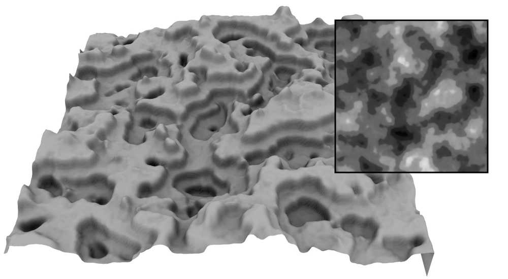
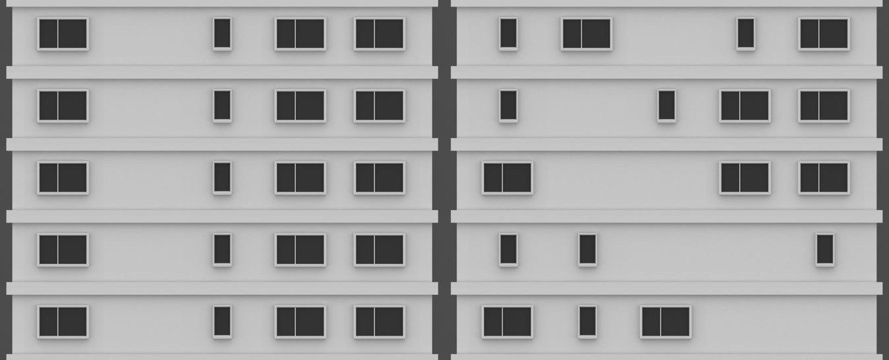

Artificial Intelligence for Games
=================================

   

   https://www.perlego.com/book/1557611/ai-for-games-third-edition-pdf
   [AI for Games, Third Edition (3rd ed.)](https://www.ebooks.com/en-us/book/209642452/ai-for-games-third-edition/ian-millington/)
   [Artificial Intelligence and Games](https://gameaibook.org/book.pdf)

    AI for Games
    THIRD EDITION
    Ian Millington

    CRC Press
    Taylor & Francis Group
    6000 Broken Sound Parkway NW, Suite 300
    Boca Raton, FL 33487-2742

    © 2019 by Taylor & Francis Group, LLC
    CRC Press is an imprint of Taylor & Francis Group, an Informa business

    No claim to original U.S. Government works

    Printed on acid-free paper
    Version Date: 20190221

   International Standard Book Number-13: 978-1-138-48397-2 (Hardback)

   This book contains information obtained from authentic and highly regarded sources. Reasonable efforts have been made to publish
   reliable data and information, but the author and publisher cannot assume responsibility for the validity of all materials or the
   consequences of their use. The authors and publishers have attempted to trace the copyright holders of all material reproduced in
   this publication and apologize to copyright holders if permission to publish in this form has not been obtained. If any copyright
   material has not been acknowledged please write and let us know so we may rectify in any future reprint.

   Except as permitted under U.S. Copyright Law, no part of this book may be reprinted, reproduced, transmitted, or utilized in any
   form by any electronic, mechanical, or other means, now known or hereafter invented, including photocopying, microfilming, and
   recording, or in any information storage or retrieval system, without written permission from the publishers.

   For permission to photocopy or use material electronically from this work, please access www.copyright.com (http://www.
   copyright.com/) or contact the Copyright Clearance Center, Inc. (CCC), 222 Rosewood Drive, Danvers, MA 01923, 978-750-8400.
   CCC is a not-for-profit organization that provides licenses and registration for a variety of users. For organizations that have been
   granted a photocopy license by the CCC, a separate system of payment has been arranged.

   Trademark Notice: Product or corporate names may be trademarks or registered trademarks, and are used only for identifica-
   tion and explanation without intent to infringe.

   Visit the Taylor & Francis Web site at http://www.taylorandfrancis.com
   and the CRC Press Web site at http://www.crcpress.com

    ---------------------------------------------------------------------------
                  Library of Congress Cataloging-in-Publication Data
    ---------------------------------------------------------------------------
    Names: Millington, Ian, author.
    Title: AI for games / Ian Millington.
    Other titles: AI for games
    Description: Third edition. | Boca Raton : Taylor & Francis, a CRC title,
    part of the Taylor & Francis imprint, a member of the Taylor & Francis
    Group, the academic division of T&F Informa, plc, [2019] | Includes
    bibliographical references.
    Identifiers: LCCN 2018041305 | ISBN 9781138483972 (hardback : acid-free paper)
    Subjects: LCSH: Computer games--Programming. | Computer animation. |
    Artificial intelligence.
    Classification: LCC QA76.76.C672 M549 2019 | DDC 794.8/1525--dc23
    LC record available at https://lccn.loc.gov/2018041305
    ---------------------------------------------------------------------------

      for Daniel
      my favorite game designer


CONTENTS At a Glance
====================

   [PART I - AI and Games](#P0001)
   [Chapter 1 Introduction](#P0003)
   [Chapter 2 Game AI](#P0021)

   [PART II - Techniques](#P0039)
   [Chapter 3 Movement](#P0041)
   [Chapter 4 Pathfinding](#P0195)
   [Chapter 5 Decision Making](#P0297)
   [Chapter 6 Tactical And Strategic AI](#P0485)
   [Chapter 7 Learning](#P0575)
   [Chapter 8 Procedural Content Generation](#P0669)
   [Chapter 9 Board Games](#P0741)

   [PART III - Supporting Technologies](#P0801)
   [Chapter 10 Execution Management](#P0803)
   [Chapter 11 World Interfacing](#P0835)
   [Chapter 12 Tools And Content Creation](#P0875)
   [Chapter 13 Programming Game AI](#P0901)

   [PART IV - Designing Game AI](#P0927)
   [Chapter 14 Designing Game AI](#P0929)
   [Chapter 15 AI-Based Game Genres](#P0959)


CONTENTS
========


   [PART I - AI and Games](#P0001)

   [Chapter 1 Introduction](#P0003)
   [1.1 What Is AI?](#P0004)
      ○  [1.1.1 Academic AI](#P0005)
      ○  [1.1.2 Game AI](#P0008)
   [1.2 Model of Game AI](#P0010)
      ○  [1.2.1 Movement](#P0011)
      ○  [1.2.2 Decision Making](#P0011)
      ○  [1.2.3 Strategy](#P0012)
      ○  [1.2.4 Infrastructure](#P0012)
      ○  [1.2.5 Agent-Based AI](#P0013)
      ○  [1.2.6 In the Book](#P0013)
   [1.3 Algorithms and Data Structures](#P0014)
      ○  [1.3.1 Algorithms](#P0014)
      ○  [1.3.2 Representations](#P0017)
      ○  [1.3.3 Implementation](#P0018)
   [1.4 Layout of the Book](#P0018)

   [Chapter 2 Game AI](#P0021)
   [2.1 The Complexity Fallacy](#P0021)
      ○  [2.1.1 When Simple Things Look Good](#P0021)
      ○  [2.1.2 When Complex Things Look Bad](#P0022)
      ○  [2.1.3 The Perception Window](#P0023)
      ○  [2.1.4 Changes of Behavior](#P0024)
   [2.2 The Kind of AI in Games](#P0024)
      ○  [2.2.1 Hacks](#P0025)
      ○  [2.2.2 Heuristics](#P0026)
      ○  [2.2.3 Algorithms](#P0027)
   [2.3 Speed and Memory Constraints](#P0028)
      ○  [2.3.1 Processor Issues](#P0028)
      ○  [2.3.2 Memory Concerns](#P0030)
      ○  [2.3.3 Platforms](#P0032)
   [2.4 The AI Engine](#P0035)
      ○  [2.4.1 Structure of an AI Engine](#P0035)
      ○  [2.4.2 Tool Concerns](#P0037)
      ○  [2.4.3 Putting It All Together](#P0037)

   [PART II - Techniques](#P0039)

   [Chapter 3 Movement](#P0041)
   [3.1 The Basics of Movement Algorithms](#P0042)
      ○  [3.1.1 Two-Dimensional Movement](#P0043)
      ○  [3.1.2 Statics](#P0044)
      ○  [3.1.3 Kinematics](#P0047)
   [3.2 Kinematic Movement Algorithms](#P0051)
      ○  [3.2.1 Seek](#P0051)
      ○  [3.2.2 Wandering](#P0054)
   [3.3 Steering Behaviors](#P0056)
      ○  [3.3.1 Steering Basics](#P0056)
      ○  [3.3.2 Variable Matching](#P0057)
      ○  [3.3.3 Seek and Flee](#P0058)
      ○  [3.3.4 Arrive](#P0060)
      ○  [3.3.5 Align](#P0063)
      ○  [3.3.6 Velocity Matching](#P0067)
      ○  [3.3.7 Delegated Behaviors](#P0068)
      ○  [3.3.8 Pursue and Evade](#P0068)
      ○  [3.3.9 Face](#P0072)
      ○  [3.3.10 Looking Where You’re Going](#P0072)
      ○  [3.3.11 Wander](#P0073)
      ○  [3.3.12 Path Following](#P0076)
      ○  [3.3.13 Separation](#P0082)
      ○  [3.3.14 Collision Avoidance](#P0085)
      ○  [3.3.15 Obstacle and Wall Avoidance](#P0090)
      ○  [3.3.16 Summary](#P0095)
   [3.4 Combining Steering Behaviors](#P0095)
      ○  [3.4.1 Blending and Arbitration](#P0096)
      ○  [3.4.2 Weighted Blending](#P0096)
      ○  [3.4.3 Priorities](#P0103)
      ○  [3.4.4 Cooperative Arbitration](#P0106)
      ○  [3.4.5 Steering Pipeline](#P0108)
   [3.5 Predicting Physics](#P0120)
      ○  [3.5.1 Aiming and Shooting](#P0120)
      ○  [3.5.2 Projectile Trajectory](#P0121)
      ○  [3.5.3 The Firing Solution](#P0123)
      ○  [3.5.4 Projectiles with Drag](#P0126)
      ○  [3.5.5 Iterative Targeting](#P0128)
   [3.6 Jumping](#P0133)
      ○  [3.6.1 Jump Points](#P0134)
      ○  [3.6.2 Landing Pads](#P0138)
      ○  [3.6.3 Hole Fillers](#P0142)
   [3.7 Coordinated Movement](#P0143)
      ○  [3.7.1 Fixed Formations](#P0144)
      ○  [3.7.2 Scalable Formations](#P0145)
      ○  [3.7.3 Emergent Formations](#P0146)
      ○  [3.7.4 Two-Level Formation Steering](#P0147)
      ○  [3.7.5 Implementation](#P0151)
      ○  [3.7.6 Extending to More Than Two Levels](#P0156)
      ○  [3.7.7 Slot Roles and Better Assignment](#P0158)
      ○  [3.7.8 Slot Assignment](#P0160)
      ○  [3.7.9 Dynamic Slots and Plays](#P0164)
      ○  [3.7.10 Tactical Movement](#P0166)
   [3.8 Motor Control](#P0170)
      ○  [3.8.1 Output Filtering](#P0171)
      ○  [3.8.2 Capability-Sensitive Steering](#P0173)
      ○  [3.8.3 Common Actuation Properties](#P0174)
   [3.9 Movement in the Third Dimension](#P0177)
      ○  [3.9.1 Rotation in Three Dimensions](#P0178)
      ○  [3.9.2 Converting Steering Behaviors to Three Dimensions](#P0179)
      ○  [3.9.3 Align](#P0180)
      ○  [3.9.4 Align to Vector](#P0181)
      ○  [3.9.5 Face](#P0182)
      ○  [3.9.6 Look Where You’re Going](#P0185)
      ○  [3.9.7 Wander](#P0185)
      ○  [3.9.8 Faking Rotation Axes](#P0187)

   [Chapter 4 Pathfinding](#P0195)
   [4.1 The Pathfinding Graph](#P0196)
      ○  [4.1.1 Graphs](#P0197)
      ○  [4.1.2 Weighted Graphs](#P0198)
      ○  [4.1.3 Directed Weighted Graphs](#P0200)
      ○  [4.1.4 Terminology](#P0202)
      ○  [4.1.5 Representation](#P0202)
   [4.2 Dijkstra](#P0203)
      ○  [4.2.1 The Problem](#P0203)
      ○  [4.2.2 The Algorithm](#P0204)
      ○  [4.2.3 Pseudo-Code](#P0209)
      ○  [4.2.4 Data Structures and Interfaces](#P0211)
      ○  [4.2.5 Performance of Dijkstra](#P0213)
      ○  [4.2.6 Weaknesses](#P0213)
   [4.3 A*](#P0215)
      ○  [4.3.1 The Problem](#P0215)
      ○  [4.3.2 The Algorithm](#P0215)
      ○  [4.3.3 Pseudo-Code](#P0219)
      ○  [4.3.4 Data Structures and Interfaces](#P0222)
      ○  [4.3.5 Implementation Notes](#P0227)
      ○  [4.3.6 Algorithm Performance](#P0227)
      ○  [4.3.7 Node Array A*](#P0228)
      ○  [4.3.8 Choosing a Heuristic](#P0230)
   [4.4 World Representations](#P0237)
      ○  [4.4.1 Tile Graphs](#P0239)
      ○  [4.4.2 Dirichlet Domains](#P0242)
      ○  [4.4.3 Points of Visibility](#P0244)
      ○  [4.4.4 Navigation Meshes](#P0247)
      ○  [4.4.5 Non-Translational Problems](#P0252)
      ○  [4.4.6 Cost Functions](#P0252)
      ○  [4.4.7 Path Smoothing](#P0253)
   [4.5 Improving on A*](#P0257)
   [4.6 Hierarchical Pathfinding](#P0257)
      ○  [4.6.1 The Hierarchical Pathfinding Graph](#P0258)
      ○  [4.6.2 Pathfinding on the Hierarchical Graph](#P0261)
      ○  [4.6.3 Hierarchical Pathfinding on Exclusions](#P0264)
      ○  [4.6.4 Strange Effects of Hierarchies on Pathfinding](#P0265)
      ○  [4.6.5 Instanced Geometry](#P0267)
   [4.7 Other Ideas in Pathfinding](#P0274)
      ○  [4.7.1 Open Goal Pathfinding](#P0274)
      ○  [4.7.2 Dynamic Pathfinding](#P0274)
      ○  [4.7.3 Other Kinds of Information Reuse](#P0275)
      ○  [4.7.4 Low Memory Algorithms](#P0275)
      ○  [4.7.5 Interruptible Pathfinding](#P0277)
      ○  [4.7.6 Pooling Planners](#P0277)
   [4.8 Continuous Time Pathfinding](#P0278)
      ○  [4.8.1 The Problem](#P0279)
      ○  [4.8.2 The Algorithm](#P0280)
      ○  [4.8.3 Implementation Notes](#P0284)
      ○  [4.8.4 Performance](#P0284)
      ○  [4.8.5 Weaknesses](#P0285)
   [4.9 Movement Planning](#P0285)
      ○  [4.9.1 Animations](#P0285)
      ○  [4.9.2 Movement Planning](#P0287)
      ○  [4.9.3 Example](#P0289)
      ○  [4.9.4 Footfalls](#P0291)

   [Chapter 5 Decision Making](#P0297)
   [5.1 Overview of Decision Making](#P0298)
   [5.2 Decision Trees](#P0299)
      ○  [5.2.1 The Problem](#P0300)
      ○  [5.2.2 The Algorithm](#P0300)
      ○  [5.2.3 Pseudo-Code](#P0305)
      ○  [5.2.4 Knowledge Representation](#P0307)
      ○  [5.2.5 Implementation Notes](#P0308)
      ○  [5.2.6 Performance of Decision Trees](#P0308)
      ○  [5.2.7 Balancing the Tree](#P0309)
      ○  [5.2.8 Beyond the Tree](#P0310)
      ○  [5.2.9 Random Decision Trees](#P0311)
   [5.3 State Machines](#P0314)
      ○  [5.3.1 The Problem](#P0316)
      ○  [5.3.2 The Algorithm](#P0316)
      ○  [5.3.3 Pseudo-Code](#P0316)
      ○  [5.3.4 Data Structures and Interfaces](#P0317)
      ○  [5.3.5 Performance](#P0320)
      ○  [5.3.6 Implementation Notes](#P0320)
      ○  [5.3.7 Hard-Coded FSM](#P0320)
      ○  [5.3.8 Hierarchical State Machines](#P0323)
      ○  [5.3.9 Combining Decision Trees and State Machines](#P0335)
   [5.4 Behavior Trees](#P0338)
      ○  [5.4.1 Implementing Behavior Trees](#P0345)
      ○  [5.4.2 Pseudo-Code](#P0345)
      ○  [5.4.3 Decorators](#P0349)
      ○  [5.4.4 Concurrency and Timing](#P0355)
      ○  [5.4.5 Adding Data to Behavior Trees](#P0364)
      ○  [5.4.6 Reusing Trees](#P0369)
      ○  [5.4.7 Limitations of Behavior Trees](#P0373)
   [5.5 Fuzzy Logic](#P0374)
      ○  [5.5.1 A Warning](#P0375)
      ○  [5.5.2 Introduction to Fuzzy Logic](#P0375)
      ○  [5.5.3 Fuzzy Logic Decision Making](#P0385)
      ○  [5.5.4 Fuzzy State Machines](#P0394)
   [5.6 Markov Systems](#P0399)
      ○  [5.6.1 Markov Processes](#P0400)
      ○  [5.6.2 Markov State Machine](#P0402)
   [5.7 Goal-Oriented Behavior](#P0405)
      ○  [5.7.1 Goal-Oriented Behavior](#P0406)
      ○  [5.7.2 Simple Selection](#P0408)
      ○  [5.7.3 Overall Utility](#P0410)
      ○  [5.7.4 Timing](#P0412)
      ○  [5.7.5 Overall Utility GOAP](#P0416)
      ○  [5.7.6 GOAP with IDA*](#P0422)
      ○  [5.7.7 Smelly GOB](#P0429)
   [5.8 Rule-Based Systems](#P0431)
      ○  [5.8.1 The Problem](#P0431)
      ○  [5.8.2 The Algorithm](#P0436)
      ○  [5.8.3 Pseudo-Code](#P0437)
      ○  [5.8.4 Data Structures and Interfaces](#P0438)
      ○  [5.8.5 Rule Arbitration](#P0444)
      ○  [5.8.6 Unification](#P0446)
      ○  [5.8.7 Rete](#P0448)
      ○  [5.8.8 Extensions](#P0457)
      ○  [5.8.9 Where Next](#P0461)
   [5.9 Blackboard Architectures](#P0461)
      ○  [5.9.1 The Problem](#P0462)
      ○  [5.9.2 The Algorithm](#P0462)
      ○  [5.9.3 Pseudo-Code](#P0464)
      ○  [5.9.4 Data Structures and Interfaces](#P0464)
      ○  [5.9.5 Performance](#P0467)
      ○  [5.9.6 Other Things Are Blackboard Systems](#P0467)
   [5.10 Action Execution](#P0469)
      ○  [5.10.1 Types of Action](#P0469)
      ○  [5.10.2 The Algorithm](#P0474)
      ○  [5.10.3 Pseudo-Code](#P0475)
      ○  [5.10.4 Data Structures and Interfaces](#P0476)
      ○  [5.10.5 Implementation Notes](#P0478)
      ○  [5.10.6 Performance](#P0479)
      ○  [5.10.7 Putting It All Together](#P0479)

   [Chapter 6 Tactical And Strategic AI](#P0485)
   [6.1 Waypoint Tactics](#P0486)
      ○  [6.1.1 Tactical Locations](#P0486)
      ○  [6.1.2 Using Tactical Locations](#P0496)
      ○  [6.1.3 Generating the Tactical Properties of a Waypoint](#P0500)
      ○  [6.1.4 Automatically Generating the Waypoints](#P0506)
      ○  [6.1.5 The Condensation Algorithm](#P0507)
   [6.2 Tactical Analyses](#P0511)
      ○  [6.2.1 Representing the Game Level](#P0512)
      ○  [6.2.2 Simple Influence Maps](#P0512)
      ○  [6.2.3 Terrain Analysis](#P0519)
      ○  [6.2.4 Learning with Tactical Analyses](#P0521)
      ○  [6.2.5 A Structure for Tactical Analyses](#P0523)
      ○  [6.2.6 Map Flooding](#P0528)
      ○  [6.2.7 Convolution Filters](#P0532)
      ○  [6.2.8 Cellular Automata](#P0542)
   [6.3 Tactical Pathfinding](#P0548)
      ○  [6.3.1 The Cost Function](#P0548)
      ○  [6.3.2 Tactic Weights and Concern Blending](#P0549)
      ○  [6.3.3 Modifying the Pathfinding Heuristic](#P0551)
      ○  [6.3.4 Tactical Graphs for Pathfinding](#P0552)
      ○  [6.3.5 Using Tactical Waypoints](#P0553)
   [6.4 Coordinated Action](#P0554)
      ○  [6.4.1 Multi-Tier AI](#P0554)
      ○  [6.4.2 Emergent Cooperation](#P0561)
      ○  [6.4.3 Scripting Group Actions](#P0564)
      ○  [6.4.4 Military Tactics](#P0568)

   [Chapter 7 Learning](#P0575)
   [7.1 Learning Basics](#P0576)
      ○  [7.1.1 Online or Offline Learning](#P0576)
      ○  [7.1.2 Intra-Behavior Learning](#P0577)
      ○  [7.1.3 Inter-Behavior Learning](#P0577)
      ○  [7.1.4 A Warning](#P0577)
      ○  [7.1.5 Over-Learning](#P0578)
      ○  [7.1.6 The Zoo of Learning Algorithms](#P0579)
      ○  [7.1.7 The Balance of Effort](#P0579)
   [7.2 Parameter Modification](#P0579)
      ○  [7.2.1 The Parameter Landscape](#P0580)
      ○  [7.2.2 Hill Climbing](#P0581)
      ○  [7.2.3 Extensions to Basic Hill Climbing](#P0584)
      ○  [7.2.4 Annealing](#P0588)
   [7.3 Action Prediction](#P0592)
      ○  [7.3.1 Left or Right](#P0592)
      ○  [7.3.2 Raw Probability](#P0593)
      ○  [7.3.3 String Matching](#P0593)
      ○  [7.3.4 N-Grams](#P0593)
      ○  [7.3.5 Window Size](#P0597)
      ○  [7.3.6 Hierarchical N-Grams](#P0599)
      ○  [7.3.7 Application in Combat](#P0602)
   [7.4 Decision Learning](#P0602)
      ○  [7.4.1 The Structure of Decision Learning](#P0602)
      ○  [7.4.2 What Should You Learn?](#P0603)
      ○  [7.4.3 Four Techniques](#P0604)
   [7.5 Naive Bayes Classifiers](#P0604)
      ○  [7.5.1 Pseudo-Code](#P0607)
      ○  [7.5.2 Implementation Notes](#P0609)
   [7.6 Decision Tree Learning](#P0609)
      ○  [7.6.1 ID3](#P0610)
      ○  [7.6.2 ID3 with Continuous Attributes](#P0618)
      ○  [7.6.3 Incremental Decision Tree Learning](#P0622)
   [7.7 Reinforcement Learning](#P0627)
      ○  [7.7.1 The Problem](#P0627)
      ○  [7.7.2 The Algorithm](#P0628)
      ○  [7.7.3 Pseudo-Code](#P0631)
      ○  [7.7.4 Data Structures and Interfaces](#P0632)
      ○  [7.7.5 Implementation Notes](#P0633)
      ○  [7.7.6 Performance](#P0633)
      ○  [7.7.7 Tailoring Parameters](#P0633)
      ○  [7.7.8 Weaknesses and Realistic Applications](#P0637)
      ○  [7.7.9 Other Ideas in Reinforcement Learning](#P0640)
   [7.8 Artificial Neural Networks](#P0642)
      ○  [7.8.1 Overview](#P0643)
      ○  [7.8.2 The Problem](#P0646)
      ○  [7.8.3 The Algorithm](#P0647)
      ○  [7.8.4 Pseudo-Code](#P0651)
      ○  [7.8.5 Data Structures and Interfaces](#P0653)
      ○  [7.8.6 Implementation Caveats](#P0655)
      ○  [7.8.7 Performance](#P0655)
      ○  [7.8.8 Other Approaches](#P0655)
   [7.9 Deep Learning](#P0660)
      ○  [7.9.1 What is Deep Learning?](#P0660)
      ○  [7.9.2 Data](#P0661)

   [Chapter 8 Procedural Content Generation](#P0669)
   [8.1 Pseudorandom Numbers](#P0670)
      ○  [8.1.1 Numeric Mixing and Game Seeds](#P0671)
      ○  [8.1.2 Halton Sequence](#P0672)
      ○  [8.1.3 Phyllotaxic Angles](#P0675)
      ○  [8.1.4 Poisson Disk](#P0676)
   [8.2 Lindenmayer Systems](#P0680)
      ○  [8.2.1 Simple L-systems](#P0680)
      ○  [8.2.2 Adding Randomness to L-systems](#P0684)
      ○  [8.2.3 Stage-Specific Rules](#P0686)
   [8.3 Landscape Generation](#P0687)
      ○  [8.3.1 Modifiers and Height-Maps](#P0688)
      ○  [8.3.2 Noise](#P0689)
      ○  [8.3.3 Perlin Noise](#P0689)
      ○  [8.3.4 Faults](#P0692)
      ○  [8.3.5 Thermal Erosion](#P0694)
      ○  [8.3.6 Hydraulic Erosion](#P0696)
      ○  [8.3.7 Altitude Filtering](#P0701)
   [8.4 Dungeons and Maze Generation](#P0705)
      ○  [8.4.1 Mazes by Depth First Backtracking](#P0705)
      ○  [8.4.2 Minimum Spanning Tree Algorithms](#P0716)
      ○  [8.4.3 Recursive Subdivision](#P0721)
      ○  [8.4.4 Generate and Test](#P0727)
   [8.5 Shape Grammars](#P0727)
      ○  [8.5.1 Running the Grammar](#P0730)
      ○  [8.5.2 Planning](#P0733)

   [Chapter 9 Board Games](#P0741)
   [9.1 Game Theory](#P0742)
      ○  [9.1.1 Types of Games](#P0742)
      ○  [9.1.2 The Game Tree](#P0744)
   [9.2 Minimaxing](#P0747)
      ○  [9.2.1 The Static Evaluation Function](#P0747)
      ○  [9.2.2 Minimaxing](#P0749)
      ○  [9.2.3 The Minimaxing Algorithm](#P0750)
      ○  [9.2.4 Negamaxing](#P0753)
      ○  [9.2.5 AB Pruning](#P0755)
      ○  [9.2.6 The AB Search Window](#P0759)
      ○  [9.2.7 Negascout](#P0761)
   [9.3 Transposition Tables and Memory](#P0764)
      ○  [9.3.1 Hashing Game States](#P0764)
      ○  [9.3.2 What to Store in the Table](#P0767)
      ○  [9.3.3 Hash Table Implementation](#P0768)
      ○  [9.3.4 Replacement Strategies](#P0769)
      ○  [9.3.5 A Complete Transposition Table](#P0770)
      ○  [9.3.6 Transposition Table Issues](#P0771)
      ○  [9.3.7 Using Opponent’s Thinking Time](#P0771)
   [9.4 Memory-Enhanced Test Algorithms](#P0772)
      ○  [9.4.1 Implementing Test](#P0772)
      ○  [9.4.2 The MTD Algorithm](#P0774)
      ○  [9.4.3 Pseudo-Code](#P0775)
   [9.5 Monte Carlo Tree Search (MCTS)](#P0776)
      ○  [9.5.1 Pure Monte Carlo Tree Search](#P0776)
      ○  [9.5.2 Adding Knowledge](#P0782)
   [9.6 Opening Books and Other Set Plays](#P0783)
      ○  [9.6.1 Implementing an Opening Book](#P0783)
      ○  [9.6.2 Learning for Opening Books](#P0784)
      ○  [9.6.3 Set Play Books](#P0785)
   [9.7 Further Optimizations](#P0785)
      ○  [9.7.1 Iterative Deepening](#P0786)
      ○  [9.7.2 Variable Depth Approaches](#P0787)
   [9.8 Game Knowledge](#P0788)
      ○  [9.8.1 Creating a Static Evaluation Function](#P0791)
      ○  [9.8.2 Learning the Static Evaluation Function](#P0794)
   [9.9 Turn-Based Strategy Games](#P0797)
      ○  [9.9.1 Impossible Tree Size](#P0798)
      ○  [9.9.2 Real-Time AI in a Turn-Based Game](#P0799)

   [PART III - Supporting Technologies](#P0801)

   [Chapter 10 Execution Management](#P0803)
   [10.1 Scheduling](#P0804)
      ○  [10.1.1 The Scheduler](#P0804)
      ○  [10.1.2 Interruptible Processes](#P0811)
      ○  [10.1.3 Load-Balancing Scheduler](#P0814)
      ○  [10.1.4 Hierarchical Scheduling](#P0816)
      ○  [10.1.5 Priority Scheduling](#P0818)
   [10.2 Anytime Algorithms](#P0820)
   [10.3 Level of Detail](#P0821)
      ○  [10.3.1 Graphics Level of Detail](#P0821)
      ○  [10.3.2 AI LOD](#P0822)
      ○  [10.3.3 Scheduling LOD](#P0823)
      ○  [10.3.4 Behavioral LOD](#P0824)
      ○  [10.3.5 Group LOD](#P0829)
      ○  [10.3.6 In Summary](#P0833)

   [Chapter 11 World Interfacing](#P0835)
   [11.1 Communication](#P0836)
      ○  [11.1.1 Polling](#P0836)
      ○  [11.1.2 Events](#P0837)
      ○  [11.1.3 Determining Which Approach to Use](#P0838)
   [11.2 Event Managers](#P0838)
      ○  [11.2.1 Implementation](#P0841)
      ○  [11.2.2 Event Casting](#P0843)
      ○  [11.2.3 Inter-Agent Communication](#P0846)
   [11.3 Polling Stations](#P0846)
      ○  [11.3.1 Pseudo-Code](#P0847)
      ○  [11.3.2 Performance](#P0848)
      ○  [11.3.3 Implementation Notes](#P0848)
      ○  [11.3.4 Abstract Polling](#P0848)
   [11.4 Sense Management](#P0849)
      ○  [11.4.1 Faking It](#P0850)
      ○  [11.4.2 What Do We Know?](#P0851)
      ○  [11.4.3 Sensory Modalities](#P0852)
      ○  [11.4.4 Region Sense Manager](#P0857)
      ○  [11.4.5 Finite Element Model Sense Manager](#P0865)

   [Chapter 12 Tools And Content Creation](#P0875)
      ○  [12.0.1 Toolchains Limit AI](#P0876)
      ○  [12.0.2 Where AI Knowledge Comes From](#P0876)
   [12.1 Knowledge for Pathfinding and Waypoints](#P0877)
      ○  [12.1.1 Manually Creating Region Data](#P0877)
      ○  [12.1.2 Automatic Graph Creation](#P0880)
      ○  [12.1.3 Geometric Analysis](#P0880)
      ○  [12.1.4 Data Mining](#P0884)
   [12.2 Knowledge for Movement](#P0886)
      ○  [12.2.1 Obstacles](#P0886)
      ○  [12.2.2 High-Level Staging](#P0888)
   [12.3 Knowledge for Decision Making](#P0889)
      ○  [12.3.1 Object Types](#P0889)
      ○  [12.3.2 Concrete Actions](#P0889)
   [12.4 The Toolchain](#P0890)
      ○  [12.4.1 Integrated Game Engines](#P0890)
      ○  [12.4.2 Custom Data-Driven Editors](#P0893)
      ○  [12.4.3 AI Design Tools](#P0894)
      ○  [12.4.4 Remote Debugging](#P0895)
      ○  [12.4.5 Plug-Ins](#P0896)

   [Chapter 13 Programming Game AI](#P0901)
   [13.1 Implementation Language](#P0902)
      ○  [13.1.1 C++](#P0903)
      ○  [13.1.2 C#](#P0904)
      ○  [13.1.3 Swift](#P0905)
      ○  [13.1.4 Java](#P0906)
      ○  [13.1.5 JavaScript](#P0908)
   [13.2 Scripted AI](#P0909)
      ○  [13.2.1 What Is Scripted AI?](#P0910)
      ○  [13.2.2 What Makes a Good Scripting Language?](#P0911)
      ○  [13.2.3 Embedding](#P0913)
      ○  [13.2.4 Choosing an Open Source Language](#P0913)
      ○  [13.2.5 A Language Selection](#P0914)
   [13.3 Creating a Language](#P0919)
      ○  [13.3.1 Rolling Your Own](#P0921)

   [PART IV - Designing Game AI](#P0927)

   [Chapter 14 Designing Game AI](#P0929)
   [14.1 The Design](#P0929)
      ○  [14.1.1 Example](#P0931)
      ○  [14.1.2 Evaluating the Behaviors](#P0931)
      ○  [14.1.3 Selecting Techniques](#P0934)
      ○  [14.1.4 The Scope of One Game](#P0936)
   [14.2 Shooters](#P0937)
      ○  [14.2.1 Movement and Firing](#P0937)
      ○  [14.2.2 Decision Making](#P0939)
      ○  [14.2.3 Perception](#P0940)
      ○  [14.2.4 Pathfinding and Tactical AI](#P0941)
      ○  [14.2.5 Shooter-Like Games](#P0942)
      ○  [14.2.6 Melee Combat](#P0943)
   [14.3 Driving](#P0946)
      ○  [14.3.1 Movement](#P0946)
      ○  [14.3.2 Pathfinding and Tactical AI](#P0949)
      ○  [14.3.3 Driving-Like Games](#P0950)
   [14.4 Real-Time Strategy](#P0950)
      ○  [14.4.1 Pathfinding](#P0950)
      ○  [14.4.2 Group Movement](#P0951)
      ○  [14.4.3 Tactical and Strategic AI](#P0952)
      ○  [14.4.4 Decision Making](#P0953)
      ○  [14.4.5 MOBAs](#P0954)
   [14.5 Sports](#P0955)
      ○  [14.5.1 Physics Prediction](#P0956)
      ○  [14.5.2 Playbooks and CONTENT Creation](#P0956)
   [14.6 Turn-Based Strategy Games](#P0956)
      ○  [14.6.1 Timing](#P0957)
      ○  [14.6.2 Helping the Player](#P0958)

   [Chapter 15 AI-Based Game Genres](#P0959)
   [15.1 Teaching Characters](#P0960)
      ○  [15.1.1 Representing Actions](#P0960)
      ○  [15.1.2 Representing the World](#P0961)
      ○  [15.1.3 Learning Mechanism](#P0961)
      ○  [15.1.4 Predictable Mental Models](#P0963)
   [15.2 Flocking and Herding Games](#P0965)
      ○  [15.2.1 Making the Creatures](#P0965)
      ○  [15.2.2 Tuning Steering for Interactivity](#P0965)
      ○  [15.2.3 Steering Behavior Stability](#P0967)
      ○  [15.2.4 Ecosystem Design](#P0967)

   [REFERENCES](#P0971)
   [Books, Periodicals, Papers and Websites](#P0971)
   [Games](#P0976)
   [INDEX](#P0983)


<a id=P0001 href=Ptoc>⋈1</a>

PART I - AI and Games
=====================

<a id=P0003 href=Ptoc>⋈3</a>


Chapter 1 Introduction
======================

   Game development lives in its own technical world. It has its own idioms, skills, and
   challenges. That’s one of the reasons games are so much fun to work on. Each game
   has its own rules, its own aesthetic, its own trade-offs, and the hardware it will run on keeps
   changing. There’s a reasonably good chance you will be the first person to meet and beat a
   new programming challenge.

   Despite numerous efforts to standardize game development, in line with the rest of the
   software industry (efforts that go back at least 25 years), the style of programming in a game
   is still rather unique. There is a focus on speed, but it differs from real-time programming
   for embedded or control applications. There is a focus on clever algorithms, but it doesn’t
   share the same rigor as database server engineering. It draws techniques from a huge range
   of different sources, but almost without exception modifies them beyond resemblance. And,
   to add an extra layer of intrigue, developers make their modifications in different ways, often
   under extreme time pressure, and tailored entirely to the game at hand, leaving algorithms
   unrecognizable from studio to studio or project to project.

   As exciting and challenging as this may be, it makes it difficult for new developers to
   get the information they need. Twenty years ago, it was almost impossible to get hold of
   information about techniques and algorithms that real developers used in their games. There
   was an atmosphere of secrecy, even alchemy, about the coding techniques in top studios. Then
   came the Internet and an ever-growing range of websites, along with books, conferences, and
   periodicals. It is now easier than ever to teach yourself new techniques in game development.

   This book is designed to help you master one element of game development: artificial
   intelligence (AI). There have been many articles published about different aspects of game AI:
   websites on particular techniques, compilations in book form, some introductory texts, and
   plenty of lectures at development conferences. But this book was designed to cover it all, as a
   coherent whole.

<a id=P0004 href=Ptoc>⋈4</a>


   In my career I have developed many AI modules for lots of different genres of games. I
   developed AI middleware tools that have a lot of new research and clever content. I have
   worked on research and development for next-generation AI, and I get to do a lot with some
   very clever technologies. However, throughout this book I tried to resist the temptation to
   pass off how I think it should be done as how it is done. My aim has been to tell it like it is (or
   for those technologies I mention that are still emerging, to tell you how most people agree it
   will be).

   The meat of this book covers a wide range of techniques for game AI. Some of them are
   barely techniques, more like a general approach or development style. Some are full-blown
   algorithms, ready to implement in a reusable way. And others are shallow introductions to
   huge fields that would fill multiple books on their own. In these cases, I’ve tried to give enough
   of an overview for you to understand how and why an approach may be useful (or not).

   This book is intended for a wide range of readers: from hobbyists or students looking
   to get a solid understanding of game AI through to professionals who need a comprehensive
   reference to techniques they may not have used before. I will assume you can program (though
   I will not assume any particular language—see Chapter 13 for a discussion of implementation
   languages), and I will assume you have high-school level mathematical knowledge.

   Before we get into the techniques themselves, this chapter introduces AI, its history, and
   the way it is used. We’ll look at a model of AI to help fit the techniques together, and I’ll give
   some background on how the rest of the book is structured.


1.1 What Is AI?
---------------

   Artificial intelligence is about making computers able to perform the thinking tasks that hu-
   mans and animals are capable of.

   We can program computers to have superhuman abilities in solving many problems:
   arithmetic, sorting, searching, and so on. Some of these problems were originally consid-
   ered AI problems, but as they have been solved in more and more comprehensive ways, they
   have slipped out of the domain of AI developers.

   But there are many things that computers aren’t good at which we find trivial: recognizing
   familiar faces, speaking our own language, deciding what to do next, and being creative. These
   are the domain of AI: trying to work out what kinds of algorithms are needed to display these
   properties.

   Often the dividing line between AI and not-AI is merely difficulty: things we can’t do
   require AI, things we can are tricks and math. It is tempting to get into a discussion of what
   is ‘real’ AI, to try defining ‘intelligence’, ‘consciousness’ or ‘thought’. In my experience, it is an
   impossible task, largely irrelevant to the business of making games.

   In academia, some AI researchers are motivated by those philosophical questions: under-
   standing the nature of thought and the nature of intelligence and building software to model

<a id=P0005 href=Ptoc>⋈5</a>

   how thinking might work. Others are motivated by psychology: understanding the mechan-
   ics of the human brain and mental processes. And yet others are motivated by engineering:
   building algorithms to perform human-like tasks. This threefold distinction is at the heart of
   academic AI, and the different concerns are responsible for different subfields of the subject.
   As games developers, we are practical folks; interested in only the engineering side. We
   build algorithms that make game characters appear human or animal-like. Developers have
   always drawn from academic research, where that research helps them get the job done, and
   ignored the rest.

   It is worth taking a quick overview of the AI work done in academia to get a sense of what
   exists in the subject and what might be worth plagiarizing.


### 1.1.1 Academic AI

   Totell thestory, I will divideacademic AIintothree periods: theearlydays, thesymbolicera,
   and the natural computing and statistical era. This is a gross oversimplification, of course,
   and they all overlap to some extent, but I find it a useful distinction. For a collection of papers
   which give a much more nuanced and fleshed out account, see [38].

   **The Early Days**

   The early days include the time before computers, where philosophy of mind occasionally
   made forays into AI with such questions as: “What produces thought?” “Could you give
   life to an inanimate object?” “What is the difference between a cadaver and the human it
   previously was?” Tangential to this was the popular taste in automata, mechanical robots,
   from the 18th century onward. Intricate clockwork models were created that displayed the
   kind of animated, animal-or human-like behaviors that we now employ game artists to create
   in a modeling package (for an academic history and discussion, see [23], and for an in-depth
   look at two piano playing examples, see [74]).

   In the war effort of the 1940s, the need to break enemy codes [8] and to perform the cal-
   culations required for atomic warfare motivated the development of the first programmable
   computers [46]. Given that these machines were being used to perform calculations that
   would otherwise be done by a person, it was natural for programmers to be interested in AI.
   Several computing pioneers (such as Turing, von Neumann, and Shannon) were also pioneers
   in early AI. Turing, in particular, has become an adopted father to the field, as a result of a
   philosophical paper he published in 1950 [70].

   **The Symbolic Era**

   From the late 1950s through to the early 1980s the main thrust of AI research was “symbolic”
   systems. A symbolic system is one in which the algorithm is divided into two components:
   a set of knowledge (represented as symbols such as words, numbers, sentences, or pictures)
   and a reasoning algorithm that manipulates those symbols to create new combinations that
   hopefully represent problem solutions or new knowledge.

<a id=P0006 href=Ptoc>⋈6</a>


   An expert system, one of the purest expressions of this approach, is among the most fa-
   mous AI techniques. If today all the AI headlines talk about “deep learning,” in the 1980s,
   they name dropped “expert systems.” An expert system has a large database of knowledge
   and it applies a collection of rules to draw conclusions or to discover new things (see Sec-
   tion 5.8). Other symbolic approaches applicable to games include blackboard architectures
   (5.9), pathfinding (Chapter 4), decision trees (Section 5.2) and state machines (Section 5.3).
   These and many more are described in this book.

   A common feature of symbolic systems is a trade-off: when solving a problem the more
   knowledge you have, the less work you need to do in reasoning. Often, reasoning algorithms
   consist of searching: trying different possibilities to get the best result. This leads us to the
   golden rule of AI, that we will see in various forms throughout this book:

   >  Search and knowledge are intrinsically linked. The more knowledge you have,
      the less searching for an answer you need; the more search you can do (i.e., the
      faster you can search), the less knowledge you need.

   It was suggested by researchers Newell and Simon in 1976 that knowledge infused search
   (known as ‘heuristic search’) is the way all intelligent behavior arises [45]. Unfortunately,
   despite its having several solid and important features, this theory has been largely discredited
   as an account of all intelligence. Nevertheless, many people with a recent education in AI are
   not aware that, as an engineering trade-off, knowledge versus search is unavoidable. Recent
   work on the mathematics of problem solving has proved this theoretically [76]. At a practical
   level, AI engineers have always known it.

   **The Natural Computing / Statistical Era**

   Through the 1980s and into the early 1990s, there was an increasing frustration with symbolic
   approaches. The frustration came from various directions.

   From an engineering point of view, the early successes on simple problems didn’t seem to
   scale to more difficult problems. For example: it seemed easy to develop AI that understood
   (or appeared to understand) simple sentences, but developing an understanding of a full hu-
   man languageseemed no nearer. This was compounded by hype: when AI touted as‘the next
   big thing’ failed to live up to its billing, confidence in the whole sector crashed.
   There was also an influential philosophical argument that symbolic approaches weren’t
   biologically plausible. You can’t understand how a human being plans a route by using a
   symbolic route-planning algorithm any more than you can understand how human muscles
   work by studying a forklift truck.


<a id=P0007 href=Ptoc>⋈7</a>

   The effect was a move toward natural computing: techniques inspired by biology or other
   natural systems. These techniques include neural networks, genetic algorithms, and simulated
   annealing.➊ Many natural computing techniques have been around for a long time. Neural
   networks, for example, predate the symbolic era; they were first suggested in 1943 [39].

   But in the 1980s through to the early 2000s they received the bulk of the research effort.
   When I began my PhD in artificial intelligence in the 90s, it was difficult to find research places
   in Expert Systems, for example. I studied genetic algorithms; most of my peers were working
   on neural networks.

   Despite its origin as a correlate to biology, AI research heavily applied mathematics, par-
   ticularly probability and statistics, to understanding and optimizing natural computing tech-
   niques. The ability to handle all the uncertainty and messiness of real-world data, in contrast
   to the clean and rigid bound aries of the symbolic approaches, led to the development of a wide
   range of other probabilistic techniques, such as Bayes nets, support-vector machines (SVMs),
   and Gaussian processes.

   The biggest change in AI in the last decade has not come from a break through in academia.
   We are living in a time when AI is again back in the newspapers: self driving cars, deep fakes,
   world champion Go programs, and home virtual assistants. This is the era of deep learning.
   Though many academic innovations are used, these systems are still fundamentally powered
   by neural networks, now made practical by the increase in computing power.

   **Engineering**

   Though newspaper headlines and high-profile applications have flourished in the last five
   years, AI has been a key technology relevant to solving real-world problems for decades. Nav-
   igation systems in cars, job scheduling in factories, voice recognition and dictation, and large-
   scale search are all more than 20 years old. Google’s search technology, for example, has long
   been underpinned by AI. It is no coincidence that Peter Norvig is both a Director of Research
   at Google and the co-author (along with his former graduate adviser, professor Stuart Russell)
   of the canonical undergraduate textbook for modern academic AI [54].

   When something is hot, it is tempting to assume it is the only thing that matters. When
   natural computing techniques took center stage, there was a tendency to assume that symbolic
   approaches were dead. Similarly, with talk of deep learning everywhere, you might be forgiven
   for thinking that is what should be used.

   But we always come back to the same trade-off: search vs knowledge. Deep learning is the
   ultimate in the compute intensive search, AlphaGo Zero (the third iteration of the AlphaGo
   software, [60]) was given very minimal knowledge of the rules of the game, but extra ordinary
   amounts of processing time to try different strategies and learn the best. On the other hand,
   a character that needs to use a health pack when injured can be told that explicitly:

      IF injured THEN use health pack

   ➊. Though old, a good introduction to Genetic Algorithms can be found in [41], and Simulated Annealing in [34]. In
   their current vogue as Deep Learning, there are many more contemporary resources on neural networks. For a gentle
   and shallow introduction, see [21], for a more comprehensive guide, [18].


<a id=P0008 href=Ptoc>⋈8</a>

   No search required.

   The only way any algorithm can out performan other is either to consume more processing
   power (more search), or to be optimized toward a specific set of problems (more knowledge
   of the problem).

   In practice, engineers work from both sides. A voice recognition program, for example,
   converts the input signals using known formulae into a format where the neural network can
   decode it. The results are then fed through a series of symbolic algorithms that look at words
   from a dictionary and the way words are combined in the language. A statistical algorithm
   optimizing the order of a production line will have the rules about production encoded into
   its structure, so it can’t possibly suggest an illegal timetable: the knowledge is used to reduce
   the amount of search required.

   Unfortunately, games are usually designed to run on consumer hardware. And while AI is
   important, graphics have always taken the majority of the processing power. This seems in no
   danger of changing. For AI designed to run on the device during the game, low computation
   / high knowledge approaches are often the clear winners. And these are very often symbolic:
   approaches pioneered in academia in the 70s and 80s.

   We’ll look at several statistical computing techniques in this book, useful for specific prob-
   lems. But I have enough experience to know that for games they are often unnecessary: the
   same effect can often be achieved better, faster, and with more control using a simpler ap-
   proach. This hasn’t changed significantly since the first edition of this book in 2004. Over-
   whelmingly the AI used in games is still symbolic technology.


### 1.1.2 Game AI

   Pac-Man [140] was the first game many people remember playing with fledgling AI. Up to that
   point there had been Pong clones with opponent-controlled bats (following the ball up and
   down) and countless shooters in the Space Invaders mold. But Pac-Man had definite enemy
   characters that seemed to conspire against you, moved around the level just as you did, and
   made life tough.

   Pac-Man relied on a very simple AI technique: a state machine (which I’ll cover later in
   Chapter 5). Each of the four monsters (later called ghosts after a disastrously flickering port
   to the Atari 2600) occupied one of three states: chasing, scattering (heading for the corners at
   specific time intervals), and frightened (when Pac-Man eats a power up). For each state they
   choose a tile as their target, and turn toward it at each junction. In chase mode, each ghost
   chooses the target according to a slightly different hard-coded rule, giving them their person-
   alities. A complete breakdown of the Pac-Man game mechanics, including the AI algorithms,
   can be found at [49].

   Game AI didn’t change much until the mid-1990s. Most computer-controlled characters
   prior to then were about as sophisticated as a Pac-Man ghost.


<a id=P0009 href=Ptoc>⋈9</a>

   Take a classic like Golden Axe [176] eight years later. Enemy characters stood still (or
   walked back and forward a short distance) until the player got close to them, where upon they
   homed in on the player. Golden Axe had a neat innovation with enemies that would enter a
   running state to rush past the player and then switch back to homing mode, attacking from
   behind. Surrounding the player looks impressive, but the underlying AI is no more complex
   than Pac-Man.

   In the mid-1990s AI began to be a selling point for games. Games like Beneath a Steel
   Sky [174] even mentioned AI on the back of the box. Unfortunately, its much-hyped “Virtual
   Theater” AI system simply allowed characters to walk backward and forward through the
   game—hardly a real advancement.

   Goldeneye 007 [165] probably did the most to show gamers what AI could do to improve
   gameplay. Still relying on characters with a small number of well-defined states, Goldeneye
   added a sense simulation system: characters could see their colleagues and would notice if
   they were killed (see Section 11.4 for details). Sense simulation was the topic of the moment,
   with Thief: The Dark Project [132] and Metal Gear Solid [129] basing their whole game design
   on the technique.

   In the mid-1990s real-time strategy (RTS) games also were beginning to take off. Warcraft
   [85] was one of the first times pathfinding (Chapter 4) was widely noticed in action (though it
   had been used several times before). AI researchers were working with emotional models of
   soldiers in a military battlefield simulation in 1998 when they saw Warhammer: Dark Omen
   [141] doing the same thing. It was also one of the first times people saw robust formation
   motion (Section 3.7) in action.

   Halo [91] introduced decision trees (Section 5.2), now a standard method for characters to
   decide what to do. F.E.A.R. [144] used goal oriented action planning (GOAP, see Section 5.7.6)
   for the same purpose. With the success of AlphaGo, deep learning (Section 7.9) has become
   a hot topic, though it is still only practicable off-line.

   Some games are designed around the AI. Creatures [101] did this in 1997, but games like
   The Sims [136] and its sequels, or Black & White [131] have carried on the torch. Creatures still
   has one of the most complex AI systems seen in a game, with a simulated hormone system and
   a neural network-based brain for each creature (Steve Grand, the game’s designer, describes
   the technology he created in [19]).

   Games like Half Life [193] and The Last of Us [149] use AI controlled characters to collab-
   orate with the player, meaning they are on screen for much longer, and any faults are much
   more noticeable.

   First person shooters and RTS games have been subjected to significant academic research
   (there is an annual competition for Starcraft AI, for example). RTS games incorporate AI
   techniques used in military simulation (to the extent that Full Spectrum Warrior [157] started
   life as a military training simulator).

   Sports games and driving games in particular have their own AI challenges, some of which
   remain largely unsolved (dynamically calculating the fastest way around a race track, for ex-
   ample, would also be helpful to motorsport teams), while role-playing games (RPGs) with
   complex character interactions still implemented as conversation trees feel overdue for some-
   thing better (interesting and sophisticated conversation AI has been implemented in games
   such as Façade [161] and Blood and Laurels [130], the one released game using the short lived
   Versu game engine).

<a id=P0010 href=Ptoc>⋈10</a>

   -----------------------------------------------------------------------------
                    AI gets given processor time
                     ┌────────────────────────┐
     AI gets its   ┌─┤  Execution management  ├─┐
     information   │ └────────────────────────┘ │
    ┌───────────┐  │                            │ ┌────────────────────┐
    │           │  │┌── Group AI ──────────────┐│ │  Content creation  │
    │           │  ││╔════════════════════════╗││ └────────────────────┘
    │           ┼──┼┼►  Strategy              ║││ ┌────────────────────┐
    │           │  ││╚═══════════╦════════════╝││ │  Scripting         │
    │   World   │  │└────────────┼─────────────┘│ └────────────────────┘
    │ interface │  │┌── Character│AI ──────────┐│  AI has implications for
    │           │  ││╔═══════════▼════════════╗││  related technologies
    │           │  ││║  Decision making       ║││
    │           ┼──┼┼►────────────────────────║││
    │           │  ││║  Movement              ║││
    └───────────┘  ││╚════════════╦═══════════╝││
                   │└─────────────┼────────────┘│
                   └──────────────┼─────────────┘
                     ┌───────────┐▼┌──────────┐
                     │ Animation │ │ Physics  │
                     └───────────┘ └──────────┘
                 AI gets turned into on-screen action
   -----------------------------------------------------------------------------

   Figure 1.1: The AI model

   We have come a long way, certainly. But, though we have a massive diversity of AI in
   games, many genres are still using the simple AI of 1979 because that’s all they need.

   The AI in most games addresses three basic needs: the ability to move characters, the
   ability to make decisions about where to move, and the ability to think tactically or strategi-
   cally. Even though we have a broad range of approaches, they all fulfill the same three basic
   requirements.


1.2 Model Of Game AI
--------------------

   In this book there is a vast zoo of algorithms and techniques. It would be easy to get lost, so
   it’s important to understand how the bits fit together.

   To help, I’ve used a consistent structure to contextualize the AI used in a game. This isn’t
   the only possible model, and it isn’t the only model that would benefit from the techniques in
   this book. But to make discussions clearer, I will show how each technique fits into a general
   structure for making intelligent game characters.

   Figure 1.1 illustrates this model. It splits the AI task into three sections: movement, deci-
   sion making, and strategy. The first two sections contain algorithms that work on a
   character-by-character basis, and the last section operates on a team or side. Around these three AI
   elements is a whole set of additional infrastructure.


<a id=P0011 href=Ptoc>⋈11</a>

   Not all game applications require all levels of AI. Board games like Chess or Risk require
   only the strategy level; the characters in the game (if they can even be called that) don’t make
   their own decisions and don’t need to worry about how to move.

   On the other hand, there is no strategy at all in many games. Non-player characters in a
   platform game, such as Hollow Knight [183], or Super Mario Bros. [152] are purely reactive,
   making their own simple decisions and acting on them. There is no coordination that makes
   sure the enemy characters do the best job of thwarting the player.


### 1.2.1 Movement

   Movement refers to algorithms that turn decisions into some kind of motion. When a nenemy
   character without a projectile attack needs to attack the player in Super Mario Sunshine [154],
   it first heads directly for the player. When it is close enough, it can actually do the attacking.
   The decision to attack is carried out by a set of movement algorithms that home in on the
   player’s location. Only then can the attack animation be played and the player’s health be
   depleted.

   Movement algorithms can be more complex than simply homing in. A character may
   need to avoid obstacles on the way or even work their way through a series of rooms. A guard
   in some levels of Splinter Cell [189] will respond to the appearance of the player by raising
   an alarm. This may require navigating to the nearest wall-mounted alarm point, which can
   be a long distance away and may involve complex navigation around obstacles or through
   corridors.

   Lots of actions are carried out using animation directly. If a Sim, in The Sims, is sitting
   by the table with food in front of her and wants to carry out an eating action, then the eating
   animation is simply played. Once the AI has decided that the character should eat, no more AI
   is needed (the animation technology used is not covered in this book). If the same character
   is by the back door when she wants to eat, however, movement AI needs to guide her to the
   chair (or to some other nearby source of food).


### 1.2.2 Decision Making

   Decision making involves a character working out what to do next. Typically, each character
   has a range of different behaviors that they could choose to perform: attacking, standing still,
   hiding, exploring, patrolling, and soon. The decision making system needs to workout which
   of these behaviors is the most appropriate at each moment of the game. The chosen behavior
   can then be executed using movement AI and animation technology.

   At its simplest, a character may have very simple rules for selecting a behavior. The farm
   animals in various levels of the Zelda games will stand still unless the player gets too close,
   whereupon they will move away a small distance.

   At the other extreme, enemies in Half-Life 2 [194] display complex decision making,
   where they will try a number of different strategies to reach the player: chaining together
   intermediate actions such as throwing grenades and laying down suppression fire in order to
   achieve their goals.

<a id=P0012 href=Ptoc>⋈12</a>


   Some decisions may require movement AI to carry them out. A melee (hand-to-hand)
   attack will require the character to get close to its victim. In combat heavy games such as Dark
   Souls [115] decision-making moves the character toward their target, and also determines
   which attack, and thus which animation, is performed. In other games, once the decision is
   made, a predetermined animation is played without any additional movement (a Sim eating,
   for example) or the state of the game is directly modified without any kind of visual feedback
   (when a country AI in Sid Meier’s Civilization VI [113] elects to research a new technology,
   for example, it simply happens with no visual feedback to the player).


### 1.2.3 Strategy

   You can go a long way with movement AI and decision making AI, and most action-based
   three-dimensional (3D) games use only these two elements. But to coordinate a whole team,
   some strategic AI is required.

   In the context of this book, strategy refers to an overall approach used by a group of char-
   acters. In this category are AI algorithms that don’t control just one character, but influence
   the behavior of a whole set of characters. Each character in the group may (and usually will)
   have their own decision making and movement algorithms, but over all their decision making
   will be influenced by a group strategy.

   In the original Half-Life [193], enemies worked as a team to surround and eliminate the
   player. One would often rush past the player to take up a flanking position. This has been
   followed in more recent games, such as the evolving AI engine in the Medal of Honor [78]
   franchise. Over time we have seen increasing sophistication in the kinds of strategic actions
   that a team of enemies can carry out.


### 1.2.4 Infrastructure

   AI algorithms on their own are only half of the story, however. In order to actually build AI for
   a game, we’ll need a whole set of additional infrastructure. The movement requests need to be
   turned into action in the game by using either animation or, increasingly, physics simulation.

   Similarly, the AI needs information from the game to make sensible decisions. This is
   sometimes called “perception” (especially in academic AI): working out what information
   the character knows. In practice, it is much broader than just simulating what each character
   can see or hear, but includes all interfaces between the game world and the AI. This world
   interfacing is often a significant proportion of the work done by an AI programmer, and in
   my experience it is a large proportion of the AI debugging effort.


<a id=P0013 href=Ptoc>⋈13</a>

   Finally, the whole AI system needs to be managed so it uses the right amount of processor
   time and memory. While some kind of execution management typically exists for each area
   of the game (level of detail algorithms for rendering, for example), managing the AI raises a
   whole set of techniques and algorithms of its own.

   Each of these components may be thought of as being out of there mit of the AI developer.
   Sometimes they are (in particular, the animation system is often part of the graphics engine,
   or increasingly has its own dedicated programmers), but they are so crucial to getting the AI
   working that they can’t be avoided altogether. In this book I have covered each infrastructure
   component except animation in some depth.


### 1.2.5 Agent-Based AI

   I don’t use the term “agents” very much in this book, even though the model I’ve described is
   an agent-based model.

   In this context, agent-based AI is about producing autonomous characters that take in
   information from the game data, determine what actions to take based on the information,
   and carry out those actions.

   It can be seen as bottom-up design: you start by working out how each character will
   behave and by implementing the AI needed to support that. The overall behavior of the game
   is then a function of how the individual character behaviors work together. The first two
   elements of the AI model we’ll use, movement and decision making, make up the AI for an
   agent in the game.

   In contrast, a non-agent-based AI seeks to work out how everything ought to act from
   the top down and builds a single system to simulate everything. An example is the traffic
   and pedestrian simulation in the cities of Grand Theft Auto 3 [104]. The overall traffic and
   pedestrian flows are calculated based on the time of day and city region and are only turned
   into individual cars and people when the player can see them.

   The distinction is hazy, however. We’ll look at level of detail techniques that are very much
   top down, while most of the character AI is bottom up. A good AI developer will mix and
   match any reliable techniques that get the job done, regardless of the approach. That pragmatic
   approach is the one I always follow. So in this book, I avoid using agent-based terminology,
   and prefer to talk about game characters in general, however they are structured.

### 1.2.6 In The Book

   In the text of the book each chapter will refer back to this model of AI, pointing out where that
   topic fits. The model is useful for understanding how things connect and which techniques
   are alternatives for others.

   But the dividing lines aren’t always sharp; this is intended to be a general model, not a
   straitjacket. In the final game code there are no joins. The whole set of AI techniques from
   each category, as well as a lot of the infrastructure, will all operate seamlessly together.


<a id=P0014 href=Ptoc>⋈14</a>

   Many techniques fulfill roles in more than one category. Pathfinding, for example, can be
   both a movement and a decision making technique. Similarly, some tactical algorithms that
   analyze the threats and opportunities in a game environment can be used as decision makers
   for a single character or to determine the strategy of a whole team.


1.3 Algorithms And Data Structures
----------------------------------

   There are three key elements to implementing the techniques described in this book: the
   algorithm itself, the data structures that the algorithm depends on, and the way the game
   world is represented to the algorithm (often encoded as an appropriate data structure). Each
   element is dealt with separately in the text.


### 1.3.1 Algorithms

   Algorithms are step-by-step processes that generate a solution to an AI problem. We will look
   at algorithms that generate routes through a game level to reach a goal, algorithms that work
   out which direction to move to intercept a fleeing enemy, algorithms that learn what the player
   should do next, and many others.

   Data structures are the other side of the coin to algorithms. They hold data in such a way
   that an algorithm can rapidly manipulate it to reach a solution. Often, data structures need
   to be tuned for one particular algorithm, and their execution speeds are intrinsically linked.
   You will need to know a set of elements to implement and tune an algorithm, and these
   are treated step by step in the text:

   • The problem that the algorithm tries to solve
   • A general description of how the solution works, including diagrams where they are needed
   • A pseudo-code presentation of the algorithm
   • An indication of the data structures required to support the algorithm, including
     pseudo-code, where required
   • Implementation advice, where needed
   • Analysis of the algorithm performance: its execution speed, memory footprint, and scalability
   • Weaknesses in the approach

   Often, I will present a set of algorithms that gets increasingly more complex and powerful.
   The simpler algorithms are presented to help you get a feeling for why the complex algorithms
   have their structure. The stepping-stones are described a little more sketchily than the full
   system.

   Some of the key algorithms in game AI have literally hundreds of variations. This book
   can’t hope to catalog and describe them all. When a key algorithm is described, I will often
   give a quick survey of the major variations in briefer terms.


<a id=P0015 href=Ptoc>⋈15</a>

   **Performance Characteristics**

   To the greatest extent possible, I have tried to include execution properties of the algorithm
   in each case. Execution speed and memory consumption often depend on the size of the
   problem being considered. I have used the standard O() notation to indicate the order of the
   most significant element in this scaling.

   An algorithm might be described as being O( n log n ) in execution and O( n ) in memory,
   where n is usually some kind of component of the problem, such as the number of other
   characters in the area, or the number of power-ups in the level.

   A good text on general algorithms for computer science (e.g. [9] or [57]) will give a full
   mathematical treatment of how O() values are arrived at and the implications they have for
   the real-world performance of an algorithm. In this book I omit derivations or proofs. Where
   a complete indication of the complexity is too involved, I indicate the approximate running
   time or memory in the text, rather than attempt to derive an accurate O() value.

   Some algorithms have misleading performance characteristics. It is possible to set up
   highly improbable situations to deliberately make them perform poorly. In regular use (and
   certainly in any use you’re likely to have in a game), they will have much better performance.
   When this is the case, I have tried to indicate both the expected and the worst case results.
   Unless otherwise noted, you can probably ignore the worst case value safely.

   **Pseudo-Code**

   Algorithms in this book are presented in pseudo-code for brevity and simplicity. Pseudo-code
   is an imaginary programming language that cuts out any implementation details particular to
   any real programming language. It should describe the algorithm in sufficient detail so you
   can implement it in the language of your choice. The pseudo-code in this book has more of a
   procedural programming language feel compared to the pseudo-code you would find in more
   theoretical books on algorithms. In addition, I use pseudo-code to describe data structures
   and interfaces, as well as algorithms, because the algorithms in this book are often intimately
   tied to surrounding bits of software in a way that is more naturally captured with code.

   Many AI algorithms need to work with relatively sophisticated data structures: lists, ta-
   bles, priority queues, associative arrays, and so on. Some languages provide these built-in,
   others make them available as libraries, or accessed through functions. To make what is go-
   ing on clearer, the pseudo-code treats these data structures as if they were part of the language,
   simplifying the code significantly.

   When creating the pseudo-code in this book, I’ve stuck to these conventions, where pos-
   sible:

   • Indentation indicates block structure and is normally preceded by a colon. There are
   no including braces or “end” statements. This makes for much simpler code, with less
   redundant lines to bloat the listings. Good programming style always uses indentation
   as well as other block markers, so we may as well just use indentation.


<a id=P0016 href=Ptoc>⋈16</a>

   • Functions are introduced by the keyword *function* , and classes are introduced by the
   keyword *class* . An inherited class specifies its parent class after the keyword *extends* .
   The pseudo-code will not include setters and getters, unless they are significant, all
   member variables will be accessible.

   • Function parameters are included in parentheses, both when the function is defined
   and when it is called. Class methods are accessed by name using a period between the
   instance variable and the method—for example, instance.variable() .

   • Types may be given after a variable name or parameter name, separated by a colon. The
   return type from a function follows -> .

   • All variables are local to the scope where they are declared, usually the function or
   method. Variables declared within a class definition, but not in a method, are class
   instance variables.

   • The single equal sign = is an assignment operator, whereas the double equal sign == is
   an equality test. Assignment modifiers such as += exist for all mathematical operations.

   • Looping constructs are while a and for a in b . The for loop can iterate over any array.
   It can also iterate over a series of numbers, using the syntax for a in 0..5 .

   • A range is indicated by 0..5 . Ranges always include their lowest value, but not their
   highest, so 1..4 includes the numbers (1,2,3) only. Ranges can be open, such as 1.. ,
   which is all numbers greater than or equal to 1; or ..4 , which is identical to 0..4 .
   Ranges can be decreasing, but notice that the highest value is still not in the range: so
   4..0 is the set (3,2,1,0) .➋

   • Boolean operators are and , or , and not . Boolean values can be either true or false .

   • The symbol # introduces a comment for the remainder of the line.

   • Array elements are given in square brackets and are zero indexed (i.e., the first element
   of array a is a[0] ). A sub-array is signified with a range in brackets, so a[2..5] is the
   sub-array consisting of the 3rd to 5th elements of the array a . Open range forms are
   valid: a[1..] is a sub-array containing all but the first element of a .

   • In general, I assume that arrays are equivalent to lists. We can write them as lists and
   freely add and remove elements.

   As an example, the following sample is pseudo-code for a simple algorithm to select the
   highest value from an unsorted array:

   ➋. The justification for this interpretation is connected with the way that loops are normally used toi terate over an array.
   Indices for an array are commonly expressed as the range 0..length(array) , in which case we don’t want the last
   item in the range. If we are iterating backward, then the range length(array)..0 is similarly the one we need. I
   was undecided about this interpretation for a long time, but felt that the pseudo-code was more readable if it didn’t
   contain lots of “-1” values. Usually this only happens when iterating over all the indices of an array, in which case the
   code looks correct. When I feel it may be ambiguous, I will clarify my intention with a note.

<a id=P0017 href=Ptoc>⋈17</a>

   ```py
   1  function maximum(array:float[]) -> float:
   2     max: float = array[0]
   3     for element in array[1..]:
   4        if element > max:
   5        max = element
   6     return max
   ```

   Occasionally, an algorithm-specific bit of syntax will be explained as it arises in the text.
   Programming polymaths will probably notice that the pseudo-code has more than a pass-
   ing resemblance to the Python programming language, with Ruby-like structures popping up
   occasionally and a seasoning of Lua. This is deliberate, insofar as Python is an easy-to-read
   language. Nonetheless, the similarity is only skin deep, listings are still pseudo-code and not
   Python implementations. The similarity is not supposed to suggest a language or an imple-
   mentation bias.➌

### 1.3.2 Representations

   Information in the game often needs to be turned into a suitable format for use by the AI.
   Often, this means converting it to a different representation or data structure. The game might
   store the level as meshes of 3D geometry and the character positions as (x,y,z) locations in
   the world.

   Converting betweent hese representations is a critical process because it often loses infor-
   mation (that’s the point: to simplify out the irrelevant details), and you always run the risk of
   losing the wrong bits of data.

   Choosing the correct representation is a key element of implementing AI, and certain
   representations are particularly important in game AI. Several of the algorithms in the book
   require the game to be presented to them in a particular format.

   Although very similar to a data structure, we will often not worry directly about how the
   representation is implemented, but instead will focus on the interface it presents to the AI
   code. This makes it easier for you to integrate the AI techniques into your game, simply by
   creating the right glue code to turn your game data into the representation needed by the
   algorithms.

   For example, imagine we want to work out if a character feels healthy or not as part of
   some algorithm for determining its actions. We might simply require a representation of the
   character with a method we can call:

   ➌. In fact, while Python is a good language for rapid prototyping, and is widely used in the toolchains of game devel-
   opment, it is usually too slow for building the core AI engine in a production game. Languages such as Python,
   JavaScript, and particularly Lua are sometimes used as scripting languages in a game, and I’ll cover their use in that
   context in Chapter 13.


<a id=P0018 href=Ptoc>⋈18</a>

   ```py
   1  class Character:
   2     # Return true if the character feels healthy, and false otherwise.
   3     function feelsHealthy() -> bool
   ```

   You may then implement this by checking against the character’s health score, by keeping
   a Boolean “healthy” value for each character, or even by running a whole algorithm to de-
   termine the character’s psychological state and its perception of its own health. As far as the
   decision making routine is concerned, it doesn’t matter how the value is being generated.
   The pseudo-code defines an interface (in the object-oriented sense) that can be imple-
   mented in any way you choose.

   When a representation is particularly important or tricky (and there are several that are),
   I will describe possible implementations in some depth.


### 1.3.3 Implementation

   Even a decade ago, most developers used C++ for their AI code. A decade before that a sig-
   nificant number relied on C. Games development is much more varied now. Swift and Java
   (for mobile platforms), C# for the unity game engine, JavaScript on the web. There are many
   other languages used here and there in game development: Lisp, Lua, or Python, particularly
   as scripting languages; ActionScript for the few remaining Flash developers. I’ve personally
   worked with all these languages at one point or another, so I’ve tried to be as language inde-
   pendent as possible, while still giving some advice on implementation.

   Of these, C and C++ are still used for code that absolutely, positively has to run as fast as
   possible. In places some of the discussion of data structures and optimizations will focus on
   C++, because the optimizations are C++ specific.


1.4 Layout Of The Book
----------------------

   This book is split into five sections.

   Part I introduces AI and games in this chapter and Chapter 2, giving an overview of the
   book and the challenges that face the AI developer in producing interesting game characters.

   Part II is the meat of the technology in the book, presenting a range of different algorithms
   and representations for each area of our AI model. It contains chapters on decision making
   (Chapter 5) and movement (Chapter 3) and a specific chapter on pathfinding (Chapter 4,
   a key element of game AI that has elements of both decision making and movement). It
   also contains information on tactical and strategic AI (Chapter 6), including AI for groups of
   characters. There is a chapter on learning (Chapter 7), a key frontier in game AI, and finally
   chapters on procedural content generation (Chapter 8) and board game AI (Chapter 9). None
   of these chapters attempts to connect the pieces into a complete game AI. It is a pick and mix
   array of techniques that can be used to get the job done.


<a id=P0019 href=Ptoc>⋈19</a>

   Part III looks at the technologies that enable the AI to do its job. It covers everything
   from execution management (Chapter 10) to world interfacing (Chapter 11), getting the game
   content into an AI-friendly format (Chapter 12), and the programming languages used to
   code your AI (Chapter 13).

   Part IV looks at designing AI for games. It contains a genre-by-genre breakdown of the
   way techniques are often combined to make a full game (Chapter 14). If you are stuck trying to
   choose among the range of different technique options, you can look up your game style here
   and see what is normally done (then do it differently, perhaps). It also looks at a handful of
   AI-specific game genres that seek to use the AI in the book as the central gameplay mechanic
   (Chapter 15).

   Finally, appendices provide references to other sources of information.


<a id=P0021 href=Ptoc>⋈21</a>


Chapter 2 Game AI
=================

   Before going into detail with particular techniques and algorithms, it is worth spending
   a little time thinking about what we need from our game’s AI. This chapter looks at the
   high-level issues around game AI: what kinds of approaches work, what they need to take
   account of, and how they can all be put together.


2.1 The Complexity Fallacy
--------------------------

   It is a common mistake to think that the more complex the AI in a game, the better the char-
   acters will look to the player. Creating good AI is all about matching the requirements of the
   game to the right behaviors and the right algorithms to produce them. There is a bewildering
   array of techniques in this book, and the right one isn’t always the most obvious choice.

   Countless examples of difficult to implement, complex AI have resulted in poor, or even
   stupid looking behavior. Equally, a very simple technique can be perfect, when used well.

### 2.1.1 When Simple Things Look Good

   In the last chapter I mentioned Pac-Man [140], one of the first games with any form of char-
   acter AI. The AI has three states: one normal state when the player is collecting pips; a second
   state when the player has eaten the power-up and is out for revenge; and a final state that
   triggers at timed intervals, to have the ghosts back off a little.

   提到游戏 AI 就不得不说 Pacman 经典吃豆人游戏，作为经典游戏，其最有特色的部分就是带有 AI 原型的四个幽灵对手：

   - 红色的幽灵 Blinky 代表执着，它会一直跟着玩家走，并且随着玩家吃的豆越多移动速度会变的越快。
   - 粉色的幽灵 Pinky 代表预知，它会以玩家路径的前方为目的地，经常会围堵玩家，官方的名称叫做“埋伏者”。
   - 青色的幽灵 Inky 代表变化，它有时候会追着玩家走，有时候又会提前堵在玩家必经的路上，善于变化。
   - 橙色的幽灵 Clyde 代表随意，它的行动路线完全随机，甚至大多数时间它会完全不理会玩家，一个人自己在地图上漫游。

   - [Play Online](https://jimboyeah.github.io/pacman/)
   - [Pacman on Github](https://github.com/jimboyeah/demo/tree/pacman)


<a id=P0022 href=Ptoc>⋈22</a>

   In all three states, each of the four ghosts has a target. It moves in a straight line until it
   reaches a junction, then chooses whichever route is closest to the direction of its target. It
   doesn’t attempt to plan the entire route, or even check its target can be reached, it just moves
   toward it. In their chasing state, when hunting the player, each ghost has its own simple
   snippet of code to choose a target. Blinky (the red ghost) always targets the player position.
   Pinky (the pink one, obviously) targets a square four spaces in front of the player, even if that
   is inside or on the other side of a wall. Inky (light blue) uses a modified offset of its own and
   the player’s position. Clyde (orange) targets the player if they are far away, or the corner of
   the board if close. All these targeting routines can be implemented in a line or two of code.

   This is about as simple as you can imagine an AI for a moving character. Any simpler
   and the ghosts would be either very predictable (if they always homed in) or purely random.
   On their own, the ghosts strategy can be easily predicted; their AI does not pose a challenge.
   But together, the different behaviors of each ghost are enough to make a significant oppos-
   ing force—so much so that the AI to this day gets flattering comments. For example, this
   comment recently appeared on a website: “To give the game some tension, some clever AI
   was programmed into the game. The ghosts would group up, attack the player, then disperse.
   Each ghost had its own AI.”

   Other players have reported strategies among the ghosts: “The four of them are pro-
   grammed to set a trap, with Blinky leading the player into an ambush where the other three
   lie in wait.”

   A simple AI, done well, can appear to a player to be much more intelligent than it is.
   The same thing has been reported by many other developers on own their games. As
   an extreme example: a few years ago Chris Kingsley of Rebellion mentioned an unpublished
   Nintendo Game Boy title in which particular enemy characters simply home in on the player,
   but for variation, sidestep at random intervals as they move forward. Players reported that
   these characters ‘anticipated’ their firing patterns and dodged out of the way.

   The AI wasn’t anticipating anything, and only managed to dodge by coincidence some of
   the time. But a timely sidestep at a crucial moment stayed in the player’s mind and shaped
   their perception of the AI.


### 2.1.2 When Complex Things Look Bad

   Of course, the opposite thing can easily happen. A game that I looked forward to immensely
   was Herdy Gerdy [97], one of the launch games Sony used to tout the new gameplay possibili-
   ties of the ‘emotion engine’ chip in their PlayStation 2 hardware. The game is a herding game.
   An ecosystem of characters is present in the game level. The player has to herd individuals of
   different species into their corresponding pens. Herding had been used before and has since
   as a component of a bigger game, but in Herdy Gerdy it constituted all of the gameplay. There
   is a section on AI for this kind of game in Chapter 15.

   Unfortunately, the characters’ movement AI was not quite up to the challenge of its rich
   level design. It was easy to get them caught on the scenery, and their collision detection could
   leave them stuck in irretrievable places. This would be frustrating (though not uncommon)
   in any game. But it interacted with the herding AI in a way that made some characters appear
   unexpectedly unintelligent. Reviews were mixed, and sales lackluster.

<a id=P0023 href=Ptoc>⋈23</a>


   Unlike Herdy Gerdy, Black & White [131] achieved significant sales success. But at places
   it also suffered from great AI looking bad. The game involves teaching a character what to do
   by a combination of example and feedback. When people first play through the game, they
   often end up inadvertently teaching the creature bad habits, and in the worst cases it may
   become unable to carry out even the most basic actions. By paying more attention to how the
   creature’s AI works, players are able to manipulate it better, but the illusion of teaching a real
   creature can be gone.

   Most of the complex things I’ve seen that looked bad never made it to the final game.
   It is a perennial temptation for developers to use the latest techniques and the most hyped
   algorithms to implement their character AI. Late in development, when a learning AI still can’t
   learn how to steer a car around a track without driving off at every corner, simpler algorithms
   come to the rescue and make it into the game’s release.

   Knowing when to be complex and when to stay simple is the most difficult element of the
   game AI programmer’s art. The best AI programmers are those who can use a very simple
   technique to give the illusion of complexity.

   This is easier when there is a tight feedback loop between implementation and game de-
   sign. A slight modification to the requirements can mean a better AI technique can be used,
   which leads to a better game. Sometimes this means making the required behavior simpler,
   to make it much more robust. Unfortunately, with the large team sizes on mass-market PC
   and console games, it is difficult for a programmer to have much influence. Indie and mobile
   games, whose teams are much smaller, though not as small as they were a few years ago, still
   have more opportunity.


### 2.1.3 The Perception Window

   Unless your AI is controlling an ever-present sidekick or a one-on-one enemy, chances are
   your player will only come across a character for a short time.

   This can be a significantly short time for disposable guards whose life purpose is to be
   shot. More difficult enemies can be on-screen for a few minutes as their downfall is plotted
   and executed.

   When we seek to understand someone in real life, we naturally put ourselves into their
   shoes. We look at their surroundings, the information they are gleaning from their environ-
   ment, and the actions they are carrying out. The same happens with game characters. A guard
   standing in a dark room hears a noise: “I’d flick the light switch,” we think. If the guard doesn’t
   do that, we might assume they are stupid.


<a id=P0024 href=Ptoc>⋈24</a>

   If we only catch a glimpse of someone for a short while, we don’t have enough time to
   understand their situation. If we see a guard who has heard a noise suddenly turn away and
   move slowly in the opposite direction, we assume the AI is faulty. The guard should have
   moved across the room toward the noise. If we observed them for longer to see the guard
   head over to a light switch by the exit, their action would be understandable. Then again, the
   guard might not flick on the light switch after all, and we might take that as a sign of poor
   implementation. But the guard may know that the light is inoperable, or they may have been
   waiting for a colleague to slip some cigarettes under the door and thought the noise was a
   predefined signal. If we knew all that, we’d know the action was intelligent after all.

   This no-win situation is the perception window. You need to make sure that a character’s
   AImatchesitspurposeinthegameandtheattentionitwillgetfromtheplayer. Addingmore
   AI to incidental characters might endear you to the rare gamer who spends hours analyzing
   each level, checking for curious behavior or bugs, but everyone else (including the publisher
   and the press) may think your programming was sloppy.


### 2.1.4 Changes Of Behavior

   The perception window isn’t only about time. Think about the ghosts in Pac-Man again. They
   might not give the impression of sentience, but they don’t do anything out of place. This is
   because they rarely change behavior (the most noticeable is their transformation when the
   player eats a power-up).

   Whenever a character in a game changes behavior, the change is far more conspicuous
   than the behavior itself. In the same way, when a character’s behavior should obviously change
   and doesn’t, it draws attention. If two guards are standing talking to each other and you shoot
   one down, the other guard shouldn’t carry on the conversation!

   A change in behavior almost always occurs when the player is nearby or has been spotted.
   This is the same in platform games as it is in real-time strategy. A good solution is to keep
   only two behaviors for incidental characters—a normal action and a player-spotted action.

2.2 The Kind Of AI In Games
---------------------------

   Games have always come under criticism for being poorly programmed, in a software engi-
   neering sense: they use tricks, arcane optimizations, and unproven technologies to get extra
   speed or neat effects. Though game engines may be reused, gameplay code usually isn’t (or at
   least isn’t written with that in mind) and strong time pressures mean programmers often do
   whatever they need to get the game done. Game AI is no different.

   There is a big gulf between what qualifies as AI in games (i.e. what is the responsibility of
   an AI programmer) and what the rest of the programming industry or academia considers to
   be AI.

   In my experience, AI fora game is equal parts hacking (ad hoc solutions and neat effects),
   heuristics (rules of thumb that only work in most, but not all, cases), and algorithms (the
   “proper” stuff). Most of this book is aimed at the last group, because those are the techniques
   we can generalize, examine analytically, use in multiple games, and build into an AI engine.
   But ad hoc solutions and heuristics are just as important and can breathe as much life into
   characters as the most complicated algorithm.


<a id=P0025 href=Ptoc>⋈25</a>


### 2.2.1 Hacks

   There’s a saying that goes “If it looks like a fish and swims like a fish, it’s probably a fish.” We
   understand a behavior by replicating it to a sufficient accuracy.

   As a psychological approach it has some pedigree (it is related to the behaviorist school of
   psychology) but has been largely superseded. This fall from fashion has influenced psycho-
   logical approaches to AI, as well. At one point it was quite acceptable to learn about human
   intelligence by making a machine to replicate it, but now that is considered poor science. And
   with good reason; after all, building a machine to play skillful Chess involves algorithms that
   evaluate millions of board positions. Human beings are simply not capable of this.

   On the other hand, as AI engineers, we are not paid to be interested in the nature of reality
   or mind; we want characters that look right. In most cases, this means starting from human
   behaviors and trying to work out the easiest way to implement them in software.

   Good AI in games usually works in this direction. Developers rarely build a great new
   algorithm and then ask themselves, “so what can I do with this?” Instead, you start with a
   design for a character and apply the most relevant tool to get the result.

   This means that what qualifies as game AI may be unrecognizable as an AI technique.
   A simple random number generator applied judiciously can produce a lot of of believability.
   Generating a random number isn’t an AI technique as such. In most languages there are built-in
   functions to get a random number, so there is certainly no point giving an algorithm for it!
   But it can work in a surprising number of situations.

   Another good example of creative AI development is The Sims [136]. While there are
   reasonably complicated things going on under the surface, a lot of the character behavior is
   communicated with animation. Remove the character animation, and the AI would look far
   less impressive. In Star Wars: Episode 1 – Racer [133], characters who are annoyed gave a
   little sideswipe to other characters. Quake II [123] introduced the “gesture” command, now
   used in a vast range of first person games, where characters (and players) can flip their enemy
   off. All these require no significant AI infrastructure. They don’t need complicated cognitive
   models, learning, or neural networks. They just need a few lines of code that schedule an
   animation at the appropriate time.

   Always be on the look out for simple things that can give the illusion of intelligence. If you
   want engaging emotional characters, is it possible to add a couple of emotion animations (a
   frustrated rub of the temple, perhaps, or as tamp of the foot) to your game? Triggering these in
   the right place is much easier than trying to represent the character’s emotional state through
   their actions. Do you have a portfolio of behaviors that the character will choose from? Will
   the choice involve complex weighing of many factors? If so, it might be worth trying a version
   of the AI that picks a behavior purely at random (maybe with different probabilities for each
   behavior). You might be able to tell the difference, but your customers may not; so try it out
   before you code the complex version.


<a id=P0026 href=Ptoc>⋈26</a>


### 2.2.2 Heuristics

   A heuristic is a rule of thumb, an approximate solution that might work in many situations
   but is unlikely to work in all.

   Human beings use heuristics all the time. We don’t try to work out all the consequences
   of our actions. Instead, we rely on general principles that we’ve found to work in the past (or
   that we have been taught or even brainwashed with, equally). It might range from something
   as simple as “if you lose something then retrace your steps to look for it” to heuristics that
   govern our life choices, such as “never trust a used-car salesman.”

   Heuristics have been codified and incorporated into some of the algorithms in this book,
   and saying “heuristic” to an AI programmer often conjures up images of pathfinding or goal-
   oriented behaviors. Beyond these, many of the techniques in this book rely on heuristics
   that may not always be explicit. There is a trade-off between speed and accuracy in areas
   such as decision making, movement, and tactical thinking (including board game AI). When
   accuracy is sacrificed, it is usually by replacing search for a correct answer with a heuristic.
   A wide range of heuristics can be applied to general AI problems that don’t require a
   particular algorithm.

   In our perennial Pac-Man example, the ghosts move by taking the route ata junction that
   leads toward their current target. They don’t attempt to calculate the best route: either the
   shortest or fastest. That might be quite complex and involve turning back on oneself, and it
   might be ultimately redundant as the position of the player continues to change. But the rule
   of thumb (move in the current direction of the target) works most of the time and provides
   sufficient competence for the player to understand that the ghosts aren’t purely random in
   their motion.

   In Warcraft [85](and many other RTS games that followed) there is a heuristic that moves
   a character forward slightly so they can engage an enemy standing a fraction beyond the char-
   acter’s reach. While this worked in most cases, it wasn’t always the best option. Many players
   got frustrated as comprehensive defensive structures went walkabout when enemies came
   close. Later, RTS games allowed the player to choose whether this behavior was switched on
   or not.

   In many strategic games, including board games, different units or pieces are given a sin-
   gle numeric value to represent how “good” they are. In Chess, pawns are often given one
   point, bishops and knights three, rooks five, and the queen eight. This is a heuristic; it re-
   places complex calculations about the capabilities of a unit with a single number. And the
   number can be defined by the programmer in advance. The AI can work out which side is
   ahead simply by adding the numbers. In an RTS it can find the best value offensive unit to
   build by comparing the number with the cost. A lot of useful effects can be achieved just by
   manipulating the number.

   There isn’t an algorithm or a technique for this. And you won’t find it in published AI
   research. But it is the bread and butter of an AI programmer’s job.


<a id=P0027 href=Ptoc>⋈27</a>

   **Common Heuristics**

   A handful of heuristics appear over and over. They are good starting points when initially
   tackling a problem.

   *Most Constrained*

   Given the current state of the world, one item in a set needs to be chosen. The item chosen
   should be the one that would be an option for the fewest number of states.

   For example, a squad of characters engages a group of enemies. One of the enemies is
   wearing a type of armor that only one rifle can penetrate. One squad member has this rifle.
   When they select who to attack, the most constrained heuristic comes into play; only one
   squad member can attack this enemy, so that is the action that they should take. Even if their
   weapon would be more powerful against different enemy, their squad mates should handle
   the others.

   *Do the Most Difficult Thing First*

   The hardest thing to do often has implications for lots of other actions. It is better to do this
   first, rather than find that the easy stuff goes well but is ultimately wasted.

   For example, an army has two squads with empty slots. The computer schedules the cre-
   ation of five Orc warriors and a huge Stone Troll. It wants to end up with balanced squads.
   How should it assign the units to squads? The Stone Troll requires the most slots, so is the
   hardest to assign. It should be placed first.

   If the Orcs were assigned first, they would be balanced between the two squads, leaving
   room for half a Troll in each squad, but nowhere for the Troll to go.

   *Try the Most Promising Thing First*

   If there are a number of options open to the AI, it is often possible to give each one a really
   rough-and-ready score. Even if this score is dramatically inaccurate, trying the options in
   decreasing score order will provide better performance than trying things purely at random.

### 2.2.3 Algorithms

   And so we come to the final third of the AI programmer’s job: building algorithms to support
   interesting character behavior. Hacks and heuristics will get you a long way, but relying on
   them solely means you’ll have to constantly reinvent the wheel. General bits of AI, such as
   movement, decision making, and tactical thinking all benefit from tried and tested methods
   that can be endlessly reused.

   This book is about these kinds of technique, and the next few chapters introduces a large
   number of them. Just remember that for every situation where a complex algorithm is the
   best way to go, there are likely to be several more where a simpler hack or heuristic will get
   the job done.


<a id=P0028 href=Ptoc>⋈28</a>


2.3 Speed And Memory Constraints
--------------------------------

   The biggest constraint on the AI developer’s job is the physical limitations of the machine.
   Game AI doesn’t have the luxury of days of processing time and terabytes of memory. We
   don’t even have the luxury of using all the processor and memory of the computer the game is
   running on. Other tasks need space and time, such as graphics, sound, networking, and input.
   In teams where different groups of developers have to work on their specialties in parallel, a
   speed and memory budget will be set.

   One of the reasons AI techniques from academia or commercial research don’t achieve
   widespread use is their processing time or memory requirements. An algorithm that might
   be compelling in a simple demo can slow a production game to a standstill.

   This section looks at low-level hardware issues related to the design and construction of
   AI code. Most of what is contained here is general advice for all game code. If you’re up to
   date with current game programming issues and just want to get to the AI, you can safely skip
   this section.


### 2.3.1 Processor Issues

   The most obvious limitation on the efficiency of a game is the speed of the processor on which
   it is running. Originally all the games machines had a single main processor, which was also
   responsible for graphics. Most game hardware now has several CPUs (several processing cores
   on the same piece of silicon, usually), and dedicated GPUs for processing graphics.

   As a general rule, CPUs are faster and more flexible, where a GPU is more parallel. When
   the task can be split up into many simple subtasks, all running at the same time, the tens up
   to thousands of processing cores on a GPU can be orders of magnitude faster than the same
   task running sequentially on the CPU.

   Graphics card drivers used to have ‘fixed function’ pipelines, where the graphics code was
   built into the driver, and could only be tweaked within narrow parameters. It was impossible
   to do very much other than graphics on the graphics card. Now drivers support technologies
   such as Vulkan, DirectX 11, CUDA, and OpenCL, which allow general-purpose code to be
   executed on the GPU. As a result, more functionality has been moved to the GPU, freeing up
   more processing power on the CPU.

   The share of the processing time dedicated to AI has grown in fits and starts over the last
   two decades. In some cases now making up most of the CPU load, with some AI running
   on the GPU. Along with the increase in processor speeds, this is obviously good news for AI
   developers wanting to apply more complicated algorithms, particularly to decision making
   and strategizing. But, while incremental improvements in processor time help unlock new
   techniques, they don’t solve the underlying problem. Many AI algorithms take a long time to
   run. A comprehensive pathfinding system can take tens of milliseconds to run per character.
   Clearly, in an RTS with 1000 characters, there is no chance of running each frame.


<a id=P0029 href=Ptoc>⋈29</a>

   Complex AI that does work in games needs to be split into bite-size components that
   can be distributed over multiple frames. The chapter on resource management shows how to
   accomplish this. Applying these techniques to many long running AI algorithms can bring
   them into the realm of practicality.

   **Low-Level Concerns**

   One large change in the industry in the last 10 years has been the move away from C++ having
   a hegemony over game programming. Now, character behavior, game logic, and AI is often
   written in higher-level languages such as C#, Swift, Java, or even scripting languages. This
   is significant because these languages provide the programmer less ability to micromanage
   the performance characteristics of their code. There are AI programmers still working in
   C++, who still need a good knowledge of the ‘bare metal’ performance characteristics of the
   processors, but in my recent experience such programmers tend to be low-level specialists
   working on AI engines: portfolios of functionality designed to be reused in multiple games.

   In the first and second edition of this book, I described three low-level issues in detail:
   SIMD, superscalar architectures, and virtual functions. In this edition I will describe them
   only briefly. For reasons I will describe below, in my own professional practice, I haven’t been
   directly concerned with any of these for several years.

   SIMD (single instruction, multiple data) are a set of registers on modern hardware large
   enough to fit several floating point numbers. Mathematical operators can be applied to these
   registers, which has the effect of running the same code against multiple pieces of data in par-
   allel. This can dramatically speed up some code, particularly geometric reasoning. Although
   CPUs have dedicated registers for SIMD, they provide the best speed up on code that tends
   to suit the GPU. Optimizing for SIMD on the CPU is often redundant, when the code can be
   moved onto the GPU.

   Superscalar CPUs have several execution paths active at the same time. Code is split
   among the parts to execute in parallel and the results are then recombined into the final re-
   sult. When the result of one pipeline depends on another, this can involve either waiting, or
   guessing what the result might be and redoing the work if it proves to be wrong (known as
   branch prediction). In the last decade, multi-core CPUs, where several independent CPUs al-
   low different threads to run in parallel, have become almost ubiquitous. Although each core
   may still be superscalar, this is now largely treated as a behind-the-scenes detail, irrelevant
   to AI programmers. Better speed ups can be attained by concentrating on making AI code
   parallelizable, rather than worrying about the details of branch prediction.

   AI code can take advantage of this parallelism by either running AI for different characters
   in different threads, or by running all AI in a different thread to other game systems. These
   threads will then be executed in parallel on different cores, when available. Multiple threads
   doing the same thing (such as one character running its AI in each thread) is often more
   performant, as it is easier to make sure all processors are being used to the same capacity, and
   more flexible, as it scales without rebalancing to hardware with a different number of cores.

<a id=P0030 href=Ptoc>⋈30</a>

   When AI routinely had to be careful of every single CPU cycle used, it was common to
   avoid virtual classes in C++, with their virtual function call overhead. This meant avoiding
   object-oriented polymorphism, when ever possible. A virtual function call stores the memory
   location in which the function is implemented in a variable (in a structure called a function
   table, or vtable). Calling a function therefore involves looking up the variable at runtime,
   and then looking up the location that variable specifies. Though this extra look-up uses a
   trivial amount of time, it could interact significantly with the branch predictor and processor
   cache. For this reason virtual functions, and hence polymorphism, had a bad reputation. A
   reputation that has largely faded in the past 10 years. The code in this book has always been
   written in a polymorphic style. Now, game engines such as Unity, Unreal, Lumberyard, and
   Godot assume that game logic will be polymorphic.


### 2.3.2 Memory Concerns

   Most AI algorithms do not require a large amount of RAM, often just a few, up to tens of
   megabytes. This small storage requirement, easily achievable on modest mobile devices, is
   ample for heavyweight algorithms such as terrain analysis and pathfinding. Massively multi-
   player online games (MMOGs) typically require much more storage for their larger worlds,
   but are run on server farms where sufficient memory can be installed (even then, we are
   only talking gigabytes of RAM, rarely more). Huge worlds are usually sharded into separate
   sections, or else characters are limited to certain areas, further reducing the AI memory re-
   quirements.

   So it is not the amount of memory which is usually the limiting factor, but the way it is
   used. Allocation, and cache coherence are both memory concerns that affect performance.
   They can both influence the implementation of an AI algorithm.

   **Allocation and Garbage Collection**

   Allocation is the process of asking for memory in which to place data. When that memory is
   no longer needed it is said to be freed or deallocated. Allocation and deallocation are relatively
   fast, as long as memory is available.

   Low-level languages such as C require the programmer to free memory manually. Lan-
   guages such as C++ and Swift, when memory is allocated for a particular object, provide
   ‘reference counting.’ This stores the number of places that know about the existence of the
   object. When the object is no longer referenced, the counter drops to 0, and the memory
   is freed. Unfortunately, both these approaches can mean that memory that should be freed
   is never freed. Either the programmer forgets to free manually, or there is a circular set of
   references, such that their counters never drop to 0. Many higher-level languages implement
   sophisticated algorithms to collect this ‘garbage’, i.e., free memory that is no longer useful.
   Unfortunately garbage collection can be expensive. In languages such as C#, particularly in
   the mono runtime that runs the Unity game engine, garbage collection can be slow enough
   to delay a rendering frame, causing a visual stutter. This is unacceptable to most developers.

<a id=P0031 href=Ptoc>⋈31</a>

   As a result, implementing AI algorithms for higher-level languages often involves trying
   not to allocate and deallocate objects while a level is running. The data required for the entire
   level is reserved when the level begins, and only released when the level ends. Several of the
   algorithms in this book assume that new objects can be created at any time, and will be left to
   disappear when no longer needed. On a platform with time-consuming garbage collection, it
   may be important to modify these implementations. For example: several of the pathfinding
   algorithms (in Chapter 4) create and store data for each location in the map, when that lo-
   cation is first considered. When the path is complete, none of the intermediate location data
   are needed. A garbage-collection-friendly implementation might create a single pathfinding
   object, containing data for every location in the map. That same object is called whenever
   pathfinding is required, and it uses the preallocated location data it needs and ignores the
   rest. On its own, this implementation will be a little more complicated, and could be consid-
   erably more complex if multiple characters who need pathfinding must queue to use the one
   pathfinding object. To avoid complicating the underlying algorithm this book presents them
   in their simplest form: without regard for allocation.

   **Cache**

   Memory size alone isn’t the only limitation on memory use. The time it takes to access mem-
   ory from the RAM and prepare it for use by the processoris significantly longer than the time
   it takes for the processor to perform its operations. If processors had to rely on the main RAM,
   they’d be constantly stalled waiting for data.

   All modern processors use at least one level of cache: a copy of the RAM held in the
   processor that can be very quickly manipulated. Cache is typically fetched in pages; a whole
   section of main memory is streamed to the processor. It can then be manipulated at will.
   When the processor has done its work, the cached memory is sent back to the main memory.
   The processor typically can not work on the main memory: all the memory it needs must be on
   cache. An operating system may add additional complexity to this, as a memory request may
   have to pass through an operating system routine that translates the request into a request
   for real or virtual memory. This can introduce further constraints, as two bits of physical
   memory with a similar mapped address might not be available at the same time (called an
   aliasing failure).

   Multiple levels of cache work the same way as a single cache. A large amount of memory
   is fetched to the lowest level cache, a subset of that is fetched to each higher level cache, and
   the processor only ever works on the highest level.

   If an algorithm uses data spread around memory, then it is unlikely that the right memory
   will be in the cache from moment to moment. These cache misses are costly in time. The pro-
   cessor has to fetch a whole new chunk of memory into the cache for one or two instructions,
   then it has to stream it all back out and request another block. A good profiling system will
   show when cache misses are happening. In my experience, even in languages that don’t give
   you control over memory layout, dramatic speed ups can be achieved by making sure that all
   the data needed for one algorithm are kept in the same place, in the same few objects.

<a id=P0032 href=Ptoc>⋈32</a>

   In this book, for ease of understanding, I’ve used an object-oriented style to lay out the
   data. All the data for a particular game object are kept together. This may not be the most
   cache-efficient solution. In a game with 1000 characters, it may be better to keep all their
   positions together in an array, so algorithms that make calculations based on location don’t
   need to constantly jump around memory. As with all optimizations, profiling is everything,
   but a general level of efficiency can be gained by programming with data coherence in mind.

### 2.3.3 Platforms

   With the centralization of the industry around a few game engines, platform differences have
   less of an impact on AI design than they used to. Graphics programmers may still have to
   worry about console versus mobile, for example. But AI programming tends to be more gen-
   eral. In this section I will consider each of the major platforms for games, highlighting any
   issues specific to AI code.

   **PC**

   PCs can be the most powerful games machines, with hard-core gamers buying high-end ex-
   pensive hardware. But they can be frustrating for developers because of their lack of con-
   sistency. Where a console has fixed hardware (or at least relatively few variations), there is
   a be wildering array of different configurations for PCs. There is a vast difference between a
   machine with a pair of top of the range video cards, SSD drives and fast memory, and a budget
   PC with integrated graphics.

   Things are easier than they were: low-level developers rely on application programming
   interfaces (APIs) such as Vulkan and DirectX to insulate them from most hardware specifics,
   but the game still needs to detect feature support and speed and adjust accordingly. Develop-
   ers working in an engine such as Unity and Unreal have it even easier, but may still need to
   use the built-in feature detection to ensure their game runs well on all systems.

   Working with PCs involves building software that can scale from a casual gamer’s limited
   system to the hard-core fan’s up-to-date hardware. For graphics, this scaling can be reason-
   ably modular; for example, for low-specification machines we switch off advanced rendering
   features. A simpler shadow algorithm might be used, or physically based shaders might be re-
   placed by simple texture mapping. A change in graphics sophistication usually doesn’t change
   gameplay.

   AI is different. If the AI gets less time to work, how should it respond? It can try to
   perform less work. This is effectively the same as having more stupid AI, and can affect the
   difficulty level of the game. It is probably not acceptable to have your game be easier on lower
   specification machines. Similarly, if we try to perform the same amount of work, it might take
   longer. This can mean a lower frame rate, or it can mean more frames between characters
   making decisions. Slow-to-react characters are also often easier to play against and can cause
   the same problems with QA.

<a id=P0033 href=Ptoc>⋈33</a>


   The solution used by most developers is to target AI at the lowest common denominator:
   the minimum specification machine listed in the technical design document. The AI time
   doesn’t scale at all with the capabilities of the machine. Faster machines simply use propor-
   tionally less of their processing budget on AI.

   There are many games, however, where scalable AI is feasible. Many games use AI to
   control ambient characters: pedestrians walking along the sidewalk, members of the crowd
   cheering a race, or flocks of birds swarming in the sky. This kind of AI is freely scalable:
   more characters can be used when the processor time is available. Chapter 10 covers some
   techniques for level of detail AI that can cope with this scalability.

   **Console**

   Consoles can be simpler to work with than a PC. You know exactly the machine you are
   targeting, and you can usually see code in operation on your target machine. There is no
   future proofing for new hardware or ever-changing versions of APIs to worry about.

   Developers working with next-generation technology often don’t have the exact specs of
   the final machine or a reliable hardware platform (initial development kits are often little more
   than a dedicated emulator), but most console development has a fairly fixed target.

   The technical requirements checklist (TRC) process, by which a console manufacturer
   places minimum standards on the operation of a game, serves to fix things like frame rates
   (although different territories may vary—PAL and NTSC, for example). This means that AI
   budgets can be locked down in terms of a fixed number of milliseconds. In turn, this makes it
   much easier to work out what algorithms can be used and to have a fixed target for optimiza-
   tion (provided that the budget isn’t slashed at the last milestone to make way for the latest
   graphics technique used in a competitor’s game).

   The same game engines used for PC development target consoles, making cross-platform
   development much easier than it has been in the past. Fortunately few AI developers creating
   games are now working with the low-level details of a particular console. Almost all the
   low-level code is handled by engines or middleware.

   **Mobile**

   Apple launched the iPhone in 2007, ushering in a revolution in gaming as big as anything
   since the home consoles of the 80s. When the first edition of this book was released, in 2006,
   mobile gaming consisted of dedicated handheld consoles like the PlayStation Portable (PSP)
   and Nintendo’s Game Boy advance. Now almost 100% of the market is for phones and tablets.

   There are two platforms in the space: Apple, with its iOS devices (iPhone, iPad, iPod
   Touch), and Android. Until recently these were very different, and required games to be coded
   for each individually. Although both can use low-level languages such as C and C++, for
   higher-level languages Apple encourages the use of Swift (it formerly used Objective-C), and
   Android Java (or languages that compile into Java bytecode, such as Kotlin).

<a id=P0034 href=Ptoc>⋈34</a>

   Both the major game engines by market share (Unreal and Unity), as well as many
   smaller competitors (e.g. Godot) support mobile platforms with the same game code, making
   platform-specific implementation unnecessary. There has been a big shift toward mobile de-
   velopers working in a cross-platform way, using these tools. Factoring in the Steam platform
   as a viable marketplace for mobile games running on PC, I think there is no doubt this trend
   will soon become almost ubiquitous.

   Smartphones capable of running games are powerful machines, comparable to last generation
   consoles, and PCs 5-10 old. There is no longer any practical difference between the
   kinds of AI that can be run on a PC or console and those that can be run on mobile. Phones
   may require simpler graphics or smaller crowd sizes, but in terms of algorithms, the same
   things now apply.

   **Virtual and Augmented Reality**

   At the time of writing, in early 2019, virtual and augmented reality are both extremely hyped,
   and a tiny proportion of the games market. The technology and the market is in rapid flux,
   and beyond generalities, very little that could be said now would be true in two years.

   Virtual reality (VR) attempts to immerse the player in the game world by providing a
   stereoscopic 3D point of view. Depending on the hardware, a player’s motion may also be
   detected and incorporated as movement in the game. VRrequiresseparateviewsofthescene
   to be rendered for each eye, and to avoid motion sickness, higher frame rates are typically
   targeted (90fps, for example).

   Up to this point most virtual reality devices have been displays tethered to an existing
   games machine, such as a PC (Oculus Rift and Vive), a console (PlayStation VR), or a
   phone (Gear VR). At the time of writing, companies are beginning to release standalone VR
   Products, based on mobile processors, with approximately similar performance to high-end
   phones.

   Augmented reality (AR) uses semitransparent displays to add computer-generated elements
   to the real world. Although Microsoft released a development kit in early 2016, a consumer
   version has not yet followed. Magic Lea preleased their product in 2018, but saw limited
   demand. Augmented reality may also refer to games that use a mobile phone camera, and add
   computer-generated elements to the captured images. In that sense, Pokémon Go [150], for
   example, is considered an augmented reality game, but does not require specialist hardware.

   While the visual presentation of VR games may be unconventional, the game logic rarely
   is. Most commercial game engines support VR, AR on mobile via camera, and are positioned
   to offer hardware AR support, when products are announced. VR and AR games are similar
   enough in design not to need unusual AI algorithms. It remains to be seen whether these
   platforms open new design possibilities. It also remains to be seen whether these platforms
   become a significant part of the industry.


<a id=P0035 href=Ptoc>⋈35</a>


2.4 The AI Engine
-----------------

   When I started in the industry, a game was mostly built from scratch. Some bits of code were
   dragged from previous projects, and some bits were reworked and reused, but most were
   new. A handful of companies used the same basic code to write multiple games, as long as
   the games were a similar style and genre. LucasArts’ SCUMM engine, for example, was a
   gradually evolving game engine used to power many point-and-click adventure games.

   Since then, game engines have become ubiquitous, a consistent technical platform on
   which multiple games are built. Low-level routines (like talking to the operating system,
   loading textures, model file formats, and so on) are shared among all titles, a set of tools
   are available for a broad range of games (e.g. 2D graphics, 3D graphics, networking), and
   finally interfaces are provided to add game-specific code on top. Originally these engines
   belonged to individual companies, but over time only the very largest companies could afford to
   keep their engines up-to-date. It is now common for large developers to license commercial
   engines.

   The way AI is developed has changed, also. Initially, the AI was written for each game
   and sometimes for each character. Now there is an increasing tendency to have general AI
   routines, either built into the game engine, available to license as commercial add-ons, or
   created and reused in-house by a developer. This allows individual characters to be designed
   by level editors, game designers, or technical artists. The engine structure is fixed, and the AI
   for each character combines the components in an appropriate way. The algorithms described
   in this book are exposed to non-specialists through graphical front-ends. Dragging boxes and
   lines allows any one to create a finite state machine (Section 5.3) or behavior tree (Section 5.4),
   for example.

   So, building a game engine involves building AI tools that can be easily reused, combined,
   and applied in interesting ways. To support this, we need an AI structure that makes sense
   over multiple genres.


### 2.4.1 Structure Of An AI Engine

   In my experience, there are a few basic facilities that need to be in place for a general AI
   system. They conform to the model of AI given in Figure 2.1.

   First, we must have some kind of infrastructure in two categories: a general mechanism
   for managing AI behaviors (deciding which behavior gets to run when, and so on) and a
   world interfacing system for getting information into the AI. Every AI algorithm needs to
   honor these mechanisms.

   Second, we must have a means to turn what ever the AI wants to do into action on-screen.
   This consists of standard interfaces to a movement and an animation controller, which can
   turn requests such as “pull lever 1” or “walk stealthily to position x,y ” into action.

   Third, a standard behavior structure must serve as a liaison between the two. It is almost
   guaranteed that you will need to write one or two AI algorithms for each new game. Having
   all AI conform to the same structure helps this immensely. New code can be in development
   while the game is running, and the new AI can simply replace placeholder behaviors when it
   is ready.

<a id=P0036 href=Ptoc>⋈36</a>

   -----------------------------------------------------------------------------
                    AI gets given processor time
                     ┌────────────────────────┐
     AI gets its   ┌─┤  Execution management  ├─┐
     information   │ └────────────────────────┘ │
    ┌───────────┐  │                            │ ┌────────────────────┐
    │           │  │┌── Group AI ──────────────┐│ │  Content creation  │
    │           │  ││╔════════════════════════╗││ └────────────────────┘
    │           ┼──┼┼►  Strategy              ║││ ┌────────────────────┐
    │           │  ││╚═══════════╦════════════╝││ │  Scripting         │
    │   World   │  │└────────────┼─────────────┘│ └────────────────────┘
    │ interface │  │┌── Character│AI ──────────┐│  AI has implications for
    │           │  ││╔═══════════▼════════════╗││  related technologies
    │           │  ││║  Decision making       ║││
    │           ┼──┼┼►────────────────────────║││
    │           │  ││║  Movement              ║││
    └───────────┘  ││╚════════════╦═══════════╝││
                   │└─────────────┼────────────┘│
                   └──────────────┼─────────────┘
                     ┌───────────┐▼┌──────────┐
                     │ Animation │ │ Physics  │
                     └───────────┘ └──────────┘
                 AI gets turned into on-screen action
   -----------------------------------------------------------------------------

   Figure 2.1: The AI model

   All this needs to be thought out in advance. The structure needs to be in place before you
   get well into your AI coding. Part III of this book discusses support technologies, which are
   the first thing to implement in an AI engine. The individual techniques can then slot in.

   Game engines do some of this for you, but not all. Each engine has its own mechanism to
   make sure your code is run, often in the form of base classes that you should derive from. But
   you may need to provide more fine-grained control: not every character needs its AI run in
   every frame. They also provide standard mechanisms for scheduling animations, but less of-
   ten character movement. And they may provide basic tools for working out which character
   knows what (such as a built-in line of sight or sight cone check), but will need custom im-
   plementations for anything more complex. Unless you intend to use very simple techniques,
   you will need to create some infrastructure, and possibly some tools in the editor to support
   it.

   I’m not going to emphasize this structure throughout the book. There are techniques that
   I will cover that can work on their own, and all the algorithms are fairly independent. For
   a demo, or a simple game, it might be sufficient to just use the technique. But a good AI
   structure helps promote reuse, and reduces debugging and development time.


<a id=P0037 href=Ptoc>⋈37</a>


### 2.4.2 Tool Concerns

   The complete AI engine will have a central pool of AI algorithms that can be applied to many
   characters. The definition for a particular character’s AI will therefore consist of data (which
   may include scripts in some scripting language), rather than compiled code. The data specifies
   how a character is put together: what techniques will be used and how those techniques are
   parameterized and combined.

   This data needs to come from somewhere. Data can be manually created, but this is no
   better than writing the AI by hand each time. Flexible tools ensure that the artists and design-
   ers can create the content in an easy way, while allowing the content to be inserted into the
   game without manual help. These are usually created as custom modes in the game engine
   editor: a tool for setting up character decision making rules, or an overlay onto the level used
   to mark tactical locations or places to avoid.

   The need to expose search tools has its own effect on the choice of AI techniques. It is easy
   to setup behaviors that always act the same way. Steering behaviors (covered in Chapter 3) are
   a good example: they tend to be very simple, they are easily parameterized (with the physical
   capabilities of a character), and they do not change from character to character.

   It is more difficult to use behaviors that have lots of conditions, where the character needs
   to evaluate special cases. Many of those covered in Chapter 5 operate this way. Those based on
   a tree (decision trees, behavior trees) are easier to represent visually. A rule-based system, on
   the other hand, needs to have complicated matching rules defined. When these are supported
   in a tool they typically look like program code, because a programming language is the most
   natural way to express them.


### 2.4.3 Putting It All Together

   The final structure of the AI engine might look something like Figure 2.2. Data are created
   in a tool (the modeling or level editor), which is then packaged for use in the game. When
   a level is loaded, the game AI behaviors are created from level data and registered with the
   AI engine. During gameplay, the main game code calls the AI engine which updates the
   behaviors, getting information from the world interface and finally applying their output to
   the game data.

   The particular techniques used depend heavily on the genre of the game being developed.
   We’ll see a wide range of techniques for many different genres in this book. As you develop
   your game AI, you’ll need to take a mix and match approach to get the behaviors you are
   looking for. The final part of the book gives some hints on this; it looks at how the AI for
   games in the major genres are put together piece by piece.


<a id=P0038 href=Ptoc>⋈38</a>


   -----------------------------------------------------------------------------
    Content creation    │      Main game engine      │      AI engine
                        │                            │
                        │            AI data is used │  Behavior database
     AI specific tools  │            to construct    │      ┌─────┐
          ┌─────┐       │     ┌─────┐characters  ┌───┼─────►│     │◄─────┐
          │     ├─────┐ │ ┌──►│     ├────────────┘   │      └─────┘      │
          └─────┘     │ │ │   └─────┘                │                   │
                      │ │ │  Level loader            │                   │
     Modeling package │ │ │                          │    World interface│
          ┌─────┐     │ │ │        World interface   │      ┌─────┐      │
    ┌─────┤     │     │ │ │        extracts relevant─┼─────►│     ├─────┐│
    │     └─────┘     │ │ │        game data         │      └─────┘     ││
    │                 │ │ │                          │                  ││
    │                 │ │ │            Game engine   │     AI behavior  ││
    │Level design tool│ │ │            calls AI each │     manager      ││
    │     ┌─────┐     │ │ │    ┌─────┐ frame         │      ┌─────┐     ││
    └────►│     │◄────┘ │ │    │     ├───────────────┼─────►│     │◄────┘│
          └──┬──┘       │ │    └─────┘               │      └──┬──┘◄─────┘
             │          │ │   Per-frame              │         │
             │          │ │   processing             │         │     AI gets data
          ┌──▼──┐       │ │                          │         │     from the game
          │     ├───────┼─┘         Results of AI    │         │     and from its
          └─────┘       │           are written back │◄────────┘     internal
    Packaged level data │           to game data     │               information
   -----------------------------------------------------------------------------

   Figure 2.2: AI schematic


<a id=P0039 href=Ptoc>⋈39</a>


PART II - Techniques
====================

<a id=P0041 href=Ptoc>⋈41</a>


Chapter 3 Movement
==================

   One of the most fundamental requirements of game AI is to sensibly move characters
   around. Even the earliest AI-controlled characters (the ghosts in Pac-Man, for example,
   or the opposing bat in some Pong variants) had movement algorithms that weren’t far removed
   from modern games.

   Movement forms the lowest level of AI techniques in our model, shown in Figure 3.1.
   Many games, including some with quite decent-looking AI, rely solely on movement al-
   gorithms and don’t have any more advanced decision making. At the other extreme, some
   games don’t need moving characters at all. Resource management games and turn-based
   games often don’t need movement algorithms; once a decision is made where to move, the
   character can simply be placed there.

   There is also some degree of overlap between AI and animation; animation is also about
   movement. This chapter looks at large-scale movement: the movement of characters around
   the game level, rather than the movement of their limbs or faces. The dividing line isn’t always
   clear, however. In many games, animation can take control over a character, including some
   large-scale movement. This may be as simple as the character moving a few steps to pull a
   lever. Or as complex as mini cut-scenes, completely animated, that seamlessly transition into
   and out of gameplay. These are not AI driven and therefore aren’t covered here.

   This chapter will look at a range of different AI-controlled movement algorithms, from
   the simple Pac-Man level up to the complex steering behaviors used for driving a racing car
   or piloting a spaceship in three dimensions.


<a id=P0042 href=Ptoc>⋈42</a>

   -----------------------------------------------------------------------------
                    AI gets given processor time
                     ┌────────────────────────┐
     AI gets its   ┌─┤  Execution management  ├─┐
     information   │ └────────────────────────┘ │
    ┌───────────┐  │                            │ ┌────────────────────┐
    │           │  │┌── Group AI ──────────────┐│ │  Content creation  │
    │           │  ││╔════════════════════════╗││ └────────────────────┘
    │           ┼──┼┼►  Strategy              ║││ ┌────────────────────┐
    │           │  ││╚═══════════╦════════════╝││ │  Scripting         │
    │   World   │  │└────────────┼─────────────┘│ └────────────────────┘
    │ interface │  │┌── Character│AI ──────────┐│  AI has implications for
    │           │  ││╔═══════════▼════════════╗││  related technologies
    │           │  ││║  Decision making       ║││
    │           ┼──┼┼►────────────────────────║││
    │           │  ││║  Movement              ║││
    └───────────┘  ││╚════════════╦═══════════╝││
                   │└─────────────┼────────────┘│
                   └──────────────┼─────────────┘
                     ┌───────────┐▼┌──────────┐
                     │ Animation │ │ Physics  │
                     └───────────┘ └──────────┘
                 AI gets turned into on-screen action
   -----------------------------------------------------------------------------

   Figure 3.1: The AI model

3.1 The Basics Of Movement Algorithms
-------------------------------------

   Unless you’re writing an economic simulator, chances are the characters in your game need
   tomovearound. Eachcharacterhasacurrentpositionandpossiblyadditionalphysicalprop-
   erties that control its movement. A movement algorithm is designed to use these properties
   to work out where the character should be next.

   Allmovementalgorithmshavethissamebasicform. Theytakegeometricdataabouttheir
   own state and the state of the world, and they come up with a geometric output representing
   the movement they would like to make. Figure 3.2 shows this schematically. In the figure,
   the velocity of a character is shown as optional because it is only needed for certain classes of
   movement algorithms.

   Somemovementalgorithmsrequireverylittleinput: justthepositionofthecharacterand
   the position of an enemy to chase, for example. Others require a lot of interaction with the
   game state and the level geometry. A movement algorithm that avoids bumping into walls,
   for example, needs to have access to the geometry of the wall to check for potential collisions.
   Theoutputcanvarytoo. Inmostgamesitisnormaltohavemovementalgorithmsoutput
   a desired velocity. A character might see its enemy to the west, for example, and respond that
   itsmovementshouldbewestwardatfullspeed. Often,charactersinoldergamesonlyhadtwo
   speeds: stationaryandrunning(withmaybeawalkspeedinthere, too, forpatrolling). Sothe
   output was simply a direction to move in. This is kinematic movement; it does not account
   for how characters accelerate and slow down.

   Itiscommonnowformorephysicalpropertiestobetakenintoaccount. Producingmove-
   mentalgorithmsIwillcall“steeringbehaviors.” SteeringbehaviorsisthenamegivenbyCraig
   I gets its A
   in formation
   .---
   Q)
   u -
   .{g
   Q)
   c
   "0
   ""§
   s
   '----
   AI gets given processor time
   n Execution management I
   Group AI
   Strategy
   I
   Character AI
   I
   Decision making
   Movement
   I Animation II Physics I
   AI gets turned into on-screen action
   I Content creation I
   I Scripting
   AI has implications for
   related technologies

<a id=P0043 href=Ptoc>⋈43</a>

   Figure 3.2: The movement algorithm structure
   Reynolds to his movement algorithms [51]; they are not kinematic, but dynamic. Dynamic
   movement takes account of the current motion of the character. A dynamic algorithm typi-
   cally needs to know the current velocities of the character as well as its position. A dynamic
   algorithm outputs forces or accelerations with the aim of changing the velocity of the charac-
   ter.

   Dynamics adds an extra layer of complexity. Let’s say your character needs to move from
   one place to another. A kinematic algorithm simply gives the direction to the target; your
   character moves in that direction until it arrives, whereupon the algorithm returns no direc-
   tion. A dynamic movement algorithm needs to work harder. It first needs to accelerate in the
   rightdirection,andthenasitgetsnearitstargetitneedstoaccelerateintheoppositedirection,
   so its speed decreases at precisely the correct rate to slow it to a stop at exactly the right place.
   Because Craig’s work is so well known, in the rest of this chapter I’ll usually follow the most
   common terminology and refer to all dynamic movement algorithms as steering behaviors.
   Craig Reynolds also invented the flocking algorithm used in countless films and games
   to animate flocks of birds or herds of other animals. We’ll look at this algorithm later in the
   chapter. Because flocking is the most famous steering behavior, all steering algorithms (in
   fact, all movement algorithms) are sometimes wrongly called “flocking.”

### 3.1.1 Two-Dimensional Movement

   Many games have AI that works in two dimensions (2D). Even games that are rendered in
   threedimensions(3D),usuallyhavecharactersthatareundertheinfluenceofgravity,sticking
   them to the floor and constraining their movement to two dimensions.

   A lot of movement AI can be achieved in 2D, and most of the classic algorithms are only
   Movement request
   Character
   Position
   (velocity)
   Other state
   I
   Movement algorithm
   r
   Game
   Movement request
   Other characters
   Level geometry
   New velocity
   or
   Special locations
   Forces to apply
   Paths
   Other game state

<a id=P0044 href=Ptoc>⋈44</a>

   defined for this case. Before looking at the algorithms themselves, we need to quickly cover
   the data needed to handle 2D math and movement.

   Characters as Points
   Although a character usually consists of a 3D model that occupies some space in the game
   world, many movement algorithms assume that the character can be treated as a single point.
   Collision detection, obstacle avoidance, and some other algorithms use the size of the char-
   acter to influence their results, but movement itself assumes the character is at a single point.
   This is a process similar to that used by physics programmers who treat objects in the
   game as a “rigid body” located at its center of mass. Collision detection and other forces can
   be applied anywhere on the object, but the algorithm that determines the movement of the
   object converts them so it can deal only with the center of mass.


### 3.1.2 Statics

   Charactersintwodimensionshavetwolinearcoordinatesrepresentingthepositionoftheob-
   ject. Thesecoordinatesarerelativetotwoworldaxesthatlieperpendiculartothedirectionof
   gravity and perpendicular to each other. This set of reference axes is termed the orthonormal
   basis of the 2D space.

   In most games the geometry is typically stored and rendered in three dimensions. The
   geometry of the model has a 3D orthonormal basis containing three axes: normally called x ,
   y , and z . Itismostcommonforthe y -axistobeintheoppositedirectiontogravity(i.e., “up”)
   andforthe x and z axestolieintheplaneoftheground. Movementofcharactersinthegame
   takes place along the x and z axes used for rendering, as shown in Figure 3.3. For this reason
   this chapter will use the x and z axes when representing movement in two dimensions, even
   though books dedicated to 2D geometry tend to use x and y for the axis names.
   In addition to the two linear coordinates, an object facing in any direction has one orien-
   tation value. The orientation value represents an angle from a reference axis. In our case we
   use a counterclockwise angle, in radians, from the positive z -axis. This is fairly standard in
   game engines; by default (i.e., with zero orientation a character is looking down the z -axis).
   With these three values the static state of a character can be given in the level, as shown
   in Figure 3.4.

   Algorithmsorequationsthatmanipulatethisdataarecalledstaticbecausethedatadonot
   contain any information about the movement of a character.

   We can use a data structure of the form:

   ```py
   ```

   1 class Static:
   2 position: Vector
   3 orientation: float

<a id=P0045 href=Ptoc>⋈45</a>

   Figure 3.3: The 2D movement axes and the 3D basis
   Figure 3.4: The positions of characters in the level
   I will use the term orientation throughout this chapter to mean the direction in which a
   character is facing. When it comes to rendering characters, we will make them appear to face
   one direction by rotating them (using a rotation matrix). Because of this, some developers
   refer to orientation as rotation. I will use rotation in this chapter only to mean the process of
   changing orientation; it is an active process.

   2½ Dimensions
   Some of the math involved in 3D geometry is complicated. The linear movement in three
   dimensions is quite simple and a natural extension of 2D movement, but representing an ori-
   entationhastrickyconsequencesthatarebettertoavoid(atleastuntiltheendofthechapter).
   Asacompromise,developersoftenuseahybridof2Dand3Dcalculationswhichisknown
   as 2½D, or sometimes four degrees of freedom.

   Y (up)
   Character:
   position (2 . 2, 2)
   orientation 1.95

<a id=P0046 href=Ptoc>⋈46</a>

   In 2½ dimensions we deal with a full 3D position but represent orientation as a single
   value, asifweareintwodimensions. Thisisquitelogicalwhenyouconsiderthatmostgames
   involve characters under the influence of gravity. Most of the time a character’s third di-
   mension is constrained because it is pulled to the ground. In contact with the ground, it is
   effectively operating in two dimensions, although jumping, dropping off ledges, and using
   elevators all involve movement through the third dimension.

   Even when moving up and down, characters usually remain upright. There may be a
   slight tilt forward while walking or running or a lean sideways out from a wall, but this tilting
   doesn’taffectthemovementofthecharacter; itisprimarilyananimationeffect. Ifacharacter
   remains upright, then the only component of its orientation we need to worry about is the
   rotation about the up direction.

   This is precisely the situation we take advantage of when we work in 2½D, and the sim-
   plification in the math is worth the decreased flexibility in most cases.

   Of course, if you are writing a flight simulator or a space shooter, then all the orientations
   areveryimportanttotheAI,soyou’llhavetosupportthemathematicsforthree-dimensional
   orientation. Attheotherendofthescale, if yourgameworldiscompletelyflatandcharacters
   can’t jump or move vertically in any other way, then a strict 2D model is needed. In the vast
   majority of cases, 2½D is an optimal solution. I’ll cover full 3D motion at the end of the
   chapter, but aside from that, all the algorithms described in this chapter are designed to work
   in 2½D.

   Math
   IntheremainderofthischapterIwillassumethatyouarecomfortableusingbasicvectorand
   matrix mathematics (i.e., addition and subtraction of vectors, multiplication by a scalar). Ex-
   planations ofvector andmatrix mathematics, and theiruse in computer graphics, are beyond
   the scope of this book. If you can find it, the older book Schneider and Eberly [56], covers
   mathematicaltopicsincomputergamestoamuchdeeperlevel. Anexcellent,andmorerecent
   alternative is [36].

   Positions are represented as a vector with x and z components of position. In 2½D, a y
   component is also given.

   In two dimensions we need only an angle to represent orientation. The angle is measured
   from the positive z -axis, in a right-handed direction about the positive y -axis (counterclock-
   wise as you look down on the x – z plane from above). Figure 3.4 gives an example of how the
   scalar orientation is measured.

   It is more convenient in many circumstances to use a vector representation of orienta-
   tion. In this case the vector is a unit vector (it has a length of one) in the direction that the
   character is facing. This can be directly calculated from the scalar orientation using simple
   trigonometry:
   ⃗ ω v =
   [ sin
   ω s
   cos ω s
   ]

<a id=P0047 href=Ptoc>⋈47</a>

   Figure 3.5: The vector form of orientation
   where ω s is the orientation as a scalar (i.e. a single number representing the angle), and ⃗ ω v is
   the orientation expressed as a vector. I am assuming a right-handed coordinate system here,
   in common with most of the game engines I’ve worked on,1 if you use a left-handed system,
   then simply flip the sign of the x coordinate:
   ⃗ ω v =
   [ −
   sin ω s
   cos ω s
   ]
   Ifyoudrawthevectorformoftheorientation,itwillbeaunitlengthvectorinthedirection
   that the character is facing, as shown in Figure 3.5.


### 3.1.3 Kinematics

   So far, each character has two associated pieces of information: its position and its orienta-
   tion. We can create movement algorithms to calculate a target velocity based on position and
   orientation alone, allowing the output velocity to change instantly.

   Whilethisisfineformanygames,itcanlookunrealistic. AconsequenceofNewton’slaws
   of motion is that velocities cannot change instantly in the real world. If a character is moving
   in one direction and then instantly changes direction or speed, it may look odd. To make
   smooth motion or to cope with characters that can’t accelerate very quickly, we need either
   to use some kind of smoothing algorithm or to take account of the current velocity and use
   accelerations to change it.

   To support this, the character keeps track of its current velocity as well as position. Algo-
   rithmscanthenoperatetochangethevelocityslightlyateachframe,givingasmoothmotion.
   Characters need to keep track of both their linear and their angular velocities. Linear
   velocity has both x and z components, the speed of the character in each of the axes in the
   1. Left-handed coordinates work just as well with all the algorithms in this chapter. See [13] for more details of the
   difference, and how to convert between them.


<a id=P0048 href=Ptoc>⋈48</a>

   orthonormal basis. If we are working in 2½D, then there will be three linear velocity compo-
   nents, in x , y , and z .

   The angular velocity represents how fast the character’s orientation is changing. This is
   given by a single value: the number of radians per second that the orientation is changing.
   I will call angular velocity rotation, since rotation suggests motion. Linear velocity will
   normally be referred to as simply velocity. We can therefore represent all the kinematic data
   for a character (i.e., its movement and position) in one structure:

   ```py
   ```

   1 class Kinematic:
   2 position: Vector
   3 orientation: float
   4 velocity: Vector
   5 rotation: float
   Steering behaviors operate with these kinematic data. They return accelerations that will
   change the velocities of a character in order to move them around the level. Their output is a
   set of accelerations:

   ```py
   ```

   1 class SteeringOutput:
   2 linear: Vector
   3 angular: float
   Independent Facing
   Notice that there is nothing to connect the direction that a character is moving and the direc-
   tionitisfacing. Acharactercanbeorientedalongthe x -axisbutbetravelingdirectlyalongthe
   z -axis. Most game characters should not behave in this way; they should orient themselves
   so they move in the direction they are facing.

   Manysteeringbehaviorsignorefacingaltogether. Theyoperatedirectlyonthelinearcom-
   ponents of the character’s data. In these cases the orientation should be updated so that it
   matches the direction of motion.

   This can be achieved by directly setting the orientation to the direction of motion, but
   doing so may mean the orientation changes abruptly.

   A better solution is to move it a proportion of the way toward the desired direction: to
   smooth the motion over many frames. In Figure 3.6, the character changes its orientation
   to be halfway toward its current direction of motion in each frame. The triangle indicates
   the orientation, and the gray shadows show where the character was in previous frames, to
   illustrate its motion.

   Updating Position and Orientation
   If your game uses a physics engine, it may be used to update the position and orientation
   of characters. Even with a physics engine, some developers prefer to use only its collision

<a id=P0049 href=Ptoc>⋈49</a>

   Figure 3.6: Smoothing facing direction of motion over multiple frames
   detection on characters, and code custom movement controllers. So if you need to update
   position and orientation manually, you can use a simple algorithm of the form:

   ```py
   ```

   1 class Kinematic:
   2 # ... Member data as before ...

   3
   4 function update(steering: SteeringOutput, time: float):
   5 # Update the position and orientation.

   6 half_t_sq: float = 0.5 * time * time
   7 position += velocity * time + steering.linear * half_t_sq
   8 orientation += rotation * time + steering.angular * half_t_sq
   9
   10 # and the velocity and rotation.

   11 velocity += steering.linear * time
   12 rotation += steering.angular * time
   The updates use high-school physics equations for motion. If the frame rate is high, then
   the update time passed to this function is likely to be very small. The square of this time is
   likely to be even smaller, and so the contribution of acceleration to position and orientation
   will be tiny. It is more common to see these terms removed from the update algorithm, to
   give what’s known as the Newton-Euler-1 integration update:

   ```py
   ```

   1 class Kinematic:
   2 # ... Member data as before ...

   3
   4 function update(steering: SteeringOutput, time: float):
   5 # Update the position and orientation.

   6 position += velocity * time
   7 orientation += rotation * time
   8
   9 # and the velocity and rotation.

   10 velocity += steering.linear * time
   11 rotation += steering.angular * time
   This is the most common update used for games. Note that, in both blocks of code I’ve
   assumed that we can do normal mathematical operations with vectors, such as addition and
   Fmme1 Fmme2 Fmme3 Fmme4

<a id=P0050 href=Ptoc>⋈50</a>

   multiplication by a scalar. Depending on the language you are using, you may have to replace
   these primitive operations with function calls.

   The Game Physics [12] book in the Morgan Kaufmann Interactive 3D Technology series,
   and my Game Physics Engine Development [40], also in that series, have a complete analysis
   of different update methods and cover a more complete range of physics tools for games (as
   well as detailed implementations of vector and matrix operations).

   Variable Frame Rates
   So far I have assumed that velocities are given in units per second rather than per frame.
   Older games often used per-frame velocities, but that practice largely died out, before being
   resurrectedoccasionallywhengameplaybegantobeprocessedinaseparateexecutionthread
   withafixedframerate,separatetographicsupdates(Unity’s FixedUpdate functioncompared
   to its variable Update , for example). Even with these functions available, it is more flexible to
   support variable frame rates, in case the fixed update rate needs changing. For this reason I
   will continue to use an explicit update time.

   If the character is known to be moving at 1 meter per second and the last frame was of 20
   milliseconds’ duration, then they will need to move 20 millimeters.

   Forces and Actuation
   Intherealworldwecan’tsimplyapplyanaccelerationtoanobjectandhaveitmove. Weapply
   forces, and the forces cause a change in the kinetic energy of the object. They will accelerate,
   of course, but the acceleration will depend on the inertia of the object. The inertia acts to
   resist the acceleration; with higher inertia, there is less acceleration for the same force.
   To model this in a game, we could use the object’s mass for the linear inertia and the
   moment of inertia (or inertia tensor in three dimensions) for angular acceleration.
   We could continue to extend the character data to keep track of these values and use a
   more complex update procedure to calculate the new velocities and positions. This is the
   method used by physics engines: the AI controls the motion of a character by applying forces
   to it. These forces represent the ways in which the character can affect its motion. Although
   not common for human characters, this approach is almost universal for controlling cars in
   drivinggames: thedriveforceoftheengineandtheforcesassociatedwiththesteeringwheels
   are the only ways in which the AI can control the movement of the car.

   Because most well-established steering algorithms are defined with acceleration outputs,
   it is not common to use algorithms that work directly with forces. Usually, the movement
   controller considers the dynamics of the character in a post-processing step called actuation.
   Actuation takes as input a desired change in velocity, the kind that would be directly ap-
   pliedinakinematicsystem. Theactuatorthencalculatesthecombinationofforcesthatitcan
   apply to get as near as possible to the desired velocity change.

   At the simplest level this is just a matter of multiplying the acceleration by the inertia to

<a id=P0051 href=Ptoc>⋈51</a>

   give a force. This assumes that the character is capable of applying any force, however, which
   isn’t always the case (a stationary car can’t accelerate sideways, for example). Actuation is
   a major topic in AI and physics integration, and I’ll return to actuation at some length in
   Section 3.8 of this chapter.


3.2 Kinematic Movement Algorithms
---------------------------------

   Kinematic movement algorithms use static data (position and orientation, no velocities) and
   outputadesiredvelocity. Theoutputisoftensimplyanonoroffandatargetdirection,moving
   at full speed or being stationary. Kinematic algorithms do not use acceleration, although the
   abrupt changes in velocity might be smoothed over several frames.

   Many games simplify things even further and force the orientation of a character to be in
   the direction it is traveling. If the character is stationary, it faces either a pre-set direction or
   the last direction it was moving in. If its movement algorithm returns a target velocity, then
   that is used to set its orientation.

   This can be done simply with the function:

   ```py
   ```

   1 function newOrientation(current: float, velocity: Vector) -> float:
   2 # Make sure we have a velocity.

   3 if velocity.length() > 0:
   4 # Calculate orientation from the velocity.

   5 return atan2(-static.x, static.z)
   6
   7 # Otherwise use the current orientation.

   8 else:
   9 return current
   We’ll look at two kinematic movement algorithms: seeking (with several of its variants)
   and wandering. Building kinematic movement algorithms is extremely simple, so we’ll only
   look at these two as representative samples before moving on to dynamic movement algo-
   rithms, the bulk of this chapter.

   I can’t stress enough, however, that this brevity is not because they are uncommon or
   unimportant. Kinematic movement algorithms still form the bread and butter of movement
   systems in a lot of games. The dynamic algorithms in the rest of the book are widespread,
   where character movement is controlled by a physics engine, but they are still not ubiquitous.

### 3.2.1 Seek

   A kinematic seek behavior takes as input the character’s static data and its target’s static data.
   It calculates the direction from the character to the target and requests a velocity along this
   line. The orientation values are typically ignored, although we can use the newOrientation
   function above to face in the direction we are moving.

   The algorithm can be implemented in a few lines:

<a id=P0052 href=Ptoc>⋈52</a>

   1 class KinematicSeek:
   2 character: Static
   3 target: Static
   4
   5 maxSpeed: float
   6
   7 function getSteering() -> KinematicSteeringOutput:
   8 result = new KinematicSteeringOutput()
   9
   10 # Get the direction to the target.

   11 result.velocity = target.position - character.position
   12
   13 # The velocity is along this direction, at full speed.

   14 result.velocity.normalize()
   15 result.velocity *= maxSpeed
   16
   17 # Face in the direction we want to move.

   18 character.orientation = newOrientation(
   19 character.orientation,
   20 result.velocity)
   21
   22 result.rotation = 0
   23 return result
   where the normalize method applies to a vector and makes sure it has a length of one. If the
   vector is a zero vector, then it is left unchanged.

   Data Structures and Interfaces
   We use the Static data structure as defined at the start of the chapter and a Kinematic-
   SteeringOutput structure for output. The KinematicSteeringOutput structure has the fol-
   lowing form:

   ```py
   ```

   1 class KinematicSteeringOutput:
   2 velocity: Vector
   3 rotation: float
   In this algorithm rotation is never used; the character’s orientation is simply set based
   on their movement. You could remove the call to newOrientation if you want to control
   orientation independently somehow (to have the character aim at a target while moving, as
   in Tomb Raider [95], or twin-stick shooters such as The Binding of Isaac [151], for example).

<a id=P0053 href=Ptoc>⋈53</a>

   **Performance**

   The algorithm is O(1) in both time and memory.

   Flee
   If we want the character to run away from the target, we can simply reverse the second line of
   the getSteering method to give:

   ```py
   ```

   1 # Get the direction away from the target.

   2 steering.velocity = character.position - target.position
   The character will then move at maximum velocity in the opposite direction.
   Arriving
   The algorithm above is intended for use by a chasing character; it will never reach its goal,
   but it continues to seek. If the character is moving to a particular point in the game world,
   then this algorithm may cause problems. Because it always moves at full speed, it is likely to
   overshoot an exact spot and wiggle backward and forward on successive frames trying to get
   there. This characteristic wiggle looks unacceptable. We need to end by standing stationary
   at the target spot.

   To achieve this we have two choices. We can just give the algorithm a large radius of
   satisfaction and have it be satisfied if it gets closer to its target than that. Alternatively, if we
   support a range of movement speeds, then we could slow the character down as it reaches its
   target, making it less likely to overshoot.

   Thesecondapproachcanstillcausethecharacteristicwiggle,sowebenefitfromblending
   both approaches. Having the character slow down allows us to use a much smaller radius of
   satisfaction without getting wiggle and without the character appearing to stop instantly.
   We can modify the seek algorithm to check if the character is within the radius. If so,
   it doesn’t worry about outputting anything. If it is not, then it tries to reach its target in a
   fixed length of time. (I’ve used a quarter of a second, which is a reasonable figure; you can
   tweak the value if you need to.) If this would mean moving faster than its maximum speed,
   then it moves at its maximum speed. The fixed time to target is a simple trick that makes the
   character slow down as it reaches its target. At 1 unit of distance away it wants to travel at 4
   unitspersecond. Ataquarterofaunitofdistanceawayitwantstotravelat1unitpersecond,
   and so on. The fixed length of time can be adjusted to get the right effect. Higher values give
   a more gentle deceleration, and lower values make the braking more abrupt.
   The algorithm now looks like the following:

   ```py
   ```

   1 class KinematicArrive:
   2 character: Static
   3 target: Static

<a id=P0054 href=Ptoc>⋈54</a>

   4
   5 maxSpeed: float
   6
   7 # The satisfaction radius.

   8 radius: float
   9
   10 # The time to target constant.

   11 timeToTarget: float = 0.25
   12
   13 function getSteering() -> KinematicSteeringOutput:
   14 result = new KinematicSteeringOutput()
   15
   16 # Get the direction to the target.

   17 result.velocity = target.position - character.position
   18
   19 # Check if we’re within radius.

   20 if result.velocity.length() < radius:
   21 # Request no steering.

   22 return null
   23
   24 # We need to move to our target, we’d like to
   25 # get there in timeToTarget seconds.

   26 result.velocity /= timeToTarget
   27
   28 # If this is too fast, clip it to the max speed.

   29 if result.velocity.length() > maxSpeed:
   30 result.velocity.normalize()
   31 result.velocity *= maxSpeed
   32
   33 # Face in the direction we want to move.

   34 character.orientation = newOrientation(
   35 character.orientation,
   36 result.velocity)
   37
   38 result.rotation = 0
   39 return result
   I’ve assumed a length function that gets the length of a vector.


### 3.2.2 Wandering

   A kinematic wander behavior always moves in the direction of the character’s current ori-
   entation with maximum speed. The steering behavior modifies the character’s orientation,
   which allows the character to meander as it moves forward. Figure 3.7 illustrates this. The
   character is shown at successive frames. Note that it moves only forward at each frame (i.e.,
   in the direction it was facing at the previous frame).


<a id=P0055 href=Ptoc>⋈55</a>

   Figure 3.7: A character using kinematic wander

   **Pseudo-Code**

   It can be implemented as follows:

   ```py
   ```

   1 class KinematicWander:
   2 character: Static
   3 maxSpeed: float
   4
   5 # The maximum rotation speed we’d like, probably should be smaller
   6 # than the maximum possible, for a leisurely change in direction.

   7 maxRotation: float
   8
   9 function getSteering() -> KinematicSteeringOutput:
   10 result = new KinematicSteeringOutput()
   11
   12 # Get velocity from the vector form of the orientation.

   13 result.velocity = maxSpeed * character.orientation.asVector()
   14
   15 # Change our orientation randomly.

   16 result.rotation = randomBinomial() * maxRotation
   17
   18 return result

<a id=P0056 href=Ptoc>⋈56</a>

   **Data Structures**

   Orientation values have been given an asVector function that converts the orientation into a
   direction vector using the formulae given at the start of the chapter.

   Implementation Notes
   I’ve used randomBinomial to generate the output rotation. This is a handy random number
   function that isn’t common in the standard libraries of programming languages. It returns a
   randomnumberbetween−1and1,wherevaluesaroundzeroaremorelikely. Itcanbesimply
   created as:

   ```py
   ```

   1 function randomBinomial() -> float:
   2 return random() - random()
   where random() returns a random number from 0 to 1.

   For our wander behavior, this means that the character is most likely to keep moving in
   its current direction. Rapid changes of direction are less likely, but still possible.

3.3 Steering Behaviors
----------------------

   Steeringbehaviorsextendthemovementalgorithmsintheprevioussectionbyaddingvelocity
   androtation. Insomegenres(suchasdrivinggames) they aredominant; in othergenresthey
   are more context dependent: some characters need them, some characters don’t.
   Thereisawholerangeofdifferentsteeringbehaviors,oftenwithconfusingandconflicting
   names. As the field has developed, no clear naming schemes have emerged to tell the differ-
   ence between one atomic steering behavior and a compound behavior combining several of
   them together.

   In this book I’ll separate the two: fundamental behaviors and behaviors that can be built
   up from combinations of these.

   Therearealargenumberofnamedsteeringbehaviorsinvariouspapersandcodesamples.
   Many of these are variations of one or two themes. Rather than catalog a zoo of suggested
   behaviors, we’ll look at the basic structures common to many of them before looking at some
   exceptions with unusual features.


### 3.3.1 Steering Basics

   By and large, most steering behaviors have a similar structure. They take as input the kine-
   matic of the character that is moving and a limited amount of target information. The target
   information depends on the application. For chasing or evading behaviors, the target is often
   anothermovingcharacter. Obstacleavoidancebehaviorstakearepresentationofthecollision

<a id=P0057 href=Ptoc>⋈57</a>

   geometry of the world. It is also possible to specify a path as the target for a path following
   behavior.

   The set of inputs to a steering behavior isn’t always available in an AI-friendly format.
   Collision avoidance behaviors, in particular, need to have access to collision information in
   the level. This can be an expensive process: checking the anticipated motion of the character
   using ray casts or trial movement through the level.

   Many steering behaviors operate on a group of targets. The famous flocking behavior,
   for example, relies on being able to move toward the average position of the flock. In these
   behaviors some processing is needed to summarize the set of targets into something that the
   behaviorcanreact to. Thismay involveaveraging properties ofthe wholeset (tofind andaim
   for their center of mass, for example), or it may involve ordering or searching among them
   (such as moving away from the nearest predator or avoiding bumping into other characters
   that are on a collision course).

   Notice that the steering behavior isn’t trying to do everything. There is no behavior to
   avoid obstacles while chasing a character and making detours via nearby power-ups. Each
   algorithm does a single thing and only takes the input needed to do that. To get more com-
   plicated behaviors, we will use algorithms to combine the steering behaviors and make them
   work together.


### 3.3.2 Variable Matching

   The simplest family of steering behaviors operates by variable matching: they try to match
   one or more of the elements of the character’s kinematic to a single target kinematic.
   We might try to match the position of the target, for example, not caring about the other
   elements. This would involve accelerating toward the target position and decelerating once
   we are near. Alternatively, we could try to match the orientation of the target, rotating so that
   wealignwithit. Wecouldeventrytomatchthevelocityofthetarget,followingitonaparallel
   path and copying its movements but staying a fixed distance away.

   Variable matching behaviors take two kinematics as input: the character kinematic and
   the target kinematic. Different named steering behaviors try to match a different combina-
   tion of elements, as well as adding additional properties that control how the matching is
   performed.

   It is possible, but not particularly helpful, to create a general steering behavior capable of
   matching any subset of variables and simply tell it which combination of elements to match.
   I’ve made the mistake of trying this implementation myself. The problem arises when more
   thanoneelementofthekinematicisbeingmatchedatthesametime. Theycaneasilyconflict.
   We can match a target’s position and orientation independently. But what about position
   and velocity? If we are matching velocities, between a character and its target, then we can’t
   simultaneously be trying to get any closer.

   A better technique is to have individual matching algorithms for each element and then
   combinethemintherightcombinationlater. Thisallowsustouseanyofthesteeringbehavior

<a id=P0058 href=Ptoc>⋈58</a>

   combination techniques in this chapter, rather than having one hard-coded. The algorithms
   for combing steering behaviors are designed to resolve conflicts and so are perfect for this
   task.

   For each matching steering behavior, there is an opposite behavior that tries to get as far
   away from matching as possible. A behavior that tries to catch its target has an opposite that
   tries to avoid its target; a behavior that tries to avoid colliding with walls has an opposite that
   hugs them (perhaps for use in the character of a timid mouse) and so on. As we saw in the
   kinematic seek behavior, the opposite form is usually a simple tweak to the basic behavior.
   We will look at several steering behaviors in a pair with their opposite, rather than separating
   them into separate sections.


### 3.3.3 Seek And Flee

   Seek tries to match the position of the character with the position of the target. Exactly as for
   the kinematic seek algorithm, it finds the direction to the target and heads toward it as fast
   as possible. Because the steering output is now an acceleration, it will accelerate as much as
   possible.

   Obviously,ifitkeepsonaccelerating,itsspeedwillgrowlargerandlarger. Mostcharacters
   have a maximum speed they can travel; they can’t accelerate indefinitely. The maximum can
   be explicit, held in a variable or constant, or it might be a function of speed-dependent drag,
   slowing the character down more strongly the faster it goes.

   With an explicit maximum, the current speed of the character (the length of the velocity
   vector) is checked regularly, and is trimmed back if it exceeds the maximum speed. This is
   normally done as a post-processing step of the update function. It is not normally performed
   in a steering behavior. For example,
   1 class Kinematic:
   2 # ... Member data as before ...

   3
   4 function update(steering: SteeringOutput,
   5 maxSpeed: float,
   6 time: float):
   7 # Update the position and orientation.

   8 position += velocity * time
   9 orientation += rotation * time
   10
   11 # and the velocity and rotation.

   12 velocity += steering.linear * time
   13 rotation += steering.angular * time
   14
   15 # Check for speeding and clip.

   16 if velocity.length() > maxSpeed:
   17 velocity.normalize()
   18 velocity *= maxSpeed

<a id=P0059 href=Ptoc>⋈59</a>

   Figure 3.8: Seek and flee
   Games that rely on physics engines typically include drag instead of a maximum speed
   (though they may use a maximum speed as well for safety). Without a maximum speed, the
   update does not need to check and clip the current velocity; the drag (applied in the physics
   update function) automatically limits the top speed.

   Drag also helps another problem with this algorithm. Because the acceleration is always
   directedtowardthetarget,ifthetargetismoving,theseekbehaviorwillenduporbitingrather
   than moving directly toward it. If there is drag in the system, then the orbit will become an
   inward spiral. If drag is sufficiently large, the player will not notice the spiral and will see the
   character simply move directly to its target.

   Figure 3.8 illustrates the path that results from the seek behavior and its opposite, the flee
   path, described below.

   **Pseudo-Code**

   The dynamic seek implementation looks very similar to our kinematic version:

   ```py
   ```

   1 class Seek:
   2 character: Kinematic
   3 target: Kinematic
   4
   5 maxAcceleration: float
   6
   7 function getSteering() -> SteeringOutput:
   8 result = new SteeringOutput()
   Seek Path
   Flee P a t ~ \ \

<a id=P0060 href=Ptoc>⋈60</a>

   9
   10 # Get the direction to the target.

   11 result.linear = target.position - character.position
   12
   13 # Give full acceleration along this direction.

   14 result.linear.normalize()
   15 result.linear *= maxAcceleration
   16
   17 result.angular = 0
   18 return result
   Note that I’ve removed the change in orientation that was included in the kinematic ver-
   sion. We can simply set the orientation, as we did before, but a more flexible approach is to
   use variable matching to make the character face in the correct direction. The align behav-
   ior, described below, gives us the tools to change orientation using angular acceleration. The
   “look where you’re going” behavior uses this to face the direction of movement.
   Data Structures and Interfaces
   This class uses the SteeringOutput structure we defined earlier in the chapter. It holds linear
   and angular acceleration outputs.

   **Performance**

   The algorithm is again O(1) in both time and memory.

   Flee
   Fleeistheoppositeofseek. Ittriestogetasfarfromthetargetaspossible. Justasforkinematic
   flee, we simply need to flip the order of terms in the second line of the function:

   ```py
   ```

   1 # Get the direction to the target.

   2 steering.linear = character.position - target.position
   The character will now move in the opposite direction of the target, accelerating as fast as
   possible.


### 3.3.4 Arrive

   Seekwillalwaysmovetowarditsgoalwiththegreatestpossibleacceleration. Thisisfineifthe
   targetisconstantlymovingandthecharacterneedstogivechaseatfullspeed. Ifthecharacter

<a id=P0061 href=Ptoc>⋈61</a>

   Figure 3.9: Seeking and arriving
   arrives at the target, it will overshoot, reverse, and oscillate through the target, or it will more
   likely orbit around the target without getting closer.

   If the character is supposed to arrive at the target, it needs to slow down so that it arrives
   exactly at the right location, just as we saw in the kinematic arrive algorithm. Figure 3.9
   shows the behavior of each for a fixed target. The trails show the paths taken by seek and
   arrive. Arrive goes straight to its target, while seek orbits a bit and ends up oscillating. The
   oscillation is not as bad for dynamic seek as it was in kinematic seek: the character cannot
   change direction immediately, so it appears to wobble rather than shake around the target.
   The dynamic arrive behavior is a little more complex than the kinematic version. It uses
   two radii. The arrival radius, as before, lets the character get near enough to the target with-
   out letting small errors keep it in motion. A second radius is also given, but is much larger.
   The incoming character will begin to slow down when it passes this radius. The algorithm
   calculates an ideal speed for the character. At the slowing-down radius, this is equal to its
   maximum speed. At the target point, it is zero (we want to have zero speed when we arrive).
   Inbetween,thedesiredspeedisaninterpolatedintermediatevalue,controlledbythedistance
   from the target.

   The direction toward the target is calculated as before. This is then combined with the
   desired speed to give a target velocity. The algorithm looks at the current velocity of the
   character and works out the acceleration needed to turn it into the target velocity. We can’t
   immediately change velocity, however, so the acceleration is calculated based on reaching the
   target velocity in a fixed time scale.

   Thisisexactlythesameprocessasforkinematicarrive,wherewetriedtogetthecharacter
   Flee P a t ~ \ \ Flee P a t ~ \ \

<a id=P0062 href=Ptoc>⋈62</a>

   to arrive at its target in a quarter of a second. Because there is an extra layer of indirection
   (acceleration effects velocity which affects position) the fixed time period for dynamic arrive
   can usually be a little smaller; we’ll use 0.1 as a good starting point.

   When a character is moving too fast to arrive at the right time, its target velocity will be
   smaller than its actual velocity, so the acceleration is in the opposite direction—it is acting to
   slow the character down.

   **Pseudo-Code**

   The full algorithm looks like the following:

   ```py
   ```

   1 class Arrive:
   2 character: Kinematic
   3 target: Kinematic
   4
   5 maxAcceleration: float
   6 maxSpeed: float
   7
   8 # The radius for arriving at the target.

   9 targetRadius: float
   10
   11 # The radius for beginning to slow down.

   12 slowRadius: float
   13
   14 # The time over which to achieve target speed.

   15 timeToTarget: float = 0.1
   16
   17 function getSteering() -> SteeringOutput:
   18 result = new SteeringOutput()
   19
   20 # Get the direction to the target.

   21 direction = target.position - character.position
   22 distance = direction.length()
   23
   24 # Check if we are there, return no steering.

   25 if distance < targetRadius:
   26 return null
   27
   28 # If we are outside the slowRadius, then move at max speed.

   29 if distance > slowRadius:
   30 targetSpeed = maxSpeed
   31 # Otherwise calculate a scaled speed.

   32 else:
   33 targetSpeed = maxSpeed * distance / slowRadius
   34
   35 # The target velocity combines speed and direction.


<a id=P0063 href=Ptoc>⋈63</a>

   36 targetVelocity = direction
   37 targetVelocity.normalize()
   38 targetVelocity *= targetSpeed
   39
   40 # Acceleration tries to get to the target velocity.

   41 result.linear = targetVelocity - character.velocity
   42 result.linear /= timeToTarget
   43
   44 # Check if the acceleration is too fast.

   45 if result.linear.length() > maxAcceleration:
   46 result.linear.normalize()
   47 result.linear *= maxAcceleration
   48
   49 result.angular = 0
   50 return result
   **Performance**

   The algorithm is O(1) in both time and memory, as before.

   Implementation Notes
   Many implementations do not use a target radius. Because the character will slow down to
   reach its target, there isn’t the same likelihood of oscillation that we saw in kinematic ar-
   rive. Removing the target radius usually makes no noticeable difference. It can be significant,
   however, with low frame rates or where characters have high maximum speeds and low ac-
   celerations. Ingeneral,itisgoodpracticetogiveamarginoferroraroundanytarget, toavoid
   annoying instabilities.

   Leave
   Conceptually, the opposite behavior of arrive is leave. There is no point in implementing it,
   however. If we need to leave a target, we are unlikely to want to accelerate with minuscule
   (possibly zero) acceleration first and then build up. We are more likely to accelerate as fast as
   possible. So for practical purposes the opposite of arrive is flee.


### 3.3.5 Align

   Aligntriestomatchtheorientationofthecharacterwiththatofthetarget. Itpaysnoattention
   to the position or velocity of the character or target. Recall that orientation is not directly

<a id=P0064 href=Ptoc>⋈64</a>

   Figure 3.10: Aligning over a 2π radians boundary
   related to direction of movement for a general kinematic. This steering behavior does not
   produce any linear acceleration; it only responds by turning.

   Align behaves in a similar way to arrive. It tries to reach the target orientation and tries
   to have zero rotation when it gets there. Most of the code from arrive we can copy, but orien-
   tations have an added complexity that we need to consider.

   Because orientations wrap around every 2π radians, we can’t simply subtract the target
   orientation from the character orientation and determine what rotation we need from the
   result. Figure 3.10 shows two very similar align situations, where the character is the same
   angleawayfromitstarget. Ifwesimplysubtractedthetwoangles,thefirstonewouldcorrectly
   rotateasmallamountclockwise,butthesecondonewouldtravelallaroundtogettothesame
   place.

   To find the actual direction of rotation, we subtract the character orientation from the
   target and convert the result into the range ( − π,π) radians. We perform the conversion by
   addingorsubtractingsomemultipleof 2π tobringtheresultintothegivenrange. Wecancal-
   culatethemultipletousebyusingthemodfunctionandalittlejigglingabout. Mostgameen-
   gines or graphics libraries have one available (in Unreal Engine it is FMath::FindDeltaAngle ,
   in Unity it is Mathf.DeltaAngle , though be aware that Unity uses degrees for its angles not
   radians).

   We can then use the converted value to control rotation, and the algorithm looks very
   similar to arrive. Like arrive, we use two radii: one for slowing down and one to make ori-
   entations near the target acceptable. Because we are dealing with a single scalar value, rather
   than a 2D or 3D vector, the radius acts as an interval.

   When we come to subtracting the rotation values, we have no problem we values repeat-
   z axis direction
   Target = 0.52 radians Target = 0.52 radians
   Orientation = 1 .05 radians Orientation = 6.27 radians

<a id=P0065 href=Ptoc>⋈65</a>

   ing. Rotations, unlike orientations, don’t wrap: a rotation of π is not the same as a rotational
   of 3π . In fact we can have huge rotation values, well out of the ( − π,π) range. Large values
   simply represent very fast rotation. Objects at very high speeds (such as the wheels in racing
   cars)mayberotatingsofastthattheupdatesweuseherecausenumericinstability. Thisisless
   of a problem on machines with 64-bit precision, but early physics on 32-bit machines often
   showed cars at high-speed having wheels that appeared to wobble. This has been resolved in
   robust physics engines, but it is worth knowing about, as the code we’re discussing here is ba-
   sically implementing a simple physics update. The simple approach is effective for moderate
   rotational speeds.

   **Pseudo-Code**

   Most of the algorithm is similar to arrive, we simply add the conversion:

   ```py
   ```

   1 class Align:
   2 character: Kinematic
   3 target: Kinematic
   4
   5 maxAngularAcceleration: float
   6 maxRotation: float
   7
   8 # The radius for arriving at the target.

   9 targetRadius: float
   10
   11 # The radius for beginning to slow down.

   12 slowRadius: float
   13
   14 # The time over which to achieve target speed.

   15 timeToTarget: float = 0.1
   16
   17 function getSteering() -> SteeringOutput:
   18 result = new SteeringOutput()
   19
   20 # Get the naive direction to the target.

   21 rotation = target.orientation - character.orientation
   22
   23 # Map the result to the (-pi, pi) interval.

   24 rotation = mapToRange(rotation)
   25 rotationSize = abs(rotation)
   26
   27 # Check if we are there, return no steering.

   28 if rotationSize < targetRadius:
   29 return null
   30
   31 # If we are outside the slowRadius, then use maximum rotation.

   32 if rotationSize > slowRadius:

<a id=P0066 href=Ptoc>⋈66</a>

   33 targetRotation = maxRotation
   34 # Otherwise calculate a scaled rotation.

   35 else:
   36 targetRotation =
   37 maxRotation * rotationSize / slowRadius
   38
   39 # The final target rotation combines speed (already in the
   40 # variable) and direction.

   41 targetRotation *= rotation / rotationSize
   42
   43 # Acceleration tries to get to the target rotation.

   44 result.angular = targetRotation - character.rotation
   45 result.angular /= timeToTarget
   46
   47 # Check if the acceleration is too great.

   48 angularAcceleration = abs(result.angular)
   49 if angularAcceleration > maxAngularAcceleration:
   50 result.angular /= angularAcceleration
   51 result.angular *= maxAngularAcceleration
   52
   53 result.linear = 0
   54 return result
   where the function abs returns the absolute (i.e., positive) value of a number; for example, −1
   is mapped to 1.

   Implementation Notes
   Whereas in the arrive implementation there are two vector normalizations, in this code we
   need to normalize a scalar (i.e., turn it into either +1 or −1). To do this we use the result that:
   normalizedValue = value / abs(value)
   In a production implementation in a language where you can access the bit pattern of a
   floating point number (C and C++, for example), you can do the same thing by manipulating
   the non-sign bits of the variable. Some C libraries provide an optimized sign function faster
   than the approach above.

   **Performance**

   The algorithm, unsurprisingly, is O(1) in both memory and time.


<a id=P0067 href=Ptoc>⋈67</a>

   The Opposite
   There is no such thing as the opposite of align. Because orientations wrap around every 2π ,
   fleeingfromanorientationinonedirectionwillsimplyleadyoubacktowhereyoustarted. To
   face the opposite direction of a target, simply add π to its orientation and align to that value.

### 3.3.6 Velocity Matching

   So far we have looked at behaviors that try to match position (linear position or orientation)
   with a target. We will do the same with velocity.

   On its own this behavior is seldom used. It could be used to make a character mimic the
   motion of a target, but this isn’t very useful. Where it does become critical is when com-
   bined with other behaviors. It is one of the constituents of the flocking steering behavior, for
   example.

   Wehavealreadyimplementedanalgorithmthattriestomatchavelocity. Arrivecalculates
   a target velocity based on the distance to its target. It then tries to achieve the target velocity.
   We can strip the arrive behavior down to provide a velocity matching implementation.

   **Pseudo-Code**

   The stripped down code looks like the following:

   ```py
   ```

   1 class VelocityMatch:
   2 character: Kinematic
   3 target: Kinematic
   4
   5 maxAcceleration: float
   6
   7 # The time over which to achieve target speed.

   8 timeToTarget = 0.1
   9
   10 function getSteering() -> SteeringOutput:
   11 result = new SteeringOutput()
   12
   13 # Acceleration tries to get to the target velocity.

   14 result.linear = target.velocity - character.velocity
   15 result.linear /= timeToTarget
   16
   17 # Check if the acceleration is too fast.

   18 if result.linear.length() > maxAcceleration:
   19 result.linear.normalize()
   20 result.linear *= maxAcceleration
   21
   22 result.angular = 0
   23 return result

<a id=P0068 href=Ptoc>⋈68</a>

   **Performance**

   The algorithm is O(1) in both time and memory.


### 3.3.7 Delegated Behaviors

   Wehavecoveredthebasicbuildingblockbehaviorsthathelptocreatemanyothers. Seekand
   flee, arrive, and align perform the steering calculations for many other behaviors.
   Allthebehaviorsthatfollowhavethesamebasicstructure: theycalculateatarget,eithera
   position or orientation (they could use velocity, but none of those we’re going to cover does),
   and then they delegate to one of the other behaviors to calculate the steering. The target
   calculation can be based on many inputs. Pursue, for example, calculates a target for seek
   based on the motion of another target. Collision avoidance creates a target for flee based on
   the proximity of an obstacle. And wander creates its own target that meanders around as it
   moves.

   In fact, it turns out that seek, align, and velocity matching are the only fundamental be-
   haviors (there is a rotation matching behavior, by analogy, but I’ve never seen an application
   forit). Aswesawinthepreviousalgorithm,arrivecanbedividedintothecreationofa(veloc-
   ity) target and the application of the velocity matching algorithm. This is common. Many of
   thedelegatedbehaviorsbelowcan,inturn,beusedasthebasisofanotherdelegatedbehavior.
   Arrive can be used as the basis of pursue, pursue can be used as the basis of other algorithms,
   and so on.

   In the code that follows I will use a polymorphic style of programming to capture these
   dependencies. You could alternatively use delegation, having the primitive algorithms called
   bythenewtechniques. Bothapproacheshavetheirproblems. Inourcase,whenonebehavior
   extends another, it normally does so by calculating an alternative target. Using inheritance
   means we need to be able to change the target that the super-class works on.
   Ifweusethedelegationapproach,we’dneedtomakesurethateachdelegatedbehaviorhas
   thecorrectcharacterdata, maxAcceleration ,andotherparameters. Thisrequiresduplication
   and data copying that using sub-classes removes.


### 3.3.8 Pursue And Evade

   So far we have moved based solely on position. If we are chasing a moving target, then con-
   stantly moving toward its current position will not be sufficient. By the time we reach where
   it is now, it will have moved. This isn’t too much of a problem when the target is close and we
   are reconsidering its location every frame. We’ll get there eventually. But if the character is a
   longdistancefromitstarget,itwillsetoffinavisiblywrongdirection,asshowninFigure3.11.
   Instead of aiming at its current position, we need to predict where it will be at some time
   in the future and aim toward that point. We did this naturally playing tag as children, which

<a id=P0069 href=Ptoc>⋈69</a>

   Figure 3.11: Seek moving in the wrong direction
   is why the most difficult tag players to catch were those who kept switching direction, foiling
   our predictions.

   Wecoulduseallkindsofalgorithmstoperformtheprediction,butmostwouldbeoverkill.
   Various research has been done into optimal prediction and optimal strategies for the char-
   acter being chased (it is an active topic in military research for evading incoming missiles,
   for example). Craig Reynolds’s original approach is much simpler: we assume the target will
   continuemovingwiththesamevelocityitcurrentlyhas. Thisisareasonableassumptionover
   short distances, and even over longer distances it doesn’t appear too stupid.
   The algorithm works out the distance between character and target and works out how
   long it would take to get there, at maximum speed. It uses this time interval as its prediction
   lookahead. It calculates the position of the target if it continues to move with its current
   velocity. This new position is then used as the target of a standard seek behavior.
   If the character is moving slowly, or the target is a long way away, the prediction time
   could be very large. The target is less likely to follow the same path forever, so we’d like to
   set a limit on how far ahead we aim. The algorithm has a maximum time parameter for this
   reason. If the prediction time is beyond this, then the maximum time is used.
   Figure 3.12 shows a seek behavior and a pursue behavior chasing the same target. The
   pursue behavior is more effective in its pursuit.

   **Pseudo-Code**

   The pursue behavior derives from seek, calculates a surrogate target, and then delegates to
   seek to perform the steering calculation:
   Target character
   l
   Seek output
   Most e f f i c i e n ~
   direction t
   ~

   0
   Chasing character

<a id=P0070 href=Ptoc>⋈70</a>

   Figure 3.12: Seek and pursue
   1 class Pursue extends Seek:
   2 # The maximum prediction time.

   3 maxPrediction: float
   4
   5 # OVERRIDES the target data in seek (in other words this class has
   6 # two bits of data called target: Seek.target is the superclass
   7 # target which will be automatically calculated and shouldn’t be
   8 # set, and Pursue.target is the target we’re pursuing).

   9 target: Kinematic
   10
   11 # ... Other data is derived from the superclass ...

   12
   13 function getSteering() -> SteeringOutput:
   14 # 1. Calculate the target to delegate to seek
   15 # Work out the distance to target.

   16 direction = target.position - character.position
   17 distance = direction.length()
   18
   19 # Work out our current speed.

   20 speed = character.velocity.length()
   21
   22 # Check if speed gives a reasonable prediction time.

   23 if speed <= distance / maxPrediction:
   24 prediction = maxPrediction
   25
   Pursue
   route
   Seek route
   Chasing character

<a id=P0071 href=Ptoc>⋈71</a>

   26 # Otherwise calculate the prediction time.

   27 else:
   28 prediction = distance / speed
   29
   30 # Put the target together.

   31 Seek.target = explicitTarget
   32 Seek.target.position += target.velocity * prediction
   33
   34 # 2. Delegate to seek.

   35 return Seek.getSteering()
   Implementation Notes
   In this code I’ve used the slightly unsavory technique of naming a member variable in a de-
   rivedclasswiththesamenameasthesuper-class. Inmostlanguagesthiswillhavethedesired
   effect of creating two members with the same name. In our case this is what we want: setting
   the pursue behavior’s target will not change the target for the seek behavior it extends.
   Becareful,though! Insomelanguages(Python,forexample)youcan’tdothis. You’llhave
   to name the target variable in each class with a different name.

   Asmentionedpreviously,itmaybebeneficialtocutoutthesepolymorphiccallsaltogether
   toimprovetheperformanceofthealgorithm. Wecandothisbyhavingallthedataweneedin
   the pursue class, removing its inheritance of seek, and making sure that all the code the class
   needsiscontainedinthe getSteering method. Thisisfaster,butatthecostofduplicatingthe
   delegatedcodeineachbehaviorthatneedsitandobscuringthenaturalreuseofthealgorithm.
   **Performance**

   Once again, the algorithm is O(1) in both memory and time.

   Evade
   The opposite behavior of pursue is evade. Once again we calculate the predicted position of
   the target, but rather than delegating to seek, we delegate to flee.

   In the code above, the class definition is modified so that it is a sub-class of Flee rather
   than Seek and thus Seek.getSteering is changed to Flee.getSteering .

   Overshooting
   If the chasing character is able to move faster than the target, it will overshoot and oscillate
   around its target, exactly as the normal seek behavior does.


<a id=P0072 href=Ptoc>⋈72</a>

   Toavoidthis, wecanreplacethedelegatedcalltoseekwithacalltoarrive. Thisillustrates
   the power of building up behaviors from their logical components; when we need a slightly
   different effect, we can easily modify the code to get it.


### 3.3.9 Face

   The face behavior makes a character look at its target. It delegates to the align behavior to
   perform the rotation but calculates the target orientation first.

   Thetargetorientationisgeneratedfromtherelativepositionofthetargettothecharacter.
   It is the same process we used in the getOrientation function for kinematic movement.

   **Pseudo-Code**

   The implementation is very simple:

   ```py
   ```

   1 class Face extends Align:
   2 # Overrides the Align.target member.

   3 target: Kinematic
   4
   5 # ... Other data is derived from the superclass ...

   6
   7 # Implemented as it was in Pursue.

   8 function getSteering() -> SteeringOutput:
   9 # 1. Calculate the target to delegate to align
   10 # Work out the direction to target.

   11 direction = target.position - character.position
   12
   13 # Check for a zero direction, and make no change if so.

   14 if direction.length() == 0:
   15 return target
   16
   17 # 2. Delegate to align.

   18 Align.target = explicitTarget
   19 Align.target.orientation = atan2(-direction.x, direction.z)
   20 return Align.getSteering()
   3.3.10 LOOKING WHERE YOU’RE GOING
   So far, I have assumed that the direction a character is facing does not have to be its direction
   of motion. In many cases, however, we would like the character to face in the direction it is
   moving. In the kinematic movement algorithms we set it directly. Using the align behavior,
   we can give the character angular acceleration to make it face the correct direction. In this
   way the character changes facing gradually, which can look more natural, especially for aerial

<a id=P0073 href=Ptoc>⋈73</a>

   vehicles such as helicopters or hovercraft or for human characters that can move sideways
   (providing sidestep animations are available).

   This is a process similar to the face behavior, above. The target orientation is calculated
   using the current velocity of the character. If there is no velocity, then the target orientation
   is set to the current orientation. We have no preference in this situation for any orientation.

   **Pseudo-Code**

   The implementation is even simpler than face:

   ```py
   ```

   1 class LookWhereYoureGoing extends Align:
   2 # No need for an overridden target member, we have
   3 # no explicit target to set.

   4
   5 # ... Other data is derived from the superclass ...

   6
   7 function getSteering() -> SteeringOutput:
   8 # 1. Calculate the target to delegate to align
   9 # Check for a zero direction, and make no change if so.

   10 velocity: Vector = character.velocity
   11 if velocity.length() == 0:
   12 return null
   13
   14 # Otherwise set the target based on the velocity.

   15 target.orientation = atan2(-velocity.x, velocity.z)
   16
   17 # 2. Delegate to align.

   18 return Align.getSteering()
   Implementation Notes
   In this case we don’t need another target member variable. There is no overall target; we
   are creating the current target from scratch. So, we can simply use Align.target for the
   calculated target (in the same way we did with pursue and the other derived algorithms).
   **Performance**

   The algorithm is O(1) in both memory and time.


### 3.3.11 Wander

   The wander behavior controls a character moving aimlessly about.


<a id=P0074 href=Ptoc>⋈74</a>

   Figure 3.13: The kinematic wander as a seek
   When we looked at the kinematic wander behavior, we perturbed the wander direction
   by a random amount each time it was run. This makes the character move forward smoothly,
   but the rotation of the character is erratic, appearing to twitch from side to side as it moves.
   The simplest wander approach would be to move in a random direction. This is unac-
   ceptable,andthereforealmostneverused,becauseitproduceslinearjerkiness. Thekinematic
   version added a layer of indirection but produced rotational jerkiness. We can smooth this
   twitching by adding an extra layer, making the orientation of the character indirectly reliant
   on the random number generator.

   We can think of kinematic wander as behaving as a delegated seek behavior. There is a
   circle around the character on which the target is constrained. Each time the behavior is run,
   we move the target around the circle a little, by a random amount. The character then seeks
   the target. Figure 3.13 illustrates this configuration.

   We can improve this by moving the circle around which the target is constrained. If we
   moveitoutinfrontofthecharacter(wherefrontisdeterminedbyitscurrentfacingdirection)
   and shrink it down, we get the situation in Figure 3.14.

   The character tries to face the target in each frame, using the face behavior to align to
   the target. It then adds an extra step: applying full acceleration in the direction of its current
   orientation.

   We could also implement the behavior by having it seek the target and perform a ‘look
   where you’re going’ behavior to correct its orientation.

   In either case, the orientation of the character is retained between calls (so smoothing
   the changes in orientation). The angles that the edges of the circle subtend to the character
   determine how fast it will turn. If the target is on one of these extreme points, it will turn
   quickly. The target will twitch and jitter around the edge of the circle, but the character’s
   orientation will change smoothly.

   Target
   See<· Output

<a id=P0075 href=Ptoc>⋈75</a>

   Figure 3.14: The full wander behavior
   This wander behavior biases the character to turn (in either direction). The target will
   spend more time toward the edges of the circle, from the point of view of the character.

   **Pseudo-Code**

   1 class Wander extends Face:
   2 # The radius and forward offset of the wander circle.

   3 wanderOffset: float
   4 wanderRadius: float
   5
   6 # The maximum rate at which the wander orientation can change.

   7 wanderRate: float
   8
   9 # The current orientation of the wander target.

   10 wanderOrientation: float
   11
   12 # The maximum acceleration of the character.

   13 maxAcceleration: float
   14
   15 # Again we don’t need a new target.

   16 # ... Other data is derived from the superclass ...

   17
   18 function getSteering() -> SteeringOutput:
   19 # 1. Calculate the target to delegate to face
   20 # Update the wander orientation.

   21 wanderOrientation += randomBinomial() * wanderRate
   22
   23 # Calculate the combined target orientation.

   24 targetOrientation = wanderOrientation + character.orientation
   25
   Target
   \
   Circle at fixed
   Seek o"tp"t 6;staoce ahead

<a id=P0076 href=Ptoc>⋈76</a>

   26 # Calculate the center of the wander circle.

   27 target = character.position +
   28 wanderOffset * character.orientation.asVector()
   29
   30 # Calculate the target location.

   31 target += wanderRadius * targetOrientation.asVector()
   32
   33 # 2. Delegate to face.

   34 result = Face.getSteering()
   35
   36 # 3. Now set the linear acceleration to be at full
   37 # acceleration in the direction of the orientation.

   38 result.linear =
   39 maxAcceleration * character.orientation.asVector()
   40
   41 # Return it.

   42 return result
   Data Structures and Interfaces
   I’ve used the same asVector function as earlier to get a vector form of the orientation.
   **Performance**

   The algorithm is O(1) in both memory and time.


### 3.3.12 Path Following

   So far we’ve seen behaviors that take a single target or no target at all. Path following is a
   steeringbehaviorthattakesawholepathasatarget. Acharacterwithpathfollowingbehavior
   should move along the path in one direction.

   Path following, as it is usually implemented, is a delegated behavior. It calculates the po-
   sition of a target based on the current character location and the shape of the path. It then
   hands its target off to seek. There is no need to use arrive, because the target should always be
   moving along the path. We shouldn’t need to worry about the character catching up with it.
   The target position is calculated in two stages. First, the current character position is
   mapped to the nearest point along the path. This may be a complex process, especially if the
   pathiscurvedormadeupofmanylinesegments. Second,atargetisselectedwhichisfurther
   along the path than the mapped point by some distance. To change the direction of motion
   along the path, we can change the sign of this distance. Figure 3.15 shows this in action. The
   current path location is shown, along with the target point a little way farther along. This

<a id=P0077 href=Ptoc>⋈77</a>

   Figure 3.15: Path following behavior
   approach is sometimes called “chase the rabbit,” after the way greyhounds chase the cloth
   rabbit at the dog track.

   Someimplementationsgeneratethetargetslightlydifferently. Theyfirstpredictwherethe
   character will be in a short time and then map this to the nearest point on the path. This is a
   candidate target. If the new candidate target has not been placed farther along the path than
   it was at the last frame, then it is changed so that it is. I will call this predictive path following.
   ItisshowninFigure3.16. Thislatterimplementationcanappearsmootherforcomplexpaths
   with sudden changes of direction, but has the downside of cutting corners when two paths
   come close together.

   Figure 3.17 shows this cutting-corner behavior. The character misses a whole section of
   the path. The character is shown at the instant its predictive future position crosses to a later
   part of the path.

   This might not be what you want if, for example, the path represents a patrol route or a
   race track.

   **Pseudo-Code**

   1 class FollowPath extends Seek:
   2 path: Path
   3
   4 # The distance along the path to generate the target. Can be
   5 # negative if the character is moving in the reverse direction.

   6 pathOffset: float
   7
   ~ - - - - - - - - ~ : ~ : - ~ ~ : ~ - ~ : .......... ·····························/···//
   / Nearest point Target
   // on the path

<a id=P0078 href=Ptoc>⋈78</a>

   Figure 3.16: Predictive path following behavior
   Figure 3.17: Vanilla and predictive path following


<a id=P0079 href=Ptoc>⋈79</a>

   8 # The current position on the path.

   9 currentParam: float
   10
   11 # ... Other data is derived from the superclass ...

   12
   13 function getSteering() -> SteeringOutput:
   14 # 1. Calculate the target to delegate to face.

   15 # Find the current position on the path.

   16 currentParam = path.getParam(character.position, currentPos)
   17
   18 # Offset it.

   19 targetParam = currentParam + pathOffset
   20
   21 # Get the target position.

   22 target.position = path.getPosition(targetParam)
   23
   24 # 2. Delegate to seek.

   25 return Seek.getSteering()
   We can convert this algorithm to a predictive version by first calculating a surrogate po-
   sition for the call to path.getParam . The algorithm looks almost identical:

   ```py
   ```

   1 class FollowPath extends Seek:
   2 path: Path
   3
   4 # The distance along the path to generate the target. Can be
   5 # negative if the character is moving in the reverse direction.

   6 pathOffset: float
   7
   8 # The current position on the path.

   9 currentParam: float
   10
   11 # The time in the future to predict the character’s position.

   12 predictTime: float = 0.1
   13
   14 # ... Other data is derived from the superclass ...

   15
   16 function getSteering() -> SteeringOutput:
   17 # 1. Calculate the target to delegate to face.

   18 # Find the predicted future location.

   19 futurePos = character.position +
   20 character.velocity * predictTime
   21
   22 # Find the current position on the path.

   23 currentParam = path.getParam(futurePos, currentPos)
   24
   25 # Offset it.

   26 targetParam = currentParam + pathOffset

<a id=P0080 href=Ptoc>⋈80</a>

   27
   28 # Get the target position.

   29 target.position = path.getPosition(targetParam)
   30
   31 # 2. Delegate to seek.

   32 return Seek.getSteering()
   Data Structures and Interfaces
   The path that the behavior follows has the following interface:

   ```py
   ```

   1 class Path:
   2 function getParam(position: Vector, lastParam: float) -> float
   3 function getPosition(param: float) -> Vector
   Both these functions use the concept of a path parameter. This is a unique value that
   increases monotonically along the path. It can be thought of as a distance along the path.
   Typically, paths are made up of line or curve splines; both of these are easily assigned param-
   eters. The parameter allows us to translate between the position on the path and positions in
   2D or 3D space.

   Path Types
   Performing this translation (i.e., implementing a path class) can be tricky, depending on the
   format of the path used.

   It is most common to use a path of straight line segments as shown in Figure 3.18. In
   this case the conversion is not too difficult. We can implement getParam by looking at each
   line segment in turn, determining which one the character is nearest to, and then finding the
   nearest point on that segment. For smooth curved splines common in some driving games,
   however, the math can be more complex. A good source for closest-point algorithms for a
   range of different geometries is Schneider and Eberly [56].

   Keeping Track of the Parameter
   The pseudo-code interface above provides for sending the last parameter value to the path in
   ordertocalculatethecurrentparametervalue. Thisisessentialtoavoidnastyproblemswhen
   lines are close together.

   We limit the getParam algorithm to only considering areas of the path close to the previ-
   ous parameter value. The character is unlikely to have moved far, after all. This technique,
   assuming the new value is close to the old one, is called coherence, and it is a feature of many
   geometric algorithms. Figure 3.19 shows a problem that would fox a non-coherent path fol-
   lower but is easily handled by assuming the new parameter is close to the old one.
   Of course, you may really want corners to be cut or a character to move between very
   different parts of the path. If another behavior interrupts and takes the character across the

<a id=P0081 href=Ptoc>⋈81</a>

   Figure 3.18: Path types
   Figure 3.19: Coherence problems with path following
   Splines
   Splines Splines
   Clooeot polo!?
   Clooeot polo!?
   Clooeot polo!?
   /Previous
   ! point ! point ! point

<a id=P0082 href=Ptoc>⋈82</a>

   level, for example, you don’t necessarily want it to come all the way back to pick up a circular
   patrol route. In this case, you’ll need to remove coherence or at least widen the range of
   parameters that it searches for a solution.

   **Performance**

   The algorithm is O(1) in both memory and time. The getParam function of the path will
   usually be O(1), although it may be O( n ), where n is the number of segments in the path.
   If this is the case, then the getParam function will dominate the performance scaling of the
   algorithm.


### 3.3.13 Separation

   The separation behavior is common in crowd simulations, where a number of characters are
   allheadinginroughlythesamedirection. Itactstokeepthecharactersfromgettingtooclose
   and being crowded.

   Itdoesn’tworkaswellwhencharactersaremovingacrosseachother’spaths. Thecollision
   avoidance behavior, below, should be used in this case.

   Most of the time, the separation behavior has a zero output; it doesn’t recommend any
   movement at all. If the behavior detects another character closer than some threshold, it acts
   inawaysimilartoanevadebehaviortomoveawayfromthecharacter. Unlikethebasicevade
   behavior,however,thestrengthofthemovementisrelatedtothedistancefromthetarget. The
   separation strength can decrease according to any formula, but a linear or an inverse square
   law decay is common.

   Linear separation looks like the following:
   strength = maxAcceleration * (threshold - distance) / threshold
   The inverse square law looks like the following:
   strength = min(k / (distance * distance), maxAcceleration)
   In each case, distance is the distance between the character and its nearby neighbor,
   threshold istheminimumdistanceatwhichanyseparationoutputoccurs, and maxAcceler-
   ation is the maximum acceleration of the character. The k constant can be set to any positive
   value. It controls how fast the separation strength decays with distance.

   Separation is sometimes called the “repulsion” steering behavior, because it acts in the
   same way as a physical repulsive force (an inverse square law force such as magnetic repul-
   sion).

   Wheretherearemultiplecharacterswithintheavoidancethreshold,eithertheclosestcan
   be selected, or the steering can be calculated for each in turn and summed. In the latter case,
   the final value may be greater than the maxAcceleration , in which case it should be clipped
   to that value.


<a id=P0083 href=Ptoc>⋈83</a>

   **Pseudo-Code**

   1 class Separation:
   2 character: Kinematic
   3 maxAcceleration: float
   4
   5 # A list of potential targets.

   6 targets: Kinematic[]
   7
   8 # The threshold to take action.

   9 threshold: float
   10
   11 # The constant coefficient of decay for the inverse square law.

   12 decayCoefficient: float
   13
   14 function getSteering() -> SteeringOutput:
   15 result = new SteeringOutput()
   16
   17 # Loop through each target.

   18 for target in targets:
   19 # Check if the target is close.

   20 direction = target.position - character.position
   21 distance = direction.length()
   22
   23 if distance < threshold:
   24 # Calculate the strength of repulsion
   25 # (here using the inverse square law).

   26 strength = min(
   27 decayCoefficient / (distance * distance),
   28 maxAcceleration)
   29
   30 # Add the acceleration.

   31 direction.normalize()
   32 result.linear += strength * direction
   33
   34 return result
   Implementation Notes
   In the algorithm above, we simply look at each possible character in turn and work out
   whether we need to separate from them. For a small number of characters, this will be the
   fastest approach. For a few hundred characters in a level, we need a faster method.
   Typically, graphics and physics engines rely on techniques to determine what objects are
   close to one another. Objects are stored in spatial data structures, so it is relatively easy to

<a id=P0084 href=Ptoc>⋈84</a>

   make this kind of query. Multi-resolution maps, quad- or octrees, and binary space partition
   (BSP) trees are all popular data structures for rapidly calculating potential collisions. Each of
   these can be used by the AI to get potential targets more efficiently.

   Implementing a spatial data structure for collision detection is beyond the scope of this
   book. Other books in this series cover the topic in much more detail, particularly Ericson
   [14] and van den Bergen [73].

   **Performance**

   The algorithm is O(1) in memory and O( n ) in time, where n is the number of potential tar-
   gets to check. If there is some efficient way of pruning potential targets before they reach
   the algorithm above, the overall performance in time will improve. A BSP system, for ex-
   ample, can give O(log n ) time, where n is the total number of potential targets in the game.
   The algorithm above will always remain linear in the number of potential targets it checks,
   however.

   Attraction
   Using the inverse square law, we can set a negative value for the constant of decay and get an
   attractive force. The character will be attracted to others within its radius. This works, but is
   rarely useful.

   Some developers have experimented with having lots of attractors and repulsors in their
   level and having character movement mostly controlled by these. Characters are attracted
   to their goals and repelled from obstacles, for example. Despite being ostensibly simple, this
   approach is full of traps for the unwary.

   The next section, on combining steering behaviors, shows why simply having lots of at-
   tractors or repulsors leads to characters that regularly get stuck and why starting with a more
   complex algorithm ends up being less work in the long run.

   Independence
   The separation behavior isn’t much use on its own. Characters will jiggle out of separation,
   but then never move again. Separation, along with the remaining behaviors in this chapter,
   is designed to work in combination with other steering behaviors. We return to how this
   combination works in the next section.


<a id=P0085 href=Ptoc>⋈85</a>

   Figure 3.20: Separation cones for collision avoidance

### 3.3.14 Collision Avoidance

   In urban areas, it is common to have large numbers of characters moving around the same
   space. Thesecharactershavetrajectoriesthatcrosseachother,andtheyneedtoavoidconstant
   collisions with other moving characters.

   A simple approach is to use a variation of the evade or separation behavior, which only
   engages if the target is within a cone in front of the character. Figure 3.20 shows a cone that
   has another character inside it.

   The cone check can be carried out using a dot product:

   ```py
   ```

   1 if dotProduct(orientation.asVector(), direction) > coneThreshold:
   2 # Do the evasion.

   3 else:
   4 # Return no steering.

   where direction isthedirectionbetweenthebehavior’scharacterandthepotentialcollision.
   The coneThreshold value is the cosine of the cone half-angle, as shown in Figure 3.20.
   If there are several characters in the cone, then the behavior needs to avoid them all. We
   can approach this in a similar way to the separation behavior. It is often sufficient to find the
   average position and speed of all characters in the cone and evade that target. Alternatively,
   the closest character in the cone can be found and the rest ignored.

   Unfortunately, this approach, while simple to implement, doesn’t work well with more
   thanahandfulofcharacters. Thecharacterdoesnottakeintoaccountwhetheritwillactually
   collide but instead has a “panic” reaction to even coming close. Figure 3.21 shows a simple
   situation where the character will never collide, but our naive collision avoidance approach
   will still take action.

   Figure3.22showsanotherproblemsituation. Herethecharacterswillcollide, butneither
   Ignored character
   Character to avoid
   Half-angle of the cone

<a id=P0086 href=Ptoc>⋈86</a>

   Figure 3.21: Two in-cone characters who will not collide
   Figure 3.22: Two out-of-cone characters who will collide
   will take evasive action because they will not have the other in their cone until the moment
   of collision.

   A better solution works out whether or not the characters will collide if they keep to their
   current velocity. This involves working out the closest approach of the two characters and
   determining if the distance at this point is less than some threshold radius. This is illustrated
   in Figure 3.23.

   Notethattheclosestapproachwillnotnormallybethesameasthepointwherethefuture
   trajectories cross. The characters may be moving at very different velocities, and so are likely
   toreachthesamepointatdifferenttimes. Wesimplycan’tseeiftheirpathswillcrosstocheck
   ifthecharacterswillcollide. Instead,wehavetofindthemomentthattheyareattheirclosest,
   use this to derive their separation, and check if they collide.

   The time of closest approach is given by
   Future path
   , without avoidance
   Character to avoid
   Future path
   without avoidance
   Collision
   ,//// ,/////
   ,/////

<a id=P0087 href=Ptoc>⋈87</a>

   Figure 3.23: Collision avoidance using collision prediction
   t closest =
   d p .d v
   |d v | 2
   where d p is the current relative position of target to character (what we called the distance
   vector from previous behaviors):
   d p = p t − p c
   and d v is the relative velocity:
   d v = v t − v c
   Ifthetimeofclosestapproachisnegative,thenthecharacterisalreadymovingawayfrom
   the target, and no action needs to be taken.

   From this time, the position of character and target at the time of closest approach can be
   calculated:
   p ′ c = p c + v c t closest
   p ′ t = p t + v t t closest
   We then use these positions as the basis of an evade behavior; we are performing an eva-
   sion based on our predicted future positions, rather than our current positions. In other
   words, the behavior makes the steering correction now, as if it were already at the most com-
   promised position it will get to.

   For a real implementation it is worth checking if the character and target are already in
   collision. In this case, action can be taken immediately, without going through the calcula-
   tions to work out if they will collide at some time in the future. In addition, this approach
   '
   '
   Position of ,/ !
   A at closest c;f-0 Position of
   / / B at closest
   _ , / " / ~ ; o s e s t
   a
   distance
   Character A
   Character B

<a id=P0088 href=Ptoc>⋈88</a>

   will not return a sensible result if the centers of the character and target will collide at some
   point. A sensible implementation will have some special case code for this unlikely situation
   to make sure that the characters will sidestep in different directions. This can be as simple as
   falling back to the evade behavior on the current positions of the character.
   For avoiding groups of characters, averaging positions and velocities do not work well
   with this approach. Instead, the algorithm needs to search for the character whose closest
   approach will occur first and to react to this character only. Once this imminent collision is
   avoided, the steering behavior can then react to more distant characters.

   **Pseudo-Code**

   1 class CollisionAvoidance:
   2 character: Kinematic
   3 maxAcceleration: float
   4
   5 # A list of potential targets.

   6 targets: Kinematic[]
   7
   8 # The collision radius of a character (assuming all characters
   9 # have the same radius here).

   10 radius: float
   11
   12 function getSteering() -> SteeringOutput:
   13 # 1. Find the target that’s closest to collision
   14 # Store the first collision time.

   15 shortestTime: float = infinity
   16
   17 # Store the target that collides then, and other data that we
   18 # will need and can avoid recalculating.

   19 firstTarget: Kinematic = null
   20 firstMinSeparation: float
   21 firstDistance: float
   22 firstRelativePos: Vector
   23 firstRelativeVel: Vector
   24
   25 # Loop through each target.

   26 for target in targets:
   27 # Calculate the time to collision.

   28 relativePos = target.position - character.position
   29 relativeVel = target.velocity - character.velocity
   30 relativeSpeed = relativeVel.length()
   31 timeToCollision = dotProduct(relativePos, relativeVel) /
   32 (relativeSpeed * relativeSpeed)
   33
   34 # Check if it is going to be a collision at all.


<a id=P0089 href=Ptoc>⋈89</a>

   35 distance = relativePos.length()
   36 minSeparation = distance - relativeSpeed * timeToCollision
   37 if minSeparation > 2 * radius:
   38 continue
   39
   40 # Check if it is the shortest.

   41 if timeToCollision > 0 and timeToCollision < shortestTime:
   42 # Store the time, target and other data.

   43 shortestTime = timeToCollision
   44 firstTarget = target
   45 firstMinSeparation = minSeparation
   46 firstDistance = distance
   47 firstRelativePos = relativePos
   48 firstRelativeVel = relativeVel
   49
   50 # 2. Calculate the steering
   51 # If we have no target, then exit.

   52 if not firstTarget:
   53 return null
   54
   55 # If we’re going to hit exactly, or if we’re already
   56 # colliding, then do the steering based on current position.

   57 if firstMinSeparation <= 0 or firstDistance < 2 * radius:
   58 relativePos = firstTarget.position - character.position
   59
   60 # Otherwise calculate the future relative position.

   61 else:
   62 relativePos = firstRelativePos +
   63 firstRelativeVel * shortestTime
   64
   65 # Avoid the target.

   66 relativePos.normalize()
   67
   68 result = new SteeringOutput()
   69 result.linear = relativePos * maxAcceleration
   70 result.anguar = 0
   71 return result
   **Performance**

   ThealgorithmisO(1)inmemoryandO( n )intime,where n isthenumberofpotentialtargets
   to check.

   As in the previous algorithm, if there is some efficient way of pruning potential targets
   before they reach the algorithm above, the overall performance in time will improve. This
   algorithm will always remain linear in the number of potential targets it checks, however.

<a id=P0090 href=Ptoc>⋈90</a>

   Figure 3.24: Collision ray avoiding a wall

### 3.3.15 Obstacle And Wall Avoidance

   Thecollisionavoidancebehaviorassumesthattargetsarespherical. Itisinterestedinavoiding
   a trajectory too close to the center point of the target.

   Thiscanalsobeappliedtoanyobstacleinthegamethatiseasilyrepresentedbyabounding
   sphere. Crates, barrels, and small objects can be avoided simply this way.
   More complex obstacles cannot be easily represented as circles. The bounding sphere of
   a large object, such as a staircase, can fill a room. We certainly don’t want characters sticking
   to the outside of the room just to avoid a staircase in the corner. By far the most common
   obstacles in the game are walls, and they cannot be simply represented by bounding spheres
   at all.

   Theobstacleandwall avoidancebehavioruses a differentapproachto avoidingcollisions.
   The moving character casts one or more rays out in the direction of its motion. If these rays
   collide with an obstacle, then a target is created that will avoidthe collision, and the character
   doesabasicseekonthistarget. Typically,theraysarenotinfinite. Theyextendashortdistance
   ahead of the character (usually a distance corresponding to a few seconds of movement).
   Figure 3.24 shows a character casting a single ray that collides with a wall. The point and
   normal of the collision with the wall are used to create a target location at a fixed distance
   from the surface.

   **Pseudo-Code**

   1 class ObstacleAvoidance extends Seek:
   2 detector: CollisionDetector
   3
   4 # The minimum distance to a wall (i.e., how far to avoid
   5 # collision) should be greater than the radius of the character.

   6 avoidDistance: float
   7
   8 # The distance to look ahead for a collision
   Collision
   normal
   Single ray cast

<a id=P0091 href=Ptoc>⋈91</a>

   9 # (i.e., the length of the collision ray).

   10 lookahead: float
   11
   12 # ... Other data is derived from the superclass ...

   13
   14 function getSteering():
   15 # 1. Calculate the target to delegate to seek
   16 # Calculate the collision ray vector.

   17 ray = character.velocity
   18 ray.normalize()
   19 ray *= lookahead
   20
   21 # Find the collision.

   22 collision = detector.getCollision(character.position, ray)
   23
   24 # If have no collision, do nothing.

   25 if not collision:
   26 return null
   27
   28 # 2. Otherwise create a target and delegate to seek.

   29 target = collision.position + collision.normal * avoidDistance
   30 return Seek.getSteering()
   Data Structures and Interfaces
   The collision detector has the following interface:

   ```py
   ```

   1 class CollisionDetector:
   2 function getCollision(position: Vector,
   3 moveAmount: Vector) -> Collision
   where getCollision returnsthefirstcollisionforthecharacterifitbeginsatthegivenposition
   andmovesbythegivenmovementamount. Collisionsinthesamedirection, butfartherthan
   moveAmount , are ignored.

   Typically, this call is implemented by casting a ray from position to position +
   moveAmount and checking for intersections with walls or other obstacles.

   The getCollision method returns a collision data structure of the form:

   ```py
   ```

   1 class Collision:
   2 position: Vector
   3 normal: Vector
   where position is the collision point and normal is the normal of the wall at the point of col-
   lision. These are standard data to expect from a collision detection routine, and most engines
   provide such data as a matter of course (see Physics.Raycast in Unity, in Unreal Engine it
   requires more setup, see the documentation for Traces).


<a id=P0092 href=Ptoc>⋈92</a>

   Figure 3.25: Grazing a wall with a single ray and avoiding it with three
   **Performance**

   The algorithm is O(1) in both time and memory, excluding the performance of the collision
   detector(orrather,assumingthatthecollisiondetectorisO(1)). Inreality,collisiondetection
   using ray casts is quite expensive and is almost certainly not O(1) (it normally depends on
   the complexity of the environment). You should expect that most of the time spent in this
   algorithm will be spent in the collision detection routine.

   Collision Detection Problems
   So far we have assumed that we are detecting collisions with a single ray cast. In practice, this
   isn’t a good solution.

   Figure3.25showsaone-raycharactercollidingwithawallthatitneverdetects. Typically,
   a character will need to have two or more rays. The figure shows a three-ray character, with
   the rays splayed out to act like whiskers. This character will not graze the wall.
   I have seen several basic ray configurations used over and over for wall avoidance. Fig-
   ure 3.26 illustrates these.

   There are no hard and fast rules as to which configuration is better. Each has its own par-
   ticular idiosyncrasies. A single ray with short whiskers is often the best initial configuration
   to try but can make it impossible for the character to move down tight passages. The single
   ray configuration is useful in concave environments but grazes convex obstacles. The parallel
   configuration works well in areas where corners are highly obtuse but is very susceptible to
   the corner trap, as we’ll see.

   Position of character
   at undetected collision
   ~

   ............ ; ; ~ ~ T r i p l e ray cast
   Detected
   collision

<a id=P0093 href=Ptoc>⋈93</a>

   Figure 3.26: Ray configurations for obstacle avoidance
   Figure 3.27: The corner trap for multiple rays
   The Corner Trap
   The basic algorithm for multi-ray wall avoidance can suffer from a crippling problem with
   acute angled corners (any convex corner, in fact, but it is more prevalent with acute angles).
   Figure3.27illustratesatrappedcharacter. Currently, itsleftrayiscollidingwiththewall. The
   steeringbehaviorwillthereforeturnittothelefttoavoidthecollision. Immediately, theright
   ray will then be colliding, and the steering behavior will turn the character to the right.
   When the character is run in the game, it will appear to home into the corner directly,
   until it slams into the wall. It will be unable to free itself from the trap.
   The fan structure, with a wide enough fan angle, alleviates this problem. Often, there is a
   trade-off, however, between avoiding the corner trap with a large fan angle and keeping the
   anglesmalltoallowthecharactertoaccesssmallpassageways. Atworst,withafananglenear
   :
   ~
   )
   Parallel side rays
   ~

   ?D
   central ray with short
   fixed length whiskers
   ~

   Whiskers only
   ~

   0
   Single only

<a id=P0094 href=Ptoc>⋈94</a>

   Figure 3.28: Collision detection with projected volumes
   π radians, the character will not be able to respond quickly enough to collisions detected on
   its side rays and will still graze against walls.

   Severaldevelopershaveexperimentedwithadaptivefanangles. Ifthecharacterismoving
   successfully without a collision, then the fan angle is narrowed. If a collision is detected, then
   the fan angle is widened. If the character detects many collisions on successive frames, then
   the fan angle will continue to widen, reducing the chance that the character is trapped in a
   corner.

   Other developers implement specific corner-trap avoidance code. If a corner trap is de-
   tected, then one of the rays is considered to have won, and the collisions detected by other
   rays are ignored for a while.

   Both approaches work well and represent practical solutions to the problem. The only
   complete solution, however, is to perform the collision detection using a projected volume
   rather than a ray, as shown in Figure 3.28.

   Many game engines are capable of doing this, for the sake of modeling realistic physics.
   Unlike for AI, the projection distances required by physics are typically very small, however,
   and the calculations can be very slow when used in a steering behavior.

   In addition, there are complexities involved in interpreting the collision data returned
   from a volume query. Unlike for physics, it is not the first collision point that needs to be
   considered (this could be the edge of a polygon on one extreme of the character model), but
   howtheoverallcharactershouldreacttothewall. Sofarthereisnowidelytrustedmechanism
   for doing volume prediction in wall avoidance.

   For now, it seems that the most practical solution is to use adaptive fan angles, with one
   long ray cast and two shorter whiskers.

   - -\ \',,,',,,',P, rejected
   collision volume
   volume volume

<a id=P0095 href=Ptoc>⋈95</a>

   Figure 3.29: Steering family tree

### 3.3.16 Summary

   Figure 3.29 shows a family tree of the steering behaviors we have looked at in this section.
   We’ve marked a steering behavior as a child of another if it can be seen as extending the be-
   havior of its parent.


3.4 Combining Steering Behaviors
--------------------------------

   Individually, steering behaviors can achieve a good degree of movement sophistication. In
   many games steering simply consists of moving toward a given location: the seek behavior.
   Higher level decision making tools are responsible for determining where the character
   intendstomove. Thisisoftenapathfindingalgorithm,generatingintermediatetargetsonthe
   path to a final goal.

   Thisonlygetsussofar,however. Amovingcharacterusuallyneedsmorethanonesteering
   behavior. It needs to reach its goal, avoid collisions with other characters, tend toward safety
   as it moves, and avoid bumping into walls. Wall and obstacle avoidance can be particularly
   difficult to get when working with other behaviors. In addition, some complex steering, such
   as flocking and formation motion, can only be accomplished when more than one steering
   behavior is active at once.

   This section looks at increasingly sophisticated ways of accomplishing this combination:
   LookWhereYoureGoing
   Align
   Face
   Wander
   Pursue
   Evade
   Seek
   Path following
   Flee
   CollisionAvoidance
   ObstacleAvoidance
   I VelocityMatch I
   Arrive
   ForceField Separation

<a id=P0096 href=Ptoc>⋈96</a>

   from simple blending of steering outputs to complicated pipeline architectures designed ex-
   plicitly to support collision avoidance.


### 3.4.1 Blending And Arbitration

   By combining steering behaviors together, more complex movement can be achieved. There
   are two methods of combining steering behaviors: blending and arbitration.
   Each method takes a portfolio of steering behaviors, each with its own output, and gener-
   atesasingleoverallsteeringoutput. Blendingdoesthisbyexecutingallthesteeringbehaviors
   andcombiningtheirresultsusingsomesetofweightsorpriorities. Thisissufficienttoachieve
   some very complex behaviors, but problems arise when there are a lot of constraints on how
   a character can move. Arbitration selects one or more steering behaviors to have complete
   control over the character. There are many arbitration schemes that control which behavior
   gets to have its way.

   Blending and arbitration are not exclusive approaches, however. They are the ends of a
   continuum.

   Blending may have weights or priorities that change over time. Some process needs to
   changetheseweights, andthismightbeinresponsetothegamesituationortheinternalstate
   ofthecharacter. Theweightsusedforsomesteeringbehaviorsmaybezero;theyareeffectively
   switched off.

   At the same time, there is nothing that requires an arbitration architecture to return a
   single steering behavior to execute. It may return a set of blending weights for combining a
   set of different behaviors.

   A general steering system needs to combine elements of both blending and arbitration.
   Although we’ll look at different algorithms for each, an ideal implementation will mix ele-
   ments of both.


### 3.4.2 Weighted Blending

   Thesimplestwaytocombinesteeringbehaviorsistoblendtheirresultstogetherusingweights.
   Suppose we have a crowd of rioting characters in our game. The characters need to move
   as a mass, while making sure that they aren’t consistently bumping into each other. Each
   character needs to stay by the others, while keeping a safe distance. Their overall behavior
   is a blend of two behaviors: arriving at the center of mass of the group and separation from
   nearby characters. At no point is the character doing just one thing. It is always taking both
   concerns into consideration.


<a id=P0097 href=Ptoc>⋈97</a>

   Figure 3.30: Blending steering outputs
   The Algorithm
   Agroupofsteeringbehaviorscanbeblendedtogethertoactasasinglebehavior. Eachsteering
   behavior in the portfolio is asked for its acceleration request, as if it were the only behavior
   operating.

   These accelerations are combined together using a weighted linear sum, with coefficients
   specific to each behavior. There are no constraints on the blending weights; they don’t have
   to sum to one, for example, and rarely do (i.e., it isn’t a weighted mean).
   The final acceleration from the sum may be too great for the capabilities of the character,
   so it is trimmed according to the maximum possible acceleration (a more complex actuation
   step can always be used; see Section 3.8 on motor control later in the chapter).
   In our crowd example, we may use weights of 1 for both separation and cohesion. In this
   case the requested accelerations are summed and cropped to the maximum possible acceler-
   ation. This is the output of the algorithm. Figure 3.30 illustrates this process.
   As in all parameterized systems, the choice of weights needs to be the subject of inspired
   guesswork or good trial and error. Research projects have tried to evolve the steering weights
   using genetic algorithms or neural networks. Results have not been encouraging, however,
   and manual experimentation still seems to be the most sensible approach.

   **Pseudo-Code**

   The algorithm for blended steering is as follows:

   ```py
   ```

   1 class BlendedSteering:
   2 class BehaviorAndWeight:
   3 behavior: SteeringBehavior
   4 weight: float
   5
   6 behaviors: BehaviorAndWeight[]
   7
   8 # The overall maximum acceleration and rotation.

   9 maxAcceleration: float
   Cohe,;oo
   Separation Resulting
   acceleration

<a id=P0098 href=Ptoc>⋈98</a>

   10 maxRotation: float
   11
   12 function getSteering() -> SteeringOutput:
   13 result = new SteeringOutput()
   14
   15 # Accumulate all accelerations.

   16 for b in behaviors:
   17 result += b.weight * b.behavior.getSteering()
   18
   19 # Crop the result and return.

   20 result.linear = max(result.linear, maxAcceleration)
   21 result.angular = max(result.angular, maxRotation)
   22 return result
   **Data Structures**

   I have assumed that instances of the SteeringOutput structure can be added together and
   multiplied by a scalar. In each case these operations should be performed component-wise
   (i.e., linear and angular components should individually be added and multiplied).
   **Performance**

   Thealgorithmrequiresonlytemporarystoragefortheacceleration. ItisO(1)inmemory. Itis
   O( n )fortime, where n isthenumberofsteeringbehaviorsinthelist. Thepracticalexecution
   speed of this algorithm depends on the efficiency of the component steering behaviors.
   Flocking and Swarming
   The original research into steering behaviors by Craig Reynolds modeled the movement pat-
   terns of flocks of simulated birds (known as “boids”). Though not the most commonly im-
   plemented in a game, flocking is the most commonly cited steering behavior. It relies on a
   simple weighted blend of simpler behaviors.

   It is so ubiquitous that all steering behaviors are sometimes referred to, incorrectly, as
   “flocking.” I’ve even seen AI programmers fall into this habit at times.

   The flocking algorithm relies on blending three simple steering behaviors: move away
   fromboidsthataretooclose(separation),moveinthesamedirectionandatthesamevelocity
   as the flock (alignment and velocity matching), and move toward the center of mass of the
   flock(cohesion). Thecohesionsteeringbehaviorcalculatesitstargetbyworkingoutthecenter
   of mass of the flock. It then hands off this target to a regular arrive behavior.
   For simple flocking, using equal weights may be sufficient. To get a more biologically

<a id=P0099 href=Ptoc>⋈99</a>

   Figure 3.31: The three components of flocking behaviors
   Figure 3.32: The neighborhood of a boid
   believable behavior, however, separation is more important than cohesion, which is more
   important than alignment. The latter two are sometimes seen reversed.

   These behaviors are shown schematically in Figure 3.31.

   Inmostimplementationstheflockingbehaviorismodifiedtoignoredistantboids. Ineach
   behaviorthereisaneighborhoodinwhichotherboidsareconsidered. Separationonlyavoids
   nearby boids; cohesion and alignment calculate and seek the position, facing, and velocity
   of only neighboring boids. The neighborhood is most commonly a simple radius, although
   Reynolds suggests it should have an angular cut-off, as shown in Figure 3.32.
   Centerof
   Cohesion
   gravity
   Result
   Match velocity/align
   Separation
   Average
   velocity

<a id=P0100 href=Ptoc>⋈100</a>

   Figure 3.33: An unstable equilibrium
   Problems
   There are several important problems with blended steering behaviors in real games. It is no
   coincidence that demonstrations of blended steering often use very sparse outdoor environ-
   ments, rather than indoor or urban levels.

   In more realistic settings, characters can often get stuck in the environment in ways that
   aredifficulttodebug. AswithallAItechniques,itisessentialtobeabletogetgooddebugging
   informationwhenyouneeditandattheveryleasttobeabletovisualizetheinputsandoutputs
   to each steering behavior in the blend.

   Some of these problems, but by no means all of them, will be solved by introducing arbi-
   tration into the steering system.

   Stable Equilibria
   Blending steering behaviors causes problems when two steering behaviors want to do con-
   flicting things. This can lead to the character doing nothing, being trapped at an equilibrium.
   In Figure 3.33, the character is trying to reach its destination while avoiding the enemy. The
   seek steering behavior is precisely balanced against the evade behavior.

   This balance will soon sort itself out. As long as the enemy is stationary, numerical insta-
   bility will give the character a minute lateral velocity. It will skirt around increasingly quickly
   before making a dash for the destination. This is an unstable equilibrium.
   Figure 3.34 shows a more serious situation. Here, if the character does make it out of
   equilibrium slightly (as a result of limited floating point accuracy, for example), it will imme-
   diately head back into equilibrium. There is no escape for the character. It will stay fixed to
   the spot, looking stupid and indecisive. The equilibrium is stable.

   Stable equilibria have a basin of attraction: the region of the level where a character will
   fall into the equilibrium point. If this basin is large, then the chances of a character becoming
   trapped are very large. Figure 3.34 shows a basin of attraction that extends in a corridor for
   an unlimited distance. Unstable equilibria effectively have a basin of zero size.
   Basins of attraction aren’t only defined by a set of locations. They might only attract char-
   actersthat aretravelingin a particular directionorthathave a particularorientation. Forthis
   reason they can be very difficult to visualize and debug.

   Avoid enemy
   ._
   Seek target -
   Enemy
   •
   Target

<a id=P0101 href=Ptoc>⋈101</a>

   Figure 3.34: A stable equilibrium
   Figure 3.35: Can’t avoid an obstacle and chase
   Constrained Environments
   Steering behaviors, either singly or blended, work well in environments with few constraints.
   Movement in an open 3D space has the fewest constraints. Most games, however, take place
   inconstrained2Dworlds. Indoorenvironments,racetracks,andgroupsofcharactersmoving
   in formation all greatly increase the number of constraints on a character’s movement.
   Figure 3.35 shows a chasing steering behavior returning a pathological suggestion for the
   motion of a character. The pursue behavior alone would collide with the wall, but adding
   the wall avoidance makes the direction even farther from the correct route for capturing the
   enemy.

   This problem is often seen in characters trying to move at acute angles through narrow
   doorways, as shown in Figure 3.36. The obstacle avoidance behavior kicks in and can send
   the character past the door, missing the route it wanted to take.

   Avoid enemy 2
   ::o
   Avoid enemy 1
   ...................... ,,
   ------, Enemy 1
   '':0
   Seek target -
   :
   D
   - - - - - - - - - - - - ~ n e m y 2
   , ... .,. ..........

   Basin of
   attraction
   Wall Result
   avoidance
   ~

   I
   •
   Target
   -o Pursue
   Pursued enemy

<a id=P0102 href=Ptoc>⋈102</a>

   Figure 3.36: Missing a narrow doorway
   Figure 3.37: Long distance failure in a steering behavior
   The problem of navigating into narrow passages is so perennial that many developers de-
   liberatelygettheirleveldesignerstomakewidepassageswhereAIcharactersneedtonavigate.
   Nearsightedness
   Steering behaviors act locally. They make decisions based on their immediate surroundings
   only. As human beings, we anticipate the result of our actions and evaluate if it will be worth
   it. Basicsteeringbehaviorscan’tdothis,sotheyoftentakethewrongcourseofactiontoreach
   their goal.

   Figure 3.37 shows a character avoiding a wall using a standard wall avoidance technique.
   The movement of the character catches the corner on just the wrong side. It will never catch
   the enemy now, but it won’t realize that for a while.

   There is no way to augment steering behaviors to get around this problem. Any behavior
   thatdoesnotlookaheadcanbefoiledbyproblemsthatarebeyonditshorizon. Theonlywayto
   solve this is to incorporate pathfinding into the steering system. This integration is discussed
   below, and the pathfinding algorithms themselves are found in the next chapter.
   -.........Resulting acceleration
   C o l l i s i o ~ · · ·
   ·
   · · · · · · · · · · ..... .

   ray ·· · . .. Route of character
   •Target
   I
   Collision
   Route of character

<a id=P0103 href=Ptoc>⋈103</a>


### 3.4.3 Priorities

   Wehavemetanumberofsteeringbehaviorsthatwillonlyrequestanaccelerationinparticular
   situations. Unlike seek or evade, which always produce an acceleration, collision avoidance,
   separation, and arrive will suggest no acceleration in many cases.

   When these behaviors do suggest an acceleration, it is unwise to ignore it. A collision
   avoidance behavior, for example, should be honored immediately to avoid banging into an-
   other character.

   When behaviors are blended together, their acceleration requests are diluted by the re-
   quests of the others. A seek behavior, for example, will always be returning maximum accel-
   eration in some direction. If this is blended equally with a collision avoidance behavior, then
   the collision avoidance behavior will never have more than 50% influence over the motion of
   the character. This may not be enough to get the character out of trouble.
   The Algorithm
   A variation of behavior blending replaces weights with priorities. In a priority-based system,
   behaviorsarearrangedingroupswithregularblendingweights. Thesegroupsarethenplaced
   in priority order.

   The steering system considers each group in turn. It blends the steering behaviors in the
   grouptogether, exactlyasbefore. Ifthetotalresultisverysmall(lessthansomesmall, butad-
   justable,parameter),thenitisignoredandthenextgroupisconsidered. Itisbestnottocheck
   against zero directly, because numerical instability in calculations can mean that a zero value
   is never reached for some steering behaviors. Using a small constant value (conventionally
   called the epsilon parameter) avoids this problem.

   Whenagroupisfoundwitharesultthatisn’tsmall,itsresultisusedtosteerthecharacter.
   A pursuing character working in a team, for example, may have three groups: a collision
   avoidance group, a separation group, and a pursuit group. The collision avoidance group
   containsbehaviorsforobstacleavoidance,wallavoidance,andavoidingothercharacters. The
   separation group simply contains the separation behavior, which is used to avoid getting too
   close to other members of the chasing pack. The pursuit group contains the pursue steering
   behavior used to home in on the target.

   Ifthecharacterisfarfromanyinterference,thecollisionavoidancegroupwillreturnwith
   no desired acceleration. The separation group will then be considered but will also return
   with no action. Finally, the pursuit group will be considered, and the acceleration needed
   to continue the chase will be used. If the current motion of the character is perfect for the
   pursuit, this group may also return with no acceleration. In this case, there are no more
   groupstoconsider, sothecharacterwillhavenoacceleration, justasifthey’dbeenexclusively
   controlled by the pursuit behavior.

   In a different scenario, if the character is about to crash into a wall, the first group will
   return an acceleration that will help avoid the crash. The character will carry out this acceler-
   ation immediately, and the steering behaviors in the other groups will never be considered.

<a id=P0104 href=Ptoc>⋈104</a>

   **Pseudo-Code**

   The algorithm for priority-based steering is as follows:

   ```py
   ```

   1 # Should be a small value, effectively zero.

   2 epsilon: float
   3
   4 class PrioritySteering:
   5 # Holds a list of BlendedSteering instances, which in turn
   6 # contain sets of behaviors with their blending weights.

   7 groups: BlendedSteering[]
   8
   9 function getSteering() -> SteeringOutput:
   10 for group in groups:
   11 # Create the steering structure for accumulation.

   12 steering = group.getSteering()
   13
   14 # Check if we’re above the threshold, if so return.

   15 if steering.linear.length() > epsilon or
   16 abs(steering.angular) > epsilon:
   17 return steering
   18
   19 # If we get here, it means that no group had a large enough
   20 # acceleration, so return the small acceleration from the
   21 # final group.

   22 return steering
   Data Structures and Interfaces
   Theprioritysteeringalgorithmusesalistof BlendedSteering instances. Eachinstanceinthis
   list makes up one group, and within that group the algorithm uses the code we created before
   to blend behaviors together.

   Implementation Notes
   The algorithm relies on being able to find the absolute value of a scalar (the angular acceler-
   ation) using the abs function. This function is found in the standard libraries of most pro-
   gramming languages.

   The method also uses the length method to find the magnitude of a linear acceleration
   vector. Because we’re only comparing the result with a fixed epsilon value, we could use the
   squared magnitude instead (making sure our epsilon value is suitable for comparing against
   a squared distance). This would save a square root calculation.


<a id=P0105 href=Ptoc>⋈105</a>

   Figure 3.38: Priority steering avoiding unstable equilibrium
   **Performance**

   Thealgorithmrequiresonlytemporarystoragefortheacceleration. ItisO(1)inmemory. Itis
   O( n )fortime,where n isthetotalnumberofsteeringbehaviorsinallthegroups. Onceagain,
   the practical execution speed of this algorithm depends on the efficiency of the getSteering
   methods for the steering behaviors it contains.

   Equilibria Fallback
   Onenotablefeatureofthispriority-basedapproachisitsabilitytocopewithstableequilibria.
   If a group of behaviors is in equilibrium, its total acceleration will be near zero. In this case
   the algorithm will drop down to the next group to get an acceleration.

   By adding a single behavior at the lowest priority (wander is a good candidate), equilibria
   can be broken by reverting to a fallback behavior. This situation is illustrated in Figure 3.38.
   Weaknesses
   Whilethisworkswellforunstableequilibria(itavoidstheproblemwithslowcreepingaround
   the edge of an exclusion zone, for example), it cannot avoid large stable equilibria.
   Inastableequilibriumthefallbackbehaviorwillengageattheequilibriumpointandmove
   the character out, whereupon the higher priority behaviors will start to generate acceleration
   requests. If the fallback behavior has not moved the character out of the basin of attraction,
   the higher priority behaviors will steer the character straight back to the equilibrium point.
   The character will oscillate in and out of equilibrium, but never escape.

   Target for fallback
   •
   Under fallback ' ·, ,,
   b e h . , ; o / ~ - - -
   - - - - - - - - - ~ '
   Ma;n beh.,;oc b/ .. D
   returning to equilibrium ------- Enemy 2
   ~ ... ................ ...

   Basin of
   attraction
   •
   Target

<a id=P0106 href=Ptoc>⋈106</a>

   Variable Priorities
   Thealgorithmaboveusesafixedordertorepresentpriorities. Groupsofbehaviorthatappear
   earlierinthelistwilltakepriorityoverthoseappearinglaterinthelist. Inmostcasespriorities
   are fairly easy to fix; a collision avoidance, when activated, will always take priority over a
   wander behavior, for example.

   In some cases, however, we’d like more control. A collision avoidance behavior may be
   low priority as long as the collision isn’t imminent, becoming absolutely critical near the last
   possible opportunity for avoidance.

   We can modify the basic priority algorithm by allowing each group to return a dynamic
   priority value. In the PrioritySteering.getSteering method, we initially request the pri-
   ority values and then sort the groups into priority order. The remainder of the algorithm
   operates in exactly the same way as before.

   Despiteprovidingasolutionfortheoccasionalstuckcharacter,thereisonlyaminorprac-
   tical advantage to using this approach. On the other hand, the process of requesting priority
   values and sorting the groups into order adds time. Although it is an obvious extension, my
   feeling is that if you are going in this direction, you may as well bite the bullet and upgrade to
   a full cooperative arbitration system.


### 3.4.4 Cooperative Arbitration

   So far we’ve looked at combining steering behaviors in an independent manner. Each steer-
   ing behavior knows only about itself and always returns the same answer. To calculate the
   resulting steering acceleration, we select one or blend together several of these results. This
   approach has the advantage that individual steering behaviors are very simple and easily re-
   placed. They can be tested on their own.

   Butaswe’veseen, thereareanumberofsignificantweaknessesintheapproachthatmake
   it difficult to let characters loose without glitches appearing.

   There is a trend toward increasingly sophisticated algorithms for combining steering be-
   haviors. A core feature of this trend is the cooperation among different behaviors.
   Suppose, for example, a character is chasing a target using a pursue behavior. At the same
   time it is avoiding collisions with walls. Figure 3.39 shows a possible situation. The collision
   is imminent and so needs to be avoided.

   The collision avoidance behavior generates an avoidance acceleration away from the wall.
   Because the collision is imminent, it takes precedence, and the character is accelerated away.
   The overall motion of the character is shown in Figure 3.39. It slows dramatically when
   it is about to hit the wall because the wall avoidance behavior is providing only a tangential
   acceleration.

   The situation could be mitigated by blending the pursue and wall avoidance behaviors
   (although, as we’ve seen, simple blending would introduce other movement problems in sit-
   uations with unstable equilibria). Even in this case it would still be noticeable because the
   forward acceleration generated by pursue is diluted by wall avoidance.


<a id=P0107 href=Ptoc>⋈107</a>

   Figure 3.39: An imminent collision during pursuit
   Figure 3.40: A context-sensitive wall avoidance
   To get a believable behavior, we’d like the wall avoidance behavior to take into account
   what pursue is trying to achieve. Figure 3.40 shows a version of the same situation. Here
   the wall avoidance behavior is context sensitive; it understands where the pursue behavior is
   going, and it returns an acceleration which takes both concerns into account.
   Obviously,takingcontextintoaccountinthiswayincreasesthecomplexityofthesteering
   algorithm. We can no longer use simple building blocks that selfishly do their own thing.
   Many collaborative arbitration implementations are based on techniques we will cover
   in Chapter 5 on decision making. It makes sense; we’re effectively making decisions about
   where and how to move. Decision trees, state machines, and blackboard architectures have
   all been used to control steering behaviors. Decision trees are the most common, as it is
   natural to implement each steering behavior as a decision tree node. Although less common,
   blackboard architectures are also particularly suited to cooperating steering behaviors; each
   Wall avoidance t
   acceleration
   Q
   \ Character
   \ ... path
   ·· ...

   ----
   Q
   q- Wall avo;daoce
   Character\. . acceleration taking
   path \ Q' ;oto ae
   <:ouot


<a id=P0108 href=Ptoc>⋈108</a>

   behavior is an expert that can read (from the blackboard) what other behaviors would like to
   do before having its own say.

   Althoughdecisiontreesarethemostcommon,theycanbefinickytogetright. Itisn’tclear
   whetherabreakthroughoranotheralternativeapproachwillbecomethedefactostandardfor
   games. Cooperative steering behaviors is an area that many developers have independently
   stumbled across, and it is likely to be some time before any consensus is reached on an ideal
   implementation.

   In the next section I will introduce the steering pipeline algorithm, an example of a dedi-
   cated approach that doesn’t use the decision making technology in Chapter 5.

### 3.4.5 Steering Pipeline

   The steering pipeline approach was pioneered by Marcin Chady, when we worked together
   at the AI middleware company Mindlathe. It was intended as an intermediate step between
   simply blending or prioritizing steering behaviors and implementing a complete movement
   planningsolution(discussedinChapter4). Itisacooperativearbitrationapproachthatallows
   constructive interaction between steering behaviors. It provides excellent performance in a
   range of situations that are normally problematic, including tight passages and integrating
   steering with pathfinding.

   Bearinmindwhenreadingthissectionthatthisisjustoneexampleofacooperativearbi-
   tration approach that doesn’t rely on other decision-making techniques. I am not suggesting
   this is the only way it can be done.

   **Algorithm**

   Figure 3.41 shows the general structure of the steering pipeline.

   There are four stages in the pipeline: the targeters work out where the movement goal
   is, decomposers provide sub-goals that lead to the main goal, constraints limit the way a
   character can achieve a goal, and the actuator limits the physical movement capabilities of
   a character.

   In all but the final stage, there can be one or more components. Each component in the
   pipeline has a different job to do. All are steering behaviors, but the way they cooperate de-
   pends on the stage.

   Targeters
   Targeters generate the top-level goal for a character. There can be several targets: a positional
   target, an orientation target, a velocity target, and a rotation target. We call each of these
   elements a channel of the goal (e.g., position channel, velocity channel). All goals in the al-
   gorithm can have any or all of these channels specified. An unspecified channel is simply a
   “don’t care.”
   Individual channels can be provided by different behaviors (a chase-the-enemy targeter

<a id=P0109 href=Ptoc>⋈109</a>

   Figure 3.41: The steering pipeline
   may generate the positional target, while a look-toward targeter may provide an orientation
   target),ormultiplechannelscanberequestedbyasingletargeter. Whenmultipletargetersare
   used,onlyonemaygenerateagoalineachchannel. Thealgorithmwedevelopheretruststhat
   thetargeterscooperateinthisway. Noeffortismadetoavoidtargetersoverwritingpreviously
   set channels.

   To the greatest extent possible, the steering system will try to fulfill all channels, although
   somesetsoftargetsmaybeimpossibletoachieveallatonce. We’llcomebacktothispossibility
   in the actuation stage.

   At first glance it can appear odd that we’re choosing a single target for steering. Behaviors
   such as run away or avoid obstacle have goals to move away from, not to seek. The pipeline
   forcesyouto think in terms ofthecharacter’s goal. Ifthegoal istorun away, then thetargeter
   needs to choose somewhere to run to. That goal may change from frame to frame as the
   pursuing enemy weaves and chases, but there will still be a single goal.

   Other “away from” behaviors, like obstacle avoidance, don’t become goals in the steering
   pipeline. They are constraints on the way a character moves and are found in the constraints
   stage.

   Decomposers
   Decomposers are used to split the overall goal into manageable sub-goals that can be more
   easily achieved.

   Thetargetermaygenerateagoalsomewhereacrossthegamelevel,forexample. Adecom-
   poser can check this goal, see that is not directly achievable, and plan a complete route (using
   a pathfinding algorithm, for example). It returns the first step in that plan as the sub-goal.
   Loops if
   necessary
   Outputs
   accelerations
   Loops if
   necessary
   Loops if
   necessary
   Loops if
   necessary
   Outputs
   Outpts Outputs
   Outputs Outputs
   Outputs

<a id=P0110 href=Ptoc>⋈110</a>

   Figure 3.42: Collision avoidance constraint
   This is the most common use for decomposers: to incorporate seamless path planning into
   the steering pipeline.

   There can be any number of decomposers in the pipeline, and their order is significant.
   Westartwiththefirstdecomposer, givingitthegoalfromthetargeterstage. Thedecomposer
   can either do nothing (if it can’t decompose the goal) or can return a new sub-goal. This
   sub-goal is then passed to the next decomposer, and so on, until all decomposers have been
   queried.

   Because the order is strictly enforced, we can perform hierarchical decomposition very
   efficiently. Early decomposers should act broadly, providing large-scale decomposition. For
   example, they might be implemented as a coarse pathfinder. The sub-goal returned may still
   be a long way from the character. Later decomposers can then refine the sub-goal by de-
   composing it. Because they are decomposing only the sub-goal, they don’t need to consider
   the big picture, allowing them to decompose in more detail. This approach will seem famil-
   iar when we look at hierarchical pathfinding in the next chapter. With a steering pipeline in
   place,wedon’tneedahierarchicalpathfindingengine;wecansimplyuseasetofdecomposers
   pathfinding on increasingly detailed graphs.

   Constraints
   Constraintslimittheabilityofacharactertoachieveitsgoalorsub-goal. Theydetectifmoving
   toward the current sub-goal is likely to violate the constraint, and if so, they suggest a way to
   avoid it. Constraints tend to represent obstacles: moving obstacles like characters or static
   obstacles like walls.

   Constraintsareusedinassociationwiththeactuator,describedbelow. Theactuatorworks
   outthepaththatthecharacterwilltaketowarditscurrentsub-goal. Eachconstraintisallowed
   to review that path and determine if it is sensible. If the path will violate a constraint, then it
   returns a new sub-goal that will avoid the problem. The actuator can then work out the new
   path and check if that one works and so on, until a valid path has been found.
   It is worth bearing in mind that the constraint may only provide certain channels in its
   sub-goal. Figure 3.42 shows an upcoming collision. The collision avoidance constraint could
   generate a positional sub-goal, as shown, to force the character to swing around the obstacle.
   Outputs
   Outputs
   Outputs
   Outputs
   Outputs
   Outputs
   Outputs

<a id=P0111 href=Ptoc>⋈111</a>

   Equally, it could leave the position channel alone and suggest a velocity pointing away from
   theobstacle,sothatthecharacterdriftsoutfromitscollisionline. Thebestapproachdepends
   to a large extent on the movement capabilities of the character and, in practice, takes some
   experimentation.

   Of course, solving one constraint may violate another constraint, so the algorithm may
   need to loop around to find a compromise where every constraint is happy. This isn’t always
   possible, and the steering system may need to give up trying to avoid getting into an endless
   loop. The steering pipeline incorporates a special steering behavior, deadlock, that is given
   exclusive control in this situation. This could be implemented as a simple wander behavior in
   the hope that the character will wander out of trouble. For a complete solution, it could call a
   comprehensive movement planning algorithm.

   The steering pipeline is intended to provide believable yet lightweight steering behavior,
   so that it can be used to simulate a large number of characters. We could replace the current
   constraintsatisfactionalgorithmwithafullplanningsystem,andthepipelinewouldbeableto
   solvearbitrarymovementproblems. I’vefounditbesttostaysimple,however. Inthemajority
   of situations, the extra complexity isn’t needed, and the basic algorithm works fine.
   As it stands, the algorithm is not always guaranteed to direct an agent through a complex
   environment. The deadlock mechanism allows us to call upon a pathfinder or another higher
   level mechanism to get out of trickier situations. The steering system has been specially de-
   signed to allow you to do that only when necessary, so that the game runs at the maximum
   speed. Always use the simplest algorithms that work.

   The Actuator
   Unlike each of the other stages of the pipeline, there is only one actuator per character. The
   actuator’s job is to determine how the character will go about achieving its current sub-goal.
   Given a sub-goal and its internal knowledge about the physical capabilities of the character, it
   returns a path indicating how the character will move to the goal.

   The actuator also determines which channels of the sub-goal take priority and whether
   any should be ignored.

   For simple characters, like a walking sentry or a floating ghost, the path can be extremely
   simple: head straight for the target. The actuator can often ignore velocity and rotation chan-
   nels and simply make sure the character is facing the target.

   Iftheactuatordoeshonorvelocities,andthegoalistoarriveatthetargetwithaparticular
   velocity, we may choose to swing around the goal and take a run up, as shown in Figure 3.43.
   Moreconstrainedcharacters,likeanAI-controlledcar,willhavemorecomplexactuation:
   the car can’t turn while stationary, it can’t move in any direction other than the one in which
   it is facing, and the grip of the tires limits the maximum turning speed. The resulting path
   may be more complicated, and it may be necessary to ignore certain channels. For example,
   if the sub-goal wants us to achieve a particular velocity while facing in a different direction,
   then we know the goal is impossible. Therefore, we will probably throw away the orientation
   channel.

   Inthecontextofthesteeringpipeline,thecomplexityofactuatorsisoftenraisedasaprob-

<a id=P0112 href=Ptoc>⋈112</a>

   Figure 3.43: Taking a run up to achieve a target velocity
   lem with the algorithm. It is worth bearing in mind that this is an implementation decision;
   thepipelinesupportscomprehensiveactuatorswhentheyareneeded(andyouobviouslyhave
   to pay the price in execution time), but they also support trivial actuators that take virtually
   no time at all to run.

   Actuation as a general topic is covered later in this chapter, so we’ll avoid getting into the
   grimy details at this stage. For the purpose of this algorithm, we will assume that actuators
   take a goal and return a description of the path the character will take to reach it.
   Eventually,we’llwanttoactuallycarryoutthesteering. Theactuator’sfinaljobistoreturn
   theforcesandtorques(orothermotorcontrols—seeSection3.8fordetails)neededtoachieve
   the predicted path.

   **Pseudo-Code**

   The steering pipeline is implemented with the following algorithm:

   ```py
   ```

   1 class SteeringPipeline:
   2 character: Kinematic
   3
   4 # Lists of components at each stage of the pipe.

   5 targeters: Targeter[]
   6 decomposers: Decomposer[]
   7 constraints: Constraint[]
   8 actuator: Actuator
   9
   10 # The number of attempts the algorithm will make to find an
   11 # unconstrained route.

   12 constraintSteps: int
   13
   14 # The deadlock steering behavior.

   15 deadlock: SteeringBehavior
   16
   Target
   velocity
   '-···· .. .

   ·· · . ..

   ·· ··· ...

   a
   ·
   ·
   · · · · · · · · · · · · · ·
   ·
   · ·
   ·
   ·
   ·
   · · · · · · ·
   '
   t : ~ : h n

<a id=P0113 href=Ptoc>⋈113</a>

   17 function getSteering() -> SteeringOutput:
   18 # Firstly we get the top level goal.

   19 goal: Goal = new Goal()
   20 for targeter in targeters:
   21 targeterGoal = targeter.getGoal(character)
   22 goal.updateChannels(targeterGoal)
   23
   24 # Now we decompose it.

   25 for decomposer in decomposers:
   26 goal = decomposer.decompose(character, goal)
   27
   28 # Now we loop through the actuation and constraint process.

   29 for i in 0..constraintSteps:
   30 # Get the path from the actuator.

   31 path = actuator.getPath(character, goal)
   32
   33 # Check for constraint violation.

   34 for constraint in constraints:
   35 # If we find a violation, get a suggestion.

   36 if constraint.isViolated(path):
   37 goal = constraint.suggest(character, path, goal)
   38
   39 # Go to the next iteration of the ’for i in ...’
   40 # loop to try for the new goal.

   41 break continue
   42
   43 # If we’re here it is because we found a valid path.

   44 return actuator.output(character, path, goal)
   45
   46 # We arrive here if we ran out of constraint steps.

   47 # We delegate to the deadlock behavior.

   48 return deadlock.getSteering()
   Data Structures and Interfaces
   We are using interface classes to represent each component in the pipeline. At each stage, a
   different interface is needed.

   Targeter
   Targeters have the form:

   ```py
   ```

   1 class Targeter:
   2 function getGoal(character: Kinematic) -> Goal
   The getGoal function returns the targeter’s goal.


<a id=P0114 href=Ptoc>⋈114</a>

   Decomposer
   Decomposers have the interface:

   ```py
   ```

   1 class Decomposer:
   2 function decompose(character: Kinematic, goal: Goal) -> Goal
   The decompose method takes a goal, decomposes it if possible, and returns a sub-goal. If
   the decomposer cannot decompose the goal, it simply returns the goal it was given.
   Constraint
   Constraints have two methods:

   ```py
   ```

   1 class Constraint:
   2 function willViolate(path: Path) -> bool
   3 function suggest(character: Kinematic,
   4 path: Path,
   5 goal: Goal) -> Goal
   The willViolate method returns true if the given path will violate the constraint at some
   point. The suggest method should return a new goal that enables the character to avoid
   violating the constraint. We can make use of the fact that suggest always follows a positive
   result from willViolate . Often, willViolate needs to perform calculations to determine
   if the path poses a problem. If it does, the results of these calculations can be stored in the
   class and reused in the suggest method that follows. The calculation of the new goal can
   be entirely performed in the willViolate method, leaving the suggest method to simply
   return the result. Any channels not needed in the suggestion should take their values from
   the current goal passed into the method.

   Actuator
   The actuator creates paths and returns steering output:

   ```py
   ```

   1 class Actuator:
   2 function getPath(character: Kinematic, goal: Goal) -> Path
   3 function output(character: Kinematic,
   4 path: Path,
   5 goal: Goal) -> SteeringOutput
   The getPath function returns the route that the character will take to the given goal. The
   output function returns the steering output for achieving the given path.

   Deadlock
   The deadlock behavior is a general steering behavior. Its getSteering function returns a
   steering output that is simply returned from the steering pipeline.


<a id=P0115 href=Ptoc>⋈115</a>

   Goal
   Goals need to store each channel, along with an indication as to whether the channel should
   beused. The updateChannel methodsetsappropriatechannelsfromanothergoalobject. The
   structure can be implemented as:

   ```py
   ```

   1 class Goal:
   2 # Flags to indicate if each channel is to be used.

   3 hasPosition: bool = false
   4 hasOrientation: bool = false
   5 hasVelocity: bool = false
   6 hasRotation: bool = false
   7
   8 # Data for each channel.

   9 position: Vector
   10 orientation: float
   11 velocity: Vector
   12 rotation: float
   13
   14 # Updates this goal.

   15 function updateChannels(other: Goal):
   16 if other.hasPosition:
   17 position = other.position
   18 hasPosition = true
   19 if other.hasOrientation:
   20 orientation = other.orientation
   21 hasOrientation = true
   22 if other.hasVelocity:
   23 velocity = other.velocity
   24 hasVelocity = true
   25 if other.hasRotation:
   26 rotation = other.rotation
   27 hasRotation = true
   Paths
   In addition to the components in the pipeline, I have used an opaque data structure for the
   path. Theformatofthepathdoesn’taffectthisalgorithm. Itissimplypassedbetweensteering
   components unaltered.

   In real projects I’ve used two different path implementations to drive the algorithm.
   Pathfinding-style paths, made up of a series of line segments, give point-to-point movement
   information. Theyaresuitableforcharacterswhocanturnveryquickly—forexample,human
   beings walking. Point-to-point paths are very quick to generate, they can be extremely quick
   to check for constraint violation, and they can be easily turned into forces by the actuator.
   The original version of this algorithm used a more general path representation. Paths are
   made up of a list of maneuvers, such as “accelerate” or “turn with constant radius.” They are

<a id=P0116 href=Ptoc>⋈116</a>

   suitable for the most complex steering requirements, including race car driving, which is a
   difficult test for any steering algorithm. This type of path can be more difficult to check for
   constraint violation, however, because it involves curved path sections.

   It is worth experimenting to see if your game can make do with straight line paths before
   implementing more complex structures.

   **Performance**

   The algorithm is O(1) in memory. It uses only temporary storage for the current goal.
   It is O( cn ) in time, where c is the number of constraint steps and n is the number of
   constraints. Although c is a constant (and we could therefore say the algorithm is O( n ) in
   time),ithelpstoincreaseitsvalueasmoreconstraintsareaddedtothepipeline. InthepastI’ve
   used a number of constraint steps similar to the number of constraints, giving an algorithm
   O( n 2 ) in time.

   The constraint violation test is at the lowest point in the loop, and its performance is crit-
   ical. Profiling a steering pipeline with no decomposers will show that most of the time spent
   executing the algorithm is normally spent in this function.

   Since decomposers normally provide pathfinding, they can be very long running, even
   though they will be inactive for much of the time. For a game where the pathfinders are
   extensively used (i.e., the goal is always a long way away from the character), the speed hit
   will slow the AI unacceptably. The steering algorithm needs to be split over multiple frames.
   Example Components
   Actuation will be covered in Section 3.8 later in the chapter, but it is worth taking a look at a
   sample steering component for use in the targeter, decomposer, and constraint stages of the
   pipeline.

   Targeter
   The chase targeter keeps track of a moving character. It generates its goal slightly ahead of its
   victim’s current location, in the direction the victim is moving. The distance ahead is based
   on the victim’s speed and a lookahead parameter in the targeter.

   1 class ChaseTargeter extends Targeter:
   2 chasedCharacter: Kinematic
   3
   4 # Controls how much to anticipate the movement.

   5 lookahead: float
   6

<a id=P0117 href=Ptoc>⋈117</a>

   7 function getGoal(kinematic):
   8 goal = new Goal()
   9 goal.position = chasedCharacter.position +
   10 chasedCharacter.velocity * lookahead
   11 goal.hasPosition = true
   12 return goal
   Decomposer
   The pathfinding decomposer performs pathfinding on a graph and replaces the given goal
   with the first node in the returned plan. See Chapter 4 on pathfinding for more information.
   1 class PlanningDecomposer extends Decomposer:
   2 graph: Graph
   3 heuristic: function(GraphNode, GraphNode) -> float
   4
   5 function decompose(character: Kinematic, goal: Goal) -> Goal:
   6 # First we quantize our current location and our goal into
   7 # nodes of the graph.

   8 start: GraphNode = graph.getNode(kinematic.position)
   9 end: GraphNode = graph.getNode(goal.position)
   10
   11 # If they are equal, we don’t need to plan.

   12 if startNode == endNode:
   13 return goal
   14
   15 # Otherwise plan the route.

   16 path = pathfindAStar(graph, start, end, heuristic)
   17
   18 # Get the first node in the path and localize it.

   19 firstNode: GraphNode = path[0].asNode
   20 position: Vector = graph.getPosition(firstNode)
   21
   22 # Update the goal and return.

   23 goal.position = position
   24 goal.hasPosition = true
   25 return goal
   Constraint
   The avoid obstacle constraint treats an obstacle as a sphere, represented as a single 3D point
   and a constant radius. For simplicity, I assume that the path provided by the actuator is a
   series of line segments, each with a start point and an end point.

   1 class AvoidObstacleConstraint extends Constraint:
   2 # The obstacle bounding sphere.

   3 center: Vector

<a id=P0118 href=Ptoc>⋈118</a>

   4 radius: float
   5
   6 # Holds a margin of error by which we’d ideally like
   7 # to clear the obstacle. Given as a proportion of the
   8 # radius (i.e. should be > 1.0).

   9 margin: float
   10
   11 # If a violation occurs, stores the part of the path
   12 # that caused the problem.

   13 problemIndex: int
   14
   15 function willViolate(path: Path) -> bool:
   16 # Check each segment of the path in turn.

   17 for i in 0..len(path):
   18 segment = path[i]
   19
   20 # If we have a clash, store the current segment.

   21 if distancePointToSegment(center, segment) < radius:
   22 problemIndex = i
   23 return true
   24
   25 # No segments caused a problem.

   26 return false
   27
   28 function suggest(_, path: Path, goal: Goal) -> Goal:
   29 # Find the closest point on the segment to the sphere center.

   30 segment = path[problemIndex]
   31 closest = closestPointOnSegment(segment, center)
   32
   33 # Check if we pass through the center point.

   34 if closest.length() == 0:
   35 # Any vector at right angles to the segment will do.

   36 direction = segment.end - segment.start
   37 newDirection = direction.anyVectorAtRightAngles()
   38 newPosition = center + newDirection * radius * margin
   39
   40 # Otherwise project the point out beyond the radius.

   41 else:
   42 offset = closest - center
   43 newPosition = center +
   44 offset * radius * margin / closest.length()
   45
   46 # Set up the goal and return.

   47 goal.position = newPosition
   48 goal.hasPosition = true
   49 return goal

<a id=P0119 href=Ptoc>⋈119</a>

   Figure 3.44: Obstacle avoidance projected and at right angles
   The suggest method appears more complex that it actually is. We find a new goal by
   finding the point of closest approach and projecting it out so that we miss the obstacle by far
   enough. We need to check that the path doesn’t pass right through the center of the obstacle,
   however, because in that case we can’t project the center out. If it does, we use any point
   around the edge of the sphere, at a tangent to the segment, as our target. Figure 3.44 shows
   both situations in two dimensions and also illustrates how the margin of error works.
   I added the anyVectorAtRightAngles method justto simplify thelisting. It returnsa new
   vector at right angles to its instance. This is normally achieved by using a cross product with
   some reference direction and then returning a cross product of the result with the original
   direction. This will not work if the reference direction is the same as the vector we start with.
   In this case a backup reference direction is needed.

   Conclusion
   The steering pipeline is one of many possible cooperative arbitration mechanisms. Unlike
   otherapproaches,suchasdecisiontreesorblackboardarchitectures,itisspecificallydesigned
   for the needs of steering.

   On the other hand, it is not the most efficient technique. While it will run very quickly
   for simple scenarios, it can slow down when the situation gets more complex. If you are de-
   termined to have your characters move intelligently, then you will have to pay the price in

<a id=P0120 href=Ptoc>⋈120</a>

   execution speed sooner or later (in fact, to guarantee it, you’ll need full motion planning,
   which is even slower than pipeline steering). In many games, however, the prospect of some
   foolish steering is not a major issue, and it may be easier to use a simpler approach to com-
   bining steering behaviors, such as blending or priorities.


3.5 Predicting Physics
----------------------

   A common requirement of AI in 3D games is to interact well with some kind of physics sim-
   ulation. This may be as simple as the AI in variations of Pong, which tracked the current
   position of the ball and moved the bat so that it would rebound, or it might involve the char-
   acter correctly calculating the best way to throw a ball so that it reaches a teammate who is
   running. We’veseenasimpleexampleofthisalready. Thepursuesteeringbehaviorpredicted
   thefuturepositionofitstargetbyassumingitwouldcarryonwithitscurrentvelocity. Amore
   complex prediction may involve deciding where to stand to minimize the chance of being hit
   by an incoming grenade.

   In each case, we are doing AI not based on the character’s own movement (although that
   may be a factor), but on the basis of other characters’ or objects’ movement.
   Byfar,themostcommonrequirementforpredictingmovementisforaimingandshooting
   firearms. This involves the solution of ballistic equations: the so-called “Firing Solution.” In
   this section we will first look at firing solutions and the mathematics behind them. We will
   then look at the broader requirements of predicting trajectories and a method of iteratively
   predicting objects with complex movement patterns.


### 3.5.1 Aiming And Shooting

   Firearms,andtheirfantasycounterparts,areakeyfeatureofgamedesign. Inthevastmajority
   ofactiongames,thecharacterscanwieldsomevarietyofprojectileweapon. Inafantasygame
   it might be a crossbow or fireball spell, and in a science fiction (sci-fi) game it could be a
   disrupter or phaser.

   This puts two common requirements on the AI. Characters should be able to shoot accu-
   rately, and they should be able to respond to incoming fire. The second requirement is often
   omitted,sincetheprojectilesfrommanyfirearmsandsci-fiweaponsmovetoofastforanyone
   to be able to react to. When faced with weapons such as rocket-propelled grenades (RPGs)
   or mortars, however, the lack of reaction can appear unintelligent.

   Regardless of whether a character is giving or receiving fire, it needs to understand the
   likely trajectory of a weapon. For fast-moving projectiles over small distances, this can be
   approximated by a straight line, so older games tended to use simple straight line tests for
   shooting. Withtheintroductionofincreasinglycomplexphysicssimulation, however, shoot-
   ing along a straight line to your targets is likely to result in your bullets landing in the dirt at
   their feet. Predicting correct trajectories is now a core part of the AI in shooters.

<a id=P0121 href=Ptoc>⋈121</a>

   Figure 3.45: Parabolic arc

### 3.5.2 Projectile Trajectory

   A moving projectile under gravity will follow a curved trajectory. In the absence of any air
   resistance or other interference, the curve will be part of a parabola, as shown in Figure 3.45.
   The projectile moves according to the formula:
   ⃗ p t = ⃗ p 0 + ⃗ us m t +
   ⃗ gt 2
   2
   (3.1)
   where ⃗ p t is its position (in three dimensions) at time t ; ⃗ p 0 is the firing position (again in
   three dimensions); s m is the muzzle velocity (the speed the projectile left the weapon—it is
   not strictly a velocity because it is not a vector), ⃗ u is the direction the weapon was fired in (a
   normalized three dimensional vector), t is the length of time since the shot was fired; and ⃗ g
   is the acceleration due to gravity. The notation ⃗ x denotes that x is a vector, others values are
   scalar.

   It is worth noting that although the acceleration due to gravity on Earth is:
   ⃗ g =
   
   
   0
   −9.81
   0
   
    ms −2
   (i.e. 9.81 ms −2 in the down direction) this can look too slow in a game environment. Physics
   programmers often choose a value around double that for games, although some tweaking
   is needed to get the exact look. Even 9.81 ms −2 may appear far too fast for certain objects,
   however, particularly the jumping of characters. To get the correct overall effect it isn’t un-
   common to have different objects with different gravity.

   The simplest thing we can do with the trajectory equations is to determine if a character
   willbehitbyanincomingprojectile. Thisisafairlyfundamentalrequirementofanycharacter
   in a shooter with slow-moving projectiles (such as grenades).

   We will split this into two elements: determining where a projectile will land and deter-
   mining if its trajectory will touch a target character.


<a id=P0122 href=Ptoc>⋈122</a>

   Predicting a Landing Spot
   The AI should determine where an incoming grenade will land and then move quickly away
   from that point (using a flee steering behavior, for example, or a more complex compound
   steering system that takes into account escape routes). If there’s enough time, an AI character
   might move toward the grenade point as fast as possible (using arrive, perhaps) and then
   intercept and throw back the ticking grenade, forcing the player to pull the grenade pin and
   hold it for just the right length of time.

   Wecandeterminewhereagrenadewillland, bysolvingtheprojectileequationforafixed
   value of p y (i.e., the height). If we know the current velocity of the grenade and its current
   position, we can solve for just the y component of the position, and get the time at which
   the grenade will reach a known height (i.e. the height of the floor on which the character is
   standing):
   t i =
   −u y s m ±
   √
   u 2
   y s 2 m − 2g y (p y0 − p yt )
   g y
   (3.2)
   where p yi isthepositionofimpact, and t i isthetimeatwhichthisoccurs. Theremaybezero,
   one, or two solutions to this equation. If there are zero solutions, then the projectile never
   reaches the target height; it is always below it. If there is one solution, then the projectile
   reaches the target height at the peak of its trajectory. Otherwise, the projectile reaches the
   heightonceonthewayupandonceonthewaydown. Weareinterestedinthesolutionwhen
   the projectile is descending, which will be the greater time value (since whatever goes up will
   later come down). If this time value is less than zero, then the projectile has already passed
   the target height and won’t reach it again.

   The time t i from Equation 3.2 can be substituted into Equation 3.1 to get the complete
   position of impact:
   ⃗ p i =
   
   
   p x0 + u x s m t i +
   1
   2 g x t
   2
   i
   p yi
   p z0 + u z s m t i +
   1
   2 g z t
   2
   i
   
   
   (3.3)
   which further simplifies if (as it normally does) gravity only acts in the down direction, to:
   ⃗ p i =
   
   
   p x0 + u x s m t i
   p yi
   p z0 + u z s m t i
   
   
   (3.4)
   Forgrenades, wecouldcomparethetimetoimpactwiththeknownlengthofthegrenade
   fuse to determine whether it is safer to run from or catch and return the grenade.
   Note that this analysis does not deal with the situation where the ground level is rapidly
   changing. Ifthecharacterisonaledgeorwalkway,forexample,thegrenademaymissimpact-
   ingatitsheightentirelyandsaildownthegapbehindit. WecanusetheresultofEquation3.3
   to check if the impact point is valid.

   Foroutdoorlevelswithrapidlyfluctuatingterrain,wecanalsousetheequationiteratively,

<a id=P0123 href=Ptoc>⋈123</a>

   generating (x,z) coordinateswithEquation3.3,thenfeedingthe p y coordinateoftheimpact
   point back into the equation, until the resulting (x,z) values stabilize. There is no guarantee
   that they will ever stabilize, but in most cases they do. In practice, however, high explosive
   projectiles typically damage a large area, so inaccuracies in the predicted impact point are
   difficult to spot when the character is running away.

   The final point to note about incoming hit prediction is that the floor height of the char-
   acterisnotnormallytheheightatwhichthecharactercatches. Ifthecharacterisintendingto
   catch the incoming object (as it will in most sports games, for example), it should use a target
   height value at around chest height. Otherwise, it will appear to maneuver in such a way that
   the incoming object drops at its feet.


### 3.5.3 The Firing Solution

   To hit a target at a given point
   ⃗
   E , we need to solve Equation 3.1. In most cases we know the
   firing point
   ⃗
   S (i.e.

   ⃗
   S ≡ ⃗ p 0 ), the muzzle velocity s m , and the acceleration due to gravity ⃗ g ;
   we’d like to find just ⃗ u , the direction in which to fire (although finding the time to collision
   can also be useful for deciding if a slow moving shot is worth it).

   Archers and grenade throwers can change the velocity of the projectile as they fire (i.e.,
   they select an s m value), but most weapons have a fixed value for s m . We will assume, how-
   ever,thatcharacterswhocanselectavelocitywillalwaystrytogettheprojectiletoitstargetin
   the shortest time possible. In this case they will always choose their highest possible velocity.
   In an indoor environment, with many obstacles (such as barricades, joists and columns)
   it might be advantageous for a character to throw their grenade more slowly so it arches over
   obstacles. Dealing with obstacles in this way gets to be very complex, and is best solved by a
   trialanderrorprocess,tryingdifferent s m values(oftentrialsarelimitedtoafewfixedvalues:
   ‘throw fast’, ‘throw slow’ and ‘drop’, for example). For the purpose of this book we can assume
   that s m is constant and known in advance.

   Thequadraticequation(Equation3.1)hasvectorcoefficients; addtothistherequirement
   that the firing vector should be normalized,
   |⃗ u| = 1
   and we have four equations in four unknowns:
   E x = S x + u x s m t i +
   1
   2 g x t
   2
   i
   E y = S y + u y s m t i +
   1
   2 g y t
   2
   i
   E z = S z + u z s m t i +
   1
   2 g z t
   2
   i
   1 = u 2
   x + u
   2
   y + u
   2
   z

<a id=P0124 href=Ptoc>⋈124</a>

   Figure 3.46: Two possible firing solutions
   These can be solved to find the firing direction and the projectile’s time to target. Firstly
   we get an expression for t i :
   |⃗ g| 2 t 4
   i
   − 4(⃗ g. ⃗ ∆ + s 2
   m )t
   2
   i
   + 4| ⃗ ∆| 2 = 0
   where ⃗ ∆ is the vector from the start point to the end point, given by ⃗ ∆ =
   ⃗
   E − ⃗ S . This is a
   quartic in t i , with no odd powers. We can therefore use the quadratic equation formula to
   solve for t 2
   i
   and take the square root of the result. Doing this, we get:
   t i = +2
   v
   u
   t ⃗ g. ⃗ ∆ + s 2 m ±
   √
   (⃗ g. ⃗ ∆ + s 2
   m ) 2 − |⃗ g| 2 | ⃗
   ∆| 2
   2|⃗ g| 2
   which gives us two real-valued solutions for time, of which we are only interested in the posi-
   tivesolutions. Notethatweshouldstrictlytakeintoaccountnegativesolutionsalso(replacing
   the positive sign with a negative sign before the first square root). We omit these because so-
   lutionswithanegativetimeareentirelyequivalenttoaiminginexactlytheoppositedirection
   to get a solution in positive time.

   There are no solutions if:
   (⃗ g. ⃗ ∆ + s 2
   m )
   2
   < |⃗ g| 2 | ⃗ ∆| 2
   In this case the target point cannot be hit with the given muzzle velocity from the start
   point. If there is one solution, then we know the end point is at the absolute limit of the given
   firing capabilities. Usually, however, there will be two solutions, with different arcs to the
   target. This is illustrated in Figure 3.46. We will almost always choose the lower arc, which
   hasthesmallertimevalue,sinceitgivesthetargetlesstimetoreacttotheincomingprojectile
   and produces a shorter arc that is less likely to hit obstacles (especially the ceiling).
   We might want to choose the longer arc if we are firing over a wall, such as in a castle-
   strategy game.


<a id=P0125 href=Ptoc>⋈125</a>

   With the appropriate t i value selected, we can determine the firing vector using the equa-
   tion:
   ⃗ u =
   2 ⃗ ∆ −⃗ gt 2
   i
   2s m t i
   The intermediate derivations of these equations are left as an exercise.

   This is admittedly a mess to look at, but can be easily implemented as follows:

   ```py
   ```

   1 function calculateFiringSolution(start: Vector,
   2 end: Vector,
   3 muzzleV: float,
   4 gravity: Vector) -> Vector:
   5 # Calculate the vector from the target back to the start.

   6 delta: Vector = start - end
   7
   8 # Calculate the real-valued a,b,c coefficients of a
   9 # conventional quadratic equation.

   10 a = gravity.squareMagnitude()
   11 b = -4 * (dotProduct(gravity, delta) + muzzleV * muzzleV)
   12 c = 4 * delta.squareMagnitude()
   13
   14 # Check for no real solutions.

   15 b2minus4ac = b * b - 4 * a * c
   16 if b2minus4ac < 0:
   17 return null
   18
   19 # Find the candidate times.

   20 time0 = sqrt((-b + sqrt(b2minus4ac)) / (2 * a))
   21 time1 = sqrt((-b - sqrt(b2minus4ac)) / (2 * a))
   22
   23 # Find the time to target.

   24 if time0 < 0:
   25 if time1 < 0:
   26 # We have no valid times.

   27 return null
   28 else:
   29 ttt = time1
   30 else:
   31 if time1 < 0:
   32 ttt = time0
   33 else:
   34 ttt = min(time0, time1)
   35
   36 # Return the firing vector.

   37 return (delta * 2 - gravity * (ttt * ttt)) / (2 * muzzleV * ttt)

<a id=P0126 href=Ptoc>⋈126</a>

   Figure 3.47: Projectile moving with drag
   This code assumes that we can take the scalar product of two vectors using the a * b no-
   tation. The algorithm is O(1) in both memory and time.


### 3.5.4 Projectiles With Drag

   Thesituationbecomesmorecomplexifweintroduceairresistance. Becauseitaddscomplex-
   ity, it is very common to see developers ignoring drag altogether for calculating firing solu-
   tions. Often, a drag-free implementation of ballistics is a perfectly acceptable approximation.
   Onceagain,thegradualmovetowardincludingdragintrajectorycalculationsismotivatedby
   the use of physics engines. If the physics engine includes drag (and most of them do to avoid
   numerical instability problems), then a drag-free ballistic assumption can lead to inaccurate
   firing over long distances. It is worth trying an implementation without drag, however, even
   if you are using a physics engine. Often, the results will be perfectly usable and much simpler
   to implement.

   The trajectory of a projectile moving under the influence of drag is no longer a parabolic
   arc. As the projectile moves, it slows down, and its overall path looks like Figure 3.47.
   Adding drag to the firing calculations considerably complicates the mathematics, and for
   thisreasonmostgameseitherignoredragintheirfiringcalculationsoruseakindoftrialand
   error process that we’ll look at in more detail later.

   Although drag in the real world is a complex process caused by many interacting factors,
   drag in computer simulation is often dramatically simplified. Most physics engines relate
   the drag force to the speed of a body’s motion with components related to either velocity or
   velocity squared or both. The drag force on a body, D , is given (in one dimension) by:
   D = −kv − cv 2
   where v is the velocity of the projectile, and k and c are both constants. The k coefficient
   is sometimes called the viscous drag and c the aerodynamic drag (or ballistic coefficient).
   These terms are somewhat confusing, however, because they do not correspond directly to
   real-world viscous or aerodynamic drag.

   Adding these terms changes the equation of motion from a simple expression into a
   second-order differential equation:

<a id=P0127 href=Ptoc>⋈127</a>

   ¨
   ⃗ p t = g − k
   ˙
   ⃗ p t − c ˙ ⃗ p t | ˙ ⃗ p t |
   Unfortunately, thesecondtermintheequation, c ˙ ⃗ p t | ˙ ⃗ p t | , iswherethecomplicationssetin.
   It relates the drag in one direction to the drag in another direction. Up to this point, we’ve
   assumedthatforeachofthethreedimensionstheprojectilemotionisindependentofwhatis
   happeningintheotherdirections. Herethedragisrelativetothetotalspeedoftheprojectile:
   evenifitismovingslowlyinthe x -direction;forexample,itwillexperienceagreatdealofdrag
   if it is moving quickly in the z -direction. This is the characteristic of a non-linear differential
   equation, and with this term included there can be no simple equation for the firing solution.
   Ouronlyoptionistouseaniterativemethodthatperformsasimulationoftheprojectile’s
   flight. We will return to this approach below.

   More progress can be made if we remove the second term to give:
   ¨
   ⃗ p t = g − k
   ˙
   ⃗ p t (3.5)
   While this makes the mathematics tractable, it isn’t the most common setup for a physics
   engine. Ifyouneedveryaccuratefiringsolutionsandyouhavecontroloverthekindofphysics
   you are running, this may be an option. Otherwise, you will need to use an iterative method.
   We can solve this equation to get an equation for the motion of the particle. If you’re not
   interested in the math, you can skip to the next section.

   Omittingthederivations,wesolveEquation3.5andfindthatthetrajectoryoftheparticle
   is given by:
   ⃗ p t =
   ⃗ gt −
   ⃗
   Ae −kt
   k
   +
   ⃗
   B (3.6)
   where
   ⃗
   A and
   ⃗
   B are constants found from the position and velocity of the particle at time
   t = 0 :
   ⃗
   A = s m ⃗ u −
   ⃗ g
   k
   and
   ⃗
   B = ⃗ p 0 −
   ⃗
   A
   k
   We can use this equation for the path of the projectile on its own, if it corresponds to
   the drag in our physics (or if accuracy is less important). Or we can use it as the basis of an
   iterative algorithm in more complex physics systems.


<a id=P0128 href=Ptoc>⋈128</a>

   Rotating and Lift
   Another complication in the movement calculations occurs if the projectile is rotating while
   it is in flight.

   We have treated all projectiles as if they are not rotating during their flight. Spinning
   projectiles (golf balls, for example) have additional lift forces applying to them as a result of
   their spin and are more complex still to predict. If you are developing an accurate golf game
   that simulates this effect (along with wind that varies over the course of the ball’s flight), then
   it is likely to be impossible to solve the equations of motion directly. The best way to predict
   where the ball will land is to run it through your simulation code (possibly with a coarse
   simulation resolution, for speed).


### 3.5.5 Iterative Targeting

   When we cannot create an equation for the firing solution, or when such an equation would
   be very complex or prone to error, we can use an iterative targeting technique. This is similar
   to the way that long-range weapons and artillery (euphemistically called “effects” in military
   speak) are really targeted.

   The Problem
   We would like to be able to determine a firing solution that hits a given target, even if the
   equations of motion for the projectile cannot be solved or if we have no simple equations of
   motion at all.

   The generated firing solution may be approximate (i.e., it doesn’t matter if we are slightly
   off center as long as we hit), but we need to be able to control its accuracy to make sure we
   can hit small or large objects correctly.

   The Algorithm
   The process has two stages. We initially make a guess as to the correct firing solution. The
   trajectory equations are then processed to check if the firing solution is accurate enough (i.e.,
   does it hit the target?). If it is not accurate, then a new guess is made, based on the previous
   guess.

   Theprocessoftestinginvolvescheckinghowclosethetrajectorygetstothetargetlocation.
   In some cases we can find this mathematically from the equations of motion (although it is
   very likely that if we can find this, then we could also solve the equation of motion and find
   a firing solution without an iterative method). In most cases the only way to find the closest
   approach point is to follow a projectile through its trajectory and record the point at which it
   made its closest approach.

   To make this process faster, we only test at intervals along the trajectory. For a relatively

<a id=P0129 href=Ptoc>⋈129</a>

   Figure 3.48: Refining the guess
   slow-moving projectile with a simple trajectory, we might check every half second. For a
   fast-moving object with complex wind, lift, and aerodynamic forces, we may need to test ev-
   ery tenth of a second, or at worst the simulation frequency of the game. The position of the
   projectile is calculated at each time interval. These positions are linked by straight line seg-
   ments,andwefindthenearestpointtoourtargetonthislinesegment. Weareapproximating
   the trajectory by a piecewise linear curve.

   We can add additional tests to avoid checking too far in the future. This is not normally
   a full collision detection process, because of the time that would take, but we do a simple test
   such as stopping when the projectile’s height is a good deal lower than its target.
   The initial guess for the firing solution can be generated from the firing solution function
   described earlier; that is, we assume there is no drag or other complex movement in our first
   guess.

   After the initial guess, the refinement depends to some extent on the forces that exist in
   the game. If no wind is being simulated, then the direction of the first-guess solution in the
   x – z planewillbecorrect(calledthe“bearing”). Weonlyneedtotweaktheanglebetweenthe
   x – z plane and the firing direction (called the “elevation”). This is shown in Figure 3.48.
   If we have a drag coefficient, then the elevation will need to be higher than that generated
   by the initial guess. If the projectile experiences no lift, then the maximum elevation should
   be 45 ◦ . Any higher than that and the total flight distance will start decreasing again. If the
   projectile does experience lift, then it might be better to send it off higher, allowing it to fly
   longer and to generate more lift, which will increase its distance.

   If we have a crosswind, then just adjusting the elevation will not be enough. We will also
   need to adjust the bearing. It is a good idea to iterate between the two adjustments in series:
   getting the elevation right first for the correct distance, then adjusting the bearing to get the
   projectile to land in the direction of the target, then adjusting the elevation to get the right
   distance, and so on.

   You would be quite right if you get the impression that refining the guesses is akin to
   complete improvisation. In fact, real targeting systems for military weapons use complex
   simulationsfortheflightsoftheirprojectilesandarangeofalgorithms, heuristics, andsearch
   techniques to find the best solution. In games, the best approach is to get the AI running in a
   Final guess


<a id=P0130 href=Ptoc>⋈130</a>

   real game environment and adjust the guess refinement rules until good results are generated
   quickly.

   Whatever the sequence of adjustment or the degree to which the refinement algorithm
   takesintoaccountphysicallaws, agoodstartingpointisabinarysearch, thestalwartofmany
   algorithms in computer science, described in depth in any good text on algorithmics or com-
   puter science.

   **Pseudo-Code**

   Becausetherefinementalgorithmdependstoalargeextentonthekindofforceswearemod-
   eling in the game, the pseudo-code presented below will assume that we are trying to find a
   firing solution for a projectile moving with drag alone. This allows us to simplify the search
   from a search for a complete firing direction to just a search for an angle of elevation.
   This is the most complex technique I’ve seen in a commercial action game for this situa-
   tion, although, as I described, in military simulation more complex situations occur.
   The code uses the equation of motion for a projectile experiencing only viscous drag, as
   we derived earlier.

   1 function refineTargeting(start: Vector,
   2 end: Vector,
   3 muzzleV: float,
   4 gravity: Vector,
   5 margin: float) -> Vector:
   6
   7 # Calculate a firing solution based on a firing angle.

   8 function checkAngle(angle):
   9 deltaPosition: Vector = target - source
   10 direction = convertToDirection(deltaPosition, angle)
   11 distance = distanceToTarget(direction, source, target, muzzleV)
   12 return direction, distance
   13
   14 # Take an initial guess using the dragless firing solution.

   15 direction: Vector = calculateFiringSolution(
   16 source, target, muzzleVelocity, gravity)
   17
   18 # Check if this is good enough.

   19 distance = distanceToTarget(direction, source, target, muzzleV)
   20 if -margin < distance < margin:
   21 return direction
   22
   23 # Otherwise we will binary search, but we must ensure our minBound
   24 # undersoots and our maxBound overshoots.

   25 angle: float = asin(direction.y / direction.length())
   26 if distance > 0:
   27 # We’ve found a maximum bound. Use the shortest possible shot

<a id=P0131 href=Ptoc>⋈131</a>

   28 # (shooting straight down) as the minimum bound.

   29 maxBound = angle
   30 minBound = - pi / 2
   31 direction, distance = checkAngle(minBound)
   32 if -margin < distance < margin:
   33 return direction
   34
   35 # Otherwise we need to check we can find a maximum bound: maximum
   36 # distance is achieved when we fire at 45 degrees = pi / 4.

   37 else:
   38 minBound = angle
   39 maxBound = pi / 4
   40 direction, distance = checkAngle(maxBound)
   41 if -margin < distance < margin:
   42 return direction
   43
   44 # Check if our longest shot can’t make it.

   45 if distance < 0:
   46 return null
   47
   48 # Now we have a minimum and maximum bound, so binary search.

   49 distance = infinity
   50 while abs(distance) >= margin:
   51 angle = (maxBound - minBound) / 2
   52 direction, distance = checkAngle(angle)
   53
   54 # Change the appropriate bound.

   55 if distance < 0:
   56 minBound = angle
   57 else:
   58 maxBound = angle
   59
   60 return direction
   Data Structures and Interfaces
   In the code we rely on three functions. The calculateFiringSolution function is the func-
   tion we defined earlier. It is used to create a good initial guess.

   The distanceToTarget function runs the physics simulator and returns how close the
   projectilegottothetarget. Thesignofthisvalueiscritical. Itshouldbepositiveiftheprojectile
   overshot its target and negative if it undershot. Simply performing a 3D distance test will
   alwaysgiveapositivedistancevalue,sothesimulationalgorithmneedstodeterminewhether
   the miss was too far or too near and set the sign accordingly.


<a id=P0132 href=Ptoc>⋈132</a>

   The convertToDirection function creates a firing direction from an angle. It can be im-
   plemented in the following way:

   ```py
   ```

   1 function convertToDirection(deltaPosition: Vector, angle: float):
   2 # Find the planar direction.

   3 direction = deltaPosition
   4 direction.y = 0
   5 direction.normalize()
   6
   7 # Add in the vertical component.

   8 direction *= cos(angle)
   9 direction.y = sin(angle)
   10
   11 return direction
   **Performance**

   The algorithm is O(1) in memory and O( r log n −1 ) in time, where r is the resolution of the
   sampling we use in the physics simulator for determining the closest approach to target, and
   n is the accuracy threshold that determines if a hit has been found.

   Iterative Targeting without Motion Equations
   Although the algorithm given above treats the physical simulation as a black-box, in the dis-
   cussion we assumed that we could implement it by sampling the equations of motion at some
   resolution.

   The actual trajectory of an object in the game may be affected by more than just mass and
   velocity. Drag, lift, wind, gravity wells, and all manner of other exotica can change the move-
   ment of a projectile. This can make it impossible to calculate a motion equation to describe
   where the projectile will be at any point in time.

   Ifthisisthecase,thenweneedadifferentmethodoffollowingthetrajectorytodetermine
   how close to its target it gets. The real projectile motion, once it has actually been released, is
   likely to be calculated by a physics system. We can use the same physics system to perform
   miniature simulations of the motion for targeting purposes.

   At each iteration of the algorithm, the projectile is set up and fired, and the physics is up-
   dated(normallyatrelativelycoarseintervalscomparedtothenormaloperationoftheengine;
   extreme accuracy is probably not needed). The physics update is repeatedly called, and the
   position of the projectile after each update is recorded, forming the piecewise linear curve we
   saw previously. This is then used to determine the closest point of the projectile to the target.
   This approach has the advantage that the physical simulation can be as complex as nec-
   essary to capture the dynamics of the projectile’s motion. We can even include other factors,
   such as a moving target.


<a id=P0133 href=Ptoc>⋈133</a>

   On the other hand, this method requires a physics engine that can easily set up isolated
   simulations. Ifyourphysicsengineisonlyoptimized forhavingonesimulationata time(i.e.,
   the current game world), then this will be a problem. Even if the physics system allows it,
   the technique can be time consuming. It is only worth contemplating when simpler methods
   (such as assuming a simpler set of forces for the projectile) give visibly poor results.
   Other Uses of Prediction
   Prediction of projectile motion is the most complex common type of motion prediction in
   games.

   In games involving collisions as an integral part of gameplay, such as ice hockey games
   and pool or snooker simulators, the AI may need to be able to predict the results of impacts.
   This is commonly done using an extension of the iterative targeting algorithm: we have a go
   in a simulation and see how near we get to our goal.

   Throughout this chapter I’ve used another prediction technique that is so ubiquitous that
   developers often fail to realize that its purpose is to predict motion.

   Inthepursuesteeringbehavior, for example, theAI aimsitsmotionata spotsomewayin
   front of its target, in the direction the target is moving.It assumes that the target will continue
   to move in the same direction at the current speed, and it chooses a target position to effec-
   tively cut it off. If you remember playing tag at school, the good players did the same thing:
   predict the motion of the player they wanted to catch or evade.

   We can add considerably more complex prediction to a pursuit behavior, making a gen-
   uine prediction as to a target’s motion (if the target is coming up on a wall, for example, we
   knowitwon’tcarryoninthesamedirectionandspeed; itwillswervetoavoidimpact). Com-
   plex motion prediction for chase behaviors is the subject of active academic research (and is
   beyond the scope of this book). Despite the body of research done, games still use the simple
   version, assuming the prey will keep doing what they are doing.

   Motion prediction is also used outside character-based AI. Networking technologies for
   multi-player games need to cope when the details of a character’s motion have been delayed
   or disrupted by the network. In this case, the server can use a motion prediction algorithm
   (which is almost always the simple “keep doing what they were doing” approach) to guess
   where the character might be. If it later finds out it was wrong, it can gradually move the
   character to its correct position (common in massively multi-player games) or snap it imme-
   diately there (more common in shooters), depending on the needs of the game design.

3.6 Jumping
-----------

   Jumping is a significant problem for character movement in shooters. The regular steering
   algorithms are not designed to incorporate jumps, which are a core part of the shooter genre.
   Jumps are inherently risky. Unlike other steering actions, they can fail, and such a failure
   may make it difficult or impossible to recover (at the very limit, it may kill the character).

<a id=P0134 href=Ptoc>⋈134</a>

   For example, consider a character chasing an enemy around a flat level. The steering al-
   gorithm estimates that the enemy will continue to move at its current speed and so sets the
   character’s trajectory accordingly. The next time the algorithm runs (usually the next frame,
   butitmaybealittlelateriftheAIisrunningeveryfewframes)thecharacterfindsthatitsesti-
   mate was wrong and that its target has decelerated fractionally. The steering algorithm again
   assumes that the target will continue at its current speed and estimates again. Even though
   the character is decelerating, the algorithm can assume that it is not. Each decision it makes
   can be fractionally wrong, and the algorithm can recover the next time it runs. The cost of
   the error is almost zero.

   By contrast, if a character decides to make a jump between two platforms, the cost of an
   errormaybegreater. Thesteeringcontrollerneedstomakesurethatthecharacterismovingat
   thecorrectspeedandinthecorrectdirectionandthatthejumpactionisexecutedattheright
   moment (or at least not too late). Slight perturbations in the character’s movement (caused
   by clipping an obstacle, for example, from gun recoil, or the blast wave from an explosion)
   can lead to the character missing the landing spot and plummeting to its doom, a dramatic
   failure.

   Steeringbehaviorseffectivelydistributetheirthinkingovertime. Eachdecisiontheymake
   is very simple, but because they are constantly reconsidering the decision, the overall effect is
   competent. Jumping is a one-time, failure-sensitive decision.


### 3.6.1 Jump Points

   Thesimplestsupportforjumpsputstheonusontheleveldesigner. Locationsinthegamelevel
   are labeled as being jump points. These regions need to be manually placed. If characters can
   move at many different speeds, then jump points also have an associated minimum velocity
   set. This is the velocity at which a character needs to be traveling in order to make the jump.
   Depending on the implementation, characters either may seek to get as near their target
   velocity as possible or may simply check that the component of their velocity in the correct
   direction is sufficiently large.

   Figure3.49showstwowalkwayswithajumppointplacedattheirnearestpoint. Acharac-
   ter that wishes to jump between the walkways needs to have enough velocity heading toward
   the other platform to make the jump. The jump point has been given a minimum velocity in
   the direction of the other platform.

   Inthiscaseitdoesn’tmakesenseforacharactertotrytomakearunupinthatexactdirec-
   tion. Thecharactershouldbeallowedtohaveanyvelocitywithasufficientlylargecomponent
   in the correct direction, as shown in Figure 3.50.

   If the structure of the landing area is a little different, however, the same strategy would
   result in disaster. In Figure 3.51 the same run up has disastrous results.

<a id=P0135 href=Ptoc>⋈135</a>

   Figure 3.49: Jump points between walkways
   Achieving the Jump
   Toachievethejump, thecharactercanuseavelocitymatchingsteeringbehaviortotakearun
   up. For the period before its jump, the movement target is the jump point, and the velocity
   the character is matching is that given by the jump point. As the character crosses onto the
   jump point, a jump action is executed, and the character becomes airborne.
   This approach requires very little processing at runtime:
   1. The character needs to decide to make a jump. It may use some pathfinding system
   to determine that it needs to be on the other side of the gap, or else it may be using a
   simple steering behavior and be drawn toward the ledge.

   2. The character needs to recognize which jump it will make. This will normally happen
   automatically when we are using a pathfinding system (see the section on jump links,
   below). If we are using a local steering behavior, then it can be difficult to determine
   that a jump is ahead in enough time to make it. A reasonable lookahead is required.
   3. Once the character has found the jump point it is using, a new steering behavior takes
   over. That behavior performs velocity matching to bring the character into the jump
   point with the correct velocity and direction.

   D Jump point
   Minimum jump velocity
   D Jump point

<a id=P0136 href=Ptoc>⋈136</a>

   Figure 3.50: Flexibility in the jump velocity
   4. When the character touches the jump point, a jump action is requested. The character
   doesn’t need to work out when or how to jump, it simply gets thrown into the air as it
   hits the jump point.

   Weaknesses
   The examples at the start of this section hint at the problems suffered by this approach. In
   general, thejumppointdoesnotcontainenoughinformationaboutthedifficultyofthejump
   for every possible jumping case.

   Figure3.52illustratesanumberofdifferentjumpsthataredifficulttomarkupusingjump
   points. Jumping onto a thin walkway requires velocity in exactly the right direction, jumping
   onto a narrow ledge requires exactly the right speed, and jumping onto a pedestal involves
   correct speed and direction. Notice that the difficulty of the jump also depends on the direc-
   tionitistakenfrom. EachofthejumpsinFigure3.52wouldbeeasyintheoppositedirection.
   Inaddition,notallfailedjumpsareequal. Acharactermightnotmindoccasionallymiss-

<a id=P0137 href=Ptoc>⋈137</a>

   Figure 3.51: A jump to a narrower platform
   Figure 3.52: Three cases of difficult jump points


<a id=P0138 href=Ptoc>⋈138</a>

   ing a jump if it only lands in two feet of water with an easy option to climb out. If the jump
   crosses a 50-foot drop into boiling lava, then accuracy is more important.
   We can incorporate more information into the jump point—data that include the kinds
   ofrestrictionsonapproachvelocitiesandhowdangerousitwouldbetogetitwrong. Because
   they are created by the level designer, such data are prone to error and difficult to tune. Bugs
   in the velocity information may not surface throughout QA if the AI characters don’t happen
   to attempt the jump in the wrong way.

   A common workaround is to limit the placement of jump points to give the AI the best
   chanceoflookingintelligent. IftherearenoriskyjumpsthattheAIknowsabout,thenitisless
   likelytofail. Toavoidthisbeingobvioustotheplayer, somerestrictionsonthelevelstructure
   arecommonlyimposed,reducingthenumberofriskyjumpsthattheplayercanmake,butAI
   characters choose not to. This is typical of many aspects of AI development: the capabilities
   of the AI put natural restrictions on the layout of the game’s levels. Or, put another way, the
   level designers have to avoid exposing weaknesses in the AI.


### 3.6.2 Landing Pads

   A better alternative is to combine jump points with landing pads. A landing pad is another
   region of the level, very much like the jump point. Each jump point is paired with a landing
   pad. We can then simplify the data needed in the jump point. Rather than require the level
   designer to set up the required velocity, we can leave that up to the character.
   When the character determines that it will make a jump, it adds an extra processing step.
   Usingtrajectorypredictioncodesimilartothatprovidedintheprevioussection,thecharacter
   calculates the velocity required to land exactly on the landing pad when taking off from the
   jump point. The character can then use this calculation as the basis of its velocity matching
   algorithm.

   This approach is significantly less prone to error. Because the character is calculating the
   velocity needed, it will not be prone to accuracy errors in setting up the jump point. It also
   benefits from allowing characters to take into account their own physics when determining
   how to jump. If characters are heavily laden with weapons, they may not be able to jump up
   so high. In this case they will need to have a higher velocity to carry themselves over the gap.
   Calculating the jump trajectory allows them to get the exact approach velocity they need.
   The Trajectory Calculation
   The trajectory calculation is slightly different to the firing solution we met previously. In the
   currentcaseweknowthestartpoint S ,endpoint E ,gravity g ,andthe y componentofvelocity
   v y . We don’t know the time t , or the x and z components of velocity. We therefore have three
   equations in three unknowns:

<a id=P0139 href=Ptoc>⋈139</a>

   E x = S x + v x t
   E y = S y + v y t +
   1
   2 g y t
   2
   E z = S z + v z t
   Ihaveassumedherethatgravityisactingintheverticaldirectiononlyandthattheknown
   jump velocity is also only in the vertical direction. To support other gravity directions, we
   would need to allow the maximum jump velocity not only to be just in the y -direction but
   alsotohaveanarbitraryvector. Theequationsabovewouldthenhavetoberewritteninterms
   of both the jump vector to find and the known jump velocity vector. This causes significant
   problems in the mathematics that are best avoided, especially since the vast majority of cases
   require y -direction jumps only, exactly as shown here.

   I have also assumed that there is no drag during the trajectory. This is the most common
   situation. Drag is usually non-existent or negligible for these calculations. If you need to
   include drag for your game, then replace these equations with those given in Section 3.5.4;
   solving them will be correspondingly more difficult.

   We can solve the system of equations to give:
   t =
   −v y ±
   √
   2g(E y − S y ) + v 2
   y
   g
   (3.7)
   and then:
   v x =
   E x − S x
   t
   and:
   v z =
   E z − S z
   t
   Equation 3.7 has two solutions. We’d ideally like to achieve the jump in the fastest time
   possible, so we want to use the smaller of the two values. Unfortunately, this value might give
   us an impossible launch velocity, so we need to check and use the higher value if necessary.
   Wecannowimplementajumpingsteeringbehaviortouseajumppointandlandingpad.

   This behavior is given a jump point when it is created and tries to achieve the jump. If the
   jump is not feasible, it will have no effect, and no acceleration will be requested.

   **Pseudo-Code**

   The jumping behavior can be implemented in the following way:

<a id=P0140 href=Ptoc>⋈140</a>

   1 class Jump extends VelocityMatch:
   2 # The jump point to use.

   3 jumpPoint: JumpPoint
   4
   5 # Keeps track of whether the jump is possible.

   6 canAchieve: bool = false
   7
   8 # The movement capability of the character.

   9 maxSpeed: float
   10 maxTakeoffYSpeed: float
   11
   12 # Retrieve the steering to make this jump.

   13 function getSteering() -> SteeringOutput:
   14 # Ensure we have a velocity we want to achieve.

   15 if not target: calculateTarget()
   16 if not canAchieve: return null
   17
   18 # Check if we’ve hit the jump point. (NB: ’character’
   19 # is inherited from the VelocityMatch base class)
   20 if character.position.near(target.position) and
   21 character.velocity.near(target.velocity):
   22 # Perform the jump, and return no steering
   23 # (we’ll be airborne, no need to steer).

   24 scheduleJumpAction()
   25 return null
   26
   27 # Delegate the steering to get top the takeoff location.

   28 return VelocityMatch.getSteering()
   29
   30 # Work out the trajectory calculation.

   31 function calculateTarget():
   32 target = new Kinematic()
   33 target.position = jumpPoint.takeoffLocation
   34
   35 jumpVector = jumpPoint.landingLocation -
   36 jumpPoint.takeoffLocation
   37
   38 # Calculate the first jump time, and check if we can use it.

   39 sqrtTerm = sqrt(2 * gravity.y * jumpVector.y +
   40 maxTakeoffYSpeed * maxTakeoffYSpeed)
   41 time: float = (maxTakeoffYSpeed - sqrtTerm) / gravity.y
   42 checkCanAchieveJumpTime(jumpVector, time)
   43 if not canAchieve:
   44 # Otherwise try the other square root.

   45 time = (maxTakeoffYSpeed + sqrtTerm) / gravity.y
   46 checkCanAchieveJumpTime(jumpVector, time)

<a id=P0141 href=Ptoc>⋈141</a>

   47
   48 # Check whether a jump taking the given time is achievable.

   49 function checkJumpTime(jumpVector: Vector, time: float):
   50 # Calculate the planar speed.

   51 vx = jumpVector.x / time
   52 vz = jumpVector.z / time
   53 speedSq = vx * vx + vz * vz
   54
   55 # Check it.

   56 if speedSq < maxSpeed * maxSpeed:
   57 # We have a valid solution, so store it.

   58 target.velocity.x = vx
   59 target.velocity.z = vz
   60 canAchieve = true
   Data Structures and Interfaces
   This code relies on a simple jump point data structure that has the following form:

   ```py
   ```

   1 class JumpPoint:
   2 takeoffLocation: Vector
   3 landingLocation: Vector
   Inaddition,Ihaveusedthe near methodofavectortodetermineifthevectorsareroughly
   similar. This is used to make sure that we start the jump without requiring absolute accuracy
   fromthecharacter. Thecharacterisunlikelytoeverhitajumppointcompletelyaccurately,so
   this function provides some margin of error. The particular margin for error depends on the
   game and the velocities involved: faster moving or larger characters require larger margins
   for error.

   Finally, I have used a scheduleJumpAction function to force the character into the air.
   This can schedule an action to a regular action queue (a structure we will look at in depth
   in Chapter 5), or it can simply add the required vertical velocity directly to the character,
   sending it upward. The latter approach is fine for testing but makes it difficult to schedule a
   jump animation at the correct time. As we’ll see later in the book, sending the jump through
   a central action resolution system allows us to simplify animation selection.
   Implementation Notes
   Whenimplementingthisbehavioraspartofanentiresteeringsystem,itisimportanttomake
   sure it can take complete control of the character. If the steering behavior is combined with
   othersusingablendingalgorithm,thenitwillalmostcertainlyfaileventually. Acharacterthat
   isavoidinganenemyatatangenttothejumpwill haveitstrajectory skewed. Iteitherwillnot

<a id=P0142 href=Ptoc>⋈142</a>

   arrive at the jump point (and therefore not take off) or will jump in the wrong direction and
   plummet.

   **Performance**

   The algorithm is O(1) in both time and memory.

   Jump Links
   Rather than have jump points as a new type of game entity, many developers incorporate
   jumping into their pathfinding framework. Pathfinding will be discussed at length in Chap-
   ter 4, so I don’t want to anticipate too much here.

   Aspartofthepathfindingsystem,wewillhavetocreateanetworkoflocationsinthegame.
   Theconnectionsthatlink locationshaveinformationstoredwith them(thedistancebetween
   the locations in particular). We can simply add jumping information to this connection.
   A connection between twonodes on either side of a gapis labeled as requiringa jump. At
   runtime,thelinkcanbetreatedjustlikeajumppointandlandingpadpair,andthealgorithm
   above can be applied to carry out the jump.


### 3.6.3 Hole Fillers

   Another approach used by several developers allows characters to choose their own jump
   points. The level designer fills holes with an invisible object, labeled as a jumpable gap.
   Thecharactersteersasnormalbuthasaspecialvariationoftheobstacleavoidancesteering
   behavior (we’ll call it a jump detector). This behavior treats collisions with the jumpable gap
   object differently from collisions with walls. Rather than trying to avoid the wall, it moves
   towarditatfullspeed. Atthepointofcollision(i.e.,thelastpossiblemomentthatthecharacter
   is on the ledge), it executes a jump action and leaps into the air.

   Thisapproachhasgreatflexibility;charactersarenotlimitedtoaparticularsetoflocations
   fromwhichthey canjump. Ina roomthathasa largechasmrunningthrough it, forexample,
   the character can jump across at any point. If it steers toward the chasm, the jump detector
   will execute the jump across automatically. There is noneed for separate jump points on each
   side of the chasm. The same jumpable gap object works for both sides.

   We can easily support one-directional jumps. If one side of the chasm is lower than the
   other, we could set up the situation shown in Figure 3.53. In this case the character can jump
   fromthehighsidetothelowside,butnottheotherwayaround. Infact,wecanuseverysmall
   versions of this collision geometry in a similar way to jump points (label them with a target
   velocity and they are the 3D version of jump points).

   While hole fillers are flexible and convenient, this approach suffers even more from the
   problem of sensitivity to landing areas. With no target velocity, or notion of where the char-

<a id=P0143 href=Ptoc>⋈143</a>

   Figure 3.53: A one-direction chasm jump
   acter wants to land, it will not be able to sensibly work out how to take off to avoid missing a
   landing spot. In the chasm example above, the technique is ideal because the landing area is
   so large, and there is very little possibility of failing the jump.

   Ifyouusethisapproach, thenmakesureyoudesignlevelsthatdon’tshowtheweaknesses
   in the approach. Aim only to have jumpable gaps that are surrounded by ample take off and
   landing space.


3.7 Coordinated Movement
------------------------

   Games increasingly require groups of characters to move in a coordinated manner. Coordi-
   nated motion can occur at two levels. The individuals can make decisions that compliment
   each other, making their movements appear coordinated. Or they can make a decision as a
   whole and move in a prescribed, coordinated group.

   Tactical decision making will be covered in Chapter 6. This section looks at ways to move
   groups of characters in a cohesive way, having already made the decision that they should
   move together. This is usually called formation motion.

   Formationmotionisthemovementofagroupofcharacterssothattheyretainsomegroup
   organization. At its simplest it can consist of moving in a fixed geometric pattern such as a V
   orlineabreast, butitisnotlimitedtothat. Formationscanalsomakeuseoftheenvironment.
   Squadsofcharacterscanmovebetweencoverpointsusingformationsteeringwithonlyminor
   modifications, for example. Formation motion is used in team sports games, squad-based
   Jumpable gap object
   Gaps at the edge ensure the character
   doesn't try to jump here and hit the
   edge of the opposite wall

<a id=P0144 href=Ptoc>⋈144</a>

   Figure 3.54: A selection of formations
   games, real-time strategy games, and an increasing number of first-person shooters, driving
   games, and action adventures. It is a simple and flexible technique that is much quicker to
   write and execute and can produce much more stable behavior than collaborative tactical
   decision making.


### 3.7.1 Fixed Formations

   The simplest kind of formation movement uses fixed geometric formations. A formation is
   defined by a set of slots: locations where a character can be positioned. Figure 3.54 shows
   some common formations used in military-inspired games.

   Oneslotismarkedastheleader’sslot. Alltheotherslotsintheformationaredefinedrela-
   tive to this slot. Effectively, it defines the “zero” for position and orientation in the formation.
   The character at the leader’s location moves through the world like any non-formation
   character would. It can be controlled by any steering behavior, it may follow a fixed path, or
   it may have a pipeline steering system blending multiple movement concerns. Whatever the
   mechanism, it does not take into account the fact that it is positioned in the formation.
   The formation pattern is positioned and oriented in the game so that the leader is located
   in its slot, facing the appropriate direction. As the leader moves, the pattern also moves and
   turns in the game. In turn, each of the slots in the pattern move and turn in unison.
   Each additional slot in the formation can then be filled by an additional character. The
   position of each character can be determined directly from the formation geometry, without
   Line Defensive circle
   V, or Two abreast in cover
   "Finger four"

<a id=P0145 href=Ptoc>⋈145</a>

   requiring a kinematic or steering system of its own. Often, the character in the slot has its
   position and orientation set directly.

   Ifaslotislocatedat r s relativetotheleader’sslot,thenthepositionofthecharacteratthat
   slot will be
   p s = p l + Ω l r s
   where p s isthefinalpositionofslot s inthegame; p l isthepositionoftheleadercharacterand
   Ω l is the orientation of the leader character, in matrix form. In the same way the orientation
   of the character in the slot will be:
   ω s = ω l + ω s
   where ω s is the orientation of the slot s , relative to the leader’s orientation and ω l is the ori-
   entation of the leader.

   The movement of the leader character should take into account the fact that it is car-
   rying the other characters with it. The algorithms it uses to move will be no different to a
   non-formation character, but it should have limits on the speed it can turn (to avoid outly-
   ingcharacterssweepingroundatimplausiblespeeds),andanycollisionorobstacleavoidance
   behaviors should take into account the size of the whole formation.

   In practice, these constraints on the leader’s movement make it difficult to use this kind
   of formation for anything but very simple formation requirements (small squads of troops in
   a strategy game where you control 10,000 units, for example).


### 3.7.2 Scalable Formations

   Inmanysituationstheexactstructureofaformationwilldependonthenumberofcharacters
   that are participating in it. A defensive circle, for example, will be wider with 20 defenders
   than with 5. With 100 defenders, it may be possible to structure the formation in several
   concentric rings. Figure 3.55 illustrates this.

   It is common to implement scalable formations without an explicit list of slot positions
   andorientations. Afunctioncandynamicallyreturntheslotlocations,giventhetotalnumber
   of characters in the formation, for example.

   This kind of implicit, scalable formation can be seen very clearly in Homeworld [172].
   When additional ships are added to a formation, the formation accommodates them, chang-
   ing its distribution of slots accordingly. Unlike our example so far, Homeworld uses a more
   complex algorithm for moving the formation around.


<a id=P0146 href=Ptoc>⋈146</a>

   Figure 3.55: A defensive circle formation with different numbers of characters

### 3.7.3 Emergent Formations

   Emergent formations provide a different solution to scalability. Each character has its own
   steering system using the arrive behavior. The characters select their target based on the po-
   sition of other characters in the group.

   Imagine that we are looking to create a large V formation. We can force each character
   to choose another target character in front of it and select a steering target behind and to the
   side, for example. If there is another character already selecting that target, then it selects
   another. Similarly, if there is another character already targeting a location very near, it will
   continue looking. Once a target is selected, it will be used for all subsequent frames, updated
   basedonthepositionandorientationofthetargetcharacter. Ifthetargetbecomesimpossible
   to achieve (it passes into a wall, for example), then a new target will be selected.
   Overall, thisemergentformationwillorganizeitselfintoaVformation. Iftherearemany
   membersoftheformation,thegapbetweenthebarsoftheVwillfillupwithsmallerVshapes.
   As Figure 3.56 shows, the overall arrowhead effect is pronounced regardless of the number of
   characters in the formation. In the figure, the lines connect a character with the character it
   is following.

   There is no overall formation geometry in this approach, and the group does not neces-
   sarily have a leader (although it helps if one member of the group isn’t trying to position itself
   relativetoanyothermember). Theformationemergesfromtheindividualrulesofeachchar-
   acter,inexactlythesamewayaswesawflockingbehaviorsemergefromthesteeringbehavior
   of each flock member.

   This approach also has the advantage of allowing each character to react individually to
   obstaclesandpotentialcollisions. Thereisnoneedtofactorinthesizeoftheformationwhen


<a id=P0147 href=Ptoc>⋈147</a>

   Figure 3.56: Emergent arrowhead formation
   considering turning or wall avoidance, because each individual in the formation will act ap-
   propriately (as long as it has those avoidance behaviors as part of its steering system).
   While this method is simple and effective, it can be difficult to set up rules to get just the
   rightshape. IntheVexampleabove,anumberofcharactersoftenendupjostlingforposition
   in the center of the V. With more unfortunate choices in each character’s target selection, the
   same rule can give a formation consisting of a single long diagonal line with no sign of the
   characteristic V shape.

   Debugging emergent formations, like any kind of emergent behavior, can be a challenge.
   The overall effect is often one of controlled disorder, rather than formation motion. For mil-
   itary groups, this characteristic disorder makes emergent formations of little practical use.

### 3.7.4 Two-Level Formation Steering

   We can combine strict geometric formations with the flexibility of an emergent approach us-
   ing a two-level steering system. We use a geometric formation, defined as a fixed pattern of
   slots, just as before. Initially, we will assume we have a leader character, although we will
   remove this requirement later.

   Rather than directly placing each character it its slot, it follows the emergent approach
   by using the slot at a target location for an arrive behavior. Characters can have their own
   collision avoidance behaviors and any other compound steering required.

   This is two-level steering because there are two steering systems in sequence: first the
   leader steers the formation pattern, and then each character in the formation steers to stay in
   the pattern. As long as the leader does not move at maximum velocity, each character will
   have some flexibility to stay in its slot while taking account of its environment.
   Figure 3.57 shows a number of agents moving in V formation through the woods. The

<a id=P0148 href=Ptoc>⋈148</a>

   Figure 3.57: Two-level formation motion in a V
   characteristic V shape is visible, but each character has moved slightly from its slot position
   to avoid bumping into trees.

   The slot that a character is trying to reach may be briefly impossible to achieve, but its
   steering algorithm ensures that it still behaves sensibly.

   Removing the Leader
   In the example above, if the leader needs to move sideways to avoid a tree, then all the slots
   in the formation will also lurch sideways and every other character will lurch sideways to
   stay with the slot. This can look odd because the leader’s actions are mimicked by the other
   characters, although they are largely free to cope with obstacles in their own way.
   We can remove the responsibility for guiding the formation from the leader and have all
   the characters react in the same way to their slots. The formation is moved around by an
   invisible leader: a separate steering system that is controlling the whole formation, but none
   of the individuals. This is the second level of the two-level formation.

   Becausethisnewleaderisinvisible,itdoesnotneedtoworryaboutsmallobstacles,bump-
   ing into other characters, or small terrain features. The invisible leader will still have a fixed
   location in the game, and that location will be used to lay out the formation pattern and de-
   termine the slot locations for all the proper characters. The location of the leader’s slot in the
   Character at slot position
   l)no avoidance needed)
   Character
   avoiding collision
   Slot position
   in formation

<a id=P0149 href=Ptoc>⋈149</a>

   pattern will not correspond to any character, however. Because it is not acting like a slot, we
   call this the pattern’s anchor point.

   Having a separate steering system for the formation typically simplifies implementation.
   We no longer have different characters with different roles, and there is no need to worry
   about making one character take over as leader if another one dies.

   The steering for the anchor point is often simplified. Outdoors, we might only need to
   use a single high-level arrive behavior, for example, or maybe a path follower. In indoor envi-
   ronments the steering will still need to take account of large-scale obstacles, such as walls. A
   formation that passes straight through into a wall will strand all its characters, making them
   unable to follow their slots.

   Moderating the Formation Movement
   So far information has flowed in only one direction: from the formation to the characters
   within it.

   When we have a two-level steering system, this causes problems. The formation could be
   steeringahead,oblivioustothefactthatitscharactersarehavingproblemskeepingup. When
   theformationwasbeingledbyacharacter,thiswaslessofaproblem,becausedifficultiesfaced
   by the other characters in the formation were likely to also be faced by the leader.
   When we steer the anchor point directly, it is usually allowed to disregard small-scale
   obstaclesandothercharacters. Thecharactersintheformationsmaytakeconsiderablylonger
   to move than expected because they are having to navigate these obstacles. This can lead to
   the formation and its characters getting a long way out of sync.

   One solution is to slow the formation down. A good rule of thumb is to make the max-
   imum speed of the formation around half that of the characters. In fairly complex environ-
   ments, however, the slow down required is unpredictable, and it is better not to burden the
   whole game with slow formation motion for the sake of a few occasions when a faster speed
   would be problematic.

   A better solution is to moderate the movement of the formation based on the current
   positions of the characters in its slots: in effect to keep the anchor point on a leash. If the
   charactersin theslotsarehavingtrouble reachingtheirtargets, then theformationasa whole
   should be held back to give them a chance to catch up.

   This can be simply achieved by resetting the kinematic of the anchor point at each frame.
   Its position, orientation, velocity, and rotation are all set to the average of those properties for
   the characters in its slots. If the anchor point’s steering system gets to run first, it will move
   forward a little, moving the slots forward and forcing the characters to move also. After the
   slotcharactersaremoved,theanchorpointisreinedbacksothatitdoesn’tmovetoofarahead.
   Becausethepositionisresetateveryframe,thetargetslotpositionwillonlybealittleway
   ahead of the character when it comes to steer toward it. Using the arrive behavior will mean
   that each character is fairly nonchalant about moving such a small distance, and the speed
   for the slot characters will decrease. This, in turn, will mean that the speed of the formation

<a id=P0150 href=Ptoc>⋈150</a>

   decreases (because it is being calculated as the average of the movement speeds for the slot
   characters). On the following frame the formation’s velocity will be even less. Over a handful
   of frames it will slow to a halt.

   An offset is generally used to move the anchor point a small distance ahead of the center
   of mass. The simplest solution is to move it a fixed distance forward, as given by the velocity
   of the formation:
   p anchor = p c + k offset v c (3.8)
   where p c is the position, and v c is the velocity of the center of mass. It is also necessary to set
   a very high maximum acceleration and maximum velocity for the formation’s steering. The
   formation will not actually achieve this acceleration or velocity because it is being held back
   by the actual movement of its characters.

   Drift
   Moderating the formation motion requires that the anchor point of the formation always be
   at the center of mass of its slots (i.e., its average position). Otherwise, if the formation is
   supposed to be stationary, the anchor point will be reset to the average point, which will not
   be where it was in the last frame. The slots will all be updated based on the new anchor point
   and will again move the anchor point, causing the whole formation to drift across the level.
   It is relatively easy, however, to recalculate the offsets of each slot based on a calculation
   of the center of mass of a formation. The center of mass of the slots is given by:
   p c =
   1
   n
   ∑
   i=1..n
   {
   p s i if slot i is occupied
   0 otherwise
   where p s i is the position of slot i . Changing from the old anchor point to the new involves
   changing each slot coordinate according to:
   p ′ s i = p s i − p c (3.9)
   For efficiency, this should be done once and the new slot coordinates stored, rather than
   being repeated every frame. It may not be possible, however, to perform the calculation of-
   fline. Different combinations of slots may be occupied at different times. When a character
   in a slot gets killed, for example, the slot coordinates will need to be recalculated because the
   center of mass will have changed.

   Drift also occurs when the anchor point is not at the average orientation of the occupied
   slotsinthepattern. Inthiscase,ratherthandriftingacrossthelevel,theformationwillappear
   to spin on the spot. We can again use an offset for all the orientations based on the average
   orientation of the occupied slots:
   ⃗ ω c =
   ⃗ v c
   |⃗ v c |

<a id=P0151 href=Ptoc>⋈151</a>

   where
   ⃗ v c =
   1
   n
   ∑
   i=1..n
   {
   ⃗ ω s i if slot i is occupied
   0 otherwise
   and ⃗ ω s i is the orientation of slot i . The average orientation is given in vector form, and can
   be converted back into an angle ω c , in the range (−π,π) . As before, changing from the old
   anchor point to the new one involves changing each slot orientation according to:
   ω ′
   s i
   = ω s i − ω c
   This should also be done as infrequently as possible, being cached internally until the set
   of occupied slots changes.


### 3.7.5 Implementation

   We can now implement the two-level formation system. The system consists of a formation
   managerthatprocessesaformationpatternandgeneratestargetsforthecharactersoccupying
   its slots.

   1 class FormationManager:
   2 # The assignment characters to slots.

   3 class SlotAssignment:
   4 character: Character
   5 slotNumber: int
   6 slotAssignments: SlotAssignment[]
   7
   8 # A Static (i.e., position and orientation) representing the
   9 # drift offset for the currently filled slots.

   10 driftOffset: Static
   11
   12 # The formation pattern.

   13 pattern: FormationPattern
   14
   15 # Update the assignment of characters to slots.

   16 function updateSlotAssignments():
   17 # A trivial assignment algorithm: we simply go through
   18 # each character and assign sequential slot numbers.

   19 for i in 0..slotAssignments.length():
   20 slotAssignments[i].slotNumber = i
   21
   22 # Update the drift offset.

   23 driftOffset = pattern.getDriftOffset(slotAssignments)
   24
   25 # Add a new character. Return false if no slots are available.

   26 function addCharacter(character: Character) -> bool:

<a id=P0152 href=Ptoc>⋈152</a>

   27 # Check if the pattern supports more slots.

   28 occupiedSlots = slotAssignments.length()
   29 if pattern.supportsSlots(occupiedSlots + 1):
   30 # Add a new slot assignment.

   31 slotAssignment = new SlotAssignment()
   32 slotAssignment.character = character
   33 slotAssignments.append(slotAssignment)
   34 updateSlotAssignments()
   35 return true
   36 else:
   37 # Otherwise we’ve failed to add the character.

   38 return false
   39
   40 # Remove a character from its slot.

   41 function removeCharacter(character: Character):
   42 slot = charactersInSlots.findIndexOfCharacter(character)
   43 slotAssignments.removeAt(slot)
   44 updateSlotAssignments()
   45
   46 # Send new target locations to each character.

   47 function updateSlots():
   48 # Find the anchor point.

   49 anchor: Static = getAnchorPoint()
   50 orientationMatrix: Matrix = anchor.orientation.asMatrix()
   51
   52 # Go through each character in turn.

   53 for i in 0..slotAssignments.length():
   54 slotNumber: int = slotAssignments[i].slotNumber
   55 slot: Static = pattern.getSlotLocation(slotNumber)
   56
   57 # Transform by the anchor point position and orientation.

   58 location = new Static()
   59 location.position = anchor.position +
   60 orientationMatrix * slot.position
   61 location.orientation = anchor.orientation +
   62 slot.orientation
   63
   64 # And add the drift component.

   65 location.position -= driftOffset.position
   66 location.orientation -= driftOffset.orientation
   67
   68 # Send the static to the character.

   69 slotAssignments[i].character.setTarget(location)
   70
   71 # The characteristic point of this formation (see below).

   72 function getAnchorPoint() -> Static

<a id=P0153 href=Ptoc>⋈153</a>

   Forsimplicity,inthecodeI’veassumedthatwecanlookupaslotinthe slotAssignments
   list by its character using a findIndexFromCharacter method. Similarly, I’ve used a removeAt
   method of the same list to remove an element at a given index.

   Data Structures and Interfaces
   The formation manager relies on access to the current anchor point of the formation through
   the getAnchorPoint function. Thiscanbethelocationandorientationofaleadercharacter,a
   modified center of mass of the characters in the formation, or an invisible but steered anchor
   point for a two-level steering system.

   One implementation of getAnchorPoint could be to return the current center of mass of
   the characters in the formation.

   The formation pattern class generates the slot offsets for a pattern, relative to its anchor
   point. Itdoesthisafterbeingaskedforitsdriftoffset,givenasetofassignments. Incalculating
   the drift offset, the pattern works out which slots are needed. If the formation is scalable and
   returns different slot locations depending on the number of slots occupied, it can use the slot
   assignments passed into the getDriftOffset function to work out how many slots are used
   and therefore what positions each slot should occupy.

   Each particular pattern (such as a V, wedge, circle) needs its own instance of a class that
   matches the formation pattern interface:

   ```py
   ```

   1 class FormationPattern:
   2 # The drift offset when characters are in the given set of slots.

   3 function getDriftOffset(slotAssignments) -> Static
   4
   5 # Calculate and return the location of the given slot index.

   6 function getSlotLocation(slotNumber: int) -> Static
   7
   8 # True if the pattern can support the given number of slots.

   9 function supportsSlots(slotCount) -> bool
   In the manager class, I’ve also assumed that the characters provided to the formation
   manager can have their slot target set. The interface is simple:

   ```py
   ```

   1 class Character:
   2 # Set the steering target of the character.

   3 function setTarget(static: Static)
   Implementation Caveats
   In reality, the implementation of this interface will depend on the rest of the character data
   we need to keep track of for a particular game. Depending on how the data are arranged in

<a id=P0154 href=Ptoc>⋈154</a>

   your game engine, you may need to adjust the formation manager code so that it accesses
   your character data directly.

   **Performance**

   The target update algorithm is O( n ) in time, where n is the number of occupied slots in the
   formation. ItisO(1)inmemory, excludingtheresultingdatastructureintowhichtheassign-
   ments are written, which is O( n ) in memory, but is part of the overall class and exists before
   and after the class’s algorithms run.

   Adding or removing a character consists of two parts in the pseudo-code above: (1) the
   actualadditionorremovalofthecharacterfromtheslotassignmentslist,and(2)theupdating
   of the slot assignments on the resulting list of characters.

   Adding a character is an O(1) process in both time and memory. Removing a character
   involvesfindingifthecharacterispresentintheslotassignmentslist. Usingasuitablehashing
   representation, this can be O(log n ) in time and O(1) in memory.

   As given above, the assignment algorithm is O( n ) in time and O(1) in memory (again
   excluding the assignment data structure). Typically, assignment algorithms will be more so-
   phisticated and have worse performance than O( n ), as we will see later in this chapter.
   In the (somewhat unlikely) event that this kind of assignment algorithm is suitable, we
   can optimize it by having the assignment only reassign slots to characters that need to change
   (adding a new character, for example, may not require the other characters to change their
   slot numbers). I have deliberately not tried to optimize this algorithm, because we will see
   that it has serious behavioral problems that must be resolved with more complex assignment
   techniques.

   Sample Formation Pattern
   To make things more concrete, let’s consider a usable formation pattern. The defensive circle
   posts characters around the circumference of a circle, so their backs are to the center. The
   circle can consist of any number of characters (although a huge number might look silly, we
   will not put any fixed limit).

   The defensive circle formation class might look something like the following:

   ```py
   ```

   1 class DefensiveCirclePattern:
   2 # The radius of one character, this is needed to determine how
   3 # close we can pack a given number of characters around a circle.

   4 characterRadius: float
   5
   6 # Calculate the number of slots in the pattern from the assignment
   7 # data. This is not part of the formation pattern interface.

   8 function calculateNumberOfSlots(assignments) -> int:
   9 # Find the number of filled slots: it will be the
   10 # highest slot number in the assignments.


<a id=P0155 href=Ptoc>⋈155</a>

   11 filledSlots: int = 0
   12 for assignment in assignments:
   13 if assignment.slotNumber >= maxSlotNumber:
   14 filledSlots = assignment.slotNumber
   15
   16 # Add one to go from the index of the highest slot to
   17 # the number of slots needed.

   18 return filledSlots + 1
   19
   20 # Calculate the drift offset (average position) of the pattern.

   21 function getDriftOffset(assignments) -> Static:
   22 # Add each assignment’s contribution to the result.

   23 result = new Static()
   24 for assignment in assignments:
   25 location = getSlotLocation(assignment.slotNumber)
   26 result.position += location.position
   27 result.orientation += location.orientation
   28
   29 # Divide through to get the drift offset.

   30 numberOfAssignments = assignments.length()
   31 result.position /= numberOfAssignments
   32 result.orientation /= numberOfAssignments
   33 return result
   34
   35 # Calculate the position of a slot.

   36 function getSlotLocation(slotNumber: int) -> Static:
   37 # Place the slots around a circle based on their slot number.

   38 angleAroundCircle = slotNumber / numberOfSlots * pi * 2
   39
   40 # The radius depends on the radius of the character, and the
   41 # number of characters in the circle: we want there to be no
   42 # gap between characters’ shoulders.

   43 radius = characterRadius / sin(pi / numberOfSlots)
   44
   45 result = new Static()
   46 result.position.x = radius * cos(angleAroundCircle)
   47 result.position.z = radius * sin(angleAroundCircle)
   48
   49 # Characters face out.

   50 result.orientation = angleAroundCircle
   51
   52 return result
   53
   54 # We support any number of slots.

   55 function supportsSlots(slotCount) -> bool:
   56 return true

<a id=P0156 href=Ptoc>⋈156</a>

   Figure 3.58: Nesting formations to greater depth
   If we know we are using the assignment algorithm given in the previous pseudo-code,
   then we know that the number of slots will be the same as the number of assignments (since
   charactersareassignedtosequentialslots). Inthiscasethe calculateNumberOfSlots method
   can be simplified:

   ```py
   ```

   1 function calculateNumberOfSlots(assignments) -> int:
   2 return assignments.length()
   In general, with more useful assignment algorithms, this may not be the case, so the long
   form above is usable in all cases, at the penalty of some decrease in performance.

### 3.7.6 Extending To More Than Two Levels

   The two-level steering system can be extended to more levels, giving the ability to create for-
   mations of formations. This is becomingly increasingly important in military strategy games
   with lots of units; real armies are organized in this way.

   The framework above can be simply extended to support any depth of formation. Each
   formation has its own steering anchor point, either corresponding to a leader character or
   representingtheformationinanabstractway. Thesteeringforthisanchorpointcanbeman-
   aged in turn by another formation. The anchor point is trying to stay in a slot position of a
   higher level formation.


<a id=P0157 href=Ptoc>⋈157</a>

   Figure 3.59: Nesting formations shown individually
   Figure 3.58 shows an example adapted from the U.S. infantry soldiers training manual
   [71]. Theinfantryriflefireteamhasitscharacteristicfinger-tipformation(calledthe“wedge”
   in army-speak). These finger-tip formations are then combined into the formation of an en-
   tire infantry squad. In turn, this squad formation is used in the highest level formation: the
   column movement formation for a rifle platoon.

   Figure 3.59 shows each formation on its own to illustrate how the overall structure of
   Figure 3.58 is constructed.2 Notice that in the squad formation there are three slots, one of
   which is occupied by an individual character. The same thing happens at an entire platoon
   level: additional individuals occupy slots in the formation. As long as both characters and
   formations expose the same interface, the formation system can cope with putting either an
   individual or a whole sub-formation into a single slot.

   The squad and platoon formations in the example show a weakness in our current imple-
   mentation. The squad formation has three slots. There is nothing to stop the squad leader’s
   slotfrombeingoccupiedbyarifleteam, andthereisnothingtostopaformationfromhaving
   2. The format of the diagram uses military mapping symbols common to all NATO countries. A full guide on military
   symbology can be found in Kourkolis [31], but it is not necessary to understand any details for our purposes in this
   book.


<a id=P0158 href=Ptoc>⋈158</a>

   two leaders and only one rifle team. To avoid these situations we need to add the concept of
   slot roles.


### 3.7.7 Slot Roles And Better Assignment

   So far I have assumed that any character can occupy each slot. While this is often the case,
   someformationsareexplicitlydesignedtogiveeachcharacteradifferentrole. Ariflefireteam
   in a military simulation game, for example, will have a rifleman, grenadier, machine gunner,
   and squad leader in very specific locations. In a real-time strategy game, it is often advisable
   to keep the heavy artillery in the center of a defensive formation, while using agile infantry
   troops in the vanguard.

   Slots in a formation can have roles so that only certain characters can fill certain slots.
   When a formation is assigned to a group of characters (often, this is done by the player), the
   characters need to be assigned to their most appropriate slots. Whether using slot roles or
   not, thisshouldnotbeahaphazardprocess, withlotsofcharactersscrabblingovereachother
   to reach the formation.

   Assigning characters to slots in a formation is not difficult or error prone if we don’t use
   slotroles. Withrolesitcanbecomeacomplexproblem. Ingameapplications,asimplification
   can be used that gives good enough performance.

   Hard and Soft Roles
   Imagine a formation of characters in a fantasy RPG game. As they explore a dungeon, the
   party needs to be ready for action. Magicians and missile weapon users should be in the
   middle of the formation, surrounded by characters who fight hand to hand.

   We can support this by creating a formation with roles. We have three roles: magicians
   (we’llassumethattheydonotneedadirectlineofsighttotheirenemy),missileweaponusers
   (including magicians with fireballs and spells that do follow a trajectory), and melee (hand to
   hand) weapon users. Let’s call these roles “melee,” “missile,” and “magic” for short.
   Similarly, each character has one or more roles that it can fulfill. An elf might be able to
   fightwithaboworsword,whileadwarfmayrelysolelyonitsaxe. Charactersareonlyallowed
   to fill a slot if they can fulfill the role associated with that slot. This is known as a hard role.
   Figure 3.60 shows what happens when a party is assigned to the formation. We have
   four kinds of character: fighters (F) fill melee slots, elves (E) fill either melee or missile slots,
   archers (A) fill missile slots, and mages (M) fill magic slots. The first party maps nicely onto
   the formation, but the second party, consisting of all melee combatants, does not.
   We could solve this problem by having many different formations for different composi-
   tions of the party. In fact, this would be the optimal solution, since a party of sword-wielding
   thugs will move differently to one consisting predominantly of highly trained archers. Un-
   fortunately, it requires lots of different formations to be designed. If the player can switch
   formation, this could multiply up to several hundred different designs.


<a id=P0159 href=Ptoc>⋈159</a>

   Figure 3.60: An RPG formation, and two examples of the formation filled
   On the other hand, we could use the same logic that gave us scalable formations: we
   feed in the number of characters in each role, and we write code to generate the optimum
   formation for those characters. This would give us impressive results, again, but at the cost
   of more complex code. Most developers would ideally want to move as much content out of
   code as possible, ideally using separate tools to structure formation patterns and define roles.
   A simpler compromise approach uses soft roles: roles that can be broken. Rather than
   a character having a list of roles it can fulfill, it has a set of values representing how difficult
   it would find it to fulfill every role. In our example, the elf would have low values for both
   melee and missile roles, but would have a high value for occupying the magic role. Similarly,
   the fighter would have high values in both missile and magic roles, but would have a very low
   value for the melee role.

   The value is known as the slot cost. To make a slot impossible for a character to fill, its
   slot cost should be infinite. Normally, this is just a very large value. The algorithm below
   works better if the values aren’t near to the upper limit of the data type (such as FLT_MAX in C)
   because several costs will be added. To make a slot ideal for a character, its slot cost should
   be zero. We can have different levels of unsuitable assignment for one character. Our mage
   mighthaveaveryhighslotcostforoccupyingameleerolebutaslightlylowercostformissile
   slots.

   We would like to assign characters to slots in such a way that the total cost is minimized.
   If there are no ideal slots left for a character, then it can still be placed in a non-suitable slot.
   The total cost will be higher, but at least characters won’t be left stranded with nowhere to go.
   In our example, the slot costs are given for each role below:


<a id=P0160 href=Ptoc>⋈160</a>

   Figure 3.61: Different total slot costs for a party
   Magic Missile Melee
   Archer 1000 0 1500
   Elf 1000 0 0
   Fighter 2000 1000 0
   Mage 0 500 2000
   Figure 3.61 shows that a range of different parties can now be assigned to our formation.
   These flexible slot costs are called soft roles. They act just like hard roles when the formation
   can be sensibly filled but don’t fail when the wrong characters are available.

### 3.7.8 Slot Assignment

   We have grazed along the topic of slot assignment several times in this section, but have not
   looked at the algorithm.

   Slot assignment needs to happen relatively rarely in a game. Most of the time a group
   of characters will simply be following their slots around. Assignment usually occurs when a
   group of previously disorganized characters are assigned to a formation. We will see that it
   also occurs when characters spontaneously change slots in tactical motion.
   For large numbers of characters and slots, the assignment can be done in many different
   ways. We could simply check each possible assignment and use the one with the lowest slot
   cost. Unfortunately, the number of assignments we need to check very quickly gets huge.
   The number of possible assignments of k characters to n slots is given by the permutations
   formula:

<a id=P0161 href=Ptoc>⋈161</a>

   n P k ≡
   n!
   (n − k)!
   For a formation of 20 slots and 20 characters, this gives nearly 2500 trillion different pos-
   sible assignments. Clearly, no matter how infrequently we need to do it, we can’t check every
   possible assignment. And a highly efficient algorithm won’t help us here. The assignment
   problemisanexampleofanon-polynomialtimecomplete(NP-complete)problem; itcannot
   be properly solved in a reasonable amount of time by any algorithm.

   Instead, we simplify the problem by using a heuristic. We won’t be guaranteed to get
   the best assignment, but we will usually get a decent assignment very quickly. The heuristic
   assumes that a character will end up in a slot best suited to it. We can therefore look at each
   character in turn and assign it to a slot with the lowest slot cost.

   We run the risk of leaving a character until last and having nowhere sensible to put it.
   We can improve the performance by considering highly constrained characters first and flex-
   ible characters last. The characters are given an ease of assignment value which reflects how
   difficult it is to find slots for them.

   The ease of assignment value is given by:
   ∑
   i=1..n
   {
   1
   1+c i
   if c i < k
   0 otherwise
   where c i is the cost of occupying slot i , n is the number of possible slots, and k is a slot-cost
   limit, beyond which a slot is too expensive to consider occupying.

   Characters that can only occupy a few slots will have lots of high slot costs and therefore
   a low ease rating. Notice that we are not adding up the costs for each role, but for each actual
   slot. Our dwarf may only be able to occupy melee slots, but if there are twice the number of
   melee slots than other types, it will still be relatively flexible. Similarly, a magician that can
   fulfillbothmagicandmissileroleswillbeinflexibleifthereisonlyoneofeachtochoosefrom
   in a formation of ten slots.

   The list of characters is sorted according to their ease of assignment values, and the most
   awkward characters are assigned first. This approach works in the vast majority of cases and
   is the standard approach for formation assignment.

   Generalized Slot Costs
   Slotcostsdonotnecessarilyhavetodependonlyonthecharacterandtheslotroles. Theycan
   be generalized to include any difficulty a character might have in taking up a slot.
   Ifaformationisspreadout,forexample,acharactermaychooseaslotthatiscloseinstead
   of a more distant slot. Similarly, a light infantry unit may be willing to move farther to get
   intopositionthanaheavytank. Thisisnotamajorissuewhentheformationswillbeusedfor
   motion,butitcanbesignificantindefensiveformations. Thisisthereasonweusedaslotcost,
   rather than a slot score (i.e., high is bad and low is good, rather than the other way around).
   Distance can be directly used as a slot cost.


<a id=P0162 href=Ptoc>⋈162</a>

   There may be other trade-offs in taking up a formation position. There may be a number
   of defensive slots positioned at cover points around the room. Characters should take up
   positionsinorderofthecovertheyprovide. Partialcovershouldonlybeoccupiedifnobetter
   slot is available.

   Whatever the source of variation in slot costs, the assignment algorithm will still operate
   normally. Inarealimplementation,Iwouldgeneralizetheslotcostmechanismtobeamethod
   call;theassignmentcodethenasksacharacterhowcostlyitwillbetooccupyaparticularslot.
   Implementation
   We can now implement the assignment algorithm using generalized slot costs. The calcu-
   lateAssignment method is part of the formation manager class, as before.

   1 class FormationManager
   2
   3 # ... other content as before ...

   4
   5 function updateSlotAssignments():
   6 # A slot and its corresponding cost.

   7 class CostAndSlot:
   8 cost: float
   9 slot: int
   10
   11 # A character’s ease of assignment and its list of slots.

   12 class CharacterAndSlots:
   13 character: Character
   14 assignmentEase: float
   15 costAndSlots: CostAndSlot[]
   16
   17 characterData: CharacterAndSlots[]
   18
   19 # Compile the character data.

   20 for assignment in slotAssignments:
   21 datum = new CharacterAndSlots()
   22 datum.character = assignment.character
   23
   24 # Add each valid slot to it.

   25 for slot in 0..pattern.numberOfSlots:
   26 cost: float = pattern.getSlotCost(assignment.character)
   27 if cost >= LIMIT: continue
   28
   29 slotDatum = new CostAndSlot()
   30 slotDatum.slot = slot
   31 slotDatum.cost = cost
   32 datum.costAndSlots += slotDatum
   33

<a id=P0163 href=Ptoc>⋈163</a>

   34 # Add this slot to the character’s ease of assignment.

   35 datum.assignmentEase += 1 / (1 + cost)
   36
   37 datum.costAndSlots.sortByCost()
   38 characterData += datum
   39
   40 # Arrange characters in order of ease of assignment,
   41 # with the least easy first.

   42 characterData.sortByAssignmentEase()
   43
   44 # Keep track of which slots we have filled. Initially all
   45 # values in this array should be false.

   46 filledSlots = new bool[pattern.numberOfSlots]
   47
   48 # Make assignments.

   49 slotAssignments = []
   50 for characterDatum in characterData:
   51 # Choose the first slot in the list that is still open.

   52 for slot in characterDatum.costAndSlots:
   53 if not filledSlots[slot]:
   54 assignment = new SlotAssignment()
   55 assignment.character = characterDatum.character
   56 assignment.slotNumber = slot
   57 slotAssignments.append(assignment)
   58
   59 # Reserve the slot.

   60 filledSlots[slot] = true
   61
   62 # Go to the next character.

   63 break continue
   64
   65 # If we reach here, it is because a character has no
   66 # valid assignment. Some sensible action should be
   67 # taken, such as reporting to the player.

   68 throw new Error()
   The break continue statement indicates that the innermost loop should be left and the
   surrounding loop should be restarted with the next element. In some languages this is not
   an easy control flow to achieve. In C/C++ it can be done by labeling the outermost loop
   and using a named continue statement (which will continue the named loop, automatically
   breaking out of any enclosing loops), but unfortunately this construct was not included in
   C#. See the reference information for your language, or search Stack Overflow, to see how to
   achieve the same effect.


<a id=P0164 href=Ptoc>⋈164</a>

   Data Structures and Interfaces
   In this code we have hidden a lot of complexity in data structures. There are two lists,
   characterData and costAndSlots , within the CharacterAndSlots structure that are both
   sorted.

   In the first case, the character data are sorted by the ease of assignment rating, using the
   sortByAssignmentEase method. This can be implemented as any sort, or alternatively the
   method can be rewritten to sort as it goes, which may be faster if the character data list is
   implementedasalinkedlist,wheredatacanbeveryquicklyinserted. Ifthelistisimplemented
   as an array (which is normally faster), then it is better to leave the sort till last and use a fast
   in-place sorting algorithm such as quicksort.

   In the second case, the character data is sorted by slot cost using the sortByCost method.
   Again, this can be implemented to sort as the list is compiled if the underlying data structure
   supports fast element inserts.

   **Performance**

   The performance of the algorithm is O( kn ) in memory, where k is the number of characters
   and n is the number of slots. It is O( ka log a ) in time, where a is the average number of slots
   that can be occupied by any given character. This is normally a lower value than the total
   number of slots but grows as the number of slots grows. If this is not the case, if the number
   of valid slots for a character is not proportional to the number of slots, then the performance
   of the algorithm is also O( kn ) in time.

   In either case, this is significantly faster than an O( n P k ) process.

   Often, the problem with this algorithm is one of memory rather than speed. There are
   ways to get the same algorithmic effect with less storage, if necessary, but at a corresponding
   increase in execution time.

   Regardlessoftheimplementation,thisalgorithmisoftennotfastenoughtobeusedregu-
   larly for large groups (such as the armies in a RTS game). Because assignment happens rarely
   (when the user selects a new pattern, for example, or adds a unit to a formation), it can be
   split over several frames. The player is unlikely to notice a delay of a few frames before the
   characters begin to assemble into a formation.


### 3.7.9 Dynamic Slots And Plays

   So far we have assumed that the slots in a formation pattern are fixed relative to the anchor
   point. Aformationisafixed2Dpatternthatcanmovearoundthegamelevel. Theframework
   we’vedevelopedsofarcanbeextendedtosupportdynamicformationsthatchangeshapeover
   time.

   Slots in a pattern can be dynamic, moving relative to the anchor point of the formation.

<a id=P0165 href=Ptoc>⋈165</a>

   Figure 3.62: A 1-4-3 baseball double play
   Thisisusefulforintroducingadegreeofmovementwhentheformationitselfisn’tmoving,for
   implementingsetplaysinsomesportsgames,andforusingasthebasisoftacticalmovement.
   In an example from baseball, Figure 3.62 shows how fielders move to carry out one of
   several routine double plays.

   This can be implemented as a formation. Each fielder has a fixed slot depending on the
   position they play. Initially, they are in a fixed pattern formation and are in their normal
   fielding positions (actually, there may be many of these fixed formations depending on the
   strategy of the defense). When the AI detects that the double play is on (in this case, there is
   a runner on first base and the ball can be intercepted by the pitcher but not before it hits the
   ground), it sets the formation pattern toa dynamic double play pattern. The slots move along
   the paths shown, bringing the fielders in place to throw out both batters.
   In some cases, the slots don’t need to move along a path; they can simply jump to their
   newlocationsandhavethecharactersusetheirarrivebehaviorstomovethere. Inmorecom-
   plex plays, however, the route taken is not direct, and characters weave their way to their
   destination.

   To support dynamic formations, an element of time needs to be introduced. We can sim-
   ply extend our pattern interface to take a time value. This will be the time elapsed since the
   formation began. The pattern interface now looks like the following:


<a id=P0166 href=Ptoc>⋈166</a>

   1 class FormationPattern:
   2
   3 # ... other elements as before ...

   4
   5 # Get the location of the given slot index at a given time.

   6 function getSlotLocation(slotNumber: int, time: float) -> Static
   Unfortunately, this can cause problems with drift, since the formation will have its slots
   changingpositionovertime. Wecouldextendthesystemtorecalculatethedriftoffsetineach
   frametomakesureitisaccurate. Manygamesthatuse dynamicslotsandsetplaysdonotuse
   two-level steering, however. For example, the movement of slots in a baseball game is fixed
   with respect to the field, and in a football game, the plays are often fixed with respect to the
   line of scrimmage, possibly only scaled depending on how far from the goal-line that is. In
   this case, there is no need for two-level steering (the anchor point of the formation is fixed),
   and drift is not an issue, since it can be removed from the implementation.
   Manysportstitlesusetechniquessimilartoformationmotiontomanagethecoordinated
   movement of players on the field. Some care does need to be taken to ensure that the players
   don’t merrily follow their formation oblivious to what’s actually happening on the field.
   There is nothing to say that the moving slot positions have to be completely pre-defined.
   The slot movement can be determined dynamically by a coordinating AI routine. At the ex-
   treme, this gives complete flexibility to move players anywhere in response to the tactical
   situation in the game. But that simply shifts the responsibility for sensible movement onto a
   different bit of code and begs the question of how should that be implemented.
   Inpracticalusesomeintermediatesolutionissensible. Figure3.63showsasetsoccerplay
   for a corner kick, where only three of the players have fixed play motions.
   The movement of the remaining offensive players will be calculated in response to the
   movement of the defending team, while the key set-play players will be relatively fixed, so the
   playertakingthecornerknowswheretoplacetheball. Theplayertakingthecornermaywait
   until just before they kick to determine which of the three potential scorers they will cross to.
   This again will be in response to the actions of the defense.

   Thedecisioncanbemadebyanyofthetechniquesinthedecisionmakingchapter(Chap-
   ter 5). We could, for example, look at the opposing players in each of A, B, and C’s shot cone
   and pass to the character with the largest free angle to aim for.


### 3.7.10 Tactical Movement

   An important application of formations is tactical squad-based movement.

   When they are not confident of the security of the surrounding area, a military squad
   will move in turn, while other members of the squad provide a lookout and rapid return-of-
   fire if an enemy should be spotted. Known as bounding overwatch, this movement involves
   stationary squad members who remain in cover, while their colleagues run for the next cover
   point. Figure 3.64 illustrates this.


<a id=P0167 href=Ptoc>⋈167</a>

   Figure 3.63: A corner kick in soccer
   Dynamic formation patterns are not limited to creating set plays for sports games, they
   can also be used to create a very simple but effective approximation of bounding overwatch.
   Rather than moving between set locations on a sports field, the formation slots will move in
   a predictable sequence between whatever cover is near to the characters.

   First we need access to the set of cover points in the game. A cover point is some location
   in the game where a character will be safe if it takes cover. These locations can be created
   manually by the level designers, or they can be calculated from the layout of the level. Chap-
   ter6willlookathowcoverpointsarecreatedandusedinmuchmoredetail. Forourpurposes
   here, we’ll assume that there is some set of cover points available.

   We need a rapid method of getting a list of cover points in the region surrounding the
   anchorpointoftheformation. Theoverwatchformationpatternaccessesthislistandchooses
   the closest set of cover points to the formation’s anchor point. If there are four slots, it finds
   four cover points, and so on.

   Whenaskedtoreturnthelocationofeachslot,theformationpatternusesoneofthissetof
   cover points for each slot. This is shown in Figure 3.65. For each of the illustrated formation
   anchor points, the slot positions correspond to the nearest cover points.

   Thus the pattern of the formation is linked to the environment, rather than geometrically
   fixed beforehand. As the formation moves, cover points that used to correspond to a slot will
   suddenly not be part of the set of nearest points. As one cover point leaves the list, another
   (by definition) will enter. The trick is to give the new arriving cover point to the slot whose
   cover point has just been removed and not assign all the cover points to slots afresh.
   Because each character is assigned to a particular slot, using some kind of slot ID, the


<a id=P0168 href=Ptoc>⋈168</a>

   Figure 3.64: Bounding overwatch
   newly valid slot should have the same ID as the recently disappeared slot. The cover points
   that are still valid should all still have the same IDs. This typically requires checking the new
   set of cover points against the old ones and reusing ID values.

   Figure 3.66 shows the character at the back of the group assigned to a cover point called
   slot 4. A moment later, the cover point is no longer one of the four closest to the formation’s
   anchor point. The new cover point, at the front of the group, reuses the slot 4 ID, so the
   character at the back (who is assigned to slot 4) now finds its target has moved and steers
   toward it.

   Tactical Motion and Anchor Point Moderation
   We can now run the formation system on our tactical formation. We need to turn off moder-
   ation of the anchor point’s movement; otherwise, the characters are likely to get stuck at one
   set of cover points. Their center of mass will not change, since the formation is stationary at
   their cover points. Therefore, the anchor point will not move forward, and the formation will
   not get a chance to find new cover points.


<a id=P0169 href=Ptoc>⋈169</a>

   Figure 3.65: Formation patterns match cover points
   Figure 3.66: An example of slot change in bounding overwatch

<a id=P0170 href=Ptoc>⋈170</a>

   Because moderation is now switched off, it is essential to make the anchor point move
   slowly in comparison with the individual characters. This is what you’d expect to see in any
   case, as bounding overwatch is not a fast maneuver.

   An alternative is to go back to the idea of having a leader character that acts as the anchor
   point. This leader character can be under the player’s control, or it can be controlled with
   some regular steering behavior. As the leader character moves, the rest of the squad moves
   in bounding overwatch around it. If the leader character moves at full speed, then its squad
   doesn’thavetimetotaketheirdefensivepositions,anditappearsasiftheyaresimplyfollowing
   behind the leader. If the leader slows down, then they take cover around it.
   To support this, make sure that any cover point near the leader is excluded from the list
   of cover points that can be turned into slots. Otherwise, other characters may try to join the
   leader in its cover.


3.8 Motor Control
-----------------

   Sofarthechapterhaslookedatmovingcharactersbybeingabletodirectlyaffecttheirphysical
   state. This is an acceptable approximation in many cases. But, increasingly, motion is being
   controlled by physics simulation. This is almost universal in driving games, where it is the
   cars that are doing the steering. It was typically not used for human characters, but with the
   advent of integrated game engines such as Unity and Unreal Engine, it is often easier to use
   the physics system for all large-scale movement, including humans.

   The outputs from steering behaviors can be seen as movement requests. An arrive behav-
   ior, for example, might request an acceleration in one direction. We can add a motor control
   layer to our movement solution that takes this request and works out how to best execute it;
   thisistheprocessofactuation. Insimplecasesthisissufficient, butthereareoccasionswhere
   the capabilities of the actuator need to have an effect on the output of steering behaviors.
   Thinkaboutacarinadrivinggame. Ithasphysicalconstraintsonitsmovement: itcannot
   turn while stationary; the faster it moves, the slower it can turn (without going into a skid);
   it can brake much more quickly than it can accelerate; and it only moves in the direction it
   is facing (we’ll ignore power slides for now). On the other hand, a tank has different charac-
   teristics; it can turn while stationary, but it also needs to slow for sharp corners. And human
   characters will have different characteristics again. They will have sharp acceleration in all
   directions and different top speeds for moving forward, sideways, or backward.
   When we simulate vehicles in a game, we need to take into account their physical capa-
   bilities. A steering behavior may request a combination of accelerations that is impossible for
   the vehicle to carry out. We need some way to end up with a maneuver that the character can
   perform.

   Averycommonsituationthatarisesinfirst-andthird-persongamesistheneedtomatch
   animations. Typically,charactershaveapaletteofanimations. Awalkanimation,forexample,
   might be scaled so that it can support a character moving between 0.8 and 1.2 meters per
   second. Ajoganimationmightsupportarangeof2.0to4.0meterspersecond. Thecharacter

<a id=P0171 href=Ptoc>⋈171</a>

   Figure 3.67: Requested and filtered accelerations
   needs to move in one of these two ranges of speed; no other speed will do. The actuator,
   therefore, needs to make sure that the steering request can be honored using the ranges of
   movement that can be animated.

   There are two ways of approaching actuation: output filtering and capability-sensitive
   steering.


### 3.8.1 Output Filtering

   The simplest approach to actuation is to filter the output of steering based on the capabilities
   of the character. In Figure 3.67, we see a stationary car that wants to begin chasing another.
   The indicated linear and angular accelerations show the result of a pursue steering behav-
   ior. Clearly, the car cannot perform these accelerations: it cannot accelerate sideways, and it
   cannot begin to turn without moving forward.

   Afilteringalgorithmsimplyremovesallthecomponentsofthesteeringoutputthatcannot
   be achieved. In the example case the result has no angular acceleration and a smaller linear
   acceleration in its forward direction.

   If the filtering algorithm is run every frame (even if the steering behavior isn’t), then the
   car will take the indicated path. At each frame the car accelerates forward, allowing it to
   accelerate angularly. The rotation and linear motion serve to move the car into the correct
   orientation so that it can go directly after its quarry.

   This approach is very fast, easy to implement, and surprisingly effective. It even naturally
   provides some interesting behaviors. If we rotate the car in the example below so that the
   target is almost behind it, then the path of the car will be a J-turn, as shown in Figure 3.68.
   Requested acceleration Filtered acceleration
   Pursuing car
   Target car

<a id=P0172 href=Ptoc>⋈172</a>

   Figure 3.68: A J-turn emerges
   Figure 3.69: Everything is filtered: nothing to do
   There are problems with this approach, however. When we remove the unavailable com-
   ponentsofmotion, wewill be left with a muchsmaller accelerationthanoriginallyrequested.
   In the first example above, the initial acceleration is small in comparison with the requested
   acceleration. In this case it doesn’t look too bad. We can justify it by saying that the car is
   simply moving off slowly to perform its initial turn. In many cases it will be obvious and
   problematic.

   The most obvious solution is to scale the final request so that it is the same magnitude
   as the initial request. This makes sure that a character doesn’t move more slowly because its
   request is being filtered.

   This works in some cases, but in Figure 3.69 the problem of filtering has become patho-
   logical. There is now no component of the request that can be performed by the car. Filtering
   alone will leave the car immobile until the target moves or until numerical errors in the cal-
   culation resolve the deadlock.

   To resolve this last case, we can detect if the final result is zero and engage a different ac-
   Target car
   Car reversing
   Car moving :\ j
   forward '),// ',,________ Pursuing car
   ---------- ------------- a : •
   ~

   Pursuing car
   t Requested acceleration
   (all filtered)
   t::jl Tacgetoac

<a id=P0173 href=Ptoc>⋈173</a>

   tuation method. This might be a complete solution such as the capability-sensitive technique
   below, or it could be a simple heuristic such as drive forward and turn hard.
   In my experience a majority of cases can simply be solved with filtering-based actuation.
   Where it tends not to work is where there is a small margin of error in the steering requests.
   For driving at high speed, maneuvering through tight spaces, matching the motion in an ani-
   mation, or jumping, the steering request needs to be honored as closely as possible. Filtering
   can cause problems, but, to be fair, so can the other approaches in this section (although to a
   lesser extent).


### 3.8.2 Capability-Sensitive Steering

   A different approach to actuation is to move the actuation into the steering behaviors them-
   selves. Rather than generating movement requests based solely on where the character wants
   to go, the AI also takes into account the physical capabilities of the character.
   If the character is pursuing an enemy, it will consider each of the maneuvers that it can
   apply and choose the one that best achieves the goal of catching the target. If the set of ma-
   neuvers that can be performed is relatively small (we can move forward or turn left or right,
   for example), then we can simply look at each in turn and determine the situation after the
   maneuver is complete. The winning action is the one that leads to the best situation (the
   situation with the character nearest its target, for example).

   In most cases, however, there is an almost unlimited range of possible actions that a char-
   acter can take. It may be able to move with a range of different speeds, for example, or to
   turn through a range of different angles. A set of heuristics is needed to work out what ac-
   tion to take depending on the current state of the character and its target. Section 3.8.3 gives
   examples of heuristic sets for a range of common movement AIs.

   Thekeyadvantageofthisapproachisthatwecanuseinformationdiscoveredinthesteer-
   ingbehaviortodeterminewhatmovementtotake. Figure3.70showsaskiddingcarthatneeds
   to avoid an obstacle. If we were using a regular obstacle avoiding steering behavior, then path
   A would be chosen. Using output filtering, this would be converted into putting the car into
   reverse and steering to the left.

   We could create a new obstacle avoidance algorithm that considers both possible routes
   around the obstacle, in the light of a set of heuristics (such as those in Section 3.8.3).
   Because a car will prefer to move forward to reach its target, it would correctly use route
   B, which involves accelerating to avoid the impact. This is the choice a rational human being
   would make.

   There isn’t a particular algorithm for capability-sensitive steering. It involves implement-
   ing heuristics that model the decisions a human being would make in the same situation:
   when it is sensible to use each of the vehicle’s possible actions to get the desired effect.

<a id=P0174 href=Ptoc>⋈174</a>

   Figure 3.70: Heuristics make the right choice
   Coping with Combined Steering Behaviors
   Although it seems an obvious solution to bring the actuation into the steering behaviors, it
   causes problems when combining behaviors together. In a real game situation, where there
   will be several steering concerns active at one time, we need to do actuation in a more global
   way.

   One of the powerful features of steering algorithms, as we’ve seen earlier in the chapter, is
   the ability to combine concerns to produce complex behaviors. If each behavior is trying to
   take into account the physical capabilities of the character, they are unlikely to give a sensible
   result when combined.

   If you are planning to blend steering behaviors, or combine them using a decision tree,
   blackboardsystem,orsteeringpipeline,itisadvisabletodelayactuationtothelaststep,rather
   than actuating as you go.

   Thisfinalactuationstepwillnormallyinvolveasetofheuristics. Atthisstagewedon’thave
   access to the inner workings of any particular steering behavior; we can’t look at alternative
   obstacleavoidancesolutions,forexample. Theheuristicsintheactuator,therefore,needtobe
   able to generate a roughly sensible movement guess for any kind of input; they will be limited
   to acting on one input request with no additional information.


### 3.8.3 Common Actuation Properties

   This section looks at common actuation restrictions for a range of movement AI in games,
   along with a set of possible heuristics for performing context-sensitive actuation.
   Velocity
   (skidding)
   Route A
   ......................

   ... ---------- - ------------------- -----------------o Target
   /
   ..

   '•,,,_ Obstacle ••• /··
   ' /
   ' /
   .............. .. ......

   .... .. ....

   .......... . ....... - .........

   ...........................

   Route B

<a id=P0175 href=Ptoc>⋈175</a>

   Human Characters
   Human characters can move in any direction relative to their facing, although they are con-
   siderably faster in their forward direction than any other. As a result, they will rarely try to
   achieve their target by moving sideways or backward, unless the target is very close.
   They can turn very fast at low speed, but their turning abilities decrease at higher speeds.
   Thisisusuallyrepresentedbya“turnonthespot”animationthatisonlyavailabletostationary
   or very slow-moving characters. At a walk or a run, the character may either slow and turn
   onthespotorturninitsmotion(representedbytheregularwalkorrunanimation,butalong
   a curve rather than a straight line).

   Actuation for human characters depends, to a large extent, on the animations that are
   available. At the end of Chapter 4, we will look at a technique that can always find the best
   combination of animations to reach its goal. Most developers simply use a set of heuristics,
   however.

   • Ifthecharacterisstationaryormovingveryslowly,andifitisaverysmalldistancefrom
   its target, it will step there directly, even if this involves moving backward or sidestep-
   ping.

   • Ifthetargetisfartheraway, thecharacterwillfirstturnonthespottofaceitstargetand
   then move forward to reach it.

   • Ifthecharacterismovingwithsomespeed,andifthetargetiswithinaspeed-dependent
   arc in front of it, then it will continue to move forward but add a rotational component
   (usually while still using the straight line animation, which puts a natural limit on how
   much rotation can be added to its movement without the animation looking odd).
   • If the target is outside its arc, then it will stop moving and change direction on the spot
   before setting off once more.

   The radius for sidestepping, how fast is “moving very slowly,” and the size of the arc are
   all parameters that need to be determined and, to a large extent, that depend on the scale of
   the animations that the character will use.

   Cars and Motorbikes
   Typical motor vehicles are highly constrained. They cannot turn while stationary, and they
   cannot control or initiate sideways movement (skidding). At speed, they typically have limits
   to their turning capability, which is determined by the grip of their tires on the ground.
   In a straight line, a motor vehicle will be able to brake more quickly than accelerate and
   will be able to move forward at a higher speed (though not necessarily with greater accelera-
   tion)thanbackward. Motorbikesalmostalwayshavetheconstraintofnotbeingabletotravel
   backward at all.

   Therearetwodecisionarcsusedformotorvehicles, asshowninFigure3.71. Theforward
   arc contains targets for which the car will simply turn without braking. The rear arc contains

<a id=P0176 href=Ptoc>⋈176</a>

   Figure 3.71: Decision arcs for motor vehicles
   targets for which the car will attempt to reverse. This rear arc is zero for motorbikes and will
   usuallyhaveamaximumrangetoavoidcarsreversingformilestoreachatargetbehindthem.
   At high speeds, the arcs shrink, although the rate at which they do so depends on the
   grip characteristics of the tires and must be found by tweaking. If the car is at low speed (but
   not at rest), then the two arcs should touch, as shown in the figure. The two arcs must still be
   touchingwhenthecarismovingslowly. Otherwise,thecarwillattempttobraketostationary
   in order to turn toward a target in the gap. Because it cannot turn while stationary, this will
   mean it will be unable to reach its goal. If the arcs are still touching at too high a speed, then
   the car may be traveling too fast when it attempts to make a sharp turn and might skid.
   • If the car is stationary, then it should accelerate.

   • If the car is moving and the target lies between the two arcs, then the car should brake
   whileturningatthemaximumratethatwillnotcauseaskid. Eventually, thetargetwill
   cross back into the forward arc region, and the car can turn and accelerate toward it.
   • If the target is inside the forward arc, then continue moving forward and steer toward
   it. Cars that should move as fast as possible should accelerate in this case. Other cars
   should accelerate to their optimum speed, whatever that might be (the speed limit for
   a car on a public road, for example).

   • If the target is inside the rearward arc, then accelerate backward and steer toward it.
   This heuristic can be a pain to parameterize, especially when using a physics engine to
   drive the dynamics of the car. Finding the forward arc angle so that it is near the grip limit of
   the tires but doesn’t exceed it (to avoid skidding all the time) can be a pain. In most cases it is
   best to err on the side of caution, giving a healthy margin of error.

   A common tactic is to artificially boost the grip of AI-controlled cars. The forward arc
   Maximum
   reversing
   distance
   arc
   Stationary/very slow
   Braking
   zone
   ( ~ ~ ~ ~ - - - _ - _ - _ - _ - _ I - - - ~ C / ~ ~ : 1 • : • - - - - r ; ~ i ~ ; - - - - -
   Rear ,, '',,,,
   arc '',,,,_
   Braking
   zone
   Very fast

<a id=P0177 href=Ptoc>⋈177</a>

   canthenbe setso itwould berightonthelimit, if thegripwasthesameasfortheplayer’scar.
   InthiscaseitistheAIthatislimitingthecapabilitiesofthecar, notthephysics,butitsvehicle
   does not behave in an unbelievable or unfair way. The only downside with this approach is
   that the car will never skid out, which may be a desired feature of the game.
   These heuristics are designed to make sure the car does not skid. In some games lots of
   wheel spinning and handbrake turns are the norm, and the parameters need to be tweaked to
   allow this.

   Tracked Vehicles (Tanks)
   Tanks behave in a very similar manner to cars and bikes. They are capable of moving forward
   andbackward(typicallywithmuchsmalleraccelerationthanacarorbike)andturningatany
   speed. At high speeds, their turning capabilities are limited by grip once more. At low speed
   or when stationary, they can turn very rapidly.

   Tanks use decision arcs in exactly the same way as cars. There are two differences in the
   heuristic.

   • The two arcs may be allowed to touch only at zero speed. Because the tank can turn
   without moving forward, it can brake right down to nothing to perform a sharp turn.
   In practice this is rarely needed, however. The tank can turn sharply while still moving
   forward. It doesn’t need to stop.

   • The tank does not need to accelerate when stationary.


3.9 Movement In The Third Dimension
-----------------------------------

   So far we have looked at 2D steering behavior. We allowed the steering behavior to move
   vertically in the third dimension, but forced its orientation to remain about the up vector.
   This is 2½D, suitable for most development needs.

   Full3Dmovementisrequiredifyourcharactersaren’tlimitedbygravity. Charactersscur-
   rying along the roof or wall, airborne vehicles that can bank and twist, and turrets that rotate
   in any direction are all candidates for steering in full three dimensions.
   Because 2½D algorithms are so easy to implement, it is worth thinking hard before you
   takethe plunge intofull three dimensions. Thereis often a wayto shoehorn thesituationinto
   2½D and take advantage of the faster execution that it provides. At the end of this chapter is
   an algorithm, for example, that can model the banking and twisting of aerial vehicles using
   2½D math. There comes a point, however, where the shoehorning takes longer to code and
   is more finicky than the 3D math.

   This section looks at introducing the third dimension into orientation and rotation. It
   then considers the changes that need to be made to the primitive steering algorithms we saw
   earlier. Finally, we’ll look at a common problem in 3D steering: controlling the rotation for
   air and space vehicles.


<a id=P0178 href=Ptoc>⋈178</a>


### 3.9.1 Rotation In Three Dimensions

   To move to full three dimensions we need to expand our orientation and rotation to be about
   any angle. Both orientation and rotation in three dimensions have three degrees of freedom.
   We can represent rotations using a 3D vector, consisting of the rotation around the x –, y –
   and z –axes. But for reasons beyond the scope of this book, doing so makes it difficult or
   impossible to combine or adjust orientations: we can end up with situations where seemingly
   verydifferentvectorsrepresentthesameorientation, orwhenadesiredchangeinorientation
   is impossible.

   The most practical data structure for 3D orientation—the representation used most of-
   ten in games—is the quaternion: a value with 4 real components, the size of which (i.e., the
   Euclidean size of the 4 components) is always 1. The requirement that the size is always 1
   reduces the degrees of freedom from 4 (for 4 values) to 3.

   Mathematically, quaternions are hypercomplex numbers. Their mathematics is not the
   same as that of a 4-element vector, so dedicated routines are needed for multiplying quater-
   nionsandmultiplyingpositionvectorsbythem. Agood3Dmathlibrarywillhavetherelevant
   code,andthegraphicsengineyouareworkingwithwillalmostcertainlyusequaternions. The
   Unity game engine, for example, uses quaternions internally, but provides functions to con-
   vert to and from axis angles.

   Itispossibletoalsorepresentorientationusingmatrices,andthiswasthedominanttech-
   nique up until the mid-1990s. These 9-element structures have additional constraints to re-
   duce the degrees of freedom to 3. Because they require a good deal of checking to make sure
   the constraints are not broken, they are no longer widely used.

   Inthetwodimensionalcase,orientationwasmorecomplexthanrotation. 2Dorientation
   wraps every 2π radians, where rotation can have any value. An analogous thing happens in
   3D. Orientation is best represented as a quaternion, but rotation can be a regular vector.
   Therotationvectorhasthreecomponents. Itisrelatedtotheaxisofrotationandthespeed
   of rotation according to:
   ⃗ r =
   
   
   a x ω
   a y ω
   a z ω
   
   
   (3.10)
   where
   [ a
   x
   a y a z ]
   T
   is the axis of rotation, and ω is the angular velocity, in radians per
   second (units are critical; the math is more complex if degrees per second are used).
   The orientation quaternion has four components:
   [ r
   i j k ] , (sometimes called
   [ w
   x y z ] —although personally I think that confuses them with a position vector,
   which in homogenous form has an additional w coordinate).

   It is also related to an axis and angle. This time the axis and angle correspond to the min-
   imal rotation required to transform from a reference orientation to the desired orientation.
   Every possible orientation can be represented as some rotation from a reference orientation
   about a single fixed axis.

   The axis and angle are converted into a quaternion using the following equation:

<a id=P0179 href=Ptoc>⋈179</a>

   ˆ q =
   
   
   
   cos
   θ
   2
   a x sin
   θ
   2
   a y sin
   θ
   2
   a z sin
   θ
   2
   
   
   
   (3.11)
   where
   [ a
   x
   a y a z ]
   T
   is the axis, as before, θ is the angle, and ˆ p indicates that p is a quater-
   nion.

   Note that different implementations use different orders for the elements in a quaternion.
   Often, the r component appears at the end.

   We have four numbers in the quaternion, but we only need 3 degrees of freedom. The
   quaternionneedstobefurtherconstrained,sothatithasasizeof1(i.e.,itisaunitquaternion).
   This occurs when:
   r 2 + i 2 + j 2 + k 2 = 1
   Verifying that this always follows from the axis and angle representation is left as an ex-
   ercise. Even though the math of quaternions used for geometrical applications normally en-
   sure that quaternions remain of unit length, numerical errors can make them wander. Most
   quaternion math libraries have extra bits of code that periodically normalize the quaternion
   back to unit length. We will rely on the fact that quaternions are unit length.
   The mathematics of quaternions is a wide field, and I will only cover those topics that we
   need in the following sections. Other books in this series, particularly Eberly [12], contain
   in-depth mathematics for quaternion manipulation.


### 3.9.2 Converting Steering Behaviors To Three Dimensions

   In moving to three dimensions, only the angular mathematics has changed. To convert our
   steeringbehaviorsintothreedimensions,wedividethemintothosethatdonothaveanangu-
   larcomponent,suchaspursueorarrive,andthosethatdo,suchasalign. Theformertranslates
   directly to three dimensions, and the latter requires different math for calculating the angular
   acceleration required.

   Linear Steering Behaviors in Three Dimensions
   In the first two sections of the chapter we looked at 14 steering behaviors. Of these, 10 did
   notexplicitlyhaveanangularcomponent: seek, flee, arrive, pursue, evade, velocitymatching,
   path following, separation, collision avoidance, and obstacle avoidance.

   Each of these behaviors works linearly. They try to match a given linear position or ve-
   locity, or they try to avoid matching a position. None of them requires any modification to
   move from 2½D to 3 dimensions. The equations work unaltered with 3D positions.

<a id=P0180 href=Ptoc>⋈180</a>

   Angular Steering Behaviors in Three Dimensions
   The remaining four steering behaviors are align, face, look where you’re going, and wander.
   Eachofthesehasanexplicitangularcomponent. Align, lookwhereyou’regoing, andfaceare
   all purely angular. Align matches another orientation, face orients toward a given position,
   and look where you’re going orients toward the current velocity vector.

   Betweenthethreepurelyangularbehaviorswehaveorientationbasedonthreeofthefour
   elements of a kinematic (it is difficult to see what orientation based on rotation might mean).
   We can update each of these three behaviors in the same way.

   Thewanderbehaviorisdifferent. Itsorientationchangessemi-randomly,andtheorienta-
   tion then motivates the linear component of the steering behavior. We will deal with wander
   separately.


### 3.9.3 Align

   Align takes as input a target orientation and tries to apply a rotation to change the character’s
   current orientation to match the target.

   In order to do this, we’ll need to find the required rotation between the target and current
   quaternions. The quaternion that would transform the start orientation to the target orienta-
   tion is
   ˆ q = ˆ s −1 ˆ t
   where ˆ s is the current orientation and ˆ t is the target quaternion. Because we are dealing with
   unit quaternions (the square of their elements sum to 1), the quaternion inverse is equal to
   the conjugate ˆ q ∗ , and is given by:
   ˆ q −1 =
   
   
   
   r
   i
   j
   k
   
   
   
   −1 =
   
   
   
   r
   −i
   −j
   −k
   
   
   
   Inotherwords, theaxiscomponentsareflipped. Thisisbecausetheinverseofthequater-
   nion is equivalent to rotating about the same axis, but by the opposite angle (i.e. θ −1 = −θ ).
   Foreachofthe x , y and z components,relatedtosin θ ,wehavesin −θ = − sin θ ,whereasthe
   w componentisrelatedtocos θ ,andcos −θ = − cos θ ,leavingthe w componentunchanged.
   We now need to convert this quaternion into a rotation vector. Firstly we split the quater-
   nion back into an axis and angle:
   θ = 2 cos −1 q w

<a id=P0181 href=Ptoc>⋈181</a>

   Figure 3.72: Infinite number of possible orientations per axis vector
   ⃗ a =
   1
   sin
   θ
   2
   
   
   q i
   q j
   q k
   
   
   In the same way as for the original align behavior, we would like to choose a rotation so
   that the character arrives at the target orientation with zero rotation speed. We know the
   axis through which this rotation needs to occur, and we have a total angle that needs to be
   achieved. We only need to find the rotation speed to choose.

   Finding the correct rotation speed is equivalent to starting at zero orientation in two di-
   mensions and having a target orientation of θ . We can apply the same algorithm used in two
   dimensions to generate a rotation speed, ω , and then combine this with the axis ⃗ a above to
   produce an output rotation, using Equation 3.10.


### 3.9.4 Align To Vector

   Boththefacesteeringbehaviorandlookwhereyou’regoingstartedwithavectoralongwhich
   thecharactershouldalign. Intheformercaseitisavectorfromthecurrentcharacterposition
   to a target, and in the latter case it is the velocity vector. We are assuming that the character
   is trying to position its z -axis (the axis it is looking down) in the given direction.
   In two dimensions it is simple to calculate a target orientation from a vector using the
   atan2 function available in most languages. In three dimensions there is no such shortcut to
   generate a quaternion from a target facing vector.

   In fact, there are an infinite number of orientations that look down a given vector, as
   illustrated in Figure 3.72. This means that there is no single way to convert a vector to an
   orientation. We have to make some assumptions to simplify things.

   The most common assumption is to bias the target toward a “base” orientation. We’d like
   to choose an orientation that is as near to the base orientation as possible. In other words, we
   start with the base orientation and rotate it through the minimum angle possible (about an
   appropriate axis) so that its local z -axis points along our target vector.
   Thisminimumrotationcanbefoundbyconvertingthe z -directionofthebaseorientation
   Sprites at
   different rotations ... ~ . a b o u t the same
   rotation axis.


<a id=P0182 href=Ptoc>⋈182</a>

   into a vector and then taking the vector product of this and the target vector. The vector
   product gives:
   ⃗ z b × ⃗ t = ⃗ r
   where ⃗ z b isthevectorofthelocal z -directioninthebaseorientation, ⃗ t isthetargetvectorand
   ⃗ r , being a cross product is defined to be:
   ⃗ r = ⃗ z b × ⃗ t = (|⃗ z b || ⃗ t| sin θ)⃗ a r = sin θ⃗ a r
   where θ is the angle, and ⃗ a r is the axis of minimum rotation. Because the axis will be a unit
   vector (i.e., |⃗ a r | = 1 ), we can recover angle θ = sin −1 |⃗ r| and divide ⃗ r by this to get the axis.
   This will not work if sin θ = 0 (i.e. θ = nπ for all n ∈ ZZ ). This corresponds to an intuition
   about the physical properties of rotation: if the rotation angle is zero, then it doesn’t make
   sense to talk about a rotation axis. If the rotation is of π radians ( 90 ◦ ), then any axis will do:
   there is no particular axis that requires a smaller rotation than any other.
   As long as sin θ ̸= 0 , we can generate a target orientation by first turning the axis and
   angle into a quaternion, ˆ r (using Equation 3.11) and applying the formula:
   ˆ
   t = ˆ b −1 ˆ r
   where ˆ b isthequaternionrepresentationofthebaseorientation,and ˆ t isthetargetorientation
   to align to.

   If sin θ = 0 , then we have two possible situations: either the target z -axis is the same as
   the base z -axis, or it is π radians away from it. In other words: ⃗ z b = ±⃗ z t . In each case we use
   the base orientation’s quaternion, with the appropriate sign change.

   ˆ
   t =
   {
   +ˆ
   b if ⃗ z b = ⃗ z t
   −ˆ
   b otherwise
   The most common base orientation is the zero orientation:
   [ 1
   0 0 0 ] . This has the
   effect that the character will stay upright when its target is in the x – z plane. Tweaking the
   base vector can provide visually pleasing effects. We could tilt the base orientation when the
   character’s rotation is high to force them to lean into their turns, for example.
   We will implement this process in the context of the face steering behavior below.

### 3.9.5 Face

   Using the align to vector process above, both face and look where you’re going can be easily
   implemented using the same algorithm as we used at the start of the chapter, by replacing the
   atan2 calculation with the procedure above to calculate the new target orientation.
   By way of an illustration, I will give an implementation for the face steering behavior in
   three dimensions. Since this is a modification of the algorithm given earlier in the chapter, I
   won’t discuss the algorithm in any depth (see the previous version for more information).

<a id=P0183 href=Ptoc>⋈183</a>

   1 class Face3D extends Align3D:
   2 # The base orientation used to calculate facing.

   3 baseOrientation: Quaternion
   4
   5 # Overridden target.

   6 target: Kinematic3D
   7
   8 # ... Other data is derived from the superclass ...

   9
   10 # Calculate an orientation to face along a given vector.

   11 function calculateOrientation(vector):
   12 # Get the base vector by transforming the z-axis by base
   13 # orientation (this only needs to be done once for each
   14 # base orientation, so could be cached between calls).

   15 zVector = new Vector(0, 0, 1)
   16 baseZVector = zVector * baseOrientation
   17
   18 # If we’re done (or the opposite) use the base quaternion.

   19 if baseZVector == vector:
   20 return baseOrientation
   21 elif baseZVector == -vector:
   22 return -baseOrientation
   23
   24 # Otherwise find the minimum rotation to the target.

   25 axis = crossProduct(baseZVector, vector)
   26 angle = asin(axis.length())
   27 axis.normalize()
   28
   29 # Pack these into a quaternion and return it.

   30 sinAngle = sin(angle / 2)
   31 return new Quaternion(
   32 cos(angle / 2),
   33 sinAngle * axis.x,
   34 sinAngle * axis.y,
   35 sinAngle * axis.z)
   36
   37 # Implemented as it was in Pursue.

   38 function getSteering() -> SteeringOutput3D:
   39 # 1. Calculate the target to delegate to align
   40 # Work out the direction to target.

   41 direction = target.position - character.position
   42
   43 # Check for a zero direction, and make no change if so.

   44 if direction.length() == 0:
   45 return null
   46

<a id=P0184 href=Ptoc>⋈184</a>

   47 # 2. Delegate to align.

   48 Align3D.target = explicitTarget
   49 Align3D.target.orientation = calculateOrientation(direction)
   50 return Align3D.getSteering()
   This implementation assumes that we can take the vector product of two vectors using a
   crossProduct function.

   We also need to look at the mechanics of transforming a vector by a quaternion. In the
   code above this is performed with the * operator, so vector * quaternion should return a
   vector that is equivalent to rotating the given vector by the quaternion. Mathematically, this
   is given by:
   ˆ v ′ = ˆ qˆ vˆ q ∗
   where ˆ v is a quaternion derived from the vector, according to
   ˆ v =
   
   
   
   0
   v x
   v y
   v z
   
   
   
   and ˆ q ∗ istheconjugateofthequaternion,whichisthesameastheinverseforunitquaternions.
   This can be implemented as:

   ```py
   ```

   1 # Transform the vector by the given quaternion.

   2 function transform(vector, orientation):
   3 # Convert the vector into a quaternion.

   4 vectorAsQ = new Quaternion(0, vector.x, vector.y, vector.z)
   5
   6 # Transform it.

   7 vectorAsQ = orientation * vectorAsQ * (-orientation)
   8
   9 # Unpick it into the resulting vector.

   10 return new Vector(vectorAsQ.i, vectorAsQ.j, vectorAsQ.k)
   Quaternion multiplication, in turn, is defined by:
   ˆ pˆ q =
   
   
   
   p r q r − p i q i − p j q j − p k q k
   p r q i + p i q r + p j q k − p k q j
   p r q j + p j q r − p i q k + p k q i
   p r q k + p k q r + p i q j − p j q i
   
   
   
   It is important to note that the order does matter. Unlike normal arithmetic, quaternion
   multiplication isn’t commutative. In general, ˆ pˆ q ̸= ˆ qˆ p .


<a id=P0185 href=Ptoc>⋈185</a>

   3.9.6 LOOK WHERE YOU’RE GOING
   Lookwhereyou’regoingwouldhaveaverysimilarimplementationtoface. Wesimplyreplace
   the calculation for the direction vector in the getSteering method with a calculation based
   on the character’s current velocity:

   ```py
   ```

   1 # Work out the direction to target.

   2 direction: Vector = character.velocity
   3 direction.normalize()

### 3.9.7 Wander

   In the 2D version of wander, a target point was constrained to move around a circle offset in
   front of the character at some distance. The target moved around this circle randomly. The
   position of the target was held at an angle, representing how far around the circle the target
   lay, and the random change in that was generated by adding a random amount to the angle.
   In three dimensions, the equivalent behavior uses a 3D sphere on which the target is con-
   strained, again offset at a distance in front of the character. We cannot use a single angle to
   represent the location of the target on the sphere, however. We could use a quaternion, but it
   becomes difficult to change it by a small random amount without a good deal of math.
   Instead, we represent the position of the target on the sphere as a 3D vector, constraining
   the vector to be of unit length. To update its position, we simply add a random amount to
   eachcomponentofthevectorandnormalizeitagain. Toavoidtherandomchangemakingthe
   vector zero (and hence making it impossible to normalize), we make sure that the maximum
   change in any component is smaller than
   1
   √ 3 .

   After updating the target position on the sphere, we transform it by the orientation of the
   character, scale it by the wander radius, and then move it out in front of the character by the
   wander offset, exactly as in the 2D case. This keeps the target in front of the character and
   makes sure that the turning angles are kept low.

   Rather than using a single value for the wander offset, we now use a vector. This would
   allowustolocatethewandercircleanywhererelativetothecharacter. Thisisnotaparticularly
   useful feature. We will want it to be in front of the character (i.e., having only a positive
   z coordinate, with 0 for x and y values). Having it in vector form does simplify the math,
   however. The same thing is true of the maximum acceleration property: replacing the scalar
   with a 3D vector simplifies the math and provides more flexibility.

   With a target location in world space, we can use the 3D face behavior to rotate toward it
   and accelerate forward to the greatest extent possible.

   Inmany3Dgameswewanttokeeptheimpressionthatthereisanupanddowndirection.

   This illusion is damaged if the wanderer can change direction up and down as fast as it can in
   the x – z plane. To support this, we can use two radii for scaling the target position: one for
   scaling the x and z components and the other for scaling the y component. If the y scale is
   smaller,thenthewandererwillturnmorequicklyinthe x – z plane. Combinedwithusingthe

<a id=P0186 href=Ptoc>⋈186</a>

   face implementation described above, with a base orientation where up is in the direction of
   the y -axis, this gives a natural look for flying characters, such as bees, birds, or aircraft.
   The new wander behavior can be implemented as follows:

   ```py
   ```

   1 class Wander3D extends Face3D:
   2 # The radius and offset of the wander circle.

   3 wanderOffset: Vector
   4 wanderRadiusXZ: float
   5 wanderRadiusY: float
   6
   7 # The maximum rate at which the wander orientation can change.

   8 # Should be strictly less than 1/sqrt(3) = 0.577 to avoid the
   9 # chance of ending up with a zero length wanderTarget.

   10 wanderRate: float
   11
   12 # The current offset of the wander target.

   13 wanderTarget: Vector
   14
   15 # The maximum acceleration of the character, though this is a 3D
   16 # vector, it typically has only a non-zero z component.

   17 maxAcceleration: Vector
   18
   19 # ... Other data is derived from the superclass ...

   20
   21 function getSteering() -> SteeringOutput3D:
   22 # 1. Calculate the target to delegate to face
   23 # Update the wander direction.

   24 wanderTarget.x += randomBinomial() * wanderRate
   25 wanderTarget.y += randomBinomial() * wanderRate
   26 wanderTarget.z += randomBinomial() * wanderRate
   27 wanderTarget.normalize()
   28
   29 # Calculate the transformed target direction
   30 # and scale it.

   31 target = wanderTarget * character.orientation
   32 target.x *= wanderRadiusXZ
   33 target.y *= wanderRadiusY
   34 target.z *= wanderRadiusXZ
   35
   36 # Offset by the center of the wander circle.

   37 target += character.position +
   38 wanderOffset * character.orientation
   39
   40 # 2. Delegate it to face.

   41 result = Face3D.getSteering(target)
   42
   43 # 3. Now set the linear acceleration to be at full

<a id=P0187 href=Ptoc>⋈187</a>

   Figure 3.73: Local rotation axes of an aircraft
   44 # acceleration in the direction of the orientation.

   45 result.linear = maxAcceleration * character.orientation
   46
   47 # Return it.

   48 return result
   Again, this is heavily based on the 2D version and shares its performance characteristics.
   See the original definition for more information.


### 3.9.8 Faking Rotation Axes

   A common issue with vehicles moving in three dimensions is their axis of rotation. Whether
   spacecraft or aircraft, they have different turning speeds for each of their three axes (see Fig-
   ure 3.73): roll, pitch, and yaw. Based on the behavior of aircraft, we assume that roll is faster
   than pitch, which is faster than yaw.

   Ifacraftismovinginastraightlineandneedstoyaw,itwillfirstrollsothatitsupdirection
   points toward the direction of the turn, then it can pitch up to turn in the correct direction.
   Thisishowaircraftarepiloted,anditisaphysicalnecessityimposedbythedesignofthewing
   andcontrolsurfaces. Inspacethereisnosuchrestriction,butwewanttogivetheplayersome
   Yaw
   Roll
   Pitch

<a id=P0188 href=Ptoc>⋈188</a>

   kind of sense that craft obey physical laws. Having them yaw rapidly looks unbelievable, so
   we tend to impose the same rule: roll and pitch produce a yaw.

   Most aircraft don’t roll far enough so that all the turn can be achieved by pitching. In a
   conventionalaircraftflyinglevel,usingonlypitchtoperformarightturnwouldinvolverolling
   by π radians. This would cause the nose of the aircraft to dive sharply toward the ground,
   requiring significant compensation to avoid losing the turn (in a light aircraft it would be a
   hopeless attempt). Rather than tip the aircraft’s local up vector so that it is pointing directly
   intotheturn,weangleitslightly. Acombinationofpitchandyawthenprovidestheturn. The
   amount to tip is determined by speed: the faster the aircraft, the greater the roll. A Boeing
   747 turning to come into land might only roll by
   π
   6
   radians ( 15 ◦ ); an F-22 Raptor might tilt
   by
   π
   2
   radians ( 45 ◦ ) or the same turn in an X-Wing by
   5π
   6
   ( 75 ◦ ).

   Most craft moving in three dimensions have an “up–down” axis. This can be seen in 3D
   space shooters as much as in aircraft simulators. Homeworld, for example, had an explicit
   up and down direction, to which craft would orient themselves when not moving. The up
   direction is significant because craft moving in a straight line, other than in the up direction,
   tend to align themselves with up.

   The up direction of the craft points as near to up as the direction of travel will allow. This
   again is a consequence of aircraft physics: the wings of an aircraft are designed to produce lift
   intheupdirection,soifyoudon’tkeepyourlocalupdirectionpointingup,youareeventually
   going to fall out of the sky.

   It is true that in a dog fight, for example, craft will roll while traveling in a straight line to
   get a better view, but this is a minor effect. In most cases the reason for rolling is to perform
   a turn.

   It is possible to bring all this processing into an actuator to calculate the best way to trade
   off pitch, roll, and yaw based on the physical characteristics of the aircraft. If you are writing
   an AI to control a physically modeled aircraft, you may have to do this. For the vast majority
   of cases, however, this is overkill. We are interested in having enemies that just look right.
   It is also possible to add a steering behavior that forces a bit of roll whenever there is
   a rotation. This works well but tends to lag. Pilots will roll before they pitch, rather than
   afterward. If the steering behavior is monitoring the rotational speed of the craft and rolling
   accordingly, there is a delay. If the steering behavior is being run every frame, this isn’t too
   much of a problem. If the behavior is running only a couple of times a second, it can look
   very strange.

   Bothoftheaboveapproachesrelyontechniquesalreadycoveredinthischapter,soIwon’t
   revisit them here. There is another approach, used in some aircraft games and many space
   shooters, that fakes rotations based on the linear motion of the craft. It has the advantages
   that it reacts instantly and it doesn’t put any burden on the steering system because it is a
   post-processingstep. Itcanbeappliedto2½Dsteering,givingtheillusionoffull3Drotations.

<a id=P0189 href=Ptoc>⋈189</a>

   The Algorithm
   Movement is handled using steering behaviors as normal. We keep two orientation values.
   One is part of the kinematic data and is used by the steering system, and one is calculated for
   display. This algorithm calculates the latter value based on the kinematic data.
   First, we find the speed of the vehicle: the magnitude of the velocity vector. If the speed
   is zero, then the kinematic orientation is used without modification. If the speed is below a
   fixed threshold, then the result of the rest of the algorithm will be blended with the kinematic
   orientation. Above the threshold the algorithm has complete control. As it drops below the
   threshold, there is a blend of the algorithmic orientation and the kinematic orientation, until
   at a speed of zero, the kinematic orientation is used.

   At zero speed the motion of the vehicle can’t produce any sensible orientation; it isn’t
   moving. So we’ll have to use the orientation generated by the steering system. The threshold
   and blending are there to make sure that the vehicle’s orientation doesn’t jump as it slows to
   a halt. If your application never has stationary vehicles (aircraft without the ability to hover,
   for example), then this blending can be removed.

   The algorithm generates an output orientation in three stages. This output can then be
   blended with the kinematic orientation, as described above.

   First, the vehicle’s orientation about the up vector (its 2D orientation in a 2½D system) is
   found from the kinematic orientation. Call this value θ .

   Second,thetiltofthevehicleisfoundbylookingatthecomponentofthevehicle’svelocity
   in the up direction. The output orientation has an angle above the horizon given by:
   ϕ = sin −1
   ⃗ v.⃗ u
   |⃗ v|
   where v isitsvelocity(takenfromthekinematicdata)and u isaunitvectorintheupdirection.
   Third, the roll of the vehicle is found by looking at the vehicle’s rotation speed about the
   up direction (i.e., the 2D rotation in a 2½D system). The roll is given by:
   ψ = tan −1
   r
   k
   where r istherotation,and k isaconstantthatcontrolshowmuchleanthereshouldbe. When
   the rotation is equal to k , then the vehicle will have a roll of
   π
   2
   radians. Using this equation,
   the vehicle will never achieve a roll of π radians, but very fast rotation will give very steep
   rolls.

   The output orientation is calculated by combining the three rotations in the order θ , ϕ , ψ .

   **Pseudo-Code**

   The algorithm has the following structure when implemented:

<a id=P0190 href=Ptoc>⋈190</a>

   1 function getFakeOrientation(kinematic: Kinematic3D,
   2 maxSpeed: float,
   3 rollScale: float):
   4 current: Quaternion = kinematic.orientation
   5
   6 # Find the blend factors.

   7 speed = kinematic.velocity.length()
   8 if speed == 0:
   9 # No change if we’re stationary.

   10 return current
   11 else if speed < maxSpeed:
   12 # Partly use the unchanged orientation.

   13 fakeBlend = speed / maxSpeed
   14 else:
   15 # We’re completely faked.

   16 fakeBlend = 1.0
   17 kinematicBlend = 1.0 - fakeBlend
   18
   19 # Find the faked axis orientations.

   20 yaw = current.as2DOrientation()
   21 pitch = asin(kinematic.velocity.y / speed)
   22 roll = atan2(kinematic.rotation, rollScale)
   23
   24 # Combine them as quaternions.

   25 faked = orientationInDirection(roll, Vector(0, 0, 1))
   26 faked *= orientationInDirection(pitch, Vector(1, 0, 0))
   27 faked *= orientationInDirection(yaw, Vector(0, 1, 0))
   28
   29 # Blend result.

   30 return current * (1.0 - fakeBlend) + faked * fakeBlend
   Data Structures and Interfaces
   The code relies on appropriate vector and quaternion mathematics routines being available,
   and we have assumed that we can create a vector using a three argument constructor.
   Most operations are fairly standard and will be present in any vector math library. The
   orientationInDirection function of a quaternion is less common. It returns an orientation
   quaternion representing a rotation by a given angle about a fixed axis. It can be implemented
   in the following way:

   ```py
   ```

   1 function orientationInDirection(angle, axis):
   2 sinAngle = sin(angle / 2)
   3 return new Quaternion(
   4 cos(angle / 2),
   5 sinAngle * axis.x,

<a id=P0191 href=Ptoc>⋈191</a>

   6 sinAngle * axis.y,
   7 sinAngle * axis.z)
   which is simply Equation 3.11 in code form.

   Implementation Notes
   Thesamealgorithmalsocomesinhandyinothersituations. Byreversingthedirectionofroll
   ( ψ ), thevehiclewillrolloutwardwithaturn. Thiscanbeappliedtothechassisofcarsdriving
   (excluding the ϕ component, since there will be no controllable vertical velocity) to fake the
   effect of soggy suspension. In this case a high k value is needed.

   **Performance**

   The algorithm is O(1) in both memory and time. It involves an arcsine and an arctangent
   call and three calls to the orientationInDirection function. Arcsine and arctan calls are
   typically slow, even compared to other trigonometry functions. Various faster implemen-
   tations are available. In particular, an implementation using a low-resolution lookup table
   (256 entries or so) would be perfectly adequate for our needs. It would provide 256 different
   levels of pitch or roll, which would normally be enough for the player not to notice that the
   tilting isn’t completely smooth. The remainder of the algorithm is so efficient, however, that
   slow trigonometry functions are unlikely to be noticeable unless your game has thousands of
   moving characters.


   **EXERCISES**

   3.1 An character is at p = (5,6) and it is moving with velocity v = (3,3) : If its target
   is at location q = (8,2) , what is the desired direction to seek the target? (Hint: No
   trigonometry is required for this and other questions like it, just simple vector arith-
   metic.)
   3.2 Using the same scenario as in Exercise 3.1, what is the desired direction to flee the
   target?
   3.3 Using the same scenario as Exercise 3.1 and assuming the maximum speed of the AI
   character is 5, what are the final steering velocities for seek and flee?
   3.4 Explain why the randomBinomial function described in Section 3.2.2 is more likely to
   return values around zero.

   3.5 UsingthesamescenarioasinExercise3.1, whatarethefinalsteeringvelocitiesforseek
   and flee if we use the dynamic version of seek and assume a maximum acceleration of
   4.


<a id=P0192 href=Ptoc>⋈192</a>

   Figure 3.74: Components of the flocking steering behavior
   3.6 UsingthedynamicmovementmodelandtheanswerfromExercise3.5,whatisthefinal
   position and orientation of the character after the update call? Assume that the time is
   1
   60 sec and that the maximum speed is still 5.

   3.7 If the target in Exercise 3.1 is moving at a velocity u = (3,4) and the maximum pre-
   diction time is
   1
   2 sec, what is the predicted position of the target?
   3.8 Using the predicted target position from Exercise 3.7 what are the resulting steering
   vectors for pursuit and evasion?
   3.9 The three diagrams in Figure 3.74 represent Craig Reynolds’s concepts of separation,
   cohesion, and alignment that are commonly used for flocking behavior.

   Assume the following table gives the positions (in relative coordinates) and velocities
   of the 3 characters (including the first) in the first character’s neighborhood:
   Character Position Velocity Distance Distance squared
   1 (0,0) (2,2) 0 0
   2 (3,4) (2,4)
   3 (5,12) (8,2)
   a) Fill in the the remainder of the table.

   b) Use the values you filled in for the table to calculate the unnormalized separa-
   tion direction using the inverse square law (assume k = 1 and that there is no
   maximum acceleration).

   c) Nowcalculatethecenterofmassofallthecharacterstodeterminetheunnormal-
   ized cohesion direction.

   d) Finally, calculatetheunnormalizedalignmentdirectionastheaveragevelocityof
   the other characters.

   3.10 Use the answers to Exercise 3.9 and weighting factors
   1
   5 ,
   2
   5 ,
   2
   5
   for (respectively) separa-
   tion, cohesion, and alignment to show that the desired (normalized) flocking direction
   is approximately: (0.72222,0.69166) .


<a id=P0193 href=Ptoc>⋈193</a>

   3.11 Suppose a character A is located at (4, 2) with a velocity of (3, 4) and another character
   B is located at (20, 12) with velocity (−5, −1). By calculating the time of closest ap-
   proach (see 3.1), determine if they will collide. If they will collide, determine a suitable
   evasive steering vector for character A .

   3.12 Suppose an AI-controlled spaceship is pursuing a target through an asteroid field and
   the current velocity is (3, 4). If the high-priority collision avoidance group suggests a
   steering vector of (0.01,0.03) , why might it be reasonable to consider a lower priority
   behavior instead?
   3.13 Use Equation 3.2 to calculate the time before a ball in a soccer game lands on the pitch
   again if it is kicked from the ground at location (11, 4) with speed 10 in a direction
   ( 3
   5 ,
   4
   5 )
   3.14 Use your answer to Exercise 3.13 and Equation 3.4 to calculate the position of impact
   of the ball. Why might the ball not actually end up at this location even if no other
   players interfere with it?
   3.15 With reference to Figure 3.49, suppose a character is heading toward the jump point
   and will arrive in 0.1 time units and is currently traveling at velocity (0, 5), what is the
   required velocity matching steering vector if the minimum jump velocity is (0, 7)?
   3.16 Show that in the case when the jump point and landing pad are the same height, Equa-
   tion 3.7 reduces to approximately
   t = 0.204v y
   3.17 Suppose there is a jump point at (10, 3, 12) and a landing pad at (12, 3, 20), what is the
   required jump velocity if we assume a maximum jump velocity in the y -direction of 2?
   3.18 SupposewehavethreecharactersinaVformationwithcoordinatesandvelocitiesgiven
   by the following table:
   Character Assigned Slot Position Actual Position Actual Velocity
   1 (20, 18) (20, 16) (0, 1)
   2 (8, 12) (6, 11) (3, 1)
   3 (32, 12) (28, 9) (9, 7)
   a) Calculate the center of mass of the formation p c and the average velocity v c .
   b) Use these values and Equation 3.8 with k offset = 1 to calculate p anchor .
   c) Useyourcalculationstoupdatetheslotpositionsusingthenewcalculatedanchor
   point as in Equation 3.9.

   d) Whatwouldbetheeffectontheanchorandslotpositionsifcharacter3waskilled?
   3.19 In Figure 3.60 if the 2 empty slots in the formation on the right (with 2 elves and 7
   fighters)arefilledwiththeunassignedfighters, whatisthetotalslotcost? Usethesame
   table that was used to calculate the slot costs in Figure 3.61.


<a id=P0194 href=Ptoc>⋈194</a>

   3.20 Calculate the ease of assignment value for each of the four character types (archer, elf,
   fighter, mage) used in Figure 3.61 (assume k = 1600 ).

   3.21 Verify that the axis and angle representation always results in unit quaternions.
   3.22 Suppose a character’s current orientation in a 3D world is pointing along the x -axis,
   what is the required rotation (as a quaternion) to align the character with a rotation of
   2π
   3
   around the axis (
   8
   170 ,
   15
   17 ,0) ?
   3.23 Suppose a plane in a flight simulator game has velocity (5, 4, 1), orientation
   p
   4 , rotation
   p
   16 , and roll scale
   p
   4 . What is the associated fake rotation?

<a id=P0195 href=Ptoc>⋈195</a>

Chapter 4 Pathfinding
=====================

   Game characters usuallyneed tomovearoundtheirlevel. Sometimesthismovementis
   set in stone by the developers, such as a patrol route that a guard can follow blindly or
   a small fenced region in which a dog can randomly wander around. Fixed routes are simple
   to implement, but can easily be fooled if an object is pushed in the way. Free wandering
   characters can appear aimless and can easily get stuck.

   More complex characters don’t know in advance where they’ll need to move. A unit in a
   real-time strategy game may be ordered to any point on the map by the player at any time, a
   patrolling guard in a stealth game may need to move to its nearest alarm point to call for re-
   inforcements, andaplatformgamemayrequireopponentstochasetheplayeracrossachasm
   using available platforms.

   For each of these characters the AI must be able to calculate a suitable route through the
   game level to get from where it is now to its goal. We’d like the route to be sensible and as
   short or rapid as possible (it doesn’t look smart if your character walks from the kitchen to
   the lounge via the attic).

   This is pathfinding, sometimes called path planning, and it is everywhere in game AI.
   In our model of game AI (Figure 4.1), pathfinding sits on the border between decision
   making and movement. Often, it is used simply to work out where to move to reach a goal;
   thegoalisdecidedbyanotherbitofAI,andthepathfindersimplyworksouthowtogetthere.
   To accomplish this, it can be embedded in a movement control system so that it is only called
   when it is needed to plan a route. This is discussed in Chapter 3 on movement algorithms.
   But pathfinding can also be placed in the driving seat, making decisions about where to
   moveaswellashowtogetthere. I’lllookatavariationofpathfinding, opengoalpathfinding,
   that can be used to work out both the path and the destination.


<a id=P0196 href=Ptoc>⋈196</a>

   Figure 4.1: The AI model
   The vast majority of games use pathfinding solutions based on an algorithm called A*.
   Although it’s efficient and easy to implement, A* can’t work directly with the game level data.
   It requires that the game level be represented in a particular data structure: a directed non-
   negative weighted graph.

   This chapter introduces the graph data structure and then looks at the older brother of
   the A* algorithm, the Dijkstra algorithm. Although Dijkstra is more often used in tactical
   decision making than in pathfinding, it is a simpler version of A*, so we’ll cover it here on the
   way to the full A* algorithm.

   Because the graph data structure isn’t the way that most games would naturally represent
   their level data, we’ll look in some detail at the knowledge representation issues involved in
   turning the level geometry into pathfinding data. Finally, we’ll look at a handful of the many
   tens of useful variations of the basic A* algorithm.


4.1 The Pathfinding Graph
-------------------------

   Neither A* nor Dijkstra (nor their many variations) can work directly on the geometry that
   makesupagamelevel. Theyrelyonasimplifiedversionofthelevelrepresentedintheformof
   a graph. If the simplification is done well (and we’ll look at how later in the chapter), then the
   plan returned by the pathfinder will be useful when translated back into game terms. On the
   other hand, in the simplification we throw away information, and that might be significant
   information. Poor simplification can mean that the final path isn’t so good.
   Pathfindingalgorithmsuseatypeofgraphcalledadirectednon-negativeweightedgraph.
   I’ll work up to a description of the full pathfinding graph via simpler graph structures.


<a id=P0197 href=Ptoc>⋈197</a>

   Figure 4.2: A general graph

### 4.1.1 Graphs

   A graph is a mathematical structure often represented diagrammatically. It has nothing to do
   with the more common use of the word “graph” to mean any diagram, such as a pie chart or
   histogram.

   A graph consists of two different types of element: nodes are often drawn as points or
   circlesinagraphdiagram,whileconnectionslinknodestogetherwithlines(aswe’llseebelow,
   both of these elements are called various different names by different people). Figure 4.2
   shows a graph structure.

   Formally,thegraphconsistsofasetofnodesandasetofconnections,whereaconnection
   is simply an unordered pair of nodes (the nodes on either end of the connection).
   For pathfinding, each node usually represents a region of the game level, such as a room,
   asectionofcorridor,aplatform,orasmallregionofoutdoorspace. Connectionsshowwhich
   locations are connected. If a room adjoins a corridor, then the node representing the room
   will have a connection to the node representing the corridor. In this way the whole game
   level is split into regions, which are connected together. Later in the chapter, we’ll see a way
   of representing the game level as a graph that doesn’t follow this model, but in most cases this
   is the approach taken.

   To get from one location in the level to another, we use connections. If we can go directly
   from our starting node to our target node, then our task is simple: we use the connection.
   Otherwise, we may have to use multiple connections and travel through intermediate nodes
   on the way.

   A path through the graph consists of zero or more connections. If the start and end node

<a id=P0198 href=Ptoc>⋈198</a>

   Figure 4.3: A weighted graph
   arethesame, thentherearenoconnectionsin thepath. Ifthenodesareconnected, thenonly
   one connection is needed, and so on.


### 4.1.2 Weighted Graphs

   Aweightedgraphismadeupofnodesandconnections,justlikethegeneralgraph. Inaddition
   to a pair of nodes for each connection, we add a numerical value. In mathematical graph
   theory this is called the weight, and in game applications it is more commonly called the cost
   (although the graph is still called a “weighted graph” rather than a “costed graph”).
   In the example graph shown in Figure 4.3, we see that each connection is labeled with an
   associated cost value.

   The costs in a pathfinding graph often represent time or distance. If a node representing
   one end of a corridor is a long distance from the node representing the other, then the cost of
   the connection will be large. Similarly, moving between two areas with difficult terrain will
   take a long time, so the cost will be large.

   The costs in a graph can represent more than just time or distance. They might repre-
   sent strategic risk or loot availability, for example. We will see a number of applications of
   pathfinding to situations where the cost is a combination of time, distance, and other factors.
   Forawholeroutethroughagraph,fromastartnodetoatargetnode,wecanworkoutthe
   total path cost. It is simply the sum of the costs of each connection in the route. In Figure 4.4,
   0. 35
   0. 35 0. 35
   0. 35
   0. 35
   0. 35
   0. 35
   0. 35
   0. 35

<a id=P0199 href=Ptoc>⋈199</a>

   Figure 4.4: Total path cost from A to C is 4 + 5 = 9
   if we are heading from node A to node C, via node B, and if the costs are 4 from A to B and 5
   from B to C, then the total cost of the route is 9.

   Representative Points in a Region
   You might notice immediately that if two regions are connected (such as a room and a cor-
   ridor), then the distance between them (and therefore the time to move between them) will
   be zero. If you are standing in a doorway, then moving from the room side of the doorway to
   the corridor side is instant. So shouldn’t all connections have a zero cost?
   We tend to measure connection distances or times from a representative point in each
   region. So we pick the center of the room and the center of the corridor. If the room is large
   and the corridor is long, then there is likely to be a large distance between their center points,
   so the cost will be large.

   You will often see this in diagrams of pathfinding graphs, such as Figure 4.5: a represen-
   tative point is marked in each region.

   Acompleteanalysisofthisapproachwillbelefttoalatersection. Itisoneofthesubtleties
   ofrepresentingthegamelevelforthepathfinder,andwe’llreturntotheissuesitcausesatsome
   length.

   The Non-Negative Constraint
   It doesn’t seem to make sense to have negative costs. You can’t have a negative distance be-
   tween two points, and it can’t take a negative amount of time to move there.
   Mathematical graph theory does allow negative weights, however, and they have direct
   5
   D

<a id=P0200 href=Ptoc>⋈200</a>

   Figure 4.5: Weighted graph overlaid onto level geometry
   applications in some practical problems. These problems are entirely outside of normal game
   development, and all of them are beyond the scope of this book. Writing algorithms that can
   workwithnegativeweightsistypicallymorecomplexthanforthosewithstrictlynon-negative
   weights.

   In particular, the Dijkstra and A* algorithms should only be used with non-negative
   weights. It is possible to construct a graph with negative weights such that a pathfinding
   algorithm will return a sensible result. In the majority of cases, however, Dijkstra and A*
   would go into an infinite loop. This is not an error in the algorithms. Mathematically, there is
   no such thing as a shortest path across many graphs with negative weights; a solution simply
   doesn’t exist.

   WhenIusetheterm“cost”inthisbook, itmeansanon-negativeweight. Costsarealways
   positive. We will never need to use negative weights or the algorithms that can cope with
   them. I’ve never needed to use them in any game development project I’ve worked on, and I
   can’t foresee a situation when I might.


### 4.1.3 Directed Weighted Graphs

   For many situations a weighted graph is sufficient to represent a game level, and I have seen
   implementations that use this format. We can go one stage further, however. The major
   pathfinding algorithms support the use of a more complex form of graph, the directed graph
   (see Figure 4.6), which is often useful to developers.

   So far we’ve assumed that if it is possible to move between node A and node B (the room
   4.4
   5.4
   5.4
   5.4

<a id=P0201 href=Ptoc>⋈201</a>

   Figure 4.6: A directed weighted graph
   and corridor, for example), then it is possible to move from node B to node A. Connections
   go both ways, and the cost is the same in both directions. Directed graphs instead assume
   that connections are in one direction only. If you can get from node A to node B, and vice
   versa, then there will be two connections in the graph: one for A to B and one for B to A.
   This is useful in many situations. First, it is not always the case that the ability to move
   from A to B implies that B is reachable from A. If node A represents an elevated walkway and
   node B represents the floor of the warehouse underneath it, then a character can easily drop
   from A to B but will not be able to jump back up again.

   Second, having two connections in different directions means that there can be two dif-
   ferent costs. Let’s take the walkway example again but add a ladder. Thinking about costs in
   terms of time, it takes almost no time at all to fall off the walkway, but it may take several
   seconds to climb back up the ladder. Because costs are associated with each connection, this
   can be simply represented: the connection from A (the walkway) to B (the floor) has a small
   cost, and the connection from B to A has a larger cost.

   Mathematically, a directed graph is identical to a non-directed graph, except that the pair
   of nodes that makes up a connection is now ordered. Whereas a connection <node A, node
   B, cost> in a non-directed graph is identical to <node B, node A, cost> (so long as the costs
   are equal), in a directed graph they are different connections.

   0.35
   0.35
   0.35
   0.35
   0.35
   0.35
   0.35
   0.35
   0.35

<a id=P0202 href=Ptoc>⋈202</a>


### 4.1.4 Terminology

   Terminologyforgraphsvaries. Inmathematicaltextsyouoftenseeverticesratherthannodes
   and edges rather than connections (and, as we’ve already seen, weights rather than costs).
   Many AI developers who actively research pathfinding use this terminology from exposure
   to the mathematical literature. It can be confusing in a game development context because
   vertices more commonly refer to a component of 3D geometry, something altogether differ-
   ent.

   There is no agreed terminology for pathfinding graphs in games articles and seminars. I
   have seen locations and even “dots” for nodes, and I have seen arcs, paths, links, and “lines”
   for connections.

   I will use the nodes and connections terminology throughout this chapter because it is
   common, relatively meaningful (unlike dots and lines), and unambiguous (arcs and vertices
   both have meaning in game graphics).

   In addition, while I have talked about directed non-negative weighted graphs, almost all
   pathfinding literature just calls them graphs and assumes that you know what kind of graph
   is meant. I will do the same.


### 4.1.5 Representation

   We need to represent our graph in such a way that pathfinding algorithms such as A* and
   Dijkstra can work with it.

   As we will see, the algorithms need to query the outgoing connections from any given
   node. And for each such connection, they need to have access to its cost and destination.
   We can represent the graph to our algorithms using the following interface:

   ```py
   ```

   1 class Graph:
   2 # An array of connections outgoing from the given node.

   3 function getConnections(fromNode: Node) -> Connection[]
   4
   5 class Connection:
   6 # The node that this connection came from.

   7 fromNode: Node
   8
   9 # The node that this connection leads to.

   10 toNode: Node
   11
   12 # The non-negative cost of this connection.

   13 function getCost() -> float
   Thegraphclasssimplyreturnsanarrayofconnectionobjectsforanynodethatisqueried.
   From these objects the end node and cost can be retrieved.

   A simple implementation of this class would store the connections for each node and
   simply return the list. Each connection would have the cost and end node stored in memory.

<a id=P0203 href=Ptoc>⋈203</a>

   A more complex implementation might calculate the cost only when it is required, using
   information from the current structure of the game level.

   Notice that there is no interface for a Node in this listing, because we don’t need to specify
   one. In many cases it is sufficient just to give nodes a unique number and to use integers as
   the data type. In fact, we will see that this is a particularly powerful implementation because
   it opens up some specific, very fast optimizations of the A* algorithm.


4.2 Dijkstra
------------

   The Dijkstra algorithm is named for Edsger Dijkstra, the mathematician who devised it (and
   the same man who coined the famous programming phrase “GOTO considered harmful”).
   Dijkstra’s algorithm [10] wasn’t originally designed for pathfinding as games understand
   it. Itwasdesignedtosolveaprobleminmathematicalgraphtheory,confusinglycalled“short-
   est path.”
   Where pathfinding in games has one start point and one goal point, the shortest path
   algorithm is designed to find the shortest routes to everywhere from an initial point. The
   solution to this problem will include a solution to the pathfinding problem (we’ve found the
   shortest route to everywhere, after all), but it is wasteful if we are going to throw away all the
   otherroutes. Itcanbemodifiedtogenerateonlythepathweareinterestedin, butisstillquite
   inefficient at doing that.

   Because of these issues, Dijkstra is rarely used in production pathfinding. And to my
   knowledge never as the main pathfinding algorithm. Nonetheless, it is an important algo-
   rithm for tactical analysis (covered in Chapter 6, Tactical and Strategic AI) and has uses in a
   handful of other areas of game AI.

   I will introduce it here rather than in that chapter, because it is a simpler version of the
   mainpathfindingalgorithmA*,andunderstandingDijkstraenoughtoimplementitisagood
   step to understanding and implementing A*.


### 4.2.1 The Problem

   Givenagraph(adirectednon-negativeweightedgraph)andtwonodes(calledstart andgoal)
   in that graph, we would like to generate a path from start to goal such that the total path cost
   of that path is minimal, i.e. there should be no lower cost paths from start to goal.
   Theremaybeanynumberofpathswiththesameminimalcost. Figure4.7has10possible
   paths, all with the same minimal cost. When there is more than one optimal path, we only
   expect one to be returned, and we don’t care which one it is.

   Recall that the path we expect to be returned consists of a set of connections, not nodes.
   Twonodesmaybelinkedbymorethanoneconnection, andeachconnectionmayhaveadif-
   ferentcost(itmaybepossibletoeitherfalloffawalkwayorclimbdownaladder,forexample).
   We therefore need to know which connections to use; a list of nodes will not suffice.
   Many games don’t make this distinction. There is, at most, one connection between any

<a id=P0204 href=Ptoc>⋈204</a>

   Figure 4.7: All optimal paths
   pair of nodes. After all, if there are two connections between a pair of nodes, the pathfinder
   should always take the one with the lower cost. In some applications, however, the costs
   change over the course of the game or between different characters, and keeping track of
   multiple connections is useful.

   There is nomore work in the algorithm to cope with multiple connections. And for those
   applicationswhereitissignificant,itisoftenessential. Forthosereasons,Iwillalwaysassume
   a path consists of connections.


### 4.2.2 The Algorithm

   Informally, Dijkstra works by considering paths that spread out from the start node along
   its connections. As it spreads out to more distant nodes, it keeps a record of the direction
   it came from (imagine it drawing chalk arrows on the floor to indicate the way back to the
   start). Eventually, one of these paths will reach the goal node and the algorithm can follow
   the chalk arrows back to its start point to generate the complete route. Because of the way
   Dijkstra regulatesthespreadingprocess, itguaranteesthatthefirstvalid pathitfindswill also
   bethecheapest(oroneofthecheapestiftherearemorewiththesamelowestcost). Thisvalid
   pathisfoundassoonasthealgorithmconsidersthegoalnode. Thechalkarrowsalwayspoint
   back along the shortest route to the start.

   Let’s break this down in more detail.

   Dijkstra works in iterations. At each iteration it considers one node of the graph and
   follows its outgoing connections, storing the node at the other end of those connections in
   a pending list. When the algorithm begins only the start node is placed in this list, so at the
   first iteration it considers the start node. At successive iterations it chooses a node from the
   Start
   Start

<a id=P0205 href=Ptoc>⋈205</a>

   Figure 4.8: Dijkstra at the first node
   list using an algorithm I’ll describe shortly. I’ll call each iteration’s node the “current node.”
   When the current node is the goal, the algorithm is done. If the list is ever emptied, we know
   that goal cannot be reached.

   Processing the Current Node
   Duringaniteration, Dijkstra considerseach outgoingconnectionfrom thecurrentnode. For
   eachconnectionitfindstheendnodeandstoresthetotalcostofthepathsofar(we’llcallthis
   the “cost-so-far”), along with the connection it arrived there from.

   Inthefirstiteration,wherethestartnodeisthecurrentnode,thetotalcost-so-farforeach
   connection’sendnodeissimplythecostoftheconnection. Figure4.8showsthesituationafter
   the first iteration. Each node connected to the start node has a cost-so-far equal to the cost of
   the connection that led there, as well as a record of which connection that was.
   For iterations after the first, the cost-so-far for the end node of each connection is the
   sum of the connection cost and the cost-so-far of the current node (i.e., the node from which
   the connection originated). Figure 4.9 shows another iteration of the same graph. Here the
   cost-so-far stored in node E is the sum of cost-so-far from node B and the connection cost of
   Connection IV from B to E.

   In implementations of the algorithm, there is no distinction between the first and succes-
   sive iterations. By setting the cost-so-far value of the start node as 0 (since the start node is at
   zero distance from itself), we can use one piece of code for all iterations.
   cost-so-far: 0
   connection: None
   Connection Ill
   cost: 3.3
   connection: Ill
   ®
   cost-so-far: 1.3
   connection: I
   cost-so-far: 1.6
   connection: II

<a id=P0206 href=Ptoc>⋈206</a>

   Figure 4.9: Dijkstra with a couple of nodes
   The Node Lists
   The algorithm keeps track of all the nodes it has seen so far in two lists: open and closed. In
   the open list it records all the nodes it has seen, but that haven’t had their own iteration yet. It
   also keeps track of those nodes that have been processed in the closed list. To start with, the
   open list contains only the start node (with zero cost-so-far), and the closed list is empty.
   Eachnodecanbethoughtofasbeinginoneofthreecategories: itcanbeintheclosedlist,
   having been processed in its own iteration; it can be in the open list, having been visited from
   another node, but not yet processed in its own right; or it can be in neither list. The node is
   sometimes said to be closed, open, or unvisited.

   At each iteration, the algorithm chooses the node from the open list that has the smallest
   cost-so-far. This is then processed in the normal way. The processed node is then removed
   from the open list and placed on the closed list.

   There is one complication. When we follow a connection from the current node, we’ve
   assumedthatwe’llendupatanunvisitednode. Wemayinsteadendupatanodethatiseither
   open or closed, and we’ll have to deal slightly differently with them.

   Calculating Cost-So-Far for Open and Closed Nodes
   If we arrive at an open or closed node during an iteration, then the node will already have a
   cost-so-far value and a record of the connection that led there. Simply setting these values
   will overwrite the previous work the algorithm has done.

   Instead, we check if the route we’ve now found is better than the route that we’ve already
   start
   node
   cost-so-far: 0
   connection: none
   Connection Ill
   cost: 3.3
   cost-so-far: 3.3
   connection: Ill
   cost-so-far: 1.3
   cost-so-far: 1.6
   connection: II
   cost-so-far: 2.8
   connection: IV

<a id=P0207 href=Ptoc>⋈207</a>

   Figure 4.10: Open node update
   found. Calculate the cost-so-far value as normal, and if it is higher than the recorded value
   (and it will be higher in almost all cases), then don’t update the node at all and don’t change
   what list it is on.

   If the new cost-so-far value is smaller than the node’s current cost-so-far, then update it
   with the better value, and set its connection record. The node should then be placed on the
   open list. If it was previously on the closed list, it should be removed from there.
   Strictlyspeaking,Dijkstrawillneverfindabetterroutetoaclosednode,sowecouldcheck
   if the node is closed first and not bother doing the cost-so-far check. A dedicated Dijkstra
   implementation would do this. We will see that the same is not true of the A* algorithm,
   however, and we will have to check for faster routes in both cases.

   Figure 4.10 shows the updating of an open node in a graph. The new route, via node C, is
   faster, and so the record for node D is updated accordingly.

   Terminating the Algorithm
   The basic Dijkstra algorithm terminates when the open list is empty: it has considered every
   node in the graph that be reached from the start node, and they are all on the closed list.
   Forpathfinding,weareonlyinterestedinreachingthegoalnode,however,sowecanstop
   earlier. The algorithm should terminate when the goal node is the smallest node on the open
   list.

   Noticethatthismeanswewillhavealreadyreachedthegoalonapreviousiteration,when
   start
   cost-so-far: 0
   connection: none
   Connection Ill
   cost: 3.3
   cost-so-far: 1 .3
   Connection V
   cost: 1.9
   cost-so-far: 1 .6
   connection: II
   current
   node
   cost-so-far: 2.8
   connection: IV
   0
   cost-so-far: 3.2
   connection: V
   Open list Closed list
   cost-so-far: 3.3 __ ls_u ...... p_d_a_te_d_...,._ cost-so-far: 2.9
   connection: Ill connection: VI
   E, F, D A,B,C

<a id=P0208 href=Ptoc>⋈208</a>

   Figure 4.11: Following the connections to get a plan
   itwasplacedintotheopenlist. Whynotsimplyterminatethealgorithmassoonaswe’vefound
   the goal?
   Consider Figure 4.10 again. If D is the goal node, then we’ll first find it when we’re pro-
   cessing node B. So if we stop here, we’ll get the route A–B–D, which is not the shortest route.
   To make sure there can be no shorter routes, we have to wait until the goal has the smallest
   cost-so-far. Atthispoint,andonlythen,weknowthatarouteviaanyotherunprocessednode
   (either open or unvisited) must be longer.

   This rule is often broken, and many developers implement their pathfinding algorithms
   to terminate assoon asthe goal node is seen, rather thanwaiting for itto be selected from the
   open list. Whether this is done intentionally or because of a mistake in the implementation,
   in practice it is barely noticeable. The first route found to the goal is very often the shortest,
   and even when there is a shorter route, it is usually only a tiny amount longer.
   Retrieving the Path
   The final stage is to retrieve the path.

   We do this by starting at the goal node and looking at the connection that was used to
   arrive there. We then go back and look at the start node of that connection and do the same.
   We continue this process, keeping track of the connections, until the original start node is
   reached. The list of connections is correct, but in the wrong order, so we reverse it and return
   the list as our solution.

   cost-so-far: 0
   connection: none
   cost: 3.3
   connection: VI
   cost-so-far: 1.3
   connection: I
   Connection IV
   cost: 1.5
   cost-so-far: 1.6
   connection: II
   cost-so-far: 2.8
   connection: IV
   cost-so-far: 3.2
   connection: V
   Connection: VII
   cost: 1.4
   cost-so-far: 4.6
   connection: VII
   Connections working back from goal: VII, V, I
   Final path: I, V, VII

<a id=P0209 href=Ptoc>⋈209</a>

   Figure 4.11 shows a simple graph after the algorithm has run. The list of connections
   found by following the records back from the goal is reversed to give the complete path.

### 4.2.3 Pseudo-Code

   The Dijkstra pathfinder takes as input a graph (conforming to the interface given in the pre-
   vious section), a start node, and an end node. It returns an array of connection objects that
   represent a path from the start node to the end node.

   1 function pathfindDijkstra(graph: Graph,
   2 start: Node,
   3 end: Node) -> Connection[]:
   4 # This structure is used to keep track of the information we need
   5 # for each node.

   6 class NodeRecord:
   7 node: Node
   8 connection: Connection
   9 costSoFar: float
   10
   11 # Initialize the record for the start node.

   12 startRecord = new NodeRecord()
   13 startRecord.node = start
   14 startRecord.connection = null
   15 startRecord.costSoFar = 0
   16
   17 # Initialize the open and closed lists.

   18 open = new PathfindingList()
   19 open += startRecord
   20 closed = new PathfindingList()
   21
   22 # Iterate through processing each node.

   23 while length(open) > 0:
   24 # Find the smallest element in the open list.

   25 current: NodeRecord = open.smallestElement()
   26
   27 # If it is the goal node, then terminate.

   28 if current.node == goal:
   29 break
   30
   31 # Otherwise get its outgoing connections.

   32 connections = graph.getConnections(current)
   33
   34 # Loop through each connection in turn.

   35 for connection in connections:
   36 # Get the cost estimate for the end node.

   37 endNode = connection.getToNode()

<a id=P0210 href=Ptoc>⋈210</a>

   38 endNodeCost = current.costSoFar + connection.getCost()
   39
   40 # Skip if the node is closed.

   41 if closed.contains(endNode):
   42 continue
   43
   44 # .. or if it is open and we’ve found a worse route.

   45 else if open.contains(endNode):
   46 # Here we find the record in the open list
   47 # corresponding to the endNode.

   48 endNodeRecord = open.find(endNode)
   49 if endNodeRecord.cost <= endNodeCost:
   50 continue
   51
   52 # Otherwise we know we’ve got an unvisited node, so make a
   53 # record for it.

   54 else:
   55 endNodeRecord = new NodeRecord()
   56 endNodeRecord.node = endNode
   57
   58 # We’re here if we need to update the node. Update the
   59 # cost and connection.

   60 endNodeRecord.cost = endNodeCost
   61 endNodeRecord.connection = connection
   62
   63 # And add it to the open list.

   64 if not open.contains(endNode):
   65 open += endNodeRecord
   66
   67 # We’ve finished looking at the connections for the current
   68 # node, so add it to the closed list and remove it from the
   69 # open list.

   70 open -= current
   71 closed += current
   72
   73 # We’re here if we’ve either found the goal, or if we’ve no more
   74 # nodes to search, find which.

   75 if current.node != goal:
   76 # We’ve run out of nodes without finding the goal, so there’s
   77 # no solution.

   78 return null
   79
   80 else:
   81 # Compile the list of connections in the path.

   82 path = []
   83
   84 # Work back along the path, accumulating connections.


<a id=P0211 href=Ptoc>⋈211</a>

   85 while current.node != start:
   86 path += current.connection
   87 current = current.connection.getFromNode()
   88
   89 # Reverse the path, and return it.

   90 return reverse(path)
   Other Functions
   The pathfinding list is a specialized data structure that acts very much like a regular list. It
   holds a set of NodeRecord structures and supports the following additional methods:
   • The smallestElement methodreturnsthe NodeRecord structureinthelistwiththelow-
   est costSoFar value.

   • The contains(node) method returns true only if the list contains a NodeRecord struc-
   ture whose node member is equal to the given parameter.

   • The find(node) method returns the NodeRecord structure from the list whose node
   member is equal to the given parameter.

   In addition, I have used a function, reverse(array) , that returns a reversed copy of a
   normal array.


### 4.2.4 Data Structures And Interfaces

   There are three data structures used in the algorithm: the simple list used to accumulate the
   final path, the pathfinding list used to hold the open and closed lists, and the graph used to
   find connections from a node (and their costs).

   Simple List
   Thesimplelistisnotveryperformancecritical,sinceitisonlyusedattheendofthepathfind-
   ing process. It can be implemented as a basic linked list (a std::list in C++, for example) or
   even a resizable array (such as std::vector in C++).

   Pathfinding List
   TheopenandclosedlistsintheDijkstraalgorithm(andinA*)arecriticaldatastructuresthat
   directlyaffecttheperformanceofthealgorithm. Alotoftheoptimizationeffortinpathfinding
   goes into their implementation. In particular, there are four operations on the list that are
   critical:
   1. Adding an entry to the list (the += operator);

<a id=P0212 href=Ptoc>⋈212</a>

   2. Removing an entry from the list (the -= operator);
   3. Finding the smallest element (the smallestElement method);
   4. Finding an entry in the list corresponding to a particular node (the contains and find
   methods both do this).

   Finding a suitable balance between these four operations is key to building a fast imple-
   mentation. Unfortunately, the balance is not always identical from game to game.
   Because the pathfinding list is most commonly used with A* for pathfinding, a number
   of its optimizations are specific to that algorithm. I will wait to describe it in more detail until
   we have looked at A*.

   Graph
   We have seen the interface presented by the graph in the first section of this chapter.
   The getConnections method is called low down in the loop and is typically a critical per-
   formanceelementtogetright. Themostcommonimplementationhasalookuptableindexed
   by a node (where nodes are numbered as consecutive integers). The entry in the lookup table
   is an array of connection objects. Thus, the getConnections method needs to do minimal
   processing and is efficient.

   Some methods of translating a game level into a pathfinding graph do not allow for this
   simple lookup approach and can therefore lead to much slower pathfinding. Such situations
   are described in more detail later in the chapter, in Section 4.4 on world representation.
   The getToNode and getCost methodsofthe Connection classareevenmoreperformance
   critical. In an overwhelming majority of implementations, however, no processing is per-
   formedinthesemethods, andtheysimplyreturnastoredvalueineachcase. The Connection
   class might therefore look like the following:

   ```py
   ```

   1 class Connection:
   2 cost: float
   3 fromNode: Node
   4 toNode: Node
   5
   6 function getCost() -> float:
   7 return cost
   8
   9 function getFromNode() -> Node:
   10 return fromNode
   11
   12 function getToNode() -> Node:
   13 return toNode
   For this reason the Connection class is rarely a performance bottleneck.

   Of course, these values need to be calculated somewhere. This is usually done when the
   game level is converted into a graph and is an offline process independent of the pathfinder.

<a id=P0213 href=Ptoc>⋈213</a>


### 4.2.5 Performance Of Dijkstra

   The practical performance of Dijkstra in both memory and speed depends mostly on the
   performance of the operations in the pathfinding list data structure.

   Ignoring the performance of the data structure for a moment, we can see the theoretical
   performance of the overall algorithm. The algorithm considers each node in the graph that is
   closer than the end node. Call this number n . For each of these nodes, it processes the inner
   loop once for each outgoing connection. Call the average number of outgoing connections
   per node m . So the algorithm itself is O( nm ) in execution speed. The total memory use
   depends on both the size of the open list and the size of the closed list. When the algorithm
   terminates there will be n elements in the closed list and no more than nm elements in the
   open list (in fact, there will typically be fewer than n elements in the open list). So the worst
   case memory use is O( nm ).

   To include the data structure times, we note that both the list addition and the find oper-
   ation(seethesectiononthepathfindinglistdatastructure, above)arecalled nm times, while
   the extraction and smallestElement operations are called n times. If the order of the exe-
   cution time for the addition or find operations is greater than O( m ), or if the extraction and
   smallestElement operations are greater than O(1), then the actual execution performance
   will be worse than O( nm ).

   In order to speed up the key operations, data structure implementations are often chosen
   that have worse than O( nm ) memory requirements.

   When we look in more depth at the list implementations in the next section, we will con-
   sider their impact on performance characteristics.

   If you look up Dijkstra in a computer science textbook, it may tell you that it is O( n 2 ).
   In fact, this is exactly the result above. The worst conceivable performance occurs when the
   graph is so densely connected that m ≈ n . This is almost never the case for the graphs that
   represent game levels: the number of connections per node stays roughly constant no matter
   how many nodes the level contains, so citing the performance as O( n 2 ) would be mislead-
   ing. Alternatively, the performance may be given as O( m + n log n ) in time, which is the
   performance of the algorithm when using a ‘Fibonacci heap’ data structure for the node lists
   [57].


### 4.2.6 Weaknesses

   The principle problem with Dijkstra is that it searches the entire graph indiscriminately for
   the shortest possible route. This is useful if we’re trying to find the shortest path to every
   possible node (the problem that Dijkstra was designed for), but wasteful for point-to-point
   pathfinding.

   We can visualize theway the algorithm works by showing the nodes currentlyon its open
   and closed lists at various stages through a typical run. This is shown in Figure 4.12.
   In each case the boundary of the search is made up of nodes on the open list. This is

<a id=P0214 href=Ptoc>⋈214</a>

   Figure 4.12: Dijkstra in steps
   because the nodes closer to the start (i.e., with lower distance values) have already been pro-
   cessed and placed on the closed list.

   The final part of Figure 4.12 shows the state of the lists when the algorithm terminates.
   The line shows the best path that has been calculated. Notice that most of the level has still
   been explored, even well away from the path that is generated.

   Thenumberofnodesthatwereconsidered,butnevermadepartofthefinalroute,iscalled
   the fill of the algorithm. In general, you want to consider as few nodes as possible, because
   each takes time to process.

   Sometimes Dijkstra will generate a search pattern with a relatively small amount of fill.
   This is the exception rather than the rule, however. In the vast majority of cases, Dijkstra
   suffers from a terrible amount of fill.

   Algorithms with big fills, like Dijkstra, are inefficient for point-to-point pathfinding and
   are rarely used. This brings us to the star of pathfinding algorithms: A*. It can be thought of
   as a low-fill version of Dijkstra.


<a id=P0215 href=Ptoc>⋈215</a>


4.3 A*
------

   Pathfinding in games is synonymous with the A* algorithm. Though first described in 1968
   [20], it was popularized in the industry in the 1990s [65] and almost immediately became
   ubiquitous. A*issimpletoimplement,isveryefficient,andhaslotsofscopeforoptimization.
   Every pathfinding system I’ve come across in the last 20 years has used some variation of A*
   as its key algorithm, and the technique has applications in game AI well beyond pathfinding
   too. In Chapter 5, we will see how A* can be used as a decision-making tool to plan complex
   series of actions for characters.

   Unlike the Dijkstra algorithm, A* is designed for point-to-point pathfinding and is not
   used to solve the shortest path problem in graph theory. It can neatly be extended to more
   complex cases, as we’ll see later, but it always returns a single path from source to goal.

### 4.3.1 The Problem

   The problem is identical to that solved by our Dijkstra pathfinding algorithm.
   Givenagraph(adirectednon-negativeweightedgraph)andtwonodesinthatgraph(start
   andgoal),wewouldliketogenerateapathsuchthatthetotalpathcostofthatpathisminimal
   among all possible paths from start to goal. Any path with minimal cost will do, and the path
   should consist of a list of connections from the start node to the goal node.

### 4.3.2 The Algorithm

   Informally, the algorithm works in much the same way as Dijkstra does. Rather than always
   considering the open node with the lowest cost-so-far value, we choose the node that is most
   likelytoleadtotheshortestoverallpath. Thenotionof“mostlikely”iscontrolledbyaheuris-
   tic. If the heuristic is accurate, then the algorithm will be efficient. If the heuristic is terrible,
   then it can perform even worse than Dijkstra.

   In more detail, A* works in iterations. At each iteration it considers one node of the
   graph and follows its outgoing connections. The node (again called the “current node”) is
   chosen using a selection algorithm similar to Dijkstra’s, but with the significant difference of
   the heuristic, which we’ll return to later.

   Processing the Current Node
   During an iteration, A* considers each outgoing connection from the current node. For each
   connection it finds the end node and stores the total cost of the path so far (the “cost-so-far”)
   and the connection it arrived there from, just as before.

   Inaddition, italso storesonemorevalue: theestimateofthetotalcostforapath fromthe
   start node through this node and onto the goal (we’ll call this value the estimated-total-cost).

<a id=P0216 href=Ptoc>⋈216</a>

   Figure 4.13: A* estimated-total-costs
   This estimate is the sum of two values: the cost-so-far to reach the node and our estimate of
   how far it is from the node to the goal. This estimate is generated by a separate piece of code
   and isn’t part of the algorithm.

   Theseestimatesarecalledthe“heuristicvalue”ofthenode,anditcannotbenegative(since
   thecostsinthegrapharenon-negative,itdoesn’tmakesensetohaveanegativeestimate). The
   generationofthisheuristicvalueisakeyconcerninimplementingtheA*algorithm,andwe’ll
   return to it later in some depth.

   Figure 4.13 shows the calculated values for some nodes in a graph. The nodes are labeled
   with their heuristic values, and the two calculated values (cost-so-far and estimated-total-
   cost) are shown for the nodes that the algorithm has considered.

   The Node Lists
   As before, the algorithm keeps a list of open nodes that have been visited but not processed
   and closed nodes that have been processed. Nodes are moved onto the open list as they are
   found at the end of connections. Nodes are moved onto the closed list as they are processed
   in their own iteration.

   Unlike previously, the node from the open list with the smallest estimated-total-cost is
   selected at each iteration. This is almost always different from the node with the smallest
   cost-so-far.


<a id=P0217 href=Ptoc>⋈217</a>

   This alteration allows the algorithm to examine nodes that are more promising first. If a
   node has a small estimated-total-cost, then it must have a relatively short cost-so-far and a
   relatively small estimated distance to go to reach the goal. If the estimates are accurate, then
   the nodes that are closer to the goal are considered first, narrowing the search into the most
   profitable area.

   Calculating Cost-So-Far for Open and Closed Nodes
   As before, we may arrive at an open or closed node during an iteration, and we will have to
   revise its recorded values.

   Wecalculatethecost-so-farvalueasnormal,andifthenewvalueislowerthantheexisting
   valueforthenode,thenwewillneedtoupdateit. Noticethatwedothiscomparisonstrictlyon
   thecost-so-farvalue(theonlyreliablevalue, sinceitdoesn’tcontainanyelementofestimate),
   and not the estimated-total-cost.

   Unlike Dijkstra, the A* algorithm can find better routes to nodes that are already on the
   closed list. If a previous estimate was very optimistic, then a node may have been processed
   thinking it was the best choice when, in fact, it was not.

   This causes a knock-on problem. If a dubious node has been processed and put on the
   closed list, then it means all its connections have been considered. It may be possible that a
   whole set of nodes have had their cost-so-far values based on the cost-so-far of the dubious
   node. Updating the value for the dubious node is not enough. All its connections will also
   have to be checked again to propagate the new value.

   In the case of revising a node on the open list, this isn’t necessary, since we know that
   connections from a node on the open list haven’t been processed yet.

   Fortunately, there is a simple way to force the algorithm to recalculate and propagate the
   new value. We can remove the node from the closed list and place it back on the open list. It
   will then wait until it is the current node and have its connections reconsidered. Any nodes
   that rely on its value will also eventually be processed once more.

   Figure 4.14 shows the same graph as the previous diagram, but two iterations later. It
   illustrates the updating of a closed node in a graph. The new route to E, via node C, is faster,
   and so the record for node E is updated accordingly, and it is placed on the open list. On the
   next iteration the value for node G is correspondingly revised.

   Soclosednodesthathavetheirvaluesrevisedareremovedfromtheclosedlistandplaced
   on the open list. Open nodes that have their values revised stay on the open list, as before.
   Terminating the Algorithm
   In many implementations, A* terminates as (a correctly implemented version of) Dijkstra
   did: when the goal node is the smallest node on the open list.

   But as we have already seen, a node that has the smallest estimated-total-cost value (and
   will therefore be processed next iteration and put on the closed list) may later need its values

<a id=P0218 href=Ptoc>⋈218</a>

   Figure 4.14: Closed node update
   revised. We can no longer guarantee, just because the node is the smallest on the open list,
   that we have the shortest route there. So terminating A* when the goal node is the smallest
   on the open list will not guarantee that the shortest route has been found.
   It is natural, therefore, to ask whether we could run A* a little longer to generate a guar-
   anteed optimal result. We can do this by requiring that the algorithm only terminates when
   the node in the open list with the smallest cost-so-far (not estimated-total-cost) has a cost-
   so-farvaluegreaterthanthecostofthepath wefoundtothegoal. Thenandonlythencanwe
   guarantee that no future path will be found that forms a shortcut.

   Unfortunately, this removes any benefit to using the A* algorithm. It can be shown that
   imposingthisconditionwillgeneratethesameamountoffillasrunningtheDijkstrapathfind-
   ing algorithm. The nodes may be searched in a different order, and there may be slight dif-
   ferences in the set of nodes on the open list, but the approximate fill level will be the same. In
   other words, it robs A* of any performance advantage and makes it effectively worthless.
   A* implementations therefore completely rely on the fact that they can theoretically pro-
   duce non-optimal results. Fortunately, this can be controlled using the heuristic function.
   Depending on the choice of heuristic function, we can guarantee optimal results, or we can
   deliberatelyallowsub-optimalresultstogiveusfasterexecution. We’llreturntotheinfluence
   of the heuristic later in this section.


<a id=P0219 href=Ptoc>⋈219</a>

   BecauseA*sooftenflirtswithsub-optimalresults,alargenumberofA*implementations
   instead terminate when the goal node is first visited without waiting for it to be the smallest
   on the open list. When I described the same thing for Dijkstra, I speculated that it was often
   animplementationmistake. ForA*itismorelikelytobedeliberate. Thoughtheperformance
   advantage is not as great as doing the same thing in Dijkstra, many developers feel that every
   little bit counts, especially as the algorithm won’t necessarily be optimal in any case.
   Retrieving the Path
   We get the final path in exactly the same way as before: by starting at the goal and accumu-
   lating the connections as we move back to the start node. The connections are again reversed
   to form the correct path.


### 4.3.3 Pseudo-Code

   Exactly as before, the pathfinder takes as input a graph (conforming to the interface given
   in the previous section), a start node, and an end node. It also requires an object that can
   generate estimates of the cost to reach the goal from any given node. In the code this object
   is heuristic . It is described in more detail later in the data structures section.
   The function returns an array of connection objects that represents a path from the start
   node to the end node.

   1 function pathfindAStar(graph: Graph,
   2 start: Node,
   3 end: Node,
   4 heuristic: Heuristic
   5 ) -> Connection[]:
   6 # This structure is used to keep track of the
   7 # information we need for each node.

   8 class NodeRecord:
   9 node: Node
   10 connection: Connection
   11 costSoFar: float
   12 estimatedTotalCost: float
   13
   14 # Initialize the record for the start node.

   15 startRecord = new NodeRecord()
   16 startRecord.node = start
   17 startRecord.connection = null
   18 startRecord.costSoFar = 0
   19 startRecord.estimatedTotalCost = heuristic.estimate(start)
   20
   21 # Initialize the open and closed lists.

   22 open = new PathfindingList()

<a id=P0220 href=Ptoc>⋈220</a>

   23 open += startRecord
   24 closed = new PathfindingList()
   25
   26 # Iterate through processing each node.

   27 while length(open) > 0:
   28 # Find the smallest element in the open list (using the
   29 # estimatedTotalCost).

   30 current = open.smallestElement()
   31
   32 # If it is the goal node, then terminate.

   33 if current.node == goal:
   34 break
   35
   36 # Otherwise get its outgoing connections.

   37 connections = graph.getConnections(current)
   38
   39 # Loop through each connection in turn.

   40 for connection in connections:
   41 # Get the cost estimate for the end node.

   42 endNode = connection.getToNode()
   43 endNodeCost = current.costSoFar + connection.getCost()
   44
   45 # If the node is closed we may have to skip, or remove it
   46 # from the closed list.

   47 if closed.contains(endNode):
   48 # Here we find the record in the closed list
   49 # corresponding to the endNode.

   50 endNodeRecord = closed.find(endNode)
   51
   52 # If we didn’t find a shorter route, skip.

   53 if endNodeRecord.costSoFar <= endNodeCost:
   54 continue
   55
   56 # Otherwise remove it from the closed list.

   57 closed -= endNodeRecord
   58
   59 # We can use the node’s old cost values to calculate
   60 # its heuristic without calling the possibly expensive
   61 # heuristic function.

   62 endNodeHeuristic = endNodeRecord.estimatedTotalCost -
   63 endNodeRecord.costSoFar
   64
   65 # Skip if the node is open and we’ve not found a better
   66 # route.

   67 else if open.contains(endNode):
   68 # Here we find the record in the open list
   69 # corresponding to the endNode.


<a id=P0221 href=Ptoc>⋈221</a>

   70 endNodeRecord = open.find(endNode)
   71
   72 # If our route is no better, then skip.

   73 if endNodeRecord.costSoFar <= endNodeCost:
   74 continue
   75
   76 # Again, we can calculate its heuristic.

   77 endNodeHeuristic = endNodeRecord.cost -
   78 endNodeRecord.costSoFar
   79
   80 # Otherwise we know we’ve got an unvisited node, so make a
   81 # record for it.

   82 else:
   83 endNodeRecord = new NodeRecord()
   84 endNodeRecord.node = endNode
   85
   86 # We’ll need to calculate the heuristic value using
   87 # the function, since we don’t have an existing record
   88 # to use.

   89 endNodeHeuristic = heuristic.estimate(endNode)
   90
   91 # We’re here if we need to update the node. Update the
   92 # cost, estimate and connection.

   93 endNodeRecord.cost = endNodeCost
   94 endNodeRecord.connection = connection
   95 endNodeRecord.estimatedTotalCost = endNodeCost +
   endNodeHeuristic
   96
   97 # And add it to the open list.

   98 if not open.contains(endNode):
   99 open += endNodeRecord
   100
   101 # We’ve finished looking at the connections for the current
   102 # node, so add it to the closed list and remove it from the
   103 # open list.

   104 open -= current
   105 closed += current
   106
   107 # We’re here if we’ve either found the goal, or if we’ve no more
   108 # nodes to search, find which.

   109 if current.node != goal:
   110 # We’ve run out of nodes without finding the goal, so there’s
   111 # no solution.

   112 return null
   113
   114 else:
   115 # Compile the list of connections in the path.


<a id=P0222 href=Ptoc>⋈222</a>

   116 path = []
   117
   118 # Work back along the path, accumulating connections.

   119 while current.node != start:
   120 path += current.connection
   121 current = current.connection.getFromNode()
   122
   123 # Reverse the path, and return it.

   124 return reverse(path)
   Changes from Dijkstra
   The algorithm is almost identical to the Dijkstra algorithm. It adds an extra check to see if
   a closed node needs updating and removing from the closed list. It also adds two lines to
   calculate the estimated-total-cost of a node using the heuristic function and adds an extra
   field in the NodeRecord structure to hold this information.

   A set of calculations can be used to derive the heuristic value from the cost values of an
   existing node. This is done simply to avoid calling the heuristic function any more than is
   necessary. If a node has already had its heuristic calculated, then that value will be reused
   when the node needs updating.

   Other than these minor changes, the code is identical.

   As for the supporting code, the smallestElement method of the pathfinding list data
   structure should now return the NodeRecord with the smallest estimated-total-cost value, not
   the smallest cost-so-far value as before. Otherwise, the same implementations can be used.

### 4.3.4 Data Structures And Interfaces

   The graph data structure and the simple path data structure used to accumulate the path are
   both identical to those used in the Dijkstra algorithm. The pathfinding list data structure has
   a smallestElement method that now considers estimated-total-cost rather than cost-so-far
   but is otherwise the same.

   Finally, we have added a heuristic function that generates estimates of the distance from
   a given node to the goal.

   Pathfinding List
   Recall from the discussion on Dijkstra that the four component operations required on the
   pathfinding list are the following:
   1. Adding an entry to the list (the += operator);
   2. Removing an entry from the list (the -= operator);

<a id=P0223 href=Ptoc>⋈223</a>

   3. Finding the smallest element (the smallestElement method);
   4. Finding an entry in the list corresponding to a particular node (the contains and find
   methods both do this).

   Of these operations, numbers 3 and 4 are typically the most fruitful for optimization (al-
   though optimizing these often requires changes to numbers 1 and 2 in turn). We’ll look at a
   particular optimization for number 4, which uses a non-list structure, later in this section.
   A naive implementation of number 3, finding the smallest element in the list, involves
   looking at every node in the open list, every time through the algorithm, to find the lowest
   total path estimate.

   There are lots of ways to speed this up, and all of them involve changing the way the list
   is structured so that the best node can be found quickly. This kind of specialized list data
   structureisusuallycalledapriorityqueue. Itminimizesthetimeittakestofindthebestnode.
   In this book I won’t cover different possible priority queue implementations. Priority
   queues are a common data structure detailed in any good algorithms text.

   Priority Queues
   The simplest approach is to require that the open list be sorted. This means that we can get
   the best node immediately because it is the first one in the list.

   Butmakingsurethelistissortedtakestime. Wecouldsortiteachtimeweneedit,butthis
   would take a very long time. A more efficient way is to make sure that when we add things to
   the open list, they are in the right place. Previously, new nodes were appended to the list with
   no regard for order, a very fast process. Inserting the new node in its correct sorted position
   in the list takes longer.

   This is a common trade-off when designing data structures: if you make it fast to add an
   item, it may be costly to get it back, and if you optimize retrieval, then adding may take time.
   If the open list is already sorted, then adding a new item involves finding the correct in-
   sertion point in the list for the new item. In our implementation so far, we have used a linked
   list. Tofindtheinsertionpointinalinkedlistweneedtogothrougheachiteminthelistuntil
   we find one with a higher total path estimate than ours. This is faster than searching for the
   best node, but still isn’t too efficient.

   Ifweuseanarrayratherthanalinkedlist, wecanuseabinarysearchtofindtheinsertion
   point. This is faster, and for a very large lists (and the open list is often huge) it can provide a
   massive speed up.

   Adding to a sorted list is faster than removing from an unsorted list. If we added nodes
   aboutasoftenasweremovedthem,thenitwouldbebettertohaveasortedlist. Unfortunately,
   A*addsmanymorenodesthanitretrievestotheopenlist. Anditrarelyremovesnodesfrom
   the closed list at all.

   Priority Heaps
   Priority heaps are an array-based data structure which represents a tree of elements. Each
   item in the tree can have up to two children, both of which must have higher values.

<a id=P0224 href=Ptoc>⋈224</a>

   Figure 4.15: Priority heap
   The tree is balanced, so that no branch is more than one level deeper than any other. In
   addition, it fills up each level from the left to the right. This is shown in Figure 4.15.
   This structure is useful because it allows the tree to be mapped to a simple array in mem-
   ory: the left and right children of a node are found in the array at position 2i and 2i + 1 ,
   respectively, where i is the position of the parent node in the array. See Figure 4.15 for an
   example, where the tree connections are overlaid onto the array representation.
   With this ultra-compact representation of the heap, the well-known sorting algorithm
   heapsort can be applied, which takes advantage of the tree structure to keep nodes in order.
   Finding the smallest element takes constant time (it is always the first element: the head of
   the tree). Removing the smallest element, or adding any new element, takes O(log n ), where
   n is the number of elements in the list.

   Thepriorityheapisawell-knowndatastructurecommonlyusedforschedulingproblems
   and is the heart of an operating system’s process manager.

   Bucketed Priority Queues
   Bucketed priority queues are more complex data structures that have partially sorted data.
   The partial sorting is designed to give a blend of performance across different operations, so
   adding items doesn’t take too long and removing them is still fast.

   Theeponymousbucketsaresmallliststhatcontainunsorteditemswithinaspecifiedrange
   of values. The buckets themselves are sorted, but the contents of the buckets aren’t.
   To add to this kind of priority queue, you search through the buckets to find the one your
   node fits in. You then add it to the start of the bucket’s list. This is illustrated in Figure 4.16.
   The buckets can be arranged in a simple list, as a priority queue themselves, or as a fixed
   array. Inthelattercase,therangeofpossiblevaluesmustbefairlysmall(totalpathcostsoften
   lie in a reasonably small range). Then the buckets can be arranged with fixed intervals: the
   first bucket might contain values from 0 to 10, the second from 10 to 20, and so on. In this
   case the data structure doesn’t need to search for the correct bucket. It can go directly there,
   speeding up node adding even more.

   Tree representation
   Layers fill
   left to right
   Array representation
   Left children connections
   Right children connections

<a id=P0225 href=Ptoc>⋈225</a>

   Figure 4.16: Bucketed priority queues
   To find the node with the lowest score, you go to the first non-empty bucket and search
   its contents for the best node.

   Bychangingthenumberofbuckets,youcangetjusttherightblendofaddingandremoval
   time. Tweaking the parameters is time consuming, however, and is rarely needed. For very
   large graphs, such as those representing levels in massively multi-player online games, the
   speed up can be worth the programming effort. In most cases it is not.

   There are still more complex implementations, such as “multi-level buckets,” which have
   sorted lists of buckets containing lists of buckets containing unsorted items (and so on). I
   have built a pathfinding system that used a multi-level bucket list, but it was more an act of
   hubris than a programming necessity, and I wouldn’t do it again!
   Implementations
   In my experience there is little performance difference between priority heaps and bucketed
   queuesingamepathfinding. Ihavebuiltproductionimplementationsusingbothapproaches.
   For very large pathfinding problems (with millions of nodes in the graph), bucketed priority
   queuescanbewrittenthatarekindertotheprocessor’smemorycacheandarethereforemuch
   faster. For indoor levels with a few thousand or tens of thousands of nodes, the simplicity of
   a priority heap (and the fact that an implementation is often provided by the language or
   runtime) is often more appealing.

   Sorted list or array
   of buckets
   Unsorted list of entries
   in each bucket

<a id=P0226 href=Ptoc>⋈226</a>

   Heuristic Function
   The heuristic is often talked about as a function, and it can be implemented as a function.
   Throughout this book, I’ve preferred to show it in pseudo-code as an object. The heuristic
   object used in the algorithm has a simple interface:

   ```py
   ```

   1 class Heuristic:
   2 # An estimated cost to reach the goal from the given node.

   3 function estimate(node: Node) -> float
   A Heuristic for Any Goal
   Because it is inconvenient to produce a different heuristic function for each possible goal
   in the world, the heuristic is often parameterized by the goal node. In that way a general
   heuristic implementation can be written that estimates the distance between any two nodes
   in the graph. The interface might look something like:

   ```py
   ```

   1 class Heuristic:
   2 # Stores the goal node that this heuristic is estimating for.

   3 goalNode: Node
   4
   5 # Estimated cost to reach the stored goal from the given node.

   6 function estimate(fromNode: Node) -> float:
   7 return estimate(fromNode, goalNode)
   8
   9 # Estimated cost to move between any two nodes.

   10 function estimate(fromNode: Node, toNode: Node) -> float
   which can then be used to call the pathfinder in code such as:

   ```py
   ```

   1 pathfindAStar(graph, start, end, new Heuristic(end))
   Heuristic Speed
   The heuristic is called at the lowest point in the loop. Because it is making an estimate, it
   might involve some algorithmic process. If the process is complex, the time spent evaluating
   heuristics might quickly dominate the pathfinding algorithm.

   While some situations may allow you to build a lookup table of heuristic values, in most
   cases the number of combinations is huge so this isn’t practical.

   Unless your implementation is trivial, I recommend that you run a profiler on the
   pathfinding system and look for ways to optimize the heuristic. I have seen situations where
   developerstriedtosqueezeextraspeedfromthepathfindingalgorithmwhenover80%ofthe
   execution time was spent evaluating heuristics.


<a id=P0227 href=Ptoc>⋈227</a>


### 4.3.5 Implementation Notes

   The design of the A* algorithm we’ve looked at so far is the most general. It can work with
   any kind of cost value, with any kind of data type for nodes, and with graphs that have a huge
   range of sizes.

   This generality comes at a price. There are better implementations of A* for most game
   pathfinding tasks. In particular, if we can assume that there is only a relatively small number
   of nodes in the graph (up to 100,000, say, to fit in around 2Mb of memory), and that these
   nodes can be numbered using sequential integers, then we can speed up our implementation
   significantly.

   I call this node array A* (although you should be aware that I’ve made this name up;
   strictly, the algorithm is still just A*), and it is described in detail below.
   Depending on the structure of the cost values returned and the assumptions that can be
   made about the graph, even more efficient implementations can be created. Most of these
   are outside the scope of this book (there are easily a book’s worth of minor variations on A*
   pathfinding variations), but the most important are given in a brief introduction at the end of
   this chapter.

   The general A* implementation is still useful, however. In some cases you may need a
   variable number of nodes (if your game’s level is being paged into memory in sections, for
   example), or there just isn’t enough memory available for more complex implementations.
   The general A* implementation is still the most common, and can be the absolute fastest on
   occasions where more efficient implementations are not suitable.


### 4.3.6 Algorithm Performance

   Onceagain, thebiggestfactorindeterminingtheperformanceofA* istheperformanceofits
   key data structures: the pathfinding list, the graph, and the heuristic.

   Once again, ignoring these, we can look simply at the algorithm (this is equivalent to
   assuming that all data structure operations take constant time).

   The number of iterations that A* performs is given by the number of nodes whose total
   estimated-path-cost is less than that of the goal. We’ll call this number l , different from n in
   the performance analysis of Dijkstra. In general, l should be less than n . The inner loop of
   A* has the same complexity as Dijkstra, so the total speed of the algorithm is O( lm ), where
   m is the average number of outgoing connections from each node, as before. Similarly for
   memory usage, A* ends with O( lm ) entries in its open list, which is the peak memory usage
   for the algorithm.

   In addition to Dijkstra’s performance concerns of the pathfinding list and the graph, we
   add the heuristic function. In the pseudo-code above, the heuristic value is calculated once
   per node and then reused. Still, this occurs very low in the loop, in the order of O( l ) times. If
   the heuristic value were not reused, it would be called O( lm ) times.

   Often, the heuristic function requires some processing and can dominate the execution
   load of the algorithm. It is rare, however, for its implementation to directly depend on the

<a id=P0228 href=Ptoc>⋈228</a>

   size of the pathfinding problem. Although it may be time-consuming, the heuristic will most
   commonly have O(1) execution time and require O(1) memory and so will not have an effect
   on the order of the performance of the algorithm. This is an example of when the algorithm’s
   order doesn’t necessarily tell you very much about the real performance of the code.

### 4.3.7 Node Array A*

   Node array A* is my name for a common implementation of the A* algorithm that is faster
   in many cases than the general A* implementation above. In the code we looked at so far,
   dataareheldforeachnodeintheopenorclosedlists, andthesedataareheldasa NodeRecord
   instance. Records are created when a node is first considered and then moved between the
   open and closed lists, as required.

   There is a key step in the algorithm where the lists are searched for a node record corre-
   sponding to a particular node.

   Keeping a Node Array
   Wecanmakeatrade-offbyincreasingmemoryusetoimproveexecutionspeed. Todothis,we
   create an array of all the node records for every node in the whole graph before the algorithm
   begins. This node array will include records for nodes that will never be considered (hence
   the waste of memory), as well as for those that would have been created anyway.
   Ifnodesarenumberedusingsequentialintegers, wedon’tneedtosearchforanodeinthe
   two lists at all. We can simply use the node number to look up its record in the array (this is
   the logic of using node integers that I mentioned at the start of the chapter).
   Checking if a Node Is in Open or Closed
   We need to find the node data in order to check if we’ve found a better route to a node or if
   we need to add the node to one of the two lists.

   Our original algorithm checked through each list, open and closed, to see if the node was
   already there. This is a very slow process, especially if there are many nodes in each list. It
   would be useful if we could look at a node and immediately discover what list, if any, it was
   contained in.

   Tofindoutwhichlistanodeisin,weaddanewvaluetothenoderecord. Thisvaluetellsus
   which of the three categories the node is in: unvisited, open, or closed. This makes the search
   step very fast indeed (in fact, there is no search, and we can go straight to the information we
   need).

   The new NodeRecord structure looks like the following:

<a id=P0229 href=Ptoc>⋈229</a>

   1 # The structure used to track the information we need for each node.

   2 class NodeRecord:
   3 node: Node
   4 connection: Connection
   5 costSoFar: float
   6 estimatedTotalCost: float
   7 category: {CLOSED, OPEN, UNVISITED}
   where the category member is OPEN , CLOSED , or UNVISITED .

   The Closed List Is Irrelevant
   Because we’ve created all the nodes in advance, and they are located in an array, we no longer
   need to keep a closed list at all. The only time the closed list is used is to check if a node is
   contained within it and, if so, to retrieve the node record. Because we have the node records
   immediately available, we can find the record. With the record, we can look at the category
   value and see if it has been closed.

   The Open List Implementation
   We can’t get rid of the open list in the same way because we still need to be able to retrieve
   the element with the lowest score. We can use the array for times when we need to retrieve a
   node record, from either open or closed lists, but we’ll need a separate data structure to hold
   the priority queue of nodes.

   Because we no longer need to hold a complete node record in the priority queue, it can
   be simplified. Often, the priority queue simply needs to contain the node numbers, whose
   records can be immediately looked up from the node array.

   Alternatively,thepriorityqueuecanbeintertwinedwiththenodearrayrecordsbymaking
   the node records part of a linked list:

   ```py
   ```

   1 # The structure used to track the information we need for each node.

   2 class NodeRecord:
   3 node: Node
   4 connection: Connection
   5 costSoFar: float
   6 estimatedTotalCost: float
   7 category: {CLOSED, OPEN, UNVISITED}
   8 nextRecordInList: NodeRecord
   Although the array will not change order, each element of the array has a link to the next
   record in a linked list. The sequence of nodes in this linked list jumps around the array and
   can be used as a priority queue to retrieve the best node on the open list.
   AlthoughI’veseenimplementationsthataddotherelementstotherecordtosupportmore
   complexpriorityqueues,myexperienceisthatthisgeneralapproachleadstowastedmemory

<a id=P0230 href=Ptoc>⋈230</a>

   (most nodes aren’t in the list, after all), unnecessary code complexity (the code to maintain
   thepriorityqueuecanlookvery ugly), andcacheproblems(jumpingaroundmemory should
   be avoided when possible). It is preferable to use a separate priority queue of node indices
   and estimated-total-cost values.

   A Variation for Large Graphs
   Creating all the nodes in advance is a waste of space if you aren’t going to consider most of
   them. For small graphs on a PC, the memory waste is often worth it for the speed up. For
   large graphs, or for consoles with limited memory, it can be problematic.

   InC,orotherlanguageswithpointers,wecanblendthetwoapproachestocreateanarray
   ofpointerstonoderecords,ratherthananarrayofrecordsthemselves,settingallthepointers
   to NULL initially.

   In the A* algorithm, we create the nodes when they are needed, as before, and set the
   appropriate pointer in the array. When we come to find what list a node is in, we can see if it
   has been created by checking if its pointer is NULL (if it is, then it hasn’t been created and, by
   deduction, must be unvisited), if it is there, and if it is in either the closed or open list.
   Thisapproachrequireslessmemorythanallocatingallthenodesinadvance,butmaystill
   take up too much memory for very large graphs.

   On the other hand, for languages with costly garbage collection (such as C#, used in the
   Unity engine), it can be preferable to allocate objects upfront when the level is loaded, rather
   than creating them and garbage collecting them at each pathfinding call. This approach is
   unsuitable in that situation.


### 4.3.8 Choosing A Heuristic

   Themoreaccuratetheheuristic,thelessfillA*willexperience,andthefasteritwillrun. Ifyou
   cangetaperfectheuristic(onethatalwaysreturnstheexactminimumpathdistancebetween
   two nodes), A* will only consider nodes along with the minimum-cost path: the algorithm
   becomes O( p ), where p is the number of steps in the path.

   Unfortunately, to work out the exact distance between two nodes, you typically have to
   find the shortest route between them. This would mean solving the pathfinding problem—
   which is what we’re trying to do in the first place! In only a few cases will a practical heuristic
   be accurate.

   For non-perfect heuristics, A* behaves slightly differently depending on whether the
   heuristic is too low or too high.


<a id=P0231 href=Ptoc>⋈231</a>

   Underestimating Heuristics
   If the heuristic is too low, so that it underestimates the actual path length, A* takes longer
   to run. The estimated-total-cost will be biased toward the cost-so-far (because the heuristic
   valueissmallerthanreality). SoA*willprefertoexaminenodesclosertothestartnode,rather
   than those closer to the goal. This will increase the time it takes to find the route through to
   the goal.

   If the heuristic underestimates in all possible cases, then the result that A* produces will
   be the best path possible. It will be the exact same path that the Dijkstra algorithm would
   generate. This avoids the problem I described earlier with sub-optimal paths.
   If the heuristic ever overestimates, however, this guarantee is lost.

   In applications where accuracy is more important than performance, it is important to
   ensure that the heuristic is underestimating. When you read articles about path planning
   in commercial and academic problems, accuracy is often very important, and so underesti-
   matingheuristicsabound. Thisbiasintheliteraturetounderestimatingheuristicsofteninflu-
   encesgamedevelopers. Inpractice,trytoresistdismissingoverestimatingheuristicsoutright.
   A game isn’t about optimum accuracy; it’s about believability.

   Overestimating Heuristics
   If the heuristic is too high, so that it overestimates the actual path length, A* may not return
   the best path. A* will tend to generate a path with fewer nodes in it, even if the connections
   between nodes are more costly.

   The estimated-total-cost value will be biased toward the heuristic. The A* algorithm will
   pay proportionally less attention to the cost-so-far and will tend to favor nodes that have less
   distance to go. This will move the focus of the search toward the goal faster, but with the
   prospect of missing the best routes to get there.

   This means that the total length of the path may be greater than that of the best path.
   Fortunately, it doesn’t mean you’ll suddenly get very poor paths. It can be shown that if the
   heuristic overestimates by at most x (i.e., x is the greatest overestimate for any node in the
   graph), then the final path will be no more than x too long.

   An overestimating heuristic is sometimes called an “inadmissible heuristic.” This doesn’t
   mean you can’t use it; it refers to the fact that the A* algorithm no longer returns the shortest
   path.

   Overestimates can make A* faster if they are almost perfect, because they home in on the
   goal more quickly. If they are only slightly overestimating, they will tend to produce paths
   that are often identical to the best path, so the quality of results is not a major issue.
   But the margin for error is small. As a heuristic overestimates more, it rapidly makes A*
   perform worse. Unless your heuristic is consistently close to perfect, it can be more efficient
   to underestimate, and you get the added advantage of getting the correct answer.
   Let’s look at some common heuristics used in games.


<a id=P0232 href=Ptoc>⋈232</a>

   Figure 4.17: Euclidean distance heuristic
   Euclidean Distance
   Imagine that the cost values in our pathfinding problem refer to distances in the game level.
   The connection cost is generated by the distance between the representative points of two
   regions. This is a common case, especially in first-person shooter (FPS) games where each
   route through the level is equally possible for each character.

   In this case (and in others that are variations on the pure distance approach), a common
   heuristic is Euclidean distance. It is guaranteed to be underestimating.

   Euclidean distance is “as the crow flies” distance. It is measured directly between two
   points in space, through walls and obstructions.

   Figure 4.17 shows Euclidean distances measured in an indoor level. The cost of a con-
   nection between two nodes is given by the distance between the representative points of each
   region. Theestimateisgivenbythedistancetotherepresentativepointofthegoalnode,even
   if there is no direct connection.

   Euclidean distance is always either accurate or an underestimate. Traveling around walls
   orobstructionscanonlyaddextradistance. Iftherearenosuchobstructions,thentheheuris-
   tic is accurate. Otherwise, it is an underestimate.


<a id=P0233 href=Ptoc>⋈233</a>

   Figure 4.18: Euclidean distance fill characteristics
   In outdoor settings, with few constraints on movement, Euclidean distance can be very
   accurate and provide fast pathfinding. In indoor environments, such as that shown in Fig-
   ure 4.17, it can be a dramatic underestimate, causing less than optimal pathfinding.
   Figure 4.18 shows the fill visualized for a pathfinding task through both tile-based in-
   door and outdoor levels. With the Euclidean distance heuristic, the fill for the indoor level is
   dramatic, and performance is poor. The outdoor level has minimal fill, and performance is
   good.

   Cluster Heuristic
   The cluster heuristic works by grouping nodes together in clusters. The nodes in a cluster
   represent some region of the level that is highly interconnected. Clustering can be done au-
   tomatically using graph clustering algorithms that are beyond the scope of this book. Often,
   clusteringismanual, however,oraby-productoftheleveldesign(portal-basedgameengines
   lend themselves well to having clusters for each room).

   A lookup table is then prepared that gives the smallest path length between each pair of
   clusters. This is an offline processing step that requires running a lot of pathfinding trials
   between all pairs of clusters and accumulating their results. A sufficiently small set of clusters
   is selected so that this can be done in a reasonable time frame and stored in a reasonable
   amount of memory.

   When the heuristic is called in the game, if the start and goal nodes are in the same clus-
   ter, then Euclidean distance (or some other fallback) is used to provide a result. Otherwise,


<a id=P0234 href=Ptoc>⋈234</a>

   Figure 4.19: The cluster heuristic
   the estimate is looked up in the table. This is shown in Figure 4.19 for a graph where each
   connection has the same cost in both directions.

   The cluster heuristic often dramatically improves pathfinding performance in indoor ar-
   eas over Euclidean distance, because it takes into account the convoluted routes that link
   seemingly nearby locations (the distance through a wall may be tiny, but the route to get
   between the rooms may involve lots of corridors and intermediate areas).

   Ithasonecaveat,however. Becauseallnodesinaclusteraregiventhesameheuristicvalue,
   the A* algorithm cannot easily find the best route through a cluster. Visualized in terms of
   fill,aclusterwilltendtobealmostcompletelyfilledbeforethealgorithmmovesontothenext
   cluster.

   If cluster sizes are small, then this is not a problem, and the accuracy of the heuristic can
   be excellent. On the other hand, the lookup table will be large (and the pre-processing time
   will be huge).

   If cluster sizes are too large, then there will be marginal performance gain, and a simpler
   heuristic would be a better choice.

   I’ve seen and experimented with various modifications to the cluster heuristic to provide
   better estimates within a cluster, including some that include several Euclidean distance cal-
   culationsforeachestimate. Thereareopportunitiesforperformancegainhere,butasyetthere
   are no accepted techniques for reliable improvement. It seems to be a case of experimenting
   in the context of your game’s particular level design.


<a id=P0235 href=Ptoc>⋈235</a>

   Figure 4.20: Fill patterns indoors
   Clustering is intimately related to hierarchical pathfinding, explained in Section 4.6,
   which also clusters sets of locations together. Some of the calculations we’ll meet there for
   distance between clusters can be adapted to calculate the heuristics between clusters.
   Even without such optimizations, the cluster heuristic is worth trying for labyrinthine
   indoor levels.

   Fill Patterns in A*
   Figure 4.20 shows the fill patterns of a tile-based indoor level using A* with different heuris-
   tics.

   The first example uses a cluster heuristic tailored specifically to this level. The second
   example used a Euclidean distance, and the final example has a zero heuristic which always
   returns 0 (the most dramatic underestimate possible). The fill increases in each example; the
   cluster heuristic has very little fill, whereas the zero heuristic fills most of the level.
   This is a good example of the knowledge vs. search trade-off we looked at in Chapter 2.
   If the heuristic is more complex and more tailored to the specifics of the game level, then
   theA*algorithmneedstosearchless. Itprovidesagooddealofknowledgeabouttheproblem.
   The ultimate extension of this is a heuristic with ultimate knowledge: completely accurate
   estimates. As we have seen, this would produce optimum A* performance with no search.
   On the other hand, the Euclidean distance provides a little knowledge. It knows that the
   costofmovingbetweentwopointsdependsontheirdistanceapart. Thislittlebitofknowledge
   helps, but still requires more searching than a better heuristic.

   Cluster Heuristic Euclidean Heuristic
   Key
   [8] Closed Node
   [Q] Open Node
   D Unvisited Node
   Null Heuristic

<a id=P0236 href=Ptoc>⋈236</a>

   Figure 4.21: Fill patterns outdoors
   The zero heuristic has no knowledge, and it requires lots of search.

   In our indoor example, where there are large obstructions, the Euclidean distance is not
   the best indicator of the actual distance. In outdoor maps, it is far more accurate. Figure 4.21
   shows the zero and Euclidean heuristics applied to an outdoor map, where there are fewer
   obstructions. Now the Euclidean heuristic is more accurate, and the fill is correspondingly
   lower.

   In this case Euclidean distance is a very good heuristic, and we have no need to try to
   produce a better one. In fact, cluster heuristics don’t tend to improve performance (and can
   dramatically reduce it) in open outdoor levels.

   Quality of Heuristics
   Producing a heuristic is far more of an art than a science. Its significance is underestimated
   by AI developers. With the speed of current generation games hardware, many developers
   use a simple Euclidean distance heuristic in all cases. Unless pathfinding is a significant part
   of your game’s processor budget, it may not be worth giving it any more thought.
   If you do attempt to optimize the heuristic, the only surefire way is to visualize the fill of
   your algorithm. This can be in-game or using output statistics that you can later examine.
   Acting blind is dangerous. I’ve found to my cost that tweaks to the heuristic I thought would
   be beneficial have produced inferior results.


<a id=P0237 href=Ptoc>⋈237</a>

   Dijkstra Is A*
   It is worth noticing that the Dijkstra algorithm is a subset of the A* algorithm. In A* we
   calculate the estimated-total-cost of a node by adding the heuristic value to the cost-so-far.
   A* then chooses a node to process based on this value.

   If the heuristic always returns 0, then the estimated-total-cost will always be equal to the
   cost-so-far. When A* chooses the node with the smallest estimated-total-cost, it is choosing
   the node with the smallest cost-so-far. This is identical to Dijkstra. A* with a zero heuristic is
   the point to point version of Dijkstra.


4.4 World Representations
-------------------------

   So far I’ve assumed that pathfinding takes place on a graph made up of nodes and connec-
   tions with costs. This is the world that the pathfinding algorithm knows about, but game
   environments aren’t made up of nodes and connections.

   To squeeze your game level into the pathfinder you need to do some translation—from
   the geometry of the map and the movement capabilities of your characters to the nodes and
   connections of the graph and the cost function that values them.

   For each pathfinding world representation, we must divide the game level into linked
   regionsthatcorrespondtonodesandconnections. Thedifferentwaysthiscanbeachievedare
   called division schemes. Each division scheme has three important properties we’ll consider
   in turn: quantization/localization, generation, and validity.

   You might also be interested in Chapter 12, Tools and Content Creation, which looks at
   how the pathfinding data are created by the level designer or by an automatic process. In a
   completegame,thechoiceofworldrepresentationwillhaveasmuchtodowithyourtoolchain
   as technical implementation issues.

   Quantization and Localization
   Because the pathfinding graph will be simpler than the actual game level, some mechanism is
   needed to convert locations in the game into nodes in the graph. When a character decides
   it wants to reach a switch, for example, it needs to be able to convert its own position and the
   position of the switch into graph nodes. This process is called quantization.
   Similarly, if a character is moving along a path generated by the pathfinder, it needs to
   convert nodes in the plan back into game world locations so that it can move correctly. This
   is called localization.


<a id=P0238 href=Ptoc>⋈238</a>

   Figure 4.22: Two poor quantizations show that a path may not be viable
   Generation
   There are many ways of dividing up a continuous space into regions and connections for
   pathfinding. There are a handful of standard methods used regularly. Each works either
   manually (the division being done by hand) or algorithmically.

   Ideally, of course, we’d like to use techniques that can be run automatically. On the other
   hand, manual techniques often give the best results, as they can be tuned for each particular
   game level.

   The most common division scheme used for manual techniques is the Dirichlet domain.
   The most common algorithmic methods are tile graphs, points of visibility, and navigation
   meshes. Of these, navigation meshes and points of visibility are often augmented so that they
   automatically generate graphs with some user supervision.

   Validity
   IfaplantellsacharactertomovealongaconnectionfromnodeAtonodeB,thenthecharacter
   shouldbeabletocarryoutthatmovement. Thismeansthatwhereverthecharacterisinnode
   A, it should be able to get to any point in node B. If the quantization regions around A and B
   don’t allow this, then the pathfinder may have created a useless plan.

   Adivisionschemeisvalidifallpointsintwoconnectedregionscanbereachedfromeach
   other. In practice, most division schemes don’t enforce validity. There can be different levels
   of validity, as Figure 4.22 demonstrates.

   Inthefirstpartofthefigure,theissueisn’ttoobad. An“avoidwalls”algorithm(seeChap-
   ter 3) would easily cope with the problem. In the second figure with the same algorithm, it
   is terminal. Using a division scheme that gave the second graph would not be sensible. Us-
   ing the first scheme will cause fewer problems. Unfortunately, the dividing line is difficult to
   predict, and an easily handled invalidity is only a small change away from being pathological.
   It is important to understand the validity properties of graphs created by each division

<a id=P0239 href=Ptoc>⋈239</a>

   scheme; at the very least it has a major impact on the types of character movement algorithm
   that can be used.

   So, let’s look at the major division schemes used in games.


### 4.4.1 Tile Graphs

   Tile-based levels, in the form of two-dimensional (2D) isometric graphics, were ubiquitous
   at one point, and now are mostly seen in indie games. The tile is far from dead, however.
   Although strictly not made up of tiles, a large number of games use grids in which they place
   their three-dimensional (3D) models. Underlying the graphics is still a regular grid. A game
   such as Fortnite: Battle Royale [111], for example, places its buildings and structures on a
   strict grid to allow players’ buildings to connect with them seamlessly.

   Such a grid can be simply turned into a tile-based graph. Most real-time strategy (RTS)
   games still use tile-based graphs extensively, and many outdoor games use graphs based on
   height and terrain data.

   Tile-based levels split the whole world into regular, usually square, regions (although
   hexagonal regions are occasionally seen in turn-based war simulation games).
   Division Scheme
   Nodesinthepathfinder’sgraphrepresenttilesinthegameworld. Eachtileinthegameworld
   normally has an obvious set of neighbors (the eight surrounding tiles in a rectangular grid,
   for example, or the six in a hexagonal grid). The connections between nodes correspond to a
   link between a tile and its immediate neighbors.

   Quantization and Localization
   We can determine which tile any point in the world is within, and this is often a fast process.
   In the case of a square grid, we can simply use a character’s x and z coordinates to determine
   the square it is contained in. For example:

   ```py
   ```

   1 tileX: int = floor(x / tileSize)
   2 tileZ: int = floor(z / tileSize)
   where floor is a function that returns the highest valued integer less than or equal to its
   argument, and tileX and tileZ identify the tile within the regular grid of tiles.
   Similarly, for localization we can use a representative point in the tile (often the center of
   the tile) to convert a node back into a game location.


<a id=P0240 href=Ptoc>⋈240</a>

   Figure 4.23: Tile-based graph with partially blocked validity
   Generation
   Tile-based graphs are generated automatically. In fact, because they are so regular (always
   havingthesamepossibleconnectionsandbeingsimpletoquantize), they canbegenerated at
   runtime. An implementation of a tile-based graph doesn’t need to store the connections for
   each node in advance. It can generate them as they are requested by the pathfinder.
   Most games allow tiles to be blocked. In this case the graph will not return connections
   to blocked tiles, and the pathfinder will not try to move through them.

   For tile-based grids representing outdoor height fields (a rectangular grid of height val-
   ues), the costs often depend on gradient. The height field data are used to calculate a connec-
   tion cost based both on distance and on gradient. Each sample in the height field represents
   the center point of a tile in the graph, and costs can be calculated based on distance and the
   change in elevation between the two points. In this way it will cost less to go downhill than
   uphill.

   Validity
   In many games that use tile-based layouts, a tile will be either completely blocked or com-
   pletely empty. In this case, if the only tiles that are connected are empty, then the graph will
   be guaranteed to be valid.

   When a graph node is only partially blocked, then the graph may not be valid, depending
   on the shape of the blockage. Figure 4.23 shows two cases: one in which a partial blockage
   does not make the graph invalid, and another in which it does.

   Valid partial blockage Invalid partial blockage

<a id=P0241 href=Ptoc>⋈241</a>

   Figure 4.24: Tile-based plan is blocky
   Usefulness
   While tile-based levels are one of the easiest to convert to a graph representation, there are
   often a vast number of tiles in the game. A small RTS level can have many hundreds of thou-
   sands of tiles. This means that the pathfinder has to work hard to plan sensible paths.
   Whentheplansreturnedbythepathfinderaredrawnonthegraph(usinglocalizationfor
   each node in the plan), they can appear blocky and irregular. Characters following the plan
   will look strange. This is illustrated in Figure 4.24.

   Whilethisisaproblemwithalldivisionschemes,itismostnoticeablefortile-basedgraphs
   (see Section 4.4.7 on path smoothing for an approach to solving this problem).
   Key
   ~
   /

   Output blocky plan
   ~
   /

   Ideal direct plan

<a id=P0242 href=Ptoc>⋈242</a>

   Figure 4.25: Dirichlet domains as cones

### 4.4.2 Dirichlet Domains

   A Dirichlet domain, also referred to as a Voronoi polygon in two dimensions, is a region
   around one of a finite set of source points whose interior consists of everywhere that is closer
   to that source point than any other.

   Division Scheme
   Pathfinding nodes have an associated point in space called the characteristic point, and the
   quantization takes place by mapping all locations in the point’s Dirichlet domain to the node.
   To determine the node for a location in the game, we find the characteristic point that is
   closest.

   The set of characteristic points is usually specified by a level designer as part of the level
   data.

   You can think of Dirichlet domains as being cones originating from the source point. If
   you view them from the top, as in Figure 4.25, the area of each cone that you see is the area
   that “belongs” to that source point. This is often a useful visualization for troubleshooting.
   The basic idea has been extended to use different falloff functions for each node, so some
   nodes have a larger “pull” than others in the quantization step. This is sometimes called a
   weighted Dirichlet domain: each point has an associated weight value that controls the size
   of its region. Changing the weight is equivalent to changing the slope on the cone; squatter
   cones end up with larger regions. But care needs to be taken. Once you change the slope, you
   can get strange effects.

   Figure 4.26 shows the Dirichlet domains in a passageway. You can see that the end of the
   passageway belongs to the wrong source point: the fat cone has peaked back out. This can
   make it difficult to debug pathfinding problems.

   Side view
   Top view

<a id=P0243 href=Ptoc>⋈243</a>

   Figure 4.26: Problem domains with variable falloff
   If you are manually assigning weighted Dirichlet domains, it’s a good idea to have them
   displayed to check for overlapping problems.

   Connections are placed between bordering domains. The pattern of connections can be
   found using a mathematical structure that has deep connections to Voronoi diagrams, called
   a Delaunay triangulation. The edges of the Delaunay triangulation are the connections in
   the graph, and the vertices are the characteristic points of the domains. Creating a Delaunay
   triangulationofasetofpointsisbeyondthescopeofthisbook. Therearemanywebsitesded-
   icated to the algorithms for constructing a Delaunay triangulation. For an academic survey
   of the approaches, see [66].

   Many developers don’t bother with a mathematically correct algorithm, however. They
   eithermaketheartistspecifyconnectionsaspartoftheirleveldesign,ortheyraycastbetween
   pointstocheckforconnections(seethepointsofvisibilitymethodbelow). Evenifyouusethe
   Delaunay triangulation method, you will need to check that domains that touch can actually
   be moved between, as there might be a wall in the way, for example.

   Quantization and Localization
   Positions are quantized by finding the characteristic point that is closest.
   Searching through all points to find the closest is a time-consuming process (an O( n )
   process, where n is the number of domains). Typically, we will use some kind of spatial par-
   titioning algorithm (quad-tree, octree, binary space partition, or multi-resolution map) to
   allow us to consider only those points that are nearby.

   The localization of a node is given by the position of the characteristic point that forms
   the domain (i.e., the tip of the cone in the example above).

   A B
   A B A!
   -$- -$-
   Side view Top view

<a id=P0244 href=Ptoc>⋈244</a>

   Validity
   Dirichletdomainscanformintricateshapes. Thereisnowaytoguaranteethattravelingfrom
   apointinonedomaintoapointinaconnecteddomainwillnotpassthroughathirddomain.
   This third domain might be impassable and might have been discounted by the pathfinder.
   In this case, following the path will lead to a problem. Strictly, therefore, Dirichlet domains
   produce invalid graphs.

   In practice, however, the placement of nodes is often based on the structure of obstacles.
   Obstacles are not normally given their own domains, and so the invalidity of the graph is
   rarely exposed.

   Tomakesure,youcanprovidesomekindofbackupmechanism(likeanavoidwallssteer-
   ingbehavior)tosolvetheissueandavoidyourcharactershappilyrunningheadfirstintowalls.
   Usefulness
   Dirichlet domains are very widely used. They have the advantage of being very easy to pro-
   gram (automatic generation of connections aside) and easy to change. It is possible to rapidly
   changethestructureofthepathfindinggraphinalevel-editingtoolwithouthavingtochange
   any level geometry.


### 4.4.3 Points Of Visibility

   Itcanbeshownthattheoptimalpaththroughany2Denvironmentwillalwayshaveinflection
   points(i.e., pointsonthepathwherethedirectionchanges)atconvexverticesintheenviron-
   ment. If the character that is moving has some radius, these inflection points are replaced by
   arcs of a circle at a distance away from the vertex. This is illustrated in Figure 4.27.
   In three dimensions, the same thing applies, but inflection points are located at either
   convex polygon edges or vertices.

   In either case, we can approximate these inflection points by choosing a characteristic
   point that is shifted out from the vertices a short distance. This will not give us the curves,
   but itwill give usbelievable paths. These new characteristic pointscan be calculated fromthe
   geometry by extending out the geometry a little way and calculating where the edges of the
   new geometry are.

   Division Scheme
   Since these inflection points naturally occur in the shortest path, we can use them as nodes
   in the pathfinding graph.

   Working on the actual level geometry will provide us with far too many inflection points.
   A simplified version is needed so that we can find inflection points where the large-scale ge-

<a id=P0245 href=Ptoc>⋈245</a>

   Figure 4.27: Path with inflections at vertices


<a id=P0246 href=Ptoc>⋈246</a>

   Figure 4.28: Points of visibility graph bloat
   ometry changes. It may be possible to take these points from collision geometry, or they may
   need to be generated specially.

   These inflection points can then be used as the node locations to build a graph.
   Toworkouthowthesepointsareconnected,raysarecastbetweenthem,andaconnection
   is made if the ray doesn’t collide with any other geometry. This is almost equivalent to saying
   that one point can be seen from the other. For this reason it is called a “points of visibility”
   approach. In many cases the resultant graph is huge. A complex cavern, for example, may
   havemanyhundredsofinflectionpoints, eachofwhichmaybeabletoseemostoftheothers.
   This is shown in Figure 4.28.

   Key
   / Connection between nodes

<a id=P0247 href=Ptoc>⋈247</a>

   Quantization, Localization, and Validity
   Points of visibility are usually taken to represent the centers of Dirichlet domains for the pur-
   pose of quantization.

   In addition, if Dirichlet domains are used for quantization, points quantized to two con-
   nectednodesmaynotbeabletoreacheachother. AswesawinDirichletdomainsabove, this
   means that the graph is strictly invalid.

   Usefulness
   Despite its major shortcomings, a points of visibility approach is a relatively popular method
   for automatic graph generation.

   However, in my opiniontheresultsarenotworth theeffort. Initial resultsarepositivebut
   a lot of fiddling and clearing up by hand is needed to produce a final graph, which defeats the
   object. I’drecommendlookingatnavigationmeshesinstead: theysharealotofthesameben-
   efits, but dramatically reduce the number of connections, and require much less adjustment.

### 4.4.4 Navigation Meshes

   Tile-basedgraphs,Dirichletdomains,andpointsofvisibilityareallusefuldivisionschemesto
   haveinyourtoolbox,butthemajorityofmoderngameswith3Denvironmentsusenavigation
   meshes (often abbreviated to “navmesh”) for pathfinding.

   The navigation mesh approach to pathfinding takes advantage of the fact that the level
   designeralreadyneedstospecifythewaythelevelisconnected,theregionsithas,andwhether
   there is any AI in the game or not. The level itself is made up of polygons connected to other
   polygons. We can use this graphical structure as the basis of a pathfinding representation.
   Division Scheme
   Many games use floor polygons, as defined by artists, as regions. Each polygon acts as a node
   in the graph, as shown in Figure 4.29.

   The graph is based on the mesh geometry of the level and therefore is often called a navi-
   gation mesh, or just “navmesh.”
   As the number of polygons in a scene has increased dramatically, over the last 15 years,
   it has become rarer for floors to be represented by a small number of large triangles. In the
   samewaythatthepoints-of-visibilityapproachrequiressimplifiedstand-ingeometrytomake
   its graphs tractable, navigation meshes are rarely able to work on the same geometry as the
   renderer. It is fairly common, however, for a scene to require a separate simplified collision
   geometry. This geometry is usually simple enough to build a navigation mesh.
   Regardless of the source of the geometry, nodes in the graph represent polygons. Two

<a id=P0248 href=Ptoc>⋈248</a>

   Figure 4.29: Polygonal mesh graph
   nodes are connected if their corresponding polygons share an edge. Floor polygons are typi-
   cally triangles, but may be quads. Nodes therefore have either three or four connections.
   Creatinganavigationmeshusuallyinvolvestheartistlabelingparticularpolygonsasfloor
   in their modeling package. They may need to do this anyway to specify sound effects or grip
   characteristics. Navigationmeshesrequirelessartistinterventionthanotherapproaches,with
   the exception of tile-based graphs.

   Quantization and Localization
   Apositionislocalizedintothefloorpolygonthatcontainsit. Wecouldsearchalargenumber
   ofpolygonstofindtherightone,oruseacomplexspatialdatastructuretospeedupthequery.
   But often we are better off using a coherence assumption.

   Key
   ,./' Edge of a floor polygon
   / Connection between nodes

<a id=P0249 href=Ptoc>⋈249</a>

   Figure 4.30: Quantization into a gap
   Coherence refers to the fact that, if we know which location a character was in at the
   previous frame, it is likely to be in the same node or an immediate neighbor on the next
   frame. Wecancheckthesenodesfirst. Thisapproachisusefulinlotsofdivisionschemes, but
   is particularly crucial when dealing with navigation maps.

   Howeverwedeterminethenode, caremustbetakenwhenacharacterisnottouchingthe
   floor. Ifwesimplyfindthepolygonverticallybelowitandquantizeitthere,itispossibleforthe
   character to be placed in a completely inappropriate node as it falls or jumps. In Figure 4.30,
   for example, the character is quantized to the bottom of the room, even though it is actually
   using the walkways above. This may then cause the character to replan its route as if it were
   in the bottom of the room; not the desired effect. Coherence can help here too, avoiding
   assigning a character to a node far from where it was last seen. But coherence alone does not
   solveallproblems. Somespecialcasecodeisgenerallyneededthatknowswhenacharacteris
   jumping, and either postpones pathfinding, or uses trajectory prediction to determine where
   it will land.

   Localizationcanchooseanypointin thepolygon, butnormallyusesthegeometriccenter
   (the average position of its vertices). This works fine for triangles. For quads or polygons
   with more sides, the polygon must be convex for this to work. Geometric primitives used
   in graphics or physics engines have this requirement anyway. So if we are using the same
   primitives used for rendering or collision detection, we are safe.


<a id=P0250 href=Ptoc>⋈250</a>

   Figure 4.31: Non-interpolation of the navigation mesh
   Validity
   The regions generated by navigation meshes can be problematic. We have assumed that any
   point in one region can move directly to any point in a connected region, but this may not
   be the case. See Figure 4.31 for an example that contains a pair of triangles with areas where
   traveling directly between them causes a collision.

   Because floor polygons are created by the level designer, this situation can be mitigated.
   The geometry naturally created by most sensible level designers does not suffer from major
   problems.

   Usefulness
   Usingthisapproachalsorequiresadditionalprocessingtotakeintoaccounttheagent’sgeom-
   etry. Since not all locations in a floor polygon may be occupied by a character (some are too
   close to walls or other obstacles), some trimming is required; this may affect the connections
   generated by finding shared edges. This problem is especially evident at convex areas such as
   doorways.

   For the occasional game that needs it, this approach offers the additional benefit of allow-
   ing characters to plan routes up walls, across ceilings, or for any other kind of geometry. This
   might be useful if characters stick to walls, for example. It is much more difficult to achieve
   the same result with other world representations.


<a id=P0251 href=Ptoc>⋈251</a>

   Figure 4.32: Portal representation of a navigation mesh
   Edges as Nodes
   Floorpolygonscanalsobeconvertedintoapathfindinggraphbyassigningnodestotheedges
   between polygons and using connections across the face of each polygon. Figure 4.32 illus-
   trates this.

   This approach is also commonly used in association with portal-based rendering, where
   nodes are assigned to portals and where connections link all portals within the line of sight
   of one another. Portal rendering is a graphics technique where the geometry of the whole
   level is split into chunks, linked by portals, a 2D polygonal interface between the regions. By
   separating the level into chunks, it is easier to test which chunks need to be drawn, reducing
   the rendering time. Full details are beyond the scope of this book, but should be covered in
   any good modern text on game engine design.

   In the navigation mesh, the edges of every floor polygon act like a portal and therefore
   have their own node. We don’t need to do the line-of-sight tests. By definition, each edge of
   a convex floor polygon can be seen from every other edge.

   Somearticlessuggestthatthenodesontheedgesoffloorpolygonsareplaceddynamically
   in the best position as the pathfinder does its work. Depending on the direction that the
   character is moving, the nodes should be at a different location. This is shown in Figure 4.33.
   This is a kind of continuous pathfinding, and we’ll look at the algorithm for continuous
   pathfinding later in the chapter. In my opinion, however, this approach is overkill. It is bet-
   ter to work with the faster fixed graph. If the resulting path looks too crinkled, then a path
   smoothing step (which I’ll cover in Section 4.4.7) is perfectly sufficient.
   Boththepolygon-as-nodeandtheedge-as-noderepresentationsareknownasnavigation

<a id=P0252 href=Ptoc>⋈252</a>

   Figure 4.33: Different node positions for different directions
   meshes. Often,oneortheotherapproachisassumed,soitisworthmakingsurethatwhatever
   source you are using makes it clear which version they are talking about.


### 4.4.5 Non-Translational Problems

   There is nothing in the above discussion about regions and connections that requires us to be
   dealing with positions only.

   In some tile-based games, where agents cannot turn quickly, tiles are created for each
   location and orientation, so an agent with a large turning circle can only move to a tile with a
   slightly different orientation in one step.

   In Figure 4.34 an agent cannot turn without moving and can only turn by 90 ◦ at a time.
   Nodes A1, A2, A3, and A4 all correspond to the same location. They represent different
   orientations, however, and they have different sets of connections. The quantization of an
   agent’s state into a graph node needs to take account of both its position and its orientation.
   The result from planning on this graph will represent a sequence of translations and ro-
   tations. A plan on the graph in Figure 4.34 is shown in Figure 4.35.


### 4.4.6 Cost Functions

   In the simplest cases, where we are interested in finding the shortest path, the cost of a con-
   nection can represent distance. The higher the cost, the larger the distance between nodes.
   If we are interested in finding the quickest path to move along, we could use costs that
   dependontime. Thisisn’tthesamethingasdistance; itisquickertorun10feetthantoclimb
   a 10-foot ladder.

   Navigation software that plans a route on the road network uses exactly the algorithms
   in this chapter. Navigation apps often give users a choice between the fastest route and the
   shortest route, by modifying the cost function in this way.


<a id=P0253 href=Ptoc>⋈253</a>

   Figure 4.34: A non-translational tile-based world
   In games, we can add all sorts of other concerns to the costs on a graph. In an RTS, for
   example, we could make certain connections more costly if they were exposed to enemy fire
   or if they wandered too near to dangerous terrain. The final path would then be the one with
   the lowest danger.

   Often, the cost function is a blend of many different concerns, and there can be different
   cost functions for different characters in a game. A reconnaissance squad, for example, may
   be interested in visibility and speed. A heavy artillery weapon would be more interested in
   terrain difficulty. Pathfinding that incorporates these concerns is called tactical pathfinding,
   and we’ll look at it in depth in Chapter 6.


### 4.4.7 Path Smoothing

   A path that travels from node to node through a graph can appear erratic. Sensible node
   placing can give rise to very odd looking paths. Figure 4.36 shows a section of a level with
   nodes placed in a reasonable manner. The path constantly switches direction; a character
   following the path will not look intelligent.

   Someworldrepresentationsaremorepronetoroughpathsthanothers. Portalrepresenta-

<a id=P0254 href=Ptoc>⋈254</a>

   Figure 4.35: Plan on a non-translational tile graph
   tions with points of visibility connections can give rise to very smooth paths, while tile-based
   graphs tend to be highly erratic. The final appearance also depends on how characters act
   on the path. If they are using some kind of path following steering behavior (see Chapter 3),
   then the path will be gently smoothed by the steering. It is worth testing your game before
   assuming the path will need additional modification.

   For some games, path smoothing is essential to get the AI looking smart. The path
   smoothing algorithm is relatively simple to implement but involves queries to the level ge-
   ometry. Therefore, it can be somewhat time-consuming.

   The Algorithm
   Westart withaninputpath, asgenerated fromA*, oranotherpathfindingalgorithm. Wewill
   assume in this algorithm that there is a clear route between any two adjacent nodes in the
   input path. In other words, we are assuming that the division scheme is valid.
   To smooth the input path, we first create a new empty path. This is the output path. We
   add the start node to it. The output path will start and end at the same nodes as the input
   path.


<a id=P0255 href=Ptoc>⋈255</a>

   Figure 4.36: Smoothed path with optimal smoothing indicated
   Starting at the third node in the input path, a ray is cast to each node in turn from the last
   node in the output path. We start at the third node because we are assuming that there is a
   clear line (a passed ray cast) between the first and second nodes.

   Whenarayfailstogetthrough,thepreviousnodeintheinputpathisaddedtotheoutput
   path. Ray casting starts again from the next node in the input path. When the end node is
   reached, it is added to the output path. The output path is used as the path to follow.
   Figure 4.36 illustrates a path that has been smoothed with this algorithm.
   Although this algorithm produces a smooth path, it doesn’t search all possible smoothed
   paths to find the best one. The figure shows the smoothest possible path in our example; it
   cannot be generated by this algorithm. To generate the smoothest path, we’d need another
   search among all possible smoothed paths. This is rarely, if ever, necessary.

   **Pseudo-Code**

   Thepathsmoothingalgorithmtakesaninputpathmadeupofnodesandreturnsasmoothed
   output path:

   ```py
   ```

   1 function smoothPath(inputPath: Vector[]) -> Vector[]:
   2 # If the path is only two nodes long, then we can’t smooth it, so
   3 # return.

   4 if len(inputPath) == 2:
   5 return inputPath
   Key
   ~

   / Original path
   ~

   ~

   /
   ~

   Smoothed path
   / Optimal smoothing

<a id=P0256 href=Ptoc>⋈256</a>

   6
   7 # Compile an output path.

   8 outputPath = [inputPath[0]]
   9
   10 # Keep track of where we are in the input path. We start at 2,
   11 # because we assume two adjacent nodes will pass the ray cast.

   12 inputIndex: int = 2
   13
   14 # Loop until we find the last item in the input.

   15 while inputIndex < len(inputPath) - 1:
   16 # Do the ray cast.

   17 fromPt = outputPath[len(outputPath) - 1]
   18 toPt = inputPath[inputIndex]
   19 if not rayClear(fromPt, toPt):
   20 # The ray cast failed, add the last node that passed to
   21 # the output list.

   22 outputPath += inputPath[inputIndex - 1]
   23
   24 # Consider the next node.

   25 inputIndex ++
   26
   27 # We’ve reached the end of the input path, add the end node to the
   28 # output and return it.

   29 outputPath += inputPath[len(inputPath) - 1]
   30
   31 return outputPath
   Data Structures and Interfaces
   The pseudo-code works with paths that are a list of nodes. The pathfinding algorithms so far
   have returned a path as a list of connections. Although we could take this kind of path as
   input, the output path cannot be made up of connections. The smoothing algorithm links
   nodes that are in line of sight, but are unlikely to have any connections between them (if they
   were connected in the graph, the pathfinder would have found the smoothed route directly,
   unless their connections had dramatically large costs).

   **Performance**

   The path smoothing algorithm is O(1) in memory, requiring only temporary storage. It is
   O( n ) in time, where n is the number of nodes in the path.

   The majority of the time spent in this algorithm is spent carrying out ray casting checks.

<a id=P0257 href=Ptoc>⋈257</a>


4.5 Improving On A*
-------------------

   Withagoodheuristic,A*isaveryefficientalgorithm. Evensimpleimplementationscanplan
   across many tens of thousands of nodes in a frame. Even better performance can be achieved
   using additional optimizations, such as those we considered in the previous sections.
   Manygameenvironmentsarehugeandcontainhundredsofthousandsorevenmillionsof
   locations. Massively multi-player online games (MMOGs) may be hundreds of times larger
   still. While it is possible to run an A* algorithm on an environment of this size, it will be
   extremely slow and take a huge amount of memory. The results are also less than practical.
   If a character is trying to move between cities in an MMOG, then a route that tells it how to
   avoidasmallboulderintheroadfivemilesawayisoverkill. Thisproblemcanbebettersolved
   using hierarchical pathfinding.

   Often, many different plans need to be made in quick succession: a whole army may
   need to plan its routes through a battlefield, for example. Other techniques, such as dynamic
   pathfinding,canincreasethespeedofreplanning,andanumberofA*variationsdramatically
   reduce the amount of memory required to find a path, at the cost of some performance.
   Theremainderofthischapterwilllookatsomeoftheseissuesindetailandwilltrytogive
   a flavor for the range of different A* variations that are possible.


4.6 Hierarchical Pathfinding
----------------------------

   Hierarchical pathfinding plans a route in much the same way as a person would. We plan a
   course overview route first and then refine it as needed. The high-level overview route might
   be “To get to the rear parking lot, we’ll go down the stairs, out of the front lobby, and around
   the side of the building,” or “We’ll go through the office, out the fire door, and down the fire
   escape.” For a longer route, the high-level plan would be even more abstract: “To get to the
   London office, we’ll go to the airport, catch a flight, and get a cab when we land.”
   Eachstageofthepathwillconsistofanotherrouteplan. Togettotheairport,forexample,
   we need to know the route. The first stage of this route might be to get to the car. This, in
   turn, might require a plan to get to the rear parking lot, which in turn will require a plan to
   maneuver around the desks and get out of the office.

   This is a very efficient way of pathfinding. To start with, we plan the abstract route, take
   thefirststepofthatplan,findaroutetocompleteit,andsoondowntothelevelwherewecan
   actually move. After the initial multi-level planning, we only need to plan the next part of the
   route when we complete a previous section. When we arrive at the bottom of the stairs, on
   our way to the parking lot (and from there to the London office), we plan our route through
   the lobby. When we arrive at our car, we then have completed the “get to the car” stage of our
   more abstract plan, and we can plan the “drive to the airport” stage.

   Theplanateachlevelistypicallysimple, andwesplitthepathfindingproblemoveralong
   period of time, only doing the next bit when the current bit is complete.


<a id=P0258 href=Ptoc>⋈258</a>

   Figure 4.37: Hierarchical nodes

### 4.6.1 The Hierarchical Pathfinding Graph

   To be able to pathfind at higher levels we can still use the A* algorithm and all its optimiza-
   tions. In order to support hierarchical pathfinding, we need to alter the graph data structure.
   Nodes
   This is done by grouping locations together to form clusters. The individual locations for a
   whole room, for example, can be grouped together. There may be 50 navigation points in the
   room, but for higher level plans they can be treated as one. This group can be treated as a
   single node in the pathfinder, as shown in Figure 4.37.

   This process can be repeated as many times as needed. The nodes for all the rooms in
   one building can be combined into a single group, which can then be combined with all the
   buildings in a complex, and so on. The final product is a hierarchical graph. At each level of
   the hierarchy, the graph acts just like any other graph you might pathfind on.
   To allow pathfinding on this graph, you need to be able to convert a node at the lowest
   level of the graph (which is derived from the character’s position in the game level) to one
   at a higher level. This is the equivalent of the quantization step in regular graphs. A typical
   implementation will store a mapping from nodes at one level to groups at a higher level.
   Connections
   Pathfinding graphs require connections as well as nodes. The connections between higher
   level nodes need to reflect the ability to move between grouped areas. If any low-level node

<a id=P0259 href=Ptoc>⋈259</a>

   Figure 4.38: A hierarchical graph
   in one group is connected to any low-level node in another group, then a character can move
   between the groups, and the two groups should have a connection.

   Figure 4.38 shows the connections between two nodes based on the connectivity of their
   constituent nodes at the next level down in the hierarchy.

   Connection Costs
   Thecostofaconnectionbetweentwogroupsshouldreflectthedifficultyoftravelingbetween
   them. This can be specified manually, or it can be calculated from the cost of the low-level
   connections between those groups.

   This is a complex calculation, however. Figure 4.39 shows that the cost of moving from
   group C to group D depends on whether you entered group C from group A (a cost of 5) or
   from group B (a cost of 2).

   In general, the grouping should be chosen to minimize this problem, but it cannot be
   resolved easily.

   There are three heuristics that are commonly used, straight or blended, to calculate the
   connection cost between groups.

   Level1
   Connection details omitted
   \ ~ ~ C : ~ ! - ~ 9 - ~ ~ - -
   ,,, -- ............... ,
   I \
   I \
   I I
   \ I
   \., /
   .................. __ _,,'
   Level2
   \Start node
   Level 3

<a id=P0260 href=Ptoc>⋈260</a>

   Figure 4.39: A tile-based representation of a level with groups marked
   Minimum Distance
   Thefirstisminimumdistance. Thisheuristicsaysthatthecostofmovingbetweentwogroups
   is the cost of the cheapest link between any nodes in those groups. This makes sense because
   thepathfinderwilltrytofindtheshortestroutebetweentwolocations. Intheexampleabove,
   the cost of moving from C to D would be 1. Note that if you entered C from either A or B, it
   wouldtakemorethanonemovetogettoD.Thevalueof1isalmostcertainlytoolow,butthis
   may be an important property depending on how accurate you want your final path to be.
   Maximin Distance
   The second is the “maximin” distance. For each incoming link, the minimum distance to
   any suitable outgoing link is calculated. This calculation is usually done with a pathfinder.
   The largest of these values is then added to the cost of the outgoing link and used as the cost
   between groups.

   In the example, to calculate the cost of moving from C to D, two costs are calculated: the
   minimum cost from C1 to C5 (4) and the minimum cost from C6 to C7 (1). The largest of
   these (C1 to C5) is then added to the cost of moving from C5 to D1 (1). This leaves a final
   cost from C to D of 5. To get from C to D from anywhere other than C1, this value will be too
   high. Just like the previous heuristic, this may be what you need.

   Average Minimum Distance
   Avalueinthemiddleoftheseextremesissometimesbetter. The“averageminimum”distance
   is a good general choice. This can be calculated in the same way as the maximin distance, but
   the values are averaged, rather than simply selecting the largest. In our example, to get from
   A1 C1
   C2
   C3
   C4 C5 01
   81 C6 C7 02

<a id=P0261 href=Ptoc>⋈261</a>

   C to D coming from B (i.e., via C6 and C7), the cost is 2, and when coming from A (via C2 to
   C5) it is 5. So the average cost of moving from C to D is
   31
   2
   .

   Summary of the Heuristics
   Theminimumdistanceheuristicisveryoptimistic. Itassumesthattherewillneverbeanycost
   to moving around the nodes within a group. The maximin distance heuristic is pessimistic.
   It finds one of the largest possible costs and always uses that. The average minimum distance
   heuristic is pragmatic. It gives the average cost you’ll pay over lots of different pathfinding
   requests.

   The approach you choose isn’t only dictated by accuracy; each heuristic has an effect on
   thekindsofpathsreturnedbyahierarchicalpathfinder. We’llreturntowhythisissoafterwe
   look in detail at the hierarchical pathfinding algorithm.


### 4.6.2 Pathfinding On The Hierarchical Graph

   PathfindingonahierarchicalgraphusesthenormalA*algorithm. ItappliestheA*algorithm
   several times, starting at a high level of the hierarchy and working down. The results at high
   levels are used to limit the work it needs to do at lower levels.

   **Algorithm**

   Because a hierarchical graph may have many different levels, the first task is to find which
   leveltobeginon. Wewantashighalevelaspossible,sowedotheminimumamountofwork.
   However, we also don’t want to be solving trivial problems either.

   The initial level should be the first in which the start and goal locations are not at the
   samenode. Anylowerandwewouldbedoingunnecessarywork; anyhigherandthesolution
   would be trivial, since the goal and start nodes are identical.

   In Figure 4.38 the pathfinding should take place initially at level 2, because level 3 has the
   start and end locations at the same node.

   Onceaplanisfoundatthestartlevel, thentheinitialstagesoftheplanneedtoberefined.
   We refine the initial stages because those are the most important for moving the character.
   We won’t initially need to know the fine detail of the end of the plan; we can work that out
   nearer the time.

   Thefirststageinthehigh-levelplanisconsidered(occasionally,itcanbeusefultoconsider
   the first few; this is a heuristic that needs to be tried for different game worlds). This small
   section will be refined by planning at a slightly lower level in the hierarchy.
   Thestartpointisthesame,butifwekepttheendpointthesamewe’dbeplanningthrough
   the whole graph at this level, so our previous planning would be wasted. So, the end point is
   set at the end of the first move in the high-level plan.

   For example, if we are planning through a set of rooms, the first level we consider might
   give us a plan that takes us from where our character is in the lobby to the guardroom and

<a id=P0262 href=Ptoc>⋈262</a>

   fromtheretoitsgoalinthearmory. Atthenextlevelweareinterestedinmaneuveringaround
   obstacles in the room, so we keep the start location the same (where the character currently
   is), but set the end location to be the doorway between the lobby and the guardroom. At this
   level we will ignore anything we may have to do in the guardroom and beyond.
   Thisprocessofloweringthelevelandresettingtheendlocationisrepeateduntilwereach
   the lowest level of the graph. Now we have a plan in detail for what the character needs to do
   immediately. We can be confident that, even though we have only looked in detail at the first
   few steps, making those moves will still help us complete our goal in a sensible way.

   **Pseudo-Code**

   The algorithm for hierarchical pathfinding has the following form:

   ```py
   ```

   1 function hierarchicalPathfind(graph: Graph,
   2 start: Node,
   3 end: Node,
   4 heuristic: Heuristic
   5 ) -> Connection[]:
   6 # Check if we have no path to find.

   7 if start == end:
   8 return null
   9
   10 # Set up our initial pair of nodes.

   11 startNode: Node = start
   12 endNode: Node = end
   13 levelOfNodes: int = 0
   14
   15 # Descend through levels of the graph.

   16 currentLevel: int = graph.getLevels() - 1
   17 while currentLevel >= 0:
   18 # Find the start and end nodes at this level.

   19 startNode = graph.getNodeAtLevel(0, start, currentLevel)
   20 endNode = graph.getNodeAtLevel(levelOfNodes,
   21 endNode,
   22 currentLevel)
   23 levelOfNodes = currentLevel
   24
   25 # Are the start and end node the same?
   26 if startNode == endNode:
   27 # Skip this level.

   28 continue
   29
   30 # Otherwise we can perform the plan.

   31 graph.setLevel(currentLevel)
   32 path = pathfindAStar(graph, startNode, endNode, heuristic)
   33

<a id=P0263 href=Ptoc>⋈263</a>

   34 # Take the first move of this plan and use it for the next.

   35 endNode = path[0].getToNode()
   36
   37 # The last path we considered would have been the one at level
   38 # zero: we return it.

   39 return path
   Data Structures and Interfaces
   In the code above I have made some additions to our graph data structure. Its interface now
   looks like the following:

   ```py
   ```

   1 class HierarchicalGraph extends Graph:
   2
   3 # ... Inherits getConnections from graph ...

   4
   5 # Return the number of levels in the graph.

   6 function getLevels() -> int
   7
   8 # Set the graph so all future calls to getConnections are treated
   9 # as requests at the given level.

   10 function setLevel(level: int)
   11
   12 # Convert a node at the input level to a node at the output level.

   13 function getNodeAtLevel(inputLevel: int,
   14 node: Node,
   15 outputLevel: int) -> Node
   The setLevel method switches the graph into a particular level. All calls to getCon-
   nections then act as if the graph was just a simple, non-hierarchical graph at that level.
   The A* function has no way of telling that it is working with a hierarchical graph; it
   doesn’t need to.

   The getNodeAtLevel method converts nodes between different levels of the hierarchy.
   When increasing the level of a node, we can simply find which higher level node it is mapped
   to. When decreasing the level of a node, however, one node might map to any number of
   nodes at the next level down.

   This is just the same process as localizing a node into a position for the game. There
   are any number of positions in the node, but we select one in localization. The same thing
   needs to happen in the getNodeAtLevel method. We need to select a single node that can be
   representative of the higher level node. This is usually a node near the center, or it could be
   the node that covers the greatest area or the most connected node (an indicator that it is a
   significant one for route planning).

   In an implementation I wrote for a previous company I used a fixed node at a lower level,
   generatedbyfindingthenodeclosesttothecenterofallthosemappedtothesamehigherlevel

<a id=P0264 href=Ptoc>⋈264</a>

   node. This is a fast, geometric, pre-processing step that doesn’t require human intervention.
   Thisnodewasthenstoredwiththehigherlevelnode,whereitcouldbereturnedwhenneeded
   withoutadditionalprocessing. Thisworkedwellandproducednoproblematicplans, butyou
   may prefer to try different methods or manual specification by the level designer.
   **Performance**

   The A* algorithm has the same performance characteristics as before, since we are using it
   unchanged.

   The hierarchical pathfinder function is O(1) in memory and O( p ) in time, where p is the
   numberoflevelsinthegraph. Overall,thefunctionisO( plm )intime. Obviously,thisappears
   to be slower than the basic pathfinding algorithm.

   And it may be. It is possible to have a hierarchical graph that is so poorly structured that
   the overall performance is lower. In general, however, there are p stages of the O( lm ) A*
   algorithm, but in each case the number of iterations ( l ) should be much smaller than a raw
   A* call, and the practical performance will be significantly higher.

   For large graphs (with millions of nodes, for example) it is not uncommon to see two
   orders of magnitude improvement in running speed, using several levels in the hierarchy. I
   usedthistechniqueinaperformancedemoin2003toallowcharacterstopathfindonagraph
   with a hundred million nodes in real time.


### 4.6.3 Hierarchical Pathfinding On Exclusions

   A character can only follow the plan generated by the hierarchical pathfinding algorithm for
   a short time. When it reaches the end of the lowest level plan, it will need to plan its next
   section in more detail.

   When its plan runs out, the algorithm is called again, and the next section is returned. If
   youuseapathfindingalgorithmthatstoresplans(seeSection4.7,OtherIdeasinPathfinding),
   the higher level plans won’t need to be rebuilt from scratch (although that is rarely a costly
   process).

   In some applications, however, you might prefer to get the whole detailed plan up front.
   In this case hierarchical pathfinding can still be used to make the planning more efficient.
   Thesamealgorithmisfollowed,butthestartandendlocationsarenevermoved. Without
   further modification, this would lead to a massive waste of effort, as we are performing a
   complete plan at each level.

   Toavoidthis,ateachlowerlevel,theonlynodesthatthepathfindercanconsiderarethose
   that are within a group node that is part of the higher level plan.

   For example, in Figure 4.40 the first high-level plan is shown. When the low-level plan is
   made (from the same start and end locations), all the shaded nodes are ignored. They are not
   even considered by the pathfinder. This dramatically reduces the size of the search, but it can
   also miss the best route, as shown.


<a id=P0265 href=Ptoc>⋈265</a>

   Figure 4.40: Switching off nodes as the hierarchy is descended
   It is not as efficient as the standard hierarchical pathfinding algorithm, but it can still be a
   very powerful technique.


### 4.6.4 Strange Effects Of Hierarchies On Pathfinding

   It is important to realize that hierarchical pathfinding gives an approximate solution. Just
   like any other heuristic, it can perform well in certain circumstances and poorly in others.
   It may be that high-level pathfinding finds a route that could be shortcut at a lower level.
   This shortcut will never be found, because the high-level route is “locked in” and can’t be
   reconsidered.

   Thesourceofthisapproximationisthelinkcostswecalculatedwhenweturnedthelowest
   level graph into a hierarchical graph. Because no single value can accurately represent all the
   possible routes through a group of nodes, they will always be wrong some of the time.
   Figures 4.41 and 4.42 show cases in which each method of calculating the link cost pro-
   duces the wrong path.

   In Figure 4.41 we see that because the minimum cost is 1 for all connections between
   rooms, the path planner chooses the route with the smallest number of rooms, rather than
   themuchmoredirectroute. Theminimumcostmethod workswell forsituationswhereeach
   room costs roughly the same to traverse.


<a id=P0266 href=Ptoc>⋈266</a>

   Figure 4.41: Pathological example of the minimum method
   We see in Figure 4.42 that the obvious, direct route is not used because the connection
   has a very large maximin value. The maximin algorithm works better when every route has
   to pass through many rooms.

   In the same example, using the average minimum method does not help, since there is
   only one route between rooms. The direct route is still not used. The average minimum
   method often performs better than the maximin method, except in cases where most of the
   rooms are long and thin with entrances at each end (networks of corridors, for example) or
   when there are few connections between rooms.

   The failure of each of these methods doesn’t indicate that there is another, better method
   that we haven’t discussed yet; all possible methods will be wrong in some cases. Whatever
   method you use, it is important to understand what effects the wrongness has. One of the
   scenarios above, or a blend of them, is likely to provide the optimum trade-off for your game,
   but finding it is a matter of tweaking and testing.

   End node
   Start node
   Level 1
   Key
   / Generated path: cost= 25
   / Optimal path: cost = 9
   End node
   Start node
   Level2

<a id=P0267 href=Ptoc>⋈267</a>

   Figure 4.42: Pathological example of the maximin method

### 4.6.5 Instanced Geometry

   In a single-player gameor a level-based multi-playergame, all the detail for a level istypically
   unique. If multiple copies of the same geometry are used, then they are usually tweaked to
   be slightly different. The pathfinding graph is unique for the whole level, and it doesn’t make
   sense to use the same subsection of the graph for more than one area in the level.
   Formassivelymulti-playergames, orlargeopenworldRPGs, thewholeworldcanconsist
   of a single level. There is no way to have the same detailed, unique modeling on this scale.
   Most games at this scale use one large definition for the topology of the landscape (typically,
   a height field grid that can be represented to the pathfinding system as a tile-based graph).
   Onto this landscape buildings are placed, either as a whole or as entrances to a separate mini-
   level representing the inside of the building. Tombs, castles, caves, or spaceships can all be
   implemented in this way. I’ve used the technique to model bridges connecting islands in a
   squad-based game, for example. For simplicity, I’ll refer to all these mini-levels as buildings
   in this section.

   These placed buildings are sometimes unique (for special areas with significance to the
   game content). In most cases, however, they are somewhat generic. There may be 20 farm-
   house designs, for example, but there may be hundreds of farmhouses across the world. In
   Start node
   Level 1
   Key
   / Generated path: cost= 25
   / Optimal path: cost= 12
   Start node
   Level2

<a id=P0268 href=Ptoc>⋈268</a>

   the same way that the game wouldn’t store many copies of the geometry for the farmhouse, it
   shouldn’t store many copies of the pathfinding graph.

   We would like to be able to instantiate the pathfinding graph so that it can be reused for
   every copy of the building.

   **Algorithm**

   For each type of building in the game, we have a separate pathfinding graph. The pathfinding
   graph contains some special connections labeled as “exits” from the building. These connec-
   tions leave from nodes that we’ll call “exit nodes.” They are not connected to any other node
   in the building’s graph.

   For each instance of a building in the game, we keep a record of its type and which nodes
   in the main pathfinding graph (i.e., the graph for the whole world) each exit is attached to.
   Similarly,westorealistofnodesinthemaingraphthatshouldhaveconnectionsintoeachexit
   node in the building graph. This provides a record of how the building’s pathfinding graph is
   wired into the rest of the world.

   Instance Graph
   Thebuildinginstancepresentsagraphtobeusedbythepathfinder. Let’scallthistheinstance
   graph. Wheneveritisaskedforasetofconnectionsfromanode,itreferstothecorresponding
   building type graph and returns the results.

   To avoid the pathfinder getting confused about which building instance it is in, the in-
   stance makes sure that the nodes are changed so that they are unique to each instance.
   The instance graph is simply acting as a translator. When asked for connections from a
   node, it translates the requested node into a node value understood by the building graph. It
   then delegates the connection request to the building graph, as shown in Figure 4.43. Finally,
   it translates the results so that the node values are all instance-specific again and returns the
   result to the pathfinder.

   For exit nodes, the process adds an additional stage. The building graph is called in the
   normal way, and its results are translated. If the node is an exit node, then the instance graph
   addstheexitconnections,withdestinationssettotheappropriatenodesinthemainpathfind-
   ing graph.

   Becauseitisdifficulttotellthedistancebetweennodesindifferentbuildings, theconnec-
   tion costs of exit connections are often assumed to be zero. This is equivalent to saying that
   the source and destination nodes of the connection are at the same point in space.
   World Graph
   To support entrance into the building instance, a similar process needs to occur in the main
   pathfinding graph. Each node requested has its normal set of connections (the eight adjacent
   neighbors in a tile-based graph, for example). It may also have connections into a building
   instance. If so, the world graph adds the appropriate connection to the list. The destination

<a id=P0269 href=Ptoc>⋈269</a>

   Figure 4.43: The delegation in progress
   node of this connection is looked up in the instance definition, and its value is in instance
   graph format. This is illustrated in Figure 4.44.

   The pathfinder, as we’ve implemented it in this chapter, can only handle one graph at a
   time. The world graph manages all the instance graphs to make it appear as if it is generating
   thewholegraph. Whenaskedfortheconnectionsfromanode,itfirstworksoutwhichbuild-
   ing instance the node value is from or if it is from the main pathfinding graph. If the node is
   takenfromabuilding,itdelegatestothatbuildingtoprocessthe getConnections requestand
   returns the result unchanged. If the node is not taken from a building instance, it delegates
   to the main pathfinding graph, but this time adds connections for any entrance nodes into a
   building.

   If you are building a pathfinder from scratch to use in a game where you need instancing,
   it is possible to include the instancing directly in the pathfinding algorithm, so it makes calls
   to both the top-level graph and the instanced graphs. This approach makes it much more
   difficult to later incorporate other optimizations such as hierarchical pathfinding, or node
   array A*, however, so we’ll stick with the basic pathfinding implementation here.

   **Pseudo-Code**

   To implement instanced geometry we need two new implicit graphs: one for building in-
   stances and one for the main pathfinding graph.

   Instance graph
   Node 101
   Building graph
   Node 1
   Node 102 Node 2
   Node 3
   Node 103
   Current
   n
   o
   d
   e -
   - -
   - -
   - -
   - -
   - -
   ~

   is translated into

<a id=P0270 href=Ptoc>⋈270</a>

   Figure 4.44: An instance in the world graph
   In the code below I have added the data used to store the building instance with the in-
   stance graph class, since the same data are needed for each. The instance graph implementa-
   tion therefore has the following form:

   ```py
   ```

   1 class InstanceGraph extends Graph:
   2 # The building graph to delegate to.

   3 building: Graph
   4
   5 # Holds data for exit nodes.

   6 class ExitNodeAssignment:
   7 fromNode: Node
   8 toWorldNode: Node
   9
   10 # A hash of assignments for connections to the outside world.

   11 exitNodes: HashMap[Node -> ExitNodeAssignment[]]
   12
   13 # The offset for the nodes values used in this instance.

   14 nodeOffset: Node
   15
   16 function getConnections(fromNode: Node) -> Connection[]:
   17 # Translate the node into building graph values.

   18 buildingFromNode: Node = fromNode - nodeOffset
   19
   World graph
   Node 1
   -$-
   Node 102
   Node 3
   Node 101
   Node 2
   -$-
   -$-
   Node 4
   Node 103
   Current node
   Building graph
   Node 1
   Node 2
   Node 3
   is translated into

<a id=P0271 href=Ptoc>⋈271</a>

   20 # Delegate to the building graph.

   21 connections = building.getConnections(buildingFromNode)
   22
   23 # Translate the returned connections into our node values.

   24 for connection in connections:
   25 connection.toNode += nodeOffset
   26
   27 # Add connections for each exit from this node.

   28 for exitAssignment in exitNodes[fromNode]:
   29 connection = new Connection()
   30 connection.fromNode = fromNode
   31 connection.toNode = exitAssignment.toWorldNode
   32 connection.cost = 0
   33 connections += connection
   34
   35 return connections
   The main pathfinding graph has the following structure:

   ```py
   ```

   1 class MainGraph extends Graph:
   2 # The graph for the rest of the world.

   3 worldGraph: Graph
   4
   5 # Holds data for a building instance.

   6 class EntranceNodeAssignment:
   7 fromNode: Node
   8 toInstanceNode: Node
   9 buildingGraph: Graph
   10
   11 class Buildings extends HashMap[Node -> EntranceNodeAssignment[]]:
   12 # Return the graph containing the given node, or null.

   13 function getBuilding(node) -> Graph
   14
   15 # Entrance node assignments.

   16 buildingInstances: Buildings
   17
   18 function getConnections(fromNode: Node) -> Connection[]:
   19 # Check if fromNode is in the range of any building.

   20 building = buildingInstances.getBuilding(fromNode)
   21
   22 # If we have a building, then delegate to it.

   23 if building:
   24 return building.getConnections(fromNode)
   25
   26 # Otherwise, delegate to the world graph.

   27 connections = worldGraph.getConnections(fromNode)
   28
   29 # Add connections for each entrance from this node.


<a id=P0272 href=Ptoc>⋈272</a>

   30 for building in buildingInstances[fromNode]:
   31 connection = new Connection
   32 connection.fromNode = fromNode
   33 connection.toNode = building.toInstanceNode
   34 connection.cost = 0
   35 connections += connection
   36
   37 return connections
   Data Structures and Interfaces
   In the instance graph class, we access the exit nodes as a hash, indexed by node number and
   returning a list of exit node assignments. This process is called every time the graph is asked
   forconnections,soitneedstobeimplementedinasefficientamanneraspossible. Thebuild-
   inginstancesstructureintheworldgraphclassisusedinexactlythesameway, withthesame
   efficiency requirements.

   The building instances structure also has a getBuilding method in the pseudo-code
   above. This method takes a node and returns a building instance from the list if the node
   is part of the instance graph. If the node is part of the main pathfinding graph, then the
   method returns a null value. This method is also highly speed critical. Because a range of
   node values is used by each building, however, it can’t be easily implemented as a hash table.
   A good solution is to perform a binary search on the nodeOffsets of the buildings. A further
   speed up can be made using coherence, taking advantage of the fact that if the pathfinder
   requests a node in a building instance, it is likely to follow it with requests to other nodes in
   the same building.

   Implementation Notes
   The translation process between instance node values and building node values assumes that
   nodesarenumericvalues. Thisisthemostcommonimplementationofnodes. However,they
   can be implemented as opaque data instead. In this case the translation operations (adding
   and subtracting nodeOffset in the pseudo-code) would be replaced by some other operation
   on the node data type.

   The main pathfinding graph for a tile-based world is usually implicit. Rather than dele-
   gating from a new implicit graph implementation to another implicit implementation, it is
   probably better to combine the two. The getConnections method compiles the connections
   to each neighboring tile, as well as checks for building entrances.


<a id=P0273 href=Ptoc>⋈273</a>

   **Performance**

   Both the instance graph and the world graph need to perform a hash lookup for entrance
   or exit connections. This check takes place at the lowest part of the pathfinding loop and
   therefore is speed critical. For a well-balanced hash, the speed of hash lookup approaches
   O(1).

   The world graph also needs to look up a building instance from a node value. In the case
   where nodes are numeric, this cannot be performed using a reasonably sized hash table. A
   binary search implementation is O(log 2 n ) in time, where n is the number of buildings in the
   world. JudicialuseofcachingcanreducethistoalmostO(1)inpractice,althoughpathological
   graph structures can theoretically foil any caching scheme and give the O(log 2 n ) worst case.
   Both algorithms are O(1) in memory, requiring only temporary storage.

   Weaknesses
   This approach introduces a fair amount of complexity low down in the pathfinding loop. The
   performance of the pathfinder is extremely sensitive to inefficiencies in the graph data struc-
   ture. I have seen a halving of execution speed by using this method. It is not worth the extra
   time if the game level is small enough to create a single master graph.

   For massive worlds with instanced buildings, however, a single graph may not be an op-
   tion, and instanced graphs are the only way to go. I would personally be reluctant to consider
   using instanced graphs in a production environment unless the pathfinding system was hi-
   erarchical (if the graph is big enough to need instanced buildings, it is big enough to need
   hierarchical pathfinding). This has the added advantage that each building instance can be
   treated as a single node higher up the hierarchy. When using a hierarchical pathfinding algo-
   rithm, moving to instanced geometry usually produces a much smaller drop in pathfinding
   speed, because instanced graphs are only considered when they are part of the plan.
   Setting Node Offsets
   Inorderforthiscodetowork,weneedtomakesurethateverybuildinginstancehasaunique
   set of node values. The node values should not only be unique within instances of the same
   building type, but also between different building types. If node values are numeric, this can
   be simply accomplished by assigning the first building instance a nodeOffset equal to the
   number of nodes in the main pathfinding graph. Thereafter, subsequent building instances
   have offsets which differ from the previous building by the number of nodes in the previous
   building’s graph.

   For example, let’s say we have a pathfinding graph of 10,000 nodes and three building
   instances. The first and third buildings are instances of a type with 100 nodes in the graph.
   The second building has 200 nodes in its graph. Then the node offset values for the building
   instances would be 10,000, 10,200, and 10,300.


<a id=P0274 href=Ptoc>⋈274</a>


4.7 Other Ideas In Pathfinding
------------------------------

   There are many variations on the A* algorithm that have been developed for specific applica-
   tions. It would take a book this size to describe them all. This section takes a whirlwind tour
   of some of the most interesting. There are pointers to more information, including algorithm
   specifications, in the references at the end of the book.


### 4.7.1 Open Goal Pathfinding

   In many applications there may be more than one possible node in the graph that is a goal. If
   a character is pathfinding to an alarm point, for example, then any alarm will do, and there
   will be multiple possible goals.

   Rather than checking if a node is the goal, we need to check if the node is a goal. This
   has implications for the design of the heuristic: the heuristic needs to accurately report the
   distance to the nearest goal. To do that it needs to understand which goal will eventually be
   chosen.

   Imagine a situation where a character is trying to reach one of two alarm points to raise
   the alarm. Alarm point A is near, but has been blocked by the player; alarm point B is much
   furtheraway. TheheuristicgivesalowscorefortheareaofthelevelclosetopointA,including
   the area that is in completely the wrong direction to get to point B. This low score is given
   because the heuristic believes that point A will be the chosen goal for these areas.
   The pathfinder will search all around A, including all the areas in completely the wrong
   direction to get to B, before it starts to look at routes to B. In the worst case scenario, it could
   search the whole level before realizing that A is blocked.

   Because of these kinds of issues, it is rare for game AI to use multiple goals at a great
   distance from one another. Usually, some kind of decision making process decides which
   alarm point to go to, and the pathfinding simply finds a route.


### 4.7.2 Dynamic Pathfinding

   So far we have always assumed that the pathfinder can know everything about the game level
   itisworkingin. Wealsoassumedthatwhatitknowscannotchange: aconnectionwillalways
   be usable, and its cost will always be the same.

   The methods I have described so far do not work well if the environment is changing in
   unpredictable ways or if its information is otherwise incomplete. When something changes,
   they have to start all over again.

   But imagine human soldiers navigating through enemy terrain. They will have a map
   and possibly satellite intelligence showing the position of enemy encampments and defenses.
   Despite this information, they may come across a new site not shown on their map. Human
   beings will be able to accommodate this information, changing their route ahead to avoid
   detection by the newly discovered enemy squad.


<a id=P0275 href=Ptoc>⋈275</a>

   We can achieve the same thing using the standard pathfinding algorithms. Each time
   we find some information that doesn’t match what we expected, we can replan. This new
   pathfinding attempt would include the new information we’ve found.

   This approach works, and in many cases it is perfectly adequate. But if the game level
   is constantly changing, there will be lots of replanning. This can eventually swamp the
   pathfinder; it has to start again before it finishes the previous plan, so no progress is ever
   made.

   Dynamic pathfinding is an interesting modification to the pathfinding algorithm that al-
   lows the pathfinder to only recalculate the parts of the plan that may have changed. The dy-
   namic version of A* is called D*. While it dramatically reduces the time required to pathfind
   in an uncertain environment, it requires a lot of storage space to keep intermediate data that
   might be required later. The original paper describing D* is [62], with a further refinement
   termed “focused D*” described in [63].


### 4.7.3 Other Kinds Of Information Reuse

   The intermediate information gained while pathfinding (such as the path estimates and the
   parents of nodes in the open list) can be useful if the task changes midway through. This is
   the approach used by D* and similar dynamic pathfinders.

   Evenifthetaskdoesn’tchange,thesameinformationcanbeusefultospeedupsuccessive
   pathfinding attempts. For example, if we calculate that the shortest path from A to D is [A B
   C D], then we know that the shortest path from B to D will be [B C D].

   Keepingpartialplansinstoragecandramaticallyspeedupfuturesearches. Ifapathfinder
   comesacrossapre-builtsectionofplan, itcanoftenuseitdirectlyandsavealotofprocessing
   time.

   Completeplansareeasytostoreandcheck. Ifexactlythesametaskisperformedasecond
   time,theplanisreadytouse. However,thechanceofhavingexactlythesametaskmanytimes
   is small. More sophisticated algorithms, such as LPA* (lifelong planning A*, see [29]), keep
   informationaboutsmallsectionsofaplan,whicharemuchmorelikelytobeusefulinarange
   of different pathfinding tasks.

   Like dynamic pathfinding, the storage requirements of this kind of algorithm are large.
   While they may be suited to small pathfinding graphs in first-person shooters, they are un-
   likely to be useful for large open air levels. Ironically, this is exactly the application where
   their increased speed would be useful.


### 4.7.4 Low Memory Algorithms

   Memory is a major issue in designing a pathfinding algorithm. There are two well-known
   variations on the A* algorithm that have lower memory requirements. Accordingly, they are
   less open to optimizations such as dynamic pathfinding.


<a id=P0276 href=Ptoc>⋈276</a>

   IDA*—Iterative Deepening A*
   Iterative deepening A* [30] has no open or closed list and doesn’t look very much like the
   standard A* algorithm.

   IDA* starts with a “cut-off” value, a total path length beyond which it will stop searching.
   Effectively,itsearchesallpossiblepathsuntilitfindsonetothegoalthatislessthanthiscut-off
   value.

   Theinitialcut-offvalueissmall(itistheheuristicvalueofthestartingnode,whichusually
   underestimates the path length), so there is unlikely to be a suitable path that gets to the goal.
   Each possible path is considered, recursively. The total path estimate is calculated exactly
   as it is in the regular A* algorithm. If the total path estimate is less than the cut-off, then
   the algorithm extends the path and continues looking. Once all possible paths less than the
   cut-off are exhausted, the cut-off is increased slightly and the process starts again.
   Thenewcut-offvalueshouldbethesmallestpathlength,greaterthanthepreviouscut-off
   value, that was found in the previous iteration.

   Because the cut-off value keeps increasing, eventually the cut-off value will be larger than
   the distance from the start to the goal, and the correct path will be found.
   This algorithm requires no storage other than the list of nodes in the current plan being
   tested. It is very simple to implement, taking no more than 50 lines of code.
   Unfortunately, by restarting the planning over and over, it is much less efficient than reg-
   ular A* and is less efficient than Dijkstra in some cases. It should probably be reserved for
   instanceswhenmemoryisthekeylimitingfactor(suchasonhandhelddevices,forexample).
   Insomenon-pathfindingsituations,IDA*canbeanexcellentvariationtouse,however. It
   willgetitsmomentofglorywhenwelookatgoal-orientedactionplanning,adecisionmaking
   technique, in Chapter 5 (see Chapter 5 for a full implementation of IDA*).
   SMA*—Simplified Memory-Bounded A*
   Simplified memory-bounded A* [53] solves the storage problem by putting a fixed limit on
   the size of the open list. When a new node is processed, if it has a total path length (including
   heuristic) that is larger than any node in the list, it is discarded. Otherwise, it is added, and
   the node already in the list with the largest path length is removed.

   ThisapproachcanbefarmoreefficientthantheIDA*approach,althoughitcanstillrevisit
   the same node multiple times during a search. It is highly sensitive to the heuristic used. A
   heuristic that is a dramatic underestimate can see useless nodes eject important nodes from
   the open list.

   SMA*isanexampleofa“lossy”searchmechanism. Inordertoreducesearchefficiency,it
   throwsawayinformation,assumingthattheinformationitdiscardsisnotimportant. Thereis
   no guarantee that it is unimportant, however. In all cases with SMA*, the final path returned
   hasnoguaranteeofbeingtheoptimalpath. Anearly, unpromisingnodecanberejectedfrom
   consideration, andthealgorithmwillneverknowthatbyfollowingthisseeminglyunpromis-
   ing line, it would have found the shortest path.


<a id=P0277 href=Ptoc>⋈277</a>

   Setting a large limit on the size of the open list helps ease this problem, but defeats the
   object of limiting memory usage. At the other extreme, a limit of 1 node in the open list will
   see the algorithm wander toward its target, never considering any but the most promising
   path.

   For high-performance memory limited applications, I feel that SMA* is underrated as an
   alternativetoA*. Oneofthekeyproblemsinoptimizingpathfindingatalowlevelismemory
   cache performance. By limiting the size of the open list to exactly the right size, SMA* can
   avoid problems that A* has with cache misses and aliasing.


### 4.7.5 Interruptible Pathfinding

   Planning is a time-consuming process. For large graphs, even the best pathfinding algorithm
   may take tens of milliseconds to plan a route. If the pathfinding code has to run in the con-
   straints imposed by rendering every 60th or 30th of a second, it is likely to not have enough
   time to complete.

   Pathfinding is an easily interruptible process. The A* algorithm, in the form described in
   thischapter,canbestoppedafteranyiterationandresumedlater. Thedatarequiredtoresume
   that algorithm are all contained in the open and closed lists, or their equivalents.
   Pathfinding algorithms are often written so that they can perform over the course of sev-
   eralframes. Thedataareretainedbetweenframestoallowthealgorithmtocontinueprocess-
   ing later. Because the character may move in this time, a pathfinding algorithm such as D* or
   LPA* can be useful to avoid having to start over.

   Chapter 10 on execution management covers interruptible algorithms in more detail,
   along with the infrastructure code required to use them.


### 4.7.6 Pooling Planners

   Pathfinding was first used extensively in real-time strategy games. A large number of charac-
   ters need to be able to navigate autonomously around the game environment. Consequently,
   there may be many pathfinding requests in progress at the same time.

   We could simply complete a pathfinding task for one character before moving onto the
   next. With many characters and with pathfinding split over several frames, the queue for
   pathfinding time can mount.

   Alternatively,wecoulduseaseparatepathfindinginstanceforeachcharacterinthegame.
   Unfortunately, the data associated with a pathfinding algorithm can be sizable, especially if
   thealgorithmisexperiencingahighdegreeoffillorifweuseanalgorithmsuchasnodearray
   A*. Even if the data for all characters fit into memory, they will almost certainly not fit in the
   cache, and performance will slow accordingly.

   RTS games use a pool of pathfinders and a pathfinding queue. When a character needs
   to plan a route, it places its request on a central pathfinding queue. A fixed set of pathfinders
   then services these requests in order (usually first-in, first-out order).

<a id=P0278 href=Ptoc>⋈278</a>

   The same approach has been used to provide pathfinding for NPC characters in mas-
   sively multi-player games. A server-based pathfinding pool processes requests from charac-
   ters throughout the game, on an as needed basis.

   WhenIworkedonsuchasystemforanMMORPGwithlotsofAIcharacters,Ifoundthat
   a variation on the LPA* algorithm was the best algorithm to use. Because each pathfinder
   was regularly asked to plan different routes, information from previous runs could be useful
   in cutting down execution time. For any pathfinding request, the chances are good that an-
   other character has had to pathfind a similar route in the past. This is especially true when
   hierarchical pathfinding is being performed, since the high-level components of the plan are
   common to thousands or even millions of requests.

   After a while, an algorithm that reuses data will be more efficient, despite having to do
   extraworktostorethedata. Anyformofdatareuseisadvantageous,includingstoringpartial
   plans or keeping information about short through-routes in the data for each node (as with
   LPA*).

   Despite the large amount of additional data in each pathfinder, in my tests the memory
   consumptionwasoftenreducedusingthismethod. Fasterpathfindingmeansfewerpathfind-
   ers can service the same volume of requests, which in turn means less memory used overall.
   This approach is particularly significant in MMORPGs, where the same game level is ac-
   tive for days or weeks at a time (only changing when new buildings or new content alter the
   pathfinding graph). In an RTS it is less significant, but worth trying if the pathfinding code is
   causing performance bottlenecks.


4.8 Continuous Time Pathfinding
-------------------------------

   So far I have described discrete pathfinding. The only choices available to the pathfinding
   system occur at specific locations and times. The pathfinding algorithm doesn’t get to choose
   where to change direction. It can only move directly between nodes in the graph. The loca-
   tions of nodes are the responsibility of whatever or whoever creates the graph.
   Aswe’veseen,thisispowerfulenoughtocopewiththepathfindingtasksrequiredinmost
   games. Some of the inflexibility of fixed graphs can also be mitigated by path smoothing or
   byusingsteeringbehaviorstofollowthepath(thereisadiscussionofmovementalongapath
   with more details in Chapter 3).

   There still remains a handful of scenarios in which regular pathfinding cannot be applied
   directly: situations where the pathfinding task is changing rapidly, but predictably. We can
   view it as a graph that is changing from moment to moment. Algorithms such as D* can
   cope with graphs that change dynamically, but they are only efficient when the graph changes
   infrequently.


<a id=P0279 href=Ptoc>⋈279</a>

   Figure 4.45: Police car moving along a four-lane road

### 4.8.1 The Problem

   There are many places where continuous pathfinding problems are useful, but I will give one
   extended example, drawn from a previous implementation I worked on.

   Imagine we have an AI-controlled police vehicle moving along a busy city road, as shown
   in Figure 4.45. The car needs to travel as quickly as possible when pursuing a criminal or
   trying to reach a designated roadblock. For the sake of our example, we will assume there is
   not enough room to drive between two lanes of traffic; we have to stay in one lane.
   Each lane of traffic has vehicles traveling along. We will not be concerned with how these
   vehiclesarecontrolledatthemoment,aslongastheyaremovingfairlypredictably(i.e.,rarely
   changing lanes).

   The pathfinding task for the police car is to decide when to change lanes. A path will
   consist of a period of time in a series of adjacent lanes. We could split this task down by
   placing a node every few yards along the road. At each node, the connections join to the next
   node in the same lane or to nodes in the adjacent lane.

   If the other cars on the road are moving relatively quickly (such as the oncoming traffic),
   then a reasonable node spacing will inevitably mean that the police car misses opportunities
   to travel faster. Because the nodes are positioned in an arbitrary way, the player will see the
   police car sometimes make death-defying swerves through traffic (when the nodes line up
   justright),whileatothertimesmissobviousopportunitiestomakeprogress(whenthenodes
   don’t correspond to the gaps in traffic).

   Shrinking the spacing of the nodes down will help. But, for a fast-moving vehicle, a very
   fine graph would be required, most of which would be impossible to navigate because of ve-
   hicles in the way.

   Evenwithastaticgraph,wecouldn’tuseanalgorithmsuchasA*toperformthepathfind-
   ing. A* assumes that the cost of traveling between two nodes is irrespective of the path to get
   to the first node. This isn’t true of our situation. If the vehicle takes 10 seconds to reach a
   node, then there may be a gap in traffic, and the cost of the corresponding connection will be

<a id=P0280 href=Ptoc>⋈280</a>

   small. If the vehicle reaches the same node in 12 seconds, however, the gap may be closed,
   andtheconnectionisnolongeravailable(i.e.,ithasinfinitecost). TheA*familyofalgorithms
   cannot work directly with this kind of graph.

   We need a pathfinding algorithm that can cope with a continuous problem.


### 4.8.2 The Algorithm

   Thepolicecarmaychangelanesatanypointalongtheroad;itisn’tlimitedtospecificlocations.
   We can view the problem as being in two parts. First, we need to decide where and when it
   might be sensible to change lanes. Second, we can work out a route between these points.
   The algorithm is also in two parts. We create a dynamic graph that contains information
   about position and timing for lane changes, and then we use a regular pathfinding algorithm
   (i.e., A*) to arrive at a final route.

   Previously, I mentioned that the A* family of algorithms is not capable of solving this
   problem. To redeem their use, we first need to reinterpret the pathfinding graph so that it no
   longer represents positions.

   Nodes as States
   So far we have assumed that each node in the pathfinding graph represents a position in the
   game level or, at most, a position and an orientation. Connections similarly represent which
   locations can be reached from a node.

   AsI stressedbefore, thepathfindingsystemdoesn’tunderstandwhatitsgraphrepresents.
   It is simply trying to find the best route in terms of the graph. We can make use of this.
   Rather than having nodes as locations, we can interpret nodes in the graph to be states
   of the road. A node has two elements: a position (made up of a lane and a distance along
   the road section) and a time. A connection exists between two nodes if the end node can be
   reached from the start node and if the time it takes to reach the node is correct.
   Figure 4.46 illustrates this. In the second lane there are two nodes at the same location, C
   andD.Eachnodehasadifferenttime. IfthecartravelingfromAstayedinthesamelane,then
   it would reach the end of the section in 5 seconds and so would be at node C. If it traveled via
   lane 1, at node B, then it would reach the end in 7 seconds and would be at node D. Nodes
   C and D are shown in the figure slightly apart, so you can see the connections. Because we
   are only concerned with the lane number and the distance, in reality they represent the exact
   same location.

   Using a graph of this kind means that we’ve removed the path-dependent cost length. C
   andDaredifferentnodes. Ifthetrafficisdifferentatthatlocationafter5secondsratherthan7
   seconds,thentheconnectionsoutfromCandDwillhavedifferentcosts. Thisisfine,because
   theyaredifferentnodes. Thepathfindingalgorithmnolongerhastoworryaboutwhichroute
   it came from. It can trust that the cost of a connection from a node will always be the same.

<a id=P0281 href=Ptoc>⋈281</a>

   Figure 4.46: Different nodes with different times and the same position
   Figure 4.47: Navigating a gap through oncoming traffic
   Incorporating time into the pathfinding graph allows us to rescue A* as our pathfinding
   algorithm for this problem.

   The Size of the Graph
   Unfortunately,we’veonlymovedtheproblemalong,notreallysolvedit. Nowwehavenotonly
   an infinite number of places where we can change lanes but also (because of acceleration and
   braking)aninfinitenumberofnodesrepresentingeverypossibletimeforeverypossibleplace
   along the road. We now truly have a huge pathfinding graph, far too large to use efficiently.
   We get around this problem by dynamically generating only the subsection of the graph
   thatisactuallyrelevanttothetask. Figure4.47showsasimplecaseofthecardodgingsideways
   through a gap in the oncoming traffic.

   There are any number of ways to accomplish this. We can drive at full speed into the
   centerlaneassoonaspossibleandimmediatelyoutto thefarside. We could brake, waituntil
   the gap comes closer, and then pull into the gap. We could brake and wait for all the cars to
   go by. The options are endless.

   We constrain the problem by using a heuristic. We make two assumptions: (1) if the car
   is to change lanes, it will do so as soon as possible; and (2) it will move in its current lane to
   its next lane change as quickly as possible.

   The first assumption is sound. There are no situations in which changing lanes earlier
   rather than later will give the car less flexibility. The opposite is not true. Changing lanes at
   the last possible moment will often mean that opportunities are missed.


<a id=P0282 href=Ptoc>⋈282</a>

   Figure 4.48: When top speed isn’t a good idea
   Thesecondassumptionhelpsmakesurethecarismovingattopspeedasmuchaspossible.

   Unlike the first assumption, this may not be the best strategy. Figure 4.48 shows an extreme
   example.

   Lane 4 is empty, but lanes 2 and 3 are both very busy. If the car streaks ahead to the front
   gap in lane 2, then it will not be able to cross into lane 3 and from there into lane 4. If it
   breaks, however, and waits until the second gap in lane 2 is aligned with the gap in lane 3,
   then it can streak through both gaps and onto the empty highway. In this case it pays to go
   slower initially.

   In practice, such obvious pathological examples are rare. Drivers in a rush to get some-
   where are quite likely to go as fast as they possibly can. Although it is not optimal, using this
   assumption produces AI drivers that behave plausibly: they don’t look like they are obviously
   missing simple opportunities.

   How the Graph Is Created
   The graph is created as is required by the pathfinding algorithm. Initially, the graph has only
   a single node in it: the current location of the AI police car, with the current time.
   When the pathfinder asks for outgoing connections from the current node, the graph
   examines the cars on the road and returns four sets of connections.

   First,itreturnsaconnectiontoonenodeforeachadjacentlanethatisvacantatthispoint.
   I will call these nodes the lane change nodes. Their connection cost is the time required to
   change lanes at the current speed, and the destination nodes will have a position and a time
   value reflecting the lane change.

   Second, the graph adds a connection to a node immediately behind the next car in the
   current lane, assuming that it travels as fast as possible and breaks at the very last minute to
   match the car’s speed (i.e., it doesn’t keep traveling at top speed and slam into the back of
   the car). The arrive and velocity match behaviors from Chapter 3 can calculate this kind of
   maneuver.

   I will call this node the boundary node. If the AI cannot possibly avoid the collision (i.e.,


<a id=P0283 href=Ptoc>⋈283</a>

   Figure 4.49: The placement of nodes within the same lane
   it can’t brake fast enough), then the boundary node is omitted; we don’t let the pathfinder
   even consider the possibility of crashing.

   Next,thegraphreturnsconnectionstonodesalongthecurrentlaneimmediatelyafterthe
   AI passes each car in each adjacent lane, up until it reaches the next car in the current lane.
   For calculating these nodes assume that the car travels in the same way as we calculated for
   the boundary node; i.e., as fast as possible, making sure it doesn’t crash into the car in front.
   I will call these nodes safe opportunity nodes, because they represent the opportunity for the
   AI to change lanes, while making sure to avoid a collision with the car in front. Figure 4.49
   shows this situation.

   Becauseitisdifficulttoshowtimepassingona2Dgraphic,Ihaveindicatedthepositionof
   each car in 1-second intervals as a black spot. Notice that the nodes in the current lane aren’t
   placed immediately after the current position of each car, but immediately after the position
   of each car when the AI would reach it.

   Finally, the graph returns a set of unsafe opportunity nodes. These are exactly the same
   as the safe opportunity nodes, but are calculated assuming that the car always travels at top
   speedanddoesn’tavoidslammingintothebackofacarinfront. Theseareusefulbecausethe
   pathfinder may choose to change lanes. There is no point in slowing down to avoid hitting a
   car in front if you intend to swerve around it into a different lane.

   Notice that all four groups of connections are returned in the same set. They are all the
   connectionsoutgoingfromthecurrentpositionofthepolicecar;thereisnodistinctioninthe
   pathfindingalgorithm. Theconnectionsandthenodesthattheypointtoarecreatedspecially
   on this request.

   The connections include a cost value. This is usually just a measure of time because we’re
   trying to move as quickly as possible. It would also be possible to include additional factors
   in the cost. A police driver might factor in how close each maneuver comes to colliding with
   an innocent motorist. Particularly close swerves would then only be used if they saved a lot
   of time.

   The nodes referenced by each connection include both position information and time
   information.

   As we’ve seen, we couldn’t hope to pre-create all nodes and connections, so they are built
   from scratch when the outgoing connections are requested from the graph.

   On successive iterations of the pathfinding algorithm, the graph will be called again with
   Lane 1
   • • • • Lane 2

<a id=P0284 href=Ptoc>⋈284</a>

   a new start node. Since this node includes both a position and a time, we can predict where
   the cars on the road will be and repeat the process of generating connections.
   Which Pathfinder
   Tworoutesthroughthegraphmayendupatanidenticalnode(i.e.,onewiththesameposition
   and timing information). In this case the connections leaving the node should be identical in
   every respect. In practice, this happens very rarely; the pathfinding graph tends to resemble
   a tree rather than a connected network.

   Because it is rare to revisit a node that has already been visited, there is little point in
   storing a large number of nodes for future reference. Combined with the large size of the
   resultinggraphs,amemory-savingvariantofA*isthebestchoice. IDA*isunsuitablebecause
   retrieving the outgoing connections from a node is a very time-consuming process. IDA*
   replans through the same set of nodes at each iteration, incurring a significant performance
   hit. Thiscouldbemitigatedbycachingtheconnectionsfromeachnode, butthatgoesagainst
   the memory-saving ethos of IDA*.

   In my own experiments, SMA* seemed to be an excellent choice for pathfinding in this
   kind of continuous, dynamic task.

   The remainder of this section is concerned with the dynamic graph algorithm only. The
   particular choice of pathfinder responsible for the planning is independent of the way the
   graph is implemented.


### 4.8.3 Implementation Notes

   It is convenient to store driving actions in the connection data structure. When the final path
   is returned from the pathfinder, the driving AI will need to execute each maneuver. Each
   connection may have come from one of the four different categories, each of which involves
   a particular sequence of steering, acceleration, or breaking. There is no point in having to
   calculate this sequence again when it was calculated in the pathfinding graph. By storing it
   we can feed the action directly into the code that moves the car.


### 4.8.4 Performance

   ThealgorithmisO(1)inmemory,requiringonlytemporarystorage. ItisO( n )intime,where
   n isthenumberofvehiclesinadjacentlanes,closerthanthenearestvehicleinthecurrentlane.
   The performance of the algorithm may be hampered by acquiring the data on adjacent cars.
   Depending on the data structure that stores the traffic pattern, this can be itself an O(log 2 n )
   algorithm, where m is the number of cars in the lane (if it does a binary search for nearby
   cars, for example). By caching the results of the search each time, the practical performance
   can be brought back to O( n ).


<a id=P0285 href=Ptoc>⋈285</a>

   This algorithm is called at the lowest part of the pathfinding loop and therefore is highly
   speed critical.


### 4.8.5 Weaknesses

   Continuouspathfindingisafairlycomplexalgorithmtoimplement,andhighlydependenton
   the situation. The example above is tied directly to the requirements of the car moving along
   the multi-lane road. Other kinds of movement may require different heuristics.
   In practice, it can be extremely difficult to debug the placement of dynamic nodes. Espe-
   cially so since nodes involving time are difficult to visualize.

   Even when working properly, the algorithm is not fast, even in comparison with other
   pathfinders. It should probably be used for only small sections of planning. In the police
   drivinggameonwhichI’vebasedthissection,weusedcontinuousplanningtoplanaroutefor
   onlythenext100yardsorso. Theremainderoftheroutewasplannedonlyonanintersection-
   by-intersection basis. The pathfinding system that drove the car was hierarchical, with the
   continuous planner being the lowest level of the hierarchy.


4.9 Movement Planning
---------------------

   In the section on world representations, we looked briefly at situations where the orientation
   as well as the position of a character was used in planning. This helps to generate sensible
   pathsforcharactersthatcannoteasilyturnonthespot. Inmanycasespathfindingisusedata
   high level and doesn’t need to take account of these kinds of constraints; they will be handled
   by the steering behaviors. Increasingly, however, characters are highly constrained, and the
   steering behaviors discussed in the previous chapter cannot produce sensible results.
   The first genre of game to show this inadequacy was urban driving. Vehicles such as cars
   orlorriesneedmaneuverroomandcanoftenhavelotsofconstraintsspecifictotheirphysical
   capabilities (a car, for example, may need to decelerate before it can turn to avoid skidding).
   Even non-driving game genres, in particular first- and third-person action games, are of-
   ten set in highly constrained environments where steering alone cannot succeed. As anima-
   tion fidelity has improved, characters need to move more fluidly through their environment.
   It is unacceptable for feet to intersect a staircase as if it were a ramp, or to slide when a char-
   acter turns at low speed. Movement planning is a technique for using the algorithms in this
   chapter to produce sensible character movement: animation, steering, local and large-scale
   level navigation.


### 4.9.1 Animations

   Most characters in a game have a range of animations that are used when the character is
   moving. A character may have a walk animation, a run animation, and a sprint animation,

<a id=P0286 href=Ptoc>⋈286</a>

   Figure 4.50: Velocity diagram for allowed animations
   forexample. Likewise,thereareanimationsforturning—forexample,turningwhilewalking,
   turning on the spot, and turning while crouched.

   Each of these animations can be used over a range of different movement scenarios. A
   walk animation, for example, needs to have the feet sticking to the ground and not sliding.
   So the character must move at a particular rate in order for the animation to look right. The
   speed of animation can be increased to accommodate slightly faster motion, but there are
   limits. Eventually, the character will look unbelievable.

   It is possible to visualize animations as being applicable to a range of different movement
   speeds, both linear movement and angular movement. Figure 4.50 shows which animations
   can be used for different linear and angular velocities of a character.

   Notice that not all the space of possible velocities has an associated animation. These are
   velocities that the character should not use for more than a moment.

   In addition, it may not make sense to stop an animation before it has been completed.
   Most animation sets define transitions between walking and running and standing and
   crouching, for example. But a walk cycle may look odd being blended into a run cycle unless
   it has reached the right point for the transition to occur. This means that each movement has
   a natural length in the game world. Again, we can show this visually on a diagram. In this
   case, however, it is position and orientation shown, rather than velocity and rotation.
   Notice in Figure 4.51 that the range over which the animations are believable is much
   smaller than for velocities.

   It is possible to sidestep this problem entirely. Procedural animation, and human lo-
   comotion middleware is being applied to generating sensible animations for any movement
   required. It is not ubiquitous, however, and in many cases developers prefer motion captured


<a id=P0287 href=Ptoc>⋈287</a>

   Figure 4.51: Position diagram for allowed animations
   or handmade animations. Most games still use a modest portfolio of possible animations,
   along with blending and parameterization.


### 4.9.2 Movement Planning

   In a highly constrained environment, the particular animations chosen may have a large im-
   pactonwhetherthecharactercanmaneuvercorrectly. Acharacterthatneedstomoveexactly
   2metersforwardbeforedoinga 30 ◦ rightturnmaynotbeabletouseananimationthatsends
   it 1.5 meters forward and rotates it by 45 ◦ .

   To achieve a particular large-scale maneuver, the particular sequence of animations may
   be significant. In this case movement planning is required: planning a sequence of allowed
   maneuvers that lead to an overall state.

   The Planning Graph
   Just like pathfinding, movement planning uses a graph representation. In this case each node
   of the graph represents both the position and the state of the character at that point. A node
   mayincludethecharacter’spositionvector, itsvelocityvector, andthesetofallowableanima-
   tionsthatcanfollow. Arunningcharacter,forexample,mayhavehighvelocityandbecapable
   of only carrying out the “run,” “transition run to walk,” or “collide with object” animations.
   Connections in the graph represent valid animations; they lead to nodes representing the
   stateofthecharacteraftertheanimationiscomplete. Arunanimation,forexample,maylead
   to the character being 2 meters farther forward and traveling at the same velocity.

<a id=P0288 href=Ptoc>⋈288</a>

   With the graph defined in this way, a heuristic can be used that determines how close
   a character’s state is to the goal. If the goal is to maneuver through a room full of exposed
   electrical wires, then the goal may be the door on the other side, and the heuristic may be
   based on distance alone. If the goal is to reach the edge of a platform traveling fast enough to
   jump a large gap, then the goal may include both position and velocity components.
   Planning
   With the graph defined in this way, the regular A* algorithm, or one of its siblings, can be
   used to plan a route. The route returned consists of a set of animations that, when executed
   in order, will move a character to its goal.

   Care needs to be taken to define the goal in a broad way. If an exact position and orienta-
   tionaregivenasagoal,thentheremaybenosequenceofanimationsthatexactlyreachit,and
   the planning algorithm will fail (after considering every possible combination of animations,
   at a great cost of time). Rather, the goal needs to make sure the character is “near enough”; a
   range of states is allowable.

   Infinite Graphs
   Recall that an animation may be parameterized so that it can be used to travel a range of
   distances and through a range of velocities. Each possible distance and velocity would be a
   differentstate. Sofromonestatethecharactermaytransitiontoanyoneofmanysimilarstates,
   depending on the speed it plays the following animation. If the velocities and positions are
   continuous (represented by real numbers), then there may be an infinite number of possible
   connections.

   A* can be adapted to apply to infinite graphs. At each iteration of A*, all the successor
   nodes are examined using the heuristic function and added to the open list. To avoid this
   taking infinitely long, only the best successor nodes are returned for addition to the open list.
   This is often done by returning a few trial successors and then rating each heuristically. The
   algorithm can then try to generate a few more trials based on the best of the previous bunch,
   and so on until it is confident that the best successors have been provided. Although this
   technique is used in several non-game domains, it is slow and highly sensitive to the quality
   of the heuristic function.

   ToavoidtheheadachesinvolvedinadaptingA*tooperateoninfinitegraphs,itiscommon
   todivideupthepossiblerangeintoasmallsetofdiscretevalues. Ifananimationcanbeplayed
   atbetween15and30framespersecond(fps),thentheremaybefourdifferentpossiblevalues
   exposed to the planner: 15, 20, 25, and 30 fps.

   Another alternative is to use domain-specific simplifying heuristics, as we saw in the pre-
   vious section on continuous pathfinding. This allows us to dynamically generate a small sub-
   set of the pathfinding graph based on heuristics about what sections of the graph might be
   useful.


<a id=P0289 href=Ptoc>⋈289</a>

   Figure 4.52: Example of an animation state machine
   Implementation Issues
   Evenlimitingthenumberofconnectionsinthisway, therearestillahugenumberofpossible
   connectionsinthegraph,andthegraphtendstobeverylargeindeed. Theoptimizedversions
   of A* require us to know in advance the number of nodes in the graph. In movement plan-
   ning the graph is usually generated on the fly: the successor nodes are generated by applying
   allowable animations to the current state. A basic, two list A* is therefore the most applicable
   for movement planning.

   Typically,movementplanningisonlyusedforsmallsequencesofmovement. Inthesame
   way that the steering behavior of a character is guided by the large-scale pathfinding plan,
   movement planning can be used to fill in detail for just the next part of the overall route. If
   theplanstatestomovethrougharoomwithlotsofliveelectricalwires,themovementplanner
   may generate a sequence of animations to get to the other side only. It is unlikely to be used
   to generate a complete path through a level, because of the size of the graph involved and the
   planning time it would require.


### 4.9.3 Example

   As an example consider a walking bipedal character. The character has the following ani-
   mations: walk, stand to walk, walk to stand, sidestep, and turn on the spot. Each animation
   starts or ends from one of two positions: mid-walk or standing still. The animation can be
   representedasthestatemachineinFigure4.52,withthepositionsasstatesandthetransitions
   as animations.

   The animations can apply to the range of movement distances as shown on the graph in
   Figure 4.53.

   The character is moving through the lava-filled room shown in Figure 4.54. There are
   many dangerous areas where the character should not walk. The character needs to work out
   a valid sequence of movements from its initial position to the opposite doorway. The goal is
   shown as a range of positions with no orientation. We don’t care what speed the character is
   traveling, which way it is facing, or what its animation state is when it reaches the goal.
   Running an A*-style algorithm, we get the route generated in Figure 4.55. It can be seen
   Walk
   ~ - -
   .

   .

   .

   _

   Walk to stand , - - . . . . . ~ . . . . . . . _
   '-----'Stand to walk'----,--'
   Sidestep
   Turn on the spot

<a id=P0290 href=Ptoc>⋈290</a>

   Figure 4.53: Example of position ranges for animations
   Figure 4.54: The dangerous room


<a id=P0291 href=Ptoc>⋈291</a>

   Figure 4.55: The example path through the dangerous room
   that this avoids the dangers correctly using a combination of walking, turning, and sidestep-
   ping.


### 4.9.4 Footfalls

   When movement planning is used to determine where character’s feet will be placed, it is
   called“footfallplanning.” Thisisanactiveareaofresearchinrobotics,requiringthepathfind-
   ing system to have very fine data about the path of limbs in each animation. This is probably
   at too fine a level of detail for games.

   Mostrecentthird-persongameslockfootfallscorrectly: particularlywhenclimbingstairs,
   but also when navigating narrow ledges or avoiding ground clutter. As far as I know, the
   current state of the art uses purely local constraints to achieve this: the character’s footfall
   is examined and moved to the nearest suitable location, causing adjustments in the rest of
   the animation if required. This uses inverse kinematics algorithms for the animation, such
   algorithms are not normally associated with AI.

   Footfall planning, on the other hand, would look ahead, using a series of animations to
   place footfalls in the correct locations to achieve a distant goal. As yet, I am not aware of
   anyone doing this.

   Goal
   Turn on the spot

<a id=P0292 href=Ptoc>⋈292</a>


   **EXERCISES**

   4.1 We can represent the graph in Figure 4.4 as a set of nodes and edges:
   nodes = {A, B, C, D}
   edges = {(A, B) : 4, (B, A) : 4, (A, D) : 5, (D, A) : 5,
   (B, D) : 6, (D, B) : 6, (B, C) : 5, (C, B) : 5}.

   The following description is of a weighted directed graph taken from an MIT lecture
   by Tomas Lozano-Perez and Leslie Kaelbling:
   nodes = {S, A, B, C, D, G}
   edges = {(S, A) : 6, (S, B) : 15, (A, C) : 6, (A, D) : 12,
   (B, D) : 3, (B, G) : 15, (D, C) : 9, (D, G) : 6}.

   Draw a diagram of the graph.

   4.2 In the graph you drew in Exercise 4.1 assume that S is the start node and G is the
   goal node. If we use Dijkstra’s algorithm to find the minimum cost path from S to G ,
   then the following table shows the contents of the open list for the first 2 steps of the
   algorithm. Fill in the remaining 5 lines.

   Open List
   1 0: S
   2 6: A ← S , 15: B ← S
   3
   4
   5
   6
   7
   4.3 IntheanswertoExercise4.2,explainwhywedon’tjuststopwhenwevisitthegoalnode
   for the first time.

   4.4 For a node A , we can specify that the value of the heuristic function at the node is 5
   by writing A : 5. Update the diagram you drew for Exercise 4.1 with the following
   heuristic values:
   nodes = {S : 0, A : 6, B : 9, C : 3, D : 3, G : 0}
   4.5 If the A* algorithm is applied to the same graph as in Exercise 4.2, the following table
   shows the contents of the open list for the first 2 steps. Fill in the remaining 3 lines.
   Open List
   1 0: S
   2 12: A ← S , 24: B ← S
   3
   4
   5
   4.6 Using the same graph as for Exercise 4.5, what is the maximum value of the heuristic
   at D before the heuristic no longer underestimates the actual cost?

<a id=P0293 href=Ptoc>⋈293</a>

   4.7 A heuristic is called consistent if it has the property that for every node A and every
   successor B of A , the estimated cost of reaching the goal from A is no greater than the
   cost of getting from A to B plus the estimated cost of reaching the goal from B . In
   equation form:
   h(A) ≤ cost (A,B) + h(B)
   Is the heuristic defined in Exercise 4.4 consistent?
   4.8 Explain why, if the heuristic used for A* is consistent and admissible, then you don’t
   need a closed list.

   4.9 How could you make any admissible heuristic into a consistent one?
   4.10 The grid below shows costs associated with cells on a map. For example, suppose the
   cells of cost 1 correspond to flat grassland while the cells of cost 3 correspond to more
   mountainous areas.

   1 1 1 1 1 1 1 1 1 1 1 1 1
   1 1 1 1 1 3 1 1 1 1 1 1 1
   1 1 1 3 3 3 3 3 3 1 3 3 1
   1 1 1 1 3 3 3 1 1 1 1 1 1
   1 1 1 1 1 3 3 1 1 1 1 1 1
   1 1 1 1 1 1 1 1 1 1 1 1 1
   1 1 1 1 1 1 1 1 1 1 1 1 1
   1 1 1 1 3 1 1 1 1 1 3 1 3
   3 3 1 3 3 1 3 3 1 3 3 3 3
   1 1 1 3 3 1 1 1 1 3 3 3 3
   1 1 1 1 3 1 1 1 1 1 3 1 3
   1 1 1 1 1 1 1 1 1 1 1 1 1
   If we wanted to speed up A* would we artificially increase or decrease the costs of the
   mountainous areas? Why? What is the downside of making the change?
   4.11 Acommontrickusedingamestoavoidtheexpenseoftakingsquarerootsistoperform
   all distance comparisons with the distance squared. Explain why using the distance
   squared, in place of the standard Euclidean distance, as a heuristic for A* would be a
   bad idea.

   4.12 For a world represented as a tile graph, where m is the cost to move between any two
   adjacent tiles, the Manhattan distance heuristic can be defined as:
   h(n) = m(| start x − goal x | + | start z − goal z |)
   Explain why this might be a better heuristic to use on a tile graph than the Euclidean
   distance.

   4.13 Draw the navigation mesh you would get by considering edges as nodes in Figure 4.29.

<a id=P0294 href=Ptoc>⋈294</a>

   Figure 4.56: A representation of a game level as a grid
   Figure 4.57: Important points marked on part of a simple level
   4.14 Games need to take into account many factors beside distance when calculating path
   costs. We’llconsidermanyexamplesinChapter6,buttrytothinkofsomeonyourown
   in advance.

   4.15 Compute the minimum, maximin, and average minimum distance costs of going from
   group B to group C in the tile-based representation of a level shown in Figure 4.56.
   4.16 Figure 4.57 shows part of a level with 4 nodes, where S is the start, G is the goal, A is
   a node in a doorway, and B is a normal node. Nodes S , A , and G are all 3 units apart
   while B is 4 units from A .

   Suppose for the door to open a character has to first stand in front of it for t seconds.

<a id=P0295 href=Ptoc>⋈295</a>

   Assuming that a character moves at 1 unit per second, then for values of t = 1 and
   t = 7 draw a separate “nodes as states” graph like the one in Figure 4.46. For what
   value of t does it become faster to simply go around rather than wait for the door to
   open?

<a id=P0297 href=Ptoc>⋈297</a>

Chapter 5 Decision Making
=========================

   Ask a gamer about game AI, and they think about decision making: the ability of a char-
   acter to decide what to do. Carrying out that decision (movement, animation, and the
   like) is taken for granted.

   Inreality,decisionmakingistypicallyasmallpartoftheeffortneededtobuildgreatgame
   AI.Mostgamesusesimpledecisionmakingsystems: statemachinesandbehaviortrees. Rule-
   based systems are rarer, but important.

   In recent years a lot of interest has been shown in more sophisticated decision making
   tools, such as fuzzy logic and neural networks. Despite notable uses in some high-profile
   games (often accompanied by much marketing fanfare), developers haven’t been in a rush to
   embrace these technologies. It can be hard to get them working right.

   Decision making is the middle component of our AI model (Figure 5.1), but despite this
   chapter’s name, we will also cover a lot of techniques used in tactical and strategic AI. All
   the techniques here are applicable to both single-character and multiple-character decision
   making.

   This chapter will look at a wide range of decision making tools, from very simple mech-
   anisms that can be implemented in minutes to comprehensive decision making tools that
   require more sophistication but can support richer behaviors. At the end of the chapter we’ll
   look at the output of decision making and how to act on it.


<a id=P0298 href=Ptoc>⋈298</a>

   Figure 5.1: The AI model

5.1 Overview Of Decision Making
-------------------------------

   Although there are many different decision making techniques, we can look at them all as
   acting in the same way.

   Thecharacterprocessesasetofinformationthatitusestogenerateanactionthatitwants
   to carry out. The input to the decision making system is the knowledge that a character pos-
   sesses,andtheoutputisanactionrequest. Theknowledgecanbefurtherbrokendownintoex-
   ternalandinternalknowledge. Externalknowledgeistheinformationthatacharacterknows
   about the game environment around it: the position of other characters, the layout of the
   level, whether a switch has been thrown, the direction that a noise is coming from, and so on.
   Internal knowledge is information about the character’s internal state or thought processes:
   its health, its ultimate goals, what it was doing a couple of seconds ago, and so on.
   Typically, the same knowledge can drive any of the algorithms in this chapter. Some in-
   ternaldataisparticulartothealgorithmsthemselves(astatemachineneedstoholdwhatstate
   the character is currently in, for example, where a goal oriented behavior needs to know what
   its current goal is). The algorithms themselves control what kinds of internal knowledge can
   be used (whether it stores goals, states, plans, or probabilities), although they don’t constrain
   what that knowledge represents, in game terms.

   The behavior of an algorithm, correspondingly, can affect the game in two ways: they
   can request an action that will change the external state of the character (such as throwing
   a switch, firing a weapon, moving into a room) and they can change the internal state of
   the algorithm (such as adopting a new goal, or adjusting a probability). See Figure 5.2 for a
   schematic representation of this.

   Changes to the internal state are, by definition, less visible to the player. In the same way


<a id=P0299 href=Ptoc>⋈299</a>

   Figure 5.2: Decision making schematic
   that changes in a person’s mental state are not visible unless they act on them. But in most
   decision-making algorithms the internal state is where most of the work is done. Changes
   might correspond to altering the character’s opinion of the player, changing its emotional
   state,oradoptinganewgoal. Again,algorithmswilltypicallycarryoutthoseinternalchanges
   in a way that is particular to the algorithm, while external actions can be generated in a form
   that is identical for each algorithm.

   TheformatandquantityoftheknowledgeavailabletotheAIdependsontherequirements
   of the game. Knowledge representation is intrinsically linked with most decision making
   algorithms. It is difficult to be completely general with knowledge representation, although
   we will consider some widely applicable mechanisms in Chapter 11.

   Actions, on the other hand, can be treated more consistently. We’ll return to the problem
   of representing and executing actions at the end of this chapter.


5.2 Decision Trees
------------------

   Decision trees are fast, easily implemented, and simple to understand. They are the simplest
   decision making technique that we’ll look at, although extensions to the basic algorithm can
   make them quite sophisticated. They are used extensively to control characters and for other
   in-game decision making, such as animation control.

   They have the advantage of being very modular and easy to create. I’ve seen them used
   for everything from animation to complex strategic and tactical AI.

   Althoughitisrareincurrentgames,decisiontreescanalsobelearned,andthelearnedtree
   is relatively easy to understand (compared to, for example, the weights of a neural network).
   We’ll come back to this topic later, in Chapter 7.

   Internal knowledge
   Internal changes
   Decision maker
   External knowledge
   External changes

<a id=P0300 href=Ptoc>⋈300</a>


### 5.2.1 The Problem

   Givenasetofknowledgeaboutthecurrentstateofthegame,andasetofpossibleactionsthat
   can be performed, we need to request an appropriate action.

   The mapping between input and output may be quite complex. The same action can be
   used for many different sets of input, but any small change in one input value might make the
   difference between an action being sensible and an action appearing stupid.
   We need a method that can easily group lots of inputs together under one action, while
   allowing the input values that are significant to control the output.


### 5.2.2 The Algorithm

   A decision tree is made up of connected decision points, also called choices or nodes. The
   tree has a starting decision, its root. For each decision, starting from the root, one of a set of
   options is chosen. These choices lead either to further decisions, or to a final action.
   Each choice is made based on the character’s knowledge. Because decision trees are often
   used as simple and fast decision mechanisms, characters usually refer directly to the global
   game state rather than having a representation of what they personally know.
   Thealgorithmcontinuesalongthetree,makingchoicesateachdecisionnodeuntilthede-
   cisionprocesshasnomoredecisionstoconsider. Ateachleafofthetreeanactionisattached.
   When the decision algorithm arrives at an action, that action is carried out immediately.
   Most decision tree nodes make very simple decisions, typically with only two possible
   responses. In Figure 5.3 the decisions relate to the position of an enemy.
   Notice that one action can be placed at the end of multiple branches. In Figure 5.3 the
   character will choose to attack unless it can’t see the enemy or is flanked. The attack action is
   present at two leaves.

   Figure 5.4 shows the same decision tree with a decision having been made. The path
   taken by the algorithm is highlighted, showing the arrival at a single action, which may then
   be executed by the character.

   Decisions
   Decisions in a tree are simple. They typically check a single value and don’t contain any
   Boolean logic (i.e., they don’t join tests together with AND or OR).

   Depending on the implementation and the data types of the values stored in the charac-
   ter’s knowledge, different kinds of tests may be possible. A representative set is given in the
   following table:

<a id=P0301 href=Ptoc>⋈301</a>

   Figure 5.3: A decision tree
   Figure 5.4: The decision tree with a decision made
   Is enemy visible?
   Is enemy <1 0 m away?
   Is enemy visible?
   Is enemy <1 0 m away?
   Yes
   No

<a id=P0302 href=Ptoc>⋈302</a>

   Data Type Decisions
   Boolean Value is true
   Enumeration (i.e., a set of values only one of
   which might be allowable)
   Matches one of a given set of values
   Numeric value (either integer or floating
   point)
   Value is within a given range
   3D Vector Vectorhasalengthwithinagivenrange(this
   can be used to check the distance between
   the character and an enemy for example)
   In addition to primitive types, it is common to allow custom decision tree nodes that can
   query the game and perform arbitrary logic. This allows the decision tree both to support
   game specific logic and to delegate more complex processing (such as line of sight tests, or
   physics prediction) to optimized and compiled code.

   Combinations of Decisions
   Thedecisiontreeisefficientbecausedecisionsaretypicallyverysimple,andthosethatareless
   performantareonlycalledwhennecessary. Eachdecisionmakesonlyonetest. Eachdecision
   can also be tested independently. When Boolean combinations of tests are required, the tree
   structure represents this.

   To AND two decisions together, they are placed in series in the tree. The first part of
   Figure5.5illustratesatreewithtwodecisions,bothofwhichneedtobetrueinorderforaction
   1 to be carried out. This tree has the logic “if A AND B, then carry out action 1, otherwise
   carry out action 2.”
   ToORtwodecisionstogether, wealsousethedecisionsinseries, butwiththetwoactions
   swapped over from the AND example above. The second part of Figure 5.5 illustrates this. If
   either test returns true, then action 1 is carried out. Only if neither test passes is action 2 run.
   This tree has the logic “if A OR B, then carry out action 1, otherwise carry out action 2.”
   This ability for simple decision trees to build up any logical combination of tests is used
   in other decision making systems. We’ll see it again in the Rete algorithm in Section 5.8 on
   rule-based systems.

   Decision Complexity
   Because decisions are built into a tree, the number of decisions that need to be considered is
   usually much smaller than the number of decisions in the tree. Figure 5.6 shows a decision
   treewith15differentdecisionsand16possibleactions. Afterthealgorithmisrun,weseethat
   only four decisions are ever considered.

   Decision trees are relatively simple to build and can be built in stages. A simple tree can

<a id=P0303 href=Ptoc>⋈303</a>

   Figure 5.5: Trees representing AND and OR
   be implemented initially, and then as the AI is tested in the game, additional decisions can be
   added to trap special cases or add new behaviors.

   Branching
   In the examples so far, and in most of the rest of the chapter, decisions will choose between
   two options. This is called a binary decision tree. There is no reason why you can’t build your
   decision tree so that decisions can have any number of options. You can also have different
   decisions with different numbers of branches.

   Imagine having a guard character in a military facility. The guard needs to make a de-
   cision based on the current alert status of the base. This alert status might be one of a set
   of states:“green,” “yellow,” “red,” or “black,” for example. Using the simple binary decision
   making tree described above, we’d have to build the tree in Figure 5.7 to make a decision.
   The same value (the alert state) may be checked three times. This won’t be as much of a
   problem if we order the checks so the most likely states come first. Even so, the decision tree
   may have to do the same work several times to make a decision.

   We could allow our decision tree to have several branches at each decision point. With
   four branches, the same decision tree now looks like Figure 5.8.

   This structure is flatter, only ever requires one decision, and is obviously more efficient.
   If A AND B then action 1, otherwise action 2
   Yes
   No
   If A OR B then action 1, otherwise action 2
   Yes
   A
   No

<a id=P0304 href=Ptoc>⋈304</a>

   Figure 5.6: Wide decision tree with decision
   Figure 5.7: Deep binary decision tree
   Is black? Is red?
   Yes
   Yes
   Red action
   Yellow action

<a id=P0305 href=Ptoc>⋈305</a>

   Figure 5.8: Flat decision tree with four branches
   Despite the obvious advantages, it is more common to see decision trees using only binary
   decisions. for several reasons:
   1. the underlying code for multiple branches usually simplifies down to a series of binary
   tests(ifstatementsinC-likelanguages,forexample),andso,althoughthedecisiontree
   issimplerwithmultiplebranches, thesameunderlyingcodeisbeingrun, anditsspeed
   is usually not significantly different;
   2. mostofthecommonlearningalgorithmsthatworkwithdecisiontreesrequirethemto
   be binary;
   3. and most importantly, binary decisions can simplify the implementation and tooling
   support.

   You can do anything with a binary tree that you can do with a more complex tree, so it
   has become conventional to stick with two branches per decision. Most, although not all, of
   the decision tree systems I’ve worked with have used binary decisions. But ultimately it is a
   matter of implementation preference.


### 5.2.3 Pseudo-Code

   A decision tree takes as input a tree definition, consisting of linked decision tree nodes. De-
   cision tree nodes might be decisions or actions. In an object-oriented language, these may be
   sub-classes of a base tree node class, or implementations of a common interface. In each case
   a method is specified that is used to perform the decision tree algorithm. It is not defined in
   the base class (i.e., it is a pure virtual function):

   ```py
   ```

   1 class DecisionTreeNode:
   2 # Recursively walk through the tree.

   3 function makeDecision() -> DecisionTreeNode
   Black action
   Red action
   Yellow action

<a id=P0306 href=Ptoc>⋈306</a>

   Actionssimplycontaindetailsoftheactiontorunifthetreearrivesthere. Theirstructure
   depends on the action information needed by the game (see Section 5.10 later in the chapter
   fordetailsonthestructureofactions). Their makeDecision functionsimplyreturnstheaction
   (we’ll see how this is used in a moment):

   ```py
   ```

   1 class Action extends DecisionTreeNode:
   2 function makeDecision() -> DecisionTreeNode:
   3 return this
   Decisions have the following format:

   ```py
   ```

   1 class Decision extends DecisionTreeNode:
   2 trueNode: DecisionTreeNode
   3 falseNode: DecisionTreeNode
   4
   5 # Defined in subclasses, with the appropriate type.

   6 function testValue() -> any
   7
   8 # Perform the test.

   9 function getBranch() -> DecisionTreeNode
   10
   11 # Recursively walk through the tree.

   12 function makeDecision() -> DecisionTreeNode
   where the trueNode and falseNode members are pointers to other nodes in the tree, and the
   testValue method returns the piece of data in the character’s knowledge which will form the
   basisofthetest. The getBranch functioncarriesoutthetestandreturnsthebranchthatshould
   be followed. Often, there are different forms of the decision node structure for different types
   of tests (i.e., for different data types). For example, a decision for floating point values might
   look like the following:

   ```py
   ```

   1 class FloatDecision extends Decision:
   2 minValue: float
   3 maxValue: float
   4
   5 function testValue() -> float
   6
   7 function getBranch() -> DecisionTreeNode:
   8 if maxValue >= testValue() >= minValue:
   9 return trueNode
   10 else:
   11 return falseNode
   A decision tree can be referred to by its root node: the first decision it makes. A decision
   tree with no decisions might have an action as its root. This can be useful for prototyping a
   character’s AI, by forcing a particular action to always be returned from its decision tree.
   The decision tree algorithm is recursively performed by the makeDecision method. It can
   be trivially expressed as:

<a id=P0307 href=Ptoc>⋈307</a>

   1 class Decision extends DecisionTreeNode:
   2 function makeDecision() -> DecisionTreeNode:
   3 # Make the decision and recurse based on the result.

   4 branch: DecisionTreeNode = getBranch()
   5 return branch.makeDecision()
   The makeDecision function is called initially on the root node of the decision tree.
   Multiple Branches
   We can implement a decision that supports multiple branches almost as simply. Its general
   form is:

   ```py
   ```

   1 class MultiDecision extends DecisionTreeNode:
   2 daughterNodes: DecisionTreeNode[]
   3
   4 function testValue() -> int
   5
   6 # Carries out the test and returns the node to follow.

   7 function getBranch() -> DecisionTreeNode:
   8 return daughterNodes[testValue()]
   9
   10 # Recursively runs the algorithm, exactly as before.

   11 function makeDecision() -> DecisionTreeNode:
   12 branch: DecisionTreeNode = getBranch()
   13 return branch.makeDecision()
   where daughterNodes is a mapping between possible values of the testValue and branches
   of the tree. This can be implemented as a hash table, or for a numeric test value it might be an
   array of daughter nodes that can be searched using a binary search algorithm.

### 5.2.4 Knowledge Representation

   Decision trees work directly with primitive data types. Decisions can be based on integers,
   floatingpointnumbers,Booleans,oranyotherkindofgame-specificdata. Oneofthebenefits
   of decision trees is that they require no translation of knowledge from the format used by the
   rest of the game.

   Correspondingly,decisiontreesaremostcommonlyimplementedsotheyaccessthestate
   of the game directly. If a decision tree needs to know how far the player is from an enemy,
   then it will most likely access the player and enemy’s position directly.

   This lack of translation can cause difficult-to-find bugs. If a decision in the tree is very
   rarelyused,thenitmaynotbeobviousifitisbroken. Duringdevelopment,thestructureofthe
   gamestateregularlychanges,andthiscanbreakdecisionsthatrelyonaparticularstructureor

<a id=P0308 href=Ptoc>⋈308</a>

   implementation. A decision might detect, for example, which direction a security camera is
   pointing. If the underlying implementation changes from a simple angle to a full quaternion
   to represent the camera rotation, then the decision will break.

   To avoid this situation, some developers choose to insulate all access to the state of the
   game. The techniques described in Chapter 11 on world interfacing provide this level of pro-
   tection.


### 5.2.5 Implementation Notes

   The function above relies on being able to tell whether a node is an action or a decision and
   being able to call the test function on the decision and have it carry out the correct test logic
   (i.e., in object-oriented programming terms, the test function must be polymorphic).
   Both are simple to implement using object-oriented languages with runtime-type infor-
   mation (i.e., we can detect which class an instance belongs to at runtime).
   Many games written in C++ switch off RTTI (runtime-type information) for speed rea-
   sons, or else provide their own type information through non-standard mechanisms. In this
   case the “is instance of” test must be made using identification codes embedded into each
   class or another manual method.

   Similarly, though it is much less performance critical now than 10 years ago, some devel-
   opers prefer to avoid using virtual functions (the C++ implementation of polymorphism). In
   this case, some manual mechanism is needed to detect which kind of decision is needed and
   to call the appropriate test code.


### 5.2.6 Performance Of Decision Trees

   You can see from the pseudo-code that the algorithm is very simple. It takes no memory, and
   its performance is linear with the number of nodes visited.

   If we assume that each decision takes a constant amount of time and that the tree is
   balanced (see the next section for more details), then the performance of the algorithm is
   O(log 2 n ), where n is the number of decision nodes in the tree. At worst it is O( n ).
   Itisverycommonforthedecisionstotakeconstanttime. TheexampledecisionsIgavein
   the table at the start of the section are all constant time processes. There are some decisions
   that take more time, however. A decision that checks if any enemy is visible, for example,
   may involve complex ray casting sight checks through the level geometry. If this decision is
   placed in a decision tree, then the execution time of the decision tree will be swamped by the
   execution time of this one decision.


<a id=P0309 href=Ptoc>⋈309</a>

   Figure 5.9: Balanced and unbalanced trees

### 5.2.7 Balancing The Tree

   Decision trees are intended to run fast and are fastest when the tree is balanced. A balanced
   tree has about the same number of leaves on each branch. Compare the decision trees in
   Figure5.9. Thesecondisbalanced(samenumberofbehaviorsineachbranch),whilethefirst
   is extremely unbalanced. Both have 8 behaviors and 7 decisions.

   TogettobehaviorH,thefirsttreeneeds8decisions,whereasthesecondtreeonlyneeds3.
   In fact, if all behaviors were equally likely, then the first tree would need an average of nearly
   4 1
   2
   decisions, whereas the second tree would always only need 3.

   At its worst, with a severely unbalanced tree, the decision tree algorithm goes from being
   O(log 2 n ) to O( n ). Clearly, we’d like to make sure we stay as balanced as possible, with the
   same number of leaves resulting from each decision.

   Although a balanced tree is theoretically optimal, in practice the fastest tree structure is
   slightly more complex.

   In reality, the different results of a decision are not equally likely. Consider the example
   trees in Figure 5.9 again. If we were likely to end up in behavior A the majority of the time,
   then the first tree would be more efficient; it gets to A in one step. The second tree takes 3
   decisions to arrive at A.

   In addition, not all decisions are equal. A decision that is very time consuming to run
   (such as one that searches for the distance to the nearest enemy) should only be taken if
   Unbalanced tree
   Balanced tree

<a id=P0310 href=Ptoc>⋈310</a>

   Figure 5.10: Merging branches
   absolutely necessary. Having this further down the tree, even at the expense of having an
   unbalanced tree, is a good idea.

   Structuring the tree for maximum performance is a black art. Since decision trees are
   very fastanyway, itisrarelyimportanttosqueeze outevery ounceofspeed. Use these general
   guidelines: balancethetree,butmakecommonlyusedbranchesshorterthanrarelyusedones
   and put the most expensive decisions late.


### 5.2.8 Beyond The Tree

   So far we have kept a strict branching pattern for our tree. We can extend the tree to allow
   branches to merge into a new decision. Figure 5.10 shows an example of this.
   The algorithm I described earlier will support this kind of tree without modification. It
   is simply a matter of assigning the same decision to more than one trueNode or falseNode
   in the tree. It can then be reached in more than one way. This is just the same as assigning a
   single action to more than one leaf.

   As well as merging, the code so far supports loops. Unfortunately the algorithm does not
   know how to process them. In Figure 5.11, the third decision in the tree has a falseNode
   earlier in the tree. The decision process can repeat forever, never finding a leaf.
   Strictly,thevaliddecisionstructureiscalledadirectedacyclicgraph(DAG).Inthecontext
   of this algorithm, it still is always called a decision tree.


<a id=P0311 href=Ptoc>⋈311</a>

   Figure 5.11: Pathological tree

### 5.2.9 Random Decision Trees

   Often, we don’t want the choice of behavior to be completely predictable. Some element of
   random choice adds unpredictability, interest, and variation.

   It is simple to add a decision into the decision tree that has a random element. We could
   generate a random number, for example, and choose a branch based on its value.
   Because decision trees are intended to run frequently, reacting to the immediate state of
   theworld,randomdecisionscauseproblems. ImaginerunningthetreeinFigure5.12atevery
   frame.

   Aslongastheagentisn’tunderattack,thestandstillandpatrolbehaviorswillbechosenat
   random. This choice is made at every frame, so the character will appear to vacillate between
   standing and moving. This is likely to appear odd and unacceptable to the player.
   To introduce random choices in the decision tree, the decision making process needs to
   become stable—if there is no relevant change in world state, there should be no change in
   decision. Note that this isn’t the same as saying the agent should make the same decision
   every time for a particular world state. Faced with the same state later in the game, it can
   make different decisions, but at consecutive frames it should stay with one decision.
   In the previous tree, every time the agent is not under attack it can stand still or patrol.
   We don’t care which it does, but once it has chosen, it should continue doing that.
   This is achieved by allowing the random decision to keep track of what it did last time.
   When the decision is first considered, a choice is made at random, and that choice is stored.
   The next time the decision is considered, there is no randomness, and the previous choice is
   automatically taken.

   If the decision tree is run again, and the same decision is not considered, it means that

<a id=P0312 href=Ptoc>⋈312</a>

   Figure 5.12: Random tree
   some other decision went a different way—something in the world must have changed. In
   this case we need to get rid of the choice we made.

   **Pseudo-Code**

   This is the pseudo-code for a random binary decision:

   ```py
   ```

   1 class RandomDecision extends Decision:
   2 lastFrame: int = -1
   3 currentDecision: bool = false
   4
   5 function testValue() -> bool:
   6 frame = getCurrentFrame()
   7
   8 # Check if our stored decision is too old.

   9 if frame > lastFrame + 1:
   10 # Make a new decision and store it.

   11 currentDecision = randomBoolean()
   12
   13 # Either way we need to store when we were last called.

   14 lastFrame = frame
   15
   16 return currentDecision
   To avoid having to go through each unused decision and remove its previous value, we
   store the frame number at which a stored decision is made. If the test method is called, and
   Under
   attack?
   Yes
   Flip a
   coin
   H
   T
   Stand still

<a id=P0313 href=Ptoc>⋈313</a>

   the previous stored value was stored on the previous frame, we use it. If it was stored prior to
   that, then we create a new value.

   This code relies on two functions:
   • frame returns the number of the current frame. This should increment by one each
   frame. If the decision tree isn’t called every frame, then frame should be replaced by a
   function that increments each time the decision tree is called.

   • randomBoolean returns a random Boolean value, either true or false.

   This algorithm for a random decision can then be used with the decision tree algorithm
   provided above.

   Timing Out
   If the agent continues to do the same thing forever, it may look strange. The decision tree
   in our example above, for example, could leave the agent standing still forever, as long as we
   never attack.

   Random decisions that are stored can be set with time-out information, so the agent
   changes behavior occasionally.

   The pseudo-code for the decision now looks like the following:

   ```py
   ```

   1 class RandomDecisionWithTimeOut extends Decision:
   2 lastFrame: int = -1
   3 currentDecision: bool = false
   4
   5 # Make a new decision after this number of frames.

   6 timeOut: int = 1000
   7 timeOutFrame: int = -1
   8
   9 function testValue() -> bool:
   10 frame = getCurrentFrame()
   11
   12 # Check if our stored decision is too old.

   13 if frame > lastFrame + 1 or frame >= timeOutFrame:
   14 # Make a new decision and store it.

   15 currentDecision = randomBoolean()
   16
   17 # Schedule the next new decision.

   18 timeOutFrame = frame + timeOut
   19
   20 # Either way we need to store when we were last called.

   21 lastFrame = frame
   22
   23 return currentDecision
   Again, this decision structure can be used directly with the previous decision tree algo-
   rithm.


<a id=P0314 href=Ptoc>⋈314</a>

   There can be any number of more sophisticated timing schemes. For example, make the
   stop time random so there is extra variation, or alternatebehaviorswhen they time out so the
   agent doesn’t happen to stand still multiple times in a row. Use your imagination.
   Using Random Decision Trees
   I’ve included this section on random decision trees as a simple extension to the decision tree
   algorithm. Itisn’tacommontechnique: itisoneI’veusedonlyoncemyself. Butitisintended
   to illustrate the ease with which you can expand on the basic decision tree approach.
   It is the kind of technique, however, that can breathe a lot more life into a simple algo-
   rithm for very little implementation cost. One perennial problem with decision trees is their
   predictability; they have a reputation for giving AI that is overly simplistic and prone to ex-
   ploitation. Introducing just a simple random element in this way goes a long way toward
   rescuing the technique.


5.3 State Machines
------------------

   Often, characters in a game will act in one of a limited set of ways. They will carry on doing
   the same thing until some event or influence makes them change. A Covenant warrior in
   Halo: Combat Evolved [91], for example, will stand at its post until it notices the player, then
   it will switch into attack mode, taking cover and firing.

   We can support this kind of behavior using decision trees, and I went some way toward
   doing that using random decisions. In most cases, however, it is easier to use a technique
   designed for this purpose: state machines.

   State machines are the technique most often used for this kind of decision making and,
   alongwithscripting(seeChapter12,Section13.3),stillmakeupamajorityofdecisionmaking
   systems used in games.

   Statemachinestakeaccountofboththeworldaroundthem(likedecisiontrees)andtheir
   internal makeup (their state).

   A Basic State Machine
   In a state machine each character occupies one state. Normally, actions or behaviors are as-
   sociated with each state. So, as long as the character remains in that state, it will continue
   carrying out the same action.

   States are connected together by transitions. Each transition leads from one state to an-
   other, thetargetstate, andeachhasasetofassociatedconditions. Ifthegamedeterminesthat
   the conditions of a transition are met, then the character changes state to the transition’s tar-
   get state. When a transition’s conditions are met, it is said to trigger, and when the transition
   is followed to a new state, it has fired.


<a id=P0315 href=Ptoc>⋈315</a>

   Figure 5.13: A simple state machine
   Figure 5.13 shows a simple state machine with three states: On Guard, Fight, and Run
   Away. Notice that each state has its own set of transitions.

   The state machine diagrams in this chapter are based on the Unified Modeling Language
   (UML) state chart diagram format, a standard notation used throughout software engineer-
   ing. States are shown as curved corner boxes. Transitions are arrowed lines, labeled by the
   condition that triggers them. Conditions are contained in square brackets.
   The solid circle in Figure 5.13 has only one transition without a trigger condition. The
   transition points to the initial state that will be entered when the state machine is first run.
   Youwon’tneedanin-depthunderstandingofUMLtounderstandthischapter. Ifyouwant
   to find out more about UML, I’d recommend searching online for a tutorial or consulting a
   reference book such as [48].

   In a decision tree, the same set of decisions is always used, and any action can be reached
   at any time through the tree. In a state machine, only transitions from the current state are
   considered, so not every action can be reached at any particular time: only the current state
   and its neighbors.

   Finite State Machines
   In game AI any state machine with this kind of structure is usually called a finite state ma-
   chine (FSM). This and the following sections will cover a range of increasingly powerful state
   machine implementations, all of which are often referred to as FSMs.

   This causes confusion with non-games programmers, for whom the term FSM is more
   commonly used for a particular type of simple state machine. An FSM in computer science
   [See small enemy]
   Fight
   r=
   0
   ~ ­
   :::J
   (Q
   Run Away

<a id=P0316 href=Ptoc>⋈316</a>

   normally refers to an algorithm used for parsing text. Compilers use an FSM to tokenize the
   input code into symbols that can be interpreted by the compiler.

   The Game FSM
   Thebasicstatemachinestructureisverygeneralandadmitsanynumberofimplementations.
   I have seen tens of different ways to implement a game FSM, and it is rare to find any two
   developers using exactly the same technique. That makes it difficult to put forward a single
   algorithm as being the “state machine” algorithm.

   Later in this section, I’ll describe a range of different implementation styles for the FSM,
   but I will work through just one main algorithm, chosen for its flexibility and the cleanness
   of its implementation.


### 5.3.1 The Problem

   We would like a general system that supports arbitrary state machines with any kind of tran-
   sitioncondition. Thestatemachinewillconformtothestructuregivenaboveandwilloccupy
   only one state at a time.


### 5.3.2 The Algorithm

   Toachievethisweuseagenericstateinterfacethatcanbeimplementedtoincludeanyspecific
   code. The state machine keeps track of the set of possible states and records the current state
   it is in. Alongside each state, a series of transitions is maintained. Each transition is again a
   generic interface that can be implemented with the appropriate conditions. It simply reports
   to the state machine whether it is triggered or not.

   Ateachiteration(normallyeachframe),thestatemachine’supdatefunctioniscalled. This
   checks to see if any transition from the current state is triggered. The first transition that is
   triggered is scheduled to fire. The method then compiles a list of actions to perform from the
   currently active state. If a transition has been triggered, then the transition is fired.
   This separation of the triggering and firing of transitions allows the transitions to also
   have their own actions. Often, transitioning from one state to another also involves carrying
   out some action. In this case, a fired transition can add the action it needs to those returned
   by the state.


### 5.3.3 Pseudo-Code

   The state machine holds a list of states, with an indication of which one is the current state. It
   has an update function for triggering and firing transitions and a function that returns a set
   of actions to carry out:

<a id=P0317 href=Ptoc>⋈317</a>

   1 class StateMachine:
   2 # We’re in one state at a time.

   3 initialState: State
   4 currentState: State = initialState
   5
   6 # Checks and applies transitions, returning a list of actions.

   7 function update() -> Action[]:
   8 # Assume no transition is triggered.

   9 triggered: Transition = null
   10
   11 # Check through each transition and store the first
   12 # one that triggers.

   13 for transition in currentState.getTransitions():
   14 if transition.isTriggered():
   15 triggered = transition
   16 break
   17
   18 # Check if we have a transition to fire.

   19 if triggered:
   20 # Find the target state.

   21 targetState = triggered.getTargetState()
   22
   23 # Add the exit action of the old state, the
   24 # transition action and the entry for the new state.

   25 actions = currentState.getExitActions()
   26 actions += triggered.getActions()
   27 actions += targetState.getEntryActions()
   28
   29 # Complete the transition and return the action list.

   30 currentState = targetState
   31 return actions
   32
   33 # Otherwise just return the current state’s actions.

   34 else:
   35 return currentState.getActions()

### 5.3.4 Data Structures And Interfaces

   The state machine relies on having states and transitions with a particular interface.
   The state interface has the following form:

   ```py
   ```

   1 class State:
   2 function getActions() -> Action[]
   3 function getEntryActions() -> Action[]
   4 function getExitActions() -> Action[]
   5 function getTransitions() -> Transition[]

<a id=P0318 href=Ptoc>⋈318</a>

   Each of the getXActions methods should return a list of actions to carry out. As we will
   see below, the getEntryActions is only called when the state is entered from a transition, and
   the getExitActions is only called when the state is exited. The rest of the time that the state
   isactive, getActions iscalled. The getTransitions methodshouldreturnalistoftransitions
   that are outgoing from this state.

   The transition interface has the following form:

   ```py
   ```

   1 class Transition:
   2 function isTriggered() -> bool
   3 function getTargetState() -> State
   4 function getActions() -> Action[]
   The isTriggered method returns true if the transition can fire, the getTargetState
   methodreportswhichstatetotransitionto,andthe getAction methodreturnsalistofactions
   to carry out when the transition fires.

   Transition Implementation
   Onlyoneimplementationofthestateclassshouldberequired: itcansimplyholdthethreelists
   of actions and the list of transitions as data members, returning them in the corresponding
   get methods.

   In the same way, we can store the target state and a list of actions in the transition class
   and have its methods return the stored values. The isTriggered method is more difficult to
   generalize. Each transition will have its own set of conditions, and much of the power in this
   approach is allowing the transition to implement any kind of tests it likes.
   Because state machines are often defined in a data file and read into the game at runtime,
   it is a common requirement to have a set of generic transitions. The state machine can then
   be constructed from the data file by using the appropriate transitions for each state.
   In the previous section on decision trees, we saw generic testing decisions that operated
   on basic data types. The same principle can be used with state machine transitions: we have
   generic transitions that trigger when data they are looking at are in a given range.
   Unlike decision trees, state machines don’t provide a simple way of combining these tests
   to make more complex queries. If we need to transition on the condition that the enemy is
   far away AND health is low, then we need some way of combining triggers together.
   Inkeepingwiththepolymorphicdesignforthestatemachine,wecanaccomplishthiswith
   the addition of another interface: the Condition interface. We can use a general transition
   class of the following form:

   ```py
   ```

   1 class Transition:
   2 actions: Action[]
   3 function getActions() -> Action[]:
   4 return actions
   5
   6 targetState: State

<a id=P0319 href=Ptoc>⋈319</a>

   7 function getTargetState() -> State:
   8 return targetState
   9
   10 condition: Condition
   11 function isTriggered() -> bool:
   12 return condition.test()
   The isTriggered functionnowdelegatesthetestingtoits condition member. Conditions
   have the following simple format:

   ```py
   ```

   1 class Condition:
   2 function test() -> bool
   We can then make a set of sub-classes of the Condition class for particular tests, just like
   we did for decision trees:

   ```py
   ```

   1 class FloatCondition extends Condition:
   2 minValue: float
   3 maxValue: float
   4
   5 function testValue() -> float # Test the data we’re interested in.

   6
   7 function test() -> bool:
   8 return minValue <= testValue <= maxValue
   We can combine conditions together using Boolean sub-classes, such as AND, NOT, and
   OR:

   ```py
   ```

   1 class AndCondition extends Condition:
   2 conditionA: Condition
   3 conditionB: Condition
   4 function test() -> bool:
   5 return conditionA.test() and conditionB.test()
   6
   7 class NotCondition extends Condition:
   8 condition: Condition
   9 function test() -> bool:
   10 return not condition.test()
   11
   12 class OrCondition extends Condition:
   13 conditionA: Condition
   14 conditionB: Condition
   15 function test() -> bool:
   16 return conditionA.test() or conditionB.test()
   and so on, for any level of sophistication we need.


<a id=P0320 href=Ptoc>⋈320</a>

   Weaknesses
   This approach to transitions gives a lot of flexibility, but at the price of lots of method calls.
   These method calls have to be polymorphic, which can slow down the call and confuse the
   processor. All this adds time, which may make it unsuitable for use in every frame on lots of
   characters. The slowdown is minor however. On modern hardware the complexity of a state
   machine is unlikely to be a performance bottleneck.

   One advantage of this approach, that further doubles down on the polymorphic nature of
   theimplementation, isthattransitionscanbeimplementedinascriptinglanguageforspecial
   gameplay purposes. These are obviously even slower to execute, but the flexibility is often
   worth it, allowing gameplay logic to be created simply and merged seamlessly into the rest of
   the AI system.


### 5.3.5 Performance

   The state machine algorithm only requires memory to hold a triggered transition and the
   current state. It is O(1) in memory, and O( m ) in time, where m is the number of transitions
   per state.

   The algorithm calls other functions in both the state and the transition classes, and in
   most cases the execution time of these functions accounts for most of the time spent in the
   algorithm.


### 5.3.6 Implementation Notes

   As I mentioned earlier, there are any number of ways to implement a state machine.
   The state machine described in this section is as flexible as possible. I have tried to aim
   for an implementation that allows you to experiment with any kind of state machine and add
   interesting features. In many cases, it may be too flexible. If you’re only planning to use a
   small subset of its flexibility, then it is very likely to be unnecessarily inefficient.

### 5.3.7 Hard-Coded Fsm

   Afewyearsback, almostallstatemachineswerehardcoded. Therulesfortransitionsandthe
   execution of actionswere part of the gamecode. It has becomeless common asgame engines
   have become more usable and generic, and as level designers have been given more control
   over building the state machine logic (especially via visual tools), but it is still an important
   approach.


<a id=P0321 href=Ptoc>⋈321</a>

   **Pseudo-Code**

   In a hard-coded FSM, the state machine consists of an enumerated value, indicating which
   stateiscurrentlyoccupied,andafunctionthatchecksifatransitionshouldbefollowed. Here,
   I’vecombinedthetwointoaclassdefinition(althoughhard-codedFSMstendtobeassociated
   with developers still working in a low-level language such as C).

   1 class MyFSM:
   2 # Define the names for each state.

   3 enum State:
   4 PATROL
   5 DEFEND
   6 SLEEP
   7
   8 # The current state.

   9 myState: State
   10
   11 function update():
   12 # Find the correct state.

   13 if myState == PATROL:
   14 # Example transitions.

   15 if canSeePlayer():
   16 myState = DEFEND
   17 else if tired():
   18 myState = SLEEP
   19
   20 else if myState == DEFEND:
   21 # Example transitions.

   22 if not canSeePlayer():
   23 myState = PATROL
   24
   25 else if myState == SLEEP:
   26 # Example transitions.

   27 if not tired():
   28 myState = PATROL
   29
   30 function notifyNoiseHeard(volume: float):
   31 if myState == SLEEP and volume > 10:
   32 myState = DEFEND
   Notice that this is pseudo-code for a particular state machine rather than a type of state
   machine. In the update function there is a block of code for each state. In that block of code
   theconditionsforeachtransitionarecheckedinturn,andthestateisupdatedifrequired. The
   transitionsinthisexampleallcallfunctions( tired and canSeePlayer ), whichIamassuming
   have access to the current game state.

   In addition, I’ve added a state transition in a separate function, notifyNoiseHeard . I am
   assumingthatthegamecodewillcallthisfunctionwheneverthecharacterhearsaloudnoise.

<a id=P0322 href=Ptoc>⋈322</a>

   This illustrates the difference between a polling (asking for information explicitly) and an
   event-based (waiting to be told information) approach to state transitions. Chapter 11 on
   world interfacing contains more details on this distinction.

   The update function is called in each frame, as before, and the current state is used to
   generate an output action. To do this, the FSM might have a method containing conditional
   blocks of the following form:

   ```py
   ```

   1 function getAction() -> Action:
   2 if myState == PATROL:
   3 return new PatrolAction()
   4 else if myState == DEFEND:
   5 return new DefendAction()
   6 else if myState == SLEEP:
   7 return new SleepAction()
   Often, the state machine simply carries out the actions directly, rather than returning
   details of the action for another piece of code to execute.

   **Performance**

   ThisapproachrequiresnomemoryandisO( n+m ),where n isthenumberofstates,and m is
   the number of transitions per state. Although this appears to perform worse than the flexible
   implementation, it is usually faster in practice for all but huge state machines (i.e., thousands
   of states).

   Some implementations beat this performance, because they have inbuilt support for re-
   suming execution in the middle of a function. Lua continuations, for example, allow us to
   yieldexecutionwithinafunctionrepresentingonestate, thenresumeonthefollowingframe.
   Such implementations are O( m ). Being implemented in a higher level language, however,
   they are rarely faster than the low-level approach.

   Weaknesses
   Although hard-coded state machines are easy to write, they are notoriously difficult to main-
   tain. Statemachinesingamescanoftengetfairlylarge,andthiscanappearasuglyandunclear
   code.

   Most developers, however, find that the main drawback is the need for programmers to
   write the AI behaviors for each character. This implies a need to recompile the game each
   time the behavior changes. While it may not be a problem for a hobby game writer, it can
   become critical in a large game project that takes many minutes or hours to rebuild.
   More complex structures, such as hierarchical state machines (see below), are also diffi-
   cult to coordinate using hard-coded FSMs. With a more flexible implementation, debugging
   output can easily be added to all state machines, making it easier to track down problems in
   the AI.


<a id=P0323 href=Ptoc>⋈323</a>

   Figure 5.14: The basic cleaning robot state machine

### 5.3.8 Hierarchical State Machines

   On its own, one state machine is a powerful tool, but it can be difficult to express some be-
   haviors. One common source of difficulty is “alarm behaviors.”
   Imagine a service robot that moves around a facility cleaning the floors. It has a state
   machineallowingittodothis. Itmightsearcharoundforobjectsthathavebeendropped,pick
   oneupwhenitfindsit,andcarryitofftothetrashcompactor. Thiscanbesimplyimplemented
   using a normal state machine (see Figure 5.14).

   Unfortunately, the robot can run low on power, whereupon it has to scurry off to the
   nearest electrical point and get recharged. Regardless of what it is doing at the time, it needs
   to stop, and when it is fully charged again it needs to pick up where it left off. The recharging
   periods could allow the player to sneak by unnoticed, for example, or allow the player to
   disable all electricity to the area and thereby disable the robot.

   Leaving the current action to become recharged is an example of an alarm mechanism:
   somethingthatinterruptsnormalbehaviortorespondtosomethingimportant. Representing
   this in a state machine leads to a doubling in the number of states.

   Withonelevelofalarmthisisn’taproblem,butwhatwouldhappenifwewantedtherobot
   to hide when fighting breaks out in the corridor. If its hiding instinct is more important than
   its refueling instinct, then it will have to interrupt refueling to go hide. After the battle it will
   need to pick up refueling where it left off, after which it will pick up whatever it was doing
   before that. For just 2 levels of alarm, we would have 16 states.

   Rather than combining all the logic into a single state machine, we can separate it into
   several. Each alarm mechanism has its own state machine, along with the original behavior.
   Theyarearrangedinahierarchy, sothenextstatemachinedownisonlyconsideredwhenthe
   higher level state machine is not responding to its alarm.

   Search
   [Seen trash]
   Head for
   trash
   Head for
   compactor

<a id=P0324 href=Ptoc>⋈324</a>

   Figure 5.15: An alarm mechanism in a standard state machine
   Figure 5.15 shows one alarm mechanism and corresponds exactly to the diagram above.
   In the diagrams, I show one state machine inside another to indicate a hierarchical state
   machine (Figure 5.16). The solid circle again represents the start state of the machine. When
   a composite state is first entered, the circle with H* inside it indicates which sub-state should
   be entered.

   Ifthecompositestatehasalreadybeen entered, thentheprevioussub-stateisreturned to.
   The H* node is called the “history state” for this reason.

   The details of why there’s an asterisk after the H, and some of the other vagaries of the
   UML state chart diagram, are beyond the scope of this chapter. Refer to Pilone and Pitman
   [48] for more details.

   Rather than having separate states to keep track of the non-alarm state, we add nested
   states. We still keep track of the state of the cleaning state machine, even if we are in the
   processofrefueling. Whentherefuelingisover,thecleaningstatemachinewillpickupwhere
   it left off.

   In effect, we are in more than one state at once. We might be in the “Refuel” state in
   the alarm mechanism, while at the same time we are also in the “Pick Up Object” state in
   the cleaning machine. Because there is a strict hierarchy, there is never any confusion about
   which state wins out: the highest state in the hierarchy is always in control.
   Search
   Get power
   (search)
   [Seen trash]
   Head for
   trash
   Head for
   compactor
   Get power
   (head for
   trash)
   Get power
   (head for
   compactor)

<a id=P0325 href=Ptoc>⋈325</a>

   Figure 5.16: A hierarchical state machine for the robot
   To implement this, we could simply arrange the state machines in our program so that
   one state machine calls another if it needs to. So if the refueling state machine is in its “Clean
   Up” state, it calls the cleaning state machine and asks it for the action to take. When it is in
   the “Refuel” state, it returns the refueling action directly.

   While this would lead to slightly ugly code, it would implement our scenario. Most hier-
   archical state machines, however, support transitions between levels of the hierarchy, and for
   that we’ll need more complex algorithms.

   For example, let’s expand our robot so that it can do something useful if there are no
   objects to collect. It makes sense that it will use the opportunity to go and recharge, rather
   than standing around waiting for its battery to go flat. The new state machine is shown in
   Figure 5.17.

   Notice that I’ve added one more transition: from the “Search” state right out into the
   “Refuel” state. This transition is triggered when there are no objects to collect. Because we
   transitioned directly out of this state, the inner state machine no longer has any state. When
   the robot has refueled and the alarm system transitions back to cleaning, the robot will not
   havearecordofwheretopickupfrom, soitmuststartthestatemachineagainfromitsinitial
   node (“Search”).

   The Problem
   We’d like an implementation of a state machine system that supports hierarchical state ma-
   chines. We’d also like transitions that pass between different layers of the machine.
   Clean up
   Head for Search
   [Seen trash]
   trash
   Get power
   [No power]
   / ~ ~
   'E -
   ~

   iS',-) 0) •
   0
   I ' ~
   ~

   a . ~ eo/
   H*
   Head for
   compactor

<a id=P0326 href=Ptoc>⋈326</a>

   Figure 5.17: A hierarchical state machine with a cross-hierarchy transition
   The Algorithm
   Inahierarchicalstatemachine,eachstatecanbeacompletestatemachineinitsownright. We
   therefore rely on recursive algorithms to process the whole hierarchy. As with most recursive
   algorithms, this can be pretty tricky to follow. The simplest implementation covered here is
   doubly tricky because it recurses up and down the hierarchy at different points. I’d encourage
   you to use the informal discussion and examples in this section alongside the pseudo-code in
   the next section to get a feel for how it is all working.

   The first part of the system returns the current state. The result is a list of states, from
   highest to lowest in the hierarchy. The state machine asks its current state to return its hier-
   archy. If the state is a terminal state, it returns itself; otherwise, it returns itself and adds to it
   the hierarchy from its own current state.

   In Figure 5.18 the current state is [State L, State A].

   The second part of the hierarchical state machine is its update. In the original state ma-
   chine, each state machine started off in its initial state. Because the state machine always
   transitioned from one state to another, there was never any need to check if there was no
   state. State machines in a hierarchy can be in no state; they may have a cross-hierarchy tran-
   sition. The first stage of the update, then, is to check if the state machine has a state. If not, it
   should enter its initial state.

   Next, we check if the current state has a transition it wants to execute. Transitions at
   higher levels in the hierarchy always take priority, and the transitions of sub-states will not be
   considered if the super-state has one that triggers.

   [No trash found]
   Clean up
   Head for Search
   [Seen trash]
   trash
   [Recharged]
   Get power
   [No power]
   / ~ C t .

   'E
   ~

   U'.-J ~ -
   0
   I ' ~
   ~

   o . . ~ eo/
   Head for
   compactor

<a id=P0327 href=Ptoc>⋈327</a>

   Figure 5.18: Current state in a hierarchy
   Atriggeredtransitionmaybeoneofthreetypes: itmightbeatransitiontoanotherstateat
   the current level of the hierarchy, it might be a transition to a state higher up in the hierarchy,
   or it might be a transition to a state lower in the hierarchy. Clearly, the transition needs to
   provide more data than just a target state. We allow it to return a relative level; how many
   steps up or down the hierarchy the target state is.

   We could simply search the hierarchy for the target state and not require an explicit level.
   While this would be more flexible (we wouldn’t have to worry about the level values being
   wrong), it would be considerably more time consuming. A hybrid, but fully automatic, ex-
   tension could search the hierarchy once offline and store all appropriate level values.
   Sothetriggeredtransitionhasalevelofzero(stateisatthesamelevel),alevelgreaterthan
   zero (state is higher in the hierarchy), or a level less than zero (state is lower in the hierarchy).
   It acts differently depending on which category the level falls into.

   If the level is zero, then the transition is a normal state machine transition and can be
   performed at the current level, using the same algorithm used in the finite state machine.
   If the level is greater than zero, then the current state needs to be exited and nothing
   else needs to be done at this level. The exit action is returned, along with an indication to
   whomever called the update function that the transition hasn’t been completed. We will re-
   turn the exit action, the transition outstanding, and the number of levels higher to pass the
   transition. This level value is decreased by one as it is returned. As we will see, the update
   function will be returning to the next highest state machine in the hierarchy.
   If the level is less than zero, then the current state needs to transition to the ancestor of
   the target state on the current level in the hierarchy. In addition, each of the children of that
   state also needs to do the same, down to the level of the final destination state. To achieve
   this we use a separate function, updateDown , that recursively performs this transition from
   State L
   State B
   State M
   H*
   StateC

<a id=P0328 href=Ptoc>⋈328</a>

   the level of the target state back up to the current level and returns any exit and entry actions
   along the way. The transition is then complete and doesn’t need to be passed on up. All the
   accumulated actions can be returned.

   Sowe’vecoveredallpossibilitiesifthecurrentstatehasatransitionthattriggers. Ifitdoes
   not have a transition that triggers, then its action depends on whether the current state is a
   state machine itself. If not, and if the current state is a plain state, then we can return the
   actions associated with being in that state, just as before.

   If the current state is a state machine, then we need to give it the opportunity to trigger
   anytransitions. Wecandothisbycallingitsupdatefunction. Theupdatefunctionwillhandle
   any triggers and transitions automatically. As we saw above, a lower level transition that fires
   may have its target state at a higher level. The update function will return a list of actions, but
   it may also return a transition that it is passing up the hierarchy and that hasn’t yet been fired.
   If such a transition is received, its level is checked. If the level is zero, then the transition
   shouldbeactedonatthislevel. Thetransitionishonored, justasifitwerearegulartransition
   for the current state. If the level is still greater than zero (it should never be less than zero,
   because we are passing up the hierarchy at this point), then the state machine should keep
   passing it up. It does this, as before, by exiting the current state and returning the follow-
   ing pieces of information: the exit action, any actions provided by the current state’s update
   function, the transition that is still pending, and the transition’s level, less one.
   If no transition is returned from the current state’s update function, then we can simply
   return its list of actions. If we are at the top level of the hierarchy, the list alone is fine. If we
   arelowerdown,thenwearealsowithinastate,soweneedtoaddtheactionforthestatewe’re
   in to the list we return.

   Fortunately, this algorithm is at least as difficult to explain as it is to implement. To see
   how and why it works, let’s work through an example.

   Examples
   Figure 5.19 shows a hierarchical state machine that we will use as an example.
   To clarify the actions returned for each example, we will say S-entry is the set of entry
   actions for state S and similarly S-active and S-exit for active and exit actions. In transitions,
   we use the same format: 1-actions for the actions associated with transition 1.
   These examples can appear confusing if you skim through them. If you’re having trouble
   with the algorithm, I urge you to follow through step by step with both the diagram above
   and the pseudo-code from the next section.

   SupposewestartjustinStateL,andnotransitiontriggers. WewilltransitionintoState[L,
   A],becauseL’sinitialstateisA.TheupdatefunctionwillreturnL-activeandA-entry, because
   we are staying in L and just entering A.

   Now suppose transition 1 is the only one that triggers. The top-level state machine will
   detect no valid transitions, so it will call state machine L to see if it has any. L finds that its
   current state (A) has a triggered transition. Transition 1 is a transition at the current level, so
   it is handled within L and not passed anywhere. A transitions to B, and L’s update function
   returns A-exit, 1-actions, B-entry. The top-level state machine accepts these actions and adds

<a id=P0329 href=Ptoc>⋈329</a>

   Figure 5.19: Hierarchical state machine example
   its own active action. Because we have stayed in State L throughout, the final set of actions is
   A-exit, 1-actions, B-entry, L-active. The current state is [L, B].

   From this state, transition 4 triggers. The top-level state machine sees that transition 4
   triggers, and because it is a top-level transition it can be honored immediately. The transition
   leads to State M, and the corresponding actions are L-exit, 4-actions, M-entry. The current
   state is [M]. Note that L is still keeping a record of being in State B, but because the top-level
   state machine is in State M, this record isn’t used at the moment.

   We’ll go from State M to State N in the normal way through transition 5. The procedure
   is exactly the same as for the previous example and the non-hierarchical state machine. Now
   transition6triggers. Becauseitisalevelzerotransition,thetop-levelstatemachinecanhonor
   it immediately. It transitions into State L and returns the actions N-exit, 6-actions, L-entry.
   But now L’s record of being in State B is important; we end up in State [L, B] again. In our
   implementationwedon’treturntheB-entryaction,becausewedidn’treturntheB-exitaction
   when we left State L previously. This is a personal preference on our part and isn’t fixed in
   stone. If you want to exit and reenter State B, then you can modify your algorithm to return
   these extra actions at the appropriate time.

   Now suppose from State [L, B] transition 3 triggers. The top-level state machine finds no
   triggers, so it will call state machine L to see if it has any. L finds that State B has a triggered
   transition. Thistransitionhasalevelofone; itstargetisonelevelhigherinthehierarchy. This
   meansthat State B isbeingexited, and it means that wecan’t honor the transition atthis level.
   We return B-exit, along with the uncompleted transition, and the level minus one (i.e., zero,
   indicatingthatthenextlevelupneedstohandlethetransition). So,controlreturnstothetop-
   level update function. It sees that L returned an outstanding transition, with zero level, so it
   State L
   State A
   State C
   2 State M
   4
   1 5 7
   H•
   State B
   3
   StateN
   6

<a id=P0330 href=Ptoc>⋈330</a>

   honors it, transitioning in the normal way to State N. It combines the actions that L returned
   (namely,B-exit)withthenormaltransitionactionstogiveafinalsetofactions: B-exit,L-exit,
   3-actions, N-entry. Note that, unlike in our third example, L is no longer keeping track of
   the fact that it is in State B, because we transitioned out of that state. If we fire transition 6 to
   return to State L, then State L’s initial state (A) would be entered, just like in the first example.
   Our final example covers transitions with level less than zero. Suppose we moved from
   State N to State M via transition 7. Now we make transition 2 trigger. The top-level state
   machine looks at its current state (M) and finds transition 2 triggered. It has a level of mi-
   nus one, because it is descending one level in the hierarchy. Because it has a level of minus
   one, the state machine calls the updateDown function to perform the recursive transition. The
   updateDown function starts at the state machine (L) that contains the final target state (C),
   asking it to perform the transition at its level. State machine L, in turn, asks the top-level
   state machine to perform the transition at its level. The top-level state machine changes from
   State M to State L, returning M-exit, L-entry as the appropriate actions. Control returns to
   state machine L’s updateDown function. State machine L checks if it is currently in any state (it
   isn’t,sinceweleftStateBinthelastexample). Itaddsitsaction(C-entry)tothosereturnedby
   the top-level machine. Control then returns to the top-level state machine’s update function:
   the descending transition has been honored; it adds the transition’s actions to the result and
   returns M-exit, 2-actions, L-entry, C-entry.

   If state machine L had still been in State B, then when L’s updateDown function was called
   it would transition out of B and into C. It would add B-exit and C-entry to the actions that it
   received from the top-level state machine.

   **Pseudo-Code**

   The hierarchical state machine implementation is one of the longest algorithms in this book.
   The State and Transition classes are similar to those in the regular finite state machine.
   The HierarchicalStateMachine class runs state transitions, and SubMachineState combines
   the functionality of the state machine and a state, for states that aren’t at the top level of the
   hierarchy. All classes but Transition inherit from HSMBase , which simplifies the algorithm
   by allowing functions to treat anything in the hierarchy in the same way.

   The HSMBase has the following form:

   ```py
   ```

   1 class HSMBase:
   2 # The structure returned by update.

   3 class UpdateResult:
   4 actions
   5 transition
   6 level
   7
   8 function getActions() -> Action[]:
   9 return []
   10

<a id=P0331 href=Ptoc>⋈331</a>

   11 function update() -> UpdateResult:
   12 UpdateResult result = new UpdateResult()
   13 result.actions = getActions()
   14 result.transition = null
   15 result.level = 0
   16 return result
   17
   18 function getStates() -> State[] # Unimplemented in base class.

   The HierarchicalStateMachine class has the following implementation:

   ```py
   ```

   1 class HierarchicalStateMachine extends HSMBase:
   2 # List of states at this level of the hierarchy.

   3 states: State
   4
   5 # The initial state for when the machine has no current state.

   6 initialState: State
   7
   8 # The current state of the machine.

   9 currentState: State = initialState
   10
   11 # Gets the current state stack.

   12 function getStates() -> State[]:
   13 if currentState:
   14 return currentState.getStates()
   15 else:
   16 return []
   17
   18 # Recursively updates the machine.

   19 function update() -> Action[]:
   20 # If we’re in no state, use the initial state.

   21 if not currentState:
   22 currentState = initialState
   23 return currentState.getEntryActions()
   24
   25 # Try to find a transition in the current state.

   26 triggeredTransition = null
   27 for transition in currentState.getTransitions():
   28 if transition.isTriggered():
   29 triggeredTransition = transition
   30 break
   31
   32 # If we’ve found one, make a result structure for it.

   33 if triggeredTransition:
   34 result = new UpdateResult()
   35 result.actions = []
   36 result.transition = triggeredTransition
   37 result.level = triggeredTransition.getLevel()

<a id=P0332 href=Ptoc>⋈332</a>

   38
   39 # Otherwise recurse down for a result.

   40 else:
   41 result = currentState.update()
   42
   43 # Check if the result contains a transition.

   44 if result.transition:
   45 # Act based on its level.

   46 if result.level == 0:
   47 # Its on our level: honor it.

   48 targetState = result.transition.getTargetState()
   49 result.actions += currentState.getExitActions()
   50 result.actions += result.transition.getActions()
   51 result.actions += targetState.getEntryActions()
   52
   53 # Set our current state.

   54 currentState = targetState
   55
   56 # Add our normal action (we may be a state).

   57 result.actions += getActions()
   58
   59 # Clear the transition, so nobody else does it.

   60 result.transition = null
   61
   62 else if result.level > 0:
   63 # It’s destined for a higher level
   64 # Exit our current state.

   65 result.actions += currentState.getExitActions()
   66 currentState = null
   67
   68 # Decrease the number of levels to go.

   69 result.level -= 1
   70
   71 else:
   72 # It needs to be passed down.

   73 targetState = result.transition.getTargetState()
   74 targetMachine = targetState.parent
   75 result.actions += result.transition.getActions()
   76 result.actions += targetMachine.updateDown(
   77 targetState, -result.level)
   78
   79 # Clear the transition, so nobody else does it.

   80 result.transition = null
   81
   82 # If we didn’t get a transition.

   83 else:
   84 # We can simply do our normal action.


<a id=P0333 href=Ptoc>⋈333</a>

   85 result.action += getActions()
   86
   87 return result
   88
   89 # Recurses up the parent hierarchy, transitioning into each state
   90 # in turn for the given number of levels.

   91 function updateDown(state: State, level: int) -> Action[]:
   92 # If we’re not at top level, continue recursing.

   93 if level > 0:
   94 # Pass ourself as the transition state to our parent.

   95 actions = parent.updateDown(this, level-1)
   96
   97 # Otherwise we have no actions to add to.

   98 else:
   99 actions = []
   100
   101 # If we have a current state, exit it.

   102 if currentState:
   103 actions += currentState.getExitActions()
   104
   105 # Move to the new state, and return all the actions.

   106 currentState = state
   107 actions += state.getEntryActions()
   108
   109 return actions
   The State class is substantially the same as before, but adds an implementation for get-
   States :

   ```py
   ```

   1 class State extends HSMBase:
   2 function getStates() -> State:
   3 # If we’re just a state, then the stack is just us.

   4 return [this]
   5
   6 # As before...

   7 function getActions() -> Action[]
   8 function getEntryActions() -> Action[]
   9 function getExitActions() -> Action[]
   10 function getTransitions() -> Action[]
   Similarly, the Transition class is the same but adds a method to retrieve the level of the
   transition:

   ```py
   ```

   1 class Transition:
   2 # Return the difference in levels of the hierarchy from
   3 # the source to the target of the transition.

   4 function getLevel() -> int
   5

<a id=P0334 href=Ptoc>⋈334</a>

   6 # As before...

   7 function isTriggered() -> bool
   8 function getTargetState() -> State
   9 function getActions() -> Action[]
   Finally,the SubMachineState classmergesthefunctionalityofastateandastatemachine:

   ```py
   ```

   1 class SubMachineState extends State, HierarchicalStateMachine:
   2 # Route to the state.

   3 function getActions() -> Action[]:
   4 return State.getActions()
   5
   6 # Route update to the state machine.

   7 function update() -> Action[]:
   8 return HierarchicalStateMachine.update()
   9
   10 # We get states by adding ourself to our active children.

   11 function getStates() -> State[]:
   12 if currentState:
   13 return [this] + currentState.getStates()
   14 else:
   15 return [this]
   Implementation Notes
   In the pseudo-code I have used multiple inheritance to implement SubMachineState . For
   languages (or programmers) that don’t support multiple inheritance, there are two options.
   The SubMachineState could encapsulate HierarchicalStateMachine , or the Hierarchical-
   StateMachine canbeconvertedsothatitisasub-classof State . Thedownsidewiththelatter
   approachisthatthetop-levelstatemachinewillalwaysreturnitsactiveactionfromtheupdate
   function, and getStates will always have it as the head of the list.

   I have also elected to use a polymorphic structure for the state machine again. It is pos-
   sible to implement the same algorithm without any polymorphic method calls. Given that it
   is complex enough already, however, I leave that as an exercise. My experience some years
   ago deploying a hierarchical state machine involved an implementation using polymorphic
   method calls. In-game profiling on both PC and PS2 showed that the method call overhead
   was not a bottleneck in the algorithm. In a system with hundreds or thousands of states, it
   may well be, as cache efficiency issues come into play.

   An implementation of hierarchical state machines could be made significantly simpler
   than this by requiring that transitions can only occur between states at the same level. With
   this limitation in force, all the recursion code can be eliminated. If you don’t need cross-
   hierarchy transitions, then the simpler version will be easier to implement. It is unlikely to be
   any faster, however. Because the recursion isn’t used when the transition is at the same level,
   the code above will run about as fast if all the transitions have a zero level.

<a id=P0335 href=Ptoc>⋈335</a>

   Figure 5.20: State machine with decision tree transitions
   **Performance**

   ThealgorithmisO( n )inmemory,where n isthenumberoflayersinthehierarchy. Itrequires
   temporary storage for actions when it recurses down and up the hierarchy.

   Similarly, it is O( nt ) in time, where t is the number of transitions per state. To find the
   correct transition to fire, it potentially needs to search each transition at each level of the
   hierarchy and O( nt ) process. The recursion, both for a transition level less than zero and for
   a level greater than zero is O( n ), so it does not affect the O( nt ) for the whole algorithm.

### 5.3.9 Combining Decision Trees And State Machines

   The implementation of transitions bears more than a passing resemblance to the implemen-
   tation of decision trees. This is no coincidence, but it can be taken even further.
   Decision trees are an efficient way of matching a series of conditions, and this has appli-
   cation in state machines for matching transitions.

   We can combine the two approaches by replacing transitions from a state with a decision
   tree. The leaves of the tree, rather than being actions as before, are transitions to new states.
   A simple state machine might look like Figure 5.20.

   The diamond symbol is also part of the UML state chart diagram format, representing
   a decision. In UML there is no differentiation between decisions and transitions, and the
   decisions themselves are usually not labeled.

   In this book I have labeled the decisions with the test that they perform, which is clearer
   for our needs.

   Alert
   Can see
   the player?
   [Yes]
   Player
   nearby?
   [Yes]
   Raise alarm
   [No]
   Defend

<a id=P0336 href=Ptoc>⋈336</a>

   Figure 5.21: State machine without decision tree transitions
   The figure shows that, when in the “Alert” state, a sentry has only one possible transition:
   via the decision tree. It quickly ascertains whether the sentry can see the player. If the sentry
   is not able to see the player, then the transition ends and no new state is reached. If the sentry
   is able to see the player, then the decision tree makes a choice based on the distance of the
   player. Depending on the result of this choice, two different states may be reached: “Raise
   Alarm” or “Defend.” The latter can only be reached if a further test (distance to the player)
   passes.

   To implement the same state machine without the decision nodes, the state machine in
   Figure 5.21 would be required. Note that now we have two very complex conditions and
   both have to evaluate the same information (distance to the player and distance to the alarm
   point). If the condition involved a time-consuming algorithm (such as the line of sight test in
   our example), then the decision tree implementation would be significantly faster.

   **Pseudo-Code**

   We can simply incorporate a decision tree into the state machine framework.
   The decision tree, as before, consists of DecisionTreeNode s. These may be decisions (us-
   ingthesame Decision classasbefore)or TargetState s(whichreplacethe Action classinthe
   basic decision tree). TargetState s hold the state to transition to and can contain actions. As
   before, if a branch of the decision tree should lead to no result, then we can have some null
   value at the leaf of the tree.

   1 class TargetState extends DecisionTreeNode:
   2 getActions() -> Action[]
   3 getTargetState() -> State
   The decision making algorithm needs to change. Rather than testing for Actions to re-
   turn, it now tests for TargetState instances:
   Raise alarm
   [Player in sight AND player is far away]
   Alert
   L__ __ [ P _ I _ a y _ e _ r _ i n _ s i _ g _ h t _ A _ N _ D _ p _ l a _ y _ e r _ i _ s _ c _ l o _ s _ e _ b _ y ] _ - - - I ~ L J

<a id=P0337 href=Ptoc>⋈337</a>

   1 function makeDecision(node) -> DecisionTreeNode:
   2 # Check if we need to make a decision.

   3 if not node or node is_instance_of TargetState:
   4 # We’ve got the target (or a null target), return it.

   5 return node
   6 else:
   7 # Make the decision and recurse based on the result.

   8 if node.test():
   9 return makeDecision(node.trueNode)
   10 else:
   11 return makeDecision(node.falseNode)
   We can then build an implementation of the Transition interface that supports these
   decision trees. It has the following algorithm:

   ```py
   ```

   1 class DecisionTreeTransition extends Transition:
   2 # The target state at the end of the decision tree, when a
   3 # decision has been made.

   4 targetState: State = null
   5
   6 # The root decision in the tree.

   7 decisionTreeRoot: DecisionTreeNode
   8
   9 function getActions() -> Action[]:
   10 if targetState:
   11 return targetState.getActions()
   12 else:
   13 return []
   14
   15 function getTargetState() -> State:
   16 if targetState:
   17 return targetState.getTargetState()
   18 else:
   19 return null
   20
   21 function isTriggered() -> bool:
   22 # Get the result of the decision tree and store it.

   23 targetState = makeDecision(decisionTreeRoot)
   24
   25 # Return true if the target state points to a destination,
   26 # otherwise assume that we don’t trigger.

   27 return targetState != null

<a id=P0338 href=Ptoc>⋈338</a>


5.4 Behavior Trees
------------------

   Behavior trees have become a popular tool for creating AI characters. Halo 2 [92] was one
   of the first high-profile games for which the use of behavior trees was described in detail and
   since then many more games have followed suit.

   They are a synthesis of a number of techniques that have been around in AI for a while:
   Hierarchical State Machines, Scheduling, Planning, and Action Execution. Their strength
   comes from their ability to interleave these concerns in a way that is easy to understand and
   easyfornon-programmerstocreate. Despitetheirgrowingubiquity,however,therearethings
   thataredifficulttodowellinbehaviortrees,andtheyaren’talwaysagoodsolutionfordecision
   making.

   Behavior trees have a lot in common with Hierarchical State Machines but, instead of a
   state, the main building block of a behavior tree is a task. A task can be something as simple
   as looking up the value of a variable in the game state, or executing an animation.
   Tasksarecomposedintosub-treestorepresentmorecomplexactions. Inturn,thesecom-
   plex actions can again be composed into higher level behaviors. It is this composability that
   gives behavior trees their power. Because all tasks have a common interface and are largely
   self-contained,theycanbeeasilybuiltupintohierarchies(i.e.,behaviortrees)withouthaving
   to worry about the details of how each sub-task in the hierarchy is implemented.
   Types of Task
   Tasksinabehaviortreeallhavethesamebasicstructure. TheyaregivensomeCPUtimetodo
   their thing, and when they are ready they return with a status code indicating either success
   or failure (a Boolean value would suffice at this stage). Some developers use a larger set of
   return values, including an error status, when something unexpected went wrong, or a need
   more time status for integration with a scheduling system.

   While tasks of all kinds can contain arbitrarily complex code, the most flexibility is pro-
   vided if each task can be broken into the smallest parts that can usefully be composed. This
   is especially so because, while powerful just as a programming idiom, behavior trees really
   shine when coupled with a graphical user interface (GUI) to edit the trees. That way, design-
   ers, technical artists and level designers can potentially author complex AI behavior.
   At this stage, our simple behavior trees will consist of three kinds of tasks: Conditions,
   Actions, and Composites.

   Conditions test some property of the game. There can be tests for proximity (is the char-
   acter within X units of an enemy?), tests for line of sight, tests on the state of the character
   (am I healthy?, do I have ammo?), and so on. Each of these kinds of tests needs to be imple-
   mented as a separate task, usually with some parameterization so they can be easily reused.
   Each Condition returns the success status code if the Condition is met and returns failure
   otherwise.

   Actions alter the state of the game. There can be Actions for animation, for character

<a id=P0339 href=Ptoc>⋈339</a>

   movement,tochangetheinternalstateofthecharacter(restingraiseshealth, forexample),to
   play audio samples, to engage the player in dialog, and to engage specialized AI code (such as
   pathfinding). JustlikeConditions,eachActionwillneedtohaveitsownimplementation,and
   there may be a large number of them in your engine. Most of the time Actions will succeed
   (if there’s a chance they might not, it is better to use Conditions to check for that before the
   character starts trying to act). It is possible to write Actions that fail if they can’t complete,
   however.

   If Conditions and Actions seem familiar from our previous discussion on decision trees
   and state machines, they should. They occupy a similar role in each technique (and we’ll see
   more techniques with the same features later in this chapter). The key difference in behavior
   trees, however, is the use of a single common interface for all tasks. This means that arbitrary
   Conditions, Actions, and groups can be combined together without any of them needing to
   know what else is in the behavior tree.

   Both Conditions and Actions sit at the leaf nodes of the tree. Most of the branches are
   made up of Composite nodes. As the name suggests, these keep track of a collection of child
   tasks(Conditions,Actions,orotherComposites),andtheirbehaviorisbasedonthebehavior
   of their children. Unlike Actions and Conditions, there are normally only a handful of Com-
   posite tasks because with only a handful of different grouping behaviors we can build very
   sophisticated behaviors.

   For our simple behavior tree we’ll consider two types of Composite tasks: Selector and
   Sequence. Both of these run each of their child behaviors in turn. When a child behavior is
   complete and returns its status code the Composite decides whether to continue through its
   children or whether to stop there and then and return a value.

   A Selector will return immediately with a success status code when one of its children
   runs successfully. As long as its children are failing, it will keep on trying. If it runs out of
   children completely, it will return a failure status code.

   A Sequence will return immediately with a failure status code when one of its children
   fails. As long as its children are succeeding, it will keep going. If it runs out of children, it will
   return in success.

   Selectorsareused tochoose thefirstofa setofpossibleactionsthatissuccessful. ASelec-
   tormightrepresentacharacterwantingtoreachsafety. Theremaybemultiplewaystodothat
   (take cover, leave a dangerous area, call for backup). The Selector will first try to take cover;
   if that fails, it will leave the area. If that succeeds, it will stop—there’s no point also calling
   for backup, as we’ve solved the character’s goal of reaching safety. If we exhaust all options
   without success, then the Selector itself has failed.

   A Selector task is depicted graphically in Figure 5.22. First the Selector tries a task repre-
   senting attacking the player; if it succeeds, it is done. If the attack task fails, the Selector node
   willgoontotryatauntinganimationinstead. Asafinalfallback, ifallelsefails, thecharacter
   can just stare menacingly.

   Sequences represent a series of tasks that need to be undertaken. Each of our reaching-
   safety actions in the previous example may consist of a Sequence. To find cover we’ll need
   to choose a cover point, move to it, and, when we’re in range, play a roll animation to arrive

<a id=P0340 href=Ptoc>⋈340</a>

   Figure 5.22: Example of a selector node in a behavior tree
   Figure 5.23: Example of a sequence node in a behavior tree
   behind it. If any of the steps in the sequence fails, then the whole sequence has failed: if we
   can’t reach our desired cover point, then we haven’t reached safety. Only if all the tasks in the
   Sequence are successful can we consider the Sequence as a whole to be successful.
   Figure 5.23 shows a simple example of using a Sequence node. In this behavior tree the
   first child task is a condition that checks if there is a visible enemy. If the first child task fails,
   thentheSequencetaskwillalsoimmediatelyfail. Ifthefirstchildtasksucceedsthenweknow
   thereisavisibleenemy, andtheSequencetaskgoesontoexecutethenextchildtask, whichis
   toturnaway,followedbytherunningtask. TheSequencetaskwillthenterminatesuccessfully.
   A Simple Example
   We can use the tasks in the previous example to build a simple but powerful behavior tree.
   The behavior tree in this example represents an enemy character trying to enter the room in
   which the player is standing.

   I will build up the tree in stages, to emphasize how the tree can be created and extended
   incrementally. This process of refining the behavior tree is part of its attraction, as simple
   Attack
   Enemy
   visible?
   Taunt
   Turn
   away
   Stare
   Run
   away

<a id=P0341 href=Ptoc>⋈341</a>

   Figure 5.24: The simplest behavior tree
   Figure 5.25: A behavior tree with composite nodes
   behaviors can be roughed in and then refined in response to play testing and additional de-
   velopment resources.

   Our first stage, Figure 5.24, shows a behavior tree made up of a single task. It is a move
   action, to be carried out using whatever steering system our engine provides.
   To run this task we give it CPU time, and it moves into the room. This was state-of-the-
   art AI for entering rooms before Half-Life, of course, but wouldn’t go down well in a shooter
   now! Thesimpleexampledoesmakeapoint,however. Whenyou’redevelopingyourAIusing
   behavior trees, just a single naive behavior is all you need to get something working.
   In our case, the enemy is too stupid: the player can simply close the door and confound
   the incoming enemy.

   So, we’ll need to make the tree a little more complex. In Figure 5.25, the behavior tree is
   made up of a Selector, which has two different things it can try, each of which is a Sequence.
   In the first case, it checks to see if the door is open, using a Condition task; then it moves into
   the room. In the second case, it moves to the door, plays an animation, opens the door, and
   then moves into the room.

   Let’s think about how this behavior tree is run. Imagine the door is open. When it is
   given CPU time, the Selector tries its first child. That child is made up of the Sequence task
   Move
   (into room)
   Move
   (into room)

<a id=P0342 href=Ptoc>⋈342</a>

   formovingthroughtheopendoor. TheConditionchecksifthedoorisopen. Itis,soitreturns
   success. So, the Sequence task moves on to its next child—moving through the door. This,
   like most actions, always succeeds, so the whole of the Sequence has been successful. Back at
   the top level, the Selector has received a success status code from the first child it tried, so it
   doesn’t both trying its other child: it immediately returns in success.

   What happens when the door is closed? As before the Selector tries its first child. That
   Sequence tries the Condition. This time, however, the Condition task fails. The Sequence
   doesn’t bother continuing; one failure is enough, so it returns in failure. At the top level, the
   Selector isn’t fazed by a failure; it just moves onto its next child. So, the character moves to
   the door, opens it, then enters.

   Thisexampleshowsanimportantfeatureofbehaviortrees: aConditiontaskinaSequence
   actslikeanIF-statementinaprogramminglanguage. IftheConditionisnotmet,thentheSe-
   quencewillnotproceedbeyondthatpoint. IftheSequenceisinturnplacedwithinaSelector,
   then we get the effect of IF-ELSE-statements: the second child is only tried if the Condition
   wasn’t met for the first child. In pseudo-code the behavior of this tree is:

   ```py
   ```

   1 if isLocked(door):
   2 moveTo(door)
   3 open(door)
   4 moveTo(room)
   5 else:
   6 moveTo(room)
   The pseudo-code and diagram show that we’re using the final move action in both cases.
   There’s nothing wrong with this. Later on in the section we’ll look at how to reuse existing
   subtrees efficiently. For now it is worth saying that we could refactor our behavior tree to be
   more like the simpler pseudo-code:

   ```py
   ```

   1 if isLocked(door):
   2 moveTo(door)
   3 open(door)
   4 moveTo(room)
   The result is shown in Figure 5.26. Notice that it is deeper than before; we’ve had to add
   another layer to the tree. While some people do like to think about behavior trees in terms
   of source code, it doesn’t necessarily give you any insight in how to create simple or efficient
   trees.

   Inourfinalexampleinthissectionwe’lldealwiththepossibilitythattheplayerhaslocked
   the door. In this case, it won’t be enough for the character to just assume that the door can
   be opened. Instead, it will need to try the door first. Figure 5.27 shows a behavior tree for
   dealing with this situation. Notice that the Condition used to check if the door is locked
   doesn’t appear at the same point where we check if the door is closed. Most people can’t tell
   if a door is locked just by looking at it, so we want the enemy to go up to the door, try it, and
   then change behavior if it is locked. In the example, we have the character shoulder charging
   the door.


<a id=P0343 href=Ptoc>⋈343</a>

   Figure 5.26: A more complicated refactored tree
   Iwon’twalkthroughtheexecutionofthisbehaviortreeindetail. Feelfreetostepthrough
   ityourselfandmakesureyouunderstandhowitwouldworkifthedoorisopen, ifitisclosed,
   and if it is locked.

   At this stage we can start to see another common feature of behavior trees. Often they
   are made up of alternating layers of Sequences and Selectors. As long as the only Composite
   tasks we have are Sequence and Selector, it will always be possible to write the tree in this
   way.1 Even with the other kinds of Composite tasks we’ll see later in the section, Sequence
   and Selector are still the most common, so this alternating structure is quite common.
   Weareprobablyjustaboutatthepointwhereourenemy’sroom-enteringbehaviorwould
   be acceptable in a current generation game. There’s plenty more we can do here. We could
   add additional checks to see if there are windows to smash through. We could add behaviors
   to allow the character to use grenades to blow the door, we could have it pick up objects to
   barge the door, and we could have it pretend to leave and lie in wait for the player to emerge.
   1. Thereasonforthismaynotimmediatelybeobvious. IfyouthinkaboutatreeinwhichaSelectorhasanotherSelector
   as a child—its behavior will be exactly the same as if the child’s children were inserted in the parent Selector. If one
   of the grandchildren returns in success, then its parent immediately returns in success, and so does the grandparent.
   The same is true for Sequence tasks inside other Sequence tasks. This means there is no functional reason for having
   two levels with the same kind of Composite task. There may, however, be non-functional reasons for using another
   groupingsuchasgroupingrelatedtaskstogethertomoreclearlyunderstandwhattheoveralltreeistryingtoachieve.
   Move Open
   (to door) door

<a id=P0344 href=Ptoc>⋈344</a>

   Figure 5.27: A behavior tree for a minimally acceptable enemy
   Whatever we end up doing, the process of extending the behavior tree is exactly as I’ve
   shown it here, leaving the character AI playable at each intermediate stage.
   Behavior Trees and Reactive Planning
   Behaviortreesimplementaverysimpleformofplanning,sometimescalledreactiveplanning.
   Selectors allow the character to try things, and fall back to other behaviors if they fail. This
   isn’t a very sophisticated form of planning: the only way characters can think ahead is if you
   manually add the correct conditions to their behavior tree. Nevertheless, even this rudimen-
   tary planning can give a good boost to the believability of your characters.
   The behavior tree represents all possible Actions that your character can take. The route
   fromthetopleveltoeachleafrepresentsonecourseofaction,2andthebehaviortreealgorithm
   2. Strictly this only applies to each leaf in a Selector and the last leaves in each Sequence.
   Move
   (into room)
   Move
   (into room)

<a id=P0345 href=Ptoc>⋈345</a>

   searches among those courses of action in a left-to-right manner. In other words, it performs
   a depth-first search.

   There is nothing about behavior trees or depth-first reactive planning that is unique, of
   course;wecoulddothesamethingusingothertechniques,buttypicallytheyaremuchharder.
   Thebehavioroftryingdoorsandbargingthroughthemiftheyarelocked,forexample,canbe
   implemented using a finite state machine. But most people would find it quite unintuitive to
   create. You’d have to encode the fall-back behavior explicitly in the rules for state transitions.
   It would be fairly easy to write a script for this particular effect, but we’ll soon see behavior
   treesthataredifficulttoturnintoscriptswithoutwritinglotsofinfrastructurecodetosupport
   the way behavior trees naturally work.


### 5.4.1 Implementing Behavior Trees

   Behaviortreesaremadeupofindependenttasks,eachwithitsownalgorithmandimplemen-
   tation. Allofthemconformtoabasicinterfacewhichallowsthemtocalloneanotherwithout
   knowing how they are implemented. In this section, we’ll look at a simple implementation
   based on the tasks introduced above.


### 5.4.2 Pseudo-Code

   Behavior trees are easy to understand at the code level. We’ll begin by looking at a possible
   base class for a task that all nodes in the tree can inherit from. The base class specifies a
   method used to run the task. The method should return a status code showing whether it
   succeeded or failed. In this implementation we will use the simplest approach and use the
   Boolean values True and False. The implementation of that method is normally not defined
   in the base class (i.e., it is a pure virtual function):

   ```py
   ```

   1 class Task:
   2 # Return on success (true) or failure (false).

   3 function run() -> bool
   Here is an example of a simple task that asserts there is an enemy nearby:

   ```py
   ```

   1 class EnemyNear extends Task:
   2 function run() -> bool:
   3 # Task fails if there is no enemy nearby.

   4 return distanceToEnemy < 10
   Another example of a simple task could be to play an animation:

   ```py
   ```

   1 class PlayAnimation extends Task:
   2 animationId: int
   3 speed: float = 1.0
   4

<a id=P0346 href=Ptoc>⋈346</a>

   5 function run() -> bool:
   6 if animationEngine.ready():
   7 animationEngine.play(animationId, speed)
   8 return true
   9 else:
   10 # Task failure, the animation could not be played.

   11 return false
   This task is parameterized to play one particular animation, and it checks to see if the
   animation engine is available before it does so.

   One reason the animation engine might not be ready is if it was already busy playing a
   different animation. In a real game we’d want more control than this over the animation (we
   could still play a head-movement animation while the character was running, for example).
   We’lllookatamorecomprehensivewaytoimplementresource-checkinglaterinthissection.
   The Selector task can be implemented simply:

   ```py
   ```

   1 class Selector extends Task:
   2 children: Task[]
   3
   4 function run() -> bool:
   5 for c in children:
   6 if c.run():
   7 return true
   8 return false
   The Sequence node is implemented similarly:

   ```py
   ```

   1 class Sequence extends Task:
   2 children: Task[]
   3
   4 function run() -> bool:
   5 for c in children:
   6 if not c.run():
   7 return false
   8 return true
   **Performance**

   The performance of a behavior tree depends on the tasks within it. A tree made up of just
   Selector and Sequence nodes and leaf tasks (Conditions and Actions) that are O(1) in perfor-
   mance and memory will be O( n ) in memory and O(log n ) in speed, where n is the number
   of nodes in the tree.


<a id=P0347 href=Ptoc>⋈347</a>

   Implementation Notes
   In the pseudo-code I have used Boolean values to represent the success and failure return
   values for tasks. In practice, it is a good idea to use a more flexible return type than Boolean
   values (an enum in C-based languages is ideal), because you may find yourself needing more
   than two return values, and it can be a serious drag to work through tens of task class imple-
   mentations changing the return values.

   Non-Deterministic Composite Tasks
   Before we leave Selectors and Sequences for a while, it is worth looking at some simple vari-
   ations that can make your AI more interesting and varied. The implementations above run
   each of their children in a strict order. The order is defined in advance by the person defining
   the tree. This is necessary in many cases: in our simple example above we absolutely have
   to check if the door is open before trying to move through it. Swapping that order would
   look very odd. Similarly for Selectors, there’s no point trying to barge through the door if it
   is already open, we need to try the easy and obvious solutions first.

   In some cases, however, this can lead to predictable AIs who always try the same things
   in the same order. In many Sequences there are some Actions that don’t need to be in a
   particular order. If our room-entering enemy decided to smoke the player out, they might
   needtogetmatchesandgasoline,butitwouldn’tmatterinwhichorderaslongasbothmatches
   and gasoline were in place before they tried to start the fire. If the player saw this behavior
   several times, it would be nice if the different characters acting this way didn’t always get the
   components in the same order.

   For Selectors, the situation can be even more obvious. Let’s say that our enemy guard
   has five ways to gain entry. They can walk through the open door, open a closed door, barge
   through a locked door, smoke the player out, or smash through the window. We would want
   the first two of these to always be attempted in order, but if we put the remaining three in a
   regular Selector then the player would know what type of forced entry is coming first. If the
   forcedentryactionsnormallyworked(e.g.,thedoorcouldn’tbereinforced,thefirecouldn’tbe
   extinguished, the window couldn’t be barricaded), then the player would never see anything
   but the first strategy in the list—wasting the AI effort of the tree builder.
   Thesekindsofconstraintsarecalled“partial-order”constraintsintheAIliterature. Some
   parts may be strictly ordered, and others can be processed in any order. To support this in
   our behavior tree we use variations of Selectors and Sequences that can run their children in
   a random order.

   The simplest would be a Selector that repeatedly tries a single child at random:

   ```py
   ```

   1 class RandomSelector extends Task:
   2 children: Task[]
   3
   4 function run() -> bool:
   5 while true:

<a id=P0348 href=Ptoc>⋈348</a>

   6 child = randomChoice(children)
   7 if child.run():
   8 return true
   This gives us randomness but has two problems: it may try the same child more than
   once, even several times in a row, and it will never give up, even if all its children repeatedly
   fail. For these reasons, this simple implementation isn’t widely useful, but it can still be used,
   especially in combination with the parallel task we’ll meet later in this section.
   A better approach would be to walk through all the children in some random order. We
   can do this for either Selectors or Sequences. Using a suitable random shuffling procedure,
   we can implement this as:

   ```py
   ```

   1 class NonDeterministicSelector extends Task:
   2 children: Task[]
   3 function run() -> bool:
   4 shuffled = randomShuffle(children)
   5 for child in shuffled:
   6 if child.run():
   7 return true
   8 return false
   and
   1 class NonDeterministicSequence extends Task:
   2 children: Task[]
   3 function run() -> bool:
   4 shuffled = randomShuffle(children)
   5 for child in shuffled:
   6 if not child.run():
   7 return false
   8 return true
   In each case, a shuffling step is added before running the children. This keeps the ran-
   domnessbutguaranteesthatallthechildrenwillberunandthatthenodewillterminatewhen
   all the children have been exhausted.

   Manystandardlibrariesdohavearandomshuffleroutinefortheirvectororlistdatatypes.
   If yours doesn’t it is fairly easy to implement Durstenfeld’s shuffle algorithm (also known as
   Fisher-Yates shuffling, or Knuth’s Algorithm P. See [11] for a full description):

   ```py
   ```

   1 function randomShuffle(original: any[]) -> any[]:
   2 list = original.copy()
   3 n = list.length
   4 while n > 1:
   5 k = random.integerLessThan(n)
   6 n--
   7 list[n], list[k] = list[k], list[n]
   8 return list

<a id=P0349 href=Ptoc>⋈349</a>

   Figure 5.28: Example behavior tree with partial ordering
   So we have fully ordered Composites, and we have non-deterministic Composites. To
   make a partially ordered AI strategy we put them together into a behavior tree. Figure 5.28
   shows the tree for the previous example: an enemy AI trying to enter a room. Non-
   deterministic nodes are shown with a wave in their symbol and are shaded gray.
   Although the figure only shows the low-level details for the strategy to smoke the player
   out, each strategy will have a similar form, being made up of fixed-order Composite tasks.
   This is very common; non-deterministic tasks usually sit within a framework of fixed-order
   tasks, both above and below.


### 5.4.3 Decorators

   So far we’ve met three families of tasks in a behavior tree: Conditions, Actions, and Compos-
   ites. There is a fourth that is significant: Decorators.

   The name “decorator” is taken from object-oriented software engineering. The decorator
   pattern refers to a class that wraps another class, modifying its behavior. If the decorator has
   Douse door

<a id=P0350 href=Ptoc>⋈350</a>

   the same interface as the class it wraps, then the rest of the software doesn’t need to know if it
   is dealing with the original class or the decorator.

   In the context of a behavior tree, a Decorator is a type of task that has one single child
   task and modifies its behavior in some way. You could think of it like a Composite task with
   a single child. Unlike the handful of Composite tasks we’ll meet, however, there are many
   different types of useful Decorators.

   One simple and very common category of Decorators makes a decision whether to allow
   their child behavior to run or not (they are sometimes called “filters”). If they allow the child
   behavior to run, then whatever status code it returns is used as the result of the filter. If they
   don’t allow the child behavior to run, then they normally return in failure, so a Selector can
   choose an alternative action.

   There are several standard filters that are useful. For example, we can limit the number of
   times a task can be run:

   ```py
   ```

   1 class Limit extends Decorator:
   2 runLimit: int
   3 runSoFar: int = 0
   4
   5 function run() -> bool:
   6 if runSoFar >= runLimit:
   7 return false
   8 runSoFar++
   9 return child.run()
   whichcouldbeusedtomakesurethatacharacterdoesn’tkeeptryingtobargethroughadoor
   that the player has reinforced.

   We can use a Decorator to keep running a task until it fails:

   ```py
   ```

   1 class UntilFail extends Decorator:
   2 function run() -> bool:
   3 while true:
   4 result: bool = child.run()
   5 if not result:
   6 break
   7 return true
   We can combine this Decorator with other tasks to build up a behavior tree like the one
   in Figure 5.29. The code to create this behavior tree will be a sequence of calls to the task
   constructors that will look something like:

   ```py
   ```

   1 ex = Selector(
   2 Sequence(
   3 Visible,
   4 UntilFail(
   5 Sequence(
   6 Conscious,
   7 Hit,

<a id=P0351 href=Ptoc>⋈351</a>

   Figure 5.29: Example behavior tree
   8 Pause,
   9 Hit)),
   10 Restrain),
   11 Sequence(
   12 Audible,
   13 Creep),
   14 Move)
   The basic behavior of this tree is similar to before. The Selector node at the root, labeled
   (a) in the figure, will initially try its first child task. This first child is a Sequence node, labeled
   (b). If there is no visible enemy, then the Sequence node (b) will immediately fail and the
   Selector node (a) at the root will try its second child.

   The second child of the root node is another Selector node, labeled (c). Its first child (d)
   willsucceedifthereisanaudibleenemy,inwhichcasethecharacterwillcreep. Sequencenode
   (d) will then terminate successfully, causing Selector node (c) to also terminate successfully.
   This, in turn, will cause the root node (a) to terminate successfully.

   Conscious?
   Until
   fail
   ( e ) ....-------'--------.

   (a)
   (c)
   (d)
   Hit

<a id=P0352 href=Ptoc>⋈352</a>

   Sofar,wehaven’treachedtheDecorator,sothebehaviorisexactlywhatwe’veseenbefore.
   In the case where there is a visible enemy, Sequence node (b) will continue to run its chil-
   dren, arriving at the decorator. The Decorator will execute Sequence node (e) until it fails.
   Node(e)canonlyfailwhenthecharacterisnolongerconscious, sothecharacterwillcontin-
   ually hit the enemy until it loses consciousness, after which the Selector node will terminate
   successfully. Sequence node (b) will then finally execute the task to tie up the unconscious
   enemy. Node (b) will now terminate successfully, followed by the immediate successful ter-
   mination of the root node (a).

   Notice that the Sequence node (e) includes a fixed repetition of hit, pause, hit. So, if the
   enemyhappenstoloseconsciousnessafterthefirsthitinthesequence,thenthecharacterwill
   still hit the subdued enemy one last time. This may give the impression of a character with a
   brutal personality. It is precisely this level of fine-grained control over potentially important
   details that is another key reason for the appeal of behavior trees.

   In addition to filters that modify when and how often to call tasks, other Decorators can
   usefully modify the status code returned by a task:

   ```py
   ```

   1 class Inverter extends Decorator:
   2 function run() -> bool
   3 return not child.run()
   I have given just a couple of simple Decorators here. There are many more we could
   implementandwe’ll seesomemorebelow. EachoftheDecoratorsabovehaveinheritedfrom
   a base class Decorator . The base class is simply designed to manage its child task. In terms of
   our simple implementation this would be:

   ```py
   ```

   1 class Decorator extends Task:
   2 # Stores the child this task is decorating.

   3 child: Task
   Despitethesimplicityitisagoodimplementationdecisiontokeepthiscodeinacommon
   base class. When you come to build a practical behavior tree implementation you’ll need to
   decide when child tasks can be set and by whom. Having the task management code in one
   place is useful. The same advice goes for Composite tasks—it is wise to have a common base
   class below both Selector and Sequence.

   Guarding Resources with Decorators
   Before we leave Decorators there is one important Decorator type that isn’t as trivial to im-
   plement as the example above. We’ve already seen why we need it when we implemented the
   PlayAnimation task above.

   Often, parts of a behavior tree need to have access to some limited resource. In the exam-
   ple this was the skeleton of the character. The animation engine can only play one animation
   oneachpartoftheskeletonatanytime. Ifthecharacter’shandsaremovingthroughthereload
   animation, they can’t be asked to wave. There are other code resources that can be scarce. We

<a id=P0353 href=Ptoc>⋈353</a>

   Figure 5.30: Guarding a resource using a Condition and Selector
   might have a limited number of pathfinding instances available. Once they are all spoken for,
   other characters can’t use them and should choose behaviors that avoid cluing the player into
   the limitation.

   There are other cases where resources are limited in purely game terms. There’s nothing
   to stop us playing two audio samples at the same time, but it would be odd if they were both
   supposed to be exclamations from the same character. Similarly, if one character is using
   a wall-mounted health station, no other character should be able to use it. The same goes
   for cover points in a shooter, although we might be able to fit a maximum of two or three
   characters in some cover points and only one in others.

   In each of these cases, we need to make sure that a resource is available before we run
   some action. We could do this in three ways:
   1. By hard-coding the test in the behavior, as we did with PlayAnimation
   2. By creating a Condition task to perform the test and using a Sequence
   3. By using a Decorator to guard the resource
   The first approach I have demonstrated already. The second would be to build a behavior
   treethatlookssomethinglikeFigure5.30. Here,theSequencefirsttriestheCondition. Ifthat
   fails, then the whole Sequence fails. If it succeeds, then the animation action is called.
   This is a completely acceptable approach, but it relies on the designer of the behavior tree
   creating the correct structure each time. When there are lots of resources to check, this can
   be laborious or error prone.

   The third option, building a Decorator, is somewhat more practical and more elegant.
   The version of the Decorator we’re going to create will use a mechanism called a
   semaphore. Semaphores are associated with parallel or multithreaded programming (and it
   is no coincidence that we’re interested in them, as we’ll see in the next section). They were
   originally invented by Edsger Dijkstra, of the Dijkstra algorithm fame.

   Semaphores are a mechanism for ensuring that a limited resource is not over-subscribed.
   Unlike our PlayAnimation example, semaphores can cope with resources that aren’t limited
   to one single user at a time. We might have a pool of ten pathfinders, for example, meaning
   at most ten characters can be pathfinding at a time. Semaphores work by keeping a tally of
   Animation
   engine available?
   Play
   animation

<a id=P0354 href=Ptoc>⋈354</a>

   thenumberofresourcesthereareavailableandthenumberofcurrentusers. Beforeusingthe
   resource, a piece of code must ask the semaphore if it can “acquire” it. When the code is done
   it should notify the semaphore that it can be “released.”
   To be properly thread safe, semaphores need some infrastructure, usually depending on
   low level operating system primitives for locking. Most programming languages have good
   libraries for semaphores, so you’re unlikely to need to implement one yourself. We’ll assume
   that semaphores are provided for us and have the following interface:

   ```py
   ```

   1 class Semaphore:
   2 maximumUsers: int
   3
   4 # Return true if the acquisition is successful.

   5 function acquire() -> bool
   6
   7 # Has no return value.

   8 function release()
   With a semaphore implementation we can create our Decorator as follows:

   ```py
   ```

   1 class SemaphoreGuard extends Decorator:
   2 # The semaphore that we’re using to guard a resource.

   3 semaphore: Semaphore
   4
   5 function run() -> bool:
   6 if semaphore.acquire()
   7 result = child.run()
   8 semaphore.release()
   9 return result
   10 else:
   11 return false
   The Decorator returns its failure status code when it cannot acquire the semaphore. This
   allows a select task higher up the tree to find a different action that doesn’t involve the con-
   tested resource.

   Noticethattheguarddoesn’tneedtohaveanyknowledgeoftheactualresourceitisguard-
   ing. Itjustneedsthesemaphore. Thismeanswiththisonesingleclass,andtheabilitytocreate
   semaphores, we can guard any kind of resource, whether it is an animation engine, a health
   station, or a pathfinding pool.

   In this implementation we expect the semaphore to be used in more than one guard Dec-
   orator at more than one point in the tree (or in the trees for several characters if it represents
   some shared resource like a cover point).

   To make it easy to create and access semaphores in several Decorators, it is common to
   see a factory that can create them by name:

<a id=P0355 href=Ptoc>⋈355</a>

   1 semaphoreHashtable: HashTable[string -> Semaphore] = {}
   2
   3 function getSemaphore(name: string, maximumUsers: int) -> Semaphore:
   4 if not semaphoreHashtable.has(name):
   5 semaphoreHashtable[name] = new Semaphore(maximumUsers)
   6 return semaphoreHashtable.get(name)
   It is easy then for designers and level creators to create new semaphore guards by simply
   specifying a unique name for them. Another approach would be to pass in a name to the
   SemaphoreGuard constructor, and have it look up or create the semaphore from that name.
   This Decorator gives us a powerful way of making sure that a resource isn’t over-
   subscribed. But, so far this situation isn’t very likely to arise. We’ve assumed that our tasks
   run until they return a result, so only one task gets to be running at a time. This is a major
   limitation, and one that would cripple our implementation. To lift it, we’ll need to talk about
   concurrency, parallel programming, and timing.


### 5.4.4 Concurrency And Timing

   So far in this chapter we’ve managed to avoid the issue of running multiple behaviors at the
   sametime. Decisiontreesareintendedtorunquickly—givingaresultthatcanbeactedupon.
   State machines are long-running processes, but their state is explicit, so it is easy to run them
   for a short time each frame (processing any transitions that are needed).

   Behavior trees are different. We may have Actions in our behavior tree that take time
   to complete. Moving to a door, playing a door opening animation, and barging through the
   locked door all take time. When our game comes back to the AI on subsequent frames, how
   will it know what to do? We certainly don’t want to start from the top of the tree again, as we
   might have left off midway through an elaborate sequence.

   The short answer is that behavior trees as we have seen them so far are just about useless.
   They are only compatible with actions that can complete instantly, unlike most actions we
   would like to schedule in game. To improve the situation we need to assume some sort of
   concurrency: the ability of multiple bits of code to be running at the same time.
   Oneapproachtoimplementingthisconcurrencyistoimagineeachbehaviortreerunning
   in its own thread. That way an Action can take seconds to carry out: the thread just sleeps
   whileitishappeningandwakesagaintoreturnTruebacktowhatevertaskwasaboveitinthe
   tree. Thiswouldwork, buttypicallydeveloperswanttousea well-definednumberofthreads.
   Adding additional threads for each character AI is unacceptable.

   A more difficult approach is to merge behavior trees with the kind of cooperative multi-
   tasking and scheduling algorithms we will look at in Chapter 10. In practice, it can be highly
   wasteful to run lots of threads at the same time, and even on multi-core machines we might
   need to use a cooperative multitasking approach, with one thread running on each core and
   any number of lightweight or software threads running on each.

   Although this is the most common practical implementation, I won’t go into detail here.

<a id=P0356 href=Ptoc>⋈356</a>

   Anytime algorithms are discussed later in the book, and the details are not particular to this
   algorithm. For now, to avoid this complexity I will assume we have a multithreaded imple-
   mentation with as many threads as we need.

   Waiting
   InapreviousexamplewemetaPausetaskthatallowedacharactertowaitamomentbetween
   Actions to strike the player. This is a very common and useful task. We can implement it by
   simply putting the current thread to sleep for a while:

   ```py
   ```

   1 class Wait extends Task:
   2 duration: int
   3
   4 function run() -> bool:
   5 sleep(duration)
   6 return result
   There are more complex things we can do with waiting, of course. We can use it to time
   out a long-running task and return a value prematurely. We could create a version of our
   Limit task that prevents an Action being run again within a certain time frame or one that
   waits a random amount of time before returning to give variation in our character’s behavior.
   This is just the start of the tasks we could create using timing information. None of these
   ideas is particularly challenging to implement, so I will not provide pseudo-code here.
   The Parallel Task
   Inournewconcurrentworld,wecanmakeuseofathirdCompositetask. Itiscalled“Parallel,”
   and along with Selector and Sequence it forms the backbone of almost all behavior trees.
   The Parallel task acts in a similar way to the Sequence task. It has a set of child tasks, and
   it runs them until one of them fails. At that point, the Parallel task as a whole fails. If all of
   the child tasks complete successfully, the Parallel task returns with success. In this way, it is
   identical to the Sequence task and its non-deterministic variations.

   The difference is the way it runs those tasks. Rather than running them one at a time, it
   runs them all simultaneously. We can think of it as creating a bunch of new threads, one per
   child, and setting the child tasks off together.

   When one of the child tasks ends in failure, Parallel will terminate all of the other child
   threads that are still running. Just unilaterally terminating the threads could cause problems,
   leaving the game inconsistent or failing to free resources (such as acquired semaphores). The
   termination procedure is usually implemented as a request rather than a direct termination
   of the thread. In order for this to work, all the tasks in the behavior tree also need to be able
   to receive a termination request and clean up after themselves accordingly.
   In one behavior tree system I developed, tasks have an additional method for this:

<a id=P0357 href=Ptoc>⋈357</a>

   1 class Task:
   2 function run() -> bool
   3 function terminate() # No return type.

   In a fully concurrent system, this terminate method will normally set a flag, and the run
   method is responsible for periodically checking if this flag is set and shutting down if it is.
   The code below simplifies this process, placing the actual termination code in the terminate
   method.3
   With a suitable thread-handling API, our Parallel task might look like:

   ```py
   ```

   1 class Parallel extends Task:
   2 children: Task[]
   3
   4 # Holds all the children currently running.

   5 runningChildren: Task[] = []
   6
   7 # The final result for our run method.

   8 result: bool
   9
   10 function run() -> bool:
   11 result = null
   12
   13 # Internal functions, defined locally to this run method.

   14
   15 function runChild(child):
   16 runningChildren += child
   17 returned = child.run()
   18 runningChildren -= child
   19
   20 if returned == false:
   21 # Write to the outer result variable.

   22 result = false
   23
   24 # Stop all the running children.

   25 terminate()
   26
   27 else if runningChildren.length == 0:
   28 result = true
   29
   30 function terminate():
   31 for child in runningChildren:
   32 child.terminate()
   3. This isn’t the best approach in practice because the termination code will rely on the current state of the run method
   and should therefore be run in the same thread. The terminate method, on the other hand, will be called from our
   Parallelthread, soshoulddoaslittleaspossibletochangethestateofitschildtasks. SettingaBooleanflagisthebare
   minimum, so that is the best approach.


<a id=P0358 href=Ptoc>⋈358</a>

   33
   34 # Start all our children running.

   35 for child in children:
   36 thread = new Thread()
   37 thread.start(runChild, child)
   38
   39 # Wait until we have a result to return.

   40 while result == null:
   41 sleep()
   42
   43 return result
   In the run method, we create one new thread for each child. I’m assuming the thread’s
   start method takes a first argument that is a function to run and additional arguments that
   are fed to that function. The threading libraries in a number of languages work that way. In
   languages where functions can’t be passed to other functions, you’ll need to pass an object,
   which means we will need to create another class that implements the correct interface.
   After creating the threads, the run method then keeps sleeping, waking only to see if the
   result variable has been set. Many threading systems provide more efficient ways to wait on a
   variablechangeusingconditionvariablesorbyallowingonethreadtomanuallywakeanother
   (our child threads could manually wake the parent thread when they change the value of the
   result). Check your system documentation for more details.

   The runChild methodiscalledfromournewlycreatedthreadandisresponsibleforcalling
   the child task’s run method to get it to do its thing. Before starting the child, it registers
   itself with the list of running children. If the Parallel task gets terminated, it can terminate
   the correct set of still-running threads. Finally runChild checks to see if the whole Parallel
   task should return False , or if not whether this child is the last to finish and the Parallel
   should return True . If neither of these conditions holds, then the result variable will be left
   unchanged, and the while loop in the Parallel’s run method will keep sleeping.
   Policies for Parallel
   We’ll see Parallel in use in a moment. First, it is worth saying that here I’ve assumed one
   particular policy for Parallel. A policy, in this case, is how the Parallel task decides when and
   whattoreturn. Inourpolicywereturnfailureassoonasonechildfails,andwereturnsuccess
   when all children succeed. As mentioned above, this is the same policy as the Sequence task.
   Although this is the most common policy, it isn’t the only one.

   WecouldalsoconfigureParalleltohavethepolicyoftheSelectortasksoitreturnssuccess
   when its first child succeeds and failure only when all have failed. We could also use hybrid
   policies, where it returns success or failure after some specific number or proportion of its
   children have succeeded or failed.

   It is much easier to brainstorm possible task variations than it is to find a set of useful
   tasks that designers and level designers intuitively understand and that can give rise to enter-
   taining behaviors. Having too many tasks or too heavily parameterized tasks is not good for

<a id=P0359 href=Ptoc>⋈359</a>

   Figure 5.31: Using Parallel to implement group behavior
   productivity. I’ve tried in this book to stick to the most common and most useful variations,
   but you will come across others in studios, game postmortems, or conferences.
   Using Parallel
   The Parallel task is most obviously used for sets of Actions that can occur at the same time.
   We might, for example, use Parallel to have our character roll into cover at the same time as
   shouting an insult and changing primary weapon. These three Actions don’t conflict (they
   wouldn’t use the same semaphore, for example), and so we could carry them out simultane-
   ously. This is a quite low-level use of parallel—it sits low down in the tree controlling a small
   sub-tree.

   Atahigherlevel, wecanuseParalleltocontrolthebehaviorofagroupofcharacters, such
   asafireteaminamilitaryshooter. Whileeachmemberofthegroupgetsitsownbehaviortree
   foritsindividualActions(shooting,takingcover,reloading,animating,andplayingaudio,for
   example), these group Actions are contained in Parallel blocks within a higher level Selector
   that chooses the group’s behavior. If one of the team members can’t possibly carry out their
   role in the strategy, then the Parallel will return in failure and the Selector will have to choose
   another option. This is shown abstractly in Figure 5.31. The sub-trees for each character
   would be complex in their own right, so I haven’t shown them in detail here.
   Both these uses of Parallel combine Action tasks. It is also possible to use Parallel to
   combine Condition tasks. This is particularly useful if you have certain Condition tests that
   taketimeandresourcestocomplete. BystartingagroupofConditionteststogether,failuresin
   anyofthemwillimmediatelyterminatetheothers,reducingtheresourcesneededtocomplete
   the full package of tests.

   WecandosomethingsimilarwithSequences,ofcourse,puttingthequickConditiontests
   first to act as early outs before committing resources to more complex tests (this is a good
   approach for complex geometry tests such as sight testing). Often, though, we might have a
   series of complex tests with no clear way to determine ahead of time which is most likely to

<a id=P0360 href=Ptoc>⋈360</a>

   Figure 5.32: Using Sequence to enforce a Condition
   fail. In that case, placing the Conditions in a Parallel task allows any of them to fail first and
   interrupt the others.

   The Parallel Task for Condition Checking
   One final common use of the Parallel task is to continually check whether certain Conditions
   are met while carrying out an Action. For example, we might want an ally AI character to
   manipulateacomputerbanktoopenadoorfortheplayertoprogress. Thecharacterishappy
   tocontinueitsmanipulationaslongastheplayerguardstheentrancefromenemies. Wecould
   use a Parallel task to attempt an implementation as shown in Figures 5.32 and 5.33.
   InbothfigurestheConditionchecksiftheplayerisinthecorrectlocation. InFigure5.32,
   we use Sequence, as before, to make sure the AI only carries out their Actions if the player is
   in position. The problem with this implementation is that the player can move immediately
   when the character begins work. In Figure 5.33, the Condition is constantly being checked.
   If it ever fails (because the player moves), then the character will stop what it is doing. We
   could embed this tree in a Selector that has the character encouraging the player to return to
   their post.

   To make sure the Condition is repeatedly checked we have used the UntilFail Decora-
   tor to continually perform the checking, returning only if the Decorator fails. Based on our
   implementation of Parallel above, there is still a problem in Figure 5.33 which we don’t have
   the tools to solve yet. We’ll return to it shortly. As an exercise, can you follow the execution
   sequence of the tree and see what the problem is?
   Using Parallel blocks to make sure that Conditions hold is an important use-case in be-
   havior trees. With it we can get much of the power of a state machine, and in particular the
   state machine’s ability to switch tasks when important events occur and new opportunities
   arise. Rather than events triggering transitions between states, we can use sub-trees as states
   and have them running in parallel with a set of conditions. In the case of a state machine,
   when the condition is met, the transition is triggered. With a behavior tree the behavior runs
   Player in position? Use computers

<a id=P0361 href=Ptoc>⋈361</a>

   Figure 5.33: Using Parallel to keep track of Conditions
   aslongastheConditionismet. Astate-machine-likebehaviorisshownusingastatemachine
   in Figure 5.34.

   This is a simplified tree for the janitor robot we met earlier in the chapter. Here it has
   two sets of behaviors: it can be in tidy-up mode, as long there is trash to tidy, or it can be in
   recharging mode. Notice that each “state” is represented by a sub-tree headed by a Parallel
   node. The Condition for each tree is the opposite of what you’d expect for a state machine:
   they list the Conditions needed to stay in the state, which is the logical complement of all the
   conditions for all the state machine transitions.

   The top Repeat and Select nodes keep the robot continually doing something. We’re as-
   suming the repeat Decorator will never return, either in success or failure. So the robot keeps
   trying either of its behaviors, switching between them as the criteria are met.
   AtthisleveltheConditionsaren’ttoocomplex,butformorestatestheConditionsneeded
   to hold the character in a state would rapidly get unwieldy. This is particularly the case if
   your agents need a couple of levels of alarm behaviors—behaviors that interrupt others to
   take immediate, reactive action to some important event in the game. It becomes counter-
   intuitive to code these in terms of Parallel tasks and Conditions, because we tend to think of
   the event causing a change of action, rather than the lack of the event allowing the lack of a
   change of action.

   So, while it is technically possible to build behavior trees that show state-machine-like
   behavior, we can sometimes only do so by creating unintuitive trees. We’ll return to this issue
   when we look at the limitations of behavior trees at the end of this section.
   Player in position?

<a id=P0362 href=Ptoc>⋈362</a>

   Figure 5.34: A behavior tree version of a state machine
   Intra-Task Behavior
   The example in Figure 5.33 showed a difficulty that often arises with using Parallel alongside
   behavior trees. As it stands, the tree shown would never return as long as the player didn’t
   move out of position. The character would perform its actions, then stand around waiting
   for the Until-fail Decorator to finish, which, of course, it won’t do as long as the player stays
   put. We could add an Action to the end of the Sequence where the character tells the player
   to head for the door, or we could add a task that returns False. Both of these would certainly
   terminate the Parallel task, but it would terminate in failure, and any nodes above it in the
   tree wouldn’t know if it had failed after completion or not.

   To solve this issue we need behaviors to be able to affect one another directly. We need to
   have the Sequence end with an Action that disables the Until-fail behavior and has it return
   True. Then, the whole Action can complete.

   We can do this using two new tasks. The first is a Decorator. It simply lets its child node
   runnormally. Ifthechildreturnsaresult,itpassesthatresultonupthetree. But,ifthechildis
   still working, it can be asked to terminate itself, whereupon it returns a predetermined result.
   We will need to use concurrency again to implement this. We could define this as:
   ?
   Until fail Tidy trash ... Until fail Recharge ...

   Trash visible?

<a id=P0363 href=Ptoc>⋈363</a>

   1 class Interrupter extends Decorator:
   2 # Is our child running?
   3 isRunning: bool
   4
   5 # The final result for our run method.

   6 result: bool
   7
   8 function run() -> bool:
   9 result = undefined
   10
   11 # Start our child.

   12 thread = new Thread()
   13 thread.start(runChild, child)
   14
   15 # Wait until we have a result to return.

   16 while result == undefined:
   17 sleep()
   18
   19 return result
   20
   21 function runChild(child):
   22 isRunning = true
   23 result = child.run()
   24 isRunning = false
   25
   26 function terminate():
   27 if isRunning:
   28 child.terminate()
   29
   30 function setResult(desiredResult: bool):
   31 result = desiredResult
   If this task looks familiar, that’s because it shares the same logic as Parallel. It is the equiv-
   alent of Parallel for a single child, with the addition of a single method that can be called to
   set the result from an external source, which is our second task. When it is called, it simply
   sets a result in an external Interrupter, then returns with success.

   1 class PerformInterruption extends Task:
   2 # The interrupter we’ll be interrupting.

   3 interrupter: Interrupter
   4
   5 # The result we want to insert.

   6 desiredResult: bool
   7
   8 function run() -> bool:
   9 interrupter.setResult(desiredResult)
   10 return true

<a id=P0364 href=Ptoc>⋈364</a>

   Figure 5.35: Using Parallel and Interrupter to keep track of conditions
   Together, these two tasks give us the ability to communicate between any two points in
   the tree. Effectively they break the strict hierarchy and allow tasks to interact horizontally.
   With these twotasks, we canrebuild thetree forour computer-usingAI characterto look
   like Figure 5.35.

   In practice there are a number of other ways in which pairs of behaviors can collaborate,
   but they will often have this same pattern: a Decorator and an Action. We could have a Dec-
   orator that can stop its child from being run, to be enabled and disabled by another Action
   task. We could have a Decorator that limits the number of times a task can be repeated but
   that can be reset by another task. We could have a Decorator that holds onto the return value
   of its child and only returns to its parent when another task tells it to. There are almost un-
   limitedoptions, andbehaviortreesystemscaneasilybloatuntiltheyhaveverylargenumbers
   of available tasks, only a handful of which designers actually use.

   Eventuallythissimplekindofinter-behaviorcommunicationwillnotbeenough. Certain
   behavior trees are only possible when tasks have the ability to have richer conversations with
   one another.


### 5.4.5 Adding Data To Behavior Trees

   To move beyond the very simplest inter-behavior communication we need to allow tasks in
   our behavior tree to share data with one another. If you try to implement an AI using the
   Use computers Perform interruption

<a id=P0365 href=Ptoc>⋈365</a>

   behavior tree implementations we’ve seen so far you’ll quickly encounter the problem of a
   lack of data. In our example of an enemy trying to enter a room, there was no indication of
   which room the character was trying to enter. We could just build big behavior trees with
   separate branches for each area of our level, but this would obviously be wasteful.
   Inarealbehaviortreeimplementation,tasksneedtoknowwhattoworkon. Youcanthink
   of a task as a sub-routine or function in a programming language. We might have a sub-tree
   that represents smoking the player out of a room, for example. If this were a sub-routine it
   would take an argument to control which room to smoke:

   ```py
   ```

   1 function smokeOut(room):
   2 matches = fetchMatches()
   3 gas = fetchGasoline()
   4 douseDoor(room.door, gas)
   5 ignite(room.door, matches)
   In our behavior tree we need some similar mechanism to allow one sub-tree to be used
   in many related scenarios. Of course, the power of sub-routines is not just that they take
   parameters, but also that we can reuse them again and again in multiple contexts (we could
   use the “ignite” action to set fire to anything and use it from within lots of strategies). We’ll
   return to the issue of reusing behavior trees as sub-routines later. For now, I will concentrate
   on how they get their data.

   Althoughwewantdatatopassbetweenbehaviortrees,wedon’twanttobreaktheirelegant
   and consistent API. We certainly don’t want to pass data into tasks as parameters to their run
   method. This would mean that each task needs to know what arguments its child tasks take
   and how to find these data.

   We could parameterize the tasks at the point where they are created, since at least some
   partoftheprogramwillalwaysneedtoknowwhatnodesarebeingcreated,butinmostimple-
   mentations this won’t work, either. Behavior nodes get assembled into a tree typically when
   the level loads (again, we’ll finesse this structure soon). We aren’t normally building the tree
   dynamically as it runs. Even implementations that do allow some dynamic tree building still
   rely on most of the tree being specified before the behavior begins.

   The most sensible approach is to decouple the data that behaviors need from the tasks
   themselves. Iwillshowthisbyusinganexternaldatastoreforallthedatathatthebehaviortree
   needs. Let’scallthisdatastoreablackboard. Laterinthischapter,inSection5.9onblackboard
   architectures, I will show a representation of such a data structure and discuss some broader
   implications for its use. For now it is simply important to know that the blackboard can store
   any kind of data and that interested tasks can query it for the data they need.
   Usingthisexternalblackboard,wecanwritetasksthatarestillindependentofoneanother
   but can communicate when needed.

   In a squad-based game, for example, we might have a collaborative AI that can au-
   tonomouslyengagetheenemy. Wecouldwriteonetasktoselectanenemy(basedonproxim-
   ity or a tactical analysis, for example) and another task or sub-tree to engage that enemy. The
   task that selects the enemy writes down the selection it has made onto the blackboard. The

<a id=P0366 href=Ptoc>⋈366</a>

   Figure 5.36: A behavior tree communicating via blackboard
   task or tasks that engage the enemy query the blackboard for a current enemy. The behavior
   tree might look like Figure 5.36. The enemy detector could write:
   target: enemy-10f9
   to the blackboard. The Move and Shoot-at tasks would ask the blackboard for its current
   “target” values and use these to parameterize their behavior. The tasks should be written so
   that, if the blackboard had no target, then the task fails, and the behavior tree can look for
   something else to do.

   In pseudo-code this might look like:

   ```py
   ```

   1 class MoveTo extends Task:
   2 # The blackboard we’re using.

   3 blackboard: Blackboard
   4
   5 function run() -> bool:
   6 target = blackboard.get(’target’)
   7 if target:
   8 character = blackboard.get(’character’)
   9 steering.arrive(character, target)
   10 return true
   11 else:
   12 return false
   where the enemy detector might look like:
   Enemy visible?

<a id=P0367 href=Ptoc>⋈367</a>

   1 class SelectTarget extends Task:
   2 blackboard: Blackboard
   3
   4 function run() -> bool:
   5 character = blackboard.get(’character’)
   6 candidates = enemiesVisibleTo(character)
   7 if candidates.length > 0:
   8 target = biggestThreat(candidates, character)
   9 blackboard.set(’target’, target)
   10 return true
   11 else:
   12 return false
   In both these cases I’ve assumed that the task can find which character it is controlling by
   looking that information up in the blackboard. In most games we want some behavior trees
   to be used by many characters, so each will require its own blackboard.

   Some implementations associate blackboards with specific sub-trees rather than having
   justoneforthewholetree. Thisallowssub-treestohavetheirownprivatedata-storagearea. It
   issharedbetweennodesinthatsub-tree,butnotbetweensub-trees. Thiscanbeimplemented
   using a particular Decorator whose job is to create a fresh blackboard before it runs its child:

   ```py
   ```

   1 class BlackboardManager extends Decorator:
   2 blackboard: Blackboard = null
   3
   4 function run() -> bool:
   5 blackboard = new Blackboard()
   6 result = child.run()
   7 delete blackboard
   8
   9 return result
   Using this approach gives us a hierarchy of blackboards. When a task comes to look up
   some data, we want to start looking in the nearest blackboard, then in the blackboard above
   that, and so on until we find a result or reach the last blackboard in the chain:

   ```py
   ```

   1 class Blackboard:
   2 # The blackboard to fall back to.

   3 parent: Blackboard
   4
   5 # Data as an associative array.

   6 data: HashTable[string -> any]
   7
   8 function get(name: string) -> any:
   9 if name in data: return data[name]
   10 else if parent: return parent.get(name)
   11 else: return null

<a id=P0368 href=Ptoc>⋈368</a>

   Having blackboards fall back in this way allows blackboards to work in the same way that
   variables in a programming language do. In programming languages this kind of structure
   would be called a “scope chain.”⁴
   The final element missing from our implementation is a mechanism for behavior trees to
   find their nearest blackboard. The easiest way to achieve this is to pass the blackboard down
   the tree as an argument to the run method. But didn’t I say that we didn’t want to change the
   interface? Well, yes, but what we wanted to avoid was having different interfaces for different
   tasks, so tasks would have to know what parameters to pass. By making all tasks accept a
   blackboard as their only parameter, we retain the anonymity of our tasks.

   The task API now looks like this:

   ```py
   ```

   1 class Task:
   2 function run(blackboard: Blackboard) -> bool
   3 function terminate()
   and our BlackboardManager task can then simply introduce a new blackboard to its child,
   making the blackboard fall back to the one it was given:

   ```py
   ```

   1 class BlackboardManager extends Decorator:
   2 blackboard: Blackboard = null
   3
   4 function run(blackboard: Blackboard) -> bool:
   5 newBlackboard = new Blackboard()
   6 newBlackboard.parent = blackboard
   7 result = child.run()
   8 delete newBlackboard
   9 return result
   Another approach to implementing hierarchies of blackboards is to allow tasks to query
   the task above them in the tree. This query moves up the tree recursively until it reaches a
   BlackboardManager task that can provide the blackboard. This approach keeps the original
   no-argument API for our task’s run method, but adds extra code complexity to each task that
   needs to look up data.

   Some developers use completely different approaches. Some game engines already have
   mechanisms in their scheduling system for passing around data along with bits of code to
   run. These systems can be repurposed to provide the blackboard data for a behavior tree,
   giving them automatic access to the data-debugging tools built into the engine. It would be a
   duplication of effort to implement either scheme above in this case.

   4. Itisworthnotingthatthescopechainwe’rebuildinghereiscalledadynamicscopechain. Inprogramminglanguages,
   dynamic scopes were the original way that scope chains were implemented, but it rapidly became obvious that they
   caused serious problems and were very difficult to write maintainable code for. Modern languages have all now
   moved over to static scope chains. For behavior trees, however, dynamic scope isn’t a big issue and is probably more
   intuitive. I am not aware of any developers who have thought in such formal terms about data sharing, however, so
   I’m not aware of anyone who has practical experience of both approaches.


<a id=P0369 href=Ptoc>⋈369</a>

   Whichever scheme you implement, blackboard data allow you to have communication
   between parts of your tree, and that communication may be of any complexity.
   In the section on concurrency, above, we had pairs of tasks where one task calls methods
   on another. This simple approach to communication is fine in the absence of a richer data-
   exchange mechanism but should probably not be used if you are going to give your behavior
   tree tasks access to a full blackboard.

   Inthatcase,itisbettertohavethemcommunicatebywritingandreadingfromtheblack-
   board rather than calling methods. Having all your tasks communicate in this way allows
   you to easily write new tasks to use existing data in novel ways, making it quicker to grow the
   functionality of your implementation.


### 5.4.6 Reusing Trees

   In the final part of this section we’ll look in more detail at how behavior trees get to be con-
   structed in the first place, how we can reuse them for multiple characters, and how we can
   use sub-trees multiple times in different contexts. These are three separate but important
   elements to consider. They have related solutions, but we’ll consider each in turn.
   Instantiating Trees
   Chances are, if you’ve taken a course on object-oriented programming, you were taught the
   dichotomy between instances of things and classes of things. We might have a class of soda
   machines, but the particular soda machine in the office lobby is an instance of that class.
   Classes are abstract concepts; instances are the concrete reality. This works for many situa-
   tions, but not all. In particular, in game development, we regularly see situations where there
   are three, not two, levels of abstraction. So far in this chapter we’ve been ignoring this dis-
   tinction, but if we want to reliably instantiate and reuse behavior trees we have to face it now.
   At the first level we have the classes we’ve been defining in pseudo-code. They represent
   abstractideasabouthowtoachievesometask. Wemighthaveataskforplayingananimation,
   for example, or a condition that checks whether a character is within range of an attack.
   At the second level we have instances of these classes arranged in a behavior tree. The
   examples we’ve seen so far consist of instances of each task class at a particular part of the
   tree. So, in the behavior tree example of Figure 5.29, we have two Hit tasks. These are two
   instances of the Hit class. Each instance has some parameterization: the PlayAnimation task
   gets told what animation to play, the EnemyNear condition gets given a radius, and so on.
   But now we’re meeting the third level. A behavior tree is a way of defining a set of be-
   haviors, but those behaviors can belong to any number of characters in the game at the same
   or different times. The behavior tree needs to be instantiated for a particular character at a
   particular time.

   This three layers of abstraction don’t map easily onto most regular class-based languages,
   and you’ll need to do some work to make this seamless. There are a few approaches:

<a id=P0370 href=Ptoc>⋈370</a>

   1. Use a language that supports more than two layers of abstraction.

   2. Use a cloning operation to instantiate trees for characters.

   3. Create a new intermediate format for the middle layer of abstraction.

   4. Use behavior tree tasks that don’t keep local state and use separate state objects.
   The first approach is probably not practical. There is another way of doing object orienta-
   tion(OO)thatdoesn’tuseclasses. Itiscalledprototype-based objectorientation, anditallows
   you to have any number of different layers of abstraction. Despite being strictly more power-
   ful than class-based OO, it was discovered much later, and unfortunately has had a hard time
   breakingintodevelopers’mindsets. TheonlywidespreadlanguagetosupportitisJavaScript.⁵
   The second approach is the easiest to understand and implement. The idea is that, at
   thesecondlayerofabstraction, webuildabehaviortreefromtheindividualtaskclasseswe’ve
   defined. Wethenusethatbehaviortreeasan“archetype”or“prefab”;wekeepitinasafeplace
   andneveruseittorunanybehaviorson. Anytimeweneedaninstanceofthatbehaviortreewe
   take a copy of the archetype and use the copy. That way we are getting all of the configuration
   of the tree, but we’re getting our own copy. Some game engines provide this instantiation as
   part of their core services. Unity calls them prefabs, and Instantiate produces a working
   copy, which can be added to your scene. To implement this yourself, one method is to have
   each task have a clone method that makes a copy of itself. We can then ask the top task
   in the tree for a clone of itself and have it recursively build us a copy. This is assumed in
   the pseudo-code examples below. I’ve chosen this for simplicity, to avoid making the code
   examples engine-specific. In some languages, this isn’t needed: “deep-copy” operations are
   provided by the built-in libraries that can do this for us.

   Approach three is useful when the specification for the behavior tree is held in some data
   format. This is common—the AI author uses some editing tool that outputs some data struc-
   turesayingwhatnodesshouldbeinthebehaviortreeandwhatpropertiestheyshouldhave. If
   wehavethisspecificationforatreewedon’tneedtokeepawholetreearoundasanarchetype;
   we can just store the specification, and build an instance of it each time it is needed. Here,
   the only classes in our system are the original task classes, and the only instances are the fi-
   nal behavior trees. We’ve effectively added a new kind of intermediate layer of abstraction in
   the form of our custom data structure, which can be instantiated when needed. This is the
   mechanismthatisusedbehindthescenesbyUnitytoinstantiateprefabs. Prefabsareactually
   stored in XML.

   Approach four is somewhat more complicated to implement but has been reported by
   some developers. The idea is that we write all our tasks so they never hold any state related
   to a specific use of that task for a specific character. They can hold any data at the middle
   5. The story of prototype-based OO in JavaScript isn’t a pretty one. Programmers taught to think in class-based OO
   can find it hard to adjust, and the web is littered with people making pronouncements about how JavaScript’s object-
   oriented model is “broken.” This has been so damaging to JavaScript’s reputation that the most recent versions of the
   JavaScriptspecificationhaveretrofittedtheclass-basedmodel. Thoughsuchclassesaresyntacticsugarforprototypes,
   they give the impression of being something else, encouraging programmers to ignore their full power and wasting
   one of the most powerful and flexible aspects of the language.


<a id=P0371 href=Ptoc>⋈371</a>

   level of abstraction: things that are the same for all characters at all times, but specific to that
   behavior tree. So, a Composite node can hold the list of children it is managing, for example
   (as long as we don’t allow children to be dynamically added or removed at runtime). But, our
   Parallel node can’t keep track of the children that are currently running. The current list of
   active children will vary from time to time and from character to character. These data do
   need to be stored somewhere, however, otherwise the behavior tree couldn’t function. So this
   approach uses a separate data structure, similar to our blackboard, and requires all character-
   specific data to be stored there. This approach treats our second layer of abstraction as the
   instances and adds a new kind of data structure to represent the third layer of abstraction. It
   is the most efficient, but it also requires a lot of bookkeeping work.

   This three-layer problem isn’t unique to behavior trees, of course. It arises any time we
   have some base classes of objects that are then configured, and the configurations are then
   instantiated. Allowing the configuration of game entities by non-programmers is so ubiq-
   uitous in large-scale game development (usually it is called “data-driven” development) that
   thisproblemkeepscomingup,somuchsothatitispossiblethatwhatevergameengineyou’re
   working with already has some tools built in to cope with this situation, and the choice of ap-
   proach outlined above becomes moot—you go with whatever the engine provides. If you are
   the first person on your project to hit the problem, it is worth really taking time to consider
   the options and build a system that will work for everyone else, too.

   Reusing Whole Trees
   With a suitable mechanism to instantiate behavior trees, we can build a system where many
   characters can use the same behavior.

   During development, the AI authorscreate the behavior trees they want for thegame and
   assign each one a unique name. A factory function can then be asked for a behavior tree
   matching a name at any time.

   We might have a definition for our generic enemy character:

   ```py
   ```

   1 Enemy Character (goon):
   2 model = ’enemy34.model’
   3 texture = ’enemy34-urban.tex’
   4 weapon = pistol_4
   5 behavior = goon_behavior
   When we create a new goon, the game requests a fresh goon behavior tree. Using the
   cloning approach to instantiating behavior trees, we might have code that looks like:

   ```py
   ```

   1 function createBehaviorTree(type: string) -> Task:
   2 archetype = behaviorTreeLibrary[type]
   3 return archetype.clone()
   Clearly not onerous code! This example assumes the behavior tree library will be filled
   with the archetypes for all the behavior trees that we might need. This would normally be

<a id=P0372 href=Ptoc>⋈372</a>

   Figure 5.37: Common sub-trees across characters
   done during the loading of the level, making sure that only the trees that might be needed in
   that level are loaded and instantiated into archetypes.

   Reusing Sub-trees
   With our behavior library in place, we can use it for more than simply creating whole trees
   for characters. We can also use it to store named sub-trees that we intend to use in multiple
   contexts. Take the example shown in Figure 5.37.

   This shows two separate behavior trees. Notice that each of them has a sub-tree that is
   designed to engage an enemy. If we had tens of behavior trees for tens of different kinds of
   character, it would be incredibly wasteful to have to specify and duplicate these sub-trees.
   It would be great to reuse them. By reusing them we’d also be able to come along later and
   fix bugs or add more sophisticated functionality and know that every character in the game
   instantly benefits from the update.

   Wecancertainlystorepartialsub-treesinourbehaviortreelibrary. Becauseeverytreehas
   asingleroottask, andbecauseeverytasklooksjustthesame, ourlibrarydoesn’tcarewhether
   itisstoringsub-trees orwholetrees. Theadded complicationforsub-treesishowtogetthem
   out of the library and embedded in the full tree.

   Thesimplestsolutionistodothislookupwhenyoucreateanewinstanceofyourbehavior
   tree. To do this you add a new “reference” task in your behavior tree that tells the game to
   go and find a named sub-tree in the library. This task is never run—it exists just to tell the
   instantiation mechanism to insert another sub-tree at this point.

   For example, this class is trivial to implement using recursive cloning:

<a id=P0373 href=Ptoc>⋈373</a>

   1 class SubtreeReference extends Task:
   2 # What named subtree are we referring to.

   3 referenceName: string
   4
   5 function run() -> bool:
   6 throw Error(”This ␣ task ␣ isn’t ␣ meant ␣ to ␣ be ␣ run!”)
   7
   8 function clone() -> Task:
   9 return createBehaviorTree(referenceName)
   In this approach our archetype behavior tree contains these reference nodes, but as soon
   as we instantiate our full tree it replaces itself with a copy of the sub-tree, built by the library.
   Notice thatthe sub-tree is instantiated whenthe behaviortree is created, ready for a char-
   acter’s use. In memory-constrained platforms, or for games with thousands of AI characters,
   itmaybeworthholdingoffoncreatingthesub-treeuntilitisneeded,savingmemoryincases
   where parts of a large behavior tree are rarely used. This may be particularly useful where the
   behavior tree has a lot of branches for special cases: how to use a particular rare weapon,
   for example, or what to do if the player mounts some particularly clever ambush attempt.
   These highly specific sub-trees don’t need to be created for every character, wasting memory;
   instead, they can be created on demand if the rare situation arises.

   WecanimplementthisusingaDecorator. TheDecoratorstartswithoutachildbutcreates
   that child when it is first needed:

   ```py
   ```

   1 class SubtreeLookupDecorator extends Decorator:
   2 subtreeName: string
   3
   4 function run() -> bool:
   5 if child == null:
   6 child = createBehaviorTree(subtreeName)
   7 return child.run()
   Obviously we could extend this further to delete the child and free the memory after it
   has been used, if we really want to keep the behavior tree as small as possible.
   With the techniques we’ve now met, we have the tools to build a comprehensive behavior
   tree system with whole trees and specific components that can be reused by lots of characters
   in the game. There is a lot more we can do with behavior trees, in addition to tens of interest-
   ing tasks we could write and lots of interesting behaviors we could build. Behavior trees are
   certainly an exciting technology, but they don’t solve all of our problems.

### 5.4.7 Limitations Of Behavior Trees

   Over the last decade, behavior trees have come from nowhere to become a core technique in
   game AI, aided by good tool support in popular game engines. Inevitably with any hype, it
   can be easy to see them as a solution to almost every problem you can imagine in game AI. It

<a id=P0374 href=Ptoc>⋈374</a>

   is worth being a little cautious. Understanding what behavior trees are bad at is as important
   as understanding where they excel.

   We’ve already seen a key limitation of behavior trees. They are reasonably clunky when
   representing the kind of state-based behavior that we met in the previous section. Not all
   state-basedbehaviorcausesproblems. Ifyourcharactertransitionsbetweentypesofbehavior
   purely because of the success or failure of actions (so they get mad when they can’t do some-
   thing,forexample),thenbehaviortreesworkfine. Buttheybecomemuchmorecumbersome
   if you have a character who needs to respond to external events—interrupting a patrol route
   to suddenly go into hiding or to raise an alarm, for example—or a character than needs to
   switch strategies when its ammo is looking low. I’m not claiming those behaviors can’t be
   implemented in behavior trees, just that it would be less idiomatic to do so.
   Because behavior trees make it more difficult to think and design in terms of states, AI
   basedsolelyonbehaviortreestendstoavoidthesekindsofbehavior. Ifyoulookatabehavior
   tree created by an artist or level designer, they tend to avoid noticeable changes of character
   disposition or alarm behavior. This is a shame, since those cues are simple and powerful and
   help raise the level of the AI.

   We can build a hybrid system, of course, where characters have multiple behavior trees
   and use a state machine to determine which behavior tree they are currently running. Using
   the approach of having behavior tree libraries that we saw above, this provides the best of
   both worlds. Unfortunately, it also adds considerable extra burden to the AI authors and
   toolchain developers, since they now need to support two kinds of authoring: state machines
   and behavior trees.

   Analternativeapproachwouldbetocreatetasksinthebehaviortreethatbehavelikestate
   machines—detectingimportanteventsandterminatingthecurrentsub-treetobeginanother.
   This merely moves the authoring difficulty, however, as we still need to build a system for AI
   authors to parameterize these relatively complex tasks.

   Behavior trees on their own have been a big win for game AI, and developers will still be
   exploring their potential for many years. As long as they are pushing forward the state of the
   art, I suspect that there will not be a strong consensus on how best to avoid these limitations,
   with developers and tool vendors experimenting with their own approaches.


5.5 Fuzzy Logic
---------------

   So far the decisions we’ve made have been very cut and dried. Conditions and decisions have
   been true or false, and we haven’t questioned the dividing line. Fuzzy logic is a set of mathe-
   matical techniques designed to cope with gray areas.

   Imagine we’re writing AI for a character moving through a dangerous environment. In
   a finite state machine approach, we could choose two states: “Cautious” and “Confident.”
   When the character is cautious, it sneaks slowly along, keeping an eye out for trouble. When
   the character is confident, it walks normally. As the character moves through the level, it will
   switch between the two states. This may appear odd. We might think of the character getting

<a id=P0375 href=Ptoc>⋈375</a>

   gradually braver, but this isn’t shown until suddenly it stops creeping and walks along as if
   nothing had ever happened.

   Fuzzy logic allows us to blur the line between cautious and confident, giving us a whole
   spectrum of confidence levels. With fuzzy logic we can still make decisions like “walk slowly
   when cautious,” but both “slowly” and “cautious” can include a range of degrees.

### 5.5.1 A Warning

   Fuzzy logic has been used in several games, and is applicable to many decision-making prob-
   lems. It deserves its place in this book and in your toolbox of techniques. However, you
   should be aware that fuzzy logic has, for valid reasons, been largely discredited within the
   mainstream academic AI community for problems that probability can successfully model.
   You can read more details in Russell and Norvig [54] but the executive summary is that it
   is always better to use probability to represent any kind of uncertainty. Put in more concrete
   terms, it has been proven that if you play any kind of zero-sum betting game, then a player
   who is not basing their decisions on probability theory can expect to eventually lose money.
   The reason is that flaws in any other theory of uncertainty, besides probability theory, can
   potentially be exploited by an opponent.

   Fuzzy logic became more popular than probability theory in games partly because it is
   easier to translate simple rules (e.g. “walk slowly when cautious”). And partly because the
   perception has been that using probabilistic methods can be slow. With the advent of Bayes
   nets and other graphical modeling techniques, neither are such an issue. While I won’t ex-
   plicitly cover Bayes networks in this book, we will look at various other related approaches
   such as Markov systems.


### 5.5.2 Introduction To Fuzzy Logic

   Thissectionwillgiveaquickoverviewofthefuzzylogicneededtounderstandthetechniques
   in this chapter. Fuzzy logic itself is a huge subject, with many subtle features, and I don’t
   have the space to cover all the interesting and useful bits of the theory. If you want a broad
   grounding, I’d recommend Buckley and Eslami [7], a widely used text on the subject that can
   be difficult to find or expensive now. For a more recent text, see [52].

   Fuzzy Sets
   In traditional logic we use the notion of a “predicate,” a quality or description of something.
   A character might be hungry, for example. In this case, “hungry” is a predicate, and every
   charactereitherdoesordoesn’thaveit. Similarly,acharactermightbehurt. Thereisnosense
   of how hurt; each character either does or doesn’t have the predicate. There might be some

<a id=P0376 href=Ptoc>⋈376</a>

   underlyingnumber(hitpoints,forexample),buttherewillbesomedividinglinetodetermine
   whether a character has the predicate.

   We can view these predicates as sets. Everything to which the predicate applies is in the
   set, and everything else is outside.

   Thesesetsarecalledclassicalsets,andtraditionallogiccanbeformulatedintermsofthem.
   Fuzzy logic extends the notion of a predicate by giving it a value. So a character can be
   hurt with a value of 0.5, for example, or hungry with a value of 0.9. A character with a hurt
   value of 0.7 will be more hurt than one with a value of 0.3. So, rather than belonging to a
   set or being excluded from it, everything can partially belong to the set, and some things can
   belong to more than others.

   In the terminology of fuzzy logic, these sets are called fuzzy sets, and the numeric value is
   called the degree of membership. So, a character with a hungry value of 0.9 is said to belong to
   the hungry set with a 0.9 degree of membership.

   Foreachset,adegreeofmembershipof1isgiventosomethingcompletelyinthefuzzyset.
   Itisequivalenttomembershipoftheclassicalset. Similarly,thevalueof0indicatessomething
   completely outside the fuzzy set. When we look at the rules of logic, below, you’ll find that all
   the rules of traditional logic still work when set memberships are either 0 or 1.
   In theory, we could use any range of numeric values to represent the degree of member-
   ship. But I will use consistent values from 0 to 1 for degree of membership in this book, in
   common with almost all fuzzy logic texts. It is quite common, however, to implement fuzzy
   logic using integers (on a 0 to 255 scale, for example) because integer arithmetic is faster and
   more accurate than using floating point values.

   Whatever value we use doesn’t mean anything outside fuzzy logic. A common mistake
   is to interpret the value as a probability or a percentage. Occasionally, it helps to view it that
   way, but the results of applying fuzzy logic techniques will rarely be the same as if you applied
   probability techniques, and that can be confusing.

   Membership of Multiple Sets
   Anythingcanbeamemberofmultiplesetsatthesametime. Acharactermaybebothhungry
   and hurt, for example. This is the same for both classical and fuzzy sets.
   Often, in traditional logic we have a group of predicates that are mutually exclusive. A
   character cannot be both hurt and healthy, for example. In fuzzy logic this is no longer the
   case. A character can be hurt and healthy, it can be tall and short, and it can be confident and
   curious. The character will simply have different degrees of membership for each set (e.g., it
   may be 0.5 hurt and 0.5 healthy).

   Thefuzzyequivalentofmutualexclusionistherequirementthatmembershipdegreessum
   to1. So,ifthesetsofhurtandhealthycharactersaremutuallyexclusive,itwouldbeinvalidto
   have a character who is hurt 0.4 and healthy 0.7. Similarly, if we had three mutually exclusive
   sets—confident, curious, and terrified—a character who is confident 0.2 and curious 0.4 will
   be terrified 0.4.


<a id=P0377 href=Ptoc>⋈377</a>

   Figure 5.38: Membership functions
   It is rare for implementations of fuzzy decision making to enforce this. Most implemen-
   tationsallowanysetsofmembershipvalues, relyingonthefuzzificationmethod(seethenext
   section) to give a set of membership values that approximately sum to 1. In practice, values
   that are slightly off make very little difference to the results.

   Fuzzification
   Fuzzy logic only works with degrees of membership of fuzzy sets. Since this isn’t the format
   in which most games keep their data, some conversion is needed. Turning regular data into
   degrees of membership is called fuzzification; turning it back is, not surprisingly, defuzzifica-
   tion.

   Numeric Fuzzification
   The most common fuzzification technique is turning a numeric value into the membership
   of one or more fuzzy sets. Characters in the game might have a number of hit points, for
   example, which we’d like to turn into the membership of the “healthy” and “hurt” fuzzy sets.
   This is accomplished by a membership function. For each fuzzy set, a function maps
   the input value (hit points, in our case) to a degree of membership. Figure 5.38 shows two
   membership functions, one for the “healthy” set and one for the “hurt” set.
   From this set of functions, we can read off the membership values. Two characters are
   marked: character A is healthy 0.8 and hurt 0.2, while character B is healthy 0.3 and hurt 0.7.
   Character B
   • : Character A
   '
   ! •
   1
   Hurt
   '
   '
   '
   '
   0%
   '
   '
   '
   '
   '
   '
   Health value
   Healthy
   100%

<a id=P0378 href=Ptoc>⋈378</a>

   Figure 5.39: Membership function for enumerated value
   Note that in this case the membership functions have been chosen so that the values they
   produce always sum to 1.

   There is no limit to the number of different membership functions that can rely on the
   same input value, and their values don’t need to add up to 1.

   Fuzzification of Other Data Types
   In a game context, we often also need to fuzzify Boolean values and enumerations. The most
   common approach is to store pre-determined membership values for each relevant set.
   AcharactermighthaveaBooleanvaluetoindicateifitiscarryingapowerfulartifact. The
   membership function has a stored value for both true and false, and the appropriate value is
   chosen. If the fuzzy set corresponds directly to the Boolean value (if the fuzzy set is “posses-
   sion of powerful artifact,” for example), then the membership values will be 0 and 1.
   The same structure holds for enumerated values, where there are more than two options:
   each possible value has a pre-determined stored membership value. In a martial arts fighting
   game, for example, characters might possess one of a set of sashes indicating their prowess.
   To determine the degree of membership in the “fearsome fighter” fuzzy set, the membership
   function in Figure 5.39 could be used.

   Defuzzification
   After applying whatever fuzzy logic we need, we are left with a set of membership values for
   fuzzy sets. To turn it back into useful data, we need to use a defuzzification technique.
   The fuzzification technique we looked at in the last section is fairly obvious and almost
   ubiquitous. Unfortunately, there isn’t a correspondingly obvious defuzzification method.
   Thereareseveralpossibledefuzzificationtechniques,andthereisnoclearconsensusonwhich
   0 L---------
   White Gold Green Blue Red Brown Black
   Kung Fu Sash

<a id=P0379 href=Ptoc>⋈379</a>

   Figure 5.40: Impossible defuzzification
   is the best to use. All have a similar basic structure, but differ in efficiency and stability of re-
   sults.

   Defuzzification involves turning a set of membership values into a single output value.
   Theoutputvalueisalmostalwaysanumber. Itreliesonhavingasetofmembershipfunctions
   fortheoutputvalue. Wearetryingtoreversethefuzzificationmethod: tofindanoutputvalue
   that would lead to the membership values we know we have.

   It is rare for this to be directly possible. In Figure 5.40, we have membership values of 0.2,
   0.4, and 0.7 for the fuzzy sets “creep,” “walk,” and “run.”
   Themembershipfunctionsshowthatthereisnopossiblevalueformovementspeedwhich
   would give us those membership values, if we fed it into the fuzzification system. We would
   liketogetasnearaspossible,however,andeachmethodapproachestheprobleminadifferent
   way.

   It is worth noting that there is confusion in the terms used to describe defuzzification
   methods. You’ll often find different algorithms described under the same name. The lack of
   anyrealmeaninginthedegreeofmembershipvaluesmeansthatdifferentbutsimilarmethods
   often produce equally useful results, encouraging confusion and a diversity of approaches.
   Using the Highest Membership
   Wecansimplychoosethefuzzysetthathasthegreatestdegreeofmembershipandchoosean
   output value based on that. In our example above, the “run” membership value is 0.7, so we
   could choose a speed that is representative of running.

   There are four common points chosen: the minimum value at which the function returns
   1(i.e.,thesmallestvaluethatwouldgiveavalueof1formembershipoftheset),themaximum
   value (calculated the same way), the average of the two, and the bisector of the function. The
   bisector of the function is calculated by integrating the area under the curve of the member-
   ship function and choosing the point which bisects this area. Figure 5.41 shows this, along
   with other methods, for a single membership function.

   1
   Creep Walk Run
   Movement speed

<a id=P0380 href=Ptoc>⋈380</a>

   Figure 5.41: Minimum, average bisector, and maximum of the maximum
   Although the integration process may be time consuming, it can be carried out once,
   possibly offline. The resulting value is then always used as the representative point for that
   set.

   Figure 5.41 shows all four values for the example.

   This is a very fast technique and simple to implement. Unfortunately, it provides only a
   coarsedefuzzification. Acharacterwithmembershipvaluesof0creep,0walk,1runwillhave
   exactly the same output speed as a character with 0.33 creep, 0.33 walk, 0.34 run.
   Blending Based on Membership
   A simple way around this limitation is to blend each characteristic point based on its cor-
   responding degree of membership. So, a character with 0 creep, 0 walk, 1 run will use the
   characteristic speed for the run set (calculated in any of the ways we saw above: minimum,
   maximum, bisector, or average). A character with 0.33 creep, 0.33 walk, 0.34 run will have a
   speed given by
   0.33v creep + 0.33v walk + 0.4v run
   where v creep isthecharacteristicspeedforcreeping,withtheothervariablessimilarlyforwalk-
   ing and running.

   The only proviso is to make sure that the multiplication factors are normalized. It is pos-
   sibletohaveacharacterwith0.6creep,0.6walk,0.7run. Simplymultiplyingthemembership
   values by the characteristic points will likely give an output speed faster than running.
   When the minimum values are blended, the resulting defuzzification is often called a
   Smallest of Maximum method, or Left of Maximum (LM). Similarly, a blend of the maxi-
   Average of the maximum
   Bisector
   Minimum of the maximum Maximum of the maximum

<a id=P0381 href=Ptoc>⋈381</a>

   Figure 5.42: Membership function cropped, and all membership functions cropped
   mums may be called Largest of Maximum (also occasionally LM!), or Right of Maximum.
   The blend of the average values can be known as Mean of Maximum (MoM).

   Unfortunately, some references assume we only have one membership function involved
   in defuzzification. In these references you may find the same method names used to repre-
   sent the unblended forms. Nomenclature among defuzzification methods is often a matter of
   guesswork.

   In practice, it doesn’t matter what they are called, as long as you can find one that works
   for you.

   Center of Gravity
   Thistechniqueisalsoknownascentroidofarea. Thismethodtakesintoaccountallthemem-
   bership values, rather than just the largest.

   First,eachmembershipfunctioniscroppedatthemembershipvalueforitscorresponding
   set. So,ifacharacterhasarunmembershipof0.4,themembershipfunctioniscroppedabove
   0.4. This is shown in Figure 5.42 for one and for the whole set of functions.
   The center of mass of the cropped regions is then found by integrating each in turn. This
   point is used as the output value. The center of mass point is labeled in the figure.
   Using this method takes time. Unlike the bisector of area method, we can’t do the inte-
   gration offline because we don’t know in advance what level each function will be cropped
   at. The resulting integration (often numeric, unless the membership function has a known
   integral) can take time.

   It is worth noting that this center of gravity method, while often used, differs from the
   identicallynamedmethodintheInstituteofElectricalandElectronicsEngineers(IEEE)spec-
   ification for fuzzy control. The IEEE version doesn’t crop each function before calculating its
   center of gravity. The resulting point is therefore constant for each membership function and
   so would come under a blended points approach in our categorization.

   i Center of
   ' gravity

<a id=P0382 href=Ptoc>⋈382</a>

   Choosing a Defuzzification Approach
   Althoughthecenterofgravityapproachisfavoredinmanyfuzzylogicapplications,itisfairly
   complextoimplementandcanmakeithardertoaddnewmembershipfunctions. Theresults
   providedbytheblendedpointsapproachisoftenjustasgoodandismuchquickertocalculate.
   It also supports an implementation speed up that removes the need to use membership
   functions. Rather than calculating the representative points of each function, you can simply
   specify values directly. These values can then be blended in the normal way. In our example
   we can specify that a creep speed is 0.2 meters per second, while a walk is 1 meter per second,
   and a run is 3 meters per second. The defuzzification is then simply a weighted sum of these
   values, based on normalized degrees of membership.

   Defuzzification to a Boolean Value
   To arrive at a Boolean output, we use a single fuzzy set and a cut-off value. If the degree
   of membership for the set is less than the cut-off value, the output is considered to be false;
   otherwise, it is considered to be true.

   If several fuzzy sets need to contribute to the decision, then they are usually combined
   using a fuzzy rule (see below) into a single set, which can then be defuzzified to the output
   Boolean.

   Defuzzification to an Enumerated Value
   Themethodfordefuzzifyinganenumeratedvaluedependsonwhetherthedifferentenumer-
   ations form a series or if they are independent categories. Our previous example of martial
   arts belts forms a series: the belts are in order, and they fall in increasing order of prowess. By
   contrast,asetofenumeratedvaluesmightrepresentdifferentactionstocarryout: acharacter
   may be deciding whether to eat, sleep, or watch a movie. These cannot easily be placed in any
   order.

   Enumerations that can be ordered are often defuzzified as a numerical value. Each of the
   enumerated values corresponds to a non-overlapping range of numbers. The defuzzification
   iscarriedoutexactlyasforanyothernumericaloutput,andthenanadditionalstepplacesthe
   output into its appropriate range, turning it into one of the enumerated options. Figure 5.43
   shows this in action for the martial arts example: the defuzzification results in a “prowess”
   value, which is then converted into the appropriate belt color.

   Enumerations that cannot be ordered are usually defuzzified by making sure a fuzzy set
   corresponds to each possible option (using a fuzzy rule to combine other sets, for example).
   There may be a fuzzy set for “eat,” another for “sleep,” and another for “watch movie.” The set
   that has the highest membership value is chosen, and its corresponding enumerated value is
   output.


<a id=P0383 href=Ptoc>⋈383</a>

   Figure 5.43: Enumerated defuzzification in a range
   Combining Facts
   Now that we’ve covered fuzzy sets and their membership, and how to get data in and out of
   fuzzy logic, we can look at the logic itself. Fuzzy logic is similar to traditional logic; logical
   operators (such as AND, OR, and NOT) are used to combine the truth of simple facts to
   understand the truth of complex facts. If we know the two separate facts “it is raining” and
   “it is cold,” then we know the statement “it is raining and cold” is also true.
   Unliketraditionallogic,noweachsimplefactisnottrueorfalse,butisanumericalvalue—
   the degree of membership of its corresponding fuzzy set. It might be partially raining (mem-
   bership of 0.5) and slightly cold (membership of 0.2). We need to be able to work out the
   truth value for compound statements such as “it is raining and cold.”
   Intraditionallogicweuseatruthtable,whichtellsuswhatthetruthofacompoundstate-
   mentisbasedonthedifferentpossibletruthvaluesofitsconstituents. SoANDisrepresented
   as:
   A B A AND B
   false false false
   false true false
   true false false
   true true true
   Weak Average Strong
   Prowess Defuzzification to a number 82%
   Conversion of number to state
   25% 50% 75%

<a id=P0384 href=Ptoc>⋈384</a>

   In fuzzy logic each operator has a numerical rule that lets us calculate the degree of truth
   based on the degrees of truth of each of its inputs. The fuzzy rule for AND is
   m (A AND B) = min (m A ,m B )
   where m A is the degree of membership of set A (i.e., the truth value of A ). As promised, the
   truth table for traditional logic corresponds to this rule, when 0 is used for false and 1 is used
   for true:
   A B A AND B
   0 0 0
   0 1 0
   1 0 0
   1 1 1
   The corresponding rule for OR is
   m (A OR B) = max (m A ,m B )
   and for NOT it is
   m ( NOT A) = 1 − m A
   Notice that, just like traditional logic, the NOT operator only relates to a single fact,
   whereas AND and OR relate to two facts.

   The same correspondences present in traditional logic are used in fuzzy logic. So,
   A OR B = NOT ( NOT A AND NOT B)
   Using these correspondences, we get the following table of fuzzy logic operators:
   Expression Equivalent Fuzzy Equation
   NOT A 1 − m A
   A AND B min (m A ,m B )
   A OR B max (m A ,m B )
   A XOR B NOT( B ) AND A OR max ( min (m A ,1 − m B ), min (1 − m A ,m B ))
   NOT( A ) AND B
   A NOR B NOT( A OR B ) 1 − max (m A ,m B )
   A NAND B NOT( A AND B ) 1 − min (m A ,m B )
   These definitions are, by far, the most common. Some researchers have proposed the use
   of alternative definitions for AND and OR and therefore also for the other operators. It is
   reasonably safe to assume these definitions; alternative formulations are almost always made
   explicit when they are used. And when implementing fuzzy logic in your own game, there
   isn’t a clear advantage to using any alternative.


<a id=P0385 href=Ptoc>⋈385</a>

   Fuzzy Rules
   The final element of fuzzy logic we’ll need is the concept of a fuzzy rule. Fuzzy rules relate the
   known membership of certain fuzzy sets to generate new membership values for other fuzzy
   sets. We might say, for example, “If we are close to the corner and we are traveling fast, then
   we should brake.”
   Thisrulerelatestwoinputsets: “closetothecorner”and“travelingfast.” Itdeterminesthe
   degree of membership of the third set, “should brake.” Using the definition for AND given
   above, we can see that:
   m Should Brake = min (m Close to Corner ,m Traveling Quickly )
   If we knew that we were “close to the corner” with a membership of 0.6 and “traveling
   fast” with a membership of 0.9, then we would know that our membership of “should brake”
   is 0.6.


### 5.5.3 Fuzzy Logic Decision Making

   There are several things we can do with fuzzy logic in order to make decisions. We can use it
   in any system where we’d normally have traditional logic AND, NOT, and OR. It can be used
   to determine if transitions in a state machine should fire. It can be used also in the rules of
   the rule-based system discussed later in the chapter.

   In this section, we’ll look at a different decision making structure that uses only rules
   involving the fuzzy logic AND operator.

   The algorithm doesn’t have a name. Developers often simply refer to it as “fuzzy logic.”
   It is taken from a sub-field of fuzzy logic called fuzzy control and is typically used to build
   industrial controllers that take action based on a set of inputs.

   I have heard it called a fuzzy state machine, though that is a name given more often to a
   different algorithm that I will describe in the next section. Inevitably, one could say that the
   nomenclature for these algorithms is somewhat fuzzy.

   The Problem
   In many problems a set of different actions can be carried out, but it isn’t always clear which
   one is best. Often, the extremes are very easy to call, but there are gray areas in the middle.
   It is particularly difficult to design a solution when the actions are not just on/off but can be
   applied with some degree.

   Taketheexamplementionedaboveofdrivingacar. Theactionsavailabletothecarinclude
   steering and speed control (acceleration and braking), both of which can be done to a range
   of degrees. It is possible to brake sharply to a halt or simply tap the brake to shed some speed.
   If the car is traveling headlong at high speed into a tight corner, then it is pretty clear we’d
   like to brake. If the car is out of a corner at the start of a long straightaway, then we’d like to

<a id=P0386 href=Ptoc>⋈386</a>

   floor the accelerator. These extremes are clear, but exactly when to brake and how hard to hit
   the pedal are gray areas that differentiate the great drivers from the mediocre.
   The decision making techniques we’ve used so far will not help us very much in these
   circumstances. We could build a decision tree or finite state machine, for example, to help us
   brake at the right time, but it would be an either/or process.

   A fuzzy logic decision maker should help to represent these gray areas. We can use fuzzy
   rules written to cope with the extreme situations. These rules should generate sensible (al-
   though not necessarily optimal) conclusions about which action is best in any intermediate
   situation.

   The Algorithm
   Thedecisionmakerhasanynumberofcrispinputs. Thesemaybenumerical, enumerated, or
   Boolean values.

   Each input is mapped into fuzzy states using membership functions as described earlier.
   Someimplementationsrequirethataninputbeseparatedintotwoormorefuzzystatesso
   that the sum of their degrees of membership is 1. In other words, the set of states represents
   allpossiblestatesforthatinput. Wewillseehowthispropertyallowsusoptimizationslaterin
   thesection. Figure5.44showsanexampleofthiswiththreeinputvalues: thefirstandsecond
   have two corresponding states, and the third has three states.

   So the set of crisp inputs is mapped into lots of states, which can be arranged in mutually
   inclusive groups.

   In addition to these input states, we have a set of output states. These output states are
   normal fuzzy states, representing the different possible actions that the character can take.
   Linking the input and output states is a set of fuzzy rules. Typically, rules have the struc-
   ture:
   IF input-state-1 AND ... AND input-state-n THEN output-state
   For example, using the three inputs in the figure above, we might have rules such as:
   IF chasing AND corner-entry AND going-fast THEN brake
   IF leading AND mid-corner AND going-slow THEN accelerate
   Rules are structured so that each clause in a rule is a state from a different crisp input.
   ClausesarealwayscombinedwithafuzzyAND.Intheexample,therearealwaysthreeclauses
   becausewehadthreecrispinputs,andeachclauserepresentsoneofthestatesfromeachinput.
   It is a common requirement to have a complete set of rules: one for each combination of
   states from each input. For our example, this would produce 18 rules (2 × 3 × 3).
   To generate the output, we go through each rule and calculate the degree of membership
   for the output state. This is simply a matter of taking the minimum degree of membership
   for the input states in that rule (since they are combined using AND). The final degree of
   membership for each output state will be the maximum output from any of the applicable
   rules.


<a id=P0387 href=Ptoc>⋈387</a>

   Figure 5.44: Exclusive mapping to states for fuzzy decision making
   For example, in an oversimplified version of the previous example, we have two inputs
   (corner position and speed), each with two possible states. The rule block looks like the fol-
   lowing:
   IF corner-entry AND going-fast THEN brake
   IF corner-exit AND going-fast THEN accelerate
   IF corner-entry AND going-slow THEN accelerate
   IF corner-exit AND going-slow THEN accelerate
   We might have the following degrees of membership:
   Corner-entry = 0.1
   Corner-exit = 0.9
   Going-fast = 0.4
   Going-slow = 0.6
   Then the results from each rule are
   In cover Exposed
   Angle of exposure
   Hurt Healthy
   Hit points left
   Empty
   Has ammo
   Ammo

<a id=P0388 href=Ptoc>⋈388</a>

   Brake = min (0.1,0.4) = 0.1
   Accelerate = min (0.9,0.4) = 0.4
   Accelerate = min (0.1,0.6) = 0.1
   Accelerate = min (0.9,0.6) = 0.6
   So, thefinal value forbrake is0.1, and the final value for accelerateis the maximumof the
   degrees given by each rule, namely 0.6.

   The pseudo-code below includes a shortcut that means we don’t need to calculate all the
   valuesforalltherules. Whenconsideringthesecondaccelerationrule, forexample,weknow
   that the accelerate output will be at least 0.4 (the result from the first accelerate rule). As soon
   as we see the 0.1 value, we know that this rule will have an output of no more than 0.1 (since
   it takes the minimum). With a value of 0.4 already, the current rule cannot possibly be the
   maximum value for acceleration, so we may as well stop processing this rule.
   After generating the correct degrees of membership for the output states, we can perform
   defuzzification to determine what to do (in our example, we might output a numeric value to
   indicate how hard to accelerate or break—in this case, a moderate acceleration).
   Rule Structure
   It is worth being clear about the rule structure used above. This is a structure that makes it
   efficient to calculate the degree of membership of the output state. Rules can be stored simply
   asalistofstates, andtheyarealwaystreatedthesamewaybecausetheyarethesamesize(one
   clause per input variable), and their clauses are always combined using AND.
   I’ve come across several misleading resources, most often web pages and tutorials, that
   present this structure as if it were somehow fundamental to fuzzy logic itself. There is noth-
   ing wrong with using any rule structure involving any kind of fuzzy operation (AND, OR,
   NOT, etc.) and any number of clauses. For very complex decision making with lots of inputs,
   parsing general fuzzy logic rules can be faster.

   With the restriction that the set of fuzzy states for one input represents all possible states,
   and with the added restriction that all possible rule combinations are present (I’ll call these
   “block format” rules), the system has a neat mathematical property. Any general rules using
   any number of clauses combined with any fuzzy operators can be expressed as a set of block
   format rules.

   If you are having trouble seeing this, observe that with a complete set of ANDed rules we
   can specify any truth table we like (try it). Any set of consistent rules will have its own truth
   table, and we can directly model this using the block format rules.

   In theory, any set of (non-contradictory) rules can be transformed into our format. Al-
   thoughtherearetransformationsforthispurpose,theyareonlyofpracticaluseforconverting
   an existing set of rules. For developing a game, it is better to start by encoding rules in the
   format they are needed.


<a id=P0389 href=Ptoc>⋈389</a>

   **Pseudo-Code**

   The fuzzy decision maker can be implemented in the following way:

   ```py
   ```

   1 function fuzzyDecisionMaker(inputs: any[],
   2 membershipFns: MembershipFunction[][],
   3 rules: FuzzyRule[]) -> float[]:
   4 # Will hold the degrees of membership for each input state and
   5 # output state, respectively.

   6 inputDom: float[] = []
   7 outputDom: float[] = [0, 0, ..., 0]
   8
   9 # Convert the inputs into state values.

   10 for i in 0..len(inputs):
   11 # Get the input value.

   12 input = inputs[i]
   13
   14 # Get the membership functions for this input.

   15 membershipFnList = membershipFns[i]
   16
   17 # Go through each membership function.

   18 for membershipFn in membershipFnList:
   19 # Convert the input into a degree of membership.

   20 inputDom[membershipFn.stateId] = membershipFn.dom(input)
   21
   22 # Go through each rule.

   23 for rule in rules:
   24 # Get the current output d.o.m. for the conclusion state.

   25 best = outputDom[rule.conclusionStateId]
   26
   27 # Hold the minimum of the inputDoms seen so far.

   28 min = 1
   29
   30 # Go through each state in the input of the rule.

   31 for state in rule.inputStateIds:
   32 # Get the d.o.m. for this input state.

   33 dom = inputDom[state]
   34
   35 # If we’re smaller than the best conclusion so far, we may
   36 # as well exit now, because even if we are the smallest in
   37 # this rule, the conclusion will not be the best overall.

   38 if dom < best:
   39 break continue # i.e., go to next rule.

   40
   41 # Check if we’re the lowest input d.o.m. so far.

   42 if dom < min:
   43 min = dom
   44

<a id=P0390 href=Ptoc>⋈390</a>

   45 # min now holds the smallest d.o.m. of the inputs, and because
   46 # we didn’t break above, we know it is larger than the current
   47 # best, so write the current best.

   48 outputDom[rule.conclusionStateId] = min
   49
   50 # Return the output state degrees of membership.

   51 return outputDom
   Thefunctiontakesasinputthesetofinputvariables,alistoflistsofmembershipfunctions,
   and a list of rules.

   The membership functions are organized in lists where each function in the list operates
   on the same input variable. These lists are then combined in an overall list with one element
   per input variable. The inputs and membershipFns lists therefore have the same number of
   elements.

   Data Structures and Interfaces
   I have treated the membership functions as structures with the following form:

   ```py
   ```

   1 class MembershipFunction:
   2 stateId: int
   3 function dom(input: any) -> float
   where stateId is the unique integer identifier of the fuzzy state for which the function calcu-
   lates degree of membership. If membership functions define a zero-based continuous set of
   identifiers, then the corresponding degrees of membership can be simply stored in an array.
   Rules also act as structures in the code above and have the following form:

   ```py
   ```

   1 class FuzzyRule:
   2 inputStateIds: int[]
   3 conclusionStateId: int
   where the inputStateIds is a list of the identifiers for the states on the left-hand side of the
   rule,andthe conclusionStateId isanintegeridentifierfortheoutputstateontheright-hand
   side of the rule.

   The conclusion state id is also used to allow the newly generated degree of membership
   to be written to an array. The id numbers for input and output states should both begin from
   0 and be continuous (i.e., there is an input 0 and an output 0, an input 1 and an output 1, and
   so on). They are treated as indices into two separate arrays.

   Implementation Notes
   The code illustrated above can implemented so that calculations are performed in parallel,
   using wide registers available in SIMD hardware (the PC’s SSE extensions on the CPU, for

<a id=P0391 href=Ptoc>⋈391</a>

   example, or general-purpose GPU code). In this case the short circuit code illustrated will be
   omitted; such heavy branching isn’t suitable for parallelizing the algorithm.
   In a real implementation, it is common to retain the degrees of membership for input
   values that stay the same from frame to frame, rather than sending them through the mem-
   bership functions each time.

   The rule block is large, but predictable. Because every possible combination is present, it
   is possible to order the rules so they do not need to store the list of input state ids. A single
   array containing conclusions can be used, which is indexed by the offsets for each possible
   input state combination.

   **Performance**

   The algorithm is O( n + m ) in memory, where n is the number of input states, and m is the
   number of output states. It simply holds the degree of membership for each.
   Outside the algorithm itself, the rules need to be stored. This requires:
   O
   (
   i
   ∏
   k=0
   n k
   )
   memory, where n i is the number of states per input variable, and i is the number of input
   variables. So,
   n =
   1
   ∑
   k=0
   n k
   The algorithm is
   O
   (
   i
   i
   ∏
   k=0
   n k
   )
   in time, because there are
   i
   ∏
   k=0
   n k
   rules, and each one has i clauses. Each clause needs to be evaluated in the algorithm.
   Weaknesses
   Theoverwhelmingweaknessofthisapproachisitslackofscalability. Itworkswell fora small
   number of input variables and a small number of states per variable. To process a system
   with 10 input variables, each with 5 states, would require almost 10 million rules. This is well
   beyond the ability of anyone to create.

   For larger systems of this kind, we can either use a small number of general fuzzy rules,

<a id=P0392 href=Ptoc>⋈392</a>

   or we can use the Combs method for creating rules, where the number of rules scales linearly
   with the number of input states.

   Combs Method
   The Combs method relies on a simple result from classical logic: a rule of the form:
   (a AND b) ENTAILS c
   can be expressed as:
   (a ENTAILS c) OR (b ENTAILS c)
   where ENTAILS is a Boolean operator with its own truth table:
   a b a ENTAILS b
   true true true
   true false false
   false true true
   false false false
   As an exercise you can create the truth tables for the previous two logical statements and
   check that they are equal.

   The ENTAILS operator is equivalent to “IF a THEN b .” It says that should a be true, then
   b must be true. If a is not true, then it doesn’t matter if b is true or not.
   At first glance it may seem odd that (false ENTAILS true) is true, but this is quite logical.
   Suppose we say that:
   IF I-am-in-the-bath THEN I-am-wet
   So, if I’m in the bath then I am going to be wet (ignoring the possibility that I’m in an
   emptybath,ofcourse). Butyoucanbewetformanyotherreasons: gettingcaughtintherain,
   being in the shower, and so on. So I’m-wet can be true and I’m-in-the-bath can be false, and
   the rule would still be valid.

   What this means is that we can write:
   IF a AND b THEN c
   as:
   (IF a THEN c) OR (IF b THEN c)
   Previously, we said that the conclusions of rules are ORed together, so we can split the
   new format rule into two separate rules:
   IF a THEN c
   IF b THEN c

<a id=P0393 href=Ptoc>⋈393</a>

   For the purpose of this discussion, I will call this the Combs format (although that’s not a
   widely used term).

   The same thing works for larger rules:
   IF a-1 AND ... AND a-n THEN c
   can be rewritten as:
   IF a-1 THEN c
   ...

   IF a-n THEN c
   So, we’ve gone from having rules involving all possible combinations of states to a simple
   set of rules with only one state in the IF-clause and one in the THEN-clause.
   Because we no longer have any combinations, there will be the same number of rules as
   thereareinputstates. Ourexampleof10inputswith5stateseachgivesus50rulesonly,rather
   than 10 million.

   If rules can always be decomposed into this form, then why bother with the block for-
   mat rules at all? Well, so far we’ve only looked at decomposing one rule, and we’ve hidden a
   problem. Consider the pair of rules:
   IF corner-entry AND going-fast THEN brake
   IF corner-exit AND going-fast THEN accelerate
   These get decomposed into four rules:
   IF corner-entry THEN brake
   IF going-fast THEN brake
   IF corner-exit THEN accelerate
   IF going-fast THEN accelerate
   Thisisaninconsistentsetofrules; wecan’tboth brakeandaccelerateatthesametime. So
   when we’re going fast, which is it to be? The answer, of course, is that it depends on where we
   are in the corner.

   So,whileonerulecanbedecomposed,morethanonerulecannot. Unlikeforblockformat
   rules, we cannot represent any truth table using Combs format rules. Because of this, there
   is no possible transformation that converts a general set of rules into this format. It may just
   so happen that a particular set of rules can be converted into the Combs format, but that is
   simply a happy coincidence.

   The Combs method instead starts from scratch: the fuzzy logic designers build up rules,
   limiting themselves to the Combs format only. The overall sophistication of the fuzzy logic
   system will inevitably be limited, but the tractability of creating the rules means they can be
   tweaked more easily.

   Our running example, which in block format was
   IF corner-entry AND going-fast THEN brake
   IF corner-exit AND going-fast THEN accelerate

<a id=P0394 href=Ptoc>⋈394</a>

   IF corner-entry AND going-slow THEN accelerate
   IF corner-exit AND going-slow THEN accelerate
   could be expressed as:
   IF corner-entry THEN brake
   IF corner-exit THEN accelerate
   IF going-fast THEN brake
   IF going-slow THEN accelerate
   With inputs of:
   Corner-entry = 0.1
   Corner-exit = 0.9
   Going-fast = 0.4
   Going-slow = 0.6
   the block format rules gave us results of
   Brake = 0.1
   Accelerate = 0.6
   While Combs method gives us:
   Brake = 0.4
   Accelerate = 0.9
   When both sets of results are defuzzified, they are both likely to lead to a modest acceler-
   ation.

   The Combs method is surprisingly practical in fuzzy logic systems. If the Combs method
   were used in classical logic (building conditions for state transitions, for example), it would
   end up hopelessly restrictive. But, in fuzzy logic, multiple fuzzy states can be active at the
   same time, and this means they can interact with one another (we can both brake and accel-
   erate,forexample,buttheoverallspeedchangedependsonthedegreeofmembershipofboth
   states). This interaction means that the Combs method produces rules that are still capable
   of producing interaction effects between states, even though those interactions are no longer
   explicit in the rules.


### 5.5.4 Fuzzy State Machines

   Although developers often talk about fuzzy state machines, they don’t always mean the same
   thing by it. A fuzzy state machine can be any state machine with some element of fuzziness.

<a id=P0395 href=Ptoc>⋈395</a>

   It can have transitions that use fuzzy logic to trigger, or it might use fuzzy states rather than
   conventional states. It could even do both.

   Although I’ve seen several approaches, with none of them particularly widespread, as an
   example I will illustrate the approach with a simple state machine that uses fuzzy states but
   crisp triggers for transitions.

   The Problem
   Regular state machines are suitable when the character is clearly in one state or another. As
   we have seen, there are many situations in which gray areas exist. We’d like to be able to have
   a state machine that can sensibly handle state transitions while allowing a character to be in
   multiple states at the same time.

   The Algorithm
   In the conventional state machine we kept track of the current state as a single value. Now we
   canbe in anyor even all stateswith some degree ofmembership (DOM). Eachstate therefore
   has its own DOM value. To determine which states are currently active (i.e., have a DOM
   greater than zero), we can simply look through all states. In most practical applications, only
   a subset of the states will be active at one time, so it can be more efficient to keep a separate
   list of all active states.

   At each iteration of the state machine, the transitions belonging to all active states are
   given the chance to trigger. The first transition in each active state is fired. This means that
   multiple transitions can happen in one iteration. This is essential for keeping the fuzziness of
   the machine.

   Unfortunately, because we will implement the state machine on a serial computer, the
   transitions can’t be simultaneous. It is possible to cache all firing transitions and figure out
   the overall effect of combining them. In our algorithm we will use a simpler process: we will
   fire transitions belonging to each state in decreasing order of DOM.

   If a transition fires, it can transition to any number of new states. The transition itself also
   has an associated degree of transition. The DOM of the target state is given by the DOM of
   the current state ANDed with the degree of transition.

   Forexample, stateAhasaDOMof0.4, andoneofitstransitions, T,leadstoanotherstate,
   B, with a degree of transition 0.6. Assume for now that the DOM of B is currently zero. The
   new DOM of B will be:
   M B = M (A AND T) = min (0.4,0.6) = 0.4
   where M x is the degree of membership of the set x , as before.

   If the current DOM of state B is not zero, then the new value will be OR-ed with the
   existing value. Suppose it is 0.3 currently, we have

<a id=P0396 href=Ptoc>⋈396</a>

   M ′
   B = M (B OR (A AND T)) = max (0.3,0.4) = 0.4
   At the same time, the start state of the transition is ANDed with NOT T; that is, the de-
   gree to which we don’t leave the start state is given by one minus the degree of transition. In
   our example, the degree of transition is 0.6. This is equivalent to saying 0.6 of the transition
   happens, so 0.4 of the transition doesn’t happen. The DOM for state A is given by:
   M ′
   A = M (A AND NOT T) = min (0.4,1 − 0.6) = 0.4
   If you convert this into crisp logic, it is equivalent to the normal state machine behavior:
   thestartstatebeingactiveANDthetransitionfiringcausestheendstatetobeactive. Because
   any such transition will cause the end state to be active, there may be several possible sources
   (i.e.,theyareORedtogether). Similarly,whenthetransitionhasfiredthestartstateisswitched
   off, because the transition has effectively taken its activation and passed it on.
   Transitions are triggered in the same way as for finite state machines. I will hide this
   functionality behind a method call, so any kind of tests can be performed, including tests
   involving fuzzy logic, if required.

   Theonlyothermodificationweneedistochangethewayactionsareperformed. Because
   actions in a fuzzy logic system are typically associated with defuzzified values, and because
   defuzzificationtypicallyuses morethanonestate, itdoesn’tmakesense tohavestatesdirectly
   request actions. Instead, I have separated all action requests out of the state machine and
   assumed that there is an additional, external defuzzification process used to determine the
   action required.

   **Pseudo-Code**

   The algorithm is simpler than the state machines we saw earlier. It can be implemented in the
   following way:

   ```py
   ```

   1 class FuzzyStateMachine:
   2 # Holds a state along with its current degree of membership.

   3 class StateAndDOM:
   4 state: int
   5 dom: float
   6
   7 # The initial states, along with DOM values.

   8 initialStates: StateAndDOM[]
   9
   10 # The current states, with DOM values.

   11 currentStates = initialStates
   12
   13 # Checks and applies transitions.

   14 function update():

<a id=P0397 href=Ptoc>⋈397</a>

   15 # Sorts the current states into DOM order.

   16 statesInOrder = currentStates.sortByDecreasingDOM()
   17
   18 # Go through each state in turn.

   19 for state in statesInOrder:
   20
   21 # Go through each transition in the state.

   22 for transition in currentState.getTransitions():
   23
   24 # Check for triggering.

   25 if transition.isTriggered():
   26 # Get the transition’s degree of transition.

   27 dot = transition.getDot()
   28
   29 # Move into all target states.

   30 for endState in transition.getTargetStates():
   31 # Update the degree of membership.

   32 end = currentStates.get(endState)
   33 end.dom = max(end.dom, min(state.dom, dot))
   34
   35 # Check if the state is new.

   36 if end.dom > 0 and not end in currentStates:
   37 currentStates.append(end)
   38
   39 # Remove some membership from the start.

   40 state.dom = min(state.dom, 1 - dot)
   41
   42 # Check if we need to remove the start state.

   43 if state.dom <= 0.0:
   44 currentStates.remove(state)
   45
   46 # We don’t look at any more transitions for this
   47 # active state.

   48 break
   Data Structures and Interfaces
   The currentStates member is a list of StateAndDom instances. In addition to its normal list-
   style operations (i.e., iteration, removal of an element, testing for membership, addition of an
   element), it supports two operations specific for this algorithm.

   The sortByDecreasingDOM method returns a copy of the list sorted in order of decreasing
   DOMvalues. Itdoesnotmakecopiesofanyofthe StateAndDom instancesinthelist. Weneed
   a copy, since we’ll be making changes to the original while we iterate through its contents.
   This can cause problems or infinite loops (although no infinite loops will be caused in this
   algorithm), so it is to be avoided as good programming practice.


<a id=P0398 href=Ptoc>⋈398</a>

   The get method looks up a StateAndDom instance in the list from its state member.
   It therefore has the following form:

   ```py
   ```

   1 class StateAndDomList extends StateAndDom[]:
   2 function get(state: int) -> StateAndDom
   3 function sortByDecreasingDOM() -> StateAndDomList
   wherethebaseclassiswhateverdatastructurenormallyhandlesgrowablearrays. Transitions
   have the following form:

   ```py
   ```

   1 class Transition:
   2 function isTriggered() -> bool
   3 function getTargetStates() -> int[]
   4 function getDOT() -> float
   The isTriggered method returns true if the transition can fire, the getTargetStates re-
   turns a list of states to transition to, and getDOT returns the degree of transition.
   Implementation Notes
   The isTriggered method of the Transition class can be implemented in the same way as for
   a standard state machine. It can use the infrastructure we developed earlier in the chapter,
   including decision trees.

   It can also contain fuzzy logic to determine transitions. The degree of transition provides
   a mechanism to expose this fuzzy logic to the state machine.

   Suppose, for example, that the isTriggered method uses some fuzzy logic to determine
   that its transition conditions are met with a DOM of 0.5. It can then expose 0.5 as the degree
   of transition, and the transition will have approximately half of its normal action on the state
   of the machine.

   **Performance**

   The algorithm requires temporary storage for each active state and therefore is O( n ) in mem-
   ory, where n is the number of active states (i.e., those with DOM > 0).

   ThealgorithmlooksateachtransitionforeachactivestateandthereforeisO( nm )intime,
   where m is the number of transitions per state.

   Asinallpreviousdecision-makingtools,theperformanceandmemoryrequirementscan
   easily be much higher if the algorithms in any of its data structures are not O(1) in both time
   and memory.


<a id=P0399 href=Ptoc>⋈399</a>

   Multiple Degrees of Transition
   Itispossibletohaveadifferentdegreeoftransitionpertargetstate. Thedegreeofmembership
   for target states is calculated in the same way as before.

   The degree of membership of the start state is more complex. We take the current value
   and AND it with the NOT of the degree of transition, as before. In this case, however, there
   are multiple degrees of transition. To get a single value, we take the maximum of the degrees
   of transition (i.e., we OR them together first).

   For example, say we have the following states:
   State A = 0.5
   State B = 0.6
   State C = 0.4
   then applying the transition:
   A −→ B DOT =0.2 AND C DOT =0.7
   will give:
   State B = max (0.6, min (0.2,0.5)) = 0.6
   State C = max (0.4, min (0.7,0.5)) = 0.5
   State A = min (0.5,1 − max (0.2,0.7)) = 0.3
   Again, if you unpack this in terms of classical logic, it matches with the behavior of the
   finite state machine.

   Withdifferentdegreesoftransitiontodifferentstates,weeffectivelyhavecompletelyfuzzy
   transitions: the degrees of transition represent gray areas between transitioning fully to one
   state or another.


5.6 Markov Systems
------------------

   The fuzzy state machine can simultaneously be in multiple states, each with an associated
   degree of membership. Being proportionally in a whole set of states is useful outside fuzzy
   logic. Whereas fuzzy logic does not assign any outside meaning to its degrees of membership
   (they need to be defuzzified into any useful quantity), it is sometimes useful to work directly
   with numerical values for states.

   Wemighthaveasetofpriorityvalues,forexample,controllingwhichofagroupofcharac-
   tersgetstospearheadanassault,orasinglecharactermightusenumericalvaluestorepresent
   the safety of each sniping position in a level. Both of these applications benefit from dynamic
   values. Differentcharactersmightleadindifferenttacticalsituationsorastheirrelativehealth

<a id=P0400 href=Ptoc>⋈400</a>

   fluctuates during battle. The safety of sniping positions may vary depending on the position
   of enemies and whether protective obstacles have been destroyed.

   This situation comes up regularly, and it is relatively simple to create an algorithm similar
   to a state machine to manipulate the values. There is no consensus as to what this kind of
   algorithm is called, however. Most often it is called a fuzzy state machine, with no distinction
   between implementations that use fuzzy logic and those that do not. In this book, I will
   reserve “fuzzy state machine” for algorithms involving fuzzy logic. The mathematics behind
   our implementation is a Markov process, so I will refer to the algorithm as a Markov state
   machine. Bear in mind that this nomenclature isn’t widespread.

   Before we look at the state machine, I will give a brief introduction to Markov processes.

### 5.6.1 Markov Processes

   We can represent the set of numerical states as a vector of numbers. Each position in the
   vector corresponds to a single state (e.g., a single priority value or the safety of a particular
   location). The vector is called the state vector.

   There is no constraint on what values appear in the vector. There can be any number of
   zeros,andtheentirevectorcansumtoanyvalue. Theapplicationmayputitsownconstraints
   on allowed values. If the values represent a distribution (what proportion of the enemy force
   is in each territory of a continent, for example), then they will sum to 1. Markov processes
   in mathematics are almost always concerned with the distribution of random variables. So
   much of the literature assumes that the state vector sums to 1.

   The values in the state vector change according to the action of a transition matrix. First-
   order Markov processes (the only ones we will consider) have a single transition matrix that
   generates a new state vector from the previous values. Higher order Markov processes also
   take into account the state vector at earlier iterations.

   Transition matrices are always square. The element at (i,j) in the matrix represents the
   proportion of element i in the old state vector that is added to element j in the new vector.
   One iteration of the Markov process consists of multiplying the state vector by the transition
   matrix, using normal matrix multiplication rules. The result is a state vector of the same size
   as the original. Each element in the new state vector has components contributed by every
   element in the old vector.

   Conservative Markov Processes
   A conservative Markov process ensures that the sum of the values in the state vector does not
   change over time. This is essential for applications where the sum of the state vector should
   always be fixed (where it represents a distribution, for example, or if the values represent the
   number of some object in the game). The process will be conservative if all the rows in the
   transition matrix sum to 1.


<a id=P0401 href=Ptoc>⋈401</a>

   Iterated Processes
   Itisnormallyassumedthatthesametransitionmatrixappliesoverandoveragaintothestate
   vector. There are techniques to calculate what the final, stable values in the state vector will
   be (it is an eigenvector of the matrix, as long as such a vector exists).

   This iterative process forms a Markov chain.

   In game applications, however, it is common for there to be any number of different tran-
   sition matrices. Different transition matrices represent different events in the game, and they
   update the state vector accordingly.

   Returningtooursniperexample,let’ssaythatwehaveastatevectorrepresentingthesafety
   of four sniping positions:
   V =
   
   
   
   1.0
   0.5
   1.0
   1.5
   
   
   
   which sums to 4.0.

   Taking a shot from the first position will alert the enemy to its existence. The safety of
   that position will diminish. But, while the enemy is focusing on the direction of the attack,
   the other positions will be correspondingly safer. We could use the transition matrix:
   M =
   
   
   
   0.1 0.3 0.3 0.3
   0.0 0.8 0.0 0.0
   0.0 0.0 0.8 0.0
   0.0 0.0 0.0 0.8
   
   
   
   to represent this case. Applying this to the state vector, we get the new safety values:
   V =
   
   
   
   0.1
   0.7
   1.1
   1.5
   
   
   
   which sums to 3.4.

   So the total safety has gone down (from 4.0 to 3.4). The safety of sniping point 1 has been
   decimated (from 1.0 to 0.1), but the safety of the other three points has marginally increased.
   There would be similar matrices for shooting from each of the other sniping points.
   Notice that if each matrix had the same kind of form, the overall safety would keep de-
   creasing. After a while, nowhere would be safe. This might be realistic (after being sniped at
   for a while, the enemy is likely to make sure that nowhere is safe), but in a game we might
   want the safety values to increase if no shots are fired. A matrix such as:
   M =
   
   
   
   1.0 0.1 0.1 0.1
   0.1 1.0 0.1 0.1
   0.1 0.1 1.0 0.1
   0.1 0.1 0.1 1.0
   
   
   

<a id=P0402 href=Ptoc>⋈402</a>

   would achieve this, if it is applied once for every minute that passes without gunfire.
   Unless you are dealing with known probability distributions, the values in the transition
   matrix will be created by hand. Tuning values to give the desired effect can be difficult. It
   will depend on what the values in the state vector are used for. In applications I have worked
   on (related to steering behaviors and priorities in a rule-based system, both of which are de-
   scribed elsewhere in the book), the behavior of the final character has been quite tolerant of
   a range of values and tuning was not too difficult.

   Markov Processes in Math and Science
   In mathematics, a first-order Markov process is any probabilistic process where the future
   depends only on the present and not on the past. It is used to model changes in probability
   distribution over time.

   Thevaluesinthestatevectorareprobabilitiesforasetofevents, andthetransitionmatrix
   determines what probability each event will have at the next trial given their probabilities at
   the last trial. The states might be the probability of sun or probability of rain, indicating the
   weather on one day. The initial state vector indicates the known weather on one day (e.g.,
   [ 1
   0 ] if it was sunny), and by applying the transition we can determine the probability of
   thefollowingdaybeingsunny. ByrepeatedlyapplyingthetransitionwehaveaMarkovchain,
   and we can determine the probability of each type of weather for any time in the future.
   InAI,Markovchainsaremorecommonlyfoundinprediction: predictingthefuturefrom
   thepresent. Theyarethebasisofanumberoftechniquesforspeechrecognition,forexample,
   where it makes sense to predict what the user will say next to aid disambiguation of similar-
   sounding words.

   There are also algorithms to do learning with Markov chains (by calculating or approxi-
   mating the values of the transition matrix). In the speech recognition example, the Markov
   chains undergo learning to better predict what a particular user is about to say.

### 5.6.2 Markov State Machine

   Using Markov processes, we can create a decision making tool that uses numeric values for
   its states.

   The state machine will need to respond to conditions or events in the game by executing
   a transition on the state vector. If no conditions or events occur for a while, then a default
   transition can occur.

   The Algorithm
   We store a state vector as a simple list of numbers. The rest of the game code can use these
   values in whatever way is required.


<a id=P0403 href=Ptoc>⋈403</a>

   We store a set of transitions. Transitions consist of a set of triggering conditions and a
   transition matrix. The trigger conditions are of exactly the same form as for regular state
   machines.

   The transitions belong to the whole state machine, not to individual states.
   At each iteration, we examine the conditions of each transition and determine which of
   them trigger. The first transition that triggers is then asked to fire, and it applies its transition
   matrix to the state vector to give a new value.

   Default Transitions
   We would like a default transition to occur after a while if no other transitions trigger. We
   could do this by implementing a type of transition condition that relies on time. The default
   transition would then be just another transition in the list, triggering when the timer counts
   down. Thetransitionwouldhavetokeepaneyeonthestatemachine,however,andmakesure
   it resets the clock every time another transition triggers. To do this, it may have to directly
   ask the transitions for their trigger state, which is a duplication of effort, or the state machine
   would have to expose that information through a method.

   Since the state machine already knows if no transitions trigger, it is more common to
   bring the default transition into the state machine as a special case. The state machine has
   an internal timer and a default transition matrix. If any transition triggers, the timer is reset.
   If no transitions trigger, then the timer is decremented. If the timer reaches zero, then the
   default transition matrix is applied to the state vector, and the timer is reset again.
   Notethatthiscanalsobedoneinaregularstatemachineifatransitionshouldoccurafter
   a period of inactivity. I’ve used it more often in numeric state machines, however.
   Actions
   Unlike a finite state machine, we are in no particular state. Therefore, states cannot directly
   control which action the character takes. In the finite state machine algorithm, the state class
   could return actions to perform for as long as the state was active. Transitions also returned
   actions that could be carried out when the transition was active.

   In the Markov state machine, transitions still return actions, but states do not. There will
   be some additional code that uses the values in the state vector in some way. In our sniper
   example we can simply pick the largest safety value and schedule a shot from that position.
   Howeverthenumbersareinterpreted,aseparatepieceofcodeisneededtoturnthevalueinto
   action.

   **Pseudo-Code**

   The Markov state machine has the following form:

   ```py
   ```

   1 class MarkovStateMachine:
   2 # The state vector.

   3 state: float[N]

<a id=P0404 href=Ptoc>⋈404</a>

   4
   5 # The frames to wait before using the default transition.

   6 resetTime: int
   7
   8 # The default transition matrix.

   9 defaultTransitionMatrix: float[N,N]
   10
   11 # The current countdown.

   12 currentTime: int = resetTime
   13
   14 # A list of transitions.

   15 transitions: MarkovTransition[]
   16
   17 function update() -> Action[]:
   18 # Check each transition for a trigger.

   19 triggeredTransition = null
   20 for transition in transitions:
   21 if transition.isTriggered():
   22 triggeredTransition = transition
   23 break
   24
   25 # Check if we have a transition to fire.

   26 if triggeredTransition:
   27 # Reset the timer.

   28 currentTime = resetTime
   29
   30 # Multiply the matrix and the state vector.

   31 matrix = triggeredTransition.getMatrix()
   32 state = matrix * state
   33
   34 # Return the triggered transition’s action list.

   35 return triggeredTransition.getActions()
   36
   37 else:
   38 # Otherwise check the timer.

   39 currentTime -= 1
   40
   41 if currentTime <= 0:
   42 # Do the default transition.

   43 state = defaultTransitionMatrix * state
   44 currentTime = resetTime
   45
   46 # Return no actions, since no transition triggered.

   47 return []

<a id=P0405 href=Ptoc>⋈405</a>

   Data Structures and Interfaces
   The transitions list in the state machine holds instances with the following interface:

   ```py
   ```

   1 class MarkovTransition:
   2 function isTriggered()
   3 function getMatrix()
   4 function getActions()

5.7 Goal-Oriented Behavior
--------------------------

   SofarIhavefocusedonapproachesthatreact: asetofinputsisprovidedtothecharacter,and
   a behavior selects an appropriate action. There is no implementation of desires or goals. The
   character merely reacts to input.

   It is possible, of course, to make the character seem like it has goals or desires, even with
   the simplest decision making techniques. A character whose desire is to kill an enemy will
   hunt one down, will react to the appearance of an enemy by attacking, and will search for an
   enemy when there is a lack of one. The same character may also have the apparent desire to
   stay alive, in which case it will take account of its own protection, reacting to low health or
   the presence of danger. The underlying structure may be reacting to input, but the character
   doesn’t need to appear that way.

   In my experience, this is a misunderstanding that people who know academic AI have
   about game AI. Simple techniques can be made to appear more intelligent because the game
   world is inherently limited and the designer can constrain the way the player interacts with
   it. Smoke and mirrors is not an insult, it is the way we work. Because, for players, it doesn’t
   matter what is controlling the character, as long as it looks right.

   Simpletechniquestakeusalongway. Buttherearemoreadvancedapproacheswecanuse
   to make the character more flexible in its goal seeking. In some game genres this is a useful
   approach. It is particularly visible in people simulation games, such as The Sims [136].
   Here, only a few characters are on-screen at one time. Each has a range of emotional
   and physical parameters that change over time in relation to its environment and its actions.
   The player can often control the character’s actions directly, although the character is always
   capable of independent action.

   In a game such as The Sims, there is no overall goal to the game. In other titles such as
   Ghost Master [177], there is a definite aim (you try to scare the inhabitants out of a house
   using various ghosts and supernatural powers).

   In this kind of game a wide range of different actions is available to characters. Actions
   might include boiling the kettle, sitting on a sofa, or talking to another character. The action
   itself is represented by a canned animation.

   Characters need to demonstrate their emotional and physical state by choosing appropri-
   ate actions. They should eat when hungry, sleep when tired, chat to friends when lonely, and
   hug when in need of love. We could simply run a decision tree that selects available actions

<a id=P0406 href=Ptoc>⋈406</a>

   based on the current emotional and physical parameters of the character. In a game such as
   The Sims, this would lead to a very big decision tree. There are hundreds of parameterized
   actions to choose from for every character.

   A better approach would be to present the character with a suite of possible actions and
   have it choose the one that best meets its immediate needs.

   This is goal-oriented behavior (GOB), explicitly seeking to fulfill the character’s internal
   goals. Like many algorithms in this book, the name can only be loosely applied. GOB may
   mean different things to different people, and it is often used either vaguely to refer to any
   goal seeking decision maker or to specific algorithms similar to those here. I will use it as a
   general term.

   In this chapter we will begin with a very simple GOB framework and use it to imple-
   ment a utility-based GOB decision maker. I will later describe goal-oriented action planning
   (GOAP), an extension to the basic GOB system that can plan sequences of actions to achieve
   its goal.


### 5.7.1 Goal-Oriented Behavior

   Goal-oriented behavior is a blanket term that covers any technique taking into account goals
   or desires. There isn’t a single technique for GOB, and some of the other techniques in this
   chapter, notably rule-based systems, can be used to create goal-seeking characters.
   Inthissectionwewilllookatautility-baseddecisionmakingsystemthatcanchoosefrom
   arangeofactionsbasedonitscurrentgoals. ItisasystembasedononeIimplementedmyself
   for a client, and similar to one I am aware has been used elsewhere.

   Goals
   A character may have one or more goals, also called motives. There may be hundreds of pos-
   siblegoals, andthecharactercanhaveanynumberofthemcurrentlyactive. Theymighthave
   goals such as eat, regenerate health, or kill enemy. Each goal has a level of importance (often
   calledinsistence)representedbyanumber. Agoalwithahighinsistencewilltendtoinfluence
   the character’s behavior more strongly.

   The character will try to fulfill its goal or to reduce its insistence. Some games allow goals
   tobecompletelysatisfied(suchaskillinganenemy). Othergameshaveafixedsetofgoalsthat
   are always there, and they simply reduce the insistence when the goal is fulfilled (a character
   might always have a goal of “get healthy,” for example, but at a low insistence when they are
   already healthy). A zero value for insistence is equivalent to a completely satisfied goal.
   Iamdeliberatelyconflatinggoalsandmotiveshere. Forthepurposeofmakinggreatgame
   characters, goals and motives can usually be treated as the same thing or at least blurred to-
   gether somewhat. Strictly, they are quite distinct: motives might give rise to goals based on
   a character’s beliefs, for example (i.e., we may have a goal of killing our enemy motivated by
   revenge for our colleagues, out of the belief that our enemy killed them). The exact defini-

<a id=P0407 href=Ptoc>⋈407</a>

   tions depend on the researcher. For our purposes, this is an extra layer we don’t need for this
   algorithm, so I will treat motives and goals as largely the same thing and normally refer to
   them as goals.

   Wecouldeasilyimplementgoalswithoutinsistencevalues,butitmakesitmoredifficultto
   choosewhichgoalstofocuson. I’vechosentouserealnumbersratherthanBooleans,because
   the resulting algorithms are no more complex. If your game has thousands of characters with
   hundreds of goals, it might be worth just using on/off goals and saving storage space.
   In a game like The Sims, the character’s physical and emotional parameters can be inter-
   preted as goal values. A character might have a hunger motive: the higher the hunger value,
   the more eating becomes a pressing goal.

   Actions
   In addition to a set of goals, we need a suite of possible actions to choose from. These actions
   can be generated centrally, but it is also common for them to be generated by objects in the
   world. InTheSimsworld,akettleaddsa“boilkettle”actionandanemptyovenaddsan“insert
   raw food” action to the list of possibilities. In an action game an enemy might introduce an
   “attack me” action, while a door might expose a “lock” action.

   The actions available depend on the current state of the game. The empty oven might
   check if the character is carrying raw food before positing its “insert” action. An oven con-
   taining raw food does not allow more food to be added; it exposes a “cook food” action.
   Similarly, the door exposes an “unlock” action if it is already locked or maybe an “insert key”
   action first before unlocking is allowed.

   As the actions are added to the list of options, they are rated against each motive the
   character has. This rating shows how much impact the action would have on a particular
   motive. So the “playing with the games console” action might increase happiness a lot but
   also decrease energy.

   In a shooter the actions are more atomic. Each action gives a list of goals that can be
   achieved. A “shoot” action, for example, can fulfill a kill enemy goal, as can a “spring-trap”
   action, and so on.

   The goal that an action promises to fulfill might be several steps away. A piece of raw
   food might offer to fulfill hunger, for example. If the character picks it up, it will not become
   less hungry, but now the empty oven will offer the “insert” action, again promising to feed
   the character. The same thing continues through a “cook food” action, a “remove food from
   oven” action, and finally an “eat” action. In some games, the single action is made up of a
   sequence of actions. The “shoot” action might be made up of “draw weapon,” “aim,” and “fire”
   actions, for example. The action execution section at the end of this chapter has more details
   about this kind of combined action.


<a id=P0408 href=Ptoc>⋈408</a>


### 5.7.2 Simple Selection

   So, we have a set of possible actions and a set of goals. The actions promise to fulfill different
   goals. Continuing with the people simulation example, we might have:
   Goal: Eat = 4 Goal: Sleep = 3
   Action: Get-Raw-Food (Eat − 3)
   Action: Get-Snack (Eat − 2)
   Action: Sleep-In-Bed (Sleep − 4)
   Action: Sleep-On-Sofa (Sleep − 2)
   Wecanusearangeofdecisionmakingtoolstoselectanactionandgiveintelligent-looking
   behavior. A simple approach would be to choose the most pressing goal (the one with the
   largest insistence) and find an action that either fulfills it completely or provides it with the
   largest decrease in insistence. In the example above, this would be the “get raw-food” action
   (which in turn might lead to cooking and eating the food). The change in goal insistence
   that is promised by an action is a heuristic estimate of its utility—the use that it might be to a
   character. The character naturally wants to choose the action with the highest utility, and the
   change in goal is used to do so.

   If more than one action can fulfill a goal, we could choose between them at random or
   simply select the first one we find.

   **Pseudo-Code**

   We could implement this as:

   ```py
   ```

   1 function chooseAction(actions: Action[], goals: Goal[]) -> Action:
   2 # Find the most valuable goal to try and fulfil.

   3 topGoal: Goal = goals[0]
   4 for goal in goals[1..]:
   5 if goal.value > topGoal.value:
   6 topGoal = goal
   7
   8 # Find the best action to take.

   9 bestAction: Action = actions[0]
   10 bestUtility: float = -actions[0].getGoalChange(topGoal)
   11
   12 for action in actions[1..]:
   13 # We invert the change because a low change value is good (we
   14 # want to reduce the value for the goal) but utilities are
   15 # typically scaled so high values are good.

   16 utility = -action.getGoalChange(topGoal)
   17
   18 # We look for the lowest change (highest utility).

   19 if thisUtility > bestUtility:
   20 bestUtility = thisUtility

<a id=P0409 href=Ptoc>⋈409</a>

   21 bestAction = action
   22
   23 # Return the best action, to be carried out.

   24 return bestAction
   which is simply two max() -style blocks of code, one for the goal and one for the action.
   Data Structures and Interfaces
   In the code above, I have assumed that goals have an interface of the form:

   ```py
   ```

   1 class Goal:
   2 name: string
   3 value: float
   and actions have the form:

   ```py
   ```

   1 class Action:
   2 function getGoalChange(goal: Goal) -> float
   Given a goal, the getGoalChange function returns the change in insistence that carrying
   out the action would provide.

   **Performance**

   The algorithm is O( n + m ) in time, where n is the number of goals, and m is the number of
   possibleactions. ItisO(1)inmemory,requiringonlytemporarystorage. Ifgoalsareidentified
   by an associated zero-based integer (it is simple do, since the full range of goals is normally
   known before the game runs), then the getGoalChange method of the action structure can be
   simply implemented by looking up the change in an array, a constant time operation.
   Weaknesses
   This approach is simple, fast, and can give surprisingly sensible results, especially in games
   withalimitednumberofactionsavailable(suchasshooters,third-personactionoradventure
   games, or RPGs).

   Ithastwomajorweaknesses, however: itfailstotakeaccountofsideeffectsthatanaction
   may have, and it doesn’t incorporate any timing information. We’ll resolve these issues in
   turn.


<a id=P0410 href=Ptoc>⋈410</a>


### 5.7.3 Overall Utility

   The previous algorithm worked in two steps. It first considered which goal to reduce, and
   then it decided the best way to reduce it. Unfortunately, dealing with the most pressing goal
   might have side effects on others.

   Here is another people simulation example, where insistence is measured on a five-point
   scale:
   Goal: Eat = 4 Goal: Bathroom = 3
   Action: Drink-Soda (Eat − 2; Bathroom + 3)
   Action: Visit-Bathroom (Bathroom − 4)
   Acharacterthatishungryandinneedofthebathroom,asshownintheexample,probably
   doesn’t want to drink a soda. The soda may stave off the snack craving, but it will lead to the
   situation where the need for the toilet is at the top of the five-point scale. Clearly, human
   beings know that snacking can wait a few minutes for a bathroom break.

   This unintentional interaction might end up being embarrassing, but it could equally be
   fatal. Acharacterina shootermighthaveapressingneedforahealth pack, butrunningright
   into an ambush to get it isn’t a sensible strategy. Clearly, we often need to consider side effects
   of actions.

   We can do this by introducing a new value: the discontentment of the character. It is
   calculated based on all the goal insistence values, where high insistence leaves the character
   more discontent. The aim of the character is to reduce its overall discontentment level. It isn’t
   focusing on a single goal any more, but on the whole set.

   We could simply add together all the insistence values to give the discontentment of the
   character. A better solution is to scale insistence so that higher values contribute dispro-
   portionately high discontentment values. This accentuates highly valued goals and avoids a
   bunch of medium values swamping one high goal. From my experimentation, squaring the
   goal value is sufficient.

   For example,
   Goal: Eat = 4 Goal: Bathroom = 3
   Action: Drink-Soda (Eat − 2; Bathroom + 2)
   after: Eat = 2, Bathroom = 5: Discontentment = 29
   Action: Visit-Bathroom (Bathroom − 4)
   after: Eat = 4, Bathroom = 0: Discontentment = 16
   To make a decision, each possible action is considered in turn. A prediction is made of
   the total discontentment after the action is completed. The action that leads to the lowest
   discontentment is chosen. The list above shows this choice in the same example as we saw
   before. Now the “visit bathroom” action is correctly identified as the best one.
   Discontentment is simply a score we are trying to minimize; we could call it anything.
   In search literature (where GOB and GOAP are found in academic AI), it is known as an
   energy metric. This is because search theory is related to the behavior of physical processes
   (particularly, the formation of crystals and the solidification of metals), and the score driving

<a id=P0411 href=Ptoc>⋈411</a>

   them is equivalent to the energy. We’ll stick with discontentment in this section, and return
   to energy metrics in the context of learning algorithms in Chapter 7.

   **Pseudo-Code**

   The algorithm now looks like the following:

   ```py
   ```

   1 function chooseAction(actions: Action[], goals: Goal[]) -> Action:
   2 # Find the action leading to the lowest discontentment.

   3 bestAction: Action = null
   4 bestValue: float = infinity
   5
   6 for action in actions:
   7 thisValue = discontentment(action, goals)
   8 if thisValue < bestValue:
   9 bestValue = thisValue
   10 bestAction = action
   11
   12 return bestAction
   13
   14 function discontentment(action: Action, goals: Goal[]) -> float:
   15 # Keep a running total.

   16 discontentment: float = 0
   17
   18 # Loop through each goal.

   19 for goal in goals:
   20 # Calculate the new value after the action.

   21 newValue = goal.value + action.getGoalChange(goal)
   22
   23 # Get the discontentment of this value.

   24 discontentment += goal.getDiscontentment(value)
   25
   26 return discontentment
   Here I’ve split the process into two functions. The second function calculates the total
   discontentment resulting from taking one particular action. It, in turn, calls the getDiscon-
   tentment method of the Goal structure.

   Having the goal calculate its discontentment contribution gives us extra flexibility, rather
   than always using the square of its insistence. Some goals may be really important and have
   very high discontentment values for large values (such as the stay-alive goal, for example);
   they can return their insistence cubed, for example, or to a higher power. Others may be
   relatively unimportant and make a tiny contribution only. In practice, this will need some
   tweaking in your game to get it right.


<a id=P0412 href=Ptoc>⋈412</a>

   Data Structures and Interfaces
   The action structure stays the same as before, but the Goal structure adds its getDiscontent-
   ment method, implemented as the following:

   ```py
   ```

   1 class Goal:
   2 value: float
   3
   4 function getDiscontentment(newValue: float) -> float:
   5 return newValue * newValue
   **Performance**

   This algorithm remains O(1) in memory, but is now O( nm ) in time, where n is the number
   of goals, and m is the number of actions, as before. It has to consider the discontentment
   factor of each goal for each possible action. For large numbers of actions and goals, it can be
   significantly slower than the original version.

   For small numbers of actions and goals, with the right optimizations, it can actually be
   much quicker. This optimization speed up is because the algorithm is suitable for SIMD op-
   timizations, where the discontentment values for each goal are calculated in parallel. The
   original algorithm doesn’t have the same potential.


### 5.7.4 Timing

   Inordertomakeaninformeddecisionastowhichactiontotake,thecharacterneedstoknow
   how long the action will take to carry out. It may be better for an energy-deficient character
   to get a smaller boost quickly (by eating a chocolate bar, for example), rather than spending
   eight hours sleeping. Actions expose the time they take to complete, enabling us to work that
   into the decision making.

   Actions that are the first of several steps to a goal will estimate the total time to reach
   the goal. The “pick up raw food” action, for example, may report a 30-minute duration. The
   picking up action is almost instantaneous, but it will take several more steps (including the
   long cooking time) before the food is ready.

   Timingisoftensplitintotwocomponents. Actionstypicallytaketimetocomplete, butin
   some games it may also take significant time to get to the right location and start the action.
   Because game time is often extremely compressed in some games, the length of time it takes
   to begin an action becomes significant. It may take 20 minutes of game time to walk from
   onesideoftheleveltotheother. Thisisalongjourneytomaketocarryouta10-minute-long
   action.

   If it is needed, the length of journey required to begin an action cannot be directly pro-
   vided by the action itself. It must be either provided as a guess (a heuristic such as “the time

<a id=P0413 href=Ptoc>⋈413</a>

   is proportional to the straight-line distance from the character to the object”) or calculated
   accurately (by pathfinding the shortest route; see Chapter 4 for how).

   There is significant overhead for pathfinding on every possible action available. For a
   game level with hundreds of objects and many hundreds or thousands of possible actions,
   pathfinding to calculate the timing of each one is impractical. A heuristic must be used. An
   alternativeapproachtothisproblemisgivenbythe“Smelly”GOBextension, describedatthe
   end of this section.

   Utility Involving Time
   To use time in our decision making we have two choices: we could incorporate the time
   into our discontentment or utility calculation, or we could prefer actions that are short over
   those that are long, with all other things being equal. This is relatively easy to add to the
   previous structure by modifying the discontentment function to return a lower value for
   shorter actions. I will not go into details here.

   Amoreinterestingapproachistotakeintoaccounttheconsequencesoftheextratime. In
   some games, goal values change over time: a character might get increasingly hungry unless
   it gets food, a character might tend to run out of ammo unless it finds an ammo pack, or a
   charactermightgainmorepowerforacomboattackthelongeritholdsitsdefensiveposition.
   When goal insistences change on their own, not only does an action directly affect some
   goals, but also the time it takes to complete an action may cause others to change naturally.
   This can be factored into the discontentment calculation we looked at previously. If we know
   how goal values will change over time (and that is a big “if” that we’ll need to come back to),
   then we can factor those changes into the discontentment calculation.

   Returning to our bathroom example, here is a character who is in desperate need of food:
   Goal: Eat = 4 changing at + 4 per hour
   Goal: Bathroom = 3 changing at + 2 per hour
   Action: Eat-Snack (Eat − 2) 15 minutes
   after: Eat = 2, Bathroom = 3.5: Discontentment = 16.25
   Action: Eat-Main-Meal (Eat − 4) 1 hour
   after: Eat = 0, Bathroom = 5: Discontentment = 25
   Action: Visit-Bathroom (Bathroom − 4) 15 minutes
   after: Eat = 5, Bathroom = 0: Discontentment = 25
   The character will clearly be looking for some food before worrying about the bathroom.
   It can choose between cooking a long meal and taking a quick snack. The quick snack is now
   the action of choice. The long meal will take so long that by the time it is completed, the need
   to go to the bathroom will be extreme. The overall discontentment with this action is high.
   On the other hand, the snack action is over quickly and allows ample time. Going directly to
   the bathroom isn’t the best option, because the hunger motive is so pressing.
   Inagamewithmanypossibleactionstoconsider, orwheregoalsdonotchangeovertime

<a id=P0414 href=Ptoc>⋈414</a>

   (i.e.,anyinsistencevaluesareonlytheretobiastheselection;theydon’trepresentaconstantly
   changing internal state for the character), this approach will not work so well.

   **Pseudo-Code**

   Only the discontentment function needs to be changed from our previous version of the
   algorithm. It now looks like the following:

   ```py
   ```

   1 function discontentment(action: Action, goals: Goal[]) -> float:
   2 # Keep a running total.

   3 discontentment: float = 0
   4
   5 # Loop through each goal.

   6 for goal in action:
   7 # Calculate the new value after the action.

   8 newValue = goal.value + action.getGoalChange(goal)
   9
   10 # Calculate the change due to time alone.

   11 newValue += action.getDuration() * goal.getChange()
   12
   13 # Get the discontentment of this value.

   14 discontentment += goal.getDiscontentment(newValue)
   It works by modifying the expected new value of the goal by both the action (as before)
   and the normal rate of change of the goal, multiplied by the action’s duration.
   Data Structures and Interfaces
   To support this I have added a method to both the Goal and the Action class. The goal class
   now has the following format:

   ```py
   ```

   1 class Goal:
   2 value: float
   3 function getDiscontentment(newValue: float) -> float
   4 function getChange() -> float
   The getChange method returns the amount of change that the goal normally experiences,
   per unit of time. We’ll come back to how this might be done below. The action has the fol-
   lowing interface:

   ```py
   ```

   1 class Action:
   2 function getGoalChange(goal: float) -> float
   3 function getDuration() -> float
   where the new getDuration method returns the time it will take to complete the action. This

<a id=P0415 href=Ptoc>⋈415</a>

   may include follow-on actions, if the action is part of a sequence, and may include the time it
   would take to reach a suitable location to start the action.

   **Performance**

   This algorithm has exactly the same performance characteristics as before: O(1) in memory
   andO( nm )intime(with n beingthenumberofgoalsand m thenumberofactions,asbefore).
   If the Goal.getChange and Action.getDuration methods simply return a stored value, then
   the algorithm only adds an extra couple of operations over the basic form. These methods
   can be much more complicated, however. Action.getDuration , in particular, may well have
   to call the pathfinder. The performance of that will dominate this algorithm.
   Calculating the Goal Change over Time
   In some games the change in goals over time is fixed and set by the designers. The Sims,
   for example, has a basic rate at which each motive changes. Even if the rate isn’t constant,
   but varies with circumstance, the game still knows the rate, because it is constantly updating
   each motive based on it. In both situations we can simply use the correct value directly in the
   getChange method.

   In some situations we may not have any access to the value, however. In a shooter, where
   the “hurt” motive is controlled by the number of hits being taken, we don’t know in advance
   how the value will change (it depends on what happens in the game). In this case, we need to
   approximate the rate of change.

   The simplest and most effective way to do this is to regularly take a record of the change
   in each goal. Each time the GOB routine is run, we can quickly check each goal and find out
   howmuchithaschanged(thisisanO( n )process,soitwon’tdramaticallyaffecttheexecution
   time of the algorithm). The change can be stored in a recency-weighted average such as:

   ```py
   ```

   1 rateSinceLastTime = changeSinceLastTime / timeSinceLast
   2 basicRate = 0.95 * basicRate + 0.05 * rateSinceLastTime
   where the 0.95 and 0.05 can be any values that sum to 1. The timeSinceLast value is the
   number of units of time that has passed since the GOB routine was last run.
   This gives a natural pattern to a character’s behavior. It lends a feel of context-sensitive
   decision making for virtually no implementation effort, and the recency-weighted average
   provides a very simple degree of learning. If the character is taking a beating, it will auto-
   matically act more defensively (because it will be expecting any action to cost it more health),
   whereas if it is doing well it will start to get bolder.


<a id=P0416 href=Ptoc>⋈416</a>

   The Need for Planning
   No matter what selection mechanism we use (within reason, of course), we have assumed
   that actions are only available for selection when the character can execute them. We would
   thereforeexpectcharacterstobehavefairlysensiblyandnottoselectactionsthatarecurrently
   impossible. Wehavelookedatamethodthatconsiderstheeffectsthatoneactionhasonmany
   goalsandhavechosenanactiontogivethebestoverallresult. Thefinalresultisoftensuitable
   for use in a game without any more sophistication.

   Unfortunately, there is another type of interaction that our approach so far doesn’t solve.
   Becauseactionsaresituationdependent,itisnormalforoneactiontoenableordisableseveral
   others. Problems like this have been deliberately designed out of most games using GOB (in-
   cludingTheSims,agreatexampleofthelimitationsoftheAItechniqueguidingleveldesign),
   but it is easy to think of a simple scenario where they are significant.

   Let’s imagine a fantasy role-playing game, where a magic-using character has five fresh
   energy crystals in their wand. Powerful spells take multiple crystals of energy. The character
   is in desperate need of healing and would also like to fend off the large ogre descending on
   her. The motives and possible actions are shown below.

   1 Goal: Heal = 4
   2 Goal: Kill-Ogre = 3
   3 Action: Fireball (Kill-Ogre − 2) 3 energy-slots
   4 Action: Lesser-Healing (Heal − 2) 2 energy-slots
   5 Action: Greater-Healing (Heal − 4) 3 energy-slots
   The best combination is to cast the “lesser healing” spell, followed by the “fireball” spell,
   using the five magic slots exactly. Following the algorithm so far, however, the mage will
   choosethespellthatgivesthebestresult. Clearly,casting“lesserhealing”leavesherinaworse
   healthpositionthan“greaterhealing,”soshechoosesthelatter. Now,unfortunately,shehasn’t
   enough juice left in the wand and ends up as ogre fodder. In this example, we could include
   the magic in the wand as part of the motives (we are trying to minimize the number of slots
   used),butinagamewheretheremaybemanyhundredsofpermanenteffects(doorsopening,
   traps sprung, routes guarded, enemies alerted), we might need an inconvenient number of
   additional motives.

   To allow the character to properly anticipate the effects and take advantage of sequences
   ofactions, alevelofplanningmustbeintroduced. Goal-orientedactionplanningextendsthe
   basic decision making process. It allows characters to plan detailed sequences of actions that
   provide the overall optimum fulfillment of their goals.


### 5.7.5 Overall Utility Goap

   The utility-based GOB scheme considers the effects of a single action. The action gives an
   indication of how it will change each of the goal values, and the decision maker uses that

<a id=P0417 href=Ptoc>⋈417</a>

   informationtopredictwhatthecompletesetofvalues,andthereforethetotaldiscontentment,
   will be afterward.

   Wecanextendthistomorethanoneactioninaseries. Supposewewanttodeterminethe
   best sequence of four actions. We can consider all combinations of four actions and predict
   the discontentment value after all are completed. The lowest discontentment value indicates
   the sequence of actions that should be preferred, and we can immediately execute the first of
   them.

   ThisisbasicallythestructureforGOAP:weconsidermultipleactionsinsequenceandtry
   to find the sequence that best meets the character’s goals in the long term. In this case, we are
   using the discontentment value to indicate whether the goals are being met. This is a flexible
   approach and leads to a simple but fairly inefficient algorithm. In the next section I will also
   describe a GOAP algorithm that tries to plan actions to meet a single goal.
   TherearetwocomplicationsthatmakeGOAPdifficult. First,thereisthesheernumberof
   available combinations of actions. The original GOB algorithm was O( nm ) in time, but for k
   steps, a naive GOAP implementation would be O( nm k ) in time. For reasonable numbers of
   actions (remember The Sims may have hundreds of possibilities), and a reasonable number
   of steps to look ahead, this will be unacceptably long. We need to use either small numbers
   of goals and actions or some method to cut down some of this complexity.

   Second, by combining available actions into sequences, we have not solved the problem
   of actions being enabled or disabled. Not only do we need to know what the goals will be like
   after an action is complete, but we also need to know what actions will then be available. We
   can’t look for a sequence of four actions from the current set, because by the time we come to
   carry out the fourth action it might not be available to us.

   To support GOAP, we need to be able to work out the future state of the world and use
   that to generate the action possibilities that will be present. When we predict the outcome of
   an action, it needs to predict all the effects, not just the change in a character’s goals.
   Toaccomplishthis, weuseamodeloftheworld: arepresentationofthestateoftheworld
   that can be easily changed and manipulated without changing the actual game state. This can
   beanaccuratemodelofthegameworld. Itisalsopossibletomodelthebeliefsandknowledge
   of a character by deliberately limiting what is allowed in its model. A character that doesn’t
   know about a troll under the bridge shouldn’t have it in its model. Without modeling the
   belief, the character’s GOAP algorithm would find the existence of the troll and take account
   of it in its planning. That may look odd, but normally isn’t noticeable.

   Tostoreacompletecopyofthegamestateforeachcharacterislikelytobeoverkill. Unless
   your game state is very simple, there will typically be many hundreds to tens of thousands of
   items of data to keep track of. Instead, world models can be implemented as a list of differ-
   ences: the model only stores information when it is different from the actual game data. This
   way if an algorithm needs to find out some piece of data in the model, it first looks in the
   difference list. If the data aren’t contained there, then it knows that it is unchanged from the
   game state and retrieves it from there.


<a id=P0418 href=Ptoc>⋈418</a>

   The Algorithm
   I have so far described a relatively simple problem for GOAP. There are a number of different
   academic approaches to GOAP, and they allow much more complicated problem domains.
   Features such as constraints (things about the world that must not be changed during a se-
   quence of actions), partial ordering (sequences of actions, or action groups, that can be per-
   formed in any order), and uncertainty (not knowing what the exact outcome of an action
   will be) all add complexity that we don’t need in most games. The algorithm I am about to
   describe is about as simple as GOAP can be, but in my experience it is fine for most game
   applications.

   We start with a world model (it can match the current state of the world or represent the
   character’s beliefs). From this model we should be able to get a list of available actions for the
   character,andweshouldbeabletosimplytakeacopyofthemodel. Theplanningiscontrolled
   by a maximum depth parameter that indicates how many moves to lookahead.

   The algorithm creates an array of world models, with one more element than the value
   of the depth parameter. These will be used to store the intermediate states of the world as
   the algorithm progresses. The first world model is set to the current world model. It keeps
   a record of the current depth of its planning, initially zero. It also keeps a track of the best
   sequence of actions so far and the discomfort value it leads to.

   The algorithm works iteratively, processing a single world model in an iteration. If the
   current depth is equal to the maximum depth, the algorithm calculates the discomfort value
   and checks it against the best so far. If the new sequence is the best, it is stored.
   If the current depth is less than the maximum depth, then the algorithm finds the next
   unconsidered action available on the current world model. It sets the next world model in
   the array to be the result of applying the action to the current world model and increases its
   current depth. If there are no more actions available, then the current world model has been
   completed, and the algorithm decreases the current depth by one. When the current depth
   eventually returns to zero, the search is over.

   This is a typical depth-first search technique, implemented without recursion. The algo-
   rithmwillexamineallpossiblesequencesofactionsdowntoourgreatestdepth. Asmentioned
   above, this is wasteful and may take too long to complete for even modest problems. Unfor-
   tunately, it is the only way to guarantee that we get the best of all possible action sequences.
   If we are prepared to sacrifice that guarantee for reasonably good results in most situations,
   we can reduce the execution time dramatically.

   To speed up the algorithm we can use a heuristic: we demand that we never consider ac-
   tions that lead to higher discomfort values. This is a reasonable assumption in most cases,
   although there are many cases where it breaks down. Human beings often settle for momen-
   tary discomfort because it will bring them greater happiness in the long run. Nobody enjoys
   job interviews, for example, but it is worth it for the job afterward (or so you’d hope).
   On the other hand, this approach does help avoid some nasty situations occurring in the
   middle of the plan. Recall the bathroom-or-soda dilemma earlier. If we don’t look at the
   intermediatediscomfortvalues,wemighthaveaplanthattakesthesoda,hasanembarrassing

<a id=P0419 href=Ptoc>⋈419</a>

   moment, changes clothes, and ends up with a reasonable discomfort level. Human beings
   wouldn’t do this; they’d go for a plan that avoided the accident.

   To implement this heuristic we need to calculate the discomfort value at every iteration
   andstoreit. Ifthe discomfort valueis higherthanthat attheprevious depth, thenthecurrent
   model can be ignored, and we can immediately decrease the current depth and try another
   action.

   In the prototypes I built when writing this book, this leads to around a 100-fold increase
   in speed in a Sims-like environment with a maximum depth of 4 and a choice of around 50
   actions per stage. Even a maximum depth of 2 makes a big difference in the way characters
   choose actions (and increasing depth brings decreasing returns in believability each time).

   **Pseudo-Code**

   We can implement depth-first GOAP in the following way:

   ```py
   ```

   1 function planAction(worldModel: WorldModel, maxDepth: int) -> Action:
   2 # Create storage for world models at each depth, and actions that
   3 # correspond to them.

   4 models = new WorldModel[maxDepth+1]
   5 actions = new Action[maxDepth]
   6
   7 # Set up the initial data.

   8 models[0] = worldModel
   9 currentDepth = 0
   10
   11 # Keep track of the best action.

   12 bestAction = null
   13 bestValue = infinity
   14
   15 # Iterate all actions at depth zero.

   16 while currentDepth >= 0:
   17 # Check if we’re at maximum depth.

   18 if currentDepth >= maxDepth:
   19 # Calculate discontentment at the deepest level.

   20 currentValue =
   21 models[currentDepth].calculateDiscontentment()
   22
   23 # If the current value is the best, store the first step
   24 # of how we got here.

   25 if currentValue < bestValue:
   26 bestValue = currentValue
   27 bestAction = actions[0]
   28
   29 # We’re done at this depth, so drop back.

   30 currentDepth -= 1

<a id=P0420 href=Ptoc>⋈420</a>

   31
   32 # Otherwise, we need to try the next action.

   33 else:
   34 nextAction = models[currentDepth].nextAction()
   35
   36 if nextAction:
   37 # We have an action to apply, copy the current
   38 # model.

   39 models[currentDepth+1] = models[currentDepth]
   40
   41 # and apply the action to the copy.

   42 actions[currentDepth] = nextAction
   43 models[currentDepth+1].applyAction(nextAction)
   44
   45 # and process it on the next iteration.

   46 currentDepth += 1
   47
   48 # Otherwise we have no action to try, so we’re done at
   49 # this level.

   50 else:
   51 # Drop back to the next highest level.

   52 currentDepth -= 1
   53
   54 # We’ve finished iterating, so return the result.

   55 return bestAction
   The assignment between WorldModel instances in the models array:
   models[currentDepth + 1] = models[currentDepth]
   assumes that this kind of assignment is performed by copy. If you are using references, then
   themodelswillpointtothesamedata, the applyAction methodwillapplytheactiontoboth,
   and the algorithm will not work.

   Data Structures and Interfaces
   Thealgorithmusestwodatastructures: Action and WorldModel . Actionscanbeimplemented
   as before. The WorldModel structure has the following format:

   ```py
   ```

   1 class WorldModel:
   2 function calculateDiscontentment() -> float
   3 function nextAction() -> Action
   4 function applyAction(action: Action)
   The discontentment method should return the total discontentment associated with the
   state of the world, as given in the model. This can be implemented using the same goal value
   totaling method we used before.


<a id=P0421 href=Ptoc>⋈421</a>

   The applyAction method takes an action and applies it to the world model. It predicts
   what effect the action would have on the world model and updates its contents appropriately.
   The nextAction method iterates through each of the valid actions that can be applied, in
   turn. When an action is applied to the model (i.e., the model is changed), the iterator resets
   andbeginstoreturntheactionsavailablefromthenewstateoftheworld. Iftherearenomore
   actions to return, it should return a null value.

   Implementation Notes
   This implementation can be converted into a class, and the algorithm can be split into a setup
   routine and a method to perform a single iteration. The contents of the while loop in the
   function can then be called any number of times by a scheduling system (see Chapter 10
   on execution management for a suitable algorithm). Particularly for large problems, this is
   essential to allow decent planning without compromising frame rates.

   Notice in the algorithm that we’re only keeping track of and returning the next action to
   take. Toreturnthewholeplan,weneedtoexpand bestAction toholdawholesequence,then
   it can be assigned all the actions in the actions array, rather than just the first element.
   **Performance**

   Depth-first GOAP is O( k ) in memory and O( nm k ) in time, where k is the maximum depth,
   n is the number of goals (used to calculate the discontentment value), and m is the mean
   number of actions available.

   The addition of the heuristic can dramatically reduce the actual execution time (it has no
   effect on the memory use), but the order of scaling is still the same.

   If most actions do not change the value of most goals, we can get to O( nm ) in time by
   only recalculating the discontentment contribution of goals that actually change. In practice
   this isn’t a major improvement, since the additional code needed to check for changes will
   slow down the implementation anyway. In my experiments it provided a small speed up on
   some complex problems and worse performance on simple ones.

   Weaknesses
   Althoughthetechniqueissimpletoimplement,algorithmicallythisstillfeelslikeapproaching
   the problem with brute force. Throughout the book I have stressed that as game developers
   we’re allowed to do what works. But, when I came to build a GOAP system myself, I felt
   that the depth-first search was a little naive (not to mention poor for my reputation as an
   AI specialist), so I succumbed to a more complicated approach. In hindsight, the algorithm
   was overkill for the application, and I should have stuck to a simple version similar to the one
   describedabove. Infact,forthisformofGOAP,thereisnobettersolutionthanthedepth-first

<a id=P0422 href=Ptoc>⋈422</a>

   search. Heuristics,aswe’veseen,canbringsomespeedupsbypruningunhelpfuloptions,but
   overall there is no better approach.

   All this presumes that we want to use the overall discontentment value to guide our plan-
   ning. At the start of the section we looked at an algorithm that chose a single goal to ful-
   fill (based on its insistence) and then chose appropriate actions to fulfill it. If we abandon
   discontentment and return to this problem, then the A* algorithm we met in Chapter 4 on
   pathfinding can be applied, and its efficiency becomes dominant.


### 5.7.6 Goap With Ida*

   Our problem domain consists of a set of goals and actions. Goals have varying insistence
   levels that allow us to select a single goal to pursue. Actions tell us which goals they fulfill.
   In the previous section we did not have a single goal; we were trying to find the best of
   all possible action sequences. Now we have a single goal, and we are interested in the best
   action sequence that leads to our goal. We need to constrain our problem to look for actions
   that completely fulfill a goal. In contrast to previous approaches that try to reduce as much
   insistence as possible (with complete fulfillment being the special case of removing it all), we
   now need to have a single distinct goal to aim at, otherwise A* can’t work its magic.
   We also need to define “best” in this case. Ideally, we’d like a sequence that is as short
   as possible. This could be short in terms of the number of actions or in terms of the total
   duration of actions. If some resource other than time is used in each action (such as magic
   power,money,orammo),thenwecouldfactorthisinalso. Inthesamewayasforpathfinding,
   the length of a plan may be a combination of many factors, as long as it can be represented
   as a single value. We will call the final measure the cost of the plan. We would ideally like to
   find the plan with the lowest cost.

   Withasinglegoaltoachieveandacostmeasurementtotrytominimize,wecanuseA*to
   driveourplanner. A*isusedinitsbasicforminmanyGOAPapplications,andmodifications
   of it are found in most of the rest. I have already covered A* in minute detail in Chapter 4,
   so I’ll avoid going into too much detail on how it works here. You can go to Chapter 4 for a
   more intricate, step-by-step analysis of why this algorithm works.

   IDA*
   If the number of possible actions is large, the number of possible sequences will be huge.
   Unlikepathfindingwhentherearerelativelyfewneighboringpointsforanylocation, insome
   games there may be hundreds of possible actions to take at any state.

   In addition there may be no limit to the number of actions we can take. Unless we know
   whentostoplooking,wecouldcontinueactingforyearsordecadeswithoutreachingourgoal.
   Because goals may often be unachievable, we need to add a limit to the number of actions
   allowed in a sequence. This is equivalent to the maximum depth in the depth-first search
   approach. When using A* for pathfinding, we assume that there will be at least one valid

<a id=P0423 href=Ptoc>⋈423</a>

   route to the goal, so we allow A* to search as deeply as it likes to find a solution. Eventually,
   the pathfinder will run out of locations to consider and will terminate.

   InGOAPthesamethingprobablywon’thappen. Therearealwaysactionstobetaken,and
   thecomputercan’ttellifagoalisunreachableotherthanbytryingeverypossiblecombination
   of actions. If the goal is unreachable, the algorithm will never terminate but will happily use
   ever-increasing amounts of memory. We add a maximum depth to curb this. Adding this
   depth limit makes our algorithm an ideal candidate for using the iterative deepening version
   of A*.

   Many of the A* variations we discussed in Chapter 4 work for GOAP. You can use the full
   A* implementation, node array A*, or even simplified memory-bounded A* (SMA*). In my
   experience, however, iterative deepening A* (IDA*) is an excellent choice. It handles huge
   numbers of actions without swamping memory and allows us to easily limit the depth of the
   search. Inthecontextofthischapter, italsohastheadvantageofbeingsimilartotheprevious
   depth-first algorithm.

   The Heuristic
   All A* algorithms require a heuristic function. The heuristic estimates how far away a goal is.
   It allows the algorithm to preferentially consider actions close to the goal.
   We will need a heuristic function that estimates how far a given world model is from
   having the goal fulfilled. This can be a difficult thing to estimate, especially when long se-
   quences of coordinated actions are required. It may appear that no progress is being made,
   even though it is. If a heuristic is completely impossible to create, then we can use a null
   heuristic (i.e., one that always returns an estimate of zero). As in pathfinding, this makes A*
   behave in the same way as Dijkstra’s algorithm: checking all possible sequences.
   The Algorithm
   IDA* starts by calling the heuristic function on the starting world model. The value is stored
   as the current search cut-off.

   IDA* then runs a series of depth-first searches. Each depth-first search continues until
   either it finds a sequence that fulfills its goal or it exhausts all possible sequences. The search
   is limited by both the maximum search depth and the cut-off value. If the total cost of a
   sequence of actions is greater than the cut-off value, then the action is ignored.
   If a depth-first search reaches a goal, then the algorithm returns the resulting plan. If the
   search fails to get there, then the cut-off value is increased slightly and another depth-first
   search is begun.

   Thecut-offvalueisincreasedtobethesmallesttotalplancostgreaterthanthecut-offthat
   was found in the previous search.

   With no OPEN and CLOSED lists in IDA*, we aren’t keeping track of whether we find a
   duplicate world state at different points in the search. GOAP applications tend to have a huge

<a id=P0424 href=Ptoc>⋈424</a>

   Figure 5.45: Why to replace transposition entries lower down
   numberofsuchduplications; sequencesofactionsindifferentorders, forexample, oftenhave
   the same result.

   Wewanttoavoidsearchingthesamesetofactionsoverandoverineachdepth-firstsearch.
   We can use a transposition table to help do this. Transposition tables are commonly used in
   AI for board games, and we’ll return to them in some length in Chapter 9 on board game AI.
   For IDA*, the transposition table is a simple hash. Each world model must be capable
   of generating a good hash value for its contents. At each stage of the depth-first search, the
   algorithm hashes the world model and checks if it is already in the transposition table. If it
   is, then it is left there and the search doesn’t process it. If not, then it is added, along with the
   number of actions in the sequence used to get there.

   This is a little different from a normal hash table, with multiple entries per hash key. A
   regularhashtablecantakeunlimiteditemsofdata,butgraduallygetsslowerasyouloaditup.
   Inourcase,wecanstorejustoneitemperhashkey. Ifanotherworldmodelcomesalongwith
   the same hash key, then we can either process it fully without storing it or boot out the world
   model that’s in its spot. This way we keep the speed of the algorithm high, without bloating
   thememoryuse. Todecidewhethertoboottheexistingentry, weuse asimplerule ofthumb:
   we replace an entry if the current entry has a smaller number of moves associated with it.
   Figure 5.45 shows why this works. World models A and B are different, but both have
   exactly the same hash value. Unlabeled world models have their own unique hash values.
   The world model A appears twice. If we can avoid considering the second version, we can
   save a lot of duplication. The world model B is found first, however, and also appears twice.
   Its second appearance occurs later on, with fewer subsequent moves to process. If it was a
   choice between not processing the second A or the second B, we’d like to avoid processing A,
   because that would do more to reduce our overall effort.

   Byusingthisheuristic,whereclashinghashvaluesareresolvedinfavorofthehigherlevel
   world state, we get exactly the right behavior in our example.


<a id=P0425 href=Ptoc>⋈425</a>

   **Pseudo-Code**

   The main algorithm for IDA* looks like the following:

   ```py
   ```

   1 function planAction(worldModel: WorldModel,
   2 goal: Goal,
   3 heuristic: Heuristic,
   4 maxDepth: int) -> Action:
   5 # Initial cutoff is the heuristic from the start model.

   6 cutoff: float = heuristic.estimate(worldModel)
   7
   8 # Create a transposition table.

   9 transpositionTable = new TranspositionTable()
   10
   11 # Iterate the depth first search until we have a valid plan, or
   12 # until we know there is none possible.

   13 while 0 < cutoff < infinity:
   14 # Get the new cutoff, or best action from the search.

   15 cutoff, action = doDepthFirst(
   16 worldModel, goal,
   17 transpositionTable, heuristic,
   18 maxDepth, cutoff)
   19
   20 # If we have an action, return it.

   21 return action
   Mostoftheworkisdoneinthe doDepthFirst function,whichisverysimilartothedepth-
   first GOAP algorithm we looked at previously:

   ```py
   ```

   1 function doDepthFirst(worldModel: WorldModel,
   2 goal: Goal,
   3 heuristic: Heuristic,
   4 transpositionTable: TranspositionTable,
   5 maxDepth: int,
   6 cutoff: float) -> (float, Action):
   7
   8 # Create storage for world models at each depth, and
   9 # actions that correspond to them, with their cost.

   10 models = new WorldModel[maxDepth+1]
   11 actions = new Action[maxDepth]
   12 costs = new float[maxDepth]
   13
   14 # Set up the initial data.

   15 models[0] = worldModel
   16 currentDepth: int = 0
   17
   18 # Keep track of the smallest pruned cutoff.

   19 smallestCutoff: float = infinity

<a id=P0426 href=Ptoc>⋈426</a>

   20
   21 # Iterate over all actions at depth zero.

   22 while currentDepth >= 0:
   23 # Check if we have a goal.

   24 if goal.isFulfilled(models[currentDepth]):
   25 # We can return from the depth first search
   26 # immediately with the result.

   27 return 0, actions[0]
   28
   29 # Check if we’re at maximum depth.

   30 if currentDepth >= maxDepth:
   31 # We’re done at this depth, so drop back.

   32 currentDepth -= 1
   33
   34 # Jump to the next iteration.

   35 continue
   36
   37 # Calculate the total cost of the plan, we’ll need it
   38 # in all other cases.

   39 cost = heuristic.estimate(models[currentDepth]) +
   40 costs[currentDepth]
   41
   42 # Check if we need to prune based on the cost.

   43 if cost > cutoff:
   44 # Check if this is the lowest prune.

   45 if cost < smallestCutoff:
   46 smallestCutoff = cost
   47
   48 # We’re done at this depth, so drop back.

   49 currentDepth -= 1
   50
   51 # Jump to the next iteration.

   52 continue
   53
   54 # Otherwise, we need to try the next action.

   55 nextAction = models[currentDepth].nextAction()
   56
   57 if nextAction:
   58 # We have an action to apply, copy the current model.

   59 models[currentDepth+1] = models[currentDepth]
   60
   61 # and apply the action to the copy.

   62 actions[currentDepth] = nextAction
   63 models[currentDepth+1].applyAction(nextAction)
   64 costs[currentDepth+1] = costs[currentDepth] +
   65 nextAction.getCost()
   66

<a id=P0427 href=Ptoc>⋈427</a>

   67 # Check if we’ve already seen this state.

   68 if not transitionTable.has(models[currentDepth + 1]):
   69 # Process the new state on the next iteration.

   70 currentDepth += 1
   71
   72 # Otherwise, we don’t bother recursing, so on
   73 # the next iteration of the while loop, we’ll
   74 # move on to the next action.

   75
   76 # Set the model in the transition table every time
   77 # (in case the depth has changed).

   78 transitionTable.add(models[currentDepth + 1],
   79 currentDepth)
   80
   81 # Otherwise we have no action to try.

   82 else:
   83 # Drop back to the next highest level.

   84 currentDepth -= 1
   85
   86 # We’ve finished iterating, and didn’t find an action.

   87 return smallestCutoff, null
   Data Structures and Interfaces
   The world model is exactly the same as before. The Action class now requires a getCost ,
   which can be the same as the getDuration method used previously, if costs are controlled
   solely by time.

   I have also added an isFulfilled method to the Goal class. When given a world model,
   it returns true if the goal is fulfilled in the world model.

   The heuristic object has one method, estimate , which returns an estimate of the cost of
   reaching the goal from the given world model.

   I have added a TranspositionTable data structure with the following interface:

   ```py
   ```

   1 class TranspositionTable:
   2 function has(worldModel: WorldModel) -> bool
   3 function add(worldModel: WorldModel, depth: int)
   Assuming we have a hash function that can generate a hash integer from a world model,
   we can implement the transition table in the following way:

   ```py
   ```

   1 class TranspositionTable:
   2 # Holds a single table entry.

   3 class Entry:
   4 # The world model for the entry, all entries are initially
   5 # empty.


<a id=P0428 href=Ptoc>⋈428</a>

   6 worldModel = null
   7
   8 # The depth that the world model was found at. This is
   9 # initially infinity, because the replacement strategy we use
   10 # in the add method can then treat entries the same way
   11 # whether they are empty or not.

   12 depth = infinity
   13
   14 # A fixed size array of entries.

   15 size: int
   16 entries: Entry[size]
   17
   18 function has(worldModel: WorldModel) -> bool:
   19 # Get the hash value.

   20 hashValue: int = hash(worldModel)
   21
   22 # Find the entry.

   23 entry: Entry = entries[hashValue % size]
   24
   25 # Check if is the right one.

   26 return entry.worldModel == worldModel
   27
   28 function add(worldModel: WorldModel, depth: int)
   29 # Get the hash value.

   30 hashValue: int = hash(worldModel)
   31
   32 # Find the entry.

   33 entry: Entry = entries[hashValue % size]
   34
   35 # Check if it is the right world model.

   36 if entry.worldModel == worldModel:
   37 # If we have a lower depth, use the new one.

   38 if depth < entry.depth:
   39 entry.depth = depth
   40
   41 # Otherwise we have a clash (or an empty slot).

   42 else:
   43 # Replace the slot if our new depth is lower.

   44 if depth < entry.depth:
   45 entry.worldModel = worldModel
   46 entry.depth = depth
   The transition table typically doesn’t need to be very large. In a problem with 10 actions
   at a time and a depth of 10, for example, we might only use a 1000-element transition table.
   Asalways,experimentationandprofilingarethekeytogettingyourperfecttrade-offbetween
   speed and memory use.


<a id=P0429 href=Ptoc>⋈429</a>

   Implementation Notes
   The doDepthFirst function returns two items of data: the smallest cost that was cut off and
   the action to try. In a language such as C++, where multiple returns are inconvenient, the
   cut-off value is normally passed by reference, so it can be altered in place.
   **Performance**

   IDA* is O( t ) in memory, where t is the number of entries in the transition table. It is O( n d )
   intime,where n isthenumberofpossibleactionsateachworldmodeland d isthemaximum
   depth. This appears to have the same time as an exhaustive search of all possible alternatives.
   In fact, the extensive pruning of branches in the search means we will gain a great deal of
   speed from using IDA*. But, in the worst case (when there is no valid plan, for example, or
   when the only correct plan is the most expensive of all), we will need to do almost as much
   work as an exhaustive search.


### 5.7.7 Smelly Gob

   An alternative approach for making believable GOB is related to the sensory perception sim-
   ulation discussed in Section 11.4.

   Inthismodel,eachmotivethatacharactercanhave(suchas“eat”or“findinformation”)is
   represented as a kind of smell; it gradually diffuses through the game level. Objects that have
   actions associated with them give out a cocktail of such “smells,” one for each of the motives
   thatitsactionaffects. Anoven,forexample,maygiveoutthe“Icanprovidefood”smell,while
   a bed might give out the “I can give you rest” smell.

   Goal-orientedbehaviorcanbeimplementedbyhavingacharacterfollowthesmellforthe
   motiveitismostconcernedwithfulfilling. Acharacterthatisextremelyhungry, forexample,
   would follow the “I can provide food” smell and find its way to the cooker.
   This approach reduces the need for complex pathfinding in the game. If the character
   has three possible sources of food, then conventional GOB would use a pathfinder to see how
   difficulteachsourceoffoodwastogetto. Thecharacterwouldthenselectthesourcethatwas
   the most convenient.

   The smell approach diffuses out from the location of the food. It takes time to move
   around corners, it cannot move through walls, and it naturally finds a route through compli-
   cated levels. It may also include the intensity of the signal: the smell is greatest at the food
   source and gets fainter the farther away you get.

   Toavoidpathfinding,thecharactercanmoveinthedirectionofthegreatestconcentration
   of smell at each frame. This will naturally be the opposite direction to the path the smell has
   takentoreachthecharacter: itfollowsitsnoserighttoitsgoal. Similarly,becausetheintensity
   of the smell dies out, the character will naturally move toward the source that is the easiest to
   get to.


<a id=P0430 href=Ptoc>⋈430</a>

   Thiscanbeextendedbyallowingdifferentsourcestoemitdifferentintensities. Junkfood,
   for example, can emit a small amount of signal, and a hearty meal can emit more. This way
   the character will favor less nutritious meals that are really convenient, while still making an
   effort to cook a balanced meal. Without this extension the character would always seek out
   junk food in the kitchen.

   This “smell” approach was used in The Sims to guide characters to suitable actions. It is
   relatively simple to implement (you can use the sense management algorithms provided in
   Chapter 11, World Interfacing) and provides a good deal of realistic behavior. It has some
   limitations, however, and requires modification before it can be relied upon in a game.
   Compound Actions
   Manyactionsrequiremultiplesteps. Cookingameal, forexample, requiresfindingsomeraw
   food, cooking it, and then eating it. Food can also be found that does not require cooking.
   There is no point in having a cooker that emits the “I can provide food” signal if the character
   walks over to it and cannot cook anything because it isn’t carrying any raw food.
   Significant titles in this genre have typically combined elements of two different solutions
   to this problem: allowing a richer vocabulary of signals and making the emission of these
   signals depend on the state of characters in the game.

   Action-Based Signals
   The number of “smells” in the game can be increased to allow different action nuances to be
   captured. A different smell could be had for an object that provides raw food rather than
   cooked food. This reduces the elegance of the solution: characters can no longer easily follow
   thetrailfortheparticularmotivetheyareseeking. Insteadofthediffusingsignalsrepresenting
   motives,theyarenow,effectively,representingindividualactions. Thereisan“Icancookraw
   food” signal, rather than an “I can feed you” signal.

   This means that characters need to perform the normal GOB decision making step of
   working out which action to carry out in order to best fulfill their current goals. Their choice
   ofactionshoulddependnotonlyontheactionstheyknowareavailablebutalsoonthepattern
   of action signals they can detect at their current location.

   On the other hand, the technique supports a huge range of possible actions and can be
   easily extended as new sets of objects are created.

   Character-Specific Signals
   Anothersolutionistomakesurethatobjectsonlyemitsignalsiftheyarecapableofbeingused
   by the character at that specific time. A character carrying a piece of raw food, for example,
   may be attracted by an oven (the oven is now giving out “I can give you food” signals). If the
   same character was not carrying any raw food, then it would be the fridge sending out “I can
   give you food” signals, and the oven would not emit anything.


<a id=P0431 href=Ptoc>⋈431</a>

   Thisapproachisveryflexibleandcandramaticallyreducetheamountofplanningneeded
   to achieve complex sequences of actions.

   It has a significant drawback in that the signals diffusing around the game are now de-
   pendent on one particular character. Two characters are unlikely to be carrying exactly the
   same object or capable of exactly the same set of actions. This means that there needs to be a
   separate sensory simulation for each character. When a game has a handful of slow-moving
   characters, this is not a problem (characters make decisions only every few hundred frames,
   andsensorysimulationcaneasilybesplitovermanyframes). Forlargerorfastersimulations,
   this would not be practical.


5.8 Rule-Based Systems
----------------------

   Rule-based systems were at the vanguard of AI research through the 1970s and early 1980s.
   Many of the most famous AI programs were built with them, and in their “expert system”
   incarnation, they were the best known AI technique before being supplanted by the recent
   media coverage of “deep learning.” They have been used off and on in games for at least 20
   years,despitehavingareputationforbeinginefficientanddifficulttoimplement. Theyremain
   afairlyuncommonapproach,partlybecausesimilarbehaviorscanalmostalwaysbeachieved
   in a simpler way using decision trees or state machines.

   They do have their strengths, however, especially when characters need to reason about
   theworldinwaysthatcan’teasilybeanticipatedbyadesignerandencodedintoadecisiontree.
   The biggest advantage of a rule-based system, however, is it its ability to justify its reasoning.
   This aids in content creation and debugging.

   Rule-basedsystemshaveacommonstructureconsistingoftwoparts: adatabasecontain-
   ing knowledge available to the AI and a set of if–then rules.

   Rulescanexaminethedatabasetodetermineiftheir“if”conditionismet. Rulesthathave
   their conditions met are said to trigger. A triggered rule may be selected to fire, whereupon
   its “then” component is executed (Figure 5.46).

   This is the same nomenclature I used in state machine transitions. In this case, however,
   the rules trigger based on the contents of the database, and their effects can be more general
   than causing a state transition.

   Manyrule-basedsystemsalsoaddathirdcomponent: anarbiterthatgetstodecidewhich
   triggeredrulegetstofire. We’lllookatasimplerule-basedsystemfirst, alongwithacommon
   optimization, and return to arbiters later in the section.


### 5.8.1 The Problem

   In this section I will demonstrate a rule-based decision making system with many of the fea-
   tures typical of rule-based systems in traditional AI. The specification is quite complex and
   likely to be more flexible than is required for many games. Any simpler, however, and it is
   likely that state machines or decision trees would be a better way to achieve the same effect.

<a id=P0432 href=Ptoc>⋈432</a>

   Figure 5.46: Schematic of a rule-based system
   In this section I will survey some of the properties shared by many rule-based system im-
   plementations. Each property will be supported in the following algorithm. I shall introduce
   the contents of the database and rules using a very loose syntax. It is intended to illustrate
   the principles only. The following sections suggest a structure for each component that can
   be implemented.

   Database Matching
   The “if” condition of the rule is matched against the database; a successful match triggers the
   rule. The condition, normally called a pattern, typically consists of facts identical to those in
   the database, combined with Boolean operators such as AND, OR, and NOT.

   Suppose we have a database containing information about the health of the soldiers in a
   fire team, for example. At one point in time the database contains the following information:
   Captain: health = 51
   Johnson: health = 38
   Sale: health = 42
   Whisker: health = 15
   Whisker,thecommunicationsspecialist,needstoberelievedofherradiowhenherhealth
   drops to zero. We might use a rule that triggers when it sees a pattern such as:
   Whisker: health = 0
   Of course, the rule should only trigger if Whisker still has the radio. So, first we need to
   add the appropriate information to the database. The database now contains the following
   information:
   Captain: health = 51
   Johnson: health = 38
   Rules (Arbiter)
   IF ammo< 10 THEN ...

   IF healthy THEN ...

   Database
   Ammo = 4
   Healthy
   Enemy-sighted

<a id=P0433 href=Ptoc>⋈433</a>

   Sale: health = 42
   Whisker: health = 15
   Whisker: has-radio
   Now our rule can use a Boolean operator. The pattern becomes:
   Whisker: health = 0 AND Whisker: has-radio
   Inpracticewe’dwantmoreflexibilitywiththepatternsthatwecanmatch. Inourexample,
   we want to relieve Whisker if she is very hurt, not just if she’s dead. So the pattern should
   match a range:
   Whisker: health < 0 AND Whisker: has-radio
   So far we’re on familiar ground. It is similar to the kind of tests we made for triggering a
   state transition or for making a decision in a decision tree.

   Toimprovetheflexibilityofthesystem, itwouldbeusefultoaddwildcardstothematch-
   ing. We would like to be able to say, for example,
   Anyone: health < 15
   and have this match if there was anyone in the database with health less than 15. Similarly,
   we could say,
   Anyone-1: health < 15 AND Anyone-2: health > 45
   to make sure there was also someone who is healthy (maybe we want the healthy person to
   carry the weak one, for example).

   Manyrule-basedsystemsuseamoreadvancedtypeofwild-cardpatternmatching, called
   unification,whichcanincludewildcards. We’llreturntounificationlaterinthissection,after
   introducing the main algorithm.

   Condition–Action Rules
   A condition–action rule causes a character to carry out some action as a result of finding a
   match in the database. The action will normally be run outside of the rule-based system,
   although rules can be written that directly modify the state of the game.

   Continuing our fire team example, we could have a rule that states:
   IF Whisker: health = 0 AND Whisker: has-radio
   THEN Sale: pick up the radio
   If the pattern matches, and the rule fires, then the rule-based system tells the game that
   Sale should pick up the radio.

   Thisdoesn’tdirectlychangetheinformationinthedatabase. Wecan’tassumethatSalecan
   actually pick up the radio. Whisker may have fallen from a cliff with no safe way to get down.
   Sale’s action can fail in many different ways, and the database should only contain knowledge

<a id=P0434 href=Ptoc>⋈434</a>

   about the state of the game. (In practice, it is sometimes beneficial to let the database contain
   the beliefs of the AI, in which case resulting actions are more likely to fail.)
   Picking up the radio is a game action: the rule-based system acting as a decision maker
   chooses to carry out the action. The game gets to decide whether the action succeeds, and
   updates the database if it does.

   Database Rewriting Rules
   There are other situations in which the results of a rule can be incorporated directly into the
   database.

   In the AI for a fighter pilot, we might have a database with the following contents:
   Fuel: 1500 kg
   Distance-from-base: 100 km
   Enemies-sighted: Enemy-42, Enemy-21
   Currently: patrolling
   The first three elements, fuel, distance to base, and sighted enemies, are all controlled by
   the game code. They refer to properties of the state of the game and can only be changed by
   the AI scheduling actions. The last two items, however, are specific to the AI and don’t have
   any meaning to the rest of the game.

   Suppose we want a rule that changes the goal of the pilot from “patrol zone” to “attack” if
   an enemy is sighted. In this case we don’t need to ask the game code to schedule a “change
   goal” action; we could use a rule that says something like:
   IF number of sighted enemies > 0 and currently patrolling THEN
   remove(currently patrolling)
   add(attack first sighted enemy)
   The remove function removes a piece of data from the database, and the add function
   adds a new one. If we didn’t remove the first piece of data, we would be left with a database
   containing both patrol zone and attack goals. In some cases this might be the right thing to
   do (so the pilot can go back to patrolling when the intruder is destroyed, for example).
   We would like to be able to combine both kinds of effects: those that request actions to
   be carried out by the game and those that manipulate the database. We would also like to
   execute arbitrary code as the result of a rule firing, for extra flexibility.
   Forward and Backward Chaining
   The rule-based system I’ve described so far is representative of the kind I’ve seen in games. It
   isknownas“forwardchaining.” Itstartswithaknowndatabaseofinformationandrepeatedly
   applies rules that change the database contents (either directly or by changing the state of the
   game through character action).


<a id=P0435 href=Ptoc>⋈435</a>

   Discussions of rule-based systems in other areas of AI will mention backward chaining.
   Backward chaining starts with a given piece of knowledge, the kind that might be found in
   the database. This piece of data is the goal. The system then tries to work out a series of rule
   firingsthatwouldleadfromthecurrentdatabasecontentstothegoal. Ittypicallydoesthisby
   working backward, looking at the THEN components of rules to see if any could generate the
   goal. If it finds rules that can generate the goal, it then tries to work out how the conditions
   of those rules might be met, which might involve looking at the THEN component of other
   rules, and so on, until all the conditions are found in the database.

   While backward chaining is a very important technique in many areas (such as theorem
   proving and planning), I have not come across any production AI code using it for games.
   I could visualize some contrived situations where it might be useful in a game, but for the
   purpose of this book, I will ignore it from here on.

   Format of Data in the Database
   The database contains the knowledge of a character. It must be able to contain any kind of
   game-relevant data, and each item of data should be identified. If we want to store the char-
   acter’shealthinthedatabase,weneedboththehealthvalueandsomeidentifierthatindicates
   what the value means. The value on its own is not sufficient.

   If we are interested in storing a Boolean value, then the identifier on its own is enough.
   If the Boolean value is true, then the identifier is placed in the database; if it is false, then the
   identifier is not included:
   Fuel = 1500 kg
   patrol zone
   In this example, the patrol-zone goal is such an identifier. It is an identifier with no value,
   and we can assume it is a Boolean with a value of true. The other example database entry had
   both an identifier (e.g., “fuel”) and a value (1500). Let’s define a Datum as a single item in
   the database. It consists of an identifier and a value. The value might not be needed (if it is a
   Boolean with the value of true), but I’ll assume it is explicit, for convenience’s sake.
   A database containing only this kind of Datum object is inconvenient. In a game where a
   character’s knowledge encompasses an entire fire team, we could have:
   Captain: weapon = rifle
   Johnson: weapon = machine-gun
   Captain: rifle-ammo = 36
   Johnson: machine-gun-ammo = 229
   Thisnestingcouldgoverydeep. IfwearetryingtofindtheCaptain’sammo,wemighthave
   to check several possible identifiers to see if any are present: Captain’s-rifle-ammo, Captain’s-
   RPG-ammo, Captain’s-machine-gun-ammo, and so on.

   Instead, we would like to use a hierarchical format for our data. We expand our Datum

<a id=P0436 href=Ptoc>⋈436</a>

   so that it either holds a value or holds a set of Datum objects. Each of these Datum objects
   can likewise contain either a value or further lists. The data are nested to any depth.
   Note that a Datum object can contain multiple Datum objects, but only one value. The
   value may be any type that the game understands, however, including structures containing
   many different variables or even function pointers, if required. The database treats all values
   as opaque types it doesn’t understand, including built-in types.

   Symbolically, we will represent one Datum in the database as:
   (identifier content)
   where content is either a value or a list of Datum objects. We can represent the previous
   database as:
   (Captain’s-weapon ␣ (Rifle ␣ (Ammo ␣ 36)))
   (Johnson’s-weapon (Machine-Gun (Ammo 229)))
   This database has two Datum objects. Both contain one Datum object (the weapon type).
   Each weapon, in turn, contains one more Datum (ammo); in this case, the nesting stops, and
   the ammo has a value only.

   We could expand this hierarchy to hold all the data for one person in one identifier:
   (
   Captain (Weapon (Rifle (Ammo 36) (Clips 2)))
   (Health 65)
   (Position [21, 46, 92])
   )
   Havingthisdatabasestructurewillgiveusflexibilitytoimplementmoresophisticatedrule
   matching algorithms, which in turn will allow us to implement more powerful AI.
   Notation of Wild Cards
   The notation I have used is reminiscent of the Lisp programming language. Because Lisp was
   overwhelminglythelanguageofchoiceforAIupuntilthe1990s,itwillbefamiliarifyouread
   any papers or books on rule-based systems. It is a simplified version for our needs. In this
   syntax wild cards are normally written as:
   (?anyone (Health 0-15))
   and are often called variables.


### 5.8.2 The Algorithm

   We start with a database containing data. Some external set of functions needs to transfer
   data from the current state of the game into the database. Additional data may be kept in
   the database (such as the current internal state of the character using the rule-based system).
   These functions are not part of this algorithm.


<a id=P0437 href=Ptoc>⋈437</a>

   A set of rules is also provided. The IF-clause of the rule contains items of data to match
   in the database joined by any Boolean operator (AND, OR, NOT, XOR, etc.). We will assume
   matching is by absolute value for any value or by less-than, greater-than, or within-range
   operators for numeric types.

   I will assume that rules are condition–action rules: they always call some function. It
   is easy to implement database rewriting rules in this framework by changing the values in
   the database within the action. This reflects the bias that rule-based systems used in games
   tend to contain more condition–action rules than database rewrites, unlike many industrial
   AI systems.

   Therule-basedsystemappliesrulesiniterations, andanynumberofiterationscanberun
   consecutively. The database can be changed between each iteration, either by the fired rule or
   because other code updates its contents.

   The rule-based system simply checks each of its rules to see if they trigger on the current
   database. The first rule that triggers is fired, and the action associated with the rule is run.
   This is the naive algorithm for matching: it simply tries every possibility to see if any
   works. For all but the simplest systems, it is probably better to use a more efficient matching
   algorithm. The naive algorithm is one of the stepping stones I mentioned in the introduction
   to the book, probably not useful on its own but essential for understanding how the basics
   work before going on to a more complete system. Later in the section I will introduce Rete,
   an industry standard for faster matching.


### 5.8.3 Pseudo-Code

   The rule-based system has an extremely simple algorithm of the following form:

   ```py
   ```

   1 function ruleBasedIteration(database: DataNode, rules: Rule[]):
   2 # Check each rule in turn.

   3 for rule in rules:
   4 # Create the empty set of bindings.

   5 bindings = []
   6
   7 # Check for triggering.

   8 if rule.ifClause.matches(database, bindings):
   9 # Fire the rule.

   10 rule.getActions(bindings)
   11
   12 # And exit: we’re done for this iteration.

   13 break
   14
   15 # If we get here, we’ve had no match, we could use a fallback
   16 # action, or simply do nothing.

   The matches functionoftherule’sIF-clausechecksthroughthedatabasetomakesurethe
   clause matches.


<a id=P0438 href=Ptoc>⋈438</a>


### 5.8.4 Data Structures And Interfaces

   With an algorithm so simple, it ishardly surprising that most of the workis being done in the
   data structures. In particular, the matches function is taking the main burden. Before giving
   the pseudo-code for rule matching, we need to look at how the database is implemented and
   how IF-clauses of rules can operate on it.

   The Database
   The database can simply be a list or array of data items, represented by the DataNode class.
   DataGroup sinthedatabaseholdadditionaldatanodes, sooverallthedatabasebecomesatree
   of information.

   Each node in the tree has the following base structure:

   ```py
   ```

   1 class DataNode:
   2 identifier: string
   Non-leaf nodes correspond to data groups in the data and have the following form:

   ```py
   ```

   1 class DataGroup extends DataNode:
   2 children: DataNode[]
   Leaves in the tree contain actual values and have the following form:

   ```py
   ```

   1 class Datum extends DataNode:
   2 value: any
   The children of a data group can be any data node: either another data group or a Datum .
   I will assume some form of polymorphism for clarity, although in reality it is often better to
   implement this as a single structure combining the data members of all three structures.
   Rules
   Rules have the following structure:

   ```py
   ```

   1 class Rule:
   2 ifClause: Match
   3 function getActions(bindings: Bindings)
   The ifClause is used to match against the database and is described below. The action
   function can perform any action required, including changing the database contents. It takes
   a list of bindings which is filled with the items in the database that match any wild cards in
   the IF-clause.


<a id=P0439 href=Ptoc>⋈439</a>

   IF-Clauses
   IF-clauses consist of a set of data items, in a format similar to those in the database, joined
   by Boolean operators. They need to be able to match the database, so we use a general data
   structure as the base class of elements in an IF-clause:

   ```py
   ```

   1 class Match:
   2 function matches(database: DataNode,
   3 bindings: out Bindings) -> bool
   The bindings parameter is both input and output, so it can be passed by reference in
   languages that support it. It initially should be an empty list (this is initialized in the rule-
   BasedIteration driver function above). When part of the IF-clause matches a “don’t care”
   value (a wild card), it is added to the bindings.

   ThedataitemsintheIF-clausearesimilartothoseinthedatabase. Weneedtwoadditional
   refinements,however. First,weneedtobeabletospecifya“don’tcare”valueforanidentifierto
   implement wild cards. This can simply be a pre-arranged identifier reserved for this purpose.
   Second,weneedtobeabletospecifyamatchofarangeofvalues. Matchingasinglevalue,
   using a less-than operator or using a greater-than operator, can be performed by matching a
   range; for a single value, the range is zero width, and for less-than or greater-than it has one
   of its bounds at infinity. We can use a range as the most general match.

   The Datum structure at the leaf of the tree is therefore replaced by a DatumMatch structure
   with the following form:

   ```py
   ```

   1 class DatumMatch extends Match:
   2 identifier: string
   3 minValue: float
   4 maxValue: float
   Boolean operators are represented in the same way as with state machines; we use a poly-
   morphic set of classes:

   ```py
   ```

   1 class And extends Match:
   2 match1: Match
   3 match2: Match
   4
   5 function matches(database: DataNode,
   6 bindings: out Bindings) -> bool:
   7 # True if we match both sub-matches.

   8 return match1.matches(database, bindings) and
   9 match2.matches(database, bindings)
   10
   11 class Not extends Match:
   12 match: Match
   13
   14 function matches(database: DataNode,
   15 bindings: out Bindings) -> bool:

<a id=P0440 href=Ptoc>⋈440</a>

   16 # True if we don’t match our submatch. Note we pass in
   17 # new bindings list, because we’re not interested in
   18 # anything found: we’re making sure there are no
   19 # matches.

   20 return not match.matches(database, [])
   and so on for other operators. Note that the same implementation caveats apply as for the
   polymorphicBooleanoperatorscoveredinSection5.3onstatemachines. Thesamesolutions
   can also be applied to optimizing the code.

   Finally, we need to be able to match a data group. We need to support “don’t care” values
   for the identifier, but we don’t need any additional data in the basic data group structure. We
   have a data group match that looks like the following:

   ```py
   ```

   1 class DataGroupMatch extends Match:
   2 identifier: string
   3 children: Match[]
   Item Matching
   This structure allows us to easily combine matches on data items together. We are now ready
   to look at how matching is performed on the data items themselves.

   The basic technique is to match the data item from the rule (called the test item) with any
   item in the database (called the database item). Because data items are nested, we will use a
   recursive procedure that acts differently for a data group and a Datum.

   In either case, if the test data group or test Datum is the root of the data item (i.e., it isn’t
   contained in another data group), then it can match any item in the database; we will check
   through each database item in turn. If it is not the root, then it will be limited to matching
   only a specific database item.

   The matches function can be implemented in the base class, Match , only. It simply tries to
   match each individual item in the database one at a time. It has the following algorithm:

   ```py
   ```

   1 class Match:
   2 # ... Member data as before.

   3 function matches(database: DataNode,
   4 bindings: out Bindings) -> bool:
   5 # Go through each item in the database.

   6 for item in database:
   7 # We’ve matched if we match any item.

   8 if matchesItem(item, bindings):
   9 return true
   10
   11 # We’ve failed to match all of them.

   12 return false

<a id=P0441 href=Ptoc>⋈441</a>

   Thissimplytrieseachindividualiteminthedatabaseagainsta matchesItem method. The
   matchesItem method should check a specific data node for matching. The whole match suc-
   ceeds if any item in the database matches.

   Datum Matching
   A test Datum will match if the database item has the same identifier and has a value within
   its bounds. It has the simple form:

   ```py
   ```

   1 class DatumMatch extends DataNodeMatch:
   2 # ... Member data as before.

   3 function matches(database: DataNode,
   4 bindings: out Bindings) -> bool:
   5 # Is the item of the same type?
   6 if not item isinstance Datum:
   7 return false
   8
   9 # Does the identifier match?
   10 if identifier.isWildcard() and identifier != item.identifier:
   11 return false
   12
   13 # Does the value fit?
   14 if minValue <= item.value <= maxValue:
   15 # Do we need to add to the bindings list?
   16 if identifier.isWildcard():
   17 # Add the binding.

   18 bindings.appendBinding(identifier, item)
   19 # Return true, since we matched.

   20 return true
   21
   22 else:
   23 return false
   The isWildcard method should return true if the identifier is a wild card. If you used
   strings as identifiers and wanted to use Lisp-style wild-card names, you could check that the
   first character is a question mark, for example.

   The bindings list has been givenan appendBinding method that adds an identifier (which
   is always a wild card) and the database item it was matched to. If we are using an STL list
   in C++, for example, we could have it be a list of pair templates and append a new identifier,
   item pair. Alternatively, we could use a hash table indexed by identifier.
   Data Group Matching
   Atestdatagroupwillmatchadatabasedatagroupifitsidentifiermatchesandifallitschildren
   match at least one child of the database data group. Not all the children of the database data
   group need to be matched to something.

   For example, if we are searching for a match to:

<a id=P0442 href=Ptoc>⋈442</a>

   (?anyone (Health 0-54))
   we would like it to match:
   (Captain (Health 43) (Ammo 140))
   even though ammo isn’t mentioned in the test data group.

   The matchesItem function for data groups has the following form:

   ```py
   ```

   1 class DataGroupMatch extends DataNodeMatch:
   2 # ... Member data as before.

   3 function matches(database: DataNode,
   4 bindings: out Bindings) -> bool:
   5 # Is the item of the same type?
   6 if not item isinstance DataGroup:
   7 return false
   8
   9 # Does the identifier match?
   10 if identifier != WILDCARD and identifier != item.identifier:
   11 return false
   12
   13 # Is every child present.

   14 for child in this.children:
   15 # Use the children of the item as if it were a
   16 # database and call matches recursively.

   17 if not child.matches(item.children):
   18 return false
   19
   20 # We must have matched all children.

   21
   22 # Do we need to add to the bindings list?
   23 if identifier.isWildcard():
   24 # Add the binding.

   25 bindings.appendBinding(identifier, item)
   26
   27 return true
   Summary
   Figure 5.47 shows all our classes and interfaces in one diagram.

   The figure is in standard UML class diagram form. I hope it is relatively obvious even if
   you’re not a UML expert. Refer to an online UML tutorial or Pilone and Pitman’s book [48]
   for more information on UML.


<a id=P0443 href=Ptoc>⋈443</a>

   Figure 5.47: UML of the matching system
   Database
   Rules
   Children
   1 ... "
   ;----
   Predicate 1 4 ~ ... ------------1 DataNode 1<1------------l Datum
   r---
   ldentifier Value
   r---
   ...___
   Rule
   Action (bindings)
   If clause
   Match
   I
   Predicate match
   Matches (datas:, bindings:)
   .l
   And
   Match 1 : match
   Match2 : match
   Identifier : int
   Children
   Datum match
   Identifier
   Min value
   Max value
   1 ... "

<a id=P0444 href=Ptoc>⋈444</a>


### 5.8.5 Rule Arbitration

   Several rules may trigger on the database at the same time. Each rule is applicable, but only
   onecanfire. InthealgorithmdescribedaboveIassumedthatthefirsttriggeredruleisallowed
   to fire and no other rules are considered. This is a simple rule arbitration algorithm: “first
   applicable.” It works fine as long as our rules are arranged in order of priority.
   Ingeneral,anarbiterinarule-basedsystemisachunkofcodethatdecideswhichrulesfire
   when more than one rule triggers. There are a number of common approaches to arbitration,
   each with its own characteristics.

   First Applicable
   This is the algorithm used so far. The rules are provided in a fixed order, and the first rule in
   the list that triggers gets to fire. The ordering enforces strict priority: rules earlier in the list
   have priority over later rules.

   A serious problem often occurs with this arbitration strategy, however. If the rule does
   notchangethecontentofthedatabase,andifnoexternalchangesareimposed,thenthesame
   rule will continue to fire every time the system is run. This might be what is required (if the
   rule indicates what action to take based on the content of the database, for example), but it
   can often cause problems with endless repetition.

   There is a simple extension used to reduce the severity of this issue. Rules that shouldn’t
   endlessly repeat are suspended as soon as they fire. Their suspension is only lifted when the
   contents of the database change. This involves keeping track of the suspended state of each
   rule and clearing it when the database is modified.

   Unfortunately, clearing the suspension whenever the database is modified can still allow
   the same situation to occur. If some content in the database is constantly changing (and it
   usually will, if information from the game world is being written into it each frame), but the
   items of data causing the problem rule to trigger are stable, then the rule will continue to fire.
   Someimplementationskeeptrackoftheindividualitemsofdatathattherule istriggeringon
   and suspend a fired rule until those particular items change.

   Least Recently Used
   Alinkedlistholdsalltherulesinthesystem. Thelistisconsideredinorder,justasbefore,and
   the first triggered rule in the list gets to fire. When a rule fires, it is removed from its position
   in the list and added to the end. After a while, the list contains rules in reverse order of use,
   and so picking the first triggered rule is akin to picking the least recently used rule.
   This approach specifically combats the looping issue. It makes sure that opportunities for
   firing are distributed as much as possible over all rules.


<a id=P0445 href=Ptoc>⋈445</a>

   Random Rule
   If multiple rules trigger, then one rule is selected at random and allowed to fire.
   Unlikethepreviousalgorithms,thiskindofarbiterneedstocheckeveryruleandgetalist
   of all triggered rules. With such a list it can pick one member and fire it. Previous algorithms
   have only worked through the list until they found the first triggered rule. This arbitration
   scheme is correspondingly less efficient.

   Most Specific Conditions
   If the conditions for a rule are very easy to meet, and the database regularly triggers it, then it
   islikelytobeageneralruleusefulinlotsofsituations,butnotspecialized. Ontheotherhand,
   if a rule has difficult conditions to fulfill, and the system finds that it triggers, then it is likely
   to be very specific to the current situation. More specific rules should therefore be preferred
   over more general rules.

   In a rule-based system where conditions are expressed as Boolean combined clauses, the
   number of clauses is a good indicator of the specificity of the rule.

   Specificity can be judged based on the structure of the rules only. The priority order can
   be calculated before the system is used, and the rules can be arranged in order. The arbiter
   implementation is exactly the same, therefore, as the first applicable method. We only need
   to add an offline step to automatically adjust the rule order based on the number of clauses in
   the condition.

   Dynamic Priority Arbitration
   Any system of numerical priorities is identical to the first applicable method, if those priori-
   ties do not change when the system is running. We can simply arrange the rules in order of
   decreasing priority and run the first one that triggers. You will find some articles and books
   that present priority-based arbitration for static priorities, when a simple first-applicable ap-
   proach would be identical in practice. Priorities can be useful, however, if they are dynamic.
   Dynamicprioritiescanbereturnedbyeachrulebasedonhowimportantitsactionmight
   be in the current situation. Suppose we have a rule that matches “no more health packs” and
   schedulesanactiontofindhealthpacks,forexample. Whenthecharacter’shealthishigh,the
   rule may return a very low priority. If there are any other rules that trigger, the health pack
   rule will be ignored, so the character will get on with what it is doing and only go hunting for
   healthpacksifitcannotthinkofanalternative. Whenthecharacterisclosetodeath,however,
   the rule returns a very high priority: the character will stop what it is doing and go to find
   health packs in order to stay alive.

   Wecouldimplementdynamicprioritiesusingseveralrules(onefor“nomorehealthpacks
   AND low health” and one for “no more health packs AND high health,” for example). Using

<a id=P0446 href=Ptoc>⋈446</a>

   dynamic priorities, however, allows the rule to gradually get more important, rather than
   suddenly becoming the top priority.

   The arbiter checks all the rules and compiles a list of those that trigger. It requests the
   priority from each rule in the list and selects the highest value to fire.
   Justasforrandomruleselection,thisapproachinvolvessearchingallpossiblerulesbefore
   deciding which to trigger. It also adds a method call, which may involve the rule searching
   the database for information to guide its priority calculating. This is the most flexible, but by
   far the most time-consuming, arbitration algorithm of the five described here.

### 5.8.6 Unification

   SupposeinourearlierexampleWhisker,thecommunicationsspecialist,endedupdying. Her
   colleagueSaletakesovercarryingtheradio. NowsupposethatSaleisseverelyhurt;somebody
   else needs to take the radio. We could simply have a rule for each person that matches when
   they are hurt and carrying the radio.

   We could instead introduce a rule whose pattern contains wild cards:
   (?person (health 0-15))
   AND
   (Radio (held-by ?person))
   The ?person name matches any person. These wild cards act slightly differently than
   conventional wild cards (the kind introduced in the section on matching above). If they were
   normal wild cards, then the rule would match the database:
   (Johnson (health 38))
   (Sale (health 15))
   (Whisker (health 25))
   (Radio (held-by Whisker))
   The first ?person would match Sale, while the second would match Whisker. This is not
   what we want; we want the same person for both.

   In unification, a set of wild cards are matched so that they all refer to the same thing. In
   our case, the rule would not match the above database, but it would match the following:
   (Johnson (health 38))
   (Sale (health 42))
   (Whisker (health 15))
   (Radio (held-by Whisker))
   where both wild cards match the same thing: Whisker.

   Ifwewantedtomatchdifferentpeoplewitheachwildcard,wecouldrequestthatbygiving
   different names to each wild card. For example, we could use a pattern of the following form:

<a id=P0447 href=Ptoc>⋈447</a>

   (?person-1 (health 0-15))
   AND
   (Radio (held-by ?person-2))
   Unification is significant because it makes rule matching a great deal more powerful. To
   get the same effect without unification would require four rules in our example. There are
   other situations, such as the following pattern:
   (Johnson (health ?value-1))
   AND
   (Sale (health ?value-2))
   AND
   ?value-1 < ?value-2
   whereanalmostinfinitenumberofregularruleswouldberequiredifunificationwasn’tavail-
   able (assuming that the health values are floating point numbers, it would require a little less
   than 232 rules, certainly too many to be practical).

   To take advantage of this extra power, we’d like our rule-based system to support pattern
   matching with unification.

   **Performance**

   Unfortunately, unification has a downside: the most obvious implementation is computa-
   tionally complex to process. To match a pattern such as:
   (Whisker (health 0))
   AND
   (Radio (held-by Whisker))
   we can split the pattern into two parts, known as clauses. Each clause can individually be
   checked against the database. If both clauses find a match, then the whole pattern matches.
   Each part of the expression requires at most an O( n ) search, where n is the number of
   items in the database. So, a pattern with m clauses is, at worst, an O( nm ) process. We say
   at worst because, as we saw with decision trees, we might be able to avoid having to test the
   same thing multiple times and arrive at an O( m log 2 n ) process.

   In a pattern with connected wild cards, such as:
   (?person (health < 15))
   AND
   (Radio (held-by ?person))
   we can’t split the two clauses up. The results from the first clause directly affect the pattern in
   the second clause. So, if matching the first clause comes back:
   ?person = Whisker

<a id=P0448 href=Ptoc>⋈448</a>

   then the second clause is a search for:
   (Radio (held-by Whisker))
   Thefirstclausemightpotentiallymatchseveralitemsinthedatabase,eachofwhichneeds
   to be tried with the second clause.

   Using this approach, a two-clause search could take O( n 2 ) time, and a pattern with m
   clauses could take O( n m ) time. This is a dramatic increase from O( nm ) for the original
   pattern. Although there are O( nm ) linear algorithms for unification (at least the kind of
   unification we are doing here), they are considerably more complex than the simple divide-
   and-conquer approach used in patterns without wild cards.

   I will not take the time to go through a stand-alone unification algorithm here. They are
   notoftenusedforthiskindofrule-basedsystem. Instead,wecantakeadvantageofadifferent
   approach to matching altogether, which allows us to perform unification at the same time as
   speeding up the firing of all rules. This method is Rete.


### 5.8.7 Rete

   The Rete algorithm is an AI industry standard for matching rules against a database. It is not
   thefastestalgorithmaround;thereareseveralpapersdetailingfasterapproaches. But,because
   expertsystemsarecommerciallyvaluable,theydon’ttendtogivefullimplementationdetails.⁶
   Most commercial expert systems are based on Rete, and some of the more complex rule-
   based systems I’ve seen in games use approaches based on the Rete matching algorithm. It
   is a relatively simple algorithm that provides the basic starting point for more complex opti-
   mizations.

   The Algorithm
   The algorithm works by representing the patterns for all rules in a single data structure: the
   Rete. The Rete is a directed acyclic graph⁷ (see Chapter 4, Section 4.1 on the pathfinding
   graphforacompletedescriptionofthisstructure). Eachnodeinthegraphrepresentsasingle
   pattern in one or more rules. Each path through the graph represents the complete set of
   patterns for one rule. At each node we also store a complete list of all the facts in the database
   that match that pattern.

   Figure 5.48 shows a simple example of a Rete for the following rules:
   6. You should also be careful of proprietary algorithms because many are patented. Just because an algorithm is pub-
   lished doesn’t mean it isn’t patented. You could end up having to pay a license fee for your implementation, even
   if you wrote the source code from scratch. I am not a lawyer, so I would advise you to see an intellectual property
   attorney if you have any doubts.

   7. Rete is simply a fancy anatomical name for a network.


<a id=P0449 href=Ptoc>⋈449</a>

   Figure 5.48: A Rete
   1 Swap Radio Rule:
   2 IF
   3 (?person-1 (health < 15))
   4 AND
   5 (radio (held-by ?person-1))
   6 AND
   7 (?person-2 (health > 45))
   8 THEN
   9 remove(radio (held-by ?person-1))
   10 add(radio (held-by ?person-2))
   11
   12 Change Backup Rule:
   13 IF
   14 (?person-1 (health < 15))
   15 AND
   16 (?person-2 (health > 45))
   17 AND
   18 (?person-2 (is-covering ?person-1))
   19 THEN

<a id=P0450 href=Ptoc>⋈450</a>

   20 remove(?person-2 (is-covering ?person-1))
   21 add(?person-1 (is-covering ?person-2))
   The first rule is as before: if someone carrying the radio is close to death, then give the
   radio to someone who is relatively healthy. The second rule is similar: if a soldier leading a
   buddy pair is close to death, then swap them around and make the soldier’s buddy take the
   lead (if you’re feeling callous you could argue the opposite, we suppose: the weak guy should
   be sent out in front).

   There are three kinds of nodes in our Rete diagram. At the top of the network are nodes
   thatrepresentindividualclausesinarule(knownaspatternnodes). Thesearecombinednodes
   representingtheANDoperation(calledjoinnodes). Finally,thebottomnodesrepresentrules
   thatcanbefired: manytextsonRetedonotincludetheserulenodesinthenetwork,although
   they must exist in your implementation. Notice that the clauses:
   (?person-1 (health < 15))
   and
   (?person-2 (health > 45))
   are shared between both rules. This is one of the key speed features of the Rete algorithm; it
   doesn’t duplicate matching effort.

   Matching the Database
   Conceptually, the database is fed into the top of the network. The pattern nodes try to find
   a match in the database. They find all the facts that match and pass them down to the join
   nodes. If the facts contain wild cards, the node will also pass down the variable bindings. So,
   if:
   (?person (health < 15))
   matches:
   (Whisker (health 12))
   then the pattern node will pass on the variable binding:
   ?person = Whisker
   The pattern nodes also keep a record of the matching facts they are given to allow incre-
   mental updating, discussed later in the section.

   Noticethatratherthanfindinganymatch,wenowfindallmatches. Iftherearewildcards
   in the pattern, we don’t just pass down one binding, but all sets of bindings.
   For example, if we have a fact:
   (?person (health < 15))
   and a database containing the facts:

<a id=P0451 href=Ptoc>⋈451</a>

   Figure 5.49: A join node with variable clash and two others without
   (Whisker (health 12))
   (Captain (health 9))
   then there are two possible sets of bindings:
   ?person = Whisker
   and
   ?person = Captain
   Both can’t be true at the same time, of course, but we don’t yet know which will be useful,
   so we pass down both. If the pattern contains no wild cards, then we are only interested in
   whether or not it matches anything. In this case we can move on as soon as we find the first
   match because we won’t be passing on a list of bindings.

   The join node makes sure that both of its inputs have matched and any variables agree.
   Figure 5.49 shows three situations. In the first situation, there are different variables in
   each input pattern node. Both pattern nodes match and pass in their matches. The join node
   passes out its output.

   Inthesecondsituation,thejoinnodereceivesmatchesfrombothitsinputs,asbefore,but
   the variable bindings clash, so it does not generate an output. In the third situation, the same
   variable is found in both patterns, but there is one set of matches that doesn’t clash, and the
   join node can output this.

   Bindings:
   ?person-1 =Whisker
   Bindings:
   ?person-2 = Captain
   Bindings:
   ?person-1 = Whisker
   ?person-2 = Captain
   Bindings:
   ?person-1 = Whisker
   3
   Bindings:
   ?person-1 = Whisker
   2
   Bindings:
   ?person-1 = Whisker
   ?person-2 = Captain
   Bindings:
   ?person-1 =Whisker
   ?person-2 = Captain
   Bindings:
   ?person-1 = Captain
   Bindings:
   None

<a id=P0452 href=Ptoc>⋈452</a>

   Thejoinnodegeneratesitsownmatchlistthatcontainsthematchinginputfactsitreceives
   and a list of variable bindings. It passes this down the Rete to other join nodes or to a rule
   node.

   If the join node receives multiple possible bindings from its input, then it needs to work
   outallpossiblecombinationsofbindingsthatmaybecorrect. Takethepreviousexample,and
   let’s imagine we are processing the AND join in:
   (?person (health < 15))
   AND
   (?radio (held-by ?person))
   against the database:
   (Whisker (health 12))
   (Captain (health 9))
   (radio-1 (held-by Whisker))
   (radio-2 (held-by Sale))
   The
   (?person (health < 15))
   pattern has two possible matches:
   ?person = Whisker
   and
   ?person = Captain
   The
   (radio (held-by ?person-1))
   pattern also has two possible matches:
   ?person = Whisker, ?radio = radio-1
   and
   ?person = Sale, ?radio = radio-2
   The join node therefore has two sets of two possible bindings, and there are four possible
   combinations, but only one is valid:
   ?person = Whisker, ?radio = radio-1
   So this is the only one it passes down. If multiple combinations were valid, then it would
   pass down multiple bindings.


<a id=P0453 href=Ptoc>⋈453</a>

   If your system doesn’t need to support unification, then the join node can be much sim-
   pler: variable bindings never need to be passed in, and an AND join node will always output
   if it receives two inputs.

   We don’t have to limit ourselves to AND join nodes. We can use additional types of join
   nodes for different Boolean operators. Some of them (such as AND and XOR) require ad-
   ditional matching to support unification, but others (such as OR) do not and have a simple
   implementation whether unification is used or not. Alternatively, these operators can be im-
   plemented in the structure of the Rete, and AND join nodes are sufficient to represent them.
   This is exactly the same as we saw for decision trees.

   Eventually, the descending data will stop (when no more join nodes or pattern nodes
   have output to send), or they will reach one or more rules. All the rules that receive input are
   triggered. We keep a list of rules that are currently triggered, along with the variable bindings
   and facts that triggered it. We call this a trigger record. A rule may have multiple trigger
   records, with different variable bindings, if it received multiple valid variable bindings from a
   join node or pattern.

   Some kind of rule arbitration system needs to determine which triggered rule will go on
   to fire. (This isn’t part of the Rete algorithm; it can be handled as before.)
   An Example
   Let’s apply our initial Rete example to the following database:
   (Captain (health 57) (is-covering Johnson))
   (Johnson (health 38))
   (Sale (health 42))
   (Whisker (health 15) (is-covering Sale))
   (Radio (held-by Whisker))
   Figure 5.50 shows the network with the data stored at each node.

   Notice that each pattern node is passing down all of the data that it matches. Each join
   node is acting as a filter. With this database, only the Swap Radio rule is active; the Change
   Backup rule doesn’t get triggered because the join node immediately above it doesn’t have a
   clash-free set of inputs. The Swap Radio rule gets a complete set of variable bindings and is
   told to fire.

   We can use Rete by plugging in the complete database each time and seeing which rules
   fire. Thisisasimpleapproach,butinmanyapplicationsdatadon’tchangemuchfromiteration
   to iteration.

   Reteisdesignedtokeepholdofdataandonlyupdatethosenodesthatneedit. Eachnode
   keeps a list of the database facts that it matches or that it can join successfully. At successive
   iterations, only the data that have changed are processed, and knock-on effects are handled
   by walking down the Rete.

   The update process consists of an algorithm to remove a database fact and another algo-
   rithm to add one (if a value has changed, then the database fact will be removed and then
   added back with the correct value).


<a id=P0454 href=Ptoc>⋈454</a>

   Figure 5.50: The Rete with data
   Removing a Fact
   To remove a fact, a removal request is sent to each pattern node. The request identifies the
   factthathasbeenremoved. Ifthepatternnodehasastoredmatchonthefact, thenthematch
   is removed, and the removal request is sent down its outputs to any join nodes.
   Whenajoinnodereceivesaremovalrequest, itlooksatitslistofmatches. Ifthereareany
   entries that use the removed fact, it deletes them from its list and passes the removal request
   on down.

   If a rule node receives a removal request, it removes any of its trigger records from the
   triggered list that contains the removed fact.

   Ifanynodedoesn’thavethegivenfactinitsstorage, thenitneedstodonothing; itdoesn’t
   pass the request on down.

   Bindings:
   ?person-1 = Whisker
   Bindings:
   ?person-1 =Whisker
   Bindings:
   (?person-1 =Johnson,
   ?person-2 = Captain) OR
   (?person-1 = Sale,
   ?person-2 = Whisker)

<a id=P0455 href=Ptoc>⋈455</a>

   Adding a Fact
   Adding a fact is very similar to removing one. Each pattern node is sent an addition request
   containing the new fact. Patterns that match the fact add it to their list and pass a notification
   of the new match down the Rete.

   Whenajoinnodereceivesanewmatch,itchecksifthereareanynewsetsofnon-clashing
   inputsthatitcanmake,usingthenewfact. Ifthereare,itaddsthemtoitsmatchlistandsends
   thenotificationofthenewmatchdown. Noticethat,unlikeremovalrequests,thenotification
   it sends down is different from the one it received. It is sending down notification of one or
   more whole new matches: a full set of inputs and variable bindings involving the new fact.
   If a rule node receives a notification, it adds one or more trigger records to the trigger list
   containing the new input it received.

   Once again, if the fact doesn’t update the node, then there is no need to pass the addition
   request on.

   Managing the Update
   Each iteration, the update routine sends the appropriate series of add and remove requests to
   the pattern nodes. It doesn’t check if rules are triggered during this process but allows them
   all to process. In general, it is more efficient to perform all the removals first and then all the
   new additions.

   After all the updates have been performed, the triggered list contains all the rules that
   could be fired (along with the variable bindings that cause them to trigger). The rule arbiter
   can decide which rule should fire.

   An Update Example
   I will use the previous example to illustrate the update procedure. Let’s say that, since the
   last update, Whisker has used a med-pack and Sale has been hit by enemy fire. We have four
   changes to make: two additions and two removals:
   remove (Whisker (health 12))
   add (Whisker (health 62))
   remove (Sale (health 42))
   add (Sale (health 5))
   First, the removal requests are given to all the patterns. The check for low health used to
   haveonlyWhiskerinitsmatchlist. Thisisdeleted, andtheremovalrequestispassedon. Join
   node A receives the request, removes the match involving Whisker from its match list, and
   passes on the request. Join node B does the same. The rule node now receives the removal
   requestandremovesthecorrespondingentryfromthetriggeredlist. Thesameprocessoccurs
   for removing Sale’s health, leaving the Rete as shown in Figure 5.51.

   Now we can add the new data. First, Whisker’s new health is added. This matches the
   (?person (health > 45))

<a id=P0456 href=Ptoc>⋈456</a>

   Figure 5.51: Rete in mid-update
   pattern, which duly outputs notification of its new match. Join node A receives the notifi-
   cation, but can find no new matches, so the update stops there. Second, we add Sale’s new
   health. The
   (?person (health < 15))
   pattern matches and sends notification down to join node A. Now join node A does have a
   valid match, and it sends notification on down the Rete. Join node B can’t make a match, but
   joinnodeC,previouslyinactive,nowcanmakeamatch. ItsendsnotificationontotheChange
   Backup rule, which adds its newly triggered state to the triggered list. The final situation is
   shown in Figure 5.52.

   The update management algorithm can now select one triggered rule from the list to fire.
   In our case, there is only one to choose, so it is fired.

   Bindings:
   ?person-1 = Whisker
   Bindings:
   None
   Bindings:
   ?person-2 = Captain
   Bindings:
   None
   Bindings:
   (?person-1 =Johnson,
   ?person-2 = Captain) OR
   (?person-1 =Sale,
   ?person-2 = Whisker)

<a id=P0457 href=Ptoc>⋈457</a>

   Figure 5.52: Rete after-update
   **Performance**

   Rete approaches O( nmp ) in time, where n is the number of rules, m is the number of clauses
   per rule, and p is the number of facts in the database. If a large number of wild card matches
   is possible, then the process of unifying the bindings in the join node can take over the per-
   formance. In most practical systems, however, this isn’t a major issue.

   Rete is O( nmq ) in memory, where q is the number of different wild-card matches per
   pattern. This is significantly higher than the basic rule matching system we developed first.
   In addition, in order to take advantage of the fast update, we need to keep the data between
   iterations. It is this high memory usage that gives the speed advantage.


### 5.8.8 Extensions

   The ubiquity of rule-based systems in early AI research led to a whole host of different exten-
   sions, modifications, and optimizations. Each area in which a rule-based system was applied
   Bindings:
   ?person-1 =Whisker
   Bindings:
   ?person-2 = Whisker OR
   ?person-2 = Captain
   Bindings:
   (?person-1 =Johnson ,
   ?person-2 = Captain) OR
   (?person-1 = Sale,
   ?person-2 = Whisker)

<a id=P0458 href=Ptoc>⋈458</a>

   (such as language understanding, controlling industrial processes, diagnosing faults in ma-
   chinery, and many others) has its own set of common tricks.

   Very few of these are directly usable in games development. Given that rule-based sys-
   tems are only needed in a minority of AI scenarios, we can safely ignore most of them here.
   I’d recommend Expert Systems: Principles and Programming [15], for more background on
   industrial uses. It comes with a copy of CLIPS, a reasonably general expert system shell.
   There are two extensions that are widespread enough to be worth mentioning. The first
   manages huge rule-based systems and is of direct use to games developers. The second is
   justification, widely used in expert systems and useful to game developers when debugging
   their AI code.

   An entire book on algorithms could be written covering different rule-based systems and
   theirvariants. Giventheirnichestatusingamedevelopment,Iwilllimitthissectiontoabrief
   overview of each extension.

   Managing Large Rule Sets
   One developer I consulted for used a simple rule-based system to control the team AI in a
   series of two-dimensional turn-based war games. Their rule set was huge, and as each game
   in the series was released they added a large number of new rules. Some new rules allowed
   the AI to cope with new weapons and power-ups, and other new rules were created as a re-
   sult of player feedback from previous releases. Over the course of developing each title, bug
   reports from the QA department would lead to even more rules being added. After several
   iterations of the product, the set of rules was huge and difficult to manage. It also had serious
   implications for performance: with such a large rule set, even the Rete matching algorithm is
   too slow.

   The solution was to group rules together. Each rule set could be switched on and off as it
   was needed. Only rules in active sets would be considered for triggering. Rules in disabled
   setswerenevergiventhechancetotrigger. Thistookthesystemdownfromseveralthousand
   rules to no more than a hundred active rules at any time.

   This is a technique used in many large rule-based systems.

   The rule-based system contains a single rule set which is always switched on. Inside this
   rule set are any number of rules and any number of other rule sets. Rule sets at this level or
   below can be switched on or off. This switching can be performed directly by the game code
   or in the THEN action of another rule.

   Typically, each high-level rule set contains several rules and a few rule sets. The rules are
   onlyusedtoswitchonandoffthecontainedsets. Thisisarrangedinahierarchy, withthesets
   at the lowest level containing the useful rules that do the work.

   At each iteration of the rule-based system, the top-level set is asked to provide one trig-
   gered rule that should be fired. This set looks through all its constituent rules, searching for
   triggersinthenormalway. Italsodelegatesthesamequerytoanysetsitcontains: provideone

<a id=P0459 href=Ptoc>⋈459</a>

   Figure 5.53: Schematic of the rule sets in the game
   triggered rule that should be fired. Each set uses one of the arbitration algorithms to decide
   which rule to return for firing.

   Intheimplementationofthisprocess,showninFigure5.53,adifferentarbitrationroutine
   could be set for eachset in thehierarchy. Inthestrategy gamedescribed above, thisflexibility
   wasn’t used, and all sets ran on a most specific strategy.

   The hierarchy of sets allows a great deal of flexibility. At one point in the hierarchy, there
   was a rule set for all the rules corresponding to the peculiarities of each weapon in the game.
   Only one of these sets was enabled at any time: the set corresponding to the weapon held by
   the character. The enabling of the appropriate set was handled by the game code.
   At another point in the hierarchy, there were sets containing rules for moving in the
   presence of enemies or moving freely. Because information about nearby enemies was be-
   ing added to the database anyway, the AI switched between these two sets using five rules
   placed in the set that contained them.

   An overview schematic of the rule sets is shown in Figure 5.53.

   Activated on the
   opponents move.

   Activated on the
   players move.

   Contains rules for
   lag and other network
   stuff. Only active in
   network play.

   Active when player
   has more than one
   character.

   ~ -
   - -
   One set per
   weapon type
   Active when character
   is using melee weapon.

   ~ -
   - -
   One set per
   weapon type
   Active when character
   is using missile weapon.

   has a power-up.

   ~ -
   - -
   Different sets depending
   Contains rules for
   character movement.

   on presence and number
   of enemies.


<a id=P0460 href=Ptoc>⋈460</a>

   Justification in Expert Systems
   Most generally, an expert system is any AI that encodes the knowledge from a human expert
   and performs that expert’s job. Most expert systems are implemented using rule-based sys-
   tems. Strictly, the expert system is the end product: the combination of the algorithm and
   rules that encodes the expert’s knowledge. The algorithm itself is the rule-based system, also
   known as an expert system shell or sometimes a production system (the term production refers
   to the forward-chaining nature of the algorithm: it produces new knowledge from existing
   data).

   Acommonextensiontothebasicrule-basedsystemhasbeenincorporatedinmanyexpert
   system shells: an audit trail of how knowledge came to be added.

   When the rule-based system fires a database rewrite rule, any data added have additional
   informationstoredwiththem. Therulethatcreatedthedata,theitemsofdatainthedatabase
   that the rule matched, the current values of these items, and a time stamp are all commonly
   retained. Let’s call this the firing information. Similarly, when an item of data is removed, it is
   retained in a “deleted” list, accompanied by the same firing information. Finally, if an item of
   data is modified, its old value is retained along with the firing information.
   In a game context, the data in the database can also be added or modified directly by the
   game. Similar auditing information is also retained, with an indication that the data were
   altered by an external process, rather than by the firing of a rule. Obviously, if a piece of data
   is changing every frame, it may not be sensible to keep a complete record of every value it has
   ever taken.

   Any piece of data in the database can then be queried, and the expert system shell will
   return the audit trail of how the data got there and how the current value came to be set. This
   information can be recursive. If the data we are interested in came from a rule, we can ask
   where the matches came from that triggered that rule. This process can continue until we are
   left with just the items of data that were added by the game (or were there from the start).
   In an expert system this is used to justify the decisions that the system makes. If the
   expert system is controlling a factory and chooses to shut down a production line, then the
   justification system can give the reasons for its decision.

   In a game context, we don’t need to justify decisions to the player, but during testing, it is
   often very useful to have a mechanism for justifying the behavior of a character. Rule-based
   systems can be so much more complicated than the previous decision making techniques in
   thischapter. Findingoutthedetailedandlong-termcauses ofastrange-lookingbehaviorcan
   save days of debugging.

   Some time ago I built an expert system shell specifically for inclusion in a game. I added
   a justification system late in the development cycle after a bout of hair-pulling problems. The
   difference in debugging power was dramatic. A sample portion of the output is shown below
   (the full output was around 200 lines long).

   1 Carnage XS. V104 2002-9-12.

   2 JUSTIFICATION FOR <Action: Grenade(2.2,0.5,2.1)>
   3 <Action: grenade ?target>

<a id=P0461 href=Ptoc>⋈461</a>

   4 FROM RULE: flush-nest
   5 BINDINGS: target = (2.2,0.5,2.1)
   6 CONDITIONS:
   7 <Visible: heavy-weapon <ptr008F8850> at (2.2,0.5,2.1)>
   8 FROM RULE: covered-by-heavy-weapon
   9 BINDINGS: ?weapon = <ptr008F8850>
   10 CONDITIONS:
   11 <Ontology: machine-gun <ptr008F8850>>
   12 FROM FACT: <Ontology: machine-gun <ptr008F8850>>
   13 <Location: <ptr008F8850> at (2.2,0.5,2.1)>
   14 FROM FACT: <Location: <ptr008F8850> at (2.2,0.5,2.1)>
   15 <Visible: enemy-units in group>
   16 ...

   To make sure the final game wasn’t using lots of memory to store the firing data, the jus-
   tification code was conditionally compiled so it didn’t end up in the final product.

### 5.8.9 Where Next

   The rule-based systems in this section represent the most complex non-learning decision
   makers I will cover in this book. A full Rete implementation with justification and rule set
   support is a formidable programming task that can support incredible sophistication of be-
   havior. It can support more advanced AI than any seen in current-generation games. Its
   major weakness is the difficulty of writing good rule sets, known as “knowledge acquisition.”
   When techniques such as state machines and behavior trees are easy to expose in a graphical
   editor, rule-based systems tend to be less frequently used, despite their power.
   Theremainderofthischapterlooksattheproblemofmakingdecisionsfromsomediffer-
   entangles,examiningwaystocombinedifferentdecisionmakerstogether,toscriptbehaviors
   directly from code, and to execute actions that are requested from any decision making algo-
   rithm.


5.9 Blackboard Architectures
----------------------------

   A blackboard system isn’t a decision making tool in its own right. It is a mechanism for co-
   ordinating the actions of several decision makers.

   The individual decision making systems can be implemented in any way: from a decision
   tree to an expert system or even to learning tools such as the neural networks we’ll meet in
   Chapter 7. It is this flexibility that makes blackboard architectures appealing.
   In the AI literature, blackboard systems are often large and unwieldy, requiring lots of
   management code and complicated data structures. For this reason they have something of a
   badreputationamonggameAIprogrammers. Atthesametime,manydevelopersimplement

<a id=P0462 href=Ptoc>⋈462</a>

   AI systems that use the same techniques without associating them with the term “blackboard
   architecture.”

### 5.9.1 The Problem

   We would like to be able to coordinate the decision making of several different techniques.
   Each technique may be able to make suggestions as to what to do next, but the final decision
   can only be made if they cooperate.

   We may have a decision making technique specializing in targeting enemy tanks, for ex-
   ample. It can’t do its stuff until a tank has been selected to fire at. A different kind of AI is
   used to select a firing target, but that bit of AI can’t do the firing itself. Similarly, even when
   the target tank is selected, we may not be in a position where firing is possible. The targeting
   AI needs to wait until a route-planning AI can move to a suitable firing point.
   We could simply put each bit of AI in a chain. The target selector AI chooses a target, the
   movement AI moves into a firing position, and the ballistics AI calculates the firing solution.
   This approach is very common but doesn’t allow for information to pass in the opposite di-
   rection. If the ballistics AI calculates that it cannot make an accurate shot, then the targeting
   AI may need to calculate a new solution. On the other hand, if the ballistics AI can work out
   a shot, then there is no need to even consider the movement AI. Obviously, whatever objects
   are in the way do not affect the shell’s trajectory.

   We would like a mechanism whereby each AI can communicate freely without requiring
   all the communication channels to be set up explicitly.


### 5.9.2 The Algorithm

   The basic structure of a blackboard system has three parts: a set of different decision making
   tools (called experts in blackboard-speak), a blackboard, and an arbiter. This is illustrated in
   Figure 5.54.

   The blackboard is an area of memory that any expert may use to read from and write to.
   Eachexpertneedstoreadandwriteinroughlythesamelanguage,althoughtherewillusually
   be messages on the blackboard that not everyone can understand.

   Eachexpert looksattheblackboardanddecides if there’sanythingonitthatthey canuse.
   Ifthereis,theyasktobeallowedtohavethechalkandboarderaserforawhile. Whentheyget
   control they can do some thinking, remove information from the blackboard, and write new
   information, as they see fit. After a short time, the expert will relinquish control and allow
   other experts to have a go.

   The arbiter picks which expert gets control at each go. Experts need to have some mech-
   anism of indicating that they have something interesting to say. The arbiter chooses one at a
   timeandgivesitcontrol. Often,noneoronlyoneexpertwantstotakecontrol,andthearbiter
   is not required.

   The algorithm works in iterations:

<a id=P0463 href=Ptoc>⋈463</a>

   Figure 5.54: Blackboard architecture
   1. Experts look at the board and indicate their interest.

   2. The arbiter selects an expert to have control.

   3. The expert does some work, possibly modifying the blackboard.

   4. The expert voluntarily relinquishes control.

   The algorithm used by the arbiter can vary from implementation to implementation. The
   simpleandcommonapproachIwilldescribehereaskstheexpertstoindicatehowusefulthey
   think they can be in the form of a numeric insistence value. The arbiter can then simply pick
   the expert with the highest insistence value. In the case of a tie, a random expert is selected.
   Extracting an Action
   Suggested actions can be written to the blackboard by experts in the same way that they write
   any other information. At the end of an iteration (or multiple iterations if the system is run-
   ning for longer), actions placed on the blackboard can be removed and carried out using the
   action execution techniques at the end of this chapter.

   Often, an action can be suggested on the blackboard before it has been properly thought
   through. In our tank example, the targeting expert may post a “fire at tank 15” action on the
   board. If the algorithm stopped at that point, the action would be carried out without the
   ballistic and movement experts having had a chance to agree.

   A simple solution is to store the potential action along with a set of agreement flags. An
   The Arbiter
   Maneuver
   •
   Firearms
   expert expert
   •
   The Blackboard
   •
   Trap.

   .Power-ups
   detection
   expert
   expert
   • •
   Stealth Level tactics
   expert expert
   Panel of experts

<a id=P0464 href=Ptoc>⋈464</a>

   action on the blackboard is only carried out if all relevant experts have agreed to it. This does
   nothavetobeeveryexpertinthesystem, justthosewhowouldbecapableoffindingareason
   not to carry the action out.

   In our example the “fire at tank 15” action would have one agreement slot: that of the
   ballistics expert. Only if the ballistics expert has given the go ahead would the action be
   carried out. The ballistics expert may refuse to give the go ahead and instead either delete
   the action or add a new action “move into firing position for tank 15.” With the “fire at tank
   15” action still on the blackboard, the ballistics expert can wait to agree to it until the firing
   position is reached.


### 5.9.3 Pseudo-Code

   The blackboardIteration function below takes as input a blackboard and a set of experts. It
   returns a list of actions on the blackboard that have been passed for execution. The function
   acts as the arbiter, following the highest insistence algorithm given above.
   1 function blackboardIteration(blackboard: Blackboard,
   2 experts: Expert[]) -> Action[]:
   3 # Go through each expert for their insistence.

   4 bestExpert: Expert = null
   5 highestInsistence: float = 0
   6
   7 for expert in experts:
   8 # Ask for the expert’s insistence.

   9 insistence: float = expert.getInsistence(blackboard)
   10
   11 # Check against the highest value so far.

   12 if insistence > highestInsistence:
   13 highestInsistence = insistence
   14 bestExpert = expert
   15
   16 # Make sure somebody insisted.

   17 if bestExpert:
   18 # Give control to the most insistent expert.

   19 bestExpert.run(blackboard)
   20
   21 # Return all passed actions from the blackboard.

   22 return blackboard.passedActions

### 5.9.4 Data Structures And Interfaces

   The blackboardIteration function relies on three data structures: a blackboard consisting
   of entries and a list of experts.


<a id=P0465 href=Ptoc>⋈465</a>

   The Blackboard has the following structure:

   ```py
   ```

   1 class Blackboard:
   2 entries: BlackboardDatum[]
   3 passedActions: Action[]
   It has two components: a list of blackboard entries and a list of ready-to-execute actions.
   The list of blackboardentries isn’t used in the arbitration code aboveand is discussed in more
   detail later in the section on blackboard language. The actions list contains actions that are
   ready to execute (i.e., they have been agreed upon by every expert whose permission is re-
   quired). It can be seen as a special section of the blackboard: a to-do list where only agreed-
   upon actions are placed.

   More complex blackboard systems also add meta-data to the blackboard that controls its
   execution, keeps track of performance, or provides debugging information. Just as for rule
   based systems, we can also add data to hold an audit trail for entries: which expert added
   them and when.

   Otherblackboardsystemsholdactionsasjustanotherentryontheblackboarditself,with-
   out a special section. For simplicity, I have elected to use a separate list; it is the responsibility
   of each expert to write to the “actions” section when an action is ready to be executed and
   to keep unconfirmed actions off the list. This makes it much faster to execute actions. We
   can simply work through this list rather than searching the main blackboard for items that
   represent confirmed actions.

   Experts can be implemented in any way required. For the purpose of being managed by
   the arbiter in our code, they need to conform to the following interface:

   ```py
   ```

   1 class Expert:
   2 function getInsistence(blackboard: Blackboard) -> float
   3 function run(blackboard: Blackboard)
   The getInsistence function returns an insistence value (greater than zero) if the expert
   thinks it can do something with the blackboard. In order to decide on this, it will usually
   need to have a look at the contents of the blackboard. Because this function is called for each
   expert, the blackboard should not be changed at all from this function. It would be possible,
   forexample,foranexperttoreturnsomeinsistence,onlytohavetheinterestingstuffremoved
   from the blackboard by another expert. When the original expert is given control, it has
   nothing to do.

   The getInsistence function should also run as quickly as possible. If the expert takes a
   long time to decide if it can be useful, then it should always claim to be useful. It can spend
   thetimeworkingoutthedetailswhenitgetscontrol. Inourtanksexample,thefiringsolution
   expert may take a while to decide if there is a way to fire. In this case, the expert simply looks
   ontheblackboardforatarget,andifitseesone,itclaimstobeuseful. Itmayturnoutlaterthat
   there is no way to actually hit this target, but that processing is best done in the run function
   when the expert has control.

   The run function is called when the arbiter gives the expert control. It should carry out

<a id=P0466 href=Ptoc>⋈466</a>

   theprocessingitneeds,readandwritetotheblackboardasitseesfit,andreturn. Ingeneral,it
   isbetterforanexperttotakeaslittletimeaspossibletorun. Ifanexpertrequireslotsoftime,
   then it can benefit from stopping in the middle of its calculations and returning a very high
   insistence on the next iteration. This way the expert gets its time split into slices, allowing the
   rest of the game to be processed. Chapter 10 has more details on this kind of scheduling and
   time slicing.

   The Blackboard Language
   So far we haven’t paid any attention to the structure of data on the blackboard. More so than
   any of the other techniques in this chapter, the format of the blackboard will depend on the
   application. Blackboard architectures can be used for steering characters, for example, in
   which case the blackboard will contain three-dimensional (3D) locations, combinations of
   maneuvers, or animations. Used as a decision making architecture, it might contain infor-
   mation about the game state, the position of enemies or resources, and the internal state of a
   character.

   There are general features to bear in mind, however, that go some way toward a generic
   blackboard language. Because the aim is to allow different bits of code to talk to each other
   seamlessly, information on the blackboard needs at least three components: value, type iden-
   tification, and semantic identification.

   The value of a piece of data is self-explanatory. The blackboard will typically have to cope
   with a wide range of different data types, however, including structures. It might contain
   health values expressed as an integer and positions expressed as a 3D vector, for example.
   Because the data can be in a range of types, its content needs to be identified. This can
   be a simple type code. It is designed to allow an expert to use the appropriate type for the
   data (in typed languages, such as C++ or C#, this is normally done by typecasting the value
   to the appropriate type). Blackboard entries could achieve this by being polymorphic: using
   a generic Datum base class with sub-classes for FloatDatum , Vector3Datum , and so on, or with
   runtime-type information (RTTI) in a language such as C++, or the sub-classes containing a
   type identifier. It is more common, however, to explicitly create a set of type codes to identify
   the data, whether or not RTTI is used.

   Thetypeidentifiertellsanexpertwhatformatthedataarein,butitdoesn’thelptheexpert
   understand what to do with it. Some kind of semantic identification is also needed. The
   semantic identifier tells each expert what the value means. In production blackboard systems
   this is commonly implemented as a string (representing the name of the data). In a game,
   using lots of string comparisons can slow down execution, so some kind of magic number is
   often used.

   A blackboard item may therefore look like the following:

   ```py
   ```

   1 class BlackboardDatum:
   2 id: string
   3 type: type
   4 value: any

<a id=P0467 href=Ptoc>⋈467</a>

   The whole blackboard consists of a list of such instances.

   Inthisapproachcomplexdatastructuresarerepresentedinthesamewayasbuilt-intypes.
   All the data for a character (its health, ammo, weapon, equipment, and so on) could be rep-
   resented in one entry on the blackboard or as a whole set of independent values.
   We could make the system more general by adopting an approach similar to the one used
   in the rule-based system. Adopting a hierarchical data representation allows us to effectively
   expand complex data types and allows experts to understand parts of them without having
   to be hard-coded to manipulate the type. In languages such as Java, where code can examine
   the structure of a type (known as “reflection”), this would be less important. In C++, it can
   provide a lot of flexibility. An expert could look for just the information on a weapon, for
   example, without caring if the weapon is on the ground, in a character’s hand, or currently
   being constructed.

   While many blackboard architectures in non-game AI follow this approach, using nested
   data to represent their content, I have not seen it used in games. Hierarchical data tend to
   be associated with rule-based systems and flat lists of labeled data with blackboard systems
   (although the two approaches overlap, as we’ll see below).


### 5.9.5 Performance

   The blackboard arbiter uses no memory and runs in O( n ) time, where n is the number of
   experts. Often, each expert needs to scan through the blackboard to find an entry that it
   might be interested in. If the list of entries is stored as a simple list, this takes O( m ) time
   for each expert, where m is the number of entries in the blackboard. This can be reduced to
   almost O(1) time if the blackboard entries are stored in some kind of hash. The hash must
   support lookup based on the semantics of the data, so an expert can quickly tell if something
   interesting is present.

   The majority of the time spent in the blackboardIteration function should be spent in
   the run function of the expert who gains control. Unless a huge number of experts is used (or
   they are searching through a large linear blackboard), the performance of each run function
   is the most important factor in the overall efficiency of the algorithm.


### 5.9.6 Other Things Are Blackboard Systems

   When I first described the blackboard system, I said it had three parts: a blackboard contain-
   ingdata, asetofexperts(implementedinanyway)thatreadandwritetotheblackboard, and
   an arbiter to control which expert gets control. It is not alone in having these components,
   however.


<a id=P0468 href=Ptoc>⋈468</a>

   Rule-Based Systems
   Rule-based systems have each of these three elements: their database contains data, each rule
   is like an expert—it can read from and write to the database, and there is an arbiter that con-
   trols which rule gets tofire. The triggering ofrules is akin to experts registeringtheir interest,
   and the arbiter will then work in the same way in both cases.

   This similarity is no coincidence. Blackboard architectures were first put forward as a
   kind of generalization of rule-based systems: a generalization in which the rules could have
   any kind of trigger and any kind of rule.

   A side effect of this is that if you intend to use both a blackboard system and a rule-based
   system in your game, you may need to implement only the blackboard system. You can then
   create “experts” that are simply rules: the blackboard system will be able to manage them.
   The blackboard language will have to be able to support the kind of rule-based matching
   you intend to perform, of course. But, if you are planning to implement the data format
   needed in the rule-based system we discussed earlier, then it will be available for use in more
   flexible blackboard applications.

   If your rule-based system is likely to be fairly stable, and you are using the Rete matching
   algorithm, then the correspondence will break down. Because the blackboard architecture
   is a super-set of the rule-based system, it cannot benefit from optimizations specific to rule
   handling.

   Finite State Machines
   Less obviously, finite state machines are also a subset of the blackboard architecture (actually
   they are a subset of a rule-based system and, therefore, of a blackboard architecture). The
   blackboard is replaced by the single state. Experts are replaced by transitions, determining
   whether to act based on external factors, and rewriting the sole item on the blackboard when
   they do. In the state machines in this chapter I have not mentioned an arbiter. I assumed
   that the first triggered transition would fire. This is simply the first-applicable arbitration
   algorithm.

   Other arbitration strategies are possible in any state machine. We can use dynamic prior-
   ities, randomized algorithms, or any kind of ordering. They aren’t normally used because the
   state machine is designed to be simple; if a state machine doesn’t support the behavior you
   are looking for, it is unlikely that arbitration will be the problem.

   State machines, rule-based systems, and blackboard architectures form a hierarchy of in-
   creasing representational power and sophistication. State machines are fast, easy to imple-
   ment, and restrictive, while blackboard architectures can often appear far too general to be
   practical. Thegeneralrule,aswesawintheintroduction,istousethesimplesttechniquethat
   supports the behavior you are looking for.


<a id=P0469 href=Ptoc>⋈469</a>


5.10 Action Execution
---------------------

   Throughout this chapter I have talked about actions as if it were clear what they were. Ev-
   erything from decision trees to rule-based systems generates actions, and I’ve avoided being
   clear on what format they might take.

   Manydevelopersdon’tworkwithactionsasadistinctconcept. Theresultofeachdecision
   making technique is simply a snippet of code that calls some function, tweaks some state
   variable, or asks a different bit of the game (AI, physics, rendering, whatever) to perform
   some task.

   On the other hand, it can be beneficial to handle a character’s actions through a central
   piece of code. It makes the capabilities of a character explicit, makes the game more flexible
   (you can add and remove new types of actions easily), and can aid hugely in debugging the
   AI. This calls for a distinct concept for actions, with a distinct algorithm to manage and run
   them.

   This section looks at actions in general and how they can be scheduled and executed
   through a general action manager. The discussion about how different types of actions are
   executed is relevant, even to projects that don’t use a central execution manager.

### 5.10.1 Types Of Action

   We can divide the kind of actions that result from AI decisions into five flavors: state change
   actions, animations, movement, AI requests and interface commands.

   State change actions are the simplest kind of action, simply changing some piece of the
   game state. It is often not directly visible to the player. A character may change the firing
   modeofitsweapon, forexample, oruseoneofitshealthpacks. Inmostgames, thesechanges
   only have associated animations or visual feedback when the player carries them out. For
   other characters, they simply involve a change in a variable somewhere in the game’s state.
   Animationsarethemostprimitivekindofvisualfeedback. Thismightbeaparticleeffect
   when a character casts a spell or a quick shuffle of the hands to indicate a weapon reload.
   Often, combat is simply a matter of animation, whether it be the recoil from a gun, sheltering
   behind a raised shield, or a lengthy combo sword attack.

   Animations may be more spectacular. We might request an in-engine cutscene, sending
   the camera along some predefined track and coordinating the movement of many characters.
   Actions may also require the character to make some movement through the game level.
   Althoughitisn’talwaysclearwhereananimationleavesoffandmovementbegins,Iamthink-
   ingaboutlargerscalemovementhere. Adecisionmakerthattellsacharactertorunforcover,
   to collect a nearby power-up, or to chase after an enemy is producing a movement action.
   In Chapter 3 on movement algorithms we saw the kind of AI that converts this kind of
   high-level movement request (sometimes called staging) into primitive actions. These prim-
   itive actions (e.g., apply such-and-such a force in such-and-such a direction) can then be
   passed to the game physics, or an animation controller, to execute.


<a id=P0470 href=Ptoc>⋈470</a>

   Although these movement algorithms are typically considered part of AI, I am treating
   them here as if they were just a single action that can be executed. In a game, they will be
   executed by calling the appropriate algorithms and passing the results onto the physics or
   animation layer. In other words, they will usually be implemented in terms of the next type
   of action.

   In AI requests for complex characters, a high-level decision maker may be tasked with
   deciding which lower level decision maker to use. The AI controlling one team in a real-time
   strategy game, for example, may decide that it is time to build. A different AI may actually
   decide which building gets to be constructed. In squad-based games, several tiers of AI are
   possible, with the output from one level guiding the next level (I will cover specific tactical
   and strategic AI techniques in Chapter 6).

   Finally, InterfaceCommandsdonotchangethestateofthegame, butdemonstratetothe
   user what is happening. A command might play a sound effect, display a dialogue snippet, or
   schedule a particle system.

   A Single Action
   The actionthat isoutput froma decisionmaking toolmay combineany orall ofthese flavors.
   In fact, most actions have at least two of these components to them.

   Reloading a weapon involves both a state change (replenishing ammo in the gun from
   the overall total belonging to the character) and an animation (the hand shuffle). Running
   for cover may involve an AI request (to a pathfinder), movement (following the path), and
   animation(wavinghandsoverheadinpanic). Decidingtobuildsomethingmayinvolvemore
   AI(choosingwhattobuild)andanimation(theconstructionyard’schimneystartssmoking).
   Actions involving any animation or movement take time. State changes may be immedi-
   ate, and an AI request can be honored straight away, but most actions will take some time to
   complete.

   A general action manager will need to cope with actions that take time; we can’t simply
   complete the action in an instant.

   Many developers engineer their AI so that the decision maker keeps scheduling the same
   action every frame (or every time it is called) until the action is completed. This has the ad-
   vantage that the action can be interrupted at any time (see the next section), but it means that
   the decision making system is being constantly processed and may have to be more complex
   than necessary.

   Take,forexample,astatemachinewithasleepingandon-guardstate. Whenthecharacter
   wakes up, it will need to carry out a “wake-up” action, probably involving an animation and
   maybe some movement. Similarly, when a character decides to take a nap, it will need a “go-
   to-sleep” action. If we need to continually wake up or go to sleep every frame, then the state
   machine will actually require four states, shown in Figure 5.55.

   This isn’t a problem when we only have two states to transition between, but allowing

<a id=P0471 href=Ptoc>⋈471</a>

   Figure 5.55: State machine with transition states
   transitionsbetweenfivestateswouldinvolve40additionaltransitionstates. Itsoonscalesout
   of control.

   If we can support actions with some duration, then the wake-up action will simply be
   requested on exiting the sleep state. The go-to-sleep action will likewise be carried out when
   entering the sleep state. In this case, the state machine doesn’t need continual processing.
   After it signals that it is waking up, we can wait until the character has played its waking
   animation before moving onto the next thing.

   Interrupting Actions
   Becauseactionstaketime,theymaystartoffbeingsensiblethingstodo,butmayendupbeing
   stupidlongbeforetheactioniscomplete. Ifa characterissentwanderingofftowarda power-
   up, it will appear silly if it carries on toward the power-up after a squad of enemy units spring
   their ambush: it’s time to stop going after the power-up and run away.

   If a decision making system decides that an important action is needed, then it should
   be able to trump other actions currently being carried out. Most games allow such emer-
   gencies to even break the consistency of animation. While in normal circumstances a whole
   animation is played, if the character needs to do a rapid volte-face, the animation can be in-
   terrupted for another (possibly with a couple of frames of blending between them to avoid a
   distinct jump).

   Our action manager should allow actions with higher importance to interrupt the execu-
   tion of others.


<a id=P0472 href=Ptoc>⋈472</a>

   Compound Actions
   It is rare for a character in a game to be doing only one thing at a time. The action of a
   character is typically layered. They might be playing a “make-obscene-gesture” animation,
   while moving around the level, while pursuing an enemy, while using a health pack.
   It is a common implementation strategy to split these actions up so they are generated
   by different decision making processes. We might use one simple decision maker to monitor
   health levels and schedule the use of a health pack when things look dangerous. We might
   use another decision maker to choose which enemy to pursue. This could then hand-off to a
   pathfindingroutinetoworkoutapursuitroute. Inturn,thismightusesomeotherAItowork
   out how to follow the route and yet another piece of code to schedule the correct animations.
   Inthisscenario,eachdecisionmakingsystemisoutputtingoneactionofaveryparticular
   form. The action manager needs to accumulate all these actions and determine which ones
   can be layered.

   An alternative is to have decision makers that output compound actions. In a strategy
   game, for example, we may need to coordinate several actions in order to be successful. The
   decision making system might decide to launch a small attack at a strong point in the enemy
   defense, while making a full-strength flanking assault. Both actions need to be carried out
   together. It would be difficult to coordinate separate decision making routines to get this
   effect.

   In these cases the action returned from a decision making system will need to be made
   up of several atomic actions, all of which are to be executed at the same time.
   This is an obvious requirement, but one close to our hearts. One AI system we know of
   ignored the need for compound actions until late in the development schedule. Eventually,
   the decision making tool (including its loading and saving formats, the connections into the
   rest of the game code, and the bindings to the scripting language and other tools) needed
   rewriting, a major headache we could have avoided.

   Scripted Actions
   Developersand(morecommonly)gamesjournalistsoccasionallytalkabout“scriptedAI”ina
   waythathasnothingtodowithscriptinglanguages. ScriptedAIinthiscontextusuallymeans
   a set of pre-programmed actions that will always be carried out in sequence by a character.
   There is no decision making involved; the script is always run from the start.
   For example, a scientist character may be placed in a room. When the player enters the
   room, the script starts running. The character rushes to a computer bank, starts the self-
   destruct sequence, and then runs for the door and escapes.

   Scripting the behavior in this way allows developers to give the impression of better AI
   than would be possible if the character needed to make its own decisions. A character can be
   scripted to act spitefully, recklessly, or secretly, all without any AI effort.
   This kind of scripted behavior is less common in current games because the player often
   has the potential to disrupt the action. In our example, if the player immediately runs for the

<a id=P0473 href=Ptoc>⋈473</a>

   door and stands there, the scientist may not be able to escape, but the script won’t allow the
   scientist to react sensibly to the blockage. For this reason, these kinds of scripted actions are
   often limited to in-game cutscenes in recent games.

   Scripted behavior has been used for many years in a different guise without removing the
   need for decision making.

   Primitive actions (such as move to a point, play an animation, or shoot) can be combined
   into short scripts that can then be treated as a single action. A decision making system can
   decide to carry out a decision script that will then sequence a number of primitive actions.
   For example, it is common in shooters for enemy characters to use cover correctly in a
   firefight. A character may lay down a burst of suppressing fire before rolling out of cover and
   running for its next cover point. This script (fire, roll, run) can be treated as a whole, and the
   decision making system can request the whole sequence.

   Thesequenceofactionsbecomesasingleactionasfarasthedecisionmakingtechniqueis
   concerned. It doesn’t need to request each component in turn. The “run to new cover” action
   will contain each element.

   ThisapproachgivessomeoftheadvantagesofthescriptedAIapproach,whilenotputting
   the character at the mercy of a changing game environment. If the character gets blocked or
   thwartedinthemiddleofitsscript,itcanalwaysuseitsdecisionmakingalgorithmstochoose
   another course of action.

   Scripted actions are similar to compound actions, but their elements are executed in se-
   quence. If we allow compound actions to be part of the sequence, then the character can
   performanynumberofactionsatthesametimeandanynumberofactionsinsequence. This
   gives us a powerful mechanism.

   I will return to scripted actions in Chapter 6. When it comes to coordinating the actions
   of several characters at the same time, scripted actions can be a crucial technology, but they
   need to have several characteristics that I will describe in Section 6.4.3.
   An Aside on Scripts
   In my opinion, this kind of action script is an essential element of game AI development. It
   mayseemlikeI’mbelaboringanobviouspointhere,buttheindustryhasknownaboutscripts
   for a long time. They aren’t new and they aren’t clever, so what’s all the fuss about?
   Myexperiencehasshownthatdevelopersregularlygetcaughtupintryingnewtechnolo-
   gies to provide results that would be more cheaply and reliably achieved with this “low-tech”
   approach. Itistemptingtoexperimentwithhigherleveldecisionmakingtechniquesintended
   to give the illusion of a deeper intelligence (such as neural networks and emotional and cog-
   nitive modeling), where the hard-coded approach is perfectly adequate.

   Whiletheycouldbeseenasahackedapproach,itisdifficulttooverestimatetheirpractical
   value, especially considering how easy they are to implement. Too often they are dismissed
   because of the bad reputation of scripted AI. My advice is to use them freely, but don’t brag
   about it in the game’s marketing materials!

<a id=P0474 href=Ptoc>⋈474</a>


### 5.10.2 The Algorithm

   The code deals with three different types of action.

   Primitiveactionsrepresentstatechanges,animations,movement,andAIrequests. Inthis
   implementationtheactionisresponsibleforcarryingoutitseffect. Theimplementationnotes
   discussed later cover this assumption in more detail.

   In addition to primitive actions, there are compound actions of two types: action combi-
   nations and action sequences.

   Action combinations provide any set of actions that should be carried out together. A
   reload action, for example, may consist of one animation action (play the shuffle-hands ani-
   mation, for example) and a state change action (reset the ammo in the current weapon). All
   actions in a combination can be executed at the same time.

   Action sequences are identical in structure to action combinations but are treated as a
   sequentialsetofactionstocarryout,oneafteranother. Thesequencewaitsuntilitsfirstaction
   iscompletebeforegoingontoanother. Actionsequencescanbeusedforactionssuchas“pull
   door lever,” which involves movement (go to the lever) followed by animation (pull the lever)
   followedbyastatechange(changethedoor’slockedstatus). Theactionsinanactionsequence
   canbeactioncombinations(i.e.,carryoutabunchofactionsalltogether,thenanotherbunch,
   and so on) or vice versa. Compound actions can be nested in any combination to any depth.
   Every action (primitive or compound) has an expiry time and a priority. The expiry time
   controlshowlongtheactionshouldbequeuedbeforeitisdiscarded,andtheprioritycontrols
   whether an action has priority over another. In addition, it has methods that we can use to
   checkifithascompleted,ifitcanbeexecutedatthesametimeasanotheraction,orifitshould
   interruptcurrentlyexecutingactions. Actionsequenceskeeptrackoftheircomponentaction
   that is currently active and are responsible for updating this record as each subsequent action
   completes.

   Theactionmanagercontainstwogroupsofactions: thequeueiswhereactionsareinitially
   placed and wait until they can be executed, and the active set is a group of actions that are
   currently being executed.

   Actionsfromanysourcearepassedtotheactionmanagerwheretheyjointhequeue. The
   queue is processed, and high-priority actions are moved to the active set, as many as can be
   executed at the same time, in decreasing order of priority. At each frame, the active actions
   are executed, and if they complete, they are removed from the set.

   If an item is added to the queue and wants to interrupt the currently executing actions,
   then it is checked for priority. If it has higher priority than the currently executing actions, it
   is allowed to interrupt and is placed in the active set.

   If there are no currently executing actions (they have been completed), then the highest
   priority action is moved out of the queue into the active set. The manager then adds the next
   highest priority action if it can be simultaneously executed, and so on until no more actions
   can be added to the currently active set.


<a id=P0475 href=Ptoc>⋈475</a>


### 5.10.3 Pseudo-Code

   The action manager implementation looks like the following:

   ```py
   ```

   1 class ActionManager:
   2 # The queue of pending actions.

   3 queue: Action[]
   4
   5 # The currently executing actions.

   6 active: Action[]
   7
   8 # Add an action to the queue.

   9 function scheduleAction(action: Action):
   10 # Add it to the queue.

   11 queue += action
   12
   13 # Process the manager.

   14 function execute():
   15 currentTime = getTime()
   16 priorityCutoff = active.getHighestPriority()
   17
   18 # Remove expired actions from queue.

   19 for action in copy(queue):
   20 if action.expiryTime < currentTime:
   21 queue -= action
   22
   23 # Go through the queue.

   24 for action in copy(queue):
   25 # If we drop below active priority, give up.

   26 if action.priority <= priorityCutoff:
   27 break
   28
   29 # If we have an interrupter, do it instead.

   30 if action.interrupt():
   31 queue -= action
   32
   33 # Interrupter is now the only active, previous
   34 # active are discarded.

   35 active = [action]
   36 priorityCutoff = action.priority
   37
   38 else:
   39 # Check if we can add this action.

   40 canAddToActive = true
   41 for activeAction in active:
   42 if not activeAction.canDoBoth(action):
   43 canAddToActive = false
   44 break

<a id=P0476 href=Ptoc>⋈476</a>

   45
   46 # If we can do both, then do.

   47 if canAddToActive:
   48 queue -= action
   49 active += action
   50 priorityCutoff = action.priority
   51
   52 # Remove or run active actions.

   53 for activeAction in copy(active):
   54 if activeAction.isComplete():
   55 active -= activeAction
   56 else:
   57 activeAction.execute()
   The execute function performs all the scheduling, queue processing, and action execu-
   tion. The scheduleAction function simply adds a new action to the queue.

   The copy function creates a copy of a list of actions (either the queue or the active set).
   This is needed in both top-level loops in the process function because items may be removed
   from the list within the loop.


### 5.10.4 Data Structures And Interfaces

   The action manager relies on a general action structure with the following interface:

   ```py
   ```

   1 class Action:
   2 expiryTime: float
   3 priority: float
   4
   5 function interrupt() -> bool
   6 function canDoBoth(other: Action) -> bool
   7 function isComplete() -> bool
   Fundamental actions will have different implementations for each method. The com-
   pound actions can be implemented as sub-classes of this base Action .

   Action combinations can be implemented as:

   ```py
   ```

   1 class ActionCombination extends Action:
   2 # The sub-actions.

   3 actions: Action[]
   4
   5 function interrupt() -> bool:
   6 # We can interrupt if any of our sub-actions can.

   7 for action in actions:
   8 if action.interrupt():
   9 return true
   10 return false
   11

<a id=P0477 href=Ptoc>⋈477</a>

   12 function canDoBoth(other: Action) -> bool:
   13 # We can do both if all of our sub-actions can.

   14 for action in actions:
   15 if not action.canDoBoth(other):
   16 return false
   17 return true
   18
   19 function isComplete() -> bool:
   20 # We are complete if all of our sub-actions are.

   21 for action in actions:
   22 if not action.isComplete():
   23 return false
   24 return true
   25
   26 function execute():
   27 # Execute all of our sub-actions.

   28 for action in actions:
   29 action.execute()
   Action sequences are just as simple. They only expose one sub-action at a time. They can
   be implemented as:

   ```py
   ```

   1 class ActionSequence extends Action:
   2 # The sub-actions.

   3 actions: Action[]
   4
   5 # The index of the currently executing sub-action.

   6 activeIndex: int = 0
   7
   8 function interrupt() -> bool:
   9 # We can interrupt if our first sub-actions can.

   10 return actions[0].interrupt()
   11
   12 function canDoBoth(other: Action) -> bool:
   13 # We can do both if all of our sub-actions can If we only
   14 # tested the first one, we’d be in danger of suddenly finding
   15 # ourselves incompatible mid-sequence.

   16 for action in actions:
   17 if not action.canDoBoth(other):
   18 return false
   19 return true
   20
   21 function isComplete() -> bool:
   22 # We are complete if all of our sub-actions are.

   23 return activeIndex >= len(actions)
   24
   25 function execute()
   26 # Execute our current action.


<a id=P0478 href=Ptoc>⋈478</a>

   27 actions[activeIndex].execute()
   28
   29 # If our current action is complete, go to the next.

   30 if actions[activeIndex].isComplete():
   31 activeIndex += 1
   Inadditiontotheactionstructures,themanageralgorithmhastwoliststructures: active
   and queue , both of which keep their component actions in decreasing priority order at all
   times. For actions with identical priority values, the order is undefined. Marginally better
   performance can be gained by ordering identical priorities by increasing expiry time (i.e.,
   those closer to expiring are nearer the front of the list).

   In addition to its list-like behavior (adding and removing items, the clear method), the
   active list has one method: getHighestPriority returns the priority of the highest priority
   action (i.e., the first in the list).


### 5.10.5 Implementation Notes

   Theactiveandqueuelistsshouldbeimplementedaspriorityheaps: datastructuresthatalways
   retain their content in priority order. Priority heaps are a standard data structure detailed in
   any algorithms text. They are discussed in more detail in Chapter 4.

   In this algorithm, I have assumed that actions can be executed by calling their execute
   method. This follows the polymorphic structure used for algorithms throughout the book. It
   may seem odd to have an action manager so that decision makers weren’t running arbitrary
   bits of code, only to then have the actions call an opaque method.

   As we saw at the start of this section, actions typically come in five flavors. A full imple-
   mentation can have five types of actions, one for each flavor. Each type of action is executed
   in a different way by the game: state changes are simply applied to the game state, animations
   arehandledbyananimationcontroller,movementishandledbymovementalgorithmsfound
   later in this book, AI requests can be processed by any other decision maker, and interface
   actions are passed to the renderer.

   Debugging
   Onemajoradvantagewithchannelingallcharacteractionsthroughacentralpointistheabil-
   ity to add simple reporting and logging for debugging. In the execute method of each action
   class we can add code that outputs logging data: the action can carry with it any information
   that might help debugging (e.g., the decision maker that gave rise to the action, the time it
   was added to the queue, whether it is complete or not, and so on).

   My experience in trying to debug decentralized AI has led me to return to a centralized
   action system on many occasions. I feel that debugging is the best reason to always use some
   kindofcentralizedapproach,whetheritisascompleteastheoneaboveoritisasimplefirst-in
   first-out queue.


<a id=P0479 href=Ptoc>⋈479</a>


### 5.10.6 Performance

   The algorithm is O( n ) in memory, where n is the maximum number of actions in the queue.
   Thealgorithmassumesthatactionproducerswillbehavenicely. Ifanactionproducerdumps
   an action in the queue every frame, then the queue can rapidly grow unwieldy. The expiry
   time mechanism will help, but probably not fast enough. The best solution is to make sure
   contributorstothemanagerdonotfloodit. Inanenvironmentwherethatcan’tbeguaranteed
   (when the manager is receiving actions from user scripts, for example), a limit can be placed
   on the size of the queue. When a new action is added to a full queue, the lowest priority
   element is removed.

   The algorithm is O( mh ) in time, where m is the number of actions in the active set, in-
   cludingsub-actionsofacompoundaction, and h isthenumberofactionsinthequeue, again
   including sub-actions ( n in the last paragraph refers to actions in the queue excluding sub-
   actions). This timing isdue tothe canDoBoth test, whichtries all combinationsof itemsin the
   queuewiththoseintheactiveset. Whentherearemanyactionsinbothlists,thiscanbecome
   a major issue.

   In this case, we can make the algorithm less flexible. The ability to combine actions in the
   activelistcaneasilyberemoved,andwecanenforcethatallsimultaneousactionsbeexplicitly
   requestedbyembeddingtheminanactioncombinationstructure. Thisreducesthealgorithm
   to O( h ) in time.

   Typically, however, only a few actions are present in the manager at any one time, and the
   checks do not pose a significant problem.


### 5.10.7 Putting It All Together

   Figure 5.56 shows a complete AI structure using the action manager.

   An alarm mechanism is updated every frame and can schedule emergency actions if
   needed. Thequeueofactionsisthenqueued. Thereisasingledecisionmakingsystem,which
   iscalledwhenevertheactionqueueisempty(itmaybemadeupofmanycomponentdecision
   making tools). When a valid action is in the queue, it is sent to be executed. The execution
   may be performed by sending requests to the game state, the animation controller, the move-
   ment AI, or some subsidiary decision maker. If the system runs out of processing time before
   an action is added to the queue, then it simply returns having done nothing.
   This structure represents a comprehensive architecture for building a sophisticated char-
   acter. It may be overkill for simple, quick-to-implement AI for subsidiary characters. The
   flexibility it provides can be very useful during AI development, as characters inevitably re-
   quire more complex behaviors.


<a id=P0480 href=Ptoc>⋈480</a>

   Figure 5.56: The action manager in context

   **EXERCISES**

   5.1 Here is part of the specification for a character’s AI:
   Whentheirhealthisbelow50%,theyshouldheal,unlessanenemyiswithin
   20m of them, in which case they should attack. If their health is below 10%
   theyshouldhealregardlessofenemyproximity. Ifthecharacterhasahealth
   packtheyshoulduseittoheal,otherwisetheyshouldnavigatetothenearest
   healing item.

   Assumingthatthepossibleactionsare: heal,navigatetohealingitem,andattackenemy,
   draw a binary decision tree that will implement this character’s behavior.
   5.2 After playtesting, it is decided that the character in Exercise 5.1 should not navigate to
   a healing item when an enemy is close (within 20m). Instead they should hide, a new
   action. What is the minimum modification you can make to the previous decision tree
   to accommodate this change? Would you design the decision tree differently if you
   could recreate it from scratch? Why or why not?
   5.3 Playtesting now determines that the character from Exercise 5.2 is too predictable.
   Choose one place to add randomness to the decision tree. Draw the resulting tree,
   and justify your choice in gameplay terms.

   Action manager Action queue Decision maker Alarm system Action execution

<a id=P0481 href=Ptoc>⋈481</a>

   5.4 Draw a simple finite state machine that implements the behavior specification from
   Exercise 5.1.

   5.5 Your answers to Exercises 5.1 and 5.4 both fulfilled the requirements, but are there any
   situations in the game where they might behave differently?
   5.6 Add an alarm mechanism to the finite state machine you created in Exercise 5.3 so the
   character reloads when their weapon is out of ammunition. You should use a hierar-
   chical state machine to achieve this.

   5.7 Acharacterrepresentingaroboticjanitorcanperformfouractions: itcanpickuptrash,
   itcandropthetrash,itcanmovetoalocation,anditcanplugitselfintorecharge. There
   are several charging points around the level. Sketch a state machine for this behavior,
   using a decision tree to determine at least one of its state transitions.

   5.8 Assuming moving through the world and picking up a health pack are separate basic
   actions, draw an implementation of the character specification from Exercise 5.1 as a
   behavior tree. You should use at least one sequence node.

   5.9 In the chapter, the following pseudo-code was implemented as a behavior tree:

   ```py
   ```

   1 if isLocked(door):
   2 moveTo(door)
   3 open(door)
   4 moveTo(room)
   How might it be implemented as a decision tree? Is either approach better for this
   behavior? Why or why not?
   5.10 In Section 2.1.1 the behaviors of the ghosts in Pac-Man were described. Which
   decision-making tool would you use to implement them? Give a sketch of your de-
   sign for each of the four ghosts.

   5.11 In a sequel to Pac-Man, the game designer has added doors to the level. Ghosts can
   open doors, but this takes time. How would the design you created in Exercise 5.10
   change to accommodate this?
   5.12 A character has the following degrees of membership in fuzzy states:
   State Degree of Membership Movement Speed
   confident 0.4 5
   cautious 0.6 3
   worried 0.2 2
   panicked 0.0 1
   Each state has a characteristic movement speed as given in the table. What is the re-
   sulting movement speed of the character using the following defuzzification methods:
   a) highest membership,
   b) blending,
   c) center of gravity.


<a id=P0482 href=Ptoc>⋈482</a>

   5.13 A character is in a conflicted state if they are both confident AND either worried OR
   panicked. Calculate the degree of membership for the conflicted state for the character
   in Exercise 5.12.

   5.14 Rewrite the rule for the conflicted state given in Exercise 5.13 in Combs format. Check
   the degree of membership for the same character. Should we expect it to be the same?
   5.15 In a strategy game the following vector represents the friendship of one country to its
   neighbors:
   
   
   
   0.7
   0.4
   0.5
   0.4
   
   
   
   When no countries are taking either cooperative or aggressive action, these friendship
   levels change according to the Markov matrix:
   M =
   
   
   
   0.7 0.1 0.1 0.1
   0.1 0.7 0.1 0.1
   0.1 0.1 0.7 0.1
   0.1 0.1 0.1 0.7
   
   
   
   If the game continued without either cooperative or aggressive action what would be
   the stable long-term value of the friendship vector?
   5.16 Using the matrix from Exercise 5.15, if the friendship vector began at:
   
   
   
   0.9
   0.7
   0.5
   0.3
   
   
   
   what would the stable value be? Is it possible to design a Markov matrix such that the
   stable value is the same regardless of the starting vector?
   5.17 In computer graphics, multiplying by a matrix is also used to add or subtract from the
   vector. To do this, an additional row in the vector is set to 1, and the matrix has an
   additional row and column (in mathematical terms this is using ‘homogeneous’ coor-
   dinates). If our friendship vector were:
   
   
   
   0.9
   0.7
   0.5
   0.3
   1
   
   
   
   where the final entry is always one, and does not represent a friendship, what Markov
   matrix of the form:

<a id=P0483 href=Ptoc>⋈483</a>

   M =
   
   
   
   a b b b c
   b a b b c
   b b a b c
   b b b a c
   0 0 0   0 1
   
   
   
   would always give stable values of 0.5 per friendship? (Hint: there are multiple solu-
   tions, find one.)
   5.18 A robotic character has the goal to recharge itself. It can do so in two ways: either by
   returning to its charging point for a complete charge that takes one minute (including
   journey time); or by using a battery for a 25% charge that takes 30 seconds. In normal
   operation the robot loses 5% of its charge per minute. At what charge levels would an
   overall utility GOB choose to return the robot to its charging point?
   5.19 InExercise5.18,howcouldwetweakthepercentagechargeandchargingtimeforeach
   method, so that the robot more often uses a battery?
   5.20 Assuming we have a perfect heuristic, and the same graph in both cases, would IDA*
   perform better or worse than regular A*, in terms of the number of states it considers?
   5.21 The game design document contains the following specification for a character’s AI:
   The character will normally patrol their route. If a lone player can be seen,
   the character will home in on their location and attack. If the player has
   backup, the character will instead raise the alarm then wait until their own
   backup arrives.

   Write a series of rules for a rule-based system that will implement this behavior.
   5.22 Do the rules you created in Exercise 5.21 depend on a particular arbitration strategy?
   If so, which strategies are valid?

<a id=P0485 href=Ptoc>⋈485</a>

Chapter 6 Tactical And Strategic AI
===================================

   The decision makingtechniqueswelookedatinthelastchapterhavetwoimportantlim-
   itations: they are intended for use by a single character, and they don’t try to infer from
   the knowledge they have to a prediction of the whole situation.

   Each of these limitations is broadly in the category of tactics and strategy. This chapter
   looks at techniques that provide a framework for tactical and strategic reasoning in charac-
   ters. It includesmethods todeduce thetactical situationfrom sketchyinformation, to use the
   tactical situation to make decisions, and to coordinate between multiple characters.
   In the model of AI I’ve been using so far, this provides the third layer of our system, as
   shown in Figure 6.1.

   It is worth remembering again that not all parts of the model are needed in every game.
   Tactical and strategic AI, in particular, is simply not needed in many game genres. Where
   players expect to see predictable behavior (in a two-dimensional [2D] shooter or a platform
   game, for example), it may simply frustrate them to face more complex behaviors.
   TherehasbeenarapidincreaseinthetacticalcapabilitiesofAI-controlledcharactersover
   thelasttenyears,partlybecauseoftheincreaseinAIbudgetsandprocessorspeeds,andpartly
   due to the adoption of simple techniques that can bring impressive results, as we’ll see in this
   chapter. It is an exciting and important area to be working in, and there is no sign of that
   changing.


<a id=P0486 href=Ptoc>⋈486</a>

   Figure 6.1: The AI model

6.1 Waypoint Tactics
--------------------

   A waypoint is a single position in the game level. We met waypoints in Chapter 4, although
   there they were called “nodes” or “representative points.” Pathfinding uses nodes as interme-
   diate points along a route through the level. This was the original use of waypoints, and the
   techniques in this section grew naturally from extending the data needed for pathfinding to
   allow other kinds of decision making.

   Whenweusedwaypointsinpathfinding,theyrepresentednodesinthepathfindinggraph,
   along with associated data the algorithm required: connections, quantization regions, costs,
   and so on. To use waypoints tactically, we need to add more data to the nodes, and the data
   we store will depend on what we are using the waypoints for.

   Inthissectionwe’lllookatusingwaypointstorepresentpositionsinthelevelwithunusual
   tactical features, so a character occupying that position will take advantage of the tactical
   feature. Initially, we will consider waypoints that have their position and tactical information
   set by the game designer. Then, we will look at ways to deduce first the tactical information
   and then the position automatically.


### 6.1.1 Tactical Locations

   Waypointsusedtodescribetacticallocationsaresometimescalled“rallypoints.” Oneoftheir
   early uses in simulations (in particular military simulation) was to mark a fixed safe location
   that a character in a losing firefight could retreat to. The same principle is used in real-world

<a id=P0487 href=Ptoc>⋈487</a>

   militaryplanning; whenaplatoonengagestheenemy,itwillhaveatleastonepre-determined
   safe withdrawal point that it can retreat to if the tactical situation warrants it. In this way a
   lost battle doesn’t always lead to a rout.

   More common in games is the use of tactical locations to represent defensive locations,
   or cover points. In a static area of the game, the designer will typically mark locations behind
   barrels or protruding walls as being good cover points. When a character engages the enemy,
   it will move to the nearest cover point in order to provide itself with some shelter.
   There are other popular kinds of tactical locations. Sniper locations are particularly im-
   portant in squad-based shooters. The level designer marks locations as being suitable for
   snipers, and then characters with long-range weapons can head there to find both cover and
   access to the enemy.

   In stealth games, characters that also move secretly need to be given a set of locations
   wherethereareintenseshadows. Theirmovementcanthenbecontrolledbymovingbetween
   shadow regions, as long as enemy sight cones are diverted (implementing sensory perception
   is covered in Chapter 11, World Interfacing).

   Thereareunlimiteddifferentwaystousewaypointstorepresenttactical information. We
   couldmarkfirepointswherealargearcoffirecanbeachieved,power-uppointswherepower-
   upsarelikelytorespawn,reconnaissancepointswherealargeareacanbeviewedeasily,quick
   exit points where characters can hide with many escape options if they are found, and so on.
   Tactical points can even be locations to avoid, such as ambush hotspots, exposed areas, or
   sinking sand.

   Depending on the type of game you are creating, there will be several kinds of tactics that
   yourcharacterscanfollow. Foreachofthesetactics,therearelikelytobecorrespondingtacti-
   cal locations in the game, either positive (locations that help the tactic) or negative (locations
   that hamper it).

   A Set of Locations
   Mostgamesthatusetacticallocationsdon’tlimitthemselvestoonetypeoranother. Thegame
   level contains a large set of waypoints, each labeled with its tactical qualities. If the waypoints
   are also used for pathfinding, then they will also have pathfinding data such as connections
   and regions attached.

   In practice, locations for cover and sniper fire are not very useful as part of a pathfinding
   graph. Figure 6.2 illustrates this situation. Although it is most common to combine the two
   sets of waypoints, it may provide more efficient pathfinding to have a separate pathfinding
   graph and tactical location set. You would have to do this, of course, if you were using a
   different method for representing the pathfinding graph, such as navigation meshes or a tile-
   based world.

   We will assume for most of this section that the locations we are interested in are not
   necessarily part of the pathfinding graph. Later, we’ll see some situations in which merging

<a id=P0488 href=Ptoc>⋈488</a>

   Figure 6.2: Tactical points are not the best pathfinding graph
   the two together can provide very powerful behavior with almost no additional effort. In
   general, however, there is no reason to link the two techniques.

   Figure 6.2 shows a typical set of tactical locations for an area of a game level. It com-
   bines three types of tactical locations: cover points, shadow points, and sniping points. Some
   points have more than one tactical property. Most of the shadow points are also cover points,
   for example. There is only one tactical location at each of these locations, but it has both
   properties.

   Marking all useful locations can produce a large number of waypoints in the level. To get
   very good quality behavior, this is necessary but time consuming for the level designer. Later
   in the section we’ll look at some methods of automatically generating the waypoint data.
   Primitive and Compound Tactics
   In most games, having a set of pre-defined tactical qualities (such as sniper, shadow, cover,
   etc.) is sufficient to support interesting and intelligent tactical behavior. The algorithms we’ll
   look at later in this section make decisions based on these fixed categories.
   We can make the model more sophisticated, however. When we looked at sniper loca-
   tions, I mentioned that a sniper location would have good cover and provide a wide view of
   theenemy. Wecandecomposethisintotwoseparaterequirements: coverandviewoftheen-
   emy. If we support both cover points and high visibility points in our game, we have no need
   to specify good sniper locations. We can simply say the sniper locations are those points that


<a id=P0489 href=Ptoc>⋈489</a>

   Figure 6.3: Ambush points derived from other locations
   are both cover points and reconnaissance points. Sniper locations have a compound tactical
   quality; they are made up of two or more primitive tactics.

   We don’t need to limit ourselves to a single location with both properties, either. When
   a character is on the offensive in a firefight, it needs to find a good cover point very near to
   a location that provides clear fire. The character can duck into the cover point to reload or
   when incoming fire is particularly dense and then pop out into the fire point to attack the
   enemy. We can specify that a defensive cover point is a cover point with a fire point very near
   (often within the radius of a sideways roll: the stereotypical animation for getting in and out
   of cover).

   In the same way, if we are looking for good locations to mount an ambush, we could look
   forexposedlocationswithgoodhidingplacesnearby. The“goodhidingplaces”arecompound
   tactics in their own right, combining locations with good cover and shadow.
   Figure 6.3 shows an example. In the corridor, cover points, shadow points, and exposed
   points are marked. We decide that a good ambush point is one with both cover and shadow,
   next to an exposed point. If the enemy moves into the exposed point, with a character in
   shadow, then it will be susceptible to attack. The good ambush points are marked in the
   figure.

   We can take advantage of these compound tactics by storing only the primitive qualities.
   In the example above, we store three tactical qualities: cover, shadow, and exposure. From
   these we can calculate the best places to lay or avoid an ambush. By limiting the number of
   different tactical qualities, we can support a huge number of different tactics without making

<a id=P0490 href=Ptoc>⋈490</a>

   the level designer’s job impossible or flooding the memory with waypoint data that are rarely
   needed. On the other hand, what we gain in memory, we lose in speed. To work out the
   nearestambushpoint, wewouldneedtolookforcoverpointsinshadowandthencheckeach
   nearby exposed point to make sure it was within the radius we were looking for.
   In the vast majority of cases this extra processing isn’t important. If a character needs to
   find an ambush location, for example, then it is likely to be able to think for several frames.
   Decision making based on tactical locations isn’t something a character needs to do every
   frame, and so for a reasonable number of characters time isn’t of the essence.
   Forlotsofcharactersorifthesetofconditionsisverycomplex,however,thewaypointsets
   can be pre-processed offline, and all the compound qualities can be identified. This doesn’t
   save memory when the game is running, but it removes the need for the level designer to
   specifyallthequalitiesofeverylocation. Thiscanbetakenfurther,andwecanusealgorithms
   to detect even the primitive qualities. I will return to algorithms for automatically detecting
   primitive qualities later in this section.

   Waypoint Graphs and Topological Analysis
   ThewaypointsIhavedescribedsofarareseparate,isolatedlocations. Thereisnoinformation
   as to whether one waypoint can be reached from another. I mentioned at the start of this
   section the similarity of waypoints to nodes in a pathfinding graph. We can certainly use
   nodes in a pathfinding graph as tactical locations (although they aren’t always the best suited,
   as we’ll see later in Section 6.3 on tactical pathfinding).

   But even if we aren’t using a pathfinding graph, we can link together tactical locations to
   give access to more sophisticated compound tactics.

   Let’s suppose that we’re looking for somewhere that provides a good location to mount
   a hit and run attack. The set of waypoints in Figure 6.4 shows part of a level to consider.
   Waypoints are connected when one can be reached from the other directly. There are no
   connections through the wall, for example. In the balcony we have a location (A) with good
   visibility of the room, a candidate for an attack spot. Similarly, there is one other location in
   a small anteroom (B) that might be useful.

   The balcony is obviously better than the anteroom because it has three exits, only one of
   which leads into the room. If we are looking to perform a hit and run attack, then we need to
   find locations with good visibility, but lots of exit routes.

   This is a topological analysis. It reasons about the structure of the level by looking at
   the properties of the waypoint graph. It is a kind of compound tactic, but one that uses the
   connections between waypoints as well as their tactical qualities and positions.
   Topologicalanalysiscanbeperformedusingthepathfindinggraph,oritcanbeperformed
   on basic tactical waypoints. It does require connections between waypoints, however. With-
   outtheseconnections,wewouldn’tknowwhetherthenearbywaypointsconstituteexitroutes
   or whether there was a wall between them.

   Unfortunately,thiskindoftopologicalanalysiscanrapidlygetcomplicated. Itisextremely

<a id=P0491 href=Ptoc>⋈491</a>

   Figure 6.4: Topological analysis of a waypoint graph
   sensitive to the density of waypoints. Take location C in Figure 6.4. Once again the shooting
   position has three exit routes. In this case, however, they all lead to locations in the same
   vicinity with immediate escape. The character looking for a good hit and run location based
   on the number of exits alone might mistakenly mount its attack in the middle of the room.
   Of course, we can make the topological analysis algorithm more sophisticated. We could
   look not just at the number of connections, but also where those connections lead, and so on.
   In my experience the complexity of this kind of analysis is formidable and beyond what
   most developers want to spend time implementing and tweaking. In my opinion, there isn’t
   much debate between developing a comprehensive topological analysis system and having a
   level designer simply specify the appropriate tactical locations. For all but the simplest anal-
   ysis, the level designer gets the job every time.

   Automatic topological analysis comes up from time to time in books and papers. My
   advice would be to treat it with caution, unless you can spare a couple of months of playing
   to get it right. The manual way is often less painful in the long run.


<a id=P0492 href=Ptoc>⋈492</a>

   Continuous Tactics
   To support more complicated compound tactics, we can move away from simple Boolean
   states. Rather than marking a location as being “cover” or “shadow,” for example, we can
   provide a numerical value for each. A waypoint will have a value for “cover” and a different
   value for “shadow.”
   The meaning of these values will depend on the game, and they can have any range that
   is convenient. For the purpose of clarity, however, let’s assume the values are floating points
   in the range (0, 1), where a value of 1 indicates that the waypoint has the maximum amount
   of a property (a maximum amount of cover or shadow, for example).

   On its own we can use this information to simply compare the quality of a waypoint. If
   a character is trying to find cover, and it has equally achievable options between a waypoint
   with cover = 0.9 or cover = 0.6, it should head for the waypoint with cover = 0.9.
   We can also interpret these values as a degree of membership of a fuzzy set (the basics of
   fuzzy logic were described in Chapter 5, Decision Making). A waypoint with a “cover” value
   of 0.9 has a high degree of membership in the set of cover locations.

   Interpreting the values as degrees of membership allows us to produce values for com-
   poundtacticsusingthefuzzylogicrule. Recallthatwedefinedasniperlocationasawaypoint
   that had both a view of the enemy and good cover. In other words,
   sniper = cover AND visibility
   If we have a waypoint with cover = 0.9 and visibility = 0.7, we can use the fuzzy rule:
   m (A AND B) = min (m A ,m B )
   where m A and m B are the degrees of membership of A and B. Adding in our data we get:
   m sniper = min (m cover ,m visibility )
   = min (0.9,0.7)
   = 0.7
   So we can derive the quality of a sniper location and use that as the basis of a character’s
   tactical actions. This example is very simple, using just AND to combine its components.
   As we saw in the previous section, we can devise considerably more complex conditions for
   compound tactics. Interpreting the values as degrees of membership in fuzzy states allows us
   to work with even the most complex definitions made up of lots of clauses. It provides a tried
   and tested mechanism for ending up with a dependable value.

   The disadvantage of using this approach is that each waypoint needs to have a complete
   set of values stored for it. If we are keeping track of five different tactical properties, then for
   the non-numeric situation we only need to keep a list of waypoints in each set. There is no
   wastedstorage. Ontheotherhand,ifwestoreanumericvalueforeach,thentherewillbefive
   numbers for each waypoint.


<a id=P0493 href=Ptoc>⋈493</a>

   Wecanslightlyreducetheneedforstoragebynotstoringzerovalues,althoughthismakes
   things more complex because we need a reliable way to store both the value and the meaning
   of that value (if we always store the five numbers, then we can tell what each number means
   by its position in the array).

   For large outdoor worlds, such as those used in real-time strategy (RTS) or massively
   multiplayer games, we might be driven to save memory. In most shooters, however, the extra
   memory is unlikely to cause problems.

   Context Sensitivity
   However, there is still a problem with marking tactical locations in the way I’ve described so
   far. The tactical properties of a location are almost always sensitive to actions of the character
   or the current state of the game.

   Hidingbehindabarrel,forexample,mightproducecoveronlyifthecharacteriscrouched.
   Ifthecharacterstandsbehindthebarrel,itisasittingduckforincomingfire. Likewise,hiding
   behind a protruding rock is of no use if the enemy is behind you. The aim is to put the rock
   between the character and the incoming fire.

   This problem isn’t limited to just cover points. Any of the tactical locations in this section
   may be invalid in certain circumstances. If the enemy manages to mount a flank attack, then
   there is no use heading for a withdrawal location which is now behind enemy lines.
   Some tactical locations have an even more complicated context. A sniper point is likely
   tobeuselessifeveryoneknowsthesniperiscampedthere. Unlessithappenstobeanimpen-
   etrable hideout (which is a sign of faulty level design, I would suggest), then sniper positions
   depend to some extent on secrecy.

   There are two options for implementing context sensitivity. First, we could store multiple
   values for each node. A cover waypoint, for example, might have four different directions.
   For any given cover point, only some of those directions are covered. These four directions
   are the states of the waypoint. For cover, we have four states, and each of these may have a
   completelyindependentvalueforthequalityofthecover(orjustadifferentyes/novalueifwe
   aren’tusingcontinuoustacticvalues). Wecoulduseanynumberofdifferentstates. Wemight
   have an additional state that dictates whether the character needs to be ducking to receive
   cover, for example, or additional states for different enemy weapons; a location that provides
   cover from small arms fire might not protect its inhabitant from an RPG.

   For tactics where the set of states is fairly obvious, such as cover or firing points (we can
   use the four directions again as firing arcs), this is a good solution. For other types of context
   sensitivities, it is more difficult. In our example of the withdrawal location, it is not obvious
   how to specify a sensible set of different states for the territory controlled by the enemy.
   The second approach is to use only one state per waypoint, as we have seen throughout
   this section. Rather than treating this value as the final truth about the tactical quality of a
   waypoint, we add an extra step to check if it is appropriate. This checking step can consist
   of any check against the game state. In the cover example we might check for line of sight

<a id=P0494 href=Ptoc>⋈494</a>

   Figure 6.5: A character selecting a cover point in two different ways
   with our enemies. In the withdrawal example we might check on an influence map (see Sec-
   tion 6.2.2 on influence mapping later in this chapter) to see if the location is currently under
   enemy control.

   In the sniper example we could simply keep a list of Boolean flags to track if the enemy
   has fired toward a sniper location (a simple heuristic to approximate if the enemy knows the
   location is there). This post-processing step has similarities to the processing used to auto-
   maticallygeneratethetacticalpropertiesofawaypoint. Iwillreturntothesetechniqueslater.
   As an example of each approach, consider a character that needs to choose a cover point
   to reload behind during a firefight. There are two cover points nearby that it can select from,
   as shown in Figure 6.5.

   In the diagram on the left of Figure 6.5 the cover points are shown with their quality of
   cover in each of the four directions. The character works out the direction to each enemy and
   determines that it needs cover from the south and east directions. So the character checks for
   a cover point that provides that. Cover point B does, and it selects that point.
   In the diagram on the right of Figure 6.5 a runtime check has been used. The character
   checksthelineofsightfrombothcoverpointstobothenemies. Itdeterminesthatcoverpoint
   B does not have a line of sight to either, so it is preferable to cover point A that has a line of
   sight to one enemy.

   The trade-off between these two methods is between quality, memory, and execution
   speed. Using multiple states per waypoint makes decision making fast. We don’t need to
   perform any tactical calculations during the game. We just need to work out which states
   we are interested in. On the other hand, to get very high-quality tactics we may need a huge
   number of states. If we need cover in four directions, both standing and crouched, against


<a id=P0495 href=Ptoc>⋈495</a>

   any of five different types of weapons, we’d need 40 states for a cover waypoint. Clearly, this
   can very quickly become too much.

   Performing a runtime check gives us much more flexibility. It allows the character to take
   advantage of quirks in the environment. A cover point may not provide cover to the north
   exceptforattacksfromaparticularwalkway(thepositionofaroofgirderprovidescoverthere,
   for example). If the enemy is on that walkway, then the cover point is valid. Using a simple
   state for the cover from northerly attacks would not allow the character to take advantage of
   this.

   On the other hand, runtime checking takes time, especially if we are doing lots of line-of-
   sightchecksthroughthelevelgeometry. Intacticallycomplicatedgames,line-of-sightchecks
   may take up the majority of all the AI time used in the game: over 30% of the total processor
   time in one case I’m familiar with. If you have a lot of characters that have to react quickly
   to changing tactical situations, this may be unacceptable. If the characters can afford to take
   a couple of seconds to weigh up their options, then you can split these checks over multiple
   frames and it is unlikely to be a problem.

   In my opinion, only games aimed at hard-core players that really benefit from good tac-
   tical play, such as squad-based shooters, need the runtime checking approach. For other
   games where tactics aren’t the focus, a small number of states will be sufficient. It is possible
   to combine both approaches in the same game, with the multiple states providing a filter-
   ing mechanism that reduce the number of different cover waypoints requiring line-of-sight
   checks.

   Putting It Together
   We’ve considered a range of complexities for tactical waypoints, from a simple label for the
   tactical quality of a location through to compound, context-sensitive tactics based on fuzzy
   logic. In practice, most games don’t need to go the whole way.

   Many games can get away with simple tactical labels. If this produces odd behavior, then
   the next stage to implement is context sensitivity, which provides a huge increase in the com-
   petency of the AI.

   Next, I suggest adding continuous tactical values and allow characters to make decisions
   based on the quality of a waypoint.

   For highly tactical games where the quality of the tactical play is a selling point for the
   game,usingcompoundtactics(withfuzzylogic)thenallowsyoutosupportnewtacticswith-
   outaddingorchangingtheinformationthattheleveldesignerneedstocreate. SofarIhaven’t
   worked on a game that has gone this far, although it isn’t new in the field of military simula-
   tion.


<a id=P0496 href=Ptoc>⋈496</a>


### 6.1.2 Using Tactical Locations

   So far we’ve looked at how a game level can be augmented with tactical waypoints. However,
   ontheirowntheyarejustvalues. Weneedsomemechanismtoincludetheirdataintodecision
   making.

   We’ll look at three approaches. The first is a very simple process for controlling tactical
   movement. The second incorporates tactical information into the decision making process.
   The third uses tactical information during pathfinding to produce character motion that is
   alwaystacticallyaware. Noneofthesethreeapproachesisanewalgorithmortechnique. They
   are simply ways in which to bring the tactical information into the algorithms we looked at
   in previous chapters.

   For now, our focus will be limited to decision making for a single character. Later, in
   Section 6.4, I will return to the task of coordinating the actions of several characters, while
   making sure they remain tactically aware.

   Simple Tactical Movement
   In most cases a character’s decision making process implies what kind of tactical location
   it needs. For example, we might have a decision tree that looks at the current state of the
   character, its health and ammo supply, and the current position of the enemy. The decision
   tree is run, and the character decides that it needs to reload its weapon.
   The action generated by the decision making system is “reload.” This could be achieved
   simply by playing the reload animation and updating the number of rounds in the character’s
   weapon. Alternatively, and more tactically, we can choose to find a suitable place to reload,
   under cover.

   Thisissimplyachievedbyqueryingthetacticalwaypointsintheimmediatevicinity. Suit-
   able waypoints (in our case, waypoints providing cover) are found, and any post-processing
   steps are taken to ensure that they are suitable for the current context.

   The character then chooses a suitable location and uses it as the target of its movement.
   Thechoicecanbesimply“thenearestsuitablelocation,”inwhichcasethecharactercanbegin
   with the nearest waypoint and check them in order of increasing distance until a match is
   found. Alternatively, we can use some kind of numeric measure of how good a location is. If
   we are using continuous values for the quality of a waypoint, this might be what we need. We
   are not necessarily interested in selecting the best node in the whole level, however. There is
   no point in running all the way across the map just to find a really secure location to reload.
   Instead, we need to balance distance and quality.

   This approach makes the action decision first, independent of the tactical information,
   and then applies tactical information to achieve its decision. It is a powerful technique on its
   own and forms the basis of most squad-based AI. It is the bread and butter of shooters right
   through to present titles.

   Itdoeshaveasignificantlimitation,however. Becausethetacticalinformationisn’tusedin
   the decision making process, we may end up discovering the decision is foolish only after the

<a id=P0497 href=Ptoc>⋈497</a>

   Figure 6.6: Tactical information in a decision tree
   decision has been made. We might find, for example, that after making a decision to reload,
   we can’t find anywhere safe nearby to do so. A person in this situation would try something
   different. For example, they may choose to run away. If the character is committed to the
   decision, however, it will be stuck and appear foolish.

   Games rarely allow the AI to detect this and go back and reconsider the decision.
   In most games this isn’t a significant problem in practice, particularly if the level designer
   is clued up. Every area in the game usually has several tactical points of each type (with the
   exception of sniping points, perhaps, but we normally don’t mind if characters go wandering
   off a long way to find these).

   When it is an issue, however, we need to take account of the tactical information in the
   original decision making process.

   Using Tactical Information Like Any Other Data
   The simplest way to bring tactical information into the decision making process is to give the
   decision maker access to it in the same way as it has access to other information about the
   game world.

   If we want to use a decision tree, for example, we could allow decisions to be made based
   on the tactical context of the character. We might make a decision based on the nearest cover
   point, as Figure 6.6 shows. The character in this case will not decide to head for cover and
   then find there is no suitable cover. The decision to move to cover takes into account the
   availability of cover points to move to.

   Can I see an enemy? Is there cover nearby?
   Is there
   Yes
   No
   Hunt Take
   Attack
   Take
   Reload
   enemy cover cover

<a id=P0498 href=Ptoc>⋈498</a>

   Similarly, if we are using a state machine we might only trigger certain transitions based
   on the availability of waypoints.

   In both of these cases the code should keep track of any suitable waypoints it finds during
   decision making so that it can use them after the decision has been made. If the decision tree
   in the first example ends up suggesting the “take cover” action, then it will need to work out
   which cover point to take cover in.

   Thisinvolvesthesamesearchfornearbydecisionpointsthatwehadusingthesimpletac-
   ticalmovementapproachpreviously. Toavoidaduplicationofeffort,wecachethecoverpoint
   that is found during the decision tree processing. We then use that target in the movement
   AI and move directly toward it without further search.

   Tactical Information in Fuzzy Logic Decision Making
   For both decision trees and state machines, we can use tactical information as a yes or no
   condition, either at a decision node in the decision tree or as a condition of making a state
   transition.

   In both cases we are interested in finding a tactical location where some condition is met
   (it might be to find a tactical location where the character can take cover, for example). We
   aren’t interested in the quality of the tactical location.

   We can go one stage further and allow the decision making to take account of the quality
   ofatacticallocationasitmakesadecision. Imagineacharacterisweighinguptwostrategies.
   It might camp out behind cover and provide suppression fire, or it might take up a position
   in shadow ready to lay an ambush to unwary enemies passing by. We are using continuous
   tactical data for each location, and the cover quality is 0.7 while the shadow quality is 0.9.
   Using a decision tree, we would simply check if there is a cover point, and upon finding
   that there is, the character would follow the suppression fire strategy. There is no sense in
   weighing up the pros and cons of each option.

   If we use a fuzzy decision making system, however, we can use the quality values directly
   in the decision making process. Recall from Chapter 5 that a fuzzy decision making system
   has a set of fuzzy rules. These rules combine the degrees of membership of several fuzzy sets
   into values that indicate which action is preferred.

   We can incorporate our tactical values directly into this method, as another degree of
   membership value.

   For example, we might have the following rules:
   IF cover-point THEN lay-suppression-fire
   IF shadow-point THEN lay-ambush
   For the tactical values given above, we get the following result:
   lay-suppression-fire: membership = 0.7
   lay-ambush: membership = 0.9

<a id=P0499 href=Ptoc>⋈499</a>

   If the two values are independent (i.e., if it is impossible to do both at once, which we’ll
   assume it is), then we choose lay-ambush as the action to take.

   The rules can be significantly more complex, however:
   IF cover-point AND friend-moving THEN lay-suppression-fire
   IF shadow-point AND no-visible-enemies THEN lay-ambush
   Now if we have the memberships values:
   friend-moving = 0.9
   no-visible-enemies = 0.5
   we would end up with the results:
   lay-suppression-fire: membership = min(0.7, 0.9) = 0.7
   lay-ambush: membership = min(0.9, 0.5) = 0.5
   and the correct action is to lay suppression fire.

   There are no doubt numerous other ways to include the tactical values into a decision
   making process. We can use them to calculate priorities for rules in a rule-based system, or
   wecanincludethemintheinputstateforalearningalgorithm. Thisapproach,usingtherule-
   based fuzzy logic system, provides a simple to implement extension that gives very powerful
   results. It is not a well-used technique, however. Most games rely on a much simpler use of
   tactical information in decision making.

   Generating Nearby Waypoints
   Ifweuseanyoftheseapproaches,wewillneedafastmethodofgeneratingnearbyway-points.
   Given the location of a character, we ideally need a list of suitable waypoints in order of dis-
   tance.

   Most game engines provide a mechanism to rapidly work out what objects are nearby.
   Spatial data structures such as quad-trees or binary space partitions (BSPs) are often used for
   collision detection. Other spatial data structures such as multi-resolution maps (a tile-based
   approach with a hierarchy of different tile sizes) are also suitable. For tile-based worlds, we
   have also used stored patterns of tiles for different radii, simply superimposed the pattern on
   the character’s tile, and looked up the tiles within that pattern for suitable waypoints.
   As I said in Chapter 3, spatial data structures for proximity and collision detection are
   beyond the scope of this book. There is another book in this series [14] that covers the topic.
   The references appendix lists this and other suitable resources.

   Distance isn’t the only thing to take into account, however. Figure 6.7 shows a character
   in a corridor. The nearest waypoint is in an adjacent room and is completely impractical as
   a cover point. If we simply selected the cover point based on distance, we’d see the character
   run into a different room to reload, rather than use the crate near the end of the corridor.
   We can minimize this problem with careful level design. It is often a sensible idea not to

<a id=P0500 href=Ptoc>⋈500</a>

   Figure 6.7: Distance problems with cover selection
   use thin walls in a game level. As we saw in Chapter 4, this can also confuse the quantization
   algorithm. Sometimes, however, it is unavoidable, and a better solution is required.
   Anotherapproachwouldbetodeterminehowcloseeachtacticalwaypointisbyperform-
   ing a pathfinding step to generate the distance. This then takes into account the structure of
   the level, rather than using a simple Euclidean distance. We can interrupt the pathfinding
   whenwerealizethatitwillbealongerpaththanthepathtothenearestwaypointwe’vefound
   so far. Even with such optimizations, this adds a significant amount of processing overhead.
   Fortunately, we can perform the pathfinding and the search for the nearest target in one
   step. Thisalsosolvestheproblemofconfusionbythinwallsandoffindingnearbywaypoints.
   It also has an additional benefit: the route it returns can be used to make characters move,
   while constantly taking into account their tactical situation.

   Tactical Pathfinding
   Tacticalwaypointscanalsobeusedfortacticalpathfinding. Tacticalpathfindingisahottopic
   in game AI, but is a relatively simple extension of the basic A* pathfinding algorithm. Rather
   thanfindingtheshortestorquickestroute,however,ittakesintoaccountthetacticalsituation
   of the game.

   Tactical pathfinding is more commonly associated with tactical analyses, however, so I’ll
   return to a full discussion in Section 6.3 later in the chapter.


### 6.1.3 Generating The Tactical Properties Of A Waypoint

   So far I have assumed that all the waypoints for our game have been created, and each has
   been given its appropriate properties: a set of labels for the tactical features of its location and

<a id=P0501 href=Ptoc>⋈501</a>

   possibly additional data for the quality of the tactical location, or context-sensitive informa-
   tion.

   In the simplest case these are often created by the level designer. The level designer can
   placecoverpoints,shadowpoints,locationswithhighvisibility,andexcellentsniperlocations.
   Aslongasthereareonlyafewhundredcoverpoints,thistaskisn’tonerous. Itistheapproach
   used in a large number of shooters. Beyond the simplest games, however, the effort may
   increase dramatically.

   Iftheleveldesignerhastoplacecontext-sensitiveinformationorsetthetacticalqualityof
   a location, then the job becomes very difficult, and the tools needed to support the designer
   have to be significantly more complicated. For context-sensitive, continuous valued tactical
   waypoints, we may need to set up different context states and be able to enter numeric values
   for each. To make sure the values are sensible, we will need some kind of visualization.
   While it is possible for the designer to place the waypoints, all the extra burden makes it
   unlikely that the level designer will be tasked with setting the tactical information unless it is
   of the simplest Boolean kind.

   For other games we may not need to have the locations placed manually; they may arise
   naturally from the structure of the game. If the game relies on a tile-based grid, for example,
   then locations in the game are often positioned at corresponding tiles. While we know where
   the locations are, we don’t know the tactical properties of each one. If the game level is built
   up from prefabricated sections, then we could have tactical locations placed in the prefabs.
   In both cases we need some mechanism for calculating the tactical properties of each
   waypoint automatically.

   This is usually performed using an offline pre-processing step, although it can also be
   performed as it is needed during the game. The latter approach allows us to generate the
   tacticalpropertiesofawaypointinthecurrentgamecontext,whichinturncansupportmore
   subtletacticalbehavior. Asdescribedinthesectiononcontextsensitivityabove,however,this
   has a significant impact on performance, especially if there are a large number of waypoints
   to consider.

   The algorithm for calculating a tactical quality depends on the type of tactic we are inter-
   ested in. There are as many calculations as there are types of tactics. We will look at the types
   ofwaypointswe’veusedsofarinthechaptertogiveafeelforthetypesofprocessinginvolved.
   Other tactics will tend to be similar to these types, but may need some modification.
   Cover Points
   Thequalityofacoverpointiscalculatedbytestinghowmanydifferentincomingattacksmight
   succeed. We run many different simulated attacks and see how many get through.
   We can run a complete simulated attack, but this takes time. It is normally easier to ap-
   proximate an attack by a line-of-sight test: a ray cast through the level geometry.
   Foreachattackwestartbyselectingalocationinthevicinityofthecandidatecoverpoint.
   This location will usually be in the same or an adjoining room to the cover point. We can test

<a id=P0502 href=Ptoc>⋈502</a>

   fromeverywhereinthelevel,ofcourse,butthatiswastefulasmostattackswillnotsucceed. In
   outdoor levels we may have to check everywhere within weapons range, which is potentially
   a time-consuming process.

   One way to do this is to check attacks at regular angles around the point. We need to first
   makesurethatthelocationwearecheckingisinthesameroomorareaasthepointitistrying
   to attack. A point in the middle of a corridor, for example, can be hit from anywhere in the
   corridor. If the corridor is thin, however, using all the angles around will give a high cover
   value: most of the angles are covered by the corridor walls. Testing nearby locations that can
   be occupied, however, will show correctly that the point is 100% exposed.

   Being too regular, however, can also lead to problems. If we test just locations around the
   point at the same height as the point, we might get the wrong value. A character standing
   behind an oil can, for example, can be covered from the ground level, but would be exposed
   from a gun at shoulder height. We can solve this problem by checking each angle several
   times, with small random offsets, and at different heights.

   From the location we select, a ray is cast toward the candidate cover point. Crucially, the
   ray is cast toward a random point in a person-sized volume at the candidate point. If we aim
   toward just the point, we may be checking if a small point on the floor is covered, rather than
   the area a character would occupy.

   This process is repeated many times from different locations. We keep track of the pro-
   portion of rays that hit the volume.

   The pseudo-code to perform these checks looks like the following:

   ```py
   ```

   1 function getCoverQuality(location: Vector,
   2 iterations: int,
   3 characterSize: float) -> float:
   4 # Set up the initial angle.

   5 theta = 0
   6
   7 # We start with no hits.

   8 hits = 0
   9
   10 # Not all rays are valid.

   11 valid = 0
   12 for i in 0..iterations:
   13 # Create the from location.

   14 from = location
   15 from.x += RADIUS * cos(theta) + randomBinomial() * RAND_RADIUS
   16 from.y += random() * 2 * RAND_RADIUS
   17 from.z += RADIUS * sin(theta) + randomBinomial() * RAND_RADIUS
   18
   19 # Check for a valid from location.

   20 if not inSameRoom(from, location):
   21 continue
   22 else:
   23 valid++

<a id=P0503 href=Ptoc>⋈503</a>

   24
   25 # Create the to location.

   26 to = location
   27 to.x += randomBinomial() * characterSize.x
   28 to.y += random() * characterSize.y
   29 to.z += randomBinomial() * characterSize.z
   30
   31 # Do the check.

   32 if doesRayCollide(from, to):
   33 hits++
   34
   35 # Update the angle.

   36 theta += ANGLE
   37
   38 return float(hits) / float(valid)
   Inthiscode,wehaveuseda doesRayCollide functiontoperformtheactualraycast. rand
   returns a random number from 0 to 1, and randomBinomial creates a binomially distributed
   random number from -1 to 1, as before. inSameRoom checks if two locations are in the same
   room. This can be done very easily with a hierarchical pathfinding graph, for example, or can
   be calculated using a pathfinder.

   There are a number of constants in the function. The RADIUS constant controls how far
   from the point to begin the attack. This should be far enough so that the attack isn’t trivially
   easy, but not so far that the attack is guaranteed to be in another room. It depends on the
   scale of your level geometry. The RAND_RADIUS constant controls how much randomness is
   added to the from location. This should be smaller than RADIUS sin ANGLE ; otherwise, we will
   bemovingitfartherthanitwillmovetocheckthenextangle,andwe’llnotcoveralltheangles
   correctly. The ANGLE constant controls how many samples around the point are considered.
   It should be set so that each angle is considered many times (i.e., the smaller the number of
   iterations, the larger ANGLE should be).

   Context-sensitivevaluescanbecalculatedinthesamewayasabove. Ratherthanlumping
   all the results together, we need to calculate the proportion of ray casts that hit coming from
   eachdirectionortheproportionthathitacrouchedorstandingcharactervolume,depending
   on the contexts we are interested in.

   If we are running the processing during the game, then there is no reason to choose ran-
   domdirectionstotest. Instead,weusetheenemycharactersthattheAIistryingtofindcover
   from to check the possibility of hitting the cover point. It is still a good idea to repeat the test
   several times with different random offsets, however. If time is a critical issue, we can skip
   this and only check a direct line of sight. This makes the algorithm faster, but it can be foiled
   by thin structures that happen to block the only ray tested.


<a id=P0504 href=Ptoc>⋈504</a>

   Figure 6.8: Good cover and visibility
   Visibility Points
   Visibility points are calculated in a similar way to cover points, using many line of sight tests.
   Foreachraycast,weselectalocationinthevicinityofthecoverpoint. Thistimeweshootrays
   out from the waypoint (actually from the position of the character’s eyes if it was occupying
   the waypoint). There is no random component needed around the waypoint. We can use
   their eye location directly.

   Thequalityofvisibilityforthewaypointisrelatedtotheaveragelengthoftherayssentout
   (i.e., the distance they travel before they hit an object). Because the rays are being shot out,
   we are approximating the volume of the level that can be seen from the waypoint: a measure
   of how good the location is for viewing or targeting enemies.

   Context-sensitive values can be generated in the same way by grouping the ray tests into
   a number of different states.

   At first glance it might seem like visibility and cover are merely opposites. If a location
   is a good cover point, then it is a poor visibility point. Because of the way the ray tests are
   performed, this isn’t the case. Figure 6.8 shows a point which has both good cover and rea-
   sonable visibility. It’s the same logic that has people spying through keyholes: they can see a
   good amount while maintaining low visibility themselves.


<a id=P0505 href=Ptoc>⋈505</a>

   Shadow Points
   Shadowpointsneedtobecalculatedbasedonthelightingmodelforalevel. Moststudiosnow
   use some kind of global illumination (radiosity) lighting as a pre-processing step to calculate
   light maps for in-game use. For titles that involve a great deal of stealth, a dynamic shadow
   model is used at runtime to render cast shadows from static and moving lights.
   To determine the quality of a shadow point, several samples are taken from a character-
   sizedvolumearoundthewaypoint. Foreachsample,theamountoflightatthepointistested.
   This might involve ray casts to nearby light sources to determine if the point is in shadow, or
   it may involve looking up data from the global illumination model to check the strength of
   indirect illumination.

   Because the aimof a shadow point isto conceal, we take the maximum lightnessfound in
   the sampling. If we took the average, then the character would prefer a spot where its body
   wasinverydarkshadowbutitsheadwasindirectlight, overalocationwhereallitsbodywas
   in moderate shadow. The quality of a hiding position is related to the visibility of the most
   visible part of the character, not its average visibility as a whole.

   For games with dynamic lighting, the shadow calculations need to be performed at run-
   time. Globalilluminationisaveryslowprocess,however,andisbestperformedoffline. Com-
   bining the two can be problematic. Only in the last five years have developers succeeded in
   gettingsimpleglobalilluminationmodelsrunningatinteractiveframerates. Thisusesaform
   of ray tracing, and while there is interest in using ray tracing more generally as the core ren-
   dering mechanism, it is still largely experimental. Even if the experiments successful, we are
   some years away from that being the state-of-the-art.

   Fortunately,inmanycurrent-generationgames,noglobalilluminationisusedatruntime.
   The environments are simply lit by direct light, and the global illumination is handled with
   statictexturemaps. Inthiscasetheshadowcalculationscanbeperformedoverseveralframes
   without a severe slowdown.

   Compound Tactics
   As described earlier, a compound tactic is one that can be assessed by combining a set of
   primitive tactics. A sniper location might be one that has both cover and good visibility of
   the level.

   If compound tactics are needed in the game, we may be able to generate them as part of a
   pre-processing step, using the output results of the primitive calculations above. The results
   canthenbestoredasanadditionalchanneloftacticalinformationforappropriatewaypoints.
   Thisonlyworksifthetacticstheyareusingarealsoavailableatthistime. Youcan’tpre-process
   a compound tactic based on information that changes during the game.

   Alternatively,wecancalculatethecompoundtacticalinformationdynamicallyduringthe
   game by combining the tactical data of nearby waypoints on the fly.


<a id=P0506 href=Ptoc>⋈506</a>

   Generating Tactical Properties and Tactical Analysis
   Generating the tactical properties of waypoints in this way brings us very close to tactical
   analysis, a technique I will return to in the next section. Tactical analysis works in a similar
   way: wetrytofindthetacticalandstrategicpropertiesofregionsinagamelevelbycombining
   different concerns together.

   Taking tactical waypoints to the extreme, using automatic identification of the tactical
   propertiesofalocation,wouldbeakintoperformingatacticalanalysisonagamelevel. Tacti-
   calanalysistendstouselargerscaleproperties—forexample,balanceofpowerorinfluence—
   rather than the amount of cover.

   It is not common to recognize the similarity, however. As fairly new techniques in game
   AI, they both tend to have their own devotees and advocates. It is worth recognizing the
   similarity and even combining the best of both approaches, as required by your game design.

### 6.1.4 Automatically Generating The Waypoints

   In most games waypoints are specified by the level designer. Cover points, areas that are
   pronetoambush, anddarkcornersareallmoreeasilyidentifiedbyahumanbeingthanbyan
   algorithm.

   Some developers have experimented with the automatic placement of waypoints. The
   mostpromisingapproachesIhaveseenaresimilartothoseusedinautomaticallymarkingup
   a level for pathfinding.

   Watching Human Players
   If your game engine supports it, keeping records of the way human players act can provide
   good information on tactically significant locations. The position of each character is stored
   at each frame or every few frames. If the character remains in roughly the same location for
   several samples in a row, or if the same location is used by several characters repeatedly over
   the course of the game, then it is likely that the location is significant tactically.
   With a set of candidate positions, we can then assess their tactical qualities, using the al-
   gorithmstoassessthetacticalqualitywesawintheprevioussection. Locationswithsufficient
   quality are retained as the waypoints to be stored for use in the AI.

   It is worth generating far more candidate locations than you will end up using. The as-
   sessment of the tactical quality can then filter out the best waypoints from the rest. You do
   need to be careful in choosing just the best 50 waypoints, for example, because they may be
   concentratedinonepartofthelevel,leavingnotacticallocationsinmoretacticallytightareas
   (where, conversely, they are probably more important).

   Abetterapproachistomakesurethebestfewlocationsforeachtypeoftacticinaspecific
   area are kept. This can be achieved using the condensation algorithm (see Section 6.1.5), a

<a id=P0507 href=Ptoc>⋈507</a>

   technique that can also be used on its own without generating the candidate locations by
   watching human players.

   Condensing a Waypoint Grid
   Rather than trying to anticipate the best locations in the game level, we can instead test (al-
   most) every possible location in the level and choose the best.

   This is usually done by applying a dense grid to all floor areas in the level and testing each
   one. First, the locations are tested to make sure they are a valid location for the character to
   occupy. Locations too close to the walls or underneath obstacles are discarded.
   Valid locations are then assessed for tactical qualities in the same way as we saw in the
   previoussection. Inordertoperformthecondensationstep,weneedtoworkwithreal-valued
   tactical qualities. A simple Boolean value will not suffice.

   Normally, wekeepasetofthresholdvaluesforeachtacticalproperty. Ifalocationdoesn’t
   make the grade for any property, then it can be immediately discarded. This makes the con-
   densation step much faster.

   The threshold levels should be low enough so that many more locations pass than could
   possibly be needed. This is to avoid discarding locations that are significant, but only
   marginally. In a room where there is virtually no cover, a location with even very poor cover
   might be the best place to defend from.

   The remaining locations then enter into a condensation algorithm, which ends with only
   asmallnumberofsignificantlocationsineachareaofthelevelforeachtacticalproperty. Ifwe
   used the “watching player actions” technique above, then the tactical locations that resulted
   could be condensed in the same way as the remaining locations from a grid. Because it is
   useful in several contexts, it is worth taking a look at the condensation algorithm in more
   detail.


### 6.1.5 The Condensation Algorithm

   The condensation algorithm works by having tactical locations compete against one another
   forinclusionintothefinalset. Wewouldliketokeeplocationsthatareeitherveryhighquality
   or a long distance from any other waypoint of the same type.

   For each pair of locations, we first check that a character can move between the locations
   easily. This is almost always done using a line-of-sight test, although it would be better to
   allow slight deviations. If the movement check fails, then the locations can’t compete with
   one another. Including this check makes sure that we don’t remove a waypoint on one side of
   a wall, for example, because there is a better location on the other side.
   If the movement check succeeds, then the quality values for each location are compared.
   If the difference between the values is greater than a weighted distance between the locations,
   then the location with the lower value is discarded. There are no hard and fast rules for the
   weight value to use. It depends on the size of the level, the complexity of the level geometry,

<a id=P0508 href=Ptoc>⋈508</a>

   Figure 6.9: Order dependence in condensation checks
   and the scale and distribution of quality values for the tactical property. The weight should
   be selected so that it gives the right number of output waypoints, and that means tweaking by
   hand so that it looks right. If you use a lower weight value, the difference in quality will be
   moreimportant,leavingfewerwaypoints. Higherweightssimilarlyproducemorewaypoints.
   If there are a large number of waypoints, then there will be a huge number of pairs to
   consider. Because the final check depends on distance, we can speed this up significantly
   by only considering pairs of locations that are fairly close together. If we are using a grid
   representation, this is fairly simple; otherwise, we may have to rely on some other spatial data
   structure to provide sensible pairs to test.

   This condensation algorithm is highly dependent on the order in which pairs of locations
   are considered. Figure 6.9 shows three locations. If we perform a competition between loca-
   tions A and B, then A is discarded. B is then checked against C. In this case C wins. We end
   up with only location C. If we first check B and C, however, then C wins. A is now too far
   from C for C to beat it, so both C and A remain.

   Toavoidremovingaseriesofwaypointsinthisway, westartwiththestrongestwaypoints
   and work down to the weakest. For each of these waypoints, we perform the competition
   against other waypoints working from the weakest to the strongest. The first waypoint check,
   therefore, is between the strongest and the weakest. Because we will only consider pairs of
   waypointsfairlyclosetooneanother,thefirstcheckislikelytobebetweentheoverallstrongest
   waypoint and the weakest nearby waypoint.


<a id=P0509 href=Ptoc>⋈509</a>

   Thecondensationphaseshouldbecarriedoutforeachdifferenttacticalproperty. Thereis
   no use discarding a cover point because there is a good nearby ambush location, for example.
   Thetacticallocationsthatmakeitthroughthealgorithmarethosethatareleftinanyproperty
   after condensation.

   **Pseudo-Code**

   The algorithm can be implemented in the following way:

   ```py
   ```

   1 function condenseWaypoints(waypoints: WaypointList,
   2 distanceWeight: float):
   3 # We only ever need this squared, so do it now.

   4 distanceWeightSq = distanceWeight * distanceWeight
   5
   6 # Sort the list in decreasing order.

   7 waypoints.sortReversed()
   8
   9 # Loop through.

   10 while current:
   11 # Get the next waypoint.

   12 current: Waypoint = waypoints.next()
   13
   14 # Find and sort its neighbors.

   15 neighbors: WaypointList = waypoints.getNearby(current)
   16 neighbors.sort()
   17
   18 # Check each in turn.

   19 while neighbors:
   20 target: Waypoint = neighbors.next()
   21
   22 # If the target’s value is higher than
   23 # ours, then we’ve already performed this
   24 # check (when the target was the current) and
   25 # all subsequent checks on the neighbors.

   26 if target.value > current.value:
   27 break
   28
   29 # Check for easy movement.

   30 if not canMove(current, target):
   31 continue
   32
   33 # Perform competition calculations.

   34 deltaPos = current.position - target.position
   35 deltaPosSq = deltaPos * deltaPos * distanceWeightSq
   36 deltaVal = current.value - target.value
   37 deltaValSq = deltaVal * deltaVal

<a id=P0510 href=Ptoc>⋈510</a>

   38
   39 # Check if the difference is value is significant.

   40 if deltaPosSq < deltaValSq:
   41 # They are close enough so the target loses.

   42 neighbors.remove(target)
   43 waypoints.remove(target)
   Data Structures and Interfaces
   The algorithm assumes we can get position and value from the waypoints. They should have
   the following structure:

   ```py
   ```

   1 class Waypoint:
   2 # The position of the waypoint.

   3 position: Vector
   4
   5 # The value of the waypoint for the tactic we are condensing.

   6 value: float
   The waypoints are presented in a data structure in a way that allows the algorithm to
   extract the elements in sequence and to perform a spatial query to get the nearby waypoints
   to any given waypoint. The order of elements is set by a call to either sort or sortReversed ,
   whichorderstheelementseitherbyincreasingordecreasingvalue,respectively. Theinterface
   looks like the following:

   ```py
   ```

   1 class WaypointList:
   2 # Initializes the iterator to move in order of increasing value.

   3 function sort()
   4
   5 # Initializes the iterator to move in order of decreasing value.

   6 function sortReversed()
   7
   8 # Return a new waypoint list containing those waypoints that are
   9 # near to the given one.

   10 function getNearby(waypoint: Waypoint) -> WaypointList
   11
   12 # Return the next waypoint in the iteration. Iterations are
   13 # initialized by a call to one of the sort functions. Note that
   14 # this function must work in such a way that remove() can be
   15 # called between calls to next() without causing problems.

   16 function next() -> Waypoint
   17
   18 # Remove the given waypoint from the list.

   19 function remove(waypoint: Waypoint)

<a id=P0511 href=Ptoc>⋈511</a>

   The Trade-Off
   Watching player actions produces better quality tactical waypoints than simply condensing a
   grid. On the other hand, it requires additional infrastructure to capture player actions and
   a lot of playing time by testers. To get a similar quality using condensation, we need to start
   with an exceptionally dense grid (in the order of every 10 centimeters of game space for av-
   erage human-sized characters). This also has time implications. For a reasonably sized level,
   there could be billions of candidate locations to check. This can take many minutes or hours,
   depending on the complexity of the tactical assessment algorithms being used.
   The results from these algorithms are less robust than the automatic generation of
   pathfinding meshes (which have been used without human supervision), because the tac-
   tical properties of a location apply to such a small area. Automatic generation of waypoints
   involves generating locations and testing them for tactical properties. If the generated loca-
   tion is even slightly out, its tactical properties can be very different. A location slightly to the
   side of a pillar, for example, has no cover, whereas it might provide perfect cover if it were
   immediately behind the pillar.

   Whengraphsforpathfindingareautomaticallygenerated,however,thesamekindofsmall
   error rarely makes any difference.

   Becauseofthis,Iamnotawareofanyonereliablyusingautomatictacticalwaypointgener-
   ationwithoutsomedegreeofhumansupervision. Automaticalgorithmscanprovideauseful
   initial guess at tactical locations, but you will probably need to add facilities into your level
   design tool to allow the locations to be tweaked by the level designer.

   Before you embark on implementing an automatic system, make sure you work out
   whether the implementation effort will be worth it for time saved in level design. If you
   are designing huge, tactically complex levels, it may be so. If there will only be a few tens
   of waypoints of each kind in a level, then it is probably better to go the manual route.

6.2 Tactical Analyses
---------------------

   Tactical analyses of all kinds are sometimes known as influence maps. Influence mapping is a
   techniquepioneeredandwidelyappliedinreal-timestrategygames,wheretheAIkeepstrack
   of the areas of military influence for both sides. Similar techniques have also made inroads
   into squad-based shooters and massively multi-player games. For this chapter, I will refer to
   thegeneralapproachastacticalanalysistoemphasizethatmilitaryinfluenceisonlyonething
   we might base our tactics on.

   In military simulation an almost identical approach is commonly called terrain analysis
   (aphrasealsousedingameAI),althoughagainthatalsomoreproperlyreferstojustonetype
   oftacticalanalysis. Iwilldescribebothinfluencemappingandterrainanalysisinthissection,
   as well as general tactical analysis architectures.

   There is not much difference between tactical waypoint approaches and tactical analyses.
   By and large, papers and talks on AI have treated them as separate beasts, and admittedly

<a id=P0512 href=Ptoc>⋈512</a>

   thetechnicalproblemsaredifferentdependingonthegenreofgamebeingimplemented. The
   generaltheoryisremarkablysimilar,however,andtheconstraintsinsomegames(inshooters,
   particularly) mean that implementing the two approaches would give pretty much the same
   structure.


### 6.2.1 Representing The Game Level

   For tactical analysis the game level needs to be split into chunks. The areas contained in each
   chunk should have roughly the same properties for any tactics we are interested in. If we are
   interested in shadows, forexample, thenall locations within a chunk should haveroughlythe
   same amount of illumination.

   There are lots of different ways to split a level. The problem is exactly the same as for
   pathfinding (in pathfinding we are interested in chunks with the same movement character-
   istics), and all the same approaches can be used: Dirichlet domains, floor polygons, and so
   on.

   Because of the ancestry of tactical analysis in RTS games, the overwhelming majority of
   current implementations are based on a tile-based grid. This may change over time, as the
   techniqueisappliedtomoreindoorgames,butmostcurrentpapersandbookstalkexclusively
   about tile-based representations.

   This does not mean that the level itself has to be built from graphical tiles, of course. Very
   few games are purely tile based anymore, with notable holdouts among indie games. As we
   saw the chapter on pathfinding, however, tiles are very often lurking just under the surface.
   The outdoor sections of RTS, shooters, and other genres normally use a grid-based height
   fieldforrenderingterrain. Foranon-tile-basedlevel,wecanimposeagridoverthegeometry
   and use the grid for tactical analysis.

   I haven’t been involved in a game that used non-tile-based domains for tactical analysis,
   but my understanding is that developers have experimented with this approach and have had
   some success. The disadvantage of having a more complex level representation is balanced
   against having fewer, more homogeneous, regions.

   My advice would be to use a grid representation initially, for ease of implementation and
   debugging, and then experiment with other representations when you have the core code
   robust.


### 6.2.2 Simple Influence Maps

   An influence map keeps track of the current balance of military influence at each location
   in the level. There are many factors that might affect military influence: the proximity of a
   military unit, the proximity of a well-defended base, the duration since a unit last occupied
   a location, the surrounding terrain, the current financial state of each military power, the
   weather, and so on.

   There is scope to take advantage of a huge range of different factors when creating a tac-

<a id=P0513 href=Ptoc>⋈513</a>

   tical or strategic AI. Most factors only have a small effect, however. Rainfall is unlikely to
   dramaticallyaffectthebalanceofpowerinagame(althoughitoftenhasasurprisinglysignif-
   icant effect in real-world conflict). We can build up complex influence maps, as well as other
   tactical analyses, from many different factors, and we’ll return to this combination process
   later in the section. For now, let’s focus on the simplest influence maps, responsible for (I
   estimate) 90% of the influence mapping in games.

   Most games make influence mapping easier by applying a simplifying assumption: mili-
   taryinfluenceisprimarilyafactoroftheproximityofenemyunitsandbasesandtheirrelative
   military power.

   Simple Influence
   Iffourinfantrysoldiersinafireteamarecampedoutinafield,thenthefieldiscertainlyunder
   theirinfluence, butprobablynotverystrongly. Evenamodestforce(suchasasingleplatoon)
   would be able to take it easily. If we instead have a helicopter gunship hovering over the same
   corner, then the field is considerably more under their control. If the corner of the field is
   occupied by an anti-aircraft battery, then the influence may be somewhere between the two
   (anti-aircraft guns aren’t so useful against a ground-based force, for example).
   Influence is taken to drop off with distance. The fire team’s decisive influence doesn’t
   significantly extend beyond the hedgerow of the next field. The Apache gunship is mobile
   and can respond to a wide area, but when stationed in one place its influence is only decisive
   for a mile or so. The gun battery may have a larger radius of influence.

   If we think of power as a numeric quantity, then the power value drops off with distance:
   the farther from the unit, the smaller the value of its influence. Eventually, its influence will
   be so small that it is no longer felt.

   We can use a linear drop off to model this: double the distance and we get half the influ-
   ence. The influence is given by:
   I d =
   I 0
   1 + d
   where I d is the influence at a given distance, d , and I 0 is the influence at a distance of 0. This
   is equivalent to the intrinsic military power of the unit. We could instead use a more rapid
   initial drop off, but with a longer range of influence, such as:
   I d =
   I 0
   √ 1 + d
   for example. Or we could use something that plateaus first before rapidly tailing off at a dis-
   tance:
   I d =
   I 0
   (1 + d) 2
   has this format. It is also possible to use different drop-off equations for different units. In

<a id=P0514 href=Ptoc>⋈514</a>

   practice, however, the linear drop off is perfectly reasonable and gives good results. It is also
   faster to process.

   Inorderforthisanalysistowork,weneedtoassigneachunitinthegameasinglemilitary
   influence value. This might not be the same as the unit’s offensive or defensive strength: a re-
   connaissanceunitmighthavealargeinfluence(itcancommandartillerystrikes,forexample)
   with minimal combat strength.

   The values should usually be set by the game designers. Because they can affect the AI
   considerably, some tuning is almost always required to get the balance right. During this
   process it is often useful to be able to visualize the influence map, as a graphical overlay into
   the game, to make sure that areas clearly under a unit’s influence are being picked up by the
   tactical analysis.

   Given the drop-off formula for the influence at a distance and the intrinsic power of each
   unit,wecanworkouttheinfluenceofeachsideoneachlocationinthegame: whohascontrol
   there and by how much. The influence of one unit on one location is given by the drop-off
   formula above. The influence for a whole side is found by simply summing the influence of
   each unit belonging to that side.

   The side with the greatest influence on a location can be considered to have control over
   it, and the degree of control is the difference between its winning influence value and the
   influence of the second placed side. If this difference is very large, then the location is said to
   be secure.

   The final result is an influence map: a set of values showing both the controlling side and
   the degree of influence (and optionally the degree of security) for each location in the game.
   Figure 6.10 shows an influence map calculated for all locations on a tiny RTS map. There
   are two sides, white and black, with a few units on each side. The military influence of each
   unitisshownasanumber. Theborderbetweentheareasthateachsidecontrolsisalsoshown.
   Calculating the Influence
   To calculate the map we need to consider each unit in the game for each location in the level.
   This is obviously a huge task for anything but the smallest levels. With a thousand units and
   a million locations (well within the range of current RTS games), a billion calculations would
   be needed. In fact, execution time is O( nm ), and memory is O( m ), where m is the number
   of locations in the level, and n is the number of units.

   There are three approaches we can use to improve matters: limited radius of effect, con-
   volution filters, and map flooding.

   Limited Radius of Effect
   The first approach is to limit the radius of effect for each unit. Along with a basic influence,
   each unit has a maximum radius. Beyond this radius the unit cannot exert influence, no
   matter how weak. The maximum radius might be manually set for each unit, or we could use
   a threshold. If we use the linear drop-off formula for influence, and if we have a threshold

<a id=P0515 href=Ptoc>⋈515</a>

   Figure 6.10: An example influence map
   influence (beyond which influence is considered to be zero), then the radius of influence is
   given by:
   r =
   I 0
   I t − 1
   where I t is the threshold value for influence.

   This approach allows us to pass through each unit in the game, adding its contribution to
   only those locations within its radius. We end up with O( nr ) in time and O( m ) in memory,
   where r is the number of locations within the average radius of a unit. Because r is going to
   be much smaller than m (the number of locations in the level), this is a significant reduction
   in execution time.

   The disadvantage of this approach is that small influences don’t add up over large dis-
   tances. Three infantry units could together contribute a reasonable amount of influence to a

<a id=P0516 href=Ptoc>⋈516</a>

   location between them, although individually they have very little. If a radius is used and the
   location is outside this influence, it would have no influence even though it is surrounded by
   troops who could take it at will.

   Convolution Filters
   The second approach applies techniques more common in computer graphics. We start with
   theinfluencemapwheretheonlyvaluesmarkedarethosewheretheunitsareactuallylocated.
   You can imagine these as spots of influence in the midst of a level with no influence. Then
   the algorithm works through each location and changes its value so it incorporates not only
   its own value but also the values of its neighbors. This has the effect of blurring out the initial
   spots so that they form gradients reaching out. Higher initial values get blurred out further.
   This approach uses a filter: a rule that says how a location’s value is affected by its neigh-
   bors. Depending on the filter, we can get different kinds of blurring. The most common filter
   is called a Gaussian, and it is useful because it has mathematical properties that make it even
   easier to calculate.

   To perform filtering, each location in the map needs to be updated using this rule. To
   make sure the influence spreads to the limits of the map, we need to then repeat the whole
   update several times again. If there are significantly fewer units in the game than there are
   locations in the map (I can’t imagine a game when this wouldn’t be true), then this approach
   is more expensive than even our initial naive algorithm. Because it is a graphics algorithm,
   however, it is easy to implement using graphical techniques.

   I will return to filtering, including a full algorithm, later in this chapter.
   Map Flooding
   The last approach uses an even more dramatic simplifying assumption: the influence of each
   location is equal to the largest influence contributed by any unit. In this assumption if a tank
   is covering a street, then the influence on that street is the same even if 20 solders arrive to
   also cover the street. Clearly, this approach may lead to some errors, as the AI assumes that
   a huge number of weak troops can be overpowered by a single strong unit (a very dangerous
   assumption).

   On the other hand, there exists a very fast algorithm to calculate the influence values,
   based on the Dijkstra algorithm we saw in Chapter 4. The algorithm floods the map with
   values, starting from each unit in the game and propagating its influence out.
   Map flooding can usually perform in around O(min [nr,m] ) time and can exceed O( nr )
   timeifmanylocationsarewithintheradiusofinfluenceofseveralunits(itisO( m )inmemory,
   once again). Because it is so easy to implement and is fast in operation, several developers
   favor this approach. The algorithm is useful beyond simple influence mapping and can also
   incorporate terrain analysis while performing its calculations. We will analyze it in more
   depth in Section 6.2.6.

   Whateveralgorithmisusedforcalculatingtheinfluencemap,itwillstilltakeawhile. The
   balanceofpoweronalevelrarelychangesdramaticallyfromframetoframe,soitisnormalfor

<a id=P0517 href=Ptoc>⋈517</a>

   the influence mapping algorithm to run over the course of many frames. All the algorithms
   can be easily interrupted. While the current influence map may never be completely up to
   date, even at a rate of one pass through the algorithm every 10 seconds, the data are usually
   sufficiently recent for character AI to look sensible.

   I will also return to this algorithm later in the chapter, after we have looked at other kinds
   of tactical analyses besides influence mapping.

   Applications
   An influence map allows the AI to see which areas of the game are safe (those that are very
   secure), which areas to avoid, and where the border between the teams is weakest (i.e., where
   there is little difference between the influence of the two sides).

   Figure 6.11 shows the security for each location in the same map as we looked at previ-
   ously. Look at the region marked. You can see that, although white has the advantage in this
   area, its border is less secure. The region near black’s unit has a higher security (paler color)
   than the area immediately over the border. This would be a good point to mount an attack,
   since white’s border is much weaker than black’s border at this point.

   The influence map can be used to plan attack locations or to guide movement. A decision
   makingsystemthatdecidesto“attackenemyterritory,”forexample,mightlookatthecurrent
   influence map and consider every location on the border that is controlled by the enemy. The
   location with the smallest security value is often a good place to launch an attack. A more
   sophisticatedtestmightlookforaconnectedsequenceofsuchweakpointstoindicateaweak
   area in the enemy defense. A (usually beneficial) feature of this approach is that flanks often
   showupasweakspotsinthisanalysis. AnAIthatattackstheweakestspotswilltendnaturally
   to prefer flank attacks.

   The influence map is also perfectly suited for tactical pathfinding (explored in detail later
   in this chapter). It can also be made considerably more sophisticated, when needed, by com-
   bining its results with other kinds of tactical analyses, as we’ll see later.
   Dealing with Unknowns
   If we do a tactical analysis on the units we can see, then we run the risk of underestimating
   the enemy forces. Typically, games don’t allow players to see all of the units in the game. In
   indoor environments we may be only able to see characters in direct line of sight. In outdoor
   environments units typically have a maximum distance they can see, and their vision may be
   additionally limited by hills or other terrain features. This is often called “fog-of-war” (but
   isn’t the same thing as fog-of-war in military-speak).

   The influence map on the left of Figure 6.12 shows only the units visible to the white side.
   Thesquarescontainingaquestionmarkshowtheregionsthatthewhiteteamcannotsee. The
   influence map made from the white team’s perspective shows (incorrectly) that they control

<a id=P0518 href=Ptoc>⋈518</a>

   Figure 6.11: The security level of the influence map
   a large proportion of the map. If we knew the full story, the influence map on the right would
   be created.

   Thesecondissuewithlackofknowledgeisthateachsidehasadifferentsubsetofthewhole
   knowledge. In the example above, the units that the white team is aware of are very different
   fromtheunitsthattheblackteamisawareof. Theybothcreateverydifferentinfluencemaps.
   With partial information, we need to have one set of tactical analyses per side in the game.
   Forterrainanalysisandmanyothertacticalanalyses,eachsidehasthesameinformation,and
   we can get away with only a single set of data.

   Some games solve this problem by allowing all of the AI players to know everything. This
   allows the AI to build only one influence map, which is accurate and correct for all sides. The
   AI will not underestimate the opponent’s military might. This is widely viewed as cheating,
   however,becausetheAIhasaccesstoinformationthatahumanplayerwouldnothave. Itcan
   be quite oblivious. If a player secretly builds a very powerful unit in a well-hidden region of

<a id=P0519 href=Ptoc>⋈519</a>

   Figure 6.12: Influence map problems with lack of knowledge
   the level, they would be frustrated if the AI launched a massive attack aimed directly at the
   hidden super-weapon, obviously knowing full well that it was there. In response to cries of
   foul, developers have recently stayed away from building a single influence map based on the
   correct game situation.

   Whenhumanbeingsseeonlypartialinformation,theymakeforceestimationsbasedona
   prediction of what units they can’t see. If you see a row of pike men on a medieval battlefield,
   you may assume there is a row of archers somewhere behind, for example. Unfortunately, it
   is very difficult to create AI that can accurately predict the forces it can’t see. One approach
   is to use neural networks with Hebbian learning. A detailed run-through of this example is
   given in Chapter 7.


### 6.2.3 Terrain Analysis

   Behind influence mapping, the next most common form of tactical analysis deals with the
   properties of the game terrain. Although it doesn’t necessarily need to work with outdoor
   environments, the techniques in this section originated for outdoor simulations and games,
   so the “terrain analysis” name fits. Earlier in the chapter we looked at waypoint tactics in
   depth. Thesearemorecommonforindoorenvironments,althoughinpracticethereisalmost
   no difference between the two.

   Terrain analysis tries to extract useful data from the structure of the landscape. The most
   common data to extract are the difficulty of the terrain (used for pathfinding or other move-
   ment) and the visibility of each location (used to find good attacking locations and to avoid

<a id=P0520 href=Ptoc>⋈520</a>

   beingseen). Inaddition,otherdata,suchasthedegreeofshadow,cover,ortheeaseofescape,
   can be obtained in the same way.

   Unlike influence mapping, most terrain analyses will always be calculated on a location-
   by-location basis. For military influence we can use optimizations that spread the influence
   out starting from the original units, allowing us to use the map flooding techniques later in
   the chapter. For terrain analysis this doesn’t normally apply.

   The algorithm simply visits each location in the map and runs an analysis algorithm for
   eachone. Theanalysisalgorithmdependsonthetypeofinformationwearetryingtoextract.
   Terrain Difficulty
   Perhaps the simplest useful information to extract is the difficulty of the terrain at a location.
   Many games have different terrain types at different locations in the game. This may include
   rivers,swampland,grassland,mountains,orforests. Eachunitinthegamewillfaceadifferent
   level of difficulty moving through each terrain type. We can use this difficulty directly; it
   doesn’t qualify as a terrain analysis because there’s no analysis to do.

   In addition to the terrain type, it is often important to take account of the ruggedness of
   the location. If the location is grassland at a one in four gradient, then it will be considerably
   more difficult to navigate than a flat pasture.

   If the location corresponds to a single height sample in a height field (a very common
   approach for outdoor levels), the gradient can easily be calculated by comparing the height
   of a location with the height of neighboring locations. If the location covers a relatively large
   amount of the level (a room indoors, for example), then its gradient can be estimated by
   makingaseriesofrandomheighttestswithinthelocation. Thedifferencebetweenthehighest
   andthelowestsampleprovidesanapproximationtotheruggednessofthelocation. Youcould
   also calculate the variance of the height samples, which may also be faster if well optimized.
   Whichevergradientcalculationmethodweuse,thealgorithmforeachlocationtakescon-
   stant time (assuming a constant number of height checks per location, if we use that tech-
   nique). Thisisrelativelyfastforaterrainanalysisalgorithm, andcombinedwiththeabilityto
   run terrain analyses offline (as long as the terrain doesn’t change), it makes terrain difficulty
   an easy technique to use without heavily optimizing the code.

   With a base value for the type of terrain and an additional value for the gradient of the
   location, we can calculate a final terrain difficulty. The combination may use any kind of
   function—a weighted linear sum, for example, or a product of the base and gradient values.
   This is equivalent to having two different analyses—the base difficulty and the gradient—and
   applying a multitiered analysis approach. We’ll look at more issues in combining analyses
   later in the section on multi-tiered analysis.

   Thereisnothingtostopusfromincludingadditionalfactorsintothecalculationofterrain
   difficulty. If the game supports breakdowns of equipment, we might add a factor for how
   punishing the terrain is. For example, a desert may be easy to move across, but it might take

<a id=P0521 href=Ptoc>⋈521</a>

   its toll on machinery. The possibilities are bounded only by what kinds of features you want
   to implement in your game design.

   Visibility Map
   The second most common terrain analysis I have worked with is a visibility map. There are
   many kinds of tactics that require some estimation of how exposed a location is. If the AI is
   controlling a reconnaissance unit, it needs to know locations that can see a long way. If it is
   trying to move without being seen by the enemy, then it needs to use locations that are well
   hidden instead.

   The visibility map is calculated in the same way as we calculated visibility for waypoint
   tactics: we check the line of sight between the location and other significant locations in the
   level.

   Anexhaustivetestwilltestthevisibilitybetweenthelocationandallotherlocationsinthe
   level. This is very time consuming, however, and for very large levels it can take many min-
   utes. There are algorithms intended for rendering large landscapes that can perform some
   important optimizations, culling large areas of the level that couldn’t possibly be seen. In-
   doors, the situation is typically better still, with even more comprehensive tools for culling
   locations that couldn’t possibly be seen. The algorithms are beyond the scope of this book
   but are covered in most texts on programming rendering engines.

   Another approach is to use only a subset of locations. We can use a random selection of
   locations, as long as we select enough samples to give a good approximation of the correct
   result.

   We could also use a set of “important” locations. This is normally only done when the
   terrain analysis is being performed online during the game’s execution. Here, the important
   locations can be key strategic locations (as decided by the influence map, perhaps) or the
   location of enemy forces.

   Finally, we could start at the location we are testing, shoot out rays at a fixed angular
   interval, and test the distance they travel, as we saw for waypoint visibility checks. This is
   a good solution for indoor levels, but doesn’t work well outdoors because it is not easy to
   account for hills and valleys without shooting a very large number of rays.
   Regardlessofthemethodchosen,theendpointwillbeanestimateofhowvisiblethemap
   is from the location. This will usually be the number of locations that can be seen, but may
   be an average ray length if we are shooting out rays at fixed angles.


### 6.2.4 Learning With Tactical Analyses

   So far I have described analyses that involve finding information about the game level. The
   values in the resulting map are calculated by analyzing the game level and its contents.
   AslightlydifferentapproachhasbeenusedsuccessfullytosupportlearningintacticalAI.
   We start with a blank tactical analysis and perform no calculations to set its values. During

<a id=P0522 href=Ptoc>⋈522</a>

   the game, whenever an interesting event happens, we change the values of some locations in
   the map.

   For example, suppose we are trying to avoid our character falling into the same trap re-
   peatedly by being ambushed. We would like to know where the player is most likely to lay
   a trap and where it is best to avoid. While we can perform analysis for cover locations, or
   ambush waypoints, the human player is often more ingenious than our algorithms and can
   find creative ways to lay an ambush.

   To solve the problem we create a “frag-map.” This initially consists of an analysis where
   eachlocationgetsazero. EachtimetheAIseesacharactergethit(includingitself),itsubtracts
   a number from the location in the map corresponding to the victim. The number to subtract
   could be proportional to the amount of hit points lost. In most implementations, developers
   simply use a fixed value each time a character is killed (after all the player doesn’t normally
   know the amount of hit points lost when another player is hit, so it would be cheating to give
   the AI that information). We could alternatively use a smaller value for non-fatal hits.
   Similarly, if the AI sees a character hit another character, it increases the value of the
   locationcorrespondingtotheattacker. Theincreasecanagainbeproportionaltothedamage,
   or it may be a single value for a kill or non-fatal hit.

   Over time we will build up a picture of the locations in the game where it is dangerous
   to hang about (those with negative values) and where it is useful to stand to pick off enemies
   (those with positive values). The frag-map is independent of any analysis. It is a set of data
   learned from experience.

   For a very detailed map, it can take a lot of time to build up an accurate picture of the best
   andworstplaces. Weonlyfindareasonablevalueforalocationifwehaveseveralexperiences
   of combat at that location. We can use filtering (see later in this section) to take the values we
   do know and expand them out to form estimates for locations we have no experience of.
   Frag-maps are suitable for offline learning. They can be compiled during testing to build
   up a good approximation of the potential for a level. In the final game they will be fixed.
   Alternatively, they can be learned online during the game execution. In this case it is
   usually common to take a pre-learned version as the basis to avoid having to learn really
   obvious things from scratch. It is also common, in this case, to gradually move all the values
   in the map toward zero. This effectively “unlearns” the tactical information in the frag-map
   over time. This is done to make sure that the character adapts to the player’s playing style.
   Initially, the character will have a good idea where the hot and dangerous locations are
   from the pre-compiled version of the map. The player is likely to react to this knowledge,
   trying to set up attacks that expose the vulnerabilities of the hot locations. If the starting
   values for these hot locations are too high, then it will take a huge number of failures before
   the AI realizes that the location isn’t worth using. This can look stupid to the player: the AI
   repeatedly using a tactic that obviously fails.

   Ifwegraduallyreduceallthevaluesbacktowardzero, thenafterawhileallthecharacter’s
   knowledge will be based on information learned from the player, and so the character will be
   tougher to beat.

   Figure 6.13 shows this in action. In the first diagram we see a small section of a level

<a id=P0523 href=Ptoc>⋈523</a>

   Figure 6.13: Learning a frag-map
   with the danger values created from play testing. Note the best location to ambush from, A,
   is exposed from two directions (locations B and C). We have assumed that the AI character
   gets killed ten times in location A by five attacks from B and C. The second map shows the
   values that would result if there was no unlearning: A is still the best location to occupy. A
   frag provides +1 point to the attacker’s location and −1 point to that of the victim; it will take
   another 10 frags before the character learns its lesson. The third map shows the values that
   would result if all the values are multiplied by 0.9 before each new frag is logged. In this case
   location A will no longer be used by the AI; it has learned from its mistakes. In a real game it
   may be beneficial to forget even more quickly: the player may find it frustrating that it takes
   even five frags for the AI to learn that a location is vulnerable.

   Ifwearelearningonline, andgraduallyunlearningatthesametime, thenitbecomescru-
   cialtotrytogeneralizefromwhatthecharacterdoesknowintoareasthatithasnoexperience
   of. The filtering technique later in the section gives more information on how to do this.

### 6.2.5 A Structure For Tactical Analyses

   So far we’ve looked at the two most common kinds of tactical analyses: influence mapping
   (determining military influence at each location) and terrain analysis (determining the effect
   of terrain features at each location).


<a id=P0524 href=Ptoc>⋈524</a>

   Figure 6.14: Tactical analyses of differing complexity
   Tactical analysis isn’t limited to these concerns, however. Just as we saw for tactical way-
   points, there may be any number of different pieces of tactical information that we might
   want to base our decisions on. We may be interested in building a map of regions with lots of
   natural resources to focus an RTS side’s harvesting/mining activities. We may be interested
   in the same kind of concerns we saw for waypoints: tracking the areas of shadow in the game
   to help a character move in stealth. The possibilities are endless.

   We can distinguish different types of tactical analyses based on the when and how they
   need to be updated. Figure 6.14 illustrates the differences.

   In the first category are those analyses that calculate unchanging properties of the level.
   These analyses can be performed offline before the game begins. The gradients in an outdoor
   landscape will not change, unless the landscape can be altered (some RTS games do allow the
   landscapetobealtered). Ifthelightinginalevelisconstant(i.e., youcan’tshootoutthelights
   or switch them off), then shadow areas can often be calculated offline. If your game supports
   dynamic shadows from movable objects, then this will not be possible.

   In the second category are those analyses that change slowly during the course of the
   game. These analyses can be performed using updates that work very slowly, perhaps only
   reconsidering a handful of locations at each frame. Military influence in an RTS can often
   be handled in this way. The coverage of fire and police in a city simulation game could also
   change quite slowly.

   In the third category are properties of the game that change very quickly. To keep up,
   almost the whole level will need to be updated every frame. These analyses are typically not
   suited for the algorithms in this chapter. We’ll need to handle rapidly changing tactical infor-
   mation slightly differently.

   Updating almost any tactical analysis for the whole level at each frame is too time con-
   suming. For even modestly sized levels it can be noticeable. For RTS games with their larger
   levelsizes, itwilloftenbeimpossibletorecalculateallthelevelswithinoneframe’sprocessing
   time. No optimization can get around this; it is a fundamental limitation of the approach.


<a id=P0525 href=Ptoc>⋈525</a>

   To make some progress, however, we can limit the recalculation to those areas that we are
   planning to use. Rather than recalculate the whole level, we simply recalculate those areas
   that are most important. This is an ad hoc solution: we defer working any data out until we
   know they are needed. Deciding which locations are important depends on how the tactical
   analysis system is being used.

   ThesimplestwaytodetermineimportanceistheneighborhoodoftheAI-controlledchar-
   acters. If the AI is seeking a defensive location away from the enemy’s line of sight (which is
   changing rapidly as the enemy move in and out of cover), then we only need to recalculate
   those areas that are potential movement sites for the characters. If the tactical quality of po-
   tential locations is changing fast enough, then we need to limit the search to only nearby
   locations (otherwise, the target location may end up being in line of sight by the time we get
   there). This limits the area we need to recalculate to just a handful of neighboring locations.
   Anotherapproachtodeterminethemostimportantlocationsistouseasecond-leveltac-
   tical analysis, one that can be updated gradually and that will give an approximation to the
   third-level analysis. The areas of interest from the approximation can then be examined in
   more depth to make a final decision.

   For example, in an RTS, we may be looking for a good location to keep a super-unit con-
   cealed. Enemy reconnaissance flights can expose a secret very easily. A general analysis can
   keep track of good hiding locations. This could be a second-level analysis that takes into ac-
   count the current position of enemy armor and radar towers (things that don’t move often)
   or a first-level analysis that simply uses the topography of the level to calculate low-visibility
   spots. At any time, the game can examine the candidate locations from the lower level anal-
   ysis and run a more complete hiding analysis that takes into account the current motion of
   recon flights.

   Multi-Layer Analyses
   For each tactical analysis the end result is a set of data on a per-location basis: the influence
   mapprovidesaninfluencelevel,side,andoptionallyasecuritylevel(oneortwofloatingpoint
   numbers and an integer representing the side); the shadow analysis provides shadow inten-
   sity at each location (a single floating point number); and the gradient analysis provides a
   value that indicates the difficulty of moving through a location (again, a single floating point
   number).

   InSection6.1welookedatcombiningsimpletacticsintomorecomplextacticalinforma-
   tion. The same process can be done for tactical analyses. This is sometimes called multi-layer
   analysis, and I’ve shown it on the schematic for tactical analyses (Figure 6.14) as spanning
   all three categories: any kind of input tactical analysis can be used to create the compound
   information.

   Imagine we have an RTS game where the placement of radar towers is critical to success.
   Individual units can’t see very far alone. To get a good situational awareness we need to build

<a id=P0526 href=Ptoc>⋈526</a>

   long-distance radar. We need a good method for working out the best locations for placing
   the radar towers.

   Let’s say, for example, that the best radar tower locations are those with the following
   properties:
   • Wide range of visibility (to get the maximum information)
   • In a well-secured location (towers are typically easy to destroy)
   • Far from other radar towers (no point duplicating effort)
   In practice, there may be other concerns also, but we’ll stick with these for now. Each of
   these three properties is the subject of its own tactical analysis. The visibility tactic is a kind
   of terrain analysis, and the security is based on a regular influence map.
   The distance from other towers is also a kind of influence map. We create a map where
   the value of a location is given by the distance to other towers. This could be just the distance
   to the nearest tower, or it might be some kind of weighted value from several towers. We
   cansimplyusetheinfluencemapfunctioncoveredearliertocombinetheinfluenceofseveral
   radar positions.

   The three base tactical analyses are finally combined into a single value that demonstrates
   how good a location is for a radar base.

   The combination might be of the form:
   Quality = Security × Visibility × Distance
   where“Security”isavalueforhowsecurealocationis. Ifthelocationiscontrolledbyanother
   side, this should be zero. “Visibility” is a measure of how much of the map can be seen from
   the location, and “Distance” is the distance from the nearest tower. If we use the influence
   formulatocalculatetheinfluenceofnearbytowers,ratherthanthedistancetothem,thenthe
   formula may be of the form:
   Quality =
   Security × Visibility
   Tower Influence
   although we need to make sure the influence value is never zero.

   Figure 6.15 shows the three separate analyses and the way they have been combined into
   a single value for the location of a radar tower. Even though the level is quite small, we can
   see that there is a clear winner for the location of the next radar tower.
   There is nothing special in the way the three terms have been combined here, and there
   may be better ways to put them together, using a weighted sum, for example (although then
   care needs to be taken not to try to build on another side’s territory). The formula for com-
   bining the layers needs to be created by the developer, and in a real game, it will involve fine
   tuning and tweaking.

   I have found throughout my career building game AI that whenever something needs
   tweaking, it is almost essential to be able to visualize it in the game. In this case I would
   support a mode where the tower-placement value can be displayed in the game at any time

<a id=P0527 href=Ptoc>⋈527</a>

   Figure 6.15: The combined analyses
   (this would only be part of the debug version, not the final distribution) so the results of
   combining each feature can be clearly seen.

   When to Combine Things
   Combining tactical analyses is exactly the same as using compound tactics with waypoints:
   we can choose when to perform the combination step.

   If the base analyses are all calculated offline, then we have the option of performing the
   combination offline also and simply storing its results. This might be the best option for a
   tacticalanalysisofterraindifficulty: combininggradient,terraintype,andexposuretoenemy
   fire, for example.

   If any of the base analyses are changed during the game, then the combined value needs
   to be recalculated. In our example above, both the security level and distance to other towers
   change over the course of the game, so the whole analysis needs to be recalculated during the
   game also.

   Considering the hierarchy of tactical analyses introduced earlier, the combined analysis


<a id=P0528 href=Ptoc>⋈528</a>

   will be in the same category as the highest base analysis it relies on. If all the base analyses
   are in category one, then the combined value will also be in category one. If we have one base
   analysisincategoryoneandtwobaseanalysesincategorytwo(asinourradarexample),then
   the overall analysis will also be in category two. We’ll need to update it during the game, but
   not very rapidly.

   For analyses that aren’t used very often, we could also calculate values only when needed.
   If the base analyses are readily available, we can query a value and have it created on the fly.
   ThisworkswellwhentheAIisusingtheanalysisalocationatatime—forexample,fortactical
   pathfinding. If the AI needs to consider all the locations at the same time (to find the highest
   scoring location in the whole graph), then it may take too long to perform all the calculations
   on the fly. In this case it is better to have the calculations being performed in the background
   (possibly taking hundreds of frames to completely update) so that a complete set of values is
   available when needed.

   Building a Tactical Analysis Server
   If your game relies heavily on tactical analyses, then it is worth investing the implementa-
   tion time in building a tactical analysis server that can cope with each different category of
   analysis. Personally, I have only needed to do this once, but building a common application
   programming interface (API) that allowed any kind of analysis (as a plug-in module), along
   with any kind of combination, allowed a very generic visualization system to be built, and re-
   allyhelpedspeeduptheadditionanddebuggingofnewtacticalconcerns. Unliketheexample
   I gave earlier, in this system only weighted linear combinations of analyses were supported.
   This made it easier to build a simple data file format that showed how to combine primitive
   analyses into compound values.

   Theservershouldsupportdistributingupdatesovermanyframes,calculatingsomevalues
   offline (or during loading of the level) and calculating values only when they are needed.
   This can easily be based on the time-slicing and resource management systems discussed in
   Chapter 10, Execution Management (this was our approach, and it worked well).

### 6.2.6 Map Flooding

   The techniques developed in Chapter 4 are used to split the game level into regions. In par-
   ticular, tiles or Dirichlet domains are widely used, with points of visibility and navigation
   meshes being less practical. Individual tiles in a tile-based game may be too small for tactical
   analysis, and tiles may benefit from being grouped together into larger regions.
   The same techniques used for pathfinding can be used to calculate Dirichlet domains in
   influence maps. When we have a tile-based level, however, these two different sets of regions
   can be difficult to reconcile. Fortunately, there is a technique for calculating the Dirichlet
   domains on tile-based levels. This is map flooding, and it can be used to work out which
   tile locations are closer to a given location than any other. Beyond Dirichlet domains, map

<a id=P0529 href=Ptoc>⋈529</a>

   flooding can be used to move properties around the map, so the properties of intermediate
   locations can be calculated.

   Starting from a set of locations with some known property (such as the set of locations
   wherethereisaunit),we’dliketocalculatethepropertiesofeveryotherlocation. Asaconcrete
   example we’ll consider an influence map for a strategy game: a location in the game belongs
   to the player who has the nearest city to that location. This would be an easy task for a map
   flooding algorithm. To show off a little more of what the algorithm can do, we can make
   things harder by adding some complications:
   • Each city has a strength, and stronger cities tend to have larger areas of influence than
   weaker ones.

   • The region of a city’s influence should extend out from the city in a continuous area. It
   can’t be split into multiple regions.

   • Cities have a maximum radius of influence that depends on the city’s strength.
   We’d like to calculate the territories for the map. For each location we need to know the
   city that it belongs to (if any).

   The Algorithm
   We will use a variation of the Dijkstra algorithm we saw in Chapter 4.

   The algorithm starts with the set of city locations. We’ll call this the open list. Internally,
   we keep track of the controlling city and strength of influence for each location in the level.
   Ateachiterationthealgorithmtakesthelocationwiththegreateststrengthandprocesses
   it. We’ll call this the current location. Processing the current location involves looking at the
   location’s neighbors and calculating the strength of influence for each location for just the city
   recorded in the current node.

   This strength is calculated using an arbitrary algorithm (i.e., we will not care how it is
   calculated). Inmostcasesitwillbethekindofdrop-offequationwesawearlierinthechapter,
   but it could also be generated by taking the distance between the current and neighboring
   locations into account. If the neighboring location is beyond the radius of influence of the
   city (normally implemented by checking if the strength is below some minimum threshold),
   then it is ignored and not processed further.

   If a neighboring location already has a different city registered for it, then the currently
   recorded strength is compared with the strength of influence from the current location’s city.
   The highest strength wins, and the city and strength are set accordingly. If it has no existing
   city recorded, then the current location’s city is recorded, along with its influence strength.
   Once the current location is processed, it is placed on a new list called the closed list.
   When a neighboring node has its city and strength set, it is placed on the open list. If it was
   already on the closed list, it is first removed from there. Unlike for the pathfinding version
   of the algorithm, we cannot guarantee that an updating location will not be on the closed
   list, so we have to make allowances for removing it. This is because we are using an arbitrary
   algorithm for the strength of influence.


<a id=P0530 href=Ptoc>⋈530</a>

   **Pseudo-Code**

   Otherthanchangesinnomenclature,thealgorithmisverysimilartothepathfindingDijkstra
   algorithm.

   1 # The strength function has this format.

   2 function strengthFunction(city: City, location: Location) -> float
   3
   4 # This structure is used to keep track of the information we need for
   5 # each location.

   6 class LocationRecord:
   7 location: Location
   8 nearestCity: City
   9 strength: float
   10
   11 function mapfloodDijkstra(map: Map,
   12 cities: City[],
   13 strengthThreshold: float,
   14 strengthFunction: function)
   15 -> LocationRecord[]:
   16
   17 # Initialize the open and closed lists.

   18 open = new PathfindingList()
   19 closed = new PathfindingList()
   20
   21 # Initialize the record for the start nodes.

   22 for city in cities:
   23 startRecord = new LocationRecord()
   24 startRecord.location = city.getLocation()
   25 startRecord.city = city
   26 startRecord.strength = city.getStrength()
   27 open += startRecord
   28
   29 # Iterate through processing each node.

   30 while open:
   31 # Find the largest element in the open list.

   32 current = open.largestElement()
   33
   34 # Get its neighboring locations.

   35 locations = map.getNeighbors(current.location)
   36
   37 # Loop through each location in turn.

   38 for location in locations:
   39 # Get the strength for the end node.

   40 strength = strengthFunction(current.city, location)
   41
   42 # Skip if the strength is too low.

   43 if strength < strengthThreshold:

<a id=P0531 href=Ptoc>⋈531</a>

   44 continue
   45
   46 # .. or if closed and we’ve found a worse route.

   47 else if closed.contains(location):
   48 # Find the record in the closed list.

   49 neighborRecord = closed.find(location)
   50 if neighborRecord.city != current.city and
   51 neighborRecord.strength < strength:
   52 continue
   53
   54 # .. or if it is open and we’ve found a worse
   55 # route.

   56 else if open.contains(location):
   57 # Find the record in the open list.

   58 neighborRecord = open.find(location)
   59 if neighborRecord.strength < strength:
   60 continue
   61
   62 # Otherwise we know we’ve got an unvisited
   63 # node, so make a record for it.

   64 else:
   65 neighborRecord = new NodeRecord()
   66 neighborRecord.location = location
   67
   68 # We’re here if we need to update the node
   69 # Update the cost and connection.

   70 neighborRecord.city = current.city
   71 neighborRecord.strength = strength
   72
   73 # And add it to the open list.

   74 if not open.contains(location):
   75 open += neighborRecord
   76
   77 # We’ve finished looking at the neighbors for the current
   78 # node, so add it to the closed list and remove it from the
   79 # open list.

   80 open -= current
   81 closed += current
   82
   83 # The closed list now contains all the locations that belong to
   84 # any city, along with the city they belong to.

   85 return closed

<a id=P0532 href=Ptoc>⋈532</a>

   Data Structures and Interfaces
   This version of Dijkstra takes as input a map that is capable of generating the neighboring
   locations of any location given. It should be of the following form:

   ```py
   ```

   1 class Map:
   2 # A list of neighbors for a given location.

   3 function getNeighbors(location: Location) -> Location[]
   In the most common case where the map is grid based, this is a trivial algorithm to im-
   plement and can even be included directly in the Dijkstra implementation for speed.
   The algorithm needs to be able to find the position and strength of influence of each of
   thecitiespassedin. Forsimplicity, I’veassumedeachcityisaninstanceofsomecityclassthat
   is capable of providing this information directly. The class has the following format:

   ```py
   ```

   1 class City:
   2 # The location of the city.

   3 function getLocation() -> Location
   4
   5 # The strength of influence imposed by the city.

   6 function getStrength() -> float
   Finally, both the open and closed lists behave just like they did when we used them for
   pathfinding. Refer to Chapter 4, Section 4.2, for a complete rundown of their structure. The
   only difference is that I’ve replaced the smallestElement method with a largestElement
   method. In the pathfinding case we were interested in the location with the smallest path-
   so-far (i.e., the location closest to the start). This time we are interested in the location with
   the largest strength of influence (which is also a location closest to one of the start positions:
   the cities).

   **Performance**

   Just like the pathfinding Dijkstra, this algorithm on its own is O( nm ) in time, where n is
   the number of locations that belong to any city, and m is the number of neighbors for each
   location. Unlike before, the worst case memory requirement is O( n ) only, because we ignore
   any location not within the radius of influence of any city.

   Also like in the pathfinding version, however, the data structures use algorithms that are
   nontrivial. See Chapter 4, Section 4.3 for more information on the performance and opti-
   mization of the list data structures.


### 6.2.7 Convolution Filters

   Imagebluralgorithmsareaverypopularwaytoupdateanalysesthatinvolvespreadingvalues
   out from their source. Influence maps in particular have this characteristic, but so do other

<a id=P0533 href=Ptoc>⋈533</a>

   proximitymeasures. Terrainanalysescansometimesbenefit,buttheytypicallydon’tneedthe
   spreading-out behavior.

   Similar algorithms are used outside of games also. They are used in physics to simulate
   the behavior of many different kinds of fields and form the basis of models of heat transfer
   around physical components.

   Theblureffectinsideyourfavoriteimageeditingpackageisoneofafamilyofconvolution
   filters. Convolution is a mathematical operation that we will not need to consider in this
   book. For more information on the mathematics behind filters, I’d recommend Digital Image
   Processing [17]. Convolutionfiltersgobyavarietyofothernames,too,dependingonthefield
   you are most familiar with: kernel filters, impulse response filters, finite element simulation,1
   and various others.

   The Algorithm
   All convolution filters have the same basic structure: we define an update matrix to tell us
   how the value of one location in the map gets updated based on its own value and that of its
   neighbors. For a square tile-based level, we might have a matrix that looks like the following:
   M =
   1
   16
   
   
   1 2 1
   2 4 2
   1 2 1
   
   
   Thisisinterpretedbytakingthecentralelementinthematrix(which,therefore,musthave
   anoddnumberofrowsandcolumns)asreferringtothetileweareinterestedin. Startingwith
   the current value of that location and its surrounding tiles, we can work out the new value by
   multiplying each value in the map by the corresponding value in the matrix and summing
   the results. The size of the filter is the number of neighbors in each direction. In the example
   above we have a filter size of one.

   So if we have a section of the map that looks like the following:
   5 6 2
   1 4 2
   6 3 3
   and we are trying to work out a new value for the tile that currently has the value 4 (let’s call
   it v ). The following calculation is performed:
   v =
   
   
   5 ×
   1
   16
   + 6 ×
   2
   16
   + 2 ×
   1
   16
   +
   1 ×
   2
   16
   + 4 ×
   4
   16
   + 2 ×
   2
   16
   +
   6 ×
   1
   16
   + 3 ×
   2
   16
   + 3 ×
   1
   16
   
    = 3.5
   We repeat this process for each location in the map, applying the matrix and calculating
   a new value. We need to be careful, however. If we just start at the top left corner of the map
   1. Convolution filters are strictly only one technique used in finite element simulation.

<a id=P0534 href=Ptoc>⋈534</a>

   and work our way through in reading order (i.e., left to right, then top to bottom), we will be
   consistentlyusingthenewvalueforthemaplocationstotheleft, above, anddiagonallyabove
   and left, but the old values for the remaining locations. This asymmetry can be acceptable,
   but very rarely. It is better to treat all values the same.

   To do this we have two copies of the map. The first is our source copy. It contains the
   old values, and we only read from it. As we calculate each new value, it is written to the
   new destination copy of the map. At the end of the process the destination copy contains an
   accurate update of the values. In our example, the values will be:
   3.875 4.25 3.813
   3.188 3.5 3.438
   3.625 3.625 3.438
   rounded to three decimal places.

   Tomakesuretheinfluencepropagatesfromalocationtoalltheotherlocationsinthemap,
   we need to repeat this process many times. Before each repeat, we set the influence value of
   each location where there is a unit.

   If there are n tiles in each direction on the map (assuming a square tile-based map), then
   we need up to n passes through the filter to make sure all values are correct. If the source
   values are in the middle of the map, we may only need half this number.

   If the sum total of all the elements in our matrix is one, then the values in the map will
   eventually settle down and not change over additional iterations. As soon as the values settle
   down, we need no more iterations.

   In a game, where time is of the essence, we don’t want to spend a long time repeatedly
   applying the filter to get a correct result. We can limit the number of iterations through the
   filter. Often, you can get away with applying one pass through the filter each frame and using
   the values from previous frames. In this way the blurring is spread over multiple frames.
   If you have fast-moving characters on the map, however, you may still be blurring their old
   location long after they have moved, which may cause problems. It is worth experimenting
   to get the best balance of performance and quality.

   Boundaries
   Before we implement the algorithm, we need to consider what happens at the edges of the
   map. Here we are no longer able to apply the matrix because some of the neighbors for the
   edge tile do not exist.

   There are two approaches to this problem: modify the matrix or modify the map.
   We could modify the matrix at the edges so that it only includes the neighbors that exist.
   At the top left-hand corner, for example, our blur matrix becomes:
   1
   9
   [ 4
   2
   2 1
   ]
   and

<a id=P0535 href=Ptoc>⋈535</a>

   1
   12
   [ 1
   2 1
   2 4 2
   ]
   on the bottom edge.

   This approach is the most correct and will give good results. Unfortunately, it involves
   working with nine different matrices and switching between them at the correct time. The
   regular convolution algorithm given below can be very comprehensively optimized to take
   advantageofsingleinstruction,multipledata(SIMD),processingseverallocationsatthesame
   time,especiallyonGPUhardware. Ifweneedtokeepswitchingmatrices,theseoptimizations
   are no longer easy to achieve, and we lose a good deal of the speed (in my experiments for
   this book, the matrix-switching version can take 1.5 to 5 times as long).

   The second alternative is to modify the map. We do this by adding a border around the
   game locations and clamping their values (i.e., they are never processed during the convolu-
   tion algorithm; therefore, they will never change their value). The locations in the map can
   then use the regular algorithm and draw data from tiles that only exist in this border.
   This is a fast and practical solution, but it can produce edge artifacts. Because we have
   no way of knowing what the border values should be set at, we choose some arbitrary value
   (say zero). The locations that neighbor the border will consistently have a contribution of
   this arbitrary value added to them. If the border is all set to zero, for example, and a high-
   influence character is next to it, its influence will be pulled down because the edge locations
   will be receiving zero-valued contributions from the invisible border.

   This is a common artifact to see. If you visualize the influence map as color density, it
   appears to have a paler color halo around the edge. The same thing will occur regardless of
   the value chosen for the border. It can be alleviated by increasing the size of the border and
   allowing some of the border values to be updated normally (even though they aren’t part of
   the game level). This doesn’t solve the problem, but can make it less visible.

   **Pseudo-Code**

   The convolution algorithm can be implemented in the following way:

   ```py
   ```

   1 # Performs a convolution of the matrix on the source.

   2 function convolve(matrix: Matrix, source: Matrix, destination: Matrix):
   3 # Find the size of the matrix.

   4 matrixLength: int = matrix.length()
   5 size: int = (matrixLength - 1) / 2
   6
   7 # Find the dimensions of the source.

   8 height: int = source.length()
   9 width: int = source[0].length()
   10
   11 # Go through each destination node, missing out a border equal to
   12 # the size of the matrix.


<a id=P0536 href=Ptoc>⋈536</a>

   13 for i in size..(width - size):
   14 for j in size..(height - size):
   15 # Start with zero in the destination.

   16 destination[i][j] = 0
   17
   18 # Go through each entry in the matrix.

   19 for k in 0..matrixLength:
   20 for m in 0..matrixLength:
   21 # Add the component.

   22 destination[i][j] +=
   23 source[i + k - size][j + m - size] *
   24 matrix[k][m]
   To apply multiple iterations of this algorithm, we can use a driver function that looks like
   the following:

   ```py
   ```

   1 function convolveDriver(matrix: Matrix,
   2 source: Matrix,
   3 destination: Matrix,
   4 iterations: int):
   5 # Assign the source and destination to swappable variables (by
   6 # reference, not by value).

   7 if iterations % 2 > 0:
   8 map1: Matrix = source
   9 map2: Matrix = destination
   10 else:
   11 # Copy source data into destination so we end up with the
   12 # destination data in the destination array after an even
   13 # number of convolutions.

   14 destination = source
   15 map1: Matrix = destination
   16 map2: Matrix = source
   17
   18 # Loop through the iterations.

   19 for i in 0..iterations:
   20 # Run the convolution.

   21 convolve(matrix, map1, map2)
   22
   23 # Swap the variables.

   24 map1, map2 = map2, map1
   although, as we’ve already seen, this is not commonly used.

   Data Structures and Interfaces
   This code uses no peculiar data structures or interfaces. It requires both the matrix and the
   sourcedata asa rectangulararrayofarrays(containingnumbers, ofwhatevertype youneed).

<a id=P0537 href=Ptoc>⋈537</a>

   The matrix parameter needs to be a square matrix, but the source matrix can be of whatever
   size. A destination matrix of the same size as the source matrix is also passed in, and its
   contents are altered.

   Implementation Notes
   The algorithm is a prime candidate for optimizing using SIMD hardware, especially passing
   to the GPU. The same calculation is being performed on different data, and this can be par-
   allelized. Even if you choose to run it on the CPU, a good optimizing compiler that can take
   advantage of SIMD processing is likely to automatically optimize these inner loops for you.
   **Performance**

   ThealgorithmisO( whs 2 )intime,where w isthewidthofthesourcedata, h isitsheight,and
   s is the size of the convolution matrix. It is O( wh ) in memory, because it requires a copy of
   the source data in which to write updated values.

   If memory is a problem, it is possible to split this down and use a smaller temporary stor-
   age array, calculating the convolution one chunk of the source data at a time. This approach
   involves revisiting certain calculations, thus decreasing execution speed.
   Filters
   So far we’ve only seen one possible filter matrix. In image processing there is a whole wealth
   of different effects that can be achieved through different filters. Most of them are not useful
   in tactical analyses.

   We’lllookattwointhissectionthathavepracticaluse: theGaussianblurandthesharpen-
   ingfilter. GonzalezandWoods[17]containsmanymoreexamples,alongwithcomprehensive
   mathematical explanations of how and why certain matrices create certain effects.
   Gaussian Blur
   The blur filter we looked at earlier is one of a family called Gaussian filters. They blur values,
   spreading them around the level. As such they are ideal for spreading out influence in an
   influence map.

   For any size of filter, there is one Gaussian blur filter. The values for the matrix can be
   found by taking two vectors made up of elements of the binomial series; for the first few
   values these are

<a id=P0538 href=Ptoc>⋈538</a>

   [ 1
   2 1 ]
   [ 1
   4 6 4 1 ]
   [ 1
   6 15 20 15 6 1 ]
   [ 1
   8 28 56 70 56 28 8 1 ]
   We then calculate their outer product. So for the Gaussian filter of size two, we get:
   
   
   
   1
   4
   6
   4
   1
   
   
   
   ×
   [ 1
   4 6 4 1 ] =
   
   
   
   1 4 6 4 1
   4 16 24 16 4
   6 24 36 24 6
   4 16 24 16 4
   1 4 6 4 1
   
   
   
   We could use this as our matrix, but the values in the map would increase dramatically
   eachtimethrough. Tokeepthematthesameaveragelevel,andtoensurethatthevaluessettle
   down, we divide through by the sum of all the elements. In our case this is 256:
   M =
   1
   256
   
   
   
   1 4 6 4 1
   4 16 24 16 4
   6 24 36 24 6
   4 16 24 16 4
   1 4 6 4 1
   
   
   
   If we run this filter over and over on an unchanging set of unit influences, we will end up
   with the whole level at the same influence value (which will be low). The blur acts to smooth
   out differences, until eventually there will be no difference left.

   We could add in the influence of each unit each time through the algorithm. This would
   have a similar problem: the influence values would increase at each iteration until the whole
   level had the same influence value as the units being added.

   To solve these problems we normally introduce a bias: the equivalent of the unlearning
   parameter we used for frag-maps earlier. At each iteration we add the influence of the units
   we know about and then remove a small amount of influence from all locations. The total
   removed influence should be the same as the total influence added. This ensures that there
   is no net gain or loss over the whole level, but that the influence spreads correctly and settles
   down to a steady state value.

   Figure 6.16 shows the effect of our size-two Gaussian blur filter on an influence map. The
   algorithmranrepeatedly(addingtheunitinfluenceseachtimeandremovingasmallamount)
   until the values settled down.

   Separable Filters
   The Gaussian filter has an important property that we can use to speed up the algorithm.
   When we created the filter matrix, we did so using the outer product of two identical vectors:

<a id=P0539 href=Ptoc>⋈539</a>

   Figure 6.16: Screenshot of a Gaussian blur on an influence map

   Thismeansthat,duringanupdate,thevaluesforlocationsinthemaparebeingcalculated
   by the combined action of a set of vertical calculations and horizontal calculations. What is
   more, the vertical and horizontal calculations are the same. We can separate them out into
   two steps: first an update based on neighboring vertical values and second using neighboring
   horizontal values.

   For example, let’s return to our original example. We have part of the map that looks like
   the following:
   5 6 2
   1 4 2
   6 3 3
   and, what we now know is a Gaussian blur, with the matrix:
   M =
   1
   16
   
   
   1 2 1
   2 4 2
   1 2 1
   
    =
   1
   4
   
   
   1
   2
   1
   
    ×
   1
   4
   [ 1
   2 1 ]
   Wereplacetheoriginalupdatedalgorithmwithatwo-stepprocess. First,weworkthrough
   eachcolumnandapplyjusttheverticalvector,usingthecomponentstomultiplyandsumthe
   values in the table just as before. So if the 1 value in our example is called w , then the new
   value for w is given by:

<a id=P0540 href=Ptoc>⋈540</a>

   v =
   5 ×
   1
   4 +
   1 ×
   2
   4 +
   6 ×
   1
   4
   = 3.25
   Werepeatthisprocessforthewholemap, justasifwehadawholefiltermatrix. Afterthis
   update we end up with:
   5.000 4.750 3.500
   1.750 2.750 3.500
   4.250 3.750 3.250
   After this is complete, we then go through again performing the horizontal equivalent
   (i.e., using the matrix
   [ 1
   2 1 ] ). We end up with:
   3.875 4.25 3.813
   3.188 3.5 3.438
   3.625 3.625 3.438
   exactly as before.

   The pseudo-code for this algorithm looks like the following:

   ```py
   ```

   1 # Perform a convolution of a matrix that is the outer product of the
   2 # given vectors, on the given source.

   3 function separableConvolve(hvector: Vector,
   4 vvector: Vector,
   5 source: Matrix,
   6 temp: Matrix,
   7 destination: Matrix):
   8 # Find the size of the vectors.

   9 vectorLength: int = hvector.length()
   10 size: int = (vectorLength - 1) / 2
   11
   12 # Find the dimensions of the source.

   13 height: int = source.length()
   14 width: int = source[0].length()
   15
   16 # Go through each destination node, missing out a border equal to
   17 # the size of the vector.

   18 for i in size..(width - size):
   19 for j in size..(height - size):
   20 # Start with zero in the temp array.

   21 temp[i][j] = 0
   22
   23 # Go through each entry in the vector.

   24 for k in 0..vectorLength:
   25 # Add the component.

   26 temp[i][j] += source[i][j + k - size] * vvector[k]
   27

<a id=P0541 href=Ptoc>⋈541</a>

   28 # Go through each destination node again.

   29 for i in size..(width - size):
   30 for j in size..(height - size):
   31 # Start with zero in the destination.

   32 destination[i][j] = 0
   33
   34 # Go through each entry in the vector.

   35 for k in 0..vectorLength:
   36 # Add the component (taking data from temp rather than
   37 # the source).

   38 destination[i][j] += temp[i + k - size][j] * hvector[k]
   We are passing in two vectors, the two vectors whose outer product gives the convolution
   matrix. In the examples above this has been the same vector for each direction, although it
   could just as well be different. We are also passing in another array of arrays, called temp,
   again the same size as the source data. This will be used as temporary storage in the middle
   of the update.

   Ratherthandoingninecalculations(amultiplicationandadditionineach)foreachloca-
   tion in the map, we’ve done only six: three vertical and three horizontal. For larger matrices
   thesavingisevenlarger,asize3matrixwouldtake25calculationsthelongwayor10ifitwere
   separable. It is therefore O( whs ) in time, rather than the O( whs 2 ) of the previous version. It
   doubles the amount of temporary storage space needed, however, although it is still O( wh ).
   In fact, if we are restricted to Gaussian blurs, there is a faster algorithm (called SKIPSM,
   discussedinWaltzandMiller[75])thatcanbeimplementedinassemblyandrunveryquickly
   on the CPU. It is not designed to take full advantage of SIMD hardware, however. So in
   practice a well-optimized version of the algorithm above will perform almost as well and will
   be considerably more flexible.

   It is not only Gaussian blurs that are separable, although most convolution matrices are
   not. If you are writing a tactical analysis server that can be used as widely as possible, then
   you should support both algorithms. The remaining filters in this chapter are not separable,
   so they require the long version of the algorithm.

   The Sharpening Filter
   Rather than blur influence out, we might want to concentrate it in. If we need to understand
   where the central hub of our influence is (to determine where to build a base, for example),
   we could use a sharpening filter. Sharpening filters act in the opposite way of blur filters:
   concentrating the values in the regions that already have the most.

   A matrix for the sharpening filter has a central positive value surrounded by negative
   values; for example,

<a id=P0542 href=Ptoc>⋈542</a>

   Figure 6.17: Screenshot of a sharpening filter on an influence map
   1
   2
   
   
   −1 −1 −1
   −1 18 −1
   −1 −1 −1
   
   
   and more generally, any matrix of the form:
   1
   a
   
   
   −b −c −b
   −c a(4b + 4c + 1) −c
   −b −c −b
   
   
   where a , b , and c are any positive real numbers and typically c < b .

   InthesamewayasfortheGaussianblur,wecanextendthesameprincipletolargermatri-
   ces. In each case, the central value will be positive, and those surrounding it will be negative.
   Figure 6.17 shows the effect of the first sharpening matrix shown above. In the first part
   of the figure, an influence map has been sharpened once only.

   Becausethesharpeningfilteractstoreducethedistributionofinfluence, ifwerunitmul-
   tiple times we are likely to end up with an uninspiring result. In the second part of the figure
   the algorithm has been run for more iterations (adding the unit influences each time and re-
   moving a bias quantity) until the values settle down. You can see that the only remaining
   locations with any influence are those with units in them (i.e., those we already know the
   influence of).

   Where sharpening filters can be useful for terrain analysis, they are usually applied only a
   handful of times and are rarely run to a steady state.


### 6.2.8 Cellular Automata

   Cellular automata are update rules that generate the value at one location in the map based
   on the values of other surrounding locations. This is an iterative process: at each iteration,

<a id=P0543 href=Ptoc>⋈543</a>

   Figure 6.18: A cellular automaton
   values are calculated based on the surrounding values at the previous iteration. This makes it
   adynamicprocessthatismoreflexiblethanmapfloodingandcangiverisetousefulemergent
   effects.

   In academia, cellular automata gained attention as a biologically plausible model of com-
   puting (although many commentators have subsequently shown why they aren’t that biolog-
   ically plausible), but with little practical use.

   Theyhavebeenusedinonlyahandfulofgames, tomyknowledge, mostlycitysimulation
   games,withthecanonicalexamplebeingSimCity[135],asdescribedbyitscreatorWillWright
   in several conference talks. In SimCity they aren’t used specifically for the AI; they are used
   to model changing patterns in the way the city evolves. I have used a cellular automaton to
   identify tactical locations for snipers in a small simulation, and I suspect they can be used
   more widely in tactical analysis.

   Figure 6.18 shows one cell in a cellular automaton. It has a neighborhood of locations
   whosevaluesitdependson. Theupdatecanbeanythingfromasimplemathematicalfunction
   to a complex set of rules. The figure shows an intermediate example.

   Note, in particular, that if we are dealing with numeric values at each location, and the
   update rules are a single mathematical function, then we have a convolution filter, just as
   we saw in the previous section. In fact, convolution filters are just one example of a cellular
   automaton. This is not widely recognized, and mostpeople tend to think ofcellular automata
   solely in terms of discrete values at each location and more complex update rules.
   Typically, the values in each surrounding location are first split into discrete categories.
   They may be enumerated values to start with (the type of building in a city simulation game,
   for example, or the type of terrain for an outdoor RTS). Alternatively, we may have to split
   IF two or more neighbors with higher values,
   THEN increment
   IF no neighbors with as high a value,
   THEN decrement

<a id=P0544 href=Ptoc>⋈544</a>

   a real number into several categories (splitting a gradient into categories for “flat,” “gentle,”
   “steep,” and “precipitous,” for example).

   Given a map where each location is labeled with one category from our set, we can apply
   an update rule on each location to give the category for the next iteration. The update for
   one location depends only on the value of locations at the previous iteration. This means the
   algorithm can update locations in any order.

   Cellular Automata Rules
   The most well-known variety of cellular automata has an update rule that gives an output,
   based on the numbers of its neighbors in each category. In academic CAs, the categories are
   often‘off’and‘on’,andtheruleswitchesalocation(oftenknownasa“cell”)onoroffdepending
   on the number of on neighbors it has. Figure 6.18 shows such a rule, for two categories, but
   in this case with more game significance. In the rule, it states that a location that borders at
   least four secure locations should be treated as secure.

   Running the same rule over all the locations in a map allows us to turn an irregular zone
   of security (where the AI may mistakenly send units into the folds, only to have the enemy
   easily flank them) into a more convex pattern.

   Cellular automaton rules could be created to take account of any information available to
   theAI.Theyaredesignedtobeverylocal,however. Asimpleruledecidesthecharacteristicof
   alocationbasedonlyonitsimmediateneighbors. Thecomplexityanddynamicsofthewhole
   automaton arise from the way these local rules interact. If two neighboring locations change
   their category based on each other, then the changes can oscillate backward and forward.
   In many cellular automata, even more complex behaviors can arise, including never-ending
   sequences that involve changes to the whole map.

   Most cellular automata are not directional; they don’t treat one neighbor any differently
   from any other. If a location in a city game has three neighboring high-crime areas, we might
   havearulethatsaysthelocationisalsoahigh-crimezone. Inthiscase,itdoesn’tmatterwhich
   ofthelocation’sneighborsarehighcrimeaslongasthenumbersaddup. Thisenablestherule
   to be used in any location on the map.

   Edgescanposeaproblem,however. Inacademiccellularautomata,themapisconsidered
   to be eitherinfinite ortoroidal (i.e., thetopand thebottom arejoined, asare theleft andright
   edges). Either approach gives a map where every location has the same number of neighbors.
   In a real game this will not be the case. In fact, many times we will not be working on a grid-
   based map at all, and so the number of neighbors might change from location to location.
   Toavoidhavingdifferentbehavioratdifferentlocations,wecanuserulesthatarebasedon
   largerneighborhoods(notjustlocationsthattouchthelocationinquestion)andproportions
   rather than absolute numbers. We might have a rule that says if at least 25% of neighboring
   locations are high-crime areas then a location is also high crime, for example.

<a id=P0545 href=Ptoc>⋈545</a>

   Figure 6.19: Updating a cellular automaton
   Running a Cellular Automaton
   We need two copies of the tactical analysis to allow the cellular automaton to update. One
   copy stores the values at the previous iteration, and the other copy stores the updated values.
   We can alternate which copy is which and repeatedly use the same memory.

   Eachlocationisconsideredinsequence(inanyorder,aswe’veseen),takingitsinputfrom
   its neighboring location and placing its output in the new copy of the analysis.
   If we need to split a real-valued analysis into categories, this is often done as a pre-
   processing step first. A third copy of the map is kept, containing integers that represent the
   enumeratedcategories. Thecorrectcategoryisfilledineachlocationfromthereal-numbered
   source data. Finally, the cellular automaton update rule runs as normal, converting its cate-
   gory output into a real number for writing into the destination map. This process is shown in
   Figure 6.19.

   Iftheupdateisasimplemathematicalfunctionofitsinputs,withoutbranches,thenitcan
   often be written as parallel code that can be run on either the graphics card or a specialized
   vector mathematics unit. This can speed up the execution dramatically, as long as there is
   someheadroomonthosechips(ifthegraphicsprocessingistakingeveryounceoftheirpower,
   then you may as well run the simulation on the CPU, of course).

   Inmostcases,however,updatefunctionsofcellularautomatatendtobeheavilybranched;
   theyconsistoflotsofswitchorifstatements. Thiskindofprocessingisn’taseasilyparallelized,
   and so it is often performed in series on the main CPU, with a corresponding performance
   decrease. Some cellular automata rule sets (in particular, Conway’s “The Game of Life”: the
   most famous set of rules, but practically useless in a game application) can be easily rewritten
   without branches and have been implemented in a highly efficient parallel manner. Unfor-
   0.4 1.1
   1.4
   1 2
   2
   2 2
   1.1 1.8 2.2 2 2 3 3 3
   2.5 3.6 2.9
   3 4 3 3 3
   Data map Category map Result
   Quantization into
   categories
   Cellular automation
   rules
   2
   3
   3

<a id=P0546 href=Ptoc>⋈546</a>

   tunately, it is not always sensible to do so because the rewrites can take longer to run than a
   good branched implementation.

   The Complexity of Cellular Automata
   The behavior of a cellular automaton can be extremely complex. In fact, for some rules the
   behavior is so complex that the patterns of values become a programmable computer. This is
   part of theattraction of usingthe method: wecan create sets of rules that producealmost any
   kind of pattern we like.

   Unfortunately, because the behavior is so complex, there is no way we can accurately pre-
   dict what we are going to see for any given rule set. For some simple rules it may be obvious.
   However, even very simple rules can lead to extraordinarily complex behaviors. The rule for
   the famous “The Game of Life” is very simple, yet produces completely unpredictable pat-
   terns.2
   Ingameapplicationswedon’tneedthiskindofsophistication. Fortacticalanalysesweare
   only interested in generating properties of one location from that of neighboring locations.
   We would like the resulting analysis to be stable. After a while, if the base data (like the
   positions of units or the layout of the level) stay the same, then the values in the map should
   settle down to a consistent pattern.

   Althoughtherearenoguaranteedmethodsforcreatingrulesthatsettleinthisway, Ihave
   foundthatasimpleruleofthumbistosetonlyonethresholdinrules. InConway’s“TheGame
   ofLife,”forexample,alocationcanbeonoroff. Itcomesonifithasthreeonneighbors,andit
   goesoffifithasfewerthantwoormorethanfour(thereareeightneighborsforeachcellinthe
   grid). It is this “band” of two to three neighbors that causes the complex and unpredictable
   behavior. Iftherulessimplymadelocationsswitchonwhentheyhadthreeormoreneighbors,
   thenthewholemapwouldrapidlyfillup(formoststartingconfigurations)andwouldbequite
   stable.

   Bear in mind that you don’t need to introduce dynamism into the game through com-
   plex rules. The game situation will be changing as the player affects it. Often, you just want
   fairly simple rules for the cellular automaton: rules that would lead to boring behavior if the
   automaton was the only thing running in the game.

   Applications and Rules
   Cellular automata are a broad topic, and their flexibility induces option paralysis. It is worth
   looking through a few of their applications and the rules that support them.
   2. These are literally unpredictable: in the sense that the only way to find out what will happen is to run the cellular
   automaton.


<a id=P0547 href=Ptoc>⋈547</a>

   Area of Security
   EarlierinthechapterIdescribedasetofcellularautomatarulesthatexpandanareaofsecurity
   to give a smoother profile, less prone to obvious mistakes in unit placement. It is not suitable
   for use on the defending side’s area of control, but is useful for the attacking side because it
   avoids falling foul of a number of simple counterattack tactics.

   The rule is simple:
   A location is secure if at least four of its eight neighbors (or 50% for edges) are
   secure.

   Building a City
   SimCity uses a cellular automaton to work out the way buildings change depending on their
   neighborhood. A residential building in the middle of a run-down area will not prosper and
   may fall derelict, for example. SimCity’s urban model is complex and highly proprietary.
   While I can guess some of the rules, I have no idea of their exact implementation.
   A less well-known game, Otostaz [178], uses exactly the same principle, but its rules are
   simpler. In the game, a building appears on an empty patch of land when it has one square
   containing water and one square containing trees. This is a level-one building. Taller build-
   ings come into being on squares that border two buildings of the next smaller size, or three
   buildings of one size smaller, or four buildings of one size smaller still.
   So a level-two building appears on a patch of land when it has two neighboring level-one
   buildings. A level-three building needs two level-two buildings or three level-one buildings,
   and so on. An existing building doesn’t ever degrade on its own (although the player can
   remove it), even if the buildings that caused it to generate are removed. This provides the
   stability to avoid unstable patterns on the map.

   This is a gameplay, rather than an AI, use of the cellular automata, but the same thing
   can be implemented to build a base in an RTS. Typically, an RTS has a flow of resources:
   raw materials need to be collected, and there needs to be a balance of defensive locations,
   manufacturing plants, and research facilities.

   We could use a set of rules such as:
   1. A location near raw materials can be used to build a defensive building.
   2. A location bordered by two defensive positions may be used to build a basic building
   of any type (training, research, and manufacturing).

   3. A location bounded by two basic buildings may become an advanced building of a
   different type (so we don’t put all the same types of technology in one place, vulnerable
   to a single attack).

   4. Very valuable facilities should be bordered by two advanced buildings.


<a id=P0548 href=Ptoc>⋈548</a>


6.3 Tactical Pathfinding
------------------------

   Tactical pathfinding combines the tactical analyses we’ve seen earlier in the chapter with the
   pathfinding techniques from Chapter 4. It can provide quite impressive results when char-
   acters in the game move, taking account of their tactical surroundings, staying in cover, and
   avoiding enemy lines of fire and common ambush points.

   Tactical pathfinding has an unfair reputation for being significantly more sophisticated
   than regular pathfinding. As a marketing feature that may be a benefit, but if it dissuades
   programmers from attempting implementation, the reputation is unfortunate. In reality it is
   no different at all from regular pathfinding. The same pathfinding algorithms are used on the
   samekindofgraphrepresentation. Theonlymodificationisthatthecostfunctionisextended
   to include tactical information as well as distance or time.


### 6.3.1 The Cost Function

   The cost for moving along a connection in the graph should be based on both distance/time
   (otherwise, we might embark on exceptionally long routes) and how tactically sensible the
   maneuver is.

   The cost of a connection is given by a formula of the following type:
   C = D +
   ∑
   i
   w i T i
   where D is the distance of the connection (or time or other non-tactical cost function—I
   will refer to this as the base cost of the connection); w i is a weighting factor for each tactic
   supported in the game; T i is the tactical quality for the connection, again for each tactic; and
   i is the number of tactics being supported. We’ll return to the choice of the weighting factors
   below.

   The only complication in this is the way tactical information is stored in a game. As we
   haveseensofarinthischapter,tacticalinformationisnormallystoredonaper-locationbasis.
   We might use tactical waypoints or a tactical analysis, but in either case the tactical quality is
   held for each location.

   Toconvertlocation-basedinformationintoconnection-basedcosts, wenormallyaverage
   the tactical quality of each of the locations that the connection connects. This works on the
   assumption that the character will spend half of its time in each region and so should benefit
   or suffer half of the tactical properties of each.

   This assumption is good enough for most games, although it can produce poor results for
   some level data. Figure 6.20 shows a connection between two locations with good cover. The
   connection, however, is very exposed, and the longer route around is likely to be much better
   in practice.


<a id=P0549 href=Ptoc>⋈549</a>

   Figure 6.20: Averaging the connection cost sometimes causes problems

### 6.3.2 Tactic Weights And Concern Blending

   Intheequationforthecostofaconnection,thereal-valuedqualityforeachtacticismultiplied
   by a weighting factor before being summed into the final cost value. The choice of weighting
   factors controls the kinds of routes taken by the character.

   We could also use a weighting factor for the base cost, but this would be equivalent to
   changing the weighting factors for each of the tactics. A 0.5 weight for the base cost can be
   achieved by multiplying each of the tactic weights by 2, for example. I will not use a separate
   weight for the base cost in this chapter, but you may find it more convenient to have one in
   your implementation.

   If a tactic has a high weight, then locations with that tactical property will be avoided by
   the character. This might be the case for ambush locations or difficult terrain, for example.
   Conversely,iftheweightisalargenegativevalue,thenthecharacterwillfavorlocationswitha
   highvalueforthatproperty. Thiswouldbesensibleforcoverlocationsorareasunderfriendly
   control, for example.

   Care needs to be taken to make sure that no possible connection in the graph can have a
   negative overall weight. If a tactic has a large negative weight and a connection has a small
   base cost with a high value for the tactic, then the resulting overall cost may be negative. As
   wesawinChapter4, negativecostsarenotsupportedbynormalpathfindingalgorithmssuch
   asA*. Weightscanbechosensothatnonegativevaluecanoccur,althoughthatisofteneasier
   Q Enemy
   Q Enemy

<a id=P0550 href=Ptoc>⋈550</a>

   said than done. As a safety net, it is worth specifically limiting the cost value returned so that
   it is always positive. This adds additional processing time and can also lose lots of tactical
   information. If the weights are badly chosen, many different connections might be mapped
   to negative values: simply limiting them so they give a positive result loses any information
   on which connections are better than the others (they all appear to have the same cost).
   Speaking from bitter experience, I would advise you at the very least to include an assert
   or other debugging message to tell you if a connection arises with a negative cost. A bug
   resulting from a negative weight can be tough to track down (it may only appear in certain
   very specific gameplay circumstances that can be hard to replicate, and normally results in
   the pathfinding never returning a result, but it can cause much more subtle bugs, too).
   We can calculate the costs for each connection in advance and store them with the
   pathfinding graph. There will be one set of connection costs for each set of tactic weights.
   Thisworksokayforstaticfeaturesofthegamesuchasterrainandvisibility. Itcannottake
   into account the dynamic features of the tactical situation: the balance of military influence,
   cover from known enemies, and so on. To do this we need to apply the cost function each
   time the connection cost is requested (we can cache the cost value for multiple queries in the
   same frame, of course).

   Performing the cost calculations when they are needed slows down pathfinding signifi-
   cantly. Thecostcalculationforaconnectionisinthelowestloopofthepathfindingalgorithm,
   and any slowdown is usually quite noticeable. There is a trade-off. Is the advantage of better
   tactical routes for your characters outweighed by the extra time they need to plan the route
   in the first place?
   As well as responding to changing tactical situations, performing the cost calculations for
   each frame allows great flexibility to model different personalities in different characters.
   In a real-time strategy game, for example, we might have reconnaissance units, light in-
   fantry, and heavy artillery. A tactical analysis of the game map might provide information on
   difficulty of terrain, visibility, and the proximity of enemy units.

   The reconnaissance units can move fairly efficiently over any kind of terrain, so they
   weight the difficulty of terrain with a small positive weight. They are keen to avoid enemy
   units, so they weight the proximity of enemy units with a large positive value. Finally, they
   need to find locations with large visibility, so they weight this with a large negative value.
   The light infantry units have slightly more difficulty with tough terrain, so their weight
   is a small positive value, higher than that of the reconnaissance units. Their purpose is to
   engagetheenemy. However,theywouldratheravoidunnecessaryengagements,sotheyusea
   small positive weight for enemy proximity (if they were actively seeking combat, they’d use a
   negativevaluehere). Theywouldrathermovewithoutbeingseen,sotheyuseasmallpositive
   weight for visibility.

   Heavy artillery units have a different set of weights again. They cannot cope with tough
   terrain,sotheyusealargepositiveweightfordifficultareasofthemap. Theyalsoarenotgood
   in close encounters, so they have large positive weights for enemy proximity. When exposed,
   they are a prime target and should move without being seen (they can attack from behind a
   hill quite successfully), so they also use a large positive weight for visibility.

<a id=P0551 href=Ptoc>⋈551</a>

   Figure 6.21: Screenshot of the planning system showing tactical pathfinding
   These three routes are shown in Figure 6.21, a screenshot for a three-dimensional (3D)
   level. The black dots in the screenshot show the location of enemy units.

   The weights don’t need to be static for each unit type. We could tailor the weights to a
   unit’s aggression. An infantry unit might not mind enemy contact if it is healthy, but might
   increase the weight for proximity when it is damaged. That way if the player orders a unit
   back to base to be healed, the unit will naturally take a more conservative route home.
   Using the same source data, the same tactical analyses, and the same pathfinding algo-
   rithm, but different weights, we can produce completely different styles of tactical motion
   that display clear differences in priority between characters.


### 6.3.3 Modifying The Pathfinding Heuristic

   If we are adding and subtracting modifiers to the connection cost, then we are in danger of
   making the heuristic invalid. Recall that the heuristic is used to estimate the length of the

<a id=P0552 href=Ptoc>⋈552</a>

   shortest path between two points. It should always return less than the actual shortest path
   length. Otherwise, the pathfinding algorithm might settle for a sub-optimal path.
   WeensuredthattheheuristicwasvalidbyusingaEuclideandistancebetweentwopoints:
   any actual path will be at least as long as the Euclidean distance and will usually be longer.
   With tactical pathfinding we are no longer using the distance as the cost of moving along a
   connection: subtractingthetacticalqualityofaconnectionmaybringthecostoftheconnec-
   tion below its distance. In this case, a Euclidean heuristic will not work.
   Inpractice, Ihaveonlycomeacrossthisproblemonce. Inmostcases, theadditionstothe
   cost outweigh the subtractions for the majority of connections (you can certainly engineer
   the weights so that this is true). The pathfinder will disproportionately tend to avoid the
   areas where the additions don’t outweigh the subtractions. These areas are associated with
   very good tactical areas, and it has the effect of downgrading the tendency of a character to
   use them. Because the areas are likely to be exceptionally good tactically, the fact that the
   character treats them as only very good (not exceptionally good) is usually not obvious to the
   player.

   The case where I found problems was in a character that weighted most of the tactical
   concerns with a fairly large negative weight. The character seemed to miss obviously good
   tactical locations and to settle for mediocre locations. In this case, I used a scaled Euclidean
   distance for the heuristic, simply multiplying it by 0.5. This produced slightly more fill (see
   Chapter 4 for more information about fill), but it resolved the issue.


### 6.3.4 Tactical Graphs For Pathfinding

   Influence maps (or any other kind of tactical analysis) are ideal for guiding tactical pathfind-
   ing. The locations in a tactical analysis form a natural representation of the game level, espe-
   cially in outdoor levels. In indoor levels, or for games without tactical analyses, we can use
   the waypoint tactics covered at the start of this chapter.

   In either case the locations alone are not sufficient for pathfinding. We also need a record
   of the connections between them. For waypoint tactics that include topological tactics, we
   may have these already. For regular waypoint tactics and most tactical analyses, we are un-
   likely to have a set of connections.

   We can generate connections by running movement checks or line-of-sight checks be-
   tween waypoints or map locations. Locations that can be simply moved between are can-
   didates for maneuvers in a planned route. Chapter 4 has more details about the automatic
   construction of connections between sets of locations.

   The most common graph for tactical pathfinding is the grid-based graph used in RTS
   games. Inthiscasetheconnectionscanbegeneratedverysimply: aconnectionexistsbetween
   twolocationsif the locationsareadjacent. Thismay be modified bynotallowingconnections
   between locations when the gradient is steeper than some threshold or if either location is
   occupied by an obstacle. More information on grid-based pathfinding graphs can also be
   found in Chapter 4.


<a id=P0553 href=Ptoc>⋈553</a>

   Figure 6.22: Adding waypoints that are not tactically sensible

### 6.3.5 Using Tactical Waypoints

   Tactical waypoints, unlike tactical analysis maps, have tactical properties that refer to a very
   small area of the game level. As we saw in the section on automatically placing tactical way-
   points, a small movement from a waypoint may produce a dramatic change in the tactical
   quality of the location.

   To make sensible pathfinding graphs it is almost always necessary to add additional way-
   points at locations that do not have peculiar tactical properties. Figure 6.22 shows a set of
   tactical locations in part of a level; none of these can be easily reached from any of the oth-
   ers. The figure shows the additional waypoints needed to connect the tactical locations and
   to form a sensible graph for pathfinding.

   The simplest way to achieve this is to superimpose the tactical waypoints onto a regular
   pathfinding graph. The tactical locations need to be linked into their adjacent pathfinding
   nodes, but the basic graph provides the ability to move easily between different areas of the
   level.

   The developers I have seen using indoor tactical pathfinding have all included the place-
   ment of tactical waypoints into the same level design process used to place nodes for the
   pathfinding (normally using Dirichlet domains for quantization, or navigation meshes with
   additional manually specified nodes). By allowing the level designer the ability to mark
   pathfinding nodes with tactical information, the resulting graph can be used for both sim-
   ple tactical decision making and for full-blown tactical pathfinding.

   0 0
   Added Tactical
   waypoint location
   •
   •

<a id=P0554 href=Ptoc>⋈554</a>


6.4 Coordinated Action
----------------------

   SofarinthisbookIhavepresentedtechniquesinthecontextofcontrollingasinglecharacter.
   Increasingly, games feature multiple characters who have to cooperate together to get their
   job done. This can be anything from a whole side in a real-time strategy game to squads or
   pairs of individuals in a shooter game.

   Another change over the last 10 years is the ability of AI to cooperate with the player. It
   is no longer enough to have a squad of enemy characters working as a team. Many games
   now need AI characters to act in a squad led by the player. This is often achieved by giving
   the player the ability to issue orders. An RTS game, for example, sees the player control many
   characters on their own team. The player gives an order and some lower level AI works out
   how to carry it out.

   But increasingly, designs call for some degree of cooperation without any explicit orders
   being given. Characters need to detect the player’s intent and act to support it. This is a much
   more difficult problem than simple cooperation. A group of AI characters can tell each other
   exactly what they are planning (through some kind of messaging system, for example). A
   player can only indicate their intent through their actions, which then need to be understood
   by the AI.

   ThischangeingameplayemphasishasplacedincreasedburdensongameAI.Thissection
   will look at a range of approaches that can be used on their own or in concert to get more
   believable team behaviors.


### 6.4.1 Multi-Tier AI

   A multi-tier AI approach has behaviors at multiple levels. Each character will have its own
   AI, squads of characters together will have a different set of AI algorithms as a whole, and
   there may be additional levels for groups of squads or even whole teams. Figure 6.23 shows a
   sample AI hierarchy for a typical squad-based shooter.

   I have assumed this kind of format in earlier parts of this chapter looking at waypoint
   tactics and tactical analysis. Here the tactical algorithms are generally shared among mul-
   tiple characters; they seek to understand the game situation and allow large-scale decisions
   to be made. Later, individual characters can make their own specific decisions based on this
   overview.

   There is a spectrum of ways in which the multi-tier AI might function. At one extreme,
   the highest level AI makes a decision, passes it down to the next level, which then uses the
   instruction to make its own decision, and so on down to the lowest level. This is called a top–
   downapproach. Attheotherextreme, thelowestlevelAIalgorithmstaketheirowninitiative,
   using the higher level algorithms to provide information on which to base their action. This
   is a bottom–up approach.

   A military hierarchy is nearly a top–down approach: orders are given by politicians to
   generals, who turn them into military orders which are passed down the ranks, being inter-

<a id=P0555 href=Ptoc>⋈555</a>

   Figure 6.23: An example of multi-tier AI
   preted and amplified at each stage until they reach the soldiers on the ground. There is some
   information flowing up the levels also, which in turn moderates the decisions that can be
   made. A single soldier might spy a heavy weapon (a weapon of mass destruction, let’s say) on
   the theater of battle, which would then cause the squad to act differently and when bubbled
   back up the hierarchy could change political policy at an international level.
   A completely bottom–up approach would involve autonomous decision making by indi-
   vidual characters, with a set ofhigher level algorithms providing interpretation of the current
   game state. This extreme is common in a large number of strategy games, but isn’t what de-
   velopers normally mean by multi-tier AI. It has more similarities to emergent cooperation,
   and we’ll return to this later in this section.

   Completely top–down approaches are often used and show the descending levels of deci-
   sion making characteristic of multi-tier AI.

   AtdifferentlevelsinthehierarchyweseethedifferentaspectsofAIseeninourAImodel.
   This was illustrated in Figure 6.1. At the higher levels we have decision making or tactical
   tools. Lower down we have pathfinding and movement behaviors that carry out the high-
   level orders.

   Strategy
   (rule-based system)
   t
   Tactical analysis
   t
   Planning
   (pathfinding)
   ~
   Group movement
   (steering behavior)
   I
   + +
   Movement Movement
   (steering behavior) (steering behavior)
   +
   Movement
   (steering behavior)
   J
   1 per
   squad
   member

<a id=P0556 href=Ptoc>⋈556</a>

   Group Decisions
   The decision making tools used are just the same as those we saw in Chapter 5. There are
   no special needs for a group decision making algorithm. It takes input about the world and
   comes up with an action, just as we saw for individual characters.

   Atthehighestlevelitisoftensomekindofstrategicreasoningsystem. Thismightinvolve
   decision making algorithms such as expert systems or state machines, but often also involves
   tactical analyses or waypoint tactic algorithms. These decision tools can determine the best
   places to move, apply cover, or stay undetected. Other decision making tools then have to
   decide whether moving, being in cover, or remaining undetected are things that are sensible
   in the current situation.

   The difference is in the way its actions are carried out. Rather than being scheduled for
   execution by the character, they typically take the form of orders that are passed down to
   lower levels in the hierarchy. A decision making tool at a middle level takes input from both
   thegamestateandtheorderitwasgivenfromabove,butagainthedecisionmakingalgorithm
   is typically standard.

   Group Movement
   In Chapter 3 I described motion systems capable of moving several characters at once, using
   either emergent steering, such as flocking, or an intentional formation steering system.
   The formation steering system we looked at in Chapter 3, Section 3.7 is multi-tiered. At
   the higher levels the system steers the whole squad or even groups of squads. At the lowest
   level individual characters move in order to stay with their formation, while avoiding local
   obstacles and taking into account their environment.

   Whileformationmotionisbecomingmorewidespread,ithasbeenmorecommontohave
   nomovementalgorithmsathigherlevelsofthehierarchy. Atthelowestlevelthedecisionsare
   turned into movement instructions. If this is the approach you select, be careful to make sure
   that problems achieving the lower level movement cannot cause the whole AI to fall over. If
   a high-level AI decides to attack a particular location, but the movement algorithms cannot
   reach that point from their current position, then there may be a stalemate.
   In this case it is worth having some feedback from the movement algorithm that the de-
   cision making system can take account of. This can be a simple “stuck” alarm message (see
   Chapter 11 for details on messaging algorithms) that can be incorporated into any kind of
   decision making tool.

   Group Pathfinding
   Pathfinding for a group is typically no more difficult than for an individual character. Most
   games are designed so that the areas through which a character can pass are large enough for
   severalcharactersnottogetstucktogether. Lookatthewidthofmostcorridorsinthesquad-

<a id=P0557 href=Ptoc>⋈557</a>

   based games you own, for example. They are typically significantly larger than the width of
   one character.

   Whenusingtacticalpathfinding,itiscommontohavearangeofdifferentunitsinasquad.
   As a whole they will need to have a different blend of tactical concerns for pathfinding than
   any individual would have alone. This can be approximated in most cases by the heuristic
   of the weakest character: the whole squad should use the tactical concerns of their weakest
   member. If there are multiple categories of strength or weakness, then the new blend will be
   the worst in all categories.

   Terrain Multiplier Recon Unit Heavy Weapon Infantry Squad
   Gradient 0.1 1.4 0.3 1.4
   Proximity 1.0 0.6 0.5 1.0
   This table shows an example. We have a recon unit, a heavy weapon unit, and a regular
   soldier unit in a squad. The recon unit tries to avoid enemy contact, but can move over any
   terrain. The heavy weapon unit tries to avoid rough terrain, but doesn’t try to avoid engage-
   ment. Tomakesurethewholesquadissafe, wetrytofindroutesthatavoidbothenemiesand
   rough terrain.

   Alternatively, we could use some kind of blending weights allowing the whole squad to
   move through areas that had modestly rough terrain and were fairly distant from enemies.
   This is fine when constraints are preferences, but in many cases they are hard constraints (an
   artilleryunitcannotmovethroughwoodland,forexample),sotheweakestmemberheuristic
   is usually safest.

   On occasion the whole squad will have pathfinding constraints that are different from
   those of any individual. This is most commonly seen in terms of space. A large squad of
   characters may not be able to move through a narrow area that any of the members could
   easilymovethroughalone. Inthiscaseweneedtoimplementsomerulesfordeterminingthe
   blend of tactical considerations that a squad has based on its members. This will typically be
   a dedicated chunk of code, but could also consist of a decision tree, expert system, or other
   decision making technology. The content of this algorithm completely depends on the effects
   you are trying to achieve in your game and what kinds of constraints you are working with.
   Including the Player
   While multi-tier AI designs are excellent for most squad- and team-based games, they do not
   cope well when the player is part of the team. Figure 6.24 shows a situation in which the
   high-level decision making has made a decision that the player accidentally subverts. In this
   case, the action of the other teammates is likely to be noticeably poor to the player. After
   all, the player’s decision is sensible and would be anticipated by any sensible person. It is the
   multi-tiered architecture of the AI that causes the problems in this situation.
   Ingeneral,theplayerwillalwaysmakethedecisionsforthewholeteam. Thegamedesign
   may involve giving the player orders, but ultimately it is the player who is responsible for

<a id=P0558 href=Ptoc>⋈558</a>

   Figure 6.24: Multi-tiered AI and the player don’t mix well
   determining how to carry them out. If the player has to follow a set route through a level,
   thentheyarelikelytofindthegamefrustrating: earlyontheymightnothavethecompetence
   to follow the route, and later they will find the linearity restricting. Game designers usually
   get around this difficulty by forcing restrictions on the player in the level design. By making
   itclearwhichisthebestroute,theplayercanbechanneledintotherightlocationsattheright
   time. If this is done too strongly, then it still makes for a poor play experience.
   Moment to moment in the game there should be no higher decision making than the
   player. If we place the player into the hierarchy at the top, then the other characters will
   base their actions purely on what they think the player wants, not on the desire of a higher
   decision making layer. This is not to say that they will be able to understand what the player
   wants, of course, just that their actions will not conflict with the player. Figure 6.25 shows an
   architecture for a multi-tier AI involving the player in a squad-based shooter.
   Notice that there are still intermediate layers of the AI between the player and the other
   squad members. The first task for the AI is to interpret what the player will be doing. This
   might be as simple as looking at the player’s current location and direction of movement. If
   the player is moving down a corridor, for example, then the AI can assume that they will
   continue to move down the corridor.

   At the next layer, the AI needs to decide on an overall strategy for the whole squad that
   can support the playerin their desired action. If theplayeris movingdown thecorridor, then
   the squad might decide that it is best to cover the player from behind. As the player comes
   towardajunctioninthecorridor,squadmembersmightalsodecidetocoverthesidepassages.
   When the player moves into a large room, the squad members might cover the player’s flanks
   I
   I
   Q
   0
   Q
   Q
   Q 0
   AI character Player's character
   ~

   Squad route
   determined by
   I
   I pathfinding

<a id=P0559 href=Ptoc>⋈559</a>

   Figure 6.25: A multi-tier AI involving the player
   or secure the exits from the room. This level of decision making can be achieved with any
   decision making tool from Chapter 5. A decision tree would be ample for the example here.
   Fromthisoverallstrategy,theindividualcharactersmaketheirmovementdecisions. They
   might walk backward behind the player covering their back or find the quickest route across
   a room to an exit they wish to cover. The algorithms at this level are usually pathfinding or
   steering behaviors of some kind.

   Explicit Player Orders
   A different approach to including the player in a multi-tiered AI is to give them the ability to
   schedule specific orders. This is the way that an RTS game works. On the player’s side, the
   player is the top level of AI. They get to decide the orders that each character will carry out.
   Lower levels of AI then take this order and work out how best to achieve it.
   A unit might be told to attack an enemy location, for example. A lower level decision
   makingsystemworksoutwhichweapontouseandwhatrangetoclosetoinordertoperform
   the attack. The next lower level takes this information and then uses a pathfinding algorithm
   to provide a route, which can then be followed by a steering system. This is multi-tiered AI
   I
   Player
   I
   I
   t
   Movement
   (steering behavior)
   Action recognition
   (rule-based system)
   Strategy
   (state machine)
   Group movement
   (steering behavior)
   t
   Movement
   (steering behavior)
   t
   Movement
   (steering behavior)
   J
   1 per
   squad
   member

<a id=P0560 href=Ptoc>⋈560</a>

   with the player at the top giving specific orders. The player isn’t represented in the game by
   any character. They exist purely as a general, giving the orders.

   Shooterstypicallyputtheplayerinthethickoftheaction,however. Herealso,thereisthe
   possibilityofincorporatingplayerorders. Squad-basedgameslikeSOCOM:U.S.NavySEALs
   [200] allow the player to issue general orders that give information about their intent. This
   mightbeassimpleasrequestingthedefenseofaparticularlocationinthegamelevel,covering
   fire, or an all-out onslaught. Here the characters still need to do a good deal of interpretation
   in order to act sensibly (and in that game they often fail to do so convincingly).
   A different balance point is seen in Full Spectrum Warrior [157], where RTS-style orders
   makeupthebulkofthegameplay,buttheindividualactionsofcharacterscanalsobedirectly
   controlled in some circumstances.

   The intent-identification problem is so difficult that it is worth seeing if you can incor-
   porate some kind of explicit player orders into your squad-based games, especially if you are
   finding it difficult to make the squad work well with the player.

   Structuring Multi-Tier AI
   Multi-tier AI needs two infrastructure components in order to work well:
   • A communication mechanism that can transfer orders from higher layers in the hier-
   archy downward. This needs to include information about the overall strategy, targets
   forindividualcharacters, andtypicallyotherinformation(suchaswhichareastoavoid
   because other characters will be there, or even complete routes to take).

   • A hierarchical scheduling system that can execute the correct behaviors at the right
   time, in the right order, and only when they are required.

   Communicationmechanismsarediscussed inmoredetailin Chapter11. Multi-tieredAI
   doesn’t need a sophisticated mechanism for communication. There will typically be only a
   handful of different possible messages that can be passed, and these can simply be stored in a
   location that lower level behaviors can easily find. We could, for example, simply make each
   behavior have an “in-tray” where some order can be stored. The higher layer AI can then
   write its orders into the in- tray of each lower layer behavior.

   Scheduling is typically more complex. Chapter 10 looks at scheduling systems in general,
   and Section 10.1.4 looks at combining these into a hierarchical scheduling system. This is
   important because typically lower level behaviors have several different algorithms they can
   run, depending on the orders they receive. If a high-level AI tells the character to guard
   the player, they may use a formation motion steering system. If the high-level AI wants the
   characters to explore, they may need pathfinding and maybe a tactical analysis to determine
   where to look. Both sets of behaviors need to be always available to the character, and we
   need some robust way of marshaling the behaviors at the right time without causing frame
   rate blips and without getting bogged down in hundreds of lines of special case code.
   Figure 6.26 shows a hierarchical scheduling system that can run the squad-based multi-

<a id=P0561 href=Ptoc>⋈561</a>

   Figure 6.26: A hierarchical scheduling system for multi-tier AI
   tierAIwesawearlierinthesection. SeeChapter10formoreinformationonhowtheelements
   in the figure are implemented.


### 6.4.2 Emergent Cooperation

   So far we’ve looked at cooperation mechanics where individual characters obey some kind of
   guiding control. The control might be the player’s explicit orders, a tactical decision making
   tool, or any other decision maker operating on behalf of the whole group.

   This is a powerful technique that naturally fits in with the way we think about the goals
   of a group and the orders that carry them out. It has the weakness, however, of relying on
   the quality of the high-level decision. If a character cannot obey the higher level decision for
   some reason, then it is left without any ability to make progress.

   We could instead use less centralized techniques to make a number of characters appear
   to be working together. They do not need to coordinate in the same way as for multi-tier
   AI, but by taking into account what each other is doing, they can appear to act as a coherent
   whole. This is the approach taken in most squad-based games.

   Each character has its own decision making, but the decision making takes into account
   what other characters are doing. This may be as simple as moving toward other characters
   (which has the effect that characters appear to stick together), or it could be more complex,
   such as choosing another character to protect and maneuvering to keep them covered at all
   times.

   Action Strategy Movement
   recognition behavior
   Pathfinding
   behavior
   Team
   scheduler
   Pathfinding
   behavior
   Character
   schedulers

<a id=P0562 href=Ptoc>⋈562</a>

   Figure 6.27: State machines for emergent fire team behavior
   Figure 6.27 shows an example finite state machine for four characters in a fire team. Four
   characters with this finite state machine will act as a team, providing mutual cover and ap-
   pearing to be a coherent whole. There is no higher level guidance being provided.
   If any member of the team is removed, the rest of the team will still behave relatively
   efficiently, keeping themselves safe and providing offensive capability when needed.
   We could extend this and produce different state machines for each character, adding
   their team specialty: the grenadier could be selected to fire on an enemy behind light cover, a
   designatedmediccouldactonfallencomrades,andtheradiooperatorcouldcallinairstrikes
   against heavy opposition. All this could be achieved through individual state machines.
   Scalability
   As you add more characters to an emergently cooperating group, you will reach a threshold
   of complexity. Beyond this point it will be difficult to control the behavior of the group. The
   exact point where this occurs depends on the complexity of the behaviors of each individual.
   Reynolds’sflockingalgorithm,forexample,canscaletohundredsofindividualswithonly
   minor tweaks to the algorithm. The fire team behaviors earlier in the section are fine up to
   six or seven characters, whereupon they become less useful. The scalability seems to depend
   on the number of different behaviors each character can display. As long as all the behaviors
   are relatively stable (such as in the flocking algorithm), the whole group can settle into a rea-
   sonable stable behavior, even if it appears to be highly complex. When each character can
   [no enemy OR
   all team in cover]
   Disengaged
   In cover
   1
   H*
   [arrived]
   [enemy sighted AND
   team members in motion]
   Suppression attack
   [highest rank
   unit at current
   cover]
   ......

   In motion

<a id=P0563 href=Ptoc>⋈563</a>

   switch to different modes (as in the finite state machine example), we end up rapidly getting
   into oscillations.

   Problems occur when one character changes behavior which forces another character to
   also change behavior and then a third, which then changes the behavior of the first character
   again, and so on. Some level of hysteresis in the decision making can help (i.e., a character
   keeps doing what it has been doing for a while, even if the circumstances change), but it only
   buys us a little time and cannot solve the problem.

   Tosolvethisissuewehavetwochoices. First,wecansimplifytherulesthateachcharacter
   is following. This is appropriate for games with a lot of identical characters. If, in a shooter,
   we are up against 1,000 enemies, then it makes sense that they are each fairly simple and
   that the challenge arises from their number rather than their individual intelligence. On the
   other hand, if we are facing scalability problems before we get into double-digit numbers of
   characters, then this is a more significant problem.

   The best solution is to set up a multi-tiered AI with different levels of emergent behavior.
   We could have a set of rules very similar to the state machine example, where each individual
   isawholesquadratherthanasinglecharacter. Thenineachsquadthecharacterscanrespond
   to the orders given from the emergent level, either directly obeying the order or including it
   as part of their decision making process for a more emergent and adaptive feel.
   This is something of a cheat, of course, if the aim is to be purely emergent. But if the aim
   is to get great AI that is dynamic and challenging (which, let’s face it, it should be), then it is
   often an excellent compromise.

   Inmyexperiencemanydeveloperswhohavetriedtoimplementemergentbehaviorshave
   struck scalability problems quickly and ended up with some variation of this more practical
   approach.

   Predictability
   A side effect of this kind of emergent behavior is that you often get group dynamics that
   you didn’t explicitly design. This is a double-edged sword; it can be beneficial to see emer-
   gent intelligence in the group, but this doesn’t happen very often (don’t believe the hype you
   read about this stuff). The most likely outcome is that the group starts to do something re-
   ally annoying that looks unintelligent. It can be very difficult to eradicate these dynamics by
   tweaking the individual character behaviors.

   It is almost impossible to work out how to create individual behaviors that will emerge
   into exactly the kind of group behavior you are looking for. In my experience the best you
   can hope for is to try variations until you get a group behavior that is reasonable and then
   tweak that. This may be exactly what you want.

   If you are looking for highly intelligent high-level behavior, then you will always end up
   implementing it explicitly. Emergent behavior is useful and can be fun to implement, but it is
   certainly not a way of getting great AI with less effort.


<a id=P0564 href=Ptoc>⋈564</a>

   Figure 6.28: An action sequence needing timing data

### 6.4.3 Scripting Group Actions

   Making sure that all the members of a group work together is difficult to do from first prin-
   ciples. A powerful tool is to use a script that shows what actions need to be applied in what
   orderandbywhichcharacter. InChapter5welookedatactionexecutionandscriptedactions
   as a sequence of primitive actions that can be executed one after another.
   We can extend this to groups of characters, having a script per character. Unlike for a
   single character, however, there are timing complications that make it difficult to keep the
   illusion of cooperation among several characters. Figure 6.28 shows a situation in football
   where two characters need to cooperate to score a touchdown. If we use the simple action
   script shown, then the overall action will be a success in the first instance, but a failure in the
   second instance.

   End zone
   Ball trajectory
   WR
   QB
   ----- ----------------- ------------------ .• f'\
   ------------
   ~

   91---
   •t:;DE
   Ball trajectory
   ( ~
   61/ ---rrrr ---r
   QB
   Quarterback (QB) script
   1 . Select wide receiver
   2. Pass in front of the receiver's run
   -------------------
   ----- .....

   t)oB
   Script is a
   success
   Script
   fails
   Wide receiver (WR) script
   1. Find clear air
   2. Receive pass
   3. Run for the end zone

<a id=P0565 href=Ptoc>⋈565</a>

   To make cooperative scripts workable, we need to add the notion of interdependence of
   scripts. Theactionsthatonecharacteriscarryingoutneedtobesynchronizedwiththeactions
   of other characters.

   We can achieve this most simply by using signals. In place of an action in the sequence,
   we allow two new kinds of entity: signal and wait.

   Signal: A signal has an identifier. It is a message sent to anyone else who is interested. This
   is typically any other AI behavior, although it could also be sent through an event or
   sense simulation mechanism from Chapter 11 if finer control is needed.

   Wait: Awaitalsohasanidentifier. Itstopsanyelementsofthescriptfromprogressingunless
   it receives a matching signal.

   We could go further and add additional programming language constructs, such as
   branches, loops, and calculations. This would give us a scripting language capable of any
   kind of logic, but at the cost of significantly increased implementation difficulty and a much
   bigger burden on the content creators who have to create the scripts.

   Adding just signals and waits allows us to use simple action sequences for collaborative
   actions between multiple characters.

   In addition to these synchronization elements, some games also admit actions that need
   more than one character to participate. Two soldiers in a squad-based shooter might be
   needed to climb over a wall: one to climb and the other to provide a leg-up. In these cases
   some of the actions in the sequence may be shared between multiple characters. The timing
   can be handled using waits, but the actions are usually specially marked so each character is
   aware that it is performing the action together, rather than independently.
   Adding in the elements from Chapter 5, a collaborative action sequencer supports the
   following primitives:
   State Change Action: Thisisanactionthatchangessomepieceofgamestatewithoutrequir-
   ing any specific activity from any character.

   Animation Action: This is an action that plays an animation on the character and updates
   the game state. This is usually independent of other actions in the game. This is often
   the only kind of action that can be performed by more than one character at the same
   time. This can be implemented using unique identifiers, so different characters can
   understand when they need to perform an action together and when they only need to
   perform the same action at the same time.

   AI Action: ThisisanactionthatrunssomeotherpieceofAI.Thisisoftenamovementaction,
   which gets the character to adopt a particular steering behavior. This behavior can be
   parameterized—for example, an arrive behavior having its target set. It might also be
   used to get the character to look for firing targets or to plan a route to its goal.
   Compound Action: This takes a group of actions and performs them at the same time.
   Action Sequence: This takes a group of actions and performs them in series.
   Signal: This sends a signal to other characters.

   Wait: This waits for a signal from other characters.


<a id=P0566 href=Ptoc>⋈566</a>

   The implementation of the first five types were discussed in Chapter 5, including pseudo-
   code for compound actions and action sequences. To make the action execution system sup-
   port synchronized actions, we need to implement signals and waits.

   **Pseudo-Code**

   The wait action can be implemented in the following way:

   ```py
   ```

   1 class Wait extends Action:
   2 # The unique identifier for this wait.

   3 identifier: string
   4
   5 # The action to carry out while waiting.

   6 whileWaiting: Action
   7
   8 function canInterrupt() -> bool:
   9 # We can interrupt this action at any time.

   10 return true
   11
   12 function canDoBoth(otherAction: Action) -> bool:
   13 # We can do no other action at the same time, otherwise later
   14 # actions could be carried out despite the fact that we are
   15 # waiting.

   16 return false
   17
   18 function isComplete() -> bool:
   19 # Check if our identifier has been completed.

   20 if globalIdStore.hasIdentifier(identifier):
   21 return true
   22
   23 function execute():
   24 # Do our wait action.

   25 return whileWaiting.execute()
   Note that we don’t want the character to freeze while waiting. We have added a waiting
   action to the class, which is carried out while the character waits.

   A signal implementation is even simpler. It can be implemented in the following way:

   ```py
   ```

   1 class Signal extends Action:
   2 # The unique identifier for this signal.

   3 identifier: string
   4
   5 # Checks if the signal has been delivered.

   6 delivered: bool = false
   7
   8 function canInterrupt() -> bool:
   9 # We can interrupt this action at any time.


<a id=P0567 href=Ptoc>⋈567</a>

   10 return true
   11
   12 function canDoBoth(otherAction: Action) -> bool:
   13 # We can do any other action at the same time as this one. We
   14 # won’t be waiting on this action at all, and we shouldn’t
   15 # wait another frame to carry on with our actions.

   16 return true
   17
   18 function isComplete() -> bool:
   19 # This event is complete only after it has delivered its
   20 # signal.

   21 return delivered
   22
   23 function execute():
   24 # Deliver the signal.

   25 globalIdStore.setIdentifier(identifier)
   26
   27 # Record that we’ve delivered.

   28 delivered = true
   Data Structures and Interfaces
   Thiscodeassumesthatthereisacentralstoreofsignalidentifiersthatcanbecheckedagainst,
   called globalIdStore . This can be a simple hash set, but should probably be emptied of stale
   identifiers from time to time. It has the following interface:

   ```py
   ```

   1 class IdStore:
   2 function setIdentifier(identifier: string)
   3 function hasIdentifier(identifier: string) -> bool
   Implementation Notes
   Another complication with this approach is the confusion between different occurrences of
   a signal. If a set of characters perform the same script more than once, then there will be an
   existing signal in the store from the previous time through. This may mean that none of the
   waits actually waits.

   For that reason it is wise to have a script remove all the signals it intends to use from the
   global store before it runs. If there is more than one copy of a script running simultaneously
   (e.g., if two squads are both performing the same set of actions at different locations), then
   theidentifierwillneedtobedisambiguatedfurther. Ifthissituationcouldariseinyourgame,
   itmaybeworthmovingtoamorefine-grainedmessagingtechniqueamongeachsquad,such
   as the message passing algorithm in Chapter 11. Each squad then communicates signals only
   with others in the squad, removing all ambiguity.


<a id=P0568 href=Ptoc>⋈568</a>

   **Performance**

   Both the signal and wait actions are O(1) in both time and memory. In the implementation
   above, the Wait class needs to access the IdStore interface to check for signals. If the store is
   a hash set (which is its most likely implementation), then this will be an O( n
   b ) process, where
   n is the number of signals in the store, and b is the buckets in the hash set.
   Although the wait action can cause the action manager to stop processing any further
   actions, the algorithm will return in constant time each frame (assuming the wait action is
   the only one being processed).

   Creating Scripts
   The infrastructure to run scripts is only half of the implementation task. In a full engine we
   need some mechanism to allow level designers or character designers to create the scripts.
   This can be achieved using a simple text file with primitives that represent each kind of
   action, signal, and wait. Chapter 13, Section 13.3 gives some high-level information about
   how to create a parser to read and interpret text files of data. Alternatively, a tool can be
   exposedinthegameengineeditortoallowdesignerstobuildscriptsoutofvisualcomponents.
   Chapter 12 has more information about incorporating AI editors into the game production
   toolchain.

   The next section on military tactics provides an example set of scripts for a collaborative
   action used in a real game scenario.


### 6.4.4 Military Tactics

   So far we have looked at general approaches for implementing tactical or strategic AI. Most
   ofthetechnologyrequirementscanbefulfilledusingcommon-senseapplicationsofthetech-
   niques we’ve looked at throughout the book. To those, we add the specific tactical reasoning
   algorithms to get a better idea of the overall situation facing a group of characters.
   Aswithallgamedevelopment,weneedboththetechnologytosupportabehaviorandthe
   content for the behavior itself. Although this will dramatically vary depending on the genre
   of game and the way the character is implemented, there are resources available for tactical
   behaviors of a military unit.

   In particular, there is a large body of freely available information on specific tactics used
   by both the U.S. military and other NATO countries. This information is made up of training
   manuals intended for use by regular forces.

   The U.S. infantry training manuals, in particular, can be a valuable resource for im-
   plementing military-style tactics in any genre of game from historical World War II games
   through to far future science fiction or medieval fantasy. They contain information for the
   sequences of events needed to accomplish a wide range of objectives, including military op-

<a id=P0569 href=Ptoc>⋈569</a>

   erations in urban terrain (MOUT), moving through wilderness areas, sniping, relationships
   with heavy weapons, clearing a room or a building, and setting up defensive camps.
   Ihavefoundthatthiskindofinformationismostsuitedtoacooperationscriptapproach,
   rather than open-ended multi-tier or emergent AI. A set of scripts can be created that repre-
   sents the individual stages of the operation, and these can then be made into a higher level
   script that coordinates the lower level events. As in all scripted behaviors, some feedback
   is needed to make sure the behaviors remain sensible throughout the script execution. The
   end result can be deeply uncanny: seeing characters move as a well-oiled fighting team and
   performing complex series of inter-timed actions to achieve their goal.

   As an example of the kinds of script needed in a typical situation, let’s look at implemen-
   tations for an indoor squad-based shooter.

   Case Study: A Fire Team Takes a House
   Let’s say that we have a game with a modern military setting where the AI team is a squad of
   specialforcessoldiersspecializinginanti-terrorismduties. Theiraimistotakeahouserapidly
   and with extreme aggression to make sure the threat from its occupants is neutralized as fast
   as possible. In this simulation the player is not a member of the team but was a controlling
   operator scheduling the activities of several such special forces units.

   The source material for this project was the “U.S. Army Field Manual 3-06.11 Combined
   Arms Operations in Urban Terrain” [72]. This particular manual contains step-by-step di-
   agrams for moving along corridors, clearing rooms, moving across junctions, and general
   combat indoors.

   Figure 6.29 shows the sequence for room clearing. First, the team assembles in set format
   outside the doorway. Second, a grenade is thrown into the room (this will be a stun grenade
   if the room might contain non- combatants or a lethal grenade otherwise). The first soldier
   into the room moves along the near wall and takes up a location in the corner, covering the
   room. The second soldier does the same to the adjacent corner. The remaining soldiers cover
   the center of the room. Each soldier shoots at any target they can see during this movement.
   The game uses four scripts:
   • Move into position outside the door.

   • Throw in a grenade.

   • Move into a corner of the room.

   • Flank the inside of the doorway.

   A top-level script coordinates these actions in turn. This script needs to first calculate the
   twocornersrequiredfortheclearance. Thesearethetwocornersclosesttothedoor,excluding
   corners that are too close to the door to allow a defensive position to be occupied. In the
   implementation for this game, a waypoint tactics system had already been used to identify all
   the corners in all the rooms in the game, along with waypoints for the door and locations on
   either side of the door both inside and out.


<a id=P0570 href=Ptoc>⋈570</a>

   Figure 6.29: Taking a room
   Determiningthenearestcornersinthiswayallowsforthesamescripttobeusedonbuild-
   ings of all different shapes, as shown in Figure 6.30.

   The interactions between the scripts (using the Signal and Wait instances we saw earlier)
   allow the team to wait for the grenade to explode and to move in a coordinated way to their
   target locations while maintaining cover over all of the room.

   A different top-level script is used for two- and three-person room clearances (in the case
   that one or more team members are eliminated), although the lower level scripts are identical
   in each case. In the three-person script, there is only one person left by the door (the first two
   still take the corners). In the two-person script, only the corners are occupied, and the door
   is left.


<a id=P0571 href=Ptoc>⋈571</a>

   Figure 6.30: Taking various rooms

   **EXERCISES**

   6.1 Figure 6.31 shows a map with some unlabeled tactical points.

   Labelpointsthatwouldprovidecover, pointsthatareexposed, pointsthatwouldmake
   good ambush points, etc.

   6.2 On page 492 suppose that, instead of interpreting the given waypoint values as degrees
   of membership, we interpret them as probabilities. Then, assuming cover and visibil-
   ity values are independent, what is the probability that the location is a good sniping
   location?
   6.3 Figure 6.32 shows a map with some cover points.

   Pre-determinethedirectionsofcoverandthencomparetheresultstoapost-processing
   step that uses line-of-sight tests to the indicated enemies.

   6.4 Designastatemachinethatwouldproducebehaviorsimilartothatofthedecisiontree
   from Figure 6.6.


<a id=P0572 href=Ptoc>⋈572</a>

   Figure 6.31: Tactical points in part of a game level
   Figure 6.32: Cover points in part of a game level
   6.5 UsingthemapfromExercise6.3calculatetheruntimecoverqualityofthetwopotential
   cover points. Why might it be more reliable to try testing with some random offsets
   around cover point B?
   6.6 Suppose that in Figure 6.9 the values of the waypoints are A, 1.7; B, 2.3; and C, 1.1.
   What is the result of applying the condensation algorithm? Is the result desirable?
   6.7 Convolve the following filter with the 3 × 3 section of the map that appeared in Sec-
   tion 6.2.7.

   M =
   1
   9
   
   
   1 1 1
   1 1 1
   1 1 1
   
   
   What does the filter do? Why might it be useful? What problem can occur at the edges
   and how can it be fixed?
   Enemy
   C>
   Cover p o i n t ~
   C>
   ~

   CoverpointA
   <)
   Character
   Enemy
   needing cover

<a id=P0573 href=Ptoc>⋈573</a>

   Figure 6.33: Military forces in a grid-based level
   6.8 Use a linear influence drop-off to calculate the influence map for the placement of mil-
   itary forces in Figure 6.33.

   If you are doing this exercise by hand, for simplicity, use the Manhattan distance to
   calculate all distances and assume a maximum radius of influence of 4. If you are writ-
   ing code, then experiment with different settings for distance, influence drop-off, and
   maximum radius.

   6.9 Use the influence map you calculated in Exercise 6.8 to determine the security level.
   Identify an area on the border where Black might consider an attack.

   6.10 If in Exercise 6.9 we only had to calculate the security level at the border, what (if any)
   military units could we safely ignore and why?
   6.11 RepeatExercise6.9,butthistimecalculatethesecuritylevelfromWhite’spointofview
   assuming White doesn’t know about Black’s military unit of strength 2.

   6.12 Suppose White uses the answer from 6.11 to mount an attack that moves from right to
   left along the bottom of the grid, then how might a frag-map help to infer the existence
   of an unknown enemy unit?
   6.13 If Black knew that White had incorrect information such as in 6.11, how could Black
   useittotheiradvantage? Inparticular,deviseaschemetodeterminethebestplacement
   ofahiddenunitbycalculatingthequalityofacellbasedonthecoveritprovides(better
   coverincreasesthechanceoftheunitremaininghidden),theactualsecurityofthecell,
   and the (incorrect) perceived security from the enemy’s point of view.

   6.14 Using the map from Exercise 6.8, calculate the influence map by using the same 3 × 3
   convolution filter given at the start of Section 6.2.7. You might want to use a computer
   to help you answer this question.

<a id=P0575 href=Ptoc>⋈575</a>

Chapter 7 Learning
==================

   Machine learning(oftenabbreviatedML,thoughinthisbookIwillsimplycallit‘learn-
   ing’) is a hot topic in technology and business, and that excitement has filtered into
   games. Inprinciple, learningAI hasthepotential toadapt toeachplayer, learningtheirtricks
   and techniques and providing a consistent challenge. It has the potential to produce more
   believable characters: characters that can learn about their environment and use it to the
   best effect. It also has the potential to reduce the effort needed to create game-specific AI:
   characters should be able to learn about their surroundings and the tactical options that they
   provide.

   In practice, it hasn’t yet fulfilled its promise, and not for want of trying. Applying learn-
   ing to your game requires careful planning and an understanding of the pitfalls. There have
   been some impressive successes in building learning AI that learns to play games, but less in
   providingcompelling characters or enemies. Thepotential is sometimes moreattractive than
   thereality, butif you understandthequirksofeachtechniqueand arerealistic abouthowyou
   apply them, there is no reason why you can’t take advantage of learning in your game.
   Thereisawholerangeofdifferentlearningtechniques,fromverysimplenumbertweaking
   through to complex neural networks. While most of the attention in the last few years has
   been focused on ‘deep learning’ (a form of neural networks) there are many other practical
   approaches. Each has its own idiosyncrasies that need to be understood before they can be
   used in real games.


<a id=P0576 href=Ptoc>⋈576</a>


7.1 Learning Basics
-------------------

   We can classify learning techniques into several groups depending on when the learning oc-
   curs, what is being learned, and what effects the learning has on a character’s behavior.

### 7.1.1 Online Or Offline Learning

   Learning can be performed during the game, while the player is playing. This is online learn-
   ing, and it allows the characters to adapt dynamically to the player’s style and provides more
   consistent challenges. As a player plays more, their characteristic traits can be better antic-
   ipated by the computer, and the behavior of characters can be tuned to playing styles. This
   might be used to make enemies pose an ongoing challenge, or it could be used to offer the
   player more story lines of the kind they enjoy playing.

   Unfortunately, online learning also produces problems with predictability and testing. If
   thegameisconstantlychanging,itcanbedifficulttoreplicatebugsandproblems. Ifanenemy
   character decides that the best way to tackle the player is to run into a wall, then it can be
   a nightmare to replicate the behavior (at worst you’d have to play through the whole same
   sequence of games, doing exactly the same thing each time as the player). I’ll return to this
   issue later in this section.

   The majority of learning in game AI is done offline, either between levels of the game or
   more often at the development studio before the game leaves the building. This is performed
   by processing data about real games and trying to calculate strategies or parameters from
   them.

   This allows more unpredictable learning algorithms to be tried out and their results to be
   tested exhaustively. The learning algorithms in games are usually applied offline; it is rare to
   find games that use any kind of online learning. Learning algorithms are increasingly being
   used offline to learn tactical features of multi-player maps, to produce accurate pathfinding
   and movement data, and to bootstrap interaction with physics engines. These are very con-
   strained applications. Studios are experimenting with using deep learning in a broader way,
   having characters learn higher behavior from scratch. It remains to be seen whether this is
   successful enough to make major inroads into the way AI is created.

   Applyinglearningin thepause whenloadingthenextlevelofthegameisakindofoffline
   learning: characters aren’t learning as they are acting. But it has many of the same down-
   sides as online learning. We need to keep it short (load times for levels are usually part of a
   publisherorconsolemanufacturer’sacceptancecriteriaforagameandcertainlyaffectsplayer
   satisfaction). We need to take care that bugs and problems can be replicated without replay-
   ing tens of games. We need to make sure that the data from the game are easily available in a
   suitable format (we can’t use long post-processing steps to dig data out of a huge log file, for
   example).

   Most of the techniques in this chapter can be applied either online or offline. They aren’t
   limited to one or the other. If they are to be applied online, then the data they will learn from

<a id=P0577 href=Ptoc>⋈577</a>

   are presented as they are generated by the game. If it is used offline, then the data are stored
   and pulled in as a whole later.


### 7.1.2 Intra-Behavior Learning

   The simplest kinds of learning are those that change a small area of a character’s behavior.
   They don’t change the whole quality of the behavior, but simply tweak it a little. These intra-
   behavior learning techniques are easy to control and can be easy to test.

   Examples include learning to target correctly when projectiles are modeled by accurate
   physics, learning the best patrol routes around a level, learning where cover points are in
   a room, and learning how to chase an evading character successfully. Most of the learning
   examples in this chapter will illustrate intra-behavior learning.

   An intra-behavior learning algorithm doesn’t help a character work out that it needs to
   do something very different (if a character is trying to reach a high ledge by learning to run
   and jump, it won’t tell the character to simply use the stairs instead, for example).

### 7.1.3 Inter-Behavior Learning

   The frontier for learning AI in games is learning of behavior. What I mean by behavior is a
   qualitatively different mode of action—for example, a character that learns the best way to
   kill an enemy is to lay an ambush or a character that learns to tie a rope across a backstreet to
   stop an escaping motorbiker. Characters that can learn from scratch how to act in the game
   provide a challenging opposition for even the best human players.

   Unfortunately, this kind of AI is on the limit of what might be possible.

   Over time, an increasing amount of character behavior may be learned, either online or
   offline. Someofthismaybetolearnhowtochoosebetweenarangeofdifferentbehaviors(al-
   thoughtheatomicbehaviorswillstillneedtobeimplementedbythedeveloper). Itisdoubtful
   that it will be economical to learn everything. The basic movement systems, decision mak-
   ing tools, suites of available behaviors, and high-level decision making will almost certainly
   be easier and faster to implement directly. They can then be augmented with intra-behavior
   learning to tweak parameters.

   The frontier for learning AI is decision making. Developers are increasingly experiment-
   ing with replacing the techniques discussed in Chapter 5 with learning systems, in particular
   deep learning. This is the only kind of inter-behavior learning I will look at in detail in this
   chapter: making decisions between fixed sets of (possibly parameterized) behaviors.

### 7.1.4 A Warning

   In reality, learning is not as widely used as you might think. Some of this is due to the rel-
   ative complexity of learning techniques (in comparison with pathfinding and movement al-

<a id=P0578 href=Ptoc>⋈578</a>

   gorithms, at least). But games developers master far more complex techniques all the time,
   for graphics, network and physics simulation. The biggest problems with learning are not
   difficulty, but reproducibility and quality control.

   Imagine a game in which the enemy characters learn their environment and the player’s
   actions over the course of several hours of gameplay. While playing one level, the QA team
   notices that a group of enemies is stuck in one cavern, not moving around the whole map. It
   is possible that this condition occurs only as a result of the particular set of things they have
   learned. In this case, finding the bug and later testing if it has been fixed involves replaying
   the same learning experiences. This is often impossible.

   It is this kind of unpredictability that is the most often cited reason for severely curbing
   the learning ability of game characters. As companies developing industrial learning AI have
   often found, it is impossible to avoid the AI learning the “wrong” thing.

   When you read academic papers about learning and games, they often use dramatic sce-
   nariostoillustratethepotentialofalearningcharacterongameplay. Youneedtoaskyourself,
   ifthecharactercanlearnsuchdramaticchangesofbehaviorthencanitalsolearndramatically
   poor behavior: behavior that might fulfill its own goals but will produce terrible gameplay?
   You can’t have your cake and eat it. The more flexible your learning is, the less control you
   have on gameplay.

   Thenormalsolutiontothisproblemistoconstrainthekindsofthingsthatcanbelearned
   inagame. Itissensibletolimitaparticularlearningsystemtoworkingoutplacestotakecover,
   for example. This learning system can then be tested by making sure that the cover points it
   is identifying look right. The learning will have difficulty getting carried away; it has a single
   task that can be easily visualized and checked.

   Under this modular approach there is nothing to stop several different learning systems
   from being applied (one for cover points, another to learn accurate targeting, and so on).
   Care must be taken to ensure that they can’t interact in nasty ways. The targeting AI may
   learn to shoot in such a way that it often accidentally hits the cover that the cover-learning AI
   is selecting, for example.


### 7.1.5 Over-Learning

   A common problem identified in much of the AI learning literature is over-fitting, or over-
   learning. This means that if a learning AI is exposed to a number of experiences and learns
   fromthem, itmaylearntheresponsetoonlythosesituations. Wenormallywantthelearning
   AI to be able to generalize from the limited number of experiences it has to be able to cope
   with a wide range of new situations.

   Different algorithms have different susceptibilities to over-fitting. Neural networks par-
   ticularlycanover-fitduringlearningiftheyarewronglyparameterizedorifthenetworkistoo
   large for the learning task at hand. We’ll return to these issues as we consider each learning
   algorithm in turn.


<a id=P0579 href=Ptoc>⋈579</a>


### 7.1.6 The Zoo Of Learning Algorithms

   In this chapter we’ll look at learning algorithms that gradually increase in complexity and
   sophistication. The most basic algorithms, such as the various parameter modification tech-
   niques in the next section, are often not thought of as learning at all.

   At the other extreme we will look at reinforcement learning and neural networks, both
   fields of active AI research that are huge in their own right. The chapter ends with a overview
   of deep learning. But I will not be able to do more than scratch the surface of these advanced
   techniques. Hopefully there will be enough information to get the algorithms running. More
   importantly, I hope it will be clear why they are not yet ubiquitous in game AI.

### 7.1.7 The Balance Of Effort

   The key thing to remember in all learning algorithms is the balance of effort. Learning al-
   gorithms are attractive because you can do less implementation work. You don’t need to
   anticipate every eventuality or make the character AI particularly good. Instead, you create a
   general-purposelearningtoolandallowthattofindthereallytrickysolutionstotheproblem.
   The balance of effort should be that it is less work to get the same result by creating a learning
   algorithm to do some of the work.

   Unfortunately, it is often not possible. Learning algorithms can require a lot of hand-
   holding: presenting data in the correct way, parameterizing the learning system, making sure
   their results are valid, and testing them to avoid them learning the wrong thing.
   I advise developers to consider carefully the balance of effort involved in learning. If a
   technique is very tricky for a human being to solve and implement, then it is likely to be
   tricky for the computer, too. If a human being can’t reliably learn to keep a car cornering on
   the limit of its tire’s grip, then a computer is unlikely to suddenly find it easy when equipped
   with a vanilla learning algorithm. To get the result you likely have to do a lot of additional
   work. Great results in academic papers can be achieved by the researchers carefully selecting
   the problem they need to solve, and spending a lot of time fine tuning the solution. Both are
   luxuries a studio AI developer cannot afford.


7.2 Parameter Modification
--------------------------

   Thesimplestlearningalgorithmsarethosethatcalculatethevalueofoneormoreparameters.
   Numerical parameters are used throughout AI development: magic numbers that are used in
   steering calculations, cost functions for pathfinding, weights for blending tactical concerns,
   probabilities in decision making, and many other areas.

   These values can often have a large effect on the behavior of a character. A small change
   inadecisionmakingprobability,forexample,canleadanAIintoaverydifferentstyleofplay.
   Parameters such as these are good candidates for learning. Most commonly, this is done
   offline, but can usually be controlled when performed online.


<a id=P0580 href=Ptoc>⋈580</a>

   Figure 7.1: The energy landscape of a one-dimensional problem

### 7.2.1 The Parameter Landscape

   A common way of understanding parameter learning is the “fitness landscape” or “energy
   landscape.” Imaginethevalueoftheparameterasspecifyingalocation. Inthecaseofasingle
   parameter this is a location somewhere along a line. For two parameters it is the location on
   a plane.

   For each location (i.e., for each value of the parameter) there is some energy value. This
   energy value (often called a “fitness value” in some learning techniques) represents how good
   the value of the parameter is for the game. You can think of it as a score.
   We can visualize the energy values by plotting them against the parameter values (see
   Figure 7.1).

   For many problems the crinkled nature of this graph is reminiscent of a landscape, espe-
   cially when the problem has two parameters to optimize (i.e., it forms a three-dimensional
   structure). For this reason it is usually called an energy or fitness landscape.
   The aim of a parameter learning system is to find the best values of the parameter. The
   energy landscape model usually assumes that low energies are better, so we try to find the
   valleys in the landscape. Fitness landscapes are usually the opposite, so they try to find the
   peaks.

   Thedifferencebetweenenergyandfitnesslandscapesisamatterofterminologyonly: the
   same techniques apply to both. You simply swap searching for maximum (fitness) or mini-
   mum (energy). Often, you will find that different techniques favor different terminologies.
   In this section, for example, hill climbing is usually discussed in terms of fitness landscapes,
   and simulated annealing is discussed in terms of energy landscapes.

   Energy
   (fitness
   or score)
   Parameter value

<a id=P0581 href=Ptoc>⋈581</a>

   Energy and Fitness Values
   Itispossiblefortheenergyandfitnessvaluestobegeneratedfromsomefunctionorformula.
   If the formula is a simple mathematical formula, we may be able to differentiate it. If the
   formula is differentiable, then its best values can be found explicitly. In this case, there is no
   need for parameter optimization. We can simply find and use the best values.
   In most cases, however, no such formula exists. The only way to find out the suitability of
   a parameter value is to try it out in the game and see how well it performs. In this case, there
   needsto be some code that monitorsthe performance of the parameter and provides a fitness
   or energy score. The techniques in this section all rely on having such an output value.
   If we are trying to generate the correct parameters for decision making probabilities, for
   example, then we might have the character play a couple of games and see how it scores. The
   fitness value would be the score, with a high score indicating a good result.
   In each technique we will look at several different sets of parameters that need to be tried.
   If we have to have a five-minute game for each set, then learning could take too long. There
   usually has to be some mechanism for determining the value for a set of parameters quickly.
   This might involve allowing the game to run at many times normal speed, without rendering
   the screen, for example. Or, we could use a set of heuristics that generate a value based on
   some assessment criteria, without ever running the game. If there is no way to perform the
   check other than running the game with the player, then the techniques in this chapter are
   unlikely to be practical.

   Thereisnothingtostoptheenergyorfitnessvaluefromchangingovertimeorcontaining
   some degree of guesswork. Often, the performance of the AI depends on what the player is
   doing. Foronlinelearning,thisisexactlywhatwewant. Thebestparametervaluewillchange
   over time as the player behaves differently in the game. The algorithms in this section cope
   well with this kind of uncertain and changing fitness or energy score.

   In all cases we will assume that we have some function that we can give a set of parameter
   values and it will return the fitness or energy value for those parameters. This might be a fast
   process (using heuristics) or it might involve running the game and testing the result. For the
   sake of parameter modification algorithms, however, it can be treated as a black box: in goes
   the parameters and out comes the score.


### 7.2.2 Hill Climbing

   Initially, a guess is made as to the best parameter value. This can be completely random; it
   can be based on the programmer’s intuition or even on the results from a previous run of the
   algorithm. This parameter value is evaluated to get a score.

   The algorithm then tries to work out in what direction to change the parameter in order
   to improve its score. It does this by looking at nearby values for each parameter. It changes
   each parameter in turn, keeping the others constant, and checks the score for each one. If it
   seesthatthescoreincreasesinoneormoredirections, thenitmovesupthesteepestgradient.
   Figure 7.2 shows the hill climbing algorithm scaling a fitness landscape.


<a id=P0582 href=Ptoc>⋈582</a>

   Figure 7.2: Hill climbing ascends a fitness landscape
   Inthesingleparametercase,twoneighboringvaluesaresufficient,oneoneachsideofthe
   current value. For two parameters four samples are used, although more samples in a circle
   around the current value can provide better results at the cost of more evaluation time.
   Hill climbing is a very simple parametric optimization technique. It is fast to run and can
   often give very good results.

   **Pseudo-Code**

   One step of the algorithm can be run using the following implementation:

   ```py
   ```

   1 function optimizeParameters(parameters: float[], func) -> float[]:
   2 # The best parameter change so far.

   3 bestParameterIndex: int = -1
   4 bestTweak: float = 0
   5
   6 # The initial best value is the value of the current
   7 # parameters, no point changing to a worse set.

   8 bestValue: float = func(parameters)
   9
   10 # Loop through each parameter.

   11 for i in 0..parameters.size():
   12 # Store the current parameter value.

   13 currentParameter: float = parameters[i].value
   14
   15 # Tweak it both up and down.

   16 for tweak in [-STEP, STEP]:
   17 # Apply the tweak.

   18 parameters[i].value += tweak
   Energy
   (fitness
   or score)
   Optimized value
   Parameter value
   Initial value

<a id=P0583 href=Ptoc>⋈583</a>

   19
   20 # Get the value of the function.

   21 value: float = func(parameters[i])
   22
   23 # Is it the best so far?
   24 if value > bestValue:
   25 # Store it.

   26 bestValue = value
   27 bestParameterIndex = i
   28 bestTweak = tweak
   29
   30 # Reset the parameter to its old value.

   31 parameters[i].value = currentParameter
   32
   33 # We’ve gone through each parameter, check if we
   34 # have found a good set.

   35 if bestParameterIndex >= 0:
   36 # Make the parameter change permanent.

   37 parameters[bestParameterIndex] += bestTweak
   38
   39 # Return the modified parameters, if we found a better
   40 # set, or the parameters we started with otherwise.

   41 return parameters
   The STEP constant in this function dictates the size of each tweak that can be made. We
   couldreplacethiswithanarray,withonevalueperparameterifparametersrequireddifferent
   step sizes.

   The optimizeParameters function can then be called multiple times in a row to give the
   hill climbing algorithm. At each iteration the parameters given are the results from the pre-
   vious call to optimizeParameters .

   1 function hillClimb(initial: float[], steps: int, func) -> float[]:
   2 # Set the initial parameter settings.

   3 parameters: float[] = initial
   4
   5 # Find the initial value for the initial parameters.

   6 value: float = func(parameters)
   7
   8 # Go through a number of steps.

   9 for i in 0..steps:
   10 # Get the new parameter settings.

   11 newParameters: float[] = optimizeParameters(parameters, func)
   12
   13 # Get the new value.

   14 newValue: float = func(newParameters)
   15
   16 # If we can’t improve, then end.


<a id=P0584 href=Ptoc>⋈584</a>

   17 if newValue <= value:
   18 break
   19
   20 # Store the new value for next iteration.

   21 value = newValue
   22 parameters = newParameters
   23
   24 # We’ve either run out of steps, or we can’t improve.

   25 return parameters
   Data Structures and Interfaces
   The list of parameters has its number of elements accessed with the size method. Other than
   this, there are no special interfaces or data structures required.

   Implementation Notes
   In the implementation above I evaluate the function on the same set of parameters inside
   both the driver and the optimization functions. This is wasteful, especially if the evaluation
   function is complex or time-consuming.

   We should allow the same value to be shared, either by caching it (so it isn’t re-evaluated
   whentheevaluationfunctioniscalledagain)orbypassingboththevalueandtheparameters
   back from optimizeParameters .

   **Performance**

   Each iteration of the algorithm is O( n ) in time, where n is the number of parameters. It is
   O(1) in memory. The number of iterations is controlled by the steps parameter. If the steps
   parameter is sufficiently large, then the algorithm will return when it has found a solution
   (i.e., it has a set of parameters that it cannot improve further).


### 7.2.3 Extensions To Basic Hill Climbing

   Thehillclimbingproblemgiveninthealgorithmdescriptionaboveisveryeasytosolve. Ithas
   a single slope in each direction from the highest fitness value. Following the slope will always
   lead you to the top. The fitness landscape in Figure 7.3 is more complex. The hill climbing
   algorithmshowsthatthebestparametervalueisneverfound. Itgetsstuckonasmallsub-peak
   on the way to the main peak.

   This sub-peak is called a local maximum (or a local minimum if we are using an energy
   landscape). The more local maxima there are in a problem, the more difficult it is for any

<a id=P0585 href=Ptoc>⋈585</a>

   Figure 7.3: Non-monotonic fitness landscape with sub-optimal hill climbing
   Figure 7.4: Random fitness landscape
   algorithmtosolve. Atworst,everyfitnessorenergyvaluecouldberandomandnotcorrelated
   to the nearby values at all. This is shown in Figure 7.4, and, in this case, no systematic search
   mechanism will be able to solve the problem.

   The basic hill climbing algorithm has several extensions that can be used to improve per-
   formance when there are local maxima. None of them forms a complete solution, and none
   works when the landscape is near to random, but they can help if the problem isn’t over-
   whelmed by sub-optima.

   Energy
   (fitness
   or score)
   Energy
   (fitness
   or score)
   Initial value
   Parameter value
   Parameter value

<a id=P0586 href=Ptoc>⋈586</a>

   Figure 7.5: Non-monotonic fitness landscape solved by momentum hill climbing
   Momentum
   In the case of Figure 7.3 (and many others), we can solve the problem by introducing mo-
   mentum. If the search is consistently improving in one direction, then it should continue in
   that direction for a little while, even when it seems that things aren’t improving any more.
   This can be implemented using a momentum term. When the hill climber moves in a
   direction, it keeps a record of the score improvement it achieved at that step. At the next step
   itaddsaproportionofthatimprovementtothefitnessscoreformovinginthesamedirection
   again, which then biases the algorithm to move in the same direction again.
   This approach will deliberately overshoot the target, take a couple of steps to work out
   that itis getting worse, andthen reverse. Figure7.5 showsthe previous fitnesslandscape with
   momentum in the hill climbing algorithm. Notice that it takes much longer to reach the best
   parameter value, but it doesn’t get stuck so easily on the way to the main peak.
   Adaptive Resolution
   So far we have assumed that the parameter is changed by the same amount at each step of the
   algorithm. When the parameter is a long way from the best value, taking small steps means
   that the learning is slow (especially if it takes a while to generate a score by having the AI
   play the game). On the other hand, if the steps are large, then the optimization may always
   overshoot and never reach the best value.

   Adaptiveresolutionisoftenusedtomakelongjumpsearlyinthesearchandsmallerjumps
   later on. As long as the hill climbing algorithm is successfully improving, it will increase
   the length of its jumps somewhat. When it stops improving, it assumes that the jumps are
   Energy
   (fitness
   or score)
   Momentum Optimized value
   ~ ~ ; : , e ~ ~ n back{; \ "
   '\._ill climbing
   MomentuJ ~ .

   carries it on ~ i l l climbing
   Initial value
   Parameter value

<a id=P0587 href=Ptoc>⋈587</a>

   Figure 7.6: Hill climbing multiple trials
   overshooting the best value and reduces their size. This approach can be combined with a
   momentum term or used on its own in a regular hill climber.

   Multiple Trials
   Hillclimbingisverymuchdependentontheinitialguess. Iftheinitialguessisn’tontheslope
   toward the best parameter value, then the hill climber may move off completely in the wrong
   direction and climb a smaller peak. Figure 7.6 shows this situation.

   Most hill climbing algorithms use multiple different start values distributed across the
   whole landscape. In Figure 7.6, the correct optimum is found on the third attempt.
   In cases where the learning is being performed online and the player expects the AI not
   to suddenly get worse (because it starts the hill climbing again with a new parameter value),
   this may not be a suitable technique.

   Finding the Global Optimum
   So far we’ve talked as if the goal is to find the best possible solution. This is undoubtedly our
   ultimate aspiration, but we are faced with a problem. In most problems we not only have no
   idea what the best solution is but we can’t even recognize it when we find it.
   Let’ssayinanRTSgamewearetryingtooptimizethebestuseofresourcesintoconstruc-
   tion or research, for example. We may run 200 trials and find that one set of parameters is
   clearly the best. We can’t guarantee it is the best of all possible sets, however. Even if the last
   50 trials all come up with the same value, we can’t guarantee that we won’t find a better set of
   parametersonthenextgo. Thereisnoformulawecanworkoutthatlets ustell if thesolution
   we have is the best possible one.

   Energy
   (fitness
   or score)
   initial
   value
   Third
   initial
   value
   Parameter value
   \
   Second
   initial
   value

<a id=P0588 href=Ptoc>⋈588</a>

   Extensions to hill climbing such as momentum, adaptive resolution, and multiple trials
   don’t guarantee that we get the best solution, but compared to the simple hill climbing al-
   gorithm they will almost always find better solutions more quickly. In a game we need to
   balance the time spent looking with the quality of solution. Eventually, the game needs to
   stop looking and conclude that the solution it has will be the one it uses, regardless if there is
   a better one out there.

   This is sometimes called “satisficing” (although that term has different meanings for dif-
   ferentpeople): weareoptimizingtogetasatisfactoryresult,ratherthantofindthebestresult.

### 7.2.4 Annealing

   Annealing is a physical process where the temperature of a molten metal is slowly reduced,
   allowing it to solidify in a highly ordered way. Reducing the temperature suddenly leads to
   internal stresses, weaknesses, and other undesired effects. Slow cooling allows the metal to
   find its lowest energy configuration.

   As a parameter optimization technique, annealing uses a random term to represent the
   temperature. Initially, it is high, making the behavior of the algorithm very random. Over
   time it reduces, and the algorithm becomes more predictable.

   It is based on the standard hill climbing algorithm, although it is customary to think in
   terms of energy landscapes rather than fitness landscapes (hence hill climbing becomes hill
   descent).

   There are many ways to introduce the randomness into the hill descent algorithm. The
   original method uses a calculated Boltzmann probability coefficient. We’ll look at this later
   in this section. A simpler method is more commonly implemented, however, for simple pa-
   rameter learning applications.

   Direct Method
   At each hill climbing step, a random number is added to the evaluation for each neighbor of
   the current value. In this way the best neighbor is still more likely to be chosen, but it can be
   overridden by a large random number. The range of the random number is initially large, but
   is reduced over time.

   For example, the random range is ±10, the evaluation of the current value is 0, and its
   neighbors have evaluations of 20 and 39. A random number is added from the range ±10 to
   each evaluation. It is possible that the first value (scoring 20) will be chosen over the second,
   but only if the first gets a random number of +10 and the second gets a random number of
   −10. In the vast majority of cases, the second value will be chosen.

   Several steps later, the random range might be ±1, in which case the first neighbor could
   never be chosen. On the other hand, at the start of the annealing, the random range might be
   ±100, where the first neighbor has a very good chance of being chosen.


<a id=P0589 href=Ptoc>⋈589</a>

   **Pseudo-Code**

   We can apply this directly to our previous hill climbing algorithm. The optimizeParameters
   function is replaced by annealParameters .

   1 function annealParameters(parameters: float[], func, temp) -> float[]:
   2 # The best parameter change so far.

   3 bestParameterIndex: int = -1
   4 bestTweak: float = 0
   5
   6 # The initial best value is the value of the current parameters,
   7 # no point changing to a worse set.

   8 bestValue: float = func(parameters)
   9
   10 # Loop through each parameter.

   11 for i in 0..parameters.size():
   12 # Store the current parameter value.

   13 currentParameter: float = parameters[i].value
   14
   15 # Tweak it both up and down.

   16 for tweak in [-STEP, STEP]:
   17 # Apply the tweak.

   18 parameters[i].value += tweak
   19
   20 # Get the value of the function.

   21 value = func(parameters[i]) + randomBinomial() * temp
   22
   23 # Is it the best so far?
   24 # (Remember this is now hill-descent).

   25 if value < bestValue:
   26 # Store it.

   27 bestValue = value
   28 bestParameterIndex = i
   29 bestTweak = tweak
   30
   31 # Reset the parameter to its old value.

   32 parameters[i].value = currentParameter
   33
   34 # We’ve gone through each parameter, check if we have a good set.

   35 if bestParameterIndex >= 0:
   36 # Make the parameter change permanent.

   37 parameters[bestParameterIndex] += bestTweak
   38
   39 # Return the modified parameters, if we found a better set, or the
   40 # parameters we started with otherwise.

   41 return parameters
   The randomBinomial function is implemented as

<a id=P0590 href=Ptoc>⋈590</a>

   1 function randomBinomial() -> float:
   2 return random() - random()
   as in previous chapters.

   The main hill climbing function should now call annealParameters rather than opti-
   mizeParameters .

   Implementation Notes
   I havechanged thedirection of thecomparison operationin themiddle of thealgorithm. Be-
   cause annealing algorithms are normally written based on energy landscapes, I have changed
   the implementation so that it now looks for a lower function value.

   **Performance**

   The performance characteristics of the algorithm are as before: O( n ) in time and O(1) in
   memory.

   Boltzmann Probabilities
   Motivatedbythephysicalannealingprocess,theoriginalsimulatedannealingalgorithmused
   a more complex method of introducing the random factor to hill climbing. It was based on a
   slightly less complex hill climbing algorithm.

   Inourhillclimbingalgorithmweevaluateallneighborsofthecurrentvalueandworkout
   whichisthebestonetomoveto. Thisisoftencalled“steepestgradient”hillclimbing, because
   it moves in the direction that will bring the best results. A simpler hill climbing algorithm
   will simply move as soon as it finds the first neighbor with a better score. It may not be the
   best direction to move in, but is an improvement nonetheless.

   Wecancombineannealingwiththissimplerhillclimbingalgorithmasfollows. Ifwefind
   a neighbor that has a lower (better) score, we select it as normal. If the neighbor has a worse
   score,thenwecalculatetheenergywe’llbegainingbymovingthere, ∆E . Wemakethismove
   with a probability proportional to
   e −
   ∆E
   T
   where T is the current temperature of the simulation (corresponding to the amount of ran-
   domness). Inthesamewayaspreviously,the T valueisloweredoverthecourseoftheprocess.

   **Pseudo-Code**

   We can implement a Boltzmann optimization step in the following way:

<a id=P0591 href=Ptoc>⋈591</a>

   1 function boltzmannAnnealParameters(parameters, func, temp):
   2 # Store the initial value.

   3 initialValue = func(parameters)
   4
   5 # Loop through each parameter.

   6 for i in 0..parameters.size():
   7 # Store the current parameter value.

   8 currentParameter = parameters[i].value
   9
   10 # Tweak it both up and down.

   11 for tweak in [-STEP, STEP]:
   12 # Apply the tweak.

   13 parameters[i].value += tweak
   14
   15 # Get the value of the function.

   16 value = func(parameters[i])
   17
   18 # Is it the best so far?
   19 if value < initialValue:
   20 # Return it.

   21 return parameters
   22
   23 # Otherwise check if we should do it anyway.

   24 else:
   25 # Calculate the energy gain and coefficient.

   26 energyGain = value - initialValue
   27 boltzmannCoeff = exp(-energyGain / temp)
   28
   29 # Randomly decide whether to accept it.

   30 if random() < boltzmannCoeff:
   31 # We’re going with the change, return it.

   32 return parameters
   33
   34 # Reset the parameter to its old value.

   35 parameters[i].value = currentParameter
   36
   37 # We found no better parameters, return the originals.

   38 return parameters
   The exp functionreturnsthevalueof e raisedtothepowerofitsargument. Itisastandard
   function in most math libraries.

   The driver function is as before, but now calls boltzmannAnnealParameters rather than
   optimizeParameters .


<a id=P0592 href=Ptoc>⋈592</a>

   **Performance**

   The performance characteristics of the algorithm are as before: O( n ) in time and O(1) in
   memory.

   Optimizations
   Just like regular hill climbing, annealing algorithms can be combined with momentum and
   adaptive resolution techniques for further optimization. Combining all these techniques is
   often a matter of trial and error, however. Tuning the amount of momentum, changing the
   step size, and annealing temperature so they work in harmony can be tricky.
   In my experience I’ve rarely been able to make reliable improvements to annealing by
   adding in momentum, although adaptive step sizes are useful.


7.3 Action Prediction
---------------------

   It is often useful to be able to guess what players will do next. Whether it is guessing which
   passage they are going to take, which weapon they will select, or which route they will attack
   from, a game that can predict a player’s actions can mount a more challenging opposition.
   Humans are notoriously bad at behaving randomly. Psychological research has been car-
   ried out over decades and shows that we cannot accurately randomize our responses, even if
   wespecificallytry. Mindmagiciansandexpertpokerplayersmakeuseofthis. Theycanoften
   easily work out what we’ll do or think next based on a relatively small amount of experience
   of what we’ve done in the past.

   Often, it isn’t even necessary to observe the actions of the same player. We have shared
   characteristics that run so deep that learning to anticipate one player’s actions can often lead
   to better play against a completely different player.


### 7.3.1 Left Or Right

   A simple prediction game is “left or right.” One person holds a coin in either the left or right
   hand. The other person then attempts to guess which hand the person has hidden it in.
   Although there are complex physical giveaways (called “tells”) which indicate a person’s
   choice, it turns out that a computer can score reasonably well at this game also. We will use it
   as the prototype action prediction task.

   In a game context, this may apply to the choice of any item from a set of options: the
   choice of passageway, weapon, tactic, or cover point.


<a id=P0593 href=Ptoc>⋈593</a>


### 7.3.2 Raw Probability

   Thesimplestwaytopredictthechoiceofaplayeristokeepatallyofthenumberoftimesthey
   choose each option. This will then form a raw probability of that player choosing that action
   again.

   For example, after 20 times through a level, if the first passage has been chosen 72 times,
   and the second passage has been chosen 28 times, then the AI will be able to predict that a
   player will choose the first route.

   Of course, if the AI then always lays in wait for the player in the first route, the player will
   very quickly learn to use the second route.

   This kind of raw probability prediction is very easy to implement, but it gives a lot of
   feedback to the player, who can use the feedback to make their decisions more random.
   Intheaboveexample,thecharacterwillpositionitselfonthemostlikelyroute. Theplayer
   will only fall foul of this once and then will use the other route. The character will continue
   standingwheretheplayerisn’tuntiltheprobabilitiesbalance. Eventually,theplayerwilllearn
   to simply alternate different routes and always miss the character.

   Whenthechoiceismadeonlyonce,thenthiskindofpredictionmaybeallthatispossible.
   If the probabilities are gained from many different players, then it can be a good indicator of
   which way a new player will go.

   Often, a series of choices must be made, either repeats of the same choice or a series of
   differentchoices. Theearlychoicescanhavegoodpredictivepoweroverthelaterchoices. We
   can do much better than using raw probabilities.


### 7.3.3 String Matching

   When a choice is repeated several times (the selection of cover points or weapons when ene-
   mies attack, for example), a simple string matching algorithm can provide good prediction.
   Thesequenceofchoicesmadeisstoredasastring(itcanbeastringofnumbersorobjects,
   not just a string of characters). In the left-and-right game this may look like “LRRLRLLLR-
   RLRLRR,” for example. To predict the next choice, the last few choices are searched for in the
   string, and the choice that normally follows is used as the prediction.

   In the example above the last two moves were “RR.” Looking back over the sequence, two
   right-handchoicesarealwaysfollowedbyaleft,sowepredictthattheplayerwillgofortheleft
   handnexttime. Inthiscasewehavelookedupthelasttwomoves. Thisiscalledthe“window
   size”: we are using a window size of two.


### 7.3.4 N-Grams

   The string matching technique is rarely implemented by matching against a string. It is more
   commontouseasetofprobabilitiessimilartotherawprobabilityintheprevioussection. This

<a id=P0594 href=Ptoc>⋈594</a>

   is known as an N-Gram predictor (where N is one greater than the window size parameter,
   so 3-Gram would be a predictor with a window size of two).

   In an N-Gram we keep a record of the probabilities of making each move given all com-
   binations of choices for the previous N moves. So in a 3-Gram for the left-and-right game
   we keep track of probability for left and right given four different sequences: “LL,” “LR,” “RL,”
   and “RR.” That is eight probabilities in all, but each pair must add up to one.
   The sequence of moves above reduces to the following probabilities:
   ..R ..L
   LL
   1
   2
   1
   2
   LR
   3
   5
   2
   5
   RL
   3
   4
   1
   4
   RR
   0
   2
   2
   2
   The raw probability method is equivalent to the string matching algorithm, with a zero
   window size.

   N-Grams in Computer Science
   N-Grams are used in various statistical analysis techniques and are not limited to prediction.
   They have applications particularly in analysis of human languages.

   Strictly, an N-Gram algorithm keeps track of the frequency of each sequence, rather than
   the probability. In other words, a 3-Gram will keep track of the number of times each se-
   quence of three choices is seen. For prediction, the first two choices form the window, and
   the probability is calculated by looking at the proportion of times each option is taken for the
   third choice.

   In the implementation I will follow this pattern by storing frequencies rather than prob-
   abilities (they also have the advantage of being easier to update), although we will optimize
   the data structures for prediction by allowing lookup using the window choices only.

   **Pseudo-Code**

   We can implement the N-Gram predictor in the following way:

   ```py
   ```

   1 class NGramPredictor:
   2 # The frequency data.

   3 data: Hashtable[any[] -> KeyDataRecord]
   4
   5 # The size of the window + 1.

   6 nValue: int
   7
   8 # Register a set of actions with predictor, updating its data. We

<a id=P0595 href=Ptoc>⋈595</a>

   9 # assume actions has exactly nValue elements in it.

   10 function registerSequence(actions: any[]):
   11 # Split the sequence into a key and value.

   12 key = actions[0..nValue]
   13 value = actions[nValue]
   14
   15 # Make sure we’ve got storage.

   16 if not key in data:
   17 keyData = data[key] = new KeyDataRecord()
   18 else:
   19 keyData = data[key]
   20
   21 # Add to the total, and to the count for the value.

   22 keyData.counts[value] += 1
   23 keyData.total += 1
   24
   25 # Get the next action most likely from the given one. We assume
   26 # actions has nValue - 1 elements in it (i.e. the size of the
   27 # window).

   28 function getMostLikely(actions: any[]) -> any:
   29 # Get the key data.

   30 keyData = data[actions]
   31
   32 # Find the highest probability.

   33 highestValue = 0
   34 bestAction = null
   35
   36 # Get the list of actions in the store.

   37 actions = keyData.counts.getKeys()
   38
   39 # Go through each.

   40 for action in actions:
   41 # Check for the highest value.

   42 if keyData.counts[action] > highestValue:
   43 # Store the action.

   44 highestValue = keyData.counts[action]
   45 bestAction = action
   46
   47 # We’ve looked through all actions, if best action is still
   48 # null, then its because we have no data on the given window.

   49 # Otherwise we have the best action to take.

   50 return bestAction
   Each time an action occurs, the game registers the last n actions using the registerAc-
   tions method. This updates the counts for the N-Gram. When the game needs to predict
   what will happen next, it feeds only the window actions into the getMostLikely method,

<a id=P0596 href=Ptoc>⋈596</a>

   which returns the most likely action or none if no data has ever been seen for the given ac-
   tion.

   Data Structures and Interfaces
   In the pseudo-code I have used a hash table to store count data. Each entry in the data hash
   is a key data record, which has the following structure:

   ```py
   ```

   1 class KeyDataRecord:
   2 # The counts for each successor action.

   3 counts: Hashtable[any -> int]
   4
   5 # The number of times the window has been seen.

   6 total: int
   There is one KeyDataRecord instance for each set of window actions. It contains counts
   for how often each following action is seen and a total member that keeps track of the total
   number of times the window has been seen.

   We can calculate the probability of any following action by dividing its count by the to-
   tal. This isn’t used in the algorithm above, but it can be used to determine how accurate the
   prediction is likely to be. A character may only lay an ambush in a dangerous location, for
   example, if it is very sure the player will come its way.

   Withintherecord,thecountsmemberisalsoahashtableindexedbythepredictedaction.
   Inthe getMostLikely functionweneedtobeabletofindallthekeysinthecountshashtable.
   This is done using the getKeys method.

   Implementation Notes
   The implementation above will work with any window size and can support more than two
   actions. It uses hash tables to avoid growing too large when most combinations of actions are
   never seen.

   If there are only a small number of actions, and all possible sequences can be visited,
   then it will be more efficient to replace the nested hash tables with a single array. As in the
   table example at the start of this section, the array is indexed by the window actions and
   the predicted action. Values in the array initialized to zero are simply incremented when a
   sequence is registered. One row of the array can then be searched to find the highest value
   and, therefore, the most likely action.

   **Performance**

   Assumingthatthehashtablesarenotfull(i.e.,thathashassignmentandretrievalareconstant
   time processes), the registerActions function is O(1) in time. The getMostLikely function

<a id=P0597 href=Ptoc>⋈597</a>

   is O( m ) in time, where m is the number of possible actions (since we need to search each
   possible follow-on action to find the best). We can swap this over by keeping the counts hash
   table sorted by value. In this case, registerActions will be O( m ) and getMostLikely will be
   O(1).

   In most cases, however, actions will need to be registered much more often than they are
   predicted, so the balance as given is optimum.

   The algorithm is O( m n ) in memory, where n is the N value. The N value is the number
   of actions in the window, plus one.


### 7.3.5 Window Size

   Increasing the window size initially increases the performance of the prediction algorithm.
   For each additional action in the window, the improvement reduces until there is no benefit
   tohavingalargerwindow,andeventuallythepredictiongetsworsewithalargerwindowuntil
   we end up making worse predictions than we would if we simply guessed at random.
   This is because, while our future actions are predicted by our preceding actions, this is
   rarely a long causal process. We are drawn toward certain actions and short sequences of
   actions, but longer sequences only occur because they are made up of the shorter sequences.
   If there is a certain degree of randomness in our actions, then a very long sequence will likely
   have a fair degree of randomness in it. The very large window size is likely to include more
   randomness and, therefore, be a poor predictor. There is a balance in having a large enough
   window to accurately capture the way our actions influence each other, without being so long
   that it gets foiled by our randomness. As the sequence of actions gets more random, the
   window size needs to be reduced.

   Figure 7.7 shows the accuracy of an N-Gram for different window sizes on a sequence of
   1,000 trials (for the left-or-right game). You’ll notice that we get greatest predictive power
   in the 5-Gram, and higher window sizes provide worse performance. But the majority of
   the power of the 5-Gram is present in the 3-Gram. If we use just a 3-Gram, we’ll get almost
   optimum performance, and we won’t have to train on so many samples. Once we get beyond
   the 10-Gram, prediction performance is very poor. Even on this very predictable sequence,
   wegetworseperformancethanwe’dexpectifweguessedatrandom. Thisgraphwasproduced
   using an N-Gram implementation which follows the algorithm given above.

   Inpredictionswheretherearemorethantwopossiblechoices,theminimumwindowsize
   needsto be increased a little. Figure 7.8 shows results for the predictive power in a five choice
   game. In this case the 3-Gram does have noticeably less power than the 4-Gram.
   We can also see in this example that the falloff is faster for higher window sizes: large
   window sizes get poorer more quickly than before.

   There are mathematical models that can tell you how well an N-Gram predictor will pre-
   dict a sequence. They are sometimes used to tune the optimal window size. I’ve never seen
   this done in games, however, and because they rely on being able to find certain inconvenient

<a id=P0598 href=Ptoc>⋈598</a>

   Figure 7.7: Different window sizes
   Figure 7.8: Different windows in a five choice game
   statistical properties of the input sequence, I suggest it is simpler to just start at a 4-Gram and
   use trial and error.

   Memory Concerns
   Counterbalanced against the improvement in predictive power are the memory and data re-
   quirementsofthealgorithm. Fortheleft-and-rightgame,eachadditionalmoveinthewindow
   doubles the number of probabilities that need to be stored (if there are three choices rather
   than two it triples the number, and so on). This increase in storage requirements can often
   get out of hand, although “sparse” data structures such as a hash table (where not every value
   needs to have storage assigned) can help.

   1 00°/o
   90°/o
   80°/o
   70°/o
   60°/o
   Accuracy 50°/o
   40°/o
   30°/o
   20°/o
   10°/o
   0°/o
   100°/o
   90°/o
   80°/o
   70°/o
   60°/o
   Accuracy 50°/o
   40°/o
   30°/o
   20°/o
   10°/o
   oo/o
   2 3 4 5 6 7 8 9 10 11 12 13 14 15
   N-Gram
   No correct answers
   1----------___;P:......e=-.:rf...:....:o:...:.r..:....:.m..:..::a:;_;_nce of purely
   random guessing
   2 3 4 5 6 7 8 9 10 11 12 13 14 15
   N-Gram

<a id=P0599 href=Ptoc>⋈599</a>

   Sequence Length
   The larger number of probabilities requires more sample data to fill. If most of the sequences
   haveneverbeenseenbefore,thenthepredictorwillnotbeverypowerful. Toreachtheoptimal
   prediction performance, all the likely window sequences need to have been visited several
   times. This means that learning takes much longer, and the performance of the predictor
   can appear quite poor. This final issue can be solved to some extent using a variation on the
   N-Gram algorithm: hierarchical N-Grams.


### 7.3.6 Hierarchical N-Grams

   When an N-Gram algorithm is used for online learning, there is a balance between the maxi-
   mumpredictivepowerandtheperformanceofthealgorithmduringtheinitialstagesoflearn-
   ing. A larger window size may improve the potential performance, but will mean that the
   algorithm takes longer to get to a reasonable performance level.

   The hierarchical N-Gram algorithm effectively has several N-Gram algorithms working
   inparallel,eachwithincreasinglylargewindowsizes. Ahierarchical3-Gramwillhaveregular
   1-Gram (i.e., the raw probability approach), 2-Gram, and 3-Gram algorithms working on the
   same data.

   When a series of actions are provided, it is registered in all the N-Grams. A sequence of
   “LRR”passed toa hierarchical 3-Gram, forexample, getsregistered asnormal in the3-Gram,
   the “RR” portion gets registered in the 2-Gram, and “R” gets registered in the 1-Gram.
   When a prediction is requested, the algorithm first looks up the window actions in the
   3-Gram. If there have been sufficient examples of the window, then it uses the 3-Gram to
   generate its prediction. If there haven’t been enough, then it looks at the 2-Gram. If that
   likewise hasn’t had enough examples, then it takes its prediction from the 1-Gram. If none
   of the N-Grams has sufficient examples, then the algorithm returns no prediction or just a
   random prediction.

   How many constitutes “enough” depends on the application. If a 3-Gram has only one
   entryforthesequence“LRL,”forexample,thenitwillnotbeconfidentinmakingaprediction
   based on one occurrence. If the 2-Gram has four entries for the sequence “RL,” then it may
   be more confident. The more possible actions there are, the more examples are needed for an
   accurate prediction.

   There is no single correct threshold value for the number of entries required for confi-
   dence. To some extent it needs to be found by trial and error. In online learning, however, it
   iscommonfortheAItomakedecisionsbasedonverysketchyinformation,sotheconfidence
   thresholdcanbesmall(say, 3or4). InsomeoftheliteratureonN-Gramlearning, confidence
   values are much higher. As in many areas of AI, game AI can afford to take more risks.

<a id=P0600 href=Ptoc>⋈600</a>

   **Pseudo-Code**

   ThehierarchicalN-GramsystemusestheoriginalN-Grampredictorandcanbeimplemented
   like the following:

   ```py
   ```

   1 class HierarchicalNGramPredictor:
   2 # Holds an array of n-grams with increasing n values.

   3 ngrams: NGramPredictor[]
   4
   5 # The maximum window size + 1.

   6 nValue: int
   7
   8 # The minimum number of samples an n-gram must have before
   9 # its allowed to predict.

   10 threshold: int
   11
   12 function HierarchicalNGramPredictor(n: int):
   13 # Store the maximum n-gram size.

   14 nValue = n
   15
   16 # Create the array of n-grams.

   17 ngrams = new NGramPredictor[nValue]
   18
   19 for i in 0..nValue:
   20 ngrams[i].nValue = i+1
   21
   22 function registerSequence(actions: any[]):
   23 # Go through each n-gram.

   24 for i in 0..nValue:
   25 # Create the sub-list of actions and register it.

   26 subActions = actions[(nValue - i)..nValue]
   27 ngrams[i].registerSequence(subActions)
   28
   29 function getMostLikely(actions: any[]) -> any:
   30 # Go through each n-gram in descending order.

   31 for i in nValue..0:
   32 # Find the relevant n-gram.

   33 ngram = ngrams[i]
   34
   35 # Get the sub-list of window actions.

   36 subActions = actions[i..]
   37
   38 # Check if we have enough entries.

   39 if subActions in ngram.data and
   40 ngram.data[subActions].count > threshold:
   41 # Get the ngram to do the prediction.

   42 return ngram.getMostLikely(subActions)
   43

<a id=P0601 href=Ptoc>⋈601</a>

   44 # If we get here, it is because no n-gram is over the
   45 # threshold: return no action.

   46 return null
   I have added an explicit constructor in the algorithm to show how the array of N-Grams
   is structured.

   Data Structures and Implementation
   The algorithm uses the same data structures as previously and has the same implementation
   caveats: its constituent N-Grams can be implemented in whatever way is best for your appli-
   cation, as long as a count variable is available for each possible set of window actions.
   **Performance**

   ThealgorithmisO( n )inmemoryandO( n )intime,where n isthehighestnumberedN-Gram
   used.

   The registerSequence method uses the O(1) registerSequence method of the N-Gram
   class, so it is O( n ) overall. The getMostLikely method uses the O( n ) getMostLikely method
   of the N-Gram class once, so it is O( n ) overall.

   Confidence
   The code above used the number of samples to decide whether to use one level of N-Gram or
   tolookatlowerlevels. Whilethisgivesgoodbehaviorinpractice,itisstrictlyonlyanapprox-
   imation. What we are interested in is the confidence that an N-Gram has in the prediction
   it will make. Confidence is a formal quantity defined in probability theory, although it has
   several different versions with their own characteristics. The number of samples is just one
   element that affects confidence.

   In general, confidence measures the likelihood of a situation being arrived at by chance.
   If the probability of a situation being arrived at by chance is low, then the confidence is high.
   Forexample,ifwehavefouroccurrencesof“RL,”andallofthemarefollowedby“R,”then
   there is a good chance that RL is normally followed by R, and our confidence in choosing R
   next is high. If we have 1000 “RL” occurrences followed always by “R,” then the confidence
   in predicting an “R” would be much higher. If, on the other hand, the four occurrences are
   followedby“R”intwocasesandby“L”intwocases,thenwe’llhavenoideawhichoneismore
   likely.

   Actual confidence values are more complex than this. They need to take into account the
   probability that a smaller window size will have captured the correct data, while the more
   accurate N-Gram will have been fooled by random variation.

   The math involved in all this isn’t concise and doesn’t buy any performance increase. I’ve

<a id=P0602 href=Ptoc>⋈602</a>

   only ever used a simple count cut-off in this kind of algorithm. In preparing for this book
   I experimented and changed implementation to take into account more complex confidence
   values, but there was no measurable improvement in performance.


### 7.3.7 Application In Combat

   Byfarthemostwidespreadgame applicationofN-Grampredictionisincombatgames. Beat-
   em-ups, sword combat games, and any other combo-based melee games involve timed se-
   quences of moves. Using an N-Gram predictor allows the AI to predict what the player is
   trying to do as they start their sequence of moves. It can then select an appropriate rebuttal.
   This approach is so powerful, however, that it can provide unbeatable AI. A common
   requirement in this kind of game is to remove competency from the AI so that the player has
   a sporting chance.

   Thisapplicationissodeeplyassociatedwiththetechniquethatmanydevelopersdon’tgive
   it a second thought in other situations. Predicting where players will be, what weapons they
   will use, or how they will attack are all areas to which N-Gram prediction can be applied.

7.4 Decision Learning
---------------------

   So far I have described learning algorithms that operate on relatively restricted domains: the
   value of a parameter and predicting a series of player choices from a limited set of options.
   To realize the potential of learning AI, we would need to allow the AI to learn to make
   decisions. Chapter 5 outlined several methods for making decisions; the following sections
   look at decision makers that choose based on their experience.

   These approaches cannot replace the basic decision making tools. State machines, for
   example, explicitly limit the ability of a character to make decisions that are not applicable in
   a situation (no point choosing to fire if your weapon has no ammo, for example). Learning
   is probabilistic; you will usually have some probability (however small) of carrying out each
   possible action. Learning hard constraints is notoriously difficult to combine with learning
   general patterns of behavior suitable for outwitting human opponents.


### 7.4.1 The Structure Of Decision Learning

   Wecansimplifythedecisionlearningprocessintoaneasytounderstandmodel. Ourlearning
   character has some set of behavior options that it can choose from. These may be steering
   behaviors, animations, or high-level strategies in a war game. In addition, it has some set of
   observable values that it can get from the game level. These may include the distance to the
   nearest enemy, the amount of ammo left, the relative size of each player’s army, and so on.
   Weneedtolearntoassociatedecisions(intheformofasinglebehavioroptiontochoose)

<a id=P0603 href=Ptoc>⋈603</a>

   with observations. Over time, the AI can learn which decisions fit with which observations
   and can improve its performance.

   Weak or Strong Supervision
   Inordertoimproveperformance,weneedtoprovidefeedbacktothelearningalgorithm. This
   feedback is called “supervision,” and there are two varieties of supervision used by different
   learning algorithms or by different flavors of the same algorithm.

   Strong supervision takes the form of a set of correct answers. A series of observations
   are each associated with the behavior that should be chosen. The learning algorithm learns
   to choose the correct behavior given the observation inputs. These correct answers are often
   provided by a human player. The developer may play the game for a while and have the AI
   watch. The AI keeps track of the sets of observations and the decisions that the human player
   makes. It can then learn to act in the same way.

   Weaksupervisiondoesn’trequireasetofcorrectanswers. Instead,somefeedbackisgiven
   as to how good its action choices are. This can be feedback given by a developer, but more
   commonly it is provided by an algorithm that monitors the AI’s performance in the game.
   If the AI gets shot, then the performance monitor will provide negative feedback. If the AI
   consistently beats its enemies, then feedback will be positive.

   Strong supervision is easier to implement and get right, but it is less flexible: it requires
   somebody to teach the algorithm what is right and wrong. Weak supervision can learn right
   and wrong for itself, but is much more difficult to get right.

   Each of the remaining learning algorithms in this chapter works with this kind of model.
   It has access to observations, and it returns a single action to take next. It is supervised either
   weakly or strongly.


### 7.4.2 What Should You Learn?

   For any realistic size of game, the number of observable items of data will be huge and the
   range of actions will normally be fairly restricted. It is possible to learn very complex rules
   for actions in very specific circumstances.

   This detailed learning is required for characters to perform at a high level of competency.
   It is characteristic of human behavior: a small change in our circumstances can dramatically
   affect our actions. As an extreme example, it makes a lot of difference if a barricade is made
   out of solid steel or cardboard boxes if we are going to use it as cover from incoming fire.
   On the other hand, as we are in the process of learning, it will take a long time to learn
   the nuances of every specific situation. We would like to lay down some general rules for
   behavior fairly quickly. They will often be wrong (and we will need to be more specific), but
   overall they will at least look sensible.

   Especially for online learning, it is essential to use learning algorithms that work from
   general principles to specifics, filling in the broad brush strokes of what is sensible before

<a id=P0604 href=Ptoc>⋈604</a>

   trying to be too clever. Often, the “clever” stage is so difficult to learn that AI algorithms
   never get there. They will have to rely on the general behaviors.


### 7.4.3 Four Techniques

   We’ll look at four decision learning techniques in the remainder of this chapter. All four have
   been used to some extent in games, but their adoption has not been overwhelming. The first
   technique, Naive Bayes classification, is what you should always try first. It is simple to im-
   plement and provides a good baseline for any more complicated techniques. For that reason,
   even academics who do research into new learning algorithms usually use Naive Bayes as a
   sanitycheck. Infact, muchseeminglypromisingresearchinmachinelearninghasfoundered
   on the inability to do much better on a problem than Naive Bayes.

   The second technique, decision tree learning, is also very practicable. It also has the im-
   portant property than you can look at the output of the learning to see if it makes sense. The
   final two techniques, reinforcement learning and neural networks, have some potential for
   game AI, but are huge fields that I will only be able to overview here.

   There are also many other learning techniques that you can read about in the literature.
   Modern machine learning is strongly grounded in Bayesian statistics and probability theory,
   so in that regard an introduction to Naive Bayes has the additional benefit of providing an
   introduction to the field.


7.5 Naive Bayes Classifiers
---------------------------

   The easiest way to explain Naive Bayes classifiers is with an example. Suppose we are writing
   a racing game and we want an AI character to learn a player’s style of going around corners.
   There are many factors that determine cornering style, but for simplicity let’s look at when
   the player decides to slow down based only on their speed and distance to a corner. To get
   started we can record some gameplay data to learn from. Here is a table that shows what a
   small subset of such data might look like:
   brake? distance speed
   Y 2.4 11.3
   Y 3.2 70.2
   N 75.7 72.7
   Y 80.6 89.4
   N 2.8 15.2
   Y 82.1 8.6
   Y 3.8 69.4
   It is important to make the patterns in the data as obvious as possible; otherwise, the
   learning algorithm will require so much time and data that it will be impractical. So the first

<a id=P0605 href=Ptoc>⋈605</a>

   thingyouneedtodowhenthinkingaboutapplyinglearningtoanyproblemistolookatyour
   data. When we look at the data in the table we see some clear patterns emerging. Players are
   either near or far from the corner and are either going fast or slow. We will codify this by
   labeling distances below 20.0 as “near” and “far” otherwise. Similarly, we are going to say that
   speeds below 10.0 are considered “slow,” otherwise they are “fast.” This gives us the following
   table of binary discrete attributes:
   brake? distance speed
   Y near slow
   Y near fast
   N far fast
   Y far fast
   N near slow
   Y far slow
   Y near fast
   Even for a human it is now easier to see connections between the attribute values and
   action choices. This is exactly what we were hoping for as it will make the learning fast and
   not require too much data.

   Inarealexampletherewillobviouslybealotmoretoconsiderandthepatternsmightnot
   be so obvious. But often knowledge of the game makes it fairly easy to know how to simplify
   things. For example, most human players will categorize objects as “in front,” “to the left,” “to
   the right,” or “behind.” So a similar categorization, instead of using precise angles, probably
   makes sense for the learning, too.

   There are also statistical tools that can help. These tools can find clusters and can identify
   statistically significant combinations of attributes. But they are no match for common sense
   and practice. Making sure the learning has sensible attributes is part of the art of applying
   machine learning and getting it wrong is one of the main reasons for failure.
   Now we need to specify precisely what it is that we would like to learn. We want to learn
   the conditional probability that a player would decide to brake given their distance and speed
   to a corner. The formula for this is
   P( brake? | distance , speed )
   The next step is to apply Bayes rule:
   P(A | B) =
   P(B | A)P(A)
   P(B)
   The important point about Bayes rule is that it allows us to express the conditional prob-
   ability of A given B, in terms of the conditional probability of B given A. We’ll see why this is
   important when we try to apply it. But first we’re going to re-state Bayes rule slightly as:
   P(A | B) = αP(B | A)P(A)

<a id=P0606 href=Ptoc>⋈606</a>

   where α =
   1
   P(B) . As I’ll explain later, this version turns out to be easier to work with for our
   use.

   Here is the re-stated version of Bayes rule applied to our example:
   P( brake? | distance , speed ) = P( distance , speed | brake? )P( brake? )
   Next we’ll apply a naive assumption of conditional independence to give:
   P( distance , speed | brake? ) = P( distance | brake? )P( speed | brake? )
   Ifyourememberanyprobabilitytheory,thenyou’veprobablyseenaformulaabitlikethis
   one before (but without the conditioning part) in the definition of independence.
   Putting the application of Bayes rule and the naive assumption of conditional indepen-
   dence altogether gives the following final formula:
   P( brake? | distance , speed ) =
   αP( distance | brake? )P( speed | brake? )P( brake? ) (7.1)
   The great thing about this final version is that we can use the table of values we generated
   earlier to look up various probabilities. To see how let’s consider the case when we have an
   AI character trying to decide whether to brake, or not, in a situation where the distance to
   a corner is 79.2 and its speed is 12.1. We want to calculate the conditional probability that a
   human player would brake in the same situation and use that to make our decision.
   There are only two possibilities, either we brake or we don’t. So we will consider each one
   in turn. First, let’s calculate the probability of braking:
   P( brake? = Y | distance = 792, speed = 121)
   We begin by discretizing these new values to give:
   P( brake? = Y | far , slow )
   Now we use the formula we derived in Equation 7.1, above, to give:
   P( brake? = Y | far , slow ) =
   αP( far | brake? = Y )P( slow | brake? = Y )P( brake? = Y )
   Fromthetableofvalueswecancountthatforthe5caseswhenpeoplewerebraking,there
   are 2 cases when they were far away. So we estimate:
   P( far | brake? = Y ) =
   2
   5

<a id=P0607 href=Ptoc>⋈607</a>

   Similarly, we can count 2 out of 5 cases when people braked while traveling at slow speed
   to give:
   P( slow | brake? = Y ) =
   2
   5
   Again from the table, in total there were 5 cases out of 7 when people were braking at all,
   to give:
   P( brake? = Y ) =
   5
   7
   This value is known as the prior since it represents the probability of braking prior to any
   knowledge about the current situation. An important point about the prior is that if an event
   isinherentlyunlikely, thenthepriorwillbelow. Therefore, theoverallprobability, givenwhat
   we know about the current situation, can still be low. For example, Ebola is (thankfully) a
   rare disease so the prior that you have the disease is almost zero. So even if you have one of
   the symptoms, multiplying by the prior still makes it very unlikely that you actually have the
   disease.

   Going back to our braking example, we can now put all these calculations together to
   compute the conditional probability a human player would brake in the current situation:
   P( brake? = Y | far , slow ) = α
   4
   35
   But what about the value of α ? It turns out not to be important. To see why, let’s now
   calculate the probability of not braking:
   P( brake? = N | far , slow ) = α
   1
   14
   The reason we don’t need a is because it cancels out (it has to be positive because proba-
   bilities can never be less than 0):
   α
   4
   35
   > α
   1
   14
   = ⇒
   4
   35
   >
   1
   14
   So the probability of braking is greater than that of not braking. If the AI character wants
   to behave like the humans from which we collected the data, then it should also brake.

### 7.5.1 Pseudo-Code

   The simplest implementation of a NaiveBayesClassifier class assumes we only have binary
   discrete attributes.

   1 class NaiveBayesClassifier:
   2 # Number of positive examples, none initially.

   3 examplesCountPositive = 0

<a id=P0608 href=Ptoc>⋈608</a>

   4
   5 # Number of negative examples, none initially.

   6 examplesCountNegative = 0
   7
   8 # Number of times each attribute was true for the positive
   9 # examples, initially all zero.

   10 attributeCountsPositive[NUM_ATTRIBUTES] = zeros(NUM_ATTRIBUTES)
   11
   12 # Number of times each attribute was true for the negative
   13 # examples, initially all zero.

   14 attributeCountsNegative[NUM_ATTRIBUTES] = zeros(NUM_ATTRIBUTES)
   15
   16 function update(attributes: bool[], label: bool):
   17 # Check if this is a positive or negative example, update all
   18 # the counts accordingly.

   19 if label:
   20 # Using element-wise addition.

   21 attributeCountsPositive += attributes
   22 examplesCountPositive += 1
   23 else:
   24 attributeCountsNegative += attributes
   25 examplesCountNegative += 1
   26
   27 function predict(attributes: bool[]) -> bool:
   28 # Predict must label this example as a positive or negative
   29 # example.

   30 x = naiveProbabilities(attributes,
   31 attributeCountsPositive,
   32 float(examplesCountPositive),
   33 float(examplesCountNegative))
   34 y = naiveProbabilities(attributes,
   35 attributeCountsNegative,
   36 float(examplesCountNegative),
   37 float(examplesCountPositive))
   38 return x >= y
   39
   40 function naiveProbabilities(attributes: bool[],
   41 counts: int,
   42 m: float,
   43 n: float) -> float:
   44 # Compute the prior.

   45 prior = m / (m + n)
   46
   47 # Naive assumption of conditional independence.

   48 p = 1.0
   49
   50 for i in 0..NUM_ATTRIBUTES:

<a id=P0609 href=Ptoc>⋈609</a>

   51 p /= m
   52 if attributes[i]:
   53 p *= counts[i]
   54 else:
   55 p *= m - counts[i]
   56
   57 return prior * p
   It’snothardtoextendthealgorithmtonon-binarydiscretelabelsandnon-binarydiscrete
   attributes. We also usually want to optimize the speed of the predict method. This is espe-
   cially true in offline learning applications. In such cases you should pre-compute as many
   probabilities as possible in the update method.


### 7.5.2 Implementation Notes

   Oneoftheproblemswithmultiplyingsmallnumberstogether(likeprobabilities)isthat,with
   the finite precision of floating point, they very quickly lose precision and eventually become
   zero. The usual way to solve this problem is to represent all probabilities as logarithms and
   then, instead of multiplying, we add. That is one of the reasons in the literature that you will
   often see people writing about the “log-likelihood.”

7.6 Decision Tree Learning
--------------------------

   In Chapter 5 I described decision trees: a series of decisions that generate an action to take
   based on a set of observations. At each branch of the tree some aspect of the game world was
   considered and a different branch was chosen. Eventually, the series of branches lead to an
   action (Figure 7.9).

   Trees with many branch points can be very specific and make decisions based on the
   intricate detail of their observations. Shallow trees, with only a few branches, give broad and
   general behaviors.

   Decision trees can be efficiently learned: constructed dynamically from sets of observa-
   tions and actions provided through strong supervision. The constructed trees can then be
   used in the normal way to make decisions during gameplay.

   There are a range of different decision tree learning algorithms used for classification,
   prediction, and statistical analysis. Those used in game AI are typically based on Quinlan’s
   ID3 algorithm, which we will examine in this section.


<a id=P0610 href=Ptoc>⋈610</a>

   Figure 7.9: A decision tree
   7.6.1 ID3
   Dependingonwhomyoubelieve,ID3standsfor“InductiveDecisiontreealgorithm3”or“It-
   erative Dichotomizer 3.” It is a simple to implement, relatively efficient decision tree learning
   algorithm.

   Likeanyotheralgorithmithasawholehostofoptimizationsusefulindifferentsituations.
   It has been largely replaced in industrial AI use by optimized versions of the algorithm: C4,
   C4.5, and C5. In this book we’ll concentrate on the basic ID3 algorithm, which provides the
   foundation for these optimizations.

   **Algorithm**

   The basic ID3 algorithm uses the set of observation–action examples. Observations in ID3
   are usually called “attributes.” The algorithm starts with a single leaf node in a decision tree
   and assigns a set of examples to the leaf node.

   Itthensplitsitscurrentnode(initiallythesinglestartnode)sothatitdividestheexamples
   into two groups. The division is chosen based on an attribute, and the division chosen is the
   one that is likely to produce the most efficient tree. When the division is made, each of the
   twonewnodesisgiventhesubsetofexamplesthatappliestothem, andthealgorithmrepeats
   for each of them.

   This algorithm is recursive: starting from a single node it replaces them with decisions
   until the whole decision tree has been created. At each branch creation it divides up the set of
   Is enemy audible?
   Yes
   No
   Is enemy
   on flank?
   No
   Is enemy visible?
   Is enemy <1 0 m away?
   No

<a id=P0611 href=Ptoc>⋈611</a>

   examples among its daughters, until all the examples agree on the same action. At that point
   the action can be carried out; there is no need for further branches.

   Thesplitprocesslooksateachattributeinturn(i.e.,eachpossiblewaytomakeadecision)
   and calculates the information gain for each possible division. The division with the highest
   information gain is chosen as the decision for this node. Information gain is a mathematical
   property, which we’ll need to look at in a little depth.

   Entropy and Information Gain
   In order to work out which attribute should be considered at each step, ID3 uses the entropy
   of the actions in the set. Entropy is a measure of the information in a set of examples. In our
   case,itmeasuresthedegreetowhichtheactionsinanexamplesetagreewitheachother. Ifall
   the examples have the same action, the entropy will be 0. If the actions are distributed evenly,
   then the entropy will be 1. Information gain is simply the reduction in overall entropy.
   You can think of the information in a set as being the degree to which membership of the
   set determines the output. If we have a set of examples with all different actions, then being
   in the set doesn’t tell us much about what action to take. Ideally, we want to reach a situation
   where being in a set tells us exactly which action to take.

   Thiswillbeclearlydemonstratedwithanexample. Let’sassumethatwehavetwopossible
   actions: attackanddefend. Wehavethreeattributes: health,cover,andammo. Forsimplicity,
   we’ll assume that we can divide each attribute into true or false: healthy or hurt, in cover or
   exposed, and with ammo or an empty gun. We’ll return later to situations with attributes that
   aren’t simply true or false.

   Our set of examples might look like the following:
   Healthy In Cover With Ammo Attack
   Hurt In Cover With Ammo Attack
   Healthy In Cover Empty Defend
   Hurt In Cover Empty Defend
   Hurt Exposed With Ammo Defend
   For two possible outcomes, attack and defend, the entropy of a set of actions is given by:
   E = −p A log 2 p A − p D log 2 p D ,
   where p A is the proportion of attack actions in the example set, and p D is the proportion of
   defend actions. In our case, this means that the entropy of the whole set is 0.971.
   Atthefirstnodethealgorithmlooksateachpossibleattributeinturn,dividestheexample
   set, and calculates the entropy associated with each division.

   Divided by:
   Health E healthy = 1.000 E hurt = 0.918
   Cover E cover = 1.000 E exposed = 0.000
   Ammo E ammo = 0.918 E empty = 0.000

<a id=P0612 href=Ptoc>⋈612</a>

   Figure 7.10: The decision tree constructed from a simple example
   The information gain for each division is the reduction in entropy from the current ex-
   ample set (0.971) to the entropies of the daughter sets. It is given by the formula:
   G = E S − p ⊤ E ⊤ − p ⊥ E ⊥
   where p ⊤ is the proportion of examples for which the attribute is true, E ⊤ is the entropy of
   thoseexamples;similarly p ⊥ and E ⊥ refertotheexamplesforwhichtheattributeisfalse. The
   equation shows that the entropies are multiplied by the proportion of examples in each cat-
   egory. This biases the search toward balanced branches where a similar number of examples
   get moved into each category.

   Inourexamplewecannowcalculatetheinformationgainedbydividingbyeachattribute:
   G health = 0.020
   G cover = 0.171
   G ammo = 0.420
   So, of our three attributes, ammo is by far the best indicator of what action we need to
   take (this makes sense, since we cannot possibly attack without ammo). By the principle of
   learning the most general stuff first, we use ammo as our first branch in the decision tree.
   If we continue in this manner, we will build the decision tree shown in Figure 7.10.
   Notice that the health of the character doesn’t feature at all in this tree; from the examples
   weweregiven,itsimplyisn’trelevanttothedecision. Ifwehadmoreexamples,thenwemight
   find situations in which it is relevant, and the decision tree would use it.
   Has ammo?
   No
   Yes
   Is in cover?
   No
   Yes

<a id=P0613 href=Ptoc>⋈613</a>

   More than Two Actions
   The same process works with more than two actions. In this case the entropy calculation
   generalizes to:
   E = −
   n
   ∑
   i=1
   p i log 2 p i
   where n is the number of actions, and p i is the proportion of each action in the example set.
   Mostsystemsdon’thaveadedicatedbase2logarithm. Thelogarithmforaparticularbase,
   log n x , is given by:
   log n x =
   log x
   log n
   where the logarithms can be in any base (typically, base e is fastest, but it may be base 10 if
   you have an optimized implementation of that). So simply divide the result of whichever log
   you use by log(2) to give the logarithm to base 2.

   Non-Binary Discrete Attributes
   When there are more than two categories, there will be more than two daughter nodes for a
   decision.

   The formula for information gained generalizes to:
   G = E S −
   n
   ∑
   i=1
   |S i |
   |S|
   E S i
   where S i are the sets of examples for each of the n values of an attribute.
   The listing below handles this situation naturally. It makes no assumptions about the
   number of values an attribute can have. Unfortunately, as we saw in Chapter 5, the flexibility
   of having more than two branches per decision isn’t too useful.

   This still does not cover the majority of applications, however. The majority of attributes
   in a game either will be continuous or will have so many different possible values that having
   a separate branch for each is wasteful. We’ll need to extend the basic algorithm to cope with
   continuous attributes. We’ll return to this extension later in the section.

   **Pseudo-Code**

   The simplest implementation of makeTree is recursive. It performs a single split of a set of
   examples and then applies itself on each of the subsets to form the branches.
   1 function makeTree(examples, attributes, decisionNode):
   2 # Calculate our initial entropy.

   3 initialEntropy = entropy(examples)

<a id=P0614 href=Ptoc>⋈614</a>

   4
   5 # If we have no entropy, we can’t divide further.

   6 if initialEntropy <= 0:
   7 return
   8
   9 # Find the number of examples.

   10 exampleCount = examples.length()
   11
   12 # Hold the best found split so far.

   13 bestInformationGain = 0
   14 bestSplitAttribute
   15 bestSets
   16
   17 # Go through each attribute.

   18 for attribute in attributes:
   19 # Perform the split.

   20 sets = splitByAttribute(examples, attribute)
   21
   22 # Find overall entropy and information gain.

   23 overallEntropy = entropyOfSets(sets, exampleCount)
   24 informationGain = initialEntropy - overallEntropy
   25
   26 # Check if we’ve got the best so far.

   27 if informationGain > bestInformationGain:
   28 bestInformationGain = informationGain
   29 bestSplitAttribute = attribute
   30 bestSets = sets
   31
   32 # Set the decision node’s test.

   33 decisionNode.testValue = bestSplitAttribute
   34
   35 # The list of attributes to pass on down the tree should
   36 # have the one we’re using removed.

   37 newAttributes = copy(attributes)
   38 newAttributes -= bestSplitAttribute
   39
   40 # Fill the daughter nodes.

   41 for set in bestSets:
   42 # Find the value for the attribute in this set.

   43 attributeValue = set[0].getValue(bestSplitAttribute)
   44
   45 # Create a daughter node for the tree.

   46 daughter = new MultiDecision()
   47
   48 # Add it to the tree.

   49 decisionNode.daughterNodes[attributeValue] = daughter
   50

<a id=P0615 href=Ptoc>⋈615</a>

   51 # Recurse the algorithm.

   52 makeTree(set, newAttributes, daughter)
   Thispseudo-codereliesonthreekeyfunctions: splitByAttribute takesalistofexamples
   and an attribute and divides them up into several subsets so that each of the examples in a
   subsetsharethesamevalueforthatattribute; entropy returnstheentropyofalistofexamples;
   and entropyOfSets returns the entropy of a list of lists (using the basic entropy function).
   The entropyOfSets method has the total number of examples passed to it to avoid having to
   sum up the sizes of each list in the list of lists. As we’ll see below, this makes implementation
   significantly easier.

   Split by Attribute
   The splitByAttribute function has the following form:

   ```py
   ```

   1 function splitByAttribute(examples, attribute):
   2 # Create a set of lists, so we can access each list
   3 # by the attribute value.

   4 sets = {}
   5
   6 for example in examples:
   7 sets[example.getValue(attribute)] += example
   8
   9 return sets
   This pseudo-code treats the sets variable as both a dictionary of lists (when it adds ex-
   amples based on their value) and a list of lists (when it returns the variable at the end). When
   it is used as a dictionary, care needs to be taken to initialize previously unused entries to be
   an empty list before trying to add the current example to it.

   This duality is not a commonly supported requirement for a data structure, although the
   need for it occurs quite regularly. It is fairly easy to implement, however.
   Entropy
   The entropy function has the following form:

   ```py
   ```

   1 function entropy(examples):
   2 # Get the number of examples.

   3 exampleCount = examples.length()
   4
   5 # Check if we only have one: in that case entropy is 0.

   6 if exampleCount == 0:
   7 return 0
   8
   9 # Otherwise we need to keep a tally of how many of each
   10 # different kind of action we have.

   11 actionTallies = {}

<a id=P0616 href=Ptoc>⋈616</a>

   12
   13 # Go through each example.

   14 for example in examples:
   15 # Increment the appropriate tally.

   16 actionTallies[example.action]++
   17
   18 # We now have the counts for each action in the set.

   19 actionCount = actionTallies.length()
   20
   21 # If we have only one action then we have zero entropy.

   22 if actionCount == 0:
   23 return 0
   24
   25 # Start with zero entropy.

   26 entropy = 0
   27
   28 # Add in the contribution to entropy of each action.

   29 for actionTally in actionTallies:
   30 proportion = actionTally / exampleCount
   31 entropy -= proportion * log2(proportion)
   32
   33 # Return the total entropy.

   34 return entropy
   In this pseudo-code I have used the log2 function which gives the logarithm to base 2.
   As we saw earlier, this can be implemented as:

   ```py
   ```

   1 function log2(x: float) -> float:
   2 return log(x) / log(2)
   Althoughthisisstrictlycorrect, itisn’tnecessary. Wearen’tinterestedinfindingtheexact
   information gain. We are only interested in finding the greatest information gain. Because
   logarithms to any positive power retain the same order (i.e., if log 2 x > log 2 y then log e x >
   log e y ),wecansimplyusethebasicloginplaceoflog 2 ,andsaveonthefloatingpointdivision.
   The actionTallies variableactsbothasadictionaryindexedbytheaction(weincrement
   itsvalues)andasalist(weiteratethroughitsvalues). Thiscanbeimplementedasabasichash
   map, although care needs to be taken to initialize a previously unused entry to zero before
   trying to increment it.

   Entropy of Sets
   Finally, we can implement the function to find the entropy of a list of lists:

   ```py
   ```

   1 function entropyOfSets(sets, exampleCount):
   2 # Start with zero entropy.

   3 entropy = 0
   4
   5 # Get the entropy contribution of each set.


<a id=P0617 href=Ptoc>⋈617</a>

   6 for set in sets:
   7 # Calculate the proportion of the whole in this set.

   8 proportion = set.length() / exampleCount
   9
   10 # Calculate the entropy contribution.

   11 entropy -= proportion * entropy(set)
   12
   13 # Return the total entropy.

   14 return entropy
   Data Structures and Interfaces
   In addition to the unusual data structures used to accumulate subsets and keep a count of
   actions in the functions above, the algorithm only uses simple lists of examples. These do not
   change size after they have been created, so they can be implemented as arrays. Additional
   sets are created as the examples are divided into smaller groups. In C or C++, it is sensible to
   have the arrays refer by pointer to a single set of examples, rather than copying example data
   around constantly.

   The pseudo-code assumes that examples have the following interface:

   ```py
   ```

   1 class Example:
   2 action
   3 function getValue(attribute)
   where getValue returns the value of a given attribute.

   The ID3 algorithm does not depend on the number of attributes. action, not surprisingly,
   holds the action that should be taken given the attribute values.

   Starting the Algorithm
   The algorithm begins with a set of examples. Before we can call makeTree , we need to get
   a list of attributes and an initial decision tree node. The list of attributes is usually consis-
   tent over all examples and fixed in advance (i.e., we’ll know the attributes we’ll be choosing
   from); otherwise, we may need an additional application-dependent algorithm to work out
   the attributes that are used.

   The initial decision node can simply be created empty. So the call may look something
   like:
   makeTree(allExamples, allAttributes, new MultiDecision())

<a id=P0618 href=Ptoc>⋈618</a>

   **Performance**

   The algorithm is O( a log v n ) in memory and O( avn log v n ) in time, where a is the number
   of attributes, v is the number of values for each attribute, and n is the number of examples in
   the initial set.

   7.6.2 ID3 WITH CONTINUOUS ATTRIBUTES
   ID3-based algorithms cannot operate directly with continuous attributes, and they are im-
   practical when there are many possible values for each attribute. In either case the attribute
   values must be divided into a small number of discrete categories (usually two). This division
   can be performed automatically as an independent process, and with the categories in place
   the rest of the decision tree learning algorithm remains identical.

   Single Splits
   Continuous attributes can be used as the basis of binary decisions by selecting a threshold
   level. Values below the level are in one category, and values above the level are in another
   category. Acontinuoushealthvalue,forexample,canbesplitintohealthyandhurtcategories
   with a single threshold value.

   Wecandynamicallycalculatethebestthresholdvaluetousewithaprocesssimilartothat
   used to determine which attribute to use in a branch.

   We sort the examples using the attribute we are interested in. We place the first element
   from the ordered list into category A and the remaining elements into category B. We now
   have a division, so we can perform the split and calculate information gained, as before.
   We repeat the process by moving the lowest valued example from category B into cat-
   egory A and calculating the information gained in the same way. Whichever division gave
   the greatest information gained is used as the division. To enable future examples not in the
   set to be correctly classified by the resulting tree, we need a numeric threshold value. This is
   calculated by finding the average of the highest value in category A and the lowest value in
   category B.

   This process works by trying every possible position to place the threshold that will give
   different daughter sets of examples. It finds the split with the best information gain and uses
   that.

   Thefinalstepconstructsathresholdvaluethatwouldhavecorrectlydividedtheexamples
   into its daughter sets. This value is required, because when the decision tree is used to make
   decisions,wearen’tguaranteedtogetthesamevaluesaswehadinourexamples: thethreshold
   is used to place all possible values into a category.

   As an example, consider a situation similar to that in the previous section. We have a
   health attribute, which can take any value between 0 and 200. We will ignore other observa-
   tions and consider a set of examples with just this attribute.


<a id=P0619 href=Ptoc>⋈619</a>

   50 Defend
   25 Defend
   39 Attack
   17 Defend
   We start by ordering the examples, placing them into the two categories, and calculating
   the information gained.

   Category Attribute Value Action Information Gain
   A 17 Defend
   B 25 Defend
   39 Attack
   50 Defend 0.12
   Category Attribute Value Action Information Gain
   A 17 Defend
   25 Defend
   B 39 Attack
   50 Defend 0.31
   Category Attribute Value Action Information Gain
   A 17 Defend
   25 Defend
   39 Attack
   B 50 Defend 0.12
   We can see that the most information is gained if we put the threshold between 25 and
   39. The midpoint between these values is 32, so 32 becomes our threshold value.
   Notice that the threshold value depends on the examples in the set. Because the set of ex-
   amplesgetssmallerateachbranchinthetree,wecangetdifferentthresholdvaluesatdifferent
   places in the tree. This means that there is no set dividing line. It depends on the context. As
   more examples are available, the threshold value can be fine-tuned and made more accurate.
   Determining where to split a continuous attribute can be incorporated into the entropy
   checks for determining which attribute to split on. In this form our algorithm is very similar
   to the C4.5 decision tree algorithm.

   **Pseudo-Code**

   We can incorporate this threshold step in the splitByAttribute function from the previous
   pseudo-code.

   1 function splitByContinuousAttribute(examples, attribute):
   2 # We create a set of lists, so we can access each list
   3 # by the attribute value.


<a id=P0620 href=Ptoc>⋈620</a>

   4 bestGain = 0
   5 bestSets
   6
   7 # Make sure the examples are sorted.

   8 setA = []
   9 setB = sortReversed(examples, attribute)
   10
   11 # Work out the number of examples and initial entropy.

   12 exampleCount = len(examples)
   13 initialEntropy = entropy(examples)
   14
   15 # Go through each but the last example,
   16 # moving it to set A.

   17 while setB.length() > 1:
   18 # Move the lowest example from A to B.

   19 setB.push(setA.pop())
   20
   21 # Find overall entropy and information gain.

   22 overallEntropy = entropyOfSets(setA, setB], exampleCount)
   23 informationGain = initialEntropy - overallEntropy
   24
   25 # Check if it is the best.

   26 if informationGain >= bestGain:
   27 bestGain = informationGain
   28 bestSets = [setA, setB]
   29
   30 # Calculate the threshold.

   31 setA = bestSets[0]
   32 setB = bestSets[1]
   33 threshold = setA[setA.length()-1].getValue(attribute)
   34 threshold += setB[setB.length()-1].getValue(attribute)
   35 threshold /= 2
   36
   37 # Return the sets.

   38 return bestSets, threshold
   The sortReversed function takes a list of examples and returns a list of examples in order
   of decreasing value for the given attribute.

   In the framework I described previously for makeTree , there was no facility for using a
   threshold value (it wasn’t appropriate if every different attribute value was sent to a differ-
   ent branch). In this case we would need to extend makeTree so that it receives the calculated
   threshold value and creates a decision node for the tree that could use it. In Chapter 5, Sec-
   tion 5.2 I described a FloatDecision class that would be suitable.


<a id=P0621 href=Ptoc>⋈621</a>

   Data Structures and Interfaces
   In the code above the list of examples is held in a stack. An object is removed from one list
   andaddedtoanotherlistusing push and pop . Manycollectiondatastructureshavethesefun-
   damental operations. If you are implementing your own lists, using a linked list, for example,
   this can be simply achieved by moving the “ next ” pointer from one list to another.
   **Performance**

   The attribute splitting algorithm is O( n ) in both memory and time, where n is the number of
   examples. Note that this is O( n ) per attribute. If you are using it within ID3, it will be called
   once for each attribute.

   Implementation Notes
   In this section I have described a decision tree using either binary decisions (or at least those
   with a small number of branches) or threshold decisions.

   In a real game, you are likely to need a combination of both binary decisions and thresh-
   old decisions in the final tree. The makeTree algorithm needs to detect what type best suits
   each algorithm and to call the correct version of splitByAttribute . The result can then be
   compiled into either a MultiDecision node or a FloatDecision node (or some other kind of
   decision nodes, if they are suitable, such as an integer threshold). This selection depends on
   the attributes you will be working with in your game.

   Multiple Categories
   Not every continuous value is best split into two categories based on a single threshold value.
   For some attributes there are more than two clear regions that require different decisions. A
   character who is only hurt, for example, will behave differently from one who is almost dead.
   A similar approach can be used to create more than one threshold value. As the number
   of splits increases, there is an exponential increase in the number of different scenarios that
   must have their information gains calculated.

   There are several algorithms for multi-splitting input data for lowest entropy. In general,
   the same thing can also be achieved using any classification algorithm, such as a neural net-
   work.

   In game applications, however, multi-splits are seldom necessary. As the ID3 algorithm
   recurses through the tree, it can create several branching nodes based on the same attribute
   value. Because these splits will have different example sets, the thresholds will be placed at
   differentlocations. Thisallowsthealgorithmtoeffectivelydividetheattributeintomorethan
   two categories over two or more branch nodes. The extra branches will slow down the final

<a id=P0622 href=Ptoc>⋈622</a>

   Figure 7.11: Two sequential decisions on the same attribute
   decision tree a little, but since running a decision tree is a very fast process, this will not
   generally be noticeable.

   Figure 7.11 shows the decision tree created when the example data above is run through
   two steps of the algorithm. Notice that the second branch is subdivided, splitting the original
   attribute into three sections.


### 7.6.3 Incremental Decision Tree Learning

   So far I have described learning decision trees as a single task. A complete set of examples
   is provided, and the algorithm returns a complete decision tree ready for use. This is fine for
   offline learning, where a large number of observation–action examples can be provided in
   onego. Thelearningalgorithm canspendashort timeprocessingtheexampleset togenerate
   a decision tree.

   When used online, however, new examples will be generated while the game is running,
   andthedecisiontreeshouldchangeovertimetoaccommodatethem. Withasmallnumberof
   examples,onlybroadbrushsweepscanbeseen,andthetreewilltypicallyneedtobequiteflat.
   With hundreds or thousands of examples, subtle interactions between attributes and actions
   can be detected by the algorithm, and the tree is likely to be more complex.
   The simplest way to support this scaling is to re-run the algorithm each time a new ex-
   ample is provided. This guarantees that the decision tree will be the best possible at each
   moment. Unfortunately, we have seen that decision tree learning is a moderately inefficient
   process. With large databases of examples, this can prove very time consuming.
   Incremental algorithms update the decision tree based on the new information, without
   requiring the whole tree to be rebuilt.

   Health< 32?
   Yes
   No
   Health> 45?
   No
   Yes

<a id=P0623 href=Ptoc>⋈623</a>

   Figure 7.12: The example tree in ID4 format
   The simplest approach would be to take the new example and use itsobservations to walk
   through the decision tree. When we reach a terminal node of the tree, we compare the action
   there with the action in our example. If they match, then no update is required, and the new
   example can simply be added to the example set at that node. If the actions do not match,
   then the node is converted into a decision node using SPLIT_NODE in the normal way.
   This approach is fine, as far as it goes, but it always adds further examples to the end of
   a tree and can generate huge trees with many sequential branches. We ideally would like to
   create trees that are as flat as possible, where the action to carry out can be determined as
   quickly as possible.

   The Algorithm
   The simplest useful incremental algorithm is ID4. As its name suggests, it is related to the
   basic ID3 algorithm.

   We start with a decision tree, as created by the basic ID3 algorithm. Each node in the
   decisiontreealsokeepsarecordofalltheexamplesthatreachthatnode. Examplesthatwould
   have passed down a different branch of the tree are stored elsewhere in the tree. Figure 7.12
   shows the ID4-ready tree for the example introduced earlier.

   InID4 weareeffectivelycombiningthedecisiontreewith thedecisiontree learningalgo-
   rithm. Tosupportincrementallearning, wecanaskanynodeinthetreetoupdateitselfgiven
   a new example.

   When asked to update itself, one of three things can happen:
   Has ammo?
   Healthy, In cover, Empty: Defend
   Hurt, In cover, Empty: Defend
   Hurt, Exposed, With ammo: Defend
   Healthy, In cover, With ammo: Attack
   Hurt, In cover, With ammo: Attack
   Healthy, In cover, Empty: Defend
   Hurt, In cover, Empty: Defend
   Hurt, Exposed, With ammo: Defend
   Healthy, In cover, With ammo: Attack
   Hurt, In cover, With ammo: Attack
   Hurt, Exposed, With ammo: Defend
   Healthy, In cover, With ammo: Attack
   Hurt, In cover, With ammo: Attack

<a id=P0624 href=Ptoc>⋈624</a>

   1. If the node is a terminal node (i.e., it represents an action), and if the added example
   also shares the same action, then the example is added to the list of examples for that
   node.

   2. If the node is a terminal node, but the example’s action does not match, then we make
   the node into a decision and use the ID3 algorithm to determine the best split to make.
   3. If the node is not a terminal node, then it is already a decision. We determine the best
   attribute to make the decision on, adding the new example to the current list. The best
   attribute is determined using the information gain metric, as we saw in ID3.
   • If the attribute returned is the same as the current attribute for the decision (and
   it will be most times), then we determine which of the daughter nodes the new
   examplegetsmappedto,andweupdatethatdaughternodewiththenewexample.

   • If the attribute returned is different, then it means the new example makes a dif-
   ferent decision optimal. If we change the decision at this point, then all of the
   tree further down the current branch will be invalid. So we delete the whole tree
   from the current decision down and perform the basic ID3 algorithm using the
   current decision’s examples plus the new one.

   Note that when we reconsider which attribute to make a decision on, several attributes
   may provide the same information gain. If one of them is the attribute we are currently using
   in the decision, then we favor that one to avoid unnecessary rebuilding of the decision tree.
   In summary, at each node in the tree, ID4 checks if the decision still provides the best
   informationgaininlightofthenewexample. Ifitdoes, thenthenewexampleispasseddown
   to the appropriate daughter node. If it does not, then the whole tree is recalculated from that
   point on. This ensures that the tree remains as flat as possible.

   In fact, the tree generated by ID4 will always be the same as that generated by ID3 for
   the same input examples. At worst, ID4 will have to do the same work as ID3 to update the
   tree. At best, it is as efficient as the simple update procedure. In practice, for sensible sets of
   examples, ID4 is considerably faster than repeatedly calling ID3 each time and will be faster
   in the long run than the simple update procedure (because it is producing flatter trees).
   Walk Through
   It is difficult to visualize how ID4 works from the algorithm description alone, so let’s work
   through an example.

   We have seven examples. The first five are similar to those used before:
   Healthy Exposed Empty Run
   Healthy In Cover With Ammo Attack
   Hurt In Cover With Ammo Attack
   Healthy In Cover Empty Defend
   Hurt In Cover Empty Defend

<a id=P0625 href=Ptoc>⋈625</a>

   Figure 7.13: Decision tree before ID4
   We use these to create our initial decision tree. The decision tree looks like that shown in
   Figure 7.13.

   We now add two new examples, one at a time, using ID4:
   Hurt Exposed With Ammo Defend
   Healthy Exposed With Ammo Run
   The first example enters at the first decision node. ID4 uses the new example, along with
   thefiveexistingexamples,todeterminethatammoisthebestattributetouseforthedecision.
   This matches the current decision, so the example is sent to the appropriate daughter node.
   Currently, the daughter node is an action: attack. The action doesn’t match, so we need
   to create a new decision here. Using the basic ID3 algorithm, we decide to make the decision
   based on cover. Each of the daughters of this new decision have only one example and are
   therefore action nodes.

   The current decision tree is then as shown in Figure 7.14.

   Now we add our second example, again entering at the root node. ID4 determines that
   this time ammo can’t be used, so cover is the best attribute to use in this decision.
   So we throw away the sub-tree from this point down (which is the whole tree, since we’re
   atthe firstdecision) andrun anID3 algorithm with all the examples. TheID3 algorithm runs
   in the normal way and leaves the tree complete. It is shown in Figure 7.15.
   Problems with ID4
   ID4andsimilaralgorithmscanbeveryeffectiveincreatingoptimaldecisiontrees. Asthefirst
   fewexamplescomein,thetreewillbelargelyrebuiltateachstep. Asthedatabaseofexamples
   grows, the changes to the tree often decrease in size, keeping the execution speed high.
   Has ammo?
   Yes No
   Is in cover?
   No Yes

<a id=P0626 href=Ptoc>⋈626</a>

   Figure 7.14: Decision tree during ID4
   Figure 7.15: Decision tree after ID4
   It is possible, however, to have sets of examples for which the order of attribute tests in
   the tree is pathological: the tree continues to be rebuilt at almost every step. This can end up
   being slower than simply running ID3 each step. ID4 is sometimes said to be incapable of
   learning certain concepts. This doesn’t mean that it generates invalid trees (it generates the
   same trees as ID3), it just means that the tree isn’t stable as new examples are provided.
   In practice, I haven’t suffered from this problem with ID4. Real data do tend to stabilize
   quiterapidly,andID4endsupsignificantlyfasterthanrebuildingthetreewithID3eachtime.
   Other incremental learning algorithms, such as ID5, ITI, and their relatives, all use this
   kindoftransposition,statisticalrecordsateachdecisionnode,oradditionaltreerestructuring
   operations to help avoid repeated rebuilding of the tree.

   Has ammo?
   Yes No
   Is in cover? Is in cover?
   No Yes No Yes
   Is in cover?
   Yes No
   Has ammo? Is healthy?
   No Yes No Yes

<a id=P0627 href=Ptoc>⋈627</a>

   Heuristic Algorithms
   Strictly speaking, ID3 is a heuristic algorithm: the information gain value is a good estimate
   of the utility of the branch in the decision tree, but it may not be the best. Other methods
   have been used to determine which attributes to use in a branch. One of the most common,
   the gain-ratio, was suggested by Quinlan, the original inventor of ID3.

   Often, the mathematics is significantly more complex than that in ID3, and, while im-
   provements havebeen made, theresultsareoftenhighlydomain-specific. Because thecostof
   runningadecisiontreeingameAIissosmall,itisrarelyworththeadditionaleffort. Weknow
   of few developers who have invested in developing anything more than simple optimizations
   of the ID3 scheme.

   Moresignificantspeedupscanbeachievedinincrementalupdatealgorithmswhendoing
   onlinelearning. Heuristicscanalsobeusedtoimprovethespeedandefficiencyofincremental
   algorithms. This approach is used in algorithms such as SITI and other more exotic versions
   of decision tree learning.


7.7 Reinforcement Learning
--------------------------

   Reinforcement learning is the name given to a range of techniques for learning based on ex-
   perience. Initsmostgeneralformareinforcementlearningalgorithmhasthreecomponents:
   an exploration strategy for trying out different actions in the game, a reinforcement func-
   tion that gives feedback on how good each action is, and a learning rule that links the two
   together. Each element has several different implementations and optimizations, depending
   on the application.

   Laterinthissectionwe’lllookbrieflyatarangeofreinforcementlearningtechniques. Itis
   possible to do reinforcement learning with neural networks, both shallow and deep. In game
   applications,however,agoodstartingpointistheQ-learningalgorithm. Q-learningissimple
   to implement, has been widely tested on non-game applications, and can be tuned without a
   deep understanding of its theoretical properties.


### 7.7.1 The Problem

   We would like a game character to select better actions over time. What makes a good action
   may be difficult to anticipate by the designers. It may depend on the way the player acts, or it
   may depend on the structure of random maps that can’t be designed for.

   We would like to be able to give a character free choice of any action in any circumstance
   and for it to work out which actions are best for any given situation.

   Unfortunately, the quality of an action isn’t normally clear at the time the action is made.
   It is relatively easy to write an algorithm that gives good feedback when the character collects
   a power-up or kills an enemy. But the actual killing action may have been only 1 out of 100
   actions that led to the result, each one of which needed to be correctly placed in series.

<a id=P0628 href=Ptoc>⋈628</a>

   Therefore, we would like to be able to give very patchy information: to be able to give
   feedback only when something significant happens. The character should learn that all the
   actionsleadinguptotheeventarealsogoodthingstodo, eventhoughnofeedbackwasgiven
   while it was doing them.


### 7.7.2 The Algorithm

   Q-learning relies on having the problem represented in a particular way. With this represen-
   tation in place, it can store and update relevant information as it explores the possible actions
   it can take. I will describe the representation first.

   Q-Learning’s Representation of the World
   Q-learning treats the game world as a state machine. At any point in time, the algorithm is in
   some state. The state should encode all the relevant details about the character’s environment
   and internal data.

   So if the health of the character is significant to learning, and if the character finds itself
   in two identical situations with two different health levels, then it will consider them to be
   different states. Anything not included in the state cannot be learned. If we didn’t include the
   health value as part of the state, then we couldn’t possibly learn to take health into consider-
   ation in the decision making.

   Inagamethestatesaremadeupofmanyfactors: position,proximityoftheenemy,health
   level, and so on. Q-learning doesn’t need to understand the components of a state. As far as
   the algorithm is concerned they can just be an integer value: the state number.
   The game, on the other hand, needs to be able to translate the current state of the game
   into a single state number for the learning algorithm to use. Fortunately, the algorithm never
   requires the opposite: we don’t have to translate the state number back into game terms (as
   we did in the pathfinding algorithm, for example).

   Q-learning is known as a model-free algorithm because it doesn’t try to build a model of
   how the world works. It simply treats everything as states. Algorithms that are not model
   free try to reconstruct what is happening in the game from the states that it visits. Model-free
   algorithms, such as Q-learning, tend to be significantly easier to implement.
   For each state, the algorithm needs to understand the actions that are available to it. In
   many games all actions are available at all times. For more complex environments, however,
   some actions may only be available when the character is in a particular place (e.g., pulling a
   lever), when they have a particular object (e.g., unlocking a door with a key), or when other
   actions have been properly carried out before (e.g., walking through the unlocked door).
   After the character carries out one action in the current state, the reinforcement function
   should give it feedback. Feedback can be positive or negative and is often zero if there is no
   clear indication as to how good the action was. Although there are no limits on the values
   that the function can return, it is common to assume they will be in the range [−1, 1].

<a id=P0629 href=Ptoc>⋈629</a>

   Thereisnorequirementforthereinforcementvaluetobethesameeverytimeanactionis
   carriedoutinaparticularstate. Theremaybeothercontextualinformationnotusedtocreate
   the algorithm’s state. As we saw previously, the algorithm cannot learn to take advantage of
   that context if it isn’t part of its state, but it will tolerate its effects and learn about the overall
   success of an action, rather than its success on just one attempt.

   After carrying out an action, the character is likely to enter a new state. Carrying out the
   sameactioninexactlythesamestatemaynotalwaysleadtothesamestateofthegame. Other
   characters and the player are also influencing the state of the game.

   For example, a character in an FPS is trying to find a health pack and avoid getting into
   a fight. The character is ducking behind a pillar. On the other side of the room, an enemy
   character is standing in the doorway looking around. So the current state of the character
   may correspond to in-room1, hidden, enemy-near, near-death. It chose the “hide” action to
   continue ducking. The enemy stays put, so the “hide” action leads back to the same state. So
   it chooses the same action again. This time the enemy leaves, so the “hide” action now leads
   to another state, corresponding to in-room1, hidden, no-enemy, near-death.
   One of the powerful features of the Q-learning algorithm (and most other reinforcement
   algorithms) is that it can cope with this kind of uncertainty.

   These four elements—the start state, the action taken, the reinforcement value, and the
   resulting state—are called the experience tuple, often written as < s,a,r,s ′ > .
   Doing Learning
   Q-learningisnamedforthesetofqualityinformation(Q-values)itholdsabouteachpossible
   state and action. The algorithm keeps a value for every state and action it has tried. The
   Q-value represents how good it thinks that action is to take when in that state.
   Theexperiencetupleissplitintotwosections. Thefirsttwoelements(thestateandaction)
   are used to look up a Q-value in the store. The second two elements (the reinforcement value
   andthenewstate)areusedtoupdatetheQ-valuebasedonhowgoodtheactionwasandhow
   good it will be in the next state.

   The update is handled by the Q-learning rule:
   Q(s,a) = (1 − α)Q(s,a) + α(r + γmax(Q(s ′ ,a ′ )))
   where α is the learning rate and γ is the discount rate: both are parameters of the algorithm.
   The rule is sometimes written in a slightly different form, with the (1 − α) multiplied out.
   How It Works
   The Q-learning rule blends together two components using the learning rate parameter to
   control the linear blend. The learning rate parameter, used to control the blend, is in the
   range [0, 1].


<a id=P0630 href=Ptoc>⋈630</a>

   The first component Q(s,a) is simply the current Q-value for the state and action. Keep-
   ing part of the current value in this way means we never throw away information we have
   previously discovered.

   Thesecondcomponenthastwoelementsofitsown. The r valueisthenewreinforcement
   from the experience tuple. If the reinforcement rule was
   Q(s,a) = (1 − α)Q(s,a) + αr
   We would be blending the old Q-value with the new feedback on the action.

   The second element, γ max (Q(s ′ ,a ′ )) , looks at the new state from the experience tuple.
   It looks at all possible actions that could be taken from that state and chooses the highest
   corresponding Q-value. This helps bring the success (i.e., the Q-value) of a later action back
   to earlier actions: if the next state is a good one, then this state should share some of its glory.
   The discount parameter controls how much the Q-value of the current state and action
   depends on the Q-value of the state it leads to. A very high discount will be a large attraction
   to good states, and a very low discount will only give value to states that are near to success.
   Discount rates should be in the range [0, 1]. A value greater than 1 can lead to ever-growing
   Q-values, and the learning algorithm will never converge on the best solution.
   So, in summary, the Q-value is a blend between its current value and a new value, which
   combines the reinforcement for the action and the quality of the state the action led to.
   Exploration Strategy
   So far we’ve covered the reinforcement function, the learning rule, and the internal structure
   of the algorithm. We know how to update the learning from experience tuples and how to
   generate those experience tuples from states and actions. Reinforcement learning systems
   also require an exploration strategy: a policy for selecting which actions to take in any given
   state. It is often simply called the policy.

   Theexplorationstrategyisn’tstrictlypartoftheQ-learningalgorithm. Althoughthestrat-
   egy outlined below is very commonly used in Q-learning, there are others with their own
   strengths and weaknesses. In a game, a powerful alternative technique is to incorporate the
   actions of a player, generating experience tuples based on their play. We’ll return to this idea
   later in the section.

   The basic Q-learning exploration strategy is partially random. Most of the time, the algo-
   rithm will select the action with the highest Q-value from the current state. The remainder,
   the algorithm will select a random action. The degree of randomness can be controlled by a
   parameter.


<a id=P0631 href=Ptoc>⋈631</a>

   Convergence and Ending
   If the problem always stays the same, and rewards are consistent (which they often aren’t if
   they rely on random events in the game), then the Q-values will eventually converge. Further
   running of the learning algorithm will not change any of the Q-values. At this point the
   algorithm has learned the problem completely.

   For very small toy problems this is achievable in a few thousand iterations, but in real
   problems it can take a vast number of iterations. In a practical application of Q-learning,
   there won’t be nearly enough time to reach convergence, so the Q-values will be used before
   theyhavesettleddown. Itiscommontobeginactingundertheinfluenceofthelearnedvalues
   before learning is complete.


### 7.7.3 Pseudo-Code

   A general Q-learning system has the following structure:

   ```py
   ```

   1 # The store for Q-values, we use this to make decisions based on
   2 # the learning.

   3 store = new QValueStore()
   4
   5 # Updates the store by investigating the problem.

   6 function QLearning(problem, iterations, alpha, gamma, rho, nu):
   7 # Get a starting state.

   8 state = problem.getRandomState()
   9
   10 # Repeat a number of times.

   11 for i in 0..iterations:
   12 # Pick a new state every once in a while.

   13 if random() < nu:
   14 state = problem.getRandomState()
   15
   16 # Get the list of available actions.

   17 actions = problem.getAvailableActions(state)
   18
   19 # Should we use a random action this time?
   20 if random() < rho:
   21 action = oneOf(actions)
   22
   23 # Otherwise pick the best action.

   24 else:
   25 action = store.getBestAction(state)
   26
   27 # Carry out the action and retrieve the reward and
   28 # new state.

   29 reward, newState = problem.takeActions(state, action)
   30

<a id=P0632 href=Ptoc>⋈632</a>

   31 # Get the current q from the store.

   32 Q = store.getQValue(state, action)
   33
   34 # Get the q of the best action from the new state.

   35 maxQ = store.getQValue(
   36 newState, store.getBestAction(newState))
   37
   38 # Perform the q learning.

   39 Q = (1 - alpha) * Q + alpha * (reward + gamma * maxQ)
   40
   41 # Store the new Q-value.

   42 store.storeQValue(state, action, Q)
   43
   44 # And update the state.

   45 state = newState
   Iamassumingthatthe random functionreturnsafloatingpointnumberbetweenzeroand
   one. The oneOf function picks an item from a list at random.


### 7.7.4 Data Structures And Interfaces

   Thealgorithmneedstounderstandtheproblem—whatstateitisin,whatactionsitcantake—
   and after taking an action it needs to access the appropriate experience tuple. The code above
   does this through an interface of the following form:

   ```py
   ```

   1 class ReinforcementProblem:
   2 # Choose a random starting state for the problem.

   3 function getRandomState()
   4
   5 # Get the available actions for the given state.

   6 function getAvailableActions(state)
   7
   8 # Take the given action and state, and return
   9 # a pair consisting of the reward and the new state.

   10 function takeAction(state, action)
   In addition, the Q-values are stored in a data structure that is indexed by both state and
   action. This has the following form in our example:

   ```py
   ```

   1 class QValueStore:
   2 function getQValue(state, action)
   3 function getBestAction(state)
   4 function storeQValue(state, action, value)
   The getBestAction function returns the action with the highest Q-value for the given
   state. The highest Q-value (needed in the learning rule) can be found by calling getQValue
   with the result from getBestAction .


<a id=P0633 href=Ptoc>⋈633</a>


### 7.7.5 Implementation Notes

   If the Q-learning system is designed to operate online, then the Q-learning function should
   berewrittensothatitonlyperformsoneiterationatatimeandkeepstrackofitscurrentstate
   and Q-values in a data structure.

   The store can be implemented as a hash table indexed by an action–state pair. Only
   action–state pairs that have been stored with a value are contained in the data structure. All
   otherindiceshaveanimplicitvalueofzero. So getQValue willreturnzeroifthegivenaction–
   state pair is not in the hash. This is a simple implementation that can be useful for doing brief
   bouts of learning. It suffers from the problem that getBestAction will not always return the
   best action. If all the visited actions from the given state have negative Q-values and not all
   actions have been visited, then it will pick the highest negative value, rather than the zero
   value from one of the non-visited actions in that state.

   Q-learning is designed to run through all possible states and actions, probably several
   times(Iwillreturntothepracticalityofthisbelow). Inthiscase,thehashtablewillbeawaste
   oftime(literally). Abettersolutionisanarrayindexedbythestate. Eachelementinthisarray
   is an array of Q-values, indexed by action. All the arrays are initialized to have zero Q-values.
   Q-values can now be looked up immediately, as they are all stored.


### 7.7.6 Performance

   The algorithm’s performance scales based on the number of states and actions, and the num-
   ber of iterations of the algorithm. It is preferable to run the algorithm so that it visits all of
   the states and actions several times. In this case it is O( i ) in time, where i is the number of
   iterations of learning. It is O( as ) in memory, where a is the number of actions, and s is the
   number of states per action. We are assuming that arrays are used to store Q-values in this
   case.

   If O( i ) is very much less than O( as ), then it might be more efficient to use a hash table;
   however, this has corresponding increases in the expected execution time.


### 7.7.7 Tailoring Parameters

   The algorithm has four parameters with the variable names alpha, gamma, rho, and nu in the
   pseudo-code above. The first two correspond to the α and γ parameters in the Q-learning
   rule. Each has a different effect on the outcome of the algorithm and is worth looking at in
   detail.

   Alpha: The Learning Rate
   Thelearning rate controls howmuch influence the currentfeedback value has overthe stored
   Q-value. It is in the range [0, 1].


<a id=P0634 href=Ptoc>⋈634</a>

   A value of zero would give an algorithm that does not learn: the Q-values stored are fixed
   andnonewinformationcanalterthem. Avalueofonewouldgivenocredencetoanyprevious
   experience. AnytimeanexperiencetupleisgeneratedthataloneisusedtoupdatetheQ-value.
   From my experimentation, I found that a value of 0.3 is a sensible initial guess, although
   tuning is needed. In general, a high degree of randomness in your state transitions (i.e., if the
   reward or end state reached by taking an action is dramatically different each time) requires
   a lower alpha value. On the other hand, the fewer iterations the algorithm will be allowed to
   perform, the higher the alpha value will be.

   Learning rate parameters in many machine learning algorithms benefit from being
   changedovertime. Initially,thelearningrateparametercanberelativelyhigh(0.7,say). Over
   time, the value can be gradually reduced until it reaches a lower than normal value (0.1, for
   example). ThisallowsthelearningtorapidlychangeQ-valueswhenthereislittleinformation
   stored in them, but protects hard-won learning later on.

   Gamma: The Discount Rate
   The discount rate controls how much an action’s Q-value depends on the Q-value at the state
   (or states) it leads to. It is in the range [0, 1].

   A value of zero would rate every action only in terms of the reward it directly provides.
   The algorithm would learn no long-term strategies involving a sequence of actions. A value
   of one would rate the reward for the current action as equally important as the quality of the
   state it leads to.

   Highervaluesfavorlongersequencesofactions,buttakecorrespondinglylongertolearn.
   Lower values stabilize faster, but usually support relatively short sequences. It is possible to
   select the way rewards are provided to increase the sequence length (see the later section on
   reward values), but again this makes learning take longer.

   A value of 0.75 is a good initial value to try, again based on my experimentation. With
   this value, an action with a reward of 1 will contribute 0.05 to the Q-value of an action ten
   steps earlier in the sequence.

   Rho: Randomness for Exploration
   This parameter controls how often the algorithm will take a random action, rather than the
   best action it knows so far. It is in the range [0, 1].

   A value of zero would give a pure exploitation strategy: the algorithm would exploit its
   current learning, reinforcing what it already knows. A value of one would give a pure explo-
   ration strategy: the algorithm would always be trying new things, never benefiting from its
   existing knowledge.

   Thisisaclassictrade-offinlearningalgorithms: towhatextentshouldwetrytolearnnew
   things (which may be much worse than the things we know are good), and to what extent

<a id=P0635 href=Ptoc>⋈635</a>

   should we exploit the knowledge we have gained. The biggest factor in selecting a value is
   whether the learning is performed online or offline.

   If learning is being performed online, then the player will want to see some kind of in-
   telligent behavior. The learning algorithm should be exploiting its knowledge. If a value of
   one was used, then the algorithm would never use its learned knowledge and would always
   appear to be making decisions at random (it is doing so, in fact). Online learning demands a
   low value (0.1 or less should be fine).

   For offline learning, however, we simply want to learn as much as possible. Although a
   higher value is preferred, there is still a trade-off to be made.

   Often, ifonestateandactionareexcellent(haveahighQ-value), thenothersimilarstates
   andactionswillalsobegood. IfwehavelearnedahighQ-valueforkillinganenemycharacter,
   forexample,wewillprobablyhavehighQ-valuesforbringingthecharacterclosetodeath. So
   heading toward known high Q-values is often a good strategy for finding other action–state
   pairs with good Q-values.

   It takes several iterations for a high Q-value to propagate back along the sequence of ac-
   tions. To distribute Q-values so that there is a sequence of actions to follow, there needs to be
   several iterations of the algorithm in the same region.

   Following actions known to be good helps both of these issues. A good starting point for
   this parameter, in offline learning, is 0.2. This value is once again my favorite initial guess
   from previous experience.

   Nu: The Length of Walk
   The length of walk controls the number of iterations that will be carried out in a sequence of
   connected actions. It is in the range [0, 1].

   A value of zero would mean the algorithm always uses the state it reached in the previous
   iterationasthestartingstateforthenextiteration. Thishasthebenefitofthealgorithmseeing
   through sequences of actions that might eventually lead to success. It has the disadvantage of
   allowingthealgorithmtogetcaughtinarelativelysmallnumberofstatesfromwhichthereis
   no escape or an escape only by a sequence of actions with low Q-values (which are therefore
   unlikely to be selected).

   A value of one would mean that every iteration starts from a random state. If all states
   and all actions are equally likely, then this is the optimal strategy: it covers the widest possi-
   ble range of states and actions in the smallest possible time. In reality, however, some states
   and actions are far more prevalent. Some states act as attractors, to which a large number of
   different action sequences lead. These states should be explored in preference to others, and
   allowing the algorithm to wander along sequences of actions accomplishes this.
   Manyexplorationpoliciesusedinreinforcementlearningdonothavethisparameterand
   assume that it has the value zero. They always wander in a connected sequence of actions. In
   online learning, the state used by the algorithm is directly controlled by the state of the game,
   so it is impossible to move to a new random state. In this case a value of zero is enforced.

<a id=P0636 href=Ptoc>⋈636</a>

   Figure 7.16: A learned state machine
   Inmyexperimentationwithreinforcementlearning,especiallyinapplicationswhereonly
   a limited number of iterations are possible, values of around 0.1 are suitable. This produces
   sequences of about nine actions in a row, on average.

   Choosing Rewards
   Reinforcementlearningalgorithmsareverysensitivetotherewardvaluesusedtoguidethem.
   It is important to take into account how the reward values will be used when you use the
   algorithm.

   Typically, rewards are provided for two reasons: for reaching the goal and for performing
   some other beneficial action. Similarly, negative reinforcement values are given for “losing”
   the game (e.g., dying) or for taking some undesired action. This may seem a contrived dis-
   tinction. After all, reaching the goal is just a (very) beneficial action, and a character should
   find its own death undesirable.

   Muchof theliterature onreinforcement learningassumes thatthe problemhasa solution
   and that reaching the goal state is a well-defined action. In games (and other applications)
   this isn’t the case. There may be many different solutions, of different qualities, and there
   maybenofinalsolutionsatallbutinsteadhundredsorthousandsofdifferentactionsthatare
   beneficial or problematic.

   In a reinforcement learning algorithm with a single solution, we can give a large reward
   (let’s say 1) to the action that leads to the solution and no reward to any other action. After
   enough iterations, there will be a trail of Q-values that leads to the solution. Figure 7.16
   shows Q-values labeled on a small problem (represented as a state machine diagram). The
   Q-learning algorithm has been run a huge number of times, so the Q-values have converged
   and will not change with additional execution.

   Starting at node A, we can simply follow the trail of increasing Q-values to get to the
   solution. In the language of search (described earlier), we are hill climbing. Far from the
   0.42
   0.42
   0.42
   0.42
   0.42
   0.42 0.42
   0.42
   0.42
   0.42
   0.42

<a id=P0637 href=Ptoc>⋈637</a>

   Figure 7.17: A learned machine with additional rewards
   solutiontheQ-valuesarequitesmall,butthisisnotanissuebecausethelargestofthesevalues
   still points in the right direction.

   If we add additional rewards, the situation may change. Figure 7.17 shows the results of
   another learning exercise.

   If we start at state A, we will get to state B, whereupon we can get a small reward from
   the action that leads to C. At C, however, we are far enough from the solution that the best
   action to take is to go back to B and get the small reward again. Hill climbing in this situation
   leadsustoasub-optimalstrategy: constantlytakingthesmallrewardratherthanheadingfor
   the solution. The problem is said to be unimodal if there is only one hill and multi-modal if
   therearemultiplehills. Hillclimbingalgorithmsdon’tdowellonmulti-modalproblems, and
   Q-learning is no exception.

   The situation is made worse with multiple solutions or lots of reward points. Although
   adding rewards can speed up learning (you can guide the learning toward the solution by
   rewarding it along the way), it often causes learning to fail completely. There is a fine balance
   to achieve. Using very small values for non-solution rewards helps, but cannot completely
   eliminate the problem.

   As a rule of thumb, try to simplify the learning task so that there is only one solution and
   so you don’t give any non-solution rewards. Add in other solutions and small rewards only if
   the learning takes too long or gives poor results.


### 7.7.8 Weaknesses And Realistic Applications

   Reinforcement learning has not been widely used in game development. It is one of a new
   batch of promising techniques often taught in undergraduate AI courses, that is receiving
   interest in the industry.

   Likemanyofthesenewtechnologies,thepracticalitydoesn’tmatchsomeofthepotential.
   0.60
   0.45
   Reward= 1
   1.00
   ~

   0.45 0.45
   0.45
   0.45
   0.45
   0.45
   0.45
   0.45
   0.45
   0.45
   0.45

<a id=P0638 href=Ptoc>⋈638</a>

   Game development websites and articles written by those outside the industry can appear
   effusive. It is worth taking a dispassionate look at their real applicability.
   Limits of the Algorithm
   Q-learning requires the game to be represented as a set of states linked by actions. The al-
   gorithm is very sensitive in its memory requirements to the number of states and actions.
   The state of a game is typically very complex. If the position of characters is represented as a
   three-dimensional (3D) vector, then there is an effectively infinite number of states. Clearly,
   we need to group sets of states together to send to the Q-learning algorithm.
   Just like for pathfinding, we can divide up areas of the game level. We can also quantize
   healthvalues,ammolevels,andotherbitsofstatesothattheycanberepresentedwithahand-
   ful of different discrete values. Similarly, we can represent flexible actions (such as movement
   in two dimensions) with discrete approximations.

   Thegamestateconsistsofacombinationofalltheseelements,however,producingahuge
   problem. If there are 100 locations in the game and 20 characters, each with 4 possible health
   levels, 5 possible weapons, and 4 possible ammo levels, then there will be (100 ∗ 4 ∗ 4 ∗ 5) 10
   states, roughly 10 50 . Clearly, no algorithm that is O( as ) in memory will be viable.
   Even if we dramatically slash the number of states so that they can be fit in memory, we
   have an additional problem. The algorithm needs to run long enough so that it tries out each
   action at each state several times. In fact, the quality of the algorithm can only be proved in
   convergence: it will eventually end up learning the right thing. But eventually could entail
   many hundreds of visits to each state.

   In reality, we can often get by with tweaking the learning rate parameter, using additional
   rewards to guide learning and applying dramatically fewer iterations.

   Afterabitofexperimentation,Iestimatethatthetechniqueispracticallylimitedtoaround
   1 million states, with 10 actions per state. We can run around 1 billion iterations of the algo-
   rithmtogetworkable(butnotgreat)results, andthiscanbedoneinreasonabletimescales(a
   few minutes) and with reasonable memory. Obviously, solving a problem once offline with
   more beefy machines could increase the size somewhat, particularly if the algorithm is im-
   plemented to run on the graphics card, but it will still only buy an extra order of magnitude
   or two.

   Online learning should probably be limited to problems with less than 1000 states, given
   that the rate that states can be explored is so limited.

   Applications
   Reinforcement learning is most suitable for offline learning. It works well for problems with
   lotsofdifferentinteractingcomponents,suchasoptimizingthebehaviorofagroupofcharac-
   ters or finding sequences of order-dependent actions. Its main strength is its ability to seam-

<a id=P0639 href=Ptoc>⋈639</a>

   lessly handle uncertainty. This allows us to simplify the states exposed to it; we don’t have to
   tell the algorithm everything.

   Itisnotsuitableforproblemswherethereisaneasywaytosee howclose a solutionis(we
   can use some kind of planning here), where there are too many states, or where the strategies
   that are successful change over time (i.e., it requires a good degree of stability to work).
   It can be applied to choosing tactics based on knowledge of enemy actions (see below),
   for bootstrapping a whole character AI for a simple character (we simply give it a goal and a
   rangeof actions), forlimited controlover characteror vehicle movement, for learning howto
   interact socially in multi-player games, for determining how and when to apply one specific
   behavior (such as learning to jump accurately or learning to fire a weapon), and for many
   other real-time applications.

   It has proven particularly strong in board game AI, evaluating the benefit of a board po-
   sition. By extension, it has a strong role to play in strategy setting in turn-based games and
   other slow moving strategic titles.

   It can be used to learn the way a player plays and to mimic the player’s style, making it
   one choice for implementing a dynamic demo mode.

   An Example Case Study: Choosing Tactical Defense Locations
   Suppose we have a level in which a sentry team of three characters is defending the entrance
   to a military facility. There are a range of defensive locations that the team can occupy (15
   in all). Each character can move to any empty location at will, although we will try to avoid
   everyonemovingatthesametime. Wewouldliketodeterminethebeststrategyforcharacter
   movement to avoid the player getting to the entrance safely.

   The state of the problem can be represented by the defensive location occupied by each
   character (or no location if it is in motion), whether each character is still alive, and a flag to
   say if any of the characters can see the player. We therefore have 17 possible positional states
   per character (15 + in motion + dead) and 2 sighting states (player is either visible or not).
   Thus, there are 34 states per player, for a total of 40,000 states overall.
   Ateachstate,ifnocharacterisinmotion,thenonemaychangelocation. Inthiscasethere
   are 56 possible actions, and there are no possible actions when any character is in motion.
   Arewardfunctionisprovidediftheplayerdies(charactersareassumedtoshootonsight).
   A negative reward is given if any character is killed or if the player makes it to the entrance.
   Notice we aren’t representing where the player is when seen. Although it matters a great deal
   where the player is, the negative reward when the player makes it through means the strategy
   should learn that a sighting close to the entrance is more risky.

   The reinforcement learning algorithm can be run on this problem. The game models a
   simpleplayerbehavior(randomroutestotheentrance, forexample)andcreatesstatesforthe
   algorithm based on the current game situation.

   With no graphics to render, a single run of the scenario can be performed quickly.
   To implement this I would use the 0.3 alpha, 0.7 gamma, and 0.3 rho values suggested

<a id=P0640 href=Ptoc>⋈640</a>

   previously. Because the state is linked to an active game state, nu will be 0 (we can’t restart
   from a random state, and we’ll always restart from the same state and only when the player is
   dead or has reached the entrance).


### 7.7.9 Other Ideas In Reinforcement Learning

   Reinforcement learning is a big topic, and one that I couldn’t possibly exhaust here. Because
   there has been such minor use of reinforcement learning in games, it is difficult to say what
   the most significant variations will be.

   Q-learning is a well-established standard in reinforcement learning and has been applied
   toahugerangeofproblems. Theremainderofthissectionprovidesaquickoverviewofother
   algorithms and applications.

   TD
   Q-learningisoneofafamilyofreinforcementlearningtechniquescalledTemporalDifference
   algorithms (TD for short). TD algorithms have learning rules that update their value based
   on the reinforcement signal and on previous experience at the same state.

   The basic TD algorithm stores values on a per-state basis, rather than using action–state
   pairs. Theycanthereforebesignificantlylighteronmemoryuse,iftherearemanyactionsper
   state.

   Becausewearenotstoringactionsaswellasstates,thealgorithmismorereliantonactions
   leading to a definite next state. Q-learning can handle a much greater degree of randomness
   in the transition between states than vanilla TD.

   Aside from these features, TD is very similar to Q-learning. It has a very similar learning
   rule, has both alpha and beta parameters, and responds similarly to their adjustment.
   Off-Policy and On-Policy Algorithms
   Q-learning is an off-policy algorithm. The policy for selecting the action to take isn’t a core
   part of the algorithm. Alternative strategies can be used, and as long as they eventually visit
   all possible states the algorithm is still valid.

   On-policyalgorithmshavetheirexplorationstrategyaspartoftheirlearning. Ifadifferent
   policy is used, the algorithm might not reach a reasonable solution. Original versions of TD
   had this property. Their policy (choose the action that is most likely to head to a state with a
   high value) is intrinsically linked to their operation.

   TD in Board Game AI
   A simplified version of TD was used in Samuel’s Checkers-playing program, one of the most
   famous programs in AI history. Although it omitted some of the later advances in reinforce-
   ment learning that make up a regular TD algorithm, it had the same approach.

<a id=P0641 href=Ptoc>⋈641</a>

   Another modified version of the TD was used in the famous Backgammon-playing pro-
   gram devised by Gerry Tesauro. It succeeded in reaching international-level play and con-
   tributed insights to Backgammon theory used by expert players. Tesauro combined the rein-
   forcement learning algorithm with a neural network.

   Neural Networks for Storage
   Aswehaveseen, memoryisasignificantlimitingfactorforthesizeofreinforcementlearning
   problemsthatcanbetackled. Itispossibletouseaneuralnetworktoactasastoragemedium
   for Q-values (or state values, called V, in the regular TD algorithm).

   Neural networks (as we will see in the next section) also have the ability to generalize and
   find patterns in data. Previously, I mentioned that reinforcement learning cannot generalize
   fromitsexperience: ifitworksoutthatshootingaguardinonesituationisagoodthing,itwill
   notimmediatelyassumethatshootingaguardinanothersituationisgood. Usingneuralnet-
   works can allow the reinforcement learning algorithm to perform this kind of generalization.
   If the neural network is told that shooting an enemy in several situations has a high Q-value,
   it is likely to generalize and assume that shooting an enemy in other situations is also a good
   thing to do.

   On the downside, neural networks are unlikely to return the same Q-value that was given
   to them. The Q-value for a action–state pair will fluctuate over the course of learning, even
   when it is not being updated (particularly if it is not, in fact). The Q-learning algorithm is
   therefore not guaranteed to come to a sensible result. The neural network tends to make the
   problem more multi-modal. As we saw in the previous section, multi-modal problems tend
   to produce sub-optimal character behavior.

   So far I am not aware of any developers who have used this combination successfully,
   although its success in the TD Backgammon program suggests that its complexities can be
   tamed.

   Actor–Critic
   Theactor–criticalgorithmkeepstwoseparatedatastructures: oneofvaluesusedinthelearn-
   ing rule (Q-values, or V-values, depending on the flavor of learning) and another set that is
   used in the policy.

   The eponymous actor is the exploration strategy; the policy that controls which actions
   are selected. This policy receives its own set of feedback from the critic, which is the usual
   learning algorithm. So as rewards are given to the algorithm, they are used to guide learning
   in the critic, which then passes on a signal (called a critique) to the actor, which uses it to
   guide a simpler form of learning.

   Theactorcanbeimplementedinmorethanoneway. Therearestrongcandidatesforpoli-
   cies that support criticism. The critic is usually implemented using the basic TD algorithm,
   although Q-learning is also suitable.


<a id=P0642 href=Ptoc>⋈642</a>

   Actor–critic methods have been suggested for use in games by several developers. Their
   separationoflearningandactiontheoreticallyprovidesgreatercontroloverdecisionmaking.
   In practice, I feel that the benefit is marginal at best. But I wait to be proved wrong by a
   developer with a particularly successful implementation.


7.8 Artificial Neural Networks
------------------------------

   Artificial neural networks (ANNs, or just neural networks for short) were at the vanguard of
   the new “biologically inspired” computing techniques of the 1970s. Despite being used in a
   wide range of applications, their fame diminished until the mid-2010s when they exploded
   back to prominence as the main technique in deep learning.

   Like many biologically inspired techniques, collectively called Natural Computing (NC),
   andbeforethatotherAItechniques,theyhavebeenthesubjectofagreatdealofunreasonable
   hype. Sincethesuccessesofthe1960s,AIhasalwaysbeenonthevergeofchangingtheworld.
   Perhaps with deep learning that prospect will come true.

   In games, neural networks attract a vocal following of pundits, particularly on websites
   and forums, who see their potential as a kind of panacea for the problems in AI.
   Developers who have experimented with neural networks for large-scale behavior con-
   trol tend to be more realistic about the approach’s weaknesses. The combined hype and dis-
   appointment have clouded the issue. AI-savvy hobbyists can’t understand why the industry
   isn’t using them more widely, and developers often see them as being useless and a dead end.
   Personally, I’ve never used a neural network in a game. I have built neural network pro-
   totypes for a couple of AI projects, but none made it through to playable code. I can see,
   however, that they are a useful technique in the developer’s armory. In particular, I would
   strongly consider using them as a classification technique, which is their primary strength.
   It will undeniably be an interesting ten years in neural-network-based AI. The reality of
   the games industry is that a strong success by one or two prominent studios can change the
   way people think about a technique. It is possible that deep learning will cross from its high-
   profile role in board games and game playing, to be a reliable technique for character design.
   Equally, it is possible that developers continue to work with simpler algorithms, feeling that
   they are sufficient, and easier to manage. When I wrote the first edition of this book, I didn’t
   expect the arrival of deep learning. And I can’t call what the state-of-the-art will be, when it
   comes to the fourth edition. For now I personally am keeping it in my toolbox.
   In this section I can’t possibly hope to cover more than the basics of neural networks or
   deep learning.

   Neural networks are a huge subject, full of different kinds of network and learning algo-
   rithms specialized for very small sets of tasks. Very little neural network theory is applicable
   to games, however. So I’ll stick to the basic technique with the widest usefulness. When it
   comes to deep learning, in this chapter I will gave an overview of the field, but focus on deep
   neural networks. I will talk about the application of deep learning to board games in Chap-

<a id=P0643 href=Ptoc>⋈643</a>

   ter9. Deeplearningbuildsonthebasicalgorithmsofneuralnetworks,soIwilldiscussneural
   networks in their simplest terms in the section, and return to deep learning in the next.
   Neural Network Zoology
   There is a bewildering array of different neural networks. They have evolved for specialized
   use, givingabranchingfamilytreeofintimidatingdepth. Practicallyeverythingwecanthink
   of to say about neural networks has exceptions. There are few things you can say about a
   neural network that is true of all of them.

   So I am going to steer a sensible course. I will focus on a particular neural network in
   more detail: the multi-layer perceptron. And I will describe one particular learning rule:
   the backpropagation algorithm (backprop for short). Other techniques will be mentioned in
   passing.

   It is an open question as to whether multi-player perceptrons are the most suited to game
   applications. They are the most common form of ANN, however. Until developers find an
   application that is obviously a “killer app” for neural networks in games, I think it is probably
   best to start with the most widespread technique.


### 7.8.1 Overview

   Neural networks consist of a large number of relatively simple nodes, each running the same
   algorithm. These nodes are the artificial neurons, originally intended to simulate the oper-
   ation of a single brain cell. Each neuron communicates with a subset of the other artificial
   neurons in the network. They are connected in patterns characteristic of the neural network
   type. This pattern is the neural network’s architecture or topology.

   Architecture
   Figure7.18showsatypicalarchitectureforamulti-layerperceptron(MLP)network. Percep-
   trons(thespecifictypeofartificialneuronused)arearrangedinlayers,whereeachperceptron
   is connected to all those in the layers immediately in front of and behind it.
   Thearchitectureontherightshowsadifferenttypeofneuralnetwork: aHopfieldnetwork.
   Here the neurons are arranged in a grid, and connections are made between neighboring
   points in the grid.

   Feedforward and Recurrence
   Inmanytypesofneuralnetworks,someconnectionsarespecificallyinputsandtheothersare
   outputs. The multi-layer perceptron takes inputs from all the nodes in the preceding layer
   andsendsitssingleoutputvaluetoallthenodesinthenextlayer. Itisknownasafeedforward

<a id=P0644 href=Ptoc>⋈644</a>

   Figure 7.18: ANN architectures (MLP and Hopfield)
   network for this reason. The leftmost layer (called the input layer) is provided input by the
   programmer, and the output from the rightmost layer (called the output layer) is the output
   finally used to do something useful.

   Feedforward networks can have loops: connections that lead from a later layer back to
   earlier layers. This architecture is known as a recurrent network. Recurrent networks can
   have very complex and unstable behavior and are typically much more difficult to control.
   Other neural networks have no specific input and output. Each connection is both input
   and output at the same time.

   Neuron Algorithm
   As well as architecture, neural networks specify an algorithm. At any time the neuron has
   some state; you can think of it as an output value from the neuron (it is normally represented
   as a floating point number).

   The algorithm controls how a neuron should generate its state based on its inputs. In a
   multi-layerperceptronnetwork, thestateispassedasanoutputtothenextlayer. Innetworks
   without specific inputs and outputs, the algorithm generates a state based on the states of
   connected neurons.

   The algorithm is run by each neuron in parallel. For game machines that don’t have par-
   allel capabilities (at least not of the right kind), the parallelism is simulated by getting each
   neuron to carry out the algorithm in turn. It is possible, but not common, to make different
   neurons have completely different algorithms.

   We can treat each neuron as an individual entity running its algorithm. The perceptron
   algorithm is shown figuratively in Figure 7.19.

   Eachinputhasanassociatedweight. Theinputvalues(we’reassumingthatthey’rezeroor
   one here) are multiplied by the corresponding weight. An additional bias weight is added (it

<a id=P0645 href=Ptoc>⋈645</a>

   Figure 7.19: Perceptron algorithm
   is equivalent to another input whose input value is always one). The final sum is then passed
   through a threshold function. If the sum is less than zero, then the neuron will be off (have a
   value of zero); otherwise, it will be on (have a value of one).

   The threshold function turns an input weight sum into an output value. We’ve used a
   hard step function (i.e., it jumps right from output = 0 to output = 1), but there are a large
   number of different functions in use. In order to make learning possible, the multi-layer per-
   ceptronalgorithmusesslightlysmootherfunctions,wherevaluesclosetothestepgetmapped
   to intermediate output values. We’ll return to this in the next section.

   Learning Rule
   So far we haven’t talked about learning. Neural networks differ in the way they implement
   learning. For some networks learning is so closely entwined with the neuron algorithm that
   they can’t be separated. In most cases, however, the two are quite separate.
   Multi-layer perceptrons can operate in two modes. The normal perceptron algorithm,
   described in the previous section, is used to put the network to use. The network is provided
   with input in its input layer; each of the neurons does its stuff, and then the output is read
   from the output layer. This is typically a very fast process and involves no learning. The same
   input will always give the same output (this isn’t the case for recurrent networks, but we’ll
   ignore these for now).

   To learn, the multi-layer perceptron network is put in a specific learning mode. The task
   of the learning algorithm is to discover which weights are contributing to the correct answer,
   andwhichweightsarenot. Thecorrectweightscanthenbereinforced(orpossiblyleftasthey
   are),andtheincorrectweightscanbechanged. Unfortunately,forsomeinputtothenetwork,
   we are comparing desired outputs to actual outputs. Deciding which weights were important
   One or zero
   input from
   other
   perceptrons
   Threshold result
   Sum inputs
   One or zero
   output

<a id=P0646 href=Ptoc>⋈646</a>

   ingeneratingtheoutputisdifficult. Thisisknownasthecreditassignmentproblem. Themore
   intermediate layer a network has, more tricky it is to work out where any error has occurred.
   There are various learning rules for the multi-layer perceptron. But the credit assignment
   problem is so complex that there is no one best rule for all situations. Here I will describe
   ‘backpropagation’, the most common, and the basis of many variations.

   Where the network normally feeds forward, with each layer generating its output from
   the previous layer, backpropagation works in the opposite direction, working backward from
   the output.

   At the end of this section, I will also describe1 Hebbian learning, a completely different
   learning rule that may be useful in games. For now, let us stick with backpropagation and
   work through the multi-layer perceptron algorithm.


### 7.8.2 The Problem

   We’dliketogroupasetofinputvalues(suchasdistancestoenemies,healthvaluesforfriendly
   units, or ammo levels) together so that we can act differently for each group. For example, we
   might have a group of “safe” situations, where health and ammo are high and enemies are a
   long way off. Our AI can go looking for power-ups or lay a trap in this situation. Another
   group might represent life-threatening situations where ammo is spent, health is perilously
   low, andenemiesarebearingdown. Thismightbeagoodtimetorunawayinblindpanic. So
   far,thisissimple(andadecisiontreewouldsuffice). Butsaywealsowanteda“fight-valiantly”
   group. If the character was healthy, with ammo and enemies nearby, it would naturally do its
   stuff. But it might do the same if it was on the verge of death, but had ammo, and it might do
   thesameeveninimprobableoddstoaltruisticallyallowa squadmember toescape. Itmaybe
   a last stand, but the results are the same.

   As these situations become more complex, and the interactions get more involved, it can
   become difficult to create the rules for a decision tree or fuzzy state machine.
   We would like a method that learns from example (just like decision tree learning), al-
   lowing us to give a few tens of examples. The algorithm should generalize from examples to
   cover all eventualities. It should also allow us to add new examples during the game so that
   we can learn from mistakes.

   What about Decision Tree Learning?
   Wecouldusedecisiontreelearningtosolvethisproblem: theoutputvaluescorrespondtothe
   leavesofthedecisiontree,andtheinputvaluesareusedinthedecisiontreetests. Ifweusedan
   incrementalalgorithm(suchasID4),wewouldalsobeabletolearnfromourmistakesduring
   thegame. Forclassificationproblemslikethis,decisiontreelearningandneuralnetworksare
   viable alternatives.

   Decision trees are accurate. They give a tree that correctly classifies from the given ex-
   amples. To do this, they make hard and fast decisions. When they see a situation that wasn’t

<a id=P0647 href=Ptoc>⋈647</a>

   represented in their examples, they will make a decision based on it. Because their decision
   makingissohardandfast, theyaren’tsogoodatgeneralizingbyextrapolatingintograyareas
   beyond the examples. Neural networks are not so accurate. They may even give the wrong
   responses for the examples provided. They are better, however, at extrapolating (sometimes
   sensibly) into those gray areas.

   This trade-off between accuracy and generalization is the basis of the decision you must
   make when considering which technique to use. In my work, I’ve come down on the side of
   accuracy, but every application has its own peculiarities.


### 7.8.3 The Algorithm

   As an example for the algorithm, I will use a variation of the tactical situation we looked
   at previously. An AI-controlled character makes use of 19 input values: the distance to the
   nearest 5 enemies, the distance to the nearest 4 friends along with their health and ammo
   values, and the health and ammo of the AI. I will assume that there are five different output
   behaviors: run-away, fight-valiantly, heal-friend, hunt-enemy, and find-power-up. Assume
   that we have an initial set of 20 to 100 scenarios, each one a set of inputs with the output we’d
   like to see.

   For now, we will use a network with three layers: input layer and output layer, as previ-
   ouslydiscussed,plusanintermediate(hidden)layer. Thiswouldqualifyasa‘shallowlearning’
   neural network, but as we will see in the next section, it is likely to be the best approach for
   this task.

   The input layer has the same number of nodes as there are values in our problem: 19. The
   outputlayerhasthesamenumber ofnodesastherearepossibleoutputs: 5. Hiddenlayersare
   typically at least as large as the input layer and often much larger. The structure is shown in
   Figure 7.20, with some of the nodes omitted for clarity.

   Each perceptron has a set of weights for each of the neurons in the previous layer. It also
   holds a bias weight. Input layer neurons do not have any weights. Their value is simply set by
   the corresponding values in the game.

   We split our scenarios into two groups: a training set (used to do the learning) and a
   testing set (used to check on how learning is going). Ten training and ten testing examples
   would be an absolute minimum for this problem. Fifty of each would be much better.
   Initial Setup and Framework
   We start by initializing all the weights in the network to small random values.
   Weperformanumberofiterationsofthelearningalgorithm(typicallyhundredsorthou-
   sands). For each iteration we select an example scenario from the training set. Usually, the
   examples are chosen in turn, looping back to the first example after all of them have been
   used.


<a id=P0648 href=Ptoc>⋈648</a>

   Figure 7.20: Multi-layer perceptron architecture
   At each iteration we perform two steps. Feedforward takes the inputs and guesses an
   output, and backpropagation modifies the network based on the real output and the guess.
   After the iterations are complete, and the network has learned, we can test if the learning
   was successful. We do this by running the feedforward process on the test set of examples.
   If the guessed output matches the output we were looking for, then it is a good sign that the
   neural network has learned properly. If it hasn’t, then we can run some more algorithms.
   If the network continually gets the test set wrong, then it is an indication that there aren’t
   enough examples in the training set or that they aren’t similar enough to the test examples.
   We should give it more varied training examples.

   Feedforward
   First,weneedtogenerateanoutputfromtheinputvaluesinthenormalfeedforwardmanner.
   Wesetthestatesoftheinputlayerneuronsdirectly. Thenforeachneuroninthehiddenlayer,
   wegetittoperformitsneuronalgorithm: summingtheweightedinputs,applyingathreshold
   function,andgeneratingitsoutput. Wecanthendothesamethingforeachoftheoutputlayer
   neurons.

   We need to use a slightly different threshold function from that described in the intro-
   :S
   t
   g.

   c:
   'b
   ..:.

   $'
   ~

   c:
   ~

   :!
   (l)
   5r:
   ~

   c:
   0
   CJ1
   ..!..

   (l)
   2-
   -!. ..!..

   c:
   ~

   cr:t c:
   ti if' :l :i if
   Output layer
   Hidden layer
   Distance to enemies Distance to friends Health of friends Ammo of friends

<a id=P0649 href=Ptoc>⋈649</a>

   Figure 7.21: The ReLU function
   Figure 7.22: The sigmoid threshold function
   duction. It is called the ReLU function (short for ‘rectified linear unit’), and it is shown in
   Figure 7.21. For input values below zero, it returns zero just like the step function. For input
   values greater than zero, the activation increases linearly. This will become important when
   it comes to learning, because we can differentiate neurons that very strongly fire from those
   that are more ambivalent about their decision.

   This will be the function we will use for learning. Its equation is:
   f(x) = max (0,x)
   or, in some cases a slightly smoother version (sometimes known as ‘softplus’, but often simply
   referred to as ReLU, as with the version that uses max):
   f(x) = log (1 + e x )
   ReLUwasintroducedin2011[16],replacingadecades-oldalternativecalledthe‘sigmoid
   function’. ReLU made a dramatic difference in the ability of large neural networks to learn
   efficiently. The sigmoid function can still be used on smaller networks, but as the number of
   0 Input
   0 Input

<a id=P0650 href=Ptoc>⋈650</a>

   intermediate layers increases, and the shallow network becomes deep, ReLU comes to domi-
   nate.

   The main limitation of ReLU is that it is unbounded. Unlike the step function, there is no
   upper limit to how much activation a neuron can produce. In some cases this can lead to a
   network becoming saturated and it’s learning becoming stuck. In those cases an alternative
   may be needed.

   Although it is now less often used, Figure 7.22 shows the sigmoid function. For input
   values far from zero, it acts just like the step function. For input values near to zero, it is
   smoother, giving us intermediate output. The equation of the function is:
   f(x) =
   1
   1 + e −hx
   where h is a tweakable parameter that controls the shape of the function. The larger the value
   of h ,thenearertothestepfunctionthisbecomes. Thebestvalueof h dependsonthenumber
   of neurons per layer and the size of the weights in the network. Both factors tend to lower
   the h value. The difficulty of optimizing the h value, and the sensitivity of learning to getting
   it right, is another reason to prefer ReLU. Because it is relatively new, much of the neural
   network literature still assumes a sigmoid function, so it is worth being aware of, but from
   here on we will stick to ReLU.

   Backpropagation
   To learn, we compare the state of the output nodes with the current pattern. The desired
   output is zero for all output nodes, except the one corresponding to our desired action. We
   work backward, a layer at a time, from the output layer, updating all the weights.
   Let the set of neuron states be o j , where j is the neuron, and w ij is the weight between
   neurons i and j . The equation for the updated weight value is
   w ′
   ij
   = w ij + ηδ j o i
   where η is a gain term, and δ j is an error term (both of which I’ll discuss below).
   The equation says that we calculate the error in the current output for a neuron, and we
   update its weights based on which neurons affected it. So if a neuron comes up with a bad
   result (i.e., we have a negative error term), we go back and look at all its inputs. For those
   inputs that contributed to the bad output, we tone down the weights. On the other hand,
   if the result was very good (positive error term), we go back and strengthen weights from
   neurons that helped it. If the error term is somewhere in the middle (around zero), we make
   very little change to the weight.


<a id=P0651 href=Ptoc>⋈651</a>

   The Error Term
   The error term, δ j , is calculated slightly differently depending on whether we are considering
   an output node (for which our pattern gives the output we want) and hidden nodes (where
   we have to deduce the error).

   For the output nodes, the error term is given by:
   δ j = o j (1 − o j )(t j − o j )
   where t j is the target output for node j . For hidden nodes, the error term relates the errors at
   the next layer up:
   δ j = o j (1 − o j )
   ∑
   k
   w jk δ k
   where k isthesetofnodesinthenextlayerup. Thisformulasaysthattheerrorforaneuronis
   equal to the total error it contributes to the next layer. The error contributed to another node
   is w kj δ k , the weight of that node multiplied by the error of that node.
   For example, let’s say that neuron A is on. It contributes strongly to neuron B, which is
   also on. We find that neuron B has a high error, so neuron A has to take responsibility for
   influencing B to make that error. The weight between A and B is therefore weakened.
   The Gain
   The gain term, η , controls how fast learning progresses. If it is close to zero, then the new
   weight will be very similar to the old weight. If weights are changing slowly, then learning is
   correspondingly slow. If η is a larger value (it is rarely greater than one, although it could be),
   then weights are changed at a greater rate.

   Low-gain terms produce relatively stable learning. In the long run they produce better
   results. The network won’t be so twitchy when learning and won’t make major adjustments
   in reaction to a single example. Over many iterations the network will adjust to errors it sees
   many times. Single error values have only a minor effect.

   A high-gain term gives you faster learning and can be perfectly usable. It has the risk of
   continually making large changes to weights based on a single input–output example.
   An initial gain of 0.3 serves as a starting point.

   Another good compromise is to use a high gain initially (0.7, say) to get weights into the
   rightvicinity. Gradually, thegainisreduced(downto0.1, forexample)toprovidefinetuning
   and stability.


### 7.8.4 Pseudo-Code

   We can implement a backpropagation algorithm for multi-layer perceptrons in the following
   form:

<a id=P0652 href=Ptoc>⋈652</a>

   1 class MLPNetwork:
   2 # Holds input perceptrons.

   3 inputPerceptrons
   4
   5 # Holds hidden layer perceptrons.

   6 hiddenPerceptrons
   7
   8 # Holds output layer perceptrons.

   9 outputPerceptrons
   10
   11 # Learn the given output for the given input.

   12 function learnPattern(input, output):
   13 # Generate the unlearned output.

   14 generateOutput(input)
   15 # Perform the backpropagation.

   16 backprop(output)
   17
   18 # Generate outputs for the given set of inputs.

   19 function generateOutput(input):
   20 # Go through each input perceptron and set its state.

   21 for index in 0..inputPerceptrons.length():
   22 inputPerceptrons[index].state = input[index]
   23
   24 # Go through each hidden perceptron and feedforward.

   25 for perceptron in hiddenPerceptrons:
   26 perceptron.feedforward()
   27
   28 # And do the same for output perceptrons.

   29 for perceptron in outputPerceptrons:
   30 perceptron.feedforward()
   31
   32 # Run the backpropagation learning algorithm. We
   33 # assume that the inputs have already been presented
   34 # and the feedforward step is complete.

   35 function backprop(output):
   36 # Go through each output perceptron.

   37 for index in 0..outputPerceptrons.length():
   38 # Find its generated state.

   39 perceptron = outputPerceptrons[index]
   40 state = perceptron.state
   41
   42 # Calculate its error term.

   43 error = state * (1-state) * (output[index]-state)
   44
   45 # Get the perceptron to adjust its weights.

   46 perceptron.adjustWeights(error)

<a id=P0653 href=Ptoc>⋈653</a>

   47
   48 # Go through each hidden perceptron.

   49 for index in 0..hiddenPerceptrons.length():
   50 # Find its generated state.

   51 perceptron = outputPerceptrons[index]
   52 state = perceptron.state
   53
   54 # Calculate its error term.

   55 sum = 0
   56 for output in outputs:
   57 weight = output.getIncomingWeight(perceptron)
   58 sum += weight * output.error
   59 error = state * (1-state) * sum
   60
   61 # Get the perceptron to adjust its weights.

   62 perceptron.adjustWeights(error)

### 7.8.5 Data Structures And Interfaces

   The code above wraps the operation of a single neuron into a Perceptron class and gets the
   perceptron to update its own data. The class can be implemented in the following way:

   ```py
   ```

   1 class Perceptron:
   2 # Each input into the perceptron requires two bits of
   3 # data, held in this structure.

   4 class Input:
   5 # The perceptron that the input arrived from.

   6 inputPerceptron
   7
   8 # Input weight, initialized to a small random value.

   9 weight
   10
   11 # Holds a list of inputs for the perceptron.

   12 inputs
   13
   14 # The current output state of the perceptron.

   15 state
   16
   17 # The current error in the perceptron’s output.

   18 error
   19
   20 # Perform the feedforward algorithm.

   21 function feedforward():
   22 # Go through each input and sum its contribution.

   23 sum = 0
   24 for input in inputs:

<a id=P0654 href=Ptoc>⋈654</a>

   25 sum += input.inputPerceptron.state * input.weight
   26
   27 # Apply the thresholding function.

   28 this.state = threshold(sum)
   29
   30 # Perform the update in the backpropagation algorithm.

   31 function adjustWeights(currentError):
   32 # Go through each input.

   33 for input in inputs:
   34 # Find the change in weight required.

   35 state = input.inputPerceptron.state
   36 deltaWeight = gain * currentError * state
   37
   38 # Apply it.

   39 input.weight += deltaWeight
   40
   41 # Store the error, perceptrons in preceding layers
   42 # will need it.

   43 error = currentError
   44
   45 # Find the weight of the input that arrived from the
   46 # given perceptron. This is used in hidden layers to
   47 # calculate the outgoing error contribution.

   48 function getIncomingWeight(perceptron):
   49 # Find the first matching perceptron in the inputs.

   50 for input in inputs:
   51 if input.inputPerceptron == perceptron:
   52 return input.weight
   53
   54 # Otherwise we have no weight.

   55 return 0
   In this code I’ve assumed the existence of a threshold function that can perform the
   thresholding. This can be a simple ReLU function, implemented as:

   ```py
   ```

   1 function threshold(input):
   2 return max(0, input)
   To support other kinds of thresholding (such as the sigmoid function described above, or
   the radial basis function described later), we can replace this with a different formula.
   The code also makes reference to a gain variable, which is the global gain term for the
   network.


<a id=P0655 href=Ptoc>⋈655</a>


### 7.8.6 Implementation Caveats

   In a production system, it would be inadvisable to implement getIncomingWeight as a se-
   quential search through each input. Most times connection weights are arranged in a data
   array. Neurons are numbered, and weights can be directly accessed from the array by index.
   However, the direct array accessing makes the overall flow of the algorithm more complex.
   The pseudo-code illustrates what is happening at each stage. The pseudo-code also doesn’t
   assume any particular architecture. Each perceptron makes no requirements of which per-
   ceptrons form its inputs.

   Beyond optimizing the data structures, neural networks are intended to be parallel. We
   can make huge time savings by changing our implementation style. By representing the neu-
   ron states and weights in separate arrays, we can write both the feedforward and backpropa-
   gationstepsusingsingleinstructionmultipledata(SIMD)operations(suchasthoseprovided
   on a graphics card). Not only are we working on four neurons at a time, per processing core,
   but we are also making sure that the relevant data are stored together. For larger networks it
   is almost essential to use a graphics card implementation, taking advantage of the hardware’s
   many cores and massive parallelization.


### 7.8.7 Performance

   ThealgorithmisO( nw )inmemory,where n isthenumberofperceptrons,and w isthenum-
   ber of inputs per perceptron. In time, the performance is also O( nw ) for both feedforward
   ( generateOutputs and backpropagation ( backprop ). I have ignored the use of a search in the
   getIncomingWeights methodoftheperceptronclass, asgiveninthepseudo-code. Aswesaw
   in the implementation caveats, this chunk of the code will normally be optimized out.

### 7.8.8 Other Approaches

   Therearemanybooksasbigasthisfilledwithneuralnetworktheory,Ican’thopetodiscussit
   all. But most of the approaches would be of only marginal use to games. By way of a roundup
   and pointers to other fields, I think it is worth talking about three other techniques: radial
   basis functions, weakly supervised learning, and Hebbian learning. The first two I’ve used in
   practice, and the third is a beloved technique of a former colleague.

   Radial Basis Function
   ThethresholdfunctionIintroducedearlieriscalledtheReLUbasisfunction. Abasisfunction
   is simply a function used as the basis of an artificial neuron’s behavior.
   The action of a ReLU basis function is to split its input into two categories. High values
   are given a high output, and low values are given zero output. The dividing line between the

<a id=P0656 href=Ptoc>⋈656</a>

   Figure 7.23: Bias and the sigmoid basis function
   two categories is always at zero input. The function is performing a simple categorization. It
   distinguishes high from low values.

   SofarI’veincludedthebiasweightaspartofthesumbeforethresholding. Thisissensible
   from an implementation point of view. But we can also view the bias as changing where the
   dividing line is situated. For example, let’s take a single perceptron with a single input.
   To illustrate (because it bears more similarity to the radial basis function I will introduce
   in a moment), I will return to the alternative sigmoid basis function. Figure 7.23 (left) shows
   the output from a perceptron when the bias is zero. Figure 7.23 (right) shows the same out-
   put from the same perceptron when the bias is one. Because the bias is always added to the
   weighted inputs, it skews the results.

   This is deliberate, of course. You can think of each neuron as something like a decision
   node in a decision tree: it looks at an input and decides which of two categories the input is
   in. It makes no sense, then, to always split the decision at zero. We might want 0.5 to be in
   one category and 0.9 in another. The bias allows us to divide the input at any point.
   But categorizations can’t always be made at a single point. Often, it is a range of inputs
   that we need to treat differently. Only values within the range should have an output of one;
   higher or lower values should get zero output. A big enough neural network can always cope
   with this situation. One neuron acts as the low bound, and another neuron acts as the high
   bound. But it does mean you need all those extra neurons.

   Radialbasisfunctions(firstdescribedin[6])addressthisissuebyusingthebasisfunction
   shown in Figure 7.24.

   Here the range is explicit. The neuron controls the range, as before, using the bias weight.
   The spread (the distance between the minimum and maximum input for which the output is
   > 0.5 ) is controlled by the overall size of the weights. If the input weights are all high, then
   the range will be squashed. If the weights are low, then the range will be widened. By altering
   the weights alone (including the bias weight), any minimum and maximum values can be
   learned.

   Radial basis functions can have various mathematical definitions. Most appear as in the
   figure above, a combination of a mirrored pair of sigmoid basis functions. Like the sigmoid
   Output
   0 Input -1 0 Input

<a id=P0657 href=Ptoc>⋈657</a>

   Figure 7.24: The radial basis function
   function, they can also be very slow to learn, but conversely for some problems they fit the
   data more closely, allowing your network to be much smaller and more efficient.
   Weakly Supervised Learning
   The algorithm above relies on having a set of examples. The examples can be hand built or
   generated from experience during the game.

   Examplesareusedinthebackpropagationsteptogeneratetheerrorterm. Theerrorterm
   thencontrolsthelearningprocess. Thisiscalledsupervisedlearning: weareprovidingcorrect
   answers for the algorithm.

   Analternativeapproachusedinonlinelearningisweaklysupervisedlearning(sometimes
   called unsupervised learning, although strictly that is something else). Weakly supervised
   learning doesn’t require a set of examples. It replaces them with an algorithm that directly
   calculates the error term for the output layer.

   For instance, consider the tactical neural network example again. The character is mov-
   ing around the level, making decisions based on its nearby friends and enemies. Sometimes
   the decisions it makes will be poor: it might be trying to heal a friend when suddenly an en-
   emy attack is launched, or it might try to find pick-ups and wander right into an ambush. A
   supervised learning approach would try to calculate what the character should have done in
   each situation and then would update the network by learning this example, along with all
   previous examples.

   A weakly supervised learning approach recognizes that it isn’t easy to say what the char-
   acter should have done, but it is easy to say that what the character did do was wrong. Rather
   than come up with a solution, it calculates an error term based on how badly the AI was pun-
   ished. If the AI and all its friends are killed, for example, the error will be very high. If it only
   suffered a couple of hits, then the error will be small. We can do the same thing for successes,
   giving positive feedback for successful choices.

   The learning algorithm works the same way as before, but uses the generated error term
   Output 1
   0 Input

<a id=P0658 href=Ptoc>⋈658</a>

   for the output layer rather than one calculated from examples. The error terms for hidden
   layers remain the same as before.

   I have used weakly supervised learning to control characters in a game prototype. It
   proved to be a simple way to bootstrap character behavior and get some interesting varia-
   tions without needing to write a large library of behaviors.

   Weakly supervised learning has the potential to learn things that the developer doesn’t
   know. This potential is exciting admittedly, but it has an evil twin. The neural network can
   easily learn things that the developer doesn’t want it to know—things that the developer can
   plainlyseearewrong. Inparticular,itcanlearntoplayinaboringandpredictableway. Earlier
   I mentioned the prospect of a character making a last stand when the odds were poor for its
   survival. This is an enjoyable AI to play against, one with personality. If the character was
   learning solely based on results, however, it would never learn to do this; it would run away.
   In this case (as with the vast majority of others), the game designer knows best.
   Hebbian Learning
   Hebbian learning is named after Donald Hebb, who proposed in 1949 [22] that biological
   neurons follow this learning rule. It is still not clear how much, if any, of a biological neural
   network conforms to Hebb’s rule, but it is considered one of the most biologically plausible
   techniquesforartificialneuralnetworks. Ithasalsoproventobepractical,andissurprisingly
   simple to implement.

   It is an unsupervised technique. It requires neither examples nor any generated error
   values. It tries to categorize its inputs based only on patterns it sees.

   Although it can be used in any network, Hebbian learning is most commonly used with
   a grid architecture, where each node is connected to its neighbors (see Figure 7.25).
   Neuronshavethesamenon-learningalgorithm as previously. They sum a set ofweighted
   inputs and decide their state based on a threshold function. In this case, they are taking input
   from their neighbors rather than from the neurons in the preceding layer.

   Hebb’s learning rule says that if a node tends to have the same state as a neighbor, then
   the weight between those two nodes should be increased. If it tends to have a different state,
   then the weight should be decreased.

   Thelogicissimple. Iftwoneighboringnodesareoftenhavingthesamestates(eitherboth
   onorbothoff),thenitstandstoreasonthattheyarecorrelated. Ifoneneuronison,weshould
   increasethechancethattheotherisonalsobyincreasingtheweight. Ifthereisnocorrelation,
   then the neurons will have the same state about as often as not, and their connection weight
   will be increased about as often as it is decreased. There will be no overall strengthening or
   weakening of the connection. This is called Hebb’s Rule.

   Hebbian learning is used to find patterns and correlations in data, rather than to generate
   output. It can be used to regenerate gaps in data.

   Forexample,Figure7.26showsasideinanRTSwithapatchyunderstandingofthestruc-
   ture of enemy forces (because of fog-of-war). We can use a grid-based neural network with

<a id=P0659 href=Ptoc>⋈659</a>

   Figure 7.25: Grid architecture for Hebbian learning
   Figure 7.26: Influence mapping with Hebbian learning
   Hebbian learning. The grid represents the game map. If the game is tile based, it might use 1,
   4, or 9 tiles per node.

   The state of each neuron indicates whether the corresponding location in the game is safe
   or not. With full knowledge of many games, the network can be trained by giving a complete
   set of safe and dangerous tiles each turn (generated by influence mapping, for example—see
   Chapter 6, Tactical and Strategic AI).

   After a large number of games, the network can be used to predict the pattern of safety.
   Enemy units Area with
   Mountains
   \
   block sight
   \
   ~

   \
   •
   ~

   11
   •
   A
   ? ?
   A
   ? ?
   A
   ?
   •
   ?
   Tactical situation
   unk nown
   pants occu
   ?
   ?
   ?
   ?
   ?
   Clamped
   nodes
   /""'
   Input to network
   Nodes free
   to change
   /
   Network after settling

<a id=P0660 href=Ptoc>⋈660</a>

   The AI sets the safety of the tiles it can see as state values in the grid of neurons. These values
   are clamped and are not allowed to change. The rest of the network is then allowed to follow
   its normal sum-and-threshold algorithm. This may take a while to settle down to a stable
   pattern, but the result indicates which of the non-visible areas are likely to be safe and which
   should be avoided.


7.9 Deep Learning
-----------------

   From the mid-2010s onward, deep learning made it from an academic field into a media
   sensation. With prominent research promoted out of companies such as Google, and Deep
   Mind (later acquired by Google), the term became synonymous with AI. So much so that it
   can be difficult, outside of the specialist AI literature, to get a straight answer on what deep
   learning really is. It remains to be seen whether this popularity translates into longevity; or
   whether—as in previous cycles of AI—there follows a period of disillusionment when the
   limits of the technique become clear.

   As an engineering approach, deep learning is strikingly powerful. It is an active area of
   research in many games development studios, and I would be surprised if applications in
   games do not follow in the coming years. Where it will be most useful, however, is less clear.
   Like all AI techniques (such as expert systems, or the original interest in neural networks),
   understanding the mechanism helps put the technique in context. It is such an active and
   rapidly changing area of research, and there is such voluminous literature, I cannot hope to
   give anything more than an overview in this book. A next step would be a textbook such as
   [18], or the gentler overview in Jeff Heaton’s AI for humans series [21].


### 7.9.1 What Is Deep Learning?

   Sofarwehaveseeninthischapterexamplesofartificialneuralnetworksthatareshallow. They
   haveonlya fewlayersofneuronsbetween theiroutputandinput. Themulti-layerperceptron
   wasshownwithasinglehiddenlayer,thoughbecauseitsoutputperceptionsarealsoadaptive,
   ithastwointotal. TheHebbiannetworkintheprevioussectionconsistsofonlyasinglelayer.
   A deep neural network has more layers. There isn’t an accepted criteria for how many, for
   when shallow become deep, but deep neural network models may have half a dozen or more.
   Unlike multi-layer perceptrons, in some network architectures it isn’t easy to say exactly what
   a layer is (recurrent neural networks, where there are loops, for example). Depending how
   you count, there may be hundreds or thousands.

   Though deep learning is almost synonymous with neural networks, it is not entirely so.
   Otheradaptiveprocessescanbeused(suchasthedecisiontreelearningwesawearlierinthis
   chapter), or other algorithms used alongside neural network learning (such as Monte Carlo
   Tree Search in board game playing AI). The vast majority of the work in the area, however, is
   based on artificial neural networks, even if it draws in other techniques. I will focus on deep
   neural networks in this overview.


<a id=P0661 href=Ptoc>⋈661</a>

   Figure 7.27: A schematic representation of a deep learning system
   Figure 7.27 shows a schematic representation of a deep learning system. Each layer may
   consistofanykindofparameterizablestructure,whetheranarrayofperceptrons,animagefil-
   ter (also known as a convolution, from which convolutional neural networks get their name),
   even a probabilistic model of human language (used in speech recognition and translation).
   For the system to be deep, it succeeds or fails as a whole. Which in turn means a learning al-
   gorithm must be applied to the whole. All the parameters in all the layers are changed during
   learning. In practical applications, there may be a combination of this global parameteriza-
   tion,andsomelocalchangespresidedoverbylocallearningalgorithms(sometimesknownas
   a greedy layer-by-layer approach), but it is the overall global learning that makes the system
   ‘deep’.


### 7.9.2 Data

   In Section 7.8, above, I described the credit assignment problem (CAP). The network is run,
   an output is generated, and the output is judged for quality. For supervised learning this in-
   volves a list of known correct examples to compare to. For weakly or unsupervised learning
   it may mean testing the output in practice and seeing if it succeeds or fails. In either case, to
   learn, we need to be able to work backwards from the score and from the parameters which
   input many intermediate layers outputs

<a id=P0662 href=Ptoc>⋈662</a>

   generatedit, toanewsetofparameters, whichhopefullywilldobetter. Theproblemofdeter-
   mining which parameters to change is the credit assignment problem. The number of layers
   of parameters to change is known as the credit assignment path depth. For decades it was
   generally thought that learning a deep CAP was simply intractable. This changed in the early
   2010s for three reasons:
   1. new techniques in neural networks were developed, such as using the ReLU function
   rather than the sigmoid function for perceptrons, or ‘dropout’: resetting neurons at
   random during backpropagation;
   2. computer power increased, partly in the way Moore’s law predicted, but particularly
   with the availability of highly parallel and affordable GPU computing;
   3. larger data sets became available due to large-scale indexing of the web, and more au-
   tonomous tools for information gathering in biotechnology.

   For games, it is often the last of these three which limits the ability to use deep learning.
   Deeplearninghasalotofparameterstochange,andsuccessfullearningrequiresconsiderably
   moredatathanparameters. ConsiderthesituationshowninFigure7.28. Herewearetryingto
   determinethreateningenemies. Ihavedeliberatelysimplifiedthesituationtofitinadiagram.
   There are eight scenarios, each labeled whether it is threatening or not. Figure 7.29 shows the
   network we are using to learn: it has eight nodes in its intermediate layer (for simplicity it is
   shown as a shallow neural network, if it had a dozen layers the problem would be even more
   acute).

   After learning until the network can correctly classify the situations given, the scenario
   in Figure 7.30 is presented to the network. It is as likely as not to incorrectly classified this
   situation. This is not a failure in the learning algorithm, or a mistake in implementation. The
   data is sparse enough that each neuron in the hidden layer simply learned the correct answer
   to one input scenario. When a new test is presented, the amount of generalizing the network
   can do is minimal, the output is effectively random. The network is said to have over-fitted
   the data. It has learned the input rather than the general rule.

   The more parameters to learn, the more data is needed. This can be a problem if you are
   relyingonmanuallylabeleddatasets,oriftestingtheneuralnetworkinvolvesplayingagame,
   or simulating part of a game. One of the breakthroughs of deep learning, described in [32],
   achieved a roughly
   2
   3
   success rate on the 1.2 million hand labeled ImageNet corpus, using a
   network with 650,000 neurons in five layers. Acquiring and validating that much data for the
   characterAIinagameisdifficult,andasuccessrateof
   2
   3
   isunlikelytobeimpressivetoplayers
   used to finding and exploiting failures.


<a id=P0663 href=Ptoc>⋈663</a>

   Figure 7.28: Situations for which to learn a strategic threat assessment
   Figure 7.29: The neural network learning a strategic threat assessment
   •
   •
   0
   danger
   •
   0
   safe
   0
   •
   source
   data
   • •
   0
   safe
   •
   0
   safe
   •
   •
   0 0
   •
   danger danger
   •
   0 0
   0
   • •
   •
   danger danger
   safe
   danger

<a id=P0664 href=Ptoc>⋈664</a>

   Figure 7.30: A failed strategic threat assessment with a fully trained network

   **EXERCISES**

   7.1 Chapter3, Section3.5.1, discussedaimingandshooting. Howmightweusehillclimb-
   ing to determine a firing solution?
   7.2 Implement a hill climbing approach to determining a firing solution for some simple
   problems.

   7.3 In terms of both speed and accuracy, compare the results you obtain from your imple-
   mentation for Exercise 7.2 to solutions obtained analytically from the equations given
   in Chapter 3. Use your results to explain why, for many problems, it might not make
   sense to use hill climbing or any other learning technique to discover a firing solution?
   7.4 Suppose an AI character in a game can direct artillery fire onto a battlefield. The char-
   acter wants to cause explosions that maximize enemy losses and minimize the risk to
   friendly units. An explosion is modeled as a circle with a fixed deadly blast radius r .
   Assumingthelocationofallenemyandfriendlyunitsisknown, writedownafunction
   that calculates the expected reward of an explosion at a 2D location (x,y) .
   7.5 If you didn’t already, modify the function you wrote down for Exercise 7.4 to take into
   account the potential impact on morale of friendly fire incidents.

   7.6 Explain why simple hill climbing might not find the global optimum for the function
   you wrote down for Exercise 7.4. What techniques might you use instead?
   7.7 Many fighting games generate special moves by pressing buttons in a particular order
   (i.e., “combos”). For example, “BA” might generate a “grab and throw” and “BAAB”
   might generate a “flying kick.” How could you use an N-Gram to predict the player’s
   next button press? Why would using this approach to create opponent AI probably be
   a waste of time? What applications might make sense?
   7.8 In some fighting games a combo performed when the character being controlled is in
   a crouching position will have a different effect than when the character is standing.
   ? safe danger

<a id=P0665 href=Ptoc>⋈665</a>

   Does the approach outlined in Exercise 7.7 address this point? If not, how could it be
   fixed?
   7.9 Suppose you have written a game that includes a speech recognizer for the following
   set words: “go,” “stop,” “jump,” and “turn.” Before the game ships, during play testing,
   you count the frequencies with which each word is spoken by the testers to give the
   following table:
   Word Frequency
   “go” 100
   “stop” 125
   “jump” 25
   “turn” 50
   Use these data to construct a prior for P(word) .

   7.10 Carrying on from Exercise 7.9, further suppose that, during play testing, you timed
   how long it took players to say each word and you discovered that the time taken was
   a good indicator of which word was spoken. For example, here are the conditional
   probabilities,giventhewordtheplayerspoke,thatittookthemmorethanhalfasecond:
   Word P(length(signal) > 0.5|word)
   “go” 0.1
   “stop” 0.05
   “jump” 0.2
   “turn” 0.1
   Now suppose that, during gameplay, we time how long it takes a player to utter a word.
   What is the most likely word the player spoke, given that it took 0.9 seconds to say it?
   What is its probability? (Hint: Apply Bayes rule:
   P(A|B) = αP(B|A)P(A)
   where α is a normalizing constant, then use the prior you constructed in Exercise 7.9
   and the given conditional probabilities.)
   7.11 Supposewearetryingtolearndifferentstylesofplayingagamebasedonwhenaplayer
   decides to shoot. Assume the table below represents data that we have gathered on a
   particular player:
   shoot? distance-to-target weapon-type
   Y 2.4 pistol
   Y 3.2 rifle
   N 75.7 rifle
   Y 80.6 rifle
   N 2.8 pistol
   Y 82.1 pistol
   Y 3.8 rifle

<a id=P0666 href=Ptoc>⋈666</a>

   Using a suitable discretization/quantization of distance-to-target, fill out a new table of
   data that will be easier to learn from:
   shoot? distance-to-target-discrete weapon-type
   Y pistol
   Y rifle
   N rifle
   Y rifle
   N pistol
   Y pistol
   Y rifle
   7.12 Using the new table of data you filled out in Exercise 7.11 assume we want to construct
   a Naive Bayes classifier to decide whether an NPC should shoot or not in any given
   situation. That is, we want to calculate:
   P( shoot? | distance-to-target-discrete , weapon-type )
   (for shoot? = Y and shoot? = N) and pick the one that corresponds to the larger prob-
   ability.

   7.13 InExercise7.12youonlyhadtocalculatetherelativeconditionalprobabilitiesofshoot-
   ing versus not shooting, but what are the actual conditional probabilities? (Hint: Re-
   member that probabilities have to sum to 1.)
   7.14 In Exercise 7.12 we made the assumption that, given the shoot action, the distance
   to the target and the weapon type are conditionally independent. Do you think the
   assumption is reasonable? Explain your answer.

   7.15 Re-implement the Naive Bayes classifier class given in Section 7.5 using logarithms to
   avoid floating-point underflow problems.

   7.16 Suppose we have a set of examples that look like the following:
   Healthy Exposed With Ammo In Group Close Attack
   Healthy In Cover With Ammo In Group Close Attack
   Healthy In Cover With Ammo Alone Far Away Attack
   Healthy In Cover With Ammo Alone Close Defend
   Healthy In Cover Empty Alone Close Defend
   Healthy Exposed With Ammo Alone Close Defend
   Use information gain to build a decision tree from the examples.

   7.17 Write down a simple rule that corresponds to the decision tree you built for Exer-
   cise 7.12. Does it make any sense?
   7.18 Implement the obstacle avoidance behavior described in Section 3.3.15 and use it to
   generate some data. The data should record relevant information about the environ-
   ment and the character’s corresponding steering choices.


<a id=P0667 href=Ptoc>⋈667</a>

   7.19 Take a look at the data you generated from working on Exercise 7.18. How easy do
   you think the data are to learn from? How could you represent the data to make the
   learning problem as tractable as possible?
   7.20 Use the data you generated from working on Exercise 7.18 to attempt to learn obstacle
   avoidance with a neural network. The problem is probably harder than you imagine,
   so if it fails to work try re-visiting Exercise 7.19. Remember that you need to test on
   setups that you didn’t train on to be sure it’s really working.

   7.21 Obstacle avoidance naturally lends itself to creating an error term based on the num-
   ber of collisions that occur. Instead of the supervised approach to learning obstacle
   avoidance that you tried in Exercise 7.20, attempt a weakly supervised approach.
   7.22 Insteadoftheweaklysupervisedapproachtolearningobstacleavoidancethatyoutried
   in Exercise 7.21, try a completely unsupervised reinforcement learning approach. The
   reward function should reward action choices that result in collision-free movement.
   Remember that you always need to test on setups that you didn’t use for training.
   7.23 Given that reliable obstacle avoidance behavior is probably far easier to obtain by hand
   coding, is trying to use machine learning misguided? Discuss the pros and cons.

<a id=P0669 href=Ptoc>⋈669</a>

Chapter 8 Procedural Content Generation
=======================================

   >  [!TIP]
      Scale figure by FFMPEG:

      ```sh
      jpg=Figure_8.17_A_maze_of_rooms_rather_than_corridors.jpg;
      ffmpeg -i "$jpg" -vf 'scale=iw/2:ih/2' -qscale 1 "$jpg"
      ```

   Procedural content generation is a hot topic in game development. But it is not new.
   Its use goes back to the 8-bit era of the 1980s. Both Elite [82] and Exile [181] generated
   a sizable portion of their content (in the first case a whole galaxy of stars, in the second an
   underground cave system). Both games were the same each time you played, but the game
   content was far too big to fit in the 32kB of RAM available. They used procedural generation
   as a form of compression. Elite in particular proved highly influential, directly leading to
   games such as Spore [137], Elite: Dangerous [118] and No Man’s Sky [119].

   In the early 1980s, Rogue [139] was first released as freeware for mainframe machines. It
   featured a procedurally generated dungeon that was different on each play, and permadeath
   so a level couldn’t be repeated over and over until it was beaten. Rogueled to many other non-
   commercial and hobbyist games, often using similar pure text interfaces. The genre became
   known as Rogue-likes. Procedural content generation and permadeath crossed into inde-
   pendent commercial games, becoming a phenomenon with titles such as The Binding of Isaac
   [138] and Spelunky [146], a burgeoning genre that came to be known as Rogue-lites.➊ Pro-
   cedural dungeon generation even featured in AAA titles such as Diablo [88] and the chalice
   dungeons of Bloodborne [116].


   ➊. The genre name Rogue-lites was a dopted after a rather zealous campaign to defend ‘Rogue-likes’
   by fans of the earlier games. Other suggestions such as Rogue-like-likes proved too cumbersome.


<a id=P0670 href=Ptoc>⋈670</a>

   Spore also draws on another thread of procedural content generation: the demo scene.
   Participants compete to produce the most spectacular audio and visual show, often based on
   highly constrained program sizes. This is often a combination of both shaving the size of
   an executable with hand optimized assembly code, and generating the audio and much of
   the visuals with procedural content generation. Will Wright, the creator of Spore, recruited
   prominent demo scene coders to work on that game.

   Strategy games such as Civilization [147], and its sequels, use procedural level generation
   to create varied maps for multiplayer games. Landscape generation is ubiquitous enough that
   most game artists use some kind of content generation—possibly with human modification—
   to create terrain, even in games with fixed levels. This is procedural content generation used
   in the studio, rather than running on the game machine. Minecraft [142] brought landscape
   and world generation to a huge audience. Building on a simple block based structure, Mojang
   over time added generation routines to create mines, villages, temples, and other structures,
   each intended to evoke the feel of something man made.

   And finally, in a survey of games, it would be remiss not to give due credit to Dwarf Fortress
   [81]. In some ways a game that owes a lot to Rogue, particularly in its aesthetics, but where
   procedural content generation has been pushed into all systems. The world is generated, as
   are dungeons, characters, back stories, civilizations, even legends and artifacts. A book in
   this series, [58], contains procedural content generation advice, co-edited by the co-author of
   Dwarf Fortress.

   This survey of procedural content generation illustrates its two main uses: in game, to
   generate variety; and during development, to make game assets higher fidelity or cheaper to
   create. In both cases it replaces the work that would other wise be done by a designer or artist.
   It is, therefore, an AI task. And unsurprisingly, it uses techniques similar to those already
   covered in this book. In some cases the connection can be more tenuous. I won’t describe in
   this section the techniques used for procedural synthesis or music composition, because they
   draw more specifically from audio and music theory. Similarly, game textures are often pro-
   cedurally generated, but methods for achieving this are based on image filtering and graphical
   programming techniques. At the other extreme, games such as Left 4 Dead [196] and Earth-fall
   [120] generate gameplay moments using a ‘director’ AI: decision making that analyses the
   state of the game and schedules new enemies and encounters to keep it interesting and chal-
   lenging to the player. That kind of content generation uses techniques already covered in this
   book, particularly Chapters 5 and 6. This chapter looks at approaches between these extremes.
   I will describe several techniques, from simple random number generation to planning shape
   grammars, that can be used on their own or in combination to create compelling content.

8.1 Pseudorandom Numbers
------------------------

   Random numbers have appeared several times already in this book, and each time their use
   was as simple as calling the random function. We can separate random numbers in program-
   ming into three categories:

   1. True random numbers require specialized hardware that samples thermal noise,
      nuclear decay, or another stochastic physical phenomena.


<a id=P0671 href=Ptoc>⋈671</a>

   2. Cryptographic random numbers are not truly random, but are unpredictable and
      unrepeatable enough that they can be used as the basis of cryptographic software.

   3. Regular pseudorandom numbers such as those returned by random are based on a seed
      value, and will always return the same random number for the same seed. Many
      algorithms for generating pseudorandom numbers are also reversible: given a random
      number, it is possible to deduce the seed.

   Although historically, the default random number generator in an operating system or
   language runtime has been pseudorandom, increased concerns over computer security have
   lead some to adopt cryptographic random numbers as standard. In those cases, a simple
   pseudorandom generator is usually provided in a library. At the time of writing, C/C++,
   JavaScript and C# still use non-cryptographic random number generators. You may want to
   check if you are developing in another environment.

   In most game code we don’t care how a random number is generated. But sometimes it is useful
   to generate numbers with slightly different properties. Values that are repeatable, or
   values that cluster in ways that correspond to nature.


### 8.1.1 Numeric Mixing And Game Seeds

   Strictly, a pseudorandom number generator using a seed is a ‘mixing’ function. Given a seed
   value, it returns an associated number. It is known as a mixing function because any informa-
   tion in the seed value is supposed to be mixed throughout the resulting random number. If
   twoseed values differ only in their first bit, the random numbers thatresult from each should
   differ at more than one bit position.

   Two identical seed values, however, will always return the same result. This is used in
   many games with random levels to allow players to share the seed of their run, and have
   others also attempt the same challenge.

   In a game we wish to use more than a single random number, however. We can keep
   calling random for further values. Behind the scenes, the seed value is being updated. The
   pseudorandom number generator performs the following update:

   $$   s_0 → s_1 ,r  $$

   where s is the seed, subscripts indicate time, and r is the pseudorandom result. The updated
   seed, $ s_1 $ is also fully determined by the initial seed, $ s_0 $. So the sequence of random numbers
   beginning from a particular seed will always be the same.

   The tricky part of using this to produce repeatability in a game, is making sure that the
   same number of calls are performed each time. Imagine the system generating random levels
   of a dungeon, from an initial seed. We probably don’t want a game to generate all levels
   up-front, as this wastes the player’s time. On the other hand, if the player reaches the end of the
   first level having engaged in no combat (and therefore no random hit rolls), we don’t want
   the second level to be created differently to a player who used the same seed but fought all
   enemies.


<a id=P0672 href=Ptoc>⋈672</a>

   This is accomplished by having several random number generators, often encapsulated
   as instances of a Random class. Only a master generator is given the game seed, all others are
   created from that in a specific order. The numbers generated by the master are seeds for the
   other generators. In code this would look something like:

   ```py
   1  class Random:
   2     function randomLong(): long
   3
   4     function gameWithSeed(seed):
   5        masterRNG = new Random(seed)
   6        treasureRNG = new Random(masterRNG.randomLong())
   7        levelsRNG = new Random(masterRNG.randomLong())
   8
   9     function nextLevel():
   10       level += 1
   11       thisLevelRNG = new Random(levelsRNG.randomLong())
   12
   13       # Use thisLevelRNG to create the level...
   ```

   Although operating systems and language runtimes provide pseudo random number gen-
   erators, often as instantiable classes, some developers use their own. A range of different
   algorithms provide different trade-offs between performance and bias. This is particularly impor-
   tant if you need your game to run on multiple platforms, or you want to patch or upgrade your
   game in the future, without invalidating previous seeds. Web browsers, for example, are al-
   lowed to choose how to implement JavaScript’s Math.random (though as of writing the popular
   browsers use the same algorithm: ‘xorshift’). Other platforms may change their implemen-
   tation over time, and even minor modifications can remove the guarantee of repeatability. It
   is safer to find an implementation, and stick to it. The most common algorithm is Mersenne
   Twister. I will not give pseudo-code here, as implementations are readily available for all plat-
   forms and languages. I personally have used the implementation in the Boost C++ library [4]
   for many years, though even then I copy the source code into the version control repository
   of each game where I use it, insulating me from changes.


### 8.1.2 Halton Sequence

   Random numbers often clump together in a way that looks unnatural. When using the num-
   ber to place random objects, this clumping may be a problem. Instead we would like to be
   able to choose points that appear somewhat random, and yet are more smoothly distributed
   over the space. The simplest approach is called a Halton sequence. Figure 8.1 shows a series
   of points distributed according to a random number, and the same number distributed by a
   Halton sequence.

   The sequence is controlled by small coprime numbers (i.e. integers that do not share any
   common divisors > 1). One number is assigned to each dimension. For the two-dimensional
   case, therefore, we need two numbers. Each dimension forms its own sequence of fractions

<a id=P0673 href=Ptoc>⋈673</a>

   

   **Figure 8.1**: Halton sequences reduce clumping

   between zero and one. As an example to describe the process, let’s assume that our sequence
   has a controlling number of n = 3 .

   First the range (0,1) is split into $ \frac{1}{3} s $. These are used in order. So the sequence so far is

   $$ \frac{1} {3} , \frac{2} {3} $$

   Now the range is split again into $ \frac{1}{3^2} = \frac{1}{9} $ parts, which are again used in
   a particular order (described below), if the value hasn’t already been returned earlier in the sequence
   ( $ \frac{3}{3} = \frac{1}{3} $, and $ \frac{6}{9} = \frac{2}{3} $). The sequence so far is:

   $$ \frac{1}{3} ,
      \frac{2}{3} ,
      \frac{1}{9} ,
      \frac{4}{9} ,
      \frac{7}{9} ,
      \frac{2}{9} ,
      \frac{5}{9} ,
      \frac{8}{9} $$

   This continues for increasing powers of $ \frac{1}{3} .

   The order that the $ \frac{k}{9} $ parts are used begins at $ \frac{1}{9} $ increases by
   $ \frac{1}{3} $, then begins again at $ \frac{2}{9} $, and so on.

   A two-dimensional sequence using the controlling numbers 2,3 will begin

   $$ ( \frac{1}{2}, \frac{1}{3} ),
      ( \frac{1}{4}, \frac{2}{3} ),
      ( \frac{3}{4}, \frac{1}{9} ),
      ( \frac{1}{8}, \frac{4}{9} ),
      ( \frac{5}{8}, \frac{7}{9} ),
      ( \frac{3}{8}, \frac{2}{9} ),
      ( \frac{7}{8}, \frac{5}{9} ) $$

   The sequence is more difficult to explain than to implement. One dimension is given by:

   ```py
   1  function haltonSequence1d(base, index):
   2     result = 0
   3     denominator = 1
   4
   5     while index > 0:
   6        denominator *= base
   7        result += (index % base) / denominator
   8        index = floor(index / base)
   9
   10    return result
   ```

<a id=P0674 href=Ptoc>⋈674</a>

   

   **Figure 8.2**: Repetition in repeated Halton sequences

   where floor rounds a value down to the nearest integer. Two dimensions is then simply:

   ```py
   1  function haltonSequence2d(baseX, baseY, index):
   2     x = haltonSequence1d(baseX, index)
   3     y = haltonSequence1d(baseY, index)
   4     return x, y
   ```

   Large controlling numbers can give obvious artifacts. The sequence of positions for the
   controlling numbers 11 and 13 begins:

   $$ ( \frac{1}{11} , \frac{1}{13} ),
      ( \frac{2}{11} , \frac{2}{13} ),
      ( \frac{3}{11} , \frac{3}{13} ),
      ( \frac{4}{11} , \frac{4}{13} ),
      ( \frac{5}{11} , \frac{5}{13} ),
      ( \frac{6}{11} , \frac{6}{13} ) $$

   To avoid this, it is common to skip at least the first n numbers of a sequence controlled
   by the number n . In simulation applications, many more initial values are often skipped,
   sometimes hundreds, and in some cases only every k value is used, where k is a number
   that is coprime to n . for procedural content, however this is rarely needed: using a small
   controlling number and beginning at the n th value is usually sufficient.

   A Halton sequence is neither random nor pseudorandom, it is termed ‘quasi-random’: it
   appears random, and is unbiased enough to be used in some statistical simulations, but it does
   not rely on a seed. It is the same every time.


<a id=P0675 href=Ptoc>⋈675</a>

   

   **Figure 8.3**: Leaf placement with the Golden ratio

   To avoid repetition we can use different controlling numbers, though as we saw above,
   larger values display obvious artifacts. Alternatively, we can add a random offset to both di-
   mensions. Figure 8.2 shows a tiled Halton sequence followed by both of these approaches.
   All three show artifacts that may be a problem in some applications. It is better to begin with
   a larger area and one covering sequence with low controlling numbers, rather than breaking
   it into separate chunks.


### 8.1.3 Phyllotaxic Angles

   Halton sequences give a pleasing arrangement of objects in two dimensions. To position ob-
   jects radially around a central axis in a way that looks natural, like leaves or petals, one of the
   ‘metal’ ratios is used. The most famous is the golden ratio, ϕ ,

   $$ ϕ = \frac{1 + √5}{2} ≈ 1.618033989 $$

   which is the ratio to which dividing successive numbers in the Fibonacci sequence converges.
   Other metal ratios are less commonly used, but all are given by other variants of the Fibonacci
   series.

   Figure 8.3 shows leaves positioned at intervals of $ \frac{2π}{ϕ} $ radians (c. 222.4◦), and alongside
   positioned at intervals of $ \frac{2π}{ϕ} ± r $, where r is a small random number (up to $ \frac{π}{12} $
   radians, in the figure). A very small random offset can make the result less artificially perfect, but in
   reality leaves do not vary from this angle very much: a larger random offset destroys the
   effect entirely.


<a id=P0676 href=Ptoc>⋈676</a>

   

   **Figure 8.4**: A Poisson disk distribution (L) compared to random positions (R)

   This is not random, unless some random component is added to the Golden ratio, as in
   the example. But like Halton sequences, it tends to fill the available space, in a way that can
   be stopped at any time. Natural plant development displays these intervals in the placement
   of leaves (called phyllotaxis),

### 8.1.4 Poisson Disk

   When placing items randomly, it is usually important not to have them overlap. While the
   Halton sequence will distribute objects over the space in a way that doesn’t visually clump, it
   can’t make guarantees about overlapping. A simple solution would be to test each new posi-
   tion, and reject those that overlap an existing position. This can be performed both using the
   Halton sequence and using random positions. The result is known as a Poisson disk distribu-
   tion, shown along side a purely random distribution in Figure 8.4. Where the Halton sequence
   might be suitable for placing tufts of grass or hair, a Poisson disk distribution is needed for
   rocks or buildings.

   Generating the distribution in this way can be slow. If we know this is our target, we can
   generate the positions directly, using an algorithm put forward by Robert Bridson in 2007 [5].

   **Algorithm**

   The algorithm begins with a single point, the center of the first disk placement. This can be
   specified (often it is in the center of the area that needs to be filled) or randomly generated.
   This position is stored, in a list called the ‘active list’. We then proceed iteratively.

<a id=P0677 href=Ptoc>⋈677</a>

   At each iteration, we select a disk from the active list. We will call this the active disk.
   A series of surrounding disk locations is generated, each a distance between between 2r and
   2r+k from theactive disk, where r isthe radius ofthe disks and k is a parametercontrolling
   how dense the packing is. Each generated location is checked, to see if it overlaps any already
   placed disks. If it does not, it is placed and added to the active list; otherwise the next candidate
   is considered. If after several attempts, no surrounding disk can be placed, the active disk
   is removed from the active list, and the iteration ends. The number of failures before this
   happens is a parameter of the algorithm, which depends somewhat on k . If k is small, then
   we can limit ourselves to just a few checks (6, for example); if k ≈ r then a value around 12
   produces a better result.

   **Pseudo-Code**

   The algorithm takes as input the initial disk location and radius. It terminates when there are
   no more locations in the active list.

   ```
   1  class Disk:
   2     x: float
   3     y: float
   4     radius: float
   5
   6     function poissonDisk(initial: Disk) -> Disk[]:
   7        active = new ActiveList()
   8        placed = new PlacedDisks()
   9
   10       active.add(initial)
   11       placed.add(initial)
   12
   13       # Use the same radius throughout.
   14       radius = initial.radius
   15
   16       outer: while not active.isEmpty():
   17       current = active.getNext()
   18
   19       for i in 0..MAX_TRIES:
   20          # Create a new candidate disk.
   21          angle = i / MAX_TRIES * 2 * pi
   22          r = 2 * radius + separation * random()
   23          disk = new Disk(
   24             current.x + r * cos(angle),
   25             current.y + r * sin(angle),
   26             radius
   27             )
   28
   29          # See if it fits.
   30          if placed.empty(disk):
   31             placed.add(disk)
   32             active.add(disk)
   33             continue outer
   34
   35       # We failed to place children of the current disk.
   36       active.remove(current)
   37
   38       return placed.all()
   ```


<a id=P0678 href=Ptoc>⋈678</a>

   **Data Structures**

   Two data structures are required: a list in which to store the active locations, and a data struc-
   ture to hold the placed disks and detect overlaps.

   The active list has the following structure:

   ```
   1  class ActiveList:
   2     function add(disk: Disk)
   3     function remove(disk: Disk)
   4     function isEmpty() -> bool
   5     function getNext() -> Disk
   ```

   It can be implemented using a language’s regular growable array, with a random element
   selected each iteration. Or it can be implemented as a first-in first-out (FIFO) queue, also
   provided by most languages. In the latter case earlier disk locations are processed first, so the
   placement grows from the center.

   The data structure to hold placed disks is:

   ```py
   1  class PlacedDisks:
   2     function add(disk: Disk)
   3     function empty(disk: Disk) -> bool
   4     function all() -> Disk[]
   ```

   The performance critical part is checking overlaps. This is usually implemented as a grid,
   where placing a disk stores the record of its position and radius in any grid cells it overlaps,
   and checking for overlaps queries the appropriate cells. Because disks are never removed once
   they are placed, it is possible to implement this using two data structures: the grid for checking
   overlaps, and a simple array for returning the placed disks when the algorithm is complete.
   For example:

   ```py
   1  class PlacedDisks:
   2     cells: bool[GRID_WIDTH * GRID_HEIGHT]
   3     disks: Disk[]
   4
   5     # Return all cell indexes for the given disk.
   6     function allCells(disk: Disk) -> int[]
   7
   8     function add(disk: Disk):
   9        # Empty is checked in the poisson disk implementation.
   10       for cell in allCells(disk):
   11          cells[cell] = true
   12          disks.add(disk)
   13
   14    function empty(disk: Disk) -> bool:
   15       for cell in allCells(disk):
   16          if cells[cell]:
   17             return true
   18       return false
   19
   20    function all() -> Disk[]:
   21       return disks
   ```


<a id=P0679 href=Ptoc>⋈679</a>


   **Performance**

   The algorithm is O( n ) where n is the number of disks placed. Although it may check for
   overlaps multiple times before finally removing a disk from the active list, there are only so
   many locations surrounding a placement within the k margin, and that number does not
   depend on the number of disks.

   The performance of the algorithm is sensitive to the performance of the overlap checking,
   where most of the time is spent. Using a fine grid this will be O(1), giving O(n) over all, but in
   the worst case where this data structure is a simple list, the algorithm would be O( n 2 ). This is
   particularly problematic since n can often be large in game applications (the number of trees
   in a forest, for example).

   **Variable Radii**

   In the code above, I assumed that all disks we wish to place are the same size. This is often
   not the case. This algorithm is useful for placing features in a game level (stones or plants, for
   example), and those features will vary in size. The algorithm is easily extended to accommo-
   date this. Disks are stored as both location and radius (often with an additional identifier to
   say what is placed there). And surrounding disk locations are generated at a distance between
   $ r_1 + r_2 $ and $ r_1 + r_2 + k $ from the active disk. The first part of the inner loop becomes:

   ```py
   1  # Create a new candidate disk.
   2  angle = i / MAX_TRIES * 2 * pi
   3  nextRadius = randomRange(MIN_RADIUS, MAX_RADIUS)
   4  r = curent.radius + nextRadius + separation * random()
   5  disk = new Disk(
   6     current.x + r * cos(angle),
   7     current.y + r * sin(angle),
   8     nextRadius
   9  )
   ```


<a id=P0680 href=Ptoc>⋈680</a>

   This function can be further extended or tweaked depending on the application. We may
   want a larger space surrounding certain objects, or it may be important not to have two objects
   next to one another, we can even use different margins depending on the neighbor we wish
   to place.

   Simple modifications to this algorithm are used as the basis of several commercial ecosys-
   tem generators.


8.2 Lindenmayer Systems
-----------------------

   In the last section we saw an algorithm that could position plants in a realistic way. Pois-
   son disk distributions are used to place trees, but the trees themselves need to be modeled
   or created in another way. There are several commercial packages available for authoring
   trees, some of them with a widely used runtime components for drawing the tree in a game.
   SpeedTree, the most widespread, has plug-ins for major game engines, and can be easily in-
   tegrated with custom code.

   To build a tree with code, a recursive approach called ‘Lindenmayer Systems’ (or L-systems
   for short) is used. It is a simplified version of the recursive approaches we will return to at
   the end of this chapter (shape grammars), which are capable of generating a wider range of
   objects. In this simple form, L-systems are well suited to generating trees and other branching
   structures.


### 8.2.1 Simple L-Systems

   The original L-system model was put forward by Aristid Lindenmayer in 1968 [37], as a de-
   scription of self growth in algae. Applied to trees, it represents the self similarity of branching
   (the way a trunk splits into boughs, into branches, and into twigs) as a series of rules, like the
   grammatical rules of language.

   1. root → branch (1m long)
   2. branch (x long) → branch ($ \frac{2x}{3} $ long, −50◦ ), branch ($ \frac{2x}{3} $ long, +50◦ )

   Here rule 1 has ‘root’ as its left-hand side, and so represents the starting rule. Rule 2
   shows how successive branches are made from the first. Running this algorithm produces the
   treelike shape in the first part of Figure 8.5. The second shape is generated in the same way,
   with a slightly modified second rule:

   2. branch ( x long) → branch ($ \frac{2x}{3} $ long, −25◦ ), branch ($ \frac{1x}{2} $ long, +55◦)

   Both shapes in the figure are tree-like, in an abstract way, but are not yet realistic. They
   would only be suitable for a highly stylized game. In this section we will concentrate on this
   simple model, and later expand it to produce more sophisticated results.

<a id=P0681 href=Ptoc>⋈681</a>

   

   **Figure 8.5**: Two trees generated by simple two-dimensional L-systems


   Note that these rules on their own do not terminate. The tree would keep branching and
   growing forever. To avoid this we need some kind of terminating criteria, to stop generating
   new branches. In this case we may want to stop when the branches are small enough (we will
   see other reasons to stop below). This can be achieved either by coding the criteria directly
   into the algorithm, or by using another rule:

   3. branch ($ < \frac{1}{10}$ m long) →

   which terminates the rule set, because it has no branches on its right-hand side. It is common
   to want to terminate the algorithm after a certain number of iterations, rather than at a certain
   branch length. To do this with rules, we would have to do store the number of previous
   branches in every new branch, as well as the length and angle.

   In practice both approaches are used. Some criteria will be aesthetic, affect the whole
   tree, or involve the interaction of the generated model with its surroundings. These criteria
   are much more difficult to incorporate into rules. A global test is added to the rule generation
   function.

   **Algorithm**

   Begin with a list of active branches that contains only the root. Proceed iteratively. At each
   iteration remove the first item in the list, find a rule that matches and add the right hand side
   of the matching rule to the active list.

   The algorithm proceeds until the active list is empty, or until a global termination criteria
   is met.

   When the algorithm is complete, the tree consists of all the branches that have been gen-
   erated.


<a id=P0682 href=Ptoc>⋈682</a>

   **Pseudo-Code**

   Rule execution is performed by the following code:

   ```py
   1  function lSystem(root: Branch, rules: Rule[]) -> Branch[]:
   2     tree = [root]
   3     active = [root]
   4
   5     while active:
   6        current = active.popHead()
   7        tree.push(current)
   8
   9        # Find and execute the first matching rule.
   10       for rule in rules:
   11          if rule.matches(current):
   12             # Add the new branches.
   13             results = rule.rhs(current)
   14             for result in results:
   15                active.push(result)
   16
   17             break
   18
   19    return tree
   ```

   **Data Structures**

   The code makes no assumptions about the structure of a branch object. For building trees we
   need a position, direction, length, and possibly other visual information such as thickness,
   color and texture. A simple branch object (such as used to generate Figure 8.5) would look
   like:

   ```py
   1  class Branch:
   2     position: Vector2
   3     orientation: float
   4     length: float
   ```

   Most of the work is performed by the Rule objects, which can decide if they match the
   current active branch, and can generate the resulting branches in any way they choose. They
   have the following structure:

   ```py
   1  class Rule:
   2     function matches(branch: Branch) -> bool
   3     function rhs(branch: Branch) -> Branch[]
   ```

   The rules given as examples above could be implemented as:

<a id=P0683 href=Ptoc>⋈683</a>

   ```py
   1  class Rule2a:
   2     function matches(branch: Branch) -> bool:
   3        return true
   4
   5     function rhs(branch: Branch) -> Branch[]:
   6        a = new Branch(
   7           branch.end(),
   8           branch.orientation - 45 * deg,
   9           branch.length * 2 / 3)
   10       b = new Branch(
   11          branch.end(),
   12          branch.orientation + 45 * deg,
   13          branch.length * 2 / 3)
   14       return [a, b]
   15
   16 class Rule2b:
   17    function matches(branch: Branch) -> bool:
   18       return true
   19
   20    function rhs(branch: Branch) -> Branch[]:
   21       a = new Branch(
   22          branch.end(),
   23          branch.orientation - 25 * deg,
   24          branch.length * 2 / 3)
   25       b = new Branch(
   26          branch.end(),
   27          branch.orientation + 55 * deg,
   28          branch.length / 2)
   29       return [a, b]
   ```

   And the rule designed to terminate when branches get too small would be implemented:

   ```py
   1  class Rule3:
   2     function matches(branch: Branch) -> bool:
   3        return branch.length < 0.1
   4
   5     function rhs(branch: Branch) -> Branch[]:
   6        return []
   ```

   The list of active branches is held in a FIFO queue. These are provided by most languages,
   or are available in standard libraries. In the code I have assumed the add function adds a
   branch to the end of the queue, and the remove function removes and returns a branch from
   the start.

   Using a FIFO queue makes this algorithm breadth-first: all the branches at one level of
   recursion are processed before those on the next level of recursion. This corresponds to the
   original mathematical model of L-systems described in Lindenmayer’s paper. It will be im-
   portant when we return to grammar-based methods for procedural content generation later
   in the chapter, but in this case it may not be necessary. Excluding the global termination
   function, the behavior of the algorithm would be identical whether it operated breadth-first
   or depth-first. To operate depth-first we can replace the queue with a stack (first-in last-out,
   or FILO). In this case, one branch is expanded to its fullest extent before the next branch is
   considered. This is significant because stacks are more memory efficient than queues, and
   depth-first algorithms typically need less storage than breadth-first algorithms. If we split
   branches in two 10 times, then we will have a maximum of 2 10 = 1024 entries in the queue
   (right before the terminal branches are processed), where a stack would have a maximum of 11.
   In practice, 10 splits may be a lot, so this issue might not be relevant, but it is worth bearing
   in mind.

<a id=P0684 href=Ptoc>⋈684</a>


   I pointed out that this excludes the global termination function, because that might be
   coded in such a way that we need an almost complete tree to make a termination decision. If
   we wish to terminate when a certain number of branches are on the tree, we probably want
   those branches to be the closest to the root: the tree might look lopsided if boughs near to the
   trunk are left as stumps. Your choice of how to implement this function may determine what
   kind of data structure you use for the active list.

   All branches are stored in a growable array, when they are first created.

   **Performance**

   The algorithm is O( kn ) in time and O( n ) in space, where n is the number of branches cre-
   ated and k is the number of rules. For trees, there are typically only a fixed handful of rules,
   independent of the size of the resulting tree, so the algorithm is O( n ) for both time and space.

### 8.2.2 Adding Randomness To L-Systems

   The code above produces trees that are too regular. For a realistic look, we need some measure
   of randomness. This can appear in two locations: we can add a measure of randomness to
   rules, so that the branches they output are slightly different; or we can have multiple rules that
   match and apply one at random.

   In the first case this can be done with the code as we have it:

   ```py
   1  class RuleRandom:
   2     function matches(branch: Branch) -> bool:
   3        return true
   4
   5     function rhs(branch: Branch) -> Branch[]:
   6        a = new Branch(
   7           branch.end(),
   8           branch.orientation + randomRange(-55, -25) * deg,
   9           branch.length * randomRange(0.4, 0.8))
   10       b = new Branch(
   11          branch.end(),
   12          branch.orientation + randomRange(25, 55),
   13          branch.length * randomRange(0.4, 0.8))
   14       return [a, b]
   ```


<a id=P0685 href=Ptoc>⋈685</a>

   In the second case we need to modify the algorithm slightly. Instead of always using the
   first rule that matches, we build a list of rules that match the active branch, and choose one at
   random:

   ```py
   1  function lSystem(root: Branch, rules: Rule[]) -> Branch[]:
   2     tree = [root]
   3     active = [root]
   4
   5     while active:
   6        current = active.popHead()
   7        tree.push(current)
   8
   9        # Find all matching rules.
   10       matching = []
   11       for rule in rules:
   12          if rule.matches(current):
   13             matching.push(rule)
   14
   15       if matching:
   16          # Pick a rule at random.
   17          rule = randomChoice(rule)
   18
   19          # Add the new branches.
   20          results = rule.rhs(current)
   21          for result in results:
   22          active.push(result)
   23
   24          break
   25
   26    return tree
   ```

   If this code is beginning to look familiar, it is because we are iterating toward building a
   rule-based system, as we saw in Section 5.8. This is not a coincidence. Lindenmayer systems
   are a form of grammar, and grammars can be seen as a specialization of a rule-based system.
   A tree specific L-system implementation is still useful, even when the decision-making AI has
   acomplete rule-based system. Partly because decision-making needs to operate on varied and
   complex data, where the branch data structure in our case can be simpler; and partly because
   a fixed format is easier to create tools for artists and level designers to tweak their trees.

<a id=P0686 href=Ptoc>⋈686</a>


### 8.2.3 Stage-Specific Rules

   For ease of editing, this algorithm is often limited further, so there are several distinct sets of
   rules. Each set is only applied to one split. So there are one set of rules for the first split (when
   the trunk splits into the boughs), another for the second (when boughs split into branches),
   and often a final set to complete the tree (splitting branches into twigs with their leaf clusters).
   Some tools allow for more steps to be specified, if required, but still limit rules to a single step.

   To support this, we can either return different objects from our rules:

   ```py
   1  class BoughRule:
   2     function matches(branch: Branch) -> bool:
   3        return branch isinstance Trunk
   4
   5     function rhs(branch: Branch) -> Branch[]:
   6        a = new Bough(
   7           branch.end(),
   8           branch.orientation + randomRange(-55, -25) * deg,
   9           branch.length * randomRange(0.4, 0.8))
   10       b = new Bough(
   11          branch.end(),
   12          branch.orientation + randomRange(25, 55),
   13          branch.length * randomRange(0.4, 0.8))
   14          return [a, b]
   ```

   or store the number of splits within the branch, and keep multiple rule sets:

   ```py
   1  class Branch:
   2     level: int
   3     position: Vector2
   4     orientation: float
   5     length: float
   6
   7     function lSystem(root: Branch, rules: Rule[][]) -> Branch[]:
   8        tree = [root]
   9        active = [root]
   10       while active:
   11          current = active.popHead()
   12          tree.push(current)
   13
   14          # Find and execute a rule from the correct level.
   15          for rule in rules[current.level]:
   16             # Remaining algorithm as before.
   17             if rule.matches(current):
   18                results = rule.rhs(current)
   19                for result in results:
   20                   active.push(result)
   21                   break
   22       return tree
   ```


<a id=P0687 href=Ptoc>⋈687</a>

   

   **Figure 8.6**: A tree generated by a partially random three-dimensional L-system

   Figure 8.6 shows the result of a tree created in this way, with the resulting geometry tidied
   and textures mapped in a 3D modeling package, ready for use in game. The L-system that
   generated the model structure features randomness, curved branches, and three sets of rules
   between trunk and twig.


8.3 Landscape Generation
------------------------

   In this chapter I have described techniques for placing objects in an environment and, if those
   objects are organic, for growing them and placing leaves. Before we consider generating
   man-made structures, it would be useful to place our objects in a believable landscape.

   Real-world landscapes are generated by the complicated interplay of geology and climate.
   Layers of rock have different physical properties: density, hardness, weight, plasticity, melting
   point. As the earth’s crust moves, forces and temperatures and pressures change, causing
   the layers of rock to move and buckle, fold and slide over one another. At the same time
   erosion from wind, temperature changes and precipitation breaks surface rock, gouging out
   the surface and rearranging it via rivers and glaciers. In some cases it is possible to look
   at a rock formation and infer the processes that formed it, but the physics is so fiendishly
   complicated that prediction is only possible at the most coarse scales. And so, though we
   draw on some known physical processes to make our landscapes, we do so only for aesthetic
   effect.

<a id=P0688 href=Ptoc>⋈688</a>


### 8.3.1 Modifiers And Height-Maps

   Because we do not attempt to simulate landscape generation, physical processes are applied as
   a kind of modifier. Given a landscape, we can apply rain erosion to it. We might have another
   modifier that adds fault lines, and another that produces glacial valleys. Those modifiers can
   be applied in different orders for different effects. As well as physically based modifiers, we
   can create others. To produce an island, for example, we can just move the altitude of the
   edges of the map down below sea level. This does not correspond to the process by which
   islands are really formed, but it can you give the right effect to our synthetic landscape.

   Landscape generation therefore tends to consist of a series of independent modifiers all
   working on the same data structure. There are two common structures for the data.

   For games such as Minecraft or Dwarf Fortress, where the player can excavate below the
   surface and reveal underlying formations, the landscape data structure will be a three dimen-
   sional array. Each element in the array represents a cube of space, containing the type of rock,
   or empty space for the surface or the inside of a cave. This is unusual, however, and resource
   intensive enough that the surface landscape tends to be coarse and blocky.

   The vast majority of games generate their landscape as a height-map: a two dimensional
   grid of surface features. Though a height-map suggests only elevation, it may contain several
   layers of data:

   1. Elevation, from which height-maps get their name.
   2. Surface texture: is this patch rocky, grassy, or underwater?
   3. Water flow: how much water is flowing over this location, and where to?
   4. X–Z offset: allows locations to move a small amount in directions other than up-and-down,
      to support overhangs or steep cliffs.
   5. Gameplay data: is the location traversable?, can it be built upon?, and so on.

   with others also possible depending on the landscape generation algorithm used. Not all lay-
   ers will be present in every system. Many simple landscape generators only provide elevation,
   and rely on separate tools or artist intervention for adding textures or rivers. Most commer-
   cial generators export some texture information, though they may rely on separate modifiers
   to generate elevation and texture.

   I will assume a fairly flexible system in this chapter. There is a square height map with an
   arbitrary set of named layers (of which only elevation is required):

   ```py
   1  class Landscape:
   2     size: int
   3     elevation: float[size][size]
   4     # optional additional layers...
   ```


<a id=P0689 href=Ptoc>⋈689</a>

   

   **Figure 8.7**: Elevation noise, as a height map

   To create the landscape, there is a suite of modifiers that can alter the data. The rest of this
   section looks at some important examples.


### 8.3.2 Noise

   Landscapes do not vary smoothly. There is variation and changes of elevation at all scales.
   Look closely and even a seemingly level field will consist of myriad bumps, some of which
   will be logical, like a drainage ditch or the mound on which a tree is growing, but most will
   have no obvious reason. They will be effectively random.

   This kind of randomness, or noise, appears as variations in local elevation.

   The simplest kind of noise modifier would adjust each location by a random elevation
   change, drawn from a given range. This is easily implement and gives a result similar to that
   shown in Figure 8.7. The inset part of the figure shows the elevation as a height map, where
   darker shades represent lower areas. The main part of the figure shows the same height map
   in 3D.


### 8.3.3 Perlin Noise

   The simple noise above is not very realistic. It has its use, particularly when it is scaled down
   so it produces only the slightest variation in elevation. The problem is that it is uncorrelated.

<a id=P0690 href=Ptoc>⋈690</a>

   

   **Figure 8.8**: Perlin noise as a height map, with all octaves combined

   The elevation of one location is unrelated to the elevation of its neighbors. This is not how
   noise in nature works. A more realistic approach was put forward by Ken Perlin in 1985,
   while working on the movie Tron [47]. It is now used extensively in computer graphics, for
   everything from smoke and clouds, to dirt and weathering. It is so ubiquitous that in 1997
   Perlin was awarded an Oscar for technical achievement.

   Perlin noise begins with a grid that is coarser than the target. If our landscape has 1024×
   1024 cells, we might create Perlin noise on a 64×64 grid. At each location of the smaller grid
   we create a random gradient: the slope of the noise in three dimensions. For each location in
   our original grid, we interpolate the gradient from the four nearest locations on the small grid.
   This interpolated gradient is then used to calculate the height, which can then be remapped
   into a desired range.

   The size of the small grid will determine how much detail is in the final noise. It is common
   to combine Perlin noise at successive doublings of scale (known as octaves). For this reason it
   is useful to have landscapes of size $ 2^n × 2^n $, so the octaves will use grids of size $ 1,2,4,...n_{n−1} $.
   Often there will be a parameter to limit which octaves are created, or the relative weights used
   to combine them. Figure 8.8 shows a landscape generated using Perlin noise with all octaves.

   **Pseudo-Code**

   The basic two-dimensional Perlin noise algorithm can be implemented as:

<a id=P0691 href=Ptoc>⋈691</a>

   ```py
   1  class PerlinOctave:
   2     gradient: float[][][2]
   3     size: int
   4
   5     function PerlinOctave(size: int):
   6        this.size = size
   7
   8        # Create a grid of random gradient vectors.
   9        gradient = float[size + 1][size + 1][2]
   10       for ix in 0..(size + 1):
   11          for iy in 0..(size + 1):
   12             gradient[ix][iy][0] = randomRange(-1, 1)
   13             gradient[ix][iy][1] = randomRange(-1, 1)
   14
   15    function scaledHeight(
   16          ix: int, iy: int,
   17          x: float, y: float) -> float:
   18       # Calculate the distance across the cell.
   19       dx: float = x - ix;
   20       dy: float = y - iy;
   21
   22       # Dot product of the vector across cell and the gradient.
   23       return dx * gradient[ix][iy][0] +
   24              dy * gradient[ix][iy][1]
   25
   26    function get(x: float, y: float) -> float:
   27       # Calculate which cell we are in, and how far across.
   28       ix = int(x / size)
   29       iy = int(y / size);
   30       px = x - ix;
   31       py = y - iy;
   32
   33       # Interpolate the corner heights.
   34       tl = scaledHeight(ix, iy, x, y);
   35       tr = scaledHeight(ix + 1, iy, x, y);
   36       t = lerp(tl, tr, px);
   37       bl = scaledHeight(ix, iy + 1, x, y);
   38       br = scaledHeight(ix + 1, iy + 1, x, y);
   39       b = lerp(bl, br, sx);
   40       return lerp(t, b, sy)
   ```

   And octaves can be combined with:

   ```py
   1  class PerlinNoise:
   2     octaves: PerlinOctave[]
   3     weights: float[]
   4
   5     function PerlinNoise(weights: float[]):
   6        this.weights = weights
   7
   8        # Create random octaves doubling in size.
   9        size = 1
   10       for _ in weights:
   11          octaves.push(PerlinOctave(size))
   12          size *= 2
   13
   14    function get(x: float, y: float) -> float:
   15       result = 0
   16       for i in 0..octaves.length():
   17          weight = weights[i]
   18          height = octaves[i].get(x, y)
   19          result += weight * height
   20       return result
   ```


<a id=P0692 href=Ptoc>⋈692</a>


   assuming that weights is an array of weights per octave.

   **Performance**

   The generation of two dimensional Perlin noise is $ O( n^2 ) $ in time where n is the dimension
   of one side of the square landscape (1024 in the above examples). This is per octave. There
   will be $ log_2 n $ octaves in a complete set, giving a performance $ O( n^2 \log n ) $ in time. We need
   to store the random gradients in the coarse grid, which is a maximum of $ O( n^2 ) $ in space.
   Multiple octaves can reuse the same storage.


### 8.3.4 Faults

   A fault is a fracture in rock, where each side of the fracture slides across each other. In
   three-dimensions this is a plane, but seen from above, in a two-dimensional height map, it can be
   represented as a line. On one side of the line the ground is raised, on the other it is lowered.

   In a real landscape this abrupt change in elevation is usually smoothed by layers of rock
   above the fault, or by weathering of the exposed surface. In a simulated landscape, faults are
   often added before other modifiers that can smooth the transition.

   The simplest fault modifier takes a random line across the landscape, raises all locations
   on one side and lowers locations on the other. The amount of raising and lowering may be a
   parameter to the algorithm, or another random quantity. It can be implemented in this way:

   ```py
   1  function faultModifier(landscape: Landscape, depth: float):
   2     # Create random fault epicentre and direction vector.
   3     cx = random() * landscape.size
   4     cy = random() * landscape.size
   5     direction = random() * 2 * pi
   6     dx = cos(direction)
   7     dy = sin(direction)
   8
   9     # Apply the fault.
   10    for x in 0..landscape.size:
   11       for y in 0..landscape.size:
   12          # Dot product the location with the fault.
   13          ox = cx - x
   14          oy = cy - y
   15          dp = ox * dx + oy * dy
   16
   17          # Positive dot product goes up, negative down.
   18          if dp > 0:
   19             change = depth
   20          else:
   21             change = -depth
   22          landscape.elevation[x][y] += change
   ```


<a id=P0693 href=Ptoc>⋈693</a>

   If you are applying a few severe faults to your landscape, a variation of this modifier is
   used, where the amount of elevation change decreases the further from the fault line:

   ```py
   1  function faultDropoffModifier(landscape: Landscape,
   2     depth: float, width: float):
   3     # Create random fault epicentre and direction vector.
   4     cx = random() * landscape.size
   5     cy = random() * landscape.size
   6     direction = random() * 2 * pi
   7     dx, dy = cos(direction), sin(direction)
   8
   9     # Apply the fault.
   10    for x in 0..landscape.size:
   11       for y in 0..landscape.size:
   12          # Dot product the location with the fault.
   13          ox, oy = cx - x, cy - y
   14          dp = ox * dx + oy * dy
   15
   16          # Positive dot product goes up, negative down.
   17          if dp > 0:
   18             change = depth * width / (width + dp)
   19          else:
   20             change = -depth * width / (width - dp)
   21          landscape.elevation[x][y] += change
   ```


   The original version can produce quite useful landscapes on its own, by using large num-
   bers of small faults. Figure 8.9 shows a landscape generated in this way with its characteristic
   linear elements.


<a id=P0694 href=Ptoc>⋈694</a>

   

   **Figure 8.9**: A landscape generated from hundreds of faults


### 8.3.5 Thermal Erosion

   There are two principal varieties of erosion to produce believable landscapes: thermal erosion,
   and hydraulic erosion.

   Of these thermal erosion is much simpler. It is based on the observation that piles of
   granular material tend to spread out and form structures with a constant slope, character-
   istic of the material. The more granular a material, the more closely piles conform to these
   slopes. This slope angle is known as the angle of repose, and landscape features with this an-
   gle are called talus or scree slopes. Thermal erosion cracks rock through cycles of heating and
   cooling, particularly with water seeping into fissures and freezing. This erosion produces a
   granular material, which forms talus slopes. In mountainous areas they are the characteristic
   lower slopes of a rock formation.

   To simulate thermal erosion, we calculate the difference in height of two adjacent cells,
   based on the angle of repose. If the angle is θ , and the distance between two cells is d then the
   height threshold will be:

   $$ ∆h = d tan θ $$

   For each cell in landscape, we look at the four neighboring elevations. If these neighbors
   are lower, beyond the height threshold, elevation is transferred to them from the original
   cell. The amount of elevation transferred is proportional to the additional height beyond the

<a id=P0695 href=Ptoc>⋈695</a>

   threshold. It will never cause the low point to be raised too high nor the high point to be
   lowered too much.

   This can be implemented with this modifier:

   ```py
   1  function thermalErosion(landscape: Landscape, threshold: float):
   2     neighbors = [ (1, 0), (-1, 0), (0, 1), (0, -1) ]
   3
   4     # Create a copy of the data to read from while updating.
   5     elevation = copy(landscape.elevation)
   6
   7     for x in 1..(landscape.size - 1):
   8        for y in 1..(landscape.size - 1):
   9           height = landscape.elevation[x][y]
   10          limit = height - threshold
   11
   12          for (dx, dy) in neighbors:
   13             nx = x + dx
   14             ny = y + dy
   15             nHeight = landscape.elevation[nx][ny]
   16
   17             # Is the neighbor below the threshold?
   18             if nHeight < limit:
   19                # Some of the height moves, from 0 to 1/4 of the
   20                # threshold, depending on the height difference.
   21                delta = (limit - nHeight) / threshold
   22                if delta > 2:
   23                   delta = 2
   24                change = delta * threshold / 8
   25
   26                # Write to the copy.
   27                landscape.elevation[x][y] -= change
   28                landscape.elevation[nx][ny] += change
   29
   30    # Update the original data.
   31    landscape.elevation = elevation
   ```

   Figure 8.9 shows a landscape generated using Perlin noise softened by simple thermal erosion.

   Because talus slopes tend to be characteristic of thebase of mountains, this algorithm can
   be modified to only apply to lower slopes, depending on the scale of your landscape. For gen-
   erating large areas such as countries or continents, it is not necessary. For maps representing
   a few kilometres, it may add believability.


<a id=P0696 href=Ptoc>⋈696</a>

   

   **Figure 8.10**: The effect of simple erosion on a random landscape


### 8.3.6 Hydraulic Erosion

   The thermal erosion modifier above does not attempt to simulate the physical process itself,
   it replicates the effects of that process. The result is a kind of smoothing, reminiscent of
   real-world erosion processes, but simpler to calculate.

   Watercourses and their associated structures (river valleys for example) cannot be pro-
   duced using that tool. We need a more physically realistic modifier. Hydraulic or fluvial
   erosion simulates the movement of rain fall over a landscape, along with the material it erodes
   and deposits.

   There are several ways to achieve this. And doing so efficiently is an active area of research.
   A full solution will be complex, often slow, and require a lot of fine tuning. Commercial land-
   scape generation tools implement custom hydraulic erosion modifiers that form a significant
   part of their intellectual property. In this section I will describe a simple method to act as a
   jumping off point.

   Our approach uses a Finite Element Method (FEM) that simulates the movement of water
   and suspended material at each location in our landscape. This plays well with the landscape
   data structure we have already defined. Another approach is to use polylines to represent the
   streams and to propagate drainage basins out as polygons. This is described in [28], and can be
   very effective (particularly if you need to generate rivers on a map rather than a 3D landscape,
   for example), but it is more difficult to combine with the other landscape generation tools in
   this chapter.


<a id=P0697 href=Ptoc>⋈697</a>

   In the FEM approach, we iteratively simulate the movement of water in several stages:

   1. Rain falls across the landscape.
   2. Water flows are calculated to neighboring locations based on the water height and
      terrain elevation.
   3. Material is eroded or deposited from the water.
   4. Water is moved across the landscape, along with any suspended material.
   5. Water evaporates.

   At step two, the gradient at each point is used to determine the speed and direction that
   water moves. If water is moving at a high enough speed (i.e. if the gradient is sufficiently
   high), then elevation will be removed from the location (representing the water picking up
   material and carrying it down stream). If the water is moving slowly, it can deposit some of the
   material it is carrying. This is step three. Any remaining material may flow to the neighboring
   locations based on the water flow, at step four.

   For each location in the landscape, therefore, we need several data:

   a. the terrain elevation,
   b. the amount of water,
   c. the amount of material in the water,

   and in step two we calculate:

   d. the water flowing to each neighboring cell,
   e. the overall velocity of water through the cell.

   Figure 8.11 shows a landscape refined with hydraulic erosion, showing the distinct
   patterns of watercourses.


   

   **Figure 8.11**: The effect of hydraulic erosion on a landscape

   **Pseudo-Code**

   All steps of the hydraulic erosion modifier are highly dependent on being tuned correctly:
   havingjust the rightamount of rainfall and evaporation, of material picked up and putdown,
   depending on gradient. Even the calculation of waterflow depends on the scale of your land-
   scape, both horizontal and vertical: whether it has gentle rolling hills or steep ravines. The
   precise calculations for water flow and material vary, but the basic structure can be imple-
   mented as:

   ```py
   1  class WaterData:
   2     size: int
   3
   4     # Source data.
   5     elevation: float[size][size]
   6     water: float[size][size]
   7     material: float[size][size]
   8
   9     # Copy, to avoid overwriting.
   10       previousMaterial: float[size][size]
   11
   12    # Calculated data
   13    waterFlow: float[size][size][4]
   14    totalFlow: float[size][size]
   15    waterVelocity: Vector2[size][size]
   16
   17    # Step 1, per location.
   18    function rain(x: int, y: int):
   19       water[x][y] += RAINFALL
   20
   21    # Step 2, per location.
   22    function calculateFlow(x: int, y: int):
   23       dirns = [(0, 1, 0), (1, 0, 1), (2, 0, -1), (3, -1, 0)]
   24       # Flows to each neighbor.
   25       totalFlow[x][y] = 0
   26       for i, dx, dy in dirns:
   27          dh = elevation[x][y] - elevation[x + dx][y + dy]
   28          dw = water[x][y] - water[x + dx][y + dy]
   29          waterFlow[x][y][i] += FLOW_RATE * (dh + dw)
   30          if waterFlow[x][y][i] < 0:
   31             waterFlow[x][y][i] = 0
   32             totalFlow[x][y] += waterFlow[x][y][i]
   33
   34       # No more than the water we have.
   35       if totalFlow[x][y] > water[x][y]:
   36          prop = water[x][y] / totalFlow[x][y]
   37          for i in 0..4:
   38             waterFlow[x][y][i] *= prop
   39
   40       # Overall flow.
   41       hOut = waterFlow[x][y][0] - waterFlow[x][y][3]
   42       hIn = waterFlow[x+1][y][3] - waterFlow[x-1][y][0]
   43       vOut = waterFlow[x][y][1] - waterFlow[x][y][2]
   44       vIn = waterFlow[x][y+1][2] - waterFlow[x][y-1][1]
   45       waterVelocity[x][y] = Vector2(hOut + hIn, vOut + vIn)
   46
   47    # Step 3, per location.
   48    function erodeDeposit(x: int, y: int):
   49       waterSpeed = waterVelocity[x][y].magnitude()
   50
   51       if waterSpeed > PICK_THRESHOLD:
   52          pick = waterSpeed * SOLUBILITY
   53          material[x][y] += pick
   54          elevation[x][y] -= pick
   55
   56       elif waterSpeed < DROP_THRESHOLD:
   57          prop = (DROP_THRESHOLD - waterSpeed) / DROP_THRESHOLD
   58          drop = prop * material[x][y]
   59          material[x][y] -= drop
   60          elevation[x][y] += drop
   61
   62    # Step 4, per location.
   63    function flow(x: int, y: int, srcMat: float[int][int]):
   64       dirns = [(0, 1, 0), (1, 0, 1), (2, 0, -1), (3, -1, 0)]
   65       # Apply flows to each neighbor
   66       for i, dx, dy in dirns:
   67          waterFlow = waterFlow[x][y][i]
   68          prop = waterFlow / totalFlow[x][y]
   69          materialFlow = prop * srcMat[x][y]
   70
   71          water[x][y] -= waterFlow
   72          water[x + dx][y + dy] += waterFlow
   73          material[x][y] -= materialFlow
   74          material[x + dx][y + dy] += materialFlow
   75
   76    # Step 5, per location.
   77    function evaporate(x: int, y: int):
   78       water[x][y] *= (1 - EVAPORATION)
   79
   80
   81    function hydraulicErosion(landscape: Landscape, rain: float):
   82       data = new WaterData(landscape.size)
   83       data.elevation = landscape.elevation
   84
   85       for _ in ITERATIONS:
   86          # Run each of these in its own loop over cells in
   87          # the landscape.
   88          data.rain(0..size, 0..size)
   89          data.calculateFlow(0..size, 0..size)
   90          data.erodeDeposit(0..size, 0..size)
   91          srcMaterial = copy(material) # Avoid changes mid-update.
   92          data.flow(0..size, 0..size, srcMaterial)
   93          data.evaporate(0..size, 0..size)
   94
   95       # Update the original data.
   96       landscape.elevation = data.elevation
   ```


<a id=P0698 href=Ptoc>⋈698</a>


<a id=P0699 href=Ptoc>⋈699</a>


<a id=P0700 href=Ptoc>⋈700</a>

   where parameters to the algorithm are given as constants, indicated with all-capitals variable
   names.

   The flow method is the only one that reads and writes to cell locations other than its own:
   the material array in particular. We want to avoid the first iteration changing value of the
   second, which then changes the third, and so on, effectively allowing material to travel across
   the entire level in one iteration. A copy of the material array is therefore created and this
   copy is passed into each call. Within flow , we always read from the copy and write to the
   current array.

   **Performance**

   The modifier is $ O( n^2 ) $ in its use of memory, where n is the size of one side of the square
   landscape. It is $ O( kn^2 ) $ in time, where k is the number of iterations. k ≥ n if we assume
   that water must be allowed to propagate across the entire landscape. In practice, as in the
   code above, new rainfall is introduced every iteration, and the algorithm simply runs as many
   times as needed to generate a pleasing result. In this case k is usually considerably more than
   n , and the algorithm is $ O( n^3 ) $ in time.

   **Realistic Adjustments**

   As it stands, this algorithm still represents a fairly crude model of rainfall and river flow. We
   can make this more sophisticated by modeling the physical processes more closely.


<a id=P0701 href=Ptoc>⋈701</a>

   Rather than uniform rainfall across the landscape, we could model prevailing winds, and
   have more rainfall on the windward side of slopes. This produces more realistic mountains at
   a continental scale, but can look odd if your landscape represents only a few square kilometers.

   Rather than the velocity of water being dependent only on the gradient of a location, we
   can store the momentum of the water along with its quantity and the amount of material it is
   carrying. This will tend to cut channels through small hills.

   Sediment suspended in water tends to soften over time. This affects the deposition and
   erosion rates. In the code above, these are constant, but the approach could be extended by
   allowing them to vary depending on how far the sediment has moved.

   Instead of using global parameters, if you have different areas of the map made of dif-
   ferent types of rock, those rocks might have different erosion characteristics. This produces
   landscapes with distinct regions with different appearance.

   These are some suggestions, but there are many other modifications possible. With some
   parameter tweaking, a basic algorithm produces usable results, however. How sophisticated
   you want to make it, is an exploratory process and depends on the fidelity you are looking for.

### 8.3.7 Altitude Filtering

   River valleys may need physical simulation that is realistic, but many other characteristic to-
   pographical features can be generated much more simply. One flexible approach is to filter or
   map altitudes: to apply some function to each individual elevation. This is particularly useful
   for generating landscapes at the scale of a typical game level, in the region of a few kilometers
   per side. It is more difficult to use this approach to generate landscapes for a whole continent.

   For example, we can generate a landscape featuring a roughly flat dessert plane punctu-
   ated by the occasional rocky mesa (known from the scenery of Monument Valley featured in
   countless movie westerns). This is accomplished using a modifier such as:

   ```py
   1  class DesertFilter:
   2     # Iterate over each cell in the landscape.
   3     function filter(landscape: Landscape):
   4        for x in 0..landscape.size:
   5           for y in 0..landscape.size:
   6              height = landscape.elevation[x][y]
   7              landscape.elevation[x][y] = newHeight(x, y, height)
   8
   9     # Calculate the new height for one location.
   10    function newHeight(x: int, y: int, height: float) -> float:
   11       # Use the logistic function to get an S-curve.
   12       halfMax = MAX_HEIGHT / 2
   13       scaledHeight = SHARPNESS * (height - halfMax / halfMax)
   14       logistic = 1 / (1 + exp(scaledHeight))
   15       return MAX_HEIGHT * (1 + logistic / 2)
   ```


<a id=P0702 href=Ptoc>⋈702</a>

   This flattens lower areas, raises high areas into plateaus, and tapers off intermediate ar-
   eas into characteristic concave slopes. The result on a landscape is shown in the first part of
   Figure 8.12.


   The characteristic rounded bottoms of glacial valleys can be achieved with a modifier such
   as:

   ```py
   1  class GlacierFilter:
   2     # filter() function as before ...
   3
   4     function newHeight(x: int, y: int, height: float) -> float:
   5        # Use half the logistic function to get U valleys.
   6        scaledHeight = SHARPNESS * (height - MAX_HEIGHT / MAX_HEIGHT)
   7        logistic = 1 / (1 + exp(scaledHeight))
   8        return MAX_HEIGHT * (1 + logistic / 2)
   ```

   Here low-lying areas are rounded, so a V-shape valley becomes more U-shaped. This is
   shown in the second part of Figure 8.12.

   As a final example, a tiered landscape can be achieved by a function such as:

   ```py
   1  class TieredFilter:
   2     # filter() function as before ...
   3
   4     function newHeight(x: int, y: int, height: float) -> float:
   5        # theta - sin(theta) is smoothly stepped, map in and
   6        # out of the correct range to use it.
   7        stepProportion = height / MAX_HEIGHT * TIERS
   8        theta = stepProportion * 2 * pi
   9        newHeight = theta - sin(theta)
   10       return newHeight / 2 / pi / TIERS * MAX_HEIGHT
   ```


   A series of lines attract nearby elevations, so a smooth slope becomes a series of steps.
   This could be achieved by quantizing the value, snapping each altitude to its nearest terrace.
   But a smoother effect is more pleasing. The result is shown in the final part of Figure 8.12.

   In the introduction to the section, I mentioned pulling the borders of a landscape down
   below sea level, to form an island. This would be a similar modifier, which uses both altitude
   and x,y location. The code would be:

   ```py
   1  class IslandFilter:
   2     # filter() function as before ...
   3
   4     function newHeight(x: int, y: int, height: float) -> float:
   5        halfSize = landscape.size / 2
   6        cx = x - halfSize
   7        cy = y - halfSize
   8        r = sqrt(cx * cx + cy * cy) / halfSize
   9
   10       # Fall off to zero the last quarter of the radius.
   11       p = (1 - r) * 4
   12       if p < 0:
   13          return 0
   14       elif p >= 1:
   15          return height
   16       else:
   17          return p * height
   ```


<a id=P0703 href=Ptoc>⋈703</a>

   
   
   

   **Figure 8.12**: Three sample landscapes using different altitude filters


<a id=P0704 href=Ptoc>⋈704</a>

   

   **Figure 8.13**: Real-world altitude data as a landscape

   There are many other filtering functions that might be useful, depending on the kind of
   landscape you want to generate. One I have used to good effectis to modify the altitude by an
   existing height field bitmap. If the height field is taken from real-world geographic data, this
   can give a realistic look to the final terrain, without having to base the terrain entirely on an
   actual location. This is implemented simply as:

   ```py
   1  class BitmapFilter:
   2     # filter() function as before ...
   3
   4     function newHeight(x: int, y: int, height: float) -> float:
   5        # Blend controls the amount of change.
   6        return blend * bitmap[x][y] + (1 - blend) * height
   ```


   where bitmap is the loaded array of altitudes, of the same size as the landscape. Figure 8.13
   shows the result when this is applied.


<a id=P0705 href=Ptoc>⋈705</a>


8.4 Dungeons And Maze Generation
--------------------------------

   So far I have focused on content representing natural structures: plants and landscapes in par-
   ticular. This is the sum total of procedural content generation in many games. If man-made
   structures are to be added, the procedural content generation is used merely to place them,
   often using one of the algorithms covered at the start of this chapter. AI can do more, however.
   In the next section we will see how it can be used to create arbitrary buildings. For now
   we will limit our attention to one of the oldest procedural content generation tasks: creating
   mazes, or other underground structures. These may represent different environments, such
   as cave systems, mines, sewage systems, or even the rooms in a building. Collectively I will
   refer to them as dungeons, named for the influential fantasy role-playing game Dungeons &
   Dragons.

   Procedurally generated dungeons go right back to Rogue, and have featured prominently
   in the recent revival of Rogue-lite games. There are many different algorithms and variations,
   enough to be able to fill a book on their own. In the implementations I’m intimately aware
   of, each is different, tuned unmodified for the particular game. In this section I will give
   representative examples of different approaches.


### 8.4.1 Mazes By Depth First Backtracking

   We can split the structures we are trying to build into two features: rooms and corridors. Not
   every game will use both. Games such as Spelunky and The Binding of Isaac connect rooms
   together in a grid (in the case of Spelunky, they may not appearas rooms to the player, because
   the connections are broad enough to make them appear to be part of the same space).

   On the other hand, we can create a game level that consists only of corridors. This is a
   maze. Strictly, a network of corridors is only a maze if it has loops or dead ends. A complicated
   path that zigzags from start to finish without branching is known as a labyrinth. I will ignore
   the distinction for the purpose of this chapter.

   To create a maze, we can use a simple backtracking algorithm. The level is split into a grid
   of cells; all of them initially unused. Initially the entrance cell is excavated and this becomes
   the current cell. Then the algorithm proceeds iteratively. At each iteration a random unused
   neighbor of the current cell is chosen. The current cell is connected to that neighbor, and
   the neighbor becomes the new current cell. If there is no unused neighbor, then we return to
   considering the previous current cell. When we are all the way back to the starting cell, and
   it also has no more unused neighbors, then the algorithm is complete. The cells are therefore
   stored on a stack. As a new neighbor becomes the current cell, it is pushed to the top of the
   stack. If the current cell has no unused neighbors, it is popped from the stack.

   Usually mazes have an exit as well as an entrance. If so, the exit appears as a normal unused
   cell while the algorithm is running, and is then connected after the algorithm completes. The
   algorithm is guaranteed to spread the maze to all reachable locations in the grid, including
   the exit.


<a id=P0706 href=Ptoc>⋈706</a>

   

   **Figure 8.14**: Generated mazes

   Figure 8.14 shows examples of mazes generated in this way, based on two different sizes of grid.


   **Pseudo-Code**

   In code this is:

   ```py
   1  function maze(level: Level, start: Location):
   2     # A stack of locations we can branch from.
   3     locations = [start]
   4     level.startAt(start)
   5
   6     while locations:
   7        current = locations.top()
   8
   9        # Try to connect to a neighboring location.
   10       next = level.makeConnection(current)
   11       if next:
   12          # If successful, it will be our next iteration.
   13          locations.push(next)
   14       else:
   15          locations.pop()
   ```


<a id=P0707 href=Ptoc>⋈707</a>

   **Data Structures**

   The environment in which the maze is being built has the following structure:

   ```py
   1  class Level:
   2     function startAt(location: Location)
   3     function makeConnection(location: Location) -> Location
   ```

   Which can be implemented as:

   ```py
   1  class Location:
   2     x: int
   3     y: int
   4
   5  class Connections:
   6     inMaze: bool = false
   7     directions: bool[4] = [false, false, false, false]
   8
   9  class GridLevel:
   10    # dx, dy, and index into the Connections.directions array.
   11    NEIGHBORS = [(1, 0, 0), (0, 1, 1), (0, -1, 2), (-1, 0, 3)]
   12
   13    width: int
   14    height: int
   15    cells: Connections[width][height]
   16
   17    function startAt(location: Location):
   18       cells[location.x][location.y].inMaze = true
   19
   20    function canPlaceCorridor(x: int, y: int, dirn :int) -> bool:
   21       # Must be in-bounds and not already part of the maze.
   22       return 0 <= x < width and
   23              0 <= y < height and
   24              not cells[x][y].inMaze
   25
   26    function makeConnection(location: Location) -> Location:
   27       # Consider neighbors in a random order.
   28       neighbors = shuffle(NEIGHBORS)
   29
   30       x = location.x
   31       y = location.y
   32       for (dx, dy, dirn) in neighbors:
   33
   34          # Check if that location is valid.
   35          nx = x + dx
   36          ny = y + dy
   37          fromDirn = 3 - dirn
   38          if canPlaceCorridor(nx, ny, fromDirn):
   39
   40             # Perform the connection.
   41             cells[x][y].directions[dirn] = true
   42             cells[nx][ny].inMaze = true
   43             cells[nx][ny].directions[fromDirn] = true
   44             return Location(nx, ny)
   45
   46       # null of the neighbors were valid.
   47       return null
   ```


<a id=P0708 href=Ptoc>⋈708</a>

   **Performance**

   The algorithm is O( n ) in execution time, where n is the number of cells in the grid. It is O( k )
   in space, where k is the longest path in the maze (usually this is not the route from the goal
   to the endpoint, though that may be the longest path the player ever traverses). Although it
   is possible that k ∝ n , if the grid is almost a line, it is more common that k ∝ log n , and
   performance may be given as O(log n ) in space.

   **Caves**

   Notice that there is nothing that assumes a grid in the pseudo-code for the maze algorithm
   above, and nothing in the interface for a maze level. The implementation of a maze level is
   grid based, but the algorithm works as well for other structures.

   Rather than generating neighbors using the grid, we can use a similar approach to that
   in the Poisson disk algorithm (Section 8.1.4). We can try to move the corridor forward in a
   random direction.

   The level interface can then be implemented as:

   ```py
   1  class Location:
   2     x: float
   3     y: float
   4     r: float
   5     passageFrom: Location = null
   6
   7  class CavesLevel:
   8     locations: Location[]
   9     collisionDetector # Checks whether a cave is blocked.
   10
   11    function startAt(location: Location):
   12       locations.push(location)
   13       collisionDetector.add(location)
   14
   15    function makeConnection(location: Location) -> Location:
   16       # Sstart checking in a random direction.
   17       initialAngle = random() * 2 * pi
   18
   19       # The next cave will have a random size.
   20       nextRadius = randomRange(MIN_RADIUS, MAX_RADIUS)
   21       offset = r + nextRadius
   22
   23       x = location.x
   24       y = location.y
   25       r = location.r
   26       for i in 0..ITERATIONS:
   27
   28          # Try to place the next cave.
   29          theta = 2 * pi * i / ITERATIONS + initialAngle
   30          tx = x + offset * cos(theta)
   31          ty = y + offset * sin(theta)
   32
   33          # If there is space in the collision detector, add
   34          # it to the list of cave locations.
   35          candidate = new Location(tx, ty, nextRadius, location)
   36          if collisionDetector.valid(candidate):
   37             collisionDetector.add(candidate)
   38             locations.push(candidate)
   39             return candidate
   40
   41       return null
   ```


<a id=P0709 href=Ptoc>⋈709</a>

   Figure 8.15 shows examples of a cave-like maze generated in this way.

   

   **Figure 8.15**: A cave system created with the maze algorithm

   **Rooms**

   So far we have begun the algorithm with all locations unused. There is no thing to require this.
   You may want to begin with areas that are unreachable, that contain mineable resources, or
   that merely add interest to the maze structure. Similarly, there is nothing to restrict locations
   to representing sections of corridor. As long as the level data structure can treat them as a
   single location, rooms can be placed, and the maze generated to connect them.

   In pseudo-code this may look something like:

   ```py
   1  class Room:
   2     width: int
   3     height: int
   4
   5  class GridLevelWithRooms extends GridLevel:
   6     unplacedRooms: Room[]
   7
   8     function canPlaceRoom(room: Room, x: int, y: int) -> bool:
   9        inBounds = (
   10          0 <= x < (width - room.width) and
   11          0 <= y < (height - room.height))
   12       if not inBounds:
   13          return false
   14
   15       for rx in x..(x + room.width):
   16          for ry in y..(y + room.height):
   17             if cells[rx][ry].inMaze:
   18                return false
   19
   20       return true
   21
   22    function addRoom(room: Room, location: Location):
   23       for x in location.x..(location.x + room.width):
   24          for y in location.y..(location.y + room.height):
   25             cells[x][y].inMaze = true
   26             # If you’re using connections to determine where walls
   27             # are drawn, then set all connections in the room.
   28
   29    function makeConnection(location: Location) -> Location:
   30       # Try to fit a room.
   31       if unplacedRooms and random() < CHANCE_OF_ROOM:
   32          x = location.x
   33          y = location.y
   34
   35          # Choose a room and work out its origin.
   36          room = unplacedRooms.pop()
   37          (dx, dy, dirn) = randomChoice(NEIGHBORS)
   38          nx = x + dx
   39          ny = y + dy
   40          if dx < 0: nx -= room.width
   41          if dy < 0: ny -= room.height
   42
   43          if canPlaceRoom(room, nx, ny):
   44             # Fill the room.
   45             addRoom(room)
   46
   47             # Perform the connection.
   48             cells[x][y].directions[dirn] = true
   49             cells[x + dx][y + dy].directions[3 - dirn] = true
   50
   51             # Return nothing if rooms aren’t part of the main
   52             # maze. Otherwise you might return the room exit.
   53             return null
   54
   55       # Otherwise go through the neighbors as before.
   56       return super.makeConnection(location)
   ```


<a id=P0710 href=Ptoc>⋈710</a>


<a id=P0711 href=Ptoc>⋈711</a>

   The ureachable locations and the final maze including rooms are shown in Figure 8.16.

   **Only Rooms**

   Instead of the grid representing square sections of corridor, each location may be a room. The
   maze then consists of rooms with adjoining doors. This is similar to the dungeons in a game
   such as the original Zelda or The Binding of Isaac (influenced heavily by Zelda). Each room
   can then be assigned to a different role, or from a suite of possible content. A final level is
   shown in Figure 8.17

   **Prefabricated Elements**

   Just as I illustrated for cave systems, there is nothing that requires rooms to be placed on a
   grid. If we have a set of prefabricated rooms or corridor sections, each with a list of possible
   exits, an implementation of the level interface can simply check, for each exit of the current
   location, whether a room can fit. Such an implementation may look like:

<a id=P0712 href=Ptoc>⋈712</a>

   

   **Figure 8.16**: A maze using rooms and pre-placed unreachable areas

   

   **Figure 8.17**: A maze of rooms rather than corridors
   <!--
      guard
      entrance
      store armory
      treasure
      throne room
      guard
      quarters -->

<a id=P0713 href=Ptoc>⋈713</a>

   ```py
   1  class Position:
   2     x: float
   3     y: float
   4     orientation: float
   5
   6  class Prefab:
   7     function getExits(position: Position): Position[]
   8     function originFromEntry(position: Position): Position
   9
   10 class Location:
   11    origin: Position
   12    prefab: Prefab
   13    passageFrom: Location = null
   14
   15 class PrefabLevel:
   16    prefabs: Prefab[]
   17    locations: Location[]
   18    collisionDetector # Checks whether a prefab is blocked.
   19
   20    function startAt(location: Location):
   21       locations.push(location)
   22       collisionDetector.add(location)
   23
   24    function makeConnection(location: Location) -> Location:
   25       # Check exits in a random order.
   26       exits = location.prefab.getExits(location.origin)
   27       exits = shuffle(exits)
   28       for exit in exits:
   29          # Choose a random prefab (alternatively try each
   30          # prefab in a random order).
   31          prefab = randomChoice(prefabs)
   32
   33          # Find where it would be located if its entry was
   34          # at the given exit from the current location.
   35          origin = prefab.originFromEntry(exit)
   36
   37          # Check it fits there (this code is the same as
   38          # the cave maze generator).
   39          candidate = new Location(origin, prefab, location)
   40          if collisionDetector.valid(candidate):
   41             collisionDetector.add(candidate)
   42             locations.push(candidate)
   43             return candidate
   44
   45       return null
   ```

<a id=P0714 href=Ptoc>⋈714</a>

   

   **Figure 8.18**: Prefabricated rooms combined into a maze

   The resulting maze combines prefabricated and random elements in a much more believ-
   able way, as shown in Figure 8.18.

   **Thickening Walls**

   The basic maze algorithm, using the grid level environment, links adjacent cells. Corridors
   can be placed immediately next to each other without a connection, producing a maze with
   thin walls. Although this might be acceptable for making a hedge maze, for example, in most
   cases we want walls to be thicker.

   This can be achieved in different ways. The simplest is to take the generated grid and
   add an extra row or column between each existing pair. If two existing cells are connected,
   an extra corridor location will be placed in the new row or column between them. This is
   shown in Figure 8.19. Notice that no dead-ends or extended corridors occur in the added
   rows or columns, only transitions between the white original corridor locations. For simple
   mazes this works well, but if you have placed rooms or other prefabricated spaces in the maze,
   changing the grid scale may distort them.


<a id=P0715 href=Ptoc>⋈715</a>

   

   **Figure 8.19**: Thickening walls by adding rows and columns

   An alternative solution is to only place new corridor sections a suitable distance from
   existing corridors. If placing a corridor location would lead to a thin wall, then that location
   is unavailable. This can be performed by overloading the canPlaceCorridor method of the
   GridLevel :

   ```py
   1  class ThickWallGridLevel extends GridLevel:
   2
   3     function canPlaceCorridor(x: int, y: int, dirn: int) -> bool:
   4        # All neighbors except the side (including diagonals)
   5        # we came from, must be empty.
   6        from_dx, from_dy, _ = NEIGHBORS[dirn]
   7        for dx in (-1, 0, 1):
   8           if dx == from_dx: continue
   9              for dy in (-1, 0, 1):
   10                if dy == from_dy: continue
   11                if not super.canPlaceCorridor(x + dx, y + dy):
   12                   return false
   13
   14       return true
   ```


<a id=P0716 href=Ptoc>⋈716</a>

   This provides more interesting mazes, where corridors aren’t limited to running every
   other grid cell. On the other hand, the algorithm is no longer guaranteed to fill the space. If
   you are aiming for a particular endpoint, this approach may make it unreachable.

   **Partially Generated Mazes**

   In many games, we don’t want a maze to fill the entire available area. In fact, we may not care
   about the bounds of the area at all: providing an effectively infinite space in which to generate
   the level. Instead, there are alternative criteria for when to stop the building. Criteria such as:

   • a minimum or maximum size of the level,
   • a minimum or maximum number of branches,
   • a fixed set of rooms that must be placed somewhere, or,
   • a minimum or maximum number of dead ends.

   These criteria can be used to terminate maze generation by keeping track of data about
   the maze. To keep track of the size of the level, for example:

   ```py
   1  class SizeLimitedGridLevel extends GridLevel:
   2     size: int = 0
   3
   4     function makeConnection(location: Location) -> Location:
   5        result = super.makeConnection(location)
   6        if result:
   7           size += 1
   8        if canTerminate(now, next):
   9           return false
   10       return result
   11
   12    function canTerminate(now: Location, next: Location) -> bool:
   13       return size >= MAX_SIZE
   ```

   where canTerminate may test the details of the connection being added, or any and all data
   on the level as a whole. It returns true or false to indicate its decision.

### 8.4.2 Minimum Spanning Tree Algorithms

   Backtracking algorithms are fast and easy to implement. They allow a certain degree of cus-
   tomization. In the implementation shown above this is available in the level data structure,
   and possibly with modifications to the main algorithm to store data and bias the results. In the
   previous section I showed an example of terminating the algorithm early. Sometimes more
   customization is required, however. In particular to bias toward making some connections
   instead of others.


<a id=P0717 href=Ptoc>⋈717</a>

   

   **Figure 8.20**: A graph of rooms suitable for building a minimum spanning tree

   Minimal spanning tree algorithms work on weighted graphs, similar to those we saw in
   Chapter 4 on pathfinding, and again in Chapter 6 on tactical and strategic AI. Edges in the
   graph represent every possible connection in the maze, and their weights represent the cost of
   making that connection part of the output. Nodes in the graph represent points where there
   may be branching, often rooms. A minimal spanning tree algorithm begins at a single point
   (usually the entrance to the maze) and calculates the network that spreads from that point to
   reach all nodes in the graph, such that the tree includes the minimum total edge cost.

   This is particularly useful if you begin with a set of rooms, and wish to calculate the corri-
   dors that link them. The minimums panning tree algorithm does not help with the placement
   of the rooms, nor the calculation of all possible connections between them. One approach,
   used in the indie game TinyKeep [158] and described in [2], places rooms on top of each other
   and uses the collision response of the game’s physics engine to move them into separation.
   Neighboring rooms are then connected in the graph, and the minimum spanning tree algo-
   rithm is run. Placing rooms at random will also work, trying different positions until a room
   fits, though this may give more separation between rooms. Alternatively, rooms can be added
   to a grid, or placed with a backtracking algorithm. In Section 8.4.3, below, we will see another
   approach for laying out rooms: recursive subdivision.


<a id=P0718 href=Ptoc>⋈718</a>

   When compiling the graph, costs are usually calculated based on distance. But as we saw
   when discussing pathfinding graphs, tactical considerations can also be incorporated. A con-
   nection between two rooms with difficult enemies might be weighted higher, to encourage the
   final layout to place intermediate locations that give the player some reprieve. After placing
   the rooms, the graph may look something like that shown in Figure 8.20.

   **The Algorithm**

   There are several different algorithms for constructing a minimum spanning tree. The most
   commonly used are Prim’s algorithm [50] and Kruskal’s algorithm [33], though there are sev-
   eral others. If the graph contains a single minimum spanning tree (i.e. there is only one tree
   with minimum total cost), then all algorithms produce the same result. If you use costs for
   the connections that are drawn from a relatively small number of values, it is more likely that
   multiple possible trees have the same total cost. In that case, different algorithms will produce
   different results. You may have to implement more than one to get the exact appearance you
   are interested in.

   Rather than describe alternative approaches here, I will show Prim’s algorithm as an ex-
   ample. It is simple to describe and implement, and it is the most often cited for this purpose.

   The algorithm begins by adding all nodes in the graph, with the exception of the starting
   node, to an unvisited list. The starting node is added to the tree which will grow into the final
   result. The algorithm then proceeds iteratively. At each iteration we consider all the graph
   edges from a node in the tree to an unvisited node, and choose the one with the minimum
   cost. The edge and the unvisited node are added to the tree, the latter is removed from the
   unvisited list. If there are multiple edges with the same minimum cost, any can be chosen:
   we could do this at random, though in practical implementation we simply use the first one
   found. The algorithm terminates when all nodes have been visited. If there are no more edges
   to consider, and there are still unvisited nodes, those nodes are unreachable.

   Figure 8.21 shows Prim’s algorithm in progress step-by-step on the graph from Figure 8.20.
   The first five steps are shown, along with the final tree. Unfilled circles indicate unvisited nodes
   and solid lines show the minimum spanning tree growing step-by-step.

   **Pseudo-Code**

   Prim’s algorithm can be implemented:

   ```py
   1  # Basic graph interfaces.
   2  class Edge:
   3     from: Node
   4     to: Node
   5     cost: float
   6
   7  class Node:
   8     edges: Edge[]
   9
   10 class Graph:
   11    nodes: Node[]
   12
   13 # Data for Prim’s algorithm.
   14 class UnvisitedNodeData:
   15    node: Node
   16    minCostToTree: float = infinity
   17    minCostEdge: Edge = null
   18
   19 class UnvisitedNodeList:
   20    function add(node: Node)
   21    function remove(node: Node)
   22    function getLowestMinCost() -> UnvisitedNodeData
   23    function getData(node: Node) -> UnvisitedNodeData
   24    function setData(node: Node, cost: float, edge: Edge)
   25
   26    function primsMST(graph: Graph, start: Node) -> Edge[]:
   27       unvisited = new UnvisitedNodeList()
   28       tree: Edge[] = []
   29
   30       # Helper function.
   31       function addNodeToTree(node: Node):
   32          unvisited.remove(node)
   33          for edge in node.edges:
   34             data = unvisited.getData(edge.to):
   35             if data and edge.cost < data.minCostToTree:
   36                unvisited.setData(edge.to, edge.cost, edge)
   37
   38       # Create initial data, for no connections.
   39       for node in graph.nodes:
   40          unvisited.add(node)
   41       addNodeToTree(start)
   42
   43       while unvisited:
   44          next: UnvisitedNodeData = unvisited.getLowestMinCost()
   45          if next:
   46             tree.push(edge)
   47             addNodeToTree(edge.to)
   48          else:
   49             # The graph is not fully connected. We could add the
   50             # returned node with addNodeToTree and continue,
   51             # giving multiple disconnected graphs in the result,
   52             # or we can terminate here, as shown.
   53             break
   54
   55       return tree
   ```


<a id=P0719 href=Ptoc>⋈719</a>

   

   **Figure 8.21**: Prim’s algorithm builds a minimum spanning tree step-by-step


<a id=P0720 href=Ptoc>⋈720</a>


<a id=P0721 href=Ptoc>⋈721</a>

   **Performance**

   The performance of the algorithm depends on the UnvisitedNodeList structure used to hold
   unvisited nodes and their cost. A naive implementation that searches for the lowest cost node
   in an array will be $ O( n^2 ) $ in time, where n is the number of nodes. This is similar to the un-
   visited list in pathfinding algorithms. And as we saw in Chapter 4, alternative data structures
   can dramatically improve performance. A priority queue, provided by many programming
   environments, can improve performance to $ O( e \log n ) $ in time, where e is the number of edges
   in the graph. The naive implementation has optimal space requirement of O( e + n ), but this
   may increase with other data structures.

   **Creating the Final Level**

   Minimum spanning tree algorithms only determine which nodes are connected. They don’t
   specify the shape of the connecting corridors: this needs to be performed as an additional
   step. It can be as simple as digging a corridor in the direction of the connection until the
   destination room is encountered, adding a corner if the two ends are not in line. Figure 8.22
   shows the final level, generated from the same graph we saw previously, using this approach.

   If the game calls for more complex geometry, intermediate structures may be placed along
   the route. TinyKeep, the example referenced earlier, adds rooms along the corridors contain-
   ing incidental encounters, where the nodes of the graph represent the main parts of the level.

### 8.4.3 Recursive Subdivision

   The previous two approaches to generating dungeon-like levels have proceeded bottom-up:
   they begin with a large number of possibilities (locations where corridors or rooms can be
   placed) and gradually populate this space with content. This is a powerful technique, but
   produces results that can display a characteristic kind of randomness: elements are placed
   into the environment in ways that don’t always make sense as a whole. As an alternative,
   we can progress top-down, beginning with the whole space, and refining it into smaller and
   smaller areas.

   The most common and simplest top-down approach is recursive subdivision. Like mini-
   mumspanningtrees,thisisusedtolayoutrooms,whicharethenlaterconnectedbycorridors.
   The algorithm contains a simple approach for determining connections, though it may look
   predictable. Alternatively, for more control, a minimum spanning tree can be calculated. The
   two techniques work well together.


<a id=P0722 href=Ptoc>⋈722</a>

   

   **Figure 8.22**: A complete level generated with Prim’s algorithm

   **Algorithm**

   The algorithm operates in two phases. In the first phase we subdivide the space to place rooms.
   In the second we connect them with corridors. The second part can be ignored if you are using
   a different connection method, such as a minimum spanning tree or backtracking.

   *Subdivision*

   We begin with the entire level and proceed recursively. At each step we randomly subdivide
   the current space in two. If both subdivisions meet certain quality criteria (described below),
   then we recurse into each in turn. The algorithm terminates when execution returns to the
   root space.

   Quality criteria are usually related to size. If the aimis to place roomsin these subdivided
   spaces, they must be large enough to accommodate them, and have the appropriate shape.
   Usually this also involves a surrounding border, in which connecting corridors may be placed.

<a id=P0723 href=Ptoc>⋈723</a>

   

   **Figure 8.23**: Subdivision of an area into rooms

   To build the network of corridors between the rooms, each subdivided space keeps track
   of the smaller spaces into which it is divided. Subdivision thus forms a tree structure, shown
   in Figure 8.23.

   *Connection*

   The tree of spaces represents the connections. When two leaf spaces (i.e. those without further
   subdivision) have a common parent, a corridor directly connects them. The corridor repre-
   sents the common parent. Two non-leaf spaces may be connected either by rooms within
   them, or by their corridors.

   This can also be performed recursively. Beginning at the root node. First we make sure
   both children are themselves connected, recursing into each child if necessary. A leaf space is
   already considered to be connected.


<a id=P0724 href=Ptoc>⋈724</a>

   

   **Figure 8.24**: Recursively connecting subdivided rooms

   Thenweconnectthechildrenwithacorridor. Thiscorridormayconnecttoeitheraroom
   in the child (i.e. the only room if it is a leaf, or any room within the subtree otherwise), or its
   corridor.

   The algorithm terminates when the children of the root node are connected. This process
   is shown in Figure 8.24, for the tree generated in Figure 8.23.

   *Additional Quality Criteria*

   As well as using some criteria to determine whether to split or not, we can assess spaces after
   recursion, to determine whether the sub-tree meets requirements.

   For example, we may wish to make sure that there are a certain number of rooms in the
   tree. This can be achieved by checking when the algorithm recurses back to the root. If enough
   rooms have been created, the algorithm terminates as usual, otherwise it can recuse again,
   effectively creating a new subdivision tree. If, as in this example, the criteria are attached to
   the root node, we create a whole new level until they are met. But criteria can also be given
   lower down the tree, and only that sub-tree will be rebuilt. We may wish to ensure that areas
   of the level have a good range of encounters, for example. Or that the tree is wide rather than
   tall.

   The recursive nature of this algorithm means it is trivial to backtrack until these criteria
   are met. You must ensure, however, that the criteria can be met, otherwise the recursion will
   continue forever.


<a id=P0725 href=Ptoc>⋈725</a>

   **Pseudo-Code**

   Subdivision can be performed by the following code:

   ```py
   1   function subdivide(space: Space):
   2     while true: # Or add a maximum number of tries.
   3        # Perform the split.
   4        splits = space.split()
   5        if not splits:
   6           return
   7
   8        # Test individual quality.
   9        if not splits[0].validSpace() or
   10          not splits[1].validSpace():
   11          continue
   12
   13       # Test the overall quality.
   14       if candidates:
   15          space.children = candidates
   16          if space.validSubtree():
   17             return
   18
   19    space.children = []
   ```

   And connection in this way:

   ```py
   1  function connect(space: Space):
   2     if not space.children:
   3        space.corridor = null
   4        return
   5
   6     children = space.children
   7     children[0].connect()
   8     children[1].connect()
   9
   10    space.corridor = new Corridor(
   11       children[0].getConnectionPoint(children[1]),
   12       children[1].getConnectionPoint(children[0]))
   ```

   **Data Structures**

   For subdivision, a Space has the interface:

   ```py
   1  class Space:
   2     width: int
   3     height: int
   4     parent: Space = null
   5     children: Space[] = []
   6
   7     # Quality criteria for this space alone.
   8     function validSpace() -> bool
   9
   10    # Add quality criteria for children.
   11    function validSubtree() -> bool
   12
   13    # Split the space into two random children if possible.
   14    function split() -> Space[2]
   ```


<a id=P0726 href=Ptoc>⋈726</a>

   Quality criteria for subdivisions are checked by the validSpace method. Quality criteria
   for a sub-tree are given by the validSubtree method.

   To support connections, the Space is extended:

   ```py
   1  class Corridor extends Room:
   2     from: Room
   3     to: Room
   4
   5  class Space:
   6     # ... other implementation as before...
   7     room: Room
   8     corridor: Corridor
   9
   10    function getConnectionPoint(other: Space) -> Room:
   11       if not corridor:
   12          return room
   13       else:
   14          # Here we return the corridor, but we could also use some
   15          # criteria (such as minimising distance) to return either:
   16          # children[0].getConnectionPoint(other) or
   17          # children[1].getConnectionPoint(other).
   18          return corridor
   ```


   Using a different algorithm to connect rooms makes this extension unnecessary.

   **Performance**

   As described above, repeating subdivision when quality criteria are not met can mean that this
   algorithm never terminates, so theoretical performance cannot be calculated. In the absence
   of those criteria, however, the algorithm is O( n ) in time, where n is the number of rooms in
   the end result. With additional quality criteria, this O( n ) becomes the best case, if the criteria
   are easy to meet. In both cases the algorithm is O( n ) in storage.


<a id=P0727 href=Ptoc>⋈727</a>


### 8.4.4 Generate And Test

   Though some conditions can be enforced as the maze is generated, there will inevitably be
   some that cannot, or that cannot be enforced easily. Even if you use recursive subdivision,
   there may be criteria that span across different subtrees. You may wish to ensure that the
   distance between the guard room and the armory is within a certain range of corridor spaces,
   or that a maze must have at least some number of dead ends from the start to the end location.
   It may be possible to design rules that always generate levels with these properties, depending
   on the algorithm you use, but they can be difficult, and fragile if you later want to modify the
   parameters.

   Instead, with all the random procedural content algorithms in this chapter, a common
   approach is to generate-and-test:

   ```py
   1  function generate():
   2     while true:
   3        candidate = generateCandidate()
   4        if checkQuality(candidate):
   5           return candidate
   ```

   The danger in this approach is the while loop. As for the repeated subdivision in the
   previous section, if the random algorithm never or rarely generates a suitable output, this
   can repeat indefinitely. There is no simple way to avoid this, though it has not prevented
   developers using generate-and-test harnesses. It just requires deliberate testing for all the
   parameters that may be possible in your game.


8.5 Shape Grammars
------------------

   In this chapter I have described techniques that cover all but two of the common uses of proce-
   dural content generation in games. Those two are texture generation and animation. Texture
   generation rarely uses AI algorithms: the state of the art is to apply randomized image filters
   in a sequence authored by an artist. Animation synthesis does use AI, in particular neural
   networks, via models of the skeleton that rely on physics simulation. Animation synthesis is
   such a tricky and specific niche that I will not describe it in this chapter. In terms of tech-
   niques, the neural network algorithms were outlined in Chapter 7, and physics simulation is
   beyond the scope of this book.

   This section, then, is on the far fringes of the state-of-the-art. The techniques previously
   covered in this chapter have been either organic (in the case of L-systems for building trees)
   or large-scale (such as placing rooms, building landscapes or distributing objects). We have
   seen tools that can be used to place a building, but no way to create the building itself. Shape
   grammars are an approach to achieving that. But it is important to emphasize their specula-
   tive nature. They have been used in technology demonstrations and on the demo scene, but
   rarely in a production game. A variant of this approach was used to create cities in Spore [137]
   and buildings in Republic: The Revolution [109], but both games feature graphics consider-
   ably more primitive than contemporary games. Procedural content generation of assets is an
   exciting but very deep rabbit hole. More than one developer I know has fallen down it, and
   ended up spending far more time than they would simply commissioning the assets, or else
   has failed to ship their game at all. Here be dragons, proceed with care.

<a id=P0728 href=Ptoc>⋈728</a>


   Shape grammars were originally described with respect to painting and sculpture [64].
   Later the idea was adopted by architects [42] as a way of describing building design. Describ-
   ing in this case being the important word: shape grammars are more often used as a way of
   understanding or modifying a structure rather than generating it from scratch. Shape gram-
   mars are named by analogy with the grammars of natural language, and the correspondence
   works on this level too: it is much easier to use a grammar to understand language than it is
   to program a computer to speak a language starting from the grammar.

   We have already seen one shape grammar in this chapter: Lindenmayer systems. Re-
   call that L-systems begin from an initial root, and apply a series of rules to generate boughs,
   branches, twigs and leaves. Shape grammars generalize this idea. We begin with an initial
   root, usually called the axiom when we are not generating trees. And we apply a series of
   rules. Rules have some feature that they match, along with some additional criteria to deter-
   mine when they are applicable, and can perform some work on the structure when applied. As
   I noted in Section 8.2, this also makes them a form of rule-based system, previously described
   in Section 5.8.

   As an example, consider the creation of a skyscraper (the most common use to date for
   shape grammars). We begin with a footprint of the building, which I will call the foundation,
   and apply the following rule set:

   1. foundation → ground-floor (+4m) + top-of-floor
   2. top-of-floor → floor (+3m) + top-of-floor
   3. top-of-floor (if large enough) → top-of-floor | roof
   4. top-of-floor → roof

   where ‘+’ indicates stacking on top of one another, and ‘|’ indicates a split with the two ele-
   ments side-by-side. When multiple rules match, one is selected at random. Together these
   rules can produce buildings similar to those shown in Figure 8.25.

   This set of rules lays out the building, but does not determine what it looks like. We need
   further rules to do that:

   5. floor → outer-wall ...
   6. outer-wall → window-space (3m) ...
   7. window-space →
   8. window-space → picture-window
   9. window-space → utility-window

   where ‘...’ indicates that multiple objects of that kind can be returned. We would like this to
   produce the floors shown in the first part of Figure 8.26, but as it stands it is just as likely
   to produce the floors shown in the second part. To get the desired effect we will need some
   criteria to make sure utility windows only appear at consistent locations:

<a id=P0729 href=Ptoc>⋈729</a>

   

   **Figure 8.25**: The construction of skyscrapers using shape grammars

   7. window-space (if second on wall) →
   8. window-space (if not second or third on wall) → picture-window
   9. window-space (if third on wall) → utility-window

   The rule set could be further fine-tuned to make utility windows appear every second
   floor, for example. This process, manually reducing the randomness to get more believable
   results, is typical. Getting the desired output involves lots of tweaking and visualizing.

   We could continue to specify rules to determine exactly how a window is constructed,
   right down to its constituent polygons and textures (windows are made up of a certain num-
   ber of panes and a window frame; some panes slide open, some are hinged, some are fixed;
   window frames have a sill; and so on). But it is more common to end by placing a prefab-
   ricated element: a pre-built window from a library of windows. The prefab may have some
   parameters: it may be able to scale widthwise within a certain range, for example, but typically
   it is easier to have an artist create these elements than to try to create rules to build them from
   scratch. It is a balance between the cost of generating art, and the complexity of building the
   grammar.


<a id=P0730 href=Ptoc>⋈730</a>

   

   **Figure 8.26**: The placement of windows on a floor, desired and actual


### 8.5.1 Running The Grammar

   **Algorithm and Rule Implementation**

   To run the shape grammar, we need a forward chaining rule-based system. The algorithm
   that achieves this was covered in Section 5.8. The difficulty is less in the algorithm itself, and
   more in how the rules are represented. We are typically dealing with something that has no
   simple representation in text. So rules either have to be specified using a custom visual format
   (with the corresponding difficulty of creating an editor to author them), or more commonly
   they have to be specified as code (which has the downside of needing a programmer, rather
   than an artist, to create them). Some attempts have been made to create tools for specifying
   the operations that a rule will carry out,➋ but I am not yet aware of any complete solution that
   isn’t limited to generating one specific thing. There seems little alternative but to resort to
   some form of code.

   **Pseudo-Code**

   The rule-based system can be implemented simply:

   ```py
   1  class Grammar:
   2     rules: Rule
   3     object: Object
   4
   5     function getTriggeredRules() -> Rule[]:
   6        triggered = []
   7        for rule in rules:
   8           if rule.triggers(object):
   9              triggered.push(rule)
   10             return triggered
   11
   12    # Fire one rule among those that trigger, and return it.
   13    function runOne() -> Rule:
   14       triggered = getTriggeredRules()
   15       if not triggered:
   16          return null
   17
   18       rule = randomChoice(triggered)
   19       rule.fire(object)
   20       return Rule
   21
   22    function run():
   23       while runOne():
   24          pass
   ```

   ➋. The tool ‘.werkkzeug’, used for the creation of demo-scene demos featured some rudimentary operations, enough
   that the authors used it to create the level for a proof-of-concept first person shooter, ‘.kkreiger’ in 2004.
   In practice it proved more limited than it appeared, later versions of the tool focused on texture generation,
   and now it is mostly of historical note.


<a id=P0731 href=Ptoc>⋈731</a>

   **Data Structures**

   In the implementation of the above, most of the complexity is offloaded into normal objects.
   These rules can perform any checking they wish before notifying the system that they can fire.
   And if fired, they can alter the content in any way they choose. They have the following form:

   ```py
   1  class Rule:
   2     function triggers(object: Object) -> bool
   3     function fire(object: Object)
   ```

   Implementing the rules in this way is flexible, but it hides their grammar-like structure. It
   is not clear that a rule triggers when it sees a ‘window-space’, for example, nor that it produces
   a ‘picture-window’ as a result.

   It is possible to implement an intermediate solution, with a data structure representing
   the object being created:

   ```py
   1  class Object:
   2     string: Token[]
   ```

   A target field in the rule holds the name to be matched and a result field holds its re-
   placement. The trigger and fire methods can then be generalized to search for and replace
   those names:

<a id=P0732 href=Ptoc>⋈732</a>


   ```py
   1  class TargetRule extends Rule:
   2     target: String
   3     result: String[]
   4
   5     function triggers(object: Object) -> bool:
   6        index = object.string.find(target)
   7        return index >= 0
   8
   9     function fire(object: Object):
   10       # Change the string.
   11       index = object.string.find(target)
   12       object.string.remove(index)
   13       object.string.insert(index, result)
   14
   15       # Do the original action too.
   16       super.fire(object)
   ```

   Unfortunately, we are not merely interested in producing a list of names. The final result
   will be some more complex data structure (a 3D model or some other game content). We will
   still need to run arbitrary code to check whether a rule will trigger, and more arbitrary code
   when it fires. The first implementation above is simpler, the alternative is barely more explicit.
   I will continue by assuming the first version.

   **Biasing Rules**

   In the code above, I assumed that all rules that are triggered are equally likely to be chosen to
   fire. It is possible to extend this approach to return an ‘importance’ value rather than true or
   false from the trigger function. The random selection of a rule to fire can then be weighted:

   ```py
   1  class Rule:
   2     function triggers(object: Object) -> float
   3     function fire(object: Object)
   4
   5  class Grammar:
   6     # ... other implementation as before...
   7
   8     function runOne() -> bool:
   9        triggered = []
   10       totalImportance = 0
   11       for rule in rules:
   12          importance = rule.triggers(object):
   13          if importance > 0:
   14             totalImportance += importance
   15             triggered.push((totalImportance, rule))
   16
   17       if not triggered:
   18          return false
   19
   20       _, rule = binarySearch(triggered, random() * totalImportance)
   21       rule.fire(object)
   22       return true
   ```


<a id=P0733 href=Ptoc>⋈733</a>

   **Performance**

   The algorithm is O( n ) in execution time, where n is the number of rules used to create the
   final result. The original version holds no state, the version that supports weighted triggering
   is O( k ) in memory, where k ≤ n and is the number of rules that trigger at a time.

### 8.5.2 Planning

   The execution of grammar rules can be seen as building a tree. Figure 8.27 illustrates the
   rules from our skyscraper example in tree form. This is similar to the parse tree created from
   a grammar when analyzing a sentence. It shows both the identity of each thing in the final
   object, and where it came from.

   Our initial code is a little more complex. We allow for arbitrary conditions on rules, where
   the examples always had a single item on the left-hand side. It is possible for a rule to only
   trigger when multiple things have already been a ccomplished (an awning is added when there
   is a door and a shop front-window for example). In this case the rules form a graph rather than
   a tree, but the graph is still rooted: we begin with a single item (e.g. the building foundation),
   and decompose this into parts (floors, windows, roofs).

   The implementation of the grammar, above, assumes that we will always be able to choose
   a rule, and build the required object. In fact, it assumes that the only time no rule will be
   triggered will be when the object is complete. As the constraints become more complex, it is
   more likely that the algorithm encounters a dead end: no more rules can be triggered, but the
   object we are creating is still incomplete.

   In this case we need to plan, we need to search for a solution among all the possible se-
   quences of firing rules.

   This could be achieved using generate-and-test, if failures are rare. But otherwise a more
   systematic approach would be beneficial.

   We can use several of the search algorithms we have seen in this book. For simplicity,
   depth first search can be used, as shown below. For larger problems Dijkstra could be used. If
   we can calculate a heuristic to estimate how close to a complete solution we are, then A* may
   be a practical choice.


<a id=P0734 href=Ptoc>⋈734</a>


                foundation
                    │ ----------- rule 1
          ┌─────────┴────────┐
      ground-floor   top-of-floor
                             │------ rule 2
                ┌────────────┴───┐
             floor       top-of-floor
                    ┌────────────┴───┐
                 floor       top-of-floor
                        ┌────────────┴───┐
                     floor       top-of-floor
                                         │------ rule 3
                            ┌────────────┴───┐
                         top-of-floor      roof
               ┌────────────┴───┐
            floor       top-of-floor
                   ┌────────────┴───┐
                floor       top-of-floor
                       ┌────────────┴───┐
                    floor       top-of-floor
                           ┌────────────┴───┐
                        floor       top-of-floor
                                            │------ rule 4
                                            │
                                          roof

   **Figure 8.27**: The rules of skyscraper building as a tree

   **Pseudo-Code**

   The algorithm is implemented in this way:

   ```py
   1  class GrammarPlanner extend Grammar:
   2     # Return true if we succeed.
   3     function plan(object: Object) -> bool:
   4        progress = []
   5        topRule = null
   6        do:
   7           # Modify the object and retrieve a list of all
   8           # rules that can be triggered, if we need to
   9           # backtrack.
   10          objectAfterRule = object.clone()
   11          triggered = runOne(objectAfterRule, triggered)
   12
   13          if triggered:
   14             if not topRule: topRule = triggered.peek()
   15
   16             # Removed the rule we just fired. It will not
   17             # be needed for backtracking.
   18             triggered.pop()
   19
   20             # Store remaining triggered rules in case we
   21             # backtrack.
   22             progress.push((object, triggered))
   23
   24             # Prepare for next iteration.
   25             object = objectAfterRule
   26             triggered = null
   27
   28          elif progress:
   29             # Backtrack.
   30             object, triggered = progress.pop()
   31
   32          else:
   33             return false
   34
   35       while not topRule.complete(object)
   36
   37       return true
   38
   39    # Run the next rule from the list of those triggered,
   40    # if given, otherwise from all triggered rules.
   41    function runOne(object: Object,
   42    triggered: Rule[]) -> Rule[]:
   43
   44       if not triggered:
   45          triggered = getTriggeredRules(object: Object)
   46          if not triggered:
   47             return null
   48          triggered.shuffle()
   49
   50       rule = triggered.peek()
   51       rule.fire(object)
   52       return triggered
   ```


<a id=P0735 href=Ptoc>⋈735</a>

   **Data Structures**

   The object we are building now has a clone method, to allow multiple different rules to be
   tried:

   ```py
   1  class Object:
   2     function clone() -> Object
   ```

   Rules themselves can be asked whether they have been successful, via the complete func-
   tion:

<a id=P0736 href=Ptoc>⋈736</a>

   ```py
   1  class Rule:
   2     function complete(object: Object) -> bool
   3     function triggers(object: Object) -> bool
   4     function fire(object: Object)
   ```

   where complete should return true if the task represented by that rule is completed. This is
   currently only used to determine if the overall planning task is complete.

   The code could be extended to store and reuse partial plans: plans that fulfill rules during
   execution. In that case a rule representing a floor in the skyscraper, for example, would be
   complete when all its refinements have been added to the object (i.e. its windows have been
   created, or its doors placed).

   Rules that can trigger when the object has not yet been started represent the whole task.
   If they return true from complete , then the object is considered to be successfully built and
   the algorithm terminates.

   **Performance**

   The problem we are trying to solve is potentially undecidable. We can construct a series of
   rules with trigger conditions and firing effects that will cause this algorithm to never termi-
   nate. In principle, depth first search is O( n ) in execution time, where n is the size of the search
   space: the number of possible objects that can be built from the rules. For many sets of rules
   this is effectively infinite. Similarly, depth first search is O( k ) in memory requirements, where
   k is the number of rules that could be applied to an object. This again could be infinite.

   The search terminates when it finds a successful result. This will be efficient as long as the
   rules are not so highly constrained as to make finding any solution difficult. In practice, it
   means experimenting with the rule set to balance the final result and the search efficiency.

   **Hierarchical Task Networks**

   The structure of decomposed tasks and general constraints is similar to that used in the AI
   planning technique known as ‘hierarchical task networks’ (HTNs). Similar enough that it may
   seem an obvious choice to use HTN planning.

   There are some differences, however. In HTN, rules represent tasks, rather than properties
   of the resulting object. Tasks can either represent something to be carried out, or a compound
   task that can be decomposed into others. In most HTN systems compound tasks do not have
   their own effects, they exist only to be decomposed. In our case all rules can have effects, and
   they may represent a part of the structure (such as a window), rather than a task (i.e. build a
   window). The final plan we are looking for is a graph, as shown in Figure 8.27. In HTN, it is
   typically a sequence of actions to carry out.

   It would be possible to adjust our approach by replacing rules such as

   2. top-of-floor → floor (+3m) + top-of-floor

<a id=P0737 href=Ptoc>⋈737</a>

   with

   2. top-off-floor → raise-the-roof create-a-floor top-off-floor

   to make the correspondence with HTNs more obvious.

   One strength of HTN approaches is making ordering constraints explicit. In procedu-
   ral content generation, the criteria and the effects of a rule are often more concerned with
   aesthetic qualities and less about task ordering.

   The most common search algorithm for HTN planning is a depth first search among se-
   quences of decomposition, known as ‘total-order forward decomposition’, or TFD.

   Though it is more commonly a technique for character decision-making, I know some
   developers have used HTNs for procedural content generation, particularly when they already
   have a planner they wish to reuse. But in my own experiments their focus on order constraints
   tends to make code for procedural content generation less clear and more difficult to tweak.

   **EXERCISES**

   8.1 As discussed in the chapter, it is useful to have several pseudorandom number 
      generators responsible for creating different parts of the game. If we used cryptographic
      random number generators, why would this be unnecessary?

   8.2 If we use a random number generator to generate a random polar coordinate (angle 0 –
      2pi , and distance 0 – 1 ), will the result be evenly distributed over the unit circle? Why
      or why not?

   8.3 Calculate and plot the first 31 values from the Halton sequence with controlling 
      numbers 29, 31. Why did they form this pattern? Will using higher controlling numbers
      help?

   8.4 The second part of Figure 8.2 shows distinct patterns for pairs of large controlling 
      numbers, even when many initial points are skipped. How many points would need to be
      skipped for these patterns to disappear? Why?

   8.5 Plot the appearance of leaves around astemusing the silver ratio rather than the golden
      ratio. The silver ratio is:
   $$ δ_S = \frac{2 + √8}{2} $$

   what is the approximate angle in degrees between leaves?

   8.6 Using Bridson’s algorithm to generate a Poisson disk distribution, with offsets 
      uniformly sampled between 2r and 2r + k (where r is the radius of each disk and k is
      some constant), approximately what proportion of the space will be left empty?

   8.7 Instead of testing neighboring disk locations at random angles, we could systematically
      test for space at regular intervals. For a disk at a distance of k , how many angles should
      be tested so the test locations touch but do not overlap?

<a id=P0738 href=Ptoc>⋈738</a>

   8.8 A small modification to Bridson’s algorithm is able to produce the cave mazes shown
      in Figure 8.15. How do we determine which caves to link with passages?

   8.9 With no rule to terminate an L-system, a tree will continue having its branches 
      subdivided forever. Why are the trees shown in Figure 8.5 not infinitely large? If a branch
      is always half the size of its parent, what is the maximum length the chain of branches
      can be?

   8.10 The L-system given by the rules:

   a) root → branch (1m long)

   b) branch ( x long) → branch ($ \frac{2x}{3} $ long, −25◦ ), branch ($ \frac{1x}{2} $ long, +55◦ )

   has the longer branch always on the right-hand side. Rewrite it, adding rules and 
   conditions if necessary, so the longer branch always points upward.

   8.11 What would be the effect of using Perlin noise with a grid size equal to the landscape
      size, and no other octaves?

   8.12 Fault models can use non-linear fault lines. Assuming the fault is a circle given by
      (x,y,r) , modify the pseudo-code for faultModifier .

   8.13 Wind erosion has a similar effect to thermal erosion, but is more prominent in the
      prevailing wind direction. How might the thermal erosion modifier be changed to
      show this? (Hint: directions are already considered within the code.)

   8.14 As part of its normal execution, the hydraulic erosion modifier determines where lakes
      and rivers form in the landscape. What data holds this information?

   8.15 Slot canyons are narrow and steep sided. Design an altitude filtering function to 
      produce them.

   8.16 The mazes produced by the backtracking algorithm can always be solved by sticking to
      the left wall. What modification would be needed to thawrt this strategy?

   8.17 Levels in The Binding of Isaac: Rebirth consist of rooms of size 1 × 1 , 2 × 1 , 2 × 2 or
      L-shaped 2 × 2 , with 1 × 1 removed. They are connected directly with doors, and no
      intermediate corridors. How might such a level be generated using the backtracking
      algorithm for maze generation? Give pseudo-code for the level data structure.

   8.18 Using Prim’s algorithm, calculate the minimum spanning tree for the weighted graph
      example in Figure 4.3, from Chapter 4.

   8.19 Rather than returning true or false from a quality check, we could return a number.
      Ardjust the generate-and-test harness to accommodate this and return the first solution
      found that exceeds a particular quality threshold. How might this allow us to avoid
      geneate-and-test repeating indefinitely?

   8.20 The window replacement rules given in the chapter:

   a) window-space (if second on wall) →

   b) window-space (if not second or third on wall) → picture-window

<a id=P0739 href=Ptoc>⋈739</a>

   c) window-space (if third on wall) → utility-window
      are shown in the first part of Figure 8.26. Sketch what the floor would look like if it
      could fit seven rather than five windows.

   8.21 These rules are nonrandom. Adjust them so that some degree of randomness is
      included, without risking the effect shown in the second part of the figure.

   8.22 Devise a set of rules for a shape grammar capable of producing a dungeon. It is possible
      to answer this question replicating either the backtracking maze generation algorithm
      or the subdivision algorithm.

<a id=P0741 href=Ptoc>⋈741</a>

Chapter 9 Board Games
=====================

   The earliestapplicationofAItocomputergameswasasopponentsinsimulatedversions
   of common board games. In the West, Chess is the archetypal board game, and the last
   40 years have seen a dramatic increase in the capabilities of Chess-playing computers.
   In the same time frame, other games such as Tic-Tac-Toe, Connect Four, Reversi (Oth-
   ello), and Go have been studied, in each case culminating in AI that can beat the best human
   opponents.

   The AI techniques needed to make a computer play board games are very different than
   the others in this book. For the real-time games that dominate the charts, this kind of AI
   only has limited applicability. It is occasionally used as a strategic layer, making long-term
   decisionsinwargames,buteventhenonlywhenthegamehasbeendesignedtobesomewhat
   board game like.

   The best AI opponents for Go, Chess, Draughts, Backgammon, and Reversi—those ca-
   pable of beating the best human players—have all used dedicated hardware, algorithms, or
   optimizations devised specifically for the nuances of their strategy. This may be changing.
   With the advent of deep learning board game AI, particularly those created by the company
   Deep Mind, there is some indication that elite-level approaches can be applied to multiple
   games. As of writing, it remains to be seen whether the success can be replicated by others,
   or whether even better results can be achieved by further specialization.

   Forallthesegames, however, thebasicunderlyingalgorithmsaresharedincommon, and
   can find application in any board game. In this chapter we will look at the minimax family of
   algorithms, the most popular board game AI techniques. I will also discuss a different family
   ofalgorithmsthathasproventobesuperiorinmanyapplications: thememory-enhancedtest


<a id=P0742 href=Ptoc>⋈742</a>

   driver (MTD) algorithms. Both minimax and MTD are tree-search algorithms: they require
   a special tree representation of the game.

   These algorithms are perfect for implementing the AI in board games, but both rely on
   some knowledge of the game. The algorithms are designed to search for the best move to
   make, but the computer can’t intuit what ‘best’ means, it needs to be told. At its simplest this
   can be just “the best move wins the game,” which is all we need for a game like Tic-Tac-Toe,
   where minimax or MTD can search every possible sequence of moves. But for most games,
   there isn’t enough computer power to search all the way to the end of the game, so some
   knowledge about intermediate states is needed: the best moves lead to the best positions, so
   how do we determine how good a position is? We use a ‘static evaluation function’.
   Thisisthesametrade-offIintroducedasthe“goldenruleofAI”,whendiscussingsymbolic
   AIinChapter1,Section1.1: themoresearchwecando,thelessknowledgeweneed,andvice
   versa. In the case of reasonably complicated board games, the amount of search we can do
   is limited by the computer power available, better search algorithms only buy us a little. So
   the quality of the AI will depend more on the quality of the static evaluation function. This
   is introduced in the section on the minimax algorithm, but described in detail later in the
   chapter,withaparticularfocusonthedeeplearningapproachestoacquiringgameknowledge
   that have recently changed the state-of-the-art.

   Thefinalpartofthischapterlooksatwhycommercialturn-basedstrategygamesareoften
   too complex to take advantage of this AI; they require other techniques from the rest of this
   book.

   If you’re not interested in board game AI, you can safely skip this chapter.

9.1 Game Theory
---------------

   Game theory is a mathematical discipline concerned with the study of abstracted, idealized
   games. It has only a very weak application to real-time computer games, but the terminology
   used in turn-based games is derived from it. This section will introduce enough game theory
   to allow you to understand and implement a turn-based AI, without getting bogged down in
   the mathematics. For a comprehensive introduction to game theory, see [67], and for a more
   accessible approach, [61].


### 9.1.1 Types Of Games

   Game theory classifies games according to the number of players, the kinds of goal those
   players have, and the information each player has about the game.


<a id=P0743 href=Ptoc>⋈743</a>

   Number of Players
   The board games that inspired turn-based AI algorithms almost all have two players. Most of
   thepopularalgorithmsarethereforelimitedtotwoplayersintheirmostbasicform. Theycan
   beadaptedforusewithlargernumbers, butitisraretofinddescriptionsofthealgorithmsfor
   anything other than two players.

   Inaddition,mostoftheoptimizationsforthesealgorithmsassumethatthereareonlytwo
   players. While the basic algorithms are adaptable, most of the optimizations can’t be used as
   easily.

   Plies, Moves, and Turns
   It is common in game theory to refer to one player’s turn as a “ply” of the game. One round
   of all the players’ turns is called a “move.”
   ThisoriginatesinChess,whereonemoveconsistsofeachplayertakingoneturn. Because
   mostturn-basedAIisbasedonChess-playingprograms,theword“move”isoftenusedinthis
   context.

   There are many more games, however, that treat each player’s turn as a separate move,
   and this is the terminology normally used in turn-based strategy games. This chapter uses
   the words “turn” and “move” interchangeably and doesn’t use “ply” at all. You may need to
   watch for the usage in other books or papers.

   The Goal of the Game
   In most strategy games the aim is to win. As a player, you win if all your opponents lose. This
   is known as a zero-sum game: your win is your opponent’s loss. If you scored 1 point for
   winning, then it would be equivalent to scoring −1 for losing. This wouldn’t be the case, for
   example, in a casino game, when you might all end the night poorer.

   Inazero-sumgameitdoesn’tmatterifyoutrytowinorifyoutrytomakeyouropponent
   lose; the outcome is the same. For a non-zero-sum game, where you could all win or all lose,
   you’d want to focus on your own winning, rather than your opponent losing (unless you are
   very selfish, that is).

   For games with more than two players, things are more complex. Even in a zero-sum
   game, the best strategy is not always to make each opponent lose. It may be better to gang
   up on the strongest opponent, benefiting the weaker opponents and hoping to pick them off
   later.

   Information
   In games like Chess, Draughts, Go, and Reversi, both players know everything there is to
   know about the state of the game. They know what the result of every move will be and what
   the options will be for the next move. They know all this from the start of the game. This

<a id=P0744 href=Ptoc>⋈744</a>

   kind of game is called “perfect information.” Although you don’t know which move your
   opponent will choose to make, you have complete knowledge of every move your opponent
   could possibly make and the effects it would have.

   In a game such as Backgammon, there is a random element. You don’t know in advance
   of your dice roll what moves you will be allowed to make. Similarly, you can’t know what
   moves your opponent can play, because you can’t predict your opponent’s dice roll. This kind
   of game is called “imperfect information.”
   Mostturn-basedstrategygamesareimperfectinformation;thereissomerandomelement
   to carrying out actions (a skill check or randomness in combat, for example). Perfect infor-
   mation games are often easier to analyze, however. Many of the algorithms and techniques
   for turn-based AI assume that there is perfect information. They can be adapted for other
   types of game, but they often perform more poorly as a result.

   Applying Algorithms
   The best known and most advanced algorithms for turn-based games are designed to work
   with two-player, zero-sum, perfect information games.

   If you are writing a Chess-playing AI, then this is exactly the implementation you need.
   Butmanyturn-basedcomputergamesaremorecomplicated, involvingmoreplayersandim-
   perfect information.

   This chapter introduces algorithms in their most common form: for two-player, perfect
   information games. As we’ll see, they will need to be adapted for other kinds of games.

### 9.1.2 The Game Tree

   Any turn-based game can be represented as a game tree. Figure 9.1 shows part of the tree for
   a game of Tic-Tac-Toe. Each node in the tree represents a board position, and each branch
   represents one possible move. Moves lead from one board position to another.
   Each player gets to move at alternating levels of the tree. Because the game is turn based,
   the board only changes when one player makes a move.

   The number of branches from each board is equal to the number of possible moves that
   the player can make. In Tic-Tac-Toe this number is nine on the first player’s turn, then eight,
   and so on. In many games there can be hundreds or even thousands of possible moves each
   player can make.

   Some board positions don’t have any possible moves. These are called terminal positions,
   and they represent the end of the game. For each terminal position, a final score is given to
   each player. This can be as simple as +1 for a win and −1 for a loss, or it can reflect the size of
   thewin. Drawsarealsoallowed,scoring0. Inazero-sumgame,thefinalscoresforeachplayer
   will add up to zero. In a non-zero-sum game, the scores will reflect the size of each player’s
   personal win or loss. At this point I am only indicating final scores, for positions when the
   gameisover. Iwillreturntotheideaofassigningscorestointermediateboardpositionslater.

<a id=P0745 href=Ptoc>⋈745</a>

   Figure 9.1: Tic-Tac-Toe game tree
   Figure 9.2: Abstract game tree showing terminal and players’ moves
   X
   0
   t
   X X
   0 0
   X X
   t··· t
   X 0 X 0 X
   0 0 0
   X X X
   Player 1
   Player 2
   Player 1
   +1
   Player 2
   -1
   0
   Indicates that
   other unshown
   options exist
   /
   ...

   X
   0
   X
   ... ...

   X X
   0 0 0 0
   X X
   t::;\ Terminal Position
   \"!JI (Game Over) with
   Player 1 Score

<a id=P0746 href=Ptoc>⋈746</a>

   Most commonly, the game tree is represented in the abstract without board diagrams,
   instead showing the final scores. Figure 9.2 assumes the game is zero sum, so it only shows
   scores for player one.

   Branching Factor and Depth
   The number of branches at each branching point in the tree is called the branching factor, and
   it is a good indicator of how difficult a computer will find it to play the game.
   Different games also have different depths of tree: a different maximum number of turns.
   InTic-Tac-Toeeachplayertakesturnstoaddtheirsymboltotheboard. Thereareninespaces
   ontheboard,sothereareamaximumofnineturns. ThesamethinghappensinReversi,which
   isplayedonaneight-by-eightboard. InReversi,fourpiecesareontheboardatthestartofthe
   game, so there can be a maximum of 60 turns (excluding passes, which in Reversi are never
   voluntary). Games like Chess can have an almost infinite number of turns (the 50-move rule
   in competition Chess limits this). The game tree for a game such as this would be immensely
   deep,evenifthebranchingfactorwasrelativelysmall. GodwarfsChess,withmorethan 10 48
   possible moves in a game, and a maximum branching factor of 19 × 19 = 361 .
   Computers find it easier to play games with a small branching factor and deep tree than
   games with a shallow tree but a huge branching factor. The ideal searchable game would have
   a small branching factor and a shallow depth (such as Tic-Tac-Toe), though such games are
   oftenalso dull forhumanplayers. Themostinterestinggamesoftenhavevery largevaluesfor
   both.

   Transposition
   In many games, it is possible to arrive at the same board position several times in a game. In
   many more games it is possible to arrive at the same position by different combinations of
   moves.

   Havingthesameboardpositionfromdifferentsequencesofmovesiscalledtransposition.
   This means that, in most games, the game tree isn’t a tree at all; branches can merge as well as
   split.

   Split-Nim, a variation of the Chinese game of Nim, starts with a single pile of coins. At
   each turn, alternating players have to split one pile of coins into two non-equal piles. The last
   player to be able to make a move wins. Figure 9.3 shows a complete game tree for the game
   of 7-Split-Nim (starting with 7 coins in the pile). You can see that there is a large number of
   different merging branches.

   Minimax-based algorithms (those we’ll look at in the next section) are designed to work
   withpuretrees. Theycanworkwithmergingbranches, buttheyduplicatetheirworkforeach
   merging branch. They need to be extended with transition tables to avoid duplicating work
   when branches merge. The second set of key algorithms in this chapter, MTD, is designed
   with transposition in mind.


<a id=P0747 href=Ptoc>⋈747</a>

   Figure 9.3: The game tree of 7-Split-Nim

9.2 Minimaxing
--------------

   A computer plays a turn-based game by looking at the actions available to it this move and
   selecting one of them. In order to select one of the moves, it needs to know what moves are
   better than others. This knowledge is provided to the computer by the programmer using a
   heuristic called the static evaluation function.


### 9.2.1 The Static Evaluation Function

   In a turn-based game, the job of the static evaluation function is to look at the current state
   of the board and score it from the point of view of one player.

   If the board is a terminal position in the tree, then this score will be the final score for the
   game. So if the board is showing checkmate to black, then its score will be +1 to black (or
   whatever the winning score is set to be), while white’s score will be −1. It is easy to score a
   winning position: one side will have the highest possible score and the other side will have
   the lowest possible score.

   Inthemiddleofthegame,itismuchhardertoscore. Thescoreshouldreflecthowlikelya
   player is to win the game from that board position. So if the board is showing an overwhelm-
   ing advantage to one player, then that player should receive a score very close to the winning
   score. In most cases the balance of winning or losing may not be clear.


<a id=P0748 href=Ptoc>⋈748</a>

   Figure 9.4: A one-move decision making process
   I will return to a more comprehensive discussion of static evaluation functions and the
   way they encode game knowledge in Section 9.8, later in this chapter.

   The Score Value
   In principle, the evaluation function can return any kind of number of any size. In most im-
   plementations, however, it returns a signed integer. Several of the most common algorithms
   inthischapterrelyontheevaluationfunctionbeinganinteger. Inaddition,integerarithmetic
   is faster than floating point arithmetic on most machines.

   The range of possible values isn’t too important. The range of scores returned should be
   less than the scores for winning or losing. If a static evaluation function returns +1000 for a
   position that is very close to winning, but only +100 for a win, then the AI will try not to win
   the game because being close seems much more attractive.

   Simple Move Choice
   With a good static evaluation function, the computer can select a move by scoring the posi-
   tions that will result after making each possible move, then choosing the move that leads to
   the highest score. Figure 9.4 shows the possible moves for a player, scored with an evaluation
   function. It is clear that making the second move will give the best board position, so this is
   the move to be chosen.

   Given a perfect evaluation function, this is all that the AI would need to do: look at the
   result of each possible move and pick the highest score. Unfortunately, a perfect evaluation
   function is fantasy. The evaluation functions we will see at the end of this chapter perform
   reasonably when used this way, but are still easily beaten with search.

   Thecomputerworksitswaydownthetree: lookingattheotherplayer’spossibleresponses,
   responses to those responses, and so on.

   This is the same process that human players carry out when they look ahead one or more
   moves. Unlike human players, who rely on an intuitive sense of who is winning, computer
   heuristics have typically been fairly narrow, limited, and poor. In those cases, the computer
   needs to lookahead many more moves than a person can.


<a id=P0749 href=Ptoc>⋈749</a>

   Figure 9.5: One-move tree, our move
   Figure 9.6: One-move tree, opponent’s move
   The most famous search algorithm for games is minimax. In various forms it dominated
   turn-based AI until the mid-1990s, and for some games is still the best choice now.

### 9.2.2 Minimaxing

   If we choose a move, we are likely to choose a move that produces a good position. We can
   assume that we will choose the move that leads to the best position available to us. In other
   words, on our moves we are trying to maximize our score (Figure 9.5).

   When our opponent moves, however, we assume they will choose the move that leaves us
   in the worst available position. Our opponent is trying to minimize our score (Figure 9.6).
   Whenwesearchforouropponent’sresponsestoourresponses,weneedtorememberthat
   we are maximizing our score, while our opponent is minimizing our score. This changing
   between maximizing and minimizing, as we search the game tree, is called minimaxing.
   The game trees in Figures 9.5 and 9.6 are only one move deep. In order to work out what
   our best possible move is, we also need to consider our opponent’s responses.
   In Figure 9.7, the scores for each board position are shown after two moves. If we make
   moveone,weareatasituationwherewecouldendupwithaboardscoring10. Butwehaveto
   assume that our opponent won’t let us have that and will make the move that leaves us with 2.
   Sothescoreofmoveoneforusis2;itisallwecanexpecttoendupwithifwemakethatmove.
   On the other hand, if we made move two, we’d have no hope of scoring 10. But regardless of
   what our opponent does, we’d end up with at least 4. So we can expect to get 4 from move

<a id=P0750 href=Ptoc>⋈750</a>

   Figure 9.7: The two-move game tree
   two. Move two is therefore better than move one but still not as good as move three, which is
   our best option.

   Starting from the bottom of the tree, scores are bubbled up according to the minimax
   rule: on our turn, we bubble up the highest score; on our opponent’s turn, we bubble up the
   lowest score. Eventually, we have accurate scores for the results of each available move, and
   we simply choose the best of these.

   This process of bubbling scores up the tree is what the minimaxing algorithm does. To
   determine how good a move is, it searches for responses, and responses to those responses,
   until it can search no further. At that point it relies on the static evaluation function. It then
   bubbles these scores back up to get a score for each of its available moves. Even for searches
   that only lookahead a couple of moves, minimaxing provides much better results than just
   relying on a heuristic alone.


### 9.2.3 The Minimaxing Algorithm

   The minimax algorithm is recursive. At each recursion it tries to calculate the correct inter-
   mediate score value of the current board position.

   It does this by looking at each possible move from the current board position. For each
   move it calculates the resulting board position and recurses to find the value of that position.
   To stop the search from going on forever (in the case where the tree is very deep), the
   algorithm has a maximum search depth. If the current board position is at the maximum
   depth, then it calls the static evaluation function and returns the result.
   If the algorithm is considering a position where the current player is to move, then it
   returns the highest value it has seen; otherwise, it returns the lowest. This alternates between
   the minimization and maximization steps, giving the algorithm its name.

   If the search depth is zero, then it also stores the best move found. This will be the move
   to make.


<a id=P0751 href=Ptoc>⋈751</a>

   **Pseudo-Code**

   We can implement the minimax algorithm in the following way:

   ```py
   ```

   1 function minimax(board: Board,
   2 player: id,
   3 maxDepth: int,
   4 currentDepth: int) -> (float, Move):
   5 # Check if we’re done recursing.

   6 if board.isGameOver() or currentDepth == maxDepth:
   7 return board.evaluate(player), null
   8
   9 # Otherwise bubble up values from below.

   10 bestMove: Move = null
   11 if board.currentPlayer() == player:
   12 bestScore: float = -INFINITY
   13 else:
   14 bestScore: float = INFINITY
   15
   16 # Go through each move.

   17 for move in board.getMoves():
   18 newBoard: Board = board.makeMove(move)
   19
   20 # Recurse.

   21 currentScore, currentMove = minimax(
   22 newBoard, player, maxDepth, currentDepth+1)
   23
   24 # Update the best score.

   25 if board.currentPlayer() == player:
   26 if currentScore > bestScore:
   27 bestScore = currentScore
   28 bestMove = move
   29 else:
   30 if currentScore < bestScore:
   31 bestScore = currentScore
   32 bestMove = move
   33
   34 # Return the score and the best move.

   35 return bestScore, bestMove
   In this code I’ve assumed that the minimax function can return two things: a best move
   and its score. For languages that can only return a single item, the move can be passed back
   through a pointer or by returning a structure.

   The INFINITY constant should be larger than anything returned by the board.evaluate
   function. It is used to make sure that there will always be a best move found, no matter how
   poor it might be.


<a id=P0752 href=Ptoc>⋈752</a>

   The minimax function can be driven from a simpler function that just returns the best
   move:

   ```py
   ```

   1 function getBestMove(board: Board, player: id, maxDepth: int) -> Move:
   2 # Get the result of a minimax run and return the move.

   3 score, move = minimax(board, player, maxDepth, 0)
   4 return move
   Data Structures and Interfaces
   The code above gets the board to do the work of calculating allowable moves and applying
   them. An instance of the Board class represents one position in the game. The class should
   have the following form:

   ```py
   ```

   1 class Board:
   2 function getMoves() -> Move[]
   3 function makeMove(move: Move) -> Board
   4 function evaluate(player: id) -> float
   5 function currentPlayer() -> id
   6 function isGameOver() -> bool
   where getMoves returns a list of move objects (which can have any format, it isn’t important
   for the algorithm) that correspond to the moves that can be made from the board position.
   The makeMove methodtakesone move instanceandreturnsacompletelynewboardobjectthat
   represents the position after the move is made. evaluate is the static evaluation function. It
   returnsthescoreforthecurrentpositionfromthepointofviewofthegivenplayer. current-
   Player returns the player whose turn it is to play on the current board. This may be different
   from the player whose best move we are trying to work out. Finally, isGameOver returns true
   if the position of the board is terminal.

   This structure applies to any two-player perfect information games, from Tic-Tac-Toe to
   Chess.

   More than Two Players
   We can extend the same algorithm to handle three or more players. Rather than alternating
   minimization and maximization, we perform a minimization at any move when we’re not a
   player and a maximization on our move. The code above handles this normally. If there are
   three players, then:
   board.currentPlayer() == player
   willbetrueonestepinthree,sowewillgetonemaximizationstepfollowedbytwominimiza-
   tion steps.


<a id=P0753 href=Ptoc>⋈753</a>

   Figure 9.8: Negamax values bubbled up a tree
   **Performance**

   The algorithm is O( d ) in memory, where d is the maximum depth of the search (or the max-
   imum depth of the tree if that is smaller).

   ItisO( nd )intime,where n isthenumberofpossiblemovesateachboardposition. With
   a wide and deep tree, this can be incredibly inefficient. Throughout the rest of this section
   we’ll look at ways to optimize its performance.


### 9.2.4 Negamaxing

   Theminimaxroutineconsistentlyscoresmovesbasedononeplayer’spointofview. Itinvolves
   special code to track whose move it is and whether the scores should therefore be maximized
   or minimized to bubble up. For some kinds of games this flexibility is needed, but in certain
   cases we can improve things.

   For games that are two player and zero sum, we know that one player’s gain is the other
   player’s loss. If one player scores a board at −1, then the opponent should score it at +1. We
   can use this fact to simplify the minimax algorithm.

   At each stage of bubbling up, rather than choosing either the smallest or largest, all the
   scores from the previous level have their signs changed. The scores are then correct for the
   player at that move (i.e., they no longer represent the correct scores for the player doing the
   search). Because each player will try to maximize their score, the largest of these values can
   be chosen each time.

   Becauseateachbubblingupweinvertthescoresandchoosethemaximum,thealgorithm
   is known as “negamax.” It gives the same results as the minimax algorithm, but each level of
   bubbling is identical. There is no need to track whose move it is and act differently.
   Figure9.8showsthebubblingupateachlevelinagametree. Noticethatateachstagethe
   value of the inverted scores is largest at the next level down.


<a id=P0754 href=Ptoc>⋈754</a>

   Negamax and the Evaluation Function
   The static evaluation function scores a board according to one player’s point of view. At each
   level of the basic minimax algorithm, the same point of view is used to calculate scores. To
   implement this, the scoring function needs to accept a player whose point of view is to be
   considered.

   Becausenegamaxalternatesviewpointsbetweenplayersateachturn,theevaluationfunc-
   tionalwaysneedstoscorefromthepointofviewoftheplayerwhosemoveitisonthatboard.
   So the point of view alternates between players at each move. To implement this, the evalua-
   tion function no longer needs to accept a point of view as input. It can simply look at whose
   turn it is to play.

   **Pseudo-Code**

   The modified algorithm for negamaxing looks like the following:

   ```py
   ```

   1 function negamax(board: Board,
   2 maxDepth: int,
   3 currentDepth: int) -> (float, Move):
   4 # Check if we’re done recursing.

   5 if board.isGameOver() or currentDepth == maxDepth:
   6 return board.evaluate(), null
   7
   8 # Otherwise bubble up values from below.

   9 bestMove: Move = null
   10 bestScore: float = -INFINITY
   11
   12 # Go through each move.

   13 for move in board.getMoves():
   14 newBoard: Board = board.makeMove(move)
   15
   16 # Recurse.

   17 recursedScore, currentMove = negamax(
   18 newBoard, maxDepth, currentDepth + 1)
   19 currentScore = -recursedScore
   20
   21 # Update the best score.

   22 if currentScore > bestScore:
   23 bestScore = currentScore
   24 bestMove = move
   25
   26 # Return the score and the best move.

   27 return bestScore, bestMove
   Notethat, becausewenolongerhavetopassittothe evaluate method,wedon’tneedthe
   player parameter at all.


<a id=P0755 href=Ptoc>⋈755</a>

   Data Structures and Interfaces
   Becausewedon’thavetopasstheplayerintothe Board.evaluate method,the Board interface
   now looks like the following:

   ```py
   ```

   1 class Board:
   2 function getMoves() -> Move[]
   3 function makeMove(move: Move) -> Board
   4 function evaluate() -> float
   5 function currentPlayer() -> id
   6 function isGameOver() -> bool
   **Performance**

   Thenegamaxalgorithmisidenticaltotheminimaxalgorithmforperformancecharacteristics.
   It is also O( d ) in memory, where d is the maximum depth of the search, and O( nd ) in time,
   where n is the number of moves at each board position.

   Despite being simpler to implement and faster to execute, it scales in the same way with
   large game trees.

   Implementation Notes
   Most of the optimizations that can be applied to negamaxing can be made to work with a
   strict minimaxing approach. The optimizations in this chapter will be introduced in terms of
   negamax, since that is much more widely used in practice.

   When developers talk about minimaxing, they often use a negamax-based algorithm in
   practice. Minimax is often used as a generic term to include a whole raft of optimizations. In
   particular, if you read “minimax” in a book describing a game-playing AI, it is mostly likely
   to refer to a negamax optimization called “alpha–beta (AB) negamax.” We’ll look at the AB
   optimization next.


### 9.2.5 Ab Pruning

   Thenegamaxingalgorithmisefficientbutexaminesmoreboardpositionsthannecessary. AB
   pruning allows the algorithm to ignore sections of the tree that cannot possibly contain the
   best move. It is made up of two kinds of pruning: alpha and beta.

   Alpha Pruning
   Figure 9.9 shows a game tree before any bubbling up has been done. To more easily see how
   the scores are being processed, I’ll use the minimax algorithm for this illustration.

<a id=P0756 href=Ptoc>⋈756</a>

   Figure 9.9: An optimizable branch
   We start the bubbling up process in the same way as before. If player one makes move A,
   then their opponent will respond with move C, giving the player a score of 5. So we bubble
   up the 5. Now the algorithm looks at move B. It sees the first response to B is E, which scores
   4. It doesn’t matter what the value of F is now, because the opponent can always force a value
   of 4. Even without considering F, player one knows that making move B is wrong; they can
   get 5 from move A and a maximum of 4 from move B, possibly even less.

   To prune in this way, we need to keep track of the best score we know we can achieve.
   In fact, this value forms a lower limit on the score we can achieve. We might find a better
   sequence of moves later in the search, but we’ll never accept a sequence of moves that gives
   us a lower score. This lower bound is called the alpha value (sometimes, but rarely, written as
   the Greek letter α ), and the pruning is called alpha pruning.

   By keeping track of the alpha value, we can avoid considering any move where the oppo-
   nent has the opportunity to make it worse. We don’t need to worry about how much worse
   the opponent could make it; we already know that we won’t be giving them the opportunity.
   Beta Pruning
   Betapruningworksinthesameway. Thebetavalue(again,rarelywritten β )keepstrackofan
   upper limit on what we can hope to score. We update the beta value when we find a sequence
   of moves that the opponent can force us into.

   At that point we know there is no way to score more than the beta value, but there may
   be more sequences yet to find that the opponent can use to limit us even further. If we find a
   sequence of moves that scores greater than the beta value, then we can disregard it, because
   we know we’ll never be given the opportunity to make them.

   Togetheralphaandbetavaluesprovideawindowofpossiblescores. Wewillneverchoose
   to make moves that score less than alpha, and our opponent will never let us make moves
   scoring more than beta. The score we finally achieve must lie between the two. As the tree is
   5
   Move A Move B

<a id=P0757 href=Ptoc>⋈757</a>

   Figure 9.10: AB negamax calls on a game tree
   searched, thealphaandbetavaluesareupdated. Ifabranchofthetreeisfoundthatisoutside
   these values, then the branch can be pruned.

   Because of the alternation between minimizing and maximizing for each player, only one
   value needs to be checked at each board position. At a board position where it is the oppo-
   nent’s turn to play, we minimize the scores, so only the minimum score can change and we
   only need to check against alpha. If it is our turn to play, we are maximizing the scores, and
   so only the beta check is required.

   AB Negamax
   Although it is simpler to see the difference between alpha and beta prunes in the minimax al-
   gorithm,theyaremostcommonlyusedwithnegamax. Ratherthanalternatingchecksagainst
   alpha and beta at each successive turn, the AB negamax swaps and inverts the alpha and beta
   values (in the same way that it inverts the scores from the next level). It checks and prunes
   against just the beta value.

   Using AB pruning with negamaxing, we have the simplest practical board game AI algo-
   rithm. It will form the basis for all further optimizations in this section.
   Figure 9.10 shows the alpha and beta parameters passed to the negamax algorithm at
   each node in a game tree and the result that the algorithm produces. You can see that as the
   algorithm searches from left to right in the tree, the alpha and beta values get closer together,
   limiting the search. You can also see the way in which the alpha and beta values change signs
   and swap places at each level of the tree.


<a id=P0758 href=Ptoc>⋈758</a>

   **Pseudo-Code**

   The AB negamax algorithm is structured like the following:

   ```py
   ```

   1 function abNegamax(board: Board,
   2 maxDepth: int,
   3 currentDepth: int,
   4 alpha: float,
   5 beta: float) -> (float, Move):
   6 # Check if we’re done recursing.

   7 if board.isGameOver() or currentDepth == maxDepth:
   8 return board.evaluate(player), null
   9
   10 # Otherwise bubble up values from below.

   11 bestMove: Move = null
   12 bestScore: float = -INFINITY
   13
   14 # Go through each move.

   15 for move in board.getMoves():
   16 newBoard: Board = board.makeMove(move)
   17
   18 # Recurse.

   19 recursedScore, currentMove = abNegamax(
   20 newBoard, maxDepth, currentDepth + 1,
   21 -beta, -max(alpha, bestScore))
   22 currentScore = -recursedScore
   23
   24 # Update the best score.

   25 if currentScore > bestScore:
   26 bestScore = currentScore
   27 bestMove = move
   28
   29 # If we’re outside the bounds, prune by exiting immediately.

   30 if bestScore >= beta:
   31 break
   32
   33 return bestScore, bestMove
   This can be driven from a function of the form:

   ```py
   ```

   1 function getBestMove(board: Board, maxDepth: int) -> Move:
   2 # Get the result of a minimax run and return the move.

   3 score, move = abNegamax(board, maxDepth, 0, -INFINITY, INFINITY)
   4 return move

<a id=P0759 href=Ptoc>⋈759</a>

   Data Structures and Interfaces
   This implementation relies on the same game board class as for regular negamax.
   **Performance**

   Once again, the algorithm is O( d ) in memory, where d is the maximum depth of the search,
   and order O( nd ) in time, where n is the number of possible moves at each board position.
   So why the optimization if we get the same performance?
   The order of the performance may be the same, but AB negamax will outperform regular
   negamaxinalmostallcases. Theonlysituationinwhichitwillnotisifthemovesareordered
   so that no pruning is possible. In this case the algorithm will have an extra comparison that
   is never true and therefore will be slower.

   This situation would only be likely to occur if the moves were ordered deliberately to
   exploit it. In the vast majority of cases the performance is very much better than the basic
   algorithm.


### 9.2.6 The Ab Search Window

   TheintervalbetweenthealphaandbetavaluesinanABalgorithmiscalledthesearchwindow.
   Only new move sequences with scores in this window are considered. All others are pruned.
   The smaller the search window, the more likely a branch is to be pruned. Initially, AB
   algorithms are called with an infinitely large search window: (−∞,+∞) . As they work, the
   search window is contracted. Anything that can make the search window smaller, as fast as
   possible, will increase the number of prunes and speed up the algorithm.

   Move Order
   If the most likely moves are considered first, then the search window will contract more
   quickly. The less likely moves will be considered later and are more likely to be pruned.
   Determining which moves are better, of course, is the whole point of the AI. If we knew
   the best moves, then we wouldn’t need to run the algorithm. So there is a trade-off between
   being able to do less search (by knowing in advance which moves are best) and having to
   possess less knowledge (and having to search more).

   In the simplest case it is possible to use the static evaluation function on the moves to
   determinethecorrectorder. Becausetheevaluationfunctiongivesanapproximateindication
   of how good a board position is, it can be effective in reducing the size of the search through
   AB pruning. It is often the case, however, that repeatedly calling the evaluation function in
   this way slows down the algorithm.

   Anevenmoreeffectiveorderingtechnique,however,istousetheresultsofpreviousmin-

<a id=P0760 href=Ptoc>⋈760</a>

   imax searches. It can be the results from searches at previous depths when using an iterative
   deepening algorithm, or it can be the results from minimax searches on previous turns.
   The memory-enhanced test family of algorithms explicitly uses this approach to order
   moves before they are considered. Some form of move ordering can also be added to any AB
   minimax algorithm.

   Even without any form of move ordering, the performance of the AB algorithm can be
   10 times better than minimax alone. With excellent move ordering, it can be more than 10
   timesfasteragain,whichis100timesfasterthanregularminimax. Thisisoftenthedifference
   between searching the tree to a couple of extra turns in depth.

   Aspiration Search
   Havingasmallsearchwindowissuchamassivespeedupthatitcanbeworthwhileartificially
   limiting the window. Instead of calling the algorithm with a range of (−∞,+∞) , it can be
   calledwithanestimatedrange. Thisrangeiscalledanaspiration,andtheABalgorithmcalled
   in this way is sometimes called aspiration search.

   This smaller range will cause many more branches to be pruned, speeding up the algo-
   rithm. On the other hand, there may be no suitable move sequences within the given range
   of values. In this case the algorithm will return with failure: no best move will be found. The
   search can then be repeated with a wider window.

   The aspiration for the search is often based on the results of a previous search. If during
   a previous search a board is scored at 5, then when the player finds itself at that board, it will
   perform an aspiration search using (5 − window size, 5 + window size). The window size
   depends on the range of scores that can be returned by the evaluation function.
   A simple driver function that can perform the aspiration search would look like the fol-
   lowing:

   ```py
   ```

   1 function aspiration(board: Board, maxDepth: int, prev: float) -> Move:
   2 alpha = prev - WINDOW_SIZE
   3 beta = prev + WINDOW_SIZE
   4
   5 while true:
   6 result, move = abNegamax(board, maxDepth, 0, alpha, beta)
   7 if result <= alpha:
   8 alpha = -NEAR_INFINITY
   9 else if result >= beta:
   10 beta = NEAR_INFINITY
   11 else:
   12 return move

<a id=P0761 href=Ptoc>⋈761</a>


### 9.2.7 Negascout

   Narrowingthesearchwindowcanbetakentotheextreme,havingasearchwindowwithzero
   width. This search will prune almost all the branches from the tree, making for a very fast
   search. Unfortunately, it will prune all the useful branches along with the useless ones. So
   unless you start the algorithm with the correct result, it will fail. A zero window size can be
   seen as a test. It tests if the actual score is equal to the guess. Unsurprisingly, in this form it is
   called “Test.”
   The version of AB negamax we have considered so far is sometimes called the “fail-soft”
   version. If it fails, then it returns the best result it had so far. The most basic version of AB
   negamax will only return either alpha or beta as its score if it fails (depending on whether it
   fails high or fails low). The extra information in the fail-soft version can help find a solution.
   It allows us to move our initial guess and repeat the search with a more sensible window.
   Without fail-soft, you would have no idea how far to move your guess.

   Theoriginalscoutalgorithmcombinedaminimaxsearch(withABpruning)withcallsto
   thezero-widthtest. Becauseitreliesonaminimaxsearch,itisnotwidelyused. Thenegascout
   algorithm uses the AB negamax algorithm to drive the test.

   Negascout works by doing a full examination of the first move from each board position.
   This is done with a wide search window so that the algorithm doesn’t fail. Successive moves
   are examined using a scout pass with a window based on the score from the first move. If this
   pass fails, then it is repeated with a full-width window (the same as regular AB negamax).
   The initial wide-window search from the first move establishes a good approximation for
   the scout test. This avoids too many failures and takes advantage of the fact that the scout test
   prunes a large number of branches.

   **Pseudo-Code**

   Combining the aspiration search driver with the negascout algorithm produces a powerful
   gameplayingAI.Aspirationnegascoutisthealgorithmattheheartofmuchofthebestgame-
   playingsoftwareintheworld, includingChess, Checkers, andReversiprogramsthatcanbeat
   champion players. The aspiration driver is the same as was implemented previously:

   ```py
   ```

   1 function abNegascout(board: Board,
   2 maxDepth: int,
   3 currentDepth: int,
   4 alpha: float,
   5 beta: float) -> (float, Move):
   6 # Check if we’re done recursing.

   7 if board.isGameOver() or currentDepth == maxDepth:
   8 return board.evaluate(player), null
   9
   10 # Otherwise bubble up values from below.

   11 bestMove: Move = null
   12 bestScore: float = -INFINITY

<a id=P0762 href=Ptoc>⋈762</a>

   13
   14 # Keep track of the Test window value.

   15 adaptiveBeta: float = beta
   16
   17 # Go through each move.

   18 for move in board.getMoves():
   19 newBoard: Board = board.makeMove(move)
   20
   21 # Recurse.

   22 recursedScore, currentMove = abNegamax(
   23 newBoard, maxDepth, currentDepth + 1,
   24 -adaptiveBeta, -max(alpha, bestScore))
   25 currentScore = -recursedScore
   26
   27 # Update the best score.

   28 if currentScore > bestScore:
   29 # If we are in ’narrow-mode’ then widen and do a regular
   30 # AB negamax search.

   31 if adaptiveBeta == beta or currentDepth >= maxDepth - 2:
   32 bestScore = currentScore
   33 bestMove = move
   34
   35 # Otherwise we can do a Test.

   36 else:
   37 negativeBestScore, bestMove = abNegascout(
   38 newBoard, maxDepth, currentDepth,
   39 -beta, -currentMoveScore)
   40 bestScore = -negativeBestScore
   41
   42 # If we’re outside the bounds, prune by exiting.

   43 if bestScore >= beta:
   44 return bestScore, bestMove
   45
   46 # Otherwise update the window location.

   47 adaptiveBeta = max(alpha, bestScore) + 1
   48
   49 return bestScore, bestMove
   Data Structures and Interfaces
   This listing uses the same game Board interface as previously and can be applied to any game.

<a id=P0763 href=Ptoc>⋈763</a>

   Figure 9.11: The game tree with negascout calls
   **Performance**

   Predictably, the algorithm is again O( d ) in memory, where d is the maximum depth of the
   search, and order O( nd ) in time, where n is the number of possible moves at each board
   position.

   Figure 9.11 shows the game tree used to introduce AB negamax. The alpha and beta val-
   ues appear to jump around more than for negamax, but following the negascout algorithm
   eliminates an extra branch from the search. In general, negascout dominates AB negamax; it
   always examines the same or fewer boards.

   Until recently, aspiration negascout was the undisputed champion of game algorithms. A
   handful of new algorithms based on the memory-enhanced test (MT) approach have since
   proved to be better in many cases. Neither is theoretically better, but significant speed ups
   have been reported with the MT approach. The MT algorithms are described later in this
   chapter.

   Move Ordering and Negascout
   Negascout relies on the score of the first move from each board position to guide the scout
   pass. For this reason it has even better speed ups than AB negamax when the moves are
   ordered. If the best sequence of moves is first, then the initial wide-window pass will be very
   accurate, and the scout pass will fail less often.

   In addition, because of the need to re-search parts of the game tree, the negascout algo-

<a id=P0764 href=Ptoc>⋈764</a>

   rithm benefits greatly from a memory system (see the next section) that can recall the results
   of previous searches.

   Principal Variation Search
   Negascout is closely related to an algorithm called Principal Variation Search (PVS). When
   negascoutfailsonitsscoutpass,itrepeatsthesearchbycallingitselfwithawiderwindow. PVS
   uses an AB negamax call in this situation. PVS also has a number of more minor differences
   to negamax, but by and large negascout performs better in real applications. Often, the name
   PVS is ambiguously used to refer to the original negascout algorithm.


9.3 Transposition Tables And Memory
-----------------------------------

   So far the algorithms we have looked at assume that each move leads to a unique board po-
   sition. As we saw previously, the same board position can occur as a result of different com-
   binations of moves. In many games the same board position can even occur multiple times
   within the same game.

   To avoid doing extra work searching the same board position several times, algorithms
   can make use of a transposition table.

   Although the transposition table was designed to avoid duplicate work on transpositions,
   it has additional benefits. Several algorithms rely on the transposition table as a working
   memory of board positions that have been considered. Techniques such as the memory-
   enhanced test, iterative deepening, and thinking on your opponent’s turn all use the same
   transposition table (and all are introduced in this chapter).

   The transposition table keeps a record of board positions and the results of a search from
   that position. When an algorithm is given a board position, it first checks if the board is in
   the memory and uses the stored value if it is.

   Comparing complete game states is an expensive procedure, since a game state may con-
   taintensorhundredsofitemsofinformation. Comparingtheseagainststoredstatesinmem-
   ory would take a long time. To speed up transposition table checks, a hash value is used.

### 9.3.1 Hashing Game States

   Althoughinprincipleanyhashalgorithmwillwork,thereareparticularpeculiaritiesofhash-
   ingagamestatefortranspositiontables. Mostpossiblestatesoftheboardinaboardgameare
   unlikely to ever occur. They represent the result of illegal or bizarre sequences of moves. A
   good hashing scheme will spread the likely positions as widely as possible through the range
   ofthehashvalue. Inaddition,becauseinmostgamestheboardchangesverylittlefrommove
   to move, it is useful to have hash values that change widely when only a small change is made

<a id=P0765 href=Ptoc>⋈765</a>

   to the board. This reduces the likelihood of two board positions clashing when they occur in
   the same search.

   Zobrist Keys
   ThereisacommonalgorithmfortransitiontablehashingcalledZobristkeys. AZobristkeyisa
   set of fixed-length random bit patterns stored for each possible state of each possible location
   on the board. Chess has 64 squares, and each square can be empty or have 1 of 6 different
   pieces on it, each of two possible colors. The Zobrist key for a game of Chess needs to be
   64 × 2 × 6 = 768 entries long.

   Foreachnon-emptysquare, theZobristkeyislookedupandXORedwitharunninghash
   total.

   There may be additional Zobrist keys for different elements of the game state. The state
   of the doubling-die in Backgammon, for example, would need a six-element Zobrist key. A
   number of other Zobrist keys are required in Chess to represent the triple repetition rule, the
   50-move rule, and other subtleties. Some implementations omit these additional keys on the
   expectation that they are needed so rarely that the software will suffer the ambiguity between
   theoccasionalstatesforfasterhashinginthevastmajorityofcases. Thisandotherissueswith
   transposition tables are discussed later.

   Additional Zobrist keys are used in the same way: their values are looked up and XORed
   with the running hash value. Eventually, a final hash value will be produced.
   For implementation, the length of the hash value in the Zobrist key will depend on the
   number of different states for the board. Chess games can make do with 32 bits, but are best
   witha64-bitkey. Checkersworkscomfortablywith32bits,whereamorecomplexturn-based
   game may require 128 bits.

   The Zobrist keys need to be initialized with random bit-strings of the appropriate size.
   There are known issues with the C language rand function (which is often exposed as the
   random function in many languages), and some developers have reported problems when
   using it to initialize Zobrist keys. Other developers have reported using rand successfully.
   Because problems with the quality of random number generation are difficult to debug (they
   tend to give a reduction in performance that is difficult to track down), it would probably be
   safer to use one of the many freely available random number generators with better reliability
   than rand.

   Hash Implementation
   This implementation shows a trivial case of a Zobrist hash for Tic-Tac-Toe. Each of the nine
   squares can be empty or have one of two pieces in it; therefore, there are 9×2 = 18 elements
   in the array.

   1 # The Zobrist key.

   2 zobristKey: int[9 * 2]

<a id=P0766 href=Ptoc>⋈766</a>

   3
   4 # Initialize the key.

   5 function initZobristKey():
   6 for i in 0..(9 * 2):
   7 zobristKey[i] = randomInt()
   On a 64-bit machine, this implementation uses 64-bit keys (16 bits would be plenty big
   enough for Tic-Tac-Toe, but 64-bit arithmetic is usually faster). It relies on a function ran-
   domInt which returns a random value.

   Once the key is set up, boards can be hashed. This implementation of the hash function
   usesaboarddatastructurecontaininganine-elementarrayrepresentingthecontentsofeach
   square on the board:

   ```py
   ```

   1 # Calculate a hash value.

   2 function hash(ticTacToe: Board) -> int:
   3 # Start with a clear bitstring.

   4 result: int = 0
   5
   6 # XOR each occupied location in turn.

   7 for i in 0..9:
   8 # Find what piece we have.

   9 piece = board.getPieceAtLocation(i)
   10
   11 # If its unoccupied, lookup the hash value and xor it.

   12 if piece != UNOCCUPIED:
   13 result = result xor zobristKey[i * 2 + piece]
   14
   15 return result
   Incremental Zobrist Hashing
   One particularly nice feature of Zobrist keys is that they can be incrementally updated. Be-
   cause each element is XORed together, adding an element is as simple as XORing another
   value. In the example above, adding a new piece is as simple as XORing the Zobrist key for
   that new piece.

   InagamesuchasChess,whereamoveconsistsofremovingapiecefromonelocationand
   adding it to another, the reversible nature of the XOR operator means the update can still be
   incremental. The Zobrist key for the piece and the old square is XORed with the hash value,
   followed by the key for the piece and the new square.

   Incrementally hashing in this way can be much faster than calculating the hash from first
   principles, especially in games with many tens or hundreds of pieces in play at once.

<a id=P0767 href=Ptoc>⋈767</a>

   The Game Class, Revisited
   To support hashing, and in particular incremental Zobrist hashing, the Board class we have
   been using can be extended to provide a general hash method:

   ```py
   ```

   1 class Board:
   2 # The current hash value for this board. This saves it being
   3 # recalculated each time it is needed.

   4 hashCache: int
   5
   6 function hashValue() -> int
   7 function getMoves() -> Move[]
   8 function makeMove(move: Move) -> Board
   9 function evaluate() -> float
   10 function currentPlayer() -> id
   11 function isGameOver() -> bool
   The hash value can now be stored in the class instance. When a move is carried out (in
   the move method), the hash value can be incrementally updated without the need for a full
   recalculation.


### 9.3.2 What To Store In The Table

   The hash table stores the value associated with a board position, so it does not need to be
   recalculated. Because of the way the scores are bubbled up the tree in negamax algorithms,
   wealsoknowthebestmovefromeachboardposition(itistheonewhoseresultingboardhas
   the highest inverse score). This move can also be stored, so we can make the move directly if
   required.

   The point of searching is to improve the accuracy of the static evaluation function. A
   minimax value for a board will depend on the depth of search. If we are searching to a depth
   of ten moves, then we will not be interested in a table entry that holds a value calculated by
   searching only three moves ahead: it would not be accurate enough. Along with the value for
   a table entry, we store the depth used to calculate that value.

   WhensearchingusingABpruning,wearenotinterestedincalculatingtheexactscorefor
   each board position. If the score is outside the search window, it is ignored. When we store
   values in the transposition table we may be storing an accurate value, or we may be storing
   “fail-soft” values that result from a branch being pruned. It is important to record whether
   the value is accurate, whether it is a fail-low value (alpha pruned), or is a fail-high value (beta
   pruned). This can be accomplished with a simple flag.

   Each entry in the hash table looks something like the following:

   ```py
   ```

   1 class TableEntry:
   2 enum ScoreType:
   3 ACCURATE
   4 FAIL_LOW

<a id=P0768 href=Ptoc>⋈768</a>

   5 FAIL_HIGH
   6
   7 # The hash value for this entry.

   8 hashValue: int
   9
   10 # The type and score value.

   11 scoreType: ScoreType
   12 score: float
   13
   14 # The best move to make (as found on a previous calculation).

   15 bestMove: Move
   16
   17 # The depth of calculation at which the score was found.

   18 depth: int

### 9.3.3 Hash Table Implementation

   For speed, the hash table implementation used is often a hash array.

   A general hash table has an array of lists; the arrays are often called “buckets.” When an
   element is hashed, the hash value looks up the correct bucket. Each item in the bucket is then
   examinedtoseeifitmatchesthehashvalue. Therearealmostalwaysfewerbucketsthanthere
   arepossiblekeys. Thekeyundergoesamodularmultiplicationbythenumberofbuckets,and
   the new value is the index of the bucket to examine.

   Although a much more efficient hash table implementation can be found in any C++
   standard library, it has the general form:

   ```py
   ```

   1 class BucketItem:
   2 # The table entry at this location.

   3 entry: TableEntry
   4
   5 # The next entry in this bucket.

   6 next: BucketItem
   7
   8 # Returns a matching entry from this bucket, even if it comes
   9 # further down the list.

   10 function getElement(hashValue):
   11 if entry.hashValue == hashValue:
   12 return entry
   13 if next:
   14 return next.getElement(hashValue)
   15 return null
   16
   17 class HashTable:
   18 # The contents of the table.

   19 buckets: BucketItem[MAX_BUCKETS]

<a id=P0769 href=Ptoc>⋈769</a>

   20
   21 # Finds the bucket in which the value is stored.

   22 function getBucket(hashValue: int) -> BucketItem:
   23 return buckets[hashValue % MAX_BUCKETS]
   24
   25 # Retrieves an entry from the table.

   26 function getEntry(hashValue: int) -> TableEntry:
   27 return getBucket(hashValue).getElement(hashValue)
   The aim is to have as many buckets as possible with exactly one entry in them. If the
   buckets are too full, then it will slow down the lookup and indicate that more buckets are
   needed. If the buckets are too empty, then there is room to spare, and fewer buckets can be
   used.

   Insearchingformoves,itismoreimportantthatthehashlookupisfast,ratherthanguar-
   anteeing that the contents of the hash table are permanent. There is no point in storing posi-
   tions in the hash table that are unlikely to ever be visited again.

   For this reason a hash array implementation is used, where each bucket has a size of one.
   This can be implemented as an array of records directly and simplifies the above code to:

   ```py
   ```

   1 class HashArray:
   2 # The entries.

   3 entries: TableEntry[MAX_BUCKETS]
   4
   5 # Retrieves an entry from the table.

   6 function getEntry(hashValue: int) -> TableEntry:
   7 entry = entries[hashValue % MAX_BUCKETS]
   8 if entry.hashValue == hashValue:
   9 return entry
   10 else:
   11 return null

### 9.3.4 Replacement Strategies

   Since there can be only one stored entry for each bucket, there needs to be some mechanism
   for deciding how and when to replace a stored value when a clash occurs.

   The simplest technique is to always overwrite. The contents of a table entry are replaced
   whenever a clashing entry wants to be stored. This is easy to implement and is often perfectly
   sufficient.

   Another common heuristic is to replace whenever the clashing node is for a later move.
   So if a board at move 6 clashes with a board at move 10, the board at move 10 is used. This is
   based on the assumption that the board at move 10 will be useful for longer than the board at
   move 6.

   There are many more complex replacement strategies, but there is no general agreement
   as to which is the best. It seems likely that different strategies will be optimal for different

<a id=P0770 href=Ptoc>⋈770</a>

   games. Experimentation is probably required. Several programs have had success by keeping
   multiple transposition tables using a range of strategies. Each transposition table is checked
   in turn for a match. This seems to offset the weakness of each approach against others.

### 9.3.5 A Complete Transposition Table

   The pseudo-code for a complete transposition table looks like the following:

   ```py
   ```

   1 class TranspositionTable:
   2 tableSize: int
   3 entries: TableEntry[tableSize]
   4
   5 function getEntry(hashValue: int) -> TableEntry:
   6 entry = entries[hashValue % tableSize]
   7 if entry.hashValue == hashValue:
   8 return entry
   9 else:
   10 return null
   11
   12 function storeEntry(entry: TableEntry):
   13 # Always replace the current entry.

   14 entries[entry.hashValue % tableSize] = entry
   **Performance**

   The getEntry methodand storeEntry methodoftheimplementationaboveareO(1)inboth
   time and memory. In addition, the table itself is O( n ) in memory, where n is the number
   of entries in the table. This should be related to the branching factor of the game and the
   maximum search depth being used. A large number of checked board positions requires a
   large table.

   Implementation Notes
   Ifyouimplementthisalgorithm,Istronglyrecommendthatyouaddsomedebugdatatoitthat
   measures the number of buckets used at any point in time, the number of times something is
   overwritten, andthenumberofmisseswhengettinganentrythathaspreviouslybeenadded.
   This will allow you to understand how well the transposition table is performing.
   If you rarely find a useful entry in the table, then the table may be badly parameterized
   (the number of buckets may be too small, or the replacement strategy may be unsuitable, for
   example). In my experience this kind of debugging information is invaluable when your AI
   isn’t playing as well as you’d hoped.


<a id=P0771 href=Ptoc>⋈771</a>


### 9.3.6 Transposition Table Issues

   Transpositiontablesareanimportanttoolingettingusablespeedfromaturn-basedAI.They
   are not a panacea, however, and can introduce their own problems.

   Path Dependency
   Some games need to have scores that depend on the sequence of moves. Repeating the same
   setofboardpositionsthreetimesinChess,forexample,resultsinadraw. Thescoreofaboard
   position will depend on whether it is the first or last time round such a sequence. Holding
   transpositiontableswillmeanthatsuchrepetitionswillalwaysbescoredidentically. Thiscan
   mean that the AI mistakenly throws away a winning position by repeating the sequence.
   In this instance the problem can be solved by incorporating a Zobrist key for “number of
   repeats” in the hash function. In this way successive repeats have different hash values and
   are recorded separately.

   In general, however, games that require sequence-dependent scoring need to have either
   more complex hashing or special code in the search algorithm to detect this situation.
   Instability
   Amoredifficultproblemisinstabilitywhenthestoredvaluesfluctuateduringthesamesearch.
   Because each table entry may be overwritten at different times, there is no guarantee that the
   same value will be returned each time a position is looked up.

   Forexample,thefirsttimeanodeisconsideredinasearch,itisfoundinthetransposition
   table, and its value is looked up. Later in the same search that location in the table is over-
   writtenbyanewboardposition. Evenlaterinthesearchtheboardpositionisreturnedto(by
   a different sequence of moves or by re-searching in the negascout algorithm). This time the
   value cannot be found in the table, and it is calculated by searching. The value returned from
   this search could be different from the looked-up value.

   Although it is very rare, it is possible to have a situation where the score for a board os-
   cillates between two values, causing some versions of a re-searching algorithm (although not
   the basic negascout) to loop infinitely.

   9.3.7 USING OPPONENT’S THINKING TIME
   A transposition table can be used to allow the AI to improve its searches while the human
   player is thinking.

   Ontheplayer’sturn,thecomputercansearchforthemoveitwouldmakeifitwereplaying.
   As results of this search are processed, they are stored in the transposition table. When the
   AI comes to take its turn, its searches will be faster because a lot of the board positions will
   already be considered and stored.


<a id=P0772 href=Ptoc>⋈772</a>

   Mostcommercialboardgameprogramsusetheopponent’sthinkingtimetodoadditional
   searching and store results in memory.


9.4 Memory-Enhanced Test Algorithms
-----------------------------------

   Memory-enhanced test (MT) algorithms rely on the existence of an efficient transposition
   table to act as the algorithm’s memory.

   TheMTissimplyazero-widthABnegamax,usingatranspositiontabletoavoidduplicate
   work. The existence of the memory allows the algorithm to jump around the search tree
   looking at the most promising moves first. The recursive nature of the negamax algorithm
   means that it cannot jump; it must bubble up and recurse down.


### 9.4.1 Implementing Test

   Because the window size for Test is always zero, the test is often rewritten to accept only one
   input value (the A and B values are the same). We’ll call this value “gamma.”
   The same test was used in the negamax algorithm, but in that case negamax was called as
   a test and as a regular negamax, so separate alpha and beta parameters were needed.
   Addedtothesimplifiednegamaxalgorithmisthetranspositiontableaccesscode. Infact,
   a sizable proportion of this code is simply memory access.

   **Pseudo-Code**

   The test function can be implemented in the following way:

   ```py
   ```

   1 function test(board: Board,
   2 maxDepth: int,
   3 currentDepth: int,
   4 gamma: float) -> (float, Move):
   5 if currentDepth > lowestDepth:
   6 lowestDepth = currentDepth
   7
   8 # Lookup the entry from the transposition table.

   9 entry: TableEntry = table.getEntry(board.hashValue())
   10
   11 if entry and entry.depth > maxDepth - currentDepth:
   12 # Early outs for stored positions.

   13 if entry.minScore > gamma:
   14 return entry.minScore, entry.bestMove
   15 else if entry.maxScore < gamma:
   16 return entry.maxScore, entry.bestMove
   17 else:
   18 # We need to create the entry.


<a id=P0773 href=Ptoc>⋈773</a>

   19 entry.hashValue = board.hashValue()
   20 entry.depth = maxDepth - currentDepth
   21 entry.minScore = -INFINITY
   22 entry.maxScore = INFINITY
   23
   24 # Now we have the entry, we can get on with the text.

   25 # Check if we’re done recursing.

   26 if board.isGameOver() or currentDepth == maxDepth:
   27 entry.minScore = entry.maxScore = board.evaluate()
   28 table.storeEntry(entry)
   29 return entry.minScore, null
   30
   31 # Now go into bubbling up mode.

   32 bestMove: Move = null
   33 bestScore: float = -INFINITY
   34 for move in board.getMoves():
   35 newBoard: Board = board.makeMove(move)
   36
   37 # Recurse.

   38 recursedScore, currentMove = test(
   39 newBoard, maxDepth, currentDepth + 1, -gamma)
   40 currentScore = -recursedScore
   41
   42 # Update the best score.

   43 if currentScore > bestScore:
   44 # Track the current best move.

   45 entry.bestMove = move
   46 bestScore = currentScore
   47 bestMove = move
   48
   49 # If we pruned, then we have a min score, otherwise we have a max.

   50 if bestScore < gamma:
   51 entry.maxScore = bestScore
   52 else:
   53 entry.minScore = bestScore
   54
   55 # Store the entry and return the best score and move.

   56 table.storeEntry(entry)
   57 return bestScore, bestMove
   Transposition Table
   This version of test needs to use a slightly different table entry data structure. Recall that in
   a negamax framework the score of a table entry might be accurate, or it may be a result of a
   “fail-soft” search. Because all searches in MT have a zero-width window, we are unlikely to

<a id=P0774 href=Ptoc>⋈774</a>

   get an accurate score, but we may build up an idea of the possible range of scores over several
   searches. The transposition table records both minimum and maximum scores. These act in
   a similar way to alpha and beta values in the AB pruning algorithm.

   Because only these two values need to be stored, there is no need to store the score type.
   The new table entry structure looks like the following:

   ```py
   ```

   1 class TableEntry:
   2 hashValue: int
   3 minScore: float
   4 maxScore: float
   5 bestMove: Move
   6 depth: int

### 9.4.2 The Mtd Algorithm

   The MT routine is called repeatedly from a driver routine. It is a driver routine that is re-
   sponsible for repeatedly using MT to zoom in on a correct minimax value and work out the
   next move in the process. Algorithms of this type are called memory-enhanced test drivers,
   or MTDs.

   The first MTD algorithms were structured very differently, using complex sets of special
   case code and search ordering logic. SSS* and DUAL*, the most famous, were both shown
   to simplify to special cases of the MTD algorithm. The simplification process also resolved
   some outstanding issues with the original algorithms.

   The common MTD algorithm looks like the following:
   • Keep track of an upper bound on the score value. Call this gamma (to avoid confusion
   with alpha and beta).

   • Let gamma be a first guess as to the score. This can be any fixed value, or it can be
   derived from a previous run through the algorithm.

   • Calculate another guess by calling Test on the current board position, the maximum
   depth, zero for the current depth, and the gamma value. (A value slightly less than
   the gamma value is used normally: gamma− ϵ , where ϵ is smaller than the smallest
   incrementoftheevaluationfunction. Thisallowsthetestroutinetoavoidusingthe==
   operator, which causes asymmetries when the point of view is flipped along with the
   signs of the scores during recursion.)
   • If the guess isn’t the same as the gamma value, then go back to 3 again. This confirms
   that the guess is now accurate. Occasionally, numerical instabilities can cause this to
   never become true, and usually a limit is placed on the number of iterations.
   • Return the guess as the score; it is accurate.

   MTD algorithms take a guess parameter. This is a first guess as to the minimax value
   expected from the algorithm. The more accurate this guess is, the faster the MTD algorithm
   will run.


<a id=P0775 href=Ptoc>⋈775</a>

   MTD Variations
   The SSS* algorithm was shown to be related to MTD starting with a guess of infinity (known
   as MT-SSS or MTD+∞). Similarly, the DUAL* algorithm can be emulated by using minus
   infinity as an initial guess (MTD−∞). The most powerful general MTD algorithm, MTD-f,
   uses a guess based on the results of a previous search.

   There is an MTD variant, MTD-best, which doesn’t calculate accurate scores for each
   board position, but can return the best move. It is marginally faster than MTD-f, but con-
   siderably more complex, and does not determine how good moves are. In most turn-based
   games, it is important to know how good moves are, so MTD-best is not as commonly used.
   Memory Size
   MTDreliesonhavingalargememory. Itsperformancedegradesbadlywhencollisionsoccur
   in the transposition table and different board positions are mapped to the same table entry.
   In the worst case, the algorithm can be incapable of returning a result if the storage it needs
   keeps being overwritten.

   The size of table required depends on the branching factor, the search depth, and the
   quality of the hashing scheme. For Chess-playing AI with deep search, tables of the order
   of tens of megabytes are common (a few million table entries). Smaller searches, or simpler
   games, may require a couple of orders of magnitude less.

   As with all memory issues, care needs to be taken not to fall foul of memory performance
   issuescommonwithlargedatastructures. Itisdifficulttoproperlymanagecacheperformance
   for a 32-bit PC using data structures over a megabyte in size.


### 9.4.3 Pseudo-Code

   The pseudo-code for an MTD implementation that can be used with the test code given pre-
   viously looks like the following:

   ```py
   ```

   1 function mtd(board: Board, maxDepth: int, guess: float) -> Move:
   2 for i in 0..MAX_ITERATIONS:
   3 gamma: float = guess
   4 guess, move = test(board, maxDepth, 0, gamma-1)
   5
   6 # If there’s no more improvement, stop looking.

   7 if gamma == guess:
   8 break
   9
   10 return move
   Inthisform, anMTDcanbecalledwithinfinityasafirstguess(MT-SSS),oritcanberun
   as MTD-f with a guess based on a previous search. For this, the static move evaluation can

<a id=P0776 href=Ptoc>⋈776</a>

   be used, or it can be driven as part of an iterative deepening algorithm that keeps track of the
   guesses from search to search. Iterative deepening is discussed more fully in Section 9.7.1.
   **Performance**

   The order of performance of this algorithm is still the same as previously for time (O( nd ),
   where n is the number of moves per board, and d is the depth of the tree). In memory it is
   O( s ), where s is the number of entries in the transposition table.

   MTD-f rivals aspiration negascout as the fastest game tree search. Tests show that MTD-
   f is often significantly faster, but there is still debate as to whether each algorithm can be
   optimizedfurthertoimproveitsperformance. Althoughmanyofthetopboardgame-playing
   programs use negascout, most modern AI now relies on an MTD core.

   As with all performance issues in AI, the only sure way to tell which will be faster in your
   game is to try both and profile them. Fortunately, neither algorithm is complex, and both can
   use the same underlying code (transposition tables, the AB negamax function, and the game
   class).

   9.5 MONTE CARLO TREE SEARCH (MCTS)
   Minimax approaches work well for games with small branching factors, where a good quality
   staticevaluationfunctionisavailable. Eitherorboththesecriteriaareoftenlacking, however.
   In 1987, Bruce Abramson put forward an alternative random approach [1] that came to be
   known as Monte Carlo tree search (MCTS). Despite some benefits, its use was overshadowed
   by minimax approaches until it was successfully used as part of Alpha Go’s deep learning
   technologytodefeattheworld’sbestGoplayers. Itisparticularlysuitedforuseindeeplearn-
   ing, but not exclusively so: it has been used on its own for AI play in both board and strategy
   games.


### 9.5.1 Pure Monte Carlo Tree Search

   Monte Carlo methods are random: named for the famous casino in Monaco. They seek to
   buildupanoverallresultbyconductingalargenumberofrandomtrials. InthecaseofMCTS,
   the trials are plays of the game (known as playouts), and the result we are seeking is the best
   move to make.

   Faced with a set of possible moves, we can try each in turn, then carry out a series of
   random playouts from the resulting positions. The win/loss records of those playouts may
   approximate how good the move is. Such an approach does not require a static evaluation
   function. The win/loss record tells us how good a move is: we are effectively discovering the
   evaluation function.

   There is a problem with this approach. The real game will not be played by choosing ran-

<a id=P0777 href=Ptoc>⋈777</a>

   Figure 9.12: A game tree labelled with win statistics
   dommoves, andbydoingsowearelikelytomissthebestmoves, orthemostlikelyresponses
   by our opponent. When performing the playout, we would like the simulation to be a little
   more accurate than choosing moves purely at random.

   Thisisachievedbyperformingthesameprocessrecursively. Whendeterminingwhatthe
   opponent’s response might be, we look at the win/loss statistics for their moves. Which in
   turn rely on win/loss statistics for our subsequent moves. Eventually, we run out of this data,
   and only then we perform the playout at random.

   Figure 9.12 shows an example tree for a game that cannot end in a draw, with win/played
   statistics marked at each node. In each case, the node is shaped for the player about to move,
   andthewintotalisfromtheirperspective. Ifthe i = 1..n childrenofanodehavewin/played
   values of w i / p i , then the node will have totals w / p where
   w = p −
   n
   ∑
   i=1
   w i
   and
   p =
   n
   ∑
   i=1
   p i
   Notice that only nodes with statistics are included in the diagram. The tree that the algo-
   rithm processes is a subset of the entire game tree: namely the subset for which statistics are
   available.

   The Algorithm
   Thealgorithmisiterativeandcanberunasmanytimesaswewouldlike. Themoreiterations,
   the better it performs. Typically it is left to run until some time limit expires, whereupon the
   best result is used.


<a id=P0778 href=Ptoc>⋈778</a>

   Figure 9.13: One iteration of a pure Monte Carlo tree search
   Each iteration works in four steps:
   1. Selection. Walkdownthetreechoosingamovebasedonthetotalssofaruntilwereach
   a node that is not fully explored, i.e. whose children do not all have statistics.
   2. Expansion. Choose an unexplored move at random and add it as a new node to the
   subtree.

   3. Simulation. Play out a purely random game from the new node.

   4. Backpropagation. Update the totals in the tree based on whether the playout led to a
   win or loss.

   These four steps are illustrated, based on the previous tree, in Figure 9.13.
   Overtime,thealgorithmsearchesdeeperanddeeperalongthemostpromisingbranches.
   The success statistics bubble back to the top, improving the assessment of which move is the
   best from the current position (the top of the subtree).

   1 . Selection 2. Expansion
   3. Simulation 4. Backpropagation

<a id=P0779 href=Ptoc>⋈779</a>

   Selecting a Move
   Intheselectionstepofthealgorithm,wewalkdownthetreechoosingmovesbasedonthewin
   statistics so far. There is a balance to be struck here. On one hand we want to analyse more
   closely moves that look promising, on the other we want to make sure we explore alternatives
   sufficiently. As we get more data, and can be more confident in the statistics for a move, it
   makessensetobiasoursearchtoconsideritmoredeeply. Butwedon’twanttolock-inquirks
   of the randomness of the algorithm and fixate on a move simply because it happened to look
   successful at first.

   Thisisatrade-offbetweenexploringfornewknowledgeandexploitingtheknowledgewe
   alreadyhave. Therearevariousapproaches. Oneofthesimplestandmostcommon,knownas
   UCT (the upper confidence bound applied to trees) weights each possible move u i according
   to the formula:
   u i =
   w i
   n i
   + k
   √
   ln N
   n i
   where w i is the number of wins for the node, p i is its number of playouts, N is the total
   number of playouts for all the candidate nodes, and k is a constant that controls the amount
   of exploration.

   At each step in the walk, the node with the highest value of u i is chosen.

   **Pseudo-Code**

   Here is the pseudo-code for performing a Monte Carlo tree search iteration:

   ```py
   ```

   1 function mcts(board: Board):
   2 # 1. Selection
   3 current: Board = board
   4 moveSequence: Board[] = [current]
   5 while current.fullyExplored():
   6 move: Move = current.selectMove()
   7 current = current.makeMove(move)
   8 moveSequence.push(current)
   9
   10 # 2. Expansion.

   11 move = current.chooseUnexploredMove()
   12 current = current.makeMove(move)
   13 moveSequence.push(current)
   14
   15 # 3. Simulation.

   16 winner: id = playout(current)
   17
   18 # 4. Backpropagation.

   19 for current in moveSequence:

<a id=P0780 href=Ptoc>⋈780</a>

   20 if winner == current.currentPlayer:
   21 current.wins += 1
   22 current.playouts += 1
   Thefunction playout performsapurelyrandomplayoutofthegamefromthegivenboard
   position, and returns the result.

   If the Monte Carlo tree searches used to return a move for the AI to make, the following
   simple driver can be used:

   ```py
   ```

   1 function mctsDriver(board: Board, thinkingTime: float) -> Move:
   2 deadline = time() + thinkingTime
   3 while time() < deadline:
   4 mcts(board)
   5
   6 # Select a move with no further exploration.

   7 return board.selectMove(0)
   **Data Structures**

   The number of wins and the number of playouts needs to be stored for each board position.
   The pseudocode above assumes the board has the following structure:

   ```py
   ```

   1 class Board:
   2 wins: int = 0
   3 playouts: int = 0
   4
   5 function fullyExplored() -> bool
   6 function selectMove(exploreCoeff: float = EXPLORE) -> Move
   7 function chooseUnexploredMove() -> Move
   8
   9 function getMoves() -> Move[]
   10 function makeMove(move:Move) -> Board
   The fullyExplored function returns true if all the moves from the current board lead to
   positions that have win statistics. It can be implemented simply as:

   ```py
   ```

   1 class Board:
   2 function fullyExplored() -> bool:
   3 for move in getMoves():
   4 next = makeMove(move)
   5 if next.playouts == 0:
   6 return false
   7 return true
   Selecting a move is performed by selectMove using the UCT calculation:

<a id=P0781 href=Ptoc>⋈781</a>

   1 class Board:
   2 function selectMove(exploreCoeff: float = EXPLORE) -> Move:
   3 lnN = ln(playouts)
   4 bestMove = None
   5 bestUCT = 0
   6 for move in getMoves():
   7 next = makeMove(move)
   8 uct = next.wins / next.playouts +
   9 exploreCoeff * sqrt(lnN / next.wins)
   10 if uct > bestUCT:
   11 bestUCT = uct
   12 bestMove = move
   13 return bestMove
   In this implementation the exploration coefficient can be passed in as a function param-
   eter, though by default it is set to the global value. This allows the same function to be used
   to return the best move found (i.e. UCT with zero exploration coefficient) by the mctsDriver
   function, above.

   Andfinally,arandomnewmoveischosentoexplorebythe chooseUnexploredMove func-
   tion:

   ```py
   ```

   1 class Board:
   2 function chooseUnexploredMove() -> Move:
   3 unexplored = []
   4 for move in getMoves():
   5 next = makeMove(move)
   6 if next.playouts == 0:
   7 unexplored.push(move)
   8 return randomChoice(unexplored)
   The remaining functions in the board interface are as before. The implementation may
   need to be different however. Unlike previously, board positions cannot be generated each
   time they are needed, they must retain their win data. Applying the same move to the same
   boardshouldreturnthesameboardobject. Forothertreessearchesitwasenoughtoreturna
   bored with the same hash. That is possible with this algorithm, but win statistics would then
   need to be stored in a hash table rather than in the board structure itself.
   **Performance**

   Monte Carlo tree search is O( n ) in memory where n is the number of nodes in the tree for
   whichwindataisavailable. Executiontimeisundefined,itisdominatedbythelengthoftime
   required to play out a game. In theory this may be unlimited (though in that case, a practical
   implementation should terminate with its best guess as to whether the game will be won).

<a id=P0782 href=Ptoc>⋈782</a>

   Excluding playout (i.e. assuming the playout time is constant), the algorithm is O(log n ) in
   time, as it involves walking down the tree and the backpropagation of data back up.

### 9.5.2 Adding Knowledge

   Pure Monte Carlo tree search, as described above, is a knowledge-free algorithm. It needs to
   know nothing about the game, except whether a playout ends in a win. This makes it very
   appealing for bootstrapping an AI: rapidly producing something that can play the game; or
   for supporting games where knowledge acquisition is difficult.

   It is not a magic bullet, however. The golden rule of AI still applies. The less knowledge
   we provide, the more search we will have to do.

   Inpracticethereareseveralpointswherewecanintroducemoreknowledgetothesystem,
   reducing search, and potentially improving the quality of the final AI.

   Heavy Playouts
   Rather than performing a playout purely with random moves, we can choose moves that are
   morelikelytobemade. Themoresophisticationthatgoesintochoosingwhichmovetomake
   during the playout, the heavier that playout is said to be.

   At its heaviest, we could perform a playout by having a minimax algorithm play against
   itself, searching for the best move to make at each turn. But this would largely defeat the
   object of using MCTS. It also may be counter-productive to the quality of the AI: MCTS
   produces better results when there is some inaccurate play in the playouts, so it knows to
   avoid upcoming pitfalls.

   It is more common to use heuristics without search. Each possible move is considered
   and the best is chosen. We have already seen in this chapter a mechanism for this: the static
   evaluationfunction. Theevaluationheuristicsforheavyplayoutsareoftenmuchsimplerthan
   the static evaluation functions used in minimax tree search, but this is a difference of degree
   only. In both cases we evaluate a board position and return a number.

   Alternatively,ratherthanevaluatingboardpositions,itmaybepossibletocreateaheuris-
   tic that looks only at the move. This depends on the game. Games where board locations fill
   up with pieces might consider the same move to be approximately as good when played at
   any time in the tree. This is less successful for games such as Chess.

   Win Rate Priors
   AnotherwaytointroduceknowledgeintoMonteCarlotreesearchistoaddnodestothesub-
   treewithanexistingvaluefortheirwinstatistics. Thisisknownasbiasingtheirprior,because
   it affects the likelihood that move will be chosen in the selection phase of the algorithm.
   If we select a move using UCT, or a similar criteria, both the number of wins and the

<a id=P0783 href=Ptoc>⋈783</a>

   number of playouts is significant. The ratio signifies how good we think the move is, and the
   number of playouts signifies how confident we are in that assessment. We can calculate the
   prior in the same way we biased heavy playouts above: using move heuristics or a simplified
   static evaluation function.

   This is a powerful technique but care must be taken. If the prior is too far from the truth,
   MCTS will take a very large number of iterations to correct the mistake.

   The Static Evaluation Function
   If we are assessing moves using an evaluation function, we can apply that assessment directly
   to the selection phase, rather than using the win/played statistics as an intermediate. This
   involves changing UCT to incorporate the evaluation function:
   u i =
   w i
   n i
   + k
   √
   ln N
   n i
   + ce(B i )
   where e(B i ) is the value of the evaluation function on the board after move i , and c is a
   constant controlling how significant this is to selection. Balancing c and k in this formula
   requires experimentation.


9.6 Opening Books And Other Set Plays
-------------------------------------

   In many games, over many years, expert players have built up a body of experience about
   which moves are better than others at the start of the game. Nowhere is this more obvious
   than in the opening book of Chess. Expert players study huge databases of fixed opening
   combinations, learning the best responses to moves. It is not uncommon for the first 20 to 30
   moves of a Grandmaster Chess game to be planned in advance.

   Anopeningbookisalistofmovesequences, alongwithsomeindicationofhowgoodthe
   average outcome will be using those sequences. Using these sets of rules, the computer does
   not need to search using minimaxing to work out what the best move is to play. It can simply
   choosethenextmovefromthesequence,aslongastheendpointofthesequenceisbeneficial
   to it.

   Opening book databases can be downloaded for several different games, and for promi-
   nent games such as Chess commercial databases are available for licensing into a new game.
   For an original turn-based game, an opening book (if it is useful) needs to be generated man-
   ually.


### 9.6.1 Implementing An Opening Book

   Often, opening books are implemented as a hash table very similar to a transposition table.
   Lists of move sequences can be imported into the software and converted so that each inter-

<a id=P0784 href=Ptoc>⋈784</a>

   mediate position has an indication of the opening line it belongs to and the strength of each
   line.

   Notice that, unlike a regular transposition table, there may be more than one recom-
   mended move from each board position. Board positions can often belong to many different
   opening lines, and openings, like the rest of the game, branch out in the form of a tree.
   This implementation handles transpositions automatically: the AI looks up the current
   board position in the opening book and finds a set of possible moves to make.
   Opening Book and Evaluation
   In addition to using the opening book as a special tool, it can be incorporated into a general
   purpose search algorithm. The opening book is often implemented as one of the elements
   of the static evaluation function. If the current board position is part of a recorded opening,
   then the static evaluation function weights its advice heavily. When the game has progressed
   beyond the opening book, it is ignored, and other elements of the function are used.

### 9.6.2 Learning For Opening Books

   Some programs use an initial opening book library and add a learning layer. The learning
   layer updates the scores assigned to each opening sequence so that better openings can be
   selected.

   This can be done in one of two ways. The most basic learning technique is to keep a
   statistical record of the success a program has with each opening. If the opening is listed as
   being good, but the program consistently loses with it, then it can change the scoring so that
   it avoids that opening in the future.

   A lot of processing, experience, and analysis go into the scores assigned to each opening
   lineinacommercialdatabase. Muchofthisscoringisbasedonlonghistoriesofinternational
   expert games. These are unlikely to be wrong, over all players. But each game-playing AI will
   have different characteristics. An opening listed in a database as good might end in a tight
   strategic situation that a human can play well but that causes the computer to suffer lots of
   horizon effects. Including a statistical learning layer allows the computer to play to its unique
   strengths.

   Somegamesalsolearnthesequencesthemselves. Overmanygames(typicallymanythou-
   sands) certain opening lines will occur over and over again. Initially, the computer may have
   to rely on its search to score them, but over time these scores can be averaged (along with
   information about their statistical likelihood of winning) and recorded.

   The larger Chess opening databases, and most opening databases for less popular games,
   are generated in this way: a strong computer plays itself and records the opening lines that
   are most favorable.


<a id=P0785 href=Ptoc>⋈785</a>


### 9.6.3 Set Play Books

   Although set move sequences are most common at the start of a game, they can also apply
   later. Many games have set combinations of moves that occur during the game.
   For almost all games, however, the range of possible board positions in the game is stag-
   gering. It is unlikely that any particular board position will be exactly the same as one in the
   database. More sophisticated pattern matching is required: looking for particular patterns
   among the overall board structure.

   The most common application of this type of database is for subsections of the board.
   In Reversi, for example, strong play along each edge of the board is key. Many Reversi
   programs have comprehensive databases of edge configurations, along with scores as to how
   strong they are. The four edge configurations of a board can be easily extracted and the
   database entry looked up. In the middle-game, these edge scorings are weighted highly in
   the static evaluation function. Later in the game they are less useful (most Reversi programs
   can completely search the last 10–15 moves or so of a game, so no evaluation function is
   needed).

   Several programs have experimented with sophisticated pattern recognition to use set
   plays, particularly in the games of Go and Chess. So far no dominant methods have emerged
   for general use in all board games.

   Ending Database
   Very late in some games (like Chess, Backgammon, or Checkers) the board simplifies down.
   Often, it is possible to pick up an opening book-style lookup at this stage.
   There are several commercial ending databases (often called tablebases) for Chess, cov-
   ering the best way to force mate with different combinations of material. These are rarely
   required in expert games, however, when a player will resign when they are heading for a
   known losing ending.


9.7 Further Optimizations
-------------------------

   Although the basic game-playing algorithms are each relatively simple, they have a bewil-
   dering array of different optimizations. Some of these optimizations, like AB pruning and
   transposition tables, are essential for good performance. Other optimizations are useful for
   extracting every last bit of performance.

   This section looks at several other optimizations used for turn-based AI. There is not
   enough room to cover implementation details for most of them. The Appendix gives point-
   ers to further information on implementing them. In addition, specific optimizations used
   only in a relatively small number of board games are not included. Chess, in particular, has a
   whole raft of specific optimizations that are only useful in a small number of other scenarios.

<a id=P0786 href=Ptoc>⋈786</a>


### 9.7.1 Iterative Deepening

   Thequalityoftheplayfromasearchalgorithmdependsonthenumberofmovesitcanlooka-
   head. For games with a large branching factor, it can take a very long time to look even a few
   moves ahead. Pruning cuts down a lot of the search, but most board positions still need to be
   considered.

   For most games the computer does not have the luxury of being able to think for as long
   asitwants. BoardgamessuchasChessusetimingmechanisms,andmoderncomputergames
   may allow players to play at their own speed. Because the minimaxing algorithms search to a
   fixed depth, there is no guarantee that the search will be complete by the time the computer
   needs to make its move.

   To avoid being caught without a move, a technique called iterative deepening can be used.
   Iterative deepening minimax search performs a regular minimax with gradually increasing
   depths. Initially, the algorithm searches one move ahead, then if it has time it searches two
   moves ahead, and so on until its time runs out.

   If time runs out before a search has been completed, it uses the result of the search from
   the previous depth.

   MTD Implementation
   The MTD algorithm with iterative deepening, MTD-f, appears to be the fastest general pur-
   posealgorithmforgamesearch. TheMTDimplementationdiscussedpreviouslycanbecalled
   from the following iterative deepening framework:

   ```py
   ```

   1 function mtdf(board: Board, maxDepth: int) -> (float, Move):
   2 guess: float = 0
   3
   4 # Iteratively deepen the search.

   5 for depth in 2..maxDepth:
   6 guess, move = mtd(b, depth, guess)
   7
   8 # Check if we need a result.

   9 if outOfTime():
   10 break
   11
   12 return guess, move
   The initial depth for the iterative deepening is two. An initial one level deep search often
   has no speed advantage; there is little useful information at this level. In some games with
   large branching factors or when time is short, however, the one level deep search should be
   included. The function outOfTime returns true if the search should not be continued.

<a id=P0787 href=Ptoc>⋈787</a>

   History Heuristic
   In algorithms that use transposition tables or other memory, iterative deepening can be a
   positive advantage to an algorithm. Algorithms such as negascout and AB negamax can be
   dramatically improved by considering the best moves first. Iterative deepening with memory
   allows a move to be quickly analyzed at a shallow level and later returned to in more depth.
   The results of the shallow search can be used to order the moves for the deeper search. This
   increases the number of prunes that can be made and speeds up the algorithm.
   Using the results of a previous iteration to order moves is called the history heuristic. It is
   a heuristic because it relies on the rule of thumb that a previous iteration will produce a good
   estimate as to the best move.


### 9.7.2 Variable Depth Approaches

   AB pruning is an example of a variable depth algorithm. Not all branches are searched to the
   samedepth. Somebranchesareprunedifthecomputerdecidesitnolongerneedstoconsider
   them.

   In general, however, the searches are fixed depth. A condition in the search checks if the
   maximum depth has been reached and terminates that part of the algorithm.

   Thealgorithmscanbealteredtoallowvariabledepthsearchesonanynumberofgrounds,
   and different techniques for pruning the search have different names. They are not new algo-
   rithms, but simply guidelines for when to stop searching a branch.

   Extensions
   The major weakness of computer players for turn-based games is the horizon effect. The
   horizon effect occurs when a fixed sequence of moves ends up with what appears to be an
   excellent position, but one additional move will show that that position is, in fact, terrible.
   In Chess, for example, the computer may find a series of moves that allow it to capture
   an enemy queen. Unfortunately, immediately after this capture the opposing player can im-
   mediately give checkmate. If the computer had searched at a slightly greater depth, it would
   have seen this result and not selected the fatal move.

   Regardless of how deep the computer looks, this effect may still be present. If the search
   is very deep, however, the computer will have enough time to select a better move when the
   trouble is eventually seen.

   Ifthesearchcannotcontinuetoagreatdepthbecauseofhighbranching,andifthehorizon
   effect is noticeable, then the minimax algorithm can use a technique called extensions.
   Extensionsareavariabledepthtechnique,wherethefewmostpromisingmovesequences
   are searched to a much greater depth. By only selecting the most likely moves to consider at
   each turn, the extension can be many levels deep. It is not uncommon for extensions of 10 to
   20 moves to be considered on a basic search depth of 8 or 9 moves.


<a id=P0788 href=Ptoc>⋈788</a>

   Extensionsareoftensearchedusinganiterativedeepeningapproach,whereonlythemost
   promising moves from the previous iteration are extended further. While this can often solve
   horizoneffectproblems,itreliesheavilyonthestaticevaluationfunction,andpoorevaluation
   can lead the computer to extend along a useless set of options.

   Quiescence Pruning
   There are many games where the player who appears to be winning can change very rapidly,
   even with each turn. In these games the horizon effect is very pronounced and can make
   implementing a turn-based AI very difficult. Often, these frantic changes of leadership are
   temporary and eventually give rise to stable board positions with a clear leader.
   When a period of relative calm occurs, searching deeper often provides no additional
   information. It may be better to use the computer time to search another area of the tree or
   tosearchforextensionsonthemostpromisinglines. Pruningthesearchbasedontheboard’s
   stability is called quiescence pruning.

   Abranchwillbeprunedifitsheuristicvaluedoesnotchangemuchoversuccessivedepths
   of search. This probably means that the heuristic value is accurate, and there is little point in
   continuing to search there. Combined with extensions, quiescent pruning allows most of the
   searchefforttobefocusedontheareasofthetreethatarethemostcriticalforgoodplay. This
   produces a better computer opponent.


9.8 Game Knowledge
------------------

   The algorithms I have focused on so far in this chapter are search algorithms. They efficiently
   consider possible moves (or as efficiently as a complex game tree will allow). On their own,
   however, they can play nothing but the simplest of games. They rely on knowledge. In par-
   ticular, they use two sources of knowledge, one essential and one optional, which allow the
   algorithms to reason about the game being played.

   1. The static evaluation function represents knowledge about how good a board position
   is from one player’s perspective.

   2. Moveorderingcandramaticallyimprovetheperformanceofthesearchbyconsidering
   themostpromisingmovesfirst. Where‘mostpromising’isknowledgeaboutthegame.

   Move ordering is optional, because it can always be specified in terms of the static evalu-
   ation function: the most promising move is the one that leads to a board with a higher score.
   Until recently, it was uncommon to have a separate and dedicated move ordering function,
   and it is still unclear whether there is any benefit for most board games. For the very large
   trees in games such as Go, it has been shown that a different move ordering heuristic can
   improve the overall performance: namely, the most promising move is the one the opponent
   is most likely to choose. This may not be the same as the best move, as judged by the static
   evaluation function. It is regularly different in games such as Go, played against elite human

<a id=P0789 href=Ptoc>⋈789</a>

   opponents, who are schooled in a long and well established body of set plays (known as joseki
   in Go).

   Ifmoveorderingistobeseparatedfromthestaticevaluationfunction,itisasecondsource
   of knowledge. This is still uncommon enough that I mention it here for completeness sake,
   but in the following sections I will focus on the static evaluation function.
   Probability and Evaluation
   Thevaluereturnedbythestaticevaluationfunctionisaprobabilisticassessmentofthequality
   of the position. It encodes both how good the position is, and how sure the computer or
   function author is of that fact. Assuming that 1 represents a certain win, and 0 a certain loss,
   valuescloseto
   1
   2
   representbothadrawandalackofconfidenceineitherotheroutcome. This
   makessense: whengoingintoaboardgamematch, theassumptionisthateitherplayercould
   win, both players have an equal opportunity. In a game which allows draws, such as Chess,
   this may also be the most likely outcome.

   Inatwoplayerperfectinformationgame,aperfectstaticevaluationfunctionwouldassign
   each position only 0 ,
   1
   2
   (if the game allowed draws), or 1 . In Tic-Tac-Toe, if both players play
   the best move at each turn, the game will always end in a draw. The empty board has a value
   of
   1
   2 . In fact, every board in the tree will have the same value, unless it follows a blundering
   move. This is shown in Figure 9.14.

   A game is said to be weakly solved if the score of the starting position is known, i.e. if we
   knowbeforeplayingwhetherperfectplaywillleadtowin, lossordraw. Tic-Tac-Toehasbeen
   solved, as has Checkers (a draw), and Connect 4 (the first player wins). Strongly solving a
   gamegoesfurther, anddetermineswhattheoptimal moveisfromanyboardposition. Thisis
   equivalent to being able to determine the perfect static evaluation function for any position.
   Games which do not have perfect information can also be solved. Guess Who?, for ex-
   ample, is a win for the first player 63% of the time, if both players play perfectly. The static
   evaluation function at the start of the game, before the cards are drawn, is 0.63 , from the
   perspective of the first player.

   Solving even modestly complicated games is a very difficult mathematical challenge. It
   took years to solve Checkers and Connect 4, and most experts agree that a solution for a
   game such as Chess is not imminent. Even for most strongly solved games, and all games
   that have only been weakly solved, a practical AI will need to be probabilistic. Values in the
   static evaluation function include both the quality of the position and the confidence of the
   algorithm.

   Scoring Function Range
   While minimax algorithms can work with 0 for a loss and 1 for a win, negamax assumes that
   win and loss have the same value but different sign. It is more common to score +k for a win

<a id=P0790 href=Ptoc>⋈790</a>

   Figure 9.14: Part of the tree of Tic-Tac-Toe showing perfect evaluation
   and −k for a loss with 0 being a draw or lack of confidence, with ±k being the range of the
   function.

   As described previously, some search algorithms require integer values for the static eval-
   uation function. Particularly those that bracket the correct value with an upper and lower
   bound, and terminate when those limits converge. In practice, scoring +1 for a win and −1
   for a loss may not be helpful. Larger values are often used. Some search algorithms work
   betterwhentherangeofvaluesissmall( ±100 , forexample), whilesomepreferlargerranges.
   When setting a small range, it is important to have enough possible values to represent subtle
   changes in the quality of a position. The algorithm can only distinguish between different
   values: the bigger the range, the more intermediate values are possible.

   Much of the work on turn-based AI has resulted from Chess programs. The scores in
   Chess are often given in terms of the “value” of a pawn. A common scale assigns a pawn a
   value of 100. This allows strategic scoring to the level of one hundredth the value of a pawn
   (known as a ‘centipawn’). On this scale the value of a win or loss must be beyond what the
   static evaluation functioncan otherwise return. If thefunction is purelycounting pieces with
   their conventional values (bishop and knight worth three pawns, rooks worth five, the queen

<a id=P0791 href=Ptoc>⋈791</a>

   worth eight), a win must score more than 30 pawns ( ±3000 centipawns). In practice, much
   biggervaluesareused,toaccommodatestrategicandtacticalscoringaswellaspiececaptures,
   and a range of ±10,000 or more would be wise.


### 9.8.1 Creating A Static Evaluation Function

   Until recent developments in machine learning, static evaluation functions were most often
   programmed directly. Using machine learning isn’t new. One of the early successes of board
   game playing AI was Arthur Samuel’s Checkers program, completed in 1956 [55]. He used a
   simple form of machine learning to adapt strategies to opponents. The strategies themselves
   were hand-coded however.

   Since 2010, evaluation functions for the top game playing AIs have become the domain
   of neural networks, in particular deep neural networks with their own embedded tree search
   separate from the main tree searching algorithm.

   In this section I will focus on creating a evaluation functions by hand. In the next section
   I will introduce machine learning approaches.

   Knowledge Acquisition
   Creating a static evaluation function for a board game is a knowledge acquisition task. It
   involves taking the understanding of a good human player and converting that into code. In
   some cases the programmer is an expert in the game, but in most cases at least other advisers
   will be needed. Knowledge acquisition has been a long difficulty in AI, particularly in expert
   systems, which are designed to encapsulate the understanding of a subject expert.
   Creating a single evaluation function that includes all the knowledge of an expert is very
   difficult. So difficult that it is rarely even attempted. Instead, a series of evaluation functions
   are coded, each capturing one element of the tactical or strategic situation. In Chess, for
   example,theremaybeafunctionthatreturnsthecurrentpiececountforeachplayer; another
   that gives a numeric estimate of each player’s control over the center (an important tactical
   consideration); where another ranks king safety; and so on. In the end there may be tens or
   even hundreds of these. Figure 9.15 shows a selection from the original paper on Samuel’s
   Checkers program: in that paper he calls them ‘parameters’.

   Theconstraineddomainofeachevaluationmakesitmucheasiertocodeandtest. Butthe
   search algorithm requires a single value, and the problem of combining the values into one
   becomes significant. We shall return to this issue shortly.

   If you are creating your own static evaluation function, it is wise to break things down in
   this way. It also has the advantage of allowing you to begin playing against the computer and
   testing the AI using just the most obvious tactics, and then to add more as weaknesses in the
   play come to light.


<a id=P0792 href=Ptoc>⋈792</a>

   Figure 9.15: A selection of the 38 strategies from Samuel’s famous Checkers paper
   Context Sensitivity
   The ‘static’ in the term static evaluation function refers to the fact that the function should
   return the same value for the same board position. It does not mean that the same evaluation
   code runs in the same way every time, however. Particularly when the evaluation function
   combines simpler functions, the importance of those components my change depending on
   how far through the game we are.

   In the game of Reversi, for example, the player ending with the most counters of their
   color wins. So having lots of counters of your color may seem like a good thing. And it is, at
   the end. But midway through the game, the best strategy is often to have the least number of
   counters, because that gives you control of the initiative in the game. Reversi players call this
   mobility. There are of course subtleties, and other blunders can easily outweigh this factor
   (such as allowing your opponent to capture a corner square), but as a general rule, in the
   middle game, the player with the fewer counters is in control.

   If we want to prefer positions with fewer counters in the middle-game, but be greedier in
   the endgame, then we have two choices. We can either code the function that counts discs in
   such a way that it scores more disks highly at the end, but penalizes them earlier in the game.
   Or we can move this complexity up one level in our code, so the disk scoring function always
   returns the same value, but we weight it differently over time. In practice the best approach
   is normally some combination of the two. Some functions are easier to code with context
   sensitivity baked in, others are easier to tweak when combining.

   APEX (Apex)
   The parameter is debited with I if there are no kings on
   the board, if either square 7 or 26 is occupied by an ac-
   tive man, and if neither of these squares is occupied by a
   pusive man.

   BACK (Back Row Bridge)
   The parameter is credited with I if there are no active
   kinas oo the board and if the two bridae squares (I and
   3, or 30 and 32) in the back row are occupied by passive
   pieces.

   CENT (Center Control I)
   The parameter is credited with I for each of the follow-
   ing squares: II, 12, 15, 16, 20, 21, 24 and 25 which is
   occupied by a passive man.

   CNTR (Center Control II)
   The parameter is credited with I for each of the follow-
   ina squares: 11. 12, IS, 16, 20. 21, 24 and 2S that is
   either currently occupied by an active piece or to which
   an active piece can move.

   which the active side may advance a piece and, in so
   doing. force an exchange.

   EXPOS (Exposure)
   The parameter is credited with I for each passive piece
   that is ftanlced along one or the other diagonal by two
   empty squares.

   FORK (Threat of Fork)
   The parameter is credited with I for each situation in
   which passive pieces occupy two adjacent squares in one
   row and in which there are three empty squares so dis-
   posed that the active side could, by occupyina one of
   them, threaten a sure capture of ooe or the other of the
   two pieces.

   OAP (Oap)
   The parameter is credited with I for each sinale empty
   square that separates two passive pieces alona a diaaonal,
   or that separates a passive piece from the edge of the
   board.

   GUARD (Back Row Control)

<a id=P0793 href=Ptoc>⋈793</a>

   Figure 9.16: Combining multiple context sensitive strategies into a static evaluation function
   Combining Scoring Functions
   There can be a large number of different scoring mechanisms all working at the same time.
   One scoring mechanism may look at the number of units each side controls, another may
   lookatpatterns forterritory control, andyet anothermightlook forspecific traps anddanger
   areas. There can be tens or even hundreds of scoring mechanisms in complex games.
   All these different scoring functions need to be combined into a single value, so they can
   be used by the search algorithm.

   This can be as simple as adding the scores together with a fixed weight for each. The
   tricky part is determining what the weights should be. Samuel’s Checkers program, men-
   tioned above, used a weighted sum to combine its scoring mechanisms and then added a
   simple learning algorithm that could change the weights based on its experience. This is a
   good initial approach, but some hand tuning of parameters it is usually still necessary. I will
   return to learning weights below.

   In the last section I described evaluation functions that change over the course of the
   game,andsaidtheseoftenareimplementedbychangingtheweights,ratherthanthefunctions
   themselves. A high disk count in Reversi, for example, is vital at the end of the game but can
   beaprobleminthemiddle. ItiscustomaryinChess,forexample,topaymoreattentiontothe
   number of squares controlled at the start of the game than at the end of the game. It doesn’t
   make sense to have a ‘number of squares controlled’ function that changes its output over the
   course of the game. It makes more sense to change the weight.

   The overlaid set of scoring functions are like the tactical analyses in Chapter 6: where
   primitive tactics are combined into a more sophisticated view of the quality of the situation.
   And the same advice for how to combine them holds for board games.

   I have personally had success (in developing AI for Reversi, and another abstract board
   territory
   in book
   #of moves
   stability
   midgame
   territory
   endgame
   piece value

<a id=P0794 href=Ptoc>⋈794</a>

   game called Atoms) with the simple structure shown in Figure 9.16. Some of the evaluation
   functions are summed, others are combined by multiplication. One function can represent
   the strategic concern on the board (such as the number of squares that are controlled), the
   othercanrepresenttheimportanceofthatconcern(itcanbenegativeinReversiinthemiddle
   game, and highly positive at the end). Allowing functions to be easily composed in this way
   makes it simple to visualize the strategy as it is being calculated.


### 9.8.2 Learning The Static Evaluation Function

   Handcodingastaticevaluationfunctionistediousanderrorprone. Fromtheveryfirstboard
   game playing AIs, it has been a clear that some kind of machine learning would be very ben-
   eficial.

   The earliest and simplest approach was to apply machine learning to the weights of indi-
   vidual strategies. The strategies themselves were simple (such as the number of the pieces per
   player,orthenumberoflocationscontrolled)andeachwasimplementedbyhand. Thelearn-
   ing algorithm then decided how important each one should be. This approach was powerful
   enough to bring an early victory in Checkers [55].

   When Tesauro implemented the evaluation function for Backgammon [68], he did not
   rely on a set of hand coded strategies. Instead he used a shallow neural network to learn
   the evaluation function from scratch. This was successful enough to allow TD-Gammon to
   challenge good human players. But it did not become ubiquitous. When IBM’s Deep Blue
   beat Gary Kasparov, then the human world Chess champion, the company was reluctant to
   give too much detail about its inner workings (beyond details of the hardware it ran on, not
   surprising for a company selling hardware). They stated only that its evaluation function
   was ‘complex’ [24], and ran partially in hardware, and partially in software. Whether it used
   learning to tune parameters or not, the number of grandmaster consultants on the project
   suggests that it relied heavily on expert knowledge acquisition.

   More recently, developers have tackled Go, long infamous as the most challenging main-
   stream game for a computer to play. Part of the difficulty has been the lack of success de-
   composing the strategy into individual concerns. It isn’t entirely clear in Go what territory
   really means before a region is played out to its last move. Expert Go players talk in terms of
   ‘weight’ and ‘balance’, even ‘beauty’ and ‘ugliness’, features that are difficult to turn into code.
   Andwithnostrongsuiteofcomponentstrategies,machinelearningtotweakparametersisn’t
   very useful. The innovations in Go have been in developing board game specific deep learn-
   ing techniques to produced the entire static evaluation function, from a description of the
   board ([59] and [60]).

   In this section, I will describe both approaches. In my experience the simple approach is
   still useful, particularly for simpler board games.


<a id=P0795 href=Ptoc>⋈795</a>

   Weight Parameter Optimization
   Given a set of individual strategies, each returning a numeric value, we would like to learn a
   corresponding series of weights. The value of each strategy is multiplied by its corresponding
   weight and the results summed to form the output of the static evaluation function.
   Thislearningcanbeperformedinmanyways,usingalmostallofthetechniquesinChap-
   ter 7, and many besides. Whichever method will be weakly supervised. We don’t know the
   correct value of the static evaluation function, the only thing we have to go on is how suc-
   cessful the AI is. We assume that the better the set of weights, the nearer the static evaluation
   function becomes to the perfect value, and the better the AI plays.

   There are broadly two ways to approach determining success.

   1. We can play further along in the game, and see if the value of the position becomes
   clearer, and use this later value to update the earlier weights.

   2. We can play two versions of the AI against one another, with different weights, and see
   which wins.

   The first approach is essentially the one used in Samuel’s Checkers program, where it was
   knownas‘backup’. Iteffectivelyusestreesearch(usinganyofthealgorithmsinthischapter)to
   improve. If searchingseveral movesahead improvesperformance, then perhapswe canlearn
   to have the evaluation function return now, what it will return in several moves of searching.
   This is effective, and efficient, but suffers from a severe bootstrapping problem. If the
   weights are such that the function is terrible, then we will be merely learning the expected
   future value of a terrible evaluator. To avoid this, some weights are often fixed. In Checkers,
   this was the piece count, in Chess this might be the total piece value. In both cases, fixing
   the value anchors the evaluation function, and makes it so that, if the current version plays
   terribly, this will be reflected in the learning.

   Efficiency is less of an issue now than it was in the 1950s. We can easily run hundreds of
   completegamespersecondonconsumer-gradehardware(assumingwedoverylittlesearch).
   It is possible to use a form of hill climbing, using the algorithm we saw in Section 7.2.2 (recall
   that we can see optimization as either finding high points of fitness or low points of energy:
   in this case the latter is more common and this algorithm is usually called ‘gradient descent’).
   In summary: from an initial set of random weights, mutate each weight in turn and play a
   game against the original set. The mutation which leads to the biggest improvement is then
   committed, and the algorithm begins again. If all mutations are inferior, store the current set,
   and begin again with new random weights.

   TousethisapproachitispreferablethatneithertheAInorthegameareveryrandom. Ifa
   muchworsemutationtotheweightscanbesuccessfulpurelybychance,itmakesitmorelikely
   that the algorithm will detour into a poorer area of the state space, or cycle around between
   equivalentweights,merelyfollowingrandomchance. Thetechniquesupportsrandomness,in
   fact,aswesawinSection7.2.4onsimulatedannealing,alittlerandomnesscanhelpavoidlocal
   minima. But the more randomness, the slower the algorithm converges to the best weights.
   Inpracticebothapproachesareoftencombined. Thesystemwilllearnweightsbyplaying
   against itself but also allow those weights to be tweaked in small ways by lookahead search.

<a id=P0796 href=Ptoc>⋈796</a>

   Figure 9.17: A schematic representation of Alpha Go’s learning algorithm
   Embeddingsearchaspartofthelearningalsoapplieswhenwearen’tusingsimplerconstituent
   strategies, as we will see in the next section.

   Neural Networks and Deep Learning
   In the previous section I described learning the static evaluation function from a vector of
   individual strategy evaluations. Each component evaluation operates on the current board
   position to return a number. In many cases this is the most practical, because it allows expert
   knowledge to contribute to the quality of the AI. With neural networks and particularly the
   advent of deep learning, however, these intermediate evaluations can be removed and the AI
   can be tasked with learning the evaluation function directly from the board position.
   TD-Gammon, a successful Backgammon playing AI from the 1990s, successfully used
   thisapproach. Itappliedtemporaldifference(TD)learning,atypeofneuralnetwork. Butthe
   randomness of Backgammon seemed to be particularly suited to this approach, and attempts
   to apply it to other games—particularly perfect information games—were less successful. It
   was the advent of Deep Mind’s Go playing AIs, culminating in AlphaZero (zero for ‘zero
   knowledge’: i.e. it learns everything from scratch) that demonstrated this approach could
   comfortably outperform a suite of hand optimized strategies in both Go and Chess [60].
   Alpha Go Zero uses a deep neural network, consisting of many layers of convolution fil-
   ters,whichtakedataabouttheboardandconvertitintoparameters. Thisisasimilarapproach
   to that described in Chapter 6, using filters derived from image processing to calculate tacti-
   cal information. The specific network architecture is described in the Alpha Go paper, on it’s
   own it is neither revolutionary nor particularly unusual. The innovation lies in the way the
   network is trained, as shown in Figure 9.17.

   The network takes a representation of the board and returns the evaluation function. It
   also returns an ordering for the possible moves (recall that we saw the ordering of moves is
   deep learning
   of move order
   tree search
   deep learning
   of evaluation

<a id=P0797 href=Ptoc>⋈797</a>

   significant to the performance of search). These represent the probability of each move being
   selected.

   The algorithm repeatedly plays itself using the neural network. At each move, it performs
   a Monte Carlo tree search. The tree search calculates the ordering of moves, i.e. their relative
   quality. Theoverallvalueofthecurrentpositionisnotneeded. Thenetworkisthentrainedso
   that the ordering of moves it generates more closely matches the ordering of moves returned
   by the tree search. This indirectly improves the evaluation function, but it allows the system
   to learn much quicker, because it is matching a larger set of criteria, making the credit of
   assignment problem simpler.

   Alpha Go Zero represents the current state-of-the-art in board game AI. The paper gives
   enough detail for it to be replicated using one of the freely available deep learning toolkits
   (such as Keras and Google’s own TensorFlow). Source code for several replicas are available
   on GitHub, but as of writing none have achieved the same level of performance reported in
   the paper.

   I have not yet shipped an AI for a board game using this technique, but I have enjoyed
   experimenting with it. And while I can’t claim to have built something as astounding as a
   world champion Go AI, I have found it relatively easy to create systems that can beat me at
   simplergamessuchasReversiandAtoms. ItisanexcitingtimeinboardgameAI,butthefield
   is in rapid flux. It is not yet clear, for example, whether these approaches will totally supplant
   handed-tuned engines based on expert knowledge. Though I am basing my opinion purely
   on intuition, I suspect a fusion of zero-knowledge deep learning and expert knowledge may
   prove to be stronger still.


9.9 Turn-Based Strategy Games
-----------------------------

   This chapter has focused on board game AI. On the face of it, board game AI has many sim-
   ilarities to turn-based strategy games. Commercial strategy games rarely use the tree-search
   techniques in this chapter as their main AI tool, however. The complexity of these games
   means that the search algorithms are bogged down before they are able to make any sensible
   decisions.

   Most tree-search techniques are designed for two-player, zero-sum, perfect information
   games, and many of the best optimizations cannot be adapted for use in general strategy
   games.

   Some strategy AI can benefit directly from the tree-search algorithms in this chapter if
   they apply it to specific parts of their strategy. Research and building construction, troop
   movement, and military action can all form part of the set of possible moves. The board
   position then represents a set of choices, and it’s playout represents a probabilistic guess on
   how those choices will work. The game interface given above can, in theory, be implemented
   to reflect parts the most complex turn-based game. This implemented interface can then be
   used with the regular tree-search algorithms. Monte Carlo tree search in particular is used,

<a id=P0798 href=Ptoc>⋈798</a>

   because it does not have to explore the entire tree. It performs better when it cannot search
   exhaustively.


### 9.9.1 Impossible Tree Size

   Unfortunately, for anything more than a small subsystem of complex games, the size of the
   tree becomes too huge for any of the techniques in this chapter. MCTS only helps when it
   can explore a reasonable proportion of the available branches: beyond a certain point data
   becomes so sparse it is no better than guessing.

   Inaworld-buildingstrategygame,forexample,imaginetheplayerhas5citiesand30units
   of troops. Each city can change a handful of economic properties to a large range of values
   (let’s say there are 5 properties, each of which can be set to 100 values; that’s 500 different
   options per city, or 2,500 in total). Each troop can move up to 5 or 6 spaces (around 500
   possible moves each, for 15,000 different moves). Finally, there is a set of possible moves
   for the whole side, such as what to research next, nationwide tax levels, whether to change
   government, and so on. There may be 20,000 different possible moves.

   But that’s only the start. In one turn a player may choose any combination of moves for
   different units and cities. While not all of the 20,000 moves can be taken at the same time, a
   back of the envelope calculation suggests that there would be around 10⁹⁰ different possible
   move combinations at each turn.

   Nocomputerwillevergetnearlookingatevenasingleturn’spossibilitiesusingthenormal
   minimax algorithm.

   Divide and Conquer
   Someprogresscanbemadebygroupingsetsofpossiblemovestogethertoreducethenumber
   of options at each turn.

   General strategies can be considered in place of individual moves. A player might, for
   example, choose to attack a neighboring nation. In this case the board game AI is acting as
   the top level in a multi-tier AI.

   To achieve the top-level action, a lower level AI may need to take 20 different atomic
   actions; the high-level strategy dictates which moves it will make.

   In this case the minimaxing algorithm works at the level of a strategy game tree shown in
   Figure 9.18.

   This approach is equally applicable to real-time games, by abstracting away from the par-
   ticular moves and looking at the ebb and flow of the game from an overview.

<a id=P0799 href=Ptoc>⋈799</a>

   Figure 9.18: A game tree showing strategies
   Heuristics
   Evenwithaggressivedivideandconquer,theproblemremainshuge. ThestrategygameAIhas
   to be heavily based on heuristics, so much so that developers often abandon using minimax
   to lookahead at all and just use the heuristics to guide the process.

   Heuristics used might include territory controlled, the proximity to enemy forces, tech-
   nological superiority, population contentedness, and so on.


### 9.9.2 Real-Time AI In A Turn-Based Game

   It most cases turn-based strategy games have AI very similar to their RTS counterparts (see
   Chapter 6 for more details).

   Most of the algorithms in the RTS chapter are directly applicable to turn-based games.
   In particular, systems like terrain analysis, influence mapping, strategy scripts, and high-level
   planning are all applicable to turn-based games. Influence mapping was originally used in
   turn-based games.


   **EXERCISES**

   9.1 Devise a scoring function for Tic-Tac-Toe.

   9.2 Show how minimax values are bubbled up on the tree in Figure 9.19:
   9.3 Show how negamax values are bubbled up on the tree in Exercise 9.2.

   9.4 Show how AB minimax values are bubbled up on the tree in Exercise 9.2.
   9.5 Show how AB negamax values are bubbled up on the tree in Exercise 9.2.


<a id=P0800 href=Ptoc>⋈800</a>

   Figure 9.19: Minimax values in a tree
   9.6 Show how aspirational search values are bubbled up the tree in Exercise 9.2 using the
   range (5, 20). Comment on your result.

   9.7 Show how the negascout algorithm operates on the tree in Exercise 9.2.
   9.8 Devise a Zobrist hash scheme for the game Connect Four (you’ll have to look it up
   if you’ve never heard of it). (Hint: A board position can be described by specifying
   whether each of the locations contains a red disc, a yellow disc, or is empty.)


<a id=P0801 href=Ptoc>⋈801</a>

PART III - Supporting Technologies
==================================

<a id=P0803 href=Ptoc>⋈803</a>

Chapter 10 Execution Management
===============================

   There are only limited processor resources available to a game. Traditionally, most of
   these have been used to create great graphics: the primary driving force in mass market
   games. Muchofthehardgraphical processingisnowperformedontheGPU,butnotall ofit.
   Faster CPUs have also allowed the processor budget given to AI developers to grow steadily,
   meaning that techniques too costly at one time, can now be implemented on even modest
   mobile hardware. It is not unheard of for AI to have more than 50% of the processor time,
   although 5 to 25% is a more common range.

   Even with more execution time available, processor time can easily get eaten up by
   pathfinding, complex decision making, and tactical analysis. AI is also inherently inconsis-
   tent. Sometimesyouneedlotsoftimetomakeadecision(planningaroute,forexample),and
   sometimesatinybudgetisenough(movingalongtheroute). Allyourcharactersmayneedto
   pathfind at the same time, and then you may have hundreds of frames where nothing much
   is happening to the AI.

   AgoodAIsystemneedsfacilitiesthatcanmakethebestuseofthelimitedprocessingtime
   available. Therearethreemainelementstothis: dividinguptheexecutiontimeamongtheAI
   that needs it, having algorithms that can work a bit at a time over several frames, and, when
   resourcesarescarce,givingpreferentialtreatmenttoimportantcharacters. Thischapterlooks
   at these performance management issues to build up a comprehensive AI scheduling tool.
   ThesolutionismotivatedbyAI,andwithoutcomplexAIitisrarelyneeded. Butdevelop-
   ers with a good AI scheduling system tend to use it for many other purposes, too. I have seen
   a range of applications for the good scheduling infrastructure: incremental loading of new


<a id=P0804 href=Ptoc>⋈804</a>

   areas of the level, texture management, game logic, audio scheduling, and physics updates all
   controlled by scheduling systems originally designed with AI in mind.


10.1 Scheduling
---------------

   Lots of elements of a game change rapidly and have to be processed every frame. Characters
   on-screen are usually animated, requiring the geometry to be updated to display each frame.
   The position and motion of objects in the world are processed by the physics system. This
   needs frequent updating to move objects correctly through space and have them bounce and
   interact properly. For smooth gameplay, the user’s inputs need to be processed quickly and
   feedback provided on-screen.

   Incontrast,theAIcontrollingsomeofthecharacterschangesmuchlessoften. Ifamilitary
   unit is moving across the whole game map, its route can be calculated once and then the path
   followed until the goal is reached. In a dogfight, an AI plane may have to make complex
   motion calculations every frame, to stay in touch with its quarry. But once the plane has
   decided who to go after, it doesn’t need to think tactically and strategically as often.
   A scheduling system manages which tasks get to run when. It copes with different execu-
   tion frequencies and different task durations. It should help smooth the execution profile of
   the game so that no big processing peaks occur. The scheduling system in this section will be
   general enough for most game applications, AI and otherwise.

   A key feature for the design of the scheduler is speed. We don’t want to spend a lot of
   time processing the scheduler code, especially as it is being constantly run, doing tens if not
   hundreds or thousands of management tasks every frame.


### 10.1.1 The Scheduler

   Schedulersworkbyassigningapotofexecutiontimeamongavarietyoftasks,basedonwhich
   ones need the time.

   DifferentAItaskscanandshouldberunatdifferentfrequencies. Wecansimplyschedule
   some tasks to run every few frames and other tasks to run more frequently. The AI is sliced
   anddistributedovermultipleframes. Itisapowerfultechniqueformakingsurethatthegame
   doesn’t take too much AI time overall and that more complex tasks can be run infrequently.
   It is shown diagrammatically in Figure 10.1.

   This conforms to what we’d generally expect of intelligent characters. Real humans make
   simple split-second decisions all the time, such as basic movement control. We take a little
   longer to process sensory information (to react to an incoming projectile, for example), but
   this processing takes a little longer to complete. Similarly, we only make large-scale tactical
   and strategic decisions infrequently: every few seconds at the most. These large-scale deci-
   sions are typically the most time-consuming.

   When there are lots of characters, each with its own AI, we can use the same slicing tech-
   nique to execute only a few of the characters on each frame. If 100 characters have to update

<a id=P0805 href=Ptoc>⋈805</a>

   Figure 10.1: AI slicing
   their state every 30 frames (once a second), then we can process 3 or 4 characters on each
   frame.

   Frequencies
   The scheduler takes tasks, each one having an associated frequency that determines when it
   should be run.

   On each time frame, the scheduler is called to manage the whole AI budget. It decides
   which behaviors need to be run and calls them.

   This is done by keeping count of the number of frames passed. This is incremented each
   time the scheduler is called. It is easy to test if each behavior should be run by checking if the
   frame count is evenly divisible by the frequency. The modulo division operation on integers
   ( % ) is admittedly among the slowest integer math operations on most hardware, but as it is
   provided on the hardware, and since we need relatively few of them, it will be plenty fast
   enough for this use.

   On its own, this approach suffers from clumping: some frames with no tasks being run,
   and other frames with several tasks sharing the budget.

   In Figure 10.2 we see a problem with this. There are three behaviors with frequencies of
   2, 4, and 8. Whenever behavior B runs, A is always running. Similarly, whenever behavior
   C runs, both B and A are running. If the aim is to spread out the load, then this is a poor
   solution.

   Inthiscasethefrequenciesclashbecausetheyhaveacommondivisor(adivisorisanum-
   ber that can be divided into another a whole number of times). So 1, 2, and 3 are the only
   ....---------- Total AI time budget
   Frame 1
   Character 1 Character 2 Character 1
   Motion Motion Pathfinding
   Frame 2
   Character 1 Character 2 Character 1 Character 2
   Motion Motion Process line of sight Process line of sight
   Frame 3
   Character 1 Character 2 Team
   Motion Motion Influence mapping and strategy
   Frame 4
   Character 1 Character 2 Character 2
   Motion Motion Pathfinding

<a id=P0806 href=Ptoc>⋈806</a>

   Figure 10.2: Behaviors in phase
   Figure 10.3: Relatively prime
   divisors of 6. A common divisor is one that divides into a set of numbers. So 8 and 12 have
   three common divisors: 1, 2, and 4. All numbers have 1 as a divisor, but that is irrelevant
   here. It’s the higher numbers that cause the problems.

   A first step to solving the problem is to try picking frequencies that are relatively prime:
   those that do not have a number that divides into all of them (except 1, of course).
   InFigure10.3we’vemadebothbehaviorsBandCmorefrequent,butwegetfewerclashing
   problems because they are relatively prime.

   Phase
   Even relatively prime frequencies still clash, however. The example shows three behaviors at
   frequencies of 2, 3, and 5. Every 6 frames, behaviors A and B clash, and every 30 frames, all
   of them clash.

   Makingfrequenciesrelativelyprimemakestheclashpointslessfrequentbutdoesn’telim-
   inate them.

   To solve the problem, we add an additional parameter to each behavior. This parameter,
   called phase, doesn’t change thefrequency but offsets when the behaviorwill be called. Imag-
   ine three behaviors all with a frequency of 3. Under the original scheduler, they will all run
   at the same time—every three frames. If we could offset these, they could run on consecutive
   frames, so each frame would have one behavior running, but all behaviors would run every
   three frames.

<a id=P0807 href=Ptoc>⋈807</a>

   **Pseudo-Code**

   We can implement a basic scheduler in the following way:

   ```py
   ```

   1 class FrequencyScheduler:
   2 # The data per behavior to schedule.

   3 class BehaviorRecord:
   4 thingToRun: function
   5 frequency: int
   6 phase: int
   7
   8 # The list of behavior records.

   9 behaviors: BehaviorRecord[]
   10
   11 # The current frame number.

   12 frame: int
   13
   14 # Adds a behavior to the list.

   15 function addBehavior(func: function, frequency: int, phase: int):
   16 # Compile and add the record.

   17 record = new Record()
   18 record.functionToCall = func
   19 record.frequency = frequency
   20 record.phase = phase
   21 behaviors += record
   22
   23 # Called once per frame.

   24 function run():
   25 # Increment the frame number.

   26 frame += 1
   27
   28 # Go through each behavior.

   29 for behavior in behaviors:
   30 # If it is due, run it.

   31 if behavior.frequency % (frame + behavior.phase):
   32 behavior.thingToRun()
   Implementation Notes
   The phase value is added to the time value immediately before the modular division is per-
   formed. This is the most efficient way of incorporating phase. It may seem clearer to check
   something like the following:
   time % frequency == phase

<a id=P0808 href=Ptoc>⋈808</a>

   Having a phase added, however, allows us to use phase values greater than the frequency.
   If you need to schedule 100 agents to run every 10 frames, then you can do the following:

   ```py
   ```

   1 for i in 1..100:
   2 behavior[i].frequency = 10
   3 behavior[i].phase = i
   This is less error prone; if the developer changes the frequency but not the phase, the
   behavior won’t suddenly stop being executed.

   **Performance**

   TheschedulerisO(1)inmemoryandO( n )intime,wherenisthenumberofbehaviorsbeing
   managed.

   Direct Access
   This algorithm is suitable for situations where there are a reasonable number of behaviors
   (tens or hundreds) and when frequencies are fairly small. Checking is needed to make sure
   each behavior needs to be run. It may be that several behaviors always run together (as in the
   100 agents example in the previous implementation notes). In this case, checking each of the
   100 is probably wasteful.

   If your game has only a fixed number of characters and they all have the same frequency,
   then you can simply set up an array with all the behaviors that will be run together stored in a
   list in one element of the array. With a fixed frequency, the element can be accessed directly,
   andallthebehaviorsrun. ThiswillthenbeO( m )intime,where m isthenumberofbehaviors
   to be run.

   **Pseudo-Code**

   This might look like the following:

   ```py
   ```

   1 class DirectAccessFrequencyScheduler:
   2 # The data for a set of behaviors with one
   3 # frequency.

   4 class BehaviorSet:
   5 functionLists: function[]
   6 frequency: int
   7
   8 # The multiple sets, one for each frequency needed.

   9 sets: BehaviorSet[]
   10
   11 # The current frame number.


<a id=P0809 href=Ptoc>⋈809</a>

   12 frame: int
   13
   14 # Add a behavior to the list.

   15 function addBehavior(func: function, frequency: int, phase: int):
   16 # Find the correct set.

   17 set: BehaviorSet = sets[frequency]
   18 # Add the function to the list.

   19 set.functionLists[phase] += func
   20
   21 # Called once per frame.

   22 function run():
   23 # Increment the frame number.

   24 frame += 1
   25
   26 # Go through each frequency set.

   27 for set in sets:
   28 # Calculate the phase for this frequency.

   29 phase: int = set.frequency % frame
   30
   31 # Run the behaviors in the appropriate location
   32 # of the array.

   33 for func in functionLists[phase]:
   34 func()
   Data Structures and Interfaces
   Theset’sdatamemberholdsinstancesof BehaviorSet . IntheoriginalimplementationIused
   the for ... in ... operation to get the elements of the set, in any order. In this implementa-
   tion the set is also used as a hash table, looking up an entry by its frequency value.
   If there is a complete set of frequencies up to the maximum (e.g., if there is a maximum
   frequency of 5, and there are BehaviorSet instances for frequencies of 4, 3, and 2), then we
   can use an array lookup by frequency, rather than a hash table.

   **Performance**

   This is O( fp ) in time, where f is the number of different frequencies, and p is the number of
   behaviors per phase value. If all the array elements have some content (i.e., all phases have
   corresponding behaviors) then this will be equal to O( m ), as promised.

   Storage is O( fFp ), where F is the average frequency used.

   For a fixed number of behaviors, this may be a good solution, but it is memory hungry
   and doesn’t provide a good performance increase when there are lots of different frequencies
   and phase values being used.

   In this case, the original implementation, with some kind of hierarchical scheduling (dis-
   cussed later in the section), is probably optimal.


<a id=P0810 href=Ptoc>⋈810</a>

   Phase Quality
   Calculatinggoodphasevaluestoavoidspikescanbedifficult. Itisnotintuitivelyclearwhether
   a particular set of frequency and phase values will lead to a regular spike or not. It is naive
   to expect the developer who integrates the components of the game to be able to set optimal
   phase values. The developer will generally have a better idea of what the relative frequencies
   need to be, however.

   We can create a metric that measures the amount of clumping that will occur in a fre-
   quency and phase implementation. This gives feedback as to the expected quality of the
   scheduler.

   We simply sample a large number of different random time values and accumulate statis-
   tics for the number of behaviors that are being run. It will take only a couple of seconds to
   sample millions of frames’ worth of scheduling for tens of tasks. We get minimum, maxi-
   mum, average, and distribution statistics. Optimal scheduling will have a small distribution,
   with minimum and maximum values close to the average.

   Automatic Phasing
   Even with good-quality feedback, changing phase values is not intuitive. It would be better to
   take the burden of setting phases from the developer.

   It is possible to calculate a good set of phases for a set of tasks with different frequencies.
   This allows the scheduler to expose the original implementation, taking a frequency only for
   each task.

   Wright’s Method
   WrightandMarshall,thefirsttowriteaboutgameAIschedulinginsomedepth([77]although
   it had been widely used by many developers in much the same form), provided a simple and
   powerful phasing algorithm.

   When a new behavior is added to the scheduler, with a frequency of f , we perform a
   dry run of the scheduler for a fixed number of frames into the future. Rather than executing
   behaviors in this dry run, we simply count how many would be executed. We find the frame
   with the least number of running behaviors. The phase value for the behavior is set to the
   number of frames ahead at which this minimum occurs.

   The fixed number of frames is normally a manually set figure found by experimentation.
   Ideally, it would be the least common multiple (LCM) of all the frequency values used in the
   scheduler. Typically, however, this is a large number and would slow the algorithm unneces-
   sarily (for frequencies of 2, 3, 5, 7, and 11, for example, we have an LCM of 2310).
   Figure 10.4 shows this in operation. The behavior is added with a frequency of 5 frames.
   We can see that over the next 10 frames (including the current one) frames 3 and 8 have the
   least number of combined behaviors. We can therefore use a phase value of 3.

<a id=P0811 href=Ptoc>⋈811</a>

   Figure 10.4: Wright’s phasing algorithm
   This approach is excellent in practice. It has a theoretical chance that it will still produce
   heavy spikes, if the lookahead isn’t at least as large as the size of the LCM.
   Single Task Spikes
   Usingrelativelyprimefrequenciesandcalculatedphaseoffsets,youcanminimizethenumber
   of frames that have spikes in AI time by distributing the hard work.

   FormostcasesthisapproachissufficienttoscheduleAI,anditcanbeveryusefulforother
   elements of the game that only have to be performed occasionally. In some circumstances,
   however, a piece of code is so expensive to run that it will cause a spike all on its own if it is
   run within a frame.

   Moreadvancedschedulersneedtoallowprocessestoberunacrossmultipleframes. These
   are interruptible processes.


### 10.1.2 Interruptible Processes

   An interruptible process is one that can be paused and resumed when needed. Complex al-
   gorithms such as pathfinding should ideally be run for just a short time on each frame. After
   enough total time, a result will be available for use, but it won’t finish on the same frame as
   it started. For many algorithms, the total time that the algorithm uses is far too large for one
   frame, but in small bites it doesn’t jeopardize the budget.

   Threads
   There is already a general programming tool to implement any kind of interruptible process.
   Threadsareavailableonallgamemachines(withtheexceptionofsomevarietiesofembedded
   processors with such limited capabilities it would be unlikely you’d be able to run complex AI
   in any case). Threads allow chunks of code to be paused and returned to at a later time.
   Frame:
   ;---
   ;---
   r---
   2 3 4 5 6 7 8 9 10
   2 behaviors total

<a id=P0812 href=Ptoc>⋈812</a>

   Most threading systems switch between threads automatically using a mechanism called
   preemptive multitasking. This is a mechanism where the code is paused, regardless of what it
   is doing. All of its settings are saved, and then another code is loaded into the processor in its
   place. This facility is implemented at a hardware level and is often managed by the operating
   system.

   We could take advantage of threads by putting the time-consuming tasks in their own
   thread. This way we would avoid using a special scheduling system. Unfortunately, despite
   being simple to implement, this is not often a sensible solution.

   Switching between threads involves unloading all the data for the exiting thread and
   reloading all the data for the new thread. This adds significant time. Each switch involves
   flushing memory caches and doing a lot of housekeeping. Many developers, rightly so, have
   avoided using lots of threads. While a few tens of threads may not cause noticeable perfor-
   mance drops on a PC, using a thread in a real-time strategy (RTS) game for each character’s
   pathfinding algorithm would be excessive.

   Software Threads
   For larger numbers of simultaneous behaviors, a manual scheduler is the most common so-
   lution. This requires behaviors to be written so that they return control after processing for
   a short time. Whereas the hardware can manually muscle in and boot out a threaded pro-
   cess, the scheduler relies on it behaving nicely and surrendering control after a short bout of
   processing.

   Thishastheadvantagethattheschedulerdoesn’tneedtomanagetheclean-upandhouse-
   keepingforthechangeofthread;itassumesthatthetasksavedallthedataitneeded(andonly
   the data it needed) before returning control.

   This scheduling approach is known as “software threads” or “lightweight threads” (al-
   though the latter is also used to mean micro-threads; see below) and the overall approach is
   called “cooperative multitasking.”
   Theschedulingsystemwe’velookedatsofarcancopewithinterruptibleprocesseswithout
   modification. The difficulty is writing the behaviors to be scheduled. Behaviors scheduled
   with a frequency of 1 will get called each frame. If the code is written in such a way that it
   only takes a short time to do a bit more processing and then returns, the repeated calling will
   eventually provide it time to complete.

   Micro-Threads
   Althoughoperatingsystemssupportthreads,theyoftenaddalotofextraprocessingandover-
   head. Thisoverheadallowsthemtobettermanagethreadswitching—totrackdownerrorsor
   to support advanced memory management.

   This overhead can be unnecessary in a game, and many developers have experimented

<a id=P0813 href=Ptoc>⋈813</a>

   withwritingtheirownthreadswitchingcode,sometimescalledmicro-threads(orlightweight
   threads, confusingly).

   Bytrimmingdownthethreadoverhead,arelativelyspeedythreadingimplementationcan
   be achieved. If the code in each thread is aware of the way threads are switched, then it can
   avoid operations that expose the shortcuts made.

   This approach produces very fast code, but can also be extremely difficult to debug and
   develop. While it might be suitable for running a small number of key systems, developing
   the whole game in this way can be a nightmare. Personally, I’ve always stayed away from it,
   but I know there are developers who are quite comfortable with mixing the approach with
   some of the other scheduling techniques in this section.

   Hyper-Threads and Multiple Cores
   On PCs, and recent generations of consoles, a new approach to threading is possible. Mod-
   ern CPUs have a number of separate processing pipelines, each working at the same time.
   The latest PCs and the current generation of games machines have multiple cores: multiple
   complete CPUs on one sliver of silicon.

   In normal operation the CPU splits its execution task into chunks and sends a chunk to
   eachpipeline. Itthentakestheresultsandmergesthemtogether(sometimesrealizingitneeds
   to go back and do something again because the results of one pipeline conflict with those of
   another).

   Hyper-threading is a technology whereby these pipelines are given their own thread to
   process; different threads literally run at the same time. On multi-core machines each pro-
   cessor can be given its own thread.

   It seems clear that this parallel architecture will become increasingly ubiquitous through-
   out PCs, consoles, and handheld games machines. It is potentially very fast. Threads are still
   switched in the normal way, however, so for large numbers of threads it still isn’t the most
   efficient solution.

   Quality of Service
   Console manufacturers have stringent sets of requirements that need to be fulfilled before a
   game can be released on their platform. Frame rates are an obvious sign of quality to gamers,
   and all console manufacturers specify that frame rates should be steady.1 Frame rates of 30,
   60,and(withtheadventofVR)90Hzaremostcommonandrequirethatallgameprocessing
   be completed in 33, 16, or 11 milliseconds.

   1. Frame rates in the technical requirements for a console used to be very strictly enforced. Over the last 10 years this
   enforcement has become less zealous. It was never unheard of, but is now more common for games to drop frames,
   or have areas of the game with lower frame rates. The requirements have not been scrapped, however. It just isn’t
   always clear when they will be enforced, and so cannot be completely ignored.

<a id=P0814 href=Ptoc>⋈814</a>

   At 60 Hz, if the whole processing uses 16 milliseconds, then everything is fine. If it gets
   donein15milliseconds,that’sfine,too,buttheconsolewaitsaroundfortheextramillisecond
   doing nothing. That is time that could be used to make the game more impressive—an extra
   visual effect, a cloth simulation, or a few more bones in the skeleton of the character.
   For this reason, time budgets are usually pushed as close to the limit as possible. To make
   sure the frame rate doesn’t drop, it is critical that limits be placed on how long the graphics,
   physics, and AI will take. It is often more acceptable to have a long-running component than
   a component that fluctuates wildly.

   The scheduling system I have described so far expects behaviors to run for a short time.
   It trusts that the fluctuations in running time will average out any differences to give a steady
   AI time. In many cases this is just not good enough and more control is necessary.
   Threadscanbedifficulttosynchronize. Ifabehaviorisalwaysbeinginterrupted(i.e.,bya
   thread switch) before it can return a result, then its character might simply stand still and do
   nothing. Atinychangeintheamountofprocessingcanoftengiverisetothiskindofproblem,
   which is very difficult to debug and can be even harder to correct. Ideally, we’d like a system
   that allows us to control total execution time, while being able to guarantee that behaviors
   get run. We’d also like to be able to access statistics that help us understand where processing
   time is being used and how behaviors are taking their share of the pie.


### 10.1.3 Load-Balancing Scheduler

   Aload-balancingschedulerunderstandsthetimeithastorunanddistributesthistimeamong
   the behaviors that need to be run.

   Wecanturnourexistingschedulerintoaload-balancingschedulerbyaddingsimpletim-
   ing data.

   The scheduler splits the time it is given according to the number of behaviors that must
   be run on this frame. The behaviors that get called are passed timing information so they can
   decide when to stop running and return.

   Because this is still a software threading model, there is nothing to stop a behavior from
   running for as long as it wants. The scheduler trusts that they will be well behaved. To adjust
   for small errors in the running time of behaviors, the scheduler recalculates the time it has
   left after each behavior is run. This way an overrunning behavior will reduce the time that is
   given to others run in the same frame.

   **Pseudo-Code**

   1 class LoadBalancingScheduler:
   2 # The data per behavior to schedule.

   3 class BehaviorRecord:
   4 thingToRun: function
   5 frequency: int

<a id=P0815 href=Ptoc>⋈815</a>

   6 phase: int
   7
   8 # The list of behavior records.

   9 behaviors: BehaviorRecord[]
   10
   11 # The current frame number.

   12 frame: int
   13
   14 # Adds a behavior to the list.

   15 function addBehavior(func: function, frequency: int, phase: int):
   16 # Compile and add the record.

   17 record = new Record()
   18 record.functionToCall = func
   19 record.frequency = frequency
   20 record.phase = phase
   21 behaviors += record
   22
   23 # Called once per frame.

   24 function run(timeToRun: int):
   25 frame += 1
   26 runThese: BehaviorRecord[] = []
   27
   28 # Go through each behavior.

   29 for behavior in behaviors:
   30 # If it is due, schedule it.

   31 if behavior.frequency % (frame + behavior.phase):
   32 runThese.append(behavior)
   33
   34 # Keep track of the current time.

   35 currentTime: int = time()
   36
   37 # Go through the behaviors to run.

   38 numToRun: int = runThese.length()
   39 for i in 0..numToRun:
   40 # Find the time used on the previous iteration.

   41 lastTime = currentTime
   42 currentTime = time()
   43 timeUsed = currentTime - lastTime
   44
   45 # Distribute remaining time to remaining behaviors.

   46 timeToRun -= timeUsed
   47 availableTime = timeToRun / (numToRun - i)
   48
   49 # Run the behavior.

   50 runThese[i].thingToRun(availableTime)

<a id=P0816 href=Ptoc>⋈816</a>

   **Data Structures**

   The functions that we are registering should now take a time value, indicating the maximum
   time they should run.

   We have assumed that the list of functions we want to run has a length method that gets
   the number of elements.

   **Performance**

   ThealgorithmremainsO( n )intime( n isthetotalnumberofbehaviorsinthescheduler),but
   is now O( m ) in memory, where m is the number of behaviors that will be run. We cannot
   combine the two loops to give O(1) memory because we need to know how many behaviors
   we will be running before we can calculate the allowed time.

   These values are excluding the processing time and memory of the behaviors. Our whole
   aim with this algorithm is that the processing resources used by the scheduled behaviors is
   much greater than those spent scheduling them.


### 10.1.4 Hierarchical Scheduling

   While a single scheduling system can control any number of behaviors, it is often convenient
   to use multiple scheduling systems. A character may have a number of different behaviors
   to execute—for example, pathfinding a route, updating its emotional state, and making local
   steering decisions. It would be convenient if we could run the character as a whole and have
   the individual components be scheduled and allotted time. Then we can have a single top-
   levelschedulerthatgivestimetoeachcharacter, andthetimeisthendividedaccordingtothe
   character’s composition.

   Hierarchical scheduling allows a scheduling system to be run as a behavior by another
   scheduler. Aschedulercanbeassignedtorunallthebehaviorsforonecharacter,asinthepre-
   viousexample. AsinFigure10.5, anotherschedulercanthenallocatetimeonaper-character
   basis. This makes it very easy to upgrade a character’s AI without unbalancing the timing of
   the whole game.

   With a hierarchical approach, there is no reason why the schedulers at different levels
   should be of the same kind. It is possible to use a frequency-based scheduler for the whole
   game and priority-based schedulers (described later) for individual characters.
   Data Structures and Interfaces
   To support this, we can move from schedulers calling functions to a generic interface for all
   behaviors:

<a id=P0817 href=Ptoc>⋈817</a>

   Figure 10.5: Behaviors in a hierarchical scheduling system
   1 class Behavior:
   2 function run(time)
   Anything that can be scheduled should expose this interface. If we want hierarchical
   scheduling, then the schedulers themselves also need to expose it (the load-balancing sched-
   uler above has the right method, it just needs to explicitly derive from Behavior ). We can
   make our schedulers work by modifying the LoadBalancingScheduler class in the following
   way:

   ```py
   ```

   1 class LoadBalancingScheduler (Behavior):
   2 # ... All contents as before ...

   Since behaviors are now classes rather than functions, we also need to change the way
   they are called. Previously, we used a function call, and now we need to use a method call, so:
   entry(availableTime)
   becomes:
   entry.run(availableTime)
   in the LoadBalancingScheduler class.

   Behavior Selection
   On its own there is nothing that hierarchical scheduling provides that a single scheduler can-
   not handle. It comes into its own when used in combination with level of detail systems,
   Team strategy
   behavior
   Pathfinding
   behavior
   Movement
   behavior
   Time is divided among characters
   Decision making
   behavior
   Character 4
   scheduler

<a id=P0818 href=Ptoc>⋈818</a>

   described later. Level of detail systems are behavior selectors; they choose only one behavior
   to run.

   In a hierarchical structure this means that schedulers running the whole game don’t need
   to know which behavior each character is running. A flat structure would mean removing
   and registering behaviors with the main scheduler each time the selection changed. This is
   prone to runtime errors, memory leaks, and hard-to-trace bugs.


### 10.1.5 Priority Scheduling

   There are a number of possible refinements to the frequency-based scheduling system. The
   most obvious is to allow different behaviors to get a different share of the available time. As-
   signing a priority to each behavior and allocating time based on this is a good approach.
   In practice, this bias (normally called priority) is just one of many time allocation policies
   that can be implemented. If we go a little further with priorities, we can remove the need for
   frequencies entirely.

   Each behavior receives a proportion of the AI time according to its priority.

   **Pseudo-Code**

   1 class PriorityScheduler:
   2 # The data per behavior to schedule.

   3 class BehaviorRecord:
   4 thingToRun: function
   5 frequency: int
   6 phase: int
   7 priority: float
   8
   9 # The list of behavior records.

   10 behaviors: BehaviorRecord[]
   11
   12 # The current frame number.

   13 frame: int
   14
   15 # Adds a behavior to the list.

   16 function addBehavior(func: function,
   17 frequency: int,
   18 phase: int,
   19 priority: float):
   20 # Compile and add the record.

   21 record = new Record()
   22 record.functionToCall = func
   23 record.frequency = frequency
   24 record.phase = phase

<a id=P0819 href=Ptoc>⋈819</a>

   25 record.priority = priority
   26 behaviors += record
   27
   28 # Called once per frame.

   29 function run(timeToRun: int):
   30 # Increment the frame number.

   31 frame += 1
   32
   33 # Keep a list of behaviors to run, and their total
   34 # priority.

   35 runThese: BehaviorRecord[] = []
   36 totalPriority: float = 0
   37
   38 # Go through each behavior.

   39 for behavior in behaviors:
   40 # If it is due, schedule it.

   41 if behavior.frequency % (frame + behavior.phase):
   42 runThese.append(behavior)
   43 totalPriority += behavior.priority
   44
   45 # Keep track of the current time.

   46 currentTime: int = time()
   47
   48 # Go through the behaviors to run.

   49 numToRun: int = runThese.length()
   50 for i in 0..numToRun:
   51 # Find the time used on the previous iteration.

   52 lastTime = currentTime
   53 currentTime = time()
   54 timeUsed = currentTime - lastTime
   55
   56 # Distribute remaining time to remaining behaviors
   57 # based on priority.

   58 timeToRun -= timeUsed
   59 availableTime =
   60 timeToRun * behavior.priority / totalPriority
   61
   62 # Run the behavior.

   63 runThese[i].thingToRun(availableTime)
   **Performance**

   This algorithm has the same characteristics as the load-balancing scheduler: O( n ) in time
   and O( m ) in memory, excluding the processing time and memory used by the scheduled
   behaviors.


<a id=P0820 href=Ptoc>⋈820</a>

   Other Policies
   One priority-based scheduler I worked with had no frequency data at all. It used only the
   priorities to divide up time, and all behaviors were scheduled to run every frame. The sched-
   uler presumed that every behavior was interruptible and would continue its processing in the
   followframeifitdidnotcomplete. Inthiscase, havingallbehaviorsrunning, evenforashort
   time, made sense.

   Alternatively, we could also use a policy where each behavior asks for a certain amount of
   time, and the scheduler splits up its available time so that behaviors get what they ask for. If
   a behavior asks for more time than is available, it may have to wait for another frame before
   gettingitsrequest. Thisisusuallycombinedwithsomekindofprecedenceorder,sobehaviors
   that are more important will be preferred when allocating the budget.

   Alternatively,wecoulddistributetimeaccordingtobias,thenworkouttheactuallengthof
   timebehaviorsaretakingandchangetheirbias. Abehaviorthatalwaysoverruns,forexample,
   might be given less time to try to make sure it doesn’t squeeze others.

   The sky’s the limit, no doubt, but there are practical concerns, too. If your game is under
   high load, it may take some tweaking to find a perfect strategy for dividing up time. I haven’t
   seen a complex game where the AI didn’t benefit from some kind of scheduling (excluding
   games where the AI is so simple that it always runs everything in a frame). The mechanism
   usually requires some tweaking.

   Priority Problems
   Therearesubtleissueswithpriority-basedapproaches. Somebehaviorsneedtorunregularly,
   while others don’t; some behaviors can be cut into small time sections, while others require
   their time all at once; some behaviors can benefit from spare time, while others will not im-
   prove. Ahybridapproachbetweenpriorityandfrequencyschedulingcansolvesomeofthese
   issues, but not all.

   The same issues arise for hardware and operating system developers who are implement-
   ing threads. Threads can have priorities, different allocation policies, and different frequen-
   cies. Look for information on implementing threading if you need a really nuts-and-bolts
   scheduling approach. Game scheduling needs to be far less complex than an operating sys-
   tem, so most games don’t need this amount of fine tuning. A simple approach, such as the
   frequency implementation earlier in this section, is powerful enough.


10.2 Anytime Algorithms
-----------------------

   Theproblemwithinterruptiblealgorithmsisthattheycantakealongtimetocomplete. Imag-
   ineacharactertryingtoplanarouteacrossaverylargegamelevel. Attherateofafewhundred
   microseconds per frame, this could take several seconds to complete.

   The player will see the character stand still, doing nothing for several seconds, before

<a id=P0821 href=Ptoc>⋈821</a>

   movingoffwithgreatpurpose. Iftheperceptionwindowisn’tverylarge,thiswillimmediately
   alert the player, and the character will appear unintelligent. It is ironic that the more complex
   theprocessinggoingonandthemoresophisticatedtheAI,thelongeritwilltakeandthemore
   likely the character is to look stupid.

   Whenwedothesameprocess,weoftenstartactingbeforewehavefinishedthinking. This
   interleavingofactionandthinkingreliesonourabilitytogeneratepoorbutfastsolutionsand
   to refine them over time to get better solutions. We might move off in the rough direction of
   our goal, for example. In the couple of seconds of initial movement, we have worked out the
   complete route. Chances are the initial guess will be roughly okay, so nothing will be out
   of place, but on occasion we’ll remember something key and have to double back (we’ll be
   halfway to the car and realize we’ve forgotten the keys, for example).

   AI algorithms that have this same property are called “anytime algorithms.” At any time
   you can request the best idea so far, but leave the system to run longer and the result will
   improve.

   Putting an anytime algorithm into our existing scheduler requires no modifications. The
   behavior needs to be written in such a way that it always makes its best guess available before
   returning control to the scheduler. That way another behavior can start acting on the guess,
   while the anytime algorithm refines its solution.

   Themostcommonuseofanytimealgorithmsisformovementorpathfinding. Thisisusu-
   ally the most time-consuming AI process. Certain variations of common pathfinding tech-
   niques can be easily made into anytime algorithms. Other suitable candidates are turn-based
   AI, learning, scripting language interpreters, and tactical analysis.


10.3 Level Of Detail
--------------------

   In Chapter 2 I described the perception window: the player’s attention that roams selectively
   duringgameplay. Atanytimetheplayerislikelytobefocusedononlyasmallareaofthegame
   level. Itmakessensetoensurethatthisarealooksgoodandcontainsrealisticcharacters,even
   at the expense of the rest of the level.


### 10.3.1 Graphics Level Of Detail

   Levelofdetail(LOD)algorithmshavebeenusedforyearsingraphicsprogramming. Theidea
   is to spend the most computational effort on areas of the game that are most important to the
   player. Close-up, an object is drawn with more detail than it is at a distance.
   In most graphics LOD techniques, the detail is a function of the geometric complexity:
   the number of polygons drawn in a model. At a distance even a few polygons can give the
   impression of an object; closeup, the same object may require thousands of polygons.
   Another common approach is to use LOD for texture detail. This is either supported
   in hardware or at least shimmed in every rendering API. Textures are mipmapped; they are
   stored in multiple LODs, and distant objects use lower resolution versions. In addition to

<a id=P0822 href=Ptoc>⋈822</a>

   texture and geometry, other visual artifacts can be simplified: special effects and animation
   are both commonly reduced or removed for objects at a distance.

   Levels of detail are usually based on distance, but not exclusively. In many terrain render-
   ing algorithms, for example, silhouettes of hills at a distance are drawn with more detail than
   apieceofflatgroundimmediatelynexttotheplayer. Distanceisonlyaheuristic,noticeability
   is the important thing. Anything that is more noticeable to the player needs more detail.
   The hemispherical headlight on an old motorbike, for example, jars the eye if it is made
   of few polygons (human eyes detect corners easily). It may end up accounting for 15% of the
   polygonsinalowpolygonmodel,simplybecausewedon’texpecttoseecornersonaspherical
   object. In the guts of the bike, however, where there is more detail in reality, we can use fewer
   polygons, because the eye is expecting to see corners and a lack of smoothness.
   There are two general principles here. First, spend the most effort on the things that will
   be noticed, and second, spend effort on those things that cannot be approximated easily.

### 10.3.2 AI Lod

   Level of detail algorithms in AI are no different to those in graphics: they allocate computer
   timeinpreferencetothosecharactersthataremostimportantormostsensitivetoerror,from
   the player’s point of view.

   Cars at a distance along the road, for example, don’t need to follow the rules of the road
   correctly;playersareunlikelytonoticeiftheychangelanesrandomly. Ataverylongdistance,
   players are even unlikely to notice if a lot of cars are passing right through one another. Sim-
   ilarly, if a character in the distance takes 10 seconds to decide where to move to next, it will
   be less noticeable than if a nearby character suddenly stops for the same duration.
   Despite these examples, AI LOD is not primarily driven by distance. We can watch a
   character from a distance and still have a good idea about what it is doing. Even if we can’t
   watch them, we expect characters to be acting all the time. If the AI applied only when the
   characterwason-screen,thenitwouldlookoddwhenweturnawayforawhileandturnback
   tofindthesamecharacteratexactlythesamelocation,mid-walk. Aswellasdistance,wehave
   toconsiderhowlikelyitisthataplayerwouldwatchacharacterorlooktoseeifithadmoved.
   That depends on the role the character has in the game.

   Importance in AI is often dictated by the story of the game. Many game characters are
   addedforflavor;itdoesn’tmatteriftheyarealwayswalkingaroundthetowninafixedpattern,
   because only a very few players will notice that. You might end up with hard-core gamers on
   forums saying, “I followed the blacksmith around the city, and they follow the same route,
   and never goes to sleep or pee.” But that is hardly important to the majority of your players
   and isn’t likely to affect sales.

   Ifacharacterwhoiscentraltothegame’sstorywalksaroundinacircleinthemainsquare,
   most players will notice. It is worth letting the character have a bit more variety. Of course,
   this has to be balanced against gameplay concerns. If the character in question has important

<a id=P0823 href=Ptoc>⋈823</a>

   information for the player’s quest, then we don’t want the player to have to search the whole
   city to track the character down and ask one more question.

   Importance Values
   ThroughoutthissectionIwillassumethatimportanceisasinglenumericalvaluethatapplies
   to each character in the game. Many factors can be combined to create the importance value,
   as we have seen. An initial implementation can usually make do with distance to start with,
   simply to make sure everything is up and running.


### 10.3.3 Scheduling Lod

   A simple and effective LOD algorithm is based on the scheduling systems discussed previ-
   ously. Simply using a scheduling frequency based on the importance of a character provides
   an LOD system.

   Important characters can receive more processing time than others by being scheduled
   more frequently. If you are using a priority-based scheduling system, then both frequency
   and priority can depend on importance.

   This dependence may be by means of a function, where as importance increases the fre-
   quency value decreases, or it might be structured in categories, where a range of importance
   valuesproducesonefrequencyandanotherrangemapstoadifferentfrequency. Frequencies,
   because they are integers, effectively use the latter approach (although if there are hundreds
   of possible frequency values, it makes more sense to think of it as a function). Priorities, on
   the other hand, can work in either way.

   Under this scheme characters have the same behavior whether their importance value is
   high or low. The reduced time available has different effects on the character depending on
   whether a frequency or priority-based scheduler is used.

   Frequency Schedulers
   In a frequency-based implementation, less important characters get to make decisions less
   often.

   Characters moving through a city, for example, may keep walking in a straight line be-
   tween calls to their AI. If the AI is called infrequently, they may overshoot their target and
   have to double back occasionally. Alternatively, they may not be able to react in time to a
   collision with another pedestrian.


<a id=P0824 href=Ptoc>⋈824</a>

   Priority Schedulers
   Priority-basedimplementationsgivemoretimetoimportantbehaviors. Allbehaviorsmaybe
   run every frame, but important ones can run for longer. We assume that anytime algorithms
   are being used, so the character can begin to act before its AI processing is complete.
   Characters with low importance will tend to make worse decisions than those with high
   importance. The characters above, for example, will not overshoot their target, but they may
   elect to go a bizarre route to their destination, rather than a seemingly obvious shortcut (i.e.,
   their pathfinding algorithm may not have time to get the best result). Alternatively, when
   avoidinganotherpedestrian, thebehaviormaynothavetimetocheckifthenewpathisclear,
   causing the character to collide with someone else.

   Combined Scheduling
   Combining frequency and priority scheduling can reduce the problems caused with schedul-
   ing LOD. Priority scheduling allows AI to be run more often (reducing behavior lock-in such
   as overshooting), while frequency scheduling allows AI to be run longer (providing better
   quality decisions).

   It is not a silver bullet, however. In both the examples a low-importance character may
   collide with other characters more often. Combining approaches will not get around the fact
   that collision avoidance, essential for nearby characters, takes lots of processing power. It is
   often better to change a character’s behavior entirely when its importance drops.

### 10.3.4 Behavioral Lod

   Behavioral LOD allows a character’s choice of behavior to depend on its importance. The
   character selects one behavior at a time based on its current importance. As its importance
   changes, the behavior may be changed for another. The aim is that behaviors associated with
   lower importance require fewer resources.

   For each possible importance value there is an associated behavior. At each time step the
   behavior is selected based on the importance value.

   A pedestrian in a role-playing game (RPG), for example, might have fairly complex colli-
   siondetection,obstacleavoidance,andpathfollowingsteeringwhenitisimportant. Pedestri-
   ans in the periphery of the action (such as those on a distant walkway or seen from a bridge)
   can have their collision detection disabled completely. Passing through one another freely
   isn’t nearly as noticeable as you would expect. It is certainly less noticeable than frequent
   pinball-style collisions. This is because our optic apparatus is tuned for detecting changes in
   motion more than smooth motion.


<a id=P0825 href=Ptoc>⋈825</a>

   Entry and Exit Processing
   Behaviorshavememoryrequirementsaswellasprocessorload. Forgameswithmanycharac-
   ters (such as RPGs or strategy games), it is impossible to keep the data for all possible behav-
   iors of all characters in memory at one time. We want the LOD mechanism to keep memory
   as well as execution time as low as possible.

   Toallowthedatatobecreatedanddestroyedcorrectly,codeisexecutedwhenabehavioris
   enteredandwhenitisexited. Theexitingcodecancleanupanymemoryusedintheprevious
   LOD, and the entry code can set up data correctly in the new LOD ready to be processed.
   To support this extra step, the LOD system needs to keep track of the behavior it ran last
   time. If the behavior it intends to run is the same, then no entry or exit processes are needed.
   If the behavior is different, then the current behavior’s exit routine is called, followed by the
   new behavior’s entry routine.

   Behavior Compression
   Low-detailbehaviorsareoftenapproximationsofhigh-detailbehaviors. Apathfindingsystem
   may give way to a simple “seek” behavior, for example. Information stored in the high-detail
   behavior can be useful to the low-detail behavior.

   TomakesuretheAIismemoryefficient,wenormallythrowawaythedataassociatedwith
   abehaviorwhenitisswitchedoff. Attheentryorexitstep,behaviorcompressioncanretrieve
   the data that could be useful to the new LOD, convert it to a correct format, and pass it along.
   Imagine RPG characters in a market square with complex goal-driven decision making
   systems. When they are important, they consider their needs and plan actions to meet them.
   When they are less important, they move around between random market stalls. Using be-
   havior compression, the noticeable join between behaviors can be reduced. When characters
   move from low to high importance, their plan is set so that the stall they were heading to
   becomesthefirstitemontheplan(toavoidthemturninginmid-strideandheadingforadif-
   ferent target). When they move from high to low importance, they don’t immediately make
   a random choice; their target is set from the first item on the plan.

   Behavior compression provides low-importance behaviors with a lot more believability.
   High importance behaviors can be run less often, and they can have a smaller range of im-
   portance values for which they are active. The disadvantage is development effort: custom
   routines need to be written for each pair of behaviors that is likely to be used sequentially.
   Unless you can guarantee that importance will never change rapidly, single entry and exit
   routines are not enough; transition routines are required for each pair of behaviors.
   Hysteresis
   Imagine a character that switched between behaviors at a distance of 10 meters from the
   player. Closer than this value, the character has a complex behavior, while it is dumber when

<a id=P0826 href=Ptoc>⋈826</a>

   more distant. If the player happens to be walking along behind the character, it may contin-
   ually be shifting across the 10-meter boundary.

   The switching between behaviors, which may be unnoticeable if it happens occasionally,
   will stand out if it is rapidly fluctuating. If either of the behaviors uses an anytime algorithm,
   it is possible that the algorithm will never get enough time to generate sensible results; it will
   be continually switched out. If the behavior switch has an associated entry or exit processing
   step, the fluctuation may cause the character to have even less time than if it chose one level
   or the other.

   As with any behavior switching process, it is a good idea to introduce hysteresis: bound-
   aries that are different depending on whether the underlying value (the importance in our
   case) is increasing or decreasing.

   For LOD, each behavior is given an overlapping range of importance values where it is
   valid. Each time the character is run, it checks if the current importance is within the range
   of the current behavior. If it is, then the behavior is run. If it is not, then the behavior is
   changed. If only one behavior is available, then it can be selected. If more than one behavior
   is available, then we need an arbitration mechanism to choose between them.
   The most common arbitration techniques are discussed here.

   Choose Any Available Behavior
   This is the most efficient selection mechanism. We can find any available behavior by making
   sure each is ordered by its range and performing a binary search.

   Therangeiscontrolledbytwovalues(maximumandminimum),buttheorderingcannot
   take this into control, so the binary search may not give a correct result. We need to look at
   the nearby ranges if the initial behavior is not available. The ordering is most commonly
   performed by sorting in order of the midpoint of the range.

   Choose the First Available Behavior in the List
   Thisisanefficientwayofselectingabehavior,becausewedon’tneedtochecktoseehowmany
   behaviors are valid. As soon as we find one, we use it. As we saw in Chapter 5, it can provide
   rudimentaryprioritycontrol. Byarrangingpossiblebehaviorsinorderofpriority,thehighest
   priority behavior will be selected.

   Thisapproachisalsothesimplesttoimplementandwillformthebasisofthepseudo-code
   below.

   Select the Most Central Behavior
   We select the available behavior where the importance value is nearest to the center of its
   range. This heuristic tends to make the new behavior last longest before being swapped out.
   This is useful when the entry and exit processing is costly.


<a id=P0827 href=Ptoc>⋈827</a>

   Select the Available Behavior with the Smallest Range
   This heuristic prefers the most specific behavior. It is assumed that if a behavior can only run
   in a small range, then it should be run when it can because it is tuned for that small set of
   importance values.

   Fallback Behaviors
   The second and fourth selection methods allow for a fallback behavior that is run only when
   nootherisavailable. Fallbackbehaviorsshouldhaverangesthatcoverallpossibleimportance
   values. In method two, the last behavior in the list will never be run if another is available.
   In method four, the fallback’s huge range means that the behavior will always be overruled by
   other behaviors.

   **Pseudo-Code**

   A behavioral LOD system can be implemented in the following way:

   ```py
   ```

   1 class BehavioralLOD extends Behavior:
   2 # The list of behavior records.

   3 records: BehaviorRecord[]
   4
   5 # The current behavior.

   6 current: Behavior = null
   7
   8 # The current importance.

   9 importance: float
   10
   11 # Finds the right record to run, and runs it.

   12 function run(time: int):
   13 # Check if we need to find a new behavior.

   14 if not (current and current.isValid(importance)):
   15
   16 # Find a new behavior, by checking each in turn.

   17 next: BehaviorRecord = null
   18 for record in records:
   19 # Check if the record is valid.

   20 if record.isValid(importance):
   21 # If so, use it.

   22 next = record
   23 break
   24
   25 # We’re leaving the current behavior, so notify
   26 # it where we’re going.

   27 if current and current.exit:
   28 current.exit(next.behavior)
   29

<a id=P0828 href=Ptoc>⋈828</a>

   30 # Likewise, notify our new behavior where we’re
   31 # coming from.

   32 if next and next.enter:
   33 next.enter(current.behavior)
   34
   35 # Set our current behavior to be that found.

   36 current = next
   37
   38 # We should have either decided to use the previous
   39 # behavior, or else we have found a new one, either
   40 # way it is stored in the current variable, so run it.

   41 current.behavior.run(time)
   Data Structures and Interfaces
   I have assumed that behaviors have the following structure:

   ```py
   ```

   1 class Behavior:
   2 function run(time: int)
   exactly as before.

   The algorithm manages behavior records, which add additional information to the core
   behavior. Behavior records have the following structure:

   ```py
   ```

   1 # The data for one possible behavior.

   2 class BehaviorRecord:
   3 behavior: Behavior
   4 minImportance: float
   5 maxImportance: float
   6 enter: function
   7 exit: function
   8
   9 # Check if the importance is in the correct range.

   10 function isValid(importance: float) -> bool:
   11 return minImportance >= importance >= maxImportance
   The enter and exit members hold a reference to a function (they could also be imple-
   mented as methods to be overloaded, but then we’d be dealing with multiple sub-classes of
   behavior record). If there is no setup or breakdown needed, then either can be left unset.
   The two functions are called when the corresponding behavior is entered or exited, re-
   spectively. They should have the following form:

   ```py
   ```

   1 function enterFunction(previous: Behavior)
   2 function exitFunction(next: Behavior)
   Theytakethenextorpreviousbehaviorasaparametertoallowthemtosupportbehavior

<a id=P0829 href=Ptoc>⋈829</a>

   compression. In a behavior’s exit method, it can pass on the appropriate data to the next
   behavior it has been given.

   This is the preferred approach, because it allows the exiting behavior to clear all its data.
   Ifthe enter functionisusedtotrytointerrogatethepreviousbehaviorfordata, thenthedata
   mayhavealreadybeencleanedup. Wecould,ofcourse,swaptheorderofthetwocallssothat
   enter is called before exit. Unfortunately, this means that the memory for both behaviors is
   activeatthesametime, whichcancause memoryspikes. Onplatformswithtime-consuming
   garbage collection, such as Unity, we definitely want the memory used to be stable, and pre-
   allocated memory should be reused. It is usually safe to err on that side and have a short time
   when neither behavior is fully configured.

   Implementation Notes
   The pseudo-code above is designed so that the behavior LOD can function as a behavior in
   its own right. This allows us to use it as part of a hierarchical scheduling system, as discussed
   in the previous section.

   Inafullimplementation,weshouldalsokeeptrackoftheamountoftimeittakestodecide
   which behavior should be run and then subtract that duration from the time we pass to the
   behavior. Although the LOD selection is fast, we’d ideally like to keep the timing as accurate
   as possible.

   **Performance**

   The algorithm is O(1) in memory and O( n ) in time, where n is the number of behaviors
   managed by the LOD. This is a function of the arbitration scheme we selected. Using the
   “chooseanyavailablebehavior”schemecanallowthealgorithmtoapproachO(log n )intime.
   Because we typically deal with very few LODs per character (typically, in our experience four
   is an absolute maximum), there is no need to worry about O( n ) time.


### 10.3.5 Group Lod

   Even with the simplest behaviors, large numbers of characters require lots of processing
   power. In a game world with thousands of characters, even simple motion behaviors will
   be too much to process efficiently. It is possible to switch characters off when they are not
   important, but this is easily spotted by the player.

   A better solution is to add low levels of detail where groups of characters are processed as
   a whole, rather than as individuals.

   In a role-playing game set over four cities, for example, all the characters in a distant city
   can be updated with a single behavior: changing an individual’s wealth, creating children,
   killing various citizens, and moving treasure locations. The details of each resident’s daily

<a id=P0830 href=Ptoc>⋈830</a>

   Figure 10.6: Hierarchical LOD algorithms
   business are lost, such as a walk to the market to spend money, buy items, take them home,
   pay taxes, catch plagues, and so on. But the overall sense of an evolving community remains.
   This is exactly the approach used in Republic: The Revolution [109].

   Switching to a group is easy to implement using a hierarchical scheduling system. At
   the highest level, a behavior LOD component selects how to process a whole city. It can use
   a single “economic” behavior or simulate the individual city blocks. If it chooses the city
   block approach, it gives control to a scheduling system that distributes the processor time to
   a set of behavior LOD algorithms for each city block. In turn, these can pass on their time
   to scheduling systems that control each character individually, possibly using another LOD
   algorithm. This case is illustrated in Figure 10.6.

   Iftheplayeriscurrentlyinonecityblock,thentheindividualbehaviorsforthatblockwill
   be running, the “block” behavior will be running for other blocks in the same city, and the
   “economic” behavior will be running for other cities. This is shown in Figure 10.7.
   This combines seamlessly with other LOD or scheduling approaches. At the lowest level


<a id=P0831 href=Ptoc>⋈831</a>

   Figure 10.7: The behaviors being run in the hierarchical LOD
   ofthehierarchyinourexample,wecouldaddapriorityLODalgorithmthatassignsprocessor
   time to individuals in the current city block, depending on how close they are to the player.
   Probability Distributions
   ThegroupLODapproachsofarrequiresthatsomeskeletondataberetainedforeachcharacter
   in the game. This can be as simple as age, wealth, and health values, or it can include a list of
   possessions, home and work locations, and motives.

   With very large numbers of characters, even this modest storage becomes too great. Re-
   cently, games have begun using a group LOD that merges character data together. Rather
   than storing a set of values for each character, it stores the number of characters and the dis-
   tributions for each value.

   InFigure10.8eachsetofcharactershasawealthvalue. Whentheyaremerged,theirindi-
   vidual wealth values are lost, but their distribution is kept. When the high-importance LOD
   isneeded, thecompressionroutinecancreatethecorrectnumberofnewcharactersusingthe


<a id=P0832 href=Ptoc>⋈832</a>

   Figure 10.8: Distribution-based group LOD
   Figure 10.9: Normal distribution curve
   same distribution. The individuality of each character is lost, but the overall structure of the
   community is the same.

   Many real-world quantities are distributed in a bell curve: the normal distribution curve
   (Figure 10.9). This can be represented with two quantities: the mean (the average value—at
   the highest point of the curve) and the standard deviation (representing how flat the curve
   is).

   Of those quantities that are not normally distributed, the power distribution is usually
   the closest fit. The power distribution is used for quantities where lots of individuals score
   low, while a few score high. The distribution of money among people, for example, follows a
   power law (Figure 10.10). The power law distribution can be represented with a single value:
   the exponent (which also represents how flat the curve is).

   So with one or two items of data, it is possible to generate a realistic distribution of values
   for a whole set of characters.

   To uncompress a behavior, it is normally as easy as creating individual characters with
   their properties independently sampled from the probability distributions. This does assume

<a id=P0833 href=Ptoc>⋈833</a>

   Figure 10.10: Power law distribution

   thatthosepropertiesareindependent,however. Theageofanadultcharacterandthatcharac-
   ter’sheight,forexample,canprobablybeindependent. Theageofacharacterandtheirhealth,
   maybemorecloselyrelated. Combineddistributionsarepossible,trackinghowoneproperty
   varies with a change in the other, but calculating and storing these data can quickly become
   intractable. Probability distributions only take you so far. A more flexible approach would be
   to use the procedural content generation techniques in Chapter 8 to create characters when
   needed. With the obvious downside that those techniques can be time-consuming in them-
   selves. I am not aware of developers using anything but the simplest procedural generation
   techniques in this context.


### 10.3.6 In Summary

   In this chapter I described scheduling systems that execute behaviors at different frequencies
   or that assign different processor resources to each. We looked at mechanisms to change the
   frequency, the priority, or the whole behavior depending on how important the character is
   to the player.

   In most games, the scheduling needs are fairly modest. An action game may have 200
   characters in a game level, and they are often either “off” or “on.” We don’t need sophisticated
   scheduling to cope with this situation. We can simply use a frequency-based scheduler for
   the currently “on” characters.

   At a slightly more tricky level, city simulations such as Grand Theft Auto 3 [104] require
   simulation of a small number of characters out of a theoretical population of thousands. The
   characters that are not on-screen do not have an identity (other than a handful of characters
   specific to the story). As the player moves, new characters are spawned into existence based
   on the general properties of the area of the city and the time of the day. This is a fairly basic
   use of the group LOD technique.

   Countrywide strategy games, such as Republic, go further, requiring characters with dis-
   tinct identities. The group LOD algorithms we looked at in this chapter were largely devised
   by Elixir Studios to cope with the huge scalability of that game. They have since been used
   with variations in a number of other strategy games.

   High exponent Low exponent

<a id=P0834 href=Ptoc>⋈834</a>

   Figure 10.11: A histogram of character professions

   **EXERCISES**

   10.1 For the situation depicted in Figure 10.2, determine new phases and frequencies so
   there are no clashes and each behavior runs at least as frequently.

   10.2 Forthesituationdepicted inFigure10.4, whatwouldbe thebestphasetouseforanew
   behavior that must run every 2 frames? Why might it be unfair to include frame 10 in
   your calculation?
   10.3 Implement a load-balancing scheduler. First test it with some artificial data, and then,
   if you can, try incorporating it into some real game code.

   10.4 Create an environment in which many characters are wandering around randomly.
   Implement an LOD system that will cause characters near the camera to avoid colli-
   sionsbutallowthosefartherawaytointerpenetratewithoutrestriction. Whatproblems
   would arise with this scheme if characters exploded when they collided?
   10.5 Suppose we are using the histogram in Figure 10.11 to represent the distribution over
   professions for a region from which the character is currently far away.

   Ifthecharacterissuddenlyteleportedintotheregion,thenwemustpopulatetheregion
   with characters according to the distribution. After randomly selecting 5 characters,
   what is the probability that they are all blacksmiths? What is the probability that after
   generating10characterswehavenosoldiers? Whatconsequencescouldsuchoutcomes
   have for the game’s story line?
   0.4
   0.2
   Cook Builder Blacksmith Soldier

<a id=P0835 href=Ptoc>⋈835</a>

Chapter 11 World Interfacing
============================

   One of the most difficult things to get right as an AI developer is interaction between the
   AI and the game world.

   Each character needs to get the information they could feasibly know or perceive from
   the game world at the right time in order for them to act on it. In addition, some algorithms
   need to have information from the world represented in the correct way for them to process
   correctly.

   To build a general-purpose AI system, we need to have some infrastructure that makes it
   easy to get the right information to the right bits of AI code in the right format at the right
   time. With a special-purpose, single-game AI, there may be no dividing line between the
   world interface and the AI code: if the AI needs some information it can go and find it there
   and then. In an engine designed to support AI in multiple games, however, it is essential for
   stabilityandreusabilitytohaveasinglecentralworldinterfacesystem. Evenwithinonegame,
   itcandramaticallyassistdebuggingtohavealltheinformationflowingthroughacentralhub,
   allowing it to be visualized, logged, and inspected.

   This chapter will look at building robust and reusable world interfaces using two different
   techniques: event passing and polling. The event passing system will be extended to include
   simulation of sensory perception, a hot topic in current-generation game AI.


<a id=P0836 href=Ptoc>⋈836</a>


11.1 Communication
------------------

   It is easy to implement a character that goes about its own business, oblivious to the world
   around it and to other characters in the game: guards can follow patrol routes, military units
   can move directly where they’re told, and non-player characters can ignore the player.
   But that would not look very realistic, or be much fun. Things that happen in the game
   worldneedtobeactedoncorrectly,andagentsneedtoknowwhatishappeningtothemselves
   and to their colleagues and enemies.

   The simplest way to get information from the game world is to look for it. If a character
   needs to know whether a nearby siren is sounding, for example, the AI code for the character
   can directly query the state of the siren and find out.

   Similarly, if a character needs to know if it will collide with another character, it can look
   at the positions of each character and calculate its trajectory. By comparing this trajectory
   with its own, the character can determine when a collision will occur and can take steps to
   avoid it.


### 11.1.1 Polling

   Looking for interesting information is called polling. The AI code polls various elements of
   the game state to determine if there is anything interesting that it needs to act on.
   Thisprocessisveryfastandeasytoimplement. TheAIknowsexactlywhatitisinterested
   in and can find it out immediately. There is no special infrastructure or algorithm between
   the data and the AI that needs it.

   As the number of potentially interesting things grows, however, the AI will spend most
   of its time making checks that return a negative result. For example, the siren is likely to be
   off more than it is on, and a character is unlikely to be colliding with more than one other
   character per frame. The polling can rapidly grow in processing requirements through sheer
   numbers, even though each check may be very fast.

   For checks that need to be made between a character and a lot of similar sources of infor-
   mation, thetimemultipliesrapidly. Foralevelwitha100characters, 10,000trajectorychecks
   would be needed to predict any collisions.

   ThesimplestimplementationofpollingisforeachAIalgorithmtorequesttheinformation
   it needs, whenever it needs it. Because each character is requesting its own information in an
   (ad hoc) manner, polling can make it difficult to track where information is passing through
   the game. Trying to debug a game where information is arriving in many different locations
   can be challenging.

   Polling Stations
   There are ways to help polling techniques become more maintainable. A polling station can
   be used as a central place through which all checks are routed. This can be used to track the

<a id=P0837 href=Ptoc>⋈837</a>

   requests and responses for debugging. It can also be used to cache data, so complex checks
   don’t need to be repeated for each request. We’ll look at polling stations in some depth later
   in the chapter.


### 11.1.2 Events

   There are many situations, like the single siren example, where the polling approach may be
   optimal. In the collision example, however, each pair of characters is checked twice: once
   from the first character’s perspective, and once from the second. Even if these were cached,
   pollingperformssub-optimally. Therearefasterwaystoconsiderawholegroupofcharacters
   inonego,andgenerateallthecollisionsatonce,ratherthanstepthroughalistagentbyagent.
   In these cases, we want a central checking system that can notify each character when
   something important has happened. This is an event passing mechanism. A central algo-
   rithm looks for interesting information and tells any bits of code that might benefit from that
   knowledge when it finds something.

   The event mechanism can be used in the siren example. In each frame when the siren is
   sounding, the checking code passes an event to each character that is within earshot. This
   approach is used when we want to simulate a character’s perception in more detail, as we’ll
   see later in the chapter.

   The event mechanism is no faster in principle than polling. Polling has a bad reputation
   for speed, but in many cases event passing will be just as inefficient. To determine if an event
   has occurred, checks need to be made. The event mechanism still needs to do the checks,
   the same as for polling. The benefit comes because, in many cases, the event mechanism can
   reducetheeffortbydoingeverybody’schecksatonce. However,whenthereisnowaytoshare
   results, it will take the same time as each character checking for itself. In fact, with its extra
   message-passing code, the event management approach will be slower.

   ImaginetheAIforthesirenexample. Theeventmanagerneedstoknowthatthecharacter
   is interested in the siren. When the siren is ringing, the event manager sends an event to the
   character. The character is probably not running the exact bit of code that needs to know
   about the siren, so it stores the event. When it does reach the crucial section, it finds the
   stored event and responds to it.

   Lots of processing has been added by sending an event. If the character polled the siren,
   it would get the information it needed exactly when it needed it.

   Itisworthkeepinginmindthateventsarenotapanacea. Whenyoucan’tsharetheresults
   of a check, event passing can be significantly slower.

   Event Managers
   Eventpassingisusuallymanagedbyasimplesetofroutinesthateitherchecksforeventsitself,
   orcanbenotifiedoftheiroccurrencebygameplaycode,andthendispatchthemtointerested
   parties. Event managers form a centralized mechanism through which all events pass. They

<a id=P0838 href=Ptoc>⋈838</a>

   keep track of characters’ interests (so they only get events that are useful to them) and can
   queue events over multiple frames to smooth processor use.

   Centralized event passing has significant advantages in code modularity and debugging.
   Because all conditions are being checked in a central location, it is easy to store a log of the
   checks made and their results. The events passed to each character can easily be displayed or
   recorded, making debugging complex decision making much easier.


### 11.1.3 Determining Which Approach To Use

   As in all things, there is a trade-off to be made here. On the one hand, polling can be very
   fast, but it doesn’t scale well. On the other hand, event passing has extra code to write and is
   overkill in simple situations.

   For sheer execution speed the approach that will give the best performance depends on
   the application. It is difficult to anticipate in advance.

   As a general rule of thumb, if many similar characters all need to know the same piece of
   information, then it is often faster to use events. If characters only need to know the infor-
   mation occasionally (when they are in a specific state, for example), then it will be faster to
   poll.

   While a combination of some polling and some event passing is often the fastest solution,
   this has implications for developing the code. Information is being gathered and dispatched
   in multiple ways, and it can be difficult to work out what is being done where.
   Regardlessofspeed,somedevelopersfindthatitiseasiertomanagethegameinformation
   only using events. You can, for example, print all the events to screen and use them to debug.
   You can set up special key presses in the game to manually fire events and check that the AI
   respondscorrectly. Theextraflexibilityandthefactthatthecodeisofteneasiertochangeand
   upgrade mean that events are often favored, even when they aren’t the fastest approach.
   Ingeneral,however,somepollingisusuallyrequiredtoavoidjumpingthroughsillyhoops
   togetinformationintotheAI.Ifallremainingpollingcanberoutedthroughapollingstation,
   then significant improvements in speed and debugging can be gained.


11.2 Event Managers
-------------------

   Anevent-basedapproachtocommunicationiscentralized. Thereisacentralcheckingmech-
   anism,whichnotifiesanynumberofcharacterswhensomethinginterestingoccurs. Thecode
   that does this is called an event manager.

   The event manager consists of four elements:
   1. A checking engine (this may be optional)
   2. An event queue
   3. A registry of event recipients
   4. An event dispatcher

<a id=P0839 href=Ptoc>⋈839</a>

   The interested characters who want to receive events are often called “listeners” because
   they are listening for an event to occur. This doesn’t mean that they are only interested in
   simulated sounds. The events can represent sight, radio communication, specific times (a
   character goes home at 5 P.M. for example), or any other bit of game data.
   Thecheckingengineneedstodetermineifanythinghashappenedthatoneofitslisteners
   may be interested in. It can simply check all the game states for things that might possibly
   interest any character, but this may be too much work. More efficient checking engines take
   into consideration the interests of its listeners.

   A checking engine often has to liaise with other services provided by the game. If a char-
   acter needs to know if it has bumped into a wall, the checking engine may need to use the
   physics engine or collision detector to get a result.

   There are many possible things to check, and many of them are checked in different ways:
   a siren can be checked by looking at a single Boolean value (on or off), collisions may have
   to be predicted by a geometric algorithm, and a speech recognition engine may need to scan
   a player’s voice input for commands. Because of this, it is normal to have specialized event
   managers that only check certain types of information (like collisions, sound, or the state of
   switches in the level). See the sub-sections on broadcasting (Section 11.2.2) and narrowcast-
   ing (Section 11.2.2).

   In many cases no checking needs to be done at all. In a military squad, for example,
   characters may choose to tell each other when they are ready for battle. If the characters are
   implementedusingfinitestatemachines,thentheir“battle-state”willbecomeactive,andthey
   can directly send a “ready-for-battle” event to the event manager. These events are placed in
   the event queue and dispatched to the appropriate listeners as usual.

   It is also common to separate the checking mechanism from the event manager. A sep-
   arate piece of code does the checking every few frames, and if the check comes up, it sends
   an event directly to an event manager. The event manager then processes it as normal. This
   checking mechanism is polling the game state (in the same way as a character might poll the
   game state) and sharing its results with any interested characters.

   The implementation of an event manager in Section 11.2.2 includes a method that can be
   called to directly place an event in the event queue.

   In addition to checks, events can also arise from gameplay code. When a score is in-
   cremented, for example, the code that performs the increment may already know that the
   character can now level up. It makes no sense to perform a separate check for this case. The
   score increment can instead send an event directly to the event manager.

   For the event queue, once an event is made known to the event manager (either by being
   directly passed or through a check), it needs to be held until it can be dispatched. The event
   will be represented as an Event data structure, and we’ll look at its implementation below.
   Asimpleeventmanagerwilldispatcheveryeventasitarises, leavingtheeventlistenersto
   respond appropriately. This is the approach most commonly used in event managers: it has
   nostorageoverheadtokeepaqueueofevents,anditrequiresnocomplexqueuemanagement
   code.

   More complex event managers may track events in a queue and dispatch them to listen-

<a id=P0840 href=Ptoc>⋈840</a>

   ers at the best time. This enables the event manager to be run as an anytime algorithm (see
   Chapter 10), sending out events only when the AI has time remaining in its processing bud-
   get. Thisisparticularlyimportantwhenbroadcastinglotsofeventstolotsofcharacters. Ifthe
   notification cannot be split over multiple frames, then some frames will have a much greater
   AI burden than others.

   Time-based queuing of events can be very complex, having events with different priori-
   ties and delivery deadlines. Notifying a character that a siren is sounding can be delayed by
   a couple of seconds, but notifying a character that it has been shot should be instantaneous
   (especially if the animation controller is relying on that event in order to start the “die” ani-
   mation).

   The registry of listeners allows the event manager to pass the correct events on to the
   correct listeners.

   For event managers that have a specialized purpose (like determining collisions), the lis-
   teners may be interested in any event that the manager is capable of generating. For others
   (such asfinding outwhen itis goinghome time), the listenermay havea specific interest (i.e.,
   a specific time), and other events may be useless.

   Soldiers, who need to know when it is time to leave for their barracks, aren’t interested
   in being told the time every frame (it’s 12:01, it’s still 12:01, ...). The registry can be created
   to accept a description of a listener’s interests. This can allow the checker to restrict what it
   looks for and can allow the dispatcher to only send appropriate events, cutting down on the
   inefficiency of unnecessary checks and messages.

   The format used to register interests can be as simple as a single event code. Characters
   can register their interest in “explosion” events, for example. A finer degree of control can be
   supported with characters being able to register more focused interests, such as “explosions
   of grenades within 50 meters of my current position.”
   Morediscriminatingregistrationallowsthecheckingenginetobemorefocusedwithwhat
   it looks for and reduces the number of unwanted events passed around. On the other hand,
   it takes longer to decide if a registered listener should be notified or not, and it makes the
   code more complex, more game specific (because the kinds of things to be interested in often
   change from game to game), and less reusable between games.

   In general, most developers use a simple event code-based registration process and then
   usesomekindofnarrowcastingapproach(seeSection11.2.2)tolimitunwantednotifications.
   Theeventdispatchersendsnotificationtotheappropriatelistenerswhenaneventoccurs.
   Iftheregistryincludesinformationabouteachlistener’sinterests,thedispatchercancheck
   whether the listener needs to know about the event. This acts as a filter, removing unwanted
   events and improving efficiency.

   The most common way for a listener to be notified of an event is for a function to be
   called. In object-oriented languages, this is often a method of a class. The function is called,
   and information about the event can be passed in its arguments.

   Intheeventmanagementsystemsthatdrivemostoperatingsystems,theeventobjectitself
   is often passed to the listener. A listener interface of the form:

<a id=P0841 href=Ptoc>⋈841</a>

   1 class Listener:
   2 function notify(event: Event)
   is very common.


### 11.2.1 Implementation

   We’re now ready to put together all the bits to get an event manager implementation.

   **Pseudo-Code**

   1 class EventManager:
   2 # Holds data on one registered listener. The same listener may be
   3 # registered multiple times.

   4 class ListenerRegistration:
   5 interestCode: id
   6 listener: Listener
   7
   8 # The list of registered listeners.

   9 listeners: Listener[]
   10
   11 # The queue of pending events.

   12 events: Event[]
   13
   14 # Check for new events, and add them to the queue.

   15 function checkForEvents()
   16
   17 # Schedule an event to be dispatched as soon as possible.

   18 function scheduleEvent(event: Event):
   19 events.push(e)
   20
   21 # Add a listener to the registry.

   22 function registerListener(listener: Listener, code: id):
   23 # Create the registration structure.

   24 lr = new ListenerRegistration()
   25 lr.listener = listener
   26 lr.code = code
   27
   28 # And store it.

   29 listeners.push(lr)
   30
   31 # Dispatch all pending events.

   32 function dispatchEvents():
   33 # Loop through all pending events.


<a id=P0842 href=Ptoc>⋈842</a>

   34 while events:
   35 # Get the next event, and pop it from the queue.

   36 event = events.pop()
   37
   38 # Go through each listener.

   39 for listener in listeners:
   40 # Notify if they are interested.

   41 if listener.interestCode == event.code:
   42 listener.notify(event)
   43
   44 # Call this function to run the manager (from a scheduler for
   45 # example).

   46 function run():
   47 checkForEvents()
   48 dispatchEvents()
   Data Structures and Interfaces
   Eventlistenersshouldimplementthe EventListener interfacesotheycanregisterthemselves
   with the event manager and be notified correctly.

   Characters need information about an event that occurs. If a character reports an enemy
   sighting to its team, the location and status of the enemy need to be included.
   In the code above I’ve assumed that there is an Event structure. The basic Event structure
   only needs to be able to identify itself. We have used a code data member for this:

   ```py
   ```

   1 class Event:
   2 code: id
   Thisisthemechanismusedinmanywindowingtoolkitstonotifyanapplicationofmouse,
   window, and key press messages.

   The Event class can be sub-classed to create a family of different event types with their
   own additional data:

   ```py
   ```

   1 class CollisionEvent:
   2 code: id = 0x4f2ff1438f4a4c99
   3 character1: Character
   4 character2: Character
   5 collisionTime: int
   6
   7 class SirenEvent:
   8 code: id = 0x9c5d7679802e49ae
   9 sirenId: id
   In a C-based event management system, the same effect can be achieved by including a
   void* in the event data structure. This can then be used to pass a pointer to any other data
   structure, as event-specific data:

<a id=P0843 href=Ptoc>⋈843</a>

   1 typedef class event_t
   2 {
   3 unsigned long long eventCode;
   4 void *data;
   5 } Event;
   **Performance**

   The event manager is O( nm ) in time, where n is the number of events in the queue, and m is
   the number of listeners registered. It is O( n + m ) in memory. This doesn’t take into account
   the time or memory required by the listener to handle the event. Typically, processing in the
   listeners will dominate the time it takes to run this algorithm.1
   Implementation Notes
   It is possible to make a number of refinements to this class. Most obviously, it would be good
   to allow a listener to receive more than one event code. This can be done with the above code
   by registering a listener several times with different codes. A more flexible method might use
   event codes that are powers of two and interpret the listener’s interest as a bit mask.

### 11.2.2 Event Casting

   There are two different philosophies for applying event management. You can use a few very
   general event managers, each sending lots of events to lots of listeners. The listeners are re-
   sponsible for working out whether or not they are interested in the event.
   Or,youcanuselotsofspecializedeventmanagers. Eachwillonlyhaveafewlisteners,but
   these listeners are likely to be interested in more of the events it generates. The listeners can
   still ignore some events, but more will be delivered correctly.

   The scatter-gun approach is called broadcasting, and the targeted approach is called nar-
   rowcasting.

   Both approaches solve the problem of working out which agents to send which events.
   Broadcastingsolvestheproblembysendingthemeverythingandlettingthemworkoutwhat
   they need. Narrowcasting puts the responsibility on the programmer: the AI needs to be
   registered with exactly the right set of relevant event managers.

   1. This isn’t the case with all event management algorithms. The sense management system we’ll meet later is time
   consuming in its own right.


<a id=P0844 href=Ptoc>⋈844</a>

   Broadcasting
   We looked at adding extra data in the registry so behaviors could show what their interests
   were. This isn’t a simple process to make general. It is difficult to design a registration system
   that has enough detail so that listeners with very specific needs can be identified.
   For example, an AI may need to know when it hits walls made of one of a set of bouncy
   materials. To support this, the registry would need to keep hold of all the possible materials
   for all the objects in the game world and then check against the valid material list for each
   impact.

   It would be easier if the AI was told about all collisions, and it could filter out those it
   wasn’t interested in.

   This approach is called broadcasting. A broadcasting event manager sends lots of events
   to its listeners. Typically, it is used to manage all kinds of events and, therefore, also has lots
   of listeners.

   Televisionprogramsarebroadcast. Theyaresentthroughcableorradiosignals,regardless
   ofwhetherornotanyoneisinterestedinwatchingthem. Yourlivingroomisbeingbombarded
   with all these data all the time. You can choose to switch off the TV and ignore it, or you
   can watch the program you want to see. Even if you are watching TV, the vast majority of
   information reaching your TV set is not being displayed.

   Broadcasting is a wasteful process, because lots of data are being passed around that are
   useless to the recipients.

   Theadvantageisflexibility. Ifacharacterisreceivingandthrowingawaylotsofdata,itcan
   suddenly become interested and know that the correct data are available immediately. This is
   especially important when the AI for a character is being run by a script, where the original
   programmers aren’t aware of what information the script creator might want to use.
   Imagine we have a game character wandering around a mushroom patch picking mush-
   rooms. We are interested in having the character know if the player steals one of its mush-
   rooms. We aren’t interested in knowing whether doors have been opened on the level.
   The character is developed so that it ignores all door-open events but responds to stolen-
   mushroom events.

   Laterinthedevelopmentprocess,theleveldesigneraddsthemushroompicker’shouseto
   the level and wants to edit the AI script to react if the player enters the house.
   Iftheeventmanagerbroadcastsevents,thiswouldn’tbedifficult. Thescriptcouldrespond
   to door-open events. If the event manager used a narrowcast approach, the level designer
   would have to enlist a programmer to register the character with the door-open listener.
   Of course, there are ways around this. For example, you could make the registration pro-
   cess part of the script (although you might be expecting too much of the level designers to
   manipulate event channels). But flexibility will always be higher with a broadcast approach.

<a id=P0845 href=Ptoc>⋈845</a>

   Narrowcasting
   Narrowcasting solves the difficulty of knowing which AI is interested in which events by re-
   quiring the programmer to make lots of registrations to specialized event managers.
   If teams of units in an RTS game need to share information, they could each have their
   owneventmanager. Withoneeventmanagerpergroup,anyeventswillgoonlytothecorrect
   individuals. If there are hundreds of teams on the map, there needs to be hundreds of event
   managers.

   In addition, these teams may be organized in larger groups. These larger groups have
   their own event managers, which share information around the battalion. Eventually, there is
   a single event manager per side, which is used to share information globally.
   Narrowcasting is a very efficient approach. There are few wasted events, and information
   is targeted at exactly the right individuals. There doesn’t need to be any record of listener’s
   interests. Each event manager is so specialized that all listeners are likely to be interested in
   all events. This improves speed again.

   While the in-game speed is optimized using a narrowcasting approach, setting up char-
   acters is much more complex. If there are hundreds of event managers, there needs to be a
   substantial amount of setup code that determines which listeners need to be wired to which
   event managers.

   The situation is even more complex if the characters change over time. In the RTS ex-
   ample, most of a team may get killed in battle. The remaining members need to be placed
   into a new team. This means changing registrations dynamically. For a simple hierarchy of
   event managers, this is still achievable. For more complex “soups” of event managers, each
   controlling different sets of unrelated events, this may be more effort than it is worth.
   Compromising
   In reality, there is a compromise to be reached between event managers with complex reg-
   istration information and those with no explicit interests at all. Similarly, there is a related
   compromise between narrowcasting and broadcasting.

   In reality, developers tend to use simple interest information that can be very quickly
   filtered. In the example implementation we used an event code. If an event’s code matches
   the listener’s interest, then the listener is notified. The event code can be used to represent
   any kind of interest information, without the event manager needing to know what the code
   means in the game. This makes it possible to use the same event manager implementation in
   any number of situations.

   Compromising between broadcasting and narrowcasting depends more on the applica-
   tion, particularly the number of events that are likely to be generated. Often, there aren’t
   enough AI events to make broadcasting noticeably slow.

   I recommend you use a broadcasting approach when the game is in development. This
   allows you to play with character behaviors more easily. If you find the event system is slow

<a id=P0846 href=Ptoc>⋈846</a>

   asdevelopmentmoves on, itcanbe optimized using multiplenarrowcastingmanagersbefore
   release.

   An exception to this rule of thumb is for event managers with very specific functions. An
   event manager that notifies characters at a specific game time (to tell soldiers when to clock-
   off,forexample)wouldbedifficulttoincorporateintoabroadcastingmanageralongsideother
   kinds of event.


### 11.2.3 Inter-Agent Communication

   While most of the information that an AI needs comes from the player’s actions and the
   game environment, games are increasingly featuring characters that cooperate or commu-
   nicate with each other.

   Asquad ofguards, forexample, shouldworktogethertosurroundanintruder. Whenthe
   intruder’s location is known, the guards may cover all exits, waiting until their teammates are
   in position before launching an attack.

   The algorithms for coordinating this kind of action are discussed in Chapter 6. But, re-
   gardless of the techniques used, characters need to understand what others are doing and
   what they intend to do. This could be achieved by allowing each character to examine the
   internal state of other characters or by polling them for their intentions. While this is fast,
   it is prone to errors and can require lots of rewriting for every change in the character’s AI.
   A better solution is to use an event mechanism to allow each character to inform others of
   its intention. You can think of this event manager as providing a secure radio link between
   members of an AI team.

   Thebasiceventmechanisminthischapterisenoughtohandlecooperativemessagepass-
   ing. Usinganarrowcastingeventmanagerforeachsquadensuresthatthedatagettotheright
   characters quickly and don’t confuse members of a different squad.


11.3 Polling Stations
---------------------

   There are situations where polling is obviously more efficient than events. A character that
   needs to open a door moves toward it and checks if it is locked. It doesn’t make any sense to
   have the door sending “I’m locked” messages every frame.

   Sometimes the checks are time consuming, however. This is especially true when the
   checkinvolvesthegamelevel’sgeometry. Apatrollingguardmayoccasionallycheckthestatus
   ofacontrolpanelfromthedoorwaytothecontrolroom. Iftheplayerpushesaboxinfrontof
   the panel, the line of sight will be blocked. Calculating the line of sight is expensive. If there
   is more than one guard, the extra calculation is wasted.

   In an event-based system the check can be made once and for all. In a polling system the
   check is made by each character individually.

   Fortunately, there is a compromise. When polling is the best approach, but checks are
   time consuming, we can use a structure called a polling station.


<a id=P0847 href=Ptoc>⋈847</a>

   A polling station has two purposes. First, it is simply a cache of polling information that
   can be used by multiple characters. Second, it acts as a go-between from the AI to the game
   level. Becauseallrequestspassthroughthisoneplace,theycanbemoreeasilymonitoredand
   the AI debugged.

   Several caching mechanisms can be used to make sure the data are not recalculated too
   often. The pseudo-code example uses a frame number counter to mark data stale. Data are
   recalculated once each frame, if necessary. If the data are not requested in a frame, they will
   not be recalculated.


### 11.3.1 Pseudo-Code

   We can implement a specific polling station in the following way:

   ```py
   ```

   1 class PollingStation:
   2 # The cache for a boolean property of the game.

   3 class BoolCache:
   4 value: bool
   5 lastUpdated: int
   6
   7 # The cache value for one topic.

   8 isFlagSafe: BoolCache[MAX_TEAMS]
   9
   10 # Updates the cache, when required.

   11 function updateIsFlagSafe(team: int)
   12 isFlagSafe[team].value = # ... query game state ...

   13 isFlagSafe[team].lastUpdated = getFrameNumber()
   14
   15 # Query the cached topic.

   16 function getIsFlagAtBase(team: int) -> bool:
   17 # Check if the topic needs updating.

   18 if isFlagSafe[team].lastUpdated < getFrameNumber():
   19 # Only update if the cache is stale.

   20 updateIsFlagSafe(team)
   21
   22 # Either way, return its value.

   23 return isFlagSafe[team].value
   24
   25 # ... add other polling topics ...

   26
   27 # A polling topic without a cache.

   28 function canSee(fromPos: Vector, toPos: Vector) -> bool:
   29 # ... always query game state ...

   30 return not raycast(from, to)

<a id=P0848 href=Ptoc>⋈848</a>


### 11.3.2 Performance

   The polling station is O(1) in both time and memory for each polling topic it supports. This
   excludes the performance of the polling activity itself.


### 11.3.3 Implementation Notes

   The implementation above is for a specific polling station, rather than a generic system. It
   shows two different polling topics: getIsFlagAtBase and canSee . The former shows the pat-
   tern of a cached result, and the latter is calculated each time it is needed.
   The caching part of the code relies on the existence of a getFrameNumber function to keep
   track of stale items. In a full implementation there would be several additional cache classes
   similar to BoolCache for different sets of data types.

   Often, the polling station simplifies the AI as well. In the above code, a character only
   needs to call the polling station’s canSee function. It doesn’t need to implement the check
   itself. In this case, the function always recalculates the sight check; its value is not cached.
   The AI doesn’t care whether the result is stored from a previous call or whether it needs
   to be recalculated. It also doesn’t care how the result is fetched. This allows the programmers
   to change and optimize implementations later on without rewriting lots of code.

### 11.3.4 Abstract Polling

   The listing above is the simplest form of polling station. Often, these kinds of methods can
   be added to a game world class as a standard interface. They have the disadvantage of being
   difficult to extend. Eventually, the polling station will be very large and hold lots of data.
   The polling station can be improved by adding a central request method where all polls
   are directed. This request method takes a request code that signals which check is needed.
   This abstract polling model enables the polling station to be extended without changing its
   interface and without changing any other code that relies on it. It also helps debugging and
   logging tools, because all polling requests are channeled through a central method.
   On the other hand, there is an extra translation step to work out which request is being
   delivered, and that slows down execution.

   Thispollingstationimplementationextendstheideaonestepfurthertoallow“pluggable”
   polling. Instances of a polling task can be registered with the station, with each representing
   one possible piece of data that can be polled. The cache control logic is the same for all topics
   (the same frame number-based caching as previously).

   1 # Abstract class; the base for any pollable topic.

   2 class PollingTask:
   3 taskCode: id
   4 value: any
   5 lastUpdated: int

<a id=P0849 href=Ptoc>⋈849</a>

   6
   7 # Checks if the cache is out of date.

   8 function isStale() -> bool:
   9 return lastUpdated < getFrameNumber()
   10
   11 # Update the value in the cache - implement in subclasses.

   12 function update()
   13
   14 # Get the correct value for the polling task.

   15 function getValue() -> any:
   16 # Update the internal value, if required.

   17 if isStale():
   18 update()
   19
   20 # Return it.

   21 return value
   22
   23 class AbstractPollingStation:
   24 # The tasks registered as a hash-table indexed by code.

   25 tasks: HashTable[id -> PollingTask]
   26
   27 function registerTask(task: PollingTask):
   28 tasks[task.code] = task
   29
   30 function poll(code: id) -> value:
   31 return tasks[code].getValue()
   At this point we are almost at the complexity of an event management system, and the
   trade-off between the two becomes blurred. In practice, few developers rely on polling sta-
   tions of this complexity.


11.4 Sense Management
---------------------

   So far we’ve covered techniques for getting appropriate knowledge into the hands of charac-
   ters that might be interested. Our concern has been to make sure that a character gets the
   information it wants to be able to make appropriate decisions.

   But, as we all know, wanting something isn’t the same as getting it! We need to also make
   sure that a character is able to acquire the knowledge it is interested in.
   Game environments simulate the physical world, at least to some degree. A character
   gains information about its environment by using its senses. So it makes sense to check if a
   character can physically sense information. If a loud noise is generated in the game, we could
   determine which characters heard it: a character across the other end of the level may not,
   and neither would a character behind a soundproof window.


<a id=P0850 href=Ptoc>⋈850</a>

   An enemy may be walking right across the middle of a room, but if the lights are out or
   the character is facing in the wrong direction, the enemy will not be seen.
   Simulatingsensoryperceptionisrelativelynew, andsophisticatedapproachesarestillnot
   common (at most, a ray cast check is made to determine if line of sight exists). In some
   games, however, perception forms a core part of the gameplay. This is most common for
   visual perception. In games such as Splinter Cell [189], Thief: The Dark Project [132], and
   MetalGearSolid [129], theabilityofAIcharacterstoseeonlylitobjectsformsthebasisofthe
   stealth gameplay.

   Indications are that this trend will continue. AI software used in the film industry (such
   as Weta’s Massive) and military simulation use more comprehensive models of perception to
   drive very sophisticated group behaviors.2 It seems likely that sensory perception will infil-
   trateothergamedesignstobecomeanintegralpartofstrategygames,role-playinggamesand
   platformers, as well as action games.


### 11.4.1 Faking It

   Obviously, we try to take shortcuts whenever possible. There is no point in simulating the
   way that sound travels from the headphones on a character’s head down its ear canal. Some
   knowledge we can just give to the character.

   Even when there is some doubt about knowledge getting through, we can use the meth-
   ods discussed earlier in the chapter: we could use an event manager per room, for example.
   Sounds that occur in the room can be communicated to all the characters currently in that
   room, and registered to the event manager. Here the event manager is being used in a slightly
   different way than that described earlier. Rather than using its distribution power, we are
   relying on the fact that information not given to the event manager cannot be gained by its
   listeners. This is not necessarily the case if characters are polling for data (although we can
   add filtering code to limit access to a polling station for the same effect).
   To make an event manager work for sound notification, we need to make sure that char-
   acters change event managers, or adjust the events that they are interested in listening for,
   whenever they move between rooms. This may work for specific situations, such as a partic-
   ular style of game level or a very simple game project. It falls short of being a realistic model,
   however, as loud noises might be heard down a corridor, but gentle noises might be inaudible
   a meter away.

   And what do we do about other senses? Vision is often implemented using ray casts to
   check line of sight, but this can rapidly get out of hand if lots of characters are trying to see
   lots of different things.

   If we are concerned about accuracy, eventually, we’ll need some dedicated sense simula-
   tion code.

   2. Interestingly, the AI models in this kind of system are typically very simple. The complexity of their behavior is
   almost entirely generated from the sensory simulation.


<a id=P0851 href=Ptoc>⋈851</a>


### 11.4.2 What Do We Know?

   A character has access to different sources of knowledge in the game. We looked briefly at
   knowledge at the start of Chapter 5, dividing knowledge into two categories: internal knowl-
   edge and external knowledge.

   A character’s internal knowledge tells it about itself: its current health, equipment, state
   of mind, goals, and movement. External knowledge covers everything else in the character’s
   environment: the position of enemies, whether doors are open, the availability of power-ups,
   or the number of its squad members still alive.

   Internalknowledgeisessentiallyfree,andthecharactershouldhavedirectandunfettered
   access to it. External knowledge is delivered to the character based on the state of the game.
   Many games allow characters to be omniscient; they always know where the player is, for
   example. To simulate some degree of mystery, the behavior of a character can be designed so
   that it appears not to have knowledge.

   A character might be constantly looking at the position of the player, for example. When
   the player gets near enough, the character suddenly engages its “chase” action. It appears to
   the player as if the character couldn’t see the player until they got close enough. This is a
   feature of the AI design, not of the way the character gains its knowledge.
   A more sophisticated approach uses event managers or polling stations to only grant ac-
   cess to the information that a real person in the game environment might know. At the final
   extreme, there aresense managers distributinginformationbased ona physical simulationof
   the world.

   Even in a game with sophisticated sense management, it makes sense to use a blended
   approach. Internal knowledge is always available, but external knowledge can be accessed
   in any of the following three ways: direct access to information, notification only of selected
   information, and perception simulation.

   Theremainderofthissectionwillfocusonlyonthelastelement: sensemanagement. The
   other elements have been covered so far in this chapter.

   Polling and Notification Revisited
   While it is theoretically possible to implement a sensory management system based on
   polling, I have never seen it done in practice. We could, for example, test the sensory process
   everytimeapollingstatereceivesarequestforinformation,onlypassingonthedataifthetest
   passes. There is nothing intrinsically wrong with this approach, but it isn’t the one I suggest
   you take.

   Sensory perception feels like it maps more naturally onto notifications: a character dis-
   coversinformationbyperceivingit, ratherthanlookingforeverythingandfailingtoperceive
   most of it. Running sense management in a polling structure will mean that the vast majority
   of polling requests fail—a big waste of performance.

   Fromhereon,Iwillexclusivelyuseanevent-basedmodelforoursensemanagementtools.
   Knowledge from the game state is introduced into the sense manager, and those characters

<a id=P0852 href=Ptoc>⋈852</a>

   who are capable of perceiving it will be notified. They can then take any appropriate action,
   such as storing it for later use or acting immediately.


### 11.4.3 Sensory Modalities

   Four natural human senses are suitable for use in a game: sight, touch, hearing, and smell, in
   roughly decreasing order of use. Taste makes up the fifth human sense, but I’ve yet to see (or
   even conceive of) a game where characters make use of taste to gain knowledge about their
   world.

   Let us consider each sensory modality in turn. Their peculiarities form the basic require-
   ments of a sense manager.

   Sight
   Sightisthemostobvioussense. Becauseitissoobvious,playerscantellifitisbeingsimulated
   badly. This,inturn,meansthatwe’llneedtoworkhardertodevelopaconvincingsightmodel.
   Among all the modalities we will support, sight requires the most infrastructure.
   A whole range of factors can affect our ability to see something.

   Speed
   Light travels at almost 300 million ms−1. Unless your game involves very large distances
   through space, then light will travel across your game level in less than a frame. We can treat
   vision as being instantaneous.

   Sight Cone
   First, we have a sight cone. Our vision is limited to a cone shape in front of us, as shown in
   Figure 11.1.

   If a person’s head is still, they have a sight cone with a vertical angle of around 120 ◦ and a
   horizontal angle of 220 ◦ or so. We are able to see in any direction 360 ◦ by moving our neck
   andeyes,whilekeepingtherestofourbodystill. Thisisthepossiblesightconeforacharacter
   who is looking for information.

   People going about their normal business concentrate on a very small proportion of their
   visual field. We are consciously able to monitor a cone of just a few degrees, but eye move-
   ments sweep this cone rapidly to give the illusion of a wider field of view.
   Psychological studies indicate that people are very poor at noticing things they aren’t
   specifically looking for. In fact, we are worse at noticing things we are looking for than you
   might imagine.

   One experiment involved a video of a basketball practice through which someone in a
   fluffy animal costume walked. When asked to count the number of passes made by the bas-

<a id=P0853 href=Ptoc>⋈853</a>

   Figure 11.1: A set of sight cones
   ketballplayers,mostviewersdidnotnoticethepersoninthecostumestandingrightincenter
   court, waving their arms.

   Togetaflavoroftheselimits,asightconeofaround 60 ◦ isoftenused. Ittakesintoaccount
   normal eye movement, but effectively blinds the character to the large area of space it can see
   but is unlikely to pay any attention to.

   Line of Sight
   Vision’smostcharacteristicfeatureisitsinabilitytogoaroundcorners. Toseesomething,you
   need to have a direct line of sight with it.

   While this is obvious, it isn’t strictly true. If a character stands at one end of a doglegged,
   dark corridor, it will be unable to see the enemy at the other end. But, as soon as the enemy
   fires its rifle, the character will see the reflected muzzle flash. Events that emit light behave
   differently from those that do not, as far as simulation goes. All surfaces reflect light to some
   extent, allowing it to bounce around corners quite easily.

   One sense management system I worked with had this feature. Unfortunately, the ef-
   fect was so subtle that it wasn’t worth the processing effort to simulate (it transpired that the
   publisher decided that the whole game wasn’t worth the effort, and it was canned before pub-
   lication). Despite its failings, the sense simulation in this game was beyond anything else I
   have seen, and I will refer to several of its features throughout the rest of this section.
   For the purpose of this chapter, I will assume sight only happens in straight lines. To
   simulate radiosity or effects like mirrors, you will need to extend the framework.

<a id=P0854 href=Ptoc>⋈854</a>

   Distance
   On the scales modeled in average game levels, human beings have no distance limitation to
   their sight. Atmospheric effects (fog or haze, for example) and the curve of the Earth limit
   our ability to see very long distances, but human beings have no problem seeing for millions
   of light years if nothing is in the way.

   There are countless games where distance is used as a limit on vision, however. This is
   not always a bad thing. In a platform game, Jak and Daxter: The Precursor Legacy [148], for
   example, we wouldn’t want to round every corner to find that enemies from the other side of
   the clearing have seen us and are incoming. Games often use a convention that enemies only
   noticetheplayerwhentheplayergetswithinacertaindistance. Itdeliberatelygivescharacters
   worse sight than they otherwise would have.

   Games that do not adhere to this limitation, such as Tom Clancy’s Ghost Recon [170],
   require different play tactics, usually involving considerably more stealth.
   Where distance is significant is in the size of the thing being viewed. All animals can only
   resolve objects if they appear large enough (ignoring brightness and background patterns for
   a while). At a human scale, for most game levels, this is not an issue. We can resolve a human
   being over half a mile away, for example.

   In the same way as for sight cones, there is a difference between ability and likelihood.
   While we can resolve human beings hundreds of meters away, we are unlikely to notice a
   personatthatdistanceunlesswearespecificallytaskedwithlookingforthem. Eveningames
   that don’t limit the distance a character can see, some distance threshold for noticing small
   objects is advisable.

   Brightness
   We rely on photons reaching our eye to see things. The light-sensitive cells in the eye get
   excitedwhenaphotonhitsthem,andtheygraduallyrelaxoverthefollowingfewmilliseconds.
   If enough photons reach a cell before it relaxes, then it will get more and more excited and
   eventually send its signal along to the brain.

   Wefinditnotoriouslydifficulttoseeindimlight. SplinterCellusesthisfeatureofhuman
   vision to good effect by allowing the player to hide in shadows and avoid detection by guards
   (even though the player’s character has three bright green torches strapped to its forehead).
   In reality, we are rarely in dark enough conditions that the light sensitivity of our eyes is
   the limiting factor in our vision. The vast majority of our problem with seeing in low light
   isn’t a lack of photons, it is a problem of differentiation.

   Differentiation
   Human sight has evolved based on our survival needs. What we see in our mind’s eye as a
   picture of the outside world is in fact an illusion reconstructed from lots of different signals
   and a good deal of expectation.

   All visual stimuli are filtered and processed. When you tilt your head, for example, the
   image you see doesn’t tilt; we have specialized cells in our visual system that are dedicated

<a id=P0855 href=Ptoc>⋈855</a>

   to finding the vertical. All the results from the rest of our visual system are then internally
   rotatedbackbeforetheiroutputhitsourconsciousbrain. Mostofusphysicallycan’tseetilted
   (one reason why most driving games don’t tilt the camera as the car corners, and those that
   do rarely tilt as far as most drivers’ heads, nor often in the same direction).
   Theadaptationthatismostsignificanttosensemanagementisourcontrastdetectors. We
   haveawholerangeofcellsdedicatedtoidentifyingareaswherecolorsorshadesarechanging.
   Some of these cells are dedicated to finding distinct lines at different angles, and others are
   dedicatedtofindingpatcheswherethereisachangeincontrast. Ingeneral,wefinditdifficult
   to see something without sufficient contrast change. The contrast change can occur in just
   onecolorcomponent. Thisisthebasisofthosespottycolor-blindnesstests; ifyoucan’tdetect
   the difference between red and green, you can’t detect a simultaneous but opposite change in
   red and green intensity and therefore can’t see the number.

   Whatthismeansisthatwecannotseeobjectsthatdonotcontrastwiththeirbackgrounds,
   andweareverygoodatseeingobjectsthatdocontrast. Allcamouflageworksonthisprinciple;
   it tries to make sure that there is no contrast change between the edge of something and its
   background. Thereasonwecan’tseethingsindimlightisbecausethereisn’tsufficientcontrast
   to see it, not because the photons aren’t reaching our eyes.

   The Ghost Recon games have a good implementation of background camouflage. If your
   squad is in military greens, lying among a thicket of foliage, enemy characters would not see
   them. In the same uniform standing in front of a brick wall, they are sitting ducks.
   On the other hand, Splinter Cell, justifiably praised for its hiding-in-shadows gameplay,
   does not take into account background. Sam Fisher (the character you play) can be standing
   inashadowhalfwaydownaverybrightlylitcorridor,andanenemyatoneendofthecorridor
   will not see him. In reality, of course, the enemy would see a huge black silhouette against a
   bright background and Sam would be rumbled. (To be fair, the level designers work hard to
   avoid this situation from occurring too often.)
   Hearing
   Hearing is not limited by straight lines. Sound travels as compression waves through any
   physical medium. The wave takes time to move, and as it moves it spreads out and is subject
   to friction. Both factors serve to diminish the intensity (volume) of the sound with distance.
   Low pitched sounds suffer less friction (because their vibrations are slower) and therefore
   travel farther than high-pitched sounds.

   Low-pitchedsoundsarealsoabletobendaroundobstaclesmoreeasily. Thisiswhysound
   emanating from behind an obstacle sounds muddy and lower in pitch. Elephants emit infra-
   sonic barks below the level of human hearing in order to communicate with other members
   of their herd several miles away through scrubland foliage. By contrast, bats use high pitched
   sounds to perceive moths; low-frequency sounds would simply bend around their prey.
   These differences are probably too subtle for inclusion in the AI for a game. We will treat
   all sounds alike: they uniformly reduce in volume over distance until they pass below some

<a id=P0856 href=Ptoc>⋈856</a>

   threshold. Weallowdifferentcharacterstosensedifferentvolumesofsoundtosimulateacute
   hearing or deafness resulting from a nearby bomb blast, for example.

   As far as AI goes, sound travels through air around corners without a problem, regardless
   ofitspitch. Environmentalaudiotechnologies,usedtopreparethree-dimensional(3D)audio
   for the player, have more comprehensive capabilities to simulate occlusion. When the player
   islistening, theeffectsaresignificant. However, whendeterminingifacharactergetstoknow
   something, the effects are not significant.

   Intherealword, allmaterialstransmitsoundtosomeextent. Denserandstiffermaterials
   transmit sound faster. Steel transmits sound faster than water, and water transmits sound
   faster than air, for example. For the same reason, air at a higher temperature transmits sound
   faster.

   The speed of sound in air is around 345 meters per second.

   In a game implementation, however, we typically divide all materials into two categories:
   those that do not transmit sound and those that do. Materials that do transmit sound are all
   treated like air.

   Becausegamelevelstendtobequitesmall,thespeedofsoundisoftenfastenoughnottobe
   noticed. Many games simulate sound by letting it behave like light, traveling instantaneously.
   Metal Gear Solid, for example, has no discernible speed of sound, whereas Conflict: Desert
   Storm [159] does.

   If you do intend to use the speed of sound, then it may be worth slowing it down. In a
   typical third- or first-person game, a speed of sound around 100 meters per second gives a
   “realistic” and noticeable effect.

   Touch
   Touch is a sense that requires direct physical contact. It is best implemented in a game using
   collision detection: a character is notified if it collides with another character.
   In stealth games, this is part of the game. If you touch a character (or get within a small
   fixed distance of it), then it feels you there, whether or not it can see or hear you otherwise.
   Because it is easy to implement touch using collision detection, the sense management
   system described here will not include touch. Collision detection is beyond the scope of this
   book. There are two books in this series [14] [73] with comprehensive details.
   Inaproductionsystem,itmightbebeneficialtoincorporatetouchingintothesenseman-
   ager framework. When a collision is detected, a special touching event is sent between the
   touching characters. Having this routed through the sense manager allows a character to re-
   ceive all of its sense information through one route, even though touch is handled differently
   behind the scenes.


<a id=P0857 href=Ptoc>⋈857</a>

   Smell
   Smell is a relatively unexplored sense in games. Smells are caused by the diffusion of gases
   through the air. This is a slow and distance-limited process. The speed of diffusion makes
   wind effects appear more prominent. While sound can be carried by wind, its fast motion
   means that we don’t notice that it travels downwind faster than upwind. Downwind, smells
   are significantly more noticeable.

   Typically, smells that are not associated with concentrated chemicals (such as the scent
   of an enemy) travel only a few tens of feet. Animals with better sensitivity to smell can de-
   tect human beings at significantly greater distances, given suitable wind conditions. Hunting
   games are typically the only ones that model smells.

   There are other potential uses for smell. The game I mentioned earlier (that modeled
   indirect light transmission) used smell to represent the diffusion of poisonous gases. A gas
   grenade could be detonated outside a guard post, for example. The sense manager signaled
   the guard characters when they could smell the gas. In this case, they responded to the smell
   by dying.

   OneofthebestusesofsmellsimulationisinAlienvs. Predator [79]. Herethealienssense
   thepresenceoftheplayerusingsmell. Asthesmelldiffuses,aliensfollowthetrailofincreasing
   intensitytofindtheplayer’slocation. Thisgivesrisetosomeneattactics. Ifacharacterstands
   for a long time at a good ambush spot and then quickly ducks behind cover, the aliens will
   follow the trail to the intense spot of smell where it was previously standing, giving the player
   the initiative to attack.

   Fantasy Modalities
   In addition to sight, hearing, and smell, there are all sorts of uses you could put the sense
   manager to. Although we will limit the simulation to these three modalities, their associated
   parameters mean we can simulate other fictional senses.

   Fantasy senses such as aura or magic can be represented using modified vision; telepathy
   can be a modified version of hearing, and fear, reputation, or charm can be a modified smell.
   A whole range of spell effects can be broadcast using the sense manager: victims of the spell
   will be notified by the sense manager, removing the need to run a whole batch of special tests
   in spell-specific code.


### 11.4.4 Region Sense Manager

   I will describe two algorithms for sense management. The first is a simple technique using a
   spherical region of influence, with fixed speeds for each modality.

   A variation on this technique is used for the majority of games with sense simulation. It
   is also the approach favored by simulation software for animation (such as Massive) and the
   military.


<a id=P0858 href=Ptoc>⋈858</a>

   The Algorithm
   The algorithm works in three phases: potential sensors are found in the aggregation phase;
   the potential sensors are checked to see if the signal got through, in the testing phase; and
   signals that do get through are sent in the notification phase.

   Characters register their interest with the sense manager along with their position, orien-
   tation, and sensory capabilities. This is stored as a sensor, equivalent to the listener structure
   in the event manager.

   In a practical implementation, position and orientation are usually provided as a pointer
   tothecharacter’spositionaldata,sothecharacterdoesn’tneedtocontinuallyupdatethesense
   manager as it moves. Sensory capabilities consist of a threshold value for each modality that
   the character can sense.

   The sense manager can handle any number of modalities. Associated with each modality
   is an attenuation factor, a maximum range, and an inverse transmission speed.
   The sense manager accepts signals: messages that indicate that something has occurred
   inthegamelevel(theequivalenttoeventsintheeventmanager). Signalsaresimilartoevents
   usedinaneventmanagerbuthavethreeadditionalpiecesofdata: themodalitythroughwhich
   thesignalshouldbesent,theintensityofthesignalatitssource,andthepositionofthesource.
   The attenuation factor corresponding to each modality determines how the volume of a
   sound or the intensity of a smell drops over distance. For each unit of distance, the inten-
   sity of the signal is multiplied by the attenuation factor. The algorithm stops processing the
   transmission beyond the maximum range.

   Once the signal’s intensity drops below a character’s threshold value, the character is un-
   able to sense it. Obviously, the maximum range for a modality should be chosen so that it is
   large enough to reach any characters that would be able to perceive appropriate signals.
   Figure 11.2 shows this process for a sound signal. The sense manager has a registered
   attenuation of 0.9 for sound. A signal of intensity 2 is emitted from the source shown. At a
   distance of1 unit fromthe source, the intensity ofthe soundis 1.8, at a distanceof 2 units itis
   1.62, and so on. Character A has a sound threshold of 1. At a distance of 1.5 units, the sound
   has an intensity of around 1.7, and character A is notified of the sound. Character B has a
   threshold of 1.5. At a distance of 2.8 units, the sound has an intensity of 1.49, and character
   B is not notified.

   The inverse transmission speed indicates how long it will take for the signal to travel one
   unit of distance. We don’t use the uninverted speed, because we want to be able to handle the
   infinite speed associated with vision.

   Thebasicalgorithmworksinthesamewayforeachmodality. Whenasignalisintroduced
   to the sense manager, it immediately finds all characters within the maximum radius of the
   correspondingmodality(theaggregationphase). Foreachcharacteritcalculatestheintensity
   ofthesignalwhenitreachesthecharacterandthetimewhenthatwillhappen. Iftheintensity
   is below the character’s threshold, it is ignored.

   If the intensity test passes, then the algorithm may perform additional tests, depending

<a id=P0859 href=Ptoc>⋈859</a>

   Figure 11.2: Attenuation in action
   on the type of modality. If all tests pass, then a request to notify the character is posted in a
   queue. This is the testing phase.

   Thequeuerecordsstorethesignal,thesensortonotify,theintensity,andthetimeatwhich
   todeliverthemessage(calculatedfromthetimethesignalwasemittedandthetimethesignal
   takes to travel to the character). Each time the sense manager is run, it checks the queue for
   messages whose time has passed and delivers them. This is the notification phase.
   This algorithm unifies the way smells and sounds work (sounds are just fast-moving
   smells). Neither of them requires additional tests; the intensity test is sufficient. Modalities
   based on vision do require two additional tests in the testing phase.

   First, the source of the signal is tested to make sure it lies within the character’s current
   sight cone. If this test passes, then a ray cast is performed to make sure line of sight exists.
   If you wish to support camouflage or hiding in shadows you can add extra tests here. These
   extensions are discussed after the main algorithm below.

   Noticethatthismodelallowsustohavecharacterswithfixedviewingdistances: weallow
   visual signals to attenuate over distance and give different characters different thresholds. If
   the intensity of visual signal is always the same (a reasonable assumption), then the threshold
   imposes a maximum viewing radius around the character.


<a id=P0860 href=Ptoc>⋈860</a>

   **Pseudo-Code**

   The sense manager can be implemented in the following way:

   ```py
   ```

   1 class RegionalSenseManager:
   2 # A record in the notification queue, ready to notify the sensor
   3 # at the correct time.

   4 class Notification:
   5 time: int
   6 sensor: Sensor
   7 signal: Signal
   8
   9 # The list of sensors.

   10 sensors: Sensor[]
   11
   12 # A queue of notifications waiting to be honored.

   13 notificationQueue: Notification[]
   14
   15 # Introduces a signal into the game. This also calculates the
   16 # notifications that this signal will be needed.

   17 function addSignal(signal: Signal):
   18 # Aggregation phase.

   19 validSensors: Sensor[] = []
   20
   21 for sensor in sensors:
   22 # Testing phase.

   23
   24 # Check the modality first.

   25 if not sensor.detectsModality(signal.modality):
   26 continue
   27
   28 # Find the distance of the signal and check range.

   29 distance = distance(signal.position, sensor.position)
   30 if signal.modality.maximumRange < distance:
   31 continue
   32
   33 # Find the intensity of the signal and check
   34 # the threshold.

   35 intensity = signal.strength *
   36 pow(signal.modality.attenuation, distance)
   37 if intensity < sensor.threshold:
   38 continue
   39
   40 # Perform additional modality specific checks.

   41 if not signal.modality.extraChecks(signal, sensor):
   42 continue
   43
   44 # Notification phase.


<a id=P0861 href=Ptoc>⋈861</a>

   45
   46 # We’re going to notify the sensor, work out when.

   47 time = getCurrentTime() +
   48 distance * signal.modality.inverseTransmissionSpeed
   49
   50 # Create a notification record and add it to the queue.

   51 notification = new Notification()
   52 notification.time = time
   53 notification.sensor = sensor
   54 notification.signal = signal
   55 notificationQueue.add(notification)
   56
   57 # Send signals, in case the current signal is ready to
   58 # notify immediately.

   59 sendSignals()
   60
   61 # Flush notifications from the queue, up to the current time.

   62 function sendSignals():
   63 # Notification Phase.

   64 currentTime: int = getCurrentTime()
   65
   66 while notificationQueue:
   67 notification: Notification = notificationQueue.peek()
   68
   69 # Check if the notification is due.

   70 if notification.time < currentTime:
   71 notification.sensor.notify(notification.signal)
   72 notificationQueue.pop()
   73
   74 # If we are beyond the current time, then stop
   75 # (assuming the queue is sorted).

   76 else:
   77 break
   The code assumes a getCurrentTime function that returns the current game time. It also
   assumes the existence of the pow mathematical function.

   Note that the sendSignals function should be called each frame, whether or not any sig-
   nals have been introduced, to make sure that cached notifications are correctly dispatched.
   Data Structures and Interfaces
   This code assumes an interface for modalities, sensors, and signals. Modalities conform to
   the interface:

<a id=P0862 href=Ptoc>⋈862</a>

   1 class Modality:
   2 maximumRange: float
   3 attenuation: float
   4 inverseTransmissionSpeed: float
   5
   6 function extraChecks(signal: Signal, sensor: Sensor) -> bool
   where extraChecks performs modality-specific checks in the testing phase. This will be im-
   plemented differently for each specific modality. Some modalities may always pass this test.
   For sight, we might have:

   ```py
   ```

   1 class SightModality:
   2 function extraChecks(signal: Signal, sensor: Sensor) -> bool
   3 if not checkSightCone(signal.position,
   4 sensor.position,
   5 sensor.orientation):
   6 continue
   7 if not checkLineOfSight(signal.position,
   8 sensor.position):
   9 continue
   where checkSightCone and checkLineOfSight carryouttheindividualtests;bothreturn true
   if they pass.

   Sensors have the interface:

   ```py
   ```

   1 class Sensor:
   2 position: Vector
   3 orientation: Quaternion
   4
   5 function detectsModality(modality: Modality) -> bool
   6 function notify(signal: Signal)
   where detectsModality returns true if the sensor can detect the given modality; the modal-
   ity is a modality instance. The notify method is just the same as we saw in regular event
   management: it notifies the sensor of the signal.

   Signals have the interface:

   ```py
   ```

   1 class Signal:
   2 strength: float
   3 position: Vector
   4 modality: Modality
   In addition to these three interfaces, the code assumes that the notificationQueue is
   always sorted in order of time. It has the structure:

   ```py
   ```

   1 class NotificationQueue:
   2 function add(notification: Notification)
   3 function peek() -> Notification
   4 function pop() -> Notification

<a id=P0863 href=Ptoc>⋈863</a>

   where the add method adds the given notification to the correct place in the queue. This data
   structureisapriorityqueue,inordertotime. BecauseofitsuseintheA*algorithm,Chapter4
   has more detail on the efficient implementation of priority queues.

   **Performance**

   The regional sense manager is O( nm ) in time, where n is the number of sensors registered,
   and m is the number of signals. It stores pending signals only, so it is O( p ) in memory, where
   p isthenumberofpendingsignals. Dependingonthespeedofthesignals,thismayapproach
   O( m ) in memory but most times will be very much smaller.

   Camouflage and Shadows
   Tosupportcamouflage,wecanaddanadditionaltestforvisualmodalitiesinthe SightModal-
   ity class. After ray casting to check that the signal is in line of sight with the character, we
   perform one or more additional ray casts out beyond the character. We find the materials
   associated with the first object that each ray intersects.

   Typically, the level designer marks up each material according to its type of pattern. We
   mighthavetenpatterntypes,forexample,includingbrick,foliage,stone,grass,sky,andsoon.
   Based on the material types of the background, an additional attenuation factor is calculated.
   Suppose the character is wearing green camouflage. The designer might decide that a foliage
   background gives an additional attenuation of 0.1, while sky gives an additional attenuation
   of 1.5. The additional attenuation is multiplied by the signal strength and passed on only if
   the result is higher than the character’s threshold.

   Wecanuseasimilarprocesstosupporthidinginshadows. Aneasiermethodissimplyto
   make the initial signal strength proportional to the light falling on its emitter. If a character
   is in full light, then it will send high-strength “I’m here” signals to the sense manager. If the
   character is in shadow, the signal strength will be lower, and characters with a high-intensity
   threshold may not notice them.

   Weaknesses
   Figure 11.3 shows a situation where the simple sense manager implementation breaks down.
   AsoundemittedfromcharacterAisheardfirstbycharacterC,eventhoughCisfartherfrom
   thesourcethancharacterB.Transmissionisalwayshandledbydistanceanddoesn’ttakelevel
   geometry into account, other than for line-of-sight tests.

   This slight timing discrepancy may not be too noticeable. Figure 11.4 shows a more seri-
   oussituation. Here,characterBcanhearthesound,eventhoughBisnowherenearthesound
   source and is insulated by a large barrier.

   The code so far has also assumed that characters are always stationary. Take the case in

<a id=P0864 href=Ptoc>⋈864</a>

   Figure 11.3: Angled corridor and a sound transmission error
   Figure 11.4: Transmission through walls

<a id=P0865 href=Ptoc>⋈865</a>

   Figure 11.5: Timing discrepancy for moving characters
   Figure 11.5. Two characters both start at the same distance from a sound. One character is
   moving quickly toward the source. Realistically, character A will hear the sound earlier than
   character B at the point marked on the diagram. In our model, however, they hear the sound
   together. This isn’t normally noticeable for sounds, since they tend to move much faster than
   characters. For smells, however, it can be highly significant.

   This algorithm for sense management is very simple, fast, and powerful. It is excellent for
   open air levels or for indoor environments where the thickness of walls is greater than the
   distance a signal can travel. For the environments common in first- and third-person action
   games, however, it can give unpleasant artifacts.

   Using this kind of sense manager makes it simple to extend your game with additional
   tests, code for special cases, and heuristics to give the impression of avoiding the algorithm’s
   limitations.

   Rather than spend time trying to patch the basic system (which is a valid plan, as long as
   thepatchesdon’ttaketoomuchimplementationeffort),Iwilldescribeamorecomprehensive
   solution. Bear in mind, however, that with increased sophistication will come correspond-
   ingly greater processing requirements.


### 11.4.5 Finite Element Model Sense Manager

   To accurately model vision, hearing, and smell would require some serious development ef-
   fort. In the coding experiments done at my AI middleware company in the early 2000s, we
   looked at building geometrically accurate sense simulation. The task is formidable, and was
   totally impractical at the time. I remain reasonably convinced that there is no practical way
   to do it for even the current generation of hardware.

   Instead we devised a mechanism based on finite element models that works well and can
   bereasonablyefficient. Welaterfoundoutthatthiswasatechniqueindependentlydevisedby

<a id=P0866 href=Ptoc>⋈866</a>

   at least two other developers (not surprisingly, given its similarity to other game algorithms
   in this book).

   Finite Element Models
   A finiteelement model(FEM) splits upa continuousproblem intoa finitenumber of discrete
   elements. It replaces the difficulty of solving a problem for the infinite number of locations in
   the continuous world with a problem for a finite number of locations.

   Although pathfinding does not strictly use an FEM, it uses a very similar approach. It
   splits up the continuous problem into finite elements, in very much the same way as we will
   need to do for our algorithm. (It is not strictly an FEM because it doesn’t apply an algorithm
   to each region in parallel; it applies a once-and-for-all algorithm to the whole model.)
   In dividing up the continuous problem into regions, simpler algorithms can be applied.
   In pathfinding we swap the difficult problem of finding the fastest route through arbitrary 3D
   geometry with the simpler problem of traversing a graph.

   Whenever you use an FEM to solve a problem, you are making a simplifying approxima-
   tion. By not solving the real problem, you run the risk of getting back only an approximate
   solution. As long as the approximation is good, the model works.

   I described this approximation process for both pathfinding and for tactical analysis in
   somedepth,withtipsonhowtosplitthelevelintoregionssotheresultingpathsarebelievable,
   and the tactics coherent. Similarly, when we use an FEM to model perception in a game, we
   need to choose regions carefully to make sure the resulting pattern of character perception is
   believable.

   The Sense Graph
   In just the same way as for pathfinding, we transform the game level into a directed acyclic
   graph for sense management.

   Eachnodeinthegraphrepresentsaregionofthegamelevelwheresignalscanpassaround
   unhindered. For each smell-based modality, the node contains a dissipation value that indi-
   cates how much of the smell will decay per second. A dissipation of 0.5, for example, means a
   smell loses half its intensity each second. For all modalities, the node contains an attenuation
   value that indicates how a signal decays for each unit of distance it travels.
   Connections are made between pairs of nodes where one or more modalities can pass
   between the corresponding regions.

   Figure 11.6 shows an example. Two separate rooms are divided by a sound-proof, one-
   way window. The sense graph contains two nodes, one for each room. Room A is connected
   to Room B, because visual stimuli can pass in that direction, even though sound and smell
   cannot. Room B is not connected to Room A, however, because no stimuli can pass in that
   direction.

   Foreachmodality,aconnectionhasacorrespondingattenuationfactoranddistance. This

<a id=P0867 href=Ptoc>⋈867</a>

   Figure 11.6: Sense graph for one-way glass
   allowsustocalculatetheamountofsignalthatispassed. Intheexampleabove,theconnection
   will have attenuation of 0 for both smell and sound (it allows neither through). It has an
   attenuation factor of 0.9 for vision, to simulate the fact that the window is darkly tinted. The
   distance along the connection is given as 1, for simplicity (so the overall attenuation through
   thewindowwillbe0.9). Themainreasonforhavingbothattenuationanddistanceistoallow
   slow-moving signals (namely, smells) to take time to move along the connection.
   Connectionsalsohaveanassociated3Dpositionforboththeirends,showninFigure11.7.
   The connection position is used to work out how a signal transmits across a node from an
   incoming connection. Because nodes usually border each other, it is common for the start
   and end points of a connection to be at the same position: the algorithm will cope with this
   situation. The distance associated with the connection doesn’t have to be the same as the
   3D distance between its start and end points. They are dealt with entirely separately by the
   algorithm.

   Thereisnoreasonforconnectionstobelimitedtonearbyregionsofthelevel. Figure11.8
   illustrates a long-distance connection that allows only smell through. This is an example
   from the ill-fated sense-based game I introduced earlier. The connection represents an air-
   conditioning duct, a critical puzzle in the game. The solution involves detonating a poison
   gas grenade in Room A and letting it pass down the air-conditioning duct to kill the guard
   standing in Room B. The duct is the only connection between the two rooms.
   Another case might be a control room with video links to several rooms in a level; there
   could be visual links between the conference room and the surveyed areas, even though they
   are at a distance. Guards in the control room would be notified and react to events caught on
   camera.


<a id=P0868 href=Ptoc>⋈868</a>

   Figure 11.7: Connection positions in a sense graph
   Figure 11.8: Air-conditioning in a sense graph


<a id=P0869 href=Ptoc>⋈869</a>

   Figure 11.9: Line of sight in a sight-connected pair of nodes
   Sight
   Sight warrants special mention here. A connection between two nodes should allow sight
   signalstopassifanylocationinthedestinationnodeisvisiblefromanylocationinthesource.
   In general, there will be many locations in the destination node that cannot be viewed from
   manylocationsinthesource. Aswe’llsee,thesecaseswillbetrappedbytheline-of-sighttests
   in the algorithm. But the line-of-sight tests won’t be considered if the nodes aren’t connected.
   Figure 11.9 shows a connection between two rooms, even though only a very small region of
   Room B can be seen from Room A, and then only by shuffling into a corner of Room A.
   Anotherconsequenceofthealgorithmbelowisthatallpairsofnodesthathaveconnected
   lines of sight must have a connection. Unlike for pathfinding, we cannot rely on intermediate
   nodes to carry information through. This is not true for modalities other than sight. Fig-
   ure 11.10 shows a correct sense graph for a series of three rooms. Note that there are sight
   connections between Rooms A and C, even though Room B is in the way. There are no smell
   or sound connections between Rooms A and C, however.

   Sense managers using this model have occasionally used a separate graph for sight, since
   it is specialized. A particularly sound implementation uses the potentially visible set (PVS)
   data from the rendering engineto calculate the sightgraph. Potentially visible set isthe name
   Sight graph
   A B

<a id=P0870 href=Ptoc>⋈870</a>

   Figure 11.10: The sight sense graph
   given to a range of graphics techniques used to cut down the amount of geometry that must
   be rendered each frame. It is a standard feature of all modern rendering engines.
   In the algorithm below I will use one graph for all senses, but since each sense is handled
   slightly differently it is a relatively simple modification to replace the one graph with two or
   more.

   The Algorithm
   The algorithm works in the same three phases as before: aggregating the sensors that might
   get notified, testing them to check that they are valid, and notifying them of the signal.
   As before, the sense manager is notified of signals from external code (often some polling
   mechanism)thatisn’tpartofthealgorithm. Thesignalsareprovidedalongwiththeirlocation,
   their intensity, their modality, and any additional data that must be passed on.
   The sense manager also stores a list of sensors: event listeners capable of detecting one
   or more modalities. Again, these provide a list of modalities and intensity threshold values.
   They will be notified of any signal that they are capable of detecting.

   The algorithm is also given the sense graph, along with some mechanism to quantize lo-
   cations in the game world into nodes in the sense graph. Both sensors and signals need to
   be quantized into a node before the algorithm can work. This quantization can be performed
   exactly as for pathfinding quantization. See Chapter 4 on pathfinding for more details. In-
   ternally, the sense manager stores sensors on a per-node basis, so it can rapidly find which
   sensors are present in a given node.


<a id=P0871 href=Ptoc>⋈871</a>

   Depending on the modality type, the algorithm behaves slightly differently. In order of
   increasing complexity, sights, sounds, and smells are handled by different sub-algorithms.
   Sight
   Sights are the simplest signals to handle. When a sight is introduced, the algorithm gets a list
   of potential sensors: this is the aggregation phase. This list consists of all the sensors in the
   samenodeasthesignalandallthesensorsinnodesthatareconnectedtothatnode. Onlyone
   set of connections is followed; we don’t allow visual signals to carry on spreading around the
   level. Ifyouneedtosimulateradiosity, aspreviouslymentioned, thentwosetsofconnections
   can be followed if, and only if, the visual signal emits light.

   The algorithm then moves onto the testing phase. The potential sensors list is tested ex-
   actly as in the region sense manager. They are checked to see if they are interested in visual
   stimuli, whether the signal would have sufficient intensity, whether the signal is in the sight
   cone, and whether it is in line of sight. Background contrast can also be checked, exactly as
   before.

   The timing and intensity data are calculated based on the position, transmission, and dis-
   tance data in each connection. This is the same for all three modalities and is detailed below.
   If the sensor passes all tests, then the manager works out when it needs to be notified,
   basedonitsdistancefromthestimuli(calculatedasaEuclideandistanceinthreedimensions,
   unlike the other modalities below). The notification is then added to a notification queue,
   exactlyasbefore. Ifsightisalwaysinstantinyourgame,youcanskipthisstepandimmediately
   notify the sensor.

   Sound
   Soundandsmellaretreatedsimilarly,butwithonemajordistinction. Smellslingerinaregion
   over time. Sounds in our model do not (we’re not taking into account echoes, for example,
   although they can be modeled by sending in fresh sounds every few frames).
   We treat sound as a wave, spreading out from its source and getting increasingly faint.
   Whenitreachesitsminimumintensitylimit,itdisappearsforever. Thismeansthatthesound
   can only be perceived as the wave passes you. If the sound wave has reached the edge of the
   room, the sound is no longer audible within the room.

   To model sounds we begin at the node where the sound source is located. The algorithm
   looks up all sensors in this node. It marks the node as having been visited. It then follows
   the connections marked for sound, decreasing the intensity by the amount the connection
   specifies. It continues this process as far as it can go, working node to node via connections
   and marking each node it visits.

   If it reaches a node where it has already been, it does not process the node again. Nodes
   are processed in distance order (which is equal to time order if we assume that sound travels
   at a constant speed). At each node visited, the list of potential sensors is collected.
   If the intensity of the sound is below the minimum intensity, then no more nodes are
   processed. Intensity is calculated the same way for each modality and is described below.

<a id=P0872 href=Ptoc>⋈872</a>

   In the testing phase, intensity checks are made for each sensor: those that are capable of
   receiving the signal have a notification request added to a queue ready for the dispatching
   phase.

   Smell
   Smell behaves in a way very similar to sound. Sound keeps track of each node it has passed
   through and refuses to process previous nodes. Smell replaces this with a stored intensity
   and associated timing information. Each node can have any lingering intensity of smell, so it
   stores an intensity value for the smell. To make sure this value is accurately updated, a time
   value is also stored. The timing value indicates when the intensity was last updated.
   Each time the algorithm is run, it propagates its smells to neighbors based on the trans-
   mission and distance of intervening connections. It does not propagate if either the source or
   new destination intensities are below the minimum intensity threshold or if the signal could
   not reach the destination in the length of time the sense manager is simulating. This simula-
   tiontimeusuallycorrespondstothedurationbetweensensemanagercalls(aframeperhaps).
   Limiting it by time in this way stops the smell from spreading faster through the sense graph
   than it would through the level.

   The smell in a single node dies out based on the dissipation parameter of the node.
   To avoid updating a node multiple times per iteration of the sense manager, a time stamp
   is stored. A node is only processed if its time stamp is smaller than the current time.
   At each iteration, it aggregates sensors from each node in which there is an intensity
   greater than the minimum value. These are then tested in the testing phase for interest in
   the modality and for intensity threshold. Notification requests are scheduled for those that
   pass in the normal way.

   Calculating Intensity from Node to Node
   Tocalculatetheintensityandthejourneytimeofanon-visualstimulusasitmovesfromnode
   tonode, wesplitthejourneyintothreesections: thejourneyfromitssourcetothestartofthe
   connection,thejourneyalongtheconnection,andthejourneyfromtheendoftheconnection
   to the sensor (or to the start of the next connection, if it’s traveling multiple steps).
   The total length of time is given by the speed of modality divided by the total distance:
   the distance from signal to the start of the connection (a 3D Euclidean distance), the distance
   alongtheconnection(storedexplicitly),andthedistancetothesensor(another3Ddistance).
   Thetotalattenuationisgivenbytheattenuationfactorofeachcomponent: theattenuation
   for the node that the source is in, the attenuation of the connection, and the attenuation of
   the sensor’s node.

   Iterative Algorithm
   So far we’ve assumed that all the propagation for sight and sound is handled in one run of the
   sense manager. Smell, because it creeps around and gradually diffuses, needs to be handled
   iteratively. Sight works so fast that we need to process all its effects immediately.

<a id=P0873 href=Ptoc>⋈873</a>

   Sound may occupy a middle ground. If it travels slowly enough, then it may benefit from
   being treated like smell: it is propagated by a few nodes and connections each time the sense
   manager is run. The same time stamp used to update the smell can be used for sound updat-
   ing, as long as you aren’t looking for perfect accuracy with regard to the way the sound wave
   expands. (We’dideallyliketoprocessnodesfromthesourceoutward,butusingonlyonetime
   stamp means we can’t do that for every source.)
   Thesensemanagermiddlewaremycolleaguesbuiltusingthisalgorithmallowedforslow-
   moving sound of this kind. In practice, however, it was never needed. If sound was handled
   instantaneously it was equally believable.

   Dispatching
   Finally, the algorithm dispatches all stimulus events to the sensors that have been aggregated
   and tested. It does this based on time, exactly as in the region sense manager.
   For smells, or slow-moving sound, only the notifications for the immediate future are
   generated. If sound is handled in one iteration, then the queue may hold a notification for
   several milliseconds or seconds.

   Implementation Notes
   If smells are excluded, this algorithm behaves similarly to the region-based sense manager.
   Using the graph-based representation effectively speeds up detecting candidate sensors (the
   aggregationphase)andstopsadditionalcaseswheretheoriginalalgorithmgavewrongresults
   (suchasmodalitiespassingthroughwalls). Itisrelativelystatefree(onlyhavingtostorewhich
   nodes have been checked for sound transmission).

   Adding smells, or making sound checking split over many iterations, turns it into a very
   differentbeast. Alotmorestateisneeded, andsmellspassingbackwardandforwardbetween
   nodes can dramatically increase the number of calculations needed. Although smell has its
   uses and can enable some great new gameplay, I advise you to only implement it if you need
   it.

   Weaknesses
   When sound is processed all in one frame, the same weaknesses apply to this algorithm as
   to the region sense manager: we can potentially be notified at the wrong time. For very
   fast-moving characters this might be noticeable. This algorithm has removed the problem
   for smell and can completely solve the problem if sound is handled iteratively (at the cost of
   additional memory and time, of course).


<a id=P0874 href=Ptoc>⋈874</a>

   Figure 11.11: An example sense graph
   Content Creation
   This algorithm provides believable sense simulation and can cope with really interesting level
   designs: one-way glass, air-conditioning units, video cameras, windy corridors, and so on.
   FEM sense management, and algorithms like it, are state of the art in sense simulation for
   games.

   As often throughout this book, state of the art is here a synonym for complex. The most
   difficult element of this algorithm is the source data; specifying the sense graphs accurately
   requires dedicated tool support. The level designer needs to be able to mark where different
   modalities can go. A coarse approximation can be made using the level geometry, by firing
   rays around, but this will not cope with special effects such as glass windows, ducting, or
   closed-circuit TV.

   For now, sense simulation is a luxury, and if your game doesn’t make a feature of it, then
   a simpler solution such as regional sense management or a vanilla event manager is a bet-
   ter option. But the trend is for increasing ubiquity of sense simulation, particularly in first-
   and third-person action games with stealth elements (they aren’t so important in less realistic
   genres). It may not be long before complex sense simulation is expected.


   **EXERCISES**

   11.1 Suppose a sound has an intensity of 4 and the attenuation factor is 0.8. If there are 2
   characters, one 2 units away from the sound with a threshold of 2.6 and the other 3
   units away with a threshold of 2, then will they each hear the sound? How long will it
   take the sound to reach each of them if the transmission speed is 200?
   11.2 DrawalevelthatmightplausiblycorrespondtothesensegraphshowninFigure11.11.
   11.3 Implementanevent manager. Firsttestitwith someartificial data andthen, if youcan,
   try incorporating it into some real game code.

   11.4 Implement a polling station. First test it with some artificial data and then, if you can,
   try incorporating it into some real game code.


<a id=P0875 href=Ptoc>⋈875</a>

Chapter 12 Tools And Content Creation
=====================================

   Programming makes up a relatively small amount of the effort in a mass market game.
   Mostofthedevelopmenttimegoesintocontentcreation,makingmodels,textures,envi-
   ronments, sounds, music, and animation—everything from the concept art to the fine tuning
   of the level.

   Overthelast15yearsdevelopershavereducedtheprogrammingeffortfurtherbyreusing
   technologyonmultipletitles, creatingorlicensingagameengineonwhichseveralgamescan
   run. Adding a comprehensive suite of AI to the engine is a natural extension.
   Most developers aren’t content to stop there, however. Because the effort involved in
   content creation is so great, the content creation process also needs to be standardized, and
   the runtime tools need to be seamlessly integrated with development tools. For more than a
   decade these complete toolchains have been essential for development of large games. With
   the explosion in popularity of the Unity engine, they have become crucial to the existence of
   small studios, independent developers, and hobbyists.

   Infact,itisdifficulttooverstatetheimportanceofthetoolchaininmoderngamedevelop-
   ment. At the time of the first edition of this book, the toolchain was seen as a major deciding
   factor in a publisher’s decisions to back a project. Now it is almost ubiquitous. It is a rare and
   brave developer indeed that creates a new game from scratch without a proven toolchain in
   place.

   Partly this is due to their availability. Renderware Studio was a major selling point for
   Criterion’s graphics middleware in the early 2000s. But licensing it was costly and required a
   detailed agreement with a vendor. Now it is trivial to download Unity or Unreal Engine from


<a id=P0876 href=Ptoc>⋈876</a>

   the web, experiment under a simple end user license, and have access to a widely supported
   and powerful toolchain. These tools are not free, but their ease of use has transformed the
   industry. In addition to these two market leaders, other systems such as the open source
   GodotandAmazon’sLumberyard(aforkoftheCrytek’sCryengine)alsoemphasizethesame
   style of game development, with the toolchain and a custom editor application at the core.

### 12.0.1 Toolchains Limit AI

   The importance of toolchains places limits on the AI. Advanced techniques such as neural
   networks,geneticalgorithms,andgoal-orientedactionplanning(GOAP)haven’tbeenwidely
   used in commercial titles. To some degree this is because they are naturally difficult to map
   into a level editing tool. They require specific programming for a character, which limits the
   speed at which new levels can be created and the code reuse between projects.
   The majority of AI-specific design tools are concerned with the bread-and-butter tech-
   niques: finitestatemachinesorbehaviortrees,movement,andpathfinding. Theseapproaches
   rely on simple processes and significant knowledge. Toolchains are naturally better at allow-
   ing designers to modify data rather than code, so use of these classic techniques is being
   reinforced.


### 12.0.2 Where AI Knowledge Comes From

   Good AI requires a lot of knowledge. As we’ve seen many times in this book, having good
   and appropriate knowledge about the game environment saves a huge amount of processing
   time. And at runtime, when the game has many things to keep track of, processing time is a
   crucial resource.

   The knowledge required by AI algorithms depends on the environment of the game. A
   charactermovingaround,forexample,needssomeknowledgeofwhereandhowitispossible
   to move. This can be provided by the programmers, giving the AI the data it needs directly.
   When the game level changes, however, the programmer needs to provide new sets of
   data. This does not promote reuse between multiple games and makes it difficult for simple
   changestobemadetolevels. Atoolchainapproachtodevelopingagameputstheonusonthe
   content creation team to provide the necessary AI knowledge. This process can be aided by
   offline processing which automatically produces a database of knowledge from the raw level
   information.

   For years it has been common for the content creation team to provide the AI knowledge
   for movement and pathfinding. Either explicitly, by marking up the level itself, or by having
   suchdatageneratedautomaticallyfromthecontenttheycreate. Morerecently,decisionmak-
   ing and higher level AI functions have also been incorporated into the toolchain, usually via
   custom tools integrated into the editor application.


<a id=P0877 href=Ptoc>⋈877</a>


12.1 Knowledge For Pathfinding And Waypoints
--------------------------------------------

   Pathfinding algorithms work on a directed graph: a summary of the game level in a form that
   is optimal for the pathfinding algorithm. Chapter 4 discussed a number of ways in which
   the geometry of an indoor or outdoor environment could be broken into regions for use in
   pathfinding. The same kind of data structure is used for some tactical AI. Fortunately, the
   same kinds of tool requirements for pathfinding apply for waypoint tactics.
   Breaking down the level geometry into nodes and connections can be done manually by
   theleveldesigner,oritcanbedoneautomaticallyinanofflineprocess. Becausemanuallycre-
   ating a pathfinding graph can be a time-consuming process (and one that needs to be redone
   each time the level geometry changes), many developers use automatic processes, at least for
   an initial draft. Results of purely automatic processes are typically mixed, with more issues
   showingasthelevelbecomesmorecomplex. Somehumansupervisionisusuallyrequiredfor
   optimum results.


### 12.1.1 Manually Creating Region Data

   There are three elements of a pathfinding graph that need to be created: the placement of the
   graph nodes (and any associated localization information), the connections between those
   nodes, and the costs associated with the connections.

   Theentiregraphcanbecreatedinonego,butitiscommonforeachelementtobecreated
   separately using different techniques. The level designer may place nodes in the game level
   manually. The connections can then be calculated based on line-of-sight information, and
   the costs can be calculated likewise algorithmically.

   To some extent, the cost and connections between nodes are easy to calculate algorithmi-
   cally. Placing nodes correctly involves understanding the structure of the level and having an
   appreciation for the patterns of movement that are likely to occur. This appreciation is much
   easier for a human operator than an algorithm.

   This section looks at the issues involved with manually specifying graphs (mostly the
   nodes ofa graph). Thefollowingsectionexaminesautomatic calculation ofgraphs, including
   connections and costs.

   To support the manual creation of graph nodes, the facilities of the level editing tool de-
   pend on the world representation used.

   Tile Graphs
   Tile graphs do not normally require designers to manually specify any data in the modeling
   tool. The layout of a level is normally fixed (an RTS game, for example, typically is always
   based on a fixed grid, often of a limited number of different sizes).

   The cost functions involved in pathfinding also need to be specified. Most cost func-
   tionsarebasedondistanceandgradient, modifiedbyparametersparticulartoagiventypeof

<a id=P0878 href=Ptoc>⋈878</a>

   character. These values can usually be generated automatically (gradients can be calculated
   directly from the height values, for example). Character-specific modifiers are usually pro-
   vided in thecharacter data. Anartillery unit, forexample, mightsuffertentimesthegradient
   cost of a light reconnaissance unit.

   Often,theleveldesigntoolforatile-basedgamecanincludetheAIdatabehindthescenes.
   Placing a patch of forest, for example, can automatically increase the movement cost through
   that tile. The level designer doesn’t need to make the change in cost explicit or even need to
   know that AI data are being calculated.

   Asaresult,noextrainfrastructureisrequiredtosupportpathfindingontile-basedgraphs.
   This is one reason why they have continued to be used so extensively in the AI for games that
   require a lot of pathfinding (such as RTS), even when the graphics have moved away from
   sprite tiles.

   Dirichlet Domains
   Dirichlet domains are a useful world representation in a range of genres. They are applicable
   (in the form of waypoints) to everything from driving games to shooters to strategy games.
   The level editor needs only to place a set of points in the game level to specify the nodes
   of the graph. The region associated with each point is the volume that is closest to that point
   than to any other.

   Most level editing tools, and all three-dimensional (3D) modeling tools, allow the user to
   add an invisible helper object at a point. This can be suitably tagged and used as a node in the
   graph.

   As discussed in Chapter 4, Dirichlet domains have some problems associated with them.
   Figure 12.1 shows two Dirichlet domains in two adjacent corridors. The regions associated
   with each node are shown. Notice that the edge of one corridor is incorrectly grouped with
   thenextcorridor. Acharacterthatstraysintothisareawillthinkitisinacompletelydifferent
   area of the level. Therefore, its planned path will be wrong.

   Similar problems with region grouping occur vertically, where one route passes over an-
   other. The problems are compounded when different “weights” can be associated with each
   node(soalargervolumeisattractedtoonenodethantoanother). ThisisillustratedinChap-
   ter 4.

   Solving this kind of misclassification can involve lots of play testing and frustration on
   the part of the level designer. It is important, therefore, for tools to support visualization of
   the regions associated with each domain. If level designers are able to see the set of locations
   associated with each node, they can anticipate and diagnose problems more quickly.
   Manyproblemscanbeavoidedaltogetherbydesigninglevelswherenavigableregionsare
   not adjacent. Levels with thin walls, walkways through rooms, and lots of vertical movement
   are difficult to properly divide into Dirichlet domains. Obviously, changing the feel of a game
   is not feasible simply for the sake of the AI mark-up tool.


<a id=P0879 href=Ptoc>⋈879</a>

   Figure 12.1: Dirichlet domains misclassifying a corridor
   Navigation Meshes
   Thesamepolygonmeshused forrenderingcanbe used asanavigationmeshforpathfinding.
   Each floor polygon is a node in the graph, and the connectivity between nodes is given by the
   connectivity between polygons.

   This approach requires the level editor to specify polygons as being part of the “floor.”
   Thisismostcommonlyachievedusingmaterials: acertainsetofmaterialsisconsideredtobe
   floors. Every polygon to which one of these materials is applied is part of the floor. Some 3D
   tools and level editors allow the user to associate additional data with a polygon. This could
   also be used to manually flag each floor polygon.

   In either case, it can be useful to implement a tool by which the level editor can quickly
   see which polygons are part of the floor. A common problem is to have a set of decorative
   textures in the middle of a room, which is wrongly marked as “non-floor” and which makes
   the room unnavigable. This can be easily seen if the floor polygons can be visualized easily.
   Navigation meshes have a reputation for being a reliable way of representing the world
   for pathfinding. They are supported out of the box by both Unity and Unreal Engine, and so
   have become the most commonly used technique. They are not without issue, however. As
   discussed in the pathfinding chapter, some level geometry can lead to sub-optimal graphs.
   Once again, the ability to have a human override the automatically generated graph is very
   useful.


<a id=P0880 href=Ptoc>⋈880</a>

   Bounded Regions
   The most general form of pathfinding graph is one in which the level designer can place ar-
   bitrary bounding structures to make up the nodes of the graph. The graph can then be built
   up without being limited to the problems of Dirichlet domains or the constraints of floor
   polygons.

   Arbitrary bounding regions are complex to support in a level design or modeling tool.
   This approach is therefore usually simplified to the placement of arbitrarily aligned bounding
   boxes. Theleveldesignercandragaboundingboxoverregionsofthegameleveltodesignate
   thatthecontentsofthatboxshouldcountasonenodeintheplanninggraph. Nodescanthen
   be linked together and their costs set manually or generated from geometrical properties of
   the node boxes.


### 12.1.2 Automatic Graph Creation

   With many of the previous approaches, an algorithm can be used to calculate the costs as-
   sociated with connections in the graph. Approaches based on manually specified points of
   visibility or Dirichlet domains also use algorithms to determine the connectivity between
   nodes.

   Automatically placing the nodes in the first place is considerably more difficult. For gen-
   eral indoor levels, there is no single optimum technique. In my experience developers who
   rely on automatic node placement will eventually need to have a mechanism for allowing the
   level designer to exert some influence and manually improve the resulting graph.
   Automatic node placement techniques can be split into two approaches: geometric anal-
   ysis and data mining.


### 12.1.3 Geometric Analysis

   Geometric analysis techniques operate directly on the geometry of the game level. They ana-
   lyze the structure of the game level and calculate the appropriate elements of the pathfinding
   graph. Geometric analysis is also used in other areas of game development, such as calculat-
   ing potentially visible geometry, performing global radiosity calculations, and ensuring that
   global rendering budgets are met.

   Calculating Costs
   For pathfinding data, most geometric analysis calculates the cost of connections between
   nodes. This is a relatively simple process, so much so that it is rare to find a game whose
   graph costs have been set by hand.

   Most connection costs are calculated by distance. Pathfinding is usually associated with
   finding a short path, so distance is the natural metric. The distance between two points can

<a id=P0881 href=Ptoc>⋈881</a>

   be trivially calculated. For representations where nodes are treated as points, the distance of
   a connection can be taken as the distance between the two points.

   A navigation mesh representation usually has connection costs based on the distance be-
   tween the centers of adjoining triangles. Bounding region representations can similarly use
   the center points of regions to calculate distances.

   Calculating Connections
   Calculatingwhichnodesareconnectedisalsoacommonapplication. Thisismostcommonly
   performed by line-of-sight checks between points.

   Point-Based Representations
   Point-based node representations (such as Dirichlet domains and point-of-visibility repre-
   sentations) associate each node with a single representative point. A line-of-sight check can
   be made between each pair of such points. If there is a line of sight between the points, then
   a connection is made between the nodes.

   This approach can lead to vast numbers of connections in the graph. Figure 12.2 shows
   the dramatic complexity of a visibility-based graph for a relatively simple room.
   For this reason, concerns are often raised about the performance of visibility-based
   graphs. But such concerns are curious, since a simple post-processing step can easily rectify
   the situation and produce usable graphs:
   1. Each connection is considered in turn.

   2. The connection starts at one node and finishes at another. If the connection passes
   through intermediate nodes on the way, then the connection is removed.

   3. Only the remaining connections form part of the pathfinding graph.

   Thisalgorithmlooksforpairsofnodesthatareinlineofsightbutwherethereisnodirect
   route between them. Because a character will have to pass through other nodes on the way,
   there is no point in keeping the connection.

   The second part of Figure 12.2 shows the effect of applying the algorithm to the original
   graph.

   Arbitrary Bounding Regions
   Arbitrary bounding regions are usually connected in a similar way to points. A selection of
   sample points are chosen within each pair of regions, and line-of-sight checks are carried
   out. A connection is added when some proportion of the line-of-sight checks passes. Other
   than using multiple checks for each pair of regions, the process is the same as for a point
   representation.

   Often, the proportion of required passes is set at zero; a connection is added if any of the
   line-of-sightcheckspasses. Inmostcases,ifanyline-of-sightcheckpasses,thenmostofthem
   will. As soon as one check passes, you can stop checking and simply add the connection.

<a id=P0882 href=Ptoc>⋈882</a>

   Figure 12.2: A visibility-based graph and its post-processed form
   For regions that are a long way from each other, a few line-of-sight checks may pass by
   squeezing through doorways, obtuse angled corners, up inclines, and so on. These pairs of
   regions should not be connected. Increasing the proportion of required passes can solve the
   problem but can dramatically increase the time it takes for the connection analysis.
   Adding the post-processing algorithm above will eliminate almost all the erroneous con-
   nections but will not eliminate false connections that don’t have an intermediate set of navi-
   gable regions (such as when there is a large vertical gap between regions). A combination of
   both solutions will improve the situation, but my experience has shown that there will still be
   problems that need to be solved by hand.

   Limitations of Visibility Approaches
   The primary problem with line-of-sight approaches is one of navigability. Just because two
   regions in the level can be seen from one another, it doesn’t mean you can move between
   them.

   In general, there is no simple test to determine if you can move between two locations
   in a game. For third-person action-adventure games, it may take a complex combination of
   accurate moves to reach a particular location. Anticipating such move sequences is difficult
   to do geometrically.

   Fortunately, the AI characters in such games rarely have to carry out such action se-
   quences. They are normally limited to moving around easily navigable areas.
   A
   ~

   Center of Dirichlet domain
   Limit of domain
   / Connection between nodes
   B

<a id=P0883 href=Ptoc>⋈883</a>

   It is an open research question as to whether geometric analysis can produce accurate
   graphs in complex environments. Those teams that have succeeded have done so by limit-
   ing the navigability of the levels, rather than by improving the sophistication of the analysis
   algorithms.

   Mesh representations avoid some of the problems but introduce their own (jumping, in
   particular, is difficult to incorporate). To date, data mining (see Section 12.1.4) is the most
   promising approach for creating pathfinding graphs in levels with complex navigability.
   Mesh Representations
   Meshrepresentationsexplicitlyprovidetheconnectioninformationrequiredforpathfinding.
   A mesh representation based on triangles has each floor triangle associated with a graph
   node. The triangle can be optionally connected along each of its three sides to an adjacent
   floor triangle. There are therefore up to three connections for each node. The connections
   can be easily enumerated from the geometry data: two triangles are connected if they share
   two vertices, and both are marked as floor triangles.

   Itisalsopossibletoconnecttrianglesthatmeetatapoint(i.e.,thatshareonlyonevertex).
   This reduces the amount of wiggle that a pathfinding character will display when moving
   across a dense mesh but can also introduce problems with characters trying to cut corners.
   Calculating Nodes
   Calculatingtheplacementandgeometryofnodesbygeometricanalysisisverydifficult. Most
   developersavoiditalltogether. Sofartheonly(semi-)practicalsolutionhasbeentousegraph
   reduction.

   Graph reduction is a widely studied topic in mathematical graph theory. Starting with
   a very complex graph with thousands or millions of nodes, a new graph is produced that
   captures the “essence” of the larger graph. In Chapter 4 we looked at the process of creating a
   hierarchical graph.

   Tousethisapproach,thelevelgeometryisfloodedwithmillionsofgraphnodes. Thiscan
   often be done simply using a grid: graph nodes are placed every half meter throughout the
   level,forexample. Nodesofthegridthatareoutsidetheplayingarea(inawallorunreachable
   from the ground) are removed. If the level is split into sections (which is common in engines
   that use portals for rendering efficiency), then the grid nodes can be added on a section-by-
   section basis.

   This graph is then connected and costed using the techniques we’ve looked at so far. The
   graph at this stage is huge and very dense. An average level can have tens of millions of nodes
   and hundreds of millions of connections. Typically, creating this graph takes a very large
   amount of processing time and memory.

   The graph can then be simplified to create a graph with a reasonable number of nodes—
   for example, a few thousand. The structure of the level made explicit at the high-detail level
   will be captured to some extent in the simplified graph.


<a id=P0884 href=Ptoc>⋈884</a>

   Although it sounds simple enough, the graphs produced by this approach are often un-
   satisfactorywithouttweaking. Theyoftensimplifyawaykeyinformationthatahumanwould
   find obvious. Research into better simplification techniques is ongoing, but those teams that
   use this method in their toolchain invariably bank on being able to visualize and tweak the
   resulting graphs.


### 12.1.4 Data Mining

   Data mining approaches to graph creation find nodes by looking at movement data for char-
   acters in the game world.

   The game environment is built, and the level geometry is created. A character is then
   placed into the level. The character either can be under player control or can be automated.
   Asthecharactermovesaroundinthelevel,itspositionisconstantlybeinglogged. Thelogged
   position data can then be mined for interesting data.

   Ifthecharacterhasmovedaroundenough,thenthemajorityoflegallocationsinthegame
   levelwillbeinthelogfile. Becausethecharacterinthegameenginewillbeabletouseallofits
   possible moves (jumps, flying, and so on), there is no need for complex calculations required
   to determine where the character could get to.

   Calculating Nodes
   Locationsthatthecharacterisoftennearwillprobablyconsistofjunctionsandthoroughfares
   in the game level. These can be identified and set as nodes in the pathfinding graph.
   Thelogfileisaggregatedsonearbylogpointsaremergedintosinglelocations. Thiscanbe
   performed by the condensation algorithm from Chapter 4 or by keeping track of the number
   of log points over each floor polygon and using the center point of the polygon (i.e., using a
   polygon-based navigation mesh).

   Although it can be used with navigation meshes, data mining is typically used in combi-
   nation with a Dirichlet domain representation of the level. In this case a node can be placed
   in each peak area of movement density. Typically, the graphs have a fixed size (the number
   of nodes for the graph is specified in advance). The algorithm then picks the same number of
   peak density locations from the graph, such that no two locations are too close together.
   Calculating Connections
   Thegraphcanthenbegeneratedfromthesenodesusingeitherapoints-of-visibilityapproach
   or further analysis of the log file data.

   The points-of-visibility approach is fast to run, but there is no guarantee that the nodes
   chosenwillbeindirectlineofsight. Twohigh-densityareasmayoccuraroundacornerfrom

<a id=P0885 href=Ptoc>⋈885</a>

   each other. The line-of-sight approach will incorrectly surmise that there is no connection
   between the two nodes.

   A better approach is to use the connection data in the log file. The log file data can be
   further analyzed, and routes between different nodes can be calculated. For each entry in the
   logfile,thecorrespondingnodecanbecalculated(usingnormallocalization;seeChapter4for
   moredetails). Connectionscanbeaddedbetweennodesifthelogfileshowsthatthecharacter
   moved directly between them. This produces a robust set of connections for a graph.
   Character Movement
   Toimplementadataminingalgorithm,amechanismisneededtomovethecharacteraround
   thegamelevel. Thiscanbeassimpleashavingahumanplayercontrolthecharacterorplaying
   a beta version of the game.

   In most cases, however, a fully automatic technique is needed. In this case, the character
   is controlled by AI. The simplest approach is to use a combination of steering behaviors to
   randomlywanderaroundthemap. Thiscanbeassimpleasa“wander”steeringbehavior, but
   usually includes additional obstacle and wall avoidance.

   For characters that can jump or fly, the steering behaviors should allow the character to
   use its full range of movement options. Otherwise, the log file will be incomplete, and the
   pathfinding graph will not cover the whole level accurately. Creating an exploring character
   of this kind is a challenging AI task in itself. Ideally, the character will be able to explore
   all areas of the level, even those that are difficult to reach. In reality, automatic exploring
   characters can often get stuck and repeatedly explore a small area of the level.
   Typically,automaticcharactersareonlylefttoexploreforarelativelyshortamountoftime
   (a couple of game minutes at the most). To build up an accurate log of the level, the character
   is restarted from a random location each time. Errors caused by a character getting stuck are
   minimized, and the combined log files are more likely to cover the majority of the level.
   Limitations
   The downside with this approach is time. To make sure that no regions of the level are ac-
   cidentally left unexplored and to make sure that all possible connections between nodes are
   represented in the log file, the character will need to be moving around for a very long time.
   This is particularly the case if the character is moving randomly or if there are areas of the
   level that require fine sequences of jumps and other moves to reach.

   Typically, an average game level (that takes about 30 seconds to cross by a character mov-
   ing at full speed) will need millions of log points recorded.

   Under player control, fewer samples are required. The player can make combinations of
   moves accurately and exhaustively explore all areas of the level. Unfortunately, this approach
   is limited by time: it takes a long time for a player to move through all possible areas of a level
   in all combinations. While an automated character could do this all night, if required (and it

<a id=P0886 href=Ptoc>⋈886</a>

   usually is), using a human player for this is wasteful. It would be faster to manually create the
   pathfinding graph in the first place.

   Some developers have experimented with a hybrid approach: having automatic wander-
   ing for characters, combined with player-created log files for difficult areas.
   An active area for research is to implement a wandering character that uses previous log
   file data to systematically explore poorly logged areas, trying novel combinations of moves to
   reach locations not currently explored.

   Until reliable exploring AI is achieved, the limitations of this approach will mean that
   hand optimization will still be needed to consistently produce usable graphs.
   Other Representations
   SofarIhavedescribeddataminingwithrespecttopoint-basedgraphrepresentations. Mesh-
   basedrepresentationsdonotrequiredataminingapproaches;thenodesareexplicitlydefined
   as the polygons in the mesh.

   Itisanopenquestionastowhethergeneralboundingregionscanbeidentifiedusingdata
   mining. The problem of fitting a general region to a density map of log data is certainly very
   difficult and may be impossible to perform within sensible time scales. To date, the practical
   data mining tools I am aware of have been based on point representations.


12.2 Knowledge For Movement
---------------------------

   While pathfinding and waypoint tactics form the most common and trickiest toolchain pres-
   sure, getting movement data comes in a close second.


### 12.2.1 Obstacles

   Steering is a simple process when done on a flat empty plane. In indoor environments there
   are typically many different constraints on character movement. An AI character needs to
   understand where constraints lie and be able to adjust its steering accordingly. It is possible
   to calculate this information at runtime by examining the level geometry. In most cases this
   is wasteful, and a pre-processing step is required to build an AI-specific representation for
   steering.

   Walls
   Predicting collisions with walls is not a trivial task. Steering behaviors treat characters as
   particles with no width, but characters inevitably need to behave as if they were a solid object
   in the game. Collision calculations can be made by making multiple checks with the level

<a id=P0887 href=Ptoc>⋈887</a>

   Figure 12.3: A crevice from automatic geometry widening
   geometry (checksfromtherightand left extremesofthecharacter, forexample). Butthiscan
   cause steering problems and stuck characters.

   A solution is to use a separate AI geometry for the level shifted out from all walls by the
   radius of the character (assuming the character can be represented as a sphere or cylinder).
   This geometry allows collision detection to be calculated with point locations and lowers the
   cost of collision prediction and avoidance.

   Thecalculationofthisgeometryisusuallydoneautomaticallywithageometricalgorithm.
   Unfortunately, these algorithms often have the side effect of introducing very small polygons
   incornersorcreviceswhichcantrapacharacter. Figure12.3showsacasewherethegeometry
   can give rise to a fine crevice that is likely to cause problems for an agent.
   For very complex level geometries, an initial simplified collision geometry or support for
   visualization and modification of the AI geometry in the modeling package may be required.
   Obstacle Representation
   AI does not work efficiently with the raw polygon geometry of the level. Detecting obstacles
   by searching for them geometrically is a time-consuming task that always performs poorly.
   Collision geometry is often a simplified version of the rendering geometry. Many devel-
   opers use AI that searches based on the collision geometry.

   Often, additional AI geometry needs to be applied to the obstacle so it can be avoided
   cleanly. The complex contours of an object do not matter to a character that is trying to avoid
   it altogether. As in Figure 12.4, a bounding sphere around the whole would be sufficient.
   As the environment becomes more complex, the constraints on character movement are
   increased. Whereas moving through a room containing one crate is easy (no matter where
   the crate is), finding a path through a room strewn with crates is harder. There may be routes
   through the geometry that are excluded because the bounding spheres overlap. In this case,
   more complex AI geometry is required.


<a id=P0888 href=Ptoc>⋈888</a>

   Figure 12.4: AI geometries: rendering, physics, and AI

### 12.2.2 High-Level Staging

   Although originally designed for use in the movie industry, AI staging is increasingly being
   used for game effects. Staging involves coordinating movement-based game events.
   Typically, the level designer places triggers in the game level that will switch on or off
   certain characters. The character AI will then begin to make the characters act correctly.
   Historically, this has often been observable to the player (characters suddenly coming to life
   when the player approaches), but now is generally better hidden from sight.
   Staging takes this one stage further and allows the level designer to set high-level actions
   forthecharactersinresponsetotriggers. Typically,thisapplieswhentherearemanydifferent
   AI characters in the scene (such as a swarm of spiders or a squad of soldiers).
   The actions set in this way are overwhelmingly movement related. This is implemented
   asastateinthecharacter’sdecisionmakingtoolwhereitwillexecuteaparametricmovement
   (usually “move to this location,” with the location being the parameter). This parameter can
   then be set in the staging tool, either directly or as a result of a trigger during the game.
   More sophisticated staging requires more complex sets of decisions. It can be supported
   withamorecompleteAIdesigntool,capableofmodifyingthedecisionmakingofacharacter.
   Changes to the internal state of the character can then be requested as a result of triggers in
   the level.


<a id=P0889 href=Ptoc>⋈889</a>


12.3 Knowledge For Decision Making
----------------------------------

   Atthesimplestlevel,decisionmakingcanbeimplementedentirelybypollingthegameworld
   for information. A character that needs to run away when faced with danger, for example,
   can look around for danger at each frame and run if the check comes back true. This level of
   decision making was common in games until the turn of the century.


### 12.3.1 Object Types

   Most modern games use some kind of message passing system to moderate communication.
   The character will stand around until it is told that it can see danger, whereupon it will run
   away. In this case the decision as to “what is dangerous” doesn’t depend on the character; it is
   a property of the game as a whole.

   This allows the developer to design a level in which completely new objects are created,
   marked as dangerous, and positioned. The character will correctly respond to these objects
   and run away, without requiring additional programming. The message passing algorithm
   and the character’s AI are constant.

   The toolchain needs to support this kind of object-specific data. The level designer will
   need to mark up different objects for the AI to understand their significance. Often, this isn’t
   an AI-specific process. A power-up in a platform game, for example, needs to be marked as
   collectible so the game will correctly allow the player to move into it (as opposed to making
   it impenetrable and having the player bounce off it). This “collectible” flag can be used by the
   AI: a character could be set so that it defends any remaining collectibles from the player.
   Most toolchains are data driven: they allow users to add additional data to an object’s
   definition. These data can be used for decision making.


### 12.3.2 Concrete Actions

   Insomegames,theactionsavailabletoaplayerdependontheobjectsintheplayer’svicinity—
   forexample, beingabletopushabuttonorpullalever. Ingameswithmorecomplexdecision
   making, the character may be able to use a range of gadgets, technologies, and everyday ob-
   jects. A character may use a table as a shield or a paperclip to open a lock, for example.
   While most games still reserve this level of interaction for the player, people simulation
   games lead a trend toward wider adoption of characters with broad competencies.
   To support this, objects need to tell the character what actions they are capable of sup-
   porting. A button may only be pushed. A table may be climbed on, pushed around, thrown,
   or stripped of its legs and used as a shield. At its simplest, this can be achieved with addi-
   tional data items: all objects can have a “can be pushed” flag, for example. Then a character
   can simply check the flag.

   But this level of decision making is usually associated with goal-oriented behavior, where
   actions are selected because the character believes they will help achieve a goal. In this case,

<a id=P0890 href=Ptoc>⋈890</a>

   knowing that both buttons and tables can be pushed doesn’t help. The character doesn’t un-
   derstand what will happen when such an action is performed and so can’t select an action to
   further its goals.

   Pushing a button in an elevator does a very different thing than pushing a table under a
   hole in the roof; they achieve very different goals. To support goal-oriented behavior, or any
   kind of action planning, objects need to communicate the meaning of an action along with
   the action itself. Most commonly, this meaning is simply a list of goals that will be achieved
   (and those that will be compromised) if the action is taken.

   Toolchains for games with goal-oriented AI need to treat actions as concrete objects. An
   action, like a game object in a regular game, can have data associated with it. These data
   includethechangeinthestateoftheworldthatwillresultfromcarryingouttheaction,along
   with prerequisites, timing information, and what animations to play. The actions are then
   associated with objects in the level.


12.4 The Toolchain
------------------

   So far I have outlined the tool requirements of individual AI techniques. To put a whole
   game together, these individual functions need to be marshaled so all the game data can be
   created and brought into the compiled game. The process of exposing these different editing
   functions, and combining the results together, is known as the ‘toolchain’: the chain of tools
   required to make a finished game.

   Historically,throughtotheearly2000s,developersmostcommonlyusedarangeofdiffer-
   ent tools, combined with scripts and common file formats to perform the integration. Game
   enginevendorsbegantorealizethatthetoolchainwasakeypainpointfordevelopers,andso-
   lutions involving integrated editors began to arise. The two most prominent game engines—
   UnrealEngineandUnity—arenowbyfarthemostwidelyusedtoolchainsintheindustry,and
   both provide integrated editing applications with extensible support for developer-defined
   tools. For most developers, the game engine and the editor form an integrated toolchain.
   Most, that is, but not all. There are still some studios that prefer to build together a
   toolchain from different tools, to drive their in-house game engines. Not everyone wants
   to use an engine such as Unity, and if the engine isn’t being used, there is little reason to use
   the tooling.

   This section takes a brief walk through the AI-related elements of a complete toolchain,
   for both users of prominent game engines and those choosing to go it alone. It considers
   a range of solutions from custom extensions for game engine editors, through independent
   behavior editing tools, to plug-ins for 3D modeling software.


### 12.4.1 Integrated Game Engines

   Atthestartofthechapter,IbrieflymentionedRenderwareStudio,anearlycompletetoolchain
   and editing application for the licensable Renderware engine (which was purchased as in-

<a id=P0891 href=Ptoc>⋈891</a>

   house technology and taken off the market by Electronic Arts in 2004). Its primary com-
   petitors Gamebryo and Unreal Engine also added integrated editors of their own, along with
   many integrated systems in-house at larger developers. But these engines capable of devel-
   oping cutting-edge games were marketed at established development studios, with licensing
   terms and costs to match.

   ItwasUnity,from2005onward,thatloweredbarrierstouseandbroughtthesameadvan-
   tages to a larger market of studios, eventually supporting a growing industry of independent
   game developers and hobbyists. Although originally being Mac-only, and facing competi-
   tion from other PC-centric integrated game tools, Unity undeniably won. It is now the most
   widely used game engine in the world, with millions of developers (possibly tens of millions,
   up-to-date numbers are difficult to acquire) and its model of an extensible level editor has
   become the de facto standard.

   Built-in Tools
   Unityandsimilarengines(UnrealEngineisthemostcommon,butatthetimeofwritingthere
   is also the open source Godot, and other commercial offerings such as Amazon Lumberyard
   and CryEngine) provide a basic set of tools out of the box in their editor applications.
   Attheirsimplest,itispossibletoassociateadditionaldatawithobjectsinthelevel. Custom
   data slots can be defined, and the level author can fill these slots with data. This could include
   the value of a pickup, the navigation difficulty of a surface, or the placement of a cover point.
   All engines support objects that do not appear to the user, which can be used to hold global
   data, for all characters to access; or placed invisibly into a scene to represent a waypoint, or
   other localized piece of information. These tools are usually simple lists of key-value pairs
   where the value can be edited by the level author.

   Both Unity and Unreal Engine provide inbuilt support for pathfinding and navigation.
   And both expose this in the editor, allowing the pathfinding data to be visualized and modi-
   fied.

   In addition, a custom state machine editor is usually provided for fine tuning animation.
   The resulting state machines can be accessed programmatically, and can be used as the basis
   of state machine AI. Though, because they are not optimized for this purpose, they may be
   overly cumbersome compared to a dedicated plug-in (see below).

   Additional tools are provided for non-AI applications such as particle effects, sound mix-
   ing and font support, but typically no first-class tool support is provided for AI beyond navi-
   gation. For this, a plug-in is needed.

   Editor Plug-ins
   Game engine vendors cannot anticipate all the requirements of every game built using their
   system. Instead they support plug-in systems, where custom code can overlay data onto the

<a id=P0892 href=Ptoc>⋈892</a>

   Figure 12.5: A screenshot of Behavior Designer by Opsive, a behavior tree editing tool for
   Unity.

   main level view, or be given exclusive access to a window in which to draw their own user
   interface.

   The tool requirements in the rest of this section are typically implemented as plug-ins to
   modify the behavior of the editor. Both Unreal Engine and Unity have a large online store
   for developers to sell their plug-ins. Chances are, a tool is already available in the store that
   approximates the needs of your game. Though it may need tweaking, it can at least be used
   for rapid prototyping and as inspiration for a more customized solution.

   Figure 12.5 shows a screenshot of such a tool focused on creating and running behavior
   trees.

   Editor Scripting
   Much of the power of integrated editors comes from their scripting language. Integrated
   scripting avoids the need to implement all game logic in a low-level language such as C++.
   As described in the next chapter, the ability to write code snippets reduces the need for the
   simpler decision-making AI techniques. Rather than a decision tree, built using a decision
   tree editing tool, a script with a list of if-statements can have the same effect.
   If written in source code, scripts require a programmer to author. This may be fine for an
   indie studio where a game designer is also tasked with programming the game, but in larger

<a id=P0893 href=Ptoc>⋈893</a>

   teams with more specialization, it may not be feasible. Fortunately, there are more friendly
   alternatives within reach of technically minded non-programmers.

   Out of the box, Unreal Engine (beginning in version 4) supports Blueprints, a visual pro-
   gramming language, with much of the flexibility of a tool for creating AI state machines, be-
   havior trees or decision trees. Similar tools are available in the Unity asset store. At the time
   of writing, Playmaker by Hutong Games LLC is the most popular, though there are several
   alternatives.

   Section 13.3 in Chapter 13 looks at such visual scripting languages in more detail.

### 12.4.2 Custom Data-Driven Editors

   Developers using their own engine must factor in the creation of custom editors to prepare
   their data.

   AI isn’t the only area in which a huge amount of extra data is required for a game level.
   The game logic, physics, networking, and audio require their own sets of information. It is
   possible to create several separate tools to generate this data, but most developers follow the
   Unity or Unreal model and bring all editing functions into one application. This can then be
   reused over all their games. Ownership of such a tool provides the flexibility to implement
   complexeditingfunctionalitytightlyintegratedwith thefinal gamecode, in awaythatwould
   be difficult in an existing editor.

   A former client of mine adopted this approach because their game engine relied on
   memory-mapped level data, where all the information required to play a level (models, tex-
   tures, AI, sound, etc.) were stored laid out in memory in exactly the way their C++ code
   needed it, improving loading times to the point where new sections of a level could be loaded
   in the background during gameplay. Existing engine editors were too opinionated about how
   they store their data, so the company developed their own from scratch.

   Whatever the motivation, this kind of complete level editing package is often called “data
   driven” or “object oriented.” Each object in the game world has a set of data associated with
   it. This set of data controls the behavior of the object—the way in which it is treated by the
   game logic.

   It is relatively easy to support the editing of AI data in this context. Often, it is a matter of
   adding a handful of extra data types for each object (such as marking certain objects as “to be
   avoided” and other objects as “to be collected”).

   Creating tools of this kind is a major development project and is not an option for small
   studios, self-publishing teams, or hobbyists. Even for teams with such a tool, there are limi-
   tations to the data-driven approach. Creating a character’s AI is not just a matter of setting a
   bunch of parameter values. Different characters require different decision making logic and
   the ability to marshal several different behaviors to select the right one at the right time. This
   requiresaspecificAIdesigntool(althoughsuchtoolsareoftenintegratedintothedata-driven
   editor).


<a id=P0894 href=Ptoc>⋈894</a>


### 12.4.3 AI Design Tools

   In the same way that modern game engines provide certain tools as standard (namely the
   ability to mark up a level and navigation tools), the most common custom tools enable the
   AI to understand the game level better and to get access to the information it needs to make
   sensible decisions.

   As the sophistication of AI techniques increases, and level designers are tasked with im-
   plementing more behavior, developers are looking at ways to allow level designers to have
   access to the AI of characters they are placing. Level designers creating an indoor lab sce-
   nario, for example, may need to create a number ofdifferent guard characters. They will need
   to give them different patrol routes, different abilities to sense intruders, and different sets of
   behaviors when they do detect the player.

   AllowingtheleveldesignerstohavethiskindofcontrolrequiresspecialistAIdesigntools.
   Withoutatool, thedesignerhastorelyonprogrammerstomakeAI modificationsandsetup
   characters with their appropriate behaviors.

   Scripting Tools
   The first tools to support this kind of development were based on scripting languages. Scripts
   can be edited without recompilation and can often be easily tested. Many game engines that
   support scripting provide mechanisms for editing, debugging, and stepping through scripts.
   This has been primarily used to develop the game level logic (such as doors opening in re-
   sponsetobuttonpresses,andsoon). But,asAIhasevolvedfromthislevel,scriptinglanguages
   have been extended to support it.

   Scripting languages suffer from the problem of being programming languages. Non-
   technical level designers can have difficulty developing complex scripts to control character
   AI.

   State Machine Designers
   By the mid-2000s, tools supporting the combination of pre-built behaviors became widely
   available. Some commercial middleware tools fall under this category, such as Havok’s AI
   support, as well as several open source and in-house tools created by large developers and
   publishers. These tools allow a level designer to combine a palette of AI behaviors.
   Acharactermayneedtopatrolarouteuntilithearsanalarmandinvestigates,forexample.
   The“patrolroute”and“investigate”behaviorswouldbecreatedbytheprogrammingteamand
   exposed to the AI tool. The level designer would then select them and combine them with a
   decision making process that depends on the state of the siren.

   The actions selected by the level designer are often little more than steering behaviors. As
   discussed in Chapter 3, this is often all that is required for the majority of game character
   behavior.


<a id=P0895 href=Ptoc>⋈895</a>

   Figure 12.6: The SimBionic editor screen
   Thedecisionmakingprocessfavoredbythisapproachisstatemachines,withthebehavior
   trees a more sophisticated minority option. Figure 12.6 shows a screenshot of the SimBionic
   FSM tool, originally a commercial middleware offering, now open source.

   The best tools of this type have incorporated the debugging support of a scripting lan-
   guage, allowing the level editors to step through the operation of the FSM, seeing visually the
   current state of a character and being able to manually set their internal properties.

### 12.4.4 Remote Debugging

   Getting information out of the game at runtime is crucial for diagnosing the kind of AI prob-
   lem that doesn’t show in isolated tests. Typically, developers add debugging code to report
   the internal state of the game as it is played. This can be displayed on-screen or logged to file
   and analyzed for the source of errors.

   When running on a PC, it is relatively easy to get inside the running game. Debugging
   tools can attach to the game and report details of its internal state. On consoles and mobile

<a id=P0896 href=Ptoc>⋈896</a>

   devices, remote debugging tools exist to connect from the development PC to the test hard-
   ware.

   While there is a lot that can be done with this kind of inspection, more sophisticated
   debugging tools are almost always required for anything but the simplest games. Analyzing
   memorylocationsorthevalueofvariablesisusefulforsomedebuggingtasks. Butitisdifficult
   to work out how a complex state machine is responding and impossible to understand the
   performance of a neural network.

   A debugging tool can attach to a running game to read and write data for the AI (and any
   other in-game activity, for that matter). One of the most common applications of remote de-
   buggingisthevisualizationofinternalAIstate,whetherthedecisionsofthebehaviortree,the
   output of a neural network, or the line of sight tests being performed by sense management.
   Often, combined with the tools that edit this data, this allows the developer to see and tweak
   the characters in the game as they run, and sometimes even introduce specific events into an
   event management mechanism.

   Remote debugging requires a debugging application to be running on a PC, communi-
   cating over the network to the game, or running on another PC, mobile device or console
   (or sometimes the same PC). This network communication can cause problems with data
   reliability and timing (the state of the game may have moved on from what the developer is
   lookingat). Althoughthishasimprovedinthelastdecadewiththemovementofallplatforms
   toalways-oninternetconnectivity,somelegacydevicesdonotsupportgeneralnetworkcom-
   munication suitable for this kind of tool.

   Internet connected platforms also open the opportunity to access debugging information
   running on players’ machines after the game is released. There can be legal issues of privacy,
   butthishasbecomeastandardtoolmanydevelopersusetooptimizetheirgameinsuccessive
   patches. Several turnkey solutions are available for in-game analytics, particularly on mobile
   devices.


### 12.4.5 Plug-Ins

   Although custom level editing tools are now almost ubiquitous, 3D design, modeling, and
   texturingarestilloverwhelminglyperformedinahigh-endmodelingpackagelikeAutodesk’s
   3dsMaxorMaya,withtheopensourceBlenderpackagepopularamongsmallerindependent
   and hobbyist developers.

   Each of these tools has a programmer’s software development kit (SDK) that allows new
   functionality to be implemented in the form of plug-in tools. This allows developers to add
   plug-intoolsforcapturingAIdata. Plug-inswrittenwiththeSDKarepackagedintolibraries.
   They are sometimes written in C/C++, but more commonly in a scripting language provided
   by the package (for example MAXScript for 3DS Max, and Python for Blender).
   The internal operation of each software package puts significant constraints on the archi-
   tecture of plug-ins. It is challenging to integrate with the existing tools in the application,
   and can be non-intuitive to connect to the undo system, the software’s user interface, and the

<a id=P0897 href=Ptoc>⋈897</a>

   internal format of its data. Because each tool is so radically different and the SDKs each have
   a very different architecture, what you learn developing for one often will not translate.
   For AI support, the candidates for plug-in development are the same as the functionality
   required in a level editing tool. Because there has been such a substantial shift toward dedi-
   cated level editing tools, fewer developers are building AI plug-ins for 3D modeling software.

   **EXERCISES**

   12.1 Develop a tool that can analyze the placement of waypoints in level geometry and rec-
   ognize potential problems like the ones illustrated in Figure 12.1. Note that you are
   not being asked to place the waypoints automatically or resolve problems, just identify
   them. For the geometry you can, at least to start with, just use a simple grid.
   12.2 Perform a post-processing step to simplify the links in the graph shown in Figure 12.7.
   12.3 Figure12.8showsavisualrepresentationofalogfileofthetypethatmightbegenerated
   by recording areas of a level that get visited during a play session.

   What problems might occur if this log file was used to automatically generate a way-
   point graph? What additional information could be recorded in the log file to fix the
   problem?
   12.4 Figure12.9showstwoalternativerepresentationsthatanAIcharactermightuseforan
   enemy standing on a bridge. The representation on the left uses waypoints and the one
   on the right a navigation mesh.

   What kind of problems might occur with the waypoint representation and how might
   the navmesh fair better in this regard?

<a id=P0898 href=Ptoc>⋈898</a>

   Figure 12.7: A dense graph representing a simple room

<a id=P0899 href=Ptoc>⋈899</a>

   Figure 12.8: Visited locations in a level

   Figure 12.9: Alternative representations for the same situation

<a id=P0901 href=Ptoc>⋈901</a>

Chapter 13 Programming Game AI
==============================

   Editors and other tools are important for content creation: building the data that gives
   the game its gameplay. From the obvious visual design of the geometry of levels, to the
   configuration of AI algorithms that make-up character behavior. As we saw in the previous
   chapter, different AI approaches will require different tools: extensions to level editing or
   3D modeling, or custom tools for visualizing and configuring decision-making. The exact
   requirement depends on the approach being used.

   In contrast, there is one tool that is always necessary. So much so that it can be easily
   ignored in a discussion of supporting technologies. All AI is programmed. And the pro-
   gramming language has a big impact on the design of the AI.

   Most of this book focuses on techniques that are not game specific. Pathfinding or deci-
   sion trees, for example, are general approaches that can be used in a whole range of games.
   These techniques need to be implemented. A decade ago, it would not be unreasonable to as-
   sume that they would be implemented in C++ as part of the core game code. That has changed
   radically now. Although game engines are still usually implemented in C and C++, most of
   the AI is typically implemented in another language. The most common commercial game
   engines, Unity and Unreal Engine 4 (UE4), provide a pathfinding system written in C++, but
   if you need any other AI technique (a behavior tree for example, or steering behaviors) it needs
   to be written, or licensed from a third party. In UE4 this may still involve coding in C++, but
   in Unity it probably means implementing in C#. In both cases the new code acts as a kind of
   plug-in, on equal footing with gameplay code rather than core facilities such as networking
   and 3D rendering.


<a id=P0902 href=Ptoc>⋈902</a>

   At the same time, mobile and online development has burgeoned, where implementation
   languages are constrained by the target platform. Swift (and before that Objective-C) on iOS,
   Java (or other JVM languages such as Kotlin) on Android, and JavaScript on the web. Together
   these trends have meant that AI techniques are being implemented in a much broader range
   of languages. The next section considers the different requirements different languages place
   on the techniques described so far in this book.

   But general-purpose AI techniques are only one place in which AI code requires pro-
   gramming support. It is common to use small scripts written in an embedded programming
   language to control character behavior. Often this is easier than using a general-purpose
   technique, and developing tools to configure it correctly. Provided that the person creating
   the character behavior is reasonably confident with simple programming tasks, it might be
   much easier to produce state-based behavior with a series of if-statements rather than drag-
   ging blocks and transitions in a general purpose state machine editor.

   Commercial game engines always provide some form of scripting support. If you are de-
   veloping your tool set from scratch, you may need to add your own. Fortunately there are
   several languages that are easy to integrate. Section 13.2 considers the options. Although in-
   creasingly rare, many developers have felt existing options are unsuitable, and developed their
   own scripting languages. Language design is beyond the scope of this book, but Section 13.3
   gives a high level overview of what’s involved.


13.1 Implementation Language
----------------------------

   When I started in the industry in the 1990s, games were written in C, almost exclusively. Parts
   of the code that needed to run as fast as possible were often re-implemented in assembly
   language, when developers felt they could do a better job than the compiler (and for some
   kinds of code they definitely could). When the first edition of this book was released, the
   industry was begrudgingly migrating to C++. I say begrudgingly, because C++ is a much
   bigger language, with quite significant performance traps for the unwary: there was genuine
   debate whether C++ would prove to be performant enough. Many excellent code bases are
   available from this period, including code to some of the biggest selling titles. The C++ source
   to Quake 3 [124], for example (available at [25]), is often cited by developers as being one of
   the most beautiful and well-written C++ code bases.

   Two significant changes in the industry in the last 20 years have changed the way games
   are developed.

   The first is the growth of mobile as a major market. While it is possible to develop mobile
   games in C++ for both iOS and Android, only a tiny minority of game developers do so. Apple
   encourages iOS developers to use Swift (and prior to Swift, Objective-C), whereas Android
   relies on the Java virtual machine which can be more easily programmed in Java, or a JVM
   language such as Kotlin.

   The second significant shift is to the use of game engines. Most developers for desktop and
   console (and increasingly for mobile too) now use existing engines. For big studios such as
   EA, this may be their own internal engine. For most developers it is Unity and Unreal Engine.


<a id=P0903 href=Ptoc>⋈903</a>

   C++ is still the primary language used to build these game engines. And games developed
   in UE4 often have parts of their gameplay implemented in C++. But computers are so much
   faster, much of what was programmed in a low-level language can now be implemented in the
   engine’s scripting language. Blueprint in UE4, and C# in Unity, for example. The explosion
   in the use of Unity in education, among hobbyists, for mobile, and in the indie development
   community has meant that C# could now justifiably claim to be the primary language for
   implementing games. It is difficult to say precisely because it is difficult to measure, but at the
   very least the suggestion isn’t absurd.

   Most of the advice in this book is language neutral. In this section I will briefly look at the
   five languages that, at the time of writing, are the most significant for game implementation:
   C++, C#, Swift (for iOS), Java (for Android) and JavaScript (for web games and servers). I
   will summarize each language, and point out any ways in which its peculiarities need to be
   taken into account when implementing algorithms in this book.

### 13.1.1 C++


   C++ was originally an extension to the C language, to add support for object-oriented pro-
   gramming. It is still mostly a compatible superset, though new features sometimes appear in
   the two languages at different times. In the past few years, Rust has positioned itself as a new
   language for writing low-level system code (the kind of software that makes up operating sys-
   tems or other resource and performance critical applications), but aside from a few notable
   Rust projects, C++ is still the most popular choice for low-level programming.

   C++ is a big language. It has been growing steadily since its first release in 1985. New
   versions of the standard are now being released every three years, each with its own set of
   new features and often new syntax. This bloated feature set has been a consistent criticism
   of C++ for at least the last 15 years. So much so that it has effectively fragmented into mul-
   tiple languages. Not, as Scheme and Lisp have, because of multiple implementations, but
   because each company that adopts it tends to tame the complexity by adopting only a subset
   of the whole language. But rarely the same subset. Features such as its templating language,
   its comprehensive support for operator overloading, multiple inheritance of classes, runtime
   type information, and its take on exceptions are all regularly prohibited.

   In addition to the core language, C++ also specifies a standard template library (STL). This
   is a set of fundamental data types implemented using C++ templates. Basic data types which
   are part of the core in other languages, such as resizable arrays, hash-maps, stacks and queues,
   are all provided via the STL. Unfortunately implementations of the STL do vary, and as a whole
   it has a reputation among game developers for being difficult to manage, low performance,
   or erratic in its memory use. I have worked for more than one company that bans the STL
   from its code, preferring to create their own non-templated versions of those fundamental
   data types. The situation is even more complex when common libraries such as Boost can
   be used to ‘correct’ some of the problems in the core language. As C++ has developed, it has
   drawn good ideas from Boost, implementing them slightly differently, and potentially giving
   another axis of incompatibility.


<a id=P0904 href=Ptoc>⋈904</a>

   Although I have tried not to describe any algorithms in this book in C++ specific terms, it
   is the language I am most familiar with for implementing games. As a result the pseudo-code
   should translate naturally into C++, depending on the subset of features you or your team
   wants to use. The availability of good quality data structures is my main assumption. In my
   experience I have had reasonable success using STL (in particular, after replacing its default
   memory management with a custom allocator), but if you choose to implement your own
   data structures, that may be a bigger challenge than using those data structures to implement
   the AI.

### 13.1.2 C#

   C# was created by Microsoft as a rival to Java, targeting its own common language runtime
   (CLR). Initial versions of the language were quite Java-like, but over time it has been more
   willing to change the core, and the languages have grown apart.

   Because the common language runtime is proprietary to Microsoft, other developers im-
   plemented an open source alternative, called Mono. Because Microsoft open sourced the C#
   language, only keeping the runtime proprietary, Mono provides a free way of using the lan-
   guage in another project. The Unity engine did exactly that.

   In theory this allows any CLR language to be used with the Unity engine. Unity the com-
   pany only supports C# however, having deprecated it’s own JavaScript like scripting language.
   I am aware of developers using F#, a functional CLR language, but mostly experimentally. The
   overwhelming majority of code written for Unity is now C#.

   A common criticism of the Unity engine is that it lags a long way behind the current ver-
   sion of C#. Partly this is because Mono trails a short way behind Microsoft’s CLR, but mostly
   it is because Unity is very conservative about upgrading the version of Mono it uses in its
   engine. This can impact you as a developer because online tutorials and resources for C#
   programmers are often incompatible with the version of the language in the engine. Fortu-
   nately, this is mitigated somewhat by the overwhelming number of Unity-specific tutorials
   and resources, though these are often aimed at more novice programmers.

   Perhaps the most impactful difference between C# and C++ is the way Mono manages
   memory. Rather than explicit allocation and deallocation, Mono keeps track of the mem-
   ory your program uses, and periodically releases all the memory it can find that is no longer
   needed. Unfortunately, finding that memory to deallocate (known as garbage collection)
   takes time, sometimes tens of milliseconds. And worse ‘periodically’ is difficult to antici-
   pate and impossible to control. Games that rely on this behavior are subjected to occasional
   slowdowns, frame rate drops, or stuttering.

   Fortunately, garbage collection is usually very fast if there is nothing to collect (there are
   edge cases where it takes time to prove nothing needs collecting, but these are typically rare
   for normal usage patterns). Garbage collection works by keeping track of which objects know
   of the existence of which other objects. Starting from a set of known objects, it steps through
   this graph and marks all the objects that can be reached, either in one step or multiple steps.

<a id=P0905 href=Ptoc>⋈905</a>

   If at the end of this process an object is not marked, nothing can access it, and it is free to be
   collected. This algorithm is known as mark-and–sweep, or tracing garbage collection.

   The stuttering of garbage collection can be avoided if your code allocates all the objects
   it will need in one go (usually when a level is loaded), and then releases them all in one go
   when the gameplay is complete (before the next level is loaded, for example). There is no
   way to explicitly allocate or release memory in C#, so we work around the mark and sweep
   algorithm. At the start of the level we create all the objects we might ever need and keep
   hold of a reference to them (if they are similar objects we could keep them in an array, for
   example). This guarantees they are always reachable, and so will not be garbage collected.
   During the execution of the algorithm, when an object is needed, it is taken from our pre-
   allocated block. At the end of the level, references to all the objects are deleted, whether we
   ended up using them or not. The garbage collector will then detect that they are ready for
   collection. The speed issues with Mono’s garbage collection are so acute that this approach is
   practically essential. It does not have a significant effect on any of the algorithms presented
   in this book, but needs to be kept in mind for any C# implementation.

   Recently, Mono has implemented a garbage collection system that is much less likely to
   cause frame drops and stuttering. As of writing, this is available in Unity as an option, but
   is not enabled by default. When it does become the default garbage collection, the need for
   object pools will diminish some what. But garbage collection will always be a time-consuming
   and intermittent process. For algorithms such as A*, the number of objects is large enough
   that some form of pre-allocation will always be advisable.


### 13.1.3 Swift

   Swift is Apple’s language for implementing apps on macOS and iOS. Although it is a compiled
   language, and in theory any compiled language such as C++ could be used, the operating
   system APIs are exposed in Swift, and comprehensive support is provided in Apple’s Xcode
   development tool. Unless you use an integrated game engine such as Unity, working with
   another language on iOS is an uphill challenge.

   Swift replaces Apple’s older support for the Objective-C language. Objective-C is, like
   C++, an extension of the C language to support object-oriented programming. The two lan-
   guages differ dramatically in the way they envisage objects, however, making it difficult to
   interoperate between the two. Objective-C never saw the same widespread adoption as C++,
   and use of the language gradually diminished. By the time it was replaced with Swift, pro-
   gramming for Apple devices was the only notable use case for Objective-C. Initially Apple
   introduced Swift as Objective-C without the C. This was mostly a marketing ploy to ease de-
   velopers’ concerns about learning something new, in reality the languages are very different.

   Swift compiles to machine code for particular hardware, unlike C# and Java which compile
   to bytecode running on a virtual machine. But like Java and C#, Swift code is executed with
   a comprehensive runtime, handling interfaces to the operating system, and facilities such as
   memory management and garbage collection. In practice, there is little difference, and swift
   feels more like Java or C# than C or C++.

<a id=P0906 href=Ptoc>⋈906</a>


   The garbage collection approach Swift uses is different to Mono. At the time of writing
   it uses automatic reference counting (ARC). In this approach, each object stores a count: re-
   ferring to the number of places in the code that knows about that object. A variable set to
   point to the object increases this count. Placing the object in an array also increases it. Or
   storing it in the member variable of another object. If the variable passes out of scope, the
   count is decremented. The same happens if the array is deleted or the containing object. If
   the count reaches zero, that object cannot be reached by any part of the code, so it is safe to
   delete it. There are reference counting systems that are this simple, but the simple approach
   can leak memory: never collecting some unused cycles of objects that alone are referenced
   but as a group can never be reached. For example, if object A is the only thing that knows
   about object B and object B is the only thing that knows about object A, both A and B can
   be garbage collected, but they will both have a reference count of 1. These cycles can become
   complex, with many objects involved. It is these complex cycles that cause garbage collection
   to slow. The trade-offs of the two approaches (Swift’s reference counting and Mono’s 
   mark-and-sweep) are complex and well beyond the scope of this chapter. In practice it seems that
   Swift’s approach is less likely to pause or stutter game code. But less does not mean never. It
   is still worthwhile to avoid unwanted garbage collection.

   To do so, we can use exactly the same approach as we saw for C#. We can pre-allocate all
   the objects we need, and release our last reference to them at the end of the level. As for the
   upgraded Mono garbage collection system, Swift’s garbage collector typically runs fast enough
   that problems aren’t noticeable unless you are performing many allocations. But problems can
   often appear without warning, after the game has been running for some time. It is possible,
   perhaps even best practice, to err on the side of caution and pre-allocate objects in your AI
   code, whether strictly necessary or not.


### 13.1.4 Java

   At the time of writing, Java is comfortably the most popular programming language in the
   world,➊ and has been so as far back as 2001 (with the occasional short-lived challenge from
   C). It was designed as a general-purpose language with a detailed specification for its bytecode
   and virtual machine (known as the Java virtual machine, or JVM). By locking down a virtual
   machine, the language aims to allow source code to be compiled on one machine, and the
   resulting bytecode to be capable of running on the same or any other machine. Its marketing
   tagline is “write once, run anywhere.” By and large it succeeds in this aim. A Java runtime
   on two very different machines will have to communicate with two very different underlying
   operating systems, and that can lead to slight differences in behavior, but Java does a good job
   of trying to smooth over these differences.

   ➊. The popularity of programming languages is measured by the TIOBE company and has been published at its website
   [69] since 2001 (though it has partial retrospective data as far back as 1988). The index has been criticized for relying
   solely on search engines and websites, and the details of its method can certainly be debated, but over all it has proved
   a useful way of sampling the pulse of the industry.


<a id=P0907 href=Ptoc>⋈907</a>


   It is this ability to compile once and run anywhere which makes it particularly appealing
   for development of mobile applications. There is a large range of hardware in modern smart-
   phones, and it would be cumbersome to have to acquire the correct compiler definitions, and
   compile your game for each. Hardware peculiarities don’t completely remove the need to test
   on multiple devices, but the situation would be considerably worse developing in a language
   that compiles to machine code, such a C++. When Google developed its mobile operating
   system, Android, it chose Java as the primary development language for this reason.

   As a programming language, it has a reputation for being rather verbose. And much of
   that verbosity comes in the form of boilerplate code: similar patterns that have relatively little
   functionality, but need to be written in the same way again and again. Editors and other tools
   make this a little easier by automatically generating some of it, but it still bloats the code and
   needs to be maintained.

   Java also has a reputation for being slow to change. On one level, this is a benefit, meaning
   well-written code remains idiomatic for along time. But it also means important productivity
   improvements and good ideas from other languages are adopted slowly. Type-safe data struc-
   tures were demanded for more than a decade before they were finally introduced, though the
   implementation was widely criticized and has recently shown to be unsound [3] (a problem
   that may extend to some of the other languages in this section, running on the JVM).

   Most of the benefits of Java are provided by the JVM. It is the JVM that is designed to run
   the same compiled code on any platform. When the compiled bytecode is running, the virtual
   machine does not know or care how that code was generated. In the late 90s I worked briefly
   for a non-gaming company whose product produced bytecode from a simple dialogue with
   the user. It is more commonly used to support other languages, such as the functional Scala,
   the Lisp dialect Clojure, the scripting language Groovy and dozens of others, all compiling to
   valid JVM bytecode. Because Java provides a very large standard library, also compiled into
   bytecode, these facilities can be used in any JVM language. Android, likewise, exposes its
   interfaces in a way that can be called from any language.

   Recently Google has endorsed Kotlin, a JVM language developed by JetBrains that has
   similar features and a similar ethos to Java, but it is much more modern in style. It seems likely
   that an increasing proportion of Android app development will move to the new language
   over the coming years. At the same time, mobile game developers are increasingly using
   multi platform game engines. Which trend will grow faster is difficult to say. It may well be
   that Kotlin never becomes a significant player in the games industry.

   In terms of implementation advice, writing for the JVM is very much like writing for
   Mono. The JVM uses a mark-and-sweep garbage collector, which can be manually requested
   by calling System.gc() . Like Mono, the implementation of the garbage collector is not ef-
   ficient when many small objects have been allocated. It is wise to use the same allocation
   pooling approach detailed in the previous section.


<a id=P0908 href=Ptoc>⋈908</a>


### 13.1.5 Javascript

   JavaScript was created as a scripting language for web pages. It is used in game development
   for two purposes: to implement games intended to be played on the web, and to build servers
   for online multiplayer games, using Node.

   Like all scripting languages, performance critical code written in JavaScript can some-
   times run slowly. It is unusual, therefore, to see sophisticated algorithms written in JavaScript.
   It is very possible to build a state machine or behavior tree in JavaScript, but planning,
   pathfinding, minimaxing, or learning, are probably too resource intensive. On the server,
   these performance critical algorithms can be implemented in C++ and linked into the
   JavaScript runtime. In the browser, something similar was originally possible, but has now
   been removed by browser vendors for security reasons.

   JavaScript is more widely used in game development as a scripting language, embedded
   into a game or game engine. Section 13.2, below, describes its use as a scripting language in
   more depth.

   From a language point of view, JavaScript is notable for its use of prototypical inheritance.
   Prototypical inheritance differs from the more familiar class-based inheritance of languages
   such as C++ and Python. Recent versions of JavaScript have added a class keyword, to make
   it more accessible for programmers of other languages, but classes are still implemented under
   the hood using prototypes.

   Prototypes differ from classes in that any object can inherit from any other object. In a
   class-based language objects come in two flavors: classes and instances. Instances can inherit
   only from classes, and classes have a limited form of inheritance from one another, usually
   called subclassing. This is much simpler in prototypical languages. There is only inheritance,
   and any object can inherit from any other object. The practical upshot of this is that we are
   not limited to the two level hierarchy of class and instance. In Section 5.4, discussing behavior
   trees, I described the common need for three levels when defining and instantiating AI. This
   maps nicely into JavaScript. It has the effect of allowing developers to create one root object
   for a broad class of characters, then an object can inherit from that to configure the settings
   for a particular character type (this intermediate stage may be done by a level designer or
   technical artist), and then a final step can see an object instantiate the character type for an
   individual character in the level.

   Unlike the other languages in this section, JavaScript is single threaded. As a language for
   augmenting web pages, it was designed to be event driven: the JavaScript runtime monitors
   for particular events (such as user input, network activity, or scheduled timeouts); when an
   event occurs, the runtime calls code that has been registered as interested; this code then
   runs sequentially for as long as it needs; and when there is no more code to run, control
   returns to the runtime, which waits until another event occurs. Code is guaranteed not to be
   interrupted while running, and no other code will be run at the same time. This is perfect for
   simple scripts in a browser, but somethings take much longer to complete. We don’t want the
   whole JavaScript process to grind to a halt waiting for a result. In a web browser, this might
   be querying for data across the network, which in some cases might be measured in seconds.

<a id=P0909 href=Ptoc>⋈909</a>

   JavaScript uses callbacks for this (in later versions of JavaScript, these are wrapped in easier
   to use structures such as promises or ‘async’, though the underlying behavior is the same).
   A callback uses the same event process. You register some code to be called when an action
   completes (when the results from the server is received, for example), then start the action.
   This allows many callbacks to be waiting for data at any time. It is perfect for many server
   applications, where the code needs to wait for data from the database, from other services, or
   for files to be read.

   Unfortunately, it is not well suited for situations where the long-running task involves a lot
   of computation. And many games fall in this category. If the JavaScript engine is performing
   calculation, it can’t continue distributing events to other parts of the code. We can’t easily ask
   a JavaScript routine to execute a pathfinder, and let us know when the pathfinding is complete.
   The obvious implementation would freeze until pathfinding is done.

   There are two solutions. Code can be written to perform ‘cooperative multitasking’: any
   long-term process will do a little bit of work, then voluntarily return control to the runtime,
   expecting that it will be called again to do more work soon. JavaScript can then use those
   intermissions to call other parts of the code. This works, but requires you to implement algo-
   rithms to support it. We saw in Chapter 10 why we might want to do this in any language: to
   allow long-running algorithms to be split across multiple rendering frames. In JavaScript it
   goes from being nice-to-have to practically essential.

   The second solution is to use multiple JavaScript interpreters, and to write communication
   code to keep them in sync. Instead of calling the pathfinding function, we pass some message
   to another process which is capable of pathfinding. That process will then pass a message
   back when it is complete. This approach is used in the browser, via the Web-Workers API.
   Again, it is effective, but requires even more coordination code than cooperative multitasking,
   and because the different processes can’t change each others’ data, there is typically a large
   overhead for passing data back and forward in messages (often by converting in and out of
   the textual JSON format).


13.2 Scripted Ai
----------------

   A significant proportion of the decision making in games uses none of the techniques de-
   scribed in this book. In the early and mid-1990s, most AI was hard-coded using custom
   written code to make decisions. This is fast and works well for small development teams
   when the programmer is also likely to be designing the game. It is still the dominant model
   for platforms with modest development needs, and indie teams where programmers are also
   responsible for implementing gameplay.

   As production becomes more complex, development jobs become more niche. Large
   games with hundreds of staff tend to divide development tasks into small constrained roles.
   In the studio there is a need to separate the content (the behavior designs) from the engine.
   Level designers may be required to design the broad behaviors of characters, without being
   empowered to edit their code. To facilitate this, many studios use general techniques, and
   custom editors, as described in the previous chapter.

<a id=P0910 href=Ptoc>⋈910</a>


   An intermediate solution is to program a set of techniques and have technically com-
   petent level designers combine them using a simple programming language, separate from
   the main game code. These are often called scripts. Scripts can be treated as data files, and
   if the scripting language is simple enough, level designers or technical artists can create the
   behaviors.

   A fortuitous side effect of scripting language support is the ability for players to create
   their own character behavior and to extend the game. Modding is an important financial
   force in PC games (it can extend their full-price shelf life beyond the eight weeks typical of
   other titles), so much so that many triple-A titles have some kind of scripting system included
   (often as part of the engine they use).

   There are negatives, however. I remain unconvinced that the widespread use of scripts
   in a project is particularly scalable, nor that it is easy to generate sophisticated behaviors that
   way. In my experience it is easy to start scripting, but eventually they become hard to extend
   and debug.

   As well as the scaling issues, this approach misses the point of established AI techniques.
   They exist because they are elegant solutions to behavior problems, not because programming
   in C++ is inconvenient. Even if you go to a scripting language, you have to think about the
   algorithms used in the character scripts. Writing ad hoc code in scripts is as difficult as writing
   it in C++, and almost certainly lacks debugging tools that are as mature.

   Several developers I know have fallen into this trap, assuming that a scripting language
   means they don’t need to think about the way characters are implemented. Even if you are
   using a scripting language, I’d advise you to think about the architecture and algorithms you
   use in those scripts. It may be that the script can implement one of the other techniques in
   this book, or it may be that a separate dedicated implementation would be more practical:
   alongside or instead of the scripting language.

   But, laying aside all these limitations, undoubtedly scripting has several important appli-
   cations: in implementing non trivial triggers and game level behavior (which keys open which
   doors, for example), for iterating game mechanics into something fun to play, and for rapidly
   prototyping character AI.

   This section provides a brief primer for supporting a scripting language powerful enough
   to run AI in your game. It is intentionally shallow and designed to give you enough infor-
   mation to either get started or decide it isn’t worth the effort. Several excellent websites are
   available comparing existing languages, and a handful of texts cover implementing your own
   language from scratch.


### 13.2.1 What Is Scripted AI?

   The phrase ‘scripted AI’ is a little ambiguous. For the purpose of this chapter, it refers to these
   hand-coded programs written in a scripting language, that control the behavior of characters.

<a id=P0911 href=Ptoc>⋈911</a>

   In game reviews and marketing material, however, it is often used as a insult, to refer to AI
   that does the same thing regardless of context, in a way that appears unintelligent. A character
   who always tries to follow the same patrol route, even when that route is blocked, might be
   said to have scripted AI, even if that route is generated by a non-technical designer in a level
   editor. A third use of the term is less pejorative: set pieces may be described as scripted AI. A
   character running low on health who rolls into cover, erects a barricade, and begins to heal,
   might be said to have scripted AI. Even if that sequence is implemented as a behavior tree.
   For the purpose of this chapter I will stick with the first definition: scripted AI is AI written
   in a scripting language.


### 13.2.2 What Makes A Good Scripting Language?

   There are a few facilities that a game will always require of its scripting language. The choice
   of language often boils down to trade-offs between these concerns.

   **Speed**

   Scripting languages for games need to run as quickly as possible. If you intend to use a lot
   of scripts for character behaviors and events in the game level, then the scripts will need to
   execute as part of the main game loop. This means that slow-running scripts will eat into the
   time you need to render the scene, run the physics engine, or prepare audio.

   Most languages can be anytime algorithms, running over multiple frames (see Chapter 10
   for details). This takes the pressure off the speed to some extent, but it can’t solve the problem
   entirely.

   **Compilation and Interpretation**

   Scripting languages are broadly interpreted, byte-compiled, or fully compiled, although there
   are many flavors of each technique.

   Interpreted languages are taken in as text. The interpreter looks at each line, works out
   what it means, and carries out the action it specifies.

   Byte-compiled languages are converted from text to an internal format, called bytecode.
   This bytecode is typically much more compact than the text format. Because the bytecode is
   in a format optimized for execution, it can be run much faster.

   Byte-compiled languages need a compilation step; they take longer to get started, butthen
   run faster. The more expensive compilation step can be performed as the level loads but is
   usually performed before the game ships.

   The most common game scripting languages are all byte-compiled. Some, like Lua, offer
   the ability to detach the compiler and not distribute it with the final game. In this way all the
   scripts can be compiled before the game goes to master, and only the compiled versions need
   to be included with the game. This removes the ability for users to write their own script,
   however.

<a id=P0912 href=Ptoc>⋈912</a>


   Fully compiled languages create machine code. This normally has to be linked into the
   main game code, which can defeat the point of having a separate scripting language. I do
   know of one developer, however, with a very neat runtime-linking system that can compile
   and link machine code from scripts at runtime. In general, however, the scope for massive
   problems with this approach is huge. I’d advise you to save your hair and go for something
   more tried and tested.

   **Extensibility and Integration**

   Your scripting language needs to have access to significant functions in your game. A script
   that controls a character, for example, needs to be able to interrogate the game to find out
   what it can see and then let the game know what it wants to do as a result.

   The set of functions it needs to access is rarely known when the scripting language is
   implemented or chosen. It is important to have a language that can easily call functions or
   use classes in your main game code. Equally, it is important for the programmers to be able
   to expose new functions or classes easily when the script authors request it.

   Some languages (Lua being the best example) put a very thin layer between the script and
   the rest of the program. This makes it very easy to manipulate game data from within scripts,
   without having a whole set of complicated translations.

   **Re-entrancy**

   It is often useful for scripts to be re-entrant. They can run for a while, and when their time
   budget runs out they can be put on hold. When a script next gets some time to run, it can
   pick up where it left off.

   It is often helpful to let the script yield control when it reaches a natural lull. Then a
   scheduling algorithm can give it more time, if it has it available, or else it moves on. A script
   controlling a character, for example, might have five different stages (examine situation, check
   health, decide movement, plan route, and execute movement). These can all be put in one
   script that yields between each section. Then each will get run every five frames, and the
   burden of the AI is distributed.

   Not all scripts should be interrupted and resumed. A script that monitors a rapidly chang-
   ing game event may need to run from its start at every frame (otherwise, it may be working
   on incorrect information). More sophisticated re-entrancy should allow the script writer to
   mark sections as uninterruptible.

   These subtleties are not present in most off-the-shelf languages, but can be a massive boon
   if you decide to write your own.


<a id=P0913 href=Ptoc>⋈913</a>


### 13.2.3 Embedding

   Embedding is related to extensibility. An embedded language is designed to be incorporated
   into another program. When you run a scripting language from your workstation, you nor-
   mally run a dedicated program to interpret the source code file. In a game, the scripting sys-
   tem needs to be controlled from within the main program. The game decides which scripts
   need to be run and should be able to tell the scripting language to process them.

### 13.2.4 Choosing An Open Source Language

   A huge range of scripting languages are available, and many of them are released under li-
   censes that are suitable for inclusion in a game. Usually, some variation of open source.
   While there have been various attempts at commercial scripting languages for the games
   industry, it is difficult for a proprietary language to compete with the large number of high-
   quality open source alternatives.

   Open-source software is released under a licensee that gives users rights to include it in
   their own software without paying a fee. Some open-source licenses require that the user re-
   lease the newly created product open source. These are obviously not suitable for commercial
   games.

   Open-source software, as its name suggests, also allows access to see and change the source
   code. This makes it easy to attract developers to contribute bug fixes and improvements to the
   code base. As a developer, it provides the confidence to know that problems can be sorted out
   or modifications made. A company I consulted for,for example, commissioned one of the Lua
   committers to implement a custom syntax extension, just a few days work that dramatically
   improved the use of the language in their project.

   Modifications are not always advisable, however. Some open-source licenses (in partic-
   ular the general public license, GPL), even those that allow you to use the language in com-
   mercial products, require that you release any modifications to the language itself, or in the
   worst case any code that you link to that library. This will almost certainly be an issue for your
   project unless you intend to make your game open source.

   Whether or not a scripting language is open source, there are legal implications of using
   the language in your project. Before using any outside technology in a product you intend
   to distribute, you should consult an intellectual property lawyer. This book cannot properly
   advise you on the legal implications of using a third-party language. The following comments
   are intended as an indication of the kinds of things that might cause concern. There are many
   others.

   With nobody selling you the open source software, nobody is responsible if the software
   goes wrong. This could be a minor annoyance if a difficult-to-find bug arises during develop-
   ment. It could be a major legal problem, however, if your software causes your customer’s PC
   to wipe its hard drive. With most open-source software, you are responsible for the behavior
   of the product. The flip side of this is, a well-established open source language has probably
   been used millions of times by other developers, making a fresh discovery of pathological
   bugs unlikely.

<a id=P0914 href=Ptoc>⋈914</a>


   When you license technology from a company, the company normally acts as an insu-
   lation layer between you and being sued for breach of copyright or breach of patent. A re-
   searcher, for example, who develops and patents a new technique has rights to its commercial-
   ization. If the same technique is implemented in a piece of software, without the researcher’s
   permission, they may have cause to take legal action. When you buy software from a com-
   pany, it takes responsibility for the software’s content. So, if the researcher comes after you,
   the company that sold you the software is usually liable for the breach (it depends on the
   contract you sign).

   When you use open-source software, nobody is licensing the software to you, and because
   you didn’t write it, you don’t know if part of it was stolen or copied. Unless you are very careful,
   you will not know if it breaks any patents or other intellectual property rights. The upshot is
   that you could be liable for the breach.

   You need to make sure you understand the legal implications of using “free” software. It is
   not always the cheapest or best choice, even though the up-front costs are very low. Consult
   a lawyer before you make the commitment.

   These kind of legal concerns have motivated developers to create their own languages in
   the past. Beyond custom scripting for commercial game engines (like UE4’s ‘blueprints’ visual
   language), this is now rare.


### 13.2.5 A Language Selection

   Every one has a favorite language, and trying to pick the best single pre-built scripting language
   is impossible. Read any programming language newsgroup to find endless “my language is
   better than yours” flame wars. There are pros and cons, of course, but none is more powerful
   than your programming team being comfortable with a particular language or syntax.

   Out of almost unlimited choices, there are a handful of languages that are repeatedly used.
   When selecting a language to integrate with your game, it is worth being aware of which lan-
   guages are the usual suspects and what their strengths and weaknesses are. Bear in mind that
   it is usually possible to hack, restructure, or rewrite existing languages to get around their ob-
   vious failings. Many (perhaps even most) commercial games developers using scripting lan-
   guages do this in minor ways; some end up with languages almost unrecognizable from where
   they started. The languages described below are discussed in their out-of-the-box forms.

   I will look at four languages in the order I would personally consider them for a new
   project: Lua, Scheme, JavaScript, and Python.

   **Lua**

   Lua is a simple procedural language built from the ground up as an embedding language. The
   design of the language was motivated by extensibility. Unlike most embedded languages, this
   isn’t limited to adding new functions or data types in C or C++. The way the Lua language
   works can also be tweaked.

<a id=P0915 href=Ptoc>⋈915</a>


   Lua has a small number of core libraries that provide basic functionality. Its relatively
   featureless core is part of the attraction, however. In games you are unlikely to need libraries
   to process anything but math and logic. The small core is easy to learn and very flexible.
   Lua does not support re-entrant functions. The whole interpreter (strictly the “state” ob-
   ject, which encapsulates the state of the interpreter) is a C++ object and is completely re-
   entrant. Using multiple state objects can provide some re-entrancy support, at the cost of
   memory and lack of communication between them.

   Lua has the notion of “events” and “tags.” Events occur at certain points in a script’s exe-
   cution: when two values are added together, when a function is called, when a hash table is
   queried, or when the garbage collector is run, for example. Routines in C++ or Lua can be
   registered against these events. These “tag” routines are called when the event occurs, allow-
   ing the default behavior of Lua to be changed. This deep level of behavior modification makes
   Lua one of the most adjustable languages you can find.

   The event and tag mechanism is used to provide rudimentary object-oriented support
   (Lua isn’t strictly object oriented, but you can adjust its behavior to get as close as you like to
   it), but it can also be used to expose complex C++ types to Lua or for tersely implementing
   memory management.

   Another Lua feature beloved by C++ programmers is the “userdata” data type. Lua sup-
   ports common data types, suchas float s, int s, and string s. In addition, it supports a generic
   “userdata” with an associated sub-type (the “tag”). By default, Lua doesn’t know how to do
   anything with userdata, but by using tag methods, any desired behavior can be added. User-
   data is commonly used to hold a C++ instance pointer. This native handling of pointers can
   cause problems, but often means that far less interface code is needed to make Lua work with
   game objects.

   For a scripting language, Lua is at the fast end of the scale. It has a very simple execution
   model that at peak is fast. Combined with the ability to call C or C++ functions without lots
   of interface code, this means that real-world performance is impressive.

   The syntax for Lua is recognizable for C and Pascal programmers. It is not the easiest
   language to learn for artists and level designers, but its relative lack of syntax features means
   it is achievable for keen employees.

   Despite its documentation being poorer than for the other two main languages here, Lua
   is the most widely used pre-built scripting language in games. The high-profile switch of
   Lucas Arts from its internal SCUMM language to Lua motivated a swathe of developers to
   investigate its capabilities. Neither Unity nor UE4 use Lua, but the open source engine Godot
   briefly supported it, before focusing on it’s own custom language.

   To find out more, the best source of information is the Lua book Programming in Lua [26],
   which is also available free online.


<a id=P0916 href=Ptoc>⋈916</a>

   **Scheme and Variations**

   Scheme is a scripting language derived from LISP, an old language that was used to build most
   of the classic AI systems prior to the 1990s (and many since, but without the same dominance).
   The first thing to notice about Scheme is its syntax. For programmers not used to LISP,
   Scheme can be difficult to understand.

   Brackets enclose function calls (and almost everything is a function call) and all other
   code blocks. This means that they can become very nested. Good code in dentation helps, but
   an editor that can check enclosing brackets is a must for serious development. For each set of
   brackets, the first element defines what the block does; it may be an arithmetic function:

   ```lisp
   (+ a 0.5)
   ```

   or a flow control statement:

   ```lisp
   (if (> a 1.0) (set! a 1.0))
   ```

   This is easy for the computer to understand but runs counter to our natural language.
   Non-programmers and those used to C-like languages can find it hard to think in Scheme for
   a while.

   Unlike the other languages in the section, there are literally hundreds of versions of
   Scheme, not to mention other LISP variants suitable for use as an embedded language. Each
   variant has its own trade offs, which make it difficult to make generalizations about speed
   or memory use. At their best, however (minischeme and tinyscheme come to mind), they
   can be very, very small (minischeme is less than 2500 lines of C code for the complete sys-
   tem, although it lacks some of the more exotic features of a full scheme implementation) and
   superbly easy to tweak. The fastest implementations can be as fast as any other scripting lan-
   guage, and compilation can typically be much more efficient than other languages (because
   the LISP syntax was originally designed for easy parsing).

   Where Scheme really shines, however, is its flexibility. There is no distinction in the lan-
   guage between code and data, which makes it easy to pass around scripts within Scheme,
   modify them, and then execute them later. It is no coincidence that most notable AI pro-
   grams using the techniques in this book were originally written in LISP.

   I have used Scheme a lot, enough to be able to see past its awkward syntax (many of us had
   to learn LISP as AI undergraduates—it was considered the main AI language until the turn of
   the 21st century). Professionally, I have never used Scheme unmodified in a game (although
   I know at least one studio that has), but I have built more languages based on Scheme than
   on any other language (seven to date). If you plan to roll your own language, I would strongly
   recommend you first learn Scheme and read through a couple of simple implementations. It
   will probably open your eyes to how easy a language can be to create.


<a id=P0917 href=Ptoc>⋈917</a>

   **JavaScript**

   JavaScript is a scripting language designed for web pages. Despite having Java in the name, it
   has very little connection with that language. The name is a curiosity of a long defunct mar-
   keting agreement between Netscape, the one time browser manufacturer, and Sun Microsys-
   tems, then the owner of Java. Strictly, the language is called ECMAScript, often abbreviated
   ES (particularly with a suffix indicating the specification version, such as ES6), though the
   former name has stuck and is unlikely to be dislodged.

   There isn’t one standard JavaScript implementation. Many JavaScript implementations in
   games or game engines are closer to being inspired by JavaScript rather than implementing the
   language itself. UnityScript, the deprecated scripting language from the Unity game engine,
   is one such example. These quasi-JavaScripts may use the same syntax (which is relatively
   C-like), but in some cases not even support prototypical inheritance.

   Of the remaining users of JavaScript, most are games intended to run in the browser. In
   this case there is no embedded scripting language. The scripts are simply passed to the browser
   to be run.

   Finally, the V8 implementation of JavaScript, created for the Chrome browser, is widely
   embedded. It is the implementation at the heart of the Node JavaScript system, on which
   some complete games have been built (and which is used to develop the server side of many
   more). It can also be embedded rather simply into an existing engine. The support for getting
   data in and out, and for exposing underlying functions to the JavaScript, is simple and well
   documented. V8 is also fully re-entrant, and supports multiple isolated interpreters in the
   same code (so different characters can be running their scripts at the same time).

   JavaScript is a strong language for embedding. But perhaps its most significant advantage
   isits familiarity. A sthe language ofthe web, it is known by many programmers. Documenta-
   tion is voluminous and tutorials abound (though some, it must be said, are written by novices
   themselves and contain bad advice). With its C-like syntax, however, it can be intimidating
   to non-programmers, in the way that a more natural and keyword-laden syntax such as Lua
   or Python avoids.

   **Python**

   Python is an easy-to-learn, object-oriented scripting language with excellent extensibility and
   embedding support. It provides excellent support for mixed language programming, includ-
   ing the ability to transparently call C and C++ from Python. Python has support for re-entrant
   functions as part of the core language from version 2.2 onward (called Generators).

   Python has a huge range of libraries available for it and has a very large base of users.
   Python users have a reputation for helpfulness, and the comp.lang.python newsgroup is an
   excellent source of troubleshooting and advice.

   Python’s major disadvantages are speed and size. Although significant advances in ex-
   ecution speed have been made over the last few years, it can still be slow. Python relies on
   hash table lookup (by string) for many of its fundamental operations (function calls, variable
   access, object-oriented programming). This adds lots of overhead.

<a id=P0918 href=Ptoc>⋈918</a>


   While good programming practice can alleviate much of the speed problem, Python also
   has a reputation for being large. Because it has much more functionality than Lua, it is larger
   when linked into the game executable.

   Python 2.X and further Python 2.3 releases added a lot of functionality to the language.
   Each additional release fulfilled more of Python’s promise as a software engineering tool, but
   by the same token made it less attractive as an embedded language for games. Earlier versions
   of Python were much better in this regard, and developers working with Python often prefer
   previous releases.

   Python often appears strange to C or C++ programmers, because it uses indentation to
   group statements, just like the pseudo-code in this book.

   This same feature makes it easier to learn for non-programmers who don’t have brackets
   to forget and who don’t go through the normal learning phase of not indenting their code.

   Python is renowned for being a very readable language. Even relatively novice program-
   mers can quickly see what a script does. More recent additions to the Python syntax have
   damaged this reputation greatly, but it still seems to be somewhat above its competitors.

   Of the scripting languages I have worked with, Python has been the easiest for level de-
   signers and artists to learn. On a previous project I wanted to take advantage of this benefit,
   but the size and speed issues made embedding the language impractical. The solution was to
   create a new language (see the section below) but use Python syntax.

   **Other Options**

   There is a whole host of other possible languages. In my experience each is either completely
   unused in games (to the best of our knowledge) or has significant weaknesses that make it a
   difficult choice over its competitors. To my knowledge, none of the languages in this section
   has seen commercial use as an in-game scripting tool. As usual, however, a team with a specific
   bias and a passion for one particular language can work around these limitations and get a
   usable result.

   **Tcl**

   Tcl is a very well-used embeddable language. It was designed to be an integration language,
   linking multiple systems written in different languages. Tcl stands for Tool Control Language.
   Most of Tcl’s processing is based on strings, which can make execution very slow. Another
   major drawback is its bizarre syntax, which takes some getting used to, and unlike Scheme it
   doesn’t hold the promise of extra functionality in the end. Inconsistencies in the syntax (such
   as argument passing by value or by name) are more serious flaws for the casual learner.

<a id=P0919 href=Ptoc>⋈919</a>

   **Java**

   Java is ubiquitous in many programming domains. Because it is a compiled language, how-
   ever, its use as a scripting language is restricted. By the same token, however, it can be fast.
   Using JIT compiling (the bytecode gets turned into native machine code before execution), it
   can approach C++ for speed. The execution environment is very large, however, and there is
   a sizable memory footprint.

   It is the integration issues that are most serious, however. The Java Native Interface (that
   links Java and C++ code) was designed for extending Java, rather than embedding it. It can
   therefore be difficult to manage.

   Although not as a scripting language, Java has been used to develop games. Minecraft
   [142], perhaps the biggest indie game of all time, is entirely implemented in Java, as are all its
   many mods and extensions.

   **Ruby**

   Rubyis a modern language with the sameelegance of design found in Python, but its support
   for object-oriented idioms is more ingrained. It has some neat features that make it able to
   manipulate its own code efficiently. This can be helpful when scripts have to call and modify
   the behavior of other scripts. It is not highly re-entrant from the C++ side, but it is very easy
   to create sophisticated re-entrancy from within Ruby.

   It is easy to integrate with C code (not as easy as Lua, but easier than Python, for example).
   Ruby seems like it may be on the wane, however, without ever reaching the audience of the
   other languages in this chapter. It hasn’t been used (modified or otherwise) in any game I
   am aware of. This is a chicken and egg weakness: with few people to share their embedding
   experience, it is difficult to get good advice on pitfalls and best practices. That may change
   rapidly with one or two high-profile deployments.


13.3 Creating A Language
------------------------

   Until the early 2000s, the scripting languages used in games were just as likely to be created by
   developers specifically for their needs, as they were to be embedded open source languages. In
   the last 10y ears this balance has shifted, but there are still situations where a custom language
   is useful. Particularly for game styles with very niche requirements.

   The PuzzleScript platform by Stephen Lavelle [35], and the Inform 7 interactive fiction
   system by Graham Nelson [44] are both fascinating rule based languages (rather than proce-
   dural, object-oriented or functional) tied deeply to their game engines. Inkle’s Ink language
   [27], developed for its own games, targets a runtime written for the Unity game engine. They
   are all written for use cases where existing languages would be much more cumbersome.

   Commercial game engines include scripting language support, and at one point it was
   common for these to be custom-designed languages similar to widely available open source
   offerings. These are no longer actively developed. Unreal Engine had UnrealScript, and Unity
   had UnityScript. Epic removed UnrealScript from UE4, and UnityScript is in the process of
   being deprecated. There seems to be little reason to develop and maintain a language from
   scratch that is so similar to mature languages. UE4 does have its own custom language,
   Blueprint, which is warranted because it is so unusual: it is a visual language that is some-
   where between programming and specifying a behavior tree.

<a id=P0920 href=Ptoc>⋈920</a>


   So should you invest in your own language? Consider carefully the pros and cons.

   **Advantages**

   When you create your own scripting language, you can make sure it does exactly what you
   want it to. Because games are sensitive to memory and speed limitations, you can put only
   the features you need into the language. As discussed above, for example, existing languages
   often have poor support forre-entrancy: this could be a core part of your design. You can also
   add features that are specific to game applications and that wouldn’t normally be included in
   a general purpose language. Or, like the rule-based languages I mentioned in the previous
   section, structure your language in a radically different way.

   Because it is created in-house, when things go wrong with the language, you or your team
   knows how it is built and can often find the bug and create a workaround faster.

   Whenever you include third-party code into your game, you are losing some control over
   it. In most cases, the advantages outweigh the lack of flexibility, but for some projects control
   is a must.

   **Disadvantages**

   Newly created languages tend to have more rudimentary features and be less robust than off-
   the-shelf alternatives. If you choose a fairly mature language, like those described above, you
   are benefiting from a lot of development time, debugging effort, and optimization that has
   been done by other people. Every person who has used that language before you is a kind
   of quality assurance tester. An in-house language needs to be thoroughly tested, which is an
   additional expense.

   Once your team has built the basic language and moved onto other coding tasks, devel-
   opment stops. There is no community of skilled developers continuing work on the language,
   improving it and removing bugs at no additional cost to you. Many open source languages
   provide websites (often GitHub) where problems can be discussed, bugs can be reported, and
   documentation can be downloaded.

   Many games, especially on the PC, are written with the intention of allowing consumers
   to edit their behavior. Customers building new objects, levels, or whole mods can prolong a
   game’s shelf life. Using a scripting language custom written for your game, requires users to
   learn the language. This in turn may mean you need to provide tutorials, sample code, and
   developer support. Most existing languages have news groups or web forums where customers
   can get advice without contacting you or your team. There will often be a dedicated group of
   skilled developers on Stack Overflow to answer questions. It is difficult to compete with that,
   and if you try, it will be very expensive.

<a id=P0921 href=Ptoc>⋈921</a>


   If you are a hobbyist, I would recommend creating your own language only as an exercise.
   Or if you are creating your games commercially, only if your game or game engine has very
   specific and peculiar features.


### 13.3.1 Rolling Your Own

   Regardless of the look and capabilities of your final language, scripts will pass through the
   same process on their way to being executed: all scripting languages must provide the same
   basic set of elements. Because these elements are so ubiquitous, tools have been developed
   and refined to make it easy to build them.

   There is no way I can give a complete guide to building your own scripting language in
   this book. There are many other books on language construction (although, surprisingly,
   there aren’t any good books I know of on creating a simple scripting language). This section
   looks at the elements of scripting language construction from a very high level, as an aid to
   understanding rather than implementation.

   **The Stages of Language Processing**

   Starting out as text in a text file, a script typically passes through four stages: tokenization,
   parsing, compiling, and interpretation.

   The four stages form a pipeline, each modifying its input to convert it into a format more
   easily manipulated. The stages may not happen one after another. All steps can be interlinked,
   orsetsofstagescanformseparatephases. Thescriptmaybetokenized, parsed, andcompiled
   offline, for example, for interpretation later.

   *Tokenizing*

   Tokenizing identifies elements in the text. A text file is just a sequence of characters (in the
   sense of ASCII characters!). The tokenizer works out which bytes belong together and what
   kind of group they form.

   A string of the form:

   ```py
   1  a = 3.2;
   ```

   can be split into six tokens:

   ```py
   1  ’a’ text
   2  <space> whitespace
   3  ’=’ equality operator
   4  <space> whitespace
   5  3.2 floating point number
   6  ’;’ end of statement identifier
   ```


<a id=P0922 href=Ptoc>⋈922</a>


                      ┌───────────┐
                      │ Statement │
                      └────┬──────┘
                           │
                         ┌─┴──┐
                         │ If │
                         └─┬──┘
                  ┌────────┴──────────┐
       ┌──────────┴─────────┐     ┌───┴────┐
       │Bracketed expression│     │ Return │
       └──────────┬─────────┘     └────────┘
                  │
                ┌─┴─┐
                │ < │
                └─┬─┘
              ┌───┴───┐
              │       │
            ┌─┴─┐   ┌─┴─┐
            │ a │   │ b │
            └───┘   └───┘

   Figure 13.1: A parse tree

   Notice that the tokenizer doesn’t work out how these fit together into meaningful chunks;
   that is the job of the parser.

   The input to the tokenizer is a sequence of characters. The output is a sequence of tokens.

   *Parsing*

   The meaning of a program is very hierarchical: a variable name may be found inside an as-
   signment statement, found inside an IF-statement, which is inside a function body, inside a
   class definition, inside a namespace declaration, for example. The parser takes the sequence
   of tokens, identifies the role each plays in the program, and identifies the overall hierarchical
   structure of the program.

   The line of code:

   ```py
   1  if (a < b) return;
   ```

   converted into the token sequence:

   ```py
   1  keyword(if), whitespace, open-brackets, name(a), operator(<),
   2  name(b), close-brackets, whitespace, keyword(return),
   3  end-of-statement
   ```

   is converted by the parser into a structure such as that shown in Figure 13.1.
   This hierarchical structure is known as the parse tree, or sometimes a syntax tree or ab-
   stract syntax tree (AST for short). Parse trees in a full language may be more complex, adding
   additional layers for different types of symbol or for grouping statements together. Typically,

<a id=P0923 href=Ptoc>⋈923</a>

   the parser will output additional data along with the tree, most notably a symbol table that
   identifies what variable or function names have been used in the code. This is not essential.
   Some languages look up variable names dynamically when they run in the interpreter (Python
   does this, for example).

   Syntax errors in the code show up during parsing because they make it impossible for the
   parser to build an output.

   The parser doesn’t work out how the program should be run; that is the job of the compiler.

   *Compiling*

   The compiler turns the parse tree into bytecode that can be run by the interpreter. Bytecode
   is typically sequential binary data.

   Non-optimizing compilers typically output bytecode as a literal translation of the parse
   tree. So a code such as:

   ```py
   1  a = 3;
   2  if (a < 0) return 1;
   3  else return 0;
   ```

   could get compiled into:

   ```py
   1  load 3
   2  set-value-of a
   3  get-value-of a
   4  compare-with-zero
   5  if-greater-jump-to LABEL
   6  load 1
   7  return
   8  LABEL:
   9  load 0
   10 return
   ```

   Optimizing compilers try to understand the program and make use of prior knowledge
   to make the generated code faster. An optimizing compiler may notice that a must be 3 when
   the IF-statement above is encountered. It can therefore generate:

   ```py
   1 load 3
   2 set-value-of a
   3 load 0
   4 return
   ```

   Building an efficient compiler is well beyond the scope of this book. Simple compilers
   are not difficult to build, but don’t underestimate the effort and experience needed to build a
   good solution. There are many hundreds of home-brewed languages out there with pathetic
   compilers.


<a id=P0924 href=Ptoc>⋈924</a>

   Tokenizing, parsing, and compiling are often done offline and are usually called “compil-
   ing,” even though the process includes all three stages. The generated bytecode can then be
   stored and interpreted at runtime. The parser and compiler can be large, and it makes sense
   not to have the overhead of these modules in the final game.

   *Interpreting*

   The final stage of the pipeline runs the bytecode. In a compiler for a language such as C or
   C++, the final product will be machine instructions that can be directly run by the processor.
   In a scripting language, you often need to provide services (such as re-entrancy and secure
   execution) that are not easily achieved with machine language.

   The final bytecode is run on a “virtual machine.” This is effectively an emulator for a
   machine that has never existed in hardware.

   You decide the instructions that the machine can execute, and these are the bytecode in-
   structions. In the previous example,

   ```py
   1 load <value>
   2 set-value-of <variable>
   3 get-value-of <variable>
   4 compare-with-zero
   5 if-greater-jump-to <location>
   6 return
   ```

   are all bytecode.

   Your bytecode instructions don’t have to be limited to those that might be seen in real
   hardware, either. For example, there may be a bytecode for “turn the data into a set of game
   coordinates”: the kind of instruction that makes your compiler easier to create but that no
   real hardware would ever need.

   Most virtual machines consist of a big switch statement in C: each byte code has a short
   bit of C code that gets executed when the bytecode is reached in the interpreter. So the “add”
   bytecode has a bit of C/C++ code that performs the addition operation. Our conversion ex-
   ample may have two or three lines of C++ to perform the required conversion and copy the
   results back into the appropriate place.

   *Just-in-Time Compiling*

   Because of the highly sequential nature of bytecode, it is possible to write a virtual machine
   that is very fast at running it. Even though it is still interpreted, it is many times faster than
   interpreting the source language a line at a time.

   It is possible to remove the interpretation step entirely, however, by adding an additional
   compilation step. Some bytecode can be compiled into the machine language of the target
   hardware. When this is done in the virtual machine, just before execution, it is called 
   just-in-time (JIT) compiling. This is not common in game scripting languages but is a mainstay of
   languages such as Java and Microsoft’s .NET bytecode.


<a id=P0925 href=Ptoc>⋈925</a>

   *Tools: A Quick Look at Lex and Yacc*

   Lex and Yacc are the two principal tools used in building tokenizers and parsers, respectively.
   Each has many different implementations and is provided with most UNIX distributions (ver-
   sions are available for other platforms, too). The Linux variants I have most often used are
   Flex and Bison.

   To create a tokenizer with Lex, you tell it what makes up different tokens in your lan-
   guage. What constitutes a number, for example (even this differs from language to language—
   compare 0.4f to 1.2e−9). It produces C code that will convert the text stream from your pro-
   gram in to a stream of token codes and token data. The software it generates is almost certainly
   better and faster than that you could write yourself.

   Yacc builds parsers. It takes a representation of the grammar of your language—what
   tokens make sense together and what large structures can be made up of smaller ones, for
   example. This grammar is given in a set of rules that show how larger structures are made
   from simpler ones or from tokens, for example:

   ```py
   1 assignment: NAME ’=’ expression;
   2 expression: expression ’+’ expression;
   3 expression: NAME
   ```

   The first line is a rule tells Yacc that when it finds a NAME token, followed by an equals
   sign, followed by a structure it knows as an expression (for which two of many rules are
   shown), then it knows it has an assignment. The first expression rule is defined recursively.
   Yacc also generates C code. In most cases, the resulting software is as good as or better
   than you would create manually, unless you are experienced with writing parsers. Unlike Lex,
   the final code can often be further optimized if speed is absolutely critical. Fortunately, for
   game scripting the code can usually be compiled when the game is not being played, so the
   slight inefficiency is not important.

   Both Lex and Yacc allow you to add your own C code to the tokenizing or parsing software.
   There isn’t a de facto standard tool for doing the compiling, however. Depending on the way
   the language will behave, this will vary widely. It is very common to have Yacc build an AST
   for the compiler to work on, however, and there are various tools to do this, each with their
   own particular output format.

   Many Yacc-based compilers don’t need to create a syntax tree. They can create bytecode
   output from within the rules using C code written into the Yacc file. As soon as an assignment
   is found, for example, its bytecode is output. It is very difficult to create optimizing compilers
   this way, however. So if you intend to create a professional solution, it is worth heading directly
   for a parse tree of some kind.

<a id=P0927 href=Ptoc>⋈927</a>

PART IV - Designing Game AI
===========================

<a id=P0929 href=Ptoc>⋈929</a>

Chapter 14 Designing Game AI
============================

   So far in this book we have seen a whole palette of AI techniques and the infrastructure to
   allow the AI to get on. I mentioned in Chapter 2 that game AI development is a mixture
   of techniques and infrastructure with a generous dose of ad hoc solutions, heuristics, and bits
   of code that look like hacks.

   This chapter looks at how all the bits are applied to real games and how techniques are
   applied to get the gameplay that developers want.

   Onagenre-by-genrebasis,Iwilllookattheplayerexpectationsandpitfallsofagame’sAI.
   No techniques are included here, just an illustration of how the techniques elsewhere in the
   book are applied. The classification here is fairly high level and loose, and some games may
   be marketedasadifferentgenre. But, fromanAIpointofview, thereisarelativelylimitedset
   of things to achieve, and I have grouped genres accordingly.

   Beforedivingintoeachgenre, itisworthlookingatageneralprocessfordesigningtheAI
   in your game.


14.1 The Design
---------------

   Throughout this book, I have been working from the same model of game AI, repeated once
   again in Figure 14.1. As well as mapping the possible techniques, this diagram also provides
   a plan for the areas that need to be considered when designing your AI.

   When the AI for a title is designed, the team typically work from a target set of behaviors
   described in the design document. The AI programmers (often the AI technical lead) work
   out the simplest set of technologies that will support the designers’ vision. This may go back


<a id=P0930 href=Ptoc>⋈930</a>

   Figure 14.1: The AI model
   and forth if something is particularly difficult, or there is a simple opportunity for a more
   sophisticated result. Once the team has convinced itself that it understands the requirements
   that these behaviors impose, technologies are selected to implement them, along with an ap-
   proach for integrating the technologies together. The structure is implemented, including an
   integration layer between the planned AI and the rest of the game engine. Initially, place-
   holder behaviors can be used for characters, but with the infrastructure in place, different
   developers or level designers can start to work on fleshing characters out.
   This is, of course, an ideal, a plan of action if I had free reign over a project. In reality, you
   will face constraints from lots of different directions that will affect your plan of approach. In
   particular, publisher milestones and teaser gameplay for conferences or early access releases
   mean that functionality and behaviors need to be implemented early on in the development
   cycle. In many, if sadly not most projects, content like this is quickly implemented just for
   the milestone and then removed and rewritten later on. In a significant number of projects,
   the quick-and-dirty code ends up getting patched and hacked so much that it ends up being
   impossible to surgically remove and becomes the AI that gets shipped.

   These kinds of issues are a normal part of the industry and happen to everyone. Time is
   tight, resources are limited, and there is always more that could be done. If there was a secret
   cabal of game AI experts, you wouldn’t be blackballed for shipping hacked and half-baked
   AI code from time to time. On the other hand, quality does get noticed: you can do your
   career a great service if you think ahead and get reliable and effective AI built. The cabal is
   ever watching.


<a id=P0931 href=Ptoc>⋈931</a>


### 14.1.1 Example

   In this section, I will walk through the two-stage design needs (the behaviors required and
   technologies to achieve them) of a hypothetical game, by way of an example. The game is
   simple from a gameplay slant, but the AI requirements are varied.

   Our game is called “Haunted House,” and not surprisingly it is set in a haunted house. It
   isawell-knownhauntedhouse, andpeoplefromfarandwidepaymoneytocomeandvisitit.
   The player owns the house, and the player’s job is to keep the customers paying by managing
   the frights in the house, making sure that visitors get the spooks they are looking for.
   Visitors arrive at the house, and the player’s aim is to send them fleeing in panic. To do
   this, the player is given a selection of apparitions and mechanical tricks to apply in the house.
   Previous visitors inevitably share their experiences, and others will come seeking to debunk
   or mimic their frights.

   Theplayermustalsotrytokeepthevisitorsfromstumblingacrossthesecretsofthehouse,
   the tricks of the trade, one-way mirrors, smoke machines, and the ghost’s common room.
   A variant of this idea can be seen in Ghost Master [177], where a variety of houses are
   presented with different occupants. The occupants are not expecting to be scared and follow
   their own Sims-like lives. It also has similarities to games such as Dungeon Keeper [90] and
   Evil Genius [110].


### 14.1.2 Evaluating The Behaviors

   The first task is to design the behaviors that the characters in your game will display. If you
   are working on your own game, this is probably part of your vision for the project. If you are
   working in a development studio, it is likely to be the game designer’s job.
   Whilethegame’sdesignerwillhavesetideasabouthowthecharactersinthegameshould
   act, in my experience these are rarely set in stone. Often, designers don’t understand what
   seemstrivial,butistrulydifficult(andthereforeshouldonlybeincludedifitisacentralpoint
   of the game), and the many seemingly difficult but simple additions that could be made to
   improve character behavior.

   Thebehaviorofcharactersinthegamewillnaturallyevolveasyouimplementandtrynew
   things. Thisisnotjusttrueofhobbyistprojectsorgameswithlongresearchanddevelopment
   phases; it is also true of a development project with fixed ideas and a tight time scale. With
   thebestwillintheworld,youwon’tcompletelyunderstandtheAIneedsofagamebeforeyou
   start to develop it. It is worth planning from the outset for some degree of flexibility.
   For example, creating an AI with a fixed set of inputs from the game is just asking for late
   nights at the end of the project (they’ll happen anyway, so why ask for them?). Inevitably,
   the designers will need some extra AI input at an inconvenient time, and the AI code will
   need reworking. Because of this, it is always better to err on the side of flexibility rather than
   raw speed in the initial implementation plan. It is much easier to optimize later on than to
   de-optimize tangled code to eke out flexibility at the last minute.


<a id=P0932 href=Ptoc>⋈932</a>

   So, starting from the set of behaviors we want to see, we have some questions to answer
   for each of the components of the AI model:
   • Movement
   – Will our characters be represented individually (as in most games), or will we
   only see their group effects (as in city simulation games, for example)?
   – Will our characters need to move around their environment in a more or less
   realistic manner? Or can we just place them where we want them to go (in a
   tile-based, turn-based game, for example)?
   – Will the characters’ motion need to be physically simulated, as in a car game,
   for example? How realistic does the physics have to be (bearing in mind that
   it is typically much harder to build movement algorithms to work with realistic
   physics than it is to tweak the physics so it is less realistic for the AI characters)?
   – Will characters need to work out where to go? Can they get by just wandering,
   followingdesigner-setpaths,stayingonlyinonesmallarea,orchasingotherchar-
   acters? Or do we need the characters to be able to plan their route over the whole
   level with a pathfinding system?
   – Will the characters’ motion need to be influenced by any other characters? Will
   chasing/avoidingbehaviorsbeenoughtocopewiththis,ordothecharactersneed
   to coordinate or move in formations, too?
   • Decision making
   – This is typically the area in which AI designers get the most carried away. It is
   tempting, in the pre-production phase of a game, to want to feature all kinds of
   exotic new techniques. More often than not, the final game ships with state ma-
   chines or hard coded scripts running all the important stuff.

   – Whatisthefullrangeofdifferentactionsthatyourcharacterscancarryoutinthe
   game?
   – How many distinct states will each of your characters have? In other words, how
   are those actions grouped together to fulfill the goals of the character? Note that
   I’m not assuming you are going to use either state machines or goal-oriented be-
   havior here. Whatever drives your characters, they should appear to have goals,
   and when acting to achieve one goal they can be thought of as being in one state.
   – When will your character change its behavior, switch to another state, or choose
   anothergoaltofollow? Whatwillcausethesechanges? Whatwillitneedtoknow
   in order to change at the right time?
   – Will characters need to look ahead in order to select the best decision? Will they
   need to plan their actions or carry out actions that lead only indirectly to their
   goals? Do these actions require action planning, or can a more complex state-
   based or rule-based approach cover them?
   – Will your character need to change the decisions it makes depending on how the
   player acts? Will it need to respond based on a memory of player actions, using
   some kind of learning?

<a id=P0933 href=Ptoc>⋈933</a>

   • Tactical and strategic AI
   – Doyourcharactersneedtounderstandlarge-scalepropertiesofthegamelevelin
   order to make sensible decisions? Do you need to represent tactical or strategic
   situations to them in a way that enables them to select an appropriate behavior?
   – Do your characters need to work together? Do they need to carry out actions in
   correct sequences, depending on each other’s timing?
   – Canyourcharactersthinkforthemselvesandstilldisplaythegroupbehavioryou
   are looking for? Or do you need some decisions to be made for a group of char-
   acters at a time?
   Example
   In Haunted House I suggest the following initial set of answers to these questions:
   • Movement
   – Characters will be represented individually, moving around their environment
   autonomously. We do not need realistic physical simulation. We can get by with
   kinematic movement algorithms rather than full steering behaviors. Characters
   will often want to head for a specific location (the exit, for example) which may
   require navigation through the house, so we’ll need pathfinding.

   • Decision making
   – Characters have a small range of possible actions. They can creep about, run, or
   stand still (petrified). They can examine objects or “act on them”: each object
   has a maximum of one action that can be performed on it (a light switch can be
   toggledoradoorcanbeopened,forexample). Theycanalsoconsoleotherpeople
   in the house.

   – Characterswillhavefourbroadtypesofbehavior: scaredbehavior, inwhichthey
   willtrytorecovertheirwits; curiousbehavior,inwhichtheywillexamineobjects
   and explore; social behavior, where they will attempt to keep the group together
   and console concerned members; and bored behavior, where they head for the
   customer service desk and ask for a refund.

   – The characters will change their behavior based on levels of fear. Each character
   hasafearlevel. Whenacharacterpassesathreshold,itwillenterscaredbehavior.

   When a character is near another scared character, it will enter social behavior.
   If a character’s fear level drops very low, it gets bored. Otherwise, it will be in
   curious mode.

   – Characters will change their fear level by seeing, hearing, or smelling odd things.
   Eachspookandtrickhasanoddnessintensityineachofthesethreesenses. Char-
   acters need to be informed when they can see, hear, or smell something and how
   odd it seems.


<a id=P0934 href=Ptoc>⋈934</a>

   – The characters will seek to explore places they haven’t been before or will go back
   to places they or others enjoyed before. They should keep track of visited places
   and interesting places. Interesting places can be shared among many groups to
   represent gossip about good frights.

   • Tactical and strategic AI
   – Characters need to avoid locations they know to be scary when they are trying
   to recover their wits. Similarly, they will avoid the boring areas when they are
   looking for action.


### 14.1.3 Selecting Techniques

   With answers to the behavior-based questions, you will have a good idea of how far you need
   to go in the AI. You may have worked out whether you need pathfinding and what kind of
   movement behaviors are required, for example, but not necessarily which pathfinding algo-
   rithm or which steering arbitration system to use.

   This is the next stage: building up a candidate set of technologies that you intend to use.
   Most of this is fairly straightforward. If you have decided that you need pathfinding, then
   A* is the obvious choice. If you know that characters need to move in a formation, then you
   needaformationmotionsystem. Decisionmakingapproachesarealittlemoretricky,because
   there are often several ways to get the same effect. The approach you select may have more
   to do with what you have experience building, what tools you have already licensed, or what
   existing code you can reuse.

   As we saw in Chapter 5, there are no hard and fast rules for selecting a decision mak-
   ing system. Most things you can do with one system, you can do with the others. If you are
   building your AI from scratch, my recommendation would be to start with a simple tech-
   niquesuchasbehaviortreesorstatemachinesorasimplecombinationofthetwo, unlessyou
   know of a specific thing you want to do that cannot be achieved with them. Their flexibility
   has proven its worth so many times that I personally need to have a good reason for using
   something more complex. Recently, that ‘good reason’ has most often been the availability of
   tool-supported behavior trees in the engine I am using.

   At this stage, try to avoid getting pulled back into re-designing the behaviors you iden-
   tified. It is tempting to think that if we used such-and-such exotic technique, then we could
   show such-and-such cool behavior. It is important to blend the promise of cool effects with
   the ability to get the other 95% of the AI working in a rock-solid way.

   Example
   In Haunted House we can fulfill the requirements of our behaviors with the following suite of
   technologies from this book:

<a id=P0935 href=Ptoc>⋈935</a>

   • Movement
   – Characters will move with kinematic movement algorithms. They can select any
   direction to move in, at one of their two movement speeds.

   – Incuriousandscaredmodes,theywillselecttheirmovementtargetasaroomand
   useA*topathfindaroutethere. Theywilluseapathfollowingbehaviortofollow
   the route. We will use a waypoint graph to fit in with the tactical andstrategic AI,
   below.

   – Insocialmode,theywillheadforscaredcharacterstheycansee,usingakinematic
   seek behavior.

   • Decision making
   – Characterswilluseaverysimplefinitestatemachinetodeterminetheirbroadbe-
   haviorpatternandwithineachstateabehaviortreetodeterminewhattoactually
   do about it.

   – The state machine has four states: scared, curious, social, and bored. Transitions
   are based purely on the fear level of a character and the other characters in line of
   sight.

   – In each mode there may be a range of actions available. In curious mode, the
   character can investigate locations or objects; in scared mode, they want to select
   thebestwaytofindasafeplacetogathertheirwits. Eachofthesebehaviorsisim-
   plemented as a decision tree with the various strategies chosen by selectors. Each
   strategy may in turn have multiple elements, which can be added to sequence
   nodes in the tree.

   • Tactical and strategic AI
   – To facilitate the learning of scary and safe locations, we keep a waypoint map of
   the level. When characters change their scared state, they record the event in the
   map. This is just the same process as creating a frag-map from Chapter 6.

   • World interface
   – Characters need to get information on the sights, smells, and sounds of odd oc-
   currencesinthegame. Thisshouldbehandledbyasensemanagementsimulation
   (a region sense manager would be fine).

   – Characters also need information on the available actions to take when they are
   in curious mode. The character can request a list of objects that it can interact
   with,andwecanprovidethisinformationfromadatabaseofobjectsinthegame.

   We do not need to simulate the character seeing and recognizing these objects.
   • Execution management
   – There are two technologies, pathfinding and sense management. Both are time
   consuming.


<a id=P0936 href=Ptoc>⋈936</a>

   – With only a few rooms in the house, an individual’s pathfinding will not take
   very long. However, there may be many characters in the house, so we can use a
   pool of a few planners (one might do it) and queue pathfinding requests. When
   a character asks for a path, it waits until there is a planner free and then gets its
   path in one go. We don’t need anytime algorithms for pathfinding.

   – The sense management system gets called each frame and incrementally updates.
   It is by design an anytime algorithm distributed over many frames.

   – Theremaybemanycharacters(tens,let’ssay)inthehouseatonce. Eachcharacter
   is acting relatively slowly; it does not need to process all of its AI each frame.
   We can avoid using a complex hierarchical scheduling system and simply update
   a few different characters each frame. With 5 characters per frame updated, 50
   charactersinthegame,and30framespersecondbeingrendered,acharacterwill
   have to wait less than half a second between updates. This delay may actually be
   useful; having characters wait for fractions of a second before reacting to a fright
   simulates their reaction time.

   I have ended up with only a handful of modules that need implementing for this game.
   Thesensemanagementsystemisprobablythemostcomplex,theothersareverystandardand
   havesimplecomponents. Ihaveevenmanagedtoincludetherandomnumbergenerator: the
   first AI technique we met in Chapter 2.


### 14.1.4 The Scope Of One Game

   Given the range of technologies in this book, you might have expected me to make Haunted
   House more complex, relying on clever use of lots of different algorithms. In the end, the
   only thing in our design that is slightly exotic is the sense management system used to notify
   characters of odd events.

   In reality, the AI in games works this way. Fairly simple techniques take the bulk of the
   work. If there are specific AI-based gameplay effects you are looking for, then one or two un-
   usual techniques can be applied. If you find yourself designing a game with neural networks,
   sensemanagement,steeringpipelines,andaRete-basedexpertsystem,thenit’sprobablytime
   to focus in on what is really important in your game.

   Each of the more unusual techniques in this book is crucial in some games and can make
   thedifferencebetweenaboringgameandreallyneatcharacterbehavior. But,likeafinespice,
   if they aren’t used sparingly to add flavor, they can end up spoiling the final product.
   In the remainder of this chapter I will look at a range of commercial games in a variety of
   genres. In each case, I’ll try to focus on the techniques that make the genre unusual: where
   new innovations can really make a difference.

   Thischapteronlydiscussesthemostcommerciallysignificantgamegenres,thebreadand
   butter for most AI developers. The final chapter of the book, Chapter 15, samples other game
   genreswhereAIisspecificallytaskedwithprovidingthegameplay. Thesearenotlargegenres

<a id=P0937 href=Ptoc>⋈937</a>

   with thousands of titles, and they aren’t the best selling, but they are interesting for an AI
   developer because they stretch AI in ways that common genres don’t.


14.2 Shooters
-------------

   First- and third-person shooters are the most financially successful genres and have been in
   one form or another since the first video games were created. They are a good jumping off
   pointfordiscussingtheAIusedforenemycharactersinanumberofothergenres. Attheend
   of the section I will build on the discussion of shooter AI to widen the focus into genres such
   as adventure games, platforming, melee combat and MMOGs. To begin with, I’ll stick with
   classic shooters.

   With the arrival of Wolfenstein 3D [121] and Doom [122], the shooter genre became syn-
   onymous with characters moving on foot (possibly with jet packs, as in Tribes II [105]) with
   a camera tied to the player’s character. Enemies usually consist of a relatively small number
   of on-screen characters.

   Games primarily intended to be player-vs-player (PvP), optimized for matches between
   humans, may have sophisticated practice AI known as ‘bots.’ To ensure fairness, these
   computer-controlled characters will have capabilities as similar as possible to those of the
   player. Shooters providing a campaign mode, or other player-vs-environment (PvE) chal-
   lenge, tend to rely on a larger number of less complex enemies.

   The most significant AI needs for the genre are:
   1. Movement—control of the enemies
   2. Firing—accurate fire control
   3. Decision making—typically simple state machines
   4. Perception—determining who to shoot and where they are
   5. Pathfinding—often(butnotalways)usedtoallowcharacterstoplantheirroutethrough
   the level
   6. TacticalAI—oftenusedtoallowcharacterstodeterminesafepositionstomoveorcover
   points to lay down fire from
   Ofthese,thefirsttwoarethekeyissuesseeninallgamesofthegenre. Itispossibletocreate
   a shooter using only these tools, particularly the 2D shooters that have come back into vogue
   with the resurgence of indie games. But in 3D this may look hopelessly naive. For the last
   15 years players have increasingly come to expect enemies with some tactical sophistication
   (such as the use of cover) and who use some pathfinding to avoid getting stuck on the level.

### 14.2.1 Movement And Firing

   Movement is the most visible part of character behavior in all game genres. In 3D shoot-
   ers, where characters are typically large on-screen, movement and animation together signal

<a id=P0938 href=Ptoc>⋈938</a>

   Figure 14.2: A basic AI architecture suited to a first- or third-person shooter
   to the player most of the information about what the AI is doing. Some shooters rely very
   heavily on animation, with some of the most complex sets of animation around. This can
   include different kinds of movement (creeping, crawling, sprinting), reloading, gestures to
   allies, even voice acting. It is not unusual for characters to combine tens or hundreds of ani-
   mationsequences, alongwithothercontrollerssuchasinversekinematicsorragdollphysics.
   A character in F.E.A.R. 2: Project Origin [145] can be running, firing, and looking all at the
   same time. The first two are animation channels, and the third is a procedural animation
   controlled by the direction the character is looking (as is the direction, but not the overall
   movement, of the firing arm).

   In No One Lives Forever 2 [143] ninja characters have sophisticated movement abilities
   that add to the difficulty of synchronizing movement and animation. They can perform
   cartwheels, vault over obstacles, and leap between buildings.

   Simple movement around the level becomes a challenge. The AI not only needs to work
   out a route, but also needs to be able to break this motion into animations. Most games sep-
   arate the two parts: the AI decides where to move, and another chunk of code turns this into
   animations. This allows the AI complete freedom of motion but has the disadvantage of al-
   lowing odd combinations of animation and movement to occur, which can look jarring to
   the player. This difficulty has been tackled to date by including a richer palette of animations,
   making it more likely that a reasonable combination can be found.

   Several games that use scripting languages to control their characters expose the same
   controls to the AI as the player uses. Rather than output desired motion or target locations,
   theAIneedstospecifyhowfastitismovingforwardorbackward,turning,changingweapons,
   andsoon. ThismakesitveryeasyduringdevelopmenttoremoveanAIcharacterandreplace
   it with a human being (playing over the network, for example). Most titles, including those
   based on licensing the most famous game engines, have macro commands—for example:
   Supporting technology
   Tactical/Strategic AI
   Decision making
   Movement

<a id=P0939 href=Ptoc>⋈939</a>

   1 sleep 3
   2 gotoactor PathNodeLoc1
   3 gotoactor PathNodeLoc2
   4 agentcall Event_U_Wave 1
   5 sleep 2
   6 gotoactor PathNodeLoc3
   7 gotoactor PathNodeLoc0
   Because of the constrained, indoor nature of the levels in many shooters, the characters
   almostcertainlyneedsomekindofroutefinding. Thismaybeassimpleasthegotoactorstate-
   mentsintheUnrealscriptabove,oritmightbeafullpathfindingsystem. Whateverformthis
   takes (we’ll return to pathfinding considerations later), the routes need to be followed. With
   a reasonably complicated route, the character can simply follow the path. Unfortunately, the
   game level is likely to be dynamic. The character should react properly to other characters
   moving about. This is most commonly done using a simple repulsion force between all char-
   acters. If characters approach too closely, then they will move apart. In Mace Griffin: Bounty
   Hunter[197],thesametechniqueisusedtoavoidcollisionsbetweencharactersontheground
   andbetweencombatspacecraftduringthedeepspacesectionsofthegame. Indoors,pathfind-
   ing is used to create the routes. In space, a formation motion system is used instead.
   The Flood in Halo [91] and its sequels, and the aliens in Alien vs. Predator1 [167] both
   move along walls and the ceiling as well as the floor. Neither uses a strictly 2½ dimensional
   (2½D) representation for character movement.

   Firing AI is crucial in shooters (not surprisingly). The first two incarnations of Doom
   were heavily criticized for unbelievably accurate shooting (the developers slowed down in-
   coming projectiles to allow the player to move out of the way; otherwise, the accuracy would
   beoverwhelming). Morerealisticgames,suchastheARMA[89]gamesandtheFarCry[100]
   series use firing models that allow characters to miss, sometimes tweaked to miss in exciting
   ways (i.e., they try to miss where the player can see the bullet).


### 14.2.2 Decision Making

   Decisionmakingiscommonlyachievedusingsimpletechniquessuchasfinitestatemachines
   or behavior trees. These can be very rudimentary with just “seen-player” and “not-seen-
   player” behaviors.

   A very common approach to decision making in shooters is to develop a bot scripting
   system. Ascriptwritteninagame-specificorengine-providedscriptinglanguageisexecuted.
   The script has a whole range of functions exposed to it by which it can determine what the
   character can perceive. These are usually implemented by directly polling the current game
   state. The script can then request actions to be executed, including the playing of animations,
   1. Not to be confused with Alien vs. Predator [79], the arcade and SNES games of the same name, both of which are
   sideways scrolling shooters.


<a id=P0940 href=Ptoc>⋈940</a>

   movement, and in some cases pathfinding requests. This scripting language is then made
   available to users of the game to modify the AI or to create their own autonomous characters.
   This is the approach used in Unreal [103] and successive games, and has been adopted in
   non-shooters(thefirstexampleInoticedwastherole-playinggameNeverwinterNights[83]).
   For Sniper Elite [168], Rebellion wanted to see emergent behavior that was different on
   each play through. To achieve this they applied a range of state machines, operating on way-
   points in the game level. Many of the behaviors depended on the actions of other characters
   or the changing tactical situation at nearby waypoints. A small amount of randomness in the
   decision making process allowed the characters to behave differently each time and to act in
   apparent cooperation, without needing any squad-based AI.

   A slightly different approach to autonomous AI was created in No One Lives Forever 2
   [143]. Monolith blended state machines with goal-oriented behavior. Each character would
   have a pre-determined set of goals that could influence its behavior. The characters would
   periodically evaluate their goals and select the one that was most relevant for them at that
   time. That goal would then take control of the character’s behavior. Inside each goal was a
   finite state machine that was used to control the character until a different goal was selected.
   Thegameuseswaypoints(whichtheycallnodes)tomakesurecharactersareinthecorrect
   position for behaviors such as rifling through filing cabinets, using computers, and switching
   on lights. The presence of these waypoints in the vicinity of a character allows the character
   to understand what actions are available.

   Monolith’sAIenginecontinuedtoundergodevelopmentuntilthecompanywasacquired.
   In F.E.A.R. [144], the same goal-oriented behavior was used, but the pre-built state machines
   are replaced by a planning engine that tries to combine available actions in such a way as to
   fulfill the goal. F.E.A.R. had one of the first full goal-oriented action planning systems.
   InHalo2[92]andlatergamesinthefranchise,decisiontreeswereusedtoallowAIcharac-
   terstoperformrudimentaryplanningastheyacted. Whennodesinaselectorinthebehavior
   tree fail, the AI falls back to other nodes representing different plans, giving the AI a breadth
   of tactical opportunities that would be difficult to specify using a state machine.

### 14.2.3 Perception

   Perception is sometimes faked by placing a radius around each enemy character and having
   thatenemy“cometolife”whentheplayeriswithinit. Thisistheapproachtakenbytheoriginal
   Doom. After the success of Goldeneye 007 [165], however, more sophisticated perception
   simulation became expected. This doesn’t necessarily mean a sense management system, but
   attheveryleastcharactersshouldbeinformedofwhatisgoingonaroundthemthroughsome
   kind of messages.

   In the Tom Clancy’s Ghost Recon [170] games, the perception simulation is considerably
   more complex. The sense management system that provides information to AI characters
   takes into account the amount of broken cover provided by bushes and tests the background
   behind characters to determine if their camouflage matches. This is achieved by keeping a

<a id=P0941 href=Ptoc>⋈941</a>

   set of pattern ids for each material in the game. The line-of-sight check passes through any
   partially transparent object until it reaches the character being tested. It then continues be-
   yond the character and determines the next thing it collides with. The camouflage id and the
   background material id are then checked for compatibility.

   The Splinter Cell [189] games use a different tack. Because there is only one player char-
   acter (in Ghost Recon there are many), each AI simply checks to see if it is visible. Each level
   can contain dynamic shadows, mist, and other hiding effects. The player character is checked
   against each of these to determine a concealment level. If this is below a certain threshold,
   then the enemy AI has spotted the player character.

   The concealment level does not take into account background in the way that the Ghost
   Recon games do; if the character is standing in a dark shadow in the middle of a bright cor-
   ridor, then it will not be seen, even though it would appear to the guards as a big black figure
   on a bright background. The levels have been designed to minimize the number of times this
   limitation is obvious.

   The AI characters in Splinter Cell also use a cone-of-sight for vision checks, and there is a
   simplesoundmodelwheresoundtravelsinthecurrentroomuptoacertainradiusdepending
   on the volume of the sound. Very similar techniques are used in the Metal Gear Solid [129]
   series of games.


### 14.2.4 Pathfinding And Tactical AI

   In Soldier of Fortune 2: Double Helix [166], links in the pathfinding graph were marked with
   thetypeofactionneeded totraversethem. Whena characterreachedthecorrespondinglink
   in the path, it could then change behavior to appear to have knowledge of the terrain. The
   link might represent an obstacle to vault over, a door to open, a barrier to break through, or
   a wall to rappel down. The AI team responsible, Christopher Reed and Ben Geisler, call this
   approach “embedded navigation.”
   It is becoming almost universal to incorporate some kind of waypoint tactics in shoot-
   ers. In the original Half-Life [193], the AI uses waypoints to work out how to surround the
   player. A group of AI characters will be coordinated so that they occupy a set of good de-
   fensive positions that surround the player’s current location, if that is possible. In the game
   an AI character will often make a desperate run past the player in order to take up a flanking
   position.

   Unless your enemy characters always rush the player, as in the original Doom, you will
   probably need to implement a pathfinding layer. The indoor levels of most shooters can be
   representedwithrelativelysmallpathfindinggraphsthatarequicklysearched. Rebellionused
   thesamewaypointsystemfortheirpathfindingandtacticalAIinSniperElite,whereasMono-
   lith created a completely different representation for No One Lives Forever 2. In Monolith’s
   solution, the area that a character could move to was represented by overlapping “AI vol-
   umes,” which then formed the pathfinding graph. The waypoints of its action system did not
   directly take part in pathfinding (except as a goal for the pathfinder to plan to).

<a id=P0942 href=Ptoc>⋈942</a>

   At the time of the first edition of this book developers used a range of representations for
   pathfinding. Since then it has become almost (but not quite) ubiquitous to use navigation
   meshes to represent internal spaces. It is more effort to unify the navigation mesh approach
   with robust tactical analysis, and it is not uncommon to see grid-based tactical analysis run-
   ning side-by-side with navigation meshes for pathfinding.

   There are still other viable approaches, however. Monolith’s pathfinding volumes are yet
   another approach, and many games set outdoors still rely on grid-based pathfinding graphs.
   Games set primarily indoors naturally break up their levels into sectors, often separated
   by portals (a rendering optimization technology). These sectors can act naturally as a higher
   levelpathfindinggraphforlong-distancerouteplanning. Thismakeshierarchicalpathfinding
   algorithms a natural fit for implementations capable of dealing with large levels.

### 14.2.5 Shooter-Like Games

   Various games use a first- or third-person viewpoint with human-like characters. The player
   directly controls one character, used as the viewpoint of the game, and enemy characters typ-
   ically have similar physical capabilities.

   In combination with the natural conservatism of game settings, this means that a num-
   ber of genres that could not be described as shooters use very similar AI techniques. They
   therefore tend to have the same basic architecture.

   Rather than cover the same ground again, I will consider these genres in terms of what
   they add or remove from the basic shooter setup.

   Platform and Adventure Games
   Platform games are normally intended for a younger audience than first-person shooters. A
   major design goal is to make the enemy characters interesting, but fairly predictable. It is
   common to see obvious patterns designed into a character’s behavior. The player is rewarded
   forobservingtheactionoftheenemyandbuildingupanideaofhowtoexploititsweaknesses.
   The same holds true for adventure games, in which enemies become another puzzle to be
   solved. In Beyond Good and Evil [192], the Alpha Sections, an otherwise impervious enemy,
   lower their shields for a few seconds after attacking, for example.

   In both cases the AI will use similar, but simpler, techniques to those seen in shooters.
   Movement will typically use the same approach, although platform games often add flying
   enemies, which will need to be controlled with 2½D (see Chapter 3, Section 3.1.2) or 3D
   movement algorithms. Adventure games, in particular, place a larger burden on anima-
   tion to communicate character actions. A small number of games allow their characters to
   pathfind. Even back as far as Jak and Daxter: The Precursor Legacy [148], navigation was
   sometimes used. That game adopted a navigation mesh representation to allow characters to
   move around intelligently. In many platform-type games, movement can be safely kept local.
   Thestateoftheartindecisionmakingisstillthesimplesttechniques. Typically,characters

<a id=P0943 href=Ptoc>⋈943</a>

   have two states: a “spotted the player” state and a “normal behavior” state. Normal behaviors
   willoftenbelimitedtostandingplayingaselectionofanimationsorfixedpatrolroutes. Inthe
   Oddworld [156] series, for example, some animals move around randomly using a variation
   of the wander behavior until they spot the protagonist.

   Whenacharacterhasspottedtheplayer,itwilltypicallyhomeinontheplayerwithaseek
   or pursue behavior. In some games this homing is limited to aiming at the player and moving
   forward. Other games extend the capabilities of the moving character. The human enemies
   in Tomb Raider III [96] and later games of the franchise, for example, grab on and climb up
   onto blocks to get at Lara. This has increased in each game in the Dark Souls [115] franchise.
   Different enemies in Dark Souls 3 [117] can navigate far across the level when aggroed (i.e.
   in their ‘home in on the enemy’ state), using different features of the environment, including
   ladders and one-way ledges. And, unlike previous games in the series, they are less likely to
   get stuck or fall off edges.

   Obviously, variations on this exist: some characters might have a few more states, they
   might call for help, there might be different close-quarters and long-distance actions, and so
   on. ButIcan’tthinkofanygameinthesegenreswherethecharactersusefundamentallymore
   complex techniques. This is probably not a coincidence: more complexity would be difficult
   for the player to interpret, and may appear unfair. Predictable behavior, even at the risk of
   believability, is often preferable.


### 14.2.6 Melee Combat

   IntheprevioussectionImentionedDarkSoulsanditssequels,agamewhichdoesn’tsitcom-
   fortably in a section on shooters. Although there are many similarities between shooters and
   melee action games, when it comes to character AI, hand-to-hand combat is fundamentally
   different to using a firearm. Melee combat mechanics range from simple to complex. At the
   simple end are uninterruptible attack actions, which succeed when a character is within the
   weaponsrange,possiblywithsomerandomchancedependingonthevictim’sshieldordodge
   statistic. At the complex extreme are fighting games, which can feature a bewildering array of
   mechanics, including cancels, reversals, combos and specials.

   Beyondtheverysimplestgames,meleecombatisfundamentallyanduniquelyabouttim-
   ing. Figure 14.3 shows a schematic representation of an example move in a melee combat
   system. It has several phases:
   1. A windup period, when the attack animation has begun but it cannot inflict damage,
   and the character is still vulnerable to attacks themselves.

   2. Aninterruptibleperiod, whenthecharacterisabletoinflictdamage, buttheattackcan
   still be interrupted or parried by an enemy.

   3. An invincible period, when the attack is able to inflict damage, but it cannot be inter-
   rupted.

   4. A cool-down period, when the attack is no longer dangerous, but the player cannot
   begin another action.


<a id=P0944 href=Ptoc>⋈944</a>

   Figure 14.3: The timing of a move in a melee combat game
   Figure 14.4: A simplified behavior tree incorporating melee timing.

   There are several criteria at work here: whether the animation is running and the ac-
   tion is in progress; whether the player is vulnerable to being attacked, interrupted or parried;
   whether the attack is able to damage the opponent; and whether the player can end the cur-
   rent attack to begin another action. The figure shows one example of how these might be
   arranged, but each game will sequence them in different ways, often with different characters
   orevendifferentweaponshavingtheirownpattern. Inalmostallcases,evenwhenthephases
   are the same, the timing will vary.

   The AI in these games has to make decisions about not only which move to execute, but
   when. Thisdoesnotrequireauniquealgorithm,thesamedecision-makingtoolsthatwehave
   seen throughout this book can be used, but their content (the particular patterns of state in
   the state machine, for example, or the nodes in the behavior tree) must be designed in such
   a way that timing is included. Figure 14.4 shows an example of part of a behavior tree, and
   Figure 14.5 shows the tree in use, with the timing schema of a successfully defended attack
   and an attack that gets through.

<a id=P0945 href=Ptoc>⋈945</a>

   Figure 14.5: The melee behavior tree used in two different scenarios.

   In action adventure games with melee combat, part of the skill development of the player
   is to understand their enemy move set, and how each one will respond to player actions.
   A simple decision-making algorithm is beneficial in this case. The player will learn that a
   particular enemy is good parrying slow sword blows, as long as it is relatively consistent in
   its responses. It can be too robotic, of course. Some randomization is probably necessary,
   so it only parries four times out of five, for example. But this can be achieved with decision
   trees, state machines, or behavior trees—simple decision-making approaches that will allow
   the player to ‘learn’ the enemy attacks.

   Evenwithsimpletools, itispossibletobehighlysophisticated, andcrafty, withtheAIde-
   sign. In fact, it is relatively simple to implement AI that is impossible to beat, able to respond
   perfectly to any attack within a frame of it being initiated. Much of the difficulty in imple-
   menting these kinds of AI is getting the feel right. Walking the fine line between challenge
   andfairness. ThatiswhereAI becomesmoreart thanscience, andnotechniquewillsaveyou
   from tweaking and play-testing.


<a id=P0946 href=Ptoc>⋈946</a>

   MMOGs
   Massively multi-player online games (MMOGs) usually involve a large number of players in
   a persistent world. Technically, their most important feature is the separation between the
   server on which the game is running and the machines on which the player is playing.
   A distinction between client and server is usually implemented in shooters (and many
   other types of game) also to make multi-player modes easier to program. In an MMOG,
   however, the server will never be running on the same machine as the client; it will normally
   berunningonasetofdedicatedhardware. Wecanthereforeusemorememoryandprocessor
   resources.

   Some massively multi-player games have only a marginal need for AI. The only AI-
   controlled characters are animals or the odd monster. All characters in the game are played
   by humans.

   While this might be an ideal situation, it is not always practical. The game requires some
   criticalmassofplayersbeforeitisworthanyone’stimeplaying. MostMMOGsaddsomekind
   ofAI-basedchallengetothegame,muchlikeyou’dseeinanyfirst-orthird-personadventure.
   With such a huge game world, all the challenges to the AI developer arrive in terms of
   scale. The technologies used are largely the same as for a shooter, but their implementation
   needs to be significantly different to cope with large numbers of characters and a much larger
   world. Whereas a simple A* pathfinder can cope with a level in a shooter and the 5 to 50
   characters using it to plan routes, it will likely grind to a halt when 1000 characters need to
   plan their way around a continent-sized world.

   It is these large-scale technologies, particularly pathfinding and sensory perception, that
   need more scalable implementations. We have looked at some of these. In pathfinding, for
   example, we can pool planners, use hierarchical pathfinding, or use instanced geometry.

14.3 Driving
------------

   Driving is one of the most specialized, genre-specific AI tasks for a developer. Unlike other
   genres, the crucial AI tasks are all focused around movement. The task isn’t to create realistic
   goal-seeking behavior, clever tactical reasoning, or route finding, although all of these may
   occur in some driving games. The player will judge the competency of the AI by how well it
   drives the car.

   Figure 14.6 shows an AI architecture suited to a racetrack driving game, and Figure 14.7
   expands this architecture for use in an urban driving title, where different routes are possible
   and ambient vehicles share the road.


### 14.3.1 Movement

   For racing games there are two options for a developer implementing the car motion. The
   simplestapproachistoallowtheleveldesignertocreateoneormoreracinglines,alongwhich

<a id=P0947 href=Ptoc>⋈947</a>

   Figure 14.6: AI architecture for race driving
   Figure 14.7: AI architecture for urban driving
   Supporting technology
   Tactical/Strategic AI
   Decision making
   Movement
   Supporting technology
   Tactical/Strategic AI
   Decision making
   Movement
   Explicit traffic/pedestrian simulation code
   FSM/rule-based system/script
   (Destination selection)
   Kinematic steering Capability-sensitive steering

<a id=P0948 href=Ptoc>⋈948</a>

   the vehicle can achieve its optimal speed. This racing line can then be followed rigidly. This
   may not even require steering at all. Computer-controlled cars can simply move along the
   predefined path.

   Typically, this kind of racing line is defined in terms of a spline: a mathematical curve.
   Splines are defined in terms of curves in space, but they can also incorporate additional data.
   SpeeddataincorporatedintothesplineallowtheAItolookupexactlythepositionandspeed
   of a car at any time and render it accordingly. This provides a very limited system: cars can’t
   easily overtake one another, they won’t avoid crashes in front of them, and they won’t be
   deflected out of the way when colliding with the player. To avoid these obvious limitations,
   additional code is added to make sure that if the car gets knocked out of position, a simple
   steering behavior can be engaged to get it back onto the racing line. It is still characterized by
   the tendency of cars to stream into a crashed car with naive abandon.

   Mostearlydrivinggames,suchasFormula1[84],usedthisapproach. Ithasalsobeenused
   in many recent games for controlling cars that are intended to be part of the “background,” as
   seen in Grand Theft Auto 3 [104].

   The second approach, used overwhelmingly in recent titles, is to have the AI drive the
   car—to apply control inputs into the physics simulation so that the car behaves realistically.
   The degree to which the physics that the AI cars have to cope with is the same as the physics
   thattheplayerexperiencesisacriticalissue. Typically,theplayerhassomewhatharderphysics
   than the AI-controlled cars, although many games are now giving the AI the same task as the
   player.

   It is very common to still see racing lines being defined for this kind of game. The AI-
   controlled car tries to follow the racing line by driving the car, rather than having the racing
   line act as a rail for it to move along. This means that the AI often cannot achieve its desired
   line, especially if it has been nudged by another car. This can cause additional problems. In
   theGranTurismo[160]‘drivingsimulator’franchise,whichusesthisapproach,acarcouldbe
   knocked out of position by the player. At this point the car would still try to drive its racing
   line, which would usually result in it out-breaking itself on the next corner and ending up in
   the gravel trap.

   To solve the problem of overtaking, when a slower moving vehicle sits on the racing line,
   many developers add special steering behaviors: the car will wait until a long straight and
   then pull out to overtake. This is characteristic overtaking behavior seen in many driving
   games from Gran Turismo to Burnout [98] and is a common overtaking ploy in real world
   racing with medium- and low-powered cars. Most of the overtaking in the world’s fastest
   racing series (such as Formula One) takes place under braking at corners, however. This can
   be accomplished using an alternative racing line defined by the level designer. If a car wishes
   to overtake, it takes up a position on this line, which will ensure that it can brake later and
   takecontroloftheexitofthecorner. Inreal-liferacing,driversareabletotakesomedefensive
   actiontoblockpotentialovertakes(thoughthismaybelimitedbytherulesoftheseries). This
   makes such alternative racing lines difficult to define, particularly when the player is being
   overtaken. Fortunately, less successful AI at this point makes the player feel more skilled, and
   so is less likely to be negatively reviewed.


<a id=P0949 href=Ptoc>⋈949</a>

   A variation on the approach of following the racing line is used in many rally games and
   is sometimes called “chase the rabbit.” An invisible target (the eponymous rabbit) is moved
   alongtheracinglineusingthedirectpositionupdatemethod. TheAI-controlledvehiclethen
   simply aims for the rabbit; it can be controlled using an “arrive” behavior, for example. As the
   rabbit is always kept in front of the car, it begins to turn first, making sure that the car steers
   at the right point. This is particularly suited to rally games, because it makes implementing
   power slides quite natural. The car will automatically begin steering well before the corner,
   andifthecornerissevereitwillsteerheavily,causingthephysicssimulationtoallowtheback
   end of the car to slip out a little.

   Other developers have used decision making tools as part of the driving AI. The karting
   simulatorManicKarts[134]usedfuzzydecisionmakinginplaceofracinglines. Itdetermined
   theleftandrightextentofthetrackashortdistanceinfrontofthevehicle,aswellasanynearby
   karts, and then used a hand-written Markov state machine to determine what to do next.
   Forza Motorsport [188] used neural networks to learn how to drive by observing human
   players. ThefinalAIthatshippedwiththegamewastheresultofhundredsofhoursoftraining
   by the development team.

   Until recently, such techniques were rare. They were not widely used enough to suggest
   that they had provided radically better performance. With the recent dramatic successes in
   applying deep learning to gameplay, however (for example, [43]), neural networks are enjoy-
   ing a widespread renaissance across the industry, and are being used in the development of
   several upcoming racing games. Over the next five years we will see whether this grows from
   enthusiasm to ubiquity.


### 14.3.2 Pathfinding And Tactical AI

   With Driver [171], a new genre of driving game emerged. Here there is no fixed track. The
   gameissetoncitystreets,andthegoalistocatchoravoidothercars. Acarcantakeanyroute
   it likes, and when running from the police the player will usually weave and double back. A
   single, fixed racetrack is not applicable for this kind of game.

   Many games in this genre have enemy AI following a set path when it is escaping from
   the player or performing a simple homing-in algorithm when trying to catch them. In Grand
   Theft Auto 3 and it’s sequels, cars are only created for the few blocks surrounding the player’s
   position. Whenpolicehomeinontheplayer,theyaregatheredfromthisarea, andadditional
   cars are injected at appropriate positions.

   As this kind of game simulates a wider area, however, vehicles begin to need pathfinding
   to find their route around, especially with a view to catching the player.
   The same is true of the use of tactical analysis to work out likely escape routes and block
   them. The driver uses a simple algorithm to try to surround the player. A tactical analysis
   based on the current direction the player is moving can then ask police car AI to intercept.
   Thepolicecarsmaythenusetacticalpathfindingtogettotheirpositionswithoutcrossingthe
   player’s path (to avoid giving the game away).


<a id=P0950 href=Ptoc>⋈950</a>


### 14.3.3 Driving-Like Games

   The basic approach used for driving games can apply to a number of other genres.
   Some extreme sports games, such as the arcade-like SSX [106] series and the more recent
   and simulation flavored Steep [190], have a racing game mechanic (in the latter case among
   other modes). Overlaid onto the racing system (normally implemented using the same rac-
   ing line-based AI as for driving games) is commonly a “tricks” sub-game, which involves
   scheduling animated trick actions during jumps. These can be added at predefined points on
   the racing line (i.e., a marker that says, when the character reaches this point, schedule a trick
   of a particular duration) or can be performed by a decision making system that predicts the
   likely airtime that will result and schedules a trick with an appropriate duration.
   Futuristic racers, such as Wipeout [162] and its sequels, are likewise based on the same
   racing AI technology. It is common for this kind of game to include weapons. To support
   this, additional AI architecture is needed to include targeting (often, this isn’t a full firing
   solution, as the weapons home in) and decision making (the vehicle may slow down to allow
   an enemy to overtake it in order to target them).


14.4 Real-Time Strategy
-----------------------

   With Dune II2 [198], Westwood created a new genre3 that has become a mainstay of publish-
   ers’ portfolios. Although it accounts for a small proportion of total game sales, the genre is
   one of the strongest on the PC platform.

   Key AI requirements for real-time strategy games are:
   • Pathfinding
   • Group movement
   • Tactical and strategic AI
   • Decision making
   Figure 14.8 shows an AI architecture for a real-time strategy (RTS) game. This varies
   more from game to game than previous genres, depending on the particular set of gameplay
   elements being used. The model below should act as a useful starting point for your own
   development.


### 14.4.1 Pathfinding

   Early real-time strategy games such as Warcraft: Orcs and Humans [85] and Command and
   Conquer [199] were synonymous with pathfinding algorithms, because efficient pathfinding
   2. Not to be confused with the original Dune game [99], which was a fairly nondescript graphical adventure.
   3. Some games historians trace the genre back further to strategy hybrid games like Herzog Zwei [184], but in terms of
   AI these earlier games are very different.


<a id=P0951 href=Ptoc>⋈951</a>

   Figure 14.8: AI architecture for RTS games
   wastheprimarytechnicalchallengeoftheAI.Withlargegrid-basedlevels(oftenencompass-
   ing tens of thousands of individual tiles), long pathfinding problems (the player can send a
   unit right across the map), and many tens of units, pathfinding speed is crucial.
   Although most games no longer use tile-based graphics, the underlying representation is
   still grid based. Most games use a regular array of heights (called a height field) to render the
   landscape. Thissamearrayisthenusedforpathfinding,givingaregulargrid-basedstructure.
   Some developers pre-compute route data for common paths in each level.

   In some StarCraft II [87] levels, destructible terrain can change the navigation graph dur-
   ing gameplay, although typically the change is relatively minor: a handful of connections
   being added or removed. Games such as Company of Heroes [173] introduced players to fully
   deformable terrain, where exhaustive pre-computation is difficult.


### 14.4.2 Group Movement

   Games such as Kohan: Ahriman’s Gift [187] and Warhammer: Dark Omen⁴ [141] grouped
   individuals together as teams and had them move as a whole. This is accomplished using a
   formation motion system with pre-defined patterns.

   4. Warhammerdescribesitselfasarole-playinggamebecauseofitscharacterdevelopmentaspects,butduringthelevels
   it plays as an RTS.

   Supporting technology
   Tactical/Strategic AI
   Decision making
   Difficulty of found
   Rule-based system/custom code
   (Strategic decisions)
   paths may influence '---------+-1
   decisions
   Movement

<a id=P0952 href=Ptoc>⋈952</a>

   In Homeworld [172] and its sequels, formations are extended into three dimensions, giv-
   ing an impression of space flight despite keeping a strong up and down direction.
   Where Kohan’s formations have a limited size, in Homeworld any number of units can
   participate. This requires scalable formations, with different slot positions for different num-
   bers of units.

   The majority of RTS games now use formations of some kind. Almost all of them define
   formations in terms of a fixed pattern (given a fixed set of characters in the formation) that
   movesasawhole. InFullSpectrumWarrior [157](anotherRTS-likegamethatdescribesitself
   otherwise), the formation depends on the features of the level surrounding it. Next to a wall,
   thesquadassumesasingleline,behindanobstacleprovidingcover,theydoubleup,andinthe
   opentheyformawedge. Theplayerhasonlyindirectcontrolovertheshapeoftheformation.
   Theplayercontrolswherethesquadmovesto,andtheAIdeterminestheformationpatternto
   use. Thegameisalsounusualinthatitsformationsonlycontrolthefinallocationofcharacters
   after they have moved. During movement, the units move independently and can provide
   cover for each other if requested.


### 14.4.3 Tactical And Strategic AI

   If early RTS games pioneered game AI by their use of pathfinding, then games in the late
   1990s did the same for tactical AI. Influence mapping was devised for use in RTS games and
   has only recently begun to be interesting to other genres (normally in the form of waypoint
   tactics).

   SofartheoutputoftacticalandstrategicAIhasbeenmostlyusedtoguidepathfinding. An
   earlyexamplewasTotalAnnihilation[94],whereunitstakeintoaccountthecomplexityofthe
   terrain when working out paths; they correctly move around hills or other rocky formations.
   The same analysis is also used to guide the strategic decisions in the game.
   A second common application is in the selection of locations for construction. With an
   influence map showing areas under control, it becomes much simpler to safely locate an im-
   portant construction facility. Whereas a single building occupies only one location, walls are
   a common feature in many RTS games, and they are more tricky to handle. The walls in War-
   craft, for example, were constructed in advance by the level designer. In Empire Earth [179],
   the AI was responsible for wall construction, using a combination of influence mapping and
   spatial reasoning (the AI tried to place walls between economically sensitive buildings and
   likely enemy positions).

   There has been a lot of talk in game AI circles about using tactical analysis to plan large-
   scale troop maneuvers—detecting weak points in the enemy formation, for example—and
   deploying a whole side’s units to exploit this. To some extent this is done in every RTS game:
   the AI will direct units toward where it thinks the enemy is, rather than just sweep them up
   the map to a random location. It is taken further in games such as Empire: Total War [186],
   where the AI will try to maneuver outside the range of missile weapons and cannons before

<a id=P0953 href=Ptoc>⋈953</a>

   launching attacks on multiple flanks. This is made even more difficult in levels representing
   naval battles where prevailing wind is an important consideration.

   The potential is there to go even further and have the AI reason about possible attack
   strategies in light of the tactical analysis and the routes that each unit would need to take to
   exploit any weakness. I have seen few examples of games that have obviously gone this far.
   Because tactical analysis is so heavily tied to RTS games, the discussion in Chapter 6
   was geared toward this genre. What remains is to analyze the behavior that you expect your
   computer-controlled side to display and to select an appropriate set of analyses to perform.

### 14.4.4 Decision Making

   There are several levels at which decision making needs to occur in an RTS game, so they
   almost always require a multi-tiered AI approach.

   Some simple decision making is often carried out by individual characters. The archers
   in Warcraft, for example, make their own decisions about whether to hold their location or
   move forward to engage the enemy.

   At an intermediate level, a formation or group of characters may need to make some de-
   cisions. In Full Spectrum Warrior, the whole squad can make a decision to take cover when
   they are exposed to enemy fire. This decision then passes off to each individual character to
   decide how best to take cover (to lie on the ground, for example).

   Most of the tricky decision making occurs at the level of a whole side in the game. There
   will typically be many different things happening at the same time: correct resources need
   collecting, research needs to be guided, construction should be scheduled, units need to be
   trained, and forces need to be marshaled for defense or offense.

   For each of these requirements an AI component is created. The complexity of this varies
   dramatically from game to game. To work out the research order, for example, we could
   use a numerical score for each advance and choose the next advance with the highest value.
   Alternatively, we could have a search algorithm such as Dijkstra to work out the best path
   from the current set of known technologies to a goal technology.

   In games such as Warcraft, each of these AI modules is largely independent. The AI that
   schedules resource gathering doesn’t plan ahead to stockpile a certain resource for later con-
   struction efforts. It simply assigns balanced effort to collect available resources. The military
   command AI, likewise, waits until sufficient forces are amassed before engaging the enemy.
   Games such as Warcraft 3: Reign of Chaos [86] use a central controlling AI that can influ-
   ence some or all of the modules. In this case the overall AI can decide that it wants to play an
   offensive game, and it will skew the construction effort, unit training, and military command
   AI to that end.

   In RTS games, the different levels of AI are often named for military ranks. A general or
   a colonel will be in charge, and lower down we might have commanders or lieutenants on
   down to individual soldiers. Although this naming is common, there is almost no agreement
   aboutwhateachlevelshouldbe called, whichcanbevery confusing. Inonegamethegeneral

<a id=P0954 href=Ptoc>⋈954</a>

   AI might be controlling the whole show. In another game it is merely the AI responsible for
   military action, under the guidance of the king or president AI.

   The choice of decision making technology mirrors that for other games. Typically, most
   of the decision making is accomplished with simple techniques such as state machines and
   decision trees. Markov or other probabilistic methods are more common in RTS games than
   in other genres. Decision making for the military deployment is often a simple set of rules
   (sometimesarule-basedsystem,butcommonlyhard-codedIF-THENstatements)relyingon
   the output of a tactical analysis engine.


### 14.4.5 Mobas

   Multiplayer online battle arenas rose to prominence in the early 2010s to become one of the
   most significant game genres. What initially began as “Defense of the Ancients”—a player
   generated mod/map for Warcraft III [86]—grew to prominence with its major competitor
   League of Legends [175] and its studio developed sequel, Dota 2 [195]. Despite the rush
   to compete in this popular new genre, few other games achieved a significant commercial
   success. Though the gold rush moved on (to hero-based shooters and then the Battle Royale
   craze, in particular), at the time of writing, MOBAs are still the most significant game genre
   in terms of e-sports. Of the 20 highest prize money e-sport tournaments, 18 are for MOBAs.
   The origin of this genre in real-time strategy carries over to the AI. There are two types
   of characters in the game: heroes and creeps (depending on the game, these may be also
   called minions or mobs). Heroes are designed to be player controlled. AI bots have been
   developed to play them, but they are not yet competitive with human players. Creeps are
   comparablewiththeindividualunitsinanRTSgame. Theyeithermovealongafixedlane, or
   lurk somewhere in the rest of the map (known as the jungle in Dota and League of Legends).
   Lane creeps typically belong to one of the team of players, and will only attack members of
   the other team (heroes or creeps). Jungle creeps will attack anyone, either on sight or when
   attacked themselves. When in their attack state, jungle creeps will home in on the nearest
   player.

   Creeps are designed to be simple and easy to anticipate. A part of the skill in playing the
   game is manipulating creeps, anticipating their attacks, redirecting their aggression. For this
   reason the simplest possible AI techniques are usually used. A creep should not behave in a
   sophisticated way. They should behave as if implemented by a state machine.
   Because the movement of creeps is so constrained (moving along the lane, or homing
   in on an enemy), pathfinding is rarely needed. In games inspired by Dota, teams may have a
   courier: anautonomousunitthatdeliverssupplierswhensummonedtoahero. Thischaracter
   may need to navigate through the level, but is most commonly implemented as a flying unit,
   with minimal pathfinding.

   Overall the AI requirements of a MOBA are typically simpler than the RTS games from
   which they were derived. Like RTS games, there may be many creeps operating in the level

<a id=P0955 href=Ptoc>⋈955</a>

   Figure 14.9: AI architecture for sports games
   at the same time. But their AI rarely needs anything more sophisticated than basic decision-
   making and steering.


14.5 Sports
-----------

   Sports games can range from major league sports franchises such as Madden NFL 18 [108]
   to pool simulators such as World Snooker Championship (the final yearly release being [102]).
   They have the advantage of having a huge body of readily available knowledge about good
   strategies: the professionals who play the game. This knowledge isn’t always easy to encode
   into the game, however, and they face the additional challenge of having players who expect
   to see human-level competence.

   For team sports the key challenge is having different characters react to the situation in a
   way that takes into account the rest of the team. Some sports, such as baseball and football,
   have very strong team patterns. The baseball double play example in Chapter 3 (Figure 3.62)
   is a case in point. The actual position of the fielders will depend on where the ball was struck,
   but the overall pattern of movement is always the same.

   Sports games therefore typically use multi-tiered AI of some kind. There is high-level AI
   making strategic decisions (often using some kind of parameter or action learning to make
   sure it challenges the player). At a lower level there may be a coordinated motion system that
   plays patterns in response to game events. At the lowest level each individual player will have
   theirownAItodeterminehowtovarybehaviorwithintheoverallstrategy. Non-teamsports,
   such as singles tennis, omit the middle layer; there is no team to coordinate.
   Figure 14.9 shows the architecture of a typical sports game AI.


<a id=P0956 href=Ptoc>⋈956</a>


### 14.5.1 Physics Prediction

   Many sports games involve balls moving at speed under the influence of physics. This might
   be a tennis ball, a soccer ball, or a billiard ball. In each case, to allow the AI to make decisions
   (to intercept the ball or to work out the side effects of a strike), we need to be able to predict
   how it will behave.

   In games where the dynamics of the ball are complex and an integral part of the game
   (cue games, such as pool, and golf game genres, for example), the physics may need to be run
   to predict the outcome.

   For simpler dynamics, such as baseball or soccer, the trajectories of the ball can be pre-
   dicted.

   In each case, the process is the same as we saw for projectile prediction in Chapter 3. The
   same firing solutions used for firearms can be used in sports games.


### 14.5.2 Playbooks And Content Creation

   Implementing robust playbooks is a common source of problems in team sports AI. A play-
   bookconsistsofasetofmovementpatternsthatateamwilluseinsomecircumstance. Some-
   times the playbook refers to the whole team (an offensive play at the line of scrimmage in
   football, for example), but often it refers to a smaller group of players (a pick-and-roll in bas-
   ketball, for example). If your game doesn’t include tried and tested plays like this, it will be
   obvious to fans of the real-world game who buy your product.

   ThecoordinatedmovementsectionofChapter3includedalgorithmsformakingsurethat
   charactersmovedatthecorrecttime. Thistypicallyneedstobecombinedwiththeformation
   motion system of the same chapter to make sure that the team members move in visually
   realistic patterns.

   Aside from the technology to drive playbooks, care needs to be taken to allow the plays
   to be authored in some way. There needs to be a good content creation path for plays to get
   into the game. Typically, as a programmer you won’t know all the plays that need to make it
   to the final game, and you don’t want the burden of having to test each combination. Expos-
   ing formations and synchronized motion are the key to allowing sport experts to create the
   patterns for the final game.


14.6 Turn-Based Strategy Games
------------------------------

   Turn-based strategy games often rely on the same AI techniques used in RTS games. Early
   turn-basedgameswereeithervariantsofexistingboardgames(3DTic-Tac-Toe[80],forexam-
   ple)orsimplifiedtabletopwargames(ComputerBismark[180]wasoneofmyearlyfavorites).
   Both relied on the kind of minimax techniques used to play board games (see Chapter 9).
   Asstrategy games becamemore sophisticated, the number ofpossible movesat eachturn
   grew vastly. In recent games, such as Sid Meier’s Civilization VI [113], there is an almost

<a id=P0957 href=Ptoc>⋈957</a>

   Figure 14.10: AI architecture for turn-based strategy games
   unlimited number of possible moves open to the player at each turn, even though each move
   isrelativelydiscrete(i.e.,acharactermovesfromonegridlocationtoanother). Ingamessuch
   astheWormsseries[182],thesituationisevenmorebroad. Duringaplayer’sturn,theygetto
   takecontrolofeachcharacterandmovetheminathird-personmanner(foralimiteddistance
   representing the amount of time available in one turn). In this case, the character could end
   up anywhere. No minimax technique can search a game tree of this size.

   Instead, the techniques used tend to be very similar to those used in a real-time strategy
   game. Aturn-basedgamewilloftenrequirethesamekindsofcharactermovementAI.Turn-
   based games rarely need to use any kind of sophisticated movement algorithms. Kinematic
   movement algorithms or even a direct position update (just placing the character where it
   needs to be) is fine. At a higher level, the route planning, decision making, and tactical and
   strategic AI use the same techniques and have the same broad challenges.

   Figure14.10showsanAIarchitectureforturn-basedstrategygames. Noticethesimilarity
   between this and the RTS architecture in Figure 14.8.


### 14.6.1 Timing

   The most obvious difference between turn-based and real-time strategy games is the amount
   of time that both the computer and the player have to take their turn.

   Given that we aren’t trying to do a huge number of time-intensive things at the same time
   (rendering,physics,networking,etc.),thereislessneedforanexecutionmanagementsystem.
   It is common to use operating system threads to run AI processes over several seconds.
   Supporting technology
   Tactical/Strategic AI
   Decision making
   Movement
   Execution management
   (Limits maximum thinking time)
   Rule-based system/custom code
   (Strategic decisions)
   Difficulty of found paths
   may influence decisions
   Units can be moved
   directly without explicit
   movement algorithms

<a id=P0958 href=Ptoc>⋈958</a>

   This is not to say that timing issues don’t come into play, however. Players can normally
   take an unlimited amount of time to consider their moves. If there is a large number of pos-
   sible simultaneous moves (such as troop movements, economic management, research, con-
   struction, and so on), then the player can spend time optimizing the combination to get the
   mostoftheturn. Tocompetewiththislevelofappliedthinking, theAIhasatoughjob. Some
   of this can be achieved by game design: making decisions about the structure of the game
   that make it easier to create AI tools, choosing physical properties of the level that are easy to
   tactically analyze, creating a research tree that can be easily searched, and using turn lengths
   that are small enough that the number of movement options for each character is manage-
   able. This will only get you so far, however. Some more substantial execution management
   will eventually be needed.

   Just like for an RTS game, there is typically a range of different decision making tools
   operating on specific aspects of the game: an economics system, a research system, and so
   on. In a turn-based game it is worth having these algorithms able to return a result quickly. If
   additional time is available, they could be asked toprocess further. This might be particularly
   useful for a tactical analysis system that can take longer to perform its calculations.

### 14.6.2 Helping The Player

   Another function of the AI in turn-based games (which is also used in some RTS games, but
   to a much smaller extent) is to help players automate decisions that they don’t want to worry
   about.

   In Master of Orion 3 [163], the player could assign a number of different decision making
   tasks to the AI. The AI then uses the same decision making infrastructure it uses for enemy
   forces to assist the player.

   SupportingassistiveAIinthiswayinvolvesbuildingdecisionmakingtoolsthathavelittle
   or no strategic input from higher level decision making tools. If we have an AI module for
   deciding on what planet to build a colony, for example, it could make a better decision if it
   knew in which direction the side intended to expand first. Without this decision, it might
   choose a currently safe location near where war is likely to break out.

   With this input from high-level decision making in place, however, when the module is
   used to assist the player, it needs to determine what the player’s strategy will be. This is very
   difficult to do by observation. I am not aware of any games that have tried to do this. Master
   of Orion 3 uses context-free decision making, so the same module can be used for the player
   or an enemy side.

   15
   AI-BASED GAME GENRES
   M
   ost games are fairly modest in the AI techniques they use, and in the behaviors they
   want to achieve. AI that stands out and is conspicuous is not normally good AI. From
   time to time, however, games appear that feature specific AI techniques as a game mechanic.
   The challenge comes from manipulating the mind of characters in the game.

   As an AI programmer, it would be lovely to see more of this kind of title, but as yet, there
   have been relatively few examples based on a limited number of game styles.
   This chapter looks at two options for AI-centered gameplay. The genres described are
   represented by only a handful of commercially successful titles. It is not clear whether more
   games will be created that use the exact same approach, though each can be mined for inter-
   esting behavior and gameplay that can be applied in more mainstream genres.
   For each type of game, I will describe a set of technologies that would support the appro-
   priategameplay. Althoughsomedetailsofthespecificgamesineachgenreareavailableinthe
   public domain, much of the algorithmic specifics are confidential. Even when information
   is available, the limited number of titles means it is difficult to be general about what works
   and what doesn’t. It is inevitable, therefore, that this discussion will be somewhat speculative.
   Throughout this chapter I’ll try to indicate alternatives.


<a id=P0959 href=Ptoc>⋈959</a>


<a id=P0960 href=Ptoc>⋈960</a>


15.1 Teaching Characters
------------------------

   Teaching an inept character to act according to your will has been featured in a number of
   games. The original game of its kind, Creatures [101] was released in 1996.1 Now the genre is
   best known for Black & White [131] from 2001.

   A small number of characters (just one in Black & White) have a learning mechanism
   that learns to perform actions it has seen, under the supervision of the player’s feedback. The
   observational learning mechanismwatchestheactionsofothercharacters andtheplayerand
   tries to replicate them. When it replicates the action, the player can give positive or negative
   feedback (slaps and tickles usually) to encourage or discourage the same action from being
   carried out again.


### 15.1.1 Representing Actions

   Thebasicrequirementforobservationallearningistheabilitytorepresentactionsinthegame
   withadiscretecombinationofdata. Thecharactercanthenlearntomimictheseactionsitself,
   possibly with slight variation.

   Typically,theactionsarerepresentedwiththreeitemsofdata: theactionitself,anoptional
   object of the action, and an optional indirect object. For example, the action may be “fight,”
   “throw,” or “sleep”; the subject might be “an enemy” or “a rock”; and the indirect object might
   be “a sword.” Not every action needs an object (sleep, for example), and not every action that
   has a subject also has an indirect object (throw, for example).

   Some actions can come in multiple forms. It is possible, for example, to throw a rock or
   tothrowarockataparticularperson. Thethrowaction,therefore,alwaystakesanobject,but
   optionally can take an indirect object also.

   Intheimplementationthereisa databaseofactionsavailable. Foreachtypeofaction, the
   game records if it requires an object or indirect object.

   When a character does something, an action structure can be created to represent it. The
   action structure consists of the type of action and details of things in the game to act as the
   object and indirect object, if required.

   1 Action(fight, enemy, sword)
   2 Action(throw, rock)
   3 Action(throw, enemy, rock)
   4 Action(sleep)
   This is the basic structure for representing actions. Different games may add different
   levels of sophistication to the action structure, representing more complicated actions (that
   require a particular location as well as indirect object and object, for example).
   1. The designer of Creatures, Steve Grand, has written a fascinating book [19] about the internal workings of the crea-
   tures. Despite being 20 years old, it is remarkable how it still feels so futuristic.

<a id=P0961 href=Ptoc>⋈961</a>


### 15.1.2 Representing The World

   In addition to an action, characters need to be able to build up a picture of the world. This
   allows them to associate actions with context. Learning to eat food is good, for example, but
   not when you are being attacked by an enemy. That is the right time to run away or fight.
   The context information that is presented is typically fairly narrow. Large amounts of
   context information can improve performance but dramatically reduce the speed of learning.
   Sincetheplayerisresponsibleforteachingthecharacter,theplayerwantstoseesomeobvious
   improvement in a relatively short space of time. This means that learning needs to be as fast
   as possible without leading to stupid behavior.

   Typically,theinternalstateofthecharacterisincludedinthecontext,alongwithahandful
   of important external data. This may include the distance to the nearest enemy, the distance
   to safety (home or other characters), the time of day, the number of people watching, or any
   other game-dependent quantity.

   Ingeneral,ifthecharacterisn’tprovidedwithapieceofinformation,thenitwilleffectively
   disregard it when making decisions. This means that if a decision would be inappropriate in
   certain conditions, those conditions must be represented to the character.
   The context information can be presented to the character in the form of a series of pa-
   rameter values (a very common technique) or in the form of a set of discrete facts (much like
   the action representation).


### 15.1.3 Learning Mechanism

   A variety of learning mechanisms is possible for the character. Published games in this genre
   have used neural networks and decision tree learning; from this book, Naive Bayes and re-
   inforcement learning could also be interesting approaches to try. As an extensive worked
   example let’s look in detail at using a neural network in this section.

   For a neural network learning algorithm, there is a blend of two types of supervision:
   strong supervision from observation and weak supervision from player feedback.
   Neural Network Architecture
   While a range of different network architectures can be used for this type of game, I will
   assume that a multi-layer perceptron network is being used, as shown in Figure 15.1. This
   was implemented in Chapter 7 and can be applied with minimal modification.
   Theinputlayerfortheneuralnetworktakesthecontextinformationfromthegameworld
   (including the internal parameters of the character).

   The output layer for the neural network consists of nodes controlling the type of action
   andtheobjectandindirectobjectoftheaction(plusanyotherinformationrequiredtocreate
   an action).


<a id=P0962 href=Ptoc>⋈962</a>

   Figure 15.1: Neural network architecture for creature-teaching games
   Independent of learning, the network can be used to make decisions for the character by
   giving the current context as an input and reading the action from the output.
   Inevitably,mostoutputactionswillbeillegal(theremaybenosuchactionpossibleatthat
   time or no such object or indirect object available), but those that are legal are carried out. It
   ispossibletotrytodiscourageillegalactionsbypassingthroughaweaklysupervisedlearning
   step each time one is suggested. In practice, this may improve performance in the short term
   but can lead to problems with pathological states (see Section 15.1.4) in the longer term.
   Observational Learning
   To learn by observation, the character records the actions of other characters or the player.
   As long as these actions are within its vision, it uses them to learn.

   First, the character needs to find a representation for the action it has seen and a repre-
   sentation for the current context. It can then train the neural network with this input–output
   pattern, either once or repeatedly until the network learns the correct output for the input.
   Makingonlyonepassthroughthelearningalgorithmislikelytoproduceverylittlediffer-
   ence in the character’s behavior. On the other hand, running many iterations may cause the
   network to forget the useful behaviors it has already learned. It is important to find a sensible
   balance between speed of learning and speed of forgetting. The players will be as frustrated
   with having to re-teach their creature as they will if it is very slow to learn.
   External
   context
   Instrument Object
   Internal
   parameters
   Action
   Output layer

<a id=P0963 href=Ptoc>⋈963</a>

   Mind-Reading
   One significant issue in learning by observation is determining the context information to
   match with an observed action. If a character that is not hungry observes a hungry character
   eating, then it may learn to associate eating with not being hungry. In other words, your own
   context information cannot be matched with someone else’s actions.

   In games where the player does most of the teaching, this problem does not arise. Typ-
   ically, the player is trying to show the character what to do next. The character’s context
   information can be used.

   In cases where the character is observing other characters, its own context information
   is irrelevant. In the real world it is impossible to understand all the motives and internal
   processes of someone else when we see their action. We would try to guess, or mind-read,
   what they must be thinking in order to carry out that action. In a game situation, we are able
   to use the observed characters’ context information unchanged.

   Although it is possible to add some uncertainty to represent the difficulty of knowing
   another’s thoughts, in practice this does not make the character look more believable and can
   dramatically slow down the learning rate.

   Feedback Learning
   To learn by feedback the character records a list of the outputs it has created for each of its
   recent inputs. This list needs to stretch back several seconds, at a minimum.
   When a feedback event arrives from the player (a slap or tickle, for example), there is no
   way to know exactly which action the player was pleased or angry about. This is the classic
   “credit assignment problem” in AI: in a series of actions, how do we tell which actions helped
   and which didn’t?
   Bykeepingalistofseveralseconds’worthofinput–outputpairs,weassumethattheuser’s
   feedback is related to a whole series of actions. When feedback arrives, the neural network is
   trained (using the weakly supervised method) to strengthen or weaken all the input–output
   pairs over that time.

   It is often useful to gradually reduce the amount of feedback as theinput–output pairs are
   further back in time. If the character receives feedback, it is most likely to be for an action
   carried out a second or so ago (any less time and the user would still be dragging their cursor
   into place to slap or tickle).


### 15.1.4 Predictable Mental Models

   There is a common problem in the AI for this kind of game: it is difficult to understand what
   effect a player’s actions will have on the character. At one point in the game it seems that the
   characterislearningveryeasily,whileatotherpointsitseemstoignoretheplayercompletely.

<a id=P0964 href=Ptoc>⋈964</a>

   The neural network running the character is too complex to be properly understood by any
   player, and it often appears to be doing the wrong thing.

   Player expectations are an essential part of making good AI. As discussed in Chapter 2,
   a character can be doing something very intelligent, but if it isn’t what the player expected to
   see, it will often look stupid.

   In the algorithms above, feedback from the player is distributed over a number of input–
   outputactions. Thisisacommonsourceofunexpectedlearning. Whenplayersgivefeedback,
   they are unable to say which specific action, or part of an action, they are judging.
   If a character picks up a rock and tries to eat it, for example, the player slaps it to teach it
   thatrocksarebadtoeat. Afewmomentslaterthecharactertriestoeatapoisonoustoadstool.
   Again, the player slaps it. It seems logical to the player that they are teaching the character
   what is good and bad to eat. The character, however, only understands that “eating rocks” is
   bad and “eating toadstools” is bad. Because neural networks largely learn by generalizing, the
   player has simply taught the character that eating is bad. The creature slowly starves, never
   attempting to eat anything healthy. It never gets the chance to be tickled by the player for
   eating the right thing.

   Thesemixedmessagesareoftenthesourceofsuddenanddramaticworseningofthechar-
   acter’s behaviors. While a player would expect the character to get better and better at behav-
   ing in the right way, often it rapidly reaches a plateau and can occasionally seem to worsen.
   Thereisnogeneralprocedureforsolvingtheseproblems. Tosomeextentitappearstobea
   weaknesswiththeapproach. Itcanbemitigatedtosomeextent,however,byusing“instincts”
   (i.e., fixeddefaultbehaviorsthatperformfairlywell)alongwiththelearningpartofthebrain.
   Instincts
   An instinct is a built-in behavior that may be useful in the game world. A character can be
   giveninstinctstoeatorsleep,forexample. Theseareeffectivelyprescribedinput–outputpairs
   thatcanneverbecompletelyforgotten. Theycanbereinforcedatregularintervalsbyrunning
   through a supervised learning process, or they may be independent of the neural network
   andusedtogeneratetheoccasionalbehavior. Ineithercase,iftheinstinctisreinforcedbythe
   player, it will become part of the character’s learned behaviors and will be carried out much
   more often.

   The Brain Death of a Character
   There are combinations of learning that will leave a neural network largely incapable of doing
   anything sensible. In both Creatures and Black & White, it is possible to render a taught
   character impotent.

   Although it may be possible to rescue such a character, the gameplay involved is unpre-
   dictable (because the player doesn’t know the real effect of their feedback) and tedious. Be-

<a id=P0965 href=Ptoc>⋈965</a>

   cause it seems to be an inevitable consequence of the AI used, it is worth considering this
   outcome in the game design.


15.2 Flocking And Herding Games
-------------------------------

   Simpleherdingsimulatorshavebeenaroundsincethe1980s,butahandfulofmoresuccessful
   gamesappearedintheearly2000stoadvancethestateoftheart. Thesegamesinvolvemoving
   a group of characters through a (normally hostile) game world. Herdy Gerdy [97] is the most
   developed,althoughitdidnotfarewellcommercially. Pikmin[153],Pikmin2[155],andsome
   levels of Oddworld: Munch’s Oddysee [156] use similar techniques.

   A relatively large number of characters have simple individual behaviors that give rise to
   largerscaleemergence. Acharacterwillflockwithothersofitskind,especiallywhenexposed
   to danger, and respond in some way to the players (either running from them, as if they were
   predators, or following after them). Characters will react and run from enemies and perform
   basic steering and obstacle avoidance. Different types of characters are often set up in a food
   chain, or ecosystem, with the player trying to keep safe one or more species of prey.

### 15.2.1 Making The Creatures

   Each individual character or creature consists of a simple decision making framework con-
   trolling a portfolio of steering behaviors. The decision making process needs to respond to
   the game world in a very simple way: it can be implemented as a finite state machine (FSM)
   or even a decision tree. A finite state machine for a simple sheep-like creature is given in
   Figure 15.2.

   Steering behaviors, similarly, can be relatively simple. Because games of this kind are
   usually set outdoors in areas with few constraints, the steering behaviors can act locally and
   be combined without complex arbitration. Figure 15.2 shows the steering behaviors run as
   the name of each state in the FSM (graze could be implemented as a slow wander, pausing to
   eat from time to time).

   Apart from graze, each steering behavior is either one of the basic goal-seeking behaviors
   (flee, for example) or a simple sum of goal-seeking behaviors (such as flock). See Chapter 3
   on movement for more details.

   It is rare to need sophisticated AI for creatures in a herding game, even for predators.
   Once a creature is able to navigate autonomously around the game world, it is typically too
   smart to be easily manipulated by the player, and the point of the game is compromised.

### 15.2.2 Tuning Steering For Interactivity

   In simulations for animation, or background effects in a game, fluid steering motion adds to
   the believability. In an interactive context, however, the player often can’t react fast enough to

<a id=P0966 href=Ptoc>⋈966</a>

   Figure 15.2: A finite state machine for a simple creature
   the movement of a group. When a flock starts to separate, for example, it is difficult to circle
   them with enough speed to bring them back together. Providing the character with this kind
   of movement ability would compromise other aspects of the game design.

   To avoid this problem, the steering behaviors are typically parameterized to be less fluid.
   Characters move in small spurts, and their desire to form cohesive groups is increased.
   Adding pauses to the motion of characters slows down their overall progress and allows
   the player to circle them and manipulate their actions. This could be achieved by reducing
   theirmovementrate,butthisoftenlooksartificialanddoesn’tallowforfull-speed,continuous
   movement when they are directly being chased. Moving in spurts also gives a creature the air
   of being furtive and nervous, which may be beneficial.

   In terms of both speed and cohesion, it is important to reduce the inertia of moving char-
   acters. While birdsinflockingsimulationstypicallyhavea lotofinertia (ittakesa lotofeffort
   for them to change speed or direction), creatures that are being manipulated by the player
   need to be allowed to stop suddenly and move off in a new direction.

   With high inertia, a decision that leads creatures to change direction will have conse-
   quences for many frames and may affect the whole group’s motion. With low inertia, the
   same decision is easily reversed, and the consequences are smaller. This may give less believ-
   able behavior, but it is easier (and therefore less frustrating) for the player to control.
   It is interesting to note that there are real-world international herding competitions that
   require years of training. It is difficult to herd a handful of real sheep. A game probably
   shouldn’t require the same level of skill for it to be playable.


<a id=P0967 href=Ptoc>⋈967</a>


### 15.2.3 Steering Behavior Stability

   As the decision making and steering behaviors of a group of creatures is made more sophisti-
   cated, a point often arises when the group doesn’t seem to be able to act sensibly on its own.
   This is often characterized by sudden changes in behavior and the appearance of an unsta-
   ble crowd. These instabilities are caused by propagation of decisions through a group, often
   amplified at each step.

   A group of sheep, for example, may be grazing quietly. One of them moves too close to
   its neighbor, who moves out of the way, causing another to move, and so on.
   As in all decision making, a degree of hysteresis is required to avoid instability. A sheep
   may be quite content to have others very near to it, but it will only move toward them (i.e.,
   form a flock) if they move a long way away. This provides a range of distances in which a
   sheep will not react at all to a neighbor.

   There is, however, a kind of instability that arises in a group of different creatures that
   cannot be solved simply with hysteresis in individual behaviors.

   A group of creatures can exhibit oscillations as each causes a different group to change
   behavior. A predator might chase a flock of prey, for example, until they are out of range. The
   prey stop moving, they are safe, and there is a delay until the predator stops. The predator
   is now closer, and the prey start to move again. This kind of oscillation can easily get out of
   hand and look artificial. Cycles that involve only two species can be tweaked easily, but cycles
   that only show up when several species are together are difficult to debug.
   Most developers place different creatures a distance from each other in the game level or
   only use a handful of species at a time to avoid the unpredictability when many species come
   together at a time.


### 15.2.4 Ecosystem Design

   Typically, there are more than one species of creature in a herding game, and it is the interac-
   tions of all species that make the game world interesting for the player. As a genre, it provides
   lots of room for interesting strategies: one species can be used to influence another, which
   can lead to unexpected solutions to puzzles in the game. At its most basic, the species can
   be arranged into a food chain, where the player often is tasked with protecting a vulnerable
   group of creatures.

   When designing the food chain or ecosystem of a game, unwanted, as well as positive but
   unexpected, effects can be introduced. To avoid a meltdown in the game level, where all the
   creatures are rapidly eaten, some basic guidelines need to be followed.

   Size of the Food Chain
   The food chain should have two levels above your primary creatures and possibly one level
   below. Here, “primary creatures” refer to the creatures the player is normally concerned with

<a id=P0968 href=Ptoc>⋈968</a>

   Figure 15.3: The simple behavior of a single predator
   herding. Having two levels above the creatures allows for predators to be countered by other
   predators (much as Jerry the mouse uses Spike the bulldog to get out of scrapes with Tom the
   cat). Any more levels and there is the risk of the “helpful predator” not being around to help.
   Behavior Complexity
   Creatures higher in the food chain should have simpler behavior. Because the player is in-
   directly affecting the behavior of other creatures, it becomes more difficult to control as the
   number of intermediates increases. Moving a flock of creatures is hard enough. Using that
   flock to control the behavior of another creature is adding difficulty, and then in turn using
   that creature to affect yet another—that’s a really tall order. By the time you reach the top of
   the food chain, the creatures need to have very simple behaviors. Figure 15.3 shows a sample
   high-level behavior of a single predator.

   Creatures higher in the food chain should not work in groups. This follows from the
   previous guideline: groups of creatures working together will almost always have more com-
   plicated behavior (even if individually they are quite simple). Although many predators in
   Pikmin, for example, appear in groups, their behavior is rarely coordinated. They act simply
   as individuals.


<a id=P0969 href=Ptoc>⋈969</a>

   Sensory Limits
   All creatures should have well-defined radii for noticing things. Fixing a limit for a creature’s
   ability to notice allows the player to predict its actions better. Limiting a predator’s field of
   view to 10 meters allows the player to take the flock past at a distance of 11 meters. This pre-
   dictability is important in complex ecosystems, because being able to predict which creatures
   will react at what time is important for strategy. It follows that realistic sense simulation is
   not normally appropriate for this kind of game.

   Movement Range
   Creaturesshouldnotmoveveryfarontheirownaccord. Thesmallerthehinterlandofacrea-
   ture, the better a level designer can put together a level. If a creature can wander at random,
   then it is possible that it will find itself next to a predator before the player arrives. The player
   will not appreciate arriving at a location to find the flock has already been eaten. Limiting
   the range of creatures (at least until they have been affected by the player) can also be ac-
   complished by imposing game world boundaries (such as fences, doors, or gates). Typically,
   however, the creatures simply sleep or stand around when the player isn’t near.
   Putting It All Together
   As in all AI, the most important part of getting a playable game is to build and tweak charac-
   ters. The emergent nature of herding games means that it is impossible to predict the exact
   behavior until you can build and test it.

   Providing a great game experience generally requires firm limits on the behavior of crea-
   tures in the game, sacrificing some believability for playability.

<a id=P0971 href=Ptoc>⋈791</a>

REFERENCES
==========

BOOKS, PERIODICALS, PAPERS AND WEBSITES
=======================================

   [1] Bruce D. Abramson. The Expected-Outcome Model of Two-Player Games. PhD thesis,
   Columbia University, New York, NY, USA, 1987. AAI8827528.

   [2] A. Adonaac. Procedural dungeon generation algorithm. Gamasutra, March 2015.

   [3] Nada Amin and Ross Tate. Java and Scala’s type systems are unsound: The existential
   crisis of null pointers. In Proceedings of the 2016 ACM SIGPLAN International Confer-
   ence on Object-Oriented Programming, Systems, Languages, and Applications, OOPSLA
   2016, pages 838–848, New York, NY, USA, 2016. ACM.

   [4] Boost. Boost C++, 2018. URL: https://www.boost.org/

   [5] Robert Bridson. Fast poisson disk sampling in arbitrary dimensions. In ACM SIG-
   GRAPH 2007 Sketches, SIGGRAPH ’07, New York, NY, USA, 2007. ACM.

   [6] David S Broom head and David Lowe. Radialbasisfunctions,multi-variablefunctional
   interpolation and adaptive networks. Technical report, Royal Signals and Radar Estab-
   lishment Malvern (United Kingdom), 1988.

   [7] James J. Buckley and Esfanfiar Eslami. An Introduction to Fuzzy Logic and Fuzzy Sets.
   Springer, 2002.

   [8] B. Jack Copeland. Colossus: The Secrets of Bletchley Park’s Code-Breaking Computers.
   Oxford University Press, 2010.

   [9] Thomas H. Cormen, Charles E. Leiserson, Ronald L. Rivest, and Clifford Stein. Intro-
   duction to Algorithms. MIT Press, 3rd edition, 2009.

   [10] E. W. Dijkstra. A note on two problems in connexion with graphs. Numerische Math-
   ematik, 1(1):269–271, 1959.

   [11] Richard Durstenfeld. Algorithm 235: Random permutation. Commun. ACM, 7(7),
   July 1964.

   [12] David Eberly. Game Physics. CRC Press, 2nd edition, 2010.


<a id=P0972 href=Ptoc>⋈972</a>

   [13] David Eberly. Converting between coordinate systems.
   URL: www.geometrictools.com/Documentation , 2014.


   [14] Christer Ericson. Real-Time Collision Detection. Morgan Kaufmann Publishers, 2005.

   [15] Joseph C. Giarratano and Gary D. Riley. Expert Systems: Principles and Programming.
   Course Technology Inc, 4th edition, 2004.

   [16] Xavier Glorot, Antoine Bordes, and Yoshua Bengio. Deep sparse rectifier neural net-
   works. In Proceedings of the Fourteenth International Conference on Artificial Intelli-
   gence and Statistics, pages 315–323, June 2011.

   [17] Rafael C. Gonzalez and Richard E. Woods. Digital Image Processing. Prentice Hall, 2nd
   edition, 2002.

   [18] Ian Goodfellow, Yoshua Bengio, and Aaron Courville. Deep Learning. MIT Press,2017.

   [19] Steve Grand. Creation: Life and How to Make It. Harvard University Press, 2003.

   [20] P. E. Hart, N. J. Nilsson, and B. Raphael. A formal basis for the heuristic determina-
   tion of minimum cost paths. IEEE Transactions on Systems Science and Cybernetics,
   4(2):100–107, 1968.

   [21] Jeff Heaton. Artificial Intelligence for Humans, Volume 3: Deep Learning and Neural
   Networks. CreateSpace Independent Publishing Platform, 2015.

   [22] Donald Hebb. The Organization of Behavior. Wiley & Sons, New York, 1949.

   [23] MaryHillier. Automata&MechanicalToys: AnIllustratedHistory. BloomsburyBooks, 1988.

   [24] Feng-hsiung Hsu, Murray S. Campbell, and A. Joseph Hoane, Jr. Deep blue system
   overview. In Proceedings of the 9th International Conference on Supercomputing, ICS
   ’95, pages 240–244, New York, NY, USA, 1995. ACM.

   [25] id Software. Quake-III-Arena, 2018.
   URL: https://github.com/id-Software/Quake-III-Arena

   [26] Roberto Ierusalimschy. Programming in Lua. lua.org, Distributed by Ingram (US) and
   Bertram Books (UK), 4th edition, 2016.

   [27] Inkle Studios. ink - inkle’s narrative scripting language.
   URL: https://www.inklestudios.com/ink/

   [28] Alex D. Kelley, Michael C. Malin, and Gregory M. Nielson. Terrain simulation using
   a model of stream erosion. In Proceedings of the 15th Annual Conference on Computer
   Graphics and Interactive Techniques, SIGGRAPH ’88, pages 263–268, New York, NY,
   USA, 1988. ACM.


<a id=P0973 href=Ptoc>⋈973</a>

   [29] S. Koenig, M. Likhachev, and D. Furcy. Lifelong planning A*. Artificial Intelligence
   Journal, 155:93–146, 2004.

   [30] Richard E. Korf. Depth-first iterative-deepening: An optimal admissible tree search.
   Artificial Intelligence, 27(1):97–109, 1985.

   [31] Major-General M. Kourkolis. APP-6 Military Symbols for Land-Based Systems. NATO
   Military Agency for Standardization (MAS), 1986.

   [32] Alex Krizhevsky, Ilya Sutskever, and Geoffrey E. Hinton. Imagenet classification with
   deep convolutional neural networks. In Proceedings of the 25th International Confer-
   ence on Neural Information Processing Systems – Volume 1, NIPS’12, pages 1097–1105.
   Curran Associates Inc., 2012.

   [33] Joseph B. Kruskal. On the shortest spanning subtree of a graph and the traveling sales-
   man problem. Proceedings of the American Mathematical Society, 7(1):48–50, 1956.

   [34] P. J. van Laarhoven and E. H. Aarts. Simulated Annealing: Theory and Applications.
   Springer, 1987.

   [35] Stephen Lavelle. PuzzleScript – an open-source HTML5 puzzle game engine.
   URL: https://www.puzzlescript.net/

   [36] Eric Lengyel. Foundations of Game Engine Development, Volume 1: Mathematics.
   Terathon Software LLC, Lincoln, California, 2016.

   [37] Aristid Lindenmayer. Mathematical models for cellular interaction in development:
   Parts I and II. Journal of Theoretical Biology, 18, 1968.

   [38] Max Lungarella, Fumiya Iida, Josh Bongard, and Rolf Pfeifer. 50 Years of Artificial
   Intelligence. Springer Science & Business Media, 2007.

   [39] W. S. McCulloch and W. Pitts. A logical calculus of the ideas immanent in nervous
   activity. Bulletin of Mathematical Biophysics, 5, 1943.

   [40] Ian Millington. Game Physics Engine Development. CRC Press, 2nd edition, 2010.

   [41] MelanieMitchell. AnIntroductiontoGeneticAlgorithms. MITPress,2ndedition,1998.

   [42] William Mitchell. The Logic of Architecture. MIT Press, 1990.

   [43] Volodymyr Mnih, Koray Kavukcuoglu, David Silver, Alex Graves, Ioannis Antonoglou,
   Daan Wierstra, and Martin Riedmiller. Playing Atari with deep reinforcement learning.
   arXiv:1312.5602 [cs], December 2013.

   [44] Graham Nelson. Inform 7, 2018. URL: http://inform7.com/

   [45] A. Newell and H. A. Simon. Computer science as empirical enquiry: Symbols and
   search. Communications of the Association for Computing Machinery, 19(3), 1976.

<a id=P0974 href=Ptoc>⋈974</a>

   [46] Gerard O’Regan. A Brief History of Computing. Springer Science & Business Media,
   2012.

   [47] Ken Perlin. An image synthesizer. ACM SIGGRAPH Computer Graphics, 19(3):287–
   296, July 1985.

   [48] Dan Pilone and Neil Pitman. UML 2 in a Nutshell. O’Reilly and Associates, 2005.

   [49] Jamey Pittman. The Pac-Man dossier. Gamasutra, February 2009.

   [50] R. C. Prim. Shortest connection networks and some generalizations. The Bell System
   Technical Journal, 36(6):1389–1401, Nov 1957.

   [51] Craig Reynolds. Steering behaviors for autonomous characters. In The Proceedings of
   The Game Developers Conference 1999, pages 763–782. Miller Freeman Game Group,
   1999.

   [52] Timothy J. Ross. Fuzzy Logic with Engineering Applications. Wiley-Blackwell, 4th edi-
   tion, 2016.

   [53] Stuart Russell. Efficient memory-bounded search methods. In In ECAI-92, pages 1–5.
   Wiley, 1992.

   [54] Stuart Russell and Peter Norvig. Artificial Intelligence: A Modern Approach. Pearson
   Education, 3rd edition, 2015.

   [55] A. L. Samuel. Some studies in machine learning using the game of checkers. IBM
   Journal of Research and Development, 3(3):210–229, July 1959.

   [56] Philip J. Schneider and David Eberly. Geometric Tools for Computer Graphics. Morgan
   Kaufmann Publishers, 2003.

   [57] Robert Sedgewick and Kevin Wayne. Algorithms. Addison-Wesley Professional, 4th
   edition, 2011.

   [58] Tanya X. Short and Tarn Adams, editors. Procedural Generation in Game Design. A K
   Peters/CRC Press, 2017.

   [59] David Silver, Aja Huang, Chris J. Maddison, Arthur Guez, Laurent Sifre, George
   van den Driessche, Julian Schrittwieser, Ioannis Antonoglou, Veda Panneershelvam,
   Marc Lanctot, Sander Dieleman, Dominik Grewe, John Nham, Nal Kalchbrenner, Ilya
   Sutskever, Timothy Lillicrap, Madeleine Leach, Koray Kavukcuoglu, Thore Graepel,
   and Demis Hassabis. Mastering the game of Go with deep neural networks and tree
   search. Nature, 529:484, January 2016.


<a id=P0975 href=Ptoc>⋈975</a>

   [60] David Silver, Julian Schrittwieser, Karen Simonyan, Ioannis Antonoglou, Aja Huang,
   Arthur Guez, Thomas Hubert, Lucas Baker, Matthew Lai, Adrian Bolton, Yutian Chen,
   Timothy Lillicrap, Fan Hui, Laurent Sifre, George van den Driessche, Thore Graepel,
   and Demis Hassabis. Mastering the game of Go without human knowledge. Nature,
   550(7676):354–359, 2017.

   [61] William Spaniel. Game Theory 101: The Complete Textbook. CreateSpace Independent
   Publishing Platform, 2011.

   [62] Anthony Stentz. Optimal and efficient path planning for unknown and dynamic envi-
   ronments. International Journal of Robotics and Automation, 10:89–100, 1993.

   [63] Anthony Stentz. The focussed D* algorithm for real-time replanning. In Proceedings
   of the International Joint Conference on Artificial Intelligence, pages 1652–1659, 1995.

   [64] George Stiny and James Gips. Shape grammars and the generative specification of
   painting and sculpture. In Information Processing: Proceedings of the IFIP Congress,
   volume 71, pages 1460–1465, January 1971.

   [65] Brian Stout. Smart moves: intelligent path-finding. Game Developer Magazine, pages
   28–35, October 1996.

   [66] Peter Su and Robert L. Scot Drysdale. A comparison of sequential Delaunay triangu-
   lation algorithms. In The Proceedings of the Eleventh Annual Symposium on Computa-
   tional Geometry, pages 61–70. Association for Computing Machinery, 1995.

   [67] Steven Tadelis. Game Theory: An Introduction. Princeton University Press, 2013.

   [68] Gerald Tesauro. Temporal difference learning and TD-gammon. Commun. ACM,
   38(3):58–68, March 1995.

   [69] TIOBE. TIOBE Index, 2018. URL: https://www.tiobe.com/tiobe-index/

   [70] Alan M. Turing. Computing machinery and intelligence. Mind, 59, 1950.

   [71] US Army Infantry School. FM 7-8 Infantry Rifle Platoon and Squad. Department of
   the Army, Washington DC, 1992.

   [72] US Army Infantry School. FM 3-06.11 Combined Arms Operation in Urban Terrain.
   Department of the Army, Washington DC, 2002.

   [73] Gino van den Bergen. Collision Detection in Interactive 3D Environments. Morgan
   Kaufmann Publishers, 2003.

   [74] Adelheid Voskuhl. Androids in the Enlightenment: Mechanics, Artisans, and Cultures
   of the Self. University of Chicago Press, 2013.


<a id=P0976 href=Ptoc>⋈976</a>

   [75] Frederick M. Waltz and John W. V. Miller. An efficient algorithm for Gaussian blur
   using finite-state machines. In Proceedings of the SPIE Conference on Machine Vision
   Systems for Inspection and Metrology VII, 1998.

   [76] David H. Wolpertand William G. Macready. No free lunch theorems for optimization.
   IEEE Transactions on Evolutionary Computation, 1(1), 1997.

   [77] Ian Wright and James Marshall. More AI in less process or time: ‘egocentric’ AI. Gama-
   sutra, June 2000.

GAMES
=====

   This section gives more comprehensive information on the games mentioned in the book.
   Games are provided with their developer and publisher, the platforms on which the game was
   published and its year of release. They are ordered by developer name, after the citation style
   used throughout the book.

   Developers tend to change their names often, so this list uses the developer’s name as it
   was when the game was developed. Many games are released on one or two platforms initially
   and then ported to other platforms later: this list indicates the original platform or platforms
   for a games release. Where the game was released for more than two platforms, it is indicated
   as ‘multiple platforms’.


   [78] 2015 Inc. Medal of Honor: Allied Assault. Published by Electronic Arts, 2002. PC.

   [79] Activision Publishing Inc. Alien vs. Predator. Published by Activision Publishing Inc., 1993. 
   SNES and Arcade.

   [80] Atari. 3D Tic-Tac-Toe. Published by Sears, Roebuck and Co., 1980. Atari 2600.

   [81] Bay 12 Games. Dwarf Fortress. Published by Bay 12 Games, 2006. Multiple Platforms.

   [82] Ian Bell and David Braben. Elite. Published by Acornsoft Limited, 1984. BBC Micro.

   [83] Bioware Corporation. Neverwinter Nights. Published by Infogrames, Inc., 2002. PC.

   [84] Bizarre Creations. Formula 1. Published by Psygnosis, 1996. PlayStation and PC.

   [85] Blizzard Entertainment Inc. Warcraft: Orcs and Humans. Published by Blizzard En-
   tertainment Inc., 1994. PC.

   [86] Blizzard Entertainment, Inc. Warcraft 3: Reign of Chaos. Published by Blizzard En-
   tertainment, Inc., 2002. PC.

   [87] Blizzard Entertainment Inc. StarCraft II: Wings of Liberty. Published by Blizzard En-
   tertainment Inc., 2010. PC.

<a id=P0977 href=Ptoc>⋈977</a>

   [88] Blizzard Entertainment Inc. and Blizzard North. Diablo. Published by Blizzard Enter-
   tainment Inc., 1996. Multiple Platforms.

   [89] Bohemia Interactive Studio s.r.o. Arm A: Combat Operations. Published by Atari, Inc., 2006. PC.

   [90] Bullfrog Productions Ltd. Dungeon Keeper. Published by Electronic Arts, Inc., 1997. PC.

   [91] Bungie Software. Halo. Published by Microsoft Game Studios, 2001. XBox.

   [92] Bungie Software. Halo 2. Published by Microsoft Game Studios, 2004. XBox.

   [93] Bungie Software. Halo 3. Published by Microsoft Game Studios, 2007. XBox 360.

   [94] Cavedog Entertainment. Total Annihilation. Published by GT Interactive Software
   Europe Ltd., 1997. PC.

   [95] Core Design Ltd. Tomb Raider. Published by Eidos Interactive Inc., 1996. Multiple
   platforms.

   [96] Core Design Ltd. Tomb Raider III: The Adventures of Lara Croft. Published by Eidos
   Interactive Inc., 1998. Multiple platforms.

   [97] Core Design Ltd. Herdy Gerdy. Published by Eidos Interactive Ltd., 2002. PlayStation
   2.

   [98] Criterion Software. Burnout. Published by Acclaim Entertainment, 2001. Multiple
   platforms.

   [99] Cryo Interactive Entertainment. Dune. Published by Virgin Interactive Entertainment, 1992. 
   Multiple platforms.

   [100] Crytek. Far Cry. Published by UbiSoft, 2004. PC.

   [101] Cyberlife Technology Ltd. Creatures. Published by Mindscape Entertainment, 1997. PC.

   [102] Dark Energy Digital Ltd. WSC Real 2011: World Snooker Championship. Published
   by Dark Energy Sports Ltd., 2011. PlayStation 3, Xbox 360.

   [103] Digital Extremes, Inc. and Epic MegaGames, Inc. Unreal. Published by GT Interactive
   Software Corp., 1998. Multiple platforms.

   [104] DMA Design. Grand Theft Auto 3. Published by Rockstar Games, 2001. PlayStation
   2.

   [105] Dynamix. Tribes II. Published by Sierra On-Line, 2001. PC.


<a id=P0978 href=Ptoc>⋈978</a>

   [106] Electronic Arts Canada. SSX. Published by Electronic Arts, 2000. PlayStation 2.

   [107] Electronic Arts Tiburon. Madden NFL 2005. Published by Electronic Arts, 2004.
   Multiple platforms.

   [108] Electronic Arts Tiburon. Madden NFL 2018. Published by Electronic Arts, 2017.
   Multiple platforms.

   [109] Elixir Studios Ltd. Republic: The Revolution. Published by Eidos, Inc., 2003. PC.

   [110] Elixir Studios Ltd. Evil Genius. Published by Sierra Entertainment, Inc., 2004. PC.

   [111] Epic Games, Inc., People Can Fly, and Sp. z o.o. Fortnite: Battle Royale. Published by
   Epic Games, Inc., 2017. Multiple Platforms.

   [112] Firaxis Games. Sid Meier’s Civilization III. Published by Infogrames, 2001. PC.

   [113] Firaxis Games. Sid Meier’s Civilization VI. Published by 2K Games, Inc., 2016. Multiple
   Platforms.

   [114] Firaxis Games East, Inc. Sid Meier’s Civilization IV. Published by 2K Games, Inc., 2005.
   Multiple platforms.

   [115] FromSoftware, Inc. Dark Souls, 2011. PlayStation 3, Xbox 360.

   [116] FromSoftware, Inc. Bloodborne. Published by Sony Computer Entertainment America
   LLC, 2015. PlayStation 4.

   [117] FromSoftware, Inc. Dark Souls III, 2016. Multiple Platforms.

   [118] Frontier Developments Plc. Elite: Dangerous. Published by Frontier Developments
   plc, 2015. Multiple Platforms.

   [119] Hello Games Ltd. No Man’s Sky. Published by Hello Games Ltd., 2016. Multiple
   Platforms.

   [120] Holospark. Earthfall. Published by Holospark, 2017. Multiple Platforms.

   [121] id Software, Inc. Wolfenstein 3D. Published by Activision, Apogee and GT Interactive, 1992. PC.

   [122] id Software, Inc. Doom. Published by id Software, Inc., 1993. PC.

   [123] id Software, Inc. Quake II. Published by Activision, Inc., 1997. PC.

   [124] id Software, Inc. Quake III. Published by Activision, Inc., 1999. Multiple Platforms.

   [125] id Software, Inc. Doom 3. Published by Activision, 2004. PC.

<a id=P0979 href=Ptoc>⋈979</a>

   [126] Incog Inc Entertainment. Downhill Domination. Published by Codemasters, 2003.
   PlayStation 2.

   [127] Ion Storm. Deus Ex. Published by Eidos Interactive, 2000. PC.

   [128] K-D Lab Game Development. Perimeter. Published by 1C, 2004. PC.

   [129] Konami Corporation. Metal Gear Solid. Published by Konami Corporation, 1998.
   PlayStation.

   [130] Linden Research, Inc. Blood and Laurels. Published by Linden Research, Inc., 2014.
   iPad.

   [131] Lionhead Studios Ltd. Black & White. Published by Electronic Arts, Inc., 2001. PC.

   [132] Looking Glass Studios, Inc. Thief: The Dark Project. Published by Eidos, Inc., 1998.
   PC.

   [133] LucasArts Entertainment Company LLC. Star Wars: Episode 1 – Racer. Published by
   LucasArts Entertainment Company LLC, 1999. Multiple Platforms.

   [134] Manic Media Productions. Manic Karts. Published by Virgin Interactive Entertain-
   ment, 1995. PC.

   [135] Maxis Software, Inc. SimCity. Published by Infogrames Europe SA, 1989. PC / Mac.

   [136] Maxis Software, Inc. The Sims. Published by Electronic Arts, Inc., 2000. PC.

   [137] Maxis Software, Inc. Spore. Published by Electronic Arts, Inc., 2008. Macintosh, PC.

   [138] Edmund McMillen and Florian Himsl. The Binding of Isaac. Published by Edmund
   McMillen, 2011. PC.

   [139] Glenn Wichman Michael C. Toy and Ken Arnold. Rogue. Freeware, 1982. VAX-11.

   [140] Midway Games West, Inc. Pac-Man. Published by Midway Games West, Inc., 1979.
   Arcade.

   [141] Mindscape. Warhammer: Dark Omen. Published by Electronic Arts, 1998. PC and
   PlayStation.

   [142] Mojang AB. Minecraft. Published by Mojang AB, 2010. Multiple Platforms.

   [143] Monolith Productions, Inc. No One Lives Forever 2. Published by Sierra, 2002. PC.

   [144] Monolith Productions,Inc. F.E.A.R. Published by Vivendi Universal Games,2005. PC.

   [145] Monolith Productions, Inc. F.E.A.R. 2: Project Origin. Published by Warner Bros.
   Interactive Entertainment Inc., 2009. PC / Mac.


<a id=P0980 href=Ptoc>⋈980</a>

   [146] Mossmouth, LLC. Spelunky. Published by Mossmouth, LLC, 2009. PC.

   [147] MPS Labs. Civilization. Published by MicroProse Software, Inc., 1991. Multiple Plat-
   forms.

   [148] Naughty Dog, Inc. Jak and Daxter: The Precursor Legacy. Published by SCEE Ltd., 2001. 
   PlayStation 2.

   [149] Naughty Dog, Inc. The Last of Us. Published by Sony Computer Entertainment Amer-
   ica LLC, 2003. PlayStation 3.

   [150] Niantic, Inc., Nintendo Co., Ltd., and The Pokémon Company. Pokémon Go. Published
   by Niantic, Inc., 2016. Multiple platforms.

   [151] Nicalis, Inc. The Binding of Isaac: Rebirth. Published by Nicalis, Inc., 2014. Multiple
   Platforms.

   [152] Nintendo Co., Ltd. and Systems Research & Development Co., Ltd. Super Mario Bros.
   Published by Nintendo Co., Ltd., 1985. Nintendo Entertainment System.

   [153] Nintendo Entertainment, Analysis and Development. Pikmin. Published by Nintendo
   Co. Ltd., 2001. GameCube.

   [154] Nintendo Entertainment, Analysis and Development. Super Mario Sunshine. Pub-
   lished by Nintendo Co. Ltd., 2002. GameCube.

   [155] Nintendo Entertainment, Analysis and Development. Pikmin 2. Published by Nin-
   tendo Co. Ltd., 2004. GameCube.

   [156] Oddworld Inhabitants. Oddworld: Munch’s Oddysee. Published by Microsoft Game
   Studios, 1998. XBox.

   [157] Pandemic Studios. Full Spectrum Warrior. Published by THQ, 2004. PC and XBox.

   [158] Phigames. Tiny Keep. Published by Digital Tribe Entertainment, Inc., 2014. Multiple
   Platforms.

   [159] Pivotal Games Ltd. Conflict: Desert Storm. Published by SCi Games Ltd., 2002. Mul-
   tiple Platforms.

   [160] Polyphonic Digital. Gran Turismo. Published by SCEI, 1997. PlayStation.

   [161] Procedural Arts LLC. Façade. Published by Procedural Arts LLC, 2005. PC / Mac.

   [162] Psygnosis. Wipeout. Published by SCEE, 1995. PlayStation.

   [163] Quicksilver Software, Inc. Master of Orion 3. Published by Infogrames, 2003. PC.

   [164] Radical Entertainment. Scarface. Published by Vivendi Universal Games, 2005. Mul-
   tiple platforms.

<a id=P0981 href=Ptoc>⋈981</a>

   [165] Rare Ltd. Goldeneye 007. Published by Nintendo Europe GmbH, 1997. Nintendo 64.

   [166] Raven Software. Soldier of Fortune 2: Double Helix. Published by Activision, 2002.
   PC and XBox.

   [167] Rebellion. Alien vs. Predator. Published by Atari Corporation, 1994. Jaguar.

   [168] Rebellion. Sniper Elite, 2005. Multiple platforms.

   [169] Rebellion. Cyberspace, Unreleased. Nintendo Game Boy.

   [170] Red Storm Entertainment, Inc. Tom Clancy’s Ghost Recon. Published by Ubi Soft
   Entertainment Software, 2001. PC.

   [171] Reflections Interactive. Driver. Published by GT Interactive, 1999. PlayStation and PC.

   [172] Relic Entertainment. Homeworld. Published by Sierra On-Line, 1999. PC.

   [173] Relic Entertainment. Company of Heroes. Published by THQ Inc., 2006. PC.

   [174] Revolution Software Ltd. Beneath a Steel Sky. Published by Virgin Interactive, Inc., 1994. PC.

   [175] Riot Games, Inc. League of Legends. Published by Riot Games, Inc., 2009. Multiple
   Platforms.

   [176] SEGA Entertainment, Inc. Golden Axe. Published by SEGA Entertainment, Inc., 1987.
   Arcade.

   [177] Sick Puppies Studio and International Hobo Ltd. Ghost Master. Published by Empire
   Interactive Entertainment, 2003. PC.

   [178] Sony Computer Entertainment. Otostaz. Published by Sony Computer Entertainment, 2002. 
   PlayStation 2 (Japanese Release Only).

   [179] Stainless Steel Studios Inc. Empire Earth. Published by Sierra On-Line, Inc., 2001. PC.

   [180] Strategic Simulations, Inc. Computer Bismark. Published by Strategic Simulations,
   Inc., 1980. Apple II.

   [181] Superior Software Ltd. Exile. Published by Peter J. M. Irvin, Jeremy C. Smith, 1988.
   BBC Micro.

   [182] Team 17. Worms 3D. Published by Sega Europe Ltd, 2003. Multiple platforms.

   [183] Team Cherry. Hollow Knight. Published by Team Cherry, 2017. Multiple Platforms.

   [184] TechnoSoft. Herzog Zwei. Published by TechnoSoft, 1989. Sega Genesis.

<a id=P0982 href=Ptoc>⋈982</a>

   [185] The Creative Assembly Ltd. Rome: Total War. Published by Activision Publishing,
   Inc., 2004. PC.

   [186] The Creative Assembly Ltd. Empire: Total War. Published by SEGA of America, Inc., 2009. PC.

   [187] TimeGate Studios. Kohan: Ahriman’s Gift. Published by Strategy First, 2001. PC.

   [188] Turn 10 Studios. Forza Motorsport. Published by Microsoft Game Studios, 2005. Xbox.

   [189] Ubi Soft Montreal Studios. Splinter Cell. Published by Ubi Soft Entertainment Soft-
   ware, 2002. Multiple Platforms.

   [190] Ubisoft Annecy Studios. Steep, 2016. Multiple Platforms.

   [191] Ubisoft Divertissements Inc. Far Cry2. Published by UbiSoft, 2008. Multiple platforms.

   [192] UbiSoft Montpellier Studios. Beyond Good and Evil. Published by UbiSoft Entertain-
   ment, 2003. Multiple platforms.

   [193] Valve Corporation. Half-Life. Published by Sierra On-Line, 1998. PC.

   [194] Valve Corporation. Half-Life 2. Published by Valve Corporation, 2004. PC.

   [195] ValveCorporation. Dota2. PublishedbyValveCorporation,2013. MultiplePlatforms.

   [196] Valve South and Valve Corporation. Left 4 Dead. Published by Valve Corporation, 2008. 
   Multiple Platforms.

   [197] Warthog Games. Mace Griffin: Bounty Hunter. Published by Vivendi Universal
   Games, 2003. Multiple platforms.

   [198] Westwood Studios. Dune II. Published by Virgin Interactive Entertainment, 1992. PC.

   [199] Westwood Studios. Command and Conquer. Published by Virgin Interactive Enter-
   tainment, 1995. PC.

   [200] Zipper Interactive. SOCOM: U.S. Navy SEALs. Published by SCEA, 2002. PlayStation 2.

<a id=P0983 href=Ptoc>⋈983</a>

INDEX
=====

Index A
-------

   A* algorithm, 196  
   algorithm, 215–219  
   data structures and interfaces, 222–226  
   Dijkstra algorithm and, 203, 222, 237  
   dynamic version (D*), 275, 278  
   fill patterns, 235–236  
   general implementation, 227  
   goal-oriented action planning, 422–429  
   heuristic function, 215–216, 222, 226, 227–228, 230–237, 259–261  
   hierarchical pathfinding, 257–264  
   IDA*, 276, 422–429  
   improvements and variations, 257, 274–278  
   infinite graphs and, 288  
   interpreting nodes as states, 280–281  
   interruptible pathfinding, 277  
   low-memory algorithms, 275–277  
   LPA*, 275, 278  
   node array A*, 228–230  
   performance, 227–228  
   priority queues and heaps, 223–225  
   pseudo-code, 219–222  
   SMA*, 276–277  
   terminating, 217–219  
   variation for large graphs, 230  
   See also Heuristic function for A*  
   pathfinding algorithm  
   AB negamax, 755, 757, 772  
   AB pruning, 755–759, 787  
   Abramson, Bruce, 776  
   AB search window, 759–760  
   Acceleration due to gravity, 121  
   Action combinations, 472, 474  
   Action execution, 469  
   algorithm and pseudo-code, 474–476  
   data structures and interfaces, 476–478  
   debugging, 478  
   implementation and performance, 478–479  
   interrupting, 471  
   types of actions, 469–473, 478  
   Action prediction learning, 592–602  
   Actions, goal-oriented behavior, 406–407  
   Actions as concrete objects, 889–890  
   ActionScript, 18  
   Actions tasks, behavior trees, 338–339  
   Actor-critic algorithm, 641–642  
   Actuation, 50–51, 170–178  
   capability-sensitive steering, 173  
   combined steering behaviors, 174  
   output filtering, 171–173  
   range of motion limitations  
   human characters, 174  
   motor vehicles, 175–177  
   tracked vehicles, 177  
   steering pipeline algorithm, 111–112, 114  
   Adaptive resolution, 586–587  
   Adventure game AI design, 942–943  

<a id=P0984 href=Ptoc>⋈984</a>

   Agent-based AI, 13  
   Aiming and shooting, See Firing  
   solutions  
   Aircraft roll, pitch, and yaw, 188–191  
   AI requests as actions, 470  
   AI task scheduling, See Scheduling  
   AI-world interfacing, See World  
   interfacing  
   Alarm behaviors, state machine  
   representation, 323–324  
   Algorithms, 14, 27  
   Aliasing failure, 31  
   Alien vs. Predator, 857, 939  
   Align steering behavior, 63–67, 180–182  
   looking where you’re going, 72–73, 185  
   Alpha-beta (AB) negamax, 755, 757, 772  
   AlphaGo, 9, 776  
   AlphaGo Zero, 7, 796–797  
   Alpha parameter in Q-learning, 633–634  
   AlphaZero, 796  
   Altitude filtering, 701–704  
   Amazon’s Lumberyard, 30, 876, 891  
   Ambush points, 489  
   Anchor points in formation motion, 149  
   AND, fuzzy logic representation, 383–384  
   Android platforms, 33–34, 902, 907  
   Angular velocity, 48, See also Rotation  
   Animation, 469  
   actuation and matching animations, 170–171  
   AI overlap, 41  
   illusions of intelligence, 25  
   movement planning, 285–291  
   procedural content generation, 727  
   shooter game AI design, 938  
   Annealing simulation, 7, 588–592  
   Anytime algorithms, 820–821, 911  
   Apple iPhone, 33  
   Apple’s implementation language (Swift), 18, 30, 34, 902, 905–906  
   Arbitration for steering behaviors, 96,  
   106–108, See also Steering  
   pipeline  
   Arbitration in rule-based systems, 444–446  
   ARMA, 939  
   Arrive algorithm, 53–54, 60–63  
   Artificial intelligence (AI), 4, 24  
   academic historical development, 5–8  
   AI level of detail, 822–823, See also  
   Level of detail  
   animation overlap, 41  
   defining, 4  
   golden rule of, 6, 742  
   psychological approaches, 25  
   researcher motivations, 4–5  
   sources of knowledge for, 876  
   See also Game artificial intelligence  
   Artificial neural networks (ANNs), 642,  
   See also Neural networks  
   Aspiration negascout, 761–764  
   Aspiration search, 760  
   Atoms, 793, 797  
   Attractive steering behavior, 84  
   Augmented reality (AR), 34  
   Automata, 5  
   Automatic reference counting (ARC), 906  
Index B
-------

   Backgammon, 641, 741, 744, 765, 794  
   Backpropagation in neural networks, 650–651  
   Backtracking algorithm for maze  
   generation, 705–716  
   Backward chaining, 435  
   Ballistics, 120–123  
   projectiles with drag, 126–128  
   rotation and lift, 128  
   See also Firing solutions  
   Baseball double play, 165  
   Basins of attraction, 100  

<a id=P0985 href=Ptoc>⋈985</a>

   Basis functions, 655–657  
   Bayesian learning approaches (naive  
   Bayes classifiers), 603  
   Bayes networks, 375  
   Behavioral data creation and destruction, 825  
   Behavioral level of detail (LOD), 824–829  
   Behavior changes, 24  
   Behavior compression, 825  
   Behavior design, 931–934  
   Behavior trees, 297, 338  
   adding data to, 364–369  
   concurrency and timing, 355–364  
   Decorators, 349–355, 362–364, 373  
   example, 340–344  
   hierarchical state machines, 338  
   instantiating, 369–373  
   limitations, 373–374  
   non-deterministic composite tasks, 347–349  
   Parallel task, 356–364  
   performance and implementation, 346–347  
   pseudo-code, 345–346  
   reactive planning, 344–345  
   reusing, 365, 369–373  
   state machine hybrids, 374  
   tasks, 338–340, 365  
   Beneath a Steel Sky, 9  
   Beta pruning, 756–757  
   Beyond Good and Evil, 942  
   Binary decision trees, 303–305  
   Binary space partition (BSP) trees, 84  
   Black & White, 9, 23, 960, 964  
   Blackboard architectures, 461–468  
   adding data to behavior trees, 365–369  
   blackboard language, 466–467  
   cooperative steering behaviors, 107–108  
   data structures and interfaces, 464–466  
   finite state machines, 468  
   performance, 467  
   pseudo-code, 464  
   rule-based systems, 468  
   steering behaviors, 466  
   symbolic approach, 6  
   Blender, 896  
   Blending steering behaviors, 96  
   priorities, 103–106  
   weighted blending, 96–100  
   Blood and Laurels, 10  
   Bloodborne, 669  
   Blueprints visual programming language, 893, 903, 920  
   Board games, 741–742, 956–958  
   game AI model, 10–11  
   game knowledge, 788–797, See also  
   Static evaluation function  
   game theory, 742–746  
   hashing game states, 764–769  
   horizon effect, 787–788  
   iterative deepening, 786–788  
   knowledge acquisition, 791–794  
   memory-enhanced test approach, 763, 772–776  
   minimaxing, 746, 749–750  
   AB pruning, 755–759, 787  
   algorithm and pseudo-code, 750–753  
   extensions, 787–788  
   move ordering, 760, 763, 788–789  
   negamaxing, 753–759, 787, 789–790  
   negascout, 761–764  
   Monte Carlo tree search, 776  
   opening books and set plays, 783–785  
   quiescence pruning, 788  
   static evaluation function, 747–749, 754, 783, 788–797  
   Temporal Difference (TD)  

<a id=P0986 href=Ptoc>⋈986</a>

   reinforcement learning  
   algorithms, 640–641  
   transposition tables, 424, 764–771  
   hashing game states, 764–769  
   implementation and  
   performance, 770  
   replacement strategies, 769–770  
   using opponent’s thinking time, 771–772  
   variable depth approaches, 787–788  
   weakly and strongly solved games, 789  
   See also Turn-based strategy games  
   Boltzmann probabilities, 590–592  
   Boolean operators  
   database matching for rule-based  
   systems, 432–433  
   decision trees and, 302  
   fuzzy logic, 383–384  
   in pseudo-code, 16  
   Boolean values, defuzzification, 382  
   Boost, 904  
   Bot scripting systems, 939  
   Bottom-up approach, 554–555  
   Bounding overwatch, 166–167, 170  
   Branch prediction, 29  
   Bridson, Robert, 676  
   Brightness and light perception, 854  
   Broadcasting, 843–844  
   Bucketed priority queues, 224–225  
   Building generation, 727–730  
   Buildings and pathfinding graph  
   instantiation, 267–273  
   Burnout, 948  
   Bytecode, 911, 924  
   Byte-compiled languages, 911  
Index C
-------

   C, 18, 30, 902  
   parser builder, 925  
   random number generation, 671  
   C#, 18, 29, 671, 904–905  
   C++, 18, 29, 902–904  
   decision tree implementation and, 308  
   hash table implementation, 768  
   Lua scripting language and, 915  
   memory allocation and  
   deallocation, 30–31  
   pathfinding implementation, 901  
   random number generation, 671  
   standard template library, 903–904  
   virtual functions and, 30  
   Cache memory, 31–32  
   Camouflage, 863  
   Capability-sensitive steering, 173  
   Cave system generation, 708–709  
   Cellular automata, 542–547  
   Center of gravity defuzzification, 381  
   Center of mass, 44, 150–151  
   Centroid of area defuzzification, 381  
   Chady, Marcin, 108  
   Changes in character behavior, 24  
   Character behavior design, 931–934  
   Character learning, See Learning  
   Chase the rabbit, 77, 949  
   Checkers, 640, 761, 789, 791, 793, 794  
   Checking engine, 839  
   Chess, 25, 741, 743, 771  
   aspiration negascout, 761  
   combining scoring functions, 793  
   ending databases or tablebases, 785  
   game tree branching factor, 746  
   horizon effect, 787–788  
   knowledge acquisition for static  
   evaluation function, 791  
   level of AI requirements, 10  
   opening books, 783  
   scoring values, 26, 790–791  
   Zobrist keys, 765  
   Civilization, 670  
   CLIPS, 458  
   Clojure, 907  
   Cluster heuristic for A*, 233–235  

<a id=P0987 href=Ptoc>⋈987</a>

   Coherence, 80–82, 248–249  
   Collision avoidance, 57, 68, 85–89  
   collision detection problems, 92–94  
   obstacle and wall avoidance, 90–94, 886–887  
   pseudo-code, 88–89  
   separation behavior, 82  
   shooter game AI design, 939  
   touch implementation using  
   collision detection, 856  
   Combs method for creating fuzzy rules, 392–394  
   Company of Heroes, 951  
   Compilation of scripting languages, 911–912, 923–924  
   Complexity of game AI, 21–24  
   Composite tasks, 339, 347–349  
   Compound actions, 472, 474  
   Compound tactics, 488–490, 505  
   Computer Bismark, 956  
   Condensation algorithm for waypoint  
   generation, 507–511  
   Condition-action rules, 433–434  
   Conditions and behavior trees, 338, 360–361  
   Conflict: Desert Storm, 856  
   Connect Four, 741, 789  
   Consoles and game AI, 33  
   Constraints, steering pipeline, 110–111, 114, 117–119  
   Content creation, procedural, See  
   Procedural content generation  
   Content creation tools, See Tools and  
   content creation  
   Continuous pathfinding, 278–285  
   Contrast detectors, 855  
   Convolutional neural networks, 661, 796  
   Convolution filters, 516, 532–542, 661  
   algorithm and pseudo-code, 533–536  
   data structures and interfaces, 536–537  
   Gaussian blur, 537–538  
   implementation and performance,  
   537, See also Convolution  
   filters  
   neural networks and, 661, 796  
   separable, 538–541  
   Conway’s “The Game of Life,” 545–546  
   Cooperative arbitration steering  
   behaviors, 106–108  
   Cooperative multitasking, 812  
   Cooperative scripts, 564–571  
   Coordinated group behaviors, 554  
   decision making, 556, 561  
   emergent cooperation, 561–563  
   including the player, 557–560  
   inter-agent communication, 846  
   military tactics, 568–571  
   movement, 556  
   multi-tier AI, 554–561  
   pathfinding, 556–557  
   real military tactics, 568–571  
   scalability, 562–563  
   scripting, 564–571  
   See also Formation motion  
   Coordinated group movement, See  
   Formation motion  
   Corner trap problem, 93–94  
   Cost functions for pathfinding, 252–253, 548, 877–878  
   Cover point generation, 501–503, See also  
   Waypoint tactics  
   Cover points for tactical formation  
   movement, 167–170  
   CPUs, 28–29  
   Creatures, 9, 960, 964  
   Credit assignment problem (CAP), 646, 661–662  
   Crosswind adjustment, 129  
   Crowd simulations, separation behavior, 82  
   CryEngine, 876, 891  
   Cryptographic random numbers, 671  

<a id=P0988 href=Ptoc>⋈988</a>

   CUDA, 28  
   Custom data-driven editors, 893  
Index D
-------

   D* algorithm for dynamic pathfinding, 275, 278  
   Dark Souls, 12, 943  
   Data-driven editors, 893  
   Data mining, 884–886  
   Data representations, 17–18  
   Data reuse, pathfinding applications, 267–273, 275, 278  
   Data structures, 14  
   Debugging  
   action management, 478  
   justification systems, 460–461  
   tools, 895–896  
   transposition tables, 770  
   Decision learning, 602–604  
   decision tree learning, 604, 609–626, 646–647  
   naive Bayes classifiers, 604–609  
   See also Decision tree learning  
   Decision making, 297–299  
   action execution, 469–480  
   actions as concrete objects, 889–890  
   AI design example, 934  
   AI design questions, 932  
   behavior trees, 338–374  
   blackboard architectures, 461–468  
   coordinated groups, 556, 561  
   custom hard-coding, 909  
   decision trees, 299–314, 604, 609–610  
   fuzzy logic, 374–399  
   fuzzy state machines, 395–400  
   game AI model, 10–12, 297, 298f  
   goal-oriented action planning, 416–422  
   goal-oriented behavior, 405–431  
   helping the player, 958  
   knowledge representation, 298–299, 307–308  
   learning, 576, 602–604, See also  
   Decision learning  
   Markov systems, 399–405  
   melee combat AI design, 944–945  
   message passing system, 889  
   platform and adventure game AI  
   design, 942–943  
   RTS game AI design, 953–954  
   rule-based systems, 431–461  
   shooter game AI design, 939–940  
   state machines, 314–336  
   tools and content creation, 889–890  
   using tactical information, 496–499  
   See also Action execution; Behavior  
   trees; Blackboard architectures;  
   Decision trees; Fuzzy logic;  
   Goal-oriented behavior;  
   Rule-based decision making  
   systems; State machines  
   Decision tree learning, 604, 609–610, 646–647  
   with continuous attributes, 618–622  
   ID3 algorithm, 609–622  
   incremental learning and ID4, 622–626  
   See also ID3 algorithm  
   Decision trees, 609–610  
   algorithm, 300–305  
   balancing, 309–310  
   binary, 303–305  
   branching, 303–305  
   combinations and complexity, 302–303  
   cooperative steering behaviors, 107–108  
   early game AI, 9  
   implementation and performance, 308  
   knowledge representation, 307–308  
   learning, 299  

<a id=P0989 href=Ptoc>⋈989</a>

   merging and loops, 310  
   pseudo-code, 305–307  
   random, 311–314  
   state machine combinations, 335–337  
   state machine-decision tree  
   combination, 335–337  
   symbolic approach, 6  
   Decomposers, 109–110, 114, 117  
   Decorators, 349–355, 362–364, 373  
   Deep Blue, 794  
   Deep learning, 7, 431, 575, 642, 660–664  
   early game AI, 9  
   Monte Carlo tree search, 776  
   static evaluation functions, 796–797  
   See also Neural networks  
   Deep Mind, 741  
   Defuzzification, 377, 378–383  
   Delaunay triangulation, 243  
   Delegated steering behaviors, 68  
   Designing game AI, 929–931  
   character behaviors, 931–934  
   drivers and racers, 946–950  
   driving-like games, 950  
   ecosystems, 967–969  
   flocking and herding games, 965–969  
   game AI model, 929–930  
   melee combat, 943–945  
   MMOGs, 946  
   multiplayer online battle arenas, 954–955  
   platform and adventure games, 942–943  
   real-time strategy, 950–955  
   selecting techniques, 934–936  
   shooter-like games, 942–943  
   shooters, 937–942  
   sports, 950, 955–956  
   teaching characters, 960–965  
   turn-based strategy, 956–958  
   Development tools, See Tools and content  
   creation  
   Diablo, 669  
   Differentiation and vision, 854–855  
   Dijkstra, Edsger, 203, 353  
   Dijkstra algorithm, 196, 203–214  
   A* algorithm and, 203, 222, 237  
   data structures and interfaces, 211–212  
   graphs, 212  
   influence map calculation, 516  
   map flooding in influence maps, 529–532  
   performance and weaknesses, 213–214  
   pseudo-code, 209–211  
   terminating, 207–208  
   Directed acyclic graphs (DAGs), 310, 448, 866  
   Directed weighted graphs, 200–201  
   DirectX, 32  
   DirectX 11, 28  
   Dirichlet domains, 238, 242–244  
   map flooding in influence maps, 528–532  
   points of visibility, 247  
   support tools, 878  
   Discontentment, 410–412  
   Distance limitations for sight, 854  
   Division schemes for pathfinding world  
   representation, 237, 238,  
   242–248, See also Pathfinding  
   world representations  
   Doom, 939, 940, 941  
   Dota 2, 953  
   Double play, 165  
   Drag, 59, 126–128, 129  
   Draughts, 741, 743  
   Drift in formation motion, 150–151  
   Driving games  
   AI challenges, 9  
   AI design, 946–950  

<a id=P0990 href=Ptoc>⋈990</a>

   physical constraints, 285  
   DUAL*, 774–775  
   Dune II, 950  
   Dungeon and maze generation, 718  
   cave systems, 708–709  
   depth first backtracking, 705–716  
   generate-and-test approach, 727  
   minimum spanning tree algorithms, 716–721  
   prefabricated rooms or corridor  
   sections, 711–714  
   recursive subdivision, 721–726  
   rooms, 709–711  
   Dungeon Keeper, 931  
   Dungeons and Dragons, 705  
   Dwarf Fortress, 670, 688  
   Dynamic movement, 43  
   Dynamic pathfinding, 274–275, 278–285  
   Dynamic priority rule arbitration, 445  
Index E
-------

   Earthfall, 670  
   Ecosystem design, 967–969  
   Editor plug-ins, 891–892, 896–897  
   Elevation features, landscape generation, 701–704  
   Elite: Dangerous, 669  
   Embedded languages, 913  
   Emergent cooperation, 561–563  
   Emergent formations, 146–147  
   Empire Earth, 952  
   Empire: Total War, 952  
   Ending databases, 785  
   Energy landscapes and parameter  
   learning, 580–581  
   Energy metric, 410–441  
   Engineering-focused AI development, 7–8  
   Entropy, ID3 algorithm for decision  
   learning, 611–613  
   Erosion, 694–701  
   Euclidean distance heuristic for A*, 232–233  
   Evade, 71–72  
   Evaluation functions, See Static  
   evaluation function  
   Event casting, 843–846  
   Event dispatcher, 840  
   Event managers, 837–843  
   event casting, 843–846  
   sense management, 850  
   Event passing, 837–838  
   Evil Genius, 931  
   Execution management, 803–804  
   AI design example, 934–935  
   Decorators and behavior trees, 352–355  
   level of detail, 821–834  
   scheduling, 804–820, 833  
   See also Level of detail; Scheduling  
   Experts in blackboard systems, 462  
   Expert systems, 6, 7, 431  
   justification, 460–461  
   knowledge acquisition, 461, 791, 794  
   recommended resource, 458  
   Rete algorithm, 448  
   See also Deep learning; Rule-based  
   decision making systems  
   Extensions, 787–788  
   External knowledge, 298, 851  
   Extreme sports games, 950  
Index F
-------

   F#, 904  
   Façade, 10  
   Face steering behavior, 72, 182–184  
   Far Cry, 939  
   Faults, 689–692  
   F.E.A.R., 9  
   F.E.A.R. 2: Project Origin, 938, 940  
   Feedback learning, 963  

<a id=P0991 href=Ptoc>⋈991</a>

   Feedforward networks, 643–644, 648–650  
   Fibonacci sequence, 675  
   Filters, See Convolution filters  
   Finite element method (FEM)  
   simulation, 696, 865–874  
   Finite state machines (FSMs), 315–316  
   blackboard architectures, 468  
   emergent team behaviors, 562  
   flocking and herding games, 965  
   hard-coded, 320–322  
   See also State machines  
   Firing solutions, 123–126  
   iterative targeting, 128–133  
   projectile rotation and lift, 128  
   projectiles with drag, 127–128, 129  
   shooter game AI design, 939  
   Fitness landscapes and parameter  
   learning, 580–581  
   Flee algorithm, 53, 59–60  
   Flocking behaviors, 57, 67, 98–99, 146,  
   562, 965–969, See also  
   Formation motion; Herding  
   behavior  
   Floor polygons, navigation meshes and  
   pathfinding, 247–252  
   Fog-of-war, 517  
   Footfall planning, 291  
   Formation motion, 143–144, 556  
   drift, 150–151  
   dynamic slots and plays, 164–166  
   emergent formations, 146–147  
   fixed formations, 144–145  
   formations of formations, 156–158  
   invisible leader approach, 148–149  
   moderating, 149–150  
   RTS game AI design, 951–952  
   sample defensive circle pattern, 154–156  
   scalable formations, 145  
   slot roles and slot costs, 158–164  
   tactical movement and cover points, 166–170  
   two-level steering, 147–156  
   two-level steering extension, 156–158  
   See also Coordinated group  
   behaviors; Flocking behaviors;  
   Herding behavior  
   Formula 1, 948  
   Fortnite: Battle Royale, 239  
   Forward chaining, 434–435  
   Forza Motorsport, 949  
   Frag-map, 522–523  
   Frame rates, 50, 813–814  
   Frequency-based scheduling, 805–806, 823  
   Full Spectrum Warrior, 9, 952, 953  
   Functions in pseudo-code, 16  
   Fuzzification, 377–378  
   Fuzzy control, 385  
   Fuzzy logic, 374–375  
   algorithm and pseudo-code, 386–390  
   algorithm implementation and  
   performance, 390–392  
   Boolean operators and truth tables, 383–384  
   data structures and interfaces, 390  
   decision making problem, 385–386  
   defuzzification, 377, 378–383  
   driving AI design, 949  
   fuzzification, 377–378  
   fuzzy rules, 385–388, 390, 392–394  
   fuzzy sets, 375–377  
   probabilistic methods vs., 375  
   scalability problem, 391–392  
   tactical information and decision  
   making, 498–499  
   waypoint tactics, 492  
   Fuzzy rules, 385–388, 390, 392–394  
   Fuzzy sets, 375–377  
   Fuzzy state machines, 385, 395–400  

<a id=P0992 href=Ptoc>⋈992</a>

Index G
-------

   Game AI programming, See  
   Programming game AI  
   Game artificial intelligence (game AI), 21, 24  
   academic AI development context, 5–8  
   AI engines, 35–38  
   algorithms, 27  
   animation overlap, 41  
   complexity, 21–24  
   defining AI, 4  
   design tools, 894–895  
   golden rule of AI, 6, 742  
   hacks, 25  
   heuristics, 26–27  
   historical development, 8–10  
   platform differences, 32–34  
   scalability, 33  
   speed and memory constraints, 28–32  
   tool concerns, 37, See also Tools and  
   content creation  
   virtual and augmented reality, 34  
   world interface system, See World  
   interfacing  
   Game artificial intelligence (game AI)  
   design, See Designing game AI  
   Game artificial intelligence (game AI)  
   model, 10–14  
   decision making, 11–12, 297, 298f  
   design, 929–930  
   infrastructure, 12–13  
   movement, 11  
   pathfinding, 195, 196f  
   strategy, 12  
   tactical and strategic AI, 485, 486f  
   Gamebryo, 891  
   Game development, 3  
   Game engines, 35–38  
   Game theory, 742–746  
   Game tree, 744–746  
   Gamma parameter in Q-learning, 634  
   Garbage collection, 30–31, 904–905, 906, 907  
   Gaussian blur filter, 537–538  
   Gaussian filters, 516, 537  
   Gear VR, 34  
   Genetic algorithms, 6, 7n  
   Geometric analysis, pathfinding graph  
   creation, 880–884  
   Gesture commands, 25  
   Ghost Master, 405, 931  
   Go, 741, 743, 746, 776, 788, 794  
   Goal-oriented action planning (GOAP), 416–422  
   early game AI, 9  
   with iterative deepening A* (IDA*), 422–429  
   Goal-oriented behavior (GOB), 405–406  
   actions, 406–407  
   discontentment values, 410–412  
   goals and motives, 406–407  
   need for planning, 416  
   problematic interactions, 410  
   selecting actions, 408–410  
   smelly GOB, 429–431  
   timing, 412–415  
   Godot, 30, 34, 876, 891, 915  
   Golden Axe, 8–9  
   Goldeneye 007, 9, 940  
   Golden ratio ( ϕ ), 675  
   Golden rule of AI, 6, 742, 782  
   GPUs, 28  
   Grand, Steve, 9, 960n  
   Grand Theft Auto 3, 13, 833, 948, 949  
   Gran Turismo, 948  
   Graphics card drivers, 28  
   Graphics level of detail, 821–822  
   Graphs, 196–203  
   automatic graph creation, 880–886  
   directed acyclic  
   decision trees, 310  
   Rete algorithm, 448  

<a id=P0993 href=Ptoc>⋈993</a>

   for sense management, 866  
   directed weighted, 200–201  
   infinite, 288  
   movement planning, 287–288  
   for tactical pathfinding, 552  
   terminology, 202  
   weighted, 198–200, 716  
   See also Pathfinding graphs  
   Gravity, acceleration due to, 121  
   Group coordinated behavior, See  
   Coordinated group behaviors  
   Group level of detail (LOD), 829–833  
   Group movement, See Formation motion  
   Guess Who? 789  
Index H
-------

   Hacks in game AI, 25  
   Half-Life, 9, 12, 941  
   Half-Life 2, 11–12  
   Halo, 9, 939  
   Halo 2, 338, 940  
   Halo: Combat Evolved, 314  
   Halton sequence, 672–675  
   Hard and soft roles in formations, 158–159  
   Hard-coded FSM, 320–322  
   Hardware issues, 28–32  
   Hashing game states, 764–769  
   Hearing, 855–856, 871–872, See also  
   Sense management  
   Hebbian learning, 658–660  
   Hebb’s Rule, 658  
   Height fields, 951  
   Herding behavior, 22–23, 965–969, See  
   also Flocking behaviors;  
   Formation motion  
   Herdy Gerdy, 22–23, 965  
   Herzog Zwei, 950n  
   Heuristic function for A* pathfinding  
   algorithm, 215–216, 222, 226  
   choosing, 230–237  
   cluster, 233–235  
   Euclidean distance, 232–233  
   fill patterns, 235–236  
   hierarchical pathfinding, 259–261  
   modifying for tactical pathfinding, 551–552  
   open goal pathfinding, 274  
   performance, 227–228  
   quality, 236  
   underestimating and  
   overestimating, 231  
   Heuristics, 26–27  
   Heuristic search, 6  
   Hidden layers, 647, 660  
   Hierarchical multi-tier AI, 554–555  
   Hierarchical N-Grams, 599–602  
   Hierarchical pathfinding, 257–264  
   algorithm performance, 264  
   data structures and interfaces, 263–264  
   distance heuristics, 260–261  
   on exclusions, 264  
   instanced geometry, 267–273  
   pathfinding graph, 258–261  
   pathfinding on hierarchical graph, 261–264  
   problematic results, 265–266  
   pseudo-code, 262–263  
   Hierarchical scheduling, 816–818  
   Hierarchical state machines, 323–335  
   algorithm, 326–328  
   algorithm implementation and  
   performance, 334–335  
   behavior trees and, 338  
   examples, 328–330  
   polymorphic structure, 334  
   pseudo-code, 330–334  
   Hierarchical task networks (HTNs), 736–737  
   Hill climbing and parameter learning, 581–588  
   Hill descent (annealing), 588–592  
   History heuristic, 787  

<a id=P0994 href=Ptoc>⋈994</a>

   Hole fillers (jumpable gaps), 142–143  
   Hollow Knight, 11  
   Homeworld, 145, 952  
   Hopfield network, 643, 644f  
   Horizon effect, 787–788  
   Hydraulic erosion, 696–701  
   Hyper-threads, 813  
   Hysteresis, 825–826, 967  
Index I
-------

   Ice hockey games, 133  
   ID3 algorithm, 609–622  
   basic algorithm, 610–611  
   with continuous attributes, 618–622  
   data structures and interfaces, 617, 621  
   entropy and information gain, 611–613  
   a heuristic algorithm, 627  
   ID4 incremental algorithm and, 623–626  
   implementation and performance, 617–618, 621  
   pseudo-code, 613–617, 619–620  
   ID4 algorithm, 623–626  
   ID5 algorithm, 626  
   IDA*, 276, 422–429  
   Imperfect information, 744  
   Importance values, level of detail, 823  
   Incremental decision tree learning, 622–627  
   Indentation in pseudo-code, 15  
   Independent facing, 48  
   Inductive Decision tree algorithm 3, See  
   ID3 algorithm  
   Inertia, 50  
   Infinite graphs, 288  
   Influence mapping, 512–519  
   convolution filters, 516, 532–542  
   graphs for tactical pathfinding, 552  
   map flooding, 516–517, 528–532  
   RTS game AI design, 952  
   turn-based games and, 799  
   See also Tactical analysis  
   Inform 7, 919  
   Instantiating behavior trees, 369–373  
   Instinct behaviors, 964  
   Integrated game engines, 890–893, See  
   also specific engines  
   Intellectual property issues, 913–914  
   Interface Commands, 470  
   Internal knowledge, 298–299, 851  
   Interpreted languages, 911, 924  
   Interruptible pathfinding, 277  
   Interruptible processes, 811–814  
   Interrupting actions, 471  
   iOS device platforms, 33–34  
   iOS implementation language (Swift), 18, 30, 34, 902, 905–906  
   iPhone, 33  
   Iterative deepening, 786–788  
   Iterative deepening A* (IDA*), 276, 422–429  
   Iterative Dichotomizer 3, See ID3  
   algorithm  
   Iterative targeting, 128–133  
   ITI, 626  
Index J
-------

   Jak and Daxter: The Precursor Legacy, 854, 942  
   Java, 18, 29, 34, 902, 906–907, 924  
   Java Native Interface, 919  
   JavaScript, 18, 902, 908–909, 917  
   prototype-based object orientation, 370  
   random number generation, 671, 672  
   Java virtual machine (JVM), 902, 906–907  
   Jumping, 133–143  
   achieving the jump, 135  
   hole fillers (jumpable gaps), 142–143  
   jump links, 142  

<a id=P0995 href=Ptoc>⋈995</a>

   jump points, 134–138  
   landing pads, 138–142  
   pathfinding and, 142  
   Justification in expert systems, 460–461  
   Just-in time (JIT) compiling, 919, 924  
Index K
-------

   Kasparov, Gary, 794  
   Keras, 797  
   Kinematic movement, 42–43, 51–56  
   Kingsley, Chris, 22–23  
   Knowledge  
   move ordering, 788–789  
   sense management and, 851  
   sources for AI, 876  
   static evaluation function, 788  
   Knowledge acquisition, 461, 791–794  
   Knowledge representation  
   decision making and, 298–299  
   decision trees and, 307–308  
   Knowledge vs. search tradeoffs, 6, 235, 742, 782  
   Kohan: Ahriman’s Gift, 951–952  
   Kotlin, 902, 907  
   Kruskal’s minimum spanning tree  
   algorithm, 718  
Index L
-------

   Landing pads for jumping, 138–142  
   Landscape generation, 670, 687–704  
   altitude filtering, 701–704  
   faults, 692–693  
   hydraulic erosion, 696–701  
   modifiers and height-maps, 688–689  
   noise, 689–692  
   simple noise, 689  
   thermal erosion, 694–695  
   “tree” generation using  
   Lindenmayer systems, 680–687  
   Largest of Maximum defuzzification, 381  
   Lavelle, Stephen, 919  
   League of Legends, 953  
   Learning, 575–576  
   annealing (hill descent), 588–592  
   balance of effort, 579  
   Boltzmann probabilities, 590–592  
   decision making and, 576, 602–604,  
   See also Decision learning  
   decision trees and, 299, 646–647,  
   See also Decision tree learning  
   energy and fitness landscapes and  
   values, 580  
   feedback, 963  
   Hebbian learning, 658–660  
   hill climbing, 581–588  
   intra- and extra-behavior, 576  
   mind-reading, 963  
   neural networks and, 642–660, 961–962  
   offline or online, 576  
   opening books for board games, 784  
   over-fitting, 578  
   parameter modification, 579–592  
   player action prediction, 592–602  
   hierarchical N-Grams, 599–602  
   N-Gram game applications, 602  
   N-Grams, 593–597  
   N-Grams for different window  
   sizes, 597–598  
   string matching, 593  
   window size, 597–599  
   predictability and testing problems, 576, 578  
   predictable mental models, 963–964  
   reinforcement learning and  
   Q-learning, 627–642, See also  
   Reinforcement learning  
   representing actions, 960  
   representing the world, 961  
   static evaluation functions, 794–797  
   strong supervision, 603  
   tactical analysis and, 521–523  
   teaching characters, 960–965  

<a id=P0996 href=Ptoc>⋈996</a>

   weak supervision, 603, 657–658  
   See also Deep learning; Neural  
   networks; Q-learning  
   Left 4 Dead, 670  
   Left-handed coordinates, 47n  
   Left of Maximum (LM) defuzzification, 380  
   Level of detail (LOD), 13, 821  
   AI LOD, 822–823  
   behavioral, 824–829  
   graphics applications, 821–822  
   group, 829–833  
   importance values, 823  
   scheduling systems and, 817–818, 823–824  
   Lex, 925  
   Lifelong planning A* (LPA*), 275, 278  
   Light speed, 852  
   Lightweight threads, 812, 813  
   Lindenmayer systems (L-systems), 680–687, 728  
   Linear velocity, 47–48  
   Line of sight, 853  
   Lisp, 18, 903, 907, 916  
   Load-balancing schedulers, 814–816  
   Localization, 237, 239, 243, 248–249  
   “Look where you’re going” behavior, 60, 72–73, 185  
   LPA*, 275, 278  
   Lua, 17, 18, 911, 912, 914–915  
   Lumberyard, 30, 876, 891  
Index M
-------

   Mace Griffin: Bounty Hunter, 939  
   Machine learning, 575, See also Learning  
   Madden NFL 18, 955  
   Manic Karts, 949  
   Map flooding in influence mapping, 516–517, 528–532  
   Markov systems, 399–405  
   Markov processes, 400–402  
   Markov state machine, 402–405  
   Massive, 857  
   Massively multiplayer online games  
   (MMOGs), 30, 257, 267, 278, 946  
   Master of Orion 3, 958  
   Matrix mathematics, 46–47  
   Maximin distance, 260, 266  
   MAXScript, 896  
   Maya, 896  
   Maze generation using backtracking, 705–716  
   caves, 708–709  
   prefabricated elements, 711–714  
   rooms, 709–711  
   thickening walls, 714–716  
   See also Dungeon and maze  
   generation  
   Mean of Maximum (MoM)  
   defuzzification, 381  
   Medal of Honor games, 12  
   Melee combat games, 11–12  
   AI design, 943–945  
   N-Gram prediction, 602  
   Memory-enhanced test (MT) approach, 763, 772–776, 786  
   Memory-enhanced test drivers (MTDs), 774–775  
   Memory issues, 30–32  
   allocation and deallocation, 30–31  
   C++ vs. C#, 904  
   cache, 31–32  
   garbage collection, 30–31, 904–905, 906, 907  
   LPA* low-memory variation for  
   pathfinding, 275–277  
   neural networks for storage for  
   Q-values, 641  
   Mersenne Twister, 672  
   Message passing systems, 889  
   Metal Gear Solid, 9, 850, 941  
   Microsoft’s .NET bytecode, 924  
   Micro-threads, 812–813  

<a id=P0997 href=Ptoc>⋈997</a>

   Military hierarchy, 554–555  
   Military simulation  
   RTS game AI and, 9  
   terrain analysis, 511  
   Military tactics, 568–571  
   Mind-reading, 963  
   Minecraft, 670, 688, 919  
   Minimaxing, 746, 749–750  
   AB pruning, 787  
   AB search window, 759–760  
   algorithm and pseudo-code, 750–753  
   aspiration negascout, 761–764  
   aspiration search, 760  
   extensions and variable depth  
   techniques, 787–788  
   extension to multiple players, 750–753  
   iterative deepening, 786–788  
   move ordering, 760, 788–789  
   negamaxing, 753–759, 789–790  
   Minimum distance heuristic for  
   pathfinding, 259–261, 265–266  
   Minimum spanning tree algorithms, 716–721  
   Minischeme, 916  
   Mobile platforms, 33–34, 902, 907  
   Model-free algorithms, 628  
   Model of game AI, See Game artificial  
   intelligence (game AI) model  
   Modulo division, 805  
   Mono, 904–905  
   Monte Carlo tree search (MCTS), 776–783, 797–798  
   Motor control, 170–178, See also  
   Actuation  
   Motor vehicle range of motion, 175–177  
   Movement algorithms, 41–43, 128–133, 143–170, 188–191  
   AI design example, 934  
   AI design questions, 932  
   anytime algorithms, 820–821  
   arriving, 53–54, 60–63  
   characters as points, 44  
   coordinated groups, See also  
   Formation motion  
   driving/racing game AI design, 946–949  
   dynamic, 43  
   evade, 71–72  
   flee, 53, 59–60  
   flocking/herding, 965–969  
   forces and actuation, 50–51  
   game AI model, 10–11  
   high-level staging, 888  
   jumping, 133–143  
   kinematic, 42–43, 51–56  
   kinematics, 47–48  
   motor control, 170–178  
   platform and adventure game AI  
   design, 942  
   predicting physics, 120–133, See  
   also Physics simulation  
   pursue, 68–71  
   seek, 51–53, 58–59  
   shooter game AI design, 937–939  
   splines, 948  
   steering behaviors, 42–43, 56–95  
   steering behaviors, combining, 95–120  
   tools and content creation, 886–888  
   two dimensions, 43–45  
   2?D, 45–46, 177  
   types of actions, 469–473  
   third dimension, 177–191, See also  
   Three-dimensional (3D)  
   movement  
   updating position and orientation, 48–50  
   vector and matrix math, 46–47  
   wandering, 54–56, 73–76  
   See also Actuation; Orientation;  
   Pathfinding; Rotation; Steering  
   behaviors; Steering pipeline;  

<a id=P0998 href=Ptoc>⋈998</a>

   Three-dimensional (3D)  
   movement  
   Movement planning, 285, 287  
   animations, 285–291  
   example, 289–291  
   footfalls, 291  
   planning graph, 287–288  
   Move ordering, 760, 788–789  
   MTD-f, 776, 786  
   Multi-core CPUs, 29  
   Multi-layer perceptron, 643–655, 961–962  
   backpropagation, 650–655  
   feedforward, 643–644, 648–650  
   hidden layers, 647, 660  
   learning rules, 645–646  
   neuron algorithm, 644–645  
   parallelism, 644, 655  
   See also Neural networks  
   Multi-layer tactical analysis, 525–527  
   Multi-player game networking issues, 133  
   Multiplayer online battle arenas  
   (MOBAs), 954–955  
   Multi-tier AI approach, 554–555, 560–561  
Index N
-------

   Naive Bayes classifiers, 604–609  
   Narrowcasting, 843, 845  
   Natural computing (NC), 6–7, 642  
   Navigation apps, 252  
   Navigation meshes (navmeshes), 238, 247–252, 879, 942  
   Negamaxing, 753–759, 772, 789–790  
   Negascout, 761–764, 787  
   Networking issues, 133  
   Neural networks, 642–647, 961–962  
   algorithm, 647–651  
   backpropagation, 650–655  
   convolutional, 661, 796  
   credit assignment problem, 646, 661–662  
   decision tree learning vs., 646–647  
   deep learning, 642, 660–664, 796–797  
   driving AI design, 949  
   evaluation functions, 791, 794, 796–797  
   feedforward, 643–644, 648–650  
   Hebbian learning, 658–660  
   hidden layers, 647, 660  
   Hopfield network, 643, 644f  
   implementation and performance, 655  
   learning rules, 645–646  
   memory storage for Q-learning, 641  
   multi-layer perceptron, 643–655  
   natural computing, 6–7  
   Natural Computing (NC), 642  
   neuron algorithm, 644–645  
   parallelism, 644, 655  
   pseudo-code, 651–653  
   radial basis function, 655–657  
   recurrent network architecture, 644  
   ReLU function, 649–650, 655–656  
   sigmoid threshold function, 649–650, 656  
   suggested resources, 7n  
   teaching characters, 961–962  
   weakly supervised learning, 657–658  
   Neverwinter Nights, 940  
   Newton-Euler-1 integration update, 49  
   N-Gram predictors, 593–597  
   combat game applications, 602  
   hierarchical, 599–602  
   window size and, 597–598  
   Nim, 746  
   Nintendo GameBoy Advance, 33  
   Node, 908, 917  
   Node array A*, 228–230  
   Noise-based landscape generation, 689–692  
   No Man’s sky, 669  

<a id=P0999 href=Ptoc>⋈999</a>

   No One Lives Forever 2, 938, 940, 941  
   Norvig, Peter, 7  
   NOT, fuzzy logic representation, 384  
   Nu parameter in Q-learning, 634–635  
Index O
-------

   Objective-C, 34, 902, 905  
   Object-oriented polymorphism, 30  
   Obstacle and wall avoidance, 90–94  
   Oculus Rift, 34  
   Oddworld, 943  
   Oddworld: Munch’s Oddysee, 965  
   OpenCL, 28  
   Open goal pathfinding, 274  
   Opening books in board games, 783–785  
   Open-source software, 913–914  
   OR, fuzzy logic representation, 384  
   Orientation, 44–45, 184  
   align, 63–67, 180–182  
   face steering behavior, 72, 182–184  
   independent facing, 48  
   looking where you’re going, 60, 72–73, 185  
   quaternion representation for 3D, 178–179, 180, 184  
   2½ D, 46  
   updating position and orientation, 48–50  
   vector and matrix math, 46–47  
   See also Movement algorithms;  
   Rotation; Steering behaviors  
   Orthonormal basis, 44  
   Othello, 741  
Index P
-------

   Pac-Man, 8, 21, 24, 26–27, 41  
   Parallel processing, 29  
   behavior trees and, 355–364  
   multi-layer perceptrons (neural  
   networks), 644, 655  
   threads and, 813  
   Parallel task in behavior trees, 356–364  
   Parameter-based learning, 579–592  
   annealing (hill descent), 588–592  
   Boltzmann probabilities, 590–592  
   energy and fitness landscapes and  
   values, 580  
   hill climbing, 581–588  
   Parser building tool, 925  
   Parsing, 922–923  
   Partial-order constraints, 347–349  
   Pathfinding, 195–196, 237  
   A* algorithm, 196, 215–237  
   anytime algorithms, 820–821  
   content creation tools, 877–886  
   continuous, 278–285  
   coordinated groups, 556–557  
   cost functions, 252–253, 548, 877–878  
   costs and weighted graphs, 198–200  
   decomposer for steering pipeline, 109–110, 114, 117  
   Dijkstra algorithm, 196, 203–214  
   driving/racing game AI design, 949  
   dynamic, 274–275, 278  
   early game AI, 9  
   finite element models and, 866  
   game AI model, 195, 196f  
   graphs, See Pathfinding graphs  
   heuristic function for A*, See  
   Heuristic function for A*  
   pathfinding algorithm  
   hierarchical, 257–264  
   interruptible, 277  
   jumping and, 142  
   low-memory algorithms, 275–277  
   memory allocation and  
   deallocation, 31  
   open goal, 274  
   path smoothing, 253–256  
   pooling, 277–278  
   programming languages for  
   implementation, 901  
   RTS game AI design, 950–951, 952  

<a id=P1000 href=Ptoc>⋈1000</a>

   scalable implementations, 946  
   shooter game AI design, 941–942  
   symbolic approach, 6  
   tactical, 253, 500, 517, 548–553  
   tile-based graphs, 238–242, 877–878  
   waypoints, 486, 487–488, 500  
   world representations, 237–256  
   See also A* algorithm; Movement  
   planning; Pathfinding world  
   representations  
   Pathfinding graphs, 196–203  
   automatic graph creation, 880–886  
   data mining, 884–886  
   geometric analysis, 880–884  
   content creation tools, 877–886  
   continuous pathfinding, 280–284  
   Dijkstra algorithm, 212  
   hierarchical, 258–261  
   instantiation and reuse, 267–273  
   manually creating region data, 877–880  
   representation for algorithms, 202–203  
   tactical pathfinding, 552  
   terminology, 202  
   world representations, 237–256  
   See also Graphs; Pathfinding world  
   representations  
   Pathfinding world representations, 237  
   coherence assumption, 248–249  
   cost functions, 252–253  
   Dirichlet domains, 238, 242–244, 878  
   navigation meshes (navmeshes), 247–252, 879, 942  
   nontranslational problems, 252  
   path smoothing, 253–256  
   points of visibility, 244–247  
   quantization and localization, 237, 239, 243, 248–249  
   tile-based graphs, 239–242, 877–878  
   validity, 238–239, 244, 250  
   Path following, 76–82  
   Path representation in steering pipeline  
   algorithm, 115–116  
   PC game AI issues, 32–33  
   Perception simulation, See Sense  
   management  
   Perception window, 24  
   Perfect information, 744  
   Performance characteristics, 15  
   Performance management, See Execution  
   management  
   Perlin noise, 689–692  
   Phasing, task schedulers, 806–811  
   Physics simulation, 120, 170  
   aiming and shooting, 120  
   drag, 59  
   firing solutions, 120, 123–126  
   iterative targeting, 128–133  
   projectile trajectory, 120–123  
   sports games, 956  
   updating position and orientation, 48–50  
   Pikmin, 965  
   Pikmin 2, 965  
   Pitch, 188–191  
   Planning, behavior tree implementation  
   (reactive planning), 344–345  
   Planning, movement, See Movement  
   planning  
   “Plant” or “tree” generation, 680–687, 728  
   Platform differences and game AI, 32–34  
   Platform games, 11, 942–943  
   Playbooks for team sports games, 956  
   Player action prediction learning, 592–602  
   Player cooperation in coordinated team  
   actions, 557–560  
   Player help function of turn-based game  
   AI, 958  
   Playmaker, 893  
   PlayStation Portable (PSP), 33  
   Playstation VR, 34  

<a id=P1001 href=Ptoc>⋈1001</a>

   Plug-ins, 891–892, 896–897  
   Points of visibility, 238, 244–247  
   Poisson disk, 676–680  
   Polling, 836–837  
   sensory management and, 851  
   stations, 836–837, 846–849  
   Polling stations, 836–837, 846–849  
   Polymorphism, 30, 334  
   Pong related games, 8, 41, 120  
   Pool simulators, 133, 955  
   Predicting player actions, 592–602  
   Predictive path following, 77  
   Preemptive multitasking, 812  
   Prefabs, 370  
   Prim’s minimum spanning tree  
   algorithm, 718–721  
   Principal Variation Search (PVS), 764  
   Priority-based blended steering  
   behaviors, 103–106  
   Priority-based scheduling, 818–820, 824  
   Priority queues and heaps, A*  
   pathfinding algorithm, 223–225  
   Procedural content generation, 669–670  
   assets (like building), 727–730  
   dungeons and mazes, 705–727  
   generate-and-test approach, 727  
   hierarchical task networks, 736–737  
   landscape generation, 670, 687–704  
   modifiers and height-maps, 688–689  
   Perlin noise, 689–692  
   random and pseudorandom  
   numbers, 670–680  
   shape grammars, 727–737  
   texture generation, 727  
   “tree” generation using  
   Lindenmayer systems, 680–687, 728  
   See also Dungeon and maze  
   generation; Landscape  
   generation  
   Processor issues, 28–30  
   Programming game AI, 3  
   AI engines, 35–38  
   building a language, 919–925  
   commercial game engines, 901, See  
   also Unity; Unreal Engine  
   implementation languages, 18, 901–903  
   C#, 904–905  
   C++, 902–904  
   Java and JVM, 906–907  
   JavaScript, 908–909  
   Swift, 905–906  
   scripted AI, 909–919  
   See also Scripting languages; specific  
   programming or scripting  
   languages  
   Projectile movement, 120–133, See also  
   Ballistics; Firing solutions  
   Prototype-based object orientation, 370  
   Prototypical inheritance, 908  
   Pseudo code, 15–17  
   Pseudorandom numbers, 670–680, See  
   also Random (or  
   pseudo-random) number  
   generation  
   Psychological approaches, 25  
   Pursue, 68–71, 133  
   PuzzleScript platform, 919  
   Python, 17, 18, 896, 917–918, 923  
Index Q
-------

   Q-learning  
   algorithm, 628–631  
   data structures and interfaces, 632  
   implementation and performance, 633  
   limitations, 638  
   model-free algorithm, 628  
   neural networks for storage, 641  
   parameters (alpha, gamma, rho, and  
   nu), 633–636  

<a id=P1002 href=Ptoc>⋈1002</a>

   pseudo-code, 631–632  
   representation of the world, 628–629  
   reward values, 636–637  
   Temporal Difference (TD)  
   algorithms, 640–641  
   Quake II, 25  
   Quake 3, 902  
   Quantization, 237, 239, 243, 248–249  
   Quaternions, 178–179, 180, 184  
   Quiescence pruning, 788  
Index R
-------

   Racing games, See Driving games  
   Radial basis function, 655–657  
   Radians, 64  
   Rally points, 486–488  
   Random (or pseudo-random) number  
   generation, 25, 670–680  
   avoiding overlapping using Poisson  
   disk, 676–680  
   categories, 670–671  
   numeric mixing and game seeds, 671–672  
   phyllotaxic angles (golden ratio, for  
   example), 675–676  
   reducing clumping using Halton  
   sequence, 672–675  
   wandering implementation, 56  
   Random decision trees, 311–314  
   Randomness and behavior trees, 347–349  
   Randomness in tree-generating  
   L-systems, 684–685  
   Random rule arbitration, 445  
   Reactive planning, 344–345  
   Real-time strategy (RTS) games  
   AI design, 950–955  
   early game AI, 9  
   multiplayer online battle arenas  
   (MOBAs), 954–955  
   See also Turn-based strategy games  
   Recurrent network, 644  
   Re-entrant scripts, 912  
   Regional sense manager, 857–865  
   Registry of listeners, 840  
   Reinforcement learning, 627–642  
   actor-critic, 641–642  
   choosing tactical defense locations, 639–640  
   neural networks for storage, 641  
   realistic applications, 638–639  
   sensitivity to reward values, 636  
   Temporal Difference (TD)  
   algorithms, 640–641  
   weaknesses, 637–638  
   See also Q-learning  
   ReLU function, 649–650, 655  
   Remote debugging tools, 895–896  
   Renderware Studio, 875, 890–891  
   Representations, 17–18  
   Republic: The Revolution, 727, 830  
   Repulsion steering behavior, 82  
   Resource management, See Execution  
   management  
   Rete algorithm, 448–457  
   Reusing behavior trees, 365, 369–373  
   Reusing programming technology, 875  
   Reversi, 741, 743, 746, 761, 785, 793, 797  
   Reynolds, Craig, 42–43, 69, 98  
   Rho parameter in Q-learning, 634–635  
   Right of Maximum defuzzification, 381  
   Risk, 10  
   Rogue, 669, 705  
   Rogue-likes, 669  
   Rogue-lites, 669, 705  
   Role-playing games (RPGs), 9–10  
   Roll, pitch, and yaw, 188–191  
   Room generation, 709–711  
   Rotation, 45, 48  
   projectile movement calculation, 128  
   roll, pitch and yaw, 188–189  
   steering behaviors, 65  
   three dimensions, 178–179  

<a id=P1003 href=Ptoc>⋈1003</a>

   three dimensions, faking axes, 188–191  
   Ruby, 17, 919  
   Rule-based decision making systems, 297, 431–432  
   algorithm and pseudo-code, 436–437  
   blackboard architectures, 468  
   condition-action rules, 433–434  
   database matching, 432–433  
   database rewriting rules, 434, 460  
   data format, 435–436  
   data structures and interfaces, 438–443  
   database, 438  
   IF-clauses, 439–440  
   item matching, 440–443  
   rules, 438  
   expert systems and, 460–461  
   extensions, modifications, and  
   optimizations, 457–458  
   justification, 460–461  
   managing large rule sets, 458–459  
   forward and backward chaining, 434–435  
   Rete algorithm, 448–457  
   rule arbitration, 444–446  
   unification, 446–448  
   using wildcards, 446  
   Runtime-type information (RTTI), 308, 466–467  
   Russell, Stuart, 7  
Index S
-------

   Samuel’s Checkers program, 640, 791, 793  
   Scala, 907  
   Scalability issues, 33  
   emergent team behaviors, 562–563  
   fuzzy logic, 391–392  
   Scalable formation structures, 145  
   Scheduling, 804–811, 823, 833  
   anytime algorithms, 820–821  
   combined frequency- and  
   priority-based, 824  
   frame rate requirements, 813–814  
   frequency-based, 805–806, 823  
   hierarchical, 816–818  
   level of detail systems and, 817–818, 823–824  
   load-balancing schedulers, 814–816  
   phase, 806–811  
   priority-based, 818–820, 824  
   pseudo-code, 807–809  
   quality of service, 813–814  
   schedulers, 804–811  
   threads and interruptible processes, 811–814  
   Scheme, 903, 916  
   Scope chain, 368  
   Scripted actions, 472–473  
   Scripted AI, 909–919, See also Scripting  
   languages  
   Scripting bots, 939  
   Scripting group actions, 564–571  
   Scripting languages, 29, 910–911  
   AI design tools, 894  
   compilation and interpretation, 911–912  
   creating, 919–925  
   stages of language processing, 921–924  
   tools, 925  
   embedding, 913  
   extensibility and integration, 912  
   integrated editors, 892–893  
   Java, 919, 924, See also Java  
   JavaScript, See JavaScript  
   Lua, 17, 18, 911, 912, 914–915  
   open-source, 913–914  
   Python, 17, 18, 917–918, 923  
   re-entrancy, 912  
   Ruby, 17, 919  
   Scheme, 903, 916  
   shooter game AI design, 939–940  

<a id=P1004 href=Ptoc>⋈1004</a>

   speed, 911  
   Tcl, 918  
   Scripts, 473, 910  
   SCUMM engine, 35, 915  
   Search and knowledge, golden rule of AI, 8, 742, 782  
   Search tools, 37  
   Search vs. knowledge tradeoffs, 6, 235  
   Search window, AB optimization, 759–760  
   Seek algorithm, 51–53, 58–59  
   evade, 71–72  
   pursue and evade, 68–72  
   wandering, 74  
   Selectors in behavior trees, 339  
   Semaphores, 353–355  
   Sense management, 849–850  
   access to knowledge, 851  
   early game AI, 9  
   ecosystem design, 9690  
   fantasy modalities, 857  
   finite element model, 865–874  
   hearing, 855–856  
   polling and notification, 851  
   regional sense manager, 857–865  
   shooter game AI design, 940–941  
   sight, 852–855, 869, 871  
   smell, 857, 872  
   smelly GOB, 429–431  
   sound, 871–872  
   touch, 856  
   using event managers, 850  
   See also World interfacing  
   Separable filters, 538–541  
   Separation behavior, 82–84  
   Sequences and behavior trees, 339–340  
   Server, building for tactical analysis, 528  
   Servers for MMOGs, 946  
   Set play books, 785  
   Set play implementation in board games, 783–785  
   Shadow regions, 487, 505, 863  
   Shape grammars, 727–737  
   Sharpening filter, 541–542  
   Shooter game AI design, 937–943  
   Sid Meier’s Civilization VI, 12, 956–957  
   Sight, 852–855, 869, 871, See also Sense  
   management  
   Sight cone, 852–853  
   Sigmoid threshold function, 649–650, 656  
   SimBionic, 895  
   SimCity, 543  
   SIMD processors, See Single instruction,  
   multiple data (SIMD)  
   processing  
   Simplified memory-bounded A*, 276–277  
   Simulated annealing, 6–7, 588–592  
   Single instruction, multiple data (SIMD)  
   processing, 29  
   convolution algorithm and, 535  
   neural networks, 655  
   Slot roles and costs in formations, 158–166  
   SMA*, 276–277  
   Smallest of Maximum defuzzification, 380  
   Smell, 857, 872  
   Smelly GOB, 429–431  
   Sniper Elite, 940, 941  
   Sniper locations, 487, 488–489  
   Snooker simulators, 133, 955  
   Soft roles in formations, 159–160  
   Software threads, 812  
   Soldier of Fortune 2: Double Helix, 941  
   Sound perception (hearing), 855–856,  
   871–872, See also Sense  
   management  
   Sound speed, 856  
   Space Invaders, 8  
   Speed of light, 852  
   Speed of sound, 856  
   Spelunky, 669, 705  

<a id=P1005 href=Ptoc>⋈1005</a>

   Splines, 948  
   Splinter Cell, 11, 850, 854, 855, 941  
   Split-Nim, 746  
   Spore, 669, 670, 727  
   Sports games  
   AI challenges, 9  
   AI design, 950, 955–956  
   SSS*, 774–775  
   SSX, 950  
   Stable equilibria, 100, 105  
   Standard template library (STL), 903–904  
   StarCraft II, 951  
   Star Wars: Episode 1 - Racer, 25  
   State change actions, 469  
   State machines, 297, 314–316  
   AI design tools, 894–895  
   alarm behavior representation, 323–324  
   algorithm and pseudo-code, 316–317, 321–322  
   algorithm performance and  
   implementation, 320  
   behavior tree hybrids, 374  
   blackboard architectures, 468  
   coordinated group actions, 562  
   data structures and interfaces, 317–320  
   decision tree combinations, 335–337  
   early game AI, 8  
   flocking and herding games, 965  
   fuzzy state machines, 395–400  
   hard-coded, 320–322  
   hierarchical, 323–335  
   Markov systems, 399–405  
   Q-learning representation of the  
   world, 628–629  
   symbolic approach, 6  
   transition implementation, 318–320  
   UML format, 315  
   State vectors, 400–401  
   Static evaluation function, 747–749, 783, 788–789, 791  
   combining scoring functions, 793–794  
   context sensitivity, 792  
   knowledge acquisition, 791–794  
   learning, 794–797  
   negamaxing, 755  
   neural networks and, 791, 794, 796–797  
   scoring function range, 789–791  
   Statics, 44–45  
   Steam, 34  
   Steep, 950  
   Steering behaviors, 42–43, 56–57  
   actuation and, 173–174  
   align, 63–67, 180–182  
   arbitration, 106–108  
   arrive, 60–63  
   attraction, 84  
   capability-sensitive, 173  
   coherence, 80–82  
   collision avoidance, 57, 85–89  
   combining, 95–120  
   actuation, 174  
   arbitration, 96  
   blending, 96  
   cooperative arbitration, 106–108  
   priority-based system, 103–106  
   steering pipeline, 108–120  
   weighted blending, 96–100  
   delegated, 68  
   evade, 71–72  
   face, 72, 182–184  
   family tree, 96f  
   flocking, 67, 98–99, 147, 965–967  
   jumping and, 134, 135  
   looking where you’re going, 72–73, 185  
   navigating into narrow passages, 101–102  
   obstacle and wall avoidance, 90–94  
   path following, 76–82  
   pursue, 68–71  

<a id=P1006 href=Ptoc>⋈1006</a>

   rotations, 65  
   seek and flee, 58–60  
   separation, 82–84  
   stable equilibria, 95f  
   three-dimensional movement, 179–180  
   align, 180–182  
   face, 182–184  
   faking rotation axes (roll, pitch &  
   yaw), 188–191  
   looking where you’re going, 185  
   wander, 185–187  
   tools and content creation, 886–888  
   two-level formation steering, 147–156  
   two-level steering extension, 156–158  
   variable matching, 57–58  
   velocity matching, 67, 135  
   wall and obstacle avoidance, 90–94, 886–887  
   wander, 73–76, 185–187  
   See also Formation motion;  
   Movement algorithms;  
   Movement planning;  
   Three-dimensional (3D)  
   movement  
   Steering pipeline, 108  
   algorithm and pseudo-code, 108–113  
   algorithm performance, 116  
   data structures and interfaces, 113–116  
   example components, 116–119  
   Strategic game AI, 12, See also Real-time  
   strategy (RTS) games; Tactical  
   and strategic AI  
   Strategy, game AI model, 10–12  
   String matching for action prediction, 593  
   Strongly solved games, 789  
   Strong supervision, 603  
   Subclassing, 908  
   Super Mario Brothers, 11  
   Super Mario Sunshine, 11  
   Superscalar architectures, 29  
   Supervised learning algorithms, 603, 657–658  
   Swift, 18, 30, 34, 902, 905–906  
   Symbolic systems, 5–6  
Index T
-------

   Tablebases, 785  
   Tactical analysis, 511–512  
   building server for, 528  
   cellular automata, 542–547  
   combining analyses, 527–528  
   convolution filters, 516, 532–542  
   Dijkstra algorithm, 203  
   driving/racing game AI design, 949  
   game level representation, 512  
   generating tactical properties and, 506  
   influence maps, 512–519, 799, See  
   also Influence mapping  
   learning, 521–523  
   map flooding, 516–517, 528–532  
   multi-layer analysis, 525–527  
   reinforcement learning application, 639–640  
   RTS game AI design, 953  
   tactical pathfinding, 500, 548–553  
   tactical waypoint approaches and,  
   511–512, See also Waypoint  
   tactics  
   terrain analysis, 511, 519–521  
   updating complexity, 524–525  
   See also Tactical and strategic AI  
   Tactical and strategic AI, 485  
   AI design example, 934  
   AI design questions, 933  
   coordinated action, 554–571, See  
   also Coordinated group  
   behaviors  

<a id=P1007 href=Ptoc>⋈1007</a>

   fuzzy logic decision making, 498–499  
   game AI model, 12, 485, 486f  
   primitive and compound tactics, 488–490  
   real military tactics, 568–571  
   RTS game AI design, 952–953  
   waypoint tactics, 486–511  
   See also Tactical analysis; Waypoint  
   tactics  
   Tactical formation movement, 166–170,  
   See also Formation motion;  
   Waypoint tactics  
   Tactical pathfinding, 253, 500, 517, 548–553  
   cost functions, 548  
   graphs, 552  
   pathfinding heuristic modification, 551–552  
   using waypoints, 553  
   weights, 549–551  
   Tactical waypoints, See Waypoint tactics  
   Tag game, 68–69  
   Targeters, steering pipeline, 108–109, 113, 116–117  
   Task scheduling, See Scheduling  
   Tasks in behavior trees, 338–340, 365  
   Tcl, 17  
   Teaching characters, 960–965  
   Team coordinated tactical actions, See  
   Coordinated group behaviors  
   Team sports games, 955–956  
   Temporal Difference (TD) algorithms, 640–641  
   TensorFlow, 797  
   Terrain analysis, 511, 519–521  
   Terrain rendering level of detail, 822  
   Texture detail, 821–822  
   Texture generation, 727  
   The Binding of Isaac, 52, 669, 705  
   “The Game of Life,” 545–546  
   The Last of Us, 9  
   Thermal erosion, 694–695  
   The Sims, 9, 11, 25, 405, 415, 416, 430  
   Thief: The Dark Project, 9, 850  
   Threads  
   hyper-threads, 813  
   interruptible process  
   implementation, 811–814  
   micro-thread, 812–813  
   preemptive multitasking, 812  
   priority-based scheduling and, 820  
   synchronization issues, 814  
   Three-dimensional (3D) movement, 177  
   quaternion representation, 178–179, 180, 184  
   rotation, 178–179  
   steering behavior conversion, 179–180  
   align, 180–182  
   face, 182–184  
   looking where you’re going, 185  
   wandering, 185–187  
   3ds Max, 896  
   3D Tic-Tac-Toe, 956  
   Tic-Tac-Toe, 741, 742, 744, 746, 765–766, 789, 956  
   Tile-based games  
   map flooding in influence maps, 528–532  
   pathfinding world representation  
   problems, 252  
   Tile graphs, 238–242, 877–878  
   Time allocation scheduling, See  
   Scheduling  
   TinyKeep, 717, 721  
   Tinyscheme, 916  
   Tokenization, 921–922, 925  
   Tomb Raider, 52  
   Tomb Raider III, 943  
   Tom Clancy’s Ghost Recon, 854, 940–941  
   Tools and content creation, 37, 875–876, 901  
   debugging, 895–896  

<a id=P1008 href=Ptoc>⋈1008</a>

   knowledge for decision making, 889–890  
   knowledge for movement, 886–888  
   knowledge for pathfinding and  
   waypoints, 877–886  
   automatic graph creation, 880–886  
   manually creating region data, 877–880  
   the toolchain, 890  
   AI design tools, 894–895  
   built-in tools, 891  
   custom data-driven editors, 893  
   debugging, 895–896  
   editor plug-ins, 891–892, 896–897  
   editor scripting, 892–893  
   integrated game engines, 890–893  
   limitations for AI, 876  
   See also Unity; Unreal Engine  
   Top-down approach, 554–555  
   Topographical features, landscape  
   generation, 701–704  
   Topological analysis and tactical  
   waypoints, 490–491  
   Total Annihilation, 952  
   Touch, 856  
   Tracked vehicles, 177  
   Trajectory simulation, See Ballistics  
   Transition matrices, 400–402  
   Transposition in game theory, 746  
   Transposition tables, 424, 764  
   debugging, 770  
   hashing game states, 764–769  
   issues, 771  
   memory-enhanced test algorithms  
   and, 772–774  
   pseudo-code and performance, 770  
   replacement strategies, 769–770  
   using opponent’s thinking time, 771–772  
   “Tree” generation, 680–687, 728  
   Tron (film), 690  
   Truth tables, 383–384  
   Turing, Alan, 5  
   Turn-based strategy games, 744, 797–799  
   AI design, 956–958  
   helping the player, 958  
   See also Board games  
   Two-dimensional movement, 43–45  
   2?D, 45–46, 177  
Index U
-------

   Unified Modeling Language (UML), 315, 442  
   Unity, 902  
   align algorithm and, 64  
   C# implementation, 18, 903, 904  
   collision detection/avoidance and, 91  
   garbage collection, 30  
   instantiation using prefabs, 370  
   navigation mesh support, 879  
   navmesh support, 879  
   pathfinding implementation, 901  
   PC game AI issues, 32  
   physics simulation, 170  
   polymorphism and, 30  
   quaternion application, 178  
   scripting language, 917, 919–920  
   toolchain, 875–876, 890–893  
   built-in tools, 891  
   editor scripting tools, 893  
   plug-ins, 891–892  
   variable frame rates and, 50  
   UnityScript, 917, 920  
   Unreal, 940  
   Unreal Engine, 902  
   align algorithm and, 64  
   Blueprints visual programming  
   language, 893, 903  
   collision detection/avoidance and, 91  
   editor scripting tools, 893  

<a id=P1009 href=Ptoc>⋈1009</a>

   garbage collection, 30  
   navigation mesh support, 879  
   pathfinding implementation, 901  
   PC game AI issues, 32  
   physics simulation, 170  
   scripting language support, 919  
   toolchain, 875–876, 890–893  
   Unreal Engine 4 (UE4), 902–903, 920  
   UnrealScript, 919–920  
   U.S. infantry training manuals, 568–569  
Index V
-------

   V8, 917  
   Validity of pathfinding world  
   representations, 238–239, 240, 244, 250  
   Variable depth approaches, 787–788  
   Variable frame rates, 50  
   Variable matching, 57–58  
   Vector mathematics, 46–47  
   Velocity, 47–48  
   Velocity matching, 67, 135  
   Virtual functions, 30  
   Virtual machine, 924  
   Virtual reality (VR), 34  
   Visibility map for terrain analysis, 521  
   Visibility points, 505  
   Vision, See Sight  
   Visual contrast detectors, 855  
   Vive, 34  
   Voice recognition, 8  
   Voronoi polygons, 242, See also Dirichlet  
   domains  
   Vulkan, 28, 32  
Index W
-------

   Wall and obstacle avoidance, 90–94, 886–887  
   Wall construction, 952  
   Wander steering behavior, 54–56, 73–76, 185–187  
   Warcraft, 9, 26–27, 952, 953  
   Warcraft: Orcs and Humans, 950  
   Warcraft 3: Reign of Chaos, 953  
   Warhammer: Dark Omen, 9, 951  
   Water erosion simulation, 696–701  
   Waypoint tactics, 486  
   automatic placement of waypoints, 506–512  
   condensing waypoint grid, 507–511  
   context sensitivity, 493–495  
   continuous tactics, 492–493  
   generating nearby waypoints, 499–500  
   generating waypoint tactical  
   properties, 500–506  
   compound tactics, 505  
   cover points, 501–503  
   placement by level designer, 501, 506  
   shadow points, 505  
   tactical analysis, 506  
   visibility points, 504  
   primitive and compound, 488–490  
   runtime checking, 495  
   shooter game AI design, 941–942
   tactical analysis and, 511–512, See
   also Tactical analysis
   tactical locations or rally points, 486–488
   tactical pathfinding, 500, 553
   topological analysis, 490–491
   using tactical locations, 496–500
   Weakly solved games, 789
   Weakly supervised learning, 603, 657–658
   Weighted blending, 96–100
   Weighted Dirichlet domain, 242, 243
   Weighted graphs, 198–201, 716
   Weights for tactical pathfinding, 549–551
   Wildcards, 446
   Wipeout, 950
   World interfacing, 835
   AI design example, 934

<a id=P1010 href=Ptoc>⋈1010</a>

   ecosystem design, 967–969
   event casting, 843–846
   event managers, 837–843
   event passing, 837–838
   inter-agent communication, 846
   polling, 836–838
   polling stations, 836–837, 846–849
   sense management, 849–874
   See also Pathfinding world
   representations; Sense
   management
   World Snooker Championship, 955
   Worms, 957
   Wright’s phasing algorithm, 810
   Write, Will, 670
Index X
-------

   x-axis, 44
Index Y
-------

   Yacc, 925
   Yaw, 188–191
   y-axis, 44
Index Z
-------

   z-axis, 44
   Zelda, 711
   Zero-sum game, 743
   Zobrist keys and hashing, 765–767
