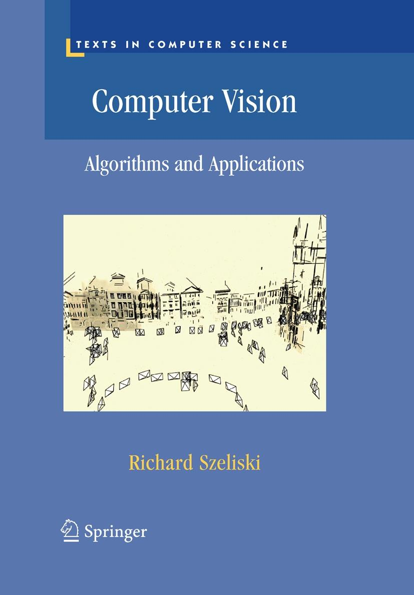

:doctype: book
:source-highlighter: highlightjs
:source-language: cpp
:icons: font
// [reftext="AsciiDoc 文档概览"]
[[asciidoc_overview]]
= AsciiDoc Overview
Jeango W. Yep <254141203@qq.com>; Jimbo_Y M. Walt <other@example.com>
v0.0.1, 2025-01-20: revision remark
// :author: Jeango
// :email: <virtual@example.com>
:revnumber: v0.0.1,
:revdate: 2025-01-20
:revremark: -
:sectnumlevels: 3
:sectnums: |,all|
:toc:
:toclevels: 2
:partnums:
:chapter-signifier: C.
:chapter-refsig: Chapter.
// :icontype: svg
// :iconsdir: ./pictures/
// :data-uri:
:stem:
:ADocExtension: link:https://marketplace.visualstudio.com/items?itemName=asciidoctor.asciidoctor-vscode[AsciiDoc Extension] 
:VSCode: link:https://code.visualstudio.com/[Visual Studio Code]

// Use features: Block title, sidebar block, inlinw anchor, Figure with link
.Jeango's Bilibili Space
****
[#img-avatar]
.Jeango's benificiary of AsciiDoc.
[link=https://space.bilibili.com/202364884]
image::https://i1.hdslb.com/bfs/face/81324e7c4f37f9100b681d87fb71e29076fbfaf7.jpg[Jeango,96,96]
****


请选择感兴趣的内容主题：

. xref:asciidoc_overview[xrefstyle=full]
. xref:get_started[xrefstyle=full]
. xref:from_formal_language[xrefstyle=full] (编译器相关)
. xref:parsing_expression_grammars[xrefstyle=full] (编译器相关)
. xref:asg_schema_json[xrefstyle=full] (编译器相关)
. xref:blocks[xrefstyle=full]
. xref:text_paragraphs[xrefstyle=full]
. xref:substitution[xrefstyle=full]
. xref:document_attributes[xrefstyle=full]
. xref:passthroughs[xrefstyle=full]
. xref:tables[xrefstyle=full]
. xref:adoc_outline[xrefstyle=full]
. xref:diabolical_mathematical_opus[xrefstyle=full]
. xref:diagrams[xrefstyle=full]
. xref:book_writer[xrefstyle=full]
. xref:book_theme_via_docinfo[xrefstyle=full]
. xref:ui_elements[xrefstyle=full]
. xref:font_awesome4[xrefstyle=basic]

link:https://gitlab.com/antora/antora/-/tree/v3.1.x[Antora 3.1.x] +
link:https://docs.antora.org/antora/latest/[Antora Documentation] +
link:https://gitlab.eclipse.org/eclipse/asciidoc-lang/asciidoc-lang/[AsciiDoc Language 0.3.0] +
link:https://www.asciidocfx.com/[Asciidoc Book Editor based on JavaFX 19] +
link:https://github.com/asciidoc-py/asciidoc-py[Legacy python processor for AsciiDoc] +
link:https://asciidoc-py.github.io/chunked/index.html[AsciiDoc User Guide] +
link:https://github.com/asciidoctor/asciidoctor.org/blob/main/docs/asciidoc-writers-guide.adoc[AsciiDoc Writer's Guide ADoc] +
link:https://asciidoctor.org/[Asciidoctor] +
link:https://asciidoctor.org/docs/asciidoc-writers-guide/[AsciiDoc Writer's Guide]

<<<
[reftext="动起来!"]
[[get_started]]
== Get Started!


首先安装 VS Code 并使用 AsciiDoc 官方提供的插件扩展开始编写你的 AsciiDoc 文档、书籍、文章。
AsciiDoc VScode 扩展安装包 108 MB，内置 Mermaid 流程图支持，提供的功能如下表所示：

// Use features: Table title, Attributes and substitutions
.Features of {ADocExtension} for {VSCode}
[cols="3,1,3"]
|===
|             Feature           | Desktop | Web 

|Document Outline and Symbols   |✔️  |✔️
|Equations (via Mathjax)        |✔️  |✔️ (requires security to be disabled)
|Export as PDF                  |✔️  |⛔
|Kroki Integration for Diagrams |✔️  |✔️
|Paste Image                    |✔️  |⛔
|Save as HTML                   |✔️  |⛔
|Save as DocBook                |✔️  |⛔
|Snippets                       |✔️  |✔️
|Syntax Highlighting            |✔️  |✔️ (requires security to be disabled)
|Sync scrolling between 
 the editor and the preview     |✔️  |✔️
|===

插件默认使用 asciidoctor-pdf 导出 PDF，可以修改 VS Code 中的扩展配置，将默认的编译工具
修改为 wkhtmltopdf。相关的配置路径为 asciidoc.pdf.wkhtmltopdfCommandPath 还有
asciidoc.pdf.engine。根据需要安装 wkhtmltopdf 或者
https://docs.asciidoctor.org/pdf-converter/latest/install/[Asciidoctor PDF]。

AsciiDoc FX 也是一个开源的工具，可以将 AsciiDoc 导出出多种电子书格式。但是默认没有设置
中文字体支持，缺失 Unicode 中文字体，无法同时支持 加粗+斜体 的样式，会导致文档中的中文
无法正常显示。

想要将 AsciiDoc 导出为 PDF 还有一个取巧的临时方法，利用 Chrome 浏览器的页面打印功能。只需要
先在 VS Code 中通过 Developer Tools 将预览页面的内容提出保存到 HTML 文件。里面的数学公式
可能会出现两份，因为已经存在渲染好的公式，页面再打开时又重新渲染了一份，可以将 `<nobr>` 标签
包裹的已渲染的内容删除。再打开 HTML 文档，使用 Chrome 打印功能生成 PDF，可以选择 A5 纸张，
这个尺寸比 A4 规格小，适合作为电子书的页面。可以使用块头有点大的 AsciiDoc FX 的导出功能，
当然导出 HTML 还直接使用 AsciiDoc VSCode 扩展提供的导出更方便。还可以尝试使用命令行工具，
如果使用旧的 AsciiDoctor 工具转换可能会出现一些瑕疵，无法原样呈现文档内容。

[source,bash]
python3.11 -m asciidoc.asciidoc AsciiDoc-Overview.adoc 

////
为了写个教程，结果 Bilibili “未通过 ｜ 文章异常”
https://www.bilibili.com/read/preview/40444286

《写书人 - 让世界多一份 AsciiDoc 教程！》
​https://vscode.dev/github/Jeangowhy/opendocs/blob/main/AsciiDoc-Overview.adoc#L1193 [持续更新，未来推送github]
​
《​写书人 - 让世界多一份 AsciiDoc 教程！》已经制作 PDF，请自取
AsciiDoc Overview A5.pdf
AsciiDoc-Overview.html
​链接: https://pan.baidu.com/s/1ilyDpYZx50B_oOHvZzoHhA?pwd=1324
////


目前，流行的开源文档格式有以下三种，从易用性、功能和工具链三方面评价如下：

// Description lists::
Markdown (md):: 文档结构简单、功能较简洁、工具链丰富易实现；
Asciidoc (adoc):: 文档结构稍有点复杂、功能完备、工具链丰富；
reStructuredText (reST):: 文档结构比 md 复杂但比 adoc 简洁，功能丰富，但工具链不及 adoc。

更重要的一点是 AsciiDoc 背靠 Eclipse 软件基金会这棵大树，从长远发展来看这一点非常重要。
AsciiDoc(R) and AsciiDoc Language(TM) are trademarks of the Eclipse Foundation, Inc.

目前，Pandoc 对这三种格式的转换支持 ↔︎ Markdown，↔︎ reStructuredText 都支持双向转换，
但是 → AsciiDoc 单向支持，只能从其它格式转换，不能转换到其它格式。这里没有将 \(\LaTeX\)
这个专业的排版技术放到列表中比对，是因为以上三个格式多多少少都是依赖 \(\LaTeX\) 提供的排版
技术来实现数学公式的处理，比如通过 MathJax 实现 Web 上的公式渲染。

AsciiDoc 关键概念（Key Concepts）：

[cols=">1,5"]
|============
| Terms | Description

| Document 
| AsciiDoc 文档，代表一个 top-level 区块，后缀名为 adoc,asciidoc。
  文档可以设置 document header 配置，包括 document title 和
  document attributes，比如 `:doctype: book`。

| Elements
| 元素，是文档内容组织形式，有两种形式：[.term]*block element* 块元素
  按竖直方向堆叠，每个块元素占一行；[.term]*inline element* 内联元素
  按水平方向堆叠，多个内联元素可同在一行，直到行空间不足容纳再放在下一行。
  文档元素包括文档本身以及 sections, blocks, block macros, 
  breaks, inline phrases and macros。

| Attributes
| 属性，就是 name/value 数据对，有两种属性，Document 和 Element
  对象上设置的属性，文档上的属性使用 `:name: value` 格式设置，并且
  紧接行首。元素上的属性使用 `name=value` 格式设置，比如表格配置属性
  `[cols="1,2,3"]` 表示一个三列的表格，最后（最右）一列占据宽度和
  前面两列总和一样宽。文档属性可以用于改变文档的渲染样式、行为等等。
  比如 Attributes and substitutions，将文档属性值替换到正文中。
  也可以配合 `ifdef` 或者 `ifndef` 指令来进行条件编译。属性设置的
  语法是 `:<key-name>: <value>?` 或者不含值的形式 `:!<key-name>:`，
  这两种形式都可以在 `ifdef::key-name[]` 测试中得到 true 状态。

| Macros
| 宏，可以将 AsciiDoc 看作是宏编程，这和 GNU `m4` 宏编程概念一样，
  即输字符串，AsciiDoc Processor 字符处理程序检测其内容，发现字符串
  中有宏（Macros）定义，那么就按宏定义的内容替换旧内容，宏定义格式可以
  有各种形式，比如 `[source]` 定义代码块，`link:` 定义内联链接，
  `{Arrtibute}` 使用名为 Attribute 的文档属性替换当前位置的内容。
  可以将宏看作是一个函数，此函数在字符串处理过程中自动由字处理程序调用。
  和元素一样，宏也有 block (`::`) 和 inline (`:`) 两种形式。
  比如，`image::logo.png[Logo]` 是 block 图像元素，要独占一行。
  而内联图像定义则是 `+image:logo.png[Logo]+`。对于那些不希望被
  处理的内容，可以使用 passthrough 指令（`pass:`） 或者使用 + 包裹，
  这可以避免 standalone formatting marks 起作用。比如，这里使用
  加号包裹反引号 +``+ 使其原样输出字符。代码块也可以用加号作为分界符号。

| Preprocessor directives
a|预处理程序指令，它们很像宏，但不是。预处理指令的功能是负责控制哪些
  内容需要送往字处理程序中处理（宏内容替换），这个工作是在内容替换处理
  之前进行的，所以称为“预处理”。条件预处理指令 (`ifdef`, `ifndef`)
  还有任意条件指令 (`ifeval`)，配合文档属性使用。比如，以下两种条件
  预处理设置都可以在 `:toc:` 激活时（设置了此文档属性）输出相应的内容。
[source,adoc]
-------------
\ifdef::toc[*Automatic TOC is ON.*]

\ifdef::toc[]
*Automatic TOC is ON.*
\endif::toc[]
-------------
|============

感谢开源社区成员为开源文档开发了这么棒的工具，🧡爱来自中国！

写书人 - 让世界多一份 AsciiDoc 教程！ xref:get_started[]


<<<
[reftext="从形式语言开始"]
[[from_formal_language]]
== From Formal Language


AsciiDoc 语言规范目标旨在促进跨不同编程语言和运行时开发兼容的 AsciiDoc 格式实现。
为了避免在不同语言实现中不必要地重写测试，AsciiDoc 依照 Eclipse 基金会规范过程，
为规范项目生成一个技术兼容性工具包（Technology Compatibility Kit, TCK），
该工具包承诺实现多个兼容的实现。TCK 的作用是确保实现的兼容性和应用程序的可移植性。
想要获得认证的实现必须遵循 AsciiDoc TCK 流程。

AsciiDoc 语言核心是比抽象语法树 (Abstract Syntax Tree, AST) 还更高抽象水平的
抽象语义图 (Abstract Semantic Graph, ASG)，这是因为 AsciiDoc 用于处理文档的
结构，而非用于通用编程。这一点与 Pandoc 这个开源的文档格式转换工具类似，它们都使用
JSON 作为文档格式信息的存储媒介。以下是 Wikipedia 中定义的 ASG 概念:

____
An is a form of abstract syntax in which an expression of a formal 
or programming language is represented by a graph whose vertices are 
the expression’s subterms. An ASG is at a higher level of abstraction 
than an, which is used to express the syntactic structure of an 
expression or program.
____

计算机语言领域上讲，AsciiDoc 并不像 XML 这类正则语言（regular language）那样，
可以根据一个语言规范来进行数据处理，也就是说 AsciiDoc 文档是一种没有固定正则规范
的格式，AsciiDoc ASG 就是用于捕获或者表现 AsciiDoc 文档内部结构的层次模型。
TCK 在一组测试上运行实现，这些测试涵盖了规范所做的所有断言，以验证实现是否符合要求。
TCK interfaces 与 AsciiDoc implementation 一起通过适配器（TCK adapter）。
适配器必须将每个测试传递给 AsciiDoc implementation 才能运行，并且必须将该测试
结果从实现返回给 TCK。高度概括，TCK 通过 TCK 适配器的测试来展示 AsciiDoc 实现。
测试是一个 AsciiDoc 文档，必要可以补充的引用 AsciiDoc 文件（includes）或输入
参数（attributes）。

虽然说 ASG 比 AST 抽象等级还要高，好像会更难理解，但其实不然，它的模式定义文件更易懂。
以下是规范文档中给出的 ASG schema 与测试样式数据。正文段落的 ASG schema 是抽象语法
树上的叶块（leaf block），也是抽象块对象的扩展，它的模式定义在官方文档的 ASG
文件夹中 schema.json 中描述：

.ASG schema
[source,json]
-------------
"paragraph": {
  "type": "object",
  "allOf": [{ "$ref": "#/$defs/abstractBlock" }],
  "unevaluatedProperties": false,
  "required": ["name"],
  "defaults": { "inlines": [] },
  "properties": {
    "name": { "type": "string", "constant": "paragraph" },
    "form": { "type": "string", "enum": "paragraph" },
    "inlines": { "$ref": "#/$defs/inlines" }
  }
}
-------------

.ASG example of an ASG node for a paragraph
[source,json]
-------------
{
  "name": "paragraph",
  "type": "block",
  "inlines": [
    {
      "name": "text",
      "type": "string",
      "value": "This paragraph has multiple lines that wrap after reaching the 72\ncharacter limit.",
      "location": [{ "line": 1, "col": 1 }, { "line": 2, "col": 16 }]
    }
  ],
  "location": [{ "line": 1, "col": 1 }, { "line": 2, "col": 16 }]
}
-------------

.abstractBlock from ASG schema.json.
[source,json]
-------------
    "abstractBlock": {
      "type": "object",
      "required": ["type"],
      "properties": {
        "type": { "type": "string", "const": "block" },
        "id": { "type": "string" },
        "title": { "$ref": "#/$defs/inlines" },
        "reftext": { "$ref": "#/$defs/inlines" },
        "metadata": { "$ref": "#/$defs/blockMetadata" },
        "location": { "$ref": "#/$defs/location" }
      }
    },
-------------

在模式定义文件中，可以看到 `leafBlock` 和 `parentBlock` 两个文档对象类型已经涵盖日常使用的
大部分文档元素类型。其中，代码块（listing Block）之所以和段落（paragraph）都划分到 
leafBlock，主要一个原因是它包含的内容是直通输出的，并不需要做大量的内容替换操作。


<<<
[reftext="表达式解析文法（PEG）"]
[[parsing_expression_grammars]]
== Parsing Expression Grammars

计算机语言编译软件的实现技术上，大体可以根据构造分析权的形式分为两类：自顶向下构建分析树、
以及自底向上构建分析树。这两种方式对应的算法分类是 LL 系算法和 LR 系算法。

LL Parser 实现代码的结构与文法对应，易理解，错误处理和错误恢复也好处理。当前较有代表性的是 PEG
(Parse Expression Grammar)，这种自下而下的、线性分析器很好地解决了自上而下的二义选择问题。
PEG 文法通过引入 Prioritized choice operator ‘/’ 来提供非二义的选择，即有限回溯的文法。
而流行的生成器工具，ANTLR 3 或者 ANTLR 4 就是采用 LL 系列算法自动生成解释器的工具。

LR Parser 虽然实现上更复杂，但是其速度快、表达能力强。因此，掌握 LR 分析方法比 LL 更具有实操意义。

参考资料：link:http://staff.ustc.edu.cn/~yuzhang/compiler/2022f/lectures/03-parsing-part3-antlr.pdf[语法分析 III, 中国科大 张昱]

PEG (Parsing Expression Grammars) 表达式解析语法可以解析一门上下文无关语言，
包括递归结构。从语言实现方式来说，类似 Yacc 或 Bison 这样的工具来实现解释器。
PEG 是用字符串匹配 (pattern) 来描述语言的方式，也即表达式解析这种行为是其的核心。
PEG 的实现上与上下文无法文法 context free grammars (CFGs) 的实现非常不同。
PEG 不简化为状态机，而是采用顺序解析。这意味着编写解析规则的顺序很重要。
PEG 可以更容易编写。通常不需要编写单独文档流的扫描程序，语法（文法）直接与输入
文本一起工作，而不需要 Tokenization 步骤。

AsciiDoc 属于上下文无关的语言。解析 AsciiDoc 文档不能有歧义，这意味着只有一个有效
的解析树。解析 AsciiDoc 文档依赖于有序选择运算符，有时必须利用断言（Assertions）
和语义谓词（semantic predicates）来做出选择。断言在光标之前查看邻接要求，而不消费
任何字符。逻辑谓词是一个任意复杂的表达式或动作，用于预勘测（peek）输入的字符串。

To cite https://blog.reverberate.org/2013/09/ll-and-lr-in-context-why-parsing-tools.html:

> Parsing expression grammars avoid ambiguity by forcing all grammar rules to be defined in terms of prioritized choice.

AsciiDoc 首先是一种用于写作而非编程的语言，或者说它本身不具有通用计算机语言的能力。
语言必须假设在没有语法规则匹配的情况下，也就没有找到语言保留标记的内容就被读者当作文本。
另一方面，如果字符序列（如块分隔符行）与语法规则匹配，则该字符序列被解释为具有语义意义，
例如将内容包装在侧边栏块（sidebar block）。AsciiDoc 文档解析的实现遵循 PEG 文法定义，
在语言的许多方面看来看，AsciiDoc 依赖于递归下降（recursive descent）方法解析文档的
区块层次结构、分界的块内容（delimited blocks）、嵌套文本的格式化（text formatting）
等等。而使用 PEG 文法描述方法可以非常自然地实现递归下降解析器（recursive descent parser），
PEG 还支持正则表达式字符匹配，这对于支持所有书面语言（Unicode）至关重要。

尽管，AsciiDoctor，Ruby 语言实现的的解析器，其文档中没有提供 PEG 文法描述文档资料，
但是理解 AsciiDoc 的基本语言学原理有助于读懂 AsciiDoctor 解析器代码，退一步来说，
即使是阅读其测试代码，比如以下片段，提示了 AsciiDoc 文档中设置块内容属性的各种形式，
这样也可以帮助理解 AsciiDoc 需要通过什么样的语法解析测试才合格。反过来讲，编写符合
测试用例的 AsciiDoc 结构也就是学习使用其正确的写作方式。

.Test cases from {Test_ALT130}
:Test_ALT130: link:https://vscode.dev/github.com/asciidoctor/asciidoctor/blob/main/test/attribute_list_test.rb#L130-L152[attribute_list_test.rb Line #130]
[source,rb]
-----------
  test 'collect unnamed attribute enclosed in equal signs' do
    attributes = {}
    line = '=foo='
    expected = { 1 => '=foo=' }
    (Asciidoctor::AttributeList.new line).parse_into attributes
    assert_equal expected, attributes
  end

  test 'collect named attribute' do
    attributes = {}
    line = 'foo=bar'
    expected = { 'foo' => 'bar' }
    (Asciidoctor::AttributeList.new line).parse_into attributes
    assert_equal expected, attributes
  end

  test 'collect named attribute double-quoted' do
    attributes = {}
    line = 'foo="bar"'
    expected = { 'foo' => 'bar' }
    (Asciidoctor::AttributeList.new line).parse_into attributes
    assert_equal expected, attributes
  end
-----------

虽然，笔者学过不下十数门编程语言，但是 Ruby 还一直没机会试试，今天就有这样一个机会，让我
先来安装它。环境使用的是 MSYS2：

[source,bash]
----
$ pacman -S ruby
resolving dependencies...
looking for conflicting packages...

Packages (2) libyaml-0.2.5-1  ruby-3.2.2-1

Total Download Size:    7.29 MiB
Total Installed Size:  29.20 MiB

:: Proceed with installation? [Y/n] y     
----

:AsciiDoc_as_Extension: https://github.com/asciidoctor/asciidoctor-vscode
:Asciidoctor_json: https://vscode.dev/github.com/asciidoctor/asciidoctor-vscode/blob/master/syntaxes/Asciidoctor.json
:asciidoctor_core: https://www.npmjs.com/package/@asciidoctor/core

:asciidoctor_rb: https://github.com/asciidoctor/asciidoctor
:AsciiDoctor_js: https://github.com/asciidoctor/asciidoctor.js
:AsciiDoctor_js_dev: https://vscode.dev/github/asciidoctor/asciidoctor.js
// 注意 asciidoctor 是内置属性，不能被覆盖。

如果不想使用早期使用 Ruby 实现的 link:{asciidoctor_rb}[AsciiDoctor]，那么也可以使用
更活跃的、JavaScript 脚本实现的 {Asciidoctor_js} ，它是 AsciiDoctor 解析器的移植版本。
此实现主要提供两个模块 `asciidoctor` 以及 `core`，后者又称为 Asciidoctor core，NPM
又使用 link:{asciidoctor_core}[@asciidoctor/core] 作为其标识名称。核心模块主要提供以下
三大功能，

* parser
* built-in converters
* extensions

核心板块用作 link:{AsciiDoc_as_Extension}[AsciiDoc as VScode Extension] 插件的
核心组件。可以使用在线版 VSCode 来浏览源代码，包括这分语法定义文档 
link:{Asciidoctor_json}[Syntaxes Asciidoctor.json]，
还有 link:{AsciiDoctor_js}[AsciiDoctor.js] (link:{AsciiDoctor_js_dev}[vscode.dev]).

插件还提供了一组 snippets (snippets.json) 代码片段，只需要输入以下缩写，并按 Ctrl+Space
就可以输入相应的代码模板，比如以下表格就可以使用 "table" 代码片段来快速完成基本结构的输入：

[cols="2,4s",width="80%"]
|===
|Snippet prefix       |Snippet body and note

|"asciidoc-tech-doc"  | An AsciiDoc outline
|"include"            | include::path[attributes]
|"image"              | "\image:${1:path}[${2:alt}]"
|"image"              | "image::${1:path}[${2:alt}]"
|"video"              | "video::${1:path}[${2:alt}]"
|"link"               | "\link:${1:${TM_SELECTED_TEXT:link}}[${2:alt}]"
|"mailto"             | "\mailto:${1:${TM_SELECTED_TEXT:link}}[${2:alt}]"
|"header"             | Document Title, Author, version...
|"heading"            | ${1\|=,==,===,====,=====,======\|} ${2:${TM_SELECTED_TEXT:Heading Title}}
|"unordered list"     | ["* ${1:first}", "* ${2:second}", "* ${3:third}", "$0"]
|"ordered list"       | [". ${1:first}", ". ${2:second}", ". ${3:third}", "$0"]
|"checklist"          | * [${1: }] ${2:first} ...
|"literal"            | [${1:attributes}]\n....\n${2:${TM_SELECTED_TEXT:text}}\n.... 
|"source"             | [source,${1:language},${2:attributes}]\n----\n...----\n
|"example"            | [${1:attributes}]\n====\n...\n====
|"sidebar"            | [${1:attributes}]\n****\n...\n****
|"table"              | [${1:Attributes}]\n\|===\n...\n\|===
|"tag"                | // tag::${1:tagname}[]\n...\n// end::${1:tagname}[]
|"quote"              | [quote, ${1:attribution}, ${2:cite title}]\n____\n...\n____
|"footnote"           | "\footnote:[${1:note}]"
|"footnote-label"     | "footnote:${1:label}[${2:note}]"
|===

SDR4 文档表示，为了以实现合理向后兼容性的方式描述 AsciiDoc 文档结构使用了多种语法
（Multiple grammars），包括

* line preprocessor 行内容预处理程序 (可能整合到 block)
* block 块内容
* attrlist 属性列表
* inline preprocessor 内联内容预处理程序
* inline 内联内容


变更日志（CHANGELOG.adoc）记录了从 0.2.0 到 0.3.0 这两个主要更新所带来的文档：

. 0.3.0 (milestone build)
* Draft section in specification for paragraph (#35)
* Draft section in specification for strong span (#37)
* SDR-6: Define Parsing Rules for Positional Attribute to Named Attribute Mapping (#36)
* SDR 7: Designate List Continuation as Universal Interrupting Line (#42)
* SDR 8: Designate List Item as Interrupting Line only for Principal Text (#42)

. 0.2.0 (milestone build)
* Selected JSON as the format for the ASG used by the TCK (#7)
* Create initial draft of JSON schema for the ASG; resides in the asg folder (#28)
* SDR-1: Introduce variable-length delimiter form for open block (#27)
* SDR-2: Define parsing and aggregation rules for attrlist in block attribute line (and block macros) (#33)
* SDR-3: Clarify that block style does not influence parsing model, but is rather a parsing transformation (#31)
* SDR-4: Select PEG as the grammar formalism for describing the AsciiDoc language (#8)
* SDR-5: Transition the inline syntax to a formal grammar from a substitutions step; introduce an inline preprocessor (#16, #22)

根据“规范文档要求” (*SDR*, *Specification Document Requirement*)，AsciiDoc
规范从 0.2.0 版本开始使用 PEG 作为语言文法形式来描述文档结构。

:lua-parser: link:https://github.com/andremm/lua-parser[Lua Parser]
:lua-parser-dev: link:https://vscode.dev/github.com/andremm/lua-parser/blob/main/lua-parser/parser.lua[Lua Parser vscode.dev]

:link: https://leafo.net/guides/parsing-expression-grammars.html
{link}[An introduction to Parsing Expression Grammars with LPeg] +
https://www.inf.puc-rio.br/~roberto/lpeg/[PEG For Lua, version 1.1] +
link:http://pdos.csail.mit.edu/papers/parsing:popl04.pdf[
Parsing Expression Grammars: A Recognition-Based Syntactic Foundation, 
Bryan Ford, 2004] +
link:https://www.inf.puc-rio.br/~roberto/docs/peg.pdf[
A Text Pattern-Matching Tool based on Parsing Expression Grammars,
Roberto Ierusalimschy] +
link:https://blog.reverberate.org/2013/09/ll-and-lr-in-context-why-parsing-tools.html[
LL and LR in Context: Why Parsing Tools Are Hard] +
link:https://blog.reverberate.org/2013/07/ll-and-lr-parsing-demystified.html[
LL and LR Parsing Demystified] +
link:http://lua-users.org/wiki/LpegTutorial[LPeg Tutorial] +
link:http://lua-users.org/wiki/LpegRecipes[Lpeg Recipes] +
link:https://www.tweag.io/blog/2021-06-15-asciidoc-haskell-pandoc/[
An AsciiDoc processor and Pandoc front-end in Haskell]

LPeg (Parsing Expression Grammars for Lua) 被设计出来用于解析语法，通过
它能够轻松地解析各种语法，比如 {lua-parser} 用五百行代码将 Lua 代码解析成抽象
语法树，可以点击 {lua-parser-dev} 查看其代码。LPeg 作为语言工具，可以用它来
做代码的静态分析，自定义领域语言 (DSL, Domain Specific Language)，将易如反掌。

例如在游戏编程中，策划常常需要配置触发器，触发条件有时比较复杂，编程实现比较繁琐。
比如 “血量小于 10% 或怒气大于 90 时有 50% 的概率触发”。这种场景就可以自定义
DSL, 配置表只用来设置可以配置的预定义字符串（hp, wrath, random），那么以上
这个条件就可以用字符串表示为以下这样的语句。然后使用 LPeg 将字符串编译成一个
Lua 函数，游戏中通过 Lua 引擎运行它即可完成策划任务.

.DSL statement
=====
  (hp < 10% || wrath > 90) && random() > 0.5
=====

Lua 文档的 The Complete Syntax of Lua 一章内容是 BNF (Backus Naur Form) 
范式描述的 Lua 语言语法。BNF 就是 CFG 的一种表示法. 语法非常简短，只有 67 行规则。
以下是 Lua 5.3 语言的文法描述，与 Lua 5。4 差另在将 `namelist` 更新为 `attnamelist`。

.BNF of Lua 5.3
[source,BNF]
------------
    chunk ::= block

    block ::= {stat} [retstat]

    stat ::=  ';' | 
         varlist '=' explist | 
         functioncall | 
         label | 
         break | 
         goto Name | 
         do block end | 
         while exp do block end | 
         repeat block until exp | 
         if exp then block {elseif exp then block} [else block] end | 
         for Name '=' exp ',' exp [',' exp] do block end | 
         for namelist in explist do block end | 
         function funcname funcbody | 
         local function Name funcbody | 
         local namelist ['=' explist] 

    retstat ::= return [explist] [';']

    label ::= '::' Name '::'

    funcname ::= Name {'.' Name} [':' Name]

    varlist ::= var {',' var}

    var ::=  Name | prefixexp '[' exp ']' | prefixexp '.' Name 

    namelist ::= Name {',' Name}

    explist ::= exp {',' exp}

    exp ::=  nil | false | true | Numeral | LiteralString | '...' | functiondef | 
         prefixexp | tableconstructor | exp binop exp | unop exp 

    prefixexp ::= var | functioncall | '(' exp ')'

    functioncall ::=  prefixexp args | prefixexp ':' Name args 

    args ::=  '(' [explist] ')' | tableconstructor | LiteralString 

    functiondef ::= function funcbody

    funcbody ::= '(' [parlist] ')' block end

    parlist ::= namelist [',' '...'] | '...'

    tableconstructor ::= '{' [fieldlist] '}'

    fieldlist ::= field {fieldsep field} [fieldsep]

    field ::= '[' exp ']' '=' exp | Name '=' exp | exp

    fieldsep ::= ',' | ';'

    binop ::= '+' | '-' | '*' | '/' | '//' | '^' | '%' | 
              '&' | '~' | '|' | '>>' | '<<' | '..' | 
              '<' | '<=' | '>' | '>=' | '==' | '~=' | 
              and | or

    unop  ::= '-' | not | '#' | '~'
------------

.BNF update of Lua 5.4
[source,BNF]
------------
    stat ::=  ';' | 
         ...
         local namelist ['=' explist]   <.>
         local attnamelist ['=' explist] <.>

    attnamelist ::=  Name attrib {',' Name attrib}

    attrib ::= ['<' Name '>']
    ...
------------
<.> Different part come from Lua 5.3
<.> Different part come from Lua 5.4


下面是用 PEG 对其语法的自描述，语法规则更短小:

[source,BNF]
------------
1  grammar     <-  (nonterminal ’<-’ sp pattern)+
2  pattern     <-  alternative (’/’ sp alternative)*
3  alternative <-  ([!&]? sp suffix)+
4  suffix      <-  primary ([*+?] sp)*
5  primary     <-  ’(’ sp pattern ’)’ sp / ’.’ sp / literal /
6                  charclass / nonterminal !’<-’
7  literal     <-  [’] (![’] .)* [’] sp
8  charclass   <-  ’[’ (!’]’ (. ’-’ . / .))* ’]’ sp
9  nonterminal <-  [a-zA-Z]+ sp
10 sp          <-  [ \t\n]*
------------

第 1 行表示 PEG 语法由一条以上的规则组成, 每条规则的 <- 左侧为非终结符 (nonterminal)，
右侧为模式 (pattern)，对应下一级 nonterminal。这些规则可以逐条推导，直到字符级别，即
分散在这些规则中使用单引号包裹的字面量（literal）字符以及其它在方括号中的字符就是终结符，
用单引号包裹字符（终结符号）是为避免阅读上出现歧义。例如，`‘(’ ‘)’` 和 `( )` 就是不同
的功能符号，前者用单引号包裹表示字面量字符，后者没有单引号包裹表示讨文法功能符号。注意，
规则中同时也定义了一条称为字面量（*literal*）的规则，定义它的目的是要匹配代码文档中的
字面量，但是这条规则中的 `sp` 本身就不是字面量，是一个 nonterminal，或者说是一条可以
继续推导（分解）的规则。这条规则可以分解为两项，前面的 `[’] (![’] .)* [’]` 这部分表示
匹配代码文档中由 `’` 单引号包裹的内容，后一部分 `sp` 表示匹配空白字符，这两部分共同称为
语法上的 *literal*。类似有这种双重含义的是第 9 条 *nonterminal* 规则，它的右部分
方括号中的字符都是终结符，但是 `sp` 本身不是，经对应一条可继续推导的规。当然，`sp` 规则
推导结果还是终结符号，即任意数量的空白符号（空格、制表符、换行符）。

这些规则与正则表达式类似，例如：

*   . 表示任意字符的通配符，
*   + 表示重复前面的模式 1 次以上；
*   * 表示重复 0 次或以上；
*   ? 表示出现 1 次或 0 次，比如 *alternative* 规则中的 `[!&]?` 表示 ! 或者 & 两个字符可有也可无；
*   [] 表示字符的集合，比如 *sp* 规则表示任意的空白字符，包括空格、制表符、换行符；
*   () 表示分组，分组与其它文法符号组合使用，比如 *suffix* 规则中，表示至少有一组以上的 `pass:[[*+?] sp]`；
*   ! 表示不匹配紧随其后的模式 (当且仅当随后的模式不匹配时才算规则匹配成功)；
*   & 表示匹配紧随其后的模式但不消耗输入；

第 2 行表示每个模式（*pattern*）可以包含多个变换项 (*alternative*)。这些变换项由斜杠（`/`） 
分隔开，类似 BNF 中的 | 符号，但是为了表示有限制回溯的含义特地改用斜杠表示其两侧的可选项。

又如第 5 行（*primary*）中由单引号包裹的圆括号表示非终结符，需要匹配文档中出现的由圆括号包裹
的模式（`sp pattern`）。注意，后面的 `!’<-’` 部分，表示 nonterminal 没有后置的 `'<-'`
这个非终结符组成。本身 `<-` 这符号用作 PEG 文法的功能符号，其左部称为规则头部（head）或称为
规则名称，或者有时称“非终结符”都是可以的。因为规则可继续推导就表示它没有终结，例如 *sp* 规则
的右部只包含字面量符号，不可再推导，是终结符号。 

第 8 行定义了一条字符分类（*charclass*）规则，它匹配由方括号包裹的任意字符串。
Lua 使用 `[[` 与 `]]` 作为多行字符串 (heredoc) 的分界符号。

与 CFG 不同的是, 这些可选项是有顺序的, 只有前面的选项匹配失败才会去匹配后面的选项。因为
PEG 是用于描述一种自顶向下（Top-Down）的解析语法的方式，有序的可选项能够让解析没有歧义。
同时使用 *有限制的回溯*（restricted backtracking）与 *有序选择*（ordered choice），
这也是 PEG 的一大优势，能够将回溯限制在一条匹配规则内。一旦匹配进入（选择）一条规则，就不会
因为后续的匹配失败而改变。例如，考虑下列语法：

[source,BNF,role=coollens]
==========================
S   <-  A B

A   <-  E1 / E2 / E3

B   <-  ···
==========================

假设字符串匹配 S 规则，就会先匹配 A 再匹配 B，注意两者并存而非可选。由于 A 有三个可选项，
因此会先尝试匹配 E1。如果 E1 匹配失败就回溯，然后匹配 E2，以此类推。一旦有一个选项匹配达成，
这条规则就不会再回溯（有限回溯）。假定 E2 作为 A 规则的成功匹配项，如果接下来 S 规则中的
B 匹配失败，就表示 S 整个模式匹配失败。B 的失败不会让 A 重新选择，有限回溯这一特性保证了
PEG 的效率，不会出现正则表达式一样的无限回溯的问题。

贪婪匹配 (greedy match) 与懒惰匹配（lazy match）是正则语言常见用法。比如 `pass:[.*]` 
会匹配任意长度（`+*+`）的任意字符（`.`）。类似地，`pass:[.*e]` 会匹配任意以 `e` 结尾
的任意长度的字符串。在匹配字符时，就算找到 `e` 也会继续再往下找，直到结束发现没有更多
才回溯到前面。这种无限的回溯能力堪称灾难性回溯（Catastrophic Backtracking），使用
不当有可能导致软件不能继续提供服务。如果是 `.*?e` 就会进入懒惰匹配模式，只要遇到 `e`
字符就结束。

PEG 在有限回溯前提下的做法就简单很多，PEG 总是会执行贪婪盲匹配，尽可能地匹配更多的字符，
并且不考虑前后的其他模式。例如，如下的 PEG 规则：

[source,BNF,role="warmlens"]
============================
S1   <-  .* ’X’

S2   <-  (!’X’ .)* ’X’

S3   <-  ’X’ / . S3

S4   <-  . S4 / ’X’
============================

规则 `#S1#` 看上去类似 `pass:[/.*X/]` 这样的正则表达式，但实际上它无法匹配任何字符串。
因为 `pass:[.*]` 会匹配所有字符，然后 `X` 永远匹配失败，因为没有任何字符可以进行匹配。
可以用 `#S2#` 规则来模拟实现正则表达式的效果，因为 `.` 会匹配任意字符，添加将 `X` 排除
在其匹配选项之外。需要增加一个 `!'X'` 让它在遇到第一个 `X` 的时候停下。由于 `!’X’` 的存在，
一旦遇到 X 就会匹配失败，因此就可以将 X 排除在贪婪匹配列表之外。还可以使用 `#S3#` 这种递归的
方式实现同样的效果，`#S3#` 规则会先匹配 `X` 如果匹配到就完成，否则就匹配备选的任意字符匹配。
然后再递归进入下一轮 `#S3#` 匹配，直到遇到字符 `X`, 匹配结束。最后的 `#S4#` 更有趣些，
注意它将 `X` 作为一个可选项，当前面一项 `. S4` 递归匹配每一个字符，直到结束导致此选项匹配
失败，进而又从未端开始回溯，以逐个匹配 `X`，直到找到字符串中最后位置出现的 `X`。


<<<
[reftext="抽象语义图的描述文件(asg/schema.json)"]
[[asg_schema_json]]
== ASG schema.json

[TIP]
*****
jq 是一个轻量级 JSON 数据处理程序，可以用它来处理 ASG schema 中的数据结构，
参考 link:jq-1.7-doc.adoc[jq 教程及手册]。同类形工具中还有 Miller (mlr)，
这是一个集数据询、整形、重构格式（包括制作）的命令行工具，支持 CSV, TSV, JSON, 
以及 JSON Lines (JSONL)。Miller 代码仓库包含了示例数据文件： 

*  link:https://miller.readthedocs.io/en/6.13.0/[Miller 6.13.0 Documentation]
*  link:https://vscode.dev/github/johnkerl/miller[Miller Source]
*  link:https://vscode.dev/github/dbohdan/structured-text-tools[Structured text tools]

Mermaid 是一个开源图表绘制工具，支持多种类型图表的绘制，但功能不够丰富。例如，类型关系图
可以设置各种 UML 关系箭头，但是没有提供各属性间的连线、箭头功能，无法在表达类型内部与外部
的关系时，精确控制属性间的连线。
Mermaid 参考手册：link:https://vscode.dev/github/mermaid-js/mermaid[Class diagrams]

UML 箭头符号及类型关系的表达：

    classDiagram
    classA   --|> classB : Inheritance
    classC   --*  classD : Composition
    classE   --o  classF : Aggregation
    classG   -->  classH : Association
    classI   --   classJ : Link(Solid)
    classK   ..>  classL : Dependency
    classM   ..|> classN : Realization
    classO   ..   classP : Link(Dashed)
*****

ASG schema 描述的 AsciiDoc 文档框架结构示意图如下：

[mermaid,target="mermaid-graph"]
--------------------------------
---
config:
  look: handDrawn
  theme: neutral
  layout: elk
---
classDiagram
    Document -- sectionBody
    Document -- author
    Document -- blockMetadata
    sectionBody -- section
    sectionBody -- blocks
    Document          <|-- inlines
    leafBlock         <|-- inlines
    dlistItem         <|-- inlines
    abstractListItem  <|-- inlines
    abstractBlock     <|-- inlines
    section             -- abstractHeading
    discreteHeading     -- abstractHeading
    abstractBlock <|-- abstractHeading
    abstractBlock <|-- abstractListItem
    abstractListItem <|-- listItem
    abstractListItem <|-- dlistItem
    abstractParentInline  <|-- inlineSpan 
    abstractParentInline  <|-- inlineRef 
    abstractParentInline  *-- inlines
    abstractParentInline  *-- location
    parentBlock     -- nonSectionBlockBody
    list            -- nonSectionBlockBody
    dlist           -- nonSectionBlockBody
    abstractBlock <|-- list
    abstractBlock <|-- dlist
    abstractBlock <|-- discreteHeading
    abstractBlock <|-- break
    abstractBlock <|-- blockMacro
    abstractBlock <|-- leafBlock
    abstractBlock <|-- parentBlock
    nonSectionBlockBody -- block
    nonSectionBlockBody -- abstractHeading
    blocks        *-- block
    block         *-- list
    block         *-- dlist
    block         *-- discreteHeading
    block         *-- break
    block         *-- blockMacro
    block         *-- leafBlock
    block         *-- parentBlock
    list          *-- listItem
    dlist         *-- dlistItem
    inlines       *-- inline
    inline        *-- inlineLiteral
    inline        *-- inlineRef
    inline        *-- inlineSpan
    location      *-- locationBoundary

    class author {
        address: string
        firstname: string
        fullname: string
        initials: string
        lastname: string
        middlename: strin
    }

    class blockMetadata {
        attributes: object
        location: location
        options: string[]
        roles: string[]
    }

    class Document {
        + attributes: object
        + blocks: sectionBody[block,section]
        + header: object
        + location: location
        + name: string
        + type: string
    }

    class abstractBlock{
        + id: string
        + location: location
        + metadata: blockMetadata
        + reftext: inlines
        + title: inlines
        + type: const(block)
    }

    class abstractHeading {
        level: intege
    }

    class abstractListItem {
        blocks: nonSectionBlockBody
        marker: string
        principal: inline
    }

    class abstractParentInline {
        inlines: inlines
        location: location
        type: const(inline)
    }

    class list {
        items: listItem[]
        marker: string
        name: const(list)
        variant: enum(callout, ordered, unordere)
    }

    class listItem {
        name: const(listItem)
    }

    class dlist {
        items: dlistItem[]
        marker: string
        name: const(dlist)
    }

    class dlistItem {
        name: const(dlistItem)
        terms: inlines[
    }

    class blockMacro {
        form: const(macro)
        name: enum(audio, video, image, toc)
        target: strin
    }

    class leafBlock {
        form: enum(delimited, indented, paragraph)
        inlines: inlines
        name: enum(listing, literal, paragraph, pass, stem, vers)
    }

    class parentBlock{
        + blocks: nonSectionBlockBody
        + delimiter: string
        + form: const(delimited)
        + name: enum(admonition, example, sidebar, open, quote)
    }

    class section {
        blocks: sectionBody
        name: const(section)
    }

    class break {
        name: const(break)
        variant: enum(page, themati)
    }

    class discreteHeading {
        name: const(heading)
    }


    class inlineLiteral {
        location: location
        name: enum(text, charref, raw)
        type: const(string)
        value: strin
    }

    class inlineRef {
        name: const(ref)
        target: string
        variant: enum(link, xre)
    }

    class inlineSpan {
        form: enum(constrained, unconstrained)
        name: const(span)
        variant: enum(strong, emphasis, code, mar)
    }

    class locationBoundary {
        col: integer
        file: string[]
        line: intege
    }
--------------------------------


以下使用 jq 脚本将 AsciiDoc 中的文档对象的属性提取出来：

[source,bash]
-------------
jq '. as $doc|keys|map(
  if . == "$defs" then 
    empty 
  elif . == "properties" then
    .={(.):$doc.[.]|keys|map(
      if $doc.properties.[.].["$ref"] then
        {(.):$doc.properties.[.].["$ref"]}
      else
        {(.):($doc.properties.[.].type?)}
      end
    )}
  else
    .={(.|tostring):($doc.[.].type? // $doc.[.])} 
  end
  ) | add | delpaths([["if"],["then"],["required"]])' /pl/asciidoc-lang/asg/schema.json |
  jq '.properties|add' | mlr --ijson --opprint --barred cat

+------------+---------------------+--------+------------------+--------+--------+
| attributes | blocks              | header | location         | name   | type   |
+------------+---------------------+--------+------------------+--------+--------+
| object     | #/$defs/sectionBody | object | #/$defs/location | string | string |
+------------+---------------------+--------+------------------+--------+--------+
-------------

命令行串联了两个 jq 命令，前一个用于提取 Document 对象的各种属性，第二个用于提取 properties
属性列表，然后再使用 Miller (mlr) 命令将键值对转换为表格形式显示。

[source,json]
-------------
{
  "$id": "https://schemas.asciidoc.org/asg/1-0-0/draft-01",
  "$schema": "https://json-schema.org/draft/2020-12/schema",
  "additionalProperties": false,
  "defaults": {
    "blocks": []
  },
  "description": "A structured representation of the semantics in an AsciiDoc document, primarily used for validating the compliance of an AsciiDoc processor.",
  "properties": [
    { "attributes": "object" },
    { "blocks": "#/$defs/sectionBody" },
    { "header": "object" },
    { "location": "#/$defs/location" },
    { "name": "string" },
    { "type": "string" }
  ],
  "title": "AsciiDoc Abstract Semantic Graph (ASG)",
  "type": "object"
}
-------------

AsciiDoc 文档中定义的类型可以使用 `.["$defs"]|keys` 过滤器提取其名称。再配置内置函数 `map`
将类型名称列表（keys）中项与其本身的数据类型信息关联起来。也就是将 AsciiDoc 文档节点类型与脚本
语言实现中的类型关联。可以看到，除了 inlines、location、nonSectionBlockBody、sectionBody
等四项为数组（记录文档中其它类型的一个集合），其余 22 项都是 AsciiDoc 的文档节点类型。而其中的
四个抽象节点，是其它节点的基类定义。Document 类型定义中，定义了 `blocks` 属性（集合）
来记录用户在文档中编写的各种块对象（`sectionBody`），这个集合包含 `block` 或者 `section`
两类文档对象。

[source,json]
-------------
jq '.["$defs"] as $defs|$defs|keys|map({(.):($defs.[.].type)})|add' /pl/asciidoc-lang/asg/schema.json 

{
  "abstractBlock": "object",
  "abstractHeading": "object",
  "abstractListItem": "object",
  "abstractParentInline": "object",
  "author": "object",
  "block": "object",
  "blockMacro": "object",
  "blockMetadata": "object",
  "break": "object",
  "discreteHeading": "object",
  "dlist": "object",
  "dlistItem": "object",
  "inline": "object",
  "inlineLiteral": "object",
  "inlineRef": "object",
  "inlineSpan": "object",
  "leafBlock": "object",
  "list": "object",
  "listItem": "object",
  "locationBoundary": "object",
  "parentBlock": "object",
  "section": "object",

  "inlines": "array",
  "location": "array",
  "nonSectionBlockBody": "array",
  "sectionBody": "array"
}
-------------

笼统地说，AsciiDoc 文档中的对象包含 `inline` 和 `block` 两类对象，分类如下，后面不再罗列：

* inline ("object") is neOf:
  ** "#/$defs/inlineSpan"
  ** "#/$defs/inlineRef"
  ** "#/$defs/inlineLiteral

* block ("object") is oneOf:
  ** "#/$defs/list"
  ** "#/$defs/dlist"
  ** "#/$defs/discreteHeading"
  ** "#/$defs/break"
  ** "#/$defs/blockMacro"
  ** "#/$defs/leafBlock"
  ** "#/$defs/parentBlock

这里挑选 `parentBlock` 这个比较有代表性文档对象来说明 ASG 文档中的类型关系。其中 `$defs` 表示
AsciiDoc 文档对象的定义列表。列表中的每个对象中的 `type` 表示这对象类型，多数对象都是 AsciiDoc
文档中直接使用的 blocks 或者 inlines 对象。其中 `required` 是一个列表，表示当前对象的必要属性。
ASG 文档中还可以使用 `if` 条件语句一样的功能，用来在特定条件下使用当前对象的属性发生变化。就如以下
片段中，如果 `parentBlock` 的名称的值满足 `admonition` 这个值，那么会成为一个信息模型对象。
AsciiDoc 共有 5 种信息框，如其中的 `variant` “变体属性”列表所示。其中 `allOf` 表示当前对象
的父类型，这里就表示 `abstractBlock` 是父类型，事实上它是大多数 AsciiDoc 文档对象的父类型。
然后就是 `properties` 属性列表，对于用户来说，这个列表是最重要的，因为涉及用户如何给文档对象
设置各种属性。当然，`parentBlock` 并且不是用户可以直接设置的 AsciiDoc 文档对象，它本身属性
解析程序管理文档对象的数据结构，只有像 "admonition", "example", "sidebar", "open", "quote"
才是用户使用 AsciiDoc 写作时应该关注的具体的文档对象。

[source,json]
-------------
        "parentBlock": {
          "type": "object",
          "allOf": [
            { "$ref": "#/$defs/abstractBlock" },
            {
              "if": {
                "required": ["name"],
                "properties": { "name": { "const": "admonition" } }
              },
              "then": {
                "required": ["variant"],
                "properties": {
                  "variant": {
                    "type": "string",
                    "enum": ["caution", "important", "note", "tip", "warning"]
                  }
                }
              }
            }
          ],
          "unevaluatedProperties": false,
          "required": ["name", "form", "delimiter"],
          "defaults": { "blocks": [] },
          "properties": {
            "name": {
              "type": "string",
              "enum": ["admonition", "example", "sidebar", "open", "quote"]
            },
            "form": { "type": "string", "const": "delimited" },
            "delimiter": { "type": "string" },
            "blocks": { "$ref": "#/$defs/nonSectionBlockBody" }
          }
        },
-------------

以下 jq 脚本用于抽取 AsciiDoc 文档各种对象的名称及属性列表，包括它们的类型关系。脚本分为两部分，
前面 `itemTypes` 这是用于记录对象类型的集合，对于具体的某种类型才会有 `properties` 属性列表。
脚本中使用了 `empty` 内置函数，只需要使用 # 符号将包含 empty 的条件句以及 itemTypes 这段注解掉，
就可以输出这些具体类型的属性列表。

[source,bash]
-------------
jq  '.["$defs"] as $defs|$defs|keys|map(
  {(.):{
    type: ($defs.[.].type | if .== "array" then empty else . end),
    # itemTypes: (
    #   if($defs.[.].type == "array") then 
    #   [ $defs.[.] |
    #     if (.prefixItems) then
    #       .prefixItems[] | map(.|gsub("#/\\$defs/"; "")) | add
    #     elif (.items.oneOf) then
    #       .items.oneOf[] | map(.|gsub("#/\\$defs/"; "")) | add
    #     elif (.items) then
    #       .items         | map(.|gsub("#/\\$defs/"; ""))  | add
    #     else
    #       .|tostring
    #     end
    #   ] else empty end),
    properties: ($defs.[.].properties as $pp | $pp // {}|keys?|map(
      if ($pp.[.].["$ref"]) then
        (.+$pp.[.].["$ref"]) | gsub("#/\\$defs/"; ": ")
      elif ($pp.[.].type == "array") then
        if ($pp.[.].items.["$ref"]) then
          (.+$pp.[.].items.["$ref"] | gsub("#/\\$defs/"; ": ")+"[]")
        else
          (.+": "+$pp.[.].items.type+"[]")
        end
      elif ($pp.[.].enum) then
        (.+": enum{"+($pp.[.].enum|join(", "))+"}")
      elif ($pp.[.].const) then
        (.+": const("+$pp.[.].const+")")
      else
        (.+": "+$pp.[.].type)
      end
      ))
    }
  })
  ' /pl/asciidoc-lang/asg/schema.json
-------------

AsciiDoc 文档中的集合对象与文档对象的关系、属性列表如下：

[source,json]
-------------
[
  {
    "inlines": {
      "type": "array",
      "itemTypes": [ "inline" ]
    }
  },
  {
    "location": {
      "type": "array",
      "itemTypes": [ "locationBoundary", "locationBoundary" ]
    }
  },
  {
    "nonSectionBlockBody": {
      "type": "array",
      "itemTypes": [ "block" ]
    }
  },
  {
    "sectionBody": {
      "type": "array",
      "itemTypes": [ "block", "section" ]
    }
  }
]
-------------


[source,json]
-------------
[
  {
    "abstractBlock": {
      "type": "object",
      "properties": [
        "id: string",
        "location: location",
        "metadata: blockMetadata",
        "reftext: inlines",
        "title: inlines",
        "type: const(block)"
      ]
    }
  },
  {
    "abstractHeading": {
      "type": "object",
      "properties": [
        "level: integer"
      ]
    }
  },
  {
    "abstractListItem": {
      "type": "object",
      "properties": [
        "blocks: nonSectionBlockBody",
        "marker: string",
        "principal: inlines"
      ]
    }
  },
  {
    "abstractParentInline": {
      "type": "object",
      "properties": [
        "inlines: inlines",
        "location: location",
        "type: const(inline)"
      ]
    }
  },
  {
    "author": {
      "type": "object",
      "properties": [
        "address: string",
        "firstname: string",
        "fullname: string",
        "initials: string",
        "lastname: string",
        "middlename: string"
      ]
    }
  },
  {
    "blockMacro": {
      "type": "object",
      "properties": [
        "form: const(macro)",
        "name: enum{audio, video, image, toc}",
        "target: string"
      ]
    }
  },
  {
    "blockMetadata": {
      "type": "object",
      "properties": [
        "attributes: object",
        "location: location",
        "options: string[]",
        "roles: string[]"
      ]
    }
  },
  {
    "break": {
      "type": "object",
      "properties": [
        "name: const(break)",
        "variant: enum{page, thematic}"
      ]
    }
  },
  {
    "discreteHeading": {
      "type": "object",
      "properties": [
        "name: const(heading)"
      ]
    }
  },
  {
    "dlist": {
      "type": "object",
      "properties": [
        "items: dlistItem[]",
        "marker: string",
        "name: const(dlist)"
      ]
    }
  },
  {
    "dlistItem": {
      "type": "object",
      "properties": [
        "name: const(dlistItem)",
        "terms: inlines[]"
      ]
    }
  },
  {
    "inlineLiteral": {
      "type": "object",
      "properties": [
        "location: location",
        "name: enum{text, charref, raw}",
        "type: const(string)",
        "value: string"
      ]
    }
  },
  {
    "inlineRef": {
      "type": "object",
      "properties": [
        "name: const(ref)",
        "target: string",
        "variant: enum{link, xref}"
      ]
    }
  },
  {
    "inlineSpan": {
      "type": "object",
      "properties": [
        "form: enum{constrained, unconstrained}",
        "name: const(span)",
        "variant: enum{strong, emphasis, code, mark}"
      ]
    }
  },
  {
    "leafBlock": {
      "type": "object",
      "properties": [
        "form: enum{delimited, indented, paragraph}",
        "inlines: inlines",
        "name: enum{listing, literal, paragraph, pass, stem, verse}"
      ]
    }
  },
  {
    "list": {
      "type": "object",
      "properties": [
        "items: listItem[]",
        "marker: string",
        "name: const(list)",
        "variant: enum{callout, ordered, unordered}"
      ]
    }
  },
  {
    "listItem": {
      "type": "object",
      "properties": [
        "name: const(listItem)"
      ]
    }
  },
  {
    "locationBoundary": {
      "type": "object",
      "properties": [
        "col: integer",
        "file: string[]",
        "line: integer"
      ]
    }
  },
  {
    "parentBlock": {
      "type": "object",
      "properties": [
        "blocks: nonSectionBlockBody",
        "delimiter: string",
        "form: const(delimited)",
        "name: enum{admonition, example, sidebar, open, quote}"
      ]
    }
  },
  {
    "section": {
      "type": "object",
      "properties": [
        "blocks: sectionBody",
        "name: const(section)"
      ]
    }
  }
]
-------------


.AsciiDoc link:{schema_json}[ASG schema.json].
:schema_json: https://gitlab.eclipse.org/eclipse/asciidoc-lang/asciidoc-lang/-/blob/main/asg/schema.json
[source,json]
-------------
{
  "$schema": "https://json-schema.org/draft/2020-12/schema",
  "$id": "https://schemas.asciidoc.org/asg/1-0-0/draft-01",
  "title": "AsciiDoc Abstract Semantic Graph (ASG)",
  "description": "A structured representation of the semantics in an AsciiDoc document, primarily used for validating the compliance of an AsciiDoc processor.",
  "type": "object",
  "required": ["name", "type"],
  "defaults": { "blocks": [] },
  "additionalProperties": false,
  "properties": {
    "name": { "type": "string", "const": "document" },
    "type": { "type": "string", "const": "block" },
    "attributes": {
      "type": "object",
      "additionalProperties": false,
      "patternProperties": {
        "^[a-zA-Z0-9_][-a-zA-Z0-9_]*$": {
          "oneOf": [
            { "type": "string" },
            { "type": "null" }
          ]
        }
      }
    },
    "header": {
      "type": "object",
      "additionalProperties": false,
      "properties": {
        "title": { "$ref": "#/$defs/inlines" },
        "authors": {
          "type": "array",
          "items": { "$ref": "#/$defs/author" },
          "minItems": 1
        },
        "location": { "$ref": "#/$defs/location" }
      }
    },
    "blocks": { "$ref": "#/$defs/sectionBody" },
    "location": { "$ref": "#/$defs/location" }
  },
  "if": {
    "required": ["header"]
  },
  "then": {
    "required": ["attributes"]
  },
  "$defs": {
    "abstractBlock": {
      "type": "object",
      "required": ["type"],
      "properties": {
        "type": { "type": "string", "const": "block" },
        "id": { "type": "string" },
        "title": { "$ref": "#/$defs/inlines" },
        "reftext": { "$ref": "#/$defs/inlines" },
        "metadata": { "$ref": "#/$defs/blockMetadata" },
        "location": { "$ref": "#/$defs/location" }
      }
    },
    "abstractHeading": {
      "type": "object",
      "allOf": [{ "$ref": "#/$defs/abstractBlock" }],
      "required": ["title", "level"],
      "properties": {
        "level": { "type": "integer", "minimum": 0 }
      }
    },
    "abstractListItem": {
      "type": "object",
      "allOf": [{ "$ref": "#/$defs/abstractBlock" }],
      "required": ["marker"],
      "defaults": { "blocks": [] },
      "properties": {
        "marker": { "type": "string" },
        "principal": { "$ref": "#/$defs/inlines" },
        "blocks": { "$ref": "#/$defs/nonSectionBlockBody" }
      }
    },
    "sectionBody": {
      "type": "array",
      "items": {
        "type": "object",
        "oneOf": [
          { "$ref": "#/$defs/block" },
          { "$ref": "#/$defs/section" }
        ]
      }
    },
    "nonSectionBlockBody": {
      "type": "array",
      "items": { "$ref": "#/$defs/block" }
    },
    "section": {
      "type": "object",
      "allOf": [{ "$ref": "#/$defs/abstractHeading" }],
      "unevaluatedProperties": false,
      "required": ["name"],
      "defaults": { "blocks": [] },
      "properties": {
        "name": { "type": "string", "const": "section" },
        "blocks": { "$ref": "#/$defs/sectionBody" }
      }
    },
    "block": {
      "type": "object",
      "discriminator": { "propertyName": "name" },
      "oneOf": [
        { "$ref": "#/$defs/list" },
        { "$ref": "#/$defs/dlist" },
        { "$ref": "#/$defs/discreteHeading" },
        { "$ref": "#/$defs/break" },
        { "$ref": "#/$defs/blockMacro" },
        { "$ref": "#/$defs/leafBlock" },
        { "$ref": "#/$defs/parentBlock" }
      ]
    },
    "list": {
      "type": "object",
      "allOf": [{ "$ref": "#/$defs/abstractBlock" }],
      "unevaluatedProperties": false,
      "required": ["name", "marker", "variant", "items"],
      "properties": {
        "name": { "type": "string", "const": "list" },
        "marker": { "type": "string" },
        "variant": { "type": "string", "enum": ["callout", "ordered", "unordered"] },
        "items": {
          "type": "array",
          "items": { "$ref": "#/$defs/listItem" },
          "minItems": 1
        }
      }
    },
    "dlist": {
      "type": "object",
      "allOf": [{ "$ref": "#/$defs/abstractBlock" }],
      "unevaluatedProperties": false,
      "required": ["name", "marker", "items"],
      "properties": {
        "name": { "type": "string", "const": "dlist" },
        "marker": { "type": "string" },
        "items": {
          "type": "array",
          "items": { "$ref": "#/$defs/dlistItem" },
          "minItems": 1
        }
      }
    },
    "listItem": {
      "type": "object",
      "allOf": [{ "$ref": "#/$defs/abstractListItem" }],
      "unevaluatedProperties": false,
      "required": ["name", "principal"],
      "properties": {
        "name": { "type": "string", "const": "listItem" }
      }
    },
    "dlistItem": {
      "type": "object",
      "allOf": [{ "$ref": "#/$defs/abstractListItem" }],
      "unevaluatedProperties": false,
      "required": ["name", "terms"],
      "properties": {
        "name": { "type": "string", "const": "dlistItem" },
        "terms": {
          "type": "array",
          "items": { "$ref": "#/$defs/inlines" },
          "minItems": 1
        }
      }
    },
    "discreteHeading": {
      "type": "object",
      "allOf": [{ "$ref": "#/$defs/abstractHeading" }],
      "unevaluatedProperties": false,
      "required": ["name"],
      "properties": {
        "name": { "type": "string", "const": "heading" }
      }
    },
    "break": {
      "type": "object",
      "allOf": [{ "$ref": "#/$defs/abstractBlock" }],
      "unevaluatedProperties": false,
      "required": ["name", "variant"],
      "properties": {
        "name": { "type": "string", "const": "break" },
        "variant": { "type": "string", "enum": ["page", "thematic"] }
      }
    },
    "blockMacro": {
      "type": "object",
      "allOf": [{ "$ref": "#/$defs/abstractBlock" }],
      "unevaluatedProperties": false,
      "required": ["name", "form"],
      "properties": {
        "name": { "type": "string", "enum": ["audio", "video", "image", "toc"] },
        "form": { "type": "string", "const": "macro" },
        "target": { "type": "string" }
      }
    },
    "leafBlock": {
      "type": "object",
      "allOf": [
        { "$ref": "#/$defs/abstractBlock" },
        {
          "if": {
            "required": ["form"],
            "properties": { "form": { "const": "delimited" } }
          },
          "then": {
            "required": ["delimiter"],
            "properties": { "delimiter": { "type": "string" }
            }
          }
        }
      ],
      "unevaluatedProperties": false,
      "required": ["name"],
      "defaults": { "inlines": [] },
      "properties": {
        "name": {
          "type": "string",
          "enum": ["listing", "literal", "paragraph", "pass", "stem", "verse"]
        },
        "form": {
          "type": "string",
          "enum": ["delimited", "indented", "paragraph"]
        },
        "inlines": { "$ref": "#/$defs/inlines" }
      }
    },
    "parentBlock": {
      "type": "object",
      "allOf": [
        { "$ref": "#/$defs/abstractBlock" },
        {
          "if": {
            "required": ["name"],
            "properties": { "name": { "const": "admonition" } }
          },
          "then": {
            "required": ["variant"],
            "properties": {
              "variant": {
                "type": "string",
                "enum": ["caution", "important", "note", "tip", "warning"]
              }
            }
          }
        }
      ],
      "unevaluatedProperties": false,
      "required": ["name", "form", "delimiter"],
      "defaults": { "blocks": [] },
      "properties": {
        "name": {
          "type": "string",
          "enum": ["admonition", "example", "sidebar", "open", "quote"]
        },
        "form": { "type": "string", "const": "delimited" },
        "delimiter": { "type": "string" },
        "blocks": { "$ref": "#/$defs/nonSectionBlockBody" }
      }
    },
    "blockMetadata": {
      "type": "object",
      "defaults": { "attributes": {}, "options": [], "roles": [] },
      "additionalProperties": false,
      "properties": {
        "attributes": {
          "type": "object",
          "additionalProperties": false,
          "patternProperties": {
            "^(?:[a-zA-Z_][a-zA-Z0-9_-]*|\\$[1-9][0-9]*)$": {
              "type": "string"
            }
          }
        },
        "options": {
          "type": "array",
          "items": { "type": "string" }
        },
        "roles": {
          "type": "array",
          "items": { "type": "string" }
        },
        "location": { "$ref": "#/$defs/location" }
      }
    },
    "inlines": {
      "type": "array",
      "items": { "$ref": "#/$defs/inline" }
    },
    "inline": {
      "type": "object",
      "discriminator": { "propertyName": "name" },
      "oneOf": [
        { "$ref": "#/$defs/inlineSpan" },
        { "$ref": "#/$defs/inlineRef" },
        { "$ref": "#/$defs/inlineLiteral" }
      ]
    },
    "abstractParentInline": {
      "type": "object",
      "required": ["type", "inlines"],
      "properties": {
        "type": { "type": "string", "const": "inline" },
        "inlines": { "$ref": "#/$defs/inlines" },
        "location": { "$ref": "#/$defs/location" }
      }
    },
    "inlineSpan": {
      "type": "object",
      "allOf": [{ "$ref": "#/$defs/abstractParentInline" }],
      "unevaluatedProperties": false,
      "required": ["name", "variant", "form"],
      "properties": {
        "name": { "type": "string", "const": "span" },
        "variant": { "type": "string", "enum": ["strong", "emphasis", "code", "mark"] },
        "form": { "type": "string", "enum": ["constrained", "unconstrained"] }
      }
    },
    "inlineRef": {
      "type": "object",
      "allOf": [{ "$ref": "#/$defs/abstractParentInline" }],
      "unevaluatedProperties": false,
      "required": ["name", "variant", "target"],
      "properties": {
        "name": { "type": "string", "const": "ref" },
        "variant": { "type": "string", "enum": ["link", "xref"] },
        "target": { "type": "string" }
      }
    },
    "inlineLiteral": {
      "type": "object",
      "required": ["name", "type", "value"],
      "additionalProperties": false,
      "properties": {
        "name": { "type": "string", "enum": ["text", "charref", "raw"] },
        "type": { "type": "string", "const": "string" },
        "value": { "type": "string" },
        "location": { "$ref": "#/$defs/location" }
      }
    },
    "author": {
      "type": "object",
      "additionalProperties": false,
      "properties": {
        "fullname": { "type": "string" },
        "initials": { "type": "string" },
        "firstname": { "type": "string" },
        "middlename": { "type": "string" },
        "lastname": { "type": "string" },
        "address": { "type": "string" }
      }
    },
    "location": {
      "type": "array",
      "prefixItems": [
        { "$ref": "#/$defs/locationBoundary" },
        { "$ref": "#/$defs/locationBoundary" }
      ],
      "minItems": 2,
      "maxItems": 2
    },
    "locationBoundary": {
      "type": "object",
      "required": ["line", "col"],
      "additionalProperties": false,
      "properties": {
        "line": { "type": "integer", "minimum": 1 },
        "col": { "type": "integer", "minimum": 0 },
        "file": {
          "type": "array",
          "items": { "type": "string" },
          "minItems": 1
        }
      }
    }
  }
}
-------------

<<<
[reftext="内容块"]
[[blocks]]
== Blocks

AsciiDoc 文档中的元素主要是块元素（Block）和内联元素（Inline），后者主要是正文段落内容，
前者则有各种不同用途的块元素。当然，块元素内也包含了内联元素。

AsciiDoc Language Specification Outline 官方规范大纲文档包含了非常丰富的软件设计细节。
在语言规范大纲文档中 Blocks 一章内容罗列讲解了各种块元素。其中，列表是不用分界符号限定内容
范围的块元素，它的定义符号 (List markers) 包括：

.  `+*+` (asterisk, unordered), 
.  `.` (period, ordered), 
.  `[1-9][0-9]*.` (Arabic number, ordered), 
.  `-` (hyphen, unordered), and 
.  `<([1-9][0-9]*|\.)>` (callout)

使用相同列表字符的条目会保持同一级列表，如果换用不同的列表字符，其级别就加深一层。空白换行
并不会重置列表项目的计数，需要手动添加注解隔开列表条目，或者使用 `[]` 空白的 check list
条目来隔离列表。

除了这些有序或无序的列表，还有有 check list，Callout numbers (aka callouts)，以及
Description list (Dlist) 这些用于系列信息的组织形式。其中描述列表（Dlist）也称术语
解释列表，针对 term 或者 subject 词汇进行注解。格式是 `term:: description`，例如：

Description list:: 简称 Dlist，术语解释列表，使用标记符号分隔术语与解释内容。
Subject or Term::: 列表中被解释的术语或者主题词，后面跟着标记符号。
Description:::: 解释内容（注解）可以写在同一行，并加空格隔开。可以换行或缩进，但空行结束注解。
Dlist markers;; 解释列表标记符号（`::`, `:::`, `::::`, `;;`）用于分隔术语和注解。
Dlist depth;; 切换标记符号将增加列表的深度，使用与面出现过的相同符号时，将恢复同样的深度。


Callout 编号用于在代码块中给 `<.>` 所在的相应位置产生一个编码，主要用于解释代码用。
Callout 编号需要成对使用，有一个 `<.>` 标记在代码中，就需要同样有一个在代码块后面。
这些编号还可以与 `icons=font` 文档属性搭配使用，显示不同的序号图案。对于有相同的编号，
还可以设置指定的编号，例如 `<1>`，参考以下代码块：

.Examples of Ordered or Unordered List.
------
.   Ordered list item with auto increment numbers.
1.  Ordered list item with Arabic numerals.
a.  Lowrcase alphabet order List item.
F.  Uppercase alphabet order List item.
i)  Lowercase Roman numeric list item.
I)  Uppercase Roman numeric list item.

[] <.>
- Unordered List item.
* Unordered List item.
** Unordered List item.
*** Unordered List item.

[] <.>
* [*] checked
* [x] also checked
* [ ] not checked
*     normal list item

Description list:: Also named Dlist as a abbreviation.
Depth::: More depeth by a diferent Dlist markers.
------
<.> Breaks the ordered list above.
<.> Breaks the unordered list above.

AsciiDoc 是一种起始边距对齐（即左对齐 ltr）语言，缩进内容将当作代码块，对于需要进行缩进处理的
文字内容，可以使用内置的 `{empty}` 空字符替换指令结合 Description lists 指令 `::` 进行
缩进处理，还可以使用`:::` 进行二级缩进。只要首先不进行缩进，同一段落中的其它后续内容可以任意
缩进。此双冒号与宏（Macros）表达形式非常类似，宏语法格式为
`<name>::?<target>?[<attrlist>?]`，它有两种表现形式，就是单冒号用在内容中内联显示：

*  block 形式的图片宏：`+image::play.png[]+`
*  inline 形式的图片宏：`+image:play.png[]+`

AsciiDoc 文档块包含的内容类型按以下分类：

.Content model
[cols="^1,5"]
|=============
|compound  |a block that may only contain other blocks (e.g., a section)
|simple    |a block that's treated as contiguous lines of paragraph text 
            (and subject to normal substitutions) (e.g., a paragraph block)
|verbatim  |a block that holds verbatim text (displayed "`as is`") 
            (and subject to verbatim substitutions) (e.g., a listing block)
|raw       |a block that holds unprocessed content passed directly through
            to the output with no substitutions applied 
            (e.g., a passthrough block)
|empty     |a block that has no content (e.g., an image block)
|table     |a special content model reserved for tables that enforces 
            a fixed structure
|=============


.Built-in contexts
[#table-of-contexts,cols="1s,5"]
|===
|Name           | Purpose

|admonition     |One of five admonition blocks.
|audio          |An audio block.
|colist         |A callout list.
|dlist          |A description list.
|document       |The top-level document or the document in an AsciiDoc table cell
|example        |An example block.
|floating_title |A discrete heading.
|image          |An image block.
|list_item      |An item in an ordered, unordered, or description list 
                 (only relevant inside a list or description list block).
                 In a description list, this block is used to represent 
                 the term and the description.
|listing        |A listing block.
|literal        |A literal block.
|olist          |An ordered list.
|open           |An open block.
|page_break     |A page break.
|paragraph      |A paragraph.
|pass           |A passthrough block.
|preamble       |The preamble of the document.
|quote          |A quote block (aka blockquote).
|section        |A section. May also be a part, chapter, or special section.
|sidebar        |A sidebar block.
|table          |A table block.
|table_cell     |A table cell (only relevant inside a table block).
|thematic_break |A thematic break (aka horizontal rule).
|toc            |A TOC block (to designate custom TOC placement).
|ulist          |An unordered list.
|verse          |A verse block.
|video          |A video block.
|===

AsciiDoc 文档中可以通过一些指令来设置标题、列表、代码块等内容的自动编号。
这些自动编号指令包括多种内容，比如 listing 编号对应 [source] 代码块，标题编号则使用 
sectnums 指令指定，还可以使用 `<.>` 作为列表的编号或者在代码块中产生编号标记。具体使用
参考 Add a Title to a Block。序号可以通过前缀、或者后缀感叹号（caption!）来禁用。
后续启用编号后会重新计数，也可以使得 number 指令设置一个初始编号。

:listing-number: 0
:listing-caption:

.Example of Block Title Numbering
[source,adoc]
-------------
  :sectnums!:
  == Preface

  :sectnums:
  == First Chapter

  :listing-caption!:
  :listing-caption:
  :listing-caption: My Listing
  :listing-number: H

  .Example Block Title
  ====
  content
  ====

  .Sidebar Block Title (Center)
  ****
  content
  ****

  [sidebar]
  single line sidebar block.

  .Listing Block Title
  -----
  content
  -----

  .Quote Block Title
  ____
  content
  ____

  [quote]
  single line quote block.
-------------


AsciiDoc 代码块是由对称符号（行分隔符）包裹的内容，代码块标题即是以句点开头的内容，并且
标题后面紧跟代码块。以下是自动编号相关指令及代码块分隔符号参考：

.Blocks that support captioned titles
[cols="<2,>3,>3"，opts="autowidth"]
|==================================================================
| Block context       | Caption attribute   | Counter attribute

| appendix            | appendix-caption    | appendix-number
| example             | example-caption     | example-number
| image               | figure-caption      | figure-number
| listing, source     | listing-caption     | listing-number
| table               | table-caption       | table-number
|==================================================================


.Structural containers in AsciiDoc
[#table-of-structural-containers,cols="1,2m,2,^3l"，opts="autowidth"]
|==================================================================
|    Type   | Default context | Content model | Minimum delimiter

| comment   |    _n/a_        |   _n/a_       | ////
| example   |    :example     |   compound    | ====
| listing   |    :listing     |   verbatim    | ----
| literal   |    :literal     |   verbatim    | ....
| open      |    :open        |   compound    | --
| sidebar   |    :sidebar     |   compound    | ****
| table     |    :table       |   table       | \|=== ,=== :=== !===
| pass      |    :pass        |   raw         | ++++
| quote     |    :quote       |   compound    | ____
|==================================================================

对于代码块内容，可以通过文档属性 `source-highlighter` 设置代码高亮着色（source highlighters）。
根据文档转换器支持的语法高亮来设置，可选值参考如下：

.Built-in source-highlighter values and the supporting toolchains
[#built-in-values%autowidth]
|===
|Library |Value |Toolchain

|CodeRay      |`coderay`      |Asciidoctor, AsciidoctorJ, Asciidoctor PDF
|highlight.js |`highlight.js` |Asciidoctor, AsciidoctorJ, Asciidoctor.js
|Pygments     |`pygments`     |Asciidoctor, Asciidoctor PDF
|Rouge        |`rouge`        |Asciidoctor, AsciidoctorJ, Asciidoctor PDF
|===


<<<
[reftext="正文文本段落"]
[[text_paragraphs]]
== Text Paragraphs


AsciiDoc 文档处理的核心是宏替换，将包含宏符号的文本处理（替换）相应的内容后产生文档
输出。AsciiDoc (.adoc 或者 .asciidoc) 就相当于包含宏代码的源文件。以下是 AsciiDoc
文档编辑时使用到的基本语法与替换规则：

.Basic substitution cases
[cols="~s,2d,~"]
|===============
| Syntax        | Render          | Notes

|`pass:[+...+]` | ...             | AsciiDoc 中的 + 加号功能非常多，一个主要功能就是直通处理（pass throughs）
|`+\\|+`        | \|              | Use \ to escape syntax chacter.
|`\+pass+`      | \+pass+         | The text that enclose by + symbol will pass through as it is.
|`\^supscript^` | sup^+script+^   | 上标，带空格需要用 + 包裹。 
|`\~subscript~` | sub~+script+~   | 下标，带空格需要用 + 包裹。 
|`\*bold*`      | *bold font*     | 粗体字，带空格不需要用 + 包裹。 
|`\_italic_`    | *italic font*   | 斜体字，带空格不需要用 + 包裹。 
|`+{plus}+`     | +               | 花括号语法可引用（替换）属性值，plus 是其中一个内置属性。
|`'''`          | -               | Horizontal Rule
|`<<<`          | -               | Page Break

| +#highlight#+ | #hightligh#     | 使用 # 号包裹需要进行高亮处理的内容。
| +**C**reate+  | **C**reate      | Unconstrained bold
| +__R__ead+    | __R__ead        | Unconstrained italic
| +``U``pdate+  | ``U``pdate      | Unconstrained mono
| +##D##elete+  | ##D##elete      | Unconstrained highlight

| +[.big]##O##+         | big[.big]##O##            | 使用大号字角色。
| +[.small]##S##mall+   | [.small]##S##mall         | 使用小号字角色。
| [.underline]\#...#    | [.underline]#underlined#  | 使用下划线角色。
| [.line-through]\#...# | [.line-through]#strikethrough#  | 使用穿透线角色。
| [.myrole]\#...#       | [.myrole]#custom role#  | 自定义角色（样式类），需要样式定义。
| \icon:heart[2x,role=red] | icon:heart[2x,role=red] | Icon Macro 图标宏🧡。
|===============

AsciiDoc 中的 + 加号是功能最多的一个符号：

* 作为内容直通处理（pass throughs），包裹那些需要避免被处理程序替换的内容，可以单加号、双加号、三连或者以上。
* 作为列表中的段落连接符号，因为 AsciiDoc 是缩进敏感的文档，在列表中编写的多个正文段落，就通过独占一行的加号来连接。
* 作为强制断行（hard line break），在加号前缀空格并放置于行末，可有后缀空格。
* 与属性值中使用的软件断行 (`\`) 符号一起使用，在属性值的软断行位置使用 `+ \` 以实现保留硬断行的属性值内容。

[TIP]
=====
列表中使用 `+` 符号连接多个段落或代码块时，可以在其前后保留空行。但是在使用前导空行时
不能对 `+` 符号进行缩进，会被当作文本块处理。可以考虑在行前使用 `{empty}` 或者 `{blank}`
（属性引用）空白内容作为文本缩进替代形式。以下是用 soft line break 来给一段内容断行：

[source,asciidoc]
----
:CRLF: {empty} + \
  {empty}

UTF-8:: "unicode-1-1-utf-8" {CRLF} "unicode11utf8" {CRLF} "unicode20utf8" 
        {CRLF} "utf-8" {CRLF} "utf8" {CRLF} "x-unicode20utf8"
----

断行效果演示如下：

:CRLF: {empty} + \
  {empty}

UTF-8:: "unicode-1-1-utf-8" {CRLF} "unicode11utf8" {CRLF} "unicode20utf8" 
        {CRLF} "utf-8" {CRLF} "utf8" {CRLF} "x-unicode20utf8"
=====

由于，加号在 AsciiDoc 文档的应用非常频繁，所以阅读并理解 AsciiDoc 文档中的宏定义，第一个就
应该是理解直通宏的使用，本文将直通宏的内容独立在一章进行解说，后续内容将以 <<substitution>>、
<<document_attributes>>、<<passthroughs>> 的顺序组织。

按照规范文档描述，AsciiDoc 文档中的空白符号（Space characters）包括空格、换行符、制表符，
它们在文档中的功能说明如下。规范文档中的 *FI* 表未来解决的问题（Future Issue），包括规范的
提案、讨论、概念澄清：

* An AsciiDoc document may use tabs or spaces as space characters, though the 
  inline syntax primarily only considers spaces.
* A space character is a space, tab, or line ending (e.g., newline).
 ** *FI* Precisely, what space characters are permitted (e.g., space, tab, newline) 
    or restricted? (For example, `\s` includes no-break space (`\u00a0`) in JavaScript, 
    but not in Ruby.)
* Other space characters are permitted in the document, but will not be interpreted as such.
* Newlines create separate lines, which are often treated specially in AsciiDoc.
* Empty lines are often treated as significant when analyzing the block structure of an AsciiDoc document
* Two consecutive line endings create an empty line; consecutive empty lines in 
  non-verbatim content are semantically equivalent to a single empty line
* Except in verbatim or raw content or block metadata, an empty line is interpreted 
  as a block boundary.
* Leading space characters make an indented line.
* Trailing space characters are insignificant and may be dropped by the processor.
 ** *FI* How are trailing space characters in the source going to be handled?
* The one exception is a non-AsciiDoc include file with lines that include trailing space 
  characters; these characters must be preserved.


使用以下任一种方式可以将内容设置为字面量块对象（literal block），和代码块类似也会在转换
HTML 格式时使用 `<pre>` 包裹内容：

* indenting the first line of a paragraph by one or more spaces,
* setting the `literal` style on a block using an attribute list, or
* enclosing the content within a pair of literal block delimiters (`\....` ).

AsciiDoc 默认会将缩进当作代码块内容，AsciiDoc 中的缩进形式主要包括：

*   列表缩进：用于无序列表、有序列表，以及 Dlist 术语表进行缩进。
*   块对象内容缩进：用于代码块和行内代码，包括使用 `----` 或者 `====` 等等分界符包裹的内容。
*   表格缩进：用于对齐表格内容。除非启用单元的语法支持，否则缩进内容不会当作代码块看待。
*   数学公式缩进：使用 `pass:[++++]` 分界符包裹块公式内容，其缩进会原样 (passthrough) 传递给公式解析器。
*   注释缩进：使用 // 用于单行和使用 /// 多行注释，缩进原样保留，并且不会渲染到输出文件。

文档中为了正文段落的缩进对齐，可以在首行使用锚点（anchor poin）开头，比如 `[[A]]` 这样的格式，
然后其它内容、包括后面连续的行都可以任意缩进，并且这些行首、行末的空白符号会被过滤掉。
AsciiDoc 字处理程序（Preprocessor）会在读取正文内容（paragraph）时进行归一化处理
（line normalization），去除掉行末的空白字符，包括换行符号。自定义的断行处理需要
根据以上方法或者使用宏、列表、代码块等等方法处理。

规范文档中关于内容缩进（Indentation）的部分说明：

*   AsciiDoc is a start margin-aligned (i.e., left-aligned in ltr) language.
*   Using the start margin as an anchor point in the syntax makes moving content 
    around easier, avoids the problem of excessive/compound indentation, encourages 
    the author to be more explicit about nesting, and makes the language easier to parse.
*   That means, with certain exceptions, space characters at the start of a line 
    (an indented line) are significant.
*   The key exception are list markers, which may be indented without meaning.
*   A line with leading space characters at a block boundary makes a literal paragraph.
*   Spaces are recommended for indentation, but tabs may also be used.


角色（role）在 Web 上是一种提升视障人员体验的技术，WAI-ARIA Roles 定义了相应的属性，
辅助软件就可以根据软件上设置的 role 属性值来提供相应的辅助信息给视障人员。AsciiDoc
文档中的 role 用于通过样式属性来控制内容的呈现。AsciiDoc 内容与相应的 HTML 代码
对照关系如下：

[source,asciidoc]
-----------------
// tag::css-custom[]
Type the word [.userinput]#asciidoctor# into the search bar.
// end::css-custom[]

// tag::css-custom-html[]
<span class="userinput">asciidoctor</span>
// end::css-custom-html[]
-----------------

AsciiDoc roles 除了设置字体大小等，还支持部分 CSS 命名色彩（named colors），比如
`aqua` 或者对应的背景色 `aqua-background`。因为 role 属性对应的是 HTML class
样式属性，所以合理猜测可以将多个角色写在属性列表中，比如：`[.aqua .black-background]`，
[.aqua .black-background]#aqua-background#，就是同时使用多个样式类。也可以像以下
这样定义块内容的样式。注意，使用 `====` 分界符号时，会在导出 HTML 格式时受到内容样式
`.exampleblock>.content` 的影响，导致块内容的背景未能如期望值设置：

[role="green-background white"]
******
**Green** boxes encompasses some notes or useful features/hints about
OpenGL or the subject at hand.
******

[role="red-background white"]
******
**Red** boxes will contain warnings or other features you have to be
extra careful with.
******

[source,asiidoc]
----------------
[role="green-background white"]
******
**Green** boxes encompasses some notes or useful features/hints about
OpenGL or the subject at hand.
******

[role="red-background white"]
******
**Red** boxes will contain warnings or other features you have to be
extra careful with.
******
----------------

关于 CSS 148 个命名色可以参考 CSS 规范文档，或以下 SVG 色卡图片
link:./pictures/css-148-named-colors.svg[]:

:mycolors: ./pictures/css-148-named-colors-themes.svg#cyan-theme
image:{mycolors}[link={mycolors}]

AsciiDoc 默认样式表中定义的 CSS 命名色彩如下，只有系统兼容色（16 种）：

[cols="1,2,2",opts="autowidth"]
|========
|aqua    | [.aqua]##{color:#00bfbf}##     |[.aqua-background]##{background:#00fafa}##
|black   | [.black]##{color:#000}##       |[.white .black-background]##{background:#000}##
|blue    | [.blue]##{color:#0000bf}##     |[.white .blue-background]##{background:#0000fa}##
|fuchsia | [.fuchsia]##{color:#bf00bf}##  |[.white .fuchsia-background]##{background:#fa00fa}##
|gray    | [.gray]##{color:#606060}##     |[.white .gray-background]##{background:#7d7d7d}##
|green   | [.green]##{color:#006000}##    |[.green-background]##{background:#007d00}##
|lime    | [.lime]##{color:#00bf00}##     |[.lime-background]##{background:#00fa00}##
|maroon  | [.maroon]##{color:#600000}##   |[.white .maroon-background]##{background:#7d0000}##
|navy    | [.navy]##{color:#000060}##     |[.white .navy-background]##{background:#00007d}##
|olive   | [.olive]##{color:#606000}##    |[.white .olive-background]##{background:#7d7d00}##
|purple  | [.purple]##{color:#600060}##   |[.white .purple-background]##{background:#7d007d}##
|red     | [.red]##{color:#bf0000}##      |[.red-background]##{background:#fa0000}##
|silver  | [.silver]##{color:#909090}##   |[.silver-background]##{background:#bcbcbc}##
|teal    | [.teal]##{color:#006060}##     |[.white .teal-background]##{background:#007d7d}##
|white   | [.white]##{color:#bfbfbf}##    |[.white-background]##{background:#fafafa}##
|yellow  | [.yellow]##{color:#bfbf00}##   |[.yellow-background]##{background:#fafa00}##
|========

此外，默认样式表中还定义了以下这些样式类（roles），是较常用的功能，根据需要取用。关于默认样式
或者自自定定义样式可以参考 AsciiDoctor 转换器的文档。

.Helper roles come from default stylesheet. Ref. {cusomtcss}
:cusomtcss: https://docs.asciidoctor.org/asciidoctor/latest/html-backend/[Apply a Custom Stylesheet]
[source,css]
-----------
.left                 {float:left!important}
.right                {float:right!important}
.text-left            {text-align:left!important}
.text-right           {text-align:right!important}
.text-center          {text-align:center!important}
.text-justify         {text-align:justify!important}
.hide                 {display:none}

.center               {margin-left:auto;margin-right:auto}
.stretch              {width:100%}
.clearfix::before,
.clearfix::after,
.float-group::before,
.float-group::after   {content:" ";display:table}
.clearfix::after,
.float-group::after   {clear:both}

.hide-on-print        {display:none!important}
.print-only           {display:block!important}
.hide-for-print       {display:none!important}
.show-for-print       {display:inherit!important}}
-----------

使用这些样式角色时注意，比如文本对齐，应该使用块元素格式，即使用分界符号包裹需要对齐的内容。
否则，对齐样式会应用于内联元素，比如 HTML `<span>`，这会导致文本的剧中对齐失效。

---------
[.text-center]
**************
**On the Translation of Languages from Left to Right**

**DONALD E. KNUTH**
**************
---------

[.text-center]
**************
**On the Translation of Languages from Left to Right**

**DONALD E. KNUTH**
**************

AsciiDoc Syntax Quick Reference 文档有完成的基本语法使用示范，比如三种断行方式：
行末中使用加号（+）用于保留断行，使用带有断行选项的块 `[%hardbreaks]`，或者直接在
标题下设置文档属性 `:hardbreaks-option:`，后后面的所有内容都保留断行，而不必再逐行
手动设置。可以使用 `:hardbreaks-option!:` 禁用断行属性。选项还可以使用 `opts`
这个可选项列表来设置，例如在表格中设置可选项：`[opts="header,footer,autowidth"]`。


<<<
[reftext="内容替换"]
[[substitution]]
== Substitution


AsciiDoc 有 6 种内容替换形式，相关文档说明如下：

.Substitution types
[cols="1,2,2"]
|====
| Substitutions     | Examples                    | subs/pages/index.adoc

| Specialchars      | i.e < (wil be `\&lt;`)      | special-characters.adoc
| Quotes            | i.e., inline formatting     | quotes.adoc
| Attributes        | \{docname}: {docname}       | attributes.adoc
| Replacements      | i.e. +(C)+ is copyright (C) | replacements.adoc
| Macros            | i.e. `\pass:a[\{docname}]`  | macros.adoc
| Post replacements | one case is line break (+)  | post-replacements.adoc
|====

其中后置替换（Post Replacement Substitutions）是在其它替换完成后进行的最后一步替换。
主要是断行符号（line break character, `{plus}`)，这个符号用在行未结束以保留换行符号，
相当于 HTML 中的 `<br>` 断行。在字符处理器执行 `post_replacements` 步骤时替换。
Markdown 和 reStructuredText 格式中分别使用结尾的 \ 和前导的 | 符号表示断行。
Markdown 还可以在行末使用 2 个空格表示保留换行。

宏替换步骤（Macro Substitutions）在字符替换（Character Replacement Substitutions）
步骤完成后进行，所有与宏相关的内容替换都在这个步骤进行，inline 或者 block 宏。用户可以
对宏进行配置，以影响内容替换行为。这也是主要的 AsciiDoc 内容处理方法，主要有两种配置形式：

* 通过 `sups` 属性配置 block 内容的替换规则，参考：apply-subs-to-blocks.adoc；
* 通过缩写形式配置 inline pass macro (`++pass:[]++`)，参考：apply-subs-to-text.adoc ；

特殊字符是指 HTML 中的标签起止符号等等，会被替换为 named character reference ：
小于号和大于号（`<`，`>`）分别替换为 `\&lt;` `\&gt;`，与号（ampersand）`&` 替换为 `\&amp;`。
以下表格显示了 AsciiDoc 元素中默认的特殊字符替换规则，直通内容和注解不替换特殊字符。
并且，特殊字符替换步骤（step）等于属性值替换（attribute substitution），顺序参考上表。
Document Attributes Reference 文档中有详细的文档内置属性说明。以下表格整理了官方文档
给出的内容替行为的换默认配置信息：

.Blocks and inline elements subject to the substitution step applied by default
[#table-substitution,cols="~,^,^,^,^,^,^"]
:y: pass:q[#YES#]
:n: No
:DSS: Special characters substitution
:DQS: Default quotes substitution
:DAS: Default attributes substitution
:CRS: Character Replacement Substitutions
:MS:  Macro Substitutions
:PRS: Post Replacement Substitutions
|=====================================
|Blocks and elements           |{DSS}   |{DQS}   |{DAS}   |{CRS}   |{MS}   |{PRS}

|Attribute entry values        |{y}     |{n}     |{n}     |{n}     |[3]    |{n}
|Comments                      |{n}     |{n}     |{n}     |{n}     |{n}    |{n}
|Examples                      |{y}     |{y}     |{y}     |{y}     |{y}    |{y}
|Headers                       |{y}     | -      | -      |{n}     |{n}    |{n}
|Literal, listings, and source |{y}     |{n}     |{n}     |{n}     |{n}    |{n}
|Macros                        |{y}+[1] |{y}+[2] |{y}+[2] |{y}+[2] |{y}    |{y} + [2]
|Open                          |{y}     |{y}     |{y}     |{y}     |{y}    |{y}
|Paragraphs                    |{y}     |{y}     |{y}     |{y}     |{y}    |{y}
|Passthrough blocks            |{n}     |{n}     |{n}     |{n}     |{y}    |{n}
|Quotes and verses             |{y}     |{y}     |{y}     |{y}     |{y}    |{y}
|Sidebars                      |{y}     |{y}     |{y}     |{y}     |{y}    |{y}
|Tables                        |{y}     |Varies  |Varies  |Varies  |Varies |Varies
|Titles                        |{y}     |{y}     |{y}     |{y}     |{y}    |{y}
|=====================================
[1]:: (except triple plus and inline pass macros)
[2]:: (except passthrough macros)
[3]:: Only the Inline pass macro

引用内容替换（Quotes Substitutions）是内联元素上的格式化替换，比如使用星号加粗，
在转换为 HTML 输出时替换为 `<strong>` 标签。以下是引用替换对应的 HTML 格式：

.HTML source code generated from AsciiDoc formatting syntax
[#table-quotes-html%autowidth,cols="~,^~,^~"]
|============================================
|Name                 |AsciiDoc     |HTML

|emphasis             |+_word_+     |<em>word</em>
|strong               |+*word*+     |<strong>word</strong>
|monospace            |+`word`+     |<code>word</code>
|superscript          |+^word^+     |<sup>word</sup>
|subscript            |+~word~+     |<sub>word</sub>
|double curved quotes |+"`word`"+   |+&#8220;word&#8221;+
|single curved quotes |+'`word`'+   |+&#8216;word&#8217;+
|============================================

属性替换（Attributes substitution）是使用文档属性值进行内容替换，语法格式使用花括号
包裹一个属性名称，比如 `+{docname}+` 就是使用 AsciiDoc 文档名称（不含扩展名）替换。

符号替换（Character Replacement Substitutions）是指用键盘上常见可直接输入的
一些字符替代其它不太易容通过键盘输入的符号。比如版权符号 © 或注册符号 ®，就可以使用
+(C)+ 和 +(R)+ 这样的字符来模拟。以下是文本符号替换关系表：

[%autowidth,cols="~,^~,^~,^~,~"]
.Textual symbol replacements
|===========================
|Name |Syntax |Unicode Replacement |Rendered |Notes

|Copyright               |+(C)+   |+&#169;+      |(C)   |
|Registered              |+(R)+   |+&#174;+      |(R)   |
|Trademark               |+(TM)+  |+&#8482;+     |(TM)  |
|Em dash                 |+--+    |+&#8212;+     |{empty}--{empty}
    |Only replaced if between two word characters, between a word 
    character and a line boundary, or flanked by spaces.

    When flanked by space characters (e.g., `+a -- b+`), the
    normal spaces are replaced by thin spaces (\&#8201;).

    Otherwise, the em dash is followed by a zero-width space 
    (\&#8203;) to provide a break opportunity.
|Ellipsis                |+...+   |+&#8230;+     |...
    |The ellipsis is followed by a zero-width space (\&#8203;) 
    to provide a break opportunity.
|Single right arrow      |+->+    |+&#8594;+     |->    |
|Double right arrow      |+=>+    |+&#8658;+     |=>    |
|Single left arrow       |+<-+    |+&#8592;+     |<-    |
|Double left arrow       |+<=+    |+&#8656;+     |<=    |
|Typographic apostrophe  |Sam\'s  |+Sam&#8217;s+ |Sam's
    |The typewriter apostrophe is replaced with the typographic 
    (aka curly or smart) apostrophe.
|===========================

AsciiDoc 定义了以下替换分组，各分组与替换规则的关系如下:

.Substitution types used by each substitution group (cqarmp)
[#table-subs-groups,cols="1,6*^"]
:c: Special characters 
:q: Quotes 
:a: Attributes 
:r: Replacements 
:m: Macros 
:p: Post replacements
:y: pass:q[#Yes#]
:n: No
|===
|Group    |{c}  |{q}  |{a}  |{r}  |{m}  |{p}

|Header   |{y}  |{n}  |{y}  |{n}  |{n}  |{n} 
|None     |{n}  |{n}  |{n}  |{n}  |{n}  |{n} 
|Normal   |{y}  |{y}  |{y}  |{y}  |{y}  |{y} 
|Pass     |{n}  |{n}  |{n}  |{n}  |{n}  |{n} 
|Verbatim |{y}  |{n}  |{n}  |{n}  |{n}  |{n} 
|===

Normal substitution group::
  正常替换分组 (`normal`) 是大多数 AsciiDoc 文档元素的替换配置。

Header substitution group::
  头部元数据替换分组 (`header`) 用于 metadata lines 内容替换，比如，在文档头部中的
  作者 author 或者修订版本 revision 等信息。也应用于 document header 或者 body
  中出现的 attribute entries 属性值。头部元素分组中会对 special characters, attribute references 以及内联的 `pass` 宏进行替换。可以在在属性实体中使用
  内联 `pass` 宏来给属性值做直通处理。比如 `:author: \pass:a,q[*{author}*]`，
  但是内置的 `:docname:` 属性值并不能进行修改。

Verbatim substitution group::
  字面量原样分组 (`verbatim`) 适用于 Literal, listing, source blocks 等等
  需要保持内容原样输出的元素，并且只有 special characters 会被替换。

Pass substitution group::
  直通内容分组 (`pass`) 不会进行内容的替换，包括 passthrough block, 以及
  inline pass macro 和 triple plus macro，也就是内联 `pass` 宏的各种形式：
  `\pass:[...]`, `pass:[+...+]`, `pass:[++...++]`, `pass:[+++...+++]`。

None substitution group::
  非替换内容分组 (`none`) 只用于注解内容块，包括单行注解（//） 和块注解（///），
  注解标记符号必需位于行首，不有有前缀任何字符，不能位于其它内容后面。


每个元素，block 或者 inline 元素都有默认的替换分组（substitution group），
这是 AsciiDoc 处理器的进行宏替换的基本功能，在文档中可以通过属性配置替换过程。
替换过程是以 group 组织的，设置 `subs` 属性后，就会清除默认的替换分组设置，
添加到分组的替换规则称为增量替换步骤（incremental substitutions step)。
可以使用 + - 号修饰来添加或者移除增量替换步骤，否则设置将替代现有的替换过程：

* `<substitution>+`: Prepends the substitution to the default list.
* `+<substitution>`: Appends the substitution to the default list.
* `-<substitution>`: Removes the substitution from the default list.

NOTE: The `subs` element attribute does not inherit to nested blocks.
      It can only be applied to a leaf block, which is any block that cannot 
      have child blocks (e.g., a paragraph or a listing block).
      这段注解原文在未理解 `subs` 含义的前提下很容易造成阅读理解误差，将其
      当作为一个 element，从而导致第一句话的意思误解为 “`subs` 元素的属性”。
      更清晰的表达可以换成 “The `subs` attribte of element...”。

以下是 block 宏替换中设置替换方式的属性表，根据需要设置在 `subs` 属性中：

.Customize the Substitutions Applied to Blocks (subs attribute)
[cols="1s,5"]
|============
| subs groups   | Notes

|`none`         |此分组禁止一切内容替换行为，就像注解内容一样原样输出；
|`normal`       |正常替换组，进行除了 callouts 之外的替换。
|`verbatim`     |原样输出组，只进行特殊字符与 callouts 替换。

2+h| subs steps
|`specialchars` |特殊字符处理，替换 `<`, `>`, `&` 等 XML/HTML 标记字符为实体名，偌码语法高亮会反处理。
|`callouts`     |自动编号处理，用于 literal, listing, source blocks 中的 `<.>` 编号替换处理。
|`quotes`       |应用内联文本格式（inline text formatting）。
|`attributes`   |属性引用替换，启用花括号语法（replaces attribute references）。
|`replacements` |字符替换步骤，用十进制码点（code point）替换文档中 Unicode 字符的十六进制表达。
                 包括字符 entity, HTML 与 XML 字符引用。输出内容取决于前一步执行的 `specialchars`。
|`macros`       |宏替换步骤，启用 inline 或者 block 宏内容的替换。
|`post_replacements` |后置替换步骤，目前只有在行末的 + 断行符号 (line break character `{plus}`)。
|============

[NOTE]
    注意，字符引用与人物推荐信（Character Reference Letter）是完全不同的含义，
    虽然使用的单词相同。字符引用准确说是命名字符的引用（Named character references），
    命名字符是避免字符按原样出现时与 HTML 或者 XML 标记符号冲突而采取的一种防御。
    字符实体（entity）就是使用 & ; 两个符号包裹的格式，比如版本实体符号 `&#169;`。

[TIP]
=====
注意，即使设置 subs="none" 禁止所有替换行为，但是由于 Inline Preprocessor 执行
时所涉及的条件预处理指令并不属于内容替换行为，也不可以通过以上配置来影响。所以，像以下
代码片段，即使禁止替换行为，但是其中的 ifdef 等等指令还是有效地过滤特定内容。只是
像 `\{asciidoctor-version}` 这样的属性引用并不会进行内容替换，所以按原样输出。
要使预处理指令失效，唯一解决办法是直通处理：使用缩进变成直通输出的代码，或者使用
直通指令包装它们。

.Matches a conditional preprocessor directive (e.g., ifdef, ifndef, ifeval and endif). {Ref}
:Ref: link:https://github.com/asciidoctor/asciidoctor/blob/main/lib/asciidoctor/rx.rb#L61[Ref.]
[source,asciidoc,subs="none"]
----
[source,asciidoc,subs="none"]
-----------------------------
  ifdef::basebackend-html[]
  ifndef::theme[]
  ifeval::["{asciidoctor-version}" >= "0.1.0"]
  ifdef::asciidoctor[Asciidoctor!]
  {asciidoctor-version} (HTML backend) greater then 0.1.0
  endif::[]
  endif::theme[]
  endif::basebackend-html[]
-----------------------------
----

.Result output
[source,asciidoc,subs="none"]
----
ifdef::basebackend-html[]
ifndef::theme[]
ifeval::["{asciidoctor-version}" >= "0.1.0"]
ifdef::asciidoctor[Asciidoctor!]
{asciidoctor-version} (HTML backend) greater then 0.1.0
endif::[]
endif::theme[]
endif::basebackend-html[]
----
=====


<<<
[reftext="文档属性数据"]
[[document_attributes]]
== Document Attributes

AsciiDoc 定义了许多内置属性（Built-In Document Attributes），包括上面使用到的
`asciidoctor` 属性，它可以用来判断是否是 AsciiDoctor 转换器，些属性不可以进行修改，
同时其内容输出也为空。属性布尔值 `true` 使用空字符表示，即 `:name:` 这样的属性设置。
注意，没有后缀任何字符，独占一行。用户没有设置的属性就判断为 false，除了内置属性以外。
因为 AsciiDoc 布尔值只接受 _empty string_。属性值设置为 true 字符串也解释为布尔值。
清除属性设置使用 bang symbol (`!`)，可以作为前缀、后缀，`:!name:` 或者 `:name!:`。
部分内置属性可以被清除，例如 `sectnums`，但是像 `asciidoctor-version` 属性就无法清除。

用户定义属性名称符合常用标识规则，不能有句点等符号：

* be at least one character long,
* begin with a word character (A-Z, a-z, 0-9, or _), and
* only contain word characters and hyphens.

当使用缺少定义的属性时产生 Missing attribute 行为，可以使用 `attribute-missing`
属性来设置响应方式，假设文档使用了这样的属性引用 `+Hello, {name}!+`，并且没有定义
`name` 属性，那么处理方式与相应效果如下表所示。其中 `warn` 方式较特别，它输出内容
和 `skip` 一样，但是会在 AsciiDoctor 控制台输出警告信息。

[%autowidth]
|===
|`attribute-missing` value |Result

|`skip`      |Hello, \{name}!
|`drop`      |Hello, !
|`drop-line` |{empty}
|`warn`      |`asciidoctor: WARNING: skipping reference to missing attribute: XYZ`
|===

.Document header structure
[source,asciidoc]
----
= Document Title (1)
Jeango W. Yep <virtual@example.com>; Jimbo_Y M. Walt <other@example.com> (2)
v0.0.1, 2025-01-20: revision remark (3)
:author: Jeango (4)
:email: <virtual@example.com> (5)
:revnumber: 0.0.1 (6)
:revdate: 2025-01-20 (7)
:revremark: revision remark (8)
(9)
----

1. Optional document title
2. Optional author line
3. Optional revision info (version, date, remark - each optional); 
   only be used below the author line.
4. An alternative way to set the optional author name; see author info docs
5. An alternative way to set the optional author email
6. An alternative way to set the optional revision number (no 'v' prefix)
7. An alternative way to set the optional revision date
8. An alternative way to set the optional revision remark
9. Blank line that ends the document header

Document Header 是指 AsciiDoc 文档头部，包含 document title, author, revision，
以及文档级别的文档属性，还有其它文档元数据（document metadata）。文档级别属性
（Document Attributes）是指在文档首个 0 级标题（前缀一个等号）后设置的文档属性。
这些属性应该跟在作者信息行和文档修订信息行之后，如果有这些信息。文档级别属性可用于
设置文档类型 `doctype`，激活文档实验特性 `experimental` 或者图标 `icons` 等等。
这些特别数据不能放在其它位置，即是是第二个 0 级标题后面也不行。但是，像激活图标功能之后，
还可以再配置 `icons` 属性，改变图标图像的类型。文档头部可以包含任何数量的注解，直到
出现首个空行，表示文档头部的结束。使用 CLI 工具处理 AsciiDoc 文档时，可以通过传入
`noheader` 参数来丢弃文档头包含的数据。

在中英文化差异上，人名规则是讨论较多的一点，英语环境中通常将人名分为 "first name"（名）
和 "last name"（姓），还有一个可写在中间位置的 middle name，与中国名字的对应并不完全相同。
中国人姓名通常由姓和名组成，姓位于名字的前面，名字的后面。而在英语中使用，
"first name  middle name  last name" 的书写形式，中间名可能被省略。

在学术论文中，应使用每个作者的全名，包括姓氏、名字和（如果适用）中间名或初始字母。
在引用文献时，可以省略作者的名字，以节省字数和提高文章阅读流畅性。比如“John Smith”
表示姓氏为“Smith”，名字为“John”。日常习惯使用 John 或者 Mr Smith。不同性别或
身份这些对应用词加姓氏来称呼他人：Mr. (先生)、Mrs. (太太)、Miss (小姐)、Ms. (女士)。

AsciiDoc 支持在作者行中设置多个作者信息，作者名称后跟尖括号包裹的邮箱地址，都是可选项，
多个作者使用分号分隔。AsciiDoc 解释程序处理处理作者信息据，多个作者信息可以使用类似
`author_2` 这样加后缀的方式引用其属性值。也可以使用 `:author:` 这样的属性实体
（Attribute Entries）进行定义，需要按后缀编号来设置多个作者的信息。对于那些名称含
空格的名字，需要使用下划线替代空格（Compound Author Names）。注意，在设置了 `a` 
(AsciiDoc) 样式属性的表格单元格中引用作者名称，可能将首个下线后的词作为中间名。

有些静态建站工具需要在文档头部设置 Front Matter 数据块用于指导转换程序的格式转换工作，
比如 Jekyll 或者 Middleman 这类工具。可以使用在文档首先设置一个代码块来输出前页数据，
这需要 Asciidoctor 支持。VS Code 中使用的 AsciiDoctor Core 未提供支持。

[source,asciidoc]
-----------------
---  <.>
layout: default <.>
---  <.>
= Document Title

content
-----------------
<.> Front matter opening delimiter
<.> Front matter data
<.> Front matter closing delimiter

AsciiDoc API 或者 CLI 处理文档时，可以传入 `-a skip-front-matter` 属性来丢弃前页数据。
Asciidoctor 文档中可以使用 `front-matter` 属性来访问这些数据。

AsciiDoc 属性数据分为文档属性（Document Attributes）和元素专用属性（Element Attributes）。
需要用以下示例代码来解释两者的区别：

[source,asciidoc]
----
:docattr: This is a docuemnt attribute value

.Example title. ({docattr})
[source,asciidoc,role="red"]
:docattr: An document attribute inside a block
=================
An example block body. *{docattr}*
=================

[Alt text for a image]
image:some.png[]
----

代码中定义了一个 `docattr` 文档属性，它的值会在示例代码块内容被再次修改，但它依然是文档属性。
只在修改值的位置发生在 example block 内部，按照 AsciiDoc 解释的流程，在示例代码标题中的
属性引用替换内容之前，这个块应该被解释完成，因此 Example title 标题处会包含最新的值。
Document Attributes Reference 文档提供了一个属性参考列表。

而元素属性则只能作用于元素，并且定义在元素的属性列表中，不能在文档中访问。以上展示了通过方括号
设置元素属性、使用句点开头为示例代码块设置标题。还包括图像宏中后置的空方括号，这里也可以给元素
设置属性。不同元素可设置的属性有所差异，根据元素类型和功能需要提供。获取元素可用属性的最佳方法
是使用 AsciiDoc 文档仓库中的 asg/schema.json 抽象语图式定义文件，这里包含了可能的元素类型，
以及元素之前的层级关系，也包含它们可用的属性。

可以借助 link:https://jqlang.github.io/jq/[jq] 这个工具来处理 JSON，link:jq-1.7-doc.adoc[教程与手册在此]。

.Some Built-in Attributes
:attribute-missing: skip
[cols="1,2s,~"]
|===
  |Attributes         |Value              |Options (*Default in Bold*)

3+s|Author Information
  |`author`           |{author}           |-
  |`firstname`        |{firstname}        |-
  |`middlename`       |{middlename}       |-
  |`lastname`         |{lastname}         |-
  |`authorinitials`   |{authorinitials}   |-
  |`email`            |{email}            |-
  |`author_2`         |{author_2}         |-
  |`firstname_2`      |{firstname_2}      |-

3+s|Revision Information
  |`revnumber`        |{revnumber}        |-
  |`revdate`          |{revdate}          |-
  |`revremark`        |{revremark}        |-
  |`copyright`        |{copyright}        |-
  |`keywords`         |{keywords}         |-

3+s|Document attributes
  |`title`            |{title}            |-
  |`doctitle`         |{doctitle}         |-
  |`date`             |{date}             |-
  |`front-matter`     |{front-matter}     |-
  |`doctype`          |{doctype}          |`*article*` `book`,`inline`,`manpage`
  |`experimental`     |{experimental}     |-  
  |`icons`            |{icons}            |`image`,`font`
  |`docname`          |{docname}          |-  
  |`backend`          |{backend}          |-  
  |`basebackend`      |{basebackend}      |-  
  |`filetype`         |{filetype}         |-  
  |`source-highlighter` |{source-highlighter} |`coderay`, `highlight.js`, `pygments`, `rouge`,
  |`toc`              |{toc}              |`auto`(pdf,html,docbook), `left`, `right`, `macro`, `preamble`
  |`toclevels`        |{toclevels}        |1, *2*, 3, 4, 5
  |`toc-title`        |{toc-title}        |_Table of Contents_  
  |`toc-class`        |{toc-class}        |_toc_                
  |`title-separator`  |{title-separator}  |-
  |`fragment`         |{fragment}         |-
  |`docinfodir`       |{docinfodir}       |- 
  |`docinfo`          |{docinfo}          |Combination of these values:
    * `private-head`
    * `private-header`
    * `private-footer`
    * `private` (alias for `private-head,private-header,private-footer`)
    * `shared-head`
    * `shared-header`
    * `shared-footer`
    * `shared` (alias for `shared-head,shared-header,shared-footer`)

3+s|Section title and table of contents attributes
  |`page-pagination`  |{page-pagination}  |-  
  |`table-caption`    |{table-caption}    |`Table`  
  |`example-caption`  |{example-caption}  |`Example`  
  |`listing-caption`  |{listing-caption}  |-  
  |`part-signifier`   |{part-signifier}   |-  
  |`idprefix`         |{idprefix}         |_valid XML ID start character_ +  *_*`
  |`idseparator`      |{idseparator}      |_valid XML ID character_ +  *_*`
  |`leveloffset`      |{leveloffset}      |[+-]0–5
  |`partnums`         |{partnums}         |-
  |`sectids`          |{sectids}          |-
  |`sectnums`         |{sectnums}         |-
  |`sectnumlevels`    |{sectnumlevels}    |0, 1, 2, *3*, 4, 5

3+s|General content and formatting attributes
  |`asset-uri-scheme`  |{asset-uri-scheme}  |-
  |`cache-uri`         |{cache-uri}         |-
  |`data-uri`          |{data-uri}          |embed local image like data:image/jpg;base64,...
  |`docinfo`           |{docinfo}           |-
  |`docinfodir`        |{docinfodir}        |-
  |`docinfosubs`       |{docinfosubs}       |-
  |`doctype`           |{doctype}           |-
  |`eqnums`            |{eqnums}            |-
  |`hardbreaks-option` |{hardbreaks-option} |-
  |`hide-uri-scheme`   |{hide-uri-scheme}   |-
  |`media`             |{media}             |-
  |`nofooter`          |{nofooter}          |-
  |`nofootnotes`       |{nofootnotes}       |-
  |`noheader`          |{noheader}          |-
  |`notitle`           |{notitle}           |-
  |`outfilesuffix`     |{outfilesuffix}     |-
  |`pagewidth`         |{pagewidth}         |-
  |`relfileprefix`     |{relfileprefix}     |-
  |`relfilesuffix`     |{relfilesuffix}     |-
  |`show-link-uri`     |{show-link-uri}     |-
  |`showtitle`         |{showtitle}         |-
  |`stem`              |{stem}              |-
  |`table-frame`       |{table-frame}       |-
  |`table-grid`        |{table-grid}        |-
  |`table-stripes`     |{table-stripes}     |-
  |`tabsize`           |{tabsize}           |-
  |`webfonts`          |{webfonts}          |-
  |`xrefstyle`         |{xrefstyle}         |-
|===


<<<
[reftext="内容直通输出"]
[[passthroughs]]
== Passthroughs

避免内容被替换可以使用转义符号（`\`）和直通宏（Passthrough），内容将按原样输出。
比如，内容中包含 HTML 标签也会按照标签效果原样呈现，可以配合自定义替换类型对内容
进行处理。直通宏有两种形式，passthrough block 使用四个加号 (pass:[++++])。
Inline Passthroughs 可以使用一到三个加号来包裹需要直通处理的内容。单个加号
包裹内容主要用于特殊字符替换（special characters），并且不能设置自定义处理形式。
使用三个加号可以避免替换，同时阻止 step 与 group 替换值。

三加号直通（`pass:[+++]`，triple plus passthrough）包裹内容可避免一切替换行为。

一加号直通或二加号直通（Single and double plus）使用 `\+` 或者 `++` 包裹内容只能
避免格式化替换步骤，HTML Special Characters 还是会转换处理。分别又称它们为受限直通 
(constrained) 与不限直通 (unconstrained)。所谓受限（约束）是指在语义上，起点标记
加号没有右接其单词、结束点加号没左接单词，就不认为是直通标志字符。规范文档 Inlines
部分内容专门讨论了这两个概念 Constrained vs unconstrained。

TIP: 在列表或者在 Dlist 中可以使用 + 符号了连接多个段落，并且被连接的段落不能缩进，
否则当作代码块处理。如果你习惯了 reStructuredText 那样样的缩进对齐，AsciiDoc
这个非缩进处理风格，在源文档上看，列表内容就显得不太整齐，不是很美观。

可以说，+ 符号的处理是 AsciiDoc 中较麻烦的一个字符，它的使用涉及多种功能，因为其
承担的功能实在太多了，AsciiDoc 就没有像 Markdown 那样用它来做列表标记符号。使用
中也有情况出现，因为语法解析上存在复杂的结构。比如用直通宏处理一组加号，两组用空格
隔开的三连加号：

    pass:[+pass:[+++ +++]+]

因为 AsciiDoc 不支持嵌套直通，也就是说，`pass` 被解析时会在首个方括号开始搜索右
方括号完成一个直通内容的处理。所以，以上会在右侧出现相连的四个加号。

就单纯两组三连加号来看，这种情况可以有多种理解：一种是两组都是“一加号直通”，另一种是
前一组左侧和后一组右侧两个加号构成一个“二加号直通”，这两种情况都应该输出 `pass:[+ +]`。
另一种情况是当作三连加号直通处理，这时只有一空格。在新建 AsciiDoc 文件中，或者在一
新的标题行后，确实是这样解释输出的。这说明了，AsciiDoc 使用的 PEG 语法解析时优生
匹配长的符号，这样会优先当作三连加的直通形式处理。根据这个规则，就可以理解两组四连
的加号，`pass:[++++ ++++]` 会输出一对空格隔开的加号 `++++ ++++`。如果是五连
加号，则输出内容会两边各增加一个加号，便是六连加号就不同了，又回到三连，而且是两组，
并且是空内容的三连。

如果是，单组 5 连加号会如果呢，同样按最长可能匹配，肯定是不能加号直通，只是两加号直通。
`pash:[+++++]` 得到一个 `+` 号。并且注意，不能占一行，因为它已经满足 block 直通
的条件：四个或者以上的相连加号。

考虑如何处理 + 符号在文档中的功能解析，需要了解 AsciiDoc 解释器依照的是有限回溯的
PEG 文法描述的语言规则，它会以贪婪匹配的方式工作，尽可多多匹配文档中字符，但不会像
正则表达的贪婪匹配 `pass:[.*]` 一样可以无限回溯。

AsciiDoc 字处理器是以行内容为导向解释处理字符流的，创建新标题可以有效重置解释状态。
读取段落文本时，会清除行末空白字符，包括换行符，并进行多重分组的内容替换步骤处理。
换行符号的一个功能是文档中首个空行（连续的两个换行）分割文档头部（document header）。
这里只讨论 inline 内容的解释与处理。语言规范文档的 Fundamentals 部分以及
SDR-5: Describe Inline Syntax using Formal Grammar 都有较深入的参考资料。

如果加号作为一个字符出现，周边有空格，就是一个常规字符，并不会触发替换行为。出现在行末，
并且前面有空格或者在行首，可以有后置空格，这就是硬换行，hard line break。要考虑
它可能作为直通功能的情况是其处于单词的左边界的情况，使用以下表格展示多种可能。

[source,asciidoc]
----
.Examples of Single plus, double plus and Triple plus passthrough
[cols="3"]
|===
|Strong (Bold) Subscript|Strong (Bold) + pass          |Plus passthroughs with +

|  *^{docname}^*        |  +*^<u>{docname}</u>^*+  (2) |  `+ +<u>*bold*</u>+ +`，
| **^{docname}^**       | ++*^<u>{docname}</u>^*++ (2) | `++ +<u>*bold*</u>+ ++`，
|***^{docname}^*** (1)  |+++*^<u>{docname}</u>^*+++(3) |`+++ ++<u>*bold*</u>++ +++`，
|===
----

.Examples of Single plus, double plus and Triple plus passthrough
[cols="3"]
|===
|Strong (Bold) Subscript|Strong (Bold) + pass          |Plus passthroughs with +

|  *^{docname}^*        |  +*^<u>{docname}</u>^*+  (2) |  `+ +<u>*bold*</u>+ +`，
| **^{docname}^**       | ++*^<u>{docname}</u>^*++ (2) | `++ +<u>*bold*</u>+ ++`，
|***^{docname}^*** (1)  |+++*^<u>{docname}</u>^*+++(3) |`+++ ++<u>*bold*</u>++ +++`，
|===

1. 三星解释为双星的无约束加粗，叠加单星的有约束加粗，会导致 HTML 导出内容包含错误嵌套的 `<strong>`。
2. 有约束（`\+`）或者无约束（`++`）直通禁用格式化功能，同时 HTML 标签按字面字符串输出，失去其标签功能。
3. 三加直通禁止一切替换行为，禁止格式化的同时，直通输出 HTML 标签，使其保留原标签功能。
4. 最后一列三行分别使用 2 到 3 个加号去包裹 1 到 2 个加号，实现将加号直通输出。
   并且与内部的加号保持用空格隔开。使用一个加号包一个加号的情况不能实现设想功能，
   因为单加号属于有约束直通，不允许起点加号的右侧存在空白符号。这种情况应该考虑使用
   设置有 `v` (Verbatim) 选项的直通宏 `\pass:v[+<u>*bold*</u>+]`，使用其
   直通内容中的 HTML 标签变成可显示的字符。像这样 `pass:v[+<u>*bold*</u>+]`。

使用转义 `pass:[\+]` 或者 `pass` 直通宏可以让加号失去作为直通宏符号解析的资格。

行内连续的两个 `pass:[++]` 并不会解析为直通符号，而是一般字符，但它条件达成时还是会作为直通符号。
比如，当前正文段落靠前、后行内容中包含两个连续 `\\++`，它们就会构成无约束直通。除非将配对
的两组加号转义，并且是将前一组的前一个加号转义，后一组的后一个加号转义。否则反斜杠会在直通
匹配内容中失去转义的功能。同理，直通宏 `pass:[++]` 也会失去其功能。官方文档表示应该使得
双反斜杠来处理连续相同的符号。测试中发现，这会让正文段落后面的直通宏失去功能。

TIP: 另外，在表格中使用直通时，如果需要表达反斜杠转义竖杠 `\|` 这样的符号，那么使用 + 号直通
或者是 `\pass:[\|]` 都不能实现，因为转换符号会被消耗掉，它在直通内容中有转义的功能。应该
将反斜杠作为应该被转义的符号，像这样 `\\|`。

总结起来，Passthroughs 有 5 种形式，单加号、双加号包裹的可以让 HTML “失活”，因为还有
特殊符号转换处理。三加号则也转换处理也禁止了，包括特殊符号也不转换处理，所以 HTML 直通输出，
获得标签的原本功能。第四种是四个加号作为块分界符号实现的 block passthroughs，最后是
使用 `\pass:subs[...]` 直通宏。并且禁止嵌套直通，因为语法上不能识别。直通在解释器
处理的角度上，分为 inline preprocessor 和 block preprocessor 两种处理方式。内联
处理方式下，直通内容对 inline parser 不可见，解释器就是直通中的忽视的对象。所有直通
都禁止属性引用替换内容。


[TIP]
=====
Hard line break 相关的是对换行符号的转义 (`\`)，反斜杠在正文内容中无法转义换行符号，
因为转义换行符号本意是将长行的内容拆分为较短的行（Soft wrap attribute values）。
而硬断行用途的 + 符号就是在正文中实现强制换行这种目设置的。但是 + 不能直接在属性值设置
内容中使用，如下代码所示。如果没有使用反斜杠转义换行，这样就可以将多行内容赋值给文档属性。

如果不转义换行符号，直接在行末使用加号来硬断行就不能实现这种功能，所以称它为硬断行。而转义
换行的形式称为软断行，实际上不是断行。当在属性赋值时将 + 符号与换行转义功能结合起来，就可以
在属性值中实现断行。

属性值再次被引用替换到正文时，就会在 HTML 中出现 `<br>` 这样的硬断行。这种操作就是
Hard wrap attribute values。

AsciiDoc 作为以行为处理单位的语言 (line-oriented)，正文中连续行（adjacent lines）
的换行对其并没有太多功能含义，会在转换输出时清理掉，但是会在解释程序中的解析树中记录换行符，
无论是 Unix (`\n`) 还是 Windows (`\r\n`)。空行会认为是新段落的开始，即连续的换行符。

.A multiline attribute value with hard wraps
[source]
----
:haiku: Write your docs in text, + \
AsciiDoc makes it easy, + \
Now get back to work!
----
=====

Passthrough block 因为是块内容形式，所以应该像其它块内容一样将 pass:[++++] 
或者四个以上的加号作为块内容的分界符，但不应该将连续的加号分界符号作为内联形式写在
同一行，可以使用 `\pass:[++++]` 对连续的加号进行直通处理。

以下是 `pass:` 宏中可以使用的替换形式简写，比如 v 表示原样输出内容，比如 
``\pass:q,a[<u>underline _{docname}_</u>]`` 直通输出有效果的 HTML 标签，
以及启用 attributes 替换功能：`pass:q,a[<u>adoc is _{docname}_</u>]`。

.Substitution values accepted by the inline pass macro (cqarmp)
[cols=">1m,5",width=100%，opts="autowidth"]
|=======================
h|Shorthand   h| Substitution Type

 |c            |Special Characters
 |q            |Quotes 
 |a            |Attributes
 |r            |Replacements
 |m            |Macros
 |p            |Post replacements

h|Shorthand   h| Substitution Group
 |n            |Normal
 |v            |Verbatim
|=======================

以下是 passthrough block 以及 `[pass]` 内联形式的直通宏使用示范：

-------------
// tag::subs-bl[]
[subs=attributes]
++++
{name}
image:tiger.png[]
++++
// end::subs-bl[]

[source,java,subs="verbatim,macros"]
----
System.out.println("No bold *here*");
pass:c,q[System.out.println("Hello *<name>*");] (1)
----

// tag::no-para[]
[subs=normal]
++++
Normal content which is not enclosed in a paragraph.
++++
// end::no-para[]


// tag::pass-style[]
[pass]
<u>underline me</u> is underlined.
// end::pass-style[]
-------------


<<<
[reftext="表格"]
[[tables]]
== Tables


如前面所述，表格（Table）代码块使用 `|===` 这样分界符号，单元格（cell）标记用竖杠（|），
单元格内容可以占据多行，也可以合并在同一行，甚至是合并多行的单元格。表格和单元格都可以
进行配置，表格配置需要在 `|===` 分界符号前使用 `[attributes list]` 属性配置格式，
单元格可以在表格属性列表中配置，也可以在单元格式的起始标记符号（|）之前设置。表格分
界符号要求在行首，单元格的标记符号则没有位置要求。竖杠可进行转义（`\|`）作为一般字符：

.A simple table 
--------------------------------
.A simple table
// [reftext=A Simple Table]
[#mytable%header,cols=3*,width="80"]
|===
 | Column 1   | Column 2   | Column 3 
a| AsciiDoc  d| Default   e| Emphasis  
h| Header    l| Literal   m| Monospace 
s| Strong    v| Verse      | \|
|===
--------------------------------

.A simple table
// [reftext=A Simple Table]
[#mytable%header,cols=3*,width="80"]
|===
 | Column 1  | Column 2    | Column 3
a| AsciiDoc  d| Default   e| Emphasis  
h| Header    l| Literal   m| Monospace 
s| Strong    v| Verse      | \|
|===

表格属性中，使用 width 指定表格宽度，默认为 100% 宽度。然后通过 `cols` 属性调整各列
的宽度占比。使用 `%header` 启用表头的内容粗体显示，相当于给表头空间保留一个空行。
如果需要在文档其它位置交叉引用，还可以使用 `#idname` 格式定义交叉引用的 ID 名称。如引用
以上表格 xref:mytable[xrefstyle=full] (`+xref:mytable[]+`)，空方括号内可以设置
元素属性列表，包括交叉引用的标签内容，这里留空会直接使用表格的标题内容。如果没使用句点 . 符号
定义标题，又没有使用 `[reftext]` 设置交叉引用的标签内容，则会显示 undefined。标签内容
优先级为：xref 指令配置、然后 reftext 配置，最后是表格标题。

设置 `width` 属性值使用的是百分比，数值后的百分号可以省略，这与使用前缀百分号设置 `opts`
选项值有区别。设置 `cols` 属性有多种形式，直接指定数值表示表格的列数，也可以使用逗号分隔
符号的格式列表来定义表格列数的同时，还设定各列的格式，比如 `cols="1h,1a"`。可以直接使用
逗号而不设置格式参数，这样就相当于直接使用数值指定列数。比如，`cols=",,"` 等价 `cols=3`。

使用百分号是设置 `options` 属性的简写形式，多个选项可以直接首尾拼接在一起，比如，
%autowidth%header 设置自动宽度与表头粗体字，除了 example 块之外，表格、代码块
等等不可使用 `%collapsible` 折叠功能。

表格提供了非常丰富的配置功能，包括跨行、跨列，水平与竖直对齐，单元格内容类型，并且表格配置
可以通过表头中的属性列表设置，也可以在单元格（cells attribute）的起始符号（|）前设置。
表格列设置与单元格格式设置语法参考如下，方括号表示其内容为可选项，嵌套语法表示“要使用内层的
选项就必需先启用外层选项”：

[source,asciidoc]
-----------------
// cols attribute
[Columns*][hAlign[.vAlign]][Width][Style operator]

// cells attribute
[colSpan[.rowSpan]+][[hAlign[.vAlign]]][Style operator]
-----------------

以下是常用单元格的格式（cells attribute）示范：

* `2+|` 单独设置跨 2 列。
* `a|`  单独设置为 AsciiDoc 渲染格式支持。
* `2+a|`  联合设置跨列、以及 AsciiDoc 渲染格式支持。
* `2+>|`  联合设置跨列、水平对齐。
* `2+>a|`  联合设置跨列、水平对齐、以及 AsciiDoc 渲染格式支持。

跨行或跨列（colSpan, rowSpan）直接指定数值，内容对齐（hAlign，vAlign）使用 `<^>` 
三个字符对应起、中、止对齐位置。至于内容类型风格（Style operator）使用后面表格所描述的字符。
比如 `2.3+^.>s` 这个配置表示跨 2 列 3 行，并且水平居中（^）竖直靠底部（>）对齐，内容的字体
使用加粗样式 `s` (Strong)。

通常表头中设置表格有跨列，用于控制单元格占用的空间比例，表格属性配置只设置一个数值表示
跨行数。如下表配置属性 `[cols="2d,1e,7"]`，表示第二列内容显示为 Emphasis 强调风格，
第三列内容较多，分配了 70% 宽度空间，70% = 7/(2+1+7)，可以直接使用 % 单位设置。需要
占用尽量多的宽度可以使用 ~ 符号替代直接指定宽度值。当需要设置跨行、跨列和内容风格时，
使用 + 符号连接配置值。

除了直接使用 `cols` 属性指定表格列数量（逗号分隔列或者数值指定列），还可以使用列乘数符号
（\*, column multiplier）来表示列数，乘数符号只在对齐设置之后，比如 `cols="2*"` 等价
`cols="2"` 以及 `cols="1,1"` 和 `cols=","`。没有设置 `cols` 属性或者属性值语法无效，
就会使用隐含列设置（implicit cols），即表示第一行使用 `|` 符号设置的单元格数量。

例如，以下表格式设置 `cols` 为 1、3、6、10、15、21 都可以正确渲染表格，但是只有达到 21 列
的设置才能整显示所有单元格。其它小于 21 的值都会导致最后的单元格被丢弃，无法显示。并且超过 21
时将导致表格没有内容渲染，因为单元格数量不足一行。设置 `cols=3` 可以显示前三个单元格，共两行。

[cols="21*"]
|===
1+|1×1  2+|1×2   3+|1×3  4+|1×4   5+|1×5  6+|1×6
|===

[source,asciidoc]
----
[cols="3*"]
|===
1+|1×1  2+|1×2   3+|1×3  4+|1×4   5+|1×5  6+|1×6
|===
----

以下表格的 `cols` 属性设置是完整语法形态，注意其中的三个数值的含义：列属性第一配置项表示
表格前 5 列为左对齐、下对齐、60% 宽度、单元格内容启用 AsciiDoc 支持。第二项表示有 1 列，
宽度为 7%。合计整个表示有 6 列。

[cols="5*<.>60a,7"]
|===
1+|cell\[1\times1\]     1+|cell 1×1     1+|cell\[1\times1\]
1+|cell\[1\times1\]     1+|cell 1×1     1+|cell\[1\times1\]
|===

[source,asciidoc]
----
[cols="5*<.>60%a,7"]
|===
1+|cell\[1\times1\]     1+|cell 1×1     1+|cell\[1\times1\]
1+|cell\[1\times1\]     1+|cell 1×1     1+|cell\[1\times1\]
|===
----

掌握以上表格配置，就可以实现复杂的表格结构：

.Style operators
[cols="4*^.^100%a"]
|===
2+|Cell span 2 collum   |Two +
                         line
                    1.2+|Cell span 2 rows
2.2+^.^|Cell span 2 collums and 2 rows (\(2 \times 2\))  
|*Mass-energy equation* \[e=mc^2\] 
|One cell of \(1 \times 1\)
|*Extra cell stem:[1 \times 1]*
|===

WARNING: 表格列数量、单元格跨行设置需要与表格的单元格数据量设置一致，当表格末端单元格数
不足一行时，会被直接丢弃。如果跨列与行单元格数量不匹配时，整个表格无效，不渲染。

.Style operators
[cols="2d,1e,7"]
|===
|Style     |Operator |Description

s|AsciiDoc |`a` |Supports block elements (lists, delimited blocks, and block macros).
                 This style effectively creates a nested, standalone AsciiDoc document.
                 The parent document's implicit attributes, such as `doctitle`, 
                 are shadowed and custom attributes are inherited.
// what does "shadowed" actually mean???
|Default   |`d` |All of the markup that is permitted in a paragraph 
                 (i.e., inline formatting, inline macros) is supported.
|Emphasis  |`e` |Text is italicized.
|Header    |`h` |Applies the header semantics and styles to the text and cell borders.
|Literal   |`l` |Content is treated as if it were inside a literal block.
|Monospace |`m` |Text is rendered using a monospace font.
|Strong    |`s` |Text is bold.
|Verse     |`v` |the verse operator `v` has been deprecated
|===

https://docs.asciidoctor.org/asciidoc/latest/tables[Table `frame`, `grid`, `stripes`]
几个是用于控制表格构架与单元格边框以及行方向条带的属性，它们的可选值为：

[cols=">,<,",opts="autowidth,header"]
[frame=sides,grid=rows,stripes=even,rotate]
|====
|attribute |document attribute |values (default in bold)
|`frame`   | `table-frame`     |*`all`*, `ends`, `sides` or `none`.
|`grid`    | `table-grid`      |*`all`*, `rows`, `cols` or `none`.
|`stripes` | `table-stripes`  a|
  * *`none`* - no rows are shaded (default)
  * `even`  - even rows are shaded
  * `odd`   - odd rows are shaded
  * `all`   - all rows are shaded
  * `hover` - the row under the mouse cursor is shaded (HTML only)
|====

[source,asciidoc]
-----------------
[cols=">,<,",opts="autowidth,header"]
[frame=sides,grid=rows,stripes=even,rotate]
|====
|attribute |document attribute |values (default in bold)
|`frame`   | `table-frame`     |*`all`*, `ends`, `sides` or `none`.
|`grid`    | `table-grid`      |*`all`*, `rows`, `cols` or `none`.
|`stripes` | `table-stripes`  a|
  * *`none`* - no rows are shaded (default)
  * `even`  - even rows are shaded
  * `odd`   - odd rows are shaded
  * `all`   - all rows are shaded
  * `hover` - the row under the mouse cursor is shaded (HTML only)
|====
-----------------

DocBook 支持使用 `orientation=landscape`，简写 `orient=land` 或者 `rotate` 使用表格
逆时针旋转 90°。另外 AsciiDoc 支持通过数据文件（CSV, TSV, DSV Data）来生成表格。由于不同
数据文件中的数据结构使用不同的分隔符号，所以提供了 `separator` 属性来指定自定义的表格单元分隔
符号，例如使用 Unicode ¦ - 间断条 (Broken vertical bar)。

[source,asciidoc]
-----------------
[cols=">,<,",opts="autowidth,header"]
[frame=sides,grid=rows,stripes=even,rotate]
[%header,format=csv]
|===
\include::tracks.csv[]
|===

[format=csv,cols="1h,1a"]
|===
Sky,image::sky.jpg[]
Forest,image::forest.jpg[]
|===

[%header,format=dsv]
|===
Artist:Track:Genre
Robyn:Indestructible:Dance
The Piano Guys:Code Name Vivaldi:Classical
|===

[source]
----
[cols=2*,separator=¦]
|===
¦The default separator in PSV tables is the | character.
¦The | character is often referred to as a "`pipe`".
|===
----
-----------------

* https://docs.asciidoctor.org/asciidoc/latest/tables/table-ref/[Table Syntax and Attribute Reference]
* https://docs.asciidoctor.org/asciidoc/latest/tables/data-format/[Table Data Formats]


<<<
[reftext="ADoc 文档大纲"]
[[adoc_outline]]
== ADoc Outline


AsciiDoc 兼容 Markdown 标题格式，但是为了避免与代码块的分界符号产生视觉上的混淆，或者便于
文档工具的处理，可以考虑使用 = 字符开头作为标题的标题。在设置了 `:doctype: book` 即书籍
文档模式下，就可以使用 0 级标题，即只有一个 = 符号标记的标题，它表示一个文档的 part，而非章节（chapter 或 section），其它模式只使用 == 或更多等号标记的子级标题。在文档级别下，也就是
紧接 0 级标题后面使用 `:toc:` 和 `:toclevels:` 指令可以生成标题目录列表，参考文档：
https://docs.asciidoctor.org/asciidoc/latest/toc/[Automatic Table of Contents]

标题前缀的 = 数量对应的是标题等级（level）：

*   一个 = 符号对应 document title，配合 `:doctype: book` 模式使用；
*   二个 = 符号对应 chapter title；
*   更多的等号表示 section title，可以使用 `[abstract]` 标记一个摘要区，它也当作一章。

制作电子书时，通常需要对内容进行分页，可以使用 <<< 符号（Page break）对内容进行分页，
它相当于 HTML样式中的 page-break 相关属性的设置。还可以使用 ''' 符号作为水平分隔线，
Thematic break (aka horizontal rule)。注意，分割线前一行不能有正文内容。

'''
[source,css]
------------
h1, h2 {
  page-break-before: always;
}
/* 
<<< equals to <div style="page-break-after: always;"></div> 
*/
------------
'''

按照 Section Styles for Articles and Books (sections/pages/styles.adoc)
文档所述，一般模式和 `:doctype: book` 模拟下可以使用以下特殊的文档分区类型，使用时
只需要用方括号包裹并置于标题前面，比如 `[appendix]` 可以标记一个附录章节分区：

.Section styles
|===
| :doctype: book | :doctype: article
a| *front*

* _abstract_ (becomes a chapter)
* colophon
* dedication
* acknowledgments
* preface
* partintro (must be first child of part)

*back*

* _appendix_
* _glossary_
* _bibliography_
* _index_

a| *front*

* abstract

*back*

* appendix
* glossary
* bibliography
* index
|===

以下是一个 AsciiDoc 文档大纲模板参考：

.An adoc outline
----------------
  = AsciiDoc Outline
  :doctype: book
  :partnums:
  :toc:
  :toclevels: 3
  :sectnumlevels: 3
  :sectnums: |,all|
  :part-signifier: Part
  :chapter-signifier: C.
  :chapter-refsig: Ch.
  :section-refsig: Sec.
  :appendix-refsig: App.

  [abstract]
  == Abstract

  文档大纲结构参考：AsciiDoc Language Specification Outline 
  footnote:[文档文件名 spec/outline.adoc]

  文档标题分区参考：Section Styles for Articles and Books 
  footnote:[文档文件名 sections/pages/styles.adoc]

  indexterm:[Index, "User Index"]

  xref:c1[xrefstyle=full] |xref:s1[xrefstyle=full] | xref:a1[xrefstyle=short]

  {doctype}

  = Outline Part
  :doctype: article

  {doctype}

  [[c1]]
  == Chapter Title

  [[s1]]
  === Section Level
  ==== Child section 1
  ==== Child section 2

  = Document Title (Level 0)

  == Level 1 Chapter Title

  === Level 2 Section Title

  ==== Level 3 Section Title

  ===== Level 4 Section Title

  ====== Level 5 Section Title


  [bibliography]
  == Bibliography

  [[a1]]
  [appendix]
  == Extrx Contents

  [index]
  == Index
----------------


<<<
[reftext="哦头痛的数学公式！"]
[[diabolical_mathematical_opus]]
== Diabolical Mathematical Opus

// Activating STEM support
:stem: latex

AsciiDoc 数学公式支持功能称为 Science, Technology, Engineering and Math (STEM) ，
需要在文档头配置 `:stem:` 激活数学公式内容解释，可以使用 AsciiMath 或者 \(\LaTeX\) 公式。
对应为 `:stem: asciimath` 和 `:stem: latex`，没有指明公式渲染类型，则默认 AsciiMath。
如果使用 AsciiMath 渲染 \(\LaTeX\) 公式符号，会在公式的前后显示 `\$` 这个典型的字符标记。
还可以使用 `\( ... \)` 或 `\[ ... \]` 作为包裹数学公式的标记，前者是内联形式，后者是块模式。
还可以直接使用 \(\LaTeX\) 公式符号来包裹公式，`\begin` 以及 `\end` ，以下就以矩阵符号
（`\begin{pmatrix}`、`\end{pmatrix}`），编号公式（`\begin{equation}`、`\end{equation}`），
以及公式对齐（`\begin{aligned}`、`\end{aligned}`） 等等符号，演示直接使用  \(\LaTeX\)
公式符号来包裹公式内容：

[stem]
++++++
\begin{aligned}
\mathbb{G} &= \begin{pmatrix}a && x\\b && y\\c && z\end{pmatrix} \\

\bar{C}_{result} &= \begin{pmatrix}
\color{red}{0.0} \\ \color{green}{1.0} \\ \color{blue}{0.0} \\ \color{purple}{0.6} 
\end{pmatrix} * \color{green}{0.6} +
\begin{pmatrix} 
\color{red}{1.0} \\ \color{green}{0.0} \\ \color{blue}{0.0} \\ \color{purple}{1.0}
\end{pmatrix} *
(\color{red}{1 - 0.6}) 
\end{aligned}
++++++

[source,asciidoc]
-----------------
// inline equation
stem:[\mathbb{G} = \begin{pmatrix}a && x\\b && y\\c && z\end{pmatrix}]

// block equation (center)
[stem]
++++++
\mathbb{G} = \begin{pmatrix}a && x\\b && y\\c && z\end{pmatrix}
++++++

// direct equations via LaTeX symbols
\begin{equation}
\bar{C}_{result} = \begin{pmatrix}
\color{red}{0.0} \\ \color{green}{1.0} \\ \color{blue}{0.0} \\ \color{purple}{0.6} 
\end{pmatrix} * \color{green}{0.6} +
\begin{pmatrix} 
\color{red}{1.0} \\ \color{green}{0.0} \\ \color{blue}{0.0} \\ \color{purple}{1.0}
\end{pmatrix} *
(\color{red}{1 - 0.6}) \end{equation}

\begin{equation} \label{eq1}
\begin{split}
A & = \frac{\pi r^2}{2} \\
  & = \frac{1}{2} \pi r^2
\end{split}
\end{equation}
-----------------

注意花括号可能会触发变量引用，为了避免与文档属性冲突，可以使用直通（`pass:[++]`）符号包裹公式内容，在圆括号、
方括号外侧。比如 `pass:[++]\(\LaTeX\)pass:[++]` 或者 `pass:[++]\[\LaTeX\]pass:[++]`。

Github 支持数学公式渲染（link:https://github.com/github/markup[markup]），但是不支持注入样式
这种高危行为。AsciiDoc 的数学公式的编写也有语法差异，使用 $ 符号或者 `pass:[```math\n...\n```]`
代码块包裹公式内容。但是这几种方式与 AsciiDoc.js 不兼容。具体参考官方文档：

. https://docs.github.com/en/repositories/working-with-files/using-files/working-with-non-code-files[Working with non-code files]
. https://docs.github.com/en/get-started/writing-on-github/working-with-advanced-formatting/writing-mathematical-expressions[Writing mathematical expressions]

[source,markdown]
-----------------
This sentence uses `$` delimiters to show math inline: $\sqrt{3x-1}+(1+x)^2$

This sentence uses $\` and \`$ delimiters to show math inline: $`\sqrt{3x-1}+(1+x)^2`$

**The Cauchy-Schwarz Inequality**\

$$\left( \sum_{k=1}^n a_k b_k \right)^2 \leq \left( \sum_{k=1}^n a_k^2 \right) \left( \sum_{k=1}^n b_k^2 \right)$$

**The Cauchy-Schwarz Inequality**

```math
\left( \sum_{k=1}^n a_k b_k \right)^2 \leq \left( \sum_{k=1}^n a_k^2 \right) \left( \sum_{k=1}^n b_k^2 \right)
```
-----------------


各种数学符号的使用可以参考 reStructuredText 提供的参考手册：

https://www.mathjax.org[MathJax] and http://docs.mathjax.org[Docs] +
https://docutils.sourceforge.io/docs/ref/rst/mathematics.html[LaTeX syntax for mathematics] +
https://docs.asciidoctor.org/asciidoc/latest/stem/[Equations and Formulas (STEM)] +
https://docs.asciidoctor.org/asciidoctor/latest/stem/[AsciiDoctor STEM Processing]

以下是摘抄 AsciiDoc Language Specification Outline - Blocks - STEM 说明内容：

* `pass:[++++]` block delimiter
* `stem` style if `stem` document attribute is set and has a value, otherwise `latexmath` or `asciimath`
* if block is empty, content should be empty string (not null)
* content model: pass, with some processing as required by STEM adapter


使用 `stem` 块（配合直通分界）或者内联宏时，AsciiDoc 会将公式内容直通输出，然后在启用公式
渲染器的条件下将公式代码渲染为可阅读的数学语言符号。例如，`\stem:[α^0 = ε]` 这样的内联公式
就会直通并添加 LaTeX 的包裹符号得到 `\$α^0 = ε\$`，再将它交给公式渲染程序转换为可阅读形式。
STEM Processing 文档说明了在不同环境中的数学公式渲染所依赖的工具，可以使用 `\{backend}`
测试当前前环境的后端类型。VS Code 上会显示 webview-html5：

.STEM integrations (`{backend}`)
[cols="3,3,1,2",opts=autowidth]
|=====
| Library Name          | Supported Versions | Backends | Loaded By

| MathJax                  | 2.7.9           |  html    | client
| Asciidoctor Mathematical | 0.3.5           |  any     | processor
| AsciiMath (Ruby)         | 1.0.x or 2.0.x  |  docbook | processor
|=====

Inline stem macro syntax::
    latexmath:[\alpha(t_i)] +
    stem:[\sqrt{4} = 2]  +
    Water (stem:[H_2O]) is a critical component. +
    A matrix stem:[[[a,b\],[c,d\]\]((n),(k))].

----------
    latexmath:[\alpha(t_i)] +
    stem:[\sqrt{4} = 2]  +
    Water (stem:[H_2O]) is a critical component. +
    A matrix stem:[[[a,b\],[c,d\]\]((n),(k))].
----------

Block STEM content::

.An e-xciting limit with LaTeX!
[stem]
++++
\lim_{n \to \infty}\frac{n}{\sqrt[n]{n!}} = {\large e}
++++

.A basic square root with AsciiMath::
[asciimath]
++++
sqrt(4) = 2
++++

----------
.An e-xciting limit with LaTeX!
[stem]
++++
\lim_{n \to \infty}\frac{n}{\sqrt[n]{n!}} = {\large e}
++++

.A basic square root with AsciiMath::
[asciimath]
++++
sqrt(4) = 2
++++
----------

代码块分隔符号是可选的，对于简单公式不使用，或者使用 `+*****+` 也可以。另外，如果使用 `----`
作为分界符号包裹公式将以代码块内容显示，而不会渲染公式。公式内容应该选用 `pass:[++++]` 作为
分界符号，因为公式中的花括号可能会触发 AsciiDoc 的属性引用（替换），比如 `\{Y}`：

[latexmath,target="tex-formula"]
++++++++++++++++++++++++++++++++
\begin{align}
\dot{x} & = \sigma(y-x) \\
\dot{y} & = \rho x - y - xz \\
\dot{z} & = -\beta z + xyp
\end{align}
++++++++++++++++++++++++++++++++


[stem]
********************************
\[C = \alpha + \beta Y^{\gamma} + \epsilon\]
********************************

----------
[latexmath,target="tex-formula"]
++++++++++++++++++++++++++++++++
\begin{align}
\dot{x} & = \sigma(y-x) \\
\dot{y} & = \rho x - y - xz \\
\dot{z} & = -\beta z + xyp
\end{align}
++++++++++++++++++++++++++++++++


[stem]
********************************
\[C = \alpha + \beta Y^{\gamma} + \epsilon\]
********************************
----------

[TIP]
    使用 [latexmath] 似乎对 AsciiDoc FX 支持不够友好，导致不能正确渲染公式。
    使用 [stem] 则正常。另外，AsciiDoc FX 不对标题的自动生成交叉引用 ID。另外，
    Mermaid Diagram 也需要安装相应的命令工具，根据需要进行设置。


<<<
[reftext="图表"]
[[diagrams]]
== Diagrams

AsciiDoc 支持常用的脚本转图服务（文本流可视化），包括：Graphviz、PlantUML、Mermaid 等等，
通过 Asciidoctor Diagram 扩展支持渲染流程图：
https://mermaid.js.org/intro/syntax-reference.html[Mermaid Diagram] +
https://mermaid.live/[Mermaid Live Editor] +
https://github.com/mermaid-js/mermaid-live-editor[Mermaid Live Editor (Git)] +
https://plantuml.com/starting[Quick Start Guide to PlantUML] +
https://docs.asciidoctor.org/diagram-extension/latest/[Aciidoctor Diagrams] +
https://docs.asciidoctor.org/browser-extension/[Asciidoctor Browser Extension]

[source,mermaid]
----------------
[mermaid,target="mermaid-graph"]
--------------------------------
---
config:
  look: handDrawn
  theme: neutral
  layout: elk
---
flowchart LR
  A[Start] --> B{Decision }
  B -->|Yes| C[Continue]
  B -->|No| D[Stop]
--------------------------------
----------------

[mermaid,target="mermaid-graph"]
--------------------------------
---
config:
  look: handDrawn
  theme: neutral
  layout: elk
---
flowchart LR
  A[Start] --> B{Decision }
  B -->|Yes| C[Continue]
  B -->|No| D[Stop]
--------------------------------

[source,ditaa]
--------------
[ditaa]
....
                   +-------------+
                   | Asciidoctor |-------+
                   |   diagram   |       |
                   +-------------+       | PNG out
                       ^                 |
                       | ditaa in        |
                       |                 v
 +--------+   +--------+----+    /---------------\
 |        | --+ Asciidoctor +--> |               |
 |  Text  |   +-------------+    |   Beautiful   |
 |Document|   |   !magic!   |    |    Output     |
 |     {d}|   |             |    |               |
 +---+----+   +-------------+    \---------------/
     :                                   ^
     |          Lots of work             |
     +-----------------------------------+
....
--------------

[ditaa]
....
                   +-------------+
                   | Asciidoctor |-------+
                   |   diagram   |       |
                   +-------------+       | PNG out
                       ^                 |
                       | ditaa in        |
                       |                 v
 +--------+   +--------+----+    /---------------\
 |        | --+ Asciidoctor +--> |               |
 |  Text  |   +-------------+    |   Beautiful   |
 |Document|   |   !magic!   |    |    Output     |
 |     {d}|   |             |    |               |
 +---+----+   +-------------+    \---------------/
     :                                   ^
     |          Lots of work             |
     +-----------------------------------+
....

:asciidoctor_kroki: https://vscode.dev/github/asciidoctor/asciidoctor-kroki
VSCode 插件中集成了 asciidoctor-kroki，通过配置激活它，这才能渲染 ditaa 图表。并且可以在
本地安装 link:{asciidoctor_kroki}[AsciiDoctor Kroki] 图表脚本转图像服务，根据需要修改
服务地址或端口：

.link:{ref}[AsciiDoctor Kroki example]
[source,asciidoc]
:ref: https://vscode.dev/github.com/asciidoctor/asciidoctor-vscode/blob/master/examples/diagrams.adoc
----
:kroki-server-url: http://localhost:8000
----

TIP: https://github.com/Jeangowhy/asciiflow[ASCIIFlow] 是一款字符图表制作工具，
它使用制表符号作图，可以转换为 ditaa 图表，只要相应使用竖杠、减号，以及斜杠、反斜杠来作为
矩形转角符号替换掉制表符号即可。此仓库为 fork 分支，以后有机会考虑增加这个功能的 PR。

图表脚本转图片的软件工程流程图如下：

:link: https://docs.asciidoctor.org/browser-extension/diagrams-extension-quickstart/
[Diagrams extension sequence]
image:https://docs.asciidoctor.org/browser-extension/_images/diagrams-extension-sequence.svg[link={link}]

因为需要使用本地 HTTP 服务，VS Code 会提示不安全内容提示，
“Some content has been disabled in this document”，
点击它并允许加载本地不安全内容，这样就可以将文档中的图表脚本通过本地 Web 服务
转换成图像显示出来。这个方式在 AsciiDoc 导出 HTML 时还是会依赖 Kroki 服务，
可以根据需要保存图表转换得到的图像。

注意，mermaid 也支持图标功能，但是当前 kroki 似乎不能正确处理，可以在 HTML 中使用以下代码
片段来提供图标功能，Awesome、Iconify 等图标库。以下的骷髅头图标（mdi:skull-outline）来自
Material Design Icons，可以可以按 Iconify 官方文档那样自定义图标样式表，通过 API 配置
来修改样式表中的选择器名称。所有图标原始数据使用 JSON 格式保存在 Github 仓库中：

* https://mermaid.js.org/syntax/mindmap.html[Mindmap]
* https://iconify.design/docs/usage/css/[SVG in CSS]：
* https://iconify.design/docs/api/css.html[CSS API for icons]
* https://vscode.dev/github.com/iconify/icon-sets/blob/master/json/mdi.json[Material Design Icons]

[source,html]
-------------
<script src="https://cdn.jsdelivr.net/npm/mermaid@11.4.1/dist/mermaid.min.js"></script>
<link rel="preload stylesheet" href="https://api.iconify.design/mdi.css?selector=.mdi-{name}&icons=skull-outline,book" as="style">
<script>
  mermaid.initialize({ startOnLoad: true });
</script>
<pre class="mermaid">
flowchart TD
    A@{ icon: "fa:spinder", form: "square", label: "User Icon", pos: "t", h: 60 }

    B["fa:fa-twitter for peace"]
    B-->C[fa:fa-ban forbidden]
    B-->D(fa:fa-cog)
    B-->E(A fa:fa-camera-retro perhaps?)
</pre>
<pre class="mermaid">
mindmap
  root((mindmap))
    Origins
      Long history
      ::icon(fa fa-book)
      Popularisation
        British popular psychology author Tony Buzan
    Research
      On effectiveness<br/>and features
      On Automatic creation
        Uses
            Creative techniques
            Strategic planning
            Argument mapping
    Tools
      Pen and paper
      Mermaid

    Root
        Option A
        ::icon(fa fa-pulse fa-spinner)
        B(Option B)
        ::icon(mdi mdi-skull-outline)
</pre>
-------------

[pass]
++++++
<script src="https://cdn.jsdelivr.net/npm/mermaid@11.4.1/dist/mermaid.min.js"></script>
<link rel="preload stylesheet" href="https://api.iconify.design/mdi.css?selector=.mdi-{name}&icons=skull-outline,book" as="style">
<pre class="mermaid">
flowchart TD
    A@{ icon: "fa:spinder", form: "square", label: "User Icon", pos: "t", h: 60 }

    B["fa:fa-twitter for peace"]
    B-->C[fa:fa-ban forbidden]
    B-->D(fa:fa-cog)
    B-->E(A fa:fa-camera-retro perhaps?)
</pre>
<pre class="mermaid">
mindmap
  root((mindmap))
    Origins
      Long history
      ::icon(fa fa-book)
      Popularisation
        British popular psychology author Tony Buzan
    Research
      On effectiveness<br/>and features
      On Automatic creation
        Uses
            Creative techniques
            Strategic planning
            Argument mapping
    Tools
      Pen and paper
      Mermaid

    Root
        Option A
        ::icon(fa fa-pulse fa-spinner)
        B(Option B)
        ::icon(mdi mdi-skull-outline)
</pre>
++++++

以下是使用 Graphviz 绘制的思维导图，参考 link:./Graphviz_dot.adoc[《让世界多一份 Graphviz 教程！》]。

Mind map of Happiness

[link=https://graphviz.org/Gallery/twopi/happiness.html]
image::https://graphviz.org/Gallery/twopi/happiness.svg[/Gallery/twopi/happiness,width=620]
link:https://graphviz.org/Gallery/twopi/happiness.gv.txt[dot source ⇲]


[opts=collapsible]
============
[soucee,dot]
------------
graph happiness {
    labelloc="t"
    label="Mind map of Happiness.\nTwopi radial graph."
    fontname="URW Chancery L, Apple Chancery, Comic Sans MS, cursive"
    layout=twopi; graph [ranksep=2];
    edge [penwidth=5 color="#f0f0ff"]
    node [fontname="URW Chancery L, Apple Chancery, Comic Sans MS, cursive"]
    node [style="filled" penwidth=0 fillcolor="#f0f0ffA0" fontcolor=indigo]
    Happiness [fontsize=50 fontcolor=red URL="https://en.wikipedia.org/wiki/Category:Happiness"]
    node [fontsize=40]
    Happiness -- {
        Peace
        Love
        Soul
        Mind
        Life
        Health
    }
    Life [fontcolor=seagreen]
    Health [fontcolor=mediumvioletred]
    node [fontsize=25]
    Love [fontcolor=orchid URL="https://en.wikipedia.org/wiki/Category:Love"]
    Love -- {
        Giving
        People
        Beauty
    }
    Success [fontcolor=goldenrod]
    Life -- {
        Nature
        Wellbeing
        Success
    }
    Peace [URL="https://en.wikipedia.org/wiki/Category:Peace"]
    Peace -- {
        Connection
        Relationship
        Caring
    }
    Health -- {
        Body
        Recreation
    }
    Mind [URL="https://en.wikipedia.org/wiki/Category:Mind"]
    Mind -- {
        Cognition
        Consciousness
        Intelligence
    }
}
------------
============

<<<
[reftext="写书人"]
[[book_writer]]
== Book Writer


对于写书人或者写作者，AsciiDoc 有三大法宝：

*  脚注（`+footnote:id[text]+`）: +
   脚注就是在页面底部显示的对正文部分内容的注解，定义脚注时可选设置一个 ID，它可用于
   交叉引用，方便在内容间跳转。比如这里定义了一个 `my_note` 脚注
   footnote:my_note[Some text list in footnote list.]。
   AsciiDoc 会按脚注定义的顺序产生一个带有后缀序号的引用 ID，如 `_footnoteref_1`。
   脚注定义处会插入一个交叉引用跳转到在页面底部的脚本列表相应条目，`_footnotedef_1`。
   注意，`footnote:` 宏可以直接跟在被注解的内容后面不使用空格间隔开，相同的注解内容
   会共用同一个脚注定义。使用内容替换功能（Attributes and substitutions）更便于
   设置脚注，先定义脚注内容，再通过替换指令应用。

*  索引（`+indexterm:[<primary>, <secondary>, <tertiary>]+`）: +
   在文档内容中使用 `indexterm` 可以定义要编制索引的条目，编译文档输出 PDF 等格式
   时生成索引目录。隐式索引不在原文中显示：[隐藏] indexterm:[knight, Knight of the Round Table, Lancelot]。
   索引条目制作参考：sections/pages/user-index.adoc，使用 AsciiDoc FX 等工具
   （中文需要字体支持）生成 PDF，即可以在 `[index]` 标注的段落中生成索引目录，索引
   目录按照 `primary` 部分首字母分组。索引的两种语法格式：

   indexterm:[<primary>, <secondary>, <tertiary>]
   (((<primary>, <secondary>, <tertiary>)))

*  交叉引用（`xref`）格式有两种：`xref:#id[xreflabel]` 或者 `<<id,xreflabel>>`: +
   交叉引用系统（Referencing System）中的 ID 就是标记目标位置一个名称，通过它来定位目标。
   可以设置引用风格参数（Cross reference styles），比如 `xref:#id[xrefstyle=full]`，
   用于控制显示的标签内容，full、short、basic 三种风格，从详细到精简等级控制标签显示内容。
   这里使用 <<_footnote_my_note>> (`+<<_footnote_my_note>>+`) 来引用前面的脚注，
   注意脚注的 ID 增加了 `+_footnote_+` 前缀。AsciiDoc 会给所有标题定义 ID，可以直接在文档
   中进行交叉引用，自动标题 ID 以前导下划线开头，将标题的空格替换为下划线，移除无效 ID 字符，
   并将字母转换为小写。具体参考 Autogenerate Section IDs (ids.adoc)。


定义脚注产生的相关 HTML 参考：

[source,xml]
------
<sup class="footnote" id="_footnote_my_note">
   [<a id="_footnoteref_1" class="footnote" href="#_footnotedef_1" title="View footnote.">1</a>]
</sup>

<div id="footnotes">
   <hr>
   <div class="footnote" id="_footnotedef_1">
      <a href="#_footnoteref_1" title="#_footnoteref_1">1</a>. Some text list in footnote list.
   </div>
</div>
------

引用有多种设置形式，可以直接原样引用标题内容，也只可以引用自动生成的或者自定义的 ID。
参考文档 macros/examples/xref.adoc。还可以使用以下属性配置来顶置各种标题交叉引用
时显示的标签内容格式，即引用签名格式（reference signifier）：

* `chapter-refsig` -- for a cross reference to a chapter (default: Chapter)
* `section-refsig` -- for a cross reference to a section (default: Section)
* `appendix-refsig` -- for a cross reference to an appendix (default: Appendix)

还可以直接在标题前面使用 `[reftext="refsig"]` 覆盖掉章节签名属性配置。
章节签名要配合 Cross reference styles 使用，比如 `xref:id[xrefstyle=full]`：

 :xrefstyle: full:: 
   完整风格，`refsig, Chapter title` 或者 `refsig, “Section Level”`。

 :xrefstyle: short:: 
   简短风格，只包含标题内容。比如 Section 2.3 或者 Figure 1 等等。

 :xrefstyle: basic:: 
   基本风格，只包含 `refsig` 配置的内容，一般用于强调引用的内容。


根据 Cross References 文档描述，AsciiDoc 处理器可以解析对以下元素的交叉引用：

*  Section (ID or block anchor)
*  Block (ID or block anchor)
*  Block macro (ID)
*  Inline anchor anywhere in a paragraph
*  Inline anchor at the start of a list item or table cell
*  Bibliography anchor in a bibliography list

比如，定义块内容时，使用方括号格式设置块属性，`[quote#roads]`，这就是一个带有 ID 的引用块，
以下是代码块的 ID 定义与交叉引用。提示：`%collapsible` 可以让 example 代码块可折叠，用户
点击才会展开内容。只有使用 `====` 这种分界符的示例代码才可以折叠。另外，AsciiDoc 语言规范看
提案还在考虑要不要使用 `>===` 这作作为可折叠标记。

在设置交叉引用时，可以将 `\[[ID]]` 这样的标记放置到块内容、标题内容的前面（可以有空行间隔），
当使用 `<<ID>>` 标记引用 ID 对应的内容时，就默认显示相关的标题内容。也可以将 `\[[ID]]`
这样的标记放置段落内容中的任意位置，或者将多个引用标记合并在一行，这些情况下，默认显示 ID。
如果将引用标记放置在 `'''''` 这样的水平分割线前面（包括有空行间隔的情况），属于无效引用标记，
在引用时显示 “undefined”，相当于 ``<<ID, undefined>>``。

[source,adoc]
------------
xref:#mysource[xrefstyle=full] |
xref:#myexample[xrefstyle=short] |
xref:#myquote[xrefstyle=basic]

.质能方程（Mass-energy equation）
[source#mysource]
=================
\[E = MC^2\]
=================

[reftext="勾股定理（Pythagorean Theorem）"]
[example#myexample%collapsible]
=====
\[a^2 + b^2 = c^2\]
=====

[reftext="三段式逻辑推理（syllogism）"]
[quote#myquote]
--
To argue that Socrates must die, you can use the following syllogism: 
All people will die; Socrates is human; therefore, Socrates must die. 
--
------------

按照 ID Attribute（id.adoc），Use an ID as an anchor 文档描述，ID 可以将作为锚点。
锚点名需要符合 https://www.w3.org/TR/REC-xml/#NT-Name[XML Names and Tokens]
要求。也就是可以使用 `+[[idname]]+` 或者简写形式 `[#idname]` 来给文档内容添加锚点，
还可以使用 `+[[id,xreflabel]]+` 这样的格式给锚点指定标签内容，交叉引用会显示标签文本。
或者使用 `\anchor:idname[reflable]` 指令定义 inline anchor。
只需要在 attribute list 开头放置锚点定义，就可以供 `xref:` 指令引用。

.XML Names and Tokens
[source,]
----------
[4]   NameStartChar  ::=   ":" | [A-Z]     | "_"             | [a-z]  |
                           [#xC0-#xD6]     | [#xD8-#xF6]     | 
                           [#xF8-#x2FF]    | [#x370-#x37D]   | 
                           [#x37F-#x1FFF]  | [#x200C-#x200D] | 
                           [#x2070-#x218F] | [#x2C00-#x2FEF] | 
                           [#x3001-#xD7FF] | [#xF900-#xFDCF] | 
                           [#xFDF0-#xFFFD] | [#x10000-#xEFFFF]
[4a]  NameChar       ::=   NameStartChar | "-" | "." | [0-9] | #xB7 | 
                           [#x0300-#x036F] | [#x203F-#x2040]
[5]   Name           ::=   NameStartChar (NameChar)*
[6]   Names          ::=   Name (#x20 Name)*
[7]   Nmtoken        ::=   (NameChar)+
[8]   Nmtokens       ::=   Nmtoken (#x20 Nmtoken)*
----------

对于大型文档项目，通常需要拆分成多个小文档，再在主文档中通过引用指令（include）将其它小文档
包含进入，最后形成一个完整的文档。除了用于拆分大型文档，include 指令还可用于以下目的：

* Insert source code from the external files where the code is maintained.
* Populate tables with output, such as CSV data, from other programs.
* Create document variants by combining the include directive with conditional preprocessor directives.
* Reuse content snippets and boilerplate content, such as term definitions, disclaimers, etc., multiple times within the same document.
* Define a common set of attributes across multiple documents (typically included into the document header).

Antora 编译工具文档提供了这个指令的完整形式：
https://docs.antora.org/antora/latest/page/include-a-partial/[Include a Partial]

[source,asciidoc]
-------------
// Include a Partial (Antora, include-a-partial.adoc)
\include::version@component:module:partial$file-coordinate-of-target-partial.adoc[optional attribute]

// Include Directive Syntax and Processing (include.adoc)
\include::target[leveloffset=__offset__,lines=__ranges__,tag(s)=__name(s)__,indent=__depth__,encoding=__encoding__,opts=optional]
-------------

引用指令中的选项说明：

leveloffset:: 对被引用的文档的目标进行降级处理，0 表示不降级，1 表示降一级，级别号加一。
    比如，文档原来的一级标题变为二级标题，相当于标题行首增加一个 = 符号。其它级数依此类推。

lines:: 指定要引入文档的某些行，首行编号为 1。比如 `linex="1,2,3"' 引入前面三行内容，
    等价于 `lines=1..3`。可以组合指定行号的形式，也不限制行顺，比如 `lines="5,1..3,4"`，
    最后引入的内容会按文档的行顺序排列，与行列表指定顺序无关。

tag(s):: 指定引入标记区间（Tagged Regions）的内容，标记区即文档中在两个注解标记
    `// tag::name[]` 与 `// end::name[]` 之间的区块。如果是 XML 文件，可以使用
    `+<!-- tag::name[] -->+` 以及 `+<!-- end::name[] -->+` 标记内容区间。
    标记区间指令常与注解符号配合使用，但这不是必需的，作为指令，`tag` 可以像其它指令
    一样出现在文档的任意合适的位置。区间定义支持嵌套，可以用大区间包裹多个小区间。
    使用 `tag` 指定一个区间名称，`tags` 则可以指定多个，并用逗号或分号分隔区间名。
    可以配置过滤器（Tag filtering）包含或排除与通配符号（`+*+` 或者 `+**+`）匹配的内容。
    单星匹配所有标记区间，双星匹配除了 tag 指令出现的行（注解），感叹号表示反转。
    比如，`+tag=!*+` 表示所有不在标记区间的内容。 `+tag=!**+` 只匹配 tag 指令行。
    注意，`+*+`（single wildcard）比 `+**+`（double wildcard）优先级低，所有
    它们同时出现在 `tags` 属性中时，总是配合其它过滤器在双星过滤内容的基础上进行
    包含或者排除。`+*+` 或者 `+!*+` 常用于从所有标记区间排除或包含某些特定目标，
    并且将目标列表在其后面。
    `+tags="!*,a"+` 表示所有非标记区间的内容叠加 a 标记区间。
    `+tags="a,!*"+` 表示只有 a 标记区间，相当于 `+!*+` 无效。
    `+"!a,*"+` 和 `+"*,!a"+` 这样的搭配则与其过滤器位置无关，包括与 `+**+` 搭配，都将 a 标记区间排除。
    `+"a,!**"+` 和 `+"!**,a"+` 这样的搭配也与过滤器位置无关，都是包含 a 标记区间。

indent:: 对包含内容进行缩进，`indent=0` 表示移除包含内容的前导缩进空格。
    如果是大于 0 的值，就对包含的内容按指定宽度进行缩进。注意，需要将 include
    指令放置在代码块中，这样的缩进空格才不会被处理掉。

encoding:: 为非标准 UTF-8 编码的文档指定正确的编码方案，比如 utf-8, iso-8859-1, 
    windows-1252 等等，注意大小写。

opts:: 其它可选项设置（opts attributes），使用逗号或分号分隔符的列表。

NOTE: 注意避免循环包含，确保文件不递归包含自身。目前还不支持通过 Block ID 包含文档片段。

AsciiDoc 项目实际应用中最常使用到的是包含 module 和 partial 部分的包含引用，交叉引用中
也经常使用带有 module 的 ID，通过模块目录下的模块路径来引用指定的文档，而非直接设置文档路径。
Partial include 是指引用模块目录下的 partials 子目录下的文档或其它格式的文本，而非默认的
pages 子目录下的 AsciiDoc 文档。

例如，Antora 编译工具源代码中有 modulds/page/pages/index.adoc 页面文档，那么就可以
使用 `+xref:page:index.adoc[AsciiDoc Primer]+` 引用，或者使用 `include::page$index.adoc[AsciiDoc Primer,lines="1,3"]`。使用 `lines` 或者 `tags` 指定引入的内容时，
可以使用逗号或者分号分隔行号或 Tag 标记列表，列表本身使用双引号包裹。

.Directories and files assigned to colorado 5.2
:icons: font
[listing#ex-co]
----
📄 antora.yml <.>
📂 modules
  📂 ROOT <.>
    📂 pages <.>
      📄 index.adoc
      📄 ranges.adoc
    📂 partials <.>
      📄 treeline-warning.adoc
----
<.> Defines the component version as _colorado 5.2_
<.> Defines the _ROOT_ module
<.> Defines subsequent files as pages
<.> Defines subsequent files as partials


Antora 文档项目将资源划分为 pages, images, partials, examples, attachments 等
子目录对应管理的分类，以上示意图只展示了模块结构和 pages 和 partials 子目录下的部分。


<<<
[reftext="文档信息与主题注入（Docinfo）"]
[[book_theme_via_docinfo]]
== Book Theme via Docinfo
:doctype: book
:docinfodir: .
// :docinfo: shared,private
// :stylesheet: mytheme.css
// :linkcss:

文档信息文件可以用来向 AsciiDoc 插入信息数据，包括页眉（Header docinfo）与页脚
（Footer docinfo）。文档信息文件本身也是要经过 AsciiDoc 处理的，所以也可以使用
宏替换等功能。

Asciidoctor 1.5.5 引入 `docinfo` 这个属性，`:docinfo: private` 等价 `:docinfo:`。
可以在 `:docinfo:` 配置模式（share，private）和需要文档信息（Head，Header，Footer）。
比如，`:docinfo: shared,private-head` 表示加载一个可以由多个 AsciiDoc 文档共用的
docinfo 文件，以及一个私用的 docinfo。私有模式 private 模式指定文档包含了 AsciiDoc
文档的名称作为前缀。共享模式 share 则由多个 AsciiDoc 文档共用，所以其名称不使用 AsciiDoc
文档名作为前缀，而是使用类似 docinfo.html 或者 docinfo.xml 这样的文件名。Docinfo 文档
扩展名由 `outfilesuffix` 属性指定，含前缀句点，当前环境使用的是 {outfilesuffix} 扩展名。
注意，AsciiDoc 文档的名称将作为文档信息文件名的前缀（`<docname>.adoc`）。

以下文档内容供 Docinfo 功能测试使用，可以在以下样式中为 AsciiDoc 的自定义角色功能设置
相应的样式属性。比如此处的自定义角色 `+[.myrole]#Docinfo and custom role!#+` 就
对应了样式中的 .myrole 样式设置的粗边框。注意 AsciiDoc 默认样式中给代码块设置了优先
使用 "Droid Sans Mono", "DejaVu Sans Mono", monospace 的字体顺序，前两个无衬线
等宽字体视觉更丰满，但是等宽处理的兼容性不及 monospace，特别是在 AsciiFlow 的支持上，
可以根据需要调整顺序。

pass:a,q[<style>
    pre { color: rgba(0, 0, 0, .9);
      font-family: monospace,"Droid Sans Mono", "DejaVu Sans Mono";
      line-height: 1.15;
      text-rendering: optimizeSpeed; }
    .myrole { border: 3px solid #333333;}
    .myrole { border: 3px solid #333333;}
    #openglessl,
    .openglessl.listingblock,
    .warmlens.listingblock
        { border: 3px solid #cc880950; background: #cc880910;}
    .warmlens.listingblock pre {background-color: none;}
    .openglessl.exampleblock .content,
    .warmlens.exampleblock .content
        { /*border: 3px solid #cc880950;*/; background:#cc880910;}
    #openglsl,
    .openglsl.listingblock,
    .coollens.listingblock
        { border: 3px solid #2c9adb50; background:#2c9adb10;}
    .coollens.listingblock pre {background-color: none;}
    .openglsl.exampleblock .content,
    .coollens.exampleblock .content
        { /*border: 3px solid #2c9adb50;*/; background:#2c9adb10;}
    .ESSL { color:#2c9adb;;}
    .ESSL::after{content:"ESSL";font-size:0.8em;
                position:relative;top:-0.5em;}
    .GLSL { color:#cc8809;}
    .GLSL::after{content:"GLSL";font-size:0.8em;
                position:relative;top:-0.5em;}</style>]

当然，如果只是为了处理样式注入来使用 Docinfo 机制，似乎太麻烦了，要管理一堆的文件。如果
仅仅是 custom role 的样式处理，完全可以使用 AsciiDoc 直通机制。比如 OpenGL 着色器
程序语言规范文档就是将 GLSL 和 ESSL 两个规范用同一份 AsciiDoc 文档来呈现。通过注入
两条 curstom role，用不同的颜色来区别两个规范的内容。同时，利用样式表的 ``:after``
这类伪元素来给角色添加角标以指示其内容适用规范。通过颜色直达视觉，更直观的区分规范内容。
https://drafts.csswg.org/css-pseudo/[CSS Pseudo-Elements Module Level 4]：

OpenGL® Shading Language 4.60.9 规范文档的源文件处理参考 
xref:OpenGL_Shading_Language_Specification_GLSL_4.6_ESSL_3.2.adoc[]

.Use passthrough macro to [.ESSL]#injects CSS!#
[source#openglessl,asciidoc]
-----------------------------
pass:a,q[<style>
    .ESSL { color:#2c9adb;;}
    .ESSL::after{content:"ESSL";font-size:0.8em;
                 position:relative;top:-0.5em;}
    #openglsl { border: 3px solid #cc880950; background: #cc880910;}
    </style>]
-----------------------------

.Use passthrough macro to [.GLSL]#injects CSS!#
[source,asciidoc,id=openglsl_,role=openglsl]
=============================
\pass:a,q[<style> +
    .GLSL { color:#cc8809;} +
    .GLSL::after{content:"GLSL";font-size:0.8em; 
                 position:relative;top:-0.5em;} +
    #openglessl { border: 3px solid #2c9adb50; background:#2c9adb10;} +
    </style>]
=============================

AsciiDoc 中的 ID 属性会转换为 HTML 中的 `id` 属性，还有 role attribute 角色属性，
只是 role 属性会转换为 HTML 中的`class`属性。几乎任何元 AsciiDoc 素都只可以设置这
两个属性，这样就可以在通过 HTML 注入的 CSS 样式进行 UI 重定义。使用 `[.role]##...##`
这种语法只能用于 inline 元素内容，如果需要处理大的块内容，就需要给块内容设置 ID，配置
样式表给 ID 对应的内容设置主题样式。ID 设置有两种方式，直接在块名称后缀 `#openglessl`
或者在属性列表指定 `id=openglsl`。由于 ID 的使用应该遵循定义一次的约定，所以对多个块
内容的样式设置可以使用 role 属性，这样就可以在多个块元素中使用同一个样式类来定义外观。

使用不同的 block 类型，代码块的默认渲染（内容替换）行为不一样，使用 ---- 和 ==== 这
两种分界符号对应的是 listing 和 example 块块内容，后者会执行所有 AsciiDoc 文档的
内容替换步骤，而代码块会禁止除了特殊符号替换之外的一切替换行为，包括这里使用的宏替换。
各种内容替换行为的默认设置可参考此表 <<table-substitution,内容替行为换默认配置>>。
不同的块转换为 HTML 格式，它们的名称会对应在 `class` 属性上。以下分别展示两个块元素
listingblock 和 exampleblock 转换到 HTML 格式后的内容结构。因为 AsciiDoc 默认
样式表会给 example 内部的 content 类上设置一个带阴影的边框，所以在自定义其样式时
可以考虑使用 `.exampleblock .content` 这的的串连样式选择器来内容区进行样式定义：

[source,html]
-------------
<div id="openglessl" class="listingblock">
  <div class="title">Use passthrough macro to 
  <span class="GLSL">injects</span> 
  <span class="ESSL">CSS!</span></div>
  <div class="content">
      <pre class="highlight">
      <code class="language-asciidoc" data-lang="asciidoc">pass:a,q[&lt;style&gt;
          .ESSL { color:#2c9adb;;}
          .ESSL::after{content:"ESSL";font-size:0.8em;
                      position:relative;top:-12px;}
          #openglsl { border: 3px solid #cc880950; background: #cc880910;}
          &lt;/style&gt;]</code></pre>
  </div>
</div>

<div id="openglsl_" class="exampleblock">
<div class="content">
<div class="paragraph">
<p>pass:a,q[&lt;style&gt;<br>
    .GLSL { color:#cc8809;}<br>
    .GLSL::after{content:"GLSL";font-size:0.8em;<br>
                 position:relative;top:-12px;}<br>
    #openglessl { border: 3px solid #2c9adb50; background:#2c9adb10;}
    &lt;/style&gt;]</p>
</div>
-------------

注意，AsciiDoc 字处理程序在处理 example 块内容会执行所有替换步骤，包括去掉换行符号、
空白字符，也无法通过 `%hardbreaks` 或 `opts="hardbreaks"` 这样的选项来强制断行。

使用 HTML 格式转换时，以下属性可以用于配置转换器的行为，例如定义 `:linkcss:` 属性可以
告诉转换器不要将样式内容到 HTML 文档内，而是使用 `<link>` 导入外部样式文件。这样就需要
保证默认样式文件可以正确加载。或者使用 `:stylesheet:` 属性指定默认样式文件：

[source,bash]
------------
 $ asciidoctor -a linkcss my-document.adoc
------------

[source,xml]
------------
<link rel="stylesheet" href="./asciidoctor.css">
------------

根据所使用的不同 HTML 转换器，样式文件位置会有所差别，以下分别是 @asciidoctor/core 和官方
文档给出的默认样式文件路径：

.  [.path]_data/stylesheets/asciidoctor.css_ 
.  [.path]_@asciidoctor/core/dist/css/asciidoctor.css_

当转换器处理 AsciiDoc 文档时，根据配置和 `:docinfodir:` 指定的路径加载信息文件，根据需要
设置，比如 `:docinfodir: common/meta`。目录中应该包含和下表规则相应命名规则的 docinfo
文档信息文件。至于具体是什么文件名，取决于 `:docinfo:` 配置了多少个信息件和使用模式，以及
当前使用的电子书转换器的类型，HTML (docinfo.html) 或者 DocBook (docinfo.xml) 等等。

对于 HTML 转换，Head docinfo 就用于向 `<head>` 元素注入文档信息文件中设置的内容。也就是
追加以下列表中的各种元素。对于 DocBook，则是将文档信息追加到根 `<info>` 元素中。

* `<base>` 链接地址的基准路径，链接使用相对地址时以这个基准地址为参考。
* `<link>` 外部资源链接，包括外部样式表文件。
* `<meta>` 元数据标签；
* `<noscript>` 脚本被禁用时显示的内容；
* `<script>` 页面内嵌脚本；
* `<style>` 页面内嵌样式表；

官方文档给了一个学习案列：
https://vscode.dev/github/clojure-cookbook/clojure-cookbook/blob/master/book-docinfo.xml[Clojure Cookbook] +

假定是 HTML 转换，那么对于 main.adoc 文档，`:docinfo:` 配置与文档信息文件关系表如下：

.:docinfo: settings and docinfo files
:S:  shared
:P:  private
:SD: shared-head
:SR: shared-header
:SF: shared-footer
:PD: private-head
:PR: private-header
:PF: private-footer
[cols="~,>1,>1,>1,>1,>1,>1,>1,1"]
|=========
|      Docinfo files       | {S} | {P} | {SD} | {SR} | {SF}| {PD} | {PR} | {PF}

|docinfo.html              | YES |     | YES  |      |     |      |      |     
|docinfo-header.html       | YES |     |      | YES  |     |      |      |     
|docinfo-footer.html       | YES |     |      |      | YES |      |      |     
|main-docinfo.html         |     | YES |      |      |     | YES  |      |     
|main-docinfo-header.html  |     | YES |      |      |     |      | YES  |     
|main-docinfo-footer.html  |     | YES |      |      |     |      |      | YES 
|=========

从样式加载顺序来看，Head -> Header -> Footer 依赖加载，对于相同的内容，后加载的会覆盖前面
加载的内容。对于同是一加载区的文档信息，private 模式的对应的内容会覆盖 shared 模式的内容。
只要设置 `:docinfo: shared,private` 就会加载（注入）全套 6 个信息文件。

* `private` (alias for `private-head,private-header,private-footer`)
* `shared` (alias for `shared-head,shared-header,shared-footer`)


.Docinfo file naming
[cols="<10e,<10,<~,<~"]
|===
   |Mode      |Location     |Docinfo file name    |Behavior

.3+|`private`
   |Head      |`<docname>-docinfo<outfilesuffix>`
   |Adds content to `<head>`/`<info>` for <docname>.adoc files.

   |Header    |`<docname>-docinfo-header<outfilesuffix>`
   |Adds content to start of document for <docname>.adoc files.

   |Footer    |`<docname>-docinfo-footer<outfilesuffix>`
   |Adds content to end of document for <docname>.adoc files.

.3+|`shared`
   |Head      |`docinfo<outfilesuffix>`
   |Adds content to `<head>`/`<info>` for any document in same directory.

   |Header    |`docinfo-header<outfilesuffix>`
   |Adds content to start of document for any document in same directory.

   |Footer    |`docinfo-footer<outfilesuffix>`
   |Adds content to end of document for any document in same directory.
|===


.HTML styling attributes
[cols="1m,~,^1,^1,~"]
|===
.>|Name       .>|Allowable Values     .>|Set By Default .>|Header Only .>|Notes

|copycss        |*_empty_* _file path_             |{y}   |{y}
|Copy CSS files to output. Only relevant when the `linkcss` attribute is set.
//<<applying-a-theme>>

|css-signature  |_valid XML ID_                    |{n}   |{y}
|Assign value to `id` attribute of HTML `<body>` element.
*Preferred approach is to assign an ID to document title*.

|linkcss        |_empty_                           |{n}   |{y}
|Links to stylesheet instead of embedding it. Can't be unset in SECURE mode.
//<<styling-the-html-with-css>>

|max-width      |CSS length (e.g. 55em, 12cm, etc) |{n}   |{y}
|Constrains maximum width of document body. *Not recommended. Use CSS stylesheet instead.*

|stylesdir      |_directory path_ _url_ `*.*`      |{y}   |{y}
|Location of CSS stylesheets.
//<<creating-a-theme>>

|stylesheet     |*_empty_* _file path_             |{y}   |{y}
|CSS stylesheet file name. An empty value tells the converter to use the default stylesheet.
//<<applying-a-theme>>

|toc-class      |_valid CSS class name_ (`*toc*`) or (`*toc2*`) if toc=left |{n} |{y}
|CSS class on the table of contents container.
//<<user-toc>>
|===


<<<
[reftext="用户界面元素（User-Interface）"]
[[ui_elements]]
== UI Elements
:icons: font
:experimental:

关于 UI macros 的申明如下，目前还是实验特性，需要通过 `:experimental:` 来激活，
并且可当作正常功能启用。图标宏 `icon` 虽然不属于实验性特性，但需要使用 `:icon:` 
来激活，音频与视频需要 HTML 环境支持：

IMPORTANT: In order to use the UI macros, you must set the `experimental` 
document attribute. Although this attribute is named `experimental`, the 
UI macros are considered a stable feature of the AsciiDoc language.
The requirement to specify the attribute is merely an optimization for 
the processor. If the specification committee determines that an attribute 
is still necessary, the name of the attribute will likely change to better 
reflect that the macros are integral to the language.

常用 UI 元素：

-----
image::./pictures/cvaa-c3.jpg[Apple,200,100]

audio::ocean-waves.wav[start=60,opts="autoplay,loop"]
video::video-file.mp4[width=640,start=60,opts=autoplay]
link:https://asciidoctor.org[Asciidoctor homepage^]
mailto:devel@discuss.example.org[Discuss]
-----

使用图像时，可以通过文档属性 `imagesdir` 来避免硬编码路径。这里设置的路径会添加到
使用相对路径的图像中。注意，这个属性不仅对图像路径有效，还对 audio 和 video 等等
媒体资源有效。

[source,yml]
---------
:imagesdir-old: {imagesdir}
:imagesdir: https://upload.wikimedia.org/wikipedia/commons

image::3/35/Tux.svg[Tux,250,350]

:imagesdir: {imagesdir-old}
---------

链接宏不是一定需要编写的，AsciiDoc 默认会检测 URL 地址内容，会自动转换为链接，使用
链接宏则可以通过编写 `link:<target>[<attrlist>]` 来设置链接的属性。除了链接宏，
还可以给一些支持链接的元素设置 link 属性来实现链接功能，比如图标、图像等。注意，图像
元素的属性有种设置形式，对于在元素前置属性列表设置链接属性的情况，如果图像是 SVG 格式，
可能会导致链接无效。

.Link macro and block element's link attrubute.
------
:mycolors: ./pictures/css-148-named-colors-themes.svg#cyan-theme

[link="{mycolors}"]
image:pictures/css-148-named-colors-themes.svg.svg[]

image:pictures/css-148-named-colors-themes.svg.svg[link="{mycolors}"]
------


AsciiDoc 提供了 5 种警告消息框（Admonition），包括

NOTE: NOTE Admonition. 笔记类信息。使用图标名称是 `info-circle`.

TIP: TIP Admonition. 提示类信息。使用图标名称是 `lightbulb-o`.

IMPORTANT: IMPORTANT Admonition. 重点内容。使用图标名称是 `warning`.

CAUTION: CAUTION Admonition. 注意事项。使用图标名称是 `fire`.

WARNING: WARNING Admonition. 警告内容。使用图标名称是 `exclamation-circle`.


Admonition 消息框可以作为 inline 或 block 两种元素使用，和其它 block 一样使用分界
符号包裹消息内容。通常使用 example (`====`) 以及 open block (`--`) 分界符号，这样
才会显示相应的图标。如果是 inline 形式，那么可以参考以下两种编写方式：

.Inline Admonitions
[cols="3,3",opts="autowidth"]
|========
^| Inline Style A    ^| Inline Style B

a|
-----------------------------
    NOTE: NOTE Admonition.

    TIP: TIP Admonition.

    IMPORTANT: IMPORTANT Admonition.

    CAUTION: CAUTION Admonition.

    WARNING: WARNING Admonition.
-----------------------------

a|
-----------------------------
    [NOTE]
        NOTE Admonition.

    [TIP]
        TIP Admonition.

    [IMPORTANT]
        IMPORTANT Admonition.

    [CAUTION]
        CAUTION Admonition.

    [WARNING]
        WARNING Admonition.
-----------------------------
|========

这些宏可以当作 inline 方式（`NOTE: some text`）或者像其它 block 内容一样用分界符
包裹多行内容，这里的 TIP 提示消息就是。当然，`[TIP]` 这种表达形式也一样可以作为 inline
元素，只要不添加分界符号，直接在下一行写内容即可。消息框可以配合文档属性 `:icons:` 来
启用图标显示。图标可以选择图像方式 `:icons: image` 或者字体矢量图形 `:icons: font`。
可以使用 `+icon:path[width=n]+` 宏来加载指定图标 icon:frustum-3d[width=32]。

启用图标后，代码块中的 `<.>` 这样的自动编号宏也会有相应的图标，默认控序号加载图像，
比如，第一个编号对应的的图像路径是 _./images/callouts/1.png_。如果缺失相应的
callouts 编号图标，那么可以考虑在相应 blocks 前面使用 `:icons: font` 临时改变
使用字体图标符号。

在合并大型 AsciiDoc 文档时，比如官方文档，由于被合并的文档可能包含了一些用于演示的代码，
会导致错误的改变文档属性配置，比如 Callout numbers 自动编号的示范文档就包含了以下内容，
其中的 `:icons: font <1>` 在作为文档内容，而不是作为示范代码块显示，就会因为使用了
错误属性值导致属性变成默认值 `:icons: image`。这种属性变动就会影响到文档中的图标显示。
还有一点需要注意，如果在文档开头元数据中没有使用 `:icons: font` 加载图标字体，那么后续
在文档正文中再临时切换字体图标时不一定会有用（不再加载字体）。因此在文档属性中设置 
`:icons: image` 或者 `:icons:` 都会使用图像图标，后续切换字段图标可能失败。

.Callout numbers (aka callouts) 
--------
// tag::co-icon[]
= Document Title
:icons: font <1>

NOTE: Asciidoctor supports font-based admonition
icons, powered by Font Awesome! <2>
// end::co-icon[]
--------

使用图标功能，需要通过文档属性 `:icons:` 来激活，它同时设置图标的解析的来源，字体或图像。
另外，图标还可以使用图标名称文本的形式，共有有三种来源：

text:: 直接使用图标名称文本，比如 `\icon:heart[role=red]` icon:heart[1x,role=red]。

font:: 字体图标，使用 `:icons: font` 设置并激活图标功能。将字体中的文字符号图形（glyph）
    当作图标显示，这些图标会映射到相应的 CSS class 样式，比如心形图标是 `fa fa-heart`。
    AsciiDoc 默认使用 Font Awesome 图标字体，其中 <<group-Spinner>> 是一组动画效果图标。
    比如转动的齿轮图标 `\icon:cog["spin"]` icon:cog["spin"]。

image:: 使用文档属性 `:icons:` 或者 `:icons: image` 设置并激活图标功能。
    使用 `iconsdir` 和 `icontype` 属性配置图标的路径和扩展名（后缀到图标路径），
    例如，按以下代码配置的文档，心形图标对应路径为 `[.path]_./images/icons/heart.png_`。

[source]
----
= Document Title
:icons: font
:iconsdir: ./images/icons/
:icontype: svg
----

WARNING: If you include a file extension in the image target, the icon macro will not work correctly when using the font icon mode (i.e., `icons=font`).

注意，使用 role 属性指定 `fa-spin` 样式属性才能使用动画效果，前面只在属性列表中
指定一个带有样式的字符串，`\icon:cog["spin"]`，之所以能产生效果，是因为 `icon`
宏的语法 `icon:<target>[<attrlist>]` 的属性列表中，第一个参数是作为 `size`
属性使用的，除非使用命名参数指定其它诸如 role 或者 link 等等属性。无论是 `size`
还是 `target`，它们在生成的 HTML 代码中都会前缀上 Font Awesome 图标框架的
`fa-` 这个标志字符串。当前面的 "spin" 被用作 `size` 属性值时，就会产生 `fa-spin`
这个样式类，因此它可以产生 <<group-Spinner>> 图标的动画效果。如果给 `size`
属性传递一个 `fa` 就会产生 `fa-fa` 样式类，它也是 font-awesome 图标的样式别名，
如果错用这些属性就会产生一些奇怪的效果，可能出现一张旋转旗帜 icon:xxx["fa fa-pulse"]。
图标字体库中有一个 spinner 图标，它的名字看起来是带有旋转动画的（怪你看懂单词）。
图标动画样式设置了两种，连续旋转（spin）和步跳（pulse）。

官方 SDR-6 专门讨论了“坑位属性”与命名属性。
SDR-6: Define Parsing Rules for Positional Attribute to Named Attribute Mapping

.[.center]#Awesome icon animation code {animate-spin} {animate-pulse}#
:animate-spin: icon:spinner["2x fa-spin right"]
:animate-pulse: icon:spinner["2x fa-pulse left"]
[source,css,opts="collapsible"]
========
  .fa-spin {
      -webkit-animation: fa-spin 2s infinite linear;
      animation: fa-spin 2s infinite linear;
  }
  .fa-pulse {
      -webkit-animation: fa-spin 1s infinite steps(8);
      animation: fa-spin 1s infinite steps(8);
  }
  }
  @-webkit-keyframes fa-spin {
    0% {
      -webkit-transform: rotate(0deg);
      transform: rotate(0deg);
    }
    100% {
      -webkit-transform: rotate(359deg);
      transform: rotate(359deg);
    }
  }
  @keyframes fa-spin {
    0% {
      -webkit-transform: rotate(0deg);
      transform: rotate(0deg);
    }
    100% {
      -webkit-transform: rotate(359deg);
      transform: rotate(359deg);
    }
  }
========


.HTML code generated by `\icon:cog["2x fa-spin"]` icon:cog["2x fa-spin"]
[source,html]
-------
<span class="icon">
    <i class="fa fa-cog fa-2x spin"></i>
</span>
-------

.HTML code generated by `\icon:cog[2x,role="spin"]` icon:cog[2x,role="spin"]
[source,html]
-------
<span class="icon spin">
    <i class="fa fa-cog"></i>
</span>
-------

以上代码是在 `:icons: font` 设置的条件下产生的，如果是图像图标模式 `icon: image`，
那么 `\icon:tags[]` 产生的 HTML 或者 DocBook 输出类似如下：

.Result: HTML output icon:tags[]
[source,html]
-------
<span class="image">
    
</span>
-------

.Result: DocBook converter converts an icon macro icon:tags[].
[source,xml]
-------
<inlinemediaobject>
  <imageobject>
    <imagedata fileref="./images/icons/tags.png"/>
  </imageobject>
  <textobject><phrase>tags</phrase></textobject>
</inlinemediaobject>
-------


.Icon Attributes
[cols="1s,~"]
|===============
2+a| **图标宏共用属性 Icon macro attributes (shared)**

|`role`     |
    包裹图标元素的角色属性，对应 HTML 元素的 class 属性。
    比如蓝色标签图标 `\icon:tags[role=blue]` icon:tags[role=blue]。

|`title`    |
    鼠标悬停在图标时显示的提示信息。比如带有提示信息的蓝色标签图标 
    `\icon:tags[title="hover title",role=blue]` 
    icon:tags[title="hover title",role=blue]。

|`link`     |
    设置图标的链接，链接元素会包裹图标，让图标可以点击跳转到目标地址。

|`window`   |
    设置链接的目标窗口（target window），`_blank` 表示新窗口打开链接地址。
    比如 `\icon:download[link=https://asciidoctor.org/, window=_blank]`
    icon:download[link=https://asciidoctor.org/, window=_blank]

2+a| **图像图标宏专用属性 Icon macro attributes (image mode only)**

|`alt`      |
    不能加载图像文件时的替代内容，对应 HTML `` 和 DocBook `<inlinemediaobject>`。

|`width`    |
    图像像素宽度，例如 `\image:github.svg[width="10"]`，或者
    `\icon:tags[Tags,width=16]` icon:tags[Tags,width=16]。

2+a| **字体图标专用属性 Icon macro attributes (font mode only)**

|`size`     |
    图标大小，属性列表首个位置的属性，在相应位置可省略属性名，因此 `[2x]` 等价 `[size=2x]`。
    默认值 `1x` 是原始大小，可以设置倍率 `2x`, `3x`, `4x`, `5x`, `lg`, `fw` 等预置项。
   
    其中 `fw` 对应 `fa-fw` 样式类，它将图标设置为固定宽度，并水平居中对齐
    (`text-align: center;`)，用于解决图标尺寸比例不一致时的对齐问题。
    例如，一个又高又瘦的图标放在一个又宽又短的图标上，会影响垂直对齐时，这非常有用。

|`rotate`   |
    旋转图标，可使用 `90`, `180`, `270` 等预置选项，
    icon:gears[fw] icon:gears[rotate=90] icon:gears[rotate=180]。

|`flip`     |
    图标翻转，可以设置 `horizontal`, `vertical`，对应左右翻转、上下翻转。
|===============

NOTE: 关于角色（Role），除了可以使用 `+[.role]#...#+` 宏语法来设置内联文字样式，
    还可以在和元素的属性列表中添加 role 属性，其功能都是通过样式来控制内容的外观，转换到
    HTML 格式时，AsciiDoc 中设置的 role="a b c" 等于 HTML 中的 class="a b c"，
    同理等价的 AsciiDoc 的另一种表达 `+[.a .b .c]#...#+`。

NOTE: 图标图标不支持位置属性，包括对齐。但是可以使用 CSS 样式注入来实现。


AsciiDoc 提供体验特性包括按钮、Keyboard (`<kbd>`) 和菜单路径显示，使用 `:experimental:`
属性来激活体验特性功能。以下是这些特性的展示：

[cols="3,2,4",opts="autowidth"]
|===
|Macros                     |Shortcut                |Purpose

|`\btn:[OK]`                |btn:[OK]                |Press the button when you are finished.
|`\btn:[Open]`              |btn:[Open]              |Press the button to open a file navigator.
|`\kbd:[F11]`               |kbd:[F11]               |Toggle fullscreen
|`\kbd:[Ctrl+T]`            |kbd:[Ctrl,T]            |Open a new tab
|`\kbd:[Ctrl+Shift+N]`      |kbd:[Ctrl+Shift+N]      |New incognito window
|`\kbd:[\ ]`                |kbd:[\ ]                |Used to escape characters
|`\kbd:[Ctrl+`              |kbd:[Ctrl+\]]           |Jump to keyword
|`\kbd:[Ctrl + +`           |kbd:[Ctrl + +]          |Increase zoom
|`\menu:File[Save]`         |menu:File[Save]         |Execute Fiel -> Save menu.
|`\menu:View[Zoom > Reset]` |menu:View[Zoom > Reset] |To reset the zoom level.
|===

键盘语法格式是 `+kbd:[key(+key)*]+`，多个键可以使用逗号分隔，或者使用 + 号连接。

按钮、键盘、菜单等 UI 元素的对应的 HTML 标签结构如下：

[source,xml]
------------
<b class="button">OK</b>

<kbd>F11</kbd>

<span class="menuseq">
    <b class="menu">View</b>&nbsp;<i class="fa fa-angle-right caret"></i> 
    <b class="submenu">Zoom</b>&nbsp;<i class="fa fa-angle-right caret"></i>
    <b class="menuitem">Reset</b>
</span>
------------

<<<
[[deepseek]]
== Web Development via AsciiDoc - DeepSeek R1

AsciiDoc 的直通宏以及 UI 元素的强大控制能力，让其拥有了开发 Web 应用的能力。以下将基于
Web 浏览器，使用 AsciiDoc 文档来开发一个调用 DeepSeek 的开放接口，调用其提供的 AI 能力。

link:https://api-docs.deepseek.com[Your First API Call]
官方文档提供了 bash、Python、JavaScript (Nodejs) 的脚本示范。请求与响应数据都使用 JSON
格式，并且符合 https://github.com/openai/openai-node[OpenAI] 构架规范。可以根据其
`ChatCompletion` 以及 `ChatCompletionMessage` 等等类型定义来使用返回的数据集。

DeepSeek R1 官方服务提供了 “DeepThink (R1)” 和 “Search” 联网信息查询选项，但是，这两项
功能在 API 中无效，文档也没有相关的选项说明。选项对应的请求数据包参考以下：

[source,json]
-------------
{
    "chat_session_id": "ae81ba38-2893-42a7-b34b-d8ca5a157c89",
    "parent_message_id": 284,
    "prompt": "规训",
    "ref_file_ids": [],
    "thinking_enabled": true,
    "search_enabled": false
}
-------------

官方服务默认是开启流式数据响应的，服务器这样就可以处理多数据就输出多少信息到客户端。
需要客户端进行流式数据处理，将流数据中包含的 AI 输出拼合到一起供用户阅读。
以下是流数据片断，其中 `content` 中的文字内容就 AI 对提示词的计算结果：

[source,json]
-------------
data: {"id":"a13e3d8c-5fbe-4b34-ab90-433cedc5b67b","object":"chat.completion.chunk","created":1738217428,"model":"deepseek-chat","system_fingerprint":"fp_3a5770e1b4","choices":[{"index":0,"delta":{"content":"说明"},"logprobs":null,"finish_reason":null}]}
-------------

HTTP 流式响应是随着 ChatGPT AI 诞生的一种服务端响应数据格式（Response EventStream) ，每一段数据
都是 Uint8Array 对象表示一段缓冲区空间，可以使用 TextDecoder 解码器转换为字符串数据。
数据流会使用 `data:` 前缀表示，在数据流到达前，比如服务器正在响应其它客户端时，会输出 `: keep-alive`。
数据流结束标记为 `data: [DONE]`。在接收到的流数据片段中，可能存在多个 `data:` 需要根据实际
情况进行处理。也可以将所有片段（chunks）拼接到一起再作处理，不过这样式就失去流式数据的优点。

[source,json]
-------------
{
    "loadingId": "temp_1738653572230",
    "text": ": keep-alive\n\n: keep-alive\n\n: keep-alive\n\n: keep-alive\n\n: keep-alive\n\n"
}
-------------

流数据的接收可以使用 Fetch API，也可以使用 EventSource。

EventSource 是用于接收服务器端发送的服务器推送事件（Server-Sent Events，SSE）的接口，允许客户端
从服务器端获取实时更新，是一种基于 HTTP 的单向通信机制。

[source,js]
-----------
const es = new EventSource(API_URL);
      es.onmessage = function (e) {
        console.log(e.data);
        setTimeout(()=>{
          es.close() //4秒后关闭服务器的推送
        },4000)
      };
-----------


Web 流数据处理参考： https://developer.mozilla.org/zh-CN/docs/Web/API/Streams_API/Using_readable_streams[Using readable streams]

以下为 AsciiDoc 文档参考，通过 `pass` 宏以及 `pass:[++++]` 分界符号，将文档中嵌入的代码
直通输出到 HTML 文件。只需要 VS Code 中安装的 AsciiDoc 扩展提供的 HTML 导出功能就可以。
只需要在 API 接口调用代码中填入从官方网站申请到的 API Key 即可以得到访问授权。

当然，这仅仅是展示 AsciiDoc 作为一款写作软件的外缘功能的展示。代码开发本身不是它的特长，
而且也缺少代码上下文的关联提示，并不是很方便。

.*DeepSeek API Test*
[source,javascript]
-------------------
[pass]
++++
<div id="choices"></div>
<script>
function print(role, msg) {
  const output = document.querySelector("#choices")
  output.innerHTML += "<b>"+role+"</b>: " + msg + "</br>"
}

const sayhi = "Hello!"
print("Me", sayhi)

const url = "https://api.deepseek.com/chat/completions"
const headers = {
  "Content-Type": "application/json",
  "Authorization": "Bearer YOUR_API_KEY"
}
const body = {
  "model": "deepseek-chat",
  "messages": [
    {"role": "system", "content": "You are a helpful assistant."},
    {"role": "user", "content": sayhi}
  ],
  "stream": false
}

fetch(url,{headers,method:"POST",body:JSON.stringify(body)}).then(res=>{
  console.log(res)
  return res.json()
}).then(res=>{
  console.log(res)
  print(res.choices[0].message.role, res.choices[0].message.content)
})
</script>
++++
-------------------

以下使用 DeepSeek R1 自动生成的代码，使用提示词为：
*请使用 AsciiDoc 实现一个 DeepSeek R1 API 对接应用，不要使用任何框架和后端服务器。*

==============
要使用 AsciiDoc 实现一个 DeepSeek R1 API 对接应用，并且不使用任何框架和后端服务器，
我们可以通过纯 HTML 和 JavaScript 来实现。AsciiDoc 本身是一种轻量级标记语言，通常
用于编写文档，但它也可以嵌入 HTML 和 JavaScript 代码。

以下是一个简单的示例，展示如何使用 AsciiDoc 编写一个包含 HTML 和 JavaScript 的文档，
该文档可以直接在浏览器中运行，并与 DeepSeek R1 API 进行交互。

### 1. 创建 AsciiDoc 文件

首先，创建一个 `.adoc` 文件，例如 `deepseek_api.adoc`。

```asciidoc
= DeepSeek R1 API 对接应用
:author: Your Name
:date: 2023-10-01

== 简介

这是一个简单的 DeepSeek R1 API 对接应用示例，使用纯 HTML 和 JavaScript 实现。

== HTML 和 JavaScript 代码

[source,html]
----
<!DOCTYPE html>
<html lang="en">
<head>
    <meta charset="UTF-8">
    <meta name="viewport" content="width=device-width, initial-scale=1.0">
    <title>DeepSeek R1 API 对接应用</title>
</head>
<body>
    <h1>DeepSeek R1 API 对接应用</h1>
    <form id="apiForm">
        <label for="inputData">输入数据:</label>
        <input type="text" id="inputData" name="inputData" required>
        <button type="submit">提交</button>
    </form>
    <div id="response"></div>

    <script>
        document.getElementById('apiForm').addEventListener('submit', function(event) {
            event.preventDefault();
            const inputData = document.getElementById('inputData').value;

            // 替换为实际的 DeepSeek R1 API 端点
            const apiUrl = 'https://api.deepseek.com/r1';

            fetch(apiUrl, {
                method: 'POST',
                headers: {
                    'Content-Type': 'application/json',
                    'Authorization': 'Bearer YOUR_API_KEY' // 替换为实际的 API 密钥
                },
                body: JSON.stringify({ input: inputData })
            })
            .then(response => response.json())
            .then(data => {
                document.getElementById('response').innerText = JSON.stringify(data, null, 2);
            })
            .catch(error => {
                console.error('Error:', error);
            });
        });
    </script>
</body>
</html>
----

== 说明

- 替换 `YOUR_API_KEY` 为实际的 DeepSeek R1 API 密钥。
- 替换 `https://api.deepseek.com/r1` 为实际的 API 端点。

== 结语

这是一个简单的示例，展示了如何使用 AsciiDoc 编写一个包含 HTML 和 JavaScript 的文档，并与 DeepSeek R1 API 进行交互。
```


### 2. 转换为 HTML

使用 AsciiDoc 工具将 `.adoc` 文件转换为 HTML 文件。例如，使用 `asciidoctor` 工具：

```bash
asciidoctor deepseek_api.adoc
```

这将生成一个 `deepseek_api.html` 文件。

### 3. 运行应用

将生成的 `deepseek_api.html` 文件在浏览器中打开，即可运行该应用。用户可以在输入框中输入数据，并点击“提交”按钮，应用将通过 JavaScript 调用 DeepSeek R1 API，并将响应显示在页面上。

### 注意事项

- 由于这是一个纯前端实现，API 密钥将暴露在客户端代码中，存在安全风险。在实际生产环境中，建议使用后端服务器来处理 API 请求，以避免暴露敏感信息。
- 该示例假设 DeepSeek R1 API 支持 CORS（跨域资源共享），以便前端 JavaScript 可以直接调用 API。如果 API 不支持 CORS，则需要通过后端服务器进行代理请求。
==============

显然，以上问题是没有得到十分准确的理解的，并且给出代码也不符合要求，是基于 HTML 的实现。
并且，DeepSeek R1 使用过时 API URL 地址，出现 404 错误，通过提示词也未能让其自检修正。
“出现 404 错误，检查代码并修复。”让其直接使用纯 HTML 前面页面对接 DeepSeek R1 API
也出现了类似的情况，但是由于少了 AsciiDoc 文档的要求，降低了难度，结果表现也更准确。
基本上只修复了一个 URL 地址错误，就可以实现要求功能。自动生成的 HTML 代码如下，手动添加
流式数据响应处理：

[source,html]
-------------
<!DOCTYPE html>
<html>
<head>
    <title>DeepSeek R1 纯前端版</title>
    <style>
        body { max-width: 980px; margin: 20px auto; padding: 20px; }
        #chatBox { height: 400px; border: 1px solid #ccc; overflow-y: auto; padding: 10px; }
        .user { background: #e3f2fd; margin: 5px; padding: 8px; border-radius: 5px; text-align: right; }
        .bot { background: #f0f0f0; margin: 5px; padding: 8px; border-radius: 5px; white-space: pre-wrap;}
        #inputBox { width: 70%; padding: 8px; }
        button { padding: 8px 15px; background: #007bff; color: white; border: none; border-radius: 4px; }
        .loading { color: #666; font-style: italic; }
    </style>
</head>
<body>
    <div id="chatBox"></div>
    <input type="text" id="inputBox" placeholder="输入消息...">
    <button onclick="sendMessageStream()">发送</button>

    <script>
    // 配置项（使用你的 API 密钥，注意保密，仅限于测试用途）
    const API_KEY = 'YOUR_API_KEY';
    const API_URL = 'https://api.deepseek.com/v1/chat/completions';

    async function sendMessage() {
        const input = document.getElementById('inputBox');
        const userText = input.value.trim();
        if (!userText) return;

        addMessage('user', userText);
        input.value = '';
        const loadingId = addMessage('bot', '思考中...', true);

        try {
            const response = await fetch(API_URL, {
                method: 'POST',
                  headers: {
                      'Content-Type': 'application/json',
                      'Authorization': `Bearer ${API_KEY}`
                  },
                  body: JSON.stringify({
                    model: "deepseek-chat", // 修改模型名称（关键修复）
                    messages: [{ role: "user", content: userText }],
                    temperature: 0.7,
                    stream: false // 确保非流式模式
                })
            });
            
            const data = await response.json();
            if (data.choices?.[0]?.message?.content) {
                  updateMessage(loadingId, data.choices[0].message.content);
              } else {
                updateMessage(loadingId, '错误: ' + (data.error?.message || '未知错误'));
            }
        } catch (error) {
            updateMessage(loadingId, '请求失败: ' + error.message);
        }
    }
    
    function sendMessageStream(){
        const input = document.getElementById('inputBox');
        const userText = input.value.trim();
        const output = [];
        if (!userText) return;
    
        addMessage('user', userText);
        input.value = '';
        const loadingId = addMessage('bot', '思考中...', true);

        fetch(API_URL, {
            method: 'POST',
            headers: {
                'Content-Type': 'application/json',
                'Authorization': `Bearer ${API_KEY}`
            },
            body: JSON.stringify({
                model: "deepseek-chat",
                messages: [{ role: "user", content: userText }],
                temperature: 0.7,
                stream: true // 流式响应模式
            })
        })
        .then(response => {
            const reader = response.body.getReader();
            const decoder = new TextDecoder("utf-8");
            return new ReadableStream({
                start(controller) {
                    function push() {
                        reader.read().then(({ done, value }) => {
                            if (done) {
                                controller.close();
                                return;
                            }
                            console.log({chunk: decoder.decode(value)});
                            const matches = decoder.decode(value).match(/(?<=data:).+/g);
                            for (const it of matches) {
                                if (it.trim() === '[DONE]') break;
                                output.push(JSON.parse(it).choices[0].delta.content);
                            }
                            updateMessage(loadingId, output.join(''));
                            controller.enqueue(value);
                            push();
                        });
                    }
                    push();
                }
            });
        })
        .then(stream => new Response(stream))
        .then(response => response.text())
        .then(text => console.log({loadingId, text}))
        .catch(error => updateMessage(loadingId, '请求失败: ' + error.message))
    }

        // 添加消息（返回消息元素ID）
        function addMessage(role, text, isTemp = false) {
            const chatBox = document.getElementById('chatBox');
            const msgDiv = document.createElement('pre');
            msgDiv.className = role + (isTemp ? ' loading' : '');
            msgDiv.textContent = text;
            if (isTemp) msgDiv.id = 'temp_' + Date.now();
            chatBox.appendChild(msgDiv);
            chatBox.scrollTop = chatBox.scrollHeight;
            return msgDiv.id;
        }

        // 更新临时消息
        function updateMessage(id, newText) {
            const elem = document.getElementById(id);
            if (elem) {
                elem.classList.remove('loading');
                elem.textContent = newText;
            }
        }

        // 回车键支持
        document.getElementById('inputBox').addEventListener('keypress', (e) => {
            if (e.key === 'Enter') sendMessageStream();
        });
    </script>
</body>
</html>
-------------


<<<
[[font_awesome4]]
== Icons List of Font Awesome 4

https://fontawesome.com/v4/icons/[Font Awesome 4] +
https://cdnjs.cloudflare.com/ajax/libs/font-awesome/4.7.0/css/font-awesome.min.css

AsciiDoc 默认使用 Font Awesome 图标字体，HTML 运行环境中需要保证 CDN 服务有效
特别是 Brand Icons 分类的图标，因为包含各种商业公司的名称，极有可能被 Adblock Plus 
这样的广告拦截工具过滤。

AsciiDoc Admonition 消息框图标按以下映射关系使用字体图标：

[cols="1,~"]
|=========
|NOTE     |icon:info-circle[role="big aqua"]-> info-circle
|TIP      |icon:lightbulb-o[role="big aqua"]-> lightbulb-o
|WARNING  |icon:warning[role="big aqua"]-> warning
|CAUTION  |icon:fire[role="big aqua"]-> fire
|IMPORTAN |icon:exclamation-circle[role="big aqua"]-> exclamation-circle
|=========

* <<group-47>>
* <<group-Web>>
* <<group-Accessibility>>
* <<group-Hand>>
* <<group-Transportation>>
* <<group-Gender>>
* <<group-File>>
* <<group-Spinner>>
* <<group-Form>>
* <<group-Payment>>
* <<group-Chart>>
* <<group-Currency>>
* <<group-Text>>
* <<group-Directional>>
* <<group-Video>>
* <<group-Brand>>
* <<group-Medical>>

.41 New Icons in 4.7
[#group-47,cols=5]
|==========
|icon:address-book[3x,role=maroon] address-book
|icon:address-book-o[3x,role=maroon] address-book-o
|icon:address-card[3x,role=maroon] address-card
|icon:address-card-o[3x,role=maroon] address-card-o
|icon:bandcamp[3x,role=maroon] bandcamp
|icon:bath[3x,role=maroon] bath
|icon:bathtub[3x,role=maroon] bathtub (alias)
|icon:drivers-license[3x,role=maroon] drivers-license (alias)
|icon:drivers-license-o[3x,role=maroon] drivers-license-o (alias)
|icon:eercast[3x,role=maroon] eercast
|icon:envelope-open[3x,role=maroon] envelope-open
|icon:envelope-open-o[3x,role=maroon] envelope-open-o
|icon:etsy[3x,role=maroon] etsy
|icon:free-code-camp[3x,role=maroon] free-code-camp
|icon:grav[3x,role=maroon] grav
|icon:handshake-o[3x,role=maroon] handshake-o
|icon:id-badge[3x,role=maroon] id-badge
|icon:id-card[3x,role=maroon] id-card
|icon:id-card-o[3x,role=maroon] id-card-o
|icon:imdb[3x,role=maroon] imdb
|icon:linode[3x,role=maroon] linode
|icon:meetup[3x,role=maroon] meetup
|icon:microchip[3x,role=maroon] microchip
|icon:podcast[3x,role=maroon] podcast
|icon:quora[3x,role=maroon] quora
|icon:ravelry[3x,role=maroon] ravelry
|icon:s15[3x,role=maroon] s15 (alias)
|icon:shower[3x,role=maroon] shower
|icon:snowflake-o[3x,role=maroon] snowflake-o
|icon:superpowers[3x,role=maroon] superpowers
|icon:telegram[3x,role=maroon] telegram
|icon:thermometer[3x,role=maroon] thermometer (alias)
|icon:thermometer-0[3x,role=maroon] thermometer-0 (alias)
|icon:thermometer-1[3x,role=maroon] thermometer-1 (alias)
|icon:thermometer-2[3x,role=maroon] thermometer-2 (alias)
|icon:thermometer-3[3x,role=maroon] thermometer-3 (alias)
|icon:thermometer-4[3x,role=maroon] thermometer-4 (alias)
|icon:thermometer-empty[3x,role=maroon] thermometer-empty
|icon:thermometer-full[3x,role=maroon] thermometer-full
|icon:thermometer-half[3x,role=maroon] thermometer-half
|icon:thermometer-quarter[3x,role=maroon] thermometer-quarter
|icon:thermometer-three-quarters[3x,role=maroon] thermometer-three-quarters
|icon:times-rectangle[3x,role=maroon] times-rectangle (alias)
|icon:times-rectangle-o[3x,role=maroon] times-rectangle-o (alias)
|icon:user-circle[3x,role=maroon] user-circle
|icon:user-circle-o[3x,role=maroon] user-circle-o
|icon:user-o[3x,role=maroon] user-o
|icon:vcard[3x,role=maroon] vcard (alias)
|icon:vcard-o[3x,role=maroon] vcard-o (alias)
|icon:window-close[3x,role=maroon] window-close
|icon:window-close-o[3x,role=maroon] window-close-o
|icon:window-maximize[3x,role=maroon] window-maximize
|icon:window-minimize[3x,role=maroon] window-minimize
|icon:window-restore[3x,role=maroon] window-restore
|icon:wpexplorer[3x,role=maroon] wpexplorer
|==========

.Web Application Icons
[#group-Web,cols=5]
|==========
|icon:address-book[3x,role=gray] address-book
|icon:address-book-o[3x,role=gray] address-book-o
|icon:address-card[3x,role=gray] address-card
|icon:address-card-o[3x,role=gray] address-card-o
|icon:adjust[3x,role=gray] adjust
|icon:american-sign-language-interpreting[3x,role=gray] american-sign-language-interpreting
|icon:anchor[3x,role=gray] anchor
|icon:archive[3x,role=gray] archive
|icon:area-chart[3x,role=gray] area-chart
|icon:arrows[3x,role=gray] arrows
|icon:arrows-h[3x,role=gray] arrows-h
|icon:arrows-v[3x,role=gray] arrows-v
|icon:asl-interpreting[3x,role=gray] asl-interpreting (alias)
|icon:assistive-listening-systems[3x,role=gray] assistive-listening-systems
|icon:asterisk[3x,role=gray] asterisk
|icon:at[3x,role=gray] at
|icon:audio-description[3x,role=gray] audio-description
|icon:automobile[3x,role=gray] automobile (alias)
|icon:balance-scale[3x,role=gray] balance-scale
|icon:ban[3x,role=gray] ban
|icon:bank[3x,role=gray] bank (alias)
|icon:bar-chart[3x,role=gray] bar-chart
|icon:bar-chart-o[3x,role=gray] bar-chart-o (alias)
|icon:barcode[3x,role=gray] barcode
|icon:bars[3x,role=gray] bars
|icon:bath[3x,role=gray] bath
|icon:bathtub[3x,role=gray] bathtub (alias)
|icon:battery[3x,role=gray] battery (alias)
|icon:battery-0[3x,role=gray] battery-0 (alias)
|icon:battery-1[3x,role=gray] battery-1 (alias)
|icon:battery-2[3x,role=gray] battery-2 (alias)
|icon:battery-3[3x,role=gray] battery-3 (alias)
|icon:battery-4[3x,role=gray] battery-4 (alias)
|icon:battery-empty[3x,role=gray] battery-empty
|icon:battery-full[3x,role=gray] battery-full
|icon:battery-half[3x,role=gray] battery-half
|icon:battery-quarter[3x,role=gray] battery-quarter
|icon:battery-three-quarters[3x,role=gray] battery-three-quarters
|icon:bed[3x,role=gray] bed
|icon:beer[3x,role=gray] beer
|icon:bell[3x,role=gray] bell
|icon:bell-o[3x,role=gray] bell-o
|icon:bell-slash[3x,role=gray] bell-slash
|icon:bell-slash-o[3x,role=gray] bell-slash-o
|icon:bicycle[3x,role=gray] bicycle
|icon:binoculars[3x,role=gray] binoculars
|icon:birthday-cake[3x,role=gray] birthday-cake
|icon:blind[3x,role=gray] blind
|icon:bluetooth[3x,role=gray] bluetooth
|icon:bluetooth-b[3x,role=gray] bluetooth-b
|icon:bolt[3x,role=gray] bolt
|icon:bomb[3x,role=gray] bomb
|icon:book[3x,role=gray] book
|icon:bookmark[3x,role=gray] bookmark
|icon:bookmark-o[3x,role=gray] bookmark-o
|icon:braille[3x,role=gray] braille
|icon:briefcase[3x,role=gray] briefcase
|icon:bug[3x,role=gray] bug
|icon:building[3x,role=gray] building
|icon:building-o[3x,role=gray] building-o
|icon:bullhorn[3x,role=gray] bullhorn
|icon:bullseye[3x,role=gray] bullseye
|icon:bus[3x,role=gray] bus
|icon:cab[3x,role=gray] cab (alias)
|icon:calculator[3x,role=gray] calculator
|icon:calendar[3x,role=gray] calendar
|icon:calendar-check-o[3x,role=gray] calendar-check-o
|icon:calendar-minus-o[3x,role=gray] calendar-minus-o
|icon:calendar-o[3x,role=gray] calendar-o
|icon:calendar-plus-o[3x,role=gray] calendar-plus-o
|icon:calendar-times-o[3x,role=gray] calendar-times-o
|icon:camera[3x,role=gray] camera
|icon:camera-retro[3x,role=gray] camera-retro
|icon:car[3x,role=gray] car
|icon:caret-square-o-down[3x,role=gray] caret-square-o-down
|icon:caret-square-o-left[3x,role=gray] caret-square-o-left
|icon:caret-square-o-right[3x,role=gray] caret-square-o-right
|icon:caret-square-o-up[3x,role=gray] caret-square-o-up
|icon:cart-arrow-down[3x,role=gray] cart-arrow-down
|icon:cart-plus[3x,role=gray] cart-plus
|icon:cc[3x,role=gray] cc
|icon:certificate[3x,role=gray] certificate
|icon:check[3x,role=gray] check
|icon:check-circle[3x,role=gray] check-circle
|icon:check-circle-o[3x,role=gray] check-circle-o
|icon:check-square[3x,role=gray] check-square
|icon:check-square-o[3x,role=gray] check-square-o
|icon:child[3x,role=gray] child
|icon:circle[3x,role=gray] circle
|icon:circle-o[3x,role=gray] circle-o
|icon:circle-o-notch[3x,role=gray] circle-o-notch
|icon:circle-thin[3x,role=gray] circle-thin
|icon:clock-o[3x,role=gray] clock-o
|icon:clone[3x,role=gray] clone
|icon:close[3x,role=gray] close (alias)
|icon:cloud[3x,role=gray] cloud
|icon:cloud-download[3x,role=gray] cloud-download
|icon:cloud-upload[3x,role=gray] cloud-upload
|icon:code[3x,role=gray] code
|icon:code-fork[3x,role=gray] code-fork
|icon:coffee[3x,role=gray] coffee
|icon:cog[3x,role=gray] cog
|icon:cogs[3x,role=gray] cogs
|icon:comment[3x,role=gray] comment
|icon:comment-o[3x,role=gray] comment-o
|icon:commenting[3x,role=gray] commenting
|icon:commenting-o[3x,role=gray] commenting-o
|icon:comments[3x,role=gray] comments
|icon:comments-o[3x,role=gray] comments-o
|icon:compass[3x,role=gray] compass
|icon:copyright[3x,role=gray] copyright
|icon:creative-commons[3x,role=gray] creative-commons
|icon:credit-card[3x,role=gray] credit-card
|icon:credit-card-alt[3x,role=gray] credit-card-alt
|icon:crop[3x,role=gray] crop
|icon:crosshairs[3x,role=gray] crosshairs
|icon:cube[3x,role=gray] cube
|icon:cubes[3x,role=gray] cubes
|icon:cutlery[3x,role=gray] cutlery
|icon:dashboard[3x,role=gray] dashboard (alias)
|icon:database[3x,role=gray] database
|icon:deaf[3x,role=gray] deaf
|icon:deafness[3x,role=gray] deafness (alias)
|icon:desktop[3x,role=gray] desktop
|icon:diamond[3x,role=gray] diamond
|icon:dot-circle-o[3x,role=gray] dot-circle-o
|icon:download[3x,role=gray] download
|icon:drivers-license[3x,role=gray] drivers-license (alias)
|icon:drivers-license-o[3x,role=gray] drivers-license-o (alias)
|icon:edit[3x,role=gray] edit (alias)
|icon:ellipsis-h[3x,role=gray] ellipsis-h
|icon:ellipsis-v[3x,role=gray] ellipsis-v
|icon:envelope[3x,role=gray] envelope
|icon:envelope-o[3x,role=gray] envelope-o
|icon:envelope-open[3x,role=gray] envelope-open
|icon:envelope-open-o[3x,role=gray] envelope-open-o
|icon:envelope-square[3x,role=gray] envelope-square
|icon:eraser[3x,role=gray] eraser
|icon:exchange[3x,role=gray] exchange
|icon:exclamation[3x,role=gray] exclamation
|icon:exclamation-circle[3x,role=gray] exclamation-circle
|icon:exclamation-triangle[3x,role=gray] exclamation-triangle
|icon:external-link[3x,role=gray] external-link
|icon:external-link-square[3x,role=gray] external-link-square
|icon:eye[3x,role=gray] eye
|icon:eye-slash[3x,role=gray] eye-slash
|icon:eyedropper[3x,role=gray] eyedropper
|icon:fax[3x,role=gray] fax
|icon:feed[3x,role=gray] feed (alias)
|icon:female[3x,role=gray] female
|icon:fighter-jet[3x,role=gray] fighter-jet
|icon:file-archive-o[3x,role=gray] file-archive-o
|icon:file-audio-o[3x,role=gray] file-audio-o
|icon:file-code-o[3x,role=gray] file-code-o
|icon:file-excel-o[3x,role=gray] file-excel-o
|icon:file-image-o[3x,role=gray] file-image-o
|icon:file-movie-o[3x,role=gray] file-movie-o (alias)
|icon:file-pdf-o[3x,role=gray] file-pdf-o
|icon:file-photo-o[3x,role=gray] file-photo-o (alias)
|icon:file-picture-o[3x,role=gray] file-picture-o (alias)
|icon:file-powerpoint-o[3x,role=gray] file-powerpoint-o
|icon:file-sound-o[3x,role=gray] file-sound-o (alias)
|icon:file-video-o[3x,role=gray] file-video-o
|icon:file-word-o[3x,role=gray] file-word-o
|icon:file-zip-o[3x,role=gray] file-zip-o (alias)
|icon:film[3x,role=gray] film
|icon:filter[3x,role=gray] filter
|icon:fire[3x,role=gray] fire
|icon:fire-extinguisher[3x,role=gray] fire-extinguisher
|icon:flag[3x,role=gray] flag
|icon:flag-checkered[3x,role=gray] flag-checkered
|icon:flag-o[3x,role=gray] flag-o
|icon:flash[3x,role=gray] flash (alias)
|icon:flask[3x,role=gray] flask
|icon:folder[3x,role=gray] folder
|icon:folder-o[3x,role=gray] folder-o
|icon:folder-open[3x,role=gray] folder-open
|icon:folder-open-o[3x,role=gray] folder-open-o
|icon:frown-o[3x,role=gray] frown-o
|icon:futbol-o[3x,role=gray] futbol-o
|icon:gamepad[3x,role=gray] gamepad
|icon:gavel[3x,role=gray] gavel
|icon:gear[3x,role=gray] gear (alias)
|icon:gears[3x,role=gray] gears (alias)
|icon:gift[3x,role=gray] gift
|icon:glass[3x,role=gray] glass
|icon:globe[3x,role=gray] globe
|icon:graduation-cap[3x,role=gray] graduation-cap
|icon:group[3x,role=gray] group (alias)
|icon:hand-grab-o[3x,role=gray] hand-grab-o (alias)
|icon:hand-lizard-o[3x,role=gray] hand-lizard-o
|icon:hand-paper-o[3x,role=gray] hand-paper-o
|icon:hand-peace-o[3x,role=gray] hand-peace-o
|icon:hand-pointer-o[3x,role=gray] hand-pointer-o
|icon:hand-rock-o[3x,role=gray] hand-rock-o
|icon:hand-scissors-o[3x,role=gray] hand-scissors-o
|icon:hand-spock-o[3x,role=gray] hand-spock-o
|icon:hand-stop-o[3x,role=gray] hand-stop-o (alias)
|icon:handshake-o[3x,role=gray] handshake-o
|icon:hard-of-hearing[3x,role=gray] hard-of-hearing (alias)
|icon:hashtag[3x,role=gray] hashtag
|icon:hdd-o[3x,role=gray] hdd-o
|icon:headphones[3x,role=gray] headphones
|icon:heart[3x,role=gray] heart
|icon:heart-o[3x,role=gray] heart-o
|icon:heartbeat[3x,role=gray] heartbeat
|icon:history[3x,role=gray] history
|icon:home[3x,role=gray] home
|icon:hotel[3x,role=gray] hotel (alias)
|icon:hourglass[3x,role=gray] hourglass
|icon:hourglass-1[3x,role=gray] hourglass-1 (alias)
|icon:hourglass-2[3x,role=gray] hourglass-2 (alias)
|icon:hourglass-3[3x,role=gray] hourglass-3 (alias)
|icon:hourglass-end[3x,role=gray] hourglass-end
|icon:hourglass-half[3x,role=gray] hourglass-half
|icon:hourglass-o[3x,role=gray] hourglass-o
|icon:hourglass-start[3x,role=gray] hourglass-start
|icon:i-cursor[3x,role=gray] i-cursor
|icon:id-badge[3x,role=gray] id-badge
|icon:id-card[3x,role=gray] id-card
|icon:id-card-o[3x,role=gray] id-card-o
|icon:image[3x,role=gray] image (alias)
|icon:inbox[3x,role=gray] inbox
|icon:industry[3x,role=gray] industry
|icon:info[3x,role=gray] info
|icon:info-circle[3x,role=gray] info-circle
|icon:institution[3x,role=gray] institution (alias)
|icon:key[3x,role=gray] key
|icon:keyboard-o[3x,role=gray] keyboard-o
|icon:language[3x,role=gray] language
|icon:laptop[3x,role=gray] laptop
|icon:leaf[3x,role=gray] leaf
|icon:legal[3x,role=gray] legal (alias)
|icon:lemon-o[3x,role=gray] lemon-o
|icon:level-down[3x,role=gray] level-down
|icon:level-up[3x,role=gray] level-up
|icon:life-bouy[3x,role=gray] life-bouy (alias)
|icon:life-buoy[3x,role=gray] life-buoy (alias)
|icon:life-ring[3x,role=gray] life-ring
|icon:life-saver[3x,role=gray] life-saver (alias)
|icon:lightbulb-o[3x,role=gray] lightbulb-o
|icon:line-chart[3x,role=gray] line-chart
|icon:location-arrow[3x,role=gray] location-arrow
|icon:lock[3x,role=gray] lock
|icon:low-vision[3x,role=gray] low-vision
|icon:magic[3x,role=gray] magic
|icon:magnet[3x,role=gray] magnet
|icon:mail-forward[3x,role=gray] mail-forward (alias)
|icon:mail-reply[3x,role=gray] mail-reply (alias)
|icon:mail-reply-all[3x,role=gray] mail-reply-all (alias)
|icon:male[3x,role=gray] male
|icon:map[3x,role=gray] map
|icon:map-marker[3x,role=gray] map-marker
|icon:map-o[3x,role=gray] map-o
|icon:map-pin[3x,role=gray] map-pin
|icon:map-signs[3x,role=gray] map-signs
|icon:meh-o[3x,role=gray] meh-o
|icon:microchip[3x,role=gray] microchip
|icon:microphone[3x,role=gray] microphone
|icon:microphone-slash[3x,role=gray] microphone-slash
|icon:minus[3x,role=gray] minus
|icon:minus-circle[3x,role=gray] minus-circle
|icon:minus-square[3x,role=gray] minus-square
|icon:minus-square-o[3x,role=gray] minus-square-o
|icon:mobile[3x,role=gray] mobile
|icon:mobile-phone[3x,role=gray] mobile-phone (alias)
|icon:money[3x,role=gray] money
|icon:moon-o[3x,role=gray] moon-o
|icon:mortar-board[3x,role=gray] mortar-board (alias)
|icon:motorcycle[3x,role=gray] motorcycle
|icon:mouse-pointer[3x,role=gray] mouse-pointer
|icon:music[3x,role=gray] music
|icon:navicon[3x,role=gray] navicon (alias)
|icon:newspaper-o[3x,role=gray] newspaper-o
|icon:object-group[3x,role=gray] object-group
|icon:object-ungroup[3x,role=gray] object-ungroup
|icon:paint-brush[3x,role=gray] paint-brush
|icon:paper-plane[3x,role=gray] paper-plane
|icon:paper-plane-o[3x,role=gray] paper-plane-o
|icon:paw[3x,role=gray] paw
|icon:pencil[3x,role=gray] pencil
|icon:pencil-square[3x,role=gray] pencil-square
|icon:pencil-square-o[3x,role=gray] pencil-square-o
|icon:percent[3x,role=gray] percent
|icon:phone[3x,role=gray] phone
|icon:phone-square[3x,role=gray] phone-square
|icon:photo[3x,role=gray] photo (alias)
|icon:picture-o[3x,role=gray] picture-o
|icon:pie-chart[3x,role=gray] pie-chart
|icon:plane[3x,role=gray] plane
|icon:plug[3x,role=gray] plug
|icon:plus[3x,role=gray] plus
|icon:plus-circle[3x,role=gray] plus-circle
|icon:plus-square[3x,role=gray] plus-square
|icon:plus-square-o[3x,role=gray] plus-square-o
|icon:podcast[3x,role=gray] podcast
|icon:power-off[3x,role=gray] power-off
|icon:print[3x,role=gray] print
|icon:puzzle-piece[3x,role=gray] puzzle-piece
|icon:qrcode[3x,role=gray] qrcode
|icon:question[3x,role=gray] question
|icon:question-circle[3x,role=gray] question-circle
|icon:question-circle-o[3x,role=gray] question-circle-o
|icon:quote-left[3x,role=gray] quote-left
|icon:quote-right[3x,role=gray] quote-right
|icon:random[3x,role=gray] random
|icon:recycle[3x,role=gray] recycle
|icon:refresh[3x,role=gray] refresh
|icon:registered[3x,role=gray] registered
|icon:remove[3x,role=gray] remove (alias)
|icon:reorder[3x,role=gray] reorder (alias)
|icon:reply[3x,role=gray] reply
|icon:reply-all[3x,role=gray] reply-all
|icon:retweet[3x,role=gray] retweet
|icon:road[3x,role=gray] road
|icon:rocket[3x,role=gray] rocket
|icon:rss[3x,role=gray] rss
|icon:rss-square[3x,role=gray] rss-square
|icon:s15[3x,role=gray] s15 (alias)
|icon:search[3x,role=gray] search
|icon:search-minus[3x,role=gray] search-minus
|icon:search-plus[3x,role=gray] search-plus
|icon:send[3x,role=gray] send (alias)
|icon:send-o[3x,role=gray] send-o (alias)
|icon:server[3x,role=gray] server
|icon:share[3x,role=gray] share
|icon:share-alt[3x,role=gray] share-alt
|icon:share-alt-square[3x,role=gray] share-alt-square
|icon:share-square[3x,role=gray] share-square
|icon:share-square-o[3x,role=gray] share-square-o
|icon:shield[3x,role=gray] shield
|icon:ship[3x,role=gray] ship
|icon:shopping-bag[3x,role=gray] shopping-bag
|icon:shopping-basket[3x,role=gray] shopping-basket
|icon:shopping-cart[3x,role=gray] shopping-cart
|icon:shower[3x,role=gray] shower
|icon:sign-in[3x,role=gray] sign-in
|icon:sign-language[3x,role=gray] sign-language
|icon:sign-out[3x,role=gray] sign-out
|icon:signal[3x,role=gray] signal
|icon:signing[3x,role=gray] signing (alias)
|icon:sitemap[3x,role=gray] sitemap
|icon:sliders[3x,role=gray] sliders
|icon:smile-o[3x,role=gray] smile-o
|icon:snowflake-o[3x,role=gray] snowflake-o
|icon:soccer-ball-o[3x,role=gray] soccer-ball-o (alias)
|icon:sort[3x,role=gray] sort
|icon:sort-alpha-asc[3x,role=gray] sort-alpha-asc
|icon:sort-alpha-desc[3x,role=gray] sort-alpha-desc
|icon:sort-amount-asc[3x,role=gray] sort-amount-asc
|icon:sort-amount-desc[3x,role=gray] sort-amount-desc
|icon:sort-asc[3x,role=gray] sort-asc
|icon:sort-desc[3x,role=gray] sort-desc
|icon:sort-down[3x,role=gray] sort-down (alias)
|icon:sort-numeric-asc[3x,role=gray] sort-numeric-asc
|icon:sort-numeric-desc[3x,role=gray] sort-numeric-desc
|icon:sort-up[3x,role=gray] sort-up (alias)
|icon:space-shuttle[3x,role=gray] space-shuttle
|icon:spinner[3x,role=gray] spinner
|icon:spoon[3x,role=gray] spoon
|icon:square[3x,role=gray] square
|icon:square-o[3x,role=gray] square-o
|icon:star[3x,role=gray] star
|icon:star-half[3x,role=gray] star-half
|icon:star-half-empty[3x,role=gray] star-half-empty (alias)
|icon:star-half-full[3x,role=gray] star-half-full (alias)
|icon:star-half-o[3x,role=gray] star-half-o
|icon:star-o[3x,role=gray] star-o
|icon:sticky-note[3x,role=gray] sticky-note
|icon:sticky-note-o[3x,role=gray] sticky-note-o
|icon:street-view[3x,role=gray] street-view
|icon:suitcase[3x,role=gray] suitcase
|icon:sun-o[3x,role=gray] sun-o
|icon:support[3x,role=gray] support (alias)
|icon:tablet[3x,role=gray] tablet
|icon:tachometer[3x,role=gray] tachometer
|icon:tag[3x,role=gray] tag
|icon:tags[3x,role=gray] tags
|icon:tasks[3x,role=gray] tasks
|icon:taxi[3x,role=gray] taxi
|icon:television[3x,role=gray] television
|icon:terminal[3x,role=gray] terminal
|icon:thermometer[3x,role=gray] thermometer (alias)
|icon:thermometer-0[3x,role=gray] thermometer-0 (alias)
|icon:thermometer-1[3x,role=gray] thermometer-1 (alias)
|icon:thermometer-2[3x,role=gray] thermometer-2 (alias)
|icon:thermometer-3[3x,role=gray] thermometer-3 (alias)
|icon:thermometer-4[3x,role=gray] thermometer-4 (alias)
|icon:thermometer-empty[3x,role=gray] thermometer-empty
|icon:thermometer-full[3x,role=gray] thermometer-full
|icon:thermometer-half[3x,role=gray] thermometer-half
|icon:thermometer-quarter[3x,role=gray] thermometer-quarter
|icon:thermometer-three-quarters[3x,role=gray] thermometer-three-quarters
|icon:thumb-tack[3x,role=gray] thumb-tack
|icon:thumbs-down[3x,role=gray] thumbs-down
|icon:thumbs-o-down[3x,role=gray] thumbs-o-down
|icon:thumbs-o-up[3x,role=gray] thumbs-o-up
|icon:thumbs-up[3x,role=gray] thumbs-up
|icon:ticket[3x,role=gray] ticket
|icon:times[3x,role=gray] times
|icon:times-circle[3x,role=gray] times-circle
|icon:times-circle-o[3x,role=gray] times-circle-o
|icon:times-rectangle[3x,role=gray] times-rectangle (alias)
|icon:times-rectangle-o[3x,role=gray] times-rectangle-o (alias)
|icon:tint[3x,role=gray] tint
|icon:toggle-down[3x,role=gray] toggle-down (alias)
|icon:toggle-left[3x,role=gray] toggle-left (alias)
|icon:toggle-off[3x,role=gray] toggle-off
|icon:toggle-on[3x,role=gray] toggle-on
|icon:toggle-right[3x,role=gray] toggle-right (alias)
|icon:toggle-up[3x,role=gray] toggle-up (alias)
|icon:trademark[3x,role=gray] trademark
|icon:trash[3x,role=gray] trash
|icon:trash-o[3x,role=gray] trash-o
|icon:tree[3x,role=gray] tree
|icon:trophy[3x,role=gray] trophy
|icon:truck[3x,role=gray] truck
|icon:tty[3x,role=gray] tty
|icon:tv[3x,role=gray] tv (alias)
|icon:umbrella[3x,role=gray] umbrella
|icon:universal-access[3x,role=gray] universal-access
|icon:university[3x,role=gray] university
|icon:unlock[3x,role=gray] unlock
|icon:unlock-alt[3x,role=gray] unlock-alt
|icon:unsorted[3x,role=gray] unsorted (alias)
|icon:upload[3x,role=gray] upload
|icon:user[3x,role=gray] user
|icon:user-circle[3x,role=gray] user-circle
|icon:user-circle-o[3x,role=gray] user-circle-o
|icon:user-o[3x,role=gray] user-o
|icon:user-plus[3x,role=gray] user-plus
|icon:user-secret[3x,role=gray] user-secret
|icon:user-times[3x,role=gray] user-times
|icon:users[3x,role=gray] users
|icon:vcard[3x,role=gray] vcard (alias)
|icon:vcard-o[3x,role=gray] vcard-o (alias)
|icon:video-camera[3x,role=gray] video-camera
|icon:volume-control-phone[3x,role=gray] volume-control-phone
|icon:volume-down[3x,role=gray] volume-down
|icon:volume-off[3x,role=gray] volume-off
|icon:volume-up[3x,role=gray] volume-up
|icon:warning[3x,role=gray] warning (alias)
|icon:wheelchair[3x,role=gray] wheelchair
|icon:wheelchair-alt[3x,role=gray] wheelchair-alt
|icon:wifi[3x,role=gray] wifi
|icon:window-close[3x,role=gray] window-close
|icon:window-close-o[3x,role=gray] window-close-o
|icon:window-maximize[3x,role=gray] window-maximize
|icon:window-minimize[3x,role=gray] window-minimize
|icon:window-restore[3x,role=gray] window-restore
|icon:wrench[3x,role=gray] wrench
|==========

.Accessibility Icons
[#group-Accessibility,cols=5]
|==========
|icon:american-sign-language-interpreting[3x,role=black] american-sign-language-interpreting
|icon:asl-interpreting[3x,role=black] asl-interpreting (alias)
|icon:assistive-listening-systems[3x,role=black] assistive-listening-systems
|icon:audio-description[3x,role=black] audio-description
|icon:blind[3x,role=black] blind
|icon:braille[3x,role=black] braille
|icon:cc[3x,role=black] cc
|icon:deaf[3x,role=black] deaf
|icon:deafness[3x,role=black] deafness (alias)
|icon:hard-of-hearing[3x,role=black] hard-of-hearing (alias)
|icon:low-vision[3x,role=black] low-vision
|icon:question-circle-o[3x,role=black] question-circle-o
|icon:sign-language[3x,role=black] sign-language
|icon:signing[3x,role=black] signing (alias)
|icon:tty[3x,role=black] tty
|icon:universal-access[3x,role=black] universal-access
|icon:volume-control-phone[3x,role=black] volume-control-phone
|icon:wheelchair[3x,role=black] wheelchair
|icon:wheelchair-alt[3x,role=black] wheelchair-alt
|==========

.Hand Icons
[#group-Hand,cols=5]
|==========
|icon:hand-grab-o[3x,role=navy] hand-grab-o (alias)
|icon:hand-lizard-o[3x,role=navy] hand-lizard-o
|icon:hand-o-down[3x,role=navy] hand-o-down
|icon:hand-o-left[3x,role=navy] hand-o-left
|icon:hand-o-right[3x,role=navy] hand-o-right
|icon:hand-o-up[3x,role=navy] hand-o-up
|icon:hand-paper-o[3x,role=navy] hand-paper-o
|icon:hand-peace-o[3x,role=navy] hand-peace-o
|icon:hand-pointer-o[3x,role=navy] hand-pointer-o
|icon:hand-rock-o[3x,role=navy] hand-rock-o
|icon:hand-scissors-o[3x,role=navy] hand-scissors-o
|icon:hand-spock-o[3x,role=navy] hand-spock-o
|icon:hand-stop-o[3x,role=navy] hand-stop-o (alias)
|icon:thumbs-down[3x,role=navy] thumbs-down
|icon:thumbs-o-down[3x,role=navy] thumbs-o-down
|icon:thumbs-o-up[3x,role=navy] thumbs-o-up
|icon:thumbs-up[3x,role=navy] thumbs-up
|==========

.Transportation Icons
[#group-Transportation,cols=5]
|==========
|icon:ambulance[3x,role=green] ambulance
|icon:automobile[3x,role=green] automobile (alias)
|icon:bicycle[3x,role=green] bicycle
|icon:bus[3x,role=green] bus
|icon:cab[3x,role=green] cab (alias)
|icon:car[3x,role=green] car
|icon:fighter-jet[3x,role=green] fighter-jet
|icon:motorcycle[3x,role=green] motorcycle
|icon:plane[3x,role=green] plane
|icon:rocket[3x,role=green] rocket
|icon:ship[3x,role=green] ship
|icon:space-shuttle[3x,role=green] space-shuttle
|icon:subway[3x,role=green] subway
|icon:taxi[3x,role=green] taxi
|icon:train[3x,role=green] train
|icon:truck[3x,role=green] truck
|icon:wheelchair[3x,role=green] wheelchair
|icon:wheelchair-alt[3x,role=green] wheelchair-alt
|==========

.Gender Icons
[#group-Gender,cols=5]
|==========
|icon:genderless[3x,role=yellow] genderless
|icon:intersex[3x,role=yellow] intersex (alias)
|icon:mars[3x,role=yellow] mars
|icon:mars-double[3x,role=yellow] mars-double
|icon:mars-stroke[3x,role=yellow] mars-stroke
|icon:mars-stroke-h[3x,role=yellow] mars-stroke-h
|icon:mars-stroke-v[3x,role=yellow] mars-stroke-v
|icon:mercury[3x,role=yellow] mercury
|icon:neuter[3x,role=yellow] neuter
|icon:transgender[3x,role=yellow] transgender
|icon:transgender-alt[3x,role=yellow] transgender-alt
|icon:venus[3x,role=yellow] venus
|icon:venus-double[3x,role=yellow] venus-double
|icon:venus-mars[3x,role=yellow] venus-mars
|==========

.File Type Icons
[#group-File,cols=5]
|==========
|icon:file[3x,role=silver] file
|icon:file-archive-o[3x,role=silver] file-archive-o
|icon:file-audio-o[3x,role=silver] file-audio-o
|icon:file-code-o[3x,role=silver] file-code-o
|icon:file-excel-o[3x,role=silver] file-excel-o
|icon:file-image-o[3x,role=silver] file-image-o
|icon:file-movie-o[3x,role=silver] file-movie-o (alias)
|icon:file-o[3x,role=silver] file-o
|icon:file-pdf-o[3x,role=silver] file-pdf-o
|icon:file-photo-o[3x,role=silver] file-photo-o (alias)
|icon:file-picture-o[3x,role=silver] file-picture-o (alias)
|icon:file-powerpoint-o[3x,role=silver] file-powerpoint-o
|icon:file-sound-o[3x,role=silver] file-sound-o (alias)
|icon:file-text[3x,role=silver] file-text
|icon:file-text-o[3x,role=silver] file-text-o
|icon:file-video-o[3x,role=silver] file-video-o
|icon:file-word-o[3x,role=silver] file-word-o
|icon:file-zip-o[3x,role=silver] file-zip-o (alias)
|==========


.Spinner Icons
[#group-Spinner,cols=5]
|==========
|icon:circle-o-notch[3x,role="yellow fa fa-spin"] circle-o-notch (spin)
|icon:cog[3x,role="yellow fa fa-spin"] cog (spin)
|icon:gear[3x,role="yellow fa fa-spin"] gear (alias) (spin)
|icon:refresh[3x,role="yellow fa fa-spin"] refresh (spin)
|icon:spinner[3x,role="yellow fa fa-spin"] spinner (spin)
|icon:circle-o-notch[3x,role="yellow fa fa-pulse"] circle-o-notch (pulse)
|icon:cog[3x,role="yellow fa fa-pulse"] cog (pulse)
|icon:gear[3x,role="yellow fa fa-pulse"] gear (alias) (pulse)
|icon:refresh[3x,role="yellow fa fa-pulse"] refresh (pulse)
|icon:spinner[3x,role="yellow fa fa-pulse"] spinner (pulse)
|==========

NOTE: These icons work great with the `fa-spin` class. 
Check out the spinning icons example.

.Form Control Icons
[#group-Form,cols=5]
|==========
|icon:check-square[3x,role=yellow] check-square
|icon:check-square-o[3x,role=yellow] check-square-o
|icon:circle[3x,role=yellow] circle
|icon:circle-o[3x,role=yellow] circle-o
|icon:dot-circle-o[3x,role=yellow] dot-circle-o
|icon:minus-square[3x,role=yellow] minus-square
|icon:minus-square-o[3x,role=yellow] minus-square-o
|icon:plus-square[3x,role=yellow] plus-square
|icon:plus-square-o[3x,role=yellow] plus-square-o
|icon:square[3x,role=yellow] square
|icon:square-o[3x,role=yellow] square-o
|==========

.Payment Icons
[#group-Payment,cols=5]
|==========
|icon:cc-amex[3x,role=red] cc-amex
|icon:cc-diners-club[3x,role=red] cc-diners-club
|icon:cc-discover[3x,role=red] cc-discover
|icon:cc-jcb[3x,role=red] cc-jcb
|icon:cc-mastercard[3x,role=red] cc-mastercard
|icon:cc-paypal[3x,role=red] cc-paypal
|icon:cc-stripe[3x,role=red] cc-stripe
|icon:cc-visa[3x,role=red] cc-visa
|icon:credit-card[3x,role=red] credit-card
|icon:credit-card-alt[3x,role=red] credit-card-alt
|icon:google-wallet[3x,role=red] google-wallet
|icon:paypal[3x,role=red] paypal
|==========

.Chart Icons
[#group-Chart,cols=5]
|==========
|icon:area-chart[3x,role=yellow] area-chart
|icon:bar-chart[3x,role=yellow] bar-chart
|icon:bar-chart-o[3x,role=yellow] bar-chart-o (alias)
|icon:line-chart[3x,role=yellow] line-chart
|icon:pie-chart[3x,role=yellow] pie-chart
|==========

.Currency Icons
[#group-Currency,cols=5]
|==========
|icon:bitcoin[3x,role=olive] bitcoin (alias)
|icon:btc[3x,role=olive] btc
|icon:cny[3x,role=olive] cny (alias)
|icon:dollar[3x,role=olive] dollar (alias)
|icon:eur[3x,role=olive] eur
|icon:euro[3x,role=olive] euro (alias)
|icon:gbp[3x,role=olive] gbp
|icon:gg[3x,role=olive] gg
|icon:gg-circle[3x,role=olive] gg-circle
|icon:ils[3x,role=olive] ils
|icon:inr[3x,role=olive] inr
|icon:jpy[3x,role=olive] jpy
|icon:krw[3x,role=olive] krw
|icon:money[3x,role=olive] money
|icon:rmb[3x,role=olive] rmb (alias)
|icon:rouble[3x,role=olive] rouble (alias)
|icon:rub[3x,role=olive] rub
|icon:ruble[3x,role=olive] ruble (alias)
|icon:rupee[3x,role=olive] rupee (alias)
|icon:shekel[3x,role=olive] shekel (alias)
|icon:sheqel[3x,role=olive] sheqel (alias)
|icon:try[3x,role=olive] try
|icon:turkish-lira[3x,role=olive] turkish-lira (alias)
|icon:usd[3x,role=olive] usd
|icon:viacoin[3x,role=olive] viacoin
|icon:won[3x,role=olive] won (alias)
|icon:yen[3x,role=olive] yen (alias)
|==========

.Text Editor Icons
[#group-Text,cols=5]
|==========
|icon:align-center[3x,role=yellow] align-center
|icon:align-justify[3x,role=yellow] align-justify
|icon:align-left[3x,role=yellow] align-left
|icon:align-right[3x,role=yellow] align-right
|icon:bold[3x,role=yellow] bold
|icon:chain[3x,role=yellow] chain (alias)
|icon:chain-broken[3x,role=yellow] chain-broken
|icon:clipboard[3x,role=yellow] clipboard
|icon:columns[3x,role=yellow] columns
|icon:copy[3x,role=yellow] copy (alias)
|icon:cut[3x,role=yellow] cut (alias)
|icon:dedent[3x,role=yellow] dedent (alias)
|icon:eraser[3x,role=yellow] eraser
|icon:file[3x,role=yellow] file
|icon:file-o[3x,role=yellow] file-o
|icon:file-text[3x,role=yellow] file-text
|icon:file-text-o[3x,role=yellow] file-text-o
|icon:files-o[3x,role=yellow] files-o
|icon:floppy-o[3x,role=yellow] floppy-o
|icon:font[3x,role=yellow] font
|icon:header[3x,role=yellow] header
|icon:indent[3x,role=yellow] indent
|icon:italic[3x,role=yellow] italic
|icon:link[3x,role=yellow] link
|icon:list[3x,role=yellow] list
|icon:list-alt[3x,role=yellow] list-alt
|icon:list-ol[3x,role=yellow] list-ol
|icon:list-ul[3x,role=yellow] list-ul
|icon:outdent[3x,role=yellow] outdent
|icon:paperclip[3x,role=yellow] paperclip
|icon:paragraph[3x,role=yellow] paragraph
|icon:paste[3x,role=yellow] paste (alias)
|icon:repeat[3x,role=yellow] repeat
|icon:rotate-left[3x,role=yellow] rotate-left (alias)
|icon:rotate-right[3x,role=yellow] rotate-right (alias)
|icon:save[3x,role=yellow] save (alias)
|icon:scissors[3x,role=yellow] scissors
|icon:strikethrough[3x,role=yellow] strikethrough
|icon:subscript[3x,role=yellow] subscript
|icon:superscript[3x,role=yellow] superscript
|icon:table[3x,role=yellow] table
|icon:text-height[3x,role=yellow] text-height
|icon:text-width[3x,role=yellow] text-width
|icon:th[3x,role=yellow] th
|icon:th-large[3x,role=yellow] th-large
|icon:th-list[3x,role=yellow] th-list
|icon:underline[3x,role=yellow] underline
|icon:undo[3x,role=yellow] undo
|icon:unlink[3x,role=yellow] unlink (alias)
|==========

.Directional Icons
[#group-Directional,cols=5]
|==========
|icon:angle-double-down[3x,role=purple] angle-double-down
|icon:angle-double-left[3x,role=purple] angle-double-left
|icon:angle-double-right[3x,role=purple] angle-double-right
|icon:angle-double-up[3x,role=purple] angle-double-up
|icon:angle-down[3x,role=purple] angle-down
|icon:angle-left[3x,role=purple] angle-left
|icon:angle-right[3x,role=purple] angle-right
|icon:angle-up[3x,role=purple] angle-up
|icon:arrow-circle-down[3x,role=purple] arrow-circle-down
|icon:arrow-circle-left[3x,role=purple] arrow-circle-left
|icon:arrow-circle-o-down[3x,role=purple] arrow-circle-o-down
|icon:arrow-circle-o-left[3x,role=purple] arrow-circle-o-left
|icon:arrow-circle-o-right[3x,role=purple] arrow-circle-o-right
|icon:arrow-circle-o-up[3x,role=purple] arrow-circle-o-up
|icon:arrow-circle-right[3x,role=purple] arrow-circle-right
|icon:arrow-circle-up[3x,role=purple] arrow-circle-up
|icon:arrow-down[3x,role=purple] arrow-down
|icon:arrow-left[3x,role=purple] arrow-left
|icon:arrow-right[3x,role=purple] arrow-right
|icon:arrow-up[3x,role=purple] arrow-up
|icon:arrows[3x,role=purple] arrows
|icon:arrows-alt[3x,role=purple] arrows-alt
|icon:arrows-h[3x,role=purple] arrows-h
|icon:arrows-v[3x,role=purple] arrows-v
|icon:caret-down[3x,role=purple] caret-down
|icon:caret-left[3x,role=purple] caret-left
|icon:caret-right[3x,role=purple] caret-right
|icon:caret-square-o-down[3x,role=purple] caret-square-o-down
|icon:caret-square-o-left[3x,role=purple] caret-square-o-left
|icon:caret-square-o-right[3x,role=purple] caret-square-o-right
|icon:caret-square-o-up[3x,role=purple] caret-square-o-up
|icon:caret-up[3x,role=purple] caret-up
|icon:chevron-circle-down[3x,role=purple] chevron-circle-down
|icon:chevron-circle-left[3x,role=purple] chevron-circle-left
|icon:chevron-circle-right[3x,role=purple] chevron-circle-right
|icon:chevron-circle-up[3x,role=purple] chevron-circle-up
|icon:chevron-down[3x,role=purple] chevron-down
|icon:chevron-left[3x,role=purple] chevron-left
|icon:chevron-right[3x,role=purple] chevron-right
|icon:chevron-up[3x,role=purple] chevron-up
|icon:exchange[3x,role=purple] exchange
|icon:hand-o-down[3x,role=purple] hand-o-down
|icon:hand-o-left[3x,role=purple] hand-o-left
|icon:hand-o-right[3x,role=purple] hand-o-right
|icon:hand-o-up[3x,role=purple] hand-o-up
|icon:long-arrow-down[3x,role=purple] long-arrow-down
|icon:long-arrow-left[3x,role=purple] long-arrow-left
|icon:long-arrow-right[3x,role=purple] long-arrow-right
|icon:long-arrow-up[3x,role=purple] long-arrow-up
|icon:toggle-down[3x,role=purple] toggle-down (alias)
|icon:toggle-left[3x,role=purple] toggle-left (alias)
|icon:toggle-right[3x,role=purple] toggle-right (alias)
|icon:toggle-up[3x,role=purple] toggle-up (alias)
|==========

.Video Player Icons
[#group-Video,cols=5]
|==========
|icon:arrows-alt[3x,role=yellow] arrows-alt
|icon:backward[3x,role=yellow] backward
|icon:compress[3x,role=yellow] compress
|icon:eject[3x,role=yellow] eject
|icon:expand[3x,role=yellow] expand
|icon:fast-backward[3x,role=yellow] fast-backward
|icon:fast-forward[3x,role=yellow] fast-forward
|icon:forward[3x,role=yellow] forward
|icon:pause[3x,role=yellow] pause
|icon:pause-circle[3x,role=yellow] pause-circle
|icon:pause-circle-o[3x,role=yellow] pause-circle-o
|icon:play[3x,role=yellow] play
|icon:play-circle[3x,role=yellow] play-circle
|icon:play-circle-o[3x,role=yellow] play-circle-o
|icon:random[3x,role=yellow] random
|icon:step-backward[3x,role=yellow] step-backward
|icon:step-forward[3x,role=yellow] step-forward
|icon:stop[3x,role=yellow] stop
|icon:stop-circle[3x,role=yellow] stop-circle
|icon:stop-circle-o[3x,role=yellow] stop-circle-o
|icon:youtube-play[3x,role=yellow] youtube-play
|==========

.Brand Icons
[#group-Brand,cols=5]
|==========
|icon:500px[3x,role=white] 500px
|icon:adn[3x,role=white] adn
|icon:amazon[3x,role=white] amazon
|icon:android[3x,role=white] android
|icon:angellist[3x,role=white] angellist
|icon:apple[3x,role=white] apple
|icon:bandcamp[3x,role=white] bandcamp
|icon:behance[3x,role=white] behance
|icon:behance-square[3x,role=white] behance-square
|icon:bitbucket[3x,role=white] bitbucket
|icon:bitbucket-square[3x,role=white] bitbucket-square
|icon:bitcoin[3x,role=white] bitcoin (alias)
|icon:black-tie[3x,role=white] black-tie
|icon:bluetooth[3x,role=white] bluetooth
|icon:bluetooth-b[3x,role=white] bluetooth-b
|icon:btc[3x,role=white] btc
|icon:buysellads[3x,role=white] buysellads
|icon:cc-amex[3x,role=white] cc-amex
|icon:cc-diners-club[3x,role=white] cc-diners-club
|icon:cc-discover[3x,role=white] cc-discover
|icon:cc-jcb[3x,role=white] cc-jcb
|icon:cc-mastercard[3x,role=white] cc-mastercard
|icon:cc-paypal[3x,role=white] cc-paypal
|icon:cc-stripe[3x,role=white] cc-stripe
|icon:cc-visa[3x,role=white] cc-visa
|icon:chrome[3x,role=white] chrome
|icon:codepen[3x,role=white] codepen
|icon:codiepie[3x,role=white] codiepie
|icon:connectdevelop[3x,role=white] connectdevelop
|icon:contao[3x,role=white] contao
|icon:css3[3x,role=white] css3
|icon:dashcube[3x,role=white] dashcube
|icon:delicious[3x,role=white] delicious
|icon:deviantart[3x,role=white] deviantart
|icon:digg[3x,role=white] digg
|icon:dribbble[3x,role=white] dribbble
|icon:dropbox[3x,role=white] dropbox
|icon:drupal[3x,role=white] drupal
|icon:edge[3x,role=white] edge
|icon:eercast[3x,role=white] eercast
|icon:empire[3x,role=white] empire
|icon:envira[3x,role=white] envira
|icon:etsy[3x,role=white] etsy
|icon:expeditedssl[3x,role=white] expeditedssl
|icon:fa[3x,role=white] fa (alias)
|icon:facebook[3x,role=white] facebook
|icon:facebook-f[3x,role=white] facebook-f (alias)
|icon:facebook-official[3x,role=white] facebook-official
|icon:facebook-square[3x,role=white] facebook-square
|icon:firefox[3x,role=white] firefox
|icon:first-order[3x,role=white] first-order
|icon:flickr[3x,role=white] flickr
|icon:font-awesome[3x,role=white] font-awesome
|icon:fonticons[3x,role=white] fonticons
|icon:fort-awesome[3x,role=white] fort-awesome
|icon:forumbee[3x,role=white] forumbee
|icon:foursquare[3x,role=white] foursquare
|icon:free-code-camp[3x,role=white] free-code-camp
|icon:ge[3x,role=white] ge (alias)
|icon:get-pocket[3x,role=white] get-pocket
|icon:gg[3x,role=white] gg
|icon:gg-circle[3x,role=white] gg-circle
|icon:git[3x,role=white] git
|icon:git-square[3x,role=white] git-square
|icon:github[3x,role=white] github
|icon:github-alt[3x,role=white] github-alt
|icon:github-square[3x,role=white] github-square
|icon:gitlab[3x,role=white] gitlab
|icon:gittip[3x,role=white] gittip (alias)
|icon:glide[3x,role=white] glide
|icon:glide-g[3x,role=white] glide-g
|icon:google[3x,role=white] google
|icon:google-plus[3x,role=white] google-plus
|icon:google-plus-circle[3x,role=white] google-plus-circle (alias)
|icon:google-plus-official[3x,role=white]google-plus-official
|icon:google-plus-square[3x,role=white] google-plus-square
|icon:google-wallet[3x,role=white] google-wallet
|icon:gratipay[3x,role=white] gratipay
|icon:grav[3x,role=white] grav
|icon:hacker-news[3x,role=white] hacker-news
|icon:houzz[3x,role=white] houzz
|icon:html5[3x,role=white] html5
|icon:imdb[3x,role=white] imdb
|icon:instagram[3x,role=white] instagram
|icon:internet-explorer[3x,role=white] internet-explorer
|icon:ioxhost[3x,role=white] ioxhost
|icon:joomla[3x,role=white] joomla
|icon:jsfiddle[3x,role=white] jsfiddle
|icon:lastfm[3x,role=white] lastfm
|icon:lastfm-square[3x,role=white] lastfm-square
|icon:leanpub[3x,role=white] leanpub
|icon:linkedin[3x,role=white] linkedin
|icon:linkedin-square[3x,role=white] linkedin-square
|icon:linode[3x,role=white] linode
|icon:linux[3x,role=white] linux
|icon:maxcdn[3x,role=white] maxcdn
|icon:meanpath[3x,role=white] meanpath
|icon:medium[3x,role=white] medium
|icon:meetup[3x,role=white] meetup
|icon:mixcloud[3x,role=white] mixcloud
|icon:modx[3x,role=white] modx
|icon:odnoklassniki[3x,role=white] odnoklassniki
|icon:odnoklassniki-square[3x,role=white] odnoklassniki-square
|icon:opencart[3x,role=white] opencart
|icon:openid[3x,role=white] openid
|icon:opera[3x,role=white] opera
|icon:optin-monster[3x,role=white] optin-monster
|icon:pagelines[3x,role=white] pagelines
|icon:paypal[3x,role=white] paypal
|icon:pied-piper[3x,role=white] pied-piper
|icon:pied-piper-alt[3x,role=white] pied-piper-alt
|icon:pied-piper-pp[3x,role=white] pied-piper-pp
|icon:pinterest[3x,role=white] pinterest
|icon:pinterest-p[3x,role=white] pinterest-p
|icon:pinterest-square[3x,role=white] pinterest-square
|icon:product-hunt[3x,role=white] product-hunt
|icon:qq[3x,role=white] qq
|icon:quora[3x,role=white] quora
|icon:ra[3x,role=white] ra (alias)
|icon:ravelry[3x,role=white] ravelry
|icon:rebel[3x,role=white] rebel
|icon:reddit[3x,role=white] reddit
|icon:reddit-alien[3x,role=white] reddit-alien
|icon:reddit-square[3x,role=white] reddit-square
|icon:renren[3x,role=white] renren
|icon:resistance[3x,role=white] resistance (alias)
|icon:safari[3x,role=white] safari
|icon:scribd[3x,role=white] scribd
|icon:sellsy[3x,role=white] sellsy
|icon:share-alt[3x,role=white] share-alt
|icon:share-alt-square[3x,role=white] share-alt-square
|icon:shirtsinbulk[3x,role=white] shirtsinbulk
|icon:simplybuilt[3x,role=white] simplybuilt
|icon:skyatlas[3x,role=white] skyatlas
|icon:skype[3x,role=white] skype
|icon:slack[3x,role=white] slack
|icon:slideshare[3x,role=white] slideshare
|icon:snapchat[3x,role=white] snapchat
|icon:snapchat-ghost[3x,role=white] snapchat-ghost
|icon:snapchat-square[3x,role=white] snapchat-square
|icon:soundcloud[3x,role=white] soundcloud
|icon:spotify[3x,role=white] spotify
|icon:stack-exchange[3x,role=white] stack-exchange
|icon:stack-overflow[3x,role=white] stack-overflow
|icon:steam[3x,role=white] steam
|icon:steam-square[3x,role=white] steam-square
|icon:stumbleupon[3x,role=white] stumbleupon
|icon:stumbleupon-circle[3x,role=white] stumbleupon-circle
|icon:superpowers[3x,role=white] superpowers
|icon:telegram[3x,role=white] telegram
|icon:tencent-weibo[3x,role=white] tencent-weibo
|icon:themeisle[3x,role=white] themeisle
|icon:trello[3x,role=white] trello
|icon:tripadvisor[3x,role=white] tripadvisor
|icon:tumblr[3x,role=white] tumblr
|icon:tumblr-square[3x,role=white] tumblr-square
|icon:twitch[3x,role=white] twitch
|icon:twitter[3x,role=white] twitter
|icon:twitter-square[3x,role=white] twitter-square
|icon:usb[3x,role=white] usb
|icon:viacoin[3x,role=white] viacoin
|icon:viadeo[3x,role=white] viadeo
|icon:viadeo-square[3x,role=white] viadeo-square
|icon:vimeo[3x,role=white] vimeo
|icon:vimeo-square[3x,role=white] vimeo-square
|icon:vine[3x,role=white] vine
|icon:vk[3x,role=white] vk
|icon:wechat[3x,role=white] wechat (alias)
|icon:weibo[3x,role=white] weibo
|icon:weixin[3x,role=white] weixin
|icon:whatsapp[3x,role=white] whatsapp
|icon:wikipedia-w[3x,role=white] wikipedia-w
|icon:windows[3x,role=white] windows
|icon:wordpress[3x,role=white] wordpress
|icon:wpbeginner[3x,role=white] wpbeginner
|icon:wpexplorer[3x,role=white] wpexplorer
|icon:wpforms[3x,role=white] wpforms
|icon:xing[3x,role=white] xing
|icon:xing-square[3x,role=white] xing-square
|icon:y-combinator[3x,role=white] y-combinator
|icon:y-combinator-square[3x,role=white] y-combinator-square (alias)
|icon:yahoo[3x,role=white] yahoo
|icon:yc[3x,role=white] yc (alias)
|icon:yc-square[3x,role=white] yc-square (alias)
|icon:yelp[3x,role=white] yelp
|icon:yoast[3x,role=white] yoast
|icon:youtube[3x,role=white] youtube
|icon:youtube-play[3x,role=white] youtube-play
|icon:youtube-square[3x,role=white] youtube-square
|==========

.Medical Icons
[#group-Medical,cols=5]
|==========
|icon:ambulance[3x,role=red] ambulance
|icon:h-square[3x,role=red] h-square
|icon:heart[3x,role=red] heart
|icon:heart-o[3x,role=red] heart-o
|icon:heartbeat[3x,role=red] heartbeat
|icon:hospital-o[3x,role=red] hospital-o
|icon:medkit[3x,role=red] medkit
|icon:plus-square[3x,role=red] plus-square
|icon:stethoscope[3x,role=red] stethoscope
|icon:user-md[3x,role=red] user-md
|icon:wheelchair[3x,role=red] wheelchair
|icon:wheelchair-alt[3x,role=red] wheelchair-alt
|==========

== builtinDocumentAttribute.json

[opts="autowidth",frame=ends,grid=rows]
|===
|attribute: ${2:value} |Insert attribute
|backend: ${1:any} |The backend used to select and activate the converter that creates the output file. Usually named according to the output format (e.g., html5)
|docdate: ${1:date (ISO)} |Last modified date of the source document. Example: 2019-01-04
|docdatetime: ${1:datetime (ISO)} |Last modified date and time of the source document. Example: 2019-01-04 19:26:06 UTC
|doctime: ${1:time (ISO)} |Last modified time of the source document. Example: 19:26:06 UTC
|docyear: ${1:integer} |Year that the document was last modified. Example: 2021
|localdate: ${1:date (ISO)} |Date when the document was converted. Example: 2019-02-17
|localdatetime: ${1:datetime (ISO)} |Date and time when the document was converted. Example: 2019-02-17 19:31:05 UTC
|localtime: ${1:time (ISO)} |Time when the document was converted. Example: 19:31:05 UTC
|localyear: ${1:integer} |Year when the document was converted. Example: 2021
|outfilesuffix: ${1:file extension} |File extension of output file, including dot (.), such as .html.
|attribute-missing: ${1|drop,drop-line,skip,warn|} |Controls how missing attribute references are handled. Default: skip
|attribute-undefined: ${1|drop,drop-line|} |Controls how attribute unassignments are handled. Default: drop-line
|compat-mode: |Controls when the legacy parsing mode is used to parse the document.
|experimental: |Enables Button and Menu UI Macros and the Keyboard Macro.
|reproducible: |Prevents last-updated date from being added to HTML footer or DocBook info element. Useful for storing the output in a source code control system as it prevents spurious changes every time you convert the document.
|skip-front-matter: |Consume YAML-style frontmatter at top of document and store it in front-matter attribute.
|appendix-caption: ${1:any} |Label added before an appendix title. Default: Appendix
|appendix-number: ${1:character} |Sets the seed value for the appendix number sequence. Implied: @
|appendix-refsig: ${1:any} |Signifier added to Appendix title cross references. Default: Appendix
|caution-caption: ${1:any} |Text used to label CAUTION admonitions when icons aren\u2019t enabled. Default: Caution
|chapter-number: ${1:number} |Sets the seed value for the chapter number sequence.[1] Book doctype only. Implied: 0
|chapter-refsig: ${1:any} |Signifier added to Chapter titles in cross references. Book doctype only. Default: Chapter
|chapter-signifier: ${1:any} |Label added to level-1 section titles (chapters). Book doctype only.
|example-caption: ${1:any} |Text used to label example blocks. Default: Example
|example-number: ${1:number} |Sets the seed value for the example number sequence. Implied: 0
|figure-caption: ${1:any} |Text used to label images and figures. Default: Figure
|figure-number: ${1:number} |Sets the seed value for the figure number sequence. Implied: 0
|important-caption: ${1:any} |Text used to label IMPORTANT admonitions when icons are not enabled. Default: Important
|lang: ${1:BCP 47 language tag} |Language tag specified on document element of the output document. Refer to the lang and xml:lang attributes section of the HTML specification to learn about the acceptable values for this attribute. Implied: en
|last-update-label: ${1:any} |Text used for \u201cLast updated\u201d label in footer. Default: Last updated
|listing-caption: ${1:any} |Text used to label listing blocks.
|listing-number: ${1:number} |Sets the seed value for the listing number sequence. Implied: 0
|manname-title: ${1:any} |Label for program name section in the man page. Implied: Name
|nolang: |Prevents lang attribute from being added to root element of the output document.
|note-caption: ${1:any} |Text used to label NOTE admonitions when icons aren\u2019t enabled. Default: Note
|part-refsig: ${1:any} |Signifier added to Part titles in cross references. Book doctype only. Default: Part
|part-signifier: ${1:any} |Label added to level-0 section titles (parts). Book doctype only.
|preface-title: ${1:any} |Title text for an anonymous preface when doctype is book.
|section-refsig: ${1:any} |Signifier added to title of numbered sections in cross reference text. Default: Section
|table-caption: ${1:any} |Text of label prefixed to table titles. Default: Table
|table-number: ${1:number} |Sets the seed value for the table number sequence. Implied: 0
|tip-caption: ${1:any} |Text used to label TIP admonitions when icons aren\u2019t enabled. Default: Tip
|toc-title: ${1:any} |Title for table of contents. Default: Table of Contents
|untitled-label: ${1:any} |Default document title if document doesn\u2019t have a document title. Default: Untitled
|version-label: ${1:any} |See Version Label Attribute. Default: Version
|warning-caption: ${1:any} |Text used to label TIP admonitions when icons aren\u2019t enabled. Default: Warning
|app-name: ${1:any} |Adds application-name meta element for mobile devices inside HTML document head.
|author: ${1:any} |Can be set automatically via the author info line or explicitly. See Author Information.
|authorinitials: ${1:any} |Derived from the author attribute by default. See Author Information.
|authors: ${1:any} |Can be set automatically via the author info line or explicitly as a comma-separated value list. See Author Information.
|copyright: ${1:any} |Adds copyright meta element in HTML document head.
|doctitle: ${1:any} |See doctitle attribute.
|description: ${1:any} |Adds description meta element in HTML document head.
|email: ${1:any} |Can be any inline macro, such as a URL. See Author Information.
|firstname: ${1:any} |See Author Information.
|front-matter: ${1:any} |If skip-front-matter is set via the API or CLI, any YAML-style frontmatter skimmed from the top of the document is stored in this attribute.
|keywords: ${1:any} |Adds keywords meta element in HTML document head.
|lastname: ${1:any} |See Author Information.
|middlename: ${1:any} |See Author Information.
|orgname: ${1:any} |Adds <orgname> element value to DocBook info element.
|revdate: ${1:any} |See Revision Information.
|revremark: ${1:any} |See Revision Information.
|revnumber: ${1:any} |See Revision Information.
|title: ${1:any} |Value of <title> element in HTML <head> or main DocBook <info> of output document. Used as a fallback when the document title is not specified. See title attribute.
|idprefix: ${1:valid XML ID start character} |Prefix of auto-generated section IDs. See Change the ID prefix. Default: _
|idseparator: ${1:valid XML ID character} |Word separator used in auto-generated section IDs. See Change the ID word separator. Default: _
|leveloffset: ${1|[+-]0\u20135|} |Increases or decreases level of headings below assignment. A leading + or - makes the value relative.
|partnums: |Enables numbering of parts. See Number book parts. Book doctype only.
|sectanchors: |Adds anchor in front of section title on mouse cursor hover.
|sectids: |Generates and assigns an ID to any section that does not have an ID. Enabled by default. See Disable ID generation.
|sectlinks: |Turns section titles into self-referencing links.
|sectnums: ${1:|,all|} |Numbers sections to depth specified by sectnumlevels.
|sectnumlevels: ${1|0,1,2,3,4,5|} |Controls depth of section numbering. Implied: 3
|title-separator: ${1:any} |Character used to separate document title and subtitle.
|toc: ${1|auto,left,right,macro,preamble|} |Turns on table of contents and specifies its location. If empty: auto
|toclevels: ${1|1,2,3,4,5|} |Maximum section level to display. Implied: 2
|fragment: |Informs parser that document is a fragment and that it shouldn\u2019t enforce proper section nesting.
|asset-uri-scheme: ${1|http,https|} |Controls protocol used for assets hosted on a CDN. Implied: https
|cache-uri: |Cache content read from URIs.
|data-uri: |Embed graphics as data-uri elements in HTML elements so file is completely self-contained.
|docinfo: ${1|shared,private,shared-head,private-head,shared-footer,private-footer|} |Read input from one or more DocBook info files. If empty: private
|docinfodir: ${1|directory path|} |Location of docinfo files. Defaults to directory of source file if not specified.
|docinfosubs: ${1:comma-separated substitution names} |AsciiDoc substitutions that are applied to docinfo content. Implied: attributes
|doctype: ${1|article,book,inline,manpage|} |Output document type. Default: article
|eqnums: ${1|AMS,all,none|} |Controls automatic equation numbering on LaTeX blocks in HTML output (MathJax). If the value is AMS, only LaTeX content enclosed in an \\begin{equation}..\\end{equation} container will be numbered. If the value is all, then all LaTeX blocks will be numbered. See equation numbering in MathJax. If empty: AMS
|hardbreaks-option: |Preserve hard line breaks.
|hide-uri-scheme: |Hides URI scheme for raw links.
|media: ${1|prepress,print,screen|} |Specifies media type of output and enables behavior specific to that media type. PDF converter only. Implied: screen
|nofooter: |Turns off footer.
|nofootnotes: |Turns off footnotes.
|noheader: |Turns off header.
|notitle: |Hides the doctitle in an embedded document. Mutually exclusive with the showtitle attribute.
|pagewidth: ${1:integer} |Page width used to calculate the absolute width of tables in the DocBook output. Implied: 425
|relfileprefix: ${1:path segment} |The path prefix to add to relative xrefs.
|relfilesuffix: ${1:file extension|path segment} |The path suffix (e.g., file extension) to add to relative xrefs. Defaults to the value of the outfilesuffix attribute. (Preferred over modifying outfilesuffix). Example: .html
|show-link-uri: |Prints the URI of a link after the link text. PDF converter only.
|showtitle: |Displays the doctitle in an embedded document. Mutually exclusive with the notitle attribute.
|stem: ${1|asciimath,latexmath|} |Enables mathematics processing and interpreter. If empty: asciimath
|tabsize: ${1|integer (\u2265 0)|} |Converts tabs to spaces in verbatim content blocks (e.g., listing, literal).
|webfonts: |Control whether webfonts are loaded when using the default stylesheet. When set to empty, uses the default font collection from Google Fonts. A non-empty value replaces the family query string parameter in the Google Fonts URL.
|xrefstyle: ${1|full,short,basic|} |Formatting style to apply to cross reference text.
|iconfont-cdn: ${1:url} |If not specified, uses the cdnjs.com service. Overrides CDN used to link to the Font Awesome stylesheet. Implied: default CDN URL
|iconfont-name: ${1:any} |Overrides the name of the icon font stylesheet. Implied: font-awesome
|iconfont-remote: |Allows use of a CDN for resolving the icon font. Empty by default. Only relevant used when value of icons attribute is font.
|icons: ${1|image,font|} |Chooses images or font icons instead of text for admonitions. Any other value is assumed to be an icontype and sets the value to empty (image-based icons). If empty: image
|iconsdir: ${1:directory path|url} |Location of non-font-based image icons. Defaults to the icons folder under imagesdir if imagesdir is specified and iconsdir is not specified. Example: ./images/icons
|icontype: ${1|jpg,png,gif,svg|} |File type for image icons. Only relevant when using image-based icons. Implied: png
|imagesdir: ${1:directory path|url} |Location of image files. Empty by default.
|coderay-css: ${1|class,style|} |Controls whether CodeRay uses CSS classes or inline styles. Implied: class
|coderay-linenums-mode: ${1|inline,table|} |Sets how CodeRay inserts line numbers into source listings. Implied: table
|coderay-unavailable: |Tells processor not to load CodeRay.
|highlightjsdir: ${1:directory path|url} |Location of the highlight.js source code highlighter library. Implied: default CDN URL
|highlightjs-theme: ${1:highlight.js style name} |Name of theme used by highlight.js. Implied: github
|prettifydir: ${1:directory path|url} |Location of non-CDN prettify source code highlighter library. Implied: default CDN URL
|prettify-theme: ${1:prettify style name} |Name of theme used by prettify. Implied: prettify
|prewrap: |Wrap wide code listings. Empty by default
|pygments-css: ${1|class,style|} |Controls whether Pygments uses CSS classes or inline styles. Implied: class
|pygments-linenums-mode: ${1|table,inline|} |Sets how Pygments inserts line numbers into source listings. Implied: table
|pygments-style: ${1:Pygments style name} |Name of style used by Pygments. Implied: default
|pygments-unavailable: |Tells the processor not to load Pygments.
|source-highlighter: ${1|highlight.js,rouge,coderay,pygments|} |Specifies source code highlighter. Any other value is permitted, but must be supported by a custom syntax highlighter adapter.
|source-indent: ${1:integer} |Normalize block indentation in source code listings.
|source-language: ${1:source code language name} |Default language for source code blocks.
|source-linenums-option: |Turns on line numbers for source code listings.
|copycss: ${1:file path} |Copy CSS files to output. Empty by default. Only relevant when the linkcss attribute is set.
|css-signature: ${1:valid XML ID} |Assign value to id attribute of HTML <body> element. Preferred approach is to assign an ID to document title.
|linkcss: |Links to stylesheet instead of embedding it. Can\u2019t be unset in SECURE mode.
|max-width: ${1:CSS length} |Constrains maximum width of document body. Not recommended. Use CSS stylesheet instead. Examples: 55em, 12cm
|stylesdir: ${1:directory path|url|.} |Location of CSS stylesheets.
|stylesheet: ${1:file path} |CSS stylesheet file name. Empty by default. An empty value tells the converter to use the default stylesheet.
|toc-class: ${1:valid CSS class name} |CSS class on the table of contents container. Implied: toc, or toc2 if toc=left
|mantitle: ${1:any} |Metadata for man page output.
|manvolnum: ${1:any} |Metadata for man page output.
|manname: ${1:any} |Metadata for man page output.
|manpurpose: ${1:any} |Metadata for man page output.
|man-linkstyle: ${1:link format pattern} |Link style in man page output. Implied: blue R <>
|mansource: ${1:any} |Source (e.g., application and version) the man page describes.
|manmanual: ${1:any} |Manual name displayed in the man page footer.
|===

== Exceptions

以下交叉引用会因为“http:”宏嵌套触发异常：
TypeError: no implicit conversion of NilClass into String

    <<http://lexmachina.com, abc>>
