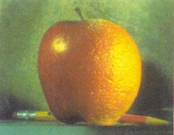

:doctype: book
:source-highlighter: highlightjs
:source-language: cpp
:icons: font
// [reftext="AsciiDoc 文档概览"]
[[asciidoc_overview]]
= AsciiDoc Overview
Jeango W. Yep <254141203@qq.com>; Jimbo_Y M. Walt <other@example.com>
v0.0.1, 2025-01-20: revision remark
// :author: Jeango
// :email: <virtual@example.com>
:revnumber: v0.0.1,
:revdate: 2025-01-20
:revremark: -
:sectnumlevels: 3
:sectnums: |,all|
:toc:
:toclevels: 2
:partnums:
:chapter-signifier: C.
:chapter-refsig: Chapter.
// :icontype: svg
// :iconsdir: ./pictures/
// :data-uri:
:stem:
:ADocExtension: link:https://marketplace.visualstudio.com/items?itemName=asciidoctor.asciidoctor-vscode[AsciiDoc Extension] 
:VSCode: link:https://code.visualstudio.com/[Visual Studio Code]

// Use features: Block title, sidebar block, inlinw anchor, Figure with link
.Jeango's Bilibili Space
****
[#img-avatar]
.Jeango's benificiary of AsciiDoc.
[link=https://space.bilibili.com/202364884]
image::https://i1.hdslb.com/bfs/face/81324e7c4f37f9100b681d87fb71e29076fbfaf7.jpg[Jeango,96,96]
****


请选择感兴趣的内容主题：

. xref:asciidoc_overview[xrefstyle=full]
. xref:get_started[xrefstyle=full]
. xref:from_formal_language[xrefstyle=full] (编译器相关)
. xref:parsing_expression_grammars[xrefstyle=full] (编译器相关)
. xref:asg_schema_json[xrefstyle=full] (编译器相关)
. xref:blocks[xrefstyle=full]
. xref:text_paragraphs[xrefstyle=full]
. xref:substitution[xrefstyle=full]
. xref:document_attributes[xrefstyle=full]
. xref:passthroughs[xrefstyle=full]
. xref:tables[xrefstyle=full]
. xref:adoc_outline[xrefstyle=full]
. xref:diabolical_mathematical_opus[xrefstyle=full]
. xref:diagrams[xrefstyle=full]
. xref:book_writer[xrefstyle=full]
. xref:book_theme_via_docinfo[xrefstyle=full]
. xref:ui_elements[xrefstyle=full]
. xref:font_awesome4[xrefstyle=basic]

link:https://gitlab.com/antora/antora/-/tree/v3.1.x[Antora 3.1.x] +
link:https://docs.antora.org/antora/latest/[Antora Documentation] +
link:https://gitlab.eclipse.org/eclipse/asciidoc-lang/asciidoc-lang/[AsciiDoc Language 0.3.0] +
link:https://www.asciidocfx.com/[Asciidoc Book Editor based on JavaFX 19] +
link:https://github.com/asciidoc-py/asciidoc-py[Legacy python processor for AsciiDoc] +
link:https://asciidoc-py.github.io/chunked/index.html[AsciiDoc User Guide] +
link:https://github.com/asciidoctor/asciidoctor.org/blob/main/docs/asciidoc-writers-guide.adoc[AsciiDoc Writer's Guide ADoc] +
link:https://asciidoctor.org/[Asciidoctor] +
link:https://asciidoctor.org/docs/asciidoc-writers-guide/[AsciiDoc Writer's Guide]

<<<
[reftext="动起æ¥!"]
[[get_started]]
== Get Started!


首先安装 VS Code 并使用 AsciiDoc 官方æ供的æ’件扩展开始编写你的 AsciiDoc 文档ã€ä¹¦ç±ã€æ–‡ç« ã€‚
AsciiDoc VScode 扩展安装包 108 MB，内置 Mermaid æµç¨‹å›¾æ”¯æŒï¼Œæ供的功能如下表所示：

// Use features: Table title, Attributes and substitutions
.Features of {ADocExtension} for {VSCode}
[cols="3,1,3"]
|===
|             Feature           | Desktop | Web 

|Document Outline and Symbols   |âœ”ï¸  |✔ï¸
|Equations (via Mathjax)        |âœ”ï¸  |âœ”ï¸ (requires security to be disabled)
|Export as PDF                  |âœ”ï¸  |â›”
|Kroki Integration for Diagrams |âœ”ï¸  |✔ï¸
|Paste Image                    |âœ”ï¸  |â›”
|Save as HTML                   |âœ”ï¸  |â›”
|Save as DocBook                |âœ”ï¸  |â›”
|Snippets                       |âœ”ï¸  |✔ï¸
|Syntax Highlighting            |âœ”ï¸  |âœ”ï¸ (requires security to be disabled)
|Sync scrolling between 
 the editor and the preview     |âœ”ï¸  |✔ï¸
|===

æ’件默认使用 asciidoctor-pdf 导出 PDF，å¯ä»¥ä¿®æ”¹ VS Code 中的扩展é…置，将默认的编译工具
修改为 wkhtmltopdf。相关的é…置路径为 asciidoc.pdf.wkhtmltopdfCommandPath 还有
asciidoc.pdf.engine。根æ®éœ€è¦å®‰è£… wkhtmltopdf 或者
https://docs.asciidoctor.org/pdf-converter/latest/install/[Asciidoctor PDF]。

AsciiDoc FX 也是一个开æºçš„工具，å¯ä»¥å°† AsciiDoc 导出出多ç§ç”µå­ä¹¦æ ¼å¼ã€‚但是默认没有设置
中文字体支æŒï¼Œç¼ºå¤± Unicode 中文字体，无法åŒæ—¶æ”¯æŒ 加粗+斜体 çš„æ ·å¼ï¼Œä¼šå¯¼è‡´æ–‡æ¡£ä¸­çš„中文
无法正常显示。

想è¦å°† AsciiDoc 导出为 PDF 还有一个å–巧的临时方法，利用 Chrome æµè§ˆå™¨çš„页é¢æ‰“å°åŠŸèƒ½ã€‚åªéœ€è¦
先在 VS Code 中通过 Developer Tools 将预览页é¢çš„内容æ出ä¿å­˜åˆ° HTML 文件。里é¢çš„数学公å¼
å¯èƒ½ä¼šå‡ºç°ä¸¤ä»½ï¼Œå› ä¸ºå·²ç»å­˜åœ¨æ¸²æŸ“好的公å¼ï¼Œé¡µé¢å†æ‰“开时åˆé‡æ–°æ¸²æŸ“了一份，å¯ä»¥å°† `<nobr>` 标签
包裹的已渲染的内容删除。å†æ‰“å¼€ HTML 文档，使用 Chrome 打å°åŠŸèƒ½ç”Ÿæˆ PDF，å¯ä»¥é€‰æ‹© A5 纸张，
这个尺寸比 A4 规格å°ï¼Œé€‚åˆä½œä¸ºç”µå­ä¹¦çš„页é¢ã€‚å¯ä»¥ä½¿ç”¨å—头有点大的 AsciiDoc FX 的导出功能，
当然导出 HTML 还直æ¥ä½¿ç”¨ AsciiDoc VSCode 扩展æ供的导出更方便。还å¯ä»¥å°è¯•ä½¿ç”¨å‘½ä»¤è¡Œå·¥å…·ï¼Œ
如æœä½¿ç”¨æ—§çš„ AsciiDoctor 工具转æ¢å¯èƒ½ä¼šå‡ºç°ä¸€äº›ç‘•ç–µï¼Œæ— æ³•åŸæ ·å‘ˆç°æ–‡æ¡£å†…容。

[source,bash]
python3.11 -m asciidoc.asciidoc AsciiDoc-Overview.adoc 

////
ä¸ºäº†å†™ä¸ªæ•™ç¨‹ï¼Œç»“æœ Bilibili “未通过 ｜ 文章异常â€
https://www.bilibili.com/read/preview/40444286

《写书人 - 让世界多一份 AsciiDoc 教程ï¼ã€‹
​https://vscode.dev/github/Jeangowhy/opendocs/blob/main/AsciiDoc-Overview.adoc#L1193 [æŒç»­æ›´æ–°ï¼Œæœªæ¥æ¨é€github]
​
《​写书人 - 让世界多一份 AsciiDoc 教程ï¼ã€‹å·²ç»åˆ¶ä½œ PDF，请自å–
AsciiDoc Overview A5.pdf
AsciiDoc-Overview.html
​链æ¥: https://pan.baidu.com/s/1ilyDpYZx50B_oOHvZzoHhA?pwd=1324
////


ç›®å‰ï¼Œæµè¡Œçš„å¼€æºæ–‡æ¡£æ ¼å¼æœ‰ä»¥ä¸‹ä¸‰ç§ï¼Œä»æ˜“用性ã€åŠŸèƒ½å’Œå·¥å…·é“¾ä¸‰æ–¹é¢è¯„价如下：

// Description lists::
Markdown (md):: 文档结æ„简å•ã€åŠŸèƒ½è¾ƒç®€æ´ã€å·¥å…·é“¾ä¸°å¯Œæ˜“å®ç°ï¼›
Asciidoc (adoc):: 文档结æ„ç¨æœ‰ç‚¹å¤æ‚ã€åŠŸèƒ½å®Œå¤‡ã€å·¥å…·é“¾ä¸°å¯Œï¼›
reStructuredText (reST):: 文档结æ„比 md å¤æ‚但比 adoc 简æ´ï¼ŒåŠŸèƒ½ä¸°å¯Œï¼Œä½†å·¥å…·é“¾ä¸åŠ adoc。

æ›´é‡è¦çš„一点是 AsciiDoc èƒŒé  Eclipse 软件基金会这棵大树，ä»é•¿è¿œå‘展æ¥çœ‹è¿™ä¸€ç‚¹é常é‡è¦ã€‚
AsciiDoc(R) and AsciiDoc Language(TM) are trademarks of the Eclipse Foundation, Inc.

ç›®å‰ï¼ŒPandoc 对这三ç§æ ¼å¼çš„转æ¢æ”¯æŒ â†”ï¸ Markdownï¼Œâ†”ï¸ reStructuredText 都支æŒåŒå‘转æ¢ï¼Œ
但是 → AsciiDoc å•å‘支æŒï¼Œåªèƒ½ä»å…¶å®ƒæ ¼å¼è½¬æ¢ï¼Œä¸èƒ½è½¬æ¢åˆ°å…¶å®ƒæ ¼å¼ã€‚这里没有将 \(\LaTeX\)
这个专业的æ’版技术放到列表中比对，是因为以上三个格å¼å¤šå¤šå°‘少都是ä¾èµ– \(\LaTeX\) æ供的æ’版
技术æ¥å®ç°æ•°å­¦å…¬å¼çš„处ç†ï¼Œæ¯”如通过 MathJax å®ç° Web 上的公å¼æ¸²æŸ“。

AsciiDoc 关键概念（Key Concepts）：

[cols=">1,5"]
|============
| Terms | Description

| Document 
| AsciiDoc 文档，代表一个 top-level 区å—，åç¼€å为 adoc,asciidoc。
  文档å¯ä»¥è®¾ç½® document header é…置，包括 document title å’Œ
  document attributes，比如 `:doctype: book`。

| Elements
| 元素，是文档内容组织形å¼ï¼Œæœ‰ä¸¤ç§å½¢å¼ï¼š[.term]*block element* å—元素
  按竖直方å‘å †å ï¼Œæ¯ä¸ªå—元素å ä¸€è¡Œï¼›[.term]*inline element* 内è”元素
  按水平方å‘å †å ï¼Œå¤šä¸ªå†…è”元素å¯åŒåœ¨ä¸€è¡Œï¼Œç›´åˆ°è¡Œç©ºé—´ä¸è¶³å®¹çº³å†æ”¾åœ¨ä¸‹ä¸€è¡Œã€‚
  æ–‡æ¡£å…ƒç´ åŒ…æ‹¬æ–‡æ¡£æœ¬èº«ä»¥åŠ sections, blocks, block macros, 
  breaks, inline phrases and macros。

| Attributes
| å±æ€§ï¼Œå°±æ˜¯ name/value æ•°æ®å¯¹ï¼Œæœ‰ä¸¤ç§å±æ€§ï¼ŒDocument å’Œ Element
  对象上设置的å±æ€§ï¼Œæ–‡æ¡£ä¸Šçš„å±æ€§ä½¿ç”¨ `:name: value` æ ¼å¼è®¾ç½®ï¼Œå¹¶ä¸”
  ç´§æ¥è¡Œé¦–。元素上的å±æ€§ä½¿ç”¨ `name=value` æ ¼å¼è®¾ç½®ï¼Œæ¯”如表格é…ç½®å±æ€§
  `[cols="1,2,3"]` 表示一个三列的表格，最å（最å³ï¼‰ä¸€åˆ—å æ®å®½åº¦å’Œ
  å‰é¢ä¸¤åˆ—总和一样宽。文档å±æ€§å¯ä»¥ç”¨äºæ”¹å˜æ–‡æ¡£çš„渲染样å¼ã€è¡Œä¸ºç­‰ç­‰ã€‚
  比如 Attributes and substitutions，将文档å±æ€§å€¼æ›¿æ¢åˆ°æ­£æ–‡ä¸­ã€‚
  也å¯ä»¥é…åˆ `ifdef` 或者 `ifndef` 指令æ¥è¿›è¡Œæ¡ä»¶ç¼–译。å±æ€§è®¾ç½®çš„
  语法是 `:<key-name>: <value>?` 或者ä¸å«å€¼çš„å½¢å¼ `:!<key-name>:`，
  这两ç§å½¢å¼éƒ½å¯ä»¥åœ¨ `ifdef::key-name[]` 测试中得到 true 状æ€ã€‚

| Macros
| å®ï¼Œå¯ä»¥å°† AsciiDoc 看作是å®ç¼–程，这和 GNU `m4` å®ç¼–程概念一样，
  å³è¾“字符串，AsciiDoc Processor 字符处ç†ç¨‹åºæ£€æµ‹å…¶å†…容，å‘ç°å­—符串
  中有å®ï¼ˆMacros）定义，那么就按å®å®šä¹‰çš„内容替æ¢æ—§å†…容，å®å®šä¹‰æ ¼å¼å¯ä»¥
  有å„ç§å½¢å¼ï¼Œæ¯”如 `[source]` 定义代ç å—，`link:` 定义内è”链æ¥ï¼Œ
  `{Arrtibute}` 使用å为 Attribute 的文档å±æ€§æ›¿æ¢å½“å‰ä½ç½®çš„内容。
  å¯ä»¥å°†å®çœ‹ä½œæ˜¯ä¸€ä¸ªå‡½æ•°ï¼Œæ­¤å‡½æ•°åœ¨å­—符串处ç†è¿‡ç¨‹ä¸­è‡ªåŠ¨ç”±å­—处ç†ç¨‹åºè°ƒç”¨ã€‚
  和元素一样，å®ä¹Ÿæœ‰ block (`::`) å’Œ inline (`:`) 两ç§å½¢å¼ã€‚
  比如，`image::logo.png[Logo]` 是 block 图åƒå…ƒç´ ï¼Œè¦ç‹¬å ä¸€è¡Œã€‚
  而内è”图åƒå®šä¹‰åˆ™æ˜¯ `+image:logo.png[Logo]+`。对äºé‚£äº›ä¸å¸Œæœ›è¢«
  处ç†çš„内容，å¯ä»¥ä½¿ç”¨ passthrough 指令（`pass:`） 或者使用 + 包裹，
  è¿™å¯ä»¥é¿å… standalone formatting marks 起作用。比如，这里使用
  加å·åŒ…裹åå¼•å· +``+ 使其åŸæ ·è¾“出字符。代ç å—也å¯ä»¥ç”¨åŠ å·ä½œä¸ºåˆ†ç•Œç¬¦å·ã€‚

| Preprocessor directives
a|预处ç†ç¨‹åºæŒ‡ä»¤ï¼Œå®ƒä»¬å¾ˆåƒå®ï¼Œä½†ä¸æ˜¯ã€‚预处ç†æŒ‡ä»¤çš„功能是负责æ§åˆ¶å“ªäº›
  内容需è¦é€å¾€å­—处ç†ç¨‹åºä¸­å¤„ç†ï¼ˆå®å†…容替æ¢ï¼‰ï¼Œè¿™ä¸ªå·¥ä½œæ˜¯åœ¨å†…容替æ¢å¤„ç†
  之å‰è¿›è¡Œçš„，所以称为“预处ç†â€ã€‚æ¡ä»¶é¢„处ç†æŒ‡ä»¤ (`ifdef`, `ifndef`)
  还有任æ„æ¡ä»¶æŒ‡ä»¤ (`ifeval`)，é…åˆæ–‡æ¡£å±æ€§ä½¿ç”¨ã€‚比如，以下两ç§æ¡ä»¶
  预处ç†è®¾ç½®éƒ½å¯ä»¥åœ¨ `:toc:` 激活时（设置了此文档å±æ€§ï¼‰è¾“出相应的内容。
[source,adoc]
-------------
\ifdef::toc[*Automatic TOC is ON.*]

\ifdef::toc[]
*Automatic TOC is ON.*
\endif::toc[]
-------------
|============

感谢开æºç¤¾åŒºæˆå‘˜ä¸ºå¼€æºæ–‡æ¡£å¼€å‘了这么棒的工具，🧡爱æ¥è‡ªä¸­å›½ï¼

写书人 - 让世界多一份 AsciiDoc æ•™ç¨‹ï¼ xref:get_started[]


<<<
[reftext="ä»å½¢å¼è¯­è¨€å¼€å§‹"]
[[from_formal_language]]
== From Formal Language


AsciiDoc 语言规范目标旨在促进跨ä¸åŒç¼–程语言和è¿è¡Œæ—¶å¼€å‘兼容的 AsciiDoc æ ¼å¼å®ç°ã€‚
为了é¿å…在ä¸åŒè¯­è¨€å®ç°ä¸­ä¸å¿…è¦åœ°é‡å†™æµ‹è¯•ï¼ŒAsciiDoc ä¾ç…§ Eclipse 基金会规范过程，
为规范项目生æˆä¸€ä¸ªæŠ€æœ¯å…¼å®¹æ€§å·¥å…·åŒ…（Technology Compatibility Kit, TCK），
该工具包承诺å®ç°å¤šä¸ªå…¼å®¹çš„å®ç°ã€‚TCK 的作用是确ä¿å®ç°çš„兼容性和应用程åºçš„å¯ç§»æ¤æ€§ã€‚
想è¦è·å¾—认è¯çš„å®ç°å¿…é¡»éµå¾ª AsciiDoc TCK æµç¨‹ã€‚

AsciiDoc 语言核心是比抽象语法树 (Abstract Syntax Tree, AST) 还更高抽象水平的
抽象语义图 (Abstract Semantic Graph, ASG)，这是因为 AsciiDoc 用äºå¤„ç†æ–‡æ¡£çš„
结æ„，而é用äºé€šç”¨ç¼–ç¨‹ã€‚è¿™ä¸€ç‚¹ä¸ Pandoc 这个开æºçš„文档格å¼è½¬æ¢å·¥å…·ç±»ä¼¼ï¼Œå®ƒä»¬éƒ½ä½¿ç”¨
JSON 作为文档格å¼ä¿¡æ¯çš„存储媒介。以下是 Wikipedia 中定义的 ASG 概念:

____
An is a form of abstract syntax in which an expression of a formal 
or programming language is represented by a graph whose vertices are 
the expression’s subterms. An ASG is at a higher level of abstraction 
than an, which is used to express the syntactic structure of an 
expression or program.
____

计算机语言领域上讲，AsciiDoc 并ä¸åƒ XML 这类正则语言（regular language）那样，
å¯ä»¥æ ¹æ®ä¸€ä¸ªè¯­è¨€è§„范æ¥è¿›è¡Œæ•°æ®å¤„ç†ï¼Œä¹Ÿå°±æ˜¯è¯´ AsciiDoc 文档是一ç§æ²¡æœ‰å›ºå®šæ­£åˆ™è§„范
çš„æ ¼å¼ï¼ŒAsciiDoc ASG 就是用äºæ•è·æˆ–è€…è¡¨ç° AsciiDoc 文档内部结æ„的层次模å‹ã€‚
TCK 在一组测试上è¿è¡Œå®ç°ï¼Œè¿™äº›æµ‹è¯•æ¶µç›–了规范所åšçš„所有断言，以验è¯å®ç°æ˜¯å¦ç¬¦åˆè¦æ±‚。
TCK interfaces ä¸ AsciiDoc implementation 一起通过适é…器（TCK adapter）。
适é…器必须将æ¯ä¸ªæµ‹è¯•ä¼ é€’ç»™ AsciiDoc implementation æ‰èƒ½è¿è¡Œï¼Œå¹¶ä¸”必须将该测试
结æœä»å®ç°è¿”å›ç»™ TCK。高度概括，TCK 通过 TCK 适é…器的测试æ¥å±•ç¤º AsciiDoc å®ç°ã€‚
测试是一个 AsciiDoc 文档，必è¦å¯ä»¥è¡¥å……的引用 AsciiDoc 文件（includes）或输入
å‚数（attributes）。

虽然说 ASG 比 AST 抽象等级还è¦é«˜ï¼Œå¥½åƒä¼šæ›´éš¾ç†è§£ï¼Œä½†å…¶å®ä¸ç„¶ï¼Œå®ƒçš„模å¼å®šä¹‰æ–‡ä»¶æ›´æ˜“懂。
以下是规范文档中给出的 ASG schema ä¸æµ‹è¯•æ ·å¼æ•°æ®ã€‚正文段è½çš„ ASG schema 是抽象语法
树上的å¶å—（leaf block），也是抽象å—对象的扩展，它的模å¼å®šä¹‰åœ¨å®˜æ–¹æ–‡æ¡£çš„ ASG
文件夹中 schema.json 中æ述：

.ASG schema
[source,json]
-------------
"paragraph": {
  "type": "object",
  "allOf": [{ "$ref": "#/$defs/abstractBlock" }],
  "unevaluatedProperties": false,
  "required": ["name"],
  "defaults": { "inlines": [] },
  "properties": {
    "name": { "type": "string", "constant": "paragraph" },
    "form": { "type": "string", "enum": "paragraph" },
    "inlines": { "$ref": "#/$defs/inlines" }
  }
}
-------------

.ASG example of an ASG node for a paragraph
[source,json]
-------------
{
  "name": "paragraph",
  "type": "block",
  "inlines": [
    {
      "name": "text",
      "type": "string",
      "value": "This paragraph has multiple lines that wrap after reaching the 72\ncharacter limit.",
      "location": [{ "line": 1, "col": 1 }, { "line": 2, "col": 16 }]
    }
  ],
  "location": [{ "line": 1, "col": 1 }, { "line": 2, "col": 16 }]
}
-------------

.abstractBlock from ASG schema.json.
[source,json]
-------------
    "abstractBlock": {
      "type": "object",
      "required": ["type"],
      "properties": {
        "type": { "type": "string", "const": "block" },
        "id": { "type": "string" },
        "title": { "$ref": "#/$defs/inlines" },
        "reftext": { "$ref": "#/$defs/inlines" },
        "metadata": { "$ref": "#/$defs/blockMetadata" },
        "location": { "$ref": "#/$defs/location" }
      }
    },
-------------

在模å¼å®šä¹‰æ–‡ä»¶ä¸­ï¼Œå¯ä»¥çœ‹åˆ° `leafBlock` å’Œ `parentBlock` 两个文档对象类å‹å·²ç»æ¶µç›–日常使用的
大部分文档元素类å‹ã€‚其中，代ç å—（listing Block）之所以和段è½ï¼ˆparagraph）都划分到 
leafBlock，主è¦ä¸€ä¸ªåŸå› æ˜¯å®ƒåŒ…å«çš„内容是直通输出的，并ä¸éœ€è¦åšå¤§é‡çš„内容替æ¢æ“作。


<<<
[reftext="表达å¼è§£æ文法（PEG）"]
[[parsing_expression_grammars]]
== Parsing Expression Grammars

计算机语言编译软件的å®ç°æŠ€æœ¯ä¸Šï¼Œå¤§ä½“å¯ä»¥æ ¹æ®æ„造分ææƒçš„å½¢å¼åˆ†ä¸ºä¸¤ç±»ï¼šè‡ªé¡¶å‘下æ„建分ææ ‘ã€
以åŠè‡ªåº•å‘上æ„建分æ树。这两ç§æ–¹å¼å¯¹åº”的算法分类是 LL 系算法和 LR 系算法。

LL Parser å®ç°ä»£ç çš„结æ„ä¸æ–‡æ³•å¯¹åº”，易ç†è§£ï¼Œé”™è¯¯å¤„ç†å’Œé”™è¯¯æ¢å¤ä¹Ÿå¥½å¤„ç†ã€‚当å‰è¾ƒæœ‰ä»£è¡¨æ€§çš„是 PEG
(Parse Expression Grammar)，这ç§è‡ªä¸‹è€Œä¸‹çš„ã€çº¿æ€§åˆ†æ器很好地解决了自上而下的二义选择问题。
PEG 文法通过引入 Prioritized choice operator ‘/’ æ¥æä¾›é二义的选择，å³æœ‰é™å›æº¯çš„文法。
而æµè¡Œçš„生æˆå™¨å·¥å…·ï¼ŒANTLR 3 或者 ANTLR 4 就是采用 LL 系列算法自动生æˆè§£é‡Šå™¨çš„工具。

LR Parser 虽然å®ç°ä¸Šæ›´å¤æ‚，但是其速度快ã€è¡¨è¾¾èƒ½åŠ›å¼ºã€‚因此，æŒæ¡ LR 分æ方法比 LL 更具有å®æ“æ„义。

å‚考资料：link:http://staff.ustc.edu.cn/~yuzhang/compiler/2022f/lectures/03-parsing-part3-antlr.pdf[语法分æ III, 中国科大 张昱]

PEG (Parsing Expression Grammars) 表达å¼è§£æ语法å¯ä»¥è§£æ一门上下文无关语言，
包括递归结æ„。ä»è¯­è¨€å®ç°æ–¹å¼æ¥è¯´ï¼Œç±»ä¼¼ Yacc 或 Bison 这样的工具æ¥å®ç°è§£é‡Šå™¨ã€‚
PEG æ˜¯ç”¨å­—ç¬¦ä¸²åŒ¹é… (pattern) æ¥æ述语言的方å¼ï¼Œä¹Ÿå³è¡¨è¾¾å¼è§£æè¿™ç§è¡Œä¸ºæ˜¯å…¶çš„核心。
PEG çš„å®ç°ä¸Šä¸ä¸Šä¸‹æ–‡æ— æ³•æ–‡æ³• context free grammars (CFGs) çš„å®ç°é常ä¸åŒã€‚
PEG ä¸ç®€åŒ–为状æ€æœºï¼Œè€Œæ˜¯é‡‡ç”¨é¡ºåºè§£æ。这æ„味ç€ç¼–写解æ规则的顺åºå¾ˆé‡è¦ã€‚
PEG å¯ä»¥æ›´å®¹æ˜“编写。通常ä¸éœ€è¦ç¼–写å•ç‹¬æ–‡æ¡£æµçš„扫æ程åºï¼Œè¯­æ³•ï¼ˆæ–‡æ³•ï¼‰ç›´æ¥ä¸è¾“å…¥
文本一起工作，而ä¸éœ€è¦ Tokenization 步骤。

AsciiDoc å±äºä¸Šä¸‹æ–‡æ— å…³çš„语言。解æ AsciiDoc 文档ä¸èƒ½æœ‰æ­§ä¹‰ï¼Œè¿™æ„味ç€åªæœ‰ä¸€ä¸ªæœ‰æ•ˆ
的解æ树。解æ AsciiDoc 文档ä¾èµ–äºæœ‰åºé€‰æ‹©è¿ç®—符，有时必须利用断言（Assertions）
和语义谓è¯ï¼ˆsemantic predicates）æ¥åšå‡ºé€‰æ‹©ã€‚断言在光标之å‰æŸ¥çœ‹é‚»æ¥è¦æ±‚，而ä¸æ¶ˆè´¹
任何字符。逻辑谓è¯æ˜¯ä¸€ä¸ªä»»æ„å¤æ‚的表达å¼æˆ–动作，用äºé¢„勘测（peek）输入的字符串。

To cite https://blog.reverberate.org/2013/09/ll-and-lr-in-context-why-parsing-tools.html:

> Parsing expression grammars avoid ambiguity by forcing all grammar rules to be defined in terms of prioritized choice.

AsciiDoc 首先是一ç§ç”¨äºå†™ä½œè€Œé编程的语言，或者说它本身ä¸å…·æœ‰é€šç”¨è®¡ç®—机语言的能力。
语言必须å‡è®¾åœ¨æ²¡æœ‰è¯­æ³•è§„则匹é…的情况下，也就没有找到语言ä¿ç•™æ ‡è®°çš„内容就被读者当作文本。
å¦ä¸€æ–¹é¢ï¼Œå¦‚æœå­—符åºåˆ—（如å—分隔符行）ä¸è¯­æ³•è§„则匹é…，则该字符åºåˆ—被解释为具有语义æ„义，
例如将内容包装在侧边æ å—（sidebar block）。AsciiDoc 文档解æçš„å®ç°éµå¾ª PEG 文法定义，
在语言的许多方é¢çœ‹æ¥çœ‹ï¼ŒAsciiDoc ä¾èµ–äºé€’归下é™ï¼ˆrecursive descent）方法解æ文档的
区å—层次结æ„ã€åˆ†ç•Œçš„å—内容（delimited blocks）ã€åµŒå¥—文本的格å¼åŒ–（text formatting）
等等。而使用 PEG 文法æ述方法å¯ä»¥é常自然地å®ç°é€’归下é™è§£æ器（recursive descent parser），
PEG 还支æŒæ­£åˆ™è¡¨è¾¾å¼å­—符匹é…，这对äºæ”¯æŒæ‰€æœ‰ä¹¦é¢è¯­è¨€ï¼ˆUnicode）至关é‡è¦ã€‚

尽管，AsciiDoctor，Ruby 语言å®ç°çš„的解æ器，其文档中没有æä¾› PEG 文法æ述文档资料，
但是ç†è§£ AsciiDoc 的基本语言学åŸç†æœ‰åŠ©äºè¯»æ‡‚ AsciiDoctor 解æ器代ç ï¼Œé€€ä¸€æ­¥æ¥è¯´ï¼Œ
å³ä½¿æ˜¯é˜…读其测试代ç ï¼Œæ¯”如以下片段，æ示了 AsciiDoc 文档中设置å—内容å±æ€§çš„å„ç§å½¢å¼ï¼Œ
这样也å¯ä»¥å¸®åŠ©ç†è§£ AsciiDoc 需è¦é€šè¿‡ä»€ä¹ˆæ ·çš„语法解æ测试æ‰åˆæ ¼ã€‚å过æ¥è®²ï¼Œç¼–写符åˆ
测试用例的 AsciiDoc 结æ„也就是学习使用其正确的写作方å¼ã€‚

.Test cases from {Test_ALT130}
:Test_ALT130: link:https://vscode.dev/github.com/asciidoctor/asciidoctor/blob/main/test/attribute_list_test.rb#L130-L152[attribute_list_test.rb Line #130]
[source,rb]
-----------
  test 'collect unnamed attribute enclosed in equal signs' do
    attributes = {}
    line = '=foo='
    expected = { 1 => '=foo=' }
    (Asciidoctor::AttributeList.new line).parse_into attributes
    assert_equal expected, attributes
  end

  test 'collect named attribute' do
    attributes = {}
    line = 'foo=bar'
    expected = { 'foo' => 'bar' }
    (Asciidoctor::AttributeList.new line).parse_into attributes
    assert_equal expected, attributes
  end

  test 'collect named attribute double-quoted' do
    attributes = {}
    line = 'foo="bar"'
    expected = { 'foo' => 'bar' }
    (Asciidoctor::AttributeList.new line).parse_into attributes
    assert_equal expected, attributes
  end
-----------

虽然，笔者学过ä¸ä¸‹å数门编程语言，但是 Ruby 还一直没机会试试，今天就有这样一个机会，让我
å…ˆæ¥å®‰è£…它。ç¯å¢ƒä½¿ç”¨çš„是 MSYS2：

[source,bash]
----
$ pacman -S ruby
resolving dependencies...
looking for conflicting packages...

Packages (2) libyaml-0.2.5-1  ruby-3.2.2-1

Total Download Size:    7.29 MiB
Total Installed Size:  29.20 MiB

:: Proceed with installation? [Y/n] y     
----

:AsciiDoc_as_Extension: https://github.com/asciidoctor/asciidoctor-vscode
:Asciidoctor_json: https://vscode.dev/github.com/asciidoctor/asciidoctor-vscode/blob/master/syntaxes/Asciidoctor.json
:asciidoctor_core: https://www.npmjs.com/package/@asciidoctor/core

:asciidoctor_rb: https://github.com/asciidoctor/asciidoctor
:AsciiDoctor_js: https://github.com/asciidoctor/asciidoctor.js
:AsciiDoctor_js_dev: https://vscode.dev/github/asciidoctor/asciidoctor.js
// æ³¨æ„ asciidoctor 是内置å±æ€§ï¼Œä¸èƒ½è¢«è¦†ç›–。

如æœä¸æƒ³ä½¿ç”¨æ—©æœŸä½¿ç”¨ Ruby å®ç°çš„ link:{asciidoctor_rb}[AsciiDoctor]，那么也å¯ä»¥ä½¿ç”¨
更活跃的ã€JavaScript 脚本å®ç°çš„ {Asciidoctor_js} ，它是 AsciiDoctor 解æ器的移æ¤ç‰ˆæœ¬ã€‚
æ­¤å®ç°ä¸»è¦æä¾›ä¸¤ä¸ªæ¨¡å— `asciidoctor` ä»¥åŠ `core`，å者åˆç§°ä¸º Asciidoctor core，NPM
åˆä½¿ç”¨ link:{asciidoctor_core}[@asciidoctor/core] 作为其标识å称。核心模å—主è¦æ供以下
三大功能，

* parser
* built-in converters
* extensions

核心æ¿å—用作 link:{AsciiDoc_as_Extension}[AsciiDoc as VScode Extension] æ’件的
核心组件。å¯ä»¥ä½¿ç”¨åœ¨çº¿ç‰ˆ VSCode æ¥æµè§ˆæºä»£ç ï¼ŒåŒ…括这分语法定义文档 
link:{Asciidoctor_json}[Syntaxes Asciidoctor.json]，
还有 link:{AsciiDoctor_js}[AsciiDoctor.js] (link:{AsciiDoctor_js_dev}[vscode.dev]).

æ’件还æ供了一组 snippets (snippets.json) 代ç ç‰‡æ®µï¼Œåªéœ€è¦è¾“入以下缩写，并按 Ctrl+Space
å°±å¯ä»¥è¾“入相应的代ç æ¨¡æ¿ï¼Œæ¯”如以下表格就å¯ä»¥ä½¿ç”¨ "table" 代ç ç‰‡æ®µæ¥å¿«é€Ÿå®ŒæˆåŸºæœ¬ç»“æ„的输入：

[cols="2,4s",width="80%"]
|===
|Snippet prefix       |Snippet body and note

|"asciidoc-tech-doc"  | An AsciiDoc outline
|"include"            | include::path[attributes]
|"image"              | "\image:${1:path}[${2:alt}]"
|"image"              | "image::${1:path}[${2:alt}]"
|"video"              | "video::${1:path}[${2:alt}]"
|"link"               | "\link:${1:${TM_SELECTED_TEXT:link}}[${2:alt}]"
|"mailto"             | "\mailto:${1:${TM_SELECTED_TEXT:link}}[${2:alt}]"
|"header"             | Document Title, Author, version...
|"heading"            | ${1\|=,==,===,====,=====,======\|} ${2:${TM_SELECTED_TEXT:Heading Title}}
|"unordered list"     | ["* ${1:first}", "* ${2:second}", "* ${3:third}", "$0"]
|"ordered list"       | [". ${1:first}", ". ${2:second}", ". ${3:third}", "$0"]
|"checklist"          | * [${1: }] ${2:first} ...
|"literal"            | [${1:attributes}]\n....\n${2:${TM_SELECTED_TEXT:text}}\n.... 
|"source"             | [source,${1:language},${2:attributes}]\n----\n...----\n
|"example"            | [${1:attributes}]\n====\n...\n====
|"sidebar"            | [${1:attributes}]\n****\n...\n****
|"table"              | [${1:Attributes}]\n\|===\n...\n\|===
|"tag"                | // tag::${1:tagname}[]\n...\n// end::${1:tagname}[]
|"quote"              | [quote, ${1:attribution}, ${2:cite title}]\n____\n...\n____
|"footnote"           | "\footnote:[${1:note}]"
|"footnote-label"     | "footnote:${1:label}[${2:note}]"
|===

SDR4 文档表示，为了以å®ç°åˆç†å‘å兼容性的方å¼æè¿° AsciiDoc 文档结æ„使用了多ç§è¯­æ³•
（Multiple grammars），包括

* line preprocessor 行内容预处ç†ç¨‹åº (å¯èƒ½æ•´åˆåˆ° block)
* block å—内容
* attrlist å±æ€§åˆ—表
* inline preprocessor 内è”内容预处ç†ç¨‹åº
* inline 内è”内容


å˜æ›´æ—¥å¿—（CHANGELOG.adocï¼‰è®°å½•äº†ä» 0.2.0 到 0.3.0 这两个主è¦æ›´æ–°æ‰€å¸¦æ¥çš„文档：

. 0.3.0 (milestone build)
* Draft section in specification for paragraph (#35)
* Draft section in specification for strong span (#37)
* SDR-6: Define Parsing Rules for Positional Attribute to Named Attribute Mapping (#36)
* SDR 7: Designate List Continuation as Universal Interrupting Line (#42)
* SDR 8: Designate List Item as Interrupting Line only for Principal Text (#42)

. 0.2.0 (milestone build)
* Selected JSON as the format for the ASG used by the TCK (#7)
* Create initial draft of JSON schema for the ASG; resides in the asg folder (#28)
* SDR-1: Introduce variable-length delimiter form for open block (#27)
* SDR-2: Define parsing and aggregation rules for attrlist in block attribute line (and block macros) (#33)
* SDR-3: Clarify that block style does not influence parsing model, but is rather a parsing transformation (#31)
* SDR-4: Select PEG as the grammar formalism for describing the AsciiDoc language (#8)
* SDR-5: Transition the inline syntax to a formal grammar from a substitutions step; introduce an inline preprocessor (#16, #22)

æ ¹æ®â€œè§„范文档è¦æ±‚†(*SDR*, *Specification Document Requirement*)，AsciiDoc
è§„èŒƒä» 0.2.0 版本开始使用 PEG 作为语言文法形å¼æ¥æ述文档结æ„。

:lua-parser: link:https://github.com/andremm/lua-parser[Lua Parser]
:lua-parser-dev: link:https://vscode.dev/github.com/andremm/lua-parser/blob/main/lua-parser/parser.lua[Lua Parser vscode.dev]

:link: https://leafo.net/guides/parsing-expression-grammars.html
{link}[An introduction to Parsing Expression Grammars with LPeg] +
https://www.inf.puc-rio.br/~roberto/lpeg/[PEG For Lua, version 1.1] +
link:http://pdos.csail.mit.edu/papers/parsing:popl04.pdf[
Parsing Expression Grammars: A Recognition-Based Syntactic Foundation, 
Bryan Ford, 2004] +
link:https://www.inf.puc-rio.br/~roberto/docs/peg.pdf[
A Text Pattern-Matching Tool based on Parsing Expression Grammars,
Roberto Ierusalimschy] +
link:https://blog.reverberate.org/2013/09/ll-and-lr-in-context-why-parsing-tools.html[
LL and LR in Context: Why Parsing Tools Are Hard] +
link:https://blog.reverberate.org/2013/07/ll-and-lr-parsing-demystified.html[
LL and LR Parsing Demystified] +
link:http://lua-users.org/wiki/LpegTutorial[LPeg Tutorial] +
link:http://lua-users.org/wiki/LpegRecipes[Lpeg Recipes] +
link:https://www.tweag.io/blog/2021-06-15-asciidoc-haskell-pandoc/[
An AsciiDoc processor and Pandoc front-end in Haskell]

LPeg (Parsing Expression Grammars for Lua) 被设计出æ¥ç”¨äºè§£æ语法，通过
它能够轻æ¾åœ°è§£æå„ç§è¯­æ³•ï¼Œæ¯”如 {lua-parser} 用五百行代ç å°† Lua 代ç è§£ææˆæŠ½è±¡
语法树，å¯ä»¥ç‚¹å‡» {lua-parser-dev} 查看其代ç ã€‚LPeg 作为语言工具，å¯ä»¥ç”¨å®ƒæ¥
åšä»£ç çš„é™æ€åˆ†æ，自定义领域语言 (DSL, Domain Specific Language)，将易如åæŒã€‚

例如在游æˆç¼–程中，策划常常需è¦é…置触å‘器，触å‘æ¡ä»¶æœ‰æ—¶æ¯”较å¤æ‚，编程å®ç°æ¯”较ç¹ç。
比如 “血é‡å°äº 10% æˆ–æ€’æ°”å¤§äº 90 时有 50% 的概ç‡è§¦å‘â€ã€‚è¿™ç§åœºæ™¯å°±å¯ä»¥è‡ªå®šä¹‰
DSL, é…置表åªç”¨æ¥è®¾ç½®å¯ä»¥é…置的预定义字符串（hp, wrath, random），那么以上
这个æ¡ä»¶å°±å¯ä»¥ç”¨å­—符串表示为以下这样的语å¥ã€‚然å使用 LPeg 将字符串编译æˆä¸€ä¸ª
Lua 函数，游æˆä¸­é€šè¿‡ Lua 引æ“è¿è¡Œå®ƒå³å¯å®Œæˆç­–划任务.

.DSL statement
=====
  (hp < 10% || wrath > 90) && random() > 0.5
=====

Lua 文档的 The Complete Syntax of Lua 一章内容是 BNF (Backus Naur Form) 
范å¼æè¿°çš„ Lua 语言语法。BNF 就是 CFG 的一ç§è¡¨ç¤ºæ³•. 语法é常简短，åªæœ‰ 67 行规则。
以下是 Lua 5.3 语言的文法æè¿°ï¼Œä¸ Lua 5。4 å·®å¦åœ¨å°† `namelist` 更新为 `attnamelist`。

.BNF of Lua 5.3
[source,BNF]
------------
    chunk ::= block

    block ::= {stat} [retstat]

    stat ::=  ';' | 
         varlist '=' explist | 
         functioncall | 
         label | 
         break | 
         goto Name | 
         do block end | 
         while exp do block end | 
         repeat block until exp | 
         if exp then block {elseif exp then block} [else block] end | 
         for Name '=' exp ',' exp [',' exp] do block end | 
         for namelist in explist do block end | 
         function funcname funcbody | 
         local function Name funcbody | 
         local namelist ['=' explist] 

    retstat ::= return [explist] [';']

    label ::= '::' Name '::'

    funcname ::= Name {'.' Name} [':' Name]

    varlist ::= var {',' var}

    var ::=  Name | prefixexp '[' exp ']' | prefixexp '.' Name 

    namelist ::= Name {',' Name}

    explist ::= exp {',' exp}

    exp ::=  nil | false | true | Numeral | LiteralString | '...' | functiondef | 
         prefixexp | tableconstructor | exp binop exp | unop exp 

    prefixexp ::= var | functioncall | '(' exp ')'

    functioncall ::=  prefixexp args | prefixexp ':' Name args 

    args ::=  '(' [explist] ')' | tableconstructor | LiteralString 

    functiondef ::= function funcbody

    funcbody ::= '(' [parlist] ')' block end

    parlist ::= namelist [',' '...'] | '...'

    tableconstructor ::= '{' [fieldlist] '}'

    fieldlist ::= field {fieldsep field} [fieldsep]

    field ::= '[' exp ']' '=' exp | Name '=' exp | exp

    fieldsep ::= ',' | ';'

    binop ::= '+' | '-' | '*' | '/' | '//' | '^' | '%' | 
              '&' | '~' | '|' | '>>' | '<<' | '..' | 
              '<' | '<=' | '>' | '>=' | '==' | '~=' | 
              and | or

    unop  ::= '-' | not | '#' | '~'
------------

.BNF update of Lua 5.4
[source,BNF]
------------
    stat ::=  ';' | 
         ...
         local namelist ['=' explist]   <.>
         local attnamelist ['=' explist] <.>

    attnamelist ::=  Name attrib {',' Name attrib}

    attrib ::= ['<' Name '>']
    ...
------------
<.> Different part come from Lua 5.3
<.> Different part come from Lua 5.4


下é¢æ˜¯ç”¨ PEG 对其语法的自æ述，语法规则更短å°:

[source,BNF]
------------
1  grammar     <-  (nonterminal ’<-’ sp pattern)+
2  pattern     <-  alternative (’/’ sp alternative)*
3  alternative <-  ([!&]? sp suffix)+
4  suffix      <-  primary ([*+?] sp)*
5  primary     <-  ’(’ sp pattern ’)’ sp / ’.’ sp / literal /
6                  charclass / nonterminal !’<-’
7  literal     <-  [’] (![’] .)* [’] sp
8  charclass   <-  ’[’ (!’]’ (. ’-’ . / .))* ’]’ sp
9  nonterminal <-  [a-zA-Z]+ sp
10 sp          <-  [ \t\n]*
------------

第 1 行表示 PEG 语法由一æ¡ä»¥ä¸Šçš„规则组æˆ, æ¯æ¡è§„则的 <- 左侧为é终结符 (nonterminal)，
å³ä¾§ä¸ºæ¨¡å¼ (pattern)，对应下一级 nonterminal。这些规则å¯ä»¥é€æ¡æ¨å¯¼ï¼Œç›´åˆ°å­—符级别，å³
分散在这些规则中使用å•å¼•å·åŒ…裹的字é¢é‡ï¼ˆliteral）字符以åŠå…¶å®ƒåœ¨æ–¹æ‹¬å·ä¸­çš„字符就是终结符，
用å•å¼•å·åŒ…裹字符（终结符å·ï¼‰æ˜¯ä¸ºé¿å…阅读上出ç°æ­§ä¹‰ã€‚例如，`‘(’ ‘)’` å’Œ `( )` 就是ä¸åŒ
的功能符å·ï¼Œå‰è€…用å•å¼•å·åŒ…裹表示字é¢é‡å­—符，å者没有å•å¼•å·åŒ…裹表示讨文法功能符å·ã€‚注æ„，
规则中åŒæ—¶ä¹Ÿå®šä¹‰äº†ä¸€æ¡ç§°ä¸ºå­—é¢é‡ï¼ˆ*literal*）的规则，定义它的目的是è¦åŒ¹é…代ç æ–‡æ¡£ä¸­çš„
å­—é¢é‡ï¼Œä½†æ˜¯è¿™æ¡è§„则中的 `sp` 本身就ä¸æ˜¯å­—é¢é‡ï¼Œæ˜¯ä¸€ä¸ª nonterminal，或者说是一æ¡å¯ä»¥
继续æ¨å¯¼ï¼ˆåˆ†è§£ï¼‰çš„规则。这æ¡è§„则å¯ä»¥åˆ†è§£ä¸ºä¸¤é¡¹ï¼Œå‰é¢çš„ `[’] (![’] .)* [’]` 这部分表示
匹é…代ç æ–‡æ¡£ä¸­ç”± `’` å•å¼•å·åŒ…裹的内容，å一部分 `sp` 表示匹é…空白字符，这两部分共åŒç§°ä¸º
语法上的 *literal*。类似有这ç§åŒé‡å«ä¹‰çš„是第 9 æ¡ *nonterminal* 规则，它的å³éƒ¨åˆ†
方括å·ä¸­çš„字符都是终结符，但是 `sp` 本身ä¸æ˜¯ï¼Œç»å¯¹åº”一æ¡å¯ç»§ç»­æ¨å¯¼çš„规。当然，`sp` 规则
æ¨å¯¼ç»“æœè¿˜æ˜¯ç»ˆç»“符å·ï¼Œå³ä»»æ„æ•°é‡çš„空白符å·ï¼ˆç©ºæ ¼ã€åˆ¶è¡¨ç¬¦ã€æ¢è¡Œç¬¦ï¼‰ã€‚

这些规则ä¸æ­£åˆ™è¡¨è¾¾å¼ç±»ä¼¼ï¼Œä¾‹å¦‚：

*   . 表示任æ„字符的通é…符，
*   + 表示é‡å¤å‰é¢çš„æ¨¡å¼ 1 次以上；
*   * 表示é‡å¤ 0 次或以上；
*   ? è¡¨ç¤ºå‡ºç° 1 次或 0 次，比如 *alternative* 规则中的 `[!&]?` 表示 ! 或者 & 两个字符å¯æœ‰ä¹Ÿå¯æ— ï¼›
*   [] 表示字符的集åˆï¼Œæ¯”如 *sp* 规则表示任æ„的空白字符，包括空格ã€åˆ¶è¡¨ç¬¦ã€æ¢è¡Œç¬¦ï¼›
*   () 表示分组，分组ä¸å…¶å®ƒæ–‡æ³•ç¬¦å·ç»„åˆä½¿ç”¨ï¼Œæ¯”如 *suffix* 规则中，表示至少有一组以上的 `pass:[[*+?] sp]`ï¼›
*   ! 表示ä¸åŒ¹é…ç´§éšå…¶åçš„æ¨¡å¼ (当且仅当éšå的模å¼ä¸åŒ¹é…æ—¶æ‰ç®—规则匹é…æˆåŠŸ)ï¼›
*   & 表示匹é…ç´§éšå…¶å的模å¼ä½†ä¸æ¶ˆè€—输入；

第 2 行表示æ¯ä¸ªæ¨¡å¼ï¼ˆ*pattern*）å¯ä»¥åŒ…å«å¤šä¸ªå˜æ¢é¡¹ (*alternative*)。这些å˜æ¢é¡¹ç”±æ–œæ ï¼ˆ`/`） 
分隔开，类似 BNF 中的 | 符å·ï¼Œä½†æ˜¯ä¸ºäº†è¡¨ç¤ºæœ‰é™åˆ¶å›æº¯çš„å«ä¹‰ç‰¹åœ°æ”¹ç”¨æ–œæ è¡¨ç¤ºå…¶ä¸¤ä¾§çš„å¯é€‰é¡¹ã€‚

åˆå¦‚第 5 行（*primary*）中由å•å¼•å·åŒ…裹的圆括å·è¡¨ç¤ºé终结符，需è¦åŒ¹é…文档中出ç°çš„由圆括å·åŒ…裹
的模å¼ï¼ˆ`sp pattern`）。注æ„，åé¢çš„ `!’<-’` 部分，表示 nonterminal 没有å置的 `'<-'`
这个é终结符组æˆã€‚本身 `<-` 这符å·ç”¨ä½œ PEG 文法的功能符å·ï¼Œå…¶å·¦éƒ¨ç§°ä¸ºè§„则头部（head）或称为
规则å称，或者有时称“é终结符â€éƒ½æ˜¯å¯ä»¥çš„。因为规则å¯ç»§ç»­æ¨å¯¼å°±è¡¨ç¤ºå®ƒæ²¡æœ‰ç»ˆç»“，例如 *sp* 规则
çš„å³éƒ¨åªåŒ…å«å­—é¢é‡ç¬¦å·ï¼Œä¸å¯å†æ¨å¯¼ï¼Œæ˜¯ç»ˆç»“符å·ã€‚ 

第 8 行定义了一æ¡å­—符分类（*charclass*）规则，它匹é…由方括å·åŒ…裹的任æ„字符串。
Lua 使用 `[[` ä¸ `]]` 作为多行字符串 (heredoc) 的分界符å·ã€‚

ä¸ CFG ä¸åŒçš„是, 这些å¯é€‰é¡¹æ˜¯æœ‰é¡ºåºçš„, åªæœ‰å‰é¢çš„选项匹é…失败æ‰ä¼šå»åŒ¹é…åé¢çš„选项。因为
PEG 是用äºæ述一ç§è‡ªé¡¶å‘下（Top-Down）的解æ语法的方å¼ï¼Œæœ‰åºçš„å¯é€‰é¡¹èƒ½å¤Ÿè®©è§£æ没有歧义。
åŒæ—¶ä½¿ç”¨ *有é™åˆ¶çš„å›æº¯*（restricted backtrackingï¼‰ä¸ *有åºé€‰æ‹©*（ordered choice），
这也是 PEG 的一大优势，能够将å›æº¯é™åˆ¶åœ¨ä¸€æ¡åŒ¹é…规则内。一旦匹é…进入（选择）一æ¡è§„则，就ä¸ä¼š
因为å续的匹é…失败而改å˜ã€‚例如，考虑下列语法：

[source,BNF,role=coollens]
==========================
S   <-  A B

A   <-  E1 / E2 / E3

B   <-  ···
==========================

å‡è®¾å­—ç¬¦ä¸²åŒ¹é… S è§„åˆ™ï¼Œå°±ä¼šå…ˆåŒ¹é… A å†åŒ¹é… B，注æ„两者并存而éå¯é€‰ã€‚ç”±äº A 有三个å¯é€‰é¡¹ï¼Œ
因此会先å°è¯•åŒ¹é… E1ã€‚å¦‚æœ E1 匹é…失败就å›æº¯ï¼Œç„¶ååŒ¹é… E2，以此类æ¨ã€‚一旦有一个选项匹é…è¾¾æˆï¼Œ
è¿™æ¡è§„则就ä¸ä¼šå†å›æº¯ï¼ˆæœ‰é™å›æº¯ï¼‰ã€‚å‡å®š E2 作为 A 规则的æˆåŠŸåŒ¹é…项，如æœæ¥ä¸‹æ¥ S 规则中的
B 匹é…失败，就表示 S 整个模å¼åŒ¹é…失败。B 的失败ä¸ä¼šè®© A é‡æ–°é€‰æ‹©ï¼Œæœ‰é™å›æº¯è¿™ä¸€ç‰¹æ€§ä¿è¯äº†
PEG 的效ç‡ï¼Œä¸ä¼šå‡ºç°æ­£åˆ™è¡¨è¾¾å¼ä¸€æ ·çš„æ— é™å›æº¯çš„问题。

è´ªå©ªåŒ¹é… (greedy match) ä¸æ‡’惰匹é…（lazy match）是正则语言常è§ç”¨æ³•ã€‚比如 `pass:[.*]` 
会匹é…ä»»æ„长度（`+*+`）的任æ„字符（`.`）。类似地，`pass:[.*e]` 会匹é…ä»»æ„以 `e` 结尾
çš„ä»»æ„长度的字符串。在匹é…字符时，就算找到 `e` 也会继续å†å¾€ä¸‹æ‰¾ï¼Œç›´åˆ°ç»“æŸå‘ç°æ²¡æœ‰æ›´å¤š
æ‰å›æº¯åˆ°å‰é¢ã€‚è¿™ç§æ— é™çš„å›æº¯èƒ½åŠ›å ªç§°ç¾éš¾æ€§å›æº¯ï¼ˆCatastrophic Backtracking），使用
ä¸å½“有å¯èƒ½å¯¼è‡´è½¯ä»¶ä¸èƒ½ç»§ç»­æä¾›æœåŠ¡ã€‚如æœæ˜¯ `.*?e` 就会进入懒惰匹é…模å¼ï¼Œåªè¦é‡åˆ° `e`
字符就结æŸã€‚

PEG 在有é™å›æº¯å‰æ下的åšæ³•å°±ç®€å•å¾ˆå¤šï¼ŒPEG 总是会执行贪婪盲匹é…，尽å¯èƒ½åœ°åŒ¹é…更多的字符，
并且ä¸è€ƒè™‘å‰å的其他模å¼ã€‚例如，如下的 PEG 规则：

[source,BNF,role="warmlens"]
============================
S1   <-  .* ’X’

S2   <-  (!’X’ .)* ’X’

S3   <-  ’X’ / . S3

S4   <-  . S4 / ’X’
============================

规则 `#S1#` 看上å»ç±»ä¼¼ `pass:[/.*X/]` 这样的正则表达å¼ï¼Œä½†å®é™…上它无法匹é…任何字符串。
因为 `pass:[.*]` 会匹é…所有字符，然å `X` 永远匹é…失败，因为没有任何字符å¯ä»¥è¿›è¡ŒåŒ¹é…。
å¯ä»¥ç”¨ `#S2#` 规则æ¥æ¨¡æ‹Ÿå®ç°æ­£åˆ™è¡¨è¾¾å¼çš„效æœï¼Œå› ä¸º `.` 会匹é…ä»»æ„字符，添加将 `X` æ’除
在其匹é…选项之外。需è¦å¢åŠ ä¸€ä¸ª `!'X'` 让它在é‡åˆ°ç¬¬ä¸€ä¸ª `X` 的时候åœä¸‹ã€‚ç”±äº `!’X’` 的存在，
一旦é‡åˆ° X 就会匹é…失败，因此就å¯ä»¥å°† X æ’除在贪婪匹é…列表之外。还å¯ä»¥ä½¿ç”¨ `#S3#` è¿™ç§é€’å½’çš„
æ–¹å¼å®ç°åŒæ ·çš„效æœï¼Œ`#S3#` è§„åˆ™ä¼šå…ˆåŒ¹é… `X` 如æœåŒ¹é…到就完æˆï¼Œå¦åˆ™å°±åŒ¹é…备选的任æ„字符匹é…。
然åå†é€’归进入下一轮 `#S3#` 匹é…，直到é‡åˆ°å­—符 `X`, 匹é…结æŸã€‚最åçš„ `#S4#` 更有趣些，
注æ„它将 `X` 作为一个å¯é€‰é¡¹ï¼Œå½“å‰é¢ä¸€é¡¹ `. S4` 递归匹é…æ¯ä¸€ä¸ªå­—符，直到结æŸå¯¼è‡´æ­¤é€‰é¡¹åŒ¹é…
失败，进而åˆä»æœªç«¯å¼€å§‹å›æº¯ï¼Œä»¥é€ä¸ªåŒ¹é… `X`，直到找到字符串中最åä½ç½®å‡ºç°çš„ `X`。


<<<
[reftext="抽象语义图的æ述文件(asg/schema.json)"]
[[asg_schema_json]]
== ASG schema.json

[TIP]
*****
jq 是一个轻é‡çº§ JSON æ•°æ®å¤„ç†ç¨‹åºï¼Œå¯ä»¥ç”¨å®ƒæ¥å¤„ç† ASG schema 中的数æ®ç»“æ„，
å‚考 link:jq-1.7-doc.adoc[jq 教程åŠæ‰‹å†Œ]。åŒç±»å½¢å·¥å…·ä¸­è¿˜æœ‰ Miller (mlr)，
这是一个集数æ®è¯¢ã€æ•´å½¢ã€é‡æ„æ ¼å¼ï¼ˆåŒ…æ‹¬åˆ¶ä½œï¼‰çš„å‘½ä»¤è¡Œå·¥å…·ï¼Œæ”¯æŒ CSV, TSV, JSON, 
ä»¥åŠ JSON Lines (JSONL)。Miller 代ç ä»“库包å«äº†ç¤ºä¾‹æ•°æ®æ–‡ä»¶ï¼š 

*  link:https://miller.readthedocs.io/en/6.13.0/[Miller 6.13.0 Documentation]
*  link:https://vscode.dev/github/johnkerl/miller[Miller Source]
*  link:https://vscode.dev/github/dbohdan/structured-text-tools[Structured text tools]

Mermaid 是一个开æºå›¾è¡¨ç»˜åˆ¶å·¥å…·ï¼Œæ”¯æŒå¤šç§ç±»å‹å›¾è¡¨çš„绘制，但功能ä¸å¤Ÿä¸°å¯Œã€‚例如，类å‹å…³ç³»å›¾
å¯ä»¥è®¾ç½®å„ç§ UML 关系箭头，但是没有æä¾›å„å±æ€§é—´çš„è¿çº¿ã€ç®­å¤´åŠŸèƒ½ï¼Œæ— æ³•åœ¨è¡¨è¾¾ç±»å‹å†…部ä¸å¤–部
的关系时，精确æ§åˆ¶å±æ€§é—´çš„è¿çº¿ã€‚
Mermaid å‚考手册：link:https://vscode.dev/github/mermaid-js/mermaid[Class diagrams]

UML 箭头符å·åŠç±»å‹å…³ç³»çš„表达：

    classDiagram
    classA   --|> classB : Inheritance
    classC   --*  classD : Composition
    classE   --o  classF : Aggregation
    classG   -->  classH : Association
    classI   --   classJ : Link(Solid)
    classK   ..>  classL : Dependency
    classM   ..|> classN : Realization
    classO   ..   classP : Link(Dashed)
*****

ASG schema æè¿°çš„ AsciiDoc 文档框æ¶ç»“æ„示æ„图如下：

[mermaid,target="mermaid-graph"]
--------------------------------
---
config:
  look: handDrawn
  theme: neutral
  layout: elk
---
classDiagram
    Document -- sectionBody
    Document -- author
    Document -- blockMetadata
    sectionBody -- section
    sectionBody -- blocks
    Document          <|-- inlines
    leafBlock         <|-- inlines
    dlistItem         <|-- inlines
    abstractListItem  <|-- inlines
    abstractBlock     <|-- inlines
    section             -- abstractHeading
    discreteHeading     -- abstractHeading
    abstractBlock <|-- abstractHeading
    abstractBlock <|-- abstractListItem
    abstractListItem <|-- listItem
    abstractListItem <|-- dlistItem
    abstractParentInline  <|-- inlineSpan 
    abstractParentInline  <|-- inlineRef 
    abstractParentInline  *-- inlines
    abstractParentInline  *-- location
    parentBlock     -- nonSectionBlockBody
    list            -- nonSectionBlockBody
    dlist           -- nonSectionBlockBody
    abstractBlock <|-- list
    abstractBlock <|-- dlist
    abstractBlock <|-- discreteHeading
    abstractBlock <|-- break
    abstractBlock <|-- blockMacro
    abstractBlock <|-- leafBlock
    abstractBlock <|-- parentBlock
    nonSectionBlockBody -- block
    nonSectionBlockBody -- abstractHeading
    blocks        *-- block
    block         *-- list
    block         *-- dlist
    block         *-- discreteHeading
    block         *-- break
    block         *-- blockMacro
    block         *-- leafBlock
    block         *-- parentBlock
    list          *-- listItem
    dlist         *-- dlistItem
    inlines       *-- inline
    inline        *-- inlineLiteral
    inline        *-- inlineRef
    inline        *-- inlineSpan
    location      *-- locationBoundary

    class author {
        address: string
        firstname: string
        fullname: string
        initials: string
        lastname: string
        middlename: strin
    }

    class blockMetadata {
        attributes: object
        location: location
        options: string[]
        roles: string[]
    }

    class Document {
        + attributes: object
        + blocks: sectionBody[block,section]
        + header: object
        + location: location
        + name: string
        + type: string
    }

    class abstractBlock{
        + id: string
        + location: location
        + metadata: blockMetadata
        + reftext: inlines
        + title: inlines
        + type: const(block)
    }

    class abstractHeading {
        level: intege
    }

    class abstractListItem {
        blocks: nonSectionBlockBody
        marker: string
        principal: inline
    }

    class abstractParentInline {
        inlines: inlines
        location: location
        type: const(inline)
    }

    class list {
        items: listItem[]
        marker: string
        name: const(list)
        variant: enum(callout, ordered, unordere)
    }

    class listItem {
        name: const(listItem)
    }

    class dlist {
        items: dlistItem[]
        marker: string
        name: const(dlist)
    }

    class dlistItem {
        name: const(dlistItem)
        terms: inlines[
    }

    class blockMacro {
        form: const(macro)
        name: enum(audio, video, image, toc)
        target: strin
    }

    class leafBlock {
        form: enum(delimited, indented, paragraph)
        inlines: inlines
        name: enum(listing, literal, paragraph, pass, stem, vers)
    }

    class parentBlock{
        + blocks: nonSectionBlockBody
        + delimiter: string
        + form: const(delimited)
        + name: enum(admonition, example, sidebar, open, quote)
    }

    class section {
        blocks: sectionBody
        name: const(section)
    }

    class break {
        name: const(break)
        variant: enum(page, themati)
    }

    class discreteHeading {
        name: const(heading)
    }


    class inlineLiteral {
        location: location
        name: enum(text, charref, raw)
        type: const(string)
        value: strin
    }

    class inlineRef {
        name: const(ref)
        target: string
        variant: enum(link, xre)
    }

    class inlineSpan {
        form: enum(constrained, unconstrained)
        name: const(span)
        variant: enum(strong, emphasis, code, mar)
    }

    class locationBoundary {
        col: integer
        file: string[]
        line: intege
    }
--------------------------------


以下使用 jq 脚本将 AsciiDoc 中的文档对象的å±æ€§æå–出æ¥ï¼š

[source,bash]
-------------
jq '. as $doc|keys|map(
  if . == "$defs" then 
    empty 
  elif . == "properties" then
    .={(.):$doc.[.]|keys|map(
      if $doc.properties.[.].["$ref"] then
        {(.):$doc.properties.[.].["$ref"]}
      else
        {(.):($doc.properties.[.].type?)}
      end
    )}
  else
    .={(.|tostring):($doc.[.].type? // $doc.[.])} 
  end
  ) | add | delpaths([["if"],["then"],["required"]])' /pl/asciidoc-lang/asg/schema.json |
  jq '.properties|add' | mlr --ijson --opprint --barred cat

+------------+---------------------+--------+------------------+--------+--------+
| attributes | blocks              | header | location         | name   | type   |
+------------+---------------------+--------+------------------+--------+--------+
| object     | #/$defs/sectionBody | object | #/$defs/location | string | string |
+------------+---------------------+--------+------------------+--------+--------+
-------------

命令行串è”了两个 jq 命令，å‰ä¸€ä¸ªç”¨äºæå– Document 对象的å„ç§å±æ€§ï¼Œç¬¬äºŒä¸ªç”¨äºæå– properties
å±æ€§åˆ—表，然åå†ä½¿ç”¨ Miller (mlr) 命令将键值对转æ¢ä¸ºè¡¨æ ¼å½¢å¼æ˜¾ç¤ºã€‚

[source,json]
-------------
{
  "$id": "https://schemas.asciidoc.org/asg/1-0-0/draft-01",
  "$schema": "https://json-schema.org/draft/2020-12/schema",
  "additionalProperties": false,
  "defaults": {
    "blocks": []
  },
  "description": "A structured representation of the semantics in an AsciiDoc document, primarily used for validating the compliance of an AsciiDoc processor.",
  "properties": [
    { "attributes": "object" },
    { "blocks": "#/$defs/sectionBody" },
    { "header": "object" },
    { "location": "#/$defs/location" },
    { "name": "string" },
    { "type": "string" }
  ],
  "title": "AsciiDoc Abstract Semantic Graph (ASG)",
  "type": "object"
}
-------------

AsciiDoc 文档中定义的类å‹å¯ä»¥ä½¿ç”¨ `.["$defs"]|keys` 过滤器æå–å…¶å称。å†é…置内置函数 `map`
将类å‹å称列表（keys）中项ä¸å…¶æœ¬èº«çš„æ•°æ®ç±»å‹ä¿¡æ¯å…³è”èµ·æ¥ã€‚也就是将 AsciiDoc 文档节点类å‹ä¸è„šæœ¬
语言å®ç°ä¸­çš„ç±»å‹å…³è”。å¯ä»¥çœ‹åˆ°ï¼Œé™¤äº† inlinesã€locationã€nonSectionBlockBodyã€sectionBody
等四项为数组（记录文档中其它类å‹çš„一个集åˆï¼‰ï¼Œå…¶ä½™ 22 项都是 AsciiDoc 的文档节点类å‹ã€‚而其中的
四个抽象节点，是其它节点的基类定义。Document ç±»å‹å®šä¹‰ä¸­ï¼Œå®šä¹‰äº† `blocks` å±æ€§ï¼ˆé›†åˆï¼‰
æ¥è®°å½•ç”¨æˆ·åœ¨æ–‡æ¡£ä¸­ç¼–写的å„ç§å—对象（`sectionBody`），这个集åˆåŒ…å« `block` 或者 `section`
两类文档对象。

[source,json]
-------------
jq '.["$defs"] as $defs|$defs|keys|map({(.):($defs.[.].type)})|add' /pl/asciidoc-lang/asg/schema.json 

{
  "abstractBlock": "object",
  "abstractHeading": "object",
  "abstractListItem": "object",
  "abstractParentInline": "object",
  "author": "object",
  "block": "object",
  "blockMacro": "object",
  "blockMetadata": "object",
  "break": "object",
  "discreteHeading": "object",
  "dlist": "object",
  "dlistItem": "object",
  "inline": "object",
  "inlineLiteral": "object",
  "inlineRef": "object",
  "inlineSpan": "object",
  "leafBlock": "object",
  "list": "object",
  "listItem": "object",
  "locationBoundary": "object",
  "parentBlock": "object",
  "section": "object",

  "inlines": "array",
  "location": "array",
  "nonSectionBlockBody": "array",
  "sectionBody": "array"
}
-------------

笼统地说，AsciiDoc æ–‡æ¡£ä¸­çš„å¯¹è±¡åŒ…å« `inline` å’Œ `block` 两类对象，分类如下，åé¢ä¸å†ç½—列：

* inline ("object") is neOf:
  ** "#/$defs/inlineSpan"
  ** "#/$defs/inlineRef"
  ** "#/$defs/inlineLiteral

* block ("object") is oneOf:
  ** "#/$defs/list"
  ** "#/$defs/dlist"
  ** "#/$defs/discreteHeading"
  ** "#/$defs/break"
  ** "#/$defs/blockMacro"
  ** "#/$defs/leafBlock"
  ** "#/$defs/parentBlock

这里挑选 `parentBlock` 这个比较有代表性文档对象æ¥è¯´æ˜ ASG 文档中的类å‹å…³ç³»ã€‚其中 `$defs` 表示
AsciiDoc 文档对象的定义列表。列表中的æ¯ä¸ªå¯¹è±¡ä¸­çš„ `type` 表示这对象类å‹ï¼Œå¤šæ•°å¯¹è±¡éƒ½æ˜¯ AsciiDoc
文档中直æ¥ä½¿ç”¨çš„ blocks 或者 inlines 对象。其中 `required` 是一个列表，表示当å‰å¯¹è±¡çš„å¿…è¦å±æ€§ã€‚
ASG 文档中还å¯ä»¥ä½¿ç”¨ `if` æ¡ä»¶è¯­å¥ä¸€æ ·çš„功能，用æ¥åœ¨ç‰¹å®šæ¡ä»¶ä¸‹ä½¿ç”¨å½“å‰å¯¹è±¡çš„å±æ€§å‘生å˜åŒ–。就如以下
ç‰‡æ®µä¸­ï¼Œå¦‚æœ `parentBlock` çš„å称的值满足 `admonition` 这个值，那么会æˆä¸ºä¸€ä¸ªä¿¡æ¯æ¨¡å‹å¯¹è±¡ã€‚
AsciiDoc 共有 5 ç§ä¿¡æ¯æ¡†ï¼Œå¦‚其中的 `variant` “å˜ä½“å±æ€§â€åˆ—表所示。其中 `allOf` 表示当å‰å¯¹è±¡
的父类å‹ï¼Œè¿™é‡Œå°±è¡¨ç¤º `abstractBlock` 是父类å‹ï¼Œäº‹å®ä¸Šå®ƒæ˜¯å¤§å¤šæ•° AsciiDoc 文档对象的父类å‹ã€‚
然å就是 `properties` å±æ€§åˆ—表，对äºç”¨æˆ·æ¥è¯´ï¼Œè¿™ä¸ªåˆ—表是最é‡è¦çš„，因为涉åŠç”¨æˆ·å¦‚何给文档对象
设置å„ç§å±æ€§ã€‚当然，`parentBlock` 并且ä¸æ˜¯ç”¨æˆ·å¯ä»¥ç›´æ¥è®¾ç½®çš„ AsciiDoc 文档对象，它本身å±æ€§
解æ程åºç®¡ç†æ–‡æ¡£å¯¹è±¡çš„æ•°æ®ç»“æ„，åªæœ‰åƒ "admonition", "example", "sidebar", "open", "quote"
æ‰æ˜¯ç”¨æˆ·ä½¿ç”¨ AsciiDoc 写作时应该关注的具体的文档对象。

[source,json]
-------------
        "parentBlock": {
          "type": "object",
          "allOf": [
            { "$ref": "#/$defs/abstractBlock" },
            {
              "if": {
                "required": ["name"],
                "properties": { "name": { "const": "admonition" } }
              },
              "then": {
                "required": ["variant"],
                "properties": {
                  "variant": {
                    "type": "string",
                    "enum": ["caution", "important", "note", "tip", "warning"]
                  }
                }
              }
            }
          ],
          "unevaluatedProperties": false,
          "required": ["name", "form", "delimiter"],
          "defaults": { "blocks": [] },
          "properties": {
            "name": {
              "type": "string",
              "enum": ["admonition", "example", "sidebar", "open", "quote"]
            },
            "form": { "type": "string", "const": "delimited" },
            "delimiter": { "type": "string" },
            "blocks": { "$ref": "#/$defs/nonSectionBlockBody" }
          }
        },
-------------

以下 jq 脚本用äºæŠ½å– AsciiDoc 文档å„ç§å¯¹è±¡çš„å称åŠå±æ€§åˆ—表，包括它们的类å‹å…³ç³»ã€‚脚本分为两部分，
å‰é¢ `itemTypes` 这是用äºè®°å½•å¯¹è±¡ç±»å‹çš„集åˆï¼Œå¯¹äºå…·ä½“çš„æŸç§ç±»å‹æ‰ä¼šæœ‰ `properties` å±æ€§åˆ—表。
脚本中使用了 `empty` 内置函数，åªéœ€è¦ä½¿ç”¨ # 符å·å°†åŒ…å« empty çš„æ¡ä»¶å¥ä»¥åŠ itemTypes 这段注解æ‰ï¼Œ
å°±å¯ä»¥è¾“出这些具体类å‹çš„å±æ€§åˆ—表。

[source,bash]
-------------
jq  '.["$defs"] as $defs|$defs|keys|map(
  {(.):{
    type: ($defs.[.].type | if .== "array" then empty else . end),
    # itemTypes: (
    #   if($defs.[.].type == "array") then 
    #   [ $defs.[.] |
    #     if (.prefixItems) then
    #       .prefixItems[] | map(.|gsub("#/\\$defs/"; "")) | add
    #     elif (.items.oneOf) then
    #       .items.oneOf[] | map(.|gsub("#/\\$defs/"; "")) | add
    #     elif (.items) then
    #       .items         | map(.|gsub("#/\\$defs/"; ""))  | add
    #     else
    #       .|tostring
    #     end
    #   ] else empty end),
    properties: ($defs.[.].properties as $pp | $pp // {}|keys?|map(
      if ($pp.[.].["$ref"]) then
        (.+$pp.[.].["$ref"]) | gsub("#/\\$defs/"; ": ")
      elif ($pp.[.].type == "array") then
        if ($pp.[.].items.["$ref"]) then
          (.+$pp.[.].items.["$ref"] | gsub("#/\\$defs/"; ": ")+"[]")
        else
          (.+": "+$pp.[.].items.type+"[]")
        end
      elif ($pp.[.].enum) then
        (.+": enum{"+($pp.[.].enum|join(", "))+"}")
      elif ($pp.[.].const) then
        (.+": const("+$pp.[.].const+")")
      else
        (.+": "+$pp.[.].type)
      end
      ))
    }
  })
  ' /pl/asciidoc-lang/asg/schema.json
-------------

AsciiDoc 文档中的集åˆå¯¹è±¡ä¸æ–‡æ¡£å¯¹è±¡çš„关系ã€å±æ€§åˆ—表如下：

[source,json]
-------------
[
  {
    "inlines": {
      "type": "array",
      "itemTypes": [ "inline" ]
    }
  },
  {
    "location": {
      "type": "array",
      "itemTypes": [ "locationBoundary", "locationBoundary" ]
    }
  },
  {
    "nonSectionBlockBody": {
      "type": "array",
      "itemTypes": [ "block" ]
    }
  },
  {
    "sectionBody": {
      "type": "array",
      "itemTypes": [ "block", "section" ]
    }
  }
]
-------------


[source,json]
-------------
[
  {
    "abstractBlock": {
      "type": "object",
      "properties": [
        "id: string",
        "location: location",
        "metadata: blockMetadata",
        "reftext: inlines",
        "title: inlines",
        "type: const(block)"
      ]
    }
  },
  {
    "abstractHeading": {
      "type": "object",
      "properties": [
        "level: integer"
      ]
    }
  },
  {
    "abstractListItem": {
      "type": "object",
      "properties": [
        "blocks: nonSectionBlockBody",
        "marker: string",
        "principal: inlines"
      ]
    }
  },
  {
    "abstractParentInline": {
      "type": "object",
      "properties": [
        "inlines: inlines",
        "location: location",
        "type: const(inline)"
      ]
    }
  },
  {
    "author": {
      "type": "object",
      "properties": [
        "address: string",
        "firstname: string",
        "fullname: string",
        "initials: string",
        "lastname: string",
        "middlename: string"
      ]
    }
  },
  {
    "blockMacro": {
      "type": "object",
      "properties": [
        "form: const(macro)",
        "name: enum{audio, video, image, toc}",
        "target: string"
      ]
    }
  },
  {
    "blockMetadata": {
      "type": "object",
      "properties": [
        "attributes: object",
        "location: location",
        "options: string[]",
        "roles: string[]"
      ]
    }
  },
  {
    "break": {
      "type": "object",
      "properties": [
        "name: const(break)",
        "variant: enum{page, thematic}"
      ]
    }
  },
  {
    "discreteHeading": {
      "type": "object",
      "properties": [
        "name: const(heading)"
      ]
    }
  },
  {
    "dlist": {
      "type": "object",
      "properties": [
        "items: dlistItem[]",
        "marker: string",
        "name: const(dlist)"
      ]
    }
  },
  {
    "dlistItem": {
      "type": "object",
      "properties": [
        "name: const(dlistItem)",
        "terms: inlines[]"
      ]
    }
  },
  {
    "inlineLiteral": {
      "type": "object",
      "properties": [
        "location: location",
        "name: enum{text, charref, raw}",
        "type: const(string)",
        "value: string"
      ]
    }
  },
  {
    "inlineRef": {
      "type": "object",
      "properties": [
        "name: const(ref)",
        "target: string",
        "variant: enum{link, xref}"
      ]
    }
  },
  {
    "inlineSpan": {
      "type": "object",
      "properties": [
        "form: enum{constrained, unconstrained}",
        "name: const(span)",
        "variant: enum{strong, emphasis, code, mark}"
      ]
    }
  },
  {
    "leafBlock": {
      "type": "object",
      "properties": [
        "form: enum{delimited, indented, paragraph}",
        "inlines: inlines",
        "name: enum{listing, literal, paragraph, pass, stem, verse}"
      ]
    }
  },
  {
    "list": {
      "type": "object",
      "properties": [
        "items: listItem[]",
        "marker: string",
        "name: const(list)",
        "variant: enum{callout, ordered, unordered}"
      ]
    }
  },
  {
    "listItem": {
      "type": "object",
      "properties": [
        "name: const(listItem)"
      ]
    }
  },
  {
    "locationBoundary": {
      "type": "object",
      "properties": [
        "col: integer",
        "file: string[]",
        "line: integer"
      ]
    }
  },
  {
    "parentBlock": {
      "type": "object",
      "properties": [
        "blocks: nonSectionBlockBody",
        "delimiter: string",
        "form: const(delimited)",
        "name: enum{admonition, example, sidebar, open, quote}"
      ]
    }
  },
  {
    "section": {
      "type": "object",
      "properties": [
        "blocks: sectionBody",
        "name: const(section)"
      ]
    }
  }
]
-------------


.AsciiDoc link:{schema_json}[ASG schema.json].
:schema_json: https://gitlab.eclipse.org/eclipse/asciidoc-lang/asciidoc-lang/-/blob/main/asg/schema.json
[source,json]
-------------
{
  "$schema": "https://json-schema.org/draft/2020-12/schema",
  "$id": "https://schemas.asciidoc.org/asg/1-0-0/draft-01",
  "title": "AsciiDoc Abstract Semantic Graph (ASG)",
  "description": "A structured representation of the semantics in an AsciiDoc document, primarily used for validating the compliance of an AsciiDoc processor.",
  "type": "object",
  "required": ["name", "type"],
  "defaults": { "blocks": [] },
  "additionalProperties": false,
  "properties": {
    "name": { "type": "string", "const": "document" },
    "type": { "type": "string", "const": "block" },
    "attributes": {
      "type": "object",
      "additionalProperties": false,
      "patternProperties": {
        "^[a-zA-Z0-9_][-a-zA-Z0-9_]*$": {
          "oneOf": [
            { "type": "string" },
            { "type": "null" }
          ]
        }
      }
    },
    "header": {
      "type": "object",
      "additionalProperties": false,
      "properties": {
        "title": { "$ref": "#/$defs/inlines" },
        "authors": {
          "type": "array",
          "items": { "$ref": "#/$defs/author" },
          "minItems": 1
        },
        "location": { "$ref": "#/$defs/location" }
      }
    },
    "blocks": { "$ref": "#/$defs/sectionBody" },
    "location": { "$ref": "#/$defs/location" }
  },
  "if": {
    "required": ["header"]
  },
  "then": {
    "required": ["attributes"]
  },
  "$defs": {
    "abstractBlock": {
      "type": "object",
      "required": ["type"],
      "properties": {
        "type": { "type": "string", "const": "block" },
        "id": { "type": "string" },
        "title": { "$ref": "#/$defs/inlines" },
        "reftext": { "$ref": "#/$defs/inlines" },
        "metadata": { "$ref": "#/$defs/blockMetadata" },
        "location": { "$ref": "#/$defs/location" }
      }
    },
    "abstractHeading": {
      "type": "object",
      "allOf": [{ "$ref": "#/$defs/abstractBlock" }],
      "required": ["title", "level"],
      "properties": {
        "level": { "type": "integer", "minimum": 0 }
      }
    },
    "abstractListItem": {
      "type": "object",
      "allOf": [{ "$ref": "#/$defs/abstractBlock" }],
      "required": ["marker"],
      "defaults": { "blocks": [] },
      "properties": {
        "marker": { "type": "string" },
        "principal": { "$ref": "#/$defs/inlines" },
        "blocks": { "$ref": "#/$defs/nonSectionBlockBody" }
      }
    },
    "sectionBody": {
      "type": "array",
      "items": {
        "type": "object",
        "oneOf": [
          { "$ref": "#/$defs/block" },
          { "$ref": "#/$defs/section" }
        ]
      }
    },
    "nonSectionBlockBody": {
      "type": "array",
      "items": { "$ref": "#/$defs/block" }
    },
    "section": {
      "type": "object",
      "allOf": [{ "$ref": "#/$defs/abstractHeading" }],
      "unevaluatedProperties": false,
      "required": ["name"],
      "defaults": { "blocks": [] },
      "properties": {
        "name": { "type": "string", "const": "section" },
        "blocks": { "$ref": "#/$defs/sectionBody" }
      }
    },
    "block": {
      "type": "object",
      "discriminator": { "propertyName": "name" },
      "oneOf": [
        { "$ref": "#/$defs/list" },
        { "$ref": "#/$defs/dlist" },
        { "$ref": "#/$defs/discreteHeading" },
        { "$ref": "#/$defs/break" },
        { "$ref": "#/$defs/blockMacro" },
        { "$ref": "#/$defs/leafBlock" },
        { "$ref": "#/$defs/parentBlock" }
      ]
    },
    "list": {
      "type": "object",
      "allOf": [{ "$ref": "#/$defs/abstractBlock" }],
      "unevaluatedProperties": false,
      "required": ["name", "marker", "variant", "items"],
      "properties": {
        "name": { "type": "string", "const": "list" },
        "marker": { "type": "string" },
        "variant": { "type": "string", "enum": ["callout", "ordered", "unordered"] },
        "items": {
          "type": "array",
          "items": { "$ref": "#/$defs/listItem" },
          "minItems": 1
        }
      }
    },
    "dlist": {
      "type": "object",
      "allOf": [{ "$ref": "#/$defs/abstractBlock" }],
      "unevaluatedProperties": false,
      "required": ["name", "marker", "items"],
      "properties": {
        "name": { "type": "string", "const": "dlist" },
        "marker": { "type": "string" },
        "items": {
          "type": "array",
          "items": { "$ref": "#/$defs/dlistItem" },
          "minItems": 1
        }
      }
    },
    "listItem": {
      "type": "object",
      "allOf": [{ "$ref": "#/$defs/abstractListItem" }],
      "unevaluatedProperties": false,
      "required": ["name", "principal"],
      "properties": {
        "name": { "type": "string", "const": "listItem" }
      }
    },
    "dlistItem": {
      "type": "object",
      "allOf": [{ "$ref": "#/$defs/abstractListItem" }],
      "unevaluatedProperties": false,
      "required": ["name", "terms"],
      "properties": {
        "name": { "type": "string", "const": "dlistItem" },
        "terms": {
          "type": "array",
          "items": { "$ref": "#/$defs/inlines" },
          "minItems": 1
        }
      }
    },
    "discreteHeading": {
      "type": "object",
      "allOf": [{ "$ref": "#/$defs/abstractHeading" }],
      "unevaluatedProperties": false,
      "required": ["name"],
      "properties": {
        "name": { "type": "string", "const": "heading" }
      }
    },
    "break": {
      "type": "object",
      "allOf": [{ "$ref": "#/$defs/abstractBlock" }],
      "unevaluatedProperties": false,
      "required": ["name", "variant"],
      "properties": {
        "name": { "type": "string", "const": "break" },
        "variant": { "type": "string", "enum": ["page", "thematic"] }
      }
    },
    "blockMacro": {
      "type": "object",
      "allOf": [{ "$ref": "#/$defs/abstractBlock" }],
      "unevaluatedProperties": false,
      "required": ["name", "form"],
      "properties": {
        "name": { "type": "string", "enum": ["audio", "video", "image", "toc"] },
        "form": { "type": "string", "const": "macro" },
        "target": { "type": "string" }
      }
    },
    "leafBlock": {
      "type": "object",
      "allOf": [
        { "$ref": "#/$defs/abstractBlock" },
        {
          "if": {
            "required": ["form"],
            "properties": { "form": { "const": "delimited" } }
          },
          "then": {
            "required": ["delimiter"],
            "properties": { "delimiter": { "type": "string" }
            }
          }
        }
      ],
      "unevaluatedProperties": false,
      "required": ["name"],
      "defaults": { "inlines": [] },
      "properties": {
        "name": {
          "type": "string",
          "enum": ["listing", "literal", "paragraph", "pass", "stem", "verse"]
        },
        "form": {
          "type": "string",
          "enum": ["delimited", "indented", "paragraph"]
        },
        "inlines": { "$ref": "#/$defs/inlines" }
      }
    },
    "parentBlock": {
      "type": "object",
      "allOf": [
        { "$ref": "#/$defs/abstractBlock" },
        {
          "if": {
            "required": ["name"],
            "properties": { "name": { "const": "admonition" } }
          },
          "then": {
            "required": ["variant"],
            "properties": {
              "variant": {
                "type": "string",
                "enum": ["caution", "important", "note", "tip", "warning"]
              }
            }
          }
        }
      ],
      "unevaluatedProperties": false,
      "required": ["name", "form", "delimiter"],
      "defaults": { "blocks": [] },
      "properties": {
        "name": {
          "type": "string",
          "enum": ["admonition", "example", "sidebar", "open", "quote"]
        },
        "form": { "type": "string", "const": "delimited" },
        "delimiter": { "type": "string" },
        "blocks": { "$ref": "#/$defs/nonSectionBlockBody" }
      }
    },
    "blockMetadata": {
      "type": "object",
      "defaults": { "attributes": {}, "options": [], "roles": [] },
      "additionalProperties": false,
      "properties": {
        "attributes": {
          "type": "object",
          "additionalProperties": false,
          "patternProperties": {
            "^(?:[a-zA-Z_][a-zA-Z0-9_-]*|\\$[1-9][0-9]*)$": {
              "type": "string"
            }
          }
        },
        "options": {
          "type": "array",
          "items": { "type": "string" }
        },
        "roles": {
          "type": "array",
          "items": { "type": "string" }
        },
        "location": { "$ref": "#/$defs/location" }
      }
    },
    "inlines": {
      "type": "array",
      "items": { "$ref": "#/$defs/inline" }
    },
    "inline": {
      "type": "object",
      "discriminator": { "propertyName": "name" },
      "oneOf": [
        { "$ref": "#/$defs/inlineSpan" },
        { "$ref": "#/$defs/inlineRef" },
        { "$ref": "#/$defs/inlineLiteral" }
      ]
    },
    "abstractParentInline": {
      "type": "object",
      "required": ["type", "inlines"],
      "properties": {
        "type": { "type": "string", "const": "inline" },
        "inlines": { "$ref": "#/$defs/inlines" },
        "location": { "$ref": "#/$defs/location" }
      }
    },
    "inlineSpan": {
      "type": "object",
      "allOf": [{ "$ref": "#/$defs/abstractParentInline" }],
      "unevaluatedProperties": false,
      "required": ["name", "variant", "form"],
      "properties": {
        "name": { "type": "string", "const": "span" },
        "variant": { "type": "string", "enum": ["strong", "emphasis", "code", "mark"] },
        "form": { "type": "string", "enum": ["constrained", "unconstrained"] }
      }
    },
    "inlineRef": {
      "type": "object",
      "allOf": [{ "$ref": "#/$defs/abstractParentInline" }],
      "unevaluatedProperties": false,
      "required": ["name", "variant", "target"],
      "properties": {
        "name": { "type": "string", "const": "ref" },
        "variant": { "type": "string", "enum": ["link", "xref"] },
        "target": { "type": "string" }
      }
    },
    "inlineLiteral": {
      "type": "object",
      "required": ["name", "type", "value"],
      "additionalProperties": false,
      "properties": {
        "name": { "type": "string", "enum": ["text", "charref", "raw"] },
        "type": { "type": "string", "const": "string" },
        "value": { "type": "string" },
        "location": { "$ref": "#/$defs/location" }
      }
    },
    "author": {
      "type": "object",
      "additionalProperties": false,
      "properties": {
        "fullname": { "type": "string" },
        "initials": { "type": "string" },
        "firstname": { "type": "string" },
        "middlename": { "type": "string" },
        "lastname": { "type": "string" },
        "address": { "type": "string" }
      }
    },
    "location": {
      "type": "array",
      "prefixItems": [
        { "$ref": "#/$defs/locationBoundary" },
        { "$ref": "#/$defs/locationBoundary" }
      ],
      "minItems": 2,
      "maxItems": 2
    },
    "locationBoundary": {
      "type": "object",
      "required": ["line", "col"],
      "additionalProperties": false,
      "properties": {
        "line": { "type": "integer", "minimum": 1 },
        "col": { "type": "integer", "minimum": 0 },
        "file": {
          "type": "array",
          "items": { "type": "string" },
          "minItems": 1
        }
      }
    }
  }
}
-------------

<<<
[reftext="内容å—"]
[[blocks]]
== Blocks

AsciiDoc 文档中的元素主è¦æ˜¯å—元素（Block）和内è”元素（Inline），å者主è¦æ˜¯æ­£æ–‡æ®µè½å†…容，
å‰è€…则有å„ç§ä¸åŒç”¨é€”çš„å—元素。当然，å—元素内也包å«äº†å†…è”元素。

AsciiDoc Language Specification Outline 官方规范大纲文档包å«äº†é常丰富的软件设计细节。
在语言规范大纲文档中 Blocks 一章内容罗列讲解了å„ç§å—元素。其中，列表是ä¸ç”¨åˆ†ç•Œç¬¦å·é™å®šå†…容
范围的å—å…ƒç´ ï¼Œå®ƒçš„å®šä¹‰ç¬¦å· (List markers) 包括：

.  `+*+` (asterisk, unordered), 
.  `.` (period, ordered), 
.  `[1-9][0-9]*.` (Arabic number, ordered), 
.  `-` (hyphen, unordered), and 
.  `<([1-9][0-9]*|\.)>` (callout)

使用相åŒåˆ—表字符的æ¡ç›®ä¼šä¿æŒåŒä¸€çº§åˆ—表，如æœæ¢ç”¨ä¸åŒçš„列表字符，其级别就加深一层。空白æ¢è¡Œ
并ä¸ä¼šé‡ç½®åˆ—表项目的计数，需è¦æ‰‹åŠ¨æ·»åŠ æ³¨è§£éš”开列表æ¡ç›®ï¼Œæˆ–者使用 `[]` 空白的 check list
æ¡ç›®æ¥éš”离列表。

除了这些有åºæˆ–æ— åºçš„列表，还有有 check list，Callout numbers (aka callouts)，以åŠ
Description list (Dlist) 这些用äºç³»åˆ—ä¿¡æ¯çš„组织形å¼ã€‚其中æ述列表（Dlist）也称术语
解释列表，针对 term 或者 subject è¯æ±‡è¿›è¡Œæ³¨è§£ã€‚æ ¼å¼æ˜¯ `term:: description`，例如：

Description list:: 简称 Dlist，术语解释列表，使用标记符å·åˆ†éš”术语ä¸è§£é‡Šå†…容。
Subject or Term::: 列表中被解释的术语或者主题è¯ï¼Œåé¢è·Ÿç€æ ‡è®°ç¬¦å·ã€‚
Description:::: 解释内容（注解）å¯ä»¥å†™åœ¨åŒä¸€è¡Œï¼Œå¹¶åŠ ç©ºæ ¼éš”开。å¯ä»¥æ¢è¡Œæˆ–缩进，但空行结æŸæ³¨è§£ã€‚
Dlist markers;; 解释列表标记符å·ï¼ˆ`::`, `:::`, `::::`, `;;`）用äºåˆ†éš”术语和注解。
Dlist depth;; 切æ¢æ ‡è®°ç¬¦å·å°†å¢åŠ åˆ—表的深度，使用ä¸é¢å‡ºç°è¿‡çš„相åŒç¬¦å·æ—¶ï¼Œå°†æ¢å¤åŒæ ·çš„深度。


Callout ç¼–å·ç”¨äºåœ¨ä»£ç å—中给 `<.>` 所在的相应ä½ç½®äº§ç”Ÿä¸€ä¸ªç¼–ç ï¼Œä¸»è¦ç”¨äºè§£é‡Šä»£ç ç”¨ã€‚
Callout ç¼–å·éœ€è¦æˆå¯¹ä½¿ç”¨ï¼Œæœ‰ä¸€ä¸ª `<.>` 标记在代ç ä¸­ï¼Œå°±éœ€è¦åŒæ ·æœ‰ä¸€ä¸ªåœ¨ä»£ç å—åé¢ã€‚
这些编å·è¿˜å¯ä»¥ä¸ `icons=font` 文档å±æ€§æ­é…使用，显示ä¸åŒçš„åºå·å›¾æ¡ˆã€‚对äºæœ‰ç›¸åŒçš„ç¼–å·ï¼Œ
还å¯ä»¥è®¾ç½®æŒ‡å®šçš„ç¼–å·ï¼Œä¾‹å¦‚ `<1>`，å‚考以下代ç å—：

.Examples of Ordered or Unordered List.
------
.   Ordered list item with auto increment numbers.
1.  Ordered list item with Arabic numerals.
a.  Lowrcase alphabet order List item.
F.  Uppercase alphabet order List item.
i)  Lowercase Roman numeric list item.
I)  Uppercase Roman numeric list item.

[] <.>
- Unordered List item.
* Unordered List item.
** Unordered List item.
*** Unordered List item.

[] <.>
* [*] checked
* [x] also checked
* [ ] not checked
*     normal list item

Description list:: Also named Dlist as a abbreviation.
Depth::: More depeth by a diferent Dlist markers.
------
<.> Breaks the ordered list above.
<.> Breaks the unordered list above.

AsciiDoc 是一ç§èµ·å§‹è¾¹è·å¯¹é½ï¼ˆå³å·¦å¯¹é½ ltr）语言，缩进内容将当作代ç å—，对äºéœ€è¦è¿›è¡Œç¼©è¿›å¤„ç†çš„
文字内容，å¯ä»¥ä½¿ç”¨å†…置的 `{empty}` 空字符替æ¢æŒ‡ä»¤ç»“åˆ Description lists 指令 `::` 进行
缩进处ç†ï¼Œè¿˜å¯ä»¥ä½¿ç”¨`:::` 进行二级缩进。åªè¦é¦–å…ˆä¸è¿›è¡Œç¼©è¿›ï¼ŒåŒä¸€æ®µè½ä¸­çš„其它å续内容å¯ä»¥ä»»æ„
缩进。此åŒå†’å·ä¸å®ï¼ˆMacros）表达形å¼é常类似，å®è¯­æ³•æ ¼å¼ä¸º
`<name>::?<target>?[<attrlist>?]`，它有两ç§è¡¨ç°å½¢å¼ï¼Œå°±æ˜¯å•å†’å·ç”¨åœ¨å†…容中内è”显示：

*  block å½¢å¼çš„图片å®ï¼š`+image::play.png[]+`
*  inline å½¢å¼çš„图片å®ï¼š`+image:play.png[]+`

AsciiDoc 文档å—包å«çš„内容类å‹æŒ‰ä»¥ä¸‹åˆ†ç±»ï¼š

.Content model
[cols="^1,5"]
|=============
|compound  |a block that may only contain other blocks (e.g., a section)
|simple    |a block that's treated as contiguous lines of paragraph text 
            (and subject to normal substitutions) (e.g., a paragraph block)
|verbatim  |a block that holds verbatim text (displayed "`as is`") 
            (and subject to verbatim substitutions) (e.g., a listing block)
|raw       |a block that holds unprocessed content passed directly through
            to the output with no substitutions applied 
            (e.g., a passthrough block)
|empty     |a block that has no content (e.g., an image block)
|table     |a special content model reserved for tables that enforces 
            a fixed structure
|=============


.Built-in contexts
[#table-of-contexts,cols="1s,5"]
|===
|Name           | Purpose

|admonition     |One of five admonition blocks.
|audio          |An audio block.
|colist         |A callout list.
|dlist          |A description list.
|document       |The top-level document or the document in an AsciiDoc table cell
|example        |An example block.
|floating_title |A discrete heading.
|image          |An image block.
|list_item      |An item in an ordered, unordered, or description list 
                 (only relevant inside a list or description list block).
                 In a description list, this block is used to represent 
                 the term and the description.
|listing        |A listing block.
|literal        |A literal block.
|olist          |An ordered list.
|open           |An open block.
|page_break     |A page break.
|paragraph      |A paragraph.
|pass           |A passthrough block.
|preamble       |The preamble of the document.
|quote          |A quote block (aka blockquote).
|section        |A section. May also be a part, chapter, or special section.
|sidebar        |A sidebar block.
|table          |A table block.
|table_cell     |A table cell (only relevant inside a table block).
|thematic_break |A thematic break (aka horizontal rule).
|toc            |A TOC block (to designate custom TOC placement).
|ulist          |An unordered list.
|verse          |A verse block.
|video          |A video block.
|===

AsciiDoc 文档中å¯ä»¥é€šè¿‡ä¸€äº›æŒ‡ä»¤æ¥è®¾ç½®æ ‡é¢˜ã€åˆ—表ã€ä»£ç å—等内容的自动编å·ã€‚
这些自动编å·æŒ‡ä»¤åŒ…括多ç§å†…容，比如 listing ç¼–å·å¯¹åº” [source] 代ç å—，标题编å·åˆ™ä½¿ç”¨ 
sectnums 指令指定，还å¯ä»¥ä½¿ç”¨ `<.>` 作为列表的编å·æˆ–者在代ç å—中产生编å·æ ‡è®°ã€‚具体使用
å‚考 Add a Title to a Block。åºå·å¯ä»¥é€šè¿‡å‰ç¼€ã€æˆ–者å缀感å¹å·ï¼ˆcaption!）æ¥ç¦ç”¨ã€‚
åç»­å¯ç”¨ç¼–å·å会é‡æ–°è®¡æ•°ï¼Œä¹Ÿå¯ä»¥ä½¿å¾— number 指令设置一个åˆå§‹ç¼–å·ã€‚

:listing-number: 0
:listing-caption:

.Example of Block Title Numbering
[source,adoc]
-------------
  :sectnums!:
  == Preface

  :sectnums:
  == First Chapter

  :listing-caption!:
  :listing-caption:
  :listing-caption: My Listing
  :listing-number: H

  .Example Block Title
  ====
  content
  ====

  .Sidebar Block Title (Center)
  ****
  content
  ****

  [sidebar]
  single line sidebar block.

  .Listing Block Title
  -----
  content
  -----

  .Quote Block Title
  ____
  content
  ____

  [quote]
  single line quote block.
-------------


AsciiDoc 代ç å—是由对称符å·ï¼ˆè¡Œåˆ†éš”符）包裹的内容，代ç å—标题å³æ˜¯ä»¥å¥ç‚¹å¼€å¤´çš„内容，并且
标题åé¢ç´§è·Ÿä»£ç å—。以下是自动编å·ç›¸å…³æŒ‡ä»¤åŠä»£ç å—分隔符å·å‚考：

.Blocks that support captioned titles
[cols="<2,>3,>3"，opts="autowidth"]
|==================================================================
| Block context       | Caption attribute   | Counter attribute

| appendix            | appendix-caption    | appendix-number
| example             | example-caption     | example-number
| image               | figure-caption      | figure-number
| listing, source     | listing-caption     | listing-number
| table               | table-caption       | table-number
|==================================================================


.Structural containers in AsciiDoc
[#table-of-structural-containers,cols="1,2m,2,^3l"，opts="autowidth"]
|==================================================================
|    Type   | Default context | Content model | Minimum delimiter

| comment   |    _n/a_        |   _n/a_       | ////
| example   |    :example     |   compound    | ====
| listing   |    :listing     |   verbatim    | ----
| literal   |    :literal     |   verbatim    | ....
| open      |    :open        |   compound    | --
| sidebar   |    :sidebar     |   compound    | ****
| table     |    :table       |   table       | \|=== ,=== :=== !===
| pass      |    :pass        |   raw         | ++++
| quote     |    :quote       |   compound    | ____
|==================================================================

对äºä»£ç å—内容，å¯ä»¥é€šè¿‡æ–‡æ¡£å±æ€§ `source-highlighter` 设置代ç é«˜äº®ç€è‰²ï¼ˆsource highlighters）。
æ ¹æ®æ–‡æ¡£è½¬æ¢å™¨æ”¯æŒçš„语法高亮æ¥è®¾ç½®ï¼Œå¯é€‰å€¼å‚考如下：

.Built-in source-highlighter values and the supporting toolchains
[#built-in-values%autowidth]
|===
|Library |Value |Toolchain

|CodeRay      |`coderay`      |Asciidoctor, AsciidoctorJ, Asciidoctor PDF
|highlight.js |`highlight.js` |Asciidoctor, AsciidoctorJ, Asciidoctor.js
|Pygments     |`pygments`     |Asciidoctor, Asciidoctor PDF
|Rouge        |`rouge`        |Asciidoctor, AsciidoctorJ, Asciidoctor PDF
|===


<<<
[reftext="正文文本段è½"]
[[text_paragraphs]]
== Text Paragraphs


AsciiDoc 文档处ç†çš„核心是å®æ›¿æ¢ï¼Œå°†åŒ…å«å®ç¬¦å·çš„文本处ç†ï¼ˆæ›¿æ¢ï¼‰ç›¸åº”的内容å产生文档
输出。AsciiDoc (.adoc 或者 .asciidoc) 就相当äºåŒ…å«å®ä»£ç çš„æºæ–‡ä»¶ã€‚以下是 AsciiDoc
文档编辑时使用到的基本语法ä¸æ›¿æ¢è§„则：

.Basic substitution cases
[cols="~s,2d,~"]
|===============
| Syntax        | Render          | Notes

|`pass:[+...+]` | ...             | AsciiDoc 中的 + 加å·åŠŸèƒ½é常多，一个主è¦åŠŸèƒ½å°±æ˜¯ç›´é€šå¤„ç†ï¼ˆpass throughs）
|`+\\|+`        | \|              | Use \ to escape syntax chacter.
|`\+pass+`      | \+pass+         | The text that enclose by + symbol will pass through as it is.
|`\^supscript^` | sup^+script+^   | 上标，带空格需è¦ç”¨ + 包裹。 
|`\~subscript~` | sub~+script+~   | 下标，带空格需è¦ç”¨ + 包裹。 
|`\*bold*`      | *bold font*     | 粗体字，带空格ä¸éœ€è¦ç”¨ + 包裹。 
|`\_italic_`    | *italic font*   | 斜体字，带空格ä¸éœ€è¦ç”¨ + 包裹。 
|`+{plus}+`     | +               | 花括å·è¯­æ³•å¯å¼•ç”¨ï¼ˆæ›¿æ¢ï¼‰å±æ€§å€¼ï¼Œplus 是其中一个内置å±æ€§ã€‚
|`'''`          | -               | Horizontal Rule
|`<<<`          | -               | Page Break

| +#highlight#+ | #hightligh#     | 使用 # å·åŒ…裹需è¦è¿›è¡Œé«˜äº®å¤„ç†çš„内容。
| +**C**reate+  | **C**reate      | Unconstrained bold
| +__R__ead+    | __R__ead        | Unconstrained italic
| +``U``pdate+  | ``U``pdate      | Unconstrained mono
| +##D##elete+  | ##D##elete      | Unconstrained highlight

| +[.big]##O##+         | big[.big]##O##            | 使用大å·å­—角色。
| +[.small]##S##mall+   | [.small]##S##mall         | 使用å°å·å­—角色。
| [.underline]\#...#    | [.underline]#underlined#  | 使用下划线角色。
| [.line-through]\#...# | [.line-through]#strikethrough#  | 使用穿é€çº¿è§’色。
| [.myrole]\#...#       | [.myrole]#custom role#  | 自定义角色（样å¼ç±»ï¼‰ï¼Œéœ€è¦æ ·å¼å®šä¹‰ã€‚
| \icon:heart[2x,role=red] | icon:heart[2x,role=red] | Icon Macro 图标å®ğŸ§¡ã€‚
|===============

AsciiDoc 中的 + 加å·æ˜¯åŠŸèƒ½æœ€å¤šçš„一个符å·ï¼š

* 作为内容直通处ç†ï¼ˆpass throughs），包裹那些需è¦é¿å…被处ç†ç¨‹åºæ›¿æ¢çš„内容，å¯ä»¥å•åŠ å·ã€åŒåŠ å·ã€ä¸‰è¿æˆ–者以上。
* 作为列表中的段è½è¿æ¥ç¬¦å·ï¼Œå› ä¸º AsciiDoc 是缩进æ•æ„Ÿçš„文档，在列表中编写的多个正文段è½ï¼Œå°±é€šè¿‡ç‹¬å ä¸€è¡Œçš„加å·æ¥è¿æ¥ã€‚
* 作为强制断行（hard line break），在加å·å‰ç¼€ç©ºæ ¼å¹¶æ”¾ç½®äºè¡Œæœ«ï¼Œå¯æœ‰å缀空格。
* ä¸å±æ€§å€¼ä¸­ä½¿ç”¨çš„软件断行 (`\`) 符å·ä¸€èµ·ä½¿ç”¨ï¼Œåœ¨å±æ€§å€¼çš„软断行ä½ç½®ä½¿ç”¨ `+ \` 以å®ç°ä¿ç•™ç¡¬æ–­è¡Œçš„å±æ€§å€¼å†…容。

[TIP]
=====
列表中使用 `+` 符å·è¿æ¥å¤šä¸ªæ®µè½æˆ–代ç å—时，å¯ä»¥åœ¨å…¶å‰åä¿ç•™ç©ºè¡Œã€‚但是在使用å‰å¯¼ç©ºè¡Œæ—¶
ä¸èƒ½å¯¹ `+` 符å·è¿›è¡Œç¼©è¿›ï¼Œä¼šè¢«å½“作文本å—处ç†ã€‚å¯ä»¥è€ƒè™‘在行å‰ä½¿ç”¨ `{empty}` 或者 `{blank}`
（å±æ€§å¼•ç”¨ï¼‰ç©ºç™½å†…容作为文本缩进替代形å¼ã€‚以下是用 soft line break æ¥ç»™ä¸€æ®µå†…容断行：

[source,asciidoc]
----
:CRLF: {empty} + \
  {empty}

UTF-8:: "unicode-1-1-utf-8" {CRLF} "unicode11utf8" {CRLF} "unicode20utf8" 
        {CRLF} "utf-8" {CRLF} "utf8" {CRLF} "x-unicode20utf8"
----

断行效æœæ¼”示如下：

:CRLF: {empty} + \
  {empty}

UTF-8:: "unicode-1-1-utf-8" {CRLF} "unicode11utf8" {CRLF} "unicode20utf8" 
        {CRLF} "utf-8" {CRLF} "utf8" {CRLF} "x-unicode20utf8"
=====

ç”±äºï¼ŒåŠ å·åœ¨ AsciiDoc 文档的应用é常频ç¹ï¼Œæ‰€ä»¥é˜…读并ç†è§£ AsciiDoc 文档中的å®å®šä¹‰ï¼Œç¬¬ä¸€ä¸ªå°±
应该是ç†è§£ç›´é€šå®çš„使用，本文将直通å®çš„内容独立在一章进行解说，å续内容将以 <<substitution>>ã€
<<document_attributes>>ã€<<passthroughs>> 的顺åºç»„织。

按照规范文档æ述，AsciiDoc 文档中的空白符å·ï¼ˆSpace characters）包括空格ã€æ¢è¡Œç¬¦ã€åˆ¶è¡¨ç¬¦ï¼Œ
它们在文档中的功能说æ˜å¦‚下。规范文档中的 *FI* 表未æ¥è§£å†³çš„问题（Future Issue），包括规范的
æ案ã€è®¨è®ºã€æ¦‚念澄清：

* An AsciiDoc document may use tabs or spaces as space characters, though the 
  inline syntax primarily only considers spaces.
* A space character is a space, tab, or line ending (e.g., newline).
 ** *FI* Precisely, what space characters are permitted (e.g., space, tab, newline) 
    or restricted? (For example, `\s` includes no-break space (`\u00a0`) in JavaScript, 
    but not in Ruby.)
* Other space characters are permitted in the document, but will not be interpreted as such.
* Newlines create separate lines, which are often treated specially in AsciiDoc.
* Empty lines are often treated as significant when analyzing the block structure of an AsciiDoc document
* Two consecutive line endings create an empty line; consecutive empty lines in 
  non-verbatim content are semantically equivalent to a single empty line
* Except in verbatim or raw content or block metadata, an empty line is interpreted 
  as a block boundary.
* Leading space characters make an indented line.
* Trailing space characters are insignificant and may be dropped by the processor.
 ** *FI* How are trailing space characters in the source going to be handled?
* The one exception is a non-AsciiDoc include file with lines that include trailing space 
  characters; these characters must be preserved.


使用以下任一ç§æ–¹å¼å¯ä»¥å°†å†…容设置为字é¢é‡å—对象（literal block），和代ç å—类似也会在转æ¢
HTML æ ¼å¼æ—¶ä½¿ç”¨ `<pre>` 包裹内容：

* indenting the first line of a paragraph by one or more spaces,
* setting the `literal` style on a block using an attribute list, or
* enclosing the content within a pair of literal block delimiters (`\....` ).

AsciiDoc 默认会将缩进当作代ç å—内容，AsciiDoc 中的缩进形å¼ä¸»è¦åŒ…括：

*   列表缩进：用äºæ— åºåˆ—表ã€æœ‰åºåˆ—è¡¨ï¼Œä»¥åŠ Dlist 术语表进行缩进。
*   å—对象内容缩进：用äºä»£ç å—和行内代ç ï¼ŒåŒ…括使用 `----` 或者 `====` 等等分界符包裹的内容。
*   表格缩进：用äºå¯¹é½è¡¨æ ¼å†…容。除éå¯ç”¨å•å…ƒçš„语法支æŒï¼Œå¦åˆ™ç¼©è¿›å†…容ä¸ä¼šå½“作代ç å—看待。
*   数学公å¼ç¼©è¿›ï¼šä½¿ç”¨ `pass:[++++]` 分界符包裹å—å…¬å¼å†…容，其缩进会åŸæ · (passthrough) 传递给公å¼è§£æ器。
*   注释缩进：使用 // 用äºå•è¡Œå’Œä½¿ç”¨ /// 多行注释，缩进åŸæ ·ä¿ç•™ï¼Œå¹¶ä¸”ä¸ä¼šæ¸²æŸ“到输出文件。

文档中为了正文段è½çš„缩进对é½ï¼Œå¯ä»¥åœ¨é¦–行使用锚点（anchor poin）开头，比如 `[[A]]` 这样的格å¼ï¼Œ
然å其它内容ã€åŒ…括åé¢è¿ç»­çš„行都å¯ä»¥ä»»æ„缩进，并且这些行首ã€è¡Œæœ«çš„空白符å·ä¼šè¢«è¿‡æ»¤æ‰ã€‚
AsciiDoc 字处ç†ç¨‹åºï¼ˆPreprocessor）会在读å–正文内容（paragraph）时进行归一化处ç†
（line normalization），å»é™¤æ‰è¡Œæœ«çš„空白字符，包括æ¢è¡Œç¬¦å·ã€‚自定义的断行处ç†éœ€è¦
æ ¹æ®ä»¥ä¸Šæ–¹æ³•æˆ–者使用å®ã€åˆ—表ã€ä»£ç å—等等方法处ç†ã€‚

规范文档中关äºå†…容缩进（Indentation）的部分说æ˜ï¼š

*   AsciiDoc is a start margin-aligned (i.e., left-aligned in ltr) language.
*   Using the start margin as an anchor point in the syntax makes moving content 
    around easier, avoids the problem of excessive/compound indentation, encourages 
    the author to be more explicit about nesting, and makes the language easier to parse.
*   That means, with certain exceptions, space characters at the start of a line 
    (an indented line) are significant.
*   The key exception are list markers, which may be indented without meaning.
*   A line with leading space characters at a block boundary makes a literal paragraph.
*   Spaces are recommended for indentation, but tabs may also be used.


角色（role）在 Web 上是一ç§æå‡è§†éšœäººå‘˜ä½“验的技术，WAI-ARIA Roles 定义了相应的å±æ€§ï¼Œ
辅助软件就å¯ä»¥æ ¹æ®è½¯ä»¶ä¸Šè®¾ç½®çš„ role å±æ€§å€¼æ¥æ供相应的辅助信æ¯ç»™è§†éšœäººå‘˜ã€‚AsciiDoc
文档中的 role 用äºé€šè¿‡æ ·å¼å±æ€§æ¥æ§åˆ¶å†…容的呈ç°ã€‚AsciiDoc 内容ä¸ç›¸åº”çš„ HTML 代ç 
对照关系如下：

[source,asciidoc]
-----------------
// tag::css-custom[]
Type the word [.userinput]#asciidoctor# into the search bar.
// end::css-custom[]

// tag::css-custom-html[]
<span class="userinput">asciidoctor</span>
// end::css-custom-html[]
-----------------

AsciiDoc roles 除了设置字体大å°ç­‰ï¼Œè¿˜æ”¯æŒéƒ¨åˆ† CSS 命å色彩（named colors），比如
`aqua` 或者对应的背景色 `aqua-background`。因为 role å±æ€§å¯¹åº”的是 HTML class
æ ·å¼å±æ€§ï¼Œæ‰€ä»¥åˆç†çŒœæµ‹å¯ä»¥å°†å¤šä¸ªè§’色写在å±æ€§åˆ—表中，比如：`[.aqua .black-background]`，
[.aqua .black-background]#aqua-background#，就是åŒæ—¶ä½¿ç”¨å¤šä¸ªæ ·å¼ç±»ã€‚也å¯ä»¥åƒä»¥ä¸‹
这样定义å—内容的样å¼ã€‚注æ„，使用 `====` 分界符å·æ—¶ï¼Œä¼šåœ¨å¯¼å‡º HTML æ ¼å¼æ—¶å—到内容样å¼
`.exampleblock>.content` çš„å½±å“，导致å—内容的背景未能如期望值设置：

[role="green-background white"]
******
**Green** boxes encompasses some notes or useful features/hints about
OpenGL or the subject at hand.
******

[role="red-background white"]
******
**Red** boxes will contain warnings or other features you have to be
extra careful with.
******

[source,asiidoc]
----------------
[role="green-background white"]
******
**Green** boxes encompasses some notes or useful features/hints about
OpenGL or the subject at hand.
******

[role="red-background white"]
******
**Red** boxes will contain warnings or other features you have to be
extra careful with.
******
----------------

å…³äº CSS 148 个命å色å¯ä»¥å‚考 CSS 规范文档，或以下 SVG 色å¡å›¾ç‰‡
link:./pictures/css-148-named-colors.svg[]:

:mycolors: ./pictures/css-148-named-colors-themes.svg#cyan-theme
image:{mycolors}[link={mycolors}]

AsciiDoc 默认样å¼è¡¨ä¸­å®šä¹‰çš„ CSS 命å色彩如下，åªæœ‰ç³»ç»Ÿå…¼å®¹è‰²ï¼ˆ16 ç§ï¼‰ï¼š

[cols="1,2,2",opts="autowidth"]
|========
|aqua    | [.aqua]##{color:#00bfbf}##     |[.aqua-background]##{background:#00fafa}##
|black   | [.black]##{color:#000}##       |[.white .black-background]##{background:#000}##
|blue    | [.blue]##{color:#0000bf}##     |[.white .blue-background]##{background:#0000fa}##
|fuchsia | [.fuchsia]##{color:#bf00bf}##  |[.white .fuchsia-background]##{background:#fa00fa}##
|gray    | [.gray]##{color:#606060}##     |[.white .gray-background]##{background:#7d7d7d}##
|green   | [.green]##{color:#006000}##    |[.green-background]##{background:#007d00}##
|lime    | [.lime]##{color:#00bf00}##     |[.lime-background]##{background:#00fa00}##
|maroon  | [.maroon]##{color:#600000}##   |[.white .maroon-background]##{background:#7d0000}##
|navy    | [.navy]##{color:#000060}##     |[.white .navy-background]##{background:#00007d}##
|olive   | [.olive]##{color:#606000}##    |[.white .olive-background]##{background:#7d7d00}##
|purple  | [.purple]##{color:#600060}##   |[.white .purple-background]##{background:#7d007d}##
|red     | [.red]##{color:#bf0000}##      |[.red-background]##{background:#fa0000}##
|silver  | [.silver]##{color:#909090}##   |[.silver-background]##{background:#bcbcbc}##
|teal    | [.teal]##{color:#006060}##     |[.white .teal-background]##{background:#007d7d}##
|white   | [.white]##{color:#bfbfbf}##    |[.white-background]##{background:#fafafa}##
|yellow  | [.yellow]##{color:#bfbf00}##   |[.yellow-background]##{background:#fafa00}##
|========

此外，默认样å¼è¡¨ä¸­è¿˜å®šä¹‰äº†ä»¥ä¸‹è¿™äº›æ ·å¼ç±»ï¼ˆroles），是较常用的功能，根æ®éœ€è¦å–用。关äºé»˜è®¤æ ·å¼
或者自自定定义样å¼å¯ä»¥å‚考 AsciiDoctor 转æ¢å™¨çš„文档。

.Helper roles come from default stylesheet. Ref. {cusomtcss}
:cusomtcss: https://docs.asciidoctor.org/asciidoctor/latest/html-backend/[Apply a Custom Stylesheet]
[source,css]
-----------
.left                 {float:left!important}
.right                {float:right!important}
.text-left            {text-align:left!important}
.text-right           {text-align:right!important}
.text-center          {text-align:center!important}
.text-justify         {text-align:justify!important}
.hide                 {display:none}

.center               {margin-left:auto;margin-right:auto}
.stretch              {width:100%}
.clearfix::before,
.clearfix::after,
.float-group::before,
.float-group::after   {content:" ";display:table}
.clearfix::after,
.float-group::after   {clear:both}

.hide-on-print        {display:none!important}
.print-only           {display:block!important}
.hide-for-print       {display:none!important}
.show-for-print       {display:inherit!important}}
-----------

使用这些样å¼è§’色时注æ„，比如文本对é½ï¼Œåº”该使用å—元素格å¼ï¼Œå³ä½¿ç”¨åˆ†ç•Œç¬¦å·åŒ…裹需è¦å¯¹é½çš„内容。
å¦åˆ™ï¼Œå¯¹é½æ ·å¼ä¼šåº”用äºå†…è”元素，比如 HTML `<span>`，这会导致文本的剧中对é½å¤±æ•ˆã€‚

---------
[.text-center]
**************
**On the Translation of Languages from Left to Right**

**DONALD E. KNUTH**
**************
---------

[.text-center]
**************
**On the Translation of Languages from Left to Right**

**DONALD E. KNUTH**
**************

AsciiDoc Syntax Quick Reference 文档有完æˆçš„基本语法使用示范，比如三ç§æ–­è¡Œæ–¹å¼ï¼š
行末中使用加å·ï¼ˆ+）用äºä¿ç•™æ–­è¡Œï¼Œä½¿ç”¨å¸¦æœ‰æ–­è¡Œé€‰é¡¹çš„å— `[%hardbreaks]`，或者直æ¥åœ¨
标题下设置文档å±æ€§ `:hardbreaks-option:`，ååé¢çš„所有内容都ä¿ç•™æ–­è¡Œï¼Œè€Œä¸å¿…å†é€è¡Œ
手动设置。å¯ä»¥ä½¿ç”¨ `:hardbreaks-option!:` ç¦ç”¨æ–­è¡Œå±æ€§ã€‚选项还å¯ä»¥ä½¿ç”¨ `opts`
这个å¯é€‰é¡¹åˆ—表æ¥è®¾ç½®ï¼Œä¾‹å¦‚在表格中设置å¯é€‰é¡¹ï¼š`[opts="header,footer,autowidth"]`。


<<<
[reftext="内容替æ¢"]
[[substitution]]
== Substitution


AsciiDoc 有 6 ç§å†…容替æ¢å½¢å¼ï¼Œç›¸å…³æ–‡æ¡£è¯´æ˜å¦‚下：

.Substitution types
[cols="1,2,2"]
|====
| Substitutions     | Examples                    | subs/pages/index.adoc

| Specialchars      | i.e < (wil be `\&lt;`)      | special-characters.adoc
| Quotes            | i.e., inline formatting     | quotes.adoc
| Attributes        | \{docname}: {docname}       | attributes.adoc
| Replacements      | i.e. +(C)+ is copyright (C) | replacements.adoc
| Macros            | i.e. `\pass:a[\{docname}]`  | macros.adoc
| Post replacements | one case is line break (+)  | post-replacements.adoc
|====

其中å置替æ¢ï¼ˆPost Replacement Substitutions）是在其它替æ¢å®Œæˆå进行的最å一步替æ¢ã€‚
主è¦æ˜¯æ–­è¡Œç¬¦å·ï¼ˆline break character, `{plus}`)，这个符å·ç”¨åœ¨è¡Œæœªç»“æŸä»¥ä¿ç•™æ¢è¡Œç¬¦å·ï¼Œ
ç›¸å½“äº HTML 中的 `<br>` 断行。在字符处ç†å™¨æ‰§è¡Œ `post_replacements` 步骤时替æ¢ã€‚
Markdown å’Œ reStructuredText æ ¼å¼ä¸­åˆ†åˆ«ä½¿ç”¨ç»“尾的 \ å’Œå‰å¯¼çš„ | 符å·è¡¨ç¤ºæ–­è¡Œã€‚
Markdown 还å¯ä»¥åœ¨è¡Œæœ«ä½¿ç”¨ 2 个空格表示ä¿ç•™æ¢è¡Œã€‚

å®æ›¿æ¢æ­¥éª¤ï¼ˆMacro Substitutions）在字符替æ¢ï¼ˆCharacter Replacement Substitutions）
步骤完æˆå进行，所有ä¸å®ç›¸å…³çš„内容替æ¢éƒ½åœ¨è¿™ä¸ªæ­¥éª¤è¿›è¡Œï¼Œinline 或者 block å®ã€‚用户å¯ä»¥
对å®è¿›è¡Œé…置，以影å“内容替æ¢è¡Œä¸ºã€‚这也是主è¦çš„ AsciiDoc 内容处ç†æ–¹æ³•ï¼Œä¸»è¦æœ‰ä¸¤ç§é…置形å¼ï¼š

* 通过 `sups` å±æ€§é…ç½® block 内容的替æ¢è§„则，å‚考：apply-subs-to-blocks.adocï¼›
* 通过缩写形å¼é…ç½® inline pass macro (`++pass:[]++`)，å‚考：apply-subs-to-text.adoc ï¼›

特殊字符是指 HTML 中的标签起止符å·ç­‰ç­‰ï¼Œä¼šè¢«æ›¿æ¢ä¸º named character reference ：
å°äºå·å’Œå¤§äºå·ï¼ˆ`<`，`>`）分别替æ¢ä¸º `\&lt;` `\&gt;`，ä¸å·ï¼ˆampersand）`&` 替æ¢ä¸º `\&amp;`。
以下表格显示了 AsciiDoc 元素中默认的特殊字符替æ¢è§„则，直通内容和注解ä¸æ›¿æ¢ç‰¹æ®Šå­—符。
并且，特殊字符替æ¢æ­¥éª¤ï¼ˆstep）等äºå±æ€§å€¼æ›¿æ¢ï¼ˆattribute substitution），顺åºå‚考上表。
Document Attributes Reference 文档中有详细的文档内置å±æ€§è¯´æ˜ã€‚以下表格整ç†äº†å®˜æ–¹æ–‡æ¡£
给出的内容替行为的æ¢é»˜è®¤é…置信æ¯ï¼š

.Blocks and inline elements subject to the substitution step applied by default
[#table-substitution,cols="~,^,^,^,^,^,^"]
:y: pass:q[#YES#]
:n: No
:DSS: Special characters substitution
:DQS: Default quotes substitution
:DAS: Default attributes substitution
:CRS: Character Replacement Substitutions
:MS:  Macro Substitutions
:PRS: Post Replacement Substitutions
|=====================================
|Blocks and elements           |{DSS}   |{DQS}   |{DAS}   |{CRS}   |{MS}   |{PRS}

|Attribute entry values        |{y}     |{n}     |{n}     |{n}     |[3]    |{n}
|Comments                      |{n}     |{n}     |{n}     |{n}     |{n}    |{n}
|Examples                      |{y}     |{y}     |{y}     |{y}     |{y}    |{y}
|Headers                       |{y}     | -      | -      |{n}     |{n}    |{n}
|Literal, listings, and source |{y}     |{n}     |{n}     |{n}     |{n}    |{n}
|Macros                        |{y}+[1] |{y}+[2] |{y}+[2] |{y}+[2] |{y}    |{y} + [2]
|Open                          |{y}     |{y}     |{y}     |{y}     |{y}    |{y}
|Paragraphs                    |{y}     |{y}     |{y}     |{y}     |{y}    |{y}
|Passthrough blocks            |{n}     |{n}     |{n}     |{n}     |{y}    |{n}
|Quotes and verses             |{y}     |{y}     |{y}     |{y}     |{y}    |{y}
|Sidebars                      |{y}     |{y}     |{y}     |{y}     |{y}    |{y}
|Tables                        |{y}     |Varies  |Varies  |Varies  |Varies |Varies
|Titles                        |{y}     |{y}     |{y}     |{y}     |{y}    |{y}
|=====================================
[1]:: (except triple plus and inline pass macros)
[2]:: (except passthrough macros)
[3]:: Only the Inline pass macro

引用内容替æ¢ï¼ˆQuotes Substitutions）是内è”元素上的格å¼åŒ–替æ¢ï¼Œæ¯”如使用星å·åŠ ç²—，
在转æ¢ä¸º HTML 输出时替æ¢ä¸º `<strong>` 标签。以下是引用替æ¢å¯¹åº”çš„ HTML æ ¼å¼ï¼š

.HTML source code generated from AsciiDoc formatting syntax
[#table-quotes-html%autowidth,cols="~,^~,^~"]
|============================================
|Name                 |AsciiDoc     |HTML

|emphasis             |+_word_+     |<em>word</em>
|strong               |+*word*+     |<strong>word</strong>
|monospace            |+`word`+     |<code>word</code>
|superscript          |+^word^+     |<sup>word</sup>
|subscript            |+~word~+     |<sub>word</sub>
|double curved quotes |+"`word`"+   |+&#8220;word&#8221;+
|single curved quotes |+'`word`'+   |+&#8216;word&#8217;+
|============================================

å±æ€§æ›¿æ¢ï¼ˆAttributes substitution）是使用文档å±æ€§å€¼è¿›è¡Œå†…容替æ¢ï¼Œè¯­æ³•æ ¼å¼ä½¿ç”¨èŠ±æ‹¬å·
包裹一个å±æ€§å称，比如 `+{docname}+` 就是使用 AsciiDoc 文档å称（ä¸å«æ‰©å±•å）替æ¢ã€‚

符å·æ›¿æ¢ï¼ˆCharacter Replacement Substitutions）是指用键盘上常è§å¯ç›´æ¥è¾“入的
一些字符替代其它ä¸å¤ªæ˜“容通过键盘输入的符å·ã€‚比如版æƒç¬¦å· © æˆ–æ³¨å†Œç¬¦å· Â®ï¼Œå°±å¯ä»¥ä½¿ç”¨
+(C)+ å’Œ +(R)+ 这样的字符æ¥æ¨¡æ‹Ÿã€‚以下是文本符å·æ›¿æ¢å…³ç³»è¡¨ï¼š

[%autowidth,cols="~,^~,^~,^~,~"]
.Textual symbol replacements
|===========================
|Name |Syntax |Unicode Replacement |Rendered |Notes

|Copyright               |+(C)+   |+&#169;+      |(C)   |
|Registered              |+(R)+   |+&#174;+      |(R)   |
|Trademark               |+(TM)+  |+&#8482;+     |(TM)  |
|Em dash                 |+--+    |+&#8212;+     |{empty}--{empty}
    |Only replaced if between two word characters, between a word 
    character and a line boundary, or flanked by spaces.

    When flanked by space characters (e.g., `+a -- b+`), the
    normal spaces are replaced by thin spaces (\&#8201;).

    Otherwise, the em dash is followed by a zero-width space 
    (\&#8203;) to provide a break opportunity.
|Ellipsis                |+...+   |+&#8230;+     |...
    |The ellipsis is followed by a zero-width space (\&#8203;) 
    to provide a break opportunity.
|Single right arrow      |+->+    |+&#8594;+     |->    |
|Double right arrow      |+=>+    |+&#8658;+     |=>    |
|Single left arrow       |+<-+    |+&#8592;+     |<-    |
|Double left arrow       |+<=+    |+&#8656;+     |<=    |
|Typographic apostrophe  |Sam\'s  |+Sam&#8217;s+ |Sam's
    |The typewriter apostrophe is replaced with the typographic 
    (aka curly or smart) apostrophe.
|===========================

AsciiDoc 定义了以下替æ¢åˆ†ç»„，å„分组ä¸æ›¿æ¢è§„则的关系如下:

.Substitution types used by each substitution group (cqarmp)
[#table-subs-groups,cols="1,6*^"]
:c: Special characters 
:q: Quotes 
:a: Attributes 
:r: Replacements 
:m: Macros 
:p: Post replacements
:y: pass:q[#Yes#]
:n: No
|===
|Group    |{c}  |{q}  |{a}  |{r}  |{m}  |{p}

|Header   |{y}  |{n}  |{y}  |{n}  |{n}  |{n} 
|None     |{n}  |{n}  |{n}  |{n}  |{n}  |{n} 
|Normal   |{y}  |{y}  |{y}  |{y}  |{y}  |{y} 
|Pass     |{n}  |{n}  |{n}  |{n}  |{n}  |{n} 
|Verbatim |{y}  |{n}  |{n}  |{n}  |{n}  |{n} 
|===

Normal substitution group::
  正常替æ¢åˆ†ç»„ (`normal`) 是大多数 AsciiDoc 文档元素的替æ¢é…置。

Header substitution group::
  头部元数æ®æ›¿æ¢åˆ†ç»„ (`header`) ç”¨äº metadata lines 内容替æ¢ï¼Œæ¯”如，在文档头部中的
  作者 author 或者修订版本 revision 等信æ¯ã€‚ä¹Ÿåº”ç”¨äº document header 或者 body
  中出ç°çš„ attribute entries å±æ€§å€¼ã€‚头部元素分组中会对 special characters, attribute references 以åŠå†…è”çš„ `pass` å®è¿›è¡Œæ›¿æ¢ã€‚å¯ä»¥åœ¨åœ¨å±æ€§å®ä½“中使用
  å†…è” `pass` å®æ¥ç»™å±æ€§å€¼åšç›´é€šå¤„ç†ã€‚比如 `:author: \pass:a,q[*{author}*]`，
  但是内置的 `:docname:` å±æ€§å€¼å¹¶ä¸èƒ½è¿›è¡Œä¿®æ”¹ã€‚

Verbatim substitution group::
  å­—é¢é‡åŸæ ·åˆ†ç»„ (`verbatim`) é€‚ç”¨äº Literal, listing, source blocks 等等
  需è¦ä¿æŒå†…容åŸæ ·è¾“出的元素，并且åªæœ‰ special characters 会被替æ¢ã€‚

Pass substitution group::
  直通内容分组 (`pass`) ä¸ä¼šè¿›è¡Œå†…容的替æ¢ï¼ŒåŒ…括 passthrough block, 以åŠ
  inline pass macro å’Œ triple plus macroï¼Œä¹Ÿå°±æ˜¯å†…è” `pass` å®çš„å„ç§å½¢å¼ï¼š
  `\pass:[...]`, `pass:[+...+]`, `pass:[++...++]`, `pass:[+++...+++]`。

None substitution group::
  é替æ¢å†…容分组 (`none`) åªç”¨äºæ³¨è§£å†…容å—，包括å•è¡Œæ³¨è§£ï¼ˆ//） å’Œå—注解（///），
  注解标记符å·å¿…需ä½äºè¡Œé¦–，ä¸æœ‰æœ‰å‰ç¼€ä»»ä½•å­—符，ä¸èƒ½ä½äºå…¶å®ƒå†…容åé¢ã€‚


æ¯ä¸ªå…ƒç´ ï¼Œblock 或者 inline 元素都有默认的替æ¢åˆ†ç»„（substitution group），
这是 AsciiDoc 处ç†å™¨çš„进行å®æ›¿æ¢çš„基本功能，在文档中å¯ä»¥é€šè¿‡å±æ€§é…置替æ¢è¿‡ç¨‹ã€‚
替æ¢è¿‡ç¨‹æ˜¯ä»¥ group 组织的，设置 `subs` å±æ€§å，就会清除默认的替æ¢åˆ†ç»„设置，
添加到分组的替æ¢è§„则称为å¢é‡æ›¿æ¢æ­¥éª¤ï¼ˆincremental substitutions step)。
å¯ä»¥ä½¿ç”¨ + - å·ä¿®é¥°æ¥æ·»åŠ æˆ–者移除å¢é‡æ›¿æ¢æ­¥éª¤ï¼Œå¦åˆ™è®¾ç½®å°†æ›¿ä»£ç°æœ‰çš„替æ¢è¿‡ç¨‹ï¼š

* `<substitution>+`: Prepends the substitution to the default list.
* `+<substitution>`: Appends the substitution to the default list.
* `-<substitution>`: Removes the substitution from the default list.

NOTE: The `subs` element attribute does not inherit to nested blocks.
      It can only be applied to a leaf block, which is any block that cannot 
      have child blocks (e.g., a paragraph or a listing block).
      这段注解åŸæ–‡åœ¨æœªç†è§£ `subs` å«ä¹‰çš„å‰æ下很容易造æˆé˜…读ç†è§£è¯¯å·®ï¼Œå°†å…¶
      当作为一个 element，ä»è€Œå¯¼è‡´ç¬¬ä¸€å¥è¯çš„æ„æ€è¯¯è§£ä¸º “`subs` 元素的å±æ€§â€ã€‚
      更清晰的表达å¯ä»¥æ¢æˆ “The `subs` attribte of element...â€ã€‚

以下是 block å®æ›¿æ¢ä¸­è®¾ç½®æ›¿æ¢æ–¹å¼çš„å±æ€§è¡¨ï¼Œæ ¹æ®éœ€è¦è®¾ç½®åœ¨ `subs` å±æ€§ä¸­ï¼š

.Customize the Substitutions Applied to Blocks (subs attribute)
[cols="1s,5"]
|============
| subs groups   | Notes

|`none`         |此分组ç¦æ­¢ä¸€åˆ‡å†…容替æ¢è¡Œä¸ºï¼Œå°±åƒæ³¨è§£å†…容一样åŸæ ·è¾“出；
|`normal`       |正常替æ¢ç»„，进行除了 callouts 之外的替æ¢ã€‚
|`verbatim`     |åŸæ ·è¾“出组，åªè¿›è¡Œç‰¹æ®Šå­—ç¬¦ä¸ callouts 替æ¢ã€‚

2+h| subs steps
|`specialchars` |特殊字符处ç†ï¼Œæ›¿æ¢ `<`, `>`, `&` ç­‰ XML/HTML 标记字符为å®ä½“å，åŒç è¯­æ³•é«˜äº®ä¼šå处ç†ã€‚
|`callouts`     |自动编å·å¤„ç†ï¼Œç”¨äº literal, listing, source blocks 中的 `<.>` ç¼–å·æ›¿æ¢å¤„ç†ã€‚
|`quotes`       |应用内è”文本格å¼ï¼ˆinline text formatting）。
|`attributes`   |å±æ€§å¼•ç”¨æ›¿æ¢ï¼Œå¯ç”¨èŠ±æ‹¬å·è¯­æ³•ï¼ˆreplaces attribute references）。
|`replacements` |字符替æ¢æ­¥éª¤ï¼Œç”¨å进制ç ç‚¹ï¼ˆcode point）替æ¢æ–‡æ¡£ä¸­ Unicode 字符的å六进制表达。
                 包括字符 entity, HTML ä¸ XML 字符引用。输出内容å–决äºå‰ä¸€æ­¥æ‰§è¡Œçš„ `specialchars`。
|`macros`       |å®æ›¿æ¢æ­¥éª¤ï¼Œå¯ç”¨ inline 或者 block å®å†…容的替æ¢ã€‚
|`post_replacements` |å置替æ¢æ­¥éª¤ï¼Œç›®å‰åªæœ‰åœ¨è¡Œæœ«çš„ + æ–­è¡Œç¬¦å· (line break character `{plus}`)。
|============

[NOTE]
    注æ„，字符引用ä¸äººç‰©æ¨è信（Character Reference Letter）是完全ä¸åŒçš„å«ä¹‰ï¼Œ
    虽然使用的å•è¯ç›¸åŒã€‚字符引用准确说是命å字符的引用（Named character references），
    命å字符是é¿å…字符按åŸæ ·å‡ºç°æ—¶ä¸ HTML 或者 XML 标记符å·å†²çªè€Œé‡‡å–的一ç§é˜²å¾¡ã€‚
    字符å®ä½“（entity）就是使用 & ; 两个符å·åŒ…裹的格å¼ï¼Œæ¯”如版本å®ä½“ç¬¦å· `&#169;`。

[TIP]
=====
注æ„，å³ä½¿è®¾ç½® subs="none" ç¦æ­¢æ‰€æœ‰æ›¿æ¢è¡Œä¸ºï¼Œä½†æ˜¯ç”±äº Inline Preprocessor 执行
时所涉åŠçš„æ¡ä»¶é¢„处ç†æŒ‡ä»¤å¹¶ä¸å±äºå†…容替æ¢è¡Œä¸ºï¼Œä¹Ÿä¸å¯ä»¥é€šè¿‡ä»¥ä¸Šé…ç½®æ¥å½±å“。所以，åƒä»¥ä¸‹
代ç ç‰‡æ®µï¼Œå³ä½¿ç¦æ­¢æ›¿æ¢è¡Œä¸ºï¼Œä½†æ˜¯å…¶ä¸­çš„ ifdef 等等指令还是有效地过滤特定内容。åªæ˜¯
åƒ `\{asciidoctor-version}` 这样的å±æ€§å¼•ç”¨å¹¶ä¸ä¼šè¿›è¡Œå†…容替æ¢ï¼Œæ‰€ä»¥æŒ‰åŸæ ·è¾“出。
è¦ä½¿é¢„处ç†æŒ‡ä»¤å¤±æ•ˆï¼Œå”¯ä¸€è§£å†³åŠæ³•æ˜¯ç›´é€šå¤„ç†ï¼šä½¿ç”¨ç¼©è¿›å˜æˆç›´é€šè¾“出的代ç ï¼Œæˆ–者使用
直通指令包装它们。

.Matches a conditional preprocessor directive (e.g., ifdef, ifndef, ifeval and endif). {Ref}
:Ref: link:https://github.com/asciidoctor/asciidoctor/blob/main/lib/asciidoctor/rx.rb#L61[Ref.]
[source,asciidoc,subs="none"]
----
[source,asciidoc,subs="none"]
-----------------------------
  ifdef::basebackend-html[]
  ifndef::theme[]
  ifeval::["{asciidoctor-version}" >= "0.1.0"]
  ifdef::asciidoctor[Asciidoctor!]
  {asciidoctor-version} (HTML backend) greater then 0.1.0
  endif::[]
  endif::theme[]
  endif::basebackend-html[]
-----------------------------
----

.Result output
[source,asciidoc,subs="none"]
----
ifdef::basebackend-html[]
ifndef::theme[]
ifeval::["{asciidoctor-version}" >= "0.1.0"]
ifdef::asciidoctor[Asciidoctor!]
{asciidoctor-version} (HTML backend) greater then 0.1.0
endif::[]
endif::theme[]
endif::basebackend-html[]
----
=====


<<<
[reftext="文档å±æ€§æ•°æ®"]
[[document_attributes]]
== Document Attributes

AsciiDoc 定义了许多内置å±æ€§ï¼ˆBuilt-In Document Attributes），包括上é¢ä½¿ç”¨åˆ°çš„
`asciidoctor` å±æ€§ï¼Œå®ƒå¯ä»¥ç”¨æ¥åˆ¤æ–­æ˜¯å¦æ˜¯ AsciiDoctor 转æ¢å™¨ï¼Œäº›å±æ€§ä¸å¯ä»¥è¿›è¡Œä¿®æ”¹ï¼Œ
åŒæ—¶å…¶å†…容输出也为空。å±æ€§å¸ƒå°”值 `true` ä½¿ç”¨ç©ºå­—ç¬¦è¡¨ç¤ºï¼Œå³ `:name:` 这样的å±æ€§è®¾ç½®ã€‚
注æ„，没有å缀任何字符，独å ä¸€è¡Œã€‚用户没有设置的å±æ€§å°±åˆ¤æ–­ä¸º false，除了内置å±æ€§ä»¥å¤–。
因为 AsciiDoc 布尔值åªæ¥å— _empty string_。å±æ€§å€¼è®¾ç½®ä¸º true 字符串也解释为布尔值。
清除å±æ€§è®¾ç½®ä½¿ç”¨ bang symbol (`!`)，å¯ä»¥ä½œä¸ºå‰ç¼€ã€å缀，`:!name:` 或者 `:name!:`。
部分内置å±æ€§å¯ä»¥è¢«æ¸…除，例如 `sectnums`ï¼Œä½†æ˜¯åƒ `asciidoctor-version` å±æ€§å°±æ— æ³•æ¸…除。

用户定义å±æ€§å称符åˆå¸¸ç”¨æ ‡è¯†è§„则，ä¸èƒ½æœ‰å¥ç‚¹ç­‰ç¬¦å·ï¼š

* be at least one character long,
* begin with a word character (A-Z, a-z, 0-9, or _), and
* only contain word characters and hyphens.

当使用缺少定义的å±æ€§æ—¶äº§ç”Ÿ Missing attribute 行为，å¯ä»¥ä½¿ç”¨ `attribute-missing`
å±æ€§æ¥è®¾ç½®å“应方å¼ï¼Œå‡è®¾æ–‡æ¡£ä½¿ç”¨äº†è¿™æ ·çš„å±æ€§å¼•ç”¨ `+Hello, {name}!+`，并且没有定义
`name` å±æ€§ï¼Œé‚£ä¹ˆå¤„ç†æ–¹å¼ä¸ç›¸åº”效æœå¦‚下表所示。其中 `warn` æ–¹å¼è¾ƒç‰¹åˆ«ï¼Œå®ƒè¾“出内容
å’Œ `skip` 一样，但是会在 AsciiDoctor æ§åˆ¶å°è¾“出警告信æ¯ã€‚

[%autowidth]
|===
|`attribute-missing` value |Result

|`skip`      |Hello, \{name}!
|`drop`      |Hello, !
|`drop-line` |{empty}
|`warn`      |`asciidoctor: WARNING: skipping reference to missing attribute: XYZ`
|===

.Document header structure
[source,asciidoc]
----
= Document Title (1)
Jeango W. Yep <virtual@example.com>; Jimbo_Y M. Walt <other@example.com> (2)
v0.0.1, 2025-01-20: revision remark (3)
:author: Jeango (4)
:email: <virtual@example.com> (5)
:revnumber: 0.0.1 (6)
:revdate: 2025-01-20 (7)
:revremark: revision remark (8)
(9)
----

1. Optional document title
2. Optional author line
3. Optional revision info (version, date, remark - each optional); 
   only be used below the author line.
4. An alternative way to set the optional author name; see author info docs
5. An alternative way to set the optional author email
6. An alternative way to set the optional revision number (no 'v' prefix)
7. An alternative way to set the optional revision date
8. An alternative way to set the optional revision remark
9. Blank line that ends the document header

Document Header 是指 AsciiDoc æ–‡æ¡£å¤´éƒ¨ï¼ŒåŒ…å« document title, author, revision，
以åŠæ–‡æ¡£çº§åˆ«çš„文档å±æ€§ï¼Œè¿˜æœ‰å…¶å®ƒæ–‡æ¡£å…ƒæ•°æ®ï¼ˆdocument metadata）。文档级别å±æ€§
（Document Attributes）是指在文档首个 0 级标题（å‰ç¼€ä¸€ä¸ªç­‰å·ï¼‰å设置的文档å±æ€§ã€‚
这些å±æ€§åº”该跟在作者信æ¯è¡Œå’Œæ–‡æ¡£ä¿®è®¢ä¿¡æ¯è¡Œä¹‹å，如æœæœ‰è¿™äº›ä¿¡æ¯ã€‚文档级别å±æ€§å¯ç”¨äº
è®¾ç½®æ–‡æ¡£ç±»å‹ `doctype`，激活文档å®éªŒç‰¹æ€§ `experimental` 或者图标 `icons` 等等。
这些特别数æ®ä¸èƒ½æ”¾åœ¨å…¶å®ƒä½ç½®ï¼Œå³æ˜¯æ˜¯ç¬¬äºŒä¸ª 0 级标题åé¢ä¹Ÿä¸è¡Œã€‚但是，åƒæ¿€æ´»å›¾æ ‡åŠŸèƒ½ä¹‹å，
还å¯ä»¥å†é…ç½® `icons` å±æ€§ï¼Œæ”¹å˜å›¾æ ‡å›¾åƒçš„ç±»å‹ã€‚文档头部å¯ä»¥åŒ…å«ä»»ä½•æ•°é‡çš„注解，直到
出ç°é¦–个空行，表示文档头部的结æŸã€‚使用 CLI å·¥å…·å¤„ç† AsciiDoc 文档时，å¯ä»¥é€šè¿‡ä¼ å…¥
`noheader` å‚æ•°æ¥ä¸¢å¼ƒæ–‡æ¡£å¤´åŒ…å«çš„æ•°æ®ã€‚

在中英文化差异上，人å规则是讨论较多的一点，英语ç¯å¢ƒä¸­é€šå¸¸å°†äººå分为 "first name"（å）
å’Œ "last name"（姓），还有一个å¯å†™åœ¨ä¸­é—´ä½ç½®çš„ middle name，ä¸ä¸­å›½å字的对应并ä¸å®Œå…¨ç›¸åŒã€‚
中国人姓å通常由姓和å组æˆï¼Œå§“ä½äºåå­—çš„å‰é¢ï¼Œåå­—çš„åé¢ã€‚而在英语中使用，
"first name  middle name  last name" 的书写形å¼ï¼Œä¸­é—´åå¯èƒ½è¢«çœç•¥ã€‚

在学术论文中，应使用æ¯ä¸ªä½œè€…çš„å…¨å，包括姓æ°ã€å字和（如æœé€‚用）中间å或åˆå§‹å­—æ¯ã€‚
在引用文献时，å¯ä»¥çœç•¥ä½œè€…çš„å字，以节çœå­—æ•°å’Œæ高文章阅读æµç•…性。比如“John Smithâ€
表示姓æ°ä¸ºâ€œSmithâ€ï¼Œå字为“Johnâ€ã€‚日常习惯使用 John 或者 Mr Smith。ä¸åŒæ€§åˆ«æˆ–
身份这些对应用è¯åŠ å§“æ°æ¥ç§°å‘¼ä»–人：Mr. (先生)ã€Mrs. (太太)ã€Miss (å°å§)ã€Ms. (女士)。

AsciiDoc 支æŒåœ¨ä½œè€…行中设置多个作者信æ¯ï¼Œä½œè€…å称å跟尖括å·åŒ…裹的邮箱地å€ï¼Œéƒ½æ˜¯å¯é€‰é¡¹ï¼Œ
多个作者使用分å·åˆ†éš”。AsciiDoc 解释程åºå¤„ç†å¤„ç†ä½œè€…ä¿¡æ¯æ®ï¼Œå¤šä¸ªä½œè€…ä¿¡æ¯å¯ä»¥ä½¿ç”¨ç±»ä¼¼
`author_2` 这样加å缀的方å¼å¼•ç”¨å…¶å±æ€§å€¼ã€‚也å¯ä»¥ä½¿ç”¨ `:author:` 这样的å±æ€§å®ä½“
（Attribute Entries）进行定义，需è¦æŒ‰å缀编å·æ¥è®¾ç½®å¤šä¸ªä½œè€…çš„ä¿¡æ¯ã€‚对äºé‚£äº›å称å«
空格的å字，需è¦ä½¿ç”¨ä¸‹åˆ’线替代空格（Compound Author Names）。注æ„，在设置了 `a` 
(AsciiDoc) æ ·å¼å±æ€§çš„表格å•å…ƒæ ¼ä¸­å¼•ç”¨ä½œè€…å称，å¯èƒ½å°†é¦–个下线åçš„è¯ä½œä¸ºä¸­é—´å。

有些é™æ€å»ºç«™å·¥å…·éœ€è¦åœ¨æ–‡æ¡£å¤´éƒ¨è®¾ç½® Front Matter æ•°æ®å—用äºæŒ‡å¯¼è½¬æ¢ç¨‹åºçš„æ ¼å¼è½¬æ¢å·¥ä½œï¼Œ
比如 Jekyll 或者 Middleman 这类工具。å¯ä»¥ä½¿ç”¨åœ¨æ–‡æ¡£é¦–先设置一个代ç å—æ¥è¾“出å‰é¡µæ•°æ®ï¼Œ
è¿™éœ€è¦ Asciidoctor 支æŒã€‚VS Code 中使用的 AsciiDoctor Core 未æ供支æŒã€‚

[source,asciidoc]
-----------------
---  <.>
layout: default <.>
---  <.>
= Document Title

content
-----------------
<.> Front matter opening delimiter
<.> Front matter data
<.> Front matter closing delimiter

AsciiDoc API 或者 CLI 处ç†æ–‡æ¡£æ—¶ï¼Œå¯ä»¥ä¼ å…¥ `-a skip-front-matter` å±æ€§æ¥ä¸¢å¼ƒå‰é¡µæ•°æ®ã€‚
Asciidoctor 文档中å¯ä»¥ä½¿ç”¨ `front-matter` å±æ€§æ¥è®¿é—®è¿™äº›æ•°æ®ã€‚

AsciiDoc å±æ€§æ•°æ®åˆ†ä¸ºæ–‡æ¡£å±æ€§ï¼ˆDocument Attributes）和元素专用å±æ€§ï¼ˆElement Attributes）。
需è¦ç”¨ä»¥ä¸‹ç¤ºä¾‹ä»£ç æ¥è§£é‡Šä¸¤è€…的区别：

[source,asciidoc]
----
:docattr: This is a docuemnt attribute value

.Example title. ({docattr})
[source,asciidoc,role="red"]
:docattr: An document attribute inside a block
=================
An example block body. *{docattr}*
=================

[Alt text for a image]
image:some.png[]
----

代ç ä¸­å®šä¹‰äº†ä¸€ä¸ª `docattr` 文档å±æ€§ï¼Œå®ƒçš„值会在示例代ç å—内容被å†æ¬¡ä¿®æ”¹ï¼Œä½†å®ƒä¾ç„¶æ˜¯æ–‡æ¡£å±æ€§ã€‚
åªåœ¨ä¿®æ”¹å€¼çš„ä½ç½®å‘生在 example block 内部，按照 AsciiDoc 解释的æµç¨‹ï¼Œåœ¨ç¤ºä¾‹ä»£ç æ ‡é¢˜ä¸­çš„
å±æ€§å¼•ç”¨æ›¿æ¢å†…容之å‰ï¼Œè¿™ä¸ªå—应该被解释完æˆï¼Œå› æ­¤ Example title 标题处会包å«æœ€æ–°çš„值。
Document Attributes Reference 文档æ供了一个å±æ€§å‚考列表。

而元素å±æ€§åˆ™åªèƒ½ä½œç”¨äºå…ƒç´ ï¼Œå¹¶ä¸”定义在元素的å±æ€§åˆ—表中，ä¸èƒ½åœ¨æ–‡æ¡£ä¸­è®¿é—®ã€‚以上展示了通过方括å·
设置元素å±æ€§ã€ä½¿ç”¨å¥ç‚¹å¼€å¤´ä¸ºç¤ºä¾‹ä»£ç å—设置标题。还包括图åƒå®ä¸­å置的空方括å·ï¼Œè¿™é‡Œä¹Ÿå¯ä»¥ç»™å…ƒç´ 
设置å±æ€§ã€‚ä¸åŒå…ƒç´ å¯è®¾ç½®çš„å±æ€§æœ‰æ‰€å·®å¼‚，根æ®å…ƒç´ ç±»å‹å’ŒåŠŸèƒ½éœ€è¦æ供。è·å–元素å¯ç”¨å±æ€§çš„最佳方法
是使用 AsciiDoc 文档仓库中的 asg/schema.json 抽象语图å¼å®šä¹‰æ–‡ä»¶ï¼Œè¿™é‡ŒåŒ…å«äº†å¯èƒ½çš„元素类å‹ï¼Œ
以åŠå…ƒç´ ä¹‹å‰çš„层级关系，也包å«å®ƒä»¬å¯ç”¨çš„å±æ€§ã€‚

å¯ä»¥å€ŸåŠ© link:https://jqlang.github.io/jq/[jq] 这个工具æ¥å¤„ç† JSON，link:jq-1.7-doc.adoc[教程ä¸æ‰‹å†Œåœ¨æ­¤]。

.Some Built-in Attributes
:attribute-missing: skip
[cols="1,2s,~"]
|===
  |Attributes         |Value              |Options (*Default in Bold*)

3+s|Author Information
  |`author`           |{author}           |-
  |`firstname`        |{firstname}        |-
  |`middlename`       |{middlename}       |-
  |`lastname`         |{lastname}         |-
  |`authorinitials`   |{authorinitials}   |-
  |`email`            |{email}            |-
  |`author_2`         |{author_2}         |-
  |`firstname_2`      |{firstname_2}      |-

3+s|Revision Information
  |`revnumber`        |{revnumber}        |-
  |`revdate`          |{revdate}          |-
  |`revremark`        |{revremark}        |-
  |`copyright`        |{copyright}        |-
  |`keywords`         |{keywords}         |-

3+s|Document attributes
  |`title`            |{title}            |-
  |`doctitle`         |{doctitle}         |-
  |`date`             |{date}             |-
  |`front-matter`     |{front-matter}     |-
  |`doctype`          |{doctype}          |`*article*` `book`,`inline`,`manpage`
  |`experimental`     |{experimental}     |-  
  |`icons`            |{icons}            |`image`,`font`
  |`docname`          |{docname}          |-  
  |`backend`          |{backend}          |-  
  |`basebackend`      |{basebackend}      |-  
  |`filetype`         |{filetype}         |-  
  |`source-highlighter` |{source-highlighter} |`coderay`, `highlight.js`, `pygments`, `rouge`,
  |`toc`              |{toc}              |`auto`(pdf,html,docbook), `left`, `right`, `macro`, `preamble`
  |`toclevels`        |{toclevels}        |1, *2*, 3, 4, 5
  |`toc-title`        |{toc-title}        |_Table of Contents_  
  |`toc-class`        |{toc-class}        |_toc_                
  |`title-separator`  |{title-separator}  |-
  |`fragment`         |{fragment}         |-
  |`docinfodir`       |{docinfodir}       |- 
  |`docinfo`          |{docinfo}          |Combination of these values:
    * `private-head`
    * `private-header`
    * `private-footer`
    * `private` (alias for `private-head,private-header,private-footer`)
    * `shared-head`
    * `shared-header`
    * `shared-footer`
    * `shared` (alias for `shared-head,shared-header,shared-footer`)

3+s|Section title and table of contents attributes
  |`page-pagination`  |{page-pagination}  |-  
  |`table-caption`    |{table-caption}    |`Table`  
  |`example-caption`  |{example-caption}  |`Example`  
  |`listing-caption`  |{listing-caption}  |-  
  |`part-signifier`   |{part-signifier}   |-  
  |`idprefix`         |{idprefix}         |_valid XML ID start character_ +  *_*`
  |`idseparator`      |{idseparator}      |_valid XML ID character_ +  *_*`
  |`leveloffset`      |{leveloffset}      |[+-]0–5
  |`partnums`         |{partnums}         |-
  |`sectids`          |{sectids}          |-
  |`sectnums`         |{sectnums}         |-
  |`sectnumlevels`    |{sectnumlevels}    |0, 1, 2, *3*, 4, 5

3+s|General content and formatting attributes
  |`asset-uri-scheme`  |{asset-uri-scheme}  |-
  |`cache-uri`         |{cache-uri}         |-
  |`data-uri`          |{data-uri}          |embed local image like data:image/jpg;base64,...
  |`docinfo`           |{docinfo}           |-
  |`docinfodir`        |{docinfodir}        |-
  |`docinfosubs`       |{docinfosubs}       |-
  |`doctype`           |{doctype}           |-
  |`eqnums`            |{eqnums}            |-
  |`hardbreaks-option` |{hardbreaks-option} |-
  |`hide-uri-scheme`   |{hide-uri-scheme}   |-
  |`media`             |{media}             |-
  |`nofooter`          |{nofooter}          |-
  |`nofootnotes`       |{nofootnotes}       |-
  |`noheader`          |{noheader}          |-
  |`notitle`           |{notitle}           |-
  |`outfilesuffix`     |{outfilesuffix}     |-
  |`pagewidth`         |{pagewidth}         |-
  |`relfileprefix`     |{relfileprefix}     |-
  |`relfilesuffix`     |{relfilesuffix}     |-
  |`show-link-uri`     |{show-link-uri}     |-
  |`showtitle`         |{showtitle}         |-
  |`stem`              |{stem}              |-
  |`table-frame`       |{table-frame}       |-
  |`table-grid`        |{table-grid}        |-
  |`table-stripes`     |{table-stripes}     |-
  |`tabsize`           |{tabsize}           |-
  |`webfonts`          |{webfonts}          |-
  |`xrefstyle`         |{xrefstyle}         |-
|===


<<<
[reftext="内容直通输出"]
[[passthroughs]]
== Passthroughs

é¿å…内容被替æ¢å¯ä»¥ä½¿ç”¨è½¬ä¹‰ç¬¦å·ï¼ˆ`\`）和直通å®ï¼ˆPassthrough），内容将按åŸæ ·è¾“出。
æ¯”å¦‚ï¼Œå†…å®¹ä¸­åŒ…å« HTML 标签也会按照标签效æœåŸæ ·å‘ˆç°ï¼Œå¯ä»¥é…åˆè‡ªå®šä¹‰æ›¿æ¢ç±»å‹å¯¹å†…容
进行处ç†ã€‚直通å®æœ‰ä¸¤ç§å½¢å¼ï¼Œpassthrough block ä½¿ç”¨å››ä¸ªåŠ å· (pass:[++++])。
Inline Passthroughs å¯ä»¥ä½¿ç”¨ä¸€åˆ°ä¸‰ä¸ªåŠ å·æ¥åŒ…裹需è¦ç›´é€šå¤„ç†çš„内容。å•ä¸ªåŠ å·
包裹内容主è¦ç”¨äºç‰¹æ®Šå­—符替æ¢ï¼ˆspecial characters），并且ä¸èƒ½è®¾ç½®è‡ªå®šä¹‰å¤„ç†å½¢å¼ã€‚
使用三个加å·å¯ä»¥é¿å…替æ¢ï¼ŒåŒæ—¶é˜»æ­¢ step ä¸ group 替æ¢å€¼ã€‚

三加å·ç›´é€šï¼ˆ`pass:[+++]`，triple plus passthrough）包裹内容å¯é¿å…一切替æ¢è¡Œä¸ºã€‚

一加å·ç›´é€šæˆ–二加å·ç›´é€šï¼ˆSingle and double plus）使用 `\+` 或者 `++` 包裹内容åªèƒ½
é¿å…æ ¼å¼åŒ–替æ¢æ­¥éª¤ï¼ŒHTML Special Characters 还是会转æ¢å¤„ç†ã€‚分别åˆç§°å®ƒä»¬ä¸ºå—é™ç›´é€š 
(constrained) ä¸ä¸é™ç›´é€š (unconstrained)。所谓å—é™ï¼ˆçº¦æŸï¼‰æ˜¯æŒ‡åœ¨è¯­ä¹‰ä¸Šï¼Œèµ·ç‚¹æ ‡è®°
加å·æ²¡æœ‰å³æ¥å…¶å•è¯ã€ç»“æŸç‚¹åŠ å·æ²¡å·¦æ¥å•è¯ï¼Œå°±ä¸è®¤ä¸ºæ˜¯ç›´é€šæ ‡å¿—字符。规范文档 Inlines
部分内容专门讨论了这两个概念 Constrained vs unconstrained。

TIP: 在列表或者在 Dlist 中å¯ä»¥ä½¿ç”¨ + 符å·äº†è¿æ¥å¤šä¸ªæ®µè½ï¼Œå¹¶ä¸”被è¿æ¥çš„段è½ä¸èƒ½ç¼©è¿›ï¼Œ
å¦åˆ™å½“作代ç å—处ç†ã€‚如æœä½ ä¹ æƒ¯äº† reStructuredText 那样样的缩进对é½ï¼ŒAsciiDoc
这个é缩进处ç†é£æ ¼ï¼Œåœ¨æºæ–‡æ¡£ä¸Šçœ‹ï¼Œåˆ—表内容就显得ä¸å¤ªæ•´é½ï¼Œä¸æ˜¯å¾ˆç¾è§‚。

å¯ä»¥è¯´ï¼Œ+ 符å·çš„处ç†æ˜¯ AsciiDoc 中较麻烦的一个字符，它的使用涉åŠå¤šç§åŠŸèƒ½ï¼Œå› ä¸ºå…¶
承担的功能å®åœ¨å¤ªå¤šäº†ï¼ŒAsciiDoc å°±æ²¡æœ‰åƒ Markdown 那样用它æ¥åšåˆ—表标记符å·ã€‚使用
中也有情况出ç°ï¼Œå› ä¸ºè¯­æ³•è§£æ上存在å¤æ‚的结æ„。比如用直通å®å¤„ç†ä¸€ç»„加å·ï¼Œä¸¤ç»„用空格
隔开的三è¿åŠ å·ï¼š

    pass:[+pass:[+++ +++]+]

因为 AsciiDoc ä¸æ”¯æŒåµŒå¥—直通，也就是说，`pass` 被解æ时会在首个方括å·å¼€å§‹æœç´¢å³
方括å·å®Œæˆä¸€ä¸ªç›´é€šå†…容的处ç†ã€‚所以，以上会在å³ä¾§å‡ºç°ç›¸è¿çš„四个加å·ã€‚

å°±å•çº¯ä¸¤ç»„三è¿åŠ å·æ¥çœ‹ï¼Œè¿™ç§æƒ…况å¯ä»¥æœ‰å¤šç§ç†è§£ï¼šä¸€ç§æ˜¯ä¸¤ç»„都是“一加å·ç›´é€šâ€ï¼Œå¦ä¸€ç§æ˜¯
å‰ä¸€ç»„左侧和å一组å³ä¾§ä¸¤ä¸ªåŠ å·æ„æˆä¸€ä¸ªâ€œäºŒåŠ å·ç›´é€šâ€ï¼Œè¿™ä¸¤ç§æƒ…况都应该输出 `pass:[+ +]`。
å¦ä¸€ç§æƒ…况是当作三è¿åŠ å·ç›´é€šå¤„ç†ï¼Œè¿™æ—¶åªæœ‰ä¸€ç©ºæ ¼ã€‚在新建 AsciiDoc 文件中，或者在一
新的标题行å，确å®æ˜¯è¿™æ ·è§£é‡Šè¾“出的。这说æ˜äº†ï¼ŒAsciiDoc 使用的 PEG 语法解æ时优生
匹é…长的符å·ï¼Œè¿™æ ·ä¼šä¼˜å…ˆå½“作三è¿åŠ çš„直通形å¼å¤„ç†ã€‚æ ¹æ®è¿™ä¸ªè§„则，就å¯ä»¥ç†è§£ä¸¤ç»„å››è¿
的加å·ï¼Œ`pass:[++++ ++++]` ä¼šè¾“å‡ºä¸€å¯¹ç©ºæ ¼éš”å¼€çš„åŠ å· `++++ ++++`。如æœæ˜¯äº”è¿
加å·ï¼Œåˆ™è¾“出内容会两边å„å¢åŠ ä¸€ä¸ªåŠ å·ï¼Œä¾¿æ˜¯å…­è¿åŠ å·å°±ä¸åŒäº†ï¼Œåˆå›åˆ°ä¸‰è¿ï¼Œè€Œä¸”是两组，
并且是空内容的三è¿ã€‚

如æœæ˜¯ï¼Œå•ç»„ 5 è¿åŠ å·ä¼šå¦‚æœå‘¢ï¼ŒåŒæ ·æŒ‰æœ€é•¿å¯èƒ½åŒ¹é…，肯定是ä¸èƒ½åŠ å·ç›´é€šï¼Œåªæ˜¯ä¸¤åŠ å·ç›´é€šã€‚
`pash:[+++++]` 得到一个 `+` å·ã€‚并且注æ„，ä¸èƒ½å ä¸€è¡Œï¼Œå› ä¸ºå®ƒå·²ç»æ»¡è¶³ block 直通
çš„æ¡ä»¶ï¼šå››ä¸ªæˆ–者以上的相è¿åŠ å·ã€‚

è€ƒè™‘å¦‚ä½•å¤„ç† + 符å·åœ¨æ–‡æ¡£ä¸­çš„功能解æ，需è¦äº†è§£ AsciiDoc 解释器ä¾ç…§çš„是有é™å›æº¯çš„
PEG 文法æ述的语言规则，它会以贪婪匹é…çš„æ–¹å¼å·¥ä½œï¼Œå°½å¯å¤šå¤šåŒ¹é…文档中字符，但ä¸ä¼šåƒ
æ­£åˆ™è¡¨è¾¾çš„è´ªå©ªåŒ¹é… `pass:[.*]` 一样å¯ä»¥æ— é™å›æº¯ã€‚

AsciiDoc 字处ç†å™¨æ˜¯ä»¥è¡Œå†…容为导å‘解释处ç†å­—符æµçš„，创建新标题å¯ä»¥æœ‰æ•ˆé‡ç½®è§£é‡ŠçŠ¶æ€ã€‚
读å–段è½æ–‡æœ¬æ—¶ï¼Œä¼šæ¸…除行末空白字符，包括æ¢è¡Œç¬¦ï¼Œå¹¶è¿›è¡Œå¤šé‡åˆ†ç»„的内容替æ¢æ­¥éª¤å¤„ç†ã€‚
æ¢è¡Œç¬¦å·çš„一个功能是文档中首个空行（è¿ç»­çš„两个æ¢è¡Œï¼‰åˆ†å‰²æ–‡æ¡£å¤´éƒ¨ï¼ˆdocument header）。
这里åªè®¨è®º inline 内容的解释ä¸å¤„ç†ã€‚语言规范文档的 Fundamentals 部分以åŠ
SDR-5: Describe Inline Syntax using Formal Grammar 都有较深入的å‚考资料。

如æœåŠ å·ä½œä¸ºä¸€ä¸ªå­—符出ç°ï¼Œå‘¨è¾¹æœ‰ç©ºæ ¼ï¼Œå°±æ˜¯ä¸€ä¸ªå¸¸è§„字符，并ä¸ä¼šè§¦å‘替æ¢è¡Œä¸ºã€‚出ç°åœ¨è¡Œæœ«ï¼Œ
并且å‰é¢æœ‰ç©ºæ ¼æˆ–者在行首，å¯ä»¥æœ‰å置空格，这就是硬æ¢è¡Œï¼Œhard line break。è¦è€ƒè™‘
它å¯èƒ½ä½œä¸ºç›´é€šåŠŸèƒ½çš„情况是其处äºå•è¯çš„左边界的情况，使用以下表格展示多ç§å¯èƒ½ã€‚

[source,asciidoc]
----
.Examples of Single plus, double plus and Triple plus passthrough
[cols="3"]
|===
|Strong (Bold) Subscript|Strong (Bold) + pass          |Plus passthroughs with +

|  *^{docname}^*        |  +*^<u>{docname}</u>^*+  (2) |  `+ +<u>*bold*</u>+ +`，
| **^{docname}^**       | ++*^<u>{docname}</u>^*++ (2) | `++ +<u>*bold*</u>+ ++`，
|***^{docname}^*** (1)  |+++*^<u>{docname}</u>^*+++(3) |`+++ ++<u>*bold*</u>++ +++`，
|===
----

.Examples of Single plus, double plus and Triple plus passthrough
[cols="3"]
|===
|Strong (Bold) Subscript|Strong (Bold) + pass          |Plus passthroughs with +

|  *^{docname}^*        |  +*^<u>{docname}</u>^*+  (2) |  `+ +<u>*bold*</u>+ +`，
| **^{docname}^**       | ++*^<u>{docname}</u>^*++ (2) | `++ +<u>*bold*</u>+ ++`，
|***^{docname}^*** (1)  |+++*^<u>{docname}</u>^*+++(3) |`+++ ++<u>*bold*</u>++ +++`，
|===

1. 三星解释为åŒæ˜Ÿçš„无约æŸåŠ ç²—，å åŠ å•æ˜Ÿçš„有约æŸåŠ ç²—，会导致 HTML 导出内容包å«é”™è¯¯åµŒå¥—çš„ `<strong>`。
2. 有约æŸï¼ˆ`\+`）或者无约æŸï¼ˆ`++`）直通ç¦ç”¨æ ¼å¼åŒ–功能，åŒæ—¶ HTML 标签按字é¢å­—符串输出，失å»å…¶æ ‡ç­¾åŠŸèƒ½ã€‚
3. 三加直通ç¦æ­¢ä¸€åˆ‡æ›¿æ¢è¡Œä¸ºï¼Œç¦æ­¢æ ¼å¼åŒ–çš„åŒæ—¶ï¼Œç›´é€šè¾“出 HTML 标签，使其ä¿ç•™åŸæ ‡ç­¾åŠŸèƒ½ã€‚
4. 最å一列三行分别使用 2 到 3 个加å·å»åŒ…裹 1 到 2 个加å·ï¼Œå®ç°å°†åŠ å·ç›´é€šè¾“出。
   并且ä¸å†…部的加å·ä¿æŒç”¨ç©ºæ ¼éš”开。使用一个加å·åŒ…一个加å·çš„情况ä¸èƒ½å®ç°è®¾æƒ³åŠŸèƒ½ï¼Œ
   因为å•åŠ å·å±äºæœ‰çº¦æŸç›´é€šï¼Œä¸å…许起点加å·çš„å³ä¾§å­˜åœ¨ç©ºç™½ç¬¦å·ã€‚è¿™ç§æƒ…况应该考虑使用
   设置有 `v` (Verbatim) é€‰é¡¹çš„ç›´é€šå® `\pass:v[+<u>*bold*</u>+]`，使用其
   直通内容中的 HTML 标签å˜æˆå¯æ˜¾ç¤ºçš„字符。åƒè¿™æ · `pass:v[+<u>*bold*</u>+]`。

使用转义 `pass:[\+]` 或者 `pass` 直通å®å¯ä»¥è®©åŠ å·å¤±å»ä½œä¸ºç›´é€šå®ç¬¦å·è§£æ的资格。

行内è¿ç»­çš„两个 `pass:[++]` 并ä¸ä¼šè§£æ为直通符å·ï¼Œè€Œæ˜¯ä¸€èˆ¬å­—符，但它æ¡ä»¶è¾¾æˆæ—¶è¿˜æ˜¯ä¼šä½œä¸ºç›´é€šç¬¦å·ã€‚
比如，当å‰æ­£æ–‡æ®µè½é å‰ã€å行内容中包å«ä¸¤ä¸ªè¿ç»­ `\\++`，它们就会æ„æˆæ— çº¦æŸç›´é€šã€‚除éå°†é…对
的两组加å·è½¬ä¹‰ï¼Œå¹¶ä¸”是将å‰ä¸€ç»„çš„å‰ä¸€ä¸ªåŠ å·è½¬ä¹‰ï¼Œå一组的å一个加å·è½¬ä¹‰ã€‚å¦åˆ™åæ–œæ ä¼šåœ¨ç›´é€š
匹é…内容中失å»è½¬ä¹‰çš„功能。åŒç†ï¼Œç›´é€šå® `pass:[++]` 也会失å»å…¶åŠŸèƒ½ã€‚官方文档表示应该使得
åŒåæ–œæ æ¥å¤„ç†è¿ç»­ç›¸åŒçš„符å·ã€‚测试中å‘ç°ï¼Œè¿™ä¼šè®©æ­£æ–‡æ®µè½åé¢çš„直通å®å¤±å»åŠŸèƒ½ã€‚

TIP: å¦å¤–，在表格中使用直通时，如æœéœ€è¦è¡¨è¾¾åæ–œæ è½¬ä¹‰ç«–æ  `\|` 这样的符å·ï¼Œé‚£ä¹ˆä½¿ç”¨ + å·ç›´é€š
或者是 `\pass:[\|]` 都ä¸èƒ½å®ç°ï¼Œå› ä¸ºè½¬æ¢ç¬¦å·ä¼šè¢«æ¶ˆè€—æ‰ï¼Œå®ƒåœ¨ç›´é€šå†…容中有转义的功能。应该
å°†åæ–œæ ä½œä¸ºåº”该被转义的符å·ï¼Œåƒè¿™æ · `\\|`。

总结起æ¥ï¼ŒPassthroughs 有 5 ç§å½¢å¼ï¼Œå•åŠ å·ã€åŒåŠ å·åŒ…裹的å¯ä»¥è®© HTML “失活â€ï¼Œå› ä¸ºè¿˜æœ‰
特殊符å·è½¬æ¢å¤„ç†ã€‚三加å·åˆ™ä¹Ÿè½¬æ¢å¤„ç†ä¹Ÿç¦æ­¢äº†ï¼ŒåŒ…括特殊符å·ä¹Ÿä¸è½¬æ¢å¤„ç†ï¼Œæ‰€ä»¥ HTML 直通输出，
è·å¾—标签的åŸæœ¬åŠŸèƒ½ã€‚第四ç§æ˜¯å››ä¸ªåŠ å·ä½œä¸ºå—分界符å·å®ç°çš„ block passthroughs，最å是
使用 `\pass:subs[...]` 直通å®ã€‚并且ç¦æ­¢åµŒå¥—直通，因为语法上ä¸èƒ½è¯†åˆ«ã€‚直通在解释器
处ç†çš„角度上，分为 inline preprocessor å’Œ block preprocessor 两ç§å¤„ç†æ–¹å¼ã€‚内è”
处ç†æ–¹å¼ä¸‹ï¼Œç›´é€šå†…容对 inline parser ä¸å¯è§ï¼Œè§£é‡Šå™¨å°±æ˜¯ç›´é€šä¸­çš„忽视的对象。所有直通
都ç¦æ­¢å±æ€§å¼•ç”¨æ›¿æ¢å†…容。


[TIP]
=====
Hard line break 相关的是对æ¢è¡Œç¬¦å·çš„转义 (`\`)，åæ–œæ åœ¨æ­£æ–‡å†…容中无法转义æ¢è¡Œç¬¦å·ï¼Œ
因为转义æ¢è¡Œç¬¦å·æœ¬æ„是将长行的内容拆分为较短的行（Soft wrap attribute values）。
而硬断行用途的 + 符å·å°±æ˜¯åœ¨æ­£æ–‡ä¸­å®ç°å¼ºåˆ¶æ¢è¡Œè¿™ç§ç›®è®¾ç½®çš„。但是 + ä¸èƒ½ç›´æ¥åœ¨å±æ€§å€¼è®¾ç½®
内容中使用，如下代ç æ‰€ç¤ºã€‚如æœæ²¡æœ‰ä½¿ç”¨åæ–œæ è½¬ä¹‰æ¢è¡Œï¼Œè¿™æ ·å°±å¯ä»¥å°†å¤šè¡Œå†…容赋值给文档å±æ€§ã€‚

如æœä¸è½¬ä¹‰æ¢è¡Œç¬¦å·ï¼Œç›´æ¥åœ¨è¡Œæœ«ä½¿ç”¨åŠ å·æ¥ç¡¬æ–­è¡Œå°±ä¸èƒ½å®ç°è¿™ç§åŠŸèƒ½ï¼Œæ‰€ä»¥ç§°å®ƒä¸ºç¡¬æ–­è¡Œã€‚而转义
æ¢è¡Œçš„å½¢å¼ç§°ä¸ºè½¯æ–­è¡Œï¼Œå®é™…上ä¸æ˜¯æ–­è¡Œã€‚当在å±æ€§èµ‹å€¼æ—¶å°† + 符å·ä¸æ¢è¡Œè½¬ä¹‰åŠŸèƒ½ç»“åˆèµ·æ¥ï¼Œå°±å¯ä»¥
在å±æ€§å€¼ä¸­å®ç°æ–­è¡Œã€‚

å±æ€§å€¼å†æ¬¡è¢«å¼•ç”¨æ›¿æ¢åˆ°æ­£æ–‡æ—¶ï¼Œå°±ä¼šåœ¨ HTML ä¸­å‡ºç° `<br>` 这样的硬断行。这ç§æ“作就是
Hard wrap attribute values。

AsciiDoc 作为以行为处ç†å•ä½çš„语言 (line-oriented)，正文中è¿ç»­è¡Œï¼ˆadjacent lines）
çš„æ¢è¡Œå¯¹å…¶å¹¶æ²¡æœ‰å¤ªå¤šåŠŸèƒ½å«ä¹‰ï¼Œä¼šåœ¨è½¬æ¢è¾“出时清ç†æ‰ï¼Œä½†æ˜¯ä¼šåœ¨è§£é‡Šç¨‹åºä¸­çš„解æ树中记录æ¢è¡Œç¬¦ï¼Œ
无论是 Unix (`\n`) 还是 Windows (`\r\n`)。空行会认为是新段è½çš„开始，å³è¿ç»­çš„æ¢è¡Œç¬¦ã€‚

.A multiline attribute value with hard wraps
[source]
----
:haiku: Write your docs in text, + \
AsciiDoc makes it easy, + \
Now get back to work!
----
=====

Passthrough block 因为是å—内容形å¼ï¼Œæ‰€ä»¥åº”该åƒå…¶å®ƒå—内容一样将 pass:[++++] 
或者四个以上的加å·ä½œä¸ºå—内容的分界符，但ä¸åº”该将è¿ç»­çš„加å·åˆ†ç•Œç¬¦å·ä½œä¸ºå†…è”å½¢å¼å†™åœ¨
åŒä¸€è¡Œï¼Œå¯ä»¥ä½¿ç”¨ `\pass:[++++]` 对è¿ç»­çš„加å·è¿›è¡Œç›´é€šå¤„ç†ã€‚

以下是 `pass:` å®ä¸­å¯ä»¥ä½¿ç”¨çš„替æ¢å½¢å¼ç®€å†™ï¼Œæ¯”如 v 表示åŸæ ·è¾“出内容，比如 
``\pass:q,a[<u>underline _{docname}_</u>]`` 直通输出有效æœçš„ HTML 标签，
以åŠå¯ç”¨ attributes 替æ¢åŠŸèƒ½ï¼š`pass:q,a[<u>adoc is _{docname}_</u>]`。

.Substitution values accepted by the inline pass macro (cqarmp)
[cols=">1m,5",width=100%，opts="autowidth"]
|=======================
h|Shorthand   h| Substitution Type

 |c            |Special Characters
 |q            |Quotes 
 |a            |Attributes
 |r            |Replacements
 |m            |Macros
 |p            |Post replacements

h|Shorthand   h| Substitution Group
 |n            |Normal
 |v            |Verbatim
|=======================

以下是 passthrough block ä»¥åŠ `[pass]` 内è”å½¢å¼çš„直通å®ä½¿ç”¨ç¤ºèŒƒï¼š

-------------
// tag::subs-bl[]
[subs=attributes]
++++
{name}
image:tiger.png[]
++++
// end::subs-bl[]

[source,java,subs="verbatim,macros"]
----
System.out.println("No bold *here*");
pass:c,q[System.out.println("Hello *<name>*");] (1)
----

// tag::no-para[]
[subs=normal]
++++
Normal content which is not enclosed in a paragraph.
++++
// end::no-para[]


// tag::pass-style[]
[pass]
<u>underline me</u> is underlined.
// end::pass-style[]
-------------


<<<
[reftext="表格"]
[[tables]]
== Tables


如å‰é¢æ‰€è¿°ï¼Œè¡¨æ ¼ï¼ˆTable）代ç å—使用 `|===` 这样分界符å·ï¼Œå•å…ƒæ ¼ï¼ˆcell）标记用竖æ ï¼ˆ|），
å•å…ƒæ ¼å†…容å¯ä»¥å æ®å¤šè¡Œï¼Œä¹Ÿå¯ä»¥åˆå¹¶åœ¨åŒä¸€è¡Œï¼Œç”šè‡³æ˜¯åˆå¹¶å¤šè¡Œçš„å•å…ƒæ ¼ã€‚表格和å•å…ƒæ ¼éƒ½å¯ä»¥
进行é…置，表格é…置需è¦åœ¨ `|===` 分界符å·å‰ä½¿ç”¨ `[attributes list]` å±æ€§é…置格å¼ï¼Œ
å•å…ƒæ ¼å¯ä»¥åœ¨è¡¨æ ¼å±æ€§åˆ—表中é…置，也å¯ä»¥åœ¨å•å…ƒæ ¼å¼çš„起始标记符å·ï¼ˆ|）之å‰è®¾ç½®ã€‚表格分
界符å·è¦æ±‚在行首，å•å…ƒæ ¼çš„标记符å·åˆ™æ²¡æœ‰ä½ç½®è¦æ±‚。竖æ å¯è¿›è¡Œè½¬ä¹‰ï¼ˆ`\|`）作为一般字符：

.A simple table 
--------------------------------
.A simple table
// [reftext=A Simple Table]
[#mytable%header,cols=3*,width="80"]
|===
 | Column 1   | Column 2   | Column 3 
a| AsciiDoc  d| Default   e| Emphasis  
h| Header    l| Literal   m| Monospace 
s| Strong    v| Verse      | \|
|===
--------------------------------

.A simple table
// [reftext=A Simple Table]
[#mytable%header,cols=3*,width="80"]
|===
 | Column 1  | Column 2    | Column 3
a| AsciiDoc  d| Default   e| Emphasis  
h| Header    l| Literal   m| Monospace 
s| Strong    v| Verse      | \|
|===

表格å±æ€§ä¸­ï¼Œä½¿ç”¨ width 指定表格宽度，默认为 100% 宽度。然å通过 `cols` å±æ€§è°ƒæ•´å„列
的宽度å æ¯”。使用 `%header` å¯ç”¨è¡¨å¤´çš„内容粗体显示，相当äºç»™è¡¨å¤´ç©ºé—´ä¿ç•™ä¸€ä¸ªç©ºè¡Œã€‚
如æœéœ€è¦åœ¨æ–‡æ¡£å…¶å®ƒä½ç½®äº¤å‰å¼•ç”¨ï¼Œè¿˜å¯ä»¥ä½¿ç”¨ `#idname` æ ¼å¼å®šä¹‰äº¤å‰å¼•ç”¨çš„ ID å称。如引用
以上表格 xref:mytable[xrefstyle=full] (`+xref:mytable[]+`)，空方括å·å†…å¯ä»¥è®¾ç½®
元素å±æ€§åˆ—表，包括交å‰å¼•ç”¨çš„标签内容，这里留空会直æ¥ä½¿ç”¨è¡¨æ ¼çš„标题内容。如æœæ²¡ä½¿ç”¨å¥ç‚¹ . 符å·
定义标题，åˆæ²¡æœ‰ä½¿ç”¨ `[reftext]` 设置交å‰å¼•ç”¨çš„标签内容，则会显示 undefined。标签内容
优先级为：xref 指令é…ç½®ã€ç„¶å reftext é…置，最å是表格标题。

设置 `width` å±æ€§å€¼ä½¿ç”¨çš„是百分比，数值å的百分å·å¯ä»¥çœç•¥ï¼Œè¿™ä¸ä½¿ç”¨å‰ç¼€ç™¾åˆ†å·è®¾ç½® `opts`
选项值有区别。设置 `cols` å±æ€§æœ‰å¤šç§å½¢å¼ï¼Œç›´æ¥æŒ‡å®šæ•°å€¼è¡¨ç¤ºè¡¨æ ¼çš„列数，也å¯ä»¥ä½¿ç”¨é€—å·åˆ†éš”
符å·çš„æ ¼å¼åˆ—表æ¥å®šä¹‰è¡¨æ ¼åˆ—æ•°çš„åŒæ—¶ï¼Œè¿˜è®¾å®šå„列的格å¼ï¼Œæ¯”如 `cols="1h,1a"`。å¯ä»¥ç›´æ¥ä½¿ç”¨
逗å·è€Œä¸è®¾ç½®æ ¼å¼å‚数，这样就相当äºç›´æ¥ä½¿ç”¨æ•°å€¼æŒ‡å®šåˆ—数。比如，`cols=",,"` 等价 `cols=3`。

使用百分å·æ˜¯è®¾ç½® `options` å±æ€§çš„简写形å¼ï¼Œå¤šä¸ªé€‰é¡¹å¯ä»¥ç›´æ¥é¦–尾拼æ¥åœ¨ä¸€èµ·ï¼Œæ¯”如，
%autowidth%header 设置自动宽度ä¸è¡¨å¤´ç²—体字，除了 example å—之外，表格ã€ä»£ç å—
等等ä¸å¯ä½¿ç”¨ `%collapsible` 折å åŠŸèƒ½ã€‚

表格æ供了é常丰富的é…置功能，包括跨行ã€è·¨åˆ—，水平ä¸ç«–直对é½ï¼Œå•å…ƒæ ¼å†…容类å‹ï¼Œå¹¶ä¸”表格é…ç½®
å¯ä»¥é€šè¿‡è¡¨å¤´ä¸­çš„å±æ€§åˆ—表设置，也å¯ä»¥åœ¨å•å…ƒæ ¼ï¼ˆcells attribute）的起始符å·ï¼ˆ|）å‰è®¾ç½®ã€‚
表格列设置ä¸å•å…ƒæ ¼æ ¼å¼è®¾ç½®è¯­æ³•å‚考如下，方括å·è¡¨ç¤ºå…¶å†…容为å¯é€‰é¡¹ï¼ŒåµŒå¥—语法表示“è¦ä½¿ç”¨å†…层的
选项就必需先å¯ç”¨å¤–层选项â€ï¼š

[source,asciidoc]
-----------------
// cols attribute
[Columns*][hAlign[.vAlign]][Width][Style operator]

// cells attribute
[colSpan[.rowSpan]+][[hAlign[.vAlign]]][Style operator]
-----------------

以下是常用å•å…ƒæ ¼çš„æ ¼å¼ï¼ˆcells attribute）示范：

* `2+|` å•ç‹¬è®¾ç½®è·¨ 2 列。
* `a|`  å•ç‹¬è®¾ç½®ä¸º AsciiDoc 渲染格å¼æ”¯æŒã€‚
* `2+a|`  è”åˆè®¾ç½®è·¨åˆ—ã€ä»¥åŠ AsciiDoc 渲染格å¼æ”¯æŒã€‚
* `2+>|`  è”åˆè®¾ç½®è·¨åˆ—ã€æ°´å¹³å¯¹é½ã€‚
* `2+>a|`  è”åˆè®¾ç½®è·¨åˆ—ã€æ°´å¹³å¯¹é½ã€ä»¥åŠ AsciiDoc 渲染格å¼æ”¯æŒã€‚

跨行或跨列（colSpan, rowSpan）直æ¥æŒ‡å®šæ•°å€¼ï¼Œå†…容对é½ï¼ˆhAlign，vAlign）使用 `<^>` 
三个字符对应起ã€ä¸­ã€æ­¢å¯¹é½ä½ç½®ã€‚至äºå†…容类å‹é£æ ¼ï¼ˆStyle operator）使用åé¢è¡¨æ ¼æ‰€æ述的字符。
比如 `2.3+^.>s` 这个é…置表示跨 2 列 3 行，并且水平居中（^）竖直é åº•éƒ¨ï¼ˆ>）对é½ï¼Œå†…容的字体
ä½¿ç”¨åŠ ç²—æ ·å¼ `s` (Strong)。

通常表头中设置表格有跨列，用äºæ§åˆ¶å•å…ƒæ ¼å ç”¨çš„空间比例，表格å±æ€§é…ç½®åªè®¾ç½®ä¸€ä¸ªæ•°å€¼è¡¨ç¤º
跨行数。如下表é…ç½®å±æ€§ `[cols="2d,1e,7"]`，表示第二列内容显示为 Emphasis 强调é£æ ¼ï¼Œ
第三列内容较多，分é…了 70% 宽度空间，70% = 7/(2+1+7)，å¯ä»¥ç›´æ¥ä½¿ç”¨ % å•ä½è®¾ç½®ã€‚需è¦
å ç”¨å°½é‡å¤šçš„宽度å¯ä»¥ä½¿ç”¨ ~ 符å·æ›¿ä»£ç›´æ¥æŒ‡å®šå®½åº¦å€¼ã€‚当需è¦è®¾ç½®è·¨è¡Œã€è·¨åˆ—和内容é£æ ¼æ—¶ï¼Œ
使用 + 符å·è¿æ¥é…置值。

除了直æ¥ä½¿ç”¨ `cols` å±æ€§æŒ‡å®šè¡¨æ ¼åˆ—æ•°é‡ï¼ˆé€—å·åˆ†éš”列或者数值指定列），还å¯ä»¥ä½¿ç”¨åˆ—乘数符å·
（\*, column multiplier）æ¥è¡¨ç¤ºåˆ—数，乘数符å·åªåœ¨å¯¹é½è®¾ç½®ä¹‹å，比如 `cols="2*"` 等价
`cols="2"` ä»¥åŠ `cols="1,1"` å’Œ `cols=","`。没有设置 `cols` å±æ€§æˆ–者å±æ€§å€¼è¯­æ³•æ— æ•ˆï¼Œ
就会使用éšå«åˆ—设置（implicit cols），å³è¡¨ç¤ºç¬¬ä¸€è¡Œä½¿ç”¨ `|` 符å·è®¾ç½®çš„å•å…ƒæ ¼æ•°é‡ã€‚

例如，以下表格å¼è®¾ç½® `cols` 为 1ã€3ã€6ã€10ã€15ã€21 都å¯ä»¥æ­£ç¡®æ¸²æŸ“表格，但是åªæœ‰è¾¾åˆ° 21 列
的设置æ‰èƒ½æ•´æ˜¾ç¤ºæ‰€æœ‰å•å…ƒæ ¼ã€‚其它å°äº 21 的值都会导致最åçš„å•å…ƒæ ¼è¢«ä¸¢å¼ƒï¼Œæ— æ³•æ˜¾ç¤ºã€‚并且超过 21
时将导致表格没有内容渲染，因为å•å…ƒæ ¼æ•°é‡ä¸è¶³ä¸€è¡Œã€‚设置 `cols=3` å¯ä»¥æ˜¾ç¤ºå‰ä¸‰ä¸ªå•å…ƒæ ¼ï¼Œå…±ä¸¤è¡Œã€‚

[cols="21*"]
|===
1+|1×1  2+|1×2   3+|1×3  4+|1×4   5+|1×5  6+|1×6
|===

[source,asciidoc]
----
[cols="3*"]
|===
1+|1×1  2+|1×2   3+|1×3  4+|1×4   5+|1×5  6+|1×6
|===
----

以下表格的 `cols` å±æ€§è®¾ç½®æ˜¯å®Œæ•´è¯­æ³•å½¢æ€ï¼Œæ³¨æ„其中的三个数值的å«ä¹‰ï¼šåˆ—å±æ€§ç¬¬ä¸€é…置项表示
è¡¨æ ¼å‰ 5 列为左对é½ã€ä¸‹å¯¹é½ã€60% 宽度ã€å•å…ƒæ ¼å†…容å¯ç”¨ AsciiDoc 支æŒã€‚第二项表示有 1 列，
宽度为 7%。åˆè®¡æ•´ä¸ªè¡¨ç¤ºæœ‰ 6 列。

[cols="5*<.>60a,7"]
|===
1+|cell\[1\times1\]     1+|cell 1×1     1+|cell\[1\times1\]
1+|cell\[1\times1\]     1+|cell 1×1     1+|cell\[1\times1\]
|===

[source,asciidoc]
----
[cols="5*<.>60%a,7"]
|===
1+|cell\[1\times1\]     1+|cell 1×1     1+|cell\[1\times1\]
1+|cell\[1\times1\]     1+|cell 1×1     1+|cell\[1\times1\]
|===
----

æŒæ¡ä»¥ä¸Šè¡¨æ ¼é…置，就å¯ä»¥å®ç°å¤æ‚的表格结æ„：

.Style operators
[cols="4*^.^100%a"]
|===
2+|Cell span 2 collum   |Two +
                         line
                    1.2+|Cell span 2 rows
2.2+^.^|Cell span 2 collums and 2 rows (\(2 \times 2\))  
|*Mass-energy equation* \[e=mc^2\] 
|One cell of \(1 \times 1\)
|*Extra cell stem:[1 \times 1]*
|===

WARNING: 表格列数é‡ã€å•å…ƒæ ¼è·¨è¡Œè®¾ç½®éœ€è¦ä¸è¡¨æ ¼çš„å•å…ƒæ ¼æ•°æ®é‡è®¾ç½®ä¸€è‡´ï¼Œå½“表格末端å•å…ƒæ ¼æ•°
ä¸è¶³ä¸€è¡Œæ—¶ï¼Œä¼šè¢«ç›´æ¥ä¸¢å¼ƒã€‚如æœè·¨åˆ—ä¸è¡Œå•å…ƒæ ¼æ•°é‡ä¸åŒ¹é…时，整个表格无效，ä¸æ¸²æŸ“。

.Style operators
[cols="2d,1e,7"]
|===
|Style     |Operator |Description

s|AsciiDoc |`a` |Supports block elements (lists, delimited blocks, and block macros).
                 This style effectively creates a nested, standalone AsciiDoc document.
                 The parent document's implicit attributes, such as `doctitle`, 
                 are shadowed and custom attributes are inherited.
// what does "shadowed" actually mean???
|Default   |`d` |All of the markup that is permitted in a paragraph 
                 (i.e., inline formatting, inline macros) is supported.
|Emphasis  |`e` |Text is italicized.
|Header    |`h` |Applies the header semantics and styles to the text and cell borders.
|Literal   |`l` |Content is treated as if it were inside a literal block.
|Monospace |`m` |Text is rendered using a monospace font.
|Strong    |`s` |Text is bold.
|Verse     |`v` |the verse operator `v` has been deprecated
|===

https://docs.asciidoctor.org/asciidoc/latest/tables[Table `frame`, `grid`, `stripes`]
几个是用äºæ§åˆ¶è¡¨æ ¼æ„æ¶ä¸å•å…ƒæ ¼è¾¹æ¡†ä»¥åŠè¡Œæ–¹å‘æ¡å¸¦çš„å±æ€§ï¼Œå®ƒä»¬çš„å¯é€‰å€¼ä¸ºï¼š

[cols=">,<,",opts="autowidth,header"]
[frame=sides,grid=rows,stripes=even,rotate]
|====
|attribute |document attribute |values (default in bold)
|`frame`   | `table-frame`     |*`all`*, `ends`, `sides` or `none`.
|`grid`    | `table-grid`      |*`all`*, `rows`, `cols` or `none`.
|`stripes` | `table-stripes`  a|
  * *`none`* - no rows are shaded (default)
  * `even`  - even rows are shaded
  * `odd`   - odd rows are shaded
  * `all`   - all rows are shaded
  * `hover` - the row under the mouse cursor is shaded (HTML only)
|====

[source,asciidoc]
-----------------
[cols=">,<,",opts="autowidth,header"]
[frame=sides,grid=rows,stripes=even,rotate]
|====
|attribute |document attribute |values (default in bold)
|`frame`   | `table-frame`     |*`all`*, `ends`, `sides` or `none`.
|`grid`    | `table-grid`      |*`all`*, `rows`, `cols` or `none`.
|`stripes` | `table-stripes`  a|
  * *`none`* - no rows are shaded (default)
  * `even`  - even rows are shaded
  * `odd`   - odd rows are shaded
  * `all`   - all rows are shaded
  * `hover` - the row under the mouse cursor is shaded (HTML only)
|====
-----------------

DocBook 支æŒä½¿ç”¨ `orientation=landscape`，简写 `orient=land` 或者 `rotate` 使用表格
逆时针旋转 90°。å¦å¤– AsciiDoc 支æŒé€šè¿‡æ•°æ®æ–‡ä»¶ï¼ˆCSV, TSV, DSV Data）æ¥ç”Ÿæˆè¡¨æ ¼ã€‚ç”±äºä¸åŒ
æ•°æ®æ–‡ä»¶ä¸­çš„æ•°æ®ç»“æ„使用ä¸åŒçš„分隔符å·ï¼Œæ‰€ä»¥æ供了 `separator` å±æ€§æ¥æŒ‡å®šè‡ªå®šä¹‰çš„表格å•å…ƒåˆ†éš”
符å·ï¼Œä¾‹å¦‚使用 Unicode ¦ - é—´æ–­æ¡ (Broken vertical bar)。

[source,asciidoc]
-----------------
[cols=">,<,",opts="autowidth,header"]
[frame=sides,grid=rows,stripes=even,rotate]
[%header,format=csv]
|===
\include::tracks.csv[]
|===

[format=csv,cols="1h,1a"]
|===
Sky,image::sky.jpg[]
Forest,image::forest.jpg[]
|===

[%header,format=dsv]
|===
Artist:Track:Genre
Robyn:Indestructible:Dance
The Piano Guys:Code Name Vivaldi:Classical
|===

[source]
----
[cols=2*,separator=¦]
|===
¦The default separator in PSV tables is the | character.
¦The | character is often referred to as a "`pipe`".
|===
----
-----------------

* https://docs.asciidoctor.org/asciidoc/latest/tables/table-ref/[Table Syntax and Attribute Reference]
* https://docs.asciidoctor.org/asciidoc/latest/tables/data-format/[Table Data Formats]


<<<
[reftext="ADoc 文档大纲"]
[[adoc_outline]]
== ADoc Outline


AsciiDoc 兼容 Markdown 标题格å¼ï¼Œä½†æ˜¯ä¸ºäº†é¿å…ä¸ä»£ç å—的分界符å·äº§ç”Ÿè§†è§‰ä¸Šçš„混淆，或者便äº
文档工具的处ç†ï¼Œå¯ä»¥è€ƒè™‘使用 = 字符开头作为标题的标题。在设置了 `:doctype: book` å³ä¹¦ç±
文档模å¼ä¸‹ï¼Œå°±å¯ä»¥ä½¿ç”¨ 0 级标题，å³åªæœ‰ä¸€ä¸ª = 符å·æ ‡è®°çš„标题，它表示一个文档的 part，而é章节（chapter 或 section），其它模å¼åªä½¿ç”¨ == 或更多等å·æ ‡è®°çš„å­çº§æ ‡é¢˜ã€‚在文档级别下，也就是
ç´§æ¥ 0 级标题åé¢ä½¿ç”¨ `:toc:` å’Œ `:toclevels:` 指令å¯ä»¥ç”Ÿæˆæ ‡é¢˜ç›®å½•åˆ—表，å‚考文档：
https://docs.asciidoctor.org/asciidoc/latest/toc/[Automatic Table of Contents]

标题å‰ç¼€çš„ = æ•°é‡å¯¹åº”的是标题等级（level）：

*   一个 = 符å·å¯¹åº” document title，é…åˆ `:doctype: book` 模å¼ä½¿ç”¨ï¼›
*   二个 = 符å·å¯¹åº” chapter titleï¼›
*   更多的等å·è¡¨ç¤º section title，å¯ä»¥ä½¿ç”¨ `[abstract]` 标记一个摘è¦åŒºï¼Œå®ƒä¹Ÿå½“作一章。

制作电å­ä¹¦æ—¶ï¼Œé€šå¸¸éœ€è¦å¯¹å†…容进行分页，å¯ä»¥ä½¿ç”¨ <<< 符å·ï¼ˆPage break）对内容进行分页，
å®ƒç›¸å½“äº HTMLæ ·å¼ä¸­çš„ page-break 相关å±æ€§çš„设置。还å¯ä»¥ä½¿ç”¨ ''' 符å·ä½œä¸ºæ°´å¹³åˆ†éš”线，
Thematic break (aka horizontal rule)。注æ„，分割线å‰ä¸€è¡Œä¸èƒ½æœ‰æ­£æ–‡å†…容。

'''
[source,css]
------------
h1, h2 {
  page-break-before: always;
}
/* 
<<< equals to <div style="page-break-after: always;"></div> 
*/
------------
'''

按照 Section Styles for Articles and Books (sections/pages/styles.adoc)
文档所述，一般模å¼å’Œ `:doctype: book` 模拟下å¯ä»¥ä½¿ç”¨ä»¥ä¸‹ç‰¹æ®Šçš„文档分区类å‹ï¼Œä½¿ç”¨æ—¶
åªéœ€è¦ç”¨æ–¹æ‹¬å·åŒ…裹并置äºæ ‡é¢˜å‰é¢ï¼Œæ¯”如 `[appendix]` å¯ä»¥æ ‡è®°ä¸€ä¸ªé™„录章节分区：

.Section styles
|===
| :doctype: book | :doctype: article
a| *front*

* _abstract_ (becomes a chapter)
* colophon
* dedication
* acknowledgments
* preface
* partintro (must be first child of part)

*back*

* _appendix_
* _glossary_
* _bibliography_
* _index_

a| *front*

* abstract

*back*

* appendix
* glossary
* bibliography
* index
|===

以下是一个 AsciiDoc 文档大纲模æ¿å‚考：

.An adoc outline
----------------
  = AsciiDoc Outline
  :doctype: book
  :partnums:
  :toc:
  :toclevels: 3
  :sectnumlevels: 3
  :sectnums: |,all|
  :part-signifier: Part
  :chapter-signifier: C.
  :chapter-refsig: Ch.
  :section-refsig: Sec.
  :appendix-refsig: App.

  [abstract]
  == Abstract

  文档大纲结æ„å‚考：AsciiDoc Language Specification Outline 
  footnote:[文档文件å spec/outline.adoc]

  文档标题分区å‚考：Section Styles for Articles and Books 
  footnote:[文档文件å sections/pages/styles.adoc]

  indexterm:[Index, "User Index"]

  xref:c1[xrefstyle=full] |xref:s1[xrefstyle=full] | xref:a1[xrefstyle=short]

  {doctype}

  = Outline Part
  :doctype: article

  {doctype}

  [[c1]]
  == Chapter Title

  [[s1]]
  === Section Level
  ==== Child section 1
  ==== Child section 2

  = Document Title (Level 0)

  == Level 1 Chapter Title

  === Level 2 Section Title

  ==== Level 3 Section Title

  ===== Level 4 Section Title

  ====== Level 5 Section Title


  [bibliography]
  == Bibliography

  [[a1]]
  [appendix]
  == Extrx Contents

  [index]
  == Index
----------------


<<<
[reftext="哦头痛的数学公å¼ï¼"]
[[diabolical_mathematical_opus]]
== Diabolical Mathematical Opus

// Activating STEM support
:stem: latex

AsciiDoc 数学公å¼æ”¯æŒåŠŸèƒ½ç§°ä¸º Science, Technology, Engineering and Math (STEM) ，
需è¦åœ¨æ–‡æ¡£å¤´é…ç½® `:stem:` 激活数学公å¼å†…容解释，å¯ä»¥ä½¿ç”¨ AsciiMath 或者 \(\LaTeX\) å…¬å¼ã€‚
对应为 `:stem: asciimath` å’Œ `:stem: latex`，没有指æ˜å…¬å¼æ¸²æŸ“ç±»å‹ï¼Œåˆ™é»˜è®¤ AsciiMath。
如æœä½¿ç”¨ AsciiMath 渲染 \(\LaTeX\) å…¬å¼ç¬¦å·ï¼Œä¼šåœ¨å…¬å¼çš„å‰å显示 `\$` 这个典å‹çš„字符标记。
还å¯ä»¥ä½¿ç”¨ `\( ... \)` 或 `\[ ... \]` 作为包裹数学公å¼çš„标记，å‰è€…是内è”å½¢å¼ï¼Œå者是å—模å¼ã€‚
还å¯ä»¥ç›´æ¥ä½¿ç”¨ \(\LaTeX\) å…¬å¼ç¬¦å·æ¥åŒ…裹公å¼ï¼Œ`\begin` ä»¥åŠ `\end` ，以下就以矩阵符å·
（`\begin{pmatrix}`ã€`\end{pmatrix}`），编å·å…¬å¼ï¼ˆ`\begin{equation}`ã€`\end{equation}`），
以åŠå…¬å¼å¯¹é½ï¼ˆ`\begin{aligned}`ã€`\end{aligned}`） 等等符å·ï¼Œæ¼”示直æ¥ä½¿ç”¨  \(\LaTeX\)
å…¬å¼ç¬¦å·æ¥åŒ…裹公å¼å†…容：

[stem]
++++++
\begin{aligned}
\mathbb{G} &= \begin{pmatrix}a && x\\b && y\\c && z\end{pmatrix} \\

\bar{C}_{result} &= \begin{pmatrix}
\color{red}{0.0} \\ \color{green}{1.0} \\ \color{blue}{0.0} \\ \color{purple}{0.6} 
\end{pmatrix} * \color{green}{0.6} +
\begin{pmatrix} 
\color{red}{1.0} \\ \color{green}{0.0} \\ \color{blue}{0.0} \\ \color{purple}{1.0}
\end{pmatrix} *
(\color{red}{1 - 0.6}) 
\end{aligned}
++++++

[source,asciidoc]
-----------------
// inline equation
stem:[\mathbb{G} = \begin{pmatrix}a && x\\b && y\\c && z\end{pmatrix}]

// block equation (center)
[stem]
++++++
\mathbb{G} = \begin{pmatrix}a && x\\b && y\\c && z\end{pmatrix}
++++++

// direct equations via LaTeX symbols
\begin{equation}
\bar{C}_{result} = \begin{pmatrix}
\color{red}{0.0} \\ \color{green}{1.0} \\ \color{blue}{0.0} \\ \color{purple}{0.6} 
\end{pmatrix} * \color{green}{0.6} +
\begin{pmatrix} 
\color{red}{1.0} \\ \color{green}{0.0} \\ \color{blue}{0.0} \\ \color{purple}{1.0}
\end{pmatrix} *
(\color{red}{1 - 0.6}) \end{equation}

\begin{equation} \label{eq1}
\begin{split}
A & = \frac{\pi r^2}{2} \\
  & = \frac{1}{2} \pi r^2
\end{split}
\end{equation}
-----------------

注æ„花括å·å¯èƒ½ä¼šè§¦å‘å˜é‡å¼•ç”¨ï¼Œä¸ºäº†é¿å…ä¸æ–‡æ¡£å±æ€§å†²çªï¼Œå¯ä»¥ä½¿ç”¨ç›´é€šï¼ˆ`pass:[++]`）符å·åŒ…裹公å¼å†…容，在圆括å·ã€
方括å·å¤–侧。比如 `pass:[++]\(\LaTeX\)pass:[++]` 或者 `pass:[++]\[\LaTeX\]pass:[++]`。

Github 支æŒæ•°å­¦å…¬å¼æ¸²æŸ“（link:https://github.com/github/markup[markup]），但是ä¸æ”¯æŒæ³¨å…¥æ ·å¼
è¿™ç§é«˜å±è¡Œä¸ºã€‚AsciiDoc 的数学公å¼çš„编写也有语法差异，使用 $ 符å·æˆ–者 `pass:[```math\n...\n```]`
代ç å—包裹公å¼å†…容。但是这几ç§æ–¹å¼ä¸ AsciiDoc.js ä¸å…¼å®¹ã€‚具体å‚考官方文档：

. https://docs.github.com/en/repositories/working-with-files/using-files/working-with-non-code-files[Working with non-code files]
. https://docs.github.com/en/get-started/writing-on-github/working-with-advanced-formatting/writing-mathematical-expressions[Writing mathematical expressions]

[source,markdown]
-----------------
This sentence uses `$` delimiters to show math inline: $\sqrt{3x-1}+(1+x)^2$

This sentence uses $\` and \`$ delimiters to show math inline: $`\sqrt{3x-1}+(1+x)^2`$

**The Cauchy-Schwarz Inequality**\

$$\left( \sum_{k=1}^n a_k b_k \right)^2 \leq \left( \sum_{k=1}^n a_k^2 \right) \left( \sum_{k=1}^n b_k^2 \right)$$

**The Cauchy-Schwarz Inequality**

```math
\left( \sum_{k=1}^n a_k b_k \right)^2 \leq \left( \sum_{k=1}^n a_k^2 \right) \left( \sum_{k=1}^n b_k^2 \right)
```
-----------------


å„ç§æ•°å­¦ç¬¦å·çš„使用å¯ä»¥å‚考 reStructuredText æ供的å‚考手册：

https://www.mathjax.org[MathJax] and http://docs.mathjax.org[Docs] +
https://docutils.sourceforge.io/docs/ref/rst/mathematics.html[LaTeX syntax for mathematics] +
https://docs.asciidoctor.org/asciidoc/latest/stem/[Equations and Formulas (STEM)] +
https://docs.asciidoctor.org/asciidoctor/latest/stem/[AsciiDoctor STEM Processing]

以下是摘抄 AsciiDoc Language Specification Outline - Blocks - STEM 说æ˜å†…容：

* `pass:[++++]` block delimiter
* `stem` style if `stem` document attribute is set and has a value, otherwise `latexmath` or `asciimath`
* if block is empty, content should be empty string (not null)
* content model: pass, with some processing as required by STEM adapter


使用 `stem` å—（é…åˆç›´é€šåˆ†ç•Œï¼‰æˆ–者内è”å®æ—¶ï¼ŒAsciiDoc 会将公å¼å†…容直通输出，然å在å¯ç”¨å…¬å¼
渲染器的æ¡ä»¶ä¸‹å°†å…¬å¼ä»£ç æ¸²æŸ“为å¯é˜…读的数学语言符å·ã€‚例如，`\stem:[α^0 = ε]` 这样的内è”å…¬å¼
就会直通并添加 LaTeX 的包裹符å·å¾—到 `\$α^0 = ε\$`，å†å°†å®ƒäº¤ç»™å…¬å¼æ¸²æŸ“程åºè½¬æ¢ä¸ºå¯é˜…读形å¼ã€‚
STEM Processing 文档说æ˜äº†åœ¨ä¸åŒç¯å¢ƒä¸­çš„数学公å¼æ¸²æŸ“所ä¾èµ–的工具，å¯ä»¥ä½¿ç”¨ `\{backend}`
测试当å‰å‰ç¯å¢ƒçš„å端类å‹ã€‚VS Code 上会显示 webview-html5：

.STEM integrations (`{backend}`)
[cols="3,3,1,2",opts=autowidth]
|=====
| Library Name          | Supported Versions | Backends | Loaded By

| MathJax                  | 2.7.9           |  html    | client
| Asciidoctor Mathematical | 0.3.5           |  any     | processor
| AsciiMath (Ruby)         | 1.0.x or 2.0.x  |  docbook | processor
|=====

Inline stem macro syntax::
    latexmath:[\alpha(t_i)] +
    stem:[\sqrt{4} = 2]  +
    Water (stem:[H_2O]) is a critical component. +
    A matrix stem:[[[a,b\],[c,d\]\]((n),(k))].

----------
    latexmath:[\alpha(t_i)] +
    stem:[\sqrt{4} = 2]  +
    Water (stem:[H_2O]) is a critical component. +
    A matrix stem:[[[a,b\],[c,d\]\]((n),(k))].
----------

Block STEM content::

.An e-xciting limit with LaTeX!
[stem]
++++
\lim_{n \to \infty}\frac{n}{\sqrt[n]{n!}} = {\large e}
++++

.A basic square root with AsciiMath::
[asciimath]
++++
sqrt(4) = 2
++++

----------
.An e-xciting limit with LaTeX!
[stem]
++++
\lim_{n \to \infty}\frac{n}{\sqrt[n]{n!}} = {\large e}
++++

.A basic square root with AsciiMath::
[asciimath]
++++
sqrt(4) = 2
++++
----------

代ç å—分隔符å·æ˜¯å¯é€‰çš„，对äºç®€å•å…¬å¼ä¸ä½¿ç”¨ï¼Œæˆ–者使用 `+*****+` 也å¯ä»¥ã€‚å¦å¤–，如æœä½¿ç”¨ `----`
作为分界符å·åŒ…裹公å¼å°†ä»¥ä»£ç å—内容显示，而ä¸ä¼šæ¸²æŸ“å…¬å¼ã€‚å…¬å¼å†…容应该选用 `pass:[++++]` 作为
分界符å·ï¼Œå› ä¸ºå…¬å¼ä¸­çš„花括å·å¯èƒ½ä¼šè§¦å‘ AsciiDoc çš„å±æ€§å¼•ç”¨ï¼ˆæ›¿æ¢ï¼‰ï¼Œæ¯”如 `\{Y}`：

[latexmath,target="tex-formula"]
++++++++++++++++++++++++++++++++
\begin{align}
\dot{x} & = \sigma(y-x) \\
\dot{y} & = \rho x - y - xz \\
\dot{z} & = -\beta z + xyp
\end{align}
++++++++++++++++++++++++++++++++


[stem]
********************************
\[C = \alpha + \beta Y^{\gamma} + \epsilon\]
********************************

----------
[latexmath,target="tex-formula"]
++++++++++++++++++++++++++++++++
\begin{align}
\dot{x} & = \sigma(y-x) \\
\dot{y} & = \rho x - y - xz \\
\dot{z} & = -\beta z + xyp
\end{align}
++++++++++++++++++++++++++++++++


[stem]
********************************
\[C = \alpha + \beta Y^{\gamma} + \epsilon\]
********************************
----------

[TIP]
    使用 [latexmath] ä¼¼ä¹å¯¹ AsciiDoc FX 支æŒä¸å¤Ÿå‹å¥½ï¼Œå¯¼è‡´ä¸èƒ½æ­£ç¡®æ¸²æŸ“å…¬å¼ã€‚
    使用 [stem] 则正常。å¦å¤–，AsciiDoc FX ä¸å¯¹æ ‡é¢˜çš„自动生æˆäº¤å‰å¼•ç”¨ ID。å¦å¤–，
    Mermaid Diagram 也需è¦å®‰è£…相应的命令工具，根æ®éœ€è¦è¿›è¡Œè®¾ç½®ã€‚


<<<
[reftext="图表"]
[[diagrams]]
== Diagrams

AsciiDoc 支æŒå¸¸ç”¨çš„脚本转图æœåŠ¡ï¼ˆæ–‡æœ¬æµå¯è§†åŒ–），包括：Graphvizã€PlantUMLã€Mermaid 等等，
通过 Asciidoctor Diagram 扩展支æŒæ¸²æŸ“æµç¨‹å›¾ï¼š
https://mermaid.js.org/intro/syntax-reference.html[Mermaid Diagram] +
https://mermaid.live/[Mermaid Live Editor] +
https://github.com/mermaid-js/mermaid-live-editor[Mermaid Live Editor (Git)] +
https://plantuml.com/starting[Quick Start Guide to PlantUML] +
https://docs.asciidoctor.org/diagram-extension/latest/[Aciidoctor Diagrams] +
https://docs.asciidoctor.org/browser-extension/[Asciidoctor Browser Extension]

[source,mermaid]
----------------
[mermaid,target="mermaid-graph"]
--------------------------------
---
config:
  look: handDrawn
  theme: neutral
  layout: elk
---
flowchart LR
  A[Start] --> B{Decision }
  B -->|Yes| C[Continue]
  B -->|No| D[Stop]
--------------------------------
----------------

[mermaid,target="mermaid-graph"]
--------------------------------
---
config:
  look: handDrawn
  theme: neutral
  layout: elk
---
flowchart LR
  A[Start] --> B{Decision }
  B -->|Yes| C[Continue]
  B -->|No| D[Stop]
--------------------------------

[source,ditaa]
--------------
[ditaa]
....
                   +-------------+
                   | Asciidoctor |-------+
                   |   diagram   |       |
                   +-------------+       | PNG out
                       ^                 |
                       | ditaa in        |
                       |                 v
 +--------+   +--------+----+    /---------------\
 |        | --+ Asciidoctor +--> |               |
 |  Text  |   +-------------+    |   Beautiful   |
 |Document|   |   !magic!   |    |    Output     |
 |     {d}|   |             |    |               |
 +---+----+   +-------------+    \---------------/
     :                                   ^
     |          Lots of work             |
     +-----------------------------------+
....
--------------

[ditaa]
....
                   +-------------+
                   | Asciidoctor |-------+
                   |   diagram   |       |
                   +-------------+       | PNG out
                       ^                 |
                       | ditaa in        |
                       |                 v
 +--------+   +--------+----+    /---------------\
 |        | --+ Asciidoctor +--> |               |
 |  Text  |   +-------------+    |   Beautiful   |
 |Document|   |   !magic!   |    |    Output     |
 |     {d}|   |             |    |               |
 +---+----+   +-------------+    \---------------/
     :                                   ^
     |          Lots of work             |
     +-----------------------------------+
....

:asciidoctor_kroki: https://vscode.dev/github/asciidoctor/asciidoctor-kroki
VSCode æ’件中集æˆäº† asciidoctor-kroki，通过é…置激活它，这æ‰èƒ½æ¸²æŸ“ ditaa 图表。并且å¯ä»¥åœ¨
本地安装 link:{asciidoctor_kroki}[AsciiDoctor Kroki] 图表脚本转图åƒæœåŠ¡ï¼Œæ ¹æ®éœ€è¦ä¿®æ”¹
æœåŠ¡åœ°å€æˆ–端å£ï¼š

.link:{ref}[AsciiDoctor Kroki example]
[source,asciidoc]
:ref: https://vscode.dev/github.com/asciidoctor/asciidoctor-vscode/blob/master/examples/diagrams.adoc
----
:kroki-server-url: http://localhost:8000
----

TIP: https://github.com/Jeangowhy/asciiflow[ASCIIFlow] 是一款字符图表制作工具，
它使用制表符å·ä½œå›¾ï¼Œå¯ä»¥è½¬æ¢ä¸º ditaa 图表，åªè¦ç›¸åº”使用竖æ ã€å‡å·ï¼Œä»¥åŠæ–œæ ã€åæ–œæ æ¥ä½œä¸º
矩形转角符å·æ›¿æ¢æ‰åˆ¶è¡¨ç¬¦å·å³å¯ã€‚此仓库为 fork 分支，以å有机会考虑å¢åŠ è¿™ä¸ªåŠŸèƒ½çš„ PR。

图表脚本转图片的软件工程æµç¨‹å›¾å¦‚下：

:link: https://docs.asciidoctor.org/browser-extension/diagrams-extension-quickstart/
[Diagrams extension sequence]
image:https://docs.asciidoctor.org/browser-extension/_images/diagrams-extension-sequence.svg[link={link}]

因为需è¦ä½¿ç”¨æœ¬åœ° HTTP æœåŠ¡ï¼ŒVS Code 会æ示ä¸å®‰å…¨å†…容æ示，
“Some content has been disabled in this documentâ€ï¼Œ
点击它并å…许加载本地ä¸å®‰å…¨å†…容，这样就å¯ä»¥å°†æ–‡æ¡£ä¸­çš„图表脚本通过本地 Web æœåŠ¡
转æ¢æˆå›¾åƒæ˜¾ç¤ºå‡ºæ¥ã€‚这个方å¼åœ¨ AsciiDoc 导出 HTML 时还是会ä¾èµ– Kroki æœåŠ¡ï¼Œ
å¯ä»¥æ ¹æ®éœ€è¦ä¿å­˜å›¾è¡¨è½¬æ¢å¾—到的图åƒã€‚

注æ„，mermaid 也支æŒå›¾æ ‡åŠŸèƒ½ï¼Œä½†æ˜¯å½“å‰ kroki ä¼¼ä¹ä¸èƒ½æ­£ç¡®å¤„ç†ï¼Œå¯ä»¥åœ¨ HTML 中使用以下代ç 
片段æ¥æ供图标功能，Awesomeã€Iconify 等图标库。以下的骷髅头图标（mdi:skull-outline）æ¥è‡ª
Material Design Icons，å¯ä»¥å¯ä»¥æŒ‰ Iconify 官方文档那样自定义图标样å¼è¡¨ï¼Œé€šè¿‡ API é…ç½®
æ¥ä¿®æ”¹æ ·å¼è¡¨ä¸­çš„选择器å称。所有图标åŸå§‹æ•°æ®ä½¿ç”¨ JSON æ ¼å¼ä¿å­˜åœ¨ Github 仓库中：

* https://mermaid.js.org/syntax/mindmap.html[Mindmap]
* https://iconify.design/docs/usage/css/[SVG in CSS]：
* https://iconify.design/docs/api/css.html[CSS API for icons]
* https://vscode.dev/github.com/iconify/icon-sets/blob/master/json/mdi.json[Material Design Icons]

[source,html]
-------------
<script src="https://cdn.jsdelivr.net/npm/mermaid@11.4.1/dist/mermaid.min.js"></script>
<link rel="preload stylesheet" href="https://api.iconify.design/mdi.css?selector=.mdi-{name}&icons=skull-outline,book" as="style">
<script>
  mermaid.initialize({ startOnLoad: true });
</script>
<pre class="mermaid">
flowchart TD
    A@{ icon: "fa:spinder", form: "square", label: "User Icon", pos: "t", h: 60 }

    B["fa:fa-twitter for peace"]
    B-->C[fa:fa-ban forbidden]
    B-->D(fa:fa-cog)
    B-->E(A fa:fa-camera-retro perhaps?)
</pre>
<pre class="mermaid">
mindmap
  root((mindmap))
    Origins
      Long history
      ::icon(fa fa-book)
      Popularisation
        British popular psychology author Tony Buzan
    Research
      On effectiveness<br/>and features
      On Automatic creation
        Uses
            Creative techniques
            Strategic planning
            Argument mapping
    Tools
      Pen and paper
      Mermaid

    Root
        Option A
        ::icon(fa fa-pulse fa-spinner)
        B(Option B)
        ::icon(mdi mdi-skull-outline)
</pre>
-------------

[pass]
++++++
<script src="https://cdn.jsdelivr.net/npm/mermaid@11.4.1/dist/mermaid.min.js"></script>
<link rel="preload stylesheet" href="https://api.iconify.design/mdi.css?selector=.mdi-{name}&icons=skull-outline,book" as="style">
<pre class="mermaid">
flowchart TD
    A@{ icon: "fa:spinder", form: "square", label: "User Icon", pos: "t", h: 60 }

    B["fa:fa-twitter for peace"]
    B-->C[fa:fa-ban forbidden]
    B-->D(fa:fa-cog)
    B-->E(A fa:fa-camera-retro perhaps?)
</pre>
<pre class="mermaid">
mindmap
  root((mindmap))
    Origins
      Long history
      ::icon(fa fa-book)
      Popularisation
        British popular psychology author Tony Buzan
    Research
      On effectiveness<br/>and features
      On Automatic creation
        Uses
            Creative techniques
            Strategic planning
            Argument mapping
    Tools
      Pen and paper
      Mermaid

    Root
        Option A
        ::icon(fa fa-pulse fa-spinner)
        B(Option B)
        ::icon(mdi mdi-skull-outline)
</pre>
++++++

以下是使用 Graphviz 绘制的æ€ç»´å¯¼å›¾ï¼Œå‚考 link:./Graphviz_dot.adoc[《让世界多一份 Graphviz 教程ï¼ã€‹]。

Mind map of Happiness

[link=https://graphviz.org/Gallery/twopi/happiness.html]
image::https://graphviz.org/Gallery/twopi/happiness.svg[/Gallery/twopi/happiness,width=620]
link:https://graphviz.org/Gallery/twopi/happiness.gv.txt[dot source ⇲]


[opts=collapsible]
============
[soucee,dot]
------------
graph happiness {
    labelloc="t"
    label="Mind map of Happiness.\nTwopi radial graph."
    fontname="URW Chancery L, Apple Chancery, Comic Sans MS, cursive"
    layout=twopi; graph [ranksep=2];
    edge [penwidth=5 color="#f0f0ff"]
    node [fontname="URW Chancery L, Apple Chancery, Comic Sans MS, cursive"]
    node [style="filled" penwidth=0 fillcolor="#f0f0ffA0" fontcolor=indigo]
    Happiness [fontsize=50 fontcolor=red URL="https://en.wikipedia.org/wiki/Category:Happiness"]
    node [fontsize=40]
    Happiness -- {
        Peace
        Love
        Soul
        Mind
        Life
        Health
    }
    Life [fontcolor=seagreen]
    Health [fontcolor=mediumvioletred]
    node [fontsize=25]
    Love [fontcolor=orchid URL="https://en.wikipedia.org/wiki/Category:Love"]
    Love -- {
        Giving
        People
        Beauty
    }
    Success [fontcolor=goldenrod]
    Life -- {
        Nature
        Wellbeing
        Success
    }
    Peace [URL="https://en.wikipedia.org/wiki/Category:Peace"]
    Peace -- {
        Connection
        Relationship
        Caring
    }
    Health -- {
        Body
        Recreation
    }
    Mind [URL="https://en.wikipedia.org/wiki/Category:Mind"]
    Mind -- {
        Cognition
        Consciousness
        Intelligence
    }
}
------------
============

<<<
[reftext="写书人"]
[[book_writer]]
== Book Writer


对äºå†™ä¹¦äººæˆ–者写作者，AsciiDoc 有三大法å®ï¼š

*  脚注（`+footnote:id[text]+`）: +
   脚注就是在页é¢åº•éƒ¨æ˜¾ç¤ºçš„对正文部分内容的注解，定义脚注时å¯é€‰è®¾ç½®ä¸€ä¸ª ID，它å¯ç”¨äº
   交å‰å¼•ç”¨ï¼Œæ–¹ä¾¿åœ¨å†…容间跳转。比如这里定义了一个 `my_note` 脚注
   footnote:my_note[Some text list in footnote list.]。
   AsciiDoc 会按脚注定义的顺åºäº§ç”Ÿä¸€ä¸ªå¸¦æœ‰åç¼€åºå·çš„引用 ID，如 `_footnoteref_1`。
   脚注定义处会æ’入一个交å‰å¼•ç”¨è·³è½¬åˆ°åœ¨é¡µé¢åº•éƒ¨çš„脚本列表相应æ¡ç›®ï¼Œ`_footnotedef_1`。
   注æ„，`footnote:` å®å¯ä»¥ç›´æ¥è·Ÿåœ¨è¢«æ³¨è§£çš„内容åé¢ä¸ä½¿ç”¨ç©ºæ ¼é—´éš”开，相åŒçš„注解内容
   会共用åŒä¸€ä¸ªè„šæ³¨å®šä¹‰ã€‚使用内容替æ¢åŠŸèƒ½ï¼ˆAttributes and substitutions）更便äº
   设置脚注，先定义脚注内容，å†é€šè¿‡æ›¿æ¢æŒ‡ä»¤åº”用。

*  索引（`+indexterm:[<primary>, <secondary>, <tertiary>]+`）: +
   在文档内容中使用 `indexterm` å¯ä»¥å®šä¹‰è¦ç¼–制索引的æ¡ç›®ï¼Œç¼–译文档输出 PDF 等格å¼
   时生æˆç´¢å¼•ç›®å½•ã€‚éšå¼ç´¢å¼•ä¸åœ¨åŸæ–‡ä¸­æ˜¾ç¤ºï¼š[éšè—] indexterm:[knight, Knight of the Round Table, Lancelot]。
   索引æ¡ç›®åˆ¶ä½œå‚考：sections/pages/user-index.adoc，使用 AsciiDoc FX 等工具
   （中文需è¦å­—体支æŒï¼‰ç”Ÿæˆ PDF，å³å¯ä»¥åœ¨ `[index]` 标注的段è½ä¸­ç”Ÿæˆç´¢å¼•ç›®å½•ï¼Œç´¢å¼•
   目录按照 `primary` 部分首字æ¯åˆ†ç»„。索引的两ç§è¯­æ³•æ ¼å¼ï¼š

   indexterm:[<primary>, <secondary>, <tertiary>]
   (((<primary>, <secondary>, <tertiary>)))

*  交å‰å¼•ç”¨ï¼ˆ`xref`）格å¼æœ‰ä¸¤ç§ï¼š`xref:#id[xreflabel]` 或者 `<<id,xreflabel>>`: +
   交å‰å¼•ç”¨ç³»ç»Ÿï¼ˆReferencing System）中的 ID 就是标记目标ä½ç½®ä¸€ä¸ªå称，通过它æ¥å®šä½ç›®æ ‡ã€‚
   å¯ä»¥è®¾ç½®å¼•ç”¨é£æ ¼å‚数（Cross reference styles），比如 `xref:#id[xrefstyle=full]`，
   用äºæ§åˆ¶æ˜¾ç¤ºçš„标签内容，fullã€shortã€basic 三ç§é£æ ¼ï¼Œä»è¯¦ç»†åˆ°ç²¾ç®€ç­‰çº§æ§åˆ¶æ ‡ç­¾æ˜¾ç¤ºå†…容。
   这里使用 <<_footnote_my_note>> (`+<<_footnote_my_note>>+`) æ¥å¼•ç”¨å‰é¢çš„脚注，
   注æ„脚注的 ID å¢åŠ äº† `+_footnote_+` å‰ç¼€ã€‚AsciiDoc 会给所有标题定义 ID，å¯ä»¥ç›´æ¥åœ¨æ–‡æ¡£
   中进行交å‰å¼•ç”¨ï¼Œè‡ªåŠ¨æ ‡é¢˜ ID 以å‰å¯¼ä¸‹åˆ’线开头，将标题的空格替æ¢ä¸ºä¸‹åˆ’线，移除无效 ID 字符，
   并将字æ¯è½¬æ¢ä¸ºå°å†™ã€‚具体å‚考 Autogenerate Section IDs (ids.adoc)。


定义脚注产生的相关 HTML å‚考：

[source,xml]
------
<sup class="footnote" id="_footnote_my_note">
   [<a id="_footnoteref_1" class="footnote" href="#_footnotedef_1" title="View footnote.">1</a>]
</sup>

<div id="footnotes">
   <hr>
   <div class="footnote" id="_footnotedef_1">
      <a href="#_footnoteref_1" title="#_footnoteref_1">1</a>. Some text list in footnote list.
   </div>
</div>
------

引用有多ç§è®¾ç½®å½¢å¼ï¼Œå¯ä»¥ç›´æ¥åŸæ ·å¼•ç”¨æ ‡é¢˜å†…容，也åªå¯ä»¥å¼•ç”¨è‡ªåŠ¨ç”Ÿæˆçš„或者自定义的 ID。
å‚考文档 macros/examples/xref.adoc。还å¯ä»¥ä½¿ç”¨ä»¥ä¸‹å±æ€§é…ç½®æ¥é¡¶ç½®å„ç§æ ‡é¢˜äº¤å‰å¼•ç”¨
时显示的标签内容格å¼ï¼Œå³å¼•ç”¨ç­¾åæ ¼å¼ï¼ˆreference signifier）：

* `chapter-refsig` -- for a cross reference to a chapter (default: Chapter)
* `section-refsig` -- for a cross reference to a section (default: Section)
* `appendix-refsig` -- for a cross reference to an appendix (default: Appendix)

还å¯ä»¥ç›´æ¥åœ¨æ ‡é¢˜å‰é¢ä½¿ç”¨ `[reftext="refsig"]` 覆盖æ‰ç« èŠ‚ç­¾åå±æ€§é…置。
章节签åè¦é…åˆ Cross reference styles 使用，比如 `xref:id[xrefstyle=full]`：

 :xrefstyle: full:: 
   完整é£æ ¼ï¼Œ`refsig, Chapter title` 或者 `refsig, “Section Levelâ€`。

 :xrefstyle: short:: 
   简短é£æ ¼ï¼ŒåªåŒ…å«æ ‡é¢˜å†…容。比如 Section 2.3 或者 Figure 1 等等。

 :xrefstyle: basic:: 
   基本é£æ ¼ï¼ŒåªåŒ…å« `refsig` é…置的内容，一般用äºå¼ºè°ƒå¼•ç”¨çš„内容。


æ ¹æ® Cross References 文档æ述，AsciiDoc 处ç†å™¨å¯ä»¥è§£æ对以下元素的交å‰å¼•ç”¨ï¼š

*  Section (ID or block anchor)
*  Block (ID or block anchor)
*  Block macro (ID)
*  Inline anchor anywhere in a paragraph
*  Inline anchor at the start of a list item or table cell
*  Bibliography anchor in a bibliography list

比如，定义å—内容时，使用方括å·æ ¼å¼è®¾ç½®å—å±æ€§ï¼Œ`[quote#roads]`，这就是一个带有 ID 的引用å—，
以下是代ç å—çš„ ID 定义ä¸äº¤å‰å¼•ç”¨ã€‚æ示：`%collapsible` å¯ä»¥è®© example 代ç å—å¯æŠ˜å ï¼Œç”¨æˆ·
点击æ‰ä¼šå±•å¼€å†…容。åªæœ‰ä½¿ç”¨ `====` è¿™ç§åˆ†ç•Œç¬¦çš„示例代ç æ‰å¯ä»¥æŠ˜å ã€‚å¦å¤–，AsciiDoc 语言规范看
æ案还在考虑è¦ä¸è¦ä½¿ç”¨ `>===` 这作作为å¯æŠ˜å æ ‡è®°ã€‚

在设置交å‰å¼•ç”¨æ—¶ï¼Œå¯ä»¥å°† `\[[ID]]` 这样的标记放置到å—内容ã€æ ‡é¢˜å†…容的å‰é¢ï¼ˆå¯ä»¥æœ‰ç©ºè¡Œé—´éš”），
当使用 `<<ID>>` 标记引用 ID 对应的内容时，就默认显示相关的标题内容。也å¯ä»¥å°† `\[[ID]]`
这样的标记放置段è½å†…容中的任æ„ä½ç½®ï¼Œæˆ–者将多个引用标记åˆå¹¶åœ¨ä¸€è¡Œï¼Œè¿™äº›æƒ…况下，默认显示 ID。
如æœå°†å¼•ç”¨æ ‡è®°æ”¾ç½®åœ¨ `'''''` 这样的水平分割线å‰é¢ï¼ˆåŒ…括有空行间隔的情况），å±äºæ— æ•ˆå¼•ç”¨æ ‡è®°ï¼Œ
在引用时显示 “undefinedâ€ï¼Œç›¸å½“äº ``<<ID, undefined>>``。

[source,adoc]
------------
xref:#mysource[xrefstyle=full] |
xref:#myexample[xrefstyle=short] |
xref:#myquote[xrefstyle=basic]

.质能方程（Mass-energy equation）
[source#mysource]
=================
\[E = MC^2\]
=================

[reftext="勾股定ç†ï¼ˆPythagorean Theorem）"]
[example#myexample%collapsible]
=====
\[a^2 + b^2 = c^2\]
=====

[reftext="三段å¼é€»è¾‘æ¨ç†ï¼ˆsyllogism）"]
[quote#myquote]
--
To argue that Socrates must die, you can use the following syllogism: 
All people will die; Socrates is human; therefore, Socrates must die. 
--
------------

按照 ID Attribute（id.adoc），Use an ID as an anchor 文档æ述，ID å¯ä»¥å°†ä½œä¸ºé”šç‚¹ã€‚
锚点å需è¦ç¬¦åˆ https://www.w3.org/TR/REC-xml/#NT-Name[XML Names and Tokens]
è¦æ±‚。也就是å¯ä»¥ä½¿ç”¨ `+[[idname]]+` æˆ–è€…ç®€å†™å½¢å¼ `[#idname]` æ¥ç»™æ–‡æ¡£å†…容添加锚点，
还å¯ä»¥ä½¿ç”¨ `+[[id,xreflabel]]+` 这样的格å¼ç»™é”šç‚¹æŒ‡å®šæ ‡ç­¾å†…容，交å‰å¼•ç”¨ä¼šæ˜¾ç¤ºæ ‡ç­¾æ–‡æœ¬ã€‚
或者使用 `\anchor:idname[reflable]` 指令定义 inline anchor。
åªéœ€è¦åœ¨ attribute list 开头放置锚点定义，就å¯ä»¥ä¾› `xref:` 指令引用。

.XML Names and Tokens
[source,]
----------
[4]   NameStartChar  ::=   ":" | [A-Z]     | "_"             | [a-z]  |
                           [#xC0-#xD6]     | [#xD8-#xF6]     | 
                           [#xF8-#x2FF]    | [#x370-#x37D]   | 
                           [#x37F-#x1FFF]  | [#x200C-#x200D] | 
                           [#x2070-#x218F] | [#x2C00-#x2FEF] | 
                           [#x3001-#xD7FF] | [#xF900-#xFDCF] | 
                           [#xFDF0-#xFFFD] | [#x10000-#xEFFFF]
[4a]  NameChar       ::=   NameStartChar | "-" | "." | [0-9] | #xB7 | 
                           [#x0300-#x036F] | [#x203F-#x2040]
[5]   Name           ::=   NameStartChar (NameChar)*
[6]   Names          ::=   Name (#x20 Name)*
[7]   Nmtoken        ::=   (NameChar)+
[8]   Nmtokens       ::=   Nmtoken (#x20 Nmtoken)*
----------

对äºå¤§å‹æ–‡æ¡£é¡¹ç›®ï¼Œé€šå¸¸éœ€è¦æ‹†åˆ†æˆå¤šä¸ªå°æ–‡æ¡£ï¼Œå†åœ¨ä¸»æ–‡æ¡£ä¸­é€šè¿‡å¼•ç”¨æŒ‡ä»¤ï¼ˆinclude）将其它å°æ–‡æ¡£
包å«è¿›å…¥ï¼Œæœ€åå½¢æˆä¸€ä¸ªå®Œæ•´çš„文档。除了用äºæ‹†åˆ†å¤§å‹æ–‡æ¡£ï¼Œinclude 指令还å¯ç”¨äºä»¥ä¸‹ç›®çš„：

* Insert source code from the external files where the code is maintained.
* Populate tables with output, such as CSV data, from other programs.
* Create document variants by combining the include directive with conditional preprocessor directives.
* Reuse content snippets and boilerplate content, such as term definitions, disclaimers, etc., multiple times within the same document.
* Define a common set of attributes across multiple documents (typically included into the document header).

Antora 编译工具文档æ供了这个指令的完整形å¼ï¼š
https://docs.antora.org/antora/latest/page/include-a-partial/[Include a Partial]

[source,asciidoc]
-------------
// Include a Partial (Antora, include-a-partial.adoc)
\include::version@component:module:partial$file-coordinate-of-target-partial.adoc[optional attribute]

// Include Directive Syntax and Processing (include.adoc)
\include::target[leveloffset=__offset__,lines=__ranges__,tag(s)=__name(s)__,indent=__depth__,encoding=__encoding__,opts=optional]
-------------

引用指令中的选项说æ˜ï¼š

leveloffset:: 对被引用的文档的目标进行é™çº§å¤„ç†ï¼Œ0 表示ä¸é™çº§ï¼Œ1 表示é™ä¸€çº§ï¼Œçº§åˆ«å·åŠ ä¸€ã€‚
    比如，文档åŸæ¥çš„一级标题å˜ä¸ºäºŒçº§æ ‡é¢˜ï¼Œç›¸å½“äºæ ‡é¢˜è¡Œé¦–å¢åŠ ä¸€ä¸ª = 符å·ã€‚其它级数ä¾æ­¤ç±»æ¨ã€‚

lines:: 指定è¦å¼•å…¥æ–‡æ¡£çš„æŸäº›è¡Œï¼Œé¦–行编å·ä¸º 1。比如 `linex="1,2,3"' 引入å‰é¢ä¸‰è¡Œå†…容，
    ç­‰ä»·äº `lines=1..3`。å¯ä»¥ç»„åˆæŒ‡å®šè¡Œå·çš„å½¢å¼ï¼Œä¹Ÿä¸é™åˆ¶è¡Œé¡ºï¼Œæ¯”如 `lines="5,1..3,4"`，
    最å引入的内容会按文档的行顺åºæ’列，ä¸è¡Œåˆ—表指定顺åºæ— å…³ã€‚

tag(s):: 指定引入标记区间（Tagged Regions）的内容，标记区å³æ–‡æ¡£ä¸­åœ¨ä¸¤ä¸ªæ³¨è§£æ ‡è®°
    `// tag::name[]` ä¸ `// end::name[]` 之间的区å—。如æœæ˜¯ XML 文件，å¯ä»¥ä½¿ç”¨
    `+<!-- tag::name[] -->+` ä»¥åŠ `+<!-- end::name[] -->+` 标记内容区间。
    标记区间指令常ä¸æ³¨è§£ç¬¦å·é…åˆä½¿ç”¨ï¼Œä½†è¿™ä¸æ˜¯å¿…需的，作为指令，`tag` å¯ä»¥åƒå…¶å®ƒæŒ‡ä»¤
    一样出ç°åœ¨æ–‡æ¡£çš„ä»»æ„åˆé€‚çš„ä½ç½®ã€‚区间定义支æŒåµŒå¥—，å¯ä»¥ç”¨å¤§åŒºé—´åŒ…裹多个å°åŒºé—´ã€‚
    使用 `tag` 指定一个区间å称，`tags` 则å¯ä»¥æŒ‡å®šå¤šä¸ªï¼Œå¹¶ç”¨é€—å·æˆ–分å·åˆ†éš”区间å。
    å¯ä»¥é…置过滤器（Tag filtering）包å«æˆ–æ’除ä¸é€šé…符å·ï¼ˆ`+*+` 或者 `+**+`）匹é…的内容。
    å•æ˜ŸåŒ¹é…所有标记区间，åŒæ˜ŸåŒ¹é…除了 tag 指令出ç°çš„行（注解），感å¹å·è¡¨ç¤ºå转。
    比如，`+tag=!*+` 表示所有ä¸åœ¨æ ‡è®°åŒºé—´çš„内容。 `+tag=!**+` åªåŒ¹é… tag 指令行。
    注æ„，`+*+`（single wildcard）比 `+**+`（double wildcard）优先级ä½ï¼Œæ‰€æœ‰
    它们åŒæ—¶å‡ºç°åœ¨ `tags` å±æ€§ä¸­æ—¶ï¼Œæ€»æ˜¯é…åˆå…¶å®ƒè¿‡æ»¤å™¨åœ¨åŒæ˜Ÿè¿‡æ»¤å†…容的基础上进行
    包å«æˆ–者æ’除。`+*+` 或者 `+!*+` 常用äºä»æ‰€æœ‰æ ‡è®°åŒºé—´æ’除或包å«æŸäº›ç‰¹å®šç›®æ ‡ï¼Œ
    并且将目标列表在其åé¢ã€‚
    `+tags="!*,a"+` 表示所有é标记区间的内容å åŠ  a 标记区间。
    `+tags="a,!*"+` 表示åªæœ‰ a æ ‡è®°åŒºé—´ï¼Œç›¸å½“äº `+!*+` 无效。
    `+"!a,*"+` å’Œ `+"*,!a"+` 这样的æ­é…则ä¸å…¶è¿‡æ»¤å™¨ä½ç½®æ— å…³ï¼ŒåŒ…æ‹¬ä¸ `+**+` æ­é…，都将 a 标记区间æ’除。
    `+"a,!**"+` å’Œ `+"!**,a"+` 这样的æ­é…也ä¸è¿‡æ»¤å™¨ä½ç½®æ— å…³ï¼Œéƒ½æ˜¯åŒ…å« a 标记区间。

indent:: 对包å«å†…容进行缩进，`indent=0` 表示移除包å«å†…容的å‰å¯¼ç¼©è¿›ç©ºæ ¼ã€‚
    如æœæ˜¯å¤§äº 0 的值，就对包å«çš„内容按指定宽度进行缩进。注æ„，需è¦å°† include
    指令放置在代ç å—中，这样的缩进空格æ‰ä¸ä¼šè¢«å¤„ç†æ‰ã€‚

encoding:: 为é标准 UTF-8 ç¼–ç çš„文档指定正确的编ç æ–¹æ¡ˆï¼Œæ¯”如 utf-8, iso-8859-1, 
    windows-1252 等等，注æ„大å°å†™ã€‚

opts:: 其它å¯é€‰é¡¹è®¾ç½®ï¼ˆopts attributes），使用逗å·æˆ–分å·åˆ†éš”符的列表。

NOTE: 注æ„é¿å…循ç¯åŒ…å«ï¼Œç¡®ä¿æ–‡ä»¶ä¸é€’归包å«è‡ªèº«ã€‚ç›®å‰è¿˜ä¸æ”¯æŒé€šè¿‡ Block ID 包å«æ–‡æ¡£ç‰‡æ®µã€‚

AsciiDoc 项目å®é™…åº”ç”¨ä¸­æœ€å¸¸ä½¿ç”¨åˆ°çš„æ˜¯åŒ…å« module å’Œ partial 部分的包å«å¼•ç”¨ï¼Œäº¤å‰å¼•ç”¨ä¸­
也ç»å¸¸ä½¿ç”¨å¸¦æœ‰ module çš„ ID，通过模å—目录下的模å—路径æ¥å¼•ç”¨æŒ‡å®šçš„文档，而éç›´æ¥è®¾ç½®æ–‡æ¡£è·¯å¾„。
Partial include 是指引用模å—目录下的 partials å­ç›®å½•ä¸‹çš„文档或其它格å¼çš„文本，而é默认的
pages å­ç›®å½•ä¸‹çš„ AsciiDoc 文档。

例如，Antora 编译工具æºä»£ç ä¸­æœ‰ modulds/page/pages/index.adoc 页é¢æ–‡æ¡£ï¼Œé‚£ä¹ˆå°±å¯ä»¥
使用 `+xref:page:index.adoc[AsciiDoc Primer]+` 引用，或者使用 `include::page$index.adoc[AsciiDoc Primer,lines="1,3"]`。使用 `lines` 或者 `tags` 指定引入的内容时，
å¯ä»¥ä½¿ç”¨é€—å·æˆ–者分å·åˆ†éš”è¡Œå·æˆ– Tag 标记列表，列表本身使用åŒå¼•å·åŒ…裹。

.Directories and files assigned to colorado 5.2
:icons: font
[listing#ex-co]
----
📄 antora.yml <.>
📂 modules
  📂 ROOT <.>
    📂 pages <.>
      📄 index.adoc
      📄 ranges.adoc
    📂 partials <.>
      📄 treeline-warning.adoc
----
<.> Defines the component version as _colorado 5.2_
<.> Defines the _ROOT_ module
<.> Defines subsequent files as pages
<.> Defines subsequent files as partials


Antora 文档项目将资æºåˆ’分为 pages, images, partials, examples, attachments ç­‰
å­ç›®å½•å¯¹åº”管ç†çš„分类，以上示æ„图åªå±•ç¤ºäº†æ¨¡å—结æ„å’Œ pages å’Œ partials å­ç›®å½•ä¸‹çš„部分。


<<<
[reftext="文档信æ¯ä¸ä¸»é¢˜æ³¨å…¥ï¼ˆDocinfo）"]
[[book_theme_via_docinfo]]
== Book Theme via Docinfo
:doctype: book
:docinfodir: .
// :docinfo: shared,private
// :stylesheet: mytheme.css
// :linkcss:

文档信æ¯æ–‡ä»¶å¯ä»¥ç”¨æ¥å‘ AsciiDoc æ’入信æ¯æ•°æ®ï¼ŒåŒ…括页眉（Header docinfo）ä¸é¡µè„š
（Footer docinfo）。文档信æ¯æ–‡ä»¶æœ¬èº«ä¹Ÿæ˜¯è¦ç»è¿‡ AsciiDoc 处ç†çš„，所以也å¯ä»¥ä½¿ç”¨
å®æ›¿æ¢ç­‰åŠŸèƒ½ã€‚

Asciidoctor 1.5.5 引入 `docinfo` 这个å±æ€§ï¼Œ`:docinfo: private` 等价 `:docinfo:`。
å¯ä»¥åœ¨ `:docinfo:` é…置模å¼ï¼ˆshare，private）和需è¦æ–‡æ¡£ä¿¡æ¯ï¼ˆHead，Header，Footer）。
比如，`:docinfo: shared,private-head` 表示加载一个å¯ä»¥ç”±å¤šä¸ª AsciiDoc 文档共用的
docinfo 文件，以åŠä¸€ä¸ªç§ç”¨çš„ docinfo。ç§æœ‰æ¨¡å¼ private 模å¼æŒ‡å®šæ–‡æ¡£åŒ…å«äº† AsciiDoc
文档的å称作为å‰ç¼€ã€‚å…±äº«æ¨¡å¼ share 则由多个 AsciiDoc 文档共用，所以其å称ä¸ä½¿ç”¨ AsciiDoc
文档å作为å‰ç¼€ï¼Œè€Œæ˜¯ä½¿ç”¨ç±»ä¼¼ docinfo.html 或者 docinfo.xml 这样的文件å。Docinfo 文档
扩展åç”± `outfilesuffix` å±æ€§æŒ‡å®šï¼Œå«å‰ç¼€å¥ç‚¹ï¼Œå½“å‰ç¯å¢ƒä½¿ç”¨çš„是 {outfilesuffix} 扩展å。
注æ„，AsciiDoc 文档的å称将作为文档信æ¯æ–‡ä»¶åçš„å‰ç¼€ï¼ˆ`<docname>.adoc`）。

以下文档内容供 Docinfo 功能测试使用，å¯ä»¥åœ¨ä»¥ä¸‹æ ·å¼ä¸­ä¸º AsciiDoc 的自定义角色功能设置
相应的样å¼å±æ€§ã€‚比如此处的自定义角色 `+[.myrole]#Docinfo and custom role!#+` å°±
对应了样å¼ä¸­çš„ .myrole æ ·å¼è®¾ç½®çš„ç²—è¾¹æ¡†ã€‚æ³¨æ„ AsciiDoc 默认样å¼ä¸­ç»™ä»£ç å—设置了优先
使用 "Droid Sans Mono", "DejaVu Sans Mono", monospace 的字体顺åºï¼Œå‰ä¸¤ä¸ªæ— è¡¬çº¿
等宽字体视觉更丰满，但是等宽处ç†çš„兼容性ä¸åŠ monospace，特别是在 AsciiFlow 的支æŒä¸Šï¼Œ
å¯ä»¥æ ¹æ®éœ€è¦è°ƒæ•´é¡ºåºã€‚

pass:a,q[<style>
    pre { color: rgba(0, 0, 0, .9);
      font-family: monospace,"Droid Sans Mono", "DejaVu Sans Mono";
      line-height: 1.15;
      text-rendering: optimizeSpeed; }
    .myrole { border: 3px solid #333333;}
    .myrole { border: 3px solid #333333;}
    #openglessl,
    .openglessl.listingblock,
    .warmlens.listingblock
        { border: 3px solid #cc880950; background: #cc880910;}
    .warmlens.listingblock pre {background-color: none;}
    .openglessl.exampleblock .content,
    .warmlens.exampleblock .content
        { /*border: 3px solid #cc880950;*/; background:#cc880910;}
    #openglsl,
    .openglsl.listingblock,
    .coollens.listingblock
        { border: 3px solid #2c9adb50; background:#2c9adb10;}
    .coollens.listingblock pre {background-color: none;}
    .openglsl.exampleblock .content,
    .coollens.exampleblock .content
        { /*border: 3px solid #2c9adb50;*/; background:#2c9adb10;}
    .ESSL { color:#2c9adb;;}
    .ESSL::after{content:"ESSL";font-size:0.8em;
                position:relative;top:-0.5em;}
    .GLSL { color:#cc8809;}
    .GLSL::after{content:"GLSL";font-size:0.8em;
                position:relative;top:-0.5em;}</style>]

当然，如æœåªæ˜¯ä¸ºäº†å¤„ç†æ ·å¼æ³¨å…¥æ¥ä½¿ç”¨ Docinfo 机制，似ä¹å¤ªéº»çƒ¦äº†ï¼Œè¦ç®¡ç†ä¸€å †çš„文件。如æœ
仅仅是 custom role çš„æ ·å¼å¤„ç†ï¼Œå®Œå…¨å¯ä»¥ä½¿ç”¨ AsciiDoc 直通机制。比如 OpenGL ç€è‰²å™¨
程åºè¯­è¨€è§„范文档就是将 GLSL å’Œ ESSL 两个规范用åŒä¸€ä»½ AsciiDoc 文档æ¥å‘ˆç°ã€‚通过注入
ä¸¤æ¡ curstom role，用ä¸åŒçš„颜色æ¥åŒºåˆ«ä¸¤ä¸ªè§„范的内容。åŒæ—¶ï¼Œåˆ©ç”¨æ ·å¼è¡¨çš„ ``:after``
这类伪元素æ¥ç»™è§’色添加角标以指示其内容适用规范。通过颜色直达视觉，更直观的区分规范内容。
https://drafts.csswg.org/css-pseudo/[CSS Pseudo-Elements Module Level 4]：

OpenGL® Shading Language 4.60.9 规范文档的æºæ–‡ä»¶å¤„ç†å‚考 
xref:OpenGL_Shading_Language_Specification_GLSL_4.6_ESSL_3.2.adoc[]

.Use passthrough macro to [.ESSL]#injects CSS!#
[source#openglessl,asciidoc]
-----------------------------
pass:a,q[<style>
    .ESSL { color:#2c9adb;;}
    .ESSL::after{content:"ESSL";font-size:0.8em;
                 position:relative;top:-0.5em;}
    #openglsl { border: 3px solid #cc880950; background: #cc880910;}
    </style>]
-----------------------------

.Use passthrough macro to [.GLSL]#injects CSS!#
[source,asciidoc,id=openglsl_,role=openglsl]
=============================
\pass:a,q[<style> +
    .GLSL { color:#cc8809;} +
    .GLSL::after{content:"GLSL";font-size:0.8em; 
                 position:relative;top:-0.5em;} +
    #openglessl { border: 3px solid #2c9adb50; background:#2c9adb10;} +
    </style>]
=============================

AsciiDoc 中的 ID å±æ€§ä¼šè½¬æ¢ä¸º HTML 中的 `id` å±æ€§ï¼Œè¿˜æœ‰ role attribute 角色å±æ€§ï¼Œ
åªæ˜¯ role å±æ€§ä¼šè½¬æ¢ä¸º HTML 中的`class`å±æ€§ã€‚几ä¹ä»»ä½•å…ƒ AsciiDoc 素都åªå¯ä»¥è®¾ç½®è¿™
两个å±æ€§ï¼Œè¿™æ ·å°±å¯ä»¥åœ¨é€šè¿‡ HTML 注入的 CSS æ ·å¼è¿›è¡Œ UI é‡å®šä¹‰ã€‚使用 `[.role]##...##`
è¿™ç§è¯­æ³•åªèƒ½ç”¨äº inline 元素内容，如æœéœ€è¦å¤„ç†å¤§çš„å—内容，就需è¦ç»™å—内容设置 ID，é…ç½®
æ ·å¼è¡¨ç»™ ID 对应的内容设置主题样å¼ã€‚ID 设置有两ç§æ–¹å¼ï¼Œç›´æ¥åœ¨å—å称åç¼€ `#openglessl`
或者在å±æ€§åˆ—表指定 `id=openglsl`ã€‚ç”±äº ID 的使用应该éµå¾ªå®šä¹‰ä¸€æ¬¡çš„约定，所以对多个å—
内容的样å¼è®¾ç½®å¯ä»¥ä½¿ç”¨ role å±æ€§ï¼Œè¿™æ ·å°±å¯ä»¥åœ¨å¤šä¸ªå—元素中使用åŒä¸€ä¸ªæ ·å¼ç±»æ¥å®šä¹‰å¤–观。

使用ä¸åŒçš„ block ç±»å‹ï¼Œä»£ç å—的默认渲染（内容替æ¢ï¼‰è¡Œä¸ºä¸ä¸€æ ·ï¼Œä½¿ç”¨ ---- å’Œ ==== è¿™
两ç§åˆ†ç•Œç¬¦å·å¯¹åº”的是 listing å’Œ example å—å—内容，å者会执行所有 AsciiDoc 文档的
内容替æ¢æ­¥éª¤ï¼Œè€Œä»£ç å—会ç¦æ­¢é™¤äº†ç‰¹æ®Šç¬¦å·æ›¿æ¢ä¹‹å¤–的一切替æ¢è¡Œä¸ºï¼ŒåŒ…括这里使用的å®æ›¿æ¢ã€‚
å„ç§å†…容替æ¢è¡Œä¸ºçš„默认设置å¯å‚考此表 <<table-substitution,内容替行为æ¢é»˜è®¤é…ç½®>>。
ä¸åŒçš„å—转æ¢ä¸º HTML æ ¼å¼ï¼Œå®ƒä»¬çš„å称会对应在 `class` å±æ€§ä¸Šã€‚以下分别展示两个å—元素
listingblock å’Œ exampleblock 转æ¢åˆ° HTML æ ¼å¼å的内容结æ„。因为 AsciiDoc 默认
æ ·å¼è¡¨ä¼šç»™ example 内部的 content 类上设置一个带阴影的边框，所以在自定义其样å¼æ—¶
å¯ä»¥è€ƒè™‘使用 `.exampleblock .content` 这的的串è¿æ ·å¼é€‰æ‹©å™¨æ¥å†…容区进行样å¼å®šä¹‰ï¼š

[source,html]
-------------
<div id="openglessl" class="listingblock">
  <div class="title">Use passthrough macro to 
  <span class="GLSL">injects</span> 
  <span class="ESSL">CSS!</span></div>
  <div class="content">
      <pre class="highlight">
      <code class="language-asciidoc" data-lang="asciidoc">pass:a,q[&lt;style&gt;
          .ESSL { color:#2c9adb;;}
          .ESSL::after{content:"ESSL";font-size:0.8em;
                      position:relative;top:-12px;}
          #openglsl { border: 3px solid #cc880950; background: #cc880910;}
          &lt;/style&gt;]</code></pre>
  </div>
</div>

<div id="openglsl_" class="exampleblock">
<div class="content">
<div class="paragraph">
<p>pass:a,q[&lt;style&gt;<br>
    .GLSL { color:#cc8809;}<br>
    .GLSL::after{content:"GLSL";font-size:0.8em;<br>
                 position:relative;top:-12px;}<br>
    #openglessl { border: 3px solid #2c9adb50; background:#2c9adb10;}
    &lt;/style&gt;]</p>
</div>
-------------

注æ„，AsciiDoc 字处ç†ç¨‹åºåœ¨å¤„ç† example å—内容会执行所有替æ¢æ­¥éª¤ï¼ŒåŒ…括å»æ‰æ¢è¡Œç¬¦å·ã€
空白字符，也无法通过 `%hardbreaks` 或 `opts="hardbreaks"` 这样的选项æ¥å¼ºåˆ¶æ–­è¡Œã€‚

使用 HTML æ ¼å¼è½¬æ¢æ—¶ï¼Œä»¥ä¸‹å±æ€§å¯ä»¥ç”¨äºé…置转æ¢å™¨çš„行为，例如定义 `:linkcss:` å±æ€§å¯ä»¥
告诉转æ¢å™¨ä¸è¦å°†æ ·å¼å†…容到 HTML 文档内，而是使用 `<link>` 导入外部样å¼æ–‡ä»¶ã€‚这样就需è¦
ä¿è¯é»˜è®¤æ ·å¼æ–‡ä»¶å¯ä»¥æ­£ç¡®åŠ è½½ã€‚或者使用 `:stylesheet:` å±æ€§æŒ‡å®šé»˜è®¤æ ·å¼æ–‡ä»¶ï¼š

[source,bash]
------------
 $ asciidoctor -a linkcss my-document.adoc
------------

[source,xml]
------------
<link rel="stylesheet" href="./asciidoctor.css">
------------

æ ¹æ®æ‰€ä½¿ç”¨çš„ä¸åŒ HTML 转æ¢å™¨ï¼Œæ ·å¼æ–‡ä»¶ä½ç½®ä¼šæœ‰æ‰€å·®åˆ«ï¼Œä»¥ä¸‹åˆ†åˆ«æ˜¯ @asciidoctor/core 和官方
文档给出的默认样å¼æ–‡ä»¶è·¯å¾„：

.  [.path]_data/stylesheets/asciidoctor.css_ 
.  [.path]_@asciidoctor/core/dist/css/asciidoctor.css_

当转æ¢å™¨å¤„ç† AsciiDoc 文档时，根æ®é…置和 `:docinfodir:` 指定的路径加载信æ¯æ–‡ä»¶ï¼Œæ ¹æ®éœ€è¦
设置，比如 `:docinfodir: common/meta`。目录中应该包å«å’Œä¸‹è¡¨è§„则相应命å规则的 docinfo
文档信æ¯æ–‡ä»¶ã€‚至äºå…·ä½“是什么文件å，å–å†³äº `:docinfo:` é…置了多少个信æ¯ä»¶å’Œä½¿ç”¨æ¨¡å¼ï¼Œä»¥åŠ
当å‰ä½¿ç”¨çš„电å­ä¹¦è½¬æ¢å™¨çš„ç±»å‹ï¼ŒHTML (docinfo.html) 或者 DocBook (docinfo.xml) 等等。

å¯¹äº HTML 转æ¢ï¼ŒHead docinfo 就用äºå‘ `<head>` 元素注入文档信æ¯æ–‡ä»¶ä¸­è®¾ç½®çš„内容。也就是
追加以下列表中的å„ç§å…ƒç´ ã€‚å¯¹äº DocBook，则是将文档信æ¯è¿½åŠ åˆ°æ ¹ `<info>` 元素中。

* `<base>` 链æ¥åœ°å€çš„基准路径，链æ¥ä½¿ç”¨ç›¸å¯¹åœ°å€æ—¶ä»¥è¿™ä¸ªåŸºå‡†åœ°å€ä¸ºå‚考。
* `<link>` 外部资æºé“¾æ¥ï¼ŒåŒ…括外部样å¼è¡¨æ–‡ä»¶ã€‚
* `<meta>` 元数æ®æ ‡ç­¾ï¼›
* `<noscript>` 脚本被ç¦ç”¨æ—¶æ˜¾ç¤ºçš„内容；
* `<script>` 页é¢å†…嵌脚本；
* `<style>` 页é¢å†…嵌样å¼è¡¨ï¼›

官方文档给了一个学习案列：
https://vscode.dev/github/clojure-cookbook/clojure-cookbook/blob/master/book-docinfo.xml[Clojure Cookbook] +

å‡å®šæ˜¯ HTML 转æ¢ï¼Œé‚£ä¹ˆå¯¹äº main.adoc 文档，`:docinfo:` é…ç½®ä¸æ–‡æ¡£ä¿¡æ¯æ–‡ä»¶å…³ç³»è¡¨å¦‚下：

.:docinfo: settings and docinfo files
:S:  shared
:P:  private
:SD: shared-head
:SR: shared-header
:SF: shared-footer
:PD: private-head
:PR: private-header
:PF: private-footer
[cols="~,>1,>1,>1,>1,>1,>1,>1,1"]
|=========
|      Docinfo files       | {S} | {P} | {SD} | {SR} | {SF}| {PD} | {PR} | {PF}

|docinfo.html              | YES |     | YES  |      |     |      |      |     
|docinfo-header.html       | YES |     |      | YES  |     |      |      |     
|docinfo-footer.html       | YES |     |      |      | YES |      |      |     
|main-docinfo.html         |     | YES |      |      |     | YES  |      |     
|main-docinfo-header.html  |     | YES |      |      |     |      | YES  |     
|main-docinfo-footer.html  |     | YES |      |      |     |      |      | YES 
|=========

ä»æ ·å¼åŠ è½½é¡ºåºæ¥çœ‹ï¼ŒHead -> Header -> Footer ä¾èµ–加载，对äºç›¸åŒçš„内容，å加载的会覆盖å‰é¢
加载的内容。对äºåŒæ˜¯ä¸€åŠ è½½åŒºçš„文档信æ¯ï¼Œprivate 模å¼çš„对应的内容会覆盖 shared 模å¼çš„内容。
åªè¦è®¾ç½® `:docinfo: shared,private` 就会加载（注入）全套 6 个信æ¯æ–‡ä»¶ã€‚

* `private` (alias for `private-head,private-header,private-footer`)
* `shared` (alias for `shared-head,shared-header,shared-footer`)


.Docinfo file naming
[cols="<10e,<10,<~,<~"]
|===
   |Mode      |Location     |Docinfo file name    |Behavior

.3+|`private`
   |Head      |`<docname>-docinfo<outfilesuffix>`
   |Adds content to `<head>`/`<info>` for <docname>.adoc files.

   |Header    |`<docname>-docinfo-header<outfilesuffix>`
   |Adds content to start of document for <docname>.adoc files.

   |Footer    |`<docname>-docinfo-footer<outfilesuffix>`
   |Adds content to end of document for <docname>.adoc files.

.3+|`shared`
   |Head      |`docinfo<outfilesuffix>`
   |Adds content to `<head>`/`<info>` for any document in same directory.

   |Header    |`docinfo-header<outfilesuffix>`
   |Adds content to start of document for any document in same directory.

   |Footer    |`docinfo-footer<outfilesuffix>`
   |Adds content to end of document for any document in same directory.
|===


.HTML styling attributes
[cols="1m,~,^1,^1,~"]
|===
.>|Name       .>|Allowable Values     .>|Set By Default .>|Header Only .>|Notes

|copycss        |*_empty_* _file path_             |{y}   |{y}
|Copy CSS files to output. Only relevant when the `linkcss` attribute is set.
//<<applying-a-theme>>

|css-signature  |_valid XML ID_                    |{n}   |{y}
|Assign value to `id` attribute of HTML `<body>` element.
*Preferred approach is to assign an ID to document title*.

|linkcss        |_empty_                           |{n}   |{y}
|Links to stylesheet instead of embedding it. Can't be unset in SECURE mode.
//<<styling-the-html-with-css>>

|max-width      |CSS length (e.g. 55em, 12cm, etc) |{n}   |{y}
|Constrains maximum width of document body. *Not recommended. Use CSS stylesheet instead.*

|stylesdir      |_directory path_ _url_ `*.*`      |{y}   |{y}
|Location of CSS stylesheets.
//<<creating-a-theme>>

|stylesheet     |*_empty_* _file path_             |{y}   |{y}
|CSS stylesheet file name. An empty value tells the converter to use the default stylesheet.
//<<applying-a-theme>>

|toc-class      |_valid CSS class name_ (`*toc*`) or (`*toc2*`) if toc=left |{n} |{y}
|CSS class on the table of contents container.
//<<user-toc>>
|===


<<<
[reftext="用户界é¢å…ƒç´ ï¼ˆUser-Interface）"]
[[ui_elements]]
== UI Elements
:icons: font
:experimental:

å…³äº UI macros 的申æ˜å¦‚下，目å‰è¿˜æ˜¯å®éªŒç‰¹æ€§ï¼Œéœ€è¦é€šè¿‡ `:experimental:` æ¥æ¿€æ´»ï¼Œ
并且å¯å½“作正常功能å¯ç”¨ã€‚å›¾æ ‡å® `icon` 虽然ä¸å±äºå®éªŒæ€§ç‰¹æ€§ï¼Œä½†éœ€è¦ä½¿ç”¨ `:icon:` 
æ¥æ¿€æ´»ï¼ŒéŸ³é¢‘ä¸è§†é¢‘éœ€è¦ HTML ç¯å¢ƒæ”¯æŒï¼š

IMPORTANT: In order to use the UI macros, you must set the `experimental` 
document attribute. Although this attribute is named `experimental`, the 
UI macros are considered a stable feature of the AsciiDoc language.
The requirement to specify the attribute is merely an optimization for 
the processor. If the specification committee determines that an attribute 
is still necessary, the name of the attribute will likely change to better 
reflect that the macros are integral to the language.

常用 UI 元素：

-----


audio::ocean-waves.wav[start=60,opts="autoplay,loop"]
video::video-file.mp4[width=640,start=60,opts=autoplay]
link:https://asciidoctor.org[Asciidoctor homepage^]
mailto:devel@discuss.example.org[Discuss]
-----

使用图åƒæ—¶ï¼Œå¯ä»¥é€šè¿‡æ–‡æ¡£å±æ€§ `imagesdir` æ¥é¿å…硬编ç è·¯å¾„。这里设置的路径会添加到
使用相对路径的图åƒä¸­ã€‚注æ„，这个å±æ€§ä¸ä»…对图åƒè·¯å¾„有效，还对 audio å’Œ video 等等
媒体资æºæœ‰æ•ˆã€‚

[source,yml]
---------
:imagesdir-old: {imagesdir}
:imagesdir: https://upload.wikimedia.org/wikipedia/commons

image::3/35/Tux.svg[Tux,250,350]

:imagesdir: {imagesdir-old}
---------

链æ¥å®ä¸æ˜¯ä¸€å®šéœ€è¦ç¼–写的，AsciiDoc 默认会检测 URL 地å€å†…容，会自动转æ¢ä¸ºé“¾æ¥ï¼Œä½¿ç”¨
链æ¥å®åˆ™å¯ä»¥é€šè¿‡ç¼–写 `link:<target>[<attrlist>]` æ¥è®¾ç½®é“¾æ¥çš„å±æ€§ã€‚除了链æ¥å®ï¼Œ
还å¯ä»¥ç»™ä¸€äº›æ”¯æŒé“¾æ¥çš„元素设置 link å±æ€§æ¥å®ç°é“¾æ¥åŠŸèƒ½ï¼Œæ¯”如图标ã€å›¾åƒç­‰ã€‚注æ„，图åƒ
元素的å±æ€§æœ‰ç§è®¾ç½®å½¢å¼ï¼Œå¯¹äºåœ¨å…ƒç´ å‰ç½®å±æ€§åˆ—表设置链æ¥å±æ€§çš„情况，如æœå›¾åƒæ˜¯ SVG æ ¼å¼ï¼Œ
å¯èƒ½ä¼šå¯¼è‡´é“¾æ¥æ— æ•ˆã€‚

.Link macro and block element's link attrubute.
------
:mycolors: ./pictures/css-148-named-colors-themes.svg#cyan-theme

[link="{mycolors}"]
image:pictures/css-148-named-colors-themes.svg.svg[]

image:pictures/css-148-named-colors-themes.svg.svg[link="{mycolors}"]
------


AsciiDoc æ供了 5 ç§è­¦å‘Šæ¶ˆæ¯æ¡†ï¼ˆAdmonition），包括

NOTE: NOTE Admonition. 笔记类信æ¯ã€‚使用图标å称是 `info-circle`.

TIP: TIP Admonition. æ示类信æ¯ã€‚使用图标å称是 `lightbulb-o`.

IMPORTANT: IMPORTANT Admonition. é‡ç‚¹å†…容。使用图标å称是 `warning`.

CAUTION: CAUTION Admonition. 注æ„事项。使用图标å称是 `fire`.

WARNING: WARNING Admonition. 警告内容。使用图标å称是 `exclamation-circle`.


Admonition 消æ¯æ¡†å¯ä»¥ä½œä¸º inline 或 block 两ç§å…ƒç´ ä½¿ç”¨ï¼Œå’Œå…¶å®ƒ block 一样使用分界
符å·åŒ…裹消æ¯å†…容。通常使用 example (`====`) ä»¥åŠ open block (`--`) 分界符å·ï¼Œè¿™æ ·
æ‰ä¼šæ˜¾ç¤ºç›¸åº”的图标。如æœæ˜¯ inline å½¢å¼ï¼Œé‚£ä¹ˆå¯ä»¥å‚考以下两ç§ç¼–写方å¼ï¼š

.Inline Admonitions
[cols="3,3",opts="autowidth"]
|========
^| Inline Style A    ^| Inline Style B

a|
-----------------------------
    NOTE: NOTE Admonition.

    TIP: TIP Admonition.

    IMPORTANT: IMPORTANT Admonition.

    CAUTION: CAUTION Admonition.

    WARNING: WARNING Admonition.
-----------------------------

a|
-----------------------------
    [NOTE]
        NOTE Admonition.

    [TIP]
        TIP Admonition.

    [IMPORTANT]
        IMPORTANT Admonition.

    [CAUTION]
        CAUTION Admonition.

    [WARNING]
        WARNING Admonition.
-----------------------------
|========

这些å®å¯ä»¥å½“作 inline æ–¹å¼ï¼ˆ`NOTE: some text`）或者åƒå…¶å®ƒ block 内容一样用分界符
包裹多行内容，这里的 TIP æ示消æ¯å°±æ˜¯ã€‚当然，`[TIP]` è¿™ç§è¡¨è¾¾å½¢å¼ä¹Ÿä¸€æ ·å¯ä»¥ä½œä¸º inline
元素，åªè¦ä¸æ·»åŠ åˆ†ç•Œç¬¦å·ï¼Œç›´æ¥åœ¨ä¸‹ä¸€è¡Œå†™å†…容å³å¯ã€‚消æ¯æ¡†å¯ä»¥é…åˆæ–‡æ¡£å±æ€§ `:icons:` æ¥
å¯ç”¨å›¾æ ‡æ˜¾ç¤ºã€‚图标å¯ä»¥é€‰æ‹©å›¾åƒæ–¹å¼ `:icons: image` 或者字体矢é‡å›¾å½¢ `:icons: font`。
å¯ä»¥ä½¿ç”¨ `+icon:path[width=n]+` å®æ¥åŠ è½½æŒ‡å®šå›¾æ ‡ icon:frustum-3d[width=32]。

å¯ç”¨å›¾æ ‡å，代ç å—中的 `<.>` 这样的自动编å·å®ä¹Ÿä¼šæœ‰ç›¸åº”的图标，默认æ§åºå·åŠ è½½å›¾åƒï¼Œ
比如，第一个编å·å¯¹åº”的的图åƒè·¯å¾„是 _./images/callouts/1.png_。如æœç¼ºå¤±ç›¸åº”çš„
callouts ç¼–å·å›¾æ ‡ï¼Œé‚£ä¹ˆå¯ä»¥è€ƒè™‘在相应 blocks å‰é¢ä½¿ç”¨ `:icons: font` 临时改å˜
使用字体图标符å·ã€‚

在åˆå¹¶å¤§å‹ AsciiDoc 文档时，比如官方文档，由äºè¢«åˆå¹¶çš„文档å¯èƒ½åŒ…å«äº†ä¸€äº›ç”¨äºæ¼”示的代ç ï¼Œ
会导致错误的改å˜æ–‡æ¡£å±æ€§é…置，比如 Callout numbers 自动编å·çš„示范文档就包å«äº†ä»¥ä¸‹å†…容，
其中的 `:icons: font <1>` 在作为文档内容，而ä¸æ˜¯ä½œä¸ºç¤ºèŒƒä»£ç å—显示，就会因为使用了
错误å±æ€§å€¼å¯¼è‡´å±æ€§å˜æˆé»˜è®¤å€¼ `:icons: image`。这ç§å±æ€§å˜åŠ¨å°±ä¼šå½±å“到文档中的图标显示。
还有一点需è¦æ³¨æ„，如æœåœ¨æ–‡æ¡£å¼€å¤´å…ƒæ•°æ®ä¸­æ²¡æœ‰ä½¿ç”¨ `:icons: font` 加载图标字体，那么åç»­
在文档正文中å†ä¸´æ—¶åˆ‡æ¢å­—体图标时ä¸ä¸€å®šä¼šæœ‰ç”¨ï¼ˆä¸å†åŠ è½½å­—体）。因此在文档å±æ€§ä¸­è®¾ç½® 
`:icons: image` 或者 `:icons:` 都会使用图åƒå›¾æ ‡ï¼Œå续切æ¢å­—段图标å¯èƒ½å¤±è´¥ã€‚

.Callout numbers (aka callouts) 
--------
// tag::co-icon[]
= Document Title
:icons: font <1>

NOTE: Asciidoctor supports font-based admonition
icons, powered by Font Awesome! <2>
// end::co-icon[]
--------

使用图标功能，需è¦é€šè¿‡æ–‡æ¡£å±æ€§ `:icons:` æ¥æ¿€æ´»ï¼Œå®ƒåŒæ—¶è®¾ç½®å›¾æ ‡çš„解æçš„æ¥æºï¼Œå­—体或图åƒã€‚
å¦å¤–，图标还å¯ä»¥ä½¿ç”¨å›¾æ ‡å称文本的形å¼ï¼Œå…±æœ‰æœ‰ä¸‰ç§æ¥æºï¼š

text:: ç›´æ¥ä½¿ç”¨å›¾æ ‡å称文本，比如 `\icon:heart[role=red]` icon:heart[1x,role=red]。

font:: 字体图标，使用 `:icons: font` 设置并激活图标功能。将字体中的文字符å·å›¾å½¢ï¼ˆglyph）
    当作图标显示，这些图标会映射到相应的 CSS class æ ·å¼ï¼Œæ¯”如心形图标是 `fa fa-heart`。
    AsciiDoc 默认使用 Font Awesome 图标字体，其中 <<group-Spinner>> 是一组动画效æœå›¾æ ‡ã€‚
    比如转动的齿轮图标 `\icon:cog["spin"]` icon:cog["spin"]。

image:: 使用文档å±æ€§ `:icons:` 或者 `:icons: image` 设置并激活图标功能。
    使用 `iconsdir` å’Œ `icontype` å±æ€§é…置图标的路径和扩展å（å缀到图标路径），
    例如，按以下代ç é…置的文档，心形图标对应路径为 `[.path]_./images/icons/heart.png_`。

[source]
----
= Document Title
:icons: font
:iconsdir: ./images/icons/
:icontype: svg
----

WARNING: If you include a file extension in the image target, the icon macro will not work correctly when using the font icon mode (i.e., `icons=font`).

注æ„，使用 role å±æ€§æŒ‡å®š `fa-spin` æ ·å¼å±æ€§æ‰èƒ½ä½¿ç”¨åŠ¨ç”»æ•ˆæœï¼Œå‰é¢åªåœ¨å±æ€§åˆ—表中
指定一个带有样å¼çš„字符串，`\icon:cog["spin"]`，之所以能产生效æœï¼Œæ˜¯å› ä¸º `icon`
å®çš„语法 `icon:<target>[<attrlist>]` çš„å±æ€§åˆ—表中，第一个å‚数是作为 `size`
å±æ€§ä½¿ç”¨çš„，除é使用命åå‚数指定其它诸如 role 或者 link 等等å±æ€§ã€‚无论是 `size`
还是 `target`，它们在生æˆçš„ HTML 代ç ä¸­éƒ½ä¼šå‰ç¼€ä¸Š Font Awesome 图标框æ¶çš„
`fa-` 这个标志字符串。当å‰é¢çš„ "spin" 被用作 `size` å±æ€§å€¼æ—¶ï¼Œå°±ä¼šäº§ç”Ÿ `fa-spin`
这个样å¼ç±»ï¼Œå› æ­¤å®ƒå¯ä»¥äº§ç”Ÿ <<group-Spinner>> 图标的动画效æœã€‚如æœç»™ `size`
å±æ€§ä¼ é€’一个 `fa` 就会产生 `fa-fa` æ ·å¼ç±»ï¼Œå®ƒä¹Ÿæ˜¯ font-awesome 图标的样å¼åˆ«å，
如æœé”™ç”¨è¿™äº›å±æ€§å°±ä¼šäº§ç”Ÿä¸€äº›å¥‡æ€ªçš„效æœï¼Œå¯èƒ½å‡ºç°ä¸€å¼ æ—‹è½¬æ——帜 icon:xxx["fa fa-pulse"]。
图标字体库中有一个 spinner 图标，它的å字看起æ¥æ˜¯å¸¦æœ‰æ—‹è½¬åŠ¨ç”»çš„（怪你看懂å•è¯ï¼‰ã€‚
图标动画样å¼è®¾ç½®äº†ä¸¤ç§ï¼Œè¿ç»­æ—‹è½¬ï¼ˆspin）和步跳（pulse）。

官方 SDR-6 专门讨论了“å‘ä½å±æ€§â€ä¸å‘½åå±æ€§ã€‚
SDR-6: Define Parsing Rules for Positional Attribute to Named Attribute Mapping

.[.center]#Awesome icon animation code {animate-spin} {animate-pulse}#
:animate-spin: icon:spinner["2x fa-spin right"]
:animate-pulse: icon:spinner["2x fa-pulse left"]
[source,css,opts="collapsible"]
========
  .fa-spin {
      -webkit-animation: fa-spin 2s infinite linear;
      animation: fa-spin 2s infinite linear;
  }
  .fa-pulse {
      -webkit-animation: fa-spin 1s infinite steps(8);
      animation: fa-spin 1s infinite steps(8);
  }
  }
  @-webkit-keyframes fa-spin {
    0% {
      -webkit-transform: rotate(0deg);
      transform: rotate(0deg);
    }
    100% {
      -webkit-transform: rotate(359deg);
      transform: rotate(359deg);
    }
  }
  @keyframes fa-spin {
    0% {
      -webkit-transform: rotate(0deg);
      transform: rotate(0deg);
    }
    100% {
      -webkit-transform: rotate(359deg);
      transform: rotate(359deg);
    }
  }
========


.HTML code generated by `\icon:cog["2x fa-spin"]` icon:cog["2x fa-spin"]
[source,html]
-------
<span class="icon">
    <i class="fa fa-cog fa-2x spin"></i>
</span>
-------

.HTML code generated by `\icon:cog[2x,role="spin"]` icon:cog[2x,role="spin"]
[source,html]
-------
<span class="icon spin">
    <i class="fa fa-cog"></i>
</span>
-------

以上代ç æ˜¯åœ¨ `:icons: font` 设置的æ¡ä»¶ä¸‹äº§ç”Ÿçš„，如æœæ˜¯å›¾åƒå›¾æ ‡æ¨¡å¼ `icon: image`，
那么 `\icon:tags[]` 产生的 HTML 或者 DocBook 输出类似如下：

.Result: HTML output icon:tags[]
[source,html]
-------
<span class="image">
    
</span>
-------

.Result: DocBook converter converts an icon macro icon:tags[].
[source,xml]
-------
<inlinemediaobject>
  <imageobject>
    <imagedata fileref="./images/icons/tags.png"/>
  </imageobject>
  <textobject><phrase>tags</phrase></textobject>
</inlinemediaobject>
-------


.Icon Attributes
[cols="1s,~"]
|===============
2+a| **图标å®å…±ç”¨å±æ€§ Icon macro attributes (shared)**

|`role`     |
    包裹图标元素的角色å±æ€§ï¼Œå¯¹åº” HTML 元素的 class å±æ€§ã€‚
    比如è“色标签图标 `\icon:tags[role=blue]` icon:tags[role=blue]。

|`title`    |
    鼠标悬åœåœ¨å›¾æ ‡æ—¶æ˜¾ç¤ºçš„æ示信æ¯ã€‚比如带有æ示信æ¯çš„è“色标签图标 
    `\icon:tags[title="hover title",role=blue]` 
    icon:tags[title="hover title",role=blue]。

|`link`     |
    设置图标的链æ¥ï¼Œé“¾æ¥å…ƒç´ ä¼šåŒ…裹图标，让图标å¯ä»¥ç‚¹å‡»è·³è½¬åˆ°ç›®æ ‡åœ°å€ã€‚

|`window`   |
    设置链æ¥çš„目标窗å£ï¼ˆtarget window），`_blank` 表示新窗å£æ‰“开链æ¥åœ°å€ã€‚
    比如 `\icon:download[link=https://asciidoctor.org/, window=_blank]`
    icon:download[link=https://asciidoctor.org/, window=_blank]

2+a| **图åƒå›¾æ ‡å®ä¸“用å±æ€§ Icon macro attributes (image mode only)**

|`alt`      |
    ä¸èƒ½åŠ è½½å›¾åƒæ–‡ä»¶æ—¶çš„替代内容，对应 HTML `` å’Œ DocBook `<inlinemediaobject>`。

|`width`    |
    图åƒåƒç´ å®½åº¦ï¼Œä¾‹å¦‚ `\image:github.svg[width="10"]`，或者
    `\icon:tags[Tags,width=16]` icon:tags[Tags,width=16]。

2+a| **字体图标专用å±æ€§ Icon macro attributes (font mode only)**

|`size`     |
    图标大å°ï¼Œå±æ€§åˆ—表首个ä½ç½®çš„å±æ€§ï¼Œåœ¨ç›¸åº”ä½ç½®å¯çœç•¥å±æ€§å，因此 `[2x]` 等价 `[size=2x]`。
    默认值 `1x` 是åŸå§‹å¤§å°ï¼Œå¯ä»¥è®¾ç½®å€ç‡ `2x`, `3x`, `4x`, `5x`, `lg`, `fw` 等预置项。
   
    其中 `fw` 对应 `fa-fw` æ ·å¼ç±»ï¼Œå®ƒå°†å›¾æ ‡è®¾ç½®ä¸ºå›ºå®šå®½åº¦ï¼Œå¹¶æ°´å¹³å±…中对é½
    (`text-align: center;`)，用äºè§£å†³å›¾æ ‡å°ºå¯¸æ¯”例ä¸ä¸€è‡´æ—¶çš„对é½é—®é¢˜ã€‚
    例如，一个åˆé«˜åˆç˜¦çš„图标放在一个åˆå®½åˆçŸ­çš„图标上，会影å“å‚直对é½æ—¶ï¼Œè¿™é常有用。

|`rotate`   |
    旋转图标，å¯ä½¿ç”¨ `90`, `180`, `270` 等预置选项，
    icon:gears[fw] icon:gears[rotate=90] icon:gears[rotate=180]。

|`flip`     |
    图标翻转，å¯ä»¥è®¾ç½® `horizontal`, `vertical`，对应左å³ç¿»è½¬ã€ä¸Šä¸‹ç¿»è½¬ã€‚
|===============

NOTE: å…³äºè§’色（Role），除了å¯ä»¥ä½¿ç”¨ `+[.role]#...#+` å®è¯­æ³•æ¥è®¾ç½®å†…è”文字样å¼ï¼Œ
    还å¯ä»¥åœ¨å’Œå…ƒç´ çš„å±æ€§åˆ—表中添加 role å±æ€§ï¼Œå…¶åŠŸèƒ½éƒ½æ˜¯é€šè¿‡æ ·å¼æ¥æ§åˆ¶å†…容的外观，转æ¢åˆ°
    HTML æ ¼å¼æ—¶ï¼ŒAsciiDoc 中设置的 role="a b c" ç­‰äº HTML 中的 class="a b c"，
    åŒç†ç­‰ä»·çš„ AsciiDoc çš„å¦ä¸€ç§è¡¨è¾¾ `+[.a .b .c]#...#+`。

NOTE: 图标图标ä¸æ”¯æŒä½ç½®å±æ€§ï¼ŒåŒ…括对é½ã€‚但是å¯ä»¥ä½¿ç”¨ CSS æ ·å¼æ³¨å…¥æ¥å®ç°ã€‚


AsciiDoc æ供体验特性包括按钮ã€Keyboard (`<kbd>`) å’Œèœå•è·¯å¾„显示，使用 `:experimental:`
å±æ€§æ¥æ¿€æ´»ä½“验特性功能。以下是这些特性的展示：

[cols="3,2,4",opts="autowidth"]
|===
|Macros                     |Shortcut                |Purpose

|`\btn:[OK]`                |btn:[OK]                |Press the button when you are finished.
|`\btn:[Open]`              |btn:[Open]              |Press the button to open a file navigator.
|`\kbd:[F11]`               |kbd:[F11]               |Toggle fullscreen
|`\kbd:[Ctrl+T]`            |kbd:[Ctrl,T]            |Open a new tab
|`\kbd:[Ctrl+Shift+N]`      |kbd:[Ctrl+Shift+N]      |New incognito window
|`\kbd:[\ ]`                |kbd:[\ ]                |Used to escape characters
|`\kbd:[Ctrl+`              |kbd:[Ctrl+\]]           |Jump to keyword
|`\kbd:[Ctrl + +`           |kbd:[Ctrl + +]          |Increase zoom
|`\menu:File[Save]`         |menu:File[Save]         |Execute Fiel -> Save menu.
|`\menu:View[Zoom > Reset]` |menu:View[Zoom > Reset] |To reset the zoom level.
|===

键盘语法格å¼æ˜¯ `+kbd:[key(+key)*]+`，多个键å¯ä»¥ä½¿ç”¨é€—å·åˆ†éš”，或者使用 + å·è¿æ¥ã€‚

按钮ã€é”®ç›˜ã€èœå•ç­‰ UI 元素的对应的 HTML 标签结æ„如下：

[source,xml]
------------
<b class="button">OK</b>

<kbd>F11</kbd>

<span class="menuseq">
    <b class="menu">View</b>&nbsp;<i class="fa fa-angle-right caret"></i> 
    <b class="submenu">Zoom</b>&nbsp;<i class="fa fa-angle-right caret"></i>
    <b class="menuitem">Reset</b>
</span>
------------

<<<
[[deepseek]]
== Web Development via AsciiDoc - DeepSeek R1

AsciiDoc 的直通å®ä»¥åŠ UI 元素的强大æ§åˆ¶èƒ½åŠ›ï¼Œè®©å…¶æ‹¥æœ‰äº†å¼€å‘ Web 应用的能力。以下将基äº
Web æµè§ˆå™¨ï¼Œä½¿ç”¨ AsciiDoc 文档æ¥å¼€å‘一个调用 DeepSeek 的开放æ¥å£ï¼Œè°ƒç”¨å…¶æ供的 AI 能力。

link:https://api-docs.deepseek.com[Your First API Call]
官方文档æ供了 bashã€Pythonã€JavaScript (Nodejs) 的脚本示范。请求ä¸å“应数æ®éƒ½ä½¿ç”¨ JSON
æ ¼å¼ï¼Œå¹¶ä¸”ç¬¦åˆ https://github.com/openai/openai-node[OpenAI] æ„æ¶è§„范。å¯ä»¥æ ¹æ®å…¶
`ChatCompletion` ä»¥åŠ `ChatCompletionMessage` 等等类å‹å®šä¹‰æ¥ä½¿ç”¨è¿”å›çš„æ•°æ®é›†ã€‚

DeepSeek R1 官方æœåŠ¡æ供了 “DeepThink (R1)†和 “Search†è”网信æ¯æŸ¥è¯¢é€‰é¡¹ï¼Œä½†æ˜¯ï¼Œè¿™ä¸¤é¡¹
功能在 API 中无效，文档也没有相关的选项说æ˜ã€‚选项对应的请求数æ®åŒ…å‚考以下：

[source,json]
-------------
{
    "chat_session_id": "ae81ba38-2893-42a7-b34b-d8ca5a157c89",
    "parent_message_id": 284,
    "prompt": "规训",
    "ref_file_ids": [],
    "thinking_enabled": true,
    "search_enabled": false
}
-------------

官方æœåŠ¡é»˜è®¤æ˜¯å¼€å¯æµå¼æ•°æ®å“应的，æœåŠ¡å™¨è¿™æ ·å°±å¯ä»¥å¤„ç†å¤šæ•°æ®å°±è¾“出多少信æ¯åˆ°å®¢æˆ·ç«¯ã€‚
需è¦å®¢æˆ·ç«¯è¿›è¡Œæµå¼æ•°æ®å¤„ç†ï¼Œå°†æµæ•°æ®ä¸­åŒ…å«çš„ AI 输出拼åˆåˆ°ä¸€èµ·ä¾›ç”¨æˆ·é˜…读。
以下是æµæ•°æ®ç‰‡æ–­ï¼Œå…¶ä¸­ `content` 中的文字内容就 AI 对æ示è¯çš„计算结æœï¼š

[source,json]
-------------
data: {"id":"a13e3d8c-5fbe-4b34-ab90-433cedc5b67b","object":"chat.completion.chunk","created":1738217428,"model":"deepseek-chat","system_fingerprint":"fp_3a5770e1b4","choices":[{"index":0,"delta":{"content":"说æ˜"},"logprobs":null,"finish_reason":null}]}
-------------

HTTP æµå¼å“应是éšç€ ChatGPT AI è¯ç”Ÿçš„一ç§æœåŠ¡ç«¯å“应数æ®æ ¼å¼ï¼ˆResponse EventStream) ，æ¯ä¸€æ®µæ•°æ®
都是 Uint8Array 对象表示一段缓冲区空间，å¯ä»¥ä½¿ç”¨ TextDecoder 解ç å™¨è½¬æ¢ä¸ºå­—符串数æ®ã€‚
æ•°æ®æµä¼šä½¿ç”¨ `data:` å‰ç¼€è¡¨ç¤ºï¼Œåœ¨æ•°æ®æµåˆ°è¾¾å‰ï¼Œæ¯”如æœåŠ¡å™¨æ­£åœ¨å“应其它客户端时，会输出 `: keep-alive`。
æ•°æ®æµç»“æŸæ ‡è®°ä¸º `data: [DONE]`。在æ¥æ”¶åˆ°çš„æµæ•°æ®ç‰‡æ®µä¸­ï¼Œå¯èƒ½å­˜åœ¨å¤šä¸ª `data:` 需è¦æ ¹æ®å®é™…
情况进行处ç†ã€‚也å¯ä»¥å°†æ‰€æœ‰ç‰‡æ®µï¼ˆchunks）拼æ¥åˆ°ä¸€èµ·å†ä½œå¤„ç†ï¼Œä¸è¿‡è¿™æ ·å¼å°±å¤±å»æµå¼æ•°æ®çš„优点。

[source,json]
-------------
{
    "loadingId": "temp_1738653572230",
    "text": ": keep-alive\n\n: keep-alive\n\n: keep-alive\n\n: keep-alive\n\n: keep-alive\n\n"
}
-------------

æµæ•°æ®çš„æ¥æ”¶å¯ä»¥ä½¿ç”¨ Fetch API，也å¯ä»¥ä½¿ç”¨ EventSource。

EventSource 是用äºæ¥æ”¶æœåŠ¡å™¨ç«¯å‘é€çš„æœåŠ¡å™¨æ¨é€äº‹ä»¶ï¼ˆServer-Sent Events，SSE）的æ¥å£ï¼Œå…许客户端
ä»æœåŠ¡å™¨ç«¯è·å–å®æ—¶æ›´æ–°ï¼Œæ˜¯ä¸€ç§åŸºäº HTTP çš„å•å‘通信机制。

[source,js]
-----------
const es = new EventSource(API_URL);
      es.onmessage = function (e) {
        console.log(e.data);
        setTimeout(()=>{
          es.close() //4秒å关闭æœåŠ¡å™¨çš„æ¨é€
        },4000)
      };
-----------


Web æµæ•°æ®å¤„ç†å‚考： https://developer.mozilla.org/zh-CN/docs/Web/API/Streams_API/Using_readable_streams[Using readable streams]

以下为 AsciiDoc 文档å‚考，通过 `pass` å®ä»¥åŠ `pass:[++++]` 分界符å·ï¼Œå°†æ–‡æ¡£ä¸­åµŒå…¥çš„代ç 
直通输出到 HTML 文件。åªéœ€è¦ VS Code 中安装的 AsciiDoc 扩展æ供的 HTML 导出功能就å¯ä»¥ã€‚
åªéœ€è¦åœ¨ API æ¥å£è°ƒç”¨ä»£ç ä¸­å¡«å…¥ä»å®˜æ–¹ç½‘站申请到的 API Key å³å¯ä»¥å¾—到访问æˆæƒã€‚

当然，这仅仅是展示 AsciiDoc 作为一款写作软件的外缘功能的展示。代ç å¼€å‘本身ä¸æ˜¯å®ƒçš„特长，
而且也缺少代ç ä¸Šä¸‹æ–‡çš„å…³è”æ示，并ä¸æ˜¯å¾ˆæ–¹ä¾¿ã€‚

.*DeepSeek API Test*
[source,javascript]
-------------------
[pass]
++++
<div id="choices"></div>
<script>
function print(role, msg) {
  const output = document.querySelector("#choices")
  output.innerHTML += "<b>"+role+"</b>: " + msg + "</br>"
}

const sayhi = "Hello!"
print("Me", sayhi)

const url = "https://api.deepseek.com/chat/completions"
const headers = {
  "Content-Type": "application/json",
  "Authorization": "Bearer YOUR_API_KEY"
}
const body = {
  "model": "deepseek-chat",
  "messages": [
    {"role": "system", "content": "You are a helpful assistant."},
    {"role": "user", "content": sayhi}
  ],
  "stream": false
}

fetch(url,{headers,method:"POST",body:JSON.stringify(body)}).then(res=>{
  console.log(res)
  return res.json()
}).then(res=>{
  console.log(res)
  print(res.choices[0].message.role, res.choices[0].message.content)
})
</script>
++++
-------------------

以下使用 DeepSeek R1 自动生æˆçš„代ç ï¼Œä½¿ç”¨æ示è¯ä¸ºï¼š
*请使用 AsciiDoc å®ç°ä¸€ä¸ª DeepSeek R1 API 对æ¥åº”用，ä¸è¦ä½¿ç”¨ä»»ä½•æ¡†æ¶å’Œå端æœåŠ¡å™¨ã€‚*

==============
è¦ä½¿ç”¨ AsciiDoc å®ç°ä¸€ä¸ª DeepSeek R1 API 对æ¥åº”用，并且ä¸ä½¿ç”¨ä»»ä½•æ¡†æ¶å’Œå端æœåŠ¡å™¨ï¼Œ
我们å¯ä»¥é€šè¿‡çº¯ HTML å’Œ JavaScript æ¥å®ç°ã€‚AsciiDoc 本身是一ç§è½»é‡çº§æ ‡è®°è¯­è¨€ï¼Œé€šå¸¸
用äºç¼–写文档，但它也å¯ä»¥åµŒå…¥ HTML å’Œ JavaScript 代ç ã€‚

以下是一个简å•çš„示例，展示如何使用 AsciiDoc ç¼–å†™ä¸€ä¸ªåŒ…å« HTML å’Œ JavaScript 的文档，
该文档å¯ä»¥ç›´æ¥åœ¨æµè§ˆå™¨ä¸­è¿è¡Œï¼Œå¹¶ä¸ DeepSeek R1 API 进行交互。

### 1. 创建 AsciiDoc 文件

首先，创建一个 `.adoc` 文件，例如 `deepseek_api.adoc`。

```asciidoc
= DeepSeek R1 API 对æ¥åº”用
:author: Your Name
:date: 2023-10-01

== 简介

这是一个简å•çš„ DeepSeek R1 API 对æ¥åº”用示例，使用纯 HTML å’Œ JavaScript å®ç°ã€‚

== HTML å’Œ JavaScript 代ç 

[source,html]
----
<!DOCTYPE html>
<html lang="en">
<head>
    <meta charset="UTF-8">
    <meta name="viewport" content="width=device-width, initial-scale=1.0">
    <title>DeepSeek R1 API 对æ¥åº”用</title>
</head>
<body>
    <h1>DeepSeek R1 API 对æ¥åº”用</h1>
    <form id="apiForm">
        <label for="inputData">输入数æ®:</label>
        <input type="text" id="inputData" name="inputData" required>
        <button type="submit">æ交</button>
    </form>
    <div id="response"></div>

    <script>
        document.getElementById('apiForm').addEventListener('submit', function(event) {
            event.preventDefault();
            const inputData = document.getElementById('inputData').value;

            // 替æ¢ä¸ºå®é™…çš„ DeepSeek R1 API 端点
            const apiUrl = 'https://api.deepseek.com/r1';

            fetch(apiUrl, {
                method: 'POST',
                headers: {
                    'Content-Type': 'application/json',
                    'Authorization': 'Bearer YOUR_API_KEY' // 替æ¢ä¸ºå®é™…çš„ API 密钥
                },
                body: JSON.stringify({ input: inputData })
            })
            .then(response => response.json())
            .then(data => {
                document.getElementById('response').innerText = JSON.stringify(data, null, 2);
            })
            .catch(error => {
                console.error('Error:', error);
            });
        });
    </script>
</body>
</html>
----

== 说æ˜

- æ›¿æ¢ `YOUR_API_KEY` 为å®é™…çš„ DeepSeek R1 API 密钥。
- æ›¿æ¢ `https://api.deepseek.com/r1` 为å®é™…çš„ API 端点。

== 结语

这是一个简å•çš„示例，展示了如何使用 AsciiDoc ç¼–å†™ä¸€ä¸ªåŒ…å« HTML å’Œ JavaScript çš„æ–‡æ¡£ï¼Œå¹¶ä¸ DeepSeek R1 API 进行交互。
```


### 2. 转æ¢ä¸º HTML

使用 AsciiDoc 工具将 `.adoc` 文件转æ¢ä¸º HTML 文件。例如，使用 `asciidoctor` 工具：

```bash
asciidoctor deepseek_api.adoc
```

这将生æˆä¸€ä¸ª `deepseek_api.html` 文件。

### 3. è¿è¡Œåº”用

将生æˆçš„ `deepseek_api.html` 文件在æµè§ˆå™¨ä¸­æ‰“开，å³å¯è¿è¡Œè¯¥åº”用。用户å¯ä»¥åœ¨è¾“入框中输入数æ®ï¼Œå¹¶ç‚¹å‡»â€œæ交â€æŒ‰é’®ï¼Œåº”用将通过 JavaScript 调用 DeepSeek R1 API，并将å“应显示在页é¢ä¸Šã€‚

### 注æ„事项

- ç”±äºè¿™æ˜¯ä¸€ä¸ªçº¯å‰ç«¯å®ç°ï¼ŒAPI 密钥将暴露在客户端代ç ä¸­ï¼Œå­˜åœ¨å®‰å…¨é£é™©ã€‚在å®é™…生产ç¯å¢ƒä¸­ï¼Œå»ºè®®ä½¿ç”¨å端æœåŠ¡å™¨æ¥å¤„ç† API 请求，以é¿å…暴露æ•æ„Ÿä¿¡æ¯ã€‚
- 该示例å‡è®¾ DeepSeek R1 API æ”¯æŒ CORS（跨域资æºå…±äº«ï¼‰ï¼Œä»¥ä¾¿å‰ç«¯ JavaScript å¯ä»¥ç›´æ¥è°ƒç”¨ APIã€‚å¦‚æœ API ä¸æ”¯æŒ CORS，则需è¦é€šè¿‡å端æœåŠ¡å™¨è¿›è¡Œä»£ç†è¯·æ±‚。
==============

显然，以上问题是没有得到å分准确的ç†è§£çš„，并且给出代ç ä¹Ÿä¸ç¬¦åˆè¦æ±‚ï¼Œæ˜¯åŸºäº HTML çš„å®ç°ã€‚
并且，DeepSeek R1 使用过时 API URL 地å€ï¼Œå‡ºç° 404 错误，通过æ示è¯ä¹Ÿæœªèƒ½è®©å…¶è‡ªæ£€ä¿®æ­£ã€‚
â€œå‡ºç° 404 错误，检查代ç å¹¶ä¿®å¤ã€‚â€è®©å…¶ç›´æ¥ä½¿ç”¨çº¯ HTML å‰é¢é¡µé¢å¯¹æ¥ DeepSeek R1 API
也出ç°äº†ç±»ä¼¼çš„情况，但是由äºå°‘了 AsciiDoc 文档的è¦æ±‚，é™ä½äº†éš¾åº¦ï¼Œç»“æœè¡¨ç°ä¹Ÿæ›´å‡†ç¡®ã€‚
基本上åªä¿®å¤äº†ä¸€ä¸ª URL 地å€é”™è¯¯ï¼Œå°±å¯ä»¥å®ç°è¦æ±‚功能。自动生æˆçš„ HTML 代ç å¦‚下，手动添加
æµå¼æ•°æ®å“应处ç†ï¼š

[source,html]
-------------
<!DOCTYPE html>
<html>
<head>
    <title>DeepSeek R1 纯å‰ç«¯ç‰ˆ</title>
    <style>
        body { max-width: 980px; margin: 20px auto; padding: 20px; }
        #chatBox { height: 400px; border: 1px solid #ccc; overflow-y: auto; padding: 10px; }
        .user { background: #e3f2fd; margin: 5px; padding: 8px; border-radius: 5px; text-align: right; }
        .bot { background: #f0f0f0; margin: 5px; padding: 8px; border-radius: 5px; white-space: pre-wrap;}
        #inputBox { width: 70%; padding: 8px; }
        button { padding: 8px 15px; background: #007bff; color: white; border: none; border-radius: 4px; }
        .loading { color: #666; font-style: italic; }
    </style>
</head>
<body>
    <div id="chatBox"></div>
    <input type="text" id="inputBox" placeholder="输入消æ¯...">
    <button onclick="sendMessageStream()">å‘é€</button>

    <script>
    // é…置项（使用你的 API 密钥，注æ„ä¿å¯†ï¼Œä»…é™äºæµ‹è¯•ç”¨é€”）
    const API_KEY = 'YOUR_API_KEY';
    const API_URL = 'https://api.deepseek.com/v1/chat/completions';

    async function sendMessage() {
        const input = document.getElementById('inputBox');
        const userText = input.value.trim();
        if (!userText) return;

        addMessage('user', userText);
        input.value = '';
        const loadingId = addMessage('bot', 'æ€è€ƒä¸­...', true);

        try {
            const response = await fetch(API_URL, {
                method: 'POST',
                  headers: {
                      'Content-Type': 'application/json',
                      'Authorization': `Bearer ${API_KEY}`
                  },
                  body: JSON.stringify({
                    model: "deepseek-chat", // 修改模å‹å称（关键修å¤ï¼‰
                    messages: [{ role: "user", content: userText }],
                    temperature: 0.7,
                    stream: false // ç¡®ä¿éæµå¼æ¨¡å¼
                })
            });
            
            const data = await response.json();
            if (data.choices?.[0]?.message?.content) {
                  updateMessage(loadingId, data.choices[0].message.content);
              } else {
                updateMessage(loadingId, '错误: ' + (data.error?.message || '未知错误'));
            }
        } catch (error) {
            updateMessage(loadingId, '请求失败: ' + error.message);
        }
    }
    
    function sendMessageStream(){
        const input = document.getElementById('inputBox');
        const userText = input.value.trim();
        const output = [];
        if (!userText) return;
    
        addMessage('user', userText);
        input.value = '';
        const loadingId = addMessage('bot', 'æ€è€ƒä¸­...', true);

        fetch(API_URL, {
            method: 'POST',
            headers: {
                'Content-Type': 'application/json',
                'Authorization': `Bearer ${API_KEY}`
            },
            body: JSON.stringify({
                model: "deepseek-chat",
                messages: [{ role: "user", content: userText }],
                temperature: 0.7,
                stream: true // æµå¼å“应模å¼
            })
        })
        .then(response => {
            const reader = response.body.getReader();
            const decoder = new TextDecoder("utf-8");
            return new ReadableStream({
                start(controller) {
                    function push() {
                        reader.read().then(({ done, value }) => {
                            if (done) {
                                controller.close();
                                return;
                            }
                            console.log({chunk: decoder.decode(value)});
                            const matches = decoder.decode(value).match(/(?<=data:).+/g);
                            for (const it of matches) {
                                if (it.trim() === '[DONE]') break;
                                output.push(JSON.parse(it).choices[0].delta.content);
                            }
                            updateMessage(loadingId, output.join(''));
                            controller.enqueue(value);
                            push();
                        });
                    }
                    push();
                }
            });
        })
        .then(stream => new Response(stream))
        .then(response => response.text())
        .then(text => console.log({loadingId, text}))
        .catch(error => updateMessage(loadingId, '请求失败: ' + error.message))
    }

        // 添加消æ¯ï¼ˆè¿”å›æ¶ˆæ¯å…ƒç´ ID）
        function addMessage(role, text, isTemp = false) {
            const chatBox = document.getElementById('chatBox');
            const msgDiv = document.createElement('pre');
            msgDiv.className = role + (isTemp ? ' loading' : '');
            msgDiv.textContent = text;
            if (isTemp) msgDiv.id = 'temp_' + Date.now();
            chatBox.appendChild(msgDiv);
            chatBox.scrollTop = chatBox.scrollHeight;
            return msgDiv.id;
        }

        // 更新临时消æ¯
        function updateMessage(id, newText) {
            const elem = document.getElementById(id);
            if (elem) {
                elem.classList.remove('loading');
                elem.textContent = newText;
            }
        }

        // å›è½¦é”®æ”¯æŒ
        document.getElementById('inputBox').addEventListener('keypress', (e) => {
            if (e.key === 'Enter') sendMessageStream();
        });
    </script>
</body>
</html>
-------------


<<<
[[font_awesome4]]
== Icons List of Font Awesome 4

https://fontawesome.com/v4/icons/[Font Awesome 4] +
https://cdnjs.cloudflare.com/ajax/libs/font-awesome/4.7.0/css/font-awesome.min.css

AsciiDoc 默认使用 Font Awesome 图标字体，HTML è¿è¡Œç¯å¢ƒä¸­éœ€è¦ä¿è¯ CDN æœåŠ¡æœ‰æ•ˆ
特别是 Brand Icons 分类的图标，因为包å«å„ç§å•†ä¸šå…¬å¸çš„å称，æ有å¯èƒ½è¢« Adblock Plus 
这样的广告拦截工具过滤。

AsciiDoc Admonition 消æ¯æ¡†å›¾æ ‡æŒ‰ä»¥ä¸‹æ˜ å°„关系使用字体图标：

[cols="1,~"]
|=========
|NOTE     |icon:info-circle[role="big aqua"]-> info-circle
|TIP      |icon:lightbulb-o[role="big aqua"]-> lightbulb-o
|WARNING  |icon:warning[role="big aqua"]-> warning
|CAUTION  |icon:fire[role="big aqua"]-> fire
|IMPORTAN |icon:exclamation-circle[role="big aqua"]-> exclamation-circle
|=========

* <<group-47>>
* <<group-Web>>
* <<group-Accessibility>>
* <<group-Hand>>
* <<group-Transportation>>
* <<group-Gender>>
* <<group-File>>
* <<group-Spinner>>
* <<group-Form>>
* <<group-Payment>>
* <<group-Chart>>
* <<group-Currency>>
* <<group-Text>>
* <<group-Directional>>
* <<group-Video>>
* <<group-Brand>>
* <<group-Medical>>

.41 New Icons in 4.7
[#group-47,cols=5]
|==========
|icon:address-book[3x,role=maroon] address-book
|icon:address-book-o[3x,role=maroon] address-book-o
|icon:address-card[3x,role=maroon] address-card
|icon:address-card-o[3x,role=maroon] address-card-o
|icon:bandcamp[3x,role=maroon] bandcamp
|icon:bath[3x,role=maroon] bath
|icon:bathtub[3x,role=maroon] bathtub (alias)
|icon:drivers-license[3x,role=maroon] drivers-license (alias)
|icon:drivers-license-o[3x,role=maroon] drivers-license-o (alias)
|icon:eercast[3x,role=maroon] eercast
|icon:envelope-open[3x,role=maroon] envelope-open
|icon:envelope-open-o[3x,role=maroon] envelope-open-o
|icon:etsy[3x,role=maroon] etsy
|icon:free-code-camp[3x,role=maroon] free-code-camp
|icon:grav[3x,role=maroon] grav
|icon:handshake-o[3x,role=maroon] handshake-o
|icon:id-badge[3x,role=maroon] id-badge
|icon:id-card[3x,role=maroon] id-card
|icon:id-card-o[3x,role=maroon] id-card-o
|icon:imdb[3x,role=maroon] imdb
|icon:linode[3x,role=maroon] linode
|icon:meetup[3x,role=maroon] meetup
|icon:microchip[3x,role=maroon] microchip
|icon:podcast[3x,role=maroon] podcast
|icon:quora[3x,role=maroon] quora
|icon:ravelry[3x,role=maroon] ravelry
|icon:s15[3x,role=maroon] s15 (alias)
|icon:shower[3x,role=maroon] shower
|icon:snowflake-o[3x,role=maroon] snowflake-o
|icon:superpowers[3x,role=maroon] superpowers
|icon:telegram[3x,role=maroon] telegram
|icon:thermometer[3x,role=maroon] thermometer (alias)
|icon:thermometer-0[3x,role=maroon] thermometer-0 (alias)
|icon:thermometer-1[3x,role=maroon] thermometer-1 (alias)
|icon:thermometer-2[3x,role=maroon] thermometer-2 (alias)
|icon:thermometer-3[3x,role=maroon] thermometer-3 (alias)
|icon:thermometer-4[3x,role=maroon] thermometer-4 (alias)
|icon:thermometer-empty[3x,role=maroon] thermometer-empty
|icon:thermometer-full[3x,role=maroon] thermometer-full
|icon:thermometer-half[3x,role=maroon] thermometer-half
|icon:thermometer-quarter[3x,role=maroon] thermometer-quarter
|icon:thermometer-three-quarters[3x,role=maroon] thermometer-three-quarters
|icon:times-rectangle[3x,role=maroon] times-rectangle (alias)
|icon:times-rectangle-o[3x,role=maroon] times-rectangle-o (alias)
|icon:user-circle[3x,role=maroon] user-circle
|icon:user-circle-o[3x,role=maroon] user-circle-o
|icon:user-o[3x,role=maroon] user-o
|icon:vcard[3x,role=maroon] vcard (alias)
|icon:vcard-o[3x,role=maroon] vcard-o (alias)
|icon:window-close[3x,role=maroon] window-close
|icon:window-close-o[3x,role=maroon] window-close-o
|icon:window-maximize[3x,role=maroon] window-maximize
|icon:window-minimize[3x,role=maroon] window-minimize
|icon:window-restore[3x,role=maroon] window-restore
|icon:wpexplorer[3x,role=maroon] wpexplorer
|==========

.Web Application Icons
[#group-Web,cols=5]
|==========
|icon:address-book[3x,role=gray] address-book
|icon:address-book-o[3x,role=gray] address-book-o
|icon:address-card[3x,role=gray] address-card
|icon:address-card-o[3x,role=gray] address-card-o
|icon:adjust[3x,role=gray] adjust
|icon:american-sign-language-interpreting[3x,role=gray] american-sign-language-interpreting
|icon:anchor[3x,role=gray] anchor
|icon:archive[3x,role=gray] archive
|icon:area-chart[3x,role=gray] area-chart
|icon:arrows[3x,role=gray] arrows
|icon:arrows-h[3x,role=gray] arrows-h
|icon:arrows-v[3x,role=gray] arrows-v
|icon:asl-interpreting[3x,role=gray] asl-interpreting (alias)
|icon:assistive-listening-systems[3x,role=gray] assistive-listening-systems
|icon:asterisk[3x,role=gray] asterisk
|icon:at[3x,role=gray] at
|icon:audio-description[3x,role=gray] audio-description
|icon:automobile[3x,role=gray] automobile (alias)
|icon:balance-scale[3x,role=gray] balance-scale
|icon:ban[3x,role=gray] ban
|icon:bank[3x,role=gray] bank (alias)
|icon:bar-chart[3x,role=gray] bar-chart
|icon:bar-chart-o[3x,role=gray] bar-chart-o (alias)
|icon:barcode[3x,role=gray] barcode
|icon:bars[3x,role=gray] bars
|icon:bath[3x,role=gray] bath
|icon:bathtub[3x,role=gray] bathtub (alias)
|icon:battery[3x,role=gray] battery (alias)
|icon:battery-0[3x,role=gray] battery-0 (alias)
|icon:battery-1[3x,role=gray] battery-1 (alias)
|icon:battery-2[3x,role=gray] battery-2 (alias)
|icon:battery-3[3x,role=gray] battery-3 (alias)
|icon:battery-4[3x,role=gray] battery-4 (alias)
|icon:battery-empty[3x,role=gray] battery-empty
|icon:battery-full[3x,role=gray] battery-full
|icon:battery-half[3x,role=gray] battery-half
|icon:battery-quarter[3x,role=gray] battery-quarter
|icon:battery-three-quarters[3x,role=gray] battery-three-quarters
|icon:bed[3x,role=gray] bed
|icon:beer[3x,role=gray] beer
|icon:bell[3x,role=gray] bell
|icon:bell-o[3x,role=gray] bell-o
|icon:bell-slash[3x,role=gray] bell-slash
|icon:bell-slash-o[3x,role=gray] bell-slash-o
|icon:bicycle[3x,role=gray] bicycle
|icon:binoculars[3x,role=gray] binoculars
|icon:birthday-cake[3x,role=gray] birthday-cake
|icon:blind[3x,role=gray] blind
|icon:bluetooth[3x,role=gray] bluetooth
|icon:bluetooth-b[3x,role=gray] bluetooth-b
|icon:bolt[3x,role=gray] bolt
|icon:bomb[3x,role=gray] bomb
|icon:book[3x,role=gray] book
|icon:bookmark[3x,role=gray] bookmark
|icon:bookmark-o[3x,role=gray] bookmark-o
|icon:braille[3x,role=gray] braille
|icon:briefcase[3x,role=gray] briefcase
|icon:bug[3x,role=gray] bug
|icon:building[3x,role=gray] building
|icon:building-o[3x,role=gray] building-o
|icon:bullhorn[3x,role=gray] bullhorn
|icon:bullseye[3x,role=gray] bullseye
|icon:bus[3x,role=gray] bus
|icon:cab[3x,role=gray] cab (alias)
|icon:calculator[3x,role=gray] calculator
|icon:calendar[3x,role=gray] calendar
|icon:calendar-check-o[3x,role=gray] calendar-check-o
|icon:calendar-minus-o[3x,role=gray] calendar-minus-o
|icon:calendar-o[3x,role=gray] calendar-o
|icon:calendar-plus-o[3x,role=gray] calendar-plus-o
|icon:calendar-times-o[3x,role=gray] calendar-times-o
|icon:camera[3x,role=gray] camera
|icon:camera-retro[3x,role=gray] camera-retro
|icon:car[3x,role=gray] car
|icon:caret-square-o-down[3x,role=gray] caret-square-o-down
|icon:caret-square-o-left[3x,role=gray] caret-square-o-left
|icon:caret-square-o-right[3x,role=gray] caret-square-o-right
|icon:caret-square-o-up[3x,role=gray] caret-square-o-up
|icon:cart-arrow-down[3x,role=gray] cart-arrow-down
|icon:cart-plus[3x,role=gray] cart-plus
|icon:cc[3x,role=gray] cc
|icon:certificate[3x,role=gray] certificate
|icon:check[3x,role=gray] check
|icon:check-circle[3x,role=gray] check-circle
|icon:check-circle-o[3x,role=gray] check-circle-o
|icon:check-square[3x,role=gray] check-square
|icon:check-square-o[3x,role=gray] check-square-o
|icon:child[3x,role=gray] child
|icon:circle[3x,role=gray] circle
|icon:circle-o[3x,role=gray] circle-o
|icon:circle-o-notch[3x,role=gray] circle-o-notch
|icon:circle-thin[3x,role=gray] circle-thin
|icon:clock-o[3x,role=gray] clock-o
|icon:clone[3x,role=gray] clone
|icon:close[3x,role=gray] close (alias)
|icon:cloud[3x,role=gray] cloud
|icon:cloud-download[3x,role=gray] cloud-download
|icon:cloud-upload[3x,role=gray] cloud-upload
|icon:code[3x,role=gray] code
|icon:code-fork[3x,role=gray] code-fork
|icon:coffee[3x,role=gray] coffee
|icon:cog[3x,role=gray] cog
|icon:cogs[3x,role=gray] cogs
|icon:comment[3x,role=gray] comment
|icon:comment-o[3x,role=gray] comment-o
|icon:commenting[3x,role=gray] commenting
|icon:commenting-o[3x,role=gray] commenting-o
|icon:comments[3x,role=gray] comments
|icon:comments-o[3x,role=gray] comments-o
|icon:compass[3x,role=gray] compass
|icon:copyright[3x,role=gray] copyright
|icon:creative-commons[3x,role=gray] creative-commons
|icon:credit-card[3x,role=gray] credit-card
|icon:credit-card-alt[3x,role=gray] credit-card-alt
|icon:crop[3x,role=gray] crop
|icon:crosshairs[3x,role=gray] crosshairs
|icon:cube[3x,role=gray] cube
|icon:cubes[3x,role=gray] cubes
|icon:cutlery[3x,role=gray] cutlery
|icon:dashboard[3x,role=gray] dashboard (alias)
|icon:database[3x,role=gray] database
|icon:deaf[3x,role=gray] deaf
|icon:deafness[3x,role=gray] deafness (alias)
|icon:desktop[3x,role=gray] desktop
|icon:diamond[3x,role=gray] diamond
|icon:dot-circle-o[3x,role=gray] dot-circle-o
|icon:download[3x,role=gray] download
|icon:drivers-license[3x,role=gray] drivers-license (alias)
|icon:drivers-license-o[3x,role=gray] drivers-license-o (alias)
|icon:edit[3x,role=gray] edit (alias)
|icon:ellipsis-h[3x,role=gray] ellipsis-h
|icon:ellipsis-v[3x,role=gray] ellipsis-v
|icon:envelope[3x,role=gray] envelope
|icon:envelope-o[3x,role=gray] envelope-o
|icon:envelope-open[3x,role=gray] envelope-open
|icon:envelope-open-o[3x,role=gray] envelope-open-o
|icon:envelope-square[3x,role=gray] envelope-square
|icon:eraser[3x,role=gray] eraser
|icon:exchange[3x,role=gray] exchange
|icon:exclamation[3x,role=gray] exclamation
|icon:exclamation-circle[3x,role=gray] exclamation-circle
|icon:exclamation-triangle[3x,role=gray] exclamation-triangle
|icon:external-link[3x,role=gray] external-link
|icon:external-link-square[3x,role=gray] external-link-square
|icon:eye[3x,role=gray] eye
|icon:eye-slash[3x,role=gray] eye-slash
|icon:eyedropper[3x,role=gray] eyedropper
|icon:fax[3x,role=gray] fax
|icon:feed[3x,role=gray] feed (alias)
|icon:female[3x,role=gray] female
|icon:fighter-jet[3x,role=gray] fighter-jet
|icon:file-archive-o[3x,role=gray] file-archive-o
|icon:file-audio-o[3x,role=gray] file-audio-o
|icon:file-code-o[3x,role=gray] file-code-o
|icon:file-excel-o[3x,role=gray] file-excel-o
|icon:file-image-o[3x,role=gray] file-image-o
|icon:file-movie-o[3x,role=gray] file-movie-o (alias)
|icon:file-pdf-o[3x,role=gray] file-pdf-o
|icon:file-photo-o[3x,role=gray] file-photo-o (alias)
|icon:file-picture-o[3x,role=gray] file-picture-o (alias)
|icon:file-powerpoint-o[3x,role=gray] file-powerpoint-o
|icon:file-sound-o[3x,role=gray] file-sound-o (alias)
|icon:file-video-o[3x,role=gray] file-video-o
|icon:file-word-o[3x,role=gray] file-word-o
|icon:file-zip-o[3x,role=gray] file-zip-o (alias)
|icon:film[3x,role=gray] film
|icon:filter[3x,role=gray] filter
|icon:fire[3x,role=gray] fire
|icon:fire-extinguisher[3x,role=gray] fire-extinguisher
|icon:flag[3x,role=gray] flag
|icon:flag-checkered[3x,role=gray] flag-checkered
|icon:flag-o[3x,role=gray] flag-o
|icon:flash[3x,role=gray] flash (alias)
|icon:flask[3x,role=gray] flask
|icon:folder[3x,role=gray] folder
|icon:folder-o[3x,role=gray] folder-o
|icon:folder-open[3x,role=gray] folder-open
|icon:folder-open-o[3x,role=gray] folder-open-o
|icon:frown-o[3x,role=gray] frown-o
|icon:futbol-o[3x,role=gray] futbol-o
|icon:gamepad[3x,role=gray] gamepad
|icon:gavel[3x,role=gray] gavel
|icon:gear[3x,role=gray] gear (alias)
|icon:gears[3x,role=gray] gears (alias)
|icon:gift[3x,role=gray] gift
|icon:glass[3x,role=gray] glass
|icon:globe[3x,role=gray] globe
|icon:graduation-cap[3x,role=gray] graduation-cap
|icon:group[3x,role=gray] group (alias)
|icon:hand-grab-o[3x,role=gray] hand-grab-o (alias)
|icon:hand-lizard-o[3x,role=gray] hand-lizard-o
|icon:hand-paper-o[3x,role=gray] hand-paper-o
|icon:hand-peace-o[3x,role=gray] hand-peace-o
|icon:hand-pointer-o[3x,role=gray] hand-pointer-o
|icon:hand-rock-o[3x,role=gray] hand-rock-o
|icon:hand-scissors-o[3x,role=gray] hand-scissors-o
|icon:hand-spock-o[3x,role=gray] hand-spock-o
|icon:hand-stop-o[3x,role=gray] hand-stop-o (alias)
|icon:handshake-o[3x,role=gray] handshake-o
|icon:hard-of-hearing[3x,role=gray] hard-of-hearing (alias)
|icon:hashtag[3x,role=gray] hashtag
|icon:hdd-o[3x,role=gray] hdd-o
|icon:headphones[3x,role=gray] headphones
|icon:heart[3x,role=gray] heart
|icon:heart-o[3x,role=gray] heart-o
|icon:heartbeat[3x,role=gray] heartbeat
|icon:history[3x,role=gray] history
|icon:home[3x,role=gray] home
|icon:hotel[3x,role=gray] hotel (alias)
|icon:hourglass[3x,role=gray] hourglass
|icon:hourglass-1[3x,role=gray] hourglass-1 (alias)
|icon:hourglass-2[3x,role=gray] hourglass-2 (alias)
|icon:hourglass-3[3x,role=gray] hourglass-3 (alias)
|icon:hourglass-end[3x,role=gray] hourglass-end
|icon:hourglass-half[3x,role=gray] hourglass-half
|icon:hourglass-o[3x,role=gray] hourglass-o
|icon:hourglass-start[3x,role=gray] hourglass-start
|icon:i-cursor[3x,role=gray] i-cursor
|icon:id-badge[3x,role=gray] id-badge
|icon:id-card[3x,role=gray] id-card
|icon:id-card-o[3x,role=gray] id-card-o
|icon:image[3x,role=gray] image (alias)
|icon:inbox[3x,role=gray] inbox
|icon:industry[3x,role=gray] industry
|icon:info[3x,role=gray] info
|icon:info-circle[3x,role=gray] info-circle
|icon:institution[3x,role=gray] institution (alias)
|icon:key[3x,role=gray] key
|icon:keyboard-o[3x,role=gray] keyboard-o
|icon:language[3x,role=gray] language
|icon:laptop[3x,role=gray] laptop
|icon:leaf[3x,role=gray] leaf
|icon:legal[3x,role=gray] legal (alias)
|icon:lemon-o[3x,role=gray] lemon-o
|icon:level-down[3x,role=gray] level-down
|icon:level-up[3x,role=gray] level-up
|icon:life-bouy[3x,role=gray] life-bouy (alias)
|icon:life-buoy[3x,role=gray] life-buoy (alias)
|icon:life-ring[3x,role=gray] life-ring
|icon:life-saver[3x,role=gray] life-saver (alias)
|icon:lightbulb-o[3x,role=gray] lightbulb-o
|icon:line-chart[3x,role=gray] line-chart
|icon:location-arrow[3x,role=gray] location-arrow
|icon:lock[3x,role=gray] lock
|icon:low-vision[3x,role=gray] low-vision
|icon:magic[3x,role=gray] magic
|icon:magnet[3x,role=gray] magnet
|icon:mail-forward[3x,role=gray] mail-forward (alias)
|icon:mail-reply[3x,role=gray] mail-reply (alias)
|icon:mail-reply-all[3x,role=gray] mail-reply-all (alias)
|icon:male[3x,role=gray] male
|icon:map[3x,role=gray] map
|icon:map-marker[3x,role=gray] map-marker
|icon:map-o[3x,role=gray] map-o
|icon:map-pin[3x,role=gray] map-pin
|icon:map-signs[3x,role=gray] map-signs
|icon:meh-o[3x,role=gray] meh-o
|icon:microchip[3x,role=gray] microchip
|icon:microphone[3x,role=gray] microphone
|icon:microphone-slash[3x,role=gray] microphone-slash
|icon:minus[3x,role=gray] minus
|icon:minus-circle[3x,role=gray] minus-circle
|icon:minus-square[3x,role=gray] minus-square
|icon:minus-square-o[3x,role=gray] minus-square-o
|icon:mobile[3x,role=gray] mobile
|icon:mobile-phone[3x,role=gray] mobile-phone (alias)
|icon:money[3x,role=gray] money
|icon:moon-o[3x,role=gray] moon-o
|icon:mortar-board[3x,role=gray] mortar-board (alias)
|icon:motorcycle[3x,role=gray] motorcycle
|icon:mouse-pointer[3x,role=gray] mouse-pointer
|icon:music[3x,role=gray] music
|icon:navicon[3x,role=gray] navicon (alias)
|icon:newspaper-o[3x,role=gray] newspaper-o
|icon:object-group[3x,role=gray] object-group
|icon:object-ungroup[3x,role=gray] object-ungroup
|icon:paint-brush[3x,role=gray] paint-brush
|icon:paper-plane[3x,role=gray] paper-plane
|icon:paper-plane-o[3x,role=gray] paper-plane-o
|icon:paw[3x,role=gray] paw
|icon:pencil[3x,role=gray] pencil
|icon:pencil-square[3x,role=gray] pencil-square
|icon:pencil-square-o[3x,role=gray] pencil-square-o
|icon:percent[3x,role=gray] percent
|icon:phone[3x,role=gray] phone
|icon:phone-square[3x,role=gray] phone-square
|icon:photo[3x,role=gray] photo (alias)
|icon:picture-o[3x,role=gray] picture-o
|icon:pie-chart[3x,role=gray] pie-chart
|icon:plane[3x,role=gray] plane
|icon:plug[3x,role=gray] plug
|icon:plus[3x,role=gray] plus
|icon:plus-circle[3x,role=gray] plus-circle
|icon:plus-square[3x,role=gray] plus-square
|icon:plus-square-o[3x,role=gray] plus-square-o
|icon:podcast[3x,role=gray] podcast
|icon:power-off[3x,role=gray] power-off
|icon:print[3x,role=gray] print
|icon:puzzle-piece[3x,role=gray] puzzle-piece
|icon:qrcode[3x,role=gray] qrcode
|icon:question[3x,role=gray] question
|icon:question-circle[3x,role=gray] question-circle
|icon:question-circle-o[3x,role=gray] question-circle-o
|icon:quote-left[3x,role=gray] quote-left
|icon:quote-right[3x,role=gray] quote-right
|icon:random[3x,role=gray] random
|icon:recycle[3x,role=gray] recycle
|icon:refresh[3x,role=gray] refresh
|icon:registered[3x,role=gray] registered
|icon:remove[3x,role=gray] remove (alias)
|icon:reorder[3x,role=gray] reorder (alias)
|icon:reply[3x,role=gray] reply
|icon:reply-all[3x,role=gray] reply-all
|icon:retweet[3x,role=gray] retweet
|icon:road[3x,role=gray] road
|icon:rocket[3x,role=gray] rocket
|icon:rss[3x,role=gray] rss
|icon:rss-square[3x,role=gray] rss-square
|icon:s15[3x,role=gray] s15 (alias)
|icon:search[3x,role=gray] search
|icon:search-minus[3x,role=gray] search-minus
|icon:search-plus[3x,role=gray] search-plus
|icon:send[3x,role=gray] send (alias)
|icon:send-o[3x,role=gray] send-o (alias)
|icon:server[3x,role=gray] server
|icon:share[3x,role=gray] share
|icon:share-alt[3x,role=gray] share-alt
|icon:share-alt-square[3x,role=gray] share-alt-square
|icon:share-square[3x,role=gray] share-square
|icon:share-square-o[3x,role=gray] share-square-o
|icon:shield[3x,role=gray] shield
|icon:ship[3x,role=gray] ship
|icon:shopping-bag[3x,role=gray] shopping-bag
|icon:shopping-basket[3x,role=gray] shopping-basket
|icon:shopping-cart[3x,role=gray] shopping-cart
|icon:shower[3x,role=gray] shower
|icon:sign-in[3x,role=gray] sign-in
|icon:sign-language[3x,role=gray] sign-language
|icon:sign-out[3x,role=gray] sign-out
|icon:signal[3x,role=gray] signal
|icon:signing[3x,role=gray] signing (alias)
|icon:sitemap[3x,role=gray] sitemap
|icon:sliders[3x,role=gray] sliders
|icon:smile-o[3x,role=gray] smile-o
|icon:snowflake-o[3x,role=gray] snowflake-o
|icon:soccer-ball-o[3x,role=gray] soccer-ball-o (alias)
|icon:sort[3x,role=gray] sort
|icon:sort-alpha-asc[3x,role=gray] sort-alpha-asc
|icon:sort-alpha-desc[3x,role=gray] sort-alpha-desc
|icon:sort-amount-asc[3x,role=gray] sort-amount-asc
|icon:sort-amount-desc[3x,role=gray] sort-amount-desc
|icon:sort-asc[3x,role=gray] sort-asc
|icon:sort-desc[3x,role=gray] sort-desc
|icon:sort-down[3x,role=gray] sort-down (alias)
|icon:sort-numeric-asc[3x,role=gray] sort-numeric-asc
|icon:sort-numeric-desc[3x,role=gray] sort-numeric-desc
|icon:sort-up[3x,role=gray] sort-up (alias)
|icon:space-shuttle[3x,role=gray] space-shuttle
|icon:spinner[3x,role=gray] spinner
|icon:spoon[3x,role=gray] spoon
|icon:square[3x,role=gray] square
|icon:square-o[3x,role=gray] square-o
|icon:star[3x,role=gray] star
|icon:star-half[3x,role=gray] star-half
|icon:star-half-empty[3x,role=gray] star-half-empty (alias)
|icon:star-half-full[3x,role=gray] star-half-full (alias)
|icon:star-half-o[3x,role=gray] star-half-o
|icon:star-o[3x,role=gray] star-o
|icon:sticky-note[3x,role=gray] sticky-note
|icon:sticky-note-o[3x,role=gray] sticky-note-o
|icon:street-view[3x,role=gray] street-view
|icon:suitcase[3x,role=gray] suitcase
|icon:sun-o[3x,role=gray] sun-o
|icon:support[3x,role=gray] support (alias)
|icon:tablet[3x,role=gray] tablet
|icon:tachometer[3x,role=gray] tachometer
|icon:tag[3x,role=gray] tag
|icon:tags[3x,role=gray] tags
|icon:tasks[3x,role=gray] tasks
|icon:taxi[3x,role=gray] taxi
|icon:television[3x,role=gray] television
|icon:terminal[3x,role=gray] terminal
|icon:thermometer[3x,role=gray] thermometer (alias)
|icon:thermometer-0[3x,role=gray] thermometer-0 (alias)
|icon:thermometer-1[3x,role=gray] thermometer-1 (alias)
|icon:thermometer-2[3x,role=gray] thermometer-2 (alias)
|icon:thermometer-3[3x,role=gray] thermometer-3 (alias)
|icon:thermometer-4[3x,role=gray] thermometer-4 (alias)
|icon:thermometer-empty[3x,role=gray] thermometer-empty
|icon:thermometer-full[3x,role=gray] thermometer-full
|icon:thermometer-half[3x,role=gray] thermometer-half
|icon:thermometer-quarter[3x,role=gray] thermometer-quarter
|icon:thermometer-three-quarters[3x,role=gray] thermometer-three-quarters
|icon:thumb-tack[3x,role=gray] thumb-tack
|icon:thumbs-down[3x,role=gray] thumbs-down
|icon:thumbs-o-down[3x,role=gray] thumbs-o-down
|icon:thumbs-o-up[3x,role=gray] thumbs-o-up
|icon:thumbs-up[3x,role=gray] thumbs-up
|icon:ticket[3x,role=gray] ticket
|icon:times[3x,role=gray] times
|icon:times-circle[3x,role=gray] times-circle
|icon:times-circle-o[3x,role=gray] times-circle-o
|icon:times-rectangle[3x,role=gray] times-rectangle (alias)
|icon:times-rectangle-o[3x,role=gray] times-rectangle-o (alias)
|icon:tint[3x,role=gray] tint
|icon:toggle-down[3x,role=gray] toggle-down (alias)
|icon:toggle-left[3x,role=gray] toggle-left (alias)
|icon:toggle-off[3x,role=gray] toggle-off
|icon:toggle-on[3x,role=gray] toggle-on
|icon:toggle-right[3x,role=gray] toggle-right (alias)
|icon:toggle-up[3x,role=gray] toggle-up (alias)
|icon:trademark[3x,role=gray] trademark
|icon:trash[3x,role=gray] trash
|icon:trash-o[3x,role=gray] trash-o
|icon:tree[3x,role=gray] tree
|icon:trophy[3x,role=gray] trophy
|icon:truck[3x,role=gray] truck
|icon:tty[3x,role=gray] tty
|icon:tv[3x,role=gray] tv (alias)
|icon:umbrella[3x,role=gray] umbrella
|icon:universal-access[3x,role=gray] universal-access
|icon:university[3x,role=gray] university
|icon:unlock[3x,role=gray] unlock
|icon:unlock-alt[3x,role=gray] unlock-alt
|icon:unsorted[3x,role=gray] unsorted (alias)
|icon:upload[3x,role=gray] upload
|icon:user[3x,role=gray] user
|icon:user-circle[3x,role=gray] user-circle
|icon:user-circle-o[3x,role=gray] user-circle-o
|icon:user-o[3x,role=gray] user-o
|icon:user-plus[3x,role=gray] user-plus
|icon:user-secret[3x,role=gray] user-secret
|icon:user-times[3x,role=gray] user-times
|icon:users[3x,role=gray] users
|icon:vcard[3x,role=gray] vcard (alias)
|icon:vcard-o[3x,role=gray] vcard-o (alias)
|icon:video-camera[3x,role=gray] video-camera
|icon:volume-control-phone[3x,role=gray] volume-control-phone
|icon:volume-down[3x,role=gray] volume-down
|icon:volume-off[3x,role=gray] volume-off
|icon:volume-up[3x,role=gray] volume-up
|icon:warning[3x,role=gray] warning (alias)
|icon:wheelchair[3x,role=gray] wheelchair
|icon:wheelchair-alt[3x,role=gray] wheelchair-alt
|icon:wifi[3x,role=gray] wifi
|icon:window-close[3x,role=gray] window-close
|icon:window-close-o[3x,role=gray] window-close-o
|icon:window-maximize[3x,role=gray] window-maximize
|icon:window-minimize[3x,role=gray] window-minimize
|icon:window-restore[3x,role=gray] window-restore
|icon:wrench[3x,role=gray] wrench
|==========

.Accessibility Icons
[#group-Accessibility,cols=5]
|==========
|icon:american-sign-language-interpreting[3x,role=black] american-sign-language-interpreting
|icon:asl-interpreting[3x,role=black] asl-interpreting (alias)
|icon:assistive-listening-systems[3x,role=black] assistive-listening-systems
|icon:audio-description[3x,role=black] audio-description
|icon:blind[3x,role=black] blind
|icon:braille[3x,role=black] braille
|icon:cc[3x,role=black] cc
|icon:deaf[3x,role=black] deaf
|icon:deafness[3x,role=black] deafness (alias)
|icon:hard-of-hearing[3x,role=black] hard-of-hearing (alias)
|icon:low-vision[3x,role=black] low-vision
|icon:question-circle-o[3x,role=black] question-circle-o
|icon:sign-language[3x,role=black] sign-language
|icon:signing[3x,role=black] signing (alias)
|icon:tty[3x,role=black] tty
|icon:universal-access[3x,role=black] universal-access
|icon:volume-control-phone[3x,role=black] volume-control-phone
|icon:wheelchair[3x,role=black] wheelchair
|icon:wheelchair-alt[3x,role=black] wheelchair-alt
|==========

.Hand Icons
[#group-Hand,cols=5]
|==========
|icon:hand-grab-o[3x,role=navy] hand-grab-o (alias)
|icon:hand-lizard-o[3x,role=navy] hand-lizard-o
|icon:hand-o-down[3x,role=navy] hand-o-down
|icon:hand-o-left[3x,role=navy] hand-o-left
|icon:hand-o-right[3x,role=navy] hand-o-right
|icon:hand-o-up[3x,role=navy] hand-o-up
|icon:hand-paper-o[3x,role=navy] hand-paper-o
|icon:hand-peace-o[3x,role=navy] hand-peace-o
|icon:hand-pointer-o[3x,role=navy] hand-pointer-o
|icon:hand-rock-o[3x,role=navy] hand-rock-o
|icon:hand-scissors-o[3x,role=navy] hand-scissors-o
|icon:hand-spock-o[3x,role=navy] hand-spock-o
|icon:hand-stop-o[3x,role=navy] hand-stop-o (alias)
|icon:thumbs-down[3x,role=navy] thumbs-down
|icon:thumbs-o-down[3x,role=navy] thumbs-o-down
|icon:thumbs-o-up[3x,role=navy] thumbs-o-up
|icon:thumbs-up[3x,role=navy] thumbs-up
|==========

.Transportation Icons
[#group-Transportation,cols=5]
|==========
|icon:ambulance[3x,role=green] ambulance
|icon:automobile[3x,role=green] automobile (alias)
|icon:bicycle[3x,role=green] bicycle
|icon:bus[3x,role=green] bus
|icon:cab[3x,role=green] cab (alias)
|icon:car[3x,role=green] car
|icon:fighter-jet[3x,role=green] fighter-jet
|icon:motorcycle[3x,role=green] motorcycle
|icon:plane[3x,role=green] plane
|icon:rocket[3x,role=green] rocket
|icon:ship[3x,role=green] ship
|icon:space-shuttle[3x,role=green] space-shuttle
|icon:subway[3x,role=green] subway
|icon:taxi[3x,role=green] taxi
|icon:train[3x,role=green] train
|icon:truck[3x,role=green] truck
|icon:wheelchair[3x,role=green] wheelchair
|icon:wheelchair-alt[3x,role=green] wheelchair-alt
|==========

.Gender Icons
[#group-Gender,cols=5]
|==========
|icon:genderless[3x,role=yellow] genderless
|icon:intersex[3x,role=yellow] intersex (alias)
|icon:mars[3x,role=yellow] mars
|icon:mars-double[3x,role=yellow] mars-double
|icon:mars-stroke[3x,role=yellow] mars-stroke
|icon:mars-stroke-h[3x,role=yellow] mars-stroke-h
|icon:mars-stroke-v[3x,role=yellow] mars-stroke-v
|icon:mercury[3x,role=yellow] mercury
|icon:neuter[3x,role=yellow] neuter
|icon:transgender[3x,role=yellow] transgender
|icon:transgender-alt[3x,role=yellow] transgender-alt
|icon:venus[3x,role=yellow] venus
|icon:venus-double[3x,role=yellow] venus-double
|icon:venus-mars[3x,role=yellow] venus-mars
|==========

.File Type Icons
[#group-File,cols=5]
|==========
|icon:file[3x,role=silver] file
|icon:file-archive-o[3x,role=silver] file-archive-o
|icon:file-audio-o[3x,role=silver] file-audio-o
|icon:file-code-o[3x,role=silver] file-code-o
|icon:file-excel-o[3x,role=silver] file-excel-o
|icon:file-image-o[3x,role=silver] file-image-o
|icon:file-movie-o[3x,role=silver] file-movie-o (alias)
|icon:file-o[3x,role=silver] file-o
|icon:file-pdf-o[3x,role=silver] file-pdf-o
|icon:file-photo-o[3x,role=silver] file-photo-o (alias)
|icon:file-picture-o[3x,role=silver] file-picture-o (alias)
|icon:file-powerpoint-o[3x,role=silver] file-powerpoint-o
|icon:file-sound-o[3x,role=silver] file-sound-o (alias)
|icon:file-text[3x,role=silver] file-text
|icon:file-text-o[3x,role=silver] file-text-o
|icon:file-video-o[3x,role=silver] file-video-o
|icon:file-word-o[3x,role=silver] file-word-o
|icon:file-zip-o[3x,role=silver] file-zip-o (alias)
|==========


.Spinner Icons
[#group-Spinner,cols=5]
|==========
|icon:circle-o-notch[3x,role="yellow fa fa-spin"] circle-o-notch (spin)
|icon:cog[3x,role="yellow fa fa-spin"] cog (spin)
|icon:gear[3x,role="yellow fa fa-spin"] gear (alias) (spin)
|icon:refresh[3x,role="yellow fa fa-spin"] refresh (spin)
|icon:spinner[3x,role="yellow fa fa-spin"] spinner (spin)
|icon:circle-o-notch[3x,role="yellow fa fa-pulse"] circle-o-notch (pulse)
|icon:cog[3x,role="yellow fa fa-pulse"] cog (pulse)
|icon:gear[3x,role="yellow fa fa-pulse"] gear (alias) (pulse)
|icon:refresh[3x,role="yellow fa fa-pulse"] refresh (pulse)
|icon:spinner[3x,role="yellow fa fa-pulse"] spinner (pulse)
|==========

NOTE: These icons work great with the `fa-spin` class. 
Check out the spinning icons example.

.Form Control Icons
[#group-Form,cols=5]
|==========
|icon:check-square[3x,role=yellow] check-square
|icon:check-square-o[3x,role=yellow] check-square-o
|icon:circle[3x,role=yellow] circle
|icon:circle-o[3x,role=yellow] circle-o
|icon:dot-circle-o[3x,role=yellow] dot-circle-o
|icon:minus-square[3x,role=yellow] minus-square
|icon:minus-square-o[3x,role=yellow] minus-square-o
|icon:plus-square[3x,role=yellow] plus-square
|icon:plus-square-o[3x,role=yellow] plus-square-o
|icon:square[3x,role=yellow] square
|icon:square-o[3x,role=yellow] square-o
|==========

.Payment Icons
[#group-Payment,cols=5]
|==========
|icon:cc-amex[3x,role=red] cc-amex
|icon:cc-diners-club[3x,role=red] cc-diners-club
|icon:cc-discover[3x,role=red] cc-discover
|icon:cc-jcb[3x,role=red] cc-jcb
|icon:cc-mastercard[3x,role=red] cc-mastercard
|icon:cc-paypal[3x,role=red] cc-paypal
|icon:cc-stripe[3x,role=red] cc-stripe
|icon:cc-visa[3x,role=red] cc-visa
|icon:credit-card[3x,role=red] credit-card
|icon:credit-card-alt[3x,role=red] credit-card-alt
|icon:google-wallet[3x,role=red] google-wallet
|icon:paypal[3x,role=red] paypal
|==========

.Chart Icons
[#group-Chart,cols=5]
|==========
|icon:area-chart[3x,role=yellow] area-chart
|icon:bar-chart[3x,role=yellow] bar-chart
|icon:bar-chart-o[3x,role=yellow] bar-chart-o (alias)
|icon:line-chart[3x,role=yellow] line-chart
|icon:pie-chart[3x,role=yellow] pie-chart
|==========

.Currency Icons
[#group-Currency,cols=5]
|==========
|icon:bitcoin[3x,role=olive] bitcoin (alias)
|icon:btc[3x,role=olive] btc
|icon:cny[3x,role=olive] cny (alias)
|icon:dollar[3x,role=olive] dollar (alias)
|icon:eur[3x,role=olive] eur
|icon:euro[3x,role=olive] euro (alias)
|icon:gbp[3x,role=olive] gbp
|icon:gg[3x,role=olive] gg
|icon:gg-circle[3x,role=olive] gg-circle
|icon:ils[3x,role=olive] ils
|icon:inr[3x,role=olive] inr
|icon:jpy[3x,role=olive] jpy
|icon:krw[3x,role=olive] krw
|icon:money[3x,role=olive] money
|icon:rmb[3x,role=olive] rmb (alias)
|icon:rouble[3x,role=olive] rouble (alias)
|icon:rub[3x,role=olive] rub
|icon:ruble[3x,role=olive] ruble (alias)
|icon:rupee[3x,role=olive] rupee (alias)
|icon:shekel[3x,role=olive] shekel (alias)
|icon:sheqel[3x,role=olive] sheqel (alias)
|icon:try[3x,role=olive] try
|icon:turkish-lira[3x,role=olive] turkish-lira (alias)
|icon:usd[3x,role=olive] usd
|icon:viacoin[3x,role=olive] viacoin
|icon:won[3x,role=olive] won (alias)
|icon:yen[3x,role=olive] yen (alias)
|==========

.Text Editor Icons
[#group-Text,cols=5]
|==========
|icon:align-center[3x,role=yellow] align-center
|icon:align-justify[3x,role=yellow] align-justify
|icon:align-left[3x,role=yellow] align-left
|icon:align-right[3x,role=yellow] align-right
|icon:bold[3x,role=yellow] bold
|icon:chain[3x,role=yellow] chain (alias)
|icon:chain-broken[3x,role=yellow] chain-broken
|icon:clipboard[3x,role=yellow] clipboard
|icon:columns[3x,role=yellow] columns
|icon:copy[3x,role=yellow] copy (alias)
|icon:cut[3x,role=yellow] cut (alias)
|icon:dedent[3x,role=yellow] dedent (alias)
|icon:eraser[3x,role=yellow] eraser
|icon:file[3x,role=yellow] file
|icon:file-o[3x,role=yellow] file-o
|icon:file-text[3x,role=yellow] file-text
|icon:file-text-o[3x,role=yellow] file-text-o
|icon:files-o[3x,role=yellow] files-o
|icon:floppy-o[3x,role=yellow] floppy-o
|icon:font[3x,role=yellow] font
|icon:header[3x,role=yellow] header
|icon:indent[3x,role=yellow] indent
|icon:italic[3x,role=yellow] italic
|icon:link[3x,role=yellow] link
|icon:list[3x,role=yellow] list
|icon:list-alt[3x,role=yellow] list-alt
|icon:list-ol[3x,role=yellow] list-ol
|icon:list-ul[3x,role=yellow] list-ul
|icon:outdent[3x,role=yellow] outdent
|icon:paperclip[3x,role=yellow] paperclip
|icon:paragraph[3x,role=yellow] paragraph
|icon:paste[3x,role=yellow] paste (alias)
|icon:repeat[3x,role=yellow] repeat
|icon:rotate-left[3x,role=yellow] rotate-left (alias)
|icon:rotate-right[3x,role=yellow] rotate-right (alias)
|icon:save[3x,role=yellow] save (alias)
|icon:scissors[3x,role=yellow] scissors
|icon:strikethrough[3x,role=yellow] strikethrough
|icon:subscript[3x,role=yellow] subscript
|icon:superscript[3x,role=yellow] superscript
|icon:table[3x,role=yellow] table
|icon:text-height[3x,role=yellow] text-height
|icon:text-width[3x,role=yellow] text-width
|icon:th[3x,role=yellow] th
|icon:th-large[3x,role=yellow] th-large
|icon:th-list[3x,role=yellow] th-list
|icon:underline[3x,role=yellow] underline
|icon:undo[3x,role=yellow] undo
|icon:unlink[3x,role=yellow] unlink (alias)
|==========

.Directional Icons
[#group-Directional,cols=5]
|==========
|icon:angle-double-down[3x,role=purple] angle-double-down
|icon:angle-double-left[3x,role=purple] angle-double-left
|icon:angle-double-right[3x,role=purple] angle-double-right
|icon:angle-double-up[3x,role=purple] angle-double-up
|icon:angle-down[3x,role=purple] angle-down
|icon:angle-left[3x,role=purple] angle-left
|icon:angle-right[3x,role=purple] angle-right
|icon:angle-up[3x,role=purple] angle-up
|icon:arrow-circle-down[3x,role=purple] arrow-circle-down
|icon:arrow-circle-left[3x,role=purple] arrow-circle-left
|icon:arrow-circle-o-down[3x,role=purple] arrow-circle-o-down
|icon:arrow-circle-o-left[3x,role=purple] arrow-circle-o-left
|icon:arrow-circle-o-right[3x,role=purple] arrow-circle-o-right
|icon:arrow-circle-o-up[3x,role=purple] arrow-circle-o-up
|icon:arrow-circle-right[3x,role=purple] arrow-circle-right
|icon:arrow-circle-up[3x,role=purple] arrow-circle-up
|icon:arrow-down[3x,role=purple] arrow-down
|icon:arrow-left[3x,role=purple] arrow-left
|icon:arrow-right[3x,role=purple] arrow-right
|icon:arrow-up[3x,role=purple] arrow-up
|icon:arrows[3x,role=purple] arrows
|icon:arrows-alt[3x,role=purple] arrows-alt
|icon:arrows-h[3x,role=purple] arrows-h
|icon:arrows-v[3x,role=purple] arrows-v
|icon:caret-down[3x,role=purple] caret-down
|icon:caret-left[3x,role=purple] caret-left
|icon:caret-right[3x,role=purple] caret-right
|icon:caret-square-o-down[3x,role=purple] caret-square-o-down
|icon:caret-square-o-left[3x,role=purple] caret-square-o-left
|icon:caret-square-o-right[3x,role=purple] caret-square-o-right
|icon:caret-square-o-up[3x,role=purple] caret-square-o-up
|icon:caret-up[3x,role=purple] caret-up
|icon:chevron-circle-down[3x,role=purple] chevron-circle-down
|icon:chevron-circle-left[3x,role=purple] chevron-circle-left
|icon:chevron-circle-right[3x,role=purple] chevron-circle-right
|icon:chevron-circle-up[3x,role=purple] chevron-circle-up
|icon:chevron-down[3x,role=purple] chevron-down
|icon:chevron-left[3x,role=purple] chevron-left
|icon:chevron-right[3x,role=purple] chevron-right
|icon:chevron-up[3x,role=purple] chevron-up
|icon:exchange[3x,role=purple] exchange
|icon:hand-o-down[3x,role=purple] hand-o-down
|icon:hand-o-left[3x,role=purple] hand-o-left
|icon:hand-o-right[3x,role=purple] hand-o-right
|icon:hand-o-up[3x,role=purple] hand-o-up
|icon:long-arrow-down[3x,role=purple] long-arrow-down
|icon:long-arrow-left[3x,role=purple] long-arrow-left
|icon:long-arrow-right[3x,role=purple] long-arrow-right
|icon:long-arrow-up[3x,role=purple] long-arrow-up
|icon:toggle-down[3x,role=purple] toggle-down (alias)
|icon:toggle-left[3x,role=purple] toggle-left (alias)
|icon:toggle-right[3x,role=purple] toggle-right (alias)
|icon:toggle-up[3x,role=purple] toggle-up (alias)
|==========

.Video Player Icons
[#group-Video,cols=5]
|==========
|icon:arrows-alt[3x,role=yellow] arrows-alt
|icon:backward[3x,role=yellow] backward
|icon:compress[3x,role=yellow] compress
|icon:eject[3x,role=yellow] eject
|icon:expand[3x,role=yellow] expand
|icon:fast-backward[3x,role=yellow] fast-backward
|icon:fast-forward[3x,role=yellow] fast-forward
|icon:forward[3x,role=yellow] forward
|icon:pause[3x,role=yellow] pause
|icon:pause-circle[3x,role=yellow] pause-circle
|icon:pause-circle-o[3x,role=yellow] pause-circle-o
|icon:play[3x,role=yellow] play
|icon:play-circle[3x,role=yellow] play-circle
|icon:play-circle-o[3x,role=yellow] play-circle-o
|icon:random[3x,role=yellow] random
|icon:step-backward[3x,role=yellow] step-backward
|icon:step-forward[3x,role=yellow] step-forward
|icon:stop[3x,role=yellow] stop
|icon:stop-circle[3x,role=yellow] stop-circle
|icon:stop-circle-o[3x,role=yellow] stop-circle-o
|icon:youtube-play[3x,role=yellow] youtube-play
|==========

.Brand Icons
[#group-Brand,cols=5]
|==========
|icon:500px[3x,role=white] 500px
|icon:adn[3x,role=white] adn
|icon:amazon[3x,role=white] amazon
|icon:android[3x,role=white] android
|icon:angellist[3x,role=white] angellist
|icon:apple[3x,role=white] apple
|icon:bandcamp[3x,role=white] bandcamp
|icon:behance[3x,role=white] behance
|icon:behance-square[3x,role=white] behance-square
|icon:bitbucket[3x,role=white] bitbucket
|icon:bitbucket-square[3x,role=white] bitbucket-square
|icon:bitcoin[3x,role=white] bitcoin (alias)
|icon:black-tie[3x,role=white] black-tie
|icon:bluetooth[3x,role=white] bluetooth
|icon:bluetooth-b[3x,role=white] bluetooth-b
|icon:btc[3x,role=white] btc
|icon:buysellads[3x,role=white] buysellads
|icon:cc-amex[3x,role=white] cc-amex
|icon:cc-diners-club[3x,role=white] cc-diners-club
|icon:cc-discover[3x,role=white] cc-discover
|icon:cc-jcb[3x,role=white] cc-jcb
|icon:cc-mastercard[3x,role=white] cc-mastercard
|icon:cc-paypal[3x,role=white] cc-paypal
|icon:cc-stripe[3x,role=white] cc-stripe
|icon:cc-visa[3x,role=white] cc-visa
|icon:chrome[3x,role=white] chrome
|icon:codepen[3x,role=white] codepen
|icon:codiepie[3x,role=white] codiepie
|icon:connectdevelop[3x,role=white] connectdevelop
|icon:contao[3x,role=white] contao
|icon:css3[3x,role=white] css3
|icon:dashcube[3x,role=white] dashcube
|icon:delicious[3x,role=white] delicious
|icon:deviantart[3x,role=white] deviantart
|icon:digg[3x,role=white] digg
|icon:dribbble[3x,role=white] dribbble
|icon:dropbox[3x,role=white] dropbox
|icon:drupal[3x,role=white] drupal
|icon:edge[3x,role=white] edge
|icon:eercast[3x,role=white] eercast
|icon:empire[3x,role=white] empire
|icon:envira[3x,role=white] envira
|icon:etsy[3x,role=white] etsy
|icon:expeditedssl[3x,role=white] expeditedssl
|icon:fa[3x,role=white] fa (alias)
|icon:facebook[3x,role=white] facebook
|icon:facebook-f[3x,role=white] facebook-f (alias)
|icon:facebook-official[3x,role=white] facebook-official
|icon:facebook-square[3x,role=white] facebook-square
|icon:firefox[3x,role=white] firefox
|icon:first-order[3x,role=white] first-order
|icon:flickr[3x,role=white] flickr
|icon:font-awesome[3x,role=white] font-awesome
|icon:fonticons[3x,role=white] fonticons
|icon:fort-awesome[3x,role=white] fort-awesome
|icon:forumbee[3x,role=white] forumbee
|icon:foursquare[3x,role=white] foursquare
|icon:free-code-camp[3x,role=white] free-code-camp
|icon:ge[3x,role=white] ge (alias)
|icon:get-pocket[3x,role=white] get-pocket
|icon:gg[3x,role=white] gg
|icon:gg-circle[3x,role=white] gg-circle
|icon:git[3x,role=white] git
|icon:git-square[3x,role=white] git-square
|icon:github[3x,role=white] github
|icon:github-alt[3x,role=white] github-alt
|icon:github-square[3x,role=white] github-square
|icon:gitlab[3x,role=white] gitlab
|icon:gittip[3x,role=white] gittip (alias)
|icon:glide[3x,role=white] glide
|icon:glide-g[3x,role=white] glide-g
|icon:google[3x,role=white] google
|icon:google-plus[3x,role=white] google-plus
|icon:google-plus-circle[3x,role=white] google-plus-circle (alias)
|icon:google-plus-official[3x,role=white]google-plus-official
|icon:google-plus-square[3x,role=white] google-plus-square
|icon:google-wallet[3x,role=white] google-wallet
|icon:gratipay[3x,role=white] gratipay
|icon:grav[3x,role=white] grav
|icon:hacker-news[3x,role=white] hacker-news
|icon:houzz[3x,role=white] houzz
|icon:html5[3x,role=white] html5
|icon:imdb[3x,role=white] imdb
|icon:instagram[3x,role=white] instagram
|icon:internet-explorer[3x,role=white] internet-explorer
|icon:ioxhost[3x,role=white] ioxhost
|icon:joomla[3x,role=white] joomla
|icon:jsfiddle[3x,role=white] jsfiddle
|icon:lastfm[3x,role=white] lastfm
|icon:lastfm-square[3x,role=white] lastfm-square
|icon:leanpub[3x,role=white] leanpub
|icon:linkedin[3x,role=white] linkedin
|icon:linkedin-square[3x,role=white] linkedin-square
|icon:linode[3x,role=white] linode
|icon:linux[3x,role=white] linux
|icon:maxcdn[3x,role=white] maxcdn
|icon:meanpath[3x,role=white] meanpath
|icon:medium[3x,role=white] medium
|icon:meetup[3x,role=white] meetup
|icon:mixcloud[3x,role=white] mixcloud
|icon:modx[3x,role=white] modx
|icon:odnoklassniki[3x,role=white] odnoklassniki
|icon:odnoklassniki-square[3x,role=white] odnoklassniki-square
|icon:opencart[3x,role=white] opencart
|icon:openid[3x,role=white] openid
|icon:opera[3x,role=white] opera
|icon:optin-monster[3x,role=white] optin-monster
|icon:pagelines[3x,role=white] pagelines
|icon:paypal[3x,role=white] paypal
|icon:pied-piper[3x,role=white] pied-piper
|icon:pied-piper-alt[3x,role=white] pied-piper-alt
|icon:pied-piper-pp[3x,role=white] pied-piper-pp
|icon:pinterest[3x,role=white] pinterest
|icon:pinterest-p[3x,role=white] pinterest-p
|icon:pinterest-square[3x,role=white] pinterest-square
|icon:product-hunt[3x,role=white] product-hunt
|icon:qq[3x,role=white] qq
|icon:quora[3x,role=white] quora
|icon:ra[3x,role=white] ra (alias)
|icon:ravelry[3x,role=white] ravelry
|icon:rebel[3x,role=white] rebel
|icon:reddit[3x,role=white] reddit
|icon:reddit-alien[3x,role=white] reddit-alien
|icon:reddit-square[3x,role=white] reddit-square
|icon:renren[3x,role=white] renren
|icon:resistance[3x,role=white] resistance (alias)
|icon:safari[3x,role=white] safari
|icon:scribd[3x,role=white] scribd
|icon:sellsy[3x,role=white] sellsy
|icon:share-alt[3x,role=white] share-alt
|icon:share-alt-square[3x,role=white] share-alt-square
|icon:shirtsinbulk[3x,role=white] shirtsinbulk
|icon:simplybuilt[3x,role=white] simplybuilt
|icon:skyatlas[3x,role=white] skyatlas
|icon:skype[3x,role=white] skype
|icon:slack[3x,role=white] slack
|icon:slideshare[3x,role=white] slideshare
|icon:snapchat[3x,role=white] snapchat
|icon:snapchat-ghost[3x,role=white] snapchat-ghost
|icon:snapchat-square[3x,role=white] snapchat-square
|icon:soundcloud[3x,role=white] soundcloud
|icon:spotify[3x,role=white] spotify
|icon:stack-exchange[3x,role=white] stack-exchange
|icon:stack-overflow[3x,role=white] stack-overflow
|icon:steam[3x,role=white] steam
|icon:steam-square[3x,role=white] steam-square
|icon:stumbleupon[3x,role=white] stumbleupon
|icon:stumbleupon-circle[3x,role=white] stumbleupon-circle
|icon:superpowers[3x,role=white] superpowers
|icon:telegram[3x,role=white] telegram
|icon:tencent-weibo[3x,role=white] tencent-weibo
|icon:themeisle[3x,role=white] themeisle
|icon:trello[3x,role=white] trello
|icon:tripadvisor[3x,role=white] tripadvisor
|icon:tumblr[3x,role=white] tumblr
|icon:tumblr-square[3x,role=white] tumblr-square
|icon:twitch[3x,role=white] twitch
|icon:twitter[3x,role=white] twitter
|icon:twitter-square[3x,role=white] twitter-square
|icon:usb[3x,role=white] usb
|icon:viacoin[3x,role=white] viacoin
|icon:viadeo[3x,role=white] viadeo
|icon:viadeo-square[3x,role=white] viadeo-square
|icon:vimeo[3x,role=white] vimeo
|icon:vimeo-square[3x,role=white] vimeo-square
|icon:vine[3x,role=white] vine
|icon:vk[3x,role=white] vk
|icon:wechat[3x,role=white] wechat (alias)
|icon:weibo[3x,role=white] weibo
|icon:weixin[3x,role=white] weixin
|icon:whatsapp[3x,role=white] whatsapp
|icon:wikipedia-w[3x,role=white] wikipedia-w
|icon:windows[3x,role=white] windows
|icon:wordpress[3x,role=white] wordpress
|icon:wpbeginner[3x,role=white] wpbeginner
|icon:wpexplorer[3x,role=white] wpexplorer
|icon:wpforms[3x,role=white] wpforms
|icon:xing[3x,role=white] xing
|icon:xing-square[3x,role=white] xing-square
|icon:y-combinator[3x,role=white] y-combinator
|icon:y-combinator-square[3x,role=white] y-combinator-square (alias)
|icon:yahoo[3x,role=white] yahoo
|icon:yc[3x,role=white] yc (alias)
|icon:yc-square[3x,role=white] yc-square (alias)
|icon:yelp[3x,role=white] yelp
|icon:yoast[3x,role=white] yoast
|icon:youtube[3x,role=white] youtube
|icon:youtube-play[3x,role=white] youtube-play
|icon:youtube-square[3x,role=white] youtube-square
|==========

.Medical Icons
[#group-Medical,cols=5]
|==========
|icon:ambulance[3x,role=red] ambulance
|icon:h-square[3x,role=red] h-square
|icon:heart[3x,role=red] heart
|icon:heart-o[3x,role=red] heart-o
|icon:heartbeat[3x,role=red] heartbeat
|icon:hospital-o[3x,role=red] hospital-o
|icon:medkit[3x,role=red] medkit
|icon:plus-square[3x,role=red] plus-square
|icon:stethoscope[3x,role=red] stethoscope
|icon:user-md[3x,role=red] user-md
|icon:wheelchair[3x,role=red] wheelchair
|icon:wheelchair-alt[3x,role=red] wheelchair-alt
|==========

== builtinDocumentAttribute.json

[opts="autowidth",frame=ends,grid=rows]
|===
|attribute: ${2:value} |Insert attribute
|backend: ${1:any} |The backend used to select and activate the converter that creates the output file. Usually named according to the output format (e.g., html5)
|docdate: ${1:date (ISO)} |Last modified date of the source document. Example: 2019-01-04
|docdatetime: ${1:datetime (ISO)} |Last modified date and time of the source document. Example: 2019-01-04 19:26:06 UTC
|doctime: ${1:time (ISO)} |Last modified time of the source document. Example: 19:26:06 UTC
|docyear: ${1:integer} |Year that the document was last modified. Example: 2021
|localdate: ${1:date (ISO)} |Date when the document was converted. Example: 2019-02-17
|localdatetime: ${1:datetime (ISO)} |Date and time when the document was converted. Example: 2019-02-17 19:31:05 UTC
|localtime: ${1:time (ISO)} |Time when the document was converted. Example: 19:31:05 UTC
|localyear: ${1:integer} |Year when the document was converted. Example: 2021
|outfilesuffix: ${1:file extension} |File extension of output file, including dot (.), such as .html.
|attribute-missing: ${1|drop,drop-line,skip,warn|} |Controls how missing attribute references are handled. Default: skip
|attribute-undefined: ${1|drop,drop-line|} |Controls how attribute unassignments are handled. Default: drop-line
|compat-mode: |Controls when the legacy parsing mode is used to parse the document.
|experimental: |Enables Button and Menu UI Macros and the Keyboard Macro.
|reproducible: |Prevents last-updated date from being added to HTML footer or DocBook info element. Useful for storing the output in a source code control system as it prevents spurious changes every time you convert the document.
|skip-front-matter: |Consume YAML-style frontmatter at top of document and store it in front-matter attribute.
|appendix-caption: ${1:any} |Label added before an appendix title. Default: Appendix
|appendix-number: ${1:character} |Sets the seed value for the appendix number sequence. Implied: @
|appendix-refsig: ${1:any} |Signifier added to Appendix title cross references. Default: Appendix
|caution-caption: ${1:any} |Text used to label CAUTION admonitions when icons aren\u2019t enabled. Default: Caution
|chapter-number: ${1:number} |Sets the seed value for the chapter number sequence.[1] Book doctype only. Implied: 0
|chapter-refsig: ${1:any} |Signifier added to Chapter titles in cross references. Book doctype only. Default: Chapter
|chapter-signifier: ${1:any} |Label added to level-1 section titles (chapters). Book doctype only.
|example-caption: ${1:any} |Text used to label example blocks. Default: Example
|example-number: ${1:number} |Sets the seed value for the example number sequence. Implied: 0
|figure-caption: ${1:any} |Text used to label images and figures. Default: Figure
|figure-number: ${1:number} |Sets the seed value for the figure number sequence. Implied: 0
|important-caption: ${1:any} |Text used to label IMPORTANT admonitions when icons are not enabled. Default: Important
|lang: ${1:BCP 47 language tag} |Language tag specified on document element of the output document. Refer to the lang and xml:lang attributes section of the HTML specification to learn about the acceptable values for this attribute. Implied: en
|last-update-label: ${1:any} |Text used for \u201cLast updated\u201d label in footer. Default: Last updated
|listing-caption: ${1:any} |Text used to label listing blocks.
|listing-number: ${1:number} |Sets the seed value for the listing number sequence. Implied: 0
|manname-title: ${1:any} |Label for program name section in the man page. Implied: Name
|nolang: |Prevents lang attribute from being added to root element of the output document.
|note-caption: ${1:any} |Text used to label NOTE admonitions when icons aren\u2019t enabled. Default: Note
|part-refsig: ${1:any} |Signifier added to Part titles in cross references. Book doctype only. Default: Part
|part-signifier: ${1:any} |Label added to level-0 section titles (parts). Book doctype only.
|preface-title: ${1:any} |Title text for an anonymous preface when doctype is book.
|section-refsig: ${1:any} |Signifier added to title of numbered sections in cross reference text. Default: Section
|table-caption: ${1:any} |Text of label prefixed to table titles. Default: Table
|table-number: ${1:number} |Sets the seed value for the table number sequence. Implied: 0
|tip-caption: ${1:any} |Text used to label TIP admonitions when icons aren\u2019t enabled. Default: Tip
|toc-title: ${1:any} |Title for table of contents. Default: Table of Contents
|untitled-label: ${1:any} |Default document title if document doesn\u2019t have a document title. Default: Untitled
|version-label: ${1:any} |See Version Label Attribute. Default: Version
|warning-caption: ${1:any} |Text used to label TIP admonitions when icons aren\u2019t enabled. Default: Warning
|app-name: ${1:any} |Adds application-name meta element for mobile devices inside HTML document head.
|author: ${1:any} |Can be set automatically via the author info line or explicitly. See Author Information.
|authorinitials: ${1:any} |Derived from the author attribute by default. See Author Information.
|authors: ${1:any} |Can be set automatically via the author info line or explicitly as a comma-separated value list. See Author Information.
|copyright: ${1:any} |Adds copyright meta element in HTML document head.
|doctitle: ${1:any} |See doctitle attribute.
|description: ${1:any} |Adds description meta element in HTML document head.
|email: ${1:any} |Can be any inline macro, such as a URL. See Author Information.
|firstname: ${1:any} |See Author Information.
|front-matter: ${1:any} |If skip-front-matter is set via the API or CLI, any YAML-style frontmatter skimmed from the top of the document is stored in this attribute.
|keywords: ${1:any} |Adds keywords meta element in HTML document head.
|lastname: ${1:any} |See Author Information.
|middlename: ${1:any} |See Author Information.
|orgname: ${1:any} |Adds <orgname> element value to DocBook info element.
|revdate: ${1:any} |See Revision Information.
|revremark: ${1:any} |See Revision Information.
|revnumber: ${1:any} |See Revision Information.
|title: ${1:any} |Value of <title> element in HTML <head> or main DocBook <info> of output document. Used as a fallback when the document title is not specified. See title attribute.
|idprefix: ${1:valid XML ID start character} |Prefix of auto-generated section IDs. See Change the ID prefix. Default: _
|idseparator: ${1:valid XML ID character} |Word separator used in auto-generated section IDs. See Change the ID word separator. Default: _
|leveloffset: ${1|[+-]0\u20135|} |Increases or decreases level of headings below assignment. A leading + or - makes the value relative.
|partnums: |Enables numbering of parts. See Number book parts. Book doctype only.
|sectanchors: |Adds anchor in front of section title on mouse cursor hover.
|sectids: |Generates and assigns an ID to any section that does not have an ID. Enabled by default. See Disable ID generation.
|sectlinks: |Turns section titles into self-referencing links.
|sectnums: ${1:|,all|} |Numbers sections to depth specified by sectnumlevels.
|sectnumlevels: ${1|0,1,2,3,4,5|} |Controls depth of section numbering. Implied: 3
|title-separator: ${1:any} |Character used to separate document title and subtitle.
|toc: ${1|auto,left,right,macro,preamble|} |Turns on table of contents and specifies its location. If empty: auto
|toclevels: ${1|1,2,3,4,5|} |Maximum section level to display. Implied: 2
|fragment: |Informs parser that document is a fragment and that it shouldn\u2019t enforce proper section nesting.
|asset-uri-scheme: ${1|http,https|} |Controls protocol used for assets hosted on a CDN. Implied: https
|cache-uri: |Cache content read from URIs.
|data-uri: |Embed graphics as data-uri elements in HTML elements so file is completely self-contained.
|docinfo: ${1|shared,private,shared-head,private-head,shared-footer,private-footer|} |Read input from one or more DocBook info files. If empty: private
|docinfodir: ${1|directory path|} |Location of docinfo files. Defaults to directory of source file if not specified.
|docinfosubs: ${1:comma-separated substitution names} |AsciiDoc substitutions that are applied to docinfo content. Implied: attributes
|doctype: ${1|article,book,inline,manpage|} |Output document type. Default: article
|eqnums: ${1|AMS,all,none|} |Controls automatic equation numbering on LaTeX blocks in HTML output (MathJax). If the value is AMS, only LaTeX content enclosed in an \\begin{equation}..\\end{equation} container will be numbered. If the value is all, then all LaTeX blocks will be numbered. See equation numbering in MathJax. If empty: AMS
|hardbreaks-option: |Preserve hard line breaks.
|hide-uri-scheme: |Hides URI scheme for raw links.
|media: ${1|prepress,print,screen|} |Specifies media type of output and enables behavior specific to that media type. PDF converter only. Implied: screen
|nofooter: |Turns off footer.
|nofootnotes: |Turns off footnotes.
|noheader: |Turns off header.
|notitle: |Hides the doctitle in an embedded document. Mutually exclusive with the showtitle attribute.
|pagewidth: ${1:integer} |Page width used to calculate the absolute width of tables in the DocBook output. Implied: 425
|relfileprefix: ${1:path segment} |The path prefix to add to relative xrefs.
|relfilesuffix: ${1:file extension|path segment} |The path suffix (e.g., file extension) to add to relative xrefs. Defaults to the value of the outfilesuffix attribute. (Preferred over modifying outfilesuffix). Example: .html
|show-link-uri: |Prints the URI of a link after the link text. PDF converter only.
|showtitle: |Displays the doctitle in an embedded document. Mutually exclusive with the notitle attribute.
|stem: ${1|asciimath,latexmath|} |Enables mathematics processing and interpreter. If empty: asciimath
|tabsize: ${1|integer (\u2265 0)|} |Converts tabs to spaces in verbatim content blocks (e.g., listing, literal).
|webfonts: |Control whether webfonts are loaded when using the default stylesheet. When set to empty, uses the default font collection from Google Fonts. A non-empty value replaces the family query string parameter in the Google Fonts URL.
|xrefstyle: ${1|full,short,basic|} |Formatting style to apply to cross reference text.
|iconfont-cdn: ${1:url} |If not specified, uses the cdnjs.com service. Overrides CDN used to link to the Font Awesome stylesheet. Implied: default CDN URL
|iconfont-name: ${1:any} |Overrides the name of the icon font stylesheet. Implied: font-awesome
|iconfont-remote: |Allows use of a CDN for resolving the icon font. Empty by default. Only relevant used when value of icons attribute is font.
|icons: ${1|image,font|} |Chooses images or font icons instead of text for admonitions. Any other value is assumed to be an icontype and sets the value to empty (image-based icons). If empty: image
|iconsdir: ${1:directory path|url} |Location of non-font-based image icons. Defaults to the icons folder under imagesdir if imagesdir is specified and iconsdir is not specified. Example: ./images/icons
|icontype: ${1|jpg,png,gif,svg|} |File type for image icons. Only relevant when using image-based icons. Implied: png
|imagesdir: ${1:directory path|url} |Location of image files. Empty by default.
|coderay-css: ${1|class,style|} |Controls whether CodeRay uses CSS classes or inline styles. Implied: class
|coderay-linenums-mode: ${1|inline,table|} |Sets how CodeRay inserts line numbers into source listings. Implied: table
|coderay-unavailable: |Tells processor not to load CodeRay.
|highlightjsdir: ${1:directory path|url} |Location of the highlight.js source code highlighter library. Implied: default CDN URL
|highlightjs-theme: ${1:highlight.js style name} |Name of theme used by highlight.js. Implied: github
|prettifydir: ${1:directory path|url} |Location of non-CDN prettify source code highlighter library. Implied: default CDN URL
|prettify-theme: ${1:prettify style name} |Name of theme used by prettify. Implied: prettify
|prewrap: |Wrap wide code listings. Empty by default
|pygments-css: ${1|class,style|} |Controls whether Pygments uses CSS classes or inline styles. Implied: class
|pygments-linenums-mode: ${1|table,inline|} |Sets how Pygments inserts line numbers into source listings. Implied: table
|pygments-style: ${1:Pygments style name} |Name of style used by Pygments. Implied: default
|pygments-unavailable: |Tells the processor not to load Pygments.
|source-highlighter: ${1|highlight.js,rouge,coderay,pygments|} |Specifies source code highlighter. Any other value is permitted, but must be supported by a custom syntax highlighter adapter.
|source-indent: ${1:integer} |Normalize block indentation in source code listings.
|source-language: ${1:source code language name} |Default language for source code blocks.
|source-linenums-option: |Turns on line numbers for source code listings.
|copycss: ${1:file path} |Copy CSS files to output. Empty by default. Only relevant when the linkcss attribute is set.
|css-signature: ${1:valid XML ID} |Assign value to id attribute of HTML <body> element. Preferred approach is to assign an ID to document title.
|linkcss: |Links to stylesheet instead of embedding it. Can\u2019t be unset in SECURE mode.
|max-width: ${1:CSS length} |Constrains maximum width of document body. Not recommended. Use CSS stylesheet instead. Examples: 55em, 12cm
|stylesdir: ${1:directory path|url|.} |Location of CSS stylesheets.
|stylesheet: ${1:file path} |CSS stylesheet file name. Empty by default. An empty value tells the converter to use the default stylesheet.
|toc-class: ${1:valid CSS class name} |CSS class on the table of contents container. Implied: toc, or toc2 if toc=left
|mantitle: ${1:any} |Metadata for man page output.
|manvolnum: ${1:any} |Metadata for man page output.
|manname: ${1:any} |Metadata for man page output.
|manpurpose: ${1:any} |Metadata for man page output.
|man-linkstyle: ${1:link format pattern} |Link style in man page output. Implied: blue R <>
|mansource: ${1:any} |Source (e.g., application and version) the man page describes.
|manmanual: ${1:any} |Manual name displayed in the man page footer.
|===

== Exceptions

以下交å‰å¼•ç”¨ä¼šå› ä¸ºâ€œhttp:â€å®åµŒå¥—触å‘异常：
TypeError: no implicit conversion of NilClass into String

    <<http://lexmachina.com, abc>>
