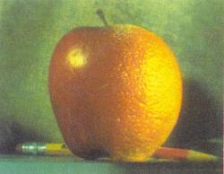

Computer Vision: Algorithms and Applications
============================================

                                    Computer Vision:
                              Algorithms and Applications
                                       2nd Edition

                                    Richard Szeliski

                              Final draft, September 30, 2021

                                    © 2022 Springer

   This electronic draft was downloaded Dec 11, 2024 for the personal use of

                                       Jeango  
                                    254141203@qq.com  

   and may not be posted or re-distributed in any form.

   Please refer interested readers to the book’s Web site at
   https://szeliski.org/Book, where you can also provide feedback.

                     This book is dedicated to my parents,
                           Zdzisław and Jadwiga,
                              and my family,
                           Lyn, Anne, and Stephen.

   

   [CS25: Transformers United V4 [NLP]](https://web.stanford.edu/class/cs25/)  
   [CS231n: Deep Learning for Computer Vision](https://cs231n.stanford.edu/)  
   [斯坦福李飞飞 CS231n 计算机视觉课程 2017](https://www.bilibili.com/video/BV1WL4y1w78v)  
   [ConvNetJS CIFAR-10 demo](https://cs.stanford.edu/people/karpathy/convnetjs/demo/cifar10.html)  

    ┌─────────────────────────────────────────────────────────────────────┐
    │                      Artificial Intelligence                        │
    │  ┌────────────────┐     ┌──────────────┐     ┌────────────────────┐ │
    │  │  Neuroscience  │     │  Psychology  │     │  Computer Science  │ │
    │  └────────────────┘     └──────────────┘     └────────────────────┘ │
    │     ┌─────────────────────────────────┐                             │
    │     │  Mathematics       ┌────────────│────────────────────────────┐│
    │┌────│────────────────────│────────────│───┐                        ││
    ││    │                    │            │   │     Machine Learning   ││
    ││    │      Robotics      │            │   │                        ││
    ││    │                    │ ┌──────────│──────────────────────────┐ ││
    ││    │                  ┌──────────────│─────────┐                │ ││
    ││    │                  │ │ │  CS231n  │   │     Deep Learning    │ ││
    ││    └─────────────────────────────────┘   │     │                │ ││
    ││                       │ │ │              │ ┌───────────────────┐│ ││
    ││                       │ │ └────────────────│───│───────────────│┘ ││
    ││   Computer Vision     │ │                │ │   │               │  ││
    ││                       │ └──────────────────│───│───────────────│──┘│
    │└───────────────────────│──────────────────┘ │   │               │   │
    │ ┌─────────┐┌──────────┐│                    │   │  Speech       │   │
    │ │         ││          ││ Natural Language   │   │  Recognition  │   │
    │ │ Physics ││  Biology ││ Processing         └───────────────────┘   │
    │ └─────────┘└──────────┘└────────────────────────┘                   │
    └─────────────────────────────────────────────────────────────────────┘

Contents At a Glance
====================

   

   *  [1 Introduction](#P0001)  
      • What is computer vision?  
      • A brief history  
      • Book overview  
      • Sample syllabus  
      • Notation  

   *  [2 Image formation](#P0033)  
      • Geometric primitives and transformations  
      • Photometric image formation  
      • The digital camera  

   *  [3 Image processing](#P0107)  
      • Point operators  
      • Linear filtering  
      • Non-linear filtering  
      • Fourier transforms  
      • Pyramids and wavelets  
      • Geometric transformations  

   *  [4 Model fitting and optimization](#P0191)  
      • Scattered data interpolation  
      • Variational methods and regularization  
      • Markov random fields  

   *  [5 Deep learning](#P0235)  
      • Supervised learning  
      • Unsupervised learning  
      • Deep neural networks  
      • Convolutional networks  
      • More complex models  

   *  [6 Recognition](#P0343)  
      • Instance recognition  
      • Image classification  
      • Object detection  
      • Semantic segmentation  
      • Video understanding  
      • Vision and language  

   *  [7 Feature detection and matching](#P0417)  
      • Points and patches  
      • Edges and contours  
      • Contour tracking  
      • Lines and vanishing points  
      • Segmentation  

   *  [8 Image alignment and stitching](#P0501)  
      • Pairwise alignment  
      • Image stitching  
      • Global alignment  
      • Compositing  

   *  [9 Motion estimation](#P0555)  
      • Translational alignment  
      • Parametric motion  
      • Optical flow  
      • Layered motion  

   *  [10 Computational photography](#P0607)  
      • Photometric calibration  
      • High dynamic range imaging  
      • Super-resolution, denoising, and blur removal  
      • Image matting and compositing  
      • Texture analysis and synthesis  

   *  [11 Structure from motion and SLAM](#P0681)  
      • Geometric intrinsic calibration  
      • Pose estimation  
      • Two-frame structure from motion  
      • Multi-frame structure from motion  
      • Simultaneous localization and mapping (SLAM)  

   *  [12 Depth estimation](#P0749)  
      • Epipolar geometry  
      • Sparse correspondence  
      • Dense correspondence  
      • Local methods  
      • Global optimization  
      • Deep neural networks  
      • Multi-view stereo  
      • Monocular depth estimation  

   *  [13 3D reconstruction](#P0805)  
      • Shape from X  
      • 3D scanning  
      • Surface representations  
      • Point-based representations  
      • Volumetric representations  
      • Model-based reconstruction  
      • Recovering texture maps and albedos  

   *  [14 Image-based rendering](#P0861)  
      • View interpolation  
      • Layered depth images  
      • Light fields and Lumigraphs  
      • Environment mattes  
      • Video-based rendering  
      • Neural rendering  

<a id=Pvii href=#ptoc>⋈vii</a>

Preface
=======

   The seeds for this book were first planted in 2001 when Steve Seitz at the University of 
   Washington invited me to co-teach a course called “Computer Vision for Computer Graphics”. At
   that time, computer vision techniques were increasingly being used in computer graphics to
   create image-based models of real-world objects, to create visual effects, and to merge 
   realworld imagery using computational photography techniques. Our decision to focus on the
   applications of computer vision to fun problems such as image stitching and photo-based 3D
   modeling from personal photos seemed to resonate well with our students.

   That initial course evolved into a more complete computer vision syllabus and 
   projectoriented course structure that I used to co-teach general computer vision courses both at the
   University of Washington and at Stanford. (The latter was a course I co-taught with David
   Fleet in 2003.) Similar curricula were then adopted at a number of other universities and also
   incorporated into more specialized courses on computational photography. (For ideas on how
   to use this book in your own course, please see Table 1.1 in Section 1.4.)

   This book also reflects my 40 years’ experience doing computer vision research in 
   corporate research labs, mostly at Digital Equipment Corporation’s Cambridge Research Lab,
   Microsoft Research, and Facebook. In pursuing my work, I have mostly focused on problems
   and solution techniques (algorithms) that have practical real-world applications and that work
   well in practice. Thus, this book has more emphasis on basic techniques that work under 
   realworld conditions and less on more esoteric mathematics that has intrinsic elegance but less
   practical applicability.

   This book is suitable for teaching a senior-level undergraduate course in computer vision
   to students in both computer science and electrical engineering. I prefer students to have
   either an image processing or a computer graphics course as a prerequisite, so that they can
   spend less time learning general background mathematics and more time studying computer
   vision techniques. The book is also suitable for teaching graduate-level courses in computer
   vision, e.g., bydelvingintomorespecializedtopics, andasageneralreferencetofundamental

<a id=Pviii href=#ptoc>⋈viii</a>

   techniques and the recent research literature. To this end, I have attempted wherever possible
   to at least cite the newest research in each sub-field, even if the technical details are too
   complex to cover in the book itself.

   In teaching our courses, we have found it useful for the students to attempt a number of
   small implementation projects, which often build on one another, in order to get them used to
   working with real-world images and the challenges that these present. The students are then
   asked to choose an individual topic for each of their small-group, final projects. (Sometimes
   these projects even turn into conference papers!) The exercises at the end of each chapter
   contain numerous suggestions for smaller mid-term projects, as well as more open-ended
   problems whose solutions are still active research topics. Wherever possible, I encourage
   students to try their algorithms on their own personal photographs, since this better motivates
   them, often leads to creative variants on the problems, and better acquaints them with the
   variety and complexity of real-world imagery.

   In formulating and solving computer vision problems, I have often found it useful to draw
   inspiration from four high-level approaches:

   • **Scientific**: build detailed models of the image formation process and develop 
   mathematical techniques to invert these in order to recover the quantities of interest (where
   necessary, making simplifying assumptions to make the mathematics more tractable).

   • **Statistical**: use probabilistic models to quantify the prior likelihood of your unknowns
   and the noisy measurement processes that produce the input images, then infer the best
   possible estimates of your desired quantities and analyze their resulting uncertainties.
   The inference algorithms used are often closely related to the optimization techniques
   used to invert the (scientific) image formation processes.

   • **Engineering**: develop techniques that are simple to describe and implement but that
   are also known to work well in practice. Test these techniques to understand their
   limitation and failure modes, as well as their expected computational costs (run-time
   performance).

   • **Data-driven**: collect a representative set of test data (ideally, with labels or 
   groundtruth answers) and use these data to either tune or learn your model parameters, or at
   least to validate and quantify its performance.

   These four approaches build on each other and are used throughout the book.

   My personal research and development philosophy (and hence the exercises in the book)
   have a strong emphasis on testing algorithms. It’s too easy in computer vision to develop an
   algorithm that does something plausible on a few images rather than something correct. The
   best way to validate your algorithms is to use a three-part strategy.

<a id=Pix href=#ptoc>⋈ix</a>

   First, test your algorithm on clean synthetic data, for which the exact results are known.
   Second, add noise to the data and evaluate how the performance degrades as a function of
   noise level. Finally, test the algorithm on real-world data, preferably drawn from a wide
   variety of sources, such as photos found on the web. Only then can you truly know if your
   algorithm can deal with real-world complexity, i.e., images that do not fit some simplified
   model or assumptions.

   In order to help students in this process, Appendix C includes pointers to commonly used
   datasets and software libraries that contain implementations of a wide variety of computer
   vision algorithms, which can enable you to tackle more ambitious projects (with your 
   instructor’s consent).

Notes on the Second Edition
---------------------------

   The last decade has seen a truly dramatic explosion in the performance and applicability of
   computer vision algorithms, much of it engendered by the application of machine learning
   algorithms to large amounts of visual training data (Su and Crandall 2021).
   Deep neural networks now play an essential role in so many vision algorithms that the
   new edition of this book introduces them early on as a fundamental technique that gets used
   extensively in subsequent chapters.

   The most notable changes in the second edition include:

   • Machine learning, deep learning, and deep neural networks are introduced early on in
   Chapter 5, as they play just as fundamental a role in vision algorithms as more 
   classical techniques, such as image processing, graphical/probabilistic models, and energy
   minimization, which are introduced in the preceding two chapters.

   • The recognition chapter has been moved earlier in the book to Chapter 6, since end-
   toend deep learning systems no longer require the development of building blocks such
   as feature detection, matching, and segmentation. Many of the students taking vision
   classes are primarily interested in visual recognition, so presenting this material earlier
   in the course makes it easier for students to base their final project on these topics.
   This chapter also includes sections on semantic segmentation, video understanding,
   and vision and language.

   • The application of neural networks and deep learning to myriad computer vision 
   algorithms and applications, including flow and stereo, 3D shape modeling, and newly
   emerging fields such as neural rendering.

<a id=Px href=#ptoc>⋈x</a>

   • New technologies such as SLAM (simultaneous localization and mapping) and VIO
   (visual inertial odometry) that now run reliably and are used in real-time applications
   such as augmented reality and autonomous navigation.

   In addition to these larger changes, the book has been updated to reflect the latest state-
   ofthe-art techniques such as internet-scale image search and phone-based computational 
   photography. The new edition includes over 1500 new citations (papers) and has over 200 new
   figures.

Acknowledgements
----------------

   I would like to gratefully acknowledge all of the people whose passion for research and
   inquiry as well as encouragement have helped me write this book.

   Steve Zucker at McGill University first introduced me to computer vision, taught all of
   his students to question and debate research results and techniques, and encouraged me to
   pursue a graduate career in this area.

   Takeo Kanade and Geoff Hinton, my PhD thesis advisors at Carnegie Mellon 
   University, taught me the fundamentals of good research, writing, and presentation and mentored
   several generations of outstanding students and researchers. They fired up my interest in 
   visual processing, 3D modeling, and statistical methods, while Larry Matthies introduced me
   to Kalman filtering and stereo matching. Geoff continues to inspire so many of us with this
   undiminished passion for trying to figure out “what makes the brain work”. It’s been a delight
   to see his pursuit of connectionist ideas bear so much fruit in this past decade.

   Demetri Terzopoulos was my mentor at my first industrial research job and taught me the
   ropes of successful publishing. Yvan Leclerc and Pascal Fua, colleagues from my brief 
   interlude at SRI International, gave me new perspectives on alternative approaches to computer
   vision.

   During my six years of research at Digital Equipment Corporation’s Cambridge Research
   Lab, I was fortunate to work with a great set of colleagues, including Ingrid Carlbom, Gudrun
   Klinker, Keith Waters, William Hsu, Richard Weiss, Stéphane Lavallée, and Sing Bing Kang,
   as well as to supervise the first of a long string of outstanding summer interns, including
   David Tonnesen, Sing Bing Kang, James Coughlan, and Harry Shum. This is also where I
   began my long-term collaboration with Daniel Scharstein.

<a id=Pxi href=#ptoc>⋈xi</a>

   At Microsoft Research, I had the outstanding fortune to work with some of the world’s
   best researchers in computer vision and computer graphics, including Michael Cohen, Matt
   Uyttendaele, Sing Bing Kang, Harry Shum, Larry Zitnick, Sudipta Sinha, Drew Steedly, 
   Simon Baker, Johannes Kopf, Neel Joshi, Krishnan Ramnath, Anandan, Phil Torr, Antonio 
   Criminisi, Simon Winder, Matthew Brown, Michael Goesele, Richard Hartley, Hugues Hoppe,
   Stephen Gortler, Steve Shafer, Matthew Turk, Georg Petschnigg, Kentaro Toyama, Ramin
   Zabih, Shai Avidan, Patrice Simard, Chris Pal, Nebojsa Jojic, Patrick Baudisch, Dani 
   Lischinski, Raanan Fattal, Eric Stollnitz, David Nistér, Blaise Aguera y Arcas, Andrew Fitzgibbon,
   Jamie Shotton, Wolf Kienzle, Piotr Dollar, and Ross Girshick. I was also lucky to have as 
   interns such great students as Polina Golland, Simon Baker, Mei Han, Arno Schödl, Ron Dror,
   Ashley Eden, Jonathan Shade, Jinxiang Chai, Rahul Swaminathan, Yanghai Tsin, Sam 
   Hasinoff, Anat Levin, Matthew Brown, Eric Bennett, Vaibhav Vaish, Jan-Michael Frahm, James
   Diebel, Ce Liu, Josef Sivic, Grant Schindler, Colin Zheng, Neel Joshi, Sudipta Sinha, Zeev
   Farbman, Rahul Garg, Tim Cho, Yekeun Jeong, Richard Roberts, Varsha Hedau, Dilip 
   Krishnan, Adarsh Kowdle, Edward Hsiao, Yong Seok Heo, Fabian Langguth, Andrew Owens,
   and Tianfan Xue. Working with such outstanding students also gave me the opportunity to
   collaborate with some of their amazing advisors, including Bill Freeman, Irfan Essa, Marc
   Pollefeys, Michael Black, Marc Levoy, and Andrew Zisserman.

   Since moving to Facebook, I’ve had the pleasure to continue my collaborations with
   Michael Cohen, Matt Uyttendaele, Johannes Kopf, Wolf Kienzle, and Krishnan Ramnath,
   and also new colleagues including Kevin Matzen, Bryce Evans, Suhib Alsisan, Changil Kim,
   DavidGeraghty, JanHerling, NilsPlath, Jan-MichaelFrahm, TruePrice, RichardNewcombe,
   Thomas Whelan, Michael Goesele, Steven Lovegrove, Julian Straub, Simon Green, Brian
   Cabral, Michael Toksvig, Albert Para Pozzo, Laura Sevilla-Lara, Georgia Gkioxari, Justin
   Johnson, Chris Sweeney, and Vassileios Balntas. I’ve also had the pleasure to collaborate
   with some outstanding summer interns, including Tianfan Xue, Scott Wehrwein, Peter 
   Hedman, Joel Janai, Aleksander Hoły´ nski, Xuan Luo, Rui Wang, Olivia Wiles, and Yulun Tian.
   I’d like to thank in particular Michael Cohen, my mentor, colleague, and friend for the last 25
   years for his unwavering support of my sprint to complete this second edition.

   While working at Microsoft and Facebook, I’ve also had the opportunity to collaborate
   with wonderful colleagues at the University of Washington, where I hold an Affiliate 
   Professor appointment. I’m indebted to Tony DeRose and David Salesin, who first encouraged me
   to get involved with the research going on at UW, my long-time collaborators Brian Curless,
   Steve Seitz, Maneesh Agrawala, Sameer Agarwal, and Yasu Furukawa, as well as the students
   I have had the privilege to supervise and interact with, including Fréderic Pighin, Yung-Yu
   Chuang, Doug Zongker, Colin Zheng, Aseem Agarwala, Dan Goldman, Noah Snavely, Ian
   Simon, Rahul Garg, Ryan Kaminsky, Juliet Fiss, Aleksander Hoły´ nski, and Yifan Wang. As
   I mentioned at the beginning of this preface, this book owes its inception to the vision course
   that Steve Seitz invited me to co-teach, as well as to Steve’s encouragement, course notes,
   and editorial input.

<a id=Pxii href=#ptoc>⋈xii</a>

   I’m also grateful to the many other computer vision researchers who have given me so
   many constructive suggestions about the book, including Sing Bing Kang, who was my 
   informal book editor, Vladimir Kolmogorov, Daniel Scharstein, Richard Hartley, Simon Baker,
   Noah Snavely, Bill Freeman, Svetlana Lazebnik, Matthew Turk, Jitendra Malik, Alyosha
   Efros, Michael Black, Brian Curless, Sameer Agarwal, Li Zhang, Deva Ramanan, Olga
   Veksler, Yuri Boykov, Carsten Rother, Phil Torr, Bill Triggs, Bruce Maxwell, Rico 
   Malvar, Jana Koˇ secká, Eero Simoncelli, Aaron Hertzmann, Antonio Torralba, Tomaso Poggio,
   Theo Pavlidis, Baba Vemuri, Nando de Freitas, Chuck Dyer, Song Yi, Falk Schubert, Roman
   Pflugfelder, Marshall Tappen, James Coughlan, Sammy Rogmans, Klaus Strobel, 
   Shanmuganathan, Andreas Siebert, Yongjun Wu, Fred Pighin, Juan Cockburn, Ronald Mallet, Tim
   Soper, Georgios Evangelidis, Dwight Fowler, Itzik Bayaz, Daniel O’Connor, Srikrishna Bhat,
   and Toru Tamaki, who wrote the Japanese translation and provided many useful errata.

   For the second edition, I received significant help and advice from three key contributors.
   Daniel Scharstein helped me update the chapter on stereo, Matt Deitke contributed 
   descriptions of the newest papers in deep learning, including the sections on transformers, variational
   autoencoders, and text-to-image synthesis, along with the exercises in Chapters 5 and 6 and
   some illustrations. Sing Bing Kang reviewed multiple drafts and provided useful 
   suggestions. I’d also like to thank Andrew Glassner, whose book (Glassner 2018) and figures were
   a tremendous help, Justin Johnson, Sean Bell, Ishan Misra, David Fouhey, Michael Brown,
   Abdelrahman Abdelhamed, Frank Dellaert, Xinlei Chen, Ross Girshick, Andreas Geiger,
   Dmytro Mishkin, Aleksander Hoły´ nski, Joel Janai, Christoph Feichtenhofer, Yuandong Tian,
   Alyosha Efros, Pascal Fua, Torsten Sattler, Laura Leal-Taixé, Aljosa Osep, Qunjie Zhou,
   Jiˇ r´ ı Matas, Eddy Ilg, Yann LeCun, Larry Jackel, Vasileios Balntas, Daniel DeTone, Zachary
   Teed, Junhwa Hur, Jun-Yan Zhu, Filip Radenovi´ c, Michael Zollhöfer, Matthias Nießner, 
   Andrew Owens, Hervé Jégou, Luowei Zhou, Ricardo Martin Brualla, Pratul Srinivasan, Matteo
   Poggi, Fabio Tosi, Ahmed Osman, Dave Howell, Holger Heidrich, Howard Yen, Anton Papst,
   Syamprasad K. Rajagopalan, Abhishek Nagar, Vladimir Kuznetsov, Raphaël Fouque, Marian
   Ciobanu, Darko Simonovic, and Guilherme Schlinker.

   In preparing the second edition, I taught some of the new material in two courses that
   I helped co-teach in 2020 at Facebook and UW. I’d like to thank my co-instructors 
   JanMichael Frahm, Michael Goesele, Georgia Gkioxari, Ross Girshick, Jakob Julian Engel,
   Daniel Scharstein, Fernando de la Torre, Steve Seitz, and Harpreet Sawhney, from whom
   I learned a lot about the latest techniques that are included in the new edition. I’d also like
   to thank the TAs, including David Geraghty, True Price, Kevin Matzen, Akash Bapat, 
   Aleksander Hoły´ nski, Keunhong Park, and Svetoslav Kolev, for the wonderful job they did in 
   creating and grading the assignments. I’d like to give a special thanks to Justin Johnson, whose
   excellent class slides (Johnson 2020), based on earlier slides from Stanford (Li, Johnson, and
   Yeung 2019), taught me the fundamentals of deep learning and which I used extensively in
   my own class and in preparing the new chapter on deep learning.

<a id=Pxiii href=#ptoc>⋈xiii</a>

   Shena Deuchers and Ian Kingston did a fantastic job copy-editing the first and second
   editions, respectively and suggesting many useful improvements, and Wayne Wheeler and
   Simon Rees at Springer were most helpful throughout the whole book publishing process.
   Keith Price’s Annotated Computer Vision Bibliography was invaluable in tracking down 
   references and related work.

   If you have any suggestions for improving the book, please send me an e-mail, as I would
   like to keep the book as accurate, informative, and timely as possible.

   The last year of writing this second edition took place during the worldwide COVID-19
   pandemic. I would like to thank all of the first responders, medical and front-line workers,
   and everyone else who helped get us through these difficult and challenging times and to
   acknowledge the impact that this and other recent tragedies have had on all of us.

   Lastly, this book would not have been possible or worthwhile without the incredible 
   support and encouragement of my family. I dedicate this book to my parents, Zdzisław and
   Jadwiga, whose love, generosity, and accomplishments always inspired me; to my sister 
   Basia for her lifelong friendship; and especially to Lyn, Anne, and Stephen, whose love and
   support in all matters (including my book projects) makes it all worthwhile.

   Lake Wenatchee  
   May 2021  

<a id=ptoc href=#ptoc>⋈xiv</a>

Contents
========

   *  [Preface](#Pvii)  

<a id=Pxv href=#ptoc>⋈xv</a>

   *  [1 Introduction](#P0001)  
      [1.1 What is computer vision?](#P0003)  
      [1.2 A brief history](#P0010)  
      [1.3 Book overview](#P0022)  
      [1.4 Sample syllabus](#P0030)  
      [1.5 A note on notation](#P0031)  
      [1.6 Additional reading](#P0031)  

   *  [2 Image formation](#P0033)  
      [2.1 Geometric primitives and transformations](#P0036)  
      [2.1.1 2D transformations](#P0040)  
      [2.1.2 3D transformations](#P0043)  
      [2.1.3 3D rotations](#P0045)  
      [2.1.4 3D to 2D projections](#P0051)  
      [2.1.5 Lens distortions](#P0063)  
      [2.2 Photometric image formation](#P0066)  
      [2.2.1 Lighting](#P0066)  
      [2.2.2 Reflectance and shading](#P0067)  
      [2.2.3 Optics](#P0074)  
      [2.3 The digital camera](#P0079)  
      [2.3.1 Sampling and aliasing](#P0084)  
      [2.3.2 Color](#P0087)  
      [2.3.3 Compression](#P0098)  
      [2.4 Additional reading](#P0101)  
      [2.5 Exercises](#P0102)  

<a id=Pxvi href=#ptoc>⋈xvi</a>

   *  [3 Image processing](#P0107)  
      [3.1 Point operators](#P0109)  
      [3.1.1 Pixel transforms](#P0111)  
      [3.1.2 Color transforms](#P0112)  
      [3.1.3 Compositing and matting](#P0113)  
      [3.1.4 Histogram equalization](#P0115)  
      [3.1.5 Application: Tonal adjustment](#P0119)  
      [3.2 Linear filtering](#P0119)  
      [3.2.1 Separable filtering](#P0124)  
      [3.2.2 Examples of linear filtering](#P0125)  
      [3.2.3 Band-pass and steerable filters](#P0127)  
      [3.3 More neighborhood operators](#P0131)  
      [3.3.1 Non-linear filtering](#P0132)  
      [3.3.2 Bilateral filtering](#P0133)  
      [3.3.3 Binary image processing](#P0138)  
      [3.4 Fourier transforms](#P0142)  
      [3.4.1 Two-dimensional Fourier transforms](#P0146)  
      [3.4.2 Application: Sharpening, blur, and noise removal](#P0148)  
      [3.5 Pyramids and wavelets](#P0149)  
      [3.5.1 Interpolation](#P0150)  
      [3.5.2 Decimation](#P0153)  
      [3.5.3 Multi-resolution representations](#P0154)  
      [3.5.4 Wavelets](#P0159)  
      [3.5.5 Application: Image blending](#P0165)  
      [3.6 Geometric transformations](#P0168)  
      [3.6.1 Parametric transformations](#P0168)  
      [3.6.2 Mesh-based warping](#P0175)  
      [3.6.3 Application: Feature-based morphing](#P0177)  
      [3.7 Additional reading](#P0178)  
      [3.8 Exercises](#P0180)  

<a id=Pxvii href=#ptoc>⋈xvii</a>

   *  [4 Model fitting and optimization](#P0191)  
      [4.1 Scattered data interpolation](#P0194)  
      [4.1.1 Radial basis functions](#P0196)  
      [4.1.2 Overfitting and underfitting](#P0199)  
      [4.1.3 Robust data fitting](#P0202)  
      [4.2 Variational methods and regularization](#P0204)  
      [4.2.1 Discrete energy minimization](#P0206)  
      [4.2.2 Total variation](#P0210)  
      [4.2.3 Bilateral solver](#P0210)  
      [4.2.4 Application: Interactive colorization](#P0211)  
      [4.3 Markov random fields](#P0212)  
      [4.3.1 Conditional random fields](#P0222)  
      [4.3.2 Application: Interactive segmentation](#P0227)  
      [4.4 Additional reading](#P0230)  
      [4.5 Exercises](#P0232)  

   *  [5 Deep Learning](#P0235)  
      [5.1 Supervised learning](#P0239)  
      [5.1.1 Nearest neighbors](#P0241)  
      [5.1.2 Bayesian classification](#P0243)  
      [5.1.3 Logistic regression](#P0248)  
      [5.1.4 Support vector machines](#P0250)  
      [5.1.5 Decision trees and forests](#P0254)  
      [5.2 Unsupervised learning](#P0257)  
      [5.2.1 Clustering](#P0257)  
      [5.2.2 K-means and Gaussians mixture models](#P0259)  
      [5.2.3 Principal component analysis](#P0262)  
      [5.2.4 Manifold learning](#P0265)  
      [5.2.5 Semi-supervised learning](#P0266)  
      [5.3 Deep neural networks](#P0268)  
      [5.3.1 Weights and layers](#P0270)  
      [5.3.2 Activation functions](#P0272)  
      [5.3.3 Regularization and normalization](#P0274)  
      [5.3.4 Loss functions](#P0280)  
      [5.3.5 Backpropagation](#P0284)  
      [5.3.6 Training and optimization](#P0287)  
      [5.4 Convolutional neural networks](#P0291)  
      [5.4.1 Pooling and unpooling](#P0295)  
      [5.4.2 Application: Digit classification](#P0298)  
      [5.4.3 Network architectures](#P0299)  
      [5.4.4 Model zoos](#P0304)  
      [5.4.5 Visualizing weights and activations](#P0307)  
      [5.4.6 Adversarial examples](#P0311)  
      [5.4.7 Self-supervised learning](#P0312)  
      [5.5 More complex models](#P0317)  
      [5.5.1 Three-dimensional CNNs](#P0317)  
      [5.5.2 Recurrent neural networks](#P0321)  
      [5.5.3 Transformers](#P0322)  
      [5.5.4 Generative models](#P0328)  
      [5.6 Additional reading](#P0336)  
      [5.7 Exercises](#P0337)  

<a id=Pxviii href=#ptoc>⋈xviii</a>

   *  [6 Recognition](#P0343)  
      [6.1 Instance recognition](#P0346)  
      [6.2 Image classification](#P0349)  
      [6.2.1 Feature-based methods](#P0350)  
      [6.2.2 Deep networks](#P0358)  
      [6.2.3 Application: Visual similarity search](#P0360)  
      [6.2.4 Face recognition](#P0363)  
      [6.3 Object detection](#P0370)  
      [6.3.1 Face detection](#P0371)  
      [6.3.2 Pedestrian detection](#P0376)  
      [6.3.3 General object detection](#P0379)  
      [6.4 Semantic segmentation](#P0387)  
      [6.4.1 Application: Medical image segmentation](#P0390)  
      [6.4.2 Instance segmentation](#P0391)  
      [6.4.3 Panoptic segmentation](#P0392)  
      [6.4.4 Application: Intelligent photo editing](#P0394)  
      [6.4.5 Pose estimation](#P0395)  
      [6.5 Video understanding](#P0396)  
      [6.6 Vision and language](#P0400)  
      [6.7 Additional reading](#P0409)  
      [6.8 Exercises](#P0413)  

<a id=Pxix href=#ptoc>⋈xix</a>

   *  [7 Feature detection and matching](#P0417)  
      [7.1 Points and patches](#P0419)  
      [7.1.1 Feature detectors](#P0422)  
      [7.1.2 Feature descriptors](#P0434)  
      [7.1.3 Feature matching](#P0441)  
      [7.1.4 Large-scale matching and retrieval](#P0448)  
      [7.1.5 Feature tracking](#P0452)  
      [7.1.6 Application: Performance-driven animation](#P0454)  
      [7.2 Edges and contours](#P0455)  
      [7.2.1 Edge detection](#P0456)  
      [7.2.2 Contour detection](#P0461)  
      [7.2.3 Application: Edge editing and enhancement](#P0465)  
      [7.3 Contour tracking](#P0466)  
      [7.3.1 Snakes and scissors](#P0467)  
      [7.3.2 Level Sets](#P0474)  
      [7.3.3 Application: Contour tracking and rotoscoping](#P0476)  
      [7.4 Lines and vanishing points](#P0477)  
      [7.4.1 Successive approximation](#P0477)  
      [7.4.2 Hough transforms](#P0477)  
      [7.4.3 Vanishing points](#P0481)  
      [7.5 Segmentation](#P0483)  
      [7.5.1 Graph-based segmentation](#P0486)  
      [7.5.2 Mean shift](#P0487)  
      [7.5.3 Normalized cuts](#P0489)  
      [7.6 Additional reading](#P0491)  
      [7.7 Exercises](#P0495)  

<a id=Pxx href=#ptoc>⋈xx</a>

   *  [8 Image alignment and stitching](#P0501)  
      [8.1 Pairwise alignment](#P0503)  
      [8.1.1 2D alignment using least squares](#P0504)  
      [8.1.2 Application: Panography](#P0506)  
      [8.1.3 Iterative algorithms](#P0507)  
      [8.1.4 Robust least squares and RANSAC](#P0510)  
      [8.1.5 3D alignment](#P0513)  
      [8.2 Image stitching](#P0514)  
      [8.2.1 Parametric motion models](#P0516)  
      [8.2.2 Application: Whiteboard and document scanning](#P0517)  
      [8.2.3 Rotational panoramas](#P0519)  
      [8.2.4 Gap closing](#P0520)  
      [8.2.5 Application: Video summarization and compression](#P0522)  
      [8.2.6 Cylindrical and spherical coordinates](#P0523)  
      [8.3 Global alignment](#P0526)  
      [8.3.1 Bundle adjustment](#P0527)  
      [8.3.2 Parallax removal](#P0531)  
      [8.3.3 Recognizing panoramas](#P0533)  
      [8.4 Compositing](#P0536)  
      [8.4.1 Choosing a compositing surface](#P0536)  
      [8.4.2 Pixel selection and weighting (deghosting)](#P0538)  
      [8.4.3 Application: Photomontage](#P0544)  
      [8.4.4 Blending](#P0544)  
      [8.5 Additional reading](#P0547)  
      [8.6 Exercises](#P0549)  

   *  [9 Motion estimation](#P0555)  
      [9.1 Translational alignment](#P0558)  
      [9.1.1 Hierarchical motion estimation](#P0562)  
      [9.1.2 Fourier-based alignment](#P0563)  
      [9.1.3 Incremental refinement](#P0566)  
      [9.2 Parametric motion](#P0570)  
      [9.2.1 Application: Video stabilization](#P0573)  
      [9.2.2 Spline-based motion](#P0575)  
      [9.2.3 Application: Medical image registration](#P0577)  
      [9.3 Optical flow](#P0578)  
      [9.3.1 Deep learning approaches](#P0584)  
      [9.3.2 Application: Rolling shutter wobble removal](#P0587)  
      [9.3.3 Multi-frame motion estimation](#P0587)  
      [9.3.4 Application: Video denoising](#P0589)  
      [9.4 Layered motion](#P0589)  
      [9.4.1 Application: Frame interpolation](#P0593)  
      [9.4.2 Transparent layers and reflections](#P0594)  
      [9.4.3 Video object segmentation](#P0597)  
      [9.4.4 Video object tracking](#P0598)  
      [9.5 Additional reading](#P0600)  
      [9.6 Exercises](#P0602)  

<a id=Pxxi href=#ptoc>⋈xxi</a>

   *  [10 Computational photography](#P0607)  
      [10.1 Photometric calibration](#P0610)  
      [10.1.1 Radiometric response function](#P0611)  
      [10.1.2 Noise level estimation](#P0614)  
      [10.1.3 Vignetting](#P0615)  
      [10.1.4 Optical blur (spatial response) estimation](#P0616)  
      [10.2 High dynamic range imaging](#P0620)  
      [10.2.1 Tone mapping](#P0627)  
      [10.2.2 Application: Flash photography](#P0634)  
      [10.3 Super-resolution, denoising, and blur removal](#P0637)  
      [10.3.1 Color image demosaicing](#P0646)  
      [10.3.2 Lens blur (bokeh)](#P0648)  
      [10.4 Image matting and compositing](#P0650)  
      [10.4.1 Blue screen matting](#P0651)  
      [10.4.2 Natural image matting](#P0653)  
      [10.4.3 Optimization-based matting](#P0656)  
      [10.4.4 Smoke, shadow, and flash matting](#P0661)  
      [10.4.5 Video matting](#P0662)  
      [10.5 Texture analysis and synthesis](#P0663)  
      [10.5.1 Application: Hole filling and inpainting](#P0665)  
      [10.5.2 Application: Non-photorealistic rendering](#P0667)  
      [10.5.3 Neural style transfer and semantic image synthesis](#P0669)  
      [10.6 Additional reading](#P0671)  
      [10.7 Exercises](#P0674)  

<a id=Pxxii href=#ptoc>⋈xxii</a>

   *  [11 Structure from motion and SLAM](#P0681)  
      [11.1 Geometric intrinsic calibration](#P0685)  
      [11.1.1 Vanishing points](#P0687)  
      [11.1.2 Application: Single view metrology](#P0688)  
      [11.1.3 Rotational motion](#P0689)  
      [11.1.4 Radial distortion](#P0691)  
      [11.2 Pose estimation](#P0693)  
      [11.2.1 Linear algorithms](#P0693)  
      [11.2.2 Iterative non-linear algorithms](#P0695)  
      [11.2.3 Application: Location recognition](#P0698)  
      [11.2.4 Triangulation](#P0701)  
      [11.3 Two-frame structure from motion](#P0703)  
      [11.3.1 Eight, seven, and five-point algorithms](#P0703)  
      [11.3.2 Special motions and structures](#P0708)  
      [11.3.3 Projective (uncalibrated) reconstruction](#P0710)  
      [11.3.4 Self-calibration](#P0712)  
      [11.3.5 Application: View morphing](#P0714)  
      [11.4 Multi-frame structure from motion](#P0715)  
      [11.4.1 Factorization](#P0715)  
      [11.4.2 Bundle adjustment](#P0717)  
      [11.4.3 Exploiting sparsity](#P0719)  
      [11.4.4 Application: Match move](#P0723)  
      [11.4.5 Uncertainty and ambiguities](#P0723)  
      [11.4.6 Application: Reconstruction from internet photos](#P0725)  
      [11.4.7 Global structure from motion](#P0728)  
      [11.4.8 Constrained structure and motion](#P0731)  
      [11.5 Simultaneous localization and mapping (SLAM)](#P0734)  
      [11.5.1 Application: Autonomous navigation](#P0737)  
      [11.5.2 Application: Smartphone augmented reality](#P0739)  
      [11.6 Additional reading](#P0740)  
      [11.7 Exercises](#P0743)  

   *  [12 Depth estimation](#P0749)  
      [12.1 Epipolar geometry](#P0753)  
      [12.1.1 Rectification](#P0755)  
      [12.1.2 Plane sweep](#P0757)  
      [12.2 Sparse correspondence](#P0760)  
      [12.2.1 3D curves and profiles](#P0760)  
      [12.3 Dense correspondence](#P0762)  
      [12.3.1 Similarity measures](#P0764)  
      [12.4 Local methods](#P0766)  
      [12.4.1 Sub-pixel estimation and uncertainty](#P0768)  
      [12.4.2 Application: Stereo-based head tracking](#P0769)  
      [12.5 Global optimization](#P0771)  
      [12.5.1 Dynamic programming](#P0774)  
      [12.5.2 Segmentation-based techniques](#P0775)  
      [12.5.3 Application: Z-keying and background replacement](#P0777)  
      [12.6 Deep neural networks](#P0778)  
      [12.7 Multi-view stereo](#P0781)  
      [12.7.1 Scene flow](#P0785)  
      [12.7.2 Volumetric and 3D surface reconstruction](#P0786)  
      [12.7.3 Shape from silhouettes](#P0794)  
      [12.8 Monocular depth estimation](#P0796)  
      [12.9 Additional reading](#P0799)  
      [12.10Exercises](#P0800)  

<a id=Pxxiii href=#ptoc>⋈xxiii</a>

   *  [13 3D reconstruction](#P0805)  
      [13.1 Shape from X](#P0809)  
      [13.1.1 Shape from shading and photometric stereo](#P0809)  
      [13.1.2 Shape from texture](#P0814)  
      [13.1.3 Shape from focus](#P0814)  
      [13.2 3D scanning](#P0816)  
      [13.2.1 Range data merging](#P0820)  
      [13.2.2 Application: Digital heritage](#P0824)  
      [13.3 Surface representations](#P0825)  
      [13.3.1 Surface interpolation](#P0826)  
      [13.3.2 Surface simplification](#P0827)  
      [13.3.3 Geometry images](#P0828)  
      [13.4 Point-based representations](#P0829)  
      [13.5 Volumetric representations](#P0830)  
      [13.5.1 Implicit surfaces and level sets](#P0831)  
      [13.6 Model-based reconstruction](#P0833)  
      [13.6.1 Architecture](#P0833)  
      [13.6.2 Facial modeling and tracking](#P0838)  
      [13.6.3 Application: Facial animation](#P0839)  
      [13.6.4 Human body modeling and tracking](#P0843)  
      [13.7 Recovering texture maps and albedos](#P0850)  
      [13.7.1 Estimating BRDFs](#P0852)  
      [13.7.2 Application: 3D model capture](#P0854)  
      [13.8 Additional reading](#P0855)  
      [13.9 Exercises](#P0857)  

<a id=Pxxiv href=#ptoc>⋈xxiv</a>

   *  [14 Image-based rendering](#P0861)  
      [14.1 View interpolation](#P0863)  
      [14.1.1 View-dependent texture maps](#P0865)  
      [14.1.2 Application: Photo Tourism](#P0867)  
      [14.2 Layered depth images](#P0868)  
      [14.2.1 Impostors, sprites, and layers](#P0869)  
      [14.2.2 Application: 3D photography](#P0872)  
      [14.3 Light fields and Lumigraphs](#P0875)  
      [14.3.1 Unstructured Lumigraph](#P0879)  
      [14.3.2 Surface light fields](#P0880)  
      [14.3.3 Application: Concentric mosaics](#P0882)  
      [14.3.4 Application: Synthetic re-focusing](#P0883)  
      [14.4 Environment mattes](#P0883)  
      [14.4.1 Higher-dimensional light fields](#P0885)  
      [14.4.2 The modeling to rendering continuum](#P0886)  
      [14.5 Video-based rendering](#P0887)  
      [14.5.1 Video-based animation](#P0888)  
      [14.5.2 Video textures](#P0889)  
      [14.5.3 Application: Animating pictures](#P0892)  
      [14.5.4 3D and free-viewpoint Video](#P0893)  
      [14.5.5 Application: Video-based walkthroughs](#P0896)  
      [14.6 Neural rendering](#P0899)  
      [14.7 Additional reading](#P0908)  
      [14.8 Exercises](#P0910)  

   *  [15 Conclusion](#P0915)  

   *  [A Linear algebra and numerical techniques](#P0919)
      [A.1 Matrix decompositions](#PP0920)  
      [A.1.1 Singular value decomposition](#PP0921)  
      [A.1.2 Eigenvalue decomposition](#PP0922)  
      [A.1.3 QR factorization](#PP0925)  
      [A.1.4 Cholesky factorization](#PP0925)  
      [A.2 Linear least squares](#PP0927)  
      [A.2.1 Total least squares](#PP0929)  
      [A.3 Non-linear least squares](#PP0930)  
      [A.4 Direct sparse matrix techniques](#PP0932)  
      [A.4.1 Variable reordering](#PP0932)  
      [A.5 Iterative techniques](#PP0934)  
      [A.5.1 Conjugate gradient](#PP0934)  
      [A.5.2 Preconditioning](#PP0936)  
      [A.5.3 Multigrid](#PP0937)  

<a id=Pxxv href=#ptoc>⋈xxv</a>

   *  [B Bayesian modeling and inference](#P0939)
      [B.1 Estimation theory](#PP0941)  
      [B.2 Maximum likelihood estimation and least squares](#PP0943)  
      [B.3 Robust statistics](#PP0945)  
      [B.4 Prior models and Bayesian inference](#PP0948)  
      [B.5 Markov random fields](#PP0949)  
      [B.6 Uncertainty estimation (error analysis)](#PP0952)  

   *  [C Supplementary material](#P0953)
      [C.1 Datasets and benchmarks](#PP0954)  
      [C.2 Software](#PP0961)  
      [C.3 Slides and lectures](#PP0970)  

   *  [References](#P0973)

   *  [Index](#P1179)

<a id=Pxxvi href=#ptoc>⋈xxvi</a>

<a id=P0001 href=#Ptoc01>⋈1</a>

Chapter 1 Introduction
======================

   [1.1 What is computer vision?](#P0003)  
   [1.2 A brief history](#P0010)  
   [1.3 Book overview](#P0022)  
   [1.4 Sample syllabus](#P0030)  
   [1.5 A note on notation](#P0031)  
   [1.6 Additional reading](#P0031)  

   Figure 1.1 The human visual system has no problem interpreting the subtle variations in
   translucency and shading in this photograph and correctly segmenting the object from its
   background.

<a id=P0002 href=#ptoc>⋈2</a>

   (a) (b)    
   (c) (d)    
   Figure 1.2 Some examples of computer vision algorithms and applications. (a) Face 
   detection algorithms, coupled with color-based clothing and hair detection algorithms, can
   locate and recognize the individuals in this image (Sivic, Zitnick, and Szeliski 2006) © 2006
   Springer. (b) Object instance segmentation can delineate each person and object in a 
   complex scene (He, Gkioxari et al. 2017) © 2017 IEEE. (c) Structure from motion algorithms
   can reconstruct a sparse 3D point model of a large complex scene from hundreds of 
   partially overlapping photographs (Snavely, Seitz, and Szeliski 2006) © 2006 ACM. (d) Stereo
   matching algorithms can build a detailed 3D model of a building fac ¸ade from hundreds of
   differently exposed photographs taken from the internet (Goesele, Snavely et al. 2007) © 2007
   IEEE.

<a id=P0003 href=#ptoc>⋈3</a>

1.1 What is computer vision?
--------------------------------------------------------------------------------

   As humans, we perceive the three-dimensional structure of the world around us with 
   apparent ease. Think of how vivid the three-dimensional percept is when you look at a vase of
   flowers sitting on the table next to you. You can tell the shape and translucency of each petal
   through the subtle patterns of light and shading that play across its surface and effortlessly
   segment each flower from the background of the scene (Figure 1.1). Looking at a framed
   group portrait, you can easily count and name all of the people in the picture and even guess
   at their emotions from their facial expressions (Figure 1.2a). Perceptual psychologists have
   spent decades trying to understand how the visual system works and, even though they can
   devise optical illusions ➊ to tease apart some of its principles (Figure 1.3), a complete solution
   to this puzzle remains elusive (Marr 1982; Wandell 1995; Palmer 1999; Livingstone 2008;
   Frisby and Stone 2010).

   Researchers in computer vision have been developing, in parallel, mathematical 
   techniques for recovering the three-dimensional shape and appearance of objects in imagery.
   Here, the progress in the last two decades has been rapid. We now have reliable techniques for
   accurately computing a 3D model of an environment from thousands of partially overlapping
   photographs (Figure 1.2c). Given a large enough set of views of a particular object or fac ¸ade,
   we can create accurate dense 3D surface models using stereo matching (Figure 1.2d). We can
   even, with moderate success, delineate most of the people and objects in a photograph (
   Figure 1.2a). However, despite all of these advances, the dream of having a computer explain an
   image at the same level of detail and causality as a two-year old remains elusive.

   Why is vision so difficult? In part, it is because it is an inverse problem, in which we seek
   to recover some unknowns given insufficient information to fully specify the solution. We
   must therefore resort to physics-based and probabilistic models, or machine learning from
   large sets of examples, to disambiguate between potential solutions. However, modeling the
   visual world in all of its rich complexity is far more difficult than, say, modeling the vocal
   tract that produces spoken sounds.

   The forward models that we use in computer vision are usually developed in physics (
   radiometry, optics, and sensor design) and in computer graphics. Both of these fields model
   how objects move and animate, how light reflects off their surfaces, is scattered by the 
   atmosphere, refracted through camera lenses (or human eyes), and finally projected onto a flat (or
   curved) image plane. While computer graphics are not yet perfect, in many domains, such
   as rendering a still scene composed of everyday objects or animating extinct creatures such
   as dinosaurs, the illusion of reality is essentially there.

   ➊ Some fun pages with striking illusions include https://michaelbach.de/ot, https://www.illusionsindex.org, 
   and http://www.ritsumei.ac.jp/∼akitaoka/index-e.html.

<a id=P0004 href=#ptoc>⋈4</a>

          /            \
         <-------------->
          \            /
        \                /
         >--------------<
        /                \
               (a)

               (b) https://persci.mit.edu/gallery/checkershadow

   

   >  [!TIP]
      棋盘阴影错觉是麻省理工学院教授Edward H. Adelson于1995年所发表 。该图像文件描绘了白与黑的
      正方形棋盘。其中标记为A的格子看似比标记为B的格子颜色较深，但是它们实际上是完全一样色阶的灰色。
      通过此巧妙的图像构造可以证明，视觉系统在确定世界上物体的颜色时，不仅仅考虑物体表面的光线反射。
      图中地板上格子的灰色阴影光照被部分遮挡，比起周边完全光照的格子要偏暗。因此阴影中的白色格子可能
      比全光下的黑色表面反射的光少。视觉系统使用多种花招来确定阴影的位置以及如何补偿阴影，以确定属于
      表面的灰色“油漆”的阴影。第一个花招是基于局部对比。无论是否在阴影中，比相邻格子轻的格子可能比
      平均格子轻，反之亦然。在图中，阴影中的浅色格子被深色格子包围。因此，即使格子在物理上是黑暗的，
      但与邻居相比，它是光明的。相反，全光照的深色格子被浅色格子包围，因此相比之下它们看起来很暗。
      这也是绘画艺术中“衬托”手法可以用来改变画面结构的原理。第二个花招基于这样一个事实：即阴影通常
      具有柔和的边缘，而色块边界（如格子）通常具有锐利的边缘。视觉系统倾向于忽略光照水平的逐渐变化，
      这样它就可以在不被阴影误导的情况下确定表面的颜色。在这个图中，阴影看起来像阴影，这既是因为它
      很模糊，也是因为阴影投射对象是可见的。每格子周围“X-junctions”形式的 4 个相邻的格子形成的
      图案，通常是一种视觉信号，表明所有边缘都应该被解释为表面颜色的变化，而不是阴影或光照的变化。
      与许多所谓的幻觉一样，这种效果真正证明了视觉系统的成功，而不是失败。视觉系统不太擅长物理测光，
      但这不是它的目的。视觉系统重要的任务是将图像信息分解为有意义的图形，从而感知视野中物体的性质。
      比如，人类特别擅长脸部图形的识别，这种能力是人类特种延续的关键因素之一。

   >  [!TIP]
      视觉系统对边缘敏感的一个证据就是 Pinna’s Intertwining Illusion 错觉，通过同心的矩形连接的
      圆环，并且矩形的边线要按螺旋辐射的方向排列，这种引导线可以成功地误导视觉系统，让其认为图形是螺旋
      辐射的，但其实矩形是同心结构分布的。针对视觉系统的这种特性的研究催生出了人类智能的模式识别技术，
      典型的应用就是指纹识别、OCR 文字识别。模式识别（Recognition）就是将模式鉴定（Identification）
      为人类已知或者熟悉的类别（Category）的成员”  
      https://www.psy.ritsumei.ac.jp/akitaoka/spiralill.pdf 
      https://www.opticalillusion.net/optical-illusions/pinnas-intertwining-illusion/  
      https://www.opticalillusion.net/wp-content/uploads/2009/12/PinnaAsolo.jpg  

    ⬛⬛⬛⬛⬛⬛⬛⬛⬛⬛⬛⬛      X X X X X X X O X O X O X X
    ⬛⬛⬛⬛⬛⬛⬛⬛⬛⬛⬛⬛      X X X X X X X X O X X X O X
    ⬛⬛⬛⬛⬛⬛⬛⬛⬛⬛⬛⬛      X X X X X X X O X X O X X O
    ⬛⬛⬛⬛⬛⬛⬛⬛⬛⬛⬛⬛      X X X X X X X X X O X O O X
    ⬛⬛⬛⬛⬛⬛⬛⬛⬛⬛⬛⬛      X X X X X X X O X X O X X X
    ⬛⬛⬛⬛⬛⬛⬛⬛⬛⬛⬛⬛      X X X X X X X X O X X X O X
    ⬛⬛⬛⬛⬛⬛⬛⬛⬛⬛⬛⬛      X X X X X X X O X X O X X O
    ⬛⬛⬛⬛⬛⬛⬛⬛⬛⬛⬛⬛      X X X X X X X X O X X X O X
    ⬛⬛⬛⬛⬛⬛⬛⬛⬛⬛⬛⬛      X X X X X X X X X X O O X X
    ⬛⬛⬛⬛⬛⬛⬛⬛⬛⬛⬛⬛      X X X X X X X X O X X X O X
               (c)                           (d)

   Figure 1.3 Some common optical illusions and what they might tell us about the visual
   system: (a) The classic Müller-Lyer illusion, where the lengths of the two horizontal lines
   appear different, probably due to the imagined perspective effects. (b) The “white” square B
   in the shadow and the “black” square A in the light actually have the same absolute intensity
   value. The percept is due to brightness constancy, the visual system’s attempt to discount
   illumination when interpreting colors. Image courtesy of Ted Adelson, http://persci.mit.edu/
   gallery/checkershadow. (c) A variation of the Hermann grid illusion, courtesy of Hany Farid.
   As you move your eyes over the figure, gray spots appear at the intersections. (d) Count the
   red Xs in the left half of the figure. Now count them in the right half. Is it significantly
   harder? The explanation has to do with a pop-out effect (Treisman 1985), which tells us
   about the operations of parallel perception and integration pathways in the brain.

<a id=P0005 href=#ptoc>⋈5</a>

   In computer vision, we are trying to do the inverse, i.e., to describe the world that we
   see in one or more images and to reconstruct its properties, such as shape, illumination,
   and color distributions. It is amazing that humans and animals do this so effortlessly, while
   computer vision algorithms are so error prone. People who have not worked in the field often
   underestimate the difficulty of the problem. This misperception that vision should be easy
   dates back to the early days of artificial intelligence (see Section 1.2), when it was initially
   believed that the cognitive (logic proving and planning) parts of intelligence were intrinsically
   more difficult than the perceptual components (Boden 2006).

   The good news is that computer vision is being used today in a wide variety of real-world
   applications, which include:

   • **Optical character recognition (OCR)**: reading handwritten postal codes on letters
   (Figure 1.4a) and automatic number plate recognition (ANPR);

   • **Machine inspection**: rapid parts inspection for quality assurance using stereo vision
   with specialized illumination to measure tolerances on aircraft wings or auto body parts
   (Figure 1.4b) or looking for defects in steel castings using X-ray vision;

   • **Retail**: object recognition for automated checkout lanes and fully automated stores
   (Wingfield 2019);

   • **Warehouse logistics**: autonomous package delivery and pallet-carrying “drives” (Guizzo
   2008; O’Brian 2019) and parts picking by robotic manipulators (Figure 1.4c; 
   Ackerman 2020);

   • **Medical imaging**: registering pre-operative and intra-operative imagery (Figure 1.4d)
   or performing long-term studies of people’s brain morphology as they age;

   • **Self-driving vehicles**: capable of driving point-to-point between cities (Figure 1.4e;
   Montemerlo, Becker et al. 2008; Urmson, Anhalt et al. 2008; Janai, Güney et al. 2020)
   as well as autonomous flight (Kaufmann, Gehrig et al. 2019);

   • **3D model building (photogrammetry)**: fully automated construction of 3D models
   from aerial and drone photographs (Figure 1.4f);

   • **Match move**: merging computer-generated imagery (CGI) with live action footage by
   tracking feature points in the source video to estimate the 3D camera motion and shape
   of the environment. Such techniques are widely used in Hollywood, e.g., in movies
   such as Jurassic Park (Roble 1999; Roble and Zafar 2009); they also require the use of
   precise matting to insert new elements between foreground and background elements
   (Chuang, Agarwala et al. 2002).

<a id=P0006 href=#ptoc>⋈6</a>

   (a) (b)  
   (c) (d)  
   (e) (f)  
   **Figure 1.4** Some industrial applications of computer vision: (a) optical 
   character recognition (OCR), http://yann.lecun.com/exdb/lenet; (b) mechanical inspection,
   http://www.cognitens.com; (c) warehouse picking, https://covariant.ai; (d) medical
   imaging, http://www.clarontech.com; (e) self-driving cars, (Montemerlo, Becker et al.
   2008) © 2008 Wiley; (f) drone-based photogrammetry, https://www.pix4d.com/blog/
   mapping-chillon-castle-with-drone.

<a id=P0007 href=#ptoc>⋈7</a>

   • **Motion capture (mocap)**: using retro-reflective markers viewed from multiple 
   cameras or other vision-based techniques to capture actors for computer animation;

   • **Surveillance**: monitoring for intruders, analyzing highway traffic and monitoring pools
   for drowning victims (e.g., https://swimeye.com);

   • **Fingerprint recognition and biometrics**: for automatic access authentication as well
   as forensic applications.

   David Lowe’s website of industrial vision applications (http://www.cs.ubc.ca/spider/lowe/
   vision.html) lists many other interesting industrial applications of computer vision. While
   the above applications are all extremely important, they mostly pertain to fairly specialized
   kinds of imagery and narrow domains.

   In addition to all of these industrial applications, there exist myriad consumer-level 
   applications, such as things you can do with your own personal photographs and video. These
   include:

   • **Stitching**: turning overlapping photos into a single seamlessly stitched panorama (
   Figure 1.5a), as described in Section 8.2;

   • **Exposure bracketing**: merging multiple exposures taken under challenging lighting
   conditions (strong sunlight and shadows) into a single perfectly exposed image (
   Figure 1.5b), as described in Section 10.2;

   • **Morphing**: turning a picture of one of your friends into another, using a seamless
   morph transition (Figure 1.5c);

   • **3D modeling**: converting one or more snapshots into a 3D model of the object or
   person you are photographing (Figure 1.5d), as described in Section 13.6;

   • **Video match move and stabilization**: inserting 2D pictures or 3D models into your
   videos by automatically tracking nearby reference points (see Section 11.4.4) ➋ or using
   motion estimates to remove shake from your videos (see Section 9.2.1);

   • **Photo-based walkthroughs**: navigating a large collection of photographs, such as the
   interior of your house, by flying between different photos in 3D (see Sections 14.1.2
   and 14.5.5);

   ➋ For a fun student project on this topic, see the “PhotoBook” project at 
   http://www.cc.gatech.edu/dvfx/videos/dvfx2005.html.

<a id=P0008 href=#ptoc>⋈8</a>

   • **Face detection**: for improved camera focusing as well as more relevant image 
   searching (see Section 6.3.1);

   • **Visual authentication**: automatically logging family members onto your home 
   computer as they sit down in front of the webcam (see Section 6.2.4).

   The great thing about these applications is that they are already familiar to most students;
   they are, at least, technologies that students can immediately appreciate and use with their
   own personal media. Since computer vision is a challenging topic, given the wide range
   of mathematics being covered ➌ and the intrinsically difficult nature of the problems being
   solved, having fun and relevant problems to work on can be highly motivating and inspiring.

   The other major reason why this book has a strong focus on applications is that they can
   be used to **formulate** and **constrain** the potentially open-ended problems endemic in vision.
   Thus, it is better to think back from the problem at hand to suitable techniques, rather than to
   grab the first technique that you may have heard of. This kind of working back from problems
   to solutions is typical of an **engineering** approach to the study of vision and reflects my own
   background in the field.

   First, I come up with a detailed problem definition and decide on the constraints and
   specifications for the problem. Then, I try to find out which techniques are known to work,
   implement a few of these, evaluate their performance, and finally make a selection. In order
   for this process to work, it is important to have realistic **test data**, both synthetic, which
   can be used to verify correctness and analyze noise sensitivity, and real-world data typical of
   the way the system will finally be used. If machine learning is being used, it is even more
   important to have representative unbiased **training data** in sufficient quantity to obtain good
   results on real-world inputs.

   However, this book is not just an engineering text (a source of recipes). It also takes a
   **scientific** approach to basic vision problems. Here, I try to come up with the best possible
   models of the physics of the system at hand: how the scene is created, how light interacts
   with the scene and atmospheric effects, and how the sensors work, including sources of noise
   and uncertainty. The task is then to try to invert the acquisition process to come up with the
   best possible description of the scene.

   ➌ These techniques include physics, Euclidean and projective geometry, statistics, and optimization. 
   They make computer vision a fascinating field to study and a great way to learn techniques widely 
   applicable in other fields.

<a id=P0009 href=#ptoc>⋈9</a>

   (a)  
   (b)  
   (c)  
   (d)  
   **Figure 1.5** Some consumer applications of computer vision: (a) image stitching: merging
   different views (Szeliski and Shum 1997) © 1997 ACM; (b) exposure bracketing: merging
   different exposures; (c) morphing: blending between two photographs (Gomes, Darsa et
   al. 1999) © 1999 Morgan Kaufmann; (d) smartphone augmented reality showing real-time
   depth occlusion effects (Valentin, Kowdle et al. 2018) © 2018 ACM.

<a id=P0010 href=#ptoc>⋈10</a>

   The book often uses a **statistical** approach to formulating and solving computer vision
   problems. Where appropriate, probability distributions are used to model the scene and the
   noisy image acquisition process. The association of prior distributions with unknowns is often
   called **Bayesian modeling** (Appendix B). It is possible to associate a risk or loss function 
   with misestimating the answer (Section B.2) and to set up your inference algorithm to minimize
   the expected risk. (Consider a robot trying to estimate the distance to an obstacle: it is
   usually safer to underestimate than to overestimate.) With statistical techniques, it often helps
   to gather lots of training data from which to learn probabilistic models. Finally, statistical
   approaches enable you to use proven inference techniques to estimate the best answer (or
   distribution of answers) and to quantify the uncertainty in the resulting estimates.

   Because so much of computer vision involves the solution of inverse problems or the 
   estimation of unknown quantities, my book also has a heavy emphasis on **algorithms**, especially
   those that are known to work well in practice. For many vision problems, it is all too easy to
   come up with a mathematical description of the problem that either does not match realistic
   real-world conditions or does not lend itself to the stable estimation of the unknowns. What
   we need are algorithms that are both **robust** to noise and deviation from our models and 
   reasonably **efficient** in terms of run-time resources and space. In this book, I go into these 
   issues in detail, using Bayesian techniques, where applicable, to ensure robustness, and efficient
   search, minimization, and linear system solving algorithms to ensure efficiency. ➍ Most of the
   algorithms described in this book are at a high level, being mostly a list of steps that have to
   be filled in by students or by reading more detailed descriptions elsewhere. In fact, many of
   the algorithms are sketched out in the exercises.

   Now that I’ve described the goals of this book and the frameworks that I use, I devote the
   rest of this chapter to two additional topics. Section 1.2 is a brief synopsis of the history of
   computer vision. It can easily be skipped by those who want to get to “the meat” of the new
   material in this book and do not care as much about who invented what when.

   The second is an overview of the book’s contents, Section 1.3, which is useful reading for
   everyone who intends to make a study of this topic (or to jump in partway, since it describes
   chapter interdependencies). This outline is also useful for instructors looking to structure
   one or more courses around this topic, as it provides sample curricula based on the book’s
   contents.

1.2 A brief history
--------------------------------------------------------------------------------

   In this section, I provide a brief personal synopsis of the main developments in computer 
   vision over the last fifty years (Figure 1.6) with a focus on advances I find personally interesting
   and that have stood the test of time. Readers not interested in the provenance of various ideas
   and the evolution of this field should skip ahead to the book overview in Section 1.3.

   ➍ In some cases, deep neural networks have also been shown to be an effective way to speed up 
   algorithms that previously relied on iteration (Chen, Xu, and Koltun 2017).

<a id=P0011 href=#ptoc>⋈11</a>

                       ┌─ Structure from motion
                       ├─ Image pyramids
                       ├─ Shape from shading, texture, and focus
                       ├─ Physically-based modeling
                       ├─ Regularization
                       ├─ Markov random fields
                       ├─ Kalman filters
                       │                   ┌─ Energy-based segmentation
                       │                   ├─ Face recognition and detection
                       │                   ├─ Image-based modeling and rendering
                       │                   ├─ Texture synthesis and inpainting
                       │                   ├─ Computational photography
                       │                   │
    1970               1980        1990    2000     2010      2020
    │                              │                │
    │                              │                ├─ Feature-based recognition
    ├─ Digital image processing    │                ├─ Category recognition
    ├─ Blocks world, line labeling │                ├─ Machine learning
    ├─ Generalized cylinders       │                ├─ Modeling and tracking humans
    ├─ Pattern recognition         │                ├─ Semantic segmentation
    ├─ Stereo correspondence       │                ├─ SLAM and VIO
    ├─ Intrinsic images            │                ├─ Deep learning
    └─ Optical flow                │                └─ Vision and language
                                   ├─ 3D range data processing
                                   ├─ Projective invariants
                                   ├─ Factorization
                                   ├─ Physics-based vision
                                   ├─ Graph cuts
                                   └─ Particle filtering

   **Figure 1.6** A rough timeline of some of the most active topics of research in computer vision.

   **1970s**. When computer vision first started out in the early 1970s, it was viewed as the
   visual perception component of an ambitious agenda to mimic human intelligence and to
   endow robots with intelligent behavior. At the time, it was believed by some of the early
   pioneers of artificial intelligence and robotics (at places such as MIT, Stanford, and CMU)
   that solving the “visual input” problem would be an easy step along the path to solving more
   difficult problems such as higher-level reasoning and planning. According to one well-known
   story, in 1966, Marvin Minsky at MIT asked his undergraduate student Gerald Jay Sussman
   to “spend the summer linking a camera to a computer and getting the computer to describe
   what it saw” (Boden 2006, p. 781). ➎ We now know that the problem is slightly more difficult
   than that. ➏

   What distinguished computer vision from the already existing field of digital image 
   processing (Rosenfeld and Pfaltz 1966; Rosenfeld and Kak 1976) was a desire to recover the
   three-dimensional structure of the world from images and to use this as a stepping stone 
   towards full scene understanding. Winston (1975) and Hanson and Riseman (1978) provide
   two nice collections of classic papers from this early period.

   ➎ Boden (2006) cites (Crevier 1993) as the original source. The actual Vision Memo was authored by Seymour
   Papert (1966) and involved a whole cohort of students.

   ➏ To see how far robotic vision has come in the last six decades, have a look at some of the videos on the Boston
   Dynamics https://www.bostondynamics.com, Skydio https://www.skydio.com, and Covariant https://covariant.ai
   websites.

<a id=P0012 href=#ptoc>⋈12</a>

   (a) (b) (c)  
   (d) (e) (f)  
   **Figure 1.7** Some early (1970s) examples of computer vision algorithms: (a) line labeling
   (Nalwa1993)©1993Addison-Wesley, (b)pictorialstructures(FischlerandElschlager1973)
   © 1973 IEEE, (c) articulated body model (Marr 1982) © 1982 David Marr, (d) intrinsic
   images (Barrow and Tenenbaum 1981) © 1973 IEEE, (e) stereo correspondence (Marr 1982)
   © 1982 David Marr, (f) optical flow (Nagel and Enkelmann 1986) © 1986 IEEE.
   3D structure of an object or a “blocks world” from the topological structure of the 2D lines
   (Roberts 1965). Several line labeling algorithms (Figure 1.7a) were developed at that time
   (Huffman 1971; Clowes 1971; Waltz 1975; Rosenfeld, Hummel, and Zucker 1976; Kanade
   1980). Nalwa (1993) gives a nice review of this area. The topic of edge detection was also
   an active area of research; a nice survey of contemporaneous work can be found in (Davis
   1975).

   Early attempts at scene understanding involved extracting edges and then inferring the
   Three-dimensional modeling of non-polyhedral objects was also being studied (
   Baumgart 1974; Baker 1977). One popular approach used generalized cylinders, i.e., solids of
   revolution and swept closed curves (Agin and Binford 1976; Nevatia and Binford 1977), 
   often arranged into parts relationships ➐ (Hinton 1977; Marr 1982) (Figure 1.7c). Fischler and
   Elschlager (1973) called such elastic arrangements of parts pictorial structures (Figure 1.7b).
   A qualitative approach to understanding intensities and shading variations and explaining
   them by the effects of image formation phenomena, such as surface orientation and shadows,
   was championed by Barrow and Tenenbaum (1981) in their paper on intrinsic images (
   Figure 1.7d), along with the related $ 2 \frac{1}{2} - D $ sketch ideas of Marr (1982). This approach 
   has seen periodic revivals, e.g., in the work of Tappen, Freeman, and Adelson (2005) and Barron and
   Malik (2012).

   ➐ In robotics and computer animation, these linked-part graphs are often called kinematic chains.

<a id=P0013 href=#ptoc>⋈13</a>

   More quantitative approaches to computer vision were also developed at the time, 
   including the first of many feature-based stereo correspondence algorithms (Figure 1.7e) 
   (Dev 1974; Marr and Poggio 1976, 1979; Barnard and Fischler 1982; Ohta and Kanade 1985;
   Grimson 1985; Pollard, Mayhew, and Frisby 1985) and intensity-based optical flow 
   algorithms (Figure 1.7f) (Horn and Schunck 1981; Huang 1981; Lucas and Kanade 1981; Nagel
   1986). The early work in simultaneously recovering 3D structure and camera motion (see
   Chapter 11) also began around this time (Ullman 1979; Longuet-Higgins 1981).

   A lot of the philosophy of how vision was believed to work at the time is summarized
   in David Marr’s (1982) book. ➑ In particular, Marr introduced his notion of the three levels
   of description of a (visual) information processing system. These three levels, very loosely
   paraphrased according to my own interpretation, are:

   • **Computational theory**: What is the goal of the computation (task) and what are the
   constraints that are known or can be brought to bear on the problem?

   • **Representations and algorithms**: How are the input, output, and intermediate 
   information represented and which algorithms are used to calculate the desired result?

   • **Hardware implementation**: How are the representations and algorithms mapped onto
   actual hardware, e.g., a biological vision system or a specialized piece of silicon? 
   Conversely, how can hardware constraints be used to guide the choice of representation and
   algorithm? With the prevalent use of graphics chips (GPUs) and many-core 
   architectures for computer vision, this question is again quite relevant.

   As I mentioned earlier in this introduction, it is my conviction that a careful analysis of the
   problem specification and known constraints from image formation and priors (the scientific
   and statistical approaches) must be married with efficient and robust algorithms (the 
   engineering approach) to design successful vision algorithms. Thus, it seems that Marr’s philosophy
   is as good a guide to framing and solving problems in our field today as it was 25 years ago.

   **1980s**. In the 1980s, a lot of attention was focused on more sophisticated mathematical
   techniques for performing quantitative image and scene analysis.

   ➑ More recent developments in visual perception theory are covered in (Wandell 1995; Palmer 1999; 
   Livingstone 2008; Frisby and Stone 2010).

<a id=P0014 href=#ptoc>⋈14</a>

   (a) (b) (c)  
   (d) (e) (f)  
   **Figure 1.8** Examples of computer vision algorithms from the 1980s: (a) pyramid blending
   (Burt and Adelson 1983b) © 1983 ACM, (b) shape from shading (Freeman and Adelson 1991)
   © 1991 IEEE, (c) edge detection (Freeman and Adelson 1991) © 1991 IEEE, (d) physically
   based models (Terzopoulos and Witkin 1988) © 1988 IEEE, (e) regularization-based surface
   reconstruction (Terzopoulos 1988) © 1988 IEEE, (f) range data acquisition and merging
   (Banno, Masuda et al. 2008) © 2008 Springer.

   Image pyramids (see Section 3.5) started being widely used to perform tasks such as 
   image blending (Figure 1.8a) and coarse-to-fine correspondence search (Rosenfeld 1980; Burt
   and Adelson 1983b; Rosenfeld 1984; Quam 1984; Anandan 1989). Continuous versions of
   pyramids using the concept of scale-space processing were also developed (Witkin 1983;
   Witkin, Terzopoulos, and Kass 1986; Lindeberg 1990). In the late 1980s, wavelets (see 
   Section 3.5.4) started displacing or augmenting regular image pyramids in some applications
   (Mallat 1989; Simoncelli and Adelson 1990a; Simoncelli, Freeman et al. 1992).

   The use of stereo as a quantitative shape cue was extended by a wide variety of 
   shape-from-X techniques, including shape from shading (Figure 1.8b) (see Section 13.1.1 and Horn
   1975; Pentland 1984; Blake, Zisserman, and Knowles 1985; Horn and Brooks 1986, 1989),
   photometric stereo (see Section 13.1.1 and Woodham 1981), shape from texture (see 
   Section 13.1.2 and Witkin 1981; Pentland 1984; Malik and Rosenholtz 1997), and shape from
   focus (see Section 13.1.3 and Nayar, Watanabe, and Noguchi 1995). Horn (1986) has a nice
   discussion of most of these techniques.

   Research into better edge and contour detection (Figure 1.8c) (see Section 7.2) was also
   active during this period (Canny 1986; Nalwa and Binford 1986), including the introduction 
   of dynamically evolving contour trackers (Section 7.3.1) such as snakes (Kass, Witkin,
   and Terzopoulos 1988), as well as three-dimensional physically based models (Figure 1.8d)
   (Terzopoulos, Witkin, and Kass 1987; Kass, Witkin, and Terzopoulos 1988; Terzopoulos and
   Fleischer 1988).

<a id=P0015 href=#ptoc>⋈15</a>

   Researchers noticed that a lot of the stereo, flow, shape-from-X, and edge detection 
   algorithms could be unified, or at least described, using the same mathematical framework if
   they were posed as variational optimization problems and made more robust (well-posed)
   using regularization (Figure 1.8e) (see Section 4.2 and Terzopoulos 1983; Poggio, Torre,
   and Koch 1985; Terzopoulos 1986b; Blake and Zisserman 1987; Bertero, Poggio, and Torre
   1988; Terzopoulos 1988). Around the same time, Geman and Geman (1984) pointed out that
   such problems could equally well be formulated using discrete Markov random field (MRF)
   models (see Section 4.3), which enabled the use of better (global) search and optimization
   algorithms, such as simulated annealing.

   Online variants of MRF algorithms that modeled and updated uncertainties using the
   Kalman filter were introduced a little later (Dickmanns and Graefe 1988; Matthies, Kanade,
   and Szeliski 1989; Szeliski 1989). Attempts were also made to map both regularized and
   MRF algorithms onto parallel hardware (Poggio and Koch 1985; Poggio, Little et al. 1988;
   Fischler, Firschein et al. 1989). The book by Fischler and Firschein (1987) contains a nice
   collection of articles focusing on all of these topics (stereo, flow, regularization, MRFs, and
   even higher-level vision).

   Three-dimensional range data processing (acquisition, merging, modeling, and recognition; 
   see Figure 1.8f) continued being actively explored during this decade (Agin and Binford
   1976; Besl and Jain 1985; Faugeras and Hebert 1987; Curless and Levoy 1996). The 
   compilation by Kanade (1987) contains a lot of the interesting papers in this area.

   **1990s**. While a lot of the previously mentioned topics continued to be explored, a few of
   them became significantly more active.

   A burst of activity in using projective invariants for recognition (Mundy and Zisserman
   1992) evolved into a concerted effort to solve the structure from motion problem (see 
   Chapter 11). A lot of the initial activity was directed at projective reconstructions, which did
   not require knowledge of camera calibration (Faugeras 1992; Hartley, Gupta, and Chang
   1992; Hartley 1994a; Faugeras and Luong 2001; Hartley and Zisserman 2004). 
   Simultaneously, factorization techniques (Section 11.4.1) were developed to solve efficiently problems
   for which orthographic camera approximations were applicable (Figure 1.9a) (Tomasi and
   Kanade 1992; Poelman and Kanade 1997; Anandan and Irani 2002) and then later extended
   to the perspective case (Christy and Horaud 1996; Triggs 1996). Eventually, the field started
   using full global optimization (see Section 11.4.2 and Taylor, Kriegman, and Anandan 1991;

<a id=P0016 href=#ptoc>⋈16</a>

   (a) (b) (c)  
   (d) (e) (f)  
   **Figure 1.9** Examples of computer vision algorithms from the 1990s: (a) 
   factorization based structure from motion (Tomasi and Kanade 1992) © 1992 Springer, (b) dense stereo
   matching (Boykov, Veksler, and Zabih 2001), (c) multi-view reconstruction (Seitz and Dyer
   1999) © 1999 Springer, (d) face tracking (Matthews, Xiao, and Baker 2007), (e) image 
   segmentation (Belongie, Fowlkes et al. 2002) © 2002 Springer, (f) face recognition (Turk and
   Pentland 1991).

   Szeliski and Kang 1994; Azarbayejani and Pentland 1995), which was later recognized as
   being the same as the bundle adjustment techniques traditionally used in photogrammetry
   (Triggs, McLauchlan et al. 1999). Fully automated 3D modeling systems were built using
   such techniques (Beardsley, Torr, and Zisserman 1996; Schaffalitzky and Zisserman 2002;
   Snavely, Seitz, and Szeliski 2006; Agarwal, Furukawa et al. 2011; Frahm, Fite-Georgel et al.
   2010).

   Work begun in the 1980s on using detailed measurements of color and intensity combined
   withaccuratephysicalmodelsofradiancetransportandcolorimageformationcreateditsown
   subfield known as physics-based vision. A good survey of the field can be found in the 
   threevolume collection on this topic (Wolff, Shafer, and Healey 1992a; Healey and Shafer 1992;
   Shafer, Healey, and Wolff 1992).

   Optical flow methods (see Chapter 9) continued to be improved (Nagel and Enkelmann
   1986; Bolles, Baker, and Marimont 1987; Horn and Weldon Jr. 1988; Anandan 1989; Bergen,

<a id=P0017 href=#ptoc>⋈17</a>

   Anandan et al. 1992; Black and Anandan 1996; Bruhn, Weickert, and Schnörr 2005; 
   Papenberg, Bruhn et al. 2006), with (Nagel 1986; Barron, Fleet, and Beauchemin 1994; Baker,
   Scharstein et al. 2011) being good surveys. Similarly, a lot of progress was made on dense
   stereo correspondence algorithms (see Chapter 12, Okutomiand Kanade (1993,1994); Boykov,
   Veksler, and Zabih (1998); Birchfield and Tomasi (1999); Boykov, Veksler, and Zabih (2001),
   and the survey and comparison in Scharstein and Szeliski (2002)), with the biggest 
   breakthrough being perhaps global optimization using graph cut techniques (Figure 1.9b) (Boykov,
   Veksler, and Zabih 2001).

   Multi-view stereo algorithms (Figure 1.9c) that produce complete 3D surfaces (see 
   Section 12.7) were also an active topic of research (Seitz and Dyer 1999; Kutulakos and Seitz
   2000) that continues to be active today (Seitz, Curless et al. 2006; Schöps, Schönberger et
   al. 2017; Knapitsch, Park et al. 2017). Techniques for producing 3D volumetric descriptions
   from binary silhouettes (see Section 12.7.3) continued to be developed (Potmesil 1987; 
   Srivasan, Liang, and Hackwood 1990; Szeliski 1993; Laurentini 1994), along with techniques
   based on tracking and reconstructing smooth occluding contours (see Section 12.2.1 and
   Cipolla and Blake 1992; Vaillant and Faugeras 1992; Zheng 1994; Boyer and Berger 1997;
   Szeliski and Weiss 1998; Cipolla and Giblin 2000).

   Tracking algorithms also improved a lot, including contour tracking using active contours
   (see Section 7.3), such as snakes (Kass, Witkin, and Terzopoulos 1988), particle filters (Blake
   and Isard 1998), andlevel sets(Malladi, Sethian, andVemuri 1995), as well as intensity-based
   (direct) techniques (Lucas and Kanade 1981; Shi and Tomasi 1994; Rehg and Kanade 1994),
   often applied to tracking faces (Figure 1.9d) (Lanitis, Taylor, and Cootes 1997; Matthews and
   Baker 2004; Matthews, Xiao, and Baker 2007) and whole bodies (Sidenbladh, Black, and
   Fleet 2000; Hilton, Fua, and Ronfard 2006; Moeslund, Hilton, and Krüger 2006).

   Image segmentation (see Section 7.5) (Figure 1.9e), a topic which has been active since
   the earliest days of computer vision (Brice and Fennema 1970; Horowitz and Pavlidis 1976;
   Riseman and Arbib 1977; Rosenfeld and Davis 1979; Haralick and Shapiro 1985; Pavlidis
   and Liow 1990), was also an active topic of research, producing techniques based on 
   minimum energy (Mumford and Shah 1989) and minimum description length (Leclerc 1989),
   normalized cuts (Shi and Malik 2000), and mean shift (Comaniciu and Meer 2002).

   Statistical learning techniques started appearing, first in the application of principal 
   component eigenface analysis to face recognition (Figure 1.9f) (see Section 5.2.3 and Turk and
   Pentland 1991) and linear dynamical systems for curve tracking (see Section 7.3.1 and Blake
   and Isard 1998).

<a id=P0018 href=#ptoc>⋈18</a>

   (a) (b) (c)  
   (d) (e) (f)  
   **Figure 1.10** Examples of computer vision algorithms from the 2000s: (a) image-based
   rendering (Gortler, Grzeszczuk et al. 1996), (b) image-based modeling (Debevec, Taylor, and
   Malik 1996) © 1996 ACM, (c) interactive tone mapping (Lischinski, Farbman et al. 2006) (d)
   texture synthesis (Efros and Freeman 2001), (e) feature-based recognition (Fergus, Perona,
   and Zisserman 2007), (f) region-based recognition (Mori, Ren et al. 2004) © 2004 IEEE.

   Perhaps the most notable development in computer vision during this decade was the
   increased interaction with computer graphics (Seitz and Szeliski 1999), especially in the
   cross-disciplinary area of image-based modeling and rendering (see Chapter 14). The idea of
   manipulating real-world imagery directly to create new animations first came to prominence
   with image morphing techniques (Figure 1.5c) (see Section 3.6.3 and Beier and Neely 1992)
   and was later applied to view interpolation (Chen and Williams 1993; Seitz and Dyer 1996),
   panoramic image stitching (Figure 1.5a) (see Section 8.2 and Mann and Picard 1994; Chen
   1995; Szeliski 1996; Szeliski and Shum 1997; Szeliski 2006a), and full light-field rendering
   (Figure 1.10a) (see Section 14.3 and Gortler, Grzeszczuk et al. 1996; Levoy and Hanrahan
   1996; Shade, Gortler et al. 1998). At the same time, image-based modeling techniques (
   Figure 1.10b) for automatically creating realistic 3D models from collections of images were also
   being introduced (Beardsley, Torr, and Zisserman 1996; Debevec, Taylor, and Malik 1996;
   Taylor, Debevec, and Malik 1996).

<a id=P0019 href=#ptoc>⋈19</a>

   **2000s**. This decade continued to deepen the interplay between the vision and graphics
   fields, but more importantly embraced data-driven and learning approaches as core 
   components of vision. Many of the topics introduced under the rubric of image-based rendering,
   such as image stitching (see Section 8.2), light-field capture and rendering (see Section 14.3),
   and high dynamic range (HDR) image capture through exposure bracketing (Figure 1.5b) (see
   Section 10.2 and Mann and Picard 1995; Debevec and Malik 1997), were re-christened as
   computational photography (see Chapter 10) to acknowledge the increased use of such 
   techniques in everyday digital photography. For example, the rapid adoption of exposure 
   bracketing to create high dynamic range images necessitated the development of tone mapping
   algorithms (Figure 1.10c) (see Section 10.2.1) to convert such images back to displayable
   results (Fattal, Lischinski, and Werman 2002; Durand and Dorsey 2002; Reinhard, Stark et
   al. 2002; Lischinski, Farbman et al. 2006). In addition to merging multiple exposures, 
   techniques were developed to merge flash images with non-flash counterparts (Eisemann and
   Durand 2004; Petschnigg, Agrawala et al. 2004) and to interactively or automatically select
   different regions from overlapping images (Agarwala, Dontcheva et al. 2004).

   Texture synthesis (Figure 1.10d)(see Section 10.5), quilting (Efrosand Leung 1999; Efros
   and Freeman 2001; Kwatra, Schödl et al. 2003), and inpainting (Bertalmio, Sapiro et al.
   2000; Bertalmio, Vese et al. 2003; Criminisi, Pérez, and Toyama 2004) are additional topics
   that can be classified as computational photography techniques, since they re-combine input
   image samples to produce new photographs.

   A second notable trend during this decade was the emergence of feature-based techniques
   (combined with learning) for object recognition (see Section 6.1 and Ponce, Hebert et al.
   2006). Some of the notable papers in this area include the constellation model of Fergus,
   Perona, and Zisserman (2007) (Figure 1.10e) and the pictorial structures of Felzenszwalb
   and Huttenlocher (2005). Feature-based techniques also dominate other recognition tasks,
   such as scene recognition (Zhang, Marszalek et al. 2007) and panorama and location 
   recognition (Brown and Lowe 2007; Schindler, Brown, and Szeliski 2007). And while interest
   point (patch-based) features tend to dominate current research, some groups are pursuing
   recognition based on contours (Belongie, Malik, and Puzicha 2002) and region segmentation
   (Figure 1.10f) (Mori, Ren et al. 2004).

   Another significant trend from this decade was the development of more efficient 
   algorithms for complex global optimization problems (see Chapter 4 and Appendix B.5 and
   Szeliski, Zabih et al. 2008; Blake, Kohli, and Rother 2011). While this trend began with
   work on graph cuts (Boykov, Veksler, and Zabih 2001; Kohli and Torr 2007), a lot of progress
   has also been made in message passing algorithms, such as loopy belief propagation (LBP)
   (Yedidia, Freeman, and Weiss 2001; Kumar and Torr 2006).

<a id=P0020 href=#ptoc>⋈20</a>

   (a) (b) (c)  
   (d) (e) (f)  
   **Figure 1.11** Examples of computer vision algorithms from the 2010s: (a) the SuperVision
   deep neural network © Krizhevsky, Sutskever, and Hinton (2012); (b) object instance 
   segmentation (He, Gkioxari et al. 2017) © 2017 IEEE; (c) whole body, expression, and gesture
   fitting from a single image (Pavlakos, Choutas et al. 2019) © 2019 IEEE; (d) fusing 
   multiple color depth images using the KinectFusion real-time system (Newcombe, Izadi et al.
   2011) © 2011 IEEE; (e) smartphone augmented reality with real-time depth occlusion effects
   (Valentin, Kowdle et al. 2018) © 2018 ACM; (f) 3D map computed in real-time on a fully
   autonomous Skydio R1 drone (Cross 2019).

   The most notable trend from this decade, which has by now completely taken over visual
   recognition and most other aspects of computer vision, was the application of sophisticated
   machine learning techniques to computer vision problems (see Chapters 5 and 6). This trend
   coincided with the increased availability of immense quantities of partially labeled data on
   the internet, as well as significant increases in computational power, which makes it more
   feasible to learn object categories without the use of careful human supervision.

   **2010s**. The trend towards using large labeled (and also self-supervised) datasets to develop
   machine learning algorithms became a tidal wave that totally revolutionized the development
   of image recognition algorithms as well as other applications, such as denoising and optical
   flow, which previously used Bayesian and global optimization techniques.

<a id=P0021 href=#ptoc>⋈21</a>

   This trend was enabled by the development of high-quality large-scale annotated datasets
   such as ImageNet (Deng, Dongetal.2009; Russakovsky, Dengetal.2015), Microsoft COCO
   (Common Objects in Context) (Lin, Maire et al. 2014), and LVIS (Gupta, Dollár, and 
   Girshick 2019). These datasets provided not only reliable metrics for tracking the progress of
   recognition and semantic segmentation algorithms, but more importantly, sufficient labeled
   data to develop complete solutions based on machine learning.

   Another major trend was the dramatic increase in computational power available from
   the development of general purpose (data-parallel) algorithms on graphical processing units
   (GPGPU). The breakthrough SuperVision (“AlexNet”) deep neural network (Figure 1.11a;
   Krizhevsky, Sutskever, and Hinton 2012), which was the first neural network to win the
   yearly ImageNet large-scale visual recognition challenge, relied on GPU training, as well
   as a number of technical advances, for its dramatic performance. After the publication of
   this paper, progress in using deep convolutional architectures accelerated dramatically, to the
   point where they are now the only architecture considered for recognition and semantic 
   segmentation tasks (Figure 1.11b), as well as the preferred architecture for many other vision
   tasks (Chapter 5; LeCun, Bengio, and Hinton 2015), including optical flow (Sun, Yang et al.
   2018)), denoising, and monocular depth inference (Li, Dekel et al. 2019).

   Large datasets and GPU architectures, coupled with the rapid dissemination of ideas
   through timely publications on arXiv as well as the development of languages for deep 
   learning and the open sourcing of neural network models, all contributed to an explosive growth
   in this area, both in rapid advances and capabilities, and also in the sheer number of 
   publications and researchers now working on these topics. They also enabled the extension of image
   recognition approaches to video understanding tasks such as action recognition ( Feichtenhofer, 
   Fan et al. 2019), as well as structured regression tasks such as real-time multi-person
   body pose estimation (Cao, Simon et al. 2017).

   Specialized sensors and hardware for computer vision tasks also continued to advance.
   The Microsoft Kinect depth camera, released in 2010, quickly became an essential component
   of many 3D modeling (Figure 1.11d) and person tracking (Shotton, Fitzgibbon et al. 2011)
   systems. Over the decade, 3D body shape modeling and tracking systems continued to evolve,
   to the point where it is now possible to infer a person’s 3D model with gestures and expression
   from a single image (Figure 1.11c).

   And while depth sensors have not yet become ubiquitous (except for security applications
   on high-end phones), computational photography algorithms run on all of today’s 
   smartphones. Innovations introduced in the computer vision community, such as panoramic image
   stitching and bracketed high dynamic range image merging, are now standard features, and
   multi-image low-light denoising algorithms are also becoming commonplace (Liba, Murthy
   et al. 2019). Lightfield imaging algorithms, which allow the creation of soft depth-of-field
   effects, are now also becoming more available (Garg, Wadhwa et al. 2019). Finally, 
   mobile augmented reality applications that perform real-time pose estimation and environment
   augmentation using combinations of feature tracking and inertial measurements are 
   commonplace, and are currently being extended to include pixel-accurate depth occlusion effects
   (Figure 1.11e).

<a id=P0022 href=#ptoc>⋈22</a>

   On higher-end platforms such as autonomous vehicles and drones, powerful real-time
   SLAM (simultaneous localization and mapping) and VIO (visual inertial odometry) 
   algorithms (Engel, Schöps, and Cremers 2014; Forster, Zhang et al. 2017; Engel, Koltun, and
   Cremers 2018) can build accurate 3D maps that enable, e.g., autonomous flight through 
   challenging scenes such as forests (Figure 1.11f).

   In summary, this past decade has seen incredible advances in the performance and 
   reliability of computer vision algorithms, brought in part by the shift to machine learning and
   training on very large sets of real-world data. It has also seen the application of vision 
   algorithms in myriad commercial and consumer scenarios as well as new challenges engendered
   by their widespread use (Su and Crandall 2021).

1.3 Book overview
--------------------------------------------------------------------------------

   In the final part of this introduction, I give a brief tour of the material in this book, as well
   as a few notes on notation and some additional general references. Since computer vision is
   such a broad field, it is possible to study certain aspects of it, e.g., geometric image formation
   and 3D structure recovery, without requiring other parts, e.g., the modeling of reflectance and
   shading. Some of the chapters in this book are only loosely coupled with others, and it is not
   strictly necessary to read all of the material in sequence.

   Figure 1.12 shows a rough layout of the contents of this book. Since computer vision
   involves going from images to both a semantic understanding as well as a 3D structural 
   description of the scene, I have positioned the chapters horizontally in terms of where in this
   spectrum they land, in addition to vertically according to their dependence. ➒
   Interspersed throughout the book are sample applications, which relate the algorithms
   and mathematical material being presented in various chapters to useful, real-world 
   applications. Many of these applications are also presented in the exercises sections, so that students
   can write their own.

   ➒ For an interesting comparison with what is known about the human visual system, e.g., the largely parallel
   what and where pathways (Goodale and Milner 1992), see some textbooks on human perception (Palmer 1999;
   Livingstone 2008; Frisby and Stone 2010).

<a id=P0023 href=#ptoc>⋈23</a>

     2D (what?)                                             3D (where?) 
    ◄──────────────────────────────────────────────────────────────────►
                           ┌────────────────────┐                       
               ┌───────────┤ 2. Image formation │                       
               │           └──────────┬─────────┘                       
    ┌──────────▼──────────┐           │          ┌─────────────────────┐
    │ 3. Image processing ├─────┬─────│─────────►│ 4. Model fitting    │
    └──────────┬──────────┘     │     │  ┌───────┼    and optimization │
               │                │     │  │       └─────────┬───┬───┬───┘
    ┌──────────▼──────────┐     │     │  │                 ▼   ▼   ▼    
    │ 5. Deep learning    │◄────│─────│──┘   ┌─────────────────────────┐
    └──────────┬───┬──┬──┬┘     └─────│─────►│ 7. Feature detection    │
               │   ▼  ▼  ▼      ┌─────│──────┤    and matching         │
    ┌──────────▼──────────┐     │     │      └────────────┬────────────┘
    │ 6. Recognition      │◄────┘     │                   │             
    └─────────────────────┘           │      ┌────────────▼────────────┐
                                      └─────►│ 8. Image alignment      │
                ┌────────────────────────────┤    and stitching        │
                │                            └────────────┬───────────┬┘
                │                                         │           │ 
    ┌───────────▼──────────┐                 ┌────────────▼─────────┐ │ 
    │ 10. Computational    │◄────────────────┤ 9. Motion estimation │ │ 
    │     photography      │                 └──────────────────────┘ │ 
    └─────────┬────────────┘                                          │ 
              │  ┌───────────────────────┐       ┌────────────────────▼┐
              ├──┤ 12. Depth estimation  │◄──────┤ 11. Structure from  │
              │  └───────────┬───────────┘       │     motion and SLAM │
              │              │                   └─────────────────────┘
              │  ┌───────────▼───────────┐                              
              ├──┼ 13. 3D reconstruction │                              
              │  └───────────────────────┘                              
              │                                                         
    ┌─────────▼───────┐                                                 
    │ 14. Image-based │                                                 
    │     rendering   │                                                 
    └─────────────────┘                                                 

   **Figure 1.12** A taxonomy of the topics covered in this book, showing the (rough) 
   dependencies between different chapters, which are roughly positioned along the left–right axis
   depending on whether they are more closely related to images (left) or 3D geometry (right)
   representations. The “what-where” along the top axis is a reference to separate visual 
   pathways in the visual system (Goodale and Milner 1992), but should not be taken too seriously.
   Foundational techniques such as optimization and deep learning are widely used in 
   subsequent chapters.

<a id=P0024 href=#ptoc>⋈24</a>

   At the end of each section, I provide a set of exercises that the students can use to 
   implement, test, and refine the algorithms and techniques presented in each section. Some of the
   exercises are suitable as written homework assignments, others as shorter one-week projects,
   and still others as open-ended research problems that make for challenging final projects.
   Motivated students who implement a reasonable subset of these exercises will, by the end of
   the book, have a computer vision software library that can be used for a variety of interesting
   tasks and projects.

   If the students or curriculum do not have a strong preference for programming languages,
   Python, with the NumPy scientific and array arithmetic library plus the OpenCV vision 
   library, are a good environment to develop algorithms and learn about vision. Not only will the
   students learn how to program using array/tensor notation and linear/matrix algebra (which is
   a good foundation for later use of PyTorch for deep learning), you can also prepare classroom
   assignments using Jupyter notebooks, giving you the option to combine descriptive tutorials,
   sample code, and code to be extended/modified in one convenient location. ➓

   As this is a reference book, I try wherever possible to discuss which techniques and 
   algorithms work well in practice, as well as provide up-to-date pointers to the latest research
   results in the areas that I cover. The exercises can be used to build up your own personal
   library of self-tested and validated vision algorithms, which is more worthwhile in the long
   term (assuming you have the time) than simply pulling algorithms out of a library whose
   performance you do not really understand.

   The book begins in Chapter 2 with a review of the image formation processes that create
   the images that we see and capture. Understanding this process is fundamental if you want
   to take a scientific (model-based) approach to computer vision. Students who are eager to
   just start implementing algorithms (or courses that have limited time) can skip ahead to the
   next chapter and dip into this material later. In Chapter 2, we break down image formation
   into three major components. Geometric image formation (Section 2.1) deals with points,
   lines, and planes, and how these are mapped onto images using projective geometry and other
   models (including radial lens distortion). Photometric image formation (Section 2.2) covers
   radiometry, which describes how light interacts with surfaces in the world, and optics, which
   projects light onto the sensor plane. Finally, Section 2.3 covers how sensors work, including
   topics such as sampling and aliasing, color sensing, and in-camera compression.

   Chapter 3 covers image processing, which is needed in almost all computer vision 
   applications. This includes topics such as linear and non-linear filtering (Section 3.3), the 
   Fourier transform (Section 3.4), image pyramids and wavelets (Section 3.5), and geometric 
   transformations such as image warping (Section 3.6). Chapter 3 also presents applications such as
   seamless image blending and image morphing.

   ➓ You may also be able to run your notebooks and train your models using the Google Colab service 
   at https://colab.research.google.com.

<a id=P0025 href=#ptoc>⋈25</a>

    2. Image formation         3. Image processing              4. Optimization
    5. Deep learning           6. Recognition                   7–8. Features & alignment
    9. Motion estimation       10. Computational Photography    11. Structure from motion
    12. Depth estimation       13. 3D reconstruction            14. Image-based Rendering

   **Figure 1.13** A pictorial summary of the chapter contents. Sources: Burt and Adelson
   (1983b); Agarwala, Dontcheva et al. (2004); Glassner (2018); He, Gkioxari et al. (2017);
   Brown, Szeliski, and Winder (2005); Butler, Wulff et al. (2012); Debevec and Malik (1997);
   Snavely, Seitz, and Szeliski (2006); Scharstein, Hirschmüller et al. (2014); Curless and Levoy
   (1996); Gortler, Grzeszczuk et al. (1996)—see the figures in the respective chapters for 
   copyright information.

<a id=P0026 href=#ptoc>⋈26</a>

   Chapter 4 begins with a new section on data fitting and interpolation, which provides a
   conceptual framework for global optimization techniques such as regularization and Markov
   random fields (MRFs), as well as machine learning, which we cover in the next chapter. 
   Section 4.2 covers classic regularization techniques, i.e., piece wise-continuous smoothing splines
   (aka variational techniques) implemented using fast iterated linear system solvers, which are
   still often the method of choice in time-critical applications such as mobile augmented reality.
   The next section (4.3) presents the related topic of MRFs, which also serve as an 
   introduction to Bayesian inference techniques, covered at a more abstract level in Appendix B. The
   chapter also discusses applications to interactive colorization and segmentation.

   Chapter 5 is a completely new chapter covering machine learning, deep learning, and
   deep neural networks. It begins in Section 5.1 with a review of classic supervised machine
   learning approaches, which are designed to classify images (or regress values) based on
   intermediate-level features. Section 5.2 looks at unsupervised learning, which is useful for
   both understanding unlabeled training data and providing models of real-world distributions.
   Section 5.3 presents the basic elements of feedforward neural networks, including weights,
   layers, and activation functions, as well as methods for network training. Section 5.4 goes
   into more detail on convolutional networks and their applications to both recognition and 
   image processing. The last section in the chapter discusses more complex networks, including
   3D, spatio-temporal, recurrent, and generative networks.

   Chapter 6 covers the topic of recognition. In the first edition of this book this chapter
   came last, since it built upon earlier methods such as segmentation and feature matching.
   With the advent of deep networks, many of these intermediate representations are no longer
   necessary, since the network can learn them as part of the training process. As so much of
   computer vision research is now devoted to various recognition topics, I decided to move this
   chapter up so that students can learn about it earlier in the course.

   The chapter begins with the classic problem of instance recognition, i.e., finding instances
   of known 3D objects in cluttered scenes. Section 6.2 covers both traditional and deep network
   approaches to whole image classification, i.e., what used to be called category recognition. It
   also discusses the special case of facial recognition. Section 6.3 presents algorithms for object
   detection (drawing bounding boxes around recognized objects), with a brief review of older
   approaches to face and pedestrian detection. Section 6.4 covers various flavors of semantic
   segmentation (generating per-pixel labels), including instance segmentation (delineating 
   separate objects), pose estimation (labeling pixels with body parts), and panoptic segmentation
   (labeling both things and stuff). In Section 6.5, we briefly look at some recent papers in video
   understanding and action recognition, while in Section 6.6 we mention some recent work in
   image captioning and visual question answering.

<a id=P0027 href=#ptoc>⋈27</a>

   In Chapter 7, we cover feature detection and matching. A lot of current 3D reconstruction
   and recognition techniques are built on extracting and matching feature points (Section 7.1),
   so this is a fundamental technique required by many subsequent chapters (Chapters 8 and 11) 
   and even in instance recognition (Section 6.1). We also cover edge and straight line
   detection in Sections 7.2 and 7.4, contour tracking in Section 7.3, and low-level segmentation
   techniques in Section 7.5.

   Feature detection and matching are used in Chapter 8 to perform image alignment (or 
   registration) and image stitching. We introduce the basic techniques of feature-based alignment
   and show how this problem can be solved using either linear or non-linear least squares, 
   depending on the motion involved. We also introduce additional concepts, such as uncertainty
   weighting and robust regression, which are essential to making real-world systems work.
   Feature-based alignment is then used as a building block for both 2D applications such as
   image stitching (Section 8.2) and computational photography (Chapter 10), as well as 3D
   geometric alignment tasks such as pose estimation and structure from motion (Chapter 11).

   The second part of Chapter 8 is devoted to image stitching, i.e., the construction of large
   panoramas and composites. While stitching is just one example of computational 
   photography (see Chapter 10), there is enough depth here to warrant a separate section. We start
   by discussing various possible motion models (Section 8.2.1), including planar motion and
   pure camera rotation. We then discuss global alignment (Section 8.3), which is a special
   (simplified) case of general bundle adjustment, and then present panorama recognition, i.e.,
   techniques for automatically discovering which images actually form overlapping panoramas.
   Finally, we cover the topics of image compositing and blending (Section 8.4), which involve
   both selecting which pixels from which images to use and blending them together so as to
   disguise exposure differences.

   Image stitching is a wonderful application that ties together most of the material covered
   in earlier parts of this book. It also makes for a good mid-term course project that can build on
   previously developed techniques such as image warping and feature detection and matching.
   Sections 8.2–8.4 also present more specialized variants of stitching such as whiteboard and
   document scanning, video summarization, panography, full 360° spherical panoramas, and
   interactive photomontage for blending repeated action shots together.

   In Chapter 9, we generalize the concept of feature-based image alignment to cover dense
   intensity-based motion estimation, i.e., optical flow. We start with the simplest possible
   motion models, translational motion (Section 9.1), and cover topics such as hierarchical
   (coarse-to-fine) motion estimation, Fourier-based techniques, and iterative refinement. We
   then present parametric motion models, which can be used to compensate for camera 
   rotation and zooming, as well as affine or planar perspective motion (Section 9.2). This is then
   generalized to spline-based motion models (Section 9.2.2) and finally to general per-pixel
   optical flow (Section 9.3). We close the chapter in Section 9.4 with a discussion of layered
   and learned motion models as well as video object segmentation and tracking. Applications
   of motion estimation techniques include automated morphing, video denoising, and frame
   interpolation (slow motion).

<a id=P0028 href=#ptoc>⋈28</a>

   Chapter 10 presents additional examples of computational photography, which is the 
   process of creating new images from one or more input photographs, often based on the careful
   modeling and calibration of the image formation process (Section 10.1). Computational 
   photography techniques include merging multiple exposures to create high dynamic range images
   (Section 10.2), increasing image resolution through blur removal and super-resolution (
   Section 10.3), and image editing and compositing operations (Section 10.4). We also cover the
   topics of texture analysis, synthesis, and inpainting (hole filling) in Section 10.5, as well as
   non-photorealistic rendering and style transfer.

   Starting in Chapter 11, we delve more deeply into techniques for reconstructing 3D 
   models from images. We begin by introducing methods for intrinsic camera calibration in 
   Section 11.1 and 3D pose estimation, i.e., extrinsic calibration, in Section 11.2. These sections
   also describe the applications of single-view reconstruction of building models and 3D 
   location recognition. We then cover the topic of triangulation (Section 11.2.4), which is the 3D
   reconstruction of points from matched features when the camera positions are known.

   Chapter 11 then moves on to the topic of structure from motion, which involves the 
   simultaneous recovery of 3D camera motion and 3D scene structure from a collection of tracked
   2D features. We begin with two-frame structure from motion (Section 11.3), for which 
   algebraic techniques exist, as well as robust sampling techniques such as RANSAC that can
   discount erroneous feature matches. We then cover techniques for multi-frame structure
   from motion, including factorization (Section 11.4.1), bundle adjustment (Section 11.4.2),
   and constrained motion and structure models (Section 11.4.8). We present applications in
   visual effects (match move) and sparse 3D model construction for large (e.g., internet) photo
   collections. The final part of this chapter (Section 11.5) has a new section on simultaneous
   localization and mapping (SLAM) as well as its applications to autonomous navigation and
   mobile augmented reality (AR).

   In Chapter 12, we turn to the topic of stereo correspondence, which can be thought of
   as a special case of motion estimation where the camera positions are already known (
   Section 12.1). This additional knowledge enables stereo algorithms to search over a much smaller
   space of correspondences to produce dense depth estimates using various combinations of
   matching criteria, optimization algorithm, and/or deep networks (Sections 12.3–12.6). We
   also cover multi-view stereo algorithms that build a true 3D surface representation instead
   of just a single depth map (Section 12.7), as well as monocular depth inference algorithms
   that hallucinate depth maps from just a single image (Section 12.8). Applications of stereo
   matching include head and gaze tracking, as well as depth-based background replacement
   (Z-keying).

<a id=P0029 href=#ptoc>⋈29</a>

   Chapter 13 covers additional 3D shape and appearance modeling techniques. These 
   include classic shape-from-X techniques such as shape from shading, shape from texture, and
   shape from focus (Section 13.1). An alternative to all of these passive computer vision 
   techniques is to use active rangefinding (Section 13.2), i.e., to project patterned light onto scenes
   and recover the 3D geometry through triangulation. Processing all of these 3D representations
   often involves interpolating or simplifying the geometry (Section 13.3), or using alternative
   representations such as surface point sets (Section 13.4) or implicit functions (Section 13.5).
   The collection of techniques for going from one or more images to partial or full 3D
   models is often called image-based modeling or 3D photography. Section 13.6 examines
   three more specialized application areas (architecture, faces, and human bodies), which can
   use model-based reconstruction to fit parameterized models to the sensed data. Section 13.7
   examines the topic of appearance modeling, i.e., techniques for estimating the texture maps,
   albedos, or even sometimes complete bi-directional reflectance distribution functions (BRDFs)
   that describe the appearance of 3D surfaces.

   In Chapter 14, we discuss the large number of image-based rendering techniques that
   have been developed in the last three decades, including simpler techniques such as view 
   interpolation (Section 14.1), layered depth images (Section 14.2), and sprites and layers (
   Section 14.2.1), as well as the more general framework of light fields and Lumigraphs (
   Section 14.3) and higher-order fields such as environment mattes (Section 14.4). Applications of
   these techniques include navigating 3D collections of photographs using photo tourism.

   Next, we discuss video-based rendering, which is the temporal extension of image-based
   rendering. The topics we cover include video-based animation (Section 14.5.1), periodic
   video turned into video textures (Section 14.5.2), and 3D video constructed from multiple
   video streams (Section 14.5.4). Applications of these techniques include animating still 
   images and creating home tours based on 360° video. We finish the chapter with an overview of
   the new emerging field of neural rendering.

   To support the book’s use as a textbook, the appendices and associated website contain
   more detailed mathematical topics and additional material. Appendix A covers linear algebra
   and numerical techniques, including matrix algebra, least squares, and iterative techniques.
   Appendix B covers Bayesian estimation theory, including maximum likelihood estimation,
   robust statistics, Markov random fields, and uncertainty modeling. Appendix C describes
   the supplementary material that can be used to complement this book, including images and
   datasets, pointers to software, and course slides.

<a id=P0030 href=#ptoc>⋈30</a>

      Week  Chapter        Topics
      ----- ------------ ---------------------------------
      1.    Chapters 1–2   Introduction and image formation
      2.    Chapter 3      Image processing
      3.    Chapters 4–5   Optimization and learning
      4.    Chapter 5      Deep learning
      5.    Chapter 6      Recognition
      6.    Chapter 7      Feature detection and matching
      7.    Chapter 8      Image alignment and stitching
      8.    Chapter 9      Motion estimation
      9.    Chapter 10     Computational photography
      10.   Chapter 11     Structure from motion
      11.   Chapter 12     Depth estimation
      12.   Chapter 13     3D reconstruction
      13.   Chapter 14     Image-based rendering

   **Table 1.1** Sample syllabus for a one semester 13-week course. A 10-week quarter could go
   into lesser depth or omit some topics.

1.4 Sample syllabus
--------------------------------------------------------------------------------

   Teaching all of the material covered in this book in a single quarter or semester course is a
   Herculean task and likely one not worth attempting. ➊ It is better to simply pick and choose
   topics related to the lecturer’s preferred emphasis and tailored to the set of mini-projects
   envisioned for the students.

   Steve Seitz and I have successfully used a 10-week syllabus similar to the one shown
   in Table 1.1 as both an undergraduate and a graduate-level course in computer vision. The
   undergraduate course ➋ tends to go lighter on the mathematics and takes more time reviewing
   basics, while the graduate-level course ➌ dives more deeply into techniques and assumes the
   students already have a decent grounding in either vision or related mathematical techniques.
   Related courses have also been taught on the topics of 3D photography and computational
   photography. Appendix C.3 and the book’s website list other courses that use this book to
   teach a similar curriculum.

   ➊ Some universities, such as Stanford (CS231A & 231N), Berkeley (CS194-26/294-26 & 280), and the 
   University of Michigan (EECS 498/598 & 442), now split the material over two courses.  
   ➋ http://www.cs.washington.edu/education/courses/455  
   ➌ http://www.cs.washington.edu/education/courses/576  

<a id=P0031 href=#ptoc>⋈31</a>

   When Steve and I teach the course, we prefer to give the students several small 
   programming assignments early in the course rather than focusing on written homework or quizzes.
   With a suitable choice of topics, it is possible for these projects to build on each other. For 
   example, introducing feature matching early on can be used in a second assignment to do image
   alignment and stitching. Alternatively, direct (optical flow) techniques can be used to do the
   alignment and more focus can be put on either graph cut seam selection or multi-resolution
   blending techniques.

   In the past, we have also asked the students to propose a final project (we provide a set of
   suggested topics for those who need ideas) by the middle of the course and reserved the last
   week of the class for student presentations. Sometimes, a few of these projects have actually
   turned into conference submissions!

   No matter how you decide to structure the course or how you choose to use this book,
   I encourage you to try at least a few small programming tasks to get a feel for how vision
   techniques work and how they fail. Better yet, pick topics that are fun and can be used on
   your own photographs, and try to push your creative boundaries to come up with surprising
   results.

1.5 A note on notation
--------------------------------------------------------------------------------

   For better or worse, the notation found in computer vision and multi-view geometry textbooks
   tends to vary all over the map (Faugeras 1993; Hartley and Zisserman 2004; Girod, Greiner,
   and Niemann 2000; Faugeras and Luong 2001; Forsyth and Ponce 2003). In this book, I
   use the convention I first learned in my high school physics class (and later multi-variate
   calculus and computer graphics courses), which is that vectors $ v $ are lower case bold, matrices
   $ M $ are upper case bold, and scalars (T,s) are mixed case italic. Unless otherwise noted,
   vectors operate as column vectors, i.e., they post-multiply matrices, $ Mv $, although they are
   sometimes written as comma-separated parenthesized lists $ x = (x,y) $ instead of bracketed
   column vectors $ x = [x y]^T $. Some commonly used matrices are $ R $ for rotations, $ K $ for
   calibration matrices, and $ I $ for the identity matrix. Homogeneous coordinates (Section 2.1)
   are denoted with a tilde over the vector, e.g., 
   $ \tilde{x} = (\tilde{x}, \tilde{y}, \tilde{w}) = \tilde{w}(x,y,1) = \tilde{w}¯ x $
   in $ P^2 $. The cross product operator in matrix form is denoted by $ [ ]_× $.

1.6 Additional reading
--------------------------------------------------------------------------------

<a id=P0032 href=#ptoc>⋈32</a>

   This book attempts to be self-contained, so that students can implement the basic assignments
   and algorithms described here without the need for outside references. However, it does 
   pre-suppose a general familiarity with basic concepts in linear algebra and numerical techniques,
   which are reviewed in Appendix A, and image processing, which is reviewed in Chapter 3.

   Students who want to delve more deeply into these topics can look in Golub and Van
   Loan (1996) for matrix algebra and Strang (1988) for linear algebra. In image processing,
   there are a number of popular textbooks, including Crane (1997), Gomes and Velho (1997),
   Jähne (1997), Pratt (2007), Russ (2007), Burger and Burge (2008), and Gonzalez and Woods
   (2017). For computer graphics, popular texts include Hughes, van Dam et al. (2013) and
   Marschner and Shirley (2015), with Glassner (1995) providing a more in-depth look at image
   formation and rendering. For statistics and machine learning, Chris Bishop’s (2006) book
   is a wonderful and comprehensive introduction with a wealth of exercises, while Murphy
   (2012) provides a more recent take on the field and Hastie, Tibshirani, and Friedman (2009)
   a more classic treatment. A great introductory text to deep learning is Glassner (2018), while
   Goodfellow, Bengio, and Courville (2016) and Zhang, Lipton et al. (2021) provide more
   comprehensive treatments. Students may also want to look in other textbooks on computer
   vision for material that we do not cover here, as well as for additional project ideas (Nalwa
   1993; Trucco and Verri 1998; Hartley and Zisserman 2004; Forsyth and Ponce 2011; Prince
   2012; Davies 2017).

   There is, however, no substitute for reading the latest research literature, both for the
   latest ideas and techniques and for the most up-to-date references to related literature. ➍ In
   this book, I have attempted to cite the most recent work in each field so that students can read
   them directly and use them as inspiration for their own work. Browsing the last few years’
   conference proceedings from the major vision, graphics, and machine learning conferences,
   such as CVPR, ECCV, ICCV, SIGGRAPH, and NeurIPS, as well as keeping an eye out for
   the latest publications on arXiv, will provide a wealth of new ideas. The tutorials offered at
   these conferences, for which slides or notes are often available online, are also an invaluable
   resource.

   ➍ For a comprehensive bibliography and taxonomy of computer vision research, Keith Price’s Annotated 
   Computer Vision Bibliography https://www.visionbib.com/bibliography/contents.html is an invaluable resource.

<a id=P0033 href=#Ptoc02>⋈33</a>

Chapter 2 Image formation
=========================

   [2.1 Geometric primitives and transformations](#P0036)  
   [2.1.1 2D transformations](#P0040)  
   [2.1.2 3D transformations](#P0043)  
   [2.1.3 3D rotations](#P0045)  
   [2.1.4 3D to 2D projections](#P0051)  
   [2.1.5 Lens distortions](#P0063)  
   [2.2 Photometric image formation](#P0066)  
   [2.2.1 Lighting](#P0066)  
   [2.2.2 Reflectance and shading](#P0067)  
   [2.2.3 Optics](#P0074)  
   [2.3 The digital camera](#P0079)  
   [2.3.1 Sampling and aliasing](#P0084)  
   [2.3.2 Color](#P0087)  
   [2.3.3 Compression](#P0098)  
   [2.4 Additional reading](#P0101)  
   [2.5 Exercises](#P0102)  

<a id=P0034 href=#ptoc>⋈34</a>

   n
   ^
   (a) (b)  
   z i =102mm
   f = 100mm
   z o =5m
   d
   G R G R
   B G B G
   G R G R
   B G B G
   (c) (d)  
   **Figure 2.1** A few components of the image formation process: (a) perspective projection;
   (b) light scattering when hitting a surface; (c) lens optics; (d) Bayer color filter array.

<a id=P0035 href=#ptoc>⋈35</a>

   Before we can analyze and manipulate images, we need to establish a vocabulary for 
   describing the geometry of a scene. We also need to understand the image formation process
   that produced a particular image given a set of lighting conditions, scene geometry, surface
   properties, and camera optics. In this chapter, we present a simplified model of this image
   formation process.

   Section 2.1 introduces the basic geometric primitives used throughout the book (points,
   lines, and planes) and the geometric transformations that project these 3D quantities into 2D
   image features (Figure 2.1a). Section 2.2 describes how lighting, surface properties (
   Figure 2.1b), and camera optics (Figure 2.1c) interact to produce the color values that fall onto
   the image sensor. Section 2.3 describes how continuous color images are turned into discrete
   digital samples inside the image sensor (Figure 2.1d) and how to avoid (or at least 
   characterize) sampling deficiencies, such as aliasing.

   The material covered in this chapter is but a brief summary of a very rich and deep set of
   topics, traditionally covered in a number of separate fields. A more thorough introduction to
   the geometry of points, lines, planes, and projections can be found in textbooks on multi-view
   geometry (Hartley and Zisserman 2004; Faugeras and Luong 2001) and computer graphics
   (Hughes, van Dam et al. 2013). The image formation (synthesis) process is traditionally
   taught as part of a computer graphics curriculum (Glassner 1995; Watt 1995; Hughes, van
   Damet al.2013; Marschner and Shirley 2015) butit is also studied in physics-based computer
   vision (Wolff, Shafer, and Healey 1992a). The behavior of camera lens systems is studied in
   optics (Möller 1988; Ray 2002; Hecht 2015). Some good books on color theory are Healey
   and Shafer (1992), Wandell (1995), and Wyszecki and Stiles (2000), with Livingstone (2008)
   providing a more fun and informal introduction to the topic of color perception. Topics
   relating to sampling and aliasing are covered in textbooks on signal and image processing
   (Crane 1997; Jähne 1997; Oppenheim and Schafer 1996; Oppenheim, Schafer, and Buck
   1999; Pratt 2007; Russ 2007; Burger and Burge 2008; Gonzalez and Woods 2017). The
   recent book by Ikeuchi, Matsushita et al. (2020) also covers 3D geometry, photometry, and
   sensor models, with an emphasis on active illumination systems.

   A note to students: If you have already studied computer graphics, you may want to
   skimthematerialinSection 2.1, althoughthesectionsonprojectivedepthandobject-centered
   projection near the end of Section 2.1.4 may be new to you. Similarly, physics students (as
   well as computer graphics students) will mostly be familiar with Section 2.2. Finally, students
   with a good background in image processing will already be familiar with sampling issues
   (Section 2.3) as well as some of the material in Chapter 3.

<a id=P0036 href=#ptoc>⋈36</a>

2.1 Geometric primitives and transformations
--------------------------------------------------------------------------------

   In this section, we introduce the basic 2D and 3D primitives used in this textbook, namely
   points, lines, and planes. We also describe how 3D features are projected into 2D features.
   More detailed descriptions of these topics (along with a gentler and more intuitive 
   introduction) can be found in textbooks on multiple-view geometry (Hartley and Zisserman 2004;
   Faugeras and Luong 2001).

   Geometric primitives form the basic building blocks used to describe three-dimensional
   shapes. In this section, we introduce points, lines, and planes. Later sections of the book
   discuss curves (Sections 7.3 and 12.2), surfaces (Section 13.3), and volumes (Section 13.5).
   2D points. 2D points (pixel coordinates in an image) can be denoted using a pair of values,
   x = (x,y) ∈ R 2 , or alternatively,
   x =
   "
   x
   y

    #
   . (2.1)
   (As stated in the introduction, we use the (x 1 ,x 2 ,...) notation to denote column vectors.)
   2D points can also be represented using homogeneous coordinates, \tilde{x} = (\tilde{x}, \tilde{y}, \tilde{w}) ∈ P 2 ,
   where vectors that differ only by scale are considered to be equivalent. P 2 = R 3 − (0,0,0)
   is called the 2D projective space.

   A homogeneous vector \tilde{x} can be converted back into an inhomogeneous vector x by 
   dividing through by the last element \tilde{w}, i.e.,
   \tilde{x} = (\tilde{x}, \tilde{y}, \tilde{w}) = \tilde{w}(x,y,1) = \tilde{w}¯ x, (2.2)
   where ¯ x = (x,y,1) is the augmented vector. Homogeneous points whose last element is \tilde{w} =
   0 are called ideal points or points at infinity and do not have an equivalent inhomogeneous
   representation.

   2D lines. 2D lines can also be represented using homogeneous coordinates \tilde{l} = (a,b,c).
   The corresponding line equation is
   ¯ x · \tilde{l} = ax + by + c = 0. (2.3)
   We can normalize the line equation vector so that l = (ˆ n x , ˆ n y ,d) = (ˆ n,d) with kˆ nk = 1. In
   this case, ˆ n is the normal vector perpendicular to the line and d is its distance to the origin
   (Figure 2.2). (The one exception to this normalization is the line at infinity \tilde{l} = (0,0,1),
   which includes all (ideal) points at infinity.)

<a id=P0037 href=#ptoc>⋈37</a>

   y
   x
   d
   θ
   n
   l
   ^
   z
   x
   d
   n
   m
   y
   ^
   (a) (b)  
   **Figure 2.2** (a) 2D line equation and (b) 3D plane equation, expressed in terms of the
   normal ˆ n and distance to the origin d.

   We can also express ˆ n as a function of rotation angle θ, ˆ n = (ˆ n x , ˆ n y ) = (cosθ,sinθ)
   (Figure 2.2a). This representation is commonly used in the Hough transform line-finding
   algorithm, which is discussed in Section 7.4.2. The combination (θ,d) is also known as
   polar coordinates.

   When using homogeneous coordinates, we can compute the intersection of two lines as
   ˜ x = ˜ l 1 × ˜ l 2 , (2.4)
   where × is the cross product operator. Similarly, the line joining two points can be written as
   ˜
   l = ˜ x 1 × ˜ x 2 . (2.5)
   When trying to fit an intersection point to multiple lines or, conversely, a line to multiple
   points, least squares techniques (Section 8.1.1 and Appendix A.2) can be used, as discussed
   in Exercise 2.1.

   2D conics. There are other algebraic curves that can be expressed with simple polynomial
   homogeneous equations. For example, the conic sections (so called because they arise as the
   intersection of a plane and a 3D cone) can be written using a quadric equation
   ˜ x T Q˜ x = 0. (2.6)
   Quadric equations play useful roles in the study of multi-view geometry and camera 
   calibration (Hartley and Zisserman 2004; Faugeras and Luong 2001) but are not used extensively in
   this book.

   3D points. Point coordinates in three dimensions can be written using inhomogeneous 
   coordinates x = (x,y,z) ∈ R 3 or homogeneous coordinates ˜ x = (˜ x, ˜ y, ˜ z, ˜ w) ∈ P 3 . As before,

<a id=P0038 href=#ptoc>⋈38</a>

   z
   x
   λ
   p
   q
   y
   r=(1-λ)p+λq
   Figure 2.3 3D line equation, r = (1 − λ)p + λq.

   it is sometimes useful to denote a 3D point using the augmented vector ¯ x = (x,y,z,1) with
   ˜ x = ˜ w¯ x.

   3D planes. 3D planes can also be represented as homogeneous coordinates ˜ m = (a,b,c,d)
   with a corresponding plane equation
   ¯ x · ˜ m = ax + by + cz + d = 0. (2.7)
   We can also normalize the plane equation as m = (ˆ n x , ˆ n y , ˆ n z ,d) = (ˆ n,d) with kˆ nk = 1.
   In this case, ˆ n is the normal vector perpendicular to the plane and d is its distance to the
   origin (Figure 2.2b). As with the case of 2D lines, the plane at infinity ˜ m = (0,0,0,1),
   which contains all the points at infinity, cannot be normalized (i.e., it does not have a unique
   normal or a finite distance).

   We can express ˆ n as a function of two angles (θ,φ),
   ˆ n = (cosθcosφ,sinθcosφ,sinφ), (2.8)
   i.e., using spherical coordinates, but these are less commonly used than polar coordinates
   since they do not uniformly sample the space of possible normal vectors.

   3D lines. Lines in 3D are less elegant than either lines in 2D or planes in 3D. One possible
   representation is to use two points on the line, (p,q). Any other point on the line can be
   expressed as a linear combination of these two points
   r = (1 − λ)p + λq, (2.9)
   as shown in Figure 2.3. If we restrict 0 ≤ λ ≤ 1, we get the line segment joining p and q.
   If we use homogeneous coordinates, we can write the line as
   ˜ r = µ˜ p + λ˜ q. (2.10)

<a id=P0039 href=#ptoc>⋈39</a>

   A special case of this is when the second point is at infinity, i.e., ˜ q = ( ˆ d x ,
   ˆ
   d y ,
   ˆ
   d z ,0) = ( ˆ d,0).

   Here, we see that ˆ d is the direction of the line. We can then re-write the inhomogeneous 3D
   line equation as
   r = p + λ ˆ d. (2.11)
   A disadvantage of the endpoint representation for 3D lines is that it has too many degrees
   of freedom, i.e., six (three for each endpoint) instead of the four degrees that a 3D line truly
   has. However, if we fix the two points on the line to lie in specific planes, we obtain a 
   representation with four degrees of freedom. For example, if we are representing nearly vertical
   lines, then z = 0 and z = 1 form two suitable planes, i.e., the (x,y) coordinates in both
   planes provide the four coordinates describing the line. This kind of two-plane 
   parameterization is used in the light field and Lumigraph image-based rendering systems described in
   Chapter 14 to represent the collection of rays seen by a camera as it moves in front of an
   object. The two-endpoint representation is also useful for representing line segments, even
   when their exact endpoints cannot be seen (only guessed at).

   If we wish to represent all possible lines without bias towards any particular orientation,
   we can use Plücker coordinates (Hartley and Zisserman 2004, Section 3.2; Faugeras and
   Luong 2001, Chapter 3). These coordinates are the six independent non-zero entries in the 4
   × 4 skew symmetric matrix
   L = ˜ p˜ q T − ˜ q˜ p T , (2.12)
   where ˜ p and ˜ q are any two (non-identical) points on the line. This representation has only
   four degrees of freedom, since L is homogeneous and also satisfies |L| = 0, which results in
   a quadratic constraint on the Plücker coordinates.

   In practice, the minimal representation is not essential for most applications. An 
   adequate model of 3D lines can be obtained by estimating their direction (which may be known
   ahead of time, e.g., for architecture) and some point within the visible portion of the line
   (see Section 11.4.8) or by using the two endpoints, since lines are most often visible as 
   finite line segments. However, if you are interested in more details about the topic of minimal
   line parameterizations, Förstner (2005) discusses various ways to infer and model 3D lines in
   projective geometry, as well as how to estimate the uncertainty in such fitted models.
   3D quadrics. The 3D analog of a conic section is a quadric surface
   ¯ x T Q¯ x = 0 (2.13)
   (Hartley and Zisserman 2004, Chapter 3). Again, while quadric surfaces are useful in the
   study of multi-view geometry and can also serve as useful modeling primitives (spheres,
   ellipsoids, cylinders), we do not study them in great detail in this book.

<a id=P0040 href=#ptoc>⋈40</a>

   y
   x
   similarity
   Euclidean
   affine
   projective
   translation
   Figure 2.4 Basic set of 2D planar transformations.

### 2.1.1 2D transformations

   Having defined our basic primitives, we can now turn our attention to how they can be 
   transformed. The simplest transformations occur in the 2D plane are illustrated in Figure 2.4.
   Translation. 2D translations can be written as x 0 = x + t or
   x 0 =
   h
   I t
   i
   ¯ x, (2.14)
   where I is the (2 × 2) identity matrix or
   ¯ x 0 =
   "
   I t
   0 T 1

    #
   ¯ x, (2.15)
   where 0 is the zero vector. Using a 2 × 3 matrix results in a more compact notation, whereas
   using a full-rank 3 × 3 matrix (which can be obtained from the 2 × 3 matrix by appending a
   [0 T 1] row) makes it possible to chain transformations using matrix multiplication as well as
   to compute inverse transforms. Note that in any equation where an augmented vector such as
   ¯ x appears on both sides, it can always be replaced with a full homogeneous vector ˜ x.
   Rotation + translation. This transformation is also known as 2D rigid body motion or the
   2D Euclidean transformation (since Euclidean distances are preserved). It can be written as
   x 0 = Rx + t or
   x 0 =
   h
   R t
   i
   ¯ x. (2.16)
   where
   R =
   "
   cosθ −sinθ
   sinθ cosθ

    #
   (2.17)
   is an orthonormal rotation matrix with RR T = I and |R| = 1.

<a id=P0041 href=#ptoc>⋈41</a>

   Scaled rotation. Also known as the similarity transform, this transformation can be 
   expressed as x 0 = sRx + t, where s is an arbitrary scale factor. It can also be written as
   x 0 =
   h
   sR t
   i
   ¯ x =
   "
   a −b t x
   b a t y

    #
   ¯ x, (2.18)
   where we no longer require that a 2 + b 2 = 1. The similarity transform preserves angles
   between lines.

   Affine. The affine transformation is written as x 0 = A¯ x, where A is an arbitrary 2 × 3
   matrix, i.e.,
   x 0 =
   "
   a 00 a 01 a 02
   a 10 a 11 a 12

    #
   ¯ x. (2.19)
   Parallel lines remain parallel under affine transformations.

   Projective. This transformation, also known as a perspective transform or homography,
   operates on homogeneous coordinates,
   ˜ x 0 =
   ˜
   H˜ x, (2.20)
   where
   ˜
   H is an arbitrary 3 × 3 matrix. Note that
   ˜
   H is homogeneous, i.e., it is only defined
   up to a scale, and that two
   ˜
   H matrices that differ only by scale are equivalent. The resulting
   homogeneous coordinate ˜ x 0 must be normalized in order to obtain an inhomogeneous result
   x, i.e.,
   x 0 =
   h 00 x + h 01 y + h 02
   h 20 x + h 21 y + h 22
   and y 0 =
   h 10 x + h 11 y + h 12
   h 20 x + h 21 y + h 22
   . (2.21)
   Perspective transformations preserve straight lines (i.e., they remain straight after the 
   transformation).

   Hierarchy of 2D transformations. The preceding set of transformations are illustrated in
   Figure 2.4 and summarized in Table 2.1. The easiest way to think of them is as a set of
   (potentially restricted) 3 × 3 matrices operating on 2D homogeneous coordinate vectors.
   Hartley and Zisserman (2004) contains a more detailed description of the hierarchy of 2D
   planar transformations.

   The above transformations form a nested set of groups, i.e., they are closed under 
   composition and have an inverse that is a member of the same group. (This will be important later
   when applying these transformations to images in Section 3.6.) Each (simpler) group is a
   subgroup of the more complex group below it. The mathematics of such Lie groups and their

<a id=P0042 href=#ptoc>⋈42</a>

   Transformation Matrix # DoF Preserves Icon
   translation
   h
   I t
   i
   2×3
   2 orientation
   rigid (Euclidean)
   h
   R t
   i
   2×3
   3 lengths
   ?
   ?
   ?
   ?
   S
   S
   S
   S
   similarity
   h
   sR t
   i
   2×3
   4 angles
   ?
   ?
   S
   S
   affine
   h
   A
   i
   2×3
   6 parallelism ? ? ? ?
   projective
   h
   ˜
   H
   i
   3×3
   8 straight lines
   ``

   **Table 2.1** Hierarchy of 2D coordinate transformations, listing the transformation name, its
   matrix form, the number of degrees of freedom, what geometric properties it preserves, and
   a mnemonic icon. Each transformation also preserves the properties listed in the rows below
   it, i.e., similarity preserves not only angles but also parallelism and straight lines. The 2 ×
   3 matrices are extended with a third [0 T 1] row to form a full 3 × 3 matrix for homogeneous
   coordinate transformations.

   related algebras (tangent spaces at the origin) are discussed in a number of recent robotics
   tutorials (Dellaert and Kaess 2017; Blanco 2019; Solà, Deray, and Atchuthan 2019), where
   the 2D rotation and rigid transforms are called SO(2) and SE(2), which stand for the special
   orthogonal and special Euclidean groups. 1
   Co-vectors. While the above transformations can be used to transform points in a 2D plane,
   can they also be used directly to transform a line equation? Consider the homogeneous 
   equation ˜ l · ˜ x = 0. If we transform ˜ x 0 =
   ˜
   H˜ x, we obtain
   ˜
   l 0 · ˜ x 0 = ˜ l 0T ˜ H˜ x = ( ˜ H T ˜ l 0 ) T ˜ x = ˜ l · ˜ x = 0, (2.22)
   i.e., ˜ l 0 =
   ˜
   H −T ˜ l. Thus, the action of a projective transformation on a co-vector such as a 2D
   line or 3D normal can be represented by the transposed inverse of the matrix, which is 
   equivalent to the adjoint of
   ˜
   H, since projective transformation matrices are homogeneous. Jim
   Blinn (1998) describes (in Chapters 9 and 10) the ins and outs of notating and manipulating
   co-vectors.

   1 The term special refers to the desired condition of no reflection, i.e., det|R| = 1.

<a id=P0043 href=#ptoc>⋈43</a>

   While the above transformations are the ones we use most extensively, a number of 
   additional transformations are sometimes used.

   Stretch/squash. This transformation changes the aspect ratio of an image,
   x 0 = s x x + t x
   y 0 = s y y + t y ,
   and is a restricted form of an affine transformation. Unfortunately, it does not nest cleanly
   with the groups listed in Table 2.1.

   Planar surface flow. This eight-parameter transformation (Horn 1986; Bergen, Anandan et
   al. 1992; Girod, Greiner, and Niemann 2000),
   x 0 = a 0 + a 1 x + a 2 y + a 6 x 2 + a 7 xy
   y 0 = a 3 + a 4 x + a 5 y + a 6 xy + a 7 y 2 ,
   arises when a planar surface undergoes a small 3D motion. It can thus be thought of as a
   small motion approximation to a full homography. Its main attraction is that it is linear in the
   motion parameters, a k , which are often the quantities being estimated.

   Bilinear interpolant. This eight-parameter transform (Wolberg 1990),
   x 0 = a 0 + a 1 x + a 2 y + a 6 xy
   y 0 = a 3 + a 4 x + a 5 y + a 7 xy,
   can be used to interpolate the deformation due to the motion of the four corner points of
   a square. (In fact, it can interpolate the motion of any four non-collinear points.) While
   the deformation is linear in the motion parameters, it does not generally preserve straight
   lines (only lines parallel to the square axes). However, it is often quite useful, e.g., in the
   interpolation of sparse grids using splines (Section 9.2.2).

### 2.1.2 3D transformations

   The set of three-dimensional coordinate transformations is very similar to that available for
   2D transformations and is summarized in Table 2.2. As in 2D, these transformations form a
   nested set of groups. Hartley and Zisserman (2004, Section 2.4) give a more detailed 
   description of this hierarchy.

<a id=P0044 href=#ptoc>⋈44</a>

   Transformation Matrix # DoF Preserves Icon
   translation
   h
   I t
   i
   3×4
   3 orientation
   rigid (Euclidean)
   h
   R t
   i
   3×4
   6 lengths
   ?
   ?
   ?
   ?
   S
   S
   S
   S
   similarity
   h
   sR t
   i
   3×4
   7 angles
   ?
   ?
   S
   S
   affine
   h
   A
   i
   3×4
   12 parallelism ? ? ? ?
   projective
   h
   ˜
   H
   i
   4×4
   15 straight lines
   ``

   **Table 2.2** Hierarchy of 3D coordinate transformations. Each transformation also 
   preserves the properties listed in the rows below it, i.e., similarity preserves not only angles but
   also parallelism and straight lines. The 3 × 4 matrices are extended with a fourth [0 T 1]
   row to form a full 4 × 4 matrix for homogeneous coordinate transformations. The mnemonic
   icons are drawn in 2D but are meant to suggest transformations occurring in a full 3D cube.
   Translation. 3D translations can be written as x 0 = x + t or
   x 0 =
   h
   I t
   i
   ¯ x, (2.23)
   where I is the (3 × 3) identity matrix.

   Rotation + translation. Also known as 3D rigid body motion or the 3D Euclidean 
   transformation or SE(3), it can be written as x 0 = Rx + t or
   x 0 =
   h
   R t
   i
   ¯ x, (2.24)
   where R is a 3 × 3 orthonormal rotation matrix with RR T = I and |R| = 1. Note that
   sometimes it is more convenient to describe a rigid motion using
   x 0 = R(x − c) = Rx − Rc, (2.25)
   where c is the center of rotation (often the camera center).

   Compactly parameterizing a 3D rotation is a non-trivial task, which we describe in more
   detail below.

<a id=P0045 href=#ptoc>⋈45</a>

   Scaled rotation. The 3D similarity transform can be expressed as x 0 = sRx + t where s
   is an arbitrary scale factor. It can also be written as
   x 0 =
   h
   sR t
   i
   ¯ x. (2.26)
   This transformation preserves angles between lines and planes.

   Affine. The affine transform is written as x 0 = A¯ x, where A is an arbitrary 3 × 4 matrix,
   i.e.,
   x 0 =
   
   
   
   a 00 a 01 a 02 a 03
   a 10 a 11 a 12 a 13
   a 20 a 21 a 22 a 23
   
   
   ¯ x.

   (2.27)
   Parallel lines and planes remain parallel under affine transformations.

   Projective. This transformation, variously known as a 3D perspective transform, 
   homography, or collineation, operates on homogeneous coordinates,
   ˜ x 0 =
   ˜
   H˜ x, (2.28)
   where
   ˜
   H is an arbitrary 4 × 4 homogeneous matrix. As in 2D, the resulting homogeneous
   coordinate ˜ x 0 must be normalized in order to obtain an inhomogeneous result x. Perspective
   transformations preserve straight lines (i.e., they remain straight after the transformation).

### 2.1.3 3D rotations

   The biggest difference between 2D and 3D coordinate transformations is that the 
   parameterization of the 3D rotation matrix R is not as straightforward, as several different possibilities
   exist.

   Euler angles
   A rotation matrix can be formed as the product of three rotations around three cardinal axes,
   e.g., x, y, and z, or x, y, and x. This is generally a bad idea, as the result depends on the
   order in which the transforms are applied. 2 What is worse, it is not always possible to move
   smoothly in the parameter space, i.e., sometimes one or more of the Euler angles change
   dramatically in response to a small change in rotation. 3 For these reasons, we do not even
   2 However, in special situations, such as describing the motion of a pan-tilt head, these angles may be more
   intuitive.

   3 In robotics, this is sometimes referred to as gimbal lock.

<a id=P0046 href=#ptoc>⋈46</a>

   v
   v ┴
   n
   ^
   v ×
   v ║ v ××
   u ┴
   u
   θ
   Figure 2.5 Rotation around an axis ˆ n by an angle θ.

   give the formula for Euler angles in this book—interested readers can look in other textbooks
   or technical reports (Faugeras 1993; Diebel 2006). Note that, in some applications, if the
   rotations are known to be a set of uni-axial transforms, they can always be represented using
   an explicit set of rigid transformations.

   Axis/angle (exponential twist)
   A rotation can be represented by a rotation axis ˆ n and an angle θ, or equivalently by a 3D
   vector ω = θˆ n. Figure 2.5 shows how we can compute the equivalent rotation. First, we
   project the vector v onto the axis ˆ n to obtain
   v k = ˆ n(ˆ n · v) = (ˆ nˆ n T )v, (2.29)
   which is the component of v that is not affected by the rotation. Next, we compute the
   perpendicular residual of v from ˆ n,
   v ⊥ = v − v k = (I − ˆ nˆ n T )v. (2.30)
   We can rotate this vector by 90° using the cross product,
   v × = ˆ n × v ⊥ = ˆ n × v = [ˆ n] × v, (2.31)
   where [ˆ n] × is the matrix form of the cross product operator with the vector ˆ n = (ˆ n x , ˆ n y , ˆ n z ),
   [ˆ n] × =
   
   
   
   0 −ˆ n z ˆ n y
   ˆ n z 0 −ˆ n x
   −ˆ n y ˆ n x 0
   
   
   .

   (2.32)
   Note that rotating this vector by another 90° is equivalent to taking the cross product again,
   v ×× = ˆ n × v × = [ˆ n] 2
   × v = −v ⊥ ,

<a id=P0047 href=#ptoc>⋈47</a>

   and hence
   v k = v − v ⊥ = v + v ×× = (I + [ˆ n] 2
   × )v.

   We can now compute the in-plane component of the rotated vector u as
   u ⊥ = cosθv ⊥ + sinθv × = (sinθ[ˆ n] × − cosθ[ˆ n] 2
   × )v.

   Putting all these terms together, we obtain the final rotated vector as
   u = u ⊥ + v k = (I + sinθ[ˆ n] × + (1 − cosθ)[ˆ n] 2
   × )v.

   (2.33)
   We can therefore write the rotation matrix corresponding to a rotation by θ around an axis ˆ n
   as
   R(ˆ n,θ) = I + sinθ[ˆ n] × + (1 − cosθ)[ˆ n] 2
   × ,
   (2.34)
   which is known as Rodrigues’ formula (Ayache 1989).

   The product of the axis ˆ n and angle θ, ω = θˆ n = (ω x ,ω y ,ω z ), is a minimal 
   representation for a 3D rotation. Rotations through common angles such as multiples of 90° can be
   represented exactly (and converted to exact matrices) if θ is stored in degrees. Unfortunately,
   this representation is not unique, since we can always add a multiple of 360° (2π radians) to
   θ and get the same rotation matrix. As well, (ˆ n,θ) and (−ˆ n,−θ) represent the same rotation.
   However, for small rotations (e.g., corrections to rotations), this is an excellent choice.
   In particular, for small (infinitesimal or instantaneous) rotations and θ expressed in radians,
   Rodrigues’ formula simplifies to
   R(ω) ≈ I + sinθ[ˆ n] × ≈ I + [θˆ n] × =
   
   
   
   1 −ω z ω y
   ω z 1 −ω x
   −ω y ω x 1
   
   
   ,
   (2.35)
   which gives a nice linearized relationship between the rotation parameters ω and R. We can
   also write R(ω)v ≈ v + ω × v, which is handy when we want to compute the derivative of
   Rv with respect to ω,
   ∂Rv
   ∂ω T
   = −[v] × =
   
   
   
   0 z −y
   −z 0 x
   y −x 0
   
   
   .

   (2.36)
   Another way to derive a rotation through a finite angle is called the exponential twist
   (Murray, Li, and Sastry 1994). A rotation by an angle θ is equivalent to k rotations through
   θ/k. In the limit as k → ∞, we obtain
   R(ˆ n,θ) = lim
   k→∞ (I +
   1
   k
   [θˆ n] × ) k = exp[ω] × . (2.37)

<a id=P0048 href=#ptoc>⋈48</a>

   z
   x
   w
   ║q║=1
   y
   q 0
   q 1
   q 2
   -q 2
   Figure 2.6 Unit quaternions live on the unit sphere kqk = 1. This figure shows a smooth
   trajectory through the three quaternions q 0 , q 1 , and q 2 . The antipodal point to q 2 , namely
   −q 2 , represents the same rotation as q 2 .

   If we expand the matrix exponential as a Taylor series (using the identity [ˆ n] k+2
   ×
   = −[ˆ n] k
   × ,
   k > 0, and again assuming θ is in radians),
   exp[ω] × = I + θ[ˆ n] × +
   θ 2
   2
   [ˆ n] 2
   × +
   θ 3
   3!
   [ˆ n] 3
   × + ···
   = I + (θ −
   θ 3
   3!
   + ···)[ˆ n] × + ( θ
   2
   2
   −
   θ 4
   4!
   + ···)[ˆ n] 2
   ×
   = I + sinθ[ˆ n] × + (1 − cosθ)[ˆ n] 2
   × ,
   (2.38)
   which yields the familiar Rodrigues’ formula.

   In robotics (and group theory), rotations are called SO(3), i.e., the special orthogonal
   group in 3D. The incremental rotations ω are associated with a Lie algebra se(3) and are
   the preferred way to formulate rotation derivatives and to model uncertainties in rotation
   estimates (Blanco 2019; Solà, Deray, and Atchuthan 2019).

   Unit quaternions
   The unit quaternion representation is closely related to the angle/axis representation. A unit
   quaternion is a unit length 4-vector whose components can be written as q = (q x ,q y ,q z ,q w )
   or q = (x,y,z,w) for short. Unit quaternions live on the unit sphere kqk = 1 and antipodal
   (opposite sign) quaternions, q and −q, represent the same rotation (Figure 2.6). Other than
   this ambiguity (dual covering), the unit quaternion representation of a rotation is unique.
   Furthermore, the representation is continuous, i.e., as rotation matrices vary continuously,
   you can find a continuous quaternion representation, although the path on the quaternion
   sphere may wrap all the way around before returning to the “origin” q o = (0,0,0,1). For

<a id=P0049 href=#ptoc>⋈49</a>

   these and other reasons given below, quaternions are a very popular representation for pose
   and for pose interpolation in computer graphics (Shoemake 1985).

   Quaternions can be derived from the axis/angle representation through the formula
   q = (v,w) = (sin
   θ
   2
   ˆ n,cos
   θ
   2 ),
   (2.39)
   where ˆ n and θ are the rotation axis and angle. Using the trigonometric identities sinθ =
   2sin
   θ
   2
   cos
   θ
   2
   and (1 − cosθ) = 2sin 2 θ
   2 , Rodrigues’ formula can be converted to
   R(ˆ n,θ) = I + sinθ[ˆ n] × + (1 − cosθ)[ˆ n] 2
   ×
   = I + 2w[v] × + 2[v] 2
   × .

   (2.40)
   This suggests a quick way to rotate a vector v by a quaternion using a series of cross products,
   scalings, and additions. To obtain a formula for R(q) as a function of (x,y,z,w), recall that
   [v] × =
   
   
   
   0 −z y
   z 0 −x
   −y x 0
   
   
    and [v] 2 × =
   
   
   
   −y 2 − z 2 xy xz
   xy −x 2 − z 2 yz
   xz yz −x 2 − y 2
   
   
   .

   We thus obtain
   R(q) =
   
   
   
   1 − 2(y 2 + z 2 ) 2(xy − zw) 2(xz + yw)
   2(xy + zw) 1 − 2(x 2 + z 2 ) 2(yz − xw)
   2(xz − yw) 2(yz + xw) 1 − 2(x 2 + y 2 )
   
   
    .

   (2.41)
   The diagonal terms can be made more symmetrical by replacing 1 − 2(y 2 + z 2 ) with (x 2 +
   w 2 − y 2 − z 2 ), etc.

   The nicest aspect of unit quaternions is that there is a simple algebra for composing 
   rotations expressed as unit quaternions. Given two quaternions q 0 = (v 0 ,w 0 ) and q 1 =
   (v 1 ,w 1 ), the quaternion multiply operator is defined as
   q 2 = q 0 q 1 = (v 0 × v 1 + w 0 v 1 + w 1 v 0 , w 0 w 1 − v 0 · v 1 ), (2.42)
   with the property that R(q 2 ) = R(q 0 )R(q 1 ). Note that quaternion multiplication is not
   commutative, just as 3D rotations and matrix multiplications are not.

   Taking the inverse of a quaternion is easy: Just flip the sign of v or w (but not both!).
   (You can verify this has the desired effect of transposing the R matrix in (2.41).) Thus, we
   can also define quaternion division as
   q 2 = q 0 /q 1 = q 0 q −1
   1
   = (v 0 × v 1 + w 0 v 1 − w 1 v 0 , −w 0 w 1 − v 0 · v 1 ). (2.43)

<a id=P0050 href=#ptoc>⋈50</a>

   procedure slerp(q 0 ,q 1 ,α):
   1. q r = q 1 /q 0 = (v r ,w r )
   2. if w r < 0 then q r ← −q r
   3. θ r = 2tan −1 (kv r k/w r )
   4. ˆ n r = N(v r ) = v r /kv r k
   5. θ α = αθ r
   6. q α = (sin
   θ α
   2
   ˆ n r ,cos
   θ α
   2
   )
   7. return q 2 = q α q 0
   Algorithm 2.1 Spherical linear interpolation (slerp). The axis and total angle are first
   computed from the quaternion ratio. (This computation can be lifted outside an inner loop
   that generates a set of interpolated position for animation.) An incremental quaternion is
   then computed and multiplied by the starting rotation quaternion.

   This is useful when the incremental rotation between two rotations is desired.
   In particular, if we want to determine a rotation that is partway between two given 
   rotations, we can compute the incremental rotation, take a fraction of the angle, and compute the
   new rotation. This procedure is called spherical linear interpolation or slerp for short (
   Shoemake 1985) and is given in Algorithm 2.1. Note that Shoemake presents two formulas other
   than the one given here. The first exponentiates q r by alpha before multiplying the original
   quaternion,
   q 2 = q α
   r q 0 ,
   (2.44)
   while the second treats the quaternions as 4-vectors on a sphere and uses
   q 2 =
   sin(1 − α)θ
   sinθ
   q 0 +
   sinαθ
   sinθ
   q 1 , (2.45)
   where θ = cos −1 (q 0 · q 1 ) and the dot product is directly between the quaternion 4-vectors.
   All of these formulas give comparable results, although care should be taken when q 0 and q 1
   are close together, which is why I prefer to use an arctangent to establish the rotation angle.
   Which rotation representation is better?
   The choice of representation for 3D rotations depends partly on the application.

<a id=P0051 href=#ptoc>⋈51</a>

   The axis/angle representation is minimal, and hence does not require any additional 
   constraints on the parameters (no need to re-normalize after each update). If the angle is 
   expressed in degrees, it is easier to understand the pose (say, 90° twist around x-axis), and also
   easier to express exact rotations. When the angle is in radians, the derivatives of R with
   respect to ω can easily be computed (2.36).

   Quaternions, on the other hand, are better if you want to keep track of a smoothly moving
   camera, since there are no discontinuities in the representation. It is also easier to interpolate
   between rotations and to chain rigid transformations (Murray, Li, and Sastry 1994; Bregler
   and Malik 1998).

   My usual preference is to use quaternions, but to update their estimates using an 
   incremental rotation, as described in Section 11.2.2.

### 2.1.4 3D to 2D projections

   Now that we know how to represent 2D and 3D geometric primitives and how to transform
   them spatially, we need to specify how 3D primitives are projected onto the image plane. We
   can do this using a linear 3D to 2D projection matrix. The simplest model is orthography,
   which requires no division to get the final (inhomogeneous) result. The more commonly used
   model is perspective, since this more accurately models the behavior of real cameras.
   Orthography and para-perspective
   An orthographic projection simply drops the z component of the three-dimensional 
   coordinate p to obtain the 2D point x. (In this section, we use p to denote 3D points and x to denote
   2D points.) This can be written as
   x = [I 2×2 |0] p. (2.46)
   If we are using homogeneous (projective) coordinates, we can write
   ˜ x =
   
   
   
   1 0 0 0
   0 1 0 0
   0 0 0 1
   
   
   ˜ p,
   (2.47)
   i.e., we drop the z component but keep the w component. Orthography is an approximate
   model for long focal length (telephoto) lenses and objects whose depth is shallow relative
   to their distance to the camera (Sawhney and Hanson 1991). It is exact only for telecentric
   lenses (Baker and Nayar 1999, 2001).

<a id=P0052 href=#ptoc>⋈52</a>

   (a) 3D view (b) orthography
   (c) scaled orthography (d) para-perspective
   (e) perspective (f) object-centered
   Figure 2.7 Commonly used projection models: (a) 3D view of world, (b) orthography, (c)
   scaled orthography, (d) para-perspective, (e) perspective, (f) object-centered. Each diagram
   shows a top-down view of the projection. Note how parallel lines on the ground plane and
   box sides remain parallel in the non-perspective projections.

<a id=P0053 href=#ptoc>⋈53</a>

   In practice, world coordinates (which may measure dimensions in meters) need to be
   scaled to fit onto an image sensor (physically measured in millimeters, but ultimately 
   measured in pixels). For this reason, scaled orthography is actually more commonly used,
   x = [sI 2×2 |0] p. (2.48)
   This model is equivalent to first projecting the world points onto a local fronto-parallel image
   plane and then scaling this image using regular perspective projection. The scaling can be the
   same for all parts of the scene (Figure 2.7b) or it can be different for objects that are being
   modeled independently (Figure 2.7c). More importantly, the scaling can vary from frame to
   frame when estimating structure from motion, which can better model the scale change that
   occurs as an object approaches the camera.

   Scaled orthography is a popular model for reconstructing the 3D shape of objects far away
   from the camera, since it greatly simplifies certain computations. For example, pose (camera
   orientation) can be estimated using simple least squares (Section 11.2.1). Under orthography,
   structure and motion can simultaneously be estimated using factorization (singular value 
   decomposition), as discussed in Section 11.4.1 (Tomasi and Kanade 1992).

   A closely related projection model is para-perspective (Aloimonos 1990; Poelman and
   Kanade 1997). In this model, object points are again first projected onto a local reference
   parallel to the image plane. However, rather than being projected orthogonally to this plane,
   they are projected parallel to the line of sight to the object center (Figure 2.7d). This is
   followed by the usual projection onto the final image plane, which again amounts to a scaling.
   The combination of these two projections is therefore affine and can be written as
   ˜ x =
   
   
   
   a 00 a 01 a 02 a 03
   a 10 a 11 a 12 a 13
   0 0 0 1
   
   
   ˜ p.

   (2.49)
   Notehowparallellinesin3Dremainparallelafterprojectionin Figure 2.7b–d. Para-perspective
   provides a more accurate projection model than scaled orthography, without incurring the
   added complexity of per-pixel perspective division, which invalidates traditional 
   factorization methods (Poelman and Kanade 1997).

   Perspective
   The most commonly used projection in computer graphics and computer vision is true 3D
   perspective (Figure 2.7e). Here, points are projected onto the image plane by dividing them

<a id=P0054 href=#ptoc>⋈54</a>

   by their z component. Using inhomogeneous coordinates, this can be written as
   ¯ x = P z (p) =
   
   
   
   x/z
   y/z
   1
   
   
   .

   (2.50)
   In homogeneous coordinates, the projection has a simple linear form,
   ˜ x =
   
   
   
   1 0 0 0
   0 1 0 0
   0 0 1 0
   
   
   ˜ p,
   (2.51)
   i.e., we drop the w component of p. Thus, after projection, it is not possible to recover the
   distance of the 3D point from the image, which makes sense for a 2D imaging sensor.
   A form often seen in computer graphics systems is a two-step projection that first projects
   3D coordinates into normalized device coordinates (x,y,z) ∈ [−1,1] × [−1,1] × [0,1], and
   then rescales these coordinates to integer pixel coordinates using a viewport transformation
   (Watt 1995; OpenGL-ARB 1997). The (initial) perspective projection is then represented
   using a 4 × 4 matrix
   ˜ x =
   
   
   
   1 0 0 0
   0 1 0 0
   0 0 −z far /z range z near z far /z range
   0 0 1 0
   
   
   
   ˜ p, (2.52)
   where z near and z far are the near and far z clipping planes and z range = z far − z near . Note
   that the first two rows are actually scaled by the focal length and the aspect ratio so that
   visible rays are mapped to (x,y,z) ∈ [−1,1] 2 . The reason for keeping the third row, rather
   than dropping it, is that visibility operations, such as z-buffering, require a depth for every
   graphical element that is being rendered.

   If we set z near = 1, z far → ∞, and switch the sign of the third row, the third element
   of the normalized screen vector becomes the inverse depth, i.e., the disparity (Okutomi and
   Kanade 1993). This can be quite convenient in many cases since, for cameras moving around
   outdoors, the inverse depth to the camera is often a more well-conditioned parameterization
   than direct 3D distance.

   While a regular 2D image sensor has no way of measuring distance to a surface point,
   range sensors (Section 13.2) and stereo matching algorithms (Chapter 12) can compute such
   values. It is then convenient to be able to map from a sensor-based depth or disparity value d
   directly back to a 3D location using the inverse of a 4 × 4 matrix (Section 2.1.4). We can do
   this if we represent perspective projection using a full-rank 4 × 4 matrix, as in (2.64).

<a id=P0055 href=#ptoc>⋈55</a>

   z c
   x c
   c s
   y c
   x s
   y s
   s x
   s y
   p c
   p
   O c
   Figure 2.8 Projection of a 3D camera-centered point p c onto the sensor planes at location
   p. O c is the optical center (nodal point), c s is the 3D origin of the sensor plane coordinate
   system, and s x and s y are the pixel spacings.

   Camera intrinsics
   Once we have projected a 3D point through an ideal pinhole using a projection matrix, we
   must still transform the resulting coordinates according to the pixel sensor spacing and the
   relative position of the sensor plane to the origin. Figure 2.8 shows an illustration of the
   geometry involved. In this section, we first present a mapping from 2D pixel coordinates to
   3D rays using a sensor homography M s , since this is easier to explain in terms of physically
   measurable quantities. We then relate these quantities to the more commonly used camera 
   intrinsic matrix K, which is used to map 3D camera-centered points p c to 2D pixel coordinates
   ˜ x s .

   Image sensors return pixel values indexed by integer pixel coordinates (x s ,y s ), often
   with the coordinates starting at the upper-left corner of the image and moving down and to
   the right. (This convention is not obeyed by all imaging libraries, but the adjustment for
   other coordinate systems is straightforward.) To map pixel centers to 3D coordinates, we first
   scale the (x s ,y s ) values by the pixel spacings (s x ,s y ) (sometimes expressed in microns for
   solid-state sensors) and then describe the orientation of the sensor array relative to the camera
   projection center O c with an origin c s and a 3D rotation R s (Figure 2.8).
   The combined 2D to 3D projection can then be written as
   p =
   h
   R s c s
   i
   
   
   
   s x 0 0
   0 s y 0
   0 0 0
   0 0 1
   
   
   
   
   
   
   x s
   y s
   1
   
   
    = M s ¯ x s .

   (2.53)
   The first two columns of the 3 × 3 matrix M s are the 3D vectors corresponding to unit steps
   in the image pixel array along the x s and y s directions, while the third column is the 3D

<a id=P0056 href=#ptoc>⋈56</a>

   image array origin c s .

   The matrix M s is parameterized by eight unknowns: the three parameters describing
   the rotation R s , the three parameters describing the translation c s , and the two scale factors
   (s x ,s y ). Note that we ignore here the possibility of skew between the two axes on the image
   plane, since solid-state manufacturing techniques render this negligible. In practice, unless
   we have accurate external knowledge of the sensor spacing or sensor orientation, there are
   only seven degrees of freedom, since the distance of the sensor from the origin cannot be
   teased apart from the sensor spacing, based on external image measurement alone.
   However, estimating a camera model M s with the required seven degrees of freedom (i.e.,
   where the first two columns are orthogonal after an appropriate re-scaling) is impractical, so
   most practitioners assume a general 3 × 3 homogeneous matrix form.

   The relationship between the 3D pixel center p and the 3D camera-centered point p c is
   given by an unknown scaling s, p = sp c . We can therefore write the complete projection
   between p c and a homogeneous version of the pixel address ˜ x s as
   ˜ x s = αM −1
   s
   p c = Kp c . (2.54)
   The 3 × 3 matrix K is called the calibration matrix and describes the camera intrinsics (as
   opposed to the camera’s orientation in space, which are called the extrinsics).
   From the above discussion, we see that K has seven degrees of freedom in theory and
   eight degrees of freedom (the full dimensionality of a 3 × 3 homogeneous matrix) in practice.
   Why, then, do most textbooks on 3D computer vision and multi-view geometry (Faugeras
   1993; Hartley and Zisserman 2004; Faugeras and Luong 2001) treat K as an upper-triangular
   matrix with five degrees of freedom?
   While this is usually not made explicit in these books, it is because we cannot recover
   the full K matrix based on external measurement alone. When calibrating a camera (
   Section 11.1) based on external 3D points or other measurements (Tsai 1987), we end up 
   estimating the intrinsic (K) and extrinsic (R,t) camera parameters simultaneously using a series
   of measurements,
   ˜ x s = K
   h
   R t
   i
   p w = Pp w , (2.55)
   where p w are known 3D world coordinates and
   P = K[R|t] (2.56)
   is known as the camera matrix. Inspecting this equation, we see that we can post-multiply
   K by R 1 and pre-multiply [R|t] by R T
   1 , and still end up with a valid calibration. Thus, it
   is impossible based on image measurements alone to know the true orientation of the sensor
   and the true camera intrinsics.

<a id=P0057 href=#ptoc>⋈57</a>

   z c
   x c
   0
   y c
   x s
   y s
   W-1
   H-1
   (c x ,c y ) 0 f -
   Figure 2.9 Simplified camera intrinsics showing the focal length f and the image center
   (c x ,c y ). The image width and height are W and H.

   The choice of an upper-triangular form for K seems to be conventional. Given a full 3
   × 4 camera matrix P = K[R|t], we can compute an upper-triangular K matrix using QR
   factorization (Golub and Van Loan 1996). (Note the unfortunate clash of terminologies: In
   matrix algebra textbooks, R represents an upper-triangular (right of the diagonal) matrix; in
   computer vision, R is an orthogonal rotation.)
   There are several ways to write the upper-triangular form of K. One possibility is
   K =
   
   
   
   f x s c x
   0 f y c y
   0 0 1
   
   
   ,
   (2.57)
   which uses independent focal lengths f x and f y for the sensor x and y dimensions. The entry
   s encodes any possible skew between the sensor axes due to the sensor not being mounted
   perpendicular to the optical axis and (c x ,c y ) denotes the image center expressed in pixel
   coordinates. The image center is also often called the principal point in the computer vision
   literature (Hartley and Zisserman 2004), although in optics, the principal points are 3D points
   usually inside the lens where the principal planes intersect the principal (optical) axis (Hecht
   2015). Another possibility is
   K =
   
   
   
   f s c x
   0 af c y
   0 0 1
   
   
   ,
   (2.58)
   where the aspect ratio a has been made explicit and a common focal length f is used.
   In practice, for many applications an even simpler form can be obtained by setting a = 1

<a id=P0058 href=#ptoc>⋈58</a>

   W/2
   f
   θ/2
   (x,y,1)
   (X,Y,Z)
   Z
   Figure 2.10 Central projection, showing the relationship between the 3D and 2D 
   coordinates, p and x, as well as the relationship between the focal length f, image width W, and
   the horizontal field of view θ H .

   and s = 0,
   K =
   
   
   
   f 0 c x
   0 f c y
   0 0 1
   
   
   .

   (2.59)
   Often, setting the origin at roughly the center of the image, e.g., (c x ,c y ) = (W/2,H/2),
   where W and H are the image width and height, respectively, can result in a perfectly usable
   camera model with a single unknown, i.e., the focal length f.

   Figure 2.9 shows how these quantities can be visualized as part of a simplified imaging
   model. Note that now we have placed the image plane in front of the nodal point (projection
   center of the lens). The sense of the y-axis has also been flipped to get a coordinate system
   compatible with the way that most imaging libraries treat the vertical (row) coordinate.
   A note on focal lengths
   The issue of how to express focal lengths is one that often causes confusion in implementing
   computer vision algorithms and discussing their results. This is because the focal length
   depends on the units used to measure pixels.

   If we number pixel coordinates using integer values, say [0,W)×[0,H), the focal length
   f and camera center (c x ,c y ) in (2.59) can be expressed as pixel values. How do these 
   quantities relate to the more familiar focal lengths used by photographers?
   Figure 2.10 illustrates the relationship between the focal length f, the sensor width W,
   and the horizontal field of view θ H , which obey the formula
   tan
   θ H
   2 =
   W
   2f
   or f =
   W
   2
   ?
   tan
   θ H
   2
   ? −1
   . (2.60)

<a id=P0059 href=#ptoc>⋈59</a>

   For a traditional 35mm film camera, whose active exposure area is 24mm × 36mm, we have
   W = 36mm, and hence f is also expressed in millimeters. 4 For example, the “stock” lens
   that often comes with SLR (single lens reflex) cameras is 50mm, which is a good length,
   whereas 85mm is the standard for portrait photography. Since we work with digital images,
   however, it is more convenient to express W in pixels so that the focal length f can be used
   directly in the calibration matrix K as in (2.59).

   Another possibility is to scale the pixel coordinates so that they go from [−1,1) along
   the longer image dimension and [−a −1 ,a −1 ) along the shorter axis, where a ≥ 1 is the
   image aspect ratio (as opposed to the sensor cell aspect ratio introduced earlier). This can be
   accomplished using modified normalized device coordinates,
   x 0 s = (2x s − W)/S and y 0
   s = (2y s − H)/S,
   where S = max(W,H). (2.61)
   This has the advantage that the focal length f and image center (c x ,c y ) become independent
   of the image resolution, which can be useful when using multi-resolution, image-processing
   algorithms, such as image pyramids (Section 3.5). 5 The use of S instead of W also makes
   the focal length the same for landscape (horizontal) and portrait (vertical) pictures, as is the
   case in 35mm photography. (In some computer graphics textbooks and systems, normalized
   device coordinates go from [−1,1] × [−1,1], which requires the use of two different focal
   lengths to describe the camera intrinsics (Watt 1995).) Setting S = W = 2 in (2.60), we
   obtain the simpler (unitless) relationship
   f −1 = tan
   θ H
   2
   . (2.62)
   The conversion between the various focal length representations is straightforward, e.g.,
   to go from a unitless f to one expressed in pixels, multiply by W/2, while to convert from an
   f expressed in pixels to the equivalent 35mm focal length, multiply by 18mm.
   Camera matrix
   NowthatwehaveshownhowtoparameterizethecalibrationmatrixK, wecanputthecamera
   intrinsics and extrinsics together to obtain a single 3 × 4 camera matrix
   P = K
   h
   R t
   i
   . (2.63)
   4 35mm denotes the width of the film strip, of which 24mm is used for exposing each frame and the remaining
   11mm for perforation and frame numbering.

   5 To make the conversion truly accurate after a downsampling step in a pyramid, floating point values of W and
   H would have to be maintained, as they can become non-integer if they are ever odd at a larger resolution in the
   pyramid.

<a id=P0060 href=#ptoc>⋈60</a>

   C
   (x s ,y s ,d)
   Z
   image plane
   d=1.0 d=0.67 d=0.5
   d = inverse depth
   (x w ,y w ,z w )
   d
   z
   C
   (x s ,y s ,d)
   Z
   image plane
   d=0.5 d=0 d=-0.25
   d = projective depth
   (x w ,y w ,z w )
   z
   plane
   parallax
   Figure 2.11 Regular disparity (inverse depth) and projective depth (parallax from a 
   reference plane).

   It is sometimes preferable to use an invertible 4 × 4 matrix, which can be obtained by not
   dropping the last row in the P matrix,
   ˜
   P =
   "
   K 0
   0 T 1

    #"
   R t
   0 T 1

    # =
   ˜
   KE, (2.64)
   where E is a 3D rigid-body (Euclidean) transformation and
   ˜
   K is the full-rank calibration
   matrix. The 4 × 4 camera matrix
   ˜
   P can be used to map directly from 3D world coordinates
   ¯ p w = (x w ,y w ,z w ,1) to screen coordinates (plus disparity), x s = (x s ,y s ,1,d),
   x s ∼
   ˜
   P¯ p w , (2.65)
   where ∼ indicates equality up to scale. Note that after multiplication by
   ˜
   P, the vector is
   divided by the third element of the vector to obtain the normalized form x s = (x s ,y s ,1,d).
   Plane plus parallax (projective depth)
   In general, when using the 4 × 4 matrix
   ˜
   P, we have the freedom to remap the last row to
   whatever suits our purpose (rather than just being the “standard” interpretation of disparity as
   inverse depth). Let us re-write the last row of
   ˜
   P as p 3 = s 3 [ˆ n 0 |c 0 ], where kˆ n 0 k = 1. We
   then have the equation
   d =
   s 3
   z
   (ˆ n 0 · p w + c 0 ), (2.66)
   where z = p 2 · ¯ p w = r z · (p w − c) is the distance of p w from the camera center C (2.25)
   along the optical axis Z (Figure 2.11). Thus, we can interpret d as the projective disparity
   or projective depth of a 3D scene point p w from the reference plane ˆ n 0 · p w + c 0 = 0
   (Szeliski and Coughlan 1997; Szeliski and Golland 1999; Shade, Gortler et al. 1998; Baker,

<a id=P0061 href=#ptoc>⋈61</a>

   Szeliski, and Anandan 1998). (The projective depth is also sometimes called parallax in
   reconstruction algorithms that use the term plane plus parallax (Kumar, Anandan, and Hanna
   1994; Sawhney 1994).) Setting ˆ n 0 = 0 and c 0 = 1, i.e., putting the reference plane at infinity,
   results in the more standard d = 1/z version of disparity (Okutomi and Kanade 1993).
   Another way to see this is to invert the ˜ P matrix so that we can map pixels plus disparity
   directly back to 3D points,
   ˜ p w =
   ˜
   P −1 x s . (2.67)
   In general, we can choose
   ˜
   P to have whatever form is convenient, i.e., to sample space 
   using an arbitrary projection. This can come in particularly handy when setting up multi-view
   stereoreconstructionalgorithms, sinceitallowsustosweepaseriesofplanes(Section 12.1.2)
   through space with a variable (projective) sampling that best matches the sensed image 
   motions (Collins 1996; Szeliski and Golland 1999; Saito and Kanade 1999).

   Mapping from one camera to another
   What happens when we take two images of a 3D scene from different camera positions or
   orientations (Figure 2.12a)? Using the full rank 4 × 4 camera matrix
   ˜
   P =
   ˜
   KE from (2.64),
   we can write the projection from world to screen coordinates as
   ˜ x 0 ∼
   ˜
   K 0 E 0 p =
   ˜
   P 0 p. (2.68)
   Assuming that we know the z-buffer or disparity value d 0 for a pixel in one image, we can
   compute the 3D point location p using
   p ∼ E −1
   0
   ˜
   K −1
   0
   ˜ x 0
   (2.69)
   and then project it into another image yielding
   ˜ x 1 ∼
   ˜
   K 1 E 1 p =
   ˜
   K 1 E 1 E −1
   0
   ˜
   K −1
   0
   ˜ x 0 =
   ˜
   P 1 ˜ P −1
   0
   ˜ x 0 = M 10 ˜ x 0 .

   (2.70)
   Unfortunately, wedonotusuallyhaveaccesstothedepthcoordinatesofpixelsinaregular
   photographic image. However, for a planar scene, as discussed above in (2.66), we can
   replace the last row of P 0 in (2.64) with a general plane equation, ˆ n 0 · p + c 0 , that maps
   points on the plane to d 0 = 0 values (Figure 2.12b). Thus, if we set d 0 = 0, we can ignore
   the last column of M 10 in (2.70) and also its last row, since we do not care about the final
   z-buffer depth. The mapping Equation (2.70) thus reduces to
   ˜ x 1 ∼
   ˜
   H 10 ˜ x 0 , (2.71)

<a id=P0062 href=#ptoc>⋈62</a>

   p = (X,Y,Z,1)
   x 1 = (x 1 ,y 1 ,1,d 1 )
   x 0 = (x 0 ,y 0 ,1,d 0 )
   ~
   ~
   M 10
   n 0 ·p+c 0 = 0
   x 1 = (x 1 ,y 1 ,1)
   x 0 = (x 0 ,y 0 ,1)
   ~
   ~
   H 10
   ^
   .

   (a) (b)  
   **Figure 2.12** A point is projected into two images: (a) relationship between the 3D point 
   coordinate (X,Y,Z,1) and the 2D projected point (x,y,1,d); (b) planar homography induced
   by points all lying on a common plane ˆ n 0 · p + c 0 = 0.

   where
   ˜
   H 10 is a general 3 × 3 homography matrix and ˜ x 1 and ˜ x 0 are now 2D homogeneous
   coordinates (i.e., 3-vectors) (Szeliski 1996). This justifies the use of the 8-parameter 
   homography as a general alignment model for mosaics of planar scenes (Mann and Picard 1994;
   Szeliski 1996).

   The other special case where we do not need to know depth to perform inter-camera
   mapping is when the camera is undergoing pure rotation (Section 8.2.3), i.e., when t 0 = t 1 .
   In this case, we can write
   ˜ x 1 ∼ K 1 R 1 R −1
   0
   K −1
   0
   ˜ x 0 = K 1 R 10 K −1
   0
   ˜ x 0 ,
   (2.72)
   which again can be represented with a 3 × 3 homography. If we assume that the calibration
   matrices have known aspect ratios and centers of projection (2.59), this homography can be
   parameterized by the rotation amount and the two unknown focal lengths. This particular
   formulation is commonly used in image-stitching applications (Section 8.2.3).
   Object-centered projection
   When working with long focal length lenses, it often becomes difficult to reliably estimate
   the focal length from image measurements alone. This is because the focal length and the
   distance to the object are highly correlated and it becomes difficult to tease these two effects
   apart. For example, the change in scale of an object viewed through a zoom telephoto lens
   can either be due to a zoom change or to a motion towards the user. (This effect was put
   to dramatic use in some scenes of Alfred Hitchcock’s film Vertigo, where the simultaneous
   change of zoom and camera motion produces a disquieting effect.)
   This ambiguity becomes clearer if we write out the projection equation corresponding to

<a id=P0063 href=#ptoc>⋈63</a>

   the simple calibration matrix K (2.59),
   x s = f
   r x · p + t x
   r z · p + t z
   + c x (2.73)
   y s = f
   r y · p + t y
   r z · p + t z
   + c y , (2.74)
   wherer x , r y , andr z arethethreerowsofR. Ifthedistancetotheobjectcentert z ? kpk(the
   size of the object), the denominator is approximately t z and the overall scale of the projected
   object depends on the ratio of f to t z . It therefore becomes difficult to disentangle these two
   quantities.

   To see this more clearly, let η z = t −1
   z
   and s = η z f. We can then re-write the above
   equations as
   x s = s
   r x · p + t x
   1 + η z r z · p
   + c x (2.75)
   y s = s
   r y · p + t y
   1 + η z r z · p
   + c y (2.76)
   (Szeliski and Kang 1994; Pighin, Hecker et al. 1998). The scale of the projection s can
   be reliably estimated if we are looking at a known object (i.e., the 3D coordinates p are
   known). The inverse distance η z is now mostly decoupled from the estimates of s and can
   be estimated from the amount of foreshortening as the object rotates. Furthermore, as the
   lens becomes longer, i.e., the projection model becomes orthographic, there is no need to
   replace a perspective imaging model with an orthographic one, since the same equation can
   be used, with η z → 0 (as opposed to f and t z both going to infinity). This allows us to form
   a natural link between orthographic reconstruction techniques such as factorization and their
   projective/perspective counterparts (Section 11.4.1).

### 2.1.5 Lens distortions

   The above imaging models all assume that cameras obey a linear projection model where
   straight lines in the world result in straight lines in the image. (This follows as a natural
   consequence of linear matrix operations being applied to homogeneous coordinates.) 
   Unfortunately, many wide-angle lenses have noticeable radial distortion, which manifests itself as
   a visible curvature in the projection of straight lines. (See Section 2.2.3 for a more detailed
   discussion of lens optics, including chromatic aberration.) Unless this distortion is taken into
   account, it becomes impossible to create highly accurate photorealistic reconstructions. For
   example, image mosaics constructed without taking radial distortion into account will often
   exhibit blurring due to the misregistration of corresponding features before pixel blending
   (Section 8.2).

<a id=P0064 href=#ptoc>⋈64</a>

   Fortunately, compensating for radial distortion is not that difficult in practice. For most
   lenses, a simple quartic model of distortion can produce good results. Let (x c ,y c ) be the
   pixel coordinates obtained after perspective division but before scaling by focal length f and
   shifting by the image center (c x ,c y ), i.e.,
   x c =
   r x · p + t x
   r z · p + t z
   y c =
   r y · p + t y
   r z · p + t z
   .

   (2.77)
   The radial distortion model says that coordinates in the observed images are displaced 
   towards (barrel distortion) or away (pincushion distortion) from the image center by an amount
   proportional to their radial distance (Figure 2.13a–b). 6 The simplest radial distortion models
   use low-order polynomials, e.g.,
   ˆ x c = x c (1 + κ 1 r 2
   c + κ 2 r
   4
   c )
   ˆ y c = y c (1 + κ 1 r 2
   c + κ 2 r
   4
   c ),
   (2.78)
   where r 2
   c
   = x 2
   c + y 2 c
   and κ 1 and κ 2 are called the radial distortion parameters. 7 This model,
   which also includes a tangential component to account for lens decentering, was first 
   proposed in the photogrammetry literature by Brown (1966), and so is sometimes called the
   Brown or Brown–Conrady model. However, the tangential components of the distortion are
   usually ignored because they can lead to less stable estimates (Zhang 2000).
   After the radial distortion step, the final pixel coordinates can be computed using
   x s = fˆ x c + c x
   y s = fˆ y c + c y .

   (2.79)
   A variety of techniques can be used to estimate the radial distortion parameters for a given
   lens, as discussed in Section 11.1.4.

   Sometimes the above simplified model does not model the true distortions produced by
   complex lenses accurately enough (especially at very wide angles). A more complete analytic
   model also includes tangential distortions and decentering distortions (Slama 1980).
   Fisheye lenses (Figure 2.13c) require a model that differs from traditional polynomial
   models of radial distortion. Fisheye lenses behave, to a first approximation, as equi-distance
   6 Anamorphic lenses, which are widely used in feature film production, do not follow this radial distortion model.
   Instead, they can be thought of, to a first approximation, as inducing different vertical and horizontal scaling, i.e.,
   non-square pixels.

   7 Sometimes the relationship between x c
   and ˆ x c is expressed the other way around, i.e., x c = ˆ x c (1 + κ 1 ˆ r 2
   c +
   κ 2 ˆ r 4
   c ). This is convenient if we map image pixels into (warped) rays by dividing through by f. We can then undistort
   the rays and have true 3D rays in space.

<a id=P0065 href=#ptoc>⋈65</a>

   (a) (b) (c)  
   **Figure 2.13** Radial lens distortions: (a) barrel, (b) pincushion, and (c) fisheye. The fisheye
   image spans almost 180° from side-to-side.

   projectors of angles away from the optical axis (Xiong and Turkowski 1997),
   r = fθ, (2.80)
   which is the same as the polar projection described by Equations (8.55–8.57). Because of
   the mostly linear mapping between distance from the center (pixels) and viewing angle, such
   lenses are sometimes called f-theta lenses, which is likely where the popular RICOH THETA
   360° camera got its name. Xiong and Turkowski (1997) describe how this model can be
   extended with the addition of an extra quadratic correction in φ and how the unknown 
   parameters (center of projection, scaling factor s, etc.) can be estimated from a set of overlapping
   fisheye images using a direct (intensity-based) non-linear minimization algorithm.
   For even larger, less regular distortions, a parametric distortion model using splines may
   be necessary (Goshtasby 1989). If the lens does not have a single center of projection, it
   may become necessary to model the 3D line (as opposed to direction) corresponding to each
   pixel separately (Gremban, Thorpe, and Kanade 1988; Champleboux, Lavallée et al. 1992a;
   Grossberg and Nayar 2001; Sturm and Ramalingam 2004; Tardif, Sturm et al. 2009). Some
   of these techniques are described in more detail in Section 11.1.4, which discusses how to
   calibrate lens distortions.

   There is one subtle issue associated with the simple radial distortion model that is often
   glossed over. We have introduced a non-linearity between the perspective projection and final
   sensor array projection steps. Therefore, we cannot, in general, post-multiply an arbitrary 3 ×
   3 matrix K with a rotation to put it into upper-triangular form and absorb this into the global
   rotation. However, this situation is not as bad as it may at first appear. For many applications,
   keeping the simplified diagonal form of (2.59) is still an adequate model. Furthermore, if we
   correct radial and other distortions to an accuracy where straight lines are preserved, we have

<a id=P0066 href=#ptoc>⋈66</a>

   n
   ^
   surface
   light
   source
   image plane
   sensor
   plane
   optics
   Figure 2.14 A simplified model of photometric image formation. Light is emitted by one
   or more light sources and is then reflected from an object’s surface. A portion of this light is
   directed towards the camera. This simplified model ignores multiple reflections, which often
   occur in real-world scenes.

   essentially converted the sensor back into a linear imager and the previous decomposition still
   applies.

2.2 Photometric image formation
--------------------------------------------------------------------------------

   In modeling the image formation process, we have described how 3D geometric features in
   the world are projected into 2D features in an image. However, images are not composed of
   2D features. Instead, they are made up of discrete color or intensity values. Where do these
   values come from? How do they relate to the lighting in the environment, surface properties
   and geometry, camera optics, and sensor properties (Figure 2.14)? In this section, we develop
   a set of models to describe these interactions and formulate a generative process of image
   formation. A more detailed treatment of these topics can be found in textbooks on computer
   graphics and image synthesis (Cohen and Wallace 1993; Sillion and Puech 1994; Watt 1995;
   Glassner 1995; Weyrich, Lawrence et al. 2009; Hughes, van Dam et al. 2013; Marschner and
   Shirley 2015).

### 2.2.1 Lighting

   Images cannot exist without light. To produce an image, the scene must be illuminated with
   one or more light sources. (Certain modalities such as fluorescence microscopy and X-ray
   tomography do not fit this model, but we do not deal with them in this book.) Light sources
   can generally be divided into point and area light sources.

<a id=P0067 href=#ptoc>⋈67</a>

   A point light source originates at a single location in space (e.g., a small light bulb),
   potentially at infinity (e.g., the Sun). (Note that for some applications such as modeling soft
   shadows (penumbras), the Sun may have to be treated as an area light source.) In addition to
   its location, a point light source has an intensity and a color spectrum, i.e., a distribution over
   wavelengths L(λ). The intensity of a light source falls off with the square of the distance
   between the source and the object being lit, because the same light is being spread over a
   larger (spherical) area. A light source may also have a directional falloff (dependence), but
   we ignore this in our simplified model.

   Area light sources are more complicated. A simple area light source such as a fluorescent
   ceiling light fixture with a diffuser can be modeled as a finite rectangular area emitting light
   equally in all directions (Cohen and Wallace 1993; Sillion and Puech 1994; Glassner 1995).
   When the distribution is strongly directional, a four-dimensional lightfield can be used instead
   (Ashdown 1993).

   A more complex light distribution that approximates, say, the incident illumination on an
   object sitting in an outdoor courtyard, can often be represented using an environment map
   (Greene 1986) (originally called a reflection map (Blinn and Newell 1976)). This 
   representation maps incident light directions ˆ v to color values (or wavelengths, λ),
   L(ˆ v;λ), (2.81)
   and is equivalent to assuming that all light sources are at infinity. Environment maps can be
   represented as a collection of cubical faces (Greene 1986), as a single longitude–latitude map
   (Blinn and Newell 1976), or as the image of a reflecting sphere (Watt 1995). A convenient
   way to get a rough model of a real-world environment map is to take an image of a reflective
   mirrored sphere (sometimes accompanied by a darker sphere to capture highlights) and to
   unwrap this image onto the desired environment map (Debevec 1998). Watt (1995) gives a
   nice discussion of environment mapping, including the formulas needed to map directions to
   pixels for the three most commonly used representations.

### 2.2.2 Reflectance and shading

   When light hits an object’s surface, it is scattered and reflected (Figure 2.15a). Many different
   models have been developed to describe this interaction. In this section, we first describe the
   most general form, the bidirectional reflectance distribution function, and then look at some
   more specialized models, including the diffuse, specular, and Phong shading models. We also
   discuss how these models can be used to compute the global illumination corresponding to a
   scene.

<a id=P0068 href=#ptoc>⋈68</a>

   n
   ^
   v i
   d x
   n
   ^ v r
   ^
   d y
   ^
   θ i
   φ i
   φ r
   θ r
   ^
   ^
   (a) (b)  
   **Figure 2.15** (a) Light scatters when it hits a surface. (b) The bidirectional reflectance
   distribution function (BRDF) f(θ i ,φ i ,θ r ,φ r ) is parameterized by the angles that the 
   incident, ˆ v i , and reflected, ˆ v r , light ray directions make with the local surface coordinate frame
   ( ˆ d x , ˆ d y ,ˆ n).

   The Bidirectional Reflectance Distribution Function (BRDF)
   The most general model of light scattering is the bidirectional reflectance distribution 
   function (BRDF). 8 Relative to some local coordinate frame on the surface, the BRDF is a 
   fourdimensional function that describes how much of each wavelength arriving at an incident
   direction ˆ v i is emitted in a reflected direction ˆ v r (Figure 2.15b). The function can be written
   in terms of the angles of the incident and reflected directions relative to the surface frame as
   f r (θ i ,φ i ,θ r ,φ r ;λ). (2.82)
   The BRDF is reciprocal, i.e., because of the physics of light transport, you can interchange
   the roles of ˆ v i and ˆ v r and still get the same answer (this is sometimes called Helmholtz
   reciprocity).

   Most surfaces are isotropic, i.e., there are no preferred directions on the surface as far
   as light transport is concerned. (The exceptions are anisotropic surfaces such as brushed
   (scratched) aluminum, where the reflectance depends on the light orientation relative to the
   direction of the scratches.) For an isotropic material, we can simplify the BRDF to
   f r (θ i ,θ r ,|φ r − φ i |;λ) or f r (ˆ v i ,ˆ v r ,ˆ n;λ), (2.83)
   as the quantities θ i , θ r , and φ r − φ i can be computed from the directions ˆ v i , ˆ v r , and ˆ n.
   8 Actually, even more general models of light transport exist, including some that model spatial variation along
   the surface, sub-surface scattering, and atmospheric effects—see Section 13.7.1—(Dorsey, Rushmeier, and Sillion
   2007; Weyrich, Lawrence et al. 2009).

<a id=P0069 href=#ptoc>⋈69</a>

   Figure 2.16 This close-up of a statue shows both diffuse (smooth shading) and specular
   (shiny highlight) reflection, as well as darkening in the grooves and creases due to reduced
   light visibility and interreflections. (Photo courtesy of the Caltech Vision Lab, http://www.
   vision.caltech.edu/archive.html.)
   To calculate the amount of light exiting a surface point p in a direction ˆ v r under a given
   lighting condition, we integrate the product of the incoming light L i (ˆ v i ;λ) with the BRDF
   (some authors call this step a convolution). Taking into account the foreshortening factor
   cos + θ i , we obtain
   L r (ˆ v r ;λ) =
   Z
   L i (ˆ v i ;λ)f r (ˆ v i ,ˆ v r ,ˆ n;λ)cos + θ i dˆ v i , (2.84)
   where
   cos + θ i = max(0,cosθ i ). (2.85)
   If the light sources are discrete (a finite number of point light sources), we can replace the
   integral with a summation,
   L r (ˆ v r ;λ) =
   X
   i
   L i (λ)f r (ˆ v i ,ˆ v r ,ˆ n;λ)cos + θ i . (2.86)
   BRDFs for a given surface can be obtained through physical modeling (Torrance and
   Sparrow 1967; Cook and Torrance 1982; Glassner 1995), heuristic modeling (Phong 1975;
   Lafortune, Foo et al. 1997), or through empirical observation (Ward 1992; Westin, Arvo, and
   Torrance 1992; Dana, van Ginneken et al. 1999; Marschner, Westin et al. 2000; Matusik,
   Pfister et al. 2003; Dorsey, Rushmeier, and Sillion 2007; Weyrich, Lawrence et al. 2009;
   Shi, Mo et al. 2019). 9 Typical BRDFs can often be split into their diffuse and specular
   components, as described below.

   9 See http://www1.cs.columbia.edu/CAVE/software/curet for a database of some empirically sampled BRDFs.

<a id=P0070 href=#ptoc>⋈70</a>

   v i •n = 1
   ^ ^
   0 < v i •n < 1
   ^ ^
   v i •n < 0
   ^ ^
   v i •n = 0
   ^ ^
   v i
   v ┴
   n
   ^
   v ║
   -v ┴
   s i
   180°
   v ║
   ^
   ^
   (a) (b)  
   **Figure 2.17** (a) The diminution of returned light caused by foreshortening depends on
   ˆ v i · ˆ n, the cosine of the angle between the incident light direction ˆ v i and the surface normal
   ˆ n. (b) Mirror (specular) reflection: The incident light ray direction ˆ v i is reflected onto the
   specular directionˆ s i around the surface normal ˆ n.

   Diffuse reflection
   The diffuse component (also known as Lambertian or matte reflection) scatters light 
   uniformly in all directions and is the phenomenon we most normally associate with shading,
   e.g., the smooth (non-shiny) variation of intensity with surface normal that is seen when 
   observing a statue (Figure 2.16). Diffuse reflection also often imparts a strong body color to
   the light, as it is caused by selective absorption and re-emission of light inside the object’s
   material (Shafer 1985; Glassner 1995).

   While light is scattered uniformly in all directions, i.e., the BRDF is constant,
   f d (ˆ v i ,ˆ v r ,ˆ n;λ) = f d (λ), (2.87)
   the amount of light depends on the angle between the incident light direction and the surface
   normal θ i . This is because the surface area exposed to a given amount of light becomes larger
   at oblique angles, becoming completely self-shadowed as the outgoing surface normal points
   away from the light (Figure 2.17a). (Think about how you orient yourself towards the Sun or
   fireplace to get maximum warmth and how a flashlight projected obliquely against a wall is
   less bright than one pointing directly at it.) The shading equation for diffuse reflection can
   thus be written as
   L d (ˆ v r ;λ) =
   X
   i
   L i (λ)f d (λ)cos + θ i =
   X
   i
   L i (λ)f d (λ)[ˆ v i · ˆ n] + , (2.88)

<a id=P0071 href=#ptoc>⋈71</a>

   where
   [ˆ v i · ˆ n] + = max(0,ˆ v i · ˆ n). (2.89)
   Specular reflection
   The second major component of a typical BRDF is specular (gloss or highlight) reflection,
   which depends strongly on the direction of the outgoing light. Consider light reflecting off a
   mirrored surface (Figure 2.17b). Incident light rays are reflected in a direction that is rotated
   by 180° around the surface normal ˆ n. Using the same notation as in Equations (2.29–2.30),
   we can compute the specular reflection directionˆ s i as
   ˆ s i = v k − v ⊥ = (2ˆ nˆ n T − I)v i . (2.90)
   The amount of light reflected in a given direction ˆ v r thus depends on the angle θ s =
   cos −1 (ˆ v r ·ˆ s i ) between the view direction ˆ v r and the specular directionˆ s i . For example, the
   Phong (1975) model uses a power of the cosine of the angle,
   f s (θ s ;λ) = k s (λ)cos k e θ s , (2.91)
   while the Torrance and Sparrow (1967) micro-facet model uses a Gaussian,
   f s (θ s ;λ) = k s (λ)exp(−c 2
   s θ
   2
   s ).

   (2.92)
   Larger exponents k e (or inverse Gaussian widths c s ) correspond to more specular surfaces
   with distinct highlights, while smaller exponents better model materials with softer gloss.
   Phong shading
   Phong (1975) combined the diffuse and specular components of reflection with another term,
   which he called the ambient illumination. This term accounts for the fact that objects are
   generally illuminated not only by point light sources but also by a general diffuse illumination
   corresponding to inter-reflection (e.g., the walls in a room) or distant sources, such as the
   blue sky. In the Phong model, the ambient term does not depend on surface orientation, but
   depends on the color of both the ambient illumination L a (λ) and the object k a (λ),
   f a (λ) = k a (λ)L a (λ). (2.93)
   Putting all of these terms together, we arrive at the Phong shading model,
   L r (ˆ v r ;λ) = k a (λ)L a (λ) + k d (λ)
   X
   i
   L i (λ)[ˆ v i · ˆ n] + + k s (λ)
   X
   i
   L i (λ)(ˆ v r ·ˆ s i ) k e . (2.94)

<a id=P0072 href=#ptoc>⋈72</a>

   0.0
   0.1
   0.2
   0.3
   0.4
   0.5
   -90 -80 -70 -60 -50 -40 -30 -20 -10 0 10 20 30 40 50 60 70 80 90
   Ambient
   Diffuse
   Exp=10
   Exp=100
   Exp=1000
   0.0
   0.1
   0.2
   0.3
   0.4
   0.5
   -0.5 -0.4 -0.3 -0.2 -0.1 0.0 0.1 0.2 0.3 0.4 0.5
   Ambient
   Diffuse
   Exp=10
   Exp=100
   Exp=1000
   (a) (b)  
   **Figure 2.18** Cross-section through a Phong shading model BRDF for a fixed incident 
   illumination direction: (a) component values as a function of angle away from surface normal;
   (b) polar plot. The value of the Phong exponent k e is indicated by the “Exp” labels and the
   light source is at an angle of 30° away from the normal.

   Figure 2.18 shows a typical set of Phong shading model components as a function of the
   angle away from the surface normal (in a plane containing both the lighting direction and the
   viewer).

   Typically, the ambient and diffuse reflection color distributions k a (λ) and k d (λ) are the
   same, since they are both due to sub-surface scattering (body reflection) inside the surface
   material (Shafer 1985). The specular reflection distribution k s (λ) is often uniform (white),
   since it is caused by interface reflections that do not change the light color. (The exception
   to this is emphmetallic materials, such as copper, as opposed to the more common dielectric
   materials, such as plastics.)
   The ambient illumination L a (λ) often has a different color cast from the direct light
   sources L i (λ), e.g., it may be blue for a sunny outdoor scene or yellow for an interior lit
   with candles or incandescent lights. (The presence of ambient sky illumination in shadowed
   areas is what often causes shadows to appear bluer than the corresponding lit portions of a
   scene). Note also that the diffuse component of the Phong model (or of any shading model)
   depends on the angle of the incoming light source ˆ v i , while the specular component depends
   on the relative angle between the viewer v r and the specular reflection direction ˆ s i (which
   itself depends on the incoming light direction ˆ v i and the surface normal ˆ n).
   The Phong shading model has been superseded in terms of physical accuracy by newer
   models in computer graphics, including the model developed by Cook and Torrance (1982)
   based on the original micro-facet model of Torrance and Sparrow (1967). While, initially,
   computer graphics hardware implemented the Phong model, the advent of programmable
   pixel shaders has made the use of more complex models feasible.

<a id=P0073 href=#ptoc>⋈73</a>

   Di-chromatic reflection model
   The Torrance and Sparrow (1967) model of reflection also forms the basis of Shafer’s (1985)
   di-chromatic reflection model, which states that the apparent color of a uniform material lit
   from a single source depends on the sum of two terms,
   L r (ˆ v r ;λ) = L i (ˆ v r ,ˆ v i ,ˆ n;λ) + L b (ˆ v r ,ˆ v i ,ˆ n;λ) (2.95)
   = c i (λ)m i (ˆ v r ,ˆ v i ,ˆ n) + c b (λ)m b (ˆ v r ,ˆ v i ,ˆ n), (2.96)
   i.e., the radiance of the light reflected at the interface, L i , and the radiance reflected at the
   surface body, L b . Each of these, in turn, is a simple product between a relative power 
   spectrum c(λ), which depends only on wavelength, and a magnitude m(ˆ v r ,ˆ v i ,ˆ n), which depends
   only on geometry. (This model can easily be derived from a generalized version of Phong’s
   model by assuming a single light source and no ambient illumination, and rearranging terms.)
   The di-chromatic model has been successfully used in computer vision to segment specular
   colored objects with large variations in shading (Klinker 1993) and has inspired local 
   twocolor models for applications such as Bayer pattern demosaicing (Bennett, Uyttendaele et al.
   2006).

   Global illumination (ray tracing and radiosity)
   The simple shading model presented thus far assumes that light rays leave the light sources,
   bounce off surfaces visible to the camera, thereby changing in intensity or color, and arrive
   at the camera. In reality, light sources can be shadowed by occluders and rays can bounce
   multiple times around a scene while making their trip from a light source to the camera.
   Two methods have traditionally been used to model such effects. If the scene is mostly
   specular (the classic example being scenes made of glass objects and mirrored or highly 
   polished balls), the preferred approach is ray tracing or path tracing (Glassner 1995; 
   AkenineMöller and Haines 2002; Marschner and Shirley 2015), which follows individual rays from
   the camera across multiple bounces towards the light sources (or vice versa). If the scene
   is composed mostly of uniform albedo simple geometry illuminators and surfaces, radiosity
   (global illumination) techniques are preferred (Cohen and Wallace 1993; Sillion and Puech
   1994; Glassner 1995). Combinations of the two techniques have also been developed (
   Wallace, Cohen, and Greenberg 1987), as well as more general light transport techniques for
   simulating effects such as the caustics cast by rippling water.

   The basic ray tracing algorithm associates a light ray with each pixel in the camera 
   image and finds its intersection with the nearest surface. A primary contribution can then be
   computed using the simple shading equations presented previously (e.g., Equation (2.94))

<a id=P0074 href=#ptoc>⋈74</a>

   for all light sources that are visible for that surface element. (An alternative technique for
   computing which surfaces are illuminated by a light source is to compute a shadow map,
   or shadow buffer, i.e., a rendering of the scene from the light source’s perspective, and then
   compare the depth of pixels being rendered with the map (Williams 1983; Akenine-Möller
   and Haines 2002).) Additional secondary rays can then be cast along the specular direction
   towards other objects in the scene, keeping track of any attenuation or color change that the
   specular reflection induces.

   Radiosityworksbyassociatinglightnessvalueswithrectangularsurfaceareasinthescene
   (including area light sources). The amount of light interchanged between any two (mutually
   visible) areas in the scene can be captured as a form factor, which depends on their relative
   orientation and surface reflectance properties, as well as the 1/r 2 fall-off as light is distributed
   over a larger effective sphere the further away it is (Cohen and Wallace 1993; Sillion and
   Puech 1994; Glassner 1995). A large linear system can then be set up to solve for the final
   lightness of each area patch, using the light sources as the forcing function (right-hand side).
   Once the system has been solved, the scene can be rendered from any desired point of view.
   Under certain circumstances, it is possible to recover the global illumination in a scene from
   photographs using computer vision techniques (Yu, Debevec et al. 1999).

   The basic radiosity algorithm does not take into account certain near field effects, such
   as the darkening inside corners and scratches, or the limited ambient illumination caused
   by partial shadowing from other surfaces. Such effects have been exploited in a number of
   computer vision algorithms (Nayar, Ikeuchi, and Kanade 1991; Langer and Zucker 1994).
   While all of these global illumination effects can have a strong effect on the appearance
   of a scene, and hence its 3D interpretation, they are not covered in more detail in this book.
   (But see Section 13.7.1 for a discussion of recovering BRDFs from real scenes and objects.)

### 2.2.3 Optics

   Once the light from a scene reaches the camera, it must still pass through the lens before
   reaching the analog or digital sensor. For many applications, it suffices to treat the lens as an
   ideal pinhole that simply projects all rays through a common center of projection (Figures 2.8
   and 2.9).

   However, if we want to deal with issues such as focus, exposure, vignetting, and 
   aberration, we need to develop a more sophisticated model, which is where the study of optics
   comes in (Möller 1988; Ray 2002; Hecht 2015).

   Figure 2.19 shows a diagram of the most basic lens model, i.e., the thin lens composed
   of a single piece of glass with very low, equal curvature on both sides. According to the
   lens law (which can be derived using simple geometric arguments on light ray refraction), the

<a id=P0075 href=#ptoc>⋈75</a>

   z i =102 mm
   f = 100 mm
   W=35mm
   z o =5 m
   c
   Δz i
   P
   d
   Figure 2.19 A thin lens of focal length f focuses the light from a plane at a distance z o
   in front of the lens onto a plane at a distance z i behind the lens, where
   1
   z o
   +
   1
   z i =
   1
   f . If
   the focal plane (vertical gray line next to c) is moved forward, the images are no longer in
   focus and the circle of confusion c (small thick line segments) depends on the distance of the
   image plane motion ∆z i relative to the lens aperture diameter d. The field of view (f.o.v.)
   depends on the ratio between the sensor width W and the focal length f (or, more precisely,
   the focusing distance z i , which is usually quite close to f).

   relationship between the distance to an object z o and the distance behind the lens at which a
   focused image is formed z i can be expressed as
   1
   z o
   +
   1
   z i =
   1
   f
   , (2.97)
   where f is called the focal length of the lens. If we let z o → ∞, i.e., we adjust the lens (move
   the image plane) so that objects at infinity are in focus, we get z i = f, which is why we can
   think of a lens of focal length f as being equivalent (to a first approximation) to a pinhole at
   a distance f from the focal plane (Figure 2.10), whose field of view is given by (2.60).
   If the focal plane is moved away from its proper in-focus setting of z i (e.g., by twisting
   the focus ring on the lens), objects at z o are no longer in focus, as shown by the gray plane in
   Figure 2.19. The amount of misfocus is measured by the circle of confusion c (shown as short
   thick blue line segments on the gray plane). 10 The equation for the circle of confusion can
   be derived using similar triangles; it depends on the distance of travel in the focal plane ∆z i
   relative to the original focus distance z i and the diameter of the aperture d (see Exercise 2.4).
   The allowable depth variation in the scene that limits the circle of confusion to an 
   acceptable number is commonly called the depth of field and is a function of both the focus distance
   and the aperture, as shown diagrammatically by many lens markings (Figure 2.20). Since this
   10 If the aperture is not completely circular, e.g., if it is caused by a hexagonal diaphragm, it is sometimes possible
   to see this effect in the actual blur function (Levin, Fergus et al. 2007; Joshi, Szeliski, and Kriegman 2008) or in the
   “glints” that are seen when shooting into the Sun.

<a id=P0076 href=#ptoc>⋈76</a>

   (a) (b)  
   **Figure 2.20** Regular and zoom lens depth of field indicators.

   depth of field depends on the aperture diameter d, we also have to know how this varies with
   the commonly displayed f-number, which is usually denoted as f/# or N and is defined as
   f/# = N =
   f
   d
   , (2.98)
   where the focal length f and the aperture diameter d are measured in the same unit (say,
   millimeters).

   The usual way to write the f-number is to replace the # in f/# with the actual number,
   i.e., f/1.4,f/2,f/2.8,...,f/22. (Alternatively, we can say N = 1.4, etc.) An easy way to
   interpret these numbers is to notice that dividing the focal length by the f-number gives us the
   diameter d, so these are just formulas for the aperture diameter. 11
   Notice that the usual progression for f-numbers is in full stops, which are multiples of
   √ 2,
   since this corresponds to doubling the area of the entrance pupil each time a smaller f-number
   is selected. (This doubling is also called changing the exposure by one exposure value or EV.
   It has the same effect on the amount of light reaching the sensor as doubling the exposure
   duration, e.g., from
   1 / 250 to 1 / 125 ; see Exercise 2.5.)
   Now that you know how to convert between f-numbers and aperture diameters, you can
   construct your own plots for the depth of field as a function of focal length f, circle of
   confusion c, and focus distance z o , as explained in Exercise 2.4, and see how well these
   match what you observe on actual lenses, such as those shown in Figure 2.20.
   Of course, real lenses are not infinitely thin and therefore suffer from geometric 
   aberrations, unless compound elements are used to correct for them. The classic five Seidel
   aberrations, which arise when using third-order optics, include spherical aberration, coma,
   astigmatism, curvature of field, and distortion (Möller 1988; Ray 2002; Hecht 2015).
   11 This also explains why, with zoom lenses, the f-number varies with the current zoom (focal length) setting.

<a id=P0077 href=#ptoc>⋈77</a>

   z i ’=103mm
   f’ = 101mm
   z o =5m
   P
   d
   c
   Figure 2.21 In a lens subject to chromatic aberration, light at different wavelengths (e.g.,
   the red and blue arrows) is focused with a different focal length f 0 and hence a different depth
   z 0
   i , resulting in both a geometric (in-plane) displacement and a loss of focus.
   Chromatic aberration
   Because the index of refraction for glass varies slightly as a function of wavelength, simple
   lenses suffer from chromatic aberration, which is the tendency for light of different 
   colors to focus at slightly different distances (and hence also with slightly different 
   magnification factors), as shown in Figure 2.21. The wavelength-dependent magnification factor, i.e.,
   the transverse chromatic aberration, can be modeled as a per-color radial distortion (
   Section 2.1.5) and, hence, calibrated using the techniques described in Section 11.1.4. The
   wavelength-dependent blur caused by longitudinal chromatic aberration can be calibrated
   using techniques described in Section 10.1.4. Unfortunately, the blur induced by longitudinal
   aberration can be harder to undo, as higher frequencies can get strongly attenuated and hence
   hard to recover.

   To reduce chromatic and other kinds of aberrations, most photographic lenses today are
   compound lenses made of different glass elements (with different coatings). Such lenses can
   no longer be modeled as having a single nodal point P through which all of the rays must
   pass (when approximating the lens with a pinhole model). Instead, these lenses have both a
   front nodal point, through which the rays enter the lens, and a rear nodal point, through which
   they leave on their way to the sensor. In practice, only the location of the front nodal point
   is of interest when performing careful camera calibration, e.g., when determining the point
   around which to rotate to capture a parallax-free panorama (see Section 8.2.3 and Littlefield
   (2006) and Houghton (2013)).

   Not all lenses, however, can be modeled as having a single nodal point. In particular, very
   wide-angle lenses such as fisheye lenses (Section 2.1.5) and certain catadioptric imaging
   systems consisting of lenses and curved mirrors (Baker and Nayar 1999) do not have a single
   point through which all of the acquired light rays pass. In such cases, it is preferable to

<a id=P0078 href=#ptoc>⋈78</a>

   z i =102mm
   f = 100mm
   z o =5m
   δi
   d
   δo
   α
   α
   α P J
   I
   O
   Q
   r o
   Figure 2.22 The amount of light hitting a pixel of surface area δi depends on the square
   of the ratio of the aperture diameter d to the focal length f, as well as the fourth power of the
   off-axis angle α cosine, cos 4 α.

   explicitly construct a mapping function (look-up table) between pixel coordinates and 3D
   rays in space (Gremban, Thorpe, and Kanade 1988; Champleboux, Lavallée et al. 1992a;
   Grossberg and Nayar 2001; Sturm and Ramalingam 2004; Tardif, Sturm et al. 2009), as
   mentioned in Section 2.1.5.

   Vignetting
   Another property of real-world lenses is vignetting, which is the tendency for the brightness
   of the image to fall off towards the edge of the image.

   Two kinds of phenomena usually contribute to this effect (Ray 2002). The first is called
   natural vignetting and is due to the foreshortening in the object surface, projected pixel, and
   lens aperture, as shown in Figure 2.22. Consider the light leaving the object surface patch
   of size δo located at an off-axis angle α. Because this patch is foreshortened with respect
   to the camera lens, the amount of light reaching the lens is reduced by a factor cosα. The
   amount of light reaching the lens is also subject to the usual 1/r 2 fall-off; in this case, the
   distance r o = z o /cosα. The actual area of the aperture through which the light passes
   is foreshortened by an additional factor cosα, i.e., the aperture as seen from point O is an
   ellipse of dimensions d×dcosα. Putting all of these factors together, we see that the amount
   of light leaving O and passing through the aperture on its way to the image pixel located at I
   is proportional to
   δocosα
   r 2
   o
   π
   ? d
   2
   ? 2
   cosα = δo π
   4
   d 2
   z 2
   o
   cos 4 α. (2.99)
   Since triangles ∆OPQ and ∆IPJ are similar, the projected areas of the object surface δo
   and image pixel δi are in the same (squared) ratio as z o : z i ,
   δo
   δi =
   z 2
   o
   z 2
   i
   . (2.100)

<a id=P0079 href=#ptoc>⋈79</a>

   Putting these together, we obtain the final relationship between the amount of light reaching
   pixel i and the aperture diameter d, the focusing distance z i ≈ f, and the off-axis angle α,
   δo π
   4
   d 2
   z 2
   o
   cos 4 α = δi π
   4
   d 2
   z 2
   i
   cos 4 α ≈ δi π
   4
   ?
   d
   f
   ? 2
   cos 4 α, (2.101)
   which is called the fundamental radiometric relation between the scene radiance L and the
   light (irradiance) E reaching the pixel sensor,
   E = L π
   4
   ?
   d
   f
   ? 2
   cos 4 α, (2.102)
   (Horn 1986; Nalwa 1993; Ray 2002; Hecht 2015). Notice in this equation how the amount of
   light depends on the pixel surface area (which is why the smaller sensors in point-and-shoot
   cameras are so much noisier than digital single lens reflex (SLR) cameras), the inverse square
   of the f-stop N = f/d (2.98), and the fourth power of the cos 4 α off-axis fall-off, which is
   the natural vignetting term.

   The other major kind of vignetting, called mechanical vignetting, is caused by the internal
   occlusion of rays near the periphery of lens elements in a compound lens, and cannot easily
   be described mathematically without performing a full ray-tracing of the actual lens design. 12
   However, unlike natural vignetting, mechanical vignetting can be decreased by reducing the
   camera aperture (increasing the f-number). It can also be calibrated (along with natural 
   vignetting) using special devices such as integrating spheres, uniformly illuminated targets, or
   camera rotation, as discussed in Section 10.1.3.

2.3 The digital camera
--------------------------------------------------------------------------------

   After starting from one or more light sources, reflecting off one or more surfaces in the world,
   and passing through the camera’s optics (lenses), light finally reaches the imaging sensor.
   How are the photons arriving at this sensor converted into the digital (R, G, B) values that
   we observe when we look at a digital image? In this section, we develop a simple model that
   accounts for the most important effects, such as exposure (gain and shutter speed), non-linear
   mappings, sampling and aliasing, and noise. Figure 2.23, which is based on camera models
   developed by Healey and Kondepudy (1994), Tsin, Ramesh, and Kanade (2001), and Liu,
   Szeliski et al. (2008), shows a simple version of the processing stages that occur in 
   modern digital cameras. Chakrabarti, Scharstein, and Zickler (2009) developed a sophisticated
   24-parameter model that is an even better match to the processing performed in digital 
   cameras, while Kim, Lin et al. (2012), Hasinoff, Sharlet et al. (2016), and Karaimer and Brown
   12 There are some empirical models that work well in practice (Kang and Weiss 2000; Zheng, Lin, and Kang 2006).

<a id=P0080 href=#ptoc>⋈80</a>

   Scene
   Radiance
   Image Signal Processor (ISP)
   RAW
   Sensor chip
   Camera Body
   Optics Aperture
   Sensor
   (CCD/CMOS)
   ADC
   Demosaic
   Denoise and
   sharpen
   White
   Balance
   Gamma/curve Compress
   Shutter
   Gain
   (ISO)
   JPEG
   Figure 2.23 Image sensing pipeline, showing the various sources of noise as well as typical
   digital post-processing steps.

   (2016) provide more recent models of modern in-camera processing pipelines. Most recently,
   Brooks, Mildenhall et al. (2019) have developed detailed models of in-camera image 
   processing pipelines to invert (unprocess) noisy JPEG images into their RAW originals, so that they
   can be better denoised, while Tseng, Yu et al. (2019) develop a tunable model of camera
   processing pipelines that can be used for image quality optimization.

   Light falling on an imaging sensor is usually picked up by an active sensing area, 
   integrated for the duration of the exposure (usually expressed as the shutter speed in a fraction of
   a second, e.g.,
   1
   125 ,
   1
   60 ,
   1
   30 ), and then passed to a set of sense amplifiers. The two main kinds
   of sensor used in digital still and video cameras today are charge-coupled device (CCD) and
   complementary metal oxide on silicon (CMOS).

   In a CCD, photons are accumulated in each active well during the exposure time. Then,
   in a transfer phase, the charges are transferred from well to well in a kind of “bucket brigade”
   until they are deposited at the sense amplifiers, which amplify the signal and pass it to
   an analog-to-digital converter (ADC). 13 Older CCD sensors were prone to blooming, when
   charges from one over-exposed pixel spilled into adjacent ones, but most newer CCDs have
   anti-blooming technology (“troughs” into which the excess charge can spill).
   In CMOS, the photons hitting the sensor directly affect the conductivity (or gain) of a
   13 In digital still cameras, a complete frame is captured and then read out sequentially at once. However, if video
   is being captured, a rolling shutter, which exposes and transfers each line separately, is often used. In older video
   cameras, the even fields (lines) were scanned first, followed by the odd fields, in a process that is called interlacing.

<a id=P0081 href=#ptoc>⋈81</a>

   (a) (b)  
   **Figure 2.24** Digital imaging sensors: (a) CCDs move photogenerated charge from pixel
   to pixel and convert it to voltage at the output node; CMOS imagers convert charge to
   voltage inside each pixel (Litwiller 2005) © 2005 Photonics Spectra; (b) cutaway 
   diagram of a CMOS pixel sensor, from https://micro.magnet.fsu.edu/primer/digitalimaging/
   cmosimagesensors.html.

   photodetector, which can be selectively gated to control exposure duration, and locally 
   amplified before being read out using a multiplexing scheme. Traditionally, CCD sensors 
   outperformed CMOS in quality-sensitive applications, such as digital SLRs, while CMOS was
   better for low-power applications, but today CMOS is used in most digital cameras.
   The main factors affecting the performance of a digital image sensor are the shutter speed,
   sampling pitch, fillfactor, chip size, analog gain, sensornoise, and the resolution (and quality)
   of the analog-to-digital converter. Many of the actual values for these parameters can be read
   from the EXIF tags embedded with digital images, while others can be obtained from the
   camera manufacturers’ specification sheets or from camera review or calibration websites. 14
   Shutter speed. The shutter speed (exposure time) directly controls the amount of light
   reaching the sensor and hence determines if images are under- or over-exposed. (For bright
   scenes, where a large aperture or slow shutter speed is desired to get a shallow depth of field
   or motion blur, neutral density filters are sometimes used by photographers.) For dynamic
   scenes, the shutter speed also determines the amount of motion blur in the resulting picture.
   Usually, a higher shutter speed (less motion blur) makes subsequent analysis easier (see 
   Section 10.3 for techniques to remove such blur). However, when video is being captured for
   display, some motion blur may be desirable to avoid stroboscopic effects.

   14 http://www.clarkvision.com/imagedetail/digital.sensor.performance.summary

<a id=P0082 href=#ptoc>⋈82</a>

   Sampling pitch. The sampling pitch is the physical spacing between adjacent sensor cells
   on the imaging chip (Figure 2.24). A sensor with a smaller sampling pitch has a higher
   sampling density and hence provides a higher resolution (in terms of pixels) for a given active
   chip area. However, a smaller pitch also means that each sensor has a smaller area and cannot
   accumulate as many photons; this makes it not as light sensitive and more prone to noise.
   Fill factor. The fill factor is the active sensing area size as a fraction of the theoretically
   available sensingarea (theproduct of thehorizontal and verticalsampling pitches). Higher fill
   factors are usually preferable, as they result in more light capture and less aliasing (see 
   Section 2.3.1). While the fill factor was originally limited by the need to place additional 
   electronics between the active sensing areas, modern backside illumination (or back-illuminated) 
   sensors, coupled with efficient microlens designs, have largely removed this limitation (Fontaine
   2015). 15 Thefillfactorofacameracanbedeterminedempiricallyusingaphotometriccamera
   calibration process (see Section 10.1.4).

   Chip size. Video and point-and-shoot cameras have traditionally used small chip areas ( 1
   4 -
   inch to
   1
   2 -inch sensors
   16 ), while digital SLR cameras try to come closer to the traditional size
   of a 35mm film frame. 17 When overall device size is not important, having a larger chip
   size is preferable, since each sensor cell can be more photo-sensitive. (For compact cameras,
   a smaller chip means that all of the optics can be shrunk down proportionately.) However,
   larger chips are more expensive to produce, not only because fewer chips can be packed into
   each wafer, but also because the probability of a chip defect goes up exponentially with the
   chip area.

   Analog gain. Before analog-to-digital conversion, the sensed signal is usually boosted by
   a sense amplifier. In video cameras, the gain on these amplifiers was traditionally controlled
   by automatic gain control (AGC) logic, which would adjust these values to obtain a good
   overall exposure. In newer digital still cameras, the user now has some additional control
   over this gain through the ISO setting, which is typically expressed in ISO standard units
   such as 100, 200, or 400. Since the automated exposure control in most cameras also adjusts
   15 https://en.wikipedia.org/wiki/Back-illuminated sensor
   16 These numbers refer to the “tube diameter” of the old vidicon tubes used in video cameras. The 1/2.5” sensor
   on the Canon SD800 camera actually measures 5.76mm × 4.29mm, i.e., a sixth of the size (on side) of a 35mm
   full-frame (36mm × 24mm) DSLR sensor.

   17 When a DSLR chip does not fill the 35mm full frame, it results in a multiplier effect on the lens focal length.
   For example, a chip that is only 0.6 the dimension of a 35mm frame will make a 50mm lens image the same angular
   extent as a 50/0.6 = 50 × 1.6 = 80mm lens, as demonstrated in (2.60).

<a id=P0083 href=#ptoc>⋈83</a>

   the aperture and shutter speed, setting the ISO manually removes one degree of freedom from
   the camera’s control, just as manually specifying aperture and shutter speed does. In theory, a
   higher gain allows the camera to perform better under low light conditions (less motion blur
   due to long exposure times when the aperture is already maxed out). In practice, however,
   higher ISO settings usually amplify the sensor noise.

   Sensor noise. Throughout the whole sensing process, noise is added from various sources,
   which may include fixed pattern noise, dark current noise, shot noise, amplifier noise, and
   quantization noise (Healey and Kondepudy 1994; Tsin, Ramesh, and Kanade 2001). The
   final amount of noise present in a sampled image depends on all of these quantities, as well
   as the incoming light (controlled by the scene radiance and aperture), the exposure time, and
   the sensor gain. Also, for low light conditions where the noise is due to low photon counts, a
   Poisson model of noise may be more appropriate than a Gaussian model (Alter, Matsushita,
   and Tang 2006; Matsushita and Lin 2007a; Wilburn, Xu, and Matsushita 2008; Takamatsu,
   Matsushita, and Ikeuchi 2008).

   As discussed in more detail in Section 10.1.1, Liu, Szeliski et al. (2008) use this model,
   along with an empirical database of camera response functions (CRFs) obtained by Grossberg
   andNayar(2004), toestimatethenoiselevelfunction(NLF)foragivenimage, whichpredicts
   the overall noise variance at a given pixel as a function of its brightness (a separate NLF is
   estimated for each color channel). An alternative approach, when you have access to the
   camera before taking pictures, is to pre-calibrate the NLF by taking repeated shots of a scene
   containing a variety of colors and luminances, such as the Macbeth Color Chart shown in
   Figure 10.3b (McCamy, Marcus, andDavidson1976). (Whenestimatingthe variance, be sure
   to throw away or downweight pixels with large gradients, as small shifts between exposures
   will affect the sensed values at such pixels.) Unfortunately, the pre-calibration process may
   have to be repeated for different exposure times and gain settings because of the complex
   interactions occurring within the sensing system.

   In practice, most computer vision algorithms, such as image denoising, edge detection,
   andstereomatching, allbenefitfromatleastarudimentaryestimateofthenoiselevel. Barring
   the ability to pre-calibrate the camera or to take repeated shots of the same scene, the simplest
   approach is to look for regions of near-constant value and to estimate the noise variance in
   such regions (Liu, Szeliski et al. 2008).

   ADC resolution. The final step in the analog processing chain occurring within an imaging
   sensor is the analog to digital conversion (ADC). While a variety of techniques can be used
   to implement this process, the two quantities of interest are the resolution of this process

<a id=P0084 href=#ptoc>⋈84</a>

   (how many bits it yields) and its noise level (how many of these bits are useful in practice).
   For most cameras, the number of bits quoted (eight bits for compressed JPEG images and a
   nominal 16 bits for the RAW formats provided by some DSLRs) exceeds the actual number
   of usable bits. The best way to tell is to simply calibrate the noise of a given sensor, e.g.,
   by taking repeated shots of the same scene and plotting the estimated noise as a function of
   brightness (Exercise 2.6).

   Digital post-processing. Once the irradiance values arriving at the sensor have been 
   converted to digital bits, most cameras perform a variety of digital signal processing (DSP)
   operations to enhance the image before compressing and storing the pixel values. These 
   include color filter array (CFA) demosaicing, white point setting, and mapping of the luminance
   values through a gamma function to increase the perceived dynamic range of the signal. We
   cover these topics in Section 2.3.2 but, before we do, we return to the topic of aliasing, which
   was mentioned in connection with sensor array fill factors.

   Newer imaging sensors. The capabilities of imaging sensor and related technologies such
   as depth sensors continue to evolve rapidly. Conferences that track these developments 
   include the IS&T Symposium on Electronic Imaging Science and Technology sponsored by the
   Society for Imaging Science and Technology and the Image Sensors World blog.

### 2.3.1 Sampling and aliasing

   What happens when a field of light impinging on the image sensor falls onto the active sense
   areas in the imaging chip? The photons arriving at each active cell are integrated and then
   digitized, as shown in Figure 2.24. However, if the fill factor on the chip is small and the
   signal is not otherwise band-limited, visually unpleasing aliasing can occur.
   To explore the phenomenon of aliasing, let us first look at a one-dimensional signal (
   Figure 2.25), in which we have two sine waves, one at a frequency of f =
   3 / 4 and the other at
   f =
   5 / 4 . If we sample these two signals at a frequency of f = 2, we see that they produce
   the same samples (shown in black), and so we say that they are aliased. 18 Why is this a bad
   effect? In essence, we can no longer reconstruct the original signal, since we do not know
   which of the two original frequencies was present.

   In fact, Shannon’s Sampling Theorem shows that the minimum sampling (Oppenheim
   and Schafer 1996; Oppenheim, Schafer, and Buck 1999) rate required to reconstruct a signal
   18 An alias is an alternate name for someone, so the sampled signal corresponds to two different aliases.

<a id=P0085 href=#ptoc>⋈85</a>

   *
   f = 3/4 f = 5/4 =
   Figure 2.25 Aliasing of a one-dimensional signal: The blue sine wave at f = 3/4 and the
   red sine wave at f = 5/4 have the same digital samples, when sampled at f = 2. Even after
   convolution with a 100% fill factor box filter, the two signals, while no longer of the same
   magnitude, are still aliased in the sense that the sampled red signal looks like an inverted
   lower magnitude version of the blue signal. (The image on the right is scaled up for better
   visibility. The actual sine magnitudes are 30% and −18% of their original values.)
   from its instantaneous samples must be at least twice the highest frequency, 19
   f s ≥ 2f max . (2.103)
   The maximum frequency in a signal is known as the Nyquist frequency and the inverse of the
   minimum sampling frequency r s = 1/f s is known as the Nyquist rate.

   However, you may ask, as an imaging chip actually averages the light field over a finite
   area, are the results on point sampling still applicable? Averaging over the sensor area does
   tend to attenuate some of the higher frequencies. However, even if the fill factor is 100%,
   as in the right image of Figure 2.25, frequencies above the Nyquist limit (half the sampling
   frequency) still produce an aliased signal, although with a smaller magnitude than the 
   corresponding band-limited signals.

   A more convincing argument as to why aliasing is bad can be seen by downsampling
   a signal using a poor quality filter such as a box (square) filter. Figure 2.26 shows a 
   highfrequency chirp image (so called because the frequencies increase over time), along with the
   results of sampling it with a 25% fill-factor area sensor, a 100% fill-factor sensor, and a 
   highquality 9-tap filter. Additional examples of downsampling (decimation) filters can be found
   in Section 3.5.2 and Figure 3.29.

   The best way to predict the amount of aliasing that an imaging system (or even an image
   processing algorithm) will produce is to estimate the point spread function (PSF), which
   represents the response of a particular pixel sensor to an ideal point light source. The PSF
   is a combination (convolution) of the blur induced by the optical system (lens) and the finite
   19 The actual theorem states that f s
   must be at least twice the signal bandwidth but, as we are not dealing with
   modulated signals such as radio waves during image capture, the maximum frequency suffices.

<a id=P0086 href=#ptoc>⋈86</a>

   (a) (b) (c) (d)  
   **Figure 2.26** Aliasing of a two-dimensional signal: (a) original full-resolution image; (b)
   downsampled 4 × with a 25% fill factor box filter; (c) downsampled 4 × with a 100% fill
   factor box filter; (d) downsampled 4 × with a high-quality 9-tap filter. Notice how the higher
   frequencies are aliased into visible frequencies with the lower quality filters, while the 9-tap
   filter completely removes these higher frequencies.

   integration area of a chip sensor. 20
   If we know the blur function of the lens and the fill factor (sensor area shape and spacing)
   forthe imagingchip (plus, optionally, theresponse ofthe anti-aliasingfilter), wecan convolve
   these (as described in Section 3.2) to obtain the PSF. Figure 2.27a shows the one-dimensional
   cross-section of a PSF for a lens whose blur function is assumed to be a disc with a radius
   equal to the pixel spacing s plus a sensing chip whose horizontal fill factor is 80%. Taking
   the Fourier transform of this PSF (Section 3.4), we obtain the modulation transfer function
   (MTF), from which we can estimate the amount of aliasing as the area of the Fourier 
   magnitude outside the f ≤ f s Nyquist frequency. 21 If we defocus the lens so that the blur function
   has a radius of 2s (Figure 2.27c), we see that the amount of aliasing decreases significantly,
   but so does the amount of image detail (frequencies closer to f = f s ).

   Under laboratory conditions, the PSF can be estimated (to pixel precision) by looking at
   a point light source such as a pinhole in a black piece of cardboard lit from behind. However,
   this PSF (the actual image of the pinhole) is only accurate to a pixel resolution and, while
   it can model larger blur (such as blur caused by defocus), it cannot model the sub-pixel
   shape of the PSF and predict the amount of aliasing. An alternative technique, described in
   Section 10.1.4, is to look at a calibration pattern (e.g., one consisting of slanted step edges
   (Reichenbach, Park, and Narayanswamy 1991; Williams and Burns 2001; Joshi, Szeliski, and
   20 Imaging chips usually interpose an optical anti-aliasing filter just before the imaging chip to reduce or control
   the amount of aliasing.

   21 The complex Fourier transform of the PSF is actually called the optical transfer function (OTF) (Williams 1999).
   Its magnitude is called the modulation transfer function (MTF) and its phase is called the phase transfer function
   (PTF).

<a id=P0087 href=#ptoc>⋈87</a>

   0.0
   0.2
   0.4
   0.6
   0.8
   1.0
   -1.4 -1.2 -1.0 -0.8 -0.6 -0.4 -0.2 0.0 0.2 0.4 0.6 0.8 1.0 1.2 1.4
   0.0
   0.2
   0.4
   0.6
   0.8
   1.0
   -2.0 -1.5 -1.0 -0.5 0.0 0.5 1.0 1.5 2.0
   (a) (b)  
   0.0
   0.2
   0.4
   0.6
   0.8
   1.0
   -1.4 -1.2 -1.0 -0.8 -0.6 -0.4 -0.2 0.0 0.2 0.4 0.6 0.8 1.0 1.2 1.4
   0.0
   0.2
   0.4
   0.6
   0.8
   1.0
   -2.0 -1.5 -1.0 -0.5 0.0 0.5 1.0 1.5 2.0
   (c) (d)  
   **Figure 2.27** Sample point spread functions (PSF): The diameter of the blur disc (blue)
   in (a) is equal to half the pixel spacing, while the diameter in (c) is twice the pixel spacing.
   The horizontal fill factor of the sensing chip is 80% and is shown in brown. The convolution
   of these two kernels gives the point spread function, shown in green. The Fourier response
   of the PSF (the MTF) is plotted in (b) and (d). The area above the Nyquist frequency where
   aliasing occurs is shown in red.

   Kriegman 2008)) whose ideal appearance can be re-synthesized to sub-pixel precision.
   In addition to occurring during image acquisition, aliasing can also be introduced in 
   various image processing operations, such as resampling, upsampling, and downsampling. 
   Sections 3.4 and 3.5.2 discuss these issues and show how careful selection of filters can reduce
   the amount of aliasing.

### 2.3.2 Color

   In Section 2.2, we saw how lighting and surface reflections are functions of wavelength.
   When the incoming light hits the imaging sensor, light from different parts of the spectrum is
   somehow integrated into the discrete red, green, and blue (RGB) color values that we see in
   a digital image. How does this process work and how can we analyze and manipulate color
   values?
   You probably recall from your childhood days the magical process of mixing paint colors

<a id=P0088 href=#ptoc>⋈88</a>

   (a) (b)  
   **Figure 2.28** Primary and secondary colors: (a) additive colors red, green, and blue can
   be mixed to produce cyan, magenta, yellow, and white; (b) subtractive colors cyan, magenta,
   and yellow can be mixed to produce red, green, blue, and black.

   to obtain new ones. You may recall that blue+yellow makes green, red+blue makes purple,
   and red+green makes brown. If you revisited this topic at a later age, you may have learned
   that the proper subtractive primaries are actually cyan (a light blue-green), magenta (pink),
   and yellow (Figure 2.28b), although black is also often used in four-color printing (CMYK). 22
   If you ever subsequently took any painting classes, you learned that colors can have even
   more fanciful names, such as alizarin crimson, cerulean blue, and chartreuse. The subtractive
   colors are called subtractive because pigments in the paint absorb certain wavelengths in the
   color spectrum.

   Later on, you may have learned about the additive primary colors (red, green, and blue)
   and how they can be added (with a slide projector or on a computer monitor) to produce cyan,
   magenta, yellow, white, and all the other colors we typically see on our TV sets and monitors
   (Figure 2.28a).

   Through what process is it possible for two different colors, such as red and green, to
   interact to produce a third color like yellow? Are the wavelengths somehow mixed up to
   produce a new wavelength?
   You probably know that the correct answer has nothing to do with physically mixing
   wavelengths. Instead, the existence of three primaries is a result of the tri-stimulus (or 
   trichromatic) nature of the human visual system, since we have three different kinds of cells
   called cones, each of which responds selectively to a different portion of the color 
   spectrum (Glassner 1995; Wandell 1995; Wyszecki and Stiles 2000; Livingstone 2008; Frisby
   and Stone 2010; Reinhard, Heidrich et al. 2010; Fairchild 2013). 23 Note that for machine
   22 It is possible to use additional inks such as orange, green, and violet to further extend the color gamut.
   23 See also Mark Fairchild’s web page, http://markfairchild.org/WhyIsColor/books links.html.

<a id=P0089 href=#ptoc>⋈89</a>

   -0.1
   0.0
   0.1
   0.2
   0.3
   0.4
   360 400 440 480 520 560 600 640 680 720 760
   r
   g
   b
   0.0
   0.2
   0.4
   0.6
   0.8
   1.0
   1.2
   1.4
   1.6
   1.8
   2.0
   360 400 440 480 520 560 600 640 680 720 760
   x
   y
   z
   (a) (b)  
   **Figure 2.29** Standard CIE color matching functions: (a) ¯ r(λ), ¯ g(λ), ¯ b(λ) color spectra
   obtained from matching pure colors to the R=700.0nm, G=546.1nm, and B=435.8nm 
   primaries; (b) ¯ x(λ), ¯ y(λ), ¯ z(λ) color matching functions, which are linear combinations of the
   (¯ r(λ), ¯ g(λ), ¯ b(λ)) spectra.

   vision applications, such as remote sensing and terrain classification, it is preferable to use
   many more wavelengths. Similarly, surveillance applications can often benefit from sensing
   in the near-infrared (NIR) range.

   CIE RGB and XYZ
   To test and quantify the tri-chromatic theory of perception, we can attempt to reproduce all
   monochromatic (single wavelength) colors as a mixture of three suitably chosen primaries.
   (Pure wavelength light can be obtained using either a prism or specially manufactured color
   filters.) In the 1930s, the Commission Internationale d’Eclairage (CIE) standardized the RGB
   representation by performing such color matching experiments using the primary colors of
   red (700.0nm wavelength), green (546.1nm), and blue (435.8nm).

   Figure 2.29 shows the results of performing these experiments with a standard observer,
   i.e., averaging perceptual results over a large number of subjects. 24 You will notice that for
   certain pure spectra in the blue–green range, a negative amount of red light has to be added,
   i.e., a certain amount of red has to be added to the color being matched to get a color match.
   These results also provided a simple explanation for the existence of metamers, which are
   colors with different spectra that are perceptually indistinguishable. Note that two fabrics or
   paint colors that are metamers under one light may no longer be so under different lighting.
   Because of the problem associated with mixing negative light, the CIE also developed a
   24 As Michael Brown notes in his tutorial on color (Brown 2019), the standard observer is actually an average
   taken over only 17 British subjects in the 1920s.

<a id=P0090 href=#ptoc>⋈90</a>

   new color space called XYZ, which contains all of the pure spectral colors within its positive
   octant. (It also maps the Y axis to the luminance, i.e., perceived relative brightness, and maps
   pure white to a diagonal (equal-valued) vector.) The transformation from RGB to XYZ is
   given by
   
   
   
   X
   Y
   Z
   
   
    =
   1
   0.17697
   
   
   
   0.49 0.31 0.20
   0.17697 0.81240 0.01063
   0.00 0.01 0.99
   
   
   
   
   
   
   R
   G
   B
   
   
   .

   (2.104)
   While the official definition of the CIE XYZ standard has the matrix normalized so that the
   Y value corresponding to pure red is 1, a more commonly used form is to omit the leading
   fraction, so that the second row adds up to one, i.e., the RGB triplet (1,1,1) maps to a Y value
   of 1. Linearly blending the (¯ r(λ), ¯ g(λ), ¯ b(λ)) curves in Figure 2.29a according to (2.104), we
   obtain the resulting (¯ x(λ), ¯ y(λ), ¯ z(λ)) curves shown in Figure 2.29b. Notice how all three
   spectra (color matching functions) now have only positive values and how the ¯ y(λ) curve
   matches that of the luminance perceived by humans.

   If we divide the XYZ values by the sum of X+Y+Z, we obtain the chromaticity 
   coordinates
   x =
   X
   X + Y + Z
   , y =
   Y
   X + Y + Z
   , z =
   Z
   X + Y + Z
   , (2.105)
   which sum to 1. The chromaticity coordinates discard the absolute intensity of a given color
   sample and just represent its pure color. If we sweep the monochromatic color λ parameter in
   Figure 2.29b from λ = 380nm to λ = 800nm, we obtain the familiar chromaticity diagram
   shown in Figure 2.30a. This figure shows the (x,y) value for every color value perceivable
   by most humans. (Of course, the CMYK reproduction process in this book does not actually
   span the whole gamut of perceivable colors.) The outer curved rim represents where all of the
   pure monochromatic color values map in (x,y) space, while the lower straight line, which
   connects the two endpoints, is known as the purple line. The inset triangle spans the red,
   green, and blue single-wavelength primaries used in the original color matching experiments,
   while E denotes the white point.

   A convenient representation for color values, when we want to tease apart luminance
   and chromaticity, is therefore Yxy (luminance plus the two most distinctive chrominance
   components).

   L ∗ a ∗ b ∗ color space
   While the XYZ color space has many convenient properties, including the ability to separate
   luminance from chrominance, it does not actually predict how well humans perceive 
   differences in color or luminance.

<a id=P0091 href=#ptoc>⋈91</a>

   (a) (b)  
   **Figure 2.30** CIE chromaticity diagram, showing the pure single-wavelength spectral colors
   along the perimeter and the white point at E, plotted along their corresponding (x,y) values.
   (a) the red, green, and blue primaries do not span the complete gamut, so that negative
   amounts of red need to be added to span the blue–green range; (b) the MacAdam ellipses
   show color regions of equal discriminability, and form the basis of the Lab perceptual color
   space.

   Because the response of the human visual system is roughly logarithmic (we can perceive
   relative luminance differences of about 1%), the CIE defined a non-linear re-mapping of the
   XYZ space called L*a*b* (also sometimes called CIELAB), where differences in luminance
   or chrominance are more perceptually uniform, as shown in Figure 2.30b. 25
   The L* component of lightness is defined as
   L ∗ = 116f
   ?
   Y
   Y n
   ?
   , (2.106)
   where Y n is the luminance value for nominal white (Fairchild 2013) and
   f(t) =
   (
   t 1/3 t > δ 3
   t/(3δ 2 ) + 2δ/3 else,
   (2.107)
   is a finite-slope approximation to the cube root with δ = 6/29. The resulting 0...100 scale
   roughly measures equal amounts of lightness perceptibility.

   25 Another perceptually motivated color space called L*u*v* was developed and standardized simultaneously
   (Fairchild 2013).

<a id=P0092 href=#ptoc>⋈92</a>

   In a similar fashion, the a* and b* components are defined as
   a ∗ = 500
   ?
   f
   ?
   X
   X n
   ?
   − f
   ?
   Y
   Y n
   ??
   and b ∗ = 200
   ?
   f
   ?
   Y
   Y n
   ?
   − f
   ?
   Z
   Z n
   ??
   , (2.108)
   where again, (X n ,Y n ,Z n ) is the measured white point. Figure 2.33i–k show the L*a*b*
   representation for a sample color image.

   Color cameras
   While the preceding discussion tells us how we can uniquely describe the perceived 
   tristimulus description of any color (spectral distribution), it does not tell us how RGB still
   and video cameras actually work. Do they just measure the amount of light at the nominal
   wavelengths of red (700.0nm), green (546.1nm), and blue (435.8nm)? Do color monitors just
   emit exactly these wavelengths and, if so, how can they emit negative red light to reproduce
   colors in the cyan range?
   In fact, the design of RGB video cameras has historically been based around the 
   availability of colored phosphors that go into television sets. When standard-definition color television
   was invented (NTSC), a mapping was defined between the RGB values that would drive the
   three color guns in the cathode ray tube (CRT) and the XYZ values that unambiguously 
   define perceived color (this standard was called ITU-R BT.601). With the advent of HDTV and
   newer monitors, a new standard called ITU-R BT.709 was created, which specifies the XYZ
   values of each of the color primaries,
   
   
   
   X
   Y
   Z
   
   
    =
   
   
   
   0.412453 0.357580 0.180423
   0.212671 0.715160 0.072169
   0.019334 0.119193 0.950227
   
   
   
   
   
   
   R 709
   G 709
   B 709
   
   
   .

   (2.109)
   In practice, each color camera integrates light according to the spectral response function
   of its red, green, and blue sensors,
   R =
   Z
   L(λ)S R (λ)dλ,
   G =
   Z
   L(λ)S G (λ)dλ,
   B =
   Z
   L(λ)S B (λ)dλ,
   (2.110)
   where L(λ) is the incoming spectrum of light at a given pixel and {S R (λ),S G (λ),S B (λ)}
   are the red, green, and blue spectral sensitivities of the corresponding sensors.

<a id=P0093 href=#ptoc>⋈93</a>

   Can we tell what spectral sensitivities the cameras actually have? Unless the camera
   manufacturer provides us with these data or we observe the response of the camera to a whole
   spectrum of monochromatic lights, these sensitivities are not specified by a standard such as
   BT.709. Instead, all that matters is that the tri-stimulus values for a given color produce the
   specified RGB values. The manufacturer is free to use sensors with sensitivities that do not
   match the standard XYZ definitions, so long as they can later be converted (through a linear
   transform) to the standard colors.

   Similarly, while TV and computer monitors are supposed to produce RGB values as 
   specified by Equation (2.109), there is no reason that they cannot use digital logic to transform
   the incoming RGB values into different signals to drive each of the color channels. 26 
   Properly calibrated monitors make this information available to software applications that perform
   color management, so that colors in real life, on the screen, and on the printer all match as
   closely as possible.

   Color filter arrays
   While early color TV cameras used three vidicons (tubes) to perform their sensing and later
   cameras used three separate RGB sensing chips, most of today’s digital still and video 
   cameras use a color filter array (CFA), where alternating sensors are covered by different colored
   filters (Figure 2.24). 27
   The most commonly used pattern in color cameras today is the Bayer pattern (Bayer
   1976), which places green filters over half of the sensors (in a checkerboard pattern), and red
   and blue filters over the remaining ones (Figure 2.31). The reason that there are twice as many
   green filters as red and blue is because the luminance signal is mostly determined by green
   values and the visual system is much more sensitive to high-frequency detail in luminance
   than in chrominance (a fact that is exploited in color image compression—see Section 2.3.3).
   The process of interpolating the missing color values so that we have valid RGB values for
   all the pixels is known as demosaicing and is covered in detail in Section 10.3.1.
   Similarly, color LCD monitors typically use alternating stripes of red, green, and blue
   filtersplacedinfrontofeachliquidcrystalactiveareatosimulatetheexperienceofafullcolor
   display. As before, because the visual system has higher resolution (acuity) in luminance than
   chrominance, it is possible to digitally prefilter RGB (and monochrome) images to enhance
   26 The latest OLED TV monitors are now introducing higher dynamic range (HDR) and wide color gamut (WCG),
   https://www.cnet.com/how-to/what-is-wide-color-gamut-wcg.

   27 A chip design by Foveon stacked the red, green, and blue sensors beneath each other, but it never gained
   widespread adoption. Descriptions of alternative color filter arrays that have been proposed over the years can be
   found at https://en.wikipedia.org/wiki/Color filter array.

<a id=P0094 href=#ptoc>⋈94</a>

   (a) (b)  
   rgB rGb rgB rGb
   rGb Rgb rGb Rgb
   rgB rGb rgB rGb
   rGb Rgb rGb Rgb
   B G B G
   G R
   G R
   G B
   G R
   G R
   B G
   Figure 2.31 Bayer RGB pattern: (a) color filter array layout; (b) interpolated pixel values,
   with unknown (guessed) values shown as lower case.

   the perception of crispness (Betrisey, Blinn et al. 2000; Platt 2000b).

   Color balance
   Before encoding the sensed RGB values, most cameras perform some kind of color balancing
   operation in an attempt to move the white point of a given image closer to pure white (equal
   RGB values). If the color system and the illumination are the same (the BT.709 system uses
   the daylight illuminant D 65 as its reference white), the change may be minimal. However,
   if the illuminant is strongly colored, such as incandescent indoor lighting (which generally
   results in a yellow or orange hue), the compensation can be quite significant.
   A simple way to perform color correction is to multiply each of the RGB values by a
   different factor (i.e., to apply a diagonal matrix transform to the RGB color space). More
   complicated transforms, which are sometimes the result of mapping to XYZ space and back,
   actually perform a color twist, i.e., they use a general 3 × 3 color transform matrix. 28 
   Exercise 2.8 has you explore some of these issues.

   Gamma
   In the early days of black and white television, the phosphors in the CRT used to display
   the TV signal responded non-linearly to their input voltage. The relationship between the
   voltage and the resulting brightness was characterized by a number called gamma (γ), since
   the formula was roughly
   B = V
   γ ,
   (2.111)
   28 Those of you old enough to remember the early days of color television will naturally think of the hue adjustment
   knob on the television set, which could produce truly bizarre results.

<a id=P0095 href=#ptoc>⋈95</a>

   Y
   Y’
   Y’ = Y 1/γ
   Y’
   Y
   Y = Y’ γ
   quantization
   noise
   visible
   noise
   Figure 2.32 Gamma compression: (a) The relationship between the input signal luminance
   Y and the transmitted signal Y
   0
   is given by Y
   0
   = Y
   1/γ . (b) At the receiver, the signal Y 0
   is
   exponentiated by the factor γ,
   ˆ
   Y = Y
   0γ . Noise introduced during transmission is squashed
   in the dark regions, which corresponds to the more noise-sensitive region of the visual system.
   with a γ of about 2.2. To compensate for this effect, the electronics in the TV camera would
   pre-map the sensed luminance Y through an inverse gamma,
   Y
   0
   = Y
   1
   γ ,
   (2.112)
   with a typical value of
   1
   γ
   = 0.45.

   The mapping of the signal through this non-linearity before transmission had a beneficial
   side effect: noise added during transmission (remember, these were analog days!) would be
   reduced (after applying the gamma at the receiver) in the darker regions of the signal where
   it was more visible (Figure 2.32). 29 (Remember that our visual system is roughly sensitive to
   relative differences in luminance.)
   When color television was invented, it was decided to separately pass the red, green, and
   blue signals through the same gamma non-linearity before combining them for encoding.
   Today, even though we no longer have analog noise in our transmission systems, signals are
   still quantized during compression (see Section 2.3.3), so applying inverse gamma to sensed
   values remains useful.

   Unfortunately, for both computer vision and computer graphics, the presence of gamma
   in images is often problematic. For example, the proper simulation of radiometric phenomena
   such as shading (see Section 2.2 and Equation (2.88)) occurs in a linear radiance space. Once
   all of the computations have been performed, the appropriate gamma should be applied before
   display. Unfortunately, many computer graphics systems (such as shading models) operate
   29 A related technique called companding was the basis of the Dolby noise reduction systems used with audio
   tapes.

<a id=P0096 href=#ptoc>⋈96</a>

   directly on RGB values and display these values directly. (Fortunately, newer color imaging
   standards such as the 16-bit scRGB use a linear space, which makes this less of a problem
   (Glassner 1995).)
   In computer vision, the situation can be even more daunting. The accurate determination
   of surface normals, using a technique such as photometric stereo (Section 13.1.1) or even a
   simpler operation such as accurate image deblurring, require that the measurements be in a
   linear space of intensities. Therefore, it is imperative when performing detailed quantitative
   computations such as these to first undo the gamma and the per-image color re-balancing
   in the sensed color values. Chakrabarti, Scharstein, and Zickler (2009) develop a 
   sophisticated 24-parameter model that is a good match to the processing performed by today’s digital
   cameras; they also provide a database of color images you can use for your own testing.
   For other vision applications, however, such as feature detection or the matching of 
   signals in stereo and motion estimation, this linearization step is often not necessary. In fact,
   determining whether it is necessary to undo gamma can take some careful thinking, e.g., in
   the case of compensating for exposure variations in image stitching (see Exercise 2.7).
   If all of these processing steps sound confusing to model, they are. Exercise 2.9 has you
   try to tease apart some of these phenomena using empirical investigation, i.e., taking pictures
   of color charts and comparing the RAW and JPEG compressed color values.

   Other color spaces
   While RGB and XYZ are the primary color spaces used to describe the spectral content (and
   hence tri-stimulus response) of color signals, a variety of other representations have been
   developed both in video and still image coding and in computer graphics.

   The earliest color representation developed for video transmission was the YIQ standard
   developed for NTSC video in North America and the closely related YUV standard developed
   for PAL in Europe. In both of these cases, it was desired to have a luma channel Y (so called
   since it only roughly mimics true luminance) that would be comparable to the regular 
   blackand-white TV signal, along with two lower frequency chroma channels.

   In both systems, the Y signal (or more appropriately, the Y’ luma signal since it is gamma
   compressed) is obtained from
   Y
   0
   601 = 0.299R
   0
   + 0.587G 0 + 0.114B 0 , (2.113)
   where R 0 G 0 B 0 is the triplet of gamma-compressed color components. When using the newer
   color definitions for HDTV in BT.709, the formula is
   Y
   0
   709 = 0.2125R
   0
   + 0.7154G 0 + 0.0721B 0 . (2.114)

<a id=P0097 href=#ptoc>⋈97</a>

   The UV components are derived from scaled versions of (B 0 −Y
   0 ) and (R 0 −Y 0 ), namely,
   U = 0.492111(B 0 − Y
   0 )
   and V = 0.877283(R 0 − Y
   0 ),
   (2.115)
   whereas the IQ components are the UV components rotated through an angle of 33°. In
   composite (NTSC and PAL) video, the chroma signals were then low-pass filtered 
   horizontally before being modulated and superimposed on top of the Y
   0
   luma signal. Backward
   compatibility was achieved by having older black-and-white TV sets effectively ignore the
   high-frequency chroma signal (because of slow electronics) or, at worst, superimposing it as
   a high-frequency pattern on top of the main signal.

   While these conversions were important in the early days of computer vision, when frame
   grabbers would directly digitize the composite TV signal, today all digital video and still
   image compression standards are based on the newer YCbCr conversion. YCbCr is closely
   related to YUV (the C b and C r signals carry the blue and red color difference signals and have
   more useful mnemonics than UV) but uses different scale factors to fit within the eight-bit
   range available with digital signals.

   For video, the Y
   0
   signal is re-scaled to fit within the [16...235] range of values, while
   the Cb and Cr signals are scaled to fit within [16...240] (Gomes and Velho 1997; Fairchild
   2013). For still images, the JPEG standard uses the full eight-bit range with no reserved
   values,
   
   
   
   Y
   0
   C b
   C r
   
   
    =
   
   
   
   0.299 0.587 0.114
   −0.168736 −0.331264 0.5
   0.5 −0.418688 −0.081312
   
   
   
   
   
   
   R 0
   G 0
   B 0
   
   
    +
   
   
   
   0
   128
   128
   
   
   ,
   (2.116)
   where the R 0 G 0 B 0 values are the eight-bit gamma-compressed color components (i.e., the
   actual RGB values we obtain when we open up or display a JPEG image). For most 
   applications, this formula is not that important, since your image reading software will directly
   provide you with the eight-bit gamma-compressed R 0 G 0 B 0 values. However, if you are trying
   to do careful image deblocking (Exercise 4.3), this information may be useful.
   Another color space you may come across is hue, saturation, value (HSV), which is a
   projection of the RGB color cube onto a non-linear chroma angle, a radial saturation 
   percentage, and a luminance-inspired value. In more detail, value is defined as either the mean
   or maximum color value, saturation is defined as scaled distance from the diagonal, and hue
   is defined as the direction around a color wheel (the exact formulas are described by Hall
   (1989), Hughes, van Dam et al. (2013), and Brown (2019)). Such a decomposition is quite
   natural in graphics applications such as color picking (it approximates the Munsell chart for
   color description). Figure 2.33l–n shows an HSV representation of a sample color image,

<a id=P0098 href=#ptoc>⋈98</a>

   where saturation is encoded using a gray scale (saturated = darker) and hue is depicted as a
   color.

   If you want your computer vision algorithm to only affect the value (luminance) of an
   image and not its saturation or hue, a simpler solution is to use either the Y xy (luminance +
   chromaticity) coordinates defined in (2.105) or the even simpler color ratios,
   r =
   R
   R + G + B
   , g =
   G
   R + G + B
   , b =
   B
   R + G + B
   (2.117)
   (Figure 2.33e–h). After manipulating the luma (2.113), e.g., through the process of histogram
   equalization (Section 3.1.4), you can multiply each color ratio by the ratio of the new to old
   luma to obtain an adjusted RGB triplet.

   While all of these color systems may sound confusing, in the end, it often may not 
   matter that much which one you use. Poynton, in his Color FAQ, https://www.poynton.com/
   ColorFAQ.html, notes that the perceptually motivated L*a*b* system is qualitatively similar
   to the gamma-compressed R 0 G 0 B 0 system we mostly deal with, since both have a fractional
   power scaling (which approximates a logarithmic response) between the actual intensity 
   values and the numbers being manipulated. As in all cases, think carefully about what you are
   trying to accomplish before deciding on a technique to use.

### 2.3.3 Compression

   The last stage in a camera’s processing pipeline is usually some form of image compression
   (unless you are using a lossless compression scheme such as camera RAW or PNG).
   All color video and image compression algorithms start by converting the signal into
   YCbCr (or some closely related variant), so that they can compress the luminance signal with
   higher fidelity than the chrominance signal. (Recall that the human visual system has poorer
   frequency response to color than to luminance changes.) In video, it is common to 
   subsample Cb and Cr by a factor of two horizontally; with still images (JPEG), the subsampling
   (averaging) occurs both horizontally and vertically.

   Once the luminance and chrominance images have been appropriately subsampled and
   separated into individual images, they are then passed to a block transform stage. The most
   common technique used here is the discrete cosine transform (DCT), which is a real-valued
   variant of the discrete Fourier transform (DFT) (see Section 3.4.1). The DCT is a reasonable
   approximationtotheKarhunen–Loèveoreigenvaluedecompositionofnaturalimagepatches,
   i.e., the decomposition that simultaneously packs the most energy into the first coefficients
   and diagonalizes the joint covariance matrix among the pixels (makes transform coefficients
   statistically independent). Both MPEG and JPEG use 8 × 8 DCT transforms (Wallace 1991;

<a id=P0099 href=#ptoc>⋈99</a>

   (a) RGB (b) R (c) G (d) B
   (e) rgb (f) r (g) g (h) b
   (i) L* (j) a* (k) b*
   (l) H (m) S (n) V
   Figure 2.33 Color space transformations: (a–d) RGB; (e–h) rgb. (i–k) L*a*b*; (l–n) HSV.
   Note that the rgb, L*a*b*, and HSV values are all re-scaled to fit the dynamic range of the
   printed page.

<a id=P0100 href=#ptoc>⋈100</a>

   Figure 2.34 Image compressed with JPEG at three quality settings. Note how the amount
   of block artifact and high-frequency aliasing (“mosquito noise”) increases from left to right.
   Le Gall 1991), although newer variants, including the new AV1 open standard, 30 use smaller
   4 × 4 or even 2 × 2 blocks. Alternative transformations, such as wavelets (Taubman and
   Marcellin 2002) and lapped transforms (Malvar 1990, 1998, 2000) are used in compression
   standards such as JPEG 2000 and JPEG XR.

   After transform coding, the coefficient values are quantized into a set of small integer
   values that can be coded using a variable bit length scheme such as a Huffman code or an
   arithmetic code (Wallace 1991; Marpe, Schwarz, and Wiegand 2003). (The DC (lowest 
   frequency) coefficients are also adaptively predicted from the previous block’s DC values. The
   term “DC” comes from “direct current”, i.e., the non-sinusoidal or non-alternating part of a
   signal.) The step size in the quantization is the main variable controlled by the quality setting
   on the JPEG file (Figure 2.34).

   With video, it is also usual to perform block-based motion compensation, i.e., to encode
   the difference between each block and a predicted set of pixel values obtained from a shifted
   block in the previous frame. (The exception is the motion-JPEG scheme used in older DV
   camcorders, which is nothing more than a series of individually JPEG compressed image
   frames.) While basic MPEG uses 16 × 16 motion compensation blocks with integer motion
   values (Le Gall 1991), newer standards use adaptively sized blocks, sub-pixel motions, and
   the ability to reference blocks from older frames (Sullivan, Ohm et al. 2012). In order to
   recover more gracefully from failures and to allow for random access to the video stream,
   predicted P frames are interleaved among independently coded I frames. (Bi-directional B
   frames are also sometimes used.)
   The quality of a compression algorithm is usually reported using its peak signal-to-noise
   ratio (PSNR), which is derived from the average mean square error,
   MSE =
   1
   n
   X
   x
   h
   I(x) − ˆ I(x)
   i 2
   , (2.118)
   30 https://aomedia.org

<a id=P0101 href=#ptoc>⋈101</a>

   where I(x) is the original uncompressed image and
   ˆ
   I(x) is its compressed counterpart, or
   equivalently, the root mean square error (RMS error), which is defined as
   RMS =
   √ MSE.

   (2.119)
   The PSNR is defined as
   PSNR = 10log 10
   I 2
   max
   MSE
   = 20log 10
   I max
   RMS
   , (2.120)
   where I max is the maximum signal extent, e.g., 255 for eight-bit images.

   While this is just a high-level sketch of how image compression works, it is useful to
   understand so that the artifacts introduced by such techniques can be compensated for in
   various computer vision applications. Note also that researchers are currently developing
   novel image and video compression algorithms based on deep neural networks, e.g., (Rippel
   andBourdev2017; Mentzer, Agustssonetal.2019;Rippel, Nairetal.2019)andhttps://www.
   compression.cc. It will be interesting to see what kinds of different artifacts these techniques
   produce.

2.4 Additional reading
--------------------------------------------------------------------------------

   As we mentioned at the beginning of this chapter, this book provides but a brief summary of
   a very rich and deep set of topics, traditionally covered in a number of separate fields.
   A more thorough introduction to the geometry of points, lines, planes, and projections
   can be found in textbooks on multi-view geometry (Faugeras and Luong 2001; Hartley and
   Zisserman 2004) and computer graphics (Watt 1995; OpenGL-ARB 1997; Hughes, van Dam
   et al. 2013; Marschner and Shirley 2015). Topics covered in more depth include 
   higherorder primitives such as quadrics, conics, and cubics, as well as three-view and multi-view
   geometry.

   The image formation (synthesis) process is traditionally taught as part of a computer
   graphics curriculum (Glassner 1995; Watt 1995; Hughes, van Dam et al. 2013; Marschner
   and Shirley 2015) but it is also studied in physics-based computer vision (Wolff, Shafer, and
   Healey 1992a). The behavior of camera lens systems is studied in optics (Möller 1988; Ray
   2002; Hecht 2015).

   Some good books on color theory have been written by Healey and Shafer (1992), 
   Wandell (1995), Wyszecki and Stiles (2000), and Fairchild (2013), with Livingstone (2008) 
   providing a more fun and informal introduction to the topic of color perception. Mark Fairchild’s
   page of color books and links 31 lists many other sources.

   31 http://markfairchild.org/WhyIsColor/books links.html.

<a id=P0102 href=#ptoc>⋈102</a>

   Topics relating to sampling and aliasing are covered in textbooks on signal and image
   processing (Crane 1997; Jähne 1997; Oppenheim and Schafer 1996; Oppenheim, Schafer,
   and Buck 1999; Pratt 2007; Russ 2007; Burger and Burge 2008; Gonzalez and Woods 2017).
   Two courses that cover many of the above topics (image formation, lenses, color and 
   sampling theory) in wonderful detail are Marc Levoy’s Digital Photography course at Stanford
   (Levoy 2010) and Michael Brown’s tutorial on the image processing pipeline at ICCV 2019
   (Brown 2019). The recent book by Ikeuchi, Matsushita et al. (2020) also covers 3D geometry,
   photometry, and sensor models, but with an emphasis on active illumination systems.

2.5 Exercises
--------------------------------------------------------------------------------

   A note to students: This chapter is relatively light on exercises since it contains mostly
   background material and not that many usable techniques. If you really want to understand
   multi-viewgeometryinathoroughway, Iencourageyoutoreadanddotheexercisesprovided
   by Hartley and Zisserman (2004). Similarly, if you want some exercises related to the image
   formation process, Glassner’s (1995) book is full of challenging problems.
   Ex 2.1: Least squares intersection point and line fitting—advanced. Equation(2.4)shows
   how the intersection of two 2D lines can be expressed as their cross product, assuming the
   lines are expressed as homogeneous coordinates.

   1. If you are given more than two lines and want to find a point ˜ x that minimizes the sum
   of squared distances to each line,
   D =
   X
   i
   (˜ x · ˜ l i ) 2 , (2.121)
   how can you compute this quantity? (Hint: Write the dot product as ˜ x T ˜ l i and turn the
   squared quantity into a quadratic form, ˜ x T A˜ x.)
   2. To fit a line to a bunch of points, you can compute the centroid (mean) of the points
   as well as the covariance matrix of the points around this mean. Show that the line
   passing through the centroid along the major axis of the covariance ellipsoid (largest
   eigenvector) minimizes the sum of squared distances to the points.

   3. These two approaches are fundamentally different, even though projective duality tells
   us that points and lines are interchangeable. Why are these two algorithms so 
   apparently different? Are they actually minimizing different objectives?

<a id=P0103 href=#ptoc>⋈103</a>

   Ex 2.2: 2D transform editor. Write a program that lets you interactively create a set of
   rectangles and then modify their “pose” (2D transform). You should implement the following
   steps:
   1. Open an empty window (“canvas”).

   2. Shift drag (rubber-band) to create a new rectangle.

   3. Select the deformation mode (motion model): translation, rigid, similarity, affine, or
   perspective.

   4. Drag any corner of the outline to change its transformation.

   This exercise should be built on a set of pixel coordinate and transformation classes, either
   implemented by yourself or from a software library. Persistence of the created representation
   (save and load) should also be supported (for each rectangle, save its transformation).
   Ex 2.3: 3D viewer. Write a simple viewer for 3D points, lines, and polygons. Import a set
   of point and line commands (primitives) as well as a viewing transform. Interactively modify
   the object or camera transform. This viewer can be an extension of the one you created in
   Exercise 2.2. Simply replace the viewing transformations with their 3D equivalents.
   (Optional) Add a z-buffer to do hidden surface removal for polygons.

   (Optional) Use a 3D drawing package and just write the viewer control.

   Ex 2.4: Focus distance and depth of field. Figure out how the focus distance and depth of
   field indicators on a lens are determined.

   1. Compute and plot the focus distance z o as a function of the distance traveled from the
   focal length ∆z i = f −z i for a lens of focal length f (say, 100mm). Does this explain
   the hyperbolic progression of focus distances you see on a typical lens (Figure 2.20)?
   2. Compute the depth of field (minimum and maximum focus distances) for a given focus
   setting z o as a function of the circle of confusion diameter c (make it a fraction of
   the sensor width), the focal length f, and the f-stop number N (which relates to the
   aperture diameter d). Does this explain the usual depth of field markings on a lens that
   bracket the in-focus marker, as in Figure 2.20a?
   3. Now consider a zoom lens with a varying focal length f. Assume that as you zoom,
   the lens stays in focus, i.e., the distance from the rear nodal point to the sensor plane
   z i adjusts itself automatically for a fixed focus distance z o . How do the depth of field
   indicators vary as a function of focal length? Can you reproduce a two-dimensional
   plot that mimics the curved depth of field lines seen on the lens in Figure 2.20b?

<a id=P0104 href=#ptoc>⋈104</a>

   Ex 2.5: F-numbers and shutter speeds. List the common f-numbers and shutter speeds
   that your camera provides. On older model SLRs, they are visible on the lens and 
   shutter speed dials. On newer cameras, you have to look at the electronic viewfinder (or LCD
   screen/indicator) as you manually adjust exposures.

   1. Do these form geometric progressions; if so, what are the ratios? How do these relate
   to exposure values (EVs)?
   2. If your camera has shutter speeds of
   1
   60
   and
   1
   125 , do you think that these two speeds are
   exactly a factor of two apart or a factor of 125/60 = 2.083 apart?
   3. How accurate do you think these numbers are? Can you devise some way to measure
   exactly how the aperture affects how much light reaches the sensor and what the exact
   exposure times actually are?
   Ex 2.6: Noise level calibration. Estimate the amount of noise in your camera by taking
   repeated shots of a scene with the camera mounted on a tripod. (Purchasing a remote shutter
   release is a good investment if you own a DSLR.) Alternatively, take a scene with constant
   color regions (such as a color checker chart) and estimate the variance by fitting a smooth
   function to each color region and then taking differences from the predicted function.
   1. Plot your estimated variance as a function of level for each of your color channels
   separately.

   2. Change the ISO setting on your camera; if you cannot do that, reduce the overall light
   in your scene (turn off lights, draw the curtains, wait until dusk). Does the amount of
   noise vary a lot with ISO/gain?
   3. Compare your camera to another one at a different price point or year of make. Is
   there evidence to suggest that “you get what you pay for”? Does the quality of digital
   cameras seem to be improving over time?
   Ex 2.7: Gamma correction in image stitching. Here’sarelativelysimplepuzzle. Assume
   you are given two images that are part of a panorama that you want to stitch (see Section 8.2).
   The two images were taken with different exposures, so you want to adjust the RGB values
   so that they match along the seam line. Is it necessary to undo the gamma in the color values
   in order to achieve this?
   Ex 2.8: White point balancing—tricky. A common (in-camera or post-processing) 
   technique for performing white point adjustment is to take a picture of a white piece of paper and
   to adjust the RGB values of an image to make this a neutral color.

<a id=P0105 href=#ptoc>⋈105</a>

   1. Describe how you would adjust the RGB values in an image given a sample “white
   color” of (R w ,G w ,B w ) to make this color neutral (without changing the exposure too
   much).

   2. Does your transformation involve a simple (per-channel) scaling of the RGB values or
   do you need a full 3 × 3 color twist matrix (or something else)?
   3. Convert your RGB values to XYZ. Does the appropriate correction now only depend
   on the XY (or xy) values? If so, when you convert back to RGB space, do you need a
   full 3 × 3 color twist matrix to achieve the same effect?
   4. If you used pure diagonal scaling in the direct RGB mode but end up with a twist if you
   work in XYZ space, how do you explain this apparent dichotomy? Which approach is
   correct? (Or is it possible that neither approach is actually correct?)
   If you want to find out what your camera actually does, continue on to the next exercise.
   Ex 2.9: In-camera color processing—challenging. If your camera supports a RAW pixel
   mode, take a pair of RAW and JPEG images, and see if you can infer what the camera is doing
   when it converts the RAW pixel values to the final color-corrected and gamma-compressed
   eight-bit JPEG pixel values.

   1. Deduce the pattern in your color filter array from the correspondence between 
   colocated RAW and color-mapped pixel values. Use a color checker chart at this stage
   if it makes your life easier. You may find it helpful to split the RAW image into four
   separate images (subsampling even and odd columns and rows) and to treat each of
   these new images as a “virtual” sensor.

   2. Evaluate the quality of the demosaicing algorithm by taking pictures of challenging
   scenes which contain strong color edges (such as those shown in in Section 10.3.1).
   3. If you can take the same exact picture after changing the color balance values in your
   camera, compare how these settings affect this processing.

   4. Compare your results against those presented in (Chakrabarti, Scharstein, and Zickler
   2009), Kim, Lin et al. (2012), Hasinoff, Sharlet et al. (2016), Karaimer and Brown
   (2016), and Brooks, Mildenhall et al. (2019) or use the data available in their database
   of color images.

<a id=P0106 href=#ptoc>⋈106</a>

<a id=P0107 href=#Ptoc03>⋈107</a>

Chapter 3 Image processing
==========================

   [3.1 Point operators](#P0109)  
   [3.1.1 Pixel transforms](#P0111)  
   [3.1.2 Color transforms](#P0112)  
   [3.1.3 Compositing and matting](#P0113)  
   [3.1.4 Histogram equalization](#P0115)  
   [3.1.5 Application: Tonal adjustment](#P0119)  
   [3.2 Linear filtering](#P0119)  
   [3.2.1 Separable filtering](#P0124)  
   [3.2.2 Examples of linear filtering](#P0125)  
   [3.2.3 Band-pass and steerable filters](#P0127)  
   [3.3 More neighborhood operators](#P0131)  
   [3.3.1 Non-linear filtering](#P0132)  
   [3.3.2 Bilateral filtering](#P0133)  
   [3.3.3 Binary image processing](#P0138)  
   [3.4 Fourier transforms](#P0142)  
   [3.4.1 Two-dimensional Fourier transforms](#P0146)  
   [3.4.2 Application: Sharpening, blur, and noise removal](#P0148)  
   [3.5 Pyramids and wavelets](#P0149)  
   [3.5.1 Interpolation](#P0150)  
   [3.5.2 Decimation](#P0153)  
   [3.5.3 Multi-resolution representations](#P0154)  
   [3.5.4 Wavelets](#P0159)  
   [3.5.5 Application: Image blending](#P0165)  
   [3.6 Geometric transformations](#P0168)  
   [3.6.1 Parametric transformations](#P0168)  
   [3.6.2 Mesh-based warping](#P0175)  
   [3.6.3 Application: Feature-based morphing](#P0177)  
   [3.7 Additional reading](#P0178)  
   [3.8 Exercises](#P0180)  

<a id=P0108 href=#ptoc>⋈108</a>

   (a) (b)  
   fine
   medium
   coarse
   l = 0
   l = 1
   l = 2
   (c) (d)  
   (e) (f)  
   **Figure 3.1** Some common image processing operations: (a) partial histogram 
   equalization; (b) orientation map computed from the second-order steerable filter (Freeman 1992) ©
   1992 IEEE; (c) bilateral filter (Durand and Dorsey 2002) © 2002 ACM; (d) image pyramid;
   (e) Laplacian pyramid blending (Burt and Adelson 1983b) © 1983 ACM; (f) line-based image
   warping (Beier and Neely 1992) © 1992 ACM.

<a id=P0109 href=#ptoc>⋈109</a>

   Now that we have seen how images are formed through the interaction of 3D scene elements,
   lighting, and camera optics and sensors, let us look at the first stage in most computer vision
   algorithms, namely the use of image processing to preprocess the image and convert it into a
   form suitable for further analysis. Examples of such operations include exposure correction
   and color balancing, reducing image noise, increasing sharpness, or straightening the image
   by rotating it. Additional examples include image warping and image blending, which are
   often used for visual effects (Figures 3.1 and Section 3.6.3). While some may consider image
   processing to be outside the purview of computer vision, most computer vision applications,
   such as computational photography and even recognition, require care in designing the image
   processing stages to achieve acceptable results.

   In this chapter, we review standard image processing operators that map pixel values from
   one image to another. Image processing is often taught in electrical engineering departments
   as a follow-on course to an introductory course in signal processing (Oppenheim and Schafer
   1996; Oppenheim, Schafer, and Buck 1999). There are several popular textbooks for image
   processing, including Gomes and Velho (1997), Jähne (1997), Pratt (2007), Burger and Burge
   (2009), and Gonzalez and Woods (2017).

   We begin this chapter with the simplest kind of image transforms, namely those that
   manipulate each pixel independently of its neighbors (Section 3.1). Such transforms are 
   often called point operators or point processes. Next, we examine neighborhood (area-based)
   operators, where each new pixel’s value depends on a small number of neighboring input
   values (Sections 3.2 and 3.3). A convenient tool to analyze (and sometimes accelerate) such
   neighborhood operations is the Fourier Transform, which we cover in Section 3.4. 
   Neighborhood operators can be cascaded to form image pyramids and wavelets, which are useful for
   analyzing images at a variety of resolutions (scales) and for accelerating certain operations
   (Section 3.5). Another important class of global operators are geometric transformations,
   such as rotations, shears, and perspective deformations (Section 3.6).

   While this chapter covers classical image processing techniques that consist mostly of
   linear and non-linear filtering operations, the next two chapters introduce energy-based and
   Bayesian graphical models, i.e., Markov random fields (Chapter 4), and then deep 
   convolutional networks (Chapter 5), both of which are now widely used in image processing 
   applications.

3.1 Point operators
--------------------------------------------------------------------------------

   The simplest kinds of image processing transforms are point operators, where each output
   pixel’s value depends on only the corresponding input pixel value (plus, potentially, some

<a id=P0110 href=#ptoc>⋈110</a>

   (a) (b)  
   (c) (d)  
   (e) (f)  
   **Figure 3.2** Some local image processing operations: (a) original image along with its
   three color (per-channel) histograms; (b) brightness increased (additive offset, b = 16); (c)
   contrast increased (multiplicative gain, a = 1.1); (d) gamma (partially) linearized (γ = 1.2);
   (e) full histogram equalization; (f) partial histogram equalization.

<a id=P0111 href=#ptoc>⋈111</a>

   45 60 98 127 132 133 137 133
   46 65 98 123 126 128 131 133
   47 65 96 115 119 123 135 137
   47 63 91 107 113 122 138 134
   50 59 80 97 110 123 133 134
   49 53 68 83 97 113 128 133
   50 50 58 70 84 102 116 126
   50 50 52 58 69 86 101 120
   1
   3
   5
   7
   9
   11
   13
   15
   S1
   S2
   S3
   S4
   S5
   S6
   S7
   S8
   S9
   S10
   S11
   S12
   S13
   S14
   S15
   S16
   0
   20
   40
   60
   80
   100
   120
   140
   160
   range
   domain
   domain
   (a) (b) (c) (d)  
   **Figure 3.3** Visualizing image data: (a) original image; (b) cropped portion and scanline
   plot using an image inspection tool; (c) grid of numbers; (d) surface plot. For figures (c)–(d),
   the image was first converted to grayscale.

   globally collected information or parameters). Examples of such operators include brightness
   and contrast adjustments (Figure 3.2) as well as color correction and transformations. In the
   image processing literature, such operations are also known as point processes (Crane 1997). 1
   We begin this section with a quick review of simple point operators, such as brightness
   scaling and image addition. Next, we discuss how colors in images can be manipulated.
   We then present image compositing and matting operations, which play an important role
   in computational photography (Chapter 10) and computer graphics applications. Finally, we
   describe the more global process of histogram equalization. We close with an example 
   application that manipulates tonal values (exposure and contrast) to improve image appearance.

### 3.1.1 Pixel transforms

   A general image processing operator is a function that takes one or more input images and
   produces an output image. In the continuous domain, this can be denoted as
   g(x) = h(f(x)) or g(x) = h(f 0 (x),...,f n (x)), (3.1)
   where x is in the D-dimensional (usually D = 2 for images) domain of the input and output
   functions f and g, which operate over some range, which can either be scalar or 
   vectorvalued, e.g., for color images or 2D motion. For discrete (sampled) images, the domain
   consists of a finite number of pixel locations, x = (i,j), and we can write
   g(i,j) = h(f(i,j)). (3.2)
   Figure 3.3 shows how an image can be represented either by its color (appearance), as a grid
   of numbers, or as a two-dimensional function (surface plot).

   1 In convolutional neural networks (Section 5.4), such operations are sometimes called 1 × 1 convolutions.

<a id=P0112 href=#ptoc>⋈112</a>

   Two commonly used point processes are multiplication and addition with a constant,
   g(x) = af(x) + b. (3.3)
   The parameters a > 0 and b are often called the gain and bias parameters; sometimes these
   parameters are said to control contrast and brightness, respectively (Figures 3.2b–c). 2 The
   bias and gain parameters can also be spatially varying,
   g(x) = a(x)f(x) + b(x), (3.4)
   e.g., when simulating the graded density filter used by photographers to selectively darken
   the sky or when modeling vignetting in an optical system.

   Multiplicative gain (both global and spatially varying) is a linear operation, as it obeys
   the superposition principle,
   h(f 0 + f 1 ) = h(f 0 ) + h(f 1 ). (3.5)
   (We will have more to say about linear shift invariant operators in Section 3.2.) Operators
   such as image squaring (which is often used to get a local estimate of the energy in a 
   bandpass filtered signal, see Section 3.5) are not linear.

   Another commonly used dyadic (two-input) operator is the linear blend operator,
   g(x) = (1 − α)f 0 (x) + αf 1 (x). (3.6)
   By varying α from 0 → 1, this operator can be used to perform a temporal cross-dissolve
   between two images or videos, as seen in slide shows and film production, or as a component
   of image morphing algorithms (Section 3.6.3).

   One highly used non-linear transform that is often applied to images before further 
   processing is gamma correction, which is used to remove the non-linear mapping between input
   radiance and quantized pixel values (Section 2.3.2). To invert the gamma mapping applied
   by the sensor, we can use
   g(x) = [f(x)] 1/γ , (3.7)
   where a gamma value of γ ≈ 2.2 is a reasonable fit for most digital cameras.

### 3.1.2 Color transforms

   While color images can be treated as arbitrary vector-valued functions or collections of 
   independent bands, it usually makes sense to think about them as highly correlated signals with
   2 An image’s luminance characteristics can also be summarized by its key (average luminance) and range (Kopf,
   Uyttendaele et al. 2007).

<a id=P0113 href=#ptoc>⋈113</a>

   (a) (b) (c) (d)  
   **Figure 3.4** Image matting and compositing (Chuang, Curless et al. 2001) © 2001 IEEE:
   (a) source image; (b) extracted foreground object F; (c) alpha matte α shown in grayscale;
   (d) new composite C.

   strong connections to the image formation process (Section 2.2), sensor design (Section 2.3),
   and human perception (Section 2.3.2). Consider, for example, brightening a picture by adding
   a constant value to all three channels, as shown in Figure 3.2b. Can you tell if this achieves the
   desired effect of making the image look brighter? Can you see any undesirable side-effects
   or artifacts?
   In fact, adding the same value to each color channel not only increases the apparent 
   intensity of each pixel, it can also affect the pixel’s hue and saturation. How can we define and
   manipulate such quantities in order to achieve the desired perceptual effects?
   As discussed in Section 2.3.2, chromaticity coordinates (2.105) or even simpler color 
   ratios (2.117) can first be computed and then used after manipulating (e.g., brightening) the
   luminance Y to re-compute a valid RGB image with the same hue and saturation. Figures
   2.33f–h show some color ratio images multiplied by the middle gray value for better 
   visualization.

   Similarly, color balancing (e.g., to compensate for incandescent lighting) can be 
   performed either by multiplying each channel with a different scale factor or by the more 
   complex process of mapping to XYZ color space, changing the nominal white point, and mapping
   back to RGB, which can be written down using a linear 3 × 3 color twist transform matrix.
   Exercises 2.8 and 3.1 have you explore some of these issues.

   Another fun project, best attempted after you have mastered the rest of the material in
   this chapter, is to take a picture with a rainbow in it and enhance the strength of the rainbow
   (Exercise 3.29).

### 3.1.3 Compositing and matting

   In many photo editing and visual effects applications, it is often desirable to cut a foreground
   object out of one scene and put it on top of a different background (Figure 3.4). The process
   of extracting the object from the original image is often called matting (Smith and Blinn

<a id=P0114 href=#ptoc>⋈114</a>

   × (1− ) + =
   B α αF C
   (a) (b) (c) (d)  
   **Figure 3.5** Compositing equation C = (1 − α)B + αF. The images are taken from a
   close-up of the region of the hair in the upper right part of the lion in Figure 3.4.
   1996), while the process of inserting it into another image (without visible artifacts) is called
   compositing (Porter and Duff 1984; Blinn 1994a).

   The intermediate representation used for the foreground object between these two stages
   is called an alpha-matted color image (Figure 3.4b–c). In addition to the three color RGB
   channels, an alpha-matted image contains a fourth alpha channel α (or A) that describes the
   relative amount of opacity or fractional coverage at each pixel (Figures 3.4c and 3.5b). The
   opacity is the opposite of the transparency. Pixels within the object are fully opaque (α = 1),
   while pixels fully outside the object are transparent (α = 0). Pixels on the boundary of the
   object vary smoothly between these two extremes, which hides the perceptual visible jaggies
   that occur if only binary opacities are used.

   To composite a new (or foreground) image on top of an old (background) image, the over
   operator, first proposed by Porter and Duff (1984) and then studied extensively by Blinn
   (1994a; 1994b), is used:
   C = (1 − α)B + αF. (3.8)
   This operator attenuates the influence of the background image B by a factor (1 − α) and
   then adds in the color (and opacity) values corresponding to the foreground layer F, as shown
   in Figure 3.5.

   In many situations, it is convenient to represent the foreground colors in pre-multiplied
   form, i.e., to store (and manipulate) the αF values directly. As Blinn (1994b) shows, the
   pre-multiplied RGBA representation is preferred for several reasons, including the ability
   to blur or resample (e.g., rotate) alpha-matted images without any additional complications
   (just treating each RGBA band independently). However, when matting using local color
   consistency (Ruzon and Tomasi 2000; Chuang, Curless et al. 2001), the pure un-multiplied
   foreground colors F are used, since these remain constant (or vary slowly) in the vicinity of
   the object edge.

   The over operation is not the only kind of compositing operation that can be used. Porter

<a id=P0115 href=#ptoc>⋈115</a>

   Figure 3.6 An example of light reflecting off the transparent glass of a picture frame (Black
   and Anandan 1996) © 1996 Elsevier. You can clearly see the woman’s portrait inside the
   picture frame superimposed with the reflection of a man’s face off the glass.
   and Duff (1984) describe a number of additional operations that can be useful in photo editing
   and visual effects applications. In this book, we concern ourselves with only one additional
   commonly occurring case (but see Exercise 3.3).

   When light reflects off clean transparent glass, the light passing through the glass and
   the light reflecting off the glass are simply added together (Figure 3.6). This model is 
   useful in the analysis of transparent motion (Black and Anandan 1996; Szeliski, Avidan, and
   Anandan 2000), which occurs when such scenes are observed from a moving camera (see
   Section 9.4.2).

   The actual process of matting, i.e., recovering the foreground, background, and alpha
   matte values from one or more images, has a rich history, which we study in Section 10.4.
   Smith and Blinn (1996) have a nice survey of traditional blue-screen matting techniques,
   while Toyama, Krumm et al. (1999) review difference matting. Since then, there has been
   a lot of activity in computational photography relating to natural image matting (Ruzon and
   Tomasi 2000; Chuang, Curless et al. 2001; Wang and Cohen 2009; Xu, Price et al. 2017),
   which attempts to extract the mattes from a single natural image (Figure 3.4a) or from 
   extended video sequences (Chuang, Agarwala et al.2002). All of these techniques are described
   in more detail in Section 10.4.

### 3.1.4 Histogram equalization

   While the brightness and gain controls described in Section 3.1.1 can improve the appearance
   of an image, how can we automatically determine their best values? One approach might
   be to look at the darkest and brightest pixel values in an image and map them to pure black
   and pure white. Another approach might be to find the average value in the image, push it

<a id=P0116 href=#ptoc>⋈116</a>

   0
   1000
   2000
   3000
   4000
   5000
   6000
   0 50 100 150 200 250
   B
   G
   R
   Y
   0
   50000
   100000
   150000
   200000
   250000
   300000
   350000
   0 50 100 150 200 250
   B
   G
   R
   Y
   (a) (b) (c)  
   0
   50
   100
   150
   200
   250
   0 50 100 150 200 250
   B
   G
   R
   Y
   (d) (e) (f)  
   **Figure 3.7** Histogram analysis and equalization: (a) original image; (b) color channel
   and intensity (luminance) histograms; (c) cumulative distribution functions; (d) equalization
   (transfer) functions; (e) full histogram equalization; (f) partial histogram equalization.
   towards middle gray, and expand the range so that it more closely fills the displayable values
   (Kopf, Uyttendaele et al. 2007).

   How can we visualize the set of lightness values in an image to test some of these 
   heuristics? The answer is to plot the histogram of the individual color channels and luminance
   values, as shown in Figure 3.7b. 3 From this distribution, we can compute relevant statistics
   such as the minimum, maximum, and average intensity values. Notice that the image in 
   Figure 3.7a has both an excess of dark values and light values, but that the mid-range values are
   largely under-populated. Would it not be better if we could simultaneously brighten some
   dark values and darken some light values, while still using the full extent of the available
   dynamic range? Can you think of a mapping that might do this?
   One popular answer to this question is to perform histogram equalization, i.e., to find
   an intensity mapping function f(I) such that the resulting histogram is flat. The trick to
   finding such a mapping is the same one that people use to generate random samples from
   a probability density function, which is to first compute the cumulative distribution function
   3 The histogram is simply the count of the number of pixels at each gray level value. For an eight-bit image, an
   accumulation table with 256 entries is needed. For higher bit depths, a table with the appropriate number of entries
   (probably fewer than the full number of gray levels) should be used.

<a id=P0117 href=#ptoc>⋈117</a>

   shown in Figure 3.7c.

   Think of the original histogram h(I) as the distribution of grades in a class after some
   exam. How can we map a particular grade to its corresponding percentile, so that students at
   the 75% percentile range scored better than
   3 / 4 of their classmates? The answer is to integrate
   the distribution h(I) to obtain the cumulative distribution c(I),
   c(I) =
   1
   N
   I
   X
   i=0
   h(i) = c(I − 1) +
   1
   N
   h(I), (3.9)
   where N is the number of pixels in the image or students in the class. For any given grade or
   intensity, we can look up its corresponding percentile c(I) and determine the final value that
   the pixel should take. When working with eight-bit pixel values, the I and c axes are rescaled
   from [0,255].

   Figure 3.7e shows the result of applying f(I) = c(I) to the original image. As we
   can see, the resulting histogram is flat; so is the resulting image (it is “flat” in the sense
   of a lack of contrast and being muddy looking). One way to compensate for this is to only
   partially compensate for the histogram unevenness, e.g., by using a mapping function f(I) =
   αc(I) + (1 − α)I, which is a linear blend between the cumulative distribution function and
   the identity transform (a straight line). As you can see in Figure 3.7f, the resulting image
   maintains more of its original grayscale distribution while having a more appealing balance.
   Another potential problem with histogram equalization (or, in general, image brightening)
   is that noise in dark regions can be amplified and become more visible. Exercise 3.7 suggests
   some possible ways to mitigate this, as well as alternative techniques to maintain contrast and
   “punch” in the original images (Larson, Rushmeier, and Piatko 1997; Stark 2000).
   Locally adaptive histogram equalization
   While global histogram equalization can be useful, for some images it might be preferable
   to apply different kinds of equalization in different regions. Consider for example the image
   in Figure 3.8a, which has a wide range of luminance values. Instead of computing a single
   curve, what if we were to subdivide the image into M ×M pixel blocks and perform separate
   histogram equalization in each sub-block? As you can see in Figure 3.8b, the resulting image
   exhibits a lot of blocking artifacts, i.e., intensity discontinuities at block boundaries.
   One way to eliminate blocking artifacts is to use a moving window, i.e., to recompute the
   histogram for every M × M block centered at each pixel. This process can be quite slow
   (M 2 operations per pixel), although with clever programming only the histogram entries
   corresponding to the pixels entering and leaving the block (in a raster scan across the image)

<a id=P0118 href=#ptoc>⋈118</a>

   (a) (b) (c)  
   **Figure 3.8** Locally adaptive histogram equalization: (a) original image; (b) block 
   histogram equalization; (c) full locally adaptive equalization.

   need to be updated (M operations per pixel). Note that this operation is an example of the
   non-linear neighborhood operations we study in more detail in Section 3.3.1.
   A more efficient approach is to compute non-overlapped block-based equalization 
   functions as before, but to then smoothly interpolate the transfer functions as we move between
   blocks. This technique is known as adaptive histogram equalization (AHE) and its 
   contrastlimited (gain-limited) version is known as CLAHE (Pizer, Amburn et al. 1987). 4 The 
   weighting function for a given pixel (i,j) can be computed as a function of its horizontal and vertical
   position (s,t) within a block, as shown in Figure 3.9a. To blend the four lookup functions
   {f 00 ,...,f 11 }, a bilinear blending function,
   f s,t (I) = (1 − s)(1 − t)f 00 (I) + s(1 − t)f 10 (I) + (1 − s)tf 01 (I) + stf 11 (I) (3.10)
   can be used. (See Section 3.5.2 for higher-order generalizations of such spline functions.)
   Note that instead of blending the four lookup tables for each output pixel (which would be
   quite slow), we can instead blend the results of mapping a given pixel through the four 
   neighboring lookups.

   A variant on this algorithm is to place the lookup tables at the corners of each M × M
   block (see Figure 3.9b and Exercise 3.8). In addition to blending four lookups to compute the
   final value, we can also distribute each input pixel into four adjacent lookup tables during the
   histogram accumulation phase (notice that the gray arrows in Figure 3.9b point both ways),
   i.e.,
   h k,l (I(i,j)) += w(i,j,k,l), (3.11)
   where w(i,j,k,l) is the bilinear weighting function between pixel (i,j) and lookup table
   (k,l). This is an example of soft histogramming, which is used in a variety of other 
   applications, including the construction of SIFT feature descriptors (Section 7.1.3) and vocabulary
   trees (Section 7.1.4).

   4 The CLAHE algorithm is part of OpenCV.

<a id=P0119 href=#ptoc>⋈119</a>

   t
   s
   t
   s
   (a) (b)  
   **Figure 3.9** Local histogram interpolation using relative (s,t) coordinates: (a) block-based
   histograms, with block centers shown as circles; (b) corner-based “spline” histograms. 
   Pixels are located on grid intersections. The black square pixel’s transfer function is interpolated
   from the four adjacent lookup tables (gray arrows) using the computed (s,t) values. Block
   boundaries are shown as dashed lines.

### 3.1.5 Application: Tonal adjustment

   One of the most widely used applications of point-wise image processing operators is the
   manipulation of contrast or tone in photographs, to make them look either more attractive or
   more interpretable. You can get a good sense of the range of operations possible by opening
   up any photo manipulation tool and trying out a variety of contrast, brightness, and color
   manipulation options, as shown in Figures 3.2 and 3.7.

   Exercises 3.1, 3.6, and 3.7 have you implement some of these operations, to become
   familiar with basic image processing operators. More sophisticated techniques for tonal 
   adjustment (Bae, Paris, and Durand 2006; Reinhard, Heidrich et al. 2010) are described in the
   section on high dynamic range tone mapping (Section 10.2.1).

3.2 Linear filtering
--------------------------------------------------------------------------------

   Locally adaptive histogram equalization is an example of a neighborhood operator or local
   operator, which uses a collection of pixel values in the vicinity of a given pixel to determine
   its final output value (Figure 3.10). In addition to performing local tone adjustment, 
   neighborhood operators can be used to filter images to add soft blur, sharpen details, accentuate
   edges, or remove noise (Figure 3.11b–d). In this section, we look at linear filtering operators,
   which involve fixed weighted combinations of pixels in small neighborhoods. In Section 3.3,

<a id=P0120 href=#ptoc>⋈120</a>

   45 60 98 127 132 133 137 133
   46 65 98 123 126 128 131 133 69 95 116 125 129 132
   47 65 96 115 119 123 135 137 0.1 0.1 0.1 68 92 110 120 126 132
   47 63 91 107 113 122 138 134
   *
   0.1 0.2 0.1 =
   66 86 104 114 124 132
   50 59 80 97 110 123 133 134 0.1 0.1 0.1 62 78 94 108 120 129
   49 53 68 83 97 113 128 133 57 69 83 98 112 124
   50 50 58 70 84 102 116 126 53 60 71 85 100 114
   50 50 52 58 69 86 101 120
   f(x,y) h(x,y) g(x,y)
   Figure 3.10 Neighborhood filtering (convolution): The image on the left is convolved with
   the filter in the middle to yield the image on the right. The light blue pixels indicate the source
   neighborhood for the light green destination pixel.

   we look at non-linear operators such as morphological filters and distance transforms.
   The most widely used type of neighborhood operator is a linear filter, where an output
   pixel’s value is a weighted sum of pixel values within a small neighborhood N (Figure 3.10),
   g(i,j) =
   X
   k,l
   f(i + k,j + l)h(k,l). (3.12)
   The entries in the weight kernel or mask h(k,l) are often called the filter coefficients. The
   above correlation operator can be more compactly notated as
   g = f ⊗ h. (3.13)
   A common variant on this formula is
   g(i,j) =
   X
   k,l
   f(i − k,j − l)h(k,l) =
   X
   k,l
   f(k,l)h(i − k,j − l), (3.14)
   where the sign of the offsets in f has been reversed, This is called the convolution operator,
   g = f ∗ h, (3.15)
   and h is then called the impulse response function. 5 The reason for this name is that the kernel
   function, h, convolved with an impulse signal, δ(i,j) (an image that is 0 everywhere except
   at the origin) reproduces itself, h ∗ δ = h, whereas correlation produces the reflected signal.
   (Try this yourself to verify that it is so.)
   5 The continuous version of convolution can be written as g(x) =
   R
   f(x − u)h(u)du.

<a id=P0121 href=#ptoc>⋈121</a>

   (a) (b)  
   (c) (d)  
   (e) (f)  
   (g) (h)  
   **Figure 3.11** Some neighborhood operations: (a) original image; (b) blurred; (c) 
   sharpened; (d) smoothed with edge-preserving filter; (e) binary image; (f) dilated; (g) distance
   transform; (h) connected components. For the dilation and connected components, black
   (ink) pixels are assumed to be active, i.e., to have a value of 1 in Equations (3.44–3.48).

<a id=P0122 href=#ptoc>⋈122</a>

   72 88 62 52 37 ∗
   1 / 4 1 / 2 1 / 4
   ⇔
   1
   4
   
   
   
   2 1 . . .

   1 2 1 . .

   . 1 2 1 .

   . . 1 2 1
   . . . 1 2
   
   
   
   
   
   
   72
   88
   62
   52
   37
   
   
   
   Figure 3.12 One-dimensional signal convolution as a sparse matrix-vector multiplication,
   g = Hf.

   In fact, Equation (3.14) can be interpreted as the superposition (addition) of shifted 
   impulse response functions h(i−k,j−l) multiplied by the input pixel values f(k,l). 
   Convolution has additional nice properties, e.g., it is both commutative and associative. As well, the
   Fourier transform of two convolved images is the product of their individual Fourier 
   transforms (Section 3.4).

   Both correlation and convolution are linear shift-invariant (LSI) operators, which obey
   both the superposition principle (3.5),
   h ◦ (f 0 + f 1 ) = h ◦ f 0 + h ◦ f 1 , (3.16)
   and the shift invariance principle,
   g(i,j) = f(i + k,j + l) ⇔ (h ◦ g)(i,j) = (h ◦ f)(i + k,j + l), (3.17)
   which means that shifting a signal commutes with applying the operator (◦ stands for the LSI
   operator). Another way to think of shift invariance is that the operator “behaves the same
   everywhere”.

   Occasionally, a shift-variant version of correlation or convolution may be used, e.g.,
   g(i,j) =
   X
   k,l
   f(i − k,j − l)h(k,l;i,j), (3.18)
   where h(k,l;i,j) is the convolution kernel at pixel (i,j). For example, such a spatially
   varyingkernelcanbeusedtomodelblurinanimageduetovariabledepth-dependentdefocus.
   Correlation and convolution can both be written as a matrix-vector multiplication, if we
   first convert the two-dimensional images f(i,j) and g(i,j) into raster-ordered vectors f and
   g,
   g = Hf, (3.19)
   where the (sparse) H matrix contains the convolution kernels. Figure 3.12 shows how a
   one-dimensional convolution can be represented in matrix-vector form.

<a id=P0123 href=#ptoc>⋈123</a>

   zero wrap clamp mirror
   blurred zero normalized zero blurred clamp blurred mirror
   Figure 3.13 Borderpadding(toprow)andtheresultsofblurringthepaddedimage(bottom
   row). The normalized zero image is the result of dividing (normalizing) the blurred 
   zeropadded RGBA image by its corresponding soft alpha value.

   Padding (border effects)
   The astute reader will notice that the correlation shown in Figure 3.10 produces a result that
   is smaller than the original image, which may not be desirable in many applications. 6 This is
   because the neighborhoods of typical correlation and convolution operations extend beyond
   the image boundaries near the edges, and so the filtered images suffer from boundary effects
   To deal with this, a number of different padding or extension modes have been developed
   for neighborhood operations (Figure 3.13):
   • zero: set all pixels outside the source image to 0 (a good choice for alpha-matted cutout
   images);
   • constant (border color): set all pixels outside the source image to a specified border
   value;
   • clamp (replicate or clamp to edge): repeat edge pixels indefinitely;
   • (cyclic) wrap (repeat or tile): loop “around” the image in a “toroidal” configuration;
   • mirror: reflect pixels across the image edge;
   6 Note, however, that early convolutional networks such as LeNet (LeCun, Bottou et al. 1998) adopted this 
   structure.

<a id=P0124 href=#ptoc>⋈124</a>

   • extend: extend the signal by subtracting the mirrored version of the signal from the
   edge pixel value.

   In the computer graphics literature (Akenine-Möller and Haines 2002, p. 124), these 
   mechanisms are known as the wrapping mode (OpenGL) or texture addressing mode (Direct3D).
   The formulas for these modes are left to the reader (Exercise 3.9).

   Figure 3.13showstheeffectsof paddinganimagewitheachoftheabovemechanisms and
   then blurring the resulting padded image. As you can see, zero padding darkens the edges,
   clamp (replication) padding propagates border values inward, mirror (reflection) padding 
   preserves colors near the borders. Extension padding (not shown) keeps the border pixels fixed
   (during blur).

   An alternative to padding is to blur the zero-padded RGBA image and to then divide the
   resulting image by its alpha value to remove the darkening effect. The results can be quite
   good, as seen in the normalized zero image in Figure 3.13.

### 3.2.1 Separable filtering

   The process of performing a convolution requires K 2 (multiply-add) operations per pixel,
   where K is the size (width or height) of the convolution kernel, e.g., the box filter in 
   Figure 3.14a. In many cases, this operation can be significantly sped up by first performing a
   one-dimensional horizontal convolution followed by a one-dimensional vertical convolution,
   which requires a total of 2K operations per pixel. A convolution kernel for which this is
   possible is said to be separable.

   It is easy to show that the two-dimensional kernel K corresponding to successive 
   convolution with a horizontal kernel h and a vertical kernel v is the outer product of the two
   kernels,
   K = vh T (3.20)
   (see Figure 3.14 for some examples). Because of the increased efficiency, the design of
   convolution kernels for computer vision applications is often influenced by their separability.
   How can we tell if a given kernel K is indeed separable? This can often be done by
   inspection or by looking at the analytic form of the kernel (Freeman and Adelson 1991). A
   more direct method is to treat the 2D kernel as a 2D matrix K and to take its singular value
   decomposition (SVD),
   K =
   X
   i
   σ i u i v T
   i
   (3.21)
   (see Appendix A.1.1 for the definition of the SVD). If only the first singular value σ 0 is
   non-zero, the kernel is separable and
   √ σ
   0 u 0 and
   √ σ
   0 v T 0 provide the vertical and horizontal

<a id=P0125 href=#ptoc>⋈125</a>

   1
   K 2
   1 1 ··· 1
   1 1 ··· 1
   .

   .

   .

   .

   .

   . 1
   .

   .

   .

   1 1 ··· 1
   1
   16
   1 2 1
   2 4 2
   1 2 1
   1
   256
   1 4 6 4 1
   4 16 24 16 4
   6 24 36 24 6
   4 16 24 16 4
   1 4 6 4 1
   1
   8
   −1 0 1
   −2 0 2
   −1 0 1
   1
   4
   1 −2 1
   −2 4 −2
   1 −2 1
   1
   K
   1 1 ··· 1
   1
   4
   1 2 1
   1
   16
   1 4 6 4 1
   1
   2
   −1 0 1
   1
   2
   1 −2 1
   (a) box, K = 5 (b) bilinear (c) “Gaussian” (d) Sobel (e) corner
   Figure 3.14 Separable linear filters: For each image (a)–(e), we show the 2D filter kernel
   (top), the corresponding horizontal 1D kernel (middle), and the filtered image (bottom). The
   filtered Sobel and corner images are signed, scaled up by 2× and 4×, respectively, and added
   to a gray offset before display.

   kernels (Perona 1995). For example, the Laplacian of Gaussian kernel (3.26 and 7.23) can be
   implemented as the sum of two separable filters (7.24) (Wiejak, Buxton, and Buxton 1985).
   What if your kernel is not separable and yet you still want a faster way to implement
   it? Perona (1995), who first made the link between kernel separability and SVD, suggests
   using more terms in the (3.21) series, i.e., summing up a number of separable convolutions.
   Whether this is worth doing or not depends on the relative sizes of K and the number of 
   significant singular values, as well as other considerations, such as cache coherency and memory
   locality.

### 3.2.2 Examples of linear filtering

   Now that we have described the process for performing linear filtering, let us examine a
   number of frequently used filters.

   Thesimplestfiltertoimplementisthemovingaverageorboxfilter, whichsimplyaverages
   the pixel values in a K×K window. This is equivalent to convolving the image with a kernel
   of all ones and then scaling (Figure 3.14a). For large kernels, a more efficient implementation
   is to slide a moving window across each scanline (in a separable filter) while adding the

<a id=P0126 href=#ptoc>⋈126</a>

   newest pixel and subtracting the oldest pixel from the running sum. This is related to the
   concept of summed area tables, which we describe shortly.

   A smoother image can be obtained by separably convolving the image with a piecewise
   linear “tent” function (also known as a Bartlett filter). Figure 3.14b shows a 3 × 3 version
   of this filter, which is called the bilinear kernel, since it is the outer product of two linear
   (first-order) splines (see Section 3.5.2).

   Convolving the linear tent function with itself yields the cubic approximating spline,
   which is called the “Gaussian” kernel (Figure 3.14c) in Burt and Adelson’s (1983a) 
   Laplacian pyramid representation (Section 3.5). Note that approximate Gaussian kernels can also
   be obtained by iterated convolution with box filters (Wells 1986). In applications where the
   filters really need to be rotationally symmetric, carefully tuned versions of sampled Gaussians
   should be used (Freeman and Adelson 1991) (Exercise 3.11).

   The kernels we just discussed are all examples of blurring (smoothing) or low-pass 
   kernels, since theypass through the lowerfrequencies while attenuating higherfrequencies. How
   good are they at doing this? In Section 3.4, we use frequency-space Fourier analysis to 
   examine the exact frequency response of these filters. We also introduce the sinc ((sinx)/x) filter,
   which performs ideal low-pass filtering.

   In practice, smoothing kernels are often used to reduce high-frequency noise. We have
   much more to say about using variants of smoothing to remove noise later (see Sections 3.3.1,
   3.4, and as well as Chapters 4 and 5).

   Surprisingly, smoothing kernels can also be used to sharpen images using a process called
   unsharp masking. Since blurring the image reduces high frequencies, adding some of the
   difference between the original and the blurred image makes it sharper,
   g sharp = f + γ(f − h blur ∗ f). (3.22)
   In fact, before the advent of digital photography, this was the standard way to sharpen images
   in the darkroom: create a blurred (“positive”) negative from the original negative by 
   misfocusing, then overlay the two negatives before printing the final image, which corresponds
   to
   g unsharp = f(1 − γh blur ∗ f). (3.23)
   This is no longer a linear filter but it still works well.

   Linear filtering can also be used as a pre-processing stage to edge extraction (Section 7.2)
   and interest point detection (Section 7.1) algorithms. Figure 3.14d shows a simple 3 × 3 edge
   extractor called the Sobel operator, which is a separable combination of a horizontal central
   difference (so called because the horizontal derivative is centered on the pixel) and a vertical

<a id=P0127 href=#ptoc>⋈127</a>

   tent filter (to smooth the results). As you can see in the image below the kernel, this filter
   effectively emphasizes vertical edges.

   The simple corner detector (Figure 3.14e) looks for simultaneous horizontal and vertical
   second derivatives. As you can see, however, it responds not only to the corners of the square,
   but also along diagonal edges. Better corner detectors, or at least interest point detectors that
   are more rotationally invariant, are described in Section 7.1.

### 3.2.3 Band-pass and steerable filters

   The Sobel and corner operators are simple examples of band-pass and oriented filters. More
   sophisticated kernels can be created by first smoothing the image with a (unit area) Gaussian
   filter,
   G(x,y;σ) =
   1
   2πσ 2
   e −
   x 2 +y 2
   2σ 2 ,
   (3.24)
   andthentakingthefirstorsecondderivatives(Marr1982;Witkin1983;FreemanandAdelson
   1991). Such filters are known collectively as band-pass filters, since they filter out both low
   and high frequencies.

   The (undirected) second derivative of a two-dimensional image,
   ∇ 2 f =
   ∂ 2 f
   ∂x 2
   +
   ∂ 2 f
   ∂y 2
   , (3.25)
   is known as the Laplacian operator. Blurring an image with a Gaussian and then taking its
   Laplacian is equivalent to convolving directly with the Laplacian of Gaussian (LoG) filter,
   ∇ 2 G(x,y;σ) =
   ? x 2
   + y 2
   σ 4
   −
   2
   σ 2
   ?
   G(x,y;σ), (3.26)
   which has certain nice scale-space properties (Witkin 1983; Witkin, Terzopoulos, and Kass
   1986). The five-point Laplacian is just a compact approximation to this more sophisticated
   filter.

   Likewise, the Sobel operator is a simple approximation to a directional or oriented filter,
   which can obtained by smoothing with a Gaussian (or some other filter) and then taking a
   directional derivative ∇ û =
   ∂
   ∂û , which is obtained by taking the dot product between the
   gradient field ∇ and a unit direction û = (cosθ,sinθ),
   û · ∇(G ∗ f) = ∇ û (G ∗ f) = (∇ û G) ∗ f. (3.27)
   The smoothed directional derivative filter,
   G û = uG x + vG y = u ∂G
   ∂x
   + v
   ∂G
   ∂y
   , (3.28)

<a id=P0128 href=#ptoc>⋈128</a>

   (a) (b) (c)  
   **Figure 3.15** Second-order steerable filter (Freeman 1992) © 1992 IEEE: (a) original 
   image of Einstein; (b) orientation map computed from the second-order oriented energy; (c)
   original image with oriented structures enhanced.

   where û = (u,v), is an example of a steerable filter, since the value of an image convolved
   with G û can be computed by first convolving with the pair of filters (G x ,G y ) and then 
   steering the filter (potentially locally) by multiplying this gradient field with a unit vector û (
   Freeman and Adelson 1991). The advantage of this approach is that a whole family of filters can
   be evaluated with very little cost.

   How about steering a directional second derivative filter ∇ û · ∇ û G, which is the result
   of taking a (smoothed) directional derivative and then taking the directional derivative again?
   For example, G xx is the second directional derivative in the x direction.
   At first glance, it would appear that the steering trick will not work, since for every 
   direction û, we need to compute a different first directional derivative. Somewhat surprisingly,
   Freeman and Adelson (1991) showed that, for directional Gaussian derivatives, it is possible
   to steer anyorder of derivative with a relatively small number of basis functions. For example,
   only three basis functions are required for the second-order directional derivative,
   G ûû = u 2 G xx + 2uvG xy + v 2 G yy . (3.29)
   Furthermore, each of the basis filters, while not itself necessarily separable, can be computed
   using a linear combination of a small number of separable filters (Freeman and Adelson
   1991).

   This remarkable result makes it possible to construct directional derivative filters of 
   increasingly greater directional selectivity, i.e., filters that only respond to edges that have
   strong local consistency in orientation (Figure 3.15). Furthermore, higher order steerable
   filters can respond to potentially more than a single edge orientation at a given location, and
   they can respond to both bar edges (thin lines) and the classic step edges (Figure 3.16). In
   order to do this, however, full Hilbert transform pairs need to be used for second-order and

<a id=P0129 href=#ptoc>⋈129</a>

   (a) (b) (c) (d)  
   **Figure 3.16** Fourth-order steerable filter (Freeman and Adelson 1991) © 1991 IEEE: (a)
   test image containing bars (lines) and step edges at different orientations; (b) average 
   oriented energy; (c) dominant orientation; (d) oriented energy as a function of angle (polar
   plot).

   higher filters, as described in (Freeman and Adelson 1991).

   Steerable filters are often used to construct both feature descriptors (Section 7.1.3) and
   edge detectors (Section 7.2). While the filters developed by Freeman and Adelson (1991)
   are best suited for detecting linear (edge-like) structures, more recent work by Koethe (2003)
   shows how a combined 2 × 2 boundary tensor can be used to encode both edge and junction
   (“corner”) features. Exercise 3.13 has you implement such steerable filters and apply them to
   finding both edge and corner features.

   Summed area table (integral image)
   If an image is going to be repeatedly convolved with different box filters (and especially filters
   of different sizes at different locations), you can precompute the summed area table (Crow
   1984), which is just the running sum of all the pixel values from the origin,
   s(i,j) =
   i
   X
   k=0
   j
   X
   l=0
   f(k,l). (3.30)
   This can be efficiently computed using a recursive (raster-scan) algorithm,
   s(i,j) = s(i − 1,j) + s(i,j − 1) − s(i − 1,j − 1) + f(i,j). (3.31)
   The image s(i,j) is also often called an integral image (see Figure 3.17) and can actually be
   computed using only two additions per pixel if separate row sums are used (Viola and Jones
   2004). To find the summed area (integral) inside a rectangle [i 0 ,i 1 ] × [j 0 ,j 1 ], we simply
   combine four samples from the summed area table,
   S(i 0 ...i 1 ,j 0 ...j 1 ) = s(i 1 ,j 1 ) − s(i 1 ,j 0 − 1) − s(i 0 − 1,j 1 ) + s(i 0 − 1,j 0 − 1). (3.32)

<a id=P0130 href=#ptoc>⋈130</a>

   3 2 7 2 3 3 5 12 14 17 3 5 12 14 17
   1 5 1 3 4 4 11 19 24 31 4 11 19 24 31
   5 1 3 5 1 9 17 28 38 46 9 17 28 38 46
   4 3 2 1 6 13 24 37 48 62 13 24 37 48 62
   2 4 1 4 8 15 30 44 59 81 15 30 44 59 81
   (a) S = 24 (b) s = 28 (c) S = 24
   Figure 3.17 Summed area tables: (a) original image; (b) summed area table; (c) 
   computation of area sum. Each value in the summed area table s(i,j) (red) is computed recursively
   from its three adjacent (blue) neighbors (3.31). Area sums S (green) are computed by 
   combining the four values at the rectangle corners (purple) (3.32). Positive values are shown in
   bold and negative values in italics.

   A potential disadvantage of summed area tables is that they require logM + logN extra bits
   in the accumulation image compared to the original image, where M and N are the image
   width and height. Extensions of summed area tables can also be used to approximate other
   convolution kernels (Wolberg (1990, Section 6.5.2) contains a review).

   In computer vision, summed area tables have been used in face detection (Viola and
   Jones 2004) to compute simple multi-scale low-level features. Such features, which consist
   of adjacent rectangles of positive and negative values, are also known as boxlets (Simard,
   Bottou et al. 1998). In principle, summed area tables could also be used to compute the
   sums in the sum of squared differences (SSD) stereo and motion algorithms (Section 12.4).
   In practice, separable moving average filters are usually preferred (Kanade, Yoshida et al.
   1996), unless many different window shapes and sizes are being considered (Veksler 2003).
   Recursive filtering
   The incremental formula (3.31) for the summed area is an example of a recursive filter, i.e.,
   one whose values depends on previous filter outputs. In the signal processing literature, such
   filters are known as infinite impulse response (IIR), since the output of the filter to an impulse
   (single non-zero value) goes on forever. For example, for a summed area table, an impulse
   generates an infinite rectangle of 1s below and to the right of the impulse. The filters we have
   previously studied in this chapter, which involve the image with a finite extent kernel, are
   known as finite impulse response (FIR).

   Two-dimensional IIR filters and recursive formulas are sometimes used to compute 
quan
<a id=P0131 href=#ptoc>⋈131</a>

   (a) (b) (c) (d)  
   (e) (f) (g) (h)  
   **Figure 3.18** Median and bilateral filtering: (a) original image with Gaussian noise; (b)
   Gaussian filtered; (c) median filtered; (d) bilaterally filtered; (e) original image with shot
   noise; (f) Gaussian filtered; (g) median filtered; (h) bilaterally filtered. Note that the 
   bilateral filter fails to remove the shot noise because the noisy pixels are too different from their
   neighbors.

   tities that involve large area interactions, such as two-dimensional distance functions (
   Section 3.3.3) and connected components (Section 3.3.3).

   More commonly, however, IIR filters are used inside one-dimensional separable filtering
   stages to compute large-extent smoothing kernels, such as efficient approximations to 
   Gaussians and edge filters (Deriche 1990; Nielsen, Florack, and Deriche 1997). Pyramid-based
   algorithms (Section 3.5) can also be usedto perform suchlarge-area smoothing computations.

3.3 More neighborhood operators
--------------------------------------------------------------------------------

   As we have just seen, linear filters can perform a wide variety of image transformations.
   However non-linear filters, such as edge-preserving median or bilateral filters, can sometimes
   perform even better. Other examples of neighborhood operators include morphological 
   operators that operate on binary images, as well as semi-global operators that compute distance
   transforms and find connected components in binary images (Figure 3.11f–h).

<a id=P0132 href=#ptoc>⋈132</a>

   .

   2 1 0 1 2
   1 2 1 2 4 1 2 1 2 4 2 0.1 0.3 0.4 0.3 0.1 0.0 0.0 0.0 0.0 0.2
   2 1 3 5 8 2 1 3 5 8 1 0.3 0.6 0.8 0.6 0.3 0.0 0.0 0.0 0.4 0.8
   1 3 7 6 9 1 3 7 6 9 0 0.4 0.8 1.0 0.8 0.4 0.0 0.0 1.0 0.8 0.4
   3 4 8 6 7 3 4 8 6 7 1 0.3 0.6 0.8 0.6 0.3 0.0 0.2 0.8 0.8 1.0
   4 5 7 8 9 4 5 7 8 9 2 0.1 0.3 0.4 0.3 0.1 0.2 0.4 1.0 0.8 0.4
   (a) median = 4 (b) α-mean= 4.6 (c) domain filter (d) range filter
   Figure 3.19 Median and bilateral filtering: (a) median pixel (green); (b) selected α-
   trimmed mean pixels; (c) domain filter (numbers along edge are pixel distances); (d) range
   filter.

### 3.3.1 Non-linear filtering

   The filters we have looked at so far have all been linear, i.e., their response to a sum of two
   signals is the same as the sum of the individual responses. This is equivalent to saying that
   each output pixel is a weighted summation of some number of input pixels (3.19). Linear
   filters are easier to compose and are amenable to frequency response analysis (Section 3.4).
   In many cases, however, better performance can be obtained by using a non-linear 
   combination of neighboring pixels. Consider for example the image in Figure 3.18e, where the
   noise, rather than being Gaussian, is shot noise, i.e., it occasionally has very large values. In
   this case, regular blurring with a Gaussian filter fails to remove the noisy pixels and instead
   turns them into softer (but still visible) spots (Figure 3.18f).

   Median filtering
   A better filter to use in this case is the median filter, which selects the median value from each
   pixel’s neighborhood (Figure 3.19a). Median values can be computed in expected linear time
   using a randomized select algorithm (Cormen 2001) and incremental variants have also been
   developed (Tomasi and Manduchi 1998; Bovik 2000, Section 3.2), as well as a constant time
   algorithm that is independent of window size (Perreault and Hébert 2007). Since the shot
   noise value usually lies well outside the true values in the neighborhood, the median filter is
   able to filter away such bad pixels (Figure 3.18g).

   One downside of the median filter, in addition to its moderate computational cost, is that
   because it selects only one input pixel value to replace each output pixel, it is not as efficient at
   averaging away regular Gaussian noise (Huber 1981; Hampel, Ronchetti et al. 1986; Stewart
   1999). A better choice may be the α-trimmed mean (Lee and Redner 1990; Crane 1997,

<a id=P0133 href=#ptoc>⋈133</a>

   p. 109), which averages together all of the pixels except for the α fraction that are the smallest
   and the largest (Figure 3.19b).

   Another possibility is to compute a weighted median, in which each pixel is used a 
   number of times depending on its distance from the center. This turns out to be equivalent to
   minimizing the weighted objective function
   X
   k,l
   w(k,l)|f(i + k,j + l) − g(i,j)| p , (3.33)
   where g(i,j) is the desired output value and p = 1 for the weighted median. The value p = 2
   is the usual weighted mean, which is equivalent to correlation (3.12) after normalizing by
   the sum of the weights (Haralick and Shapiro 1992, Section 7.2.6; Bovik 2000, Section 3.2).
   The weighted mean also has deep connections to other methods in robust statistics (see 
   Appendix B.3), such as influence functions (Huber 1981; Hampel, Ronchetti et al. 1986).
   Non-linear smoothing has another, perhaps even more important property, especially as
   shot noise is rare in today’s cameras. Such filtering is more edge preserving, i.e., it has less
   tendency to soften edges while filtering away high-frequency noise.

   Consider the noisy image in Figure 3.18a. In order to remove most of the noise, the
   Gaussian filter is forced to smooth away high-frequency detail, which is most noticeable near
   strong edges. Median filtering does better but, as mentioned before, does not do as well at
   smoothing away from discontinuities. See Tomasi and Manduchi (1998) for some additional
   references to edge-preserving smoothing techniques.

   While we could try to use the α-trimmed mean or weighted median, these techniques still
   have a tendency to round sharp corners, since the majority of pixels in the smoothing area
   come from the background distribution.

### 3.3.2 Bilateral filtering

   What if we were to combine the idea of a weighted filter kernel with a better version of outlier
   rejection? What if instead of rejecting a fixed percentage α, we simply reject (in a soft way)
   pixels whose values differ too much from the central pixel value? This is the essential idea in
   bilateral filtering, which was first popularized in the computer vision community by Tomasi
   and Manduchi (1998), although it had been proposed earlier by Aurich and Weule (1995)
   and Smith and Brady (1997). Paris, Kornprobst et al. (2008) provide a nice review of work
   in this area as well as myriad applications in computer vision, graphics, and computational
   photography.

   In the bilateral filter, the output pixel value depends on a weighted combination of 
neigh
<a id=P0134 href=#ptoc>⋈134</a>

   boring pixel values
   g(i,j) =
   P
   k,l f(k,l)w(i,j,k,l)
   P
   k,l w(i,j,k,l)
   . (3.34)
   The weighting coefficient w(i,j,k,l) depends on the product of a domain kernel, (
   Figure 3.19c),
   d(i,j,k,l) = exp
   ?
   − (i − k)
   2
   + (j − l) 2
   2σ 2
   d
   ?
   , (3.35)
   and a data-dependent range kernel (Figure 3.19d),
   r(i,j,k,l) = exp
   ?
   − kf(i,j) − f(k,l)k
   2
   2σ 2
   r
   ?
   . (3.36)
   When multiplied together, these yield the data-dependent bilateral weight function
   w(i,j,k,l) = exp
   ?
   − (i − k)
   2
   + (j − l) 2
   2σ 2
   d
   −
   kf(i,j) − f(k,l)k 2
   2σ 2
   r
   ?
   . (3.37)
   Figure 3.20 shows an example of the bilateral filtering of a noisy step edge. Note how the 
   domain kernel is the usual Gaussian, the range kernel measures appearance (intensity) similarity
   to the center pixel, and the bilateral filter kernel is a product of these two.
   Notice that for color images, the range filter (3.36) uses the vector distance between the
   center and the neighboring pixel. This is important in color images, since an edge in any one
   of the color bands signals a change in material and hence the need to downweight a pixel’s
   influence. 7
   Since bilateral filtering is quite slow compared to regular separable filtering, a number
   of acceleration techniques have been developed, as discussed in Durand and Dorsey (2002),
   Paris and Durand (2009), Chen, Paris, and Durand (2007), and Paris, Kornprobst et al. (2008).
   In particular, the bilateral grid (Chen, Paris, and Durand 2007), which subsamples the 
   higher-dimensional color/position space on a uniform grid, continues to be widely used, including
   the application of the bilateral solver (Section 4.2.3 and Barron and Poole (2016)). An even
   faster implementation of bilateral filtering can be obtained using the permutohedral lattice
   approach developed by Adams, Baek, and Davis (2010).

   Iterated adaptive smoothing and anisotropic diffusion
   Bilateral (and other) filters can also be applied in an iterative fashion, especially if an 
   appearance more like a “cartoon” is desired (Tomasi and Manduchi 1998). When iterated filtering
   is applied, a much smaller neighborhood can often be used.

   7 Tomasi and Manduchi (1998) show that using the vector distance (as opposed to filtering each color band
   separately) reduces color fringing effects. They also recommend taking the color difference in the more perceptually
   uniform CIELAB color space (see Section 2.3.2).

<a id=P0135 href=#ptoc>⋈135</a>

   (a) (b) (c)  
   (d) (e) (f)  
   **Figure 3.20** Bilateral filtering (Durand and Dorsey 2002) © 2002 ACM: (a) noisy step
   edge input; (b) domain filter (Gaussian); (c) range filter (similarity to center pixel value); (d)
   bilateral filter; (e) filtered step edge output; (f) 3D distance between pixels.
   Consider, for example, using only the four nearest neighbors, i.e., restricting |k−i|+|l−
   j| ≤ 1 in (3.34). Observe that
   d(i,j,k,l) = exp
   ?
   − (i − k)
   2
   + (j − l) 2
   2σ 2
   d
   ?
   (3.38) =
   (
   1, |k − i| + |l − j| = 0,
   e −1/2σ
   2
   d ,
   |k − i| + |l − j| = 1.

   (3.39)
   We can thus re-write (3.34) as
   f (t+1) (i,j) =
   f (t) (i,j) + η
   P
   k,l f
   (t) (k,l)r(i,j,k,l)
   1 + η
   P
   k,l r(i,j,k,l)
   (3.40)
   = f (t) (i,j) +
   η
   1 + ηR
   X
   k,l
   r(i,j,k,l)[f (t) (k,l) − f (t) (i,j)],
   where R =
   P
   (k,l) r(i,j,k,l), (k,l) are the N 4
   (nearest four) neighbors of (i,j), and we
   have made the iterative nature of the filtering explicit.

   As Barash (2002) notes, (3.40) is the same as the discrete anisotropic diffusion equation

<a id=P0136 href=#ptoc>⋈136</a>

   first proposed by Perona and Malik (1990b). 8 Since its original introduction, anisotropic
   diffusion has been extended and applied to a wide range of problems (Nielsen, Florack, and
   Deriche 1997; Black, Sapiro et al. 1998; Weickert, ter Haar Romeny, and Viergever 1998;
   Weickert 1998). It has also been shown to be closely related to other adaptive smoothing
   techniques(Saint-Marc, Chen, andMedioni1991;Barash2002;Barashand Comaniciu 2004)
   as well as Bayesian regularization with a non-linear smoothness term that can be derived from
   image statistics (Scharr, Black, and Haussecker 2003).

   In its general form, the range kernel r(i,j,k,l) = r(kf(i,j)−f(k,l)k), which is usually
   called the gain or edge-stopping function, or diffusion coefficient, can be any 
   monotonically increasing function with r 0 (x) → 0 as x → ∞. Black, Sapiro et al. (1998) show
   how anisotropic diffusion is equivalent to minimizing a robust penalty function on the image
   gradients, which we discuss in Sections 4.2 and 4.3. Scharr, Black, and Haussecker (2003)
   show how the edge-stopping function can be derived in a principled manner from local image
   statistics. They also extend the diffusion neighborhood from N 4 to N 8 , which allows them
   to create a diffusion operator that is both rotationally invariant and incorporates information
   about the eigenvalues of the local structure tensor.

   Note that, without a bias term towards the original image, anisotropic diffusion and 
   iterative adaptive smoothing converge to a constant image. Unless a small number of iterations is
   used (e.g., for speed), it is usually preferable to formulate the smoothing problem as a joint
   minimization of a smoothness term and a data fidelity term, as discussed in Sections 4.2 and
   4.3 and by Scharr, Black, and Haussecker (2003), which introduce such a bias in a principled
   manner.

   Guided image filtering
   While so far we have discussed techniques for filtering an image to obtain an improved 
   version, e.g., one with less noise or sharper edges, it is also possible to use a different guide
   image to adaptively filter a noisy input (Eisemann and Durand 2004; Petschnigg, Agrawala
   et al. 2004; He, Sun, and Tang 2013). An example of this is using a flash image, which has
   strong edges but poor color, to adaptively filter a low-light non-flash color image, which has
   large amounts of noise, as described in Section 10.2.2. In their papers, where they apply the
   range filter (3.36) to a different guide image h(), Eisemann and Durand (2004) call their 
   approach a cross-bilateral filter, while Petschnigg, Agrawala et al. (2004) call it joint bilateral
   filtering.

   He, Sun, and Tang (2013) point out that these papers are just two examples of the more
   general concept of guided image filtering, where the guide image h() is used to compute the
   8 The 1/(1 + ηR) factor is not present in anisotropic diffusion but becomes negligible as η → 0.

<a id=P0137 href=#ptoc>⋈137</a>

   Figure 3.21 Guided image filtering (He, Sun, and Tang 2013) © 2013 IEEE. Unlike joint
   bilateral filtering, shown on the left, which computes a per pixel weight mask from the guide
   image (shown as I in the figure, but h in the text), the guided image filter models the output
   value (shown as q i in the figure, but denoted as g(i,j) in the text) as a local affine 
   transformation of the guide pixels.

   locally adapted inter-pixel weights w(i,j,k,l), i.e.,
   g(i,j) =
   X
   k,l
   w(h;i,j,k,l)f(k,l). (3.41)
   In their paper, the authors suggest modeling the relationship between the guide and input
   images using a local affine transformation,
   g(i,j) = A k,l h(i,j) + b k,l , (3.42)
   where the estimates for A k,l and b k,l are obtained from a regularized least squares fit over a
   square neighborhood centered around pixel (k,l), i.e., minimizing
   X
   (i,j)∈N k,l
   kA k,l h(i,j) + b k,l − f(i,j)k 2 + λkAk 2 . (3.43)
   These kinds of regularized least squares problems are called ridge regression (Section 4.1).
   The concept behind this algorithm is illustrated in Figure 3.21.

   Instead of just taking the predicted value of the filtered pixel g(i,j) from the window 
   centered on that pixel, an average across all windows that cover the pixel is used. The resulting
   algorithm (He, Sun, and Tang 2013, Algorithm 1) consists of a series of local mean image and
   image moment filters, a per-pixel linear system solve (which reduces to a division if the guide
   image is scalar), and another set of filtering steps. The authors describe how this fast and
   simple process has been applied to a wide variety of computer vision problems, including
   image matting (Section 10.4.3), high dynamic range image tone mapping (Section 10.2.1),
   stereo matching (Hosni, Rhemann et al. 2013), and image denoising.

<a id=P0138 href=#ptoc>⋈138</a>

   (a) (b) (c) (d) (e) (f)  
   **Figure 3.22** Binary image morphology: (a) original image; (b) dilation; (c) erosion; (d)
   majority; (e) opening; (f) closing. The structuring element for all examples is a 5 × 5 square.
   The effects of majority are a subtle rounding of sharp corners. Opening fails to eliminate the
   dot, as it is not wide enough.

### 3.3.3 Binary image processing

   While non-linear filters are often used to enhance grayscale and color images, they are also
   used extensively to process binary images. Such images often occur after a thresholding
   operation,
   θ(f,t) =
   (
   1 if f ≥ t,
   0 else,
   (3.44)
   e.g., converting a scanned grayscale document into a binary image for further processing,
   such as optical character recognition.

   Morphology
   The most common binary image operations are called morphological operations, because
   they change the shape of the underlying binary objects (Ritter and Wilson 2000, Chapter 7).
   To perform such an operation, we first convolve the binary image with a binary structuring
   element and then select a binary output value depending on the thresholded result of the
   convolution. (This is not the usual way in which these operations are described, but I find it
   a nice simple way to unify the processes.) The structuring element can be any shape, from
   a simple 3 × 3 box filter, to more complicated disc structures. It can even correspond to a
   particular shape that is being sought for in the image.

   Figure 3.22 shows a close-up of the convolution of a binary image f with a 3 × 3 
   structuring element s and the resulting images for the operations described below. Let
   c = f ⊗ s (3.45)
   betheinteger-valuedcount ofthenumberof1sinsideeachstructuringelementasitisscanned
   over the image and S be the size of the structuring element (number of pixels). The standard
   operations used in binary morphology include:

<a id=P0139 href=#ptoc>⋈139</a>

   • dilation: dilate(f,s) = θ(c,1);
   • erosion: erode(f,s) = θ(c,S);
   • majority: maj(f,s) = θ(c,S/2);
   • opening: open(f,s) = dilate(erode(f,s),s);
   • closing: close(f,s) = erode(dilate(f,s),s).

   As we can see from Figure 3.22, dilation grows (thickens) objects consisting of 1s, while
   erosion shrinks (thins) them. The opening and closing operations tend to leave large regions
   and smooth boundaries unaffected, while removing small objects or holes and smoothing
   boundaries.

   While we will not use mathematical morphology much in the rest of this book, it is a
   handy tool to have around whenever you need to clean up some thresholded images. You
   can find additional details on morphology in other textbooks on computer vision and image
   processing (Haralick and Shapiro 1992, Section 5.2; Bovik 2000, Section 2.2; Ritter and
   Wilson 2000, Section 7) as well as articles and books specifically on this topic (Serra 1982;
   Serra and Vincent 1992; Yuille, Vincent, and Geiger 1992; Soille 2006).

   Distance transforms
   The distance transform is useful in quickly precomputing the distance to a curve or set of
   points using a two-pass raster algorithm (Rosenfeld and Pfaltz 1966; Danielsson 1980; 
   Borgefors 1986; Paglieroni 1992; Breu, Gil et al. 1995; Felzenszwalb and Huttenlocher 2012;
   Fabbri, Costa et al. 2008). It has many applications, including level sets (Section 7.3.2),
   fast chamfer matching (binary image alignment) (Huttenlocher, Klanderman, and Rucklidge
   1993), feathering in image stitching and blending (Section 8.4.2), and nearest point alignment
   (Section 13.2.1).

   The distance transform D(i,j) of a binary image b(i,j) is defined as follows. Let d(k,l)
   be some distance metric between pixel offsets. Two commonly used metrics include the city
   block or Manhattan distance
   d 1 (k,l) = |k| + |l| (3.46)
   and the Euclidean distance
   d 2 (k,l) =
   p
   k 2 + l 2 . (3.47)
   The distance transform is then defined as
   D(i,j) = min
   k,l:b(k,l)=0
   d(i − k,j − l), (3.48)

<a id=P0140 href=#ptoc>⋈140</a>

   .

   0 0 0 0 1 0 0 0 0 0 0 1 0 0 0 0 0 0 1 0 0 0 0 0 0 1 0 0
   0 0 1 1 1 0 0 0 0 1 1 2 0 0 0 0 1 1 2 0 0 0 0 1 1 1 0 0
   0 1 1 1 1 1 0 0 1 2 2 3 1 0 0 1 2 2 3 1 0 0 1 2 2 2 1 0
   0 1 1 1 1 1 0 0 1 2 3 0 1 2 2 1 1 0 0 1 2 2 1 1 0
   0 1 1 1 0 0 0 0 1 2 1 0 0 0 0 1 2 1 0 0 0
   0 0 1 0 0 0 0 0 0 1 0 0 0 0 0 0 1 0 0 0 0
   0 0 0 0 0 0 0 0 0 0 0 0 0 0 0 0 0 0 0 0 0
   (a) (b) (c) (d)  
   **Figure 3.23** City block distance transform: (a) original binary image; (b) top to bottom
   (forward) raster sweep: green values are used to compute the orange value; (c) bottom to top
   (backward) raster sweep: green values are merged with old orange value; (d) final distance
   transform.

   i.e., it is the distance to the nearest background pixel whose value is 0.
   The D 1 city block distance transform can be efficiently computed using a forward and
   backward pass of a simple raster-scan algorithm, as shown in Figure 3.23. During the forward
   pass, each non-zero pixel in b is replaced by the minimum of 1 + the distance of its north or
   west neighbor. During the backward pass, the same occurs, except that the minimum is both
   over the current value D and 1 + the distance of the south and east neighbors (Figure 3.23).
   Efficiently computing the Euclidean distance transform is more complicated (Danielsson
   1980; Borgefors 1986). Here, just keeping the minimum scalar distance to the boundary
   during the two passes is not sufficient. Instead, a vector-valued distance consisting of both
   the x and y coordinates of the distance to the boundary must be kept and compared using the
   squared distance (hypotenuse) rule. As well, larger search regions need to be used to obtain
   reasonable results.

   Figure 3.11g shows a distance transform computed from a binary image. Notice how
   the values grow away from the black (ink) regions and form ridges in the white area of the
   original image. Because of this linear growth from the starting boundary pixels, the distance
   transform is also sometimes known as the grassfire transform, since it describes the time at
   which a fire starting inside the black region would consume any given pixel, or a chamfer,
   because it resembles similar shapes used in woodworking and industrial design. The ridges
   in the distance transform become the skeleton (or medial axis transform (MAT)) of the region
   where the transform is computed, and consist of pixels that are of equal distance to two (or
   more) boundaries (Tek and Kimia 2003; Sebastian and Kimia 2005).

   A useful extension of the basic distance transform is the signed distance transform, which
   computes distances to boundary pixels for all the pixels (Lavallée and Szeliski 1995). The
   simplest way to create this is to compute the distance transforms for both the original binary

<a id=P0141 href=#ptoc>⋈141</a>

   image and its complement and to negate one of them before combining. Because such 
   distance fields tend to be smooth, it is possible to store them more compactly (with minimal loss
   in relative accuracy) using a spline defined over a quadtree or octree data structure (Lavallée
   and Szeliski 1995; Szeliski and Lavallée 1996; Frisken, Perry et al. 2000). Such 
   precomputed signed distance transforms can be extremely useful in efficiently aligning and merging
   2D curves and 3D surfaces (Huttenlocher, Klanderman, and Rucklidge 1993; Szeliski and
   Lavallée 1996; Curless and Levoy 1996), especially if the vectorial version of the distance
   transform, i.e., a pointer from each pixel or voxel to the nearest boundary or surface element,
   is stored and interpolated. Signed distance fields are also an essential component of level set
   evolution (Section 7.3.2), where they are called characteristic functions.
   Connected components
   Another useful semi-global image operation is finding connected components, which are 
   defined as regions of adjacent pixels that have the same input value or label. Pixels are said
   to be N 4 adjacent if they are immediately horizontally or vertically adjacent, and N 8 if they
   can also be diagonally adjacent. Both variants of connected components are widely used in
   a variety of applications, such as finding individual letters in a scanned document or finding
   objects (say, cells) in a thresholded image and computing their area statistics. Over the years,
   a wide variety of efficient algorithms have been developed to find such components, 
   including the ones described in Haralick and Shapiro (1992, Section 2.3) and He, Ren et al. (2017).
   Such algorithms are usually included in image processing libraries such as OpenCV.
   Once a binary or multi-valued image has been segmented into its connected components,
   it is often useful to compute the area statistics for each individual region R. Such statistics
   include:
   • the area (number of pixels);
   • the perimeter (number of boundary pixels);
   • the centroid (average x and y values);
   • the second moments,
   M =
   X
   (x,y)∈R
   "
   x − x
   y − y

    #
   h
   x − x y − y
   i
   , (3.49)
   from which the major and minor axis orientation and lengths can be computed using
   eigenvalue analysis.

<a id=P0142 href=#ptoc>⋈142</a>

   These statistics can then be used for further processing, e.g., for sorting the regions by the area
   size (to consider the largest regions first) or for preliminary matching of regions in different
   images.

3.4 Fourier transforms
--------------------------------------------------------------------------------

   In Section 3.2, we mentioned that Fourier analysis could be used to analyze the frequency
   characteristics of various filters. In this section, we explain both how Fourier analysis lets
   us determine these characteristics (i.e., the frequency content of an image) and how using
   the Fast Fourier Transform (FFT) lets us perform large-kernel convolutions in time that is
   independent of the kernel’s size. More comprehensive introductions to Fourier transforms
   are provided by Bracewell (1986), Glassner (1995), Oppenheim and Schafer (1996), and
   Oppenheim, Schafer, and Buck (1999).

   How can we analyze what a given filter does to high, medium, and low frequencies? The
   answer is to simply pass a sinusoid of known frequency through the filter and to observe by
   how much it is attenuated. Let
   s(x) = sin(2πfx + φ i ) = sin(ωx + φ i ) (3.50)
   be the input sinusoid whose frequency is f, angular frequency is ω = 2πf, and phase is φ i .
   Note that in this section, we use the variables x and y to denote the spatial coordinates of an
   image, rather than i and j as in the previous sections. This is both because the letters i and j
   are used for the imaginary number (the usage depends on whether you are reading complex
   variables or electrical engineering literature) and because it is clearer how to distinguish the
   horizontal (x) and vertical (y) components in frequency space. In this section, we use the
   letter j for the imaginary number, since that is the form more commonly found in the signal
   processing literature (Bracewell 1986; Oppenheim and Schafer 1996; Oppenheim, Schafer,
   and Buck 1999).

   If we convolve the sinusoidal signal s(x) with a filter whose impulse response is h(x),
   we get another sinusoid of the same frequency but different magnitude A and phase φ o ,
   o(x) = h(x) ∗ s(x) = Asin(ωx + φ o ), (3.51)
   as shown in Figure 3.24. To see that this is the case, remember that a convolution can be
   expressed as a weighted summation of shifted input signals (3.14) and that the summation of
   a bunch of shifted sinusoids of the same frequency is just a single sinusoid at that frequency. 9
   9 If h is a general (non-linear) transform, additional harmonic frequencies are introduced. This was traditionally

<a id=P0143 href=#ptoc>⋈143</a>

   s(x) o(x)
   h(x)
   s o
   x x
   A
   φ
   Figure 3.24 The Fourier Transform as the response of a filter h(x) to an input sinusoid
   s(x) = e jωx yielding an output sinusoid o(x) = h(x) ∗ s(x) = Ae j(ωx+φ) .
   The new magnitude A is called the gain or magnitude of the filter, while the phase difference
   ∆φ = φ o − φ i is called the shift or phase.

   In fact, a more compact notation is to use the complex-valued sinusoid
   s(x) = e jωx = cosωx + j sinωx. (3.52)
   In that case, we can simply write,
   o(x) = h(x) ∗ s(x) = Ae j(ωx+φ) . (3.53)
   The Fourier transform is simply a tabulation of the magnitude and phase response at each
   frequency,
   H(ω) = F {h(x)} = Ae jφ , (3.54)
   i.e., it is the response to a complex sinusoid of frequency ω passed through the filter h(x).
   The Fourier transform pair is also often written as
   h(x)
   F
   ↔ H(ω). (3.55)
   Unfortunately, (3.54)doesnotgiveanactualformulaforcomputingtheFouriertransform.
   Instead, it gives a recipe, i.e., convolve the filter with a sinusoid, observe the magnitude and
   phase shift, repeat. Fortunately, closed form equations for the Fourier transform exist both in
   the continuous domain,
   H(ω) =
   Z
   ∞
   −∞
   h(x)e −jωx dx, (3.56)
   the bane of audiophiles, who insisted on equipment with no harmonic distortion. Now that digital audio has 
   introduced pure distortion-free sound, some audiophiles are buying retro tube amplifiers or digital signal processors that
   simulate such distortions because of their “warmer sound”.

<a id=P0144 href=#ptoc>⋈144</a>

   and in the discrete domain,
   H(k) =
   1
   N
   N−1
   X
   x=0
   h(x)e −j
   2πkx
   N
   , (3.57)
   where N is the length of the signal or region of analysis. These formulas apply both to filters,
   such as h(x), and to signals or images, such as s(x) or g(x).

   The discrete form of the Fourier transform (3.57) is known as the Discrete Fourier 
   Transform (DFT). Note that while (3.57) can be evaluated for any value of k, it only makes sense
   for values in the range k ∈ [− N
   2
   ,
   N
   2
   ]. This is because larger values of k alias with lower
   frequencies and hence provide no additional information, as explained in the discussion on
   aliasing in Section 2.3.1.

   At face value, the DFT takes O(N 2 ) operations (multiply-adds) to evaluate. Fortunately,
   there exists a faster algorithm called the Fast Fourier Transform (FFT), which requires only
   O(N log 2 N) operations (Bracewell 1986; Oppenheim, Schafer, and Buck 1999). We do
   not explain the details of the algorithm here, except to say that it involves a series of log 2 N
   stages, where each stage performs small 2 × 2 transforms (matrix multiplications with known
   coefficients) followed by some semi-global permutations. (You will often see the term 
   butterfly applied to these stages because of the pictorial shape of the signal processing graphs
   involved.) Implementations for the FFT can be found in most numerical and signal processing
   libraries.

   The Fourier transform comes with a set of extremely useful properties relating original
   signals and their Fourier transforms, including superposition, shifting, reversal, convolution,
   correlation, multiplication, differentiation, domain scaling (stretching), and energy 
   preservation (Parseval’s Theorem). To make room for all of the new material in this second edition,
   I have removed all of these details, as well as a discussion of commonly used Fourier 
   transform pairs. Interested readers should refer to (Szeliski 2010, Section 3.1, Tables 3.1–3.3) or
   standard textbooks on signal processing and Fourier transforms (Bracewell 1986; Glassner
   1995; Oppenheim and Schafer 1996; Oppenheim, Schafer, and Buck 1999).

   We can also compute the Fourier transforms for the small discrete kernels shown in 
   Figure 3.14 (see Table 3.1). Notice how the moving average filters do not uniformly dampen
   higher frequencies and hence can lead to ringing artifacts. The binomial filter (Gomes and
   Velho 1997) used as the “Gaussian” in Burt and Adelson’s (1983a) Laplacian pyramid (see
   Section 3.5), does a decent job of separating the high and low frequencies, but still leaves
   a fair amount of high-frequency detail, which can lead to aliasing after downsampling. The
   Sobel edge detector at first linearly accentuates frequencies, but then decays at higher 
   frequencies, and hence has trouble detecting fine-scale edges, e.g., adjacent black and white

<a id=P0145 href=#ptoc>⋈145</a>

   Name Kernel Transform Plot
   box-3
   1
   3
   1 1 1
   1
   3 (1 + 2cosω)
   -0.4
   -0.2
   0.0
   0.2
   0.4
   0.6
   0.8
   1.0
   0 0.1 0.2 0.3 0.4 0.5
   box-5
   1
   5
   1 1 1 1 1
   1
   5 (1 + 2cosω + 2cos2ω)
   -0.4
   -0.2
   0.0
   0.2
   0.4
   0.6
   0.8
   1.0
   0 0.1 0.2 0.3 0.4 0.5
   linear
   1
   4
   1 2 1
   1
   2 (1 + cosω)
   -0.4
   -0.2
   0.0
   0.2
   0.4
   0.6
   0.8
   1.0
   0 0.1 0.2 0.3 0.4 0.5
   binomial
   1
   16
   1 4 6 4 1
   1
   4 (1 + cosω)
   2
   -0.4
   -0.2
   0.0
   0.2
   0.4
   0.6
   0.8
   1.0
   0 0.1 0.2 0.3 0.4 0.5
   Sobel
   1
   2
   −1 0 1
   sinω
   -0.4
   -0.2
   0.0
   0.2
   0.4
   0.6
   0.8
   1.0
   0 0.1 0.2 0.3 0.4 0.5
   corner
   1
   2
   −1 2 −1
   1
   2 (1 − cosω)
   -0.4
   -0.2
   0.0
   0.2
   0.4
   0.6
   0.8
   1.0
   0 0.1 0.2 0.3 0.4 0.5
   **Table 3.1** Fourier transforms of the separable kernels shown in Figure 3.14, obtained by
   evaluating
   P
   k h(k)e
   −jkω .

<a id=P0146 href=#ptoc>⋈146</a>

   columns. We look at additional examples of small kernel Fourier transforms in Section 3.5.2,
   where we study better kernels for prefiltering before decimation (size reduction).

### 3.4.1 Two-dimensional Fourier transforms

   The formulas and insights we have developed for one-dimensional signals and their 
   transforms translate directly to two-dimensional images. Here, instead of just specifying a 
   horizontal or vertical frequency ω x or ω y , we can create an oriented sinusoid of frequency
   (ω x ,ω y ),
   s(x,y) = sin(ω x x + ω y y). (3.58)
   The corresponding two-dimensional Fourier transforms are then
   H(ω x ,ω y ) =
   Z
   ∞
   −∞
   Z
   ∞
   −∞
   h(x,y)e −j(ω x x+ω y y) dxdy, (3.59)
   and in the discrete domain,
   H(k x ,k y ) =
   1
   MN
   M−1
   X
   x=0
   N−1
   X
   y=0
   h(x,y)e −j2π(k x x/M+k y y/N) (3.60)
   where M and N are the width and height of the image.

   All of the Fourier transform properties from 1D carry over to two dimensions if we 
   replace the scalar variables x, ω, x 0 and a, with their 2D vector counterparts x = (x,y),
   ω = (ω x ,ω y ), x 0 = (x 0 ,y 0 ), and a = (a x ,a y ), and use vector inner products instead of
   multiplications.

   Wiener filtering
   While the Fourier transform is a useful tool for analyzing the frequency characteristics of a
   filter kernel or image, it can also be used to analyze the frequency spectrum of a whole class
   of images.

   A simple model for images is to assume that they are random noise fields whose expected
   magnitude at each frequency is given by this power spectrum P s (ω x ,ω y ), i.e.,
   ? [S(ω
   x ,ω y )] 2
   ?
   = P s (ω x ,ω y ), (3.61)
   where the angle brackets h·i denote the expected (mean) value of a random variable. 10 To
   generate such an image, we simply create a random Gaussian noise image S(ω x ,ω y ) where
   each “pixel” is a zero-mean Gaussian of variance P s (ω x ,ω y ) and then take its inverse FFT.
   10 The notation E[·] is also commonly used.

<a id=P0147 href=#ptoc>⋈147</a>

   -1.00
   -0.75
   -0.50
   -0.25
   0.00
   0.25
   0.50
   0.75
   1.00
   0.00 0.25 0.50 0.75 1.00
   Figure 3.25 Discrete cosine transform (DCT) basis functions: The first DC (i.e., constant)
   basis is the horizontal blue line, the second is the brown half-cycle waveform, etc. These
   bases are widely used in image and video compression standards such as JPEG.
   The observation that signal spectra capture a first-order description of spatial statistics
   is widely used in signal and image processing. In particular, assuming that an image is a
   sample from a correlated Gaussian random noise field combined with a statistical model of
   the measurement process yields an optimum restoration filter known as the Wiener filter.
   The first edition of this book contains a derivation of the Wiener filter (Szeliski 2010,
   Section 3.4.3), but I’ve decided to remove this from the current edition, since it is almost
   never used in practice any more, having been replaced with better-performing non-linear
   filters.

   Discrete cosine transform
   The discrete cosine transform (DCT) is a variant of the Fourier transform particularly 
   wellsuited to compressing images in a block-wise fashion. The one-dimensional DCT is 
   computed by taking the dot product of each N-wide block of pixels with a set of cosines of
   different frequencies,
   F(k) =
   N−1
   X
   i=0
   cos
   ?
   π
   N
   (i +
   1
   2 )k
   ?
   f(i), (3.62)
   where k is the coefficient (frequency) index and the
   1 / 2 -pixel offset is used to make the basis
   coefficients symmetric (Wallace 1991). Some of the discrete cosine basis functions are shown
   in Figure 3.25. As you can see, the first basis function (the straight blue line) encodes the
   average DC value in the block of pixels, while the second encodes a slightly curvy version of
   the slope.

   It turns out that the DCT is a good approximation to the optimal Karhunen–Loève 
   decomposition of natural image statistics over small patches, which can be obtained by performing
   a principal component analysis (PCA) of images, as described in Section 5.2.3. The 
KL
<a id=P0148 href=#ptoc>⋈148</a>

   transform decorrelates the signal optimally (assuming the signal is described by its spectrum)
   and thus, theoretically, leads to optimal compression.

   The two-dimensional version of the DCT is defined similarly,
   F(k,l) =
   N−1
   X
   i=0
   N−1
   X
   j=0
   cos
   ?
   π
   N
   (i +
   1
   2 )k
   ?
   cos
   ?
   π
   N
   (j +
   1
   2 )l
   ?
   f(i,j). (3.63)
   Like the 2D Fast Fourier Transform, the 2D DCT can be implemented separably, i.e., first
   computing the DCT of each line in the block and then computing the DCT of each resulting
   column. Like the FFT, each of the DCTs can also be computed in O(N logN) time.
   As we mentioned in Section 2.3.3, the DCT is widely used in today’s image and video
   compression algorithms, although alternatives such as wavelet transforms (Simoncelli and
   Adelson 1990b; Taubman and Marcellin 2002), discussed in Section 3.5.4, and overlapped
   variantsoftheDCT(Malvar1990,1998,2000), are used in the JPEG2000 and JPEG XR 
   standards. These newer algorithms suffer less from the blocking artifacts (visible edge-aligned
   discontinuities) that result from the pixels in each block (typically 8 × 8) being transformed
   and quantized independently. See Exercise 4.3 for ideas on how to remove blocking artifacts
   from compressed JPEG images.

### 3.4.2 Application: Sharpening, blur, and noise removal

   Another common application of image processing is the enhancement of images through the
   use of sharpening and noise removal operations, which require some kind of neighborhood
   processing. Traditionally, these kinds of operations were performed using linear filtering (see
   Sections 3.2 and Section 3.4.1). Today, it is more common to use non-linear filters (
   Section 3.3.1), such as the weighted median or bilateral filter (3.34–3.37), anisotropic diffusion
   (3.39–3.40), or non-local means (Buades, Coll, and Morel 2008). Variational methods (
   Section 4.2), especially those using non-quadratic (robust) norms such as the L 1 norm (which is
   called total variation), are also often used. Most recently, deep neural networks have taken
   over the denoising community (Section 10.3). Figure 3.19 shows some examples of linear
   and non-linear filters being used to remove noise.

   When measuring the effectiveness of image denoising algorithms, it is common to report
   the results as a peak signal-to-noise ratio (PSNR) measurement (2.120), where I(x) is the
   original (noise-free) image and
   ˆ
   I(x) is the image after denoising; this is for the case where
   the noisy image has been synthetically generated, so that the clean image is known. A 
   better way to measure the quality is to use a perceptually based similarity metric, such as the
   structural similarity (SSIM) index (Wang, Bovik et al. 2004; Wang, Bovik, and Simoncelli
   2005) or FLIP image difference evaluator (Andersson, Nilsson et al. 2020). More recently,

<a id=P0149 href=#ptoc>⋈149</a>

   people have started measuring similarity using neural “perceptual” similarity metrics (
   Johnson, Alahi, and Fei-Fei 2016; Dosovitskiy and Brox 2016; Zhang, Isola et al. 2018; Tariq,
   Tursun et al. 2020; Czolbe, Krause et al. 2020), which, unlike L 2 (PSNR) or L 1 metrics,
   which encourage smooth or flat average results, prefer images with similar amounts of 
   texture (Cho, Joshi et al. 2012). When the clean image is not available, it is also possible to
   assess the quality of an image using no-reference image quality assessment (Mittal, Moorthy,
   and Bovik 2012; Talebi and Milanfar 2018).

   Exercises 3.12, 3.21, and 3.28 have you implement some of these operations and compare
   their effectiveness. More sophisticated techniques for blur removal and the related task of
   super-resolution are discussed in Section 10.3.

3.5 Pyramids and wavelets
--------------------------------------------------------------------------------

   So far in this chapter, all of the image transformations we have studied produce output images
   of the same size as the inputs. Often, however, we may wish to change the resolution of an
   image before proceeding further. For example, we may need to interpolate a small image to
   make its resolution match that of the output printer or computer screen. Alternatively, we
   may want to reduce the size of an image to speed up the execution of an algorithm or to save
   on storage space or transmission time.

   Sometimes, we do not even know what the appropriate resolution for the image should
   be. Consider, for example, the task of finding a face in an image (Section 6.3.1). Since we
   do not know the scale at which the face will appear, we need to generate a whole pyramid
   of differently sized images and scan each one for possible faces. (Biological visual systems
   also operate on a hierarchy of scales (Marr 1982).) Such a pyramid can also be very helpful
   in accelerating the search for an object by first finding a smaller instance of that object at a
   coarser level of the pyramid and then looking for the full resolution object only in the vicinity
   of coarse-level detections (Section 9.1.1). Finally, image pyramids are extremely useful for
   performing multi-scale editing operations such as blending images while maintaining details.
   Inthis section, wefirst discuss goodfilters forchanging imageresolution, i.e., upsampling
   (interpolation, Section 3.5.1)anddownsampling(decimation, Section 3.5.2). Wethenpresent
   the concept of multi-resolution pyramids, which can be used to create a complete hierarchy
   of differently sized images and to enable a variety of applications (Section 3.5.3). A closely
   related concept is that of wavelets, which are a special kind of pyramid with higher frequency
   selectivity and other useful properties (Section 3.5.4). Finally, we present a useful application
   of pyramids, namely the blending of different images in a way that hides the seams between
   the image boundaries (Section 3.5.5).

<a id=P0150 href=#ptoc>⋈150</a>

   f(k-1)
   f(k+1)
   f(k)
   g(i)
   r·(k-1) r·(k+1) rk i
   f(k)h(i-rk)
   f(k-1)
   f(k+1)
   f(k)
   g(i)
   r·(k-1) r·(k+1) rk i
   h(i-rk)
   (a) (b)  
   **Figure 3.26** Signal interpolation, g(i) =
   P
   k f(k)h(i − rk): (a) weighted summation of
   input values; (b) polyphase filter interpretation.

### 3.5.1 Interpolation

   In order to interpolate (or upsample) an image to a higher resolution, we need to select some
   interpolation kernel with which to convolve the image,
   g(i,j) =
   X
   k,l
   f(k,l)h(i − rk,j − rl). (3.64)
   This formula is related to the discrete convolution formula (3.14), except that we replace k
   and l in h() with rk and rl, where r is the upsampling rate. Figure 3.26a shows how to think
   of this process as the superposition of sample weighted interpolation kernels, one centered
   at each input sample k. An alternative mental model is shown in Figure 3.26b, where the
   kernel is centered at the output pixel value i (the two forms are equivalent). The latter form
   is sometimes called the polyphase filter form, since the kernel values h(i) can be stored as r
   separate kernels, each of which is selected for convolution with the input samples depending
   on the phase of i relative to the upsampled grid.

   What kinds of kernel make good interpolators? The answer depends on the application
   and the computation time involved. Any of the smoothing kernels shown in Table 3.1 can be
   used after appropriate re-scaling. 11 The linear interpolator (corresponding to the tent kernel)
   produces interpolating piecewise linear curves, which result in unappealing creases when
   applied to images (Figure 3.27a). The cubic B-spline, whose discrete
   1 / 2 -pixel sampling
   appears as the binomial kernel in Table 3.1, is an approximating kernel (the interpolated
   image does not pass through the input data points) that produces soft images with reduced
   high-frequency detail. The equation for the cubic B-spline is easiest to derive by convolving
   the tent function (linear B-spline) with itself.

   11 The smoothing kernels in Table 3.1 have a unit area. To turn them into interpolating kernels, we simply scale

<a id=P0151 href=#ptoc>⋈151</a>

   (a) (b)  
   (c) (d)  
   **Figure 3.27** Two-dimensional image interpolation: (a) bilinear; (b) bicubic (a = −1); (c)
   bicubic (a = −0.5); (d) windowed sinc (nine taps).

   While most graphics cards use the bilinear kernel (optionally combined with a 
   MIPmap—see Section 3.5.3), most photo editing packages use bicubic interpolation. The 
   cubic interpolant is a C 1 (derivative-continuous) piecewise-cubic spline (the term “spline” is
   synonymous with “piecewise-polynomial”) 12 whose equation is
   h(x) =
   
   
   
   
   
   1 − (a + 3)x 2 + (a + 2)|x| 3 if |x| < 1
   a(|x| − 1)(|x| − 2) 2 if 1 ≤ |x| < 2
   0 otherwise,
   (3.65)
   where a specifies the derivative at x = 1 (Parker, Kenyon, and Troxel 1983). The value of
   a is often set to −1, since this best matches the frequency characteristics of a sinc function
   (Figure 3.28). It also introduces a small amount of sharpening, which can be visually 
   appealing. Unfortunately, this choice does not linearly interpolate straight lines (intensity ramps),
   so some visible ringing may occur. A better choice for large amounts of interpolation is 
   probably a = −0.5, which produces a quadratic reproducing spline; it interpolates linear and
   quadratic functions exactly (Wolberg 1990, Section 5.4.3). Figure 3.28 shows the a = −1
   them up by the interpolation rate r.

   12 The term “spline” comes from the draughtsman’s workshop, where it was the name of a flexible piece of wood
   or metal used to draw smooth curves.

<a id=P0152 href=#ptoc>⋈152</a>

   -0.5
   0.0
   0.5
   1.0
   -4 -3 -2 -1 0 1 2 3 4
   windowed-sinc
   tent
   cubic a=-0.5
   cubic a=-1
   -200
   -180
   -160
   -140
   -120
   -100
   -80
   -60
   -40
   -20
   0
   -0.5 0.0 0.5
   windowed-sinc
   cubic a=-0.5
   tent
   cubic a=-1
   (a) (b)  
   **Figure 3.28** (a) Some windowed sinc functions and (b) their log Fourier transforms:
   raised-cosine windowed sinc in blue, cubic interpolators (a = −1 and a = −0.5) in green
   and purple, and tent function in brown. They are often used to perform high-accuracy 
   lowpass filtering operations.

   and a = −0.5 cubic interpolating kernel along with their Fourier transforms; Figure 3.27b
   and c shows them being applied to two-dimensional interpolation.

   Splines have long been used for function and data value interpolation because of the 
   ability to precisely specify derivatives at control points and efficient incremental algorithms for
   theirevaluation(Bartels, Beatty, andBarsky1987;Farin1992,2002). Splinesarewidelyused
   in geometric modeling and computer-aided design (CAD) applications, although they have
   started being displaced by subdivision surfaces (Zorin, Schröder, and Sweldens 1996; Peters
   and Reif 2008). In computer vision, splines are often used for elastic image deformations
   (Section 3.6.2), scattered data interpolation (Section 4.1), motion estimation (Section 9.2.2),
   andsurfaceinterpolation(Section 13.3). Infact, it is possible to carry out most image 
   processing operations by representing images as splines and manipulating them in a multi-resolution
   framework (Unser 1999; Nehab and Hoppe 2014).

   The highest quality interpolator is generally believed to be the windowed sinc function
   because it both preserves details in the lower resolution image and avoids aliasing. (It is also
   possible to construct a C 1 piecewise-cubic approximation to the windowed sinc by matching
   its derivatives at zero crossing (Szeliski and Ito 1986).) However, some people object to the
   excessive ringing that can be introduced by the windowed sinc and to the repetitive nature
   of the ringing frequencies (see Figure 3.27d). For this reason, some photographers prefer
   to repeatedly interpolate images by a small fractional amount (this tends to decorrelate the
   original pixel grid with the final image). Additional possibilities include using the bilateral
   filter as an interpolator (Kopf, Cohen et al. 2007), using global optimization (Section 3.6) or

<a id=P0153 href=#ptoc>⋈153</a>

   (a) (b)  
   **Figure 3.29** Signal decimation: (a) the original samples are (b) convolved with a low-pass
   filter before being downsampled.

   hallucinating details (Section 10.3).

### 3.5.2 Decimation

   While interpolation can be used to increase the resolution of an image, decimation (
   downsampling) is required to reduce the resolution. 13 To perform decimation, we first (conceptually)
   convolve the image with a low-pass filter (to avoid aliasing) and then keep every rth sample.
   In practice, we usually only evaluate the convolution at every rth sample,
   g(i,j) =
   X
   k,l
   f(k,l)h(ri − k,rj − l), (3.66)
   as shown in Figure 3.29. Note that the smoothing kernel h(k,l), in this case, is often a
   stretched and re-scaled version of an interpolation kernel. Alternatively, we can write
   g(i,j) =
   1
   r
   X
   k,l
   f(k,l)h(i − k/r,j − l/r) (3.67)
   and keep the same kernel h(k,l) for both interpolation and decimation.

   One commonly used (r = 2) decimation filter is the binomial filter introduced by Burt
   and Adelson (1983a). As shown in Table 3.1, this kernel does a decent job of separating
   the high and low frequencies, but still leaves a fair amount of high-frequency detail, which
   can lead to aliasing after downsampling. However, for applications such as image blending
   (discussed later in this section), this aliasing is of little concern.

   If, however, the downsampled images will be displayed directly to the user or, perhaps,
   blended with other resolutions (as in MIP-mapping, Section 3.5.3), a higher-quality filter is
   13 The term “decimation” has a gruesome etymology relating to the practice of killing every tenth soldier in a
   Roman unit guilty of cowardice. It is generally used in signal processing to mean any downsampling or rate reduction
   operation.

<a id=P0154 href=#ptoc>⋈154</a>

   desired. For high downsampling rates, the windowed sinc prefilter is a good choice (
   Figure 3.28). However, for small downsampling rates, e.g., r = 2, more careful filter design is
   required.

   **Table 3.2** shows a number of commonly used r = 2 downsampling filters, while 
   Figure 3.30 shows their corresponding frequency responses. These filters include:
   • the linear [1,2,1] filter gives a relatively poor response;
   • the binomial [1,4,6,4,1] filter cuts off a lot of frequencies but is useful for computer
   vision analysis pyramids;
   • the cubic filters from (3.65); the a = −1 filter has a sharper fall-off than the a = −0.5
   filter (Figure 3.30);
   • a cosine-windowed sinc function;
   • the QMF-9 filter of Simoncelli and Adelson (1990b) is used for wavelet denoising and
   aliases a fair amount (note that the original filter coefficients are normalized to
   √ 2 gain
   so they can be “self-inverting”);
   • the 9/7 analysis filter from JPEG 2000 (Taubman and Marcellin 2002).

   Please see the original papers for the full-precision values of some of these coefficients.

### 3.5.3 Multi-resolution representations

   Nowthatwehavedescribedinterpolationanddecimationalgorithms, wecanbuildacomplete
   image pyramid (Figure 3.31). As we mentioned before, pyramids can be used to accelerate
   |n| Linear Binomial
   Cubic
   a = −1
   Cubic
   a = −0.5
   Windowed
   sinc QMF-9
   JPEG
   2000
   0 0.50 0.3750 0.5000 0.50000 0.4939 0.5638 0.6029
   1 0.25 0.2500 0.3125 0.28125 0.2684 0.2932 0.2669
   2 0.0625 0.0000 0.00000 0.0000 -0.0519 -0.0782
   3 -0.0625 -0.03125 -0.0153 -0.0431 -0.0169
   4 0.0000 0.0198 0.0267
   **Table 3.2** Filter coefficients for 2 × decimation. These filters are of odd length, are 
   symmetric, and are normalized to have unit DC gain (sum up to 1). See Figure 3.30 for their
   associated frequency responses.

<a id=P0155 href=#ptoc>⋈155</a>

   -0.2
   0
   0.2
   0.4
   0.6
   0.8
   1
   0 0.1 0.2 0.3 0.4 0.5
   Linear
   Binomial
   Cubic a=-1
   Cubic a=-0.5
   Wind. sinc
   QMF-9
   JPEG 2000
   Figure 3.30 Frequency response for some 2 × decimation filters. The cubic a = −1 filter
   has the sharpest fall-off but also a bit of ringing; the wavelet analysis filters (QMF-9 and
   JPEG 2000), while useful for compression, have more aliasing.

   coarse-to-fine search algorithms, to look for objects or patterns at different scales, and to 
   perform multi-resolution blending operations. They are also widely used in computer graphics
   hardware and software to perform fractional-level decimation using the MIP-map, which we
   discuss in Section 3.6.

   The best known (and probably most widely used) pyramid in computer vision is Burt and
   Adelson’s (1983a) Laplacian pyramid. To construct the pyramid, we first blur and subsample
   the original image by a factor of two and store this in the next level of the pyramid (
   Figures 3.31 and 3.32). Because adjacent levels in the pyramid are related by a sampling rate
   r = 2, this kind of pyramid is known as an octave pyramid. Burt and Adelson originally
   proposed a five-tap kernel of the form
   c b a b c , (3.68)
   with b = 1/4 and c = 1/4 − a/2. In practice, they and everyone else uses a = 3/8, which
   results in the familiar binomial kernel,
   1
   16
   1 4 6 4 1 , (3.69)
   which is particularly easy to implement using shifts and adds. (This was important in the days
   when multipliers were expensive.) The reason they call their resulting pyramid a Gaussian
   pyramid is that repeated convolutions of the binomial kernel converge to a Gaussian. 14
   14 Then again, this is true for any smoothing kernel (Wells 1986).

<a id=P0156 href=#ptoc>⋈156</a>

   fine
   medium
   coarse
   l = 0
   l = 1
   l = 2
   Figure 3.31 A traditional image pyramid: each level has half the resolution (width and
   height), and hence a quarter of the pixels, of its parent level.

   ¼ ⅜ ¼ 16
   1
   16
   1
   ¼
   ⅜
   ¼
   16
   1
   16
   1
   ½ ¾ ½
   ½
   ¾
   ½ ⅛ ⅛
   ⅛ ⅛
   (a) (b)  
   **Figure 3.32** The Gaussian pyramid shown as a signal processing diagram: The (a) 
   analysis and (b) re-synthesis stages are shown as using similar computations. The white circles
   indicate zero values inserted by the ↑ 2 upsampling operation. Notice how the reconstruction
   filter coefficients are twice the analysis coefficients. The computation is shown as flowing
   down the page, regardless of whether we are going from coarse to fine or vice versa.

<a id=P0157 href=#ptoc>⋈157</a>

   L ↓2
   H 1
   L 2 I ↑2
   Q
   Q
   H 1
   L 2
   I O
   L ↓2
   H 0
   L 1
   Q
   I ↑2
   H 0
   L 1
   I ↑2
   –
   I ↑2
   –
   Figure 3.33 The Laplacian pyramid. The yellow images form the Gaussian pyramid, which
   is obtained by successively low-pass filtering and downsampling the input image. The blue
   images, together with the smallest low-pass image, which is needed for reconstruction, form
   the Laplacian pyramid. Each band-pass (blue) image is computed by upsampling and 
   interpolating the lower-resolution Gaussian pyramid image, resulting in a blurred version of that
   level’s low-pass image, which is subtracted from the low-pass to yield the blue band-pass
   image. During reconstruction, the interpolated images and the (optionally filtered) high-pass
   images are added back together starting with the coarsest level. The Q box indicates 
   quantization or some other pyramid processing, e.g., noise removal by coring (setting small wavelet
   values to 0).

   To compute the Laplacian pyramid, Burt and Adelson first interpolate a lower 
   resolution image to obtain a reconstructed low-pass version of the original image (Figure 3.33).
   They then subtract this low-pass version from the original to yield the band-pass “Laplacian”
   image, which can be stored away for further processing. The resulting pyramid has perfect
   reconstruction, i.e., the Laplacian images plus the base-level Gaussian (L 2 in Figure 3.33)
   are sufficient to exactly reconstruct the original image. Figure 3.32 shows the same 
   computation in one dimension as a signal processing diagram, which completely captures the
   computations being performed during the analysis and re-synthesis stages.

   Burt and Adelson also describe a variant of the Laplacian pyramid, where the low-pass
   image is taken from the original blurred image rather than the reconstructed pyramid (piping

<a id=P0158 href=#ptoc>⋈158</a>

   space:
   − =
   frequency:
   − =
   low-pass lower-pass
   Figure 3.34 The difference of two low-pass filters results in a band-pass filter. The dashed
   blue lines show the close fit to a half-octave Laplacian of Gaussian.

   the output of the L box directly to the subtraction in Figure 3.33). This variant has less
   aliasing, since it avoids one downsampling and upsampling round-trip, but it is not 
   selfinverting, since the Laplacian images are no longer adequate to reproduce the original image.
   As with the Gaussian pyramid, the term Laplacian is a bit of a misnomer, since their
   band-pass images are really differences of (approximate) Gaussians, or DoGs,
   DoG{I;σ 1 ,σ 2 } = G σ 1 ∗ I − G σ 2 ∗ I = (G σ 1 − G σ 2 ) ∗ I. (3.70)
   A Laplacian of Gaussian (which we saw in (3.26)) is actually its second derivative,
   LoG{I;σ} = ∇ 2 (G σ ∗ I) = (∇ 2 G σ ) ∗ I, (3.71)
   where
   ∇ 2 =
   ∂ 2
   ∂x 2
   +
   ∂ 2
   ∂y 2
   (3.72)
   is the Laplacian (operator) of a function. Figure 3.34 shows how the Differences of Gaussian
   and Laplacians of Gaussian look in both space and frequency.

   Laplacians of Gaussian have elegant mathematical properties, which have been widely
   studied in the scale-space community (Witkin 1983; Witkin, Terzopoulos, and Kass 1986;
   Lindeberg 1990; Nielsen, Florack, and Deriche 1997) and can be used for a variety of 
   applications including edge detection (Marr and Hildreth 1980; Perona and Malik 1990b), stereo
   matching (Witkin, Terzopoulos, and Kass 1987), and image enhancement (Nielsen, Florack,
   and Deriche 1997).

   One particularly useful application of the Laplacian pyramid is in the manipulation of
   local contrast as well as the tone mapping of high dynamic range images (Section 10.2.1).
   Paris, Hasinoff, and Kautz (2011) present a technique they call local Laplacian filters, which
   uses local range clipping in the construction of a modified Laplacian pyramid, as well as

<a id=P0159 href=#ptoc>⋈159</a>

   fine
   medium
   coarse
   l = 0
   l = 1
   l = 2
   l = 3
   l = 4
   fine
   medium
   coarse
   l = 0
   l = 1
   l = 2
   (a) (b)  
   **Figure 3.35** Multiresolution pyramids: (a) pyramid with half-octave (quincunx) sampling
   (odd levels are colored gray for clarity). (b) wavelet pyramid—each wavelet level stores 3/4
   of the original pixels (usually the horizontal, vertical, and mixed gradients), so that the total
   number of wavelet coefficients and original pixels is the same.

   different accentuation and attenuation curves for small and large details, to implement 
   edge preserving filtering and tone mapping. Aubry, Parisetal.(2014)discusshowtoacceleratethis
   processing for monotone (single channel) images and also show style transfer applications.
   A less widely used variant is half-octave pyramids, shown in Figure 3.35a. These were
   first introduced to the vision community by Crowley and Stern (1984), who call them 
   Difference of Low-Pass (DOLP) transforms. Because of the small scale change between 
   adjacent levels, the authors claim that coarse-to-fine algorithms perform better. In the 
   imageprocessing community, half-octave pyramids combined with checkerboard sampling grids
   are known as quincunx sampling (Feilner, Van De Ville, and Unser 2005). In detecting 
   multiscale features (Section 7.1.1), it is often common to use half-octave or even quarter-octave
   pyramids (Lowe 2004; Triggs 2004). However, in this case, the subsampling only occurs
   at every octave level, i.e., the image is repeatedly blurred with wider Gaussians until a full
   octave of resolution change has been achieved (Figure 7.11).

### 3.5.4 Wavelets

   Whilepyramidsareusedextensivelyincomputervisionapplications, somepeopleusewavelet
   decompositions as an alternative. Wavelets are filters that localize a signal in both space and
   frequency (like the Gabor filter) and are defined over a hierarchy of scales. Wavelets provide
   a smooth way to decompose a signal into frequency components without blocking and are
   closely related to pyramids.

<a id=P0160 href=#ptoc>⋈160</a>

   (a) (b)  
   **Figure 3.36** A wavelet decomposition of an image: (a) single level decomposition with
   horizontal, vertical, and diagonal detail wavelets constructed using PyWavelet code (https:
   //pywavelets.readthedocs.io); (b) coefficient magnitudes of a multi-level decomposition, with
   thehigh–highcomponentsinthelowerrightcornerandthebaseintheupperleft(Buccigrossi
   and Simoncelli 1999) © 1999 IEEE. Notice how the low–high and high–low components
   accentuate horizontal and vertical edges and gradients, while the high-high components store
   the less frequent mixed derivatives.

   Wavelets were originally developed in the applied math and signal processing 
   communities and were introduced to the computer vision community by Mallat (1989). Strang (1989),
   Simoncelli and Adelson (1990b), Rioul and Vetterli (1991), Chui (1992), and Meyer (1993)
   all provide nice introductions to the subject along with historical reviews, while Chui (1992)
   providesamorecomprehensivereviewandsurveyofapplications. Sweldens(1997)describes
   the lifting approach to wavelets that we discuss shortly.

   Waveletsarewidelyusedinthecomputergraphicscommunitytoperformmulti-resolution
   geometric processing (Stollnitz, DeRose, and Salesin 1996) and have also been used in 
   computer vision for similar applications (Szeliski 1990b; Pentland 1994; Gortler and Cohen 1995;
   Yaou and Chang 1994; Lai and Vemuri 1997; Szeliski 2006b; Krishnan and Szeliski 2011;
   Krishnan, Fattal, and Szeliski 2013), as well as for multi-scale oriented filtering (Simoncelli,
   Freeman et al. 1992) and denoising (Portilla, Strela et al. 2003).

   As both image pyramids and wavelets decompose an image into multi-resolution 
   descriptions that are localized in both space and frequency, how do they differ? The usual answer is
   that traditional pyramids are overcomplete, i.e., they use more pixels than the original image
   to represent the decomposition, whereas wavelets provide a tight frame, i.e., they keep the
   size of the decomposition the same as the image (Figure 3.35b). However, some wavelet
   families are, in fact, overcomplete in order to provide better shiftability or steering in 
   orientation (Simoncelli, Freeman et al. 1992). A better distinction, therefore, might be that wavelets
   are more orientation selective than regular band-pass pyramids.

<a id=P0161 href=#ptoc>⋈161</a>

   H
   L ↓2
   ↓2
   L 1
   Q F
   I ↑2
   ↑2
   LH 0 HH 0
   HL 0
   LH 0 HH 0
   HL 0
   L 1
   (a)  
   H h ↓2 h
   L 1
   LH 0
   HH 0
   HL 0
   H v ↓2 v
   L v ↓2 v
   L h ↓2 h
   H v ↓2 v
   L v ↓2 v L 1
   LH 0
   HH 0
   HL 0
   Q
   Q
   Q
   F h ↑2 h
   F v ↑2 v
   I v ↑2 v
   I h ↑2 h
   F v ↑2 v
   I v ↑2 v
   (b)  
   **Figure 3.37** Two-dimensional wavelet decomposition: (a) high-level diagram showing the
   low-pass and high-pass transforms as single boxes; (b) separable implementation, which
   involves first performing the wavelet transform horizontally and then vertically. The I and
   F boxes are the interpolation and filtering boxes required to re-synthesize the image from its
   wavelet components.

   How are two-dimensional wavelets constructed? Figure 3.37a shows a high-level 
   diagram of one stage of the (recursive) coarse-to-fine construction (analysis) pipeline alongside
   the complementary re-construction (synthesis) stage. In this diagram, the high-pass filter
   followed by decimation keeps
   3 / 4 of the original pixels, while 1 / 4 of the low-frequency 
   coefficients are passed on to the next stage for further analysis. In practice, the filtering is usually
   broken down into two separable sub-stages, as shown in Figure 3.37b. The resulting three
   wavelet images are sometimes called the high–high (HH), high–low (HL), and low–high
   (LH) images. The high–low and low–high images accentuate the horizontal and vertical
   edges and gradients, while the high–high image contains the less frequently occurring mixed
   derivatives (Figure 3.36).

   How are the high-pass H and low-pass L filters shown in Figure 3.37b chosen and how

<a id=P0162 href=#ptoc>⋈162</a>

   H
   L ↓2 e
   ↓2 o
   L 1
   Q F
   I ↑2 e
   ↑2 o H 0
   L 1
   H 0
   (a)  
   Q ↓2 o
   ↓2 e
   L C
   L 1
   H 0
   L 1
   H 0 ↑2 o
   ↑2 e
   L C
   –
   –
   (b)  
   **Figure 3.38** One-dimensional wavelet transform: (a) usual high-pass + low-pass filters
   followed by odd (↓ 2 o ) and even (↓ 2 e ) downsampling; (b) lifted version, which first selects
   the odd and even subsequences and then applies a low-pass prediction stage L and a 
   highpass correction stage C in an easily reversible manner.

   can the corresponding reconstruction filters I and F be computed? Can filters be designed
   that all have finite impulse responses? This topic has been the main subject of study in the
   wavelet community for over two decades. The answer depends largely on the intended 
   application, e.g., whether the wavelets are being used for compression, image analysis (feature
   finding), or denoising. Simoncelli and Adelson (1990b) show (in Table 4.1) some good 
   oddlength quadrature mirror filter (QMF) coefficients that seem to work well in practice.
   Since the design of wavelet filters is such a tricky art, is there perhaps a better way? 
   Indeed, a simpler procedure is to split the signal into its even and odd components and then
   perform trivially reversible filtering operations on each sequence to produce what are called
   lifted wavelets (Figures 3.38 and 3.39). Sweldens (1996) gives a wonderfully understandable
   introduction to the lifting scheme for second-generation wavelets, followed by a 
   comprehensive review (Sweldens 1997).

   As Figure 3.38 demonstrates, rather than first filtering the whole input sequence (image)

<a id=P0163 href=#ptoc>⋈163</a>

   -½ -½
   -½ -½
   ¼ ¼
   ¼ ¼
   L 0
   H 0
   L 1
   H 1
   L 2
   ½ ½
   -¼ -¼
   -¼ -¼
   L 0
   H 0
   L 1
   H 1
   L 2
   ½ ½
   (a) (b)  
   **Figure 3.39** Lifted transform shown as a signal processing diagram: (a) The analysis
   stage first predicts the odd value from its even neighbors, stores the difference wavelet, and
   then compensates the coarser even value by adding in a fraction of the wavelet. (b) The
   synthesis stage simply reverses the flow of computation and the signs of some of the filters
   and operations. The light blue lines show what happens if we use four taps for the prediction
   and correction instead of just two.

   with high-pass and low-pass filters and then keeping the odd and even sub-sequences, the
   lifting scheme first splits the sequence into its even and odd sub-components. Filtering the
   even sequence with a low-pass filter L and subtracting the result from the odd sequence
   is trivially reversible: simply perform the same filtering and then add the result back in.
   Furthermore, this operation can be performed in place, resulting in significant space savings.
   The same applies to filtering the difference signal with the correction filter C, which is used to
   ensure that the even sequence is low-pass. A series of such lifting steps can be used to create
   more complex filter responses with low computational cost and guaranteed reversibility.
   This process can be more easily understood by considering the signal processing diagram
   in Figure 3.39. During analysis, the average of the even values is subtracted from the odd
   value to obtain a high-pass wavelet coefficient. However, the even samples still contain an
   aliased sample of the low-frequency signal. To compensate for this, a small amount of the
   high-pass wavelet is added back to the even sequence so that it is properly low-pass filtered.
   (It is easy to show that the effective low-pass filter is [− 1 / 8 , 1 / 4 , 3 / 4 , 1 / 4 ,− 1 / 8 ], which is 
   indeed a low-pass filter.) During synthesis, the same operations are reversed with a judicious
   change in sign.

   Of course, we need not restrict ourselves to two-tap filters. Figure 3.39 shows as light
   blue arrows additional filter coefficients that could optionally be added to the lifting scheme
   without affecting its reversibility. In fact, the low-pass and high-pass filtering operations can
   be interchanged, e.g., we could use a five-tap cubic low-pass filter on the odd sequence (plus
   center value) first, followed by a four-tap cubic low-pass predictor to estimate the wavelet,

<a id=P0164 href=#ptoc>⋈164</a>

   (a)  
   (b)  
   (c)  
   (d)  
   **Figure 3.40** Steerable shiftable multiscale transforms (Simoncelli, Freeman et al. 1992) ©
   1992 IEEE: (a) radial multi-scale frequency domain decomposition; (b) original image; (c)
   a set of four steerable filters; (d) the radial multi-scale wavelet decomposition.
   although I have not seen this scheme written down.

   Lifted wavelets are called second-generation wavelets because they can easily adapt to
   non-regular sampling topologies, e.g., those that arise in computer graphics applications such
   as multi-resolution surface manipulation (Schröder and Sweldens 1995). It also turns out that
   lifted weighted wavelets, i.e., wavelets whose coefficients adapt to the underlying problem
   being solved (Fattal 2009), can be extremely effective for low-level image manipulation tasks
   and also for preconditioning the kinds of sparse linear systems that arise in the 
   optimizationbased approaches to vision algorithms that we discuss in Chapter 4 (Szeliski 2006b; Krishnan
   and Szeliski 2011; Krishnan, Fattal, and Szeliski 2013).

   An alternative to the widely used “separable” approach to wavelet construction, which
   decomposes each level into horizontal, vertical, and “cross” sub-bands, is to use a 
   representation that is more rotationally symmetric and orientationally selective and also avoids the
   aliasing inherent in sampling signals below their Nyquist frequency. 15 Simoncelli, Freeman
   et al. (1992) introduce such a representation, which they call a pyramidal radial frequency
   implementation of shiftable multi-scale transforms or, more succinctly, steerable pyramids.
   Their representation is not only overcomplete (which eliminates the aliasing problem) but is
   15 Such aliasing can often be seen as the signal content moving between bands as the original signal is slowly
   shifted.

<a id=P0165 href=#ptoc>⋈165</a>

   also orientationally selective and has identical analysis and synthesis basis functions, i.e., it is
   self-inverting, just like “regular” wavelets. As a result, this makes steerable pyramids a much
   more useful basis for the structural analysis and matching tasks commonly used in computer
   vision.

   Figure 3.40a shows how such a decomposition looks in frequency space. Instead of 
   recursively dividing the frequency domain into 2 × 2 squares, which results in checkerboard
   high frequencies, radial arcs are used instead. Figure 3.40d illustrates the resulting pyramid
   sub-bands. Even through the representation is overcomplete, i.e., there are more wavelet 
   coefficients than input pixels, the additional frequency and orientation selectivity makes this
   representation preferable for tasks such as texture analysis and synthesis (Portilla and 
   Simoncelli 2000) and image denoising (Portilla, Strela et al. 2003; Lyu and Simoncelli 2009).

### 3.5.5 Application: Image blending

   One of the most engaging and fun applications of the Laplacian pyramid presented in 
   Section 3.5.3 is the creation of blended composite images, as shown in Figure 3.41 (Burt and
   Adelson 1983b). While splicing the apple and orange images together along the midline
   produces a noticeable cut, splining them together (as Burt and Adelson (1983b) called their
   procedure) creates a beautiful illusion of a truly hybrid fruit. The key to their approach is
   that the low-frequency color variations between the red apple and the orange are smoothly
   blended, while the higher-frequency textures on each fruit are blended more quickly to avoid
   “ghosting” effects when two textures are overlaid.

   To create the blended image, each source image is first decomposed into its own 
   Laplacian pyramid (Figure 3.42, left and middle columns). Each band is then multiplied by a
   smooth weighting function whose extent is proportional to the pyramid level. The simplest
   and most general way to create these weights is to take a binary mask image (Figure 3.41g)
   and to construct a Gaussian pyramid from this mask. Each Laplacian pyramid image is then
   multiplied by its corresponding Gaussian mask and the sum of these two weighted pyramids
   is then used to construct the final image (Figure 3.42, right column).

   Figure 3.41e–h shows that this process can be applied to arbitrary mask images with
   surprising results. It is also straightforward to extend the pyramid blend to an arbitrary 
   number of images whose pixel provenance is indicated by an integer-valued label image (see
   Exercise 3.18). This is particularly useful in image stitching and compositing applications,
   where the exposures may vary between different images, as described in Section 8.4.4, where
   we also present more recent variants such as Poisson and gradient-domain blending (Pérez,
   Gangnet, and Blake 2003; Levin, Zomet et al. 2004).

<a id=P0166 href=#ptoc>⋈166</a>

   (a) (b)  
   (c) (d)  
   (e) (f)  
   (g) (h)  
   **Figure 3.41** Laplacian pyramid blending (Burt and Adelson 1983b) © 1983 ACM: (a)
   original image of apple, (b) original image of orange, (c) regular splice, (d) pyramid blend.
   A masked blend of two images: (e) first input image, (f) second input image, (g) region mask,
   (h) blended image.

<a id=P0167 href=#ptoc>⋈167</a>

   (a) (b) (c)  
   (d) (e) (f)  
   (g) (h) (i)
   (j) (k) (l)
   Figure 3.42 Laplacian pyramid blending details (Burt and Adelson 1983b) © 1983 ACM.
   Thefirstthreerowsshowthehigh, medium, andlow-frequencypartsoftheLaplacianpyramid
   (taken from levels 0, 2, and 4). The left and middle columns show the original apple and
   orange images weighted by the smooth interpolation functions, while the right column shows
   the averaged contributions.

<a id=P0168 href=#ptoc>⋈168</a>

   f
   x
   h
   f f
   g
   h
   g
   h h
   g
   x
   f
   x
   g
   x
   Figure 3.43 Image warping involves modifying the domain of an image function rather
   than its range.

3.6 Geometric transformations
--------------------------------------------------------------------------------

   In the previous sections, we saw how interpolation and decimation could be used to change
   the resolution of an image. In this section, we look at how to perform more general 
   transformations, such as image rotations or general warps. In contrast to the point processes we saw
   in Section 3.1, where the function applied to an image transforms the range of the image,
   g(x) = h(f(x)), (3.73)
   here we look at functions that transform the domain,
   g(x) = f(h(x)), (3.74)
   as shown in Figure 3.43.

   We begin by studying the global parametric 2D transformation first introduced in 
   Section 2.1.1. (Such a transformation is called parametric because it is controlled by a small
   number of parameters.) We then turn our attention to more local general deformations such
   as those defined on meshes (Section 3.6.2). Finally, we show in Section 3.6.3 how image
   warps can be combined with cross-dissolves to create interesting morphs (in-between 
   animations). For readers interested in more details on these topics, there is an excellent survey
   by Heckbert (1986) as well as very accessible textbooks by Wolberg (1990), Gomes, Darsa
   et al. (1999) and Akenine-Möller and Haines (2002). Note that Heckbert’s survey is on 
   texture mapping, which is how the computer graphics community refers to the topic of warping
   images onto surfaces.

### 3.6.1 Parametric transformations

   Parametric transformations apply a global deformation to an image, where the behavior of the
   transformation is controlled by a small number of parameters. Figure 3.44 shows a few 
ex
<a id=P0169 href=#ptoc>⋈169</a>

   y
   x
   similarity
   Euclidean
   affine
   projective
   translation
   Figure 3.44 Basic set of 2D geometric image transformations.

   Transformation Matrix # DoF Preserves Icon
   translation
   h
   I t
   i
   2×3
   2 orientation
   rigid (Euclidean)
   h
   R t
   i
   2×3
   3 lengths
   ?
   ?
   ?
   ?
   S
   S
   S
   S
   similarity
   h
   sR t
   i
   2×3
   4 angles
   ?
   ?
   S
   S
   affine
   h
   A
   i
   2×3
   6 parallelism
   ? ? ? ?
   projective
   h
   ˜
   H
   i
   3×3
   8 straight lines
   ``

   **Table 3.3** Hierarchy of 2D coordinate transformations. Each transformation also 
   preserves the properties listed in the rows below it, i.e., similarity preserves not only angles but
   also parallelism and straight lines. The 2 × 3 matrices are extended with a third [0 T 1] row
   to form a full 3 × 3 matrix for homogeneous coordinate transformations.

   amples of such transformations, which are based on the 2D geometric transformations shown
   in Figure 2.4. The formulas for these transformations were originally given in Table 2.1 and
   are reproduced here in Table 3.3 for ease of reference.

   In general, given a transformation specified by a formula x 0 = h(x) and a source image
   f(x), how do we compute the values of the pixels in the new image g(x), as given in (3.74)?
   Think about this for a minute before proceeding and see if you can figure it out.
   If you are like most people, you will come up with an algorithm that looks something like
   Algorithm 3.1. This process is called forward warping or forward mapping and is shown in
   Figure 3.45a. Can you think of any problems with this approach?
   In fact, this approach suffers from several limitations. The process of copying a pixel
   f(x) to a location x 0 in g is not well defined when x 0 has a non-integer value. What do we

<a id=P0170 href=#ptoc>⋈170</a>

   f(x) g(x’)
   x x’
   x’=h(x)
   f(x) g(x’)
   x x’
   x’=h(x)
   (a) (b)  
   **Figure 3.45** Forward warping algorithm: (a) a pixel f(x) is copied to its corresponding
   location x 0 = h(x) in image g(x 0 ); (b) detail of the source and destination pixel locations.
   procedure forwardWarp(f,h,out g):
   For every pixel x in f(x)
   1. Compute the destination location x 0 = h(x).

   2. Copy the pixel f(x) to g(x 0 ).

   Algorithm 3.1 Forward warping algorithm for transforming an image f(x) into an image
   g(x 0 ) through the parametric transform x 0 = h(x).

   do in such a case? What would you do?
   You can round the value of x 0 to the nearest integer coordinate and copy the pixel there,
   but the resulting image has severe aliasing and pixels that jump around a lot when animating
   the transformation. You can also “distribute” the value among its four nearest neighbors in
   a weighted (bilinear) fashion, keeping track of the per-pixel weights and normalizing at the
   end. This technique is called splatting and is sometimes used for volume rendering in the
   graphics community (Levoy and Whitted 1985; Levoy 1988; Westover 1989; Rusinkiewicz
   and Levoy 2000). Unfortunately, it suffers from both moderate amounts of aliasing and a
   fair amount of blur (loss of high-resolution detail).

   The second major problem with forward warping is the appearance of cracks and holes,
   especially when magnifying an image. Filling such holes with their nearby neighbors can
   lead to further aliasing and blurring.

   What can we do instead? A preferable solution is to use inverse warping (Algorithm 3.2),
   where each pixel in the destination image g(x 0 ) is sampled from the original image f(x)
   (Figure 3.46).

   How does this differ from the forward warping algorithm? For one thing, since
   ˆ
   h(x 0 )
   is (presumably) defined for all pixels in g(x 0 ), we no longer have holes. More importantly,

<a id=P0171 href=#ptoc>⋈171</a>

   f(x) g(x’)
   x x’
   x=h(x’)
   ^
   f(x) g(x’)
   x x’
   x=h(x’)
   ^
   (a) (b)  
   **Figure 3.46** Inverse warping algorithm: (a) a pixel g(x') is sampled from its corresponding
   location x = ˆ h(x 0 ) in image f(x); (b) detail of the source and destination pixel locations.
   procedure inverseWarp(f,h,out g):
   For every pixel x 0 in g(x 0 )
   1. Compute the source location x = ˆ h(x 0 )
   2. Resample f(x) at location x and copy to g(x 0 )
   Algorithm 3.2 Inverse warping algorithm for creating an image g(x 0 ) from an image f(x)
   using the parametric transform x 0 = h(x).

   resampling an image at non-integer locations is a well-studied problem (general image 
   interpolation, see Section 3.5.2) and high-quality filters that control aliasing can be used.
   Where does the function ˆ h(x 0 ) come from? Quite often, it can simply be computed as the
   inverse of h(x). In fact, all of the parametric transforms listed in Table 3.3 have closed form
   solutions for the inverse transform: simply take the inverse of the 3 × 3 matrix specifying the
   transform.

   In other cases, it is preferable to formulate the problem of image warping as that of 
   resampling a source image f(x) given a mapping x =
   ˆ
   h(x 0 ) from destination pixels x 0 to
   source pixels x. For example, in optical flow (Section 9.3), we estimate the flow field as the
   location of the source pixel that produced the current pixel whose flow is being estimated, as
   opposed to computing the destination pixel to which it is going. Similarly, when correcting
   for radial distortion (Section 2.1.5), we calibrate the lens by computing for each pixel in the
   final (undistorted) image the corresponding pixel location in the original (distorted) image.
   What kinds of interpolation filter are suitable for the resampling process? Any of the 
   filters we studied in Section 3.5.2 can be used, including nearest neighbor, bilinear, bicubic, and
   windowed sinc functions. While bilinear is often used for speed (e.g., inside the inner loop
   of a patch-tracking algorithm, see Section 9.1.3), bicubic, and windowed sinc are preferable

<a id=P0172 href=#ptoc>⋈172</a>

   where visual quality is important.

   To compute the value of f(x) at a non-integer location x, we simply apply our usual FIR
   resampling filter,
   g(x,y) =
   X
   k,l
   f(k,l)h(x − k,y − l), (3.75)
   where (x,y) are the sub-pixel coordinate values and h(x,y) is some interpolating or 
   smoothingkernel. RecallfromSection 3.5.2thatwhendecimationisbeingperformed, thesmoothing
   kernel is stretched and re-scaled according to the downsampling rate r.

   Unfortunately, for a general (non-zoom) image transformation, the resampling rate r is
   not well defined. Consider a transformation that stretches the x dimensions while squashing
   the y dimensions. The resampling kernel should be performing regular interpolation along
   the x dimension and smoothing (to anti-alias the blurred image) in the y direction. This gets
   even more complicated for the case of general affine or perspective transforms.
   What can we do? Fortunately, Fourier analysis can help. The two-dimensional 
   generalization of the one-dimensional domain scaling law is
   g(Ax) ⇔ |A| −1 G(A −T f). (3.76)
   For all of the transforms in Table 3.3 except perspective, the matrix A is already defined.
   For perspective transformations, the matrix A is the linearized derivative of the perspective
   transformation (Figure 3.47a), i.e., the local affine approximation to the stretching induced
   by the projection (Heckbert 1986; Wolberg 1990; Gomes, Darsa et al. 1999; Akenine-Möller
   and Haines 2002).

   To prevent aliasing, we need to prefilter the image f(x) with a filter whose frequency
   response is the projection of the final desired spectrum through the A −T transform (Szeliski,
   Winder, and Uyttendaele 2010). In general (for non-zoom transforms), this filter is 
   nonseparable and hence is very slow to compute. Therefore, a number of approximations to this
   filter are used in practice, include MIP-mapping, elliptically weighted Gaussian averaging,
   and anisotropic filtering (Akenine-Möller and Haines 2002).

   MIP-mapping
   MIP-mapping was first proposed by Williams (1983) as a means to rapidly prefilter images
   being used for texture mapping in computer graphics. A MIP-map 16 is a standard image 
   pyramid (Figure 3.31), where each level is prefiltered with a high-quality filter rather than a poorer
   quality approximation, such as Burt and Adelson’s (1983b) five-tap binomial. To resample
   16 The term “MIP” stands for multi in parvo, meaning “many in one”.

<a id=P0173 href=#ptoc>⋈173</a>

   x
   y
   x’
   y’
   x
   y
   x’
   y’
   x
   y
   x’
   y’
   a y’y
   a y’x
   a x’x
   a x’y
   (a) (b) (c)  
   major axis
   minor axis
   Figure 3.47 Anisotropic texture filtering: (a) Jacobian of transform A and the induced
   horizontal and vertical resampling rates {a x 0 x ,a x 0 y ,a y 0 x ,a y 0 y }; (b) elliptical footprint of an
   EWA smoothing kernel; (c) anisotropic filtering using multiple samples along the major axis.
   Image pixels lie at line intersections.

   an image from a MIP-map, a scalar estimate of the resampling rate r is first computed. For
   example, r can be the maximum of the absolute values in A (which suppresses aliasing) or
   it can be the minimum (which reduces blurring). Akenine-Möller and Haines (2002) discuss
   these issues in more detail.

   Once a resampling rate has been specified, a fractional pyramid level is computed using
   the base 2 logarithm,
   l = log 2 r. (3.77)
   One simple solution is to resample the texture from the next higher or lower pyramid level,
   depending on whether it is preferable to reduce aliasing or blur. A better solution is to 
   resample both images and blend them linearly using the fractional component of l. Since most
   MIP-map implementations use bilinear resampling within each level, this approach is 
   usually called trilinear MIP-mapping. Computer graphics rendering APIs, such as OpenGL and
   Direct3D, have parameters that can be used to select which variant of MIP-mapping (and of
   the sampling rate r computation) should be used, depending on the desired tradeoff between
   speed and quality. Exercise 3.22 has you examine some of these tradeoffs in more detail.
   Elliptical Weighted Average
   The Elliptical Weighted Average (EWA) filter invented by Greene and Heckbert (1986) is
   based on the observation that the affine mapping x = Ax 0 defines a skewed two-dimensional
   coordinate system in the vicinity of each source pixel x (Figure 3.47a). For every 
   destination pixel x 0 , the ellipsoidal projection of a small pixel grid in x 0 onto x is computed (
   Figure 3.47b). This is then used to filter the source image g(x) with a Gaussian whose inverse

<a id=P0174 href=#ptoc>⋈174</a>

   H 2
   i
   f
   x x x i
   f’ g 1 g 2 g 3
   u
   F
   u
   G 1
   u
   G 2
   u
   G 3
   u
   F’
   H 1
   interpolate
   * h 1 (x)
   warp
   ax+t
   filter
   * h 2 (x)
   sample
   * δ(x)
   (f) (g) (h) (i) (j)
   (a) (b) (c) (d) (e)  
   **Figure 3.48** One-dimensional signal resampling (Szeliski, Winder, and Uyttendaele 2010):
   (a) original sampled signal f(i); (b) interpolated signal g 1 (x); (c) warped signal g 2 (x); (d)
   filtered signal g 3 (x); (e) sampled signal f 0 (i). The corresponding spectra are shown below
   the signals, with the aliased portions shown in red.

   covariance matrix is this ellipsoid.

   Despite its reputation as a high-quality filter (Akenine-Möller and Haines 2002), we have
   found in our work (Szeliski, Winder, and Uyttendaele 2010) that because a Gaussian kernel
   is used, the technique suffers simultaneously from both blurring and aliasing, compared to
   higher-quality filters. The EWA is also quite slow, although faster variants based on 
   MIPmapping have been proposed, as described in (Szeliski, Winder, and Uyttendaele 2010).
   Anisotropic filtering
   An alternative approach to filtering oriented textures, which is sometimes implemented in
   graphics hardware (GPUs), is to use anisotropic filtering (Barkans 1997; Akenine-Möller and
   Haines 2002). In this approach, several samples at different resolutions (fractional levels in
   the MIP-map) are combined along the major axis of the EWA Gaussian (Figure 3.47c).
   Multi-pass transforms
   The optimal approach to warping images without excessive blurring or aliasing is to 
   adaptively prefilter the source image at each pixel using an ideal low-pass filter, i.e., an oriented
   skewed sinc or low-order (e.g., cubic) approximation (Figure 3.47a). Figure 3.48 shows how
   this works in one dimension. The signal is first (theoretically) interpolated to a continuous
   waveform, (ideally) low-pass filtered to below the new Nyquist rate, and then re-sampled to

<a id=P0175 href=#ptoc>⋈175</a>

   (a) (b)  
   (c) (d)  
   **Figure 3.49** Image warping alternatives (Gomes, Darsa et al. 1999) © 1999 Morgan 
   Kaufmann: (a) sparse control points −→ deformation grid; (b) denser set of control point 
   correspondences; (c) oriented line correspondences; (d) uniform quadrilateral grid.
   the final desired resolution. In practice, the interpolation and decimation steps are 
   concatenated into a single polyphase digital filtering operation (Szeliski, Winder, and Uyttendaele
   2010).

   For parametric transforms, the oriented two-dimensional filtering and resampling 
   operations can be approximated using a series of one-dimensional resampling and shearing 
   transforms (Catmull and Smith 1980; Heckbert 1989; Wolberg 1990; Gomes, Darsa et al. 1999;
   Szeliski, Winder, and Uyttendaele 2010). The advantage of using a series of one-dimensional
   transforms is that they are much more efficient (in terms of basic arithmetic operations) than
   large, non-separable, two-dimensional filter kernels. In order to prevent aliasing, however, it
   may be necessary to upsample in the opposite direction before applying a shearing 
   transformation (Szeliski, Winder, and Uyttendaele 2010).

### 3.6.2 Mesh-based warping

   While parametric transforms specified by a small number of global parameters have many
   uses, local deformations with more degrees of freedom are often required.

   Consider, for example, changing the appearance of a face from a frown to a smile (
   Figure 3.49a). What is needed in this case is to curve the corners of the mouth upwards while

<a id=P0176 href=#ptoc>⋈176</a>

   leaving the rest of the face intact. 17 To perform such a transformation, different amounts of
   motion are required in different parts of the image. Figure 3.49 shows some of the commonly
   used approaches.

   The first approach, shown in Figure 3.49a–b, is to specify a sparse set of corresponding
   points. Thedisplacementofthesepointscanthenbeinterpolatedtoadensedisplacementfield
   (Chapter 9) using a variety of techniques, which are described in more detail in Section 4.1
   on scattered data interpolation. One possibility is to triangulate the set of points in one image
   (de Berg, Cheong et al. 2006; Litwinowicz and Williams 1994; Buck, Finkelstein et al. 2000)
   and to use an affine motion model (Table 3.3), specified by the three triangle vertices, inside
   each triangle. If the destination image is triangulated according to the new vertex locations,
   an inverse warping algorithm (Figure 3.46) can be used. If the source image is triangulated
   and used as a texture map, computer graphics rendering algorithms can be used to draw the
   new image (but care must be taken along triangle edges to avoid potential aliasing).
   Alternativemethodsforinterpolatingasparsesetofdisplacementsincludemovingnearby
   quadrilateral mesh vertices, as shown in Figure 3.49a, using variational (energy minimizing)
   interpolantssuchasregularization(LitwinowiczandWilliams1994), see Section 4.2, orusing
   locally weighted (radial basis function) combinations of displacements (Section 4.1.1). (See
   Section 4.1foradditionalscattereddatainterpolationtechniques.) Ifquadrilateralmeshesare
   used, it may be desirable to interpolate displacements down to individual pixel values using
   a smooth interpolant such as a quadratic B-spline (Farin 2002; Lee, Wolberg et al. 1996).
   In some cases, e.g., if a dense depth map has been estimated for an image (Shade, Gortler
   et al. 1998), we only know the forward displacement for each pixel. As mentioned before,
   drawing source pixels at their destination location, i.e., forward warping (Figure 3.45), suffers
   from several potential problems, including aliasing and the appearance of small cracks. An
   alternative technique in this case is to forward warp the displacement field (or depth map)
   to its new location, fill small holes in the resulting map, and then use inverse warping to
   perform the resampling (Shade, Gortler et al. 1998). The reason that this generally works
   better than forward warping is that displacement fields tend to be much smoother than images,
   so the aliasing introduced during the forward warping of the displacement field is much less
   noticeable.

   A second approach to specifying displacements for local deformations is to use 
   corresponding oriented line segments (Beier and Neely 1992), as shown in Figures 3.49c and 3.50.
   Pixels along each line segment are transferred from source to destination exactly as specified,
   and other pixels are warped using a smooth interpolation of these displacements. Each line
   17 See Section 6.2.4 on active appearance models for more sophisticated examples of changing facial expression
   and appearance.

<a id=P0177 href=#ptoc>⋈177</a>

   (a) (b) (c)  
   **Figure 3.50** Line-based image warping (Beier and Neely 1992) © 1992 ACM: (a) distance
   computation and position transfer; (b) rendering algorithm; (c) two intermediate warps used
   for morphing.

   segment correspondence specifies a translation, rotation, and scaling, i.e., a similarity 
   transform (Table 3.3), for pixels in its vicinity, as shown in Figure 3.50a. Line segments influence
   the overall displacement of the image using a weighting function that depends on the 
   minimum distance to the line segment (v in Figure 3.50a if u ∈ [0,1], else the shorter of the two
   distances to P and Q).

   One final possibility for specifying displacement fields is to use a mesh specifically
   adapted to the underlying image content, as shown in Figure 3.49d. Specifying such meshes
   by hand can involve a fair amount of work; Gomes, Darsa et al. (1999) describe an interactive
   system for doing this. Once the two meshes have been specified, intermediate warps can be
   generated using linear interpolation and the displacements at mesh nodes can be interpolated
   using splines.

### 3.6.3 Application: Feature-based morphing

   While warps can be used to change the appearance of or to animate a single image, even
   more powerful effects can be obtained by warping and blending two or more images using
   a process now commonly known as morphing (Beier and Neely 1992; Lee, Wolberg et al.
   1996; Gomes, Darsa et al. 1999).

   Figure 3.51 shows the essence of image morphing. Instead of simply cross-dissolving
   between two images, which leads to ghosting as shown in the top row, each image is warped
   toward the other image before blending, as shown in the bottom row. If the correspondences
   have been set up well (using any of the techniques shown in Figure 3.49), corresponding
   features are aligned and no ghosting results.

   The above process is repeated for each intermediate frame being generated during a
   morph, using different blends (and amounts of deformation) at each interval. Let t ∈ [0,1] be
   the time parameter that describes the sequence of interpolated frames. The weighting 
func
<a id=P0178 href=#ptoc>⋈178</a>

   Figure 3.51 Image morphing (Gomes, Darsa et al. 1999) © 1999 Morgan Kaufmann. Top
   row: if the two images are just blended, visible ghosting results. Bottom row: both images
   are first warped to the same intermediate location (e.g., halfway towards the other image)
   and the resulting warped images are then blended resulting in a seamless morph.
   tions for the two warped images in the blend are (1 − t) and t and the movements of the
   pixels specified by the correspondences are also linearly interpolated. Some care must be
   taken in defining what it means to partially warp an image towards a destination, especially
   if the desired motion is far from linear (Sederberg, Gao et al. 1993). Exercise 3.25 has you
   implement a morphing algorithm and test it out under such challenging conditions.

3.7 Additional reading
--------------------------------------------------------------------------------

   If you are interested in exploring the topic of image processing in more depth, some popular
   textbooks have been written by Gomes and Velho (1997), Jähne (1997), Pratt (2007), Burger
   and Burge (2009), and Gonzalez and Woods (2017). The pre-eminent conference and 
   journal in this field are the IEEE International Conference on Image Processing and the IEEE
   Transactions on Image Processing.

   For image compositing operators, the seminal reference is by Porter and Duff (1984)
   while Blinn (1994a,b) provides a more detailed tutorial. For image compositing, Smith and
   Blinn (1996) were the first to bring this topic to the attention of the graphics community,
   while Wang and Cohen (2009) provide a good in-depth survey.

   In the realm of linear filtering, Freeman and Adelson (1991) provide a great 
   introduction to separable and steerable oriented band-pass filters, while Perona (1995) shows how to

<a id=P0179 href=#ptoc>⋈179</a>

   approximate any filter as a sum of separable components.

   The literature on non-linear filtering is quite wide and varied; it includes such topics as 
   bilateral filtering (Tomasi and Manduchi 1998; Durand and Dorsey 2002; Chen, Paris, and 
   Durand 2007; Paris and Durand 2009; Paris, Kornprobst et al. 2008), related iterative algorithms
   (Saint-Marc, Chen, and Medioni 1991; Nielsen, Florack, and Deriche 1997; Black, Sapiro
   et al. 1998; Weickert, ter Haar Romeny, and Viergever 1998; Weickert 1998; Barash 2002;
   Scharr, Black, andHaussecker2003;BarashandComaniciu2004)andvariationalapproaches
   (Chan, Osher, and Shen 2001; Tschumperlé and Deriche 2005; Tschumperlé 2006; Kaftory,
   Schechner, and Zeevi 2007), and guided filtering (Eisemann and Durand 2004; Petschnigg,
   Agrawala et al. 2004; He, Sun, and Tang 2013).

   Good references to image morphology include Haralick and Shapiro (1992, Section 5.2),
   Bovik (2000, Section 2.2), Ritter and Wilson (2000, Section 7) Serra (1982), Serra and 
   Vincent (1992), Yuille, Vincent, and Geiger (1992), and Soille (2006).

   The classic papers for image pyramids and pyramid blending are by Burt and Adelson
   (1983a,b). Wavelets were first introduced tothe computer vision community by Mallat (1989)
   and good tutorial and review papers and books are available (Strang 1989; Simoncelli and
   Adelson 1990b; Rioul and Vetterli 1991; Chui 1992; Meyer 1993; Sweldens 1997). Wavelets
   are widely used in the computer graphics community to perform multi-resolution geometric
   processing (Stollnitz, DeRose, and Salesin 1996) and have been used in computer vision
   for similar applications (Szeliski 1990b; Pentland 1994; Gortler and Cohen 1995; Yaou and
   Chang 1994; Lai and Vemuri 1997; Szeliski 2006b; Krishnan and Szeliski 2011; Krishnan,
   Fattal, and Szeliski 2013), as well as for multi-scale oriented filtering (Simoncelli, Freeman
   et al. 1992) and denoising (Portilla, Strela et al. 2003).

   While image pyramids (Section 3.5.3) are usually constructed using linear filtering 
   operators, more recent work uses non-linear filters, since these can better preserve details and
   other salient features. Some representative papers in the computer vision literature are by
   Gluckman (2006a,b); Lyu and Simoncelli (2008) and in computational photography by Bae,
   Paris, and Durand (2006), Farbman, Fattal et al. (2008), and Fattal (2009).
   High-quality algorithms for image warping and resampling are covered both in the image
   processing literature (Wolberg 1990; Dodgson 1992; Gomes, Darsa et al. 1999; Szeliski,
   Winder, and Uyttendaele 2010) and in computer graphics (Williams 1983; Heckbert 1986;
   Barkans 1997; Weinhaus and Devarajan 1997; Akenine-Möller and Haines 2002), where they
   go under the name of texture mapping. Combinations of image warping and image blending
   techniques are used to enable morphing between images, which is covered in a series of
   seminal papers and books (Beier and Neely 1992; Gomes, Darsa et al. 1999).

<a id=P0180 href=#ptoc>⋈180</a>

3.8 Exercises
--------------------------------------------------------------------------------

   Ex 3.1: Color balance. Write a simple application to change the color balance of an image
   by multiplying each color value by a different user-specified constant. If you want to get
   fancy, you can make this application interactive, with sliders.

   1. Do you get different results if you take out the gamma transformation before or after
   doing the multiplication? Why or why not?
   2. Take the same picture with your digital camera using different color balance settings
   (most cameras control the color balance from one of the menus). Can you recover what
   the color balance ratios are between the different settings? You may need to put your
   camera on a tripod and align the images manually or automatically to make this work.
   Alternatively, use a color checker chart (Figure 10.3b), as discussed in Sections 2.3 and
   10.1.1.

   3. Can you think of any reason why you might want to perform a color twist (
   Section 3.1.2) on the images? See also Exercise 2.8 for some related ideas.

   Ex 3.2: Demosaicing. If you have access to the RAW image for the camera, perform the
   demosaicing yourself (Section 10.3.1). If not, just subsample an RGB image in a Bayer
   mosaic pattern. Instead of just bilinear interpolation, try one of the more advanced techniques
   described in Section 10.3.1. Compare your result to the one produced by the camera. Does
   your camera perform a simple linear mapping between RAW values and the color-balanced
   values in a JPEG? Some high-end cameras have a RAW+JPEG mode, which makes this
   comparison much easier.

   Ex 3.3: Compositing and reflections. Section 3.1.3 describes the process of compositing
   an alpha-matted image on top of another. Answer the following questions and optionally
   validate them experimentally:
   1. Most captured images have gamma correction applied to them. Does this invalidate the
   basic compositing equation (3.8); if so, how should it be fixed?
   2. The additive (pure reflection) model may have limitations. What happens if the glass is
   tinted, especially to a non-gray hue? How about if the glass is dirty or smudged? How
   could you model wavy glass or other kinds of refractive objects?

<a id=P0181 href=#ptoc>⋈181</a>

   Ex 3.4: Blue screen matting. Set up a blue or green background, e.g., by buying a large
   piece of colored posterboard. Take a picture of the empty background, and then of the 
   background with a new object in front of it. Pull the matte using the difference between each
   colored pixel and its assumed corresponding background pixel, using one of the techniques
   described in Section 3.1.3 or by Smith and Blinn (1996).

   Ex 3.5: Difference keying. Implement a difference keying algorithm (see Section 3.1.3)
   (Toyama, Krumm et al. 1999), consisting of the following steps:
   1. Compute the mean and variance (or median and robust variance) at each pixel in an
   “empty” video sequence.

   2. For each new frame, classify each pixel as foreground or background (set the 
   background pixels to RGBA=0).

   3. (Optional) Compute the alpha channel and composite over a new background.
   4. (Optional) Clean up the image using morphology (Section 3.3.1), label the connected
   components (Section 3.3.3), compute their centroids, and track them from frame to
   frame. Use this to build a “people counter”.

   Ex 3.6: Photo effects. Write a variety of photo enhancement or effects filters: contrast,
   solarization (quantization), etc. Which ones are useful (perform sensible corrections) and
   which ones are more creative (create unusual images)?
   Ex 3.7: Histogram equalization. Computethegraylevel(luminance)histogram for 
   animage and equalize it so that the tones look better (and the image is less sensitive to exposure
   settings). You may want to use the following steps:
   1. Convert the color image to luminance (Section 3.1.2).

   2. Compute the histogram, the cumulative distribution, and the compensation transfer
   function (Section 3.1.4).

   3. (Optional) Try to increase the “punch” in the image by ensuring that a certain fraction
   of pixels (say, 5%) are mapped to pure black and white.

   4. (Optional) Limit the local gain f 0 (I) in the transfer function. One way to do this is to
   limit f(I) < γI or f 0 (I) < γ while performing the accumulation (3.9), keeping any
   unaccumulated values “in reserve”. (I’ll let you figure out the exact details.)

<a id=P0182 href=#ptoc>⋈182</a>

   5. Compensate the luminance channel through the lookup table and re-generate the color
   image using color ratios (2.117).

   6. (Optional) Color values that are clipped in the original image, i.e., have one or more
   saturated color channels, may appear unnatural when remapped to a non-clipped value.
   Extend your algorithm to handle this case in some useful way.

   Ex 3.8: Local histogram equalization. Computethegraylevel(luminance)histogramsfor
   each patch, but add to vertices based on distance (a spline).

   1. Build on Exercise 3.7 (luminance computation).

   2. Distribute values (counts) to adjacent vertices (bilinear).

   3. Convert to CDF (look-up functions).

   4. (Optional) Use low-pass filtering of CDFs.

   5. Interpolate adjacent CDFs for final lookup.

   Ex 3.9: Padding for neighborhood operations. Write down the formulas for computing
   the padded pixel values
   ˜
   f(i,j) as a function of the original pixel values f(k,l) and the image
   width and height (M,N) for each of the padding modes shown in Figure 3.13. For example,
   for replication (clamping),
   ˜
   f(i,j) = f(k,l),
   k = max(0,min(M − 1,i)),
   l = max(0,min(N − 1,j)),
   (Hint: you may want to use the min, max, mod, and absolute value operators in addition to
   the regular arithmetic operators.)
   • Describe in more detail the advantages and disadvantages of these various modes.
   • (Optional) Check what your graphics card does by drawing a texture-mapped rectangle
   where the texture coordinates lie beyond the [0.0,1.0] range and using different texture
   clamping modes.

   Ex 3.10: Separable filters. Implementconvolutionwithaseparablekernel. Theinputshould
   be a grayscale or color image along with the horizontal and vertical kernels. Make sure you
   support the padding mechanisms developed in the previous exercise. You will need this 
   functionality for some of the later exercises. If you already have access to separable filtering in an
   image processing package you are using (such as IPL), skip this exercise.

<a id=P0183 href=#ptoc>⋈183</a>

   • (Optional) Use Pietro Perona’s (1995) technique to approximate convolution as a sum
   of a number of separable kernels. Let the user specify the number of kernels and report
   back some sensible metric of the approximation fidelity.

   Ex 3.11: Discrete Gaussian filters. Discuss the following issues with implementing a 
   discrete Gaussian filter:
   • If you just sample the equation of a continuous Gaussian filter at discrete locations,
   will you get the desired properties, e.g., will the coefficients sum up to 1? Similarly, if
   you sample a derivative of a Gaussian, do the samples sum up to 0 or have vanishing
   higher-order moments?
   • Would it be preferable to take the original signal, interpolate it with a sinc, blur with a
   continuous Gaussian, then prefilter with a sinc before re-sampling? Is there a simpler
   way to do this in the frequency domain?
   • Would it make more sense to produce a Gaussian frequency response in the Fourier
   domain and to then take an inverse FFT to obtain a discrete filter?
   • How does truncation of the filter change its frequency response? Does it introduce any
   additional artifacts?
   • Are the resulting two-dimensional filters as rotationally invariant as their continuous
   analogs? Is there some way to improve this? In fact, can any 2D discrete (separable or
   non-separable) filter be truly rotationally invariant?
   Ex 3.12: Sharpening, blur, and noise removal. Implementsomesoftening, sharpening, and
   non-linear diffusion (selective sharpening or noise removal) filters, such as Gaussian, median,
   and bilateral (Section 3.3.1), as discussed in Section 3.4.2.

   Take blurry or noisy images (shooting in low light is a good way to get both) and try to
   improve their appearance and legibility.

   Ex 3.13: Steerable filters. Implement Freeman and Adelson’s (1991) steerable filter 
   algorithm. Theinputshouldbeagrayscaleorcolorimageandtheoutputshouldbeamulti-banded
   image consisting of G 0
   ◦
   1
   and G 90
   ◦
   1
   . The coefficients for the filters can be found in the paper
   by Freeman and Adelson (1991).

   Test the various order filters on a number of images of your choice and see if you can
   reliably find corner and intersection features. These filters will be quite useful later to detect
   elongated structures, such as lines (Section 7.4).

<a id=P0184 href=#ptoc>⋈184</a>

   (a) (b) (c)  
   **Figure 3.52** Sample images for testing the quality of resampling algorithms: (a) a synthetic
   chirp; (b) and (c) some high-frequency images from the image compression community.
   Ex 3.14: Bilateral and guided image filters. Implementordownloadcodeforbilateraland/or
   guided image filtering and use this to implement some image enhancement or processing 
   application, such as those described in Section 3.3.2
   Ex 3.15: Fourier transform. ProvethepropertiesoftheFouriertransformlistedinSzeliski
   (2010, Table 3.1) and derive the formulas for the Fourier transforms pairs listed in Szeliski
   (2010, Table 3.2) and Table 3.1. These exercises are very useful if you want to become 
   comfortable working with Fourier transforms, which is a very useful skill when analyzing and
   designing the behavior and efficiency of many computer vision algorithms.

   Ex 3.16: High-quality image resampling. Implement several of the low-pass filters 
   presented in Section 3.5.2 and also the windowed sinc shown in Figure 3.28. Feel free to 
   implement other filters (Wolberg 1990; Unser 1999).

   Apply your filters to continuously resize an image, both magnifying (interpolating) and
   minifying (decimating) it; compare the resulting animations for several filters. Use both a
   synthetic chirp image (Figure 3.52a) and natural images with lots of high-frequency detail
   (Figure 3.52b–c).

   You may find it helpful to write a simple visualization program that continuously plays the
   animations for two or more filters at once and that let you “blink” between different results.
   Discuss the merits and deficiencies of each filter, as well as the tradeoff between speed
   and quality.

   Ex 3.17: Pyramids. Construct an image pyramid. The inputs should be a grayscale or
   color image, a separable filter kernel, and the number of desired levels. Implement at least
   the following kernels:

<a id=P0185 href=#ptoc>⋈185</a>

   • 2 × 2 block filtering;
   • Burt and Adelson’s binomial kernel
   1 / 16 (1,4,6,4,1) (Burt and Adelson 1983a);
   • a high-quality seven- or nine-tap filter.

   Compare the visual quality of the various decimation filters. Also, shift your input image by
   1 to 4 pixels and compare the resulting decimated (quarter size) image sequence.
   Ex 3.18: Pyramid blending. Write a program that takes as input two color images and a
   binary mask image and produces the Laplacian pyramid blend of the two images.
   1. Construct the Laplacian pyramid for each image.

   2. Construct the Gaussian pyramid for the two mask images (the input image and its
   complement).

   3. Multiply each Laplacian image by its corresponding mask and sum the images (see
   Figure 3.41).

   4. Reconstruct the final image from the blended Laplacian pyramid.

   Generalize your algorithm to input n images and a label image with values 1...n (the value
   0 can be reserved for “no input”). Discuss whether the weighted summation stage (step 3)
   needs to keep track of the total weight for renormalization, or whether the math just works
   out. Use your algorithm either to blend two differently exposed image (to avoid under- and
   over-exposed regions) or to make a creative blend of two different scenes.
   Ex 3.19: Pyramid blending in PyTorch. Re-write your pyramid blending exercise in 
   PyTorch.

   1. PyTorch has support for all of the primitives you need, i.e., fixed size convolutions
   (make sure they filter each channel separately), downsampling, upsampling, and 
   addition, subtraction, and multiplication (although the latter is rarely used).
   2. The goal of this exercise is not to train the convolution weights, but just to become
   familiar with the DNN primitives available in PyTorch.

   3. Compare your results to the ones using a standard Python or C++ computer vision
   library. They should be identical.

   4. Discuss whether you like this API better or worse for these kinds of fixed pipeline
   imaging tasks.

<a id=P0186 href=#ptoc>⋈186</a>

   Ex 3.20: Local Laplacian—challenging. Implement the local Laplacian contrast 
   manipulation technique (Paris, Hasinoff, and Kautz 2011; Aubry, Paris et al. 2014) and use this to
   implement edge-preserving filtering and tone manipulation.

   Ex 3.21: Wavelet construction and applications. Implement one of the wavelet families
   described in Section 3.5.4 or by Simoncelli and Adelson (1990b), as well as the basic 
   Laplacian pyramid (Exercise 3.17). Apply the resulting representations to one of the following two
   tasks:
   • Compression: Compute the entropy in each band for the different wavelet 
   implementations, assuming a given quantization level (say,
   1 / 4 gray level, to keep the rounding
   error acceptable). Quantize the wavelet coefficients and reconstruct the original 
   images. Which technique performs better? (See Simoncelli and Adelson (1990b) or any
   of the multitude of wavelet compression papers for some typical results.)
   • Denoising. After computing the wavelets, suppress small values using coring, i.e., set
   small values to zero using a piecewise linear or other C 0 function. Compare the results
   of your denoising using different wavelet and pyramid representations.

   Ex 3.22: Parametric image warping. Write the code to do affine and perspective image
   warps (optionally bilinear as well). Try a variety of interpolants and report on their visual
   quality. In particular, discuss the following:
   • In a MIP-map, selecting only the coarser level adjacent to the computed fractional
   level will produce a blurrier image, while selecting the finer level will lead to aliasing.
   Explain why this is so and discuss whether blending an aliased and a blurred image
   (tri-linear MIP-mapping) is a good idea.

   • When the ratio of the horizontal and vertical resampling rates becomes very different
   (anisotropic), the MIP-map performs even worse. Suggest some approaches to reduce
   such problems.

   Ex 3.23: Local image warping. Open an image and deform its appearance in one of the
   following ways:
   1. Click on a number of pixels and move (drag) them to new locations. Interpolate the
   resulting sparse displacement field to obtain a dense motion field (Sections 3.6.2 and
   3.5.1).

   2. Draw a number of lines in the image. Move the endpoints of the lines to specify their
   new positions and use the Beier–Neely interpolation algorithm (Beier and Neely 1992),
   discussed in Section 3.6.2, to get a dense motion field.

<a id=P0187 href=#ptoc>⋈187</a>

   3. Overlay a spline control grid and move one grid point at a time (optionally select the
   level of the deformation).

   4. Have a dense per-pixel flow field and use a soft “paintbrush” to design a horizontal and
   vertical velocity field.

   5. (Optional): Prove whether the Beier–Neely warp does or does not reduce to a sparse
   point-based deformation as the line segments become shorter (reduce to points).
   Ex 3.24: Forward warping. Given a displacement field from the previous exercise, write
   a forward warping algorithm:
   1. Write a forward warper using splatting, either nearest neighbor or soft accumulation
   (Section 3.6.1).

   2. Write a two-pass algorithm that forward warps the displacement field, fills in small
   holes, and then uses inverse warping (Shade, Gortler et al. 1998).

   3. Compare the quality of these two algorithms.

   Ex 3.25: Feature-based morphing. Extend the warping code you wrote in Exercise 3.23
   to import two different images and specify correspondences (point, line, or mesh-based) 
   between the two images.

   1. Createamorphbypartiallywarpingtheimagestowardseachotherandcross-dissolving
   (Section 3.6.3).

   2. Try using your morphing algorithm to perform an image rotation and discuss whether
   it behaves the way you want it to.

   Ex 3.26: 2D image editor. Extend the program you wrote in Exercise 2.2 to import images
   and let you create a “collage” of pictures. You should implement the following steps:
   1. Open up a new image (in a separate window).

   2. Shift drag (rubber-band) to crop a subregion (or select whole image).

   3. Paste into the current canvas.

   4. Select the deformation mode (motion model): translation, rigid, similarity, affine, or
   perspective.

   5. Drag any corner of the outline to change its transformation.

<a id=P0188 href=#ptoc>⋈188</a>

   Figure 3.53 There is a faint image of a rainbow visible in the right-hand side of this picture.
   Can you think of a way to enhance it (Exercise 3.29)?
   6. (Optional) Change the relative ordering of the images and which image is currently
   being manipulated.

   The user should see the composition of the various images’ pieces on top of each other.
   This exercise should be built on the image transformation classes supported in the 
   software library. Persistence of the created representation (save and load) should also be 
   supported (for each image, save its transformation).

   Ex 3.27: 3D texture-mapped viewer. Extend the viewer you created in Exercise 2.3 to 
   include texture-mapped polygon rendering. Augment each polygon with (u,v,w) coordinates
   into an image.

   Ex 3.28: Image denoising. Implement at least two of the various image denoising 
   techniques described in this chapter and compare them on both synthetically noised image 
   sequences and real-world (low-light) sequences. Does the performance of the algorithm 
   depend on the correct choice of noise level estimate? Can you draw any conclusions as to
   which techniques work better?
   Ex 3.29: Rainbow enhancer—challenging. Take a picture containing a rainbow, such as
   Figure 3.53, and enhance the strength (saturation) of the rainbow.

   1. Draw an arc in the image delineating the extent of the rainbow.

   2. Fit an additive rainbow function (explain why it is additive) to this arc (it is best to work
   with linearized pixel values), using the spectrum as the cross-section, and estimating
   the width of the arc and the amount of color being added. This is the trickiest part of

<a id=P0189 href=#ptoc>⋈189</a>

   the problem, as you need to tease apart the (low-frequency) rainbow pattern and the
   natural image hiding behind it.

   3. Amplify the rainbow signal and add it back into the image, re-applying the gamma
   function if necessary to produce the final image.

<a id=P0190 href=#ptoc>⋈190</a>

<a id=P0191 href=#Ptoc04>⋈191</a>

Chapter 4 Model fitting and optimization
========================================

   [4.1 Scattered data interpolation](#P0194)  
   [4.1.1 Radial basis functions](#P0196)  
   [4.1.2 Overfitting and underfitting](#P0199)  
   [4.1.3 Robust data fitting](#P0202)  
   [4.2 Variational methods and regularization](#P0204)  
   [4.2.1 Discrete energy minimization](#P0206)  
   [4.2.2 Total variation](#P0210)  
   [4.2.3 Bilateral solver](#P0210)  
   [4.2.4 Application: Interactive colorization](#P0211)  
   [4.3 Markov random fields](#P0212)  
   [4.3.1 Conditional random fields](#P0222)  
   [4.3.2 Application: Interactive segmentation](#P0227)  
   [4.4 Additional reading](#P0230)  
   [4.5 Exercises](#P0232)  

<a id=P0192 href=#ptoc>⋈192</a>

   f(i,j)
   s x (i,j)
   f(i,j+1)
   s y (i,j) c(i,j)
   d(i,j)
   f(i+1,j)
   f(i+1,j+1)
   (a) (b)  
   (c) (d)  
   **Figure 4.1** Examples of data interpolation and global optimization: (a) scattered data 
   interpolation (curve fitting) (Bishop 2006) © 2006 Springer; (b) graphical model interpretation
   of first-order regularization; (c) colorization using optimization (Levin, Lischinski, and Weiss
   2004) © 2004 ACM; (d) multi-image photomontage formulated as an unordered label MRF
   (Agarwala, Dontcheva et al. 2004) © 2004 ACM.

<a id=P0193 href=#ptoc>⋈193</a>

   In the previous chapter, we covered a large number of image processing operators that
   take as input one or more images and produce some filtered or transformed version of these
   images. In many situations, however, we are given incomplete data as input, such as depths at
   a sparse number of locations, or user scribbles suggesting how an image should be colorized
   or segmented (Figure 4.1c–d).

   The problem of interpolating a complete image (or more generally a function or field)
   from incomplete or varying quality data is often called scattered data interpolation. We
   begin this chapter with a review of techniques in this area, since in addition to being widely
   used in computer vision, they also form the basis of most machine learning algorithms, which
   we will study in the next chapter.

   Instead of doing an exhaustive survey, we present in Section 4.1 some easy-to-use 
   techniques, such as triangulation, spline interpolation, and radial basis functions. While these
   techniques are widely used, they cannot easily be modified to provide controlled continuity,
   i.e., to produce the kinds of piecewise continuous reconstructions we expect when estimating
   depth maps, label maps, or even color images.

   For this reason, we introduce in Section 4.2 variational methods, which formulate the
   interpolation problem as the recovery of a piecewise smooth function subject to exact or 
   approximate data constraints. Because the smoothness is controlled using penalties formulated
   as norms of the function, this class of techniques are often called regularization or 
   energybased approaches. To find the minimum-energy solutions to these problems, we discretize
   them (typically on a pixel grid), resulting in a discrete energy, which can then be minimized
   using sparse linear systems or related iterative techniques.

   In the last part of this chapter, Section 4.3, we show how such energy-based formulations
   are related to Bayesian inference techniques formulated as Markov random fields, which are a
   special case of general probabilistic graphical models. In these formulations, data constraints
   can be interpreted as noisy and/or incomplete measurements, and piecewise smoothness 
   constraints as prior assumptions or models over the solution space. Such formulations are also
   often called generative models, since we can, in principle, generate random samples from
   the prior distribution to see if they conform with our expectations. Because the prior models
   can be more complex than simple smoothness constraints, and because the solution space
   can have multiple local minima, more sophisticated optimization techniques have been 
   developed, which we discuss in this section.

<a id=P0194 href=#ptoc>⋈194</a>

4.1 Scattered data interpolation
--------------------------------------------------------------------------------

   The goal of scattered data interpolation is to produce a (usually continuous and smooth)
   function f(x) that passes through a set of data points d k placed at locations x k such that
   f(x k ) = d k . (4.1)
   The related problem of scattered data approximation only requires the function to pass near
   the data points (Amidror 2002; Wendland 2004; Anjyo, Lewis, and Pighin 2014). This is
   usually formulated using a penalty function such as
   E D =
   X
   k
   kf(x k ) − d k k 2 , (4.2)
   with the squared norm in the above formula sometimes replaced by a different norm or robust
   function (Section 4.1.3). In statistics and machine learning, the problem of predicting an
   output function given a finite number of samples is called regression (Section 5.1). The x
   vectors are called the inputs and the outputs y are called the targets. Figure 4.1a shows
   an example of one-dimensional scattered data interpolation, while Figures 4.2 and 4.8 show
   some two-dimensional examples.

   At first glance, scattered data interpolation seems closely related to image interpolation,
   which we studied in Section 3.5.1. However, unlike images, which are regularly gridded, the
   data points in scattered data interpolation are irregularly placed throughout the domain, as
   shown in Figure 4.2. This requires some adjustments to the interpolation methods we use.
   If the domain x is two-dimensional, as is the case with images, one simple approach is to
   triangulate the domain x using the data locations x k as the triangle vertices. The resulting
   triangular network, shown in Figure 4.2a, is called a triangular irregular network (TIN),
   and was one of the early techniques used to produce elevation maps from scattered field
   measurements collected by surveys.

   The triangulation in Figure 4.2a was produced using a Delaunay triangulation, which is
   the most widely used planar triangulation technique due to its attractive computational 
   properties, such as the avoidance of long skinny triangles. Algorithms for efficiently computing
   such triangulation are readily available 1 and covered in textbooks on computational geometry
   (Preparata and Shamos 1985; de Berg, Cheong et al. 2008). The Delaunay triangulation can
   be extended to higher-dimensional domains using the property of circumscribing spheres, i.e.,
   the requirement that all selected simplices (triangles, tetrahedra, etc.) have no other vertices
   inside their circumscribing spheres.

   1 For example, https://docs.scipy.org/doc/scipy/reference/tutorial/spatial.html

<a id=P0195 href=#ptoc>⋈195</a>

   (a) (b)  
   **Figure 4.2** Some simple scattered data interpolation and approximation algorithms: (a)
   a Delaunay triangulation defined over a set of data point locations; (b) data structure and
   intermediate results for the pull-push algorithm (Gortler, Grzeszczuk et al. 1996) © 1996
   ACM.

   Once the triangulation has been defined, it is straightforward to define a piecewise-linear
   interpolant over each triangle, resulting in an interpolant that is C 0 but not generally C 1
   continuous. The formulas for the function inside each triangle are usually derived using
   barycentric coordinates, which attain their maximal values at the vertices and sum up to one
   (Farin 2002; Amidror 2002).

   If a smoother surface is desired as the interpolant, we can replace the piecewise linear
   functions on each triangle with higher-order splines, much as we did for image interpolation
   (Section 3.5.1). However, since these splines are now defined over irregular triangulations,
   more sophisticated techniques must be used (Farin 2002; Amidror 2002). Other, more recent
   interpolators based on geometric modeling techniques in computer graphics include 
   subdivision surfaces (Peters and Reif 2008).

   An alternative to triangulating the data points is to use a regular n-dimensional grid, as
   shown in Figure 4.2b. Splines defined on such domains are often called tensor product splines
   and have been used to interpolate scattered data (Lee, Wolberg, and Shin 1997).
   An even faster, but less accurate, approach is called the pull-push algorithm and was
   originally developed for interpolating missing 4D lightfield samples in a Lumigraph (Gortler,
   Grzeszczuk et al. 1996). The algorithm proceeds in three phases, as schematically illustrated
   in Figure 4.2b.

   First, the irregular data samples are splatted onto (i.e., spread across) the nearest grid
   vertices, using the same approach we discussed in Section 3.6.1 on parametric image 
   transformations. The splatting operations accumulate both values and weights at nearby vertices.
   In the second, pull, phase, values and weights are computed at a hierarchical set of lower 
   resolution grids by combining the coefficient values from the higher resolution grids. In the lower

<a id=P0196 href=#ptoc>⋈196</a>

   resolution grids, the gaps (regions where the weights are low) become smaller. In the third,
   push, phase, information from each lower resolution grid is combined with the next higher
   resolution grid, filling in the gaps while not unduly blurring the higher resolution information
   already computed. Details of these three stages can be found in (Gortler, Grzeszczuk et al.
   1996).

   The pull-push algorithm is very fast, since it is essentially linear in the number of input
   data points and fine-level grid samples.

### 4.1.1 Radial basis functions

   While the mesh-based representations I have just described can provide good-quality 
   interpolants, they are typically limited to low-dimensional domains, because the size of the mesh
   grows combinatorially with the dimensionality of the domain. In higher dimensions, it is
   common to use mesh-free approaches that define the desired interpolant as a weighted sum
   of basis functions, similar to the formulation used in image interpolation (3.64). In machine
   learning, such approaches are often called kernel functions or kernel regression (Bishop 2006,
   Chapter 6; Murphy 2012, Chapter 14; Schölkopf and Smola 2001).

   In more detail, the interpolated function f is a weighted sum (or superposition) of basis
   functions centered at each input data point
   f(x) =
   X
   k
   w k φ(kx − x k k), (4.3)
   where the x k are the locations of the scattered data points, the φs are the radial basis functions
   (or kernels), and w k are the local weights associated with each kernel. The basis functions
   φ() are called radial because they are applied to the radial distance between a data sample
   x k and an evaluation point x. The choice of φ determines the smoothness properties of the
   interpolant, whilethechoiceofweightsw k determineshowcloselythefunctionapproximates
   the input.

   Some commonly used basis functions (Anjyo, Lewis, and Pighin 2014) include
   Gaussian φ(r) = exp(−r 2 /c 2 ) (4.4)
   Hardy multiquadric φ(r) =
   p
   (r 2 + c 2 ) (4.5)
   Inverse multiquadric φ(r) = 1/
   p
   (r 2 + c 2 ) (4.6)
   Thin plate spline φ(r) = r 2 logr. (4.7)
   In these equations, r is the radial distance and c is a scale parameter that controls the size
   (radial falloff) of the basis functions, and hence its smoothness (more compact bases lead to

<a id=P0197 href=#ptoc>⋈197</a>

   “peakier” solutions). The thin plate spline equation holds for two dimensions (the general
   n-dimensional spline is called the polyharmonic spline and is given in (Anjyo, Lewis, and
   Pighin 2014)) and is the analytic solution to the second degree variational spline derived in
   (4.19).

   If we want our function to exactly interpolate the data values, we solve the linear system
   of equations (4.1), i.e.,
   f(x k ) =
   X
   l
   w l φ(kx k − x l k) = d k , (4.8)
   to obtain the desired set of weights w k . Note that for large amounts of basis function overlap
   (large values of c), these equations may be quite ill-conditioned, i.e., small changes in data
   values or locations can result in large changes in the interpolated function. Note also that the
   solution of such a system of equations is in general O(m 3 ), where m is the number of data
   points (unless we use basis functions with finite extent to obtain a sparse set of equations).
   A more prudent approach is to solve the regularized data approximation problem, which
   involves minimizing the data constraint energy (4.2) together with a weight penalty (
   regularizer) of the form
   E W =
   X
   k
   kw k k p , (4.9)
   and to then minimize the regularized least squares problem
   E({w k }) = E D + λE W (4.10) =
   X
   k
   k
   X
   l
   w l φ(kx k − x l k) − d k k 2 + λ
   X
   k
   kw k k p . (4.11)
   When p = 2 (quadratic weight penalty), the resulting energy is a pure least squares problem,
   and can be solved using the normal equations (Appendix A.2), where the λ value gets added
   along the diagonal to stabilize the system of equations.

   In statistics and machine learning, the quadratic (regularized least squares) problem is
   called ridge regression. In neural networks, adding a quadratic penalty on the weights is
   called weight decay, because it encourages weights to decay towards zero (Section 5.3.3).
   When p = 1, the technique is called lasso (least absolute shrinkage and selection operator),
   since for sufficiently large values of λ, many of the weights w k get driven to zero (Tibshirani
   1996; Bishop 2006; Murphy 2012; Deisenroth, Faisal, and Ong 2020). This results in a
   sparse set of basis functions being used in the interpolant, which can greatly speed up the
   computation of new values of f(x). We will have more to say on sparse kernel techniques in
   the section on Support Vector Machines (Section 5.1.4).

   An alternative to solving a set of equations to determine the weights w k is to simply set
   them to the input data values d k . However, this fails to interpolate the data, and instead

<a id=P0198 href=#ptoc>⋈198</a>

   produces higher values in higher density regions. This can be useful if we are trying to
   estimate a probability density function from a set of samples. In this case, the resulting
   density function, obtained after normalizing the sum of sample-weighted basis functions to
   have a unit integral, is called the Parzen window or kernel approach to probability density
   estimation (Duda, Hart, and Stork 2001, Section 4.3; Bishop 2006, Section 2.5.1). Such
   probability densities can be used, among other things, for (spatially) clustering color values
   together for image segmentation in what is known as the mean shift approach (Comaniciu
   and Meer 2002) (Section 7.5.2).

   If, instead of just estimating a density, we wish to actually interpolate a set of data 
   values d k , we can use a related technique known as kernel regression or the Nadaraya-Watson
   model, in which we divide the data-weighted summed basis functions by the sum of all the
   basis functions,
   f(x) =
   P
   k d k φ(kx − x k k)
   P
   l φ(kx − x l k)
   . (4.12)
   Note how this operation is similar, in concept, to the splatting method for forward rendering
   we discussed in Section 3.6.1, except that here, the bases can be much wider than the 
   nearestneighbor bilinear bases used in graphics (Takeda, Farsiu, and Milanfar 2007).
   Kernel regression is equivalent to creating a new set of spatially varying normalized
   shifted basis functions
   φ 0 k (x) =
   φ(kx − x k k)
   P
   l φ(kx − x l k)
   , (4.13)
   which form a partition of unity, i.e., sum up to 1 at every location (Anjyo, Lewis, and Pighin
   2014). While the resulting interpolant can now be written more succinctly as
   f(x) =
   X
   k
   d k φ 0 k (kx − x k k), (4.14)
   in most cases, it is more expensive to precompute and store the K φ 0
   k
   functions than to
   evaluate (4.12).

   While not that widely used in computer vision, kernel regression techniques have been
   applied by Takeda, Farsiu, and Milanfar (2007) to a number of low-level image 
   processing operations, including state-of-the-art handheld multi-frame super-resolution (Wronski,
   Garcia-Dorado et al. 2019).

   One last scattered data interpolation technique worth mentioning is moving least squares,
   where a weighted subset of nearby points is used to compute a local smooth surface. Such
   techniques are mostly widely used in 3D computer graphics, especially for point-based 
   surface modeling, as discussed in Section 13.4 and (Alexa, Behr et al. 2003; Pauly, Keiser et al.
   2003; Anjyo, Lewis, and Pighin 2014).

<a id=P0199 href=#ptoc>⋈199</a>

   Figure 4.3 Polynomial curve fitting to the blue circles, which are noisy samples from the
   green sine curve (Bishop 2006) © 2006 Springer. The four plots show the 0th order constant
   function, thefirstorderlinearfit, theM = 3cubicpolynomial, andthe9thdegreepolynomial.
   Notice how the first two curves exhibit underfitting, while the last curve exhibits overfitting,
   i.e., excessive wiggle.

### 4.1.2 Overfitting and underfitting

   When we introduced weight regularization in (4.9), we said that it was usually preferable to
   approximate the data but we did not explain why. In most data fitting problems, the samples
   d k (and sometimes even their locations x k ) are noisy, so that fitting them exactly makes no
   sense. In fact, doing so can introduce a lot of spurious wiggles, when the true solution is
   likely to be smoother.

   To delve into this phenomenon, let us start with a simple polynomial fitting example
   taken from (Bishop 2006, Chapter 1.1). Figure 4.3 shows a number of polynomial curves of
   different orders M fit to the blue circles, which are noisy samples from the underlying green
   sine curve. Notice how the low-order (M = 0 and M = 1) polynomials severely underfit
   the underlying data, resulting in curves that are too flat, while the M = 9 polynomial, which
   exactly fits the data, exhibits far more wiggle than is likely.

   How can we quantify this amount of underfitting and overfitting, and how can we get just
   the right amount? This topic is widely studied in machine learning and covered in a number of

<a id=P0200 href=#ptoc>⋈200</a>

   Figure 4.4 Regularized M = 9 polynomial fitting for two different values of λ (Bishop
   2006) © 2006 Springer. The left plot shows a reasonable amount of regularization, resulting
   in a plausible fit, while the larger value of λ on the right causes underfitting.
   Figure 4.5 Fitting (training) and validation errors as a function of the amount of 
   regularization or smoothing © Glassner (2018). The less regularized solutions on the right, while
   exhibiting lower fitting error, perform less well on the validation data.

   texts, including Bishop (2006, Chapter 1.1), Glassner (2018, Chapter 9), Deisenroth, Faisal,
   and Ong (2020, Chapter 8), and Zhang, Lipton et al. (2021, Section 4.4.3).
   One approach is to use regularized least squares, introduced in (4.11). Figure 4.4 shows
   an M = 9th degree polynomial fit obtained by minimizing (4.11) with the polynomial basis
   functions φ k (x) = x k for two different values of λ. The left plot shows a reasonable amount
   of regularization, resulting in a plausible fit, while the larger value of λ on the right causes
   underfitting. Note that the M = 9 interpolant shown in the lower right quadrant of Figure 4.3
   corresponds to the unregularized λ = 0 case.

   If we were to now measure the difference between the red (estimated) and green (
   noisefree) curves, we see that choosing a good intermediate value of λ will produce the best result.

<a id=P0201 href=#ptoc>⋈201</a>

   Figure 4.6 The more heavily regularized solution logλ = 2.6 exhibits higher bias (
   deviation from original curve) than the less heavily regularized version (logλ = −2.4), which has
   much higher variance (Bishop 2006) © 2006 Springer. The red curves on the left are M = 24
   Gaussian basis fits to 25 randomly sampled points on the green curve. The red curve on the
   right is their mean.

   In practice, however, we never have access to samples from the noise-free data.
   Instead, if we are given a set of samples to interpolate, we can save some in a validation
   set in order to see if the function we compute is underfitting or overfitting. When we vary a
   parameter such as λ (or use some other measure to control smoothness), we typically obtain
   a curve such as the one shown in Figure 4.5. In this figure, the blue curve denotes the fitting
   error, which in this case is called the training error, since in machine learning, we usually
   split the given data into a (typically larger) training set and a (typically smaller) validation
   set.

   To obtain an even better estimate of the ideal amount of regularization, we can repeat the
   process of splitting our sample data into training and validation sets several times. One 
   wellknowntechnique, calledcross-validation(CravenandWahba1979; WahbaandWendelberger
   1980; Bishop 2006, Section 1.3; Murphy 2012, Section 1.4.8; Deisenroth, Faisal, and Ong
   2020, Chapter 8; Zhang, Lipton et al. 2021, Section 4.4.2), splits the training data into K
   folds (equal sized pieces). You then put aside each fold, in turn, and train on the remaining

<a id=P0202 href=#ptoc>⋈202</a>

   data. You can then estimate the best regularization parameter by averaging over all K training
   runs. While this generally works well (K = 5 is often used), it may be too expensive when
   training large neural networks because of the long training times involved.
   Cross-validation is just one example of a class of model selection techniques that estimate
   hyperparameters in a training algorithm to achieve good performance. Additional methods
   include information criteria such as the Bayesian information criterion (BIC) (Torr 2002) and
   the Akaike information criterion (AIC) (Kanatani 1998), and Bayesian modeling approaches
   (Szeliski 1989; Bishop 2006; Murphy 2012).

   One last topic worth mention with regard to data fitting, since it comes up often in 
   discussions of statistical machine learning techniques, is the bias-variance tradeoff (Bishop 2006,
   Section 3.2). As you can see in Figure 4.6, using a large amount of regularization (top row)
   results in much lower variance between different random sample solutions, but much higher
   bias away from the true solution. Using insufficient regularization increases the variance 
   dramatically, although an average over a large number of samples has low bias. The trick is to
   determine a reasonable compromise in terms of regularization so that any individual solution
   has a good expectation of being close to the ground truth (original clean continuous) data.

### 4.1.3 Robust data fitting

   When we added a regularizer on the weights in (4.9), we noted that it did not have to be a
   quadratic penalty and could, instead, be a lower-order monomial that encouraged sparsity in
   the weights.

   This same idea can be applied to data terms such as (4.2), where, instead of using a
   quadratic penalty, we can use a robust loss function ρ(),
   E R =
   X
   k
   ρ(kr k k), with r k = f(x k ) − d k , (4.15)
   which gives lower weights to larger data fitting errors, which are more likely to be outlier
   measurements. (The fitting error term r k is called the residual error.)
   Some examples of loss functions from (Barron 2019) are shown in Figure 4.7 along with
   their derivatives. The regular quadratic (α = 2) penalty gives full (linear) weight to each
   error, whereas the α = 1 loss gives equal weight to all larger residuals, i.e., it behaves as
   an L 1 loss for large residuals, and L 2 for small ones. Even larger values of α discount large
   errors(outliers)evenmore, althoughtheyresultinoptimizationproblemsthatarenon-convex,
   i.e., that can have multiple local minima. We will discuss techniques for finding good initial
   guesses for such problems later on in Section 8.1.4.

<a id=P0203 href=#ptoc>⋈203</a>

   Figure 4.7 A general and adaptive loss function (left) and its gradient (right) for different
   values of its shape parameter α (Barron 2019) © 2019 IEEE. Several values of α reproduce
   existing loss functions: L 2 loss (α = 2), Charbonnier loss (α = 1), Cauchy loss (α = 0),
   Geman-McClure loss (α = −2), and Welsch loss (α = −1).

   In statistics, minimizing non-quadratic loss functions to deal with potential outlier 
   measurements is known as M-estimation (Huber 1981; Hampel, Ronchetti et al. 1986; Black
   and Rangarajan 1996; Stewart 1999). Such estimation problems are often solved using 
   iteratively reweighted least squares, which we discuss in more detail in Section 8.1.4 and
   Appendix B.3. The Appendix also discusses the relationship between robust statistics and
   non-Gaussian probabilistic models.

   The generalized loss function introduced by Barron (2019) has two free parameters. The
   first one, α, controls how drastically outlier residuals are downweighted. The second (scale)
   parameter c controls the width of the quadratic well near the minimum, i.e., what range of
   residual values roughly corresponds to inliers. Traditionally, the choice of α, which 
   corresponds to a variety of previously published loss functions, was determined heuristically,
   based on the expected shape of the outlier distribution and computational considerations (e.g.,
   whether a convex loss was desired). The scale parameter c could be estimated using a robust
   measure of variance, as discussed in Appendix B.3.

   In his paper, Barron (2019) discusses how both parameters can be determined at run time
   by maximizing the likelihood (or equivalently, minimizing the negative log-likelihood) of the
   given residuals, making such an algorithm self-tuning to a wide variety of noise levels and
   outlier distributions.

<a id=P0204 href=#ptoc>⋈204</a>

   (a) (b)  
   **Figure 4.8** A simple surface interpolation problem: (a) nine data points of various heights
   scattered on a grid; (b) second-order, controlled-continuity, thin-plate spline interpolator,
   with a tear along its left edge and a crease along its right (Szeliski 1989) © 1989 Springer.

4.2 Variational methods and regularization
--------------------------------------------------------------------------------

   The theory of regularization we introduced in the previous section was first developed by
   statisticians trying to fit models to data that severely underconstrained the solution space
   (Tikhonov and Arsenin 1977; Engl, Hanke, and Neubauer 1996). Consider, for example,
   finding a smooth surface that passes through (or near) a set of measured data points (
   Figure 4.8). Such a problem is described as ill-posed because many possible surfaces can fit this
   data. Since small changes in the input can sometimes lead to large changes in the fit (e.g.,
   if we use polynomial interpolation), such problems are also often ill-conditioned. Since we
   are trying to recover the unknown function f(x,y) from which the data points d(x i ,y i ) were
   sampled, such problems are also often called inverse problems. Many computer vision tasks
   can be viewed as inverse problems, since we are trying to recover a full description of the 3D
   world from a limited set of images.

   In the previous section, we attacked this problem using basis functions placed at the data
   points, or other heuristics such as the pull-push algorithm. While such techniques can provide
   reasonable solutions, they do not let us directly quantify and hence optimize the amount of
   smoothness in the solution, nor do they give us local control over where the solution should
   be discontinuous (Figure 4.8).

   To do this, we use norms (measures) on function derivatives (described below) to 
   formulate the problem and then find minimal energy solutions to these norms. Such techniques
   are often called energy-based or optimization-based approaches to computer vision. They
   are also often called variational, since we can use the calculus of variations to find the 
   optimal solutions. Variational methods have been widely used in computer vision since the early

<a id=P0205 href=#ptoc>⋈205</a>

   1980s to pose and solve a number of fundamental problems, including optical flow (Horn
   and Schunck 1981; Black and Anandan 1993; Brox, Bruhn et al. 2004; Werlberger, Pock,
   and Bischof 2010), segmentation (Kass, Witkin, and Terzopoulos 1988; Mumford and Shah
   1989; Chan and Vese 2001), denoising (Rudin, Osher, and Fatemi 1992; Chan, Osher, and
   Shen 2001; Chan and Shen 2005), and multi-view stereo (Faugeras and Keriven 1998; Pons,
   Keriven, and Faugeras 2007; Kolev, Klodt et al. 2009). A more detailed list of relevant papers
   can be found in the Additional Reading section at the end of this chapter.
   In order to quantify what it means to find a smooth solution, we can define a norm on
   the solution space. For one-dimensional functions f(x), we can integrate the squared first
   derivative of the function,
   E 1 =
   Z
   f 2
   x (x)dx
   (4.16)
   or perhaps integrate the squared second derivative,
   E 2 =
   Z
   f 2
   xx (x)dx.

   (4.17)
   (Here, we use subscripts to denote differentiation.) Such energy measures are examples of
   functionals, whichareoperatorsthatmapfunctionstoscalarvalues. Theyarealsooftencalled
   variational methods, because they measure the variation (non-smoothness) in a function.
   In two dimensions (e.g., for images, flow fields, or surfaces), the corresponding 
   smoothness functionals are
   E 1 =
   Z
   f 2
   x (x,y) + f
   2
   y (x,y)dxdy =
   Z
   k∇f(x,y)k 2 dxdy (4.18)
   and
   E 2 =
   Z
   f 2
   xx (x,y) + 2f
   2
   xy (x,y) + f
   2
   yy (x,y)dxdy,
   (4.19)
   where the mixed 2f 2
   xy
   term is needed to make the measure rotationally invariant (Grimson
   1983).

   The first derivative norm is often called the membrane, since interpolating a set of data
   points using this measure results in a tent-like structure. (In fact, this formula is a 
   small-deflection approximation to the surface area, which is what soap bubbles minimize.) The
   second-order norm is called the thin-plate spline, since it approximates the behavior of thin
   plates (e.g., flexible steel) under small deformations. A blend of the two is called the 
   thinplate spline under tension (Terzopoulos 1986b).

   The regularizers (smoothness functions) we have just described force the solution to be
   smooth and C 0 and/or C 1 continuous everywhere. In most computer vision applications,
   however, the fields we are trying to model or recover are only piecewise continuous, e.g.,

<a id=P0206 href=#ptoc>⋈206</a>

   depth maps and optical flow fields jump at object discontinuities. Color images are even
   more discontinuous, since they also change appearance at albedo (surface color) and shading
   discontinuities.

   To better model such functions, Terzopoulos (1986b) introduced controlled-continuity
   splines, where each derivative term is multiplied by a local weighting function,
   E CC =
   Z
   ρ(x,y){[1 − τ(x,y)][f 2
   x (x,y) + f
   2
   y (x,y)]
   + τ(x,y)[f 2
   xx (x,y) + 2f
   2
   xy (x,y) + f
   2
   yy (x,y)]}dxdy.

   (4.20)
   Here, ρ(x,y) ∈ [0,1] controls the continuity of the surface and τ(x,y) ∈ [0,1] controls the
   local tension, i.e., how flat the surface wants to be. Figure 4.8 shows a simple example of
   a controlled-continuity interpolator fit to nine scattered data points. In practice, it is more
   common to find first-order smoothness terms used with images and flow fields (Section 9.3)
   and second-order smoothness associated with surfaces (Section 13.3.1).

   In addition to the smoothness term, variational problems also require a data term (or data
   penalty). For scattered data interpolation (Nielson 1993), the data term measures the distance
   between the function f(x,y) and a set of data points d i = d(x i ,y i ),
   E D =
   X
   i
   [f(x i ,y i ) − d i ] 2 . (4.21)
   For a problem like noise removal, a continuous version of this measure can be used,
   E D =
   Z
   [f(x,y) − d(x,y)] 2 dxdy. (4.22)
   To obtain a global energy that can be minimized, the two energy terms are usually added
   together,
   E = E D + λE S , (4.23)
   where E S is the smoothness penalty (E 1 , E 2 or some weighted blend such as E CC ) and λ is
   the regularization parameter, which controls the smoothness of the solution. As we saw in
   Section 4.1.2, good values for the regularization parameter can be estimated using techniques
   such as cross-validation.

### 4.2.1 Discrete energy minimization

   In order to find the minimum of this continuous problem, the function f(x,y) is usually first
   discretized on a regular grid. 2 The most principled way to perform this discretization is to use
   2 The alternative of using kernel basis functions centered on the data points (Boult and Kender 1986; Nielson
   1993) is discussed in more detail in Section 13.3.1.

<a id=P0207 href=#ptoc>⋈207</a>

   finite element analysis, i.e., to approximate the function with a piecewise continuous spline,
   and then perform the analytic integration (Bathe 2007).

   Fortunately, for both the first-order and second-order smoothness functionals, the 
   judicious selection of appropriate finite elements results in particularly simple discrete forms
   (Terzopoulos 1983). The corresponding discrete smoothness energy functions become
   E 1 =
   X
   i,j
   s x (i,j)[f(i + 1,j) − f(i,j) − g x (i,j)] 2
   + s y (i,j)[f(i,j + 1) − f(i,j) − g y (i,j)] 2
   (4.24)
   and
   E 2 = h −2
   X
   i,j
   c x (i,j)[f(i + 1,j) − 2f(i,j) + f(i − 1,j)] 2
   + 2c m (i,j)[f(i + 1,j + 1) − f(i + 1,j) − f(i,j + 1) + f(i,j)] 2
   + c y (i,j)[f(i,j + 1) − 2f(i,j) + f(i,j − 1)] 2 ,
   (4.25)
   where h is the size of the finite element grid. The h factor is only important if the energy is
   being discretized at a variety of resolutions, as in coarse-to-fine or multigrid techniques.
   The optional smoothness weights s x (i,j) and s y (i,j) control the location of horizontal
   and vertical tears (or weaknesses) in the surface. For other problems, such as colorization
   (Levin, Lischinski, and Weiss 2004) and interactive tone mapping (Lischinski, Farbman et
   al. 2006), they control the smoothness in the interpolated chroma or exposure field and are
   often set inversely proportional to the local luminance gradient strength. For second-order
   problems, the crease variables c x (i,j), c m (i,j), and c y (i,j) control the locations of creases
   in the surface (Terzopoulos 1988; Szeliski 1990a).

   The data values g x (i,j) and g y (i,j) are gradient data terms (constraints) used by 
   algorithms, such as photometric stereo (Section 13.1.1), HDR tone mapping (Section 10.2.1)
   (Fattal, Lischinski, and Werman 2002), Poisson blending (Section 8.4.4) (Pérez, Gangnet,
   and Blake 2003), gradient-domain blending (Section 8.4.4) (Levin, Zomet et al. 2004), and
   Poisson surface reconstruction (Section 13.5.1) (Kazhdan, Bolitho, and Hoppe 2006; 
   Kazhdan and Hoppe 2013). They are set to zero when just discretizing the conventional first-order
   smoothness functional (4.18). Note how separate smoothness and curvature terms can be 
   imposed in the x, y, and mixed directions to produce local tears or creases (Terzopoulos 1988;
   Szeliski 1990a).

   The two-dimensional discrete data energy is written as
   E D =
   X
   i,j
   c(i,j)[f(i,j) − d(i,j)] 2 , (4.26)

<a id=P0208 href=#ptoc>⋈208</a>

   where the local confidence weights c(i,j) control how strongly the data constraint is 
   enforced. These values are set to zero where there is no data and can be set to the inverse
   variance of the data measurements when there is data (as discussed by Szeliski (1989) and in
   Section 4.3).

   The total energy of the discretized problem can now be written as a quadratic form
   E = E D + λE S = x T Ax − 2x T b + c, (4.27)
   where x = [f(0,0)...f(m − 1,n − 1)] is called the state vector. 3
   The sparse symmetric positive-definite matrix A is called the Hessian since it encodes the
   second derivative of the energy function. 4 For the one-dimensional, first-order problem, A
   is tridiagonal; for the two-dimensional, first-order problem, it is multi-banded with five 
   nonzero entries per row. We call b the weighted data vector. Minimizing the above quadratic
   form is equivalent to solving the sparse linear system
   Ax = b, (4.28)
   which can be done using a variety of sparse matrix techniques, such as multigrid (Briggs,
   Henson, and McCormick 2000) and hierarchical preconditioners (Szeliski 2006b; Krishnan
   and Szeliski 2011; Krishnan, Fattal, and Szeliski 2013), as described in Appendix A.5 and
   illustrated in Figure 4.11. Using such techniques is essential to obtaining reasonable 
   runtimes, since properly preconditioned sparse linear systems have convergence times that are
   linear in the number of pixels.

   While regularization was first introduced to the vision community by Poggio, Torre, and
   Koch (1985) and Terzopoulos (1986b) for problems such as surface interpolation, it was
   quickly adopted by other vision researchers for such varied problems as edge detection (
   Section 7.2), optical flow (Section 9.3), and shape from shading (Section 13.1) (Poggio, Torre,
   and Koch1985; Horn and Brooks1986; Terzopoulos 1986b; Bertero, Poggio, and Torre 1988;
   Brox, Bruhn et al. 2004). Poggio, Torre, and Koch (1985) also showed how the discrete 
   energy defined by Equations (4.24–4.26) could be implemented in a resistive grid, as shown
   in Figure 4.9. In computational photography (Chapter 10), regularization and its variants are
   commonly used to solve problems such as high-dynamic range tone mapping (Fattal, 
   Lischinski, and Werman 2002; Lischinski, Farbman et al. 2006), Poisson and gradient-domain 
   blending (Pérez, Gangnet, and Blake 2003; Levin, Zomet et al. 2004; Agarwala, Dontcheva et al.
   3 We use x instead of f because this is the more common form in the numerical analysis literature (Golub and
   Van Loan 1996).

   4 In numerical analysis, A is called the coefficient matrix (Saad 2003); in finite element analysis (Bathe 2007), it
   is called the stiffness matrix.

<a id=P0209 href=#ptoc>⋈209</a>

   f(i,j)
   s x (i,j)
   f(i,j+1)
   s y (i,j) c(i,j)
   d(i,j)
   f(i+1,j)
   f(i+1,j+1)
   Figure 4.9 Graphical model interpretation of first-order regularization. The white circles
   are the unknowns f(i,j) while the dark circles are the input data d(i,j). In the resistive grid
   interpretation, the d and f values encode input and output voltages and the black squares
   denote resistors whose conductance is set to s x (i,j), s y (i,j), and c(i,j). In the spring-mass
   system analogy, the circles denote elevations and the black squares denote springs. The same
   graphical model can be used to depict a first-order Markov random field (Figure 4.12).
   2004), colorization (Levin, Lischinski, and Weiss 2004), and natural image matting (Levin,
   Lischinski, and Weiss 2008).

   Robust regularization
   While regularization is most commonly formulated using quadratic (L 2 ) norms, i.e., the
   squared derivatives in (4.16–4.19) and squared differences in (4.24–4.25), it can also be 
   formulated using the non-quadratic robust penalty functions first introduced in Section 4.1.3 and
   discussed in more detail in Appendix B.3. For example, (4.24) can be generalized to
   E 1R =
   X
   i,j
   s x (i,j)ρ(f(i + 1,j) − f(i,j))
   + s y (i,j)ρ(f(i,j + 1) − f(i,j)),
   (4.29)
   where ρ(x) is some monotonically increasing penalty function. For example, the family of
   norms ρ(x) = |x| p is called p-norms. When p < 2, the resulting smoothness terms become
   more piecewise continuous than totally smooth, which can better model the discontinuous
   nature of images, flow fields, and 3D surfaces.

   An early example of robust regularization is the graduated non-convexity (GNC) 
   algorithm of Blake and Zisserman (1987). Here, the norms on the data and derivatives are

<a id=P0210 href=#ptoc>⋈210</a>

   clamped,
   ρ(x) = min(x 2 ,V ). (4.30)
   Because the resulting problem is highly non-convex (it has many local minima), a 
   continuation method is proposed, where a quadratic norm (which is convex) is gradually replaced by
   the non-convex robust norm (Allgower and Georg 2003). (Around the same time, 
   Terzopoulos (1988) was also using continuation to infer the tear and crease variables in his surface
   interpolation problems.)

### 4.2.2 Total variation

   Today, many regularized problems are formulated using the L 1 (p = 1) norm, which is 
   often called total variation (Rudin, Osher, and Fatemi 1992; Chan, Osher, and Shen 2001;
   Chambolle 2004; Chan and Shen 2005; Tschumperlé and Deriche 2005; Tschumperlé 2006;
   Cremers 2007; Kaftory, Schechner, and Zeevi 2007; Kolev, Klodt et al. 2009; Werlberger,
   Pock, and Bischof 2010). The advantage of this norm is that it tends to better preserve 
   discontinuities, but still results in a convex problem that has a globally unique solution. Other
   norms, for which the influence (derivative) more quickly decays to zero, are presented by
   Black and Rangarajan (1996), Black, Sapiro et al. (1998), and Barron (2019) and discussed
   in Section 4.1.3 and Appendix B.3.

   Even more recently, hyper-Laplacian norms with p < 1 have gained popularity, based
   on the observation that the log-likelihood distribution of image derivatives follows a p ≈
   0.5 − 0.8 slope and is therefore a hyper-Laplacian distribution (Simoncelli 1999; Levin and
   Weiss 2007; Weiss and Freeman 2007; Krishnan and Fergus 2009). Such norms have an even
   stronger tendency to prefer large discontinuities over small ones. See the related discussion
   in Section 4.3 (4.43).

   While least squares regularized problems using L 2 norms can be solved using linear 
   systems, other p-norms require different iterative techniques, such as iteratively reweighted least
   squares (IRLS), Levenberg–Marquardt, alternation between local non-linear subproblems
   and global quadratic regularization (Krishnan and Fergus 2009), or primal-dual algorithms
   (Chambolle and Pock 2011). Such techniques are discussed in Section 8.1.3 and Appendices
   A.3 and B.3.

### 4.2.3 Bilateral solver

   In our discussion of variational methods, we have focused on energy minimization 
   problems based on gradients and higher-order derivatives, which in the discrete setting involves

<a id=P0211 href=#ptoc>⋈211</a>

   evaluating weighted errors between neighboring pixels. As we saw previously in our 
   discussion of bilateral filtering in Section 3.3.2, we can often get better results by looking at
   a larger spatial neighborhood and combining pixels with similar colors or grayscale values.
   To extend this idea to a variational (energy minimization) setting, Barron and Poole (2016)
   propose replacing the usual first-order nearest-neighbor smoothness penalty (4.24) with a
   wider-neighborhood, bilaterally weighted version
   E B =
   X
   i,j
   X
   k,l
   ˆ w(i,j,k,l)[f(k,l) − f(i,j)] 2 , (4.31)
   where
   ˆ w(i,j,k,l) =
   w(i,j,k,l)
   P
   m,n w(i,j,m,n)
   , (4.32)
   is the bistochastized (normalized) version of the bilateral weight function given in (3.37),
   which may depend on an input guide image, but not on the estimated values of f. 5
   To efficiently solve the resulting set of equations (which are much denser than 
   nearestneighbor versions), the authors use the same approach originally used to accelerate bilateral
   filtering, i.e., solving a related problem on a (spatially coarser) bilateral grid. The sequence
   of operations resembles those used for bilateral filtering, except that after splatting and before
   slicing, an iterative least squares solver is used instead of a multi-dimensional Gaussian blur.
   To further speed up the conjugate gradient solver, Barron and Poole (2016) use a multi-level
   preconditioner inspired by previous work on image-adapted preconditioners (Szeliski 2006b;
   Krishnan, Fattal, and Szeliski 2013).

   Since its introduction, the bilateral solver has been used in a number of video 
   processing and 3D reconstruction applications, including the stitching of binocular omnidirectional
   panoramic videos (Anderson, Gallup et al. 2016). The smartphone AR system developed
   by Valentin, Kowdle et al. (2018) extends the bilateral solver to have local planar models
   and uses a hardware-friendly real-time implementation (Mazumdar, Alaghi et al. 2017) to
   produce dense occlusion effects.

### 4.2.4 Application: Interactive colorization

   A good use of edge-aware interpolation techniques is in colorization, i.e., manually adding
   colors to a “black and white” (grayscale) image. In most applications of colorization, the
   user draws some scribbles indicating the desired colors in certain regions (Figure 4.10a) and
   the system interpolates the specified chrominance (u,v) values to the whole image, which
   5 Note that in their paper, Barron and Poole (2016) use different σ r
   values for the luminance and chrominance
   components of pixel color differences.

<a id=P0212 href=#ptoc>⋈212</a>

   (a) (b) (c)  
   **Figure 4.10** Colorization using optimization (Levin, Lischinski, and Weiss 2004) © 2004
   ACM: (a) grayscale image with some color scribbles overlaid; (b) resulting colorized image;
   (c) original color image from which the grayscale image and the chrominance values for the
   scribbles were derived. Original photograph by Rotem Weiss.

   are then re-combined with the input luminance channel to produce a final colorized image,
   as shown in Figure 4.10b. In the system developed by Levin, Lischinski, and Weiss (2004),
   the interpolation is performed using locally weighted regularization (4.24), where the 
   local smoothness weights are inversely proportional to luminance gradients. This approach
   to locally weighted regularization has inspired later algorithms for high dynamic range tone
   mapping (Lischinski, Farbman et al. 2006)(Section 10.2.1, as well as other applications of
   the weighted least squares (WLS) formulation (Farbman, Fattal et al. 2008). These 
   techniques have benefitted greatly from image-adapted regularization techniques, such as those
   developed in Szeliski (2006b), Krishnan and Szeliski (2011), Krishnan, Fattal, and Szeliski
   (2013), and Barron and Poole (2016), as shown in Figure 4.11. An alternative approach to
   performing the sparse chrominance interpolation based on geodesic (edge-aware) distance
   functions has been developed by Yatziv and Sapiro (2006). Neural networks can also be used
   to implement deep priors for image colorization (Zhang, Zhu et al. 2017).

4.3 Markov random fields
--------------------------------------------------------------------------------

   As we have just seen, regularization, which involves the minimization of energy functionals
   defined over (piecewise) continuous functions, can be used to formulate and solve a variety
   of low-level computer vision problems. An alternative technique is to formulate a Bayesian
   or generative model, which separately models the noisy image formation (measurement) 
   process, as well as assuming a statistical prior model over the solution space (Bishop 2006,
   Section 1.5.4). In this section, we look at priors based on Markov random fields, whose
   log-likelihood can be described using local neighborhood interaction (or penalty) terms (
Kin
<a id=P0213 href=#ptoc>⋈213</a>

   Figure 4.11 Speeding up the inhomogeneousleast squares colorization solver using locally
   adapted hierarchical basis preconditioning (Szeliski 2006b) © 2006 ACM: (a) input gray
   image with color strokes overlaid; (b) solution after 20 iterations of conjugate gradient; (c)
   using one iteration of hierarchical basis function preconditioning; (d) using one iteration of
   locally adapted hierarchical basis functions.

   dermann and Snell 1980; Geman and Geman 1984; Marroquin, Mitter, and Poggio 1987; Li
   1995; Szeliski, Zabih et al. 2008; Blake, Kohli, and Rother 2011).

   The use of Bayesian modeling has several potential advantages over regularization (see
   also Appendix B). The ability to model measurement processes statistically enables us to
   extract the maximum information possible from each measurement, rather than just guessing
   what weighting to give the data. Similarly, the parameters of the prior distribution can often
   be learned by observing samples from the class we are modeling (Roth and Black 2007a;
   Tappen 2007; Li and Huttenlocher 2008). Furthermore, because our model is probabilistic,
   it is possible to estimate (in principle) complete probability distributions over the unknowns
   being recovered and, in particular, to model the uncertainty in the solution, which can be
   useful in later processing stages. Finally, Markov random field models can be defined over
   discrete variables, such as image labels (where the variables have no proper ordering), for
   which regularization does not apply.

   According to Bayes’ rule (Appendix B.4), the posterior distribution p(x|y) over the 
   unknowns x given the measurements y can be obtained by multiplying the measurement 
   likelihood p(y|x) by the prior distribution p(x) and normalizing,
   p(x|y) =
   p(y|x)p(x)
   p(y)
   , (4.33)
   where p(y) =
   R
   x p(y|x)p(x) is a normalizing constant used to make the p(x|y) distribution
   proper (integrate to 1). Taking the negative logarithm of both sides of (4.33), we get
   − logp(x|y) = −logp(y|x) − logp(x) + C, (4.34)
   which is the negative posterior log likelihood.

<a id=P0214 href=#ptoc>⋈214</a>

   To find the most likely (maximum a posteriori or MAP) solution x given some 
   measurements y, we simply minimize this negative log likelihood, which can also be thought of as an
   energy,
   E(x,y) = E D (x,y) + E P (x). (4.35)
   (We drop the constant C because its value does not matter during energy minimization.)
   The first term E D (x,y) is the data energy or data penalty; it measures the negative log
   likelihood that the data were observed given the unknown state x. The second term E P (x) is
   the prior energy; it plays a role analogous to the smoothness energy in regularization. Note
   that the MAP estimate may not always be desirable, as it selects the “peak” in the posterior
   distribution rather than some more stable statistic—see the discussion in Appendix B.2 and
   by Levin, Weiss et al. (2009).

   For the remainder of this section, we focus on Markov random fields, which are 
   probabilistic models defined over two or three-dimensional pixel or voxel grids. Before we dive
   into this, however, we should mention that MRFs are just one special case of the more general
   family of graphical models (Bishop 2006, Chapter 8; Koller and Friedman 2009; Nowozin
   and Lampert 2011; Murphy 2012, Chapters 10, 17, 19), which have sparse interactions 
   between variables that can be captured in a factor graph (Dellaert and Kaess 2017; Dellaert
   2021), such as the one shown in Figure 4.12. Graphical models come in a wide variety of
   topologies, including chains (used for audio and speech processing), trees (often used for
   modeling kinematic chains in tracking people (e.g., Felzenszwalb and Huttenlocher 2005)),
   stars (simplified models for people; Dalal and Triggs 2005; Felzenszwalb, Girshick et al.
   2010, and constellations (Fergus, Perona, and Zisserman 2007). Such models were widely
   used for part-based recognition, as discussed in Section 6.2.1. For graphs that are acyclic,
   efficient linear-time inference algorithms based on dynamic programming can be used.
   For image processing applications, the unknowns x are the set of output pixels
   x = [f(0,0)...f(m − 1,n − 1)], (4.36)
   and the data are (in the simplest case) the input pixels
   y = [d(0,0)...d(m − 1,n − 1)] (4.37)
   as shown in Figure 4.12.

   For a Markov random field, the probability p(x) is a Gibbs or Boltzmann distribution,
   whose negative log likelihood (according to the Hammersley–Clifford theorem) can be 
   written as a sum of pairwise interaction potentials,
   E P (x) =
   X
   {(i,j),(k,l)}∈N(i,j)
   V i,j,k,l (f(i,j),f(k,l)), (4.38)

<a id=P0215 href=#ptoc>⋈215</a>

   f(i,j)
   s x (i,j)
   f(i,j+1)
   s y (i,j) c(i,j)
   d(i,j)
   f(i+1,j)
   f(i+1,j+1)
   Figure 4.12 Graphical model for an N 4 neighborhood Markov random field. (The blue
   edges are added for an N 8 neighborhood.) The white circles are the unknowns f(i,j), while
   the dark circles are the input data d(i,j). The s x (i,j) and s y (i,j) black boxes denote 
   arbitrary interaction potentials between adjacent nodes in the random field, and the c(i,j) denote
   the data penalty functions. The same graphical model can be used to depict a discrete version
   of a first-order regularization problem (Figure 4.9).

   where N(i,j) denotes the neighbors of pixel (i,j). In fact, the general version of the theorem
   says that the energy may have to be evaluated over a larger set of cliques, which depend on
   the order of the Markov random field (Kindermann and Snell 1980; Geman and Geman 1984;
   Bishop 2006; Kohli, Ladick´ y, and Torr 2009; Kohli, Kumar, and Torr 2009).
   The most commonly used neighborhood in Markov random field modeling is the N 4
   neighborhood, where each pixel in the field f(i,j) interacts only with its immediate 
   neighbors. The model in Figure 4.12, which we previously used in Figure 4.9 to illustrate the
   discrete version of first-order regularization, shows an N 4 MRF. The s x (i,j) and s y (i,j)
   black boxes denote arbitrary interaction potentials between adjacent nodes in the random
   field and the c(i,j) denote the data penalty functions. These square nodes can also be 
   interpreted as factors in a factor graph version of the (undirected) graphical model (Bishop
   2006; Dellaert and Kaess 2017; Dellaert 2021), which is another name for interaction 
   potentials. (Strictly speaking, the factors are (improper) probability functions whose product is the
   (un-normalized) posterior distribution.)
   As we will see in (4.41–4.42), there is a close relationship between these interaction
   potentials and the discretized versions of regularized image restoration problems. Thus, to
   a first approximation, we can view energy minimization being performed when solving a
   regularized problem and the maximum a posteriori inference being performed in an MRF as
   equivalent.

<a id=P0216 href=#ptoc>⋈216</a>

   While N 4 neighborhoods are most commonly used, in some applications N 8 (or even
   higher order) neighborhoods perform better at tasks such as image segmentation because
   they can better model discontinuities at different orientations (Boykov and Kolmogorov 2003;
   Rother, Kohli et al. 2009; Kohli, Ladick´ y, and Torr 2009; Kohli, Kumar, and Torr 2009).
   Binary MRFs
   The simplest possible example of a Markov random field is a binary field. Examples of such
   fields include 1-bit (black and white) scanned document images as well as images segmented
   into foreground and background regions.

   To denoise a scanned image, we set the data penalty to reflect the agreement between the
   scanned and final images,
   E D (i,j) = wδ(f(i,j),d(i,j)) (4.39)
   and the smoothness penalty to reflect the agreement between neighboring pixels
   E P (i,j) = sδ(f(i,j),f(i + 1,j)) + sδ(f(i,j),f(i,j + 1)). (4.40)
   Once we have formulated the energy, how do we minimize it? The simplest approach is
   to perform gradient descent, flipping one state at a time if it produces a lower energy. This 
   approach is known as contextual classification (Kittler and Föglein 1984), iterated conditional
   modes (ICM) (Besag 1986), or highest confidence first (HCF) (Chou and Brown 1990) if the
   pixel with the largest energy decrease is selected first.

   Unfortunately, these downhill methods tend to get easily stuck in local minima. An 
   alternative approach is to add some randomness to the process, which is known as 
   stochastic gradient descent (Metropolis, Rosenbluth et al. 1953; Geman and Geman 1984). When
   the amount of noise is decreased over time, this technique is known as simulated annealing
   (Kirkpatrick, Gelatt, and Vecchi 1983; Carnevali, Coletti, and Patarnello 1985; Wolberg and
   Pavlidis 1985; Swendsen and Wang 1987) and was first popularized in computer vision by
   Geman and Geman (1984) and later applied to stereo matching by Barnard (1989), among
   others.

   Even this technique, however, does not perform that well (Boykov, Veksler, and Zabih
   2001). For binary images, a much better technique, introduced to the computer vision 
   community by Boykov, Veksler, and Zabih (2001) is to re-formulate the energy minimization as
   a max-flow/min-cut graph optimization problem (Greig, Porteous, and Seheult 1989). This
   technique has informally come to be known as graph cuts in the computer vision community
   (Boykov and Kolmogorov 2011). For simple energy functions, e.g., those where the penalty
   for non-identical neighboring pixels is a constant, this algorithm is guaranteed to produce the

<a id=P0217 href=#ptoc>⋈217</a>

   global minimum. Kolmogorov and Zabih (2004) formally characterize the class of binary
   energy potentials (regularity conditions) for which these results hold, while newer work by
   Komodakis, Tziritas, and Paragios (2008) and Rother, Kolmogorov et al. (2007) provide good
   algorithms for the cases when they do not, i.e., for energy functions that are not regular or
   sub-modular.

   Inadditiontotheabovementionedtechniques, anumberofotheroptimizationapproaches
   have been developed for MRF energy minimization, such as (loopy) belief propagation and
   dynamic programming (for one-dimensional problems). These are discussed in more detail
   in Appendix B.5 as well as the comparative survey papers by Szeliski, Zabih et al. (2008)
   and Kappes, Andres et al. (2015), which have associated benchmarks and code at https:
   //vision.middlebury.edu/MRF and http://hciweb2.iwr.uni-heidelberg.de/opengm.
   Ordinal-valued MRFs
   In addition to binary images, Markov random fields can be applied to ordinal-valued labels
   such as grayscale images or depth maps. The term “ordinal” indicates that the labels have an
   implied ordering, e.g., that higher values are lighter pixels. In the next section, we look at
   unordered labels, such as source image labels for image compositing.

   In many cases, it is common to extend the binary data and smoothness prior terms as
   E D (i,j) = c(i,j)ρ d (f(i,j) − d(i,j)) (4.41)
   and
   E P (i,j) = s x (i,j)ρ p (f(i,j) − f(i + 1,j)) + s y (i,j)ρ p (f(i,j) − f(i,j + 1)), (4.42)
   which are robust generalizations of the quadratic penalty terms (4.26) and (4.24), first 
   introduced in (4.29). As before, the c(i,j), s x (i,j), and s y (i,j) weights can be used to locally
   control the data weighting and the horizontal and vertical smoothness. Instead of using a
   quadratic penalty, however, a general monotonically increasing penalty function ρ() is used.
   (Different functions can be used for the data and smoothness terms.) For example, ρ p can be
   a hyper-Laplacian penalty
   ρ p (d) = |d| p , p < 1, (4.43)
   which better encodes the distribution of gradients (mainly edges) in an image than either a
   quadratic or linear (total variation) penalty. 6 Levin and Weiss (2007) use such a penalty to
   6 Note that, unlike a quadratic penalty, the sum of the horizontal and vertical derivative p-norms is not rotationally
   invariant. A better approach may be to locally estimate the gradient direction and to impose different norms on the
   perpendicular and parallel components, which Roth and Black (2007b) call a steerable random field.

<a id=P0218 href=#ptoc>⋈218</a>

   (a) (b) (c) (d)  
   **Figure 4.13** Grayscale image denoising and inpainting: (a) original image; (b) image
   corrupted by noise and with missing data (black bar); (c) image restored using loopy belief
   propagation; (d) image restored using expansion move graph cuts. Images are from https:
   //vision.middlebury.edu/MRF/results (Szeliski, Zabih et al. 2008).

   separate a transmitted and reflected image (Figure 9.16) by encouraging gradients to lie in
   one or the other image, but not both. Levin, Fergus et al. (2007) use the hyper-Laplacian as a
   prior for image deconvolution (deblurring) and Krishnan and Fergus (2009) develop a faster
   algorithm for solving such problems. For the data penalty, ρ d can be quadratic (to model
   Gaussian noise) or the log of a contaminated Gaussian (Appendix B.3).

   When ρ p is a quadratic function, the resulting Markov random field is called a Gaussian
   Markov random field (GMRF) and its minimum can be found by sparse linear system solving
   (4.28). When the weighting functions are uniform, the GMRF becomes a special case of
   Wiener filtering (Section 3.4.1). Allowing the weighting functions to depend on the input
   image (a special kind of conditional random field, which we describe below) enables quite
   sophisticated image processing algorithms to be performed, including colorization (Levin,
   Lischinski, and Weiss 2004), interactive tone mapping (Lischinski, Farbman et al. 2006),
   natural image matting (Levin, Lischinski, and Weiss 2008), and image restoration (Tappen,
   Liu et al. 2007).

   When ρ d or ρ p are non-quadratic functions, gradient descent techniques such as 
   nonlinear least squares or iteratively re-weighted least squares can sometimes be used (
   Appendix A.3). However, if the search space has lots of local minima, as is the case for stereo
   matching (Barnard 1989; Boykov, Veksler, and Zabih 2001), more sophisticated techniques
   are required.

   The extension of graph cut techniques to multi-valued problems was first proposed by
   Boykov, Veksler, and Zabih (2001). In their paper, they develop two different algorithms,
   called the swap move and the expansion move, which iterate among a series of binary labeling

<a id=P0219 href=#ptoc>⋈219</a>

   (a) initial labeling (b) standard move (c) α-β-swap (d) α-expansion
   Figure 4.14 Multi-level graph optimization from Boykov, Veksler, and Zabih (2001) © 2001
   IEEE: (a) initial problem configuration; (b) the standard move only changes one pixel; (c)
   the α-β-swap optimally exchanges all α and β-labeled pixels; (d) the α-expansion move
   optimally selects among current pixel values and the α label.

   sub-problemstofindagoodsolution(Figure 4.14). Notethataglobalsolutionisgenerallynot
   achievable, as the problem is provably NP-hard for general energy functions. Because both
   these algorithms use a binary MRF optimization inside their inner loop, they are subject to the
   kind of constraints on the energy functions that occur in the binary labeling case (Kolmogorov
   and Zabih 2004).

   Another MRF inference technique is belief propagation (BP). While belief propagation
   was originally developed for inference over trees, where it is exact (Pearl 1988), it has more
   recently been applied to graphs with loops such as Markov random fields (Freeman, 
   Pasztor, and Carmichael 2000; Yedidia, Freeman, and Weiss 2001). In fact, some of the better
   performing stereo-matching algorithms use loopy belief propagation (LBP) to perform their
   inference (Sun, Zheng, and Shum 2003). LBP is discussed in more detail in comparative 
   survey papera on MRF optimization (Szeliski, Zabih et al. 2008; Kappes, Andres et al. 2015).
   Figure 4.13 shows an example of image denoising and inpainting (hole filling) using a
   non-quadratic energy function (non-Gaussian MRF). The original image has been corrupted
   by noise and a portion of the data has been removed (the black bar). In this case, the loopy
   belief propagation algorithm computes a slightly lower energy and also a smoother image
   than the alpha-expansion graph cut algorithm.

   Of course, the above formula (4.42) for the smoothness term E P (i,j) just shows the
   simplest case. In follow-on work, Roth and Black (2009) propose a Field of Experts (FoE)
   model, which sums up a large number of exponentiated local filter outputs to arrive at the
   smoothness penalty. Weiss and Freeman (2007) analyze this approach and compare it to the
   simpler hyper-Laplacian model of natural image statistics. Lyu and Simoncelli (2009) use

<a id=P0220 href=#ptoc>⋈220</a>

   f(i,j)
   s x (i,j)
   f(i,j+1)
   s y (i,j) c(i,j)
   d(i,j)
   f(i+1,j)
   f(i+1,j+1)
   d(i,j+1)
   Figure 4.15 Graphical model for a Markov random field with a more complex 
   measurement model. The additional colored edges show how combinations of unknown values (say,
   in a sharp image) produce the measured values (a noisy blurred image). The resulting 
   graphical model is still a classic MRF and is just as easy to sample from, but some inference
   algorithms (e.g., those based on graph cuts) may not be applicable because of the increased
   network complexity, since state changes during the inference become more entangled and the
   posterior MRF has much larger cliques.

   Gaussian Scale Mixtures (GSMs) to construct an inhomogeneous multi-scale MRF, with one
   (positive exponential) GMRF modulating the variance (amplitude) of another Gaussian MRF.
   Itisalsopossibletoextendthemeasurement modeltomakethesampled(noise-corrupted)
   input pixels correspond to blends of unknown (latent) image pixels, as in Figure 4.15. This is
   the commonly occurring case when trying to deblur an image. While this kind of a model is
   still a traditional generative Markov random field, i.e., we can in principle generate random
   samples from the prior distribution, finding an optimal solution can be difficult because the
   clique sizes get larger. In such situations, gradient descent techniques, such as iteratively
   reweighted least squares, can be used (Joshi, Zitnick et al. 2009). Exercise 4.4 has you
   explore some of these issues.

   Unordered labels
   Another case with multi-valued labels where Markov random fields are often applied is that of
   unordered labels, i.e., labels where there is no semantic meaning to the numerical difference
   between the values of two labels. For example, if we are classifying terrain from aerial
   imagery, it makes no sense to take the numerical difference between the labels assigned to
   forest, field, water, and pavement. In fact, the adjacencies of these various kinds of terrain

<a id=P0221 href=#ptoc>⋈221</a>

   Figure 4.16 An unordered label MRF (Agarwala, Dontcheva et al. 2004) © 2004 ACM:
   Strokes in each of the source images on the left are used as constraints on an MRF 
   optimization, which is solved using graph cuts. The resulting multi-valued label field is shown as a
   color overlay in the middle image, and the final composite is shown on the right.
   each have different likelihoods, so it makes more sense to use a prior of the form
   E P (i,j) = s x (i,j)V (l(i,j),l(i + 1,j)) + s y (i,j)V (l(i,j),l(i,j + 1)), (4.44)
   where V (l 0 ,l 1 ) is a general compatibility or potential function. (Note that we have also 
   replaced f(i,j) with l(i,j) to make it clearer that these are labels rather than function samples.)
   An alternative way to write this prior energy (Boykov, Veksler, and Zabih 2001; Szeliski,
   Zabih et al. 2008) is
   E P =
   X
   (p,q)∈N
   V p,q (l p ,l q ), (4.45)
   where the (p,q) are neighboring pixels and a spatially varying potential function V p,q is 
   evaluated for each neighboring pair.

   An important application of unordered MRF labeling is seam finding in image 
   compositing (Davis 1998; Agarwala, Dontcheva et al. 2004) (see Figure 4.16, which is explained in
   more detail in Section 8.4.2). Here, the compatibility V p,q (l p ,l q ) measures the quality of the
   visual appearance that would result from placing a pixel p from image l p next to a pixel q
   from image l q . As with most MRFs, we assume that V p,q (l,l) = 0. For different labels, 
   however, the compatibility V p,q (l p ,l q ) may depend on the values of the underlying pixels I l p (p)
   and I l q (q).

   Consider, for example, where one image I 0 is all sky blue, i.e., I 0 (p) = I 0 (q) = B, while
   the other image I 1 has a transition from sky blue, I 1 (p) = B, to forest green, I 1 (q) = G.
   I 0 :
   p q p q
   : I 1
   In this case, V p,q (1,0) = 0 (the colors agree), while V p,q (0,1) > 0 (the colors disagree).

<a id=P0222 href=#ptoc>⋈222</a>

### 4.3.1 Conditional random fields

   In a classic Bayesian model (4.33–4.35),
   p(x|y) ∝ p(y|x)p(x), (4.46)
   the prior distribution p(x) is independent of the observations y. Sometimes, however, it is
   useful to modify our prior assumptions, say about the smoothness of the field we are trying
   to estimate, in response to the sensed data. Whether this makes sense from a probability
   viewpoint is something we discuss once we have explained the new model.

   Consider an interactive image segmentation system such as the one described in Boykov
   andFunka-Lea(2006). Inthisapplication, theuserdrawsforegroundandbackgroundstrokes,
   and the system then solves a binary MRF labeling problem to estimate the extent of the
   foreground object. In addition to minimizing a data term, which measures the pointwise
   similarity between pixel colors and the inferred region distributions (Section 4.3.2), the MRF
   is modified so that the smoothness terms s x (x,y) and s y (x,y) in Figure 4.12 and (4.42)
   depend on the magnitude of the gradient between adjacent pixels. 7
   Since the smoothness term now depends on the data, Bayes’ rule (4.46) no longer 
   applies. Instead, we use a direct model for the posterior distribution p(x|y), whose negative log
   likelihood can be written as
   E(x|y) = E D (x,y) + E S (x,y) =
   X
   p
   V p (x p ,y) +
   X
   (p,q)∈N
   V p,q (x p ,x q ,y), (4.47)
   using the notation introduced in (4.45). The resulting probability distribution is called a 
   conditional random field (CRF) and was first introduced to the computer vision field by Kumar
   andHebert(2003), basedonearlierworkintextmodelingbyLafferty, McCallum, andPereira
   (2001).

   Figure 4.17 shows a graphical model where the smoothness terms depend on the data
   values. In this particular model, each smoothness term depends only on its adjacent pair of
   data values, i.e., terms are of the form V p,q (x p ,x q ,y p ,y q ) in (4.47).
   The idea of modifying smoothness terms in response to input data is not new. For 
   example, Boykov and Jolly (2001) used this idea for interactive segmentation, and it is now widely
   used in image segmentation (Section 4.3.2) (Blake, Rother et al. 2004; Rother, Kolmogorov,
   and Blake 2004), denoising (Tappen, Liu et al. 2007), and object recognition (Section 6.4)
   (Winn and Shotton 2006; Shotton, Winn et al. 2009).

   7 An alternative formulation that also uses detected edges to modulate the smoothness of a depth or motion field
   and hence to integrate multiple lower level vision modules is presented by Poggio, Gamble, and Little (1988).

<a id=P0223 href=#ptoc>⋈223</a>

   f(i,j)
   s x (i,j)
   f(i,j+1)
   s y (i,j) c(i,j)
   d(i,j)
   f(i+1,j)
   f(i+1,j+1)
   Figure 4.17 Graphical model for a conditional random field (CRF). The additional green
   edges show how combinations of sensed data influence the smoothness in the underlying MRF
   prior model, i.e., s x (i,j) and s y (i,j) in (4.42) depend on adjacent d(i,j) values. These
   additional links (factors) enable the smoothness to depend on the input data. However, they
   make sampling from this MRF more complex.

   In stereo matching, the idea of encouraging disparity discontinuities to coincide with
   intensity edges goes back even further to the early days of optimization and MRF-based
   algorithms (Poggio, Gamble, and Little 1988; Fua 1993; Bobick and Intille 1999; Boykov,
   Veksler, and Zabih 2001) and is discussed in more detail in (Section 12.5).
   In addition to using smoothness terms that adapt to the input data, Kumar and Hebert
   (2003) also compute a neighborhood function over the input data for each V p (x p ,y) term,
   as illustrated in Figure 4.18, instead of using the classic unary MRF data term V p (x p ,y p )
   shown in Figure 4.12. 8 Because such neighborhood functions can be thought of as 
   discriminant functions (a term widely used in machine learning (Bishop 2006)), they call the
   resulting graphical model a discriminative random field (DRF). In their paper, Kumar and
   Hebert (2006) show that DRFs outperform similar CRFs on a number of applications, such
   as structure detection and binary image denoising.

   Here again, one could argue that previous stereo correspondence algorithms also look at
   a neighborhood of input data, either explicitly, because they compute correlation measures
   (Criminisi, Cross et al. 2006) as data terms, or implicitly, because even pixel-wise disparity
   costs look at several pixels in either the left or right image (Barnard 1989; Boykov, Veksler,
   and Zabih 2001).

   What then are the advantages and disadvantages of using conditional or discriminative
   8 Kumar and Hebert (2006) call the unary potentials V p (x p ,y) association potentials and the pairwise potentials
   V p,q (x p ,y q ,y) interaction potentials.

<a id=P0224 href=#ptoc>⋈224</a>

   f(i,j)
   s x (i,j)
   f(i,j+1)
   s y (i,j) c(i,j)
   d(i,j)
   f(i+1,j)
   f(i+1,j+1)
   d(i,j+1)
   Figure 4.18 Graphical model for a discriminative random field (DRF). The additional
   green edges show how combinations of sensed data, e.g., d(i,j + 1), influence the data term
   for f(i,j). The generative model is therefore more complex, i.e., we cannot just apply a
   simple function to the unknown variables and add noise.

   random fields instead of MRFs?
   Classic Bayesian inference (MRF) assumes that the prior distribution of the data is 
   independent of the measurements. This makes a lot of sense: if you see a pair of sixes when
   you first throw a pair of dice, it would be unwise to assume that they will always show up
   thereafter. However, if after playing for a long time you detect a statistically significant bias,
   you may want to adjust your prior. What CRFs do, in essence, is to select or modify the prior
   model based on observed data. This can be viewed as making a partial inference over 
   additional hidden variables or correlations between the unknowns (say, a label, depth, or clean
   image) and the knowns (observed images).

   In some cases, the CRF approach makes a lot of sense and is, in fact, the only plausible
   way to proceed. For example, in grayscale image colorization (Section 4.2.4) (Levin, 
   Lischinski, and Weiss 2004), a commonly used way to transfer the continuity information from the
   input grayscale image to the unknown color image is to modify the local smoothness 
   constraints. Similarly, for simultaneous segmentation and recognition (Winn and Shotton 2006;
   Shotton, Winn et al. 2009), it makes a lot of sense to permit strong color edges to increase
   the likelihood of semantic image label discontinuities.

   In other cases, such as image denoising, the situation is more subtle. Using a 
   nonquadratic (robust) smoothness term as in (4.42) plays a qualitatively similar role to setting
   the smoothness based on local gradient information in a Gaussian MRF (GMRF) (Tappen,
   Liu et al. 2007; Tanaka and Okutomi 2008). The advantage of Gaussian MRFs, when the
   smoothness can be correctly inferred, is that the resulting quadratic energy can be minimized

<a id=P0225 href=#ptoc>⋈225</a>

   Figure 4.19 Pixel-level classification with a fully connected CRF, from © Krähenbühl
   and Koltun (2011). The labels in each column describe the image or algorithm being run,
   which include a robust P n CRF (Kohli, Ladick´ y, and Torr 2009) and a very slow MCMC
   optimization algorithm.

   in a single step, i.e., by solving a sparse set of linear equations. However, for situations where
   the discontinuities are not self-evident in the input data, such as for piecewise-smooth sparse
   data interpolation (Blake and Zisserman 1987; Terzopoulos 1988), classic robust smoothness
   energy minimization may be preferable. Thus, as with most computer vision algorithms, a
   careful analysis of the problem at hand and desired robustness and computation constraints
   may be required to choose the best technique.

   PerhapsthebiggestadvantageofCRFsandDRFs, asarguedbyKumarandHebert(2006),
   Tappen, Liu et al. (2007), and Blake, Rother et al. (2004), is that learning the model 
   parameters is more principled and sometimes easier. While learning parameters in MRFs and their
   variants is not a topic that we cover in this book, interested readers can find more details in
   publications by Kumar and Hebert (2006), Roth and Black (2007a), Tappen, Liu et al. (2007),
   Tappen (2007), and Li and Huttenlocher (2008).

   Dense Conditional Random Fields (CRFs)
   As with regular Markov random fields, conditional random fields (CRFs) are normally 
   defined over small neighborhoods, e.g., the N 4 neighborhood shown in Figure 4.17. However,
   images often contain longer-range interactions, e.g., pixels of similar colors may belong to

<a id=P0226 href=#ptoc>⋈226</a>

   related classes (Figure 4.19). In order to model such longer-range interactions, Krähenbühl
   and Koltun (2011) introduced what they call a fully connected CRF, which many people now
   call a dense CRF.

   As with traditional conditional random fields (4.47), their energy function consists of both
   unary terms and pairwise terms
   E(x|y) =
   X
   p
   V p (x p ,y) +
   X
   (p,q)
   V p,q (x p ,x q ,y p ,y q ), (4.48)
   where the (p,q) summation is now taken over all pairs of pixels, and not just adjacent ones. 9
   The y denotes the input (guide) image over which the random field is conditioned. The
   pairwise interaction potentials have a restricted form
   V p,q (x p ,x q ,y p ,y q ) = µ(x p ,x q )
   M
   X
   m=1
   s m w m (p,q) (4.49)
   that is the product of a spatially invariant label compatibility function µ(x p ,x q ) and a sum of
   M Gaussian kernels of the same form (3.37) as is used in bilateral filtering and the bilateral
   solver. In their seminal paper, Krähenbühl and Koltun (2011) use two kernels, the first of
   which is an appearance kernel similar to (3.37) and the second is a spatial-only smoothness
   kernel.

   Because of the special form of the long-range interaction potentials, which encapsulate
   all spatial and color similarity terms into a bilateral form, higher-dimensional filtering 
   algorithms similar to those used in fast bilateral filters and solvers (Adams, Baek, and Davis
   2010) can be used to efficiently compute a mean field approximation to the posterior 
   conditional distribution (Krähenbühl and Koltun 2011). Figure 4.19 shows a comparison of their
   results (rightmost column) with previous approaches, including using simple unary terms, a
   robust CRF (Kohli, Ladick´ y, and Torr 2009), and a very slow MCMC (Markov chain Monte
   Carlo) inference algorithm. As you can see, the fully connected CRF with a mean field solver
   produces dramatically better results in a very short time.

   Since the publication of this paper, provably convergent and more efficient inference 
   algorithms have been developed both by the original authors (Krähenbühl and Koltun 2013)
   and others (Vineet, Warrell, and Torr 2014; Desmaison, Bunel et al. 2016). Dense CRFs have
   seen widespread use in image segmentation problems and also as a “clean-up” stage for deep
   neural networks, as in the widely cited DeepLab paper by Chen, Papandreou et al. (2018).
   9 In practice, as with bilateral filtering and the bilateral solver, the spatial extent may be over a large but finite
   region.

<a id=P0227 href=#ptoc>⋈227</a>

### 4.3.2 Application: Interactive segmentation

   The goal of image segmentation algorithms is to group pixels that have similar appearance
   (statistics) and to have the boundaries between pixels in different regions be of short length
   and across visible discontinuities. If we restrict the boundary measurements to be between
   immediate neighbors and compute region membership statistics by summing over pixels, we
   can formulate this as a classic pixel-based energy function using either a variational 
   formulation (Section 4.2) or as a binary Markov random field (Section 4.3).

   Examples of the continuous approach include Mumford and Shah (1989), Chan and Vese
   (2001), Zhu and Yuille (1996), and Tabb and Ahuja (1997) along with the level set approaches
   discussed in Section 7.3.2. An early example of a discrete labeling problem that combines
   both region-based and boundary-based energy terms is the work of Leclerc (1989), who used
   minimum description length (MDL) coding to derive the energy function being minimized.
   Boykov and Funka-Lea (2006) present a wonderful survey of various energy-based 
   techniques for binary object segmentation, some of which we discuss below.

   As we saw earlier in this chapter, the energy corresponding to a segmentation problem
   can be written (c.f. Equations (4.24) and (4.35–4.42)) as
   E(f) =
   X
   i,j
   E R (i,j) + E P (i,j), (4.50)
   where the region term
   E R (i,j) = C(I(i,j);R(f(i,j))) (4.51)
   is the negative log likelihood that pixel intensity (or color) I(i,j) is consistent with the 
   statistics of region R(f(i,j)) and the boundary term
   E P (i,j) = s x (i,j)δ(f(i,j),f(i + 1,j)) + s y (i,j)δ(f(i,j),f(i,j + 1)) (4.52)
   measures the inconsistency between N 4 neighbors modulated by local horizontal and vertical
   smoothness terms s x (i,j) and s y (i,j).

   Region statistics can be something as simple as the mean gray level or color (Leclerc
   1989), in which case
   C(I;µ k ) = kI − µ k k 2 . (4.53)
   Alternatively, they can be more complex, such as region intensity histograms (Boykov and
   Jolly 2001) or color Gaussian mixture models (Rother, Kolmogorov, and Blake 2004). For
   smoothness (boundary) terms, it is common to make the strength of the smoothness s x (i,j)
   inversely proportional to the local edge strength (Boykov, Veksler, and Zabih 2001).
   Originally, energy-based segmentation problems were optimized using iterative gradient
   descent techniques, which were slow and prone to getting trapped in local minima. Boykov

<a id=P0228 href=#ptoc>⋈228</a>

   (a) (b) (c)  
   **Figure 4.20** GrabCut image segmentation (Rother, Kolmogorov, and Blake 2004) © 2004
   ACM: (a) the user draws a bounding box in red; (b) the algorithm guesses color 
   distributions for the object and background and performs a binary segmentation; (c) the process is
   repeated with better region statistics.

   and Jolly (2001) were the first to apply the binary MRF optimization algorithm developed by
   Greig, Porteous, and Seheult (1989) to binary object segmentation.

   In this approach, the user first delineates pixels in the background and foreground regions
   using a few strokes of an image brush. These pixels then become the seeds that tie nodes in
   the S–T graph to the source and sink labels S and T. Seed pixels can also be used to estimate
   foreground and background region statistics (intensity or color histograms).
   The capacities of the other edges in the graph are derived from the region and boundary
   energy terms, i.e., pixels that are more compatible with the foreground or background region
   get stronger connections to the respective source or sink; adjacent pixels with greater 
   smoothness also get stronger links. Once the minimum-cut/maximum-flow problem has been solved
   using a polynomial time algorithm (Goldberg and Tarjan 1988; Boykov and Kolmogorov
   2004), pixels on either side of the computed cut are labeled according to the source or sink to
   which they remain connected. While graph cuts is just one of several known techniques for
   MRF energy minimization, it is still the one most commonly used for solving binary MRF
   problems.

   The basic binary segmentation algorithm of Boykov and Jolly (2001) has been extended
   in a number of directions. The GrabCut system of Rother, Kolmogorov, and Blake (2004)
   iteratively re-estimates the region statistics, which are modeled as a mixtures of Gaussians in
   color space. This allows their system to operate given minimal user input, such as a single
   bounding box (Figure 4.20a)—the background color model is initialized from a strip of pixels
   around the box outline. (The foreground color model is initialized from the interior pixels,
   but quickly converges to a better estimate of the object.) The user can also place additional
   strokes to refine the segmentation as the solution progresses. Cui, Yang et al. (2008) use color
   and edge models derived from previous segmentations of similar objects to improve the local
   models used in GrabCut. Graph cut algorithms and other variants of Markov and conditional

<a id=P0229 href=#ptoc>⋈229</a>

   122 Boykov and Funka-Lea
   Figure 7. Segmentation via cuts on a directed graph. Compare the results on an undirected graph (c) with the results on a directed graph in (d).
   Assumenowthatanoptimalsegmentationisalready
   computed for some initial set of seeds. A user adds a
   new “object” seed to pixel p that was not previously
   assigned any seed. We need to change the costs for two
   t-links at p
   t-link initial cost new cost
   {p, S} λR p (“bkg”) K
   {p,T} λR p (“obj”) 0
   andthencomputethemaximumflow(minimumcut)on
   thenewgraph.Infact,wecanstartfromtheflowfound
   at the end of initial computation. The only problem is
   that reassignment of edge weights as above reduces
   capacities of some edges. If there is a flow through
   such an edge then we may break the flow consistency.

   Increasinganedgecapacity,ontheotherhand,isnever
   a problem. Then, we can solve the problem as follows.

   To accommodate the new “object” seed at pixel p
   we increase the t-links weights according to the table
   t-link initial cost add new cost
   {p, S} λR p (“bkg”) K + λR p (“obj”) K + c p
   {p,T} λR p (“obj”) λR p (“bkg”) c p
   These new costs are consistent with the edge weight
   table for pixels in O since the extra constant c p at both
   t-links of a pixel does not change the optimal cut. 13
   Then, a maximum flow (minimum cut) on a new graph
   can be efficiently obtained starting from the 
   previous flow without recomputing the whole solution from
   scratch.

   Note that the same trick can be done to adjust the
   segmentation when a new “background” seed is added
   or when a seed is deleted. One has to figure the right
   amounts that have to be added to the costs of two
   t-linksatthecorrespondingpixel.Thenewcostsshould
   be consistent with the edge weight table plus or minus
   the same constant.

   2.7. Using Directed Edges
   For simplicity, we previously concentrated on the case
   of undirected graphs as in Fig. 3. In fact, the majority
   of s-t cut algorithms from combinatorial optimization
   can be applied to directed graphs as well. Figure 7(a)
   gives one example of such a graph where each pair of
   neighboring nodes is connected by two directed edges
   (p,q)and(q, p)withdistinctweightsw (p,q) andw (q,p) .

   Ifacutseparatestwoneighboringnodes p andq sothat
   p isconnectedtothesourcewhileq isconnectedtothe
   sinkthenthecostofthecutincludesw (p,q) whilew (q,p)
   is ignored. Vise versa, if q is connected to the source
   and p to the sink then the cost of the cut includes only
   w (q,p) .

   In certain cases one can take advantage of such 
   directed costs to obtain more accurate object boundaries.

   Forexample,comparetwosegmentationsinFig.7(c,d)
   obtained on a medical image in (b) using the same set
   of constraints. A relatively bright object of interest on
   theright(liver)isseparatedfromasmallbrightblobon
   Figure 4.21 Segmentationwithadirectedgraphcut(BoykovandFunka-Lea2006)©2006
   Springer: (a) directed graph; (b) image with seed points; (c) the undirected graph incorrectly
   continues the boundary along the bright object; (d) the directed graph correctly segments the
   light gray region from its darker surround.

   random fields have been applied to the semantic segmentation problem (Shotton, Winn et al.
   2009; Krähenbühl and Koltun 2011), an example of which is shown in Figure 4.19 and which
   we study in more detail in Section 6.4.

   Another major extension to the original binary segmentation formulation is the addition of
   directed edges, which allows boundary regions to be oriented, e.g., to prefer light to dark 
   transitions or vice versa (Kolmogorov and Boykov 2005). Figure 4.21 shows an example where
   the directed graph cut correctly segments the light gray liver from its dark gray surround. The
   same approach can be used to measure the flux exiting a region, i.e., the signed gradient 
   projected normal to the region boundary. Combining oriented graphs with larger neighborhoods
   enables approximating continuous problems such as those traditionally solved using level sets
   in the globally optimal graph cut framework (Boykov and Kolmogorov 2003; Kolmogorov
   and Boykov 2005).

   More recent developments in graph cut-based segmentation techniques include the 
   addition of connectivity priors to force the foreground to be in a single piece (Vicente, 
   Kolmogorov, and Rother 2008) and shape priors to use knowledge about an object’s shape during
   the segmentation process (Lempitsky and Boykov 2007; Lempitsky, Blake, and Rother 2008).
   While optimizing the binary MRF energy (4.50) requires the use of combinatorial 
   optimization techniques, such as maximum flow, an approximate solution can be obtained by
   converting the binary energy terms into quadratic energy terms defined over a continuous
   [0,1] random field, which then becomes a classical membrane-based regularization problem
   (4.24–4.27). The resulting quadratic energy function can then be solved using standard linear
   system solvers (4.27–4.28), although if speed is an issue, you should use multigrid or one

<a id=P0230 href=#ptoc>⋈230</a>

   of its variants (Appendix A.5). Once the continuous solution has been computed, it can be
   thresholded at 0.5 to yield a binary segmentation.

   The [0,1] continuous optimization problem can also be interpreted as computing the 
   probability at each pixel that a random walker starting at that pixel ends up at one of the labeled
   seed pixels, which is also equivalent to computing the potential in a resistive grid where the
   resistors are equal to the edge weights (Grady 2006; Sinop and Grady 2007). K-way 
   segmentations can also be computed by iterating through the seed labels, using a binary problem
   with one label set to 1 and all the others set to 0 to compute the relative membership 
   probabilities for each pixel. In follow-on work, Grady and Ali (2008) use a precomputation of the
   eigenvectors of the linear system to make the solution with a novel set of seeds faster, which
   is related to the Laplacian matting problem presented in Section 10.4.3 (Levin, Acha, and
   Lischinski 2008). Couprie, Grady et al. (2009) relate the random walker to watersheds and
   other segmentation techniques. Singaraju, Grady, and Vidal (2008) add directed-edge 
   constraints in order to support flux, which makes the energy piecewise quadratic and hence not
   solvable as a single linear system. The random walker algorithm can also be used to solve the
   Mumford–Shah segmentation problem (Grady and Alvino 2008) and to compute fast 
   multigrid solutions (Grady 2008). A nice review of these techniques is given by Singaraju, Grady
   et al. (2011).

   An even faster way to compute a continuous [0,1] approximate segmentation is to 
   compute weighted geodesic distances between the 0 and 1 seed regions (Bai and Sapiro 2009),
   which can also be used to estimate soft alpha mattes (Section 10.4.3). A related approach by
   Criminisi, Sharp, and Blake (2008) can be used to find fast approximate solutions to general
   binary Markov random field optimization problems.

4.4 Additional reading
--------------------------------------------------------------------------------

   Scattered data interpolation and approximation techniques are fundamental to many different
   branches of applied mathematics. Some good introductory texts and articles include Amidror
   (2002), Wendland (2004), and Anjyo, Lewis, and Pighin (2014). These techniques are also
   related to geometric modeling techniques in computer graphics, which continues to be a very
   active research area. A nice introduction to basic spline techniques for curves and surfaces
   can be found in Farin (2002), while more recent approaches using subdivision surfaces are
   covered in Peters and Reif (2008).

   Data interpolation and approximation also lie at the heart of regression techniques, which
   form the mathematical basis for most of the machine learning techniques we study in the next
   chapter. You can find good introductions to this topic (as well as underfitting, overfitting,

<a id=P0231 href=#ptoc>⋈231</a>

   and model selection) in texts on classic machine learning (Bishop 2006; Hastie, Tibshirani,
   and Friedman 2009; Murphy 2012; Deisenroth, Faisal, and Ong 2020) and deep learning
   (Goodfellow, Bengio, and Courville 2016; Glassner 2018; Zhang, Lipton et al. 2021).
   Robust data fitting is also central to most computer vision problems. While introduced
   in this chapter, it is also revisited in Appendix B.3. Classic textbooks and articles on 
   robust fitting and statistics include Huber (1981), Hampel, Ronchetti et al. (1986), Black and
   Rangarajan (1996), Rousseeuw and Leroy (1987), and Stewart (1999). The recent paper by
   Barron (2019) unifies many of the commonly used robust potential functions and shows how
   they can be used in machine learning applications.

   The regularization approach to computer vision problems was first introduced to the 
   vision community by Poggio, Torre, and Koch (1985) and Terzopoulos (1986a,b, 1988) and
   continues to be a popular framework for formulating and solving low-level vision problems
   (Ju, Black, and Jepson 1996; Nielsen, Florack, and Deriche 1997; Nordström 1990; Brox,
   Bruhn et al. 2004; Levin, Lischinski, and Weiss 2008). More detailed mathematical treatment
   and additional applications can be found in the applied mathematics and statistics literature
   (Tikhonov and Arsenin 1977; Engl, Hanke, and Neubauer 1996).

   Variational formulations have been extensively used in low-level computer vision tasks,
   including optical flow (Horn and Schunck 1981; Nagel and Enkelmann 1986; Black and
   Anandan 1993; Alvarez, Weickert, and Sánchez 2000; Brox, Bruhn et al. 2004; Zach, Pock,
   and Bischof 2007a; Wedel, Cremers et al. 2009; Werlberger, Pock, and Bischof 2010), 
   segmentation(Kass, Witkin, andTerzopoulos1988;MumfordandShah1989;Caselles, Kimmel,
   and Sapiro 1997; Paragios and Deriche 2000; Chan and Vese 2001; Osher and Paragios 2003;
   Cremers2007), denoising(Rudin, Osher, andFatemi1992), stereo(Pock, Schoenemannetal.
   2008), multi-view stereo (Faugeras and Keriven 1998; Yezzi and Soatto 2003; Pons, Keriven,
   and Faugeras 2007; Labatut, Pons, and Keriven 2007; Kolev, Klodt et al. 2009), and scene
   flow (Wedel, Brox et al. 2011).

   The literature on Markov random fields is truly immense, with publications in related
   fields such as optimization and control theory of which few vision practitioners are even
   aware. A good guide to the latest techniques is the book edited by Blake, Kohli, and Rother
   (2011). Other articles that contain nice literature reviews or experimental comparisons 
   include Boykov and Funka-Lea (2006), Szeliski, Zabih et al. (2008), Kumar, Veksler, and Torr
   (2011), and Kappes, Andres et al. (2015). MRFs are just one version of the more general
   topic of graphical models, which is covered in several textbooks and survey, including Bishop
   (2006, Chapter 8), Koller and Friedman (2009), Nowozin and Lampert (2011), and Murphy
   (2012, Chapters 10, 17, 19)).

   The seminal paper on Markov random fields is the work of Geman and Geman (1984),

<a id=P0232 href=#ptoc>⋈232</a>

   who introduced this formalism to computer vision researchers and also introduced the 
   notion of line processes, additional binary variables that control whether smoothness penalties
   are enforced or not. Black and Rangarajan (1996) showed how independent line processes
   could be replaced with robust pairwise potentials; Boykov, Veksler, and Zabih (2001) 
   developed iterative binary graph cut algorithms for optimizing multi-label MRFs; Kolmogorov
   and Zabih (2004) characterized the class of binary energy potentials required for these 
   techniques to work; and Freeman, Pasztor, and Carmichael (2000) popularized the use of loopy
   belief propagation for MRF inference. Many more additional references can be found in
   Sections 4.3 and 4.3.2, and Appendix B.5.

   Continuous-energy-based(variational)approachestointeractivesegmentationincludeLeclerc
   (1989), Mumford and Shah (1989), Chan and Vese (2001), Zhu and Yuille (1996), and Tabb
   and Ahuja (1997). Discrete variants of such problems are usually optimized using binary
   graph cuts or other combinatorial energy minimization methods (Boykov and Jolly 2001;
   Boykov and Kolmogorov 2003; Rother, Kolmogorov, and Blake 2004; Kolmogorov and
   Boykov 2005; Cui, Yang et al. 2008; Vicente, Kolmogorov, and Rother 2008; Lempitsky
   and Boykov 2007; Lempitsky, Blake, and Rother 2008), although continuous optimization
   techniques followed by thresholding can also be used (Grady 2006; Grady and Ali 2008;
   Singaraju, Grady, and Vidal 2008; Criminisi, Sharp, and Blake 2008; Grady 2008; Bai and
   Sapiro 2009; Couprie, Grady et al. 2009). Boykov and Funka-Lea (2006) present a good
   survey of various energy-based techniques for binary object segmentation.

4.5 Exercises
--------------------------------------------------------------------------------

   Ex 4.1: Data fitting (scattered data interpolation). Generate some random samples from
   a smoothly varying function and then implement and evaluate one or more data interpolation
   techniques.

   1. Generate a “random” 1-D or 2-D function by adding together a small number of 
   sinusoids or Gaussians of random amplitudes and frequencies or scales.

   2. Sample this function at a few dozen random locations.

   3. Fit a function to these data points using one or more of the scattered data interpolation
   techniques described in Section 4.1.

   4. Measure the fitting error between the estimated and original functions at some set of
   location, e.g., on a regular grid or at different random points.

<a id=P0233 href=#ptoc>⋈233</a>

   5. Manually adjust any parameters your fitting algorithm may have to minimize the output
   sample fitting error, or use an automated technique such as cross-validation.
   6. Repeat this exercise with a new set of random input sample and output sample 
   locations. Does the optimal parameter change, and if so, by how much?
   7. (Optional) Generate a piecewise-smooth test function by using different random 
   parameters in different parts of of your image. How much more difficult does the data
   fitting problem become? Can you think of ways you might mitigate this?
   Try to implement your algorithm in NumPy (or Matlab) using only array operations, in 
   order to become more familiar with data-parallel programming and the linear algebra operators
   built into these systems. Use data visualization techniques such as those in Figures 4.3–4.6
   to debug your algorithms and illustrate your results.

   Ex 4.2: Graphical model optimization. DownloadandtestoutthesoftwareontheOpenGM2
   library and benchmarks web site http://hciweb2.iwr.uni-heidelberg.de/opengm (Kappes, 
   Andres et al. 2015). Try applying these algorithms to your own problems of interest (
   segmentation, de-noising, etc.). Which algorithms are more suitable for which problems? How does
   the quality compare to deep learning based approaches, which we study in the next chapter?
   Ex 4.3: Image deblocking—challenging. Now that you have some good techniques to 
   distinguish signal from noise, develop a technique to remove the blocking artifacts that occur
   with JPEG at high compression settings (Section 2.3.3). Your technique can be as simple
   as looking for unexpected edges along block boundaries, or looking at the quantization step
   as a projection of a convex region of the transform coefficient space onto the corresponding
   quantized values.

   1. Does the knowledge of the compression factor, which is available in the JPEG header
   information, help you perform better deblocking? See Ehrlich, Lim et al. (2020) for a
   recent paper on this topic.

   2. Because the quantization occurs in the DCT transformed YCbCr space (2.116), it may
   be preferable to perform the analysis in this space. On the other hand, image priors
   make more sense in an RGB space (or do they?). Decide how you will approach this
   dichotomy and discuss your choice.

   3. While you are at it, since the YCbCr conversion is followed by a chrominance 
   subsampling stage (before the DCT), see if you can restore some of the lost high-frequency
   chrominance signal using one of the better restoration techniques discussed in this
   chapter.

<a id=P0234 href=#ptoc>⋈234</a>

   4. If your camera has a RAW + JPEG mode, how close can you come to the noise-free
   true pixel values? (This suggestion may not be that useful, since cameras generally use
   reasonably high quality settings for their RAW + JPEG models.)
   Ex 4.4: Inference in deblurring—challenging. Write down the graphical model 
   corresponding to Figure 4.15 for a non-blind image deblurring problem, i.e., one where the blur kernel
   is known ahead of time.

   What kind of efficient inference (optimization) algorithms can you think of for solving
   such problems?

<a id=P0235 href=#Ptoc05>⋈235</a>

Chapter 5 Deep Learning
=======================

   [5.1 Supervised learning](#P0239)  
   [5.1.1 Nearest neighbors](#P0241)  
   [5.1.2 Bayesian classification](#P0243)  
   [5.1.3 Logistic regression](#P0248)  
   [5.1.4 Support vector machines](#P0250)  
   [5.1.5 Decision trees and forests](#P0254)  
   [5.2 Unsupervised learning](#P0257)  
   [5.2.1 Clustering](#P0257)  
   [5.2.2 K-means and Gaussians mixture models](#P0259)  
   [5.2.3 Principal component analysis](#P0262)  
   [5.2.4 Manifold learning](#P0265)  
   [5.2.5 Semi-supervised learning](#P0266)  
   [5.3 Deep neural networks](#P0268)  
   [5.3.1 Weights and layers](#P0270)  
   [5.3.2 Activation functions](#P0272)  
   [5.3.3 Regularization and normalization](#P0274)  
   [5.3.4 Loss functions](#P0280)  
   [5.3.5 Backpropagation](#P0284)  
   [5.3.6 Training and optimization](#P0287)  
   [5.4 Convolutional neural networks](#P0291)  
   [5.4.1 Pooling and unpooling](#P0295)  
   [5.4.2 Application: Digit classification](#P0298)  
   [5.4.3 Network architectures](#P0299)  
   [5.4.4 Model zoos](#P0304)  
   [5.4.5 Visualizing weights and activations](#P0307)  
   [5.4.6 Adversarial examples](#P0311)  
   [5.4.7 Self-supervised learning](#P0312)  
   [5.5 More complex models](#P0317)  
   [5.5.1 Three-dimensional CNNs](#P0317)  
   [5.5.2 Recurrent neural networks](#P0321)  
   [5.5.3 Transformers](#P0322)  
   [5.5.4 Generative models](#P0328)  
   [5.6 Additional reading](#P0336)  
   [5.7 Exercises](#P0337)  

<a id=P0236 href=#ptoc>⋈236</a>

   (a) (b)  
   (c) (d)  
   (e) (f)  
   **Figure 5.1** Machine learning and deep neural networks: (a) nearest neighbor 
   classification © Glassner (2018); (b) Gaussian kernel support vector machine (Bishop 2006) © 2006
   Springer; (c) a simple three-layer network © Glassner (2018); (d) the SuperVision deep
   neural network, courtesy of Matt Deitke after (Krizhevsky, Sutskever, and Hinton 2012); (e)
   network accuracy vs. size and operation counts (Canziani, Culurciello, and Paszke 2017) ©
   2017 IEEE; (f) visualizing network features (Zeiler and Fergus 2014) © 2014 Springer.

<a id=P0237 href=#ptoc>⋈237</a>

   Machine learning techniques have always played an important and often central role in
   the development of computer vision algorithms. Computer vision in the 1970s grew out of the
   fields of artificial intelligence, digital image processing, and pattern recognition (now called
   machine learning), and one of the premier journals in our field (IEEE Transactions on Pattern
   Analysis and Machine Intelligence) still bears testament to this heritage.
   The image processing, scattered data interpolation, variational energy minimization, and
   graphical model techniques introduced in the previous two chapters have been essential tools
   in computer vision over the last five decades. While elements of machine learning and 
   pattern recognition have also been widely used, e.g., for fine-tuning algorithm parameters, they
   really came into their own with the availability of large-scale labeled image datasets, such
   as ImageNet (Deng, Dong et al. 2009; Russakovsky, Deng et al. 2015), COCO (Lin, Maire
   et al. 2014), and LVIS (Gupta, Dollár, and Girshick 2019). Currently, deep neural networks
   are the most popular and widely used machine learning models in computer vision, not just
   for semantic classification and segmentation, but even for lower-level tasks such as image
   enhancement, motion estimation, and depth recovery (Bengio, LeCun, and Hinton 2021).
   Figure 5.2 shows the main distinctions between traditional computer vision techniques,
   in which all of the processing stages were designed by hand, machine learning algorithms, in
   which hand-crafted features were passed on to a machine learning stage, and deep networks,
   in which all of the algorithm components, including mid-level representations, are learned
   directly from the training data.

   We begin this chapter with an overview of classical machine learning approaches, such
   as nearest neighbors, logistic regression, support vector machines, and decision forests. This
   is a broad and deep subject, and we only provide a brief summary of the main popular 
   approaches. More details on these techniques can be found in textbooks on this subject, which
   include Bishop (2006), Hastie, Tibshirani, and Friedman (2009), Murphy (2012), Criminisi
   and Shotton (2013), and Deisenroth, Faisal, and Ong (2020).

   The machine learning part of the chapter focuses mostly on supervised learning for 
   classification tasks, in which we are given a collection of inputs {x i }, which may be features
   derived from input images, paired with their corresponding class labels (or targets) {t i },
   which come from a set of classes {C k }. Most of the techniques described for supervised 
   classification can easily be extended to regression, i.e., associating inputs {x i } with real-valued
   scalar or vector outputs {y i }, which we have already studied in Section 4.1. We also look at
   some examples of unsupervised learning (Section 5.2), where there are no labels or outputs,
   as well as semi-supervised learning, in which labels or targets are only provided for a subset
   of the samples.

<a id=P0238 href=#ptoc>⋈238</a>

   Input
   Hand-crafted
   features
   Hand-crafted
   algorithm
   Output
   (a) Traditional vision pipeline
   Input
   Hand-crafted
   features
   Machine
   learning
   Output
   (b) Classic machine learning pipeline
   Input
   Learned
   features
   Machine
   Learning
   Output
   (c) Deep learning pipeline
   Figure 5.2 Traditional, machine learning, and deep learning pipelines, inspired by 
   Goodfellow, Bengio, and Courville (2016, Figure 1.5). In a classic vision pipeline such as 
   structure from motion, both the features and the algorithm were traditionally designed by hand
   (although learning techniques could be used, e.g., to design more repeatable features). 
   Classic machine learning approaches take extracted features and use machine learning to build a
   classifier. Deep learning pipelines learn the whole pipeline, starting from pixels all the way
   to outputs, using end-to-end training (indicated by the backward dashed arrows) to fine-tune
   the model parameters.

   The second half of this chapter focuses on deep neural networks, which, over the last
   decade, have become the method of choice for most computer vision recognition and 
   lowerlevel vision tasks. We begin with the elements that make up deep neural networks, 
   including weights and activations, regularization terms, and training using backpropagation and
   stochastic gradient descents. Next, we introduce convolutional layers, review some of the
   classic architectures, and talk about how to pre-train networks and visualize their 
   performance. Finally, we briefly touch on more advanced networks, such as three-dimensional and
   spatio-temporal models, as well as recurrent and generative adversarial networks.
   Because machine learning and deep learning are such rich and deep topics, this chapter
   just briefly summarizes some of the main concepts and techniques. Comprehensive texts on
   classic machine learning include Bishop (2006), Hastie, Tibshirani, and Friedman (2009),
   Murphy (2012), and Deisenroth, Faisal, and Ong (2020) while textbooks focusing on deep
   learningincludeGoodfellow, Bengio, andCourville(2016), Glassner(2018), Glassner(2021),

<a id=P0239 href=#ptoc>⋈239</a>

   to process sequences (like strings of text or time series data) and for processing fixed-length 
   vector representations. We will visit many of these problems in depth throughout the first 9 parts of
   this book.

   Informally, the learning process looks something like this: Grab a big collection of examples for
   whichthecovariatesareknownandselectfromthemarandomsubset,acquiringthegroundtruth
   labels for each. Sometimes these labels might be available data that has already been collected
   (e.g.,didapatientdiewithinthefollowingyear?) andothertimeswemightneedtoemployhuman
   annotators to label the data, (e.g., assigning images to categories).

   Together, these inputs and corresponding labels comprise the training set. We feed the training
   dataset into a supervised learning algorithm, a function that takes as input a dataset and outputs
   another function, the learned model. Finally, we can feed previously unseen inputs to the learned
   model, using its outputs as predictions of the corresponding label. The full process in drawn in
   Fig. 1.3.1.

   Fig. 1.3.1: Supervised learning.

   Regression
   Perhaps the simplest supervised learning task to wrap your head around is regression. Consider,
   for example a set of data harvested from a database of home sales. We might construct a table,
   where each row corresponds to a different house, and each column corresponds to some relevant
   attribute, such as the square footage of a house, the number of bedrooms, the number of 
   bathrooms, and the number of minutes (walking) to the center of town. In this dataset each example
   would be a specific house, and the corresponding feature vector would be one row in the table.
   IfyouliveinNewYorkorSanFrancisco,andyouarenottheCEOofAmazon,Google,Microsoft,or
   Facebook, the (sq. footage, no. of bedrooms, no. of bathrooms, walking distance) feature vector
   for your home might look something like: [100,0,.5,60]. However, if you live in Pittsburgh, it
   mightlookmorelike[3000,4,3,10]. Featurevectorslikethisareessentialformostclassicmachine
   learning algorithms. We will continue to denote the feature vector correspond to any example i
   as x i and we can compactly refer to the full table containing all of the feature vectors as X.
   Whatmakesaproblemaregression isactuallytheoutputs. Saythatyouareinthemarketforanew
   home. Youmightwanttoestimatethefairmarketvalueofahouse,givensomefeatureslikethese.
   The target value, the price of sale, is a real number. If you remember the formal definition of the
   reals you might be scratching your head now. Homes probably never sell for fractions of a cent,
   let alone prices expressed as irrational numbers. In cases like this, when the target is actually
   discrete, but where the rounding takes place on a sufficiently fine scale, we will abuse language
   just a bit cn continue to describe our outputs and targets as real-valued numbers.
   We denote any individual target y i (corresponding to example x i ) and the set of all targets y (
   corresponding to all examples X). When our targets take on arbitrary values in some range, we call
   this a regression problem. Our goal is to produce a model whose predictions closely approximate
   24 Chapter1. Introduction
   Figure 5.3 In supervised learning, paired training inputs and labels are used to estimate
   the model parameters that best predict the labels from their corresponding inputs. At run
   time, the model parameters are (usually) frozen, and the model is applied to new inputs to
   generate the desired outputs. © Zhang, Lipton et al. (2021, Figure 1.3)
   and Zhang, Lipton et al. (2021).

5.1 Supervised learning
--------------------------------------------------------------------------------

   Machine learning algorithms are usually categorized as either supervised, where paired inputs
   and outputs are given to the learning algorithm (Figure 5.3), or unsupervised, where statistical
   samples are provided without any corresponding labeled outputs (Section 5.2).
   As shown in Figure 5.3, supervised learning involves feeding pairs of inputs {x i } and
   their corresponding target output values {t i } into a learning algorithm, which adjusts the
   model’s parameters so as to maximize the agreement between the model’s predictions and
   the target outputs. The outputs can either be discrete labels that come from a set of classes
   {C k }, or they can be a set of continuous, potentially vector-valued values, which we denote by
   y i to make the distinction between the two cases clearer. The first task is called classification,
   since we are trying to predict class membership, while the second is called regression, since
   historically, fitting a trend to data was called by that name (Section 4.1). 1
   After a training phase during which all of the training data (labeled input-output pairs)
   have been processed (often by iterating over them many times), the trained model can now be
   used to predict new output values for previously unseen inputs. This phase is often called the
   test phase, although this sometimes fools people into focusing excessively on performance
   on a given test set, rather than building a system that works robustly for any plausible inputs
   that might arise.

   1 Note that in software engineering, a regression sometimes means a change in the code that results in degraded
   performance. That is not the kind of regression we will be studying here.

<a id=P0240 href=#ptoc>⋈240</a>

   In this section, we focus more on classification, since we’ve already covered some of the
   simpler (linear and kernel) methods for regression in the previous chapter. One of the most
   common applications of classification in computer vision is semantic image classification,
   where we wish to label a complete image (or predetermined portion) with its most likely
   semantic category, e.g., horse, cat, or car (Section 6.2). This is the main application for
   which deep networks (Sections 5.3–5.4) were originally developed. More recently, however,
   such networks have also been applied to continuous pixel labeling tasks such as semantic
   segmentation, image denoising, and depth and motion estimation. More sophisticated tasks,
   such as object detection and instance segmentation, will be covered in Chapter 6.
   Before we begin our review of traditional supervised learning techniques, we should 
   define a little more formally what the system is trying to learn, i.e., whatwemeantby“maximize
   the agreement between the model’s predictions and the target outputs.” Ultimately, like any
   other computer algorithm that will occasionally make mistakes under uncertain, noisy, and/or
   incomplete data, we would like to maximize its expected utility, or conversely, minimize its
   expected loss or risk. This is the subject of decision theory, which is explained in more
   detail in textbooks on machine learning (Bishop 2006, Section 1.5; Hastie, Tibshirani, and
   Friedman 2009, Section 2.4; Murphy 2012, Section 6.5; Deisenroth, Faisal, and Ong 2020,
   Section 8.2).

   We usually do not have access to the true probability distribution over the inputs, let alone
   the joint distribution over inputs and corresponding outputs. For this reason, we often use the
   training data distribution as a proxy for the real-world distribution. This approximation is
   known as empirical risk minimization (see above citations on decision theory), where the
   expected risk can be estimated with
   E Risk (w) =
   1
   N
   X
   L(y i ,f(x i ;w)). (5.1)
   The loss function L measures the “cost” of predicting an output f(x i ;w) for input x i and
   model parameters w when the corresponding target is y i . 2
   This formula should by now be quite familiar, since it is the same one we introduced in
   the previous chapter (4.2; 4.15) for regression. In those cases, the cost (penalty) is a simple
   quadratic or robust function of the difference between the target output y i and the output
   predicted by the model f(x i ;w). In some situations, we may want the loss to model specific
   asymmetries in misprediction. For example, in autonomous navigation, it is usually more
   costly to over-estimate the distance to the nearest obstacle, potentially resulting in a collision,
   than to more conservatively under-estimate. We will see more examples of loss functions
   2 In the machine learning literature, it is more common to write the loss using the letter L. But since we have used
   the letter E for energy (or summed error) in the previous chapter, we will stick to that notation throughout the book.

<a id=P0241 href=#ptoc>⋈241</a>

   later on in this chapter, including Section 5.1.3 on Bayesian classification (5.19–5.24) and
   Section 5.3.4 on neural network loss (5.54–5.56).

   In classification tasks, it is common to minimize the misclassification rate, i.e., 
   penalizing all class prediction errors equally using a class-agnostic delta function (Bishop 2006,
   Sections 1.5.1–1.5.2). However, asymmetries often exist. For example, the cost of 
   producing a false negative diagnosis in medicine, which may result in an untreated illness, is often
   greater than that of a false positive, which may suggest further tests. We will discuss true and
   false positives and negatives, along with error rates, in more detail in Section 7.1.3.
   Data preprocessing
   Before we start our review of widely used machine learning techniques, we should mention
   that it is usually a good idea to center, standardize, and if possible, whiten the input data
   (Glassner 2018, Section 10.5; Bishop 2006, Section 12.1.3). Centering the feature vectors
   means subtracting their mean value, while standardizing means also re-scaling each 
   component so that its variance (average squared distance from the mean) is 1.

   Whitening is a more computationally expensive process, which involves computing the
   covariance matrix of the inputs, taking its SVD, and then rotating the coordinate system so
   that the final dimensions are uncorrelated and have unit variance (under a Gaussian model).
   While this may be quite practical and helpful for low-dimension inputs, it can become 
   prohibitively expensive for large sets of images. (But see the discussion in Section 5.2.3 on
   principal component analysis, where it can be feasible and useful.)
   With this background in place, we now turn our attention to some widely used supervised
   learning techniques, namely nearest neighbors, Bayesian classification, logistic regression,
   support vector machines, and decision trees and forests.

### 5.1.1 Nearest neighbors

   Nearest neighbors is a very simple non-parametric technique, i.e., one that does not involve
   a low-parameter analytic form for the underlying distribution. Instead, the training examples
   are all retained, and at evaluation time the “nearest” k neighbors are found and then averaged
   to produce the output. 3
   Figure 5.4 shows a simple graphical example for various values of k, i.e., from using the
   k = 1 nearest neighbor all the way to finding the k = 25 nearest neighbors and selecting
   3 The reason I put “nearest” in quotations is that standardizing and/or whitening the data will affect distances
   between vectors, and is usually helpful.

<a id=P0242 href=#ptoc>⋈242</a>

   Figure 5.4 Nearest neighbor classification. To determine the class of the star (F) test
   sample, we find the k nearest neighbors and select the most popular class. This figure shows
   the results for k = 1, 9, and 25 samples. © Glassner (2018)
   Figure 5.5 For noisy (intermingled) data, selecting too small a value of k results in 
   irregular decision surfaces. Selecting too large a value can cause small regions to shrink or
   disappear. © Glassner (2018)
   the class with the highest count as the output label. As you can see, changing the number of
   neighbors affects the final class label, which changes from red to blue.

   Figure 5.5 shows the effect of varying the number of neighbors in another way. The left
   half of the figure shows the initial samples, which fall into either blue or orange categories.
   As you can see, the training samples are highly intermingled, i.e., there is no clear (plausible)
   boundary that will correctly label all of the samples. The right side of this figure shows the
   decision boundaries for a k-NN classifier as we vary the values of k from 1 to 50. When k
   is too small, the classifier acts in a very random way, i.e., it is overfitting to the training data
   (Section 4.1.2). As k gets larger, the classifier underfits (over-smooths) the data, resulting in
   the shrinkage of the two smaller regions. The optimal number of nearest neighbors to use
   k is a hyperparameter for this algorithm. Techniques for determining a good value include
   cross-validation, which we discussed in Section 4.1.2.

   While nearest neighbors is a rather brute-force machine learning technique (although

<a id=P0243 href=#ptoc>⋈243</a>

   Cover and Hart (1967) showed that it is statistically optimal in the large sample limit), but
   it can still be useful in many computer vision applications, such as large-scale matching and
   indexing (Section 7.1.4). As the number of samples gets large, however, efficient techniques
   must be used to find the (exact or approximate) nearest neighbors. Good algorithms for 
   finding nearest neighbors have been developed in both the general computer science and more
   specialized computer vision communities.

   Muja and Lowe (2014) developed a Fast Library for Approximate Nearest Neighbors
   (FLANN), which collects a number of previously developed algorithms and is incorporated
   as part of OpenCV. The library implements several powerful approximate nearest neighbor
   algorithms, including randomized k-d trees (Silpa-Anan and Hartley 2008), priority search
   k-means trees, approximate nearest neighbors (Friedman, Bentley, and Finkel 1977), and
   locality sensitive hashing (LSH) (Andoni and Indyk 2006). Their library can empirically
   determine which algorithm and parameters to use based on the characteristics of the data
   being indexed.

   More recently, Johnson, Douze, and Jégou (2021) developed the GPU-enabled Faiss 
   library 4 for scaling similarity search (Section 6.2.3) to billions of vectors. The library is based
   on product quantization (Jégou, Douze, and Schmid 2010), which had been shown by the
   authors to perform better than LSH (Gordo, Perronnin et al. 2013) on the kinds of large-scale
   datasets the Faiss library was developed for.

### 5.1.2 Bayesian classification

   For some simple machine learning problems, e.g., if we have an analytic model of feature
   construction and noising, or if we can gather enough samples, we can determine the 
   probability distributions of the feature vectors for each class p(x|C k ) as well as the prior class
   likelihoods p(C k ). 5 According to Bayes’ rule (4.33), the likelihood of class C k given a feature
   vector x (Figure 5.6) is given by
   p k = p(C k |x) =
   p(x|C k )p(C k )
   P
   j p(x|C j )p(C j )
   (5.2) =
   expl k
   P
   j expl j
   , (5.3)
   4 https://github.com/facebookresearch/faiss
   5 ThefollowingnotationandequationsareadaptedfromBishop(2006, Section 4.2), whichdescribesprobabilistic
   generative classification.

<a id=P0244 href=#ptoc>⋈244</a>

   Figure 5.6 An example with two class conditional densities p(x|C k ) along with the 
   corresponding posterior class probabilities p(C k |x), which can be obtained using Bayes’ rule, i.e.,
   by dividing by the sum of the two curves (Bishop 2006) © 2006 Springer. The vertical green
   line is the optimal decision boundary for minimizing the misclassification rate.
   where the second form (using the exp functions) is known as the normalized exponential or
   softmax function. 6 The quantity
   l k = logp(x|C k ) + logp(C k ) (5.4)
   is the log-likelihood of sample x being from class C k . 7 It is sometimes convenient to denote
   the softmax function (5.3) as a vector-to-vector valued function,
   p = softmax(l). (5.5)
   The softmax function can be viewed as a soft version of a maximum indicator function,
   which returns 1 for the largest value of l k whenever it dominates the other values. It is widely
   used in machine learning and statistics, including its frequent use as the final non-linearity in
   deep neural classification networks (Figure 5.27).

   The process of using formula (5.2) to determine the likelihood of a class C k given a
   feature vector x is known as Bayesian classification, since it combines a conditional feature
   likelihood p(x|C k ) with a prior distribution over classes p(C k ) using Bayes’ rule to determine
   6 For better numerical stability, it is common to subtract the largest value of l j
   from all of the input values so that
   the exponentials are in the range (0,1] and there is less chance of roundoff error.
   7 Some authors (e.g., Zhang, Lipton et al. 2021) use the term logit for the log-likelihood, although it is more
   commonly used to denote the log odds, discussed below, or the softmax function itself.

<a id=P0245 href=#ptoc>⋈245</a>

   Figure 5.7 The logistic sigmoid function σ(l), shown in red, along with a scaled error
   function, shown in dashed blue (Bishop 2006) © 2006 Springer.

   the posterior class probabilities. In the case where the components of the feature vector are
   generated independently, i.e.,
   p(x|C k ) =
   Y
   i
   p(x i |C k ), (5.6)
   the resulting technique is called a na¨ ıve Bayes classifier.

   For the binary (two class) classification task, we can re-write (5.3) as
   p(C 0 |x) =
   1
   1 + exp(−l)
   = σ(l), (5.7)
   where l = l 0 − l 1 is the difference between the two class log likelihood and is known as the
   log odds or logit.

   The σ(l) function is called the logistic sigmoid function (or simply the logistic function
   or logistic curve), where sigmoid means an S-shaped curve (Figure 5.7). The sigmoid was a
   popular activation function in earlier neural networks, although it has now been replaced by
   functions, as discussed in Section 5.3.2.

   Linear and quadratic discriminant analysis
   Whileprobabilisticgenerativeclassificationbasedonthenormalizedexponentialandsigmoid
   can be applied to any set of log likelihoods, the formulas become much simpler when the
   distributions are multi-dimensional Gaussians.

   For Gaussians with identical covariance matrices Σ, we have
   p(x|C k ) =
   1
   (2π) D/2
   1
   kΣk 1/2
   exp
   ?
   − 1
   2 (x − µ k )
   T Σ −1 (x − µ k ).

   ?
   (5.8)

<a id=P0246 href=#ptoc>⋈246</a>

   (a) (b)  
   **Figure 5.8** Logistic regression for two identically distributed Gaussian classes (Bishop
   2006) © 2006 Springer: (a) two Gaussian distributions shown in red and blue; (b) the 
   posterior probability p(C 0 |x), shown as both the height of the function and the proportion of red
   ink.

   In the case of two classes (binary classification), we obtain (Bishop 2006, Section 4.2.1)
   p(C 0 |x) = σ(w T x + b), (5.9)
   with
   w = Σ −1 (µ 0 − µ 1 ), and (5.10)
   b =
   1
   2 µ
   T
   0 Σ
   −1 µ 0
   +
   1
   2 µ
   T
   1 Σ
   −1 µ 1
   + log
   p(C 0 )
   p(C 1 ) .

   (5.11)
   Equation (5.9), which we will revisit shortly in the context of non-generative (
   discriminative) classification (5.18), is called logistic regression, since we pass the output of a linear
   regression formula
   l(x) = w T x + b (5.12)
   through the logistic function to obtain a class probability. Figure 5.8 illustrates this in two
   dimensions, there the posterior likelihood of the red class p(C 0 |x) is shown on the right side.
   In linear regression (5.12), w plays the role of the weight vector along which we project
   the feature vector x, and b plays the role of the bias, which determines where to set the
   classification boundary. Note that the weight direction (5.10) aligns with the vector 
   joining the distribution means (after rotating the coordinates by the inverse covariance Σ −1 ),
   while the bias term is proportional to the mean squared moments and the log class prior ratio
   log(p(C 0 )/p(C 1 )).

<a id=P0247 href=#ptoc>⋈247</a>

   Figure 5.9 Quadratic discriminant analysis (Bishop 2006) © 2006 Springer. When the
   class covariances Σ k are different, the decision surfaces between Gaussian distributions
   become quadratic surfaces.

   For K > 2 classes, the softmax function (5.3) can be applied to the linear regression log
   likelihoods,
   l k (x) = w T
   k x + b k ,
   (5.13)
   with
   w k = Σ −1 µ k , and (5.14)
   b k = − 1
   2 µ
   T
   k Σ
   −1 µ k
   + logp(C k ). (5.15)
   Because the decision boundaries along which the classification switches from one class
   to another are linear,
   w k x + b k > w l x + b l , (5.16)
   the technique of classifying examples using such criteria is known as linear discriminant
   analysis (Bishop 2006, Section 4.1; Murphy 2012, Section 4.2.2). 8
   Thus far, we have looked at the case where all of the class covariance matrices Σ k are
   identical. When they vary between classes, the decision surfaces are no longer linear and they
   become quadratic (Figure 5.9). The derivation of these quadratic decision surfaces is known
   as quadratic discriminant analysis (Murphy 2012, Section 4.2.1).

   In the case where Gaussian class distributions are not available, we can still find the best
   discriminant direction using Fisher discriminant analysis (Bishop 2006, Section 4.1.4; 
   Murphy 2012, Section 8.6.3), as shown in Figure 5.10. Such analysis can be useful in separately
   8 The acronym LDA is commonly used with linear discriminant analysis, but is sometimes also used for latent
   Dirichlet allocation in graphical models.

<a id=P0248 href=#ptoc>⋈248</a>

   Figure 5.10 Fisher linear discriminant (Bishop 2006) © 2006 Springer. To find the 
   projection direction to best separate two classes, we compute the sum of the two class covariances
   and then use its inverse to rotate the vector between the two class means.
   modeling variability within different classes, e.g., the appearance variation of different people
   (Section 5.2.3).

### 5.1.3 Logistic regression

   In the previous section, we derived classification rules based on posterior probabilities applied
   to multivariate Gaussian distributions. Quite often, however, Gaussians are not appropriate
   models of our class distributions and we must resort to alternative techniques.
   One of the simplest among these is logistic regression, which applies the same ideas as in
   the previous section, i.e., a linear projection onto a weight vector,
   l i = w · x i + b (5.17)
   followed by a logistic function
   p i = p(C 0 |x i ) = σ(l i ) = σ(w T x i + b) (5.18)
   to obtain (binary) class probabilities. Logistic regression is a simple example of a 
   discriminative model, since it does not construct or assume a prior distribution over unknowns, and
   hence is not generative, i.e., we cannot generate random samples from the class (Bishop 2006,
   Section 1.5.4).

   As we no longer have analytic estimates for the class means and covariances (or they are
   poor models of the class distributions), we need some other method to determine the weights
   w and bias b. We do this by maximizing the posterior log likelihoods of the correct labels.
   For the binary classification task, let t i ∈ {0,1} be the class label for each training
   sample x i and p i = p(C 0 |x) be the estimated likelihood predicted by (5.18) for a given

<a id=P0249 href=#ptoc>⋈249</a>

   weight and bias (w,b). We can maximize the likelihood of the correct labels being predicted
   by minimizing the negative log likelihood, i.e., the cross-entropy loss or error function,
   E CE (w,b) = −
   X
   i
   {t i logp i + (1 − t i )log(1 − p i )} (5.19)
   (Bishop 2006, Section 4.3.2). 9 Note how whenever the label t i = 0, we want p i = p(C 0 |x i )
   to be high, and vice versa.

   This formula can easily be extended to a multi-class loss by again defining the posterior
   probabilities as normalized exponentials over per-class linear regressions, as in (5.3) and
   (5.13),
   p ik = p(C k |x i ) =
   expl ik
   P
   j expl ij =
   1
   Z i
   expl ik , (5.20)
   with
   l ik = w T
   k x i + b k .

   (5.21)
   The term Z i =
   P
   j expl ij
   can be a useful shorthand in derivations and is sometimes called
   thepartitionfunction. Aftersomemanipulation(Bishop2006, Section 4.3.4), the 
   corresponding multi-class cross-entropy loss (a.k.a. multinomial logistic regression objective) becomes
   E MCCE ({w k ,b k }) = −
   X
   i
   X
   k
   ˜
   t ik logp ik , (5.22)
   where the 1-of-K (or one-hot) encoding has ˜ t ik = 1 if sample i belongs to class k (and 0
   otherwise). 10 It is more common to simply use the integer class value t i as the target, in
   which case we can re-write this even more succinctly as
   E({w k ,b k }) = −
   X
   i
   logp it i , (5.23)
   i.e., we simply sum up the log likelihoods of the correct class for each training sample. 
   Substituting the softmax formula (5.20) into this loss, we can re-write it as
   E({w k ,b k }) =
   X
   i
   (logZ i − l it i ). (5.24)
   9 Note, however, that since this derivation is based on the assumption of Gaussian noise, it may not perform well
   if there are outliers, e.g., errors in the labels. In such a case, a more robust measure such as mean absolute error
   (MAE) may be preferable (Ghosh, Kumar, and Sastry 2017) or it may be necessary to re-weight the training samples
   (Ren, Zeng et al. 2018).

   10 This kind of representation can be useful if we wish the target classes to be a mixture, e.g., in the mixup data
   augmentation technique of Zhang, Cisse et al. (2018).

<a id=P0250 href=#ptoc>⋈250</a>

   To determine the best set of weights and biases, {w k ,b k }, we can use gradient descent,
   i.e., update their values using a Newton-Raphson second-order optimization scheme (Bishop
   2006, Section 4.3.3),
   w ← w − H −1 ∇E(w), (5.25)
   where ∇E is the gradient of the loss function E with respect to the weight variables w, and H
   is the Hessian matrix of second derivatives of E. Because the cross-entropy functions are not
   linear in the unknown weights, we need to iteratively solve this equation a few times to arrive
   at a good solution. Since the elements in H are updated after each iteration, this technique
   is also known as iteratively reweighted least squares, which we will study in more detail in
   Section 8.1.4. While many non-linear optimization problems have multiple local minima, the
   cross-entropy functions described in this section do not, so we are guaranteed to arrive at a
   unique solution.

   Logistic regression does have some limitations, which is why it is often used for only
   the simplest classification tasks. If the classes in feature space are not linearly separable,
   using simple projections onto weight vectors may not produce adequate decision surfaces.
   In this case, kernel methods (Sections 4.1.1 and 5.1.4; Bishop 2006, Chapter 6; Murphy
   2012, Chapter 14), which measure the distances between new (test) feature vectors and select
   training examples, can often provide good solutions.

   Anotherproblemwithlogisticregressionisthatiftheclassesactuallyareseparable(either
   in the original feature space, or the lifted kernel space), there can be more than a single unique
   separating plane, as illustrated in Figure 5.11a. Furthermore, unless regularized, the weights
   w will continue to grow larger, as larger values of w k lead to larger p ik values (once a
   separating plane has been found) and hence a smaller overall loss.

   For this reason, techniques that place the decision surfaces in a way that maximizes their
   separation to labeled examples have been developed, as we discuss next.

### 5.1.4 Support vector machines

   As we have just mentioned, in some applications of logistic regression we cannot determine a
   singleoptimaldecisionsurface(choiceofweightandbiasvectors{w k ,b k }in(5.21))because
   there are gaps in the feature space where any number of planes could be introduced. Consider
   Figure 5.11a, where the two classes are denoted in cyan and magenta colors. In addition to the
   two dashed lines and the solid line, there are infinitely many other lines that will also cleanly
   separate the two classes, including a swath of horizontal lines. Since the classification error
   for any of these lines is zero, how can we choose the best decision surface, keeping in mind
   that we only have a limited number of training examples, and that actual run-time examples

<a id=P0251 href=#ptoc>⋈251</a>

   (a) (b)  
   **Figure 5.11** (a) A support vector machine (SVM) finds the linear decision surface (
   hyperplane) that maximizes the margin to the nearest training examples, which are called the 
   support vectors © Glassner (2018). (b) A two-dimensional two class example of a Gaussian
   kernel support vector machine (Bishop 2006) © 2006 Springer. The red and blue ×s indicate
   the training samples, and the samples circled in green are the support vectors. The black lines
   indicate iso-contours of the kernel regression function, with the contours containing the blue
   and red support vectors indicating the ±1 contours and the dark contour in between being
   the decision surface.

   may fall somewhere in between?
   The answer to this problem is to use maximum margin classifiers (Bishop 2006, 
   Section 7.1), as shown in Figure 5.11a, where the dashed lines indicate two parallel decision 
   surfaces that have the maximum margin, i.e., the largest perpendicular distance between them.
   The solid line, which represents the hyperplane half-way between the dashed hyperplanes, is
   the maximum margin classifier.

   Why is this a good idea? There are several potential derivations (Bishop 2006, 
   Section 7.1), but a fairly intuitive explanation is that there may be real-world examples coming
   from the cyan and magenta classes that we have not yet seen. Under certain assumptions, the
   maximum margin classifier provides our best bet for correctly classifying as many of these
   unseen examples as possible.

   To determine the maximum margin classifier, we need to find a weight-bias pair (w,b)
   for which all regression values l i = w · x i + b (5.17) have an absolute value of at least 1 as
   well as the correct sign. To denote this more compactly, let
   ˆ
   t i = 2t i − 1,
   ˆ
   t i ∈ {−1,1} (5.26)

<a id=P0252 href=#ptoc>⋈252</a>

   be the signed class label. We can now re-write the inequality condition as
   ˆ
   t i (w · x i + b) ≥ 1. (5.27)
   To maximize the margin, we simply find the smallest norm weight vector w that satisfies
   (5.27), i.e., we solve the optimization problem
   argmin
   w,b
   kwk 2 (5.28)
   subject to (5.27). This is a classic quadratic programming problem, which can be solved
   using the method of Lagrange multipliers, as described in Bishop (2006, Section 7.1).
   The inequality constraints are exactly satisfied, i.e., they turn into equalities, along the two
   dashed lines in Figure 5.11a, where we have l i = wx i +b = ±1. The circled points that touch
   the dashed lines are called the support vectors. 11 For a simple linear classifier, which can be
   denoted with a single weight and bias pair (w,b), there is no real advantage to computing the
   support vectors, except that they help us estimate the decision surface. However, as we will
   shortly see, when we apply kernel regression, having a small number of support vectors is a
   huge advantage.

   What happens if the two classes are not linearly separable, and in fact require a complex
   curved surface to correctly classify samples, as in Figure 5.11b? In this case, we can replace
   linear regression with kernel regression (4.3), which we introduced in Section 4.1.1. Rather
   than multiplying the weight vector w with the feature vector x, we instead multiply it with
   the value of K kernel functions centered at the data point locations x k ,
   l i = f(x i ;w,b) =
   X
   k
   w k φ(kx i − x k k) + b. (5.29)
   This is where the power of support vector machines truly comes in.

   Instead of requiring the summation over all training samples x k , once we solve for the
   maximum margin classifier only a small subset of support vectors needs to be retained, as
   shown by the circled crosses in Figure 5.11b. As you can see in this figure, the decision
   boundary denoted by the dark black line nicely separates the red and blue class samples. Note
   that as with other applications of kernel regression, the width of the radial basis functions is
   still a free hyperparameter that must be reasonably tuned to avoid underfitting and overfitting.
   11 While the cyan and magenta dots may just look like points, they are, of course, schematic representations of
   higher-dimensional vectors lying in feature space.

<a id=P0253 href=#ptoc>⋈253</a>

   (a) (b)  
   **Figure 5.12** Support vector machine for overlapping class distributions (Bishop 2006) ©
   2006 Springer. (a) The green circled point is on the wrong side of the y = 1 decision contour
   and has a penalty of ξ = 1 − y > 0. (b) The “hinge” loss used in support vector machines
   is shown in blue, along with a rescaled version of the logistic regression loss function, shown
   in red, the misclassification error in black, and the squared error in green.
   Hinge loss. So far, we have focused on classification problems that are separable, i.e., for
   which a decision boundary exists that correctly classifies all the training examples. Support
   vector machines can also be applied to overlapping (mixed) class distributions (Figure 5.12a),
   which we previously approached using logistic regression. In this case, we replace the 
   inequality conditions (5.27), i.e., ˆ t i l i ≥ 1, with a hinge loss penalty
   E HL (l i , ˆ t i ) = [1 − ˆ t i l i ] + ,[1 − ˆ t i l i ] + , (5.30)
   where [·] + denotes the positive part, i.e. [x]+ = max(0,x). The hinge loss penalty, shown in
   blue in Figure 5.12b, is 0 whenever the (previous) inequality is satisfied and ramps up linearly
   depending on how much the inequality is violated. To find the optimal weight values (w,b),
   we minimize the regularized sum of hinge loss values,
   E SV (w,b) =
   X
   i
   E HL (l i (x i ;w,b), ˆ t i ) + λkwk 2 . (5.31)
   Figure 5.12b compares the hinge loss to the logistic regression (cross-entropy) loss in
   (5.19). The hinge loss imposes no penalty on training samples that are on the correct side of
   the |l i | > 1 boundary, whereas the cross-entropy loss prefers larger absolute values. While,
   in this section, we have focused on the two-class version of support vector machines, Bishop
   (2006, Chapter 7) describes the extension to multiple classes as well as efficient optimization
   algorithms such as sequential minimal optimization (SMO) (Platt 1989). There’s also a nice

<a id=P0254 href=#ptoc>⋈254</a>

   online tutorial on the scikit-learn website. 12 A survey of SVMs and other kernel methods
   applied to computer vision can be found in Lampert (2008).

### 5.1.5 Decision trees and forests

   Incontrasttomostofthesupervisedlearningtechniqueswehavestudiedsofarinthischapter,
   which process complete feature vectors all at once (with either linear projections or distances
   to training examples), decision trees perform a sequence of simpler operations, often just
   looking at individual feature elements before deciding which element to look at next (Hastie,
   Tibshirani, and Friedman 2009, Chapter 17; Glassner 2018, Section 14.5; Criminisi, 
   Shotton, and Konukoglu 2012; Criminisi and Shotton 2013). (Note that the boosting approaches
   we study in Section 6.3.1 also use similar simple decision stumps.) While decision trees
   have been used in statistical machine learning for several decades (Breiman, Friedman et al.
   1984), the application of their more powerful extension, namely decision forests, only started
   gaining traction in computer vision a little over a decade ago (Lepetit and Fua 2006; Shotton,
   Johnson, and Cipolla 2008; Shotton, Girshick et al. 2013). Decision trees, like support 
   vector machines, are discriminative classifiers (or regressors), since they never explicitly form a
   probabilistic (generative) model of the data they are classifying.

   Figure 5.13 illustrates the basic concepts behind decision trees and random forests. In this
   example, training samples come from four different classes, each shown in a different color
   (a). A decision tree (b) is constructed top-to-bottom by selecting decisions at each node that
   split the training samples that have made it to that node into more specific (lower entropy)
   distributions. The thickness of each link shows the number of samples that get classified
   along that path, and the color of the link is the blend of the class colors that flow through that
   link. The color histograms show the class distributions at a few of the interior nodes.
   A random forest (c) is created by building a set of decision trees, each of which makes
   slightly different decisions. At test (classification) time, a new sample is classified by each of
   the trees in the random forest, and the class distributions at the final leaf nodes are averaged
   to provide an answer that is more accurate than could be obtained with a single tree (with a
   given depth).

   Randomforestshaveseveraldesignparameters, whichcanbeusedtotailortheiraccuracy,
   generalization, and run-time and space complexity. These parameters include:
   • the depth of each tree D,
   • the number of trees T, and
   12 https://scikit-learn.org/stable/modules/svm.html#svm-classification

<a id=P0255 href=#ptoc>⋈255</a>

   (a) (b)  
   (c)  
   **Figure 5.13** Decision trees and forests (Criminisi and Shotton 2013) © 2013 Springer. The
   top left figure (a) shows a set of training samples tags with four different class colors. The
   top right (b) shows a single decision tree with a distribution of classes at each node (the
   root node has the same distribution as the entire training set). During testing (c), each new
   example (feature vector) is tested at the root node, and depending on this test result (e.g., the
   comparison of some element to a threshold), a decision is made to walk down the tree to one
   of its children. This continues until a leaf node with a particular class distribution is reached.
   During training (b), decisions are selected such that they reduce the entropy (increase class
   specificity) at the node’s children. The bottom diagram (c) shows an ensemble of three trees.
   After a particular test example has been classified by each tree, the class distributions of the
   leaf nodes of all the constituent trees are averaged.

<a id=P0256 href=#ptoc>⋈256</a>

   (a) (b)  
   **Figure 5.14** Random forest decision surfaces (Criminisi and Shotton 2013) © 2013
   Springer. Figures (a) and (b) show smaller and larger amounts of “noise” between the
   T = 400 tree forests obtained by using ρ = 500 and ρ = 5 random hypotheses at each
   split node. Withing each figure, the two rows show trees of different depths (D = 5 and 13),
   while the columns show the effects of using axis-aligned or linear decision surfaces (“weak
   learners”).

   • the number of samples examined at node construction time ρ.

   By only looking at a random subset ρ of all the training examples, each tree ends up having
   different decision functions at each node, so that the ensemble of trees can be averaged to
   produce softer decision boundaries.

   Figure 5.14 shows the effects of some of these parameters on a simple four-class 
   twodimensional spiral dataset. In this figure, the number of trees has been fixed to T = 400.
   Criminisi and Shotton (2013, Chapter 4) have additional figures showing the effect of varying
   more parameters. The left (a) and right (b) halves of this figure show the effects of having
   less randomness (ρ = 500) and more randomness (ρ = 5) at the decision nodes. Less random
   trees produce sharper decision surfaces but may not generalize as well. Within each 2 × 2
   grid of images, the top row shows a shallower D = 5 tree, while the bottom row shows
   a deeper D = 13 tree, which leads to finer details in the decision boundary. (As with all
   machine learning, better performance on training data may not lead to better generalization
   because of overfitting.) Finally, the right column shows what happens if axis-aligned (single
   element) decisions are replaced with linear combinations of feature elements.

<a id=P0257 href=#ptoc>⋈257</a>

   When applied to computer vision, decision trees first made an impact in keypoint 
   recognition (Lepetit and Fua 2006) and image segmentation (Shotton, Johnson, and Cipolla 2008).
   They were one of the key ingredients (along with massive amounts of synthetic training data)
   in the breakthrough success of human pose estimation from Kinect depth images (Shotton,
   Girshick et al. 2013). They also led to state-of-the-art medical image segmentation systems
   (Criminisi, Robertson et al. 2013), although these have now been supplanted by deep neural
   networks (Kamnitsas, Ferrante et al. 2016). Most of these applications, along with additional
   ones, are reviewed in the book edited by Criminisi and Shotton (2013).

5.2 Unsupervised learning
--------------------------------------------------------------------------------

   Thus far in this chapter, we have focused on supervised learning techniques where we are
   given training data consisting of paired input and target examples. In some applications,
   however, we are only given a set of data, which we wish to characterize, e.g., to see if there
   are any patterns, regularities, or typical distributions. This is typically the realm of classical
   statistics. In the machine learning community, this scenario is usually called unsupervised
   learning, since the sample data comes without labels. Examples of applications in computer
   vision include image segmentation (Section 7.5) and face and body recognition and 
   reconstruction (Sections 13.6.2).

   In this section, we look at some of the more widely used techniques in computer vision,
   namely clustering and mixture modeling (e.g., for segmentation) and principal component
   analysis (for appearance and shape modeling). Many other techniques are available, and
   are covered in textbooks on machine learning, such as Bishop (2006, Chapter 9), Hastie,
   Tibshirani, and Friedman (2009, Chapter 14), and Murphy (2012, Section 1.3).

### 5.2.1 Clustering

   One of the simplest things you can do with your sample data is to group it into sets based on
   similarities (e.g., vector distances). In statistics, this problem is known as cluster analysis and
   isawidelystudiedareawithhundredsofdifferentalgorithms(JainandDubes1988;Kaufman
   and Rousseeuw 1990; Jain, Duin, and Mao 2000; Jain, Topchy et al. 2004). Murphy (2012,
   Chapter 25) has a nice exposition on clustering algorithms, including affinity propagation,
   spectral clustering, graph Laplacian, hierarchical, agglomerative, and divisive clustering. The
   survey by Xu and Wunsch (2005) is even more comprehensive, covering almost 300 different
   papers and such topics as similarity measures, vector quantization, mixture modeling, kernel
   methods, combinatorial and neural network algorithms, and visualization. Figure 5.15 shows

<a id=P0258 href=#ptoc>⋈258</a>

   Figure 5.15 Comparison of different clustering algorithms on some toy datasets, 
   generated using a simplified version of https://scikit-learn.org/stable/auto examples/cluster/
   plot cluster comparison.html#sphx-glr-auto-examples-cluster-plot-cluster-comparison-py.
   some of the algorithms implemented in the https://scikit-learn.org cluster analysis package
   applied to some simple two-dimensional examples.

   Splitting an image into successively finer regions (divisive clustering) is one of the oldest
   techniques in computer vision. Ohlander, Price, and Reddy (1978) present such a technique,
   which first computes a histogram for the whole image and then finds a threshold that best 
   separates the large peaks in the histogram. This process is repeated until regions are either fairly
   uniform or below a certain size. More recent splitting algorithms often optimize some metric
   of intra-region similarity and inter-region dissimilarity. These are covered in Sections 7.5.3
   and 4.3.2.

   Region merging techniques also date back to the beginnings of computer vision. Brice
   and Fennema (1970) use a dual grid for representing boundaries between pixels and merge

<a id=P0259 href=#ptoc>⋈259</a>

   regions based on their relative boundary lengths and the strength of the visible edges at these
   boundaries.

   In data clustering, algorithms can link clusters together based on the distance between
   their closest points (single-link clustering), their farthest points (complete-link clustering),
   or something in between (Jain, Topchy et al. 2004). Kamvar, Klein, and Manning (2002)
   provide a probabilistic interpretation of these algorithms and show how additional models
   can be incorporated within this framework. Applications of such agglomerative clustering
   (region merging) algorithms to image segmentation are discussed in Section 7.5.
   Mean-shift (Section 7.5.2) and mode finding techniques, such as k-means and mixtures of
   Gaussians, model the feature vectors associated with each pixel (e.g., color and position) as
   samples from an unknown probability density function and then try to find clusters (modes)
   in this distribution.

   Consider the color image shown in Figure 7.53a. How would you segment this image
   based on color alone? Figure 7.53b shows the distribution of pixels in L*u*v* space, which
   is equivalent to what a vision algorithm that ignores spatial location would see. To make the
   visualization simpler, let us only consider the L*u* coordinates, as shown in Figure 7.53c.
   How many obvious (elongated) clusters do you see? How would you go about finding these
   clusters?
   The k-means and mixtures of Gaussians techniques use a parametric model of the 
   density function to answer this question, i.e., they assume the density is the superposition of a
   small number of simpler distributions (e.g., Gaussians) whose locations (centers) and shape
   (covariance) can be estimated. Mean shift, on the other hand, smoothes the distribution and
   finds its peaks as well as the regions of feature space that correspond to each peak. Since a
   complete density is being modeled, this approach is called non-parametric (Bishop 2006).

### 5.2.2 K-means and Gaussians mixture models

   K-means implicitly model the probability density as a superposition of spherically symmetric
   distributions and does not require any probabilistic reasoning or modeling (Bishop 2006).
   Instead, the algorithm is given the number of clusters k it is supposed to find and is initialized
   by randomly sampling k centers from the input feature vectors. It then iteratively updates
   the cluster center location based on the samples that are closest to each center (Figure 5.16).
   Techniques have also been developed for splitting or merging cluster centers based on their
   statistics, and for accelerating the process of finding the nearest mean center (Bishop 2006).
   In mixtures of Gaussians, each cluster center is augmented by a covariance matrix whose
   values are re-estimated from the corresponding samples (Figure 5.17). Instead of using 
   nearest neighbors to associate input samples with cluster centers, a Mahalanobis distance (
Ap
<a id=P0260 href=#ptoc>⋈260</a>

   Figure 5.16 The k-means algorithm starts with a set of samples and the number of desired
   clusters (in this case, k = 2) (Bishop 2006) © 2006 Springer. It iteratively assigns samples
   to the nearest mean, and then re-computes the mean center until convergence.
   Figure 5.17 Gaussian mixture modeling (GMM) using expectation maximization (EM)
   (Bishop 2006) © 2006 Springer. Samples are softly assigned to cluster centers based on
   their Mahalanobis distance (inverse covariance weighted distance), and the new means and
   covariances are recomputed based on these weighted assignments.

<a id=P0261 href=#ptoc>⋈261</a>

   pendix B.1) is used:
   d(x i ,µ k ;Σ k ) = kx i − µ k k Σ −1
   k
   = (x i − µ k ) T Σ −1
   k
   (x i − µ k ) (5.32)
   where x i are the input samples, µ k are the cluster centers, and Σ k are their covariance 
   estimates. Samples can be associated with the nearest cluster center (a hard assignment of
   membership) or can be softly assigned to several nearby clusters.

   This latter, more commonly used, approach corresponds to iteratively re-estimating the
   parameters for a Gaussians mixture model,
   p(x|{π k ,µ k ,Σ k }) =
   X
   k
   π k N(x|µ k ,Σ k ), (5.33)
   where π k are the mixing coefficients, µ k and Σ k are the Gaussian means and covariances,
   and
   N(x|µ k ,Σ k ) =
   1
   |Σ k | e
   −d(x,µ k ;Σ k )
   (5.34)
   is the normal (Gaussian) distribution (Bishop 2006).

   Toiterativelycompute(alocal)maximum likely estimate for the unknown mixture 
   parameters {π k ,µ k ,Σ k }, the expectation maximization (EM) algorithm (Shlezinger 1968; 
   Dempster, Laird, and Rubin 1977) proceeds in two alternating stages:
   1. The expectation stage (E step) estimates the responsibilities
   z ik =
   1
   Z i
   π k N(x|µ k ,Σ k ) with
   X
   k
   z ik = 1, (5.35)
   which are the estimates of how likely a sample x i was generated from the kth Gaussian
   cluster.

   2. The maximization stage (M step) updates the parameter values
   µ k =
   1
   N k
   X
   i
   z ik x i , (5.36)
   Σ k =
   1
   N k
   X
   i
   z ik (x i − µ k )(x i − µ k ) T , (5.37)
   π k =
   N k
   N
   , (5.38)
   where
   N k =
   X
   i
   z ik . (5.39)
   is an estimate of the number of sample points assigned to each cluster.

<a id=P0262 href=#ptoc>⋈262</a>

   Bishop (2006) has a wonderful exposition of both mixture of Gaussians estimation and the
   more general topic of expectation maximization.

   In the context of image segmentation, Ma, Derksen et al. (2007) present a nice review of
   segmentation using mixtures of Gaussians and develop their own extension based on 
   Minimum Description Length (MDL) coding, which they show produces good results on the
   Berkeley segmentation dataset.

### 5.2.3 Principal component analysis

   As we just saw in mixture analysis, modeling the samples within a cluster with a 
   multivariate Gaussian can be a powerful way to capture their distribution. Unfortunately, as the
   dimensionality of our sample space increases, estimating the full covariance quickly becomes
   infeasible.

   Consider, forexample, thespaceofallfrontalfaces(Figure 5.18). Foranimageconsisting
   of P pixels, the covariance matrix has a size of P × P. Fortunately, the full covariance
   normally does not have to be modeled, since a lower-rank approximation can be estimated
   using principal component analysis, as described in Appendix A.1.2.

   PCA was originally used in computer vision for modeling faces, i.e., eigenfaces, initially
   for gray-scale images (Kirby and Sirovich 1990; Turk and Pentland 1991), and then for 3D
   models (Blanz and Vetter 1999; Egger, Smith et al. 2020) (Section 13.6.2) and active 
   appearance models (Section 6.2.4), where they were also used to model facial shape deformations
   (Rowland and Perrett 1995; Cootes, Edwards, and Taylor 2001; Matthews, Xiao, and Baker
   2007).

   Eigenfaces. Eigenfaces rely on the observation first made by Kirby and Sirovich (1990)
   that an arbitrary face image x can be compressed and reconstructed by starting with a mean
   image m (Figure 6.1b) and adding a small number of scaled signed images u i ,
   ˜ x = m +
   M−1
   X
   i=0
   a i u i , (5.40)
   where the signed basis images (Figure 5.18b) can be derived from an ensemble of 
   training images using principal component analysis (also known as eigenvalue analysis or the
   Karhunen–Loève transform). Turk and Pentland (1991) recognized that the coefficients a i in
   the eigenface expansion could themselves be used to construct a fast image matching 
   algorithm.

<a id=P0263 href=#ptoc>⋈263</a>

   (a) (b) (c) (d)  
   **Figure 5.18** Face modeling and compression using eigenfaces (Moghaddam and Pentland
   1997) © 1997 IEEE: (a) input image; (b) the first eight eigenfaces; (c) image reconstructed
   by projecting onto this basis and compressing the image to 85 bytes; (d) image reconstructed
   using JPEG (530 bytes).

   Inmoredetail, westartwithacollectionoftrainingimages{x j }, fromwhichwecompute
   the mean image m and a scatter or covariance matrix
   C =
   1
   N
   N−1
   X
   j=0
   (x j − m)(x j − m) T . (5.41)
   We can apply the eigenvalue decomposition (A.6) to represent this matrix as
   C = UΛU T =
   N−1
   X
   i=0
   λ i u i u T
   i ,
   (5.42)
   where the λ i are the eigenvalues of C and the u i are the eigenvectors. For general 
   images, Kirby and Sirovich (1990) call these vectors eigenpictures; for faces, Turk and Pentland
   (1991) call them eigenfaces (Figure 5.18b). 13
   Two important properties of the eigenvalue decomposition are that the optimal (best 
   approximation) coefficients a i for any new image x can be computed as
   a i = (x − m) · u i , (5.43)
   and that, assuming the eigenvalues {λ i } are sorted in decreasing order, truncating the 
   approximation given in (5.40) at any point M gives the best possible approximation (least
   error) between ˜ x and x. Figure 5.18c shows the resulting approximation corresponding to
   Figure 5.18a and shows how much better it is at compressing a face image than JPEG.
   Truncating the eigenface decomposition of a face image (5.40) after M components is
   equivalent to projecting the image onto a linear subspace F, which we can call the face space
   13 In actual practice, the full P ×P scatter matrix (5.41) is never computed. Instead, a smaller N ×N matrix 
   consisting of the inner products between all the signed deviations (x i −m) is accumulated instead. See Appendix A.1.2
   (A.13–A.14) for details.

<a id=P0264 href=#ptoc>⋈264</a>

   x
   DFFS
   DIFS
   x
   x
   x
   x
   x
   x
   x
   x
   x
   x
   x
   x
   x
   x
   x
   x
   x
   x
   x
   x
   x
   x
   x
   x
   x
   x
   x
   x
   F
   F
   _
   m
   ~
   x
   Figure 5.19 Projection onto the linear subspace spanned by the eigenface images
   (Moghaddam and Pentland 1997) © 1997 IEEE. The distance from face space (DFFS) is
   the orthogonal distance to the plane, while the distance in face space (DIFS) is the distance
   along the plane from the mean image. Both distances can be turned into Mahalanobis 
   distances and given probabilistic interpretations.

   (Figure 5.19). Because the eigenvectors (eigenfaces) are orthogonal and of unit norm, the
   distance of a projected face ˜ x to the mean face m can be written as
   DIFS = k˜ x − mk =
   " M−1
   X
   i=0
   a 2
   i

    # 1 / 2
   , (5.44)
   where DIFS stands for distance in face space (Moghaddam and Pentland 1997). The 
   remaining distance between the original image x and its projection onto face space ˜ x, i.e., the
   distance from face space (DFFS), can be computed directly in pixel space and represents the
   “faceness” of a particular image. It is also possible to measure the distance between two
   different faces in face space by taking the norm of their eigenface coefficients difference.
   Computing such distances in Euclidean vector space, however, does not exploit the 
   additional information that the eigenvalue decomposition of the covariance matrix (5.42) 
   provides. To properly weight the distance based on the measured covariance, we can use the
   Mahalanobis distance (5.32) (Appendix B.1). A similar analysis can be performed for 
   computing a sensible difference from face space (DFFS) (Moghaddam and Pentland 1997) and
   the two terms can be combined to produce an estimate of the likelihood of being a true face,
   which can be useful in doing face detection (Section 6.3.1). More detailed explanations of
   probabilistic and Bayesian PCA can be found in textbooks on statistical learning (Bishop
   2006; Hastie, Tibshirani, and Friedman 2009; Murphy 2012), which also discuss techniques
   for selecting the optimum number of components M to use in modeling a distribution.

<a id=P0265 href=#ptoc>⋈265</a>

   The original work on eigenfaces for recognition (Turk and Pentland 1991) was extended
   in Moghaddam and Pentland (1997), Heisele, Ho et al. (2003), and Heisele, Serre, and Poggio
   (2007) to include modular eigenenspaces for separately modeling the appearance of different
   facial components such as the eyes, nose, and mouth, as well as view-based eigenspaces to
   separately model different views of a face. It was also extended by Belhumeur, Hespanha,
   and Kriegman (1997) to handle appearance variation due to illumination, modeling 
   intrapersonal and extrapersonal variability separately, and using Fisher linear discriminant analysis
   (Figure 5.10) to perform recognition. A Bayesian extension of this work was subsequently
   developed by Moghaddam, Jebara, and Pentland (2000). These extensions are described in
   more detail in the cited papers, as well as the first edition of this book (Szeliski 2010, 
   Section 14.2).

   It is also possible to generalize the bilinear factorization implicit in PCA and SVD 
   approaches to multilinear (tensor) formulations that can model several interacting factors 
   simultaneously (Vasilescu and Terzopoulos 2007). These ideas are related to additional topics
   in machine learning such as subspace learning (Cai, He et al. 2007), local distance functions
   (Frome, Singer et al. 2007; Ramanan and Baker 2009), and metric learning (Kulis 2013).

### 5.2.4 Manifold learning

   In many cases, the data we are analyzing does not reside in a globally linear subspace, but
   does live on a lower-dimensional manifold. In this case, non-linear dimensionality reduction
   can be used (Lee and Verleysen 2007). Since these systems extract lower-dimensional 
   manifolds in a higher-dimensional space, they are also known as manifold learning techniques
   (Zheng and Xue 2009). Figure 5.20 shows some examples of two-dimensional manifolds 
   extracted from the three-dimensional S-shaped ribbon using the scikit-learn manifold learning
   package. 14
   These results are just a small sample from the large number of algorithms that have been
   developed, which include multidimensional scaling (Kruskal 1964a,b), Isomap (Tenenbaum,
   De Silva, and Langford 2000), Local Linear Embedding (Roweis and Saul 2000), Hessian
   Eigenmaps (Donoho and Grimes 2003), Laplacian Eigenmaps (Belkin and Niyogi 2003), 
   local tangent space alignment (Zhang and Zha 2004), Dimensionality Reduction by Learning
   an Invariant Mapping (Hadsell, Chopra, and LeCun 2006), Modified LLE (Zhang and Wang
   2007), t-distributed Stochastic Neighbor Embedding (t-SNE) (van der Maaten and Hinton
   2008; van der Maaten 2014), and UMAP (McInnes, Healy, and Melville 2018). Many of
   these algorithms are reviewed in Lee and Verleysen (2007), Zheng and Xue (2009), and on
   14 https://scikit-learn.org/stable/modules/manifold.html

<a id=P0266 href=#ptoc>⋈266</a>

   Figure 5.20 Examples of manifold learning, i.e., non-linear dimensionality reduction, 
   applied to 1,000 points with 10 neighbors each, from https://scikit-learn.org/stable/modules/
   manifold.html. The eight sample outputs were produced by eight different embedding 
   algorithms, as described in the scikit-learn manifold learning documentation page.
   Wikipedia. 15 Bengio, Paiement et al. (2004) describe a method for extending such 
   algorithms to compute the embedding of new (“out-of-sample”) data points. McQueen, Meila et
   al. (2016) describe their megaman software package, which can efficiently solve embedding
   problems with millions of data points.

   In addition to dimensionality reduction, which can be useful for regularizing data and
   accelerating similarity search, manifold learning algorithms can be used for visualizing 
   input data distributions or neural network layer activations. Figure 5.21 show an example of
   applying two such algorithms (UMAP and t-SNE) to three different computer vision datasets.

### 5.2.5 Semi-supervised learning

   In many machine learning settings, we have a modest amount of accurately labeled data and
   a far larger set of unlabeled or less accurate data. For example, an image classification dataset
   such as ImageNet may only contain one million labeled images, but the total number of
   images that can be found on the web is orders of magnitudes larger. Can we use this larger
   dataset, which still captures characteristics of our expect future inputs, to construct a better
   classifier or predictor?
   15 https://en.wikipedia.org/wiki/Nonlinear dimensionality reduction

<a id=P0267 href=#ptoc>⋈267</a>

   Figure 5.21 Comparison of UMAP and t-SNE manifold learning algorithms © McInnes,
   Healy, and Melville (2018) on three different computer vision learning recognition tasks:
   COIL (Nene, Nayar, and Murase 1996), MNIST (LeCun, Cortes, and Burges 1998), and
   Fashion MNIST (Xiao, Rasul, and Vollgraf 2017).

   (a) (b) (c)  
   **Figure 5.22** Examples of semi-supervised learning (Zhu and Goldberg 2009) © 2009 
   Morgan & Claypool: (a) two labeled samples and a graph connecting all of the samples; (b)
   solving binary labeling with harmonic functions, interpreted as a resistive electrical network;
   (c) using semi-supervised support vector machine (S3VM).

<a id=P0268 href=#ptoc>⋈268</a>

   Consider the simple diagrams in Figure 5.22. Even if only a small number of examples
   are labeled with the correct class (in this case, indicated by red and blue circles or dots), we
   can still imagine extending these labels (inductively) to nearby samples and therefore not only
   labeling all of the data, but also constructing appropriate decision surfaces for future inputs.
   This area of study is called semi-supervised learning (Zhu and Goldberg 2009; 
   Subramanya and Talukdar 2014). In general, it comes in two varieties. In transductive learning,
   the goal is to classify all of the unlabeled inputs that are given as one batch at the same time
   as the labeled examples, i.e., all of the dots and circles shown in Figure 5.22. In inductive
   learning, we train a machine learning system that will classify all future inputs, i.e., all the
   regions in the input space. The second form is much more widely used, since in practice,
   most machine learning systems are used for online applications such as autonomous driving
   or new content classification.

   Semi-supervised learning is a subset of the larger class of weakly supervised learning
   problems, where the training data may not only be missing labels, but also have labels of
   questionable accuracy (Zhou 2018). Some early examples from computer vision (Torresani
   2014) include building whole image classifiers from image labels found on the internet (
   Fergus, Perona, and Zisserman 2004; Fergus, Weiss, and Torralba 2009) and object detection
   and/or segmentation (localization) with missing or very rough delineations in the training
   data (Nguyen, Torresani et al. 2009; Deselaers, Alexe, and Ferrari 2012). In the deep 
   learning era, weakly supervised learning continues to be widely used (Pathak, Krahenbuhl, and
   Darrell 2015; Bilen and Vedaldi 2016; Arandjelovic, Gronat et al. 2016; Khoreva, Benenson
   et al. 2017; Novotny, Larlus, and Vedaldi 2017; Zhai, Oliver et al. 2019). A recent example of
   weakly supervised learning being applied to billions of noisily labeled images is pre-training
   deep neural networks on Instagram images with hashtags (Mahajan, Girshick et al. 2018). We
   will look at weakly and self-supervised learning techniques for pre-training neural networks
   in Section 5.4.7.

5.3 Deep neural networks
--------------------------------------------------------------------------------

   As we saw in the introduction to this chapter (Figure 5.2), deep learning pipelines take an 
   endto-end approach to machine learning, optimizing every stage of the processing by searching
   for parameters that minimize the training loss. In order for such search to be feasible, it helps
   if the loss is a differentiable function of all these parameters. Deep neural networks provide a
   uniform, differentiable computation architecture, while also automatically discovering useful
   internal representations.

   Interest in building computing systems that mimic neural (biological) computation has

<a id=P0269 href=#ptoc>⋈269</a>

   waxed and waned since the late 1950s, when Rosenblatt (1958) developed the perceptron
   and Widrow and Hoff (1960) derived the weight adaptation delta rule. Research into these
   topics was revitalized in the late 1970s by researchers who called themselves connectionists,
   organizing a series of meetings around this topic, which resulted in the foundation of the
   Neural Information Processing Systems (NeurIPS) conference in 1987. The recent book by
   Sejnowski (2018) has a nice historical review of this field’s development, as do the 
   introductions in Goodfellow, Bengio, and Courville (2016) and Zhang, Lipton et al. (2021), the
   review paper by Rawat and Wang (2017), and the Turing Award lecture by Bengio, LeCun,
   and Hinton (2021). And while most of the deep learning community has moved away from
   biologically plausible models, some research still studies the connection between biological
   visual systems and neural network models (Yamins and DiCarlo 2016; Zhuang, Yan et al.
   2020).

   A good collection of papers from this era can be found in McClelland, Rumelhart, and
   PDP Research Group (1987), including the seminal paper on backpropagation (Rumelhart,
   Hinton, and Williams 1986a), which laid the foundation for the training of modern 
   feedforward neural networks. During that time, and in the succeeding decades, a number of 
   alternative neural network architectures were developed, including ones that used stochastic units
   such as Boltzmann Machines (Ackley, Hinton, and Sejnowski 1985) and Restricted 
   Boltzmann Machines (Hinton and Salakhutdinov 2006; Salakhutdinov and Hinton 2009). The
   survey by Bengio (2009) has a review of some of these earlier approaches to deep 
   learning. Many of these architectures are examples of the generative graphical models we saw in
   Section 4.3.

   Today’s most popular deep neural networks are deterministic discriminative feedforward
   networks with real-valued activations, trained using gradient descent, i.e., the the 
   backpropagation training rule (Rumelhart, Hinton, and Williams 1986b). When combined with ideas
   from convolutional networks (Fukushima 1980; LeCun, Bottou et al. 1998), deep multi-layer
   neural networks produced the breakthroughs in speech recognition (Hinton, Deng et al. 2012)
   and visual recognition (Krizhevsky, Sutskever, and Hinton 2012; Simonyan and Zisserman
   2014b) seen in the early 2010s. Zhang, Lipton et al. (2021, Chapter 7) have a nice 
   description of the components that went into these breakthroughs and the rapid evolution in deep
   networks that has occurred since then, as does the earlier review paper by (Rawat and Wang
   2017).

   Compared to other machine learning techniques, which normally rely on several 
   preprocessing stages to extract features on which classifiers can be built, deep learning 
   approaches are usually trained end-to-end, going directly from raw pixels to final desired 
   outputs (be they classifications or other images). In the next few sections, we describe the basic

<a id=P0270 href=#ptoc>⋈270</a>

   (a) (b) (c)  
   **Figure 5.23** A perceptron unit (a) explicitly showing the weights being multiplied by the
   inputs, (b) with the weights written on the input connections, and (c) the most common form,
   with the weights and bias omitted. A non-linear activation function follows the weighted
   summation. © Glassner (2018)
   components that go into constructing and training such neural networks. More detailed 
   explanations on each topic can be found in textbooks on deep learning (Nielsen 2015; Goodfellow,
   Bengio, and Courville 2016; Glassner 2018, 2021; Zhang, Lipton et al. 2021) as well as the
   excellent course notes by Li, Johnson, and Yeung (2019) and Johnson (2020).

### 5.3.1 Weights and layers

   Deep neural networks (DNNs) are feedforward computation graphs composed of thousands
   of simple interconnected “neurons” (units), which, much like logistic regression (5.18), 
   perform weighted sums of their inputs
   s i = w T
   i x i + b i
   (5.45)
   followed by a non-linear activation function re-mapping,
   y i = h(s i ), (5.46)
   as illustrated in Figure 5.23. The x i are the inputs to the ith unit, w i and b i are its learnable
   weights and bias, s i is the output of the weighted linear sum, and y i is the final output after s i
   is fed through the activation function h. 16 The outputs of each stage, which are often called
   16 Note that we have switched to using s i for the weighted summations, since we will want to use l to index neural
   network layers.

<a id=P0271 href=#ptoc>⋈271</a>

   Figure 5.24 A multi-layer network, showing how the outputs of one unit are fed into 
   additional units. © Glassner (2018)
   the activations, are then fed into units in later stages, as shown in Figure 5.24. 17
   The earliest such units were called perceptrons (Rosenblatt 1958) and were diagramed
   as shown in Figure 5.23a. Note that in this first diagram, the weights, which are optimized
   during the learning phase (Section 5.3.5), are shown explicitly along with the element-wise
   multiplications. Figure 5.23b shows a form in which the weights are written on top of the 
   connections (arrows between units, although the arrowheads are often omitted). It is even more
   common to diagram nets as in Figure 5.23c, in which the weights (and bias) are completely
   omitted and assumed to be present.

   Instead of being connected into an irregular computation graph as in Figure 5.24, neural
   networks are usually organized into consecutive layers, as shown in Figure 5.25. We can
   now think of all the units within a layer as being a vector, with the corresponding linear
   combinations written as
   s l = W l x l , (5.47)
   where x l are the inputs to layer l, W l is a weight matrix, and s l is the weighted sum, to which
   an element-wise non-linearity is applied using a set of activation functions,
   x l+1 = y l = h(s l ). (5.48)
   A layer in which a full (dense) weight matrix is used for the linear combination is called
   a fully connected (FC) layer, since all of the inputs to one layer are connected to all of its
   17 Note that while almost all feedforward neural networks use linear weighted summations of their inputs, the
   Neocognitron (Fukushima 1980) also included a divisive normalization stage inspired by the behavior of biological
   neurons. Some of the latest DNNs also support multiplicative interactions between activations using conditional
   batch norm (Section 5.3.3).

<a id=P0272 href=#ptoc>⋈272</a>

   (a) (b)  
   **Figure 5.25** Two different ways to draw neural networks: (a) inputs at bottom, outputs at
   top, (b) inputs at left, outputs at right. © Glassner (2018)
   outputs. As we will see in Section 5.4, when processing pixels (or other signals), early stages
   of processing use convolutions instead of dense connections for both spatial invariance and
   better efficiency. 18 A network that consists only of fully connected (and no convolutional)
   layers is now often called a multi-layer perceptron (MLP).

### 5.3.2 Activation functions

   Most early neural networks (Rumelhart, Hinton, and Williams 1986b; LeCun, Bottou et al.
   1998) used sigmoidal functions similar to the ones used in logistic regression. Newer 
   networks, starting with Nair and Hinton (2010) and Krizhevsky, Sutskever, and Hinton (2012),
   use Rectified Linear Units (ReLU) or variants. The ReLU activation function is defined as
   h(y) = max(0,y) (5.49)
   and is shown in the upper-left corner of Figure 5.26, along with some other popular functions,
   whose definitions can be found in a variety of publications (e.g., Goodfellow, Bengio, and
   Courville 2016, Section 6.3; Clevert, Unterthiner, and Hochreiter 2015; He, Zhang et al.
   2015) and the Machine Learning Cheatsheet. 19
   While the ReLU is currently the most popular activation function, a widely cited 
   observation in the CS231N course notes (Li, Johnson, and Yeung 2019) attributed to Andrej Karpathy
   18 Heads up for more confusing abbreviations: While a fully connected (dense) layer is often abbreviated as FC, a
   fully convolutional network, which is the opposite, i.e., sparsely connected with shared weights, is often abbreviated
   as FCN.

   19 https://ml-cheatsheet.readthedocs.io/en/latest/activation functions.html

<a id=P0273 href=#ptoc>⋈273</a>

   Figure 5.26 Some popular non-linear activation functions from © Glassner (2018): From
   top-left to bottom-right: ReLU, leaky ReLU, shifted ReLU, maxout, softplus, ELU, sigmoid,
   tanh, swish.

   warns that 20
   Unfortunately, ReLU units can be fragile during training and can “die”.

   For example, a large gradient flowing through a ReLU neuron could cause the
   weights to update in such a way that the neuron will never activate on any 
   datapoint again. If this happens, then the gradient flowing through the unit will
   forever be zero from that point on. That is, the ReLU units can irreversibly die
   duringtrainingsincetheycangetknockedoffthedatamanifold. ... Withaproper
   setting of the learning rate this is less frequently an issue.

   The CS231n course notes advocate trying some alternative non-clipping activation functions
   20 http://cs231n.github.io/neural-networks-1/#actfun

<a id=P0274 href=#ptoc>⋈274</a>

   (a) (b)  
   **Figure 5.27** (a) A softmax layer used to convert from neural network activations (“score”)
   to class likelihoods (b) The top row shows the activations, while the bottom shows the result
   of running the scores through softmax to obtain properly normalized likelihoods. © Glassner
   (2018).

   if this problem arises.

   For the final layer in networks used for classification, the softmax function (5.3) is 
   normally used to convert from real-valued activations to class likelihoods, as shown in 
   Figure 5.27. We can thus think of the penultimate set of neurons as determining directions in
   activation space that most closely match the log likelihoods of their corresponding class,
   while minimizing the log likelihoods of alternative classes. Since the inputs flow forward to
   the final output classes and probabilities, feedforward networks are discriminative, i.e., they
   have no statistical model of the classes they are outputting, nor any straightforward way to
   generate samples from such classes (but see Section 5.5.4 for techniques to do this).

### 5.3.3 Regularization and normalization

   As with other forms of machine learning, regularization and other techniques can be used to
   prevent neural networks from overfitting so they can better generalize to unseen data. In this
   section, we discuss traditional methods such as regularization and data augmentation that can
   be applied to most machine learning systems, as well as techniques such as dropout and batch
   normalization, which are specific to neural networks.

   Regularization and weight decay
   As we saw in Section 4.1.1, quadratic or p-norm penalties on the weights (4.9) can be used
   to improve the conditioning of the system and to reduce overfitting. Setting p = 2 results in
   the usual L 2 regularization and makes large weights smaller, whereas using p = 1 is called

<a id=P0275 href=#ptoc>⋈275</a>

   Figure 5.28 An original “6” digit from the MNIST database and two elastically distorted
   versions (Simard, Steinkraus, and Platt 2003) © 2003 IEEE.

   lasso (least absolute shrinkage and selection operator) and can drive some weights all the way
   to zero. As the weights are being optimized inside a neural network, these terms make the
   weights smaller, so this kind of regularization is also known as weight decay (Bishop 2006,
   Section 3.1.4; Goodfellow, Bengio, and Courville 2016, Section 7.1; Zhang, Lipton et al.
   2021, Section 4.5). 21 Note that for more complex optimization algorithms such as Adam,
   L 2 regularization and weight decay are not equivalent, but the desirable properties of weight
   decay can be restored using a modified algorithm (Loshchilov and Hutter 2019).
   Dataset augmentation
   Another powerful technique to reduce over-fitting is to add more training samples by 
   perturbing the inputs and/or outputs of the samples that have already been collected. This technique
   is known as dataset augmentation (Zhang, Lipton et al. 2021, Section 13.1) and can be 
   particularly effective on image classification tasks, since it is expensive to obtain labeled examples,
   and also since image classes should not change under small local perturbations.
   Anearlyexampleofsuchworkappliedtoaneuralnetworkclassificationtaskistheelastic
   distortion technique proposed by Simard, Steinkraus, and Platt (2003). In their approach, 
   random low-frequency displacement (warp) fields are synthetically generated for each training
   example and applied to the inputs during training (Figure 5.28). Note how such distortions
   are not the same as simply adding pixel noise to the inputs. Instead, distortions move pixels
   around, and therefore introduce much larger changes in the input vector space, while still 
   preserving the semantic meaning of the examples (in this case, MNIST digits (LeCun, Cortes,
   and Burges 1998)).

<a id=P0276 href=#ptoc>⋈276</a>

   Figure 5.29 When using dropout, during training some fraction of units p is removed from
   the network (or, equivalently, clamped to zero) © Srivastava, Hinton et al. (2014). Doing
   this randomly for each mini-batch injects noise into the training process (at all levels of the
   network) and prevents the network from overly relying on particular units.
   Dropout
   Dropout is a regularization technique introduced by Srivastava, Hinton et al. (2014), where
   at each mini-batch during training (Section 5.3.6), some percentage p (say 50%) of the units
   in each layer are clamped to zero, as shown in Figure 5.29. Randomly setting units to zero
   injects noise into the training process and also prevents the network from overly specializing
   units to particular samples or tasks, both of which can help reduce overfitting and improve
   generalization.

   Because dropping (zeroing out) p of the units reduces the expected value of any sum
   the unit contributes to by a fraction (1 − p), the weighted sums s i in each layer (5.45) are
   multiplied (during training) by (1 − p) −1 . At test time, the network is run with no dropout
   and no compensation on the sums. A more detailed description of dropout can be found in
   Zhang, Lipton et al. (2021, Section 4.6) and Johnson (2020, Lecture 10).

   Batch normalization
   Optimizing the weights in a deep neural network, which we discuss in more detail in 
   Section 5.3.6, is a tricky process and may be slow to converge.

   One of the classic problems with iterative optimization techniques is poor conditioning,
   where the components of the gradient vary greatly in magnitude. While it is sometimes
   21 From a Bayesian perspective, we can also think of this penalty as a Gaussian prior on the weight distribution
   (Appendix B.4).

<a id=P0277 href=#ptoc>⋈277</a>

   possibletoreducetheseeffectswithpreconditioningtechniquesthatscaleindividualelements
   in a gradient before taking a step (Section 5.3.6 and Appendix A.5.2), it is usually preferable
   to control the condition number of the system during the problem formulation.
   In deep networks, one way in which poor conditioning can manifest itself is if the sizes
   of the weights or activations in successive layers become imbalanced. Say we take a given
   network and scale all of the weights in one layer by 100× and scale down the weights in the
   next layer by the same amount. Because the ReLU activation function is linear in both of
   its domains, the outputs of the second layer will still be the same, although the activations at
   the output of the first layer with be 100 times larger. During the gradient descent step, the
   derivatives with respect to the weights will be vastly different after this rescaling, and will in
   fact be opposite in magnitude to the weights themselves, requiring tiny gradient descent steps
   to prevent overshooting (see Exercise 5.4). 22
   The idea behind batch normalization (Ioffe and Szegedy 2015) is to re-scale (and 
   recenter) the activations at a given unit so that they have unit variance and zero mean (which,
   for a ReLU activation function, means that the unit will be active half the time). We perform
   this normalization by considering all of the training samples n in a given minibatch B (5.71)
   and computing the mean and variance statistics for unit i as
   µ i =
   1
   |B|
   X
   n∈B
   s (n)
   i
   (5.50)
   σ 2
   i =
   1
   |B|
   X
   n∈B
   (s (n)
   i
   − µ i ) 2 (5.51)
   ˆ s (n)
   i =
   s (n)
   i
   − µ i
   p σ 2
   i
   + ?
   , (5.52)
   where s n
   i
   is the weighted sum of unit i for training sample n, ˆ s (n)
   i
   is the corresponding batch
   normalized sum, and ? (often 10 −5 ) is a small constant to prevent division by zero.
   After batch normalization, the ˆ s (n)
   i
   activations now have zero mean and unit variance.

   However, this normalization may run at cross-purpose to the minimization of the loss function
   during training. For this reason, Ioffe and Szegedy (2015) add an extra gain γ i and bias β i
   parameter to each unit i and define the output of a batch normalization stage to be
   y i = γ i ˆ s i + β i . (5.53)
   22 This motivating paragraph is my own explanation of why batch normalization might be a good idea, and is
   related to the idea that batch normalization reduces internal covariate shift, used by (Ioffe and Szegedy 2015) to
   justify their technique. This hypothesis is now being questioned and alternative theories are being developed (Bjorck,
   Gomes et al. 2018; Santurkar, Tsipras et al. 2018; Kohler, Daneshmand et al. 2019).

<a id=P0278 href=#ptoc>⋈278</a>

   These parameters act just like regular weights, i.e., they are modified using gradient descent
   during training to reduce the overall training loss. 23
   One subtlety with batch normalization is that the µ i and σ 2
   i
   quantities depend analytically
   on all of the activation for a given unit in a minibatch. For gradient descent to be properly
   defined, the derivatives of the loss function with respect to these variables, and the derivatives
   of the quantities ˆ s i and y i with respect to these variables, must be computed as part of the
   gradient computation step, using similar chain rule computations as the original 
   backpropagation algorithm (5.65–5.68). These derivations can be found in Ioffe and Szegedy (2015) as
   well as several blogs. 24
   When batch normalization is applied to convolutional layers (Section 5.4), one could in
   principle compute a normalization separately for each pixel, but this would add a tremendous
   number of extra learnable bias and gain parameters (β i ,γ i ). Instead, batch normalization is
   usually implemented by computing the statistics as sums over all the pixels with the same
   convolution kernel, and then adding a single bias and gain parameter for each convolution
   kernel (Ioffe and Szegedy 2015; Johnson 2020, Lecture 10; Zhang, Lipton et al. 2021, 
   Section 7.5).

   Having described how batch normalization operates during training, we still need to 
   decide what to do at test or inference time, i.e., when applying the trained network to new
   data. We cannot simply skip this stage, as the network was trained while removing common
   mean and variance estimates. For this reason, the mean and variance estimates are usually
   recomputed over the whole training set, or some running average of the per-batch statistics
   are used. Because of the linear form of (5.45) and (5.52–5.53), it is possible to fold the µ i and
   σ i estimates and learned (β i ,γ i ) parameters into the original weight and bias terms in (5.45).
   Since the publication of the seminal paper by Ioffe and Szegedy (2015), a number of
   variants have been developed, some of which are illustrated in Figure 5.30. Instead of 
   accumulating statistics over the samples in a minibatch B, we can compute them over different
   subsets of activations in a layer. These subsets include:
   • all the activations in a layer, which is called layer normalization (Ba, Kiros, and Hinton
   2016);
   • all the activations in a given convolutional output channel (see Section 5.4), which is
   called instance normalization (Ulyanov, Vedaldi, and Lempitsky 2017);
   23 There is a trick used by those in the know, which relies on the observation that any bias term b i
   in the original
   summation s i (5.45) shows up in the mean µ i and gets subtracted out. For this reason, the bias term is often omitted
   when using batch (or other kinds of) normalization.

   24 https://kratzert.github.io/2016/02/12/understanding-the-gradient-flow-through-the-batch-normalization-layer.
   html, https://kevinzakka.github.io/2016/09/14/batch normalization, https://deepnotes.io/batchnorm

<a id=P0279 href=#ptoc>⋈279</a>

   Figure 5.30 Batch norm, layer norm, instance norm, and group norm, from Wu and He
   (2018) © 2018 Springer. The (H,W) dimension denotes pixels, C denotes channels, and N
   denotes training samples in a minibatch. The pixels in blue are normalized by the same mean
   and variance.

   • different sub-groups of output channels, which is called group normalization (Wu and
   He 2018).

   The paper by Wu and He (2018) describes each of these in more detail and also compares
   them experimentally. More recent work by Qiao, Wang et al. (2019a) and Qiao, Wang et al.
   (2019b) discusses some of the disadvantages of these newer variants and proposes two new
   techniques called weight standardization and batch channel normalization to mitigate these
   problems.

   Instead of modifying the activations in a layer using their statistics, it is also possible to
   modify the weights in a layer to explicitly make the weight norm and weight vector direction
   separate parameters, which is called weight normalization (Salimans and Kingma 2016). A
   related technique called spectral normalization (Miyato, Kataoka et al. 2018) constrains the
   largest singular value of the weight matrix in each layer to be 1.

   The bias and gain parameters (β i ,γ i ) may also depend on the activations in some other
   layer in the network, e.g., derived from a guide image. 25 Such techniques are referred to
   as conditional batch normalization and have been used to select between different artistic
   styles (Dumoulin, Shlens, and Kudlur 2017) and to enable local semantic guidance in image
   synthesis (Park, Liu et al. 2019). Related techniques and applications are discussed in more
   detail in Section 14.6 on neural rendering.

   The reasons why batch and other kinds of normalization help deep networks converge
   faster and generalize better are still being debated. Some recent papers on this topic include
   Bjorck, Gomes et al. (2018), Hoffer, Banner et al. (2018), Santurkar, Tsipras et al. (2018),
   and Kohler, Daneshmand et al. (2019).

   25 Note that this gives neural networks the ability to multiply two layers in a network, which we used previously
   to perform locally (Section 3.5.5).

<a id=P0280 href=#ptoc>⋈280</a>

### 5.3.4 Loss functions

   In order to optimize the weights in a neural network, we need to first define a loss function
   that we minimize over the training examples. We have already seen the main loss functions
   used in machine learning in previous parts of this chapter.

   For classification, most neural networks use a final softmax layer (5.3), as shown in 
   Figure 5.27. Since the outputs are meant to be class probabilities that sum up to 1, it is natural to
   use the cross-entropy loss given in (5.19) or (5.23–5.24) as the function to minimize during
   training. Since in our description of the feedforward networks we have used indices i and j
   to denote neural units, we will, in this section, use n to index a particular training example.
   The multi-class cross-entropy loss can thus be re-written as
   E(w) =
   X
   n
   E n (w) = −
   X
   n
   logp nt n , (5.54)
   where w is the vector of all weights, biases, and other model parameters, and p nk is the
   network’s current estimate of the probability of class k for sample n, and t n is the integer
   denoting the correct class. Substituting the definition of p nk from (5.20) with the appropriate
   replacement of l ik with s nk (the notation we use for neural nets), we get
   E n (w) = logZ n − s nt n (5.55)
   with Z n =
   P
   j exps nj . Gómez (2018) has a nice discussion of some of the losses widely
   used in deep learning.

   For networks that perform regression, i.e., generate one or more continuous variables such
   as depth maps or denoised images, it is common to use an L 2 loss,
   E(w) =
   X
   n
   E n (w) = −
   X
   n
   ky n − t n k 2 , (5.56)
   where y n is the network output for sample n and t n is the corresponding training (target)
   value, since this is a natural measure of error between continuous variables. However, if we
   believe there may be outliers in the training data, or if gross errors are not so harmful as to
   merit a quadratic penalty, more robust norms such as L 1 can be used (Barron 2019; Ranftl,
   Lasinger et al. 2020). (It is also possible to use robust norms for classification, e.g., adding
   an outlier probability to the class labels.)
   As it is common to interpret the final outputs of a network as a probability distribution,
   we need to ask whether it is wise to use such probabilities as a measure of confidence in a 
   particular answer. If a network is properly trained and predicting answers with good accuracy, it
   is tempting to make this assumption. The training losses we have presented so far, however,

<a id=P0281 href=#ptoc>⋈281</a>

   only encourage the network to maximize the probability-weighted correct answers, and do
   not, in fact, encourage the network outputs to be properly confidence calibrated. Guo, Pleiss
   et al. (2017) discuss this issue, and present some simple measures, such as multiplying the
   log-likelihoods by a temperature (Platt 2000a), to improve the match between classifier 
   probabilities and true reliability. The GrokNet image recognition system (Bell, Liu et al. 2020),
   which we discuss in Section 6.2.3, uses calibration to obtain better attribute probability 
   estimates.

   For networks that hallucinate new images, e.g., when introducing missing high-frequency
   details (Section 10.3) or doing image transfer tasks (Section 14.6), we may want to use a
   perceptual loss (Johnson, Alahi, and Fei-Fei 2016; Dosovitskiy and Brox 2016; Zhang, Isola
   et al. 2018), which uses intermediate layer neural network responses as the basis of 
   comparison between target and output images. It is also possible to train a separate discriminator
   network to evaluate the quality (and plausibility) of synthesized images, as discussed in 
   Section 5.5.4 More details on the application of loss functions to image synthesis can be found
   in Section 14.6 on neural rendering.

   While loss functions are traditionally applied to supervised learning tasks, where the 
   correctlabelor targetvaluet n isgivenfor eachinput, it isalsopossibleto uselossfunctionsinan
   unsupervised setting. An early example of this was the contrastive loss function proposed by
   Hadsell, Chopra, and LeCun (2006) to cluster samples that are similar together while 
   spreading dissimilar samples further apart. More formally, we are given a set of inputs {x i } and
   pairwise indicator variables {t ij } that indicate whether two inputs are similar. 26 The goal is
   now to compute an embedding v i for each input x i such that similar input pairs have similar
   embeddings (low distances), while dissimilar inputs have large embedding distances. Finding
   mappings or embeddings that create useful distances between samples is known as (distance)
   metric learning (Köstinger, Hirzer et al. 2012; Kulis 2013) and is a commonly used tool in
   machine learning. The losses used to encourage the creation of such meaningful distances are
   collectively known as ranking losses (Gómez 2019) and can be used to relate features from
   different domains such as text and images (Karpathy, Joulin, and Fei-Fei 2014).
   The contrastive loss from (Hadsell, Chopra, and LeCun 2006) is defined as
   E CL =
   X
   (i,j)∈P
   {t ij logL S (d ij ) + (1 − t ij )logL D (d ij )}, (5.57)
   where P is the set of all labeled input pairs, L S and L D are the similar and dissimilar loss
   functions, and d ij = kv i − v j k are the pairwise distance between paired embeddings. 27
   26 Indicator variables are often denoted as y ij , but we will stick to the t ij
   notation to be consistent with 
   Section 5.1.3.

   27 In metric learning, the embeddings are very often normalized to unit length.

<a id=P0282 href=#ptoc>⋈282</a>

   This has a form similar to the cross-entropy loss given in (5.19), except that we measure
   squared distances between encodings v i and v j . In their paper, Hadsell, Chopra, and LeCun
   (2006) suggest using a quadratic function for L S and a quadratic hinge loss (c.f. (5.30))
   L D = [m − d ij ] 2
   + for dissimilarity, where m is a margin beyond which there is no penalty.
   To train with a contrastive loss, you can run both pairs of inputs through the neural 
   network, compute the loss, and then backpropagate the gradients through both instantiations
   (activations) of the network. This can also be thought of as constructing a Siamese network
   consisting of two copies with shared weights (Bromley, Guyon et al. 1994; Chopra, Hadsell,
   and LeCun 2005). It is also possible to construct a triplet loss that takes as input a pair of
   matching samples and a third non-matching sample and ensures that the distance between
   non-matching samples is greater than the distance between matches plus some margin (
   Weinberger and Saul 2009;Weston, Bengio, andUsunier2011;Schroff, Kalenichenko, andPhilbin
   2015; Rawat and Wang 2017).

   Both pairwise contrastive and triplet losses can be used to learn embeddings for visual
   similarity search (Bell and Bala 2015; Wu, Manmatha et al. 2017; Bell, Liu et al. 2020), as
   discussed in more detail in Section 6.2.3. They have also been recently used for unsupervised
   pre-training of neural networks (Wu, Xiong et al. 2018; He, Fan et al. 2020; Chen, Kornblith
   et al. 2020), which we discuss in Section 5.4.7. In this case, it is more common to use a
   different contrastive loss function, inspired by softmax (5.3) and multi-class cross-entropy
   (5.20–5.22), which was first proposed by (Sohn 2016). Before computing the loss, the 
   embeddings are all normalized to unit norm, kˆ v i k 2 = 1. Then, the following loss is summed
   over all matching embeddings,
   l ij = −log
   exp(ˆ v i · ˆ v j /τ)
   P
   k exp(ˆ v i · ˆ v k /τ)
   , (5.58)
   with the denominator summed over non-matches as well. The τ variable denotes the “
   temperature” and controls how tight the clusters will be; it is sometimes replaced with an s multiplier
   parameterizing the hyper-sphere radius (Deng, Guo et al. 2019). The exact details of how the
   matches are computed vary by exact implementation.

   This loss goes by several names, including InfoNCE (Oord, Li, and Vinyals 2018), and
   NT-Xent (normalized temperature cross-entropy loss) in Chen, Kornblith et al. (2020). 
   Generalized versions of this loss called SphereFace, CosFace, and ArcFace are discussed and
   compared in the ArcFace paper (Deng, Guo et al. 2019) and used by Bell, Liu et al. (2020)
   as part of their visual similarity search system. The smoothed average precision loss recently
   proposed by Brown, Xie et al. (2020) can sometimes be used as an alternative to the 
   metric losses discussed in this section. Some recent papers that compare and discuss deep metric
   learning approaches include (Jacob, Picard et al. 2019; Musgrave, Belongie, and Lim 2020).

<a id=P0283 href=#ptoc>⋈283</a>

   Weight initialization
   Before we can start optimizing the weights in our network, we must first initialize them. Early
   neural networks used small random weights to break the symmetry, i.e., to make sure that all
   of the gradients were not zero. It was observed, however, that in deeper layers, the activations
   would get progressively smaller.

   To maintain a comparable variance in the activations of successive layers, we must take
   into account the fan-in of each layer, i.e., the number of incoming connections where 
   activations get multiplied by weights. Glorot and Bengio (2010) did an initial analysis of this issue,
   and came up with a recommendation to set the random initial weight variance as the inverse
   of the fan-in. Their analysis, however, assumed a linear activation function (at least around
   the origin), such as a tanh function.

   Since most modern deep neural networks use the ReLU activation function (5.49), He,
   Zhang et al. (2015) updated this analysis to take into account this asymmetric non-linearity.
   If we initialize the weights to have zero mean and variance V l for layer l and set the original
   biases to zero, the linear summation in (5.45) will have a variance of
   Var[s l ] = n l V l E[x 2
   l ],
   (5.59)
   where n l is the number of incoming activations/weights and E[x 2
   l ] is the expectation of the
   squared incoming activations. When the summations s l , which have zero mean, are fed
   through the ReLU, the negative ones will get clamped to zero, so the expectation of the
   squared output E[y 2
   l ] is half the variance of s l , Var[s l ].

   In order to avoid decaying or increasing average activations in deeper layers, we want the
   magnitude of the activations in successive layers to stay about the same. Since we have
   E[y 2
   l ] =
   1
   2 Var[s l ] =
   1
   2 n l V l E[x
   2
   l ],
   (5.60)
   we conclude that the variance in the initial weights V l should be set to
   V l =
   2
   n l
   , (5.61)
   i.e., the inverse of half the fan-in of a given unit or layer. This weight initialization rule is
   commonly called He initialization.

   Neural network initialization continues to be an active research area, with publications
   that include Krähenbühl, Doersch et al. (2016), Mishkin and Matas (2016), Frankle and
   Carbin (2019), and Zhang, Dauphin, and Ma (2019)

<a id=P0284 href=#ptoc>⋈284</a>

### 5.3.5 Backpropagation

   Once we have set up our neural network by deciding on the number of layers, their widths
   and depths, added some regularization terms, defined the loss function, and initialized the
   weights, we are ready to train the network with our sample data. To do this, we use gradient
   descent or one of its variants to iteratively modify the weights until the network has converged
   to a good set of values, i.e., an acceptable level of performance on the training and validation
   data.

   To do this, we compute the derivatives (gradients) of the loss function E n for training
   sample n with respect to the weights w using the chain rule, starting with the outputs and
   working our way back through the network towards the inputs, as shown in Figure 5.31. This
   procedure is known as backpropagation (Rumelhart, Hinton, and Williams 1986b) and stands
   for backward propagation of errors. You can find alternative descriptions of this technique in
   textbooks and course notes on deep learning, including Bishop (2006, Section 5.3.1), 
   Goodfellow, Bengio, and Courville (2016, Section 6.5), Glassner (2018, Chapter 18), Johnson
   (2020, Lecture 6), and Zhang, Lipton et al. (2021).

   Recall that in the forward (evaluation) pass of a neural network, activations (layer outputs)
   are computed layer-by-layer, starting with the first layer and finishing at the last. We will see
   in the next section that many newer DNNs have an acyclic graph structure, as shown in
   Figures 5.42–5.43, rather than just a single linear pipeline. In this case, any breadth-first
   traversal of the graph can be used. The reason for this evaluation order is computational
   efficiency. Activations need only be computed once for each input sample and can be re-used
   in succeeding stages of computation.

   During backpropagation, we perform a similar breadth-first traversal of the reverse graph.
   However, instead of computing activations, we compute derivatives of the loss with respect
   to the weights and inputs, which we call errors. Let us look at this in more detail, starting
   with the loss function.

   The derivative of the cross-entropy loss E n (5.54) with respect to the output probability
   p nk is simply −δ nt n /p nk . What is more interesting is the derivative of the loss with respect
   to the scores s nk going into the softmax layer (5.55) shown in Figure 5.27,
   ∂E n
   ∂s nk
   = −δ nt n +
   1
   Z n
   exps nk = p nk − δ nt n = p nk − ˜ t nk . (5.62)
   (The last form is useful if we are using one-hot encoding or the targets have non-binary
   probabilities.) This has a satisfyingly intuitive explanation as the difference between the
   predicted class probability p nk and the true class identity t nk .

<a id=P0285 href=#ptoc>⋈285</a>

   Figure 5.31 Backpropagating the derivatives (errors) through an intermediate layer of the
   deep network © Glassner (2018). The derivatives of the loss function applied to a single
   training example with respect to each of the pink unit inputs are summed together and the
   process is repeated chaining backward through the network.

   For the L 2 loss in (5.56), we get a similar result,
   ∂E n
   ∂y nk
   = y nk − t nk , (5.63)
   which in this case denotes the real-valued difference between the predicted and target values.
   In the rest of this section, we drop the sample index n from the activations x in and y in ,
   since the derivatives for each sample n can typically be computed independently from other
   samples. 28
   To compute the partial derivatives of the loss term with respect to earlier weights and
   activations, we work our way back through the network, as shown in Figure 5.31. Recall
   from (5.45–5.46) that we first compute a weighted sum s i by taking a dot product between
   the input activations x i and the unit’s weight vector w i ,
   s i = w T
   i x i + b i =
   X
   j
   w ij x ij + b i . (5.64)
   We then pass this weighted sum through an activation function h to obtain y i = h(s i ).
   To compute the derivative of the loss E n with respect to the weights, bias, and input
   28 This is not the case if batch or other kinds of normalization (Section 5.3.3) are being used. For batch 
   normalization, we have to accumulate the statistics across all the samples in the batch and then take their derivatives with
   respect to each weight (Ioffe and Szegedy 2015). For instance and group norm, we compute the statistics across all
   the pixels in a given channel or group, and then have to compute these additional derivatives as well.

<a id=P0286 href=#ptoc>⋈286</a>

   activations, we use the chain rule,
   e i =
   ∂E n
   ∂s i
   = h 0 (s i ) ∂E n
   ∂y i
   , (5.65)
   ∂E n
   ∂w ij
   = x ij
   ∂E n
   ∂s i
   = x ij e i , (5.66)
   ∂E n
   ∂b i =
   ∂E n
   ∂s i
   = e i , and (5.67)
   ∂E n
   ∂x ij
   = w ij
   ∂E n
   ∂s i
   = w ij e i . (5.68)
   We call the term e i = ∂E n /∂s i , i.e., the partial derivative of the loss E n with respect to the
   summed activation s i , the error, as it gets propagated backward through the network.
   Now, where do these errors come from, i.e., how do we obtain ∂E n /∂y i ? Recall from
   Figure 5.24 that the outputs from one unit or layer become the inputs for the next layer. In
   fact, for a simple network like the one in Figure 5.24, if we let x ij be the activation that unit
   i receives from unit j (as opposed to just the jth input to unit i), we can simply set x ij = y j .
   Since y i , the output of unit i, now serves as input for the other units k > i (assuming the
   units are ordered breadth first), we have
   ∂E n
   ∂y i =
   X
   k>i
   ∂E n
   ∂x ki =
   X
   k>i
   w ki e k (5.69)
   and
   e i = h 0 (s i ) ∂E n
   ∂y i
   = h 0 (s i )
   X
   k>i
   w ki e k . (5.70)
   In other words, to compute a unit’s (backpropagation) error, we compute a weighted sum
   of the errors coming from the units it feeds into and then multiply this by the derivative of
   the current activation function h 0 (s i ). This backward flow of errors is shown in Figure 5.31,
   where the errors for the three units in the shaded box are computed using weighted sums of
   the errors coming from later in the network.

   This backpropagation rule has a very intuitive explanation. The error (derivative of the
   loss) for a given unit depends on the errors of the units that it feeds multiplied by the weights
   that couple them together. This is a simple application of the chain rule. The slope of the
   activation function h 0 (s i ) modulates this interaction. If the unit’s output is clamped to zero or
   small, e.g., with a negative-input ReLU or the “flat” part of a sigmoidal response, the unit’s
   error is itself zero or small. The gradient of the weight, i.e., how much the weight should be
   perturbedtoreducetheloss, isasignedproductoftheincomingactivationandtheunit’serror,
   x ij e i . This is closely related to the Hebbian update rule (Hebb 1949), which observes that
   synaptic efficiency in biological neurons increases with correlated firing in the presynaptic

<a id=P0287 href=#ptoc>⋈287</a>

   and postsynaptic cells. An easier way to remember this rule is “neurons wire together if they
   fire together” (Lowel and Singer 1992).

   There are, of course, other computational elements in modern neural networks, including
   convolutions and pooling, which we cover in the next section. The derivatives and error
   propagation through such other units follows the same procedure as we sketched here, i.e.,
   recursively apply the chain rule, taking analytic derivatives of the functions being applied,
   until you have the derivatives of the loss function with respect to all the parameters being
   optimized, i.e., the gradient of the loss.

   As you may have noticed, the computation of the gradients with respect to the weights
   requires the unit activations computed in the forward pass. A typical implementation of
   neural network training stores the activations for a given sample and uses these during the
   backprop (backward error propagation) stage to compute the weight derivatives. Modern
   neural networks, however, may have millions of units and hence activations (Figure 5.44).
   The number of activations that need to be stored can be reduced by only storing them at
   certain layers and then re-computing the rest as needed, which goes under the name gradient
   checkpointing (Griewank and Walther 2000; Chen, Xu et al. 2016; Bulatov 2018). 29 A more
   extensive review of low-memory training can be found in the technical report by Sohoni,
   Aberger et al. (2019).

### 5.3.6 Training and optimization

   At this point, we have all of the elements needed to train a neural network. We have defined
   the network’s topology in terms of the sizes and depths of each layer, specified our activation
   functions, added regularization terms, specified our loss function, and initialized the weights.
   We have even described how to compute the gradients, i.e., the derivatives of the regularized
   loss with respect to all of our weights. What we need at this point is some algorithm to turn
   these gradients into weight updates that will optimize the loss function and produce a network
   that generalizes well to new, unseen data.

   In most computer vision algorithms such as optical flow (Section 9.1.3), 3D 
   reconstruction using bundle adjustment (Section 11.4.2), and even in smaller-scale machine learning
   problems such as logistic regression (Section 5.1.3), the method of choice is linearized least
   squares (Appendix A.3). The optimization is performed using a second-order method such
   as Gauss-Newton, in which we evaluate all of the terms in our loss function and then take an
   optimally-sized downhill step using a direction derived from the gradients and the Hessian of
   the energy function.

   29 This name seems a little weird, since it’s actually the activations that are saved instead of the gradients.

<a id=P0288 href=#ptoc>⋈288</a>

   Unfortunately, deep learning problems are far too large (in terms of number of parameters
   and training samples; see Figure 5.44) to make this approach practical. Instead, practitioners
   have developed a series of optimization algorithms based on extensions to stochastic gradient
   descent (SGD) (Zhang, Lipton et al. 2021, Chapter 11). In SGD, instead of evaluating the
   loss function by summing over all the training samples, as in (5.54) or (5.56), we instead just
   evaluate a single training sample n and compute the derivatives of the associated loss E n (w).
   We then take a tiny downhill step along the direction of this gradient.

   In practice, the directions obtained from just a single sample are incredibly noisy 
   estimates of a good descent direction, so the losses and gradients are usually summed over a
   small subset of the training data,
   E B (w) =
   X
   n∈B
   E n (w), (5.71)
   where each subset B is called a minibatch. Before we start to train, we randomly assign the
   training samples into a fixed set of minibatches, each of which has a fixed size that commonly
   ranges from 32 at the low end to 8k at the higher end (Goyal, Dollár et al. 2017). The resulting
   algorithm is called minibatch stochastic gradient descent, although in practice, most people
   just call it SGD (omitting the reference to minibatches). 30
   After evaluating the gradients g = ∇ w E B by summing over the samples in the minibatch,
   it is time to update the weights. The simplest way to do this is to take a small step in the
   gradient direction,
   w ← w − αg or (5.72)
   w t+i = w t − α t g t (5.73)
   where the first variant looks more like an assignment statement (see, e.g., Zhang, Lipton et
   al. 2021, Chapter 11; Loshchilov and Hutter 2019), while the second makes the temporal
   dependence explicit, using t to denote each successive step in the gradient descent. 31
   The step size parameter α is often called the learning rate and must be carefully adjusted
   to ensure good progress while avoiding overshooting and exploding gradients. In practice,
   it is common to start with a larger (but still small) learning rate α t and to decrease it over
   time so that the optimization settles into a good minimum (Johnson 2020, Lecture 11; Zhang,
   Lipton et al. 2021, Chapter 11).

   30 In the deep learning community, classic algorithms that sum over all the measurements are called batch gradient
   descent, although this term is not widely used elsewhere, as it is assumed that using all measurement at once is the
   preferred approach. In large-scale problems such as bundle adjustment, it’s possible that using minibatches may
   result in better performance, but this has so far not been explored.

   31 I use the index k in discussing iterative algorithms in Appendix A.5.

<a id=P0289 href=#ptoc>⋈289</a>

   Figure 5.32 Screenshot from http://playground.tensorflow.org, where you can build and
   train your own small network in your web browser. Because the input space is 
   twodimensional, you can visualize the responses to all 2D inputs at each unit in the network.
   Regular gradient descent is prone to stalling when the current solution reaches a “flat
   spot” in the search space, and stochastic gradient descent only pays attention to the errors
   in the current minibatch. For these reasons, the SGD algorithms may use the concept of
   momentum, where an exponentially decaying (“leaky”) running average of the gradients is
   accumulated and used as the update direction,
   v t+i = ρv t + g t (5.74)
   w t+i = w t − α t v t . (5.75)
   A relatively large value of ρ ∈ [0.9,0.99] is used to give the algorithm good memory, 
   effectively averaging gradients over more batches. 32
   Over the last decade, a number of more sophisticated optimization techniques have been
   applied to deep network training, as described in more detail in Johnson (2020, Lecture 11)
   and Zhang, Lipton et al. (2021, Chapter 11)). These algorithms include:
   • Nesterov momentum, where the gradient is (effectively) computed at the state predicted
   from the velocity update;
   32 Note that a recursive formula such as (5.74), which is the same as a temporal infinite impulse response filter
   (3.2.3) converges in the limit to a value of g/(1 − ρ), so α needs to be correspondingly adjusted.

<a id=P0290 href=#ptoc>⋈290</a>

   • AdaGrad (Adaptive Gradient), where each component in the gradient is divided by
   the square root of the per-component summed squared gradients (Duchi, Hazan, and
   Singer 2011);
   • RMSProp, where the running sum of squared gradients is replaced with a leaky (
   decaying) sum (Hinton 2012);
   • Adadelta, which augments RMSProp with a leaky sum of the actual per-component
   changes in the parameters and uses these in the gradient re-scaling equation (Zeiler
   2012);
   • Adam, which combines elements of all the previous ideas into a single framework and
   also de-biases the initial leaky estimates (Kingma and Ba 2015); and
   • AdamW, which is Adam with decoupled weight decay (Loshchilov and Hutter 2019).
   Adam and AdamW are currently the most popular optimizers for deep networks, although
   evenwithalltheirsophistication, learningratesneedtobesetcarefully(andprobablydecayed
   over time) to achieve good results. Setting the right hyperparameters, such as the learning
   rate initial value and decay rate, momentum terms such as ρ, and amount of regularization,
   so that the network achieves good performance within a reasonable training time is itself an
   open research area. The lecture notes by Johnson (2020, Lecture 11) provide some guidance,
   although in many cases, people perform a search over hyperparameters to find which ones
   produce the best performing network.

   A simple two-input example
   A great way to get some intuition on how deep networks update the weights and carve
   out a solution space during training is to play with the interactive visualization at http:
   //playground.tensorflow.org. 33 As shown in Figure 5.32, just click the “run” (.) button to get
   started, then reset the network to a new start (button to the left of run) and try single-stepping
   the network, using different numbers of units per hidden layer and different activation 
   functions. Especially when using ReLUs, you can see how the network carves out different parts
   of the input space and then combines these sub-pieces together. Section 5.4.5 discusses 
   visualization tools to get insights into the behavior of larger, deeper networks.

<a id=P0291 href=#ptoc>⋈291</a>

   Figure 5.33 Architecture of LeNet-5, a convolutional neural network for digit recognition
   (LeCun, Bottou et al. 1998) © 1998 IEEE. This network uses multiple channels in each layer
   and alternates multi-channel convolutions with downsampling operations, followed by some
   fully connected layers that produce one activation for each of the 10 digits being classified.

5.4 Convolutional neural networks
--------------------------------------------------------------------------------

   The previous sections on deep learning have covered all of the essential elements of 
   constructing and training deep networks. However, they have omitted what is likely the most
   crucial component of deep networks for image processing and computer vision, which is the
   use of trainable multi-layer convolutions. The idea of convolutional neural networks was
   popularized by LeCun, Bottou et al. (1998), where they introduced the LeNet-5 network for
   digit recognition shown in Figure 5.33. 34
   Instead of connecting all of the units in a layer to all the units in a preceding layer, 
   convolutional networks organize each layer into feature maps (LeCun, Bottou et al. 1998), which
   you can think of as parallel planes or channels, as shown in Figure 5.33. In a convolutional
   layer, the weighted sums are only performed within a small local window, and weights are
   identical for all pixels, just as in regular shift-invariant image convolution and correlation
   (3.12–3.15).

   Unlike image convolution, however, where the same filter is applied to each (color) 
   channel, neural network convolutions typically linearly combine the activations from each of the
   C 1 input channels in a previous layer and use different convolution kernels for each of the
   C 2 output channels, as shown in Figures 5.34–5.35. 35 This makes sense, as the main task in
   33 Additional informative interactive demonstrations can be found at https://cs.stanford.edu/people/karpathy/
   convnetjs.

   34 A similar convolutional architecture, but without the gradient descent training procedure, was earlier proposed
   by Fukushima (1980).

   35 The number of channels in a given network layer is sometimes called its depth, but the number of layers in a
   deep network is also called its depth. So, be careful when reading network descriptions.

<a id=P0292 href=#ptoc>⋈292</a>

   Figure 5.34 2D convolution with multiple input and output channels © Glassner (2018).
   Each 2D convolution kernel takes as input all of the C 1 channels in the preceding layer, 
   windowed to a small area, and produces the values (after the activation function non-linearity)
   in one of the C 2 channels in the next layer. For each of the output channels, we have S 2 ×C 1
   kernel weights, so the total number of learnable parameters in each convolutional layer is
   S 2 × C 1 × C 2 . In this figure, we have C 1 = 6 input channels and C 2 = 4 output channels,
   with an S = 3 convolution window, for a total of 9 × 6 × 4 learnable weights, shown in the
   middle column of the figure. Since the convolution is applied at each of the W × H pixels in
   a given layer, the amount of computation (multiply-adds) in each forward and backward pass
   over one sample in a given layer is WHS 2 C 1 C 2 .

   convolutional neural network layers is to construct local features (Figure 3.40c) and to then
   combine them in different ways to produce more discriminative and semantically meaningful
   features. 36 Visualizations of the kinds of features that deep networks extract are shown in
   Figure 5.47 in Section 5.4.5.

   With these intuitions in place, we can write the weighted linear sums (5.45) performed in
   a convolutional layer as
   s(i,j,c 2 ) =
   X
   c 1 ∈{C 1 }
   X
   (k,l)∈N
   w(k,l,c 1 ,c 2 )x(i + k,j + l,c 1 ) + b(c 2 ), (5.76)
   where the x(i,j,c 1 ) are the activations in the previous layer, just as in (5.45), N are the S 2
   signed offsets in the 2D spatial kernel, and the notation c 1 ∈ {C 1 } denotes c 1 ∈ [0,C 1 ). Note
   that because the offsets (k,l) are added to (instead of subtracted from) the (i,j) pixel 
   coordinates, this operation is actually a correlation (3.13), but this distinction is usually glossed
   36 Note that pixels in different input and output channels (within the convolution window size) are fully connected,
   unless grouped convolutions, discussed below, are used.

<a id=P0293 href=#ptoc>⋈293</a>

   W
   C in
   N×C in ×H×W
   batch of images
   H
   N×C out ×H’×W’
   batch of outputs C out -dim bias vector
   Convolution
   Layer
   C out ×C in ×K W ×K H
   filters C out
   Figure 5.35 2D convolution with multiple batches, input, and output channels, © 
   Johnson (2020). When doing mini-batch gradient descent, a whole batch of training images or
   features is passed into a convolutional layer, which takes as input all of the C in channels in
   the preceding layer, windowed to a small area, and produces the values (after the activation
   function non-linearity) in one of the C out channels in the next layer. As before, for each of the
   output channels, we have K w × K h × C in kernel weights, so the total number of learnable
   parameters in each convolutional layer is K w × K h × C in × C in . In this figure, we have
   C in = 3 input channels and C out = 6 output channels.

   over. 37
   In neural network diagrams such as those shown in Figures 5.33 and 5.39–5.43, it is
   common to indicate the convolution kernel size S and the number of channels in a layer C,
   and only sometimes to show the image dimensions, as in Figures 5.33 and 5.39. Note that
   some neural networks such as the Inception module in GoogLeNet (Szegedy, Liu et al. 2015)
   shown in Figure 5.42 use 1 × 1 convolutions, which do not actually perform convolutions
   but rather combine various channels on a per-pixel basis, often with the goal of reducing the
   dimensionality of the feature space.

   Because the weights in a convolution kernel are the same for all of the pixels within a
   given layer and channel, these weights are actually shared across what would result if we
   drew all of the connections between different pixels in different layers. This means that
   there are many fewer weights to learn than in fully connected layers. It also means that
   during backpropagation, kernel weight updates are summed over all of the pixels in a given
   layer/channel.

   To fully determine the behavior of a convolutional layer, we still need to specify a few
   37 Since the weights in a neural network are learned, this reversal does not really matter.

<a id=P0294 href=#ptoc>⋈294</a>

   additional parameters. 38 These include:
   • Padding. Early networks such as LeNet-5 did not pad the image, which therefore
   shrank after each convolution. Modern networks can optionally specify a padding
   width and mode, using one of the choices used with traditional image processing, such
   as zero padding or pixel replication, as shown in Figure 3.13.

   • Stride. The default stride for convolution is 1 pixel, but it is also possible to only
   evaluate the convolution at every nth column and row. For example, the first 
   convolution layer in AlexNet (Figure 5.39) uses a stride of 4. Traditional image pyramids
   (Figure 3.31) use a stride of 2 when constructing the coarser levels.

   • Dilation. Extra “space” (skipped rows and column) can be inserted between pixel
   samples during convolution, also known as dilated or à trous (with holes, in French, or
   often just “atrous”) convolution (Yu and Koltun 2016; Chen, Papandreou et al. 2018).
   While in principle this can lead to aliasing, it can also be effective at pooling over a
   larger region while using fewer operations and learnable parameters.

   • Grouping. While, by default, all input channels are used to produce each output 
   channel, we can also group the input and output layers into G separate groups, each of
   which is convolved separately (Xie, Girshick et al. 2017). G = 1 corresponds to
   regular convolution, while G = C 1 means that each corresponding input channel is
   convolved independently from the others, which is known as depthwise or 
   channelseparated convolution (Howard, Zhu et al. 2017; Tran, Wang et al. 2019).

   A nice animation of the effects of these different parameters created by Vincent Dumoulin
   can be found at https://github.com/vdumoulin/conv arithmetic as well as Dumoulin and Visin
   (2016).

   In certain applications such as image inpainting (Section 10.5.1), the input image may
   come with an associated binary mask, indicating which pixels are valid and which need to be
   filled in. This is similar to the concept of alpha-matted images we studied in Section 3.1.3.
   In this case, one can use partial convolutions (Liu, Reda et al. 2018), where the input pixels
   are multiplied by the mask pixels and then normalized by the count of non-zero mask pixels.
   The mask channel output is set to 1 if any input mask pixels are non-zero. This resembles
   the pull-push algorithm of Gortler, Grzeszczuk et al. (1996) that we presented in Figure 4.2,
   except that the convolution weights are learned.

   38 Most of the neural network building blocks we present in this chapter have corresponding functions in widely
   used deep learning frameworks, where you can get more detailed information about their operation. For example,
   the 2D convolution operator is called Conv2d in PyTorch and is documented at https://pytorch.org/docs/stable/nn.
   html#convolution-layers.

<a id=P0295 href=#ptoc>⋈295</a>

   A more sophisticated version of partial convolutions is gated convolutions (Yu, Lin et al.
   2019; Chang, Liu et al. 2019), where the per-pixel masks are derived from the previous layer
   using a learned convolution followed by a sigmoid non-linearity. This enables the network
   not only to learn a better measure of per-pixel confidence (weighting), but also to incorporate
   additional features such as user-drawn sketches or derived semantic information.

### 5.4.1 Pooling and unpooling

   As we just saw in the discussion of convolution, strides of greater than 1 can be used to reduce
   the resolution of a given layer, as in the first convolutional layer of AlexNet (Figure 5.39).
   When the weights inside the convolution kernel are identical and sum up to 1, this is called
   average pooling and is typically applied in a channel-wise manner.

   A widely used variant is to compute the maximum response within a square window,
   which is called max pooling. Common strides and window sizes for max pooling are a stride
   of 2 and 2 × 2 non-overlapping windows or 3 × 3 overlapping windows. Max pooling layers
   can be thought of as a “logical or”, since they only require one of the units in the pooling
   region to be turned on. They are also supposed to provide some shift invariance over the
   inputs. However, most deep networks are not all that shift-invariant, which degrades their
   performance. The paper by Zhang (2019) has a nice discussion of this issue and some simple
   suggestions to mitigate this problem.

   One issue that commonly comes up is how to backpropagate through a max pooling layer.
   The max pool operator acts like a “switch” that shunts (connects) one of the input units
   to the output unit. Therefore, during backpropagation, we only need to pass the error and
   derivatives down to this maximally active unit, as long as we have remembered which unit
   has this response.

   This same max unpooling mechanism can be used to create a “deconvolution network”
   when searching for the stimulus (Figure 5.47) that most strongly activates a particular unit
   (Zeiler and Fergus 2014).

   If we want a more continuous behavior, we could construct a pooling unit that 
   computes an L p norm over its inputs, since the L p→∞ effectively computes a maximum over its
   components (Springenberg, Dosovitskiy et al. 2015). However, such a unit requires more
   computation, so it is not widely used in practice, except sometimes at the final layer, where it
   is known as generalized mean (GeM) pooling (Dollár, Tu et al. 2009; Tolias, Sicre, and Jégou
   2016; Gordo, Almazán et al. 2017; Radenovi´ c, Tolias, and Chum 2019) or dynamic mean
   (DAME) pooling (Yang, Kien Nguyen et al. 2019). In their paper, Springenberg, Dosovitskiy
   et al. (2015) also show that using strided convolution instead of max pooling can produce
   competitive results.

<a id=P0296 href=#ptoc>⋈296</a>

   Figure 5.36 Transposed convolution (© Dumoulin and Visin (2016)) can be used to 
   upsample (increase the size of) an image. Before applying the convolution operator, (s − 1) extra
   rows and columns of zeros are inserted between the input samples, where s is the upsampling
   stride.

   While unpooling can be used to (approximately) reverse the effect of max pooling 
   operation, if we want to reverse a convolutional layer, we can look at learned variants of the
   interpolation operator we studied in Sections 3.5.1 and 3.5.3. The easiest way to visualize
   this operation is to add extra rows and columns of zeros between the pixels in the input layer,
   and to then run a regular convolution (Figure 5.36). This operation is sometimes called 
   backward convolution with a fractional stride (Long, Shelhamer, and Darrell 2015), although it is
   more commonly known as transposed convolution (Dumoulin and Visin 2016), because when
   convolutions are written in matrix form, this operation is a multiplication with a transposed
   sparse weight matrix. Just as with regular convolution, padding, stride, dilation, and grouping
   parameters can be specified. However, in this case, the stride specifies the factor by which
   the image will be upsampled instead of downsampled.

   U-Nets and Feature Pyramid Networks
   When discussing the Laplacian pyramid in Section 3.5.3, we saw how image downsampling
   and upsampling can be combined to achieve a variety of multi-resolution image processing
   tasks (Figure 3.33). The same kinds of combinations can be used in deep convolutional
   networks, in particular, when we want the output to be a full-resolution image. Examples
   of such applications include pixel-wise semantic labeling (Section 6.4), image denoising and
   super-resolution (Section 10.3), monocular depth inference (Section 12.8), and neural style
   transfer (Section 14.6). The idea of reducing the resolution of a network and then expanding
   it again is sometimes called a bottleneck and is related to earlier self-supervised network
   training using autoencoders (Hinton and Zemel 1994; Goodfellow, Bengio, and Courville
   2016, Chapter 14).

   One of the earliest applications of this idea was the fully convolutional network developed

<a id=P0297 href=#ptoc>⋈297</a>

   (a)  
   6464
   I
   128 128
   I/2
   256 256
   I/4
   512 512
   I/8
   1024 1024
   I/16
   512
   I/8
   ||
   512 512
   I/8
   256
   I/4
   ||
   256 256
   I/4
   128
   I/2
   ||
   128 128
   I/2
   64
   I
   ||
   64 64
   I
   I
   Softmax
   (b)  
   6464
   I
   128 128
   I/2
   256 256
   I/4
   512 512
   I/8
   1024 1024
   I/16
   Bottleneck Conv
   512 512 512 512
   I/8
   256 256 256 256
   I/4
   128 128 128 128
   I/2
   64 64 64 64
   I
   Softmax
   (c)  
   **Figure 5.37** (a) The deconvolution network of Noh, Hong, and Han (2015) © 2015 IEEE
   and (b–c) the U-Net of Ronneberger, Fischer, and Brox (2015), drawn using the 
   PlotNeuralNet LaTeX package. In addition to the fine-to-coarse-to-fine bottleneck used in (a), the U-Net
   also has skip connections between encoding and decoding layers at the same resolution.

<a id=P0298 href=#ptoc>⋈298</a>

   Figure 5.38 Screenshot from Andrej Karpathy’s web browser demos at https://cs.stanford.
   edu/people/karpathy/convnetjs, where you can run a number of small neural networks, 
   including CNNs for digit and tiny image classification.

   by Long, Shelhamer, and Darrell (2015). This paper inspired myriad follow-on architectures,
   including the hourglass-shaped “deconvolution” network of Noh, Hong, and Han (2015),
   the U-Net of Ronneberger, Fischer, and Brox (2015), the atrous convolution network with
   CRF refinement layer of Chen, Papandreou et al. (2018), and the panoptic feature pyramid
   networks of Kirillov, Girshick et al. (2019). Figure 5.37 shows the general layout of two of
   these networks, which are discussed in more detail in Section 6.4 on semantic segmentation.
   We will see other uses of these kinds of backbone networks (He, Gkioxari et al. 2017) in later
   sections on image denoising and super-resolution (Section 10.3), monocular depth inference
   (Section 12.8), and neural style transfer (Section 14.6).

### 5.4.2 Application: Digit classification

   One of the earliest commercial application of convolutional neural networks was the LeNet-5
   system created by LeCun, Bottou et al. (1998) whose architecture is shown in Figure 5.33.
   This network contained most of the elements of modern CNNs, although it used sigmoid
   non-linearities, average pooling, and Gaussian RBF units instead of softmax at its output. If
   you want to experiment with this simple digit recognition CNN, you can visit the 
   interactive JavaScript demo created by Andrej Karpathy at https://cs.stanford.edu/people/karpathy/
   convnetjs (Figure 5.38).

   The network was initially deployed around 1995 by AT&T to automatically read checks
   deposited in NCR ATM machines to verify that the written and keyed check amounts were
   the same. The system was then incorporated into NCR’s high-speed check reading systems,

<a id=P0299 href=#ptoc>⋈299</a>

   Figure 5.39 Architecture of the SuperVision deep neural network (more commonly known
   as “AlexNet”), courtesy of Matt Deitke (redrawn from (Krizhevsky, Sutskever, and Hinton
   2012)). The network consists of multiple convolutional layers with ReLU activations, max
   pooling, some fully connected layers, and a softmax to produce the final class probabilities.
   which at some point were processing somewhere between 10% and 20% of all the checks in
   the US. 39
   Today, variants of the LeNet-5 architecture (Figure 5.33) are commonly used as the first
   convolutional neural network introduced in courses and tutorials on the subject. 40 Although
   the MNIST dataset (LeCun, Cortes, and Burges 1998) originally used to train LeNet-5 is
   still sometimes used, it is more common to use the more challenging CIFAR-10 (Krizhevsky
   2009) or Fashion MNIST (Xiao, Rasul, and Vollgraf 2017) as datasets for training and testing.

### 5.4.3 Network architectures

   While modern convolutional neural networks were first developed and deployed in the late
   1990s, it was not until the breakthrough publication by Krizhevsky, Sutskever, and Hinton
   (2012) that they started outperforming more traditional techniques on natural image 
   classification (Figure 5.40). As you can see in this figure, the AlexNet system (the more widely
   used name for their SuperVision network) led to a dramatic drop in error rates from 25.8% to
   16.4%. This was rapidly followed in the next few years with additional dramatic performance
   improvements, due to further developments as well as the use of deeper networks, e.g., from
   the original 8-layer AlexNet to a 152-layer ResNet.

   Figure 5.39 shows the architecture of the SuperVision network, which contains a series
   of convolutional layers with ReLU (rectified linear) non-linearities, max pooling, some fully
   39 This information courtesy of Yann LeCun and Larry Jackel, who were two of the principals in the development
   of this system.

   40 See, e.g., https://pytorch.org/tutorials/beginner/blitz/cifar10 tutorial.html.

<a id=P0300 href=#ptoc>⋈300</a>

   Fei-Fei Li & Justin Johnson & Serena Yeung Lecture 9 - April 30, 2019
   34
   ImageNet Large Scale Visual Recognition Challenge (ILSVRC) winners
   Lin et al Sanchez &
   Perronnin
   Krizhevsky et al
   (AlexNet)
   Zeiler &
   Fergus
   Simonyan &
   Zisserman (VGG)
   Szegedy et al
   (GoogLeNet)
   He et al
   (ResNet)
   Russakovsky et al Shao et al Hu et al
   (SENet)
   shallow 8 layers 8 layers
   19 layers 22 layers
   152 layers 152 layers 152 layers
   Figure 5.40 Top-5 error rate and network depths of winning entries from the ImageNet
   Large Scale Visual Recognition Challenge (ILSVRC) © Li, Johnson, and Yeung (2019).
   connected layers, and a final softmax layer, which is fed into a multi-class cross-entropy loss.
   Krizhevsky, Sutskever, and Hinton (2012) also used dropout (Figure 5.29), small translation
   and color manipulation for data augmentation, momentum, and weight decay (L 2 weight
   penalties).

   The next few years after the publication of this paper saw dramatic improvement in the
   classification performance on the ImageNet Large Scale Visual Recognition Challenge (
   Russakovsky, Deng et al. 2015), as shown in Figure 5.40. A nice description of the innovations
   in these various networks, as well as their capacities and computational cost, can be found in
   the lecture slides by Justin Johnson (2020, Lecture 8).

   Thewinningentryfrom2013byZeilerandFergus(2014)usedalargerversionofAlexNet
   with more channels in the convolution stages and lowered the error rate by about 30%. The
   2014 Oxford Visual Geometry Group (VGG) winning entry by Simonyan and Zisserman
   (2014b) used repeated 3 × 3 convolution/ReLU blocks interspersed with 2 × 2 max pooling
   and channel doubling (Figure 5.41), followed by some fully connected layers, to produce 16–
   19 layer networks that further reduced the error by 40%. However, as shown in Figure 5.44,
   this increased performance came at a greatly increased amount of computation.
   The 2015 GoogLeNet of Szegedy, Liu et al. (2015) focused instead on efficiency. 
   GoogLeNet begins with an aggressive stem network that uses a series of strided and regular 
   convolutions and max pool layers to quickly reduce the image resolutions from 224 2 to 28 2 . It
   then uses a number of Inception modules (Figure 5.42), each of which is a small branching
   neural network whose features get concatenated at the end. One of the important 
   characteristics of this module is that it uses 1 × 1 “bottleneck” convolutions to reduce the number of

<a id=P0301 href=#ptoc>⋈301</a>

   (a)  
   (b)  
   **Figure 5.41** The VGG16 network of Simonyan and Zisserman (2014b) © Glassner (2018).
   (a) The network consists of repeated zero-pad, 3 × 3 convolution, ReLU blocks interspersed
   with 2 × 2 max pooling and a doubling in the number of channels. This is followed by some
   fully connected and dropout layers, with a final softmax into the 1,000 ImagetNet categories.
   (b) Some of the schematic neural network symbols used by Glassner (2018).

   Figure 5.42 An Inception module from (Szegedy, Liu et al. 2015) © 2015 IEEE, which
   combines dimensionality reduction, multiple convolution sizes, and max pooling as different
   channels that get stacked together into a final feature map.

<a id=P0302 href=#ptoc>⋈302</a>

   Figure 5.43 ResNet residual networks (He, Zhang et al. 2016a) © 2016 IEEE, showing
   skip connections going around a series of convolutional layers. The figure on the right uses
   a bottleneck to reduce the number of channels before the convolution. Having direct 
   connections that shortcut the convolutional layer allows gradients to more easily flow backward
   through the network during training.

   channels before performing larger 3 × 3 and 5 × 5 convolutions, thereby saving a significant
   amount of computation. This kind of projection followed by an additional convolution is
   similar in spirit to the approximation of filters as a sum of separable convolutions proposed
   by Perona (1995). GoogLeNet also removed the fully connected (MLP) layers at the end,
   relying instead on global average pooling followed by one linear layer before the softmax.
   Its performance was similar to that of VGG but at dramatically lower computation and model
   size costs (Figure 5.44).

   The following year saw the introduction of Residual Networks (He, Zhang et al. 2016a),
   which dramatically expanded the number of layers that could be successfully trained (
   Figure 5.40). The main technical innovation was the introduction of skip connections (originally
   called “shortcut connections”), which allow information (and gradients) to flow around a set
   of convolutional layers, as shown in Figure 5.43. The networks are called residual networks
   because they allow the network to learn the residuals (differences) between a set of 
   incoming and outgoing activations. A variant on the basic residual block is the “bottleneck block”
   shown on the right side of Figure 5.43, which reduces the number of channels before 
   performing the 3 × 3 convolutional layer. A further extension, described in (He, Zhang et al.
   2016b), moves the ReLU non-linearity to before the residual summation, thereby allowing
   true identity mappings to be modeled at no cost.

   To build a ResNet, various residual blocks are interspersed with strided convolutions and
   channel doubling to achieve the desired number of layers. (Similar downsampling stems
   and average pooled softmax layers as in GoogLeNet are used at the beginning and end.) By
   combining various numbers of residual blocks, ResNets consisting of 18, 34, 50, 101, and
   152 layers have been constructed and evaluated. The deeper networks have higher accuracy

<a id=P0303 href=#ptoc>⋈303</a>

   but more computational cost (Figure 5.44). In 2015, ResNet not only took first place in
   the ILSVRC (ImageNet) classification, detection, and localization challenges, but also took
   first place in the detection and segmentation challenges on the newer COCO dataset and
   benchmark (Lin, Maire et al. 2014).

   Since then, myriad extensions and variants have been constructed and evaluated. The
   ResNeXt system from Xie, Girshick et al. (2017) used grouped convolutions to slightly 
   improve accuracy. Denseley connected CNNs (Huang, Liu et al. 2017) added skip connections
   between non-adjacent convolution and/or pool blocks. Finally, the Squeeze-and-Excitation
   network (SENet) by Hu, Shen, and Sun (2018) added global context (via global pooling) to
   each layer to obtain a noticeable increase in accuracy. More information about these and
   other CNN architectures can be found in both the original papers as well as class notes on
   this topic (Li, Johnson, and Yeung 2019; Johnson 2020).

   Mobile networks
   As deep neural networks were getting deeper and larger, a countervailing trend emerged in
   the construction of smaller, less computationally expensive networks that could be used in
   mobile and embedded applications. One of the earliest networks tailored for lighter-weight
   execution was MobileNets (Howard, Zhu et al. 2017), which used depthwise convolutions,
   a special case of grouped convolutions where the number of groups equals the number of
   channels. By varying two hyperparameters, namely a width multiplier and a resolution 
   multiplier, the network architecture could be tuned along an accuracy vs. size vs. computational
   efficiency tradeoff. The follow-on MobileNetV2 system (Sandler, Howard et al. 2018) added
   an “inverted residual structure”, where the shortcut connections were between the bottleneck
   layers. ShuffleNet (Zhang, Zhou et al. 2018) added a “shuffle” stage between grouped 
   convolutions to enable channels in different groups to co-mingle. ShuffleNet V2 (Ma, Zhang et
   al. 2018) added a channel split operator and tuned the network architectures using end-to-end
   performance measures. Two additional networks designed for computational efficiency are
   ESPNet (Mehta, Rastegari et al. 2018) and ESPNetv2 (Mehta, Rastegari et al. 2019), which
   use pyramids of (depth-wide) dilated separable convolutions.

   The concepts of grouped, depthwise, and channel-separated convolutions continue to be a
   widely used tool for managing computational efficiency and model size (Choudhary, Mishra
   et al. 2020), not only in mobile networks, but also in video classification (Tran, Wang et al.
   2019), which we discuss in more detail in Section 5.5.2.

<a id=P0304 href=#ptoc>⋈304</a>

   Figure 5.44 Network accuracy vs. size and operation counts (Canziani, Culurciello, and
   Paszke 2017) © 2017 IEEE: In the right figure, the network accuracy is plotted against 
   operation count (1–40 G-Ops), while the size of the circle indicates the number of parameters
   (10–155 M). The initials BN indicate a batch normalized version of a network.

### 5.4.4 Model zoos

   A great way to experiment with these various CNN architectures is to download pre-trained
   models from a model zoo 41 such as the TorchVision library at https://github.com/pytorch/
   vision. Ifyoulookinthetorchvision/modelsfolder, youwillfindimplementationsofAlexNet,
   VGG, GoogleNet, Inception, ResNet, DenseNet, MobileNet, and ShuffleNet, along with
   other models for classification, object detection, and image segmentation. Even more recent
   models, some of which are discussed in the upcoming sections, can be found in the PyTorch
   Image Models library (timm), https://github.com/rwightman/pytorch-image-models. Similar
   collections of pre-trained models exist for other languages, e.g., https://www.tensorflow.org/
   lite/models for efficient (mobile) TensorFlow models.

   While people often download and use pre-trained neural networks for their applications,
   it is more common to at least fine-tune such networks on data more characteristic of the 
   application (as opposed to the public benchmark data on which most zoo models are trained). 42
   It is also quite common to replace the last few layers, i.e., the head of the network (so called
   because it lies at the top of a layer diagram when the layers are stacked bottom-to-top) while
   leaving the backbone intact. The terms backbone and head(s) are widely used and were 
   popularized by the Mask-RCNN paper (He, Gkioxari et al. 2017). Some more recent papers
   41 The name “model zoo” itself is a fanciful invention of Evan Shelhamer, lead developer on Caffe (Jia, Shelhamer
   et al. 2014), who first used it on https://caffe.berkeleyvision.org/model zoo.html to describe a collection of various
   pre-trained DNN models (personal communication).

   42 See, e.g., https://classyvision.ai/tutorials/fine tuning and (Zhang, Lipton et al. 2021, Section 13.2).

<a id=P0305 href=#ptoc>⋈305</a>

   refer to the backbone and head as the trunk and its branches (Ding and Tao 2018; Kirillov,
   Girshick et al. 2019; Bell, Liu et al. 2020), with the term neck also being occasionally used
   (Chen, Wang et al. 2019). 43
   When adding a new head, its parameters can be trained using the new data specific to the
   intended application. Depending on the amount and quality of new training data available,
   the head can be as simple as a linear model such as an SVM or logistic regression/softmax
   (Donahue, Jia et al. 2014; Sharif Razavian, Azizpour et al. 2014), or as complex as a fully
   connected or convolutional network (Xiao, Liu et al. 2018). Fine-tuning some of the layers in
   the backbone is also an option, but requires sufficient data and a slower learning rate so that
   the benefits of the pre-training are not lost. The process of pre-training a machine learning
   system on one dataset and then applying it to another domain is called transfer learning
   (Pan and Yang 2009). We will take a closer look at transfer learning in Section 5.4.7 on
   self-supervised learning.

   Model size and efficiency
   As you can tell from the previous discussion, neural network models come in a large variety
   of sizes (typically measured in number of parameters, i.e., weights and biases) and 
   computational loads (often measured in FLOPs per forward inference pass). The evaluation by
   Canziani, Culurciello, and Paszke (2017), summarized in Figure 5.44, gives a snapshot of the
   performance (accuracy and size+operations) of the top-performing networks on the ImageNet
   challenge from 2012–2017. In addition to the networks we have already discussed, the study
   includes Inception-v3 (Szegedy, Vanhoucke et al. 2016) and Inception-v4 (Szegedy, Ioffe et
   al. 2017).

   Because deep neural networks can be so memory- and compute-intensive, a number of
   researchers have investigated methods to reduce both, using lower precision (e.g., fixed-point)
   arithmetic and weight compression (Han, Mao, and Dally 2016; Iandola, Han et al. 2016).
   The XNOR-Net paper by Rastegari, Ordonez et al. (2016) investigates using binary weights
   (on-off connections) and optionally binary activations. It also has a nice review of previous
   binary networks and other compression techniques, as do more recent survey papers (Sze,
   Chen et al. 2017; Gu, Wang et al. 2018; Choudhary, Mishra et al. 2020).

   Neural Architecture Search (NAS)
   One of the most recent trends in neural network design is the use of Neural Architecture
   Search (NAS) algorithms to try different network topologies and parameterizations (Zoph
   43 Classy Vision uses a trunk and heads terminology, https://classyvision.ai/tutorials/classy model.

<a id=P0306 href=#ptoc>⋈306</a>

   (a) (b)  
   **Figure 5.45** ImageNet accuracy vs. (a) size (# of parameters) and (b) operation counts for
   a number of recent efficient networks (Wan, Dai et al. 2020) © 2020 IEEE.

   and Le 2017; Zoph, Vasudevan et al. 2018; Liu, Zoph et al. 2018; Pham, Guan et al. 2018;
   Liu, Simonyan, and Yang 2019; Hutter, Kotthoff, and Vanschoren 2019). This process is
   more efficient (in terms of a researcher’s time) than the trial-and-error approach that 
   characterized earlier network design. Elsken, Metzen, and Hutter (2019) survey these and additional
   papers on this rapidly evolving topic. More recent publications include FBNet (Wu, Dai et
   al. 2019), RandomNets (Xie, Kirillov et al. 2019) , EfficientNet (Tan and Le 2019), RegNet
   (Radosavovic, Kosaraju et al. 2020), FBNetV2 (Wan, Dai et al. 2020), and EfficientNetV2
   (Tan and Le 2021). It is also possible to do unsupervised neural architecture search (Liu,
   Dollár et al. 2020). Figure 5.45 shows the top-1% accuracy on ImageNet vs. the network
   size (# of parameters) and forward inference operation counts for a number of recent network
   architectures (Wan, Dai et al. 2020). Compared to the earlier networks shown in Figure 5.44,
   the newer networks use 10× (or more) fewer parameters.

   Deep learning software
   Over the last decade, a large number of deep learning software frameworks and programming
   language extensions have been developed. The Wikipedia entry on deep learning software
   lists over twenty such frameworks, about a half of which are still being actively developed. 44
   While Caffe (Jia, Shelhamer et al. 2014) was one of the first to be developed and used for
   computer vision applications, it has mostly been supplanted by PyTorch and TensorFlow, at
   least if we judge by the open-source implementations that now accompany most computer
   vision research papers.

   44 https://en.wikipedia.org/wiki/Comparison of deep-learning software

<a id=P0307 href=#ptoc>⋈307</a>

   Figure 5.46 A Hinton diagram showing the weights connecting the units in a a three
   layer neural network, courtesy of Geoffrey Hinton. The size of each small box indicates the
   magnitude of each weight and its color (black or white) indicates the sign.
   Andrew Glassner’s (2018) introductory deep learning book uses the Keras library because
   of its simplicity. The Dive into Deep Learning book (Zhang, Lipton et al. 2021) and 
   associated course (Smola and Li 2019) use MXNet for all the examples in the text, but they have
   recently released PyTorch and TensorFlow code samples as well. Stanford’s CS231n (Li,
   Johnson, and Yeung 2019) and Johnson (2020) include a lecture on the fundamentals of 
   PyTorch and TensorFlow. Some classes also use simplified frameworks that require the students
   to implement more components, such as the Educational Framework (EDF) developed by
   McAllester (2020) and used in Geiger (2021).

   In addition to software frameworks and libraries, deep learning code development usually
   benefits from good visualization libraries such as TensorBoard 45 and Visdom. 46 And in 
   addition to the model zoos mentioned earlier in this section, there are even higher-level packages
   such as Classy Vision, 47 which allow you to train or fine-tune your own classifier with no
   or minimal programming. Andrej Karpathy also provides a useful guide for training 
   neural networks at http://karpathy.github.io/2019/04/25/recipe, which may help avoid common
   issues.

### 5.4.5 Visualizing weights and activations

   Visualizing intermediate and final results has always been an integral part of computer vision
   algorithm development (e.g., Figures 1.7–1.11) and is an excellent way to develop intuitions
   and debug or refine results. In this chapter, we have already seen examples of tools for simple
   45 https://www.tensorflow.org/tensorboard
   46 https://github.com/fossasia/visdom
   47 https://classyvision.ai

<a id=P0308 href=#ptoc>⋈308</a>

   two-input neural network visualizations, e.g., the TensorFlow Playground in Figure 5.32 and
   ConvNetJS in Figure 5.38. In this section, we discuss tools for visualizing network weights
   and, more importantly, the response functions of different units or layers in a network.
   For a simple small network such as the one shown in Figure 5.32, we can indicate the
   strengths of connections using line widths and colors. What about networks with more units?
   A clever way to do this, called Hinton diagrams in honor of its inventor, is to indicate the
   strengths of the incoming and outgoing weights as black or white boxes of different sizes, as
   shown in Figure 5.46 (Ackley, Hinton, and Sejnowski 1985; Rumelhart, Hinton, and Williams
   1986b). 48
   If we wish to display the set of activations in a given layer, e.g., the response of the
   final 10-category layer in MNIST or CIFAR-10, across some or all of the inputs, we can
   use non-linear dimensionality reduction techniques such as t-SNE and UMap discussed in
   Section 5.2.4 and Figure 5.21.

   How can we visualize what individual units (“neurons”) in a deep network respond to?
   For the first layer in a network (Figure 5.47, upper left corner), the response can be read
   directly from the incoming weights (grayish images) for a given channel. We can also find
   the patches in the validation set that produce the largest responses across the units in a given
   channel (colorful patches in the upper left corner of Figure 5.47). (Remember that in a 
   convolutional neural network, different units in a particular channel respond similarly to shifted
   versions of the input, ignoring boundary and aliasing effects.)
   For deeper layers in a network, we can again find maximally activating patches in the
   input images. Once these are found, Zeiler and Fergus (2014) pair a deconvolution network
   with the original network to backpropagate feature activations all the way back to the image
   patch, which results in the grayish images in layers 2–5 in Figure 5.47. A related technique
   called guided backpropagation developed by Springenberg, Dosovitskiy et al. (2015) 
   produces slightly higher contrast results.

   Another way to probe a CNN feature map is to determine how strongly parts of an input
   image activate units in a given channel. Zeiler and Fergus (2014) do this by masking 
   subregions of the input image with a gray square, which not only produces activation maps, but
   can also show the most likely labels associated with each image region (Figure 5.48). 
   Simonyan, Vedaldi, and Zisserman (2013) describe a related technique they call saliency maps,
   Nguyen, Yosinski, and Clune (2016) call their related technique activation maximization, and
   Selvaraju, Cogswell et al. (2017) call their visualization technique gradient-weighted class
   activation mapping (Grad-CAM).

   48 In the early days of neural networks, bit-mapped displays and printers only supported 1-bit black and white
   images.

<a id=P0309 href=#ptoc>⋈309</a>

   Figure 5.47 Visualizing network weights and features (Zeiler and Fergus 2014) © 2014
   Springer. Each visualized convolutional layer is taken from a network adapted from the 
   SuperVision net of Krizhevsky, Sutskever, and Hinton (2012). The 3 × 3 subimages denote the
   top nine responses in one feature map (channel in a given layer) projected back into pixel
   space (higher layers project to larger pixel patches), with the color images on the right 
   showing the most responsive image patches from the validation set, and the grayish signed images
   on the left showing the corresponding maximum stimulus pre-images.

<a id=P0310 href=#ptoc>⋈310</a>

   Figure 5.48 Heat map visualization from Zeiler and Fergus (2014) © 2014 Springer. By
   covering up portions of the input image with a small gray square, the response of a highly 
   active channel in layer 5 can be visualized (second column), as can the feature map projections
   (third column), the likelihood of the correct class, and the most likely class per pixel.
   Figure 5.49 Feature visualization of how GoogLeNet (Szegedy, Liu et al. 2015) trained
   on ImageNet builds up its representations over different layers, from Olah, Mordvintsev, and
   Schubert (2017).

<a id=P0311 href=#ptoc>⋈311</a>

   Figure 5.50 Examples of adversarial images © Szegedy, Zaremba et al. (2013). For each
   original image in the left column, a small random perturbation (shown magnified by 10×
   in the middle column) is added to obtain the image in the right column, which is always
   classified as an ostrich.

   Many more techniques for visualizing neural network responses and behaviors have been
   described in various papers and blogs (Mordvintsev, Olah, and Tyka 2015; Zhou, Khosla et
   al. 2015; Nguyen, Yosinski, and Clune 2016; Bau, Zhou et al. 2017; Olah, Mordvintsev, and
   Schubert 2017; Olah, Satyanarayan et al. 2018; Cammarata, Carter et al. 2020), as well as
   the extensive lecture slides by Johnson (2020, Lecture 14). Figure 5.49 shows one example,
   visualizing different layers in a pre-trained GoogLeNet. OpenAI also recently released a
   great interactive tool called Microscope, 49 which allows people to visualize the significance
   of every neuron in many common neural networks.

### 5.4.6 Adversarial examples

   While techniques such as guided backpropagation can help us better visualize neural network
   responses, they can also be used to “trick” deep networks into misclassifying inputs by subtly
   perturbing them, as shown in Figure 5.50. The key to creating such images is to take a set
   of final activations and to then backpropagate a gradient in the direction of the “fake” class,
   updating the input image until the fake class becomes the dominant activation. Szegedy,
   Zaremba et al. (2013) call such perturbed images adversarial examples.

   Running this backpropagation requires access to the network and its weights, which
   means that this is a white box attack, as opposed to a black box attack, where nothing is
   49 https://microscope.openai.com/models

<a id=P0312 href=#ptoc>⋈312</a>

   known about the network. Surprisingly, however, the authors find “... that adversarial 
   examples are relatively robust, and are shared by neural networks with varied number of layers,
   activations or trained on different subsets of the training data.”
   The initial discovery of adversarial attacks spurred a flurry of additional investigations
   (Goodfellow, Shlens, and Szegedy 2015; Nguyen, Yosinski, and Clune 2015; Kurakin, 
   Goodfellow, and Bengio 2016; Moosavi-Dezfooli, Fawzi, and Frossard 2016; Goodfellow, 
   Papernot et al. 2017). Eykholt, Evtimov et al. (2018) show how adding simple stickers to real
   world objects (such as stop signs) can cause neural networks to misclassify photographs of
   such objects. Hendrycks, Zhao et al. (2021) have created a database of natural images that
   consistently fool popular deep classification networks trained on ImageNet. And while 
   adversarial examples are mostly used to demonstrate the weaknesses of deep learning models,
   they can also be used to improve recognition (Xie, Tan et al. 2020).

   Ilyas, Santurkar et al. (2019) try to demystify adversarial examples, finding that instead
   of making the anticipated large-scale perturbations that affect a human label, they are 
   performing a type of shortcut learning (Lapuschkin, Wäldchen et al. 2019; Geirhos, Jacobsen
   et al. 2020). They find that optimizers are exploiting the non-robust features for an image
   label; that is, non-random correlations for an image class that exist in the dataset, but are not
   easily detected by humans. These non-robust features look merely like noise to a human 
   observer, leaving images perturbed by them predominantly the same. Their claim is supported
   by training classifiers solely on non-robust features and finding that they correlate with image
   classification performance.

   Are there ways to guard against adversarial attacks? The cleverhans software library
   (Papernot, Faghri et al. 2018) provides implementations of adversarial example construction
   techniques and adversarial training. There’s also an associated http://www.cleverhans.io blog
   on security and privacy in machine learning. Madry, Makelov et al. (2018) show how to train
   a network that is robust to bounded additive perturbations in known test images. There’s also
   recent work on detecting (Qin, Frosst et al. 2020b) and deflecting adversarial attacks (Qin,
   Frosst et al. 2020a) by forcing the perturbed images to visually resemble their (false) target
   class. This continues to be an evolving area, with profound implications for the robustness
   andsafetyofmachinelearning-basedapplications, asistheissueofdatasetbias(Torralbaand
   Efros 2011), which can be guarded against, to some extent, by testing cross-dataset transfer
   performance (Ranftl, Lasinger et al. 2020).

### 5.4.7 Self-supervised learning

   As we mentioned previously, it is quite common to pre-train a backbone (or trunk) network
   for one task, e.g., whole image classification, and to then replace the final (few) layers with a

<a id=P0313 href=#ptoc>⋈313</a>

   new head (or one or more branches), which are then trained for a different task, e.g., semantic
   image segmentation (He, Gkioxari et al. 2017). Optionally, the last few layers of the original
   backbone network can be fine-tuned.

   The idea of training on one task and then using the learning on another is called transfer
   learning, while the process of modifying the final network to its intended application and
   statistics is called domain adaptation. While this idea was originally applied to backbones
   trained on labeled datasets such as ImageNet, i.e., in a fully supervised manner, the possibility
   of pre-training on the immensely larger set of unlabeled real-world images always remained
   a tantalizing possibility.

   The central idea in self-supervised learning is to create a supervised pretext task where
   the labels can be automatically derived from unlabeled images, e.g., by asking the network to
   predict a subset of the information from the rest. Once pre-trained, the network can then be
   modified and fine-tuned on the final intended downstream task. Weng (2019) has a wonderful
   introductory blog post on this topic, and Zisserman (2018) has a great lecture, where the term
   proxy task is used. Additional good introductions can be found in the survey by Jing and Tian
   (2020) and the bibliography by Ren (2020).

   Figure 5.51 shows some examples of pretext tasks that have been proposed for 
   pretraining image classification networks. These include:
   • Context prediction (Doersch, Gupta, and Efros 2015): take nearby image patches and
   predict their relative positions.

   • Context encoders (Pathak, Krahenbuhl et al. 2016): inpaint one or more missing 
   regions in an image.

   • 9-tile jigsaw puzzle (Noroozi and Favaro 2016): rearrange the tiles into their correct
   positions.

   • Colorizing black and white images (Zhang, Isola, and Efros 2016).

   • Rotating images by multiples of 90° to make them upright (Gidaris, Singh, and 
   Komodakis 2018). The paper compares itself against 11 previous self-supervised 
   techniques.

   In addition to using single-image pretext tasks, many researchers have used video clips,
   since successive frames contain semantically related content. One way to use this 
   information is to order video frames correctly in time, i.e., to use a temporal version of context
   prediction and jigsaw puzzles (Misra, Zitnick, and Hebert 2016; Wei, Lim et al. 2018). 
   Another is to extend colorization to video, with the colors in the first frame given (Vondrick,

<a id=P0314 href=#ptoc>⋈314</a>

   (a) (b)  
   (c) (d)  
   **Figure 5.51** Examples of self-supervised learning tasks: (a) guessing the relative positions
   of image patches—can you guess the answers to Q1 and Q2? (Doersch, Gupta, and Efros
   2015) © 2015 IEEE; (b) solving a nine-tile jigsaw puzzle (Noroozi and Favaro 2016) © 2016
   Springer; (c) image colorization (Zhang, Isola, and Efros 2016) © 2016 Springer; (d) video
   color transfer for tracking (Vondrick, Shrivastava et al. 2018) © 2016 Springer.
   Shrivastava et al. 2018), which encourages the network to learn semantic categories and 
   correspondences. And since videos usually come with sounds, these can be used as additional
   cues in self-supervision, e.g., by asking a network to align visual and audio signals (Chung
   and Zisserman 2016; Arandjelovic and Zisserman 2018; Owens and Efros 2018), or in an
   unsupervised (contrastive) framework (Alwassel, Mahajan et al. 2020; Patrick, Asano et al.
   2020).

   Since self-supervised learning shows such great promise, an open question is whether
   such techniques could at some point surpass the performance of fully-supervised networks
   trained on smaller fully-labeled datasets. 50 Some impressive results have been shown using
   50 https://people.eecs.berkeley.edu/ ∼ efros/gelato bet.html

<a id=P0315 href=#ptoc>⋈315</a>

   semi-supervised (weak) learning (Section 5.2.5) on very large (300M–3.5B) partially or 
   noisily labeled datasets such as JFT-300M (Sun, Shrivastava et al. 2017) and Instagram hashtags
   (Mahajan, Girshick et al. 2018). Other researchers have tried simultaneously using 
   supervised learning on labeled data and self-supervised pretext task learning on unlabeled data
   (Zhai, Oliver et al. 2019; Sun, Tzeng et al. 2019). It turns out that getting the most out of
   such approaches requires careful attention to dataset size, model architecture and capacity,
   and the extract details (and difficulty) of the pretext tasks (Kolesnikov, Zhai, and Beyer 2019;
   Goyal, Mahajan et al. 2019; Misra and Maaten 2020). At the same time, others are 
   investigating how much real benefit pre-training actually gives in downstream tasks (He, Girshick,
   and Dollár 2019; Newell and Deng 2020; Feichtenhofer, Fan et al. 2021).

   Semi-supervised training systems automatically generate ground truth labels for pretext
   tasks so that these can be used in a supervised manner (e.g, by minimizing classification
   errors). Analternativeistouseunsupervisedlearningwithacontrastiveloss(Section 5.3.4)or
   other ranking loss (Gómez 2019) to encourage semantically similar inputs to produce similar
   encodings while spreading dissimilar inputs further apart. This is commonly now called
   contrastive (metric) learning.

   Wu, Xiongetal.(2018)trainanetworktoproduce aseparateembeddingforeachinstance
   (training example), which they store in a moving average memory bank as new samples are
   fed through the neural network being trained. They then classify new images using 
   nearest neighbors in the embedding space. Momentum Contrast (MoCo) replaces the memory
   bank with a fixed-length queue of encoded samples fed through a temporally adapted 
   momentum encoder, which is separate from the actual network being trained (He, Fan et al.
   2020). Pretext-invariant representation learning (PIRL) uses pretext tasks and “multi-crop”
   data augmentation, but then compares their outputs using a memory bank and contrastive loss
   (Misra and Maaten 2020). SimCLR (simple framework for contrastive learning) uses fixed
   mini-batches and applies a contrastive loss (normalized temperature cross-entropy, similar to
   (5.58)) between each sample in the batch and all the other samples, along with aggressive
   data augmentation (Chen, Kornblith et al. 2020). MoCo v2 combines ideas from MoCo and
   SimCLR to obtain even better results (Chen, Fan et al. 2020). Rather than directly comparing
   the generated embeddings, a fully connected network (MLP) is first applied.
   Contrastive losses are a useful tool in metric learning, since they encourage distances
   in an embedding space to be small for semantically related inputs. An alternative is to use
   deep clustering to similarly encourage related inputs to produce similar outputs (Caron, 
   Bojanowski et al. 2018; Ji, Henriques, and Vedaldi 2019; Asano, Rupprecht, and Vedaldi 2020;
   Gidaris, Bursuc et al. 2020; Yan, Misra et al. 2020). Some of the latest results using clustering
   for unsupervised learning now produce results competitive with contrastive metric learning

<a id=P0316 href=#ptoc>⋈316</a>

   and also suggest that the kinds of data augmentation being used are even more important than
   the actual losses that are chosen (Caron, Misra et al. 2020; Tian, Chen, and Ganguli 2021).
   In the context of vision and language (Section 6.6), CLIP (Radford, Kim et al. 2021) has
   achieved remarkable generalization for image classification using contrastive learning and
   “natural-language supervision.” With a dataset of 400 million text and image pairs, their task
   is to take in a single image and a random sample of 32,768 text snippets and predict which
   text snippet is truly paired with the image.

   Interestingly, it has recently been discovered that representation learning that only 
   enforces similarity between semantically similar inputs also works well. This seems 
   counterintuitive, because without negative pairs as in contrastive learning, the representation can
   easily collapse to trivial solutions by predicting a constant for any input and maximizing 
   similarity. To avoid this collapse, careful attention is often paid to the network design. Bootstrap
   Your Own Latent (BYOL) (Grill, Strub et al. 2020) shows that with a momentum encoder, an
   extra predictor MLP on the online network side, and a stop-gradient operation on the target
   network side, one can successfully remove the negatives from MoCo v2 training. SimSiam
   (Chen and He 2021) further shown that even the momentum encoder is not required and only
   a stop-gradient operation is sufficient for the network to learn meaningful representations.
   While both systems jointly train the predictor MLP and the encoder with gradient updates,
   it has been even more recently shown that the predictor weights can be directly set using
   statistics of the input right before the predictor layer (Tian, Chen, and Ganguli 2021). 
   Feichtenhofer, Fan et al. (2021) compare a number of these unsupervised representation learning
   techniques on a variety of video understanding tasks and find that the learned spatiotemporal
   representations generalize well to different tasks.

   Contrastive learning and related work rely on compositions of data augmentations (e.g.
   color jitters, random crops, etc.) to learn representations that are invariant to such changes
   (Chen and He 2021). An alternative attempt is to use generative modeling (Chen, Radford
   et al. 2020), where the representations are pre-trained by predicting pixels either in an 
   autoregressive (GPT- or other language model) manner or a de-noising (BERT-, masked 
   autoencoder) manner. Generative modeling has the potential to bridge self-supervised learning
   across domains from vision to NLP, where scalable pre-trained models are now dominant.
   One final variant on self-supervised learning is using a student-teacher model, where the
   teacher network is used to provide training examples to a student network. These kinds
   of architectures were originally called model compression (Bucilˇ a, Caruana, and 
   Niculescu Mizil 2006) and knowledge distillation (Hinton, Vinyals, and Dean 2015) and were used to
   produce smaller models. However, when coupled with additional data and larger capacity
   networks, they can also be used to improve performance. Xie, Luong et al. (2020) train

<a id=P0317 href=#ptoc>⋈317</a>

   an EfficientNet (Tan and Le 2019) on the labeled ImageNet training set, and then use this
   network to label an additional 300M unlabeled images. The true labels and pseudo-labeled
   images are then used to train a higher-capacity “student”, using regularization (e.g., dropout)
   anddataaugmentationtoimprovegeneralization. Theprocessisthenrepeatedtoyieldfurther
   improvements.

   In all, self-supervised learning is currently one of the most exciting sub-areas in deep
   learning, 51 and many leading researchers believe that it may hold the key to even better deep
   learning (LeCun and Bengio 2020). To explore implementations further, VISSL provides
   open-source PyTorch implementations of many state-of-the-art self-supervised learning 
   models (with weights) that were described in this section. 52

5.5 More complex models
--------------------------------------------------------------------------------

   While deep neural networks started off being used in 2D image understanding and processing
   applications, they are now also widely used for 3D data such as medical images and video
   sequences. We can also chain a series of deep networks together in time by feeding the results
   from one time frame to the next (or even forward-backward). In this section, we look first
   at three-dimensional convolutions and then at recurrent models that propagate information
   forward or bi-directionally in time. We also look at generative models that can synthesize
   completely new images from semantic or related inputs.

### 5.5.1 Three-dimensional CNNs

   As we just mentioned, deep neural networks in computer vision started off being used in the
   processing of regular two-dimensional images. However, as the amount of video being shared
   and analyzed increases, deep networks are also being applied to video understanding, which
   we discuss in more detail Section 6.5. We are also seeing applications in three-dimensional
   volumetric models such as occupancy maps created from range data (Section 13.5) and 
   volumetric medical images (Section 6.4.1).

   It may appear, at first glance, that the convolutional networks we have already studied,
   such as the ones illustrated in Figures 5.33, 5.34, and 5.39 already perform 3D convolutions,
   since their input receptive fields are 3D boxes in (x,y,c), where c is the (feature) channel
   dimension. So, we could in principle fit a sliding window (say in time, or elevation) into a
   2D network and be done. Or, we could use something like grouped convolutions. However,
   51 https://sites.google.com/view/self-supervised-icml2019
   52 https://github.com/facebookresearch/vissl

<a id=P0318 href=#ptoc>⋈318</a>

   Figure 5.52 Alternative approaches to information fusion over the temporal dimensions
   (Karpathy, Toderici et al. 2014) © 2014 IEEE.

   it’s more convenient to operate on a complete 3D volume all at once, and to have weight
   sharing across the third dimension for all kernels, as well as multiple input and output feature
   channels at each layer.

   One of the earliest applications of 3D convolutions was in the processing of video data to
   classify human actions (Kim, Lee, and Yang 2007; Ji, Xu et al. 2013; Baccouche, Mamalet
   et al. 2011). Karpathy, Toderici et al. (2014) describe a number of alternative architectures
   for fusing temporal information, as illustrated in Figure 5.52. The single frame approach
   classifies each frame independently, depending purely on that frame’s content. Late fusion
   takes features generated from each frame and makes a per-clip classification. Early fusion
   groups small sets of adjacent frames into multiple channels in a 2D CNN. As mentioned
   before, the interactions across time do not have the convolutional aspects of weight sharing
   and temporal shift invariance. Finally, 3D CNNs (Ji, Xu et al. 2013) (not shown in this
   figure) learn 3D space and time-invariance kernels that are run over spatio-temporal windows
   and fused into a final score.

   Tran, Bourdev et al. (2015) show how very simple 3 × 3 × 3 convolutions combined with
   pooling in a deep network can be used to obtain even better performance. Their C3D network
   can be thought of as the “VGG of 3D CNNs” (Johnson 2020, Lecture 18). Carreira and
   Zisserman (2017) compare this architecture to alternatives that include two-stream models
   built by analyzing pixels and optical flows in parallel pathways (Figure 6.44b). Section 6.5
   on video understanding discusses these and other architectures used for such problems, which
   have also been attacked using sequential models such as recurrent neural networks (RNNs)
   and LSTM, which we discuss in Section 5.5.2. Lecture 18 on video understanding by Johnson
   (2020) has a nice review of all these video understanding architectures.

   In addition to video processing, 3D convolutional neural networks have been applied to
   volumetric image processing. Two examples of shape modeling and recognition from range
   data, i.e., 3D ShapeNets (Wu, Song et al. 2015) and VoxNet (Maturana and Scherer 2015)

<a id=P0319 href=#ptoc>⋈319</a>

   (a) (b)  
   **Figure 5.53** 3D convolutional networks applied to volumetric data for object detection:
   (a) 3D ShapeNets (Wu, Song et al. 2015) © 2015 IEEE; (b) VoxNet (Maturana and Scherer
   2015) © 2015 IEEE.

   are shown in Figure 5.53. Examples of their application to medical image segmentation
   (Kamnitsas, Ferrante et al. 2016; Kamnitsas, Ledig et al. 2017) are discussed in Section 6.4.1.
   We discuss neural network approaches to 3D modeling in more detail in Sections 13.5.1 and
   14.6.

   Like regular 2D CNNs, 3D CNN architectures can exploit different spatial and temporal
   resolutions, striding, and channel depths, but they can be very computation and memory 
   intensive. To counteract this, Feichtenhofer, Fan et al. (2019) develop a two-stream SlowFast
   architecture, where a slow pathway operates at a lower frame rate and is combined with 
   features from a fast pathway with higher temporal sampling but fewer channels (Figure 6.44c).
   Video processing networks can also be made more efficient using channel-separated 
   convolutions (Tran, Wang et al. 2019) and neural architecture search (Feichtenhofer 2020). Multigrid
   techniques (Appendix A.5.3) can also be used to accelerate the training of video recognition
   models (Wu, Girshick et al. 2020).

<a id=P0320 href=#ptoc>⋈320</a>

   Figure 5.54 Overview of the Mesh R-CNN system (Gkioxari, Malik, and Johnson 2019) ©
   2019 IEEE. A Mask R-CNN backbone is augmented with two 3D shape inference branches.
   The voxel branch predicts a coarse shape for each detected object, which is further deformed
   with a sequence of refinement stages in the mesh refinement branch.

   3D point clouds and meshes
   In addition to processing 3D gridded data such as volumetric density, implicit distance 
   functions, and video sequences, neural networks can be used to infer 3D models from single
   images. One approach is to predict per-pixel depth, which we study in Section 12.8. Another
   is to reconstruct full 3D models represented using volumetric density (Choy, Xu et al. 2016),
   which we study in Sections 13.5.1 and 14.6. Some more recent experiments, however, 
   suggest that some of these 3D inference networks (Tatarchenko, Dosovitskiy, and Brox 2017;
   Groueix, Fisher et al. 2018; Richter and Roth 2018) may just be recognizing the general
   object category and doing a small amount of fitting (Tatarchenko, Richter et al. 2019).
   Generating and processing 3D point clouds has also been extensively studied (Fan, Su,
   and Guibas 2017; Qi, Su et al. 2017; Wang, Sun et al. 2019). Guo, Wang et al. (2020) provide
   a comprehensive survey that reviews over 200 publications in this area.

   A final alternative is to infer 3D triangulated meshes from either RGB-D (Wang, Zhang
   et al. 2018) or regular RGB (Gkioxari, Malik, and Johnson 2019; Wickramasinghe, Fua, and
   Knott 2021) images. Figure 5.54 illustrates the components of the Mesh R-CNN system,
   which detects images of 3D objects and turns each one into a triangulated mesh after first
   reconstructing a volumetric model. The primitive operations and representations needed to
   process such meshes using deep neural networks can be found in the PyTorch3D library. 53
   53 https://github.com/facebookresearch/pytorch3d

<a id=P0321 href=#ptoc>⋈321</a>

   Figure 5.55 A deep recurrent neural network (RNN) uses multiple stages to process 
   sequential data, with the output of one stage feeding the input of the next © Glassner (2018).
   Each stage maintains its own state and backpropagates its own gradients, although weights
   are shared between all stages. Column (a) shows a more compact rolled-up diagram, while
   column (b) shows the corresponding unrolled version.

### 5.5.2 Recurrent neural networks

   While 2D and 3D convolutional networks are a good fit for images and volumes, sometimes
   we wish to process a sequence of images, audio signals, or text. A good way to exploit 
   previously seen information is to pass features detected at one time instant (e.g., video frame)
   as input to the next frame’s processing. Such architectures are called Recurrent Neural 
   Networks (RNNs) and are described in more detail in Goodfellow, Bengio, and Courville (2016,
   Chapter 10) and Zhang, Lipton et al. (2021, Chapter 8). Figure 5.55 shows a schematic
   sketch of such an architecture. Deep network layers not only pass information on to 
   subsequent layers (and an eventual output), but also feed some of their information as input to the
   layer processing the next frame of data. Individual layers share weights across time (a bit like
   3D convolution kernels), and backpropagation requires computing derivatives for all of the
   “unrolled” units (time instances) and summing these derivatives to obtain weight updates.
   Because gradients can propagate for a long distance backward in time, and can therefore
   vanish or explode (just as in deep networks before the advent of residual networks), it is also
   possible to add extra gating units to modulate how information flows between frames. Such
   architectures are called Gated Recurrent Units (GRUs) and Long short-term memory (LSTM)

<a id=P0322 href=#ptoc>⋈322</a>

   (Hochreiter and Schmidhuber 1997; Zhang, Lipton et al. 2021, Chapter 9).

   RNNs and LSTMs are often used for video processing, since they can fuse information
   over time and model temporal dependencies (Baccouche, Mamalet et al. 2011; Donahue,
   Hendricks et al. 2015; Ng, Hausknecht et al. 2015; Srivastava, Mansimov, and Salakhudinov
   2015; Ballas, Yao et al. 2016), as well as language modeling, image captioning, and visual
   question answering. We discuss these topics in more detail in Sections 6.5 and 6.6. They have
   also occasionally been used to merge multi-view information in stereo (Yao, Luo et al. 2019;
   Riegler and Koltun 2020a) and to simulate iterative flow algorithms in a fully differentiable
   (and hence trainable) manner (Hur and Roth 2019; Teed and Deng 2020b).

   To propagate information forward in time, RNNs, GRUs, and LSTMs need to encode all
   of the potentially useful previous information in the hidden state being passed between time
   steps. In some situations, it is useful for a sequence modeling network to look further back
   (or even forward) in time. This kind of capability is often called attention and is described
   in more detail in Zhang, Lipton et al. (2021, Chapter 10), Johnson (2020, Lecture 12), and
   Section 5.5.3 on transformers. In brief, networks with attention store lists of keys and values,
   which can be probed with a query to return a weighted blend of values depending on the
   alignment between the query and each key. In this sense, they are similar to kernel 
   regression (4.12–4.14), which we studied in Section 4.1.1, except that the query and the keys are
   multiplied (with appropriate weights) before being passed through a softmax to determine the
   blending weights.

   Attention can either be used to look backward at the hidden states in previous time 
   instances (which is called self-attention), or to look at different parts of the image (visual 
   attention, as illustrated in Figure 6.46). We discuss these topics in more detail in Section 6.6
   on vision and language. When recognizing or generating sequences, such as the words in
   a sentence, attention modules often used to work in tandem with sequential models such as
   RNNs or LSTMs. However, more recent works have made it possible to apply attention to
   the entire input sequence in one parallel step, as described in Section 5.5.3 on transformers.
   The brief descriptions in this section just barely skim the broad topic of deep sequence
   modeling, which is usually covered in several lectures in courses on deep learning (e.g., 
   Johnson 2020, Lectures 12–13) and several chapters in deep learning textbooks (Zhang, Lipton et
   al. 2021, Chapters 8–10). Interested readers should consult these sources for more detailed
   information.

### 5.5.3 Transformers

   Transformers, which are a novel architecture that adds attention mechanisms (which we 
   describe below) to deep neural networks, were first introduced by Vaswani, Shazeer et al. (2017)

<a id=P0323 href=#ptoc>⋈323</a>

   in the context of neural machine translation, where the task consists of translating text from
   one language to another (Mikolov, Sutskever et al. 2013). In contrast to RNNs and their 
   variants (Section 5.5.2), which process input tokens one at a time, transformers can to operate on
   the entire input sequence at once. In the years after first being introduced, transformers 
   became the dominant paradigm for many tasks in natural language processing (NLP), enabling
   the impressive results produced by BERT (Devlin, Chang et al. 2018), RoBERTa (Liu, Ott
   et al. 2019), and GPT-3 (Brown, Mann et al. 2020), among many others. Transformers then
   began seeing success when processing the natural language component and later layers of
   many vision and language tasks (Section 6.6). More recently, they have gained traction in
   pure computer vision tasks, even outperforming CNNs on several popular benchmarks.
   The motivation for applying transformers to computer vision is different than that of 
   applying it to NLP. Whereas RNNs suffer from sequentially processing the input, convolutions
   do not have this problem, as their operations are already inherently parallel. Instead, the
   problem with convolutions has to do with their inductive biases, i.e., the default assumptions
   encoded into convolutional models.

   A convolution operation assumes that nearby pixels are more important than far away
   pixels. Only after several convolutional layers are stacked together does the receptive field
   grow large enough to attend to the entire image (Araujo, Norris, and Sim 2019), unless the
   network is endowed with non-local operations (Wang, Girshick et al. 2018) similar to those
   used in some image denoising algorithms (Buades, Coll, and Morel 2005a). As we have seen
   in this chapter, convolution’s spatial locality bias has led to remarkable success across many
   aspects of computer vision. But as datasets, models, and computational power grow by orders
   of magnitude, these inductive biases may become a factor inhibiting further progress. 54
   The fundamental component of a transformer is self-attention, which is itself built out of
   applying attention to each of N unit activations in a given layer in the network. 55 Attention
   is often described using an analogy to the concept of associative maps or dictionaries found
   as data structures in programming languages and databases. Given a set of key-value pairs,
   {(k i ,v i )} and a query q, a dictionary returns the value v i corresponding to the key k i that
   exactly matches the query. In neural networks, the key and query values are real-valued 
   vectors (e.g., linear projections of activations), so the corresponding operation returns a weighted
   sum of values where the weights depend on the pairwise distances between a query and the
   set of keys. This is basically the same as scattered data interpolation, which we studied in
   54 Rich Sutton, a pioneer in reinforcement learning, believes that learning to leverage computation, instead of 
   encoding human knowledge, is the bitter lesson to learn from the history of AI research (Sutton 2019). Others disagree
   with this view, believing that it is essential to be able to learn from small amounts of data (Lake, Salakhutdinov, and
   Tenenbaum 2015; Marcus 2020).

   55 N may indicate the number of words in a sentence or patches in an image

<a id=P0324 href=#ptoc>⋈324</a>

   Figure 5.56 The self-attention computation graph to compute a single output vector x 0 2 ,
   courtesy of Matt Deitke, adapted from Vaswani, Huang, and Manning (2019). Note that the
   full self-attention operation also computes outputs for x 0 1 , x 0 3 , and x 0 4 by shifting the input
   to the query (x 2 in this case) between x 1 , x 3 , and x 4 , respectively. For each of matmul V ,
   matmul K , and matmul Q , there is a single matrix of weights that gets reused with each call.
   Section 4.1.1, as pointed out in Zhang, Lipton et al. (2021, Section 10.2). However, instead
   of using radial distances as in (4.14), attention mechanisms in neural networks more 
   commonly use scaled dot-product attention (Vaswani, Shazeer et al. 2017; Zhang, Lipton et al.
   2021, Section 10.3.3), which involves taking the dot product between the query and key 
   vectors, scaling down by the square root of the dimension of these embeddings D, 56 and then
   applying the softmax function of (5.5), i.e.,
   y =
   X
   i
   α(q · k i /D)v i = softmax(q T K/D) T V, (5.77)
   where K and V are the row-stacked matrices composed of the key and value vectors, 
   respectively, and y is the output of the attention operator. 57
   Given a set of input vectors {x 0 ,x 1 ,...,x N−1 }, the self-attention operation produces a
   set of output vectors {x 0 0 ,x 0 1 ,...,x 0
   N−1 }. Figure 5.56 shows the case for N = 4, where
   56 We divide the dot product by
   √ D so that the variance of the scaled dot product does not increase for larger
   embedding dimensions, which could result in vanishing gradients.

   57 The partition of unity function α notation is borrowed from Zhang, Lipton et al. (2021, Section 10.3).

<a id=P0325 href=#ptoc>⋈325</a>

   the self-attention computation graph is used to obtain a single output vector x 0 2 . As pictured,
   self-attention uses three learned weight matrices, W q , W k , and W v , which determine the
   q i = W q x i , k i = W k x i , and v i = W v x i (5.78)
   per-unit query, key, and value vectors going into each attention block. The weighted sum of
   values is then optionally passed through a multi-layer perceptron (MLP) to produce x 0 2 .
   In comparison to a fully connected or convolutional layer, self-attention computes each
   output (e.g., x 0 i ) based on all of the input vectors {x 0 ,x 1 ,...,x N−1 }. In that sense, it is often
   compared to a fully connected layer, but instead of the weights being fixed for each input, the
   weights are adapted on the spot, based on the input (Khan, Naseer et al. 2021). Compared to
   convolutions, self-attention is able to attend to every part of the input from the start, instead
   of constraining itself to local regions of the input, which may help it introduce the kind of
   context information needed to disambiguate the objects shown in Figure 6.8.
   There are several components that are combined with self-attention to produce a 
   transformer block, as described in Vaswani, Shazeer et al. (2017). The full transformer consists
   of both an encoder and a decoder block, although both share many of the same components.
   In many applications, an encoder can be used without a decoder (Devlin, Chang et al. 2018;
   Dosovitskiy, Beyer et al. 2021) and vice versa (Razavi, van den Oord, and Vinyals 2019).
   The right side of Figure 5.57 shows an example of a transformer encoder block. For both
   the encoder and decoder:
   • Instead of modeling set-to-set operations, we can model sequence-to-sequence 
   operations by adding a positional encoding to each input vector (Gehring, Auli et al. 2017).
   The positional encoding typically consists of a set of temporally shifted sine waves
   from which position information can be decoded. (Such position encodings have also
   recently been added to implicit neural shape representations, which we study in 
   Sections 13.5.1 and 14.6.)
   • In lieu of applying a single self-attention operation to the input, multiple self-attention
   operations, with different learned weight matrices to build different keys, values, and
   queries, areoftenjoinedtogethertoformmulti-headedself-attention(Vaswani, Shazeer
   et al. 2017). The result of each head is then concatenated together before everything is
   passed through an MLP.

   • Layer normalization (Ba, Kiros, and Hinton 2016) is then applied to the output of the
   MLP. Each vector may then independently be passed through another MLP with shared
   weights before layer normalization is applied again.

<a id=P0326 href=#ptoc>⋈326</a>

   • Residual connections (He, Zhang et al. 2016a) are employed after multi-headed 
   attention and after the final MLP.

   During training, the biggest difference in the decoder is that some of the input vectors to
   self-attention may be masked out, which helps support parallel training in autoregressive
   prediction tasks. Further exposition of the details and implementation of the transformer
   architecture is provided in Vaswani, Shazeer et al. (2017) and in the additional reading (
   Section 5.6).

   A key challenge of applying transformers to the image domain has to do with the size of
   image input (Vaswani, Shazeer et al. 2017). Let N denote the length of the input, D denote
   the number of dimensions for each input entry, and K denote a convolution’s (on side) kernel
   size. 58 The number of floating point operations (FLOPs) required for self-attention is on
   the order of O(N 2 D), whereas the FLOPs for a convolution operation is on the order of
   O(ND 2 K 2 ). For instance, with an ImageNet image scaled to size 224 × 224 × 3, if each
   pixel is treated independently, N = 224 × 224 = 50176 and D = 3. Here, a convolution is
   significantly more efficient than self-attention. In contrast, applications like neural machine
   translation may only have N as the number of words in a sentence and D as the dimension
   for each word embedding (Mikolov, Sutskever et al. 2013), which makes self-attention much
   more efficient.

   The Image Transformer (Parmar, Vaswani et al. 2018) was the first attempt at applying
   the full transformer model to the image domain, with many of the same authors that 
   introduced the transformer. It used both an encoder and decoder to try and build an autoregressive
   generative model that predicts the next pixel, given a sequence of input pixels and all the
   previously predicted pixels. (The earlier work on non-local networks by Wang, Girshick et
   al. (2018) also used ideas inspired by transformers, but with a simpler attention block and a
   fully two-dimensional setup.) Each vector input to the transformer corresponded to a single
   pixel, which ultimately constrained them to generate small images (i.e., 32 × 32), since the
   quadratic cost of self-attention was too expensive otherwise.

   Dosovitskiy, Beyer et al. (2021) had a breakthrough that allowed transformers to process
   much larger images. Figure 5.57 shows the diagram of the model, named the Vision 
   Transformer (ViT). For the task of image recognition, instead of treating each pixel as a separate
   input vector to the transformer, they divide an image (of size 224 × 224) into 196 distinct
   16 × 16 gridded image patches. Each patch is then flattened, and passed through a shared
   embedding matrix, which is equivalent to a strided 16 × 16 convolution, and the results are
   combined with a positional encoding vector and then passed to the transformer. Earlier work
   58 In Section 5.4 on convolutional architectures, we use C to denote the number of channels instead of D to denote
   the embedding dimensions.

<a id=P0327 href=#ptoc>⋈327</a>

   Figure 5.57 The Vision Transformer (ViT) model from (Dosovitskiy, Beyer et al. 2021)
   breaks an image into a 16 × 16 grid of patches. Each patch is then flattened, passed through
   a shared embedding matrix, and combined with a positional encoding vector. These inputs
   are then passed through a transformer encoder (right) several times before predicting an
   image’s class.

   from Cordonnier, Loukas, and Jaggi (2019) introduced a similar patching approach, but on a
   smaller scale with 2 × 2 patches.

   ViT was only able to outperform their convolutional baseline BiT (Kolesnikov, Beyer et
   al. 2020) when using over 100 million training images from JFT-300M (Sun, Shrivastava
   et al. 2017). When using ImageNet alone, or a random subset of 10 or 30 million training
   samples from JPT-300, the ViT model typically performed much worse than the BiT baseline.
   Their results suggest that in low-data domains, the inductive biases present in convolutions
   are typically quite useful. But, with orders of magnitude of more data, a transformer model
   might discover even better representations that are not representable with a CNN.
   Some works have also gone into combining the inductive biases of convolutions with
   transformers (Srinivas, Lin et al. 2021; Wu, Xiao et al. 2021; Lu, Batra et al. 2019; Yuan, Guo
   et al. 2021). An influential example of such a network is DETR (Carion, Massa et al. 2020),
   which is applied to the task of object detection. It first processes the image with a ResNet
   backbone, with the output getting passed to a transformer encoder-decoder architecture. They
   find that the addition of a transformer improves the ability to detect large objects, which
   is believed to be because of its ability to reason globally about correspondences between
   inputted encoding vectors.

   The application and usefulness of transformers in the realm of computer vision is still
   being widely researched. Already, however, they have achieved impressive performance on

<a id=P0328 href=#ptoc>⋈328</a>

   a wide range of tasks, with new papers being published rapidly. 59 Some more notable 
   applications include image classification (Liu, Lin et al. 2021; Touvron, Cord et al. 2020), object
   detection (Dai, Cai et al. 2020; Liu, Lin et al. 2021), image pre-training (Chen, Radford et
   al. 2020), semantic segmentation (Zheng, Lu et al. 2020), pose recognition (Li, Wang et al.
   2021), super-resolution (Zeng, Fu, and Chao 2020), colorization (Kumar, Weissenborn, and
   Kalchbrenner 2021), generative modeling (Jiang, Chang, and Wang 2021; Hudson and 
   Zitnick 2021), and video classification (Arnab, Dehghani et al. 2021; Fan, Xiong et al. 2021;
   Li, Zhang et al. 2021). Recent works have also found success extending ViT’s patch 
   embedding to pure MLP vision architectures (Tolstikhin, Houlsby et al. 2021; Liu, Dai et al.
   2021; Touvron, Bojanowski et al. 2021). Applications to vision and language are discussed
   in Section 6.6.

### 5.5.4 Generative models

   Throughout this chapter, I have mentioned that machine learning algorithms such as 
   logistic regression, support vector machines, random trees, and feedforward deep neural networks
   are all examples of discriminative systems that never form an explicit generative model of the
   quantities they are trying to estimate (Bishop 2006, Section 1.5; Murphy 2012, Section 8.6).
   In addition to the potential benefits of generative models discussed in these two textbooks,
   Goodfellow (2016) and Kingma and Welling (2019) list some additional ones, such as the
   ability to visualize our assumptions about our unknowns, training with missing or 
   incompletely labeled data, and the ability to generate multiple, alternative, results.
   In computer graphics, which is sometimes called image synthesis (as opposed to the 
   image understanding or image analysis we do in computer vision), the ability to easily 
   generate realistic random images and models has long been an essential tool. Examples of such
   algorithms include texture synthesis and style transfer, which we study in more detail in 
   Section 10.5, as well as fractal terrain (Fournier, Fussel, and Carpenter 1982) and tree generation
   (Prusinkiewicz and Lindenmayer 1996). Examples of deep neural networks being used to
   generate such novel images, often under user control, are shown in Figures 5.60 and 10.58.
   Related techniques are also used in the nascent field of neural rendering, which we discuss
   in Section 14.6.

   How can we unlock the demonstrated power of deep neural networks to capture 
   semantics in order to visualize sample images and generate new ones? One approach could be to
   use the visualization techniques introduced in Section 5.4.5. But as you can see from 
   Figure 5.49, while such techniques can give us insights into individual units, they fail to create
   59 https://github.com/dk-liang/Awesome-Visual-Transformer

<a id=P0329 href=#ptoc>⋈329</a>

   fully realistic images.

   Another approach might be to construct a decoder network to undo the classification
   performed by the original (encoder) network. This kind of “bottleneck” architecture is widely
   used, as shown in Figure 5.37a, to derive semantic per-pixel labels from images. Can we use
   a similar idea to generate realistic looking images?
   Variational autoencoders
   A network that encodes an image into small compact codes and then attempts to decode it
   back into the same image is called an autoencoder. The compact codes are typically 
   represented as a vector, which is often called the latent vector to emphasize that it is hidden
   and unknown. Autoencoders have a long history of use in neural networks, even predating
   today’s feedforward networks (Kingma and Welling 2019). It was once believed that this
   might be a good way to pre-train networks, but the more challenging proxy tasks we studied
   in Section 5.4.7 have proven to be more effective.

   At a high level, to train an autoencoder on a dataset of images, we can use an unsupervised
   objective that tries to have the output image of the decoder match the training image input to
   the encoder. To generate a new image, we can then randomly sample a latent vector and hope
   that from that vector, the decoder can generate a new image that looks like it came from the
   distribution of training images in our dataset.

   With an autoencoder, there is a deterministic, one-to-one mapping from each input to
   its latent vector. Hence, the number of latent vectors that are generated exactly matches the
   number of input data points. If the encoder’s objective is to produce a latent vector that makes
   it easy to decode, one possible solution would be for every latent vector to be extremely far
   away from every other latent vector. Here, the decoder can overfit all the latent vectors it has
   seen since they would all be unique with little overlap. However, as our goal is to randomly
   generate latent vectors that can be passed to the decoder to generate realistic images, we want
   the latent space to both be well explored and to encode some meaning, such as nearby vectors
   being semantically similar. Ghosh, Sajjadi et al. (2019) propose one potential solution, where
   they inject noise into the latent vector and empirically find that it works quite well.
   Another extension of the autoencoder is the variational autoencoder (VAE) (Kingma and
   Welling 2013; Rezende, Mohamed, and Wierstra 2014; Kingma and Welling 2019). Instead
   of generating a single latent vector for each input, it generates the mean and covariance that
   define a chosen distribution of latent vectors. The distribution can then be sampled from
   to produce a single latent vector, which gets passed into the decoder. To avoid having the
   covariance matrix become the zero matrix, making the sampling process deterministic, the
   objective function often includes a regularization term to penalize the distribution if it is far

<a id=P0330 href=#ptoc>⋈330</a>

   Figure 5.58 The VQ-VAE model. On the left, z e (x) represents the output of the encoder,
   the embedding space on top represents the codebook of K embedding vectors, and q(z | x)
   represents the process of replacing each spatial (i.e., channel-wise) vector in the output of
   the encoder with its nearest vector in the codebook. On the right, we see how a z e (x) vector
   (green) may be rounded to e 2 , and that the gradient in the encoder network (red) may push
   the vector away from e 2 during backpropagation. © van den Oord, Vinyals, and Kavukcuoglu
   (2017)
   from some chosen (e.g., Gaussian) distribution. Due to their probabilistic nature, VAEs can
   explore the space of possible latent vectors significantly better than autoencoders, making it
   harder for the decoder to overfit the training data.

   Motivated by how natural language is discrete and by how images can typically be 
   described in language (Section 6.6), the vector quantized VAE (VQ-VAE) of van den Oord,
   Vinyals, and Kavukcuoglu (2017) takes the approach of modeling the latent space with 
   categorical variables Figure 5.58 shows an outline of the VQ-VAE architecture. The encoder and
   decoder operate like a normal VAE, where the encoder predicts some latent representation
   from the input, and the decoder generates an image from the latent representation. However,
   in contrast to the normal VAE, the VQ-VAE replaces each spatial dimension of the predicted
   latent representation with its nearest vector from a discrete set of vectors (named the 
   codebook). The discretized latent representation is then passed to the decoder. The vectors in the
   codebook are trained simultaneously with the VAE’s encoder and decoder. Here, the 
   codebook vectors are optimized to move closer to the spatial vectors outputted by the encoder.
   Although a VQ-VAE uses a discrete codebook of vectors, the number of possible images
   it can represent is still monstrously large. In some of their image experiments, they set the
   size of the codebook to K = 512 vectors and set the size of the latent variable to be z = 32
   × 32 × 1. Here, they can represent 512 32·32·1 possible images.

   Compared to a VAE, which typically assumes a Gaussian latent distribution, the latent

<a id=P0331 href=#ptoc>⋈331</a>

   distribution of a VQ-VAE is not as clearly defined, so a separate generative model is trained
   to sample latent variables z. The model is trained on the final latent variables outputted from
   the trained VQ-VAE encoder across the training data. For images, entries in z are often
   spatially dependent, e.g., an object may be encoded over many neighboring entries. With
   entries being chosen from a discrete codebook of vectors, we can use a PixelCNN (van den
   Oord, Kalchbrenner et al. 2016) to autoregressively sample new entries in the latent variable
   based on previously sampled neighboring entries. The PixelCNN can also be conditionally
   trained, which enables the ability to sample latent variables corresponding to a particular
   image class or feature.

   A follow-up to the VQ-VAE model, named VQ-VAE-2 (Razavi, van den Oord, and
   Vinyals 2019), uses a two-level approach to decoding images, where with both a small and
   large latent vector, they can get much higher fidelity reconstructed and generated images.
   Section 6.6 discusses Dall·E (Ramesh, Pavlov et al. 2021), a model that applies VQ-VAE-2
   to text-to-image generation and achieves remarkable results.

   Generative adversarial networks
   Another possibility for image synthesis is to use the multi-resolution features computed by
   pre-trained networks to match the statistics of a given texture or style image, as described
   in Figure 10.57. While such networks are useful for matching the style of a given artist and
   the high-level content (layout) of a photograph, they are not sufficient to generate completely
   photorealistic images.

   In order to create truly photorealistic synthetic images, we want to determine if an image
   is real(istic) or fake. If such a loss function existed, we could use it to train networks to
   generate synthetic images. But, since such a loss function is incredibly difficult to write
   by hand, why not train a separate neural network to play the critic role? This is the main
   insightbehindthegenerativeadversarialnetworksintroducedbyGoodfellow, Pouget-Abadie
   et al. (2014). In their system, the output of the generator network G is fed into a separate
   discriminator network D, whose task is to tell “fake” synthetically generated images apart
   from real ones, as shown in Figure 5.59a. The goal of the generator is to create images that
   “fool” the discriminator into accepting them as real, while the goal of the discriminator is to
   catch the “forger” in their act. Both networks are co-trained simultaneously, using a blend
   of loss functions that encourage each network to do its job. The joint loss function can be
   written as
   E GAN (w G ,w D ) =
   X
   n
   logD(x n ) + log(1 − D(G(z n ))), (5.79)
   where the {x n } are the real-world training images, {z n } are random vectors, which are

<a id=P0332 href=#ptoc>⋈332</a>

   (a) (b) (c)  
   **Figure 5.59** Generative adversarial network (GAN) architectures from Pan, Yu et al.
   (2019) © 2019 IEEE. (a) In a regular GAN, random “latent” noise vectors z are fed into
   a generator network G, which produces synthetic “fake” images x 0 = G(z). The job of the
   discriminator D is to tell the fake images apart from real samples x. (b) In a conditional
   GAN (cGAN), the network iterates (during training) over all the classes that we wish to 
   synthesize. The generator G gets both a class id c and a random noise vector z as input, and the
   discriminator D gets the class id as well and needs to determine if its input is a real member
   of the given class. (c) The discriminator in an InfoGAN does not have access to the class id,
   but must instead infer it from the samples it is given.

   passed through the generator G to produce synthetic images x 0 n , and the {w G ,w D } are the
   weights (parameters) in the generator and discriminator.

   Instead of minimizing this loss, we adjust the weights of the generator to minimize the
   second term (they do not affect the first), and adjust the weights of the discriminator to 
   maximize both terms, i.e., minimize the discriminator’s error. This process is often called a 
   minimax game. 60 More details about the formulation and how to optimize it can be found in
   the original paper by Goodfellow, Pouget-Abadie et al. (2014), as well as deep learning 
   textbooks (Zhang, Lipton et al. 2021, Chapter 17), lectures (Johnson 2020, Lecture 20), tutorials
   (Goodfellow, Isola et al. 2018), and review articles (Creswell, White et al. 2018; Pan, Yu et
   al. 2019).

   The original paper by Goodfellow, Pouget-Abadie et al. (2014) used a small, fully 
   connected network to demonstrate the basic idea, so it could only generate 32 × 32 images
   such as MNIST digits and low-resolution faces. The Deep Convolutional GAN (DCGAN)
   introduced by Radford, Metz, and Chintala (2015) uses the second half of the deconvolution
   network shown in Figure 5.37a to map from the random latent vectors z to arbitrary size
   images and can therefore generate a much wider variety of outputs, while LAPGAN uses
   60 Note that the term adversarial in GANs refers to this adversarial game between the generator and the 
   discriminator, which helps the generator create better pictures. This is distinct from the adversarial examples we discussed
   in Section 5.4.6, which are images designed to fool recognition systems.

<a id=P0333 href=#ptoc>⋈333</a>

   a Laplacian pyramid of adversarial networks (Denton, Chintala et al. 2015). Blending 
   between different latent vectors (or perturbing them in certain directions) generates in-between
   synthetic images.

   GANs and DCGANs can be trained to generate new samples from a given class, but it is
   even more useful to generate samples from different classes using the same trained network.
   The conditional GAN (cGAN) proposed by Mirza and Osindero (2014) achieves this by 
   feeding a class vector into both the generator, which conditions its output on this second input, as
   well as the discriminator, as shown in Figure 5.59b. It is also possible to make the 
   discriminator predict classes that correlate with the class vector using an extra mutual information
   term, as shown in Figure 5.59c (Chen, Duan et al. 2016). This allows the resulting InfoGAN
   network to learn disentangled representations, such as the digit shapes and writing styles in
   MNIST, or pose and lighting.

   While generating random images can have many useful graphics applications, such as
   generating textures, filling holes, and stylizing photographs, as discussed in Section 10.5,
   it becomes even more useful when it can be done under a person’s artistic control (Lee,
   Zitnick, and Cohen 2011). The iGAN interactive image editing system developed by Zhu,
   Krähenbühl et al. (2016) does this by learning a manifold of photorealistic images using a
   generative adversarial network and then constraining user edits (or even sketches) to produce
   images that lie on this manifold.

   This approach was generalized by Isola, Zhu et al. (2017) to all kinds of other image-
   toimage translation tasks, as shown in Figure 5.60a. In their pix2pix system, images, which
   can just be sketches or semantic labels, are fed into a modified U-Net, which converts them
   to images with different semantic meanings or styles (e.g., photographs or road maps). When
   the input is a semantic label map and the output is a photorealistic image, this process is often
   called semantic image synthesis. The translation network is trained with a conditional GAN,
   which takes paired images from the two domains at training time and has the discriminator
   decide if the synthesized (translated) image together with the input image are a real or fake
   pair. Referring back to Figure 5.59b, the class c is now a complete image, which is fed
   into both G and the discriminator D, along with its paired or synthesized output. Instead of
   making a decision for the whole image, the discriminator looks at overlapping patches and
   makes decisions on a patch-by-patch basis, which requires fewer parameters and provides
   more training data and more discriminative feedback. In their implementation, there is no
   random vector z; instead, dropout is used during both training and “test” (translation) time,
   which is equivalent to injecting noise at different levels in the network.
   In many situations, paired images are not available, e.g., when you have collections of
   paintings and photographs from different locations, or pictures of animals in two different

<a id=P0334 href=#ptoc>⋈334</a>

   (a)  
   (b)  
   **Figure 5.60** Image-to-image translation. (a) Given paired training images, the original
   pix2pix system learns how to turn sketches into photos, semantic maps to images, and other
   pixel remapping tasks (Isola, Zhu et al. 2017) © 2017 IEEE. (b) CycleGAN does not require
   paired training images, just collections coming from different sources, such as painting and
   photographs or horses and zebras (Zhu, Park et al. 2017) © 2017 IEEE.

   classes, as shown in Figure 5.60b. In this case, a cycle-consistent adversarial network (
   CycleGAN) can be used to require the mappings between the two domains to encourage identity,
   while also ensuring that generated images are perceptually similar to the training images
   (Zhu, Park et al. 2017). DualGAN (Yi, Zhang et al. 2017) and DiscoGAN (Kim, Cha et al.
   2017) use related ideas. The BicycleGAN system of Zhu, Zhang et al. (2017) uses a similar
   idea of transformation cycles to encourage encoded latent vectors to correspond to different
   modes in the outputs for better interpretability and control.

   Since the publication of the original GAN paper, the number of extensions, applications,
   and follow-on papers has exploded. The GAN Zoo website 61 lists over 500 GAN papers 
   published between 2014 and mid-2018, at which point it stopped being updated. Large number
   61 https://github.com/hindupuravinash/the-gan-zoo

<a id=P0335 href=#ptoc>⋈335</a>

   Figure 5.61 The Semantic Image Pyramid can be used to choose which semantic level in
   a deep network to modify when editing an image (Shocher, Gandelsman et al. 2020) © 2020
   IEEE.

   of papers continue to appear each year in vision, machine learning, and graphics conferences.
   Some of the more important papers since 2017 include Wasserstein GANs (Arjovsky,
   Chintala, and Bottou 2017), Progressive GANs (Karras, Aila et al. 2018), UNIT (Liu, Breuel,
   and Kautz 2017) and MUNIT (Huang, Liu et al. 2018), spectral normalization (Miyato,
   Kataoka et al. 2018), SAGAN (Zhang, Goodfellow et al. 2019), BigGAN (Brock, Donahue,
   and Simonyan 2019), StarGAN (Choi, Choi et al. 2018) and StyleGAN (Karras, Laine, and
   Aila 2019) and follow-on papers (Choi, Uh et al. 2020; Karras, Laine et al. 2020; 
   Viazovetskyi, Ivashkin, and Kashin 2020), SPADE (Park, Liu et al. 2019), GANSpace (Härkönen,
   Hertzmann et al. 2020), and VQGAN (Esser, Rombach, and Ommer 2020). You can find
   more detailed explanations and references to many more papers in the lectures by 
   Johnson (2020, Lecture 20), tutorials by Goodfellow, Isola et al. (2018), and review articles by
   Creswell, White et al. (2018), Pan, Yu et al. (2019), and Tewari, Fried et al. (2020).
   In summary, generative adversarial networks and their myriad extensions continue to
   be an extremely vibrant and useful research area, with applications such as image 
   superresolution (Section 10.3), photorealistic image synthesis (Section 10.5.3), image-to-image
   translation, and interactive image editing. Two very recent examples of this last 
   application are the Semantic Pyramid for Image Generation by Shocher, Gandelsman et al. (2020),
   in which the semantic manipulation level can be controlled (from small texture changes to
   higher-level layout changes), as shown in Figure 5.61, and the Swapping Autoencoder by
   Park, Zhu et al. (2020), where structure and texture can be independently edited.

<a id=P0336 href=#ptoc>⋈336</a>

5.6 Additional reading
--------------------------------------------------------------------------------

   Machine learning and deep learning are rich, broad subjects which properly deserve their own
   course of study to master. Fortunately, there are a large number of good textbooks and online
   courses available to learn this material.

   My own favorite for machine learning is the book by Bishop (2006), since it provides
   a broad treatment with a Bayesian flavor and excellent figures, which I have re-used in this
   book. The books by Glassner (2018, 2021) provide an even gentler introduction to both
   classic machine learning and deep learning, as well as additional figures I reference in this
   book. Two additional widely used textbooks for machine learning are Hastie, Tibshirani,
   and Friedman (2009) and Murphy (2012). Deisenroth, Faisal, and Ong (2020) provide a
   nice compact treatment of mathematics for machine learning, including linear and matrix
   algebra, probability theory, model fitting, regression, PCA, and SVMs, with a more in-depth
   exposition than the terse summaries I provide in this book. The book on Automated Machine
   Learning edited by Hutter, Kotthoff, and Vanschoren (2019) surveys automated techniques
   for designing and optimizing machine learning algorithms.

   For deep learning, Goodfellow, Bengio, and Courville (2016) were the first to provide a
   comprehensive treatment, but it has not recently been revised. Glassner (2018, 2021) provides
   a wonderful introduction to deep learning, with lots of figures and no equations. I recommend
   it even to experienced practitioners since it helps develop and solidify intuitions about how
   learning works. An up-to-date reference on deep learning is the Dive into Deep Learning 
   online textbook by Zhang, Lipton et al. (2021), which comes with interactive Python notebooks
   sprinkled throughout the text, as well as an associated course (Smola and Li 2019). Some
   introductory courses to deep learning use Charniak (2019).

   Rawat and Wang (2017) provide a nice review article on deep learning, including a history
   of early and later neural networks, as well in-depth discussion of many deep learning 
   components, such as pooling, activation functions, losses, regularization, and optimization. 
   Additional surveys related to advances in deep learning include Sze, Chen et al. (2017), Elsken,
   Metzen, and Hutter (2019), Gu, Wang et al. (2018), and Choudhary, Mishra et al. (2020).
   Sejnowski (2018) provides an in-depth history of the early days of neural networks.
   The Deep Learning for Computer Vision course slides by Johnson (2020) are an 
   outstanding reference and a great way to learn the material, both for the depth of their information
   and how up-to-date the presentations are kept. They are based on Stanford’s CS231n course
   (Li, Johnson, and Yeung 2019), which is also a great up-to-date source. Additional classes
   on deep learning with slides and/or video lectures include Grosse and Ba (2019), McAllester
   (2020), Leal-Taixé and Nießner (2020), Leal-Taixé and Nießner (2021), and Geiger (2021)

<a id=P0337 href=#ptoc>⋈337</a>

   Fortransformers, Bloem(2019)provides a nice starting tutorial on implementing the 
   standard transformer encoder and decoder block in PyTorch, from scratch. More comprehensive
   surveys of transformers applied to computer vision include Khan, Naseer et al. (2021) and
   Han, Wang et al. (2020). Tay, Dehghani et al. (2020) provides an overview of many attempts
   toreducethequadraticcostofself-attention.Wightman(2021)
   makes available a fantastic collection of computer vision transformer implementations in PyTorch, with pre-trained weights
   and great documentation. Additional course lectures introducing transformers with videos
   and slides include Johnson (2020, Lecture 13), Vaswani, Huang, and Manning (2019, 
   Lecture 14) and LeCun and Canziani (2020, Week 12).

   For GANs, the new deep learning textbook by Zhang, Lipton et al. (2021, Chapter 17),
   lectures by Johnson (2020, Lecture 20), tutorials by Goodfellow, Isola et al. (2018), and
   review articles by Creswell, White et al. (2018), Pan, Yu et al. (2019), and Tewari, Fried
   et al. (2020) are all good sources. For a survey of the latest visual recognition techniques,
   the tutorials presented at ICCV (Xie, Girshick et al. 2019), CVPR (Girshick, Kirillov et al.
   2020), and ECCV (Xie, Girshick et al. 2020) are excellent up-to-date sources.

5.7 Exercises
--------------------------------------------------------------------------------

   Ex 5.1: Backpropagation and weight updates. Implement the forward activation, 
   backward gradient and error propagation, and weight update steps in a simple neural network.
   You can find examples of such code in HW3 of the 2020 UW CSE 576 class 62 or the 
   Educational Framework (EDF) developed by McAllester (2020) and used in Geiger (2021).
   Ex 5.2: LeNet. Download, train, and test a simple “LeNet” (LeCun, Bottou et al. 1998)
   convolutional neural network on the CIFAR-10 (Krizhevsky 2009) or Fashion MNIST (Xiao,
   Rasul, and Vollgraf 2017) datasets. You can find such code in numerous places on the web,
   including HW4 of the 2020 UW CSE 576 class or the PyTorch beginner tutorial on Neural
   Networks. 63
   Modify the network to remove the non-linearities. How does the performance change?
   Can you improve the performance of the original network by increasing the number of 
   channels, layers, or convolution sizes? Do the training and testing accuracies move in the same or
   different directions as you modify your network?
   Ex 5.3: Deep learning textbooks. Both the Deep Learning: From Basics to Practice book
   by Glassner (2018, Chapters 15, 23, and 24) and the Dive into Deep Learning book by Zhang,
   62 https://courses.cs.washington.edu/courses/cse576/20sp/calendar/
   63 https://pytorch.org/tutorials/beginner/blitz/neural networks tutorial.html

<a id=P0338 href=#ptoc>⋈338</a>

   x 1 x 2
   z 1 z 2
   w 11 w 22 w 12 w 21
   w 31 w 32
   y
   x 1 x 2
   z 1 z 2
   -1 1 -1 1
   1 1
   y
   x 1 x 2
   z 1 z 2
   -100 100 -100 100
   0.01 0.01
   y
   (a) (b) (c)  
   **Figure 5.62** Simple two hidden unit network with a ReLU activation function and no bias
   parameters for regressing the function y = |x 1 + 1.1x 2 |: (a) can you guess a set of weights
   that would fit this function?; (b) a reasonable set of starting weights; (c) a poorly scaled set
   of weights.

   Lipton et al. (2021) contain myriad graded exercises with code samples to develop your
   understanding of deep neural networks. If you have the time, try to work through most of
   these.

   Ex 5.4: Activation and weight scaling. Consider the two hidden unit network shown in
   Figure 5.62, which uses ReLU activation functions and has no additive bias parameters. Your
   task is to find a set of weights that will fit the function
   y = |x 1 + 1.1x 2 |. (5.80)
   1. Can you guess a set of weights that will fit this function?
   2. Starting with the weights shown in column b, compute the activations for the 
   hidden and final units as well as the regression loss for the nine input values (x 1 ,x 2 ) ∈
   {−1,0,1} × {−1,0,1}.

   3. Now compute the gradients of the squared loss with respect to all six weights using the
   backpropagation chain rule equations (5.65–5.68) and sum them up across the training
   samples to get a final gradient.

   4. What step size should you take in the gradient direction, and what would your update
   squared loss become?
   5. Repeat this exercise for the initial weights in column (c) of Figure 5.62.
   6. Given this new set of weights, how much worse is your error decrease, and how many
   iterations would you expect it to take to achieve a reasonable solution?

<a id=P0339 href=#ptoc>⋈339</a>

   Start Here
   x
   y
   (a) (b)  
   **Figure 5.63** Function optimization: (a) the contour plot of f(x,y) = x 2 + 20y 2 with
   the function being minimized at (0,0); (b) ideal gradient descent optimization that quickly
   converges towards the minimum at x = 0, y = 0.

   7. Would batch normalization help in this case?
   Note: the following exercises were suggested by Matt Deitke.

   Ex 5.5: Function optimization. Consider the function f(x,y) = x 2 +20y 2 shown in 
   Figure 5.63a. Begin by solving for the following:
   1. Calculate ∇f, i.e., the gradient of f.

   2. Evaluate the gradient at x = −20, y = 5.

   Implement some of the common gradient descent optimizers, which should take you from
   the starting point x = −20, y = 5 to near the minimum at x = 0, y = 0. Try each of the
   following optimizers:
   1. Standard gradient descent.

   2. Gradient descent with momentum, starting with the momentum term as ρ = 0.99.
   3. Adam, starting with decay rates of β 1 = 0.9 and b 2 = 0.999.

   Play around with the learning rate α. For each experiment, plot how x and y change over
   time, as shown in Figure 5.63b.

   How do the optimizers behave differently? Is there a single learning rate that makes all
   the optimizers converge towards x = 0, y = 0 in under 200 steps? Does each optimizer
   monotonically trend towards x = 0, y = 0?
   Ex 5.6: Weight initialization. For an arbitrary neural network, is it possible to initialize
   the weights of a neural network such that it will never train on any non-trivial task, such as
   image classification or object detection? Explain why or why not.

<a id=P0340 href=#ptoc>⋈340</a>

   Ex 5.7: Convolutions. Consider convolving a 256 × 256 × 3 image with 64 separate 
   convolution kernels. For kernels with heights and widths of {(3 × 3), (5 × 5), (7 × 7), and (9 ×
   9)}, answer each of the following:
   1. How many parameters (i.e., weights) make up the convolution operation?
   2. What is the output size after convolving the image with the kernels?
   Ex 5.8: Data augmentation. The figure below shows image augmentations that translate
   and scale an image.

   Let C ONV denote a convolution operation, f denote an arbitrary function (such as scaling
   or translating an image), and I MAGE denote the input image. A function f has invariance,
   with respect to a convolution, when C ONV (I MAGE ) = C ONV (f(I MAGE )), and equivariance
   when C ONV (f(I MAGE )) = f(C ONV (I MAGE )). Answer and explain each of the following:
   1. Are convolutions translation invariant?
   2. Are convolutions translation equivariant?
   3. Are convolutions scale invariant?
   4. Are convolutions scale equivariant?
   Ex 5.9: Training vs. validation. Suppose your model is performing significantly better on
   the training data than it is on the validation data. What changes might be made to the loss
   function, training data, and network architecture to prevent such overfitting?
   Ex 5.10: Cascaded convolutions. With only a single matrix multiplication, how can 
   multiple convolutional kernel’s convolve over an entire input image? Here, let the input image be
   of size 256 × 256 × 3 and each of the 64 kernels be of size 3 × 3 × 3. 64
   Ex 5.11: Pooling vs. 1 × 1 convolutions. Pooling layers and 1 × 1 convolutions are both
   commonly used to shrink the size of the proceeding layer. When would you use one over the
   other?
   64 Hint: You will need to reshape the input and each convolution’s kernel size.

<a id=P0341 href=#ptoc>⋈341</a>

   Ex 5.12: Inception. Why is an inception module more efficient than a residual block?
   What are the comparative disadvantages of using an inception module?
   Ex 5.13: ResNets. Why is it easier to train a ResNet with 100 layers than a VGG network
   with 100 layers?
   Ex 5.14: U-Nets. An alternative to the U-Net architecture is to not change the size of the
   height and width intermediate activations throughout the network. The final layer would then
   be able to output the same transformed pixel-wise representation of the input image. What is
   the disadvantage of this approach?
   Ex 5.15: Early vs. late fusion in video processing. What are two advantages of early 
   fusion compared to late fusion?
   Ex 5.16: Video-to-video translation. Independently pass each frame in a video through a
   pix2pix model. For instance, if the video is of the day, then the output might be each frame
   at night. Stitch the output frames together to form a video. What do you notice? Does the
   video look plausible?
   Ex 5.17: Vision Transformer. Using a Vision Transformer (ViT) model, pass several 
   images through it and create a histogram of the activations after each layer normalization 
   operation. Do the histograms tend to form of a normal distribution?
   Ex 5.18: GAN training. IntheGANlossformulation, supposethediscriminatorD 
   isnearperfect, such that it correctly outputs near 1 for real images x n and near 0 for synthetically
   generated images G(z n ).

   1. For both the discriminator and the generator, compute its approximate loss with
   L GAN (x n ,z n ) = logD(x n ) + log(1 − D(G(z n ))), (5.81)
   where the discriminator tries to minimize L GAN and the generator tries to maximize
   L GAN .

   2. How well can this discriminator be used to train the generator?
   3. Can you modify the generator’s loss function, minlog(1 − D(G(z n )), such that it is
   easier to train with both a great discriminator and a discriminator that is no better than
   random? 65
   65 Hint: The loss function should suggest a relatively large change to fool a great discriminator and a relatively
   small change with a discriminator that is no better than random.

<a id=P0342 href=#ptoc>⋈342</a>

   Ex 5.19: Colorization. Even though large amounts of unsupervised data can be collected
   for image colorization, it often does not train well using a pixel-wise regression loss between
   an image’s predicted colors and its true colors. Why is that? Is there another loss function
   that may be better suited for the problem?

<a id=P0343 href=#Ptoc06>⋈343</a>

Chapter 6 Recognition
=====================

   [6.1 Instance recognition](#P0346)  
   [6.2 Image classification](#P0349)  
   [6.2.1 Feature-based methods](#P0350)  
   [6.2.2 Deep networks](#P0358)  
   [6.2.3 Application: Visual similarity search](#P0360)  
   [6.2.4 Face recognition](#P0363)  
   [6.3 Object detection](#P0370)  
   [6.3.1 Face detection](#P0371)  
   [6.3.2 Pedestrian detection](#P0376)  
   [6.3.3 General object detection](#P0379)  
   [6.4 Semantic segmentation](#P0387)  
   [6.4.1 Application: Medical image segmentation](#P0390)  
   [6.4.2 Instance segmentation](#P0391)  
   [6.4.3 Panoptic segmentation](#P0392)  
   [6.4.4 Application: Intelligent photo editing](#P0394)  
   [6.4.5 Pose estimation](#P0395)  
   [6.5 Video understanding](#P0396)  
   [6.6 Vision and language](#P0400)  
   [6.7 Additional reading](#P0409)  
   [6.8 Exercises](#P0413)  

<a id=P0344 href=#ptoc>⋈344</a>

   (a) (b) (c)  
   (d) (e) (f)  
   (g) (h) (i)
   Figure 6.1 Various kinds of recognition: (a) face recognition with pictorial structures
   (Fischler and Elschlager 1973) © 1973 IEEE; (b) instance (known object) recognition (Lowe
   1999) © 1999 IEEE; (c) real-time face detection (Viola and Jones 2004) © 2004 Springer;
   (d) feature-based recognition (Fergus, Perona, and Zisserman 2007) © 2007 Springer; (e)
   instance segmentation using Mask R-CNN (He, Gkioxari et al. 2017) © 2017 IEEE; (f) pose
   estimation (Güler, Neverova, and Kokkinos 2018) © 2018 IEEE; (g) panoptic segmentation
   (Kirillov, He et al. 2019) © 2019 IEEE; (h) video action recognition (Feichtenhofer, Fan et
   al. 2019); (i) image captioning (Lu, Yang et al. 2018) © 2018 IEEE.

<a id=P0345 href=#ptoc>⋈345</a>

   Of all the computer vision topics covered in this book, visual recognition has undergone
   the largest changes and fastest development in the last decade, due in part to the availability
   of much larger labeled datasets as well as breakthroughs in deep learning (Figure 5.40). In
   the first edition of this book (Szeliski 2010), recognition was the last chapter, since it was
   considered a “high-level task” to be layered on top of lower-level components such as feature
   detection and matching. In fact, many introductory vision courses still teach recognition at
   the end, often covering “classic” (non-learning) vision algorithms and applications first, and
   then shifting to deep learning and recognition.

   As I mentioned in the preface and introduction, I have now moved machine and deep
   learning to early in the book, since it is foundational technology widely used in other parts
   of computer vision. I also decided to move the recognition chapter right after deep learning,
   since most of the modern techniques for recognition are natural applications of deep neural
   networks. The majority of the old recognition chapter has been replaced with newer deep
   learning techniques, so you will sometimes find terse descriptions of classical recognition
   techniques along with pointers to the first edition and relevant surveys or seminal papers.
   A good example of the classic approach is instance recognition, where we are trying
   to find exemplars of a particular manufactured object such as a stop sign or sneaker (
   Figure 6.1b). (An even earlier example is face recognition using relative feature locations, as
   shown in Figure 6.1a.) The general approach of finding distinctive features while dealing
   with local appearance variation (Section 7.1.2), and then checking for their co-occurrence
   and relative positions in an image, is still widely used for manufactured 3D object detection
   (Figure 6.3), 3D structure and pose recovery (Chapter 11), and location recognition (
   Section 11.2.3). Highly accurate and widely used feature-based approaches to instance 
   recognition were developed in the 2000s (Figure 7.27) and, despite more recent deep learning-based
   alternatives, are often still the preferred method (Sattler, Zhou et al. 2019). We review 
   instance recognition in Section 6.1, although some of the needed components, such as feature
   detection, description, and matching (Chapter 7), as well as 3D pose estimation and 
   verification (Chapter 11), will not be introduced until later.

   The more difficult problem of category or class recognition (e.g., recognizing members
   of highly variable categories such as cats, dogs, or motorcycles) was also initially attacked
   using feature-based approaches and relative locations (part-based models), such as the one
   depicted in Figure 6.1d. We begin our discussion of image classification (another name for
   whole-image category recognition) in Section 6.2 with a review of such “classic” (though
   now rarely used) techniques. We then show how the deep neural networks described in the
   previous chapter are ideally suited to these kinds of classification problems. Next, we cover
   visual similarity search, where instead of categorizing an image into a predefined number of

<a id=P0346 href=#ptoc>⋈346</a>

   categories, we retrieve other images that are semantically similar. Finally, we focus on face
   recognition, which is one of the longest studied topics in computer vision.
   In Section 6.3, we turn to the topic of object detection, where we categorize not just whole
   images but delineate (with bounding boxes) where various objects are located. This topic
   includes more specialized variants such as face detection and pedestrian detection, as well as
   the detection of objects in generic categories. In Section 6.4, we study semantic segmentation,
   where the task is now to delineate various objects and materials in a pixel-accurate manner,
   i.e., to label each pixel with an object identity and class. Variants on this include instance
   segmentation, where each separate object gets a unique label, panoptic segmentation, where
   both objects and stuff (e.g., grass, sky) get labeled, and pose estimation, where pixels get
   labeled with people’s body parts and orientations. The last two sections of this chapter briefly
   touch on video understanding (Section 6.5) and vision and language (Section 6.6).
   Before starting to describe individual recognition algorithms and variants, I should briefly
   mention the critical role that large-scale datasets and benchmarks have played in the rapid 
   advancement of recognition systems. While small datasets such as Xerox 10 (Csurka, Dance et
   al. 2006) and Caltech-101 (Fei-Fei, Fergus, and Perona 2006) played an early role in 
   evaluating object recognition systems, the P ASCAL Visual Object Class (VOC) challenge (
   Everingham, Van Gool et al. 2010; Everingham, Eslami et al. 2015) was the first dataset large and
   challenging enough to significantly propel the field forward. However, P ASCAL VOC only
   contained 20 classes. The introduction of the ImageNet dataset (Deng, Dong et al. 2009; 
   Russakovsky, Deng et al. 2015), which had 1,000 classes and over one million labeled images,
   finally provided enough data to enable end-to-end learning systems to break through. The
   Microsoft COCO (Common Objects in Context) dataset spurred further development (Lin,
   Maire et al. 2014), especially in accurate per-object segmentation, which we study in 
   Section 6.4. A nice review of crowdsourcing methods to construct such datasets is presented in
   (Kovashka, Russakovsky et al. 2016). We will mention additional, sometimes more 
   specialized, datasets throughout this chapter. A listing of the most popular and active datasets and
   benchmarks is provided in Tables 6.1–6.4.

6.1 Instance recognition
--------------------------------------------------------------------------------

   General object recognition falls into two broad categories, namely instance recognition and
   class recognition. The former involves re-recognizing a known 2D or 3D rigid object, 
   potentially being viewed from a novel viewpoint, against a cluttered background, and with partial

<a id=P0347 href=#ptoc>⋈347</a>

   Figure 6.2 Recognizing objects in a cluttered scene (Lowe 2004) © 2004 Springer. Two of
   the training images in the database are shown on the left. They are matched to the cluttered
   scene in the middle using SIFT features, shown as small squares in the right image. The affine
   warp of each recognized database image onto the scene is shown as a larger parallelogram
   in the right image.

   occlusions. 1 The latter, which is also known as category-level or generic object 
   recognition (Ponce, Hebert et al. 2006), is the much more challenging problem of recognizing any
   instance of a particular general class, such as “cat”, “car”, or “bicycle”.
   Over the years, many different algorithms have been developed for instance recognition.
   Mundy (2006) surveys earlier approaches, which focused on extracting lines, contours, or
   3D surfaces from images and matching them to known 3D object models. Another 
   popular approach was to acquire images from a large set of viewpoints and illuminations and to
   represent them using an eigenspace decomposition (Murase and Nayar 1995). More recent
   approaches (Lowe 2004; Lepetit and Fua 2005; Rothganger, Lazebnik et al. 2006; Ferrari,
   Tuytelaars, and Van Gool 2006b; Gordon and Lowe 2006; Obdrˇ zálek and Matas 2006; Sivic
   and Zisserman 2009; Zheng, Yang, and Tian 2018) tend to use viewpoint-invariant 2D 
   features, such as those we will discuss in Section 7.1.2. After extracting informative sparse 2D
   features from both the new image and the images in the database, image features are matched
   against the object database, using one of the sparse feature matching strategies described in
   Section 7.1.3. Whenever a sufficient number of matches have been found, they are verified
   by finding a geometric transformation that aligns the two sets of features (Figure 6.2).
   1 The Microsoft COCO dataset paper (Lin, Maire et al. 2014) introduced the newer concept of instance 
   segmentation, which is the pixel-accurate delineation of different objects drawn from a set of generic classes (Section 6.4.2).
   This now sometimes leads to confusion, unless you look at these two terms (instance recognition vs. segmentation)
   carefully.

<a id=P0348 href=#ptoc>⋈348</a>

   (a) (b) (c) (d)  
   **Figure 6.3** 3D object recognition with affine regions (Rothganger, Lazebnik et al. 2006) ©
   2006 Springer: (a) sample input image; (b) five of the recognized (reprojected) objects along
   with their bounding boxes; (c) a few of the local affine regions; (d) local affine region (patch)
   reprojected into a canonical (square) frame, along with its geometric affine transformations.
   Geometric alignment
   To recognize one or more instances of some known objects, such as those shown in the left
   column of Figure 6.2, the recognition system first extracts a set of interest points in each
   database image and stores the associated descriptors (and original positions) in an indexing
   structure such as a search tree (Section 7.1.3). At recognition time, features are extracted
   from the new image and compared against the stored object features. Whenever a sufficient
   number of matching features (say, three or more) are found for a given object, the system then
   invokes a match verification stage, whose job is to determine whether the spatial arrangement
   of matching features is consistent with those in the database image.

   Becauseimagescanbehighlyclutteredandsimilarfeaturesmaybelongtoseveralobjects,
   the original set of feature matches can have a large number of outliers. For this reason, Lowe
   (2004) suggests using a Hough transform (Section 7.4.2) to accumulate votes for likely 
   geometric transformations. In his system, he uses an affine transformation between the database
   object and the collection of scene features, which works well for objects that are mostly 
   planar, or where at least several corresponding features share a quasi-planar geometry. 2
   Another system that uses local affine frames is the one developed by Rothganger, 
   Lazebnik et al. (2006). In their system, the affine region detector of Mikolajczyk and Schmid
   (2004) is used to rectify local image patches (Figure 6.3d), from which both a SIFT 
   descriptor and a 10 × 10 UV color histogram are computed and used for matching and recognition.
   Corresponding patches in different views of the same object, along with their local affine
   deformations, are used to compute a 3D affine model for the object using an extension of
   2 When a larger number of features is available, a full fundamental matrix can be used (Brown and Lowe 2002;
   Gordon and Lowe 2006). When image stitching is being performed (Brown and Lowe 2007), the motion models
   discussed in Section 8.2.1 can be used instead.

<a id=P0349 href=#ptoc>⋈349</a>

   the factorization algorithm of Section 11.4.1, which can then be upgraded to a Euclidean 
   reconstruction (Tomasi and Kanade 1992). At recognition time, local Euclidean neighborhood
   constraints are used to filter potential matches, in a manner analogous to the affine geometric
   constraints used by Lowe (2004) and Obdrˇ zálek and Matas (2006). Figure 6.3 shows the
   results of recognizing five objects in a cluttered scene using this approach.
   While feature-based approaches are normally used to detect and localize known objects
   in scenes, it is also possible to get pixel-level segmentations of the scene based on such
   matches. Ferrari, Tuytelaars, and Van Gool (2006b) describe such a system for 
   simultaneously recognizing objects and segmenting scenes, while Kannala, Rahtu et al. (2008) extend
   this approach to non-rigid deformations. Section 6.4 re-visits this topic of joint recognition
   and segmentation in the context of generic class (category) recognition.

   While instance recognition in the early to mid-2000s focused on the problem of locating
   a known 3D object in an image, as shown in Figures 6.2–6.3, attention shifted to the more
   challenging problem of instance retrieval (also known as content-based image retrieval), in
   which the number of images being searched can be very large. Section 7.1.4 reviews such
   techniques, a snapshot of which can be seen in Figure 7.27 and the survey by Zheng, Yang,
   and Tian (2018). This topic is also related to visual similarity search (Section 6.2.3 and 3D
   pose estimation (Section 11.2).

6.2 Image classification
--------------------------------------------------------------------------------

   While instance recognition techniques are relatively mature and are used in commercial 
   applications such as traffic sign recognition (Stallkamp, Schlipsing et al. 2012), generic category
   (class) recognition is still a rapidly evolving research area. Consider for example the set of
   photographs in Figure 6.4a, which shows objects taken from 10 different visual categories.
   (I’ll leave it up to you to name each of the categories.) How would you go about writing a
   program to categorize each of these images into the appropriate class, especially if you were
   also given the choice “none of the above”?
   As you can tell from this example, visual category recognition is an extremely challenging
   problem. However, the progress in the field has been quite dramatic, if judged by how much
   better today’s algorithms are compared to those of a decade ago.

   In this section, we review the main classes of algorithms used for whole-image 
   classification. We begin with classic feature-based approaches that rely on handcrafted features and
   their statistics, optionally using machine learning to do the final classification (Figure 5.2b).
   Since such techniques are no longer widely used, we present a fairly terse description of
   the most important techniques. More details can be found in the first edition of this book

<a id=P0350 href=#ptoc>⋈350</a>

   (a) (b)  
   **Figure 6.4** Challenges in image recognition: (a) sample images from the Xerox 10 class
   dataset (Csurka, Dance et al. 2006) © 2007 Springer; (b) axes of difficulty and variation from
   the ImageNet dataset (Russakovsky, Deng et al. 2015) © 2015 Springer.

   (Szeliski 2010, Chapter 14) and in the cited journal papers and surveys. Next, we describe
   modern image classification systems, which are based on the deep neural networks we 
   introduced in the previous chapter. We then describe visual similarity search, where the task is
   to find visually and semantically similar images, rather than classification into a fixed set of
   categories. Finally, we look at face recognition, since this topic has its own long history and
   set of techniques.

### 6.2.1 Feature-based methods

   In this section, we review “classic” feature-based approaches to category recognition (image
   classification). While, historically, part-based representations and recognition algorithms
   (Section 6.2.1) were the preferred approach (Fischler and Elschlager 1973; Felzenszwalb
   and Huttenlocher 2005; Fergus, Perona, and Zisserman 2007), we begin by describing 
sim
<a id=P0351 href=#ptoc>⋈351</a>

   (a)  
   (b)  
   **Figure 6.5** Sample images from two widely used image classification datasets: (a) Pascal
   Visual Object Categories (VOC) (Everingham, Eslami et al. 2015) © 2015 Springer; (b)
   ImageNet (Russakovsky, Deng et al. 2015) © 2015 Springer.

<a id=P0352 href=#ptoc>⋈352</a>

   Figure 6.6 A typical processing pipeline for a bag-of-words category recognition system
   (Csurka, Dance et al. 2006) © 2007 Springer. Features are first extracted at keypoints and
   then quantized to get a distribution (histogram) over the learned visual words (feature 
   cluster centers). The feature distribution histogram is used to learn a decision surface using a
   classification algorithm, such as a support vector machine.

   pler bag-of-features approaches that represent objects and images as unordered collections
   of feature descriptors. We then review more complex systems constructed with part-based
   models, and then look at how context and scene understanding, as well as machine learning,
   can improve overall recognition results. Additional details on the techniques presented in
   this section can be found in older survey articles, paper collections, and courses (Pinz 2005;
   Ponce, Hebert et al. 2006; Dickinson, Leonardis et al. 2007; Fei-Fei, Fergus, and Torralba
   2009), as well as two review articles on the P ASCAL and ImageNet recognition challenges
   (Everingham, Van Gool et al. 2010; Everingham, Eslami et al. 2015; Russakovsky, Deng et
   al. 2015) and the first edition of this book (Szeliski 2010, Chapter 14).

   Bag of words
   One of the simplest algorithms for category recognition is the bag of words (also known as
   bag of features or bag of keypoints) approach (Csurka, Dance et al. 2004; Lazebnik, Schmid,
   and Ponce 2006; Csurka, Dance et al. 2006; Zhang, Marszalek et al. 2007). As shown in
   Figure 6.6, this algorithm simply computes the distribution (histogram) of visual words found
   in the query image and compares this distribution to those found in the training images. We
   will give more details of this approach in Section 7.1.4. The biggest difference from instance
   recognition is the absence of a geometric verification stage (Section 6.1), since individual
   instances of generic visual categories, such as those shown in Figure 6.4a, have relatively
   little spatial coherence to their features (but see the work by Lazebnik, Schmid, and Ponce
   (2006)).

   Csurka, Dance et al. (2004) were the first to use the term bag of keypoints to describe such
   approaches and among the first to demonstrate the utility of frequency-based techniques for

<a id=P0353 href=#ptoc>⋈353</a>

   category recognition. Their original system used affine covariant regions and SIFT 
   descriptors, k-means visual vocabulary construction, and both a na¨ ıve Bayesian classifier and support
   vector machines for classification. (The latter was found to perform better.) Their newer 
   system (Csurka, Dance et al. 2006) uses regular (non-affine) SIFT patches and boosting instead
   of SVMs and incorporates a small amount of geometric consistency information.
   Zhang, Marszalek et al. (2007) perform a more detailed study of such bag of features
   systems. They compare a number of feature detectors (Harris–Laplace (Mikolajczyk and
   Schmid 2004) and Laplacian (Lindeberg 1998b)), descriptors (SIFT, RIFT, and SPIN (
   Lazebnik, Schmid, and Ponce 2005)), and SVM kernel functions.

   Instead of quantizing feature vectors to visual words, Grauman and Darrell (2007b) 
   develop a technique for directly computing an approximate distance between two variably sized
   collections of feature vectors. Their approach is to bin the feature vectors into a 
   multiresolution pyramid defined in feature space and count the number of features that land in
   corresponding bins B il and B 0
   il . The distance between the two sets of feature vectors (which
   can be thought of as points in a high-dimensional space) is computed using histogram 
   intersection between corresponding bins, while discounting matches already found at finer levels
   and weighting finer matches more heavily. In follow-on work, Grauman and Darrell (2007a)
   show how an explicit construction of the pyramid can be avoided using hashing techniques.
   Inspired by this work, Lazebnik, Schmid, and Ponce (2006) show how a similar idea
   can be employed to augment bags of keypoints with loose notions of 2D spatial location
   analogous to the pooling performed by SIFT (Lowe 2004) and “gist” (Torralba, Murphy et
   al. 2003). In their work, they extract affine region descriptors (Lazebnik, Schmid, and Ponce
   2005) and quantize them into visual words. (Based on previous results by Fei-Fei and Perona
   (2005), the feature descriptors are extracted densely (on a regular grid) over the image, which
   can be helpful in describing textureless regions such as the sky.) They then form a spatial
   pyramid of bins containing word counts (histograms) and use a similar pyramid match kernel
   to combine histogram intersection counts in a hierarchical fashion.

   The debate about whether to use quantized feature descriptors or continuous descriptors
   and also whether to use sparse or dense features went on for many years. Boiman, 
   Shechtman, and Irani (2008) show that if query images are compared to all the features 
   representing a given class, rather than just each class image individually, nearest-neighbor matching
   followed by a na¨ ıve Bayes classifier outperforms quantized visual words. Instead of 
   using generic feature detectors and descriptors, some authors have been investigating learning
   class-specific features (Ferencz, Learned-Miller, and Malik 2008), often using randomized
   forests (Philbin, Chum et al. 2007; Moosmann, Nowak, and Jurie 2008; Shotton, Johnson,
   and Cipolla 2008) or combining the feature generation and image classification stages (Yang,

<a id=P0354 href=#ptoc>⋈354</a>

   Figure 6.7 Using pictorial structures to locate and track a person (Felzenszwalb and 
   Huttenlocher 2005)©2005Springer. Thestructureconsistsofarticulatedrectangularbodyparts
   (torso, head, and limbs) connected in a tree topology that encodes relative part positions and
   orientations. To fit a pictorial structure model, a binary silhouette image is first computed
   using background subtraction.

   Jin et al. 2008). Others, such as Serre, Wolf, and Poggio (2005) and Mutch and Lowe (2008)
   use hierarchies of dense feature transforms inspired by biological (visual cortical) processing
   combined with SVMs for final classification.

   Part-based models
   Recognizing an object by finding its constituent parts and measuring their geometric 
   relationships is one of the oldest approaches to object recognition (Fischler and Elschlager 1973;
   Kanade 1977; Yuille 1991). Part-based approaches were often used for face recognition
   (Moghaddam and Pentland 1997; Heisele, Ho et al. 2003; Heisele, Serre, and Poggio 2007)
   and continue being used for pedestrian detection (Figure 6.24) (Felzenszwalb, McAllester,
   and Ramanan 2008) and pose estimation (Güler, Neverova, and Kokkinos 2018).
   In this overview, we discuss some of the central issues in part-based recognition, namely,
   the representation of geometric relationships, the representation of individual parts, and 
   algorithms for learning such descriptions and recognizing them at run time. More details on
   part-based models for recognition can be found in the course notes by Fergus (2009).
   The earliest approaches to representing geometric relationships were dubbed pictorial
   structuresbyFischlerandElschlager(1973)andconsistedofspring-likeconnectionsbetween
   different feature locations (Figure 6.1a). To fit a pictorial structure to an image, an energy
   function of the form
   E =
   X
   i
   V i (l i ) +
   X
   ij∈E
   V ij (l i ,l j ) (6.1)

<a id=P0355 href=#ptoc>⋈355</a>

   is minimized over all potential part locations or poses {l i } and pairs of parts (i,j) for which
   an edge (geometric relationship) exists in E. Note how this energy is closely related to that
   used with Markov random fields (4.35–4.38), which can be used to embed pictorial 
   structures in a probabilistic framework that makes parameter learning easier (Felzenszwalb and
   Huttenlocher 2005).

   Part-based models can have different topologies for the geometric connections between
   the parts (Carneiro and Lowe 2006). For example, Felzenszwalb and Huttenlocher (2005)
   restrict the connections to a tree, which makes learning and inference more tractable. A
   tree topology enables the use of a recursive Viterbi (dynamic programming) algorithm (Pearl
   1988; Bishop 2006), in which leaf nodes are first optimized as a function of their parents, and
   the resulting values are then plugged in and eliminated from the energy function, To further
   increase the efficiency of the inference algorithm, Felzenszwalb and Huttenlocher (2005)
   restrict the pairwise energy functions V ij (l i ,l j ) to be Mahalanobis distances on functions of
   location variables and then use fast distance transform algorithms to minimize each pairwise
   interaction in time that is closer to linear in N.

   Figure 6.7 shows the results of using their pictorial structures algorithm to fit an 
   articulated body model to a binary image obtained by background segmentation. In this application
   of pictorial structures, parts are parameterized by the locations, sizes, and orientations of their
   approximating rectangles. Unary matching potentials V i (l i ) are determined by counting the
   percentage of foreground and background pixels inside and just outside the tilted rectangle
   representing each part.

   A large number of different graphical models have been proposed for part-based 
   recognition. Carneiro and Lowe (2006) discuss a number of these models and propose one of their
   own, which they call a sparse flexible model; it involves ordering the parts and having each
   part’s location depend on at most k of its ancestor locations.

   The simplest models are bags of words, where there are no geometric relationships 
   between different parts or features. While such models can be very efficient, they have a very
   limited capacity to express the spatial arrangement of parts. Trees and stars (a special case
   of trees where all leaf nodes are directly connected to a common root) are the most efficient
   in terms of inference and hence also learning (Felzenszwalb and Huttenlocher 2005; 
   Fergus, Perona, and Zisserman 2005; Felzenszwalb, McAllester, and Ramanan 2008). Directed
   acyclic graphs come next in terms of complexity and can still support efficient inference,
   although at the cost of imposing a causal structure on the part model (Bouchard and Triggs
   2005; Carneiro and Lowe 2006). k-fans, in which a clique of size k forms the root of a 
   starshaped model have inference complexity O(N k+1 ), although with distance transforms and
   Gaussian priors, this can be lowered to O(N k ) (Crandall, Felzenszwalb, and Huttenlocher

<a id=P0356 href=#ptoc>⋈356</a>

   (a) (b) (c) (d) (e)  
   **Figure 6.8** The importance of context (images courtesy of Antonio Torralba). Can you
   name all of the objects in images (a–b), especially those that are circled in (c–d). Look
   carefully at the circled objects. Did you notice that they all have the same shape (after being
   rotated), as shown in column (e)?
   2005; Crandall and Huttenlocher 2006). Finally, fully connected constellation models are
   the most general, but the assignment of features to parts becomes intractable for moderate
   numbers of parts P, since the complexity of such an assignment is O(N P ) (Fergus, Perona,
   and Zisserman 2007).

   The original constellation model was developed by Burl, Weber, and Perona (1998) and
   consists of a number of parts whose relative positions are encoded by their mean locations
   and a full covariance matrix, which is used to denote not only positional uncertainty but also
   potential correlations between different parts. Weber, Welling, and Perona (2000) extended
   this technique to a weakly supervised setting, where both the appearance of each part and its
   locations are automatically learned given whole image labels. Fergus, Perona, and Zisserman
   (2007) further extend this approach to simultaneous learning of appearance and shape models
   from scale-invariant keypoint detections.

   The part-based approach to recognition has also been extended to learning new categories
   from small numbers of examples, building on recognition components developed for other
   classes(Fei-Fei, Fergus, andPerona2006). Morecomplexhierarchicalpart-basedmodelscan
   be developed using the concept of grammars (Bouchard and Triggs 2005; Zhu and Mumford
   2006). A simpler way to use parts is to have keypoints that are recognized as being part of a
   class vote for the estimated part locations (Leibe, Leonardis, and Schiele 2008). Parts can also
   be a useful component of fine-grained category recognition systems, as shown in Figure 6.9.
   Context and scene understanding
   Thus far, we have mostly considered the task of recognizing and localizing objects in 
   isolation from that of understanding the scene (context) in which the object occur. This is a big

<a id=P0357 href=#ptoc>⋈357</a>

   limitation, as context plays a very important role in human object recognition (Oliva and 
   Torralba 2007). Context can greatly improve the performance of object recognition algorithms
   (Divvala, Hoiem et al. 2009), as well as providing useful semantic clues for general scene
   understanding (Torralba 2008).

   Consider the two photographs in Figure 6.8a–b. Can you name all of the objects, 
   especially those circled in images (c–d)? Now have a closer look at the circled objects. Do see
   any similarity in their shapes? In fact, if you rotate them by 90°, they are all the same as the
   “blob” shown in Figure 6.8e. So much for our ability to recognize object by their shape!
   Even though we have not addressed context explicitly earlier in this chapter, we have
   already seen several instances of this general idea being used. A simple way to incorporate
   spatial information into a recognition algorithm is to compute feature statistics over different
   regions, as in the spatial pyramid system of Lazebnik, Schmid, and Ponce (2006). Part-based
   models (Figure 6.7) use a kind of local context, where various parts need to be arranged in a
   proper geometric relationship to constitute an object.

   The biggest difference between part-based and context models is that the latter combine
   objects into scenes and the number of constituent objects from each class is not known in
   advance. In fact, it is possible to combine part-based and context models into the same 
   recognition architecture (Murphy, Torralba, and Freeman 2003; Sudderth, Torralba et al. 2008;
   Crandall and Huttenlocher 2007).

   Consider an image database consisting of street and office scenes. If we have enough
   training images with labeled regions, such as buildings, cars, and roads, or monitors, 
   keyboards, and mice, we can develop a geometric model for describing their relative positions.
   Sudderth, Torralba et al. (2008) develop such a model, which can be thought of as a two-level
   constellation model. At the top level, the distributions of objects relative to each other (say,
   buildings with respect to cars) is modeled as a Gaussian. At the bottom level, the distribution
   of parts (affine covariant features) with respect to the object center is modeled using a 
   mixture of Gaussians. However, since the number of objects in the scene and parts in each object
   are unknown, a latent Dirichlet process (LDP) is used to model object and part creation in
   a generative framework. The distributions for all of the objects and parts are learned from a
   large labeled database and then later used during inference (recognition) to label the elements
   of a scene.

   Another example of context is in simultaneous segmentation and recognition (Section 6.4
   and Figure 6.33), where the arrangements of various objects in a scene are used as part of
   the labeling process. Torralba, Murphy, and Freeman (2004) describe a conditional random
   field where the estimated locations of building and roads influence the detection of cars, and
   where boosting is used to learn the structure of the CRF. Rabinovich, Vedaldi et al. (2007)

<a id=P0358 href=#ptoc>⋈358</a>

   use context to improve the results of CRF segmentation by noting that certain adjacencies
   (relationships) are more likely than others, e.g., a person is more likely to be on a horse
   than on a dog. Galleguillos and Belongie (2010) review various approaches proposed for
   adding context to object categorization, while Yao and Fei-Fei (2012) study human-object
   interactions. (For a more recent take on this problem, see Gkioxari, Girshick et al. (2018).)
   Context also plays an important role in 3D inference from single images (Figure 6.41),
   using computer vision techniques for labeling pixels as belonging to the ground, vertical
   surfaces, or sky (Hoiem, Efros, and Hebert 2005a). This line of work has been extended to
   a more holistic approach that simultaneously reasons about object identity, location, surface
   orientations, occlusions, and camera viewing parameters (Hoiem, Efros, and Hebert 2008).
   A number of approaches use the gist of a scene (Torralba 2003; Torralba, Murphy et al.
   2003) to determine where instances of particular objects are likely to occur. For example,
   Murphy, Torralba, and Freeman (2003) train a regressor to predict the vertical locations of
   objects such as pedestrians, cars, and buildings (or screens and keyboards for indoor office
   scenes) based on the gist of an image. These location distributions are then used with classic
   objectdetectorstoimprovetheperformanceofthedetectors. Gistscanalsobeusedtodirectly
   match complete images, as we saw in the scene completion work of Hays and Efros (2007).
   Finally, some of the work in scene understanding exploits the existence of large numbers
   of labeled (or even unlabeled) images to perform matching directly against whole images,
   where the images themselves implicitly encode the expected relationships between objects
   (Russell, Torralba et al. 2007; Malisiewicz and Efros 2008; Galleguillos and Belongie 2010).
   This, of course, is one of the central benefits of using deep neural networks, which we discuss
   in the next section.

### 6.2.2 Deep networks

   As we saw in Section 5.4.3, deep networks started outperforming “shallow” learning-based
   approaches on the ImageNet Large Scale Visual Recognition Challenge (ILSVRC) with the
   introduction of the “AlexNet” SuperVision system of Krizhevsky, Sutskever, and Hinton
   (2012). Since that time, recognition accuracy has continued to improve dramatically (
   Figure 5.40) driven to a large degree by deeper networks and better training algorithms. More
   recently, more efficient networks have become the focus of research (Figure 5.45) as well as
   larger (unlabeled) training datasets (Section 5.4.7). There are now open-source frameworks
   such as Classy Vision 3 for training and fine tuning your own image and video classification
   models. Users can also upload custom images on the web to the Computer Vision Explorer 4
   3 https://classyvision.ai
   4 https://vision-explorer.allenai.org

<a id=P0359 href=#ptoc>⋈359</a>

   Part-Based R-CNNs for Fine-Grained Category Detection 835
   Input images with region proposals
   Nearest neighbors used in geometric constraints
   Top scored object and part detections
   Object detection and part localizations Pose-normalized representation
   ?????????????????????
   classifier
   Northern
   Flicker
   c
   Fig.1. Overview of our part localization Starting from bottom-up region 
   proposals (top-left), we train both object and part detectors based on deep convolutional
   features. During test time, all the windows are scored by all detectors (middle), and
   we apply non-parametric geometric constraints (bottom) to rescore the windows and
   choose the best object and part detections (top-right). The final step is to extract 
   features on the localized semantic parts for fine-grained recognition for a pose-normalized
   representation and then train a classifier for the final categorization. Best viewed in
   color.

   and can achieve performance rivaling previously reported methods requiring the
   ground truth bounding box at test time to filter false positive detections.
   The recent success of convolutional networks, like [26], on the ImageNet 
   Challenge [22] has inspired further work on applying deep convolutional features to
   related image classification [14] and detection tasks [21]. In [21], Girshick et al.
   achieved breakthrough performance on object detection by applying the CNN
   of [26] to a set of bottom-up candidate region proposals [40], boosting PASCAL
   detection performance by over 30% compared to the previous best methods.

   Independently, OverFeat [37] proposed localization using a CNN to regress to
   object locations. However, the progress of leveraging deep convolutional 
   features is not limited to basic-level object detection. In many applications such
   as fine-grained recognition, attribute recognition, pose estimation, and others,
   reasonable predictions demand accurate part localization.

   Feature learning has been used for fine-grained recognition and attribute 
   estimation, but was limited to engineered features for localization. DPD-DeCAF [47]
   used DeCAF [14] as a feature descriptor, but relied on HOG-based DPM [17] for
   part localization. PANDA [48] learned part-specific deep convolutional networks
   whose location was conditioned on HOG-based poselet models. These models
   lack the strength and detection robustness of R-CNN [21]. In this work we 
   explore a unified method that uses the same deep convolutional representation for
   detection as well as part description.

   Figure 6.9 Fine-grained category recognition using parts (Zhang, Donahue et al. 2014) ©
   2014 Springer. Deep neural network object and part detectors are trained and their outputs
   are combined using geometric constraints. A classifier trained on features from the extracted
   parts is used for the final categorization.

   to see how well many popular computer vision models perform on their own images.
   In addition to recognizing commonly occurring categories such as those found in the 
   ImageNet and COCO datasets, researchers have studied the problem of fine-grained category
   recognition (Duan, Parikh et al. 2012; Zhang, Donahue et al. 2014; Krause, Jin et al. 2015),
   where the differences between sub-categories can be subtle and the number of exemplars is
   quite low (Figure 6.9). Examples of categories with fine-grained sub-classes include flowers
   (Nilsback andZisserman 2006), cats and dogs(Parkhi, Vedaldiet al.2012), birds(Wah, 
   Branson et al. 2011; Van Horn, Branson et al. 2015), and cars (Yang, Luo et al. 2015). A recent
   example of fine-grained categorization is the iNaturalist system (Van Horn, Mac Aodha et al.
   2018), 5 which allows both specialists and citizen scientists to photograph and label biological
   species, using a fine-grained category recognition system to label new images (Figure 6.10a).
   Fine-grained categorization is often attacked using attributes of images and classes (
   Lampert, Nickisch, and Harmeling 2009; Parikh and Grauman 2011; Lampert, Nickisch, and
   Harmeling 2014), as shown in Figure 6.10b. Extracting attributes can enable zero-shot 
   learning (Xian, Lampert et al. 2019), where previously unseen categories can be described 
   using combinations of such attributes. However, some caution must be used in order not to
   5 https://www.inaturalist.org

<a id=P0360 href=#ptoc>⋈360</a>

   (a) (b)  
   **Figure 6.10** Fine-grained category recognition. (a) The iNaturalist website and app allows
   citizen scientists to collect and classify images on their phones (Van Horn, Mac Aodha et al.
   2018) © 2018 IEEE. (b) Attributes can be used for fine-grained categorization and zero-shot
   learning (Lampert, Nickisch, and Harmeling 2014) © 2014 Springer. These images are part
   of the Animals with Attributes dataset.

   learn spurious correlations between different attributes (Jayaraman, Sha, and Grauman 2014)
   or between objects and their common contexts (Singh, Mahajan et al. 2020). Fine-grained
   recognition can also be tackled using metric learning (Wu, Manmatha et al. 2017) or 
   nearest neighbor visual similarity search (Touvron, Sablayrolles et al. 2020), which we discuss next.

### 6.2.3 Application: Visual similarity search

   Automatically classifying images into categories and tagging them with attributes using 
   computer vision algorithms makes it easier to find them in catalogues and on the web. This is
   commonly used in image search or image retrieval engines, which find likely images based
   on keywords, just as regular web search engines find relevant documents and pages.
   Sometimes, however, it’s easier to find the information you need from an image, i.e.,
   using visual search. Examples of this include fine-grained categorization, which we have
   just seen, as well as instance retrieval, i.e., finding the exact same object (Section 6.1) or
   location (Section 11.2.3). Another variant is finding visually similar images (often called
   visual similarity search or reverse image search), which is useful when the search intent
   cannot be succinctly captured in words. 6
   6 Some authors use the term image retrieval to denote visual similarity search, (e.g., Jégou, Perronnin et al. 2012;

<a id=P0361 href=#ptoc>⋈361</a>

   (a) (b)  
   **Figure 6.11** The GrokNet product recognition service is used for product tagging, visual
   search, and recommendations © Bell, Liu et al. (2020): (a) recognizing all the products in
   a photo; (b) automatically sourcing data for metric learning using weakly supervised data
   augmentation.

   The topic of searching by visual similarity has a long history and goes by a variety
   of names, including query by image content (QBIC) (Flickner, Sawhney et al. 1995) and
   content-based image retrieval (CBIR) (Smeulders, Worring et al. 2000; Lew, Sebe et al.
   2006; Vasconcelos 2007; Datta, Joshi et al. 2008). Early publications in these fields were
   based primarily on simple whole-image similarity metrics, such as color and texture (Swain
   and Ballard 1991; Jacobs, Finkelstein, and Salesin 1995; Manjunathi and Ma 1996).
   Later architectures, such as that by Fergus, Perona, and Zisserman (2004), use a 
   featurebased learning and recognition algorithm to re-rank the outputs from a traditional 
   keywordbased image search engine. In follow-on work, Fergus, Fei-Fei et al. (2005) cluster the results
   returned by image search using an extension of probabilistic latest semantic analysis (PLSA)
   (Hofmann 1999) and then select the clusters associated with the highest ranked results as the
   representative images for that category. Other approaches rely on carefully annotated image
   databases such as LabelMe (Russell, Torralba et al. 2008). For example, Malisiewicz and
   Efros (2008) describe a system that, given a query image, can find similar LabelMe images,
   whereas Liu, Yuen, and Torralba (2009) combine feature-based correspondence algorithms
   with the labeled database to perform simultaneous recognition and segmentation.
   Newer approaches to visual similarity search use whole-image descriptors such as Fisher
   kernels and the Vector of Locally Aggregated Descriptors (VLAD) (Jégou, Perronnin et al.
   2012) or pooled CNN activations (Babenko and Lempitsky 2015a; Tolias, Sicre, and Jégou
   2016; Cao, Araujo, and Sim 2020; Ng, Balntas et al. 2020; Tolias, Jenicek, and Chum 2020)
   combined with metric learning (Bell and Bala 2015; Song, Xiang et al. 2016; Gordo, 
   Almazán et al. 2017; Wu, Manmatha et al. 2017; Berman, Jégou et al. 2019) to represent each
   image with a compact descriptor that can be used to measure similarity in large databases
   (Johnson, Douze, and Jégou 2021). It is also possible to combine several techniques, such
   as deep networks with VLAD (Arandjelovic, Gronat et al. 2016), generalized mean (GeM)
   Radenovi´ c, Tolias, and Chum 2019).

<a id=P0362 href=#ptoc>⋈362</a>

   KDD ’20, August 22–27, 2020, San Diego, CA, USA Sean Bell, et al.

   GeM
   Pooling
   2048
   400 400
   L2
   ArcFace loss
   (~188k product IDs)
   Multi-Label ArcFace loss
   (~43k search queries)
   Embedding
   Trunk (ResNeXt101 32x4d)
   Categories & Attributes (80 Softmax Losses)
   Object Category
   Pairwise Double-Margin Loss
   (~3M product IDs)
   Search Queries
   Vehicle Attributes
   Home Attributes
   Fashion Attributes
   Input Data Loader
   Sample from datasets:
   - Home Product ID
   - Home Attributes
   - Fashion Product ID
   - Fashion Attributes
   - Vehicle Product ID
   - Vehicle Attributes
   - Object Category
   - Search Query
   Trunk
   Features
   Figure 6: GrokNet training architecture: 7 datasets, 83 loss functions (80 categorical losses + 3 embedding losses). The data
   loader samples a fixed number of images per batch from each dataset, and the losses are combined with a weighted sum. At
   inference time, we further compress the embedding (not shown here) from 400 dimensions to 256 bits (see §4.0.1).
   3.1.5 MarketplaceSearchQueries. Herewedescribehowwecreate
   a dataset of image-query pairs from search logs. Facebook 
   Marketplace is a global-scale marketplace of items for sale, where buyers
   can list items for sale along with photos, price, description, and
   other metadata. Users can browse and search for products using
   Marketplace Feed and Search. Once a buyer has found a product,
   they can choose to message buyers about the product, such as 
   asking questions about the product or its availability, or arranging a
   sale. We do not have access to message contents and only know
   the fact that users interacted with each other. We consider this
   as a proxy for an add-to-cart action on an e-commerce website.

   For this project, we use anonymized search log data from 
   Marketplace Search to create a dataset of image-query pairs. Figure 5
   describes how we create our dataset, following the same technique
   as MSURU [ 26 ]. We further extend MSURU data collection with
   dataset cleaning methods (described later in §5.2), which 
   automatically reject irrelevant image-query pairs and reduce noise in the
   training set. The end result is a dataset of 56M images, with each
   image having a list of text queries estimated to be relevant for that
   image. We keep the top 45k most common queries, which improves
   precision and ensures that we have at least 300 images per query.

   3.2 Trunk Architecture
   GrokNet is a large-scale unification of several datasets and machine
   learning tasks – in total we have 7 datasets (§3.1) and 83 
   different loss functions (§3.3), as shown in Figure 6. In this section, we
   describe the underlying convolutional neural network model that
   forms the “trunk” ofthe model. We build oursystem asa distributed
   PyTorch [1] workflow in the FBLearner framework [11].

   ThetrunkmodelforGrokNet usesResNeXt-10132 ×4d ,whichhas
   101 layers, 32 groups, and group width 4 (8B multiply-add FLOPs,
   43M parameters) [ 32 ]. We initialize weights from [ 19 ], which was
   pre-trained on 3.5B images and 17k hashtags. We then fine-tune
   on our datasets using Distributed Data Parallel GPU training on
   8-GPU hosts, across 12 hosts (96 total GPUs).

   3.2.1 GeM Pooling. At the top of the trunk, we replace average
   pooling with generalized mean (GeM) pooling [ 4 , 10 , 22 , 27 ], which
   is a parameterized pooling operation that is equivalent to average
   poolingfor p = 1,andmaxpoolingfor p = ∞ .Intuitively,thisallows
   the embedding to concentrate more of the network’s attention to
   salient parts of the image for each feature. We follow the method of
   [ 22 ],andlearnthepoolingparameter p directlyforourexperiments.

   After training, our final model converges to a value p ≈ 3. In
   separate held-out experiments on a single dataset, we found a + 26%
   relative improvement in Precision@1 compared to average pooling.

   3.3 Loss Functions
   GrokNet unifies several distinct tasks into a single architecture
   (Figure 6), combining several loss functions and loss function types
   in a weighted sum. To train the 80 category and attribute heads,
   we use Softmax and Multi-label Softmax [ 19 ]. To train the unified
   embedding head, we use 3 metric learning losses operating over
   the same space—ArcFace [ 9 ], Multi-label ArcFace, and Pairwise
   Embedding Loss. The latter two are new extensions on past work,
   and we describe all losses in detail below.

   3.3.1 Softmax Losses. We add categorical labels to our model 
   using softmax with cross-entropy Loss, as is standard in the 
   literature [ 12 ]. These labels are described in §3.1 and include object 
   categories, home attributes, fashion attributes, and vehicle attributes.

   We group together categories/attributes that are mutually 
   exclusive with respect to each other—for example, “object category” is a
   single group, “dress color” is another group. There are 80 groups
   and thus 80 softmaxes. For multi-label datasets, we use multi-label
   cross entropy, where each positive target is set to be 1 /k if there
   are k positive labels for the image [ 19 ]. Since there are so many
   different losses, most gradients will be zero in most iterations.

   3.3.2 Multi-Label ArcFace Loss. ArcFace loss [ 9 ] is a modified 
   classification objective originally introduced for face recognition. 
   ArcFace loss expects a single label per training example. However our
   Marketplace Search Queries dataset (§3.1.5) often associates each
   product image with multiple search queries. To address this, we
   extend ArcFace loss to allow for multiple labels per image.

   Multi-Label ArcFace uses cosine similarity between embeddings
   x i and “class center” vectors w j for each class, where each image is
   pulledtowardsmultipleclasscenters(vs.asinglecenterinArcFace).

   Figure 6.12 The GrokNet training architecture uses seven datasets, a common DNN trunk,
   two branches, and 83 loss functions (80 categorical losses + 3 embedding losses) © Bell, Liu
   et al. (2020).

   pooling (Radenovi´ c, Tolias, and Chum 2019), or dynamic mean (DAME) pooling (Yang,
   Kien Nguyen et al. 2019) into complete systems that are end-to-end tunable. Gordo, 
   Almazán et al. (2017) provide a comprehensive review and experimental comparison of many
   of these techniques, which we also discuss in Section 7.1.4 on large-scale matching and 
   retrieval. Some of the latest techniques for image retrieval use combinations of local and global
   descriptors to obtain state-of-the art performance on the landmark recognition tasks (Cao,
   Araujo, and Sim 2020; Ng, Balntas et al. 2020; Tolias, Jenicek, and Chum 2020). The ECCV
   2020 Workshop on Instance-Level Recognition 7 has pointers to some of the latest work in
   this area, while the upcoming NeurIPS’21 Image Similarity Challenge 8 has new datasets for
   detecting content manipulation.

   A recent example of a commercial system that uses visual similarity search, in addition to
   category recognition, is the GrokNet product recognition service described by Bell, Liu et al.
   (2020). GrokNet takes as input user images and shopping queries and returns indexed items
   similar to the ones in the query image (Figure 6.11a). The reason for needing a similarity
   search component is that the world contains too many “long-tail” items such as “a fur sink, an
   electric dog polisher, or a gasoline powered turtleneck sweater”, 9 to make full categorization
   practical.

   At training time, GrokNet takes both weakly labeled images, with category and/or 
   attribute labels, and unlabeled images, where features in objects are detected and then used for
   metric learning, using a modification of ArcFace loss (Deng, Guo et al. 2019) and a novel
   7 https://ilr-workshop.github.io/ECCVW2020
   8 https://www.drivendata.org/competitions/79/
   9 https://www.google.com/search?q=gasoline+powered+turtleneck+sweater

<a id=P0363 href=#ptoc>⋈363</a>

   Figure 6.13 Humans can recognize low-resolution faces of familiar people (Sinha, Balas
   et al. 2006) © 2006 IEEE.

   pairwise margin loss (Figure 6.11b). The overall system takes in large collections of 
   unlabeled and weakly labeled images and trains a ResNeXt101 trunk using a combination of
   category and attribute softmax losses and three different metric losses on the embeddings
   (Figure 6.12). GrokNet is just one example of a large number of commercial visual 
   product search systems that have recently been developed. Others include systems from Amazon
   (Wu, Manmatha et al. 2017), Pinterest (Zhai, Wu et al. 2019), and Facebook (Tang, Borisyuk
   et al. 2019). In addition to helping people find items they may with to purchase, large-scale
   similarity search can also speed the search for harmful content on the web, as exemplified in
   Facebook’s SimSearchNet. 10

### 6.2.4 Face recognition

   Among the various recognition tasks that computers are asked to perform, face recognition
   is the one where they have arguably had the most success. 11 While even people cannot 
   readily distinguish between similar people with whom they are not familiar (O’Toole, Jiang et
   al. 2006; O’Toole, Phillips et al. 2009), computers’ ability to distinguish among a small
   number of family members and friends has found its way into consumer-level photo 
   applications. Face recognition can be used in a variety of additional applications, including human–
   computer interaction (HCI), identity verification (Kirovski, Jojic, and Jancke 2004), desktop
   login, parental controls, and patient monitoring (Zhao, Chellappa et al. 2003), but it also has
   the potential for misuse (Chokshi 2019; Ovide 2020).

   Face recognizers work best when they are given images of faces under a wide variety of
   10 https://ai.facebook.com/blog/using-ai-to-detect-covid-19-misinformation-and-exploitative-content
   11 Instance recognition, i.e., the re-recognition of known objects such as locations or planar objects, is the other
   most successful application of general image recognition. In the general domain of biometrics, i.e., identity 
   recognition, specialized images such as irises and fingerprints perform even better (Jain, Bolle, and Pankanti 1999; Daugman
   2004).

<a id=P0364 href=#ptoc>⋈364</a>

   Name/URL Contents/Reference
   CMU Multi-PIE database 337 people’s faces in various poses
   http://www.cs.cmu.edu/afs/cs/project/PIE/MultiPie Gross, Matthews et al. (2010)
   Faces in the Wild 5,749 internet celebrities
   http://vis-www.cs.umass.edu/lfw Huang, Ramesh et al. (2007)
   YouTube Faces (YTF) 1,595 people in 3,425 YouTube videos
   https://www.cs.tau.ac.il/ ∼ wolf/ytfaces Wolf, Hassner, and Maoz (2011)
   MegaFace 1M internet faces
   https://megaface.cs.washington.edu Nech and Kemelmacher-Shlizerman (2017)
   IARPA Janus Benchmark (IJB) 31,334 faces of 3,531 people in videos
   https://www.nist.gov/programs-projects/face-challenges Maze, Adams et al. (2018)
   WIDER FACE 32,203 images for face detection
   http://shuoyang1213.me/WIDERFACE Yang, Luo et al. (2016)
   **Table 6.1** Face recognition and detection datasets, adapted from Maze, Adams et al.
   (2018).

   pose, illumination, and expression (PIE) conditions (Phillips, Moon et al. 2000; Sim, Baker,
   and Bsat 2003; Gross, Shi, and Cohn 2005; Huang, Ramesh et al. 2007; Phillips, Scruggs
   et al. 2010). More recent widely used datasets include labeled Faces in the Wild (LFW)
   (Huang, Ramesh et al. 2007; Learned-Miller, Huang et al. 2016), YouTube Faces (YTF)
   (Wolf, Hassner, and Maoz 2011), MegaFace (Kemelmacher-Shlizerman, Seitz et al. 2016;
   Nech and Kemelmacher-Shlizerman 2017), and the IARPA Janus Benchmark (IJB) (Klare,
   Klein et al. 2015; Maze, Adams et al. 2018), as tabulated in Table 6.1. (See Masi, Wu et al.
   (2018) for additional datasets used for training.)
   Some of the earliest approaches to face recognition involved finding the locations of
   distinctive image features, such as the eyes, nose, and mouth, and measuring the distances
   between these feature locations (Fischler and Elschlager 1973; Kanade 1977; Yuille 1991).
   Other approaches relied on comparing gray-level images projected onto lower dimensional
   subspaces called eigenfaces (Section 5.2.3) and jointly modeling shape and appearance 
   variations (while discounting pose variations) using active appearance models (Section 6.2.4).
   Descriptions of “classic” (pre-DNN) face recognition systems can be found in a number of
   surveys and books on this topic (Chellappa, Wilson, and Sirohey 1995; Zhao, Chellappa et al.
   2003; Li and Jain 2005) as well as the Face Recognition website. 12 The survey on face 
   recognition by humans by Sinha, Balas et al. (2006) is also well worth reading; it includes a number
   of surprising results, such as humans’ ability to recognize low-resolution images of familiar
   12 https://www.face-rec.org

<a id=P0365 href=#ptoc>⋈365</a>

   (a) (b) (c) (d) (e)  
   **Figure 6.14** Manipulating facial appearance through shape and color (Rowland and 
   Perrett 1995) © 1995 IEEE. By adding or subtracting gender-specific shape and color 
   characteristics to an input image (b), different amounts of gender variation can be induced. The
   amounts added (from the mean) are: (a) +50% (gender enhancement), (b) 0% (original 
   image), (c) –50% (near “androgyny”), (d) –100% (gender switched), and (e) –150% (opposite
   gender attributes enhanced).

   faces (Figure 6.13) and the importance of eyebrows in recognition. Researchers have also
   studied the automatic recognition of facial expressions. See Chang, Hu et al. (2006), Shan,
   Gong, and McOwan (2009), and Li and Deng (2020) for some representative papers.
   Active appearance and 3D shape models
   The need to use modular or view-based eigenspaces for face recognition, which we discussed
   in Section 5.2.3, is symptomatic of a more general observation, i.e., that facial appearance
   and identifiability depend as much on shape as they do on color or texture (which is what
   eigenfacescapture). Furthermore, whendealingwith3Dheadrotations, theposeofaperson’s
   head should be discounted when performing recognition.

   In fact, the earliest face recognition systems, such as those by Fischler and Elschlager
   (1973), Kanade (1977), and Yuille (1991), found distinctive feature points on facial images
   and performed recognition on the basis of their relative positions or distances. Later 
   techniques such as local feature analysis (Penev and Atick 1996) and elastic bunch graph 
   matching (Wiskott, Fellous et al. 1997) combined local filter responses (jets) at distinctive feature
   locations together with shape models to perform recognition.

   A visually compelling example of why both shape and texture are important is the work

<a id=P0366 href=#ptoc>⋈366</a>

   of Rowland and Perrett (1995), who manually traced the contours of facial features and then
   used these contours to normalize (warp) each image to a canonical shape. After analyzing
   both the shape and color images for deviations from the mean, they were able to associate
   certain shape and color deformations with personal characteristics such as age and gender
   (Figure 6.14). Their work demonstrates that both shape and color have an important influence
   on the perception of such characteristics.

   Around the same time, researchers in computer vision were beginning to use 
   simultaneous shape deformations and texture interpolation to model the variability in facial appearance
   caused by identity or expression (Beymer 1996; Vetter and Poggio 1997), developing 
   techniques such as Active Shape Models (Lanitis, Taylor, and Cootes 1997), 3D Morphable 
   Models (Blanz and Vetter 1999; Egger, Smith et al. 2020), and Elastic Bunch Graph Matching
   (Wiskott, Fellous et al. 1997). 13
   The active appearance models (AAMs) of Cootes, Edwards, and Taylor (2001) model
   both the variation in the shape of an image s, which is normally encoded by the location of
   key feature points on the image, as well as the variation in texture t, which is normalized to a
   canonical shape before being analyzed. Both shape and texture are represented as deviations
   from a mean shape¯ s and texture ¯ t,
   s = ¯ s + U s a (6.2)
   t = ¯ t + U t a, (6.3)
   where the eigenvectors in U s and U t have been pre-scaled (whitened) so that unit vectors in
   a represent one standard deviation of variation observed in the training data. In addition to
   these principal deformations, the shape parameters are transformed by a global similarity to
   match the location, size, and orientation of a given face. Similarly, the texture image contains
   a scale and offset to best match novel illumination conditions.

   As you can see, the same appearance parameters a in (6.2–6.3) simultaneously control
   both the shape and texture deformations from the mean, which makes sense if we believe
   them to be correlated. Figure 6.15 shows how moving three standard deviations along each
   of the first four principal directions ends up changing several correlated factors in a person’s
   appearance, including expression, gender, age, and identity.

   Although active appearance models are primarily designed to accurately capture the 
   variability in appearance and deformation that are characteristic of faces, they can be adapted
   to face recognition by computing an identity subspace that separates variation in identity
   from other sources of variability such as lighting, pose, and expression (Costen, Cootes et al.
   13 We will look at the application of PCA to 3D head and face modeling and animation in Section 13.6.3.

<a id=P0367 href=#ptoc>⋈367</a>

   (a) (b)  
   (c) (d)  
   **Figure 6.15** Principal modes of variation in active appearance models (Cootes, Edwards,
   and Taylor 2001) © 2001 IEEE. The four images show the effects of simultaneously changing
   the first four modes of variation in both shape and texture by ±σ from the mean. You can
   clearly see how the shape of the face and the shading are simultaneously affected.
   1999). The basic idea, which is modeled after similar work in eigenfaces (Belhumeur, 
   Hespanha, and Kriegman 1997; Moghaddam, Jebara, and Pentland 2000), is to compute separate
   statistics for intrapersonal and extrapersonal variation and then find discriminating directions
   in these subspaces. While AAMs have sometimes been used directly for recognition (Blanz
   and Vetter 2003), their main use in the context of recognition is to align faces into a 
   canonical pose (Liang, Xiao et al. 2008; Ren, Cao et al. 2014) so that more traditional methods of
   face recognition (Penev and Atick 1996; Wiskott, Fellous et al. 1997; Ahonen, Hadid, and
   Pietikäinen 2006; Zhao and Pietikäinen 2007; Cao, Yin et al. 2010) can be used.
   Active appearance models have been extended to deal with illumination and viewpoint
   variation (Gross, Baker et al. 2005) as well as occlusions (Gross, Matthews, and Baker 2006).
   One of the most significant extensions is to construct 3D models of shape (Matthews, Xiao,
   and Baker 2007), which are much better at capturing and explaining the full variability of
   facial appearance across wide changes in pose. Such models can be constructed either from
   monocular video sequences (Matthews, Xiao, and Baker 2007), as shown in Figure 6.16a,
   or from multi-view video sequences (Ramnath, Koterba et al. 2008), which provide even
   greaterreliabilityandaccuracyinreconstructionandtracking(Murphy-ChutorianandTrivedi
   2009).

<a id=P0368 href=#ptoc>⋈368</a>

   (a) (b)  
   **Figure 6.16** Head tracking and frontalization: (a) using 3D active appearance models
   (AAMs) (Matthews, Xiao, and Baker 2007) © 2007 Springer, showing video frames along
   with the estimated yaw, pitch, and roll parameters and the fitted 3D deformable mesh; (b)
   using six and then 67 fiducial points in the DeepFace system (Taigman, Yang et al. 2014) ©
   2014 IEEE, used to frontalize the face image (bottom row).

   Figure 6.17 The DeepFace architecture (Taigman, Yang et al. 2014) © 2014 IEEE, starts
   with a frontalization stage, followed by several locally connected (non-convolutional) layers,
   and then two fully connected layers with a K-class softmax.

<a id=P0369 href=#ptoc>⋈369</a>

   Facial recognition using deep learning
   Prompted by the dramatic success of deep networks in whole-image categorization, face
   recognition researchers started using deep neural network backbones as part of their 
   systems. Figures 6.16b–6.17 shows two stages in the DeepFace system of Taigman, Yang et al.
   (2014), which was one of the first systems to realize large gains using deep networks. In their
   system, a landmark-based pre-processing frontalization step is used to convert the original
   color image into a well-cropped front-looking face. Then, a deep locally connected network
   (where the convolution kernels can vary spatially) is fed into two final fully connected layers
   before classification.

   Some of the more recent deep face recognizers omit the frontalization stage and instead
   use data augmentation (Section 5.3.3) to create synthetic inputs with a larger variety of poses
   (Schroff, Kalenichenko, and Philbin 2015; Parkhi, Vedaldi, and Zisserman 2015). Masi, Wu
   et al. (2018) provide an excellent tutorial and survey on deep face recognition, including a list
   of widely used training and testing datasets, a discussion of frontalization and dataset 
   augmentation, andasectionontraininglosses(Figure 6.18). Thislasttopiciscentraltotheability
   to scale to larger and larger numbers of people. Schroff, Kalenichenko, and Philbin (2015)
   and Parkhi, Vedaldi, and Zisserman (2015) use triplet losses to construct a low-dimensional
   embedding space that is independent of the number of subjects. More recent systems use
   contrastive losses inspired by the softmax function, which we discussed in Section 5.3.4. For
   example, the ArcFace paper by Deng, Guo et al. (2019) measures angular distances on the
   unit hypersphere in the embedding space and adds an extra margin to get identities to clump
   together. This idea has been further extended for visual similarity search (Bell, Liu et al.
   2020) and face recognition (Huang, Shen et al. 2020; Deng, Guo et al. 2020a).
   Personal photo collections
   In addition to digital cameras automatically finding faces to aid in auto-focusing and video
   cameras finding faces in video conferencing to center on the speaker (either mechanically
   or digitally), face detection has found its way into most consumer-level photo organization
   packages and photo sharing sites. Finding faces and allowing users to tag them makes it easier
   to find photos of selected people at a later date or to automatically share them with friends.
   In fact, the ability to tag friends in photos is one of the more popular features on Facebook.
   Sometimes, however, faces can be hard to find and recognize, especially if they are small,
   turned away from the camera, or otherwise occluded. In such cases, combining face 
   recognition with person detection and clothes recognition can be very effective, as illustrated in
   Figure 6.19 (Sivic, Zitnick, and Szeliski 2006). Combining person recognition with other

<a id=P0370 href=#ptoc>⋈370</a>

   Figure 6.18 A typical modern deep face recognition architecture, from the survey by Masi,
   Wuet al.(2018) ©2018 IEEE. Attraining time, ahuge labeled faceset (a) isused to constrain
   the weights of a DCNN (b), optimizing a loss function (c) for a classification task. At test time,
   the classification layer is often discarded, and the DCNN is used as a feature extractor for
   comparing face descriptors.

   kinds of context, such as location recognition (Section 11.2.3) or activity or event 
   recognition, can also help boost performance (Lin, Kapoor et al. 2010).

6.3 Object detection
--------------------------------------------------------------------------------

   If we are given an image to analyze, such as the group portrait in Figure 6.20, we could try to
   apply a recognition algorithm to every possible sub-window in this image. Such algorithms
   are likely to be both slow and error-prone. Instead, it is more effective to construct 
   specialpurpose detectors, whose job it is to rapidly find likely regions where particular objects might
   occur.

   We begin this section with face detectors, which were some of the earliest successful
   examples of recognition. Such algorithms are built into most of today’s digital cameras to
   enhance auto-focus and into video conferencing systems to control panning and zooming. We
   then look at pedestrian detectors, as an example of more general methods for object detection.
   Finally, we turn to the problem of multi-class object detection, which today is solved using
   deep neural networks.

<a id=P0371 href=#ptoc>⋈371</a>

   (a)  
   (b)  
   **Figure 6.19** Person detection and re-recognition using a combined face, hair, and torso
   model (Sivic, Zitnick, and Szeliski 2006) © 2006 Springer. (a) Using face detection alone,
   several of the heads are missed. (b) The combined face and clothing model successfully
   re-finds all the people.

### 6.3.1 Face detection

   Before face recognition can be applied to a general image, the locations and sizes of any faces
   must first be found (Figures 6.1c and 6.20). In principle, we could apply a face recognition
   algorithm at every pixel and scale (Moghaddam and Pentland 1997) but such a process would
   be too slow in practice.

   Over the last four decades, a wide variety of fast face detection algorithms have been
   developed. Yang, Kriegman, and Ahuja (2002) and Zhao, Chellappa et al. (2003) provide
   comprehensive surveys of earlier work in this field. According to their taxonomy, face 
   detection techniques can be classified as feature-based, template-based, or appearance-based.
   Feature-based techniques attempt to find the locations of distinctive image features such as
   the eyes, nose, and mouth, and then verify whether these features are in a plausible 
   geometrical arrangement. These techniques include some of the early approaches to face recognition
   (Fischler and Elschlager 1973; Kanade 1977; Yuille 1991), as well as later approaches based
   on modular eigenspaces (Moghaddam and Pentland 1997), local filter jets (Leung, Burl, and

<a id=P0372 href=#ptoc>⋈372</a>

   Figure 6.20 Face detection results produced by Rowley, Baluja, and Kanade (1998) ©
   1998 IEEE. Can you find the one false positive (a box around a non-face) among the 57 true
   positive results?
   Perona 1995; Penev and Atick 1996; Wiskott, Fellous et al. 1997), support vector machines
   (Heisele, Ho et al. 2003; Heisele, Serre, and Poggio 2007), and boosting (Schneiderman and
   Kanade 2004).

   Template-based approaches, such as active appearance models (AAMs) (Section 6.2.4),
   can deal with a wide range of pose and expression variability. Typically, they require good
   initialization near a real face and are therefore not suitable as fast face detectors.
   Appearance-based approaches scan over small overlapping rectangular patches of the 
   image searching for likely face candidates, which can then be refined using a cascade of more
   expensive but selective detection algorithms (Sung and Poggio 1998; Rowley, Baluja, and
   Kanade 1998; Romdhani, Torr et al. 2001; Fleuret and Geman 2001; Viola and Jones 2004).
   To deal with scale variation, the image is usually converted into a sub-octave pyramid and a
   separate scan is performed on each level. Most appearance-based approaches rely heavily on
   training classifiers using sets of labeled face and non-face patches.

   Sung and Poggio (1998) and Rowley, Baluja, and Kanade (1998) present two of the 
   earliest appearance-based face detectors and introduce a number of innovations that are widely
   used in later work by others. To start with, both systems collect a set of labeled face patches
   (Figure 6.20) as well as a set of patches taken from images that are known not to contain
   faces, such as aerial images or vegetation. The collected face images are augmented by 
   artificially mirroring, rotating, scaling, and translating the images by small amounts to make the
   face detectors less sensitive to such effects.

   The next few paragraphs provide quick reviews of a number of early appearance-based

<a id=P0373 href=#ptoc>⋈373</a>

   Figure 6.21 A neural network for face detection (Rowley, Baluja, and Kanade 1998) ©
   1998 IEEE. Overlapping patches are extracted from different levels of a pyramid and then
   pre-processed. A three-layer neural network is then used to detect likely face locations.
   face detectors, keyed by the machine algorithms they are based on. These systems provide an
   interesting glimpse into the gradual adoption and evolution of machine learning in computer
   vision. More detailed descriptions can be found in the original papers, as well as the first
   edition of this book (Szeliski 2010).

   Clustering and PCA. Once the face and non-face patterns have been pre-processed, Sung
   and Poggio (1998) cluster each of these datasets into six separate clusters using k-means and
   then fit PCA subspaces to each of the resulting 12 clusters. At detection time, the DIFS and
   DFFS metrics first developed by Moghaddam and Pentland (1997) are used to produce 24
   Mahalanobis distance measurements (two per cluster). The resulting 24 measurements are
   input to a multi-layer perceptron (MLP), i.e., a fully connected neural network.
   Neural networks. Instead of first clustering the data and computing Mahalanobis distances
   to the cluster centers, Rowley, Baluja, and Kanade (1998) apply a neural network (MLP)
   directly to the 20 × 20 pixel patches of gray-level intensities, using a variety of differently
   sized hand-crafted “receptive fields” to capture both large-scale and smaller scale structure
   (Figure 6.21). The resulting neural network directly outputs the likelihood of a face at the
   center of every overlapping patch in a multi-resolution pyramid. Since several overlapping
   patches (in both space and resolution) may fire near a face, an additional merging network is
   used to merge overlapping detections. The authors also experiment with training several 
   networks and merging their outputs. Figure 6.20 shows a sample result from their face detector.

<a id=P0374 href=#ptoc>⋈374</a>

   Support vector machines. Instead of using a neural network to classify patches, Osuna,
   Freund, and Girosi (1997) use support vector machines (SVMs), which we discussed in 
   Section 5.1.4, to classify the same preprocessed patches as Sung and Poggio (1998). An SVM
   searches for a series of maximum margin separating planes in feature space between different
   classes (in this case, face and non-face patches). In those cases where linear classification
   boundaries are insufficient, the feature space can be lifted into higher-dimensional features
   using kernels (5.29). SVMs have been used by other researchers for both face detection and
   face recognition (Heisele, Ho et al. 2003; Heisele, Serre, and Poggio 2007) as well as general
   object recognition (Lampert 2008).

   Boosting. Of all the face detectors developed in the 2000s, the one introduced by Viola
   and Jones (2004) is probably the best known. Their technique was the first to introduce the
   concept of boosting to the computer vision community, which involves training a series of
   increasingly discriminating simple classifiers and then blending their outputs (Bishop 2006,
   Section 14.3; Hastie, Tibshirani, andFriedman2009, Chapter10; Murphy2012, Section 16.4;
   Glassner 2018, Section 14.7).

   In more detail, boosting involves constructing a classifier h(x) as a sum of simple weak
   learners,
   h(x) = sign
   
   
   m−1
   X
   j=0
   α j h j (x)
   
    ,
   (6.4)
   where each of the weak learners h j (x) is an extremely simple function of the input, and hence
   is not expected to contribute much (in isolation) to the classification performance.
   In most variants of boosting, the weak learners are threshold functions,
   h j (x) = a j [f j < θ j ] + b j [f j ≥ θ j ] =
   (
   a j if f j < θ j
   b j otherwise,
   (6.5)
   which are also known as decision stumps (basically, the simplest possible version of decision
   trees). In most cases, it is also traditional (and simpler) to set a j and b j to ±1, i.e., a j = −s j ,
   b j = +s j , so that only the feature f j , the threshold value θ j , and the polarity of the threshold
   s j ∈ ±1 need to be selected. 14
   In many applications of boosting, the features are simply coordinate axes x k , i.e., the
   boosting algorithm selects one of the input vector components as the best one to threshold. In
   Viola and Jones’ face detector, the features are differences of rectangular regions in the input
   patch, as shown in Figure 6.22. The advantage of using these features is that, while they are
   14 Some variants, such as that of Viola and Jones (2004), use (a j ,b j ) ∈ [0,1] and adjust the learning algorithm
   accordingly.

<a id=P0375 href=#ptoc>⋈375</a>

   (a) (b)  
   **Figure 6.22** Simple features used in boosting-based face detector (Viola and Jones 2004)
   © 2004 Springer: (a) difference of rectangle feature composed of 2–4 different rectangles
   (pixels inside the white rectangles are subtracted from the gray ones); (b) the first and second
   features selected by AdaBoost. The first feature measures the differences in intensity between
   the eyes and the cheeks, the second one between the eyes and the bridge of the nose.
   more discriminating than single pixels, they are extremely fast to compute once a summed
   area table has been precomputed, as described in Section 3.2.3 (3.31–3.32). Essentially, for
   the cost of an O(N) precomputation phase (where N is the number of pixels in the image),
   subsequent differences of rectangles can be computed in 4r additions or subtractions, where
   r ∈ {2,3,4} is the number of rectangles in the feature.

   The key to the success of boosting is the method for incrementally selecting the weak
   learners and for re-weighting the training examples after each stage. The AdaBoost (Adaptive
   Boosting) algorithm (Bishop 2006; Hastie, Tibshirani, and Friedman 2009; Murphy 2012)
   does this by re-weighting each sample as a function of whether it is correctly classified at each
   stage, and using the stage-wise average classification error to determine the final weightings
   α j among the weak classifiers.

   Tofurtherincreasethespeedofthedetector, itispossibletocreateacascadeofclassifiers,
   where each classifier uses a small number of tests (say, a two-term AdaBoost classifier) to
   reject a large fraction of non-faces while trying to pass through all potential face candidates
   (Fleuret and Geman 2001; Viola and Jones 2004; Brubaker, Wu et al. 2008).

   Deep networks. Since the initial burst of face detection research in the early 2000s, face 
   detection algorithms have continued to evolve and improve (Zafeiriou, Zhang, and Zhang 2015).
   Researchers have proposed using cascades of features (Li and Zhang 2013), deformable parts
   models (Mathias, Benenson et al. 2014), aggregated channel features (Yang, Yan et al. 2014),
   and neural networks (Li, Lin et al. 2015; Yang, Luo et al. 2015). The WIDER FACE 
bench
<a id=P0376 href=#ptoc>⋈376</a>

   (a) (b) (c) (d) (e) (f) (g)  
   **Figure 6.23** Pedestrian detection using histograms of oriented gradients (Dalal and Triggs
   2005) © 2005 IEEE: (a) the average gradient image over the training examples; (b) each
   “pixel” shows the maximum positive SVM weight in the block centered on the pixel; (c) 
   likewise, for the negative SVM weights; (d) a test image; (e) the computed R-HOG (rectangular
   histogram of gradients) descriptor; (f) the R-HOG descriptor weighted by the positive SVM
   weights; (g) the R-HOG descriptor weighted by the negative SVM weights.

   mark 15,16 (Yang, Luo et al. 2016) contains results from, and pointers to, more recent papers,
   including RetinaFace (Deng, Guo et al. 2020b), which combines ideas from other recent
   neural networks and object detectors such as Feature Pyramid Networks (Lin, Dollár et al.
   2017) and RetinaNet (Lin, Goyal et al. 2017), and also has a nice review of other recent face
   detectors.

### 6.3.2 Pedestrian detection

   While a lot of the early research on object detection focused on faces, the detection of other
   objects, such as pedestrians and cars, has also received widespread attention (Gavrila and
   Philomin 1999; Gavrila 1999; Papageorgiou and Poggio 2000; Mohan, Papageorgiou, and
   Poggio 2001; Schneiderman and Kanade 2004). Some of these techniques maintained the
   same focus as face detection on speed and efficiency. Others, however, focused on accuracy,
   viewing detection as a more challenging variant of generic class recognition (Section 6.3.3)
   in which the locations and extents of objects are to be determined as accurately as possible
   (Everingham, Van Gool et al. 2010; Everingham, Eslami et al. 2015; Lin, Maire et al. 2014).
   An example of a well-known pedestrian detector is the algorithm developed by Dalal
   and Triggs (2005), who use a set of overlapping histogram of oriented gradients (HOG)
   15 http://shuoyang1213.me/WIDERFACE
   16 The WIDER FACE benchmark has expanded to a larger set of detection challenges and workshops: https:
   //wider-challenge.org/2019.html.

<a id=P0377 href=#ptoc>⋈377</a>

   descriptors fed into a support vector machine (Figure 6.23). Each HOG has cells to 
   accumulate magnitude-weighted votes for gradients at particular orientations, just as in the scale
   invariant feature transform (SIFT) developed by Lowe (2004), which we will describe in 
   Section 7.1.2 and Figure 7.16. Unlike SIFT, however, which is only evaluated at interest point
   locations, HOGs are evaluated on a regular overlapping grid and their descriptor magnitudes
   are normalized using an even coarser grid; they are only computed at a single scale and a
   fixed orientation. To capture the subtle variations in orientation around a person’s outline, a
   large number of orientation bins are used and no smoothing is performed in the central 
   difference gradient computation—see Dalal and Triggs (2005) for more implementation details.
   Figure 6.23d shows a sample input image, while Figure 6.23e shows the associated HOG
   descriptors.

   Once the descriptors have been computed, a support vector machine (SVM) is trained
   on the resulting high-dimensional continuous descriptor vectors. Figures 6.23b–c show a
   diagram of the (most) positive and negative SVM weights in each block, while Figures 6.23f–
   g show the corresponding weighted HOG responses for the central input image. As you can
   see, there are a fair number of positive responses around the head, torso, and feet of the
   person, and relatively few negative responses (mainly around the middle and the neck of the
   sweater).

   Much like face detection, the fields of pedestrian and general object detection continued
   to advance rapidly in the 2000s (Belongie, Malik, and Puzicha 2002; Mikolajczyk, Schmid,
   and Zisserman 2004; Dalal and Triggs 2005; Leibe, Seemann, and Schiele 2005; Opelt, Pinz,
   and Zisserman 2006; Torralba 2007; Andriluka, Roth, and Schiele 2009; Maji and Berg 2009;
   Andriluka, Roth, and Schiele 2010; Dollár, Belongie, and Perona 2010).

   A significant advance in the field of person detection was the work of Felzenszwalb,
   McAllester, and Ramanan (2008), who extend the histogram of oriented gradients person
   detector to incorporate flexible parts models (Section 6.2.1). Each part is trained and detected
   on HOGs evaluated at two pyramid levels below the overall object model and the locations
   of the parts relative to the parent node (the overall bounding box) are also learned and used
   during recognition (Figure 6.24b). To compensate for inaccuracies or inconsistencies in the
   training example bounding boxes (dashed white lines in Figure 6.24c), the “true” location of
   the parent (blue) bounding box is considered a latent (hidden) variable and is inferred during
   both training and recognition. Since the locations of the parts are also latent, the system
   can be trained in a semi-supervised fashion, without needing part labels in the training data.
   An extension to this system (Felzenszwalb, Girshick et al. 2010), which includes among its
   improvements a simple contextual model, was among the two best object detection systems
   in the 2008 Visual Object Classes detection challenge (Everingham, Van Gool et al. 2010).

<a id=P0378 href=#ptoc>⋈378</a>

   (a) (b) (c) (d)  
   **Figure 6.24** Part-based object detection (Felzenszwalb, McAllester, and Ramanan 2008)
   © 2008 IEEE: (a) An input photograph and its associated person (blue) and part (yellow)
   detection results. (b) The detection model is defined by a coarse template, several higher
   resolution part templates, and a spatial model for the location of each part. (c) True positive
   detection of a skier and (d) false positive detection of a cow (labeled as a person).
   Figure 6.25 Pose detection using random forests (Rogez, Rihan et al. 2008) © 2008 IEEE.
   The estimated pose (state of the kinematic model) is drawn over each input frame.
   Improvements to part-based person detection and pose estimation include work by Andriluka,
   Roth, and Schiele (2009) and Kumar, Zisserman, and Torr (2009).

   An even more accurate estimate of a person’s pose and location is presented by Rogez,
   Rihan et al. (2008), who compute both the phase of a person in a walk cycle and the locations
   of individual joints, using random forests built on top of HOGs (Figure 6.25). Since their
   system produces full 3D pose information, it is closer in its application domain to 3D person
   trackers (Sidenbladh, Black, and Fleet 2000; Andriluka, Roth, and Schiele 2010), which we
   will discussed in Section 13.6.4. When video sequences are available, the additional 
   information present in the optical flow and motion discontinuities can greatly aid in the detection
   task, as discussed by Efros, Berg et al. (2003), Viola, Jones, and Snow (2003), and Dalal,
   Triggs, and Schmid (2006).

   Since the 2000s, pedestrian and general person detection have continued to be actively
   developed, often in the context of more general multi-class object detection (Everingham,
   Van Gool et al. 2010; Everingham, Eslami et al. 2015; Lin, Maire et al. 2014). The 
Cal
<a id=P0379 href=#ptoc>⋈379</a>

   tech pedestrian detection benchmark 17 and survey by Dollár, Belongie, and Perona (2010)
   introduces a new dataset and provides a nice review of algorithms through 2012, including
   Integral Channel Features (Dollár, Tu et al. 2009), the Fastest Pedestrian Detector in the West
   (Dollár, Belongie, and Perona 2010), and 3D pose estimation algorithms such as Poselets
   (Bourdev and Malik 2009). Since its original construction, this benchmark continues to 
   tabulate and evaluate more recent detectors, including Dollár, Appel, and Kienzle (2012), Dollár,
   Appel et al. (2014), and more recent algorithms based on deep neural networks (Sermanet,
   Kavukcuoglu et al. 2013; Ouyang and Wang 2013; Tian, Luo et al. 2015; Zhang, Lin et al.
   2016). The CityPersons dataset (Zhang, Benenson, and Schiele 2017) and WIDER Face and
   Person Challenge 18 also report results on recent algorithms.

### 6.3.3 General object detection

   While face and pedestrian detection algorithms were the earliest to be extensively studied,
   computer vision has always been interested in solving the general object detection and 
   labeling problem, in addition to whole-image classification. The P ASCAL Visual Object Classes
   (VOC) Challenge (Everingham, Van Gool et al. 2010), which contained 20 classes, had both
   classification and detection challenges. Early entries that did well on the detection challenge
   include a feature-based detector and spatial pyramid matching SVM classifier by Chum and
   Zisserman (2007), a star-topology deformable part model by Felzenszwalb, McAllester, and
   Ramanan (2008), and a sliding window SVM classifier by Lampert, Blaschko, and Hofmann
   (2008). The competition was re-run annually, with the two top entries in the 2012 detection
   challenge (Everingham, Eslami et al. 2015) using a sliding window spatial pyramid matching
   (SPM) SVM (de Sande, Uijlings et al. 2011) and a University of Oxford re-implementation
   of a deformable parts model (Felzenszwalb, Girshick et al. 2010).

   The ImageNet Large Scale Visual Recognition Challenge (ILSVRC), released in 2010,
   scaled up the dataset from around 20 thousand images in P ASCAL VOC 2010 to over 1.4
   million in ILSVRC 2010, and from 20 object classes to 1,000 object classes (Russakovsky,
   Deng et al. 2015). Like P ASCAL , it also had an object detection task, but it contained a much
   wider range of challenging images (Figure 6.4). The Microsoft COCO (Common Objects
   in Context) dataset (Lin, Maire et al. 2014) contained even more objects per image, as well
   as pixel-accurate segmentations of multiple objects, enabling the study of not only semantic
   segmentation (Section 6.4), but also individual object instance segmentation (Section 6.4.2).
   **Table 6.2** list some of the datasets used for training and testing general object detection 
   algorithms.

   17 http://www.vision.caltech.edu/Image Datasets/CaltechPedestrians
   18 https://wider-challenge.org/2019.html

<a id=P0380 href=#ptoc>⋈380</a>

   (a) (b)  
   **Figure 6.26** Intersection over union (IoU): (a) schematic formula, (b) real-world example
   © 2020 Ross Girshick.

   The release of COCO coincided with a wholescale shift to deep networks for image 
   classification, object detection, and segmentation (Jiao, Zhang et al. 2019; Zhao, Zheng et al.
   2019). Figure 6.29 shows the rapid improvements in average precision (AP) on the COCO
   object detection task, which correlates strongly with advances in deep neural network 
   architectures (Figure 5.40).

   Precision vs. recall
   Before we describe the elements of modern object detectors, we should first discuss what
   metrics they are trying to optimize. The main task in object detection, as illustrated in 
   Figures 6.5a and 6.26b, is to put accurate bounding boxes around all the objects of interest and
   to correctly label such objects. To measure the accuracy of each bounding box (not too small
   and not too big), the common metric is intersection over union (IoU), which is also known as
   the Jaccard index or Jaccard similarity coefficient (Rezatofighi, Tsoi et al. 2019). The IoU is
   computed by taking the predicted and ground truth bounding boxes B pr and B gt for an object
   and computing the ratio of their area of intersection and their area of union,
   IoU =
   B pr ∩ B gt
   B pr ∪ B gt
   , (6.6)
   as shown in Figure 6.26a.

   As we will shortly see, object detectors operate by first proposing a number of plausible
   rectangular regions (detections) and then classifying each detection while also producing a
   confidence score (Figure 6.26b). These regions are then run through some kind of 
   nonmaximal suppression (NMS) stage, which removes weaker detections that have too much
   overlap with stronger detections, using a greedy most-confident-first algorithm.
   To evaluate the performance of an object detector, we run through all of the detections,

<a id=P0381 href=#ptoc>⋈381</a>

   (a) (b)  
   **Figure 6.27** Object detector average precision © 2020 Ross Girshick: (a) a 
   precision recall curve for a single class and IoU threshold, with the AP being the area under the P-R
   curve; (b) average precision averaged over several IoU thresholds (from looser to tighter).
   from most confident to least, and classify them as true positive TP (correct label and 
   sufficiently high IoU) or false positive FP (incorrect label or ground truth object already matched).
   For each new decreasing confidence threshold, we can compute the precision and recall as
   precision =
   TP
   TP+FP
   (6.7)
   recall =
   TP
   P
   , (6.8)
   wherePisthenumberofpositiveexamples, i.e., thenumberoflabeledgroundtruthdetections
   in the test image. 19 (See Section 7.1.3 on feature matching for additional terms that are often
   used in measuring and describing error rates.)
   Computing the precision and recall at every confidence threshold allows us to populate a
   precision-recall curve, such as the one in Figure 6.27a. The area under this curve is called 
   average precision (AP). A separate AP score can be computed for each class being detected, and
   the results averaged to produce a mean average precision (mAP). Another widely used 
   measure if the While earlier benchmarks such as P ASCAL VOC determined the mAP using a 
   single IoU threshold of 0.5 (Everingham, Eslami et al. 2015), the COCO benchmark (Lin, Maire
   et al. 2014) averages the mAP over a set of IoU thresholds, IoU ∈ {0.50,0.55,...,0.95}, as
   shown in Figure 6.27a. While this AP score continues to be widely used, an alternative
   probability-based detection quality (PDQ) score has recently been proposed (Hall, Dayoub et
   al. 2020). A smoother version of average precision called Smooth-AP has also been proposed
   and shown to have benefits on large-scale image retrieval tasks (Brown, Xie et al. 2020).
   19 Another widely reported measure is the F-score, which is the harmonic mean of the precision and recall.

<a id=P0382 href=#ptoc>⋈382</a>

   (a) (b)  
   **Figure 6.28** The R-CNN and Fast R-CNN object detectors. (a) R-CNN rescales pixels
   inside each proposal region and performs a CNN + SVM classification (Girshick, Donahue
   et al. 2015) © 2015 IEEE. (b) Fast R-CNN resamples convolutional features and uses fully
   connected layers to perform classification and bounding box regression (Girshick 2015) ©
   2015 IEEE.

   Modern object detectors
   The first stage in detecting objects in an image is to propose a set of plausible rectangular
   regions in which to run a classifier. The development of such region proposal algorithms was
   an active research area in the early 2000s (Alexe, Deselaers, and Ferrari 2012; Uijlings, Van
   De Sande et al. 2013; Cheng, Zhang et al. 2014; Zitnick and Dollár 2014).

   One of the earliest object detectors based on neural networks is R-CNN, the 
   Regionbased Convolutional Network developed by Girshick, Donahue et al. (2014). As illustrated
   in Figure 6.28a, this detector starts by extracting about 2,000 region proposals using the
   selective search algorithm of Uijlings, Van De Sande et al. (2013). Each proposed regions is
   then rescaled (warped) to a 224 square image and passed through an AlexNet or VGG neural
   network with a support vector machine (SVM) final classifier.

   The follow-on Fast R-CNN paper by Girshick (2015) interchanges the convolutional
   neural network and region extraction stages and replaces the SVM with some fully 
   connected (FC) layers, which compute both an object class and a bounding box refinement (
   Figure 6.28b). This reuses the CNN computations and leads to much faster training and test
   times, as well as dramatically better accuracy compared to previous networks (Figure 6.29).
   As you can see from Figure 6.28b, Fast R-CNN is an example of a deep network with a
   shared backbone and two separate heads, and hence two different loss functions, although
   these terms were not introduced until the Mask R-CNN paper by He, Gkioxari et al. (2017).
   TheFasterR-CNNsystem, introducedafewmonthlaterbyRen, Heetal.(2015), replaces
   therelativelyslowselectivesearchstagewithaconvolutionalregionproposalnetwork(RPN),
   resulting in much faster inference. After computing convolutional features, the RPN suggests
   at each coarse location a number of potential anchor boxes, which vary in shape and size

<a id=P0383 href=#ptoc>⋈383</a>

   Figure 6.29 Best average precision (AP) results by year on the COCO object detection
   task (Lin, Maire et al. 2014) © 2020 Ross Girshick.

   to accommodate different potential objects. Each proposal is then classified and refined by
   an instance of the Fast R-CNN heads and the final detections are ranked and merged using
   non-maximal suppression.

   R-CNN, Fast R-CNN, and Faster R-CNN all operate on a single resolution convolutional
   featuremap(Figure 6.30b). Toobtainbetterscaleinvariance, itwouldbepreferabletooperate
   on a range of resolutions, e.g, by computing a feature map at each image pyramid level, as
   shown in Figure 6.30a, but this is computationally expensive. We could, instead, simply
   start with the various levels inside the convolutional network (Figure 6.30c), but these levels
   have different degrees of semantic abstraction, i.e., higher/smaller levels are attuned to more
   abstract constructs. The best solution is to construct a Feature Pyramid Network (FPN), as
   shown in Figure 6.30d, where top-down connections are used to endow higher-resolution
   (lower) pyramid levels with the semantics inferred at higher levels (Lin, Dollár et al. 2017). 20
   This additional information significantly enhances the performance of object detectors (and
   other downstream tasks) and makes their behavior much less sensitive to object size.
   DETR (Carion, Massa et al. 2020) uses a simpler architecture that eliminates the use of
   non-maximum suppression and anchor generation. Their model consists of a ResNet 
   backbone that feeds into a transformer encoder-decoder. At a high level, it makes N bounding
   box predictions, some of which may include the “no object class”. The ground truth 
   bounding boxes are also padded with “no object class” bounding boxes to obtain N total bounding
   boxes. During training, bipartite matching is then used to build a one-to-one mapping from
   every predicted bounding box to a ground truth bounding box, with the chosen mapping 
   lead20 It’s interesting to note that the human visual system is full of such re-entrant or feedback pathways (Gilbert and
   Li 2013), although the extent to which cognition influences perception is still being debated (Firestone and Scholl
   2016).

<a id=P0384 href=#ptoc>⋈384</a>

   Figure 6.30 A Feature Pyramid Network and its precursors (Lin, Dollár et al. 2017) ©
   2017 IEEE: (a) deep features extracted at each level in an image pyramid; (b) a single
   low-resolution feature map; (c) a deep feature pyramid, with higher levels having greater
   abstraction; (d) a Feature Pyramid Network, with top-down context for all levels.
   ing to the lowest possible cost. The overall training loss is then the sum of the losses between
   the matched bounding boxes. They find that their approach is competitive with state-of-
   theart object detection performance on COCO.

   Single-stage networks
   In the architectures we’ve looked at so far, a region proposal algorithm or network selects
   the locations and shapes of the detections to be considered, and a second network is then
   used to classify and regress the pixels or features inside each region. An alternative is to use
   a single-stage network, which uses a single neural network to output detections at a variety
   of locations. Two examples of such detectors are SSD (Single Shot MultiBox Detector)
   from Liu, Anguelov et al. (2016) and the family of YOLO (You Only Look Once) detectors
   described in Redmon, Divvala et al. (2016),Redmon and Farhadi (2017), and Redmon and
   Farhadi (2018). RetinaNet (Lin, Goyal et al. 2017) is also a single-stage detector built on
   top of a feature pyramid network. It uses a focal loss to focus the training on hard examples
   by downweighting the loss on well-classified samples, thus preventing the larger number of
   easy negatives from overwhelming the training. These and more recent convolutional object
   detectors are described in the recent survey by Jiao, Zhang et al. (2019). Figure 6.31 shows
   the speed and accuracy of detectors published up through early 2017.

<a id=P0385 href=#ptoc>⋈385</a>

   (a) (b)  
   **Figure 6.31** Speed/accuracy trade-offs for convolutional object detectors: (a) (Huang,
   Rathod et al. 2017) © 2017 IEEE; (b) YOLOv4 © Bochkovskiy, Wang, and Liao (2020).
   The latest in the family of YOLO detectors is YOLOv4 by Bochkovskiy, Wang, and Liao
   (2020). In addition to outperforming other recent fast detectors such as EfficientDet (Tan,
   Pang, and Le 2020), as shown in Figure 6.31b, the paper breaks the processing pipeline into
   several stages, including a neck, which performs the top-down feature enhancement found
   in the feature pyramid network. The paper also evaluates many different components, which
   theycategorizeintoa“bagoffreebies”thatcanbeusedduringtraininganda“bagofspecials”
   that can be used at detection time with minimal additional cost.

   While most bounding box object detectors continue to evaluate their results on the COCO
   dataset (Lin, Maire et al. 2014), 21 newer datasets such as Open Images (Kuznetsova, Rom et
   al. 2020), and LVIS: Large Vocabulary Instance Segmentation (Gupta, Dollár, and Girshick
   2019) are now also being used (see Table 6.2). Two recent workshops that highlight the latest
   results using these datasets are Zendel et al. (2020) and Kirillov, Lin et al. (2020) and also
   have challenges related to instance segmentation, panoptic segmentation, keypoint 
   estimation, anddensepose estimation, which aretopicswe discusslater inthischapter. Open-source
   frameworks for training and fine-tuning object detectors include the TensorFlow Object 
   Detection API 22 and PyTorch’s Detectron2. 23

<a id=P0386 href=#ptoc>⋈386</a>

   Name/URL Extents Contents/Reference
   Object recognition
   Oxford buildings dataset Pictures of buildings 5,062 images
   https://www.robots.ox.ac.uk/ ∼ vgg/data/oxbuildings Philbin, Chum et al. (2007)
   INRIA Holidays Holiday scenes 1,491 images
   https://lear.inrialpes.fr/people/jegou/data.php Jégou, Douze, and Schmid (2008)
   P ASCAL Segmentations, boxes 11k images (2.9k with segmentations)
   http://host.robots.ox.ac.uk/pascal/VOC Everingham, Eslami et al. (2015)
   ImageNet Complete images 21k (WordNet) classes, 14M images
   https://www.image-net.org Deng, Dong et al. (2009)
   Fashion MNIST Complete images 70k fashion products
   https://github.com/zalandoresearch/fashion-mnist Xiao, Rasul, and Vollgraf (2017)
   Object detection and segmentation
   Caltech Pedestrian Dataset Bounding boxes Pedestrians
   http://www.vision.caltech.edu/Image Datasets/CaltechPedestrians Dollár, Wojek et al. (2009)
   MSR Cambridge Per-pixel segmentations 23 classes
   https://www.microsoft.com/en-us/research/project/image-understanding Shotton, Winn et al. (2009)
   LabelMe dataset Polygonal boundaries >500 categories
   http://labelme.csail.mit.edu Russell, Torralba et al. (2008)
   Microsoft COCO Segmentations, boxes 330k images
   https://cocodataset.org Lin, Maire et al. (2014)
   Cityscapes Polygonal boundaries 30 classes, 25,000 images
   https://www.cityscapes-dataset.com Cordts, Omran et al. (2016)
   Broden Segmentation masks A variety of visual concepts
   http://netdissect.csail.mit.edu Bau, Zhou et al. (2017)
   Broden+ Segmentation masks A variety of visual concepts
   https://github.com/CSAILVision/unifiedparsing Xiao, Liu et al. (2018)
   LVIS Instance segmentations 1,000 categories, 2.2M images
   https://www.lvisdataset.org Gupta, Dollár, and Girshick (2019)
   Open Images Segs., relationships 478k images, 3M relationships
   https://g.co/dataset/openimages Kuznetsova, Rom et al. (2020)
   **Table 6.2** Image databases for classification, detection, and localization.

<a id=P0387 href=#ptoc>⋈387</a>

   (a) (b) (c) (d)  
   **Figure 6.32** Examples of image segmentation (Kirillov, He et al. 2019) © 2019 IEEE: (a)
   original image; (b) semantic segmentation (per-pixel classification); (c) instance 
   segmentation (delineate each object); (d) panoptic segmentation (label all things and stuff).

6.4 Semantic segmentation
--------------------------------------------------------------------------------

   A challenging version of general object recognition and scene understanding is to 
   simultaneously perform recognition and accurate boundary segmentation (Fergus 2007). In this
   section, we examine a number of related problems, namely semantic segmentation (per-pixel
   class labeling), instance segmentation (accurately delineating each separate object), panoptic
   segmentation (labeling both objects and stuff), and dense pose estimation (labeling pixels 
   belonging to people and their body parts). Figures 6.32 and 6.43 show some of these kinds of
   segmentations.

   The basic approach to simultaneous recognition and segmentation is to formulate the
   problem as one of labeling every pixel in an image with its class membership. Older 
   approaches often did this using energy minimization or Bayesian inference techniques, i.e.,
   conditional random fields (Section 4.3.1). The TextonBoost system of Shotton, Winn et al.
   (2009) uses unary (pixel-wise) potentials based on image-specific color distributions (
   Section 4.3.2), location information (e.g., foreground objects are more likely to be in the middle
   of the image, sky is likely to be higher, and road is likely to be lower), and novel 
   texturelayout classifiers trained using shared boosting. It also uses traditional pairwise potentials
   that look at image color gradients. The texton-layout features first filter the image with a
   series of 17 oriented filter banks and then cluster the responses to classify each pixel into 30
   different texton classes (Malik, Belongie et al. 2001). The responses are then filtered using
   offset rectangular regions trained with joint boosting (Viola and Jones 2004) to produce the
   texton-layout features used as unary potentials. Figure 6.33 shows some examples of images
   successfully labeled and segmented using TextonBoost
   The TextonBoost conditional random field framework has been extended to LayoutCRFs
   21 See https://codalab.org for the latest competitions and leaderboards.

   22 https://github.com/tensorflow/models/tree/master/research/object detection
   23 https://github.com/facebookresearch/detectron2

<a id=P0388 href=#ptoc>⋈388</a>

   Figure 6.33 Simultaneous recognition and segmentation using TextonBoost (Shotton, Winn
   et al. 2009) © 2009 Springer.

   by Winn and Shotton (2006), who incorporate additional constraints to recognize multiple
   object instances and deal with occlusions, and by Hoiem, Rother, and Winn (2007) to 
   incorporate full 3D models. Conditional random fields continued to be widely used and extended
   for simultaneous recognition and segmentation applications, as described in the first edition
   of this book (Szeliski 2010, Section 14.4.3), along with approaches that first performed 
   lowlevel or hierarchical segmentations (Section 7.5).

   The development of fully convolutional networks (Long, Shelhamer, and Darrell 2015),
   which we described in Section 5.4.1, enabled per-pixel semantic labeling using a single 
   neural network. While the first networks suffered from poor resolution (very loose boundaries),
   the addition of conditional random fields at a final stage (Chen, Papandreou et al. 2018;
   Zheng, Jayasumana et al. 2015), deconvolutional upsampling (Noh, Hong, and Han 2015),
   and fine-level connections in U-nets (Ronneberger, Fischer, and Brox 2015), all helped 
   improve accuracy and resolution.

   Modern semantic segmentation systems are often built on architectures such as the 
   feature pyramid network (Lin, Dollár et al. 2017), which have top-down connections to help
   percolate semantic information down to higher-resolution maps. For example, the Pyramid
   Scene Parsing Network (PSPNet) of Zhao, Shi et al. (2017) uses spatial pyramid pooling (He,
   Zhang et al. 2015) to aggregate features at various resolution levels. The Unified Perceptual
   Parsing network (UPerNet) of Xiao, Liu et al. (2018) uses both a feature pyramid network
   and a pyramid pooling module to label image pixels not only with object categories but also

<a id=P0389 href=#ptoc>⋈389</a>

   Figure 6.34 The UPerNet framework for Unified Perceptual Parsing (Xiao, Liu et al. 2018)
   © 2018 Springer. A Feature Pyramid Network (FPN) backbone is appended with a Pyramid
   Pooling Module (PPM) before feeding it into the top-down branch of the FPN. before feeding
   it into the top-down branch of the FPN. Various layers of the FPN and/or PPM are fed into
   different heads, including a scene head for image classification, object and part heads from
   the fused FPN features, a material head operating on the finest level of the FPN, and a texture
   head that does not participate in the FPN fine tuning. The bottom gray squares give more
   details into some of the heads.

   materials, parts, and textures, as shown in Figure 6.34. HRNet (Wang, Sun et al. 2020) keeps
   high-resolution versions of feature maps throughout the pipeline with occasional interchange
   of information between channels at different resolution layers. Such networks can also be
   used to estimate surface normals and depths in an image (Huang, Zhou et al. 2019; Wang,
   Geraghty et al. 2020).

   Semantic segmentation algorithms were initially trained and tested on datasets such as
   MSRC (Shotton, Winn et al. 2009) and P ASCAL VOC (Everingham, Eslami et al. 2015).
   More recent datasets include the Cityscapes dataset for urban scene understanding (Cordts,
   Omran et al. 2016) and ADE20K (Zhou, Zhao et al. 2019), which labels pixels in a wider
   variety of indoor and outdoor scenes with 150 different category and part labels. The Broadly
   and Densely Labeled Dataset (Broden) created by Bau, Zhou et al. (2017) federates a number
   of such densely labeled datasets, including ADE20K, Pascal-Context, Pascal-Part, 
   OpenSurfaces, and Describable Textures to obtain a wide range of labels such as materials and textures

<a id=P0390 href=#ptoc>⋈390</a>

   Figure 6.35 3D volumetric medical image segmentation using a deep network (Kamnitsas,
   Ferrante et al. 2016) © 2016 Springer.

   in addition to basic object semantics. While this dataset was originally developed to aid in
   the interpretability of deep networks, it has also proven useful (with extensions) for training
   unified multi-task labeling systems such as UPerNet (Xiao, Liu et al. 2018). Table 6.2 list
   some of the datasets used for training and testing semantic segmentation algorithms.
   One final note. While semantic image segmentation and labeling have widespread 
   applications in image understanding, the converse problem of going from a semantic sketch or
   painting of a scene to a photorealistic image has also received widespread attention (Johnson,
   Gupta, and Fei-Fei 2018; Park, Liu et al. 2019; Bau, Strobelt et al. 2019; Ntavelis, Romero et
   al. 2020b). We look at this topic in more detail in Section 10.5.3 on semantic image synthesis.

### 6.4.1 Application: Medical image segmentation

   One of the most promising applications of image segmentation is in the medical imaging
   domain, where it can be used to segment anatomical tissues for later quantitative analysis.
   Figure 4.21 shows a binary graph cut with directed edges being used to segment the liver 
   tissue (light gray) from its surrounding bone (white) and muscle (dark gray) tissue. Figure 6.35
   shows the segmentation of a brain scan for the detection of brain tumors. Before the 
   development of the mature optimization and deep learning techniques used in modern image
   segmentation algorithms, such processing required much more laborious manual tracing of
   individual X-ray slices.

   Initially, optimization techniques such as Markov random fields (Section 4.3.2) and 
   discriminative classifiers such as random forests (Section 5.1.5) were used for medical image
   segmentation (Criminisi, Robertson et al. 2013). More recently, the field has shifted to deep
   learning approaches (Kamnitsas, Ferrante et al. 2016; Kamnitsas, Ledig et al. 2017; Havaei,
   Davy et al. 2017).

   The fields of medical image segmentation (McInerney and Terzopoulos 1996) and 
   medical image registration (Kybic and Unser 2003) (Section 9.2.3) are rich research fields with

<a id=P0391 href=#ptoc>⋈391</a>

   (a) (b)  
   **Figure 6.36** Instance segmentation using Mask R-CNN (He, Gkioxari et al. 2017) © 2017
   IEEE: (a) system architecture, with an additional segmentation branch; (b) sample results.
   their own specialized conferences, such as Medical Imaging Computing and Computer 
   Assisted Intervention (MICCAI), and journals, such as Medical Image Analysis and IEEE 
   Transactions on Medical Imaging. These can be great sources of references and ideas for research
   in this area.

### 6.4.2 Instance segmentation

   Instance segmentation is the task of finding all of the relevant objects in an image and 
   producing pixel-accurate masks for their visible regions (Figure 6.36b). One potential approach
   to this task is to perform known object instance recognition (Section 6.1) and to then 
   backproject the object model into the scene (Lowe 2004), as shown in Figure 6.1d, or matching
   portions of the new scene to pre-learned (segmented) object models (Ferrari, Tuytelaars, and
   Van Gool 2006b; Kannala, Rahtu et al. 2008). However, this approach only works for known
   rigid 3D models.

   For morecomplex (flexible) objectmodels, such asthose for humans, a different approach
   is to pre-segment the image into larger or smaller pieces (Section 7.5) and to then match such
   pieces to portions of the model (Mori, Ren et al. 2004; Mori 2005; He, Zemel, and Ray 2006;
   Gu, Lim et al. 2009). For general highly variable classes, a related approach is to vote for
   potential object locations and scales based on feature correspondences and to then infer the
   object extents (Leibe, Leonardis, and Schiele 2008).

   Withtheadventofdeeplearning, researchersstartedcombiningregionproposalsorimage
   pre-segmentations with convolutional second stages to infer the final instance segmentations
   (Hariharan, Arbeláez et al. 2014; Hariharan, Arbeláez et al. 2015; Dai, He, and Sun 2015;
   Pinheiro, Lin et al. 2016; Dai, He, and Sun 2016; Li, Qi et al. 2017).

   A breakthrough in instance segmentation came with the introduction of Mask R-CNN

<a id=P0392 href=#ptoc>⋈392</a>

   Figure 6.37 Person keypoint detection and segmentation using Mask R-CNN (He, Gkioxari
   et al. 2017) © 2017 IEEE
   (He, Gkioxari et al. 2017). As shown in Figure 6.36a, Mask R-CNN uses the same region
   proposal network as Faster R-CNN (Ren, He et al. 2015), but then adds an additional branch
   for predicting the object mask, in addition to the existing branch for bounding box 
   refinement and classification. 24 As with other networks that have multiple branches (or heads) and
   outputs, the training losses corresponding to each supervised output need to be carefully 
   balanced. It is also possible to add additional branches, e.g., branches trained to detect human
   keypoint locations (implemented as per-keypoint mask images), as shown in Figure 6.37.
   Since its introduction, the performance of Mask R-CNN and its extensions has continued
   to improve with advances in backbone architectures (Liu, Qi et al. 2018; Chen, Pang et al.
   2019). Two recent workshops that highlight the latest results in this area are the COCO +
   LVIS Joint Recognition Challenge (Kirillov, Lin et al. 2020) and the Robust Vision Challenge
   (Zendel et al. 2020). 25 It is also possible to replace the pixel masks produced by most instance
   segmentation techniques with time-evolving closed contours, i.e., “snakes” (Section 7.3.1),
   as in Peng, Jiang et al. (2020). In order to encourage higher-quality segmentation boundaries,
   Cheng, Girshick et al. (2021) propose a new Boundary Intersection-over-Union (Boundary
   IoU) metric to replace the commonly used Mask IoU metric.

### 6.4.3 Panoptic segmentation

   As we have seen, semantic segmentation classifies each pixel in an image into its semantic
   category, i.e., what stuff does each pixel correspond to. Instance segmentation associates
   pixels with individual objects, i.e., how many objects are there and what are their extents
   24 Mask R-CNN was the first paper to introduce the terms backbone and head to describe the common deep
   convolutional feature extraction front end and the specialized back end branches.
   25 You can find the leaderboards for instance segmentation and other COCO recognition tasks at https://
   cocodataset.org.

<a id=P0393 href=#ptoc>⋈393</a>

   Figure 6.38 Panoptic segmentation results produced using a Panoptic Feature Pyramid
   Network (Kirillov, Girshick et al. 2019) © 2019 IEEE.

   Figure 6.39 Detectron2 panoptic segmentation results on some of my personal photos.
   (Click on the “Colab Notebook” link at https://github.com/facebookresearch/detectron2 and
   then edit the input image URL to try your own.)
   (Figure 6.32). Putting both of these systems together has long been a goal of semantic scene
   understanding (Yao, Fidler, and Urtasun 2012; Tighe and Lazebnik 2013; Tu, Chen et al.
   2005). Doing this on a per-pixel level results in a panoptic segmentation of the scene, where
   all of the objects are correctly segmented and the remaining stuff is correctly labeled (
   Kirillov, He et al. 2019). Producing a sensible panoptic quality (PQ) metric that simultaneously
   balances the accuracy on both tasks takes some careful design. In their paper, Kirillov, He
   et al. (2019) describe their proposed metric and analyze the performance of both humans (in
   terms of consistency) and recent algorithms on three different datasets.

   The COCO dataset has now been extended to include a panoptic segmentation task, on
   which some recent results can be found in the ECCV 2020 workshop on this topic (Kirillov,
   Lin et al. 2020). Figure 6.38 show some segmentations produced by the panoptic feature
   pyramid network described by Kirillov, Girshick et al. (2019), which adds two branches for
   instance segmentation and semantic segmentation to a feature pyramid network.

<a id=P0394 href=#ptoc>⋈394</a>

   (a) (b) (c) (d)  
   **Figure 6.40** Scene completion using millions of photographs (Hays and Efros 2007) ©
   2007 ACM: (a) original image; (b) after unwanted foreground removal; (c) plausible scene
   matches, with the one the user selected highlighted in red; (d) output image after replacement
   and blending.

### 6.4.4 Application: Intelligent photo editing

   Advances in object recognition and scene understanding have greatly increased the power of
   intelligent (semi-automated) photo editing applications. One example is the Photo Clip Art
   system of Lalonde, Hoiem et al. (2007), which recognizes and segments objects of interest,
   such as pedestrians, in internet photo collections and then allows users to paste them into their
   own photos. Another is the scene completion system of Hays and Efros (2007), which tackles
   the same inpainting problem we will study in Section 10.5. Given an image in which we wish
   to erase and fill in a large section (Figure 6.40a–b), where do you get the pixels to fill in the
   gaps in the edited image? Traditional approaches either use smooth continuation (Bertalmio,
   Sapiro et al. 2000) or borrow pixels from other parts of the image (Efros and Leung 1999;
   Criminisi, Pérez, and Toyama 2004; Efros and Freeman 2001). With the availability of huge
   numbers of images on the web, it often makes more sense to find a different image to serve
   as the source of the missing pixels.

   Intheirsystem, HaysandEfros(2007)computethegist ofeachimage(OlivaandTorralba
   2001; Torralba, Murphy et al. 2003) to find images with similar colors and composition. They
   then run a graph cut algorithm that minimizes image gradient differences and composite the
   new replacement piece into the original image using Poisson image blending (Section 8.4.4)
   (Pérez, Gangnet, and Blake 2003). Figure 6.40d shows the resulting image with the erased
   foreground rooftops region replaced with sailboats. Additional examples of photo editing and
   computationalphotographyapplicationsenabledbywhathasbeendubbed“internetcomputer
   vision” can be found in the special journal issue edited by Avidan, Baker, and Shan (2010).
   A different application of image recognition and segmentation is to infer 3D structure
   from a single photo by recognizing certain scene structures. For example, Criminisi, Reid,

<a id=P0395 href=#ptoc>⋈395</a>

   (a) (b) (c) (d) (e)  
   **Figure 6.41** Automatic photo pop-up (Hoiem, Efros, and Hebert 2005a) © 2005 ACM:
   (a) input image; (b) superpixels are grouped into (c) multiple regions; (d) labels indicating
   ground (green), vertical (red), and sky (blue); (e) novel view of resulting piecewise-planar
   3D model.

   and Zisserman (2000) detect vanishing points and have the user draw basic structures, such
   as walls, to infer the 3D geometry (Section 11.1.2). Hoiem, Efros, and Hebert (2005a), on
   the other hand, work with more “organic” scenes such as the one shown in Figure 6.41. Their
   system uses a variety of classifiers and statistics learned from labeled images to classify each
   pixel as either ground, vertical, or sky (Figure 6.41d). To do this, they begin by computing
   superpixels (Figure 6.41b) and then group them into plausible regions that are likely to share
   similar geometric labels (Figure 6.41c). After all the pixels have been labeled, the boundaries
   between the vertical and ground pixels can be used to infer 3D lines along which the image
   can be folded into a “pop-up” (after removing the sky pixels), as shown in Figure 6.41e. In
   related work, Saxena, Sun, and Ng (2009) develop a system that directly infers the depth and
   orientation of each pixel instead of using just three geometric class labels. We will examine
   techniques to infer depth from single images in more detail in Section 12.8.

### 6.4.5 Pose estimation

   The inference of human pose (head, body, and limb locations and attitude) from a single
   images can be viewed as yet another kind of segmentation task. We have already discussed
   some pose estimation techniques in Section 6.3.2 on pedestrian detection section, as shown
   in Figure 6.25. Starting with the seminal work by Felzenszwalb and Huttenlocher (2005),
   2D and 3D pose detection and estimation rapidly developed as an active research area, with
   importantadvancesanddatasets(SigalandBlack2006a;Rogez, Rihanetal.2008;Andriluka,
   Roth, and Schiele 2009; Bourdev and Malik 2009; Johnson and Everingham 2011; Yang
   and Ramanan 2011; Pishchulin, Andriluka et al. 2013; Sapp and Taskar 2013; Andriluka,
   Pishchulin et al. 2014).

   More recently, deep networks have become the preferred technique to identify human
   body keypoints in order to convert these into pose estimates (Tompson, Jain et al. 2014;

<a id=P0396 href=#ptoc>⋈396</a>

   Figure 6.42 OpenPose real-time multi-person 2D pose estimation (Cao, Simon et al. 2017)
   © 2017 IEEE.

   Toshev and Szegedy 2014; Pishchulin, Insafutdinov et al. 2016; Wei, Ramakrishna et al.
   2016; Cao, Simon et al. 2017; He, Gkioxari et al. 2017; Hidalgo, Raaj et al. 2019; Huang,
   Zhu et al. 2020). 26 Figure 6.42 shows some of the impressive real-time multi-person 2D pose
   estimation results produced by the OpenPose system (Cao, Hidalgo et al. 2019).
   The latest, most challenging, task in human pose estimation is the DensePose task 
   introduced by Güler, Neverova, and Kokkinos (2018), where the task is to associate each pixel in
   RGB images of people with 3D points on a surface-based model, as shown in Figure 6.43.
   The authors provide dense annotations for 50,000 people appearing in COCO images and
   evaluate a number of correspondence networks, including their own DensePose-RCNN with
   several extensions. A more in-depth discussion on 3D human body modeling and tracking
   can be found in Section 13.6.4.

6.5 Video understanding
--------------------------------------------------------------------------------

   As we’ve seen in the previous sections of this chapter, image understanding mostly concerns
   itself with naming and delineating the objects and stuff in an image, although the 
   relationships between objects and people are also sometimes inferred (Yao and Fei-Fei 2012; Gupta
   26 You can find the leaderboards for human keypoint detection at https://cocodataset.org.

<a id=P0397 href=#ptoc>⋈397</a>

   Figure 6.43 Dense pose estimation aims at mapping all human pixels of an RGB image
   to the 3D surface of the human body (Güler, Neverova, and Kokkinos 2018) © 2018 IEEE.
   The paper describes DensePose-COCO, a large-scale ground-truth dataset containing 
   manually annotated image-to-surface correspondences for 50K persons and a DensePose-RCNN
   trained to densely regress UV coordinates at multiple frames per second.

   and Malik 2015; Yatskar, Zettlemoyer, and Farhadi 2016; Gkioxari, Girshick et al. 2018).
   (We will look at the topic of describing complete images in the next section on vision and
   language.)
   What, then, is video understanding? For many researchers, it starts with the detection and
   description of human actions, which are taken as the basic atomic units of videos. Of course,
   just as with images, these basic primitives can be chained into more complete descriptions of
   longer video sequences.

   Human activity recognition began being studied in the 1990s, along with related topics
   such as human motion tracking, which we discuss in Sections 9.4.4 and 13.6.4. Aggarwal
   and Cai (1999) provide a comprehensive review of these two areas, which they call human
   motion analysis. Some of the techniques they survey use point and mesh tracking, as well as
   spatio-temporal signatures.

   In the 2000s, attention shifted to spatio-temporal features, such as the clever use of 
   optical flow in small patches to recognize sports activities (Efros, Berg et al. 2003) or 
   spatiotemporal feature detectors for classifying actions in movies (Laptev, Marszalek et al. 2008),
   later combined with image context (Marszalek, Laptev, and Schmid 2009) and tracked 
   feature trajectories (Wang and Schmid 2013). Poppe (2010), Aggarwal and Ryoo (2011), and
   Weinland, Ronfard, and Boyer (2011) provide surveys of algorithms from this decade. Some
   of the datasets used in this research include the KTH human motion dataset (Schüldt, Laptev,
   and Caputo 2004), the UCF sports action dataset (Rodriguez, Ahmed, and Shah 2008), the
   Hollywood human action dataset (Marszalek, Laptev, and Schmid 2009), UCF-101 (Soomro,
   Zamir, and Shah 2012), and the HMDB human motion database (Kuehne, Jhuang et al. 2011).
   In the last decade, video understanding techniques have shifted to using deep networks

<a id=P0398 href=#ptoc>⋈398</a>

   (a)  
   (b)  
   (c)  
   **Figure 6.44** Video understanding using neural networks: (a) two-stream architecture for
   video classification © Simonyan and Zisserman (2014a); (b) some alternative video 
   processing architectures (Carreira and Zisserman 2017) © 2017 IEEE; (c) a SlowFast network
   with a low frame rate, low temporal resolution Slow pathway and a high frame rate, higher
   temporal resolution Fast pathway (Feichtenhofer, Fan et al. 2019) © 2019 IEEE.

<a id=P0399 href=#ptoc>⋈399</a>

   (Ji, Xu et al. 2013; Karpathy, Toderici et al. 2014; Simonyan and Zisserman 2014a; Tran,
   Bourdev et al. 2015; Feichtenhofer, Pinz, and Zisserman 2016; Carreira and Zisserman 2017;
   Varol, Laptev, and Schmid 2017; Wang, Xiong et al. 2019; Zhu, Li et al. 2020), sometimes
   combined with temporal models such as LSTMs (Baccouche, Mamalet et al. 2011; Donahue,
   Hendricks et al. 2015; Ng, Hausknecht et al. 2015; Srivastava, Mansimov, and Salakhudinov
   2015).

   While it is possible to apply these networks directly to the pixels in the video stream, e.g.,
   using 3D convolutions (Section 5.5.1), researchers have also investigated using optical flow
   (Chapter 9.3) as an additional input. The resulting two-stream architecture was proposed by
   Simonyan and Zisserman (2014a) and is shown in Figure 6.44a. A later paper by Carreira
   and Zisserman (2017) compares this architecture to alternatives such as 3D convolutions on
   the pixel stream as well as hybrids of two streams and 3D convolutions (Figure 6.44b).
   The latest architectures for video understanding have gone back to using 3D convolutions
   on the raw pixel stream (Tran, Wang et al. 2018, 2019; Kumawat, Verma et al. 2021). Wu,
   Feichtenhofer et al. (2019) store 3D CNN features into what they call a long-term feature
   bank to give a broader temporal context for action recognition. Feichtenhofer, Fan et al.
   (2019) propose a two-stream SlowFast architecture, where a slow pathway operates at a lower
   frame rate and is combined with features from a fast pathway with higher temporal sampling
   but fewer channels (Figure 6.44c). Some widely used datasets used for evaluating these
   algorithms are summarized in Table 6.3. They include Charades (Sigurdsson, Varol et al.
   2016), YouTube8M (Abu-El-Haija, Kothari et al. 2016), Kinetics (Carreira and Zisserman
   2017), “Something-something”(Goyal, Kahouetal.2017), AVA(Gu, Sunetal.2018), 
   EPICKITCHENS (Damen, Doughty et al. 2018), and AVA-Kinetics (Li, Thotakuri et al. 2020). A
   nice exposition of these and other video understanding algorithms can be found in Johnson
   (2020, Lecture 18).

   As with image recognition, researchers have also started using self-supervised algorithms
   to train video understanding systems. Unlike images, video clips are usually multi-modal,
   i.e., they contain audio tracks in addition to the pixels, which can be an excellent source of
   unlabeled supervisory signals (Alwassel, Mahajan et al. 2020; Patrick, Asano et al. 2020).
   When available at inference time, audio signals can improve the accuracy of such systems
   (Xiao, Lee et al. 2020).

   Finally, while action recognition is the main focus of most recent video understanding
   work, it is also possible to classify videos into different scene categories such as “beach”,
   “fireworks”, or “snowing.” This problem is called dynamic scene recognition and can be
   addressed using spatio-temporal CNNs (Feichtenhofer, Pinz, and Wildes 2017).

<a id=P0400 href=#ptoc>⋈400</a>

   Name/URL Metadata Contents/Reference
   Charades Actions, objects, descriptions 9.8k videos
   https://prior.allenai.org/projects/charades Sigurdsson, Varol et al. (2016)
   YouTube8M Entities 4.8k visual entities, 8M videos
   https://research.google.com/youtube8m Abu-El-Haija, Kothari et al. (2016)
   Kinetics Action classes 700 action classes, 650k videos
   https://deepmind.com/research/open-source/kinetics Carreira and Zisserman (2017)
   “Something-something” Actions with objects 174 actions, 220k videos
   https://20bn.com/datasets/something-something Goyal, Kahou et al. (2017)
   AVA Actions 80 actions in 430 15-minute videos
   https://research.google.com/ava Gu, Sun et al. (2018)
   EPIC-KITCHENS Actions and objects 100 hours of egocentric videos
   https://epic-kitchens.github.io Damen, Doughty et al. (2018)
   **Table 6.3** Datasets for video understanding and action recognition.

6.6 Vision and language
--------------------------------------------------------------------------------

   The ultimate goal of much of computer vision research is not just to solve simpler tasks
   such as building 3D models of the world or finding relevant images, but to become an 
   essential component of artificial general intelligence (AGI). This requires vision to integrate
   with other components of artificial intelligence such as speech and language understanding
   and synthesis, logical inference, and commonsense and specialized knowledge representation
   and reasoning.

   Advances in speech and language processing have enabled the widespread deployment of
   speech-basedintelligentvirtualassistantssuchasSiri, GoogleAssistant, andAlexa. Earlierin
   this chapter, we’ve seen how computer vision systems can name individual objects in images
   and find similar images by appearance or keywords. The next natural step of integration
   with other AI components is to merge vision and language, i.e., natural language processing
   (NLP).

   While this area has been studied for a long time (Duygulu, Barnard et al. 2002; Farhadi,
   Hejrati et al. 2010), the last decade has seen a rapid increase in performance and capabilities
   (Mogadala, Kalimuthu, and Klakow 2021; Gan, Yu et al. 2020). An example of this is the
   BabyTalk system developed by Kulkarni, Premraj et al. (2013), which first detects objects,
   their attributes, and their positional relationships, then infers a likely compatible labeling of
   these objects, and finally generates an image caption, as shown in Figure 6.45a.

<a id=P0401 href=#ptoc>⋈401</a>

   (a)  
   (b)  
   (c)  
   **Figure 6.45** Image captioning systems: (a) BabyTalk detects objects, attributes, and 
   positional relationships and composes these into image captions (Kulkarni, Premraj et al. 2013)
   © 2013 IEEE; (b–c) DenseCap associates word phrases with regions and then uses an RNN
   to construct plausible sentences (Johnson, Karpathy, and Fei-Fei 2016) © 2016 IEEE.

<a id=P0402 href=#ptoc>⋈402</a>

   (a)  
   (b)  
   **Figure 6.46** Image captioning with attention: (a) The “Show, Attend, and Tell” system,
   which uses hard attention to align generated words with image regions © Xu, Ba et al. (2015);
   (b) Neural Baby Talk captions generated using different detectors, showing the association
   between words and grounding regions (Lu, Yang et al. 2018) © 2018 IEEE.

   Visual captioning
   The next few years brought a veritable explosion of papers on the topic of image 
   captioning and description, including (Chen and Lawrence Zitnick 2015; Donahue, Hendricks et
   al. 2015; Fang, Gupta et al. 2015; Karpathy and Fei-Fei 2015; Vinyals, Toshev et al. 2015;
   Xu, Ba et al. 2015; Johnson, Karpathy, and Fei-Fei 2016; Yang, He et al. 2016; You, Jin
   et al. 2016). Many of these systems combine CNN-based image understanding components
   (mostly object and human action detectors) with RNNs or LSTMs to generate the description,
   often in conjunction with other techniques such as multiple instance learning, maximum 
   entropy language models, and visual attention. One somewhat surprising early result was that
   nearest-neighbor techniques, i.e., finding sets of similar looking images with captions and
   then creating a consensus caption, work surprisingly well (Devlin, Gupta et al. 2015).
   Over the last few years, attention-based systems have continued to be essential 
   components of image captioning systems (Lu, Xiong et al. 2017; Anderson, He et al. 2018; Lu, Yang
   et al. 2018). Figure 6.46 shows examples from two such papers, where each word in the 
   generated caption is grounded with a corresponding image region. The CVPR 2020 tutorial by
   (Zhou 2020) summarizes over two dozen related papers from the last five years, including
   papers that use transformers (Section 5.5.3) to do the captioning. It also covers video 
descrip
<a id=P0403 href=#ptoc>⋈403</a>

   Figure 6.47 An adversarial typographic attack used against CLIP (Radford, Kim et al.
   2021) discovered by ©Goh, Cammarata et al. (2021). Instead of predicting the object that
   exists in the scene, CLIP predicts the output based on the adversarial handwritten label.
   tion and dense video captioning (Aafaq, Mian et al. 2019; Zhou, Kalantidis et al. 2019) and
   vision-language pre-training (Sun, Myers et al. 2019; Zhou, Palangi et al. 2020; Li, Yin et al.
   2020). The tutorial also has lectures on visual question answering and reasoning (Gan 2020),
   text-to-image synthesis (Cheng 2020), and vision-language pre-training (Yu, Chen, and Li
   2020).

   For the task of image classification (Section 6.2), one of the major restrictions is that a
   model can only predict a label from the discrete pre-defined set of labels it trained on. CLIP
   (Radford, Kim et al. 2021) proposes an alternative approach that relies on image captions to
   enable zero-shot transfer to any possible set of labels. Given an image with a set of labels
   (e.g., {dog,cat,...,house}), CLIP predicts the label that maximizes the probability that the
   image is captioned with a prompt similar to “A photo of a {label}”. Section 5.4.7 discusses
   the training aspect of CLIP, which collects 400 million text-image pairs and uses contrastive
   learning to determine how likely it is for an image to be paired with a caption.
   Remarkably, without having seen or fine-tuned to many popular image classification
   benchmarks (e.g., ImageNet, Caltech 101), CLIP can outperform independently fine-tuned
   ResNet-50 models supervised on each specific dataset. Moreover, compared to state-
   ofthe-art classification models, CLIP’s zero-shot generalization is significantly more robust to
   dataset distribution shifts, performing well on each of ImageNet Sketch (Wang, Ge et al.
   2019), ImageNetV2 (Recht, Roelofs et al. 2019), and ImageNet-R (Hendrycks, Basart et
   al. 2020), without being specifically trained on any of them. In fact, Goh, Cammarata et
   al. (2021) found that CLIP units responded similarly with concepts presented in different
   modalities (e.g., an image of Spiderman, text of the word spider, and a drawing of 
   Spiderman). Figure 6.47 shows the adversarial typographic attack they discovered that could fool
   CLIP. By simply placing a handwritten class label (e.g., iPod) on a real-world object (e.g.,
   Apple), CLIP often predicted the class written on the label.

   Aswithotherareasofvisualrecognitionandlearning-basedsystems, datasetshaveplayed
   an important role in the development of vision and language systems. Some widely used
   datasets of images with captions include Conceptual Captions (Sharma, Ding et al. 2018),

<a id=P0404 href=#ptoc>⋈404</a>

   (a) (b)  
   (c)  
   **Figure 6.48** Images and data from the Visual Genome dataset (Krishna, Zhu et al. 2017) ©
   2017 Springer. (a) An example image with its region descriptors. (b) Each region has a graph
   representation of objects, attributes, and pairwise relationships, which are combined into a
   scene graph where all the objects are grounded to the image, and also associated questions
   and answers. (c) Some sample question and answer pairs, which cover a spectrum of visual
   tasks from recognition to high-level reasoning.

<a id=P0405 href=#ptoc>⋈405</a>

   Name/URL Metadata Contents/Reference
   Flickr30k (Entities) Image captions (grounded) 30k images (+ bounding boxes)
   https://shannon.cs.illinois.edu/DenotationGraph Young, Lai et al. (2014)
   http://bryanplummer.com/Flickr30kEntities Plummer, Wang et al. (2017)
   COCO Captions Whole image captions 1.5M captions, 330k images
   https://cocodataset.org/#captions-2015 Chen, Fang et al. (2015)
   Conceptual Captions Whole image captions 3.3M image caption pairs
   https://ai.google.com/research/ConceptualCaptions Sharma, Ding et al. (2018)
   YFCC100M Flickr metadata 100M images with metadata
   http://projects.dfki.uni-kl.de/yfcc100m Thomee, Shamma et al. (2016)
   Visual Genome Dense annotations 108k images with region graphs
   https://visualgenome.org Krishna, Zhu et al. (2017)
   VQA v2.0 Question/answer pairs 265k images
   https://visualqa.org Goyal, Khot et al. (2017)
   VCR Multiple choice questions 110k movie clips, 290k QAs
   https://visualcommonsense.com Zellers, Bisk et al. (2019)
   GQA Compositional QA 22M questions on Visual Genome
   https://visualreasoning.net Hudson and Manning (2019)
   VisDial Dialogs for chatbot 120k COCO images + dialogs
   https://visualdialog.org Das, Kottur et al. (2017)
   **Table 6.4** Image datasets for vision and language research.

   the UIUC Pascal Sentence Dataset (Farhadi, Hejrati et al. 2010), the SBU Captioned Photo
   Dataset (Ordonez, Kulkarni, and Berg 2011), Flickr30k (Young, Lai et al. 2014), COCO
   Captions (Chen, Fang et al. 2015), and their extensions to 50 sentences per image (Vedantam,
   Lawrence Zitnick, and Parikh 2015) (see Table 6.4). More densely annotated datasets such
   as Visual Genome (Krishna, Zhu et al. 2017) describe different sub-regions of an image
   with their own phrases, i.e., provide dense captioning, as shown in Figure 6.48. YFCC100M
   (Thomee, Shammaetal.2016)containsaround100MimagesfromFlickr, butitonlyincludes
   the raw user uploaded metadata for each image, such as the title, time of upload, description,
   tags, and (optionally) the location of the image.

   Metrics for measuring sentence similarity also play an important role in the development
   of image captioning and other vision and language systems. Some widely used metrics 
   include BLEU: BiLingual Evaluation Understudy (Papineni, Roukos et al. 2002), ROUGE: 
   Recall Oriented Understudy of Gisting Evaluation (Lin 2004), METEOR: Metric for Evaluation
   of Translation with Explicit ORdering (Banerjee and Lavie 2005), CIDEr: Consensus-based

<a id=P0406 href=#ptoc>⋈406</a>

   TEXT PROMPT
   an illustration of a baby daikon radish in a tutu walking a dog
   AI-GENERATED IMAGES
   TEXT PROMPT
   an armchair in the shape of an avocado […]
   AI-GENERATED IMAGES
   TEXT PROMPT
   a store front that has the word ‘openai’ written on it […]
   AI-GENERATED IMAGES
   TEXT AND IMAGE PROMPT
   the exact same cat on the top as a sketch on the bottom
   AI-GENERATED IMAGES
   Figure 6.49 Qualitative text-to-image generation results from DALL·E, showing a wide
   range of generalization abilities ©Ramesh, Pavlov et al. (2021). The bottom right example
   provides a partially complete image prompt of a cat, along with text, and has the model fill in
   the rest of the image. The other three examples only start with the text prompt as input, with
   the model generating the entire image.

   Image Description Evaluation (Vedantam, Lawrence Zitnick, and Parikh 2015), and SPICE:
   Semantic Propositional Image Caption Evaluation (Anderson, Fernando et al. 2016). 27
   Text-to-image generation
   The task of text-to-image generation is the inverse of visual captioning, i.e., given a text
   prompt, generate the image. Since images are represented in such high dimensionality, 
   generating them to look coherent has historically been difficult. Generating images from a text
   prompt can be thought of as a generalization of generating images from a small set of class 
   labels (Section 5.5.4). Since there is a near-infinite number of possible text prompts, successful
   models must be able to generalize from the relatively small fraction seen during training.
   Early work on this task from Mansimov, Parisotto et al. (2016) used an RNN to iteratively
   draw an image from scratch. Their results showed some resemblance to the text prompts,
   although the generated images were quite blurred. The following year, Reed, Akata et al.
   (2016) applied a GAN to the problem, where unseen text prompts began to show promising
   results. Their generated images were relatively small (64 × 64), which was improved in later
   papers, which often first generated a small-scale image and then conditioned on that image
   and the text input to generate a higher-resolution image (Zhang, Xu et al. 2017, 2018; Xu,
   Zhang et al. 2018; Li, Qi et al. 2019).

   DALL·E (Ramesh, Pavlov et al. 2021) uses orders of magnitude of more data (250 million
   27 See https://www.cs.toronto.edu/ ∼ fidler/slides/2017/CSC2539/Kaustav slides.pdf.

<a id=P0407 href=#ptoc>⋈407</a>

   text-image pairs on the internet) and compute to achieve astonishing qualitative results (
   Figure 6.49). 28 Their approach produces promising results for generalizing beyond training data,
   even compositionally piecing together objects that are not often related (e.g., an armchair and
   an avocado), producing many styles (e.g., painting, cartoon, charcoal drawings), and working
   reasonably well with difficult objects (e.g., mirrors or text).

   The model for DALL·E consists of two components: a VQ-VAE-2 (Section 5.5.4) and a
   decoder transformer (Section 5.5.3). The text is tokenized into 256 tokens, each of which is
   one of 16,384 possible vectors using a BPE-encoding (Sennrich, Haddow, and Birch 2015).
   The VQ-VAE-2 uses a codebook of size 8,192 (significantly larger than the codebook of size
   512 used in the original VQ-VAE-2 paper) to compress images as a 32 × 32 grid of vector
   tokens. At inference time, DALL·E uses a transformer decoder, which starts with the 256
   text tokens to autoregressively predict the 32 × 32 grid of image tokens. Given such a grid,
   the VQ-VAE-2 is able to use its decoder to generate the final RGB image of size 256 × 256.
   To achieve better empirical results, DALL·E generates 512 image candidates and reranks
   them using CLIP (Radford, Kim et al. 2021), which determines how likely a given caption is
   associated with a given image.

   An intriguing extension of DALL·E is to use the VQ-VAE-2 encoder to predict a subset
   of the compressed image tokens. For instance, suppose we are given a text input and an
   image. The text input can be tokenized into its 256 tokens, and one can obtain the 32 ×
   32 image tokens using the VQ-VAE-2 encoder. If we then discard the bottom half of the
   image tokens, the transformer decoder can be used to autoregressively predict which tokens
   might be there. These tokens, along with the non-discarded ones from the original image, can
   be passed into the VQ-VAE-2 decoder to produce a completed image. Figure 6.49 (bottom
   right) shows how such a text and partial image prompt can be used for applications such as
   image-to-image translation (Section 5.5.4).

   Visual Question Answering and Reasoning
   Image and video captioning are useful tasks that bring us closer to building artificially 
   intelligent systems, as they demonstrate the ability to put together visual cues such as object
   identities, attributes, and actions. However, it remains unclear if the system has understood
   the scene at a deeper level and if it can reason about the constituent pieces and how they fit
   together.

   To address these concerns, researchers have been building visual question answering
   (VQA) systems, which require the vision algorithm to answer open-ended questions about
   28 Play with the results at https://openai.com/blog/dall-e.

<a id=P0408 href=#ptoc>⋈408</a>

   the image, such as the ones shown in Figure 6.48c. A lot of this work started with the 
   creation of the Visual Question Answering (VQA) dataset (Antol, Agrawal et al. 2015), which
   spurred a large amount of subsequent research. The following year, VQA v2.0 improved
   this dataset by creating a balanced set of image pairs, where each question had different 
   answers in the two images (Goyal, Khot et al. 2017). 29 This dataset was further extended to
   reduce the influence of prior assumptions and data distributions and to encourage answers to
   be grounded in the images (Agrawal, Batra et al. 2018).

   Since then, many additional VQA datasets have been created. These include the VCR
   dataset for visual commonsense reasoning (Zellers, Bisk et al. 2019) and the GQA dataset and
   metrics for evaluating visual reasoning and compositional question answering (Hudson and
   Manning2019), whichisbuiltontopoftheinformationaboutobjects, attributes, andrelations
   provided through the Visual Genome scene graphs (Krishna, Zhu et al. 2017). A discussion
   of these and other datasets for VQA can be found in the CVPR 2020 tutorial by Gan (2020),
   including datasets that test visual grounding and referring expression comprehension, visual
   entailment, using external knowledge, reading text, answering sub-questions, and using logic.
   Some of these datasets are summarized in Table 6.4.

   As with image and video captioning, VQA systems use various flavors of attention to
   associate pixel regions with semantic concepts (Yang, He et al. 2016). However, instead of
   using sequence models such as RNNs, LSTMs, or transformers to generate text, the natural
   language question is first parsed to produce an encoding that is then fused with the image
   embedding to generate the desired answer.

   The image semantic features can either be computed on a coarse grid, or a “bottom-up”
   object detector can be combined with a “top-down” attention mechanism to provide feature
   weightings (Anderson, He et al. 2018). In recent years, the pendulum has swung back and
   forth between techniques that use bottom-up regions and gridded feature descriptors, with
   two of the recent best-performing algorithms going back to the simpler (and much faster)
   gridded approach (Jiang, Misra et al. 2020; Huang, Zeng et al. 2020). The CVPR 2020
   tutorial by Gan (2020) discusses these and dozens of other VQA systems as well as their
   subcomponents, such as multimodal fusion variants (bilinear pooling, alignment, relational
   reasoning), neural module networks, robust VQA, and multimodal pre-training, The survey
   by Mogadala, Kalimuthu, and Klakow (2021) and the annual VQA Challeng workshop (
   Shrivastava, Hudson et al. 2020) are also excellent sources of additional information. And if you
   would like to test out the current state of VQA systems, you can upload your own image to
   https://vqa.cloudcv.org and ask the system your own questions.

   29 https://visualqa.org

<a id=P0409 href=#ptoc>⋈409</a>

   Visual Dialog. An even more challenging version of VQA is visual dialog, where a chatbot
   is given an image and asked to answer open-ended questions about the image while also
   referring to previous elements of the conversation. The VisDial dataset was the earliest to be
   widely used for this task (Das, Kottur et al. 2017). 30 You can find pointers to systems that
   have been developed for this task at the Visual Dialog workshop and challenge (Shrivastava,
   Hudson et al. 2020). There’s also a chatbot at https://visualchatbot.cloudcv.org where you
   can upload your own image and start a conversation, which can sometimes lead to humorous
   (or weird) outcomes (Shane 2019).

   Vision-language pre-training. As with many other recognition tasks, pre-training has had
   some dramatic success in the last few years, with systems such as ViLBERT (Lu, Batra et
   al. 2019), Oscar (Li, Yin et al. 2020), and many other systems described in the CVPR 2020
   tutorial on self-supervised learning for vision-and-language (Yu, Chen, and Li 2020).

6.7 Additional reading
--------------------------------------------------------------------------------

   Unlike machine learning or deep learning, there are no recent textbooks or surveys devoted
   specifically to the general topics of image recognition and scene understanding. Some 
   earlier surveys (Pinz 2005; Andreopoulos and Tsotsos 2013) and collections of papers (Ponce,
   Hebert et al. 2006; Dickinson, Leonardis et al. 2007) review the “classic” (pre-deep learning)
   approaches, but given the tremendous changes in the last decade, many of these techniques
   are no longer used. Currently, some of the best sources for the latest material, in addition
   to this chapter and university computer vision courses, are tutorials at the major vision 
   conferences such as ICCV (Xie, Girshick et al. 2019), CVPR (Girshick, Kirillov et al. 2020),
   and ECCV (Xie, Girshick et al. 2020). Image recognition datasets such as those listed in
   Tables 6.1–6.4 that maintain active leaderboards can also be a good source for recent papers.
   Algorithms for instance recognition, i.e., the detection of static manufactured objects that
   only vary slightly in appearance but may vary in 3D pose, are still often based on detecting
   2D points of interest and describing them using viewpoint-invariant descriptors, as discussed
   in Chapter 7 and (Lowe 2004), Rothganger, Lazebnik et al. (2006), and Gordon and Lowe
   (2006). In more recent years, attention has shifted to the more challenging problem of 
   instance retrieval (also known as content-based image retrieval), in which the number of 
   images being searched can be very large (Sivic and Zisserman 2009). Section 7.1.4 in the next
   chapter reviews such techniques, as does the survey in (Zheng, Yang, and Tian 2018). This
   topic is also related to visual similarity search (Bell and Bala 2015; Arandjelovic, Gronat et
   30 https://visualdialog.org

<a id=P0410 href=#ptoc>⋈410</a>

   al. 2016; Song, Xiang et al. 2016; Gordo, Almazán et al. 2017; Rawat and Wang 2017; Bell,
   Liu et al. 2020), which was covered in Section 6.2.3.

   A number of surveys, collections of papers, and course notes have been written on the
   topic of feature-based whole image (single-object) category recognition (Pinz 2005; Ponce,
   Hebert et al. 2006; Dickinson, Leonardis et al. 2007; Fei-Fei, Fergus, and Torralba 2009).
   Some of these papers use a bag of words or keypoints (Csurka, Dance et al. 2004; Lazebnik,
   Schmid, and Ponce 2006; Csurka, Dance et al. 2006; Grauman and Darrell 2007b; Zhang,
   Marszalek et al. 2007; Boiman, Shechtman, and Irani 2008; Ferencz, Learned-Miller, and
   Malik 2008). Other papers recognize objects based on their contours, e.g., using shape 
   contexts (Belongie, Malik, and Puzicha 2002) or other techniques (Shotton, Blake, and Cipolla
   2005; Opelt, Pinz, and Zisserman 2006; Ferrari, Tuytelaars, and Van Gool 2006a).
   Many object recognition algorithms use part-based decompositions to provide greater 
   invariance to articulation and pose. Early algorithms focused on the relative positions of the
   parts (Fischler and Elschlager 1973; Kanade 1977; Yuille 1991) while later algorithms used
   more sophisticated models of appearance (Felzenszwalb and Huttenlocher 2005; Fergus, 
   Perona, and Zisserman 2007; Felzenszwalb, McAllester, and Ramanan 2008). Good overviews
   on part-based models for recognition can be found in the course notes by Fergus (2009).
   Carneiro and Lowe (2006) discuss a number of graphical models used for part-based 
   recognition, which include trees and stars, k-fans, and constellations.

   Classicalrecognition algorithmsoftenused scenecontext aspartof theirrecognition 
   strategy. Representative papers in this area include Torralba (2003), Torralba, Murphy et al.
   (2003), Rabinovich, Vedaldi et al. (2007), Russell, Torralba et al. (2007), Sudderth, Torralba
   et al. (2008), and Divvala, Hoiem et al. (2009). Machine learning also became a key 
   component of classical object detection and recognition algorithms (Felzenszwalb, McAllester, and
   Ramanan 2008; Sivic, Russell et al. 2008), as did exploiting large human-labeled databases
   (Russell, Torralba et al. 2007; Torralba, Freeman, and Fergus 2008).

   The breakthroughsuccess of the“AlexNet” SuperVision system of Krizhevsky, Sutskever,
   and Hinton (2012) shifted the focus in category recognition research from feature-based 
   approaches to deep neural networks. The rapid improvement in recognition accuracy, captured
   in Figure 5.40 and described in more detail in Section 5.4.3 has been driven to a large 
   degree by deeper networks and better training algorithms, and also in part by larger (unlabeled)
   training datasets (Section 5.4.7).

   More specialized recognition systems such as those for recognizing faces underwent a
   similar evolution. While some of the earliest approaches to face recognition involved 
   finding the distinctive image features and measuring the distances between them (Fischler and
   Elschlager 1973; Kanade 1977; Yuille 1991), later approaches relied on comparing 
gray
<a id=P0411 href=#ptoc>⋈411</a>

   level images, often projected onto lower dimensional subspaces (Turk and Pentland 1991;
   Belhumeur, Hespanha, and Kriegman 1997; Heisele, Ho et al. 2003) or local binary patterns
   (Ahonen, Hadid, and Pietikäinen 2006). A variety of shape and pose deformation models
   were also developed (Beymer 1996; Vetter and Poggio 1997), including Active Shape 
   Models (Cootes, Cooper et al. 1995), 3D Morphable Models (Blanz and Vetter 1999; Egger, Smith
   et al. 2020), and Active Appearance Models (Cootes, Edwards, and Taylor 2001; Matthews
   and Baker 2004; Ramnath, Koterba et al. 2008). Additional information about classic face
   recognition algorithms can be found in a number of surveys and books on this topic (
   Chellappa, Wilson, and Sirohey 1995; Zhao, Chellappa et al. 2003; Li and Jain 2005).
   The concept of shape models for frontalization continued to be used as the community
   shifted to deep neural network approaches (Taigman, Yang et al. 2014). Some more recent
   deep face recognizers, however, omit the frontalization stage and instead use data 
   augmentation to create synthetic inputs with a larger variety of poses (Schroff, Kalenichenko, and
   Philbin 2015; Parkhi, Vedaldi, and Zisserman 2015). Masi, Wu et al. (2018) provide an 
   excellent tutorial and survey on deep face recognition, including a list of widely used training
   and testing datasets, a discussion of frontalization and dataset augmentation, and a section on
   training losses.

   Astheproblemofwhole-image(singleobject)categoryrecognitionbecamemore“solved”,
   attention shifted to multiple object delineation and labeling, i.e., object detection. Object
   detection was originally studied in the context of specific categories such as faces, 
   pedestrians, cars, etc. Seminal papers in face detection include those by Osuna, Freund, and
   Girosi (1997); Sung and Poggio (1998); Rowley, Baluja, and Kanade (1998); Viola and Jones
   (2004); Heisele, Ho et al. (2003), with Yang, Kriegman, and Ahuja (2002) providing a 
   comprehensive survey of early work in this field. Early work in pedestrian and car detection
   was carried out by Gavrila and Philomin (1999); Gavrila (1999); Papageorgiou and Poggio
   (2000);SchneidermanandKanade(2004). Subsequentpapersinclude(Mikolajczyk, Schmid,
   and Zisserman 2004; Dalal and Triggs 2005; Leibe, Seemann, and Schiele 2005; Andriluka,
   Roth, and Schiele 2009; Dollár, Belongie, and Perona 2010; Felzenszwalb, Girshick et al.
   2010).

   Modern generic object detectors are typically constructed using a region proposal 
   algorithm (Uijlings, Van De Sande et al. 2013; Zitnick and Dollár 2014) that then feeds selected
   regions of the image (either as pixels or precomputed neural features) into a multi-way 
   classifier, resulting in architectures such as R-CNN (Girshick, Donahue et al. 2014), Fast R-CNN
   (Girshick 2015), Faster R-CCNN (Ren, He et al. 2015), and FPN (Lin, Dollár et al. 2017).
   An alternative to this two-stage approach is a single-stage network, which uses a single 
   network to output detections at a variety of locations. Examples of such architectures include

<a id=P0412 href=#ptoc>⋈412</a>

   SSD (Liu, Anguelov et al. 2016), RetinaNet (Lin, Goyal et al. 2017), and YOLO (Redmon,
   Divvala et al. 2016; Redmon and Farhadi 2017, 2018; Bochkovskiy, Wang, and Liao 2020).
   These and more recent convolutional object detectors are described in the recent survey by
   Jiao, Zhang et al. (2019).

   While object detection can be sufficient in many computer vision applications such as
   counting cars or pedestrians or even describing images, a detailed pixel-accurate labeling
   can be potentially even more useful, e.g., for photo editing. This kind of labeling comes in
   several flavors, including semantic segmentation (what stuff is this?), instance segmentation
   (which countable object is this?), panoptic segmentation (what stuff or object is it?). One
   early approach to this problem was to pre-segment the image into pieces and then match
   these pieces to portions of the model (Mori, Ren et al. 2004; Russell, Efros et al. 2006;
   Borenstein and Ullman 2008; Gu, Lim et al. 2009). Another popular approach was to use
   conditional random fields (Kumar and Hebert 2006; He, Zemel, and Carreira-Perpi˜ nán 2004;
   Winn and Shotton 2006; Rabinovich, Vedaldi et al. 2007; Shotton, Winn et al. 2009). which
   at that time produced some of the best results on the P ASCAL VOC segmentation challenge.
   Modern semantic segmentation algorithms use pyramidal fully-convolutional architectures to
   map input pixels to class labels (Long, Shelhamer, and Darrell 2015; Zhao, Shi et al. 2017;
   Xiao, Liu et al. 2018; Wang, Sun et al. 2020).

   The more challenging task of instance segmentation, where each distinct object gets its
   own unique label, is usually tackled using a combination of object detectors and per-object
   segmentation, as exemplified in the seminal Mask R-CNN paper by He, Gkioxari et al.
   (2017). Follow-on work uses more sophisticated backbone architectures (Liu, Qi et al. 2018;
   Chen, Pang et al. 2019). Two recent workshops that highlight the latest results in this area
   are the COCO + LVIS Joint Recognition Challenge (Kirillov, Lin et al. 2020) and the Robust
   Vision Challenge (Zendel et al. 2020).

   Putting semantic and instance segmentation together has long been a goal of semantic
   scene understanding (Yao, Fidler, and Urtasun 2012; Tighe and Lazebnik 2013; Tu, Chen et
   al. 2005). Doing this on a per-pixel level results in a panoptic segmentation of the scene,
   where all of the objects are correctly segmented and the remaining stuff is correctly labeled
   (Kirillov, He et al. 2019; Kirillov, Girshick et al. 2019). The COCO dataset has now been
   extended to include a panoptic segmentation task, on which some recent results can be found
   in the ECCV 2020 workshop on this topic (Kirillov, Lin et al. 2020).

   Research in video understanding, or more specifically human activity recognition, dates
   back to the 1990s; some good surveys include (Aggarwal and Cai 1999; Poppe 2010; 
   Aggarwal and Ryoo 2011; Weinland, Ronfard, and Boyer 2011). In the last decade, video 
   understanding techniques shifted to using deep networks (Ji, Xu et al. 2013; Karpathy, Toderici et

<a id=P0413 href=#ptoc>⋈413</a>

   al. 2014; Simonyan and Zisserman 2014a; Donahue, Hendricks et al. 2015; Tran, Bourdev et
   al. 2015; Feichtenhofer, Pinz, and Zisserman 2016; Carreira and Zisserman 2017; Tran, Wang
   et al. 2019; Wu, Feichtenhofer et al. 2019; Feichtenhofer, Fan et al. 2019). Some widely used
   datasets used for evaluating these algorithms are summarized in Table 6.3.
   While associating words with images has been studied for a while (Duygulu, Barnard
   et al. 2002), sustained research into describing images with captions and complete sentences
   started in the early 2010s (Farhadi, Hejrati et al. 2010; Kulkarni, Premraj et al. 2013). The last
   decade has seen a rapid increase in performance and capabilities of such systems (Mogadala,
   Kalimuthu, and Klakow 2021; Gan, Yu et al. 2020). The first sub-problem to be widely
   studied was image captioning (Donahue, Hendricks et al. 2015; Fang, Gupta et al. 2015;
   Karpathy and Fei-Fei 2015; Vinyals, Toshev et al. 2015; Xu, Ba et al. 2015; Devlin, Gupta
   et al. 2015), with later systems using attention mechanisms (Anderson, He et al. 2018; Lu,
   Yang et al. 2018). More recently, researchers have developed systems for visual question
   answering (Antol, Agrawal et al. 2015) and visual commonsense reasoning (Zellers, Bisk et
   al. 2019).

   The CVPR 2020 tutorial on recent advances in visual captioning (Zhou 2020) summarizes
   over two dozen related papers from the last five years, including papers that use Transformers
   to do the captioning. It also covers video description and dense video captioning (Aafaq,
   Mian et al. 2019; Zhou, Kalantidis et al. 2019) and vision-language pre-training (Sun, Myers
   et al. 2019; Zhou, Palangi et al. 2020; Li, Yin et al. 2020). The tutorial also has lectures on
   visual question answering and reasoning (Gan 2020), text-to-image synthesis (Cheng 2020),
   and vision-language pre-training (Yu, Chen, and Li 2020).

6.8 Exercises
--------------------------------------------------------------------------------

   Ex 6.1: Pre-trained recognition networks. Find a pre-trained network for image 
   classification, segmentation, or some other task such as face recognition or pedestrian detection.
   After running the network, can you characterize the most common kinds of errors the
   network is making? Create a “confusion matrix” indicating which categories get classified as
   other categories. Now try the network on your own data, either from a web search or from
   your personal photo collection. Are there surprising results?
   My own favorite code to try is Detectron2, 31 which I used to generate the panoptic 
   segmentation results shown in Figure 6.39.

   31 Click on the “Colab Notebook” link at https://github.com/facebookresearch/detectron2 and then edit the input
   image URL to try your own.

<a id=P0414 href=#ptoc>⋈414</a>

   Ex 6.2: Re-training recognition networks. After analyzing the performance of your 
   pretrained network, try re-training it on the original dataset on which it was trained, but with
   modified parameters (numbers of layers, channels, training parameters) or with additional
   examples. Can you get the network to perform more to you liking?
   Many of the online tutorials, such as the Detectron2 Collab notebook mentioned above,
   come with instructions on how to re-train the network from scratch on a different dataset.
   Can you create your own dataset, e.g., using a web search and figure out how to label the
   examples? A low effort (but not very accurate) way is to trust the results of the web search.
   Russakovsky, Deng et al. (2015), Kovashka, Russakovsky et al. (2016), and other papers on
   image datasets discuss the challenges in obtaining accurate labels.

   Train your network, try to optimize its architecture, and report on the challenges you faced
   and discoveries you made.

   Note: the following exercises were suggested by Matt Deitke.

   Ex 6.3: Image perturbations. Download either ImageNet or Imagenette. 32 Now, perturb
   each image by adding a small square to the top left of the image, where the color of the square
   is unique for each label, as shown in the following figure:
   (a) cassette player (b) golf ball (c) English Springer
   Using any image classification model, 33 e.g., ResNet, EfficientNet, or ViT, train the model
   from scratch on the perturbed images. Does the model overfit to the color of the square and
   ignore the rest of the image? When evaluating the model on the training and validation data,
   try adversarially swapping colors between different labels.

   Ex 6.4: Image normalization. Using the same dataset downloaded for the previous 
   exercise, take a ViT model and remove all the intermediate layer normalization operations. Are
   you able to train the network? Using techniques in Li, Xu et al. (2018), how do the plots of
   the loss landscape appear with and without the intermediate layer normalization operations?
   Ex 6.5: Semantic segmentation. Explain the differences between instance segmentation,
   semantic segmentation, and panoptic segmentation. For each type of segmentation, can it be
   post-processed to obtain the other kinds of segmentation?
   32 Imagenette, https://github.com/fastai/imagenette, is a smaller 10-class subset of ImageNet that is easier to use
   with limited computing resources. .

   33 You may find the PyTorch Image Models at https://github.com/rwightman/pytorch-image-models useful.

<a id=P0415 href=#ptoc>⋈415</a>

   Ex 6.6: Class encoding. Categorical inputs to a neural network, such as a word or object,
   can be encoded with one-hot encoded vector. 34 However, it is common to pass the one-hot
   encoded vector through an embedding matrix, where the output is then passed into the neural
   network loss function. What are the advantages of vector embedding over using one-hot
   encoding?
   Ex 6.7: Object detection. Forobjectdetection, howdothenumberofparametersforDETR,
   Faster-RCNN, and YOLOv4 compare? Try training each of them on MS COCO. Which one
   tends to train the slowest? How long does it take each model to evaluate a single image at
   inference time?
   Ex 6.8: Image classification vs. description. For image classification, list at least two 
   significant differences between using categorical labels and natural language descriptions.
   Ex 6.9: ImageNet Sketch. Try taking several pre-trained models on ImageNet and 
   evaluating them, without any fine-tuning, on ImageNet Sketch (Wang, Ge et al. 2019). For each of
   these models, to what extent does the performance drop due to the shift in distribution?
   Ex 6.10: Self-supervised learning. Provide examples of self-supervised learning pretext
   tasks for each of the following data types: static images, videos, and vision-and-language.
   Ex 6.11: Video understanding. For many video understanding tasks, we may be interested
   in tracking an object through time. Why might this be preferred to making predictions 
   independently for each frame? Assume that inference speed is not a problem.

   Ex 6.12: Fine-tuning a new head. Take the backbone of a network trained for object 
   classification and fine-tune it for object detection with a variant of YOLO. Why might it be
   desirable to freeze the early layers of the network?
   Ex 6.13: Movie understanding. Currently, most video understanding networks, such as
   those discussed in this chapter, tend to only deal with short video clips as input. What 
   modifications might be necessary in order to operate over longer sequences such as an entire movie?
   34 With a categorical variable, one-hot encoding is used to represent which label is chosen, i.e., when a label is
   chosen, its entry in the vector is 1 with all other entries being 0.

<a id=P0416 href=#ptoc>⋈416</a>

<a id=P0417 href=#Ptoc07>⋈417</a>

Chapter 7 Feature detection and matching
========================================

   [7.1 Points and patches](#P0419)  
   [7.1.1 Feature detectors](#P0422)  
   [7.1.2 Feature descriptors](#P0434)  
   [7.1.3 Feature matching](#P0441)  
   [7.1.4 Large-scale matching and retrieval](#P0448)  
   [7.1.5 Feature tracking](#P0452)  
   [7.1.6 Application: Performance-driven animation](#P0454)  
   [7.2 Edges and contours](#P0455)  
   [7.2.1 Edge detection](#P0456)  
   [7.2.2 Contour detection](#P0461)  
   [7.2.3 Application: Edge editing and enhancement](#P0465)  
   [7.3 Contour tracking](#P0466)  
   [7.3.1 Snakes and scissors](#P0467)  
   [7.3.2 Level Sets](#P0474)  
   [7.3.3 Application: Contour tracking and rotoscoping](#P0476)  
   [7.4 Lines and vanishing points](#P0477)  
   [7.4.1 Successive approximation](#P0477)  
   [7.4.2 Hough transforms](#P0477)  
   [7.4.3 Vanishing points](#P0481)  
   [7.5 Segmentation](#P0483)  
   [7.5.1 Graph-based segmentation](#P0486)  
   [7.5.2 Mean shift](#P0487)  
   [7.5.3 Normalized cuts](#P0489)  
   [7.6 Additional reading](#P0491)  
   [7.7 Exercises](#P0495)  

<a id=P0418 href=#ptoc>⋈418</a>

   (a) (b)  
   (c) (d)  
   (e) (f)  
   **Figure 7.1** Feature detectors and descriptors can be used to analyze, describe and match
   images: (a) point-like interest operators (Brown, Szeliski, and Winder 2005) © 2005 IEEE;
   (b) GLOH descriptor (Mikolajczyk and Schmid 2005); (c) edges (Elder and Goldberg 2001)
   © 2001 IEEE; (d) straight lines (Sinha, Steedly et al. 2008) © 2008 ACM; (e) graph-based
   merging (Felzenszwalb and Huttenlocher 2004) © 2004 Springer; (f) mean shift (Comaniciu
   and Meer 2002) © 2002 IEEE.

<a id=P0419 href=#ptoc>⋈419</a>

   Feature detection and matching are an essential component of many computer vision 
   applications. Consider the two pairs of images shown in Figure 7.2. For the first pair, we may
   wish to align the two images so that they can be seamlessly stitched into a composite mosaic
   (Section 8.2). For the second pair, we may wish to establish a dense set of correspondences
   so that a 3D model can be constructed or an in-between view can be generated (Chapter 12).
   In either case, what kinds of features should you detect and then match to establish such an
   alignment or set of correspondences? Think about this for a few moments before reading on.
   The first kind of feature that you may notice are specific locations in the images, such as
   mountain peaks, building corners, doorways, or interestingly shaped patches of snow. These
   kinds of localized features are often called keypoint features or interest points (or even 
   corners) and are often described by the appearance of pixel patches surrounding the point 
   location (Section 7.1). Another class of important features are edges, e.g., the profile of mountains
   against the sky (Section 7.2). These kinds of features can be matched based on their 
   orientation and local appearance (edge profiles) and can also be good indicators of object boundaries
   and occlusion events in image sequences. Edges can be grouped into longer curves and 
   contours, which can then be tracked (Section 7.3). They can also be grouped into straight line
   segments, which can be directly matched or analyzed to find vanishing points and hence 
   internal and external camera parameters (Section 7.4).

   In this chapter, we describe some practical approaches to detecting such features and
   also discuss how feature correspondences can be established across different images. Point
   features are now used in such a wide variety of applications that it is good practice to read
   and implement some of the algorithms from Section 7.1. Edges and lines provide 
   information that is complementary to both keypoint and region-based descriptors and are well suited
   to describing the boundaries of manufactured objects. These alternative descriptors, while
   extremely useful, can be skipped in a short introductory course.

   The last part of this chapter (Section 7.5) discusses bottom-up non-semantic segmentation
   techniques. While these were once widely used as essential components of both recognition
   and matching algorithms, they have mostly been supplanted by the semantic segmentation
   techniques we studied in Section 6.4. They are still used occasionally to group pixels together
   for faster or more reliable matching.

7.1 Points and patches
--------------------------------------------------------------------------------

   Point features can be used to find a sparse set of corresponding locations in different 
   images, often as a precursor to computing camera pose (Chapter 11), which is a prerequisite for
   computing a denser set of correspondences using stereo matching (Chapter 12). Such 
cor
<a id=P0420 href=#ptoc>⋈420</a>

   Figure 7.2 Two pairs of images to be matched. What kinds of features might one use to
   establish a set of correspondences between these images?
   respondences can also be used to align different images, e.g., when stitching image mosaics
   (Section 8.2) or high dynamic range images (Section 10.2), or performing video stabilization
   (Section 9.2.1). They are also used extensively to perform object instance recognition (
   Section 6.1). A key advantage of keypoints is that they permit matching even in the presence of
   clutter (occlusion) and large scale and orientation changes.

   Feature-based correspondence techniques have been used since the early days of stereo
   matching (Hannah 1974; Moravec 1983; Hannah 1988) and subsequently gained popularity
   for image-stitching applications (Zoghlami, Faugeras, and Deriche 1997; Brown and Lowe
   2007) as well as fully automated 3D modeling (Beardsley, Torr, and Zisserman 1996; 
   Schaffalitzky and Zisserman 2002; Brown and Lowe 2005; Snavely, Seitz, and Szeliski 2006).
   There are two main approaches to finding feature points and their correspondences. The
   first is to find features in one image that can be accurately tracked using a local search 
   technique, such as correlation or least squares (Section 7.1.5). The second is to independently
   detect features in all the images under consideration and then match features based on their
   local appearance (Section 7.1.3). The former approach is more suitable when images are
   taken from nearby viewpoints or in rapid succession (e.g., video sequences), while the 
   latter is more suitable when a large amount of motion or appearance change is expected, e.g.,
   in stitching together panoramas (Brown and Lowe 2007), establishing correspondences in
   wide baseline stereo (Schaffalitzky and Zisserman 2002), or performing object recognition

<a id=P0421 href=#ptoc>⋈421</a>

   Figure 7.3 Image pairs with extracted patches below. Notice how some patches can be
   localized or matched with higher accuracy than others.

   (Fergus, Perona, and Zisserman 2007).

   In this section, we split the keypoint detection and matching pipeline into four separate
   stages. During the feature detection (extraction) stage (Section 7.1.1), each image is searched
   for locations that are likely to match well in other images. In the feature description stage
   (Section 7.1.2), each region around detected keypoint locations is converted into a more 
   compact and stable (invariant) descriptor that can be matched against other descriptors. The
   feature matching stage (Sections 7.1.3 and 7.1.4) efficiently searches for likely matching 
   candidates in other images. The feature tracking stage (Section 7.1.5) is an alternative to the third
   stage that only searches a small neighborhood around each detected feature and is therefore
   more suitable for video processing.

   A wonderful example of all of these stages can be found in David Lowe’s (2004) paper,
   which describes the development and refinement of his Scale Invariant Feature Transform
   (SIFT). Comprehensive descriptions of alternative techniques can be found in a series of 
   survey and evaluation papers covering both feature detection (Schmid, Mohr, and Bauckhage
   2000; Mikolajczyk, Tuytelaars et al. 2005; Tuytelaars and Mikolajczyk 2008) and feature 
   descriptors (Mikolajczyk and Schmid 2005; Balntas, Lenc et al. 2020). Shi and Tomasi (1994)
   and Triggs (2004) also provide nice reviews of classic (pre-neural network) feature detection
   techniques.

<a id=P0422 href=#ptoc>⋈422</a>

   x x i
   x i +u
   u
   i
   (a) (b) (c)  
   **Figure 7.4** Aperture problems for different image patches: (a) stable (“corner-like”) flow;
   (b) classic aperture problem (barber-pole illusion); (c) textureless region. The two images I 0
   (yellow) and I 1 (red) are overlaid. The red vector u indicates the displacement between the
   patch centers and the w(x i ) weighting function (patch window) is shown as a dark circle.

### 7.1.1 Feature detectors

   How can we find image locations where we can reliably find correspondences with other
   images, i.e., what are good features to track (Shi and Tomasi 1994; Triggs 2004)? Look again
   at the image pair shown in Figure 7.3 and at the three sample patches to see how well they
   might be matched or tracked. As you may notice, textureless patches are nearly impossible
   to localize. Patches with large contrast changes (gradients) are easier to localize, although
   straight line segments at a single orientation suffer from the aperture problem (Horn and
   Schunck 1981; Lucas and Kanade 1981; Anandan 1989), i.e., it is only possible to align
   the patches along the direction normal to the edge direction (Figure 7.4b). Patches with
   gradients in at least two (significantly) different orientations are the easiest to localize, as
   shown schematically in Figure 7.4a.

   These intuitions can be formalized by looking at the simplest possible matching criterion
   for comparing two image patches, i.e., their (weighted) summed square difference,
   E WSSD (u) =
   X
   i
   w(x i )[I 1 (x i + u) − I 0 (x i )] 2 , (7.1)
   where I 0 and I 1 are the two images being compared, u = (u,v) is the displacement vector,
   w(x) is a spatially varying weighting (or window) function, and the summation i is over all
   the pixels in the patch. Note that this is the same formulation we later use to estimate motion
   between complete images (Section 9.1).

   When performing feature detection, we do not know which other image locations the
   feature will end up being matched against. Therefore, we can only compute how stable this
   metric is with respect to small variations in position ∆u by comparing an image patch against

<a id=P0423 href=#ptoc>⋈423</a>

   (a)  
   (b) (c) (d)  
   **Figure 7.5** Three auto-correlation surfaces $ E_{AC}(∆u) $ shown as both gray scale images and
   surface plots: (a) The original image is marked with three red crosses to denote where the
   auto-correlation surfaces were computed; (b) this patch is from the flower bed (good unique
   minimum); (c) this patch is from the roof edge (one-dimensional aperture problem); and (d)
   this patch is from the cloud (no good peak). Each grid point in figures b–d is one value of
   ∆u.

<a id=P0424 href=#ptoc>⋈424</a>

   itself, which is known as an auto-correlation function or surface
   E AC (∆u) =
   X
   i
   w(x i )[I 0 (x i + ∆u) − I 0 (x i )] 2 (7.2)
   (Figure 7.5). 1 Note how the auto-correlation surface for the textured flower bed (Figure 7.5b
   and the red cross in the lower right quadrant of Figure 7.5a) exhibits a strong minimum,
   indicating that it can be well localized. The correlation surface corresponding to the roof
   edge (Figure 7.5c) has a strong ambiguity along one direction, while the correlation surface
   corresponding to the cloud region (Figure 7.5d) has no stable minimum.

   Using a Taylor Series expansion of the image function I 0 (x i +∆u) ≈ I 0 (x i )+∇I 0 (x i )·
   ∆u (Lucas and Kanade 1981; Shi and Tomasi 1994), we can approximate the auto-correlation
   surface as
   E AC (∆u) =
   X
   i
   w(x i )[I 0 (x i + ∆u) − I 0 (x i )] 2 (7.3)
   ≈
   X
   i
   w(x i )[I 0 (x i ) + ∇I 0 (x i ) · ∆u − I 0 (x i )] 2 (7.4) =
   X
   i
   w(x i )[∇I 0 (x i ) · ∆u] 2 (7.5)
   = ∆u T A∆u, (7.6)
   where
   ∇I 0 (x i ) = ( ∂I 0
   ∂x
   ,
   ∂I 0
   ∂y
   )(x i ) (7.7)
   is the image gradient at x i . This gradient can be computed using a variety of techniques
   (Schmid, Mohr, and Bauckhage 2000). The classic “Harris” detector (Harris and Stephens
   1988) uses a [–2 –1 0 1 2] filter, but more modern variants (Schmid, Mohr, and Bauckhage
   2000; Triggs 2004) convolve the image with horizontal and vertical derivatives of a Gaussian
   (typically with σ = 1).

   The auto-correlation matrix A can be written as
   A = w ∗
   "
   I 2
   x
   I x I y
   I x I y I 2
   y

    #
   , (7.8)
   where we have replaced the weighted summations with discrete convolutions with the 
   weighting kernel w. This matrix can be interpreted as a tensor (multiband) image, where the outer
   products of the gradients ∇I are convolved with a weighting function w to provide a per-pixel
   estimate of the local (quadratic) shape of the auto-correlation function.

   1 Strictly speaking, a correlation is the product of two patches (3.12); I’m using the term here in a more qualitative
   sense. The weighted sum of squared differences is often called an SSD surface (Section 9.1).

<a id=P0425 href=#ptoc>⋈425</a>

   direction of the
   slowest change
   direction of the
   fastest change
   λ 1 -1/2
   λ 0 -1/2
   Figure 7.6 Uncertainty ellipse corresponding to an eigenvalue analysis of the 
   autocorrelation matrix A.

   As first shown by Anandan (1984; 1989) and further discussed in Section 9.1.3 and 
   Equation (9.37), the inverse of the matrix A provides a lower bound on the uncertainty in the
   location of a matching patch. It is therefore a useful indicator of which patches can be 
   reliably matched. The easiest way to visualize and reason about this uncertainty is to perform
   an eigenvalue analysis of the auto-correlation matrix A, which produces two eigenvalues
   (λ 0 ,λ 1 ) and two eigenvector directions (Figure 7.6). Since the larger uncertainty depends on
   the smaller eigenvalue, i.e., λ −1/2
   0
   , it makes sense to find maxima in the smaller eigenvalue
   to locate good features to track (Shi and Tomasi 1994).

   Förstner–Harris. While Anandan (1984) and Lucas and Kanade (1981) were the first to
   analyze the uncertainty structure of the auto-correlation matrix, they did so in the context
   of associating certainties with optical flow measurements. Förstner (1986) and Harris and
   Stephens (1988) were the first to propose using local maxima in rotationally invariant scalar
   measures derived from the auto-correlation matrix to locate keypoints for the purpose of
   sparse feature matching. 2 Both of these techniques also proposed using a Gaussian weighting
   window instead of the previously used square patches, which makes the detector response
   insensitive to in-plane image rotations.

   The minimum eigenvalue λ 0 (Shi and Tomasi 1994) is not the only quantity that can be
   used to find keypoints. A simpler quantity, proposed by Harris and Stephens (1988), is
   det(A) − α trace(A) 2 = λ 0 λ 1 − α(λ 0 + λ 1 ) 2 (7.9)
   with α = 0.06. Unlike eigenvalue analysis, this quantity does not require the use of square
   roots and yet is still rotationally invariant and also downweights edge-like features where
   2 Schmid, Mohr, and Bauckhage (2000) and Triggs (2004) give more detailed historical reviews of feature 
   detection algorithms.

<a id=P0426 href=#ptoc>⋈426</a>

   Figure 7.7 Isocontours of popular keypoint detection functions (Brown, Szeliski, and
   Winder 2004). Each detector looks for points where the eigenvalues λ 0 ,λ 1 of A =
   w ∗ ∇I∇I T are both large.

   λ 1 ? λ 0 . Triggs (2004) suggests using the quantity
   λ 0 − αλ 1 (7.10)
   (say, with α = 0.05), which also reduces the response at 1D edges, where aliasing errors
   sometimes inflate the smaller eigenvalue. He also shows how the basic 2 × 2 Hessian can be
   extended to parametric motions to detect points that are also accurately localizable in scale
   and rotation. Brown, Szeliski, and Winder (2005), on the other hand, use the harmonic mean,
   det A
   tr A =
   λ 0 λ 1
   λ 0 + λ 1
   , (7.11)
   which is a smoother function in the region where λ 0 ≈ λ 1 . Figure 7.7 shows isocontours
   of the various interest point operators, from which we can see how the two eigenvalues are
   blended to determine the final interest value. Figure 7.8 shows the resulting interest operator
   responses for the classic Harris detector as well as the difference of Gaussian (DoG) detector
   discussed below.

   Adaptive non-maximal suppression (ANMS). While most feature detectors simply look
   for local maxima in the interest function, this can lead to an uneven distribution of feature
   points across the image, e.g., points will be denser in regions of higher contrast. To mitigate
   this problem, Brown, Szeliski, and Winder (2005) only detect features that are both local
   maxima and whose response value is significantly (10%) greater than that of all of its 
   neighbors within a radius r (Figure 7.9c–d). They devise an efficient way to associate suppression
   radii with all local maxima by first sorting them by their response strength and then creating

<a id=P0427 href=#ptoc>⋈427</a>

   (a) (b) (c)  
   **Figure 7.8** Interest operator responses: (a) Sample image, (b) Harris response, and (c)
   DoG response. The circle sizes and colors indicate the scale at which each interest point was
   detected. Notice how the two detectors tend to respond at complementary locations.
   (a) Strongest 250 (b) Strongest 500
   (c) ANMS 250, r = 24 (d) ANMS 500, r = 16
   Figure 7.9 Adaptive non-maximal suppression (ANMS) (Brown, Szeliski, and Winder
   2005) © 2005 IEEE: The upper two images show the strongest 250 and 500 interest points,
   while the lower two images show the interest points selected with adaptive non-maximal 
   suppression, along with the corresponding suppression radius r. Note how the latter features
   have a much more uniform spatial distribution across the image.

<a id=P0428 href=#ptoc>⋈428</a>

   Figure 7.10 Multi-scale oriented patches (MOPS) extracted at five pyramid levels (Brown,
   Szeliski, and Winder 2005) © 2005 IEEE. The boxes show the feature orientation and the
   region from which the descriptor vectors are sampled.

   a second list sorted by decreasing suppression radius (Brown, Szeliski, and Winder 2005).
   Figure 7.9 shows a qualitative comparison of selecting the top n features and using ANMS.
   Note that non-maximal suppression is now also an essential component of DNN-based object
   detectors, as discussed in Section 6.3.3.

   Measuring repeatability. Given the large number of feature detectors that have been 
   developed in computer vision, how can we decide which ones to use? Schmid, Mohr, and
   Bauckhage (2000) were the first to propose measuring the repeatability of feature detectors,
   which they define as the frequency with which keypoints detected in one image are found
   within ? (say, ? = 1.5) pixels of the corresponding location in a transformed image. In their
   paper, they transform their planar images by applying rotations, scale changes, illumination
   changes, viewpoint changes, and adding noise. They also measure the information content
   available at each detected feature point, which they define as the entropy of a set of 
   rotationally invariant local grayscale descriptors. Among the techniques they survey, they find that
   the improved (Gaussian derivative) version of the Harris operator with σ d = 1 (scale of the
   derivative Gaussian) and σ i = 2 (scale of the integration Gaussian) works best.
   Scale invariance
   In many situations, detecting features at the finest stable scale possible may not be 
   appropriate. For example, when matching images with little high-frequency detail (e.g., clouds),

<a id=P0429 href=#ptoc>⋈429</a>

   fine-scale features may not exist.

   One solution to the problem is to extract features at a variety of scales, e.g., by performing
   the same operations at multiple resolutions in a pyramid and then matching features at the
   same level. This kind of approach is suitable when the images being matched do not undergo
   large scale changes, e.g., when matching successive aerial images taken from an airplane or
   stitching panoramas taken with a fixed-focal-length camera. Figure 7.10 shows the output of
   one such approach: the multi-scale oriented patch detector of Brown, Szeliski, and Winder
   (2005), for which responses at five different scales are shown.

   However, for most object recognition applications, the scale of the object in the image
   is unknown. Instead of extracting features at many different scales and then matching all of
   them, it is more efficient to extract features that are stable in both location and scale (Lowe
   2004; Mikolajczyk and Schmid 2004).

   Early investigations into scale selection were performed by Lindeberg (1993; 1998b),
   who first proposed using extrema in the Laplacian of Gaussian (LoG) function as interest
   point locations. Based on this work, Lowe (2004) proposed computing a set of sub-octave
   Difference of Gaussian filters (Figure 7.11a), looking for 3D (space+scale) maxima in the 
   resulting structure (Figure 7.11b), and then computing a sub-pixel space+scale location using a
   quadratic fit (Brown and Lowe 2002). The number of sub-octave levels was determined, after
   careful empirical investigation, to be three, which corresponds to a quarter-octave pyramid,
   which is the same as used by Triggs (2004).

   As with the Harris operator, pixels where there is strong asymmetry in the local curvature
   of the indicator function (in this case, the DoG) are rejected. This is implemented by first
   computing the local Hessian of the difference image D,
   H =
   "
   D xx D xy
   D xy D yy

    #
   , (7.12)
   and then rejecting keypoints for which
   Tr(H) 2
   Det(H)
   > 10. (7.13)
   WhileLowe’sScaleInvariantFeatureTransform(SIFT)performswellinpractice, itisnot
   based on the same theoretical foundation of maximum spatial stability as the auto-
   correlation based detectors. (In fact, its detection locations are often complementary to those produced
   by such techniques and can therefore be used in conjunction with these other approaches.)
   In order to add a scale selection mechanism to the Harris corner detector, Mikolajczyk and
   Schmid (2004) evaluate the Laplacian of Gaussian function at each detected Harris point (in
   a multi-scale pyramid) and keep only those points for which the Laplacian is extremal (larger

<a id=P0430 href=#ptoc>⋈430</a>

   Scale
   (first
   octave)
   Scale
   (next
   octave)
   Gaussian
   Difference of
   Gaussian (DOG)
   . . .

   Figure 1: For each octave of scale space, the initial image is repeatedly convolved with Gaussians to
   produce the set of scale space images shown on the left. Adjacent Gaussian images are subtracted
   to produce the difference-of-Gaussian images on the right. After each octave, the Gaussian image is
   down-sampled by a factor of 2, and the process repeated.

   In addition, the difference-of-Gaussian function provides a close approximation to the
   scale-normalized Laplacian of Gaussian, σ 2 ∇ 2 G, as studied by Lindeberg (1994). Lindeberg
   showed that the normalization of the Laplacian with the factor σ 2 is required for true scale
   invariance. In detailed experimental comparisons, Mikolajczyk (2002) found that the maxima
   and minima of σ 2 ∇ 2 G produce the most stable image features compared to a range of other
   possible image functions, such as the gradient, Hessian, or Harris corner function.
   The relationship between D and σ 2 ∇ 2 G can be understood from the heat diffusion 
   equation (parameterized in terms of σ rather than the more usual t = σ 2 ):
   ∂G
   ∂σ
   = σ∇ 2 G.

   From this, we see that ∇ 2 G can be computed from the fi nite difference approximation to
   ∂G/∂σ, using the difference of nearby scales at kσ and σ:
   σ∇ 2 G =
   ∂G
   ∂σ
   ≈
   G(x,y,kσ) − G(x,y,σ)
   kσ − σ
   and therefore,
   G(x,y,kσ) − G(x,y,σ) ≈ (k − 1)σ 2 ∇ 2 G.

   This shows that when the difference-of-Gaussian function has scales differing by a 
   constant factor it already incorporates the σ 2 scale normalization required for the scale-invariant
   6
   Scale
   Figure 2: Maxima and minima of the difference-of-Gaussian images are detected by comparing a
   pixel (marked with X) to its 26 neighbors in 3x3 regions at the current and adjacent scales (marked
   with circles).

   Laplacian. The factor (k − 1) in the equation is a constant over all scales and therefore does
   not influence extrema location. The approximation error will go to zero as k goes to 1, but
   in practice we have found that the approximation has almost no impact on the stability of
   extrema detection or localization for even signifi cant differences in scale, such as k =
   √ 2.

   An effi cient approach to construction of D(x,y,σ) is shown in Figure 1. The initial
   image is incrementally convolved with Gaussians to produce images separated by a constant
   factor k in scale space, shown stacked in the left column. We choose to divide each octave
   of scale space (i.e., doubling of σ) into an integer number, s, of intervals, so k = 2 1/s .
   We must produce s + 3 images in the stack of blurred images for each octave, so that fi nal
   extrema detection covers a complete octave. Adjacent image scales are subtracted to produce
   the difference-of-Gaussian images shown on the right. Once a complete octave has been
   processed, we resample the Gaussian image that has twice the initial value of σ (it will be 2
   images from the top of the stack) by taking every second pixel in each row and column. The
   accuracy of sampling relative to σ is no different than for the start of the previous octave,
   while computation is greatly reduced.

3.1 Local extrema detection
--------------------------------------------------------------------------------

   In order to detect the local maxima and minima of D(x,y,σ), each sample point is compared
   to its eight neighbors in the current image and nine neighbors in the scale above and below
   (see Figure 2). It is selected only if it is larger than all of these neighbors or smaller than all
   of them. The cost of this check is reasonably low due to the fact that most sample points will
   be eliminated following the fi rst few checks.

   An important issue is to determine the frequency of sampling in the image and scale 
   domains that is needed to reliably detect the extrema. Unfortunately, it turns out that there is
   no minimum spacing of samples that will detect all extrema, as the extrema can be 
   arbitrarily close together. This can be seen by considering a white circle on a black background,
   which will have a single scale space maximum where the circular positive central region of
   the difference-of-Gaussian function matches the size and location of the circle. For a very
   elongated ellipse, there will be two maxima near each end of the ellipse. As the locations of
   maxima are a continuous function of the image, for some ellipse with intermediate elongation
   there will be a transition from a single maximum to two, with the maxima arbitrarily close to
   7
   (a) (b)  
   **Figure 7.11** Scale-space feature detection using a sub-octave Difference of Gaussian 
   pyramid (Lowe 2004) © 2004 Springer: (a) Adjacent levels of a sub-octave Gaussian pyramid are
   subtracted to produce Difference of Gaussian images; (b) extrema (maxima and minima) in
   the resulting 3D volume are detected by comparing a pixel to its 26 neighbors.
   or smaller than both its coarser and finer-level values). An optional iterative refinement for
   bothscaleandpositionisalsoproposedandevaluated. Additionalexamplesofscale-invariant
   region detectors are discussed by Mikolajczyk, Tuytelaars et al. (2005) and Tuytelaars and
   Mikolajczyk (2008).

   Rotational invariance and orientation estimation
   In addition to dealing with scale changes, most image matching and object recognition 
   algorithms need to deal with (at least) in-plane image rotation. One way to deal with this problem
   is to design descriptors that are rotationally invariant (Schmid and Mohr 1997), but such
   descriptors have poor discriminability, i.e. they map different looking patches to the same
   descriptor.

   A better method is to estimate a dominant orientation at each detected keypoint. Once
   the local orientation and scale of a keypoint have been estimated, a scaled and oriented patch
   around the detected point can be extracted and used to form a feature descriptor (Figures 7.10
   and 7.15).

   The simplest possible orientation estimate is the average gradient within a region around
   the keypoint. If a Gaussian weighting function is used (Brown, Szeliski, and Winder 2005),

<a id=P0431 href=#ptoc>⋈431</a>

   Figure 7.12 A dominant orientation estimate can be computed by creating a histogram of
   all the gradient orientations (weighted by their magnitudes or after thresholding out small
   gradients) and then finding the significant peaks in this distribution (Lowe 2004) © 2004
   Springer.

   this average gradient is equivalent to a first-order steerable filter (Section 3.2.3), i.e., it can be
   computed using an image convolution with the horizontal and vertical derivatives of 
   Gaussian filter (Freeman and Adelson 1991). To make this estimate more reliable, it is usually
   preferable to use a larger aggregation window (Gaussian kernel size) than detection window
   (Brown, Szeliski, and Winder 2005). The orientations of the square boxes shown in 
   Figure 7.10 were computed using this technique.

   Sometimes, however, theaveraged(signed)gradientinaregioncanbesmallandtherefore
   an unreliable indicator of orientation. A more reliable technique is to look at the histogram
   of orientations computed around the keypoint. Lowe (2004) computes a 36-bin histogram
   of edge orientations weighted by both gradient magnitude and Gaussian distance to the 
   center, finds all peaks within 80% of the global maximum, and then computes a more accurate
   orientation estimate using a three-bin parabolic fit (Figure 7.12).

   Affine invariance
   While scale and rotation invariance are highly desirable, for many applications such as wide
   baseline stereo matching (Pritchett and Zisserman 1998; Schaffalitzky and Zisserman 2002)
   or location recognition (Chum, Philbin et al. 2007), full affine invariance is preferred. 
   Affine in variant detectors not only respond at consistent locations after scale and orientation changes,
   they also respond consistently across affine deformations such as (local) perspective 
   foreshortening (Figure 7.13). In fact, for a small enough patch, any continuous image warping
   can be well approximated by an affine deformation.

   To introduce affine invariance, several authors have proposed fitting an ellipse to the 
auto
<a id=P0432 href=#ptoc>⋈432</a>

   Figure 7.13 Affine region detectors used to match two images taken from dramatically
   different viewpoints (Mikolajczyk and Schmid 2004) © 2004 Springer.

   Figure 7.14 Maximally stable extremal regions (MSERs) extracted and matched from a
   number of images (Matas, Chum et al. 2004) © 2004 Elsevier.

   correlation or Hessian matrix (using eigenvalue analysis) and then using the principal axes
   and ratios of this fit as the affine coordinate frame (Lindeberg and Gårding 1997; Baumberg
   2000; Mikolajczyk and Schmid 2004; Mikolajczyk, Tuytelaars et al. 2005; Tuytelaars and
   Mikolajczyk 2008).

   Another important affine invariant region detector is the maximally stable extremal region
   (MSER) detector developed by Matas, Chum et al. (2004). To detect MSERs, binary regions
   are computed by thresholding the image at all possible gray levels (the technique therefore
   only works for grayscale images). This operation can be performed efficiently by first sorting
   all pixels by gray value and then incrementally adding pixels to each connected component
   as the threshold is changed (Nistér and Stewénius 2008). As the threshold is changed, the
   area of each component (region) is monitored; regions whose rate of change of area with
   respect to the threshold is minimal are defined as maximally stable. Such regions are therefore
   invariant to both affine geometric and photometric (linear bias-gain or smooth monotonic)
   transformations(Figure 7.14). Ifdesired, anaffinecoordinateframecanbefittoeachdetected
   region using its moment matrix.

   The area of feature point detection continues to be very active, with papers appearing
   every year at major computer vision conferences. Mikolajczyk, Tuytelaars et al. (2005) and
   Tuytelaars and Mikolajczyk (2008) survey a number of popular (pre-DNN) affine region 
   detectors and provide experimental comparisons of their invariance to common image 
transfor
<a id=P0433 href=#ptoc>⋈433</a>

   mations such as scaling, rotations, noise, and blur.

   More recent papers published in the last decade include:
   • SURF (Bay, Ess et al. 2008), which uses integral images for faster convolutions;
   • FAST and FASTER (Rosten, Porter, and Drummond 2010), one of the first learned
   detectors;
   • BRISK (Leutenegger, Chli, and Siegwart 2011), which uses a scale-space FAST 
   detector together with a bit-string descriptor;
   • ORB (Rublee, Rabaud et al. 2011), which adds orientation to FAST; and
   • KAZE (Alcantarilla, Bartoli, and Davison 2012) and Accelerated-KAZE (Alcantarilla,
   Nuevo, and Bartoli 2013), which use non-linear diffusion to select the scale for feature
   detection.

   While FAST introduced the idea of machine learning for feature detectors, more recent
   papers use convolutional neural networks to perform the detection. These include:
   • Learning covariant feature detectors (Lenc and Vedaldi 2016);
   • Learning to assign orientations to feature points (Yi, Verdie et al. 2016);
   • LIFT, learned invariant feature transforms (Yi, Trulls et al. 2016), SuperPoint, 
   selfsupervised interest point detection and description (DeTone, Malisiewicz, and 
   Rabinovich 2018), and LF-Net, learning local features from images (Ono, Trulls et al.
   2018), all three of which jointly optimize the detectors and descriptors in a single
   (multi-head) pipeline;
   • AffNet(Mishkin, Radenovic, andMatas2018), whichdetectsmatchableaffine-covariant
   regions;
   • Key.Net (Barroso-Laguna, Riba et al. 2019), which uses a combination of handcrafted
   and learned CNN features; and
   • D2-Net (Dusmanu, Rocco et al. 2019), R2D2 (Revaud, Weinzaepfel et al. 2019), and
   D2D (Tian, Balntas et al. 2020), which all extract dense local feature descriptors and
   then keeps the ones that have high saliency or repeatability.

   These last two papers also contains a nice review of other recent feature detectors, as does the
   paper by Balntas, Lenc et al. (2020).

<a id=P0434 href=#ptoc>⋈434</a>

   Of course, keypoints are not the only features that can be used for registering images.
   Zoghlami, Faugeras, and Deriche (1997) use line segments as well as point-like features to
   estimate homographies between pairs of images, whereas Bartoli, Coquerelle, and Sturm
   (2004) use line segments with local correspondences along the edges to extract 3D structure
   and motion. Tuytelaars and Van Gool (2004) use affine invariant regions to detect 
   correspondences for wide baseline stereo matching, whereas Kadir, Zisserman, and Brady (2004)
   detect salient regions where patch entropy and its rate of change with scale are locally 
   maximal. Corso and Hager (2005) use a related technique to fit 2D oriented Gaussian kernels
   to homogeneous regions. More details on techniques for finding and matching curves, lines,
   and regions can be found later in this chapter.

### 7.1.2 Feature descriptors

   After detecting keypoint features, we must match them, i.e., we must determine which 
   features come from corresponding locations in different images. In some situations, e.g., for
   video sequences (Shi and Tomasi 1994) or for stereo pairs that have been rectified (Zhang,
   Deriche et al. 1995; Loop and Zhang 1999; Scharstein and Szeliski 2002), the local motion
   around each feature point may be mostly translational. In this case, simple error metrics, such
   as the sum of squared differences or normalized cross-correlation, described in Section 9.1,
   can be used to directly compare the intensities in small patches around each feature point.
   (The comparative study by Mikolajczyk and Schmid (2005), discussed below, uses 
   crosscorrelation.) Because feature points may not be exactly located, a more accurate matching
   score can be computed by performing incremental motion refinement as described in 
   Section 9.1.3, but this can be time-consuming and can sometimes even decrease performance
   (Brown, Szeliski, and Winder 2005).

   In most cases, however, the local appearance of features will change in orientation and
   scale, and sometimes even undergo affine deformations. Extracting a local scale, orientation,
   or affine frame estimate and then using this to resample the patch before forming the feature
   descriptor is thus usually preferable (Figure 7.15).

   Even after compensating for these changes, the local appearance of image patches will
   usually still vary from image to image. How can we make image descriptors more invariant to
   such changes, while still preserving discriminability between different (non-corresponding)
   patches? Mikolajczyk and Schmid (2005) review a number of view-invariant local image
   descriptors and experimentally compare their performance. More recently, Balntas, Lenc
   et al. (2020) and Jin, Mishkin et al. (2021) compare the large number of learned feature
   descriptors developed in the prior decade. 3 Below, we describe a few of these descriptors in
   3 Many recent publications such as Tian, Yu et al. (2019) use their HPatches dataset to compare their performance

<a id=P0435 href=#ptoc>⋈435</a>

   Figure 7.15 Once a local scale and orientation estimate has been determined, MOPS
   descriptors are formed using an 8 × 8 sampling of bias and gain normalized intensity values,
   with a sample spacing of five pixels relative to the detection scale (Brown, Szeliski, and
   Winder 2005) © 2005 IEEE. This low frequency sampling gives the features some robustness
   to interest point location error and is achieved by sampling at a higher pyramid level than
   the detection scale.

   more detail.

   Bias and gain normalization (MOPS). For tasks that do not exhibit large amounts of 
   foreshortening, such as image stitching, simple normalized intensity patches perform reasonably
   well and are simple to implement (Brown, Szeliski, and Winder 2005) (Figure 7.15). To 
   compensate for slight inaccuracies in the feature point detector (location, orientation, and scale),
   multi-scale oriented patches (MOPS) are sampled at a spacing of five pixels relative to the
   detection scale, using a coarser level of the image pyramid to avoid aliasing. To 
   compensate for affine photometric variations (linear exposure changes or bias and gain, (3.3)), patch
   intensities are re-scaled so that their mean is zero and their variance is one.
   Scaleinvariantfeaturetransform(SIFT). SIFTfeatures(Lowe2004)are formed by 
   computing the gradient at each pixel in a 16 × 16 window around the detected keypoint, using the
   appropriate level of the Gaussian pyramid at which the keypoint was detected. The gradient
   magnitudes are downweighted by a Gaussian fall-off function (shown as a blue circle in 
   Figure 7.16a) to reduce the influence of gradients far from the center, as these are more affected
   by small misregistrations.

   In each 4 × 4 quadrant, a gradient orientation histogram is formed by (conceptually)
   adding the gradient values weighted by the Gaussian fall-off function to one of eight 
   orientation histogram bins. To reduce the effects of location and dominant orientation misestimation,
   each of the original 256 weighted gradient magnitudes is softly added to 2 × 2 × 2 adjacent
   against previous approaches.

<a id=P0436 href=#ptoc>⋈436</a>

   (a) image gradients (b) keypoint descriptor
   Figure 7.16 A schematic representation of Lowe’s (2004) scale invariant feature transform
   (SIFT): (a) Gradient orientations and magnitudes are computed at each pixel and weighted
   by a Gaussian fall-off function (blue circle). (b) A weighted gradient orientation histogram
   is then computed in each subregion, using trilinear interpolation. While this figure shows an
   8 × 8 pixel patch and a 2 × 2 descriptor array, Lowe’s actual implementation uses 16 × 16
   patches and a 4 × 4 array of eight-bin histograms.

   histogram bins in the (x,y,θ) space using trilinear interpolation. Softly distributing values
   to adjacent histogram bins is generally a good idea in any application where histograms are
   being computed, e.g., for Hough transforms (Section 7.4.2) or local histogram equalization
   (Section 3.1.4).

   The 4x4 array of eight-bin histogram yields 128 non-negative values form a raw version
   of the SIFT descriptor vector. To reduce the effects of contrast or gain (additive variations are
   already removed by the gradient), the 128-D vector is normalized to unit length. To further
   make the descriptor robust to other photometric variations, values are clipped to 0.2 and the
   resulting vector is once again renormalized to unit length.

   PCA-SIFT. Ke and Sukthankar (2004) propose a simpler way to compute descriptors 
   inspired by SIFT; it computes the x and y (gradient) derivatives over a 39 × 39 patch and
   then reduces the resulting 3042-dimensional vector to 36 using principal component analysis
   (PCA) (Section 5.2.3 and Appendix A.1.2). Another popular variant of SIFT is SURF (Bay,
   Ess et al. 2008), which uses box filters to approximate the derivatives and integrals used in
   SIFT.

   RootSIFT. Arandjelovi´ c and Zisserman (2012) observe that by simply re-normalizing SIFT
   descriptors using an L 1 measure and then taking the square root of each component, a 
   dramatic increase in performance (discriminability) can be obtained.

<a id=P0437 href=#ptoc>⋈437</a>

   (a) image gradients (b) keypoint descriptor
   Figure 7.17 The gradient location-orientation histogram (GLOH) descriptor uses 
   logpolar bins instead of square bins to compute orientation histograms (Mikolajczyk and Schmid
   2005). GLOH uses 16 gradient orientations inside each bin, although this figure only shows
   8 to appear less cluttered.

   Gradient location-orientation histogram (GLOH). This descriptor, developed by 
   Mikolajczyk and Schmid (2005), is a variant of SIFT that uses a log-polar binning structure instead
   of the four quadrants used by Lowe (2004) (Figure 7.17). The spatial bins extend over the
   radii 0...6, 6...11, and 11...15, with eight angular bins (except for the single central region),
   for a total of 17 spatial bins and GLOH uses 16 orientation bins instead of the 8 used in SIFT.
   The 272-dimensional histogram is then projected onto a 128-dimensional descriptor using
   PCA trained on a large database. In their evaluation, Mikolajczyk and Schmid (2005) found
   that GLOH, which has the best performance overall, outperforms SIFT by a small margin.
   Steerable filters. Steerable filters (Section 3.2.3) are combinations of derivative of 
   Gaussian filters that permit the rapid computation of even and odd (symmetric and anti-symmetric)
   edge-like and corner-like features at all possible orientations (Freeman and Adelson 1991).
   Because they use reasonably broad Gaussians, they too are somewhat insensitive to 
   localization and orientation errors.

   Performanceoflocaldescriptors. AmongthelocaldescriptorsthatMikolajczykandSchmid
   (2005)compared, theyfoundthatGLOHperformedbest, followedcloselybySIFT.Theyalso
   present results for many other descriptors not covered in this book.

   The field of feature descriptors continued to advance rapidly, with some techniques 
   looking at local color information (van de Weijer and Schmid 2006; Abdel-Hakim and Farag
   2006). Winder and Brown (2007) develop a multi-stage framework for feature descriptor
   computation that subsumes both SIFT and GLOH (Figure 7.18a) and also allows them to

<a id=P0438 href=#ptoc>⋈438</a>

   (a) (b)  
   **Figure 7.18** Spatial summation blocks for SIFT, GLOH, and some related feature 
   descriptors (Winder and Brown 2007) © 2007 IEEE: (a) The parameters for the features, e.g., their
   Gaussian weights, are learned from a training database of (b) matched real-world image
   patches obtained from robust structure from motion applied to internet photo collections
   (Hua, Brown, and Winder 2007).

   learn optimal parameters for newer descriptors that outperform previous hand-tuned 
   descriptors. Hua, Brown, and Winder (2007) extend this work by learning lower-dimensional 
   projections of higher-dimensional descriptors that have the best discriminative power, and Brown,
   Hua, and Winder (2011) further extend it by learning the optimal placement of the pooling 
   regions. All of these papers use a database of real-world image patches (Figure 7.18b) obtained
   by sampling images at locations that were reliably matched using a robust structure-
   frommotion algorithm applied to internet photo collections (Snavely, Seitz, and Szeliski 2006;
   Goesele, Snavely et al. 2007). In concurrent work, Tola, Lepetit, and Fua (2010) developed
   a similar DAISY descriptor for dense stereo matching and optimized its parameters based on
   ground truth stereo data.

   While these techniques construct feature detectors that optimize for repeatability across
   all object classes, it is also possible to develop class- or instance-specific feature detectors that
   maximize discriminability from other classes (Ferencz, Learned-Miller, and Malik 2008). If
   planar surface orientations can be determined in the images being matched, it is also possible
   to extract viewpoint-invariant patches (Wu, Clipp et al. 2008).

   A more recent trend has been the development of binary bit-string feature descriptors,
   which can take advantage of fast Hamming distance operators in modern computer 
   architectures. The BRIEF descriptor (Calonder, Lepetit et al. 2010) compares 128 different pairs of
   pixel values (denoted as line segments in Figure 7.19a) scattered around the keypoint location
   to obtain a 128-bit vector. ORB (Rublee, Rabaud et al. 2011) adds an orientation component
   to the FAST detector before computing oriented BRIEF descriptors. BRISK (Leutenegger,
   Chli, and Siegwart 2011) adds scale-space analysis to the FAST detector and a radially 
   symmetric sampling pattern (Figure 7.19b) to produce the binary descriptor. FREAK (Alahi,

<a id=P0439 href=#ptoc>⋈439</a>

   −15 −10 −5 0 5 10 15
   −15
   −10
   −5
   0
   5
   10
   15
   Figure 3. The BRISK sampling pattern with N = 60 points: the small
   blue circles denote the sampling locations; the bigger, red dashed circles
   are drawn at a radius σ corresponding to the standard deviation of the
   Gaussian kernel used to smooth the intensity values at the sampling points.
   The pattern shown applies to a scale of t = 1.

### 3.2.1 Sampling Pattern and Rotation Estimation

   The key concept of the BRISK descriptor makes use of
   a pattern used for sampling the neighborhood of the 
   keypoint. The pattern, illustrated in Figure 3, defines N 
   locations equally spaced on circles concentric with the keypoint.

   While this pattern resembles the DAISY descriptor [15], it
   is important to note that its use in BRISK is entirely 
   different, as DAISY was built specifically for dense matching,
   deliberately capturing more information and thus resulting
   to demanding speed and storage requirements.

   In order to avoid aliasing effects when sampling the 
   image intensity of a point p i in the pattern, we apply 
   Gaussian smoothing with standard deviation σ i proportional to
   the distance between the points on the respective circle. 
   Positioning and scaling the pattern accordingly for a 
   particular keypoint k in the image, let us consider one of the
   N ·(N −1)/2 sampling-point pairs (p i ,p j ). The smoothed
   intensity values at these points which are I(p i ,σ i ) and
   I(p j ,σ j ) respectively, are used to estimate the local 
   gradient g(p i ,p j ) by
   g(p i ,p j ) = (p j − p i ) ·
   I(p j ,σ j ) − I(p i ,σ i )
   kp j − p i k 2
   . (1)
   Considering the set A of all sampling-point pairs:
   A =
   ? (p
   i ,p j ) ∈ R 2 × R 2 | i < N ∧ j < i ∧ i,j ∈ N
   ?
   (2)
   we define a subset of short-distance pairings S and another
   subset of L long-distance pairings L:
   S = {(p i ,p j ) ∈ A | kp j − p i k < δ max } ⊆ A
   L = {(p i ,p j ) ∈ A | kp j − p i k > δ min } ⊆ A.

   (3)
   The threshold distances are set to δ max = 9.75t and
   δ min = 13.67t (t is the scale of k). Iterating through the
   point pairs in L, we estimate the overall characteristic 
   pattern direction of the keypoint k to be:
   g =
   ?
   g x
   g y
   ? =
   1
   L
   ·
   X
   (p i ,p j )∈L
   g(p i ,p j ). (4)
   The long-distance pairs are used for this computation, based
   on the assumption that local gradients annihilate each other
   and are thus not necessary in the global gradient 
   determination – this was also confirmed by experimenting with 
   variation of the distance threshold δ min .

### 3.2.2 Building the Descriptor

   For the formation of the rotation- and scale-normalized 
   descriptor, BRISK applies the sampling pattern rotated by
   α = arctan2(g y ,g x ) around the keypoint k. The bit-vector
   descriptor d k is assembled by performing all the 
   shortdistance intensity comparisons of point pairs (p α
   i ,p α j ) ∈ S
   (i.e. in the rotated pattern), such that each bit b corresponds
   to:
   b =
   ?
   1, I(p α
   j ,σ j ) > I(p α i ,σ i )
   0, otherwise
   ∀(p α
   i ,p
   α
   j ) ∈ S
   (5)
   While the BRIEF descriptor is also assembled via 
   brightness comparisons, BRISK has some fundamental 
   differences apart from the obvious pre-scaling and pre-rotation
   of the sampling pattern. Firstly, BRISK uses a 
   deterministic sampling pattern resulting in a uniform sampling-point
   densityatagivenradiusaroundthekeypoint. Consequently,
   the tailored Gaussian smoothing will not accidentally 
   distort the information content of a brightness comparison by
   blurring two close sampling-points in a comparison. 
   Furthermore, BRISK uses dramatically fewer sampling-points
   than pairwise comparisons (i.e. a single point participates
   in more comparisons), limiting the complexity of 
   lookingup intensity values. Finally, the comparisons here are 
   restricted spatially such that the brightness variations are only
   required to be locally consistent. With the sampling 
   pattern and the distance thresholds as shown above, we obtain
   a bit-string of length 512. The bit-string of BRIEF64 also
   contains 512 bits, thus the matching for a descriptor pair
   will be performed equally fast by definition.

   3.3. Descriptor Matching
   Matching two BRISK descriptors is a simple 
   computation of their Hamming distance as done in BRIEF [4]: the
   number of bits different in the two descriptors is a measure
   of their dissimilarity. Notice that the respective operations
   reduce to a bitwise XOR followed by a bit count, which can
   both be computed very efficiently on today’s architectures.

   (a) (b) (c)  
   **Figure 7.19** Binary bit-string feature descriptors: (a) the BRIEF descriptor compares 128
   pairs of pixel values (denoted by line segments) and stores the comparison results in a 
   128bit vector (Calonder, Lepetit et al. 2010) © 2010 Springer; (b) BRISK sampling pattern and
   Gaussian blur radii; (Leutenegger, Chli, and Siegwart 2011) © 2011 IEEE; (c) FREAK 
   retinal sampling pattern (Alahi, Ortiz, and Vandergheynst 2012) © 2012 IEEE.

   Ortiz, and Vandergheynst 2012) uses a more pronounced “retinal” (log-polar) sampling 
   pattern paired with a cascade of bit comparisons for even greater speed and efficiency. The
   survey and evaluation by Mukherjee, Wu, and Wang (2015) compares all of these “classic”
   feature detectors and descriptors.

   Since 2015 or so, most of the new feature descriptors are constructed using deep 
   learning techniques, as surveyed in Balntas, Lenc et al. (2020) and Jin, Mishkin et al. (2021).
   Some of these descriptors, such as LIFT (Yi, Trulls et al. 2016), TFeat (Balntas, Riba et al.
   2016), HPatches (Balntas, Lenc et al. 2020), L2-Net (Tian, Fan, and Wu 2017), HardNet
   (Mishchuk, Mishkin et al. 2017), Geodesc (Luo, Shen et al. 2018), LF-Net (Ono, Trulls et
   al. 2018), SOSNet (Tian, Yu et al. 2019), and Key.Net (Barroso-Laguna, Riba et al. 2019)
   operate on patches, much like the classical SIFT approach. They hence require an initial local
   feature detector to determine the center of the patch and use a predetermined patch size when
   constructing the input to the network.

   In contrast, approaches such as DELF (Noh, Araujo et al. 2017), SuperPoint (DeTone,
   Malisiewicz, and Rabinovich 2018), D2-Net (Dusmanu, Rocco et al. 2019), ContextDesc
   (Luo, Shen et al. 2019), R2D2 (Revaud, Weinzaepfel et al. 2019), ASLFeat (Luo, Zhou et al.
   2020), and CAPS (Wang, Zhou et al. 2020) use the entire image as the input to the descriptor
   computation. This has the added benefit that the receptive field used to compute the descriptor
   can be learned from the data and does not require specifying a patch size. Theoretically, these
   CNN models can learn receptive fields that use all of the pixels in the image, although in

<a id=P0440 href=#ptoc>⋈440</a>

   (a) (b) (c)  
   **Figure 7.20** HPatches local descriptors benchmark (Balntas, Lenc et al. 2020) © 2019
   IEEE: (a) chronology of feature descriptors; (b) typical patches in the dataset (grouped by
   Easy, Hard, and Tough); (c) size and speed of different descriptors.

   practice they tend to use Gaussian-like receptive fields (Zhou, Khosla et al. 2015; Luo, Li et
   al. 2016; Selvaraju, Cogswell et al. 2017).

   In the HPatches benchmark (Figure 7.20) for evaluating patch matching by Balntas, Lenc
   et al. (2020), HardNet and L2-net performed the best on average. Another paper (Wang,
   Zhou et al. 2020) shows CAPS and R2D2 as the best performers, while S2DNet (Germain,
   Bourmaud, and Lepetit 2020) and LISRD (Pautrat, Larsson et al. 2020) also claim state-
   ofthe-art performance, while the WISW benchmark (Bellavia and Colombo 2020) shows that
   traditional descriptors such as SIFT enhanced with more recent ideas do the best. On the wide
   baseline image matching benchmark by Jin, Mishkin et al. (2021), 4 HardNet, Key.Net, and
   D2-Net were top performers (e.g., D2-Net had the highest number of landmarks), although
   the results were quite task-dependent and the Difference of Gaussian detector was still the
   best. The performance of these descriptors on matching features across large illumination
   differences (day-night) has also been studied (Radenovi´ c, Schönberger et al. 2016; Zhou,
   Sattler, and Jacobs 2016; Mishkin 2021).

   The most recent trend in wide-baseline matching has been to densely extract features
   without a detector stage and to then match and refine the set of correspondences (Jiang,
   Trulls et al. 2021; Sarlin, Unagar et al. 2021; Sun, Shen et al. 2021; Truong, Danelljan et
   al. 2021; Zhou, Sattler, and Leal-Taixé 2021). Some of these more recent techniques have
   been evaluated by Mishkin (2021).

   4 The benchmark is associated with the CVPR Workshop on Image Matching: Local Features & Beyond: https:
   //image-matching-workshop.github.io.

<a id=P0441 href=#ptoc>⋈441</a>

### 7.1.3 Feature matching

   Once we have extracted features and their descriptors from two or more images, the next
   step is to establish some preliminary feature matches between these images. The approach
   we take depends partially on the application, e.g., different strategies may be preferable for
   matching images that are known to overlap (e.g., in image stitching) vs. images that may have
   no correspondence whatsoever (e.g., when trying to recognize objects from a database).
   In this section, we divide this problem into two separate components. The first is to select
   a matching strategy, which determines which correspondences are passed on to the next stage
   for further processing. The second is to devise efficient data structures and algorithms to
   perform this matching as quickly as possible, which we expand on in Section 7.1.4.
   Matching strategy and error rates
   Determining which feature matches are reasonable to process further depends on the context
   in which the matching is being performed. Say we are given two images that overlap to a
   fair amount (e.g., for image stitching or for tracking objects in a video). We know that most
   features in one image are likely to match the other image, although some may not match
   because they are occluded or their appearance has changed too much.

   On the other hand, if we are trying to recognize how many known objects appear in a
   cluttered scene (Figure 6.2), most of the features may not match. Furthermore, a large number
   of potentially matching objects must be searched, which requires more efficient strategies, as
   described below.

   To begin with, we assume that the feature descriptors have been designed so that 
   Euclidean (vector magnitude) distances in feature space can be directly used for ranking 
   potential matches. If it turns out that certain parameters (axes) in a descriptor are more reliable
   than others, it is usually preferable to re-scale these axes ahead of time, e.g., by 
   determining how much they vary when compared against other known good matches (Hua, Brown,
   and Winder 2007). A more general process, which involves transforming feature vectors
   into a new scaled basis, is called whitening and is discussed in more detail in the context of
   eigenface-based face recognition (Section 5.2.3).

   Given a Euclidean distance metric, the simplest matching strategy is to set a threshold
   (maximum distance) and to return all matches from other images within this threshold. 
   Setting the threshold too high results in too many false positives, i.e., incorrect matches being
   returned. Setting the threshold too low results in too many false negatives, i.e., too many
   correct matches being missed (Figure 7.21).

   We can quantify the performance of a matching algorithm at a particular threshold by

<a id=P0442 href=#ptoc>⋈442</a>

   1
   1
   2
   1
   3
   4
   Figure 7.21 False positives and negatives: The black digits 1 and 2 are features being
   matched against a database of features in other images. At the current threshold setting (the
   solid circles), the green 1 is a true positive (good match), the blue 1 is a false negative (failure
   to match), and the red 3 is a false positive (incorrect match). If we set the threshold higher
   (the dashed circles), the blue 1 becomes a true positive but the brown 4 becomes an additional
   false positive.

   Predicted matches TP = 18 FP = 4 P' = 22 PPV = 0.82
   Predicted non-matches FN = 2 TN = 76 N' = 78
   P = 20 N = 80 Total = 100
   TPR = 0.90 FPR = 0.05 ACC = 0.94
   True matches True non-matches
   **Table 7.1** The number of matches correctly and incorrectly estimated by a feature matching
   algorithm, showing the number of true positives (TP), false positives (FP), false negatives
   (FN), and true negatives (TN). The columns sum up to the actual number of positives (P) and
   negatives (N), while the rows sum up to the predicted number of positives (P 0 ) and negatives
   (N 0 ). The formulas for the true positive rate (TPR), the false positive rate (FPR), the positive
   predictive value (PPV), and the accuracy (ACC) are given in the text.

   first counting the number of true and false matches and match failures, using the following
   definitions (Fawcett 2006), which we already discussed in Section 6.3.3:
   • TP: true positives, i.e., number of correct matches;
   • FN: false negatives, matches that were not correctly detected;
   • FP: false positives, proposed matches that are incorrect;
   • TN: true negatives, non-matches that were correctly rejected.

   **Table 7.1** shows a sample confusion matrix (contingency table) containing such numbers.
   Wecanconvertthesenumbersintounitratesbydefiningthefollowingquantities(Fawcett
   2006):

<a id=P0443 href=#ptoc>⋈443</a>

   • true positive rate (TPR),
   TPR =
   TP
   TP+FN =
   TP
   P
   ; (7.14)
   • false positive rate (FPR),
   FPR =
   FP
   FP+TN =
   FP
   N
   ; (7.15)
   • positive predictive value (PPV),
   PPV =
   TP
   TP+FP =
   TP
   P 0
   ; (7.16)
   • accuracy (ACC),
   ACC =
   TP+TN
   P+N
   . (7.17)
   In the information retrieval (or document retrieval) literature (Baeza-Yates and 
   RibeiroNeto 1999; Manning, Raghavan, and Schütze 2008), the term precision (how many returned
   documents are relevant) is used instead of PPV and recall (what fraction of relevant 
   documents was found) is used instead of TPR (see also Section 6.3.3). The precision and recall
   can be combined into a single measure called the F-score, which is their harmonic mean.
   This single measure is often used to rank vision algorithms (Knapitsch, Park et al. 2017).
   Any particular matching strategy (at a particular threshold or parameter setting) can be
   rated by the TPR and FPR numbers; ideally, the true positive rate will be close to 1 and the
   false positive rate close to 0. As we vary the matching threshold, we obtain a family of such
   points, which are collectively known as the receiver operating characteristic (ROC) curve
   (Fawcett 2006) (Figure 7.22a). The closer this curve lies to the upper left corner, i.e., the
   larger the area under the curve (AUC), the better its performance. Figure 7.22b shows how
   we can plot the number of matches and non-matches as a function of inter-feature distance d.
   These curves can then be used to plot an ROC curve (Exercise 7.3). The ROC curve can also
   be used to calculate the mean average precision, which is the average precision (PPV) as you
   vary the threshold to select the best results, then the two top results, etc. (see Section 6.3.3
   and Figure 6.27).

   The problem with using a fixed threshold is that it is difficult to set; the useful range
   of thresholds can vary a lot as we move to different parts of the feature space (Lowe 2004;
   Mikolajczyk and Schmid 2005). A better strategy in such cases is to simply match the nearest
   neighbor in feature space. Since some features may have no matches (e.g., they may be part
   of background clutter in object recognition or they may be occluded in the other image), a
   threshold is still used to reduce the number of false positives.

   Ideally, thisthreshold itselfwill adaptto different regionsof thefeature space. If sufficient
   training data is available (Hua, Brown, and Winder 2007), it is sometimes possible to learn

<a id=P0444 href=#ptoc>⋈444</a>

   false positive rate
   true positive rate
   0.1
   0.8
   0 1
   1
   equal error

   rate
   random chance
   TP
   FP FN
   TN
   θ d

    #
   (a) (b)  
   **Figure 7.22** ROC curve and its related rates: (a) The ROC curve plots the true positive
   rate against the false positive rate for a particular combination of feature extraction and
   matching algorithms. Ideally, the true positive rate should be close to 1, while the false
   positive rate is close to 0. The area under the ROC curve (AUC) is often used as a single
   (scalar) measure of algorithm performance. Alternatively, the equal error rate is sometimes
   used. (b) The distribution of positives (matches) and negatives (non-matches) as a function
   of inter-feature distance d. As the threshold θ is increased, the number of true positives (TP)
   and false positives (FP) increases.

   different thresholds for different features. Often, however, we are simply given a collection
   of images to match, e.g., when stitching images or constructing 3D models from unordered
   photo collections (Brown and Lowe 2007, 2005; Snavely, Seitz, and Szeliski 2006). In this
   case, a useful heuristic can be to compare the nearest neighbor distance to that of the second
   nearest neighbor, preferably taken from an image that is known not to match the target (e.g.,
   a different object in the database) (Brown and Lowe 2002; Lowe 2004; Mishkin, Matas, and
   Perdoch 2015). We can define this nearest neighbor distance ratio (Mikolajczyk and Schmid
   2005) as
   NNDR =
   d 1
   d 2 =
   kD A − D B k
   kD A − D C k ,
   (7.18)
   where d 1 and d 2 are the nearest and second nearest neighbor distances, D A is the target
   descriptor, and D B and D C are its closest two neighbors (Figure 7.23). Recent work has
   shown that mutual NNDR (or, at least NNDR with cross-consistency check) work noticeably
   better than one-way NNDR (Bellavia and Colombo 2020; Jin, Mishkin et al. 2021).

<a id=P0445 href=#ptoc>⋈445</a>

   D B
   D A
   d 1 D D
   D C
   d 2
   D E
   d 1

   ’
   d 2

   ’
   Figure 7.23 Fixed threshold, nearest neighbor, and nearest neighbor distance ratio 
   matching. At a fixed distance threshold (dashed circles), descriptor D A fails to match D B and D D
   incorrectly matches D C and D E . If we pick the nearest neighbor, D A correctly matches D B
   but D D incorrectly matches D C . Using nearest neighbor distance ratio (NNDR) matching,
   the small NNDR d 1 /d 2 correctly matches D A with D B , and the large NNDR d 0 1 /d 0 2 correctly
   rejects matches for D D .

   Efficient matching
   Once we have decided on a matching strategy, we still need to efficiently search for potential
   candidates. The simplest way to find all corresponding feature points is to compare all 
   features against all other features in each pair of potentially matching images. Whiletraditionally
   this has been too computationally expensive, modern GPUs have enabled such comparisons.
   A more efficient approach is to devise an indexing structure, such as a multi-dimensional
   search tree or a hash table, to rapidly search for features near a given feature. Such indexing
   structures can either be built for each image independently (which is useful if we want to only
   consider certain potential matches, e.g., searching for a particular object) or globally for all
   the images in a given database, which can potentially be faster, since it removes the need to 
   iterate over each image. For extremely large databases (millions of images or more), even more
   efficient structures based on ideas from document retrieval, e.g., vocabulary trees (Nistér and
   Stewénius 2006), product quantization (Jégou, Douze, and Schmid 2010; Johnson, Douze,
   and Jégou 2021), or an inverted multi-index (Babenko and Lempitsky 2015b) can be used, as
   discussed in Section 7.1.4.

   One of the simpler techniques to implement is multi-dimensional hashing, which maps
   descriptors into fixed size buckets based on some function applied to each descriptor vector.
   At matching time, each new feature is hashed into a bucket, and a search of nearby buckets
   is used to return potential candidates, which can then be sorted or graded to determine which
   are valid matches.

   A simple example of hashing is the Haar wavelets used by Brown, Szeliski, and Winder

<a id=P0446 href=#ptoc>⋈446</a>

   (2005) in their MOPS paper. During the matching structure construction, each 8 × 8 scaled,
   oriented, and normalized MOPS patch is converted into a three-element index by performing
   sums over different quadrants of the patch. The resulting three values are normalized by their
   expected standard deviations and then mapped to the two (of b = 10) nearest 1D bins. The
   three-dimensional indices formed by concatenating the three quantized values are used to
   index the 2 3 = 8 bins where the feature is stored (added). At query time, only the primary
   (closest) indices are used, so only a single three-dimensional bin needs to be examined. The
   coefficients in the bin can then be used to select k approximate nearest neighbors for further
   processing (such as computing the NNDR).

   A more complex, but more widely applicable, version of hashing is called locality 
   sensitive hashing, which uses unions of independently computed hashing functions to index
   the features (Gionis, Indyk, and Motwani 1999; Shakhnarovich, Darrell, and Indyk 2006).
   Shakhnarovich, Viola, and Darrell (2003) extend this technique to be more sensitive to the
   distribution of points in parameter space, which they call parameter-sensitive hashing. More
   recent work converts high-dimensional descriptor vectors into binary codes that can be 
   compared using Hamming distances (Torralba, Weiss, and Fergus 2008; Weiss, Torralba, and
   Fergus 2008) or that can accommodate arbitrary kernel functions (Kulis and Grauman 2009;
   Raginsky and Lazebnik 2009).

   Another widely used class of indexing structures are multi-dimensional search trees. The
   best known of these are k-d trees, also often written as kd-trees, which divide the 
   multidimensional feature space along alternating axis-aligned hyperplanes, choosing the threshold
   along each axis so as to maximize some criterion, such as the search tree balance (Samet
   1989). Figure 7.24showsanexampleofatwo-dimensionalk-dtree. Here, eightdifferentdata
   points A–H are shown as small diamonds arranged on a two-dimensional plane. The k-d tree
   recursively splits this plane along axis-aligned (horizontal or vertical) cutting planes. Each
   split can be denoted using the dimension number and split value (Figure 7.24b). The splits are
   arranged so as to try to balance the tree, i.e., to keep its maximum depth as small as possible.
   At query time, a classic k-d tree search first locates the query point (+) in its appropriate
   bin (D), and then searches nearby leaves in the tree (C, B, ...) until it can guarantee that
   the nearest neighbor has been found. The best bin first (BBF) search (Beis and Lowe 1999)
   searches bins in order of their spatial proximity to the query point and is therefore usually
   more efficient.

   Many additional data structures have been developed for solving exact and approximate
   nearest neighbor problems (Arya, Mount et al. 1998; Liang, Liu et al. 2001; Hjaltason and
   Samet 2003). For example, Nene and Nayar (1997) developed a technique they call slicing
   that uses a series of 1D binary searches on the point list sorted along different dimensions

<a id=P0447 href=#ptoc>⋈447</a>

   (a) (b)  
   **Figure 7.24** K-d tree and best bin first (BBF) search (Beis and Lowe 1999) © 1999 IEEE:
   (a) The spatial arrangement of the axis-aligned cutting planes is shown using dashed lines.
   Individual data points are shown as small diamonds. (b) The same subdivision can be 
   represented as a tree, where each interior node represents an axis-aligned cutting plane (e.g., the
   top node cuts along dimension d1 at value .34) and each leaf node is a data point. During a
   BBF search, a query point (denoted by “+”) first looks in its containing bin (D) and then in
   its nearest adjacent bin (B), rather than its closest neighbor in the tree (C).
   to efficiently cull down a list of candidate points that lie within a hypercube of the query
   point. Grauman and Darrell (2005) reweight the matches at different levels of an indexing
   tree, which allows their technique to be less sensitive to discretization errors in the tree 
   construction. Nistér and Stewénius (2006) use a metric tree, which compares feature descriptors
   to a small number of prototypes at each level in a hierarchy. The resulting quantized visual
   words can then be used with classical information retrieval (document relevance) techniques
   to quickly winnow down a set of potential candidates from a database of millions of images
   (Section 7.1.4). Muja and Lowe (2009) compare a number of these approaches, introduce a
   new one of their own (priority search on hierarchical k-means trees), and conclude that 
   multiple randomized k-d trees often provide the best performance. Modern libraries for computing
   approximate nearest neighbors include FLANN (Muja and Lowe 2014) and Faiss (Johnson,
   Douze, and Jégou 2021), which are discussed in Section 5.1.1 and Appendix C.2.
   Feature match verification and densification
   Once we have some candidate matches, we can use geometric alignment (Section 8.1) to
   verify which matches are inliers and which ones are outliers. For example, if we expect the
   whole image to be translated or rotated in the matching view, we can fit a global geometric

<a id=P0448 href=#ptoc>⋈448</a>

   (a) (b)  
   **Figure 7.25** Visual words obtained from elliptical normalized affine regions (Sivic and 
   Zisserman 2009) © 2009 IEEE. (a) Affine covariant regions are extracted from each frame and
   clustered into visual words using k-means clustering on SIFT descriptors with a learned 
   Mahalanobis distance. (b) The central patch in each grid shows the query and the surrounding
   patches show the nearest neighbors.

   transform and keep only those feature matches that are sufficiently close to this estimated
   transformation. The process of selecting a small set of seed matches and then verifying a
   larger set is often called random sampling or RANSAC (Section 8.1.4). Once an initial set
   of correspondences has been established, some systems look for additional matches, e.g., by
   looking for additional correspondences along epipolar lines (Section 12.1) or in the vicinity
   of estimated locations based on the global transform. It is also possible to use deep neural
   networks to perform feature matching and filtering, as in the SuperGlue system of Sarlin,
   DeTone et al. (2020). These topics are discussed further in Sections 8.1 and 12.2.

### 7.1.4 Large-scale matching and retrieval

   As the number of objects in the database starts to grow (say, billions of objects or video
   frames), the time it takes to match a new image against each database image can become
   prohibitive. Instead of comparing the images one at a time, techniques are needed to quickly
   narrow down the search to a few likely images, which can then be compared using a more
   conservative verification stage.

   The problem of quickly finding partial matches between documents is one of the 
   central problems in information retrieval (IR) (Baeza-Yates and Ribeiro-Neto 1999; Manning,
   Raghavan, and Schütze 2008). In computer vision, the problem of finding a particular object
   in a large collection is called content-based image retrieval (CBIR) (Smeulders, Worring et al.
   2000; Lew, Sebe et al. 2006; Vasconcelos 2007; Datta, Joshi et al. 2008) or instance retrieval
   (Zheng, Yang, and Tian 2018). The basic approach in fast document retrieval algorithms is
   to precompute an inverted index between individual words and the documents (or web pages
   or news stories) where they occur. More precisely, the frequency of occurrence of particular

<a id=P0449 href=#ptoc>⋈449</a>

   words in a document is used to quickly find documents that match a particular query.
   Sivic and Zisserman (2009) were the first to adapt IR techniques to visual search. In their
   Video Google system, affine invariant features are first detected in all the video frames they
   are indexing using both shape adapted regions around Harris feature points (Schaffalitzky
   and Zisserman 2002; Mikolajczyk and Schmid 2004) and maximally stable extremal regions
   (Matas, Chum et al. 2004; Section 7.1.1), as shown in Figure 7.25a. Next, 128-dimensional
   SIFT descriptors are computed from each normalized region (i.e., the patches shown in 
   Figure 7.25b). Then, an average covariance matrix for these descriptors is estimated by 
   accumulating statistics for features tracked from frame to frame. The feature descriptor covariance
   Σ is then used to define a Mahalanobis distance (5.32) between feature descriptors. In 
   practice, feature descriptors are whitened by pre-multiplying them by Σ −1/2 so that Euclidean
   distances can be used. 5
   To apply fast information retrieval techniques to images, the high-dimensional feature
   descriptors that occur in each image must first be mapped into discrete visual words. Sivic
   and Zisserman (2003) perform this mapping using k-means clustering, while some of the later
   methods (Nistér and Stewénius 2006; Philbin, Chum et al. 2007) use alternative techniques,
   such as vocabulary trees or randomized forests. To keep the clustering time manageable,
   only a few hundred video frames are used to learn the cluster centers, which still involves
   estimating several thousand clusters from about 300,000 descriptors, although subsequent
   work has greatly extended this capacity (Nistér and Stewénius 2006; Philbin, Chum et al.
   2007; Mikulik, Perdoch et al. 2013). At visual query time, each feature in a new query region
   (e.g., Figure 7.25a, which is a cropped region from a larger video frame) is mapped to its
   corresponding visual word. To keep very common patterns from contaminating the results, a
   stop list of the most common visual words is created and such words are dropped from further
   consideration.

   Once a query image or region has been mapped into its constituent visual words, likely
   matching images must then be retrieved from the database. The exact details of how this
   is done can be found in Sivic and Zisserman (2009), Nistér and Stewénius (2006), Philbin,
   Chum et al. (2007), Chum, Philbin et al. (2007), Philbin, Chum et al. (2008), and also in
   the first edition of this book (Szeliski 2010, Section 14.3.2). Because of the high efficiency
   in both quantizing and scoring features, the vocabulary-tree-based recognition system built
   by Nistér and Stewénius (2006) was able to process incoming images in real time against a
   database of 40,000 CD covers and at 1Hz when matching a database of one million frames
   5 Note that the computation of feature covariances from matched feature points is much more sensible than simply
   performing a PCA on the descriptor space (Winder and Brown 2007). This corresponds roughly to the within-class
   scatter matrix we studied in Section 5.2.3.

<a id=P0450 href=#ptoc>⋈450</a>

   Figure 7.26 Location or building recognition using randomized trees (Philbin, Chum et
   al. 2007) © 2007 IEEE. The left image is the query, the other images are the highest-ranked
   results.

   taken from six feature-length movies.

   Instance recognition systems continued to improve rapidly in the 2000s. Philbin, Chum et
   al. (2007) showed that randomized forest of k-d trees perform better than vocabulary trees on
   a large location recognition task (Figure 7.26). They also compared the effects of using 
   different 2D motion models (Section 2.1.1) in the verification stage. In follow-on work, Chum,
   Philbin et al. (2007) applied another idea from information retrieval, namely query expansion,
   which involves re-submitting top-ranked images from the initial query as additional queries
   to generate additional candidate results. 6 Philbin, Chum et al. (2008) showed how to mitigate
   quantization problems in visual words selection using soft assignment, where each feature
   descriptor is mapped to a number of nearby visual words, which is similar to the multiple
   assignment idea proposed earlier by Jégou, Harzallah, and Schmid (2007). However, such
   techniques tend to reduce the sparsity of visual word vectors and increase the memory and
   computation costs. Jégou, Douze, and Schmid (2008) incorporated partial geometrical 
   information and an explicit matching scheme between local descriptors in the initial large-scale
   image ranking stage. Taken together, these algorithms helped instance recognition algorithms
   perform Web-scale retrieval, matching, 3D reconstruction tasks (Agarwal, Furukawa et al.
   2010, 2011; Frahm, Fite-Georgel et al. 2010; Snavely, Simon et al. 2010).

   Since the “deep learning revolution” in 2012, researchers have started developing 
   neural feature detectors and descriptors (Sections 7.1.1 and 7.1.2) and sometimes combining
   them into end-to-end matching systems. 7 Figure 7.27 shows some of the major milestones
   in instance retrieval, while Figure 7.28 shows the variety of different classic and CNN-based
   retrieval architectures that have been considered. The survey paper by Zheng, Yang, and Tian
   (2018) describes and contrasts these various algorithms in more detail and also provides an
   6 An alternative to query expansion is database-side augmentation (Arandjelovi´ c and Zisserman 2012).
   7 But note that some popular open-source large-scale reconstruction systemssuch as COLMAP still use traditional
   features and indexing schemes (Schönberger and Frahm 2016).

<a id=P0451 href=#ptoc>⋈451</a>

   Figure 7.27 Milestones in instance retrieval (Zheng, Yang, and Tian 2018) © 2018 IEEE,
   showing the shift from hand-crafted feature-based retrieval to CNN-based approaches.
   Figure 7.28 Typical pipeline for feature-based instance retrieval (Zheng, Yang, and Tian
   2018) © 2018 IEEE, showing the feature extraction, encoding, and indexing portions, which
   are often collapsed when using a deep learning framework.

<a id=P0452 href=#ptoc>⋈452</a>

   experimental comparison of some of these algorithms on image retrieval datasets. You can
   also find more details on related techniques and systems in Section 6.2.3 on visual 
   similarity search, which discusses global descriptors that represent an image with a single vector
   (Arandjelovic, Gronat et al. 2016; Radenovi´ c, Tolias, and Chum 2019; Yang, Kien Nguyen
   et al. 2019; Cao, Araujo, and Sim 2020; Ng, Balntas et al. 2020; Tolias, Jenicek, and Chum
   2020) as alternatives to bags of local features, Section 11.2.3 on location recognition, and
   Section 11.4.6 on large-scale 3D reconstruction from community (internet) photos.

### 7.1.5 Feature tracking

   An alternative to independently finding features in all candidate images and then matching
   them is to find a set of likely feature locations in a first image and to then search for their
   corresponding locations in subsequent images. This kind of detect then track approach is
   more widely used for video tracking applications, where the expected amount of motion and
   appearance deformation between adjacent frames is expected to be small.

   The process of selecting good features to track is closely related to selecting good features
   for more general recognition applications. In practice, regions containing high gradients in
   both directions, i.e., which have high eigenvalues in the auto-correlation matrix (7.8), provide
   stable locations at which to find correspondences (Shi and Tomasi 1994).

   In subsequent frames, searching for locations where the corresponding patch has low
   squared difference (7.1) often works well enough. However, if the images are 
   undergoing brightness change, explicitly compensating for such variations (9.9) or using normalized
   cross-correlation (9.11) may be preferable. If the search range is large, it is also often more
   efficient to use a hierarchical search strategy, which uses matches in lower-resolution images
   to provide better initial guesses and hence speed up the search (Section 9.1.1). Alternatives
   to this strategy involve learning what the appearance of the patch being tracked should be and
   then searching for it in the vicinity of its predicted position (Avidan 2001; Jurie and Dhome
   2002; Williams, Blake, and Cipolla 2003). These topics are all covered in more detail in
   Section 9.1.3.

   If features are being tracked over longer image sequences, their appearance can undergo
   larger changes. You then have to decide whether to continue matching against the originally
   detected patch (feature) or to re-sample each subsequent frame at the matching location. The
   former strategy is prone to failure, as the original patch can undergo appearance changes such
   as foreshortening. The latter runs the risk of the feature drifting from its original location to
   some other location in the image (Shi and Tomasi 1994). (Mathematically, small 
   misregistration errors compound to create a Markov random walk, which leads to larger drift over
   time.)

<a id=P0453 href=#ptoc>⋈453</a>

   Figure 7.29 Feature tracking using an affine motion model (Shi and Tomasi 1994) © 1994
   IEEE, Top row: image patch around the tracked feature location. Bottom row: image patch
   after warping back toward the first frame using an affine deformation. Even though the speed
   sign gets larger from frame to frame, the affine transformation maintains a good resemblance
   between the original and subsequent tracked frames.

   A preferable solution is to compare the original patch to later image locations using an
   affine motion model (Section 9.2). Shi and Tomasi (1994) first compare patches in 
   neighboring frames using a translational model and then use the location estimates produced by
   this step to initialize an affine registration between the patch in the current frame and the
   base frame where a feature was first detected (Figure 7.29). In their system, features are only
   detected infrequently, i.e., only in regions where tracking has failed. In the usual case, an
   area around the current predicted location of the feature is searched with an incremental 
   registration algorithm (Section 9.1.3). The resulting tracker is often called the Kanade–Lucas–
   Tomasi (KLT) tracker.

   Since their original work on feature tracking, Shi and Tomasi’s approach has generated
   a plethora of follow-on papers and applications. Beardsley, Torr, and Zisserman (1996) use
   extended feature tracking combined with structure from motion (Chapter 11) to 
   incrementally build up sparse 3D models from video sequences. Kang, Szeliski, and Shum (1997)
   tie together the corners of adjacent (regularly gridded) patches to provide some additional
   stability to the tracking, at the cost of poorer handling of occlusions. Tommasini, Fusiello
   et al. (1998) provide a better spurious match rejection criterion for the basic Shi and Tomasi
   algorithm, Collins and Liu (2003) provide improved mechanisms for feature selection and
   dealing with larger appearance changes over time, and Shafique and Shah (2005) develop
   algorithms for feature matching (data association) for videos with large numbers of 
   moving objects or points. Lepetit and Fua (2005) and Yilmaz, Javed, and Shah (2006) survey
   the larger field of object tracking, which includes not only feature-based techniques but also
   alternative techniques based on contour and region (Section 7.3).

<a id=P0454 href=#ptoc>⋈454</a>

   Figure 7.30 Real-time head tracking using fast trained classifiers (Lepetit, Pilet, and Fua
   2004) © 2004 IEEE.

   A more recent development in feature tracking is the use of learning algorithms to build
   special-purpose recognizers to rapidly search for matching features anywhere in an image
   (Lepetit, Pilet, and Fua 2006; Hinterstoisser, Benhimane et al. 2008; Rogez, Rihan et al.
   2008;
   ¨
   Ozuysal, Calonder et al. 2010). By taking the time to train classifiers on sample patches
   and their affine deformations, extremely fast and reliable feature detectors can be constructed,
   which enables much faster motions to be supported (Figure 7.30). Coupling such features to
   deformable models (Pilet, Lepetit, and Fua 2008) or structure-from-motion algorithms (Klein
   and Murray 2008) can result in even higher stability.

   While feature-based tracking is still widely used in real-time applications such as SLAM,
   autonomous navigation, and augmented reality (Section 11.5), a lot of current work on 
   tracking is focused on whole object tracking(Chellappa, Sankaranarayananetal.2010;Smeulders,
   Chu et al. 2014), which we study in more detail in Section 9.4.4.

### 7.1.6 Application: Performance-driven animation

   One of the most compelling applications of fast feature tracking is performance-driven 
   animation, i.e., the interactive deformation of a 3D graphics model based on tracking a user’s
   motions (Williams 1990; Litwinowicz and Williams 1994; Lepetit, Pilet, and Fua 2004).
   Buck, Finkelstein et al. (2000) present a system that tracks a user’s facial expressions
   and head motions and then uses them to morph among a series of hand-drawn sketches. An
   animator first extracts the eye and mouth regions of each sketch and draws control lines over
   each image (Figure 7.31a). At run time, a face-tracking system (Toyama 1998) determines
   the current location of these features (Figure 7.31b). The animation system decides which

<a id=P0455 href=#ptoc>⋈455</a>

   (a) (b) (c) (d)  
   **Figure 7.31** Performance-driven, hand-drawn animation (Buck, Finkelstein et al. 2000)
   © 2000 ACM: (a) eye and mouth portions of hand-drawn sketch with their overlaid control
   lines; (b) an input video frame with the tracked features overlaid; (c) a different input video
   frame along with its (d) corresponding hand-drawn animation.

   input images to morph based on nearest neighbor feature appearance matching and triangular
   barycentric interpolation. It also computes the global location and orientation of the head
   from the tracked features. The resulting morphed eye and mouth regions are then composited
   back into the overall head model to yield a frame of hand-drawn animation (Figure 7.31d).
   In more recent work, Barnes, Jacobs et al. (2008) watch users animate paper cutouts on a
   desk and then turn the resulting motions and drawings into seamless 2D animations. 
   Featurebased facial trackers continue to be widely used (Zollhöfer, Thies et al. 2018), both in the
   visual effects industry, as well as for real-time smartphone augmented reality effects such as
   Facebook’s Spark AR Face Masks.

7.2 Edges and contours
--------------------------------------------------------------------------------

   While interest points are useful for finding image locations that can be accurately matched
   in 2D, edge points are far more plentiful and often carry important semantic associations.
   For example, the boundaries of objects, which also correspond to occlusion events in 3D, are
   usuallydelineated byvisiblecontours. Other kindsofedges correspondtoshadow boundaries
   or crease edges, where surface orientation changes rapidly. Isolated edge points can also be
   grouped into longer curves or contours, as well as straight line segments (Section 7.4). It
   is interesting that even young children have no difficulty in recognizing familiar objects or
   animals from such simple line drawings.

<a id=P0456 href=#ptoc>⋈456</a>

   Figure 7.32 Human boundary detection (Martin, Fowlkes, and Malik 2004) © 2004 IEEE.
   The darkness of the edges corresponds to how many human subjects marked an object 
   boundary at that location.

### 7.2.1 Edge detection

   Given an image, how can we find the salient edges? Consider the color images in Figure 7.32.
   If someone asked you to point out the most “salient” or “strongest” edges or the object 
   boundaries, which ones would you trace? How closely do your perceptions match the edge images
   shown in Figure 7.32?
   Qualitatively, edges occur at boundaries between regions of different color, intensity, or
   texture (Martin, Fowlkes, and Malik 2004; Arbeláez, Maire et al. 2011; Pont-Tuset, Arbeláez
   et al. 2017). Unfortunately, segmenting an image into coherent regions is a difficult task,
   which we address in Section 7.5. Often, it is preferable to detect edges using only purely
   local information.

   Under such conditions, a reasonable approach is to define an edge as a location of rapid
   intensity or color variation. Think of an image as a height field. On such a surface, edges
   occur at locations of steep slopes, or equivalently, in regions of closely packed contour lines
   (on a topographic map).

   A mathematical way to define the slope and direction of a surface is through its gradient,
   J(x) = ∇I(x) =
   ?
   ∂I
   ∂x ,
   ∂I
   ∂y
   ?
   (x). (7.19)
   The local gradient vector J points in the direction of steepest ascent in the intensity function.
   Its magnitude is an indication of the slope or strength of the variation, while its orientation
   points in a direction perpendicular to the local contour.

   Unfortunately, taking image derivatives accentuates high frequencies and hence amplifies
   noise, as the proportion of noise to signal is larger at high frequencies. It is therefore prudent

<a id=P0457 href=#ptoc>⋈457</a>

   to smooth the image with a low-pass filter prior to computing the gradient. Because we would
   like the response of our edge detector to be independent of orientation, a circularly symmetric
   smoothing filter is desirable. As we saw in Section 3.2, the Gaussian is the only separable
   circularly symmetric filter, so it is used in most edge detection algorithms. Canny (1986)
   discusses alternative filters and a number of researchers review alternative edge detection
   algorithms and compare their performance (Davis 1975; Nalwa and Binford 1986; Nalwa
   1987; Deriche 1987; Freeman and Adelson 1991; Nalwa 1993; Heath, Sarkar et al. 1998;
   Crane 1997; Ritter and Wilson 2000; Bowyer, Kranenburg, and Dougherty 2001; Arbeláez,
   Maire et al. 2011; Pont-Tuset, Arbeláez et al. 2017).

   Because differentiation is a linear operation, it commutes with other linear filtering 
   operations. The gradient of the smoothed image can therefore be written as
   J σ (x) = ∇[G σ (x) ∗ I(x)] = [∇G σ ](x) ∗ I(x), (7.20)
   i.e., we can convolve the image with the horizontal and vertical derivatives of the Gaussian
   kernel function,
   ∇G σ (x) =
   ? ∂G
   σ
   ∂x
   ,
   ∂G σ
   ∂y
   ?
   (x) = [−x − y]
   1
   σ 2
   exp
   ?
   − x
   2
   + y 2
   2σ 2
   ?
   , (7.21)
   where the parameter σ indicates the width of the Gaussian. This is the same computation
   that is performed by Freeman and Adelson’s (1991) first-order steerable filter, which we have
   already covered in Section 3.2.3.

   For many applications, however, we wish to thin such a continuous gradient image to
   return isolated edges only, i.e., as single pixels at discrete locations along the edge contours.
   This can be achieved by looking for maxima in the edge strength (gradient magnitude) in a
   direction perpendicular to the edge orientation, i.e., along the gradient direction.
   Finding this maximum corresponds to taking a directional derivative of the strength field
   in the direction of the gradient and then looking for zero crossings. The desired directional
   derivative is equivalent to the dot product between a second gradient operator and the results
   of the first,
   S σ (x) = ∇ · J σ (x) = [∇ 2 G σ ](x) ∗ I(x). (7.22)
   The gradient operator dot product with the gradient is called the Laplacian. The convolution
   kernel
   ∇ 2 G σ (x) =
   ? x 2
   + y 2
   σ 4
   −
   2
   σ 2
   ?
   G σ (x), (7.23)
   is therefore called the Laplacian of Gaussian (LoG) kernel (Marr and Hildreth 1980). This
   kernel can be split into two separable parts,
   ∇ 2 G σ (x) =
   ?
   x 2
   2σ 4
   −
   1
   σ 2
   ?
   G σ (x)G σ (y) +
   ?
   y 2
   2σ 4
   −
   1
   σ 2
   ?
   G σ (y)G σ (x) (7.24)

<a id=P0458 href=#ptoc>⋈458</a>

   (Wiejak, Buxton, and Buxton 1985), which allows for a much more efficient implementation
   using separable filtering (Section 3.2.1).

   In practice, it is quite common to replace the Laplacian of Gaussian convolution with a
   difference of Gaussian (DoG) computation, since the kernel shapes are qualitatively similar
   (Figure 3.34). Thisisespeciallyconvenientifa“Laplacianpyramid”(Section 3.5)hasalready
   been computed. 8
   In fact, it is not strictly necessary to take differences between adjacent levels when 
   computing the edge field. Think about what a zero crossing in a “generalized” difference of
   Gaussians image represents. The finer (smaller kernel) Gaussian is a noise-reduced version
   of the original image. The coarser (larger kernel) Gaussian is an estimate of the average 
   intensity over a larger region. Thus, whenever the DoG image changes sign, this corresponds
   to the (slightly blurred) image going from relatively darker to relatively lighter, as compared
   to the average intensity in that neighborhood.

   Once we have computed the sign function S(x), we must find its zero crossings and
   convert these into edge elements (edgels). An easy way to detect and represent zero crossings
   is to look for adjacent pixel locations x i and x j where the sign changes value, i.e., [S(x i ) >
   0] 6= [S(x j ) > 0].

   The sub-pixel location of this crossing can be obtained by computing the “x-intercept” of
   the “line” connecting S(x i ) and S(x j ),
   x z =
   x i S(x j ) − x j S(x i )
   S(x j ) − S(x i )
   . (7.25)
   The orientation and strength of such edgels can be obtained by linearly interpolating the
   gradient values computed on the original pixel grid.

   An alternative edgel representation can be obtained by linking adjacent edgels on the dual
   grid to form edgels that live inside each square formed by four adjacent pixels in the original
   pixel grid. 9 The advantage of this representation is that the edgels now live on a grid offset by
   half a pixel from the original pixel grid and are thus easier to store and access. As before, the
   orientations and strengths of the edges can be computed by interpolating the gradient field or
   estimating these values from the difference of Gaussian image (see Exercise 7.7).
   In applications where the accuracy of the edge orientation is more important, higher-order
   steerable filters can be used (Freeman and Adelson 1991) (see Section 3.2.3). Such filters are
   moreselectiveformoreelongatededgesandalsohavethepossibilityofbettermodelingcurve
   8 Recall that Burt and Adelson’s (1983a) “Laplacian pyramid” actually computes differences of Gaussian-filtered
   levels.

   9 This algorithm is a 2D version of the 3D marching cubes isosurface extraction algorithm (Lorensen and Cline
   1987).

<a id=P0459 href=#ptoc>⋈459</a>

   (a) (b) (c)  
   (d) (e) (f)  
   **Figure 7.33** Scale selection for edge detection (Elder and Zucker 1998) © 1998 IEEE:
   (a) original image; (b–c) Canny/Deriche edge detector tuned to the finer (mannequin) and
   coarser (shadow) scales; (d) minimum reliable scale for gradient estimation; (e) minimum
   reliable scale for second derivative estimation; (f) final detected edges.
   intersections because they can represent multiple orientations at the same pixel (Figure 3.16).
   Their disadvantage is that they are more expensive to compute and the directional derivative
   of the edge strength does not have a simple closed form solution. 10
   Scale selection and blur estimation
   As we mentioned before, the derivative, Laplacian, and Difference of Gaussian filters (7.20–
   7.23) all require the selection of a spatial scale parameter σ. If we are only interested in
   detecting sharp edges, the width of the filter can be determined from image noise 
   characteristics (Canny 1986; Elder and Zucker 1998). However, if we want to detect edges that occur at
   different resolutions (Figures 7.33b–c), a scale-space approach that detects and then selects
   edges at different scales may be necessary (Witkin 1983; Lindeberg 1994, 1998a; Nielsen,
   Florack, and Deriche 1997).

   10 In fact, the edge orientation can have a 180° ambiguity for “bar edges”, which makes the computation of zero
   crossings in the derivative more tricky.

<a id=P0460 href=#ptoc>⋈460</a>

   Elder and Zucker (1998) present a principled approach to solving this problem. Given
   a known image noise level, their technique computes, for every pixel, the minimum scale
   at which an edge can be reliably detected (Figure 7.33d). Their approach first computes
   gradients densely over an image by selecting among gradient estimates computed at different
   scales, based on their gradient magnitudes. It then performs a similar estimate of minimum
   scale for directed second derivatives and uses zero crossings of this latter quantity to robustly
   select edges (Figures 7.33e–f). As an optional final step, the blur width of each edge can
   be computed from the distance between extrema in the second derivative response minus the
   width of the Gaussian filter.

   Color edge detection
   While most edge detection techniques have been developed for grayscale images, color 
   images can provide additional information. Forexample, noticeableedgesbetweeniso-luminant
   colors(colorsthathavethesameluminance)areusefulcuesbutfailtobedetectedbygrayscale
   edge operators.

   One simple approach is to combine the outputs of grayscale detectors run on each color
   band separately. 11 However, some care must be taken. For example, if we simply sum up
   the gradients in each of the color bands, the signed gradients may actually cancel each other!
   (Consider, for example a pure red-to-green edge.) We could also detect edges independently
   in each band and then take the union of these, but this might lead to thickened or doubled
   edges that are hard to link.

   A better approach is to compute the oriented energy in each band (Morrone and Burr
   1988; Perona and Malik 1990a), e.g., using a second-order steerable filter (Section 3.2.3)
   (Freeman and Adelson 1991), and then sum up the orientation-weighted energies and find
   their joint best orientation. Unfortunately, the directional derivative of this energy may not
   have a closed form solution (as in the case of signed first-order steerable filters), so a simple
   zero crossing-based strategy cannot be used. However, the technique described by Elder and
   Zucker (1998) can be used to compute these zero crossings numerically instead.
   An alternative approach is to estimate local color statistics in regions around each pixel
   (Ruzon and Tomasi 2001; Martin, Fowlkes, and Malik 2004). This has the advantage that
   more sophisticated techniques (e.g., 3D color histograms) can be used to compare regional
   statistics and that additional measures, such as texture, can also be considered. Figure 7.34
   shows the output of such detectors.

   11 Instead of using the raw RGB space, a more perceptually uniform color space such as L*a*b* (see Section 2.3.2)
   can be used instead. When trying to match human performance (Martin, Fowlkes, and Malik 2004), this makes sense.
   However, in terms of the physics of the underlying image formation and sensing, it may be a questionable strategy.

<a id=P0461 href=#ptoc>⋈461</a>

   Over the years, many other approaches have been developed for detecting color edges,
   dating back to early work by Nevatia (1977). Ruzon and Tomasi (2001) and Gevers, van de
   Weijer, and Stokman (2006) provide good reviews of these approaches, which include ideas
   such as fusing outputs from multiple channels, using multidimensional gradients, and 
   vectorbased methods.

   Combining edge feature cues
   If the goal of edge detection is to match human boundary detection performance (Bowyer,
   Kranenburg, and Dougherty 2001; Martin, Fowlkes, and Malik 2004; Arbeláez, Maire et
   al. 2011; Pont-Tuset, Arbeláez et al. 2017), as opposed to simply finding stable features for
   matching, even better detectors can be constructed by combining multiple low-level cues such
   as brightness, color, and texture.

   Martin, Fowlkes, and Malik (2004) describe a system that combines brightness, color,
   and texture edges to produce state-of-the-art performance on a database of hand-segmented
   natural color images (Martin, Fowlkes et al. 2001). First, they construct and train separate
   oriented half-disc detectors for measuring significant differences in brightness (luminance),
   color (a* and b* channels, summed responses), and texture (un-normalized filter bank 
   responses from the work of Malik, Belongie et al. (2001)). Some of the responses are then
   sharpened using a soft non-maximal suppression technique. Finally, the outputs of the three
   detectors are combined using a variety of machine-learning techniques, from which logistic
   regression is found to have the best tradeoff between speed, space, and accuracy . The 
   resulting system (see Figure 7.34 for some examples) is shown to outperform previously developed
   techniques. Maire, Arbelaez et al. (2008) improve on these results by combining the detector
   based on local appearance with a spectral (segmentation-based) detector (Belongie and Malik
   1998). In follow-on work, Arbeláez, Maire et al. (2011) build a hierarchical segmentation on
   top of this edge detector using a variant of the watershed algorithm.

### 7.2.2 Contour detection

   While isolated edges can be useful for a variety of applications, such as line detection (
   Section 7.4) and sparse stereo matching (Section 12.2), they become even more useful when
   linked into continuous contours.

   If the edges have been detected using zero crossings of some function, linking them up
   is straightforward, since adjacent edgels share common endpoints. Linking the edgels into
   chains involves picking up an unlinked edgel and following its neighbors in both directions.
   Either a sorted list of edgels (sorted first by x coordinates and then by y coordinates, for

<a id=P0462 href=#ptoc>⋈462</a>

   Figure 7.34 Combined brightness, color, texture boundary detector (Martin, Fowlkes, and
   Malik 2004) © 2004 IEEE. Successive rows show the outputs of the brightness gradient (BG),
   color gradient (CG), texture gradient (TG), and combined (BG+CG+TG) detectors. The final
   row shows human-labeled boundaries derived from a database of hand-segmented images
   (Martin, Fowlkes et al. 2001).

<a id=P0463 href=#ptoc>⋈463</a>

   N 0
   N 0
   W
   6
   NE
   1
   7
   NW
   SW
   5
   0
   1
   2
   3
   4
   0 1 2 3 4
   x
   y
   0
   1
   2
   3
   4
   0 1 2 3 4 5 6 7 8 9 10 11
   s
   .

   x
   y
   (a) (b) (c)  
   **Figure 7.35** Some coding alternatives for linked contours. (a) A chain code representation
   of a grid-aligned linked edge chain. The code is represented as a series of direction codes,
   e.g., 0 1 0 7 6 5, which can further be compressed using predictive and run-length coding.
   (b–c) Arc-length parameterization of a contour. Discrete points along the contour (b) are
   first transcribed as (c) (x,y) pairs along the arc length s. This curve can then be regularly
   re-sampled or converted into alternative (e.g., Fourier) representations.

   example) or a 2D array can be used to accelerate the neighbor finding. If edges were not
   detected using zero crossings, finding the continuation of an edgel can be tricky. In this
   case, comparing the orientation (and, optionally, phase) of adjacent edgels can be used for
   disambiguation. Ideas from connected component computation can also sometimes be used
   to make the edge linking process even faster (see Exercise 7.8).

   Once the edgels have been linked into chains, we can apply an optional thresholding
   with hysteresis to remove low-strength contour segments (Canny 1986). The basic idea of
   hysteresis is to set two different thresholds and allow a curve being tracked above the higher
   threshold to dip in strength down to the lower threshold.

   Linked edgel lists can be encoded more compactly using a variety of alternative 
   representations. A chain code encodes a list of connected points lying on an N 8 grid using a
   three-bit code corresponding to the eight cardinal directions (N, NE, E, SE, S, SW, W, NW)
   between a point and its successor (Figure 7.35a). While this representation is more compact
   than the original edgel list (especially if predictive variable-length coding is used), it is not
   very suitable for further processing.

   A more useful representation is the arc length parameterization of a contour, x(s), where
   s denotes the arc length along a curve. Consider the linked set of edgels shown in 
   Figure 7.35b. We start at one point (the dot at (1.0,0.5) in Figure 7.35c) and plot it at coordinate
   s = 0 (Figure 7.35c). The next point at (2.0,0.5) gets plotted at s = 1, and the next point
   at (2.5,1.0) gets plotted at s = 1.7071, i.e., we increment s by the length of each edge 
   segment. The resulting plot can be resampled on a regular (say, integral) s grid before further

<a id=P0464 href=#ptoc>⋈464</a>

   t
   x(s)
   κ
   s=0=1
   x 0
   s=0=1
   x 0
   Figure 7.36 Matching two contours using their arc-length parameterization. If both curves
   are normalized to unit length, s ∈ [0,1] and centered around their centroid x 0 , they will have
   the same descriptor up to an overall “temporal” shift (due to different starting points for
   s = 0) and a phase (x-y) shift (due to rotation).

   (a) (b)  
   **Figure 7.37** Curve smoothing with a Gaussian kernel (Lowe 1988) © 1998 IEEE: (a)
   without a shrinkage correction term; (b) with a shrinkage correction term.
   processing.

   The advantage of the arc-length parameterization is that it makes matching and processing
   (e.g., smoothing) operations much easier. Consider the two curves describing similar shapes
   shown in Figure 7.36. To compare the curves, we first subtract the average values x 0 =
   R
   s x(s) from each descriptor. Next, we rescale each descriptor so that s goes from 0 to 1
   instead of 0 to S, i.e., we divide x(s) by S. Finally, we take the Fourier transform of each
   normalized descriptor, treating each x = (x,y) value as a complex number. If the original
   curves are the same (up to an unknown scale and rotation), the resulting Fourier transforms
   should differ only by a scale change in magnitude plus a constant complex phase shift, due
   to rotation, and a linear phase shift in the domain, due to different starting points for s (see
   Exercise 7.9).

   Arc-length parameterization can also be used to smooth curves to remove digitization

<a id=P0465 href=#ptoc>⋈465</a>

   Figure 7.38 Changing the character of a curve without affecting its sweep (Finkelstein and
   Salesin 1994) © 1994 ACM: higher frequency wavelets can be replaced with exemplars from
   a style library to effect different local appearances.

   noise. However, if we just apply a regular smoothing filter, the curve tends to shrink on
   itself (Figure 7.37a). Lowe (1989) and Taubin (1995) describe techniques that compensate
   for this shrinkage by adding an offset term based on second derivative estimates or a larger
   smoothing kernel (Figure 7.37b). An alternative approach, based on selectively modifying
   different frequencies in a wavelet decomposition, is presented by Finkelstein and Salesin
   (1994). In addition to controlling shrinkage without affecting its “sweep”, wavelets allow the
   “character” of a curve to be interactively modified, as shown in Figure 7.38.
   The evolution of curves as they are smoothed and simplified is related to “grassfire” (
   distance) transforms and region skeletons (Section 3.3.3) (Tek and Kimia 2003), and can be used
   to recognize objects based on their contour shape (Sebastian and Kimia 2005). More local 
   descriptors of curve shape such as shape contexts (Belongie, Malik, and Puzicha 2002) can also
   be used for recognition and are potentially more robust to missing parts due to occlusions.
   The field of contour detection and linking continues to evolve rapidly and now includes
   techniques for global contour grouping, boundary completion, and junction detection (Maire,
   Arbelaez et al. 2008), as well as grouping contours into likely regions (Arbeláez, Maire et
   al. 2011) and wide-baseline correspondence (Meltzer and Soatto 2008). Some additional
   papers that address contour detection include Xiaofeng and Bo (2012), Lim, Zitnick, and
   Dollár (2013), Dollár and Zitnick (2015), Xie and Tu (2015), and Pont-Tuset, Arbeláez et al.
   (2017).

### 7.2.3 Application: Edge editing and enhancement

   While edges can serve as components for object recognition or features for matching, they
   can also be used directly for image editing.

   In fact, if the edge magnitude and blur estimate are kept along with each edge, a visually

<a id=P0466 href=#ptoc>⋈466</a>

   (a) (b) (c)  
   (d) (e) (f)  
   **Figure 7.39** Image editing in the contour domain (Elder and Goldberg 2001) ©2001IEEE:
   (a) and (d) original images; (b) and (e) extracted edges (edges to be deleted are marked in
   white); (c) and (f) reconstructed edited images.

   similar image can be reconstructed from this information (Elder 1999). Based on this 
   principle, Elder and Goldberg (2001) propose a system for “image editing in the contour domain”.
   Their system allows users to selectively remove edges corresponding to unwanted features
   such as specularities, shadows, or distracting visual elements. After reconstructing the image
   from the remaining edges, the undesirable visual features have been removed (Figure 7.39).
   Another potential application is to enhance perceptually salient edges while simplifying
   the underlying image to produce a cartoon-like or “pen-and-ink” stylized image (DeCarlo and
   Santella 2002). This application is discussed in more detail in Section 10.5.2.

7.3 Contour tracking
--------------------------------------------------------------------------------

   While lines, vanishing points, and rectangles are commonplace in the human-made world,
   curves corresponding to object boundaries are even more common, especially in the natural
   environment. In this section, we describe some approaches to locating such boundary curves
   in images.

   The first, originally called snakes by its inventors (Kass, Witkin, and Terzopoulos 1988)
   (Section 7.3.1), is an energy-minimizing, two-dimensional spline curve that evolves (moves)

<a id=P0467 href=#ptoc>⋈467</a>

   towards image features such as strong edges. The second, intelligent scissors (Mortensen
   and Barrett 1995) (Section 7.3.1), allows the user to sketch in real time a curve that clings to
   object boundaries. Finally, level set techniques (Section 7.3.2) evolve the curve as the 
   zeroset of a characteristic function, which allows them to easily change topology and incorporate
   region-based statistics.

   All three of these are examples of active contours (Blake and Isard 1998; Mortensen
   1999), since these boundary detectors iteratively move towards their final solution under the
   combination of image and optional user-guidance forces. The presentation below is heavily
   shortened from that presented in the first edition of this book (Szeliski 2010, Section 5.1),
   where interested readers can find more details.

### 7.3.1 Snakes and scissors

   Snakes are a two-dimensional generalization of the 1D energy-minimizing splines first 
   introduced in Section 4.2,
   E int =
   Z
   α(s)kf s (s)k 2 + β(s)kf ss (s)k 2 ds, (7.26)
   where s is the arc-length along the curve f(s) = (x(s),y(s)) and α(s) and β(s) are 
   firstand second-order continuity weighting functions analogous to the s(x,y) and c(x,y) terms
   introduced in (4.24–4.25). We can discretize this energy by sampling the initial curve position
   evenly along its length (Figure 7.35c) to obtain
   E int =
   X
   i
   α(i)kf(i + 1) − f(i)k 2 /h 2 (7.27)
   + β(i)kf(i + 1) − 2f(i) + f(i − 1)k 2 /h 4 ,
   where h is the step size, which can be neglected if we resample the curve along its arc-length
   after each iteration.

   In addition to this internal spline energy, a snake simultaneously minimizes external
   image-based and constraint-based potentials. The image-based potentials are the sum of 
   several terms
   E image = w line E line + w edge E edge + w term E term , (7.28)
   where the line term attracts the snake to dark ridges, the edge term attracts it to strong 
   gradients (edges), and the term term attracts it to line terminations. As the snakes evolve by
   minimizing their energy, they often “wiggle” and “slither”, which accounts for their popular
   name.

<a id=P0468 href=#ptoc>⋈468</a>

   Figure 7.40 Elastic net: The open squares indicate the cities and the closed squares linked
   by straight line segments are the tour points. The blue circles indicate the approximate extent
   of the attraction force of each city, which is reduced over time. Under the Bayesian 
   interpretation of the elastic net, the blue circles correspond to one standard deviation of the circular
   Gaussian that generates each city from some unknown tour point.

   Because regular snakes have a tendency to shrink, it is usually better to initialize them
   by drawing the snake outside the object of interest to be tracked. Alternatively, an expansion
   ballooning force can be added to the dynamics (Cohen and Cohen 1993), essentially moving
   each point outwards along its normal. It is also possible to replace the energy-minimizing
   variational evolution equations with a deep neural network to significantly improve 
   performance (Peng, Jiang et al. 2020).

   Elastic nets and slippery springs
   An interesting variant on snakes, first proposed by Durbin and Willshaw (1987) and later
   re-formulated in an energy-minimizing framework by Durbin, Szeliski, and Yuille (1989), is
   the elastic net formulation of the Traveling Salesman Problem (TSP). Recall that in a TSP,
   the salesman must visit each city once while minimizing the total distance traversed. A snake
   that is constrained to pass through each city could solve this problem (without any optimality
   guarantees) but it is impossible to tell ahead of time which snake control point should be
   associated with each city.

   Instead of having a fixed constraint between snake nodes and cities, a city is assumed to
   pass near some point along the tour (Figure 7.40). In a probabilistic interpretation, each city
   is generated as a mixture of Gaussians centered at each tour point,
   p(d(j)) =
   X
   i
   p ij with p ij = e −d
   2
   ij /(2σ
   2 ) ,
   (7.29)

<a id=P0469 href=#ptoc>⋈469</a>

   where σ is the standard deviation of the Gaussian and
   d ij = kf(i) − d(j)k (7.30)
   is the Euclidean distance between a tour point f(i) and a city location d(j). The 
   corresponding data fitting energy (negative log likelihood) is
   E slippery = −
   X
   j
   logp(d(j)) = −
   X
   j
   log
   h X
   e −kf(i)−d(j)k
   2 /2σ 2 i
   . (7.31)
   This energy derives its name from the fact that, unlike a regular spring, which couples a
   given snake point to a given constraint, this alternative energy defines a slippery spring that
   allows the association between constraints (cities) and curve (tour) points to evolve over time
   (Szeliski 1989). Note that this is a soft variant of the popular iterative closest point data
   constraint that is often used in fitting or aligning surfaces to data points or to each other
   (Section 13.2.1) (Besl and McKay 1992; Chen and Medioni 1992; Zhang 1994).
   To compute a good solution to the TSP, the slippery spring data association energy is
   combined with a regular first-order internal smoothness energy (7.27) to define the cost of
   a tour. The tour f(s) is initialized as a small circle around the mean of the city points and
   σ is progressively lowered (Figure 7.40). For large σ values, the tour tries to stay near the
   centroid of the points but as σ decreases each city pulls more and more strongly on its closest
   tour points (Durbin, Szeliski, and Yuille 1989). In the limit as σ → 0, each city is guaranteed
   to capture at least one tour point and the tours between subsequent cites become straight lines.
   Splines and shape priors
   While snakes can be very good at capturing the fine and irregular detail in many real-world
   contours, they sometimes exhibit too many degrees of freedom, making it more likely that
   they can get trapped in local minima during their evolution.

   Onesolutiontothisproblemistocontrolthesnakewithfewerdegreesoffreedomthrough
   the use of B-spline approximations (Menet, Saint-Marc, and Medioni 1990b,a; Cipolla and
   Blake 1990). The resulting B-snake can be written as
   f(s) =
   X
   k
   B k (s)x k . (7.32)
   If the object being tracked or recognized has large variations in location, scale, or 
   orientation, these can be modeled as an additional transformation on the control points, e.g.,
   x 0
   k
   = sRx k + t (2.18), which can be estimated at the same time as the values of the control
   points. Alternatively, separate detection and alignment stages can be run to first localize and
   orient the objects of interest (Cootes, Cooper et al. 1995).

<a id=P0470 href=#ptoc>⋈470</a>

   (a) (b)  
   **Figure 7.41** Active Shape Model (ASM): (a) the effect of varying the first four shape 
   parameters for a set of faces (Cootes, Taylor et al. 1993) © 1993 IEEE; (b) searching for the
   strongest gradient along the normal to each control point (Cootes, Cooper et al. 1995) ©
   1995 Elsevier.

   In a B-snake, because the snake is controlled by fewer degrees of freedom, there is less
   need for the internal smoothness forces used with the original snakes, although these can still
   be derived and implemented using finite element analysis, i.e., taking derivatives and integrals
   of the B-spline basis functions (Terzopoulos 1983; Bathe 2007).

   In practice, it is more common to estimate a set of shape priors on the typical distribution
   of the control points {x k } (Cootes, Cooper et al. 1995). One potential way of describing this
   distribution would be by the location ¯ x k and 2D covariance C k of each individual point x k .
   These could then be turned into a quadratic penalty (prior energy) on the point location. In
   practice, however, the variation in point locations is usually highly correlated.
   A preferable approach is to estimate the joint covariance of all the points simultaneously.
   First, concatenate all of the point locations {x k } into a single vector x, e.g., by interleaving
   the x and y locations of each point. The distribution of these vectors across all training
   examples can be described with a mean ¯ x and a covariance
   C =
   1
   P
   X
   p
   (x p − ¯ x)(x p − ¯ x) T , (7.33)
   where x p are the P training examples. Using eigenvalue analysis (Appendix A.1.2), which
   is also known as principal component analysis (PCA) (Section 5.2.3 and Appendix B.1), the
   covariance matrix can be written as,
   C = Φ diag(λ 0 ...λ K−1 ) Φ T . (7.34)

<a id=P0471 href=#ptoc>⋈471</a>

   In most cases, the likely appearance of the points can be modeled using only a few 
   eigenvectors with the largest eigenvalues. The resulting point distribution model (Cootes, Taylor
   et al. 1993; Cootes, Cooper et al. 1995) can be written as
   x = ¯ x + ˆ Φ b, (7.35)
   where b is an M ? K element shape parameter vector and ˆ Φ are the first m columns of Φ.
   To constrain the shape parameters to reasonable values, we can use a quadratic penalty of the
   form
   E shape =
   1
   2 b
   T
   diag(λ 0 ...λ M−1 ) b =
   X
   m
   b 2
   m /2λ m .

   (7.36)
   Alternatively, the range of allowable b m values can be limited to some range, e.g., |b m | ≤
   3 √ λ m (Cootes, Cooper et al. 1995). Alternative approaches for deriving a set of shape 
   vectors are reviewed by Isard and Blake (1998). Varying the individual shape parameters b m
   over the range −2 √ λ m ≤ 2 √ λ m can give a good indication of the expected variation in
   appearance, as shown in Figure 7.41a.

   To align a point distribution model with an image, each control point searches in a 
   direction normal to the contour to find the most likely corresponding image edge point (
   Figure 7.41b). These individual measurements can be combined with priors on the shape 
   parameters (and, if desired, position, scale, and orientation parameters) to estimate a new set
   of parameters. The resulting active shape model (ASM) can be iteratively minimized to fit
   images to non-rigidly deforming objects, such as medical images, or body parts, such as
   hands (Cootes, Cooper et al. 1995). The ASM can also be combined with a PCA analysis of
   the underlying gray-level distribution to create an active appearance model (AAM) (Cootes,
   Edwards, and Taylor 2001), which we discussed in more detail in Section 6.2.4.
   Dynamic snakes and CONDENSATION
   In many applications of active contours, the object of interest is being tracked from frame
   to frame as it deforms and evolves. In this case, it makes sense to use estimates from the
   previous frame to predict and constrain the new estimates.

   OnewaytodothisistouseKalmanfiltering, whichresultsinaformulationcalledKalman
   snakes (Terzopoulos and Szeliski 1992; Blake, Curwen, and Zisserman 1993). The Kalman
   filter is based on a linear dynamic model of shape parameter evolution,
   x t = Ax t−1 + w t , (7.37)
   where x t and x t−1 are the current and previous state variables, A is the linear transition
   matrix, and w is a noise (perturbation) vector, which is often modeled as a Gaussian (Gelb

<a id=P0472 href=#ptoc>⋈472</a>

   (a) (b) (c)  
   **Figure 7.42** Head tracking using CONDENSATION (Isard and Blake 1998) © 1998
   Springer: (a) sample set representation of head estimate distribution; (b) multiple 
   measurements at each control vertex location; (c) multi-hypothesis tracking over time.
   1974). The matrices A and the noise covariance can be learned ahead of time by observing
   typical sequences of the object being tracked (Blake and Isard 1998).

   In many situations, however, such as when tracking in clutter, a better estimate for the
   contour can be obtained if we remove the assumptions that the distributions are Gaussian,
   which is what the Kalman filter requires. In this case, a general multi-modal distribution
   is propagated. To model such multi-modal distributions, Isard and Blake (1998) introduced
   the use of particle filtering to the computer vision community. 12 Particle filtering techniques
   represent a probability distribution using a collection of weighted point samples (Andrieu, de
   Freitas et al. 2003; Bishop 2006; Koller and Friedman 2009).

   To update the locations of the samples according to the linear dynamics (deterministic
   drift), the centers of the samples are updated and multiple samples are generated for each
   point. These are then perturbed to account for the stochastic diffusion, i.e., their locations are
   moved by random vectors taken from the distribution of w. 13 Finally, the weights of these
   samples are multiplied by the measurement probability density, i.e., we take each sample
   and measure its likelihood given the current (new) measurements. Because the point samples
   represent and propagate conditional estimates of the multi-modal density, Isard and Blake
   (1998) dubbed their algorithm CONditional DENSity propagATION or CONDENSATION.
   Figure 7.42a shows what a factored sample of a head tracker might look like, drawing
   a red B-spline contour for each of (a subset of) the particles being tracked. Figure 7.42b
   shows why the measurement density itself is often multi-modal: the locations of the edges
   12 Alternatives to modeling multi-modal distributions include mixtures of Gaussians (Section 5.2.2) and multiple
   hypothesis tracking (Bar-Shalom and Fortmann 1988; Cham and Rehg 1999).

   13 Note that because of the structure of these steps, non-linear dynamics and non-Gaussian noise can be used.

<a id=P0473 href=#ptoc>⋈473</a>

   (a) (b) (c)  
   **Figure 7.43** Intelligent scissors: (a) as the mouse traces the white path, the scissors follow
   the orange path along the object boundary (the green curves show intermediate positions)
   (Mortensen and Barrett 1995) © 1995 ACM; (b) regular scissors can sometimes jump to a
   stronger (incorrect) boundary; (c) after training to the previous segment, similar edge profiles
   are preferred (Mortensen and Barrett 1998) © 1995 Elsevier.

   perpendicular to the spline curve can have multiple local maxima due to background clutter.
   Finally, Figure 7.42c shows the temporal evolution of the conditional density (x coordinate
   of the head and shoulder tracker centroid) as it tracks several people over time.
   Scissors
   Active contours allow a user to roughly specify a boundary of interest and have the system
   evolve the contour towards a more accurate location as well as track it over time. The results
   of this curve evolution, however, may be unpredictable and may require additional user-based
   hints to achieve the desired result.

   An alternative approach is to have the system optimize the contour in real time as the
   user is drawing (Mortensen 1999). The intelligent scissors system developed by Mortensen
   and Barrett (1995) does just that. As the user draws a rough outline (the white curve in
   Figure 7.43a), the system computes and draws a better curve that clings to high-contrast
   edges (the orange curve).

   Tocomputetheoptimalcurvepath(live-wire), theimageisfirstpre-processedtoassociate
   low costs with edges (links between neighboring horizontal, vertical, and diagonal, i.e., N 8
   neighbors) that are likely to be boundary elements. Their system uses a combination of 
   zerocrossing, gradient magnitudes, and gradient orientations to compute these costs.
   Next, as the user traces a rough curve, the system continuously recomputes the 
   lowestcost path between the starting seed point and the current mouse location using Dijkstra’s 
al
<a id=P0474 href=#ptoc>⋈474</a>

   gorithm, a breadth-first dynamic programming algorithm that terminates at the current target
   location.

   In order to keep the system from jumping around unpredictably, the system will “freeze”
   the curve to date (reset the seed point) after a period of inactivity. To prevent the live wire
   from jumping onto adjacent higher-contrast contours, the system also “learns” the intensity
   profile under the current optimized curve, and uses this to preferentially keep the wire moving
   along the same (or a similar looking) boundary (Figure 7.43b–c).

   Several extensions have been proposed to the basic algorithm, which works remarkably
   well even in its original form. Mortensen and Barrett (1999) use tobogganing, which is a
   simple form of watershed region segmentation, to pre-segment the image into regions whose
   boundaries become candidates for optimized curve paths. The resulting region boundaries
   are turned into a much smaller graph, where nodes are located wherever three or four regions
   meet. The Dijkstra algorithm is then run on this reduced graph, resulting in much faster (and
   often more stable) performance. Another extension to intelligent scissors is to use a 
   probabilistic framework that takes into account the current trajectory of the boundary, resulting in
   a system called JetStream (Pérez, Blake, and Gangnet 2001).

   Instead of re-computing an optimal curve at each time instant, a simpler system can be
   developed by simply “snapping” the current mouse position to the nearest likely boundary
   point (Gleicher 1995). Applications of these boundary extraction techniques to image cutting
   and pasting are presented in Section 10.4.

### 7.3.2 Level Sets

   A limitation of active contours based on parametric curves of the form f(s), e.g., snakes, 
   Bsnakes, and CONDENSATION, is that it is challenging to change the topology of the curve
   as it evolves (McInerney and Terzopoulos 1999, 2000). Furthermore, if the shape changes
   dramatically, curve reparameterization may also be required.

   An alternative representation for such closed contours is to use a level set, where the 
   zerocrossing(s) of a characteristic (or signed distance (Section 3.3.3)) function define the curve.
   Level sets evolve to fit and track objects of interest by modifying the underlying 
   embedding function (another name for this 2D function) φ(x,y) instead of the curve f(s) (Malladi,
   Sethian, and Vemuri 1995; Sethian 1999; Sapiro 2001; Osher and Paragios 2003). To 
   reduce the amount of computation required, only a small strip (frontier) around the locations of
   the current zero-crossing needs to updated at each step, which results in what are called fast
   marching methods (Sethian 1999).

   An example of an evolution equation is the geodesic active contour proposed by Caselles,

<a id=P0475 href=#ptoc>⋈475</a>

   -1
   +1
   ϕ

   = 0
   ϕ∆
   g(I)
   Figure 7.44 Level set evolution for a geodesic active contour. The embedding function
   φ is updated based on the curvature of the underlying surface modulated by the edge/speed
   function g(I), as well as the gradient of g(I), thereby attracting it to strong edges.
   Kimmel, and Sapiro (1997) and Yezzi, Kichenassamy et al. (1997),
   dφ
   dt
   = |∇φ|div
   ?
   g(I)
   ∇φ
   |∇φ|
   ?
   = g(I)|∇φ|div
   ?
   ∇φ
   |∇φ|
   ?
   + ∇g(I) · ∇φ, (7.38)
   where g(I) is a generalized version of the snake edge potential. To get an intuitive sense
   of the curve’s behavior, assume that the embedding function φ is a signed distance function
   away from the curve (Figure 7.44), in which case |φ| = 1. The first term in Equation (7.38)
   moves the curve in the direction of its curvature, i.e., it acts to straighten the curve, under
   the influence of the modulation function g(I). The second term moves the curve down the
   gradient of g(I), encouraging the curve to migrate towards minima of g(I).
   While this level-set formulation can readily change topology, it is still susceptible to 
   local minima, since it is based on local measurements such as image gradients. An alternative
   approach is to re-cast the problem in a segmentation framework, where the energy measures
   the consistency of the image statistics (e.g., color, texture, motion) inside and outside the 
   segmented regions (Cremers, Rousson, and Deriche 2007; Rousson and Paragios 2008; Houhou,
   Thiran, and Bresson 2008). These approaches build on earlier energy-based segmentation
   frameworks introduced by Leclerc (1989), Mumford and Shah (1989), and Chan and Vese
   (2001), which are discussed in more detail in Section 4.3.2.

   For more information on level sets and their applications, please see the collection of
   papers edited by Osher and Paragios (2003) as well as the series of Workshops on Variational
   and Level Set Methods in Computer Vision (Paragios, Faugeras et al. 2005) and Special
   Issues on Scale Space and Variational Methods in Computer Vision (Paragios and Sgallari

<a id=P0476 href=#ptoc>⋈476</a>

   (a) (b) (c) (d)  
   **Figure 7.45** Keyframe-based rotoscoping (Agarwala, Hertzmann et al. 2004) © 2004
   ACM: (a) original frames; (b) rotoscoped contours; (c) re-colored blouse; (d) rotoscoped
   hand-drawn animation.

   2009).

### 7.3.3 Application: Contour tracking and rotoscoping

   Active contours can be used in a wide variety of object-tracking applications (Blake and
   Isard 1998; Yilmaz, Javed, and Shah 2006). For example, they can be used to track facial
   features for performance-driven animation (Terzopoulos and Waters 1990; Lee, Terzopoulos,
   and Waters 1995; Parke and Waters 1996; Bregler, Covell, and Slaney 1997). They can also
   be used to track heads and people, as shown in Figure 7.42, as well as moving vehicles
   (Paragios and Deriche 2000). Additional applications include medical image segmentation,
   where contours can be tracked from slice to slice in computed tomography (Cootes and Taylor
   2001), or over time, as in ultrasound scans.

   An interesting application that is closer to computer animation and visual effects is 
   rotoscoping, which uses the tracked contours to deform a set of hand-drawn animations (or to
   modify or replace the original video frames). 14 Agarwala, Hertzmann et al. (2004) present a
   system based on tracking hand-drawn B-spline contours drawn at selected keyframes, using
   a combination of geometric and appearance-based criteria (Figure 7.45). They also provide
   an excellent review of previous rotoscoping and image-based, contour-tracking systems.
   Additional applications of rotoscoping (object contour detection and segmentation), such
   14 The term comes from a device (a rotoscope) that projected frames of a live-action film underneath an acetate so
   that artists could draw animations directly over the actors’ shapes.

<a id=P0477 href=#ptoc>⋈477</a>

   ascuttingandpastingobjectsfromonephotographintoanother, arepresentedinSection 10.4.

7.4 Lines and vanishing points
--------------------------------------------------------------------------------

   While edges and general curves are suitable for describing the contours of natural objects,
   the human-made world is full of straight lines. Detecting and matching these lines can be
   useful in a variety of applications, including architectural modeling, pose estimation in urban
   environments, and the analysis of printed document layouts.

   In this section, we present some techniques for extracting piecewise linear descriptions
   fromthecurvescomputedintheprevioussection. We begin with some algorithms for 
   approximating a curve as a piecewise-linear polyline. We then describe the Hough transform, which
   can be used to group edgels into line segments even across gaps and occlusions. Finally, we
   describe how 3D lines with common vanishing points can be grouped together. These 
   vanishing points can be used to calibrate a camera and to determine its orientation relative to a
   rectahedral scene, as described in Section 11.1.1.

### 7.4.1 Successive approximation

   As we saw in Section 7.2.2, describing a curve as a series of 2D locations x i = x(s i ) provides
   a general representation suitable for matching and further processing. In many applications,
   however, it is preferable to approximate such a curve with a simpler representation, e.g., as a
   piecewise-linear polyline or as a B-spline curve (Farin 2002).

   Many techniques have been developed over the years to perform this approximation,
   whichisalsoknownaslinesimplification. Oneoftheoldest, andsimplest, istheoneproposed
   by Ramer (1972) and Douglas and Peucker (1973), who recursively subdivide the curve at
   the point furthest away from the line joining the two endpoints (or the current coarse polyline
   approximation). Hershberger and Snoeyink (1992) provide a more efficient implementation
   and also cite some of the other related work in this area.

   Once the line simplification has been computed, it can be used to approximate the 
   original curve. If a smoother representation or visualization is desired, either approximating or
   interpolating splines or curves can be used (Sections 3.5.1 and 7.3.1) (Szeliski and Ito 1986;
   Bartels, Beatty, and Barsky 1987; Farin 2002).

### 7.4.2 Hough transforms

   While curve approximation with polylines can often lead to successful line extraction, lines
   in the real world are sometimes broken up into disconnected components or made up of many

<a id=P0478 href=#ptoc>⋈478</a>

   θ i
   r i
   θ
   (x i ,y i )
   0 360
   0
   r max
   r
   -r max
   x
   y
   (a) (b)  
   **Figure 7.46** Original Hough transform: (a) each point votes for a complete family of
   potential lines r i (θ) = x i cosθ + y i sinθ; (b) each pencil of lines sweeps out a sinusoid in
   (r,θ); their intersection provides the desired line equation.

   θ i
   r i
   θ
   (x i ,y i )
   0 360
   0
   r max
   r
   -r max
   x
   y
   (a) (b)  
   **Figure 7.47** Oriented Hough transform: (a) an edgel re-parameterized in polar (r,θ) 
   coordinates, with ˆ n i = (cosθ i ,sinθ i ) and r i = ˆ n i · x i ; (b) (r,θ) accumulator array, showing
   the votes for the three edgels marked in red, green, and blue.

   collinear line segments. In many cases, it is desirable to group such collinear segments into
   extended lines. At a further processing stage (described in Section 7.4.3), we can then group
   such lines into collections with common vanishing points.

   The Hough transform, named after its original inventor (Hough 1962), is a well-known
   technique for having edges “vote” for plausible line locations (Duda and Hart 1972; Ballard
   1981; Illingworth and Kittler 1988). In its original formulation (Figure 7.46), each edge point
   votes for all possible lines passing through it, and lines corresponding to high accumulator or
   bin values are examined for potential line fits. 15 Unless the points on a line are truly punctate,
   a better approach is to use the local orientation information at each edgel to vote for a single
   accumulator cell (Figure 7.47), as described below. A hybrid strategy, where each edgel votes
   15 The Hough transform can also be generalized to look for other geometric features, such as circles (Ballard
   1981).

<a id=P0479 href=#ptoc>⋈479</a>

   y
   x
   d
   θ
   n
   l
   ^
   Figure 7.48 2D line equation expressed in terms of the normal ˆ n and distance to the origin
   d.

   for a number of possible orientation or location pairs centered around the estimate orientation,
   may be desirable in some cases.

   Before we can vote for line hypotheses, we must first choose a suitable representation.
   Figure 7.48 (copied from Figure 2.2a) shows the normal-distance (ˆ n,d) parameterization for
   a line. Since lines are made up of edge segments, we adopt the convention that the line normal
   ˆ n points in the same direction (i.e., has the same sign) as the image gradient J(x) = ∇I(x)
   (7.19). To obtain a minimal two-parameter representation for lines, we convert the normal
   vector into an angle
   θ = tan −1 n y /n x , (7.39)
   as shown in Figure 7.48. The range of possible (θ,d) values is [−180 ◦ ,180 ◦ ] × [− √ 2,
   √ 2],
   assumingthatweareusingnormalizedpixelcoordinates(2.61)thatliein[−1,1]. Thenumber
   of bins to use along each axis depends on the accuracy of the position and orientation estimate
   available at each edgel and the expected line density, and is best set experimentally with some
   test runs on sample imagery.

   There are a lot of details in getting the Hough transform to work well, including using
   edge segment lengths or strengths during the voting process, keeping a list of constituent
   edgels in the accumulator array for easier post-processing, and optionally combining edges
   of different “polarity” into the same line segments. These are best worked out by writing an
   implementation and testing it out on sample data.

   An alternative to the 2D polar (θ,d) representation for lines is to use the full 3D m =
   (ˆ n,d) line equation, projected onto the unit sphere. While the sphere can be parameterized
   using spherical coordinates (2.8),
   ˆ m = (cosθcosφ,sinθcosφ,sinφ), (7.40)
   this does not uniformly sample the sphere and still requires the use of trigonometry.
   An alternative representation can be obtained by using a cube map, i.e., projecting m onto
   the face of a unit cube (Figure 7.49a). To compute the cube map coordinate of a 3D vector

<a id=P0480 href=#ptoc>⋈480</a>

   ⇒
   (a) (b)  
   **Figure 7.49** Cube map representation for line equations and vanishing points: (a) a cube
   map surrounding the unit sphere; (b) projecting the half-cube onto three subspaces (
   Tuytelaars, Van Gool, and Proesmans 1997) © 1997 IEEE.

   m, first find the largest (absolute value) component of m, i.e., m = ±max(|n x |,|n y |,|d|),
   and use this to select one of the six cube faces. Divide the remaining two coordinates by m
   and use these as indices into the cube face. While this avoids the use of trigonometry, it does
   require some decision logic.

   One advantage of using the cube map, first pointed out by Tuytelaars, Van Gool, and
   Proesmans (1997), is that all of the lines passing through a point correspond to line segments
   on the cube faces, which is useful if the original (full voting) variant of the Hough transform
   is being used. In their work, they represent the line equation as ax + b + y = 0, which
   does not treat the x and y axes symmetrically. Note that if we restrict d ≥ 0 by ignoring the
   polarity of the edge orientation (gradient sign), we can use a half-cube instead, which can be
   represented using only three cube faces, as shown in Figure 7.49b (Tuytelaars, Van Gool, and
   Proesmans 1997).

   RANSAC-based line detection. Another alternative to the Hough transform is the 
   RANdom SAmple Consensus (RANSAC) algorithm described in more detail in Section 8.1.4. In
   brief, RANSAC randomly chooses pairs of edgels to form a line hypothesis and then tests
   how many other edgels fall onto this line. (If the edge orientations are accurate enough, a
   single edgel can produce this hypothesis.) Lines with sufficiently large numbers of inliers
   (matching edgels) are then selected as the desired line segments.

   An advantage of RANSAC is that no accumulator array is needed, so the algorithm can
   be more space efficient and potentially less prone to the choice of bin size. The disadvantage
   is that many more hypotheses may need to be generated and tested than those obtained by
   finding peaks in the accumulator array.

<a id=P0481 href=#ptoc>⋈481</a>

   (a) (b) (c)  
   **Figure 7.50** Real-world vanishing points: (a) architecture (Sinha, Steedly et al. 2008), (b)
   furniture(Miˇ cuˇ s` ık, Wildenauer, andKoˇ secká2008)©2008IEEE,and(c)calibrationpatterns
   (Zhang 2000).

   Bottom-up grouping. Yet another approach to line segment detection is to iteratively group
   edgels with similar orientations into oriented rectangular line-support regions (Burns, 
   Hanson, and Riseman 1986). The validity of such regions can then be determined using a 
   statistical analysis, as described in the LSD paper by Grompone von Gioi, Jakubowicz et al. (2008).
   The resulting algorithm is quite fast, does a good job of distinguishing line segments from
   texture, and is widely used in practice because of its performance and open source 
   availability. Recently, deep neural network algorithms have been developed to simultaneously extract
   line segments and their junctions (Huang, Wang et al. 2018; Zhang, Li et al. 2019; Huang,
   Qin et al. 2020; Lin, Pintea, and van Gemert 2020).

   In general, there is no clear consensus on which line estimation technique performs best.
   It is therefore a good idea to think carefully about the problem at hand and to implement
   several approaches (successive approximation, Hough, and RANSAC) to determine the one
   that works best for your application.

### 7.4.3 Vanishing points

   In many scenes, structurally important lines have the same vanishing point because they are
   parallel in 3D. Examples of such lines are horizontal and vertical building edges, zebra 
   crossings, railway tracks, the edges of furniture such as tables and dressers, and of course, the
   ubiquitous calibration pattern (Figure 7.50). Finding the vanishing points common to such
   line sets can help refine their position in the image and, in certain cases, help determine the
   intrinsic and extrinsic orientation of the camera (Section 11.1.1).

   Over the years, a large number of techniques have been developed for finding vanishing
   points (Quan and Mohr 1989; Collins and Weiss 1990; Brillaut-O’Mahoney 1991; McLean
   and Kotturi 1995; Becker and Bove 1995; Shufelt 1999; Tuytelaars, Van Gool, and Proesmans
   1997; Schaffalitzky and Zisserman 2000; Antone and Teller 2002; Rother 2002; Koˇ secká and
   Zhang 2005; Denis, Elder, and Estrada 2008; Pflugfelder 2008; Tardif 2009; Bazin, Seo et al.

<a id=P0482 href=#ptoc>⋈482</a>

   (a) (b) (c)  
   (d) (e) (f)  
   **Figure 7.51** Rectangle detection: (a) indoor corridor and (b) building exterior with
   grouped facades (Koˇ secká and Zhang 2005) © 2005 Elsevier; (c) grammar-based recognition
   (Han and Zhu 2005) © 2005 IEEE; (d–f) rectangle matching using a plane sweep algorithm
   (Miˇ cuˇ s` ık, Wildenauer, and Koˇ secká 2008) © 2008 IEEE.

   2012; Antunes and Barreto 2013; Kluger, Ackermann et al. 2017; Zhou, Qi et al. 2019a)—see
   some of the more recent papers for additional references and alternative approaches.
   In the first edition of this book (Szeliski 2010, Section 4.3.3), I presented a simple Hough
   technique based on having line pairs vote for potential vanishing point locations, followed
   by a robust least squares fitting stage. While my technique proceeds in two discrete stages,
   better results may be obtained by alternating between assigning lines to vanishing points and
   refitting the vanishing point locations (Antone and Teller 2002; Koˇ secká and Zhang 2005;
   Pflugfelder 2008). The results of detecting individual vanishing points can also be made
   morerobustbysimultaneouslysearchingforpairsortripletsofmutuallyorthogonalvanishing
   points (Shufelt 1999; Antone and Teller 2002; Rother 2002; Sinha, Steedly et al. 2008; Li,
   Kim et al. 2020). Some results of such vanishing point detection algorithms can be seen in
   Figure 7.50. It is also possible to simultaneously detect line segments and their junctions
   using a neural network (Zhang, Li et al. 2019) and to then use these to construct complete 3D
   wireframe models (Zhou, Qi, and Ma 2019; Zhou, Qi et al. 2019b).

<a id=P0483 href=#ptoc>⋈483</a>

   Rectangle detection
   Once sets of mutually orthogonal vanishing points have been detected, it now becomes 
   possible to search for 3D rectangular structures in the image (Figure 7.51). A variety of 
   techniques have been developed to find such rectangles, primarily focused on architectural scenes
   (Koˇ secká and Zhang 2005; Han and Zhu 2005; Shaw and Barnes 2006; Miˇ cuˇ s` ık, Wildenauer,
   and Koˇ secká 2008; Schindler, Krishnamurthy et al. 2008).

   After detecting orthogonal vanishing directions, Koˇ secká and Zhang (2005) refine the
   fitted line equations, search for corners near line intersections, and then verify rectangle 
   hypotheses by rectifying the corresponding patches and looking for a preponderance of 
   horizontal and vertical edges (Figures 7.51a–b). In follow-on work, Miˇ cuˇ s` ık, Wildenauer, and
   Koˇ secká (2008) use a Markov random field (MRF) to disambiguate between potentially 
   overlapping rectangle hypotheses. They also use a plane sweep algorithm to match rectangles
   between different views (Figures 7.51d–f).

   A different approach is proposed by Han and Zhu (2005), who use a grammar of potential
   rectangle shapes and nesting structures (between rectangles and vanishing points) to infer
   the most likely assignment of line segments to rectangles (Figure 7.51c). The idea of using
   regular, repetitive structures as part of the modeling process is now being called holistic 3D
   reconstruction (Zhou, Furukawa, and Ma 2019; Zhou, Furukawa et al. 2020; Pintore, Mura et
   al. 2020) and will be discussed in more detail in Section 13.6.1 on modeling 3D architecture.

7.5 Segmentation
--------------------------------------------------------------------------------

   Image segmentation is the task of finding groups of pixels that “go together”. In statistics and
   machine learning, this problem is known as cluster analysis or more simply clustering and is
   a widely studied area with hundreds of different algorithms (Jain and Dubes 1988; Kaufman
   and Rousseeuw 1990; Jain, Duin, and Mao 2000; Jain, Topchy et al. 2004; Xu and Wunsch
   2005). We’ve already discussed general vector-space clustering algorithms in Section 5.2.1.
   The main difference between clustering and segmentation is that the former usually ignores
   pixel layout and neighborhoods, while the latter relies heavily on spatial cues and constraints.
   Incomputervision, image segmentation is one of the oldest and most widely studied 
   problems (Brice and Fennema 1970; Pavlidis 1977; Riseman and Arbib 1977; Ohlander, Price,
   and Reddy 1978; Rosenfeld and Davis 1979; Haralick and Shapiro 1985). Early techniques
   often used region splitting or merging (Brice and Fennema 1970; Horowitz and Pavlidis 1976;
   Ohlander, Price, and Reddy 1978; Pavlidis and Liow 1990), which correspond to divisive and
   agglomerative algorithms (Jain, Topchy et al. 2004; Xu and Wunsch 2005), which we 
intro
<a id=P0484 href=#ptoc>⋈484</a>

   duced in Section 5.2.1. More recent algorithms typically optimize some global criterion, such
   as intra-region consistency and inter-region boundary lengths or dissimilarity (Leclerc 1989;
   Mumford and Shah 1989; Shi and Malik 2000; Comaniciu and Meer 2002; Felzenszwalb and
   Huttenlocher 2004; Cremers, Rousson, and Deriche 2007; Pont-Tuset, Arbeláez et al. 2017).
   We have already seen examples of image segmentation using image morphology (
   Section 3.3.3), Markov random fields (Section 4.3), active contours (Section 7.3), and level sets
   (Section 7.3.2). In the recognition chapter (Section 6.4), we studied semantic segmentation,
   whose goal is to break the image up into semantically labeled regions such as sky, grass,
   and individual people and animals. In this section, we review some additional techniques for
   bottom-up general (non-semantic) image segmentation. These include algorithms based on
   region splitting and merging, graph-based segmentation, and probabilistic aggregation (
   Section 7.5.1), mean shift mode finding (Section 7.5.2), and normalized cuts splitting based on
   pixel similarity metrics (Section 7.5.3). Since many of these algorithms are no longer widely
   used, a lot of the descriptions have been considerably shortened from those found in the first
   edition of this book (Szeliski 2010, Chapter 5), where you can find longer descriptions.
   Since the literature on image segmentation is so vast, a good way to get a handle on
   some of the better performing algorithms is to look at experimental comparisons on 
   humanlabeled databases (Arbeláez, Maire et al. 2011; Pont-Tuset, Arbeláez et al. 2017). The best
   known of these is the Berkeley Segmentation Dataset and Benchmark (Martin, Fowlkes et
   al. 2001), which consists of 1,000 images from a Corel image dataset that were hand-labeled
   by 30 human subjects, for which Unnikrishnan, Pantofaru, and Hebert (2007) propose new
   metrics for comparing segmentation algorithms, while Estrada and Jepson (2009) compare
   four well-known segmentation algorithms. A newer database of foreground and background
   segmentations, used by Alpert, Galun et al. (2007), is also available.

   As mentioned in Section 3.3.3, the simplest possible technique for segmenting a grayscale
   image is to select a threshold and then compute connected components. Unfortunately, a
   single threshold is rarely sufficient for the whole image because of lighting and intra-object
   statistical variations.

   Region splitting (divisive clustering). Splitting the image into successively finer regions is
   one of the oldest techniques in computer vision. Ohlander, Price, and Reddy (1978) present
   such a technique, which first computes a histogram for the whole image and then finds a
   threshold that best separates the large peaks in the histogram. This process is repeated until
   regions are either fairly uniform or below a certain size. More recent splitting algorithms
   often optimize some metric of intra-region similarity and inter-region dissimilarity. These are
   covered in Sections 4.3.2 and Sections 7.5.3.

<a id=P0485 href=#ptoc>⋈485</a>

   Region merging (agglomerative clustering). Region merging techniques also date back to
   the beginnings of computer vision. Brice and Fennema (1970) use a dual grid for representing
   boundaries between pixels and merge regions based on their relative boundary lengths and the
   strength of the visible edges at these boundaries.

   A very simple version of pixel-based merging combines adjacent regions whose average
   color difference is below a threshold or whose regions are too small. Segmenting the image
   intosuchsuperpixels(Mori, Renetal.2004), whicharenotsemanticallymeaningful, canbea
   useful pre-processing stage to make higher-level algorithms such as stereo matching (Zitnick,
   Kang et al. 2004; Taguchi, Wilburn, and Zitnick 2008), optical flow (Zitnick, Jojic, and Kang
   2005;Brox, Bregler, andMalik2009), andrecognition(Mori, Renetal.2004;Mori2005;Gu,
   Lim et al. 2009; Lim, Arbeláez et al. 2009) both faster and more robust. It is also possible
   to combine both splitting and merging by starting with a medium-grain segmentation (in a
   quadtree representation) and then allowing both merging and splitting operations (Horowitz
   and Pavlidis 1976; Pavlidis and Liow 1990).

   Watershed. A technique related to thresholding, since it operates on a grayscale image,
   is watershed computation (Vincent and Soille 1991). This technique segments an image
   into several catchment basins, which are the regions of an image (interpreted as a height
   field or landscape) where rain would flow into the same lake. An efficient way to compute
   such regions is to start flooding the landscape at all of the local minima and to label ridges
   wherever differently evolving components meet. The whole algorithm can be implemented
   using a priority queue of pixels and breadth-first search (Vincent and Soille 1991). 16
   Sinceimagesrarelyhavedarkregionsseparatedbylighterridges, watershedsegmentation
   is usually applied to a smoothed version of the gradient magnitude image, which also makes it
   usable with color images. As an alternative, the maximum oriented energy in a steerable filter
   (3.28–3.29) (Freeman and Adelson 1991) can be used as the basis of the oriented watershed
   transformdevelopedbyArbeláez, Maireetal.(2011). Suchtechniquesendupfindingsmooth
   regions separated by visible (higher gradient) boundaries. Since such boundaries are what
   active contours usually follow, active contour algorithms (Mortensen and Barrett 1999; Li,
   Sun et al. 2004) often precompute such a segmentation using either the watershed or the
   related tobogganing technique (Section 7.3.1).

   16 A related algorithm can be used to compute maximally stable extremal regions (MSERs) efficiently (
   Section 7.1.1) (Nistér and Stewénius 2008).

<a id=P0486 href=#ptoc>⋈486</a>

   (a) (b) (c)  
   **Figure 7.52** Graph-based merging segmentation (Felzenszwalb and Huttenlocher 2004)
   © 2004 Springer: (a) input grayscale image that is successfully segmented into three regions
   even though the variation inside the smaller rectangle is larger than the variation across
   the middle edge; (b) input grayscale image; (c) resulting segmentation using an N 8 pixel
   neighborhood.

### 7.5.1 Graph-based segmentation

   While many merging algorithms simply apply a fixed rule that groups pixels and regions
   together, Felzenszwalb and Huttenlocher (2004) present a merging algorithm that uses 
   relative dissimilarities between regions to determine which ones should be merged; it produces
   an algorithm that provably optimizes a global grouping metric. They start with a pixel-
   topixel dissimilarity measure w(e) that measures, for example, intensity differences between
   N 8 neighbors. Alternatively, they can use the joint feature space distances introduced by 
   Comaniciu and Meer (2002), which we discuss in Sections 7.5.2 and 7.5.3. Figure 7.52 shows
   two examples of images segmented using their technique.

   Probabilistic aggregation
   Alpert, Galun et al. (2007) develop a probabilistic merging algorithm based on two cues,
   namely gray-level similarity and texture similarity. The gray-level similarity between regions
   R i and R j is based on the minimal external difference from other neighboring regions, which
   is compared to the average intensity difference to compute the likelihoods p ij that two regions
   shouldbemerged. Mergingproceedsinahierarchicalfashioninspiredbyalgebraicmultigrid
   techniques (Brandt 1986; Briggs, Henson, and McCormick 2000) and previously used by
   Alpert, Galun et al. (2007) in their segmentation by weighted aggregation (SWA) algorithm
   (Sharon, Galun et al. 2006). Figure 7.56 shows the segmentations produced by this algorithm
   compared to other popular segmentation algorithms.

<a id=P0487 href=#ptoc>⋈487</a>

### 7.5.2 Mean shift

   Mean-shift and mode finding techniques, such as k-means and mixtures of Gaussians, model
   the feature vectors associated with each pixel (e.g., color and position) as samples from an
   unknown probability density function and then try to find clusters (modes) in this distribution.
   Consider the color image shown in Figure 7.53a. How would you segment this image
   based on color alone? Figure 7.53b shows the distribution of pixels in L*u*v* space, which
   is equivalent to what a vision algorithm that ignores spatial location would see. To make the
   visualization simpler, let us only consider the L*u* coordinates, as shown in Figure 7.53c.
   How many obvious (elongated) clusters do you see? How would you go about finding these
   clusters?
   The k-means and mixtures of Gaussians techniques we studied in Section 5.2.2 use a
   parametric model of the density function to answer this question, i.e., they assume the 
   density is the superposition of a small number of simpler distributions (e.g., Gaussians) whose
   locations (centers) and shape (covariance) can be estimated. Mean shift, on the other hand,
   smoothes the distribution and finds its peaks as well as the regions of feature space that 
   correspond to each peak. Since a complete density is being modeled, this approach is called
   non-parametric (Bishop 2006).

   The key to mean shift is a technique for efficiently finding peaks in this high-dimensional
   data distribution without ever computing the complete function explicitly (Fukunaga and
   Hostetler1975; Cheng1995; Comaniciuand Meer2002). Consider onceagain thedata points
   shown in Figure 7.53c, which can be thought of as having been drawn from some probability
   density function. If we could compute this density function, as visualized in Figure 7.53e, we
   could find its major peaks (modes) and identify regions of the input space that climb to the
   same peak as being part of the same region. This is the inverse of the watershed algorithm
   described in Section 7.5, which climbs downhill to find basins of attraction.
   The first question, then, is how to estimate the density function given a sparse set of
   samples. One of the simplest approaches is to just smooth the data, e.g., by convolving it with
   a fixed kernel of width h, which, as we saw in Section 4.1.1, is the Parzen window approach
   to density estimation (Duda, Hart, and Stork 2001, Section 4.3; Bishop 2006, Section 2.5.1).
   Once we have computed f(x), as shown in Figure 7.53e, we can find its local maxima using
   gradient ascent or some other optimization technique.

   The problem with this “brute force” approach is that, for higher dimensions, it becomes
   computationally prohibitive to evaluate f(x) over the complete search space. Instead, mean
   shift uses a variant of what is known in the optimization literature as multiple restart gradient
   descent. Starting at some guess for a local maximum, y k , which can be a random input data
   point x i , mean shift computes the gradient of the density estimate f(x) at y k and takes an

<a id=P0488 href=#ptoc>⋈488</a>

   (a) (b)  
   (c) (d)  
   (e)  
   **Figure 7.53** Mean-shift image segmentation (Comaniciu and Meer 2002) © 2002 IEEE:
   (a) input color image; (b) pixels plotted in L*u*v* space; (c) L*u* space distribution; (d)
   clustered results after 159 mean-shift procedures; (e) corresponding trajectories with peaks
   marked as red dots.

<a id=P0489 href=#ptoc>⋈489</a>

   uphill step in that direction. Details on how this can be done efficiently can be found in papers
   on mean shift (Comaniciu and Meer 2002; Paris and Durand 2007) as well as the first edition
   of this book (Szeliski 2010, Section 5.3.2).

   The color-based segmentation shown in Figure 7.53 only looks at pixel colors when 
   determining the best clustering. It may therefore cluster together small isolated pixels that happen
   to have the same color, which may not correspond to a semantically meaningful segmentation
   of the image. Better results can usually be obtained by clustering in the joint domain of color
   and location. In this approach, the spatial coordinates of the image x s = (x,y), which are
   called the spatial domain, are concatenated with the color values x r , which are known as the
   range domain, and mean-shift clustering is applied in this five-dimensional space x j . Since
   location and color may have different scales, the kernels are adjusted separately, just as in the
   bilateral filter kernel (3.34–3.37) discussed in Section 3.3.2. The difference between mean
   shift and bilateral filtering, however, is that in mean shift, the spatial coordinates of each pixel
   are adjusted along with its color values, so that the pixel migrates more quickly towards other
   pixels with similar colors, and can therefore later be used for clustering and segmentation.
   Mean shift has been applied to a number of different problems in computer vision, 
   including face tracking, 2D shape extraction, and texture segmentation (Comaniciu and Meer
   2002), stereo matching (Wei and Quan 2004), non-photorealistic rendering (Section 10.5.2)
   (DeCarlo and Santella 2002), and video editing (Section 10.4.5) (Wang, Bhat et al. 2005).
   Paris and Durand (2007) provide a nice review of such applications, as well as techniques for
   more efficiently solving the mean-shift equations and producing hierarchical segmentations.

### 7.5.3 Normalized cuts

   While bottom-up merging techniques aggregate regions into coherent wholes and mean-shift
   techniques try to find clusters of similar pixels using mode finding, the normalized cuts
   technique introduced by Shi and Malik (2000) examines the affinities (similarities) between
   nearby pixels and tries to separate groups that are connected by weak affinities.
   Consider the simple graph shown in Figure 7.54a. The pixels in group A are all strongly
   connected with high affinities, shown as thick red lines, as are the pixels in group B. The
   connections between these two groups, shown as thinner blue lines, are much weaker. A
   normalized cut between the two groups, shown as a dashed line, separates them into two
   clusters.

   The cut between two groups A and B is defined as the sum of all the weights being cut,
   where the weights between two pixels (or regions) i and j measure their similarity. Using
   a minimum cut as a segmentation criterion, however, does not result in reasonable clusters,
   since the smallest cuts usually involve isolating a single pixel.

<a id=P0490 href=#ptoc>⋈490</a>

   A
   A
   A
   A
   B
   B
   B
   A B sum
   A assoc(A,A) cut(A,B) assoc(A,V )
   B cut(B,A) assoc(B,B) assoc(B,V )
   sum assoc(A,V ) assoc(B,v)
   (a) (b)  
   **Figure 7.54** Sample weighted graph and its normalized cut: (a) a small sample graph
   and its smallest normalized cut; (b) tabular form of the associations and cuts for this graph.
   The assoc and cut entries are computed as area sums of the associated weight matrix W.
   Normalizing the table entries by the row or column sums produces normalized associations
   and cuts Nassoc and Ncut.

   A better measure of segmentation is the normalized cut, which is defined as
   Ncut(A,B) =
   cut(A,B)
   assoc(A,V )
   +
   cut(A,B)
   assoc(B,V ) ,
   (7.41)
   where assoc(A,A) =
   P
   i∈A,j∈A w ij
   is the association (sum of all the weights) within a
   cluster and assoc(A,V ) = assoc(A,A)+cut(A,B) is the sum of all the weights associated
   with nodes in A. Figure 7.54b shows how the cuts and associations can be thought of as area
   sums in the weight matrix W = [w ij ], where the entries of the matrix have been arranged
   so that the nodes in A come first and the nodes in B come second. Dividing each of these
   areas by the corresponding row sum (the rightmost column of Figure 7.54b) results in the
   normalized cut and association values. These normalized values better reflect the fitness of a
   particular segmentation, since they look for collections of edges that are weak relative to all
   of the edges both inside and emanating from a particular region.

   Unfortunately, computing the optimal normalized cut is NP-complete. Instead, Shi and
   Malik(2000)suggestcomputingareal-valuedassignmentofnodestogroups, using a 
   generalized eigenvalue analysis of the normalized affinity matrix (Weiss 1999), as described in more
   detail in the normalized cuts paper and (Szeliski 2010, Section 5.4). Because these 
   eigenvectors can be interpreted as the large modes of vibration in a spring-mass system, normalized
   cuts is an example of a spectral method for image segmentation. After the real-valued 
   eigenvector is computed, the variables corresponding to positive and negative eigenvector values
   are associated with the two cut components. This process can be further repeated to 
   hierarchically subdivide an image, as shown in Figure 7.55.

   The original algorithm proposed by Shi and Malik (2000) used spatial position and image

<a id=P0491 href=#ptoc>⋈491</a>

   Figure 7.55 Normalized cuts segmentation (Shi and Malik 2000) © 2000 IEEE: The input
   image and the components returned by the normalized cuts algorithm.

   feature differences to compute the pixel-wise affinities. In subsequent work, Malik, Belongie
   etal.(2001)lookforinterveningcontoursbetweenpixelsiandj todefineinterveningcontour
   weights and then multiply these weights with a texton-based texture similarity metric. They
   then use an initial over-segmentation based purely on local pixel-wise features to re-estimate
   intervening contours and texture statistics in a region-based manner. Figure 7.56 shows the
   results of running this improved algorithm on a number of test images.

   Because it requires the solution of large sparse eigenvalue problems, normalized cuts can
   be quite slow. Sharon, Galun et al. (2006) present a way to accelerate the computation of
   the normalized cuts using an approach inspired by algebraic multigrid (Brandt 1986; Briggs,
   Henson, and McCormick 2000).

   An example of the segmentation produced by weighted aggregation (SWA) is shown in
   Figure 7.56, along with the most recent probabilistic bottom-up merging algorithm by Alpert,
   Galun et al. (2007). In more recent work, Pont-Tuset, Arbeláez et al. (2017) speed up 
   normalized cuts and extend it to multiple scales to obtain state-of-the-art results on both the
   Berkeley Segmentation Dataset as well as (at the time) object proposals on the VOC and
   COCO datasets.

7.6 Additional reading
--------------------------------------------------------------------------------

   One of the seminal papers on feature detection, description, and matching is by Lowe (2004).
   Comprehensive surveys and evaluations of such techniques have been made by Schmid,
   Mohr, and Bauckhage (2000), Mikolajczyk and Schmid (2005), Mikolajczyk, Tuytelaars et

<a id=P0492 href=#ptoc>⋈492</a>

   Figure 7.56 Comparative segmentation results (Alpert, Galun et al. 2007) © 2007 IEEE.
   “Our method” refers to the probabilistic bottom-up merging algorithm developed by Alpert
   et al.

   al. (2005), and Tuytelaars and Mikolajczyk (2008), while Shi and Tomasi (1994) and Triggs
   (2004) also provide nice reviews.

   In the area of feature detectors (Mikolajczyk, Tuytelaars et al. 2005), in addition to such
   classic approaches as Förstner–Harris (Förstner 1986; Harris and Stephens 1988) and 
   difference of Gaussians (Lindeberg 1993, 1998b; Lowe 2004), maximally stable extremal regions
   (MSERs) are widely used for applications that require affine invariance (Matas, Chum et al.
   2004; Nistér and Stewénius 2008). More recent interest point detectors are discussed by Xiao
   and Shah (2003), Koethe (2003), Carneiro and Jepson (2005), Kenney, Zuliani, and 
   Manjunath (2005), Bay, Ess et al. (2008), Platel, Balmachnova et al. (2006), and Rosten, Porter,
   and Drummond (2010), as are techniques based on line matching (Zoghlami, Faugeras, and
   Deriche 1997; Bartoli, Coquerelle, and Sturm 2004) and region detection (Kadir, Zisserman,
   and Brady 2004; Matas, Chum et al. 2004; Tuytelaars and Van Gool 2004; Corso and Hager
   2005). Three recent papers with nice reviews of DNN-based feature detectors are Balntas,
   Lenc et al. (2020), Barroso-Laguna, Riba et al. (2019), and Tian, Balntas et al. (2020).
   A variety of local feature descriptors (and matching heuristics) are surveyed and 
   compared by Mikolajczyk and Schmid (2005). More recent publications in this area include
   those by van de Weijer and Schmid (2006), Abdel-Hakim and Farag (2006), Winder and
   Brown (2007), and Hua, Brown, and Winder (2007) and the recent evaluations by Balntas,
   Lenc et al. (2020) and Jin, Mishkin et al. (2021). Techniques for efficiently matching features
   include k-d trees (Beis and Lowe 1999; Lowe 2004; Muja and Lowe 2009), pyramid matching
   kernels (Grauman and Darrell 2005), metric (vocabulary) trees (Nistér and Stewénius 2006),

<a id=P0493 href=#ptoc>⋈493</a>

   variety of multi-dimensional hashing techniques (Shakhnarovich, Viola, and Darrell 2003;
   Torralba, Weiss, and Fergus 2008; Weiss, Torralba, and Fergus 2008; Kulis and Grauman
   2009; Raginsky and Lazebnik 2009), and product quantization (Jégou, Douze, and Schmid
   2010; Johnson, Douze, and Jégou 2021). A good review of large-scale systems for instance
   retrieval is Zheng, Yang, and Tian (2018).

   The classic reference on feature detection and tracking is Shi and Tomasi (1994). More
   recentworkinthisfieldhasfocusedonlearningbettermatchingfunctionsforspecificfeatures
   (Avidan 2001; Jurie and Dhome 2002; Williams, Blake, and Cipolla 2003; Lepetit and Fua
   2005; Lepetit, Pilet, and Fua 2006; Hinterstoisser, Benhimane et al. 2008; Rogez, Rihan et
   al. 2008;
   ¨
   Ozuysal, Calonder et al. 2010).

   A highly cited and widely used edge detector is the one developed by Canny (1986). 
   Alternative edge detectors as well as experimental comparisons can be found in publications
   by Nalwa and Binford (1986), Nalwa (1987), Deriche (1987), Freeman and Adelson (1991),
   Nalwa (1993), Heath, Sarkar et al. (1998), Crane (1997), Ritter and Wilson (2000), Bowyer,
   Kranenburg, and Dougherty (2001), Arbeláez, Maire et al. (2011), and Pont-Tuset, Arbeláez
   et al. (2017). The topic of scale selection in edge detection is nicely treated by Elder and
   Zucker (1998), while approaches to color and texture edge detection can be found in Ruzon
   and Tomasi (2001), Martin, Fowlkes, and Malik (2004), and Gevers, van de Weijer, and 
   Stokman (2006). Edge detectors have also been combined with region segmentation techniques
   to further improve the detection of semantically salient boundaries (Maire, Arbelaez et al.
   2008; Arbeláez, Maire et al. 2011; Xiaofeng and Bo 2012; Pont-Tuset, Arbeláez et al. 2017).
   Edges linked into contours can be smoothed and manipulated for artistic effect (Lowe 1989;
   Finkelstein and Salesin 1994; Taubin 1995) and used for recognition (Belongie, Malik, and
   Puzicha 2002; Tek and Kimia 2003; Sebastian and Kimia 2005).

   The topic of active contours has a long history, beginning with the seminal work on
   snakes and other energy-minimizing variational methods (Kass, Witkin, and Terzopoulos
   1988; Cootes, Cooper et al. 1995; Blake and Isard 1998), continuing through techniques
   such as intelligent scissors (Mortensen and Barrett 1995, 1999; Pérez, Blake, and Gangnet
   2001), and culminating in level sets (Malladi, Sethian, and Vemuri 1995; Caselles, Kimmel,
   and Sapiro 1997; Sethian 1999; Paragios and Deriche 2000; Sapiro 2001; Osher and Paragios
   2003; Paragios, Faugeras et al. 2005; Cremers, Rousson, and Deriche 2007; Rousson and
   Paragios 2008; Paragios and Sgallari 2009), which are currently the most widely used active
   contour methods.

   An early, well-regarded paper on straight line extraction in images was written by Burns,
   Hanson, and Riseman (1986). Their idea of bottom-up line-support regions was extended
   by Grompone von Gioi, Jakubowicz et al. (2008) to construct the popular LSD line segment

<a id=P0494 href=#ptoc>⋈494</a>

   detector. The literature on vanishing point detection is quite vast and still evolving (Quan
   and Mohr 1989; Collins and Weiss 1990; Brillaut-O’Mahoney 1991; McLean and Kotturi
   1995; Becker and Bove 1995; Shufelt 1999; Tuytelaars, Van Gool, and Proesmans 1997;
   Schaffalitzky and Zisserman 2000; Antone and Teller 2002; Rother 2002; Koˇ secká and Zhang
   2005; Denis, Elder, and Estrada 2008; Pflugfelder 2008; Tardif 2009; Bazin, Seo et al. 2012;
   Antunes and Barreto 2013; Zhou, Qi et al. 2019a). Simultaneous line and junction detection
   techniques have also been developed (Huang, Wang et al. 2018; Zhang, Li et al. 2019).
   The topic of image segmentation is closely related to clustering techniques, which are
   treated in a number of monographs and review articles (Jain and Dubes 1988; Kaufman and
   Rousseeuw 1990; Jain, Duin, and Mao 2000; Jain, Topchy et al. 2004). Some early 
   segmentation techniques include those described by Brice and Fennema (1970), Pavlidis (1977), 
   Riseman and Arbib (1977), Ohlander, Price, and Reddy (1978), Rosenfeld and Davis (1979), and
   Haralick and Shapiro (1985), while examples of newer techniques are developed by Leclerc
   (1989), Mumford and Shah (1989), Shi and Malik (2000), and Felzenszwalb and 
   Huttenlocher (2004).

   Arbeláez, Maire et al. (2011) and Pont-Tuset, Arbeláez et al. (2017) provide good reviews
   of automatic segmentation techniques and compare their performance on the Berkeley 
   Segmentation Dataset and Benchmark (Martin, Fowlkes et al. 2001). 17 Additional comparison
   papers and databases include those by Unnikrishnan, Pantofaru, and Hebert (2007), Alpert,
   Galun et al. (2007), and Estrada and Jepson (2009).

   Techniques for segmenting images based on local pixel similarities combined with 
   aggregation or splitting methods include watersheds (Vincent and Soille 1991; Beare 2006; 
   Arbeláez, Maire et al. 2011), region splitting (Ohlander, Price, and Reddy 1978), region 
   merging (Brice and Fennema 1970; Pavlidis and Liow 1990; Jain, Topchy et al. 2004), as well as
   graph-based and probabilistic multi-scale approaches (Felzenszwalb and Huttenlocher 2004;
   Alpert, Galun et al. 2007).

   Mean-shift algorithms, which find modes (peaks) in a density function representation of
   the pixels, are presented by Comaniciu and Meer (2002) and Paris and Durand (2007). 
   Parametric mixtures of Gaussians can also be used to represent and segment such pixel densities
   (Bishop 2006; Ma, Derksen et al. 2007).

   The seminal work on spectral (eigenvalue) methods for image segmentation is the 
   normalized cut algorithm of Shi and Malik (2000). Related work includes that by Weiss (1999),
   Meil˘ a and Shi (2000), Meil˘ a and Shi (2001), Malik, Belongie et al. (2001), Ng, Jordan, and
   Weiss (2001), Yu and Shi (2003), Cour, Bénézit, and Shi (2005), Sharon, Galun et al. (2006),
   Tolliver and Miller (2006), and Wang and Oliensis (2010).

   17 http://www.eecs.berkeley.edu/Research/Projects/CS/vision/grouping/segbench.

<a id=P0495 href=#ptoc>⋈495</a>

7.7 Exercises
--------------------------------------------------------------------------------

   Ex 7.1: Interest point detector. Implement one or more keypoint detectors and compare
   their performance (with your own or with a classmate’s detector).

   Possible detectors:
   • Laplacian or Difference of Gaussian;
   • Förstner–Harris Hessian (try different formula variants given in (7.9–7.11));
   • oriented/steerable filter, looking for either second-order high second response or two
   edges in a window (Koethe 2003), as discussed in Section 7.1.1.

   • any of the newer DNN-based detectors.

   Other detectors are described in Mikolajczyk, Tuytelaars et al. (2005), Tuytelaars and 
   Mikolajczyk (2008), and Balntas, Lenc et al. (2020). Additional optional steps could include:
   1. Compute the detections on a sub-octave pyramid and find 3D maxima.

   2. Find local orientation estimates using steerable filter responses or a gradient 
   histogramming method.

   3. Implementnon-maximalsuppression, suchastheadaptivetechniqueofBrown, Szeliski,
   and Winder (2005).

   4. Vary the window shape and size (prefilter and aggregation).

   To test for repeatability, download the code from https://www.robots.ox.ac.uk/ ∼ vgg/research/
   affine (Mikolajczyk, Tuytelaars et al. 2005; Tuytelaars and Mikolajczyk 2008) or simply
   rotate or shear your own test images. (Pick a domain you may want to use later, e.g., for
   outdoor stitching.)
   Be sure to measure and report the stability of your scale and orientation estimates.
   Ex 7.2: Interest point descriptor. Implement two or more descriptors from Section 7.1.2
   (steered to local scale and orientation estimates, if appropriate) and compare their 
   performance on some images of your own choosing.

   You can either use the evaluation methodologies (and optionally software) described in
   Mikolajczyk and Schmid (2005), Balntas, Lenc et al. (2020), or Jin, Mishkin et al. (2021).
   Ex 7.3: ROC curve computation. Given a pair of curves (histograms) plotting the number
   of matching and non-matching features as a function of Euclidean distance d as shown in

<a id=P0496 href=#ptoc>⋈496</a>

   Figure 7.22b, derive an algorithm for plotting a ROC curve (Figure 7.22a). In particular, let
   t(d) be the distribution of true matches and f(d) be the distribution of (false) non-matches.
   Write down the equations for the ROC, i.e., TPR(FPR), and the AUC.

   (Hint: Plot the cumulative distributions T(d) =
   R
   t(d) and F(d) =
   R
   f(d) and see if
   these help you derive the TPR and FPR at a given threshold θ.)
   Ex 7.4: Feature matcher. After extracting features from a collection of overlapping or 
   distorted images, 18 match them up by their descriptors either using nearest neighbor matching
   or a more efficient matching strategy such as a k-d tree.

   See whether you can improve the accuracy of your matches using techniques such as the
   nearest neighbor distance ratio.

   Ex 7.5: Feature tracker. Instead of finding feature points independently in multiple 
   images and then matching them, find features in the first image of a video or image sequence
   and then re-locate the corresponding points in the next frames using either search and 
   gradient descent (Shi and Tomasi 1994) or learned feature detectors (Lepetit, Pilet, and Fua 2006;
   Fossati, Dimitrijevic et al. 2007). When the number of tracked points drops below a threshold
   or new regions in the image become visible, find additional points to track.
   (Optional) Winnow out incorrect matches by estimating a homography (8.19–8.23) or
   fundamental matrix (Section 11.3.3).

   (Optional) Refine the accuracy of your matches using the iterative registration algorithm
   described in Section 9.2 and Exercise 9.2.

   Ex 7.6: Facial feature tracker. Apply your feature tracker to tracking points on a person’s
   face, either manually initialized to interesting locations such as eye corners or automatically
   initialized at interest points.

   (Optional) Match features between two people and use these features to perform image
   morphing (Exercise 3.25).

   Ex 7.7: Edge detector. Implement an edge detector of your choice. Compare its 
   performance to that of your classmates’ detectors or code downloaded from the internet.
   A simple but well-performing sub-pixel edge detector can be created as follows:
   1. Blur the input image a little,
   B σ (x) = G σ (x) ∗ I(x).

   18 https://www.robots.ox.ac.uk/ ∼ vgg/research/affine.

<a id=P0497 href=#ptoc>⋈497</a>

   2. Construct a Gaussian pyramid (Exercise 3.17),
   P = Pyramid{B σ (x)}
   3. Subtractaninterpolatedcoarser-levelpyramidimagefromtheoriginalresolutionblurred
   image,
   S(x) = B σ (x) − P.InterpolatedLevel(L).

   4. For each quad of pixels, {(i,j),(i + 1,j),(i,j + 1),(i + 1,j + 1)}, count the number
   of zero crossings along the four edges.

   5. When there are exactly two zero crossings, compute their locations using (7.25) and
   store these edgel endpoints along with the midpoint in the edgel structure.
   6. For each edgel, compute the local gradient by taking the horizontal and vertical 
   differences between the values of S along the zero crossing edges.

   7. Store the magnitude of this gradient as the edge strength and either its orientation or
   that of the segment joining the edgel endpoints as the edge orientation.

   8. Add the edgel to a list of edgels or store it in a 2D array of edgels (addressed by pixel
   coordinates).

   Ex 7.8: Edge linking and thresholding. Link up the edges computed in the previous 
   exercise into chains and optionally perform thresholding with hysteresis.

   The steps may include:
   1. Store the edgels either in a 2D array (say, an integer image with indices into the edgel
   list) or pre-sort the edgel list first by (integer) x coordinates and then y coordinates, for
   faster neighbor finding.

   2. Pick up an edgel from the list of unlinked edgels and find its neighbors in both 
   directions until no neighbor is found or a closed contour is obtained. Flag edgels as linked
   as you visit them and push them onto your list of linked edgels.

   3. (Optional) Perform hysteresis-based thresholding (Canny 1986). Use two thresholds
   “hi” and “lo” for the edge strength. A candidate edgel is considered an edge if either
   its strength is above the “hi” threshold or its strength is above the “lo” threshold and it
   is (recursively) connected to a previously detected edge.

   4. (Optional) Link together contours that have small gaps but whose endpoints have 
   similar orientations.

<a id=P0498 href=#ptoc>⋈498</a>

   5. (Optional) Find junctions between adjacent contours, e.g., using some of the ideas (or
   references) from Maire, Arbelaez et al. (2008).

   Ex 7.9: Contour matching. Convert a closed contour (linked edgel list) into its arc-length
   parameterization and use this to match object outlines.

   The steps may include:
   1. Walk along the contour and create a list of (x i ,y i ,s i ) triplets, using the arc-length
   formula
   s i+1 = s i + kx i+1 − x i k. (7.42)
   2. Resample this list onto a regular set of (x j ,y j ,j) samples using linear interpolation of
   each segment.

   3. Compute the average values of x and y, i.e., x and y and subtract them from your
   sampled curve points.

   4. Resample the original (x i ,y i ,s i ) piecewise-linear function onto a length-independent
   set of samples, say j ∈ [0,1023]. (Using a length which is a power of two makes
   subsequent Fourier transforms more convenient.)
   5. Compute the Fourier transform of the curve, treating each (x,y) pair as a complex
   number.

   6. To compare two curves, fit a linear equation to the phase difference between the two
   curves. (Careful: phase wraps around at 360°. Also, you may wish to weight samples
   by their Fourier spectrum magnitude—see Section 9.1.2.)
   7. (Optional) Prove that the constant phase component corresponds to the temporal shift
   in s, while the linear component corresponds to rotation.

   Of course, feel free to try any other curve descriptor and matching technique from the 
   computer vision literature (Tek and Kimia 2003; Sebastian and Kimia 2005).

   Ex 7.10: Jigsaw puzzle solver—challenging. Write a program to automatically solve a
   jigsaw puzzle from a set of scanned puzzle pieces. Your software may include the following
   components:
   1. Scan the pieces (either face up or face down) on a flatbed scanner with a distinctively
   colored background.

   2. (Optional) Scan in the box top to use as a low-resolution reference image.

<a id=P0499 href=#ptoc>⋈499</a>

   3. Use color-based thresholding to isolate the pieces.

   4. Extract the contour of each piece using edge finding and linking.

   5. (Optional)Re-representeachcontourusinganarc-lengthorsomeotherre-parameterization.
   Break up the contours into meaningful matchable pieces. (Is this hard?)
   6. (Optional) Associate color values with each contour to help in the matching.
   7. (Optional) Match pieces to the reference image using some rotationally invariant 
   feature descriptors.

   8. Solve a global optimization or (backtracking) search problem to snap pieces together
   and place them in the correct location relative to the reference image.

   9. Test your algorithm on a succession of more difficult puzzles and compare your results
   with those of others.

   For some additional ideas, have a look at Cho, Avidan, and Freeman (2010).
   Ex 7.11: Successive approximation line detector. Implement a line simplification 
   algorithm (Section 7.4.1) (Ramer 1972; Douglas and Peucker 1973) to convert a hand-drawn
   curve (or linked edge image) into a small set of polylines.

   (Optional) Re-render this curve using either an approximating or interpolating spline or
   Bezier curve (Szeliski and Ito 1986; Bartels, Beatty, and Barsky 1987; Farin 2002).
   Ex 7.12: Line fitting uncertainty. Estimate the uncertainty (covariance) in your line fit 
   using uncertainty analysis.

   1. After determining which edgels belong to the line segment (using either successive
   approximation or Hough transform), re-fit the line segment using total least squares
   (Van Huffel and Vandewalle 1991; Van Huffel and Lemmerling 2002), i.e., find the
   mean or centroid of the edgels and then use eigenvalue analysis to find the dominant
   orientation.

   2. Compute the perpendicular errors (deviations) to the line and robustly estimate the
   variance of the fitting noise using an estimator such as MAD (Appendix B.3).
   3. (Optional) re-fit the line parameters by throwing away outliers or using a robust norm
   or influence function.

   4. Estimate the error in the perpendicular location of the line segment and its orientation.

<a id=P0500 href=#ptoc>⋈500</a>

   Ex 7.13: Vanishing points. Compute the vanishing points in an image using one of the
   techniques described in Section 7.4.3 and optionally refine the original line equations 
   associated with each vanishing point. Your results can be used later to track a target or reconstruct
   architecture (Section 13.6.1).

   Ex 7.14: Vanishing point uncertainty. Perform an uncertainty analysis on your estimated
   vanishing points. You will need to decide how to represent your vanishing point, e.g., 
   homogeneous coordinates on a sphere, to handle vanishing points near infinity.
   See the discussion of Bingham distributions by Collins and Weiss (1990) for some ideas.
   Ex 7.15: Region segmentation. Implement one of the region segmentation algorithms 
   described in this chapter. Some popular segmentation algorithms include:
   • k-means (Section 5.2.2);
   • mixtures of Gaussians (Section 5.2.2);
   • mean shift (Section 7.5.2);
   • normalized cuts (Section 7.5.3);
   • similarity graph-based segmentation (Section 7.5.1);
   • binary Markov random fields solved using graph cuts (Section 4.3.2).

   Apply your region segmentation to a video sequence and use it to track moving regions
   from frame to frame.

   Alternatively, testoutyoursegmentationalgorithmontheBerkeleysegmentationdatabase
   (Martin, Fowlkes et al. 2001).

<a id=P0501 href=#Ptoc08>⋈501</a>

Chapter 8 Image alignment and stitching
=======================================

   [8.1 Pairwise alignment](#P0503)  
   [8.1.1 2D alignment using least squares](#P0504)  
   [8.1.2 Application: Panography](#P0506)  
   [8.1.3 Iterative algorithms](#P0507)  
   [8.1.4 Robust least squares and RANSAC](#P0510)  
   [8.1.5 3D alignment](#P0513)  
   [8.2 Image stitching](#P0514)  
   [8.2.1 Parametric motion models](#P0516)  
   [8.2.2 Application: Whiteboard and document scanning](#P0517)  
   [8.2.3 Rotational panoramas](#P0519)  
   [8.2.4 Gap closing](#P0520)  
   [8.2.5 Application: Video summarization and compression](#P0522)  
   [8.2.6 Cylindrical and spherical coordinates](#P0523)  
   [8.3 Global alignment](#P0526)  
   [8.3.1 Bundle adjustment](#P0527)  
   [8.3.2 Parallax removal](#P0531)  
   [8.3.3 Recognizing panoramas](#P0533)  
   [8.4 Compositing](#P0536)  
   [8.4.1 Choosing a compositing surface](#P0536)  
   [8.4.2 Pixel selection and weighting (deghosting)](#P0538)  
   [8.4.3 Application: Photomontage](#P0544)  
   [8.4.4 Blending](#P0544)  
   [8.5 Additional reading](#P0547)  
   [8.6 Exercises](#P0549)  

<a id=P0502 href=#ptoc>⋈502</a>

   (a) (b)  
   (c)  
   (d) (e)  
   **Figure 8.1** Image stitching: (a) geometric alignment of 2D images for stitching (Szeliski
   and Shum 1997) © 1997 ACM; (b) a spherical panorama constructed from 54 photographs
   (SzeliskiandShum1997)©1997ACM;(c)amulti-imagepanoramaautomaticallyassembled
   from an unordered photo collection; a multi-image stitch (d) without and (e) with moving
   object removal (Uyttendaele, Eden, and Szeliski 2001) © 2001 IEEE.

<a id=P0503 href=#ptoc>⋈503</a>

   y
   x
   similarity
   Euclidean
   affine
   projective
   translation
   Figure 8.2 Basic set of 2D planar transformations
   Once we have extracted features from images, the next stage in many vision algorithms
   is to match these features across different images (Section 7.1.3). An important component
   of this matching is to verify whether the set of matching features is geometrically consistent,
   e.g., whether the feature displacements can be described by a simple 2D or 3D geometric
   transformation. The computed motions can then be used in other applications such as image
   stitching (Section 8.2) or augmented reality (Section 11.2.2).

   In this chapter, we look at the topic of geometric image registration, i.e., the computation
   of 2D and 3D transformations that map features in one image to another (Section 8.1). In
   Chapter 11, we look at the related problems of pose estimation, which is determining a 
   camera’s position relative to a known 3D object or scene, and structure from motion, i.e., how to
   simultaneously estimate 3D geometry and camera motion.

8.1 Pairwise alignment
--------------------------------------------------------------------------------

   Feature-based alignment is the problem of estimating the motion between two or more sets
   of matched 2D or 3D points. In this section, we restrict ourselves to global parametric 
   transformations, such as those described in Section 2.1.1 and shown in Table 2.1 and Figure 8.2,
   or higher order transformation for curved surfaces (Shashua and Toelg 1997; Can, Stewart et
   al. 2002). Applications to non-rigid or elastic deformations (Bookstein 1989; Kambhamettu,
   Goldgof et al. 1994; Szeliski and Lavallée 1996; Torresani, Hertzmann, and Bregler 2008)
   are examined in Sections 9.2.2 and 13.6.4.

<a id=P0504 href=#ptoc>⋈504</a>

   Transform Matrix Parameters p Jacobian J
   translation
   "
   1 0 t x
   0 1 t y

    #
   (t x ,t y )
   "
   1 0
   0 1

    #
   Euclidean
   "
   c θ −s θ t x
   s θ c θ t y

    #
   (t x ,t y ,θ)
   "
   1 0 −s θ x − c θ y
   0 1 c θ x − s θ y

    #
   similarity
   "
   1 + a −b t x
   b 1 + a t y

    #
   (t x ,t y ,a,b)
   "
   1 0 x −y
   0 1 y x

    #
   affine
   "
   1 + a 00 a 01 t x
   a 10 1 + a 11 t y

    #
   (t x ,t y ,a 00 ,a 01 ,a 10 ,a 11 )
   "
   1 0 x y 0 0
   0 1 0 0 x y

    #
   projective
   
   
   
   1 + h 00 h 01 h 02
   h 10 1 + h 11 h 12
   h 20 h 21 1
   
   
   
   (h 00 ,h 01 ,...,h 21 ) (see Section 8.1.3)
   Table8.1 Jacobiansofthe2Dcoordinatetransformationsx 0 = f(x;p)showninTable2.1,
   where we have re-parameterized the motions so that they are identity for p = 0.

### 8.1.1 2D alignment using least squares

   Given a set of matched feature points {(x i ,x 0 i )} and a planar parametric transformation 1 of
   the form
   x 0 = f(x;p), (8.1)
   how can we produce the best estimate of the motion parameters p? The usual way to do this
   is to use least squares, i.e., to minimize the sum of squared residuals
   E LS =
   X
   i
   kr i k 2 =
   X
   i
   kf(x i ;p) − x 0 i k 2 , (8.2)
   where
   r i = x 0 i − f(x i ;p) = ˆ x 0 i − ˜ x 0 i (8.3)
   is the residual between the measured location ˆ x 0 i and its corresponding current predicted
   location ˜ x 0 i = f(x i ;p). (See Appendix A.2 for more on least squares and Appendix B.2 for a
   statistical justification.)
   1 For examples of non-planar parametric models, such as quadrics, see the work of Shashua and Toelg (1997) and
   Shashua and Wexler (2001).

<a id=P0505 href=#ptoc>⋈505</a>

   Many of the motion models presented in Section 2.1.1 and Table 2.1, i.e., translation,
   similarity, and affine, have a linear relationship between the amount of motion ∆x = x 0 − x
   and the unknown parameters p,
   ∆x = x 0 − x = J(x)p, (8.4)
   where J = ∂f/∂p is the Jacobian of the transformation f with respect to the motion 
   parameters p (see Table 8.1). In this case, a simple linear regression (linear least squares problem)
   can be formulated as
   E LLS =
   X
   i
   kJ(x i )p − ∆x i k 2 (8.5)
   = p T
   " X
   i
   J T (x i )J(x i )

    #
   p − 2p T
   " X
   i
   J T (x i )∆x i

    #
   +
   X
   i
   k∆x i k 2 (8.6)
   = p T Ap − 2p T b + c. (8.7)
   The minimum can be found by solving the symmetric positive definite (SPD) system of 
   normal equations 2
   Ap = b, (8.8)
   where
   A =
   X
   i
   J T (x i )J(x i ) (8.9)
   is called the Hessian and b =
   P
   i J
   T (x i )∆x i . For the case of pure translation, the 
   resulting equations have a particularly simple form, i.e., the translation is the average translation
   between corresponding points or, equivalently, the translation of the point centroids.
   Uncertainty weighting. The above least squares formulation assumes that all feature points
   are matched with the same accuracy. This is often not the case, since certain points may fall
   into more textured regions than others. If we associate a scalar variance estimate σ 2
   i
   with
   each correspondence, we can minimize the weighted least squares problem instead, 3
   E WLS =
   X
   i
   σ −2
   i
   kr i k 2 . (8.10)
   2 For poorly conditioned problems, it is better to use QR decomposition on the set of linear equations J(x i )p =
   ∆x i instead of the normal equations (Björck 1996; Golub and Van Loan 1996). However, such conditions rarely
   arise in image registration.

   3 Problems where each measurement can have a different variance or uncertainty are called heteroscedastic 
   models.

<a id=P0506 href=#ptoc>⋈506</a>

   Figure 8.3 A simple panograph consisting of three images automatically aligned with a
   translational model and then averaged together.

   As shown in Section 9.1.3, a covariance estimate for patch-based matching can be obtained
   by multiplying the inverse of the patch Hessian A i (9.48) with the per-pixel noise covariance
   σ 2
   n (9.37). Weighting each squared residual by its inverse covariance Σ
   −1
   i
   = σ −2
   n
   A i (which
   is called the information matrix), we obtain
   E CWLS =
   X
   i
   kr i k 2
   Σ −1
   i =
   X
   i
   r T
   i Σ
   −1
   i
   r i =
   X
   i
   σ −2
   n
   r T
   i A i r i .

   (8.11)

### 8.1.2 Application: Panography

   One of the simplest (and most fun) applications of image alignment is a special form of image
   stitching called panography. In a panograph, images are translated and optionally rotated and
   scaled before being blended with simple averaging (Figure 8.3). This process mimics the
   photographic collages created by artist David Hockney, although his compositions use an
   opaque overlay model, being created out of regular photographs.

   In most of the examples seen on the web, the images are aligned by hand for best artistic
   effect. 4 However, it is also possible to use feature matching and alignment techniques to
   perform the registration automatically (Nomura, Zhang, and Nayar 2007; Zelnik-Manor and
   Perona 2007).

   Consider a simple translational model. We want all the corresponding features in different
   images to line up as best as possible. Let t j be the location of the jth image coordinate frame
   in the global composite frame and x ij be the location of the ith matched feature in the jth
   4 https://www.flickr.com/groups/panography.

<a id=P0507 href=#ptoc>⋈507</a>

   image. In order to align the images, we wish to minimize the least squares error
   E PLS =
   X
   ij
   k(t j + x ij ) − x i k 2 , (8.12)
   where x i is the consensus (average) position of feature i in the global coordinate frame.
   (An alternative approach is to register each pair of overlapping images separately and then
   compute a consensus location for each frame—see Exercise 8.2.)
   The above least squares problem is indeterminate (you can add a constant offset to all the
   frame and point locations t j and x i ). To fix this, either pick one frame as being at the origin
   or add a constraint to make the average frame offsets be 0.

   The formulas for adding rotation and scale transformations are straightforward and are
   left as an exercise (Exercise 8.2). See if you can create some collages that you would be
   happy to share with others on the web.

### 8.1.3 Iterative algorithms

   While linear least squares is the simplest method for estimating parameters, most problems in
   computer vision do not have a simple linear relationship between the measurements and the
   unknowns. In this case, the resulting problem is called non-linear least squares or non-linear
   regression.

   Consider, for example, the problem of estimating a rigid Euclidean 2D transformation
   (translation plus rotation) between two sets of points. If we parameterize this transformation
   by the translation amount (t x ,t y ) and the rotation angle θ, as in Table 2.1, the Jacobian of
   this transformation, given in Table 8.1, depends on the current value of θ. Notice how in
   Table 8.1, we have re-parameterized the motion matrices so that they are always the identity
   at the origin p = 0, which makes it easier to initialize the motion parameters.
   To minimize the non-linear least squares problem, we iteratively find an update ∆p to the
   current parameter estimate p by minimizing
   E NLS (∆p) =
   X
   i
   kf(x i ;p + ∆p) − x 0 i k 2 (8.13)
   ≈
   X
   i
   kJ(x i ;p)∆p − r i k 2 (8.14)
   = ∆p T
   " X
   i
   J T J

    #
   ∆p − 2∆p T
   " X
   i
   J T r i

    #
   +
   X
   i
   kr i k 2 (8.15)
   = ∆p T A∆p − 2∆p T b + c, (8.16)

<a id=P0508 href=#ptoc>⋈508</a>

   where the “Hessian” 5 A is the same as Equation (8.9) and the right-hand side vector
   b =
   X
   i
   J T (x i )r i (8.17)
   is now a Jacobian-weighted sum of residual vectors. This makes intuitive sense, as the 
   parameters are pulled in the direction of the prediction error with a strength proportional to the
   Jacobian.

   Once A and b have been computed, we solve for ∆p using
   (A + λdiag(A))∆p = b, (8.18)
   and update the parameter vector p ← p + ∆p accordingly. The parameter λ is an 
   additional damping parameter used to ensure that the system takes a “downhill” step in energy
   (squared error) and is an essential component of the Levenberg–Marquardt algorithm (
   described in more detail in Appendix A.3). In many applications, it can be set to 0 if the system
   is successfully converging.

   Forthecaseofour2Dtranslation+rotation, weendupwitha3×3setofnormalequations
   in the unknowns (δt x ,δt y ,δθ). An initial guess for (t x ,t y ,θ) can be obtained by fitting a
   four-parameter similarity transform in (t x ,t y ,c,s) and then setting θ = tan −1 (s/c). An
   alternative approach is to estimate the translation parameters using the centroids of the 2D
   points and to then estimate the rotation angle using polar coordinates (Exercise 8.3).
   For the other 2D motion models, the derivatives in Table 8.1 are all fairly straightforward,
   except for the projective 2D motion (homography), which arises in image-stitching 
   applications (Section 8.2). These equations can be re-written from (2.21) in their new parametric
   form as
   x 0 =
   (1 + h 00 )x + h 01 y + h 02
   h 20 x + h 21 y + 1
   and y 0 =
   h 10 x + (1 + h 11 )y + h 12
   h 20 x + h 21 y + 1
   . (8.19)
   The Jacobian is therefore
   J =
   ∂f
   ∂p =
   1
   D
   "
   x y 1 0 0 0 −x 0 x −x 0 y
   0 0 0 x y 1 −y 0 x −y 0 y

    #
   , (8.20)
   where D = h 20 x + h 21 y + 1 is the denominator in (8.19), which depends on the current
   parameter settings (as do x 0 and y 0 ).

   An initial guess for the eight unknowns {h 00 ,h 01 ,...,h 21 } can be obtained by 
   multiplying both sides of the equations in (8.19) through by the denominator, which yields the linear
   5 The “Hessian” A is not the true Hessian (second derivative) of the non-linear least squares problem (8.13).
   Instead, it is the approximate Hessian, which neglects second (and higher) order derivatives of f(x i ;p + ∆p).

<a id=P0509 href=#ptoc>⋈509</a>

   set of equations,
   "
   ˆ x 0 − x
   ˆ y 0 − y

    # =
   "
   x y 1 0 0 0 −ˆ x 0 x −ˆ x 0 y
   0 0 0 x y 1 −ˆ y 0 x −ˆ y 0 y

    #
   
   
   
   h 00
   .

   .

   .

   h 21
   
   
    .

   (8.21)
   However, this is not optimal from a statistical point of view, since the denominator D, which
   was used to multiply each equation, can vary quite a bit from point to point. 6
   One way to compensate for this is to reweight each equation by the inverse of the current
   estimate of the denominator, D,
   1
   D
   "
   ˆ x 0 − x
   ˆ y 0 − y

    # =
   1
   D
   "
   x y 1 0 0 0 −ˆ x 0 x −ˆ x 0 y
   0 0 0 x y 1 −ˆ y 0 x −ˆ y 0 y

    #
   
   
   
   h 00
   .

   .

   .

   h 21
   
   
    .

   (8.22)
   While this may at first seem to be the exact same set of equations as (8.21), because least
   squares is being used to solve the over-determined set of equations, the weightings do matter
   and produce a different set of normal equations that performs better in practice.
   Themostprincipledwaytodotheestimation, however, istodirectlyminimizethesquared
   residual Equations (8.13) using the Gauss–Newton approximation, i.e., performing a 
   firstorder Taylor series expansion in p, as shown in (8.14), which yields the set of equations
   "
   ˆ x 0 − ˜ x 0
   ˆ y 0 − ˜ y 0

    # =
   1
   D
   "
   x y 1 0 0 0 −˜ x 0 x −˜ x 0 y
   0 0 0 x y 1 −˜ y 0 x −˜ y 0 y

    #
   
   
   
   ∆h 00
   .

   .

   .

   ∆h 21
   
   
    .

   (8.23)
   While these look similar to (8.22), they differ in two important respects. First, the left-hand
   side consists of unweighted prediction errors rather than point displacements and the solution
   vector is a perturbation to the parameter vector p. Second, the quantities inside J involve
   predicted feature locations (˜ x 0 , ˜ y 0 ) instead of sensed feature locations (ˆ x 0 , ˆ y 0 ). Both of these
   differences are subtle and yet they lead to an algorithm that, when combined with proper
   checking for downhill steps (as in the Levenberg–Marquardt algorithm), will converge to a
   local minimum. Note that iterating Equations (8.22) is not guaranteed to converge, since it is
   not minimizing a well-defined energy function.

   6 Hartley and Zisserman (2004) call this strategy of forming linear equations from rational equations the direct
   linear transform, but that term is more commonly associated with pose estimation (Section 11.2). Note also that our
   definition of the h ij parameters differs from that used in their book, since we define h ii to be the difference from
   unity and we do not leaveh 22 as a free parameter, which means thatwe cannot handle certain extreme homographies.

<a id=P0510 href=#ptoc>⋈510</a>

   Equation (8.23) is analogous to the additive algorithm for direct intensity-based 
   registration (Section 9.2), since the change to the full transformation is being computed. If we
   prepend an incremental homography to the current homography instead, i.e., we use a 
   compositional algorithm (described in Section 9.2), we get D = 1 (since p = 0) and the above
   formula simplifies to
   "
   ˆ x 0 − x
   ˆ y 0 − y

    # =
   "
   x y 1 0 0 0 −x 2 −xy
   0 0 0 x y 1 −xy −y 2

    #
   
   
   
   ∆h 00
   .

   .

   .

   ∆h 21
   
   
    ,
   (8.24)
   where we have replaced (˜ x 0 , ˜ y 0 ) with (x,y) for conciseness.

### 8.1.4 Robust least squares and RANSAC

   While regular least squares is the method of choice for measurements where the noise follows
   a normal (Gaussian) distribution, more robust versions of least squares are required when
   there are outliers among the correspondences (as there almost always are). In this case, it
   is preferable to use an M-estimator (Huber 1981; Hampel, Ronchetti et al. 1986; Black and
   Rangarajan 1996; Stewart 1999), which involves applying a robust penalty function ρ(r) to
   the residuals
   E RLS (∆p) =
   X
   i
   ρ(kr i k) (8.25)
   instead of squaring them. 7
   We can take the derivative of this function with respect to p and set it to 0,
   X
   i
   ψ(kr i k) ∂kr i k
   ∂p =
   X
   i
   ψ(kr i k)
   kr i k
   r T
   i
   ∂r i
   ∂p
   = 0, (8.26)
   where ψ(r) = ρ 0 (r) is the derivative of ρ and is called the influence function. If we introduce
   a weight function, w(r) = ψ(r)/r, we observe that finding the stationary point of (8.25) using
   (8.26) is equivalent to minimizing the iteratively reweighted least squares (IRLS) problem
   E IRLS =
   X
   i
   w(kr i k)kr i k 2 , (8.27)
   where the w(kr i k) play the same local weighting role as σ −2
   i
   in (8.10). The IRLS 
   algorithm alternates between computing the influence functions w(kr i k) and solving the resulting
   weighted least squares problem (with fixed w values). Other incremental robust least squares
   7 The plots for some commonly used robust penalty functions ρ can be found in Figure 4.7.

<a id=P0511 href=#ptoc>⋈511</a>

   algorithms can be found in the work of Sawhney and Ayer (1996), Black and Anandan (1996),
   Black and Rangarajan (1996), and Baker, Gross et al. (2003) and in textbooks and tutorials
   on robust statistics (Huber 1981; Hampel, Ronchetti et al. 1986; Rousseeuw and Leroy 1987;
   Stewart 1999).

   While M-estimators can definitely help reduce the influence of outliers, in some cases,
   starting with too many outliers will prevent IRLS (or other gradient descent algorithms) from
   converging to the global optimum. A better approach is often to find a starting set of inlier
   correspondences, i.e., points that are consistent with a dominant motion estimate. 8
   Two widely used approaches to this problem are called RANdom SAmple Consensus, or
   RANSACforshort(FischlerandBolles1981), andleastmedianofsquares(LMS)(Rousseeuw
   1984). Both techniques start by selecting (at random) a subset of k correspondences, which is
   then used to compute an initial estimate for p. The residuals of the full set of correspondences
   are then computed as
   r i = ˜ x 0 i (x i ;p) − ˆ x 0 i , (8.28)
   where ˜ x 0 i are the estimated (mapped) locations and ˆ x 0 i are the sensed (detected) feature point
   locations. 9
   The RANSAC technique then counts the number of inliers that are within ? of their 
   predicted location, i.e., whose kr i k ≤ ?. (The ? value is application dependent but is often
   around 1–3 pixels.) Least median of squares finds the median value of the kr i k 2 values. The
   random selection process is repeated S times and the sample set with the largest number of
   inliers (or with the smallest median residual) is kept as the final solution. Either the initial
   parameter guess p or the full set of computed inliers is then passed on to the next data fitting
   stage.

   When the number of measurements is quite large, it may be preferable to only score a
   subset of the measurements in an initial round that selects the most plausible hypotheses for
   additional scoring and selection. This modification of RANSAC, which can significantly
   speed up its performance, is called Preemptive RANSAC (Nistér 2003). In another variant on
   RANSAC called PROSAC (PROgressive SAmple Consensus), random samples are initially
   added from the most “confident” matches, thereby speeding up the process of finding a (
   statistically) likely good set of inliers (Chum and Matas 2005). Raguram, Chum et al. (2012)
   provide a unified framework from which most of these techniques can be derived as well as a
   nice experimental comparison.

   Additional variants on RANSAC include MLESAC (Torr and Zisserman 2000), DSAC
   8 For pixel-based alignment methods (Section 9.1.1), hierarchical (coarse-to-fine) techniques are often used to
   lock onto the dominant motion in a scene.

   9 For problems such as epipolar geometry estimation, the residual may be the distance between a point and a line.

<a id=P0512 href=#ptoc>⋈512</a>

   k p S
   3 0.5 35
   6 0.6 97
   6 0.5 293
   **Table 8.2** Number of trials S to attain a 99% probability of success (Stewart 1999).
   (Brachmann, Krull et al. 2017), Graph-Cut RANSAC (Barath and Matas 2018), MAGSAC
   (Barath, Matas, and Noskova 2019), and ESAC (Brachmann and Rother 2019). Some of
   these algorithms, such as DSAC (Differentiable RANSAC), are designed to be differentiable
   so they can be used in end-to-end training of feature detection and matching pipelines (
   Section 7.1). The MAGSAC++ paper by Barath, Noskova et al. (2020) compares many of these
   variants. Yang, Antonante et al. (2020) claim that using a robust penalty function with a
   decreasing outlier parameter, i.e., graduated non-convexity (Blake and Zisserman 1987; 
   Barron 2019), can outperform RANSAC in many geometric correspondence and pose estimation
   problems. To ensure that the random sampling has a good chance of finding a true set of 
   inliers, a sufficient number of trials S must be evaluated. Let p be the probability that any given
   correspondence is valid and P be the probability of success after S trials. The likelihood in
   one trial that all k random samples are inliers is p k . Therefore, the likelihood that S such
   trials will all fail is
   1 − P = (1 − p k ) S (8.29)
   and the required minimum number of trials is
   S =
   log(1 − P)
   log(1 − p k ) .

   (8.30)
   Stewart (1999) gives examples of the required number of trials S to attain a 99% 
   probability of success. As you can see from Table 8.2, the number of trials grows quickly with the
   number of sample points used. This provides a strong incentive to use the minimum number
   of sample points k possible for any given trial, which is how RANSAC is normally used in
   practice.

   Uncertainty modeling
   In addition to robustly computing a good alignment, some applications require the 
   computation of uncertainty (see Appendix B.6). For linear problems, this estimate can be obtained
   by inverting the Hessian matrix (8.9) and multiplying it by the feature position noise, if these

<a id=P0513 href=#ptoc>⋈513</a>

   have not already been used to weight the individual measurements, as in Equations (8.10)
   and (8.11). In statistics, the Hessian, which is the inverse covariance, is sometimes called the
   (Fisher) information matrix (Appendix B.1).

   When the problem involves non-linear least squares, the inverse of the Hessian matrix
   provides the Cramer–Rao lower bound on the covariance matrix, i.e., it provides the minimum
   amount of covariance in a given solution, which can actually have a wider spread (“longer
   tails”) if the energy flattens out away from the local minimum where the optimal solution is
   found.

### 8.1.5 3D alignment

   Instead of aligning 2D sets of image features, many computer vision applications require the
   alignment of 3D points. In the case where the 3D transformations are linear in the motion
   parameters, e.g., for translation, similarity, and affine, regular least squares (8.5) can be used.
   The case of rigid (Euclidean) motion,
   E R3D =
   X
   i
   kx 0 i − Rx i − tk 2 , (8.31)
   which arises more frequently and is often called the absolute orientation problem (Horn
   1987), requires slightly different techniques. If only scalar weightings are being used (as
   opposed to full 3D per-point anisotropic covariance estimates), the weighted centroids of the
   two point clouds c and c 0 can be used to estimate the translation t = c 0 − Rc. 10 We are then
   left with the problem of estimating the rotation between two sets of points {ˆ x i = x i −c} and
   {ˆ x 0 i = x 0 i − c 0 } that are both centered at the origin.

   One commonly used technique is called the orthogonal Procrustes algorithm (Golub and
   Van Loan 1996, p. 601) and involves computing the singular value decomposition (SVD) of
   the 3 × 3 correlation matrix
   C =
   X
   i
   ˆ x 0 ˆ x T = UΣV T .

   (8.32)
   The rotation matrix is then obtained as R = UV T . (Verify this for yourself when ˆ x 0 = Rˆ x.)
   Another technique is the absolute orientation algorithm (Horn 1987) for estimating the
   unit quaternion corresponding to the rotation matrix R, which involves forming a 4 × 4 
   matrix from the entries in C and then finding the eigenvector associated with its largest positive
   eigenvalue.

   10 When full covariances are used, they are transformed by the rotation, so a closed-form solution for translation
   is not possible.

<a id=P0514 href=#ptoc>⋈514</a>

   Lorusso, Eggert, and Fisher (1995) experimentally compare these two techniques to two
   additional techniques proposed in the literature, but find that the difference in accuracy is
   negligible (well below the effects of measurement noise).

   In situations where these closed-form algorithms are not applicable, e.g., when full 3D
   covariances are being used or when the 3D alignment is part of some larger optimization, the
   incremental rotation update introduced in Section 2.1.3 (2.35–2.36), which is parameterized
   by an instantaneous rotation vector ω, can be used (See Section 8.2.3 for an application to
   image stitching.)
   In some situations, e.g., when merging range data maps, the correspondence between data
   points is not known a priori. In this case, iterative algorithms that start by matching nearby
   points and then update the most likely correspondence can be used (Besl and McKay 1992;
   Zhang 1994; Szeliski and Lavallée 1996; Gold, Rangarajan et al. 1998; David, DeMenthon
   et al. 2004; Li and Hartley 2007; Enqvist, Josephson, and Kahl 2009). These techniques are
   discussed in more detail in Section 13.2.1.

8.2 Image stitching
--------------------------------------------------------------------------------

   Algorithms for aligning images and stitching them into seamless photo-mosaics are among
   the oldest and most widely used in computer vision (Milgram 1975; Peleg 1981). Image
   stitching algorithms create the high-resolution photo-mosaics used to produce today’s digital
   maps and satellite photos. They are also now a standard mode in smartphone cameras and
   can be used to create beautiful ultra wide-angle panoramas.

   Image stitching originated in the photogrammetry community, where more manually 
   intensive methods based on surveyed ground control points or manually registered tie points
   have long been used to register aerial photos into large-scale photo-mosaics (Slama 1980).
   One of the key advances in this community was the development of bundle adjustment 
   algorithms (Section 11.4.2), which could simultaneously solve for the locations of all of the 
   camera positions, thus yielding globally consistent solutions (Triggs, McLauchlan et al. 1999).
   Another recurring problem in creating photo-mosaics is the elimination of visible seams, for
   which a variety of techniques have been developed over the years (Milgram 1975, 1977; Peleg
   1981; Davis 1998; Agarwala, Dontcheva et al. 2004)
   In film photography, special cameras were developed in the 1990s to take ultra-
   wideangle panoramas, often by exposing the film through a vertical slit as the camera rotated on
   its axis (Meehan 1990). In the mid-1990s, image alignment techniques started being applied
   to the construction of wide-angle seamless panoramas from regular hand-held cameras (Mann
   and Picard 1994; Chen 1995; Szeliski 1996). Subsequent algorithms addressed the need to

<a id=P0515 href=#ptoc>⋈515</a>

   compute globally consistent alignments (Szeliski and Shum 1997; Sawhney and Kumar 1999;
   Shum and Szeliski 2000), to remove “ghosts” due to parallax and object movement (Davis
   1998; Shum and Szeliski 2000; Uyttendaele, Eden, and Szeliski 2001; Agarwala, Dontcheva
   et al. 2004), and to deal with varying exposures (Mann and Picard 1994; Uyttendaele, Eden,
   and Szeliski 2001; Levin, Zomet et al. 2004; Eden, Uyttendaele, and Szeliski 2006; Kopf,
   Uyttendaele et al. 2007). 11
   While early techniques worked by directly minimizing pixel-to-pixel dissimilarities, 
   today’s algorithms extract a sparse set of features and match them to each other, as described in
   Chapter7. Suchfeature-basedapproaches(Zoghlami, Faugeras, andDeriche1997;Capeland
   Zisserman 1998; Cham and Cipolla 1998; Badra, Qumsieh, and Dudek 1998; McLauchlan
   and Jaenicke 2002; Brown and Lowe 2007) have the advantage of being more robust against
   scene movement and are usually faster, 12 Their biggest advantage, however, is the ability to
   “recognize panoramas”, i.e., to automatically discover the adjacency (overlap) relationships
   among an unordered set of images, which makes them ideally suited for fully automated
   stitching of panoramas taken by casual users (Brown and Lowe 2007).

   What, then, are the essential problems in image stitching? As with image alignment, we
   must first determine the appropriate mathematical model relating pixel coordinates in one
   image to pixel coordinates in another; Section 8.2.1 reviews the basic models we have 
   studied and presents some new motion models related specifically to panoramic image stitching.
   Next, we must somehow estimate the correct alignments relating various pairs (or collections)
   of images. Chapter 7 discusses how distinctive features can be found in each image and then
   efficiently matched to rapidly establish correspondences between pairs of images. Chapter 9
   discusses how direct pixel-to-pixel comparisons combined with gradient descent (and other
   optimization techniques) can also be used to estimate these parameters. When multiple 
   images exist in a panorama, global optimization techniques can be used to compute a globally
   consistent set of alignments and to efficiently discover which images overlap one another. In
   Section 8.3, we look at how each of these previously developed techniques can be modified
   to take advantage of the imaging setups commonly used to create panoramas.
   Oncewehavealignedtheimages, wemustchooseafinalcompositingsurfaceforwarping
   the aligned images (Section 8.4.1). We also need algorithms to seamlessly cut and blend 
   overlapping images, even in the presence of parallax, lens distortion, scene motion, and exposure
   differences (Section 8.4.2–8.4.4).

   11 A collection of some of these papers was compiled by Benosman and Kang (2001) and they are surveyed by
   Szeliski (2006a).

   12 See a discussion of the pros and cons of direct vs. feature-based techniques in (Triggs, Zisserman, and Szeliski
   2000) and in the first edition of this book (Szeliski 2010, Section 8.3.4).

<a id=P0516 href=#ptoc>⋈516</a>

   (a) translation [2 dof] (b) affine [6 dof] (c) perspective [8 dof] (d) 3D rotation [3+ dof]
   Figure 8.4 Two-dimensional motion models and how they can be used for image stitching.

### 8.2.1 Parametric motion models

   Before we can register and align images, we need to establish the mathematical relationships
   that map pixel coordinates from one image to another. A variety of such parametric motion
   models are possible, from simple 2D transforms, to planar perspective models, 3D camera
   rotations, lens distortions, and mapping to non-planar (e.g., cylindrical) surfaces.
   We already covered several of these models in Sections 2.1 and 8.1. In particular, we saw
   in Section 2.1.4 how the parametric motion describing the deformation of a planar surface
   as viewed from different positions can be described with an eight-parameter homography
   (2.71) (Mann and Picard 1994; Szeliski 1996). We also saw how a camera undergoing a pure
   rotation induces a different kind of homography (2.72).

   In this section, we review both of these models and show how they can be applied to 
   different stitching situations. We also introduce spherical and cylindrical compositing surfaces
   and show how, under favorable circumstances, they can be used to perform alignment using
   pure translations (Section 8.2.6). Deciding which alignment model is most appropriate for a
   given situation or set of data is a model selection problem (Torr 2002; Bishop 2006; Robert
   2007; Hastie, Tibshirani, and Friedman 2009; Murphy 2012), an important topic we do not
   cover in this book.

   Planar perspective motion
   The simplest possible motion model to use when aligning images is to simply translate and
   rotate them in 2D (Figure 8.4a). This is exactly the same kind of motion that you would
   use if you had overlapping photographic prints. It is also the kind of technique favored by
   David Hockney to create the collages that he calls joiners (Zelnik-Manor and Perona 2007;
   Nomura, Zhang, and Nayar 2007). Creating such collages, which show visible seams and
   inconsistencies that add to the artistic effect, is popular on websites such as Flickr, where they

<a id=P0517 href=#ptoc>⋈517</a>

   more commonly go under the name panography (Section 8.1.2). Translation and rotation are
   also usually adequate motion models to compensate for small camera motions in applications
   such as photo and video stabilization and merging (Exercise 8.1 and Section 9.2.1).
   In Section 2.1.4, we saw how the mapping between two cameras viewing a common plane
   can be described using a 3 × 3 homography (2.71). Consider the matrix M 10 that arises when
   mapping a pixel in one image to a 3D point and then back onto a second image,
   ˜ x 1 ∼
   ˜
   P 1 ˜ P −1
   0
   ˜ x 0 = M 10 ˜ x 0 .

   (8.33)
   When the last row of the P 0 matrix is replaced with a plane equation ˆ n 0 · p + c 0 and points
   are assumed to lie on this plane, i.e., their disparity is d 0 = 0, we can ignore the last column
   of M 10 and also its last row, since we do not care about the final z-buffer depth. The resulting
   homography matrix
   ˜
   H 10 (the upper left 3 × 3 sub-matrix of M 10 ) describes the mapping
   between pixels in the two images,
   ˜ x 1 ∼
   ˜
   H 10 ˜ x 0 . (8.34)
   This observation formed the basis of some of the earliest automated image stitching 
   algorithms (Mann and Picard 1994; Szeliski 1994, 1996). Because reliable feature matching
   techniqueshadnotyetbeendeveloped, thesealgorithmsuseddirectpixelvaluematching, i.e.,
   direct parametric motion estimation, as described in Section 9.2 and Equations (8.19–8.20).
   More recent stitching algorithms first extract features and then match them up, often using
   robust techniques such as RANSAC (Section 8.1.4) to compute a good set of inliers. The final
   computation of the homography (8.34), i.e., the solution of the least squares fitting problem
   given pairs of corresponding features,
   x 1 =
   (1 + h 00 )x 0 + h 01 y 0 + h 02
   h 20 x 0 + h 21 y 0 + 1
   and (8.35)
   y 1 =
   h 10 x 0 + (1 + h 11 )y 0 + h 12
   h 20 x 0 + h 21 y 0 + 1
   , (8.36)
   uses iterative least squares, as described in Section 8.1.3 and Equations (8.21–8.23).

### 8.2.2 Application: Whiteboard and document scanning

   The simplest image-stitching application is to stitch together a number of image scans taken
   on a flatbed scanner. Say you have a large map, or a piece of child’s artwork, that is too large
   to fit on your scanner. Simply take multiple scans of the document, making sure to overlap
   the scans by a large enough amount to ensure that there are enough common features. Next,
   take successive pairs of images that you know overlap, extract features, match them up, and

<a id=P0518 href=#ptoc>⋈518</a>

   Π ∞ :
   (0,0,0,1)·p= 0
   R 10
   x 1 = (x 1 ,y 1 ,f 1 )
   ~
   x 0 = (x 0 ,y 0 ,f 0 )
   ~
   Figure 8.5 Pure 3D camera rotation. The form of the homography (mapping) is 
   particularly simple and depends only on the 3D rotation matrix and focal lengths.
   estimate the 2D rigid transform (2.16),
   x k+1 = R k x k + t k , (8.37)
   that best matches the features, using two-point RANSAC, if necessary, to find a good set
   of inliers. Then, on a final compositing surface (aligned with the first scan, for example),
   resample your images (Section 3.6.1) and average them together. Can you see any potential
   problems with this scheme?
   One complication is that a 2D rigid transformation is non-linear in the rotation angle θ,
   so you will have to either use non-linear least squares or constrain R to be orthonormal, as
   described in Section 8.1.3.

   A bigger problem lies in the pairwise alignment process. As you align more and more
   pairs, the solution may drift so that it is no longer globally consistent. In this case, a global 
   optimization procedure, as described in Section 8.3, may be required. Such global optimization
   often requires a large system of non-linear equations to be solved, although in some cases,
   such as linearized homographies (Section 8.2.3) or similarity transforms (Section 8.1.2), 
   regular least squares may be an option.

   A slightly more complex scenario is when you take multiple overlapping handheld 
   pictures of a whiteboard or other large planar object (He and Zhang 2005; Zhang and He 2007).
   Here, the natural motion model to use is a homography, although a more complex model that
   estimates the 3D rigid motion relative to the plane (plus the focal length, if unknown), could
   in principle be used.

<a id=P0519 href=#ptoc>⋈519</a>

### 8.2.3 Rotational panoramas

   The most typical case for panoramic image stitching is when the camera undergoes a pure
   rotation. Think of standing at the rim of the Grand Canyon. Relative to the distant geometry
   in the scene, as you snap away, the camera is undergoing a pure rotation, which is 
   equivalent to assuming that all points are very far from the camera, i.e., on the plane at infinity
   (Figure 8.5). 13 Setting t 0 = t 1 = 0, we get the simplified 3 × 3 homography
   ˜
   H 10 = K 1 R 1 R −1
   0
   K −1
   0
   = K 1 R 10 K −1
   0
   , (8.38)
   where K k = diag(f k ,f k ,1) is the simplified camera intrinsic matrix (2.59), assuming that
   c x = c y = 0, i.e., we are indexing the pixels starting from the image center (Szeliski 1996).
   This can also be re-written as
   
   
   
   x 1
   y 1
   1
   
   
    ∼
   
   
   
   f 1
   f 1
   1
   
   
   R
   10
   
   
   
   f −1
   0
   f −1
   0
   1
   
   
   
   
   
   
   x 0
   y 0
   1
   
   
    (8.39)
   or
   
   
   
   x 1
   y 1
   f 1
   
   
    ∼ R 10
   
   
   
   x 0
   y 0
   f 0
   
   
   ,
   (8.40)
   which reveals the simplicity of the mapping equations and makes all of the motion parameters
   explicit. Thus, instead of the general eight-parameter homography relating a pair of images,
   we get the three-, four-, or five-parameter 3D rotation motion models corresponding to the
   cases where the focal length f is known, fixed, or variable (Szeliski and Shum 1997). 14
   Estimatingthe3Drotationmatrix(and, optionally, focallength)associatedwitheach imageis
   intrinsically more stable than estimating a homography with a full eight degrees of freedom,
   which makes this the method of choice for large-scale image stitching algorithms (Szeliski
   and Shum 1997; Shum and Szeliski 2000; Brown and Lowe 2007).

   Given this representation, how do we update the rotation matrices to best align two 
   overlapping images? Given a current estimate for the homography
   ˜
   H 10 in (8.38), the best way to
   13 In a more general (e.g., indoor) scene, if we want to ensure that there is no parallax (visible relative 
   movement between objects at different depths), we need to rotate the camera around the lens’s front no-parallax point
   (Littlefield 2006). This can be achieved by using a specialized panoramic rotation head with a built-in translation
   stage (Houghton 2013) or by determining the front nodal point using observations of collinear points—see Debevec,
   Wenger et al. (2002) and Szeliski (2010, Figure 6.7).

   14 An initial estimate of the focal lengths can be obtained using the intrinsic calibration techniques described in
   Section 11.1.3 or from EXIF tags.

<a id=P0520 href=#ptoc>⋈520</a>

   update R 10 is to prepend an incremental rotation matrix R(ω) to the current estimate R 10
   (Szeliski and Shum 1997; Shum and Szeliski 2000),
   ˜
   H(ω) = K 1 R(ω)R 10 K −1
   0
   = [K 1 R(ω)K −1
   1
   ][K 1 R 10 K −1
   0
   ] = D ˜ H 10 . (8.41)
   Note that here we have written the update rule in the compositional form, where the 
   incremental update D is prepended to the current homography
   ˜
   H 10 . Using the small-angle
   approximation to R(ω) given in (2.35), we can write the incremental update matrix as
   D = K 1 R(ω)K −1
   1
   ≈ K 1 (I + [ω] × )K −1
   1 =
   
   
   
   1 −ω z f 1 ω y
   ω z 1 −f 1 ω x
   −ω y /f 1 ω x /f 1 1
   
   
   .

   (8.42)
   Notice how there is now a nice one-to-one correspondence between the entries in the D
   matrix and the h 00 ,...,h 21 parameters used in Table 8.1 and Equation (8.19), i.e.,
   (h 00 ,h 01 ,h 02 ,h 00 ,h 11 ,h 12 ,h 20 ,h 21 ) = (0,−ω z ,f 1 ω y ,ω z ,0,−f 1 ω x ,−ω y /f 1 ,ω x /f 1 ).
   (8.43)
   We can therefore apply the chain rule to Equations (8.24 and 8.43) to obtain
   "
   ˆ x 0 − x
   ˆ y 0 − y

    # =
   "
   −xy/f 1 f 1 + x 2 /f 1 −y
   −(f 1 + y 2 /f 1 ) xy/f 1 x

    #
   
   
   
   ω x
   ω y
   ω z
   
   
   ,
   (8.44)
   which give us the linearized update equations needed to estimate ω = (ω x ,ω y ,ω z ). 15 Notice
   that this update rule depends on the focal length f 1 of the target view and is independent
   of the focal length f 0 of the template view. This is because the compositional algorithm
   essentially makes small perturbations to the target. Once the incremental rotation vector ω
   has been computed, the R 1 rotation matrix can be updated using R 1 ← R(ω)R 1 .
   The formulas for updating the focal length estimates are a little more involved and are
   given in Shum and Szeliski (2000). We will not repeat them here, since an alternative 
   update rule, based on minimizing the difference between back-projected 3D rays, is given in
   Section 8.3.1. Figure 8.1a shows the alignment of four images under the 3D rotation motion
   model.

### 8.2.4 Gap closing

   The techniques presented in this section can be used to estimate a series of rotation matrices
   and focal lengths, which can be chained together to create large panoramas. Unfortunately,
   15 This is the same as the rotational component of instantaneous rigid flow (Bergen, Anandan et al. 1992) and the
   update equations given by Szeliski and Shum (1997) and Shum and Szeliski (2000).

<a id=P0521 href=#ptoc>⋈521</a>

   (a) (b)  
   **Figure 8.6** Gap closing (Szeliski and Shum 1997) © 1997 ACM: (a) A gap is visible when
   the focal length is wrong (f = 510). (b) No gap is visible for the correct focal length (f =
   468).

   because of accumulated errors, this approach will rarely produce a closed 360° panorama.
   Instead, there will invariably be either a gap or an overlap (Figure 8.6).
   We can solve this problem by matching the first image in the sequence with the last one.
   The difference between the two rotation matrix estimates associated with the repeated first
   image indicates the amount of misregistration. This error can be distributed evenly across the
   whole sequence by taking the quotient of the two quaternions associated with these rotations
   and dividing this “error quaternion” by the number of images in the sequence (Szeliski and
   Shum 1997). We can also update the estimated focal length based on the amount of 
   misregistration. To do this, we first convert the error quaternion into a gap angle, θ g and then update
   the focal length using the equation f 0 = f(1 − θ g /360 ◦ ).

   Figure 8.6a shows the end of registered image sequence and the first image. There is a
   big gap between the last image and the first, which are in fact the same image. The gap is
   32° because the wrong estimate of focal length (f = 510) was used. Figure 8.6b shows the
   registration after closing the gap with the correct focal length (f = 468). Notice that both
   mosaics show very little visual misregistration (except at the gap), yet Figure 8.6a has been
   computed using a focal length that has 9% error. Related approaches have been developed by
   Hartley (1994b), McMillan and Bishop (1995), Stein (1995), and Kang and Weiss (1997) to
   solve the focal length estimation problem using pure panning motion and cylindrical images.
   Unfortunately, this gap-closing heuristic only works for the kind of “one-dimensional”
   panorama where the camera is continuously turning in the same direction. In Section 8.3, we
   describe a different approach to removing gaps and overlaps that works for arbitrary camera
   motions.

<a id=P0522 href=#ptoc>⋈522</a>

   + + +···+ =
   Figure 8.7 Video stitching the background scene to create a single sprite image that can
   be transmitted and used to re-create the background in each frame (Lee, Chen et al. 1997) ©
   1997 IEEE.

### 8.2.5 Application: Video summarization and compression

   An interesting application of image stitching is the ability to summarize and compress videos
   taken with a panning camera. This application was first suggested by Teodosio and 
   Bender (1993), who called their mosaic-based summaries salient stills. These ideas were then
   extended by Irani, Hsu, and Anandan (1995) and Irani and Anandan (1998) to additional
   applications, such as video compression and video indexing. While these early approaches
   used affine motion models and were therefore restricted to long focal lengths, the techniques
   were generalized by Lee, Chen et al. (1997) to full eight-parameter homographies and 
   incorporated into the MPEG-4 video compression standard, where the stitched background layers
   were called video sprites (Figure 8.7).

   While video stitching is in many ways a straightforward generalization of multiple-image
   stitching (Steedly, Pal, and Szeliski 2005; Baudisch, Tan et al. 2006), the potential presence
   of large amounts of independent motion, camera zoom, and the desire to visualize dynamic
   events impose additional challenges. For example, moving foreground objects can often be
   removed using median filtering. Alternatively, foreground objects can be extracted into a 
   separate layer (Sawhney and Ayer 1996) and later composited back into the stitched panoramas,
   sometimes as multiple instances to give the impressions of a “Chronophotograph” (Massey
   and Bender 1996) and sometimes as video overlays (Irani and Anandan 1998). Videos can
   also be used to create animated panoramic video textures (Section 14.5.2), in which different
   portions of a panoramic scene are animated with independently moving video loops (
Agar
<a id=P0523 href=#ptoc>⋈523</a>

   wala, Zheng et al. 2005; Rav-Acha, Pritch et al. 2005; Joshi, Mehta et al. 2012; Yan, Liu,
   and Furukawa 2017; He, Liao et al. 2017; Oh, Joo et al. 2017), or to shine “video flashlights”
   onto a composite mosaic of a scene (Sawhney, Arpa et al. 2002).

   Video can also provide an interesting source of content for creating panoramas taken from
   moving cameras. While this invalidates the usual assumption of a single point of view (
   optical center), interesting results can still be obtained. For example, the VideoBrush system of
   Sawhney, Kumar et al. (1998) uses thin strips taken from the center of the image to create a
   panorama taken from a horizontally moving camera. This idea can be generalized to other
   camera motions and compositing surfaces using the concept of mosaics on an adaptive 
   manifold (Peleg, Rousso et al. 2000), and also used to generate panoramic stereograms (Ishiguro,
   Yamamoto, and Tsuji 1992; Peleg, Ben-Ezra, and Pritch 2001). 16 Related ideas have been
   used to create panoramic matte paintings for multiplane cel animation (Wood, Finkelstein et
   al. 1997), for creating stitched images of scenes with parallax (Kumar, Anandan et al. 1995),
   and as 3D representations of more complex scenes using multiple-center-of-projection 
   images (Rademacher and Bishop 1998) and multi-perspective panoramas (Román, Garg, and
   Levoy 2004; Román and Lensch 2006; Agarwala, Agrawala et al. 2006; Kopf, Chen et al.
   2010).

   Another interesting variant on video-based panoramas is concentric mosaics (Section
   14.3.3) (Shum and He 1999). Here, rather than trying to produce a single panoramic image,
   the complete original video is kept and used to re-synthesize views (from different camera
   origins) using ray remapping (light field rendering), thus endowing the panorama with a sense
   of 3D depth. The same dataset can also be used to explicitly reconstruct the depth using 
   multibaseline stereo (Ishiguro, Yamamoto, and Tsuji 1992; Peleg, Ben-Ezra, and Pritch 2001; Li,
   Shum et al. 2004; Zheng, Kang et al. 2007).

### 8.2.6 Cylindrical and spherical coordinates

   Analternativetousinghomographiesor3Dmotionstoalignimagesistofirstwarptheimages
   into cylindrical coordinates and then use a pure translational model to align them (Chen 1995;
   Szeliski 1996). Unfortunately, this only works if the images are all taken with a level camera
   or with a known tilt angle.

   Assume for now that the camera is in its canonical position, i.e., its rotation matrix is the
   identity, R = I, so that the optical axis is aligned with the z-axis and the y-axis is aligned
   vertically. The 3D ray corresponding to an (x,y) pixel is therefore (x,y,f).
   16 A similar technique was likely used in the Google Cardboard Camera, https://blog.google/products/google-vr/
   cardboard-camera-ios.

<a id=P0524 href=#ptoc>⋈524</a>

   p = (X,Y,Z)
   x = (sinθ,h,cosθ)
   θ
   h
   x
   y
   p = (X,Y,Z)
   x = (sinθ cosφ, sinφ,
   cosθ cosφ) θ
   φ
   x
   y
   (a) (b)  
   **Figure 8.8** Projection from 3D to (a) cylindrical and (b) spherical coordinates.
   We wish to project this image onto a cylindrical surface of unit radius (Szeliski 1996).
   Points on this surface are parameterized by an angle θ and a height h, with the 3D cylindrical
   coordinates corresponding to (θ,h) given by
   (sinθ,h,cosθ) ∝ (x,y,f), (8.45)
   as shown in Figure 8.8a. From this correspondence, we can compute the formula for the
   warped or mapped coordinates (Szeliski and Shum 1997),
   x 0 = sθ = stan −1
   x
   f
   , (8.46)
   y 0 = sh = s
   y
   p x 2
   + f 2
   , (8.47)
   where s is an arbitrary scaling factor (sometimes called the radius of the cylinder) that can be
   set to s = f to minimize the distortion (scaling) near the center of the image. 17 The inverse
   of this mapping equation is given by
   x = f tanθ = f tan
   x 0
   s
   , (8.48)
   y = h
   p
   x 2 + f 2 =
   y 0
   s
   f
   q
   1 + tan 2 x 0 /s = f
   y 0
   s
   sec
   x 0
   s
   . (8.49)
   Images can also be projected onto a spherical surface (Szeliski and Shum 1997), which
   is useful if the final panorama includes a full sphere or hemisphere of views, instead of just
   a cylindrical strip. In this case, the sphere is parameterized by two angles (θ,φ), with 3D
   spherical coordinates given by
   (sinθcosφ,sinφ,cosθcosφ) ∝ (x,y,f), (8.50)
   17 The scale can also be set to a larger or smaller value for the final compositing surface, depending on the desired
   output panorama resolution—see Section 8.4.

<a id=P0525 href=#ptoc>⋈525</a>

   (a) (b)  
   **Figure 8.9** A cylindrical panorama (Szeliski and Shum 1997) © 1997 ACM: (a) two 
   cylindrically warped images related by a horizontal translation; (b)partofacylindricalpanorama
   composited from a sequence of images.

   as shown in Figure 8.8b. 18 The correspondence between coordinates is now given by (Szeliski
   and Shum 1997):
   x 0 = sθ = stan −1
   x
   f
   , (8.51)
   y 0 = sφ = stan −1
   y
   p x 2
   + f 2
   , (8.52)
   while the inverse is given by
   x = f tanθ = f tan
   x 0
   s
   , (8.53)
   y =
   p
   x 2 + f 2 tanφ = tan
   y 0
   s
   f
   q
   1 + tan 2 x 0 /s = f tan
   y 0
   s
   sec
   x 0
   s
   . (8.54)
   Note that it may be simpler to generate a scaled (x,y,z) direction from Equation (8.50)
   followed by a perspective division by z and a scaling by f.

   Cylindrical image stitching algorithms are most commonly used when the camera is
   known to be level and only rotating around its vertical axis (Chen 1995). Under these 
   conditions, images at different rotations are related by a pure horizontal translation. 19 This makes
   it attractive as an initial class project in an introductory computer vision course, since the
   full complexity of the perspective alignment algorithm (Sections 8.1, 9.2, and 8.2.3) can be
   avoided. Figure 8.9 shows how two cylindrically warped images from a leveled rotational
   panorama are related by a pure translation (Szeliski and Shum 1997).

   18 Note that these are not the usual spherical coordinates, first presented in Equation (2.8). Here, the y-axis points
   at the north pole instead of the z-axis, since we are used to viewing images taken horizontally, i.e., with the y-axis
   pointing in the direction of the gravity vector.

   19 Small vertical tilts can sometimes be compensated for with vertical translations.

<a id=P0526 href=#ptoc>⋈526</a>

   Professional panoramic photographers often use pan-tilt heads that make it easy to control
   the tilt and to stop at specific detents in the rotation angle. Motorized rotation heads are also
   sometimes used for the acquisition of larger panoramas (Kopf, Uyttendaele et al. 2007). 20
   Not only do they ensure a uniform coverage of the visual field with a desired amount of
   image overlap but they also make it possible to stitch the images using cylindrical or spherical
   coordinates and pure translations. In this case, pixel coordinates (x,y,f) must first be rotated
   using the known tilt and panning angles before being projected into cylindrical or spherical
   coordinates (Chen 1995). Having a roughly known panning angle also makes it easier to
   compute the alignment, as the rough relative positioning of all the input images is known
   ahead of time, enabling a reduced search range for alignment. Figure 8.1b shows a full 3D
   rotational panorama unwrapped onto the surface of a sphere (Szeliski and Shum 1997).
   One final coordinate mapping worth mentioning is the polar mapping, where the north
   pole lies along the optical axis rather than the vertical axis,
   (cosθsinφ,sinθsinφ,cosφ) = s (x,y,z). (8.55)
   In this case, the mapping equations become
   x 0 = sφcosθ = s x
   r
   tan −1
   r
   z
   , (8.56)
   y 0 = sφsinθ = s y
   r
   tan −1
   r
   z
   , (8.57)
   where r =
   p x 2
   + y 2 is the radial distance in the (x,y) plane and sφ plays a similar role
   in the (x 0 ,y 0 ) plane. This mapping provides an attractive visualization surface for certain
   kinds of wide-angle panoramas and is also a good model for the distortion induced by fisheye
   lenses, as discussed in Section 2.1.5. Note how for small values of (x,y), the mapping
   equations reduce to x 0 ≈ sx/z, which suggests that s plays a role similar to the focal length
   f.

8.3 Global alignment
--------------------------------------------------------------------------------

   So far, we have discussed how to register pairs of images using a variety of motion models. In
   most applications, we are given more than a single pair of images to register. The goal is then
   to find a globally consistent set of alignment parameters that minimize the misregistration
   between all pairs of images (Szeliski and Shum 1997; Shum and Szeliski 2000; Sawhney and
   Kumar 1999; Coorg and Teller 2000).

   20 See also https://gigapan.org.

<a id=P0527 href=#ptoc>⋈527</a>

   In this section, we extend the pairwise matching criteria (8.2, 9.1, and 9.43) to a global
   energy function that involves all of the per-image pose parameters (Section 8.3.1). Once we
   have computed the global alignment, we often need to perform local adjustments, such as
   parallax removal, to reduce double images and blurring due to local misregistrations (
   Section 8.3.2). Finally, if we are given an unordered set of images to register, we need to discover
   which images go together to form one or more panoramas. This process of panorama 
   recognition is described in Section 8.3.3.

### 8.3.1 Bundle adjustment

   One way to register a large number of images is to add new images to the panorama one
   at a time, aligning the most recent image with the previous ones already in the collection
   (Szeliski and Shum 1997) and discovering, if necessary, which images it overlaps (Sawhney
   and Kumar 1999). In the case of 360° panoramas, accumulated error may lead to the presence
   of a gap (or excessive overlap) between the two ends of the panorama, which can be fixed by
   stretching the alignment of all the images using a process called gap closing (Section 8.2.4).
   However, a better alternative is to simultaneously align all the images using a least-squares
   framework to correctly distribute any misregistration errors.

   The process of simultaneously adjusting pose parameters and 3D point locations for a
   large collection of overlapping images is called bundle adjustment in the photogrammetry
   community (Triggs, McLauchlan et al. 1999). In computer vision, it was first applied to the
   general structure from motion problem (Szeliski and Kang 1994) and then later specialized
   for panoramic image stitching (Shum and Szeliski 2000; Sawhney and Kumar 1999; Coorg
   and Teller 2000).

   In this section, we formulate the problem of global alignment using a feature-based 
   approach, since this results in a simpler system. An equivalent direct approach can be obtained
   either by dividing images into patches and creating a virtual feature correspondence for each
   one (Shum and Szeliski 2000) or by replacing the per-feature error metrics with per-pixel
   metrics (Irani and Anandan 1999).

   Before we describe this in more details, we should mention that a simpler, although less
   accurate, approach is to compute pairwise rotation estimates between overlapping images,
   and to then use a rotation averaging approach to estimate a global rotation for each camera
   (Hartley, Trumpf et al. 2013). However, since the measurement errors in each feature point
   location are not being counted correctly, as is the case in bundle adjustment, the solution will
   not have the same theoretical optimality.

<a id=P0528 href=#ptoc>⋈528</a>

   Consider the feature-based alignment problem given in Equation (8.2), i.e.,
   E pairwise−LS =
   X
   i
   kr i k 2 = k˜ x 0 i (x i ;p) − ˆ x 0 i k 2 . (8.58)
   For multi-image alignment, instead of having a single collection of pairwise feature 
   correspondences, {(x i , ˆ x 0 i )}, we have a collection of n features, with the location of the ith feature
   point in the jth image denoted by x ij and its scalar confidence (i.e., inverse variance) denoted
   by c ij . 21 Each image also has some associated pose parameters.

   In this section, we assume that this pose consists of a rotation matrix R j and a focal
   length f j , although formulations in terms of homographies are also possible (Szeliski and
   Shum 1997; Sawhney and Kumar 1999). The equation mapping a 3D point x i into a point
   x ij in frame j can be re-written from Equations (2.68) and (8.38) as
   ˜ x ij ∼ K j R j x i
   and x i ∼ R −1
   j
   K −1
   j
   ˜ x ij ,
   (8.59)
   where K j = diag(f j ,f j ,1) is the simplified form of the calibration matrix. The motion
   mapping a point x ij from frame j into a point x ik in frame k is similarly given by
   ˜ x ik ∼
   ˜
   H kj ˜ x ij = K k R k R −1
   j
   K −1
   j
   ˜ x ij .

   (8.60)
   Given an initial set of {(R j ,f j )} estimates obtained from chaining pairwise alignments, how
   do we refine these estimates?
   One approach is to directly extend the pairwise energy E pairwise−LS (8.58) to a multiview
   formulation,
   E all−pairs−2D =
   X
   i
   X
   jk
   c ij c ik k˜ x ik (ˆ x ij ;R j ,f j ,R k ,f k ) − ˆ x ik k 2 , (8.61)
   where the ˜ x ik function is the predicted location of feature i in frame k given by (8.60),
   ˆ x ij is the observed location, and the “2D” in the subscript indicates that an image-plane
   error is being minimized (Shum and Szeliski 2000). Note that since ˜ x ik depends on the ˆ x ij
   observed value, we actually have an errors-in-variable problem, which in principle requires
   more sophisticated techniques than least squares to solve (Van Huffel and Lemmerling 2002;
   Matei and Meer 2006). However, in practice, if we have enough features, we can directly
   minimize the above quantity using regular non-linear least squares and obtain an accurate
   multi-frame alignment.

   While this approach works pretty well, it suffers from two potential disadvantages. First,
   because a summation is taken over all pairs with corresponding features, features that are
   21 Features that are not seen in image j have c ij
   = 0. We can also use 2 × 2 inverse covariance matrices Σ −1
   ij
   in
   place of c ij , as shown in Equation (8.11).

<a id=P0529 href=#ptoc>⋈529</a>

   observed many times are overweighted in the final solution. (In effect, a feature observed m
   times gets counted
   ? m
   2
   ?
   times instead of m times.) Second, the derivatives of ˜ x ik with respect
   to the {(R j ,f j )} are a little cumbersome, although using the incremental correction to R j
   introduced in Section 8.2.3 makes this more tractable.

   An alternative way to formulate the optimization is to use true bundle adjustment, i.e., to
   solve not only for the pose parameters {(R j ,f j )} but also for the 3D point positions {x i },
   E BA−2D =
   X
   i
   X
   j
   c ij k˜ x ij (x i ;R j ,f j ) − ˆ x ij k 2 , (8.62)
   where ˜ x ij (x i ;R j ,f j ) is given by (8.59). The disadvantage of full bundle adjustment is that
   there are more variables to solve for, so each iteration and also the overall convergence may
   be slower. (Imagine how the 3D points need to “shift” each time some rotation matrices are
   updated.) However, the computational complexity of each linearized Gauss–Newton step can
   be reduced using sparse matrix techniques (Section 11.4.3) (Szeliski and Kang 1994; Triggs,
   McLauchlan et al. 1999; Hartley and Zisserman 2004).

   An alternative formulation is to minimize the error in 3D projected ray directions (Shum
   and Szeliski 2000), i.e.,
   E BA−3D =
   X
   i
   X
   j
   c ij k˜ x i (ˆ x ij ;R j ,f j ) − x i k 2 , (8.63)
   where ˜ x i (x ij ;R j ,f j ) is given by the second half of (8.59). This has no particular advantage
   over (8.62). In fact, since errors are being minimized in 3D ray space, there is a bias towards
   estimating longer focal lengths, since the angles between rays become smaller as f increases.
   However, if we eliminate the 3D rays x i , we can derive a pairwise energy formulated in
   3D ray space (Shum and Szeliski 2000),
   E all−pairs−3D =
   X
   i
   X
   jk
   c ij c ik k˜ x i (ˆ x ij ;R j ,f j ) − ˜ x i (ˆ x ik ;R k ,f k )k 2 . (8.64)
   This results in the simplest set of update equations (Shum and Szeliski 2000), since the f k can
   be folded into the creation of the homogeneous coordinate vector as in Equation (8.40). Thus,
   even though this formula over-weights features that occur more frequently, it is the method
   used by Shum and Szeliski (2000) and Brown, Szeliski, and Winder (2005). To reduce the
   bias towards longer focal lengths, we multiply each residual (3D error) by
   p f
   j f k , which is
   similar to projecting the 3D rays into a “virtual camera” of intermediate focal length.
   Up vector selection. As mentioned above, there exists a global ambiguity in the pose of the
   3D cameras computed by the above methods. While this may not appear to matter, people

<a id=P0530 href=#ptoc>⋈530</a>

   prefer that the final stitched image is “upright” rather than twisted or tilted. More concretely,
   people are used to seeing photographs displayed so that the vertical (gravity) axis points
   straight up in the image. Consider how you usually shoot photographs: while you may pan
   and tilt the camera any which way, you usually keep the horizontal edge of your camera (its
   x-axis) parallel to the ground plane (perpendicular to the world gravity direction).
   Mathematically, this constraint on the rotation matrices can be expressed as follows. 
   Recall from Equation (8.59) that the 3D to 2D projection is given by
   ˜ x ik ∼ K k R k x i .

   (8.65)
   We wish to post-multiply each rotation matrix R k by a global rotation R G such that the 
   projection of the global y-axis, ˆ  = (0,1,0) is perpendicular to the image x-axis,ˆ ı = (1,0,0). 22
   This constraint can be written as
   ˆ ı T R k R G ˆ  = 0 (8.66)
   (note that the scaling by the calibration matrix is irrelevant here). This is equivalent to 
   requiring that the first row of R k , r k0 = ˆ ı T R k be perpendicular to the second column of R G ,
   r G1 = R G ˆ . This set of constraints (one per input image) can be written as a least squares
   problem,
   r G1 = argmin
   r
   X
   k
   (r T r k0 ) 2 = argmin
   r
   r T
   " X
   k
   r k0 r T
   k0

    #
   r. (8.67)
   Thus, r G1 is the smallest eigenvector of the scatter or moment matrix spanned by the 
   individual camera rotation x-vectors, which should generally be of the form (c,0,s) when the
   cameras are upright.

   To fully specify the R G global rotation, we need to specify one additional constraint.
   This is related to the view selection problem discussed in Section 8.4.1. One simple heuristic
   is to prefer the average z-axis of the individual rotation matrices, k =
   P
   k
   ˆ
   k T R k to be close
   to the world z-axis, r G2 = R G ˆ k. We can therefore compute the full rotation matrix R G in
   three steps:
   1. r G1 = min eigenvector ( P k r k0 r T
   k0 );
   2. r G0 = N(( P k r k2 ) × r G1 );
   3. r G2 = r G0 × r G1 ,
   where N(v) = v/kvk normalizes a vector v.

   22 Note that here we use the convention common in computer graphics that the vertical world axis corresponds to
   y. This is a natural choice if we wish the rotation matrix associated with a “regular” image taken horizontally to be
   the identity, rather than a 90° rotation around the x-axis.

<a id=P0531 href=#ptoc>⋈531</a>

### 8.3.2 Parallax removal

   Oncewehave optimized theglobalorientationsandfocallengths ofourcameras, wemay find
   that the images are still not perfectly aligned, i.e., the resulting stitched image looks blurry
   or ghosted in some places. This can be caused by a variety of factors, including unmodeled
   radial distortion, 3D parallax (failure to rotate the camera around its front nodal point), small
   scene motions such as waving tree branches, and large-scale scene motions such as people
   moving in and out of pictures.

   Each of these problems can be treated with a different approach. Radial distortion can be
   estimated (potentially ahead of time) using one of the techniques discussed in Section 2.1.5.
   For example, the plumb-line method (Brown 1971; Kang 2001; El-Melegy and Farag 2003)
   adjusts radial distortion parameters until slightly curved lines become straight, while 
   mosaicbased approaches adjust them until misregistration is reduced in image overlap areas (Stein
   1997; Sawhney and Kumar 1999).

   3D parallax can be handled by doing a full 3D bundle adjustment, i.e., by replacing the
   projection Equation (8.59) used in Equation (8.62) with Equation (2.68), which models 
   camera translations. The 3D positions of the matched feature points and cameras can then be 
   simultaneously recovered, although this can be significantly more expensive than parallax-free
   image registration. Once the 3D structure has been recovered, the scene could (in theory) be
   projected to a single (central) viewpoint that contains no parallax. However, to do this, dense
   stereo correspondence needs to be performed (Section 12.3) (Li, Shum et al. 2004; Zheng,
   Kang et al. 2007), which may not be possible if the images contain only partial overlap. In
   that case, it may be necessary to correct for parallax only in the overlap areas, which can be
   accomplished using a multi-perspective plane sweep (MPPS) algorithm (Kang, Szeliski, and
   Uyttendaele 2004; Uyttendaele, Criminisi et al. 2004).

   When the motion in the scene is very large, i.e., when objects appear and disappear 
   completely, a sensible solution is to simply select pixels from only one image at a time as the
   source for the final composite (Milgram 1977; Davis 1998; Agarwala, Dontcheva et al. 2004),
   as discussed in Section 8.4.2. However, when the motion is reasonably small (on the order of
   a few pixels), general 2D motion estimation (optical flow) can be used to perform an 
   appropriate correction before blending using a process called local alignment (Shum and Szeliski
   2000; Kang, Uyttendaele et al. 2003). This same process can also be used to compensate
   for radial distortion and 3D parallax, although it uses a weaker motion model than 
   explicitly modeling the source of error and may, therefore, fail more often or introduce unwanted
   distortions.

   The local alignment technique introduced by Shum and Szeliski (2000) starts with the
   global bundle adjustment (8.64) used to optimize the camera poses. Once these have been

<a id=P0532 href=#ptoc>⋈532</a>

   (a) (b) (c)  
   **Figure 8.10** Deghosting a mosaic with motion parallax (Shum and Szeliski 2000) © 2000
   IEEE: (a) composite with parallax; (b) after a single deghosting step (patch size 32); (c) after
   multiple steps (sizes 32, 16 and 8).

   estimated, the desired location of a 3D point x i can be estimated as the average of the 
   backprojected 3D locations,
   ¯ x i ∼
   X
   j
   c ij ˜ x i (ˆ x ij ;R j ,f j )
   , X
   j
   c ij , (8.68)
   which can be projected into each image j to obtain a target location ¯ x ij . The difference
   between the target locations ¯ x ij and the original features x ij provide a set of local motion
   estimates
   u ij = ¯ x ij − x ij , (8.69)
   which can be interpolated to form a dense correction field u j (x j ). In their system, Shum and
   Szeliski (2000) use an inverse warping algorithm where the sparse −u ij values are placed
   at the new target locations ¯ x ij , interpolated using bilinear kernel functions (Nielson 1993)
   and then added to the original pixel coordinates when computing the warped (corrected)
   image. To get a reasonably dense set of features to interpolate, Shum and Szeliski (2000)
   place a feature point at the center of each patch (the patch size controls the smoothness in
   the local alignment stage), rather than relying on features extracted using an interest operator
   (Figure 8.10).

   An alternative approach to motion-based deghosting was proposed by Kang, Uyttendaele
   et al. (2003), who estimate dense optical flow between each input image and a central 
   reference image. The accuracy of the flow vector is checked using a photo-consistency measure
   before a given warped pixel is considered valid and is used to compute a high dynamic range
   radiance estimate, which is the goal of their overall algorithm. The requirement for a 
   reference image makes their approach less applicable to general image mosaicing, although an
   extension to this case could certainly be envisaged.

   The idea of combining global parametric warps with local mesh-based warps or multiple
   motion models to compensate for parallax has been refined in a number of more recent papers

<a id=P0533 href=#ptoc>⋈533</a>

   (Zaragoza, Chin et al. 2013; Zhang and Liu 2014; Lin, Pankanti et al. 2015; Lin, Jiang et al.
   2016; Herrmann, Wang et al. 2018b; Lee and Sim 2020). Some of these papers use 
   content-preserving warps (Liu, Gleicher et al. 2009) for their local deformations, while others include
   a rolling shutter model (Zhuang and Tran 2020).

### 8.3.3 Recognizing panoramas

   The final piece needed to perform fully automated image stitching is a technique to recognize
   which images actually go together, which Brown and Lowe (2007) call recognizing 
   panoramas. If the user takes images in sequence so that each image overlaps its predecessor and
   also specifies the first and last images to be stitched, bundle adjustment combined with the
   process of topology inference can be used to automatically assemble a panorama (Sawhney
   and Kumar 1999). However, users often jump around when taking panoramas, e.g., they
   may start a new row on top of a previous one, jump back to take a repeat shot, or create
   360° panoramas where end-to-end overlaps need to be discovered. Furthermore, the ability
   to discover multiple panoramas taken by a user over an extended period of time can be a big
   convenience.

   To recognize panoramas, Brown and Lowe (2007) first find all pairwise image overlaps
   using a feature-based method and then find connected components in the overlap graph to
   “recognize” individual panoramas (Figure 8.11). The feature-based matching stage first 
   extracts scale invariant feature transform (SIFT) feature locations and feature descriptors (Lowe
   2004) from all the input images and places them in an indexing structure, as described in 
   Section 7.1.3. For each image pair under consideration, the nearest matching neighbor is found
   for each feature in the first image, using the indexing structure to rapidly find candidates and
   then comparing feature descriptors to find the best match. RANSAC is used to find a set of 
   inlier matches; pairs of matches are used to hypothesize similarity motion models that are then
   used to count the number of inliers. A RANSAC algorithm tailored specifically for rotational
   panoramas is described by Brown, Hartley, and Nistér (2007).

   In practice, the most difficult part of getting a fully automated stitching algorithm to
   work is deciding which pairs of images actually correspond to the same parts of the scene.
   Repeated structures such as windows (Figure 8.12) can lead to false matches when using
   a feature-based approach. One way to mitigate this problem is to perform a direct 
   pixelbased comparison between the registered images to determine if they actually are different
   views of the same scene. Unfortunately, this heuristic may fail if there are moving objects
   in the scene (Figure 8.13). While there is no magic bullet for this problem, short of full
   scene understanding, further improvements can likely be made by applying domain-specific
   heuristics, such as priors on typical camera motions as well as machine learning techniques

<a id=P0534 href=#ptoc>⋈534</a>

   (a)  
   (b)  
   (c)  
   **Figure 8.11** Recognizing panoramas (Brown, Szeliski, and Winder 2005), figures 
   courtesy of Matthew Brown: (a) input images with pairwise matches; (b) images grouped into
   connected components (panoramas); (c) individual panoramas registered and blended into
   stitched composites.

<a id=P0535 href=#ptoc>⋈535</a>

   Figure 8.12 Matching errors (Brown, Szeliski, and Winder 2004): accidental matching of
   several features can lead to matches between pairs of images that do not actually overlap.
   Figure 8.13 Validation of image matches by direct pixel error comparison can fail when
   the scene contains moving objects (Uyttendaele, Eden, and Szeliski 2001) © 2001 IEEE.

<a id=P0536 href=#ptoc>⋈536</a>

   applied to the problem of match validation.

8.4 Compositing
--------------------------------------------------------------------------------

   Once we have registered all of the input images with respect to each other, we need to decide
   how to produce the final stitched mosaic image. This involves selecting a final compositing
   surface (flat, cylindrical, spherical, etc.) and view (reference image). It also involves selecting
   which pixels contribute to the final composite and how to optimally blend these pixels to
   minimize visible seams, blur, and ghosting.

   In this section, we review techniques that address these problems, namely compositing
   surface parameterization, pixel and seam selection, blending, and exposure compensation.
   Our emphasis is on fully automated approaches to the problem. Since the creation of 
   highquality panoramas and composites is as much an artistic endeavor as a computational one,
   various interactive tools have been developed to assist this process (Agarwala, Dontcheva
   et al. 2004; Li, Sun et al. 2004; Rother, Kolmogorov, and Blake 2004). Some of these are
   covered in more detail in Section 10.4.

### 8.4.1 Choosing a compositing surface

   The first choice to be made is how to represent the final image. If only a few images are
   stitched together, a natural approach is to select one of the images as the reference and to
   then warp all of the other images into its reference coordinate system. The resulting 
   composite is sometimes called a flat panorama, since the projection onto the final surface is still
   a perspective projection, and hence straight lines remain straight (which is often a desirable
   attribute). 23
   For larger fields of view, however, we cannot maintain a flat representation without 
   excessively stretching pixels near the border of the image. (In practice, flat panoramas start to look
   severely distorted once the field of view exceeds 90° or so.) The usual choice for compositing
   larger panoramas is to use a cylindrical (Chen 1995; Szeliski 1996) or spherical (Szeliski and
   Shum 1997) projection, as described in Section 8.2.6. In fact, any surface used for 
   environment mapping in computer graphics can be used, including a cube map, which represents
   the full viewing sphere with the six square faces of a cube (Greene 1986; Szeliski and Shum
   1997). Cartographers have also developed a number of alternative methods for representing
   the globe (Bugayevskiy and Snyder 1995).

   23 Techniques have also been developed to straighten curved lines in cylindrical and spherical panoramas (Carroll,
   Agrawala, and Agarwala 2009; Kopf, Lischinski et al. 2009; Carroll, Agarwala, and Agrawala 2010).

<a id=P0537 href=#ptoc>⋈537</a>

   The choice of parameterization is somewhat application-dependent and involves a 
   tradeoff between keeping the local appearance undistorted (e.g., keeping straight lines straight)
   and providing a reasonably uniform sampling of the environment. Automatically making
   this selection and smoothly transitioning between representations based on the extent of the
   panorama is discussed in Kopf, Uyttendaele et al. (2007). A recent trend in panoramic 
   photography has been the use of stereographic projections looking down at the ground (in an
   outdoor scene) to create “little planet” renderings. 24
   View selection. Once we have chosen the output parameterization, we still need to 
   determine which part of the scene will be centered in the final view. As mentioned above, for a flat
   composite, we can choose one of the images as a reference. Often, a reasonable choice is the
   one that is geometrically most central. For example, for rotational panoramas represented as
   a collection of 3D rotation matrices, we can choose the image whose z-axis is closest to the
   average z-axis (assuming a reasonable field of view). Alternatively, we can use the average
   z-axis (or quaternion, but this is trickier) to define the reference rotation matrix.
   For larger, e.g., cylindrical or spherical, panoramas, we can use the same heuristic if a
   subset of the viewing sphere has been imaged. In the case of full 360° panoramas, a better
   choice is to choose the middle image from the sequence of inputs, or sometimes the first
   image, assuming this contains the object of greatest interest. In all of these cases, having the
   user control the final view is often highly desirable. If the “up vector” computation described
   in Section 8.3.1 is working correctly, this can be as simple as panning over the image or
   setting a vertical “center line” for the final panorama.

   Coordinate transformations. After selecting the parameterization and reference view, we
   still need to compute the mappings between the input and output pixels coordinates.
   If the final compositing surface is flat (e.g., a single plane or the face of a cube map) and
   the input images have no radial distortion, the coordinate transformation is the simple 
   homography described by Equation (8.38). This kind of warping can be performed in graphics
   hardware by appropriately setting texture mapping coordinates and rendering a single 
   quadrilateral.

   If the final composite surface has some other analytic form (e.g., cylindrical or spherical),
   we need to convert every pixel in the final panorama into a viewing ray (3D point) and then
   map it back into each image according to the projection (and optionally radial distortion)
   equations. This process can be made more efficient by precomputing some lookup tables,
   24 These are inspired by The Little Prince by Antoine De Saint-Exupery. Go to https://www.flickr.com and search
   for “little planet projection”.

<a id=P0538 href=#ptoc>⋈538</a>

   e.g., the partial trigonometric functions needed to map cylindrical or spherical coordinates to
   3D coordinates or the radial distortion field at each pixel. It is also possible to accelerate this
   process by computing exact pixel mappings on a coarser grid and then interpolating these
   values.

   When the final compositing surface is a texture-mapped polyhedron, a slightly more 
   sophisticated algorithm must be used. Not only do the 3D and texture map coordinates have to
   be properly handled, but a small amount of overdraw outside the triangle footprints in the 
   texture map is necessary, to ensure that the texture pixels being interpolated during 3D rendering
   have valid values (Szeliski and Shum 1997).

   Sampling issues. While the above computations can yield the correct (fractional) pixel 
   addresses in each input image, we still need to pay attention to sampling issues. For example,
   if the final panorama has a lower resolution than the input images, prefiltering the input 
   images is necessary to avoid aliasing. These issues have been extensively studied in both the
   image processing and computer graphics communities. The basic problem is to compute the
   appropriate prefilter, which depends on the distance (and arrangement) between neighboring
   samples in a source image. As discussed in Sections 3.5.2 and 3.6.1, various approximate
   solutions, such as MIP mapping (Williams 1983) or elliptically weighted Gaussian averaging
   (Greene and Heckbert 1986) have been developed in the graphics community. For highest
   visual quality, a higher order (e.g., cubic) interpolator combined with a spatially adaptive 
   prefilter may be necessary (Wang, Kang et al. 2001). Under certain conditions, it may also be
   possible to produce images with a higher resolution than the input images using the process
   of super-resolution (Section 10.3).

### 8.4.2 Pixel selection and weighting (deghosting)

   Once the source pixels have been mapped onto the final composite surface, we must still
   decide how to blend them in order to create an attractive-looking panorama. If all of the
   images are in perfect registration and identically exposed, this is an easy problem, i.e., any
   pixel or combination will do. However, for real images, visible seams (due to exposure
   differences), blurring (due to misregistration), or ghosting (due to moving objects) can occur.
   Creating clean, pleasing-looking panoramas involves both deciding which pixels to use
   and how to weight or blend them. The distinction between these two stages is a little fluid,
   since per-pixel weighting can be thought of as a combination of selection and blending. In
   this section, we discuss spatially varying weighting, pixel selection (seam placement), and
   then more sophisticated blending.

<a id=P0539 href=#ptoc>⋈539</a>

   (a) (b)  
   (c) (d)  
   (e) (f)  
   (g) (h)  
   **Figure 8.14** Final composites computed by a variety of algorithms (Szeliski 2006a): (a)
   average, (b) median, (c) feathered average, (d) p-norm p = 10, (e) Voronoi, (f) weighted
   ROD vertex cover with feathering, (g) graph cut seams with Poisson blending, and (h) with
   pyramid blending.

<a id=P0540 href=#ptoc>⋈540</a>

   Feathering and center-weighting. The simplest way to create a final composite is to 
   simply take an average value at each pixel,
   C(x) =
   X
   k
   w k (x) ˜ I k (x)
   , X
   k
   w k (x) , (8.70)
   where
   ˜
   I k (x) are the warped (re-sampled) images and w k (x) is 1 at valid pixels and 0 
   elsewhere. On computer graphics hardware, this kind of summation can be performed in an
   accumulation buffer (using the A channel as the weight).

   Simple averaging usually does not work very well, since exposure differences, 
   misregistrations, and scene movement are all very visible (Figure 8.14a). If rapidly moving objects
   are the only problem, taking a median filter (which is a kind of pixel selection operator) can
   often be used to remove them (Figure 8.14b) (Irani and Anandan 1998). Conversely, 
   center-weighting (discussed below) and minimum likelihood selection (Agarwala, Dontcheva et al.
   2004) can sometimes be used to retain multiple copies of a moving object (Figure 8.17).
   A better approach to averaging is to weight pixels near the center of the image more
   heavily and to down-weight pixels near the edges. When an image has some cutout regions,
   down-weighting pixels near the edges of both cutouts and the image is preferable. This can
   be done by computing a distance map or grassfire transform,
   w k (x) = argmin
   y
   {kyk |
   ˜
   I k (x + y) is invalid }, (8.71)
   where each valid pixel is tagged with its Euclidean distance to the nearest invalid pixel (
   Section 3.3.3). The Euclidean distance map can be efficiently computed using a two-pass raster
   algorithm (Danielsson 1980; Borgefors 1986).

   Weighted averaging with a distance map is often called feathering (Szeliski and Shum
   1997; Chen and Klette 1999; Uyttendaele, Eden, and Szeliski 2001) and does a reasonable job
   of blending over exposure differences. However, blurring and ghosting can still be problems
   (Figure 8.14c). Note that weighted averaging is not the same as compositing the individual
   images with the classic over operation (Porter and Duff 1984; Blinn 1994a), even when using
   the weight values (normalized to sum up to one) as alpha (translucency) channels. This is
   because the over operation attenuates the values from more distant surfaces and, hence, is not
   equivalent to a direct sum.

   One way to improve feathering is to raise the distance map values to some large power,
   i.e., to use w p
   k (x) in Equation (8.70). The weighted averages then become dominated by
   the larger values, i.e., they act somewhat like a p-norm. The resulting composite can often
   provide a reasonable tradeoff between visible exposure differences and blur (Figure 8.14d).

<a id=P0541 href=#ptoc>⋈541</a>

   (a) (b) (c)  
   **Figure 8.15** Computation of regions of difference (RODs) (Uyttendaele, Eden, and Szeliski
   2001) © 2001 IEEE: (a) three overlapping images with a moving face; (b) corresponding
   RODs; (c) graph of coincident RODs.

   In the limit as p → ∞, only the pixel with the maximum weight is selected. This hard
   pixel selection process produces a visibility mask-sensitive variant of the familiar Voronoi
   diagram, which assigns each pixel to the nearest image center in the set (Wood, Finkelstein
   et al. 1997; Peleg, Rousso et al. 2000). The resulting composite, while useful for artistic
   guidance and in high-overlap panoramas (manifold mosaics) tends to have very hard edges
   with noticeable seams when the exposures vary (Figure 8.14e).

   Xiong and Turkowski (1998) use this Voronoi idea (local maximum of the grassfire 
   transform) to select seams for Laplacian pyramid blending (which is discussed below). However,
   since the seam selection is performed sequentially as new images are added in, some artifacts
   can occur.

   Optimal seam selection. Computing the Voronoi diagram is one way to select the seams
   between regions where different images contribute to the final composite. However, Voronoi
   images totally ignore the local image structure underlying the seam. A better approach is
   to place the seams in regions where the images agree, so that transitions from one source to
   another are not visible. In this way, the algorithm avoids “cutting through” moving objects
   where a seam would look unnatural (Davis 1998). For a pair of images, this process can be
   formulated as a simple dynamic program starting from one edge of the overlap region and
   ending at the other (Milgram 1975, 1977; Davis 1998; Efros and Freeman 2001).
   When multiple images are being composited, the dynamic program idea does not readily
   generalize. (For square texture tiles being composited sequentially, Efros and Freeman (2001)
   run a dynamic program along each of the four tile sides.)
   To overcome this problem, Uyttendaele, Eden, and Szeliski (2001) observed that, for
   well-registered images, moving objects produce the most visible artifacts, namely 
   translucent looking ghosts. Their system therefore decides which objects to keep and which ones
   to erase. First, the algorithm compares all overlapping input image pairs to determine 
   regions of difference (RODs) where the images disagree. Next, a graph is constructed with the

<a id=P0542 href=#ptoc>⋈542</a>

   Figure 8.16 Photomontage (Agarwala, Dontcheva et al. 2004) © 2004 ACM. From a set
   of five source images (of which four are shown on the left), Photomontage quickly creates
   a composite family portrait in which everyone is smiling and looking at the camera (right).
   Users simply flip through the stack and coarsely draw strokes using the designated source
   image objective over the people they wish to add to the composite. The user-applied strokes
   and computed regions (middle) are color-coded by the borders of the source images on the
   left.

   RODs as vertices and edges representing ROD pairs that overlap in the final composite (
   Figure 8.15). Since the presence of an edge indicates an area of disagreement, vertices (regions)
   must be removed from the final composite until no edge spans a pair of remaining vertices.
   The smallest such set can be computed using a vertex cover algorithm. Since several such
   covers may exist, a weighted vertex cover is used instead, where the vertex weights are 
   computed by summing the feather weights in the ROD (Uyttendaele, Eden, and Szeliski 2001).
   The algorithm therefore prefers removing regions that are near the edge of the image, which
   reduces the likelihood that partially visible objects will appear in the final composite. (It is
   also possible to infer which object in a region of difference is the foreground object by the
   “edginess” (pixel differences) across the ROD boundary, which should be higher when an
   object is present (Herley 2005).) Once the desired excess regions of difference have been
   removed, the final composite can be created by feathering (Figure 8.14f).

   A different approach to pixel selection and seam placement is described by Agarwala,
   Dontcheva et al. (2004). Their system computes the label assignment that optimizes the sum
   of two objective functions. The first is a per-pixel image objective that determines which
   pixels are likely to produce good composites,
   E D =
   X
   x
   D(x,l(x)), (8.72)
   where D(x,l) is the data penalty associated with choosing image l at pixel x. In their system,
   users can select which pixels to use by “painting” over an image with the desired object or

<a id=P0543 href=#ptoc>⋈543</a>

   Figure 8.17 Set of five photos tracking a snowboarder’s jump stitched together into a
   seamless composite. Because the algorithm prefers pixels near the center of the image, 
   multiple copies of the boarder are retained.

   appearance, which sets D(x,l) to a large value for all labels l other than the one selected
   by the user (Figure 8.16). Alternatively, automated selection criteria can be used, such as
   maximum likelihood, which prefers pixels that occur repeatedly in the background (for object
   removal), or minimum likelihood for objects that occur infrequently, i.e., for moving object
   retention. Using a more traditional center-weighted data term tends to favor objects that are
   centered in the input images (Figure 8.17).

   The second term is a seam objective that penalizes differences in labels between adjacent
   images,
   E S =
   X
   (x,y)∈N
   S(x,y,l(x),l(y)), (8.73)
   where S(x,y,l x ,l y ) is the image-dependent interaction penalty or seam cost of placing a
   seam between pixels x and y, and N is the set of N 4 neighboring pixels. For example,
   the simple color-based seam penalty used in Kwatra, Schödl et al. (2003) and Agarwala,
   Dontcheva et al. (2004) can be written as
   S(x,y,l x ,l y ) = k ˜ I l x (x) − ˜ I l y (x)k + k ˜ I l x (y) − ˜ I l y (y)k. (8.74)
   More sophisticated seam penalties can also look at image gradients or the presence of image
   edges (Agarwala, Dontcheva et al. 2004). Seam penalties are widely used in other computer
   vision applications such as stereo matching (Boykov, Veksler, and Zabih 2001) to give the
   labeling function its coherence or smoothness. An alternative approach, which places seams
   along strong consistent edges in overlapping images using a watershed computation is 
   described by Soille (2006).

<a id=P0544 href=#ptoc>⋈544</a>

   The sum of these two objective functions gives rise to a Markov random field (MRF),
   for which good optimization algorithms are described in Sections 4.3 and 4.3.2 and 
   Appendix B.5. For label computations of this kind, the α-expansion algorithm developed by
   Boykov, Veksler, and Zabih (2001) works particularly well (Szeliski, Zabih et al. 2008).
   For the result shown in Figure 8.14g, Agarwala, Dontcheva et al. (2004) use a large data
   penalty for invalid pixels and 0 for valid pixels. Notice how the seam placement algorithm
   avoids regions of difference, including those that border the image and that might result in
   objects being cut off. Graph cuts (Agarwala, Dontcheva et al. 2004) and vertex cover (
   Uyttendaele, Eden, and Szeliski 2001) often produce similar looking results, although the former is
   significantly slower since it optimizes over all pixels, while the latter is more sensitive to the
   thresholds used to determine regions of difference. More recent approaches to seam selection
   include SEAGULL (Lin, Jiang et al. 2016), which jointly optimizes local alignment and seam
   selection, and object-centered image stitching (Herrmann, Wang et al. 2018a), which uses an
   off-the-shelf object detector to avoid cutting through objects.

### 8.4.3 Application: Photomontage

   While image stitching is normally used to composite partially overlapping photographs, it
   can also be used to composite repeated shots of a scene taken with the aim of obtaining the
   best possible composition and appearance of each element.

   Figure 8.16 shows the Photomontage system developed by Agarwala, Dontcheva et al.
   (2004), where users draw strokes over a set of pre-aligned images to indicate which regions
   they wish to keep from each image. Once the system solves the resulting multi-label graph
   cut (8.72–8.73), the various pieces taken from each source photo are blended together using
   a variant of Poisson image blending (8.75–8.77). Their system can also be used to 
   automatically composite an all-focus image from a series of bracketed focus images (Hasinoff,
   Kutulakos et al. 2009) or to remove wires and other unwanted elements from sets of 
   photographs. Exercise 8.14 has you implement this system and try out some of its variants.

### 8.4.4 Blending

   Once the seams between images have been determined and unwanted objects removed, we
   still need to blend the images to compensate for exposure differences and other 
   misalignments. The spatially varying weighting (feathering) previously discussed can often be used
   to accomplish this. However, it is difficult in practice to achieve a pleasing balance between
   smoothing out low-frequency exposure variations and retaining sharp enough transitions to
   prevent blurring (although using a high exponent in feathering can help).

<a id=P0545 href=#ptoc>⋈545</a>

   (a) (b) (c)  
   **Figure 8.18** Poisson image editing (Pérez, Gangnet, and Blake 2003) © 2003 ACM: (a)
   The dog and the two children are chosen as source images to be pasted into the destination
   swimming pool. (b) Simple pasting fails to match the colors at the boundaries, whereas (c)
   Poisson image blending masks these differences.

   Laplacian pyramid blending. An attractive solution to this problem is the Laplacian 
   pyramid blending technique developed by Burt and Adelson (1983b), which we discussed in 
   Section 3.5.5. Instead of using a single transition width, a frequency-adaptive width is used by
   creating a band-pass (Laplacian) pyramid and making the transition widths within each level
   a function of the level, i.e., the same width in pixels. In practice, a small number of levels,
   i.e., as few as two (Brown and Lowe 2007), may be adequate to compensate for differences
   in exposure. The result of applying this pyramid blending is shown in Figure 8.14h.
   Gradient domain blending. An alternative approach to multi-band image blending is to
   perform the operations in the gradient domain. Reconstructing images from their gradient
   fields has a long history in computer vision (Horn 1986), starting originally with work in
   brightness constancy (Horn 1974), shape from shading (Horn and Brooks 1989), and 
   photometric stereo (Woodham 1981). Related ideas have also been used for reconstructing images
   from their edges (Elder and Goldberg 2001), removing shadows from images (Weiss 2001),
   separating reflections from a single image (Levin, Zomet, and Weiss 2004; Levin and Weiss
   2007), and tone mapping high dynamic range images by reducing the magnitude of image
   edges (gradients) (Fattal, Lischinski, and Werman 2002).

   Pérez, Gangnet, and Blake (2003) show how gradient domain reconstruction can be used
   to do seamless object insertion in image editing applications (Figure 8.18). Rather than 
   copyingpixels, thegradientsofthenewimagefragmentarecopiedinstead. Theactualpixelvalues
   for the copied area are then computed by solving a Poisson equation that locally matches the

<a id=P0546 href=#ptoc>⋈546</a>

   gradients while obeying the fixed Dirichlet (exact matching) conditions at the seam 
   boundary. Pérez, Gangnet, and Blake (2003) show that this is equivalent to computing an additive
   membrane interpolant of the mismatch between the source and destination images along the
   boundary. 25 In earlier work, Peleg (1981) also proposed adding a smooth function to enforce
   consistency along the seam curve.

   Agarwala, Dontchevaetal.(2004)extendedthisideatoamulti-sourceformulation, where
   it no longer makes sense to talk of a destination image whose exact pixel values must be
   matched at the seam. Instead, each source image contributes its own gradient field and the
   Poisson equation is solved using Neumann boundary conditions, i.e., dropping any equations
   that involve pixels outside the boundary of the image.

   Rather than solving the Poisson partial differential equations, Agarwala, Dontcheva et al.
   (2004) directly minimize a variational problem,
   min
   C(x)
   k∇C(x) − ∇ ˜ I l(x) (x)k 2 . (8.75)
   The discretized form of this equation is a set of gradient constraint equations
   C(x +ˆ ı) − C(x) =
   ˜
   I l(x) (x +ˆ ı) − ˜ I l(x) (x) and (8.76)
   C(x + ˆ ) − C(x) =
   ˜
   I l(x) (x + ˆ ) − ˜ I l(x) (x), (8.77)
   where ˆ ı = (1,0) and ˆ  = (0,1) are unit vectors in the x and y directions. 26 They then solve
   the associated sparse least squares problem. Since this system of equations is only defined
   up to an additive constraint, Agarwala, Dontcheva et al. (2004) ask the user to select the
   value of one pixel. In practice, a better choice might be to weakly bias the solution towards
   reproducing the original color values.

   In order to accelerate the solution of this sparse linear system, Fattal, Lischinski, and 
   Werman (2002) use multigrid, whereas Agarwala, Dontcheva et al. (2004) use hierarchical basis
   preconditioned conjugate gradient descent (Szeliski 1990b, 2006b; Krishnan and Szeliski
   2011; Krishnan, Fattal, and Szeliski 2013) (Appendix A.5). In subsequent work, Agarwala
   (2007) shows how using a quadtree representation for the solution can further accelerate the
   computation with minimal loss in accuracy, while Szeliski, Uyttendaele, and Steedly (2008)
   show how representing the per-image offset fields using coarser splines is even faster. This
   latter work also argues that blending in the log domain, i.e., using multiplicative rather than
   additive offsets, is preferable, as it more closely matches texture contrasts across seam 
   boundaries. The resulting seam blending works very well in practice (Figure 8.14h), although care
   25 The membrane interpolant is known to have nicer interpolation properties for arbitrary-shaped constraints than
   frequency-domain interpolants (Nielson 1993).

   26 At seam locations, the right-hand side is replaced by the average of the gradients in the two source images.

<a id=P0547 href=#ptoc>⋈547</a>

   must be taken when copying large gradient values near seams so that a “double edge” is not
   introduced.

   Copying gradients directly from the source images after seam placement is just one 
   approach to gradient domain blending. The paper by Levin, Zomet et al. (2004) examines
   several different variants of this approach, which they call Gradient-domain Image STitching
   (GIST). The techniques they examine include feathering (blending) the gradients from the
   source images, as well as using an L 1 norm in performing the reconstruction of the image
   from the gradient field, rather than using an L 2 norm as in Equation (8.75). Their preferred
   technique is the L 1 optimization of a feathered (blended) cost function on the original image
   gradients (which they call GIST1-l 1 ). Since L 1 optimization using linear programming can
   be slow, they develop a faster iterative median-based algorithm in a multigrid framework.
   Visual comparisons between their preferred approach and what they call optimal seam on the
   gradients (which is equivalent to the approach of Agarwala, Dontcheva et al. (2004)) show
   similar results, while significantly improving on pyramid blending and feathering algorithms.
   Exposure compensation. Pyramid and gradient domain blending can do a good job of
   compensating for moderate amounts of exposure differences between images. However,
   when the exposure differences become large, alternative approaches may be necessary.
   Uyttendaele, Eden, and Szeliski (2001) iteratively estimate a local correction between
   eachsourceimageandablendedcomposite. First, ablock-basedquadratictransferfunctionis
   fit between each source image and an initial feathered composite. Next, transfer functions are
   averaged with their neighbors to get a smoother mapping and per-pixel transfer functions are
   computed by splining (interpolating) between neighboring block values. Once each source
   image has been smoothly adjusted, a new feathered composite is computed and the process is
   repeated (typically three times). The results shown by Uyttendaele, Eden, and Szeliski (2001)
   demonstrate that this does a better job of exposure compensation than simple feathering and
   can handle local variations in exposure due to effects such as lens vignetting.
   Ultimately, however, the most principled way to deal with exposure differences is to stitch
   images in the radiance domain, i.e., to convert each image into a radiance image using its
   exposure value and then create a stitched, high dynamic range image, as discussed in 
   Section 10.2 and Eden, Uyttendaele, and Szeliski (2006).

8.5 Additional reading
--------------------------------------------------------------------------------

   Hartley and Zisserman (2004) provide a wonderful introduction to the topics of feature-based
   alignment and optimal motion estimation. Techniques for robust estimation are discussed

<a id=P0548 href=#ptoc>⋈548</a>

   in more detail in Appendix B.3 and in monographs and review articles on this topic (Huber
   1981; Hampel, Ronchetti et al. 1986; Rousseeuw and Leroy 1987; Black and Rangarajan
   1996; Stewart 1999). The most commonly used robust initialization technique in computer
   vision is RANdom SAmple Consensus (RANSAC) (Fischler and Bolles 1981), which has
   spawned a series of more efficient variants (Torr and Zisserman 2000; Nistér 2003; Chum and
   Matas 2005; Raguram, Chum et al. 2012; Brachmann, Krull et al. 2017; Barath and Matas
   2018; Barath, Matas, and Noskova 2019; Brachmann and Rother 2019). The MAGSAC++
   paper by Barath, Noskova et al. (2020) compares many of these variants.

   The literature on image stitching dates back to work in the photogrammetry community in
   the 1970s (Milgram 1975, 1977; Slama 1980). In computer vision, papers started appearing
   in the early 1980s (Peleg 1981), while the development of fully automated techniques came
   about a decade later (Mann and Picard 1994; Chen 1995; Szeliski 1996; Szeliski and Shum
   1997; Sawhney and Kumar 1999; Shum and Szeliski 2000). Those techniques used direct
   pixel-based alignment but feature-based approaches are now the norm (Zoghlami, Faugeras,
   and Deriche 1997; Capel and Zisserman 1998; Cham and Cipolla 1998; Badra, Qumsieh, and
   Dudek 1998; McLauchlan and Jaenicke 2002; Brown and Lowe 2007). A collection of some
   of these papers can be found in the book by Benosman and Kang (2001). Szeliski (2006a)
   provides a comprehensive survey of image stitching, on which the material in this chapter is
   based. More recent publications include Zaragoza, Chin et al. (2013), Zhang and Liu (2014),
   Lin, Pankanti et al. (2015), Lin, Jiang et al. (2016), Herrmann, Wang et al. (2018b), Lee and
   Sim (2020), and Zhuang and Tran (2020).

   High-quality techniques for optimal seam finding and blending are another important
   component of image stitching systems. Important developments in this field include work by
   Milgram (1977), Burt and Adelson (1983b), Davis (1998), Uyttendaele, Eden, and Szeliski
   (2001), Pérez, Gangnet, and Blake (2003), Levin, Zomet et al. (2004), Agarwala, Dontcheva
   et al. (2004), Eden, Uyttendaele, and Szeliski (2006), Kopf, Uyttendaele et al. (2007), Lin,
   Jiang et al. (2016), and Herrmann, Wang et al. (2018a).

   In addition to the merging of multiple overlapping photographs taken for aerial or 
   terrestrial panoramic image creation, stitching techniques can be used for automated 
   whiteboard scanning (He and Zhang 2005; Zhang and He 2007), scanning with a mouse (Nakao,
   Kashitani, and Kaneyoshi 1998), and retinal image mosaics (Can, Stewart et al. 2002). They
   can also be applied to video sequences (Teodosio and Bender 1993; Irani, Hsu, and Anandan
   1995; Kumar, Anandan et al. 1995; Sawhney and Ayer 1996; Massey and Bender 1996; Irani
   and Anandan 1998; Sawhney, Arpa et al. 2002; Agarwala, Zheng et al. 2005; Rav-Acha,
   Pritch et al. 2005; Steedly, Pal, and Szeliski 2005; Baudisch, Tan et al. 2006) and can even
   be used for video compression (Lee, Chen et al. 1997).

<a id=P0549 href=#ptoc>⋈549</a>

8.6 Exercises
--------------------------------------------------------------------------------

   Ex 8.1: Feature-based image alignment for flip-book animations. Take a set of photos
   of an action scene or portrait (preferably in burst shooting mode) and align them to make a
   composite or flip-book animation.

   1. Extract features and feature descriptors using some of the techniques described in 
   Sections 7.1.1–7.1.2.

   2. Match your features using nearest neighbor matching with a nearest neighbor distance
   ratio test (7.18).

   3. Compute an optimal 2D translation and rotation between the first image and all 
   subsequent images, usingleastsquares(Section 8.1.1)withoptionalRANSACforrobustness
   (Section 8.1.4).

   4. Resample all of the images onto the first image’s coordinate frame (Section 3.6.1) using
   either bilinear or bicubic resampling and optionally crop them to their common area.
   5. Convert the resulting images into an animated GIF (using software available from the
   web) or optionally implement cross-dissolves to turn them into a “slo-mo” video.
   6. (Optional) Combine this technique with feature-based (Exercise 3.25) morphing.
   Ex 8.2: Panography. Create the kind of panograph discussed in Section 8.1.2 and 
   commonly found on the web.

   1. Take a series of interesting overlapping photos.

   2. Use the feature detector, descriptor, and matcher developed in Exercises 7.1–7.4 (or
   existing software) to match features among the images.

   3. Turn each connected component of matching features into a track, i.e., assign a unique
   index i to each track, discarding any tracks that are inconsistent (contain two different
   features in the same image).

   4. Compute a global translation for each image using Equation (8.12).

   5. Since your matches probably contain errors, turn the above least square metric into a
   robustmetric(8.25)andre-solveyoursystemusingiterativelyreweightedleastsquares.
   6. Compute the size of the resulting composite canvas and resample each image into its
   final position on the canvas. (Keeping track of bounding boxes will make this more
   efficient.)

<a id=P0550 href=#ptoc>⋈550</a>

   7. Average all of the images, or choose some kind of ordering and implement translucent
   over compositing (3.8).

   8. (Optional) Extend your parametric motion model to include rotations and scale, i.e.,
   the similarity transform given in Table 8.1. Discuss how you could handle the case of
   translations and rotations only (no scale).

   9. (Optional) Write a simple tool to let the user adjust the ordering and opacity, and add
   or remove images.

   10. (Optional) Write down a different least squares problem that involves pairwise 
   matching of images. Discuss why this might be better or worse than the global matching
   formula given in (8.12).

   Ex 8.3: 2D rigid/Euclidean matching. Several alternative approaches are given in 
   Section 8.1.3 for estimating a 2D rigid (Euclidean) alignment.

   1. Implement the various alternatives and compare their accuracy on synthetic data, i.e.,
   random 2D point clouds with noisy feature positions.

   2. One approach is to estimate the translations from the centroids and then estimate 
   rotation in polar coordinates. Do you need to weight the angles obtained from a polar
   decomposition in some way to get the statistically correct estimate?
   3. How can you modify your techniques to take into account either scalar (8.10) or full
   two-dimensional point covariance weightings (8.11)? Do all of the previously 
   developed “shortcuts” still work or does full weighting require iterative optimization?
   Ex 8.4: 2D match move/augmented reality. Replace a picture in a magazine or a book
   with a different image or video.

   1. Take a picture of a magazine or book page.

   2. Outline a figure or picture on the page with a rectangle, i.e., draw over the four sides as
   they appear in the image.

   3. Match features in this area with each new image frame.

   4. Replace the original image with an “advertising” insert, warping the new image with
   the appropriate homography.

   5. Try your approach on a clip from a sporting event (e.g., indoor or outdoor soccer) to
   implement a billboard replacement.

<a id=P0551 href=#ptoc>⋈551</a>

   Ex 8.5: Direct pixel-based alignment. Take a pair of images, compute a coarse-to-fine
   affine alignment (Exercise 9.2) and then blend them using either averaging (Exercise 8.2) or
   a Laplacian pyramid (Exercise 3.18). Extend your motion model from affine to perspective
   (homography) to better deal with rotational mosaics and planar surfaces seen under arbitrary
   motion.

   Ex 8.6: Featured-based stitching. Extend your feature-based alignment technique from
   Exercise 8.2 to use a full perspective model and then blend the resulting mosaic using 
   either averaging or more sophisticated distance-based feathering (Exercise 8.13).
   Ex 8.7: Cylindrical strip panoramas. Togeneratecylindricalorsphericalpanoramasfrom
   a horizontally panning (rotating) camera, it is best to use a tripod. Set your camera up to take
   a series of 50% overlapped photos and then use the following steps to create your panorama:
   1. Estimate the amount of radial distortion by taking some pictures with lots of long
   straight lines near the edges of the image and then using the plumb-line method from
   Exercise 11.5.

   2. Compute the focal length either by using a ruler and paper (Debevec, Wenger et al.
   2002) or by rotating your camera on the tripod, overlapping the images by exactly 0%
   and counting the number of images it takes to make a 360° panorama.

   3. Convert each of your images to cylindrical coordinates using (8.45–8.49).
   4. Line up the images with a translational motion model using either a direct pixel-based
   technique, such as coarse-to-fine incremental or an FFT, or a feature-based technique.
   5. (Optional) If doing a complete 360° panorama, align the first and last images. Compute
   the amount of accumulated vertical misregistration and re-distribute this among the
   images.

   6. Blend the resulting images using feathering or some other technique.

   Ex 8.8: Coarse alignment. Use FFT or phase correlation (Section 9.1.2) to estimate the
   initial alignment between successive images. How well does this work? Over what range of
   overlaps? If it does not work, does aligning sub-sections (e.g., quarters) do better?
   Ex 8.9: Automated mosaicing. Use feature-based alignment with four-point RANSAC for
   homographies (Section 8.1.3, Equations (8.19–8.23)) or three-point RANSAC for rotational
   motions (Brown, Hartley, and Nistér 2007) to match up all pairs of overlapping images.

<a id=P0552 href=#ptoc>⋈552</a>

   Merge these pairwise estimates together by finding a spanning tree of pairwise relations.
   Visualize the resulting global alignment, e.g., by displaying a blend of each image with all
   other images that overlap it.

   For greater robustness, try multiple spanning trees (perhaps randomly sampled based on
   the confidence in pairwise alignments) to see if you can recover from bad pairwise matches
   (Zach, Klopschitz, and Pollefeys 2010). As a measure of fitness, count how many pairwise
   estimates are consistent with the global alignment.

   Ex 8.10: Global optimization. Use the initialization from the previous algorithm to 
   perform a full bundle adjustment over all of the camera rotations and focal lengths, as described
   in Section 11.4.2 and by Shum and Szeliski (2000). Optionally, estimate radial distortion
   parameters as well or support fisheye lenses (Section 2.1.5).

   As in the previous exercise, visualize the quality of your registration by creating 
   composites of each input image with its neighbors, optionally blinking between the original image
   and the composite to better see misalignment artifacts.

   Ex 8.11: Deghosting. Use the results of the previous bundle adjustment to predict the 
   location of each feature in a consensus geometry. Use the difference between the predicted
   and actual feature locations to correct for small misregistrations, as described in Section 8.3.2
   (Shum and Szeliski 2000).

   Ex 8.12: Compositing surface. Choose a compositing surface (Section 8.4.1), e.g., a 
   single reference image extended to a larger plane, a sphere represented using cylindrical or
   spherical coordinates, a stereographic “little planet” projection, or a cube map.
   Project all of your images onto this surface and blend them with equal weighting, for now
   (just to see where the original image seams are).

   Ex 8.13: Feathering and blending. Compute a feather (distance) map for each warped
   source image and use these maps to blend the warped images.

   Alternatively, use Laplacian pyramid blending (Exercise 3.18) or gradient domain 
   blending.

   Ex 8.14: Photomontage and object removal. Implementa“Photomontage”systeminwhich
   users can indicate desired or unwanted regions in pre-registered images using strokes or other
   primitives (such as bounding boxes).

   (Optional)Deviseanautomaticmovingobjectsremover(or“keeper”)byanalyzingwhich
   inconsistent regions are more or less typical given some consensus (e.g., median filtering) of
   the aligned images. Figure 8.17 shows an example where the moving object was kept. Try

<a id=P0553 href=#ptoc>⋈553</a>

   to make this work for sequences with large amounts of overlaps and consider averaging the
   images to make the moving object look more ghosted.

<a id=P0554 href=#ptoc>⋈554</a>

<a id=P0555 href=#Ptoc09>⋈555</a>

Chapter 9 Motion estimation
===========================

   [9.1 Translational alignment](#P0558)  
   [9.1.1 Hierarchical motion estimation](#P0562)  
   [9.1.2 Fourier-based alignment](#P0563)  
   [9.1.3 Incremental refinement](#P0566)  
   [9.2 Parametric motion](#P0570)  
   [9.2.1 Application: Video stabilization](#P0573)  
   [9.2.2 Spline-based motion](#P0575)  
   [9.2.3 Application: Medical image registration](#P0577)  
   [9.3 Optical flow](#P0578)  
   [9.3.1 Deep learning approaches](#P0584)  
   [9.3.2 Application: Rolling shutter wobble removal](#P0587)  
   [9.3.3 Multi-frame motion estimation](#P0587)  
   [9.3.4 Application: Video denoising](#P0589)  
   [9.4 Layered motion](#P0589)  
   [9.4.1 Application: Frame interpolation](#P0593)  
   [9.4.2 Transparent layers and reflections](#P0594)  
   [9.4.3 Video object segmentation](#P0597)  
   [9.4.4 Video object tracking](#P0598)  
   [9.5 Additional reading](#P0600)  
   [9.6 Exercises](#P0602)  

<a id=P0556 href=#ptoc>⋈556</a>

   (a) (b)  
   flow initial layers final layers
   layers with pixel assignments and flow
   (c) (d)  
   (e) (f)  
   **Figure 9.1** Motion estimation: (a–b) regularization-based optical flow (Nagel and 
   Enkelmann 1986) © 1986 IEEE; (c–d) layered motion estimation (Wang and Adelson 1994) © 1994
   IEEE; (e–f) sample image and ground truth flow from evaluation database (Butler, Wulff et
   al. 2012) © 2012 Springer.

<a id=P0557 href=#ptoc>⋈557</a>

   Algorithms foraligning images and estimatingmotion in video sequencesare among the most
   widely used in computer vision. For example, frame-rate image alignment is widely used in
   digital cameras to implement their image stabilization (IS) feature.

   An early example of a widely used image registration algorithm is the patch-based 
   translational alignment (optical flow) technique developed by Lucas and Kanade (1981). Variants
   of this algorithm are used in almost all motion-compensated video compression schemes
   such as MPEG/H.263 (Le Gall 1991) and HEVC/H.265 (Sullivan, Ohm et al. 2012). Similar
   parametric motion estimation algorithms have found a wide variety of applications, including
   video summarization (Teodosio and Bender 1993; Irani and Anandan 1998), video 
   stabilization (Hansen, Anandan et al. 1994; Srinivasan, Chellappa et al. 2005; Matsushita, Ofek et al.
   2006), and video compression (Irani, Hsu, and Anandan 1995; Lee, Chen et al. 1997). More
   sophisticated image registration algorithms have also been developed for medical imaging
   and remote sensing. Image registration techniques are surveyed by Brown (1992), Zitov’aa
   and Flusser (2003), Goshtasby (2005), and Szeliski (2006a).

   To estimate the motion between two or more images, a suitable error metric must first
   be chosen to compare the images (Section 9.1). Once this has been established, a suitable
   search technique must be devised. The simplest technique is to exhaustively try all possible
   alignments, i.e., to do a full search. In practice, this may be too slow, so hierarchical 
   coarseto-fine techniques (Section 9.1.1) based on image pyramids are normally used. Alternatively,
   Fourier transforms (Section 9.1.2) can be used to speed up the computation.
   To get sub-pixel precision in the alignment, incremental methods (Section 9.1.3) based
   on a Taylor series expansion of the image function are often used. These can also be applied
   to parametric motion models (Section 9.2), which model global image transformations such
   as rotation or shearing. Motion estimation can be made more reliable by learning the typical
   dynamics or motion statistics of the scenes or objects being tracked, e.g., the natural gait of
   walking people (Section 9.2). For more complex motions, piecewise parametricspline motion
   models (Section 9.2.2) can be used.

   In the presence of multiple independent (and perhaps non-rigid) motions, general-purpose
   optical flow (or optic flow) techniques need to be used, as described in Section 9.3. In 
   recent years, the best-performing techniques have started using deep neural networks (
   Section 9.3.1). For even more complex motions that include a lot of occlusions, layered motion
   models (Section 9.4), which decompose the scene into coherently moving layers, can work
   well. Such representations can also be used to perform video object segmentation (Section
   9.4.3) and object tracking (Section 9.4.4).

   In this chapter, we describe each of these techniques in more detail. Additional details
   can be found in review and comparative evaluation papers on motion estimation (Barron,

<a id=P0558 href=#ptoc>⋈558</a>

   Fleet, and Beauchemin 1994; Mitiche and Bouthemy 1996; Stiller and Konrad 1999; Szeliski
   2006a; Baker, Scharstein et al. 2011; Sun, Yang et al. 2018; Janai, Güney et al. 2020; Hur
   and Roth 2020).

9.1 Translational alignment
--------------------------------------------------------------------------------

   The simplest way to establish an alignment between two images or image patches is to shift
   one image relative to the other. Given a template image I 0 (x) sampled at discrete pixel
   locations {x i = (x i ,y i )}, we wish to find where it is located in image I 1 (x). A least squares
   solution to this problem is to find the minimum of the sum of squared differences (SSD)
   function
   E SSD (u) =
   X
   i
   [I 1 (x i + u) − I 0 (x i )] 2 =
   X
   i
   e 2
   i ,
   (9.1)
   where u = (u,v) is the displacement and e i = I 1 (x i + u) − I 0 (x i ) is called the residual
   error (or the displaced frame difference in the video coding literature). 1 (We ignore for the
   moment the possibility that parts of I 0 may lie outside the boundaries of I 1 or be otherwise
   not visible.) The assumption that corresponding pixel values remain the same in the two
   images is often called the brightness constancy constraint. 2
   In general, the displacement u can be fractional, so a suitable interpolation function must
   be applied to image I 1 (x). In practice, a bilinear interpolant is often used, but bicubic 
   interpolation can yield slightly better results (Szeliski and Scharstein 2004). Color images can be
   processed by summing differences across all three color channels, although it is also possible
   to first transform the images into a different color space or to only use the luminance (which
   is often done in video encoders).

   Robust error metrics. We can make the above error metric more robust to outliers by 
   replacing the squared error terms with a robust function ρ(e i ) (Huber 1981; Hampel, Ronchetti
   et al. 1986; Black and Anandan 1996; Stewart 1999) to obtain
   E SRD (u) =
   X
   i
   ρ(I 1 (x i + u) − I 0 (x i )) =
   X
   i
   ρ(e i ). (9.2)
   The robust norm ρ(e) is a function that grows less quickly than the quadratic penalty 
   associated with least squares. One such function, sometimes used in motion estimation for video
   1 The usual justification for using least squares is that it is the optimal estimate with respect to Gaussian noise.
   See the discussion below on robust error metrics as well as Appendix B.3.

   2 Brightness constancy (Horn 1974) is the tendency for objects to maintain their perceived brightness under 
   varying illumination conditions.

<a id=P0559 href=#ptoc>⋈559</a>

   coding because of its speed, is the sum of absolute differences (SAD) metric 3 or L 1 norm,
   i.e.,
   E SAD (u) =
   X
   i
   |I 1 (x i + u) − I 0 (x i )| =
   X
   i
   |e i |. (9.3)
   However, because this function is not differentiable at the origin, it is not well suited to
   gradient-descent approaches such as the ones presented in Section 9.1.3.

   Instead, a smoothly varying function that is quadratic for small values but grows more
   slowly away from the origin is often used. Black and Rangarajan (1996) discuss a variety of
   such functions, including the Geman–McClure function,
   ρ GM (x) =
   x 2
   1 + x 2 /a 2
   , (9.4)
   where a is a constant that can be thought of as an outlier threshold. An appropriate value
   for the threshold can itself be derived using robust statistics (Huber 1981; Hampel, Ronchetti
   et al. 1986; Rousseeuw and Leroy 1987), e.g., by computing the median absolute deviation,
   MAD = med i |e i |, and multiplying it by 1.4 to obtain a robust estimate of the standard 
   deviation of the inlier noise process (Stewart 1999). Barron (2019) proposes a generalized robust
   loss function that can model various outlier distributions and thresholds, as discussed in more
   detail in Sections 4.1.3 and Appendix B.3, and also has a Bayesian method for estimating the
   loss function parameters.

   Spatially varying weights. The error metrics above ignore that fact that for a given 
   alignment, some of the pixels being compared may lie outside the original image boundaries.
   Furthermore, we may want to partially or completely downweight the contributions of 
   certain pixels. For example, we may want to selectively “erase” some parts of an image from
   consideration when stitching a mosaic where unwanted foreground objects have been cut out.
   For applications such as background stabilization, we may want to downweight the middle
   part of the image, which often contains independently moving objects being tracked by the
   camera.

   All of these tasks can be accomplished by associating a spatially varying per-pixel weight
   with each of the two images being matched. The error metric then becomes the weighted (or
   windowed) SSD function,
   E WSSD (u) =
   X
   i
   w 0 (x i )w 1 (x i + u)[I 1 (x i + u) − I 0 (x i )] 2 , (9.5)
   3 In video compression, e.g., the H.264 standard (https://www.itu.int/rec/T-REC-H.264), the sum of absolute
   transformed differences (SATD), which measures the differences in a frequency transform space, e.g., using a
   Hadamard transform, is often used, as it more accurately predicts quality (Richardson 2003).

<a id=P0560 href=#ptoc>⋈560</a>

   where the weighting functions w 0 and w 1 are zero outside the image boundaries.
   If a large range of potential motions is allowed, the above metric can have a bias towards
   smaller overlap solutions. To counteract this bias, the windowed SSD score can be divided
   by the overlap area
   A =
   X
   i
   w 0 (x i )w 1 (x i + u) (9.6)
   to compute a per-pixel (or mean) squared pixel error E WSSD /A. The square root of this
   quantity is the root mean square intensity error
   RMS =
   p
   E WSSD /A (9.7)
   often reported in comparative studies.

   Bias and gain (exposure differences). Often, the two images being aligned were not taken
   with the same exposure. A simple model of linear (affine) intensity variation between the two
   images is the bias and gain model,
   I 1 (x + u) = (1 + α)I 0 (x) + β, (9.8)
   where β is the bias and α is the gain (Lucas and Kanade 1981; Gennert 1988; Fuh and
   Maragos 1991; Baker, Gross, and Matthews 2003; Evangelidis and Psarakis 2008). The least
   squares formulation then becomes
   E BG (u) =
   X
   i
   [I 1 (x i + u) − (1 + α)I 0 (x i ) − β] 2 =
   X
   i
   [αI 0 (x i ) + β − e i ] 2 . (9.9)
   Rather than taking a simple squared difference between corresponding patches, it becomes
   necessary to perform a linear regression (Appendix A.2), which is somewhat more costly.
   Note that for color images, it may be necessary to estimate a different bias and gain for each
   color channel to compensate for the automatic color correction performed by some digital
   cameras (Section 2.3.2). Bias and gain compensation are also used in video codecs, where
   they are known as weighted prediction (Richardson 2003).

   A more general (spatially varying, non-parametric) model of intensity variation, which is
   computed as part of the registration process, is used in Negahdaripour (1998), Jia and Tang
   (2003), and Seitz and Baker (2009). This can be useful for dealing with local variations
   such as the vignetting caused by wide-angle lenses, wide apertures, or lens housings. It is
   also possible to pre-process the images before comparing their values, e.g., using band-pass
   filtered images (Anandan 1989; Bergen, Anandan et al. 1992), or gradients (Scharstein 1994;
   Papenberg, Bruhn et al. 2006), or using other local transformations such as histograms or rank

<a id=P0561 href=#ptoc>⋈561</a>

   transforms (Cox, Roy, and Hingorani 1995; Zabih and Woodfill 1994), or to maximize mutual
   information (Viola and Wells III 1997; Kim, Kolmogorov, and Zabih 2003). Hirschmüller
   and Scharstein (2009) compare a number of these approaches and report on their relative
   performance in scenes with exposure differences.

   Correlation. An alternative to taking intensity differences is to perform correlation, i.e., to
   maximize the product (or cross-correlation) of the two aligned images,
   E CC (u) =
   X
   i
   I 0 (x i )I 1 (x i + u). (9.10)
   At first glance, this may appear to make bias and gain modeling unnecessary, since the images
   will prefer to line up regardless of their relative scales and offsets. However, this is actually
   not true. If a very bright patch exists in I 1 (x), the maximum product may actually lie in that
   area.

   For this reason, normalized cross-correlation is more commonly used,
   E NCC (u) =
   P
   i [I 0 (x i ) − I 0 ] [I 1 (x i + u) − I 1 ]
   q P
   i [I 0 (x i ) − I 0 ] 2
   q P
   i [I 1 (x i + u) − I 1 ] 2
   , (9.11)
   where
   I 0 =
   1
   N
   X
   i
   I 0 (x i ) and (9.12)
   I 1 =
   1
   N
   X
   i
   I 1 (x i + u) (9.13)
   are the mean images of the corresponding patches and N is the number of pixels in the patch.
   The normalized cross-correlation score is always guaranteed to be in the range [−1,1], which
   makes it easier to handle in some higher-level applications, such as deciding which patches
   truly match. Normalized correlation works well when matching images taken with different
   exposures, e.g., when creating high dynamic range images (Section 10.2). Note, however,
   that the NCC score is undefined if either of the two patches has zero variance (and, in fact, its
   performance degrades for noisy low-contrast regions).

   A variant on NCC, which is related to the bias–gain regression implicit in the matching
   score (9.9), is the normalized SSD score
   E NSSD (u) =
   1
   2
   P
   i
   ? [I
   0 (x i ) − I 0 ] − [I 1 (x i + u) − I 1 ]
   ? 2
   q P
   i [I 0 (x i ) − I 0 ] 2 + [I 1 (x i + u) − I 1 ] 2
   (9.14)

<a id=P0562 href=#ptoc>⋈562</a>

   proposed by Criminisi, Shotton et al. (2007). In their experiments, they find that it produces
   comparable results to NCC, but is more efficient when applied to a large number of 
   overlapping patches using a moving average technique (Section 3.2.2).

### 9.1.1 Hierarchical motion estimation

   Now that we have a well-defined alignment cost function to optimize, how can we find its
   minimum? The simplest solution is to do a full search over some range of shifts, using 
   either integer or sub-pixel steps. This is often the approach used for block matching in motion
   compensated video compression, where a range of possible motions (say, ±16 pixels) is 
   explored. 4
   To accelerate this search process, hierarchical motion estimation is often used: an image
   pyramid (Section 3.5) is constructed and a search over a smaller number of discrete pixels
   (corresponding to the same range of motion) is first performed at coarser levels (Quam 1984;
   Anandan 1989; Bergen, Anandan et al. 1992). The motion estimate from one level of the
   pyramid is then used to initialize a smaller local search at the next finer level. Alternatively,
   several seeds (good solutions) from the coarse level can be used to initialize the fine-level
   search. While this is not guaranteed to produce the same result as a full search, it usually
   works almost as well and is much faster.

   More formally, let
   I (l)
   k
   (x j ) ←
   ˜
   I (l−1)
   k
   (2x j ) (9.15)
   be the decimated image at level l obtained by subsampling (downsampling) a smoothed 
   version of the image at level l−1. See Section 3.5 for how to perform the required downsampling
   (pyramid construction) without introducing too much aliasing.

   At the coarsest level, we search for the best displacement u (l) that minimizes the 
   difference between images I (l)
   0
   and I (l)
   1
   . This is usually done using a full search over some
   range of displacements u (l) ∈ 2 −l [−S,S] 2 , where S is the desired search range at the finest
   (original) resolution level, optionally followed by the incremental refinement step described
   in Section 9.1.3.

   Once a suitable motion vector has been estimated, it is used to predict a likely 
   displacement
   û (l−1) ← 2u (l)
   (9.16)
   4 In stereo matching (Section 12.1.2), an explicit search over all possible disparities (i.e., a plane sweep) is 
   almost always performed, as the number of search hypotheses is much smaller due to the 1D nature of the potential
   displacements.

<a id=P0563 href=#ptoc>⋈563</a>

   for the next finer level. 5 The search over displacements is then repeated at the finer level over
   a much narrower range of displacements, say û (l−1) ± 1, again optionally combined with an
   incremental refinement step (Anandan 1989). Alternatively, one of the images can be warped
   (resampled) by the current motion estimate, in which case only small incremental motions
   need to be computed at the finer level. A nice description of the whole process, extended to
   parametric motion estimation (Section 9.2), is provided by Bergen, Anandan et al. (1992).

### 9.1.2 Fourier-based alignment

   When the search range corresponds to a significant fraction of the larger image (as is the case
   in image stitching, see Section 8.2), the hierarchical approach may not work that well, as it
   is often not possible to coarsen the representation too much before significant features are
   blurred away. In this case, a Fourier-based approach may be preferable.

   Fourier-based alignment relies on the fact that the Fourier transform of a shifted signal
   has the same magnitude as the original signal, but a linearly varying phase (Section 3.4), i.e.,
   F {I 1 (x + u)} = F {I 1 (x)}e −ju·ω = I 1 (ω)e −ju·ω , (9.17)
   where ω is the vector-valued angular frequency of the Fourier transform and we use 
   calligraphic notation I 1 (ω) = F {I 1 (x)} to denote the Fourier transform of a signal (
   Section 3.4).

   Another useful property of Fourier transforms is that convolution in the spatial domain
   corresponds to multiplication in the Fourier domain (Section 3.4). 6 The Fourier transform of
   the cross-correlation function E CC can thus be written as
   F {E CC (u)} = F
   ( X
   i
   I 0 (x i )I 1 (x i + u)
   )
   = F {I 0 (u)¯ ∗I 1 (u)} = I 0 (ω)I ∗
   1 (ω), (9.18)
   where
   f(u)¯ ∗g(u) =
   X
   i
   f(x i )g(x i + u) (9.19)
   is the correlation function, i.e., the convolution of one signal with the reverse of the other,
   and I ∗
   1 (ω) is the complex conjugate of I 1 (ω). This is because convolution is defined as the
   summation of one signal with the reverse of the other (Section 3.4).

   5 This doubling of displacements is only necessary if displacements are defined in integer pixel coordinates, which
   is the usual case in the literature (Bergen, Anandan et al. 1992). If normalized device coordinates (Section 2.1.4) are
   used instead, the displacements (and search ranges) need not change from level to level, although the step sizes will
   need to be adjusted, to keep search steps of roughly one pixel or less.

   6 In fact, the Fourier shift property (9.17) derives from the convolution theorem by observing that shifting is
   equivalent to convolution with a displaced delta function δ(x − u).

<a id=P0564 href=#ptoc>⋈564</a>

   To efficiently evaluate E CC over the range of all possible values of u, we take the Fourier
   transforms of both images I 0 (x) and I 1 (x), multiply both transforms together (after 
   conjugating the second one), and take the inverse transform of the result. The Fast Fourier Transform
   algorithm can compute the transform of an N × M image in O(NM logNM) operations
   (Bracewell 1986). This can be significantly faster than the O(N 2 M 2 ) operations required to
   do a full search when the full range of image overlaps is considered.

   While Fourier-based convolution is often used to accelerate the computation of image
   correlations, it can also be used to accelerate the sum of squared differences function (and its
   variants). Consider the SSD formula given in (9.1). Its Fourier transform can be written as
   F {E SSD (u)} = F
   ( X
   i
   [I 1 (x i + u) − I 0 (x i )] 2
   )
   = δ(ω)
   X
   i
   [I 2
   0 (x i ) + I
   2
   1 (x i )] − 2I 0 (ω)I
   ∗
   1 (ω).

   (9.20)
   Thus, the SSD function can be computed by taking twice the correlation function and 
   subtracting it from the sum of the energies in the two images (or patches).

   Windowed correlation. Unfortunately, the Fourier convolution theorem only applies when
   the summation over x i is performed over all the pixels in both images, using a circular shift
   of the image when accessing pixels outside the original boundaries. While this is acceptable
   for small shifts and comparably sized images, it makes no sense when the images overlap by
   a small amount or one image is a small subset of the other.

   Inthatcase, thecross-correlationfunctionshouldbereplacedwithawindowed (weighted)
   cross-correlation function,
   E WCC (u) =
   X
   i
   w 0 (x i )I 0 (x i ) w 1 (x i + u)I 1 (x i + u), (9.21)
   = [w 0 (x)I 0 (x)]¯ ∗[w 1 (x)I 1 (x)] (9.22)
   where the weighting functions w 0 and w 1 are zero outside the valid ranges of the images
   and both images are padded so that circular shifts return 0 values outside the original image
   boundaries.

   An even more interesting case is the computation of the weighted SSD function 
   introduced in Equation (9.5),
   E WSSD (u) =
   X
   i
   w 0 (x i )w 1 (x i + u)[I 1 (x i + u) − I 0 (x i )] 2 . (9.23)
   Expanding this as a sum of correlations and deriving the appropriate set of Fourier transforms
   is left for Exercise 9.1.

<a id=P0565 href=#ptoc>⋈565</a>

   The same kind of derivation can also be applied to the bias–gain corrected sum of squared
   difference function E BG (9.9). Again, Fourier transforms can be used to efficiently compute
   all the correlations needed to perform the linear regression in the bias and gain parameters in
   order to estimate the exposure-compensated difference for each potential shift (Exercise 9.1).
   It is also possible to use Fourier transforms to estimate the rotation and scale between two
   patches that are centered on the same pixel, as described in De Castro and Morandi (1987)
   and Szeliski (2010, Section 8.1.2).

   Phase correlation. A variant of regular correlation (9.18) that is sometimes used for motion
   estimation is phase correlation (Kuglin and Hines 1975; Brown 1992). Here, the spectrum of
   the two signals being matched is whitened by dividing each per-frequency product in (9.18)
   by the magnitudes of the Fourier transforms,
   F {E PC (u)} =
   I 0 (ω)I ∗
   1 (ω)
   kI 0 (ω)kkI 1 (ω)k
   (9.24)
   before taking the final inverse Fourier transform. In the case of noiseless signals with perfect
   (cyclic) shift, we have I 1 (x + u) = I 0 (x) and hence, from Equation (9.17), we obtain
   F {I 1 (x + u)} = I 1 (ω)e −2πju·ω = I 0 (ω) and
   F {E PC (u)} = e −2πju·ω . (9.25)
   The output of phase correlation (under ideal conditions) is therefore a single spike (impulse)
   located at the correct value of u, which (in principle) makes it easier to find the correct
   estimate.

   Phase correlation has a reputation in some quarters of outperforming regular correlation,
   but this behavior depends on the characteristics of the signals and noise. If the original images
   are contaminated by noise in a narrow frequency band (e.g., low-frequency noise or peaked
   frequency“hum”), thewhiteningprocesseffectivelyde-emphasizesthenoiseintheseregions.
   However, if the original signals have very low signal-to-noise ratio at some frequencies (say,
   two blurry or low-textured images with lots of high-frequency noise), the whitening process
   can actually decrease performance (see Exercise 9.1).

   Gradient cross-correlation has emerged as a promising alternative to phase correlation
   (Argyriou and Vlachos 2003), although further systematic studies are probably warranted.
   Phase correlation has also been studied by Fleet and Jepson (1990) as a method for estimating
   general optical flow and stereo disparity.

<a id=P0566 href=#ptoc>⋈566</a>

   I
   x
   e i
   Δu
   I 0 (x i )
   I 1 (x i +u)
   J 1 (x i +u)
   I 0 I 1
   x i
   Figure 9.2 Taylor series approximation of a function and the incremental computation of
   the optical flow correction amount. J 1 (x i + u) is the image gradient at (x i + u) and e i is
   the current intensity difference.

### 9.1.3 Incremental refinement

   The techniques described up till now can estimate alignment to the nearest pixel (or 
   potentially fractional pixel if smaller search steps are used). In general, image stabilization and
   stitching applications require much higher accuracies to obtain acceptable results.
   To obtain better sub-pixel estimates, we can use one of several techniques described by
   Tian and Huhns (1986). One possibility is to evaluate several discrete (integer or fractional)
   values of (u,v) around the best value found so far and to interpolate the matching score to
   find an analytic minimum (Szeliski and Scharstein 2004).

   A more commonly used approach, first proposed by Lucas and Kanade (1981), is to
   perform gradient descent on the SSD energy function (9.1), using a Taylor series expansion
   of the image function (Figure 9.2),
   E LK−SSD (u + ∆u) =
   X
   i
   [I 1 (x i + u + ∆u) − I 0 (x i )] 2 (9.26)
   ≈
   X
   i
   [I 1 (x i + u) + J 1 (x i + u)∆u − I 0 (x i )] 2 (9.27) =
   X
   i
   [J 1 (x i + u)∆u + e i ] 2 , (9.28)
   where
   J 1 (x i + u) = ∇I 1 (x i + u) =
   ? ∂I
   1
   ∂x
   ,
   ∂I 1
   ∂y
   ?
   (x i + u) (9.29)
   is the image gradient or Jacobian at (x i + u) and
   e i = I 1 (x i + u) − I 0 (x i ), (9.30)
   first introduced in (9.1), is the current intensity error. 7 The gradient at a particular sub-pixel
   location (x i + u) can be computed using a variety of techniques, the simplest of which is
   7 We follow the convention, commonly used in robotics and by Baker and Matthews (2004), that derivatives with
   respect to (column) vectors result in row vectors, so that fewer transposes are needed in the formulas.

<a id=P0567 href=#ptoc>⋈567</a>

   simply to take the horizontal and vertical differences between pixels x and x + (1,0) or
   x + (0,1). More sophisticated derivatives can sometimes lead to noticeable performance
   improvements.

   The linearized form of the incremental update to the SSD error (9.28) is often called the
   optical flow constraint or brightness constancy constraint equation (Horn and Schunck 1981)
   I x u + I y v + I t = 0, (9.31)
   where the subscripts in I x and I y denote spatial derivatives, and I t is called the temporal
   derivative, which makes sense if we are computing instantaneous velocity in a video 
   sequence. When squared and summed or integrated over a region, it can be used to compute
   optical flow (Horn and Schunck 1981).

   The above least squares problem (9.28) can be minimized by solving the associated 
   normal equations (Appendix A.2),
   A∆u = b (9.32)
   where
   A =
   X
   i
   J T
   1 (x i + u)J 1 (x i + u)
   (9.33)
   and
   b = −
   X
   i
   e i J T
   1 (x i + u)
   (9.34)
   are called the (Gauss–Newton approximation of the) Hessian and gradient-weighted residual
   vector, respectively. 8 These matrices are also often written as
   A =
   "
   P
   I 2
   x
   P
   I x I y
   P
   I x I y
   P
   I 2
   y

    #
   and b = −
   " P
   I x I t
   P
   I y I t

    #
   . (9.35)
   The gradients required for J 1 (x i + u) can be evaluated at the same time as the image
   warps required to estimate I 1 (x i + u) (Section 3.6.1 (3.75)) and, in fact, are often computed
   as a side-product of image interpolation. If efficiency is a concern, these gradients can be
   replaced by the gradients in the template image,
   J 1 (x i + u) ≈ J 0 (x i ), (9.36)
   because near the correct alignment, the template and displaced target images should look
   similar. This has the advantage of allowing the precomputation of the Hessian and Jacobian
   8 The true Hessian is the full second derivative of the error function E, which may not be positive definite—see
   Section 8.1.3 and Appendix A.3.

<a id=P0568 href=#ptoc>⋈568</a>

   images, which can result in significant computational savings (Hager and Belhumeur 1998;
   Baker and Matthews 2004). A further reduction in computation can be obtained by writing
   the warped image I 1 (x i + u) used to compute e i in (9.30) as a convolution of a sub-pixel
   interpolation filter with the discrete samples in I 1 (Peleg and Rav-Acha 2006). Precomputing
   the inner product between the gradient field and shifted version of I 1 allows the iterative
   re-computation of e i to be performed in constant time (independent of the number of pixels).
   The effectiveness of the above incremental update rule relies on the quality of the Taylor
   series approximation. When far away from the true displacement (say, 1–2 pixels), several
   iterations may be needed. It is possible, however, to estimate a value for J 1 using a least
   squares fit to a series of larger displacements to increase the range of convergence (Jurie and
   Dhome 2002) or to “learn” a special-purpose recognizer for a given patch (Avidan 2001;
   Williams, Blake, and Cipolla 2003; Lepetit, Pilet, and Fua 2006; Hinterstoisser, Benhimane
   et al. 2008;
   ¨
   Ozuysal, Calonder et al. 2010) as discussed in Section 7.1.5.

   A commonly used stopping criterion for incremental updating is to monitor the magnitude
   of the displacement correction kuk and to stop when it drops below a certain threshold (say,
   1 / 10 of a pixel). For larger motions, it is usual to combine the incremental update rule with a
   hierarchical coarse-to-fine search strategy, as described in Section 9.1.1.
   Conditioningandapertureproblems. Sometimes, theinversionofthelinearsystem(9.32)
   can be poorly conditioned because of lack of two-dimensional texture in the patch being
   aligned. A commonly occurring example of this is the aperture problem, first identified in
   some of the early papers on optical flow (Horn and Schunck 1981) and then studied more 
   extensively by Anandan (1989). Consider an image patch that consists of a slanted edge moving
   to the right (Figure 7.4). Only the normal component of the velocity (displacement) can be
   reliably recovered in this case. This manifests itself in (9.32) as a rank-deficient matrix A,
   i.e., one whose smaller eigenvalue is very close to zero. 9
   When Equation (9.32) is solved, the component of the displacement along the edge is very
   poorly conditioned and can result in wild guesses under small noise perturbations. One way
   to mitigate this problem is to add a prior (soft constraint) on the expected range of motions
   (Simoncelli, Adelson, and Heeger 1991; Baker, Gross, and Matthews 2004; Govindu 2006).
   This can be accomplished by adding a small value to the diagonal of A, which essentially
   biases the solution towards smaller ∆u values that still (mostly) minimize the squared error.
   However, the pure Gaussian model assumed when using a simple (fixed) quadratic prior,
   as in Simoncelli, Adelson, and Heeger (1991), does not always hold in practice, e.g., because
   9 The matrix A is by construction always guaranteed to be symmetric positive semi-definite, i.e., it has real
   non-negative eigenvalues.

<a id=P0569 href=#ptoc>⋈569</a>

   of aliasing along strong edges (Triggs 2004). For this reason, it may be prudent to add some
   small fraction (say, 5%) of the larger eigenvalue to the smaller one before doing the matrix
   inversion.

   Uncertainty modeling. The reliability of a particular patch-based motion estimate can be
   captured more formally with an uncertainty model. The simplest such model is a covariance
   matrix, which captures the expected variance in the motion estimate in all possible directions.
   As discussed in Section 8.1.4 and Appendix B.6, under small amounts of additive Gaussian
   noise, it can be shown that the covariance matrix Σ u is proportional to the inverse of the
   Hessian A,
   Σ u = σ 2
   n A
   −1 ,
   (9.37)
   where σ 2
   n is the variance of the additive Gaussian noise (Anandan 1989; Matthies, Kanade,
   and Szeliski 1989; Szeliski 1989).

   For larger amounts of noise, the linearization performed by the Lucas–Kanade algorithm
   in (9.28) is only approximate, so the above quantity becomes a Cramer–Rao lower bound on
   the true covariance. Thus, the minimum and maximum eigenvalues of the Hessian A can now
   be interpreted as the (scaled) inverse variances in the least-certain and most-certain directions
   of motion. (A more detailed analysis using a more realistic model of image noise is given by
   Steele and Jaynes (2005).) Figure 7.5 shows the local SSD surfaces for three different pixel
   locations in an image. As you can see, the surface has a clear minimum in the highly textured
   region and suffers from the aperture problem near the strong edge.

   Bias and gain, weighting, and robust error metrics. The Lucas–Kanade update rule can
   also be applied to the bias–gain equation (9.9) to obtain
   E LK−BG (u + ∆u) =
   X
   i
   [J 1 (x i + u)∆u + e i − αI 0 (x i ) − β] 2 (9.38)
   (Lucas and Kanade 1981; Gennert 1988; Fuh and Maragos 1991; Baker, Gross, and Matthews
   2003). The resulting 4 × 4 system of equations can be solved to simultaneously estimate the
   translational displacement update ∆u and the bias and gain parameters β and α.
   A similar formulation can be derived for images (templates) that have a linear appearance
   variation,
   I 1 (x + u) ≈ I 0 (x) +
   X
   j
   λ j B j (x), (9.39)
   where the B j (x) are the basis images and the λ j are the unknown coefficients (Hager and
   Belhumeur 1998; Baker, Gross et al. 2003; Baker, Gross, and Matthews 2003). Potential

<a id=P0570 href=#ptoc>⋈570</a>

   linear appearance variations include illumination changes (Hager and Belhumeur 1998) and
   small non-rigid deformations (Black and Jepson 1998; Kambhamettu, Goldgof et al. 2003).
   A weighted (windowed) version of the Lucas–Kanade algorithm is also possible:
   E LK−WSSD (u + ∆u) =
   X
   i
   w 0 (x i )w 1 (x i + u)[J 1 (x i + u)∆u + e i ] 2 . (9.40)
   Notethathere, inderivingtheLucas–Kanadeupdatefromthe original weightedSSDfunction
   (9.5), we have neglected taking the derivative of the w 1 (x i + u) weighting function with
   respect to u, which is usually acceptable in practice, especially if the weighting function is a
   binary mask with relatively few transitions.

   Baker, Gross et al. (2003) only use the w 0 (x) term, which is reasonable if the two images
   have the same extent and no (independent) cutouts in the overlap region. They also discuss
   the idea of making the weighting proportional to ∇I(x), which helps for very noisy images,
   where the gradient itself is noisy. Similar observations, formulated in terms of total least
   squares (Van Huffel and Vandewalle 1991; Van Huffel and Lemmerling 2002), have been
   made by other researchers studying optical flow (Weber and Malik 1995; Bab-Hadiashar and
   Suter 1998b; Mühlich and Mester 1998). Baker, Gross et al. (2003) show how evaluating
   Equation (9.40) at just the most reliable (highest gradient) pixels does not significantly reduce
   performance for large enough images, even if only 5–10% of the pixels are used. (This
   idea was originally proposed by Dellaert and Collins (1999), who used a more sophisticated
   selection criterion.)
   The Lucas–Kanade incremental refinement step can also be applied to the robust error
   metric introduced in Section 9.1,
   E LK−SRD (u + ∆u) =
   X
   i
   ρ(J 1 (x i + u)∆u + e i ), (9.41)
   which can be solved using the iteratively reweighted least squares technique described in
   Section 8.1.4.

9.2 Parametric motion
--------------------------------------------------------------------------------

   Many image alignment tasks, for example image stitching with handheld cameras, require the
   use of more sophisticated motion models, as described in Section 2.1.1. As these models, e.g.,
   affine deformations, typically have more parameters than pure translation, a full search over
   the possible range of values is impractical. Instead, the incremental Lucas–Kanade algorithm
   can be generalized to parametric motion models and used in conjunction with a hierarchical
   search algorithm (Lucas and Kanade 1981; Rehg and Witkin 1991; Fuh and Maragos 1991;

<a id=P0571 href=#ptoc>⋈571</a>

   Bergen, Anandan et al. 1992; Shashua and Toelg 1997; Shashua and Wexler 2001; Baker and
   Matthews 2004).

   For parametric motion, instead of using a single constant translation vector u, we use
   a spatially varying motion field or correspondence map, x 0 (x;p), parameterized by a 
   low-dimensional vector p, where x 0 can be any of the motion models presented in Section 2.1.1.
   The parametric incremental motion update rule now becomes
   E LK−PM (p + ∆p) =
   X
   i
   [I 1 (x 0 (x i ;p + ∆p)) − I 0 (x i )] 2 (9.42)
   ≈
   X
   i
   [I 1 (x 0 i ) + J 1 (x 0 i )∆p − I 0 (x i )] 2 (9.43) =
   X
   i
   [J 1 (x 0 i )∆p + e i ] 2 , (9.44)
   where the Jacobian is now
   J 1 (x 0 i ) =
   ∂I 1
   ∂p
   = ∇I 1 (x 0 i ) ∂x
   0
   ∂p
   (x i ), (9.45)
   i.e., the product of the image gradient ∇I 1 with the Jacobian of the correspondence field,
   J x 0 = ∂x 0 /∂p.

   The motion Jacobians J x 0 for the 2D planar transformations introduced in Section 2.1.1
   and Table 2.1 are given in Table 8.1. Note how we have re-parameterized the motion matrices
   so that they are always the identity at the origin p = 0. This becomes useful later, when we
   talk about the compositional and inverse compositional algorithms. (It also makes it easier to
   impose priors on the motions.)
   For parametric motion, the (Gauss–Newton) Hessian and gradient-weighted residual 
   vector become
   A =
   X
   i
   J T
   x 0 (x i )[∇I
   T
   1 (x
   0
   i )∇I 1 (x
   0
   i )]J x 0 (x i )
   (9.46)
   and
   b = −
   X
   i
   J T
   x 0 (x i )[e i ∇I
   T
   1 (x
   0
   i )].

   (9.47)
   Note how the expressions inside the square brackets are the same ones evaluated for the
   simpler translational motion case (9.33–9.34).

   Patch-based approximation. The computation of the Hessian and residual vectors for
   parametric motion can be significantly more expensive than for the translational case. For
   parametric motion with n parameters and N pixels, the accumulation of A and b takes
   O(n 2 N) operations (Baker and Matthews 2004). One way to reduce this by a significant

<a id=P0572 href=#ptoc>⋈572</a>

   amount is to divide the image up into smaller sub-blocks (patches) P j and to only accumulate
   the simpler 2 × 2 quantities inside the square brackets at the pixel level (Shum and Szeliski
   2000),
   A j =
   X
   i∈P j
   ∇I T
   1 (x
   0
   i )∇I 1 (x
   0
   i )
   (9.48)
   b j =
   X
   i∈P j
   e i ∇I T
   1 (x
   0
   i ).

   (9.49)
   The full Hessian and residual can then be approximated as
   A ≈
   X
   j
   J T
   x 0 (ˆ x j )[
   X
   i∈P j
   ∇I T
   1 (x
   0
   i )∇I 1 (x
   0
   i )]J x 0 (ˆ x j ) =
   X
   j
   J T
   x 0 (ˆ x j )A j J x 0 (ˆ x j )
   (9.50)
   and
   b ≈ −
   X
   j
   J T
   x 0 (ˆ x j )[
   X
   i∈P j
   e i ∇I T
   1 (x
   0
   i )] = −
   X
   j
   J T
   x 0 (ˆ x j )b j ,
   (9.51)
   where ˆ x j is the center of each patch P j (Shum and Szeliski 2000). This is equivalent to
   replacing the true motion Jacobian with a piecewise-constant approximation. In practice, this
   works quite well.

   Compositional approach. For a complex parametric motion such as a homography, the
   computation of the motion Jacobian becomes complicated and may involve a per-pixel 
   division. Szeliski and Shum (1997) observed that this can be simplified by first warping the target
   image I 1 according to the current motion estimate x 0 (x;p),
   ˜
   I 1 (x) = I 1 (x 0 (x;p)), (9.52)
   and then comparing this warped image against the template I 0 (x). Subsequently Hager
   and Belhumeur (1998) suggested replacing the gradient of
   ˜
   I 1 (x) with the gradient of I 0 (x),
   as described previously in (9.36), which allows the precomputation (and inversion) of the
   Hessian matrix A given in (9.46). The residual vector b (9.47) can also be partially 
   precomputed, i.e., the steepest descent images ∇I 0 (x)J ˜ x (x) can be precomputed and stored for
   later multiplication with the e(x) =
   ˜
   I 1 (x) − I 0 (x) error images, as described in (Szeliski
   2010, Section 8.2) and (Baker and Matthews 2004), where this is called the inverse additive
   scheme. Baker and Matthews (2004) also introduce one more variant they call the inverse
   compositional algorithm where they warp the template image I 0 (x) and precompute the 
   inverse Hessian and the steepest descent images, which makes it the preferred approach. They
   also discuss the advantage of using Gauss–Newton iteration (i.e., the first-order expansion

<a id=P0573 href=#ptoc>⋈573</a>

   of the least squares, as above) compared to other approaches such as steepest descent and
   Levenberg–Marquardt.

   Subsequent parts of the series (Baker, Gross et al. 2003; Baker, Gross, and Matthews
   2003, 2004) discuss more advanced topics such as per-pixel weighting, pixel selection for
   efficiency, a more in-depth discussion of robust metrics and algorithms, linear appearance
   variations, and priors on parameters. They make for invaluable reading for anyone interested
   in implementing a highly tuned implementation of incremental image registration and have
   been widely used as components of subsequent object trackers, which are discussed in 
   Section 9.4.4. Evangelidis and Psarakis (2008) provide some detailed experimental evaluations
   of these and other related approaches.

   Learned motion models
   An alternative to parameterizing the motion field with a geometric deformation such as an
   affine transform is to learn a set of basis functions tailored to a particular application (Black,
   Yacoob et al. 1997). First, a set of dense motion fields (Section 9.3) is computed from a set of
   training videos. Next, singular value decomposition (SVD) is applied to the stack of motion
   fields u t (x) to compute the first few singular vectors v k (x). Finally, for a new test sequence,
   a novel flow field is computed using a coarse-to-fine algorithm that estimates the unknown
   coefficient a k in the parameterized flow field
   u(x) =
   X
   k
   a k v k (x). (9.53)
   Figure 9.3a shows a set of basis fields learned by observing videos of walking motions.
   Figure 9.3b shows the temporal evolution of the basis coefficients as well as a few of the
   recovered parametric motion fields. Note that similar ideas can also be applied to feature
   tracks (Torresani, Hertzmann, and Bregler 2008), which is a topic we discuss in more detail
   in Sections 7.1.5 and 13.6.4, as well as video stabilization (Yu and Ramamoorthi 2020).

### 9.2.1 Application: Video stabilization

   Video stabilization is one of the most widely used applications of parametric motion 
   estimation (Hansen, Anandan et al. 1994; Irani, Rousso, and Peleg 1997; Morimoto and Chellappa
   1997; Srinivasan, Chellappa et al. 2005; Grundmann, Kwatra, and Essa 2011). Algorithms
   for stabilization run inside both hardware devices, such as camcorders and still cameras, and
   software packages for improving the visual quality of shaky videos.

<a id=P0574 href=#ptoc>⋈574</a>

   (a) (b)  
   **Figure 9.3** Learned parameterized motion fields for a walking sequence (Black, Yacoob et
   al. 1997) © 1997 IEEE: (a) learned basis flow fields; (b) plots of motion coefficients over time
   and corresponding estimated motion fields.

   In their paper on full-frame video stabilization, Matsushita, Ofek et al. (2006) give a
   nice overview of the three major stages of stabilization, namely motion estimation, motion
   smoothing, and image warping. Motion estimation algorithms often use a similarity 
   transform to handle camera translations, rotations, and zooming. The tricky part is getting these
   algorithms to lock onto the background motion, which is a result of the camera movement,
   withoutgettingdistractedbyindependentlymovingforegroundobjects(YuandRamamoorthi
   2018, 2020; Yu, Ramamoorthi et al. 2021). Motion smoothing algorithms recover the 
   lowfrequency (slowly varying) part of the motion and then estimate the high-frequency shake
   component that needs to be removed. While quadratic penalties on motion derivatives are
   commonly used, more realistic virtual camera motions (locked and linear) can be obtained
   using L 1 minimization of derivatives (Grundmann, Kwatra, and Essa 2011). Finally, image
   warping algorithms apply the high-frequency correction to render the original frames as if the
   camera had undergone only the smooth motion.

   The resulting stabilization algorithms can greatly improve the appearance of shaky videos
   but they often still contain visual artifacts. For example, image warping can result in missing
   borders around the image, which must be cropped, filled using information from other frames,
   or hallucinated using inpainting techniques (Section 10.5.1). Furthermore, video frames 
   captured during fast motion are often blurry. Their appearance can be improved either by using
   deblurring techniques (Section 10.3) or by stealing sharper pixels from other frames with less
   motion or better focus (Matsushita, Ofek et al. 2006). Exercise 9.3 has you implement and
   test some of these ideas.

   In situations where the camera is translating a lot in 3D, e.g., when the videographer is

<a id=P0575 href=#ptoc>⋈575</a>

   walking, an even better approach is to compute a full structure from motion reconstruction of
   thecameramotionand3Dscene. Oneormoresmooth3Dcamerapathscanthenbecomputed
   and the original video re-rendered using view interpolation with the interpolated 3D point
   cloud serving as the proxy geometry while preserving salient features in what is sometimes
   called content preserving warps (Liu, Gleicher et al. 2009, 2011; Liu, Yuan et al. 2013; Kopf,
   Cohen, and Szeliski 2014). If you have access to a camera array instead of a single video
   camera, you can do even better using a light field rendering approach (Section 14.3) (Smith,
   Zhang et al. 2009).

### 9.2.2 Spline-based motion

   While parametric motion models are useful in a wide variety of applications (such as video
   stabilization and mapping onto planar surfaces), most image motion is too complicated to be
   captured by such low-dimensional models.

   Traditionally, optical flow algorithms (Section 9.3) compute an independent motion 
   estimate for each pixel, i.e., the number of flow vectors computed is equal to the number of input
   pixels. The general optical flow analog to Equation (9.1) can thus be written as
   E SSD−OF ({u i }) =
   X
   i
   [I 1 (x i + u i ) − I 0 (x i )] 2 . (9.54)
   Notice how in the above equation, the number of variables {u i } is twice the number of
   measurements, so the problem is underconstrained.

   The two classic approaches to this problem, which we study in Section 9.3, are to 
   perform the summation over overlapping regions (the patch-based or window-based approach)
   or to add smoothness terms on the {u i } field using regularization or Markov random fields
   (Chapter 4). In this section, we describe an alternative approach that lies somewhere between
   general optical flow (independent flow at each pixel) and parametric flow (a small number of
   global parameters). The approach is to represent the motion field as a two-dimensional spline
   controlled by a smaller number of control vertices {û j } (Figure 9.4),
   u i =
   X
   j
   û j B j (x i ) =
   X
   j
   û j w i,j , (9.55)
   where the B j (x i ) are called the basis functions and are only non-zero over a small finite 
   support interval (Szeliski and Coughlan 1997). We call the w ij = B j (x i ) weights to emphasize
   that the {u i } are known linear combinations of the {û j }.

   Substituting the formula for the individual per-pixel flow vectors u i (9.55) into the SSD
   error metric (9.54) yields a parametric motion formula similar to Equation (9.43). The biggest

<a id=P0576 href=#ptoc>⋈576</a>

   Figure 9.4 Spline motion field: the displacement vectors u i = (u i ,v i ) are shown as pluses
   (+) and are controlled by the smaller number of control vertices û j = (û i , ˆ v j ), which are
   shown as circles (◦).

   difference is that the Jacobian J 1 (x 0 i ) (9.45) now consists of the sparse entries in the weight
   matrix W = [w ij ].

   In situations where we know something more about the motion field, e.g., when the 
   motion is due to a camera moving in a static scene, we can use more specialized motion models.
   For example, the plane plus parallax model (Section 2.1.4) can be naturally combined with
   a spline-based motion representation, where the in-plane motion is represented by a 
   homography (8.19) and the out-of-plane parallax d is represented by a scalar variable at each spline
   control point (Szeliski and Kang 1995; Szeliski and Coughlan 1997).

   In many cases, the small number of spline vertices results in a motion estimation problem
   that is well conditioned. However, if large textureless regions (or elongated edges subject
   to the aperture problem) persist across several spline patches, it may be necessary to add a
   regularization term to make the problem well posed (Section 4.2). The simplest way to do
   this is to directly add squared difference penalties between adjacent vertices in the spline
   control mesh {û j }, as in (4.24). If a multi-resolution (coarse-to-fine) strategy is being used,
   it is important to re-scale these smoothness terms while going from level to level.
   The linear system corresponding to the spline-based motion estimator is sparse and 
   regular. Because it is usually of moderate size, it can often be solved using direct techniques
   such as Cholesky decomposition (Appendix A.4). Alternatively, if the problem becomes
   too large and subject to excessive fill-in, iterative techniques such as hierarchically 
   preconditioned conjugate gradient (Szeliski 1990b, 2006b; Krishnan and Szeliski 2011; Krishnan,
   Fattal, and Szeliski 2013) can be used instead (Appendix A.5).

   Because of its robustness, spline-based motion estimation has been used for a number
   of applications, including visual effects (Roble 1999) and medical image registration (
Sec
<a id=P0577 href=#ptoc>⋈577</a>

   (a) (b) (c) (d)  
   **Figure 9.5** Quadtree spline-based motion estimation (Szeliski and Shum 1996) © 1996
   IEEE: (a) quadtree spline representation, (b) which can lead to cracks, unless the white nodes
   are constrained to depend on their parents; (c) deformed quadtree spline mesh overlaid on
   grayscale image; (d) flow field visualized as a needle diagram.

   tion 9.2.3) (Szeliski and Lavallée 1996; Kybic and Unser 2003).

   One disadvantage of the basic technique, however, is that the model does a poor job
   near motion discontinuities, unless an excessive number of nodes are used. To remedy this
   situation, Szeliski and Shum (1996) propose using a quadtree representation embedded in the
   spline control grid (Figure 9.5a). Large cells are used to present regions of smooth motion,
   while smaller cells are added in regions of motion discontinuities (Figure 9.5c).
   To estimate the motion, a coarse-to-fine strategy is used. Starting with a regular spline
   imposed over a lower-resolution image, an initial motion estimate is obtained. Spline patches
   where the motion is inconsistent, i.e., the squared residual (9.54) is above a threshold, are
   subdivided into smaller patches. To avoid cracks in the resulting motion field (Figure 9.5b),
   the values of certain nodes in the refined mesh, i.e., those adjacent to larger cells, need to be
   restricted so that they depend on their parent values. This is most easily accomplished using
   a hierarchical basis representation for the quadtree spline (Szeliski 1990b) and selectively
   setting some of the hierarchical basis functions to 0, as described in (Szeliski and Shum
   1996).

### 9.2.3 Application: Medical image registration

   Because they excel at representing smooth elastic deformation fields, spline-based motion
   models have found widespread use in medical image registration (Bajcsy and Kovacic 1989;
   Szeliski and Lavallée 1996; Christensen, Joshi, and Miller 1997). 10 Registration techniques
   can be used both to track an individual patient’s development or progress over time (a 
   longitudinal study) or to match different patient images together to find commonalities and 
   de10 In computer graphics, such elastic volumetric deformations are known as free-form deformations (Sederberg
   and Parry 1986; Coquillart 1990; Celniker and Gossard 1991).

<a id=P0578 href=#ptoc>⋈578</a>

   (a) (b) (c)  
   **Figure 9.6** Elastic brain registration (Kybic and Unser 2003) © 2003 IEEE: (a) original
   brain atlas and patient MRI images overlaid in red–green; (b) after elastic registration with
   eight user-specified landmarks (not shown); (c) a cubic B-spline deformation field, shown as
   a deformed grid.

   tect variations or pathologies (cross-sectional studies). When different imaging modalities
   are being registered, e.g., computed tomography (CT) scans and magnetic resonance images
   (MRI), mutual information measures of similarity are often necessary (Viola and Wells III
   1997; Maes, Collignon et al. 1997).

   Kybic and Unser (2003) provide a nice literature review and describe a complete working
   system based on representing both the images and the deformation fields as multi-resolution
   splines. Figure 9.6 shows an example of the Kybic and Unser system being used to register a
   patient’s brain MRI with a labeled brain atlas image. The system can be run in a fully 
   automatic mode but more accurate results can be obtained by locating a few key landmarks. More
   recent papers on deformable medical image registration, including performance evaluations,
   include Klein, Staring, and Pluim (2007), Glocker, Komodakis et al. (2008), and the survey
   by Sotiras, Davatzikos, and Paragios (2013).

   As with other applications, regular volumetric splines can be enhanced using selective
   refinement. In the case of 3D volumetric image or surface registration, these are known as
   octree splines (Szeliski and Lavallée 1996) and have been used to register medical surface
   models such as vertebrae and faces from different patients (Figure 9.7).

9.3 Optical flow
--------------------------------------------------------------------------------

   The most general (and challenging) version of motion estimation is to compute an 
   independent estimate of motion at each pixel, which is generally known as optical (or optic) flow. As

<a id=P0579 href=#ptoc>⋈579</a>

   (a) (b) (c)  
   **Figure 9.7** Octree spline-based image registration of two vertebral surface models (Szeliski
   and Lavallée 1996) © 1996 Springer: (a) after initial rigid alignment; (b) after elastic 
   alignment; (c) a cross-section through the adapted octree spline deformation field.
   we mentioned in the previous section, this generally involves minimizing the brightness or
   color difference between corresponding pixels summed over the image,
   E SSD−OF ({u i }) =
   X
   i
   [I 1 (x i + u i ) − I 0 (x i )] 2 . (9.56)
   Because the number of variables {u i } is twice the number of measurements, the problem
   is underconstrained. The two classic approaches to this problem are to perform the 
   summation locally over overlapping regions (the patch-based or window-based approach) or to add
   smoothness terms on the {u i } field using regularization or Markov random fields (Chapter 4)
   and to search for a global minimum. Good overviews of recent optical flow algorithms can be
   found in Baker, Scharstein et al. (2011), Sun, Yang et al. (2018), Janai, Güney et al. (2020),
   and Hur and Roth (2020).

   The patch-based approach usually involves using a Taylor series expansion of the 
   displaced image function (9.28) to obtain sub-pixel estimates (Lucas and Kanade 1981). 
   Anandan (1989) shows how a series of local discrete search steps can be interleaved with Lucas–
   Kanade incremental refinement steps in a coarse-to-fine pyramid scheme, which allows the
   estimation of large motions, as described in Section 9.1.1. He also analyzes how the 
   uncertainty in local motion estimates is related to the eigenvalues of the local Hessian matrix A i
   (9.37), as shown in Figures 7.4 and 7.5.

   Bergen, Anandanetal.(1992)developaunifiedframeworkfordescribingbothparametric
   (Section 9.2) and patch-based optical flow algorithms and provide a nice introduction to this
   topic. After each iteration of optical flow estimation in a coarse-to-fine pyramid, they 
   rewarp one of the images so that only incremental flow estimates are computed (Section 9.1.1).

<a id=P0580 href=#ptoc>⋈580</a>

   When overlapping patches are used, an efficient implementation is to first compute the outer
   products of the gradients and intensity errors (9.33–9.34) at every pixel and then perform the
   overlapping window sums using a moving average filter. 11
   Instead of solving for each motion (or motion update) independently, Horn and Schunck
   (1981) develop a regularization-based framework where (9.56) is simultaneously minimized
   over all flow vectors {u i }. To constrain the problem, smoothness constraints, i.e., squared
   penalties on flow derivatives, are added to the basic per-pixel error metric. Because the
   technique was originally developed for small motions in a variational (continuous 
   function) framework, the linearized brightness constancy constraint corresponding to (9.28), i.e.,
   (9.31), is more commonly written as an analytic integral
   E HS =
   Z
   (I x u + I y v + I t ) 2 dxdy, (9.57)
   where (I x ,I y ) = ∇I 1 = J 1 , I t = e i is the temporal derivative, i.e., the brightness change
   between images, and u(x,y) and v(x,y) are the 2D optical flow functions. The Horn and
   Schunck model can also be viewed as the limiting case of spline-based motion estimation as
   the splines become 1 × 1 pixel patches.

   It is also possible to combine ideas from local and global flow estimation into a single
   framework by using a locally aggregated (as opposed to single-pixel) Hessian as the 
   brightness constancy term (Bruhn, Weickert, and Schnörr 2005). Consider the discrete analog
   (9.28) to the analytic global energy (9.57),
   E HSD =
   X
   i
   u T
   i [J i J
   T
   i ]u i + 2e i J
   T
   i u i + e
   2
   i .

   (9.58)
   If we replace the per-pixel (rank 1) Hessians A i = [J i J T
   i
   ] and residuals b i = J i e i with 
   area aggregated versions (9.33–9.34), we obtain a global minimization algorithm where 
   regionbased brightness constraints are used.

   Another extension to the basic optical flow model is to use a combination of global (
   parametric) and local motion models. For example, if we know that the motion is due to a camera
   moving in a static scene (rigid motion), we can re-formulate the problem as the estimation of
   a per-pixel depth along with the parameters of the global camera motion (Adiv 1989; Hanna
   1991; Bergen, Anandan et al. 1992; Szeliski and Coughlan 1997; Nir, Bruckstein, and 
   Kimmel2008;Wedel, Cremersetal.2009). Suchtechniquesarecloselyrelatedtostereomatching
   (Chapter 12). Alternatively, we can estimate either per-image or per-segment affine motion
   models combined with per-pixel residual corrections (Black and Jepson 1996; Ju, Black, and
   11 Other smoothing or aggregation filters can also be used at this stage (Bruhn, Weickert, and Schnörr 2005).

<a id=P0581 href=#ptoc>⋈581</a>

   Jepson 1996; Chang, Tekalp, and Sezan 1997; Mémin and Pérez 2002). We revisit this topic
   in Section 9.4.

   Of course, image brightness may not always be an appropriate metric for measuring 
   appearance consistency, e.g., when the lighting in an image is varying. As discussed in 
   Section 9.1, matching gradients, filtered images, or other metrics such as image Hessians (
   second derivative measures) may be more appropriate. It is also possible to locally compute the
   phase of steerable filters in the image, which is insensitive to both bias and gain 
   transformations (Fleet and Jepson 1990). Papenberg, Bruhn et al. (2006) review and explore such
   constraints and also provide a detailed analysis and justification for iteratively re-warping
   images during incremental flow computation.

   Because the brightness constancy constraint is evaluated at each pixel independently,
   rather than being summed over patches where the constant flow assumption may be violated,
   global optimization approaches tend to perform better near motion discontinuities. This is
   especially true if robust metrics are used in the smoothness constraint (Black and Anandan
   1996; Bab-Hadiashar and Suter 1998a). 12 One popular choice for robust metrics is the L 1
   norm, also known as total variation (TV), which results in a convex energy whose global
   minimum can be found (Bruhn, Weickert, and Schnörr 2005; Papenberg, Bruhn et al. 2006;
   Zach, Pock, and Bischof 2007b; Zimmer, Bruhn, and Weickert 2011). Anisotropic 
   smoothness priors, which apply a different smoothness in the directions parallel and perpendicular to
   the image gradient, are another popular choice (Nagel and Enkelmann 1986; Sun, Roth et al.
   2008; Werlberger, Trobin et al. 2009; Werlberger, Pock, and Bischof 2010). It is also possible
   to learn a set of better smoothness constraints (derivative filters and robust functions) from a
   set of paired flow and intensity images (Sun, Roth et al. 2008). Many of these techniques are
   discussed in more detail by Baker, Scharstein et al. (2011) and Sun, Roth, and Black (2014).
   Because of the large, two-dimensional search space in estimating flow, most algorithms
   use variations of gradient descent and coarse-to-fine continuation methods to minimize the
   global energy function. This contrasts starkly with stereo matching, which is an “easier”
   one-dimensional disparity estimation problem, where combinatorial optimization techniques
   were the method of choice until the advent of deep neural networks. 13 One way to deal
   with this complexity is to start with efficient patch-based correspondences (Kroeger, 
   Timofte et al. 2016). Another way to deal with the large two-dimensional search space is to
   integrate sparse feature matches into a variational formulation, as was initially proposed by
   Brox and Malik (2010a). This approach was later extended by several authors, including
   12 Robust brightness metrics (Section 9.1, (9.2)) can also help improve the performance of window-based 
   approaches (Black and Anandan 1996).

   13 Some exceptions to this trend of not exploring the full 4D cost volume can be found in Xu, Ranftl, and Koltun
   (2017) and Teed and Deng (2020b).

<a id=P0582 href=#ptoc>⋈582</a>

   Figure 9.8 Evaluation of the results of 24 optical flow algorithms, October 2009, https:
   //vision.middlebury.edu/flow, (Baker, Scharstein et al. 2009). By moving the mouse pointer
   over an underlined performance score, the user can interactively view the corresponding flow
   and error maps. Clicking on a score toggles between the computed and ground truth flows.
   Next to each score, the corresponding rank in the current column is indicated by a smaller
   blue number. The minimum (best) score in each column is shown in boldface. The table is
   sorted by the average rank (computed over all 24 columns, three region masks for each of the
   eight sequences). The average rank serves as an approximate measure of performance under
   the selected metric/statistic.

<a id=P0583 href=#ptoc>⋈583</a>

   Weinzaepfel, Revaud et al. (2013), whose DeepFlow system use a hand-crafted (non-learnt)
   convolutional network to compute initial quasi-dense correspondences, and Revaud, 
   Weinzaepfel et al. (2015), whose EpicFlow system added an edge and occlusion-aware interpolation
   step before the variational optimization.

   Combinatorial optimization methods based on Markov random fields were among the
   better-performing methods on the optical flow database of Baker, Scharstein et al. (2011) 14
   when it was originally released, but have now been overtaken by deep neural networks. 
   Examples of such techniques include the one developed by Glocker, Paragios et al. (2008), who
   use a coarse-to-fine strategy with per-pixel 2D uncertainty estimates, which are then used to
   guide the refinement and search at the next finer level. Lempitsky, Roth, and Rother (2008)
   use fusion moves (Lempitsky, Rother, and Blake 2007) over proposals generated from basic
   flow algorithms (Horn and Schunck 1981; Lucas and Kanade 1981) to find good solutions.
   Acarefulempiricalanalysisofthesekindsof“classic”coarse-to-fineenergy-minimization
   approaches is provided in the meticulously executed paper by Sun, Roth, and Black (2014). 15
   Figure 9.9a shows the main components of the framework they examine, including an initial
   warping based on the previous level’s flow (or a grid search at the coarsest level), followed by
   energy minimizing flow updates, and then an optional post-processing step. In their paper, the
   authors not only review dozens of variational (energy-minimization) approaches developed
   from the 1980s (Horn and Schunck 1981) through to 2013, but also show that algorithmic
   details such as median filtering post-processing, often glossed over by previous authors, have
   a strong influence on the results. In addition to performing their analysis on the Middlebury
   Flow dataset (Baker, Scharstein et al. 2011), they also evaluate on the newer Sintel dataset
   (Butler, Wulff et al. 2012). 16
   The field of accurate motion estimation continues to evolve at a rapid pace, with 
   significant advances in performance occurring every year. While the Middlebury optical flow
   website (Figure 9.8) continues to be a good source of pointers to high-performing algorithms,
   morerecentpublicationstendtofocus(bothtrainingandevaluation)ontheMPISinteldataset
   developed by Butler, Wulff et al. (2012), some samples of which are shown in Figure 9.1e–f.
   Some algorithms also train and test on the KITTI flow benchmark (Geiger, Lenz, and Urtasun
   2012), although that dataset focuses on video acquired from a driving vehicle. In general, it
   appears that learning-based algorithms trained on one dataset still have trouble when applied
   to a different dataset. 17
   14 https://vision.middlebury.edu/flow
   15 The earlier conference version of this paper had the eye-catching title of “Secrets of optical flow estimation and
   their principles” (Sun, Roth, and Black 2010).

   16 http://sintel.is.tue.mpg.de
   17 http://www.robustvision.net

<a id=P0584 href=#ptoc>⋈584</a>

   (a) (b)  
   **Figure 9.9** Iterative coarse-to-fine optical flow estimation (Sun, Yang et al. 2018) ©
   2018 IEEE: (a) “classic” variational (energy minimization) approach (Sun, Roth, and Black
   2014); (b) newer neural network approach trained with end-to-end deep learning (Sun, Yang
   et al. 2018). Both figures show the processing at a single level of the coarse-to-fine pyramid,
   taking as input the flow computed by the previous (coarser) level and passing the refined flow
   onto the finer level below.

### 9.3.1 Deep learning approaches

   Over the last decade, deep neural networks have become an essential component of all 
   highly performant optical flow algorithms, as described in the survey articles by Janai, Güney et al.
   (2020, Chapter11)andHurandRoth(2020). Anearlyapproachtousenon-linearaggregation
   inspired by deep convolutional networks is the DeepFlow system of Weinzaepfel, Revaud et
   al. (2013), which uses a hand-crafted (non-learned) convolutions and pooling to compute
   multi-level response maps (matching costs), which are then optimized using a classic 
   energy minimizing variational framework.

   The first system to use full deep end-to-end learning in an encoder-decoder network was
   FlowNetS (Dosovitskiy, Fischer et al. 2015), which was trained on the authors’ synthetic
   FlyingChairs dataset. The paper also introduced FlowNetC, which uses a correlation network
   (local cost volume). The follow-on FlowNet 2.0 system uses the initial flow estimates to
   warptheimages andthenrefinesthe flowestimatesusingcascadedencoder-decoder networks
   (Ilg, Mayer et al. 2017), while subsequent papers also deal with occlusions and uncertainty
   modeling (Ilg, Saikia et al. 2018; Ilg, C¸ic ¸ek et al. 2018).

   An alternative to stacking full-resolution networks in series is to use image and flow
   pyramids together with coarse-to-fine warping and refinement, as first explored in the SPyNet
   paper by Ranjan and Black (2017). The more recent PWC-Net of Sun, Yang et al. (2018,
   2019) shown in Figure 9.9b extends this idea by first computing a feature pyramid from each
   frame, warpingthesecondsetoffeaturesbytheflowinterpolatedfromthepreviousresolution

<a id=P0585 href=#ptoc>⋈585</a>

   Figure 9.10 Iterative residual refinement optical flow estimation (Hur and Roth 2019) ©
   2019 IEEE. The coarse-to-fine cascade of Sun, Yang et al. (2018) in Figure 9.9b is replaced
   with a recurrent neural network (RNN) that cycles interpolated coarser level flow estimates
   as warping inputs to the next finer level but uses the same convolutional weights at each level.
   level, and then computing a cost volume by correlating these features using a dot product
   between feature maps shifted by up to d = ±4 pixels. The refined optical flow estimates at
   the current level are produced using a multi-layer CNN whose inputs are the cost volume, the
   image features, and the interpolated flow from the previous level. A final context network
   takes as input the flow estimate and features from the second to last level and uses dilated
   convolutions to endow the network with a broader context. If you compare Figures 9.9a–b,
   you will see a pleasing correspondence between the various processing stages of classic and
   deep coarse-to-fine flow estimation algorithms. 18
   A variant on the coarse-to-fine PWC-Net developed by Hur and Roth (2019) is the 
   Iterative Residual Refinement network shown in Figure 9.10. Instead of cascading a set of
   different deep networks as in FlowNet 2.0 and PWC-Net, IRRs re-use the same structure and
   convolution weights at each layer, which allows the network to be re-drawn in the “rolled up”
   version, as shown in this figure. The network can thus be thought of as a simple recurrent
   neural network (RNN) that upsamples the output flow estimates after each stage. In addition
   to having fewer parameters, this weight sharing also improves accuracy. In their paper, the
   authors also show how this network can be extended (doubled) to simultaneously compute
   forward and backward flows as well as occlusions.

   Inmorerecentwork, Jonschkowski, Stoneetal.(2020)takePWC-Net as their basic 
   architecture and systematically study all of the components involved in training the flow estimator
   in an unsupervised manner, i.e., using regular real-world videos with no ground truth flow,
   which can enable much larger training sets to be used (Ahmadi and Patras 2016; Meister,
   Hur, and Roth 2018). In their paper, Jonschkowski et al. systematically compare photometric
   losses, occlusion estimation, self-supervision, and smoothness constraints, and analyze the
   18 Note that as with other coarse-to-fine warping approaches, these algorithms struggle with fast-moving fine
   structures that may not be visible at coarser levels (Brox and Malik 2010a).

<a id=P0586 href=#ptoc>⋈586</a>

   effect of other choices, such as pre-training, image resolution, data augmentation, and batch
   size. They also propose four improvements to these key components, including cost volume
   normalization, gradient stopping for occlusion estimation, applying smoothness at the native
   flow resolution, and image resizing for self-supervision. Another recent paper that explicitly
   deals with occlusions is Jiang, Campbell et al. (2021).

   Another recent trend has been to model the uncertainty that arises in flow field 
   estimation due to homogeneous and occluded regions (Ilg, C¸ic ¸ek et al. 2018). The HD 3 network
   developed by Yin, Darrell, and Yu (2019) models correspondence distributions across 
   multiple resolution levels, while the LiteFlowNet3 network of Hui and Loy (2020) extends their
   small and fast LiteFlowNet2 network (Hui, Tang, and Loy 2021) with cost volume 
   modulation and flow field deformation modules to significantly improve accuracy at minimal cost.
   In concurrent work, Hofinger, Rota Bulò et al. (2020) introduce novel components such as
   replacing warping by sampling, smart gradient blocking, and knowledge distillation, which
   not only improve the quality of their flow estimates but can also be used in other applications
   such as stereo matching. Teed and Deng (2020b) build on the idea of a recurrent network
   (Hur and Roth 2019), but instead of warping feature maps, they precompute a full (W ×H) 2
   multi-resolution correlation volume (Recurrent All-Pairs Field Transforms or RAFT), which
   is accessed at each iteration based on the current flow estimates. Computing a sparse 
   correlation volume storing only the k closest matches for each reference image feature can further
   accelerate the computation (Jiang, Lu et al. 2021).

   Given the rapid evolution in optical flow techniques, which is the best one to use? The
   answer is highly problem-dependent. One way to assess this is to look across a number of
   datasets, as is done in the Robust Vision Challenge. 19 On this aggregated benchmark, variants
   of RAFT, IRR, and PWC all perform well. Another is to specifically evaluate a flow algorithm
   based on its indented use, and, if possible, to fine-tune the network on problem-specific data.
   Xue, Chen et al. (2019) describe how they fine-tune a SPyNet coarse-to-fine network on their
   synthetically degraded Vimeo-90K dataset to estimate task-oriented flow (TOFlow), which
   outperforms “higher accuracy” networks (and even ground truth flow) on three different video
   processing tasks, namely frame interpolation (Section 9.4.1), video denoising (Section 9.3.4),
   and video super-resolution. It is also possible to significantly improve the performance of
   learning-based flow algorithms by tailoring the synthetic training data to a target dataset (Sun,
   Vlasic et al. 2021).

   19 http://www.robustvision.net/leaderboard.php?benchmark=flow

<a id=P0587 href=#ptoc>⋈587</a>

### 9.3.2 Application: Rolling shutter wobble removal

   To save on silicon circuitry and enable greater photo sensitivity or fill factors, many CMOS
   imaging sensors such as those found in mobile phones use a rolling shutter, where different
   rows or columns are exposed in sequence. When photographing or filming a scene with fast
   scene or camera motions, this can result in straight lines becoming slanted or curved (e.g., the
   propeller blades on a plane or helicopter) or rigid parts of the scene wobbling (also known as
   the jello effect), e.g., when the camera is rapidly vibrating during action photography.
   To compensate for these distortion, which are caused by different exposure times for 
   different scanlines, accurate per-pixel optical flow must be estimated, as opposed to the 
   wholeframe parametric motion that can sometimes be used for slower-motion video stabilization
   (Section 9.2.1). Baker, Bennett et al. (2010) and Forssén and Ringaby (2010) were among
   the first computer vision researchers to study this problem. In their paper, Baker, Bennett et
   al. (2010) recover a high-frequency motion field from the lower-frequency inter-frame 
   motions and use this to resample each output scanline. Forssén and Ringaby (2010) perform
   similar computations using models of camera rotation, which require intrinsic lens 
   calibration. Grundmann, Kwatra et al. (2012) remove the need for such calibration using mixtures
   of homographies to model the camera and scene motions, while Liu, Gleicher et al. (2011)
   use subspace constraints. Accurate rolling shutter correction is also required to produce 
   highquality image stitching results (Zhuang and Tran 2020).

   While in some modern imaging systems such as action cameras, inertial measurements
   units (IMUs) can provide high-frequency estimates of camera motion, they cannot directly
   provide estimates of depth-dependent parallax and independent object motions. For this 
   reason, the best in-camera image stabilizers use a combination of IMU data and sophisticated
   image processing. 20 Modeling rolling shutter is also important to obtain accurate pose 
   estimates in structure from motion (Hedborg, Forssén et al. 2012; Kukelova, Albl et al. 2018;
   Albl, Kukelova et al. 2020; Kukelova, Albl et al. 2020) and visual-inertial fusion in SLAM
   (Patron-Perez, Lovegrove, and Sibley 2015; Schubert, Demmel et al. 2018), which are 
   discussed in Sections 11.4.2 and 11.5.

### 9.3.3 Multi-frame motion estimation

   So far, we have looked at motion estimation as a two-frame problem, where the goal is to
   compute a motion field that aligns pixels from one image with those in another. In practice,
   motion estimation is usually applied to video, where a whole sequence of frames is available
   to perform this task.

   20 https://gopro.com/en/us/news/hero7-black-hypersmooth-technology

<a id=P0588 href=#ptoc>⋈588</a>

   (a) (b) (c)  
   **Figure 9.11** Slice through a spatio-temporal volume (Szeliski 1999a) © 1999 IEEE: (a–
   b) two frames from the flower garden sequence; (c) a horizontal slice through the complete
   spatio-temporal volume, with the arrows indicating locations of potential key frames where
   flow is estimated. Note that the colors for the flower garden sequence are incorrect; the
   correct colors (yellow flowers) are shown in Figure 9.13.

   One classic approach to multi-frame motion is to filter the spatio-temporal volume using
   oriented or steerable filters (Heeger 1988), in a manner analogous to oriented edge 
   detection (Section 3.2.3). Figure 9.11 shows two frames from the commonly used flower garden
   sequence, as well as a horizontal slice through the spatio-temporal volume, i.e., the 3D 
   volume created by stacking all of the video frames together. Because the pixel motion is mostly
   horizontal, the slopes of individual (textured) pixel tracks, which correspond to their 
   horizontal velocities, can clearly be seen. Spatio-temporal filtering uses a 3D volume around each
   pixel to determine the best orientation in space–time, which corresponds directly to a pixel’s
   velocity.

   Unfortunately, to obtain reasonably accurate velocity estimates everywhere in an image,
   spatio-temporal filters have moderately large extents, which severely degrades the quality of
   their estimates near motion discontinuities. (This same problem is endemic in 2D 
   windowbased motion estimators.) An alternative to full spatio-temporal filtering is to estimate more
   local spatio-temporal derivatives and use them inside a global optimization framework to fill
   in textureless regions (Bruhn, Weickert, and Schnörr 2005; Govindu 2006).

   Another alternative is to simultaneously estimate multiple motion estimates, while also
   optionally reasoning about occlusion relationships (Szeliski 1999a). Figure 9.11c shows
   schematically one potential approach to this problem. The horizontal arrows show the 
   locations of keyframes s where motion is estimated, while other slices indicate video frames t
   whose colors are matched with those predicted by interpolating between the keyframes. 
   Motion estimation can be cast as a global energy minimization problem that simultaneously 
   minimizes brightness compatibility and flow compatibility terms between keyframes and other
   frames, in addition to using robust smoothness terms.

   The multi-view framework is potentially even more appropriate for rigid scene motion

<a id=P0589 href=#ptoc>⋈589</a>

   (multi-view stereo) (Section 12.7), where the unknowns at each pixel are disparities and
   occlusion relationships can be determined directly from pixel depths (Szeliski 1999a; 
   Kolmogorov and Zabih 2002). However, it is also applicable to general motion, with the addition
   of models for occlusion relationships, as in the MirrorFlow system of Hur and Roth (2017) as
   well as multi-frame versions (Janai, Guney et al. 2018; Neoral,
   ˇ
   Sochman, and Matas 2018;
   Ren, Gallo et al. 2019).

### 9.3.4 Application: Video denoising

   Video denoising is the process of removing noise and other artifacts such as scratches from
   film and video (Kokaram 2004; Gai and Kang 2009; Liu and Freeman 2010). Unlike single
   image denoising, where the only information available is in the current picture, video 
   denoisers can average or borrow information from adjacent frames. However, to do this without
   introducing blur or jitter (irregular motion), they need accurate per-pixel motion estimates.
   One way to do this is to use task-oriented flow, where the flow network is specifically tuned
   end-to-end to provide the best denoising performance (Xue, Chen et al. 2019).
   Exercise 9.6 lists some of the steps required, which include the ability to determine if the
   current motion estimate is accurate enough to permit averaging with other frames. And while
   some recent papers continue to estimate flow as part of the multi-frame denoising pipeline
   (Tassano, Delon, and Veit 2019; Xue, Chen et al. 2019), others either concatenate similar
   patches from different frames (Maggioni, Boracchi et al. 2012) or concatenate small 
   subsets of frames into a deep network that never explicitly estimates a motion representation
   (Claus and van Gemert 2019; Tassano, Delon, and Veit 2020). A more general form of video
   enhancement and restoration called video quality mapping has also recently started being
   investigated (Fuoli, Huang et al. 2020).

9.4 Layered motion
--------------------------------------------------------------------------------

   In many situations, visual motion is caused by the movement of a small number of objects
   at different depths in the scene. In such situations, the pixel motions can be described more
   succinctly (and estimated more reliably) if pixels are grouped into appropriate objects or
   layers (Wang and Adelson 1994).

   Figure 9.12 shows this approach schematically. The motion in this sequence is caused by
   the translational motion of the checkered background and the rotation of the foreground hand.
   The complete motion sequence can be reconstructed from the appearance of the foreground
   and background elements, which can be represented as alpha-matted images (sprites or video

<a id=P0590 href=#ptoc>⋈590</a>

   Intensity map Alpha map Velocity map
   Intensity map Alpha map Velocity map
   Frame 1 Frame 2 Frame 3
   Figure 9.12 Layered motion estimation framework (Wang and Adelson 1994) © 1994
   IEEE: The top two rows describe the two layers, each of which consists of an intensity (color)
   image, an alpha mask (black=transparent), and a parametric motion field. The layers are
   composited with different amounts of motion to recreate the video sequence.
   objects) and the parametric motion corresponding to each layer. Displacing and compositing
   these layers in back to front order (Section 3.1.3) recreates the original video sequence.
   Layered motion representations not only lead to compact representations (Wang and
   Adelson 1994; Lee, Chen et al. 1997), but they also exploit the information available in
   multiple video frames, as well as accurately modeling the appearance of pixels near motion
   discontinuities. This makes them particularly suited as a representation for image-based 
   rendering (Section 14.2.1) (Shade, Gortler et al. 1998; Zitnick, Kang et al. 2004) as well as
   object-level video editing.

   To compute a layered representation of a video sequence, Wang and Adelson (1994) first
   estimate affine motion models over a collection of non-overlapping patches and then cluster
   these estimates using k-means. They then alternate between assigning pixels to layers and
   recomputing motion estimates for each layer using the assigned pixels, using a technique
   first proposed by Darrell and Pentland (1991). Once the parametric motions and pixel-wise
   layer assignments have been computed for each frame independently, layers are constructed
   by warping and merging the various layer pieces from all of the frames together. Median
   filtering is used to produce sharp composite layers that are robust to small intensity variations,

<a id=P0591 href=#ptoc>⋈591</a>

   color image (input frame)
   flow initial layers final layers
   layers with pixel assignments and flow
   Figure 9.13 Layered motion estimation results (Wang and Adelson 1994) © 1994 IEEE.
   as well as to infer occlusion relationships between the layers. Figure 9.13 shows the results
   of this process on the flower garden sequence. You can see both the initial and final layer
   assignments for one of the frames, as well as the composite flow and the alpha-matted layers
   with their corresponding flow vectors overlaid.

   In follow-on work, Weiss and Adelson (1996) use a formal probabilistic mixture model
   to infer both the optimal number of layers and the per-pixel layer assignments. Weiss (1997)
   further generalizes this approach by replacing the per-layer affine motion models with smooth
   regularized per-pixel motion estimates, which allows the system to better handle curved and
   undulating layers, such as those seen in most real-world sequences.

   The above approaches, however, still make a distinction between estimating the motions
   and layer assignments and then later estimating the layer colors. In the system described
   by Baker, Szeliski, and Anandan (1998), the generative model is generalized to account for
   real-world rigid motion scenes. The motion of each frame is described using a 3D camera
   model and the motion of each layer is described using a 3D plane equation plus per-pixel
   residual depth offsets (the plane plus parallax representation (Section 2.1.4)). The initial
   layer estimation proceeds in a manner similar to that of Wang and Adelson (1994), except
   that rigid planar motions (homographies) are used instead of affine motion models. The final
   model refinement, however, jointly re-optimizes the layer pixel color and opacity values L l
   and the 3D depth, plane, and motion parameters z l , n l , and P t by minimizing the discrepancy
   between the re-synthesized and observed motion sequences (Baker, Szeliski, and Anandan
   1998).

   Figure 9.14 shows the final results obtained with this algorithm. As you can see, the
   motion boundaries and layer assignments are much crisper than those in Figure 9.13. Because
   of the per-pixel depth offsets, the individual layer color values are also sharper than those
   obtained with affine or planar motion models. While the original system of Baker, Szeliski,

<a id=P0592 href=#ptoc>⋈592</a>

   Figure 9.14 Layered stereo reconstruction (Baker, Szeliski, and Anandan 1998) © 1998
   IEEE: (a) first and (b) last input images; (c) initial segmentation into six layers; (d) and
   (e) the six layer sprites; (f) depth map for planar sprites (darker denotes closer); front layer
   (g) before and (h) after residual depth estimation. Note that the colors for the flower garden
   sequence are incorrect; the correct colors (yellow flowers) are shown in Figure 9.13.
   and Anandan (1998) required a rough initial assignment of pixels to layers, Torr, Szeliski,
   and Anandan (2001) describe automated Bayesian techniques for initializing this system and
   determining the optimal number of layers.

   Layered motion estimation continues to be an active area of research. Representative
   papers from the 2000s include (Sawhney and Ayer 1996; Jojic and Frey 2001; Xiao and
   Shah 2005; Kumar, Torr, and Zisserman 2008; Thayananthan, Iwasaki, and Cipolla 2008;
   Schoenemann and Cremers 2008), while more recent papers include (Sun, Sudderth, and
   Black 2012; Sun, Wulff et al. 2013; Sun, Liu, and Pfister 2014; Wulff and Black 2015) and
   (Sevilla-Lara, Sun et al. 2016), which jointly performs semantic segmentation and motion
   estimation.

   Layers are not the only way to introduce segmentation into motion estimation. A large
   number of algorithms have been developed that alternate between estimating optical flow
   vectors and segmenting them into coherent regions (Black and Jepson 1996; Ju, Black, and
   Jepson 1996; Chang, Tekalp, and Sezan 1997; Mémin and Pérez 2002; Cremers and Soatto
   2005). Some of these techniques rely on first segmenting the input color images and then

<a id=P0593 href=#ptoc>⋈593</a>

   estimating per-segment motions that produce a coherent motion field while also modeling 
   occlusions (Zitnick, Kang et al. 2004; Zitnick, Jojic, and Kang 2005; Stein, Hoiem, and Hebert
   2007; Thayananthan, Iwasaki, and Cipolla 2008). In fact, the segmentation of videos into
   coherently moving parts has evolved into its own topic, namely video object segmentation,
   which we study in Section 9.4.3.

### 9.4.1 Application: Frame interpolation

   Frame interpolation is a widely used application of motion estimation, often implemented in
   hardware to match an incoming video to a monitor’s actual refresh rate, where information in
   novel in-between frames needs to be interpolated from preceding and subsequent frames. The
   best results can be obtained if an accurate motion estimate can be computed at each unknown
   pixel’s location. However, in addition to computing the motion, occlusion information is
   critical to prevent colors from being contaminated by moving foreground objects that might
   obscure a particular pixel in a preceding or subsequent frame.

   In a little more detail, consider Figure 9.11c and assume that the arrows denote keyframes
   between which we wish to interpolate additional images. The orientations of the streaks
   in this figure encode the velocities of individual pixels. If the same motion estimate u 0 is
   obtained at location x 0 in image I 0 as is obtained at location x 0 + u 0 in image I 1 , the flow
   vectors are said to be consistent. This motion estimate can be transferred to location x 0 +tu 0
   in the image I t being generated, where t ∈ (0,1) is the time of interpolation. The final color
   value at pixel x 0 + tu 0 can be computed as a linear blend,
   I t (x 0 + tu 0 ) = (1 − t)I 0 (x 0 ) + tI 1 (x 0 + u 0 ). (9.59)
   If, however, the motion vectors are different at corresponding locations, some method must be
   usedtodeterminewhichiscorrectandwhichimagecontainscolorsthatareoccluded. 
   Theactual reasoning is even more subtle than this. One example of such an interpolation algorithm,
   based on earlier work in depth map interpolation by Shade, Gortler et al. (1998) and Zitnick,
   Kang et al. (2004), is the one used in the flow evaluation paper of Baker, Scharstein et al.
   (2011). An even higher-quality frame interpolation algorithm, which uses gradient-based 
   reconstruction, is presented by Mahajan, Huang et al. (2009). Accuracy on frame interpolation
   tasks is also sometimes used to gauge the quality of motion estimation algorithms (Szeliski
   1999b; Baker, Scharstein et al. 2011).

   More recent frame interpolation techniques use deep neural networks as part of their
   architectures. Some approaches use spatio-temporal convolutions (Niklaus, Mai, and Liu
   2017), while others use DNNs to compute bi-directional optical flow (Xue, Chen et al. 2019)

<a id=P0594 href=#ptoc>⋈594</a>

   Figure 9.15 Deep feature video interpolation network (Niklaus and Liu 2020) © 2020
   IEEE. This multi-stage network first computes bi-directional flow, encodes each frame using
   feature pyramids, and then warps and combines these features using softmax splatting. The
   combined features are then fed into a final image synthesis network (decoder).
   and then combine the contributions from the two original frames using either context 
   features (Niklaus and Liu 2018) or soft visibility maps (Jiang, Sun et al. 2018). The system by
   Niklaus and Liu (2020) encodes the input frames as deep multi-resolution neural features,
   forward warps these using bi-directional flow, combines these features using softmax 
   splatting, and then uses a final deep network to decode these combined features, as shown in
   Figure 9.15. A similar architecture can also be used to create temporally textured looping
   videos from a single still image (Holynski, Curless et al. 2021). Other recently developed
   frame interpolation networks include Choi, Choi et al. (2020), Lee, Kim et al. (2020), Kang,
   Jo et al. (2020), and Park, Ko et al. (2020).

### 9.4.2 Transparent layers and reflections

   A special case of layered motion that occurs quite often is transparent motion, which is 
   usually caused by reflections seen in windows and picture frames (Figures 9.16 and 9.17).
   Some of the early work in this area handles transparent motion by either just estimating
   the component motions (Shizawa and Mase 1991; Bergen, Burt et al. 1992; Darrell and 
   Simoncelli 1993; Irani, Rousso, and Peleg 1994) or by assigning individual pixels to competing
   motion layers (Darrell and Pentland 1995; Black and Anandan 1996; Ju, Black, and Jepson
   1996), which is appropriate for scenes partially seen through a fine occluder (e.g., foliage).
   However, to accurately separate truly transparent layers, a better model for motion due to
   reflections is required. Because of the way that light is both reflected from and transmitted
   through a glass surface, the correct model for reflections is an additive one, where each 
   moving layer contributes some intensity to the final image (Szeliski, Avidan, and Anandan 2000).

<a id=P0595 href=#ptoc>⋈595</a>

   Figure 9.16 Lightreflectingoffthetransparentglassofapictureframe: (a)firstimagefrom
   the input sequence; (b) dominant motion layer min-composite; (c) secondary motion residual
   layer max-composite; (d–e) final estimated picture and reflection layers The original images
   are from Black and Anandan (1996), while the separated layers are from Szeliski, Avidan,
   and Anandan (2000) © 2000 IEEE.

   If the motions of the individual layers are known, the recovery of the individual layers is
   a simple constrained least squares problem, with the individual layer images are constrained
   to be positive and saturated pixels provide an inequality constraint on the summed values.
   However, this problem can suffer from extended low-frequency ambiguities, especially if 
   either of the layers lacks dark (black) pixels or the motion is uni-directional. In their paper,
   Szeliski, Avidan, and Anandan (2000) show that the simultaneous estimation of the motions
   and layer values can be obtained by alternating between robustly computing the motion 
   layers and then making conservative (upper- or lower-bound) estimates of the layer intensities.
   The final motion and layer estimates can then be polished using gradient descent on a joint
   constrained least squares formulation similar to Baker, Szeliski, and Anandan (1998), where
   the over compositing operator is replaced with addition.

   Figures 9.16 and 9.17 show the results of applying these techniques to two different 
   picture frames with reflections. Notice how, in the second sequence, the amount of reflected light
   is quite low compared to the transmitted light (the picture of the girl) and yet the algorithm is
   still able to recover both layers.

<a id=P0596 href=#ptoc>⋈596</a>

   Figure 9.17 Transparent motion separation (Szeliski, Avidan, and Anandan 2000) © 2000
   IEEE: (a) first image from input sequence; (b) dominant motion layer min-composite; (c) 
   secondary motion residual layer max-composite; (d–e) final estimated picture and reflection 
   layers. Note that the reflected layers in (c) and (e) are doubled in intensity to better show their
   structure.

   Unfortunately, the simple parametric motion models used in Szeliski, Avidan, and 
   Anandan (2000) are only valid for planar reflectors and scenes with shallow depth. The extension
   of these techniques to curved reflectors and scenes with significant depth has also been 
   studied (Swaminathan, Kang et al. 2002; Criminisi, Kang et al. 2005; Jacquet, Hane et al. 2013),
   as has the extension to scenes with more complex 3D depth (Tsin, Kang, and Szeliski 2006).
   While motion sequences used to evaluate optical flow techniques have also started to include
   reflection and transparency (Baker, Scharstein et al. 2011; Butler, Wulff et al. 2012), the
   ground truth flow estimates they provide and use for evaluation only include the dominant
   motion at each pixel, e.g., ignoring mist and reflections.

   In more recent work, Sinha, Kopf et al. (2012) model 3D scenes with reflections captured
   from a moving camera using two layers with varying depth and reflectivity and then use
   these to produce image-based renderings (novel view synthesis), which we discuss in more
   detail in Section 14.2.1. Kopf, Langguth et al. (2013) extend the modeling and rendering
   component of this system to recover colored image gradients for each layer and then use
   gradient-domain rendering to reconstruct the novel views. Xue, Rubinstein et al. (2015)
   extend these models with a gradient sparsity prior to enable obstruction-free photography
   when looking through windows and fences. More recent papers on this topic include Yang,
   Li et al. (2016), Nandoriya, Elgharib et al. (2017), and Liu, Lai et al. (2020a). The advent
   of dual-pixel imaging sensors, originally designed to provide fast focusing, can also be used
   to remove reflections by separating gradients into different depth planes (Punnappurath and
   Brown 2019).

<a id=P0597 href=#ptoc>⋈597</a>

   (a)  
   (b)  
   **Figure 9.18** Sample sequences from the Densely Annotated VIdeo Segmentation (DAVIS)
   datasets © Pont-Tuset, Perazzi et al. (2017). The DAVIS 2016 dataset (a) only contains
   foreground-background segmentations (red regions), while the DAVIS 2017 dataset (b) 
   contains multiple annotated objects in each sequence (brightly colored regions).
   While all of these techniques are useful for separating or eliminating reflections that 
   appear as coherent images, more complex 3D geometries often give rise to spatially distributed
   specularities (Section 2.2.2) that are not amenable to layer-based representation. In such
   cases, lightfield representations such as surface lightfields (Section 14.3.2 and Figure 14.13)
   and neural light fields (Section 14.6 and Figure 14.24b) may be more appropriate.

### 9.4.3 Video object segmentation

   As we have seen throughout this chapter, the accurate estimation of motion usually requires
   the segmentation of a video into coherently moving regions or objects as well as the 
   correct modeling of occlusions. Segmenting a video clip into coherent objects is the temporal
   analog to still image segmentation, which we studied in Section 7.5. In addition to 
   providing more accurate motion estimates, video object segmentation supports a variety of editing
   tasks, such as object removal and insertion (Section 10.4.5) as well as video understanding
   and interpretation.

   While the segmentation of foreground and background layers has been studied for a long
   time (Bergen, Anandan et al. 1992; Wang and Adelson 1994; Gorelick, Blank et al. 2007;
   Lee and Grauman 2010; Brox and Malik 2010b; Lee, Kim, and Grauman 2011; Fragkiadaki,
   Zhang, and Shi 2012; Papazoglou and Ferrari 2013; Wang, Shen, and Porikli 2015; Perazzi,

<a id=P0598 href=#ptoc>⋈598</a>

   Wang et al. 2015), the introduction of DAVIS (Densely Annotated VIdeo Segmentation) by
   Perazzi, Pont-Tuset et al. (2016) greatly accelerated research in this area. Figure 9.18a shows
   some frames from the original DAVIS 2016 dataset, where the first frame is annotated with
   a foreground pixel mask (shown in red) and the task is to estimate foreground masks for the
   remaining frames. The DAVIS 2017 dataset (Pont-Tuset, Perazzi et al. 2017) increased the
   number of video clips from 50 to 150, added more challenging elements such as motion blur
   and foreground occlusions, and most importantly, added more than one annotated object per
   sequence (Figure 9.18b).

   Algorithm for video object segmentation such as OSVOS (Caelles, Maninis et al. 2017),
   FusionSeg (Jain, Xiong, and Grauman 2017), MaskTrack (Perazzi, Khoreva et al. 2017), and
   SegFlow (Cheng, Tsai et al. 2017), usually consist of a deep per-frame segmentation network
   as well as a motion estimation algorithm, which is used to link and refine the segmentations.
   Some approaches (Caelles, Maninis et al. 2017; Khoreva, Benenson et al. 2019) also 
   finetune the segmentation networks based on the first frame annotations. More recent approaches
   have focused on increasing the computational efficiency of the pipelines (Chen, Pont-Tuset
   et al. 2018; Cheng, Tsai et al. 2018; Wug Oh, Lee et al. 2018; Wang, Zhang et al. 2019;
   Meinhardt and Leal-Taixé 2020).

   Since 2017, an annual challenge and workshop on the DAVIS dataset have been held
   in conjunction with CVPR. More recent additions to the challenges have been 
   segmentation with weaker annotations/scribbles (Caelles, Montes et al. 2018) or completely 
   unsupervised segmentation, where the algorithms compute temporally linked segmentations of
   the video frames (Caelles, Pont-Tuset et al. 2019). There is also a newer, larger, dataset
   called YouTube-VOS (Xu, Yang et al. 2018) with its own associated set of challenges and
   leaderboards. The number of papers published on the topic continues to be high. The
   best sources for recent work are the challenge leaderboards at https://davischallenge.org and
   https://youtube-vos.org, which are accompanied by short papers describing the techniques, as
   well as the large number of conference papers, which usually have “Video Object 
   Segmentation” in their titles.

### 9.4.4 Video object tracking

   One of the most widely used applications of computer vision to video analysis is video object
   tracking. These applications include surveillance (Benfold and Reid 2011), animal and cell
   tracking (Khan, Balch, and Dellaert 2005), sports player tracking (Lu, Ting et al. 2013), and
   automotive safety (Janai, Güney et al. 2020, Chapter 6).

   We have already discussed simpler examples of tracking in previous chapters, including
   feature (patch) tracking in Section 7.1.5 and contour tracking in Section 7.3. Surveys and

<a id=P0599 href=#ptoc>⋈599</a>

   (a) (b)  
   **Figure 9.19** Visual object tracking (Smeulders, Chu et al. 2014) ©2014 IEEE: (a) 
   highlevel model showing main tracker components; (b) some tracked region representations, 
   including a single bounding box, contour, blob, patch-based, sparse features, parts, and 
   multiple bounding boxes.

   experimental evaluation of such techniques include Lepetit and Fua (2005), Yilmaz, Javed,
   and Shah (2006), Wu, Lim, and Yang (2013), and Janai, Güney et al. (2020, Chapter 6).
   A great starting point for learning more about tracking is the survey and tutorial by 
   Smeulders, Chu et al. (2014), which was also one of the first large-scale tracking datasets, with over
   300 video clips, ranging from a few seconds to a few minutes. Figure 9.19a shows some of
   the main components usually present in an online tracking system, which include choosing
   representations for shape, motion, position, and appearance, as well as similarity measures,
   optimization, and optional model updating. Figure 9.19b shows some of the choices for 
   representing shapes and appearance, including a single bounding box, contours, patches, features,
   and parts.

   The paper includes a discussion of previous surveys and techniques, as well as datasets,
   evaluation measures, and the above-mentioned model choices. It then categorizes a selection
   of well-known and more recent algorithms into a taxonomy that includes simple matching
   with fixed templates, extended and constrained (sparse) appearance models, discriminative
   classifiers, and tracking by detection. The algorithms discussed and evaluated include KLT,
   as implemented by Baker and Matthews (2004), mean-shift (Comaniciu and Meer 2002)
   and fragments-based (Adam, Rivlin, and Shimshoni 2006) tracking, online PCA appearance
   models (Ross, Lim et al. 2008), sparse bases (Mei and Ling 2009), and Struct (Hare, Golodetz
   et al. 2015), which uses kernelized structured output support vector machine.
   Around the same time (2013), a series of annual challenges and workshops on 
   singletarget short-term tracking called VOT (visual object tracking) began. 21 In their journal paper
   describing the evaluation methodology, Kristan, Matas et al. (2016) evaluate recent trackers
   and find that variants of Struct as well as extensions of kernelized correlation filters (KCF),
   21 https://www.votchallenge.net

<a id=P0600 href=#ptoc>⋈600</a>

   originally developed by Henriques, Caseiro et al. (2014), performed the best. Other highly 
   influential papers from this era include (Bertinetto, Valmadre et al. 2016a,b; Danelljan, 
   Robinson et al. 2016). Since that time, deep networks have played an essential role in visual object
   tracking, often using Siamese networks (Section 5.3.4; Bromley, Guyon et al. 1994; Chopra,
   Hadsell, and LeCun 2005) to map regions being tracked into neural embeddings. Lists and
   descriptions of more recent tracking algorithms can be found in the annual reports that 
   accompany the VOT challenges and workshops, the most recent of which is Kristan, Leonardis
   et al. (2020).

   In parallel with the single-object VOT challenges and workshops, a multiple object 
   tracking was introduced as part of the KITTI vision benchmark (Geiger, Lenz, and Urtasun 2012)
   and a separate benchmark was developed by Leal-Taixé, Milan et al. (2015) along with a 
   series of challenges, with the most recent results described in Dendorfer, O˘ sep et al. (2021). 22
   A survey of multiple object tracking papers through 2016 can be found in Luo, Xing et al.
   (2021). Simple and fast multiple object trackers include Bergmann, Meinhardt, and 
   LealTaixé (2019) and Zhou, Koltun, and Krähenbühl (2020). Until recently, however, tracking
   datasets have focused mostly on people, vehicles, and animals. To expand the range of 
   objects that can be tracked, Dave, Khurana et al. (2020) created the TAO (tracking any object)
   dataset, consisting of 2,907 videos, which were annotated “bottom-up” by first having users
   tag anything that moves and then classifying such objects into 833 categories.
   While in this section, we have focused mostly on object tracking, the primary goal of
   which is to locate an object in contiguous video frames, it is also possible to simultaneously
   track and segment (Voigtlaender, Krause et al. 2019; Wang, Zhang et al. 2019) or to track
   non-rigidly deforming objects such as T-shirts with deformable models from either video
   (Kambhamettu, Goldgof et al. 2003; White, Crane, and Forsyth 2007; Pilet, Lepetit, and
   Fua 2008; Furukawa and Ponce 2008; Salzmann and Fua 2010) or RGB-D streams (Boˇ ziˇ c,
   Zollhöfer et al. 2020; Boˇ ziˇ c, Palafox et al. 2020, 2021). The recent TrackFormer paper
   by Meinhardt, Kirillov et al. (2021) includes a nice review of recent work of multi-object
   tracking and segmentation.

9.5 Additional reading
--------------------------------------------------------------------------------

   Some of the earliest algorithms for motion estimation were developed for motion-
   compensated video coding (Netravali and Robbins 1979) and such techniques continue to be used
   in modern coding standards such as MPEG, H.263, and H.264 (Le Gall 1991; Richardson
   22 https://motchallenge.net

<a id=P0601 href=#ptoc>⋈601</a>

   2003). 23 In computer vision, this field was originally called image sequence analysis (Huang
   1981). Some of the early seminal papers include the variational approaches developed by
   HornandSchunck(1981)andNagelandEnkelmann(1986), andthepatch-basedtranslational
   alignment technique developed by Lucas and Kanade (1981). Hierarchical (coarse-to-fine)
   versions of such algorithms were developed by Quam (1984), Anandan (1989), and Bergen,
   Anandan et al. (1992), although they have also long been used in motion estimation for video
   coding.

   TranslationalmotionmodelsweregeneralizedtoaffinemotionbyRehgandWitkin(1991),
   Fuh and Maragos (1991), and Bergen, Anandan et al. (1992) and to quadric reference 
   surfaces by Shashua and Toelg(1997)andShashuaandWexler(2001)—seeBakerandMatthews
   (2004) for a nice review. Such parametric motion estimation algorithms have found 
   widespread application in video summarization (Teodosio and Bender 1993; Irani and Anandan
   1998), video stabilization (Hansen, Anandan et al. 1994; Srinivasan, Chellappa et al. 2005;
   Matsushita, Ofek et al. 2006), and video compression (Irani, Hsu, and Anandan 1995; Lee,
   Chen et al. 1997). Surveys of parametric image registration include those by Brown (1992),
   Zitov’aa and Flusser (2003), Goshtasby (2005), and Szeliski (2006a).

   Good general surveys and comparisons of optical flow algorithms include those by 
   Aggarwal and Nandhakumar (1988), Barron, Fleet, and Beauchemin (1994), Otte and Nagel (1994),
   Mitiche and Bouthemy (1996), Stiller and Konrad (1999), McCane, Novins et al. (2001),
   Szeliski (2006a), and Baker, Scharstein et al. (2011), Sun, Yang et al. (2018), Janai, Güney et
   al. (2020), and Hur and Roth (2020). The topic of matching primitives, i.e., pre-transforming
   images using filtering or other techniques before matching, is treated in a number of papers
   (Anandan 1989; Bergen, Anandan et al. 1992; Scharstein 1994; Zabih and Woodfill 1994;
   Cox, Roy, and Hingorani 1995; Viola and Wells III 1997; Negahdaripour 1998; Kim, 
   Kolmogorov, and Zabih 2003; Jia and Tang 2003; Papenberg, Bruhn et al. 2006; Seitz and Baker
   2009). Hirschmüller and Scharstein (2009) compare a number of these approaches and report
   on their relative performance in scenes with exposure differences.

   The publication of the first large benchmark for evaluating optical flow algorithms by
   Baker, Scharstein et al. (2011) led to rapid advances in the quality of estimation algorithms.
   While most of the best performing algorithms used robust data and smoothness norms such as
   L 1 or TV and continuous variational optimization techniques, some algorithms used discrete
   optimization or segmentation (Papenberg, Bruhn et al. 2006; Trobin, Pock et al. 2008; Xu,
   Chen, and Jia 2008; Lempitsky, Roth, and Rother 2008; Werlberger, Trobin et al. 2009; Lei
   and Yang 2009; Wedel, Cremers et al. 2009).

   The creation of the Sintel (Butler, Wulff et al. 2012) and KITTI (Geiger, Lenz, and 
   Urta23 https://www.itu.int/rec/T-REC-H.264.

<a id=P0602 href=#ptoc>⋈602</a>

   sun 2012) datasets further accelerated progress in optical flow algorithms. Significant papers
   fromthispastdecadeincludeWeinzaepfel, Revaudetal.(2013), Sun, Roth, andBlack(2014),
   Revaud, Weinzaepfel et al. (2015), Ilg, Mayer et al. (2017), Xu, Ranftl, and Koltun (2017),
   Sun, Yang et al. (2018, 2019), Hur and Roth (2019), and Teed and Deng (2020b). Good
   review of flow papers from the last decade can be found in Sun, Yang et al. (2018), Janai,
   Güney et al. (2020), and Hur and Roth (2020).

   Good starting places to read about video object segmentation and video object 
   tracking are recent workshops associated with the main datasets and challenges on these topics
   (Pont-Tuset, Perazzi et al. 2017; Xu, Yang et al. 2018; Kristan, Leonardis et al. 2020; Dave,
   Khurana et al. 2020; Dendorfer, O˘ sep et al. 2021).

9.6 Exercises
--------------------------------------------------------------------------------

   Ex 9.1: Correlation. Implement and compare the performance of the following correlation
   algorithms:
   • sum of squared differences (9.1)
   • sum of robust differences (9.2)
   • sum of absolute differences (9.3)
   • bias–gain compensated squared differences (9.9)
   • normalized cross-correlation (9.11)
   • windowed versions of the above (9.22–9.23)
   • Fourier-based implementations of the above measures (9.18–9.20)
   • phase correlation (9.24)
   • gradient cross-correlation (Argyriou and Vlachos 2003).

   Compare a few of your algorithms on different motion sequences with different amounts of
   noise, exposure variation, occlusion, and frequency variations (e.g., high-frequency textures,
   such as sand or cloth, and low-frequency images, such as clouds or motion-blurred video).
   Some datasets with illumination variation and ground truth correspondences (horizontal 
   motion) can be found at https://vision.middlebury.edu/stereo/data (the 2005 and 2006 datasets).
   Some additional ideas, variants, and questions:

<a id=P0603 href=#ptoc>⋈603</a>

   1. When do you think that phase correlation will outperform regular correlation or SSD?
   Can you show this experimentally or justify it analytically?
   2. For the Fourier-based masked or windowed correlation and sum of squared differences,
   the results should be the same as the direct implementations. Note that you will have
   to expand (9.5) into a sum of pairwise correlations, just as in (9.22). (This is part of the
   exercise.)
   3. For the bias–gain corrected variant of squared differences (9.9), you will also have
   to expand the terms to end up with a 3 × 3 (least squares) system of equations. If
   implementing the Fast Fourier Transform version, you will need to figure out how all
   of these entries can be evaluated in the Fourier domain.

   4. (Optional) Implement some of the additional techniques studied by Hirschmüller and
   Scharstein (2009) and see if your results agree with theirs.

   Ex 9.2: Affine registration. Implement a coarse-to-fine direct method for affine and 
   projective image alignment.

   1. Does it help to use lower-order (simpler) models at coarser levels of the pyramid
   (Bergen, Anandan et al. 1992)?
   2. (Optional) Implement patch-based acceleration (Shum and Szeliski 2000; Baker and
   Matthews 2004).

   3. See the Baker and Matthews (2004) survey for more comparisons and ideas.
   Ex 9.3: Stabilization. Write a program to stabilize an input video sequence. You could
   implement the following steps, as described in Section 9.2.1:
   1. Compute the translation (and, optionally, rotation) between successive frames with 
   robust outlier rejection.

   2. Perform temporal high-pass filtering on the motion parameters to remove the 
   lowfrequency component (smooth the motion).

   3. Compensateforthehigh-frequencymotion, zoominginslightly(auser-specifiedamount)
   to avoid missing edge pixels.

   4. (Optional) Do not zoom in, but instead borrow pixels from previous or subsequent
   frames to fill in.

<a id=P0604 href=#ptoc>⋈604</a>

   5. (Optional) Compensate for images that are blurry because of fast motion by “stealing”
   higher frequencies from adjacent frames.

   Ex 9.4: Optical flow. Compute optical flow (spline-based or per-pixel) between two 
   images, using one or more of the techniques described in this chapter.

   1. Test your algorithms on the motion sequences available at https://vision.middlebury.
   edu/floworhttp://sintel.is.tue.mpg.deandcompareyourresults(visually)to those 
   available on these websites. If you think your algorithm is competitive with the best, 
   consider submitting it for formal evaluation.

   2. Visualize the quality of your results by generating in-between images using frame 
   interpolation (Exercise 9.5).

   3. What can you say about the relative efficiency (speed) of your approach?
   Ex 9.5: Automated morphing and frame interpolation. Writeaprogramtoautomatically
   morph between pairs of images. Implement the following steps, as sketched out in 
   Section 9.4.1 and by Baker, Scharstein et al. (2011):
   1. Compute the flow both ways (previous exercise). Consider using a multi-frame (n > 2)
   technique to better deal with occluded regions.

   2. For each intermediate (morphed) image, compute a set of flow vectors and which 
   images should be used in the final composition.

   3. Blend (cross-dissolve) the images and view with a sequence viewer.

   Try this out on images of your friends and colleagues and see what kinds of morphs you get.
   Alternatively, take a video sequence and do a high-quality slow-motion effect. Compare your
   algorithm with simple cross-fading.

   Ex 9.6: Video denoising. Implement the algorithm sketched in Application 9.3.4. Your
   algorithm should contain the following steps:
   1. Compute accurate per-pixel flow.

   2. Determine which pixels in the reference image have good matches with other frames.
   3. Either average all of the matched pixels or choose the sharpest image, if trying to
   compensate for blur. Don’t forget to use regular single-frame denoising techniques as
   part of your solution, (see Section 3.4.2 and Exercise 3.12).

<a id=P0605 href=#ptoc>⋈605</a>

   4. Devise a fall-back strategy for areas where you don’t think the flow estimates are 
   accurate enough.

   Ex 9.7: Layered motion estimation. Decompose into separate layers (Section 9.4) a video
   sequence of a scene taken with a moving camera:
   1. Find the set of dominant (affine or planar perspective) motions, either by computing
   them in blocks or by finding a robust estimate and then iteratively re-fitting outliers.
   2. Determine which pixels go with each motion.

   3. Construct the layers by blending pixels from different frames.

   4. (Optional) Add per-pixel residual flows or depths.

   5. (Optional) Refine your estimates using an iterative global optimization technique.
   6. (Optional) Write an interactive renderer to generate in-between frames or view the
   scene from different viewpoints (Shade, Gortler et al. 1998).

   7. (Optional) Construct an unwrap mosaic from a more complex scene and use this to do
   some video editing (Rav-Acha, Kohli et al. 2008).

   Ex 9.8: Transparent motion and reflection estimation. Takeavideosequencelookingthrough
   a window (or picture frame) and see if you can remove the reflection to better see what is 
   inside.

   The steps are described in Section 9.4.2 and by Szeliski, Avidan, and Anandan (2000).
   Alternative approaches can be found in work by Shizawa and Mase (1991), Bergen, Burt et
   al. (1992), Darrell and Simoncelli (1993), Darrell and Pentland (1995), Irani, Rousso, and
   Peleg (1994), Black and Anandan (1996), and Ju, Black, and Jepson (1996).

   Ex 9.9: Motion segmentation. Write a program to segment an image into separately 
   moving regions or to reliably find motion boundaries.

   Use the DAVIS motion segmentation database (Pont-Tuset, Perazzi et al. 2017) as some
   of your test data.

   Ex 9.10: Video object tracking. Write an object tracker and test it out on one of the latest
   video object tracking datasets (Leal-Taixé, Milan et al. 2015; Kristan, Matas et al. 2016;
   Dave, Khurana et al. 2020; Kristan, Leonardis et al. 2020; Dendorfer, O˘ sep et al. 2021).

<a id=P0606 href=#Ptoc10>⋈606</a>

Chapter 10 Computational photography
====================================

   [10.1 Photometric calibration](#P0610)  
   [10.1.1 Radiometric response function](#P0611)  
   [10.1.2 Noise level estimation](#P0614)  
   [10.1.3 Vignetting](#P0615)  
   [10.1.4 Optical blur (spatial response) estimation](#P0616)  
   [10.2 High dynamic range imaging](#P0620)  
   [10.2.1 Tone mapping](#P0627)  
   [10.2.2 Application: Flash photography](#P0634)  
   [10.3 Super-resolution, denoising, and blur removal](#P0637)  
   [10.3.1 Color image demosaicing](#P0646)  
   [10.3.2 Lens blur (bokeh)](#P0648)  
   [10.4 Image matting and compositing](#P0650)  
   [10.4.1 Blue screen matting](#P0651)  
   [10.4.2 Natural image matting](#P0653)  
   [10.4.3 Optimization-based matting](#P0656)  
   [10.4.4 Smoke, shadow, and flash matting](#P0661)  
   [10.4.5 Video matting](#P0662)  
   [10.5 Texture analysis and synthesis](#P0663)  
   [10.5.1 Application: Hole filling and inpainting](#P0665)  
   [10.5.2 Application: Non-photorealistic rendering](#P0667)  
   [10.5.3 Neural style transfer and semantic image synthesis](#P0669)  
   [10.6 Additional reading](#P0671)  
   [10.7 Exercises](#P0674)  

<a id=P0608 href=#ptoc>⋈608</a>

   (a)  
   (b)  
   (c)  
   (d)  
   **Figure 10.1** Computational photography: (a) merging multiple exposures to create high
   dynamic range images (Debevec and Malik 1997) © 1997 ACM; (b) merging flash and 
   nonflash photographs; (Petschnigg, Agrawala et al. 2004) © 2004 ACM; (c) image matting and
   compositing; (Chuang, Curless et al. 2001) © 2001 IEEE; (d) hole filling with inpainting
   (Criminisi, Pérez, and Toyama 2004) © 2004 IEEE.

<a id=P0609 href=#ptoc>⋈609</a>

   Of all the advances in computer vision in the last decade, computational photography has
   arguably had the most widespread commercial impact. In 2010, the seminal Frankencamera
   paper by Adams, Talvala et al. (2010) had just been released, as had one of the first widely
   usedin-camerapanoramicimagestitchingapps. 1 Fastforwardto2020, andeverysmartphone
   now has built-in panoramic stitching, high dynamic range (HDR) exposure merging, and
   multi-image denoising and super-resolution (Hasinoff, Sharlet et al. 2016; Wronski, 
   GarciaDorado et al. 2019; Liba, Murthy et al. 2019), and the newest phones are also simulating
   shallow depth of field (bokeh) with multiple lenses or dual pixels (Barron, Adams et al. 2015;
   Wadhwa, Garg et al. 2018; Garg, Wadhwa et al. 2019; Zhang, Wadhwa et al. 2020).
   In Section 8.2, we described how to stitch multiple images into wide field of view 
   panoramas, allowing us to create photographs that could not be captured with a regular camera.
   This is just one instance of computational photography, where image analysis and 
   processing algorithms are applied to one or more photographs to create images that go beyond the
   capabilities of traditional imaging systems.

   In this chapter, we cover a number of additional computational photography algorithms.
   Webeginwithareviewofphotometricimagecalibration(Section 10.1), i.e., themeasurement
   of camera and lens responses, which is a prerequisite for many of the algorithms we describe
   later. We then discuss high dynamic range imaging (Section 10.2), which captures the full
   range of brightness in a scene through the use of multiple exposures (Figure 10.1a). We also
   discuss tone mapping operators, which map wide-gamut images back into regular display
   devices such as screens and printers, as well as algorithms that merge flash and regular images
   to obtain better exposures (Figure 10.1b).

   Next, we discuss how the resolution and visual quality of images can be improved 
   either by merging multiple photographs together or using sophisticated image priors or deep
   networks (Section 10.3). This includes algorithms for extracting full-color images from the
   patterned Bayer mosaics present in most cameras.

   In Section 10.4, we discuss algorithms for cutting pieces of images from one photograph
   and pasting them into others (Figure 10.1c). In Section 10.5, we describe how to generate
   novel textures from real-world samples for applications such as filling holes in images (
   Figure 10.1d). We close with a brief overview of non-photorealistic rendering (Section 10.5.2),
   which can turn regular photographs into artistic renderings that resemble traditional drawings
   and paintings, and a discussion of neural network approaches to style transfer and semantic
   image synthesis (Section 10.5.3.

   One topic that we do not cover extensively in this book is novel computational sensors,
   optics, and cameras. A nice survey can be found in an article by Nayar (2006), the book by
   1 https://en.wikipedia.org/wiki/Photosynth#Mobile apps

<a id=P0610 href=#ptoc>⋈610</a>

   Raskar and Tumblin (2010), and research papers such as Levin, Fergus et al. (2007). Some
   related discussion can also be found in Sections 10.2 and 14.3.

   A good general-audience introduction to computational photography can be found in the
   article by Hayes (2008) as well as survey papers by Nayar (2006), Cohen and Szeliski (2006),
   Levoy (2006), and Debevec (2006). 2 Raskar and Tumblin (2010) give extensive coverage of
   topics in this area, with particular emphasis on computational cameras and sensors. The
   sub-field of high dynamic range imaging has its own book discussing research in this area
   (Reinhard, Heidrich et al. 2010), as well as a wonderful book aimed more at professional
   photographers (Freeman 2008). 3 A good survey of image matting is provided by Wang and
   Cohen (2009).

   There are also several courses on computational photography where the instructors have
   provided extensive online materials, e.g., Yannis Gkioulekas’ class at Carnegie Mellon, 4
   Alyosha Efros’ class at Berkeley, 5 Frédo Durand’s Computation Photography course at MIT, 6
   Marc Levoy’s class at Stanford, 7 and a series of SIGGRAPH courses on Computational 
   Photography. 8

10.1 Photometric calibration
--------------------------------------------------------------------------------

   Before we can successfully merge multiple photographs, we need to characterize the 
   functions that map incoming irradiance into pixel values and also the amount of noise present
   in each image. In this section, we examine three components of the imaging pipeline (
   Figure 10.2) that affect this mapping. For a more comprehensive, tunable model of modern
   digital camera processing pipelines, see the recent paper by Tseng, Yu et al. (2019).
   The first is the radiometric response function (Mitsunaga and Nayar 1999), which maps
   photons arriving at the lens into digital values stored in the image file (Section 10.1.1). The
   second is vignetting, which darkens pixel values near the periphery of images, especially at
   large apertures (Section 10.1.3). The third is the point spread function, which characterizes
   the blur induced by the lens, anti-aliasing filters, and finite sensor areas (Section 10.1.4). 9 The
   material in this section builds on the image formation processes described in Sections 2.2.3
   2 See also the two special issue journals edited by Bimber (2006) and Durand and Szeliski (2007).
   3 Gulbins and Gulbins (2009) discuss related photographic techniques.

   4 CMU 15-463, http://graphics.cs.cmu.edu/courses/15-463
   5 Berkeley CS194-26/294-26, https://inst.eecs.berkeley.edu/ ∼ cs194-26/fa20
   6 MIT 6.815/6.865, https://stellar.mit.edu/S/course/6/sp15/6.815
   7 Stanford CS 448A, https://graphics.stanford.edu/courses/cs448a-10
   8 https://web.media.mit.edu/ ∼ raskar/photo.

   9 Additional photometric camera and lens effects include sensor glare, blooming, and chromatic aberration, which
   can also be thought of as a spectrally varying form of geometric aberration (Section 2.2.3).

<a id=P0611 href=#ptoc>⋈611</a>

   and 2.3.3, so if it has been a while since you looked at those sections, please go back and
   review them.

## 10.1.1 Radiometric response function

   As we can see in Figure 10.2, a number of factors affect how the intensity of light arriving
   at the lens ends up being mapped into stored digital values. Let us ignore for now any 
   nonuniform attenuation that may occur inside the lens, which we cover in Section 10.1.3.
   The first factors to affect this mapping are the aperture and shutter speed (Section 2.3),
   which can be modeled as global multipliers on the incoming light, most conveniently 
   measured in exposure values (log 2 brightness ratios). Next, the analog to digital (A/D) converter
   on the sensing chip applies an electronic gain, usually controlled by the ISO setting on your
   camera. While in theory this gain is linear, as with any electronics non-linearities may be
   present (either unintentionally or by design). Ignoring, for now, photon noise, on-chip noise,
   amplifier noise, and quantization noise, which we discuss shortly, you can often assume that
   the mapping between incoming light and the values stored in a RAW camera file (if your
   camera supports this) is roughly linear.

   If images are being stored in the more common JPEG format, the camera’s image signal
   processor (ISP) next performs Bayer pattern demosaicing (Sections 2.3.2 and 10.3.1), which
   is a mostly linear (but often non-stationary) process. Some sharpening is also often applied
   at this stage. Next, the color values are multiplied by different constants (or sometimes a 3 ×
   3 color twist matrix) to perform color balancing, i.e., to move the white point closer to pure
   white. Finally, a standard gamma is applied to the intensities in each color channel and the
   colors are converted into YCbCr format before being transformed by a DCT, quantized, and
   then compressed into the JPEG format (Section 2.3.3). Figure 10.2 shows all of these steps
   in pictorial form.

   Given the complexity of all of this processing, it is difficult to model the camera response
   function (Figure 10.3a), i.e., the mapping between incoming irradiance and digital RGB 
   values, from first principles. A more practical approach is to calibrate the camera by measuring
   correspondences between incoming light and final values.

   The most accurate, but most expensive, approach is to use an integrating sphere, which is
   a large (typically 1m diameter) sphere carefully painted on the inside with white matte paint.
   An accurately calibrated light at the top controls the amount of radiance inside the sphere
   (which is constant everywhere because of the sphere’s radiometry) and a small opening at the
   sideallowsforacamera/lenscombinationtobemounted. Byslowlyvaryingthecurrentgoing
   into the light, an accurate correspondence can be established between incoming radiance and
   measured pixel values. The vignetting and noise characteristics of the camera can also be

<a id=P0612 href=#ptoc>⋈612</a>

   Scene
   Radiance
   Image Signal Processor (ISP)
   RAW
   Sensor chip
   Camera Body
   Optics Aperture
   Sensor
   (CCD/CMOS)
   ADC
   Demosaic
   Denoise and
   sharpen
   White
   Balance
   Gamma/curve Compress
   Shutter
   Gain
   (ISO)
   JPEG
   (a)  
   Image Signal Processor (ISP)
   Gamma & S-curve
   Denoise and
   sharpen
   ADC
   RAW
   Sensor chip
   Camera Body
   Scene
   Radiance
   Optics Aperture
   Sensor
   (CCD/CMOS)
   Demosaic
   White
   Balance
   Gamma/curve Compress
   Shutter
   Gain
   (ISO)
   JPEG
   * *
   Blur kern. & RD F-stop & Vignette Exposure T
   * *
   AA CFA Noise ISO Gain Q1
   ? ?
   RGB Gain Q2
   (b)  
   **Figure 10.2** Image sensing pipeline: (a) block diagram showing the various sources of
   noise as well as the typical digital post-processing steps; (b) equivalent signal transforms,
   including convolution, gain, and noise injection. The abbreviations are: RD = radial 
   distortion, AA = anti-aliasing filter, CFA = color filter array, Q1 and Q2 = quantization noise.

<a id=P0613 href=#ptoc>⋈613</a>

   (a) (b)  
   **Figure 10.3** Radiometric response calibration: (a) typical camera response function,
   showing the mapping between incoming log irradiance (exposure) and output eight-bit pixel
   values, for one color channel (Debevec and Malik 1997) © 1997 ACM; (b) color checker
   chart.

   simultaneously determined.

   A more practical alternative is to use a calibration chart (Figure 10.3b) such as the 
   Macbeth or Munsell ColorChecker Chart. 10 The biggest problem with this approach is to ensure
   uniform lighting. One approach is to use a large dark room with a high-quality light source
   far away from (and perpendicular to) the chart. Another is to place the chart outdoors away
   from any shadows. (The results will differ under these two conditions, because the color of
   the illuminant will be different.)
   The easiest approach is probably to take multiple exposures of the same scene while the
   camera is on a tripod and to recover the response function by simultaneously estimating the
   incoming irradiance at each pixel and the response curve (Mann and Picard 1995; Debevec
   and Malik 1997; Mitsunaga and Nayar 1999). This approach is discussed in more detail in
   Section 10.2 on high dynamic range imaging.

   If all else fails, i.e., you just have one or more unrelated photos, you can use an 
   International Color Consortium (ICC) profile for the camera (Fairchild 2013). 11 Even more simply,
   you can just assume that the response is linear if they are RAW files and that the images have
   a γ = 2.2 non-linearity (plus clipping) applied to each RGB channel if they are JPEG images.
   10 https://www.xrite.com.

   11 See also the ICC Information on Profiles, https://www.color.org/info profiles2.xalter.

<a id=P0614 href=#ptoc>⋈614</a>

   Figure 10.4 Noise level function estimates obtained from a single color photograph (Liu,
   Szeliski et al. 2008) © 2008 IEEE. The colored curves are the estimated NLF fit as the 
   probabilistic lower envelope of the measured deviations between the noisy piecewise-smooth 
   images. The ground truth NLFs obtained by averaging 29 images are shown in gray.

## 10.1.2 Noise level estimation

   In addition to knowing the camera response function, it is also often important to know the
   amount of noise being injected under a particular camera setting (e.g., ISO/gain level). The
   simplest characterization of noise is a single standard deviation, usually measured in gray
   levels, independent of pixel value. A more accurate model can be obtained by estimating
   the noise level as a function of pixel value (Figure 10.4), which is known as the noise level
   function (Liu, Szeliski et al. 2008).

   As with the camera response function, the simplest way to estimate these quantities is in
   the lab, using either an integrating sphere or a calibration chart. The noise can be estimated
   either at each pixel independently, by taking repeated exposures and computing the temporal
   variance in the measurements (Healey and Kondepudy 1994), or over regions, by assuming
   that pixel values should all be the same within some region (e.g., inside a color checker
   square) and computing a spatial variance.

   This approach can be generalized to photos where there are regions of constant or slowly
   varying intensity (Liu, Szeliski et al. 2008). First, segment the image into such regions and fit
   a constant or linear function inside each region. Next, measure the (spatial) standard deviation
   of the differences between the noisy input pixels and the smooth fitted function away from
   large gradients and region boundaries. Plot these as a function of output level for each color
   channel, as shown in Figure 10.4. Finally, fit a lower envelope to this distribution to ignore
   pixels or deviations that are outliers. A fully Bayesian approach to this problem that models
   the statistical distribution of each quantity is presented by Liu, Szeliski et al. (2008). A 
   simpler approach, which should produce useful results in most cases, is to fit a low-dimensional

<a id=P0615 href=#ptoc>⋈615</a>

   Figure 10.5 Single image vignetting correction (Zheng, Yu et al. 2008) © 2008 IEEE: (a)
   original image with strong visible vignetting; (b) vignetting compensation as described by
   Zheng, Zhou et al. (2006); (c–d) vignetting compensation as described by Zheng, Yu et al.
   (2008).

   function (e.g., positive valued B-spline) to the lower envelope (see Exercise 10.2).
   Matsushita and Lin (2007b) present a technique for simultaneously estimating a camera’s
   response and noise level functions based on skew (asymmetries) in level-dependent noise
   distributions. Their paper also contains extensive references to previous work in these areas.

## 10.1.3 Vignetting

   A common problem with using wide-angle and wide-aperture lenses is that the image tends
   to darken in the corners (Figure 10.5a). This problem is generally known as vignetting and
   comes in several different forms, including natural, optical, and mechanical vignetting (
   Section 2.2.3) (Ray 2002). As with radiometric response function calibration, the most accurate
   way to calibrate vignetting is to use an integrating sphere or a picture of a uniformly colored
   and illuminated blank wall.

   An alternative approach is to stitch a panoramic scene and to assume that the true radiance
   at each pixel comes from the central portion of each input image. This is easier to do if
   the radiometric response function is already known (e.g., by shooting in RAW mode) and
   if the exposure is kept constant. If the response function, image exposures, and vignetting
   function are unknown, they can still be recovered by optimizing a large least squares fitting
   problem (Litvinov and Schechner 2005; Goldman 2010). Figure 10.6 shows an example of
   simultaneously estimating the vignetting, exposure, and radiometric response function from
   a set of overlapping photographs (Goldman 2010). Note that unless vignetting is modeled
   and compensated, regular gradient-domain image blending (Section 8.4.4) will not create an
   attractive image.

   If only a single image is available, vignetting can be estimated by looking for slow 
   consistent intensity variations in the radial direction. The original algorithm proposed by Zheng,
   Lin, and Kang (2006) first pre-segmented the image into smoothly varying regions and then

<a id=P0616 href=#ptoc>⋈616</a>

   (a) (b)  
   (c) (d)  
   **Figure 10.6** Simultaneous estimation of vignetting, exposure, and radiometric response
   (Goldman 2010) © 2011 IEEE: (a) original average of the input images; (b) after 
   compensating for vignetting; (c) using gradient domain blending only (note the remaining mottled
   look); (d) after both vignetting compensation and blending.

   performed an analysis inside each region. Instead of pre-segmenting the image, Zheng, Yu et
   al. (2008) compute the radial gradients at all the pixels and use the asymmetry in this 
   distribution (because gradients away from the center are, on average, slightly negative) to estimate
   the vignetting. Figure 10.5 shows the results of applying each of these algorithms to an 
   image with a large amount of vignetting. Exercise 10.3 has you implement some of the above
   techniques.

## 10.1.4 Optical blur (spatial response) estimation

   One final characteristic of imaging systems that you should calibrate is the spatial response
   function, which encodes the optical blur that gets convolved with the incoming image to
   produce the point-sampled image. The shape of the convolution kernel, which is also known
   as the point spread function (PSF) or optical transfer function, depends on several factors,
   including lens blur and radial distortion (Section 2.2.3), anti-aliasing filters in front of the
   sensor, and the shape and extent of each active pixel area (Section 2.3) (Figure 10.2). A good
   estimate of this function is required for applications such as multi-image super-resolution and
   deblurring (Section 10.3).

   In theory, one could estimate the PSF by simply observing an infinitely small point light
   source everywhere in the image. Creating an array of samples by drilling through a dark plate
   and backlighting with a very bright light source is difficult in practice.
   A more practical approach is to observe an image composed of long straight lines or

<a id=P0617 href=#ptoc>⋈617</a>

   Figure 10.7 Calibration pattern with edges equally distributed at all orientations that can
   be used for PSF and radial distortion estimation (Joshi, Szeliski, and Kriegman 2008) © 2008
   IEEE. A portion of an actual sensed image is shown in the middle and a close-up of the ideal
   pattern is on the right.

   bars, as these can be fitted to arbitrary precision. Because the location of a horizontal or
   vertical edge can be aliased during acquisition, slightly slanted edges are preferred. The
   profile and locations of such edges can be estimated to sub-pixel precision, which makes it
   possible to estimate the PSF at sub-pixel resolutions (Reichenbach, Park, and Narayanswamy
   1991; Burns and Williams 1999; Williams and Burns 2001; Goesele, Fuchs, and Seidel 2003).
   The thesis by Murphy (2005) contains a nice survey of all aspects of camera calibration,
   including the spatial frequency response (SFR), spatial uniformity, tone reproduction, color
   reproduction, noise, dynamic range, color channel registration, and depth of field. It also
   includes a description of a slant-edge calibration algorithm called sfrmat2.
   The slant-edge technique can be used to recover a 1D projection of the 2D PSF, e.g.,
   slightly vertical edges are used to recover the horizontal line spread function (LSF) (Williams
   1999). The LSF is then often converted into the Fourier domain and its magnitude plotted as a
   one-dimensional modulation transfer function (MTF), which indicates which image 
   frequencies are lost (blurred) and aliased during the acquisition process (Section 2.3.1). For most
   computational photography applications, it is preferable to directly estimate the full 2D PSF,
   as it can be hard to recover from its projections (Williams 1999).

   Figure 10.7 shows a pattern containing edges at all orientations, which can be used to
   directly recover a two-dimensional PSF. First, corners in the pattern are located by extracting
   edges in the sensed image, linking them, and finding the intersections of the circular arcs.
   Next, the ideal pattern, whose analytic form is known, is warped (using a homography) to
   fit the central portion of the input image and its intensities are adjusted to fit the ones in
   the sensed image. If desired, the pattern can be rendered at a higher resolution than the input
   image, which enables the estimation of the PSF to sub-pixel resolution (Figure 10.8a). Finally

<a id=P0618 href=#ptoc>⋈618</a>

   −2 −1 0 1 2
   −2
   −1
   0
   1
   2
   −2 −1 0 1 2
   −2
   −1
   0
   1
   2
   −2 −1 0 1 2
   −2
   −1
   0
   1
   2
   −2 −1 0 1 2
   −2
   −1
   0
   1
   2
   (a)  
   (b) (c)  
   **Figure 10.8** Point spread function estimation using a calibration target (Joshi, Szeliski,
   and Kriegman 2008) © 2008 IEEE. (a) Sub-pixel PSFs at successively higher resolutions
   (note the interaction between the square sensing area and the circular lens blur). (b) The
   radial distortion and chromatic aberration can also be estimated and removed. (c) PSF for a
   misfocused (blurred) lens showing some diffraction and vignetting effects in the corners.
   a large linear least squares system is solved to recover the unknown PSF kernel K,
   K = argmin
   K
   kB − D(I ∗ K)k 2 , (10.1)
   where B is the sensed (blurred) image, I is the predicted (sharp) image, and D is an optional
   downsampling operator that matches the resolution of the ideal and sensed images (Joshi,
   Szeliski, and Kriegman 2008). An alternative solution technique is to estimate 1D PSF 
   profiles first and to then combine them using a Radon transform (Cho, Paris et al. 2011).
   If the process of estimating the PSF is done locally in overlapping patches of the image,
   it can also be used to estimate the radial distortion and chromatic aberration induced by the
   lens (Figure 10.8b). Because the homography mapping the ideal target to the sensed image
   is estimated in the central (undistorted) part of the image, any (per-channel) shifts induced
   by the optics manifest themselves as a displacement in the PSF centers. 12 Compensating
   for these shifts eliminates both the achromatic radial distortion and the inter-channel shifts
   that result in visible chromatic aberration. The color-dependent blurring caused by chromatic
   aberration (Figure 2.21) can also be removed using the deblurring techniques discussed in
   12 This process confounds the distinction between geometric and photometric calibration. In principle, any 
   geometric distortion could be modeled by spatially varying displaced PSFs. In practice, it is easier to fold any large
   shifts into the geometric correction component.

<a id=P0619 href=#ptoc>⋈619</a>

   Min
   Max
   R R
   Valid Region
   Min
   Max
   R R
   Valid Region
   (a) (b)  
   Min
   Max
   R R
   Valid Region
   Min
   Max
   R R
   Valid Region
   (c) (d)  
   **Figure 10.9** Estimating the PSF without using a calibration pattern (Joshi, Szeliski, and
   Kriegman 2008) © 2008 IEEE: (a) Input image with blue cross-section (profile) location, (b)
   Profile of sensed and predicted step edges, (c–d) Locations and values of the predicted colors
   near the edge locations.

   Section 10.3. Figure 10.8b shows how the radial distortion and chromatic aberration manifest
   themselves as elongated and displaced PSFs, along with the result of removing these effects
   in a region of the calibration target.

   The local 2D PSF estimation technique can also be used to estimate vignetting. 
   Figure 10.8c shows how the mechanical vignetting manifests itself as clipping of the PSF in
   the corners of the image. For the overall dimming associated with vignetting to be properly
   captured, the modified intensities of the ideal pattern need to be extrapolated from the center,
   which is best done with a uniformly illuminated target.

   When working with RAW Bayer-pattern images, the correct way to estimate the PSF is
   to only evaluate the least squares terms in (10.1) at sensed pixel values, while interpolating
   the ideal image to all values. For JPEG images, you should linearize your intensities first,
   e.g., remove the gamma and any other non-linearities in your estimated radiometric response
   function.

   What if you have an image that was taken with an uncalibrated camera? Can you still
   recover the PSF an use it to correct the image? In fact, with a slight modification, the previous

<a id=P0620 href=#ptoc>⋈620</a>

   Figure 10.10 Sample indoor image where the areas outside the window are overexposed
   and inside the room are too dark.

   algorithms still work.

   Instead of assuming a known calibration image, you can detect strong elongated edges
   and fit ideal step edges in such regions (Figure 10.9b), resulting in the sharp image shown
   in Figure 10.9d. For every pixel that is surrounded by a complete set of valid estimated
   neighbors (green pixels in Figure 10.9c), apply the least squares formula (10.1) to estimate
   the kernel K. The resulting locally estimated PSFs can be used to correct for chromatic
   aberration (because the relative displacements between per-channel PSFs can be computed),
   as shown by Joshi, Szeliski, and Kriegman (2008).

   Exercise 10.4 provides some more detailed instructions for implementing and testing
   edge-based PSF estimation algorithms. An alternative approach, which does not require the
   explicit detection of edges but uses image statistics (gradient distributions) instead, is 
   presented by Fergus, Singh et al. (2006).

10.2 High dynamic range imaging
--------------------------------------------------------------------------------

   As we mentioned earlier in this chapter, registered images taken at different exposures can be
   used to calibrate the radiometric response function of a camera. More importantly, they can
   help you create well-exposed photographs under challenging conditions, such as brightly lit
   scenes where any single exposure contains saturated (overexposed) and dark (underexposed)
   regions (Figure 10.10). This problem is quite common, because the natural world contains a
   range of radiance values that is far greater than can be captured with any photographic sensor
   or film (Figure 10.11). Taking a set of bracketed exposures (exposures taken by a camera
   in automatic exposure bracketing (AEB) mode to deliberately under- and over-expose the
   image) gives you the material from which to create a properly exposed photograph, as shown
   in Figure 10.12 (Freeman 2008; Gulbins and Gulbins 2009; Hasinoff, Durand, and Freeman

<a id=P0621 href=#ptoc>⋈621</a>

   1 1,500 25,000 400,000 2,000,000
   Figure 10.11 Relative brightness of different scenes, ranging from 1 inside a dark room lit
   by a monitor to 2,000,000 looking at the Sun. Photos courtesy of Paul Debevec.
   + + ⇒
   Figure 10.12 A bracketed set of shots (using the camera’s automatic exposure bracketing
   (AEB) mode) and the resulting high dynamic range (HDR) composite.

   2010; Reinhard, Heidrich et al. 2010).

   While it is possible to combine pixels from different exposures directly into a final 
   composite (Burt and Kolczynski 1993; Mertens, Kautz, and Reeth 2007), this approach runs the
   risk of creating contrast reversals and halos. Instead, the more common approach is to 
   proceed in three stages:
   1. Estimate the radiometric response function from the aligned images.

   2. Estimate a radiance map by selecting or blending pixels from different exposures.
   3. Tone map the resulting high dynamic range (HDR) image back into a displayable
   gamut.

   The idea behind estimating the radiometric response function is relatively straightforward
   (Mann and Picard 1995; Debevec and Malik 1997; Mitsunaga and Nayar 1999; Reinhard,
   Heidrich et al. 2010). Suppose you take three sets of images at different exposures (shutter
   speeds), say at ±2 exposure values. 13 If we were able to determine the irradiance (
   exposure) E i at each pixel (2.102), we could plot it against the measured pixel value z ij for each
   exposure time t j , as shown in Figure 10.13.

   13 Changing the shutter speed is preferable to changing the aperture, as the latter can modify the vignetting and
   focus. Using ±2 “f-stops” (technically, exposure values, or EVs, as f-stops refer to apertures) is usually the right
   compromise between capturing a good dynamic range and having properly exposed pixels everywhere.

<a id=P0622 href=#ptoc>⋈622</a>

   log Exposure
   Pixel value
   3
   1
   2
   log Exposure
   Pixel value
   Figure 10.13 Radiometric calibration using multiple exposures (Debevec and Malik 1997).
   Corresponding pixel values are plotted as functions of log exposures (irradiance). The curves
   on the left are shifted to account for each pixel’s unknown radiance until they all line up into
   a single smooth curve.

   Unfortunately, we do not know the irradiance values E i , so these have to be estimated
   at the same time as the radiometric response function f, which can be written (Debevec and
   Malik 1997) as
   z ij = f(E i t j ), (10.2)
   where t j is the exposure time for the jth image. The inverse response curve f −1 is given by
   f −1 (z ij ) = E i t j . (10.3)
   Taking logarithms of both sides (base 2 is convenient, as we can now measure quantities in
   EVs), we obtain
   g(z ij ) = logf −1 (z ij ) = logE i + logt j , (10.4)
   where g = logf −1 (which maps pixel values z ij into log irradiance) is the curve we are
   estimating (Figure 10.13 turned on its side).

   Debevec and Malik (1997) assume that the exposure times t j are known. (Recall that
   these can be obtained from a camera’s EXIF tags, but that they actually follow a power of 2
   progression ...,
   1 / 128 , 1 / 64 , 1 / 32 , 1 / 16 , 1 / 8 , ... instead of the marked ..., 1 / 125 , 1 / 60 , 1 / 30 ,
   1 / 15 , 1 / 8 , ... values—see Exercise 2.5.) The unknowns are therefore the per-pixel exposures
   E i and the response values g k = g(k), where g can be discretized according to the 256
   pixel values commonly observed in eight-bit images. (The response curves are calibrated
   separately for each color channel.)
   In order to make the response curve smooth, Debevec and Malik (1997) add a 
   secondorder smoothness constraint
   λ
   X
   k
   g 00 (k) 2 = λ
   X
   [g(k − 1) − 2g(k) + g(k + 1)] 2 , (10.5)

<a id=P0623 href=#ptoc>⋈623</a>

   (a) (b)  
   **Figure 10.14** Recovered response function and radiance image for a real digital camera
   (DCS460) (Debevec and Malik 1997) © 1997 ACM.

   which is similar to the one used in snakes (7.27). Because pixel values are more reliable in
   the middle of their range (and the g function becomes singular near saturation values), they
   also add a weighting (hat) function w(k) that decays to zero at both ends of the pixel value
   range,
   w(z) =
   (
   z − z min z ≤ (z min + z max )/2
   z max − z z > (z min + z max )/2.

   (10.6)
   Putting all of these terms together, they obtain a least squares problem in the unknowns
   {g k } and {E i },
   E =
   X
   i
   X
   j
   w(z i,j )[g(z i,j ) − logE i − logt j ] 2 + λ
   X
   k
   w(k)g 00 (k) 2 . (10.7)
   (To remove the overall shift ambiguity in the response curve and irradiance values, the middle
   of the response curve is set to 0.) Debevec and Malik (1997) show how this can be 
   implemented in 21 lines of MATLAB code, which partially accounts for the popularity of their
   technique.

   While Debevec and Malik (1997) assume that the exposure times t j are known exactly,
   there is no reason why these additional variables cannot be thrown into the least squares
   problem, constraining their final estimated values to lie close to their nominal values ˆ t j with
   an extra term η
   P
   j (t j
   − ˆ t j ) 2 .

   Figure 10.14showstherecoveredradiometricresponsefunctionforadigitalcameraalong
   with select (relative) radiance values in the overall radiance map. Figure 10.15 shows the
   bracketed input images captured on color film and the corresponding radiance map. Note
   that while most research on high dynamic range imaging assumes that the radiometric (or
   camera)responsefunctionisindependentofexposure, thisisnotactuallythecase. Rodr´ ıguez,

<a id=P0624 href=#ptoc>⋈624</a>

   Figure 10.15 Bracketed set of exposures captured with a film camera and the resulting
   radiance image displayed in pseudocolor (Debevec and Malik 1997) © 1997 ACM.
   Vazquez-Corral, and Bertalm´ ıo (2019) describe how to take this into account to get improved
   results.

   While Debevec and Malik (1997) use a general second-order smooth curve g to 
   parameterize their response curve, Mann and Picard (1995) use a three-parameter function
   f(E) = α + βE γ , (10.8)
   while Mitsunaga and Nayar (1999) use a low-order (N ≤ 10) polynomial for the inverse
   response function g. Pal, Szeliski et al. (2004) derive a Bayesian model that estimates an
   independent smooth response function for each image, which can better model the more
   sophisticated (and hence less predictable) automatic contrast and tone adjustment performed
   in today’s digital cameras.

   Once the response function has been estimated, the second step in creating high dynamic
   range photographs is to merge the input images into a composite radiance map. If the 
   response function and images were known exactly, i.e., if they were noise free, you could use
   any non-saturated pixel value to estimate the corresponding radiance by mapping it through
   the inverse response curve E = g(z).

   Unfortunately, pixels are noisy, especially under low-light conditions when fewer photons
   arrive at the sensor. To compensate for this, Mann and Picard (1995) use the derivative of the
   response function as a weight in determining the final radiance estimate, because “flatter”
   regions of the curve tell us less about the incoming irradiance. Debevec and Malik (1997)
   use a hat function (10.6) which accentuates mid-tone pixels while avoiding saturated 
   values. Mitsunaga and Nayar (1999) show that to maximize the signal-to-noise ratio (SNR),

<a id=P0625 href=#ptoc>⋈625</a>

   (a) (b) (c)  
   (d) (e)  
   **Figure 10.16** Merging multiple exposures to create a high dynamic range composite
   (Kang, Uyttendaele et al. 2003): (a–c) three different exposures; (d) merging the exposures
   using classic algorithms (note the ghosting due to the horse’s head movement); (e) merging
   the exposures with motion compensation.

   the weighting function must emphasize both higher pixel values and larger gradients in the
   transfer function, i.e.,
   w(z) = g(z)/g 0 (z), (10.9)
   where the weights w are used to form the final irradiance estimate
   logE i =
   P
   j w(z ij )[g(z ij ) − logt j ]
   P
   j w(z ij )
   . (10.10)
   Exercise 10.1 has you implement one of the radiometric response function calibration 
   techniques and then use it to create radiance maps.

   Under real-world conditions, casually acquired images may not be perfectly registered
   and may contain moving objects. Ward (2003) uses a global (parametric) transform to align
   the input images, while Kang, Uyttendaele et al. (2003) present an algorithm that combines
   global registration with local motion estimation (optical flow) to accurately align the images
   before blending their radiance estimates (Figure 10.16). Because the images may have widely
   different exposures, care must be taken when estimating the motions, which must themselves
   be checked for consistency to avoid the creation of ghosts and object fragments.
   Even this approach, however, may not work when the camera is simultaneously 
   undergoing large panning motions and exposure changes, which is a common occurrence in casually
   acquired panoramas. Under such conditions, different parts of the image may be seen at one

<a id=P0626 href=#ptoc>⋈626</a>

   (a)  
   (b)  
   (c)  
   **Figure 10.17** HDR merging with large amounts of motion (Eden, Uyttendaele, and Szeliski
   2006) © 2006 IEEE: (a) registered bracketed input images; (b) results after the first pass of
   image selection: reference labels, image, and tone-mapped image; (c) results after the second
   pass of image selection: final labels, compressed HDR image, and tone-mapped image
   or more exposures. Devising a method to blend all of these different sources while 
   avoiding sharp transitions and dealing with scene motion is a challenging problem. One approach
   is to first find a consensus mosaic and to then selectively compute radiances in under- and
   over-exposed regions (Eden, Uyttendaele, and Szeliski 2006), as shown in Figure 10.17. 
   Additional techniques for constructing and displaying high dynamic range video are discussed
   in Myszkowski, Mantiuk, and Krawczyk (2008), Tocci, Kiser et al. (2011), Sen, Kalantari
   et al. (2012), Dufaux, Le Callet et al. (2016), Banterle, Artusi et al. (2017), and Kalantari
   and Ramamoorthi (2017). Another approach is to use deep learning techniques to infer the
   high dynamic range radiance image from a single low dynamic range image (Liu, Lai et al.
   2020b).

   Some cameras, such as the Sony α550 and Pentax K-7, have started integrating multiple
   exposure merging and tone mapping directly into the camera body. In the future, the need to
   compute high dynamic range images from multiple exposures may be eliminated by advances
   in camera sensor technology (Yang, El Gamal et al. 1999; Nayar and Mitsunaga 2000; Nayar

<a id=P0627 href=#ptoc>⋈627</a>

   and Branzoi 2003; Kang, Uyttendaele et al. 2003; Narasimhan and Nayar 2005; Tumblin,
   Agrawal, and Raskar 2005). However, the need to blend such images and to tone map them
   to lower-gamut displays is likely to remain.

   HDR image formats. Before we discuss techniques for mapping HDR images back to a
   displayable gamut, we should discuss the commonly used formats for storing HDR images.
   If storage space is not an issue, storing each of the R, G, and B values as a 32-bit IEEE
   floatisthebestsolution. ThecommonlyusedPortablePixMap(.ppm)format, whichsupports
   both uncompressed ASCII and raw binary encodings of values, can be extended to a Portable
   FloatMap (.pfm) format by modifying the header. TIFF also supports full floating point
   values.

   A more compact representation is the Radiance format (.pic, .hdr) (Ward 1994), which
   usesasinglecommonexponentandper-channelmantissas. Anintermediateencoding, OpenEXR
   from ILM, 14 uses 16-bit floats for each channel, which is a format supported natively on most
   modern GPUs. Ward (2004) describes these and other data formats such as LogLuv (Larson
   1998) in more detail, as do the books by Freeman (2008) and Reinhard, Heidrich et al. (2010).
   An even more recent HDR image format is the JPEG XR standard.

## 10.2.1 Tone mapping

   Once a radiance map has been computed, it is usually necessary to display it on a lower gamut
   (i.e., eight-bit) screen or printer. A variety of tone mapping techniques has been developed for
   this purpose, which involve either computing spatially varying transfer functions or reducing
   image gradients to fit the available dynamic range (Reinhard, Heidrich et al. 2010).
   The simplest way to compress a high dynamic range radiance image into a low dynamic
   range gamut is to use a global transfer curve (Larson, Rushmeier, and Piatko 1997). 
   Figure 10.18 shows one such example, where a gamma curve is used to map an HDR image back
   into a displayable gamut. If gamma is applied separately to each channel (Figure 10.18b), the
   colors become muted (less saturated), as higher-valued color channels contribute less (
   proportionately) to the final color. Extracting the luminance channel from the color image using
   (2.104), applying the global mapping to the luminance channel, and then reconstituting the
   color image using (10.19) works better (Figure 10.18c).

   Unfortunately, when the image has a really wide range of exposures, this global approach
   still fails to preserve details in regions with widely varying exposures. What is needed, 
   instead, is something akin to the dodging and burning performed by photographers in the 
   dark14 https://www.openexr.net.

<a id=P0628 href=#ptoc>⋈628</a>

   (a) (b) (c)  
   **Figure 10.18** Global tone mapping: (a) input HDR image, linearly mapped; (b) gamma
   applied to each color channel independently; (c) gamma applied to intensity (colors are less
   washed out). Original HDR image courtesy of Paul Debevec, https://www.pauldebevec.com/
   Research/HDR. Processed images courtesy of Frédo Durand, MIT 6.815/6.865 course on
   Computational Photography.

   room. Mathematically, this is similar to dividing each pixel by the average brightness in a
   region around that pixel.

   Figure 10.19 shows how this process works. As before, the image is split into its 
   luminance and chrominance channels. The log luminance image
   H(x,y) = logL(x,y) (10.11)
   is then low-pass filtered to produce a base layer
   H L (x,y) = B(x,y) ∗ H(x,y), (10.12)
   and a high-pass detail layer
   H H (x,y) = H(x,y) − H L (x,y). (10.13)
   The base layer is then contrast reduced by scaling to the desired log-luminance range,
   H 0
   H (x,y) = sH H (x,y)
   (10.14)
   and added to the detail layer to produce the new log-luminance image
   I(x,y) = H 0
   H (x,y) + H L (x,y),
   (10.15)
   which can then be exponentiated to produce the tone-mapped (compressed) luminance 
   image. Note that this process is equivalent to dividing each luminance value by (a monotonic
   mapping of) the average log-luminance value in a region around that pixel.

<a id=P0629 href=#ptoc>⋈629</a>

   (a) (b)  
   **Figure 10.19** Local tone mapping using linear filters: (a) low-pass and high-pass filtered
   log luminance images and color (chrominance) image; (b) resulting tone-mapped image (
   after attenuating the low-pass log luminance image) shows visible halos around the trees. 
   Processed images courtesy of Frédo Durand, MIT 6.815/6.865 course on Computational 
   Photography.

   (a) (b)  
   **Figure 10.20** Local tone mapping using a bilateral filter (Durand and Dorsey 2002): (a)
   low-pass and high-pass bilateral filtered log luminance images and color (chrominance) 
   image; (b) resulting tone-mapped image (after attenuating the low-pass log luminance image)
   shows no halos. Processed images courtesy of Frédo Durand, MIT 6.815/6.865 course on
   Computational Photography.

<a id=P0630 href=#ptoc>⋈630</a>

   Figure 10.21 Gaussian vs. bilateral filtering (Petschnigg, Agrawala et al. 2004) © 2004
   ACM: A Gaussian low-pass filter blurs across all edges and therefore creates strong peaks
   and valleys in the detail image that cause halos. The bilateral filter does not smooth across
   strong edges and thereby reduces halos while still capturing detail.

   Figure 10.19 shows the low-pass and high-pass log luminance image and the resulting
   tone-mapped color image. Note how the detail layer has visible halos around the 
   highcontrast edges, which are visible in the final tone-mapped image. This is because linear
   filtering, which is not edge preserving, produces halos in the detail layer (Figure 10.21).
   Thesolutiontothisproblemistouseanedge-preservingfiltertocreatethebaselayer. 
   Durand and Dorsey (2002) study a number of such edge-preserving filters, including anisotropic
   and robust anisotropic diffusion, and select bilateral filtering (Section 3.3.1) as their 
   edgepreserving filter. (The paper by Farbman, Fattal et al. (2008) argues in favor of using a
   weighted least squares (WLF) filter as an alternative to the bilateral filter and Paris, 
   Kornprobst et al. (2008) reviews bilateral filtering and its applications in computer vision and
   computational photography.) Figure 10.20 shows how replacing the linear low-pass filter with
   a bilateral filter produces tone-mapped images with no visible halos. Figure 10.22 
   summarizes the complete information flow in this process, starting with the decomposition into log
   luminanceandchrominanceimages, bilateralfiltering, contrastreduction, andre-composition
   into the final output image.

   An alternative to compressing the base layer is to compress its derivatives, i.e., the 
   gradient of the log-luminance image (Fattal, Lischinski, and Werman 2002). Figure 10.23 
   illustrates this process. The log-luminance image is differentiated to obtain a gradient image
   H 0 (x,y) = ∇H(x,y). (10.16)
   This gradient image is then attenuated by a spatially varying attenuation function Φ(x,y),
   G(x,y) = H 0 (x,y)Φ(x,y). (10.17)
   The attenuation function I(x,y) is designed to attenuate large-scale brightness changes (
   Figure 10.24a) and is designed to take into account gradients at different spatial scales (Fattal,

<a id=P0631 href=#ptoc>⋈631</a>

   Figure 10.22 Local tone mapping using a bilateral filter (Durand and Dorsey 2002): 
   summary of algorithm workflow. Images courtesy of Frédo Durand, MIT 6.815/6.865 course on
   Computational Photography.

   Lischinski, and Werman 2002).

   After attenuation, the resulting gradient field is re-integrated by solving a first-order 
   variational (least squares) problem,
   min
   Z Z
   k∇I(x,y) − G(x,y)k 2 dxdy (10.18)
   toobtainthecompressedlog-luminanceimageI(x,y). Thisleastsquaresproblemisthesame
   thatwas usedforPoissonblending (Section 8.4.4)and wasfirstintroducedin ourstudyof 
   regularization (Section 4.2, 4.24). It can efficiently be solved using techniques such as multigrid
   and hierarchical basis preconditioning (Fattal, Lischinski, and Werman 2002; Szeliski 2006b;
   Farbman, Fattal et al. 2008; Krishnan and Szeliski 2011; Krishnan, Fattal, and Szeliski 2013).
   Once the new luminance image has been computed, it is combined with the original color 
   image using
   C out =
   ? C
   in
   L in
   ? s
   L out , (10.19)
   where C = (R,G,B) and L in and L out are the original and compressed luminance images.
   The exponent s controls the saturation of the colors and is typically in the range s ∈ [0.4,0.6]
   (Fattal, Lischinski, and Werman 2002). Figure 10.24b shows the final tone-mapped color

<a id=P0632 href=#ptoc>⋈632</a>

   log
   exp
   diff
   int.

   compress
   2500:1
   7.5:1
   H(x)
   I(x)
   H’(x)
   G(x)
   Figure 10.23 Gradient domain tone mapping (Fattal, Lischinski, and Werman 2002) ©
   2002 ACM. The original image with a dynamic range of 2415:1 is first converted into the log
   domain, H(x), and its gradients are computed, H 0 (x). These are attenuated (compressed)
   based on local contrast, G(x), and integrated to produce the new logarithmic exposure image
   I(x), which is exponentiated to produce the final intensity image, whose dynamic range is
   7.5:1.

   image, which shows no visible halos despite the extremely large variation in input radiance
   values.

   Yet another alternative to these two approaches is to perform the local dodging and 
   burning using a locally scale-selective operator (Reinhard, Stark et al. 2002). Figure 10.25 shows
   how such a scale selection operator can determine a radius (scale) that only includes similar
   color values within the inner circle while avoiding much brighter values in the surrounding
   circle. In practice, a difference of Gaussians normalized by the inner Gaussian response is
   evaluated over a range of scales, and the largest scale whose metric is below a threshold is
   selected (Reinhard, Stark et al. 2002).

   Another recently developed approach to tone mapping based on multi-resolution 
   decomposition is the Local Laplacian Filter (Paris, Hasinoff, and Kautz 2011), which we introduced
   in Section 3.5.3. Coefficients in a Laplacian pyramid are constructed from locally 
   contrastadjusted patches, which enables the technique to not only tone map HDR images, but also to
   enhance local details and do style transfer (Aubry, Paris et al. 2014).

   What all of these techniques have in common is that they adaptively attenuate or brighten
   different regions of the image so that they can be displayed in a limited gamut without loss of
   contrast. Lischinski, Farbman et al. (2006) introduce an interactive technique that performs

<a id=P0633 href=#ptoc>⋈633</a>

   (a) (b)  
   **Figure 10.24** Gradient domain tone mapping (Fattal, Lischinski, and Werman 2002) ©
   2002 ACM: (a) attenuation map, with darker values corresponding to more attenuation; (b)
   final tone-mapped image.

   Figure 10.25 Scale selection for tone mapping (Reinhard, Stark et al. 2002) © 2002 ACM.
   (a) (b)  
   **Figure 10.26** Interactive local tone mapping (Lischinski, Farbman et al. 2006) © 2006
   ACM: (a) user-drawn strokes with associated exposure values g(x,y); (b) corresponding
   piecewise-smooth exposure adjustment map f(x,y).

<a id=P0634 href=#ptoc>⋈634</a>

   this operation by interpolating a set of sparse user-drawn adjustments (strokes and 
   associated exposure value corrections) to a piecewise-continuous exposure correction map (
   Figure 10.26). The interpolation is performed by minimizing a locally weighted least squares
   (WLS) variational problem,
   min
   Z Z
   w d (x,y)kf(x,y) − g(x,y)k 2 dxdy + λ
   Z Z
   w s (x,y)k∇f(x,y)k 2 dxdy,
   (10.20)
   where g(x,y) and f(x,y) are the input and output log exposure (attenuation) maps (
   Figure 10.26). The data weighting term w d (x,y) is 1 at stroke locations and 0 elsewhere. The
   smoothness weighting term w s (x,y) is inversely proportional to the log-luminance gradient,
   w s =
   1
   k∇Hk α + ?
   (10.21)
   and hence encourages the f(x,y) map to be smoother in low-gradient areas than along 
   highgradient discontinuities. 15 The same approach can also be used for fully automated tone 
   mapping by setting target exposure values at each pixel and allowing the weighted least squares
   to convert these into piecewise smooth adjustment maps.

   The weighted least squares algorithm, which was originally developed for image 
   colorization applications (Levin, Lischinski, and Weiss 2004), has since been applied to general
   edge-preserving smoothing in applications such as contrast enhancement (Bae, Paris, and 
   Durand 2006) and tone mapping (Farbman, Fattal et al. 2008) where the bilateral filtering was
   previously used. It can also be used to perform HDR merging and tone mapping 
   simultaneously (Raman and Chaudhuri 2007, 2009).

   Given the wide range of locally adaptive tone mapping algorithms that have been 
   developed, which ones should be used in practice? Freeman (2008) provides a great discussion
   of commercially available algorithms, their artifacts, and the parameters that can be used to
   control them. He also has a wealth of tips for HDR photography and workflow. I highly 
   recommend his book for anyone contemplating additional research (or personal photography) in
   this area.

## 10.2.2 Application: Flash photography

   While high dynamic range imaging combines images of a scene taken at different exposures,
   it is also possible to combine flash and non-flash images to achieve better exposure and color
   balance and to reduce noise (Eisemann and Durand 2004; Petschnigg, Agrawala et al. 2004).
   15 In practice, the x and y discrete derivatives are weighted separately (Lischinski, Farbman et al. 2006). Their
   default parameter settings are λ = 0.2, α = 1, and ? = 0.0001.

<a id=P0635 href=#ptoc>⋈635</a>

   (a) (b) (c) (d)  
   **Figure 10.27** Detail transfer in flash/no-flash photography (Petschnigg, Agrawala et al.
   2004) © 2004 ACM: (a) details of input ambient A and flash F images; (b) joint bilaterally
   filtered no-flash image A NR ; (c) detail layer F Detail computed from the flash image F; (d)
   final merged image A Final .

   The problem with flash images is that the color is often unnatural (it fails to capture the
   ambient illumination), there may be strong shadows or specularities, and there is a radial
   falloff in brightness away from the camera (Figures 10.1b and 10.27a). Non-flash photos
   taken under low light conditions often suffer from excessive noise (because of the high ISO
   gains and low photon counts) and blur (due to longer exposures). Is there some way to
   combine a non-flash photo taken just before the flash goes off with the flash photo to produce
   an image with good color values, sharpness, and low noise? In fact, the discontinued FujiFilm
   FinePix F40fd camera takes a pair of flash and no flash images in quick succession; however,
   it only lets you decide to keep one of them.

   Petschnigg, Agrawala et al. (2004) approach this problem by first filtering the no-flash
   (ambient) image A with a variant of the bilateral filter called the joint bilateral filter 16 in
   which the range kernel (3.36)
   r(i,j,k,l) = exp
   ?
   − kf(i,j) − f(k,l)k
   2
   2σ 2
   r
   ?
   (10.22)
   is evaluated on the flash image F instead of the ambient image A, as the flash image is less
   noisy and hence has more reliable edges (Figure 10.27b). Because the contents of the flash
   image can be unreliable inside and at the boundaries of shadows and specularities, these are
   detected and a regular bilaterally filtered image A Base is used instead (Figure 10.28).
   The second stage of their algorithm computes a flash detail image
   F Detail =
   F + ?
   F Base + ? ,
   (10.23)
   16 Eisemann and Durand (2004) call this the cross bilateral filter.

<a id=P0636 href=#ptoc>⋈636</a>

   Figure 10.28 Flash/no-flash photography algorithm (Petschnigg, Agrawala et al. 2004) ©
   2004ACM.Theambient(no-flash)imageAisfilteredwitharegularbilateralfiltertoproduce
   A Base , which is used in shadow and specularity regions, and a joint bilaterally filtered noise
   reduced image A NR . The flash image F is bilaterally filtered to produce a base image F Base
   and a detail (ratio) image F Detail , which is used to modulate the denoised ambient image.
   The shadow/specularity mask M is computed by comparing linearized versions of the flash
   and no-flash images.

   where F Base is a bilaterally filtered version of the flash image F and ? = 0.02. This detail 
   image (Figure 10.27c) encodes details that may have been filtered away from the noise-reduced
   no-flash image A NR , as well as additional details created by the flash camera, which often
   add crispness. The detail image is used to modulate the noise-reduced ambient image A NR
   to produce the final results
   A Final = (1 − M)A NR F Detail + MA Base (10.24)
   shown in Figures 10.1b and 10.27d.

   Eisemann and Durand (2004) present an alternative algorithm that shares some of the
   same basic concepts. Both papers are well worth reading and contrasting (Exercise 10.6).
   Flash images can also be used for a variety of additional applications such as extracting
   more reliable foreground mattes of objects (Raskar, Tan et al. 2004; Sun, Li et al. 2006).
   Given a large enough training set, it is also possible to decompose single flash images into
   theirambientandflashilluminationcomponents, whichcanbeusedtoadjusttheirappearance
   (Aksoy, Kim et al. 2018). Flash photography is just one instance of the more general topic
   of active illumination, which is discussed in more detail by Raskar and Tumblin (2010) and
   Ikeuchi, Matsushita et al. (2020).

<a id=P0637 href=#ptoc>⋈637</a>

10.3 Super-resolution, denoising, and blur removal
--------------------------------------------------------------------------------

   While high dynamic range imaging enables us to obtain an image with a larger dynamic
   range than a single regular image, super-resolution enables us to create images with higher
   spatialresolutionandlessnoisethanregularcameraimages(Chaudhuri2001;Park, Park, and
   Kang 2003; Capel and Zisserman 2003; Capel 2004; van Ouwerkerk 2006; Anwar, Khan,
   and Barnes 2020). Most commonly, super-resolution refers to the process of aligning and
   combining several input images to produce such high-resolution composites (Irani and Peleg
   1991; Cheeseman, Kanefsky et al. 1993; Pickup, Capel et al. 2009; Wronski, Garcia-Dorado
   et al. 2019). However, some techniques can super-resolve a single image (Freeman, Jones,
   and Pasztor 2002; Baker and Kanade 2002; Fattal 2007; Anwar, Khan, and Barnes 2020) and
   are hence closely related to techniques for removing blur (Sections 3.4.1 and 3.4.2). Anwar,
   Khan, and Barnes (2020) provide a comprehensive review of single image super-resolution
   techniques with a particular focus on recent deep learning-based approaches.
   Atraditionalwaytoformulatethesuper-resolutionproblemistowritedownthestochastic
   image formation equations and image priors and to then use Bayesian inference to recover the
   super-resolved (original) sharp image. We can do this by generalizing the image formation
   equations used for image deblurring (Section 3.4.1), which we also used for blur kernel (PSF)
   estimation (Section 10.1.4). In this case, we have several observed images {o k (x)}, as well
   as an image warping function ˆ h k (x) for each observed image (Figure 3.46). Combining all
   of these elements, we get the (noisy) observation equations 17
   o k (x) = D{b(x) ∗ s( ˆ h k (x))} + n k (x), (10.25)
   where D is the downsampling operator, which operates after the super-resolved (sharp)
   warped image s( ˆ h k (x)) has been convolved with the blur kernel b(x). The above image
   formation equations lead to the following least squares problem,
   X
   k
   ko k (x) − D{b k (x) ∗ s( ˆ h k (x))}k 2 . (10.26)
   In most super-resolution algorithms, the alignment (warping) ˆ h k is estimated using one of
   the input frames as the reference frame; either feature-based (Section 8.1.3) or direct (
   imagebased) (Section 9.2) parametric alignment techniques can be used. (A few algorithms, such
   as those described by Schultz and Stevenson (1996), Capel (2004), and Wronski, 
   GarciaDorado et al. (2019) use dense (per-pixel flow) estimates.) A better approach is to re-compute
   17 It is also possible to add an unknown bias–gain term to each observation (Capel 2004), as was done for motion
   estimation in (9.8).

<a id=P0638 href=#ptoc>⋈638</a>

   the alignment by directly minimizing (10.26) once an initial estimate of s(x) has been 
   computed (Hardie, Barnard, and Armstrong 1997) or to marginalize out the motion parameters
   altogether (Pickup, Capel et al. 2007).

   The point spread function (blur kernel) b k is either inferred from knowledge of the image
   formation process (e.g., the amount of motion or defocus blur and the camera sensor optics)
   or calibrated from a test image or the observed images {o k } using one of the techniques
   described in Section 10.1.4. The problem of simultaneously inferring the blur kernel and the
   sharp image is known as blind image deconvolution (Kundur and Hatzinakos 1996; Levin
   2006; Levin, Weiss et al. 2011; Campisi and Egiazarian 2017). 18
   Given an estimate of ˆ h k and b k (x), (10.26) can be re-written using matrix/vector notation
   as a large sparse least squares problem in the unknown values of the super-resolved pixels s,
   X
   k
   ko k − DB k W k sk 2 . (10.27)
   (Recall from (3.75) that once the warping function ˆ h k is known, values of s( ˆ h k (x)) depend
   linearly on those in s(x).) An efficient way to solve this least squares problem is to use
   preconditioned conjugate gradient descent (Capel 2004), although some earlier algorithms,
   such as the one developed by Irani and Peleg (1991), used regular gradient descent (also
   known as iterative back projection (IBP) in the computed tomography literature).
   The above formulation assumes that warping can be expressed as a simple (sinc or 
   bicubic) interpolated resampling of the super-resolved sharp image, followed by a stationary
   (spatially invariant) blurring (PSF) and area integration process. However, if the surface is
   severely foreshortened, we have to take into account the spatially varying filtering that occurs
   during the image warping (Section 3.6.1), before we can then model the PSF induced by the
   optics and camera sensor (Wang, Kang et al. 2001; Capel 2004).

   How well does this least squares (MLE) approach to super-resolution work? In practice,
   this depends a lot on the amount of blur and aliasing in the camera optics, as well as the 
   accuracy in the motion and PSF estimates (Baker and Kanade 2002; Jiang, Wong, and Bao 2003;
   Capel 2004). Less blurring and more aliasing means that there is more (aliased) high 
   frequency information available to be recovered. However, because the least squares (maximum
   likelihood) formulation uses no image prior, a lot of high-frequency noise can be introduced
   into the solution (Figure 10.29c).

   Forthisreason, classicsuper-resolutionalgorithmsassumesomeformofimageprior. The
   simplest of these is to place a penalty on the image derivatives similar to Equations (4.29) and
   18 Notice that there is a chicken-and-egg problem if both the blur kernel and the super-resolved image are unknown.
   This can be “broken” either using structural assumptions about the sharp image, e.g., the presence of edges (Joshi,
   Szeliski, and Kriegman 2008) or prior models for the image, such as edge sparsity (Fergus, Singh et al. 2006).

<a id=P0639 href=#ptoc>⋈639</a>

   (a) (b)  
   (c) (d)  
   (e) (f)  
   **Figure 10.29** Super-resolution results using a variety of image priors (Capel 2001): (a)
   Low-res ROI (bicubic 3 × zoom); (b) average image; (c) MLE @ 1.25× pixel-zoom; (d)
   simple kxk 2 prior (λ = 0.004); (e) GMRF (λ = 0.003); (f) HMRF (λ = 0.01, α = 0.04).
   10 images are used as input and a 3 × super-resolved image is produced in each case, except
   for the MLE result in (c).

   (4.42), e.g.,
   X
   (i,j)
   ρ p (s(i,j) − s(i + 1,j)) + ρ p (s(i,j) − s(i,j + 1)). (10.28)
   As discussed in Section 4.3, when ρ p is quadratic, this is a form of Tikhonov 
   regularization (Section 4.2), and the overall problem is still linear least squares. The resulting prior
   image model is a Gaussian Markov random field (GMRF), which can be extended to other
   (e.g., diagonal) differences, as in Capel (2004) and Figure 10.29.

   Unfortunately, GMRFs tend to produce solutions with visible ripples, which can also be
   interpreted as increased noise sensitivity in middle frequencies. A better image prior is a
   robust prior that encourages piecewise continuous solutions (Black and Rangarajan 1996),
   see Appendix B.3. Examples of such priors include the Huber potential (Schultz and 
   Stevenson 1996; Capel and Zisserman 2003), which is a blend of a Gaussian with a longer-tailed
   Laplacian, and the even sparser (heavier-tailed) hyper-Laplacians used by Levin, Fergus et al.
   (2007) and Krishnan and Fergus (2009). It is also possible to learn the parameters for such
   priors using cross-validation (Capel 2004; Pickup 2007).

   While sparse (robust) derivative priors can reduce rippling effects and increase edge

<a id=P0640 href=#ptoc>⋈640</a>

   (a) (b) (c)  
   **Figure 10.30** Example-based super-resolution: (a) original 32 × 32 low-resolution image;
   (b) example-based super-resolved 256 × 256 image (Freeman, Jones, and Pasztor 2002) ©
   2002 IEEE; (c) upsampling via imposed edge statistics (Fattal 2007) © 2007 ACM.
   sharpness, they cannot hallucinate higher-frequency texture or details. To do this, a 
   training set of sample images can be used to find plausible mappings between low-frequency
   originals and the missing higher frequencies. Inspired by some of the example-based texture
   synthesis algorithms we discuss in Section 10.5, the example-based super-resolution 
   algorithm developed by Freeman, Jones, and Pasztor (2002) uses training images to learn the
   mapping between local texture patches and missing higher-frequency details. To ensure that
   overlapping patches are similar in appearance, a Markov random field is used and optimized
   using either belief propagation (Freeman, Pasztor, and Carmichael 2000) or a raster-scan 
   deterministic variant (Freeman, Jones, and Pasztor 2002). Figure 10.30 shows the results of
   hallucinating missing details using this approach and compares these results to a more recent
   algorithm by Fattal (2007). This latter algorithm learns to predict oriented gradient 
   magnitudes in the finer resolution image based on a pixel’s location relative to the nearest detected
   edge along with the corresponding edge statistics (magnitude and width). It is also possible
   to combine sparse (robust) derivative priors with example-based super-resolution, as shown
   by Tappen, Russell, and Freeman (2003).

   An alternative (but closely related) form of hallucination is to recognize the parts of a
   training database of images to which a low-resolution pixel might correspond. In their work,
   Baker and Kanade (2002) use local derivative-of-Gaussian filter responses as features and
   then match parent structure vectors in a manner similar to De Bonet (1997). 19 The 
   highfrequency gradient at each recognized training image location is then used as a constraint on
   the super-resolved image, along with the usual reconstruction (prediction) Equation (10.26).
   19 For face super-resolution, where all the images are pre-aligned, only corresponding pixels in different images
   are examined.

<a id=P0641 href=#ptoc>⋈641</a>

   Figure 10.31 Recognition-based super-resolution (Baker and Kanade 2002) © 2002 IEEE.
   The Hallucinated column shows the results of the recognition-based algorithm compared to
   the regularization-based approach of Hardie, Barnard, and Armstrong (1997).
   Figure 10.31 shows the result of hallucinating higher-resolution faces from lower-resolution
   inputs; Baker and Kanade (2002) also show examples of super-resolving known-font text.
   Exercise 10.7 gives more details on how to implement and test one or more of these 
   superresolution techniques.

   The latest trend in super-resolution has been the use of deep neural networks to directly
   predict super-resolved images. This approach, which began with the seminal work of Dong,
   Loy et al. (2016), has generated dozens of different DNNs and architectures, including the
   Deep Learning Super Sampling hardware embedded in the latest NVIDIA graphics cards
   (Burnes 2020). The recent survey on single-image super-resolution by Anwar, Khan, and
   Barnes (2020) categorizes these algorithms into a taxonomy (Figure 10.32a), provides a 
   pictorial summary network architectures (Figure 10.32b), and compares the super-resolution
   results both numerically and visually on noise-free known bicubic-kernel decimation image
   datasets. While the results shown in Figure 10.33 show dramatic differences between 
   algorithms, it is not clear how well these algorithms generalize to real-world noisy input with
   unknown blur kernels. The RealSR real-world super-resolution dataset developed by (Cai,
   Zeng et al. 2019), shot using a zoom lens on a digital camera, provides a means to test (and
   train) algorithms on real imaging degradations. This dataset forms the basis for the NTIRE

<a id=P0642 href=#ptoc>⋈642</a>

   (a)  
   (b)  
   **Figure 10.32** Recent deep neural network algorithms for single image super-resolution
   (Anwar, Khan, and Barnes 2020) © 2020 ACM: (a) a taxonomy of the algorithms based on
   their general approach; (b) schematic architectures for a subset of the algorithms.

<a id=P0643 href=#ptoc>⋈643</a>

   Figure 10.33 Visual comparison of some super-resolution algorithms (Anwar, Khan, and
   Barnes 2020) © 2020 ACM.

   Figure 10.34 Timeline of denoising algorithms from Gu and Timofte (2019) © 2019
   Springer.

   challenges on real image super-resolution (Cai, Gu et al. 2019), 20 which provide empirical
   comparisons of recent deep network-based algorithms.

   While single-image super-resolution is interesting, much more impressive (and practical)
   results can be obtained by building a multi-frame super-resolution algorithm directly into a
   smartphone camera, where the processing can be done jointly with the image demosaicing.
   We discuss recent work by Wronski, Garcia-Dorado et al. (2019) in Section 10.3.1 and 
   Figure 10.38 on color image demosaicing. It is also possible to upsample videos temporally
   using frame interpolation (Section 9.4.1), spatially using video super-resolution (Liu and Sun
   2013; Kappeler, Yoo et al. 2016; Shi, Caballero et al. 2016; Tao, Gao et al. 2017; Nah, 
   Timofte et al. 2019; Isobe, Jia et al. 2020; Li, Tao et al. 2020), or simultaneously in both the spatial
   and temporal dimensions (Kang, Jo et al. 2020).

<a id=P0644 href=#ptoc>⋈644</a>

   Single and multi-frame denoising
   Image denoising is one of the classic problems in image processing and computer vision (
   Perona and Malik 1990b; Rudin, Osher, and Fatemi 1992; Buades, Coll, and Morel 2005b). Over
   the last four decades, hundreds of algorithms have been developed, and the field continues to
   be actively studied, with recent algorithms all being based on deep neural networks.
   The latest benchmark for comparing image denoising algorithms, the NTIRE 2020 
   Challenge on Real Image Denoising (Abdelhamed, Afifi et al. 2020), is based on a smartphone
   image denoising dataset (SIDD) (Abdelhamed, Lin, and Brown 2018), where the noise-free
   ground truth images were obtained by averaging sets of 150 noisy images. This provides
   much more realistic and varied real-world noise and image processing models than the 
   synthetically noised images used in most previous benchmarks (with the exception of (Plötz and
   Roth 2017)).

   A recent (brief) survey on image denoising by Gu and Timofte (2019) includes the 
   following seminal denoising papers 21 (see Figure 10.34 for a timeline):
   • total variation (TV) (Rudin, Osher, and Fatemi 1992; Chan, Osher, and Shen 2001;
   Chambolle 2004; Chan and Shen 2005),
   • Gaussian scale mixtures (GSMs) (Lyu and Simoncelli 2009),
   • Field of Experts (FoE) (Roth and Black 2009),
   • non-local means (NLM) (Buades, Coll, and Morel 2005a,b),
   • BM3D (Dabov, Foi et al. 2007),
   • sparse overcomplete dictionaries (K-SVD) (Aharon, Elad, and Bruckstein 2006),
   • expected patch log likelihood (EPLL) (Zoran and Weiss 2011),
   • an MLP denoiser (Burger, Schuler, and Harmeling 2012),
   • weighted nuclear norm minimization (WNNM) (Gu, Zhang et al. 2014),
   • shrinkage fields (CSF) (Schmidt and Roth 2014),
   • Trainable Nonlinear Reaction Diffusion (TNRD) (Chen and Pock 2016),
   • a cross-channel noise model for color images (Nam, Hwang et al. 2016),
   20 https://data.vision.ee.ethz.ch/cvl/ntire20/, https://data.vision.ee.ethz.ch/cvl/aim20/
   21 I have added a few more papers from the ICCV tutorial by Brown (2019) and a few additional recommendations
   from Abdelrahman Abdelhamed.

<a id=P0645 href=#ptoc>⋈645</a>

   • a denoising residual CNN (DnCNN) (Zhang, Zuo et al. 2017), which is now considered
   the baseline for DNN denoising, and
   • learning to see in the dark (Chen, Chen et al. 2018).

   While these results show dramatic improvement over time, today’s imaging sensors for
   the most part produce relatively clean images, except in low-light situations, where the ISO
   camera gain must be increased and the read and photon noise become comparable to the 
   signal strength. In this regime, it is preferable, if possible, to take a rapid burst of images at
   low ISO (gain) and then combine these to obtain a denoised image (Hasinoff, Kutulakos et
   al. 2009; Hasinoff, Durand, and Freeman 2010; Liu, Yuan et al. 2014). This approach was
   generalized and applied to low-light photography in the HDR+ system of Hasinoff, Sharlet et
   al. (2016). More recent work along these lines, some of which combines low-light 
   photography, demosaicing, and in some cases super-resolution, includes papers by Godard, Matzen,
   and Uyttendaele (2018), Chen, Chen et al. (2018), Mildenhall, Barron et al. (2018), 
   Wronski, Garcia-Dorado et al. (2019), and (Rong, Demandolx et al. 2020). Liba, Murthy et al.
   (2019) describe the technology that underlies Google’s Night Sight feature, which not only
   robustly aligns and merges different moving regions together under noisy conditions, but also
   introduces the concept of “motion metering” to determine the optimal number of frames and
   exposure times.

   Blur removal
   Under favorable conditions, super-resolution and related upsampling techniques can increase
   the resolution of a well-photographed image or image collection. When the input images are
   blurry to start with, the best one can often hope for is to reduce the amount of blur. This
   problem is closely related to super-resolution, with the biggest differences being that the blur
   kernel b is usually much larger (and unknown) and the downsampling factor D is unity.
   A large literature on image deblurring exists; some publications with nice literature 
   reviews include those by Fergus, Singh et al. (2006), Yuan, Sun et al. (2008), and Joshi, Zitnick
   et al. (2009). It is also possible to reduce blur by combining sharp (but noisy) images with
   blurrier (but cleaner) images (Yuan, Sun et al. 2007), take lots of quick exposures (Hasinoff
   and Kutulakos 2011; Hasinoff, Kutulakos et al. 2009; Hasinoff, Durand, and Freeman 2010),
   or use coded aperture techniques to simultaneously estimate depth and reduce blur (Levin,
   Fergus et al. 2007; Zhou, Lin, and Nayar 2009). When available, data from on-board IMUs
   (inertial measurement units) can be used for blur kernel determination (Joshi, Kang et al.
   2010). It is also possible to use information from dual-pixel sensors to aid the deblurring of
   misfocused images (Abuolaim and Brown 2020).

<a id=P0646 href=#ptoc>⋈646</a>

   (a) (b)  
   rgB rGb rgB rGb
   rGb Rgb rGb Rgb
   rgB rGb rgB rGb
   rGb Rgb rGb Rgb
   B G B G
   G R
   G R
   G B
   G R
   G R
   B G
   Figure 10.35 Bayer RGB pattern: (a) color filter array layout; (b) interpolated pixel 
   values, with unknown (guessed) values shown as lower case.

   The past decade has seen the introductions of a large number of new learning-based 
   deblurring algorithms (Sun, Cao et al. 2015; Schuler, Hirsch et al. 2016; Nah, Hyun Kim, and
   Mu Lee 2017; Kupyn, Budzan et al. 2018; Tao, Gao et al. 2018; Zhang, Dai et al. 2019;
   Kupyn, Martyniuk et al. 2019). There has also been some work on artificially re-introducing
   texture in deblurred images to better match the expected image statistics (Cho, Joshi et al.
   2012), i.e., what is now commonly called perceptual loss (Section 5.3.4).

## 10.3.1 Color image demosaicing

   A special case of super-resolution, which is used daily in most digital still cameras, is the
   process of demosaicing samples from a color filter array (CFA) into a full-color RGB image.
   Figure 10.35 shows the most commonly used CFA known as the Bayer pattern, which has
   twice as many green (G) sensors as red and blue sensors.

   The process of going from the known CFA pixels values to the full RGB image is quite
   challenging. Unlike regular super-resolution, where small errors in guessing unknown values
   usually show up as blur or aliasing, demosaicing artifacts often produce spurious colors or
   high-frequency patterned zippering, which are quite visible to the eye (Figure 10.36b).
   Over the years, a variety of techniques have been developed for image demosaicing (
   Kimmel 1999). Longere, Delahunt et al. (2002), Tappen, Russell, and Freeman (2003), and Li,
   Gunturk, and Zhang (2008) provide surveys of the field as well as comparisons of previously
   developed techniques using perceptually motivated metrics. To reduce the zippering effect,
   most techniques use the edge or gradient information from the green channel, which is more
   reliable because it is sampled more densely, to infer plausible values for the red and blue
   channels, which are more sparsely sampled.

<a id=P0647 href=#ptoc>⋈647</a>

   (a) (b)  
   (c) (d)  
   **Figure 10.36** CFA demosaicing results (Bennett, Uyttendaele et al. 2006) © 2006 Springer:
   (a) original full-resolution image (a color subsampled version is used as the input to the
   algorithms); (b) bilinear interpolation results, showing color fringing near the tip of the blue
   crayon and zippering near its left (vertical) edge; (c) the high-quality linear interpolation
   results of Malvar, He, and Cutler (2004) (note the strong halo/checkerboard artifacts on the
   yellow crayon); (d) using the local two-color prior of Bennett, Uyttendaele et al. (2006).
   To reduce color fringing, some techniques perform a color space analysis, e.g., using 
   median filtering on color opponent channels (Longere, Delahunt et al. 2002). The approach of
   Bennett, Uyttendaele et al. (2006) computes local two-color models from an initial 
   demosaicing result, using a moving 5 × 5 window to find the two dominant colors (Figure 10.37). 22
   Once the local color model has been estimated at each pixel, a Bayesian approach is
   then used to encourage pixel values to lie along each color line and to cluster around the
   dominant color values, which reduces halos (Figure 10.36d). The Bayesian approach also
   supports the simultaneous application of demosaicing, denoising, and super-resolution, i.e.,
   multiple CFA inputs can be merged into a higher-quality full-color image. More recent work
   that combines demosaicing and denoising includes papers by Chatterjee, Joshi et al. (2011)
   and Gharbi, Chaurasia et al. (2016). The NTIRE 2020 Challenge on Real Image Denoising
   (Abdelhamed, Afifi et al. 2020) includes a track on denoising RAW (i.e., color filter array)
   images. There’salsoaninterestingpaperbyJin, Facciolo, andMorel(2020)studyingwhether
   22 Previous work on locally linear color models (Klinker, Shafer, and Kanade 1990; Omer and Werman 2004)
   focuses on color and illumination variation within a single material, whereas Bennett, Uyttendaele et al. (2006) use
   the two-color model to describe variations across color (material) edges.

<a id=P0648 href=#ptoc>⋈648</a>

   Figure 10.37 Two-color model computed from a collection of local 5 × 5 neighborhoods
   (Bennett, Uyttendaele et al. 2006) © 2006 Springer. After two-means clustering and 
   reprojection along the line joining the two dominant colors (red dots), the majority of the pixels fall
   near the fitted line. The distribution along the line, projected along the RGB axes, is peaked
   at 0 and 1, the two dominant colors.

   denoising should be applied before or after demosaicing.

   As we mentioned before, burst photography (Cohen and Szeliski 2006; Hasinoff, 
   Kutulakos et al. 2009; Hasinoff and Kutulakos 2011), i.e., the combination of rapidly acquired
   sequences of images, is becoming ubiquitous in smartphone cameras. A wonderful example
   of a recent system that performs joint demosaicing and multi-frame super-resolutions, based
   on locally adapted kernel functions (Figure 10.38), is the paper by Wronski, Garcia-Dorado
   et al. (2019), which underlies the Super Res Zoom feature in Google’s Pixel smartphones.

## 10.3.2 Lens blur (bokeh)

   The ability to create a shallow depth-of-field photograph using a large aperture (Section 2.2.3)
   has always been one of the advantages of large-format, e.g., single lens reflex (SLR), 
   cameras. The desire to artificially simulate refocusable, shallow depth-of-field cameras was one
   of the driving impetuses behind computational photography (Levoy 2006) and led to the 
   development of lightfield cameras (Ng, Levoy et al. 2005), which we discuss in Section 14.3.4.
   Although some commercial models, such as the Lytro, were produced, the ability to create
   such images with smartphone cameras has only recently become widespread. 23
   The Apple iPhone 7 Plus with its dual (wide/telephoto) lens was the first smartphone to
   introduce this feature, which they called the Portrait mode. Although the technical details
   behind this feature have never been published, the algorithm that estimates the depth image
   (which can be read out of the metadata in the portrait images) probably uses some 
   combi23 AnearlierfeaturecalledGoogleLensBlur, whichrequiredmovingthecamerainapattern, https://ai.googleblog.
   com/2014/04/lens-blur-in-new-google-camera-app.html, was never widely used.

<a id=P0649 href=#ptoc>⋈649</a>

   i)
   j)
   Figure 10.38 Hand-held multi-frame super-resolution (Wronski, Garcia-Dorado et al.
   2019) © 2019 ACM. Processing pipeline, showing: (a) the captured burst of raw (Bayer
   CFA) images; (b) local gradients used to compute oriented kernels (c); (d) motion estimates,
   combined with local statistics (e) to compute blend weights (f). Results from (i) the previous
   method of Hasinoff, Sharlet et al. (2016) and (j) Wronski, Garcia-Dorado et al. (2019).
   nation of stereo matching and deep learning. A little later, Google released its own Portrait
   Mode, which uses the dual pixels, originally designed for focusing the camera optics, along
   with person segmentation to compute a depth map, as described in the paper by Wadhwa,
   Garg et al. (2018). Once the depth map has been estimated, a fast approximation to a 
   backto-front blurred over compositing operator is used to correctly blur the background without
   including foreground colors. More recently Garg, Wadhwa et al. (2019) have improved the
   quality of the depth estimation using a deep network, and also used two lenses (along with
   dual pixels) to produce even higher-quality depth maps (Zhang, Wadhwa et al. 2020).
   One final word on bokeh, which is the term photographers use to describe the shape of the
   glints or highlights that appear in an image. This shape is determined by the configuration of
   the aperture blades that control how much light enters the lens (on larger-format cameras).
   Traditionally, these were made with straight metal leaves, which resulted in polygonal 
   apertures, but they were then mostly replaced by curved leaves to produce a more circular shape.
   When using computational photography, we can use whatever shape is pleasing to the 
   photographer, but preferably not a Gaussian blur, which does not correspond to any real aperture
   and produces indistinct highlights. The paper by Wadhwa, Garg et al. (2018) uses a circular
   bokeh for their depth-of-field effect and a more recent version performs the computations in
   the HDR (radiance) space to produce more accurate highlights. 24
   24 https://ai.googleblog.com/2019/12/improvements-to-portrait-mode-on-google.html

<a id=P0650 href=#ptoc>⋈650</a>

   Figure 10.39 Softening a hard segmentation boundary (border matting) (Rother, 
   Kolmogorov, and Blake 2004) © 2004 ACM: (a) the region surrounding a segmentation boundary
   where pixels of mixed foreground and background colors are visible; (b) pixel values along
   the boundary are used to compute a soft alpha matte; (c) at each point along the curve t, a
   displacement ∆ and a width σ are estimated.

10.4 Image matting and compositing
--------------------------------------------------------------------------------

   Image matting and compositing is the process of cutting a foreground object out of one 
   image and pasting it against a new background (Smith and Blinn 1996; Wang and Cohen 2009).
   It is commonly used in television and film production to composite a live actor in front of
   computer-generated imagery such as weather maps or 3D virtual characters and scenery
   (Wright 2006; Brinkmann 2008), and it has recently become a popular feature in video 
   conferencing systems.

   We have already seen a number of tools for interactively segmenting objects in an image,
   including snakes (Section 7.3.1), scissors (Section 7.3.1), and GrabCut segmentation (
   Section 4.3.2). While these techniques can generate reasonable pixel-accurate segmentations,
   they fail to capture the subtle interplay of foreground and background colors at mixed pixels
   along the boundary (Szeliski and Golland 1999) (Figure 10.39a).

   To successfully copy a foreground object from one image to another without visible 
   discretization artifacts, we need to pull a matte, i.e., to estimate a soft opacity channel α and
   the uncontaminated foreground colors F from the input composite image C. Recall from
   Section 3.1.3 (Figure 3.4) that the compositing equation (3.8) can be written as
   C = (1 − α)B + αF. (10.29)
   This operator attenuates the influence of the background image B by a factor (1 − α) and
   then adds in the (partial) color values corresponding to the foreground element F.
   While the compositing operation is easy to implement, the reverse matting operation of
   estimating F, α, and B given an input image C is much more challenging (Figure 10.40).
   To see why, observe that while the composite pixel color C provides three measurements,

<a id=P0651 href=#ptoc>⋈651</a>

   (a) (b)  
   (c) (d) (e)  
   **Figure 10.40** Natural image matting (Chuang, Curless et al. 2001) © 2001 IEEE: (a) input
   image with a “natural” (non-constant) background; (b) hand-drawn trimap—gray indicates
   unknown regions; (c) extracted alpha map; (d) extracted (premultiplied) foreground colors;
   (e) composite over a new background.

   the F, α, and B unknowns have a total of seven degrees of freedom. Devising techniques to
   estimate these unknowns despite the underconstrained nature of the problem is the essence of
   image matting.

   In this section, we review a number of image matting techniques. We begin with blue
   screen matting, which assumes that the background is a constant known color, and discuss its
   variants, two-screen matting (when multiple backgrounds can be used) and difference matting
   (where the known background is arbitrary). We then discuss local variants of natural image
   matting, where both the foreground and background are unknown. In these applications, it is
   usual to first specify a trimap, i.e., a three-way labeling of the image into foreground, 
   background, and unknown regions (Figure 10.40b). Next, we present some global optimization
   approaches to natural image matting. Finally, we discuss variants on the matting problem,
   including shadow matting, flash matting, and environment matting.

## 10.4.1 Blue screen matting

   Blue screen matting involves filming an actor (or object) in front of a constant colored 
   background. While originally bright blue was the preferred color, bright green is now more 
   commonly used (Wright 2006; Brinkmann 2008). Smith and Blinn (1996) discuss a number of

<a id=P0652 href=#ptoc>⋈652</a>

   techniques for blue screen matting, which are mostly described in patents rather than in the
   open research literature. Early techniques used linear combinations of object color channels
   with user-tuned parameters to estimate the opacity α.

   Chuang, Curless et al. (2001) describe a newer technique called Mishima’s algorithm,
   which involves fitting two polyhedral surfaces (centered at the mean background color), 
   separating the foreground and background color distributions, and then measuring the relative
   distance of a novel color to these surfaces to estimate α (Figure 10.41e). While this technique
   works well in many studio settings, it can still suffer from blue spill, where translucent pixels
   around the edges of an object acquire some of the background blue coloration.
   Two-screen matting. In their paper, Smith and Blinn (1996) also introduce an algorithm
   calledtriangulationmattingthatusesmorethanoneknownbackgroundcolortoover-constrain
   the equations required to estimate the opacity α and foreground color F.

   For example, consider in the compositing equation (10.29) setting the background color
   to black, i.e., B = 0. The resulting composite image C is therefore equal to αF. Replacing
   the background color with a different known non-zero value B now results in
   C − αF = (1 − α)B, (10.30)
   which is an overconstrained set of (color) equations for estimating α. In practice, B should
   be chosen so as not to saturate C and, for best accuracy, several values of B should be used.
   It is also important that colors be linearized before processing, which is the case for all image
   matting algorithms. Papers that generate ground truth alpha mattes for evaluation purposes
   normally use these techniques to obtain accurate matte estimates (Chuang, Curless et al.
   2001; Wang and Cohen 2007a; Levin, Acha, and Lischinski 2008; Rhemann, Rother et al.
   2008, 2009). 25 Exercise 10.8 has you do this as well.

   Difference matting. A related approach when the background is irregular but known is
   called difference matting (Wright 2006; Brinkmann 2008). It is most commonly used when
   the actor or object is filmed against a static background, e.g., for office video conferencing,
   person tracking applications (Toyama, Krumm et al. 1999), or to produce silhouettes for 
   volumetric 3D reconstruction techniques (Section 12.7.3) (Szeliski 1993; Seitz and Dyer 1997;
   Seitz, Curless et al. 2006). It can also be used with a panning camera where the background
   is composited from frames where the foreground has been removed using a garbage matte
   (Section 10.4.5) (Chuang, Agarwala et al. 2002). Another application is the detection of 
   vi25 See the alpha matting evaluation website at http://alphamatting.com.

<a id=P0653 href=#ptoc>⋈653</a>

   sual continuity errors in films, i.e., differences in the background when a shot is re-taken at a
   later time (Pickup and Zisserman 2009).

   In the case where the foreground and background motions can both be specified with
   parametric transforms, high-quality mattes can be extracted using a generalization of 
   triangulation matting (Wexler, Fitzgibbon, and Zisserman 2002). When frames need to be processed
   independently, however, the results are often of poor quality (Figure 10.42). In such cases,
   using a pair of stereo cameras as input can dramatically improve the quality of the results
   (Criminisi, Cross et al. 2006; Yin, Criminisi et al. 2007).

## 10.4.2 Natural image matting

   The most general version of image matting is when nothing is known about the background
   except, perhaps, for a rough segmentation of the scene into foreground, background, and
   unknown regions, which is known as the trimap (Figure 10.40b). Some techniques, however,
   relax this requirement and allow the user to just draw a few strokes or scribbles in the image:
   see Figures 10.45 and 10.46 (Wang and Cohen 2005; Wang, Agrawala, and Cohen 2007;
   Levin, Lischinski, and Weiss 2008; Rhemann, Rother et al. 2008; Rhemann, Rother, and
   Gelautz 2008). Fully automated single image matting results have also been reported (Levin,
   Acha, and Lischinski 2008; Singaraju, Rother, and Rhemann 2009). The survey paper by
   Wang and Cohen (2009) has detailed descriptions and comparisons of all of these techniques,
   a selection of which are described briefly below, while the website http://alphamatting.com
   has up-to-date lists and numerical comparisons of the most recent algorithms.
   A relatively simple algorithm for performing natural image matting is Knockout, as 
   described by Chuang, Curless et al. (2001) and illustrated in Figure 10.41f. In this algorithm,
   the nearest known foreground and background pixels (in image space) are determined and
   then blended with neighboring known pixels to produce a per-pixel foreground F and 
   background B color estimate. The background color is then adjusted so that the measured color C
   lies on the line between F and B. Finally, opacity α is estimated on a per-channel basis, and
   the three estimates are combined based on per-channel color differences. (This is an 
   approximation to the least squares solution for α.) Figure 10.42 shows that Knockout has problems
   when the background consists of more than one dominant local color.

   More accurate matting results can be obtained if we treat the foreground and background
   colors as distributions sampled over some region (Figure 10.41g–h). Ruzon and Tomasi
   (2000) model local color distributions as mixtures of (uncorrelated) Gaussians and compute
   these models in strips. They then find the pairing of mixture components F and B that best
   describes the observed color C, compute the α as the relative distance between these means,
   and adjust the estimates of F and B so that they are collinear with C.

<a id=P0654 href=#ptoc>⋈654</a>

   Mishima Knockout Ruzon–Tomasi Bayesian
   Figure 10.41 Image matting algorithms (Chuang, Curless et al. 2001) © 2001 IEEE.
   Mishima’s algorithm models global foreground and background color distribution as 
   polyhedral surfaces centered around the mean background (blue) color. Knockout uses a local color
   estimate of foreground and background for each pixel and computes α along each color axis.
   Ruzon and Tomasi’s algorithm locally models foreground and background colors and 
   variances. Chuang et al.’s Bayesian matting approach computes a MAP estimate of (fractional)
   foreground color and opacity given the local foreground and background distributions.
   Chuang, Curless et al. (2001) and Hillman, Hannah, and Renshaw (2001) use full 3 × 3
   color covariance matrices to model mixtures of correlated Gaussians, and compute estimates
   independently for each pixel. Matte extraction proceeds in strips starting from known color
   values growing into the unknown regions, so that recently computed F and B colors can be
   used in later stages.

   Toestimatethemostlikelyvalueofanunknownpixel’sopacityand(unmixed)foreground
   and background colors, Chuang et al. use a fully Bayesian formulation that maximizes
   P(F,B,α|C) = P(C|F,B,α)P(F)P(B)P(α)/P(C). (10.31)
   This is equivalent to minimizing the negative log likelihood
   L(F,B,α|C) = L(C|F,B,α) + L(F) + L(B) + L(α) (10.32)
   (dropping the L(C) term because it is constant).

   Let us examine each of these terms in turn. The first, L(C|F,B,α), is the likelihood that
   pixel color C was observed given values for the unknowns (F,B,α). If we assume Gaussian

<a id=P0655 href=#ptoc>⋈655</a>

   Figure 10.42 Natural image matting results (Chuang, Curless et al. 2001) © 2001 IEEE.
   Difference matting and Knockout both perform poorly on this kind of background, while the
   newer natural image matting techniques perform well. Chuang et al.’s results are slightly
   smoother and closer to the ground truth.

<a id=P0656 href=#ptoc>⋈656</a>

   noise in our observation with variance σ 2
   C , this negative log likelihood (data term) is
   L(C) =
   1 / 2 kC − [αF + (1 − α)B]k 2 /σ 2
   C ,
   (10.33)
   as illustrated in Figure 10.41h.

   The second term, L(F), corresponds to the likelihood that a particular foreground color
   F comes from the Gaussian mixture model. After partitioning the sample foreground colors
   into clusters, a weighted mean F and covariance Σ F are computed, where the weights are
   proportional to a given foreground pixel’s opacity and distance from the unknown pixel. 26
   The negative log likelihood for each cluster is thus given by
   L(F) = (F − F) T Σ −1
   F
   (F − F). (10.34)
   A similar method is used to estimate unknown background color distributions. If the 
   background is already known, i.e., for blue screen or difference matting applications, its measured
   color value and variance are used instead.

   An alternative to modeling the foreground and background color distributions as mixtures
   of Gaussians is to keep around the original color samples and to compute the most likely
   pairings that explain the observed color C (Wang and Cohen 2005, 2007a). These techniques
   are described in more detail in (Wang and Cohen 2009).

   In their Bayesian matting paper, Chuang, Curless et al. (2001) assume a constant (
   noninformative) distribution for L(α). Follow-on papers assume this distribution to be more
   peaked around 0 and 1, or sometimes use Markov random fields (MRFs) to define a global
   correlated prior on P(α) (Wang and Cohen 2009).

   To compute the most likely estimates for (F,B,α), the Bayesian matting algorithm 
   alternates between computing (F,B) and α, as each of these problems is quadratic and hence can
   be solved as a small linear system. When several color clusters are estimated, the most likely
   pairing of foreground and background color clusters is used.

   Bayesian image matting produces results that improve on the original natural image 
   matting algorithm by Ruzon and Tomasi (2000), as can be seen in Figure 10.42. However, 
   compared to later techniques (Wang and Cohen 2009), its performance is not as good for complex
   backgrounds or inaccurate trimaps (Figure 10.44).

## 10.4.3 Optimization-based matting

   An alternative to estimating each pixel’s opacity and foreground color independently is to use
   global optimization to compute a matte that takes into account correlations between 
   neigh26 Note that in this whole chapter, we mostly use upper-case italics to denote images or pixel values, even when
   they are color vectors. The covariance Σ F is a 3 × 3 matrix for each foreground cluster.

<a id=P0657 href=#ptoc>⋈657</a>

   (a) (b) (c)  
   a k
   α=0
   α=0.5
   α=1
   B 0
   C i
   (d)  
   C i
   μ k
   Σ k
   C j
   Figure 10.43 Color line matting (Levin, Lischinski, and Weiss 2008): (a) local 3 × 3 patch
   of colors; (b) potential assignment of α values; (c) foreground and background color lines,
   the vector a k joining their closest points of intersection, and the family of parallel planes of
   constant α values, α i = a k ·(C i −B 0 ); (d) a scatter plot of sample colors and the deviations
   from the mean µ k for two sample colors C i and C j .

   boring α values. Two examples of this are border matting in the GrabCut interactive 
   segmentation system (Rother, Kolmogorov, and Blake 2004) and Poisson Matting (Sun, Jia et al.
   2004).

   Border matting first dilates the region around the binary segmentation produced by 
   GrabCut (Section 4.3.2) and then solves for a sub-pixel boundary location ∆ and a blur width σ
   for every point along the boundary (Figure 10.39). Smoothness in these parameters along the
   boundary is enforced using regularization and the optimization is performed using dynamic
   programming. While this technique can obtain good results for smooth boundaries, such as a
   person’s face, it has difficulty with fine details, such as hair.

   Poisson matting (Sun, Jia et al. 2004) assumes a known foreground and background color
   for each pixel in the trimap (as with Bayesian matting). However, instead of independently
   estimating each α value, it assumes that the gradient of the alpha matte and the gradient of
   the color image are related by
   ∇α =
   F − B
   kF − Bk 2
   · ∇C, (10.35)
   which can be derived by taking gradients of both sides of (10.29) and assuming that the
   foreground and background vary slowly. The per-pixel gradient estimates are then integrated
   into a continuous α(x) field using the regularization (least squares) technique first described
   in Section 4.2 (4.24) and subsequently used in Poisson blending (Section 8.4.4, Equation
   (8.75)) and gradient-based dynamic range compression mapping (Section 10.2.1, Equation
   (10.18)). This technique works well when good foreground and background color estimates
   are available and these colors vary slowly.

<a id=P0658 href=#ptoc>⋈658</a>

   Instead of computing per-pixel foreground and background colors, Levin, Lischinski, and
   Weiss (2008) assume only that these color distributions can locally be well approximated as
   mixtures of two colors, which is known as the color line model (Figure 10.43a–c). Under this
   assumption, a closed-form estimate for α at each pixel i in a (say, 3 × 3) window W k is given
   by
   α i = a k · (C i − B 0 ) = a k · C + b k , (10.36)
   where C i is the pixel color treated as a three-vector, B 0 is any pixel along the background
   color line, and a k is the vector joining the two closest points on the foreground and 
   background color lines, as shown in Figure 10.43c. (Note that the geometric derivation shown
   in this figure is an alternative to the algebraic derivation presented by Levin, Lischinski, and
   Weiss (2008).) Minimizing the deviations of the alpha values α i from their respective color
   line models (10.36) over all overlapping windows W k in the image gives rise to the cost
   E α =
   X
   k

   X
   i∈W k
   (α i − a k · C i − b k ) 2 + ?ka k k
   !
   , (10.37)
   where the ? term is used to regularize the value of a k in the case where the two color 
   distributions overlap (i.e., in constant α regions).

   Because this formula is quadratic in the unknowns {(a k ,b k )}, they can be eliminated
   inside each window W k , leading to a final energy
   E α = α T Lα, (10.38)
   where the entries in the L matrix are given by
   L ij =
   X
   k:i∈W k ∧j∈W k
   ?
   δ ij −
   1
   M
   ?
   1 + (C i − µ k ) T ˆ Σ −1
   k
   (C j − µ k )
   ? ?
   , (10.39)
   where M = |W k | is the number of pixels in each (overlapping) window, µ k is the mean color
   of the pixels in window W k , and
   ˆ
   Σ k is the 3 × 3 covariance of the pixel colors plus ? / M I.

   Figure 10.43d shows the intuition behind the entries in this affinity matrix, which is called
   the matting Laplacian. Note how when two pixels C i and C j in W k point in opposite 
   directions away from the mean µ k , their weighted dot product is close to −1, and so their affinity
   becomes close to 0. Pixels close to each other in color space (and hence with similar expected
   α values) will have affinities close to −2/M.

   Minimizing the quadratic energy (10.38) constrained by the known values of α = {0,1}
   at scribbles only requires the solution of a sparse set of linear equations, which is why the
   authors call their technique a closed-form solution to natural image matting. Once α has

<a id=P0659 href=#ptoc>⋈659</a>

   Figure 10.44 Comparative matting results for a medium accuracy trimap. Wang and 
   Cohen (2009) describe the individual techniques being compared.

   Figure 10.45 Comparative matting results with scribble-based inputs. Wang and Cohen
   (2009) describe the individual techniques being compared.

   been computed, the foreground and background colors are estimated using a least squares
   minimization of the compositing equation (10.29) regularized with a spatially varying 
   firstorder smoothness,
   E =
   X
   i
   kC i − [α + F i + (1 − α i )B i ]k 2 + λ|∇α i |(k∇F i k 2 + k∇B i k 2 ), (10.40)
   where the |∇α i | weight is applied separately for the x and y components of the F and B
   derivatives (Levin, Lischinski, and Weiss 2008).

   Laplacian (closed-form) matting is just one of many optimization-based techniques 
   surveyed and compared by Wang and Cohen (2009). Some of these techniques use alternative
   formulations for the affinities or smoothness terms on the α matte, alternative estimation

<a id=P0660 href=#ptoc>⋈660</a>

   Figure 10.46 Stroke-based segmentation result (Rhemann, Rother et al. 2008) © 2008
   IEEE.

   techniques such as belief propagation, or alternative representations (e.g., local histograms)
   for modeling local foreground and background color distributions (Wang and Cohen 2005,
   2007a,b). Some of these techniques also provide real-time results as the user draws a contour
   line or sparse set of scribbles (Wang, Agrawala, and Cohen 2007; Rhemann, Rother et al.
   2008) or even pre-segment the image into a small number of mattes that the user can select
   with simple clicks (Levin, Acha, and Lischinski 2008).

   Figure 10.44 shows the results of running a number of the surveyed algorithms on a
   region of toy animal fur where a trimap has been specified, while Figure 10.45 shows results
   for techniques that can produce mattes with only a few scribbles as input. Figure 10.46
   shows a result for an even more recent algorithm (Rhemann, Rother et al. 2008) that claims
   to outperform all of the techniques surveyed by Wang and Cohen (2009).

   The latest results on natural image matting can be found on the http://alphamatting.com
   website created by Rhemann, Rother et al. (2009). It currently lists over 60 different 
   algorithms, with most of the more recent algorithms using deep neural networks. The Deep Image
   Matting paper by Xu, Price et al. (2017) provides a larger database of 49,300 training images
   and 1,000 test images constructed by overlaying manually created color foreground mattes
   over a variety of backgrounds. 27
   Pasting. Once a matte has been pulled from an image, it is usually composited directly
   over the new background, unless the seams between the cutout and background regions are
   to be hidden, in which case Poisson blending (Pérez, Gangnet, and Blake 2003) can be used
   (Section 8.4.4).

   In the latter case, it is helpful if the matte boundary passes through regions that either
   have little texture or look similar in the old and new images. Papers by Jia, Sun et al. (2006)
   and Wang and Cohen (2007b) explain how to do this.

   27 https://sites.google.com/view/deepimagematting

<a id=P0661 href=#ptoc>⋈661</a>

   (a) (b) (c) (d)  
   **Figure 10.47** Smoke matting (Chuang, Agarwala et al. 2002) © 2002 ACM: (a) input video
   frame; (b) after removing the foreground object; (c) estimated alpha matte; (d) insertion of
   new objects into the background.

## 10.4.4 Smoke, shadow, and flash matting

   In addition to matting out solid objects with fractional boundaries, it is also possible to matte
   out translucent media such as smoke (Chuang, Agarwala et al. 2002). Starting with a video
   sequence, each pixel is modeled as a linear combination of its (unknown) background color
   and a constant foreground (smoke) color that is common to all pixels. Voting in color space
   is used to estimate this foreground color and the distance along each color line is used to
   estimate the per-pixel temporally varying alpha (Figure 10.47).

   Extracting and re-inserting shadows is also possible using a related technique (Chuang,
   Goldman et al. 2003; Wang, Curless, and Seitz 2020). Here, instead of assuming a constant
   foreground color, each pixel is assumed to vary between its fully lit and fully shadowed 
   colors, which can be estimated by taking (robust) minimum and maximum values over time as
   a shadow passes over the scene (Exercise 10.9). The resulting fractional shadow matte can
   be used to re-project the shadow into a new scene. If the destination scene has a non-planar
   geometry, it can be scanned by waving a straight stick shadow across the scene. The new
   shadow matte can then be warped with the computed deformation field to have it drape 
   correctly over the new scene (Figure 10.48). Shadows can also be extracted from video streams
   by extending video object segmentation algorithms (Section 9.4.3) to include shadows and
   other effects such as smoke (Lu, Cole et al. 2021). An example of useful shadow 
   manipulation in photographs is the removal or softening of harsh shadows in people’s portraits (Sun,
   Barron et al. 2019; Zhou, Hadap et al. 2019; Zhang, Barron et al. 2020), which is available
   as the Portrait Light feature in Google Photos. 28
   The quality and reliability of matting algorithms can also be enhanced using more 
   sophisticated acquisition systems. For example, taking a flash and non-flash image pair supports
   the reliable extraction of foreground mattes, which show up as regions of large illumination
   28 https://blog.google/products/photos/new-helpful-editor

<a id=P0662 href=#ptoc>⋈662</a>

   Figure 10.48 Shadow matting (Chuang, Goldman et al. 2003) © 2003 ACM. Instead of
   simply darkening the new scene with the shadow (c), shadow matting correctly dims the lit
   scene with the new shadow and drapes the shadow over 3D geometry (d).

   change between the two images (Sun, Li et al. 2006). Taking simultaneous video streams
   focused at different distances (McGuire, Matusik et al. 2005) or using multi-camera arrays
   (Joshi, Matusik, and Avidan 2006) are also good approaches to producing high-quality 
   mattes. These techniques are described in more detail in (Wang and Cohen 2009).
   Lastly, photographing are fractive object in front of a number of patterned backgrounds 
   allows the object to be placed in novel 3D environments. Theseenvironmentmattingtechniques
   (Zongker, Werner et al. 1999; Chuang, Zongker et al. 2000) are discussed in Section 14.4.

## 10.4.5 Video matting

   While regular single-frame matting techniques such as blue or green screen matting (Smith
   and Blinn 1996; Wright 2006; Brinkmann 2008) can be applied to video sequences, the 
   presence of moving objects can sometimes make the matting process easier, as portions of the
   background may get revealed in preceding or subsequent frames.

   Chuang, Agarwala et al. (2002) describe a nice approach to this video matting problem,
   where foreground objects are first removed using a conservative garbage matte and the 
   resulting background plates are aligned and composited to yield a high-quality background
   estimate. They also describe how trimaps drawn at sparse keyframes can be interpolated to
   in-between frames using bi-direction optical flow. Alternative approaches to video matting,
   such as rotoscoping, which involves drawing curves or strokes in video sequence keyframes
   (Agarwala, Hertzmann et al. 2004; Wang, Bhat et al. 2005), are discussed in the matting
   survey paper by Wang and Cohen (2009). There is also a newer dataset of carefully matted
   stop-motion animation videos created by Erofeev, Gitman et al. (2015). 29
   Since the original development of video matting techniques, improved algorithms have
   been developed for both interactive and fully automated video object segmentation, as 
   dis29 https://videomatting.com

<a id=P0663 href=#ptoc>⋈663</a>

   radishes
   lots more radishes
   rocks
   yogurt
   (a) (b) (c)  
   **Figure 10.49** Texture synthesis: (a) given a small patch of texture, the task is to synthesize
   (b) a similar-looking larger patch; (c) other semi-structured textures that are challenging to
   synthesize. (Images courtesy of Alyosha Efros.)
   cussed in Section 9.4.3. The paper by Sengupta, Jayaram et al. (2020) uses deep learning and
   adversarial loss, as well as a motion prior, to provide high-quality mattes from small-motion
   handheld videos where a clean plate of the background has also been captured. Wang, 
   Curless, and Seitz (2020) describe a system where shadows and occlusions can be determined
   by observing people walking around a scene, enabling the insertion of new people at correct
   scales and lighting. In follow-up work Lin, Ryabtsev et al. (2021) describe a high-resolution
   real-time video matting system along with two new video and image matting datasets. 
   Finally, Lu, Cole et al. (2021) describe how to extract shadows, reflections, and other effects
   associated with objects being tracked and segmented in videos.

10.5 Texture analysis and synthesis
--------------------------------------------------------------------------------

   While texture analysis and synthesis may not at first seem like computational photography
   techniques, they are, in fact, widely used to repair defects, such as small holes, in images or
   to create non-photorealistic painterly renderings from regular photographs.
   The problem of texture synthesis can be formulated as follows: given a small sample of
   a “texture” (Figure 10.49a), generate a larger similar-looking image (Figure 10.49b). As you
   can imagine, for certain sample textures, this problem can be quite challenging.
   Traditional approaches to texture analysis and synthesis try to match the spectrum of the

<a id=P0664 href=#ptoc>⋈664</a>

   source image while generating shaped noise. Matching the frequency characteristics, which
   is equivalent to matching spatial correlations, is in itself not sufficient. The distributions of
   the responses at different frequencies must also match. Heeger and Bergen (1995) develop an
   algorithm that alternates between matching the histograms of multi-scale (steerable pyramid)
   responses and matching the final image histogram. Portilla and Simoncelli (2000) improve
   on this technique by also matching pairwise statistics across scale and orientations. De Bonet
   (1997) uses a coarse-to-fine strategy to find locations in the source texture with a similar 
   parent structure, i.e., similar multi-scale oriented filter responses, and then randomly chooses
   one of these matching locations as the current sample value. Gatys, Ecker, and Bethge (2015)
   also use a pyramidal fine-to-coarse-to-fine algorithm, but using deep networks trained for 
   object recognition. At each level in the deep network, they gather correlation statistics between
   various features. During generation, they iteratively update the random image until these
   more perceptually motivated statistic (Zhang, Isola et al. 2018) are matched. We give more
   details on this and other neural approaches to texture synthesis, such as Shaham, Dekel, and
   Michaeli (2019), in Section 10.5.3 on neural style transfer.

   Exemplar-based texture synthesis algorithms sequentially generate texture pixels by 
   looking for neighborhoods in the source texture that are similar to the currently synthesized image
   (Efros and Leung 1999). Consider the (as yet) unknown pixel p in the partially constructed
   texture on the left side of Figure 10.50. As some of its neighboring pixels have been already
   been synthesized, we can look for similar partial neighborhoods in the sample texture image
   on the right and randomly select one of these as the new value of p. This process can be
   repeated down the new image either in a raster fashion or by scanning around the periphery
   (“onion peeling”) when filling holes, as discussed in (Section 10.5.1). In their actual 
   implementation, Efros and Leung (1999) find the most similar neighborhood and then include all
   other neighborhoods within a d = (1+?) distance, with ? = 0.1. They also optionally weight
   the random pixel selections by the similarity metric d.

   To accelerate this process and improve its visual quality, Wei and Levoy (2000) extend
   this technique using a coarse-to-fine generation process, where coarser levels of the pyramid,
   which have already been synthesized, are also considered during the matching (De Bonet
   1997). To accelerate the nearest neighbor finding, tree-structured vector quantization is used.
   A much faster version of such nearest neighbor search is the widely used randomized 
   PatchMatch iterative update algorithm developed by Barnes, Shechtman et al. (2009).
   Efros and Freeman (2001) propose an alternative acceleration and visual quality 
   improvement technique. Instead of synthesizing a single pixel at a time, overlapping square blocks are
   selected using similarity with previously synthesized regions (Figure 10.51). Once the 
   appropriate blocks have been selected, the seam between newly overlapping blocks is determined

<a id=P0665 href=#ptoc>⋈665</a>

   p p
   non-parametric
   sampling
   Input image Output image
   Figure 10.50 Texture synthesis using non-parametric sampling (Efros and Leung 1999).
   The value of the newest pixel p is randomly chosen from similar local (partial) patches in the
   source texture (input image). (Figure courtesy of Alyosha Efros.)
   p p
   Input image
   non-parametric
   sampling
   B B
   Output image
   B1 B2
   Minimal error
   boundary cut
   Figure 10.51 Texture synthesis by image quilting (Efros and Freeman 2001). Instead of
   generating a single pixel at a time, larger blocks are copied from the source texture. The
   transitions in the overlap regions between the selected blocks are then optimized using 
   dynamic programming. (Figure courtesy of Alyosha Efros.)
   using dynamic programming. (Full graph cut seam selection is not required, because only
   one seam location per row is needed for a vertical boundary.) Because this process involves
   selecting small patches and them stitching them together, Efros and Freeman (2001) call their
   system image quilting. Komodakis and Tziritas (2007) present an MRF-based version of this
   block synthesis algorithm that uses a new, efficient version of loopy belief propagation they
   call “Priority-BP”. Wei, Lefebvre et al. (2009) present a comprehensive survey of work in
   exemplar-based texture synthesis through 2009.

## 10.5.1 Application: Hole filling and inpainting

   Filling holes left behind when objects or defects are excised from photographs, which is
   known as inpainting, is one of the most common applications of texture synthesis. Such

<a id=P0666 href=#ptoc>⋈666</a>

   (a) (b) (c) (d)  
   **Figure 10.52** Image inpainting (hole filling): (a–b) propagation along isophote 
   directions (Bertalmio, Sapiro et al. 2000) © 2000 ACM; (c–d) exemplar-based inpainting with
   confidence-based filling order (Criminisi, Pérez, and Toyama 2004).

   techniques are used not only to remove unwanted people or interlopers from photographs
   (King 1997) but also to fix small defects in old photos and movies (scratch removal) or to
   remove wires holding props or actors in mid-air during filming (wire removal). Bertalmio,
   Sapiro et al. (2000) solve the problem by propagating pixel values along isophote (
   constantvalue) directions interleaved with some anisotropic diffusion steps (Figure 10.52a–b). Telea
   (2004) develops a faster technique that uses the fast marching method from level sets (
   Section 7.3.2). However, these techniques will not hallucinate texture in the missing regions.
   Bertalmio, Vese et al. (2003) augment their earlier technique by adding synthetic texture to
   the infilled regions.

   The example-based (non-parametric) texture generation techniques discussed in the 
   previous section can also be used by filling the holes from the outside in (the “onion-peel” 
   ordering). However, this approach may fail to propagate strong oriented structures. Criminisi,
   Pérez, and Toyama (2004) use exemplar-based texture synthesis where the order of synthesis
   is determined by the strength of the gradient along the region boundary (Figures 10.1d and
   10.52c–d). Sun, Yuan et al. (2004) present a related approach where the user draws 
   interactive lines to indicate where structures should be preferentially propagated. Additional 
   techniques related to these approaches include those developed by Drori, Cohen-Or, andYeshurun
   (2003), Kwatra, Schödl et al. (2003), Kwatra, Essa et al. (2005), Wilczkowiak, Brostow et al.
   (2005), Komodakis and Tziritas (2007), and Wexler, Shechtman, and Irani (2007).
   Most hole filling algorithms borrow small pieces of the original image to fill in the holes.
   When a large database of source images is available, e.g., when images are taken from a
   photo sharing site or the internet, it is sometimes possible to copy a single contiguous image
   region to fill the hole. Hays and Efros (2007) present such a technique, which uses image
   context and boundary compatibility to select the source image, which is then blended with
   the original (holey) image using graph cuts and Poisson blending. This technique is discussed

<a id=P0667 href=#ptoc>⋈667</a>

   in more detail in Section 6.4.4 and Figure 6.40.

   As with other areas of image processing, deep neural networks are used in all of the latest
   techniques (Yang, Lu et al. 2017; Yu, Lin et al. 2018; Liu, Reda et al. 2018; Zeng, Fu et al.
   2019; Yu, Lin et al. 2019; Chang, Liu et al. 2019; Nazeri, Ng et al. 2019; Ren, Yu et al. 2019;
   Shih, Su et al. 2020; Yi, Tang et al. 2020). Some of these papers have introduced interesting
   new extensions to neural network architectures, such as partial convolutions (Liu, Reda et
   al. 2018) and partial convolutions (Yu, Lin et al. 2019), the propagation of edge structures
   (Nazeri, Ng et al. 2019; Ren, Yu et al. 2019), multi-resolution attention and residuals (Yi,
   Tang et al. 2020), and iterative confidence feedback (Zeng, Lin et al. 2020). Inpainting
   has also been applied to video sequences (e.g., Gao, Saraf et al. 2020). Results on recent
   challenges on image inpainting can be found in the AIM 2020 Workshop and Challenges on
   this topic (Ntavelis, Romero et al. 2020a).

## 10.5.2 Application: Non-photorealistic rendering

   Two more applications of the exemplar-based texture synthesis ideas are texture transfer
   (Efros and Freeman 2001) and image analogies (Hertzmann, Jacobs et al. 2001), which are
   both examples of non-photorealistic rendering (Gooch and Gooch 2001).

   In addition to using a source texture image, texture transfer also takes a reference (or
   target) image, and tries to match certain characteristics of the target image with the newly
   synthesized image. For example, the new image being rendered in Figure 10.53c not only
   tries to satisfy the usual similarity constraints with the source texture in Figure 10.53b, but it
   also tries to match the luminance characteristics of the reference image. Efros and Freeman
   (2001) mention that blurred image intensities or local image orientation angles are alternative
   quantities that could be matched.

   Hertzmann, Jacobs et al. (2001) formulate the following problem:
   Given a pair of images A and A 0 (the unfiltered and filtered source images, 
   respectively), along with some additional unfiltered target image B, synthesize a
   new filtered target image B 0 such that
   A : A 0 :: B : B 0 .

   Instead of having the user program a certain non-photorealistic rendering effect, it is sufficient
   to supply the system with examples of before and after images, and let the system synthesize
   the novel image using exemplar-based synthesis, as shown in Figure 10.54.

   The algorithm used to solve image analogies proceeds in a manner analogous to the 
   texture synthesis algorithms of Efros and Leung (1999) and Wei and Levoy (2000). Once 
Gaus
<a id=P0668 href=#ptoc>⋈668</a>

   (a) (b) (c)  
   **Figure 10.53** Texture transfer (Efros and Freeman 2001) © 2001 ACM: (a) reference (
   target) image; (b) source texture; (c) image (partially) rendered using the texture.
   A A 0 B B 0
   Figure 10.54 Image analogies (Hertzmann, Jacobs et al. 2001) © 2001 ACM. Given an
   example pair of a source image A and its rendered (filtered) version A 0 , generate the rendered
   version B 0 from another unfiltered source image B.

   sian pyramids have been computed for all of the source and reference images, the algorithm
   looks for neighborhoods in the source filtered pyramids generated from A 0 that are 
   similar to the partially constructed neighborhood in B 0 , while at the same time having similar
   multi-resolution appearances at corresponding locations in A and B. As with texture 
   transfer, appearance characteristics can include not only (blurred) color or luminance values but
   also orientations.

   This general framework allows image analogies to be applied to a variety of rendering
   tasks. In addition to exemplar-based non-photorealistic rendering, image analogies can be
   used for traditional texture synthesis, super-resolution, and texture transfer (using the same
   textured image for both A and A 0 ). If only the filtered (rendered) image A 0 is available, as
   is the case with paintings, the missing reference image A can be hallucinated using a smart
   (edge preserving) blur operator. Finally, it is possible to train a system to perform texture-
   bynumbers by manually painting over a natural image with pseudocolors corresponding to 
   pixels’ semantic meanings, e.g., water, trees, and grass (Figure 10.55a–b). The resulting system

<a id=P0669 href=#ptoc>⋈669</a>

   Original A 0 Painted A Novel painted B Novel textured B 0
   Figure 10.55 Texture-by-numbers (Hertzmann, Jacobs et al. 2001) © 2001 ACM. Given a
   textured image A 0 and a hand-labeled (painted) version A, synthesize a new image B 0 given
   just the painted version B.

   can then convert a novel sketch into a fully rendered synthetic photograph (Figure 10.55c–d).
   In more recent work, Cheng, Vishwanathan, and Zhang (2008) add ideas from image quilting
   (Efros and Freeman 2001) and MRF inference (Komodakis, Tziritas, and Paragios 2008) to
   the basic image analogies algorithm, while Ramanarayanan and Bala (2007) recast this 
   process as energy minimization, which means it can be viewed as a conditional random field
   (Section 4.3.1), and devise an efficient algorithm to find a good minimum.
   More traditional filtering and feature detection techniques can also be used for 
   nonphotorealistic rendering. 30 For example, pen-and-ink illustration (Winkenbach and Salesin
   1994) and painterly rendering techniques (Litwinowicz 1997) use local color, intensity, and
   orientation estimates as an input to their procedural rendering algorithms. Techniques for
   stylizing and simplifying photographs and video (DeCarlo and Santella 2002; Winnemöller,
   Olsen, and Gooch 2006; Farbman, Fattal et al. 2008), as in Figure 10.56, use combinations of
   edge-preserving blurring (Section 3.3.1) and edge detection and enhancement (Section 7.2.3).

## 10.5.3 Neural style transfer and semantic image synthesis

   With the advent of deep learning, image-guided exemplar-based texture synthesis has mostly
   been replaced with statistics matching in deep networks (Gatys, Ecker, and Bethge 2015).
   Figure 10.57 illustrates the basic idea used in neural style transfer networks. In the original
   work of Gatys, Ecker, and Bethge (2016), a style image y s and a content image y c (see
   Figure 10.58 for examples) are input to a loss network, which compares features derived
   from the style and target images with those derived from the image ˆ y being synthesized.
   These losses are normally a combination of a perceptual loss. The gradients of these losses
   are used to adjust the generated image ˆ y in an iterative fashion, which makes this process
   30 For a good selection of papers, see the Symposia on Non-Photorealistic Animation and Rendering (NPAR).

<a id=P0670 href=#ptoc>⋈670</a>

   (a) (b)  
   **Figure 10.56** Non-photorealistic abstraction of photographs: (a) (DeCarlo and Santella
   2002) © 2002 ACM and (b) (Farbman, Fattal et al. 2008) © 2008 ACM.

   Figure 10.57 Network architecture for neural style transfer, which learns to transform
   images in one particular style (Johnson, Alahi, and Fei-Fei 2016) © 2016 Springer. During
   training, the content target image y c is fed into the image transformation network as an
   input x, along with a style image y s , and the network weights are updated so as to minimize
   the perceptual losses, i.e., the style reconstruction loss l style and the feature reconstruction
   loss l feat . The earlier network by Gatys, Ecker, and Bethge (2015) did not have an image
   transformation network, and instead used the losses to optimize the transformed image ˆ y.

<a id=P0671 href=#ptoc>⋈671</a>

   quite slow.

   To accelerate this, Johnson, Alahi, and Fei-Fei (2016) train a feedforward image 
   transformation network with a fixed style image and many different content targets, adjusting the
   network weights so that the stylized image ˆ y resulting from a target y c matches the desired
   statistics. When a new image x is presented to be stylized, it is simply run through the image
   transformation network. Figure 10.58a shows some comparisons between Gatys, Ecker, and
   Bethge (2016) and Johnson, Alahi, and Fei-Fei (2016).

   Perceptual loss has now become a standard component of image synthesis systems (
   Dosovitskiy and Brox 2016), often as an additional component to the generative adversarial loss
   (Section 5.5.4). They are also sometimes used as an alternative to older image quality metrics
   such as SSIM (Zhang, Isola et al. 2018; Talebi and Milanfar 2018; Tariq, Tursun et al. 2020;
   Czolbe, Krause et al. 2020).

   The basic architecture in Johnson, Alahi, and Fei-Fei (2016) was extended by Ulyanov,
   Vedaldi, and Lempitsky (2017), who show that using instance normalization instead of batch
   normalization significantly improves the results. Dumoulin, Shlens, and Kudlur (2017) and
   Huang and Belongie (2017) further extended these ideas to train one network to mimic 
   different styles, using conditional instance normalization and adaptive instance normalization
   to select among the pre-trained styles (or in-between blends), as shown in Figure 10.58b.
   Neural style transfer continues to be an actively studied area, with related approaches
   working on more generalized image-to-image translation (Isola, Zhu et al. 2017) and 
   semantic photo synthesis (Chen and Koltun 2017; Park, Liu et al. 2019; Bau, Strobelt et al. 2019;
   Ntavelis, Romero et al. 2020b) applications—see Tewari, Fried et al. (2020, Section 6.1)
   for a recent survey. Most of the newer architectures use generative adversarial networks
   (GANs) (Kotovenko, Sanakoyeu et al. 2019; Shaham, Dekel, and Michaeli 2019; Yang, Wang
   et al. 2019; Svoboda, Anoosheh et al. 2020; Wang, Li et al. 2020; Xia, Zhang et al. 2020;
   Härkönen, Hertzmann et al. 2020), which we discussed in Section 5.5.4. There’s also a recent
   course on the more general topic of learning-based image synthesis (Zhu 2021).

10.6 Additional reading
--------------------------------------------------------------------------------

   Good overviews of the first decade of computational photography can be found in the book by
   Raskar and Tumblin (2010) and survey articles by Nayar (2006), Cohen and Szeliski (2006),
   Levoy (2006), Debevec (2006), and Hayes (2008), as well as two special journal issues edited
   by Bimber (2006) and Durand and Szeliski (2007). Notes from the courses on computational
   photography mentioned at the beginning of this chapter are another great source for more

<a id=P0672 href=#ptoc>⋈672</a>

   (a)  
   (b)  
   **Figure 10.58** Two examples of neural style transfer: (a) the pre-trained network of 
   Johnson, Alahi, and Fei-Fei (2016) © 2016 Springer (labeled “Ours”) vs. (Gatys, Ecker, and
   Bethge 2016) (labeled “[11]”);, (b) a network that uses conditional instance normalization
   to mimic different styles (top row) applied to various content (left column) © (Dumoulin,
   Shlens, and Kudlur 2017).

<a id=P0673 href=#ptoc>⋈673</a>

   recent material and references. 31
   The sub-field of high dynamic range imaging has its own book discussing research in this
   area (Reinhard, Heidrich et al. 2010), as well as some books describing related photographic
   techniques (Freeman 2008; Gulbins and Gulbins 2009). Algorithms for calibrating the 
   radiometric response function of a camera can be found in articles by Mann and Picard (1995),
   Debevec and Malik (1997), and Mitsunaga and Nayar (1999).

   The subject of tone mapping is treated extensively in (Reinhard, Heidrich et al. 2010).
   Representative papers from the large volume of literature on this topic include (Tumblin and
   Rushmeier 1993; Larson, Rushmeier, and Piatko 1997; Pattanaik, Ferwerda et al. 1998; 
   Tumblin and Turk 1999; Durand and Dorsey 2002; Fattal, Lischinski, and Werman 2002; 
   Reinhard, Stark et al. 2002; Lischinski, Farbman et al. 2006; Farbman, Fattal et al. 2008; Paris,
   Hasinoff, and Kautz 2011; Aubry, Paris et al. 2014).

   The literature on super-resolution is quite extensive (Chaudhuri 2001; Park, Park, and
   Kang 2003; Capel and Zisserman 2003; Capel 2004; van Ouwerkerk 2006). The term 
   superresolution usually describes techniques for aligning and merging multiple images to produce
   higher-resolution composites (Keren, Peleg, and Brada 1988; Irani and Peleg 1991; 
   Cheeseman, Kanefsky et al. 1993; Mann and Picard 1994; Chiang and Boult 1996; Bascle, Blake,
   and Zisserman 1996; Capel and Zisserman 1998; Smelyanskiy, Cheeseman et al. 2000; Capel
   and Zisserman 2000; Pickup, Capel et al. 2009; Gulbins and Gulbins 2009; Hasinoff, Sharlet
   et al. 2016; Wronski, Garcia-Dorado et al. 2019). However, single-image super-resolution
   techniques have also been developed (Freeman, Jones, and Pasztor 2002; Baker and Kanade
   2002; Fattal 2007; Dong, Loy et al. 2016; Cai, Gu et al. 2019; Anwar, Khan, and Barnes
   2020). Such techniques are closely related to denoising (Zhang, Zuo et al. 2017; Brown
   2019; Liba, Murthy et al. 2019; Gu and Timofte 2019), deblurring and blind image 
   deconvolution (Campisi and Egiazarian 2017; Zhang, Dai et al. 2019; Kupyn, Martyniuk et al. 2019),
   and demosaicing (Chatterjee, Joshi et al. 2011; Gharbi, Chaurasia et al. 2016; Abdelhamed,
   Afifi et al. 2020).

   A good survey on image matting is given by Wang and Cohen (2009). Representative
   papers, which include extensive comparisons with previous work, include (Chuang, Curless
   et al. 2001; Wang and Cohen 2007a; Levin, Acha, and Lischinski 2008; Rhemann, Rother et
   al. 2008, 2009; Xu, Price et al. 2017). You can find pointers to recent papers and results on
   the http://alphamatting.com website created by Rhemann, Rother et al. (2009). Matting ideas
   can also be applied to manipulate shadows (Chuang, Goldman et al. 2003; Sun, Barron et al.
   31 CMU 15-463,
   http://graphics.cs.cmu.edu/courses/15-463/2008 fall, Berkeley CS194-26/294-26, https://
   inst.eecs.berkeley.edu/ ∼ cs194-26/fa20, MIT 6.815/6.865, https://stellar.mit.edu/S/course/6/sp08/6.815/materials.
   html, Stanford CS 448A, https://graphics.stanford.edu/courses/cs448a-08-spring, CMU 16-726, https://
   learning-image-synthesis.github.io, and SIGGRAPH courses, https://web.media.mit.edu/ ∼ raskar/photo.

<a id=P0674 href=#ptoc>⋈674</a>

   2019; Zhou, Hadap et al. 2019; Zhang, Barron et al. 2020; Wang, Curless, and Seitz 2020)
   and videos (Chuang, Agarwala et al. 2002; Wang, Bhat et al. 2005; Erofeev, Gitman et al.
   2015; Sengupta, Jayaram et al. 2020; Lin, Ryabtsev et al. 2021).

   The literature on texture synthesis and hole filling includes traditional approaches to 
   texture synthesis, which try to match image statistics between source and destination images
   (Heeger and Bergen 1995; De Bonet 1997; Portilla and Simoncelli 2000), as well as 
   approaches that search for matching neighborhoods or patches inside the source sample (Efros
   and Leung 1999; Wei and Levoy 2000; Efros and Freeman 2001; Wei, Lefebvre et al. 2009)
   or use neural networks (Gatys, Ecker, and Bethge 2015; Shaham, Dekel, and Michaeli 2019).
   In a similar vein, traditional approaches to hole filling involve the solution of local 
   variational (smooth continuation) problems (Bertalmio, Sapiro et al. 2000; Bertalmio, Vese et al.
   2003; Telea 2004). The next wave of techniques use data-driven texture synthesis approaches
   (Drori, Cohen-Or, and Yeshurun 2003; Kwatra, Schödl et al. 2003; Criminisi, Pérez, and
   Toyama 2004; Sun, Yuan et al. 2004; Kwatra, Essa et al. 2005; Wilczkowiak, Brostow et al.
   2005; Komodakis and Tziritas 2007; Wexler, Shechtman, and Irani 2007). The most recent
   algorithms for image and video inpainting use deep neural networks (Yang, Lu et al. 2017;
   Yu, Lin et al. 2018; Liu, Reda et al. 2018; Shih, Su et al. 2020; Yi, Tang et al. 2020; Gao,
   Saraf et al. 2020; Ntavelis, Romero et al. 2020a). In addition to generating isolated patches of
   texture or inpainting missing region, related techniques can also be used to transfer the style
   of an image or painting to another one (Efros and Freeman 2001; Hertzmann, Jacobs et al.
   2001; Gatys, Ecker, and Bethge 2016; Johnson, Alahi, and Fei-Fei 2016; Dumoulin, Shlens,
   and Kudlur 2017; Huang and Belongie 2017; Shaham, Dekel, and Michaeli 2019).

10.7 Exercises
--------------------------------------------------------------------------------

   Ex 10.1: Radiometric calibration. Implement one of the multi-exposure radiometric 
   calibration algorithms described in Section 10.2 (Debevec and Malik 1997; Mitsunaga and Nayar
   1999; Reinhard, Heidrich et al. 2010). This calibration will be useful in a number of different
   applications, such as stitching images or stereo matching with different exposures and shape
   from shading.

   1. Take a series of bracketed images with your camera on a tripod. If your camera has
   an automatic exposure bracketing (AEB) modes, taking three images may be sufficient
   to calibrate most of your camera’s dynamic range, especially if your scene has a lot of
   bright and dark regions. (Shooting outdoors or through a window on a sunny day is
   best.)

<a id=P0675 href=#ptoc>⋈675</a>

   2. If your images are not taken on a tripod, first perform a global alignment.
   3. Estimate the radiometric response function using one of the techniques cited above.
   4. Estimate the high dynamic range radiance image by selecting or blending pixels from
   different exposures (Debevec and Malik 1997; Mitsunaga and Nayar 1999; Eden, 
   Uyttendaele, and Szeliski 2006).

   5. Repeat your calibration experiments under different conditions, e.g., indoors under 
   incandescent light, to get a sense for the range of color balancing effects that your camera
   imposes.

   6. If your camera supports RAW and JPEG mode, calibrate both sets of images 
   simultaneously and to each other (the radiance at each pixel will correspond). See if you can
   come up with a model for what your camera does, e.g., whether it treats color balance
   as a diagonal or full 3 × 3 matrix multiply, whether it uses non-linearities in addition
   to gamma, whether it sharpens the image while “developing” the JPEG image, etc.
   7. Develop an interactive viewer to change the exposure of an image based on the average
   exposure of a region around the mouse. (One variant is to show the adjusted image
   inside a window around the mouse. Another is to adjust the complete image based on
   the mouse position.)
   8. Implement a tone mapping operator (Exercise 10.5) and use this to map your radiance
   image to a displayable gamut.

   Ex 10.2: Noise level function. Determine your camera’s noise level function using either
   multiple shots or by analyzing smooth regions.

   1. Set up your camera on a tripod looking at a calibration target or a static scene with a
   good variation in input levels and colors. (Check your camera’s histogram to ensure
   that all values are being sampled.)
   2. Take repeated images of the same scene (ideally with a remote shutter release) and
   average them to compute the variance at each pixel. Discarding pixels near high 
   gradients (which are affected by camera motion), plot for each color channel the standard
   deviation at each pixel as a function of its output value.

   3. Fit a lower envelope to these measurements and use this as your noise level function.
   How much variation do you see in the noise as a function of input level? How much of
   this is significant, i.e., away from flat regions in your camera response function where
   you do not want to be sampling anyway?

<a id=P0676 href=#ptoc>⋈676</a>

   4. (Optional) Using the same images, develop a technique that segments the image into
   near-constant regions (Liu, Szeliski et al. 2008). (This is easier if you are 
   photographing a calibration chart.) Compute the deviations for each region from a single image
   and use them to estimate the NLF. How does this compare to the multi-image 
   technique, and how stable are your estimates from image to image?
   Ex 10.3: Vignetting. Estimate the amount of vignetting in some of your lenses using one
   of the following three techniques (or devise one of your choosing):
   1. Take an image of a large uniform intensity region (well-illuminated wall or blue sky—
   but be careful of brightness gradients) and fit a radial polynomial curve to estimate the
   vignetting.

   2. Construct a center-weighted panorama and compare these pixel values to the input 
   image values to estimate the vignetting function. Weight pixels in slowly varying regions
   more highly, as small misalignments will give large errors at high gradients. 
   Optionally estimate the radiometric response function as well (Litvinov and Schechner 2005;
   Goldman 2010).

   3. Analyze the radial gradients (especially in low-gradient regions) and fit the robust
   means of these gradients to the derivative of the vignetting function, as described by
   Zheng, Yu et al. (2008).

   For the parametric form of your vignetting function, you can either use a simple radial 
   function, e.g.,
   f(r) = 1 + α 1 r + α 2 r 2 + ··· (10.41)
   or one of the specialized equations developed by Kang and Weiss (2000) and Zheng, Lin, and
   Kang (2006).

   In all of these cases, be sure that you are using linearized intensity measurements, by
   using either RAW images or images linearized through a radiometric response function, or at
   least images where the gamma curve has been removed.

   (Optional) What happens if you forget to undo the gamma before fitting a (multiplicative)
   vignetting function?
   Ex 10.4: Optical blur (PSF) estimation. Compute the optical PSF either using a known
   target (Figure 10.7) or by detecting and fitting step edges (Section 10.1.4) (Joshi, Szeliski,
   and Kriegman 2008; Cho, Paris et al. 2011).

   1. Detect strong edges to sub-pixel precision.

<a id=P0677 href=#ptoc>⋈677</a>

   2. Fit a local profile to each oriented edge and fill these pixels into an ideal target image,
   either at image resolution or at a higher resolution (Figure 10.9c–d).

   3. Use least squares (10.1) at valid pixels to estimate the PSF kernel K, either globally or
   in locally overlapping sub-regions of the image.

   4. Visualize the recovered PSFs and use them to remove chromatic aberration or deblur
   the image.

   Ex 10.5: Tone mapping. Implement one of the tone mapping algorithms discussed in 
   Section 10.2.1 (Durand and Dorsey 2002; Fattal, Lischinski, and Werman 2002; Reinhard, Stark
   et al. 2002; Lischinski, Farbman et al. 2006) or any of the numerous additional algorithms
   discussed by Reinhard, Heidrich et al. (2010) and https://stellar.mit.edu/S/course/6/sp08/6.
   815/materials.html.

   (Optional) Compare your algorithm to local histogram equalization (Section 3.1.4).
   Ex 10.6: Flash enhancement. Develop an algorithm to combine flash and non-flash 
   photographs to best effect. You can use ideas from Eisemann and Durand (2004) and Petschnigg,
   Agrawala et al. (2004) or anything else you think might work well.

   Ex 10.7: Super-resolution. Implement one or more super-resolution algorithms and 
   compare their performance.

   1. Take a set of photographs of the same scene using a hand-held camera (to ensure that
   there is some jitter between the photographs).

   2. Determine the PSF for the images you are trying to super-resolve using one of the
   techniques in Exercise 10.4.

   3. Alternatively, simulate a collection of lower-resolution images by taking a high-quality
   photograph (avoid those with compression artifacts) and applying your own prefilter
   kernel and downsampling.

   4. Estimate the relative motion between the images using a parametric translation and
   rotation motion estimation algorithm (Sections 8.1.3 or 9.2).

   5. Implement a basic least squares super-resolution algorithm by minimizing the 
   difference between the observed and downsampled images (10.26–10.27).

   6. Add in a gradient image prior, either as another least squares term or as a robust term
   that can be minimized using iteratively reweighted least squares (Appendix A.3).

<a id=P0678 href=#ptoc>⋈678</a>

   7. (Optional) Implement one of the example-based super-resolution techniques, where
   matching against a set of exemplar images is used either to infer higher-frequency
   information to be added to the reconstruction (Freeman, Jones, and Pasztor 2002)
   or higher-frequency gradients to be matched in the super-resolved image (Baker and
   Kanade 2002).

   8. (Optional) Use local edge statistic information to improve the quality of the 
   superresolved image (Fattal 2007).

   9. (Optional) Try some of the newest DNN-based super-resolution algorithms.
   Ex 10.8: Image matting. Developanalgorithmforpullingaforegroundmattefromnatural
   images, as described in Section 10.4.

   1. Makesurethattheimagesyouaretakingarelinearized(Exercise10.1andSection 10.1)
   and that your camera exposure is fixed (full manual mode), at least when taking 
   multiple shots of the same scene.

   2. To acquire ground truth data, place your object in front of a computer monitor and
   display a variety of solid background colors as well as some natural imagery.
   3. Remove your object and re-display the same images to acquire known background
   colors.

   4. Use triangulation matting (Smith and Blinn 1996) to estimate the ground truth opacities
   α and pre-multiplied foreground colors αF for your objects.

   5. Implement one or more of the natural image matting algorithms described in 
   Section 10.4 and compare your results to the ground truth values you computed. 
   Alternatively, use the matting test images published on http://alphamatting.com.
   6. (Optional) Run your algorithms on other images taken with the same calibrated camera
   (or other images you find interesting).

   Ex 10.9: Smoke and shadow matting. Extract smoke or shadow mattes from one scene
   and insert them into another (Chuang, Agarwala et al. 2002; Chuang, Goldman et al. 2003).
   1. Take a still or video sequence of images with and without some intermittent smoke and
   shadows. (Remember to linearize your images before proceeding with any 
   computations.)
   2. For each pixel, fit a line to the observed color values.

<a id=P0679 href=#ptoc>⋈679</a>

   3. If performing smoke matting, robustly compute the intersection of these lines to obtain
   the smoke color estimate. Then, estimate the background color as the other extremum
   (unless you have already taken a smoke-free background image).

   If performing shadow matting, compute robust shadow (minimum) and lit (maximum)
   values for each pixel.

   4. Extract the smoke or shadow mattes from each frame as the fraction between these two
   values (background and smoke or shadowed and lit).

   5. Scan a new (destination) scene or modify the original background with an image editor.
   6. Re-insert the smoke or shadow matte, along with any other foreground objects you may
   have extracted.

   7. (Optional) Using a series of cast stick shadows, estimate the deformation field for the
   destination scene to correctly warp (drape) the shadows across the new geometry. (This
   is related to the shadow scanning technique developed by Bouguet and Perona (1999)
   and implemented in Exercise 13.2.)
   8. (Optional) Chuang, Goldman et al. (2003) only demonstrated their technique for planar
   source geometries. Can you extend their technique to capture shadows acquired from
   an irregular source geometry?
   9. (Optional) Can you change the direction of the shadow, i.e., simulate the effect of
   changing the light source direction?
   10. (Optional) Re-implement the facial shadow removal algorithm of Zhang, Barron et al.
   (2020) and try applying it to other domains.

   Ex 10.10: Texture synthesis. Implement one of the texture synthesis or hole filling 
   algorithms presented in Section 10.5. Here is one possible procedure:
   1. Implement the basic Efros and Leung (1999) algorithm, i.e., starting from the outside
   (for hole filling) or in raster order (for texture synthesis), search for a similar 
   neighborhood in the source texture image, and copy that pixel.

   2. Add in the Wei and Levoy (2000) extension of generating the pixels in a coarse-to-fine
   fashion, i.e., generate a lower-resolution synthetic texture (or filled image), and use this
   as a guide for matching regions in the finer resolution version.

   3. Add in the Criminisi, Pérez, and Toyama (2004) idea of prioritizing pixels to be filled
   by some function of the local structure (gradient or orientation strength).

<a id=P0680 href=#ptoc>⋈680</a>

   4. Extend any of the above algorithms by selecting sub-blocks in the source texture and
   usingoptimizationtodeterminetheseambetweenthenewblockandtheexistingimage
   that it overlaps (Efros and Freeman 2001).

   5. (Optional) Implement one of the isophote (smooth continuation) inpainting algorithms
   (Bertalmio, Sapiro et al. 2000; Telea 2004).

   6. (Optional) Add the ability to supply a target (reference) image (Efros and Freeman
   2001)ortoprovidesamplefilteredorunfiltered(referenceandrendered)images(
   Hertzmann, Jacobs et al. 2001), see Section 10.5.2.

   7. (Optional) Try some of the newer DNN-based inpainting algorithms described at the
   end of Section 10.5.1.

   Ex 10.11: Colorization. Implement the Levin, Lischinski, and Weiss (2004) colorization
   algorithm that is sketched out in Section 4.2.4 and Figure 4.10. If you prefer, you can 
   implement this as a neural network (Zhang, Zhu et al. 2017). Find some historic monochrome
   photographs and some modern color ones. Write an interactive tool that lets you “pick” 
   colors from a modern photo and paint over the old one. Tune the algorithm parameters to give
   you good results. Are you pleased with the results? Can you think of ways to make them
   look more “antique”, e.g., with softer (less saturated and edgy) colors?
   (Alternative) Implement or test out one of the newer “automatic colorization” algorithms
   such as Zhang, Isola, and Efros (2016) or (Vondrick, Shrivastava et al. 2018).
   Ex 10.12: Style transfer. Try some of the non-photorealistic rendering or style transfer 
   algorithms from Sections 10.5.2–10.5.3 on your own images. Can you come up with surprising
   results? How about failure cases?

<a id=P0681 href=#Ptoc11>⋈681</a>

Chapter 11 Structure from motion and SLAM
=========================================

   [11.1 Geometric intrinsic calibration](#P0685)  
   [11.1.1 Vanishing points](#P0687)  
   [11.1.2 Application: Single view metrology](#P0688)  
   [11.1.3 Rotational motion](#P0689)  
   [11.1.4 Radial distortion](#P0691)  
   [11.2 Pose estimation](#P0693)  
   [11.2.1 Linear algorithms](#P0693)  
   [11.2.2 Iterative non-linear algorithms](#P0695)  
   [11.2.3 Application: Location recognition](#P0698)  
   [11.2.4 Triangulation](#P0701)  
   [11.3 Two-frame structure from motion](#P0703)  
   [11.3.1 Eight, seven, and five-point algorithms](#P0703)  
   [11.3.2 Special motions and structures](#P0708)  
   [11.3.3 Projective (uncalibrated) reconstruction](#P0710)  
   [11.3.4 Self-calibration](#P0712)  
   [11.3.5 Application: View morphing](#P0714)  
   [11.4 Multi-frame structure from motion](#P0715)  
   [11.4.1 Factorization](#P0715)  
   [11.4.2 Bundle adjustment](#P0717)  
   [11.4.3 Exploiting sparsity](#P0719)  
   [11.4.4 Application: Match move](#P0723)  
   [11.4.5 Uncertainty and ambiguities](#P0723)  
   [11.4.6 Application: Reconstruction from internet photos](#P0725)  
   [11.4.7 Global structure from motion](#P0728)  
   [11.4.8 Constrained structure and motion](#P0731)  
   [11.5 Simultaneous localization and mapping (SLAM)](#P0734)  
   [11.5.1 Application: Autonomous navigation](#P0737)  
   [11.5.2 Application: Smartphone augmented reality](#P0739)  
   [11.6 Additional reading](#P0740)  
   [11.7 Exercises](#P0743)  

<a id=P0682 href=#ptoc>⋈682</a>

   (a) (b)  
   (c) (d)  
   (e) (f) (g)  
   (h)  
   **Figure 11.1** Structure from motion examples: (a) a two-dimensional calibration target
   (Zhang 2000) © 2000 IEEE; (b) single view metrology (Criminisi, Reid, and Zisserman 2000)
   © 2000 Springer. (c–d) line matching (Schmid and Zisserman 1997) © 1997 IEEE; (e–g) 3D
   reconstructions of Trafalgar Square, Great Wall of China, and Prague Old Town Square
   (Snavely, Seitz, and Szeliski 2006) © 2006 ACM; (h) smartphone augmented reality showing
   real-time depth occlusion effects (Valentin, Kowdle et al. 2018) © 2018 ACM.

<a id=P0683 href=#ptoc>⋈683</a>

<a id=P0684 href=#ptoc>⋈684</a>

   The reconstruction of 3D models from images has been one of the central topics in computer
   vision since its inception (Figure 1.7). In fact, it was then believed that the construction of
   3D models was a prerequisite for scene understanding and recognition (Marr 1982), although
   work in the last few decades has proven otherwise. However, 3D modeling has also proven
   to be immensely useful in applications such as virtual tourism (Section 11.4.6), autonomous
   navigation (Section 11.5.1), and augmented reality (Section 11.5.2).

   In the last three chapters, we focused on techniques for establishing correspondences
   between 2D images and using these in a variety of applications such as image stitching, video
   enhancement, and computational photography. In this chapter, we turn to the topic of using
   such correspondences to build sparse 3D models of a scene and to re-localize cameras with
   respect to such models. While this process often involves simultaneously estimating both 3D
   geometry (structure) and camera pose (motion), it is commonly known (for historical reasons)
   as structure from motion (Ullman 1979).

   The topics of projective geometry and structure from motion are extremely rich and some
   excellent textbooks and surveys have been written on them (Faugeras and Luong 2001; 
   Hartley and Zisserman 2004; Moons, Van Gool, and Vergauwen 2010; Ma, Soatto et al. 2012).
   This chapter skips over a lot of the richer material available in these books, such as the trifocal
   tensor and algebraic techniques for full self-calibration, and concentrates instead on the 
   basics that we have found useful in large-scale, image-based reconstruction problems (Snavely,
   Seitz, and Szeliski 2006).

   We begin this chapter in Section 11.1 with a review of commonly used techniques for
   calibrating the camera intrinsics, e.g., the focal length and radial distortion parameters we
   introduced in Sections 2.1.4–2.1.5. Next, we discuss how to estimate the extrinsic pose of a
   camera from 3D to 2D point correspondences (Section 11.2) as well as how to triangulate a
   set of 2D correspondences to estimate a point’s 3D location. We then look at the two-frame
   structure from motion problem (Section 11.3), which involves the determination of the 
   epipolar geometry between two cameras and which can also be used to recover certain information
   about the camera intrinsics using self-calibration (Section 11.3.4). Section 11.4.1 looks at
   factorization approaches to simultaneously estimating structure and motion from large 
   numbers of point tracks using orthographic approximations to the projection model. We then
   develop a more general and useful approach to structure from motion, namely the 
   simultaneous bundle adjustment of all the camera and 3D structure parameters (Section 11.4.2). We
   also look at special cases that arise when there are higher-level structures, such as lines and
   planes, in the scene (Section 11.4.8). In the last part of this chapter (Section 11.5), we look
   at real-time systems for simultaneous localization and mapping (SLAM), which reconstruct
   a 3D world model while moving through an environment, and can be applied to both visual
   navigation and augmented reality.

<a id=P0685 href=#ptoc>⋈685</a>

11.1 Geometric intrinsic calibration
--------------------------------------------------------------------------------

   As we discuss in the next section (Equations (11.14–11.15)), the computation of the internal
   (intrinsic) camera calibration parameters can occur simultaneously with the estimation of the
   (extrinsic) pose of the camera with respect to a known calibration target. This, indeed, is the
   “classic” approach to camera calibration used in both the photogrammetry (Slama 1980) and
   the computer vision (Tsai 1987) communities. In this section, we look at simpler alternative
   formulations that may not involve the full solution of a non-linear regression problem, the use
   of alternative calibration targets, and the estimation of the non-linear part of camera optics
   such as radial distortion. In some applications, you can use the EXIF tags associated with
   a JPEG image to obtain a rough estimate of a camera’s focal length and hence to initialize
   iterative estimation algorithms; but this technique should be used with caution as the results
   are often inaccurate.

   Calibration patterns
   The use of a calibration pattern or set of markers is one of the more reliable ways to estimate
   a camera’s intrinsic parameters. In photogrammetry, it is common to set up a camera in a
   large field looking at distant calibration targets whose exact location has been precomputed
   using surveying equipment (Slama 1980; Atkinson 1996; Kraus 1997). In this case, the 
   translational component of the pose becomes irrelevant and only the camera rotation and intrinsic
   parameters need to be recovered.

   If a smaller calibration rig needs to be used, e.g., for indoor robotics applications or for
   mobile robots that carry their own calibration target, it is best if the calibration object can span
   as much of the workspace as possible (Figure 11.2a), as planar targets often fail to accurately
   predict the components of the pose that lie far away from the plane. A good way to determine
   if the calibration has been successfully performed is to estimate the covariance in the 
   parameters (Section 8.1.4) and then project 3D points from various points in the workspace into the
   image in order to estimate their 2D positional uncertainty.

   If no calibration pattern is available, it is also possible to perform calibration 
   simultaneously with structure and pose recovery (Sections 11.1.3 and 11.4.2), which is known as
   self-calibration (Faugeras, Luong, and Maybank 1992; Pollefeys, Koch, and Van Gool 1999;
   Hartley and Zisserman 2004; Moons, Van Gool, and Vergauwen 2010). However, such an
   approach requires a large amount of imagery to be accurate.

<a id=P0686 href=#ptoc>⋈686</a>

   (a) (b)  
   **Figure 11.2** Calibration patterns: (a) a three-dimensional target (Quan and Lan 1999)
   © 1999 IEEE; (b) a two-dimensional target (Zhang 2000) © 2000 IEEE. Note that radial
   distortion needs to be removed from such images before the feature points can be used for
   calibration.

   Planar calibration patterns
   When a finite workspace is being used and accurate machining and motion control platforms
   are available, a good way to perform calibration is to move a planar calibration target through
   the workspace volume and use the known 3D point locations for calibration. This approach
   is sometimes called the N-planes calibration approach (Gremban, Thorpe, and Kanade 1988;
   Champleboux, Lavallée et al. 1992b; Grossberg and Nayar 2001) and has the advantage that
   each camera pixel can be mapped to a unique 3D ray in space, which takes care of both linear
   effects modeled by the calibration matrix K and non-linear effects such as radial distortion
   (Section 11.1.4).

   A less cumbersome but also less accurate calibration can be obtained by waving a planar
   calibration pattern in front of a camera (Figure 11.2b). In this case, the pattern’s pose has to
   be recovered in conjunction with the intrinsics. In this technique, each input image is used
   to compute a separate homography (8.19–8.23)
   ˜
   H mapping the plane’s calibration points
   (X i ,Y i ,1) into image coordinates (x i ,y i ),
   x i =
   
   
   
   x i
   y i
   1
   
   
    ∼ K
   h
   r 0 r 1 t
   i
   
   
   
   X i
   Y i
   1
   
   
    ∼
   ˜
   Hp i , (11.1)
   where the r i are the first two columns of R and ∼ indicates equality up to scale. From
   these, Zhang (2000) shows how to form linear constraints on the nine entries in the B =
   K −T K −1 matrix, from which the calibration matrix K can be recovered using a matrix

<a id=P0687 href=#ptoc>⋈687</a>

   x 1 x 0
   x 2
   x 1 x 0
   x 2
   c
   (a) (b)  
   **Figure 11.3** Calibration from vanishing points: (a) any pair of finite vanishing points
   (ˆ x i , ˆ x j ) can be used to estimate the focal length; (b) the orthocenter of the vanishing point
   triangle gives the image center of the image c.

   square root and inversion. The matrix B is known as the image of the absolute conic (IAC)
   in projective geometry and is commonly used for camera calibration (Hartley and Zisserman
   2004, Section 8.5). If only the focal length is being recovered, the even simpler approach of
   using vanishing points described below can be used instead.

## 11.1.1 Vanishing points

   A common case for calibration that occurs often in practice is when the camera is looking at a
   manufactured or architectural scene with long extended rectangular patterns such as boxes or
   building walls. In this case, we can intersect the 2D lines corresponding to 3D parallel lines
   to compute their vanishing points, as described in Section 7.4.3, and use these to determine
   the intrinsic and extrinsic calibration parameters (Caprile and Torre 1990; Becker and Bove
   1995; Liebowitz and Zisserman 1998; Cipolla, Drummond, and Robertson 1999; Antone and
   Teller 2002; Criminisi, Reid, and Zisserman 2000; Hartley and Zisserman 2004; Pflugfelder
   2008).

   Letusassumethatwehavedetectedtwoormoreorthogonalvanishingpoints, allofwhich
   are finite, i.e., they are not obtained from lines that appear to be parallel in the image plane
   (Figure 11.3a). Let us also assume a simplified form for the calibration matrix K where only
   the focal length is unknown (2.59). It is often safe for rough 3D modeling to assume that the
   optical center is at the center of the image, that the aspect ratio is 1, and that there is no skew.
   In this case, the projection equation for the vanishing points can be written as
   ˆ x i =
   
   
   
   x i − c x
   y i − c y
   f
   
   
    ∼ Rp i = r i ,
   (11.2)
   where p i corresponds to one of the cardinal directions (1,0,0), (0,1,0), or (0,0,1), and r i

<a id=P0688 href=#ptoc>⋈688</a>

   (a) (b)  
   **Figure 11.4** Single view metrology (Criminisi, Reid, and Zisserman 2000) © 2000
   Springer: (a) input image showing the three coordinate axes computed from the two 
   horizontal vanishing points (which can be determined from the sidings on the shed); (b) a new
   view of the 3D reconstruction.

   is the ith column of the rotation matrix R.

   From the orthogonality between columns of the rotation matrix, we have
   r i · r j ∼ (x i − c x )(x j − c x ) + (y i − c y )(y j − c y ) + f 2 = 0, i 6= j (11.3)
   from which we can obtain an estimate for f 2 . Note that the accuracy of this estimate increases
   as the vanishing points move closer to the center of the image. In other words, it is best to tilt
   the calibration pattern a decent amount around the 45° axis, as in Figure 11.3a. Once the focal
   length f has been determined, the individual columns of R can be estimated by normalizing
   the left-hand side of (11.2) and taking cross products. Alternatively, the orthogonal Procrustes
   algorithm (8.32) can be used.

   If all three vanishing points are visible and finite in the same image, it is also possible
   to estimate the image center as the orthocenter of the triangle formed by the three vanishing
   points (Caprile and Torre 1990; Hartley and Zisserman 2004, Section 8.6) (Figure 11.3b).
   In practice, however, it is more accurate to re-estimate any unknown intrinsic calibration
   parameters using non-linear least squares (11.14).

## 11.1.2 Application: Single view metrology

   A fun application of vanishing point estimation and camera calibration is the single view
   metrology system developed by Criminisi, Reid, and Zisserman (2000). Their system allows
   people to interactively measure heights and other dimensions as well as to build 
   piecewiseplanar 3D models, as shown in Figure 11.4.

<a id=P0689 href=#ptoc>⋈689</a>

   The first step in their system is to identify two orthogonal vanishing points on the ground
   plane and the vanishing point for the vertical direction, which can be done by drawing some
   parallelsetsoflinesintheimage. Alternatively, automatedtechniquessuchasthosediscussed
   in Section 7.4.3 or by Schaffalitzky and Zisserman (2000) could be used. The user then
   marks a few dimensions in the image, such as the height of a reference object, and the system
   can automatically compute the height of another object. Walls and other planar impostors
   (geometry) can also be sketched and reconstructed.

   In the formulation originally developed by Criminisi, Reid, and Zisserman (2000), the
   system produces an affine reconstruction, i.e., one that is only known up to a set of 
   independent scaling factors along each axis. A potentially more useful system can be constructed by
   assuming that the camera is calibrated up to an unknown focal length, which can be recovered
   from orthogonal (finite) vanishing directions, as we have just described in Section 11.1.1.
   Once this is done, the user can indicate an origin on the ground plane and another point a
   known distance away. From this, points on the ground plane can be directly projected into
   3D, and points above the ground plane, when paired with their ground plane projections, can
   also be recovered. A fully metric reconstruction of the scene then becomes possible.
   Exercise 11.4 has you implement such a system and then use it to model some simple
   3D scenes. Section 13.6.1 describes other, potentially multi-view, approaches to architectural
   reconstruction, includinganinteractivepiecewise-planarmodelingsystemthatusesvanishing
   points to establish 3D line directions and plane normals (Sinha, Steedly et al. 2008).

## 11.1.3 Rotational motion

   When no calibration targets or known structures are available but you can rotate the camera
   around its front nodal point (or, equivalently, work in a large open environment where all 
   objects are distant), the camera can be calibrated from a set of overlapping images by assuming
   that it is undergoing pure rotational motion, as shown in Figure 11.5 (Stein 1995; Hartley
   1997b; Hartley, Hayman et al. 2000; de Agapito, Hayman, and Reid 2001; Kang and Weiss
   1999; Shum and Szeliski 2000; Frahm and Koch 2003). When a full 360° motion is used
   to perform this calibration, a very accurate estimate of the focal length f can be obtained,
   as the accuracy in this estimate is proportional to the total number of pixels in the resulting
   cylindrical panorama (Section 8.2.6) (Stein 1995; Shum and Szeliski 2000).
   To use this technique, we first compute the homographies
   ˜
   H ij between all overlapping
   pairs of images, as explained in Equations (8.19–8.23). Then, we use the observation, first
   made in Equation (2.72) and explored in more detail in Equation (8.38), that each 
   homography is related to the inter-camera rotation R ij through the (unknown) calibration matrices K i

<a id=P0690 href=#ptoc>⋈690</a>

   Figure 11.5 Four images taken with a hand-held camera registered using a 3D rotation
   motion model, which can be used to estimate the focal length of the camera (Szeliski and
   Shum 1997) © 2000 ACM.

   and K j ,
   ˜
   H ij = K i R i R −1
   j
   K −1
   j
   = K i R ij K −1
   j
   . (11.4)
   The simplest way to obtain the calibration is to use the simplified form of the calibration
   matrix (2.59), where we assume that the pixels are square and the image center lies at the
   geometric center of the 2D pixel array, i.e., K k = diag(f k ,f k ,1). We subtract half the width
   and height from the original pixel coordinates to that the pixel (x,y) = (0,0) lies at the center
   of the image. We can then rewrite Equation (11.4) as
   R 10 ∼ K −1
   1
   ˜
   H 10 K 0 ∼
   
   
   
   h 00 h 01 f −1
   0
   h 02
   h 10 h 11 f −1
   0
   h 12
   f 1 h 20 f 1 h 21 f −1
   0
   f 1 h 22
   
   
   ,
   (11.5)
   where h ij are the elements of
   ˜
   H 10 .

   Using the orthonormality properties of the rotation matrix R 10 and the fact that the 
   righthand side of (11.5) is known only up to a scale, we obtain
   h 2
   00 + h
   2
   01 + f
   −2
   0
   h 2
   02 = h
   2
   10 + h
   2
   11 + f
   −2
   0
   h 2
   12
   (11.6)
   and
   h 00 h 10 + h 01 h 11 + f −2
   0
   h 02 h 12 = 0. (11.7)
   From this, we can compute estimates for f 0 of
   f 2
   0 =
   h 2
   12 − h 2 02
   h 2
   00 + h 2 01 − h 2 10 − h 2 11
   if h 2
   00 + h
   2
   01 6= h
   2
   10 + h
   2
   11
   (11.8)

<a id=P0691 href=#ptoc>⋈691</a>

   or
   f 2
   0
   = −
   h 02 h 12
   h 00 h 10 + h 01 h 11
   if h 00 h 10 6= −h 01 h 11 . (11.9)
   If neither of these conditions holds, we can also take the dot products between the first (or
   second) row and the third one. Similar results can be obtained for f 1 as well, by analyzing the
   columns of
   ˜
   H 10 . If the focal length is the same for both images, we can take the geometric
   mean of f 0 and f 1 as the estimated focal length f =
   √ f
   1 f 0 . When multiple estimates of
   f are available, e.g., from different homographies, the median value can be used as the final
   estimate. A more general (upper-triangular) estimate of K can be obtained in the case of a
   fixed-parameter camera K i = K using the technique of Hartley (1997b). Extensions to the
   cases of temporally varying calibration parameters and non-stationary cameras are discussed
   by Hartley, Hayman et al. (2000) and de Agapito, Hayman, and Reid (2001).

   The quality of the intrinsic camera parameters can be greatly increased by constructing
   a full 360° panorama, as mis-estimating the focal length will result in a gap (or excessive
   overlap) when the first image in the sequence is stitched to itself (Figure 8.6). The resulting
   misalignment can be used to improve the estimate of the focal length and to re-adjust the
   rotationestimates, asdescribedinSection 8.2.4. Rotatingthecameraby90°arounditsoptical
   axis and re-shooting the panorama is a good way to check for aspect ratio and skew pixel
   problems, as is generating a full hemi-spherical panorama when there is sufficient texture.
   Ultimately, however, the most accurate estimate of the calibration parameters (including
   radial distortion) can be obtained using a full simultaneous non-linear minimization of the
   intrinsic and extrinsic (rotation) parameters, as described in Section 11.2.2.

## 11.1.4 Radial distortion

   When images are taken with wide-angle lenses, it is often necessary to model lens 
   distortions such as radial distortion. As discussed in Section 2.1.5, the radial distortion model says
   that coordinates in the observed images are displaced towards (barrel distortion) or away
   (pincushion distortion) from the image center by an amount proportional to their radial 
   distance (Figure 2.13a–b). The simplest radial distortion models use low-order polynomials (c.f.
   Equation (2.78)),
   ˆ x = x(1 + κ 1 r 2 + κ 2 r 4 )
   ˆ y = y(1 + κ 1 r 2 + κ 2 r 4 ),
   (11.10)
   where (x,y) = (0,0) at the radial distortion center (2.77), r 2 = x 2 + y 2 , and κ 1 and κ 2 are
   called the radial distortion parameters (Brown 1971; Slama 1980). 1
   1 Sometimes the relationship between x and ˆ x is expressed the other way around, i.e., using primed (final) 
   coordinates on the right-hand side, x = ˆ x(1 + κ 1 ˆ r 2 + κ 2 ˆ r 4 ). This is convenient if we map image pixels into (warped)

<a id=P0692 href=#ptoc>⋈692</a>

   A variety of techniques can be used to estimate the radial distortion parameters for a
   given lens, if the digital camera has not already done this in its capture software. One of the
   simplest and most useful is to take an image of a scene with a lot of straight lines, especially
   lines aligned with and near the edges of the image. The radial distortion parameters can
   then be adjusted until all of the lines in the image are straight, which is commonly called
   the plumb-line method (Brown 1971; Kang 2001; El-Melegy and Farag 2003). Exercise 11.5
   gives some more details on how to implement such a technique.

   Another approach is to use several overlapping images and to combine the estimation
   of the radial distortion parameters with the image alignment process, i.e., by extending the
   pipeline used for stitching in Section 8.3.1. Sawhney and Kumar (1999) use a hierarchy
   of motion models (translation, affine, projective) in a coarse-to-fine strategy coupled with
   a quadratic radial distortion correction term. They use direct (intensity-based) 
   minimization to compute the alignment. Stein (1997) uses a feature-based approach combined with
   a general 3D motion model (and quadratic radial distortion), which requires more matches
   than a parallax-free rotational panorama but is potentially more general. More recent 
   approaches sometimes simultaneously compute both the unknown intrinsic parameters and the
   radial distortion coefficients, which may include higher-order terms or more complex rational
   or non-parametric forms (Claus and Fitzgibbon 2005; Sturm 2005; Thirthala and Pollefeys
   2005; Barreto and Daniilidis 2005; Hartley and Kang 2005; Steele and Jaynes 2006; Tardif,
   Sturm et al. 2009).

   When a known calibration target is being used (Figure 11.2), the radial distortion 
   estimation can be folded into the estimation of the other intrinsic and extrinsic parameters (Zhang
   2000; Hartley and Kang 2007; Tardif, Sturm et al. 2009). This can be viewed as adding
   another stage to the general non-linear minimization pipeline shown in Figure 11.7 between
   the intrinsic parameter multiplication box f C and the perspective division box f P . (See 
   Exercise 11.6 on more details for the case of a planar calibration target.)
   Of course, as discussed in Section 2.1.5, more general models of lens distortion, such as
   fisheye and non-central projection, may sometimes be required. While the parameterization
   of such lenses may be more complicated (Section 2.1.5), the general approach of either 
   using calibration rigs with known 3D positions or self-calibration through the use of multiple
   overlapping images of a scene can both be used (Hartley and Kang 2007; Tardif, Sturm, and
   Roy 2007). The same techniques used to calibrate for radial distortion can also be used to
   reduce the amount of chromatic aberration by separately calibrating each color channel and
   then warping the channels to put them back into alignment (Exercise 11.7).
   rays and then undistort the rays to obtain 3D rays in space, i.e., if we are using inverse warping.

<a id=P0693 href=#ptoc>⋈693</a>

11.2 Pose estimation
--------------------------------------------------------------------------------

   A particular instance of feature-based alignment, which occurs very often, is estimating an
   object’s 3D pose from a set of 2D point projections. This pose estimation problem is also
   known as extrinsic calibration, as opposed to the intrinsic calibration of internal camera 
   parameters such as focal length, which we discuss in Section 11.1. The problem of recovering
   pose from three correspondences, which is the minimal amount of information necessary,
   is known as the perspective-3-point-problem (P3P), 2 with extensions to larger numbers of
   points collectively known as PnP (Haralick, Lee et al. 1994; Quan and Lan 1999; Gao, Hou
   et al. 2003; Moreno-Noguer, Lepetit, and Fua 2007; Persson and Nordberg 2018).
   In this section, we look at some of the techniques that have been developed to solve such
   problems, starting with the direct linear transform (DLT), which recovers a 3 × 4 camera 
   matrix, followed by other “linear” algorithms, and then looking at statistically optimal iterative
   algorithms.

## 11.2.1 Linear algorithms

   The simplest way to recover the pose of the camera is to form a set of rational linear equations
   analogous to those used for 2D motion estimation (8.19) from the camera matrix form of
   perspective projection (2.55–2.56),
   x i =
   p 00 X i + p 01 Y i + p 02 Z i + p 03
   p 20 X i + p 21 Y i + p 22 Z i + p 23
   (11.11)
   y i =
   p 10 X i + p 11 Y i + p 12 Z i + p 13
   p 20 X i + p 21 Y i + p 22 Z i + p 23
   , (11.12)
   where (x i ,y i ) are the measured 2D feature locations and (X i ,Y i ,Z i ) are the known 3D
   feature locations (Figure 11.6). As with (8.21), this system of equations can be solved in a
   linear fashion for the unknowns in the camera matrix P by multiplying the denominator on
   both sides of the equation.Because P is unknown up to a scale, we can either fix one of the
   entries, e.g., p 23 = 1, or find the smallest singular vector of the set of linear equations. The
   resulting algorithm is called the direct linear transform (DLT) and is commonly attributed
   to Sutherland (1974). (For a more in-depth discussion, see Hartley and Zisserman (2004).)
   To compute the 12 (or 11) unknowns in P, at least six correspondences between 3D and 2D
   locations must be known.

   As with the case of estimating homographies (8.21–8.23), more accurate results for the
   entries in P can be obtained by directly minimizing the set of Equations (11.11–11.12) using
   2 The “3-point” algorithms actually require a 4th point to resolve a 4-way ambiguity.

<a id=P0694 href=#ptoc>⋈694</a>

   p i = (X i ,Y i ,Z i ,W i )
   x i
   p j
   d ij
   d i
   d j
   x j
   θ ij
   c
   Figure 11.6 Pose estimation by the direct linear transform and by measuring visual angles
   and distances between pairs of points.

   non-linear least squares with a small number of iterations. Note that instead of taking the
   ratios of the X/Z and Y/Z values as in (11.11–11.12), it is also possible to take a cross
   product of the 3-vector (x i ,y i ,1) image measurement and the 3-D ray (X,Y,Z) and set the
   three elements of this cross-product to 0. The resulting three equations, when interpreted as
   a set of least squares constraints, in effect compute the squared sine of the angle between the
   two rays.

   Once the entries in P have been recovered, it is possible to recover both the intrinsic
   calibration matrix K and the rigid transformation (R,t) by observing from Equation (2.56)
   that
   P = K[R|t]. (11.13)
   Because K is upper-triangular (see the discussion in Section 2.1.4), both K and R can be
   obtained from the front 3 × 3 sub-matrix of P using RQ factorization (Golub and Van Loan
   1996). 3
   In most applications, however, we have some prior knowledge about the intrinsic 
   calibration matrix K, e.g., that the pixels are square, the skew is very small, and the image center is
   near the geometric center of the image (2.57–2.59). Such constraints can be incorporated into
   a non-linear minimization of the parameters in K and (R,t), as described in Section 11.2.2.
   In the case where the camera is already calibrated, i.e., the matrix K is known (
   Section 11.1), we can perform pose estimation using as few as three points (Fischler and Bolles
   1981; Haralick, Lee et al. 1994; Quan and Lan 1999). The basic observation that these linear
   PnP (perspective n-point) algorithms employ is that the visual angle between any pair of 2D
   points ˆ x i and ˆ x j must be the same as the angle between their corresponding 3D points p i and
   3 Note the unfortunate clash of terminologies: In matrix algebra textbooks, R represents an upper-triangular
   matrix; in computer vision, R is an orthogonal rotation.

<a id=P0695 href=#ptoc>⋈695</a>

   p j (Figure 11.6).

   A full derivation of this approach can be found in the first edition of this book (Szeliski
   2010, Section 6.2.1) and also in (Quan and Lan 1999), where the authors provide accuracy
   results for this and other techniques, which use fewer points but require more complicated
   algebraic manipulations. The paper by Moreno-Noguer, Lepetit, and Fua (2007) reviews
   other alternatives and also gives a lower complexity algorithm that typically produces more
   accurate results. An even more recent paper by Terzakis and Lourakis (2020) reviews papers
   published in the last decade.

   Unfortunately, because minimal PnP solutions can be quite noise sensitive and also suffer
   from bas-relief ambiguities (e.g., depth reversals) (Section 11.4.5), it is prudent to optimize
   the initial estimates from PnP using the iterative technique described in Section 11.2.2. An
   alternative pose estimation algorithm involves starting with a scaled orthographic projection
   model and then iteratively refining this initial estimate using a more accurate perspective
   projection model (DeMenthon and Davis 1995). The attraction of this model, as stated in the
   paper’s title, is that it can be implemented “in 25 lines of [Mathematica] code”.
   CNN-based pose estimation
   As with other areas on computer vision, deep neural networks have also been applied to pose
   estimation. Some representative papers include Xiang, Schmidt et al. (2018), Oberweger,
   Rad, and Lepetit (2018), Hu, Hugonot et al. (2019), Peng, Liu et al. (2019), and (Hu, Fua
   et al. 2020) for object pose estimation, and papers such as Kendall and Cipolla (2017) and
   Kim, Dunn, and Frahm (2017) discussed in Section 11.2.3 on location recognition. There
   is also a very active community around estimating pose from RGB-D images, with the most
   recent papers (Hagelskjær and Buch 2020; Labbé, Carpentier et al. 2020) evaluated on the
   BOP (Benchmark for 6DOF Object Pose) (Hodaˇ n, Michel et al. 2018). 4

## 11.2.2 Iterative non-linear algorithms

   The most accurate and flexible way to estimate pose is to directly minimize the squared (or
   robust) reprojection error for the 2D points as a function of the unknown pose parameters in
   (R,t) and optionally K using non-linear least squares (Tsai 1987; Bogart 1991; Gleicher and
   Witkin 1992). We can write the projection equations as
   x i = f(p i ;R,t,K) (11.14)
   4 https://bop.felk.cvut.cz/challenges/bop-challenge-2020, https://cmp.felk.cvut.cz/sixd/workshop 2020

<a id=P0696 href=#ptoc>⋈696</a>

   f C (x) = Kx
   k
   f P (x) = p/z f R (x) = Rx
   q j
   f T (x) = x-c
   c j
   p i x i
   y (1) y (2) y (3)
   Figure 11.7 A set of chained transforms for projecting a 3D point p i to a 2D measurement
   x i through a series of transformations f (k) , each of which is controlled by its own set of
   parameters. The dashed lines indicate the flow of information as partial derivatives are
   computed during a backward pass.

   and iteratively minimize the robustified linearized reprojection errors
   E NLP =
   X
   i
   ρ
   ?
   ∂f
   ∂R ∆R +
   ∂f
   ∂t ∆t +
   ∂f
   ∂K ∆K − r i
   ?
   , (11.15)
   where r i = ˜ x i − ˆ x i is the current residual vector (2D error in predicted position) and the
   partial derivatives are with respect to the unknown pose parameters (rotation, translation, and
   optionally calibration). The robust loss function ρ, which we first introduced in (4.15) in
   Section 4.1.3, is used to reduce the influence of outlier correspondences. Note that if full 2D
   covariance estimates are available for the 2D feature locations, the above squared norm can
   be weighted by the inverse point covariance matrix, as in Equation (8.11).
   An easier to understand (and implement) version of the above non-linear regression 
   problem can be constructed by re-writing the projection equations as a concatenation of simpler
   steps, each of which transforms a 4D homogeneous coordinate p i by a simple transformation
   such as translation, rotation, or perspective division (Figure 11.7). The resulting projection
   equations can be written as
   y (1) = f T (p i ;c j ) = p i − c j , (11.16)
   y (2) = f R (y (1) ;q j ) = R(q j )y (1) , (11.17)
   y (3) = f P (y (2) ) =
   y (2)
   z (2)
   , (11.18)
   x i = f C (y (3) ;k) = K(k)y (3) . (11.19)
   Note that in these equations, we have indexed the camera centers c j and camera rotation
   quaternions q j by an index j, in case more than one pose of the calibration object is being
   used (see also Section 11.4.2.) We are also using the camera center c j instead of the world
   translation t j , as this is a more natural parameter to estimate.

<a id=P0697 href=#ptoc>⋈697</a>

   The advantage of this chained set of transformations is that each one has a simple partial
   derivative with respect both to its parameters and to its input. Thus, once the predicted value
   of ˜ x i has been computed based on the 3D point location p i and the current values of the pose
   parameters (c j ,q j ,k), we can obtain all of the required partial derivatives using the chain
   rule
   ∂r i
   ∂p (k) =
   ∂r i
   ∂y (k)
   ∂y (k)
   ∂p (k)
   , (11.20)
   where p (k) indicates one of the parameter vectors that is being optimized. (This same “trick”
   is used in neural networks as part of backpropagation, which we presented in Figure 5.31.)
   The one special case in this formulation that can be considerably simplified is the 
   computation of the rotation update. Instead of directly computing the derivatives of the 3 × 3
   rotation matrix R(q) as a function of the unit quaternion entries, you can prepend the 
   incremental rotation matrix ∆R(ω) given in Equation (2.35) to the current rotation matrix and
   compute the partial derivative of the transform with respect to these parameters, which 
   results in a simple cross product of the backward chaining partial derivative and the outgoing
   3D vector, as explained in Equation (2.36).

   Target-based augmented reality
   A widely used application of pose estimation is augmented reality, where virtual 3D images
   or annotations are superimposed on top of a live video feed, either through the use of 
   seethrough glasses (a head-mounted display) or on a regular computer or mobile device screen
   (Azuma, Baillot et al. 2001; Haller, Billinghurst, and Thomas 2007; Billinghurst, Clark, and
   Lee 2015). In some applications, a special pattern printed on cards or in a book is tracked to
   perform the augmentation (Kato, Billinghurst et al. 2000; Billinghurst, Kato, and Poupyrev
   2001). For a desktop application, a grid of dots printed on a mouse pad can be tracked by
   a camera embedded in an augmented mouse to give the user control of a full six degrees of
   freedom over their position and orientation in a 3D space (Hinckley, Sinclair et al. 1999).
   Today, tracking known targets such as movie posters is used in some phone-based augmented
   reality systems such as Facebook’s Spark AR. 5
   Sometimes, the scene itself provides a convenient object to track, such as the rectangle
   defining a desktop used in through-the-lens camera control (Gleicher and Witkin 1992). In
   outdoor locations, such as film sets, it is more common to place special markers such as
   brightly colored balls in the scene to make it easier to find and track them (Bogart 1991). In
   older applications, surveying techniques were used to determine the locations of these balls
   5 https://sparkar.facebook.com/ar-studio

<a id=P0698 href=#ptoc>⋈698</a>

   before filming. Today, it is more common to apply structure-from-motion directly to the film
   footage itself (Section 11.5.2).

   Exercise 8.4 has you implement a tracking and pose estimation system for 
   augmentedreality applications.

## 11.2.3 Application: Location recognition

   One of the most exciting applications of pose estimation is in the area of location recognition,
   which can be used both in desktop applications (“Where did I take this holiday snap?”) and
   in mobile smartphone applications. The latter case includes not only finding out your current
   location based on a cell-phone image, but also providing you with navigation directions or
   annotating your images with useful information, such as building names and restaurant 
   reviews (i.e., a pocketable form of augmented reality). This problem is also often called visual
   (or image-based) localization (Se, Lowe, and Little 2002; Zhang and Kosecka 2006; Janai,
   Güney et al. 2020, Section 13.3) or visual place recognition (Lowry, Sünderhauf et al. 2015).
   Some approaches to location recognition assume that the photos consist of architectural
   scenes for which vanishing directions can be used to pre-rectify the images for easier 
   matching (Robertson and Cipolla 2004). Other approaches use general affine covariant interest
   points to perform wide baseline matching (Schaffalitzky and Zisserman 2002), with the 
   winning entry on the ICCV 2005 Computer Vision Contest (Szeliski 2005) using this approach
   (Zhang and Kosecka 2006). The Photo Tourism system of Snavely, Seitz, and Szeliski (2006)
   (Section 14.1.2) was the first to apply these kinds of ideas to large-scale image matching and
   (implicit) location recognition from internet photo collections taken under a wide variety of
   viewing conditions.

   The main difficulty in location recognition is in dealing with the extremely large 
   community (user-generated) photo collections on websites such as Flickr (Philbin, Chum et al.
   2007; Chum, Philbin et al. 2007; Philbin, Chum et al. 2008; Irschara, Zach et al. 2009;
   Turcot and Lowe 2009; Sattler, Leibe, and Kobbelt 2011, 2017) or commercially captured
   databases (Schindler, Brown, and Szeliski 2007; Klingner, Martin, and Roseborough 2013;
   Torii, Arandjelovi´ c et al. 2018). The prevalence of commonly appearing elements such as
   foliage, signs, and common architectural elements further complicates the task (Schindler,
   Brown, and Szeliski 2007; Jegou, Douze, and Schmid 2009; Chum and Matas 2010b; Knopp,
   Sivic, and Pajdla 2010; Torii, Sivic et al. 2013; Sattler, Havlena et al. 2016). Figure 7.26
   shows some results on location recognition from community photo collections, while 
   Figure 11.8 shows sample results from denser commercially acquired datasets. In the latter
   case, the overlap between adjacent database images can be used to verify and prune potential
   matches using “temporal” filtering, i.e., requiring the query image to match nearby 
overlap
<a id=P0699 href=#ptoc>⋈699</a>

   (a) (b) (c)  
   **Figure 11.8** Feature-based location recognition (Schindler, Brown, and Szeliski 2007) ©
   2007 IEEE: (a) three typical series of overlapping street photos; (b) handheld camera shots
   and (c) their corresponding database photos.

   ping database images before accepting the match. Similar ideas have been used to improve
   location recognition from panoramic video sequences (Levin and Szeliski 2004; Samano,
   Zhou, and Calway 2020) and to combine local SLAM reconstructions from image sequences
   with matching against a precomputed map for higher reliability (Stenborg, Sattler, and 
   Hammarstrand 2020). Recognizing indoor locations inside buildings and shopping malls poses its
   own set of challenges, including textureless areas and repeated elements (Levin and Szeliski
   2004; Wang, Fidler, and Urtasun 2015; Sun, Xie et al. 2017; Taira, Okutomi et al. 2018; Taira,
   Rocco et al. 2019; Lee, Ryu et al. 2021). The matching of ground-level to aerial images has
   also been studied (Kaminsky, Snavely et al. 2009; Shan, Wu et al. 2014).

   Some of the initial research on location recognition was organized around the Oxford 5k
   and Paris 6k datasets (Philbin, Chum et al. 2007, 2008; Radenovi´ c, Iscen et al. 2018), as well
   as the Vienna (Irschara, Zach et al. 2009) and Photo Tourism (Li, Snavely, and Huttenlocher
   2010) datasets, and later around the 7 scenes indoor RGB-D dataset (Shotton, Glocker et al.
   2013) and Cambridge Landmarks (Kendall, Grimes, and Cipolla 2015). The NetVLAD paper
   (Arandjelovic, Gronatetal.2016)wastestedonGoogleStreetViewTimeMachinedata. 
   Currently, the most widely used visual localization datasets are collected at the Long-Term Visual
   Localization Benchmark 6 and include such datasets as Aachen Day-Night (Sattler, Maddern
   et al. 2018) and InLoc (Taira, Okutomi et al. 2018). And while most localization systems
   work from collections of ground-level images, it is also possible to re-localize based on 
   textured digital elevation (terrain) models for outdoor (non-city) applications (Baatz, Saurer et
   6 https://www.visuallocalization.net

<a id=P0700 href=#ptoc>⋈700</a>

   al. 2012; Brejcha, Lukᡠc et al. 2020).

   Some of the most recent approaches to localization use deep networks to generate feature
   descriptors (Arandjelovic, Gronat et al. 2016; Kim, Dunn, and Frahm 2017; Torii, 
   Arandjelovi´ c et al. 2018; Radenovi´ c, Tolias, and Chum 2019; Yang, Kien Nguyen et al. 2019;
   Sarlin, Unagar et al. 2021), perform large-scale instance retrieval (Radenovi´ c, Tolias, and
   Chum 2019; Cao, Araujo, and Sim 2020; Ng, Balntas et al. 2020; Tolias, Jenicek, and Chum
   2020; Pion, Humenberger et al. 2020 and Section 6.2.3), map images to 3D scene coordinates
   (Brachmann and Rother 2018), or perform end-to-end scene coordinate regression (Shotton,
   Glocker et al. 2013), absolute pose regression (APR) (Kendall, Grimes, and Cipolla 2015;
   Kendall and Cipolla 2017), or relative pose regression (RPR) (Melekhov, Ylioinas et al.
   2017; Balntas, Li, and Prisacariu 2018). Recent evaluations of these techniques have shown
   that classical approaches based on feature matching followed by geometric pose 
   optimization typically outperform pose regression approaches in terms of accuracy and generalization
   (Sattler, Zhou et al. 2019; Zhou, Sattler et al. 2019; Ding, Wang et al. 2019; Lee, Ryu et al.
   2021; Sarlin, Unagar et al. 2021).

   TheLong-TermVisualLocalizationbenchmarkhasaleaderboardlistingthebest-performing
   localization systems. In the CVPR 2020 workshop and challenge, some of the winning 
   entries were based on recent detectors, descriptors, and matchers such as SuperGlue (Sarlin,
   DeTone et al. 2020), ASLFeat (Luo, Zhou et al. 2020), and R2D2 (Revaud, Weinzaepfel et
   al. 2019). Other systems that did well include HF-Net (Sarlin, Cadena et al. 2019), ONavi
   (Fan, Zhou et al. 2020), and D2-Net (Dusmanu, Rocco et al. 2019). An even more recent
   trend is to use DNNs or transformers to establish dense coarse-to-fine matches (Jiang, Trulls
   et al. 2021; Sun, Shen et al. 2021).

   Another variant on location recognition is the automatic discovery of landmarks, i.e., 
   frequently photographed objects and locations. Simon, Snavely, and Seitz (2007) show how
   these kinds of objects can be discovered simply by analyzing the matching graph constructed
   as part of the 3D modeling process in Photo Tourism. More recent work has extended this 
   approach to larger datasets using efficient clustering techniques (Philbin and Zisserman 2008;
   Li, Wu et al. 2008; Chum, Philbin, and Zisserman 2008; Chum and Matas 2010a; 
   Arandjelovi´ c and Zisserman 2012), combining meta-data such as GPS and textual tags with visual
   search (Quack, Leibe, and Van Gool 2008; Crandall, Backstrom et al. 2009; Li, Snavely et al.
   2012), and using multiple descriptors to obtain real-time performance in micro aerial vehicle
   navigation (Lim, Sinha et al. 2012). It is now even possible to automatically associate object
   tags with images based on their co-occurrence in multiple loosely tagged images (Simon and
   Seitz 2008; Gammeter, Bossard et al. 2009).

   The concept of organizing the world’s photo collections by location has even been 
re
<a id=P0701 href=#ptoc>⋈701</a>

   A
   B
   C
   D
   (a) (b)  
   **Figure 11.9** Locating star fields using astrometry, https://astrometry.net. (a) Input star
   field and some selected star quads. (b) The 2D coordinates of stars C and D are encoded
   relative to the unit square defined by A and B.

   cently extended to organizing all of the universe’s (astronomical) photos in an application
   called astrometry. 7 The technique used to match any two star fields is to take quadruplets of
   nearby stars (a pair of stars and another pair inside their diameter) to form a 30-bit geometric
   hash by encoding the relative positions of the second pair of points using the inscribed square
   as the reference frame, as shown in Figure 11.9. Traditional information retrieval techniques
   (k-d trees built for different parts of a sky atlas) are then used to find matching quads as 
   potential star field location hypotheses, which can then be verified using a similarity transform.

## 11.2.4 Triangulation

   Theproblemofdeterminingapoint’s3Dpositionfromasetofcorrespondingimagelocations
   and known camera positions is known as triangulation. This problem is the converse of the
   pose estimation problem we studied in Section 11.2.

   One of the simplest ways to solve this problem is to find the 3D point p that lies closest
   to all of the 3D rays corresponding to the 2D matching feature locations {x j } observed by
   cameras {P j = K j [R j |t j ]}, where t j = −R j c j and c j is the jth camera center (2.55–2.56).
   AsyoucanseeinFigure 11.10, theseraysoriginateatc j inadirection ˆ v j = N(R −1
   j
   K −1
   j
   x j ),
   where N(v) normalizes a vector v to unit length. The nearest point to p on this ray, which
   we denote as q j = c j + d j ˆ v j , minimizes the distance
   kq j − pk 2 = kc j + d j ˆ v j − pk 2 , (11.21)
   which has a minimum at d j = ˆ v j · (p − c j ). Hence,
   q j = c j + (ˆ v j ˆ v T
   j )(p − c j ) = c j + (p − c j ) k ,
   (11.22)
   7 https://astrometry.net

<a id=P0702 href=#ptoc>⋈702</a>

   p
   x 1
   x 0
   R 0
   c 0 c 1
   R 1
   v 0
   v 1
   d 0 d 1
   q 0
   ^
   ^
   q 1
   Figure 11.10 3D point triangulation by finding the point p that lies nearest to all of the
   optical rays c j + d j ˆ v j .

   in the notation of Equation (2.29), and the squared distance between p and q j is
   r 2
   j
   = k(I − ˆ v j ˆ v T
   j )(p − c j )k
   2
   = k(p − c j ) ⊥ k 2 . (11.23)
   The optimal value for p, which lies closest to all of the rays, can be computed as a regular
   least squares problem by summing over all the r 2
   j
   and finding the optimal value of p,
   p =
   
    X
   j
   (I − ˆ v j ˆ v T
   j )
   
   
   −1 
    X
   j
   (I − ˆ v j ˆ v T
   j )c j
   
    .

   (11.24)
   An alternative formulation, which is more statistically optimal and which can produce
   significantly better estimates if some of the cameras are closer to the 3D point than others, is
   to minimize the residual in the measurement equations
   x j =
   p (j)
   00 X + p
   (j)
   01 Y + p
   (j)
   02 Z + p
   (j)
   03 W
   p (j)
   20 X + p
   (j)
   21 Y + p
   (j)
   22 Z + p
   (j)
   23 W
   (11.25)
   y j =
   p (j)
   10 X + p
   (j)
   11 Y + p
   (j)
   12 Z + p
   (j)
   13 W
   p (j)
   20 X + p
   (j)
   21 Y + p
   (j)
   22 Z + p
   (j)
   23 W
   , (11.26)
   where (x j ,y j ) are the measured 2D feature locations and {p (j)
   00
   ...p (j)
   23 } are the known entries
   in camera matrix P j (Sutherland 1974).

   As with Equations (8.21, 11.11, and 11.12), this set of non-linear equations can be 
   converted into a linear least squares problem by multiplying both sides of the denominator, again
   resulting in the direct linear transform (DLT) formulation. Note that if we use 
   homogeneous coordinates p = (X,Y,Z,W), the resulting set of equations is homogeneous and is

<a id=P0703 href=#ptoc>⋈703</a>

   best solved as a singular value decomposition (SVD) or eigenvalue problem (looking for the
   smallest singular vector or eigenvector). If we set W = 1, we can use regular linear least
   squares, but the resulting system may be singular or poorly conditioned, i.e., if all of the
   viewing rays are parallel, as occurs for points far away from the camera.

   For this reason, it is generally preferable to parameterize 3D points using homogeneous
   coordinates, especially if we know that there are likely to be points at greatly varying 
   distances from the cameras. Of course, minimizing the set of observations (11.25–11.26) using
   non-linear least squares, as described in (8.14 and 8.23), is preferable to using linear least
   squares, regardless of the representation chosen.

   For the case of two observations, it turns out that the location of the point p that exactly
   minimizes the true reprojection error (11.25–11.26) can be computed using the solution of
   degree six polynomial equations (Hartley and Sturm 1997). Another problem to watch out
   for with triangulation is the issue of cheirality, i.e., ensuring that the reconstructed points lie
   in front of all the cameras (Hartley 1998). While this cannot always be guaranteed, a useful
   heuristic is to take the points that lie behind the cameras because their rays are diverging
   (imagine Figure 11.10 where the rays were pointing away from each other) and to place them
   on the plane at infinity by setting their W values to 0.

11.3 Two-frame structure from motion
--------------------------------------------------------------------------------

   So far in our study of 3D reconstruction, we have always assumed that either the 3D point
   positions or the 3D camera poses are known in advance. In this section, we take our first
   look at structure from motion, which is the simultaneous recovery of 3D structure and pose
   from image correspondences. In particular, we examine techniques that operate on just two
   frames with point correspondences. We divide this section into the study of classic “
   npoint” algorithms, special (degenerate) cases, projective (uncalibrated) reconstruction, and
   self-calibration for cameras whose intrinsic calibrations are unknown.

## 11.3.1 Eight, seven, and five-point algorithms

   Consider Figure 11.11, which shows a 3D point p being viewed from two cameras whose
   relative position can be encoded by a rotation R and a translation t. As we do not know
   anything about the camera positions, without loss of generality, we can set the first camera at
   the origin c 0 = 0 and at a canonical orientation R 0 = I.

   The 3D point p 0 = d 0 ˆ x 0 observed in the first image at location ˆ x 0 and at a z distance of

<a id=P0704 href=#ptoc>⋈704</a>

   epipolar plane
   p ∞
   p
   (R,t)
   c 0 c 1
   epipolar
   lines
   x 0
   e 0 e 1
   x 1
   l 1
   l 0
   Figure 11.11 Epipolar geometry: The vectors t = c 1 −c 0 , p−c 0 and p−c 1 are co-planar
   and define the basic epipolar constraint expressed in terms of the pixel measurements x 0 and
   x 1 .

   d 0 is mapped into the second image by the transformation
   d 1 ˆ x 1 = p 1 = Rp 0 + t = R(d 0 ˆ x 0 ) + t, (11.27)
   where ˆ x j = K −1
   j
   x j are the (local) ray direction vectors. Taking the cross product of the two
   (interchanged) sides with t in order to annihilate it on the right-hand side yields 8
   d 1 [t] × ˆ x 1 = d 0 [t] × Rˆ x 0 . (11.28)
   Taking the dot product of both sides with ˆ x 1 yields
   d 0 ˆ x T
   1 ([t] × R)ˆ x 0 = d 1 ˆ x
   T
   1 [t] × ˆ x 1 = 0,
   (11.29)
   because the right-hand side is a triple product with two identical entries. (Another way to
   say this is that the cross product matrix [t] × is skew symmetric and returns 0 when pre- and
   post-multiplied by the same vector.)
   We therefore arrive at the basic epipolar constraint
   ˆ x T
   1 E ˆ x 0 = 0,
   (11.30)
   where
   E = [t] × R (11.31)
   is called the essential matrix (Longuet-Higgins 1981).

   8 The cross-product operator [ ] × was introduced in (2.32).

<a id=P0705 href=#ptoc>⋈705</a>

   An alternative way to derive the epipolar constraint is to notice that, for the cameras to be
   oriented so that the rays ˆ x 0 and ˆ x 1 intersect in 3D at point p, the vectors connecting the two
   camera centers c 1 − c 0 = −R −1
   1
   t and the rays corresponding to pixels x 0 and x 1 , namely
   R −1
   j
   ˆ x j , must be co-planar. This requires that the triple product
   (ˆ x 0 ,R −1 ˆ x 1 ,−R −1 t) = (Rˆ x 0 , ˆ x 1 ,−t) = ˆ x 1 · (t × Rˆ x 0 ) = ˆ x T
   1 ([t] × R)ˆ x 0 = 0. (11.32)
   Notice that the essential matrix E maps a point ˆ x 0 in image 0 into a line l 1 = Eˆ x 0 =
   [t] × Rˆ x 0 in image 1, because ˆ x T
   1 l 1 = 0 (Figure 11.11). All such lines must pass through the
   second epipole e 1 , which is therefore defined as the left singular vector of E with a 0 singular
   value, or, equivalently, the projection of the vector t into image 1. The dual (transpose) of
   these relationships gives us the epipolar line in the first image as l 0 = E T ˆ x 1 and e 0 as the
   zero-value right singular vector of E.

   Eight-point algorithm. Given this fundamental relationship (11.30), how can we use it to
   recover the camera motion encoded in the essential matrix E? If we have N corresponding
   measurements {(x i0 ,x i1 )}, we can form N homogeneous equations in the nine elements of
   E = {e 00 ...e 22 },
   x i0 x i1 e 00 +y i0 x i1 e 01 +x i1 e 02 +
   x i0 y i1 e 00 +y i0 y i1 e 11 +y i1 e 12 +
   x i0 e 20 +y i0 e 21 +e 22 = 0
   (11.33)
   where x ij = (x ij ,y ij ,1). This can be written more compactly as
   [x i1 x T
   i0 ] ⊗ E = Z i ⊗ E = z i · f = 0,
   (11.34)
   where ⊗ indicates an element-wise multiplication and summation of matrix elements, and z i
   and f are the vectorized forms of the Z i = ˆ x i1 ˆ x T
   i0
   and E matrices. 9 Given N ≥ 8 such
   equations, we can compute an estimate (up to scale) for the entries in E using an SVD.
   In the presence of noisy measurements, how close is this estimate to being statistically
   optimal? If you look at the entries in (11.33), you can see that some entries are the products
   of image measurements such as x i0 y i1 and others are direct image measurements (or even
   the identity). If the measurements have comparable noise, the terms that are products of
   measurements have their noise amplified by the other element in the product, which can lead
   to very poor scaling, e.g., an inordinately large influence of points with large coordinates (far
   away from the image center).

   9 We use f instead of e to denote the vectorized form of E to avoid confusion with the epipoles e j .

<a id=P0706 href=#ptoc>⋈706</a>

   To counteract this trend, Hartley (1997a) suggests that the point coordinates should be
   translated and scaled so that their centroid lies at the origin and their variance is unity, i.e.,
   ˜ x i = s(x i − µ x ) (11.35)
   ˜ y i = s(y i − µ y ) (11.36)
   such that
   P
   i ˜ x i =
   P
   i ˜ y i
   = 0 and
   P
   i ˜ x
   2
   i
   +
   P
   i ˜ y
   2
   i
   = 2n, where n is the number of points. 10
   Once the essential matrix
   ˜
   E has been computed from the transformed coordinates
   {(˜ x i0 ,˜ x i1 )}, where ˜ x ij = T j ˆ x ij and T j is the 3 × 3 matrix that implements the shift and
   scale operations in (11.35–11.36), the original essential matrix E can be recovered as
   E = T T
   1
   ˜
   ET 0 . (11.37)
   In his paper, Hartley (1997a) compares the improvement due to his re-normalization strategy
   to alternative distance measures proposed by others such as Zhang (1998a,b) and concludes
   that his simple re-normalization in most cases is as effective as (or better than) alternative
   techniques. Torr and Fitzgibbon (2004) recommend a variant on this algorithm where the
   norm of the upper 2 × 2 sub-matrix of E is set to 1 and show that it has even better stability
   with respect to 2D coordinate transformations.

   7-point algorithm. Because E is rank-deficient, it turns out that we actually only need
   seven correspondences of the form of Equation (11.34) instead of eight to estimate this matrix
   (Hartley 1994a; Torr and Murray 1997; Hartley and Zisserman 2004). The advantage of using
   fewer correspondences inside a RANSAC robust fitting stage is that fewer random samples
   need to be generated. From this set of seven homogeneous equations (which we can stack
   into a 7 × 9 matrix for SVD analysis), we can find two independent vectors, say f 0 and f 1
   such that z i · f j = 0. These two vectors can be converted back into 3 × 3 matrices E 0 and
   E 1 , which span the solution space for
   E = αE 0 + (1 − α)E 1 . (11.38)
   To find the correct value of α, we observe that E has a zero determinant, as it is rank deficient,
   and hence
   |αE 0 + (1 − α)E 1 | = 0. (11.39)
   10 More precisely, Hartley (1997a) suggests scaling the points “so that the average distance from the origin is equal
   to
   √ 2” but the heuristic of unit variance is faster to compute (does not require per-point square roots) and should
   yield comparable improvements.

<a id=P0707 href=#ptoc>⋈707</a>

   This gives us a cubic equation in α, which has either one or three solutions (roots). 
   Substituting these values into (11.38) to obtain E, we can test this essential matrix against other
   unused feature correspondences to select the correct one.

   The normalized “eight-point algorithm” (Hartley 1997a) and seven-point algorithm 
   described above are not the only way to estimate the camera motion from correspondences.
   Additional variants include a five-point algorithm that requires finding the roots of a 10th
   degree polynomial (Nistér 2004) as well as variants that handle special (restricted) motions
   or scene structures, as discussed later on in this section. Because such algorithms use fewer
   points to compute their estimates, they are less sensitive to outliers when used as part of a
   random sampling (RANSAC) strategy. 11
   Recovering t and R. Once an estimate for the essential matrix E has been recovered, the
   direction of the translation vector t can be estimated. Note that the absolute distance between
   the two cameras can never be recovered from pure image measurements alone, regardless of
   how many cameras or points are used. Knowledge about absolute camera and point positions
   or distances, often called ground control points in photogrammetry, is always required to
   establish the final scale, position, and orientation.

   To estimate this direction ˆ t, observe that under ideal noise-free conditions, the essential
   matrix E is singular, i.e., ˆ t T E = 0. This singularity shows up as a singular value of 0 when
   an SVD of E is performed,
   E = [ˆ
   t] × R = UΣV T =
   h
   u 0 u 1
   ˆ
   t
   i
   
   
   
   1
   1
   0
   
   
   
   
   
   
   v T
   0
   v T
   1
   v T
   2
   
   
   .

   (11.40)
   When E is computed from noisy measurements, the singular vector associated with the 
   smallest singular value gives us ˆ t. (The other two singular values should be similar but are not, in
   general, equal to 1 because E is only computed up to an unknown scale.)
   Once ˆ t has been recovered, how can we estimate the corresponding rotation matrix R?
   Recall that the cross-product operator [ˆ
   t] × (2.32) projects a vector onto a set of orthogonal
   basis vectors that include ˆ t, zeros out the ˆ t component, and rotates the other two by 90°,
   [ˆ
   t] × = SZR 90 ◦ S T =
   h
   s 0 s 1
   ˆ
   t
   i
   
   
   
   1
   1
   0
   
   
   
   
   
   
   0 −1
   1 0
   1
   
   
   
   
   
   
   s T
   0
   s T
   1
   ˆ
   t T
   
   
   ,
   (11.41)
   11 You can find an experimental comparison of a number of RANSAC variants at https://opencv.org/
   evaluating-opencvs-new-ransacs/.

<a id=P0708 href=#ptoc>⋈708</a>

   where ˆ t = s 0 × s 1 . From Equations (11.40 and 11.41), we get
   E = [ˆ
   t] × R = SZR 90 ◦ S T R = UΣV T , (11.42)
   from which we can conclude that S = U. Recall that for a noise-free essential matrix,
   (Σ = Z), and hence
   R 90 ◦ U T R = V T (11.43)
   and
   R = UR T
   90 ◦ V
   T .

   (11.44)
   Unfortunately, we only know both E and ˆ t up to a sign. Furthermore, the matrices U and V
   are not guaranteed to be rotations (you can flip both their signs and still get a valid SVD). For
   this reason, we have to generate all four possible rotation matrices
   R = ±UR T
   ±90 ◦ V
   T
   (11.45)
   and keep the two whose determinant |R| = 1. To disambiguate between the remaining pair
   of potential rotations, which form a twisted pair (Hartley and Zisserman 2004, p. 259), we
   need to pair them with both possible signs of the translation direction ±ˆ
   t and select the
   combination for which the largest number of points is seen in front of both cameras. 12
   The property that points must lie in front of the camera, i.e., at a positive distance along
   the viewing rays emanating from the camera, is known as cheirality (Hartley 1998). In 
   addition to determining the signs of the rotation and translation, as described above, the cheirality
   (sign of the distances) of the points in a reconstruction can be used inside a RANSAC 
   procedure (along with the reprojection errors) to distinguish between likely and unlikely 
   configurations. 13 cheirality can also be used to transform projective reconstructions (Sections 11.3.3
   and 11.3.4) into quasi-affine reconstructions (Hartley 1998).

## 11.3.2 Special motions and structures

   In certain situations, specially tailored algorithms can take advantage of known (or guessed)
   camera arrangements or 3D structures.

   12 In the noise-free case, a single point suffices. It is safer, however, to test all or a sufficient subset of points,
   downweighting the ones that lie close to the plane at infinity, for which it is easy to get depth reversals.
   13 Note that as points get further away from a camera, i.e., closer toward the plane at infinity, errors in cheirality
   become more likely.

<a id=P0709 href=#ptoc>⋈709</a>

   e
   x i0
   x i1
   Figure 11.12 Pure translational camera motion results in visual motion where all the
   points move towards (or away from) a common focus of expansion (FOE) e. They 
   therefore satisfy the triple product condition (x 0 ,x 1 ,e) = e · (x 0 × x 1 ) = 0.
   Pure translation (known rotation). In the case where we know the rotation, we can 
   prerotate the points in the second image to match the viewing direction of the first. The resulting
   set of 3D points all move towards (or away from) the focus of expansion (FOE), as shown in
   Figure 11.12. 14 The resulting essential matrix E is (in the noise-free case) skew symmetric
   and so can be estimated more directly by setting e ij = −e ji and e ii = 0 in (11.33). Two
   points with non-zero parallax now suffice to estimate the FOE.

   A more direct derivation of the FOE estimate can be obtained by minimizing the triple
   product
   X
   i
   (x i0 ,x i1 ,e) 2 =
   X
   i
   ((x i0 × x i1 ) · e) 2 , (11.46)
   which is equivalent to finding the null space for the set of equations
   (y i0 − y i1 )e 0 + (x i1 − x i0 )e 1 + (x i0 y i1 − y i0 x i1 )e 2 = 0. (11.47)
   Note that, as in the eight-point algorithm, it is advisable to normalize the 2D points to have
   unit variance before computing this estimate.

   In situations where a large number of points at infinity are available, e.g., when shooting
   outdoor scenes or when the camera motion is small compared to distant objects, this suggests
   an alternative RANSAC strategy for estimating the camera motion. First, pick a pair of
   points to estimate a rotation, hoping that both of the points lie at infinity (very far from the
   camera). Then, compute the FOE and check whether the residual error is small (indicating
   agreement with this rotation hypothesis) and whether the motions towards or away from the
   epipole (FOE) are all in the same direction (ignoring very small motions, which may be
   noise-contaminated).

   14 Fans of Star Trek and Star Wars will recognize this as the “jump to hyperdrive” visual effect.

<a id=P0710 href=#ptoc>⋈710</a>

   Pure rotation. The case of pure rotation results in a degenerate estimate of the essential
   matrix E and of the translation direction ˆ t. Consider first the case of the rotation matrix
   being known. The estimates for the FOE will be degenerate, because x i0 ≈ x i1 , and hence
   (11.47), is degenerate. A similar argument shows that the equations for the essential matrix
   (11.33) are also rank-deficient.

   This suggests that it might be prudent before computing a full essential matrix to first
   compute a rotation estimate R using (8.32), potentially with just a small number of points,
   and then compute the residuals after rotating the points before proceeding with a full E 
   computation.

   Dominant planar structure. When a dominant plane is present in the scene, DEGENSAC,
   which tests whether too many correspondences are co-planar, can be used to recover the
   fundamental matrix more reliably than the seven-point algorithm (Chum, Werner, and Matas
   2005).

   As you can tell from the previous special cases, there exist many different specialized
   cases of two-frame structure-from-motion as well as many alternative appropriate techniques.
   The OpenGV library developed by Kneip and Furgale (2014) contains open-source 
   implementations of many of these algorithms. 15

## 11.3.3 Projective (uncalibrated) reconstruction

   In many cases, such as when trying to build a 3D model from internet or legacy photos taken
   by unknown cameras without any EXIF tags, we do not know ahead of time the intrinsic
   calibration parameters associated with the input images. In such situations, we can still 
   estimate a two-frame reconstruction, although the true metric structure may not be available, e.g.,
   orthogonal lines or planes in the world may not end up being reconstructed as orthogonal.
   Consider the derivations we used to estimate the essential matrix E (11.30–11.32). In the
   uncalibrated case, we do not know the calibration matrices K j , so we cannot use the 
   normalized ray directions ˆ x j = K −1
   j
   x j . Instead, we have access only to the image coordinates x j ,
   and so the essential matrix equation (11.30) becomes
   ˆ x T
   1 Eˆ x 1 = x
   T
   1 K
   −T
   1
   EK −1
   0
   x 0 = x T
   1 Fx 0 = 0,
   (11.48)
   where
   F = K −T
   1
   EK −1
   0
   (11.49)
   15 https://laurentkneip.github.io/opengv

<a id=P0711 href=#ptoc>⋈711</a>

   is called the fundamental matrix (Faugeras 1992; Hartley, Gupta, and Chang 1992; Hartley
   and Zisserman 2004).

   Like the essential matrix, the fundamental matrix is (in principle) rank two,
   F = UΣV T =
   h
   u 0 u 1 e 1
   i
   
   
   
   σ 0
   σ 1
   0
   
   
   
   
   
   
   v T
   0
   v T
   1
   e T
   0
   
   
   .

   (11.50)
   Its smallest left singular vector indicates the epipole e 1 in the image 1 and its smallest right
   singular vector is e 0 (Figure 11.11). The fundamental matrix can be factored into a 
   skewsymmetric cross product matrix [e] × and a homography
   ˜
   H,
   F = [e] × ˜ H. (11.51)
   The homography
   ˜
   H, which in principle from (11.49) should equal
   ˜
   H = K −T
   1
   RK −1
   0
   , (11.52)
   cannot be uniquely recovered from F, as any homography of the form
   ˜
   H 0 =
   ˜
   H+ev T results
   in the same F matrix. (Note that [e] × annihilates any multiple of e.)
   Any one of these valid homographies
   ˜
   H maps some plane in the scene from one image
   to the other. It is not possible to tell in advance which one it is without either selecting four
   or more co-planar correspondences to compute
   ˜
   H as part of the F estimation process (in a
   manner analogous to guessing a rotation for E) or mapping all points in one image through
   ˜
   H
   and seeing which ones line up with their corresponding locations in the other. The resulting
   representation is often referred to as plane plus parallax (Kumar, Anandan, and Hanna 1994;
   Sawhney 1994) and is described in more detail in Section 2.1.4.

   To create a projective reconstruction of the scene, we can pick any valid homography
   ˜
   H that satisfies Equation (11.49). For example, following a technique analogous to 
   Equations (11.40–11.44), we get
   F = [e] × ˜ H = SZR 90 ◦ S T ˜ H = UΣV T (11.53)
   and hence
   ˜
   H = UR T
   90 ◦
   ˆ
   ΣV T , (11.54)
   where
   ˆ
   Σ is the singular value matrix with the smallest value replaced by a reasonable 
   alternative (say, the middle value). 16 We can then form a pair of camera matrices
   P 0 = [I|0] and P 0 = [ ˜ H|e], (11.55)
   16 Hartley and Zisserman (2004, p. 256) recommend using ˜
   H = [e] × F (Luong and Viéville 1996), which places
   the camera on the plane at infinity.

<a id=P0712 href=#ptoc>⋈712</a>

   from which a projective reconstruction of the scene can be computed using triangulation
   (Section 11.2.4).

   While the projective reconstruction may not be useful on its own, it can often be upgraded
   to an affine or metric reconstruction, as described below. Even without this step, however,
   the fundamental matrix F can be very useful in finding additional correspondences, as they
   must all lie on corresponding epipolar lines, i.e., any feature x 0 in image 0 must have its
   correspondence lying on the associated epipolar line l 1 = Fx 0 in image 1, assuming that the
   point motions are due to a rigid transformation.

## 11.3.4 Self-calibration

   The results of structure from motion computation are much more useful if a metric 
   reconstruction is obtained, i.e., one in which parallel lines are parallel, orthogonal walls are at right
   angles, and the reconstructed model is a scaled version of reality. Over the years, a large 
   number of self-calibration (or auto-calibration) techniques have been developed for converting a
   projective reconstruction into a metric one, which is equivalent to recovering the unknown
   calibration matrices K j associated with each image (Hartley and Zisserman 2004; Moons,
   Van Gool, and Vergauwen 2010).

   In situations where additional information is known about the scene, different methods
   maybeemployed. Forexample, ifthereareparallellinesinthescene, threeormorevanishing
   points, which are the images of points at infinity, can be used to establish the homography for
   the plane at infinity, from which focal lengths and rotations can be recovered. If two or more
   finite orthogonal vanishing points have been observed, the single-image calibration method
   based on vanishing points (Section 11.1.1) can be used instead.

   In the absence of such external information, it is not possible to recover a fully 
   parameterized independent calibration matrix K j for each image from correspondences alone. To see
   this, consider the set of all camera matrices P j = K j [R j |t j ] projecting world coordinates
   p i = (X i ,Y i ,Z i ,W i ) into screen coordinates x ij ∼ P j p i . Now consider transforming the
   3D scene {p i } through an arbitrary 4 × 4 projective transformation
   ˜
   H, yielding a new model
   consisting of points p 0 i =
   ˜
   Hp i . Post-multiplying each P j matrix by
   ˜
   H −1 still produces the
   same screen coordinates and a new set calibration matrices can be computed by applying RQ
   decomposition to the new camera matrix P 0 j = P j ˜ H −1 .

   Forthisreason, allself-calibrationmethodsassumesomerestrictedformofthecalibration
   matrix, either by setting or equating some of their elements or by assuming that they do not
   vary over time. While most of the techniques discussed by Hartley and Zisserman (2004);
   Moons, Van Gool, and Vergauwen (2010) require three or more frames, in this section we
   present a simple technique that can recover the focal lengths (f 0 ,f 1 ) of both images from the

<a id=P0713 href=#ptoc>⋈713</a>

   fundamental matrix F in a two-frame reconstruction (Hartley and Zisserman 2004, p. 472).
   To accomplish this, we assume that the camera has zero skew, a known aspect ratio (
   usually set to 1), and a known image center, as in Equation (2.59). How reasonable is this
   assumption in practice? The answer, as with many questions, is “it depends”.
   Ifabsolutemetricaccuracyisrequired, asinphotogrammetryapplications, itisimperative
   to pre-calibrate the cameras using one of the techniques from Section 11.1 and to use ground
   control points to pin down the reconstruction. If instead, we simply wish to reconstruct the
   worldforvisualizationorimage-basedrenderingapplications, asinthePhotoTourismsystem
   of Snavely, Seitz, and Szeliski (2006), this assumption is quite reasonable in practice.
   Most cameras today have square pixels and an image center near the middle of the image,
   and are much more likely to deviate from a simple camera model due to radial distortion
   (Section 11.1.4), which should be compensated for whenever possible. The biggest problems
   occur when images have been cropped off-center, in which case the image center will no
   longer be in the middle, or when perspective pictures have been taken of a different picture,
   in which case a general camera matrix becomes necessary. 17
   Given these caveats, the two-frame focal length estimation algorithm based on the Kruppa
   equations developed by Hartley and Zisserman (2004, p. 456) proceeds as follows. Take the
   left and right singular vectors {u 0 ,u 1 ,v 0 ,v 1 } of the fundamental matrix F (11.50) and their
   associated singular values {σ 0 ,σ 1 } and form the following set of equations:
   u T
   1 D 0 u 1
   σ 2
   0 v T 0 D 1 v 0
   = −
   u T
   0 D 0 u 1
   σ 0 σ 1 v T
   0 D 1 v 1 =
   u T
   0 D 0 u 0
   σ 2
   1 v T 1 D 1 v 1
   , (11.56)
   where the two matrices
   D j = K j K T
   j
   = diag(f 2
   j ,f
   2
   j ,1) =
   
   
   
   f 2
   j
   f 2
   j
   1
   
   
    (11.57)
   encode the unknown focal lengths. For simplicity, let us rewrite each of the numerators and
   denominators in (11.56) as
   e ij0 (f 2
   0 ) = u
   T
   i D 0 u j
   = a ij + b ij f 2
   0 ,
   (11.58)
   e ij1 (f 2
   1 ) = σ i σ j v
   T
   i D 1 v j
   = c ij + d ij f 2
   1 .

   (11.59)
   Notice that each of these is affine (linear plus constant) in either f 2
   0
   or f 2
   1 . Hence, we can
   cross-multiply these equations to obtain quadratic equations in f 2
   j , which can readily be
   17 In Photo Tourism, our system registered photographs of an information sign outside Notre Dame with real
   pictures of the cathedral.

<a id=P0714 href=#ptoc>⋈714</a>

   solved. (See also the work by Bougnoux (1998) and Kanatani and Matsunaga (2000) for
   some alternative formulations.)
   An alternative solution technique is to observe that we have a set of three equations related
   by an unknown scalar λ, i.e.,
   e ij0 (f 2
   0 ) = λe ij1 (f
   2
   1 )
   (11.60)
   (Richard Hartley, personal communication, July 2009). These can readily be solved to yield
   (f 2
   0 ,λf
   2
   1 ,λ) and hence (f 0 ,f 1 ).

   How well does this approach work in practice? There are certain degenerate 
   configurations, such as when there is no rotation or when the optical axes intersect, when it does not
   work at all. (In such a situation, you can vary the focal lengths of the cameras and obtain
   a deeper or shallower reconstruction, which is an example of a bas-relief ambiguity (
   Section 11.4.5).) Hartley and Zisserman (2004) recommend using techniques based on three
   or more frames. However, if you find two images for which the estimates of (f 2
   0 ,λf
   2
   1 ,λ)
   are well conditioned, they can be used to initialize a more complete bundle adjustment of
   all the parameters (Section 11.4.2). An alternative, which is often used in systems such as
   Photo Tourism, is to use camera EXIF tags or generic default values to initialize focal length
   estimates and refine them as part of bundle adjustment.

## 11.3.5 Application: View morphing

   An interesting application of basic two-frame structure from motion is view morphing (also
   known as view interpolation, see Section 14.1), which can be used to generate a smooth 3D
   animation from one view of a 3D scene to another (Chen and Williams 1993; Seitz and Dyer
   1996).

   To create such a transition, you must first smoothly interpolate the camera matrices, i.e.,
   the camera positions, orientations, and focal lengths. While simple linear interpolation can be
   used (representing rotations as quaternions (Section 2.1.3)), a more pleasing effect is obtained
   by easing in and easing out the camera parameters, e.g., using a raised cosine, as well as
   moving the camera along a more circular trajectory (Snavely, Seitz, and Szeliski 2006).
   To generate in-between frames, either a full set of 3D correspondences needs to be 
   established (Section 12.3) or 3D models (proxies) must be created for each reference view.
   Section 14.1 describes several widely used approaches to this problem. One of the simplest
   is to just triangulate the set of matched feature points in each image, e.g., using Delaunay
   triangulation. As the 3D points are re-projected into their intermediate views, pixels can be
   mapped from their original source images to their new views using affine or projective 
   mapping (Szeliski and Shum 1997). The final image is then composited using a linear blend of

<a id=P0715 href=#ptoc>⋈715</a>

   (a) (b) (c)  
   **Figure 11.13** 3D reconstruction of a rotating ping pong ball using factorization (Tomasi
   and Kanade 1992) © 1992 Springer: (a) sample image with tracked features overlaid; (b)
   subsampled feature motion stream; (c) two views of the reconstructed 3D model.
   the two reference images, as with usual morphing (Section 3.6.3).

11.4 Multi-frame structure from motion
--------------------------------------------------------------------------------

   While two-frame techniques are useful for reconstructing sparse geometry from stereo image
   pairs and for initializing larger-scale 3D reconstructions, most applications can benefit from
   the much larger number of images that are usually available in photo collections and videos
   of scenes.

   In this section, we briefly review an older technique called factorization, which can 
   provide useful solutions for short video sequences, and then turn to the more commonly used
   bundle adjustment approach, which uses non-linear least squares to obtain optimal solutions
   under general camera configurations.

## 11.4.1 Factorization

   When processing video sequences, we often get extended feature tracks (Section 7.1.5) from
   which it is possible to recover the structure and motion using a process called factorization.
   Consider the tracks generated by a rotating ping pong ball, which has been marked with dots
   to make its shape and motion more discernable (Figure 11.13). We can readily see from
   the shape of the tracks that the moving object must be a sphere, but how can we infer this
   mathematically?
   It turns out that, under orthography or related models we discuss below, the shape and
   motion can be recovered simultaneously using a singular value decomposition (Tomasi and

<a id=P0716 href=#ptoc>⋈716</a>

   Kanade 1992). The details of how to do this are presented in the paper by Tomasi and Kanade
   (1992) and also in the first edition of this book (Szeliski 2010, Section 7.3).
   Once the rotation matrices and 3D point locations have been recovered, there still exists
   a bas-relief ambiguity, i.e., we can never be sure if the object is rotating left to right or if
   its depth reversed version is moving the other way. (This can be seen in the classic rotating
   Necker Cube visual illusion.) Additional cues, such as the appearance and disappearance of
   points, or perspective effects, both of which are discussed below, can be used to remove this
   ambiguity.

   For motion models other than pure orthography, e.g., for scaled orthography or 
   paraperspective, the approach above must be extended in the appropriate manner. Such 
   techniques are relatively straightforward to derive from first principles; more details can be found
   in papers that extend the basic factorization approach to these more flexible models (
   Poelman and Kanade 1997). Additional extensions of the original factorization algorithm include
   multi-body rigid motion (Costeira and Kanade 1995), sequential updates to the factorization
   (Morita and Kanade 1997), the addition of lines and planes (Morris and Kanade 1998), and
   re-scaling the measurements to incorporate individual location uncertainties (Anandan and
   Irani 2002).

   A disadvantage of factorization approaches is that they require a complete set of tracks,
   i.e., each point must be visible in each frame, for the factorization approach to work. Tomasi
   and Kanade (1992) deal with this problem by first applying factorization to smaller denser
   subsets and then using known camera (motion) or point (structure) estimates to hallucinate
   additional missing values, which allows them to incrementally incorporate more features and
   cameras. Huynh, Hartley, and Heyden (2003) extend this approach to view missing data as
   special cases of outliers. Buchanan and Fitzgibbon (2005) develop fast iterative algorithms
   for performing large matrix factorizations with missing data. The general topic of principal
   component analysis (PCA) with missing data also appears in other computer vision problems
   (Shum, Ikeuchi, and Reddy 1995; De la Torre and Black 2003; Gross, Matthews, and Baker
   2006; Torresani, Hertzmann, and Bregler 2008; Vidal, Ma, and Sastry 2016).
   Perspective and projective factorization
   Another disadvantage of regular factorization is that it cannot deal with perspective cameras.
   One way to get around this problem is to perform an initial affine (e.g., orthographic) 
   reconstruction and to then correct for the perspective effects in an iterative manner (Christy and
   Horaud 1996). This algorithm usually converges in three to five iterations, with the majority
   of the time spent in the SVD computation.

   An alternative approach, which does not assume partially calibrated cameras (known 
im
<a id=P0717 href=#ptoc>⋈717</a>

   age center, square pixels, and zero skew) is to perform a fully projective factorization (Sturm
   and Triggs 1996; Triggs 1996). In this case, the inclusion of the third row of the camera 
   matrix in the measurement matrix is equivalent to multiplying each reconstructed measurement
   x ji = M j p i by its inverse (projective) depth η ji = d −1
   ji
   = 1/(P j2 p i ) or, equivalently, 
   multiplying each measured position by its projective depth d ji . In the original paper by Sturm and
   Triggs (1996), the projective depths d ji are obtained from two-frame reconstructions, while
   in later work (Triggs 1996; Oliensis and Hartley 2007), they are initialized to d ji = 1 and
   updated after each iteration. Oliensis and Hartley (2007) present an update formula that is
   guaranteed to converge to a fixed point. None of these authors suggest actually estimating the
   third row of P j as part of the projective depth computations. In any case, it is unclear when a
   fully projective reconstruction would be preferable to a partially calibrated one, especially if
   they are being used to initialize a full bundle adjustment of all the parameters.
   One of the attractions of factorization methods is that they provide a “closed form” (
   sometimes called a “linear”) method to initialize iterative techniques such as bundle adjustment.
   An alternative initialization technique is to estimate the homographies corresponding to some
   common plane seen by all the cameras (Rother and Carlsson 2002). In a calibrated camera
   setting, this can correspond to estimating consistent rotations for all of the cameras, for 
   example, using matched vanishing points (Antone and Teller 2002). Once these have been
   recovered, the camera positions can then be obtained by solving a linear system (Antone and
   Teller 2002; Rother and Carlsson 2002; Rother 2003).

## 11.4.2 Bundle adjustment

   As we have mentioned several times before, the most accurate way to recover structure and
   motion is to perform robust non-linear minimization of the measurement (re-projection) 
   errors, whichiscommonlyknowninthephotogrammetry(andnowcomputervision)
   communities as bundle adjustment. 18 Triggs, McLauchlan et al. (1999) provide an excellent overview
   of this topic, including its historical development, pointers to the photogrammetry literature
   (Slama 1980; Atkinson 1996; Kraus 1997), and subtle issues with gauge ambiguities. The
   topic is also treated in depth in textbooks and surveys on multi-view geometry (Faugeras and
   Luong 2001; Hartley and Zisserman 2004; Moons, Van Gool, and Vergauwen 2010).
   We have already introduced the elements of bundle adjustment in our discussion on 
   iterative pose estimation (Section 11.2.2), i.e., Equations (11.14–11.20) and Figure 11.7. The
   18 The term “bundle” refers to the bundles of rays connecting camera centers to 3D points and the term “
   adjustment” refers to the iterative minimization of re-projection error. Alternative terms for this in the vision community
   include optimal motion estimation (Weng, Ahuja, and Huang 1993) and non-linear least squares (Appendix A.3)
   (Taylor, Kriegman, and Anandan 1991; Szeliski and Kang 1994).

<a id=P0718 href=#ptoc>⋈718</a>

   f C (x)
   = Kx
   f j
   f P (x)
   = p/z
   f R (x)
   = R j x
   q j
   f T (x)
   = x-c j
   c j
   p i y (1) y (2) y (4)
   f RD (x)
   = ...

   y (3)
   κ j
   ρ(||x-x ij || Σ )
   e ij
   Σ ij
   x ij
   ~
   x ij
   ^
   ^
   Figure 11.14 A set of chained transforms for projecting a 3D point p i into a 2D 
   measurement x ij through a series of transformations f (k) , each of which is controlled by its own
   set of parameters. The dashed lines indicate the flow of information as partial derivatives
   are computed during a backward pass. The formula for the radial distortion function is
   f RD (x) = (1 + κ 1 r 2 + κ 2 r 4 )x.

   biggest difference between these formulas and full bundle adjustment is that our feature 
   location measurements x ij now depend not only on the point (track) index i but also on the
   camera pose index j,
   x ij = f(p i ,R j ,c j ,K j ), (11.61)
   and that the 3D point positions p i are also being simultaneously updated. In addition, it is
   common to add a stage for radial distortion parameter estimation (2.78),
   f RD (x) = (1 + κ 1 r 2 + κ 2 r 4 )x, (11.62)
   if the cameras being used have not been pre-calibrated, as shown in Figure 11.14.
   While most of the boxes (transforms) in Figure 11.14 have previously been explained
   (11.19), the leftmost box has not. This box performs a robust comparison of the predicted
   and measured 2D locations ˆ x ij and ˜ x ij after re-scaling by the measurement noise covariance
   Σ ij . In more detail, this operation can be written as
   r ij = ˜ x ij − ˆ x ij , (11.63)
   s 2
   ij
   = r T
   ij Σ
   −1
   ij
   r ij , (11.64)
   e ij = ˆ ρ(s 2
   ij ),
   (11.65)
   where ˆ ρ(r 2 ) = ρ(r). The corresponding Jacobians (partial derivatives) can be written as
   ∂e ij
   ∂s 2
   ij
   = ˆ ρ 0 (s 2
   ij ),
   (11.66)
   ∂s 2
   ij
   ∂˜ x ij
   = Σ −1
   ij
   r ij . (11.67)

<a id=P0719 href=#ptoc>⋈719</a>

   p i w
   p i r
   (R t r, c t r )
   (R j c ,c j c )
   Y
   X
   (a)  
   f R (x)
   = R j c x
   q j c
   f T (x)
   = x-c j c
   c j c
   y (1) y (2)
   f R (x)
   = R t r x
   q t r
   f T (x)
   = x-c t r
   c t r
   p i w y (0) p i r
   …
   (b)  
   **Figure 11.15** A camera rig and its associated transform chain. (a) As the mobile rig (robot)
   moves around in the world, its pose with respect to the world at time t is captured by (R r
   t ,c r t ).

   Each camera’s pose with respect to the rig is captured by (R c
   j ,c c j ). (b) A 3D point with world
   coordinates p w
   i
   is first transformed into rig coordinates p r
   i , and then through the rest of the
   camera-specific chain, as shown in Figure 11.14.

   The advantage of the chained representation introduced above is that it not only makes
   the computations of the partial derivatives and Jacobians simpler but it can also be adapted
   to any camera configuration. Consider for example a pair of cameras mounted on a robot
   that is moving around in the world, as shown in Figure 11.15a. By replacing the rightmost
   two transformations in Figure 11.14 with the transformations shown in Figure 11.15b, we
   can simultaneously recover the position of the robot at each time and the calibration of each
   camera with respect to the rig, in addition to the 3D structure of the world.

## 11.4.3 Exploiting sparsity

   Large bundle adjustment problems, such as those involving reconstructing 3D scenes from
   thousands of internet photographs (Snavely, Seitz, and Szeliski 2008b; Agarwal, Furukawa
   et al. 2010, 2011; Snavely, Simon et al. 2010), can require solving non-linear least squares
   problems with millions of measurements (feature matches) and tens of thousands of unknown
   parameters (3D point positions and camera poses). Unless some care is taken, these kinds of

<a id=P0720 href=#ptoc>⋈720</a>

   A B C D
   1
   2
   3
   4
   5
   6
   7
   8
   9
   1 2 3 4 5 6 7 8 9 A B C D
   1A
   1B
   2A
   2B
   3A
   3B
   4A
   4B
   4C
   5B
   5C
   6B
   6C
   7C
   7D
   8C
   8D
   9C
   9D
   1 2 3 4 5 6 7 8 9 A B C D
   1
   2
   3
   4
   5
   6
   7
   8
   9
   A
   B
   C
   D
   (a) (b) (c)  
   **Figure 11.16** (a) Bipartite graph for a toy structure from motion problem and (b) its
   associated Jacobian J and (c) Hessian A. Numbers indicate 3D points and letters indicate
   cameras. The dashed arcs and light blue squares indicate the fill-in that occurs when the
   structure (point) variables are eliminated.

   problem can become intractable, because the (direct) solution of dense least squares problems
   is cubic in the number of unknowns.

   Fortunately, structure from motion is a bipartite problem in structure and motion. Each
   feature point x ij in a given image depends on one 3D point position p i and one 3D camera
   pose (R j ,c j ). This is illustrated in Figure 11.16a, where each circle (1–9) indicates a 3D
   point, each square (A–D) indicates a camera, and lines (edges) indicate which points are
   visible in which cameras (2D features). If the values for all the points are known or fixed, the
   equations for all the cameras become independent, and vice versa.

   If we order the structure variables before the motion variables in the Hessian matrix A
   (and hence also the right-hand side vector b), we obtain a structure for the Hessian shown
   in Figure 11.16c. 19 When such a system is solved using sparse Cholesky factorization (see
   Appendix A.4) (Björck 1996; Golub and Van Loan 1996), the fill-in occurs in the smaller
   motion Hessian A cc (Szeliski and Kang 1994; Triggs, McLauchlan et al. 1999; Hartley and
   Zisserman 2004; Lourakis and Argyros 2009; Engels, Stewénius, and Nistér 2006). More
   recent papers (Byröd and ˚ Aström 2009; Jeong, Nistér et al. 2010; Agarwal, Snavely et al.
   2010; Jeong, Nistér et al. 2012) explore the use of iterative (conjugate gradient) techniques
   for the solution of bundle adjustment problems. Other papers explore the use of parallel
   multicore algorithms (Wu, Agarwal et al. 2011).

   19 This ordering is preferable when there are fewer cameras than 3D points, which is the usual case. The exception
   is when we are tracking a small number of points through many video frames, in which case this ordering should be
   reversed.

<a id=P0721 href=#ptoc>⋈721</a>

   In more detail, the reduced motion Hessian is computed using the Schur complement,
   A 0 CC = A CC − A T
   PC A
   −1
   PP A pc ,
   (11.68)
   where A PP is the point (structure) Hessian (the top left block of Figure 11.16c), A PC is the
   point-cameraHessian(thetoprightblock), andA CC andA 0
   CC arethemotionHessiansbefore
   and after the point variable elimination (the bottom right block of Figure 11.16c). Notice that
   A 0
   CC has a non-zero entry between two cameras if they see any 3D point in common. This is
   indicated with dashed arcs in Figure 11.16a and light blue squares in Figure 11.16c.
   Whenever there are global parameters present in the reconstruction algorithm, such as
   camera intrinsics that are common to all of the cameras, or camera rig calibration parameters
   such as those shown in Figure 11.15, they should be ordered last (placed along the right and
   bottom edges of A) to reduce fill-in.

   Engels, Stewénius, and Nistér (2006) provide a nice recipe for sparse bundle adjustment,
   including all the steps needed to initialize the iterations, as well as typical computation times
   for a system that uses a fixed number of backward-looking frames in a real-time setting. They
   also recommend using homogeneous coordinates for the structure parameters p i , which is a
   good idea, as it avoids numerical instabilities for points near infinity.

   Bundle adjustment is now the standard method of choice for most structure-from-motion
   problems and is commonly applied to problems with hundreds of weakly calibrated images
   and tens of thousands of points. (Much larger problems are commonly solved in 
   photogrammetry and aerial imagery, but these are usually carefully calibrated and make use of surveyed
   ground control points.) However, as the problems become larger, it becomes impractical to
   re-solve full bundle adjustment problems at each iteration.

   One approach to dealing with this problem is to use an incremental algorithm, where new
   cameras are added over time. (This makes particular sense if the data is being acquired from
   a video camera or moving vehicle (Nistér, Naroditsky, and Bergen 2006; Pollefeys, Nistér et
   al. 2008).) A Kalman filter can be used to incrementally update estimates as new information
   is acquired. Unfortunately, such sequential updating is only statistically optimal for linear
   least squares problems.

   For non-linear problems such as structure from motion, an extended Kalman filter, which
   linearizes measurement and update equations around the current estimate, needs to be used
   (Gelb 1974; Viéville and Faugeras 1990). To overcome this limitation, several passes can
   be made through the data (Azarbayejani and Pentland 1995). Because points disappear from
   view (and old cameras become irrelevant), a variable state dimension filter (VSDF) can be
   used to adjust the set of state variables over time, for example, by keeping only cameras and
   point tracks seen in the last k frames (McLauchlan 2000). A more flexible approach to using

<a id=P0722 href=#ptoc>⋈722</a>

   a fixed number of frames is to propagate corrections backwards through points and cameras
   until the changes on parameters are below a threshold (Steedly and Essa 2001). Variants of
   these techniques, including methods that use a fixed window for bundle adjustment (Engels,
   Stewénius, and Nistér 2006) or select keyframes for doing full bundle adjustment (Klein and
   Murray 2008) are now commonly used in simultaneous localization and mapping (SLAM)
   and augmented-reality applications, as discussed in Section 11.5.

   When maximum accuracy is required, it is still preferable to perform a full bundle 
   adjustment over all the frames. To control the resulting computational complexity, one approach is
   to lock together subsets of frames into locally rigid configurations and to optimize the 
   relative positions of these cluster (Steedly, Essa, and Dellaert 2003). A different approach is to
   select a smaller number of frames to form a skeletal set that still spans the whole dataset and
   produces reconstructions of comparable accuracy (Snavely, Seitz, and Szeliski 2008b). We
   describe this latter technique in more detail in Section 11.4.6, where we discuss applications
   of structure from motion to large image sets. Additional techniques for efficiently solving
   large structure from motion and SLAM systems can be found in the survey by Dellaert and
   Kaess (2017); Dellaert (2021).

   While bundle adjustment and other robust non-linear least squares techniques are the
   methods of choice for most structure-from-motion problems, they suffer from initialization
   problems, i.e., they can get stuck in local energy minima if not started sufficiently close
   to the global optimum. Many systems try to mitigate this by being conservative in what
   reconstruction they perform early on and which cameras and points they add to the solution
   (Section 11.4.6). An alternative, however, is to re-formulate the problem using a norm that
   supports the computation of global optima.

   Kahl and Hartley (2008) describe techniques for using L ∞ norms in geometric 
   reconstruction problems. The advantage of such norms is that globally optimal solutions can be
   efficiently computed using second-order cone programming (SOCP). The disadvantage is that
   L ∞ norms are particularly sensitive to outliers and so must be combined with good outlier
   rejection techniques before they can be used.

   A large number of high-quality open source bundle adjustment packages have been 
   developed, including the Ceres Solver, 20 Multicore Bundle Adjustment (Wu, Agarwal et al.
   2011), 21 the Sparse Levenberg-Marquardt based non-linear least squares optimizer and 
   bundle adjuster, 22 and OpenSfM. 23 You can find more pointers to open-source software in 
   Appendix Appendix C.2 and reviews of open-source and commercial photogrammetry 
   soft20 http://ceres-solver.org
   21 https://grail.cs.washington.edu/projects/mcba
   22 https://github.com/chzach/SSBA
   23 https://www.opensfm.org

<a id=P0723 href=#ptoc>⋈723</a>

   ware 24 as well as examples of their application 25 on the web.

## 11.4.4 Application: Match move

   One of the neatest applications of structure from motion is to estimate the 3D motion of
   a video or film camera, along with the geometry of a 3D scene, in order to superimpose 3D
   graphics or computer-generated images (CGI) on the scene. In the visual effects industry, this
   is known as the match move problem (Roble 1999), as the motion of the synthetic 3D camera
   used to render the graphics must be matched to that of the real-world camera. For very small
   motions, or motions involving pure camera rotations, one or two tracked points can suffice
   to compute the necessary visual motion. For planar surfaces moving in 3D, four points are
   needed to compute the homography, which can then be used to insert planar overlays, e.g., to
   replace the contents of advertising billboards during sporting events.

   The general version of this problem requires the estimation of the full 3D camera pose
   along with the focal length (zoom) of the lens and potentially its radial distortion parameters
   (Roble 1999). When the 3D structure of the scene is known ahead of time, pose 
   estimation techniques such as view correlation (Bogart 1991) or through-the-lens camera control
   (Gleicher and Witkin 1992) can be used, as described in Section 11.4.4.

   For more complex scenes, it is usually preferable to recover the 3D structure 
   simultaneously with the camera motion using structure-from-motion techniques. The trick with using
   such techniques is that to prevent any visible jitter between the synthetic graphics and the
   actual scene, features must be tracked to very high accuracy and ample feature tracks must
   be available in the vicinity of the insertion location. Some of today’s best known match
   move software packages, such as the boujou package from 2d3, which won an Emmy award
   in 2002, originated in structure-from-motion research in the computer vision community
   (Fitzgibbon and Zisserman 1998).

## 11.4.5 Uncertainty and ambiguities

   Because structure from motion involves the estimation of so many highly coupled parameters,
   often with no known “ground truth” components, the estimates produced by structure from
   motion algorithms can often exhibit large amounts of uncertainty (Szeliski and Kang 1997;
   Wilson and Wehrwein 2020). An example of this is the classic bas-relief ambiguity, which
   24 https://peterfalkingham.com/2020/07/10/free-and-commercial-photogrammetry-software-review-2020
   25 https://beforesandafters.com/2020/07/06/tales-from-on-set-lidar-scanning-for-joker-and-john-wick-3, https://
   rd.nytimes.com/projects/reconstructing-journalistic-scenes-in-3d

<a id=P0724 href=#ptoc>⋈724</a>

   makes it hard to simultaneously estimate the 3D depth of a scene and the amount of camera
   motion (Oliensis 2005). 26
   As mentioned before, a unique coordinate frame and scale for a reconstructed scene 
   cannot be recovered from monocular visual measurements alone. (When a stereo rig is used, the
   scale can be recovered if we know the distance (baseline) between the cameras.) This 
   sevendegree-of-freedom (coordinate frame and scale) gauge ambiguity makes it tricky to compute
   the covariance matrix associated with a 3D reconstruction (Triggs, McLauchlan et al. 1999;
   Kanatani and Morris 2001). A simple way to compute a covariance matrix that ignores the
   gauge freedom (indeterminacy) is to throw away the seven smallest eigenvalues of the 
   information matrix (inverse covariance), whose values are equivalent to the problem Hessian A up
   to noise scaling (see Section 8.1.4 and Appendix B.6). After we do this, the resulting matrix
   can be inverted to obtain an estimate of the parameter covariance.

   Szeliski and Kang (1997) use this approach to visualize the largest directions of variation
   in typical structure from motion problems. Not surprisingly, they find that, ignoring the gauge
   freedoms, the greatest uncertainties for problems such as observing an object from a small
   number of nearby viewpoints are in the depths of the 3D structure relative to the extent of the
   camera motion. 27
   It is also possible to estimate local or marginal uncertainties for individual parameters,
   which corresponds simply to taking block sub-matrices from the full covariance matrix. 
   Under certain conditions, such as when the camera poses are relatively certain compared to 3D
   point locations, such uncertainty estimates can be meaningful. However, in many cases, 
   individual uncertainty measures can mask the extent to which reconstruction errors are correlated,
   which is why looking at the first few modes of greatest joint variation can be helpful.
   The other way in which gauge ambiguities affect structure from motion and, in particular,
   bundle adjustment is that they make the system Hessian matrix A rank-deficient and hence
   impossible to invert. A number of techniques have been proposed to mitigate this problem
   (Triggs, McLauchlan et al. 1999; Bartoli 2003). In practice, however, it appears that simply
   adding a small amount of the Hessian diagonal λdiag(A) to the Hessian A itself, as is done in
   the Levenberg–Marquardt non-linear least squares algorithm (Appendix A.3), usually works
   well.

   26 Bas-relief refers to a kind of sculpture in which objects, often on ornamental friezes, are sculpted with less
   depth than they actually occupy. When lit from above by sunlight, they appear to have true 3D depth because of the
   ambiguity between relative depth and the angle of the illuminant (Section 13.1.1).
   27 A good way to minimize the amount of such ambiguities is to use wide field of view cameras (Antone and Teller
   2002; Levin and Szeliski 2006).

<a id=P0725 href=#ptoc>⋈725</a>

   Figure 11.17 Incremental structure from motion (Snavely, Seitz, and Szeliski 2006) © 2006
   ACM. Starting with an initial two-frame reconstruction of Trevi Fountain, batches of images
   are added using pose estimation, and their positions (along with the 3D model) are refined
   using bundle adjustment.

## 11.4.6 Application: Reconstruction from internet photos

   The most widely used application of structure from motion is in the reconstruction of 3D
   objects and scenes from video sequences and collections of images (Pollefeys and Van Gool
   2002). The last two decades have seen an explosion of techniques for performing this task
   automatically without the need for any manual correspondence or pre-surveyed ground 
   control points. A lot of these techniques assume that the scene is taken with the same camera and
   hence the images all have the same intrinsics (Fitzgibbon and Zisserman 1998; Koch, 
   Pollefeys, and Van Gool 2000; Schaffalitzky and Zisserman 2002; Tuytelaars and Van Gool 2004;
   Pollefeys, Nistér et al. 2008; Moons, Van Gool, and Vergauwen 2010). Many of these 
   techniques take the results of the sparse feature matching and structure from motion computation
   and then compute dense 3D surface models using multi-view stereo techniques (Section 12.7)
   (Koch, Pollefeys, and Van Gool 2000; Pollefeys and Van Gool 2002; Pollefeys, Nistér et al.
   2008; Moons, Van Gool, and Vergauwen 2010; Schönberger, Zheng et al. 2016).
   An exciting innovation in this space has been the application of structure from motion and
   multi-view stereo techniques to thousands of images taken from the internet, where very little
   is known about the cameras taking the photographs (Snavely, Seitz, and Szeliski 2008a). 
   Before the structure from motion computation can begin, it is first necessary to establish sparse
   correspondences between different pairs of images and to then link such correspondences
   into feature tracks, which associate individual 2D image features with global 3D points. 
   Because the O(N 2 ) comparison of all pairs of images can be very slow, a number of techniques
   have been developed in the recognition community to make this process faster (Section 7.1.4)
   (Nistér and Stewénius 2006; Philbin, Chum et al. 2008; Li, Wu et al. 2008; Chum, Philbin,
   and Zisserman 2008; Chum and Matas 2010a; Arandjelovi´ c and Zisserman 2012).

<a id=P0726 href=#ptoc>⋈726</a>

   (a) (b) (c)  
   **Figure 11.18** 3D reconstructions produced by the incremental structure from motion 
   algorithm developed by Snavely, Seitz, and Szeliski (2006) © 2006 ACM: (a) cameras and point
   cloud from Trafalgar Square; (b) cameras and points overlaid on an image from the Great
   Wall of China; (c) overhead view of a reconstruction of the Old Town Square in Prague
   registered to an aerial photograph.

   To begin the reconstruction process, it is important to select a good pair of images, where
   there are both a large number of consistent matches (to lower the likelihood of incorrect
   correspondences) and a significant amount of out-of-plane parallax, 28 to ensure that a stable
   reconstruction can be obtained (Snavely, Seitz, and Szeliski 2006). The EXIF tags associated
   with the photographs can be used to get good initial estimates for camera focal lengths, 
   although this is not always strictly necessary, because these parameters are re-adjusted as part
   of the bundle adjustment process.

   Once an initial pair has been reconstructed, the pose of cameras that see a sufficient 
   number of the resulting 3D points can be estimated (Section 11.2) and the complete set of cameras
   and feature correspondences can be used to perform another round of bundle adjustment. 
   Figure 11.17 shows the progression of the incremental bundle adjustment algorithm, where sets
   of cameras are added after each successive round of bundle adjustment, while Figure 11.18
   shows some additional results. An alternative to this kind of seed and grow approach is to
   first reconstruct triplets of images and then hierarchically merge them into larger collections
   (Fitzgibbon and Zisserman 1998).

   Unfortunately, as the incremental structure from motion algorithm continues to add more
   cameras and points, it can become extremely slow. The direct solution of a dense system
   of O(N) equations for the camera pose updates can take O(N 3 ) time; while structure from
   motion problems are rarely dense, scenes such as city squares have a high percentage of
   28 A simple way to compute this is to robustly fit a homography to the correspondences and measure reprojection
   errors.

<a id=P0727 href=#ptoc>⋈727</a>

   (a) (b) (c) (d) (e)  
   **Figure 11.19** Large-scale structure from motion using skeletal sets (Snavely, Seitz, and
   Szeliski 2008b) © 2008 IEEE: (a) original match graph for 784 images; (b) skeletal set
   containing 101 images; (c) top-down view of scene (Pantheon) reconstructed from the skeletal
   set; (d) reconstruction after adding in the remaining images using pose estimation; (e) final
   bundle adjusted reconstruction, which is almost identical.

   cameras that see points in common. Re-running the bundle adjustment algorithm after every
   few camera additions results in a quartic scaling of the run time with the number of images
   in the dataset. One approach to solving this problem is to select a smaller number of images
   for the original scene reconstruction and to fold in the remaining images at the very end.
   Snavely, Seitz, and Szeliski (2008b) develop an algorithm for computing such a 
   skeletal set of images, which is guaranteed to produce a reconstruction whose error is within a
   bounded factor of the optimal reconstruction accuracy. Their algorithm first evaluates all
   pairwise uncertainties (position covariances) between overlapping images and then chains
   them together to estimate a lower bound for the relative uncertainty of any distant pair. The
   skeletal set is constructed so that the maximal uncertainty between any pair grows by no
   more than a constant factor. Figure 11.19 shows an example of the skeletal set computed for
   784 images of the Pantheon in Rome. As you can see, even though the skeletal set contains
   just a fraction of the original images, the shapes of the skeletal set and full bundle adjusted
   reconstructions are virtually indistinguishable.

   Since the initial publication on large-scale internet photo reconstruction by Snavely, Seitz,
   and Szeliski (2008a,b), there have been a large number of follow-on papers exploring even
   larger datasets and more efficient algorithms (Agarwal, Furukawa et al. 2010, 2011; Frahm,
   Fite-Georgel et al. 2010; Wu 2013; Heinly, Schönberger et al. 2015; Schönberger and Frahm
   2016). Among these, the COLMAP open source structure from motion and multi-view stereo
   system is currently one of the most widely used, as it can reconstruct extremely large scenes,

<a id=P0728 href=#ptoc>⋈728</a>

   (a)  
   (b)  
   **Figure 11.20** Large-scale reconstructions created with the COLMAP structure from 
   motion and multi-view stereo system: (a) sparse model of central Rome constructed from 21K
   photos (Schönberger and Frahm 2016) © 2016 IEEE; (b) dense models of several landmarks
   produced with the MVS pipeline (Schönberger, Zheng et al. 2016) © 2016 Springer.
   such as the one shown in Figure 11.20 (Schönberger and Frahm 2016). 29
   The ability to automatically reconstruct 3D models from large, unstructured image 
   collections has also brought to light subtle problems with traditional structure from motion 
   algorithms, including the need to deal with repetitive and duplicate structures (Wu, Frahm, and
   Pollefeys 2010; Roberts, Sinha et al. 2011; Wilson and Snavely 2013; Heinly, Dunn, and
   Frahm 2014) as well as dynamic visual objects such as people (Ji, Dunn, and Frahm 2014;
   Zheng, Wang et al. 2014). It has also opened up a wide variety of additional applications,
   including the ability to automatically find and label locations and regions of interest (Simon,
   Snavely, andSeitz2007;SimonandSeitz2008;Gammeter, Bossardetal.2009)andtocluster
   large image collections so that they can be automatically labeled (Li, Wu et al. 2008; Quack,
   Leibe, and Van Gool 2008). Some additional applications related to image-based rendering
   are discussed in more detail in Section 14.1.2.

## 11.4.7 Global structure from motion

   Whileincrementalbundleadjustmentalgorithmsarestillthemostcommonlyusedapproaches
   for large-scale reconstruction (Schönberger and Frahm 2016), they can be quite slow because
   29 https://colmap.github.io

<a id=P0729 href=#ptoc>⋈729</a>

   Figure 11.21 Global structure from motion pipeline from Sinha, Steedly, and Szeliski
   (2010) © 2010 Springer. Vanishing point and feature-based pairwise rotation estimates are
   used to first estimate a globally consistent set of orientations (rotations). The scales of all
   pairwisereconstructionsalongwiththecameracenterpositionsarethenestimatedinasingle
   linear least squares minimization.

   of the need to successively solve increasing larger optimization problems. An alternative to
   iteratively growing the solution is to solve for all of the structure and motion unknowns in a
   single global step, once the feature correspondences have been established.
   One approach to this is to set up a linear system of equations that relate all of the camera
   centers and 3D point, line, and plane equations to the known 2D feature or line positions
   (Kaucic, Hartley, and Dano 2001; Rother 2003). However, these approaches require a 
   reference plane (e.g., building wall) to be visible and matched in all images, and are also sensitive
   to distant points, which must first be discarded. These approaches, while theoretically 
   interesting, are not widely used.

   A second approach, first proposed by Govindu (2001), starts by computing pairwise 
   Euclidean structure and motion reconstructions using the techniques discussed in Section 11.3. 30
   Pairwiserotationestimates arethenusedto computeagloballyconsistentorientation estimate
   for each camera, using a process known as rotation averaging (Govindu 2001; Martinec and
   Pajdla 2007; Chatterjee and Govindu 2013; Hartley, Trumpf et al. 2013; Dellaert, Rosen et al.
   2020). 31 In a final step, the camera positions are determined by scaling each of the local 
   camera translations, after they have been rotated into a global coordinate system (Govindu 2001,
   2004; Martinec and Pajdla 2007; Sinha, Steedly, and Szeliski 2010). In the robotics (SLAM)
   community, this last step is called pose graph optimization (Carlone, Tron et al. 2015).
   Figure 11.21 shows a more recent pipeline implementing this concept, which includes the
   initial feature point extraction, matching, and two-view reconstruction, followed by global
   rotation estimation, and then a final solve for the camera centers. The pipeline developed by
   Sinha, Steedly, and Szeliski (2010) also matches vanishing points, when these can be found,
   in order to eliminate rotational drift in the global orientation estimates.
   30 While almost of all of these techniques assume known calibration (focal lengths) for each image, Sweeney,
   Kneip et al. (2015) estimate focal lengths from refined fundamental matrices.
   31 We have already introduced the concept of rotation averaging when we discussed global registration of 
   panoramas in Section 8.3.1.

<a id=P0730 href=#ptoc>⋈730</a>

   While there are several alternative algorithms for estimating the global rotations, an even
   wider variety of algorithms exists for estimating the camera centers. After rotating all of the
   cameras by their global rotation estimate, we can compute globally oriented local translation
   direction in each reconstructed pair ij and denote this as ˆ t ij . The fundamental relationship
   between the unknown camera centers {c i } and the translation directions can be written as
   c j − c i = s ij ˆ t ij (11.69)
   or
   ˆ
   t ij × (c j − c i ) = 0 (11.70)
   (Govindu 2001). The first set of equations can be solved to obtain the camera centers {c i }
   and the scale variables s ij , while the second directly produces only the camera positions. In
   addition to being homogeneous (only known up to a scale), the camera centers also have a
   translational gauge freedom, i.e., they can all be translated (but this is always the case with
   structure from motion).

   Because these equations minimize the algebraic alignment between local translation 
   directions and global camera center differences, they do not correctly weight reconstructions
   with different baselines. Several alternatives have been proposed to remediate this (Govindu
   2004; Sinha, Steedly, and Szeliski 2010; Jiang, Cui, and Tan 2013; Moulon, Monasse, and
   Marlet 2013; Wilson and Snavely 2014; Cui and Tan 2015;
   ¨
   Ozyes ¸il and Singer 2015; 
   Holynski, Geraghty et al. 2020). Some of these techniques also cannot handle collinear cameras, as
   in the original formulation, as well as some more recent ones, we can shift cameras along a
   collinear segment and still satisfy the directional constraints.

   For community photo collections taken over a large area such as a plaza, this is not a 
   crucial problem (Wilson and Snavely 2014). However, for reconstructions from video or walks
   around or through a building, the collinear camera problem is a real issue. Sinha, Steedly,
   and Szeliski (2010) handle this by estimating the relative scales of pairwise reconstructions
   that share a common camera and then use these relative scales to constraint all of the global
   scales.

   Two open-source structure from motion pipelines that include some of these global 
   techniques are Theia 32 (Sweeney, Hollerer, and Turk 2015) and OpenMVG 33 (Moulon, Monasse
   et al. 2016). The papers have nice reviews of the related algorithms.

   32 http://www.theia-sfm.org
   33 https://github.com/openMVG/openMVG

<a id=P0731 href=#ptoc>⋈731</a>

   Figure 11.22 Two images of a toy house along with their matched 3D line segments
   (Schmid and Zisserman 1997) © 1997 Springer.

## 11.4.8 Constrained structure and motion

   The most general algorithms for structure from motion make no prior assumptions about the
   objects or scenes that they are reconstructing. In many cases, however, the scene contains
   higher-level geometric primitives, such as lines and planes. These can provide information
   complementary to interest points and also serve as useful building blocks for 3D modeling
   and visualization. Furthermore, these primitives are often arranged in particular relationships,
   i.e., many lines and planes are either parallel or orthogonal to each other (Zhou, Furukawa,
   and Ma 2019; Zhou, Furukawa et al. 2020). This is particularly true of architectural scenes
   and models, which we study in more detail in Section 13.6.1.

   Sometimes, instead of exploiting regularity in the scene structure, it is possible to take
   advantage of a constrained motion model. For example, if the object of interest is rotating on
   a turntable (Szeliski 1991b), i.e., around a fixed but unknown axis, specialized techniques can
   be used to recover this motion (Fitzgibbon, Cross, and Zisserman 1998). In other situations,
   the camera itself may be moving in a fixed arc around some center of rotation (Shum and
   He 1999). Specialized capture setups, such as mobile stereo camera rigs or moving vehicles
   equipped with multiple fixed cameras, can also take advantage of the knowledge that 
   individual cameras are (mostly) fixed with respect to the capture rig, as shown in Figure 11.15. 34
   Line-based techniques
   It is well known that pairwise epipolar geometry cannot be recovered from line matches
   alone, even if the cameras are calibrated. To see this, think of projecting the set of lines in
   each image into a set of 3D planes in space. You can move the two cameras around into any
   configuration you like and still obtain a valid reconstruction for 3D lines.
   34 Because of mechanical compliance and jitter, it may be prudent to allow for a small amount of individual camera
   rotation around a nominal position.

<a id=P0732 href=#ptoc>⋈732</a>

   When lines are visible in three or more views, the trifocal tensor can be used to transfer
   lines from one pair of images to another (Hartley and Zisserman 2004). The trifocal tensor
   can also be computed on the basis of line matches alone.

   Schmid and Zisserman (1997) describe a widely used technique for matching 2D lines
   based on the average of 15 × 15 pixel correlation scores evaluated at all pixels along their
   common line segment intersection. 35 In their system, the epipolar geometry is assumed to be
   known, e.g., computed from point matches. For wide baselines, all possible homographies
   corresponding to planes passing through the 3D line are used to warp pixels and the maximum
   correlation score is used. For triplets of images, the trifocal tensor is used to verify that
   the lines are in geometric correspondence before evaluating the correlations between line
   segments. Figure 11.22 shows the results of using their system.

   Bartoli and Sturm (2003) describe a complete system for extending three view relations
   (trifocal tensors) computed from manual line correspondences to a full bundle adjustment of
   all the line and camera parameters. The key to their approach is to use the Plücker 
   coordinates (2.12) to parameterize lines and to directly minimize reprojection errors. It is also
   possible to represent 3D line segments by their endpoints and to measure either the 
   reprojection error perpendicular to the detected 2D line segments in each image or the 2D errors using
   an elongated uncertainty ellipse aligned with the line segment direction (Szeliski and Kang
   1994).

   Instead of reconstructing 3D lines, Bay, Ferrari, and Van Gool (2005) use RANSAC to
   group lines into likely coplanar subsets. Four lines are chosen at random to compute a 
   homography, which is then verified for these and other plausible line segment matches by evaluating
   color histogram-based correlation scores. The 2D intersection points of lines belonging to the
   same plane are then used as virtual measurements to estimate the epipolar geometry, which
   is more accurate than using the homographies directly.

   An alternative to grouping lines into coplanar subsets is to group lines by parallelism.
   Whenever three or more 2D lines share a common vanishing point, there is a good likelihood
   that they are parallel in 3D. By finding multiple vanishing points in an image (Section 7.4.3)
   and establishing correspondences between such vanishing points in different images, the 
   relative rotations between the various images (and often the camera intrinsics) can be directly
   estimated (Section 11.1.1). Finding an orthogonal set of vanishing points and using these
   to establish a global orientation is often called invoking the Manhattan world assumption
   (Coughlan and Yuille 1999). A generalized version where streets can meet at non-orthogonal
   angles was called the Atlanta world by Schindler and Dellaert (2004).

   35 Because lines often occur at depth or orientation discontinuities, it may be preferable to compute correlation
   scores (or to match color histograms (Bay, Ferrari, and Van Gool 2005)) separately on each side of the line.

<a id=P0733 href=#ptoc>⋈733</a>

   Shum, Han, and Szeliski (1998) describe a 3D modeling system that constructs calibrated
   panoramas from multiple images (Section 11.4.2) and then has the user draw vertical and
   horizontal lines in the image to demarcate the boundaries of planar regions. The lines are
   used to establish an absolute rotation for each panorama and are then used (along with the
   inferred vertices and planes) to build a 3D structure, which can be recovered up to scale from
   one or more images (Figure 13.20).

   A fully automated approach to line-based structure from motion is presented by Werner
   and Zisserman (2002). In their system, they first find lines and group them by common
   vanishing points in each image (Section 7.4.3). The vanishing points are then used to calibrate
   the camera, i.e., to perform a “metric upgrade” (Section 11.1.1). Lines corresponding to
   common vanishing points are then matched using both appearance (Schmid and Zisserman
   1997) and trifocal tensors. These lines are then used to infer planes and a block-structured
   model for the scene, as described in more detail in Section 13.6.1. More recent work using
   deep neural networks can also be used to construct 3D wireframe models from one or more
   images.

   Plane-based techniques
   In scenes that are rich in planar structures, e.g., in architecture, it is possible to directly 
   estimate homographies between different planes, using either feature-based or intensity-based
   methods. In principle, this information can be used to simultaneously infer the camera poses
   and the plane equations, i.e., to compute plane-based structure from motion.
   Luong and Faugeras (1996) show how a fundamental matrix can be directly computed
   from two or more homographies using algebraic manipulations and least squares. 
   Unfortunately, this approach often performs poorly, because the algebraic errors do not correspond to
   meaningful reprojection errors (Szeliski and Torr 1998).

   A better approach is to hallucinate virtual point correspondences within the areas from
   which each homography was computed and to feed them into a standard structure from 
   motion algorithm (Szeliski and Torr 1998). An even better approach is to use full bundle 
   adjustment with explicit plane equations, as well as additional constraints to force reconstructed
   co-planar features to lie exactly on their corresponding planes. (A principled way to do this
   is to establish a coordinate frame for each plane, e.g., at one of the feature points, and to use
   2D in-plane parameterizations for the other points.) The system developed by Shum, Han,
   and Szeliski (1998) shows an example of such an approach, where the directions of lines and
   normals for planes in the scene are prespecified by the user. In more recent work, Micusik
   and Wildenauer (2017) use planes as additional constraints inside a bundle adjustment 
   formulation. Other recent papers that use combinations of lines and/or planes to reduce drift in

<a id=P0734 href=#ptoc>⋈734</a>

   Figure 11.23 In simultaneous localization and mapping (SLAM), the system 
   simultaneously estimates the positions of a robot and its nearby landmarks (Durrant-Whyte and Bailey
   2006) © 2006 IEEE.

   3D reconstructions include (Zhou, Zou et al. 2015), Li, Yao et al. (2018), Yang and Scherer
   (2019), and Holynski, Geraghty et al. (2020).

11.5 Simultaneous localization and mapping (SLAM)
--------------------------------------------------------------------------------

   While the computer vision community has been studying structure from motion, i.e., the 
   reconstruction of sparse 3D models from multiple images and videos, since the early 1980s
   (Longuet-Higgins 1981), the mobile robotics community has in parallel been studying the
   automatic construction of 3D maps from moving robots. 36 In robotics, the problem was 
   formulated as the simultaneous estimation of 3D robot and landmark poses (Figure 11.23), and
   was known as probabilistic mapping (Thrun, Burgard, and Fox 2005) and simultaneous 
   localization and mapping (SLAM) (Durrant-Whyte and Bailey 2006; Bailey and Durrant-Whyte
   2006; Cadena, Carlone et al. 2016). In the computer vision community, the problem was
   originally called visual odometry (Levin and Szeliski 2004; Nistér, Naroditsky, and Bergen
   2006; Maimone, Cheng, and Matthies 2007), although that term is now usually reserved for
   shorter-range motion estimation that does not involve building a global map with loop closing
   (Cadena, Carlone et al. 2016).

   Earlyversionsofsuchalgorithmsusedrange-sensingtechniques, suchasultrasound, laser
   36 In the 1980s, the vision and robotics communities were essentially the same set of researchers working in these
   two sub-fields of artificial intelligence.

<a id=P0735 href=#ptoc>⋈735</a>

   Figure 11.24 The architecture of the LSD-SLAM system (Engel, Schöps, and Cremers
   2014) © 2014 Springer, showing the front end, which does the tracking, data association,
   and local 3D pose and structure (depth map) updating, and the back end, which does global
   map optimization.

   range finders, or stereo matching, to estimate local 3D geometry, which could then be fused
   into a 3D model. Newer techniques can perform the same task based purely on visual feature
   tracking from a monocular camera (Davison, Reid et al. 2007). Good introductory tutorials
   can be found in Durrant-Whyte and Bailey (2006) and Bailey and Durrant-Whyte (2006),
   while more comprehensive surveys of more recent techniques are presented in (
   FuentesPacheco, Ruiz-Ascencio, and Rendón-Mancha 2015) and Cadena, Carlone et al. (2016).
   SLAM differs from bundle adjustment in two fundamental aspects. First, it allows for a
   varietyofsensingdevices, insteadofjustbeingrestrictedtotrackedormatchedfeaturepoints.
   Second, it solves the localization problem online, i.e., with no or very little lag in providing
   the current sensor pose. This makes it the method of choice for both time-critical robotics
   applications such as autonomous navigation (Section 11.5.1) and real-time augmented reality
   (Section 11.5.2).

   Some of the important milestones in SLAM include:
   • the application of SLAM to monocular cameras (MonoSLAM) (Davison, Reid et al.
   2007);
   • parallel tracking and mapping (PTAM) (Klein and Murray 2007), which split the front
   end (tracking) and back end (mapping) processes (Figure 11.24) onto two separate
   threads running at different rates (Figure 11.27) and then implemented the whole 
   process on a camera phone (Klein and Murray 2009);

<a id=P0736 href=#ptoc>⋈736</a>

   • adaptive relative bundle adjustment (Sibley, Mei et al. 2009, 2010), which maintains
   collections of local reconstructions anchored at different keyframes;
   • incremental smoothing and mapping (iSAM) (Kaess, Ranganathan, and Dellaert 2008;
   Kaess, Johannsson et al. 2012) and other applications of factor graphs to handle the
   speed-accuracy-delay tradeoff (Dellaert and Kaess 2017; Dellaert 2021);
   • dense tracking and mapping (DTAM) (Newcombe, Lovegrove, and Davison 2011),
   which estimates and updates a dense depth map for every frame;
   • ORB-SLAM (Mur-Artal, Montiel, and Tardos 2015) and ORB-SLAM2 (Mur-Artal
   and Tardós 2017), which handle monocular, stereo, and RGB-D cameras as well as
   loop closures;
   • SVO(semi-directvisualodometry)(Forster, Zhangetal.2017), which combines 
   patchbased tracking with classic bundle adjustment; and
   • LSD-SLAM (large-scale direct SLAM) (Engel, Schöps, and Cremers 2014) and DSO
   (direct sparse odometry) (Engel, Koltun, and Cremers 2018), which only keep depth
   estimates at strong gradient locations (Figure 11.24).

   • BAD SLAM (bundle adjusted direct RGB-D SLAM) (Schöps, Sattler, and Pollefeys
   2019a).

   Many of these systems have open source implementations. Some widely used benchmarks
   include a benchmark for RGB-D SLAM systems (Sturm, Engelhard et al. 2012), the KITTI
   Visual Odometry / SLAM benchmark (Geiger, Lenz et al. 2013), the synthetic ICL-NUIM
   dataset (Handa, Whelan et al. 2014), the TUM monoVO dataset (Engel, Usenko, and Cremers
   2016), the EuRoC MAV dataset (Burri, Nikolic et al. 2016), the ETH3D SLAM benchmark
   (Schöps, Sattler, and Pollefeys 2019a), and the GSLAM general SLAM benchmark (Zhao,
   Xu et al. 2019).

   The most recent trend in SLAM has been the integration with visual-inertial odometry
   (VIO) algorithms (Mourikis and Roumeliotis 2007; Li and Mourikis 2013; Forster, Carlone
   et al. 2016), which combine higher-frequency inertial measurement unit (IMU) 
   measurements with visual tracks, which serve to remove low-frequency drift. Because IMUs are now
   commonplace in consumer devices such as cell phones and action cameras, VIO-enhanced
   SLAM systems serve as the foundation for widely used mobile augmented reality frameworks
   such as ARKit and ARCore (Section 11.5.2). A dataset and evaluation of open-source VIO
   systems can be found at Schubert, Goll et al. (2018).

<a id=P0737 href=#ptoc>⋈737</a>

   (a) (b)  
   (c) (d)  
   **Figure 11.25** Autonomous vehicles: (a) the Stanford Cart (Moravec 1983) ©1983 IEEE;
   (b) Junior: The Stanford entry in the Urban Challenge (Montemerlo, Becker et al. 2008) ©
   2008 Wiley; (c–d) self-driving car prototypes from the CVPR 2019 exhibit floor.
   As you can tell from this very brief overview, SLAM is an incredibly rich and rapidly
   evolving field of research, full of challenging robust optimization and real-time performance
   problems. A good source for finding a list of the most recent papers and algorithms is the
   KITTI Visual Odometry/SLAM Evaluation 37 (Geiger, Lenz, and Urtasun 2012) and the 
   recent survey paper on computer vision for autonomous driving (Janai, Güney et al. 2020,
   Section 13.2).

## 11.5.1 Application: Autonomous navigation

   Since the early days of artificial intelligence and robotics, computer vision has been used to
   enable manipulation for dextrous robots and navigation for autonomous robots (Janai, Güney
   et al. 2020; Kubota 2019). Some of the earliest vision-based navigation systems include
   the Stanford Cart (Figure 11.25a) and CMU Rover (Moravec 1980, 1983), the Terregator
   (Wallace, Stentz et al. 1985), and the CMU Nablab (Thorpe, Hebert et al. 1988), which
   37 http://www.cvlibs.net/datasets/kitti/eval odometry.php

<a id=P0738 href=#ptoc>⋈738</a>

   (a) (b)  
   **Figure 11.26** Fully autonomous Skydio R1 drone flying in the wild © 2019 Skydio: (a)
   multiple input images and depth maps; (b) fully integrated 3D map (Cross 2019).
   originally could only advance 4m every 10 sec (< 1 mph), and which was also the first
   system to use a neural network for driving (Pomerleau 1989).

   The early algorithms and technologies advanced rapidly, with the VaMoRs system of
   Dickmanns and Mysliwetz (1992) operating a 25Hz Kalman filter loop and driving with good
   lane markings at 100 km/h. By the mid 2000s, when DARPA introduced their Grand 
   Challenge and Urban Challenge, vehicles equipped with both range-finding lidar cameras and
   stereo cameras were able to traverse rough outdoor terrain and navigate city streets at regular
   human driving speeds (Urmson, Anhalt et al. 2008; Montemerlo, Becker et al. 2008). 38 These
   systems led to the formation of industrial research projects at companies such as Google and
   Tesla, 39 as well numerous startups, many of which exhibit their vehicles at computer vision
   conferences (Figure 11.25c–d).

   A comprehensive review of computer vision technologies for autonomous vehicles can
   be found in the survey by Janai, Güney et al. (2020), which also comes with a useful on-line
   visualization tool of relevant papers. 40 The survey contains chapters on the large number
   of vision algorithms and components that go into autonomous navigation, which include
   datasets and benchmarks, sensors, object detection and tracking, segmentation, stereo, flow
   and scene flow, SLAM, scene understanding, and end-to-end learning of autonomous driving
   behaviors.

   In addition to autonomous navigation for wheeled (and legged) robots and vehicles, 
   com38 Algorithms that use range data as part of their map building and localization are commonly called RGB-D SLAM
   systems (Sturm, Engelhard et al. 2012).

   39 You can find a number of talks about Tesla’s efforts on Andrej Karpathy’s web page, https://karpathy.ai.
   40 http://www.cvlibs.net/projects/autonomous vision survey

<a id=P0739 href=#ptoc>⋈739</a>

   (a) (b)  
   **Figure 11.27** 3D augmented reality: (a) Darth Vader and a horde of Ewoks battle it out
   on a table-top recovered using real-time, keyframe-based structure from motion (Klein and
   Murray 2007) © 2007 IEEE; (b) a virtual teapot is fixed to the top of a real-world coffee cup,
   whose pose is re-recognized at each time frame (Gordon and Lowe 2006) © 2007 Springer.
   puter vision algorithms are widely used in the control of autonomous drones for both 
   recreational applications (Ackerman 2019) (Figure 11.26) and drone racing (Jung, Hwang et al.
   2018; Kaufmann, Gehrig et al. 2019). A great talk describing Skydio’s approach to visual
   autonomous navigation by Gareth Cross (2019) can be found in the ICRA 2019 Workshop on
   Algorithms and Architectures for Learning In-The-Loop Systems in Autonomous Flight 41 as
   well as Lecture 23 in Pieter Abbeel’s (2019) class on Advanced Robotics, which has dozens
   of other interesting related lectures.

## 11.5.2 Application: Smartphone augmented reality

   Another closely related application is augmented reality, where 3D objects are inserted into
   a video feed in real time, often to annotate or help users understand a scene (Azuma, 
   Baillot et al. 2001; Feiner 2002; Billinghurst, Clark, and Lee 2015). While traditional systems
   require prior knowledge about the scene or object being visually tracked (Rosten and 
   Drummond 2005), newer systems can simultaneously build up a model of the 3D environment and
   then track it so that graphics can be superimposed (Reitmayr and Drummond 2006; Wagner,
   Reitmayr et al. 2008).

   Klein and Murray (2007) describe a parallel tracking and mapping (PTAM) system,
   which simultaneously applies full bundle adjustment to keyframes selected from a video
   stream, whileperformingrobustreal-timeposeestimationonintermediateframes(Figure 11.27a).
   41 https://uav-learning-icra.github.io/2019

<a id=P0740 href=#ptoc>⋈740</a>

   Once an initial 3D scene has been reconstructed, a dominant plane is estimated (in this case,
   the table-top) and 3D animated characters are virtually inserted. Klein and Murray (2008) 
   extend this system to handle even faster camera motion by adding edge features, which can still
   be tracked even when interest points become too blurred. They also use a direct (
   intensitybased) rotation estimation algorithm for even faster motions.

   Instead of modeling the whole scene as one rigid reference frame, Gordon and Lowe
   (2006) first build a 3D model of an individual object using feature matching and structure
   from motion. Once the system has been initialized, for every new frame they find the object
   and its pose using a 3D instance recognition algorithm, and then superimpose a graphical
   object onto that model, as shown in Figure 11.27b.

   While reliably tracking such objects and environments is now a well-solved problem, with
   frameworks such as ARKit, 42 ARCore, 43 and Spark AR 44 being widely used for mobile AR
   application development, determining which pixels should be occluded by foreground scene
   elements (Chuang, Agarwala et al. 2002; Wang and Cohen 2009) still remains an active
   research area.

   One recent example of such work is the Smartphone AR system developed by Valentin,
   Kowdle et al. (2018) shown in Figure 11.28. The system proceeds by generating a semi-dense
   depth map by matching the current frame to a previous keyframe using a CRF followed by
   a filtering step. This map is then interpolated to full resolution using a novel planar bilateral
   solver, and the resulting depth map used for occlusion effects. As accurate per-pixel depth is
   such an essential component of augmented reality effects, we are likely to see rapid progress
   in this area, using both active and passive depth sensing technologies.

11.6 Additional reading
--------------------------------------------------------------------------------

   Camera calibration was first studied in photogrammetry (Brown 1971; Slama 1980; Atkinson
   1996; Kraus 1997) but it has also been widely studied in computer vision (Tsai 1987; 
   Gremban, Thorpe, and Kanade 1988; Champleboux, Lavallée et al. 1992b; Zhang 2000; Grossberg
   and Nayar 2001). Vanishing points observed either from rectahedral calibration objects or 
   architecture are often used to perform rudimentary calibration (Caprile and Torre 1990; Becker
   and Bove 1995; Liebowitz and Zisserman 1998; Cipolla, Drummond, and Robertson 1999;
   Antone and Teller 2002; Criminisi, Reid, and Zisserman 2000; Hartley and Zisserman 2004;
   Pflugfelder 2008). Performing camera calibration without using known targets is known as
   42 https://developer.apple.com/augmented-reality
   43 https://developers.google.com/ar
   44 https://sparkar.facebook.com/ar-studio

<a id=P0741 href=#ptoc>⋈741</a>

   Figure 11.28 Smartphone augmented reality showing real-time depth occlusion effects
   (Valentin, Kowdle et al. 2018) © 2018 ACM.

   self-calibrationandisdiscussedintextbooksandsurveysonstructurefrommotion(Faugeras,
   Luong, and Maybank 1992; Hartley and Zisserman 2004; Moons, Van Gool, and Vergauwen
   2010). One popular subset of such techniques uses pure rotational motion (Stein 1995; 
   Hartley 1997b; Hartley, Hayman et al. 2000; de Agapito, Hayman, and Reid 2001; Kang and
   Weiss 1999; Shum and Szeliski 2000; Frahm and Koch 2003).

   The topic of registering 3D point datasets is called absolute orientation (Horn 1987) and
   3D pose estimation (Lorusso, Eggert, and Fisher 1995). A variety of techniques has been
   developed for simultaneously computing 3D point correspondences and their corresponding
   rigid transformations (Besl and McKay 1992; Zhang 1994; Szeliski and Lavallée 1996; Gold,
   Rangarajan et al. 1998; David, DeMenthon et al. 2004; Li and Hartley 2007; Enqvist, 
   Josephson, and Kahl 2009). When only 2D observations are available, a variety of algorithms for
   the linear PnP (perspective n-point) have been developed (DeMenthon and Davis 1995; Quan
   and Lan 1999; Moreno-Noguer, Lepetit, and Fua 2007; Terzakis and Lourakis 2020). More
   recent approaches to pose estimation use deep networks (Arandjelovic, Gronat et al. 2016;
   Brachmann, Krull et al. 2017; Xiang, Schmidt et al. 2018; Oberweger, Rad, and Lepetit 2018;
   Hu, Hugonot et al. 2019; Peng, Liu et al. 2019). Estimating pose from RGB-D images is also
   very active (Drost, Ulrich et al. 2010; Brachmann, Michel et al. 2016; Labbé, Carpentier et
   al. 2020). In addition to recognizing object pose for robotics tasks, pose estimation is widely
   used in location recognition (Sattler, Zhou et al. 2019; Revaud, Weinzaepfel et al. 2019;
   Zhou, Sattler et al. 2019; Sarlin, DeTone et al. 2020; Luo, Zhou et al. 2020).
   The topic of structure from motion is extensively covered in books and review articles on
   multi-view geometry (Faugeras and Luong 2001; Hartley and Zisserman 2004; Moons, Van

<a id=P0742 href=#ptoc>⋈742</a>

   Gool, and Vergauwen 2010) with survey of more recent developments in
   ¨
   Ozyes ¸il, Voroninski
   et al. (2017). For two-frame reconstruction, Hartley (1997a) wrote a highly cited paper on
   the “eight-point algorithm” for computing an essential or fundamental matrix with reasonable
   point normalization. When the cameras are calibrated, the five-point algorithm of Nistér
   (2004) can be used in conjunction with RANSAC to obtain initial reconstructions from the
   minimum number of points. When the cameras are uncalibrated, various self-calibration
   techniques can be found in work by Hartley and Zisserman (2004) and Moons, Van Gool,
   and Vergauwen (2010).

   Triggs, McLauchlan et al. (1999) provide a good tutorial and survey on bundle 
   adjustment, while Lourakis and Argyros (2009) and Engels, Stewénius, and Nistér (2006) provide
   tips on implementation and effective practices. Bundle adjustment is also covered in 
   textbooks and surveys on multi-view geometry (Faugeras and Luong 2001; Hartley and 
   Zisserman2004;Moons, VanGool, andVergauwen2010). Techniquesforhandlinglargerproblems
   are described by Snavely, Seitz, and Szeliski (2008b), Agarwal, Snavely et al. (2009), 
   Agarwal, Snavely et al. (2010), Jeong, Nistér et al. (2012), Wu (2013), Heinly, Schönberger et al.
   (2015), Schönberger and Frahm (2016), and Dellaert and Kaess (2017). While bundle 
   adjustment is often called as an inner loop inside incremental reconstruction algorithms (Snavely,
   Seitz, and Szeliski 2006), hierarchical (Fitzgibbon and Zisserman 1998; Farenzena, Fusiello,
   and Gherardi 2009) and global (Rother and Carlsson 2002; Martinec and Pajdla 2007; Sinha,
   Steedly, and Szeliski 2010; Jiang, Cui, and Tan 2013; Moulon, Monasse, and Marlet 2013;
   Wilson and Snavely 2014; Cui and Tan 2015;
   ¨
   Ozyes ¸il and Singer 2015; Holynski, Geraghty
   et al. 2020) approaches for initialization are also possible and perhaps even preferable.
   In the robotics community, techniques for reconstructing a 3D environment from a 
   moving robot are called simultaneous localization and mapping (SLAM) (Thrun, Burgard, and
   Fox2005;Durrant-WhyteandBailey2006;BaileyandDurrant-Whyte2006;Fuentes-Pacheco,
   Ruiz-Ascencio, and Rendón-Mancha 2015; Cadena, Carlone et al. 2016). SLAM differs from
   bundle adjustment in that it allows for a variety of sensing devices and that it solves the 
   localization problem online. This makes it the method of choice for both time-critical robotics
   applications such as autonomous navigation (Janai, Güney et al. 2020) and real-time 
   augmented reality (Valentin, Kowdle et al. 2018). Important papers in this field include (Davison,
   Reid et al. 2007; Klein and Murray 2007, 2009; Newcombe, Lovegrove, and Davison 2011;
   Kaess, Johannsson et al. 2012; Engel, Schöps, and Cremers 2014; Mur-Artal and Tardós
   2017; Forster, Zhang et al. 2017; Dellaert and Kaess 2017; Engel, Koltun, and Cremers 2018;
   Schöps, Sattler, and Pollefeys 2019a) as well as papers that integrate SLAM with IMUs to 
   obtain visual inertial odometry (VIO) (Mourikis and Roumeliotis 2007; Li and Mourikis 2013;
   Forster, Carlone et al. 2016; Schubert, Goll et al. 2018).

<a id=P0743 href=#ptoc>⋈743</a>

11.7 Exercises
--------------------------------------------------------------------------------

   Ex 11.1: Rotation-based calibration. Take an outdoor or indoor sequence from a rotating
   camera with very little parallax and use it to calibrate the focal length of your camera using
   the techniques described in Section 11.1.3 or Sections 8.2.3–8.3.1.

   1. Take out any radial distortion in the images using one of the techniques from 
   Exercises 11.5–11.6 or using parameters supplied for a given camera by your instructor.
   2. Detect and match feature points across neighboring frames and chain them into feature
   tracks.

   3. Compute homographies between overlapping frames and use Equations (11.8–11.9) to
   get an estimate of the focal length.

   4. Compute a full 360° panorama and update your focal length estimate to close the gap
   (Section 8.2.4).

   5. (Optional) Perform a complete bundle adjustment in the rotation matrices and focal
   length to obtain the highest quality estimate (Section 8.3.1).

   Ex 11.2: Target-based calibration. Use a three-dimensional target to calibrate your 
   camera.

   1. Construct a three-dimensional calibration pattern with known 3D locations. It is not
   easy to get high accuracy unless you use a machine shop, but you can get close using
   heavy plywood and printed patterns.

   2. Find the corners, e.g, using a line finder and intersecting the lines.

   3. Implement one of the iterative calibration and pose estimation algorithms described in
   Tsai (1987), Bogart (1991), or Gleicher and Witkin (1992) or the system described in
   Section 11.2.2.

   4. Take many pictures at different distances and orientations relative to the calibration
   target and report on both your re-projection errors and accuracy. (To do the latter, you
   may need to use simulated data.)
   Ex 11.3: Calibration accuracy. Comparethethreecalibrationtechniques(plane-based, 
   rotationbased, and 3D-target-based).

   Oneapproachistohaveadifferentstudentimplementeachoneandtocomparetheresults.
   Another approach is to use synthetic data, potentially re-using the software you developed

<a id=P0744 href=#ptoc>⋈744</a>

   for Exercise 2.3. The advantage of using synthetic data is that you know the ground truth
   for the calibration and pose parameters, you can easily run lots of experiments, and you can
   synthetically vary the noise in your measurements.

   Here are some possible guidelines for constructing your test sets:
   1. Assume a medium-wide focal length (say, 50° field of view).

   2. For the plane-based technique, generate a 2D grid target and project it at different
   inclinations.

   3. For a 3D target, create an inner cube corner and position it so that it fills most of field
   of view.

   4. For the rotation technique, scatter points uniformly on a sphere until you get a similar
   number of points as for other techniques.

   Before comparing your techniques, predict which one will be the most accurate (normalize
   your results by the square root of the number of points used).

   Add varying amounts of noise to your measurements and describe the noise sensitivity of
   your various techniques.

   Ex 11.4: Single view metrology. Implement a system to measure dimensions and 
   reconstruct a 3D model from a single image of an architectural scene using visible vanishing 
   directions (Section 11.1.2) (Criminisi, Reid, and Zisserman 2000).

   1. Find the three orthogonal vanishing points from parallel lines and use them to establish
   the three coordinate axes (rotation matrix R of the camera relative to the scene). If
   two of the vanishing points are finite (not at infinity), use them to compute the focal
   length, assuming a known image center. Otherwise, find some other way to calibrate
   your camera; you could use some of the techniques described by Schaffalitzky and
   Zisserman (2000).

   2. Click on a ground plane point to establish your origin and click on a point a known
   distance away to establish the scene scale. This lets you compute the translation t
   between the camera and the scene. As an alternative, click on a pair of points, one
   on the ground plane and one above it, and use the known height to establish the scene
   scale.

   3. Write a user interface that lets you click on ground plane points to recover their 3D
   locations. (Hint: you already know the camera matrix, so knowledge of a point’s z

<a id=P0745 href=#ptoc>⋈745</a>

   value is sufficient to recover its 3D location.) Click on pairs of points (one on the
   ground plane, one above it) to measure vertical heights.

   4. Extend your system to let you draw quadrilaterals in the scene that correspond to 
   axisaligned rectangles in the world, using some of the techniques described by Sinha,
   Steedly et al. (2008). Export your 3D rectangles to a VRML or PLY 45 file.
   5. (Optional) Warp the pixels enclosed by the quadrilateral using the correct homography
   to produce a texture map for each planar polygon.

   Ex 11.5: Radial distortion with plumb lines. Implement a plumb-line algorithm to 
   determine the radial distortion parameters.

   1. Take some images of scenes with lots of straight lines, e.g., hallways in your home or
   office, and try to get some of the lines as close to the edges of the image as possible.
   2. Extract the edges and link them into curves, as described in Section 7.2.2 and 
   Exercise 7.8.

   3. Fit quadratic or elliptic curves to the linked edges using a generalization of the 
   successive line approximation algorithm described in Section 7.4.1 and Exercise 7.11 and
   keep the curves that fit this form well.

   4. For each curved segment, fit a straight line and minimize the perpendicular distance
   between the curve and the line while adjusting the radial distortion parameters.
   5. Alternate between re-fitting the straight line and adjusting the radial distortion 
   parameters until convergence.

   Ex 11.6: Radial distortion with a calibration target. Use a grid calibration target to 
   determine the radial distortion parameters.

   1. Print out a planar calibration target, mount it on a stiff board, and get it to fill your field
   of view.

   2. Detect the squares, lines, or dots in your calibration target.

   3. Estimate the homography mapping the target to the camera from the central portion of
   the image that does not have any radial distortion.

   45 https://meshlab.net.

<a id=P0746 href=#ptoc>⋈746</a>

   4. Predict the positions of the remaining targets and use the differences between the 
   observed and predicted positions to estimate the radial distortion.

   5. (Optional) Fit a general spline model (for severe distortion) instead of the quartic 
   distortion model.

   6. (Optional) Extend your technique to calibrate a fisheye lens.

   Ex 11.7: Chromatic aberration. Use the radial distortion estimates for each color channel
   computed in the previous exercise to clean up wide-angle lens images by warping all of the
   channels into alignment. (Optional) Straighten out the images at the same time.
   Can you think of any reasons why this warping strategy may not always work?
   Ex 11.8: Triangulation. Use the calibration pattern you built and tested in Exercise 11.2 to
   test your triangulation accuracy. As an alternative, generate synthetic 3D points and cameras
   and add noise to the 2D point measurements.

   1. Assume that you know the camera pose, i.e., the camera matrices. Use the 3D distance
   to rays (11.24) or linearized versions of Equations (11.25–11.26) to compute an initial
   set of 3D locations. Compare these to your known ground truth locations.

   2. Use iterative non-linear minimization to improve your initial estimates and report on
   the improvement in accuracy.

   3. (Optional) Use the technique described by Hartley and Sturm (1997) to perform 
   twoframe triangulation.

   4. See if any of the failure modes reported by Hartley and Sturm (1997) or Hartley (1998)
   occur in practice.

   Ex 11.9: Essential and fundamental matrix. Implement the two-frame E and F matrix
   estimation techniques presented in Section 11.3, with suitable re-scaling for better noise 
   immunity.

   1. Use the data from Exercise 11.8 to validate your algorithms and to report on their
   accuracy.

   2. (Optional) Implement one of the improved F or E estimation algorithms, e.g., 
   using renormalization (Zhang 1998b; Torr and Fitzgibbon 2004; Hartley and Zisserman
   2004), RANSAC (Torr and Murray 1997), least median of squares (LMS), or the 
   fivepoint algorithm developed by Nistér (2004).

<a id=P0747 href=#ptoc>⋈747</a>

   Ex 11.10: View morphing and interpolation. Implement automatic view morphing, i.e.,
   compute two-frame structure from motion and then use these results to generate a smooth
   animation from one image to the next (Section 11.3.5).

   1. Decide how to represent your 3D scene, e.g., compute a Delaunay triangulation of the
   matched point and decide what to do with the triangles near the border. (Hint: try fitting
   a plane to the scene, e.g., behind most of the points.)
   2. Compute your in-between camera positions and orientations.

   3. Warp each triangle to its new location, preferably using the correct perspective 
   projection (Szeliski and Shum 1997).

   4. (Optional) If you have a denser 3D model (e.g., from stereo), decide what to do at the
   “cracks”.

   5. (Optional) For a non-rigid scene, e.g., two pictures of a face with different expressions,
   not all of your matched points will obey the epipolar geometry. Decide how to handle
   them to achieve the best effect.

   Ex 11.11: Bundle adjuster. Implement a full bundle adjuster. This may sound daunting,
   but it really is not.

   1. Devise the internal data structures and external file representations to hold your camera
   parameters (position, orientation, and focal length), 3D point locations (Euclidean or
   homogeneous), and 2D point tracks (frame and point identifier as well as 2D locations).
   2. Use some other technique, such as factorization, to initialize the 3D point and camera
   locations from your 2D tracks (e.g., a subset of points that appears in all frames).
   3. Implement the code corresponding to the forward transformations in Figure 11.14, i.e.,
   for each 2D point measurement, take the corresponding 3D point, map it through the
   camera transformations (including perspective projection and focal length scaling), and
   compare it to the 2D point measurement to get a residual error.

   4. Take the residual error and compute its derivatives with respect to all the unknown 
   motion and structure parameters, using backward chaining, as shown, e.g., in Figure 11.14
   and Equation (11.19). This gives you the sparse Jacobian J used in Equations (8.13–
   8.17) and Equation (11.15).

<a id=P0748 href=#ptoc>⋈748</a>

   5. Use a sparse least squares or linear system solver, e.g., MATLAB, SparseSuite, or
   SPARSKIT (see Appendix A.4 and A.5), to solve the corresponding linearized system,
   adding a small amount of diagonal preconditioning, as in Levenberg–Marquardt.
   6. Update your parameters, make sure your rotation matrices are still orthonormal (e.g.,
   by re-computing them from your quaternions), and continue iterating while monitoring
   your residual error.

   7. (Optional) Use the “Schur complement trick” (11.68) to reduce the size of the system
   being solved (Triggs, McLauchlan et al. 1999; Hartley and Zisserman 2004; Lourakis
   and Argyros 2009; Engels, Stewénius, and Nistér 2006).

   8. (Optional) Implement your own iterative sparse solver, e.g., conjugate gradient, and
   compare its performance to a direct method.

   9. (Optional) Make your bundle adjuster robust to outliers, or try adding some of the other
   improvements discussed in (Engels, Stewénius, and Nistér 2006). Can you think of any
   other ways to make your algorithm even faster or more robust?
   Ex 11.12: Match move and augmented reality. Use the results of the previous exercise to
   superimpose a rendered 3D model on top of video. See Section 11.4.4 for more details and
   ideas. Check for how “locked down” the objects are.

   Ex 11.13: Line-based reconstruction. Augment the previously developed bundle adjuster
   to include lines, possibly with known 3D orientations.

   Optionally, use co-planar sets of points and lines to hypothesize planes and to enforce
   co-planarity (Schaffalitzky and Zisserman 2002; Robertson and Cipolla 2002).
   Ex 11.14: Flexible bundle adjuster. Designabundleadjusterthatallowsforarbitrarychains
   of transformations and prior knowledge about the unknowns, as suggested in Figures 11.14–
   11.15.

   Ex 11.15: Unordered image matching. Compute the camera pose and 3D structure of a
   scene from an arbitrary collection of photographs (Brown and Lowe 2005; Snavely, Seitz,
   and Szeliski 2006).

   Ex 11.16: Augmented reality toolkits. Write a simple mobile AR app based on one of the
   widely used augmented reality frameworks such as ARKit or ARCore. What fun effects can
   you create? What are the conditions that make your AR system lose track? Can you move a
   large distance and come back to your original location without too much drift?

<a id=P0749 href=#Ptoc12>⋈749</a>

Chapter 12 Depth estimation
===========================

   [12.1 Epipolar geometry](#P0753)  
   [12.1.1 Rectification](#P0755)  
   [12.1.2 Plane sweep](#P0757)  
   [12.2 Sparse correspondence](#P0760)  
   [12.2.1 3D curves and profiles](#P0760)  
   [12.3 Dense correspondence](#P0762)  
   [12.3.1 Similarity measures](#P0764)  
   [12.4 Local methods](#P0766)  
   [12.4.1 Sub-pixel estimation and uncertainty](#P0768)  
   [12.4.2 Application: Stereo-based head tracking](#P0769)  
   [12.5 Global optimization](#P0771)  
   [12.5.1 Dynamic programming](#P0774)  
   [12.5.2 Segmentation-based techniques](#P0775)  
   [12.5.3 Application: Z-keying and background replacement](#P0777)  
   [12.6 Deep neural networks](#P0778)  
   [12.7 Multi-view stereo](#P0781)  
   [12.7.1 Scene flow](#P0785)  
   [12.7.2 Volumetric and 3D surface reconstruction](#P0786)  
   [12.7.3 Shape from silhouettes](#P0794)  
   [12.8 Monocular depth estimation](#P0796)  
   [12.9 Additional reading](#P0799)  
   12.10Exercises . . . . . . . . . . . . . . . . . . . . . . . . . . . . . . . . . . . . 800

<a id=P0750 href=#ptoc>⋈750</a>

   (a) (b) (c)  
   (d) (e)  
   Z
   (f) (g)  
   **Figure 12.1** Depth estimation algorithms can convert a pair of color images (a–b) into a
   depth map (c) (Scharstein, Hirschmüller et al. 2014) © 2014 Springer, a sequence of images
   (d) into a 3D model (e) (Knapitsch, Park et al. 2017) © 2017 ACM, or a single image (f) into
   a depth map (g) (Li, Dekel et al. 2019) © 2019 IEEE.

<a id=P0751 href=#ptoc>⋈751</a>

   Stereo matching is the process of taking two or more images and building a 3D model of
   the scene by finding matching pixels in the images and converting their 2D positions into 3D
   depths. In Chapter 11, we described techniques for recovering camera positions and building
   sparse 3D models of scenes or objects. In this chapter, we address the question of how to build
   a more complete 3D model, e.g., a sparse or dense depth map that assigns relative depths to
   pixels in the input images. We also look at the topic of multi-view stereo algorithms that
   produce complete 3D volumetric or surface-based object models, as well as monocular depth
   recovery algorithms that infer plausible depths from just a single image.

   Why are people interested in depth estimation and stereo matching? From the earliest
   inquiries into visual perception, it was known that we perceive depth based on the differences
   in appearance between the left and right eye. 1 As a simple experiment, hold your finger
   vertically in front of your eyes and close each eye alternately. You will notice that the finger
   jumps left and right relative to the background of the scene. The same phenomenon is visible
   in the image pair shown in Figure 12.1a–b, in which the foreground objects shift left and right
   relative to the background.

   As we will shortly see, under simple imaging configurations (both eyes or cameras 
   looking straight ahead), the amount of horizontal motion or disparity is inversely proportional to
   the distance from the observer. While the basic physics and geometry relating visual disparity
   to scene structure are well understood (Section 12.1), automatically measuring this disparity
   by establishing dense and accurate inter-image correspondences is a challenging task.
   The earliest stereo matching algorithms were developed in the field of photogrammetry
   for automatically constructing topographic elevation maps from overlapping aerial images.
   Prior to this, operators would use photogrammetric stereo plotters, which displayed shifted
   versions of such images to each eye and allowed the operator to float a dot cursor around
   constant elevation contours. The development of fully automated stereo matching algorithms
   was a major advance in this field, enabling much more rapid and less expensive processing of
   aerial imagery (Hannah 1974; Hsieh, McKeown, and Perlant 1992).

   In computer vision, the topic of stereo matching has been one of the most widely studied
   and fundamental problems (Marr and Poggio 1976; Barnard and Fischler 1982; Dhond and
   Aggarwal 1989; Scharstein and Szeliski 2002; Brown, Burschka, and Hager 2003; Seitz, 
   Curless et al. 2006), and continues to be one of the most active research areas (Poggi, Tosi et al.
   2021). While photogrammetric matching concentrated mainly on aerial imagery, computer
   vision applications include modeling the human visual system (Marr 1982), robotic 
   navigation and manipulation (Moravec 1983; Konolige 1997; Thrun, Montemerlo et al. 2006; Janai,
   1 The word stereo comes from the Greek for solid; stereo vision is how we perceive solid shape (Koenderink
   1990).

<a id=P0752 href=#ptoc>⋈752</a>

   (a) (b) (c)  
   (d) (e) (f) (g)  
   (h) (i) (j)
   Figure 12.2 Applications of stereo vision: (a) input image, (b) computed depth map, and
   (c) new view generation from multi-view stereo (Matthies, Kanade, and Szeliski 1989) © 1989
   Springer; (d) view morphing between two images (Seitz and Dyer 1996) © 1996 ACM; (e–f)
   3D face modeling (images courtesy of Frédéric Devernay); (g) z-keying live and 
   computer generated imagery (Kanade, Yoshida et al. 1996) © 1996 IEEE; (h–i) building 3D surface
   models from multiple video streams in Virtualized Reality (Kanade, Rander, and Narayanan
   1997) © 1997 IEEE; (j) computing depth maps for autonomous navigation (Geiger, Lenz,
   and Urtasun 2012) © 2012 IEEE.

<a id=P0753 href=#ptoc>⋈753</a>

   Güneyetal.2020)andFigures12.2jand11.26, aswellasviewinterpolationandimage-based
   rendering (Figure 12.2a–d), 3D model building (Figure 12.2e–f and h–i), mixing live action
   with computer-generated imagery (Figure 12.2g), and augmented reality (Valentin, Kowdle
   et al. 2018; Chaurasia, Nieuwoudt et al. 2020) and Figure 11.28.

   In this chapter, we describe the fundamental principles behind stereo matching, following
   the general taxonomy proposed by Scharstein and Szeliski (2002). We begin in Section 12.1
   with a review of the geometry of stereo image matching, i.e., how to compute for a given
   pixel in one image the range of possible locations the pixel might appear at in the other
   image, i.e., its epipolar line. We describe how to pre-warp images so that corresponding
   epipolar lines are coincident (rectification). We also describe a general resampling algorithm
   called plane sweep that can be used to perform multi-image stereo matching with arbitrary
   camera configurations.

   Next, we briefly survey techniques for the sparse stereo matching of interest points and
   edge-like features (Section 12.2). We then turn to the main topic of this chapter, namely
   the estimation of a dense set of pixel-wise correspondences in the form of a disparity map
   (Figure 12.1c). This involves first selecting a pixel matching criterion (Section 12.3) and then
   using either local area-based aggregation (Section 12.4), global optimization (Section 12.5),
   or deep networks (Section 12.6), to help disambiguate potential matches. In Section 12.7, we
   discussmulti-viewstereothatusemorethanpairsofimagesinordertoproducehigher-quality
   depth maps or complete 3D object or scene models (Figure 12.1d–e). Finally, in Section 12.8
   we present algorithms for inferring depth from just a single image, which has now become
   possible using machine learning and deep networks.

   Throughout this chapter, we will often refer to datasets and benchmarks that have been
   used to develop depth inference algorithms and gauge their performance. Of these, the most
   widely used and influential include the Middlebury stereo and multi-view datasets 
   benchmarks, which were among the first to keep up-to-date leaderboards, the EPFL multi-view
   dataset, the KITTI benchmarks for autonomous driving (stereo, flow, scene flow, and others),
   the DTU dataset, ETH3D benchmark, Tanks and Temples benchmark, and BlendedMVS
   dataset, which are all summarized in Table 12.1. Pointers to additional datasets can be found
   in Mayer, Ilg et al. (2018), Janai, Güney et al. (2020), Laga, Jospin et al. (2020), and Poggi,
   Tosi et al. (2021).

12.1 Epipolar geometry
--------------------------------------------------------------------------------

   Given a pixel in one image, how can we compute its correspondence in the other image? In
   Chapter 9, we saw that a variety of search techniques can be used to match pixels based on

<a id=P0754 href=#ptoc>⋈754</a>

   Name/URL Contents/Reference
   Middlebury stereo 33 high-resolution stereo pairs
   https://vision.middlebury.edu/stereo (Scharstein, Hirschmüller et al. 2014)
   Middlebury multi-view 6 3D objects scanned from 300+ views
   https://vision.middlebury.edu/mview (Seitz, Curless et al. 2006)
   EPFL 6 outdoor multi-view sets of images
   (no longer active) (Strecha, von Hansen et al. 2008)
   KITTI 2015 200 train + 200 test stereo pairs
   http://www.cvlibs.net/datasets/kitti/eval stereo flow.php (Menze and Geiger 2015)
   DTU 124 toy scenes with 49–64 images each
   https://roboimagedata.compute.dtu.dk/?page id=36 (Jensen, Dahl et al. 2014)
   Freiburg Scene Flow 39k synthetic stereo pairs
   https://lmb.informatik.uni-freiburg.de/resources/datasets (Mayer, Ilg et al. 2018)
   ETH3D 13 training + 12 test high-res scenes
   https://www.eth3d.net (Schöps, Schönberger et al. 2017)
   Tanks and Temples 7 training + 14 test 4K video scenes
   https://www.tanksandtemples.org (Knapitsch, Park et al. 2017)
   BlendedMVS 17k MVS images covering 113 scenes
   https://github.com/YoYo000/BlendedMVS (Yao, Luo et al. 2020)
   **Table 12.1** Widely used stereo datasets and benchmarks.

   their local appearance as well as the motions of neighboring pixels. In the case of stereo
   matching, however, we have some additional information available, namely the positions and
   calibration data for the cameras that took the pictures of the same static scene (Section 11.3).
   How can we exploit this information to reduce the number of potential correspondences,
   and hence both speed up the matching and increase its reliability? Figure 12.3a shows how a
   pixel in one image x 0 projects to an epipolar line segment in the other image. The segment
   is bounded at one end by the projection of the original viewing ray at infinity p ∞ and at the
   other end by the projection of the original camera center c 0 into the second camera, which
   is known as the epipole e 1 . If we project the epipolar line in the second image back into the
   first, we get another line (segment), this time bounded by the other corresponding epipole
   e 0 . Extending both line segments to infinity, we get a pair of corresponding epipolar lines
   (Figure 12.3b), which are the intersection of the two image planes with the epipolar plane
   that passes through both camera centers c 0 and c 1 as well as the point of interest p (Faugeras
   and Luong 2001; Hartley and Zisserman 2004).

<a id=P0755 href=#ptoc>⋈755</a>

   p
   x 1
   x 0
   (R,t)
   p ∞
   e 1 e 0 c 0 c 1
   epipolar plane
   p ∞
   p
   (R,t)
   c 0 c 1
   epipolar
   lines
   x 0
   e 0 e 1
   x 1
   l 1
   l 0
   (a) (b)  
   **Figure 12.3** Epipolar geometry: (a) epipolar line segment corresponding to one ray; (b)
   corresponding set of epipolar lines and their epipolar plane.

## 12.1.1 Rectification

   As we saw in Section 11.3, the epipolar geometry for a pair of cameras is implicit in the
   relative pose and calibrations of the cameras, and can easily be computed from seven or more
   point matches using the fundamental matrix (or five or more points for the calibrated essential
   matrix) (Zhang 1998a,b; Faugeras and Luong 2001; Hartley and Zisserman 2004). Once this
   geometry has been computed, we can use the epipolar line corresponding to a pixel in one
   image to constrain the search for corresponding pixels in the other image. One way to do this
   is to use a general correspondence algorithm, such as optical flow (Section 9.3), but to only
   consider locations along the epipolar line (or to project any flow vectors that fall off back onto
   the line).

   A more efficient algorithm can be obtained by first rectifying (i.e., warping) the input
   images so that corresponding horizontal scanlines are epipolar lines (Loop and Zhang 1999;
   Faugeras and Luong 2001; Hartley and Zisserman 2004). 2 Afterwards, it is possible to match
   horizontal scanlines independently or to shift images horizontally while computing matching
   scores (Figure 12.4).

   A simple way to rectify the two images is to first rotate both cameras so that they are
   looking perpendicular to the line joining the camera centers c 0 and c 1 . As there is a 
   degree of freedom in the tilt, the smallest rotations that achieve this should be used. Next, to
   2 This makes most sense if the cameras are next to each other, although by rotating the cameras, rectification can
   be performed on any pair that is not verged too much or has too much of a scale change. In those latter cases, using
   plane sweep (below) or hypothesizing small planar patch locations in 3D (Goesele, Snavely et al. 2007) may be
   preferable.

<a id=P0756 href=#ptoc>⋈756</a>

   (a) (b)  
   (c) (d)  
   **Figure 12.4** The multi-stage stereo rectification algorithm of Loop and Zhang (1999) ©
   1999 IEEE. (a) Original image pair overlaid with several epipolar lines; (b) images 
   transformed so that epipolar lines are parallel; (c) images rectified so that epipolar lines are
   horizontal and in vertical correspondence; (d) final rectification that minimizes horizontal
   distortions.

   determine the desired twist around the optical axes, make the up vector (the camera y-axis)
   perpendicular to the camera center line. This ensures that corresponding epipolar lines are
   horizontal and that the disparity for points at infinity is 0. Finally, re-scale the images, if
   necessary, to account for different focal lengths, magnifying the smaller image to avoid 
   aliasing. (The full details of this procedure can be found in Fusiello, Trucco, and Verri (2000)
   and Exercise 12.1.) When additional information about the imaging process is available, e.g.,
   that the images were formed on co-planar photographic plates, more specialized and accurate
   algorithms can be developed (Luo, Kong et al. 2020). Note that in general, it is not 
   possible to rectify an arbitrary collection of images simultaneously unless their optical centers are
   collinear, although rotating the cameras so that they all point in the same direction reduces
   the inter-camera pixel movements to scalings and translations.

   The resulting standard rectified geometry is employed in a lot of stereo camera setups and
   stereo algorithms, and leads to a very simple inverse relationship between 3D depths Z and
   disparities d,
   d = f
   B
   Z
   , (12.1)
   where f is the focal length (measured in pixels), B is the baseline, and
   x 0 = x + d(x,y), y 0 = y (12.2)

<a id=P0757 href=#ptoc>⋈757</a>

   (a) (b) (c) (d) (e)  
   (f)  
   **Figure 12.5** Slices through a typical disparity space image (DSI) (Scharstein and Szeliski
   2002) © 2002 Springer: (a) original color image; (b) ground truth disparities; (c–e) three
   (x,y) slices for d = 10,16,21; (f) an (x,d) slice for y = 151 (the dashed line in (b)). Various
   dark (matching) regions are visible in (c–e), e.g., the bookshelves, table and cans, and head
   statue, and three disparity levels can be seen as horizontal lines in (f). The dark bands in the
   DSIs indicate regions that match at this disparity. (Smaller dark regions are often the result of
   textureless regions.) Additional examples of DSIs are discussed by Bobick and Intille (1999).
   describes the relationship between corresponding pixel coordinates in the left and right 
   images (Bolles, Baker, and Marimont 1987; Okutomi and Kanade 1993; Scharstein and Szeliski
   2002). 3 The task of extracting depth from a set of images then becomes one of estimating the
   disparity map d(x,y).

   After rectification, we can easily compare the similarity of pixels at corresponding 
   locations (x,y) and (x 0 ,y 0 ) = (x + d,y) and store them in a disparity space image (DSI)
   C(x,y,d) for further processing (Figure 12.5). The concept of the disparity space (x,y,d)
   dates back to early work in stereo matching (Marr and Poggio 1976), while the concept of a
   disparity space image (volume) is generally associated with Yang, Yuille, and Lu (1993) and
   Intille and Bobick (1994).

## 12.1.2 Plane sweep

   An alternative to pre-rectifying the images before matching is to sweep a set of planes through
   the scene and to measure the photoconsistency of different images as they are re-projected
   onto these planes (Figure 12.6). This process is commonly known as the plane sweep 
   algorithm (Collins 1996; Szeliski and Golland 1999; Saito and Kanade 1999).

   3 The term disparity was first introduced in the human vision literature to describe the difference in location of
   corresponding features seen by the left and right eyes (Marr 1982). Horizontal disparity is the most commonly

<a id=P0758 href=#ptoc>⋈758</a>

   Virtual camera
   d
   x
   y
   Input image k
   u
   v
   Homography:
   u = H x

   x
   y
   k
   d
   k
   (a) (b)  
   **Figure 12.6** Sweeping a set of planes through a scene (Szeliski and Golland 1999) © 1999
   Springer: (a) The set of planes seen from a virtual camera induces a set of homographies in
   anyothersource(input)cameraimage. (b)Thewarpedimagesfromalltheothercamerascan
   be stacked into a generalized disparity space volume
   ˜
   I(x,y,d,k) indexed by pixel location
   (x,y), disparity d, and camera k.

   As we saw in Section 2.1.4, where we introduced projective depth (also known as plane
   plus parallax (Kumar, Anandan, and Hanna 1994; Sawhney 1994; Szeliski and Coughlan
   1997)), the last row of a full-rank 4 × 4 projection matrix
   ˜
   P can be set to an arbitrary plane
   equation p 3 = s 3 [ˆ n 0 |c 0 ]. The resulting four-dimensional projective transform (collineation)
   (2.68) maps 3D world points p = (X,Y,Z,1) into screen coordinates x s = (x s ,y s ,1,d),
   where the projective depth (or parallax) d (2.66) is 0 on the reference plane (Figure 2.11).
   Sweeping d through a series of disparity hypotheses, as shown in Figure 12.6a, 
   corresponds to mapping each input image into the virtual camera
   ˜
   P defining the disparity space
   through a series of homographies (2.68–2.71),
   ˜ x k ∼
   ˜
   P k ˜ P −1 x s =
   ˜
   H k ˜ x + t k d = ( ˜ H k + t k [0 0 d])˜ x, (12.3)
   as shown in Figure 2.12b, where ˜ x k and ˜ x are the homogeneous pixel coordinates in the
   source and virtual (reference) images (Szeliski and Golland 1999). The members of the
   family of homographies
   ˜
   H k (d) =
   ˜
   H k +t k [0 0 d], which are parameterized by the addition of
   a rank-1 matrix, are related to each other through a planar homology (Hartley and Zisserman
   2004, A5.2).

   The choice of virtual camera and parameterization is application dependent and is what
   gives this framework a lot of its flexibility. In many applications, one of the input cameras (the
   studied phenomenon, but vertical disparity is possible if the eyes are verged.

<a id=P0759 href=#ptoc>⋈759</a>

   reference camera) is used, thus computing a depth map that is registered with one of the input
   images and which can later be used for image-based rendering (Sections 14.1 and 14.2). In
   other applications, such as view interpolation for gaze correction in video-conferencing (
   Section 12.4.2) (Ott, Lewis, and Cox 1993; Criminisi, Shotton et al. 2003), a camera centrally
   located between the two input cameras is preferable, because it provides the needed per-pixel
   disparities to hallucinate the virtual middle image.

   The choice of disparity sampling, i.e., the setting of the zero parallax plane and the scaling
   of integer disparities, is also application dependent, and is usually set to bracket the range of
   interest, i.e., the working volume, while scaling disparities to sample the image in pixel (or
   sub-pixel) shifts. For example, when using stereo vision for obstacle avoidance in robot
   navigation, it is most convenient to set up disparity to measure per-pixel elevation above the
   ground (Ivanchenko, Shen, and Coughlan 2009).

   As each input image is warped onto the current planes parameterized by disparity d, it
   can be stacked into a generalized disparity space image
   ˜
   I(x,y,d,k) for further processing
   (Figure 12.6b) (Szeliski and Golland 1999). In most stereo algorithms, the photoconsistency
   (e.g., sumofsquaredorrobustdifferences)withrespecttothereferenceimageI r iscalculated
   and stored in the DSI
   C(x,y,d) =
   X
   k
   ρ( ˜ I(x,y,d,k) − I r (x,y)). (12.4)
   However, it is also possible to compute alternative statistics such as robust variance, focus, or
   entropy (Section 12.3.1) (Vaish, Szeliski et al. 2006) or to use this representation to reason
   about occlusions (Szeliski and Golland 1999; Kang and Szeliski 2004). The generalized DSI
   will come in particularly handy when we come back to the topic of multi-view stereo in
   Section 12.7.2.

   Of course, planes are not the only surfaces that can be used to define a 3D sweep through
   the space of interest. Cylindrical surfaces, especially when coupled with panoramic 
   photography (Section 8.2), are often used (Ishiguro, Yamamoto, and Tsuji 1992; Kang and Szeliski
   1997; Shum and Szeliski 1999; Li, Shum et al. 2004; Zheng, Kang et al. 2007). It is also
   possible to define other manifold topologies, e.g., ones where the camera rotates around a
   fixed axis (Seitz 2001).

   Once the DSI has been computed, the next step in most stereo correspondence algorithms
   is to produce a univalued function in disparity space d(x,y) that best describes the shape of
   the surfaces in the scene. This can be viewed as finding a surface embedded in the disparity
   space image that has some optimality property, such as lowest cost and best (piecewise)
   smoothness (Yang, Yuille, and Lu 1993). Figure 12.5 shows examples of slices through a
   typical DSI. More figures of this kind can be found in the paper by Bobick and Intille (1999).

<a id=P0760 href=#ptoc>⋈760</a>

12.2 Sparse correspondence
--------------------------------------------------------------------------------

   Early stereo matching algorithms were feature-based, i.e., they first extracted a set of 
   potentially matchable image locations, using either interest operators or edge detectors, and then
   searched for corresponding locations in other images using a patch-based metric (Hannah
   1974; Marr and Poggio 1979; Mayhew and Frisby 1980; Baker and Binford 1981; Arnold
   1983; Grimson 1985; Ohta and Kanade 1985; Bolles, Baker, and Marimont 1987; Matthies,
   Kanade, and Szeliski 1989; Hsieh, McKeown, and Perlant 1992; Bolles, Baker, and Hannah
   1993). This limitation to sparse correspondences was partially due to computational resource
   limitations, but was also driven by a desire to limit the answers produced by stereo algorithms
   to matches with high certainty. In some applications, there was also a desire to match scenes
   with potentially very different illuminations, where edges might be the only stable features
   (Collins 1996). Such sparse 3D reconstructions could later be interpolated using surface 
   fitting algorithms such as those discussed in Sections 4.2 and 13.3.1.

   More recent work in this area has focused on first extracting highly reliable features and
   then using these as seeds to grow additional matches (Zhang and Shan 2000; Lhuillier and
   Quan 2002;
   ˇ
   Cech and
   ˇ
   Sára 2007) or as inputs to a dense per-pixel depth solver (Valentin,
   Kowdle et al. 2018). Similar approaches have also been extended to wide baseline 
   multiview stereo problems and combined with 3D surface reconstruction(LhuillierandQuan2005;
   Strecha, Tuytelaars, andVanGool2003;Goesele, Snavelyetal.2007)orfree-spacereasoning
   (Taylor 2003), as described in more detail in Section 12.7.

## 12.2.1 3D curves and profiles

   Another example of sparse correspondence is the matching of profile curves (or occluding
   contours), which occur at the boundaries of objects (Figure 12.7) and at interior self 
   occlusions, where the surface curves away from the camera viewpoint.

   The difficulty in matching profile curves is that in general, the locations of profile curves
   vary as a function of camera viewpoint. Therefore, matching curves directly in two images
   and then triangulating these matches can lead to erroneous shape measurements. Fortunately,
   if three or more closely spaced frames are available, it is possible to fit a local circular arc to
   the locations of corresponding edgels (Figure 12.7a) and therefore obtain semi-dense curved
   surface meshes directly from the matches (Figures 12.7c and g). Another advantage of 
   matching such curves is that they can be used to reconstruct surface shape for untextured surfaces,
   so long as there is a visible difference between foreground and background colors.
   Over the years, a number of different techniques have been developed for reconstructing
   surface shape from profile curves (Giblin and Weiss 1987; Cipolla and Blake 1992; Vaillant

<a id=P0761 href=#ptoc>⋈761</a>

   (a) (b) (c)  
   (d) (e) (f) (g)  
   **Figure 12.7** Surface reconstruction from occluding contours (Szeliski and Weiss 1998)
   © 2002 Springer: (a) circular arc fitting in the epipolar plane; (b) synthetic example of
   an ellipsoid with a truncated side and elliptic surface markings; (c) partially reconstructed
   surface mesh seen from an oblique and top-down view; (d) real-world image sequence of a
   soda can on a turntable; (e) extracted edges; (f) partially reconstructed profile curves; (g)
   partially reconstructed surface mesh. (Partial reconstructions are shown so as not to clutter
   the images.)
   and Faugeras 1992; Zheng 1994; Boyer and Berger 1997; Szeliski and Weiss 1998). Cipolla
   and Giblin (2000) describe many of these techniques, as well as related topics such as 
   inferring camera motion from profile curve sequences. Below, we summarize the approach
   developed by Szeliski and Weiss (1998), which assumes a discrete set of images, rather than
   formulating the problem in a continuous differential framework.

   Letusassumethatthecameraismovingsmoothlyenoughthatthelocalepipolargeometry
   varies slowly, i.e., the epipolar planes induced by the successive camera centers and an edgel
   under consideration are nearly co-planar. The first step in the processing pipeline is to extract
   and link edges in each of the input images (Figures 12.7b and e). Next, edgels in successive
   imagesarematchedusingpairwiseepipolargeometry, proximityand(optionally)appearance.
   This provides a linked set of edges in the spatio-temporal volume, which is sometimes called
   the weaving wall (Baker 1989).

   To reconstruct the 3D location of an individual edgel, along with its local in-plane normal

<a id=P0762 href=#ptoc>⋈762</a>

   and curvature, we project the viewing rays corresponding to its neighbors onto the 
   instantaneous epipolar plane defined by the camera center, the viewing ray, and the camera velocity,
   as shown in Figure 12.7a. We then fit an osculating circle to the projected lines, from which
   we can compute a 3D point position (Szeliski and Weiss 1998).

   The resulting set of 3D points, along with their spatial (in-image) and temporal (
   betweenimage) neighbors, form a 3D surface mesh with local normal and curvature estimates (
   Figures 12.7c and g). Note that whenever a curve is due to a surface marking or a sharp crease
   edge, rather than a smooth surface profile curve, this shows up as a 0 or small radius of 
   curvature. Such curves result in isolated 3D space curves, rather than elements of smooth surface
   meshes, but can still be incorporated into the 3D surface model during a later stage of surface
   interpolation (Section 13.3.1).

   More recent examples of 3D curve reconstruction from sequences of RGB and 
   RGBD images include (Li, Yao et al. 2018; Liu, Chen et al. 2018; Wang, Liu et al. 2020), the
   latest of which can even recover camera pose with untextured backgrounds. When the thin
   structures being modeled are planar manifolds, such as leaves or paper, as opposed to true
   3D curves such as wires, specially tailored mesh representations may be more appropriate
   (Kim, Zimmer et al. 2013; Yücer, Kim et al. 2016; Yücer, Sorkine-Hornung et al. 2016), as
   discussed in more detail in Sections 12.7.2 and 14.3.

12.3 Dense correspondence
--------------------------------------------------------------------------------

   While sparse matching algorithms are still occasionally used, most stereo matching 
   algorithms today focus on dense correspondence, as this is required for applications such as
   image-based rendering or modeling. This problem is more challenging than sparse 
   correspondence, because inferring depth values in textureless regions requires a certain amount of
   guesswork. (Think of a solid colored background seen through a picket fence. What depth
   should it be?)
   In this section, we review the taxonomy and categorization scheme for dense 
   correspondence algorithms first proposed by Scharstein and Szeliski (2002). The taxonomy consists
   of a set of algorithmic “building blocks” from which a large set of algorithms can be 
   constructed. It is based on the observation that stereo algorithms generally perform some subset
   of the following four steps:
   1. matching cost computation;
   2. cost (support) aggregation;
   3. disparity computation and optimization; and

<a id=P0763 href=#ptoc>⋈763</a>

   4. disparity refinement.

   For example, local (window-based) algorithms (Section 12.4), where the disparity 
   computation at a given point depends only on intensity values within a finite window, usually
   make implicit smoothness assumptions by aggregating support. Some of these algorithms
   can cleanly be broken down into steps 1, 2, 3. For example, the traditional sum-of-
   squared differences (SSD) algorithm can be described as:
   1. The matching cost is the squared difference of intensity values at a given disparity.
   2. Aggregation is done by summing the matching cost over square windows with constant
   disparity.

   3. Disparities are computed by selecting the minimal (winning) aggregated value at each
   pixel.

   Some local algorithms, however, combine steps 1 and 2 and use a matching cost that is based
   on a support region, e.g., normalized cross-correlation (Hannah 1974; Bolles, Baker, and
   Hannah 1993) and the rank transform (Zabih and Woodfill 1994) and other ordinal measures
   (Bhat and Nayar 1998). (This can also be viewed as a preprocessing step; see Section 12.3.1.)
   Global algorithms, on the other hand, make explicit smoothness assumptions and then
   solve a global optimization problem (Section 12.5). Such algorithms typically do not 
   perform an aggregation step, but rather seek a disparity assignment (step 3) that minimizes a
   global cost function that consists of data (step 1) terms and smoothness terms. The main 
   distinction among these algorithms is the minimization procedure used, e.g., simulated 
   annealing (Marroquin, Mitter, and Poggio 1987; Barnard 1989), probabilistic (mean-field) diffusion
   (Scharstein and Szeliski 1998), expectation maximization (EM) (Birchfield, Natarajan, and
   Tomasi 2007), graph cuts (Boykov, Veksler, and Zabih 2001), or loopy belief propagation
   (Sun, Zheng, and Shum 2003), to name just a few.

   In between these two broad classes are certain iterative algorithms that do not 
   explicitly specify a global function to be minimized, but whose behavior mimics closely that of
   iterative optimization algorithms (Marr and Poggio 1976; Zitnick and Kanade 2000). 
   Hierarchical (coarse-to-fine) algorithms resemble such iterative algorithms, but typically operate
   on an image pyramid where results from coarser levels are used to constrain a more local
   search at finer levels (Witkin, Terzopoulos, and Kass 1987; Quam 1984; Bergen, Anandan et
   al. 1992). Also situated between local and global methods is semi-global-matching (SGM)
   (Hirschmüller 2008), which approximates minimizing a 2D cost function via 1D 
   optimization (see Section 12.5.1), as well as methods that avoid exploring the whole search space,
   e.g., PatchMatch stereo (Bleyer, Rhemann, and Rother 2011) and local plane sweeps (LPS)

<a id=P0764 href=#ptoc>⋈764</a>

   (Sinha, Scharstein, and Szeliski 2014). A large number of neural network algorithms have
   also been developed for stereo matching, which we review in Section 12.6.

   While most stereo matching algorithms produce a single disparity map with respect to a
   reference input image, or a path through the disparity space that encodes a continuous surface
   (Figure 12.13), a few algorithms compute fractional opacity values along with depths and
   colors for each pixel (Szeliski and Golland 1999; Zhou, Tucker et al. 2018; Flynn, Broxton
   et al. 2019). As these are closely related to volumetric reconstruction techniques, we discuss
   them in Section 12.7.2 as well as Section 14.2.1 on image-based rendering with layers.

## 12.3.1 Similarity measures

   The first component of any dense stereo matching algorithm is a similarity measure that
   compares pixel values in order to determine how likely they are to be in correspondence. In
   this section, we briefly review the similarity measures introduced in Section 9.1 and mention a
   few others that have been developed specifically for stereo matching (Scharstein and Szeliski
   2002; Hirschmüller and Scharstein 2009).

   The most common pixel-based matching costs include sums of squared intensity 
   differences (SSD) (Hannah 1974) and absolute intensity differences (SAD) (Kanade 1994). In
   the video processing community, these matching criteria are referred to as the mean-squared
   error (MSE) and mean absolute difference (MAD) measures; the term displaced frame 
   difference is also often used (Tekalp 1995).

   More recently, robust measures (9.2), including truncated quadratics and contaminated
   Gaussians, have been proposed (Black and Anandan 1996; Black and Rangarajan 1996;
   Scharstein and Szeliski 1998; Barron 2019). These measures are useful because they limit the
   influence of mismatches during aggregation. Vaish, Szeliski et al. (2006) compare a number
   of such robust measures, including a new one based on the entropy of the pixel values at each
   disparity hypothesis (Zitnick, Kang et al. 2004), which is particularly useful in multi-view
   stereo.

   Other traditional matching costs include normalized cross-correlation (9.11) (Hannah
   1974; Bolles, Baker, and Hannah 1993; Evangelidis and Psarakis 2008), which behaves
   similarly to sum-of-squared-differences (SSD), and binary matching costs (i.e., match or no
   match) (Marr and Poggio 1976), based on binary features such as edges (Baker and Binford
   1981; Grimson 1985) or the sign of the Laplacian (Nishihara 1984). Because of their poor
   discriminability, simple binary matching costs are no longer used in dense stereo matching.
   Some costs are insensitive to differences in camera gain or bias, for example 
   gradientbased measures (Seitz 1989; Scharstein 1994), phase and filter-bank responses (Marr and
   Poggio 1979; Kass 1988; Jenkin, Jepson, and Tsotsos 1991; Jones and Malik 1992), filters

<a id=P0765 href=#ptoc>⋈765</a>

   (a) Intensity image (b) Mean filter (c) LOG filter (d) BilSub filter (e) Rank filter (f) SoftRank filter
   Figure 12.8 Various similarity measures (pre-processing filters) studied in (Hirschmüller
   and Scharstein 2009) © 2009 IEEE. The contrast of (b)–(d) has been increased for better
   visualization.

   that remove regular or robust (bilaterally filtered) means (Ansar, Castano, and Matthies 2004;
   Hirschmüller and Scharstein 2009), dense feature descriptor (Tola, Lepetit, and Fua 2010),
   and non-parametric measures such as rank and census transforms (Zabih and Woodfill 1994),
   ordinal measures (Bhat and Nayar 1998), or entropy (Zitnick, Kang et al. 2004; Zitnick and
   Kang 2007). The census transform, which converts each pixel inside a moving window into
   a bit vector representing which neighbors are above or below the central pixel, was found
   by Hirschmüller and Scharstein (2009) to be quite robust against large-scale, non-stationary
   exposure and illumination changes. Figure 12.8 shows a few of the transformations that can
   be applied to images to improve their similarity across illumination variations.
   It is also possible to correct for differing global camera characteristics by performing
   a preprocessing or iterative refinement step that estimates inter-image bias–gain variations
   using global regression (Gennert 1988), histogram equalization (Cox, Roy, and Hingorani
   1995), or mutual information (Kim, Kolmogorov, and Zabih 2003; Hirschmüller 2008). 
   Local, smoothly varying compensation fields have also been proposed (Strecha, Tuytelaars, and
   Van Gool 2003; Zhang, McMillan, and Yu 2006).

   Tocompensateforsamplingissues, i.e., dramaticallydifferentpixelvaluesinhigh-frequency
   areas, Birchfield and Tomasi (1998) proposed a matching cost that is less sensitive to shifts in
   image sampling. Rather than just comparing pixel values shifted by integral amounts (which
   may miss a valid match), they compare each pixel in the reference image against a linearly 
   interpolated function of the other image. More detailed studies of these and additional matching
   costs are explored in Szeliski and Scharstein (2004) and Hirschmüller and Scharstein (2009).
   In particular, if you expect there to be significant exposure or appearance variation between
   images that you are matching, some of the more robust measures that performed well in the
   evaluation by Hirschmüller and Scharstein (2009), such as the census transform (Zabih and
   Woodfill 1994), ordinal measures (Bhat and Nayar 1998), bilateral subtraction (Ansar, 
   Castano, and Matthies 2004), or hierarchical mutual information (Hirschmüller 2008), should
   be used. Interestingly, color information does not appear to help when utilized in matching

<a id=P0766 href=#ptoc>⋈766</a>

   costs (Bleyer and Chambon 2010), although it is important for aggregation (discussed in next
   section). When matching more than pairs of images, more sophisticated variants of similarity
   (photoconsistency) measures can be used, as discussed in Section 12.7 and (Furukawa and
   Hernández 2015, Chapter 2).

   More recently, one of the first successes of deep learning for stereo was the learning
   of matching costs.

   ˇ
   Zbontar and LeCun (2016) trained a neural network to compare image
   patches, trained on data extracted from the Middlebury (Scharstein, Hirschmüller et al. 2014)
   and KITTI (Geiger, Lenz, and Urtasun 2012) datasets. This matching cost is still widely used
   in top-performing methods on these two benchmarks.

12.4 Local methods
--------------------------------------------------------------------------------

   Local and window-based methods aggregate the matching cost by summing or averaging
   over a support region in the DSI C(x,y,d). 4 A support region can be either two-dimensional
   at a fixed disparity (favoring fronto-parallel surfaces), or three-dimensional in x-y-d space
   (supporting slanted surfaces). Two-dimensional evidence aggregation has been implemented
   using square windows or Gaussian convolution (traditional), multiple windows anchored at
   different points, i.e., shiftable windows (Arnold 1983; Fusiello, Roberto, and Trucco 1997;
   Bobick and Intille 1999), windows with adaptive sizes (Okutomi and Kanade 1992; Kanade
   and Okutomi 1994; Kang, Szeliski, and Chai 2001; Veksler 2001, 2003), windows based on
   connected components of constant disparity (Boykov, Veksler, and Zabih 1998), the results of
   color-based segmentation (Yoon and Kweon 2006; Tombari, Mattoccia et al. 2008), or with
   a guided filter (Hosni, Rhemann et al. 2013). Three-dimensional support functions that have
   been proposed include limited disparity difference (Grimson 1985), limited disparity 
   gradient (Pollard, Mayhew, and Frisby 1985), Prazdny’s coherence principle (Prazdny 1985), and
   the work by Zitnick and Kanade (2000), which includes visibility and occlusion reasoning.
   PatchMatch stereo (Bleyer, Rhemann, and Rother 2011), discussed in more detail below, also
   does aggregation in 3D via slanted support windows.

   Aggregation with a fixed support region can be performed using 2D or 3D convolution,
   C(x,y,d) = w(x,y,d) ∗ C 0 (x,y,d), (12.5)
   or, in the case of rectangular windows, using efficient moving average box-filters (
   Section 3.2.2) (Kanade, Yoshida et al. 1996; Kimura, Shinbo et al. 1999). Shiftable windows can
   also be implemented efficiently using a separable sliding min-filter (Figure 12.9) (Scharstein
   4 For two surveys and comparisons of such techniques, please see the work of Gong, Yang et al. (2007) and
   Tombari, Mattoccia et al. (2008).

<a id=P0767 href=#ptoc>⋈767</a>

   Figure 12.9 Shiftable window (Scharstein and Szeliski 2002) © 2002 Springer. The effect
   of trying all 3 × 3 shifted windows around the black pixel is the same as taking the minimum
   matching score across all centered (non-shifted) windows in the same neighborhood. (For
   clarity, only three of the neighboring shifted windows are shown here.)
   (a) (b) (c) (d)  
   **Figure 12.10** Aggregation window sizes and weights adapted to image content (Tombari,
   Mattoccia et al. 2008) © 2008 IEEE: (a) original image with selected evaluation points;
   (b) variable windows (Veksler 2003); (c) adaptive weights (Yoon and Kweon 2006); (d)
   segmentation-based (Tombari, Mattoccia, and Di Stefano 2007). Notice how the adaptive
   weights and segmentation-based techniques adapt their support to similarly colored pixels.
   and Szeliski 2002, Section 4.2). Selecting among windows of different shapes and sizes can
   be performed more efficiently by first computing a summed area table (Section 3.2.3, 3.30–
   3.32) (Veksler 2003). Selecting the right window is important, because windows must be
   large enough to contain sufficient texture and yet small enough so that they do not straddle
   depth discontinuities (Figure 12.10). An alternative method for aggregation is iterative 
   diffusion, i.e., repeatedly adding to each pixel’s cost the weighted values of its neighboring pixels’
   costs (Szeliski and Hinton 1985; Shah 1993; Scharstein and Szeliski 1998).
   Of the local aggregation methods compared by Gong, Yang et al. (2007) and Tombari,
   Mattoccia et al. (2008), the fast variable window approach of Veksler (2003) and the locally
   weighting approach developed by Yoon and Kweon (2006) consistently stood out as having
   the best tradeoff between performance and speed. 5 The local weighting technique, in 
   partic5 Extensive results from Tombari, Mattoccia et al. (2008) can be found at http://www.vision.deis.unibo.it/spe.

<a id=P0768 href=#ptoc>⋈768</a>

   ular, is interesting because, instead of using square windows with uniform weighting, each
   pixel within an aggregation window influences the final matching cost based on its color 
   similarity and spatial distance, just as in bilateral filtering (Figure 12.10c). (In fact, their 
   aggregation step is closely related to doing a joint bilateral filter on the color/disparity image, except
   that it is done symmetrically in both reference and target images.) The segmentation-based
   aggregation method of Tombari, Mattoccia, and Di Stefano (2007) did even better, although
   a fast implementation of this algorithm does not yet exist. Another approach to aggregation
   is to aggregate along one or more minimum spanning trees based on pixel similarities (Yang
   2015; Li, Yu et al. 2017).

   In local methods, the emphasis is on the matching cost computation and cost aggregation
   steps. Computing the final disparities is trivial: simply choose at each pixel the disparity
   associated with the minimum cost value. Thus, these methods perform a local “
   winnertake-all” (WTA) optimization at each pixel. A limitation of this approach (and many other
   correspondence algorithms) is that uniqueness of matches is only enforced for one image
   (the reference image), while points in the other image might match multiple points, unless
   cross-checking and subsequent hole filling is used (Fua 1993; Hirschmüller and Scharstein
   2009).

## 12.4.1 Sub-pixel estimation and uncertainty

   Most stereo correspondence algorithms compute a set of disparity estimates in some 
   discretized space, e.g., for integer disparities (exceptions include continuous optimization 
   techniques such as optical flow (Bergen, Anandan et al. 1992) or splines (Szeliski and Coughlan
   1997)). For applications such as robot navigation or people tracking, these may be perfectly
   adequate. However for image-based rendering, such quantized maps lead to very 
   unappealing view synthesis results, i.e., the scene appears to be made up of many thin shearing layers.
   To remedy this situation, many algorithms apply a sub-pixel refinement stage after the initial
   discrete correspondence stage. (An alternative is to simply start with more discrete disparity
   levels (Szeliski and Scharstein 2004).)
   Sub-pixel disparity estimates can be computed in a variety of ways, including iterative
   gradient descent and fitting a curve to the matching costs at discrete disparity levels (Ryan,
   Gray, and Hunt 1980; Lucas and Kanade 1981; Tian and Huhns 1986; Matthies, Kanade,
   and Szeliski 1989; Kanade and Okutomi 1994). This provides an easy way to increase the
   resolution of a stereo algorithm with little additional computation. However, to work well,
   the intensities being matched must vary smoothly, and the regions over which these estimates
   are computed must be on the same (correct) surface.

   Some questions have been raised about the advisability of fitting correlation curves to

<a id=P0769 href=#ptoc>⋈769</a>

   integer-sampled matching costs (Shimizu and Okutomi 2001). This situation may even be
   worse when sampling-insensitive dissimilarity measures are used (Birchfield and Tomasi
   1998). These issues are explored in more depth by Szeliski and Scharstein (2004) and Haller
   and Nedevschi (2012).

   Besides sub-pixel computations, there are other ways of post-processing the computed
   disparities. Occluded areas can be detected using cross-checking, i.e., comparing left-
   toright and right-to-left disparity maps (Fua 1993). A median filter can be applied to clean
   up spurious mismatches, and holes due to occlusion can be filled by surface fitting or by
   distributing neighboring disparity estimates (Birchfield and Tomasi 1999; Scharstein 1999;
   Hirschmüller and Scharstein 2009).

   Another kind of post-processing, which can be useful in later processing stages, is to 
   associate confidences with per-pixel depth estimates (Figure 12.11), which can be done by looking
   at the curvature of the correlation surface, i.e., how strong the minimum in the DSI image is
   at the winning disparity. Matthies, Kanade, and Szeliski (1989) show that under the 
   assumption of small noise, photometrically calibrated images, and densely sampled disparities, the
   variance of a local depth estimate can be estimated as
   V ar(d) =
   σ 2
   I
   a
   , (12.6)
   where a is the curvature of the DSI as a function of d, which can be measured using a local
   parabolic fit or by squaring all the horizontal gradients in the window, and σ 2
   I
   is the 
   variance of the image noise, which can be estimated from the minimum SSD score. (See also
   Section 8.1.4, (9.37), and Appendix B.6.) Over the years, a variety of stereo confidence 
   measures have been proposed. Hu and Mordohai (2012) and Poggi, Kim et al. (2021) provide
   thorough surveys of this topic.

## 12.4.2 Application: Stereo-based head tracking

   A common application of real-time stereo algorithms is for tracking the position of a user
   interacting with a computer or game system. The use of stereo can dramatically improve
   the reliability of such a system compared to trying to use monocular color and intensity
   information (Darrell, Gordon et al. 2000). Once recovered, this information can be used in
   a variety of applications, including controlling a virtual environment or game, correcting the
   apparent gaze during video conferencing, and background replacement. We discuss the first
   two applications below and defer the discussion of background replacement to Section 12.5.3.
   The use of head tracking to control a user’s virtual viewpoint while viewing a 3D object
   or environment on a computer monitor is sometimes called fish tank virtual reality, as the

<a id=P0770 href=#ptoc>⋈770</a>

   (a) (b) (c)  
   **Figure 12.11** Uncertainty in stereo depth estimation (Szeliski 1991b): (a) input image; (b)
   estimated depth map (blue is closer); (c) estimated confidence(red is higher). As you can see,
   more textured areas have higher confidence.

   user is observing a 3D world as if it were contained inside a fish tank (Ware, Arthur, and
   Booth 1993). Early versions of these systems used mechanical head tracking devices and
   stereo glasses. Today, such systems can be controlled using stereo-based head tracking and
   stereo glasses can be replaced with autostereoscopic displays. Head tracking can also be used
   to construct a “virtual mirror”, where the user’s head can be modified in real time using a
   variety of visual effects (Darrell, Baker et al. 1997).

   Another application of stereo head tracking and 3D reconstruction is in gaze correction
   (Ott, Lewis, and Cox 1993). When a user participates in a desktop video conference or video
   chat, the camera is usually placed on top of the monitor. Because the person is gazing at a
   window somewhere on the screen, it appears as if they are looking down and away from the
   other participants, instead of straight at them. Replacing the single camera with two or more
   cameras enables a virtual view to be constructed right at the position where they are looking,
   resulting in virtual eye contact. Real-time stereo matching is used to construct an accurate 3D
   head model and view interpolation (Section 14.1) is used to synthesize the novel in-between
   view (Criminisi, Shotton et al. 2003). More recent publications on gaze correction in video
   conferencing include Kuster, Popa et al. (2012) and Kononenko and Lempitsky (2015), and
   the technology has been deployed in several commercial video conferencing systems. 6
   6 https://venturebeat.com/2019/10/03/microsofts-ai-powered-eye-gaze-tech-is-exclusive-to-the-surface-pro-x

<a id=P0771 href=#ptoc>⋈771</a>

12.5 Global optimization
--------------------------------------------------------------------------------

   Global stereo matching methods perform some optimization or iteration steps after the 
   disparity computation phase and often skip the aggregation step altogether, because the global
   smoothness constraints perform a similar function. Many global methods are formulated in
   an energy-minimization framework, where, as we saw in Chapters 4 (4.24–4.27) and 9, the
   objective is to find a solution d that minimizes a global energy,
   E(d) = E D (d) + λE S (d). (12.7)
   The data term, E D (d), measures how well the disparity function d agrees with the input image
   pair. Using our previously defined disparity space image, we define this energy as
   E D (d) =
   X
   (x,y)
   C(x,y,d(x,y)), (12.8)
   where C is the (initial or aggregated) matching cost DSI.

   The smoothness term E S (d) encodes the smoothness assumptions made by the algorithm.
   To make the optimization computationally tractable, the smoothness term is often restricted
   to measuring only the differences between neighboring pixels’ disparities,
   E S (d) =
   X
   (x,y)
   ρ(d(x,y) − d(x + 1,y)) + ρ(d(x,y) − d(x,y + 1)), (12.9)
   where ρ is some monotonically increasing function of disparity difference. It is also possible
   to use larger neighborhoods, such as N 8 , which can lead to better boundaries (Boykov and
   Kolmogorov 2003), or to use second-order smoothness terms (Woodford, Reid et al. 2008),
   but such terms require more complex optimization techniques. An alternative to 
   smoothness functionals is to use a lower-dimensional representation, such as splines (Szeliski and
   Coughlan 1997).

   In standard regularization (Section 4.2), ρ is a quadratic function, which makes d smooth
   everywhere and may lead to poor results at object boundaries. Energy functions that do not
   have this problem are called discontinuity-preserving and are based on robust ρ functions
   (Terzopoulos 1986b; Black and Rangarajan 1996). The seminal paper by Geman and 
   Geman (1984) gave a Bayesian interpretation of these kinds of energy functions and proposed a
   discontinuity-preserving energy function based on Markov random fields (MRFs) and 
   additional line processes, which are additional binary variables that control whether smoothness
   penalties are enforced or not. Black and Rangarajan (1996) show how independent line 
   process variables can be replaced by robust pairwise disparity terms.

<a id=P0772 href=#ptoc>⋈772</a>

   The terms in E S can also be made to depend on the intensity differences, e.g.,
   ρ D (d(x,y) − d(x + 1,y)) · ρ I (kI(x,y) − I(x + 1,y)k), (12.10)
   where ρ I is some monotonically decreasing function of intensity differences that lowers
   smoothness costs at high-intensity gradients. This idea (Gamble and Poggio 1987; Fua 1993;
   Bobick and Intille 1999; Boykov, Veksler, and Zabih 2001) encourages disparity 
   discontinuities to coincide with intensity or color edges and appears to account for some of the good
   performance of global optimization approaches. While most researchers set these functions
   heuristically, Pal, Weinman et al. (2012) show how the free parameters in such conditional
   random fields (Section 4.3, (4.47)) can be learned from ground truth disparity maps.
   Once the global energy has been defined, a variety of algorithms can be used to find a
   (local) minimum. Traditional approaches associated with regularization and Markov random
   fields include continuation (Blake and Zisserman 1987), simulated annealing (Geman and
   Geman 1984; Marroquin, Mitter, and Poggio 1987; Barnard 1989), highest confidence first
   (Chou and Brown 1990), and mean-field annealing (Geiger and Girosi 1991).

   Max-flow and graph cut methods have been proposed to solve a special class of global 
   optimization problems (Roy and Cox 1998; Boykov, Veksler, and Zabih 2001; Ishikawa 2003).
   Such methods are more efficient than simulated annealing and have produced good results,
   as have techniques based on loopy belief propagation (Sun, Zheng, and Shum 2003; Tappen
   and Freeman 2003). Appendix B.5 and survey papers on MRF inference (Szeliski, Zabih et
   al. 2008; Blake, Kohli, and Rother 2011; Kappes, Andres et al. 2015) discuss and compare
   such techniques in more detail.

   While global optimization techniques have largely been displaced by deep learning 
   approaches (Section 12.6) for datasets such as KITTI with large amounts of training images and
   high overlap with the test distributions, they still perform the best on challenging stereo pairs
   with fine details such as the high-resolution Middlebury pairs (Scharstein, Hirschmüller et al.
   2014). One example of such an approach is the local expansion moves algorithm developed
   by Taniai, Matsushita et al. (2018). Below, we describe some related techniques that are of
   historical interest, run faster, or are tailored to handle specific situations.
   Cooperativealgorithms. Cooperativealgorithms, inspired by computational models of 
   human stereo vision, were among the earliest methods proposed for disparity computation (Dev
   1974; Marrand Poggio 1976; Marroquin1983; Szeliski and Hinton1985; Zitnick and Kanade
   2000). Such algorithms iteratively update disparity estimates using non-linear operations
   based on neighboring disparity and matching values and result in an overall behavior similar
   to global optimization algorithms. In fact, for some of these algorithms, it is possible to 
   explicitly state a global function that is being minimized (Scharstein and Szeliski 1998). There

<a id=P0773 href=#ptoc>⋈773</a>

   (a) (b) (c) (d)  
   **Figure 12.12** Stereo matching using local plane sweeps (Sinha, Scharstein, and Szeliski
   2014) © 2014 IEEE: (a) input image; (b) initial sparse matches; (c) matches grouped by
   slanted planes; (d) 3D visualization of planes and grouped features.

   are also iterative algorithms that look at a larger neighborhood in the image, such as 
   PatchMatch Stereo (Bleyer, Rhemann, and Rother 2011), which estimates a local 3D plane at each
   pixelandusesthenon-localPatchMatchalgorithm(Barnes, Shechtmanetal.2009)toquickly
   find approximate nearest neighbors in plane space. This approach has recently been applied
   to the multi-view stereo setting to produce an extremely time and space-efficient high-quality
   algorithm (Wang, Galliani et al. 2021).

   Coarse-to-fine and incremental warping. Most of today’s best algorithms first 
   enumerate all possible matches at all possible disparities and then select the best set of matches in
   some way. Faster approaches can sometimes be obtained using methods inspired by classic
   (infinitesimal) optical flow computation. Here, images are successively warped and 
   disparity estimates incrementally updated until a satisfactory registration is achieved. These 
   techniques are most often implemented within a coarse-to-fine hierarchical refinement framework
   (Quam1984;Bergen, Anandanetal.1992;Barron, Fleet, andBeauchemin1994;Szeliskiand
   Coughlan 1997). Recently, coarse-to-fine or pyramid approaches have been having a 
   renaissance in modern deep networks, applied both to optical flow (Ranjan and Black 2017; Sun,
   Yang et al. 2018) and stereo (Chang and Chen 2018).

   Localplanesweeps. Insteadofsweepingplanesperpendiculartotheviewingdirection, itis
   also possible to model the scene using a collection of slanted planes, which is beneficial if the
   scene contains highly slanted planar surfaces such as floors or walls, as shown in Figure 12.12
   (Sinha, Scharstein, and Szeliski 2014). Once such planes have been estimated and pixels
   assigned to each plane, it is then possible to estimate per-pixel out-of-plane displacements
   to better model curved surfaces. Slanted planes were also used earlier in the the PatchMatch
   stereo algorithm (Bleyer, Rhemann, and Rother 2011), and have also been used more recently
   in the planar bilateral solver used for smartphone AR (Valentin, Kowdle et al. 2018).

<a id=P0774 href=#ptoc>⋈774</a>

   c d e f g k a
   Left scanline
   i
   Right scanline
   a c f g j k h
   b
   M
   L
   R
   R
   R
   M
   L L M
   M
   M
   5
   k
   d
   1
   2
   3
   2
   8
   10
   m 1 2
   3 4 0
   Left
   n
   1
   2
   3
   4
   Right
   Cyclopean
   Disparity
   6
   4
   Fig. 3. Stereo match-space. Notation conventions for left and
   right epipolar lines with pixel coordinates m,n, cyclopean
   coordinates k and stereo disparity d = m − n. Hypothetical
   matching path shown dashed (cf. [11], [9]).

   IV. L AYERED D YNAMIC P ROGRAMMING (LDP)
   The model used in LDP, as mentioned earlier, is the general
   stereo CRF model (8) with energy E(z,x,d;θ) from section
   II, but with all vertical constraints removed. All 
   optimization therefore takes place independently, within individual
   scanlines. In this one-dimensional situation, the Gibbs energy
   specification is equivalent to specifying a Hidden Markov
   Model (HMM) on (x,d) along each scanline. As usual for
   an HMM, the prior energy V (here also switched softly by
   contrast) is expressed as a Markov chain over x k ,d k given
   x k−1 ,d k−1 . Observation likelihoods, U M for stereo and U C
   for colour, are expressed as emission costs, as is standard for
   an HMM. In this section we first set out the notation for the
   HMM on a scanline, and then give details of how the various
   energies are represented in the model, all finally summarised
   in a state-transition diagram for the HMM.

   A. Optimal matching path along a scanline
   Left pixels L m and right pixels R n , on a given scanline of
   length N S pixels, are ordered by any particular matching path
   (figure 3), giving 2N cyclopean pixels
   z = {z k , k = 1,...,2N S },
   where k = m + n. The k-axis is the so-called cyclopean 1
   coordinate axis. Conventionally in DP stereo matching the
   “ordering constraint” [26], [8] is imposed, and this means that
   each move in figure 3 is allowed only in the positive (
   Northto-East) quadrant of the diagram. Stereo disparity along the
   cyclopean epipolar line is d = {d k , k = 1,...,2N S − 1}
   where d k = m − n.

   Stepwise restriction for LDP: Previous matching 
   algorithms, e.g. [9], [27], have allowed multiple and/or 
   diagonal moves on the stereo matching paths (fig 3). Here the
   problem differs significantly. In [9], [27] diagonal moves are
   1 cyclopean here means mid-way between left and right input cameras.

   always matched, and horizontal/vertical ones are unmatched.

   However the nature of the stereo matching problem demands
   that horizontal/vertical moves should come both in matched
   and unmatched forms. (Matched horizontal/vertical moves are
   needed to represent the deviation of a visible surface from
   fronto-parallel). This raises a consistency requirement between
   matched move types: a path consisting of a sequence of
   diagonal moves is exactly equivalent to a corresponding path
   in which horizontal and vertical moves alternate strictly. The
   probabilities of the two paths should therefore be identical.

   This is most easily achieved simply by outlawing explicit,
   diagonal matched moves, forcing them to be expressed instead
   as a horizontal/vertical pair. This restriction, illustrated in
   figure 3, ensures a consistent probabilistic interpretation of
   the sequence matching problem. Furthermore, the stepwise
   restriction has the added virtue that each element L m and R n
   is “explained” once and only once. This is because a horizontal
   step in figure 3 visits a new L m , which is thereby “explained”
   but stays with the old R n . Conversely, a vertical step visits a
   new R n . Thus each L m and each R n appears once and only
   once as a z k in a p(z k | ...) term, in the joint likelihood
   Q
   k p(z k | x k ,d k ,z 1 ,...,z k−1 ) for the scanline. This makes
   for a consistent definition of the likelihood.

   B. LDP: stereo with occlusion and layers
   The three possible states x k ∈ {F,B,O} are doubled up,
   for convenience, to reflect the existence of left and right
   variants, respectively the horizontal and vertical moves in
   figure 3. This gives a total of 6 possible states: x k ∈ {
   Lmatch-F, R-match-F, L-match-B, R-match-B, L-occ, R-occ}.

   The HMM for the Gibbs model is then reflected in the 
   statespace diagram of figure 4, which represents Markov chain
   transitions k−1 → k, in terms of costs (ie energy increments)
   on arcs, and these capture the contrast-modified prior energy
   V . Observation likelihood energies are represented by the costs
   U M
   k
   and U C
   k
   on nodes. [Note that left-occluding and 
   rightoccluding states cannot directly intercommunicate, reflecting
   constraints of stereo geometry.]
   Prior and contrast: Transition energies between occluding
   and foreground states represent the component F(...) of the
   prior energy V (17), and incorporate the soft contrast switch
   V ∗ defined earlier (16). (In this cyclopean setting, V ∗ must
   be computed from contrast in the left or the right image,
   according to whether the state is left-foreground or 
   rightforeground.)
   The model has a number of parameters
   {a F ,a B ,a O ,b F ,b B ,b O ,c F ,c B }. It might seem problematic
   that so many parameters need to be set, but in fact they can
   be learned from labeled training frames as follows:
   b O = log(2W O ) b F = log(W F ) b B = log(W B ) (18)
   where W O , W F and W B are the mean widths of occluded,
   foreground and background regions respectively. This follows
   simply from the fact that 2exp−b 0 is the probability of escape
   from an occluded state, and so on. Then consideration of
   viewing geometry together with an assumption about typical
   (a) (b)  
   **Figure 12.13** Stereo matching using dynamic programming, as illustrated by (a) Scharstein
   and Szeliski (2002) © 2002 Springer and (b) Kolmogorov, Criminisi et al. (2006) © 2006
   IEEE. For each pair of corresponding scanlines, a minimizing path through the matrix of
   all pairwise matching costs (DSI) is selected. Lowercase letters (a–k) symbolize the 
   intensities along each scanline. Uppercase letters represent the selected path through the matrix.
   Matches are indicated by M, while partially occluded points (which have a fixed cost) are
   indicated by L or R, corresponding to points only visible in the left or right images, 
   respectively. Usually, only a limited disparity range is considered (0–4 in the figure, indicated by
   the non-shaded squares). The representation in (a) allows for diagonal moves while the 
   representation in (b) does not. Note that these diagrams, which use the Cyclopean representation
   of depth, i.e., depth relative to a camera between the two input cameras, show an “unskewed”
   x-d slice through the DSI.

## 12.5.1 Dynamic programming

   A different class of global optimization algorithm is based on dynamic programming. While
   the 2D optimization of Equation (12.7) can be shown to be NP-hard for common classes
   of smoothness functions (Veksler 1999), dynamic programming can find the global 
   minimum for independent scanlines in polynomial time. Dynamic programming was first used
   for stereo vision in sparse, edge-based methods (Baker and Binford 1981; Ohta and Kanade
   1985). More recent approaches have focused on the dense (intensity-based) scanline 
   matching problem (Belhumeur 1996; Geiger, Ladendorf, and Yuille 1992; Cox, Hingorani et al.
   1996; Bobick and Intille 1999; Birchfield and Tomasi 1999). These approaches work by
   computing the minimum-cost path through the matrix of all pairwise matching costs between
   two corresponding scanlines, i.e., through a horizontal slice of the DSI. Partial occlusion is
   handled explicitly by assigning a group of pixels in one image to a single pixel in the other

<a id=P0775 href=#ptoc>⋈775</a>

   image. Figure 12.13 schematically shows how DP works, while Figure 12.5f shows a real
   DSI slice over which the DP is applied.

   To implement dynamic programming for a scanline y, each entry (state) in a 2D cost
   matrix D(m,n) is computed by combining its DSI matching cost value with one of its 
   predecessor cost values while also including a fixed penalty for occluded pixels. The aggregation
   rules corresponding to Figure 12.13b are given by Kolmogorov, Criminisi et al. (2006), who
   also use a two-state foreground–background model for bi-layer segmentation.
   Problems with dynamic programming stereo include the selection of the right cost for 
   occluded pixels and the difficulty of enforcing inter-scanlineconsistency, although several 
   methods propose ways of addressing the latter (Ohta and Kanade 1985; Belhumeur 1996; Cox,
   Hingorani et al. 1996; Bobick and Intille 1999; Birchfield and Tomasi 1999; Kolmogorov,
   Criminisi et al. 2006). Another problem is that the dynamic programming approach requires
   enforcing the monotonicity or ordering constraint (Yuille and Poggio 1984). This constraint
   requires that the relative ordering of pixels on a scanline remain the same between the two
   views, which may not be the case in scenes containing narrow foreground objects.
   An alternative to traditional dynamic programming, introduced by Scharstein and Szeliski
   (2002), is to neglect the vertical smoothness constraints in (12.9) and simply optimize 
   independent scanlines in the global energy function (12.7). The advantage of this scanline 
   optimization algorithm is that it computes the same representation and minimizes a reduced
   version of the same energy function as the full 2D energy function (12.7). Unfortunately, it
   still suffers from the same streaking artifacts as dynamic programming. Dynamic 
   programming is also possible on tree structures, which can ameliorate the streaking (Veksler 2005).
   Much higher quality results can be obtained by summing up the cumulative cost function
   from multiple directions, e.g, from the eight cardinal directions, N, E, W, S, NE, SE, SW,
   NW (Hirschmüller 2008). The resulting semi-global matching (SGM) algorithm performs
   quite well and is extremely efficient, enabling real-time low-power implementations (Gehrig,
   Eberli, and Meyer 2009). Drory, Haubold et al. (2014) show that SGM is equivalent to early
   stopping for a particular variant of belief propagation. Semi-global matching has also been
   extended using learned components, e.g., SGM-Net (Seki and Pollefeys 2017), which uses a
   CNN to adjust transition costs, and SGM-Forest (Schönberger, Sinha, and Pollefeys 2018),
   which uses a random-forest classifier to fuse disparity proposals from different directions.

## 12.5.2 Segmentation-based techniques

   While most stereo matching algorithms perform their computations on a per-pixel basis, some
   techniques first segment the images into regions and then try to label each region with a
   disparity.

<a id=P0776 href=#ptoc>⋈776</a>

   (a) (b) (c) (d) (e)  
   **Figure 12.14** Segmentation-based stereo matching (Zitnick, Kang et al. 2004) © 2004
   ACM: (a) input color image; (b) color-based segmentation; (c) initial disparity estimates;
   (d) final piecewise-smoothed disparities; (e) MRF neighborhood defined over the segments
   in the disparity space distribution (Zitnick and Kang 2007) © 2007 Springer.
   (a) (b)  
   **Figure 12.15** Stereo matching with adaptive over-segmentation and matting (Taguchi,
   Wilburn, and Zitnick 2008) © 2008 IEEE: (a) segment boundaries are refined during the 
   optimization, leading to more accurate results (e.g., the thin green leaf in the bottom row); (b)
   alpha mattes are extracted at segment boundaries, which leads to visually better compositing
   results (middle column).

   For example, Tao, Sawhney, and Kumar (2001) segment the reference image, estimate
   per-pixel disparities using a local technique, and then do local plane fits inside each segment
   before applying smoothness constraints between neighboring segments. Zitnick, Kang et al.
   (2004) and Zitnick and Kang (2007) use over-segmentation to mitigate initial bad 
   segmentations. After a set of initial cost values for each segment has been stored into a disparity
   space distribution (DSD), iterative relaxation (or loopy belief propagation, in the more recent
   work of Zitnick and Kang (2007)) is used to adjust the disparity estimates for each segment,
   as shown in Figure 12.14. Taguchi, Wilburn, and Zitnick (2008) refine the segment shapes
   as part of the optimization process, which leads to much improved results, as shown in 
   Figure 12.15.

   Even more accurate results are obtained by Klaus, Sormann, and Karner (2006), who first
   segment the reference image using mean shift, run a small (3 × 3) SAD plus gradient SAD
   (weighted by cross-checking) to get initial disparity estimates, fit local planes, re-fit with
   global planes, and then run a final MRF on plane assignments with loopy belief propagation.

<a id=P0777 href=#ptoc>⋈777</a>

   Figure 12.16 Multiframe matching using edges, planes, and superpixels (Xue, Owens et
   al. 2019) © 2019 Elsevier.

   When the algorithm was first introduced in 2006, it was the top ranked algorithm on the
   existing Middlebury benchmark.

   The algorithm by Wang and Zheng (2008) follows a similar approach of segmenting the
   image, doing local plane fits, and then performing cooperative optimization of neighboring
   plane fit parameters. The algorithm by Yang, Wang et al. (2009), uses the color correlation
   approach of Yoon and Kweon (2006) and hierarchical belief propagation to obtain an initial
   set of disparity estimates. Gallup, Frahm, and Pollefeys (2010) segment the image into planar
   and non-planar regions and use different representations for these two classes of surfaces.
   More recently, Xue, Owens et al. (2019) start by matching edges across a multi-frame
   stereo sequence and then fit overlapping square patches to obtain local plane hypotheses.
   These are then refined using superpixels and a final edge-aware relaxation to get continuous
   depth maps.

   Another important ability of segmentation-based stereo algorithms, which they share with
   algorithms that use explicit layers (Baker, Szeliski, and Anandan 1998; Szeliski and Golland
   1999) or boundary extraction (Hasinoff, Kang, and Szeliski 2006), is the ability to extract
   fractionalpixel alphamattesat depthdiscontinuities(Bleyer, Gelautzetal.2009). This ability
   is crucial when attempting to create virtual view interpolation without clinging boundary
   or tearing artifacts (Zitnick, Kang et al. 2004) and also to seamlessly insert virtual objects
   (Taguchi, Wilburn, and Zitnick 2008), as shown in Figure 12.15b.

## 12.5.3 Application: Z-keying and background replacement

   Another application of real-time stereo matching is z-keying, which is the process of 
   segmenting a foreground actor from the background using depth information, usually for the
   purpose of replacing the background with some computer-generated imagery, as shown in

<a id=P0778 href=#ptoc>⋈778</a>

   Figure 12.17 Background replacement using z-keying with a bi-layer segmentation 
   algorithm (Kolmogorov, Criminisi et al. 2006) © 2006 IEEE.

   Figure 12.2g.

   Originally, z-keying systems required expensive custom-built hardware to produce the
   desired depth maps in real time and were, therefore, restricted to broadcast studio applications
   (Kanade, Yoshida et al. 1996; Iddan and Yahav 2001). Off-line systems were also developed
   for estimating 3D multi-viewpoint geometry from video streams (Section 14.5.4) (Kanade,
   Rander, and Narayanan 1997; Carranza, Theobalt et al. 2003; Zitnick, Kang et al. 2004;
   Vedula, Baker, and Kanade 2005). Highly accurate real-time stereo matching subsequently
   made it possible to perform z-keying on regular PCs, enabling desktop video conferencing
   applications such as those shown in Figure 12.17 (Kolmogorov, Criminisi et al. 2006), but
   these have mostly been replaced with deep networks for background replacement (Sengupta,
   Jayaram et al. 2020) and real-time 3D phone-based reconstruction algorithms for augmented
   reality (Figure 11.28 and Valentin, Kowdle et al. 2018).

12.6 Deep neural networks
--------------------------------------------------------------------------------

   As with other areas of computer vision, deep neural networks and end-to-end learning have
   had a large impact on stereo matching. In this section, we briefly review how DNNs have
   been used in stereo correspondence algorithms. We follow the same structure as the two
   recent surveys by Poggi, Tosi et al. (2021) and Laga, Jospin et al. (2020), which classify
   techniques into three categories, namely,
   1. learning in the stereo pipeline,
   2. end-to-end learning with 2D architectures, and

<a id=P0779 href=#ptoc>⋈779</a>

   3. end-to-end learning with 3D architectures.

   We briefly discuss a few papers in each group and refer the reader to the full surveys for more
   details (Janai, Güney et al. 2020; Poggi, Tosi et al. 2021; Laga, Jospin et al. 2020).
   Learning in the stereo pipeline
   Even before the advent of deep learning, several authors proposed learning components of
   the traditional stereo pipeline, e.g., to learn hyperparameters of MRF and CRF stereo models
   (Zhang and Seitz 2007; Pal, Weinman et al. 2012).

   ˇ
   Zbontar and LeCun (2016) were the
   first to bring deep learning to stereo by training features to optimize a pairwise matching
   cost. These learned matching costs are still widely used in top-performing methods on the
   Middlebury stereo evaluation. Many other authors have since proposed CNNs for matching
   cost computation and aggregation (Luo, Schwing, and Urtasun 2016; Park and Lee 2017;
   Zhang, Prisacariu et al. 2019).

   Learning has also been used to improve traditional optimization techniques, in particular
   the widely used SGM algorithm of Hirschmüller (2008). This includes SGM-Net (Seki and
   Pollefeys 2017), which uses a CNN to adjust transition costs, and SGM-Forest (Schönberger,
   Sinha, and Pollefeys 2018), which uses a random-forest classifier to select among disparity
   values from multiple incident directions. CNNs have also been used in the refinement stage,
   replacing earlier techniques such as bilateral filtering (Gidaris and Komodakis 2017; Batsos
   and Mordohai 2018; Knöbelreiter and Pock 2019).

   End-to-end learning with 2D architectures
   The availability of large synthetic datasets with ground truth disparities, in particular the
   Freiburg SceneFlow dataset (Mayer, Ilg et al. 2016, 2018) enabled the end-to-end training of
   stereo networks and resulted in a proliferation of new methods. These methods work well on
   benchmarks that provide enough training data so that the network can be tuned to the domain,
   notably KITTI (Geiger, Lenz, and Urtasun 2012; Geiger, Lenz et al. 2013; Menze and Geiger
   2015), where deep-learning based methods started to dominate the leaderboards in 2016.
   The first deep learning architectures for stereo were similar to those designed for dense
   regression tasks such as semantic segmentation (Chen, Zhu et al. 2018). These 2D 
   architectures typically employ an encoder-decoder design inspired by U-Net (Ronneberger, Fischer,
   and Brox 2015). The first such model was DispNet-C, introduced in the seminal paper by
   Mayer, Ilg et al. (2016), utilizing a correlation layer (Dosovitskiy, Fischer et al. 2015) to
   compute the similarity between image layers.

<a id=P0780 href=#ptoc>⋈780</a>

   Input view HD 3 PSMNet DSMNet
   Figure 12.18 Disparity maps computed by three different DNN stereo matchers trained on
   synthetic data and applied to real-world image pairs (Zhang, Qi et al. 2020) © 2020 Springer.
   Subsequent improvements to 2D architectures included the idea of residual networks that
   apply residual corrections to the original disparities (Pang, Sun et al. 2017), which can also
   be done in an iterative fashion (Liang, Feng et al. 2018). Coarse-to-fine processing can be
   used (Tonioni, Tosi et al. 2019; Yin, Darrell, and Yu 2019), and networks can estimate 
   occlusions and depth boundaries (Ilg, Saikia et al. 2018; Song, Zhao et al. 2020) or use neural
   architecture search (NAS) to improve performance (Saikia, Marrakchi et al. 2019). HITNet
   incorporates several of these ideas and produces efficient state-of-the-art results using local
   slanted plane hypotheses and iterative refinement (Tankovich, Hane et al. 2021).
   The 2D architecture developed by Knöbelreiter, Reinbacher et al. (2017) uses a joint
   CNN and Conditional Random Field (CRF) model to infer dense disparity maps. Another
   promising approach is multi-task learning, for instance, jointly estimating disparities and
   semantic segmentation (Yang, Zhao et al. 2018; Jiang, Sun et al. 2019). It is also possible
   to increase the apparent resolution of the output depth map and reduce over-smoothing by
   representing the output as a bimodal mixture distribution (Tosi, Liao et al. 2021).
   End-to-end learning with 3D architectures
   An alternative approach is to use 3D architectures, which explicitly encode geometry by 
   processing features over a 3D volume, where the third dimension corresponds to the disparity
   search range. In other words, such architectures explicitly represent the disparity space 
   image (DSI), while still keeping multiple feature channels instead of just scalar cost values.
   Compared to 2D architectures, they incur much higher memory requirements and runtimes.
   The first examples of such architectures include GC-Net (Kendall, Martirosyan et al.
   2017) and PSMNet (Chang and Chen 2018). 3D architectures also allow the integration of
   traditional local aggregation methods (Zhang, Prisacariu et al. 2019) and methods to avoid

<a id=P0781 href=#ptoc>⋈781</a>

   geometric inconsistencies (Chabra, Straub et al. 2019). While resource constraints often
   mean that 3D DNN-based stereo methods operate at fairly low resolutions, the Hierarchical
   Stereo Matching (HSM) network (Yang, Manela et al. 2019) uses a pyramid approach that
   selectively restricts the search space at higher resolutions and enables anytime on-demand 
   inference, i.e., stopping the processing early for higher frame rates. Duggal, Wang et al. (2019)
   address limited resources by developing a differentiable version of PatchMatch (Bleyer, 
   Rhemann, and Rother 2011) in a recurrent neural net. Cheng, Zhong et al. (2020) use neural
   architecture search (NAS) to create a state-of-the-art 3D architecture.

   While supervised deep learning approaches have come to dominate individual 
   benchmarks that include dedicated training sets such as KITTI, they do not yet generalize well
   across domains (Zendel et al. 2020). On the Middlebury benchmark, which features 
   highresolution images and only provides very limited training data, deep learning methods are
   still notably absent. Poggi, Tosi et al. (2021) identify the following two major challenges
   that remain open: (1) generalization across different domains, and (2) applicability on 
   highresolution images. For cross-domain generalization, Poggi, Tosi et al. (2021) describe 
   techniques for both offline and online self-supervised adaptation and guided deep learning, while
   Laga, Jospin et al. (2020) discuss both fine-tuning and data transformation. A recent 
   example of domain generalization is the domain-invariant stereo matching network (DSMNet) of
   Zhang, Qi et al. (2020), which compares favorably with alternative state-of-the-art models
   such as HD 3 (Yin, Darrell, and Yu 2019) and PSMNet (Chang and Chen 2018), as shown
   in Figure 12.18. Another example of domain adaptation is AdaStereo (Song, Yang et al.
   2021). For high-resolution images, techniques have been developed to increase resolution in
   a coarse-to-fine manner (Khamis, Fanello et al. 2018; Chabra, Straub et al. 2019).

12.7 Multi-view stereo
--------------------------------------------------------------------------------

   While matching pairs of images is a useful way of obtaining depth information, using more
   images can significantly improve results. In this section, we review not only techniques for
   creating complete 3D object models, but also simpler techniques for improving the quality
   of depth maps using multiple source images. A good survey of techniques developed up
   through 2015 can be found in Furukawa and Hernández (2015) and a more recent review in
   Janai, Güney et al. (2020, Chapter 10).

   As we saw in our discussion of plane sweep (Section 12.1.2), it is possible to resample
   all neighboring k images at each disparity hypothesis d into a generalized disparity space
   volume ˜ I(x,y,d,k). The simplest way to take advantage of these additional images is to sum

<a id=P0782 href=#ptoc>⋈782</a>

   A
   E D
   C B
   left
   middle
   right
   F
   x
   t
   (a) (b)  
   **Figure 12.19** Epipolar plane image (EPI) (Gortler, Grzeszczuk et al. 1996) © 1996 ACM
   and a schematic EPI (Kang, Szeliski, and Chai 2001) © 2001 IEEE. (a) The Lumigraph
   (light field) (Section 14.3) is the 4D space of all light rays passing through a volume of space.
   Taking a 2D slice results in all of the light rays embedded in a plane and is equivalent to a
   scanline taken from a stacked EPI volume. Objects at different depths move sideways with
   velocities (slopes) proportional to their inverse depth. Occlusion (and translucency) effects
   can easily be seen in this representation. (b) The EPI corresponding to Figure 12.20 showing
   the three images (middle, left, and right) as slices through the EPI volume. The spatially and
   temporally shifted window around the black pixel is indicated by the rectangle, showing that
   the right image is not being used in matching.

   up their differences from the reference image I r as in (12.4),
   C(x,y,d) =
   X
   k
   ρ( ˜ I(x,y,d,k) − I r (x,y)). (12.11)
   This is the basis of the well-known sum of summed-squared-difference (SSSD) and SSAD
   approaches (Okutomi and Kanade 1993; Kang, Webb et al. 1995), which can be extended
   to reason about likely patterns of occlusion (Nakamura, Matsuura et al. 1996). More recent
   work by Gallup, Frahm et al. (2008) shows how to adapt the baselines used to the expected
   depth to get the best tradeoff between geometric accuracy (wide baseline) and robustness to
   occlusion (narrow baseline). Alternative multi-view cost metrics include measures such as
   synthetic focus sharpness and the entropy of the pixel color distribution (Vaish, Szeliski et al.
   2006).

   A useful way to visualize the multi-frame stereo estimation problem is to examine the
   epipolar plane image (EPI) formed by stacking corresponding scanlines from all the images,
   as shown in Figures 9.11c and 12.19 (Bolles, Baker, and Marimont 1987; Baker and Bolles
   1989; Baker 1989). As you can see in Figure 12.19, as a camera translates horizontally (in a

<a id=P0783 href=#ptoc>⋈783</a>

   A
   B C D E F
   A
   B C D E F
   A
   B C D E F
   left middle right
   A
   B C D E F
   A
   B C D E F
   A
   B C D E F
   left middle right
   (a) (b)  
   **Figure 12.20** Spatio-temporally shiftable windows (Kang, Szeliski, and Chai 2001) © 2001
   IEEE: A simple three-image sequence (the middle image is the reference image), which has a
   moving frontal gray square (marked F) and a stationary background. Regions B, C, D, and E
   are partially occluded. (a) A regular SSD algorithm will make mistakes when matching pixels
   in these regions (e.g., the window centered on the black pixel in region B) and in windows
   straddling depth discontinuities (the window centered on the white pixel in region F). (b)
   Shiftable windows help mitigate the problems in partially occluded regions and near depth
   discontinuities. The shifted window centered on the white pixel in region F matches correctly
   in all frames. The shifted window centered on the black pixel in region B matches correctly
   in the left image, but requires temporal selection to disable matching the right image. 
   Figure 12.19b shows an EPI corresponding to this sequence and describes in more detail how
   temporal selection works.

   standard horizontally rectified geometry), objects at different depths move sideways at a rate
   inversely proportional to their depth (12.1). 7 Foreground objects occlude background objects,
   which can be seen as EPI-strips (Criminisi, Kang et al. 2005) occluding other strips in the
   EPI. If we are given a dense enough set of images, we can find such strips and reason about
   their relationships to both reconstruct the 3D scene and make inferences about translucent
   objects (Tsin, Kang, and Szeliski 2006) and specular reflections (Swaminathan, Kang et al.
   2002; Criminisi, Kang et al. 2005). Alternatively, we can treat the series of images as a set
   of sequential observations and merge them using Kalman filtering (Matthies, Kanade, and
   Szeliski 1989) or maximum likelihood inference (Cox 1994).

   When fewer images are available, it becomes necessary to fall back on aggregation 
   techniques, such as sliding windows or global optimization. With additional input images, 
   however, the likelihood of occlusions increases. It is therefore prudent to adjust not only the best
   window locations using a shiftable window approach, as shown in Figure 12.20a, but also to
   optionally select a subset of neighboring frames to discount those images where the region
   of interest is occluded, as shown in Figure 12.20b (Kang, Szeliski, and Chai 2001). 
   Fig7 The four-dimensional generalization of the EPI is the light field, which we study in Section 14.3.

<a id=P0784 href=#ptoc>⋈784</a>

   (a) (b) (c) (d)  
   **Figure 12.21** Local (5 × 5 window-based) matching results (Kang, Szeliski, and Chai
   2001) © 2001 IEEE: (a) window that is not spatially perturbed (centered); (b) spatially
   perturbed window; (c) using the best five of 10 neighboring frames; (d) using the better half
   sequence. Notice how the results near the tree trunk are improved using temporal selection.
   ure12.19b shows how such spatio-temporal selection or shifting of windows corresponds to
   selecting the most likely un-occluded volumetric region in the epipolar plane image volume.
   The results of applying these techniques to the multi-frame flower garden image sequence
   are shown in Figure 12.21, which compares the results of using regular (non-shifted) SSSD
   with spatially shifted windows and full spatio-temporal window selection. (The task of 
   applying stereo to a rigid scene filmed with a moving camera is sometimes called motion stereo).
   Similarimprovementsfromusingspatio-temporalselectionarereportedbyKangandSzeliski
   (2004)andareevidentevenwhenlocalmeasurementsarecombinedwithglobaloptimization.
   While computing a depth map from multiple inputs outperforms pairwise stereo 
   matching, even more dramatic improvements can be obtained by estimating multiple depth maps
   simultaneously (Szeliski 1999a; Kang and Szeliski 2004). The existence of multiple depth
   maps enables more accurate reasoning about occlusions, as regions that are occluded in one
   image may be visible (and matchable) in others. The multi-view reconstruction problem can
   be formulated as the simultaneous estimation of depth maps at key frames (Figure 9.11c)
   while maximizing not only photoconsistency and piecewise disparity smoothness, but also
   the consistency between disparity estimates at different frames. While Szeliski (1999a) and
   Kang and Szeliski (2004) use soft (penalty-based) constraints to encourage multiple disparity
   maps to be consistent, Kolmogorov and Zabih (2002) show how such consistency measures
   can be encoded as hard constraints, which guarantee that the multiple depth maps are not only
   similar but actually identical in overlapping regions. Additional algorithms that 
   simultaneously estimate multiple disparity maps include those of Maitre, Shinagawa, and Do (2008)
   and Zhang, Jia et al. (2008) and the widely used COLMAP algorithm (Schönberger, Zheng et
   al. 2016), which uses view selection and geometric consistency between multiple depth maps
   to filter matches, as shown in Figure 12.26b.

   The latest multi-view stereo algorithms use deep neural networks to compute matching

<a id=P0785 href=#ptoc>⋈785</a>

   PMVS SurfaceNet MVSNet Ground truth
   Figure 12.22 Depth maps computed using three different multi-view stereo algorithms
   shown as colored point clouds (Yao, Luo et al. 2018) © 2018 Springer. The red boxes 
   indicate problem areas where MVSNet does better.

   (cost) volumes and to fuse these into disparity maps. The DeepMVS system computes 
   pairwise matching costs between a reference image and neighboring images and then fuses them
   together with max pooling, followed by a dense CRF refinement (Huang, Matzen et al. 2018).
   MVSNet computes the variance between all encoded images warped onto each sweep plane,
   uses a 3D U-Net to regularize the costs, and then a soft argmin and depth refinement network
   to produce good results on the DTU and Tanks and Temples datasets (Yao, Luo et al. 2018),
   as shown in Figure 12.22.

   More recent variants on such networks include P-MVSNet (Luo, Guan et al. 2019), which
   uses a patch-wise matching confidence aggregator, and CasMVSNet (Gu, Fan et al. 2020) and
   CVP-MVSNet (Yang, Mao et al. 2020), both of which use coarse-to-fine pyramid processing.
   Four even more recent papers that all score well on the DTU, ETH3D, Tanks and Temples,
   and/or Blended MVS datasets are Vis-MVSNet (Zhang, Yao et al. 2020), D 2 HC-RMVSNet
   (Yan, Weietal.2020), DeepC-MVS(Kuhn, Sormannetal.2020), andPatchmatchNet(Wang,
   Galliani et al. 2021). These algorithms use various combinations of visibility and occlusion
   reasoning, confidence or uncertainty maps, and geometric consistency checks, and efficient
   propagation schemes to achieve good results. As so many new multi-view stereo papers
   continue to get published, the ETH3D and Tanks and Temples leaderboards (Table12.1) are
   good places to look for the latest results.

## 12.7.1 Scene flow

   A closely related topic to multi-frame stereo estimation is scene flow, in which multiple 
   cameras are used to capture a dynamic scene. The task is then to simultaneously recover the 3D
   shape of the object at every instant in time and to estimate the full 3D motion of every surface
   point between frames. Representative papers in this area include Vedula, Baker et al. (2005),

<a id=P0786 href=#ptoc>⋈786</a>

   Efficient Dense Scene Flow from
   Sparse or Dense Stereo Data
   Andreas Wedel 1,2 , Clemens Rabe 1 , Tobi Vaudrey 3 ,
   Thomas Brox 4 , Uwe Franke 1 , and Daniel Cremers 2
   1
   Daimler Group Research
   firstname.lastname@daimler.com
   2
   University of Bonn
   dcremers@cs.uni-bonn.de
   3
   University of Auckland
   t.vaudrey@auckland.ac.nz
   4
   University of Dresden
   brox@inf.tu-dresden.de
   Abstract. This paper presents a technique for estimating the 
   threedimensional velocity vector field that describes the motion of each
   visible scene point (scene flow). The technique presented uses two 
   consecutive image pairs from a stereo sequence. The main contribution is
   to decouple the position and velocity estimation steps, and to estimate
   dense velocities using a variational approach. We enforce the scene flow
   to yield consistent displacement vectors in the left and right images. The
   decoupling strategy has two main advantages: Firstly, we are 
   independent in choosing a disparity estimation technique, which can yield either
   sparse or dense correspondences, and secondly, we can achieve frame
   rates of 5 fps on standard consumer hardware. The approach provides
   dense velocity estimates with accurate results at distances up to 50 
   meters.

   1 Introduction
   A very important feature to extract from a moving scene is the velocity of visible
   objects. In the scope of the human nerve system such perception of motion is
   referred to as kinaesthesia. The motion in 3D space is called scene flow and can
   be described by a three-dimensional velocity field.

   Fig.1. Scene flow example. Despite similar distance from the viewer, the moving car
   (red) can be clearly distinguished from the parked vehicles (green).

   D. Forsyth, P. Torr, and A. Zisserman (Eds.): ECCV 2008, Part I, LNCS 5302, pp. 739–751, 2008.
   c ? Springer-Verlag Berlin Heidelberg 2008
   (a) (b)  
   **Figure 12.23** Three-dimensional scene flow: (a) computed from a multi-camera dome 
   surrounding the dancer shown in Figure 12.2h–j (Vedula, Baker et al. 2005) © 2005 IEEE; (b)
   computed from stereo cameras mounted on a moving vehicle (Wedel, Rabe et al. 2008) ©
   2008 Springer.

   Zhang and Kambhamettu (2003), Pons, Keriven, and Faugeras (2007), Huguet and Devernay
   (2007), Wedel, Rabe et al. (2008), and Rabe, Müller et al. (2010). Figure 12.23a shows an 
   image of the 3D scene flow for the tango dancer shown in Figure 12.2h–j, while Figure 12.23b
   shows 3D scene flows captured from a moving vehicle for the purpose of obstacle 
   avoidance. In addition to supporting mensuration and safety applications, scene flow can be used
   to support both spatial and temporal view interpolation (Section 14.5.4), as demonstrated by
   Vedula, Baker, and Kanade (2005).

   The creation of the KITTI scene flow dataset (Geiger, Lenz, and Urtasun 2012) as well
   as increased interest in autonomous driving have accelerated research into scene flow 
   algorithms (Janai, Güney et al. 2020, Chapter 12). One way to help regularize the problem is
   to adopt a piecewise planar representation (Vogel, Schindler, and Roth 2015). Another is
   to decompose the scene into rigid separately moving objects such as vehicles (Menze and
   Geiger 2015), using semantic segmentation (Behl, Hosseini Jafari et al. 2017), as well as to
   use other segmentation cues (Ilg, Saikia et al. 2018; Ma, Wang et al. 2019; Jiang, Sun et al.
   2019). The more widespread availability of 3D sensors has enabled the extension of scene
   flow algorithms to use this modality as an additional input (Sun, Sudderth, and Pfister 2015;
   Behl, Paschalidou et al. 2019).

## 12.7.2 Volumetric and 3D surface reconstruction

   The most challenging but also most useful variant of multi-view stereo reconstruction is the
   construction of globally consistent 3D models (Seitz, Curless et al. 2006). This topic has a
   long history in computer vision, starting with surface mesh reconstruction techniques such
   as the one developed by Fua and Leclerc (1995) (Figure 12.24a). A variety of approaches
   and representations have been used to solve this problem, including 3D voxels (Seitz and

<a id=P0787 href=#ptoc>⋈787</a>

   (a) (b) (c) (d)  
   (e) (f) (g) (h)  
   **Figure 12.24** Multi-view stereo algorithms: (a) surface-based stereo (Fua and Leclerc
   1995) © 1995 Springer; (b) voxel coloring (Seitz and Dyer 1999) © 1999 Springer; (c) depth
   map merging (Narayanan, Rander, and Kanade 1998) © 1998 IEEE; (d) level set evolution
   (Faugeras and Keriven 1998) © 1998 IEEE; (e) silhouette and stereo fusion (Hernández and
   Schmitt 2004) © 2004 Elsevier; (f) multi-view image matching (Pons, Keriven, and Faugeras
   2005) © 2005 IEEE; (g) volumetric graph cut (Vogiatzis, Torr, and Cipolla 2005) © 2005
   IEEE; (h) carved visual hulls (Furukawa and Ponce 2009) © 2009 Springer.

   Dyer 1999; Szeliski and Golland 1999; De Bonet and Viola 1999; Kutulakos and Seitz 2000;
   Eisert, Steinbach, and Girod 2000; Slabaugh, Culbertson et al. 2004; Sinha and Pollefeys
   2005; Vogiatzis, Hernández et al. 2007; Hiep, Keriven et al. 2009), level sets (Faugeras and
   Keriven 1998; Pons, Keriven, and Faugeras 2007), polygonal meshes (Fua and Leclerc 1995;
   Narayanan, Rander, and Kanade 1998; Hernández and Schmitt 2004; Furukawa and Ponce
   2009), and multiple depth maps (Kolmogorov and Zabih 2002). Figure 12.24 shows 
   representative examples of 3D object models reconstructed using some of these techniques.
   To organize and compare all these techniques, Seitz, Curless et al. (2006) developed a
   six-point taxonomy that can help classify algorithms according to the scene representation,

<a id=P0788 href=#ptoc>⋈788</a>

   (a) (b)  
   **Figure 12.25** Multi-view stereo (a) scene representations and (b) processing pipelines,
   from Furukawa and Hernández (2015) © 2015 now publishers.

   photoconsistency measure, visibility model, shape priors, reconstruction algorithm, and 
   initialization requirements they use. Below, we summarize some of these choices and list a few
   representative papers. For more details, please consult the full survey paper (Seitz, Curless
   et al. 2006) as well as more recent surveys by Furukawa and Ponce (2010) and Janai, Güney
   et al. (2020, Chapter 10). The ETH3D and Tanks and Temples leaderboards list the most
   up-to-date results and pointers to recent papers.

   Scenerepresentation. AccordingtothetaxonomyproposedbyFurukawaandPonce(2010),
   multi-view stereo algorithms primarily use four scene representations, namely depth maps,
   point clouds, volumetric fields, and 3D meshes, as shown in Figure 12.25a. These are often
   combined into a complete pipeline that includes camera pose estimation, per-image depth
   map or point cloud computation, volumetric fusion, and surface mesh refinement (Pollefeys,
   Nistér et al. 2008), as shown in Figure 12.25b.

   We have already discussed multi-view depth map estimation earlier in this section. An 
   example of a point cloud representation is the patch-based multi-view stereo (PMVS) algorithm
   developed by Furukawa and Ponce (2010), which starts with sparse 3D points reconstructed

<a id=P0789 href=#ptoc>⋈789</a>

   (a)  
   (b) (c)  
   **Figure 12.26** Point cloud reconstruction: (a) the PMVS pipeline, showing a sample input
   image, detected features, initial reconstructed patches, patches after expansion and filtering,
   and the final mesh model (Furukawa and Ponce 2010) © 2010 IEEE; (b) depth maps and
   surface normals from two stages of the COLMAP multi-view stereo pipeline (Schönberger,
   Zheng et al. 2016) © 2016 Springer; (c) thin structures recovered from gradients in a dense
   orbiting camera light field (Yücer, Kim et al. 2016) © 2016 IEEE.

   using structure from motion, then optimizes and densifies local oriented patches or surfels
   (Szeliski and Tonnesen 1992; Section 13.4) while taking into account visibility constraints,
   as shown in Figure 12.26a. This representation can then be turned into a mesh for final
   optimization. Since then, improved techniques have been developed for view selection and
   filtering as well as normal estimation, as exemplified in the systems developed by Fuhrmann
   and Goesele (2014) and Schönberger, Zheng et al. (2016), the latter of which (shown in
   Figures 11.20b and 12.26b) provides the dense multi-view stereo component of the popular
   COLMAP open-source reconstruction system (Schönberger and Frahm 2016). When highly
   sampled video sequences are available, reconstructing point clouds from tracked edges may
   be more appropriate, as discussed in Section 12.2.1, Kim, Zimmer et al. (2013) and Yücer,
   Kim et al. (2016) and illustrated in Figure 12.26c.

<a id=P0790 href=#ptoc>⋈790</a>

   One of the more popular 3D representations is a uniform grid of 3D voxels, 8 which can be
   reconstructed usinga variety ofcarving techniques (Seitzand Dyer 1999;Kutulakos and Seitz
   2000) or optimization (Sinha and Pollefeys 2005; Vogiatzis, Hernández et al. 2007; Hiep,
   Keriven et al. 2009; Jancosek and Pajdla 2011; Vu, Labatut et al. 2012), some of which are
   illustrated in Figure 12.24. Level set techniques (Section 7.3.2) also operate on a uniform grid
   but, instead of representing a binary occupancy map, they represent the signed distance to the
   surface (Faugeras and Keriven 1998; Pons, Keriven, and Faugeras 2007), which can encode
   a finer level of detail and also be used to merge multiple point clouds or range data scans, as
   discussed extensively in Section 13.2.1. Instead of using a uniformly sampled volume, which
   works best for compact 3D objects, it is also possible to create a view frustum corresponding
   to one of the input images and to sample the z dimension as inverse depths, i.e., uniform
   disparities for a set of co-planar cameras (Figure 14.7). This kind of representation is called
   a stack of acetates in Szeliski and Golland (1999) and multiplane images in Zhou, Tucker et
   al. (2018).

   Polygonal meshes are another popular representation (Fua and Leclerc 1995; Narayanan,
   Rander, and Kanade 1998; Isidoro and Sclaroff 2003; Hernández and Schmitt 2004; 
   Furukawa and Ponce 2009; Hiep, Keriven et al. 2009). Meshes are the standard representation
   used in computer graphics and also readily support the computation of visibility and 
   occlusions. Finally, as we discussed in the previous section, multiple depth maps can also be used
   (Szeliski 1999a; Kolmogorov and Zabih 2002; Kang and Szeliski 2004). Many algorithms
   also use more than a single representation, e.g., they may start by computing multiple depth
   maps and then merge them into a 3D object model (Narayanan, Rander, and Kanade 1998;
   Furukawa and Ponce 2009; Goesele, Curless, and Seitz 2006; Goesele, Snavely et al. 2007;
   Pollefeys, Nistér et al. 2008; Furukawa, Curless et al. 2010; Furukawa and Ponce 2010; Vu,
   Labatut et al. 2012; Schönberger, Zheng et al. 2016), as illustrated in Figure 12.25b.
   An example of a recent system that combines several representations into a scalable 
   distributed approach that can handle datasets with hundreds of high-resolution images is the
   LTVRE multi-view stereo system by Kuhn, Hirschmüller et al. (2017). The system starts
   from pairwise disparity maps computed with SGM (Hirschmüller 2008). These depth 
   estimates are fused with a probabilistic multi-scale approach using a learned stereo error model,
   using an octree to handle variable resolution, followed by filtering of conflicting points based
   on visibility constraints, and finally triangulation. Figure 12.27 shows an illustration of the
   processing pipeline.

   8 For outdoor scenes that go to infinity, an inverted gridding of space may be preferable (Slabaugh, Culbertson et
   al. 2004; Zhang, Riegler et al. 2020).

<a id=P0791 href=#ptoc>⋈791</a>

   Figure 12.27 3D reconstruction pipeline from Kuhn, Hirschmüller et al. (2017) © 2017
   Springer: (0) structure from motion; (1) stereo matching using semi-global matching; (2)
   depth quality estimation; (3) probabilistic space occupancy; (4+5) probabilistic point 
   optimization and outlier filtering; (6) triangulation. The images in (4+5) and (6) are half 
   texturemapped and half flat shaded to show more surface detail.

   Photoconsistency measure. As we discussed in (Section 12.3.1), a variety of similarity
   measures can be used to compare pixel values in different images, including measures that
   try to discount illumination effects or be less sensitive to outliers. In multi-view stereo, 
   algorithms have a choice of computing these measures directly on the surface of the model, i.e.,
   in scene space, or projecting pixel values from one image (or from a textured model) back
   into another image, i.e., in image space. (The latter corresponds more closely to a Bayesian
   approach, because input images are noisy measurements of the colored 3D model.) The 
   geometry of the object, i.e., its distance to each camera and its local surface normal, when
   available, can be used to adjust the matching windows used in the computation to account for
   foreshortening and scale change (Goesele, Snavely et al. 2007).

   Visibilitymodel. Abigadvantagethatmulti-viewstereoalgorithmshaveoversingle-
   depthmap approaches is their ability to reason in a principled manner about visibility and 
   occlusions. Techniques that use the current state of the 3D model to predict which surface pixels
   are visible in each image (Kutulakos and Seitz 2000; Faugeras and Keriven 1998; Vogiatzis,
   Hernández et al. 2007; Hiep, Keriven et al. 2009; Furukawa and Ponce 2010; Schönberger,
   Zheng et al. 2016) are classified as using geometric visibility models in the taxonomy of Seitz,

<a id=P0792 href=#ptoc>⋈792</a>

   Curless et al. (2006). Techniques that select a neighboring subset of image to match are called
   quasi-geometric (Narayanan, Rander, and Kanade 1998; Kang and Szeliski 2004; Hernández
   and Schmitt 2004), while techniques that use traditional robust similarity measures are called
   outlier-based. While full geometric reasoning is the most principled and accurate approach,
   it can be very slow to evaluate and depends on the evolving quality of the current surface
   estimate to predict visibility, which can be a bit of a chicken-and-egg problem, unless 
   conservative assumptions are used, as they are by Kutulakos and Seitz (2000).

   Shape priors. Because stereo matching is often underconstrained, especially in 
   textureless regions, most matching algorithms adopt (either explicitly or implicitly) some form of
   prior model for the expected shape. Many of the techniques that rely on optimization use a
   3D smoothness or area-based photoconsistency constraint, which, because of the natural 
   tendency of smooth surfaces to shrink inwards, often results in a minimal surface prior (Faugeras
   and Keriven 1998; Sinha and Pollefeys 2005; Vogiatzis, Hernández et al. 2007). Approaches
   that carve away the volume of space often stop once a photoconsistent solution is found (Seitz
   and Dyer 1999; Kutulakos and Seitz 2000), which corresponds to a maximal surface bias, i.e.,
   these techniques tend to over-estimate the true shape. Finally, multiple depth map approaches
   often adopt traditional image-based smoothness (regularization) constraints.
   Higher-level shape priors can also be used, such as Manhattan world assumptions that
   assume most surfaces of interest are axis-aligned (Furukawa, Curless et al. 2009a,b) or at
   related orientations such as slanted roofs (Sinha, Steedly, and Szeliski 2009; Osman Ulusoy,
   Black, and Geiger 2017). These kinds of architectural priors are discussed in more detail in
   Section 13.6.1. It is also possible to use 2D semantic segmentation in images, e.g., into wall,
   ground, and foliage classes, to apply different kinds of regularization and surface normal
   priors in different regions of the model (Häne, Zach et al. 2013).

   Reconstruction algorithm. The details of how the actual reconstruction algorithm 
   proceeds is where the largest variety—and greatest innovation—in multi-view stereo algorithms
   can be found.

   Some approaches use global optimization defined over a three-dimensional 
   photoconsistency volume to recover a complete surface. Approaches based on graph cuts use polynomial
   complexity binary segmentation algorithms to recover the object model defined on the voxel
   grid (Sinha and Pollefeys 2005; Vogiatzis, Hernández et al. 2007; Hiep, Keriven et al. 2009;
   Jancosek and Pajdla 2011; Vu, Labatut et al. 2012). Level set approaches use a continuous
   surface evolution to find a good minimum in the configuration space of potential surfaces and
   therefore require a reasonably good initialization (Faugeras and Keriven 1998; Pons, Keriven,

<a id=P0793 href=#ptoc>⋈793</a>

   (a) (b) (c) (d)  
   **Figure 12.28** Voxel coloring (Seitz and Dyer 1999) © 1999 Springer and space carving
   (Kutulakos and Seitz 2000) © 2000 Springer. (a–b): voxel coloring sweeps a plane through
   the scene in a front-to-back manner with respect to the cameras. (c–d): space carving uses
   multiple sweep directions to deal with more general camera configurations.
   and Faugeras 2007). For the photoconsistency volume to be meaningful, matching costs need
   to be computed in some robust fashion, e.g., using sets of limited views or by aggregating
   multiple depth maps.

   An alternative approach to global optimization is to sweep through the 3D volume while
   computingbothphotoconsistencyandvisibilitysimultaneously. Thevoxelcoloringalgorithm
   of Seitz and Dyer (1999) performs a front-to-back plane sweep. On every plane, any voxels
   that are sufficiently photoconsistent are labeled as part of the object. The corresponding
   pixels in the source images can then be “erased”, as they are already accounted for, and
   therefore do not contribute to further photoconsistency computations. (A similar approach,
   albeit without the front-to-back sweep order, is used by Szeliski and Golland (1999).) The
   resulting 3D volume, under noise- and resampling-free conditions, is guaranteed to produce
   both a photoconsistent 3D model and to enclose whatever true 3D object model generated the
   images (Figure 12.28a–b).

   Unfortunately, voxel coloring is only guaranteed to work if all of the cameras lie on the
   samesideofthesweepplanes, whichisnotpossibleingeneralringconfigurationsofcameras.
   Kutulakos and Seitz (2000) generalize voxel coloring to space carving, where subsets of
   cameras that satisfy the voxel coloring constraint are iteratively selected and the 3D voxel
   grid is alternately carved away along different axes (Figure 12.28c–d).

   Another popular approach to multi-view stereo is to first independently compute multiple
   depth maps and then merge these partial maps into a complete 3D model. Approaches to
   depth map merging, which are discussed in more detail in Section 13.2.1, include signed
   distance functions (Curless and Levoy 1996), used by Goesele, Curless, and Seitz (2006),
   and Poisson surface reconstruction (Kazhdan, Bolitho, and Hoppe 2006), used by Goesele,

<a id=P0794 href=#ptoc>⋈794</a>

   Snavely et al. (2007).

   Initialization requirements. One final element discussed by Seitz, Curless et al. (2006)
   is the varying degrees of initialization required by different algorithms. Because some 
   algorithms refine or evolve a rough 3D model, they require a reasonably accurate (or 
   overcomplete) initial model, which can often be obtained by reconstructing a volume from object
   silhouettes, as discussed in Section 12.7.3. However, if the algorithm performs a global
   optimization (Kolev, Klodt et al. 2009; Kolev and Cremers 2009), this dependence on 
   initialization is not an issue.

   Empirical evaluation. The widespread adoption of datasets and benchmarks has led to the
   rapid advances in multi-view reconstruction over the last two decades. Table 12.1 lists some
   of the most widely used and influential ones, with sample images and/or results shown in
   Figures 12.1, 12.22, and 12.26. Pointers to additional datasets can be found in Mayer, Ilg
   et al. (2018), Janai, Güney et al. (2020), Laga, Jospin et al. (2020), and Poggi, Tosi et al.
   (2021). Pointers to the most recent algorithms can usually be found on the leaderboards of
   the ETH3D and Tanks and Temples benchmarks.

## 12.7.3 Shape from silhouettes

   In many situations, performing a foreground–background segmentation of the object of 
   interest is a good way to initialize or fit a 3D model (Grauman, Shakhnarovich, and Darrell
   2003; Vlasic, Baran et al. 2008) or to impose a convex set of constraints on multi-view stereo
   (Kolev and Cremers 2008). Over the years, a number of techniques have been developed to
   reconstruct a 3D volumetric model from the intersection of the binary silhouettes projected
   into 3D. The resulting model is called a visual hull (or sometimes a line hull), analogous with
   the convex hull of a set of points, because the volume is maximal with respect to the visual
   silhouettes and surface elements are tangent to the viewing rays (lines) along the silhouette
   boundaries (Laurentini 1994). It is also possible to carve away a more accurate reconstruction
   using multi-view stereo (Sinha and Pollefeys 2005) or by analyzing cast shadows (Savarese,
   Andreetto et al. 2007).

   Some techniques first approximate each silhouette with a polygonal representation and
   then intersect the resulting faceted conical regions in three-space to produce polyhedral 
   models (Baumgart 1974; Martin and Aggarwal 1983; Matusik, Buehler, and McMillan 2001),
   which can later be refined using triangular splines (Sullivan and Ponce 1998). Other 
   approaches use voxel-based representations, usually encoded as octrees (Samet 1989), because
   of the resulting space–time efficiency. Figures 12.29a–b show an example of a 3D octree

<a id=P0795 href=#ptoc>⋈795</a>

   (a) (b)  
   (c) (d)  
   **Figure 12.29** Volumetric octree reconstruction from binary silhouettes (Szeliski 1993) ©
   1993 Elsevier: (a) octree representation and its corresponding (b) tree structure; (c) input
   image of an object on a turntable; (d) computed 3D volumetric octree model.
   model and its associated colored tree, where black nodes are interior to the model, white
   nodes are exterior, and gray nodes are of mixed occupancy. Examples of octree-based 
   reconstruction approaches include Potmesil (1987), Noborio, Fukada, and Arimoto (1988),
   Srivasan, Liang, and Hackwood (1990), and Szeliski (1993).

   The approach of Szeliski (1993) first converts each binary silhouette into a one-sided
   variant of a distance map, where each pixel in the map indicates the largest square that is
   completely inside (or outside) the silhouette. This makes it fast to project an octree cell
   into the silhouette to confirm whether it is completely inside or outside the object, so that it
   can be colored black, or white, or left as gray (mixed) for further refinement on a smaller
   grid. The octree construction algorithm proceeds in a coarse-to-fine manner, first building an
   octree at a relatively coarse resolution, and then refining it by revisiting and subdividing all
   the input images for the gray (mixed) cells whose occupancy has not yet been determined.
   Figure 12.29d shows the resulting octree model computed from a coffee cup rotating on a
   turntable.

   More recent work on visual hull computation borrows ideas from image-based rendering,
   and is hence called an image-based visual hull (Matusik, Buehler et al. 2000). Instead of
   precomputing a global 3D model, an image-based visual hull is recomputed for each new
   viewpoint, by successively intersecting viewing ray segments with the binary silhouettes in

<a id=P0796 href=#ptoc>⋈796</a>

   Figure 12.30 Monocular depth inference (shown as color-coded normal maps) from 
   images in the NYU Depth Dataset V2 (Wang, Geraghty et al. 2020) © 2020 IEEE.
   each image. This not only leads to a fast computation algorithm but also enables fast texturing
   of the recovered model with color values from the input images. This approach can also
   be combined with high-quality deformable templates to capture and re-animate whole body
   motion (Vlasic, Baran et al. 2008).

   While the methods described above start with a binary foreground/background silhouette
   image, it is also possible to extract silhouette curves, usually to sub-pixel precision, and
   to reconstruct partial surface meshes from tracking these, as discussed in Section 12.2.1.
   Such silhouette curves can also be combined with regular image edges to construct complete
   surface models (Yücer, Kim et al. 2016), such as the ones shown in Figure 12.26c.

12.8 Monocular depth estimation
--------------------------------------------------------------------------------

   The ability to infer (or hallucinate?) depth maps from single images opens up all kinds of
   creative possibilities, such as displaying them in 3D (Figure 6.41 and Kopf, Matzen et al.
   2020), creating soft focus effects (Section 10.3.2), and potentially to aid scene understanding.
   It can also be used in robotics applications such as autonomous navigation (Figure 12.31), 
   although most (autonomous and regular) vehicles have more than one camera or range sensors,
   if equipped with computer vision.

   We already saw in Section 6.4.4 how the automatic photo pop-up system can use image
   segmentation and classification to create “cardboard cut-out” versions of a photo (Hoiem,
   Efros, and Hebert 2005a; Saxena, Sun, and Ng 2009). More recent systems to infer depth
   from single images use deep neural networks. These are described in two recent surveys
   (Poggi, Tosi et al. 2021, Section 7; Zhao, Sun et al. 2020), which discuss 20 and over 50

<a id=P0797 href=#ptoc>⋈797</a>

   Figure 12.31 Monocular depth map estimates from images in the KITTI dataset (Godard,
   Mac Aodha, and Brostow 2017) © 2017 IEEE.

   related techniques, respectively, and benchmark them on the KITTI dataset (Geiger, Lenz,
   and Urtasun 2012) shown in Figure 12.31.

   One of the first papers to use a neural network to compute a depth map was the system
   developed by Eigen, Puhrsch, and Fergus (2014), which was subsequently extended to also
   infer surface normals and semantic labels (Eigen and Fergus 2015). These systems were
   trained and tested on the NYU Depth Dataset V2 (Silberman, Hoiem et al. 2012), shown in
   Figure 12.30, and the KITTI dataset. Most of the subsequent work in this area trains and tests
   on these two fairly restricted datasets (indoor apartments or outdoor street scenes), although
   authors sometimes use Make3D (Saxena, Sun, and Ng 2009) or Cityscapes (Cordts, Omran et
   al. 2016), which are both outdoor street scenes, or ScanNet (Dai, Chang et al. 2017), which
   has indoor scenes. The danger in training and testing on such “closed world” datasets is
   that the network can learn shortcuts, such as inferring depth based on the location along the
   ground plane or failing to “pop up” objects that are not in commonly occurring classes (van
   Dijk and de Croon 2019).

   Early systems were trained on the depth images that came with datasets such as NYU
   Depth, KITTI, and ScanNet, where it turns out that adding soft constraints such as 
   coplanarity can improve performance (Wang, Shen et al. 2016; Yin, Liu et al. 2019). Later,
   “unsupervised”techniques wereintroduced thatusephotometric consistencybetween warped
   stereo pairs of images (Godard, Mac Aodha, and Brostow 2017; Xian, Shen et al. 2018) or
   image pairs in video sequences (Zhou, Brown et al. 2017). It is also possible to train on 3D
   reconstructions of famous landmarks (Li and Snavely 2018), image sets containing people
   posing in a “Mannequin Challenge” (Li, Dekel et al. 2019), or to take more diverse “images
   in the wild” and have them labeled with relative depths (Chen, Fu et al. 2016).
   A recent paper that federates several such datasets is the MiDaS system developed by
   Ranftl, Lasinger et al. (2020), who not only use a number of existing “in the wild” datasets
   to train a network based on Xian, Shen et al. (2018), but also use thousands of stereo image
   pairs from over a dozen 3D movies as additional training, validation, and test data. In their
   paper, they not only show that their system produces superior results to previous approaches

<a id=P0798 href=#ptoc>⋈798</a>

   Figure 12.32 Monocular depth map estimates and novel views from images in COCO
   dataset (Ranftl, Lasinger et al. 2020) © 2020 IEEE.

   (Figure 12.32), but also argue that their zero-shot cross-dataset transfer protocol, i.e., 
   testing on data sets separate from training sets, rather than using random train and test subsets,
   produces a system that works better on real-world images and avoids unintended dataset bias
   (Torralba and Efros 2011).

   An alternative to inferring depth maps from single images is to infer complete closed 3D
   shapes, using either volumetric (Choy, Xu et al. 2016; Girdhar, Fouhey et al. 2016; Tulsiani,
   Gupta et al. 2018) or mesh-based (Gkioxari, Malik, and Johnson 2019) representations (Han,
   Laga, and Bennamoun 2021). Instead of applying deep networks to just a single color image,
   it is also possible to augment such networks with additional cues and representations, such
   as oriented lines and planes (Wang, Geraghty et al. 2020), which serve as higher-level shape
   priors (Sections 12.7.2 and 13.6.1). Neural rendering can also be used to create novel views
   (Tucker and Snavely 2020; Wiles, Gkioxari et al. 2020; Figure 14.22d), and to make the
   monocular depth predictions consistent over time (Luo, Huang et al. 2020; Teed and Deng
   2020a; Kopf, Rong, and Huang 2021). An example of a consumer application of monocular
   depth inference is One Shot 3D Photography (Kopf, Matzen et al. 2020), where the system,
   implemented on a mobile phone using a compact and efficient DNN, first infers a depth map,
   thenconvertsthisto multiplelayers, inpaintsthebackground, createsameshandtexture atlas,
   and then provides real-time interactive viewing on the phone, as shown in Figure 14.10c.

<a id=P0799 href=#ptoc>⋈799</a>

12.9 Additional reading
--------------------------------------------------------------------------------

   The field of stereo correspondence and depth estimation is one of the oldest and most widely
   studied topics in computer vision. A number of good surveys have been written over the years
   (Marr and Poggio 1976; Barnard and Fischler 1982; Dhond and Aggarwal 1989; Scharstein
   and Szeliski 2002; Brown, Burschka, and Hager 2003; Seitz, Curless et al. 2006; Furukawa
   and Hernández 2015; Janai, Güney et al. 2020; Laga, Jospin et al. 2020; Poggi, Tosi et al.
   2021) and they can serve as good guides to this extensive literature.

   Because of computational limitations and the desire to find appearance-invariant 
   correspondences, early algorithms often focused on finding sparse correspondences (Hannah
   1974; Marr and Poggio 1979; Mayhew and Frisby 1980; Ohta and Kanade 1985; Bolles,
   Baker, and Marimont 1987; Matthies, Kanade, and Szeliski 1989).

   The topic of computing epipolar geometry and pre-rectifying images is covered in 
   Sections 11.3 and 12.1 and is also treated in textbooks on multi-view geometry (Faugeras and
   Luong 2001; Hartley and Zisserman 2004) and articles specifically on this topic (Torr and
   Murray 1997; Zhang 1998a,b). The concepts of the disparity space and disparity space 
   image are often associated with the seminal work by Marr (1982) and the papers of Yang, Yuille,
   and Lu (1993) and Intille and Bobick (1994). The plane sweep algorithm was first 
   popularized by Collins (1996) and then generalized to a full arbitrary projective setting by Szeliski
   and Golland (1999) and Saito and Kanade (1999). Plane sweeps can also be formulated using
   cylindrical surfaces (Ishiguro, Yamamoto, and Tsuji 1992; Kang and Szeliski 1997; Shum
   and Szeliski 1999; Li, Shum et al. 2004; Zheng, Kang et al. 2007) or even more general
   topologies (Seitz 2001).

   Once the topology for the cost volume or DSI has been set up, we need to compute the
   actual photoconsistency measures for each pixel and potential depth. A wide range of such
   measures have been proposed, as discussed in Section 12.3.1. Some of these are compared in
   recent surveys and evaluations of matching costs (Scharstein and Szeliski 2002; Hirschmüller
   and Scharstein 2009).

   To compute an actual depth map from these costs, some form of optimization or selection
   criterion must be used. The simplest of these are sliding windows of various kinds, which are
   discussed in Section 12.4 and surveyed by Gong, Yang et al. (2007) and Tombari, Mattoccia
   et al. (2008). Global optimization frameworks are often used to compute the best 
   disparity field, as described in Section 12.5. These techniques include dynamic programming and
   truly global optimization algorithms, such as graph cuts and loopy belief propagation. More
   recently, deep neural networks have become popular for computing correspondence and 
   disparity maps, as discussed in Section 12.6 and surveyed in Laga, Jospin et al. (2020) and

<a id=P0800 href=#ptoc>⋈800</a>

   Poggi, Tosi et al. (2021). A good place to find pointers to the latest results in this field is the
   list of benchmarks in Table 12.1.

   Algorithmsformulti-viewstereotypicallyfallintotwocategories(FurukawaandHernández
   2015). The first include algorithms that compute traditional depth maps using several images
   for computing photoconsistency measures (Okutomi and Kanade 1993; Kang, Webb et al.
   1995; Szeliski and Golland 1999; Vaish, Szeliski et al. 2006; Gallup, Frahm et al. 2008;
   Huang, Matzen et al. 2018; Yao, Luo et al. 2018). Some of these techniques compute 
   multiple depth maps and use additional constraints to encourage the different depth maps to be
   consistent (Szeliski 1999a; Kolmogorov and Zabih 2002; Kang and Szeliski 2004; Maitre,
   Shinagawa, and Do 2008; Zhang, Jia et al. 2008; Yan, Wei et al. 2020; Zhang, Yao et al.
   2020).

   The second category consists of papers that compute true 3D volumetric or surface-based
   object models. Again, because of the large number of papers published on this topic, rather
   than citing them here, we refer you to the material in Section 12.7.2, the surveys by Seitz,
   Curless et al. (2006), Furukawa and Hernández (2015), and Janai, Güney et al. (2020), and
   the online evaluation websites listed in Table 12.1.

   The topic of monocular depth inference is currently very active. Good places to start, in
   addition to Section 12.8, are the recent surveys by Poggi, Tosi et al. (2021, Section 7) and
   Zhao, Sun et al. (2020).

12.10 Exercises
--------------------------------------------------------------------------------

   Ex 12.1: Stereo pair rectification. Implementthefollowingsimplealgorithm(Section 12.1.1):
   1. Rotate both cameras so that they are looking perpendicular to the line joining the two
   camera centers c 0 and c 1 . The smallest rotation can be computed from the cross 
   product between the original and desired optical axes.

   2. Twist the optical axes so that the horizontal axis of each camera looks in the direction
   of the other camera. (Again, the cross product between the current x-axis after the first
   rotation and the line joining the cameras gives the rotation.)
   3. If needed, scale up the smaller (less detailed) image so that it has the same resolution
   (and hence line-to-line correspondence) as the other image.

   Now compare your results to the algorithm proposed by Loop and Zhang (1999). Can you
   think of situations where their approach may be preferable?

<a id=P0801 href=#ptoc>⋈801</a>

   Ex 12.2: Rigid direct alignment. Modify your spline-based or optical flow motion 
   estimator from Exercise 9.4 to use epipolar geometry, i.e. to only estimate disparity.
   (Optional)Extendyouralgorithmtosimultaneouslyestimatetheepipolargeometry(
   without first using point correspondences) by estimating a base homography corresponding to a
   reference plane for the dominant motion and then an epipole for the residual parallax (
   motion).

   Ex 12.3: Shape from profiles. Reconstruct a surface model from a series of edge images
   (Section 12.2.1).

   1. Extract edges and link them (Exercises 7.7–7.8).

   2. Based on previously computed epipolar geometry, match up edges in triplets (or longer
   sets) of images.

   3. Reconstruct the 3D locations of the curves using osculating circles (Szeliski and Weiss
   1998).

   4. Render the resulting 3D surface model as a sparse mesh, i.e., drawing the reconstructed
   3D profile curves and links between 3D points in neighboring images with similar
   osculating circles.

   Ex 12.4: Plane sweep. Implement a plane sweep algorithm (Section 12.1.2).

   If the images are already pre-rectified, this consists simply of shifting images relative to
   each other and comparing pixels. If the images are not pre-rectified, compute the homography
   that resamples the target image into the reference image’s coordinate system for each plane.
   Evaluate a subset of the following similarity measures (Section 12.3.1) and compare their
   performance by visualizing the disparity space image (DSI), which should be dark for pixels
   at correct depths:
   • squared difference (SD);
   • absolute difference (AD);
   • truncated or robust measures;
   • gradient differences;
   • rank or census transform (the latter usually performs better);
   • mutual information from a precomputed joint density function.

<a id=P0802 href=#ptoc>⋈802</a>

   Consider using the Birchfield and Tomasi (1998) technique of comparing ranges between
   neighboring pixels (different shifted or warped images). Also, try pre-compensating images
   for bias or gain variations using one or more of the techniques discussed in Section 12.3.1.
   Ex 12.5: Aggregation and window-based stereo. Implement one or more of the matching
   cost aggregation strategies described in Section 12.4:
   • convolution with a box or Gaussian kernel;
   • shifting window locations by applying a min filter (Scharstein and Szeliski 2002);
   • picking a window that maximizes some match-reliability metric (Veksler 2001, 2003);
   • weighting pixels by their similarity to the central pixel (Yoon and Kweon 2006).
   Once you have aggregated the costs in the DSI, pick the winner at each pixel (winner-
   takeall), and then optionally perform one or more of the following post-processing steps:
   1. compute matches both ways and pick only the reliable matches (draw the others in
   another color);
   2. tag matches that are unsure (whose confidence is too low);
   3. fill in the matches that are unsure from neighboring values;
   4. refine your matches to sub-pixel disparity by either fitting a parabola to the DSI values
   around the winner or by using an iteration of Lukas–Kanade.

   Ex 12.6: Optimization-based stereo. Compute the disparity space image (DSI) volume
   using one of the techniques you implemented in Exercise 12.4 and then implement one (or
   more) of the global optimization techniques described in Section 12.5 to compute the depth
   map. Potential choices include:
   • dynamic programming or scanline optimization (relatively easy);
   • semi-global optimization (Hirschmüller 2008), which is a simple extension of scanline
   optimization and performs well;
   • graph cuts using alpha expansions (Boykov, Veksler, and Zabih 2001), for which you
   willneedtofindamax-flowormin-cutalgorithm(https://vision.middlebury.edu/stereo);
   • loopy belief propagation (Freeman, Pasztor, and Carmichael 2000);
   • deep neural networks, as described in Section 12.6.

<a id=P0803 href=#ptoc>⋈803</a>

   Evaluate your algorithm by running it on the Middlebury stereo datasets.

   How well does your algorithm do against local aggregation (Yoon and Kweon 2006)?
   Can you think of some extensions or modifications to make it even better?
   Ex 12.7: View interpolation, revisited. Compute a dense depth map using one of the 
   techniques you developed above and use it (or, better yet, a depth map for each source image) to
   generate smooth in-between views from a stereo dataset.

   Compare your results against using the ground truth depth data (if available).
   What kinds of artifacts do you see? Can you think of ways to reduce them?
   More details on implementing such algorithms can be found in Section 14.1 and Exercises
   14.1–14.4.

   Ex 12.8: Multi-frame stereo. Extendoneofyourprevioustechniquestousemultipleinput
   frames (Section 12.7) and try to improve the results you obtained with just two views.
   Ifhelpful, tryusingtemporalselection(KangandSzeliski2004)todealwiththeincreased
   number of occlusions in multi-frame datasets.

   You can also try to simultaneously estimate multiple depth maps and make them 
   consistent (Kolmogorov and Zabih 2002; Kang and Szeliski 2004).

   Or just use one of the latest DNN-based multi-view stereo algorithms.

   Test your algorithms out on some standard multi-view datasets.

   Ex 12.9: Volumetric stereo. Implement voxel coloring (Seitz and Dyer 1999) as a simple
   extension to the plane sweep algorithm you implemented in Exercise 12.4.

   1. Instead of computing the complete DSI all at once, evaluate each plane one at a time
   from front to back.

   2. Tag every voxel whose photoconsistency is below a certain threshold as being part of
   the object and remember its average (or robust) color (Seitz and Dyer 1999; Eisert,
   Steinbach, and Girod 2000; Kutulakos 2000; Slabaugh, Culbertson et al. 2004).
   3. Erase the input pixels corresponding to tagged voxels in the input images, e.g., by
   setting their alpha value to 0 (or to some reduced number, depending on occupancy).
   4. As you evaluate the next plane, use the source image alpha values to modify your
   photoconsistency score, e.g., only consider pixels that have full alpha or weight pixels
   by their alpha values.

   5. If the cameras are not all on the same side of your plane sweeps, use space carving
   (Kutulakos and Seitz 2000) to cycle through different subsets of source images while
   carving away the volume from different directions.

<a id=P0804 href=#ptoc>⋈804</a>

   Ex 12.10: Depth map merging. Use the technique you developed for multi-frame stereo
   in Exercise 12.8 or a different technique, such as the one described by Goesele, Snavely et al.
   (2007), to compute a depth map for every input image.

   Merge these depth maps into a coherent 3D model, e.g., using Poisson surface 
   reconstruction (Kazhdan, Bolitho, and Hoppe 2006).

   Ex 12.11: Monocular depth estimation. Test out of the recent monocular depth inference
   algorithms on your own images. Can you create a “3D photo” effect where wiggling your
   camera or moving your mouse makes the photo move in 3D. Tabulate the failure cases of the
   depth inference and conjecture some possible reasons and/or avenues for improvement.

<a id=P0805 href=#Ptoc13>⋈805</a>

Chapter 13 3D reconstruction
============================

   [13.1 Shape from X](#P0809)  
   [13.1.1 Shape from shading and photometric stereo](#P0809)  
   [13.1.2 Shape from texture](#P0814)  
   [13.1.3 Shape from focus](#P0814)  
   [13.2 3D scanning](#P0816)  
   [13.2.1 Range data merging](#P0820)  
   [13.2.2 Application: Digital heritage](#P0824)  
   [13.3 Surface representations](#P0825)  
   [13.3.1 Surface interpolation](#P0826)  
   [13.3.2 Surface simplification](#P0827)  
   [13.3.3 Geometry images](#P0828)  
   [13.4 Point-based representations](#P0829)  
   [13.5 Volumetric representations](#P0830)  
   [13.5.1 Implicit surfaces and level sets](#P0831)  
   [13.6 Model-based reconstruction](#P0833)  
   [13.6.1 Architecture](#P0833)  
   [13.6.2 Facial modeling and tracking](#P0838)  
   [13.6.3 Application: Facial animation](#P0839)  
   [13.6.4 Human body modeling and tracking](#P0843)  
   [13.7 Recovering texture maps and albedos](#P0850)  
   [13.7.1 Estimating BRDFs](#P0852)  
   [13.7.2 Application: 3D model capture](#P0854)  
   [13.8 Additional reading](#P0855)  
   [13.9 Exercises](#P0857)  

<a id=P0806 href=#ptoc>⋈806</a>

   (a) (b) (c)  
   (d) (e) (f)  
   (g) (h) (i)
   Figure 13.1 3D shape acquisition and modeling techniques: (a) shaded image (Zhang,
   Tsai et al. 1999) © 1999 IEEE; (b) texture gradient (Gårding 1992) © 1992 Springer; (c)
   real-time depth from focus (Nayar, Watanabe, and Noguchi 1996) © 1996 IEEE; (d) 
   scanning a scene with a stick shadow (Bouguet and Perona 1999) © 1999 Springer; (e) merging
   range maps into a 3D model (Curless and Levoy 1996) © 1996 ACM; (f) point-based surface
   modeling (Pauly, Keiser et al. 2003) © 2003 ACM; (g) automated modeling of a 3D building
   using lines and planes (Werner and Zisserman 2002) © 2002 Springer; (h) 3D face model
   from spacetime stereo (Zhang, Snavely et al. 2004) © 2004 ACM; (i) whole body, expression,
   and gesture fitting from a single image (Pavlakos, Choutas et al. 2019) © 2019 IEEE.
   13 3D reconstruction 807

<a id=P0808 href=#ptoc>⋈808</a>

   As we saw in the previous chapter, many stereo matching techniques have been developed
   to reconstruct high-quality 3D models from two or more images. However, stereo is just
   one of the many potential cues that can be used to infer shape from images. In this chapter,
   we investigate a number of such techniques, which include not only visual cues such as
   shading and focus, but also techniques for merging multiple range or depth images into 3D
   models, as well as techniques for reconstructing specialized models, such as heads, bodies,
   or architecture.

   Among the various cues that can be used to infer shape, the shading on a surface (
   Figure 13.1a) can provide a lot of information about local surface orientations and hence overall
   surface shape (Section 13.1.1). This approach becomes even more powerful when lights
   shining from different directions can be turned on and off separately (photometric stereo).
   Texture gradients (Figure 13.1b), i.e., the foreshortening of regular patterns as the surface
   slants or bends away from the camera, can provide similar cues on local surface orientation
   (Section 13.1.2). Focus is another powerful cue to scene depth, especially when two or more
   images with different focus settings are used (Section 13.1.3).

   3D shape can also be estimated using active illumination techniques such as light stripes
   (Figure 13.1d) or time of flight range finders (Section 13.2). The partial surface models
   obtained using such techniques (or passive image-based stereo) can then be merged into more
   coherent 3D surface models (Figure 13.1e), as discussed in Section 13.2.1. Such techniques
   have been used to construct highly detailed and accurate models of cultural heritage such as
   historic sites (Section 13.2.2). The resulting surface models can then be simplified to support
   viewing at different resolutions and streaming across the web (Section 13.3.2). An alternative
   to working with continuous surfaces is to represent 3D surfaces as dense collections of 3D
   oriented points (Section 13.4) or as volumetric primitives (Section 13.5).
   3D modeling can be more efficient and effective if we know something about the objects
   we are trying to reconstruct. In Section 13.6, we look at three specialized but commonly
   occurring examples, namely architecture (Figure 13.1g), heads and faces (Figure 13.1h), and
   whole bodies (Figure 13.1i). In addition to modeling people, we also discuss techniques for
   tracking them.

   The last stage of shape and appearance modeling is to extract some colored textures to
   paint onto our 3D models (Section 13.7). Some techniques go beyond this and actually 
   estimate full BRDFs (Section 13.7.1), although if there is no desire to re-light the scene, Surface
   Light Fields may be easier to acquire (Section 14.3.2).

   Because there exists such a large variety of techniques to perform 3D modeling, this
   chapter does not go into detail on any one of these. Readers are encouraged to find more
   information in the cited references and recent computer vision conferences, as well as more

<a id=P0809 href=#ptoc>⋈809</a>

   specialized conferences devoted to these topics, e.g., the International Conference on 3D
   Vision (3DV) and the IEEE International Conference on Automatic Face and Gesture 
   Recognition (FG).

13.1 Shape from X
--------------------------------------------------------------------------------

   In addition to binocular disparity, shading, texture, and focus all play a role in how we 
   perceive shape. The study of how shape can be inferred from such cues is sometimes called
   shape from X, because the individual instances are called shape from shading, shape from
   texture, and shape from focus. 1 In this section, we look at these three cues and how they can
   be used to reconstruct 3D geometry. A good overview of all these topics can be found in the
   collection of papers on physics-based shape inference edited by Wolff, Shafer, and Healey
   (1992b), the survey by Ackermann and Goesele (2015) and the book by Ikeuchi, Matsushita
   et al. (2020).

## 13.1.1 Shape from shading and photometric stereo

   When you look at images of smooth shaded objects, such as the ones shown in Figure 13.2,
   you can clearly see the shape of the object from just the shading variation. How is this
   possible? The answer is that as the surface normal changes across the object, the apparent
   brightness changes as a function of the angle between the local surface orientation and the
   incident illumination, as shown in Figure 2.15 (Section 2.2.2).

   The problem of recovering the shape of a surface from this intensity variation is known as
   shape from shading and is one of the classic problems in computer vision (Horn 1975). The
   collection of papers edited by Horn and Brooks (1989) is a great source of information on
   this topic, especially the chapter on variational approaches. The survey by Zhang, Tsai et al.
   (1999) not only reviews more recent techniques, but also provides some comparative results.
   Most shape from shading algorithms assume that the surface under consideration is of a
   uniform albedo and reflectance, and that the light source directions are either known or can
   be calibrated by the use of a reference object. Under the assumptions of distant light sources
   and observer, the variation in intensity (irradiance equation) becomes purely a function of
   the local surface orientation,
   I(x,y) = R(p(x,y),q(x,y)), (13.1)
   1 We have already seen examples of shape from stereo, shape from profiles, and shape from silhouettes in 
   Chapter 12.

<a id=P0810 href=#ptoc>⋈810</a>

   (a) (b) (c) (d)  
   (e) (f) (g) (h)  
   **Figure 13.2** Synthetic shape from shading (Zhang, Tsai et al. 1999) © 1999 IEEE: shaded
   images, (a–b) with light from in front (0,0,1) and (c–d) with light from the front right
   (1,0,1); (e–f) corresponding shape from shading reconstructions using the technique of Tsai
   and Shah (1994).

   where (p,q) = (z x ,z y ) are the depth map derivatives and R(p,q) is called the reflectance
   map. For example, a diffuse (Lambertian) surface has a reflectance map that is the (
   nonnegative) dot product (2.89) between the surface normal ˆ n = (p,q,1)/ p 1 + p 2 + q 2 and the
   light source direction v = (v x ,v y ,v z ),
   R(p,q) = max

   0,ρ pv x
   + qv y + v z
   p 1 + p 2
   + q 2
   !
   , (13.2)
   where ρ is the surface reflectance factor (albedo).

   In principle, Equations (13.1–13.2) can be used to estimate (p,q) using non-linear least
   squaresorsomeothermethod. Unfortunately, unlessadditionalconstraintsareimposed, there
   are more unknowns per pixel (p,q) than there are measurements (I). One commonly used
   constraint is the smoothness constraint,
   E s =
   Z
   p 2
   x + p
   2
   y + q
   2
   x + q
   2
   y dxdy =
   Z
   k∇pk 2 + k∇qk 2 dxdy, (13.3)

<a id=P0811 href=#ptoc>⋈811</a>

   which we have already seen in Section 4.2 (4.18). The other is the integrability constraint,
   E i =
   Z
   (p y − q x ) 2 dxdy, (13.4)
   which arises naturally, because for a valid depth map z(x,y) with (p,q) = (z x ,z y ), we have
   p y = z xy = z yx = q x .

   Instead of first recovering the orientation fields (p,q) and integrating them to obtain a
   surface, it is also possible to directly minimize the discrepancy in the image formation 
   equation (13.1) while finding the optimal depth map z(x,y) (Horn 1990). Unfortunately, shape
   from shading is susceptible to local minima in the search space and, like other variational
   problems that involve the simultaneous estimation of many variables, can also suffer from
   slow convergence. Using multi-resolution techniques (Szeliski 1991a) can help accelerate
   the convergence, while using more sophisticated optimization techniques (Dupuis and 
   Oliensis 1994) can help avoid local minima.

   In practice, surfaces other than plaster casts are rarely of a single uniform albedo. Shape
   from shading therefore needs to be combined with some other technique or extended in some
   way to make it useful. One way to do this is to combine it with stereo matching (Fua and
   Leclerc 1995; Logothetis, Mecca, and Cipolla 2019) or known texture (surface patterns)
   (White and Forsyth 2006). The stereo and texture components provide information in 
   textured regions, while shape from shading helps fill in the information across uniformly colored
   regions and also provides finer information about surface shape.

   Photometric stereo. Another way to make shape from shading more reliable is to use 
   multiple light sources that can be selectively turned on and off. This technique is called 
   photometric stereo, as the light sources play a role analogous to the cameras located at different
   locations in traditional stereo (Woodham 1981). 2 For each light source, we have a 
   different reflectance map, R 1 (p,q), R 2 (p,q), etc. Given the corresponding intensities I 1 , I 2 , etc.
   at a pixel, we can in principle recover both an unknown albedo ρ and a surface orientation
   estimate (p,q).

   For diffuse surfaces (13.2), if we parameterize the local orientation by ˆ n, we get (for
   non-shadowed pixels) a set of linear equations of the form
   I k = ρˆ n · v k , (13.5)
   from which we can recover ρˆ n using linear least squares. These equations are well 
   conditioned as long as the (three or more) vectors v k are linearly independent, i.e., they are not
   along the same azimuth (direction away from the viewer).

   2 An alternative to turning lights on-and-off is to use three colored lights (Woodham 1994; Hernandez, Vogiatzis
   et al. 2007; Hernández and Vogiatzis 2010).

<a id=P0812 href=#ptoc>⋈812</a>

   Figure 13.3 Multi-view photometric stereo (Logothetis, Mecca, and Cipolla 2019) © 2019
   IEEE: initial COLMAP multi-view stereo reconstruction; refined with (Park, Sinha et al.
   2017); and (Logothetis, Mecca, and Cipolla 2019).

   Once the surface normals or gradients have been recovered at each pixel, they can be
   integrated into a depth map using a variant of regularized surface fitting (4.24). Nehab,
   Rusinkiewicz et al. (2005) and Harker and O’Leary (2008) discuss more sophisticated 
   techniques for doing this. The combination of multi-view stereo for coarse shape and photometric
   stereo for fine detail continues to be an active area of research (Hernández, Vogiatzis, and
   Cipolla 2008; Wu, Liu et al. 2010; Park, Sinha et al. 2017). Logothetis, Mecca, and Cipolla
   (2019) describe such a system that can produce very high-quality scans (Figure 13.3), 
   although it requires a sophisticated laboratory setup. A more practical setup that only requires
   a stereo camera and a flash to produce a flash/non-flash pair is describe by Cao, Waechter et
   al. (2020). It is also possible to apply photometric stereo to outdoor web camera sequences
   (Figure 13.4), using the trajectory of the Sun as a variable direction illuminator (Ackermann,
   Langguth et al. 2012).

   When surfaces are specular, more than three light directions may be required. In fact,
   the irradiance equation given in (13.1) not only requires that the light sources and camera be
   distant from the surface, it also neglects inter-reflections, which can be a significant source
   of the shading observed on object surfaces, e.g., the darkening seen inside concave structures
   such as grooves and crevasses (Nayar, Ikeuchi, and Kanade 1991). However, if one can
   control the placements of lights and cameras so that they are reciprocal, i.e., the position
   of lights and cameras can be (conceptually) switched, it is possible to recover constraints
   on surface depths and normals using a procedure known as Helmholtz stereopsis (Zickler,
   Belhumeur, and Kriegman 2002).

   While earlier work on photometric stereo assumed known illuminant directions and 
   reflectance (BRDF) functions, more recent work aims to loosen these constraints. Ackermann

<a id=P0813 href=#ptoc>⋈813</a>

   Figure 13.4 Webcam-based outdoor photometric stereo (Ackermann, Langguth et al. 2012)
   © 2012 IEEE: an input image, the recovered normal map, three basis BRDFs below their
   respective material maps, and a synthetic rendering from a new sun position.
   Estimate tangent planes
   Scene Pattern
   (b)  
   (c)  
   Camera
   Scene
   Mirror surface
   c
   (a)  
   Estimate tangent planes
   Scene Pattern
   (b)  
   (c)  
   Camera
   Scene
   Mirror surface
   c
   (a)  
   Estimate tangent planes
   Scene Pattern
   (b)  
   (c)  
   Camera
   Scene
   Mirror surface
   c
   (a)  
   (a) (b) (c) (d)  
   **Figure 13.5** Synthetic shape from texture (Gårding 1992) © 1992 Springer: (a) regular
   texture wrapped onto a curved surface and (b) the corresponding surface normal estimates.
   Shape from mirror reflections (Savarese, Chen, and Perona 2005) © 2005 Springer: (c) a
   regular pattern reflecting off a curved mirror gives rise to (d) curved lines, from which 3D
   point locations and normals can be inferred.

   and Goesele (2015) provide an extensive survey of such techniques, while Shi, Mo et al.
   (2019) describe their DiLiGenT dataset and benchmark for evaluating non-Lambertian 
   photometric stereo and cite over 100 related papers. As with other areas of computer vision, deep
   networks and end-to-end learning are now commonly used to to recover shape and illuminant
   direction from photometrics stereo. Some recent papers include Chen, Han et al. (2019), Li,
   Robles-Kelly et al. (2019), Haefner, Ye et al. (2019), Chen, Waechter et al. (2020), and Santo,
   Waechter, and Matsushita (2020).

<a id=P0814 href=#ptoc>⋈814</a>

## 13.1.2 Shape from texture

   The variation in foreshortening observed in regular textures can also provide useful 
   information about local surface orientation. Figure 13.5 shows an example of such a pattern, along
   with the estimated local surface orientations. Shape from texture algorithms require a 
   number of processing steps, including the extraction of repeated patterns or the measurement of
   local frequencies to compute local affine deformations, and a subsequent stage to infer local
   surface orientation. Details on these various stages can be found in the research literature
   (Witkin 1981; Ikeuchi 1981; Blostein and Ahuja 1987; Gårding 1992; Malik and Rosenholtz
   1997; Lobay and Forsyth 2006). A more recent paper uses a generative model to represent the
   repetitive appearance of textures and jointly optimizes the model along with the local surface
   orientations at every pixel (Verbin and Zickler 2020).

   When the original pattern is regular, it is possible to fit a regular but slightly deformed
   grid to the image and use this grid for a variety of image replacement or analysis tasks (Liu,
   Collins, and Tsin 2004; Liu, Lin, and Hays 2004; Hays, Leordeanu et al. 2006; Lin, Hays
   et al. 2006; Park, Brocklehurst et al. 2009). This process becomes even easier if specially
   printed textured cloth patterns are used (White and Forsyth 2006; White, Crane, and Forsyth
   2007).

   The deformations induced in a regular pattern when it is viewed in the reflection of a
   curved mirror, as shown in Figure 13.5c–d, can be used to recover the shape of the surface
   (Savarese, Chen, and Perona 2005; Rozenfeld, Shimshoni, and Lindenbaum 2011). It is also
   possible to infer local shape information from specular flow, i.e., the motion of specularities
   when viewed from a moving camera (Oren and Nayar 1997; Zisserman, Giblin, and Blake
   1989; Swaminathan, Kang et al. 2002).

## 13.1.3 Shape from focus

   A strong cue for object depth is the amount of blur, which increases as the object’s surface
   movesawayfromthecamera’sfocusingdistance. AsshowninFigure 2.19, movingtheobject
   surface away from the focus plane increases the circle of confusion, according to a formula
   that is easy to establish using similar triangles (Exercise 2.4).

   A number of techniques have been developed to estimate depth from the amount of 
   defocus (depth from defocus) (Pentland 1987; Nayar and Nakagawa 1994; Nayar, Watanabe,
   and Noguchi 1996; Watanabe and Nayar 1998; Chaudhuri and Rajagopalan 1999; Favaro and
   Soatto 2006). To make such a technique practical, a number of issues need to be addressed:
   • The amount of blur increase in both directions as you move away from the focus plane.
   Therefore, it is necessary to use two or more images captured with different focus

<a id=P0815 href=#ptoc>⋈815</a>

   (a)  
   (b) (c) (d)  
   (e) (f) (g)  
   **Figure 13.6** Real-time depth from defocus (Nayar, Watanabe, and Noguchi 1996) © 1996
   IEEE: (a) the real-time focus range sensor, which includes a half-silvered mirror between
   the two telecentric lenses (lower right), a prism that splits the image into two CCD sensors
   (lower left), and an edged checkerboard pattern illuminated by a Xenon lamp (top); (b–c)
   input video frames from the two cameras along with (d) the corresponding depth map; (e–f)
   two frames (you can see the texture if you zoom in) and (g) the corresponding 3D mesh model.
   distance settings (Pentland 1987; Nayar, Watanabe, and Noguchi 1996) or to translate
   the object in depth and look for the point of maximum sharpness (Nayar and Nakagawa
   1994).

   • Themagnificationoftheobjectcanvaryasthefocusdistanceischangedortheobjectis
   moved. This can be modeled either explicitly (making correspondence more difficult)
   or using telecentric optics, which approximate an orthographic camera and require an
   aperture in front of the lens (Nayar, Watanabe, and Noguchi 1996).

   • The amount of defocus must be reliably estimated. A simple approach is to average
   the squared gradient in a region, but this suffers from several problems, including the
   image magnification problem mentioned above. A better solution is to use carefully
   designed rational filters (Watanabe and Nayar 1998).

   Figure 13.6 shows an example of a real-time depth from defocus sensor, which employs
   two imaging chips at slightly different depths sharing a common optical path, as well as an
   active illumination system that projects a checkerboard pattern from the same direction. As
   you can see in Figure 13.6b–g, the system produces high-accuracy real-time depth maps for
   both static and dynamic scenes.

<a id=P0816 href=#ptoc>⋈816</a>

   Surface
   CCD
   Laser
   (a)  
   Direction of travel
   Object
   CCD
   CCD image
   plane
   Laser
   Cylindrical lens
   Laser
   sheet
   σ z
   σ x
   (b) (c) (d)  
   **Figure 13.7** Range data scanning (Curless and Levoy 1996) © 1996 ACM: (a) a laser dot
   on a surface is imaged by a CCD sensor; (b) a laser stripe (sheet) is imaged by the sensor
   (the deformation of the stripe encodes the distance to the object); (c) the resulting set of 3D
   points are turned into (d) a triangulated mesh.

13.2 3D scanning
--------------------------------------------------------------------------------

   As we have seen in the previous section, actively lighting a scene, whether for the purpose of
   estimating normals using photometric stereo, or for adding artificial texture for shape from
   defocus, can greatly improve the performance of vision systems. This kind of active 
   illumination has been used from the earliest days of machine vision to construct highly precise
   sensors for estimating 3D depth images using a variety of rangefinding (or range sensing)
   techniques (Besl 1989; Curless 1999; Hebert 2000; Zhang 2018). 3 While rangefinders such
   as lidar (Light Detection and Ranging) and laser-based 3D scanners were once limited to
   commercial and laboratory applications, the development of low-cost depth cameras such as
   the Microsoft Kinect (Zhang 2012) have revolutionized many aspects of computer vision. It
   is now common to refer to the registered color and depth frames produced by such cameras
   as RGB-D (or RGBD) images (Silberman, Hoiem et al. 2012).

   One of the early active illumination sensors used in computer vision and computer 
   graphics was a laser or light stripe sensor, which sweeps a plane of light across the scene or object
   while observing it from an offset viewpoint, as shown in Figure 13.7b (Rioux and Bird 1993;
   Curless and Levoy 1995). As the stripe falls across the object, it deforms its shape according
   to the shape of the surface it is illuminating. It is then a simple matter of using optical 
   triangulation to estimate the 3D locations of all the points seen in a particular stripe. In more
   detail, knowledge of the 3D plane equation of the light stripe allows us to infer the 3D 
   location corresponding to each illuminated pixel, as previously discussed in (2.70–2.71). The
   accuracy of light striping techniques can be improved by finding the exact temporal peak in
   3 Rangefinding is an old-fashioned word for measuring distance, often using passive or active optical means.

13.2 3D scanning 817
--------------------------------------------------------------------------------

   (a) (b) (c)  
   **Figure 13.8** Shape scanning using cast shadows (Bouguet and Perona 1999) © 1999
   Springer: (a) camera setup with a point light source (a desk lamp without its reflector), a
   hand-held stick casting a shadow, and (b) the objects being scanned in front of two planar
   backgrounds. (c) Real-time depth map using a pulsed illumination system (Iddan and Yahav
   2001) © 2001 SPIE.

   illumination for each pixel (Curless and Levoy 1995). The final accuracy of a scanner can
   be determined using slant edge modulation techniques, i.e., by imaging sharp creases in a
   calibration object (Goesele, Fuchs, and Seidel 2003).

   An interesting variant on light stripe rangefinding is presented by Bouguet and Perona
   (1999). Instead of projecting a light stripe, they simply wave a stick casting a shadow over a
   scene or object illuminated by a point light source such as a lamp or the Sun (Figure 13.8a).
   As the shadow falls across two background planes whose orientation relative to the camera is
   known (or inferred during pre-calibration), the plane equation for each stripe can be inferred
   from the two projected lines, whose 3D equations are known (Figure 13.8b). The deformation
   of the shadow as it crosses the object being scanned then reveals its 3D shape, as with regular
   light stripe rangefinding (Exercise 13.2). This technique can also be used to estimate the 3D
   geometry of a background scene and how its appearance varies as it moves into shadow, to
   cast new shadows onto the scene (Chuang, Goldman et al. 2003) (Section 10.4.3).
   The time it takes to scan an object using a light stripe technique is proportional to the
   number of depth planes used, which is usually comparable to the number of pixels across
   an image. A much faster scanner can be constructed by turning different projector pixels on
   and off in a structured manner, e.g., using a binary or Gray code (Besl 1989). For example,
   let us assume that the LCD projector we are using has 1,024 columns of pixels. Taking the
   10-bit binary code corresponding to each column’s address (0...1,023), we project the first
   bit, then the second, etc. After 10 projections (e.g., a third of a second for a synchronized
   30Hz camera-projector system), each pixel in the camera knows which of the 1,024 columns
   of projector light it is seeing. A similar approach can also be used to estimate the refractive

<a id=P0818 href=#ptoc>⋈818</a>

   (a) (b) (c)  
   **Figure 13.9** The Microsoft Kinect depth camera (Zhang 2012) © 2012 IEEE: (a) the 
   hardware, comprising an infrared (IR) speckle pattern projector and a color and IR camera pair;
   (b) close-up of a sample infrared image, showing the projected dots; (c) the final depth map,
   which has black “shadows” in the areas not illuminated by the projector.

   properties of an object by placing a monitor behind the object (Zongker, Werner et al. 1999;
   Chuang, Zongker et al. 2000) (Section 14.4). Very fast scanners can also be constructed
   with a single laser beam, i.e., a real-time flying spot optical triangulation scanner (Rioux,
   Bechthold et al. 1987).

   If even faster, i.e., frame-rate, scanning is required, we can project a single textured 
   pattern into the scene. Proesmans, Van Gool, and Defoort (1998) describe a system where a
   checkerboard grid is projected onto an object and the deformation of the grid is used to infer
   3D shape. Unfortunately, such a technique only works if the surface is continuous enough
   to link all of the grid points. Instead of projecting a grid, it is also possible to project one or
   more sinusoidal fringe patterns and to then recover deformations in the surface from the 
   relative phase displacements using a process called fringe projection profilometry (Su and Zhang
   2010; Zuo, Huang et al. 2016; Zhang 2018).

   The Microsoft Kinect (Zhang 2012) depth camera uses a variant of this technique, 
   projecting an infrared (IR) speckle pattern, which looks like a bunch of random dots, but which
   in fact consists of a known calibrated pseudo-random pattern (Figure 13.9). By measuring the
   horizontal displacement (parallax) between the dots seen in the IR camera and their expected
   locations, a depth map can be computed, interpolating over the pixels not illuminated by the
   dots (Fanello, Rhemann et al. 2016; Fanello, Valentin et al. 2017b). Since its release, the
   Kinect camera has been widely used in computer vision research (Zhang 2012; Han, Shao et
   al. 2013), as well as applications such as 3D body tracking (Section 13.6.4) and object 
   scanning and home interior reconstruction (Section 13.2.1). Kinect sensors were used to create
   the first widely used dataset for 3D semantic scene understanding (Silberman, Hoiem et al.
   2012), although larger 3D scanned datasets have since been created (Dai, Chang et al. 2017).
   A higher resolution system can be constructed using high-speed custom illumination and
   sensing hardware. Iddan and Yahav (2001) describe the construction of their 3DV Zcam

13.2 3D scanning 819
--------------------------------------------------------------------------------

   (a) (b)  
   **Figure 13.10** Real-time dense 3D face capture using spacetime stereo (Zhang, Snavely
   et al. 2004) © 2004 ACM: (a) set of five consecutive video frames from one of two stereo
   cameras (every fifth frame is free of stripe patterns, in order to extract texture); (b) resulting
   high-quality 3D surface model (depth map visualized as a shaded rendering).
   video-rate depth sensing camera, which projects a pulsed plane of light onto the scene and
   then integrates the returning light for a short interval, essentially obtaining time-of-flight
   measurement for the distance to individual pixels in the scene. A good description of 
   earlier time-of-flight systems, including amplitude and frequency modulation schemes for lidar,
   can be found in (Besl 1989), and a more recent description can be found in the book by
   Hansard, Lee et al. (2012). While the initial version of the Microsoft Kinect depth 
   camera used a speckle pattern structured light system (Zhang 2012), the newer Kinect V2 uses
   a time-of-flight (ToF) sensor that uses phase measurements of amplitude-modulated light
   signals (Bamji, O’Connor et al. 2014). Traditional multi-frequency phase unwrapping 
   techniques can be used to estimate absolute depth, but more accurate depths for dynamic scenes
   can be obtained by simultaneously modeling depths and object velocities (Stühmer, Nowozin
   et al. 2015).

   Instead of using a single camera, it is also possible to construct an active illumination
   range sensor using stereo imaging setups, resulting in a system that is often called active (
   illumination) stereo. The simplest way to do this is to just project random stripe patterns onto the
   scene to create synthetic texture, which helps match textureless surfaces (Kang, Webb et al.
   1995). Projecting a known series of stripes, just as in coded pattern single-camera 
   rangefinding, makes the correspondence between pixels unambiguous and allows for the recovery of
   depth estimates at pixels only seen in a single camera (Scharstein and Szeliski 2003). This
   technique has been used to produce large numbers of highly accurate registered multi-image
   stereo pairs and depth maps for the purpose of evaluating stereo correspondence algorithms
   (Scharstein and Szeliski 2002; Hirschmüller and Scharstein 2009; Scharstein, Hirschmüller
   et al. 2014) and learning depth map priors and parameters (Pal, Weinman et al. 2012). 
   Carefully designed algorithms can perform local matching of patterns at 500Hz (Fanello, Valentin

<a id=P0820 href=#ptoc>⋈820</a>

   et al. 2017a,b).

   While projecting multiple patterns usually requires the scene or object to remain still,
   additional processing can enable the production of real-time depth maps for dynamic scenes.
   The basic idea (Davis, Ramamoorthi, and Rusinkiewicz 2003; Zhang, Curless, and Seitz
   2003) is to assume that depth is nearly constant within a 3D space–time window around each
   pixel and to use the 3D window for matching and reconstruction. Depending on the surface
   shape and motion, this assumption may be error-prone, as shown in Davis, Nahab et al.
   (2005). To model shapes more accurately, Zhang, Curless, and Seitz (2003) model the linear
   disparity variation within the space–time window and show that better results can be obtained
   by globally optimizing disparity and disparity gradient estimates over video volumes (Zhang,
   Snavely et al. 2004). Figure 13.10 shows the results of applying this system to a person’s
   face; the frame-rate 3D surface model can then be used for further model-based fitting and
   computergraphicsmanipulation(Section 13.6.2). Asmentionedpreviously, motionmodeling
   can also be applied to phase-based time-of-flight sensors (Stühmer, Nowozin et al. 2015).
   One word of caution about active range sensing. When the surfaces being scanned are too
   reflective, the camera may see a reflection off the object’s surface and assume that this virtual
   image is the true scene. For surfaces with moderate amounts of reflection, such as the ceramic
   models in Wood, Azuma et al. (2000) or the Corn Cho puffs in Park, Newcombe, and Seitz
   (2018), there is still sufficient diffuse reflection under the specular layer to obtain a 3D range
   map. (The specular part can then be recovered separately to produce a surface light field, as
   described in Section 14.3.2.) However, for true mirrors, active range scanners will invariably
   capture the virtual 3D model seen reflected in the mirror, so that additional techniques such
   as looking for a reflection of the scanning device must be used (Whelan, Goesele et al. 2018).

## 13.2.1 Range data merging

   While individual range images can be useful for applications such as real-time z-keying or 
   facial motion capture, they are often used as building blocks for more complete 3D object 
   modeling. In such applications, the next two steps in processing are the registration (alignment) of
   partial 3D surface models and their integration into coherent 3D surfaces (Curless 1999). If
   desired, this can be followed by a model fitting stage using either parametric representations
   such as generalized cylinders (Agin and Binford 1976; Nevatia and Binford 1977; Marr and
   Nishihara 1978; Brooks 1981), superquadrics (Pentland 1986; Solina and Bajcsy 1990; 
   Terzopoulos and Metaxas 1991), or non-parametric models such as triangular meshes (Boissonat
   1984) or physically based models (Terzopoulos, Witkin, and Kass 1988; Delingette, Hebert,
   and Ikeuichi 1992; Terzopoulos and Metaxas 1991; McInerney and Terzopoulos 1993; 
   Terzopoulos 1999). A number of techniques have also been developed for segmenting range

13.2 3D scanning 821
--------------------------------------------------------------------------------

   images into simpler constituent surfaces (Hoover, Jean-Baptiste et al. 1996).
   The most widely used 3D registration technique is the iterative closest point (ICP) 
   algorithm, which alternates between finding the closest point matches between the two surfaces
   being aligned and then solving a 3D absolute orientation problem (Section 8.1.5, (8.31–
   8.32) (Besl and McKay 1992; Chen and Medioni 1992; Zhang 1994; Szeliski and Lavallée
   1996; Gold, Rangarajan et al. 1998; David, DeMenthon et al. 2004; Li and Hartley 2007;
   Enqvist, Josephson, and Kahl 2009). Some techniques, such as the one developed by Chen
   and Medioni (1992), use local surface tangent planes to make this computation more accurate
   and to accelerate convergence. More recently, Rusinkiewicz (2019) proposed a symmetric
   oriented point distance similar to the energy terms used in oriented particles (Szeliski and
   Tonnesen 1992). A nice review of ICP and its related variants can be found in the papers by
   Tam, Cheng et al. (2012) and Pomerleau, Colas, and Siegwart (2015).

   As the two surfaces being aligned usually only have partial overlap and may also have
   outliers, robust matching criteria (Section 8.1.4 and Appendix B.3) are typically used. To
   speed up the determination of the closest point, and also to make the distance-to-surface
   computation more accurate, one of the two point sets (e.g., the current merged model) can
   be converted into a signed distance function, optionally represented using an octree spline
   for compactness (Lavallée and Szeliski 1995). Variants on the basic ICP algorithm can be
   used to register 3D point sets under non-rigid deformations, e.g., for medical applications
   (Feldmar and Ayache 1996; Szeliski and Lavallée 1996). Color values associated with the
   points or range measurements can also be used as part of the registration process to improve
   robustness (Johnson and Kang 1997; Pulli 1999).

   Unfortunately, theICPalgorithm andits variantscanonly finda locallyoptimal alignment
   between 3D surfaces. If this is not known a priori, more global correspondence or search
   techniques, based on local descriptors invariant to 3D rigid transformations, need to be used.
   An example of such a descriptor is the spin image, which is a local circular projection of a
   3D surface patch around the local normal axis (Johnson and Hebert 1999). Another (earlier)
   example is the splash representation introduced by Stein and Medioni (1992). More recent
   work along these lines studies the problem of pose estimation (Section 11.2) from RGB-D
   images, which is essentially the same problem as aligning a range map to a 3D model. Recent
   papers on this topic (Drost, Ulrich et al. 2010; Brachmann, Michel et al. 2016; Vidal, Lin et
   al. 2018) typically evaluate themselves on the Benchmark for 6DOF Object Pose Estimation, 4
   which also hosts a series of yearly workshops on this topic.

   Once two or more 3D surfaces have been aligned, they can be merged into a single model.
   One approach is to represent each surface using a triangulated mesh and combine these
   4 https://bop.felk.cvut.cz/home

<a id=P0822 href=#ptoc>⋈822</a>

   (a) (b)  
   **Figure 13.11** Range data merging (Curless and Levoy 1996) © 1996 ACM: (a) two signed
   distancefunctions(topleft)aremergedwiththeir(weights)bottomlefttoproduceacombined
   set of functions (right column) from which an isosurface can be extracted (green dashed line);
   (b)thesigneddistancefunctionsarecombinedwithemptyandunseenspacelabelstofillholes
   in the isosurface.

   meshes using a process that is sometimes called zippering (Soucy and Laurendeau 1992;
   Turk and Levoy 1994). Another, now more widely used, approach is to compute a (truncated)
   signed distance function that fits all of the 3D data points (Hoppe, DeRose et al. 1992; Curless
   and Levoy 1996; Hilton, Stoddart et al. 1996; Wheeler, Sato, and Ikeuchi 1998).
   Figure 13.11 shows one such approach, the volumetric range image processing (VRIP)
   technique developed by Curless and Levoy (1996), which first computes a weighted signed
   distance function from each range image and then merges them using a weighted averaging
   process. To make the representation more compact, run-length coding is used to encode
   the empty, seen, and varying (signed distance) voxels, and only the signed distance values
   near each surface are stored. 5 Once the merged signed distance function has been computed,
   a zero-crossing surface extraction algorithm, such as marching cubes (Lorensen and Cline
   1987), can be used to recover a meshed surface model. Figure 13.12 shows an example of
   the complete range data merging and isosurface extraction pipeline. Rusinkiewicz, Hall-Holt,
   and Levoy (2002) present a real-time system that combines fast ICP and point-based merging
   and rendering.

   The advent of consumer-level RGB-D cameras such as Kinect created renewed interest
   in large-scale range data registration and merging (Zhang 2012; Han, Shao et al. 2013). An
   influential paper in this area is Kinect Fusion (Izadi, Kim et al. 2011; Newcombe, Izadi et
   5 An alternative, even more compact, representation could be to use octrees (Lavallée and Szeliski 1995).

13.2 3D scanning 823
--------------------------------------------------------------------------------

   (a) (b) (c) (d) (e)  
   (a) (b) (c) (d) (e)  
   **Figure 13.12** Reconstruction and hardcopy of the “Happy Buddha” statuette (Curless and
   Levoy 1996) © 1996 ACM: (a) photograph of the original statue after spray painting with
   matte gray; (b) partial range scan; (c) merged range scans; (d) colored rendering of the
   reconstructed model; (e) hardcopy of the model constructed using stereolithography.
   Figure 13.13 Fusing multiple depth images using the KinectFusion real-time system (
   Newcombe, Izadiet al.2011) © 2011 IEEE.The three images show an original(noisy) range scan,
   rendered as a colored normal map, and the fused 3D model, rendered as both a normal map
   and Phong-shaded.

<a id=P0824 href=#ptoc>⋈824</a>

   al. 2011), which combines an ICP-like SLAM technique called DTAM (Newcombe, 
   Lovegrove, and Davison 2011) with real-time TSDF (truncated signed distance function) 
   volumetric integration, which is described in more detail in Section 13.5.1. Follow-on papers
   include Elastic Fragments for non-rigid alignment (Zhou, Miller, and Koltun 2013), 
   Octomap (Hornung, Wurm et al. 2013), which uses an octree and probabilistic occupancy, and
   Voxel Hashing (Nießner, Zollhöfer et al. 2013) and Chisel (Klingensmith, Dryanovski et
   al. 2015), both of which uses spatial hashing to compress the TSDF. KinectFusion has also
   been extended to handle highly variable scanning resolution (Fuhrmann and Goesele 2011,
   2014), dynamic scenes (DynamicFusion (Newcombe, Fox, and Seitz 2015), VolumeDeform
   (Innmann, Zollhöfer et al. 2016), and Motion2Fusion (Dou, Davidson et al. 2017)), to use
   non-rigid surface deformations for global model refinement (ElasticFusion: Whelan, 
   SalasMoreno et al. (2016)), to produce a globally consistent BundleFusion model (Dai, Nießner
   et al. 2017), and to use a deep network to perform the non-rigid matching (Boˇ ziˇ c, Zollhöfer
   et al. 2020). More details on these and other techniques for constructing 3D models from
   RGB-D scans can be found in the survey by Zollhöfer, Stotko et al. (2018).
   Some of the most recent work in range data merging uses neural networks to represent the
   TSDF (Park, Florence et al. 2019), update a TSDF with incoming range data scans (Weder,
   Schonberger et al. 2020, 2021), or provide local priors (Chabra, Lenssen et al. 2020). Range
   data merging techniques are often used for both 3D object scanning and for visual map 
   building and navigation (RGB-D SLAM), which we discussed in Section 11.5. And now that
   depth sensing (aka lidar) technology is starting to appear in mobile phones, it can be used
   to build complete texture-mapped 3D room models, e.g., using Occipital’s Canvas app (Stein
   2020). 6
   Volumetric range data merging techniques based on signed distance or characteristic
   (inside–outside) functions are also widely used to extract smooth well-behaved surfaces from
   oriented or unoriented point sets (Hoppe, DeRose et al. 1992; Ohtake, Belyaev et al. 2003;
   Kazhdan, Bolitho, and Hoppe 2006; Lempitsky and Boykov 2007; Zach, Pock, and Bischof
   2007b; Zach 2008), as discussed in more detail in Section 13.5.1 and the survey paper by
   Berger, Tagliasacchi et al. (2017).

## 13.2.2 Application: Digital heritage

   Active rangefinding technologies, combined with surface modeling and appearance 
   modeling techniques (Section 13.7), are widely used in the fields of archaeological and historical
   preservation, which often also goes under the name digital heritage (MacDonald 2006). In
   6 https://canvas.io

<a id=P0825 href=#ptoc>⋈825</a>

   (a) (b) (c)  
   **Figure 13.14** Laser range modeling of the Bayon temple at Angkor-Thom (Banno, Masuda
   et al. 2008) © 2008 Springer: (a) sample photograph from the site; (b) a detailed head model
   scanned from the ground; (c) final merged 3D model of the temple scanned using a laser
   range sensor mounted on a balloon.

   such applications, detailed 3D models of cultural objects are acquired and later used for 
   applications such as analysis, preservation, restoration, and the production of duplicate artwork
   (Rioux and Bird 1993).

   A notable example of such an endeavor is the Digital Michelangelo project of Levoy,
   Pulli et al. (2000), which used Cyberware laser stripe scanners and high-quality digital SLR
   camerasmountedonalargegantrytoobtaindetailedscansofMichelangelo’sDavidandother
   sculptures in Florence. The project also took scans of the Forma Urbis Romae, an ancient
   stone map of Rome that had shattered into pieces, for which new matches were obtained
   using digital techniques. The whole process, from initial planning, to software development,
   acquisition, and post-processing, took several years (and many volunteers), and produced a
   wealth of 3D shape and appearance modeling techniques as a result.

   Even larger-scale projects have since been attempted, for example, the scanning of 
   complete temple sites such as Angkor-Thom (Ikeuchi and Sato 2001; Ikeuchi and Miyazaki 2007;
   Banno, Masuda et al. 2008). Figure 13.14 shows details from this project, including a sample
   photograph, a detailed 3D (sculptural) head model scanned from ground level, and an aerial
   overview of the final merged 3D site model, which was acquired using a balloon.

13.3 Surface representations
--------------------------------------------------------------------------------

   In previous sections, we have seen different representations being used to integrate 3D range
   scans. We now look at several of these representations in more detail. Explicit surface
   representations, such as triangle meshes, splines (Farin 1992, 2002), and subdivision 
sur
<a id=P0826 href=#ptoc>⋈826</a>

   faces (Stollnitz, DeRose, and Salesin 1996; Zorin, Schröder, and Sweldens 1996; Warren and
   Weimer 2001; Peters and Reif 2008), enable not only the creation of highly detailed models
   but also processing operations, such as interpolation (Section 13.3.1), fairing or smoothing,
   and decimation and simplification (Section 13.3.2). We also examine discrete point-based
   representations (Section 13.4) and volumetric representations (Section 13.5).

## 13.3.1 Surface interpolation

   One of the most common operations on surfaces is their reconstruction from a set of sparse
   data constraints, i.e., scattered data interpolation, which we covered in Section 4.1. When
   formulating such problems, surfaces may be parameterized as height fields f(x), as 3D 
   parametric surfaces f(x), or as non-parametric models such as collections of triangles.
   In Section 4.2, we saw how two-dimensional function interpolation and approximation
   problems {d i } → f(x) could be cast as energy minimization problems using regularization
   (4.18–4.23). Such problems can also specify the locations of discontinuities in the surface as
   well as local orientation constraints (Terzopoulos 1986b; Zhang, Dugas-Phocion et al. 2002).
   One approach to solving such problems is to discretize both the surface and the energy
   on a discrete grid or mesh using finite element analysis (4.24–4.27) (Terzopoulos 1986b).
   Such problems can then be solved using sparse system solving techniques, such as multigrid
   (Briggs, Henson, and McCormick 2000) or hierarchically preconditioned conjugate gradient
   (Szeliski 2006b; Krishnan and Szeliski 2011; Krishnan, Fattal, and Szeliski 2013). The 
   surface can also be represented using a hierarchical combination of multilevel B-splines (Lee,
   Wolberg, and Shin 1997).

   An alternative approach is to use radial basis (or kernel) functions (Boult and Kender
   1986; Nielson 1993), which we covered in Section 4.1.1. As we mentioned in that section,
   if we want the function f(x) to exactly interpolate the data points, a dense linear system must
   be solved to determine the magnitude associated with each basis function (Boult and Kender
   1986). It turns out that, for certain regularized problems, e.g., (4.18–4.21), there exist radial
   basis functions (kernels) that give the same results as a full analytical solution (Boult and
   Kender 1986). Unfortunately, because the dense system solving is cubic in the number of
   data points, basis function approaches can only be used for small problems such as 
   featurebased image morphing (Beier and Neely 1992).

   When a three-dimensional parametric surface is being modeled, the vector-valued 
   function f in (4.18–4.27) encodes 3D coordinates (x,y,z) on the surface and the domain x =
   (s,t) encodes the surface parameterization. One example of such surfaces are 
   symmetryseeking parametric models, which are elastically deformable versions of generalized 
cylin
<a id=P0827 href=#ptoc>⋈827</a>

   ders 7 (Terzopoulos, Witkin, and Kass 1987). In these models, s is the parameter along the
   spine of the deformable tube and t is the parameter around the tube. A variety of smoothness
   and radial symmetry forces are used to constrain the model while it is fitted to image-based
   silhouette curves.

   It is also possible to define non-parametric surface models, such as general triangulated
   meshes, and to equip such meshes (using finite element analysis) with both internal 
   smoothness metrics and external data fitting metrics (Sander and Zucker 1990; Fua and Sander 1992;
   Delingette, Hebert, and Ikeuichi 1992; McInerney and Terzopoulos 1993). While most of
   these approaches assume a standard elastic deformation model, which uses quadratic internal
   smoothness terms, it is also possible to use sub-linear energy models to better preserve 
   surface creases (Diebel, Thrun, and Brünig 2006) or to use graph-convolutional neural networks
   (GCNNs) as an alternative to the update equations, as in Deep Active Surface Models (
   Wickramasinghe, Fua, and Knott 2021). Triangle meshes can also be augmented with either spline
   elements (Sullivan and Ponce 1998) or subdivision surfaces (Stollnitz, DeRose, and Salesin
   1996; Zorin, Schröder, and Sweldens 1996; Warren and Weimer 2001; Peters and Reif 2008)
   to produce surfaces with better smoothness control.

   Both parametric and non-parametric surface models assume that the topology of the 
   surface is known and fixed ahead of time. For more flexible surface modeling, we can either 
   represent the surface as a collection of oriented points (Section 13.4) or use 3D implicit functions
   (Section 13.5.1), which can also be combined with elastic 3D surface models (McInerney and
   Terzopoulos 1993).

   The field of surface reconstruction from unorganized point samples continues to advance
   rapidly, with more recent work addressing issues with data imperfections, as described in the
   survey by Berger, Tagliasacchi et al. (2017) .

## 13.3.2 Surface simplification

   Once a triangle mesh has been created from 3D data, it is often desirable to create a hierarchy
   of mesh models, for example, to control the displayed level of detail (LOD) in a computer
   graphics application. (In essence, this is a 3D analog to image pyramids (Section 3.5).) One
   approach to doing this is to approximate a given mesh with one that has subdivision 
   connectivity, over which a set of triangular wavelet coefficients can then be computed (Eck, DeRose
   et al. 1995). A more continuous approach is to use sequential edge collapse operations to
   go from the original fine-resolution mesh to a coarse base-level mesh (Hoppe 1996; Lee,
   7 A generalized cylinder (Brooks 1981) is a solid of revolution, i.e., the result of rotating a (usually smooth) curve
   around an axis. It can also be generated by sweeping a slowly varying circular cross-section along the axis. (These
   two interpretations are equivalent.)

<a id=P0828 href=#ptoc>⋈828</a>

   (a) (b) (c) (d)  
   **Figure 13.15** Progressive mesh representation of an airplane model (Hoppe 1996) © 1996
   ACM: (a) base mesh M 0 (150 faces); (b) mesh M 175 (500 faces); (c) mesh M 425 (1,000
   faces); (d) original mesh M = M n (13,546 faces).

   (x,y,z)
   +
   (n x ,n y ,n z )
   =⇒
   (a) (b) (c)  
   **Figure 13.16** Geometry images (Gu, Gortler, and Hoppe 2002) © 2002 ACM: (a) the 257
   × 257 geometry image defines a mesh over the surface; (b) the 512 × 512 normal map defines
   vertex normals; (c) final lit 3D model.

   Sweldens et al. 1998). The resulting progressive mesh (PM) representation can be used to
   render the 3D model at arbitrary levels of detail, as shown in Figure 13.15. More recent
   papers on multiresolution geometric modeling can be found in the survey by Floater and
   Hormann (2005) and the collection of papers edited by Dodgson, Floater, and Sabin (2005).

## 13.3.3 Geometry images

   While multi-resolution surface representations such as Eck, DeRose et al. (1995), Hoppe
   (1996), and Lee, Sweldens et al. (1998) support level of detail operations, they still consist of
   an irregular collection of triangles, which makes them more difficult to compress and store in
   a cache-efficient manner. 8
   8 Subdivision triangulations, such as those in Eck, DeRose et al. (1995), are semi-regular, i.e., regular (ordered
   and nested) within each subdivided base triangle.

<a id=P0829 href=#ptoc>⋈829</a>

   To make the triangulation completely regular (uniform and gridded), Gu, Gortler, and
   Hoppe (2002) describe how to create geometry images by cutting surface meshes along 
   wellchosen lines and “flattening” the resulting representation into a square. Figure 13.16a shows
   the resulting (x,y,z) values of the surface mesh mapped over the unit square, while 
   Figure 13.16b shows the associated (n x ,n y ,n z ) normal map, i.e., the surface normals 
   associated with each mesh vertex, which can be used to compensate for loss in visual fidelity if the
   original geometry image is heavily compressed.

13.4 Point-based representations
--------------------------------------------------------------------------------

   As we mentioned previously, triangle-based surface models assume that the topology (and
   often the rough shape) of the 3D model is known ahead of time. While it is possible to
   re-mesh a model as it is being deformed or fitted, a simpler solution is to dispense with an
   explicit triangle mesh altogether and to have triangle vertices behave as oriented points, or
   particles, or surface elements (surfels) (Szeliski and Tonnesen 1992).

   To endow the resulting particle system with internal smoothness constraints, pairwise 
   interaction potentials can be defined that approximate the equivalent elastic bending energies
   that would be obtained using local finite-element analysis. 9 Instead of defining the finite
   element neighborhood for each particle (vertex) ahead of time, a soft influence function is
   used to couple nearby particles. The resulting 3D model can change both topology and 
   particle density as it evolves and can therefore be used to interpolate partial 3D data with holes
   (Szeliski, Tonnesen, and Terzopoulos 1993b). Discontinuities in both the surface orientation
   and crease curves can also be modeled (Szeliski, Tonnesen, and Terzopoulos 1993a).
   To render the particle system as a continuous surface, local dynamic triangulation 
   heuristics (Szeliski and Tonnesen 1992) or direct surface element splatting (Pfister, Zwicker et al.
   2000)canbeused. Anotheralternativeistofirstconvertthepointcloudintoanimplicitsigned
   distance or inside–outside function, using either minimum signed distances to the oriented
   points (Hoppe, DeRose et al. 1992) or by interpolating a characteristic (inside–outside) 
   function using radial basis functions (Turk and O’Brien 2002; Dinh, Turk, and Slabaugh 2002).
   Even greater precision over the implicit function fitting, including the ability to handle 
   irregular point densities, can be obtained by computing a moving least squares (MLS) estimate of
   the signed distance function (Alexa, Behr et al. 2003; Pauly, Keiser et al. 2003), as shown
   in Figure 13.17. Further improvements can be obtained using local sphere fitting (
   Guennebaud and Gross 2007), faster and more accurate re-sampling (Guennebaud, Germann, and
   9 As mentioned before, an alternative is to use sub-linear interaction potentials, which encourage the preservation
   of surface creases (Diebel, Thrun, and Brünig 2006).

<a id=P0830 href=#ptoc>⋈830</a>

   (a) (b) (c) (d) (e)  
   **Figure 13.17** Point-based surface modeling with moving least squares (MLS) (Pauly,
   Keiser et al. 2003) © 2003 ACM: (a) a set of points (black dots) is turned into an implicit
   inside–outside function (black curve); (b) the signed distance to the nearest oriented point
   can serve as an approximation to the inside–outside distance; (c) a set of oriented points
   with variable sampling density representing a 3D surface (head model); (d) local estimate of
   sampling density, which is used in the moving least squares; (e) reconstructed continuous 3D
   surface.

   Gross2008), andkernelregressiontobettertolerateoutliers(Oztireli, Guennebaud, andGross
   2008).

   The survey by Berger, Tagliasacchi et al. (2017) discusses more recent work on 
   reconstructing smooth complete surfaces from point clouds. The SurfelMeshing paper by
   Schöps, Sattler, and Pollefeys (2020) presents an RGB-D SLAM system based on a 
   variableresolution surfel representation that gets re-triangulated as more scans are integrated. Other
   recent approaches to 3D point clouds that use deep learning, mentioned previously in 
   Section 5.5.1, are discussed in the survey by Guo, Wang et al. (2020). Even more recent 
   algorithms to estimate better normals in 3D models are presented in Ben-Shabat and Gould (2020)
   and Zhu and Smith (2020).

13.5 Volumetric representations
--------------------------------------------------------------------------------

   A third alternative for modeling 3D surfaces is to construct 3D volumetric inside–outside
   functions. We have already seen examples of this in Section 12.7.2, where we looked at
   voxel coloring (Seitz and Dyer 1999), space carving (Kutulakos and Seitz 2000), and level
   set (Pons, Keriven, and Faugeras 2007) techniques for stereo matching, and Section 12.7.3,
   where we discussed using binary silhouette images to reconstruct volumes.

   In this section, we look at continuous implicit (inside–outside) functions to represent 3D
   shape.

<a id=P0831 href=#ptoc>⋈831</a>

## 13.5.1 Implicit surfaces and level sets

   While polyhedral and voxel-based representations can represent three-dimensional shapes to
   an arbitrary precision, they lack some of the intrinsic smoothness properties available with
   continuous implicit surfaces, which use an indicator function (or characteristic function)
   F(x,y,z) to indicate which 3D points are inside F(x,y,z) < 0 or outside F(x,y,z) > 0
   the object.

   An early example of using implicit functions to model 3D objects in computer vision were
   superquadrics (Pentland 1986; Solina and Bajcsy 1990; Waithe and Ferrie 1991; Leonardis,
   Jakliˇ c, and Solina 1997). To model a wider variety of shapes, superquadrics are usually 
   combined with either rigid or non-rigid deformations (Terzopoulos and Metaxas 1991; Metaxas
   and Terzopoulos 2002). Superquadric models can either be fitted to range data or used 
   directly for stereo matching.

   A different kind of implicit shape model can be constructed by defining a signed distance
   function over a regular three-dimensional grid, optionally using an octree spline to represent
   this function more coarsely away from its surface (zero-set) (Lavallée and Szeliski 1995;
   Szeliski and Lavallée 1996; Frisken, Perry et al. 2000; Ohtake, Belyaev et al. 2003). We
   have already seen examples of signed distance functions being used to represent distance
   transforms (Section 3.3.3), level sets for 2D contour fitting and tracking (Section 7.3.2), 
   volumetricstereo(Section 12.7.2), rangedatamerging(Section 13.2.1), andpoint-basedmodeling
   (Section 13.4). The advantage of representing such functions directly on a grid is that it is
   quick and easy to look up distance function values for any (x,y,z) location and also easy to
   extract the isosurface using the marching cubes algorithm (Lorensen and Cline 1987). The
   work of Ohtake, Belyaev et al. (2003) is particularly notable, as it allows for several distance
   functions to be used simultaneously and then combined locally to produce sharp features such
   as creases.

   Poisson surface reconstruction (Kazhdan, Bolitho, and Hoppe 2006; Kazhdan and Hoppe
   2013)usesacloselyrelatedvolumetricfunction, namelyasmoothed0/1inside–outside(
   characteristic or occupancy) function, which can be thought of as a clipped signed distance 
   function. The gradients for this function are set to lie along oriented surface normals near known
   surface points and 0 elsewhere. The function itself is represented using a quadratic 
   tensorproduct B-spline over an octree, which provides a compact representation with larger cells
   away from the surface or in regions of lower point density, and also admits the efficient 
   solution of the related Poisson equations (4.24–4.27), e.g., Section 8.4.4 and Pérez, Gangnet, and
   Blake (2003).

   It is also possible to replace the quadratic penalties used in the Poisson equations with
   L 1 (total variation) constraints and still obtain a convex optimization problem, which can be

<a id=P0832 href=#ptoc>⋈832</a>

   Figure 13.18 A Pixel-aligned Implicit Function (PIFu) network can recover a 
   highresolution 3D textured model of a clothed human from a single input image (Saito, Huang
   et al. 2019) © 2019 IEEE.

   solved using either continuous (Zach, Pock, and Bischof 2007b; Zach 2008) or discrete graph
   cut (Lempitsky and Boykov 2007) techniques.

   Signed distance functions also play an integral role in level-set evolution equations (
   Sections 7.3.2 and 12.7.2), where the values of distance transforms on the mesh are updated as
   the surface evolves to fit multi-view stereo photoconsistency measures (Faugeras and Keriven
   1998).

   As with many other areas of computer vision, deep neural networks have started 
   being applied to the construction and modeling of volumetric object representations. Some
   neural networks construct 3D surface or volumetric occupancy grid models from single 
   images (Choy, Xu et al. 2016; Tatarchenko, Dosovitskiy, and Brox 2017; Groueix, Fisher et
   al. 2018; Richter and Roth 2018), although more recent experiments suggest that these 
   networks may just be recognizing the general object category and doing a small amount of
   fitting (Tatarchenko, Richter et al. 2019). DeepSDFs (Park, Florence et al. 2019), IM-NET
   (Chen and Zhang 2019), Occupancy Networks (Mescheder, Oechsle et al. 2019), Deep 
   Implicit Surface (DISN) networks (Xu, Wang et al. 2019), and UCLID-Net (Guillard, Remelli,
   and Fua 2020) train networks to transform continuous (x,y,z) inputs into signed distance
   or [0,1] occupancy values and sometimes combine convolutional image encoders with MLPs
   to represent color and surface details (Oechsle, Mescheder et al. 2019), while MeshSDF can
   continuously transform SDFs into deformable meshes (Remelli, Lukoianov et al. 2020). All
   of these networks use latent codes to represent individual instances from a generic class (e.g.,
   car or chair) from the ShapeNet dataset (Chang, Funkhouser et al. 2015), although they use
   the codes in a different part of the network (either in the input or through conditional batch
   normalization). This allows them to reconstruct 3D models from just a single image.
   Pixel-aligned Implicit function (PIFu) networks combine fully convolutional image 
   features with neural implicit functions to better preserve local shape and color details (Saito,

<a id=P0833 href=#ptoc>⋈833</a>

   Huang et al. 2019; Saito, Simon et al. 2020). They are trained specifically on clothed humans
   and can hallucinate full 3D models from just a single color image (Figure 13.18). Neural
   Radiance Fields (NeRF) extend this to also use pixel ray directions as inputs and also output
   continuous valued opacities and radiance values, enabling ray-traced rendering of shiny 3D
   models constructed from multiple input images (Mildenhall, Srinivasan et al. 2020). This
   representation is related to Lumigraphs and Surface Light Fields, which we study in 
   Section 14.3. Both of these systems are examples of neural rendering approaches to generating
   photorealistic novel views, which we discuss in more detail in Section 14.6.
   To deal with larger (e.g., building-scale) scenes, Convolutional Occupancy Networks
   (Peng, Niemeyer et al. 2020) first retrieve local features from a 2D, multiplane, or 3D grid,
   and then use a trained MLP (fully connected network) to decode these into local occupancy
   volumes. Instead of modeling a complete 3D scene, Local Implicit Grid Representations
   (Jiang, Sud et al. 2020) model small local sub-volumes, allowing them to be used as a kind
   of prior for other shape reconstruction methods.

13.6 Model-based reconstruction
--------------------------------------------------------------------------------

   When we know something ahead of time about the objects we are trying to model, we can
   construct more detailed and reliable 3D models using specialized techniques and 
   representations. For example, architecture is usually made up of large planar regions and other 
   parametric forms (such as surfaces of revolution), usually oriented perpendicular to gravity and to
   each other (Section 13.6.1). Heads and faces can be represented using low-dimensional, 
   nonrigid shape models, because the variability in shape and appearance of human faces, while
   extremely large, is still bounded (Section 13.6.2). Human bodies or parts, such as hands, form
   highly articulated structures, which can be represented using kinematic chains of piecewise
   rigid skeletal elements linked by joints (Section 13.6.4).

   In this section, we highlight some of the main ideas, representations, and modeling 
   algorithms used for these three cases. Additional details and references can be found in 
   specialized conferences and workshops devoted to these topics, e.g., the International Conference
   on 3D Vision (3DV) and the IEEE International Conference on Automatic Face and Gesture
   Recognition (FG).

## 13.6.1 Architecture

   Architectural modeling, especially from aerial photography, has been one of the longest 
   studied problems in both photogrammetry and computer vision (Walker and Herman 1988). In the

<a id=P0834 href=#ptoc>⋈834</a>

   Figure 13.19 Interactive architectural modeling using the Fac ¸ade system (Debevec, Taylor,
   and Malik 1996) © 1996 ACM: (a) input image with user-drawn edges shown in green; (b)
   shaded 3D solid model; (c) geometric primitives overlaid onto the input image; (d) final
   view-dependent, texture-mapped 3D model.

   last two decades, the development of reliable image-based modeling techniques, as well as
   the prevalence of digital cameras and 3D computer games, has led to widespread deployment
   of such systems.

   The work by Debevec, Taylor, and Malik (1996) was one of the earliest hybrid 
   geometryand image-based modeling and rendering systems. Their Fac ¸ade system combines an 
   interactive image-guided geometric modeling tool with model-based (local plane plus parallax)
   stereo matching and view-dependent texture mapping. During the interactive 
   photogrammetric modeling phase, the user selects block elements and aligns their edges with visible edges
   in the input images (Figure 13.19a). The system then automatically computes the dimensions
   and locations of the blocks along with the camera positions using constrained optimization
   (Figure 13.19b–c). This approach is intrinsically more reliable than general feature-based
   structure from motion, because it exploits the strong geometry available in the block 
   primitives. Related work by Becker and Bove (1995), Horry, Anjyo, and Arai (1997), Criminisi,
   Reid, and Zisserman (2000), and Holynski, Geraghty et al. (2020) exploits similar 
   information available from vanishing points. In the interactive, image-based modeling system of
   Sinha, Steedly et al. (2008), vanishing point directions are used to guide the user drawing of
   polygons, which are then automatically fitted to sparse 3D points recovered using structure
   from motion.

   Once the rough geometry has been estimated, more detailed offset maps can be computed
   for each planar face using a local plane sweep, which Debevec, Taylor, and Malik (1996) call
   model-based stereo. Finally, during rendering, images from different viewpoints are warped
   and blended together as the camera moves around the scene, using a process (related to light

<a id=P0835 href=#ptoc>⋈835</a>

   (a) (b)  
   **Figure 13.20** Interactive 3D modeling from panoramas (Shum, Han, and Szeliski 1998)
   © 1998 IEEE: (a) wide-angle view of a panorama with user-drawn vertical and horizontal
   (axis-aligned) lines; (b) single-view reconstruction of the corridors.

   field and Lumigraph rendering; see Section 14.3) called view-dependent texture mapping
   (Figure 13.19d).

   For interior modeling, instead of working with single pictures, it is more useful to work
   with panoramas, as you can see larger extents of walls and other structures. The 3D modeling
   system developed by Shum, Han, and Szeliski (1998) first constructs calibrated panoramas
   from multiple images (Section 11.4.2) and then has the user draw vertical and horizontal
   lines in the image to demarcate the boundaries of planar regions. The lines are initially used
   to establish an absolute rotation for each panorama and are later used (along with the inferred
   vertices and planes) to optimize the 3D structure, which can be recovered up to scale from one
   or more images (Figure 13.20). Recent advances in deep networks now make it possible to
   both automatically infer the lines and their junctions (Huang, Wang et al. 2018; Zhang, Li et
   al.2019) andto buildcomplete 3D wireframemodels (Zhou, Qi, and Ma2019; Zhou, Qiet al.
   2019b). 360° high dynamic range panoramas can also be used for outdoor modeling, because
   they provide highly reliable estimates of relative camera orientations as well as vanishing
   point directions (Antone and Teller 2002; Teller, Antone et al. 2003).

   While earlier image-based modeling systems required some user authoring, Werner and
   Zisserman (2002) present a fully automated line-based reconstruction system. As described
   in Section 11.4.8, they first detect lines and vanishing points and use them to calibrate the
   camera; then they establish line correspondences using both appearance matching and trifocal
   tensors, which enables them to reconstruct families of 3D line segments. They then generate
   plane hypotheses, using both co-planar 3D lines and a plane sweep (Section 12.1.2) based
   on cross-correlation scores evaluated at interest points. Intersections of planes are used to
   determine the extent of each plane, i.e., an initial coarse geometry, which is then refined with
   the addition of rectangular or wedge-shaped indentations and extrusions. Note that when
   top-down maps of the buildings being modeled are available, these can be used to further

<a id=P0836 href=#ptoc>⋈836</a>

   Figure 13.21 Automated architectural reconstruction using 3D lines and planes (Sinha,
   Steedly, and Szeliski 2009) © 2009 IEEE.

   constrain the 3D modeling process (Robertson and Cipolla 2002, 2009). The idea of using
   matched 3D lines for estimating vanishing point directions and dominant planes is used in
   a number of fully automated image-based architectural modeling systems (Zebedin, Bauer
   et al. 2008; Miˇ cuˇ s´ ık and Koˇ secká 2009; Furukawa, Curless et al. 2009b; Sinha, Steedly,
   and Szeliski 2009; Holynski, Geraghty et al. 2020) as well as SLAM systems (Zhou, Zou
   et al. 2015; Li, Yao et al. 2018; Yang and Scherer 2019). Figure 13.21 shows some of the
   processing stages in the system developed by Sinha, Steedly, and Szeliski (2009).
   Another common characteristic of architecture is the repeated use of primitives such as
   windows, doors, and colonnades. Architectural modeling systems can be designed to search
   for such repeated elements and to use them as part of the structure inference process (Dick,
   Torr, and Cipolla 2004; Mueller, Zeng et al. 2007; Schindler, Krishnamurthy et al. 2008;
   Pauly, Mitra et al. 2008; Sinha, Steedly et al. 2008). The combination of structured elements
   such as parallel lines, junctions, and rectangles with full axis-aligned 3D models for the
   modeling of architectural environments has recently been called holistic 3D reconstruction.
   More details can be found in the recent tutorial by Zhou, Furukawa, and Ma (2019), workshop
   (Zhou, Furukawa et al. 2020), and state-of-the-art report by Pintore, Mura et al. (2020).
   The combination of all these techniques now makes it possible to reconstruct the 
   structure of large 3D scenes (Zhu and Kanade 2008). For example, the Urbanscan system of
   Pollefeys, Nistér et al. (2008) reconstructs texture-mapped 3D models of city streets from
   videos acquired with a GPS-equipped vehicle. To obtain real-time performance, they use
   both optimized online structure-from-motion algorithms, as well as GPU implementations of
   plane-sweep stereo aligned to dominant planes and depth map fusion. Cornelis, Leibe et al.
   (2008) present a related system that also uses plane-sweep stereo (aligned to vertical 
   building fac ¸ades) combined with object recognition and segmentation for vehicles. Miˇ cuˇ s´ ık and
   Koˇ secká (2009) build on these results using omni-directional images and superpixel-based
   stereo matching along dominant plane orientations. Reconstruction directly from active range

<a id=P0837 href=#ptoc>⋈837</a>

   (a)  
   (b) (c) (d)  
   **Figure 13.22** 3D model fitting to a collection of images: (Pighin, Hecker et al. 1998) ©
   1998 ACM: (a) set of five input images along with user-selected keypoints; (b) the complete
   set of keypoints and curves; (c) three meshes—the original, adapted after 13 keypoints, and
   after an additional 99 keypoints; (d) the partition of the image into separately animatable
   regions.

   scanning data combined with color imagery that has been compensated for exposure and
   lighting variations is also possible (Chen and Chen 2008; Stamos, Liu et al. 2008; Troccoli
   and Allen 2008).

   Numerous photogrammetric reconstruction systems that produce detailed texture-mapped
   3D models have been developed based on these computer vision techniques. 10 Examples
   of commercial software that can be used to reconstruct large-scale 3D models from aerial
   drone and ground level photography include Pix4D, 11 Metashape, 12 and RealityCapture. 13
   Another example is Occipital’s Canvas mobile phone app 14 (Stein 2020), which appears to
   use a combination of photogrammetry (3D point and line matching and reconstruction, as
   discussed above) and depth map fusion.

<a id=P0838 href=#ptoc>⋈838</a>

## 13.6.2 Facial modeling and tracking

   Another area in which specialized shape and appearance models are extremely helpful is
   in the modeling of heads and faces. Even though the appearance of people seems at first
   glance to be infinitely variable, the actual shape of a person’s head and face can be described
   reasonably well using a few dozen parameters (Pighin, Hecker et al. 1998; Guenter, Grimm
   et al. 1998; DeCarlo, Metaxas, and Stone 1998; Blanz and Vetter 1999; Shan, Liu, and Zhang
   2001; Zollhöfer, Thies et al. 2018; Egger, Smith et al. 2020).

   Figure 13.22 shows an example of an image-based modeling system, where user-specified
   keypoints in several images are used to fit a generic head model to a person’s face. As you
   can see in Figure 13.22c, after specifying just over 100 keypoints, the shape of the face has
   become quite adapted and recognizable. Extracting a texture map from the original images
   and then applying it to the head model results in an animatable model with striking visual
   fidelity (Figure 13.23a).

   A more powerful system can be built by applying principal component analysis (PCA) to
   a collection of 3D scanned faces, which is a topic we discuss in Section 13.6.3. As you can
   see in Figure 13.25, it is then possible to fit morphable 3D models to single images and to
   use such models for a variety of animation and visual effects (Blanz and Vetter 1999; Egger,
   Smith et al. 2020). It is also possible to design stereo matching algorithms that optimize
   directly for the head model parameters (Shan, Liu, and Zhang 2001; Kang and Jones 2002)
   or to use the output of real-time stereo with active illumination (Zhang, Snavely et al. 2004)
   (Figures 13.10 and 13.23b).

   As the sophistication of 3D facial capture systems evolved, so did the detail and realism
   in the reconstructed models. Modern systems can capture (in real-time) not only surface
   details such as wrinkles and creases, but also accurate models of skin reflection, translucency,
   and sub-surface scattering (Debevec, Hawkins et al. 2000; Weyrich, Matusik et al. 2006;
   Golovinskiy, Matusik et al. 2006; Bickel, Botsch et al. 2007; Igarashi, Nishino, and Nayar
   2007; Meka, Haene et al. 2019).

   Once a 3D head model has been constructed, it can be used in a variety of applications,
   such as head tracking (Toyama 1998; Lepetit, Pilet, and Fua 2004; Matthews, Xiao, and
   Baker 2007), as shown in Figures 7.30 and face transfer, i.e., replacing one person’s face
   with another in a video (Bregler, Covell, and Slaney 1997; Vlasic, Brand et al. 2005). 
   Additional applications include face beautification by warping face images toward a more 
   attrac10 https://all3dp.com/1/best-photogrammetry-software
   11 https://www.pix4d.com
   12 https://www.agisoft.com/
   13 https://www.capturingreality.com/
   14 https://canvas.io

<a id=P0839 href=#ptoc>⋈839</a>

   (a) (b)  
   **Figure 13.23** Head and expression tracking and re-animation using deformable 3D 
   models. (a) Modelsfitteddirectly tofive inputvideo streams(Pighin, Szeliski, and Salesin2002) ©
   2002 Springer: The bottom row shows the results of re-animating a synthetic texture-mapped
   3D model with pose and expression parameters fitted to the input images in the top row. (b)
   Models fitted to frame-rate spacetime stereo surface models (Zhang, Snavely et al. 2004) ©
   2004 ACM: The top row shows the input images with synthetic green markers overlaid, while
   the bottom row shows the fitted 3D surface model.

   tive “standard” (Leyvand, Cohen-Or et al. 2008), face de-identification for privacy protection
   (Gross, Sweeney et al. 2008), and face swapping (Bitouk, Kumar et al. 2008).
   More recent applications of 3D head models include photorealistic avatars for video 
   conferencing (Chu, Ma et al. 2020), 3D unwarping for better selfies (Fried, Shechtman et al.
   2016; Zhao, Huang et al. 2019; Ma, Lin et al. 2020), and single image portrait relighting
   (Sun, Barron et al. 2019; Zhou, Hadap et al. 2019; Zhang, Barron et al. 2020), an example of
   which is shown in Figure 13.24. This last application is available as the Portrait Light feature
   in Google Photos. 15 Additional applications can be found in the survey papers by Zollhöfer,
   Thies et al. (2018) and Egger, Smith et al. (2020).

## 13.6.3 Application: Facial animation

   Perhaps the most widely used application of 3D head modeling is facial animation (Zollhöfer,
   Thies et al. 2018). Once a parameterized 3D model of the shape and appearance (surface
   texture) of a person’s head has been constructed, it can be used directly to track a person’s
   facial motions (Figure 13.23a) and to animate a different character with these same motions
   15 https://blog.google/products/photos/new-helpful-editor

<a id=P0840 href=#ptoc>⋈840</a>

   Figure 13.24 Portrait shadow removal and manipulation (Zhang, Barron et al. 2020) ©
   2020 ACM. The top row shows the original photographs and the bottom row the 
   corresponding enhanced photographs after more flattering lighting has been simulated.
   and expressions (Pighin, Szeliski, and Salesin 2002).

   An improved version of such a system can be constructed by first applying principal
   component analysis (PCA) to the space of possible head shapes and facial appearances. Blanz
   and Vetter (1999) describe a system where they first capture a set of 200 colored range scans
   of faces (Figure 13.25a), which can be represented as a large collection of (X,Y,Z,R,G,B)
   samples (vertices). 16 For 3D morphing to be meaningful, corresponding vertices in different
   people’s scans must first be put into correspondence (Pighin, Hecker et al. 1998). Once
   this is done, PCA can be applied to more naturally parameterize the 3D morphable model.
   The flexibility of this model can be increased by performing separate analyses in different
   subregions, such as the eyes, nose, and mouth, just as in modular eigenspaces (Moghaddam
   and Pentland 1997).

   After computing a subspace representation, different directions in this space can be 
   associated with different characteristics such as gender, facial expressions, or facial features
   (Figure 13.25a). As in the work of Rowland and Perrett (1995), faces can be turned into
   caricatures by exaggerating their displacement from the mean image.

   3D morphable models can be fitted to a single image using gradient descent on the error
   between the input image and the re-synthesized model image, after an initial manual 
   placement of the model in an approximately correct pose, scale, and location (Figures 13.25b–c).
   The efficiency of this fitting process can be increased using inverse compositional image
   16 A cylindrical coordinate system provides a natural two-dimensional embedding for this collection, but such an
   embedding is not necessary to perform PCA.

<a id=P0841 href=#ptoc>⋈841</a>

   (a) (b)  
   (c)  
   **Figure 13.25** 3D morphable face model (Blanz and Vetter 1999) © 1999 ACM: (a) 
   original 3D face model with the addition of shape and texture variations in specific directions:
   deviation from the mean (caricature), gender, expression, weight, and nose shape; (b) a 3D
   morphable model is fitted to a single image, after which its weight or expression can be
   manipulated; (c) another example of a 3D reconstruction along with a different set of 3D
   manipulations, such as lighting and pose change.

<a id=P0842 href=#ptoc>⋈842</a>

   Figure 13.26 A timeline of twenty years of 3D morphable head models (Egger, Smith et al.
   2020) © 2020 ACM, including results from the original paper by Blanz and Vetter (1999), the
   first publicly available morphable model (Paysan, Knothe et al. 2009), facial re-enactment
   results (Kim, Garrido et al. 2018), and GAN-based models (Gecer, Ploumpis et al. 2019).
   alignment (Baker and Matthews 2004) as described by Romdhani and Vetter (2003).
   The resulting texture-mapped 3D model can then be modified to produce a variety of 
   visual effects, including changing a person’s weight or expression, or three-dimensional effects
   such as re-lighting or 3D video-based animation (Section 14.5.1). Such models can also be
   used for video compression, e.g., by only transmitting a small number of facial expression
   and pose parameters to drive a synthetic avatar (Eisert, Wiegand, and Girod 2000; Gao, Chen
   et al. 2003; Lombardi, Saragih et al. 2018; Wei, Saragih et al. 2019) or to bring a still portrait
   image to life (Averbuch-Elor, Cohen-Or et al. 2017). The survey paper on 3D morphable
   face models by Egger, Smith et al. (2020) (Figure 13.26) discusses additional research and
   applications in this area.

   3D facial animation is often matched to the performance of an actor, in what is known
   as performance-driven animation (Section 7.1.6) (Williams 1990). Traditional 
   performancedriven animation systems use marker-based motion capture (Ma, Jones et al. 2008), while
   some newer systems use depth cameras or regular video to control the animation (Buck,
   Finkelstein et al. 2000; Pighin, Szeliski, and Salesin 2002; Zhang, Snavely et al. 2004; Vlasic,
   Brand et al. 2005; Weise, Bouaziz et al. 2011; Thies, Zollhofer et al. 2016; Thies, Zollhöfer
   et al. 2018).

   An example of the latter approach is the system developed for the film The Curious Case
   of Benjamin Button, in which Digital Domain used the CONTOUR system from Mova 17 to
   capture actor Brad Pitt’s facial motions and expressions (Roble and Zafar 2009). CONTOUR
   uses a combination of phosphorescent paint and multiple high-resolution video cameras to
   capture real-time 3D range scans of the actor. These 3D models were then translated into
   Facial Action Coding System (FACS) shape and expression parameters (Ekman and Friesen
   1978) to drive a different (older) synthetically animated computer-generated imagery (CGI)
   17 http://www.mova.com.

<a id=P0843 href=#ptoc>⋈843</a>

   character. More recent examples of performance-driven facial animation can be found in the
   state of the art report by Zollhöfer, Thies et al. (2018).

## 13.6.4 Human body modeling and tracking

   The topics of tracking humans, modeling their shape and appearance, and recognizing their
   activities, are some of the most actively studied areas of computer vision. Annual 
   conferences 18 and special journal issues (Hilton, Fua, and Ronfard 2006) are devoted to this 
   subject, and two surveys (Forsyth, Arikan et al. 2006; Moeslund, Hilton, and Krüger 2006) each
   list over 400 papers devoted to these topics. 19 The HumanEva database of articulated human
   motions contains multi-view video sequences of human actions along with corresponding
   motion capture data, evaluation code, and a reference 3D tracker based on particle filtering.
   The companion paper by Sigal, Balan, and Black (2010) not only describes the database
   and evaluation but also has a nice survey of important work in this field. The more recent
   MPI FAUST dataset (Bogo, Romero et al. 2014) has 300 real, high-resolution human scans
   with automatically computed ground-truth correspondences, while the even newer AMASS
   dataset (Mahmood, Ghorbani et al. 2019) has more than 40 hours of motion data, spanning
   over 300 subjects and 11,000 motions. 20
   Given the breadth of this area, it is difficult to categorize all of this research, especially as
   different techniques usually build on each other. Moeslund, Hilton, and Krüger (2006) divide
   their survey into initialization, tracking (which includes background modeling and 
   segmentation), pose estimation, and action (activity) recognition. Forsyth, Arikan et al. (2006) divide
   their survey into sections on tracking (background subtraction, deformable templates, flow,
   and probabilistic models), recovering 3D pose from 2D observations, and data association
   and body parts. They also include a section on motion synthesis, which is more widely 
   studied in computer graphics (Arikan and Forsyth 2002; Kovar, Gleicher, and Pighin 2002; Lee,
   Chai et al. 2002; Li, Wang, and Shum 2002; Pullen and Bregler 2002): see Section 14.5.2.
   Another potential taxonomy for work in this field would be along the lines of whether 2D
   or 3D (or multi-view) images are used as input and whether 2D or 3D kinematic models are
   used.

   In this section, we briefly review some of the more seminal and widely cited papers in the
   areasofbackgroundsubtraction, initializationanddetection, trackingwithflow, 3Dkinematic
   18 International Conference on Automatic Face and Gesture Recognition (FG) and IEEE Workshop on Analysis
   and Modeling of Faces and Gestures (AMFG).

   19 Older surveys include those by Gavrila (1999) and Moeslund and Granum (2001). Some surveys on gesture
   recognition, which we do not cover in this book, include those by Pavlovi´ c, Sharma, and Huang (1997) and Yang,
   Ahuja, and Tabb (2002).

   20 Additional datasets from the MPI Perceiving Systems group can be found at https://ps.is.mpg.de/code.

<a id=P0844 href=#ptoc>⋈844</a>

   models, probabilistic models, adaptive shape modeling, and activity recognition. We refer the
   reader to the previously mentioned surveys for other topics and more details.
   Background subtraction. One of the first steps in many human tracking systems is to
   model the background to extract the moving foreground objects (silhouettes) corresponding
   to people. Toyama, Krumm et al. (1999) review several difference matting and background
   maintenance (modeling) techniques and provide a good introduction to this topic. Stauffer
   and Grimson (1999) describe some techniques based on mixture models, while Sidenbladh
   and Black (2003) develop a more comprehensive treatment, which models not only the 
   background image statistics but also the appearance of the foreground objects, e.g., their edge and
   motion (frame difference) statistics. More recent techniques for video background matting,
   such as those of Sengupta, Jayaram et al. (2020) and Lin, Ryabtsev et al. (2021) are discussed
   in Section 10.4.5 on video matting.

   Once silhouettes have been extracted from one or more cameras, they can then be 
   modeled using deformable templates or other contour models (Baumberg and Hogg 1996; Wren,
   Azarbayejani et al. 1997). Tracking such silhouettes over time supports the analysis of 
   multiple people moving around a scene, including building shape and appearance models and 
   detecting if they are carrying objects (Haritaoglu, Harwood, and Davis 2000; Mittal and Davis
   2003; Dimitrijevic, Lepetit, and Fua 2006).

   Initialization and detection. To track people in a fully automated manner, it is necessary to
   first detect (or re-acquire) their presence in individual video frames. This topic is closely 
   related to pedestrian detection, which is often considered as a kind of object recognition (Mori,
   Ren et al. 2004; Felzenszwalb and Huttenlocher 2005; Felzenszwalb, McAllester, and 
   Ramanan 2008; Dollár, Wojek et al. 2012; Dollár, Appel et al. 2014; Sermanet, Kavukcuoglu et
   al. 2013; Ouyang and Wang 2013; Tian, Luo et al. 2015; Zhang, Lin et al. 2016), and is 
   therefore treated in more depth in Section 6.3.2. Additional techniques for initializing 3D trackers
   based on 2D images include those described by Howe, Leventon, and Freeman (2000), 
   Rosales and Sclaroff (2000), Shakhnarovich, Viola, and Darrell (2003), Sminchisescu, Kanaujia
   et al. (2005), Agarwal and Triggs (2006), Lee and Cohen (2006), Sigal and Black (2006b),
   and Stenger, Thayananthan et al. (2006).

   Single-frame human detection and pose estimation algorithms can be used by themselves
   to perform tracking (Ramanan, Forsyth, and Zisserman 2005; Rogez, Rihan et al. 2008; 
   Bourdev and Malik 2009; Güler, Neverova, and Kokkinos 2018; Cao, Hidalgo et al. 2019), as
   described in Section 6.3.2 (Figure 6.25) and Section 6.4.5 (Figure 6.42–6.43). They are 
   often combined, however, with frame-to-frame tracking techniques to provide better reliability

<a id=P0845 href=#ptoc>⋈845</a>

   (a) (b) (c) (d)  
   **Figure 13.27** Tracking 3D human motion: (a) kinematic chain model for a human hand
   (Rehg, Morris, and Kanade 2003) © 2003, reprinted by permission of SAGE; (b) tracking a
   kinematic chain blob model in a video sequence (Bregler, Malik, and Pullen 2004) © 2004
   Springer; (c–d) probabilistic loose-limbed collection of body parts (Sigal, Bhatia et al. 2004)
   © 2004 IEEE.

   (Fossati, Dimitrijevic et al. 2007; Andriluka, Roth, and Schiele 2008; Ferrari, Marin-Jimenez,
   and Zisserman 2008).

   Tracking with flow. The tracking of people and their pose from frame to frame can be
   enhanced by computing optical flow or matching the appearance of their limbs from one
   frame to another. For example, the cardboard people model of Ju, Black, and Yacoob (1996)
   models the appearance of each leg portion (upper and lower) as a moving rectangle, and uses
   optical flow to estimate their location in each subsequent frame. Cham and Rehg (1999)
   and Sidenbladh, Black, and Fleet (2000) track limbs using optical flow and templates, along
   with techniques for dealing with multiple hypotheses and uncertainty. Bregler, Malik, and
   Pullen (2004) use a full 3D model of limb and body motion, as described below. It is also
   possible to match the estimated motion field itself to some prototypes in order to identify
   the particular phase of a running motion or to match two low-resolution video portions to
   perform video replacement (Efros, Berg et al. 2003). Flow-based tracking can also be used to
   track non-rigidly deforming objects such as T-shirts (White, Crane, and Forsyth 2007; Pilet,
   Lepetit, and Fua 2008; Furukawa and Ponce 2008; Salzmann and Fua 2010; Boˇ ziˇ c, Zollhöfer
   et al. 2020; Boˇ ziˇ c, Palafox et al. 2020, 2021). It is also possible to use inter-frame motion
   to estimate an evolving textured 3D mesh model of a moving person (de Aguiar, Stoll et al.
   2008).

   3D kinematic models. The effectiveness of human modeling and tracking can be greatly
   enhanced using a more accurate 3D model of a person’s shape and motion. Underlying such
   representations, which are ubiquitous in 3D computer animation in games and special effects,

<a id=P0846 href=#ptoc>⋈846</a>

   is a kinematic model or kinematic chain, which specifies the length of each limb in a skeleton
   as well as the 2D or 3D rotation angles between the limbs or segments (Figure 13.27a–b).
   Inferring the values of the joint angles from the locations of the visible surface points is
   called inverse kinematics (IK) and is widely studied in computer graphics.
   Figure 13.27a shows the kinematic model for a human hand used by Rehg, Morris, and
   Kanade(2003)totrackhandmotioninavideo. Asyoucansee, theattachmentpointsbetween
   the fingers and the thumb have two degrees of freedom, while the finger joints themselves
   have only one. Using this kind of model can greatly enhance the ability of an edge-based
   tracker to cope with rapid motion, ambiguities in 3D pose, and partial occlusions.
   One of the biggest advances in reliable real-time hand tracking and modeling was the
   introduction of the Kinect consumer RGB-D camera (Sharp, Keskin et al. 2015; Taylor, 
   Bordeaux et al. 2016), Since then, regular RGB tracking and modeling has also improved 
   significantly, with newer techniques using neural networks for reliability and speed (Zimmermann
   and Brox 2017; Mueller, Bernard et al. 2018; Hasson, Varol et al. 2019; Shan, Geng et al.
   2020; Moon, Shiratori, and Lee 2020; Moon, Yu et al. 2020; Spurr, Iqbal et al. 2020; Taheri,
   Ghorbani et al. 2020). Several systems also combine body and hand tracking to more 
   accurately capture human expressions and activities (Romero, Tzionas, and Black 2017; Joo,
   Simon, and Sheikh 2018; Pavlakos, Choutas et al. 2019; Rong, Shiratori, and Joo 2020).
   In addition to hands, kinematic chain models are even more widely used for whole body
   modeling and tracking (O’Rourke and Badler 1980; Hogg 1983; Rohr 1994). One popular
   approach is to associate an ellipsoid or superquadric with each rigid limb in the kinematic
   model, as shown in Figure 13.27b. This model can then be fitted to each frame in one or
   more video streams either by matching silhouettes extracted from known backgrounds or by
   matching and tracking the locations of occluding edges (Gavrila and Davis 1996; Kakadiaris
   and Metaxas 2000; Bregler, Malik, and Pullen 2004; Kehl and Van Gool 2006).
   One of the big breakthroughs in real-time skeletal tracking was the introduction of the
   Kinect consumer depth camera for interactive video game control (Shotton, Fitzgibbon et al.
   2011; Taylor, Shotton et al. 2012; Shotton, Girshick et al. 2013) as shown in Figure 13.28.
   In the current landscape of skeletal tracking, some techniques use 2D models coupled to 2D
   measurements, some use 3D measurements (range data or multi-view video) with 3D models
   (Baak, Mueller et al. 2011), and some use monocular video to infer and track 3D models
   directly (Mehta, Sridhar et al. 2017; Habermann, Xu et al. 2019).

   It is also possible to use temporal models to improve the tracking of periodic motions,
   such as walking, by analyzing the joint angles as functions of time (Polana and Nelson 1997;
   Seitz and Dyer 1997; Cutler and Davis 2000). The generality and applicability of such 
   techniques can be improved by learning typical motion patterns using principal component 
anal
<a id=P0847 href=#ptoc>⋈847</a>

   Figure 13.28 The Kinect skeletal tracking pipeline, which consists of per-pixel body-part
   classification, body joint hypotheses, and then mapping to a skeleton using temporal 
   continuity and prior knowledge (Shotton, Girshick et al. 2013). This figure is taken from (Zhang
   2012) © 2012 IEEE.

   ysis (Sidenbladh, Black, and Fleet 2000; Urtasun, Fleet, and Fua 2006).

   Probabilistic models. Because tracking can be such a difficult task, sophisticated 
   probabilistic inference techniques are often used to estimate the likely states of the person being
   tracked. One popular approach, called particle filtering (Isard and Blake 1998), was 
   originally developed for tracking the outlines of people and hands, as described in Section 7.3.1. It
   was subsequently applied to whole-body tracking (Deutscher, Blake, and Reid 2000; 
   Sidenbladh, Black, and Fleet 2000; Deutscher and Reid 2005) and continues to be used in modern
   trackers (Ong, Micilotta et al. 2006). Alternative approaches to handling the uncertainty 
   inherent in tracking include multiple hypothesis tracking (Cham and Rehg 1999) and inflated
   covariances (Sminchisescu and Triggs 2001).

   Figure 13.27c–d shows an example of a sophisticated spatio-temporal probabilistic 
   graphical model called loose-limbed people, which models not only the geometric relationship 
   between various limbs, but also their likely temporal dynamics (Sigal, Bhatia et al. 2004). The
   conditional probabilities relating various limbs and time instances are learned from training
   data, and particle filtering is used to perform the final pose inference.

   Adaptive shape modeling. Another essential component of whole body modeling and
   tracking is the fitting of parameterized shape models to visual data. As we saw in 
   Section 13.6.3 (Figure 13.25), the availability of large numbers of registered 3D range scans can
   be used to create morphable models of shape and appearance (Allen, Curless, and Popovi´ c
   2003). Building on this work, Anguelov, Srinivasan et al. (2005) develop a sophisticated
   system called SCAPE (Shape Completion and Animation for PEople), which first acquires
   a large number of range scans of different people in varied poses, and then registers these

<a id=P0848 href=#ptoc>⋈848</a>

   Figure 13.29 Estimating human shape and pose from a single image using a parametric
   3D model (Guan, Weiss et al. 2009) © 2009 IEEE.

   scans using semi-automated marker placement. The registered datasets are used to model the
   variation in shape as a function of personal characteristics and skeletal pose, e.g., the bulging
   of muscles as certain joints are flexed (Figure 13.29, top row). The resulting system can then
   be used for shape completion, i.e., the recovery of a full 3D mesh model from a small number
   of captured markers, by finding the best model parameters in both shape and pose space that
   fit the measured data.

   Because it is constructed completely from scans of people in close-fitting clothing and
   uses a parametric shape model, the SCAPE system cannot cope with people wearing 
   loosefitting clothing. B˘ alan and Black (2008) overcome this limitation by estimating the body
   shape that fits within the visual hull of the same person observed in multiple poses, while
   Vlasic, Baran et al. (2008) adapt an initial surface mesh fitted with a parametric shape model
   to better match the visual hull.

   While the preceding body fitting and pose estimation systems use multiple views to 
   estimate body shape, Guan, Weiss et al. (2009) fit a human shape and pose model to a single
   image of a person on a natural background. Manual initialization is used to estimate a rough
   pose (skeleton) and height model, and this is then used to segment the person’s outline using
   the Grab Cut segmentation algorithm (Section 4.3.2). The shape and pose estimate are then
   refined using a combination of silhouette edge cues and shading information (Figure 13.29).
   The resulting 3D model can be used to create novel animations.

<a id=P0849 href=#ptoc>⋈849</a>

   (a) (b)  
   **Figure 13.30** Whole body, expression, and gesture fitting from a single image using the
   SMPL-X model from Pavlakos, Choutas et al. (2019) © 2019 IEEE: (a) estimating the major
   joints, skeleton, SMPL, and SMPL-X models from a single image; (b) qualitative results of
   SMPL-X for some in-the-wild images.

   While some of the original work on 3D body and pose fitting was done using the SCAPE
   and BlendSCAPE (Hirshberg, Loper et al. 2012) models, the Skinned Multi-Person Linear
   model (SMPL) developed by Loper, Mahmood et al. (2015) introduced a skinned 
   vertexbased model that accurately represents a wide variety of body shapes in natural human
   poses. The model consists of a rest pose template, pose-dependent blend shapes, and 
   identitydependent blend shapes, and is built by training on a large collection of aligned 3D human
   scans. Bogo, Kanazawa et al. (2016) show how the parameters of this 3D model can be
   estimated from just a single image using their SMPLfy method.

   In subsequent work Romero, Tzionas, and Black (2017) extend this model by adding a
   hand Model with Articulated and Non-rigid defOrmations (MANO). Joo, Simon, and Sheikh
   (2018) stitch together the SMPL body model with a face and a hand model to create the 3D
   Frank and Adam models that can track multiple people in a social setting. And Pavlakos,
   Choutas et al. (2019) use thousands of 3D scans to train a new, unified, 3D model of the
   human body (SMPL-X) that extends SMPL with gender-specific models and includes fully
   articulated hands and an expressive face, as shown in Figure 13.30. They also replace the
   mixture of Gaussians prior in SMPL with a variational autoencoder (VAE) and develop a
   new VPoser prior trained on the large-scale AMASS motion capture dataset collected by
   Mahmood, Ghorbani et al. (2019).

   In more recent work, Kocabas, Athanasiou, and Black (2020) introduce VIBE, a system
   for video inference of human body pose and shape that makes use of AMASS. Choutas,
   Pavlakos et al. (2020) develop a system they call ExPose (EXpressive POse and Shape 
   rEgression), which directly regresses the body, face, and hands SMPL-X parameters from an

<a id=P0850 href=#ptoc>⋈850</a>

   RGB image. The more recent STAR (Sparse Trained Articulated human body Regressor)
   model (Osman, Bolkart, and Black 2020), has many fewer parameters than SMPL and 
   removes spurious long-range correlations between vertices. It also includes shape-dependent
   pose-corrective blend shapes that depend on both body pose and BMI and also models a much
   wider range of variation in the human population by training STAR with an additional 10,000
   scans of male and female subjects. GHUM and GHUML (Xu, Bazavan et al. 2020) rely on
   non-linear shape spaces constructed from deep variational autoencoders for body and facial
   deformation and on normalizing flow representations for skeleton (body and hand) 
   kinematics. Recent papers that continue to improve the accuracy and speed of single-image model
   fitting on the challenging 3DPoses in the Wild (3DPW) benchmark and dataset (von Marcard,
   Henschel et al. 2018) include Song, Chen, and Hilliges (2020), Joo, Neverova, and Vedaldi
   (2020), and Rong, Shiratori, and Joo (2020).

   Activity recognition. The final widely studied topic in human modeling is motion, activity,
   and action recognition (Bobick 1997; Hu, Tan et al. 2004; Hilton, Fua, and Ronfard 2006).
   Examples of actions that are commonly recognized include walking and running, jumping,
   dancing, picking up objects, sitting down and standing up, and waving. Papers on these topics
   include Robertson and Reid (2006), Sminchisescu, Kanaujia, and Metaxas (2006), Weinland,
   Ronfard, and Boyer (2006), Yilmaz and Shah (2006), and Gorelick, Blank et al. (2007), as
   well as more recent video understanding papers such as the ones we covered in Section 6.5,
   e.g., Carreira and Zisserman (2017), Tran, Wang et al. (2018), Tran, Wang et al. (2019), Wu,
   Feichtenhofer et al. (2019), and Feichtenhofer, Fan et al. (2019).

13.7 Recovering texture maps and albedos
--------------------------------------------------------------------------------

   After a 3D model of an object or person has been acquired, the final step in modeling is
   usually to recover atexture map to describe the object’s surface appearance. This first requires
   establishing a parameterization for the (u,v) texture coordinates as a function of 3D surface
   position. 21 One simple way to do this is to associate a separate texture map with each triangle
   (or pair of triangles). More space-efficient techniques involve unwrapping the surface onto
   one or more maps, e.g., using a subdivision mesh (Section 13.3.2) (Eck, DeRose et al. 1995)
   or a geometry image (Section 13.3.3) (Gu, Gortler, and Hoppe 2002).

   Once the (u,v) coordinates for each triangle have been fixed, the perspective 
   projection equations mapping from texture (u,v) to an image j’s pixel (u j ,v j ) coordinates can be
   21 Although a few recent papers have directly constructed a mapping from (x,y,z) to color values (Saito, Huang
   et al. 2019; Saito, Simon et al. 2020; Mildenhall, Srinivasan et al. 2020)—see Section 14.6.

<a id=P0851 href=#ptoc>⋈851</a>

   obtained by concatenating the affine (u,v) → (X,Y,Z) mapping with the perspective 
   homography (X,Y,Z) → (u j ,v j ) (Szeliski and Shum 1997). The color values for the (u,v)
   texture map can then be re-sampled and stored, or the original image can itself be used as the
   texture source using projective texture mapping (OpenGL-ARB 1997).

   The situation becomes more involved when more than one source image is available for
   appearance recovery, which is the usual case. One possibility is to use a view-dependent
   texture map (Section 14.1.1), in which a different source image (or combination of source
   images) is used for each polygonal face based on the angles between the virtual camera, the
   surface normals, and the source images (Debevec, Taylor, and Malik 1996; Pighin, Hecker
   et al. 1998). An alternative approach is to estimate a complete Surface Light Field for each
   surface point (Wood, Azuma et al. 2000), as described in Section 14.3.2.

   In some situations, e.g., when using models in traditional 3D games, it is preferable to
   merge all of the source images into a single coherent texture map during pre-processing
   (Weinhaus and Devarajan 1997). Ideally, each surface triangle should select the source image
   where it is seen most directly (perpendicular to its normal) and at the resolution best matching
   the texture map resolution. 22 This can be posed as a graph cut optimization problem, where
   the smoothness term encourages adjacent triangles to use similar source images, followed by
   blending to compensate for exposure differences (Lempitsky and Ivanov 2007; Sinha, Steedly
   et al. 2008). Even better results can be obtained by explicitly modeling geometric and 
   photometric misalignments between the source images (Shum and Szeliski 2000; Gal, Wexler
   et al. 2010; Waechter, Moehrle, and Goesele 2014; Zhou and Koltun 2014; Huang, Dai et
   al. 2017; Fu, Yan et al. 2018; Schöps, Sattler, and Pollefeys 2019b; Lee, Ha et al. 2020).
   “Neural” texture map representations can also be used as an alternative to RGB color fields
   (Oechsle, Mescheder et al. 2019; Mihajlovic, Weder et al. 2021). Zollhöfer, Stotko et al.
   (2018, Section 4.1) discuss related techniques in more detail.

   These kinds of approaches produce good results when the lighting stays fixed with respect
   to the object, i.e., when the camera moves around the object or space. When the lighting is
   strongly directional, however, and the object is being moved relative to this lighting, strong
   shading effects or specularities may be present, which will interfere with the reliable 
   recovery of a texture (albedo) map. In this case, it is preferable to explicitly undo the shading
   effects (Section 13.1) by modeling the light source directions and estimating the surface 
   reflectance properties while recovering the texture map (Sato and Ikeuchi 1996; Sato, Wheeler,
   and Ikeuchi 1997; Yu and Malik 1998; Yu, Debevec et al. 1999). Figure 13.31 shows the
   results of one such approach, where the specularities are first removed while estimating the
   22 When surfaces are seen at oblique viewing angles, it may be necessary to blend different images together to
   obtain the best resolution (Wang, Kang et al. 2001).

<a id=P0852 href=#ptoc>⋈852</a>

   (a) (b) (c)  
   **Figure 13.31** Estimating the diffuse albedo and reflectance parameters for a scanned 3D
   model (Sato, Wheeler, and Ikeuchi 1997) © 1997 ACM: (a) set of input images projected
   onto the model; (b) the complete diffuse reflection (albedo) model; (c) rendering from the
   reflectance model including the specular component.

   matte reflectance component (albedo) and then later re-introduced by estimating the specular
   component k s in a Torrance–Sparrow reflection model (2.92).

## 13.7.1 Estimating BRDFs

   A more ambitious approach to the problem of view-dependent appearance modeling is to
   estimate a general bidirectional reflectance distribution function (BRDF) for each point on
   an object’s surface. Dana, van Ginneken et al. (1999), Jensen, Marschner et al. (2001), and
   Lensch, Kautz et al. (2003) present different techniques for estimating such functions, while
   Dorsey, Rushmeier, and Sillion (2007) and Weyrich, Lawrence et al. (2009) provide surveys
   of the topics of BRDF modeling, recovery, and rendering.

   As we saw in Section 2.2.2 (2.82), the BRDF can be written as
   f r (θ i ,φ i ,θ r ,φ r ;λ), (13.6)
   where (θ i ,φ i ) and (θ r ,φ r ) are the angles the incident ˆ v i and reflected ˆ v r light ray directions
   make with the local surface coordinate frame ( ˆ d x , ˆ d y ,ˆ n) shown in Figure 2.15. When 
   modeling the appearance of an object, as opposed to the appearance of a patch of material, we
   need to estimate this function at every point (x,y) on the object’s surface, which gives us the
   spatially varying BRDF, or SVBRDF (Weyrich, Lawrence et al. 2009),
   f v (x,y,θ i ,φ i ,θ r ,φ r ;λ). (13.7)
   If sub-surface scattering effects are being modeled, such as the long-range transmission
   of light through materials such as alabaster, the eight-dimensional bidirectional 
   scatteringsurface reflectance-distribution function (BSSRDF) is used instead,
   f e (x i ,y i ,θ i ,φ i ,x e ,y e ,θ e ,φ e ;λ), (13.8)

<a id=P0853 href=#ptoc>⋈853</a>

   (a) (b)  
   **Figure 13.32** Image-based reconstruction of appearance and detailed geometry (Lensch,
   Kautz et al. 2003) © 2003 ACM. (a) Appearance models (BRDFs) are re-estimated using
   divisive clustering. (b) To model detailed spatially varying appearance, each lumitexel is
   projected onto the basis formed by the clustered materials.

   where the e subscript now represents the emitted rather than the reflected light directions.
   Weyrich, Lawrence et al. (2009) provide a nice survey of these and related topics, 
   including basic photometry, BRDF models, traditional BRDF acquisition using gonio 
   reflectometry, i.e., the precise measurement of visual angles and reflectances (Marschner, Westin et al.
   2000; Dupuy and Jakob 2018), multiplexed illumination (Schechner, Nayar, and Belhumeur
   2009), skin modeling (Debevec, Hawkins et al. 2000; Weyrich, Matusik et al. 2006), and
   image-based acquisition techniques, which simultaneously recover an object’s 3D shape and
   reflectometry from multiple photographs.

   A nice example of this latter approach is the system developed by Lensch, Kautz et al.
   (2003), who estimate locally varying BRDFs and refine their shape models using local 
   estimates of surface normals. To build up their models, they first associate a lumitexel, which
   contains a 3D position, a surface normal, and a set of sparse radiance samples, with each
   surface point. Next, they cluster such lumitexels into materials that share common 
   properties, using a Lafortune reflectance model (Lafortune, Foo et al. 1997) and a divisive 
   clustering approach (Figure 13.32a). Finally, to model detailed spatially varying appearance, each
   lumitexel (surface point) is projected onto the basis of clustered appearance models (
   Figure 13.32b). A more accurate system for estimating normals can be obtained using polarized
   lighting, as described by Ma, Hawkins et al. (2007).

   More recent approaches to recovering spatially varying BRDFs (SVBRDFs) either start
   withRGB-Dscanners(Park, Newcombe, andSeitz2018;Schmitt, Donneetal.2020), flash/
   noflash image pairs (Aittala, Weyrich, and Lehtinen 2015), or use deep learning approaches to
   simultaneously estimate surface normals and appearance models (Li, Sunkavalli, and 
   Chandraker 2018; Li, Xu et al. 2018). Even more sophisticated systems can also estimate shape
   and environmental lighting from range scanner sequences (Park, Holynski, and Seitz 2020) or

<a id=P0854 href=#ptoc>⋈854</a>

   single monocular images (Boss, Jampani et al. 2020; Li, Shafiei et al. 2020; Chen, Nobuhara,
   and Nishino 2020) and even perform relighting on such scenes (Bi, Xu et al. 2020a,b; Sang
   and Chandraker 2020; Bi, Xu et al. 2020c). A more in-depth review of techniques for 
   capturing the 3D shape and appearance of objects with RGB-D cameras can be found in the state of
   the art report by Zollhöfer, Stotko et al. (2018).

   While most of the techniques discussed in this section require large numbers of views to
   estimate surface properties, an interesting challenge is to take these techniques out of the lab
   and into the real world, and to combine them with regular and internet photo image-based
   modeling approaches.

## 13.7.2 Application: 3D model capture

   The techniques described in this chapter for building complete 3D models from multiple
   images and then recovering their surface appearance have opened up a whole new range of
   applications that often go under the name 3D photography. Pollefeys and Van Gool (2002)
   and Pollefeys, Van Gool et al. (2004) provide nice introductions to such systems, including
   the processing steps of feature matching, structure from motion recovery, dense depth map
   estimation, 3D model building, and texture map recovery. A complete web-based system for
   automatically performing all of these tasks, called ARC3D, is described by Vergauwen and
   Van Gool (2006) and Moons, Van Gool, and Vergauwen (2010). The latter paper provides not
   only an in-depth survey of this whole field but also a detailed description of their complete
   end-to-end system.

   An example of a more recent commercial photogrammetric modeling system that can be
   usedforbothobjectandscenecaptureisPix4D,whosewebsiteshowsawonderfulexampleof
   a 3D texture-mapped castle reconstructed from both regular and aerial drone photographs. 23
   Examples of casual 3D photography enabled by the advent of smartphones include Hedman,
   Alsisan et al. (2017), Hedman and Kopf (2018), and Kopf, Matzen et al. (2020) and are
   described in more detail in Section 14.2.2.

   An alternative to such fully automated systems is to put the user in the loop in what is
   sometimes called interactive computer vision. An early example of this was the Fac ¸ade 
   architectural modeling system developed by Debevec, Taylor, and Malik (1996). van den Hengel,
   Dick et al. (2007) describe their VideoTrace system, which performs automated point 
   tracking and 3D structure recovery from video and then lets the user draw triangles and surfaces
   on top of the resulting point cloud, as well as interactively adjusting the locations of model
   vertices. Sinha, Steedly et al. (2008) describe a related system that uses matched vanishing
   23 https://www.pix4d.com/blog/mapping-chillon-castle-with-drone

<a id=P0855 href=#ptoc>⋈855</a>

   points in multiple images (Figure 7.50) to infer 3D line orientations and plane normals. These
   are then used to guide the user drawing axis-aligned planes, which are automatically fitted to
   the recovered 3D point cloud. Fully automated variants on these ideas are described by 
   Zebedin, Bauer et al. (2008), Furukawa, Curless et al. (2009a), Furukawa, Curless et al. (2009b),
   Miˇ cuˇ s´ ık and Koˇ secká (2009), and Sinha, Steedly, and Szeliski (2009).
   As the sophistication and reliability of these techniques continues to improve, we can 
   expect to see even more user-friendly applications for photorealistic 3D modeling from images
   (Exercise 13.8).

13.8 Additional reading
--------------------------------------------------------------------------------

   Shape from shading is one of the classic problems in computer vision (Horn 1975). Some
   representative papers in this area include those by Horn (1977), Ikeuchi and Horn (1981),
   Pentland (1984), Horn and Brooks (1986), Horn (1990), Szeliski (1991a), Mancini and Wolff
   (1992), Dupuis and Oliensis (1994), and Fua and Leclerc (1995). The collection of papers
   edited by Horn and Brooks (1989) is a great source of information on this topic, especially
   the chapter on variational approaches. The survey by Zhang, Tsai et al. (1999) reviews such
   techniques and also provides some comparative results.

   Woodham (1981) wrote the seminal paper of photometric stereo. Shape from texture 
   techniques include those by Witkin (1981), Ikeuchi (1981), Blostein and Ahuja (1987), Gårding
   (1992), Malik and Rosenholtz (1997), Liu, Collins, and Tsin (2004), Liu, Lin, and Hays
   (2004), Hays, Leordeanu et al. (2006), Lin, Hays et al. (2006), Lobay and Forsyth (2006),
   White and Forsyth (2006), White, Crane, and Forsyth (2007), and Park, Brocklehurst et
   al. (2009). Good papers and books on depth from defocus have been written by Pentland
   (1987), Nayar and Nakagawa (1994), Nayar, Watanabe, and Noguchi (1996), Watanabe and
   Nayar (1998), Chaudhuri and Rajagopalan (1999), and Favaro and Soatto (2006). Additional
   techniques for recovering shape from various kinds of illumination effects, including 
   interreflections (Nayar, Ikeuchi, and Kanade 1991), are discussed in the book on shape recovery
   edited by Wolff, Shafer, and Healey (1992b). A more recent survey on photometric stereo
   is Ackermann and Goesele (2015) and recent papers include Logothetis, Mecca, and Cipolla
   (2019), Haefner, Ye et al. (2019), and Santo, Waechter, and Matsushita (2020).
   Active rangefinding systems, which use laser or natural light illumination projected into
   the scene, have been described by Besl (1989), Rioux and Bird (1993), Kang, Webb et al.
   (1995), Curless and Levoy (1995), Curless and Levoy (1996), Proesmans, Van Gool, and
   Defoort (1998), Bouguet and Perona (1999), Curless (1999), Hebert (2000), Iddan and 
   Yahav (2001), Goesele, Fuchs, and Seidel (2003), Scharstein and Szeliski (2003), Davis, 
Ra
<a id=P0856 href=#ptoc>⋈856</a>

   mamoorthi, and Rusinkiewicz (2003), Zhang, Curless, and Seitz (2003), Zhang, Snavely et
   al. (2004), and Moons, Van Gool, and Vergauwen (2010), and in the more recent reviews by
   Zhang (2018) and Ikeuchi, Matsushita et al. (2020). Individual range scans can be aligned 
   using 3D correspondence and distance optimization techniques such as iterative closest points
   and its variants (Besl and McKay 1992; Zhang 1994; Szeliski and Lavallée 1996; Johnson
   and Kang 1997; Gold, Rangarajan et al. 1998; Johnson and Hebert 1999; Pulli 1999; David,
   DeMenthon et al. 2004; Li and Hartley 2007; Enqvist, Josephson, and Kahl 2009; 
   Pomerleau, Colas, and Siegwart 2015; Rusinkiewicz 2019). Once they have been aligned, range
   scans can be merged using techniques that model the signed distance of surfaces to 
   volumetric sample points (Hoppe, DeRose et al. 1992; Curless and Levoy 1996; Hilton, Stoddart et
   al. 1996; Wheeler, Sato, and Ikeuchi 1998; Kazhdan, Bolitho, and Hoppe 2006; Lempitsky
   and Boykov 2007; Zach, Pock, and Bischof 2007b; Zach 2008; Newcombe, Izadi et al. 2011;
   Zhou, Miller, and Koltun 2013; Newcombe, Fox, and Seitz 2015; Zollhöfer, Stotko et al.
   2018).

   Once constructed, 3D surfaces can be modeled and manipulated using a variety of 
   threedimensional representations, which include triangle meshes (Eck, DeRose et al. 1995; Hoppe
   1996), splines (Farin 1992; Lee, Wolberg, and Shin 1997; Farin 2002), subdivision 
   surfaces (Stollnitz, DeRose, and Salesin 1996; Zorin, Schröder, and Sweldens 1996; Warren and
   Weimer 2001; Peters and Reif 2008), and geometry images (Gu, Gortler, and Hoppe 2002).
   Alternatively, they can be represented as collections of point samples with local orientation
   estimates (Hoppe, DeRose et al. 1992; Szeliski and Tonnesen 1992; Turk and O’Brien 2002;
   Pfister, Zwicker et al. 2000; Alexa, Behr et al. 2003; Pauly, Keiser et al. 2003; Diebel, Thrun,
   and Brünig 2006; Guennebaud and Gross 2007; Guennebaud, Germann, and Gross 2008;
   Oztireli, Guennebaud, and Gross 2008; Berger, Tagliasacchi et al. 2017). They can also be
   modeled using implicit inside–outside characteristic or signed distance functions sampled
   on regular or irregular (octree) volumetric grids (Lavallée and Szeliski 1995; Szeliski and
   Lavallée 1996; Frisken, Perry et al. 2000; Dinh, Turk, and Slabaugh 2002; Kazhdan, Bolitho,
   and Hoppe 2006; Lempitsky and Boykov 2007; Zach, Pock, and Bischof 2007b; Zach 2008;
   Kazhdan and Hoppe 2013).

   The literature on model-based 3D reconstruction is extensive. For modeling architecture
   and urban scenes, both interactive and fully automated systems have been developed. A
   special journal issue devoted to the reconstruction of large-scale 3D scenes (Zhu and Kanade
   2008) is a good source of references and Robertson and Cipolla (2009) give a nice description
   of a complete system. Lots of additional references can be found in Section 13.6.1.
   Face and whole body modeling and tracking is a very active sub-field of computer 
   vision, with its own conferences and workshops, e.g., the International Conference on 
Auto
<a id=P0857 href=#ptoc>⋈857</a>

   matic Face and Gesture Recognition (FG) and IEEE Workshop on Analysis and Modeling of
   Faces and Gestures (AMFG). Two recent survey papers on 3D face modeling and tracking
   are Zollhöfer, Thies et al. (2018) and Egger, Smith et al. (2020), while surveys on the topic of
   whole body modeling and tracking include Forsyth, Arikan et al. (2006), Moeslund, Hilton,
   and Krüger (2006), and Sigal, Balan, and Black (2010).

   Some representative papers on recovering texture maps from multiple color and RGB-D
   images include Gal, Wexler et al. (2010), Waechter, Moehrle, and Goesele (2014), Zhou and
   Koltun(2014), andLee, Haetal.(2020)aswellasZollhöfer, Stotkoetal.(2018, Section 4.1).
   The more complex process of recovering spatially varying BRDFs is covered in surveys by
   Dorsey, Rushmeier, and Sillion (2007) and Weyrich, Lawrence et al. (2009). More recent
   techniques that can do this using fewer images and RGB-D images include Aittala, Weyrich,
   and Lehtinen (2015), Li, Sunkavalli, and Chandraker (2018), Schmitt, Donne et al. (2020),
   and Boss, Jampani et al. (2020) and the survey by Zollhöfer, Stotko et al. (2018).

13.9 Exercises
--------------------------------------------------------------------------------

   Ex 13.1: Shape from focus. Grab a series of focused images with a digital SLR set to 
   manual focus (or get one that allows for programmatic focus control) and recover the depth of an
   object.

   1. Take some calibration images, e.g., of a checkerboard, so that you can compute a 
   mapping between the amount of defocus and the focus setting.

   2. Try both a fronto-parallel planar target and one which is slanted so that it covers the
   working range of the sensor. Which one works better?
   3. Now put a real object in the scene and perform a similar focus sweep.

   4. For each pixel, compute the local sharpness and fit a parabolic curve over focus settings
   to find the most in-focus setting.

   5. Map these focus settings to depth and compare your result to ground truth. If you are
   using a known simple object, such as a sphere or cylinder (a ball or a soda can), it’s
   easy to measure its true shape.

   6. (Optional) See if you can recover the depth map from just two or three focus settings.
   7. (Optional) Use an LCD projector to project artificial texture onto the scene. Use a pair
   of cameras to compare the accuracy of your shape from focus and shape from stereo
   techniques.

<a id=P0858 href=#ptoc>⋈858</a>

   8. (Optional) Create an all-in-focus image using the technique of Agarwala, Dontcheva et
   al. (2004).

   Ex 13.2: Shadow striping. Implement the handheld shadow striping system of Bouguet
   and Perona (1999). The basic steps include the following:
   1. Set up two background planes behind the object of interest and calculate their 
   orientation relative to the viewer, e.g., with fiducial marks.

   2. Cast a moving shadow with a stick across the scene; record the video or capture the
   data with a webcam.

   3. Estimate each light plane equation from the projections of the cast shadow against the
   two backgrounds.

   4. Triangulate to the remaining points on each curve to get a 3D stripe and display the
   stripes using a 3D graphics engine.

   5. (Optional) remove the requirement for a known second (vertical) plane and infer its
   location (or that of the light source) using the techniques described by Bouguet and
   Perona (1999). The techniques from Exercise 10.9 may also be helpful here.
   Ex 13.3: Range data registration. Register two or more 3D datasets using either iterative
   closest points (ICP) (Besl and McKay 1992; Zhang 1994; Gold, Rangarajan et al. 1998) or
   octree signed distance fields (Szeliski and Lavallée 1996) (Section 13.2.1).
   Apply your technique to narrow-baseline stereo pairs, e.g., obtained by moving a 
   camera around an object, using structure from motion to recover the camera poses, and using a
   standard stereo matching algorithm.

   Ex 13.4: Range data merging. Merge the datasets that you registered in the previous 
   exercise using signed distance fields (Curless and Levoy 1996; Hilton, Stoddart et al. 1996)
   or one of their newer variants (Newcombe, Izadi et al. 2011; Hornung, Wurm et al. 2013;
   Nießner, Zollhöfer et al. 2013; Klingensmith, Dryanovski et al. 2015; Dai, Nießner et al.
   2017; Zollhöfer, Stotko et al. 2018). Extract a meshed surface model from the signed 
   distance field using marching cubes and display the resulting model.

   Ex 13.5: Surface simplification. Useprogressivemeshes(Hoppe1996)or some other 
   technique from Section 13.3.2 to create a hierarchical simplification of your surface model.
   Ex 13.6: Architectural modeler. Build a 3D interior or exterior model of some 
   architectural structure, such as your house, from a series of handheld wide-angle photographs.

<a id=P0859 href=#ptoc>⋈859</a>

   1. Extract lines and vanishing points (Exercises 7.11–7.14) to estimate the dominant 
   directions in each image.

   2. Use structure from motion to recover all of the camera poses and match up the 
   vanishing points.

   3. Let the user sketch the locations of the walls by drawing lines corresponding to wall
   bottoms, tops, and horizontal extents onto the images (Sinha, Steedly et al. 2008)—
   see also Exercise 11.4. Do something similar for openings (doors and windows) and
   simple furniture (tables and countertops).

   4. Convert the resulting polygonal meshes into a 3D model (e.g., VRML) and optionally
   texture-map these surfaces from the images.

   Ex 13.7: Body tracker. Download some human body movement sequences from one of
   the datasets such as HumanEva, MPI FAUST, or AMASS discussed in Section 13.6.4. Either
   implement a human motion tracker from scratch or extend existing code in some interesting
   way.

   Ex 13.8: 3D photography. Combine all of your previously developed techniques to 
   produce a system that takes a series of photographs or a video and constructs a photorealistic
   texture-mapped 3D model.

<a id=P0860 href=#ptoc>⋈860</a>

<a id=P0861 href=#Ptoc14>⋈861</a>

Chapter 14 Image-based rendering
================================

   [14.1 View interpolation](#P0863)  
   [14.1.1 View-dependent texture maps](#P0865)  
   [14.1.2 Application: Photo Tourism](#P0867)  
   [14.2 Layered depth images](#P0868)  
   [14.2.1 Impostors, sprites, and layers](#P0869)  
   [14.2.2 Application: 3D photography](#P0872)  
   [14.3 Light fields and Lumigraphs](#P0875)  
   [14.3.1 Unstructured Lumigraph](#P0879)  
   [14.3.2 Surface light fields](#P0880)  
   [14.3.3 Application: Concentric mosaics](#P0882)  
   [14.3.4 Application: Synthetic re-focusing](#P0883)  
   [14.4 Environment mattes](#P0883)  
   [14.4.1 Higher-dimensional light fields](#P0885)  
   [14.4.2 The modeling to rendering continuum](#P0886)  
   [14.5 Video-based rendering](#P0887)  
   [14.5.1 Video-based animation](#P0888)  
   [14.5.2 Video textures](#P0889)  
   [14.5.3 Application: Animating pictures](#P0892)  
   [14.5.4 3D and free-viewpoint Video](#P0893)  
   [14.5.5 Application: Video-based walkthroughs](#P0896)  
   [14.6 Neural rendering](#P0899)  
   [14.7 Additional reading](#P0908)  
   [14.8 Exercises](#P0910)  

<a id=P0862 href=#ptoc>⋈862</a>

   (a) (b) (c)  
   (d) (e) (f)  
   (g) (h) (i)
   Figure 14.1 Image-based and video-based rendering: (a) a 3D view of a Photo Tourism
   reconstruction (Snavely, Seitz, and Szeliski 2006) © 2006 ACM; (b) a slice through a 4D light
   field (Gortler, Grzeszczuk et al. 1996) © 1996 ACM; (c) sprites with depth (Shade, Gortler
   et al. 1998) © 1998 ACM; (d) surface light field (Wood, Azuma et al. 2000) © 2000 ACM;
   (e) environment matte in front of a novel background (Zongker, Werner et al. 1999) © 1999
   ACM; (f) video view interpolation (Zitnick, Kang et al. 2004) © 2004 ACM; (g) Video Rewrite
   used to re-animate old video (Bregler, Covell, and Slaney 1997) © 1997 ACM; (h) video
   texture of a candle flame (Schödl, Szeliski et al. 2000) © 2000 ACM; (i) hyperlapse video,
   stitching multiple frames with 3D proxies (Kopf, Cohen, and Szeliski 2014) © 2014 ACM.

<a id=P0863 href=#ptoc>⋈863</a>

   Over the last few decades, image-based rendering has emerged as one of the most exciting
   applications of computer vision (Kang, Li et al. 2006; Shum, Chan, and Kang 2007; Gallo,
   Troccoli et al. 2020). In image-based rendering, 3D reconstruction techniques from computer
   vision are combined with computer graphics rendering techniques that use multiple views of
   a scene to create interactive photo-realistic experiences such as the Photo Tourism system
   shown in Figure 14.1a. Commercial versions of such systems include immersive street-level
   navigation in online mapping systems such as Google Maps and the creation of 3D 
   Photosynths from large collections of casually acquired photographs.

   In this chapter, we explore a variety of image-based rendering techniques, such as those
   illustrated in Figure 14.1. We begin with view interpolation (Section 14.1), which creates a
   seamless transition between a pair of reference images using one or more precomputed depth
   maps. Closely related to this idea are view-dependent texture maps (Section 14.1.1), which
   blend multiple texture maps on a 3D model’s surface. The representations used for both the
   color imagery and the 3D geometry in view interpolation include a number of clever variants
   such as layered depth images (Section 14.2) and sprites with depth (Section 14.2.1).
   We continue our exploration of image-based rendering with the light field and Lumigraph
   four-dimensional representations of a scene’s appearance (Section 14.3), which can be used
   to render the scene from any arbitrary viewpoint. Variants on these representations include
   the unstructured Lumigraph (Section 14.3.1), surface light fields (Section 14.3.2), concentric
   mosaics (Section 14.3.3), and environment mattes (Section 14.4).

   We then explore the topic of video-based rendering, which uses one or more videos To
   create novel video-based experiences (Section 14.5). The topics we cover include 
   videobased facial animation (Section 14.5.1), as well as video textures (Section 14.5.2), in which
   short video clips can be seamlessly looped to create dynamic real-time video-based 
   renderings of a scene.

   We continue with a discussion of 3D videos created from multiple video streams (
   Section 14.5.4), as well as video-based walkthroughs of environments (Section 14.5.5), which
   have found widespread application in immersive outdoor mapping and driving direction 
   systems. We finish this chapter with a review of recent work in neural rendering (Section 14.6),
   where generative neural networks are used to create more realistic reconstructions of both
   static scenes and objects as well as people.

14.1 View interpolation
--------------------------------------------------------------------------------

   While the term image-based rendering first appeared in the papers by Chen (1995) and
   McMillan and Bishop (1995), the work on view interpolation by Chen and Williams (1993)

<a id=P0864 href=#ptoc>⋈864</a>

   (a) (b) (c) (d)  
   **Figure 14.2** View interpolation (Chen and Williams 1993) © 1993 ACM: (a) holes from
   one source image (shown in blue); (b) holes after combining two widely spaced images; (c)
   holes after combining two closely spaced images; (d) after interpolation (hole filling).
   is considered as the seminal paper in the field. In view interpolation, pairs of rendered images
   are combined with their precomputed depth maps to generate interpolated views that mimic
   what a virtual camera would see in between the two reference views. Since its original 
   introduction, the whole field of novel view synthesis from captured images has continued to be
   a very active area. A good historical overview and recent results can be found in the CVPR
   tutorial on this topic (Gallo, Troccoli et al. 2020).

   View interpolation combines two ideas that were previously used in computer vision and
   computer graphics. The first is the idea of pairing a recovered depth map with the 
   reference image used in its computation and then using the resulting texture-mapped 3D model
   to generate novel views (Figure 12.1). The second is the idea of morphing (Section 3.6.3)
   (Figure 3.51), where correspondences between pairs of images are used to warp each 
   reference image to an in-between location while simultaneously cross-dissolving between the two
   warped images.

   Figure 14.2 illustrates this process in more detail. First, both source images are warped
   to the novel view, using both the knowledge of the reference and virtual 3D camera pose
   along with each image’s depth map (2.68–2.70). In the paper by Chen and Williams (1993),
   a forward warping algorithm (Algorithm 3.1 and Figure 3.45) is used. The depth maps are
   represented as quadtrees for both space and rendering time efficiency (Samet 1989).
   During the forward warping process, multiple pixels (which occlude one another) may
   land on the same destination pixel. To resolve this conflict, either a z-buffer depth value can
   be associated with each destination pixel or the images can be warped in back-to-front order,
   which can be computed based on the knowledge of epipolar geometry (Chen and Williams
   1993; Laveau and Faugeras 1994; McMillan and Bishop 1995).

   Once the two reference images have been warped to the novel view (Figure 14.2a–b), they

<a id=P0865 href=#ptoc>⋈865</a>

   can be merged to create a coherent composite (Figure 14.2c). Whenever one of the images
   has a hole (illustrated as a cyan pixel), the other image is used as the final value. When both
   images have pixels to contribute, these can be blended as in usual morphing, i.e., according
   to the relative distances between the virtual and source cameras. Note that if the two images
   have very different exposures, which can happen when performing view interpolation on real
   images, the hole-filled regions and the blended regions will have different exposures, leading
   to subtle artifacts.

   The final step in view interpolation (Figure 14.2d) is to fill any remaining holes or cracks
   due to the forward warping process or lack of source data (scene visibility). This can be done
   by copying pixels from the further pixels adjacent to the hole. (Otherwise, foreground objects
   are subject to a “fattening effect”.)
   The above process works well for rigid scenes, although its visual quality (lack of 
   aliasing) can be improved using a two-pass, forward–backward algorithm (Section 14.2.1) (Shade,
   Gortler et al. 1998) or full 3D rendering (Zitnick, Kang et al. 2004). In the case where the
   two reference images are views of a non-rigid scene, e.g., a person smiling in one image and
   frowning in the other, view morphing, which combines ideas from view interpolation with
   regular morphing, can be used (Seitz and Dyer 1996). A depth map fitted to a face can also
   be used to synthesize a view from a longer distance, removing the enlarged nose and other
   facial features common to “selfie” photography (Fried, Shechtman et al. 2016).
   While the original view interpolation paper describes how to generate novel views based
   on similar precomputed (linear perspective) images, the plenoptic modeling paper of 
   McMillan and Bishop (1995) argues that cylindrical images should be used to store the precomputed
   rendering or real-world images. Chen (1995) also proposes using environment maps (
   cylindrical, cubic, or spherical) as source images for view interpolation.

## 14.1.1 View-dependent texture maps

   View-dependent texture maps (Debevec, Taylor, and Malik 1996) are closely related to view
   interpolation. Instead of associating a separate depth map with each input image, a single 3D
   model is created for the scene, but different images are used as texture map sources depending
   on the virtual camera’s current position (Figure 14.3a). 1
   In more detail, given a new virtual camera position, the similarity of this camera’s view
   of each polygon (or pixel) is compared to that of potential source images. The images are
   then blended using a weighting that is inversely proportional to the angles α i between the
   1 The term image-based modeling, which is now commonly used to describe the creation of texture-mapped 3D
   models from multiple images, appears to have first been used by Debevec, Taylor, and Malik (1996), who also used
   the term photogrammetric modeling to describe the same process.

<a id=P0866 href=#ptoc>⋈866</a>

   (a) (b) (c)  
   **Figure 14.3** View-dependent texture mapping (Debevec, Taylor, and Malik 1996) © 1996
   ACM. (a) The weighting given to each input view depends on the relative angles between the
   novel (virtual) view and the original views; (b) simplified 3D model geometry; (c) with 
   viewdependent texture mapping, the geometry appears to have more detail (recessed windows).
   virtual view and the source views (Figure 14.3a). 2 Even though the geometric model can be
   fairly coarse (Figure 14.3b), blending different views gives a strong sense of more detailed
   geometry because of the visual motion between corresponding pixels. While the original 
   paper performs the weighted blend computation separately at each pixel or coarsened polygon
   face, follow-on work by Debevec, Yu, and Borshukov (1998) presents a more efficient 
   implementation based on precomputing contributions for various portions of viewing space and
   then using projective texture mapping (OpenGL-ARB 1997).

   The idea of view-dependent texture mapping has been used in a large number of 
   subsequent image-based rendering systems, including facial modeling and animation (Pighin,
   Hecker et al. 1998) and 3D scanning and visualization (Pulli, Abi-Rached et al. 1998).
   Closely related to view-dependent texture mapping is the idea of blending between light rays
   in 4D space, which forms the basis of the Lumigraph and unstructured Lumigraph systems
   (Section 14.3) (Gortler, Grzeszczuk et al. 1996; Buehler, Bosse et al. 2001).
   To provide even more realism in their Fac ¸ade system, Debevec, Taylor, and Malik (1996)
   also include a model-based stereo component, which computes an offset (parallax) map for
   each coarse planar facet of their model. They call the resulting analysis and rendering system
   a hybrid geometry- and image-based approach, as it uses traditional 3D geometric modeling
   to create the global 3D model, but then uses local depth offsets, along with view 
   interpolation, to add visual realism. Instead of warping per-pixel depth maps or coarser triangulated
   geometry (as in unstructured Lumigraphs, Section 14.3.1), it is also possible to use 
   superpixels as the basic primitives being warped (Chaurasia, Duchene et al. 2013). Fixed rules
   for view-dependent blending can also be replaced with deep neural networks, as in the deep
   blending system by Hedman, Philip et al. (2018).

   2 More sophisticated blending weights are discussed in Section 14.3.1 on unstructured Lumigraph rendering.

<a id=P0867 href=#ptoc>⋈867</a>

   (a) (b) (c)  
   **Figure 14.4** Photo Tourism (Snavely, Seitz, and Szeliski 2006) © 2006 ACM: (a) a 3D
   overview of the scene, with translucent washes and lines painted onto the planar impostors;
   (b) once the user has selected a region of interest, a set of related thumbnails is displayed
   along the bottom; (c) planar proxy selection for optimal stabilization (Snavely, Garg et al.
   2008) © 2008 ACM.

## 14.1.2 Application: Photo Tourism

   While view interpolation was originally developed to accelerate the rendering of 3D scenes
   on low-powered processors and systems without graphics acceleration, it turns out that it
   can be applied directly to large collections of casually acquired photographs. The Photo
   Tourism system developed by Snavely, Seitz, and Szeliski (2006) uses structure from motion
   to compute the 3D locations and poses of all the cameras taking the images, along with a
   sparse 3D point-cloud model of the scene (Section 11.4.6, Figure 11.17).

   Toperformanimage-basedexplorationoftheresultingseaofimages(Aliaga, Funkhouser
   et al. 2003), Photo Tourism first associates a 3D proxy with each image. While a triangulated
   mesh obtained fromthe point cloud can sometimes forma suitable proxy, e.g., for outdoor 
   terrain models, a simple dominant plane fit to the 3D points visible in each image often performs
   better, because it does not contain any erroneous segments or connections that pop out as 
   artifacts. As automated 3D modeling techniques continue to improve, however, the pendulum
   may swing back to more detailed 3D geometry (Goesele, Snavely et al. 2007; Sinha, Steedly,
   and Szeliski 2009). One example is the hybrid rendering system developed by Goesele, 
   Ackermannetal.(2010), whousedenseper-imagedepthmapsforthewell-reconstructedportions
   of each image and 3D colored point clouds for the less confident regions.

   The resulting image-based navigation system lets users move from photo to photo, 
   either by selecting cameras from a top-down view of the scene (Figure 14.4a) or by selecting
   regions of interest in an image, navigating to nearby views, or selecting related thumbnails
   (Figure 14.4b). To create a background for the 3D scene, e.g., when being viewed from
   above, non-photorealistic techniques (Section 10.5.2), such as translucent color washes or

<a id=P0868 href=#ptoc>⋈868</a>

   highlighted 3D line segments, can be used (Figure 14.4a). The system can also be used to
   annotate regions of images and to automatically propagate such annotations to other 
   photographs.

   The 3D planar proxies used in Photo Tourism and the related Photosynth system from
   Microsoft result in non-photorealistic transitions reminiscent of visual effects such as “page
   flips”. Selecting a stable 3D axis for all the planes can reduce the amount of swimming and
   enhance the perception of 3D (Figure 14.4c) (Snavely, Garg et al. 2008). It is also 
   possible to automatically detect objects in the scene that are seen from multiple views and create
   “orbits” of viewpoints around such objects. Furthermore, nearby images in both 3D 
   position and viewing direction can be linked to create “virtual paths”, which can then be used
   to navigate between arbitrary pairs of images, such as those you might take yourself while
   walking around a popular tourist site (Snavely, Garg et al. 2008). This idea has been 
   further developed and released as a feature on Google Maps called Photo Tours (Kushal, Self
   et al. 2012). 3 The quality of such synthesized virtual views has become so accurate that
   Shan, Adams et al. (2013) propose a visual Turing test to distinguish between synthetic and
   real images. Waechter, Beljan et al. (2017) produce higher-resolution quality assessments
   of image-based modeling and rendering system using what they call virtual rephotography.
   Further improvements can be obtained using even more recent neural rendering techniques
   (Hedman, Philip et al. 2018; Meshry, Goldman et al. 2019; Li, Xian et al. 2020), which we
   discuss in Section 14.6.

   The spatial matching of image features and regions performed by Photo Tourism can
   also be used to infer more information from large image collections. For example, Simon,
   Snavely, and Seitz (2007) show how the match graph between images of popular tourist sites
   can be used to find the most iconic (commonly photographed) objects in the collection, along
   with their related tags. In follow-on work, Simon and Seitz (2008) show how such tags can be
   propagated to sub-regions of each image, using an analysis of which 3D points appear in the
   central portions of photographs. Extensions of these techniques to all of the world’s images,
   including the use of GPS tags where available, have been investigated as well (Li, Wu et al.
   2008; Quack, Leibe, and Van Gool 2008; Crandall, Backstrom et al. 2009; Li, Crandall, and
   Huttenlocher 2009; Zheng, Zhao et al. 2009; Raguram, Wu et al. 2011).

14.2 Layered depth images
--------------------------------------------------------------------------------

   Traditional view interpolation techniques associate a single depth map with each source or
   reference image. Unfortunately, when such a depth map is warped to a novel view, holes and
   3 https://maps.googleblog.com/2012/04/visit-global-landmarks-with-photo-tours.html

<a id=P0869 href=#ptoc>⋈869</a>

   Figure 14.5 A variety of image-based rendering primitives, which can be used depending
   on the distance between the camera and the object of interest (Shade, Gortler et al. 1998)
   © 1998 ACM. Closer objects may require more detailed polygonal representations, while
   mid-level objects can use a layered depth image (LDI), and far-away objects can use sprites
   (potentially with depth) and environment maps.

   cracks inevitably appear behind the foreground objects. One way to alleviate this problem is
   to keep several depth and color values (depth pixels) at every pixel in a reference image (or,
   at least for pixels near foreground–background transitions) (Figure 14.5). The resulting data
   structure, which is called a layered depth image (LDI), can be used to render new views using
   a back-to-front forward warping (splatting) algorithm (Shade, Gortler et al. 1998).

## 14.2.1 Impostors, sprites, and layers

   An alternative to keeping lists of color-depth values at each pixel, as is done in the LDI, is
   to organize objects into different layers or sprites. The term sprite originates in the computer
   game industry, where it is used to designate flat animated characters in games such as 
   PacMan or Mario Bros. When put into a 3D setting, such objects are often called impostors,
   because they use a piece of flat, alpha-matted geometry to represent simplified versions of
   3D objects that are far away from the camera (Shade, Lischinski et al. 1996; Lengyel and
   Snyder 1997; Torborg and Kajiya 1996). In computer vision, such representations are usually
   called layers (Wang and Adelson 1994; Baker, Szeliski, and Anandan 1998; Torr, Szeliski,

<a id=P0870 href=#ptoc>⋈870</a>

   (a) (b) (c) (d)  
   **Figure 14.6** Sprites with depth (Shade, Gortler et al. 1998) © 1998 ACM: (a) alpha-matted
   color sprite; (b) corresponding relative depth or parallax; (c) rendering without relative
   depth; (d) rendering with depth (note the curved object boundaries).

   and Anandan 1999; Birchfield, Natarajan, and Tomasi 2007). Section 9.4.2 discusses the
   topics of transparent layers and reflections, which occur on specular and transparent surfaces
   such as glass.

   While flat layers can often serve as an adequate representation of geometry and 
   appearance for far-away objects, better geometric fidelity can be achieved by also modeling the
   per-pixel offsets relative to a base plane, as shown in Figures 14.5 and 14.6a–b. Such 
   representations are called plane plus parallax in the computer vision literature (Kumar, Anandan,
   and Hanna 1994; Sawhney 1994; Szeliski and Coughlan 1997; Baker, Szeliski, and Anandan
   1998), as discussed in Section 9.4 (Figure 9.14). In addition to fully automated stereo 
   techniques, it is also possible to paint in depth layers (Kang 1998; Oh, Chen et al. 2001; Shum,
   Sun et al. 2004) or to infer their 3D structure from monocular image cues (Sections 6.4.4 and
   12.8) (Hoiem, Efros, and Hebert 2005b; Saxena, Sun, and Ng 2009).

   How can we render a sprite with depth from a novel viewpoint? One possibility, as with
   a regular depth map, is to just forward warp each pixel to its new location, which can cause
   aliasing and cracks. A better way, which we have already mentioned in Section 3.6.2, is to
   first warp the depth (or (u,v) displacement) map to the novel view, fill in the cracks, and then
   use higher-quality inverse warping to resample the color image (Shade, Gortler et al. 1998).
   Figure 14.6d shows the results of applying such a two-pass rendering algorithm. From this
   still image, you can appreciate that the foreground sprites look more rounded; however, to
   fully appreciate the improvement in realism, you would have to look at the actual animated
   sequence.

   Sprites with depth can also be rendered using conventional graphics hardware, as 
   described in (Zitnick, Kang et al. 2004). Rogmans, Lu et al. (2009) describe GPU 
   implementations of both real-time stereo matching and real-time forward and inverse rendering
   algorithms.

<a id=P0871 href=#ptoc>⋈871</a>

   (a) (b)  
   **Figure 14.7** Finely sliced fronto-parallel layers: (a) stack of acetates (Szeliski and Golland
   1999) © 1999 Springer and (b) multiplane images (Zhou, Tucker et al. 2018) © 2018 ACM.
   These representations (which are equivalent) consist of a set of fronto-parallel planes at fixed
   depths from a reference camera coordinate frame, with each plane encoding an RGB image
   and an alpha map that capture the scene appearance at the corresponding depth.
   An alternative to constructing a small number of layers is to discretize the viewing 
   frustum subtending a layered depth image into a large number of fronto-parallel planes, each of
   which contains RGBA values (Szeliski and Golland 1999), as shown in Figure 14.7. This
   is the same spatial representation we presented in Section 12.1.2 and Figure 12.6 on plane
   sweep approaches to stereo, except that here it is being used to represent a colored 3D scene
   instead of accumulating a matching cost volume. This representation is essentially a 
   perspective variant of a volumetric representation containing RGB color and α opacity values
   (Sections 13.2.1 and 13.5).

   This representation was recently rediscovered and now goes under the popular name of
   multiplane images (MPI) (Zhou, Tucker et al. 2018). Figure 14.8 shows an MPI 
   representation derived from a stereo image pair along with a novel synthesized view. MPIs are easier to
   derive from pairs or collections of stereo images than true (minimal) layered representations
   because there is a 1:1 correspondence between pixels (actually, voxels) in a plane sweep cost
   volume (Figure 12.5) and an MPI. However, they are not as compact and can lead to tearing
   artifacts once the viewpoint exceeds a certain range. (We will talk about using inpainting to
   mitigate such holes in image-based representations in Section 14.2.2). MPIs are also related
   to the soft 3D volumetric representation proposed earlier by Penner and Zhang (2017).
   Since their initial development for novel view extrapolation, i.e., “stereo magnification”
   (Zhou, Tucker et al. 2018), MPIs have found a wide range of applications in image-based
   rendering, including extension to multiple input images and faster inference (Flynn, Broxton
   et al. 2019), CNN refinement and better inpainting (Srinivasan, Tucker et al. 2019), 
inter
<a id=P0872 href=#ptoc>⋈872</a>

   Figure 14.8 MPI representation constructed from a stereo pair of color images, along
   with a novel view reconstructed from the MPI (Zhou, Tucker et al. 2018) © 2018 ACM. Note
   how the planes slice the 3D scene into thin layers, each of which has colors and full or partial
   opacities in only a small region.

   polating between collections of MPIs (Mildenhall, Srinivasan et al. 2019), and large view
   extrapolations (Choi, Gallo et al. 2019). The planar MPI structure has also been generalized
   to curved surfaces for representing partial or complete 3D panoramas (Broxton, Flynn et al.
   2020; Attal, Ling et al. 2020; Lin, Xu et al. 2020). 4
   Another important application of layers is in the modeling of reflections. When the 
   reflector (e.g., a glass pane) is planar, the reflection forms a virtual image, which can be modeled
   as a separate layer (Section 9.4.2 and Figures 9.16–9.17), so long as additive (instead of over)
   compositing is used to combine the reflected and transmitted images (Szeliski, Avidan, and
   Anandan 2000; Sinha, Kopf et al. 2012; Kopf, Langguth et al. 2013). Figure 14.9 shows an
   example of a two-layer decomposition reconstructed from a short video clip, which can be
   re-rendered from novel views by adding warped versions of the two layers (each of which
   has its own depth map). When the reflective surface is curved, a quasi-stable virtual image
   may still be available, although this depends on the local variations in principal curvatures
   (Swaminathan, Kang et al. 2002; Criminisi, Kang et al. 2005). The modeling of reflections
   is one of the advantages attributed to layered representations such as MPIs (Zhou, Tucker et
   al. 2018; Broxton, Flynn et al. 2020), although in these papers over compositing is still used,
   which results in plausible but not physically correct renderings.

## 14.2.2 Application: 3D photography

   The desire to capture and view photographs of the world in 3D prompted the development
   of stereo cameras and viewers in the mid-1800s (Luo, Kong et al. 2020) and more recently
   4 Exploring the interactive 3D videos on the authors’ websites, e.g., https://augmentedperception.github.io/
   deepviewvideo, is a good way to get a sense of this new medium.

<a id=P0873 href=#ptoc>⋈873</a>

   (a) Glass case
   (b) Table
   Figure 14.9 Image-based rendering of scenes with reflections using multiple additive 
   layers (Sinha, Kopf et al. 2012) © 2012 ACM. The left column shows an image from the input
   sequence and the next two columns show the two separated layers (transmitted and reflected
   light). The last column is an estimate of which portions of the scene are reflective. As you can
   see, stray bits of reflections sometimes cling to the transmitted light layer. Note how in the
   table, the amount of reflected light (gloss) decreases towards the bottom of the image because
   of Fresnel reflection.

   the popularity of 3D movies. 5 It has also underpinned much of the research in 3D shape and
   appearance capture and modeling we studied in the previous chapter and more specifically
   Section 13.7.2. Until recently, however, while the required multiple images could be captured
   with hand-held cameras (Pollefeys, Van Gool et al. 2004; Snavely, Seitz, and Szeliski 2006),
   desktop or laptop computers were required to process and interactively view the images.
   The ability to capture, construct, and widely share such 3D models has dramatically 
   increased in the last few years and now goes under the name of 3D photography. Hedman,
   Alsisan et al. (2017) describe their Casual 3D Photography system, which takes a sequence
   of overlapping images taken from a moving camera and then uses a combination of structure
   from motion, multi-view stereo, and 3D image warping and stitching to construct two-layer
   partial panoramas that can be viewed on a computer, as shown in Figure 14.10. The Instant
   5 It is interesting to note, however, that for now (at least), in-home 3D TV sets have failed to take off.

<a id=P0874 href=#ptoc>⋈874</a>

   (a) Casual 3D Photography
   (b) Instant 3D Photography
   (c) One Shot 3D Photography
   Figure 14.10 Systems for capturing and modeling 3D scenes from handheld photographs.
   (a) Casual 3D Photography takes a series of overlapping images and constructs per-image
   depth maps, which are then warped and blended together into a two-layer representation
   (Hedman, Alsisan et al. 2017) © 2017 ACM. (b) Instant 3D Photography starts with the depth
   maps produced by a dual-lens smartphone and warps and registers the depth maps to create a
   similar representation with far less computation (Hedman and Kopf 2018) © 2018 ACM. (c)
   One Shot 3D Photography starts with a single photo, performs monocular depth estimation,
   layer construction and inpainting, and mesh and atlas generation, enabling phone-based
   reconstruction and interactive viewing (Kopf, Matzen et al. 2020) © 2020 ACM.

<a id=P0875 href=#ptoc>⋈875</a>

   3D system of Hedman and Kopf (2018) builds a similar system, but starts with the depth
   images available from newer dual-camera smartphones to significantly speed up the process.
   Note, however, that the individual depth images are not metric, i.e., related to true depth with
   a single global scalar transformation, so must be deformably warped before being stitched
   together. A texture atlas is then constructed to compactly store the pixel color values while
   also supporting multiple layers.

   While these systems produce beautiful wide 3D images that can create a true sense of
   immersion (“being there”), much more practical and fast solutions can be constructed using
   a single depth image. Kopf, Alsisan et al. (2019) describe their phone-based system, which
   takes a single dual-lens photograph with its estimated depth map and constructs a multi-layer
   3D photograph with occluded pixels being inpainted from nearby background pixels (see
   Section 10.5.1 and Shih, Su et al. 2020). 6 To remove the requirement for depth maps being
   associated with the input images Kopf, Matzen et al. (2020) use a monocular depth inference
   network (Section 12.8) to estimate the depth, thereby enabling 3D photos to be produced
   from any photograph in a phone’s camera roll, or even from historical photographs, as shown
   in Figure 14.10c. 7 When historic stereographs are available, these can be used to create even
   more accurate 3D photographs, as shown by Luo, Kong et al. (2020). It is also possible to
   create a “3D Ken Burns” effect, i.e., small looming video clips, from regular images using
   monocular depth inference (Niklaus, Mai et al. 2019). 8

14.3 Light fields and Lumigraphs
--------------------------------------------------------------------------------

   While image-based rendering approaches can synthesize scene renderings from novel 
   viewpoints, they raise the following more general question:
   Is is possible to capture and render the appearance of a scene from all possible
   viewpoints and, if so, what is the complexity of the resulting structure?
   Let us assume that we are looking at a static scene, i.e., one where the objects and 
   illuminants are fixed, and only the observer is moving around. Under these conditions, we can
   describe each image by the location and orientation of the virtual camera (6 dof) as well as
   6 Facebook rolled out 3D photographs for the iPhone in October 2018, https://facebook360.fb.com/2018/10/11/
   3d-photos-now-rolling-out-on-facebook-and-in-vr, along with the ability to post and interactively view the photos.
   7 In February 2020, Facebook released the ability to use regular photos, https://ai.facebook.com/blog/
   powered-by-ai-turning-any-2d-photo-into-3d-using-convolutional-neural-nets.
   8 Google
   released a similar feature called Cinematic photos https://blog.google/products/photos/
   new-cinematic-photos-and-more-ways-relive-your-memories.

<a id=P0876 href=#ptoc>⋈876</a>

   s
   t
   u
   v
   (s,t)
   (u,v)
   Camera center
   Image plane
   pixel
   (a) (b)  
   **Figure 14.11** The Lumigraph (Gortler, Grzeszczuk et al. 1996) © 1996 ACM: (a) a ray is
   represented by its 4D two-plane parameters (s,t) and (u,v); (b) a slice through the 3D light
   field subset (u,v,s).

   its intrinsics (e.g., its focal length). However, if we capture a two-dimensional spherical 
   image around each possible camera location, we can re-render any view from this information. 9
   Thus, taking the cross-product of the three-dimensional space of camera positions with the
   2D space of spherical images, we obtain the 5D plenoptic function of Adelson and Bergen
   (1991), which forms the basis of the image-based rendering system of McMillan and Bishop
   (1995).

   Notice, however, that when there is no light dispersion in the scene, i.e., no smoke or fog,
   all the coincident rays along a portion of free space (between solid or refractive objects) have
   the same color value. Under these conditions, we can reduce the 5D plenoptic function to
   the 4D light field of all possible rays (Gortler, Grzeszczuk et al. 1996; Levoy and Hanrahan
   1996; Levoy 2006). 10
   To make the parameterization of this 4D function simpler, let us put two planes in the
   3D scene roughly bounding the area of interest, as shown in Figure 14.11a. Any light ray
   terminating at a camera that lives in front of the st plane (assuming that this space is empty)
   passes through the two planes at (s,t) and (u,v) and can be described by its 4D coordinate
   (s,t,u,v). This diagram (and parameterization) can be interpreted as describing a family of
   cameras living on the st plane with their image planes being the uv plane. The uv plane
   can be placed at infinity, which corresponds to all the virtual cameras looking in the same
   9 As we are counting dimensions, we ignore for now any sampling or resolution issues.
   10 Levoy and Hanrahan (1996) borrowed the term light field from a paper by Gershun (1939). Another name for
   this representation is the photic field (Moon and Spencer 1981).

<a id=P0877 href=#ptoc>⋈877</a>

   direction.

   In practice, if the planes are of finite extent, the finite light slab L(s,t,u,v) can be used to
   generate any synthetic view that a camera would see through a (finite) viewport in the st plane
   with a view frustum that wholly intersects the far uv plane. To enable the camera to move
   all the way around an object, the 3D space surrounding the object can be split into multiple
   domains, each with its own light slab parameterization. Conversely, if the camera is moving
   inside a bounded volume of free space looking outward, multiple cube faces surrounding the
   camera can be used as (s,t) planes.

   Thinking about 4D spaces is difficult, so let us drop our visualization by one dimension.
   If we fix the row value t and constrain our camera to move along the s axis while looking
   at the uv plane, we can stack all of the stabilized images the camera sees to get the (u,v,s)
   epipolar volume, which we discussed in Section 12.7. A “horizontal” cross-section through
   this volume is the well-known epipolar plane image (Bolles, Baker, and Marimont 1987),
   which is the us slice shown in Figure 14.11b.

   As you can see in this slice, each color pixel moves along a linear track whose slope
   is related to its depth (parallax) from the uv plane. (Pixels exactly on the uv plane appear
   “vertical”, i.e., they do not move as the camera moves along s.) Furthermore, pixel tracks
   occlude one another as their corresponding 3D surface elements occlude. Translucent pixels,
   however, composite over background pixels (Section 3.1.3 (3.8)) rather than occluding them.
   Thus, we can think of adjacent pixels sharing a similar planar geometry as EPI strips or
   EPI tubes (Criminisi, Kang et al. 2005). 3D lightfields taken from a camera slowly moving
   through a static scene can be an excellent source for high-accuracy 3D reconstruction, as
   demonstrated in the papers by Kim, Zimmer et al. (2013), Yücer, Kim et al. (2016), and
   Yücer, Sorkine-Hornung et al. (2016).

   The equations mapping from pixels (x,y) in a virtual camera and the corresponding
   (s,t,u,v) coordinates are relatively straightforward to derive and are sketched out in 
   Exercise 14.7. It is also possible to show that the set of pixels corresponding to a regular 
   orthographic or perspective camera, i.e., one that has a linear projective relationship between 3D
   points and (x,y) pixels (2.63), lie along a two-dimensional hyperplane in the (s,t,u,v) light
   field (Exercise 14.7).

   While a light field can be used to render a complex 3D scene from novel viewpoints,
   a much better rendering (with less ghosting) can be obtained if something is known about
   its 3D geometry. The Lumigraph system of Gortler, Grzeszczuk et al. (1996) extends the
   basic light field rendering approach by taking into account the 3D location of surface points
   corresponding to each 3D ray.

   Consider the ray (s,u) corresponding to the dashed line in Figure 14.12, which intersects

<a id=P0878 href=#ptoc>⋈878</a>

   Figure 14.12 Depth compensation in the Lumigraph (Gortler, Grzeszczuk et al. 1996) ©
   1996 ACM. To resample the (s,u) dashed light ray, the u parameter corresponding to each
   discrete s i camera location is modified according to the out-of-plane depth z to yield new
   coordinates u and u 0 ; in (u,s) ray space, the original sample (4) is resampled from the
   (s i ,u 0 ) and (s i+1 ,u 00 ) samples, which are themselves linear blends of their adjacent (◦)
   samples.

   the object’s surface at a distance z from the uv plane. When we look up the pixel’s color in
   camera s i (assuming that the light field is discretely sampled on a regular 4D (s,t,u,v) grid),
   the actual pixel coordinate is u 0 , instead of the original u value specified by the (s,u) ray.
   Similarly, for camera s i+1 (where s i ≤ s ≤ s i+1 ), pixel address u 00 is used. Thus, instead of
   using quadri-linear interpolation of the nearest sampled (s,t,u,v) values around a given ray
   to determine its color, the (u,v) values are modified for each discrete (s i ,t i ) camera.
   Figure 14.12 also shows the same reasoning in ray space. Here, the original 
   continuous valued (s,u) ray is represented by a triangle and the nearby sampled discrete values are
   shown as circles. Instead of just blending the four nearest samples, as would be indicated
   by the vertical and horizontal dashed lines, the modified (s i ,u 0 ) and (s i+1 ,u 00 ) values are
   sampled instead and their values are then blended.

   The resulting rendering system produces images of much better quality than a proxy-free
   light field and is the method of choice whenever 3D geometry can be inferred. In subsequent
   work, Isaksen, McMillan, and Gortler (2000) show how a planar proxy for the scene, which
   is a simpler 3D model, can be used to simplify the resampling equations. They also describe
   how to create synthetic aperture photos, which mimic what might be seen by a wide-aperture
   lens, by blending more nearby samples (Levoy and Hanrahan 1996). A similar approach can
   be used to re-focus images taken with a plenoptic (microlens array) camera (Ng, Levoy et
   al. 2005; Ng 2005) or a light field microscope (Levoy, Ng et al. 2006). It can also be used
   to see through obstacles, using extremely large synthetic apertures focused on a background

<a id=P0879 href=#ptoc>⋈879</a>

   that can blur out foreground objects and make them appear translucent (Wilburn, Joshi et al.
   2005; Vaish, Szeliski et al. 2006).

   Now that we understand how to render new images from a light field, how do we go about
   capturing such datasets? One answer is to move a calibrated camera with a motion control rig
   or gantry. 11 Another approach is to take handheld photographs and to determine the pose and
   intrinsic calibration of each image using either a calibrated stage or structure from motion. In
   this case, the images need to be rebinned into a regular 4D (s,t,u,v) space before they can
   be used for rendering (Gortler, Grzeszczuk et al. 1996). Alternatively, the original images
   can be used directly using a process called the unstructured Lumigraph, which we describe
   below.

   Because of the large number of images involved, light fields and Lumigraphs can be quite
   voluminous to store and transmit. Fortunately, as you can tell from Figure 14.11b, there is
   a tremendous amount of redundancy (coherence) in a light field, which can be made even
   more explicit by first computing a 3D model, as in the Lumigraph. A number of techniques
   have been developed to compress and progressively transmit such representations (Gortler,
   Grzeszczuk et al. 1996; Levoy and Hanrahan 1996; Rademacher and Bishop 1998; 
   Magnor and Girod 2000; Wood, Azuma et al. 2000; Shum, Kang, and Chan 2003; Magnor, 
   Ramanathan, and Girod 2003; Zhang and Chen 2004; Shum, Chan, and Kang 2007).
   Since the original burst of research on lightfields in the mid-1990 and early 2000s, better
   techniques continue to be developed for analyzing and rendering such images. Some 
   representative papers and datasets from the last decade include Wanner and Goldluecke (2014),
   Honauer, Johannsen et al. (2016), Kalantari, Wang, and Ramamoorthi (2016), Wu, Masia et
   al. (2017), and Shin, Jeon et al. (2018).

## 14.3.1 Unstructured Lumigraph

   When the images in a Lumigraph are acquired in an unstructured (irregular) manner, it can be
   counterproductive to resample the resulting light rays into a regularly binned (s,t,u,v) data
   structure. This is both because resampling always introduces a certain amount of aliasing and
   because the resulting gridded light field can be populated very sparsely or irregularly.
   The alternative is to render directly from the acquired images, by finding for each light
   ray in a virtual camera the closest pixels in the original images. The unstructured Lumigraph
   rendering (ULR) system of Buehler, Bosse et al. (2001) describes how to select such pixels
   11 See http://lightfield.stanford.edu/acq.html for a description of some of the gantries and camera arrays built at the
   Stanford Computer Graphics Laboratory (Wilburn, Joshi et al. 2005). A more recent dataset was created by Honauer,
   Johannsen et al. (2016) and is available at https://lightfield-analysis.uni-konstanz.de Both websites provide light field
   datasets that are a great source of research and project material.

<a id=P0880 href=#ptoc>⋈880</a>

   by combining a number of fidelity criteria, including epipole consistency (distance of rays
   to a source camera’s center), angular deviation (similar incidence direction on the surface),
   resolution (similar sampling density along the surface), continuity (to nearby pixels), and 
   consistency (along the ray). These criteria can all be combined to determine a weighting function
   between each virtual camera’s pixel and a number of candidate input cameras from which it
   can draw colors. To make the algorithm more efficient, the computations are performed by
   discretizing the virtual camera’s image plane using a regular grid overlaid with the polyhedral
   object mesh model and the input camera centers of projection and interpolating the weighting
   functions between vertices.

   The unstructured Lumigraph generalizes previous work in both image-based rendering
   andlightfield rendering. Whentheinputcamerasaregridded, theULRbehavesthesame way
   as regular Lumigraph rendering. When fewer cameras are available but the geometry is 
   accurate, the algorithm behaves similarly to view-dependent texture mapping (Section 14.1.1). If
   RGB-D depth images are available, these can be fused into lower-resolution proxies that can
   be combined with higher-resolution source images at rendering time (Hedman, Ritschel et al.
   2016). And while the original ULR paper uses manually constructed rules for determining
   pixel weights, it is also possible to learn such blending weights using a deep neural network
   (Hedman, Philip et al. 2018; Riegler and Koltun 2020a).

## 14.3.2 Surface light fields

   Of course, using a two-plane parameterization for a light field is not the only possible choice.
   (It is the one usually presented first, as the projection equations and visualizations are the
   easiest to draw and understand.) As we mentioned on the topic of light field compression,
   if we know the 3D shape of the object or scene whose light field is being modeled, we can
   effectively compress the field because nearby rays emanating from nearby surface elements
   have similar color values.

   In fact, if the object is totally diffuse, ignoring occlusions, which can be handled using
   3D graphics algorithms or z-buffering, all rays passing through a given surface point will
   have the same color value. Hence, the light field “collapses” to the usual 2D texture-map
   defined over an object’s surface. Conversely, if the surface is totally specular (e.g., mirrored),
   each surface point reflects a miniature copy of the environment surrounding that point. In the
   absence of inter-reflections (e.g., a convex object in a large open space), each surface point
   simply reflects the far-field environment map (Section 2.2.1), which again is two-dimensional.
   Therefore, is seems that re-parameterizing the 4D light field to lie on the object’s surface can
   be extremely beneficial.

   These observations underlie the surface light field representation introduced by Wood,

<a id=P0881 href=#ptoc>⋈881</a>

   (a) (b)  
   **Figure 14.13** Surface light fields (Wood, Azuma et al. 2000) © 2000 ACM: (a) example of a
   highly specular object with strong inter-reflections; (b) the surface light field stores the light
   emanating from each surface point in all visible directions as a “Lumisphere”.
   Azuma et al. (2000). In their system, an accurate 3D model is built of the object being 
   represented. Then the Lumisphere of all rays emanating from each surface point is estimated or
   captured (Figure 14.13). Nearby Lumispheres will be highly correlated and hence amenable
   to both compression and manipulation.

   To estimate the diffuse component of each Lumisphere, a median filtering over all visible
   exiting directions is first performed for each channel. Once this has been subtracted from the
   Lumisphere, the remaining values, which should consist mostly of the specular components,
   are reflected around the local surface normal (2.90), which turns each Lumisphere into a copy
   of the local environment around that point. Nearby Lumispheres can then be compressed
   using predictive coding, vector quantization, or principal component analysis.
   The decomposition into a diffuse and specular component can also be used to perform
   editing or manipulation operations, such as re-painting the surface, changing the specular
   component of the reflection (e.g., by blurring or sharpening the specular Lumispheres), or
   even geometrically deforming the object while preserving detailed surface appearance.
   In more recent work, Park, Newcombe, and Seitz (2018) use an RGB-D camera to acquire
   a 3D model and its diffuse reflectance layer using min compositing and iteratively reweighted
   least squares, as discussed in Section 9.4.2. They then estimate a simple piecewise-constant
   BRDF model to account for the specular components. In their follow-on Seeing the World in
   a Bag of Chips paper, Park, Holynski, and Seitz (2020) also estimate the specular reflectance
   map, which is a convolution of the environment map with the object’s specular BRDF. 
   Additional techniques to estimate spatially varying BRDFs are discussed in Section 13.7.1.
   In summary, surface light fields are a good representation to add realism to scanned 3D

<a id=P0882 href=#ptoc>⋈882</a>

   object models by modeling their specular properties, thus avoiding the “cardboard” (matte)
   appearance of such models when their reflections are ignored. For larger scenes, especially
   those containing large planar reflectors such as glass windows or glossy tables, modeling
   the reflections as separate layers, as discussed in Sections 9.4.2 and 14.2.1, or as true mirror
   surfaces (Whelan, Goesele et al. 2018), may be more appropriate.

## 14.3.3 Application: Concentric mosaics

   A useful and simple version of light field rendering is a panoramic image with parallax, i.e., a
   video or series of photographs taken from a camera swinging in front of some rotation point.
   Such panoramas can be captured by placing a camera on a boom on a tripod, or even more
   simply, by holding a camera at arm’s length while rotating your body around a fixed axis.
   The resulting set of images can be thought of as a concentric mosaic (Shum and He
   1999; Shum, Wang et al. 2002) or a layered depth panorama (Zheng, Kang et al. 2007).
   The term “concentric mosaic” comes from a particular structure that can be used to re-bin all
   of the sampled rays, essentially associating each column of pixels with the “radius” of the
   concentric circle to which it is tangent (Ishiguro, Yamamoto, and Tsuji 1992; Shum and He
   1999; Peleg, Ben-Ezra, and Pritch 2001).

   Rendering from such data structures is fast and straightforward. If we assume that the
   scene is far enough away, for any virtual camera location, we can associate each column of
   pixels in the virtual camera with the nearest column of pixels in the input image set. (For
   a regularly captured set of images, this computation can be performed analytically.) If we
   have some rough knowledge of the depth of such pixels, columns can be stretched vertically
   to compensate for the change in depth between the two cameras. If we have an even more
   detailed depth map (Peleg, Ben-Ezra, and Pritch 2001; Li, Shum et al. 2004; Zheng, Kang et
   al. 2007), we can perform pixel-by-pixel depth corrections.

   While the virtual camera’s motion is constrained to lie in the plane of the original cameras
   andwithintheradiusoftheoriginalcapturering, theresultingexperiencecanexhibitcomplex
   rendering phenomena, such as reflections and translucencies, which cannot be captured using
   a texture-mapped 3D model of the world. Exercise 14.10 has you construct a concentric
   mosaic rendering system from a series of hand-held photos or video.

   While concentric mosaics are captured by moving the camera on a (roughly) circular
   arc, it is also possible to construct manifold projections (Peleg and Herman 1997), 
   multiplecenter-of-projection images (Rademacher and Bishop 1998), and multi-perspective 
   panoramas (Román, Garg, and Levoy 2004; Román and Lensch 2006; Agarwala, Agrawala et al.
   2006; Kopf, Chen et al. 2010), which we discussed briefly in Section 8.2.5.

<a id=P0883 href=#ptoc>⋈883</a>

## 14.3.4 Application: Synthetic re-focusing

   In addition to the interactive viewing of captured scenes and objects, light field rendering can
   be used to add synthetic depth of field effects to photographs (Levoy 2006). In the 
   computational photography chapter (Section 10.3.2), we mentioned how the depth estimates 
   produced by modern dual-lens and/or dual-pixel smartphones can be used to synthetically blur
   photographs (Wadhwa, Garg et al. 2018; Garg, Wadhwa et al. 2019; Zhang, Wadhwa et al.
   2020).

   When larger numbers of input images are available, e.g., when using microlens arrays,
   the images can be shifted and combined to simulate the effects of a larger aperture lens in
   what is known as synthetic aperture photography (Ng, Levoy et al. 2005; Ng 2005), which
   was the basis of the Lytro light field camera. Related ideas have been used for shallow depth
   of field in light field microscopy (Levoy, Chen et al. 2004; Levoy, Ng et al. 2006), obstruction
   removal (Wilburn, Joshi et al. 2005; Vaish, Szeliski et al. 2006; Xue, Rubinstein et al. 2015;
   Liu, Lai et al. 2020a), and coded aperture photography (Levin, Fergus et al. 2007; Zhou, Lin,
   and Nayar 2009).

14.4 Environment mattes
--------------------------------------------------------------------------------

   So far in this chapter, we have dealt with view interpolation and light fields, which are 
   techniques for modeling and rendering complex static scenes seen from different viewpoints.
   What if, instead of moving around a virtual camera, we take a complex, refractive object,
   such as the water goblet shown in Figure 14.14, and place it in front of a new background?
   Instead of modeling the 4D space of rays emanating from a scene, we now need to model
   how each pixel in our view of this object refracts incident light coming from its environment.
   What is the intrinsic dimensionality of such a representation and how do we go about
   capturing it? Let us assume that if we trace a light ray from the camera at pixel (x,y) toward
   the object, it is reflected or refracted back out toward its environment at an angle (φ,θ). If
   we assume that other objects and illuminants are sufficiently distant (the same assumption we
   made for surface light fields in Section 14.3.2), this 4D mapping (x,y) → (φ,θ) captures
   all the information between a refractive object and its environment. Zongker, Werner et al.
   (1999) call such a representation an environment matte, as it generalizes the process of object
   matting (Section 10.4) to not only cut and paste an object from one image into another but
   also take into account the subtle refractive or reflective interplay between the object and its
   environment.

   Recall from Equations (3.8) and (10.29) that a foreground object can be represented by

<a id=P0884 href=#ptoc>⋈884</a>

   (a) (b) (c) (d)  
   **Figure 14.14** Environment mattes: (a–b) a refractive object can be placed in front of a
   series of backgrounds and their light patterns will be correctly refracted (Zongker, Werner
   et al. 1999) (c) multiple refractions can be handled using a Gaussian mixture model and (d)
   real-time mattes can be pulled using a single graded colored background (Chuang, Zongker
   et al. 2000) © 2000 ACM.

   its premultiplied colors and opacities (αF,α). Such a matte can then be composited onto a
   new background B using
   C i = α i F i + (1 − α i )B i , (14.1)
   where i is the pixel under consideration. In environment matting, we augment this equation
   with a reflective or refractive term to model indirect light paths between the environment and
   the camera. In the original work of Zongker, Werner et al. (1999), this indirect component I i
   is modeled as
   I i = R i
   Z
   A i (x)B(x)dx, (14.2)
   where A i is the rectangular area of support for that pixel, R i is the colored reflectance or
   transmittance (for colored glossy surfaces or glass), and B(x) is the background (
   environment) image, which is integrated over the area A i (x). In follow-on work, Chuang, Zongker
   et al. (2000) use a superposition of oriented Gaussians,
   I i =
   X
   j
   R ij
   Z
   G ij (x)B(x)dx, (14.3)
   where each 2D Gaussian
   G ij (x) = G 2D (x;c ij ,σ ij ,θ ij ) (14.4)
   is modeled by its center c ij , unrotated widths σ ij = (σ x
   ij ,σ
   y
   ij ), and orientation θ ij .

   Given a representation for an environment matte, how can we go about estimating it for a
   particular object? The trick is to place the object in front of a monitor (or surrounded by a set

<a id=P0885 href=#ptoc>⋈885</a>

   of monitors), where we can change the illumination patterns B(x) and observe the value of
   each composite pixel C i . 12
   As with traditional two-screen matting (Section 10.4.1), we can use a variety of solid
   colored backgrounds to estimate each pixel’s foreground color α i F i and partial coverage
   (opacity) α i . To estimate the area of support A i in (14.2), Zongker, Werner et al. (1999) use
   a series of periodic horizontal and vertical solid stripes at different frequencies and phases,
   whichisreminiscentofthestructuredlightpatternsusedinactiverangefinding(Section 13.2).
   For the more sophisticated Gaussian mixture model (14.3), Chuang, Zongker et al. (2000)
   sweep a series of narrow Gaussian stripes at four different orientations (horizontal, vertical,
   and two diagonals), which enables them to estimate multiple oriented Gaussian responses at
   each pixel.

   Once an environment matte has been “pulled”, it is then a simple matter to replace the
   background with a new image B(x) to obtain a novel composite of the object placed in a
   different environment (Figure 14.14a–c). The use of multiple backgrounds during the matting
   process, however, precludestheuseofthistechniquewithdynamicscenes, e.g., waterpouring
   into a glass (Figure 14.14d). In this case, a single graded color background can be used to
   estimate a single 2D monochromatic displacement for each pixel (Chuang, Zongker et al.
   2000).

## 14.4.1 Higher-dimensional light fields

   As you can tell from the preceding discussion, an environment matte in principle maps every
   pixel (x,y) into a 4D distribution over light rays and is, hence, a six-dimensional 
   representation. (In practice, each 2D pixel’s response is parameterized using a dozen or so parameters,
   e.g., {F,α,B,R,A}, instead of a full mapping.) What if we want to model an object’s 
   refractive properties from every potential point of view? In this case, we need a mapping from
   every incoming 4D light ray to every potential exiting 4D light ray, which is an 8D 
   representation. If we use the same trick as with surface light fields, we can parameterize each surface
   point by its 4D BRDF to reduce this mapping back down to 6D, but this loses the ability to
   handle multiple refractive paths.

   If we want to handle dynamic light fields, we need to add another temporal dimension.
   (Wenger, Gardner et al. (2005) gives a nice example of a dynamic appearance and 
   illumination acquisition system.) Similarly, if we want a continuous distribution over wavelengths,
   this becomes another dimension.

   12 If we relax the assumption that the environment is distant, the monitor can be placed at several depths to estimate
   a depth-dependent mapping function (Zongker, Werner et al. 1999).

<a id=P0886 href=#ptoc>⋈886</a>

   Figure 14.15 The geometry–image continuum in image-based rendering (Kang, Szeliski,
   and Anandan 2000) © 2000 IEEE. Representations at the left of the spectrum use more 
   detailed geometry and simpler image representations, while representations and algorithms on
   the right use more images and less geometry.

   These examples illustrate how modeling the full complexity of a visual scene through
   sampling can be extremely expensive. Fortunately, constructing specialized models, which
   exploit knowledge about the physics of light transport along with the natural coherence of
   real-world objects, can make these problems more tractable.

## 14.4.2 The modeling to rendering continuum

   The image-based rendering representations and algorithms we have studied in this chapter
   span a continuum ranging from classic 3D texture-mapped models all the way to pure 
   sampled ray-based representations such as light fields (Figure 14.15). Representations such as
   view-dependent texture maps and Lumigraphs still use a single global geometric model, but
   select the colors to map onto these surfaces from nearby images. View-dependent geometry,
   e.g., multiple depth maps, sidestep the need for coherent 3D geometry, and can sometimes
   better model local non-rigid effects such as specular motion (Swaminathan, Kang et al. 2002;
   Criminisi, Kang et al. 2005). Sprites with depth and layered depth images use image-based
   representations of both color and geometry and can be efficiently rendered using warping
   operations rather than 3D geometric rasterization.

   The best choice of representation and rendering algorithm depends on both the quantity
   and quality of the input imagery as well as the intended application. When nearby views are
   being rendered, image-based representations capture more of the visual fidelity of the real
   world because they directly sample its appearance. On the other hand, if only a few input

<a id=P0887 href=#ptoc>⋈887</a>

   images are available or the image-based models need to be manipulated, e.g., to change their
   shape or appearance, more abstract 3D representations such as geometric and local reflection
   models are a better fit. As we continue to capture and manipulate increasingly larger 
   quantities of visual data, research into these aspects of image-based modeling and rendering will
   continue to evolve.

14.5 Video-based rendering
--------------------------------------------------------------------------------

   As multiple images can be used to render new images or interactive experiences, can 
   something similar be done with video? In fact, a fair amount of work has been done in the area
   of video-based rendering and video-based animation, two terms first introduced by Schödl,
   Szeliski et al. (2000) to denote the process of generating new video sequences from captured
   video footage. An early example of such work is Video Rewrite (Bregler, Covell, and Slaney
   1997), in which archival video footage is “re-animated” by having actors say new utterances
   (Figure 14.16). More recently, the term video-based rendering has been used by some 
   researchers to denote the creation of virtual camera moves from a set of synchronized video
   cameras placed in a studio (Magnor 2005). (The terms free-viewpoint video and 3D video are
   also sometimes used: see Section 14.5.4.)
   In this section, we present a number of video-based rendering systems and applications.
   We start with video-based animation (Section 14.5.1), in which video footage is re-arranged
   or modified, e.g., in the capture and re-rendering of facial expressions. A special case of this
   is video textures (Section 14.5.2), in which source video is automatically cut into segments
   and re-looped to create infinitely long video animations. It is also possible to create such
   animations from still pictures or paintings, by segmenting the image into separately moving
   regions and animating them using stochastic motion fields (Section 14.5.3).
   Next, we turn our attention to 3D video (Section 14.5.4), in which multiple synchronized
   video cameras are used to film a scene from different directions. The source video frames can
   then be re-combined using image-based rendering techniques, such as view interpolation, to
   create virtual camera paths between the source cameras as part of a real-time viewing 
   experience. Finally, we discuss capturing environments by driving or walking through them with
   panoramic video cameras to create interactive video-based walkthrough experiences (
   Section 14.5.5).

<a id=P0888 href=#ptoc>⋈888</a>

   Figure 14.16 Video Rewrite (Bregler, Covell, and Slaney 1997) © 1997 ACM: the video
   frames are composed from bits and pieces of old video footage matched to a new audio track.

## 14.5.1 Video-based animation

   As we mentioned above, an early example of video-based animation is Video Rewrite, in
   which frames from original video footage are rearranged to match them to novel spoken
   utterances, e.g., for movie dubbing (Figure 14.16). This is similar in spirit to the way that
   concatenative speech synthesis systems work (Taylor 2009).

   In their system, Bregler, Covell, and Slaney (1997) first use speech recognition to 
   extract phonemes from both the source video material and the novel audio stream. Phonemes
   are grouped into triphones (triplets of phonemes), as these better model the coarticulation
   effect present when people speak. Matching triphones are then found in the source footage
   and audio track. The mouth images corresponding to the selected video frames are then
   cut and pasted into the desired video footage being re-animated or dubbed, with appropriate
   geometric transformations to account for head motion. During the analysis phase, features
   corresponding to the lips, chin, and head are tracked using computer vision techniques. 
   During synthesis, image morphing techniques are used to blend and stitch adjacent mouth shapes
   into a more coherent whole. In subsequent work, Ezzat, Geiger, and Poggio (2002) describe
   how to use a multidimensional morphable model (Section 13.6.2) combined with regularized
   trajectory synthesis to improve these results.

   A more sophisticated version of this system, called face transfer, uses a novel source
   video, instead of just an audio track, to drive the animation of a previously captured video,
   i.e., to re-render a video of a talking head with the appropriate visual speech, expression,
   and head pose elements (Vlasic, Brand et al. 2005). This work is one of many 
   performance driven animation systems (Section 7.1.6), which are often used to animate 3D facial models
   (Figures 13.23–13.25). While traditional performance-driven animation systems use 
   markerbased motion capture (Williams 1990; Litwinowicz and Williams 1994; Ma, Jones et al.
   2008), video footage can now be used directly to control the animation (Buck, Finkelstein
   et al. 2000; Pighin, Szeliski, and Salesin 2002; Zhang, Snavely et al. 2004; Vlasic, Brand et

<a id=P0889 href=#ptoc>⋈889</a>

   al. 2005; Roble and Zafar 2009; Thies, Zollhofer et al. 2016; Thies, Zollhöfer et al. 2018;
   Zollhöfer, Thies et al. 2018; Fried, Tewari et al. 2019; Egger, Smith et al. 2020; Tewari, Fried
   et al. 2020). More details on related techniques can also be found in Section 13.6.3 on facial
   animation and Section 14.6 on neural rendering.

   In addition to its most common application to facial animation, video-based animation
   can also be applied to whole body motion (Section 13.6.4), e.g., by matching the flow fields
   between two different source videos and using one to drive the other (Efros, Berg et al. 2003;
   Wang, Liuetal.2018;Chan, Ginosaretal.2019). Anotherapproachtovideo-basedrendering
   is to use flow or 3D modeling to unwrap surface textures into stabilized images, which can
   then be manipulated and re-rendered onto the original video (Pighin, Szeliski, and Salesin
   2002; Rav-Acha, Kohli et al. 2008).

## 14.5.2 Video textures

   Video-based animation is a powerful means of creating photo-realistic videos by re-purposing
   existing video footage to match some other desired activity or script. What if, instead of
   constructing a special animation or narrative, we simply want the video to continue playing
   in a plausible manner? For example, many websites use images or videos to highlight their
   destinations, e.g., to portray attractive beaches with surf and palm trees waving in the wind.
   Instead of using a static image or a video clip that has a discontinuity when it loops, can we
   transform the video clip into an infinite-length animation that plays forever?
   This idea is the basis of video textures, in which a short video clip can be arbitrarily
   extended by re-arranging video frames while preserving visual continuity (Schödl, Szeliski et
   al. 2000). The basic problem in creating video textures is how to perform this re-arrangement
   without introducing visual artifacts. Can you think of how you might do this?
   The simplest approach is to match frames by visual similarity (e.g., L 2 distance) and to
   jump between frames that appear similar. Unfortunately, if the motions in the two frames
   are different, a dramatic visual artifact will occur (the video will appear to “stutter”). For
   example, if we fail to match the motions of the clock pendulum in Figure 14.17a, it can
   suddenly change direction in mid-swing.

   How can we extend our basic frame matching to also match motion? In principle, we
   could compute optical flow at each frame and match this. However, flow estimates are often
   unreliable (especially in textureless regions) and it is not clear how to weight the visual and
   motion similarities relative to each other. As an alternative, Schödl, Szeliski et al. (2000)
   suggest matching triplets or larger neighborhoods of adjacent video frames, much in the
   same way as Video Rewrite matches triphones. Once we have constructed an n×n similarity
   matrix between all video frames (where n is the number of frames), a simple finite impulse

<a id=P0890 href=#ptoc>⋈890</a>

   (a) (b) (c)  
   (d) (e) (f)  
   (g) (h) (i)
   Figure 14.17 Video textures (Schödl, Szeliski et al. 2000) © 2000 ACM: (a) a clock 
   pendulum, with correctly matched direction of motion; (b) a candle flame, showing 
   temporal transition arcs; (c) the flag is generated using morphing at jumps; (d) a bonfire uses
   longer cross-dissolves; (e) a waterfall cross-dissolves several sequences at once; (f) a 
   smiling animated face; (g) two swinging children are animated separately; (h) the balloons
   are automatically segmented into separate moving regions; (i) a synthetic fish tank 
   consisting of bubbles, plants, and fish. Videos corresponding to these images can be found at
   https://www.cc.gatech.edu/gvu/perception/projects/videotexture.

<a id=P0891 href=#ptoc>⋈891</a>

   response (FIR) filtering of each match sequence can be used to emphasize subsequences that
   match well.

   The results of this match computation gives us a jump table or, equivalently, a transition
   probability between any two frames in the original video. This is shown schematically as
   red arcs in Figure 14.17b, where the red bar indicates which video frame is currently 
   being displayed, and arcs light up as a forward or backward transition is taken. We can view
   these transition probabilities as encoding the hidden Markov model (HMM) that underlies a
   stochastic video generation process.

   Sometimes, it is not possible to find exactly matching subsequences in the original video.
   In this case, morphing, i.e., warping and blending frames during transitions (Section 3.6.3)
   can be used to hide the visual differences (Figure 14.17c). If the motion is chaotic enough,
   as in a bonfire or a waterfall (Figures 14.17d–e), simple blending (extended cross-dissolves)
   may be sufficient. Improved transitions can also be obtained by performing 3D graph cuts on
   the spatio-temporal volume around a transition (Kwatra, Schödl et al. 2003).
   Video textures need not be restricted to chaotic random phenomena such as fire, wind,
   and water. Pleasing video textures can be created of people, e.g., a smiling face (as in 
   Figure 14.17f) or someone running on a treadmill (Schödl, Szeliski et al. 2000). When multiple
   people or objects are moving independently, as in Figures 14.17g–h, we must first segment
   the video into independently moving regions and animate each region separately. It is also
   possible to create large panoramic video textures from a slowly panning camera (Agarwala,
   Zheng et al. 2005; He, Liao et al. 2017).

   Instead of just playing back the original frames in a stochastic (random) manner, video
   textures can also be used to create scripted or interactive animations. If we extract individual
   elements, such as fish in a fishtank (Figure 14.17i) into separate video sprites, we can animate
   them along prespecified paths (by matching the path direction with the original sprite motion)
   to make our video elements move in a desired fashion (Schödl and Essa 2002). A more recent
   example of controlling video sprites is the Vid2Player system, which models the movements
   and shots of tennis players to create synthetic video-realistic games (Zhang, Sciutto et al.
   2021). In fact, work on video textures inspired research on systems that re-synthesize new
   motion sequences from motion capture data, which some people refer to as “mocap soup”
   (Arikan and Forsyth 2002; Kovar, Gleicher, and Pighin 2002; Lee, Chai et al. 2002; Li, Wang,
   and Shum 2002; Pullen and Bregler 2002).

   While video textures primarily analyze the video as a sequence of frames (or regions)
   that can be re-arranged in time, temporal textures (Szummer and Picard 1996; Bar-Joseph,
   El-Yaniv et al. 2001) and dynamic textures (Doretto, Chiuso et al. 2003; Yuan, Wen et al.
   2004; Doretto and Soatto 2006) treat the video as a 3D spatio-temporal volume with textural

<a id=P0892 href=#ptoc>⋈892</a>

   displacement map
   ...

   (a)  
   (b)  
   (c)  
   (d)  
   (e)  
   ...

   ... =
   = =
   = =

   L 1 L 2 L l-2 L l-1 L l
   L (t)
   1
   L (t)
   2
   L (t)
   l-2
   L (t)
   l-1
   L (t)
   l
   displacement map displacement map displacement map displacement map
   d (t)
   l-1
   d (t)
   l
   d (t)
   l-2
   d (t)
   2
   d (t)
   1
   type=“boat” type=“still” type=“tree” type=“cloud” type=“water”
   Figure 2 Overview of our system. The input still image (a) is manually segmented into several layers (b). Each layer L i is then animated with a
   different stochastic motion texture d i (t) (c). Finally, the animated layers L i (t) (d) are composited back together to produce the final animation I(t)
   (e).

   [Griffiths1997],buttheresultingeffectmaynotmaintainaviewer’s
   interest over more than a short period of time, on account of its 
   periodicity and predictability.

   The approach we ultimately settled upon — which has the 
   advantages of being quite simple for users to specify, and of creating
   interesting, complex, and plausibly realistic motion — is to break
   the image up into several layers and to then synthesize a 
   different motion texture 1 for each layer. A motion texture is essentially
   a time-varying displacement map defined by a motion type, a set
   of motion parameters, and in some cases a motion armature. This
   displacement map d(p,t) is a function of pixel coordinates p and
   time t. Applying it directly to an image layer L results in a forward
   warped image layer L 0 such that
   L 0 (p + d(p,t)) = L(p) (1)
   However, since forward mapping is fraught with problems such as
   aliasing and holes, we actually use inverse warping, defined as
   L 0 (p) = L(p + d 0 (p,t)) (2)
   We denote this operation as L 0 = L ⊗ d 0 .

   We could compute the inverse displacement map d 0 from d using
   the two-pass method suggested by Shade et al. [1998]. Instead,
   since our motion fields are all very smooth, we simply dilate them
   by the extent of the largest possible motion and reverse their sign.

   With this notation in place, we can now describe the basic workflow
   of our system (Figure 2), which consists of three steps: layering and
   matting, motion specification and editing, and finally rendering.

   Layering and matting. The first step, layering, is to segment
   the input image I into layers so that, within each layer, the same
   motion texture can be applied. For example, for the painting in 
   Figure 2(a), we have the following layers: one for each of the water,
   sky, bridge and shore; one for each of the three boats; and one for
   each of the eleven trees in the background (Figure 2(b)). To 
   accomplish this, we use an interactive object selection tool such as a 
   painting tool or intelligent scissors [Mortensen and Barrett 1995]. The
   tool is used to specify a trimap for a layer; we then apply Bayesian
   1 We use the terms motion texture and stochastic motion texture 
   interchangeably in this paper. The term motion texture was also used by Li et.

   al [2002] to refer to a linear dynamic system learned from motion capture
   data.

   matting to extract the color image and a soft alpha matte for that
   layer [Chuang et al. 2001].

   Because some layers will be moving, occluded parts of the 
   background might become visible. Hence, after extracting a layer, we
   use an enhanced inpainting algorithm to fill the hole in the 
   background behind the foreground layer. We use an example-based 
   inpainting algorithm based on the work of Criminisi et al. [2003] 
   because of its simplicity and its capacity to handle both linear 
   structures and textured regions.

   Note that the inpainting algorithm does not have to be perfect since
   only pixels near the boundary of the hole are likely to become 
   visible. We can therefore accelerate the inpainting algorithm by 
   considering only nearby pixels in the search for similar patches. This
   shortcut may sacrifice some quality, so in cases where the automatic
   inpainting algorithm produces poor results, we provide a touch-up
   interface with which a user can select regions to be repainted. The
   automatic algorithm is then reapplied to these smaller regions 
   using a larger search radius. We have found that most significant 
   inpainting artifacts can be removed after only one or two such 
   brushstrokes.Althoughthismayseemlessefficientthanafullyautomatic
   algorithm, we have found that exploiting the human eye in this 
   simple fashion can produce superior results in less than half the time
   of the fully automatic algorithm. Note that if a layer exhibits large
   motions (such as a wildly swinging branch), artifacts deep inside
   the inpainted regions behind that layer may be revealed. In 
   practice, these artifacts may not be objectionable, as the motion tends to
   draw attention away from them. When they are objectionable, the
   user has the option of improving the inpainting results.

   After the background image has been inpainted, we work on this
   image to extract the next layer. We repeat this process from the
   closest layer to the furthest layer to generate the desired number of
   layers. Each layer L i contains a color image C i , a matte α i , and a
   compositing order z i . The compositing order is presently specified
   by hand, but could in principle be automatically assigned with the
   order in which the layers are extracted.

   Motion specification and editing. The second component of
   our system lets us specify and edit the motion texture for each layer.

   Currently, we provide the following motion types: trees (swaying),
   water (rippling), boats (bobbing), clouds (translation), and still (no
   motion). For each motion type, the user can tune the motion 
   parameters and specify a motion armature, where applicable. We describe
   the motion parameters and armatures in more detail for each motion
   type in Section 3.

   Figure 14.18 Animating still pictures (Chuang, Goldman et al. 2005) © 2005 ACM. (a)
   The input still image is manually segmented into (b) several layers. (c) Each layer is then 
   animated with a different stochastic motion texture (d) The animated layers are then composited
   to produce (e) the final animation
   properties, which can be described using auto-regressive temporal models and combined with
   layered representations (Chan and Vasconcelos 2009). In more recent work, video texture
   authoring systems have been extended to allow for control over the dynamism (amount of
   motion) in different regions (Joshi, Mehta et al. 2012; Liao, Joshi, and Hoppe 2013; Yan, Liu,
   and Furukawa 2017; He, Liao et al. 2017; Oh, Joo et al. 2017) and improved loop transitions
   (Liao, Finch, and Hoppe 2015).

## 14.5.3 Application: Animating pictures

   While video textures can turn a short video clip into an infinitely long video, can the same
   thing be done with a single still image? The answer is yes, if you are willing to first segment
   the image into different layers and then animate each layer separately.

   Chuang, Goldman et al. (2005) describe how an image can be decomposed into separate
   layers using interactive matting techniques. Each layer is then animated using a class-specific
   synthetic motion. As shown in Figure 14.18, boats rock back and forth, trees sway in the
   wind, clouds move horizontally, and water ripples, using a shaped noise displacement map.
   All of these effects can be tied to some global control parameters, such as the velocity and
   direction of a virtual wind. After being individually animated, the layers can be composited
   to create a final dynamic rendering.

   In more recent work, Holynski, Curless et al. (2021) train a deep network to take a static
   photo, hallucinate a plausible motion field, encode the image as deep multi-resolution 
fea
<a id=P0893 href=#ptoc>⋈893</a>

   tures, and then advect these features bi-directionally in time using Eulerian motion, using an
   architecture inspired by Niklaus and Liu (2020) and Wiles, Gkioxari et al. (2020). The 
   resulting deep features are then decoded to produce a looping video clip with synthetic stochastic
   fluid motions.

## 14.5.4 3D and free-viewpoint Video

   In the last decade, the 3D movies have become an established medium. Currently, such
   releases are filmed using stereoscopic camera rigs and displayed in theaters (or at home)
   to viewers wearing polarized glasses. In the future, however, home audiences may wish to
   view such movies with multi-zone auto-stereoscopic displays, where each person gets his
   or her own customized stereo stream and can move around a scene to see it from different
   perspectives.

   The stereo matching techniques developed in the computer vision community along with
   image-based rendering (view interpolation) techniques from graphics are both essential 
   components in such scenarios, whicharesometimescalledfree-viewpointvideo(Carranza, Theobalt
   et al. 2003) or virtual viewpoint video (Zitnick, Kang et al. 2004). In addition to solving a
   series of per-frame reconstruction and view interpolation problems, the depth maps or 
   proxies produced by the analysis phase must be temporally consistent in order to avoid flickering
   artifacts. Neural rendering techniques (Tewari, Fried et al. 2020, Section 6.3) can also be
   used for both the reconstruction and rendering phases.

   Shum, Chan, and Kang (2007) and Magnor (2005) present nice overviews of various
   video view interpolation techniques and systems. These include the Virtualized Reality 
   system of Kanade, Rander, and Narayanan (1997) and Vedula, Baker, and Kanade (2005), 
   Immersive Video (Moezzi, Katkere et al. 1996), Image-Based Visual Hulls (Matusik, Buehler
   et al. 2000; Matusik, Buehler, and McMillan 2001), and Free-Viewpoint Video (Carranza,
   Theobaltetal.2003), whichalluseglobal3Dgeometricmodels(surface-based(Section 13.3)
   or volumetric (Section 13.5)) as their proxies for rendering. The work of Vedula, Baker, and
   Kanade (2005) also computes scene flow, i.e., the 3D motion between corresponding surface
   elements, which can then be used to perform spatio-temporal interpolation of the multi-view
   video stream. A more recent variant of scene flow is the occupancy flow work of Niemeyer,
   Mescheder et al. (2019).

   The Virtual Viewpoint Video system of Zitnick, Kang et al. (2004), on the other hand,
   associates a two-layer depth map with each input image, which allows them to accurately
   model occlusion effects such as the mixed pixels that occur at object boundaries. Their 
   system, which consists of eight synchronized video cameras connected to a disk array (
   Figure 14.19a), first uses segmentation-based stereo to extract a depth map for each input image

<a id=P0894 href=#ptoc>⋈894</a>

   Render
   background
   B i
   Render
   foreground
   F i
   Over
   composite
   Camera i
   Render
   background
   B i+1
   Render
   foreground
   F i+1
   Over
   composite
   Blend
   Camera i+1
   (a) (b)  
   d i
   M i
   B i
   strip
   width
   strip
   width
   depth
   discontinuity
   matte
   (c) (d) (e) (f)  
   **Figure 14.19** Video view interpolation (Zitnick, Kang et al. 2004) © 2004 ACM: (a) the
   capture hardware consists of eight synchronized cameras; (b) the background and foreground
   images from each camera are rendered and composited before blending; (c) the two-layer
   representation, before and after boundary matting; (d) background color estimates; (e) 
   background depth estimates; (f) foreground color estimates.

   (Figure 14.19e). Near object boundaries (depth discontinuities), the background layer is 
   extended along a strip behind the foreground object (Figure 14.19c) and its color is estimated
   from the neighboring images where it is not occluded (Figure 14.19d). Automated matting
   techniques (Section 10.4) are then used to estimate the fractional opacity and color of 
   boundary pixels in the foreground layer (Figure 14.19f).

   At render time, given a new virtual camera that lies between two of the original cameras,
   the layers in the neighboring cameras are rendered as texture-mapped triangles and the 
   foreground layer (which may have fractional opacities) is then composited over the background
   layer (Figure 14.19b). The resulting two images are merged and blended by comparing their
   respective z-buffer values. (Whenever the two z-values are sufficiently close, a linear blend of
   the two colors is computed.) The interactive rendering system runs in real time using regular
   graphics hardware. It can therefore be used to change the observer’s viewpoint while playing
   the video or to freeze the scene and explore it in 3D. Rogmans, Lu et al. (2009) subsequently
   developed GPU implementations of both real-time stereo matching and real-time rendering
   algorithms, which enable them to explore algorithmic alternatives in a real-time setting.
   The depth maps computed from the eight stereo cameras using off-line stereo matching
   have been used in studies of 3D video compression (Smolic and Kauff 2005; Gotchev and
   Rosenhahn 2009; Tech, Chen et al. 2015). Active video-rate depth sensing cameras, such as
   the 3DV Zcam (Iddan and Yahav 2001), which we discussed in Section 13.2.1, are another

<a id=P0895 href=#ptoc>⋈895</a>

   potential source of such data.

   When large numbers of closely spaced cameras are available, as in the Stanford Light
   Field Camera (Wilburn, Joshi et al. 2005), it may not always be necessary to compute explicit
   depth maps to create video-based rendering effects, although the results are usually of higher
   quality if you do (Vaish, Szeliski et al. 2006).

   The last few years have seen a revival of research into 3D video, spurred in part by the
   wider availability of virtual reality headsets, which can be used to view such videos with a
   strong sense of immersion. The Jump virtual reality capture system from Google (Anderson,
   Gallup et al. 2016) uses 16 GoPro cameras arranged on a 28cm diameter ring to capture
   multiple videos, which are then stitched offline into a pair of omnidirectional stereo (ODS)
   videos (Ishiguro, Yamamoto, and Tsuji 1992; Peleg, Ben-Ezra, and Pritch 2001; Richardt,
   Pritch et al. 2013), which can then be warped at viewing time to produce separate images for
   each eye. A similar system, constructed from tightly synchronized industrial vision cameras,
   was introduced around the same time by Cabral (2016).

   As noted by Anderson, Gallup et al. (2016), however, the ODS representation has severe
   limitations in interactive viewing, e.g., it does not support head tilt, or translational motion, or
   produce correct depth when looking up or down. More recent systems developed by Serrano,
   Kim et al. (2019), Parra Pozo, Toksvig et al. (2019), and Broxton, Flynn et al. (2020) support
   full 6DoF (six degrees of freedom) video, which allows viewers to move within a bounded
   volume while producing perspectively correct images for each eye. However, they require
   multi-view stereo matching during the offline construction phase to produce the 3D proxies
   need to support such viewing.

   While these systems are designed to capture inside out experiences, where a user can
   watch a video unfolding all around them, pointing the cameras outside in can be used to
   capture one or more actors performing an activity (Kanade, Rander, and Narayanan 1997;
   Joo, Liu et al. 2015; Tang, Dou et al. 2018). Such setups are often called free-viewpoint video
   or volumetric performance capture systems. The most recent versions of such systems use
   deep networks to reconstruct, represent, compress, and/or render time-evolving volumetric
   scenes (Martin-Brualla, Pandey et al. 2018; Pandey, Tkach et al. 2019; Lombardi, Simon et
   al. 2019; Tang, Singh et al. 2020; Peng, Zhang et al. 2021), as summarized in the recent
   survey on neural rendering by Tewari, Fried et al. (2020, Section 6.3). And while most
   of these systems require custom-built multi-camera rigs, it is also possible to construct 3D
   videos from collections of handheld videos (Bansal, Vo et al. 2020) or even a single moving
   smartphone camera (Yoon, Kim et al. 2020; Luo, Huang et al. 2020).

<a id=P0896 href=#ptoc>⋈896</a>

## 14.5.5 Application: Video-based walkthroughs

   Video camera arrays enable the simultaneous capture of 3D dynamic scenes from multiple
   viewpoints, which can then enable the viewer to explore the scene from viewpoints near the
   original capture locations. What if, instead we wish to capture an extended area, such as a
   home, a movie set, or even an entire city?
   In this case, it makes more sense to move the camera through the environment and play
   back the video as an interactive video-based walkthrough. To allow the viewer to look around
   in all directions, it is preferable to use a panoramic video camera (Uyttendaele, Criminisi et
   al. 2004). 13
   One way to structure the acquisition process is to capture these images in a 2D horizontal
   plane, e.g., over a grid superimposed inside a room. The resulting sea of images (Aliaga,
   Funkhouser et al. 2003) can be used to enable continuous motion between the captured 
   locations. 14 However, extending this idea to larger settings, e.g., beyond a single room, can
   become tedious and data-intensive.

   Instead, a natural way to explore a space is often to just walk through it along some
   prespecified paths, just as museums or home tours guide users along a particular path, say
   down the middle of each room. 15 Similarly, city-level exploration can be achieved by driving
   down the middle of each street and allowing the user to branch at each intersection. This idea
   dates back to the Aspen MovieMap project (Lippman 1980), which recorded analog video
   taken from moving cars onto videodiscs for later interactive playback.

   Improvements in video technology enabled the capture of panoramic (spherical) video
   using a small co-located array of cameras, such as the Point Grey Ladybug camera (
   Figure 14.20b)developedbyUyttendaele, Criminisietal.(2004)fortheirinteractivevideo-based
   walkthrough project. In their system, the synchronized video streams from the six cameras
   (Figure 14.20a) are stitched together into 360° panoramas using a variety of techniques 
   developed specifically for this project.

   Because the cameras do not share the same center of projection, parallax between the
   cameras can lead to ghosting in the overlapping fields of view (Figure 14.20c). To remove
   this, a multi-perspective plane sweep stereo algorithm is used to estimate per-pixel depths at
   each column in the overlap area. To calibrate the cameras relative to each other, the camera
   is spun in place and a constrained structure from motion algorithm (Figure 11.15) is used to
   13 See https://www.cis.upenn.edu/ ∼ kostas/omni.html for descriptions of panoramic (omnidirectional) vision 
   systems and associated workshops.

   14 The Photo Tourism system of Snavely, Seitz, and Szeliski (2006) applies this idea to less structured collections.
   15 In computer games, restricting a player to forward and backward motion along predetermined paths is called
   rail-based gaming.

<a id=P0897 href=#ptoc>⋈897</a>

   (a)  
   (b) (c) (d)  
   (e) (f) (g)  
   **Figure 14.20** Video-based walkthroughs (Uyttendaele, Criminisi et al.2004) ©2004 IEEE:
   (a) system diagram of video pre-processing; (b) the Point Grey Ladybug camera; (c) ghost
   removal using multi-perspective plane sweep; (d) point tracking, used both for calibration
   and stabilization; (e) interactive garden walkthrough with map below; (f) overhead map
   authoring and sound placement; (g) interactive home walkthrough with navigation bar (top)
   and icons of interest (bottom).

<a id=P0898 href=#ptoc>⋈898</a>

   estimate the relative camera poses and intrinsics. Feature tracking is then run on the 
   walkthrough video to stabilize the video sequence. Liu, Gleicher et al. (2009), Kopf, Cohen, and
   Szeliski (2014), and Kopf (2016) have carried out more recent work along these lines.
   Indoor environments with windows, as well as sunny outdoor environments with strong
   shadows, often have a dynamic range that exceeds the capabilities of video sensors. For this
   reason, the Ladybug camera has a programmable exposure capability that enables the 
   bracketing of exposures at subsequent video frames. To merge the resulting video frames into high
   dynamic range (HDR) video, pixels from adjacent frames need to be motion-compensated
   before being merged (Kang, Uyttendaele et al. 2003).

   The interactive walk-through experience becomes much richer and more navigable if an
   overviewmapisavailableaspartoftheexperience. InFigure 14.20f, themaphasannotations,
   which can show up during the tour, and localized sound sources, which play (with different
   volumes) when the viewer is nearby. The process of aligning the video sequence with the
   map can be automated using a process called map correlation (Levin and Szeliski 2004).
   All of these elements combine to provide the user with a rich, interactive, and immersive
   experience. Figure 14.20e shows a walk through the Bellevue Botanical Gardens, with an
   overview map in perspective below the live video window. Arrows on the ground are used to
   indicate potential directions of travel. The viewer simply orients their view towards one of
   the arrows (the experience can be driven using a game controller) and “walks” forward along
   the desired path.

   Figure 14.20g shows an indoor home tour experience. In addition to a schematic map
   in the lower left corner and adjacent room names along the top navigation bar, icons appear
   along the bottom whenever items of interest, such as a homeowner’s art pieces, are visible
   in the main window. These icons can then be clicked to provide more information and 3D
   views.

   Thedevelopmentofinteractivevideotoursspurredarenewedinterestin360°video-based
   virtual travel and mapping experiences, as evidenced by commercial sites such as Google’s
   Street View and 360cities. The same videos can also be used to generate turn-by-turn driving
   directions, taking advantage of both expanded fields of view and image-based rendering to
   enhance the experience (Chen, Neubert et al. 2009).

   While initially, 360° cameras were exotic and expensive, they have more recently 
   become widely available consumer products, such as the popular RICOH THETA camera, first
   introduced in 2013, and the GoPro MAX action camera. When shooting 360° videos, it is
   possible to stabilize the video using algorithms tailored to such videos (Kopf 2016) or 
   proprietary algorithms based on the camera’s IMU readings. And while most of these cameras
   produce monocular photos and videos, VR180 cameras have two lenses and so can create

<a id=P0899 href=#ptoc>⋈899</a>

   Figure 14.21 First-person hyperlapse video creation (Kopf, Cohen, and Szeliski 2014) ©
   2014 ACM: (a) 3D camera path and point cloud recovery, followed by smooth path planning;
   (b) 3D per-camera proxy estimation; and (c) source frame and seam selection using an MRF
   and Poisson blending.

   wide field-of-view stereoscopic content. It is even possible to produce 3D 360° content by
   carefully stitching and transforming two 360° camera streams (Matzen, Cohen et al. 2017).
   In addition to capturing immersive photos and videos of scenic locations and popular
   events, 360° and regular action cameras can also be worn, moved through an environment,
   and then sped up to create hyperlapse videos (Kopf, Cohen, and Szeliski 2014). Because such
   videos may exhibit large amounts of translational motion and parallax when heavily sped up,
   it is insufficient to simply compensate for camera rotations or even to warp individual input
   frames, because the large amounts of compensating motion may force the virtual camera to
   look outside the video frames. Instead, after constructing a sparse 3D model and smoothing
   the camera path, keyframes are selected and 3D proxies are computed for each of these by
   interpolating the sparse 3D point cloud, as shown in Figure 14.21. These frames are then
   warped and stitched together (using Poisson blending) using a Markov random field to ensure
   as much smoothness and visual continuity as possible. This system combines many different
   previously developed 3D modeling, computational photography, and image-based rendering
   algorithms to produce remarkably smooth high-speed tours of large-scale environments (such
   as cities) and activities (such as rock climbing and skiing).

   As we continue to capture more and more of our real world with large amounts of 
   highquality imagery and video, the interactive modeling, exploration, and rendering techniques
   described in this chapter will play an even bigger role in bringing virtual experiences based
   in remote areas of the world as well as re-living special memories closer to everyone.

14.6 Neural rendering
--------------------------------------------------------------------------------

   The most recent development in image-based rendering is the introduction of deep neural
   networks into both the modeling (construction) and viewing parts of image-based rendering

<a id=P0900 href=#ptoc>⋈900</a>

   pipelines. Neural rendering has been applied in a number of different domains, including
   style and texture manipulation and 2D semantic photo synthesis (Sections 5.5.4 and 10.5.3),
   3D object shape and appearance modeling (Section 13.5.1), facial animation and 
   reenactment (Section 13.6.3), 3D body capture and replay (Section 13.6.4), novel view synthesis
   (Section 14.1), free-viewpoint video (Section 14.5.4), and relighting (Duchêne, Riant et al.
   2015; Meka, Haene et al. 2019; Philip, Gharbi et al. 2019; Sun, Barron et al. 2019; Zhou,
   Hadap et al. 2019; Zhang, Barron et al. 2020).

   A comprehensive survey of all of these applications and techniques can be found in the
   state of the art report by Tewari, Fried et al. (2020), whose abstract states:
   Neural rendering is a new and rapidly emerging field that combines 
   generative machine learning techniques with physical knowledge from computer 
   graphics, e.g., by the integration of differentiable rendering into network training. With
   a plethora of applications in computer graphics and vision, neural rendering is
   poised to become a new area in the graphics community...

   The survey contains over 230 references and highlights 46 representative papers, grouped into
   six general categories, namely semantic photo synthesis, novel view synthesis, free viewpoint
   video, relighting, facial reenactment, and body reenactment. As you can tell, these categories
   overlap with the sections of the book mentioned in the previous paragraph. A set of lectures
   based on this content can be found in the related CVPR tutorial on neural rendering (Tewari,
   Zollhöfer et al. 2020), and several of the lectures in the TUM AI Guest Lecture Series are
   also on neural rendering research. 16 The X-Fields paper by Bemana, Myszkowski et al.
   (2020, Table 1) also has a nice tabulation of related space, time, and illumination interpolation
   papers with an emphasis on deep methods, while the short bibliography by Dellaert and 
   YenChen (2021) summarizes even more recent techniques. Some neural rendering systems are
   implemented using differentiable rendering, which is surveyed by Kato, Beker et al. (2020).
   As we have already seen many of these neural rendering techniques in the previous 
   sections mentioned above, we focus here on their application to 3D image-based modeling and
   rendering. There are many ways to organize the last few years’ worth of research in neural
   rendering. In this section, I have chosen to use four broad categories of underlying 3D 
   representations, which we have studied in the last two chapters, namely: texture-mapped meshes,
   depth images and layers, volumetric grids, and implicit functions.

   Texture-mapped meshes. As described in Chapter 13, a convenient representation for
   modeling and rendering a 3D scene is a triangle mesh, which can be reconstructed from
   16 https://niessner.github.io/TUM-AI-Lecture-Series

<a id=P0901 href=#ptoc>⋈901</a>

   (a)  
   (b) (c)  
   (d)  
   **Figure 14.22** Examples of neural image-based rendering: (a) deep blending of 
   depthwarped source images (Hedman, Philip et al. 2018) © 2018 ACM; (b) neural re-rendering in
   the wild with controllable view and lighting (Meshry, Goldman et al. 2019) © 2019 IEEE; (c)
   crowdsampling the plenoptic function with a deep MPI (Li, Xian et al. 2020) © 2020 Springer.
   (d) SynSin: novel view synthesis from a single image (Wiles, Gkioxari et al. 2020) © 2020
   IEEE.

<a id=P0902 href=#ptoc>⋈902</a>

   images using multi-view stereo. One of the earliest papers to use a neural network as part of
   the 3D rendering process was the deep blending system of Hedman, Philip et al. (2018), who
   augment an unstructured Lumigraph rendering pipeline (Buehler, Bosse et al. 2001) with a
   deep neural network that computes the per-pixel blending weights for the warped images 
   selected for each novel view, as shown in Figure 14.22a. LookinGood (Martin-Brualla, Pandey
   et al. 2018) takes a single or multiple-image texture-mapped 3D upper or whole-body 
   rendering and fills in the holes, denoises the appearance, and increases the resolution using a U-Net
   trained on held out views. Along a similar line, Deep Learning Super Sampling (DLSS)
   uses an encoder-decoder DNN implemented in GPU hardware to increase the resolution of
   rendered games in real time (Burnes 2020).

   While these systems warp colored textures or images (i.e., view-dependent textures) and
   then apply a neural net post-process, it is also possible to first convert the images into a “
   neural” encoding and then warp and blend such representations. Free View Synthesis (Riegler
   and Koltun 2020a) starts by building a local 3D model for the novel view using multi-view
   stereo. It then encodes the source images as neural codes, reprojects these codes to the novel
   viewpoint, and composites them using a recurrent neural network and softmax. Instead of
   warping neural codes at render time and then blending and decoding them, the follow-on
   Stable View Synthesis system (Riegler and Koltun 2020b) collects neural codes from all 
   incoming rays for every surface point and then combines these with an on-surface aggregation
   network to produce outgoing neural codes along the rays to the novel view camera. Deferred
   Neural Rendering (Thies, Zollhöfer, and Nießner 2019) uses a (u,v) parameterization over
   the 3D surface to learn and store a 2D texture map of neural codes, which can be sampled
   and decoded at rendering time.

   Depth images and layers. To deal with images taken at different times of day and weather,
   i.e., “in the wild”, Meshry, Goldman et al. (2019) use a DNN to compute a latent “
   appearance” vector for each input image and its associated depth image (computed using traditional
   multi-view stereo), as shown in Figure 14.22b. At render time, the appearance can be 
   manipulated (in addition to the 3D viewpoint) to explore the range of conditions under which the
   images were taken. Li, Xian et al. (2020) develop a related pipeline (Figure 14.22c), which
   instead of storing a single “deep” color/depth/appearance image or buffer uses a multiplane
   image (MPI). As with the previous system, an encoder-decoder modulated with the 
   appearance vector (using Adaptive Instance Normalization) is used to render the final image, in this
   case through an intermediate MPI that does the view warping and over compositing. Instead
   of using many parallel finely sliced planes, the GeLaTO (Generative Latent Textured Objects)
   system uses a small number of oriented planes (“billboards”) with associated neural textures

<a id=P0903 href=#ptoc>⋈903</a>

   to model thin transparent objects such as eyeglasses (Martin-Brualla, Pandey et al. 2020). At
   render time, these textures are warped and then decoded and composited using a U-Net to
   produce a final RGBA sprite.

   While all of these previous systems use multiple images to build a 3D neural 
   representation, SynSin (Synthesis from a Single Image) (Wiles, Gkioxari et al. 2020) starts with just
   a single color image and uses a DNN to turn this image into a neural features F and depth
   D buffer pair, as shown in Figure 14.22d. At render time, the neural features are warped
   according to their associated depths and the camera view matrix, splatted with soft weights,
   and composited back-to-front to obtain a neural rendered frame
   ˜
   F, which is then decoded
   into the final color novel view I G . In Semantic View Synthesis Huang, Tseng et al. (2020)
   start with a semantic label map and use semantic image synthesis (Section 5.5.4) to convert
   this into a synthetic color image and depth map. These are then used to create a multiplane
   image from which novel views can be rendered. Holynski, Curless et al. (2021) train a deep
   network to take a static photo, hallucinate a plausible motion field, encode the image as deep
   features with soft blending weights, advect these features bi-directionally in time, and decode
   the rendered neural feature frames to produce a looping video clip with synthetic stochastic
   fluid motions, as discussed in Section 14.5.3.

   Voxel representations. Another 3D representation that can be used for neural rendering is
   a 3D voxel grid. Figure 14.23 shows the modeling and rendering pipelines from two such
   papers. DeepVoxels (Sitzmann, Thies et al. 2019) learn a 3D embedding of neural codes
   for a given 3D object. At render time, these are projected into 2D view, filtered through an
   occlusion network (similar to back-to-front alpha compositing), and then decoded into a final
   image. Neural Volumes (Lombardi, Simon et al. 2019) use an encoder-decoder to convert a
   set of multi-view color images into a 3D RGBα volume and an associated volumetric warp
   field that can model facial expression variation. At render time, the color volume is warped
   and then ray marching is used to create a final 2D RGBα foreground image. 17 In more recent
   work, Weng, Curless, and Kemelmacher-Shlizerman (2020) show how deformable Neural
   Volumes can be constructed and animated from monocular videos of moving people, such as
   athletes.

   Coordinate-based neural representations. The final representation we discuss in this 
   section are implicit functions implemented using fully connected networks, which are now more
   17 Note that we mostly use RGBA in earlier parts of the book to denote three color channels with an opacity. In
   the remainder of this section, I use RGBα to be consistent with recent papers.

<a id=P0904 href=#ptoc>⋈904</a>

   (a)  
   (b)  
   **Figure 14.23** Examples of voxel grid neural rendering: (a) DeepVoxels (Sitzmann, Thies
   et al. 2019) © 2019 IEEE; (b) Neural Volumes (Lombardi, Simon et al. 2019) © 2019 ACM.
   commonlyknownasmultilayerperceptronsorMLPs. 18 Wehavealreadyseentheuseof[0,1]
   occupancy and implicit signed distance functions for 3D shape modeling in Section 13.5.1,
   where we mentioned papers such as Occupancy Networks (Mescheder, Oechsle et al. 2019),
   IM-NET (Chen and Zhang 2019), DeepSDF (Park, Florence et al. 2019), and Convolutional
   Occupancy Networks (Peng, Niemeyer et al. 2020).

   To render colored images, such representations also need to encode the appearance (e.g.,
   color, texture, or light field) information at either the surface or throughout the volume. 
   Texture Fields (Oechsle, Mescheder et al. 2019) train an MLP conditioned on both 3D shape and
   latent appearance (e.g., car color) to produce a 3D volumetric color field that can then be used
   to texture-map a 3D model, as shown in Figure 14.24a. This representation can be extended
   using differentiable rendering to directly compute depth gradients, as in Differential 
   Volumetric Rendering (DVR) (Niemeyer, Mescheder et al. 2020). Pixel-aligned Implicit function
   (PIFu) networks (Saito, Huang et al. 2019; Saito, Simon et al. 2020) also use MLPs to 
   com18 As Jon Barron and others have pointed out, only signed distance functions actually encode “implicit functions”
   as level-sets of their volumetric values. The more general class of techniques that includes opacity models is often
   called coordinate regression networks or coordinate-based MLPs.

<a id=P0905 href=#ptoc>⋈905</a>

   (a)  
   (b)  
   **Figure 14.24** Examples of implicit function (MLP) neural rendering: (a) Texture Fields
   (Oechsle, Mescheder et al. 2019) © 2019 IEEE; (b) Neural Radiance Fields (Mildenhall,
   Srinivasan et al. 2020) © 2020 Springer.

   pute volumetric inside/outside and color fields and can hallucinate full 3D models from just
   a single color image, as shown in Figure 13.18. Scene representation networks (Sitzmann,
   Zollhöfer, and Wetzstein 2019) use an MLP to map volumetric (x,y,z) coordinates to 
   highdimensional neural features, which are used by both a ray marching LSTM (conditioned on
   the 3D view and output pixel coordinate) and a 1 × 1 color pixel decoder to generate the final
   image. The network can interpolate both appearance and shape latent variables.
   An interesting hybrid system that replaces a trained per-object MLP with on-the-fly 
   multiview stereo matching and image-based rendering is the IBRNet system of Wang, Wang et al.
   (2021). As with other volumetric neural renders, the network evaluates each ray in the novel
   viewpoint image by marching along the ray and computing a density and neural appearance
   feature at each sampled location. However, instead of looking up these values from a 
   pretrained MLP, it samples the neural features from a small number of adjacent input images,

<a id=P0906 href=#ptoc>⋈906</a>

   much like in Unstructured Lumigraph (Buehler, Bosse et al. 2001; Hedman, Philip et al.
   2018) and Stable View Synthesis (Riegler and Koltun 2020b), which use a precomputed 3D
   surface model (which IBRNet does not). The opacity and appearance values along the ray are
   refined using a transformer architecture, which replaces the more traditional winner-take-all
   module in a stereo matcher, followed by a classic volumetric compositing of the colors and
   densities.

   To model viewpoint dependent effects such as highlights on plastic objects, i.e., to model
   a full light field (Section 14.3), Neural Radiance Fields (NeRF) extend the implicit mapping
   from (x,y,z) spatial positions to also include a viewing direction (θ,φ) as inputs, as shown
   in Figure 14.24b (Mildenhall, Srinivasan et al. 2020). Each (x,y,z) query is first turned into
   a positional encoding that consists of sinusoidal waves at octave frequencies before going
   into a 256-channel MLP. These positional codes are also injected into the fifth layer, and an
   encoding of the viewing direction is injected at the ninth layer, which is where the opacities
   are computed (Mildenhall, Srinivasan et al. 2020, Figure 7). It turns out that these positional
   encodings are essential to enabling the MLP to represent fine details, as explored in more
   depth by Tancik, Srinivasan et al. (2020), as well as in the SIREN (Sinusoidal Representation
   Network) paper by Sitzmann, Martel et al. (2020), which uses periodic (sinusoidal) activation
   functions.

   It is also possible to pre-train these neural networks, i.e., use meta-learning, on a wider
   class of objects to speed up the optimization task for new images (Sitzmann, Chan et al.
   2020; Tancik, Mildenhall et al. 2021) and also to use cone tracing together with integrated
   positional encoding to reduce aliasing and handle multi-resolution inputs and output (
   Barron, Mildenhall et al. 2021). The NeRF++ paper by Zhang, Riegler et al. (2020) extends
   the original NeRF representation to handle unbounded 3D scenes by adding an “inside-out”
   1/r inverted sphere parameterization, while Neural Sparse Voxel Fields build an octree with
   implicit neural functions inside each non-empty cell (Liu, Gu et al. 2020).
   Instead of modeling opacities, the Implicit Differentiable Renderer (IDR) developed by
   Yariv, Kastenetal.(2020)modelsasigneddistancefunction, whichenablesthematrendering
   time to extract a level-set surface with analytic normals, which are then passed to the neural
   renderer, which models viewpoint-dependent effects. The system also automatically adjusts
   input camera positions using differentiable rendering. Neural Lumigraph Rendering uses 
   sinusoidal representation networks to produce more compact representations (Kellnhofer, Jebe
   et al. 2021). They can also export a 3D mesh for much faster view-dependent Lumigraph 
   rendering. Takikawa, Litalien et al. (2021) also construct an implicit signed distance field, but
   instead of using a single MLP, they build a sparse octree structure that stores neural features
   in cells (much like neural sparse voxel fields) and supports both level of detail and fast sphere

<a id=P0907 href=#ptoc>⋈907</a>

   tracing. Neural Implicit Surfaces (NeuS) also use a signed distance representation but use a
   rendering formula that better handles surface occlusions (Wang, Liu et al. 2021).
   While NeRF, IDR, and NSVF require a large number of images of a static object taken
   under controlled (uniform lighting) conditions, NeRF in the Wild (Martin-Brualla, Radwan
   et al. 2021) takes an unstructured set of images from a landmark tourist location and not
   only models appearance changes such as weather and time of day but also removes transient
   occluders such as tourists. NeRFs can also be constructed from a single or small number
   of images by conditioning a class-specific neural radiance field on such inputs as in 
   pixelNeRF (Yu, Ye et al. 2020). Deformable neural radiance fields or “nerfies” (Park, Sinha et
   al. 2020), Neural Scene Flow Fields (Li, Niklaus et al. 2021), Dynamic Neural Radiance
   Fields (Pumarola, Corona et al. 2021), Space-time Neural Irradiance Fields (Xian, Huang et
   al. 2021), and HyperNeRF (Park, Sinha et al. 2021) all take as input hand-held videos taken
   around a person or moving through a scene. They model both the viewpoint variation and
   volumetric non-rigid deformations such as head or body movements and expression changes,
   either using a learned deformation field, adding time as an extra input variable, or embedding
   the representation in a higher dimension.

   It is also possible to extend NeRFs to model not only the opacities and view-dependent
   colors of 3D coordinates, but also their interactions with potential illuminants. Neural 
   Reflectance and Visibility Fields (NeRV) do this by also returning for each query 3D coordinate
   a surface normal and parametric BRDF as well as the environment visibility and expected
   termination depth for outgoing rays at that point (Srinivasan, Deng et al. 2021). Neural 
   Reflection Decomposition (NeRD) models densities and colors using an implicit MLP that also
   returns an appearance vector, which is decoded into a parametric BRDF (Boss, Braun et al.
   2020). It then uses the environmental illumination, approximated using spherical Gaussians,
   alongwiththedensitynormalandBRDF,torenderthefinalcolorsampleatthatvoxel. PhySG
   uses a similar approach, using a signed distance field to represent the shape and a mixture of
   spherical Gaussian to represent the BRDF (Zhang, Luan et al. 2021).

   Most of the neural rendering techniques that include view-dependent effects are quite
   slow to render, since they require sampling a volumetric space along each ray, using 
   expensive MLPs to perform each location/direction lookup. To achieve real-time rendering
   while modeling view-dependent effects, a number of recent papers use efficient spatial data
   structures (octrees, sparse grids, or multiplane images) to store opacities and base colors (or
   potentially small MLPs) and then use factored approximations of the radiance field to model
   view-dependent effects (Wizadwongsa, Phongthawee et al. 2021; Garbin, Kowalski et al.
   2021; Reiser, Peng et al. 2021; Yu, Li et al. 2021; Hedman, Srinivasan et al. 2021). While
   the exact details of the representations used in the various stages vary amongst these papers,

<a id=P0908 href=#ptoc>⋈908</a>

   they all start with high-fidelity view-dependent models related to the original NeRF paper or
   its extensions and then “bake” or “distill” these into faster to evaluate spatial data structures
   and simplified (but still accurate) view-dependent models. The resulting systems produce the
   same high fidelity renderings as full Neural Radiance Fields while running often 1000x faster
   than pure MLP-based representations.

   As you can tell from the brief discussion in this section, neural rendering is an extremely
   active research area with new architectures being proposed every few months (Dellaert and
   Yen-Chen 2021). The best place to find the latest developments, as with other topics in 
   computer vision, is to look on arXiv and in the leading computer vision, graphics, and machine
   learning conferences.

14.7 Additional reading
--------------------------------------------------------------------------------

   Two good surveys of image-based rendering are by Kang, Li et al. (2006) and Shum, Chan,
   and Kang (2007), with earlier surveys available from Kang (1999), McMillan and Gortler
   (1999), and Debevec (1999). Today, the field often goes under the name of novel view 
   synthesis (NVS), with a recent tutorial at CVPR (Gallo, Troccoli et al. 2020) providing a good
   overview of historical and current techniques.

   The term image-based rendering was introduced by McMillan and Bishop (1995), 
   although the seminal paper in the field is the view interpolation paper by Chen and Williams
   (1993). Debevec, Taylor, and Malik (1996) describe their Fac ¸ade system, which not only
   created a variety of image-based modeling tools but also introduced the widely used 
   technique of view-dependent texture mapping. Early work on planar impostors and layers was
   carried out by Shade, Lischinski et al. (1996), Lengyel and Snyder (1997), and Torborg and
   Kajiya (1996), while newer work based on sprites with depth is described by Shade, Gortler
   et al. (1998). Using a large number of parallel planes with RGBA colors and opacities (
   originally dubbed the “stack of acetates” model by Szeliski and Golland (1999)) was rediscovered
   by Zhou, Tucker et al. (2018) and now goes by the name of multiplane images (MPI). This
   representation is widely used in recent 3D capture and rendering pipelines (Mildenhall, 
   Srinivasan et al. 2019; Choi, Gallo et al. 2019; Broxton, Flynn et al. 2020; Attal, Ling et al. 2020;
   Lin, Xu et al. 2020). To accurately model reflections, the alpha-compositing operator used in
   MPIs needs to be replaced with an additive model, as in Sinha, Kopf et al. (2012) and Kopf,
   Langguth et al. (2013).

   The two foundational papers in image-based rendering are Light field rendering by Levoy
   and Hanrahan (1996) and The Lumigraph by Gortler, Grzeszczuk et al. (1996). Buehler,
   Bosse et al. (2001) generalize the Lumigraph approach to irregularly spaced collections of

<a id=P0909 href=#ptoc>⋈909</a>

   images, while Levoy (2006) provides a survey and more gentle introduction to the topic of
   light field and image-based rendering. Wu, Masia et al. (2017) provide a more recent survey
   of this topic. More recently, neural rendering techniques have been used to improve the
   blending heuristics used in the Unstructured Lumigraph (Hedman, Philip et al. 2018; Riegler
   and Koltun 2020a).

   Surface light fields (Wood, Azuma et al. 2000; Park, Newcombe, and Seitz 2018; Yariv,
   Kasten et al. 2020) provide an alternative parameterization for light fields with accurately
   known surface geometry and support both better compression and the possibility of editing
   surface properties. Concentric mosaics (Shum and He 1999; Shum, Wang et al. 2002) and
   panoramas with depth (Peleg, Ben-Ezra, and Pritch 2001; Li, Shum et al. 2004; Zheng, Kang
   et al. 2007), provide useful parameterizations for light fields captured with panning cameras.
   Multi-perspective images (Rademacher and Bishop 1998) and manifold projections (Peleg
   and Herman 1997), although not true light fields, are also closely related to these ideas.
   Among the possible extensions of light fields to higher-dimensional structures, 
   environment mattes (Zongker, Werner et al. 1999; Chuang, Zongker et al. 2000) are the most useful,
   especially for placing captured objects into new scenes.

   Video-based rendering, i.e., the re-use of video to create new animations or virtual 
   experiences, started with the seminal work of Szummer and Picard (1996), Bregler, Covell, and
   Slaney (1997), and Schödl, Szeliski et al. (2000). Important follow-on work to these 
   basic re-targeting approaches includes Schödl and Essa (2002), Kwatra, Schödl et al. (2003),
   Doretto, Chiuso et al. (2003), Wang and Zhu (2003), Zhong and Sclaroff (2003), Yuan, Wen
   et al. (2004), Doretto and Soatto (2006), Zhao and Pietikäinen (2007), Chan and Vasconcelos
   (2009), Joshi, Mehta et al. (2012), Liao, Joshi, and Hoppe (2013), Liao, Finch, and Hoppe
   (2015), Yan, Liu, and Furukawa (2017), He, Liao et al. (2017), and Oh, Joo et al. (2017).
   Related techniques have also been used for performance driven video animation (Zollhöfer,
   Thies et al. 2018; Fried, Tewari et al. 2019; Chan, Ginosar et al. 2019; Egger, Smith et al.
   2020).

   Systems that allow users to change their 3D viewpoint based on multiple synchronized
   video streams include Moezzi, Katkere et al. (1996), Kanade, Rander, and Narayanan (1997),
   Matusik, Buehler et al. (2000), Matusik, Buehler, and McMillan (2001), Carranza, Theobalt
   et al. (2003), Zitnick, Kang et al. (2004), Magnor (2005), Vedula, Baker, and Kanade (2005),
   Joo, Liu et al. (2015), Anderson, Gallup et al. (2016), Tang, Dou et al. (2018), Serrano, Kim
   et al. (2019), Parra Pozo, Toksvig et al. (2019), Bansal, Vo et al. (2020), Broxton, Flynn et
   al. (2020), and Tewari, Fried et al. (2020). 3D (multi-view) video coding and compression
   is also an active area of research (Smolic and Kauff 2005; Gotchev and Rosenhahn 2009),
   and is used in 3D Blu-Ray discs and multi-view video coding (MVC) extensions to the High

<a id=P0910 href=#ptoc>⋈910</a>

   Efficientcy Video Coding (HEVC) standard (Tech, Chen et al. 2015).

   The whole field of neural rendering is quite recent, with initial publications focusing on
   2D image synthesis (Zhu, Krähenbühl et al. 2016; Isola, Zhu et al. 2017) and only more 
   recently being applied to 3D novel view synthesis (Hedman, Philip et al. 2018; Martin-Brualla,
   Pandey et al. 2018). Tewari, Fried et al. (2020) provide an excellent survey of this area, with
   230 references and 46 highlighted papers. Additional overviews include the related CVPR
   tutorial on neural rendering (Tewari, Zollhöfer et al. 2020), several of the lectures in the TUM
   AI Guest Lecture Series, the X-Fields paper by Bemana, Myszkowski et al. (2020, Table 1),
   and a recent bibliography by Dellaert and Yen-Chen (2021).

14.8 Exercises
--------------------------------------------------------------------------------

   Ex 14.1: Depth image rendering. Develop a “view extrapolation” algorithm to re-render a
   previously computed stereo depth map coupled with its corresponding reference color image.
   1. Use a 3D graphics mesh rendering system such as OpenGL with two triangles per
   pixel quad and perspective (projective) texture mapping (Debevec, Yu, and Borshukov
   1998).

   2. Alternatively, usetheone-ortwo-passforwardwarperyouconstructedinExercise3.24,
   extended using (2.68–2.70) to convert from disparities or depths into displacements.
   3. (Optional) Kinks in straight lines introduced during view interpolation or 
   extrapolation are visually noticeable, which is one reason why image morphing systems let you
   specify line correspondences (Beier and Neely 1992). Modify your depth estimation
   algorithm to match and estimate the geometry of straight lines and incorporate it into
   your image-based rendering algorithm.

   Ex 14.2: View interpolation. Extend the system you created in the previous exercise to
   render two reference views and then blend the images using a combination of z-buffering,
   hole filing, and blending (morphing) to create the final image (Section 14.1).
   1. (Optional) If the two source images have very different exposures, the hole-filled 
   regions and the blended regions will have different exposures. Can you extend your
   algorithm to mitigate this?
   2. (Optional) Extend your algorithm to perform three-way (trilinear) interpolation 
   between neighboring views. You can triangulate the reference camera poses and use
   barycentric coordinates for the virtual camera to determine the blending weights.

<a id=P0911 href=#ptoc>⋈911</a>

   Ex 14.3: View morphing. Modify your view interpolation algorithm to perform morphs
   between views of a non-rigid object, such as a person changing expressions.
   1. Instead of using a pure stereo algorithm, use a general flow algorithm to compute 
   displacements, but separate them into a rigid displacement due to camera motion and a
   non-rigid deformation.

   2. At render time, use the rigid geometry to determine the new pixel location but then add
   a fraction of the non-rigid displacement as well.

   3. (Optional) Take a single image, such as the Mona Lisa or a friend’s picture, and create
   an animated 3D view morph (Seitz and Dyer 1996).

   (a) Find the vertical axis of symmetry in the image and reflect your reference image
   to provide a virtual pair (assuming the person’s hairstyle is somewhat symmetric).
   (b) Use structure from motion to determine the relative camera pose of the pair.
   (c) Use dense stereo matching to estimate the 3D shape.

   (d) Use view morphing to create a 3D animation.

   Ex 14.4: View dependent texture mapping. Use a 3D model you created along with the
   original images to implement a view-dependent texture mapping system.

   1. Use one of the 3D reconstruction techniques you developed in Exercises 11.10, 12.9,
   12.10, or13.8tobuildatriangulated3Dimage-basedmodelfrommultiplephotographs.
   2. Extract textures for each model face from your photographs, either by performing the
   appropriate resampling or by figuring out how to use the texture mapping software to
   directly access the source images.

   3. For each new camera view, select the best source image for each visible model face.
   4. Extend this to blend between the top two or three textures. This is trickier, because
   it involves the use of texture blending or pixel shading (Debevec, Taylor, and Malik
   1996; Debevec, Yu, and Borshukov 1998; Pighin, Hecker et al. 1998).

   Ex 14.5: Layered depth images. Extendyourviewinterpolationalgorithm(Exercise14.2)
   to store more than one depth or color value per pixel (Shade, Gortler et al. 1998), i.e., a 
   layered depth image (LDI). Modify your rendering algorithm accordingly. For your data, you
   can use synthetic ray tracing, a layered reconstructed model, or a volumetric reconstruction.

<a id=P0912 href=#ptoc>⋈912</a>

   Ex 14.6: Rendering from sprites or layers. Extend your view interpolation algorithm to
   handle multiple planes or sprites (Section 14.2.1) (Shade, Gortler et al. 1998).
   1. Extract your layers using the technique you developed in Exercise 9.7.

   2. Alternatively, use an interactive painting and 3D placement system to extract your 
   layers (Kang 1998; Oh, Chen et al. 2001; Shum, Sun et al. 2004).

   3. Determine a back-to-front order based on expected visibility or add a z-buffer to your
   rendering algorithm to handle occlusions.

   4. Render and composite all of the resulting layers, with optional alpha matting to handle
   the edges of layers and sprites.

   5. Try one of the newer multiplane image (MPI) techniques (Zhou, Tucker et al. 2018).
   Ex 14.7: Light field transformations. Derive the equations relating regular images to 4D
   light field coordinates.

   1. Determine the mapping between the far plane (u,v) coordinates and a virtual camera’s
   (x,y) coordinates.

   (a) Start by parameterizing a 3D point on the uv plane in terms of its (u,v) 
   coordinates.

   (b) Project the resulting 3D point to the camera pixels (x,y,1) using the usual 3 × 4
   camera matrix P (2.63).

   (c) Derive the 2D homography relating (u,v) and (x,y) coordinates.

   2. Write down a similar transformation for (s,t) to (x,y) coordinates.

   3. Prove that if the virtual camera is actually on the (s,t) plane, the (s,t) value depends
   only on the camera’s image center and is independent of (x,y).

   4. Prove that an image taken by a regular orthographic or perspective camera, i.e., one that
   has a linear projective relationship between 3D points and (x,y) pixels (2.63), samples
   the (s,t,u,v) light field along a two-dimensional hyperplane.

   Ex 14.8: Light field and Lumigraph rendering. Implement a light field or Lumigraph 
   rendering system:
   1. Download one of the light field datasets from http://lightfield.stanford.edu or https:
   //lightfield-analysis.uni-konstanz.de.

<a id=P0913 href=#ptoc>⋈913</a>

   2. Write an algorithm to synthesize a new view from this light field, using quadri-linear
   interpolation of (s,t,u,v) ray samples.

   3. Try varying the focal plane corresponding to your desired view (Isaksen, McMillan,
   and Gortler 2000) and see if the resulting image looks sharper.

   4. Determine a 3D proxy for the objects in your scene. You can do this by running 
   multiview stereo over one of your light fields to obtain a depth map per image.
   5. Implement the Lumigraph rendering algorithm, which modifies the sampling of rays
   according to the 3D location of each surface element.

   6. Collect a set of images yourself and determine their pose using structure from motion.
   7. Implement the unstructured Lumigraph rendering algorithm from Buehler, Bosse et al.
   (2001).

   Ex 14.9: Surface light fields. Construct a surface light field (Wood, Azuma et al. 2000)
   and see how well you can compress it.

   1. Acquire an interesting light field of a specular scene or object, or download one from
   http://lightfield.stanford.edu or https://lightfield-analysis.uni-konstanz.de.
   2. Build a 3D model of the object using a multi-view stereo algorithm that is robust to
   outliers due to specularities.

   3. Estimate the Lumisphere for each surface point on the object.

   4. Estimate its diffuse components. Is the median the best way to do this? Why not use
   the minimum color value? What happens if there is Lambertian shading on the diffuse
   component?
   5. Model and compress the remaining portion of the Lumisphere using one of the 
   techniques suggested by Wood, Azuma et al. (2000) or invent one of your own.

   6. Study how well your compression algorithm works and what artifacts it produces.
   7. (Optional) Develop a system to edit and manipulate your surface light field.
   Ex 14.10: Handheld concentric mosaics. Develop a system to navigate a handheld 
   concentric mosaic.

   1. Stand in the middle of a room with a camcorder held at arm’s length in front of you and
   spin in a circle.

<a id=P0914 href=#ptoc>⋈914</a>

   2. Use a structure from motion system to determine the camera pose and sparse 3D 
   structure for each input frame.

   3. (Optional) Re-bin your image pixels into a more regular concentric mosaic structure.
   4. At view time, determine from the new camera’s view (which should be near the plane
   of your original capture) which source pixels to display. You can simplify your 
   computations to determine a source column (and scaling) for each output column.
   5. (Optional) Use your sparse 3D structure, interpolated to a dense depth map, to improve
   your rendering (Zheng, Kang et al. 2007).

   Ex 14.11: Video textures. Capture some videos of natural phenomena, such as a water
   fountain, fire, or smiling face, and loop the video seamlessly into an infinite length video
   (Schödl, Szeliski et al. 2000).

   1. Compare all the frames in the original clip using an L 2 (sum of square difference)
   metric. (This assumes the videos were shot on a tripod or have already been stabilized.)
   2. Filterthecomparisontabletemporallytoaccentuatetemporalsub-sequencesthatmatch
   well together.

   3. Convert your similarity table into a jump probability table through some exponential
   distribution. Be sure to modify transitions near the end so you do not get “stuck” in the
   last frame.

   4. Starting with the first frame, use your transition table to decide whether to jump 
   forward, backward, or continue to the next frame.

   5. (Optional) Add any of the other extensions to the original video textures idea, such
   as multiple moving regions, interactive control, or graph cut spatio-temporal texture
   seaming.

   Ex 14.12: Neural rendering. Most of the recent neural rendering papers come with open
   source code as well as carefully acquired datasets.

   Trydownloadingmorethanoneoftheseandrundifferentalgorithmsondifferentdatasets.
   Compare the quality of the renderings you obtain and list the visual artifacts you detect and
   how you might improve them.

   Try capturing your own dataset, if this is feasible, and describe additional breaking points
   of the current algorithms.

<a id=P0915 href=#Ptoc15>⋈915</a>

Chapter 15 Conclusion
=====================

   In this book, we have covered a broad range of computer vision topics. We started with a
   review of basic geometry and optics, as well as mathematical tools such as image and signal
   processing, continuous and discrete optimization, statistical modeling, and machine learning.
   We then used these to develop computer vision algorithms such as image enhancement and
   segmentation, object detection and classification, motion estimation, and 3D shape 
   reconstruction. These components, in turn, enabled us to build more complex applications, such as
   large-scale image retrieval, converting images to descriptions, stitching multiple images into
   wider and higher dynamic range composites, tracking people and objects, navigating in new
   unseen environments, and augmenting video with embedded 3D overlays.

   In the decade since the publication of the first edition of this book, the computer vision
   field has exploded, both in the maturity and reliability of vision algorithms, as well as the
   number of practitioners and commercial applications. The most notable advance has been
   in deep learning, which now enables visual recognition at a level of performance that has
   eclipsed what we could do ten years ago. Deep learning has also found widespread 
   application in basic vision algorithms such as image enhancement, motion estimation, and 3D shape
   recovery. Other advances, such as reliable real-time tracking and reconstruction have 
   enabled applications such as autonomous navigation and phone-based augmented reality. And
   advances in sophisticated image processing have produced computational photography 
   algorithms that run in every mobile phone producing images that surpass the quality available
   with much more expensive traditional photographic equipment.

   You may ask: Why is our field so broad and aren’t there any unifying principles that can
   be used to simplify our study? Part of the answer lies in the expansive definition of computer
   vision, which is the capture, analysis, and interpretation of our 3D environment using images

<a id=P0916 href=#ptoc>⋈916</a>

   and video, as well as the incredible complexity inherent in the formation of visual imagery. In
   some ways, our field is as complex as the study of automotive engineering, which requires an
   understanding of internal combustion, mechanics, aerodynamics, ergonomics, electrical 
   circuitry, and control systems, among other topics. Computer vision similarly draws on a wide
   variety of sub-disciplines, which makes it challenging to cover in a one-semester course,
   or even to achieve mastery during a course of graduate studies. Conversely, the incredible
   breadth and technical complexity of computer vision is what draws many people to this 
   research field.

   Because of this richness and the difficulty in making and measuring progress, I attempt
   to instill in my students, and hopefully in the readers of this book, a discipline founded on
   principles from engineering, science, statistics, and machine learning.

   The engineering approach to problem solving is to first carefully define the overall 
   problem being tackled and to question the basic assumptions and goals inherent in this process.
   Once this has been done, a number of alternative solutions or approaches are implemented
   and carefully tested, paying attention to issues such as reliability and computational cost.
   Finally, one or more solutions are deployed and evaluated in real-world settings. For this
   reason, this book contains different alternatives for solving vision problems, many of which
   are sketched out in the exercises for students to implement and test on their own.
   The scientific approach builds upon a basic understanding of physical principles. In the
   case of computer vision, this includes the physics of natural and artificial structures, image
   formation, includinglightingandatmosphericeffects, optics, andnoisysensors. Thetaskisto
   then invert this formation using stable and efficient algorithms to obtain reliable descriptions
   of the scene and other quantities of interest. The scientific approach also encourages us to
   formulateandtesthypotheses, whichissimilartotheextensivetestingandevaluationinherent
   in engineering disciplines.

   Because so much about the image formation process is inherently uncertain and 
   ambiguous, a statistical approach, which models both the uncertainty and prior distributions in the
   world, as well as the degradations in the image formation process, is often essential. Bayesian
   inference techniques can then be used to combine prior and measurement models to estimate
   the unknowns and to model their uncertainty. Efficient learning and inference algorithms,
   such as dynamic programming, graph cuts, and belief propagation, often play a crucial role
   in this process.

   Finally, machine learning techniques, driven by large amounts of training data—both
   labeled (supervised) and unlabeled (unsupervised)—enable the development of models that
   can discover hard to describe regularities and patterns in the world, which can make inference
   more reliable. However, despite the incredible advances enabled by learning techniques, we

<a id=P0917 href=#ptoc>⋈917</a>

   must still remain cautious about the inherent limitations of learning-based approaches, and
   not just slough off problems due to “insufficient or biased training data” as someone else’s
   problem.

   Along these lines, I was inspired by a segment from Shree Nayar’s First Principles of
   Computer Vision online lecture series: 1

   Since deep learning is very popular today, you may be wondering if it is worth
   knowing the first principles of vision, or for that matter, the first principles of any
   field. Given a task, why not just train a neural network with tons of data to solve
   the task?

   Indeed, there are applications where such an approach may suffice. But there are
   several reasons to embrace the basics. First, it would be laborious and 
   unnecessary to train a network to learn a phenomenon that can be precisely and concisely
   described using first principles. Second, when a network does not perform well
   enough, first principles are your only hope for understanding why. Third, 
   collecting data to train a network can be tedious, and sometimes even impractical.
   In such cases, models based on first principles can be used to synthesize the data,
   instead of collecting it. And finally, the most compelling reason to learn the first
   principles of any field is curiosity. What makes humans unique is that innate
   desire to know why things work the way they do.

   Given the breadth of material we have covered in this book, what new developments are
   we likely to see in the future? It seems fairly obvious from the tremendous advances in the last
   decade that machine learning, including the ability to fine-tune architectures and algorithm
   to optimize continuous criteria and metrics, will continue to evolve and produce significant
   improvements. The current dominance of feedforward convolutional architectures, mostly
   using weighted linear summation and simple non-linearities, is likely to evolve to include
   more complex architectures with attention and top-down feedback, as we are already starting
   to see. Sophisticated application-specific imaging sensors will likely start being used more
   often, displacing and enhancing the use of visible light imaging sensors originally developed
   for photography. Integration with additional sensors, such as IMUs and potentially active
   sensing (where power permits) will make classic problems such as real-time localization and
   3D reconstruction much more reliable and ubiquitous.

   The most challenging applications of computer vision will likely remain in the realm
   of artificial general intelligence (AGI), which aims to create systems that exhibit the same
   range of understanding and behaviors as people. Since progress here depends on concurrent
   1 https://fpcv.cs.columbia.edu, Introduction:Overview video

<a id=P0918 href=#ptoc>⋈918</a>

   progress in many other aspects of artificial intelligence, it will be interesting to see how these
   different AI modalities and capabilities leverage each other for improved performance.
   Whatever the outcome of these research endeavors, computer vision is already having
   a tremendous impact in many areas, including digital photography, visual effects, medical
   imaging, safety and surveillance, image search, product recommendations, and aids for the
   visually impaired. The breadth of the problems and techniques inherent in this field, 
   combined with the richness of the mathematics and the utility of the resulting algorithms, will
   ensure that this remains an exciting area of study for years to come.

Appendix A Linear algebra and numerical techniques
================================================================================

   [A.1 Matrix decompositions](#P0920)  
   [A.1.1 Singular value decomposition](#P0921)  
   [A.1.2 Eigenvalue decomposition](#P0922)  
   [A.1.3 QR factorization](#P0925)  
   [A.1.4 Cholesky factorization](#P0925)  
   [A.2 Linear least squares](#P0927)  
   [A.2.1 Total least squares](#P0929)  
   [A.3 Non-linear least squares](#P0930)  
   [A.4 Direct sparse matrix techniques](#P0932)  
   [A.4.1 Variable reordering](#P0932)  
   [A.5 Iterative techniques](#P0934)  
   [A.5.1 Conjugate gradient](#P0934)  
   [A.5.2 Preconditioning](#P0936)  
   [A.5.3 Multigrid](#P0937)  

<a id=P0920 href=#ptoc>⋈920</a>

   In this appendix, we introduce some elements of linear algebra and numerical techniques
   that are used elsewhere in the book. We start with some basic decompositions in matrix 
   algebra, including the singular value decomposition (SVD), eigenvalue decompositions, and
   other matrix decompositions (factorizations). Next, we look at the problem of linear least
   squares, which can be solved using either the QR decomposition or normal equations. This
   is followed by non-linear least squares, which arise when the measurement equations are not
   linear in the unknowns or when robust error functions are used. Such problems require 
   iteration to find a solution. Next, we look at direct solution (factorization) techniques for sparse
   problems, where the ordering of the variables may have a large influence on the computation
   and memory requirements. Finally, we discuss iterative techniques for solving large linear
   (or linearized) least squares problems. Good general references for much of this material 
   include books by Björck (1996), Golub and Van Loan (1996), Trefethen and Bau (1997), Meyer
   (2000), Nocedal and Wright (2006), Björck and Dahlquist (2010), and Deisenroth, Faisal, and
   Ong (2020) and the collection of matrix formulas compiled by (Petersen and Pedersen 2012).
   A note on vector and matrix indexing. To be consistent with the rest of the book and
   with the general usage in the computer science and computer vision communities, I adopt
   a 0-based indexing scheme for vector and matrix element indexing. Please note that most
   mathematical textbooks and papers use 1-based indexing, so you need to be aware of the
   differences when you read this book.

A.1 Matrix decompositions
--------------------------------------------------------------------------------

   To better understand the structure of matrices and more stably perform operations such as
   inversion and system solving, a number of decompositions (or factorizations) can be used. In
   this section, we review singular value decomposition (SVD), eigenvalue decomposition, QR
   factorization, and Cholesky factorization.

<a id=P0921 href=#ptoc>⋈0921</a>

A.1.1 Singular value decomposition
--------------------------------------------------------------------------------

   One of the most useful decompositions in matrix algebra is the singular value decomposition
   (SVD), which states that any real-valued m × n matrix A can be written as
   A m×n = U m×p Σ p×p V T
   p×n
   (A.1) =
   
   
   u
   0
   ··· u p−1
   
   
   
   
   
   
   σ 0
   . . .

   σ p−1
   
   
   
   
   
   
   v T
   0
   ···
   v T
   p−1
   
   
   ,
   where p = min(m,n). The matrices U and V are orthonormal, i.e., U T U = I and V T V =
   I, and so are their column vectors,
   u i · u j = v i · v j = δ ij . (A.2)
   The singular values are all non-negative and can be ordered in decreasing order
   σ 0 ≥ σ 1 ≥ ··· ≥ σ p−1 ≥ 0. (A.3)
   A geometric intuition for the SVD of a matrix A can be obtained by re-writing A =
   UΣV T in (A.1) as
   AV = UΣ or Av j = σ j u j . (A.4)
   This formula says that the matrix A takes any basis vector v j and maps it to a direction u j
   with length σ j , as shown in Figure A.1
   If only the first r singular values are positive, the matrix A is of rank r and the index p
   in the SVD decomposition (A.1) can be replaced by r. (In other words, we can drop the last
   p − r columns of U and V.)
   An important property of the singular value decomposition of a matrix (also true for
   the eigenvalue decomposition of a real symmetric non-negative definite matrix) is that if we
   truncate the expansion
   A =
   t
   X
   j=0
   σ j u j v T
   j ,
   (A.5)
   we obtain the best possible least squares approximation to the original matrix A. This is
   used both in eigenface-based face recognition systems (Section 5.2.3) and in the separable
   approximation of convolution kernels (3.21).

<a id=P0922 href=#ptoc>⋈922</a>

   v 0
   v 1
   u 0
   u 1
   σ 0
   σ 1
   A
   Figure A.1 The action of a matrix A can be visualized by thinking of the domain as being
   spanned by a set of orthonormal vectors v j , each of which is transformed to a new orthogonal
   vector u j with a length σ j . When A is interpreted as a covariance matrix and its eigenvalue
   decomposition is performed, each of the u j axes denote a principal direction (component)
   and each σ j denotes one standard deviation along that direction.

A.1.2 Eigenvalue decomposition
--------------------------------------------------------------------------------

   If the matrix C is symmetric (m = n), 1 it can be written as an eigenvalue decomposition,
   C = UΛU T =
   
   
   u
   0
   ··· u n−1
   
   
   
   
   
   
   λ 0
   . . .

   λ n−1
   
   
   
   
   
   
   u T
   0
   ···
   u T
   n−1
   
   
    =
   n−1
   X
   i=0
   λ i u i u T
   i .

   (A.6)
   (The eigenvector matrix U is sometimes written as Φ and the eigenvectors u as φ.) In this
   case, the eigenvalues
   λ 0 ≥ λ 1 ≥ ··· ≥ λ n−1 (A.7)
   can be both positive and negative. 2
   A special case of the symmetric matrix C occurs when it is constructed as the sum of a
   number of outer products
   C =
   X
   i
   a i a T
   i
   = AA T , (A.8)
   which often occurs when solving least squares problems (Appendix A.2), where the matrix A
   consists of all the a i column vectors stacked side-by-side. In this case, we are guaranteed that
   1 In this appendix, we denote symmetric matrices using C and general rectangular matrices using A.
   2 Eigenvalue decompositions can be computed for non-symmetric matrices, but the eigenvalues and eigenvectors
   can have complex entries in that case.

<a id=P0923 href=#ptoc>⋈0923</a>

   all of the eigenvalues λ i are non-negative. The associated matrix C is positive semi-definite
   x T Cx ≥ 0, ∀x. (A.9)
   If the matrix C is of full rank, the eigenvalues are all positive and the matrix is called 
   symmetric positive definite (SPD).

   Symmetric positive semi-definite matrices also arise in the statistical analysis of data, as
   they represent the covariance of a set of {x i } points around their mean ¯ x,
   C =
   1
   n
   X
   i
   (x i − ¯ x)(x i − ¯ x) T . (A.10)
   In this case, performing the eigenvalue decomposition is known as principal component 
   analysis (PCA), because it models the principal directions (and magnitudes) of variation of the
   point distribution around their mean, as shown in Section 7.3.1, Section 5.2.3 (5.41), and
   Appendix B.1 (B.10). Figure A.1 shows how the principal components of the covariance
   matrix C denote the principal axes u j of the uncertainty ellipsoid corresponding to this point
   distribution and how the σ j =
   p λ
   j denote the standard deviations along each axis.

   The eigenvalues and eigenvectors of C and the singular values and singular vectors of A
   are closely related. Given
   A = UΣV T , (A.11)
   we get
   C = AA T = UΣV T VΣU T = UΛU T . (A.12)
   From this, we see that λ i = σ 2
   i
   and that the left singular vectors of A are the eigenvectors of
   C.

   This relationship gives us an efficient method for computing the eigenvalue 
   decomposition of large matrices that are rank deficient, such as the scatter matrices observed in 
   computing eigenfaces (Section 5.2.3). Observe that the covariance matrix C in (5.41) is exactly the
   same as C in (A.8). Note also that the individual difference-from-mean images a i = x i − ¯ x
   are long vectors of length P (the number of pixels in the image), while the total number of 
   exemplars N (the number of faces in the training database) is much smaller. Instead of forming
   C = AA T , which is P × P, we form the matrix
   ˆ
   C = A T A, (A.13)
   which is N × N. (This involves taking the dot product between every pair of difference
   images a i and a j .) The eigenvalues of
   ˆ
   C are the squared singular values of A, namely Σ 2 ,
   and are hence also the eigenvalues of C. The eigenvectors of ˆ C are the right singular vectors

<a id=P0924 href=#ptoc>⋈924</a>

   V of A, from which the desired eigenfaces U, which are the left singular vectors of A, can
   be computed as
   U = AVΣ −1 . (A.14)
   This final step is essentially computing the eigenfaces as linear combinations of the difference
   images (Turk and Pentland 1991). If you have access to a high-quality linear algebra 
   package such as LAPACK, routines for efficiently computing a small number of the left singular
   vectors and singular values of rectangular matrices such as A are usually provided (
   Appendix C.2). However, if storing all of the images in memory is prohibitive, the construction
   of
   ˆ
   C in (A.13) can be used instead.

   How can eigenvalue and singular value decompositions actually be computed? Notice
   that an eigenvector is defined by the equation
   λ i u i = Cu i or (λ i I − C)u i = 0. (A.15)
   (This can be derived from (A.6) by post-multiplying both sides by u i .) Because the latter
   equation is homogeneous, i.e., it has a zero right-hand-side, it can only have a non-zero (
   nontrivial) solution for u i if the system is rank deficient, i.e.,
   |(λI − C)| = 0. (A.16)
   Evaluating this determinant yields a characteristic polynomial equation in λ, which can be
   solved for small problems, e.g., 2 × 2 or 3 × 3 matrices, in closed form.

   For larger matrices, iterative algorithms that first reduce the matrix C to a real symmetric
   tridiagonal form using orthogonal transforms and then perform QR iterations are normally
   used (Golub and Van Loan 1996; Trefethen and Bau 1997; Björck and Dahlquist 2010). As
   thesetechniquesareratherinvolved, itisbesttousealinearalgebrapackagesuchasLAPACK
   (Anderson, Bai et al. 1999)—see Appendix C.2.

   Factorization with missing data requires different kinds of iterative algorithms, which 
   often involve either hallucinating the missing terms or minimizing some weighted 
   reconstruction metric, which is intrinsically much more challenging than regular factorization. This
   area has been widely studied in computer vision (Shum, Ikeuchi, and Reddy 1995; De la
   Torre and Black 2003; Huynh, Hartley, and Heyden 2003; Buchanan and Fitzgibbon 2005;
   Gross, Matthews, and Baker 2006; Torresani, Hertzmann, and Bregler 2008) and is 
   sometimes called generalized PCA. However, this term is also sometimes used to denote algebraic
   subspace clustering techniques, which is the subject of the monograph by Vidal, Ma, and
   Sastry (2016).

<a id=P0925 href=#ptoc>⋈0925</a>

A.1.3 QR factorization
--------------------------------------------------------------------------------

   A widely used technique for stably solving poorly conditioned least squares problems (Björck
   1996), and the basis of more complex algorithms, such as computing the SVD and eigenvalue
   decompositions, is the QR factorization,
   A = QR, (A.17)
   where Q is an orthonormal (or unitary) matrix QQ T = I and R is upper triangular. 3 In
   computer vision, QR can be used to convert a camera matrix into a rotation matrix and an
   upper-triangular calibration matrix (11.13) and also in various self-calibration algorithms
   (Section 11.3.4). The most common algorithms for computing QR decompositions (
   modified Gram–Schmidt, Householder transformations, and Givens rotations) are described by
   Golub and Van Loan (1996), Trefethen and Bau (1997), and Björck and Dahlquist (2010) and
   are also found in LAPACK. Unlike the SVD and eigenvalue decompositions, QR 
   factorization does not require iteration and can be computed exactly in O(MN 2 + N 3 ) operations,
   where M is the number of rows and N is the number of columns (for a tall matrix).

A.1.4 Cholesky factorization
--------------------------------------------------------------------------------

   Cholesky factorization can be applied to any symmetric positive definite matrix C to convert
   it into a product of symmetric lower and upper triangular matrices,
   C = LL T = R T R, (A.18)
   where L is a lower-triangular matrix and R is an upper-triangular matrix. Unlike Gaussian
   elimination, which may require pivoting (row and column reordering) or may become 
   unstable (sensitive to roundoff errors or reordering), Cholesky factorization remains stable for
   positivedefinitematrices, such as those that arise from normal equations in least squares 
   problems (Appendix A.2). Because of the form of (A.18), the matrices L and R are sometimes
   called matrix square roots. 4
   The algorithm to compute an upper triangular Cholesky decomposition of C is a 
   straightforward symmetric generalization of Gaussian elimination and is based on the decomposition
   3 The term “R” comes from the German name for the lower–upper (LU) decomposition, which is LR for “links”
   and “rechts” (left and right of the diagonal).

   4 In fact, there exists a whole family of matrix square roots. Any matrix of the form LQ or QR, where Q is a
   unitary matrix, is a square root of C.

<a id=P0926 href=#ptoc>⋈926</a>

   procedure Cholesky(C,R):
   R = C
   for i = 0...n − 1
   for j = i + 1...n − 1
   R j,j:n−1 = R j,j:n−1 − r ij r −1
   ii
   R i,j:n−1
   R i,i:n−1 = r −1/2
   ii
   R i,i:n−1
   Algorithm A.1 Cholesky decomposition of the matrix C into its upper triangular form R.
   (Björck 1996; Golub and Van Loan 1996)
   C =
   "
   γ c T
   c C 11

    #
   (A.19) =
   "
   γ 1/2 0 T
   cγ −1/2 I

    #"
   1 0 T
   0 C 11 − cγ −1 c T

    #"
   γ 1/2 γ −1/2 c T
   0 I

    #
   (A.20)
   = R T
   0 C 1 R 0 ,
   (A.21)
   which, through recursion, can be turned into
   C = R T
   0
   ...R T
   n−1 R n−1 ...R 0 = R
   T R.

   (A.22)
   Algorithm A.1 provides a more procedural definition, which can store the upper-triangular
   matrix R in the same space as C, if desired. The total operation count for Cholesky 
   factorization is O(N 3 ) for a dense matrix but can be significantly lower for sparse matrices with
   low fill-in (Appendix A.4).

   NotethatCholeskydecompositioncanalsobeappliedtoblock-structuredmatrices, where
   the term γ in (A.19) is now a square block sub-matrix and c is a rectangular matrix (Golub
   and Van Loan 1996). The computation of square roots can be avoided by leaving the γ on the
   diagonal of the middle factor in (A.20), which results in the C = LDL T factorization, where
   D is a diagonal matrix. However, as square roots are relatively fast on modern computers,
   this is not worth the bother and Cholesky factorization is usually preferred.

<a id=P0927 href=#ptoc>⋈0927</a>

A.2 Linear least squares
--------------------------------------------------------------------------------

   Least squares fitting problems are pervasive in computer vision. For example, the alignment
   of images based on matching feature points involves the minimization of a squared distance
   objective function (8.2),
   E LS =
   X
   i
   kr i k 2 =
   X
   i
   kf(x i ;p) − x 0 i k 2 , (A.23)
   where
   r i = x 0 i − f(x i ;p) = ˆ x 0 i − ˜ x 0 i (A.24)
   is the residual between the measured location ˆ x 0 i and its corresponding current predicted 
   location ˜ x 0 i = f(x i ;p). More complex versions of least squares problems, such as large-scale
   structure from motion (Section 11.4.2), may involve the minimization of functions of 
   thousands of variables. Even problems such as image filtering (Section 3.4.1) and regularization
   (Section 4.2) may involve the minimization of sums of squared errors.

   Figure A.2a shows an example of a simple least squares line fitting problem, where the
   quantities being estimated are the line equation parameters (m,b). When the sampled vertical
   values y i are assumed to be noisy versions of points on the line y = mx + b, the optimal
   estimates for (m,b) can be found by minimizing the squared vertical residuals
   E VLS =
   X
   i
   |y i − (mx i + b)| 2 . (A.25)
   Note that the function being fitted need not itself be linear to use linear least squares. All that
   is required is that the function be linear in the unknown parameters. For example, polynomial
   fitting can be written as
   E PLS =
   X
   i
   |y i − (
   p
   X
   j=0
   a j x j
   i )|
   2 ,
   (A.26)
   while sinusoid fitting with unknown amplitude A and phase φ (but known frequency f) can
   be written as
   E SLS =
   X
   i
   |y i −Asin(2πfx i +φ)| 2 =
   X
   i
   |y i −(B sin2πfx i +C cos2πfx i )| 2 , (A.27)
   which is linear in (B,C).

   In general, it is more common to denote the unknown parameters using x and to write the
   general form of linear least squares as 5
   E LLS =
   X
   i
   |a i x − b i | 2 = kAx − bk 2 . (A.28)
   5 Be extra careful in interpreting the variable names here. In the 2D line-fitting example, x is used to denote the
   horizontal axis, but in the general least squares problem, x = (m,b) denotes the unknown parameter vector.

<a id=P0928 href=#ptoc>⋈928</a>

   x
   y
   b
   m
   y=mx+b
   ×
   ×
   ×
   ×
   x
   y
   ax+by+c=0
   ×
   ×
   ×
   ×
   (a) (b)  
   **Figure A.2** Least squares regression. (a) The line y = mx + b is fitted to the four noisy
   data points, {(x i ,y i )}, denoted by ×, by minimizing the squared vertical residuals between
   the data points and the line,
   P
   i ky i − (mx i + b)k
   2 . (b) When the measurements {(x i ,y i )}
   are assumed to have noise in all directions, the sum of orthogonal squared distances to the
   line
   P
   i kax i + by i + ck
   2
   is minimized using total least squares.

   Expanding the above equation gives us
   E LLS = x T (A T A)x − 2x T (A T b) + kbk 2 , (A.29)
   whose minimum value for x can be found by solving the associated normal equations (Björck
   1996; Golub and Van Loan 1996)
   (A T A)x = A T b. (A.30)
   The preferred way to solve the normal equations is to use Cholesky factorization. Let
   C = A T A = R T R, (A.31)
   where R is the upper-triangular Cholesky factor of the Hessian C, and
   d = A T b. (A.32)
   After factorization, the solution for x can be obtained as
   R T z = d, Rx = z, (A.33)
   which involves the solution of two triangular systems, i.e., forward and backward substitution
   (Björck 1996).

   In cases where the least squares problem is numerically poorly conditioned (which should
   generally be avoided by adding sufficient regularization or prior knowledge about the 
   parameters (Appendix A.3)), it is possible to use QR factorization or SVD directly on the matrix

<a id=P0929 href=#ptoc>⋈0929</a>

   A (Björck 1996; Golub and Van Loan 1996; Trefethen and Bau 1997; Nocedal and Wright
   2006; Björck and Dahlquist 2010), e.g.,
   Ax = QRx = b −→ Rx = Q T b. (A.34)
   Note that the upper triangular matrices R produced by the Cholesky factorization of C =
   A T A and the QR factorization of A are the same, but that solving (A.34) is generally more
   stable (less sensitive to roundoff error) but slower (by a constant factor).

A.2.1 Total least squares
--------------------------------------------------------------------------------

   In some problems, e.g., when performing geometric line fitting in 2D images or 3D plane
   fitting to point cloud data, instead of having measurement error along one particular axis, the
   measured points have uncertainty in all directions, which is known as the errors-in-variables
   model (Van Huffel and Lemmerling 2002; Matei and Meer 2006). In this case, it makes more
   sense to minimize a set of homogeneous squared errors of the form
   E TLS =
   X
   i
   (a i x) 2 = kAxk 2 , (A.35)
   which is known as total least squares (TLS) (Van Huffel and Vandewalle 1991; Björck 1996;
   Golub and Van Loan 1996; Van Huffel and Lemmerling 2002).

   The above error metric has a trivial minimum solution at x = 0 and is, in fact, 
   homogeneous in x. For this reason, we augment this minimization problem with the requirement that
   kxk 2 = 1. which results in the eigenvalue problem
   x = argmin
   x
   x T (A T A)x such that kxk 2 = 1. (A.36)
   The value of x that minimizes this constrained problem is the eigenvector associated with the
   smallest eigenvalue of A T A. This is the same as the last right singular vector of A, because
   A = UΣV T , (A.37)
   A T A = VΣ 2 V T , (A.38)
   A T Av k = σ 2
   k v k ,
   (A.39)
   which is minimized by selecting the smallest σ k value.

   Figure A.2b shows a line-fitting problem where, in this case, the measurement errors are
   assumed to be isotropic in (x,y). The solution for the best line equation ax + by + c = 0 is
   found by minimizing
   E TLS−2D =
   X
   i
   (ax i + by i + c) 2 , (A.40)

<a id=P0930 href=#ptoc>⋈930</a>

   i.e., finding the eigenvector associated with the smallest eigenvalue of 6
   C = A T A =
   X
   i
   
   
   
   x i
   y i
   1
   
   
   
   h
   x i y i 1
   i
   . (A.41)
   Notice, however, that minimizing
   P
   i (a i x)
   2
   in (A.35) is only statistically optimal (
   Appendix B.1) if all of the measured terms in the a i , e.g., the (x i ,y i ,1) measurements, have
   equal noise. This is definitely not the case in the line-fitting example of Figure A.2b (A.40),
   as the 1 values are noise-free. To mitigate this, we first subtract the mean x and y values from
   all the measured points
   ˆ x i = x i − ¯ x (A.42)
   ˆ y i = y i − ¯ y (A.43)
   and then fit the 2D line equation a(x − ¯ x) + b(y − ¯ y) = 0 by minimizing
   E TLS−2Dm =
   X
   i
   (aˆ x i + bˆ y i ) 2 . (A.44)
   The more general case where each individual measurement component can have different
   noise level, as is the case in estimating essential and fundamental matrices (Section 11.3),
   is called the heteroscedastic errors-in-variable (HEIV) model and is discussed by Matei and
   Meer (2006).

A.3 Non-linear least squares
--------------------------------------------------------------------------------

   In manyvision problems, such asstructure frommotion, theleast squaresproblem formulated
   in (A.23) involves functions f(x i ;p) that are not linear in the unknown parameters p. This
   problem is known as non-linear least squares or non-linear regression (Björck 1996; Madsen,
   Nielsen, and Tingleff 2004; Nocedal and Wright 2006). It is usually solved by iteratively 
   relinearizing (A.23) around the current estimate of p using the gradient derivative (Jacobian)
   J = ∂f/∂p and computing an incremental improvement ∆p.

   As shown in Equations (8.13–8.17), this results in
   E NLS (∆p) =
   X
   i
   kf(x i ;p + ∆p) − x 0 i k 2 (A.45)
   ≈
   X
   i
   kJ(x i ;p)∆p − r i k 2 , (A.46)
   6 Again, be careful with the variable names here. The measurement equation is a i
   = (x i ,y i ,1) and the unknown
   parameters are x = (a,b,c).

<a id=P0931 href=#ptoc>⋈0931</a>

   where the Jacobians J(x i ;p) and residual vectors r i play the same role in forming the normal
   equations as a i and b i in (A.28).

   Because the above approximation only holds near a local minimum or for small values
   of ∆p, the update p ← p + ∆p may not always decrease the summed square residual error
   (A.45). One way to mitigate this problem is to take a smaller step,
   p ← p + α∆p, 0 < α ≤ 1. (A.47)
   A simple way to determine a reasonable value of α is to start with 1 and successively halve
   the value, which is a simple form of line search (Al-Baali and Fletcher 1986; Björck 1996;
   Nocedal and Wright 2006).

   Another approach to ensuring a downhill step in error is to add a diagonal damping term
   to the approximate Hessian
   C =
   X
   i
   J T (x i )J(x i ), (A.48)
   i.e., to solve
   [C + λ diag(C)]∆p = d, (A.49)
   where
   d =
   X
   i
   J T (x i )r i , (A.50)
   which is called a damped Gauss–Newton method. The damping parameter λ is increased if
   the squared residual is not decreasing as fast as expected, i.e., as predicted by (A.46), and
   is decreased if the expected decrease is obtained (Madsen, Nielsen, and Tingleff 2004). The
   combination of the Newton (first-order Taylor series) approximation (A.46) and the adaptive
   damping parameter λ is commonly known as the Levenberg–Marquardt algorithm (
   Levenberg 1944; Marquardt 1963) and is an example of more general trust region methods, which
   are discussed in more detail in Björck (1996), Conn, Gould, and Toint (2000), Madsen,
   Nielsen, and Tingleff (2004), and Nocedal and Wright (2006).

   When the initial solution is far away from its quadratic region of convergence around a
   localminimum, largeresidualmethods, e.g., Newton-typemethods, whichaddasecond-order
   term to the Taylor series expansion in (A.46), may converge faster. Quasi-Newton methods
   such as BFGS, which require only gradient evaluations, can also be useful if memory size is
   an issue. Such techniques are discussed in textbooks and papers on numerical optimization
   (Toint 1987; Björck 1996; Conn, Gould, and Toint 2000; Nocedal and Wright 2006).

<a id=P0932 href=#ptoc>⋈932</a>

A.4 Direct sparse matrix techniques
--------------------------------------------------------------------------------

   Many optimization problems in computer vision, such as bundle adjustment (Szeliski and
   Kang 1994; Triggs, McLauchlan et al. 1999; Hartley and Zisserman 2004; Snavely, Seitz,
   and Szeliski 2008b; Agarwal, Snavely et al. 2009) have Jacobian and (approximate) Hessian
   matrices that are extremely sparse (Section 11.4.3). For example, Figure 11.16a shows the
   bipartite model typical of structure from motion problems, in which most points are only
   observed by a subset of the cameras, which results in the sparsity patterns for the Jacobian
   and Hessian shown in Figure 11.16b–c.

   Whenever the Hessian matrix is sparse enough, it is more efficient to use sparse Cholesky
   factorization instead of regular Cholesky factorization. In such sparse direct techniques, the
   Hessian matrix C and its associated Cholesky factor R are stored in compressed form, in
   which the amount of storage is proportional to the number of (potentially) non-zero entries
   (Björck 1996; Davis 2006). 7 Algorithms for computing the non-zero elements in C and R
   from the sparsity pattern of the Jacobian matrix J are given by Björck (1996, Section 6.4),
   and algorithms for computing the numerical Cholesky and QR decompositions (once the
   sparsity pattern has been computed and storage allocated) are discussed by Björck (1996,
   Section 6.5). More recent publications on direct sparse techniques which discuss 
   supernodal and multifrontal algorithms for large sparse systems include Davis (2006) and Davis,
   Rajamanickam, and Sid-Lakhdar (2016).

A.4.1 Variable reordering
--------------------------------------------------------------------------------

   The key to efficiently solving sparse problems using direct (non-iterative) techniques is to
   determine an efficient ordering for the variables, which reduces the amount of fill-in, i.e., the
   number of non-zero entries in R that were zero in the original C matrix. We have already
   seen in Section 11.4.3 how storing the more numerous 3D point parameters before the camera
   parameters and using the Schur complement (11.68) results in a more efficient algorithm.
   Similarly, sorting parameters by time in video-based reconstruction problems usually results
   in lower fill-in. Furthermore, any problem whose adjacency graph (the graph corresponding
   to the sparsity pattern) is a tree can be solved in linear time with an appropriate reordering of
   the variables (putting all the children before their parents). All of these are examples of good
   reordering techniques.

   7 For example, you can store a list of (i,j,c ij ) triples. One example of such a scheme is compressed sparse
   row (CSR) storage. An alternative storage method called skyline, which stores adjacent vertical spans of non-zero
   elements (Bathe 2007), is sometimes used in finite element analysis. Banded systems such as snakes (7.27) can store
   just the non-zero band elements (Björck 1996, Section 6.2) and can be solved in O(nb 2 ), where n is the number of
   variables and b is the bandwidth.

<a id=P0933 href=#ptoc>⋈0933</a>

   procedure SparseCholeskySolve(C,d):
   1. Determine symbolically the structure of C, i.e., the adjacency graph.

   2. (Optional) Compute a reordering for the variables, taking into 
   account any block structure inherent in the problem.

   3. Determine the fill-in pattern for R and allocate the compressed 
   storage for R as well as storage for the permuted right-hand side ˆ d.

   4. Copy the elements of C and d into R and ˆ d, permuting the values
   according to the computed ordering.

   5. Perform the numerical factorization of R using Algorithm A.1.

   6. Solve the factored system (A.33), i.e.,
   R T z = ˆ d, Rx = z.

   7. Return the solution x, after undoing the permutation.

   Algorithm A.2 Sparse least squares using a sparse Cholesky decomposition of the matrix
   C.

   In the general case of unstructured data, there are many heuristics available to find good
   reorderings (Björck 1996; Davis 2006). 8 For general adjacency (sparsity) graphs, minimum
   degree orderings generally produce good results. For planar graphs, which often arise on
   image or spline grids (Section 9.2.2), nested dissection, which recursively splits the graph
   into two equal halves along a frontier (or boundary) of small size, generally works well. Such
   domain decomposition (or multi-frontal) techniques also enable the use of parallel processing,
   as independent sub-graphs can be processed in parallel on separate processors (Davis 2011).
   Theoverallsetofstepsusedtoperformthedirectsolutionofsparseleastsquaresproblems
   is summarized in Algorithm A.2, which is a modified version of Algorithm 6.6.1 by Björck
   (1996, Section 6.6)). If a series of related least squares problems is being solved, as is the
   case in iterative non-linear least squares (Appendix A.3), steps 1–3 can be performed ahead of
   time and reused for each new invocation with different C and d values. When the problem is
   block-structured, as is the case in structure from motion where point (structure) variables have
   dense3×3sub-entriesinCandcamerashave6×6(orlarger)entries, thecostofperforming
   8 Finding the optimal reordering with minimal fill-in is provably NP-hard.

<a id=P0934 href=#ptoc>⋈934</a>

   the reordering computation is small compared to the actual numerical factorization, which
   can benefit from block-structured matrix operations (Golub and Van Loan 1996). It is also
   possible to apply sparse reordering and multifrontal techniques to QR factorization (Davis
   2011), which may be preferable when the least squares problems are poorly conditioned.

A.5 Iterative techniques
--------------------------------------------------------------------------------

   When problems become large, the amount of memory required to store the Hessian matrix
   C and its factor R, and the amount of time it takes to compute the factorization, can 
   become prohibitively large, especially when there are large amounts of fill-in. This is often the
   case with image processing problems defined on pixel grids, because, even with the optimal
   reordering (nested dissection) the amount of fill can still be large.

   A preferable approach to solving such linear systems is to use iterative techniques, which
   compute a series of estimates that converge to the final solution, e.g., by taking a series of
   downhill steps in an energy function such as (A.29).

   A large number of iterative techniques have been developed over the years, including such
   well-known algorithms as successive overrelaxation and multi-grid. These are described in
   specialized textbooks on iterative solution techniques (Axelsson 1996; Saad 2003) as well as
   in more general books on numerical linear algebra and least squares techniques (Björck 1996;
   Golub and Van Loan 1996; Trefethen and Bau 1997; Nocedal and Wright 2006; Björck and
   Dahlquist 2010).

A.5.1 Conjugate gradient
--------------------------------------------------------------------------------

   The iterative solution technique that often performs best is conjugate gradient descent, which
   takes a series of downhill steps that are conjugate to each other with respect to the C matrix,
   i.e., if the u and v descent directions satisfy u T Cv = 0. In practice, conjugate gradient
   descent outperforms other kinds of gradient descent algorithm because its convergence rate
   is proportional to the square root of the condition number of C instead of the condition
   numberitself. 9 Shewchuk(1994)providesaniceintroductiontothistopic, withclearintuitive
   explanations of the reasoning behind the conjugate gradient algorithm and its performance.
   Algorithm A.3 describes the conjugate gradient algorithm and its related least squares
   counterpart, which can be used when the original set of least squares linear equations is
   available in the form of Ax = b (A.28). While it is easy to convince yourself that the two
   9 The condition number κ(C) is the ratio of the largest and smallest eigenvalues of C. The actual convergence
   rate depends on the clustering of the eigenvalues, as discussed in the references cited in this section.

<a id=P0935 href=#ptoc>⋈0935</a>

   ConjugateGradient(C,d,x 0 )
   1. r 0 = d − Cx 0
   2. p 0 = r 0
   3. for k = 0...

   4. w k = Cp k
   5. α k = kr k k 2 /(p k · w k )
   6. x k+1 = x k + α k p k
   7. r k+1 = r k − α k w k
   8.

   9. β k+1 = kr k+1 k 2 /kr k k 2
   10. p k+1 = r k+1 + β k+1 p k
   ConjugateGradientLS(A,b,x 0 )
   1. q 0 = b − Ax 0 , r 0 = A T q 0
   2. p 0 = r 0
   3. for k = 0...

   4. v k = Ap k
   5. α k = kr k k 2 /kv k k 2
   6. x k+1 = x k + α k p k
   7. q k+1 = q k − α k v k
   8. r k+1 = A T q k+1
   9. β k+1 = kr k+1 k 2 /kr k k 2
   10. p k+1 = r k+1 + β k+1 p k
   Algorithm A.3 Conjugate gradient and conjugate gradient least squares algorithms. The
   algorithms are described in more detail in the text, but in brief, they choose descent directions
   p k that are conjugate to each other with respect to C by computing a factor β by which to
   discount the previous search direction p k−1 . They then find the optimal step size α and take
   a downhill step by an amount α k p k .

   forms are mathematically equivalent, the least squares form is preferable if rounding errors
   start to affect the results because of poor conditioning. It may also be preferable if, due to
   the sparsity structure of A, multiplies with the original A matrix are faster or more space
   efficient than multiplies with C.

   The conjugate gradient algorithm starts by computing the current residual r 0 = d−Cx 0 ,
   which is the direction of steepest descent of the energy function (A.28). It sets the original
   descent direction p 0 = r 0 . Next, it multiplies the descent direction by the quadratic form
   (Hessian) matrix C and combines this with the residual to estimate the optimal step size α k .
   Thesolutionvectorx k andtheresidualvectorr k arethenupdatedusingthisstepsize. (Notice
   how the least squares variant of the conjugate gradient algorithm splits the multiplication by
   the C = A T A matrix across steps 4 and 8.) Finally, a new search direction is calculated
   by first computing a factor β as the ratio of current to previous residual magnitudes. The

<a id=P0936 href=#ptoc>⋈936</a>

   new search direction p k+1 is then set to the residual plus β times the old search direction p k ,
   which keeps the directions conjugate with respect to C.

   It turns out that conjugate gradient descent can also be directly applied to non-quadratic
   energy functions, e.g., those arising from non-linear least squares (Appendix A.3). Instead
   of explicitly forming a local quadratic approximation C and then computing residuals r k ,
   non-linear conjugate gradient descent computes the gradient of the energy function E (A.45)
   directly inside each iteration and uses it to set the search direction (Nocedal and Wright
   2006). Because the quadratic approximation to the energy function may not exist or may be
   inaccurate, line search is often used to determine the step size α k . Furthermore, to 
   compensate for errors in finding the true function minimum, alternative formulas for β k+1 , such as
   Polak–Ribière,
   β k+1 =
   ∇E(x k+1 )[∇E(x k+1 ) − ∇E(x k )]
   k∇E(x k )k 2
   (A.51)
   are often used (Nocedal and Wright 2006).

A.5.2 Preconditioning
--------------------------------------------------------------------------------

   As we mentioned previously, the rate of convergence of the conjugate gradient algorithm
   is governed in large part by the condition number κ(C). Its effectiveness can therefore be
   increased dramatically by reducing this number, e.g., by rescaling elements in x, which 
   corresponds to rescaling rows and columns in C.

   In general, preconditioning is usually thought of as a change of basis from the vector x to
   a new vector
   ˆ x = Sx. (A.52)
   The corresponding linear system being solved then becomes
   AS −1 ˆ x = S −1 b or
   ˆ
   Aˆ x = ˆ b, (A.53)
   with a corresponding least squares energy (A.29) of the form
   E PLS = ˆ x T (S −T CS −1 )ˆ x − 2ˆ x T (S −T d) + k ˆ bk 2 . (A.54)
   The actual preconditioned matrix
   ˆ
   C = S −T CS −1 is usually not explicitly computed. 
   Instead, Algorithm A.3 is extended to insert S −T and S T operations at the appropriate places
   (Björck 1996; Golub and Van Loan 1996; Trefethen and Bau 1997; Saad 2003; Nocedal and
   Wright 2006).

   A good preconditioner S is easy and cheap to compute, but is also a decent approximation
   to a square root of C, so that κ(S −T CS −1 ) is closer to 1. The simplest such choice is the

<a id=P0937 href=#ptoc>⋈0937</a>

   square root of the diagonal matrix S = D 1/2 , with D = diag(C). This has the advantage
   that any scalar change in variables (e.g., using radians instead of degrees for angular 
   measurements) has no effect on the range of convergence of the iterative technique. For problems that
   are naturally block-structured, e.g., for structure from motion, where 3D point positions or
   6D camera poses are being estimated, a block diagonal preconditioner is often a good choice.
   A wide variety of more sophisticated preconditioners have been developed over the years
   (Björck 1996; Golub and Van Loan 1996; Trefethen and Bau 1997; Saad 2003; Nocedal and
   Wright 2006), many of which can be directly applied to problems in computer vision (Byröd
   and ˚ Aström 2009; Agarwal, Snavely et al. 2010; Jeong, Nistér et al. 2012). Some of these are
   based on an incomplete Cholesky factorization of C, i.e., one in which the amount of fill-in in
   R is strictly limited, e.g., to just the original non-zero elements in C. 10 Other preconditioners
   are based on a sparsified, e.g., tree-based or clustered, approximation to C (Koutis 2007;
   Koutis and Miller 2008; Grady 2008; Koutis, Miller, and Tolliver 2009), as these are known
   to have efficient inversion properties.

   For grid-based image-processing applications, parallel or hierarchical preconditioners
   often perform extremely well (Yserentant 1986; Szeliski 1990b; Pentland 1994; Saad 2003;
   Szeliski 2006b; Krishnan and Szeliski 2011; Krishnan, Fattal, and Szeliski 2013). These
   approaches use a change of basis transformation S that resembles the pyramidal or wavelet
   representations discussed in Section 3.5, and are hence amenable to parallel and GPU-based
   implementations (Figure 3.35b). Coarser elements in the new representation quickly 
   converge to the low-frequency components in the solution, while finer-level elements encode
   the higher-frequency components. Some of the relationships between hierarchical 
   preconditioners, incomplete Cholesky factorization, and multigrid techniques are explored by Saad
   (2003) and Szeliski (2006b), Krishnan and Szeliski (2011), and Krishnan, Fattal, and Szeliski
   (2013).

A.5.3 Multigrid
--------------------------------------------------------------------------------

   One other class of iterative techniques widely used in computer vision is multigrid techniques
   (Briggs, Henson, and McCormick 2000; Trottenberg, Oosterlee, and Schuller 2000), which
   have been applied to problems such as surface interpolation (Terzopoulos 1986a), optical flow
   (Terzopoulos 1986a; Bruhn, Weickert et al. 2006), high dynamic range tone mapping (Fattal,
   Lischinski, and Werman 2002), colorization (Levin, Lischinski, and Weiss 2004), natural
   image matting (Levin, Lischinski, and Weiss 2008), and segmentation (Grady 2008).
   10 If a complete Cholesky factorization C = R T R is used, we get ˆ
   C = R −T CR −1 = I and all iterative
   algorithms converge in a single step, thereby obviating the need to use them, but the complete factorization is often
   too expensive. Note that incomplete factorization can also benefit from reordering.

<a id=P0938 href=#ptoc>⋈938</a>

   The main idea behind multigrid is to form coarser (lower-resolution) versions of the 
   problems and use them to compute the low-frequency components of the solution. However,
   unlike simple coarse-to-fine techniques, which use the coarse solutions to initialize the fine
   solution, multigrid techniques only correct the low-frequency component of the current 
   solution and use multiple rounds of coarsening and refinement (in what are often called “V” and
   “W” patterns of motion across the pyramid) to obtain rapid convergence.

   On certain simple homogeneous problems (such as solving Poisson equations), multigrid
   techniques can achieve optimal performance, i.e., computation times linear in the number
   of variables. However, for more inhomogeneous problems or problems on irregular grids,
   variants on these techniques, such as algebraic multigrid (AMG) approaches, which look at
   the structure of C to derive coarse level problems, may be preferable. Saad (2003) has a
   nice discussion of the relationship between multigrid and parallel preconditioners and on the
   relative merits of using multigrid or conjugate gradient approaches.

Appendix B Bayesian modeling and inference
================================================================================

   [B.1 Estimation theory](#P0941)  
   [B.2 Maximum likelihood estimation and least squares](#P0943)  
   [B.3 Robust statistics](#P0945)  
   [B.4 Prior models and Bayesian inference](#P0948)  
   [B.5 Markov random fields](#P0949)  
   [B.6 Uncertainty estimation (error analysis)](#P0952)  

<a id=P0940 href=#ptoc>⋈940</a>

   As you may have noticed, the following problem commonly recurs in computer vision 
   applications. Given a number of measurements (images, feature positions, etc.), estimate the
   values of some unknown structure or parameters (camera positions, object shape, etc.). These
   kinds of problems are in general called inverse problems because they involve estimating 
   unknown model parameters instead of simulating the forward formation equations. 1 Computer
   graphics is a classic forward modeling problem (given some objects, cameras, and lighting,
   simulate the images that would result), while computer vision problems are usually of the
   inverse kind (given one or more images, recover the scene that gave rise to these images).
   Given an instance of an inverse problem, there are, in general, several ways to proceed.
   For instance, through clever (or sometimes straightforward) algebraic manipulation, a closed
   form solution for the unknowns can sometimes be derived. Consider, for example, the camera
   matrix calibration problem (Section 11.2.1): given an image of a calibration pattern 
   consisting of known 3D point positions, compute the 3 × 4 camera matrix P that maps these points
   onto the image plane.

   In more detail, we can write this problem as (11.11–11.12)
   x i =
   p 00 X i + p 01 Y i + p 02 Z i + p 03
   p 20 X i + p 21 Y i + p 22 Z i + p 23
   (B.1)
   y i =
   p 10 X i + p 11 Y i + p 12 Z i + p 13
   p 20 X i + p 21 Y i + p 22 Z i + p 23
   , (B.2)
   where (x i ,y i ) is the feature position of the ith point measured in the image plane, (X i ,Y i ,Z i )
   is the corresponding 3D point position, and the p ij are the unknown entries of the camera
   matrix P. Moving the denominator over to the left-hand side, we end up with a set of 
   simultaneous linear equations,
   x i (p 20 X i + p 21 Y i + p 22 Z i + p 23 ) = p 00 X i + p 01 Y i + p 02 Z i + p 03 , (B.3)
   y i (p 20 X i + p 21 Y i + p 22 Z i + p 23 ) = p 10 X i + p 11 Y i + p 12 Z i + p 13 , (B.4)
   which we can solve using linear least squares (Appendix A.2) to obtain an estimate of P.
   The question then arises: Is this set of equations the right ones to be solving? If the
   measurements are totally noise-free or we do not care about getting the best possible answer,
   then the answer is yes. However, in general, we cannot be sure that we have a reasonable
   algorithm unless we make a model of the likely sources of error and devise an algorithm that
   performs as well as possible given these potential errors.

   In the rest of this appendix, we provide a brief tutorial on the fundamentals of Bayesian
   modeling and inference. We start with estimation theory (how to build forward models
   1 As we saw in Chapters 4 and 5, these problems are called regression problems, because we are trying to estimate
   a continuous quantity from noisy inputs, as opposed to a discrete classification task (Bishop 2006).

<a id=P0941 href=#ptoc>⋈0941</a>

   that account for noise) and show how to model likelihoods under Gaussian noise. We then
   show how when the measurements are linear, these result in least squares regression. In
   Appendix B.3, we review robust estimation techniques designed to deal with measurement
   outliers (gross errors). Appendices B.4 and B.5 discuss Bayesian prior models and Markov
   random fields, which are compact local priors suitable for image processing. We also describe
   a number of widely used inference algorithms for finding good solutions to MRF problems.
   Finally, Appendix B.6 describes how we can model the posterior uncertainty in our estimates.

B.1 Estimation theory
--------------------------------------------------------------------------------

   The study of inverse inference problems from noisy data is often called estimation theory
   (Gelb 1974), and its extension to problems where we explicitly choose a loss function is
   called statistical decision theory (Berger 1993; MacKay 2003; Bishop 2006; Robert 2007;
   Hastie, Tibshirani, and Friedman 2009; Murphy 2012; Deisenroth, Faisal, and Ong 2020). We
   first start by writing down the forward process that leads from our unknowns (and knowns)
   to a set of noise-corrupted measurements. We then devise an algorithm that will give us an
   estimate (or set of estimates) that are both insensitive to the noise (as best they can be) and
   also quantify the reliability of these estimates. In this Appendix, I provide a very condensed
   overview of this topic, including an introduction to basic probability and Bayesian inference.
   Much more detailed and informative treatment can be found in the books by Bishop (2006),
   Hastie, Tibshirani, and Friedman (2009), and (Murphy 2012) and Deisenroth, Faisal, and Ong
   (2020)).

   The perspective projection equations above are just a particular instance of a more general
   set of measurement equations,
   y i = f i (x) + n i . (B.5)
   Here, the y i are the noise-corrupted measurements, e.g., (x i ,y i ) in Equations (B.1–B.2) and
   x is the unknown state vector. 2
   Each measurement comes with its associated measurement model f i (x), which maps the
   unknown into that particular measurement. Note that the use of the f i (x) form makes it
   straightforward to have measurements of different dimensions, which becomes useful when
   we start adding in prior information (Appendix B.4).

   Each measurement is also contaminated with some noise n i . In Equation (B.7) we specify
   that n i is a zero-mean normal (Gaussian) random variable with a covariance matrix Σ i . In
   general, the noise need not be Gaussian and, in fact, it is usually prudent to assume that some
   2 In the Kalman filtering literature (Gelb 1974), it is more common to use z instead of y to denote measurements.

<a id=P0942 href=#ptoc>⋈942</a>

   measurements may be outliers. However, we defer this discussion to Appendix B.3, after we
   have explored the simpler Gaussian noise case more fully. We also assume that the noise
   vectors n i are independent. In the case where they are not (e.g., when some constant gain or
   offset contaminates all of the pixels in a given image), we can add this effect as a nuisance
   parameter to our state vector x and later estimate its value (and discard it, if so desired).
   Likelihood for multivariate Gaussian noise
   Given all of the noisy measurements y = {y i }, we would like to infer a probability 
   distribution on the unknown x vector. We can write the likelihood of having observed the {y i } given
   a particular value of x as
   L = p(y|x) =
   Y
   i
   p(y i |x) =
   Y
   i
   p(y i |f i (x)) =
   Y
   i
   p(n i ). (B.6)
   When each noise vector n i is a multivariate Gaussian with covariance Σ i ,
   n i ∼ N(0,Σ i ), (B.7)
   we can write this likelihood as
   L =
   Y
   i
   |2πΣ i | −1/2 exp
   ?
   − 1
   2 (y i
   − f i (x)) T Σ −1
   i
   (y i − f i (x))
   ? =
   Y
   i
   |2πΣ i | −1/2 exp
   ?
   − 1
   2 ky i
   − f i (x)k 2
   Σ −1
   i
   ?
   ,
   (B.8)
   where the matrix norm kxk 2
   A is a shorthand notation for x
   T Ax.

   The norm ky i − y i k Σ −1
   i
   is often called the Mahalanobis distance, which we introduced
   in (5.32), and is used to measure the distance between a measurement and the mean of a
   multivariate Gaussian distribution (Bishop 2006, Section 2.3; Hartley and Zisserman 2004,
   Appendix 2). Contours of equal Mahalanobis distance are equi-probability contours (
   Figure 5.9). Note that when the measurement covariance is isotropic (the same in all directions),
   i.e., when Σ i = σ 2
   i I, the likelihood can be written as
   L =
   Y
   i
   (2πσ 2
   i )
   −N i /2 exp
   ?
   −
   1
   2σ 2
   i
   ky i − f i (x)k 2
   ?
   , (B.9)
   where N i is the length of the ith measurement vector y i .

   We can more easily visualize the structure of the covariance matrix and the 
   corresponding Mahalanobis distance if we first perform an eigenvalue or principal component analysis
   (PCA) of the covariance matrix (A.6),
   Σ i = Φ diag(λ 0 ...λ N−1 ) Φ T . (B.10)

<a id=P0943 href=#ptoc>⋈0943</a>

   Equal-probability contours of the corresponding multi-variate Gaussian, which are also 
   equidistance contours in the Mahalanobis distance (Figure 5.19), are multi-dimensional ellipsoids
   whose axis directions are given by the columns of Φ (the eigenvectors) and whose lengths
   are given by the σ j =
   p λ
   j (Figure A.1).

   It is usually more convenient to work with the negative log likelihood, which we can think
   of as a cost or energy
   E = −logL =
   1
   2
   X
   i
   (y i − f i (x)) T Σ −1
   i
   (y i − f i (x)) + k (B.11) =
   1
   2
   X
   i
   ky i − f i (x)k 2
   Σ −1
   i
   + k, (B.12)
   where k =
   P
   i log|2πΣ i | is a constant that depends on the measurement variances, but is
   independent of x.

   Notice that the inverse covariance C i = Σ −1
   i
   plays the role of a weight on each of the
   measurement error residuals, i.e., the difference between the contaminated measurement y i
   and its uncontaminated (predicted) value f i (x). In fact, the inverse covariance is often called
   the (Fisher) information matrix (Bishop 2006), because it tells us how much information is
   contained in a given measurement, i.e., how well it constrains the final estimate. We can also
   think of this matrix as denoting the amount of confidence to associate with each measurement
   (hence the letter C).

   In this formulation, it is quite acceptable for some information matrices to be singular
   (of degenerate rank) or even zero (if the measurement is missing altogether). Rank-deficient
   measurements often occur, for example, when using a line feature or edge to measure a 3D
   edge-like feature, as its exact position along the edge is unknown (or of infinite or extremely
   large variance) (Section 9.1.3).

   To make the distinction between the noise contaminated measurement and its expected
   value for a particular setting of x more explicit, we adopt the notation ˜ y for the former (think
   of the tilde as the approximate or noisy value) and ˆ y = f i (x) for the latter (think of the hat as
   the predicted or expected value). We can then write the negative log likelihood as
   E = −logL =
   1
   2
   X
   i
   k˜ y i − ˆ y i k 2
   Σ −1
   i
   + k. (B.13)

B.2 Maximum likelihood estimation and least squares
--------------------------------------------------------------------------------

   Now that we have presented the likelihood and log likelihood functions, how can we find the
   optimal value for our state estimate x? One plausible choice might be to select the value of x

<a id=P0944 href=#ptoc>⋈944</a>

   that maximizes L = p(y|x). In fact, in the absence of any prior model for x (Appendix B.4),
   we have
   L = p(y|x) = p(y,x) = p(x|y). (B.14)
   Therefore, choosing the value of x that maximizes the likelihood is equivalent to choosing
   the maximum of our probability density estimate for x.

   When might this be a good idea? If the data (measurements) constrain the possible values
   of x so that they all cluster tightly around one value (e.g., if the distribution p(x|y) is a
   unimodal Gaussian), the maximum likelihood estimate is the optimal one in that it is both
   unbiased and has the least possible variance. In many other cases, e.g., if a single estimate is
   all that is required, it is still often the best estimate. 3
   However, if the probability is multi-modal, i.e., it has several local minima in the log 
   likelihood, much more care may be required. In particular, it might be necessary to defer certain
   decisions (such as the ultimate position of an object being tracked) until more measurements
   have been taken. The CONDENSATION algorithm presented in Section 7.3.1 is one possible
   method for modeling and updating such multi-modal distributions but is just one example
   of more general particle filtering and Markov Chain Monte Carlo (MCMC) techniques (
   Andrieu, de Freitas et al. 2003; Bishop 2006; Koller and Friedman 2009).

   Another possible way to choose the best estimate is to maximize the expected utility
   (or, conversely, to minimize the expected risk or loss) associated with obtaining the correct
   estimate, i.e., by minimizing
   E loss (x,y) =
   Z
   l(x − z)p(z|y)dz. (B.15)
   For example, if a robot wants to avoid hitting a wall at all costs, the loss function will be high
   whenevertheestimateunderestimatesthetruedistancetothewall. Whenl(x−y) = δ(x−y),
   we obtain the maximum likelihood estimate, whereas when l(x−y) = kx−yk 2 , we obtain
   the mean square error (MSE) or expected value estimate. The explicit modeling of a utility
   or loss function is what characterizes statistical decision theory (Berger 1993; MacKay 2003;
   Bishop 2006; Robert 2007; Hastie, Tibshirani, and Friedman 2009; Murphy 2012; 
   Deisenroth, Faisal, and Ong 2020) and the minimization of expected risk (in machine learning) is
   called empirical risk minimization, which we discussed in Section 5.1, Equation (5.1).
   How do we find the maximum likelihood estimate? If the measurement noise is Gaussian,
   we can minimize the quadratic objective function (B.13). This becomes even simpler if the
   3 According to the Gauss-Markov theorem, least squares produces the best linear unbiased estimator (BLUE) for
   a linear measurement model regardless of the actual noise distribution, assuming that the noise is zero mean and
   uncorrelated.

<a id=P0945 href=#ptoc>⋈0945</a>

   measurement equations are linear, i.e.,
   f i (x) = H i x, (B.16)
   where H is the measurement matrix relating unknown state variables x to measurements ˜ y.
   In this case, (B.13) becomes
   E =
   X
   i
   k˜ y i − H i xk Σ −1
   i =
   X
   i
   (˜ y i − H i x) T C i (˜ y i − H i x), (B.17)
   which is a simple quadratic form in x, which can be solved using linear least squares (
   Appendix A.2) to obtain the minimum energy (maximum likelihood) solution
   x =
   X
   i
   H T
   i C i H i
   ! −1 X
   i
   H T
   i C i ˜ y i
   !
   (B.18)
   with a corresponding posterior covariance of
   Σ = C −1 =
   X
   i
   H T
   i C i H i
   ! −1
   . (B.19)
   WhenH i = I, i.e., whenwearejusttakinganaverageofcovariance-weightedmeasurements,
   we obtain the even simpler formula
   x =
   X
   i
   C i
   ! −1 X
   i
   C i ˜ y i
   !
   , (B.20)
   which is a simple information-weighted mean, with a final covariance (uncertainty) of Σ =
   ( P i C i ) −1 .

   When the measurements are non-linear, the system must be solved iteratively using 
   nonlinear least squares (Appendix A.3). In this case, we can compute a Cramer–Rao lower bound
   (CRLB) on the posterior covariance using the same covariance formula as before (B.19) 
   except that we use the Jacobians J(x i ;p) from (A.46) are used instead of the measurement
   matrices H i .

B.3 Robust statistics
--------------------------------------------------------------------------------

   In Appendix B.1, we assumed that the noise being added to each measurement (B.5) was
   multivariate Gaussian (B.7). This is an appropriate model if the noise is the result of lots of
   tiny errors being added together, e.g., from thermal noise in a silicon imager. In most cases,

<a id=P0946 href=#ptoc>⋈946</a>

   however, measurements can be contaminated with larger outliers, i.e., gross failures in the
   measurement process. Examples of such outliers include bad feature matches (Section 8.1.4),
   occlusionsinstereomatching(Chapter12), anddiscontinuitiesinanotherwisesmoothimage,
   depth map, or label image (Sections 4.2.1 and 4.3).

   In such cases, it makes more sense to model the measurement noise with a long-tailed
   contaminated noise model, such as a Laplacian. The negative log likelihood in this case,
   rather than being quadratic in the measurement residuals (B.12–B.17), has a slower growth
   in the penalty function to account for the increased likelihood of large errors.
   This formulation of the inference problem is called an M-estimator in the robust statistics
   literature (Huber 1981; Hampel, Ronchetti et al. 1986; Black and Rangarajan 1996; Stewart
   1999; Barron 2019) and involves applying a robust penalty function ρ(r) to the residuals
   E RLS (∆p) =
   X
   i
   ρ(kr i k) (B.21)
   instead of squaring them. Over the years, a variety of robust loss functions have been 
   developed, as discussed in the above references. Recently, Barron (2019) unified a number of
   these under a two-parameter loss function, which we introduced in Section 4.1.3. This loss
   function, shown in Figure 4.7, can be written as
   ρ(x;α,c) =
   |α − 2|
   2
   ?
   (x/c) 2
   |α − 2k
   + 1
   ? α/2
   − 1
   !
   , (B.22)
   where α is a shape parameter that controls the robustness of the loss and c > 0 is a scale
   parameter that controls the size of the loss’s quadratic bowl near x = 0. In his paper, Barron
   (2019)discusses how both parameters can be determined at runtime by maximizing the 
   likelihood (or equivalently, minimizing the negative log-likelihood) of the given residuals, making
   such an algorithm self-tuning to a wide variety of noise levels and outlier distributions.
   As we mentioned in Section 8.1.4, we can take the derivative of this function with respect
   to the unknown parameters p we are estimating and set it to 0,
   X
   i
   ψ(kr i k) ∂kr i k
   ∂p =
   X
   i
   ψ(kr i k)
   kr i k
   r T
   i
   ∂r i
   ∂p
   = 0, (B.23)
   whereψ(r) = ρ 0 (r)isthederivativeofρandiscalledtheinfluencefunction. Ifweintroducea
   weight function, w(r) = Ψ(r)/r, we observe that finding the stationary point of (B.21) using
   (B.23) is equivalent to minimizing the iteratively re-weighted least squares (IRLS) problem
   E IRLS =
   X
   i
   w(kr i k)kr i k 2 , (B.24)

<a id=P0947 href=#ptoc>⋈0947</a>

   where the w(kr i k) play the same local weighting role as C i = Σ −1
   i
   in (B.12). Black and
   Anandan (1996) describe a variety of robust penalty functions and their corresponding 
   influence and weighting function.

   The IRLS algorithm alternates between computing the influence functions w(kr i k) and
   solving the resulting weighted least squares problem (with fixed w values). Alternative 
   incremental robust least squares algorithms can be found in the work of Sawhney and Ayer (1996),
   Black and Anandan (1996), Black and Rangarajan (1996), and Baker, Gross et al. (2003)
   and textbooks and tutorials on robust statistics (Huber 1981; Hampel, Ronchetti et al. 1986;
   Rousseeuw and Leroy 1987; Stewart 1999). It is also possible to apply general optimization
   techniques (Appendix A.3) directly to the non-linear cost function given in Equation (B.24),
   which may sometimes have better convergence properties.

   Most robust penalty functions involve a scale parameter, which should typically be set to
   the variance (or standard deviation, depending on the formulation) of the non-contaminated
   (inlier) noise. Estimating such noise levels directly from the measurements or their residuals,
   however, can be problematic, as such estimates themselves become contaminated by outliers.
   The robust statistics literature contains a variety of techniques to estimate such parameters.
   One of the simplest and most effective is the median absolute deviation (MAD),
   MAD = med i kr i k, (B.25)
   which, when multiplied by 1.4, provides a robust estimate of the standard deviation of the
   inlier noise process.

   As mentioned in Section 8.1.4, it is often better to start iterative non-linear 
   minimization techniques, such as IRLS, in the vicinity of a good solution by first randomly selecting
   small subsets of measurements until a good set of inliers is found. The best known of these
   techniques is RANdom SAmple Consensus (RANSAC) (Fischler and Bolles 1981), although
   even better variants such as Preemptive RANSAC (Nistér 2003), PROgressive SAmple 
   Consensus (PROSAC) (Chum and Matas 2005), USAC (Raguram, Chum et al. 2012), and Latent
   RANSAC (Korman and Litman 2018) have since been developed. The paper by Raguram,
   Chum et al. (2012) provides a nice experimental comparison of most of these techniques.
   Additional variants on RANSAC include MLESAC (Torr and Zisserman 2000), DSAC
   (Brachmann, Krull et al. 2017), Graph-Cut RANSAC (Barath and Matas 2018), MAGSAC
   (Barath, Matas, andNoskova2019), andESAC(BrachmannandRother2019). TheMAGSAC++
   paper by Barath, Noskova et al. (2020) compares many of these variants. Yang, Antonante
   et al. (2020) claim that using a robust penalty function with a decreasing outlier 
   parameter, i.e., graduated non-convexity (Blake and Zisserman 1987; Barron 2019), can outperform
   RANSAC in many geometric correspondence and pose estimation problems.

<a id=P0948 href=#ptoc>⋈948</a>

B.4 Prior models and Bayesian inference
--------------------------------------------------------------------------------

   While maximum likelihood estimation can often lead to good solutions, in some cases the
   range of possible solutions consistent with the measurements is too large to be useful. For
   example, consider the problem of image denoising (Section 3.4.2). If we estimate each pixel
   separately based on just its noisy version, we cannot make any progress, as there are a large
   number of values that could lead to each noisy measurement. 4 Instead, we need to rely on
   typical properties of images, e.g., that they tend to be piecewise smooth (Section 4.2.1).
   The propensity of images to be piecewise smooth can be encoded in a prior distribution
   p(x), which measures the likelihood of an image being a natural image. Statistical models
   where we construct or estimate a prior distribution over the unknowns we are trying to 
   recover are known as generative models. As the prior distribution is known, we can generate
   random samples and see if they conform to our expected appearance or distribution, although
   sometimes the sampling process may itself involve a lot of computation. For example, to
   encode piecewise smoothness, we can use a Markov random field model (4.38 and B.29)
   whose negative log likelihood is proportional to a robustified measure of image smoothness
   (gradient magnitudes).

   Prior models need not be restricted to image processing applications. For example, we
   may have some external knowledge about the rough dimensions of an object being scanned,
   the focal length of a lens being calibrated, or the likelihood that a particular object might
   appear in an image. All of these are examples of prior distributions or probabilities and they
   can be used to produce more reliable estimates.

   As we have already seen in (4.33), Bayes’ rule states that a posterior distribution p(x|y)
   over the unknowns x given the measurements y can be obtained by multiplying the 
   measurement likelihood p(y|x) by the prior distribution p(x) and normalizing,
   p(x|y) =
   p(y|x)p(x)
   p(y)
   , (B.26)
   where p(y) =
   R
   x p(y|x)p(x) is a normalizing constant used to make the p(x|y) distribution
   proper (integrate to 1). Taking the negative logarithm of both sides of Equation (B.26), we
   get
   − logp(x|y) = −logp(y|x) − logp(x) + logp(y), (B.27)
   which is the negative posterior log likelihood. It is common to drop the constant logp(y) 
   because its value does not matter during energy minimization. However, if the prior distribution
   p(x) depends on some unknown parameters, we may wish to keep logp(y) in order to 
   compute the most likely value of these parameters using Occam’s razor, i.e., by maximizing the
   4 In fact, the maximum likelihood estimate is just the noisy image itself.

<a id=P0949 href=#ptoc>⋈0949</a>

   likelihood of the observations, or to select the correct number of free parameters using model
   selection (Torr 2002; Bishop 2006; Robert 2007; Hastie, Tibshirani, and Friedman 2009).
   To find the most likely (maximum a posteriori or MAP) solution x given some 
   measurements y, we simply minimize this negative log likelihood, which can also be thought of as an
   energy,
   E(x,y) = E d (x,y) + E p (x). (B.28)
   The first term E d (x,y) is the data energy or data penalty and measures the negative log
   likelihood that the measurements y were observed given the unknown state x. The second
   term E p (x) is the prior energy and it plays a role analogous to the smoothness energy in
   regularization. Note that the MAP estimate may not always be desirable, because it selects
   the “peak” in the posterior distribution rather than some more stable statistic such as MSE—
   see the discussion in Appendix B.2 about loss functions and decision theory.

B.5 Markov random fields
--------------------------------------------------------------------------------

   Markov random fields (Blake, Kohli, and Rother 2011) are the most popular types of prior
   model for gridded image-like data, which include not only regular natural images (
   Section 4.3) but also two-dimensional fields such as optical flow (Chapter 9) or depth maps
   (Chapter 12), as well as binary fields, such as segmentations (Section 4.3.2). 5
   As we discussed in Section 4.3, the prior probability p(x) for a Markov random field is
   a Gibbs or Boltzmann distribution, whose negative log likelihood (according to the 
   Hammersley–Clifford Theorem) can be written as a sum of pairwise interaction potentials,
   E P (x) =
   X
   {(i,j),(k,l)}∈N
   V i,j,k,l (f(i,j),f(k,l)), (B.29)
   where N(i,j) denotes the neighbors of pixel (i,j). In the more general case, MRFs can also
   contain unary potentials, as well as higher-order potentials defined over larger cardinality
   cliques (Kindermann and Snell 1980; Geman and Geman 1984; Bishop 2006; Potetz and Lee
   2008; Kohli, Kumar, and Torr 2009; Kohli, Ladick´ y, and Torr 2009; Rother, Kohli et al. 2009;
   Alahari, Kohli, and Torr 2010). They can also contain line processes, i.e., additional binary
   variables that mediate discontinuities between adjacent elements (Geman and Geman 1984).
   Black and Rangarajan (1996) show how independent line process variables can be eliminated
   and incorporated into regular MRFs using robust pairwise penalty functions.
   5 Alternative formulations include power spectra (Section 3.4.1) and non-local means (Buades, Coll, and Morel
   2008). Many people would argue that deep neural networks provide learned priors over the output distributions,
   although these are not strictly Bayesian priors that can be additively combined with measurements in a log likelihood
   domain.

<a id=P0950 href=#ptoc>⋈950</a>

   The most commonly used neighborhood in Markov random field modeling is the N 4
   neighborhood, where each pixel in the field f(i,j) interacts only with its immediate 
   neighbors; Figure 4.12 shows such an N 4 MRF. The s x (i,j) and s y (i,j) black boxes denote 
   arbitrary interaction potentials between adjacent nodes in the random field and the w(i,j) denote
   the elemental data penalty terms in E d (B.28). These square nodes can also be interpreted
   as factors in a factor graph version of the undirected graphical model (Bishop 2006; 
   Wainwright and Jordan 2008; Koller and Friedman 2009; Dellaert and Kaess 2017; Dellaert 2021),
   which is another name for interaction potentials. (Strictly speaking, the factors are improper
   probability functions whose product is the un-normalized posterior distribution.)
   More complex and higher-dimensional interaction models and neighborhoods are also
   possible. For example, 2D grids can be enhanced with the addition of diagonal connections
   (an N 8 neighborhood) or even larger numbers of pairwise terms (Boykov and Kolmogorov
   2003; Rother, Kolmogorov et al. 2007). 3D grids can be used to compute globally 
   optimal segmentations in 3D volumetric medical images (Boykov and Funka-Lea 2006) (
   Section 6.4.1). Higher-order cliques can also be used to develop more sophisticated models
   (Potetz and Lee 2008; Kohli, Ladick´ y, and Torr 2009; Kohli, Kumar, and Torr 2009).
   One of the biggest challenges in using MRF models is to develop efficient inference 
   algorithms that will find low-energy solutions (Veksler 1999; Boykov, Veksler, and Zabih 2001;
   Kohli 2007; Kumar 2008). Over the years, a large variety of such algorithms have been 
   developed, including simulated annealing, graph cuts, and loopy belief propagation. The choice
   of inference technique can greatly affect the overall performance of a vision system. For 
   example, most of the top-performing algorithms on the Middlebury Stereo Evaluation page use
   either belief propagation or graph cuts.

   The first edition of this book (Szeliski 2010, Appendix B.5) had more detailed 
   explanations of the most widely used MRF inference techniques, including gradient descent and
   simulated annealing, dynamic programming, belief propagation, graph cuts, and linear 
   programming, which are a subset of the methods evaluated by Kappes, Andres et al. (2015) and
   shown in Figure B.1. However, since MRFs have now largely been replaced with deep neural
   networks in most applications, I have omitted these descriptions from this new edition. 
   Instead, interested readers should look in the first edition and also the book on advanced MRF
   techniques by Blake, Kohli, and Rother (2011). Experimental comparisons, along with test
   datasets and reference software, can be found in the papers by Szeliski, Zabih et al. (2008) 6
   and Kappes, Andres et al. (2015). 7
   6 https://vision.middlebury.edu/MRF.

   7 http://hciweb2.iwr.uni-heidelberg.de/opengm

<a id=P0951 href=#ptoc>⋈0951</a>

   162 Int J Comput Vis (2015) 115:155–184
   Max-Flow
   Based Methods
   DD Based
   Methods
   Global 
   Optimal Methods
   CombiLP
   AD3-BB
   ILP
   MCI
   MCBC
   AStar
   BRAOBB
   Linear 
   Programming Relaxations
   DD-Bundle
   DD-SG
   TRWS
   QPBO
   MCR
   LP-LP
   AD3
   MPLP
   ADSAL
   Message Passing
   LBP
   BPS
   TRBP
   Move 
   Making Methods
   Kerninghan
   Lin FastPD
   α -Exp
   -Swap
   α
   αβ
   -Exp-QPBO
   LSA-TR
   Lazy Flipper
   ICM
   Fig. 4 The inference methods used in this benchmark can be roughly
   grouped into four classes. These are (1) methods based on linear 
   programming, (2) methods providing global optimal solutions, which
   are often strongly related to linear programming, (3) methods based
   on move-making procedures which iteratively improves the labeling,
   and (4) methods based on message passing—often motivated by linear
   programming and variational optimization. Some methods make use
   of max-flow methods for fast optimization of binary (sub-)problems or
   based on the dual decomposition framework, which is also sketched
   in the diagram. A fifth class of methods are methods based on 
   sampling, which are not covered in this study since they are rarely used
   in computer vision. For hard models they might perform reasonable,
   with a certain amount of tuning of involved hyper-parameters and 
   sampling procedures, as shown for the dtf-chinesechar model. For some of
   the inference algorithms we use different implementations. Even when
   algorithmicallyidentical,they of ten vary in speed because of 
   implementation differences and specialized algorithms. We always try to use the
   fastestoneandusetheprefixogm-andmrf-to state that the used 
   implementation was Andresetal.(2012)orSzeliskietal.(2008),respectively.

   For other methods the core of the implementation has been provided
   by the original authors of the methods and we wrapped them within
   OpenGM 2
   123
   Figure B.1 Schematic taxonomyof theinference methodsevaluated inthe benchmarkstudy
   by Kappes, Andres et al. (2015) © 2015 Springer.

<a id=P0952 href=#ptoc>⋈952</a>

B.6 Uncertainty estimation (error analysis)
--------------------------------------------------------------------------------

   In addition to computing the most likely estimate, many applications require an estimate for
   the uncertainty in this estimate. 8 The most general way to do this is to compute a 
   complete probability distribution over all of the unknowns, but this is generally intractable. The
   one special case where it is easy to obtain a simple description for this distribution is linear
   estimation problems with Gaussian noise, where the joint energy function (negative log 
   likelihood of the posterior estimate) is a quadratic. In this case, the posterior distribution is a
   multi-variate Gaussian and its covariance Σ can be computed directly from the inverse of the
   noise-weighted problem Hessian, as shown in (B.19. (Another name for the inverse 
   covariance matrix, which is equal to the Hessian in such simple cases, is the information matrix.)
   Even here, however, the full covariance matrix may be too large to compute and store. For
   example, in large structure from motion problems, a large sparse Hessian normally results in a
   full dense covariance matrix. In such cases, it is often considered acceptable to report only the
   variance in the estimated quantities or simple covariance estimates on individual parameters,
   such as 3D point positions or camera pose estimates (Szeliski 1990a). More insight into the
   problem, e.g., the dominant modes of uncertainty, can be obtained using eigenvalue analysis
   (Szeliski and Kang 1997).

   Forproblemswheretheposteriorenergyisnon-quadratic, e.g., innon-linearorrobustified
   least squares, it is still often possible to obtain an estimate of the Hessian in the vicinity of the
   optimal solution. In this case, the Cramer–Rao lower bound on the uncertainty (covariance)
   can be computed as the inverse of the Hessian. Another way of saying this is that while the
   local Hessian can underestimate how “wide” the energy function can be, the covariance can
   never be smaller than the estimate based on this local quadratic approximation. It is also
   possible to estimate a different kind of uncertainty (min-marginal energies) in general MRFs
   where the MAP inference is performed using graph cuts (Kohli and Torr 2008).
   While many computer vision applications ignore uncertainty modeling, it is often useful
   to compute these estimates just to get an intuitive feeling for the reliability of the estimates.
   Certain applications, such as Kalman filtering, require the computation of this uncertainty
   (either explicitly as posterior covariances or implicitly as inverse covariances) to optimally
   integrate new measurements with previously computed estimates (Dickmanns and Graefe
   1988; Matthies, Kanade, and Szeliski 1989; Szeliski 1989).

   8 This is particularly true of classic photogrammetry applications, where the reporting of precision is almost
   always considered mandatory (Förstner 2005).

Appendix C Supplementary material
================================================================================

   [C.1 Datasets and benchmarks](#P0954)  
   [C.2 Software](#P0961)  
   [C.3 Slides and lectures](#P0970)  

<a id=P0954 href=#ptoc>⋈954</a>

   In this final appendix, I summarize some of the supplementary materials that may be 
   useful to students, instructors, and researchers. The book’s website at https://szeliski.org/Book
   contains updated lists of related courses, so please check there as well.

C.1 Datasets and benchmarks
--------------------------------------------------------------------------------

   As I mentioned in the introduction, one of the keys to developing reliable vision algorithms
   is to test your procedures on challenging and representative datasets. When ground truth or
   other people’s results are available, such test can be even more informative (and quantitative).
   Over the years, a large number of datasets have been developed for testing and evaluating
   computer vision algorithms, e.g., Middlebury stereo (Scharstein and Szeliski 2002), P ASCAL
   (Everingham, Van Gool et al. 2010), ImageNet (Russakovsky, Deng et al. 2015), KITTI
   (Geiger, Lenz, and Urtasun 2012), Sintel (Butler, Wulff et al. 2012), and COCO (Lin, Maire
   et al. 2014).

   Many of these datasets come with associated benchmarks where the results (and often
   pointers to code) for the latest algorithms can be found. I have already mentioned (and in
   some cases tabulated) many of these datasets in previous chapters of the book. In this 
   appendix, I provide a summary of these datasets. You can also find older, less frequently used
   datasets in the first edition of this book (Szeliski 2010, Appendix C.1) and an up-to-date list
   on VisionBib.Com (http://datasets.visionbib.com), which has been curated and maintained by
   Keith Price since 1994.

   Below, I list some of the more popular datasets, grouped by the book chapters to which
   they most closely correspond.

   Chapter 2: Image formation
   • CUReT:Columbia-UtrechtReflectanceandTextureDatabase, https://www1.cs.columbia.
   edu/CAVE/software/curet (Dana, van Ginneken et al. 1999).

   • Middlebury Color Datasets: registered color images taken by different cameras to
   study how they transform gamuts and colors, https://vision.middlebury.edu/color/data
   (Chakrabarti, Scharstein, and Zickler 2009).

   Chapter 4: Model fitting and optimization
   • Middlebury test datasets for evaluating MRF minimization/inference algorithms, https:
   //vision.middlebury.edu/MRF/results (Szeliski, Zabih et al. 2008).

<a id=P0955 href=#ptoc>⋈0955</a>

   • TheOpenGM2libraryandbenchmarksfordiscretefactorgraphmodels, http://hciweb2.
   iwr.uni-heidelberg.de/opengm (Kappes, Andres et al. 2015).

   Chapter 5: Deep learning
   • Small-scale datasets suitable for training a simple CNN as a useful teaching tool: 1
   MNIST (LeCun, Cortes, and Burges 1998), CIFAR-100 (Krizhevsky 2009), and 
   Fashion MNIST (Xiao, Rasul, and Vollgraf 2017).

   • PyTorch TorchVision provides a great way to easily download some of the popular
   computer vision datasets, https://pytorch.org/vision/stable/datasets.html. TensorFlow
   also provides similar support with TensorFlow Datasets, https://www.tensorflow.org/
   datasets.

   • Widely used recognition, detection, and segmentation datasets and benchmarks, as
   listed in Tables 6.1–6.4; separate datasets for other tasks such as image enhancement,
   motion estimation, and stereo, are discussed in later sections.

   Chapter 6: Recognition
   • The face recognition and detection datasets listed in Table 6.1 and Masi, Wu et al.
   (2018).

   • The Caltech pedestrian detection benchmark (Dollár, Belongie, and Perona 2010) and
   person detection subtasks in datasets such as KITTI, http://www.cvlibs.net/datasets/
   kitti (Geiger, Lenz, and Urtasun 2012) and Cityscapes, https://www.cityscapes-dataset.
   com (Cordts, Omran et al. 2016)
   • Table 6.2 lists datasets and benchmarks for image classification, general object 
   detection, and segmentation. Two recent workshops that highlight the latest results on these
   datasets are the Robust Vision Challenge Zendel et al. (2020) (see Table C.1) and the
   COCO + LVIS Joint Recognition Challenge Kirillov, Lin et al. (2020).

   • Datasets and benchmarks for fine-grained category recognition can be found at the
   CVPRWorkshoponFine-GrainedVisualCategorization, https://sites.google.com/view/
   fgvc8 as well as some of the papers on this topic discussed in Section 6.2.2.
   • Table 6.3 lists some datasets for video understanding and action recognition.
   1 See, e.g., https://pytorch.org/tutorials/beginner/blitz/cifar10 tutorial.html.

<a id=P0956 href=#ptoc>⋈956</a>

   • Table 6.4 lists some widely used datasets for vision and language research, which 
   includes image captioning, dense annotation, visual question answering, and visual 
   dialog.

   Chapter 7: Feature detection and matching
   • The HPatches dataset and benchmark (Balntas, Lenc et al. 2020) is often used to 
   evaluate new feature detectors and descriptors.

   • The Image Matching Benchmark (Jin, Mishkin et al. 2021) is also widely used and has
   associated workshops.

   • Visual localization datasets such as Aachen Day-Night (Sattler, Maddern et al. 2018)
   are also often used.

   • Pointers to datasets for evaluating instance retrieval algorithms can be found in Zheng,
   Yang, and Tian (2018).

   • Non-semantic image segmentation (splitting an image into “reasonable pieces” without
   labeling their content) is not widely studied any more. Pointers to classic datasets such
   as the Berkeley Segmentation Dataset and Benchmark (Martin, Fowlkes et al. 2001)
   can be found in the first edition of this book (Szeliski 2010, Appendix C.1).
   Chapter 9: Motion estimation
   • The Middlebury optical flow evaluation website, https://vision.middlebury.edu/flow
   (Baker, Scharstein et al. 2011) continues to be used for evaluation, since it contains
   a variety of short real-world sequences.

   • Most optical flow algorithms are evaluated on the Sintel dataset, http://sintel.is.tue.
   mpg.de (Butler, Wulff et al. 2012), since it contains both training and test subsets and
   an active leaderboard, although the videos are stylized computer animations.
   • Many algorithms also train and test on the KITTI flow benchmark (Geiger, Lenz, and
   Urtasun 2012), although it only contains videos acquired from a driving vehicle. The
   computer-generatedsequencesintheVIsualPERception(VIPER)benchmark(Richter,
   Hayder, and Koltun 2017) also contain driving sequences. Mayer, Ilg et al. (2018,
   Table 1) tabulates widely-used datasets for optical flow and depth estimation and shows
   some sample images in Figure 1.

<a id=P0957 href=#ptoc>⋈0957</a>

   • A comparison of flow algorithm performance across different datasets (listed in 
   TableC.1)canbefoundintheRobustVisionChallengeworkshop(http://www.robustvision.
   net).

   • For video object segmentation, the Densely Annotated VIdeo Segmentation (DAVIS)
   dataset Pont-Tuset, Perazzi et al. (2017) contains a set of widely-used evaluation video
   clips with ground-truth segmentation data. There is also a newer, larger, dataset called
   YouTube-VOS (Xu, Yang et al. 2018) with its own associated set of challenges and
   leaderboards.

   • Datasets for video object tracking (VOT) and multiple object tracking (MOT) can be
   found at the associated workshops (Kristan, Leonardis et al. 2020; Dendorfer, O˘ sep
   et al. 2021). A wider range of objects to track can be found in the Track Any Object
   (TAO) dataset by Dave, Khurana et al. (2020).

   Chapter 10: Computational photography
   • The High Dynamic Range radiance maps captured by Debevec and Malik (1997) at
   https://www.debevec.org/Research/HDR are still the go-to place to find high-quality
   HDR images.

   • The RealSR real-world super-resolution dataset developed by Cai, Zeng et al. (2019)
   can be used to train and test SR algorithms on real imaging degradations. This dataset
   forms the basis for the NTIRE challenges on real image super-resolution (Cai, Gu et al.
   2019), which provide empirical comparisons of recent deep network-based algorithms.
   • The latest benchmark for comparing image denoising algorithms, the NTIRE 2020
   Challenge on Real Image Denoising (Abdelhamed, Afifi et al. 2020), is based on a
   smartphone image denoising dataset (SIDD) (Abdelhamed, Lin, and Brown 2018) 
   created by averaging sets of real-world noisy images.

   • Thea alpha matting evaluation website, http://alphamatting.com (Rhemann, Rother et
   al. 2009) provides a standard set of test images and a leaderboard.

   • The video matting dataset at https://videomatting.com (Erofeev, Gitman et al. 2015)
   provides stop-motion animation videos created by carefully hand-matting each frame.
   • Lin, Ryabtsev et al. (2021) describe a high-resolution real-time video matting system
   along with two new video and image matting datasets.

   • The AIM 2020 Workshop and Challenges on image inpainting (Ntavelis, Romero et al.
   2020a) provides datasets for evaluating such algorithms.

<a id=P0958 href=#ptoc>⋈958</a>

   Chapter 11: Structure from motion and SLAM
   • The Benchmark for 6DOF Object Pose (BOP) developed by Hodaˇ n, Michel et al.
   (2018) has results from the recent challenge and workshop at https://bop.felk.cvut.cz/
   challenges/bop-challenge-2020 and http://cmp.felk.cvut.cz/sixd/workshop 2020.
   • The Long-Term Visual Localization Benchmark, https://www.visuallocalization.net,
   includes datasets such as Aachen Day-Night (Sattler, Maddern et al. 2018) and InLoc
   (Taira, Okutomi et al. 2018) along with an associated set of challenges and workshop
   held at ECCV 2020.

   • The 1DSfM collection of landmark images created by Wilson and Snavely (2014)
   (https://www.cs.cornell.edu/projects/1dsfm), whichisanextensionofthePhotoTourism
   datasetcreatedbySnavely, Seitz, andSzeliski(2008a), iswidelyusedtotestlarge-scale
   structure from motion algorithms. The poses provided with this dataset, which were
   obtained using the software in Wilson and Snavely (2014), are generally considered
   as “ground truth” when testing more efficient algorithms, although they have never
   been geo-registered. The ETH3D, https://www.eth3d.net (Schöps, Schönberger et al.
   2017) and Tanks and Temples, https://www.tanksandtemples.org (Knapitsch, Park et
   al. 2017) datasets are also occasionally used.

   • Some widely used benchmarks for SLAM systems include a benchmark for RGB-D
   SLAM systems (Sturm, Engelhard et al. 2012), the KITTI Visual Odometry / SLAM
   benchmark (Geiger, Lenz et al. 2013), the synthetic ICL-NUIM dataset (Handa, 
   Whelanetal.2014), theTUMmonoVOdataset(Engel, Usenko, andCremers2016), 
   theEuRoC MAV dataset (Burri, Nikolic et al. 2016), the ETH3D SLAM benchmark (Schöps,
   Sattler, and Pollefeys 2019a), and the GSLAM general SLAM framework and 
   benchmark (Zhao, Xu et al. 2019). Many of these are surveyed and categorized in the paper
   by Ye, Zhao, and Vela (2019), which was presented at the ICRA 2019 Workshop on
   Dataset Generation and Benchmarking of SLAM Algorithms for Robotics and VR/AR,
   https://sites.google.com/view/icra-2019-workshop/home.

   Chapter 12: Depth estimation
   • The most widely used datasets and benchmarks for two-frame and multi-view stereo
   are listed in Tables 12.1 and C.1. Among these, Middlebury stereo, KITTI, and ETH3D
   maintain active leaderboards tabulating the performance of two-frame stereo 
   algorithms. For multi-view stereo, ETH3D and Tanks and Temples have leaderboards, and
   DTU is widely used and self-reported in papers.

<a id=P0959 href=#ptoc>⋈0959</a>

   Stereo Flow Depth Obj. Det. Semantic Instance Panoptic
   ADE20K 1 X
   COCO 2 X X X X
   Cityscapes 3 X X X
   ETH3D 4 X
   HD1K 5 X
   KITTI 6 X X X X X X
   MVD 7 X X X X
   Middlebury 8 X X
   MPI Sintel 9 X X
   Objects365 10 X
   OID 11 X X
   rabbitai 12 X
   ScanNet 13 X X
   VIPER 14 X X X X X
   WildDash 15 X X X
   1
   http://sceneparsing.csail.mit.edu (Zhou, Zhao et al. 2019)
   2
   http://cocodataset.org (Lin, Maire et al. 2014)
   3
   https://www.cityscapes-dataset.com (Cordts, Omran et al. 2016)
   4
   https://www.eth3d.net (Schöps, Schönberger et al. 2017)
   5
   http://hci-benchmark.org (Kondermann, Nair et al. 2016)
   6
   http://www.cvlibs.net/datasets/kitti (Menze and Geiger 2015)
   7
   http://mapillary.com/dataset/vistas (Neuhold, Ollmann et al. 2017)
   8
   http://vision.middlebury.edu (Scharstein, Hirschmüller et al. 2014)
   9
   http://sintel.is.tue.mpg.de (Butler, Wulff et al. 2012)
   10
   https://www.objects365.org (Shao, Li et al. 2019)
   11
   https://storage.googleapis.com/openimages/web/index.html (Kuznetsova, Rom et al. 2020)
   12
   https://rabbitai.de/benchmark (Schilling, Gutsche et al. 2020)
   13
   http://kaldir.vc.in.tum.de/scannet benchmark (Dai, Chang et al. 2017)
   14
   https://playing-for-benchmarks.org (Richter, Hayder, and Koltun 2017)
   15
   https://www.wilddash.cc (Zendel, Honauer et al. 2018)
   **Table C.1** The list of seven challenges (one per column) in the Robust Vision Challenge
   2020 (http://www.robustvision.net) along with the datasets and benchmarks that are included
   in each challenge.

<a id=P0960 href=#ptoc>⋈960</a>

   • Many algorithms that train and test on the same dataset (e.g., KITTI) do not perform
   as well when tested on different datasets (Zendel et al. 2020). Song, Yang et al. (2021)
   discuss this issue and domain adaptation techniques that can reduce this problem.
   • KeystoneDepth has a large set of rectified historical image pairs, but without ground
   truth depth (Luo, Kong et al. 2020).

   • For monocular depth inference, many algorithms train and test on the KITTI outdoor
   driving image sequences. The MiDaS system developed by Ranftl, Lasinger et al.
   (2020) federates a number of monocular depth inference datasets and also adds 
   thousands of stereo image pairs from 3D movies for training, validation, and testing.
   Chapter 13: 3D reconstruction
   • The DiLiGenT photometric stereo dataset provides images taken under calibrated 
   directional lighting and objects with general reflectance along with ground truth shapes
   (Shi, Mo et al. 2019). It also provides a taxonomy and evaluation of photometric stereo
   methods for general non-Lambertian materials and unknown lighting.

   • NYU3D (Silberman, Hoiem et al. 2012) and ScanNet (Dai, Chang et al. 2017) were
   some of the early 3D indoor scene datasets used to study 3D reconstruction and range
   fusion algorithms. More recent algorithms such as Chabra, Lenssen et al. (2020) or
   Weder, Schonberger et al. (2021) use some combination of 3D Scenes (Zhou and
   Koltun 2013), ICL-NUIM (Handa, Whelan et al. 2014), ShapeNet (Chang, Funkhouser
   et al. 2015), and Tanks and Temples (Knapitsch, Park et al. 2017). Reviews of RGB-D
   datasets can be found in Firman (2016) and Zollhöfer, Stotko et al. (2018).
   • Over the years, a number of 3D human body and motion datasets have been captured,
   including HumanEva (Sigal, Balan, and Black 2010), MPI FAUST (Bogo, Romero et
   al. 2014), Panoptic Studio (Joo, Simon et al. 2019), EHF (Pavlakos, Choutas et al.
   2019), AMASS (Mahmood, Ghorbani et al. 2019), and 3D Poses in the Wild (3DPW)
   (von Marcard, Henschel et al. 2018). 2
   • In parallel with these datasets, 3D human body models and fitting algorithms have
   been developed, including SCAPE (Anguelov, Srinivasan et al. 2005), BlendSCAPE
   (Hirshberg, Loper et al. 2012). SMPL (Loper, Mahmood et al. 2015), MANO (Joo,
   Simon, and Sheikh 2018), SMPL-X (Pavlakos, Choutas et al. 2019), VIBE (Kocabas,
   2 Additional datasets can be found on the MPI Perceiving Systems https://ps.is.mpg.de/code and Virtual Humans
   group https://virtualhumans.mpi-inf.mpg.de/software.html web pages.

<a id=P0961 href=#ptoc>⋈0961</a>

   Athanasiou, and Black 2020), ExPose (Choutas, Pavlakos et al. 2020), STAR (Osman,
   Bolkart, and Black 2020), Learned Gradient Descent (Song, Chen, and Hilliges 2020),
   and FrankMoCap (Rong, Shiratori, and Joo 2020). These are described in more detail
   in Section 13.6.4.

   Chapter 14: Image-based rendering
   • The original Photo Tourism dataset created by Snavely, Seitz, and Szeliski (2008a)
   was extended by Wilson and Snavely (2014) to the much larger 1DSfM collection of
   landmark images at https://www.cs.cornell.edu/projects/1dsfm.

   • The Stanford Light Field Archive, http://lightfield.stanford.edu (Wilburn, Joshi et al.
   2005)andthe4DLightFieldDataset, https://lightfield-analysis.uni-konstanz.de(Honauer,
   Johannsen et al. 2016) both provide high-quality light fields for research and projects.
   • TheVirtualViewpointVideomulti-viewpointvideowithper-framedepthmaps, https://
   www.microsoft.com/en-us/research/group/interactive-visual-media/#!downloads (
   Zitnick, Kang et al. 2004) continues to be widely used for research into 3D and multi-view
   video compression. Newer multi-view video datasets include Facebook Surround 360,
   https://github.com/facebook/Surround360 (Parra Pozo, Toksvig et al. 2019) and Deep
   View Video https://augmentedperception.github.io/deepviewvideo (Broxton, Flynn et
   al. 2020).

   • Most of the recent Neural Rendering papers discussed in Section 14.6 either provide
   their own multi-view datasets or re-use datasets from previously published papers.

C.2 Software
--------------------------------------------------------------------------------

   Since the publication of the first edition of this book, when high quality open source computer
   vision software was still scarce, the last decade has seen an explosion in such software. Most
   research papers today come with open source software implementation, often tested on 
   wellknown datasets. The web site Papers with Code (https://paperswithcode.com) lists many of
   the latest machine learning research papers along with pointers to their implementations.
   When getting started in computer vision, many students either dive into using and 
   extending such code, or work through tutorials on deep learning frameworks such as PyTorch
   (https://pytorch.org/tutorials) or TensorFlow (https://www.tensorflow.org/tutorials). The Dive
   into Deep Learning book and web site (Zhang, Lipton et al. 2021) has associated Python

<a id=P0962 href=#ptoc>⋈962</a>

   Notebooks, based on the Apache MXNet machine learning framework, which can be 
   downloaded and run as students are working through the material.

   For “classic” computer vision algorithms not based on deep learning, one of the best
   sources continues to be the Open Source Computer Vision (OpenCV) library (https://opencv.
   org), which was originally developed by Gary Bradski and his colleagues at Intel (Bradsky
   and Kaehler 2008; Kaehler and Bradski 2017). The library has more than 2500 optimized
   algorithms, which includes both classic and state-of-the-art computer vision and machine
   learning algorithms, with C++, Python, Java and MATLAB interfaces.

   For most of my research career, I did my software development in C++, since I liked
   its run-time efficiency, strong type checking, and object-oriented framework. In the last few
   years, however, I’ve shifted to Python. Having an interactive environment that does not 
   require re-compilation and linking is a big plus. Even better, the NumPy (https://numpy.org/)
   multidimensional array (tensor) library, when used in the right way, introduces developers to
   array-based (matrix) arithmetic and (hopefully) dissuades them from writing pixel-iteration
   loops that are slow to write and error-prone. A big advantage of writing in this fashion is that
   it maps closely to the abstractions used in the deep learning frameworks such as PyTorch and
   TensorFlow. It also often results in highly optimized code that can be run on both CPUs and
   GPUs with minimal changes. 3
   In the rest of this section, I list some additional software packages and libraries that 
   students may find useful. You can also find pointers to older (currently less used) software
   packages in the first edition of this book (Szeliski 2010, Appendix C.2).

   Chapter 3: Image processing
   • Before diving into OpenCV, I would encourage you to write some simple image 
   processing functions in NumPy using the built-in multidimensional array notation. It’s
   fine to use OpenCV for image input/output and to use Matplotlib for visualization.
   There are also other high-level packages for image processing, such as scikit-image
   and PIL/Pillow. A more recently developed computer vision library is MMCV (https:
   //openmmlab.com/codebase#MMCV).

   • As a warm-up exercise, before diving into machine learning but after doing the 
   basic PyTorch or TensorFlow tutorials, try porting your NumPy code into one of these
   languages.

   • Another language that supports array-level functional programming is Halide (https:
   //halide-lang.org) (Ragan-Kelley, Barnes et al. 2013), which provides optimized 
   com3 See, e.g., https://cupy.dev or https://devopedia.org/numpy.

<a id=P0963 href=#ptoc>⋈0963</a>

   pilation onto a large number of targets, including CPUs, GPUs, mobile processors, and
   DSPs such as the Qualcomm Hexagon.

   • For wavelets, PyWavelets (https://pywavelets.readthedocs.io) has a nice extensive set
   of variants.

   • I have always found it helpful to have an image viewer where I can quickly flip between
   aligned images to look for differences, which show up much better than when viewing
   images side-by-side.

   Chapter 4: Model fitting and optimization
   • Scikit-learn(https://scikit-learn.org)implementsanumberofalgorithmsforregression,
   i.e., scattered data interpolation.

   • OpenGM (http://hciweb2.iwr.uni-heidelberg.de/opengm) is a C++ template library for
   discrete factor graph models and distributive operations on these models. It includes
   state-of-the-art optimization and inference algorithms beyond message passing.
   Chapter 5: Deep learning
   • Scikit-learn (https://scikit-learn.org) includes a large number of traditional machine
   learning algorithms and tutorials. Glassner (2018, Chapter 15) has a nice review of
   these algorithms along with some exercises.

   • Over the last decade, a large number of deep learning software frameworks and 
   programming language extensions have been developed. The Wikipedia entry on deep
   learning software lists over twenty such frameworks. 4
   • The Dive into Deep Learning book (Zhang, Lipton et al. 2021) and associated course
   (Smola and Li 2019) use MXNet for all the examples in the text, but they have recently
   released PyTorch and TensorFlow code samples as well. Stanford’s CS231n (Li, 
   Johnson, and Yeung 2019) and Johnson (2020) include a lecture on the fundamentals of
   PyTorch and TensorFlow.

   • Some classes also use simplified frameworks that require the students to implement
   more components, such as the Educational Framework (EDF) developed by McAllester
   (2020) and used in Geiger (2021).

   4 https://en.wikipedia.org/wiki/Comparison of deep-learning software

<a id=P0964 href=#ptoc>⋈964</a>

   • PyTorch (https://pytorch.org) and TensorFlow (https://www.tensorflow.org) are 
   currently the most widely used deep learning frameworks. Compared to NumPy, they
   enable much faster numerical computing by leveraging a GPU.

   • Tensor Processing Units (TPUs) are specialized hardware optimized specifically for
   deep learning and can offer speed improvements over GPUs. TPUs are only available
   through Google Cloud. While they are still less popular than GPUs, many of the new
   papers using TPUs find it most effective to use JAX (https://github.com/google/jax).
   • Even though deep learning frameworks provide some support for image augmentation,
   the imgaug library (https://github.com/aleju/imgaug) provides a much wider range of
   augmentation possibilities.

   • VISSL (https://vissl.ai) is an extendable self-supervised learning framework written in
   PyTorch. It provides many benchmarks, model implementations, and weights.

   • Google Colab (https://colab.research.google.com) is often used as a free cloud 
   computing platform for the assignments in computer vision courses that can benefit from
   a GPU. It provides access to a GPU and memory to download datasets. The 
   programming environment uses Jupyter interactive notebooks, which makes code easy to share
   and reproduce.

   • Kaggle(https://www.kaggle.com), aGooglesubsidiary, providesaplatformtocompete
   with your own models on many popular computer vision datasets. The vast majority of
   winning models now using deep learning, with many of the challenges providing lively
   discussions about how different people attempted the problem and explored the data.
   • Variants of the LeNet-5 architecture (Figure 5.33) are commonly used as the first 
   convolutional neural network introduced in courses and tutorials on the subject. 5 Although
   the MNIST dataset (LeCun, Cortes, and Burges 1998) originally used to train 
   LeNet5 is still sometimes used, it is more common to use the more challenging CIFAR-10
   (Krizhevsky 2009) or Fashion MNIST (Xiao, Rasul, and Vollgraf 2017).

   • AndrejKarpathyprovidesausefulguidefortrainingneuralnetworksathttps://karpathy.
   github.io/2019/04/25/recipe, which may help avoid common issues.

   • A great way to experiment with various CNN architectures is to download pre-trained
   models from a model zoo such as the TorchVision library (https://github.com/pytorch/
   vision). If you look in the torchvision/models folder, you will find implementations
   5 See, e.g., https://pytorch.org/tutorials/beginner/blitz/cifar10 tutorial.html.

<a id=P0965 href=#ptoc>⋈0965</a>

   of AlexNet, VGG, GoogleNet, Inception, ResNet, DenseNet, MobileNet, and 
   ShuffleNet, along with other models for classification, object detection, and image 
   segmentation. Even more recent models can be found in the PyTorch Image Models
   library (timm), https://github.com/rwightman/pytorch-image-models. Similar 
   collections of pre-trained models exist for other languages, e.g., https://www.tensorflow.org/
   lite/models for efficient (mobile) TensorFlow models.

   • In addition to software frameworks and libraries, deep learning code development
   usually benefits from good visualization libraries such as TensorBoard (https://www.
   tensorflow.org/tensorboard) and Visdom (https://github.com/fossasia/visdom). A great
   way to get some intuition on how deep networks update the weights and carve out
   a solution space during training is to play with the interactive visualization at https:
   //playground.tensorflow.org, as shown in Figure 5.32. 6 OpenAI also recently released a
   greatinteractivetoolcalledMicroscope(https://microscope.openai.com/models), which
   allows people to visualize the significance of every neuron in a network.

   • The PyTorch3D library (https://github.com/facebookresearch/pytorch3d) provides 
   representations and functions to process 3D volumes and 3D meshes using deep neural
   networks.

   Chapter 6: Recognition
   • For large-scale similarity search and clustering, the GPU-enabled Faiss library (https:
   //github.com/facebookresearch/faiss) developed by Johnson, Douze, and Jégou (2021)
   can scale to very large datasets.

   • There are many open-source frameworks such as Classy Vision (https://classyvision.
   ai), TensorFlow Core (https://www.tensorflow.org/tutorials/images/classification), and
   MMClassification(https://openmmlab.com)fortrainingandfinetuningimageandvideo
   classification models. You can also upload your images to the Computer Vision 
   Explorer (https://vision-explorer.allenai.org) to see how well popular computer vision
   models perform on them.

   • Open-source frameworks for training and fine-tuning object detectors include the 
   TensorFlow Object Detection API(https://github.com/tensorflow/models/tree/master/research/
   object detection), PyTorch’sDetectron2(https://github.com/facebookresearch/detectron2),
   and OpenMMLab’s MMDetection (https://openmmlab.com/codebase#MMDetection)
   (Chen, Wang et al. 2019).

   6 Additional interactive demonstrations can be found at https://cs.stanford.edu/people/karpathy/convnetjs.

<a id=P0966 href=#ptoc>⋈966</a>

   • Detectron2 also includes semantic and panoptic segmentation, which can also be found
   inTensorFlowCore(https://www.tensorflow.org/tutorials/images/segmentation)andmany
   other libraries.

   • OpenPose (Cao, Hidalgo et al. 2019) and DensePose (Güler, Neverova, and 
   Kokkinos 2018) are two popular software packages for determining “stick figure” and dense
   pixel-labeled 3D pose from 2D images.

   • Pointers to software for more specialized tasks such as face detection and 
   recognition, pedestrian detection, video understanding, and vision and language can usually
   be found alongside the latest papers discussed in Chapter 6.

   Chapter 7: Feature detection and matching
   • Implementationsofmanyofthe“classic”featuredetectorsanddescriptorscanbefound
   in the OpenCV Features2D class and sub-classes.

   • Implementations of newer DNN-based detectors and descriptors can be found 
   associated with the papers discussed in Chapter 7 and the datasets discussed in Appendix C.1.
   Chapter 9: Motion estimation
   • The leaderboards (evaluation results) for the Middlebury (https://vision.middlebury.
   edu/flow/eval/results/results-e1.php), Sintel(http://sintel.is.tue.mpg.de/results), andKITTI
   (http://www.cvlibs.net/datasets/kitti/eval scene flow.php?benchmark=flow)
   datasetscontain pointers to the latest optical flow papers and code.

   Chapter 10: Computational photography
   • Pointerstopapersandalgorithmsforavarietyofcomputationalphotographytaskssuch
   as super-resolution, image denoising, image and video matting, and inpainting can be
   found at the benchmarks and workshops associated with these topics, as discussed in
   Chapter 10 and the list of datasets in Appendix C.1.

   Chapter 11: Structure from motion and SLAM
   • OpenCV implements a number of widely used camera calibration and pose 
   estimation algorithm in the calib3d module, as does OpenGV (https://laurentkneip.github.
   io/opengv) (Kneip and Furgale 2014) and OpenMVG (https://github.com/openMVG/
   openMVG) (Moulon, Monasse et al. 2016).

<a id=P0967 href=#ptoc>⋈0967</a>

   • You can find an experimental comparison of a number of RANSAC variants at https:
   //opencv.org/evaluating-opencvs-new-ransacs/.

   • A large number of open-source bundle adjustment algorithms designed to handle 
   unordered photo collections have been developed over the years, including:
   – SBA:sparsebundleadjustment(https://www.ics.forth.gr/ ∼ lourakis/sba)(Lourakis
   and Argyros 2009).

   – Simple sparse bundle adjustment (SSBA) (https://github.com/chzach/SSBA).
   – Bundler, structurefrommotionforunorderedimagecollections(https://phototour.
   cs.washington.edu/bundler) (Snavely, Seitz, and Szeliski 2006).

   – TheCeresSolverforbundleadjustmentandgeneralnon-linearleastsquares(http:
   //ceres-solver.org).

   – MCBA (Multicore Bundle Adjustment) (https://grail.cs.washington.edu/projects/
   mcba) (Wu, Agarwal et al. 2011).

   – VisualSfM(http://ccwu.me/vsfm), which wraps a GUI around several 
   reconstruction algorithms (Wu, Agarwal et al. 2011; Wu 2013).

   – MVE(https://www.gcc.tu-darmstadt.de/home/proj/mve), acompleteSfMpipeline
   with densification, meshing, and texturing (Fuhrmann, Langguth et al. 2015).
   – TheTheiaglobalstructurefrommotionlibrary(http://www.theia-sfm.org)(Sweeney,
   Hollerer, and Turk 2015).

   – OpenMVG(OpenMultipleViewGeometry)https://github.com/openMVG/openMVG
   (Moulon, Monasse et al. 2016).

   – COLMAP (https://github.com/colmap/colmap), which includes both a large-scale
   structure from motion system (Schönberger and Frahm 2016) and a multi-view
   stereo pipeline (Schönberger, Zheng et al. 2016).

   – Square Root Bundle Adjustment (https://vision.in.tum.de/research/vslam/rootba)
   (Demmel, Sommer et al. 2021).

   Among these, COLMAP appears to be the most often used today in other research
   projects, e.g., for image-based rendering systems.

   • Popular open-source packages for Simultaneous Localization and Mapping (SLAM)
   and Visual Odometry (VO or VIO) include
   – LSD-SLAM (large-scale direct SLAM) (Engel, Schöps, and Cremers 2014),

<a id=P0968 href=#ptoc>⋈968</a>

   – ORB-SLAM (Mur-Artal, Montiel, and Tardos 2015) and ORB-SLAM2 (
   MurArtal and Tardós 2017),
   – SVO (semi-direct visual odometry) (Forster, Zhang et al. 2017),
   – GTSAM (Dellaert and Kaess 2017; Dellaert 2021),
   – DSO (direct sparse odometry) (Engel, Koltun, and Cremers 2018),
   – BAD SLAM (bundle adjusted direct RGB-D SLAM) (Schöps, Sattler, and 
   Pollefeys 2019a), and
   – GSLAM (a general SLAM framework and benchmark) (Zhao, Xu et al. 2019).

   • There are also highly-optimized SLAM/VIO libraries available on mobile platforms,
   such as iOS (ARKit), Android (ARCore), and Facebook (Spark AR Studio), designed
   for easy integration into mobile augmented reality applications.

   Chapter 12: Stereo correspondence
   • Open-source software for the latest stereo matching, multi-view, and monocular depth
   inference algorithms usually accompanies recently published papers. Lists of the most
   recent and best performing algorithms can be found on the leaderboards associated
   with the most popular benchmarks such as Middlebury, KITTI, ETH3D, and Tanks
   and Temples, which are discussed in Appendix C.1 and Tables 12.1 and C.1. algorithm
   • Both MVE (https://www.gcc.tu-darmstadt.de/home/proj/mve) (Fuhrmann, Langguth et
   al. 2015) and COLMAP (https://github.com/colmap/colmap) (Schönberger, Zheng et
   al. 2016) provide complete 3D reconstruction pipelines that include structure from 
   motion, multi-view stereo densification, mesh generation, and texturing. A review of 
   earlier packages can be found in Furukawa and Hernández (2015).

   • A number of high-quality commercial photogrammetry packages such as Capturing 
   Reality, ContextCapture, Metashape, and Pix4D, which grew out of computer vision 
   research labs, provide similar functionality. 7
   Chapter 13: 3D reconstruction
   • The Scanalyze package (https://graphics.stanford.edu/software/scanalyze) developed
   at the Stanford Graphics lab contains a number of algorithms for aligning, registering,
   and fusing range images and 3D meshes.

   7 Seealsohttps://peterfalkingham.com/2020/07/10/free-and-commercial-photogrammetry-software-review-2020
   and https://all3dp.com/1/best-photogrammetry-software.

<a id=P0969 href=#ptoc>⋈0969</a>

   • Open3D (http://www.open3d.org) is a more recent package with similar registration
   and volumetric merging capabilities (Zhou, Park, and Koltun 2018).

   • MeshLab (https://www.meshlab.net) is a widely used package for processing, editing,
   and viewing 3D triangular meshes (Cignoni, Callieri et al. 2008).

   • X3D is an XML-based format for representing 3D geometry and is an updated version
   of the original VRML (.wrl) format. A number of high-quality interactive viewers can
   be found on the web.

   • The Point Cloud Library (PCL) at https://pointclouds.org is a library for point cloud
   processing and includes functions for feature detection, registration, segmentation, and
   visualization.

   • As mentioned previously, both MVE and COLMAP have functions to generate 3D
   texture-mapped meshes (Fuhrmann, Langguth et al. 2015; Schönberger, Zheng et al.
   2016).

   • Canvas (https://canvas.io) is a phone-based 3D capture app that merges depth data from
   the phone’s lidar sensor to produce complete textured 3D meshes.

   Chapter 14: Image-based rendering
   • As with other areas of computer vision, most recently published image-based rendering
   and neural rendering papers now come with open source implementations.

   Appendix A: Linear algebra and numerical techniques
   • The first edition of this book (Szeliski 2010, Appendix C.2) lists a number of widely
   used linear algebra and non-linear least squares packages such as BLAS, LAPACK,
   ATLAS, MKL, MINPACK, PARADISO, TAUCS, HSL, and ITSOL. Most of these
   are now integrated into larger packages such as Python’s NumPy and GPU machine
   learning frameworks such as PyTorch and TensorFlow.

   • If you are interested in sparse linear least squares solvers, it is worth looking at 
   SuiteSparse(https://people.engr.tamu.edu/davis/suitesparse.html), sinceitcontainsawiderange
   of algorithms and associated publications (Davis 2006, 2011).

<a id=P0970 href=#ptoc>⋈970</a>

   Appendix B: Bayesian modeling and inference
   • TheMiddleburybenchmarkforMRFminimization, https://vision.middlebury.edu/MRF/
   code, contains implementations of basic MRF inference algorithms (Szeliski, Zabih et
   al. 2008).

   • TheOpenGM2libraryandbenchmarksfordiscretefactorgraphmodels, http://hciweb2.
   iwr.uni-heidelberg.de/opengm, contains a more extensive and up-to-date set of 
   algorithms. (Kappes, Andres et al. 2015).

C.3 Slides and lectures
--------------------------------------------------------------------------------

   While there are no official slide sets to go with this book, its content largely parallels that
   of the courses I have co-taught at the University of Washington, https://www.cs.washington.
   edu/education/courses/cse576.

   Related computer vision and deep learning classes include:
   • Noah Snavely’s Introduction to Computer Vision class at Cornell Tech, https://www.
   cs.cornell.edu/courses/cs5670/2021sp/
   • Alyosha Efros’ Intro to Computer Vision and Computational Photography class at
   Berkeley https://inst.eecs.berkeley.edu/ ∼ cs194-26/fa20.

   • David Fouhey’s and Justin Johnson’s Computer Vision class at the University of 
   Michigan, https://web.eecs.umich.edu/ ∼ justincj/teaching/eecs442.

   • Bill Freeman, Antonio Torralba, and Phillip Isola’s Advances in Computer Vision class
   at MIT http://6.869.csail.mit.edu/sp21.

   • Justin Johnson’s Deep Learning for Computer Vision class at the University of 
   Michigan, https://web.eecs.umich.edu/ ∼ justincj/teaching/eecs498.

   • YannLeCunandAlfredoCanziani’sDeepLearningclassatNYU,https://atcold.github.
   io/NYU-DLSP21.

   • UC Berkeley’s class on Deep Unsupervised Learning,
   https://sites.google.com/view/berkeley-cs294-158-sp20.

   You can find a more comprehensive list of such courses on the book’s web site, https://
   szeliski.org/Book/default.htm#Slides.

   There are also some great online lectures series, including:

<a id=P0971 href=#ptoc>⋈0971</a>

   • The2004UW-MSRCourseonVisionAlgorithms, http://www.cs.washington.edu/education/
   courses/cse577/04sp/index.htm.

   • The2020-2021TUMAIGuestLectureSeries, https://niessner.github.io/TUM-AI-Lecture-Series.
   • The 2020-2021 3DGV virtual seminar series on Geometry Processing and 3D 
   Computer Vision, https://3dgv.github.io.

<a id=P0972 href=#ptoc>⋈972</a>

   References
   Aafaq, N., Mian, A., Liu, W., Gilani, S. Z., and Shah, M. (2019). Video description: A survey of
   methods, datasets, and evaluation metrics. ACM Computing Surveys, 52(6):1–37.
   Abbeel, P. (2019). University of California at Berkeley CS 287 class: Advanced robotics. Slides and
   video recordings available at https://people.eecs.berkeley.edu/ ∼ pabbeel/cs287-fa19.
   Abdel-Hakim, A. E. and Farag, A. A. (2006). CSIFT: A SIFT descriptor with color invariant 
   characterstics. In IEEE Computer Society Conference on Computer Vision and Pattern Recognition
   (CVPR), pp. 1978–1983.

   Abdelhamed, A., Lin, S., and Brown, M. S. (2018). A high-quality denoising dataset for smartphone
   cameras. In IEEE Conference on Computer Vision and Pattern Recognition (CVPR).
   Abdelhamed, A., Afifi, M., Timofte, R., and Brown, M. S. (2020). NTIRE 2020 challenge on real
   image denoising: Dataset, methods and results. In IEEE/CVF Conference on Computer Vision
   and Pattern Recognition (CVPR) Workshops.

   Abu-El-Haija, S., Kothari, N., Lee, J., Natsev, P., Toderici, G., Varadarajan, B., and 
   Vijayanarasimhan, S. (2016). YouTube-8M: A large-scale video classification benchmark. arXiv
   preprint arXiv:1609.08675.

   Abuolaim, A. and Brown, M. S. (2020). Defocus deblurring using dual-pixel data. In European
   Conference on Computer Vision (ECCV).

   Ackerman, E. (2019). Skydio’s new drone is smaller, even smarter, and (
   almost) affordable. IEEE Spectrum. https://spectrum.ieee.org/automaton/robotics/drones/
   skydios-new-drone-is-smaller-even-smarter-and-almost-affordable.

   Ackerman, E. (2020). Covariant uses simple robot and gigantic neural net to automate 
   warehouse picking. IEEE Spectrum. https://spectrum.ieee.org/automaton/robotics/industrial-robots/
   covariant-ai-gigantic-neural-network-to-automate-warehouse-picking.

   Ackermann, J. and Goesele, M. (2015). A survey of photometric stereo techniques. Foundations and
   Trends® in Computer Graphics and Vision, 9(3-4):149–254.

   Ackermann, J., Langguth, F., Fuhrmann, S., and Goesele, M. (2012). Photometric stereo for outdoor
   webcams. In IEEE Computer Society Conference on Computer Vision and Pattern Recognition
   (CVPR).

<a id=P0974 href=#ptoc>⋈974</a>

   Ackley, D. H., Hinton, G. E., and Sejnowski, T. J. (1985). A learning algorithm for Boltzmann
   Machines. Cognitive Science, 9:147–169.

   Adam, A., Rivlin, E., and Shimshoni, I. (2006). Robust fragments-based tracking using the integral
   histogram. In IEEE Computer Society Conference on Computer Vision and Pattern Recognition
   (CVPR), pp. 798–805.

   Adams, A., Talvala, E.-V., Park, S. H., Jacobs, D. E., Ajdin, B., Gelfand, N., Dolson, J., Vaquero,
   D., Baek, J., Tico, M., Lensch, H. P. A., Matusik, W., Pulli, K., Horowitz, M., and Levoy, M.
   (2010). The Frankencamera: An experimental platform for computational photography. ACM
   Transactions on Graphics, 29(4):29.

   Adams, A., Baek, J., and Davis, M. A. (2010). Fast high-dimensional filtering using the 
   permutohedral lattice. In Computer Graphics Forum (Eurographics), pp. 753–762.

   Adelson, E. H. and Bergen, J. (1991). The plenoptic function and the elements of early vision. In
   Computational Models of Visual Processing, pp. 3–20.

   Adiv, G. (1989). Inherent ambiguities in recovering 3-D motion and structure from a noisy flow field.
   IEEE Transactions on Pattern Analysis and Machine Intelligence, 11(5):477–490.
   Agarwal, A. and Triggs, B. (2006). Recovering 3D human pose from monocular images. IEEE
   Transactions on Pattern Analysis and Machine Intelligence, 28(1):44–58.

   Agarwal, S., Snavely, N., Seitz, S. M., and Szeliski, R. (2010). Bundle adjustment in the large. In
   European Conference on Computer Vision (ECCV), pp. 29–42.

   Agarwal, S., Snavely, N., Simon, I., Seitz, S. M., and Szeliski, R. (2009). Building Rome in a day. In
   IEEE International Conference on Computer Vision (ICCV).

   Agarwal, S., Furukawa, Y., Snavely, N., Curless, B., Seitz, S. M., and Szeliski, R. (2010). 
   Reconstructing Rome. Computer, 43(6):40–47.

   Agarwal, S., Furukawa, Y., Snavely, N., Simon, I., Curless, B., Seitz, S. M., and Szeliski, R. (2011).
   Building Rome in a day. Comuminications of the ACM, 54(10):105–112.

   Agarwala, A. (2007). Efficient gradient-domain compositing using quadtrees. ACM Transactions on
   Graphics, 26(3).

   Agarwala, A., Hertzmann, A., Seitz, S., and Salesin, D. (2004). Keyframe-based tracking for 
   rotoscoping and animation. ACM Transactions on Graphics (Proc. SIGGRAPH), 23(3):584–591.
   Agarwala, A., Agrawala, M., Cohen, M., Salesin, D., and Szeliski, R. (2006). Photographing long
   scenes with multi-viewpoint panoramas. ACM Transactions on Graphics (Proc. SIGGRAPH),
   25(3):853–861.

   Agarwala, A., Dontcheva, M., Agrawala, M., Drucker, S., Colburn, A., Curless, B., Salesin, D. H., and
   Cohen, M. F. (2004). Interactive digital photomontage. ACM Transactions on Graphics (Proc.
   SIGGRAPH), 23(3):292–300.

   Agarwala, A., Zheng, K. C., Pal, C., Agrawala, M., Cohen, M., Curless, B., Salesin, D., and Szeliski,
   R. (2005). Panoramic video textures. ACM Transactions on Graphics (Proc. SIGGRAPH),
   24(3):821–827.

   References 975
   Aggarwal, J. K. and Cai, Q. (1999). Human motion analysis: A review. Computer Vision and Image
   Understanding, 73(3):428–440.

   Aggarwal, J. K. and Nandhakumar, N. (1988). On the computation of motion from sequences of
   images—a review. Proceedings of the IEEE, 76(8):917–935.

   Aggarwal, J. K. and Ryoo, M. S. (2011). Human activity analysis: A review. ACM Computing
   Surveys, 43(3):1–43.

   Agin, G. J. and Binford, T. O. (1976). Computer description of curved objects. IEEE Transactions on
   Computers, C-25(4):439–449.

   Agrawal, A., Batra, D., Parikh, D., and Kembhavi, A. (2018). Don’t just assume; look and answer:
   Overcoming priors for visual question answering. In IEEE Conference on Computer Vision and
   Pattern Recognition (CVPR).

   Aharon, M., Elad, M., and Bruckstein, A. (2006). K-SVD: An algorithm for designing overcomplete
   dictionaries for sparse representation. IEEE Transactions on Signal Processing, 54(11):4311–
   4322.

   Ahmadi, A. and Patras, I. (2016). Unsupervised convolutional neural networks for motion estimation.
   In 2016 IEEE International Conference on Image Processing (ICIP), pp. 1629–1633.
   Ahonen, T., Hadid, A., and Pietikäinen, M. (2006). Face description with local binary patterns:
   Application to face recognition. IEEE Transactions on Pattern Analysis and Machine Intelligence,
   28(12):2037–2041.

   Aittala, M., Weyrich, T., and Lehtinen, J. (2015). Two-shot SVBRDF capture for stationary materials.
   ACM Transactions On Graphics (Proc. SIGGRAPH), 34(4):110–1.

   Akenine-Möller, T. and Haines, E. (2002). Real-Time Rendering. A K Peters, Wellesley, 
   Massachusetts, 2nd edition.

   Aksoy, Y., Kim, C., Kellnhofer, P., Paris, S., Elgharib, M., Pollefeys, M., and Matusik, W. (2018).
   A dataset of flash and ambient illumination pairs from the crowd. In European Conference on
   Computer Vision (ECCV).

   Al-Baali, M. and Fletcher, R. (1986). An efficient line search for nonlinear least squares. Journal
   Journal of Optimization Theory and Applications, 48(3):359–377.

   Alahari, K., Kohli, P., and Torr, P. (2010). Dynamic hybrid algorithms for MAP inference in discrete
   MRFs. IEEE Transactions on Pattern Analysis and Machine Intelligence, 32(10):1846–1857.
   Alahi, A., Ortiz, R., and Vandergheynst, P. (2012). Freak: Fast retina keypoint. In IEEE Computer
   Society Conference on Computer Vision and Pattern Recognition (CVPR).

   Albl, C., Kukelova, Z., Larsson, V., Polic, M., Pajdla, T., and Schindler, K. (2020). From two
   rolling shutters to one global shutter. In IEEE/CVF Conference on Computer Vision and Pattern
   Recognition (CVPR).

   Alcantarilla, P. F., Bartoli, A., and Davison, A. J. (2012). KAZE features. In European Conference
   on Computer Vision (ECCV), pp. 214–227.

<a id=P0976 href=#ptoc>⋈976</a>

   Alcantarilla, P. F., Nuevo, J., and Bartoli, A. (2013). Fast explicit diffusion for accelerated features in
   nonlinear scale spaces. In British Machine Vision Conference (BMVC).

   Alexa, M., Behr, J., Cohen-Or, D., Fleishman, S., Levin, D., and Silva, C. T. (2003). Computing
   and rendering point set surfaces. IEEE Transactions on Visualization and Computer Graphics,
   9(1):3–15.

   Alexe, B., Deselaers, T., and Ferrari, V. (2012). Measuring the objectness of image windows. IEEE
   Transactions on Pattern Analysis and Machine Intelligence, 34(11):2189–2202.
   Aliaga, D. G., Funkhouser, T., Yanovsky, D., and Carlbom, I. (2003). Sea of images. IEEE Computer
   Graphics and Applications, 23(6):22–30.

   Allen, B., Curless, B., and Popovi´ c, Z. (2003). The space of human body shapes: reconstruction
   and parameterization from range scans. ACM Transactions on Graphics (Proc. SIGGRAPH),
   22(3):587–594.

   Allgower, E. L. and Georg, K. (2003). Introduction to Numerical Continuation Methods. Society for
   Industrial and Applied Mathematics.

   Aloimonos, J. (1990). Perspective approximations. Image and Vision Computing, 8:177–192.
   Alpert, S., Galun, M., Basri, R., and Brandt, A. (2007). Image segmentation by probabilistic 
   bottomup aggregation and cue integration. In IEEE Computer Society Conference on Computer Vision
   and Pattern Recognition (CVPR).

   Alter, F., Matsushita, Y., and Tang, X. (2006). An intensity similarity measure in low-light conditions.
   In European Conference on Computer Vision (ECCV), pp. 267–280.

   Alvarez, L., Weickert, J., and Sánchez, J. (2000). Reliable estimation of dense optical flow fields with
   large displacements. International Journal of Computer Vision, 39(1):41–56.
   Alwassel, H., Mahajan, D., Korbar, B., Torresani, L., Ghanem, B., and Tran, D. (2020). 
   Selfsupervised learning by cross-modal audio-video clustering. In Advances in Neural Information
   Processing Systems (NeurIPS).

   Amidror, I. (2002). Scattered data interpolation methods for electronic imaging systems: a survey.
   Journal of Electronic Imaging, 11(2):157–76.

   Anandan, P. (1984). Computing dense displacement fields with confidence measures in scenes 
   containing occlusion. In Image Understanding Workshop, pp. 236–246.

   Anandan, P. (1989). A computational framework and an algorithm for the measurement of visual
   motion. International Journal of Computer Vision, 2(3):283–310.

   Anandan, P. and Irani, M. (2002). Factorization with uncertainty. International Journal of Computer
   Vision, 49(2–3):101–116.

   Anderson, E., Bai, Z., Bischof, C., Blackford, S., Demmel, J. W., Dongarra, J. J., Croz, J. D., 
   Greenbaum, A., Hammarling, S., McKenney, A., and Sorensen, D. C. (1999). LAPACK Users’ Guide.
   Society for Industrial and Applied Mathematics, 3rd edition.

   Anderson, P., Fernando, B., Johnson, M., and Gould, S. (2016). SPICE: Semantic propositional image
   caption evaluation. In European Conference on Computer Vision (ECCV), pp. 382–398.
   References 977
   Anderson, P., He, X., Buehler, C., Teney, D., Johnson, M., Gould, S., and Zhang, L. (2018). 
   Bottomup and top-down attention for image captioning and visual question answering. In IEEE 
   Conference on Computer Vision and Pattern Recognition (CVPR).

   Anderson, R., Gallup, D., Barron, J. T., Kontkanen, J., Snavely, N., Hernández, C., Agarwal, S.,
   and Seitz, S. M. (2016). Jump: virtual reality video. ACM Transactions on Graphics (Proc.
   SIGGRAPH Asia), 35(6):198.

   Andersson, P., Nilsson, J., Akenine-Möller, T., Oskarsson, M., ˚ Aström, K., and Fairchild, M. D.
   (2020). FLIP: A difference evaluator for alternating images. Proceedings of the ACM on 
   Computer Graphics and Interactive Techniques (High-Performance Graphics), 3(2):15.
   Andoni, A. and Indyk, P. (2006). Near-optimal hashing algorithms for approximate nearest neighbor
   in high dimensions. In IEEE Symposium on Foundations of Computer Science (FOCS), pp. 459–
   468.

   Andreopoulos, A. and Tsotsos, J. K. (2013). 50 years of object recognition: Directions forward.
   Computer Vision and Image Understanding, 117(8):827–891.

   Andrieu, C., de Freitas, N., Doucet, A., and Jordan, M. I. (2003). An introduction to MCMC for
   machine learning. Machine Learning, 50(1–2):5–43.

   Andriluka, M., Roth, S., and Schiele, B. (2008). People-tracking-by-detection and people-
   detectionby-tracking. In IEEE Computer Society Conference on Computer Vision and Pattern Recognition
   (CVPR).

   Andriluka, M., Roth, S., and Schiele, B. (2009). Pictorial structures revisited: People detection
   and articulated pose estimation. In IEEE Computer Society Conference on Computer Vision and
   Pattern Recognition (CVPR).

   Andriluka, M., Roth, S., and Schiele, B. (2010). Monocular 3D pose estimation and tracking by
   detection. In IEEE Computer Society Conference on Computer Vision and Pattern Recognition
   (CVPR).

   Andriluka, M., Pishchulin, L., Gehler, P., and Schiele, B. (2014). 2D human pose estimation: New
   benchmark and state of the art analysis. In IEEE Conference on Computer Vision and Pattern
   Recognition (CVPR).

   Anguelov, D., Srinivasan, P., Koller, D., Thrun, S., Rodgers, J., and Davis, J. (2005). SCAPE:
   Shape completion and animation of people. ACM Transactions on Graphics (Proc. SIGGRAPH),
   24(3):408–416.

   Anjyo, K., Lewis, J. P., and Pighin, F. (2014). Scattered data interpolation for computer graphics. In
   ACM SIGGRAPH Course Notes.

   Ansar, A., Castano, A., and Matthies, L. (2004). Enhanced real-time stereo using bilateral filtering.
   In International Symposium on 3D Data Processing, Visualization, and Transmission (3DPVT).
   Antol, S., Agrawal, A., Lu, J., Mitchell, M., Batra, D., Zitnick, C. L., and Parikh, D. (2015). VQA:
   Visual question answering. In IEEE International Conference on Computer Vision (ICCV).

<a id=P0978 href=#ptoc>⋈978</a>

   Antone, M. and Teller, S. (2002). Scalable extrinsic calibration of omni-directional image networks.
   International Journal of Computer Vision, 49(2–3):143–174.

   Antunes, M. and Barreto, J. P. (2013). A global approach for the detection of vanishing points and
   mutually orthogonal vanishing directions. In IEEE Computer Society Conference on Computer
   Vision and Pattern Recognition (CVPR).

   Anwar, S., Khan, S., and Barnes, N. (2020). A deep journey into super-resolution: A survey. ACM
   Computing Surveys, 53(3):60.

   Arandjelovi´ c, R. and Zisserman, A. (2012). Three things everyone should know to improve object
   retrieval. In IEEE Computer Society Conference on Computer Vision and Pattern Recognition
   (CVPR).

   Arandjelovic, R. and Zisserman, A. (2018). Objects that sound. In European Conference on 
   Computer Vision (ECCV).

   Arandjelovic, R., Gronat, P., Torii, A., Pajdla, T., and Sivic, J. (2016). NetVLAD: CNN architecture
   for weakly supervised place recognition. In IEEE Conference on Computer Vision and Pattern
   Recognition (CVPR).

   Araujo, A., Norris, W., and Sim, J. (2019). Computing receptive fields of convolutional neural
   networks. Distill, 4(11):e21.

   Arbeláez, P., Maire, M., Fowlkes, C., and Malik, J. (2011). Contour detection and hierarchical image
   segmentation. IEEE Transactions on Pattern Analysis and Machine Intelligence, 33(5):898–916.
   Argyriou, V. and Vlachos, T. (2003). Estimation of sub-pixel motion using gradient cross-correlation.
   Electronic Letters, 39(13):980–982.

   Arikan, O. and Forsyth, D. A. (2002). Interactive motion generation from examples. ACM 
   Transactions on Graphics, 21(3):483–490.

   Arjovsky, M., Chintala, S., and Bottou, L. (2017). Wasserstein generative adversarial networks. In
   International Conference on Machine Learning (ICML), pp. 214–223.

   Arnab, A., Dehghani, M., Heigold, G., Sun, C., Luˇ ci´ c, M., and Schmid, C. (2021). ViViT: A video
   vision transformer. arXiv preprint arXiv:2103.15691.

   Arnold, R. D. (1983). Automated Stereo Perception. Technical Report AIM-351, Artificial 
   Intelligence Laboratory, Stanford University.

   Arya, S., Mount, D. M., Netanyahu, N. S., Silverman, R., and Wu, A. Y. (1998). An optimal algorithm
   for approximate nearest neighbor searching in fixed dimensions. Journal of the ACM, 45(6):891–
   923.

   Asano, Y. M., Rupprecht, C., and Vedaldi, A. (2020). Self-labelling via simultaneous clustering and
   representation learning. In International Conference on Learning Representations (ICLR).
   Ashdown, I. (1993). Near-field photometry: A new approach. Journal of the Illuminating 
   Engineering Society, 22(1):163–180.

   Atkinson, K. B. (1996). Close Range Photogrammetry and Machine Vision. Whittles Publishing,
   Scotland, UK.

   References 979
   Attal, B., Ling, S., Gokaslan, A., Richardt, C., and Tompkin, J. (2020). MatryODShka: Real-time
   6dof video view synthesis using multi-sphere images. In European Conference on Computer
   Vision (ECCV).

   Aubry, M., Paris, S., Hasinoff, S. W., Kautz, J., and Durand, F. (2014). Fast local Laplacian filters:
   Theory and applications. ACM Transactions on Graphics (Proc. SIGGRAPH), 33(5):167.
   Aurich, V. and Weule, J. (1995). Non-linear Gaussian filters performing edge preserving diffusion. In
   DAGM Symposium, pp. 538–545.

   Averbuch-Elor, H., Cohen-Or, D., Kopf, J., and Cohen, M. F. (2017). Bringing portraits to life.
   Transactions on Graphics (Proc. SIGGRAPH Asia), 36(6):196.

   Avidan, S. (2001). Support vector tracking. In IEEE Computer Society Conference on Computer
   Vision and Pattern Recognition (CVPR), pp. 283–290.

   Avidan, S., Baker, S., and Shan, Y. (2010). Special issue on Internet Vision. Proceedings of the IEEE,
   98(8):1367–1369.

   Axelsson, O. (1996). Iterative Solution Methods. Cambridge University Press, Cambridge.
   Ayache, N. (1989). Vision Stéréoscopique et Perception Multisensorielle. InterEditions, Paris.
   Azarbayejani, A. and Pentland, A. P. (1995). Recursive estimation of motion, structure, and focal
   length. IEEE Transactions on Pattern Analysis and Machine Intelligence, 17(6):562–575.
   Azuma, R. T., Baillot, Y., Behringer, R., Feiner, S. K., Julier, S., and MacIntyre, B. (2001). Recent
   advances in augmented reality. IEEE Computer Graphics and Applications, 21(6):34–47.
   Ba, J. L., Kiros, J. R., and Hinton, G. E. (2016). Layer normalization. arXiv preprint
   arXiv:1607.06450.

   Baak, A., Mueller, M., Bharaj, G., Seidel, H.-P., and Theobalt, C. (2011). A data-driven approach
   for real-time full body pose reconstruction from a depth camera. In International Conference on
   Computer Vision (ICCV).

   Baatz, G., Saurer, O., Köser, K., and Pollefeys, M. (2012). Large scale visual geo-localization of
   images in mountainous terrain. In European Conference on Computer Vision (ECCV), pp. 517–
   530.

   Bab-Hadiashar, A. and Suter, D. (1998a). Robust optic flow computation. International Journal of
   Computer Vision, 29(1):59–77.

   Bab-Hadiashar, A. and Suter, D. (1998b). Robust total least squares based optic flow computation. In
   Asian Conference on Computer Vision (ACCV), pp. 566–573.

   Babenko, A. and Lempitsky, V. (2015a). Aggregating local deep features for image retrieval. In IEEE
   International Conference on Computer Vision (ICCV).

   Babenko, A. and Lempitsky, V. (2015b). The inverted multi-index. IEEE transactions on pattern
   analysis and machine intelligence, 37(6):1247–1260.

   Baccouche, M., Mamalet, F., Wolf, C., Garcia, C., and Baskurt, A. (2011). Sequential deep learning
   for human action recognition. In International Workshop on Human Behavior Understanding,
   pp. 29–39.

<a id=P0980 href=#ptoc>⋈980</a>

   Badra, F., Qumsieh, A., and Dudek, G. (1998). Rotation and zooming in image mosaicing. In IEEE
   Workshop on Applications of Computer Vision (WACV), pp. 50–55.

   Bae, S., Paris, S., and Durand, F. (2006). Two-scale tone management for photographic look. ACM
   Transactions on Graphics, 25(3):637–645.

   Baeza-Yates, R. and Ribeiro-Neto, B. (1999). Modern Information Retrieval. Addison Wesley.
   Bai, X. and Sapiro, G. (2009). Geodesic matting: A framework for fast interactive image and video
   segmentation and matting. International Journal of Computer Vision, 82(2):113–132.
   Bailey, T. and Durrant-Whyte, H. (2006). Simultaneous localization and mapping (SLAM): Part II.
   IEEE Robotics & Automation Magazine, 13(3):108–117.

   Bajcsy, R. and Kovacic, S. (1989). Multiresolution elastic matching. Computer Vision, Graphics, and
   Image Processing, 46(1):1–21.

   Baker, H. H. (1977). Three-dimensional modeling. In International Joint Conference on Artificial
   Intelligence (IJCAI), pp. 649–655.

   Baker, H. H. (1989). Building surfaces of evolution: The weaving wall. International Journal of
   Computer Vision, 3(1):50–71.

   Baker, H. H. and Binford, T. O. (1981). Depth from edge and intensity based stereo. In IJCAI,
   pp. 631–636.

   Baker, H. H. and Bolles, R. C. (1989). Generalizing epipolar-plane image analysis on the 
   spatiotemporal surface. International Journal of Computer Vision, 3(1):33–49.

   Baker, S. and Kanade, T. (2002). Limits on super-resolution and how to break them. IEEE 
   Transactions on Pattern Analysis and Machine Intelligence, 24(9):1167–1183.

   Baker, S. and Matthews, I. (2004). Lucas-Kanade 20 years on: A unifying framework: Part 1: The
   quantity approximated, the warp update rule, and the gradient descent approximation. 
   International Journal of Computer Vision, 56(3):221–255.

   Baker, S. and Nayar, S. (1999). A theory of single-viewpoint catadioptric image formation. 
   International Journal of Computer Vision, 5(2):175–196.

   Baker, S. and Nayar, S. K. (2001). Single viewpoint catadioptric cameras. In Benosman, R. and
   Kang, S. B. (eds), Panoramic Vision: Sensors, Theory, and Applications, pp. 39–71, Springer,
   New York.

   Baker, S., Gross, R., and Matthews, I. (2003). Lucas-Kanade 20 Years On: A Unifying Framework:
   Part 3. Technical Report CMU-RI-TR-03-35, The Robotics Institute, Carnegie Mellon University.
   Baker, S., Gross, R., and Matthews, I. (2004). Lucas-Kanade 20 Years On: A Unifying Framework:
   Part 4. Technical Report CMU-RI-TR-04-14, The Robotics Institute, Carnegie Mellon University.
   Baker, S., Szeliski, R., and Anandan, P. (1998). A layered approach to stereo reconstruction. In IEEE
   Computer Society Conference on Computer Vision and Pattern Recognition (CVPR), pp. 434–441.
   Baker, S., Bennett, E., Kang, S. B., and Szeliski, R. (2010). Removing rolling shutter wobble. In
   IEEE Computer Society Conference on Computer Vision and Pattern Recognition (CVPR).
   References 981
   Baker, S., Gross, R., Ishikawa, T., and Matthews, I. (2003). Lucas-Kanade 20 Years On: A 
   Unifying Framework: Part 2. Technical Report CMU-RI-TR-03-01, The Robotics Institute, Carnegie
   Mellon University.

   Baker, S., Scharstein, D., Lewis, J., Roth, S., Black, M. J., and Szeliski, R. (2009). A Database
   and Evaluation Methodology for Optical Flow. Technical Report MSR-TR-2009-179, Microsoft
   Research.

   Baker, S., Scharstein, D., Lewis, J., Roth, S., Black, M. J., and Szeliski, R. (2011). A database and
   evaluation methodology for optical flow. International Journal of Computer Vision, 92(1):1–31.
   B˘ alan, A. O. and Black, M. J. (2008). The naked truth: Estimating body shape under clothing. In
   European Conference on Computer Vision (ECCV), pp. 15–29.

   Ballard, D. H. (1981). Generalizing the Hough transform to detect arbitrary patterns. Pattern 
   Recognition, 13(2):111–122.

   Ballas, N., Yao, L., Pal, C., and Courville, A. (2016). Delving deeper into convolutional networks for
   learning video representations. In International Conference on Learning Representations (ICLR).
   Balntas, V., Li, S., and Prisacariu, V. (2018). RelocNet: Continuous metric learning relocalisation
   using neural nets. In European Conference on Computer Vision (ECCV).

   Balntas, V., Riba, E., Ponsa, D., and Mikolajczyk, K. (2016). Learning local feature descriptors
   with triplets and shallow convolutional neural networks. In British Machine Vision Conference
   (BMVC), p. 3.

   Balntas, V., Lenc, K., Vedaldi, A., Tuytelaars, T., Matas, J., and Mikolajczyk, K. (2020). HPatches:
   A benchmark and evaluation of handcrafted and learned local descriptors. IEEE Transactions on
   Pattern Analysis and Machine Intelligence, 42(11):2825–2841.

   Bamji, C. S., O’Connor, P., Elkhatib, T., Mehta, S., Thompson, B., Prather, L. A., Snow, D., Akkaya,
   O. C., Daniel, A., Payne, A. D., Perry, T., Fenton, M., and Chan, V.-H. (2014). A 0.13 µm
   CMOS system-on-chip for a 512 × 424 time-of-flight image sensor with multi-frequency 
   photodemodulation up to 130 MHz and 2 GS/s ADC. IEEE Journal of Solid-State Circuits, 50(1):303–
   319.

   Banerjee, S. and Lavie, A. (2005). METEOR: An automatic metric for mt evaluation with improved
   correlation with human judgments. In Proceedings of the ACL Workshop on Intrinsic and 
   Extrinsic Evaluation Measures for Machine Translation and/or Summarization, pp. 65–72.
   Banno, A., Masuda, T., Oishi, T., andIkeuchi, K. (2008). Flyinglaserrangesensorforlarge-
   scalesitemodeling and its applications in Bayon digital archival project. International Journal of Computer
   Vision, 78(2–3):207–222.

   Bansal, A., Vo, M., Sheikh, Y., Ramanan, D., and Narasimhan, S. (2020). 4D visualization of dynamic
   events from unconstrained multi-view videos. In IEEE/CVF Conference on Computer Vision and
   Pattern Recognition (CVPR).

   Banterle, F., Artusi, A., Debattista, K., and Chalmers, A. (2017). Advanced high dynamic range
   imaging. CRC Press.

<a id=P0982 href=#ptoc>⋈982</a>

   Bar-Joseph, Z., El-Yaniv, R., Lischinski, D., and Werman, M. (2001). Texture mixing and texture
   movie synthesis using statistical learning. IEEE Transactions on Visualization and Computer
   Graphics, 7(2):120–135.

   Bar-Shalom, Y. and Fortmann, T. E. (1988). Tracking and data association. Academic Press, Boston.
   Barash, D. (2002). Afundamentalrelationshipbetweenbilateralfiltering, adaptivesmoothing, andthe
   nonlinear diffusion equation. IEEE Transactions on Pattern Analysis and Machine Intelligence,
   24(6):844–847.

   Barash, D. and Comaniciu, D. (2004). A common framework for nonlinear diffusion, adaptive
   smoothing, bilateral filtering and mean shift. Image and Vision Computing, 22(1):73–81.
   Barath, D. and Matas, J. (2018). Graph-cut RANSAC. In IEEE Conference on Computer Vision and
   Pattern Recognition (CVPR).

   Barath, D., Matas, J., and Noskova, J. (2019). MAGSAC: Marginalizing sample consensus. In
   IEEE/CVF Conference on Computer Vision and Pattern Recognition (CVPR).

   Barath, D., Noskova, J., Ivashechkin, M., and Matas, J. (2020). MAGSAC++, a fast, reliable and
   accurate robust estimator. In IEEE/CVF Conference on Computer Vision and Pattern Recognition
   (CVPR).

   Barkans, A. C. (1997). High quality rendering using the Talisman architecture. In Eurographics
   Workshop on Graphics Hardware.

   Barnard, S. T. (1989). Stochastic stereo matching over scale. International Journal of Computer
   Vision, 3(1):17–32.

   Barnard, S. T. and Fischler, M. A. (1982). Computational stereo. Computing Surveys, 14(4):553–572.
   Barnes, C., Shechtman, E., Finkelstein, A., and Goldman, D. (2009). PatchMatch: A randomized
   correspondence algorithm for structural image editing. ACM Transactions on Graphics, 28(3):24.
   Barnes, C., Jacobs, D. E., Sanders, J., Goldman, D. B., Rusinkiewicz, S., Finkelstein, A., and
   Agrawala, M. (2008). Video puppetry: A performative interface for cutout animation. ACM
   Transactions on Graphics, 27(5):124.

   Barreto, J. P. and Daniilidis, K. (2005). Fundamental matrix for cameras with radial distortion. In
   International Conference on Computer Vision (ICCV), pp. 625–632.

   Barron, J. L., Fleet, D. J., and Beauchemin, S. S. (1994). Performance of optical flow techniques.
   International Journal of Computer Vision, 12(1):43–77.

   Barron, J. T. (2019). A general and adaptive robust loss function. In IEEE/CVF Conference on
   Computer Vision and Pattern Recognition (CVPR).

   Barron, J. T. and Malik, J. (2012). Shape, albedo, and illumination from a single image of an 
   unknown object. In IEEE Computer Society Conference on Computer Vision and Pattern 
   Recognition (CVPR).

   Barron, J. T. and Poole, B. (2016). The fast bilateral solver. In European Conference on Computer
   Vision (ECCV).

   References 983
   Barron, J. T., Adams, A., Shih, Y., and Hernandez, C. (2015). Fast bilateral-space stereo for synthetic
   defocus. In IEEE Conference on Computer Vision and Pattern Recognition (CVPR).
   Barron, J. T., Mildenhall, B., Tancik, M., Hedman, P., Martin-Brualla, R., and Srinivasan, P. P. (2021).
   Mip-NeRF: A multiscale representation for anti-aliasing neural radiance fields. arXiv preprint
   arXiv:2103.13415.

   Barroso-Laguna, A., Riba, E., Ponsa, D., and Mikolajczyk, K. (2019). Key.Net: Keypoint detection
   by handcrafted and learned CNN filters. In IEEE/CVF International Conference on Computer
   Vision (ICCV).

   Barrow, H. G. and Tenenbaum, J. M. (1981). Computational vision. Proceedings of the IEEE,
   69(5):572–595.

   Bartels, R. H., Beatty, J. C., and Barsky, B. A. (1987). An Introduction to Splines for use in Computer
   Graphics and Geeometric Modeling. Morgan Kaufmann Publishers, Los Altos.

   Bartoli, A. (2003). Towards gauge invariant bundle adjustment: A solution based on gauge dependent
   damping. In International Conference on Computer Vision (ICCV), pp. 760–765.
   Bartoli, A. and Sturm, P. (2003). Multiple-view structure and motion from line correspondences. In
   International Conference on Computer Vision (ICCV), pp. 207–212.

   Bartoli, A., Coquerelle, M., and Sturm, P. (2004). A framework for pencil-of-points structure-
   frommotion. In European Conference on Computer Vision (ECCV), pp. 28–40.

   Bascle, B., Blake, A., and Zisserman, A. (1996). Motion deblurring and super-resolution from an
   image sequence. In European Conference on Computer Vision (ECCV), pp. 573–582.
   Bathe, K.-J. (2007). Finite Element Procedures. Prentice-Hall, Inc., Englewood Cliffs, New Jersey.
   Batsos, K. and Mordohai, P. (2018). RecResNet: A recurrent residual CNN architecture for disparity
   map enhancement. In International Conference on 3D Vision (3DV), pp. 238–247.
   Bau, D., Zhou, B., Khosla, A., Oliva, A., and Torralba, A. (2017). Network dissection: 
   Quantifying interpretability of deep visual representations. In IEEE Conference on Computer Vision and
   Pattern Recognition (CVPR).

   Bau, D., Strobelt, H., Peebles, W., Wulff, J., Zhou, B., Zhu, J.-Y., and Torralba, A. (2019). 
   Semantic photo manipulation with a generative image prior. ACM Transactions on Graphics (Proc.
   SIGGRAPH), 38(4):59:1–59:11.

   Baudisch, P., Tan, D., Steedly, D., Rudolph, E., Uyttendaele, M., Pal, C., and Szeliski, R. (2006). An
   exploration of user interface designs for real-time panoramic photography. Australian Journal of
   Information Systems, 13(2).

   Baumberg, A. (2000). Reliable feature matching across widely separated views. In IEEE Computer
   Society Conference on Computer Vision and Pattern Recognition (CVPR), pp. 774–781.
   Baumberg, A. M. and Hogg, D. C. (1996). Generating spatiotemporal models from examples. Image
   and Vision Computing, 14(8):525–532.

   Baumgart, B. G. (1974). Geometric Modeling for Computer Vision. Technical Report AIM-249,
   Artificial Intelligence Laboratory, Stanford University.

<a id=P0984 href=#ptoc>⋈984</a>

   Bay, H., Ferrari, V., and Van Gool, L. (2005). Wide-baseline stereo matching with line segments.
   In IEEE Computer Society Conference on Computer Vision and Pattern Recognition (CVPR),
   pp. 329–336.

   Bay, H., Ess, A., Tuytelaars, T., and Van Gool, L. (2008). Speeded-up robust features (SURF).
   Computer Vision and Image Understanding, 110:346–359.

   Bayer, B. E. (1976). Color imaging array. US Patent No. 3,971,065.

   Bazin, J.-C., Seo, Y. D., Demonceaux, C., Vasseur, P., Ikeuchi, K., Kweon, I. S., and Pollefeys, M.
   (2012). Globally optimal line clustering and vanishing point estimation in Manhattan world. In
   IEEE Computer Society Conference on Computer Vision and Pattern Recognition (CVPR).
   Beardsley, P., Torr, P., and Zisserman, A. (1996). 3D model acquisition from extended image 
   sequences. In European Conference on Computer Vision (ECCV), pp. 683–695.

   Beare, R. (2006). A locally constrained watershed transform. IEEE Transactions on Pattern Analysis
   and Machine Intelligence, 28(7):1063–1074.

   Becker, S. and Bove, V. M. (1995). Semiautomatic 3-D model extraction from uncalibrated 2-D
   camera views. In SPIE Vol. 2410, Visual Data Exploration and Analysis II, pp. 447–461.
   Behl, A., Paschalidou, D., Donne, S., and Geiger, A. (2019). PointFlowNet: Learning representations
   for rigid motion estimation from point clouds. In IEEE/CVF Conference on Computer Vision and
   Pattern Recognition (CVPR).

   Behl, A., Hosseini Jafari, O., Karthik Mustikovela, S., Abu Alhaija, H., Rother, C., and Geiger, A.
   (2017). Bounding boxes, segmentations and object coordinates: How important is recognition for
   3D scene flow estimation in autonomous driving scenarios? In IEEE International Conference on
   Computer Vision (ICCV).

   Beier, T. and Neely, S. (1992). Feature-based image metamorphosis. Computer Graphics (
   SIGGRAPH), 26(2):35–42.

   Beis, J. S. and Lowe, D. G. (1999). Indexing without invariants in 3D object recognition. IEEE
   Transactions on Pattern Analysis and Machine Intelligence, 21(10):1000–1015.
   Belhumeur, P. N. (1996). A Bayesian approach to binocular stereopsis. International Journal of
   Computer Vision, 19(3):237–260.

   Belhumeur, P. N., Hespanha, J. P., and Kriegman, D. J. (1997). Eigenfaces vs. Fisherfaces: 
   Recognition using class specific linear projection. IEEE Transactions on Pattern Analysis and Machine
   Intelligence, 19(7):711–720.

   Belkin, M. and Niyogi, P. (2003). Laplacian eigenmaps for dimensionality reduction and data 
   representation. Neural Computation, 15(6):1373–1396.

   Bell, S. and Bala, K. (2015). Learning visual similarity for product design with convolutional neural
   networks. ACM Transactions on Graphics (Proc. SIGGRAPH), 34(4):98.

   Bell, S., Liu, Y., Alsheikh, S., Tang, Y., Pizzi, E., Henning, M., Singh, K., Parkhi, O., and Borisyuk,
   F. (2020). GrokNet: Unified computer vision model trunk and embeddings for commerce. In
   References 985
   ACM SIGKDD International Conference on Knowledge Discovery & Data Mining, New York,
   NY, USA.

   Bellavia, F. and Colombo, C. (2020). Is there anything new to say about SIFT matching? 
   International Journal of Computer Vision, 128(7):1847–1866.

   Belongie, S. and Malik, J. (1998). Finding boundaries in natural images: a new method using point
   descriptors and area completion. In European Conference on Computer Vision (ECCV), pp. 751–
   766.

   Belongie, S., Malik, J., and Puzicha, J. (2002). Shape matching and object recognition using shape
   contexts. IEEE Transactions on Pattern Analysis and Machine Intelligence, 24(4):509–522.
   Belongie, S., Fowlkes, C., Chung, F., and Malik, J. (2002). Spectral partitioning with indefinite
   kernels using the Nyström extension. In European Conference on Computer Vision (ECCV),
   pp. 531–543.

   Bemana, M., Myszkowski, K., Seidel, H.-P., and Ritschel, T. (2020). X-Fields: Implicit neural view-,
   light- and time-image interpolation. ACM Transactions on Graphics (Proc. SIGGRAPH Asia),
   39(6).

   Ben-Shabat, Y. and Gould, S. (2020). DeepFit: 3D surface fitting via neural network weighted least
   squares. In European Conference on Computer Vision (ECCV).

   Benfold, B. and Reid, I. (2011). Stable multi-target tracking in real-time surveillance video. In IEEE
   Computer Society Conference on Computer Vision and Pattern Recognition (CVPR).
   Bengio, Y. (2009). Learning deep architectures for AI. Foundations and Trends® in Machine 
   Learning, 2(1):1–127.

   Bengio, Y., LeCun, Y., and Hinton, G. (2021). Deep learning for AI. Communications of the ACM,
   64(7):58–65.

   Bengio, Y., Paiement, J.-F., Vincent, P., Delalleau, O., Roux, N. L., and Ouimet, M. (2004). Out-
   ofSample extensions for LLE, Isomap, MDS, Eigenmaps, and spectral clustering. In Advances in
   Neural Information Processing Systems (NeurIPS), pp. 177–184.

   Bennett, E., Uyttendaele, M., Zitnick, C. L., Szeliski, R., and Kang, S. B. (2006). Video and image
   Bayesian demosaicing with a two color image prior. In European Conference on Computer Vision
   (ECCV), pp. 508–521.

   Benosman, R. and Kang, S. B. (eds). (2001). Panoramic Vision: Sensors, Theory, and Applications,
   Springer, New York.

   Bergen, J. R., Anandan, P., Hanna, K. J., and Hingorani, R. (1992). Hierarchical model-based motion
   estimation. In European Conference on Computer Vision (ECCV), pp. 237–252.
   Bergen, J. R., Burt, P. J., Hingorani, R., and Peleg, S. (1992). A three-frame algorithm for estimating
   two-component image motion. IEEE Transactions on Pattern Analysis and Machine Intelligence,
   14(9):886–896.

   Berger, J. O. (1993). Statistical Decision Theory and Bayesian Analysis. Springer, New York, 2nd
   edition.

<a id=P0986 href=#ptoc>⋈986</a>

   Berger, M., Tagliasacchi, A., Seversky, L. M., Alliez, P., Guennebaud, G., Levine, J. A., Sharf, A., and
   Silva, C. T. (2017). A survey of surface reconstruction from point clouds. Computer Graphics
   Forum, 36(1):301–329.

   Bergmann, P., Meinhardt, T., and Leal-Taixé, L. (2019). Tracking without bells and whistles. In
   IEEE/CVF International Conference on Computer Vision (ICCV).

   Berman, M., Jégou, H., Vedaldi, A., Kokkinos, I., and Douze, M. (2019). MultiGrain: a unified image
   embedding for classes and instances. arXiv preprint arXiv:1902.05509.

   Bertalmio, M., Sapiro, G., Caselles, V., and Ballester, C. (2000). Image inpainting. In ACM 
   SIGGRAPH Conference Proceedings, pp. 417–424.

   Bertalmio, M., Vese, L., Sapiro, G., and Osher, S. (2003). Simultaneous structure and texture image
   inpainting. IEEE Transactions on Image Processing, 12(8):882–889.

   Bertero, M., Poggio, T. A., and Torre, V. (1988). Ill-posed problems in early vision. Proceedings of
   the IEEE, 76(8):869–889.

   Bertinetto, L., Valmadre, J., Golodetz, S., Miksik, O., and Torr, P. H. S. (2016a). Staple: 
   Complementary learners for real-time tracking. In IEEE Conference on Computer Vision and Pattern
   Recognition (CVPR).

   Bertinetto, L., Valmadre, J., Henriques, J. F., Vedaldi, A., and Torr, P. H. S. (2016b). 
   Fullyconvolutional Siamese networks for object tracking. In European Conference on Computer Vision
   (ECCV), pp. 850–865.

   Besag, J. (1986). On the statistical analysis of dirty pictures. Journal of the Royal Statistical Society
   B, 48(3):259–302.

   Besl, P. (1989). Active optical range imaging sensors. In Sanz, J. L. (ed.), Advances in Machine
   Vision, chapter 1, pp. 1–63, Springer-Verlag.

   Besl, P. J. and Jain, R. C. (1985). Three-dimensional object recognition. Computing Surveys,
   17(1):75–145.

   Besl, P. J. and McKay, N. D. (1992). A method for registration of 3-D shapes. IEEE Transactions on
   Pattern Analysis and Machine Intelligence, 14(2):239–256.

   Betrisey, C., Blinn, J. F., Dresevic, B., Hill, B., Hitchcock, G., Keely, B., Mitchell, D. P., Platt, J. C.,
   and Whitted, T. (2000). Displaced filtering for patterned displays. In Society for Information
   Display Symposium,, pp. 296–299.

   Beymer, D. (1996). Feature correspondence by interleaving shape and texture computations. In IEEE
   Computer Society Conference on Computer Vision and Pattern Recognition (CVPR), pp. 921–928.
   Bhat, D. N. and Nayar, S. K. (1998). Ordinal measures for image correspondence. IEEE Transactions
   on Pattern Analysis and Machine Intelligence, 20(4):415–423.

   Bi, S., Xu, Z., Sunkavalli, K., Kriegman, D., and Ramamoorthi, R. (2020a). Deep 3D capture:
   Geometry and reflectance from sparse multi-view images. In IEEE/CVF Conference on Computer
   Vision and Pattern Recognition (CVPR).

   References 987
   Bi, S., Xu, Z., Sunkavalli, K., Haˇ san, M., Hold-Geoffroy, Y., Kriegman, D., and Ramamoorthi, R.
   (2020b). Deep reflectance volumes: Relightable reconstructions from multi-view photometric
   images. In European Conference on Computer Vision (ECCV).

   Bi, S., Xu, Z., Srinivasan, P., Mildenhall, B., Sunkavalli, K., Haˇ san, M., Hold-Geoffroy, Y., Kriegman,
   D., and Ramamoorthi, R. (2020c). Neural reflectance fields for appearance acquisition. arXiv
   preprint arXiv:2008.03824.

   Bickel, B., Botsch, M., Angst, R., Matusik, W., Otaduy, M., Pfister, H., and Gross, M. (2007). 
   Multiscale capture of facial geometry and motion. ACM Transactions on Graphics, 26(3).
   Bilen, H. and Vedaldi, A. (2016). Weakly supervised deep detection networks. In IEEE Conference
   on Computer Vision and Pattern Recognition (CVPR).

   Billinghurst, M., Clark, A., and Lee, G. (2015). A survey of augmented reality. Foundations and
   Trends® in Human-Computer Interaction, 8(2–3):73–272.

   Billinghurst, M., Kato, H., and Poupyrev, I. (2001). The MagicBook: a transitional AR interface.
   Computers & Graphics, 25:745–753.

   Bimber, O. (2006). Computational photography—the next big step. Computer, 39(8):28–29.
   Birchfield, S. and Tomasi, C. (1998). A pixel dissimilarity measure that is insensitive to image
   sampling. IEEE Transactions on Pattern Analysis and Machine Intelligence, 20(4):401–406.
   Birchfield, S. and Tomasi, C. (1999). Depth discontinuities by pixel-to-pixel stereo. International
   Journal of Computer Vision, 35(3):269–293.

   Birchfield, S. T., Natarajan, B., and Tomasi, C. (2007). Correspondence as energy-based 
   segmentation. Image and Vision Computing, 25(8):1329–1340.

   Bishop, C. M. (2006). Pattern Recognition and Machine Learning. Springer, New York, NY.
   Bitouk, D., Kumar, N., Dhillon, S., Belhumeur, P., and Nayar, S. K. (2008). Face swapping: 
   Automatically replacing faces in photographs. ACM Transactions on Graphics, 27(3):39.
   Björck, A. (1996). Numerical Methods for Least Squares Problems. Society for Industrial and
   Applied Mathematics.

   Björck, A. and Dahlquist, G. (2010). Numerical Methods in Scientific Computing. Volume II, Society
   for Industrial and Applied Mathematics.

   Bjorck, N., Gomes, C. P., Selman, B., and Weinberger, K. Q. (2018). Understanding batch 
   normalization. In Advances in Neural Information Processing Systems (NeurIPS), pp. 7694–7705.
   Black, M., Yacoob, Y., Jepson, A. D., and Fleet, D. J. (1997). Learning parameterized models of 
   image motion. In IEEE Computer Society Conference on Computer Vision and Pattern Recognition
   (CVPR), pp. 561–567.

   Black, M. J. and Anandan, P. (1993). A framework for the robust estimation of optic flow. In
   International Conference on Computer Vision (ICCV), pp. 231–236.

   Black, M. J. and Anandan, P. (1996). The robust estimation of multiple motions: Parametric and
   piecewise-smooth flow fields. Computer Vision and Image Understanding, 63(1):75–104.

<a id=P0988 href=#ptoc>⋈988</a>

   Black, M. J. and Jepson, A. D. (1996). Estimating optical flow in segmented images using 
   variableorder parametric models with local deformations. IEEE Transactions on Pattern Analysis and
   Machine Intelligence, 18(10):972–986.

   Black, M. J. and Jepson, A. D. (1998). EigenTracking: robust matching and tracking of articulated
   objects using a view-based representation. International Journal of Computer Vision, 26(1):63–
   84.

   Black, M. J. and Rangarajan, A. (1996). On the unification of line processes, outlier rejection,
   and robust statistics with applications in early vision. International Journal of Computer Vision,
   19(1):57–91.

   Black, M. J., Sapiro, G., Marimont, D. H., and Heeger, D. (1998). Robust anisotropic diffusion. IEEE
   Transactions on Image Processing, 7(3):421–432.

   Blake, A. and Isard, M. (1998). Active Contours: The Application of Techniques from Graphics,
   Vision, Control Theory and Statistics to Visual Tracking of Shapes in Motion. Springer Verlag,
   London.

   Blake, A. and Zisserman, A. (1987). Visual Reconstruction. MIT Press, Cambridge, Massachusetts.
   Blake, A., Curwen, R., and Zisserman, A. (1993). A framework for spatio-temporal control in the
   tracking of visual contour. International Journal of Computer Vision, 11(2):127–145.
   Blake, A., Kohli, P., and Rother, C. (eds). (2011). Markov Random Fields for Vision and Image
   Processing, MIT Press.

   Blake, A., Zisserman, A., and Knowles, G. (1985). Surface descriptions from stereo and shading.
   Image and Vision Computing, 3(4):183–191.

   Blake, A., Rother, C., Brown, M., Perez, P., and Torr, P. (2004). Interactive image segmentation using
   an adaptive GMMRF model. In European Conference on Computer Vision (ECCV), pp. 428–441.
   Blanco, J.-L. (2019). A tutorial on SE(3) transformation parameterizations and on-manifold 
   optimization. Technical Report, University of Malaga.

   Blanz, V. and Vetter, T. (1999). A morphable model for the synthesis of 3D faces. In ACM 
   SIGGRAPH Conference Proceedings, pp. 187–194.

   Blanz, V. and Vetter, T. (2003). Face recognition based on fitting a 3D morphable model. IEEE
   Transactions on Pattern Analysis and Machine Intelligence, 25(9):1063–1074.
   Bleyer, M. and Chambon, S. (2010). Does color really help in dense stereo matching? In 
   International Symposium on 3D Data Processing, Visualization and Transmission (3DPVT).
   Bleyer, M., Rhemann, C., and Rother, C. (2011). PatchMatch stereo — stereo matching with slanted
   support windows. In British Machine Vision Conference (BMVC).

   Bleyer, M., Gelautz, M., Rother, C., and Rhemann, C. (2009). A stereo approach that handles the
   matting problem via image warping. In IEEE Computer Society Conference on Computer Vision
   and Pattern Recognition (CVPR).

   Blinn, J. (1998). Dirty Pixels. Morgan Kaufmann Publishers, San Francisco.
   References 989
   Blinn, J. F. (1994a). Jim Blinn’s corner: Compositing, part 1: Theory. IEEE Computer Graphics and
   Applications, 14(5):83–87.

   Blinn, J. F. (1994b). Jim Blinn’s corner: Compositing, part 2: Practice. IEEE Computer Graphics
   and Applications, 14(6):78–82.

   Blinn, J. F. and Newell, M. E. (1976). Texture and reflection in computer generated images. 
   Communications of the ACM, 19(10):542–547.

   Bloem, P. (2019). Transformers from scratch. http://peterbloem.nl/blog/transformers.
   Blostein, D.andAhuja, N. (1987). Shapefromtexture: Integratingtexture-element extraction and 
   surface estimation. IEEE Transactions on Pattern Analysis and Machine Intelligence, 11(12):1233–
   1251.

   Bobick, A. F. (1997). Movement, activity and action: the role of knowledge in the perception of
   motion. Proceedings of the Royal Society of London, B 352:1257–1265.

   Bobick, A. F. and Intille, S. S. (1999). Large occlusion stereo. International Journal of Computer
   Vision, 33(3):181–200.

   Bochkovskiy, A., Wang, C.-Y., and Liao, H.-Y. M. (2020). YOLOv4: Optimal speed and accuracy of
   object detection. arXiv preprint arXiv:2004.10934.

   Boden, M. A. (2006). Mind As Machine: A History of Cognitive Science. Oxford University Press,
   Oxford, England.

   Bogart, R. G. (1991). View correlation. In Arvo, J. (ed.), Graphics Gems II, pp. 181–190, Academic
   Press, Boston.

   Bogo, F., Romero, J., Loper, M., and Black, M. J. (2014). FAUST: Dataset and evaluation for 3D
   mesh registration. In IEEE Conference on Computer Vision and Pattern Recognition (CVPR).
   Bogo, F., Kanazawa, A., Lassner, C., Gehler, P., Romero, J., and Black, M. J. (2016). Keep it SMPL:
   Automatic estimation of 3D human pose and shape from a single image. In European Conference
   on Computer Vision, pp. 561–578.

   Boiman, O., Shechtman, E., and Irani, M. (2008). In defense of nearest-neighbor based image 
   classification. In IEEE Computer Society Conference on Computer Vision and Pattern Recognition
   (CVPR).

   Boissonat, J.-D. (1984). Representing 2D and 3D shapes with the Delaunay triangulation. In 
   International Conference on Pattern Recognition (ICPR), pp. 745–748.

   Bolles, R. C., Baker, H. H., and Hannah, M. J. (1993). The JISCT stereo evaluation. In Image
   Understanding Workshop, pp. 263–274.

   Bolles, R. C., Baker, H. H., and Marimont, D. H. (1987). Epipolar-plane image analysis: An approach
   to determining structure from motion. International Journal of Computer Vision, 1:7–55.
   Bookstein, F. L. (1989). Principal warps: Thin-plate splines and the decomposition of deformations.
   IEEE Transactions on Pattern Analysis and Machine Intelligence, 11(6):567–585.
   Borenstein, E. and Ullman, S. (2008). Combined top-down/bottom-up segmentation. IEEE 
   Transactions on Pattern Analysis and Machine Intelligence, 30(12):2109–2125.

<a id=P0990 href=#ptoc>⋈990</a>

   Borgefors, G. (1986). Distance transformations in digital images. Computer Vision, Graphics and
   Image Processing, 34(3):227–248.

   Boss, M., Jampani, V., Kim, K., Lensch, H. P., and Kautz, J. (2020). Two-shot spatially-varying
   BRDF and shape estimation. In IEEE/CVF Conference on Computer Vision and Pattern 
   Recognition (CVPR).

   Boss, M., Braun, R., Jampani, V., Barron, J. T., Liu, C., and Lensch, H. (2020). NeRD: Neural
   reflectance decomposition from image collections. arXiv preprint arXiv:2012.03918.
   Bouchard, G. and Triggs, B. (2005). Hierarchical part-based visual object categorization. In IEEE
   Computer Society Conference on Computer Vision and Pattern Recognition (CVPR), pp. 709–714.
   Bougnoux, S. (1998). From projective to Euclidean space under any practical situation, a criticism of
   self-calibration. In International Conference on Computer Vision (ICCV), pp. 790–798.
   Bouguet, J.-Y. and Perona, P. (1999). 3D photography using shadows in dual-space geometry. 
   International Journal of Computer Vision, 35(2):129–149.

   Boult, T. E. and Kender, J. R. (1986). Visual surface reconstruction using sparse depth data. In IEEE
   Computer Society Conference on Computer Vision and Pattern Recognition (CVPR), pp. 68–76.
   Bourdev, L. and Malik, J. (2009). Poselets: Body part detectors trained using 3D human pose 
   annotations. In International Conference on Computer Vision (ICCV).

   Bovik, A. (ed.). (2000). Handbook of Image and Video Processing, Academic Press, San Diego.
   Bowyer, K. W., Kranenburg, C., and Dougherty, S. (2001). Edge detector evaluation using empirical
   ROC curves. Computer Vision and Image Understanding, 84(1):77–103.

   Boyer, E. and Berger, M. O. (1997). 3D surface reconstruction using occluding contours. 
   International Journal of Computer Vision, 22(3):219–233.

   Boykov, Y. and Funka-Lea, G. (2006). Graph cuts and efficient N-D image segmentation. 
   International Journal of Computer Vision, 70(2):109–131.

   Boykov, Y. and Jolly, M.-P. (2001). Interactive graph cuts for optimal boundary and region 
   segmentation of objects in N-D images. In International Conference on Computer Vision (ICCV),
   pp. 105–112.

   Boykov, Y. and Kolmogorov, V. (2003). Computing geodesics and minimal surfaces via graph cuts.
   In International Conference on Computer Vision (ICCV), pp. 26–33.

   Boykov, Y. and Kolmogorov, V. (2004). An experimental comparison of min-cut/max-flow 
   algorithms for energy minimization in vision. IEEE Transactions on Pattern Analysis and Machine
   Intelligence, 26(9):1124–1137.

   Boykov, Y. and Kolmogorov, V. (2011). Basic graph cut algorithms. In Blake, A., Kohli, P., and
   Rother, C. (eds), Markov Random Fields for Vision and Image Processing, pp. 31–50, MIT Press.
   Boykov, Y., Veksler, O., and Zabih, R. (1998). A variable window approach to early vision. IEEE
   Transactions on Pattern Analysis and Machine Intelligence, 20(12):1283–1294.
   Boykov, Y., Veksler, O., and Zabih, R. (2001). Fast approximate energy minimization via graph cuts.
   IEEE Transactions on Pattern Analysis and Machine Intelligence, 23(11):1222–1239.
   References 991
   Boˇ ziˇ c, A., Zollhöfer, M., Theobalt, C., and Nießner, M. (2020). DeepDeform: Learning non-rigid
   RGB-D reconstruction with semi-supervised data. In IEEE/CVF Conference on Computer Vision
   and Pattern Recognition (CVPR).

   Boˇ ziˇ c, A., Palafox, P., Zollhöfer, M., Dai, J. T. A., and Nießner, M. (2021). Neural deformation
   graphs for globally-consistent non-rigid reconstruction. In IEEE/CVF Conference on Computer
   Vision and Pattern Recognition (CVPR).

   Boˇ ziˇ c, A., Palafox, P., Zollhöfer, M., Dai, A., Thies, J., and Nießner, M. (2020). Neural non-rigid
   tracking. In Advances in Neural Information Processing Systems (NeurIPS).

   Bracewell, R. N. (1986). The Fourier Transform and its Applications. McGraw-Hill, New York, 2nd
   edition.

   Brachmann, E. and Rother, C. (2018). Learning less is more — 6d camera localization via 3D surface
   regression. In IEEE Conference on Computer Vision and Pattern Recognition (CVPR).
   Brachmann, E. and Rother, C. (2019). Expert sample consensus applied to camera re-localization. In
   IEEE/CVF International Conference on Computer Vision (ICCV).

   Brachmann, E., Michel, F., Krull, A., Yang, M. Y., Gumhold, S., and Rother, C. (2016). 
   Uncertaintydriven 6d pose estimation of objects and scenes from a single RGB image. In IEEE Conference
   on Computer Vision and Pattern Recognition (CVPR).

   Brachmann, E., Krull, A., Nowozin, S., Shotton, J., Michel, F., Gumhold, S., and Rother, C. (2017).
   DSAC — differentiable RANSAC for camera localization. In IEEE Conference on Computer
   Vision and Pattern Recognition (CVPR).

   Bradsky, G. and Kaehler, A. (2008). Learning OpenCV: Computer Vision with the OpenCV Library.
   O’Reilly, Sebastopol, CA.

   Brandt, A. (1986). Algebraic multigrid theory: The symmetric case. Applied Mathematics and
   Computation, 19(1–4):23–56.

   Bregler, C. and Malik, J. (1998). Tracking people with twists and exponential maps. In IEEE 
   Computer Society Conference on Computer Vision and Pattern Recognition (CVPR), pp. 8–15.
   Bregler, C., Covell, M., and Slaney, M. (1997). Video rewrite: Driving visual speech with audio. In
   ACM SIGGRAPH Conference Proceedings, pp. 353–360.

   Bregler, C., Malik, J., and Pullen, K. (2004). Twist based acquisition and tracking of animal and
   human kinematics. International Journal of Computer Vision, 56(3):179–194.
   Breiman, L., Friedman, J., Stone, C. J., and Olshen, R. A. (1984). Classification and regression trees.
   CRC Press.

   Brejcha, J., Lukᡠc, M., Hold-Geoffroy, Y., Wang, O., and
   ˇ
   Cad´ ık, M. (2020). LandscapeAR: Large
   scale outdoor augmented reality by matching photographs with terrain models using learned 
   descriptors. In European Conference on Computer Vision (ECCV).

   Breu, H., Gil, J., Kirkpatrick, D., and Werman, M. (1995). Linear time Euclidean distance transform
   algorithms. IEEE Transactions on Pattern Analysis and Machine Intelligence, 17(5):529–533.

<a id=P0992 href=#ptoc>⋈992</a>

   Brice, C. R. and Fennema, C. L. (1970). Scene analysis using regions. Artificial Intelligence, 1(3–
   4):205–226.

   Briggs, W. L., Henson, V. E., and McCormick, S. F. (2000). A Multigrid Tutorial. Society for
   Industrial and Applied Mathematics, Philadelphia, 2nd edition.

   Brillaut-O’Mahoney, B. (1991). New method for vanishing point detection. Computer Vision, 
   Graphics, and Image Processing, 54(2):289–300.

   Brinkmann, R. (2008). The Art and Science of Digital Compositing. Morgan Kaufmann Publishers,
   San Francisco, 2nd edition.

   Brock, A., Donahue, J., and Simonyan, K. (2019). Large scale GAN training for high fidelity natural
   image synthesis. In International Conference on Learning Representations (ICLR).
   Bromley, J., Guyon, I., LeCun, Y., Säckinger, E., and Shah, R. (1994). Signature verification using
   a “siamese” time delay neural network. In Advances in Neural Information Processing Systems
   (NeurIPS), pp. 737–744.

   Brooks, R. A. (1981). Symbolic reasoning among 3-D models and 2-D images. Artificial Intelligence,
   17:285–348.

   Brooks, T., Mildenhall, B., Xue, T., Chen, J., Sharlet, D., and Barron, J. T. (2019). Unprocessing
   images for learned raw denoising. In IEEE/CVF Conference on Computer Vision and Pattern
   Recognition (CVPR).

   Brown, A., Xie, W., Kalogeiton, V., and Zisserman, A. (2020). Smooth-AP: Smoothing the path
   towards large-scale image retrieval. In European Conference on Computer Vision (ECCV).
   Brown, D. C. (1966). Decentering distortion of lenses. Photogrammetric Engineering and Remote
   Sensing, 32(3):444–462.

   Brown, D. C. (1971). Close-range camera calibration. Photogrammetric Engineering, 37(8):855–
   866.

   Brown, L. G. (1992). A survey of image registration techniques. Computing Surveys, 24(4):325–376.
   Brown, M. and Lowe, D. (2002). Invariant features from interest point groups. In British Machine
   Vision Conference, pp. 656–665.

   Brown, M. and Lowe, D. (2005). Unsupervised 3D object recognition and reconstruction in unordered
   datasets. In International Conference on 3D Imaging and Modelling, pp. 1218–1225.
   Brown, M. and Lowe, D. (2007). Automatic panoramic image stitching using invariant features.
   International Journal of Computer Vision, 74(1):59–73.

   Brown, M., Hartley, R., and Nistér, D. (2007). Minimal solutions for panoramic stitching. In IEEE
   Computer Society Conference on Computer Vision and Pattern Recognition (CVPR).
   Brown, M., Hua, G., and Winder, S. (2011). Discriminative learning of local image descriptors. IEEE
   Transactions on Pattern Analysis and Machine Intelligence, 33(1):43–57.

   Brown, M., Szeliski, R., and Winder, S. (2004). Multi-Image Matching Using Multi-Scale Oriented
   Patches. Technical Report MSR-TR-2004-133, Microsoft Research.

   References 993
   Brown, M., Szeliski, R., and Winder, S. (2005). Multi-image matching using multi-scale oriented
   patches. In IEEE Computer Society Conference on Computer Vision and Pattern Recognition
   (CVPR), pp. 510–517.

   Brown, M. S. (2019). ICCV 2019 tutorial on understanding color and the in-camera image processing
   pipeline for computer vision. https://www.eecs.yorku.ca/ ∼ mbrown/ICCV2019 Brown.html.
   Brown, M. Z., Burschka, D., and Hager, G. D. (2003). Advances in computational stereo. IEEE
   Transactions on Pattern Analysis and Machine Intelligence, 25(8):993–1008.
   Brown, T. B., Mann, B., Ryder, N., Subbiah, M., Kaplan, J., Dhariwal, P., Neelakantan, A., Shyam,
   P., Sastry, G., Askell, A. et al. (2020). Language models are few-shot learners. arXiv preprint
   arXiv:2005.14165.

   Brox, T. and Malik, J. (2010a). Large displacement optical flow: descriptor matching in variational
   motion estimation. IEEE Transactions on Pattern Analysis and Machine Intelligence, 33(3):500–
   513.

   Brox, T. and Malik, J. (2010b). Object segmentation by long term analysis of point trajectories. In
   European Conference on Computer Vision (ECCV), pp. 282–295.

   Brox, T., Bregler, C., and Malik, J. (2009). Large displacement optical flow. In IEEE Computer
   Society Conference on Computer Vision and Pattern Recognition (CVPR).

   Brox, T., Bruhn, A., Papenberg, N., and Weickert, J. (2004). High accuracy optical flow estimation
   based on a theory for warping. In European Conference on Computer Vision (ECCV), pp. 25–36.
   Broxton, M., Flynn, J., Overbeck, R., Erickson, D., Hedman, P., DuVall, M., Dourgarian, J., Busch, J.,
   Whalen, M., and Debevec, P. (2020). Immersive light field video with a layered mesh 
   representation. In ACM Transactions on Graphics (Proc. SIGGRAPH), pp. 86:1–86:15.

   Brubaker, S. C., Wu, J., Sun, J., Mullin, M. D., and Rehg, J. M. (2008). On the design of cascades of
   boosted ensembles for face detection. International Journal of Computer Vision, 77(1–3):65–86.
   Bruhn, A., Weickert, J., and Schnörr, C. (2005). Lucas/Kanade meets Horn/Schunck: Combining
   local and global optic flow methods. International Journal of Computer Vision, 61(3):211–231.
   Bruhn, A., Weickert, J., Kohlberger, T., and Schnörr, C. (2006). A multigrid platform for real-time
   motion computation with discontinuity-preserving variational methods. International Journal of
   Computer Vision, 70(3):257–277.

   Buades, A., Coll, B., and Morel, J.-M. (2005a). A non-local algorithm for image denoising. In IEEE
   Computer Society Conference on Computer Vision and Pattern Recognition (CVPR), pp. 60–65.
   Buades, A., Coll, B., and Morel, J.-M. (2005b). A review of image denoising algorithms, with a new
   one. Multiscale Modeling and Simulation, 4(2):490–530.

   Buades, A., Coll, B., and Morel, J.-M. (2008). Nonlocal image and movie denoising. International
   Journal of Computer Vision, 76(2):123–139.

   Buccigrossi, R. W. and Simoncelli, E. P. (1999). Image compression via joint statistical 
   characterization in the wavelet domain. IEEE Transactions on Image Processing, 8(12):1688–1701.

<a id=P0994 href=#ptoc>⋈994</a>

   Buchanan, A. and Fitzgibbon, A. (2005). Damped Newton algorithms for matrix factorization with
   missing data. In IEEE Computer Society Conference on Computer Vision and Pattern Recognition
   (CVPR), pp. 316–322.

   Bucilˇ a, C., Caruana, R., and Niculescu-Mizil, A. (2006). Model compression. In ACM SIGKDD
   International Conference on Knowledge Discovery & Data Mining, pp. 535–541.
   Buck, I., Finkelstein, A., Jacobs, C., Klein, A., Salesin, D. H., Seims, J., Szeliski, R., and Toyama,
   K. (2000). Performance-driven hand-drawn animation. In Symposium on Non Photorealistic
   Animation and Rendering, pp. 101–108.

   Buehler, C., Bosse, M., McMillan, L., Gortler, S. J., and Cohen, M. F. (2001). Unstructured 
   Lumigraph rendering. In ACM SIGGRAPH Conference Proceedings, pp. 425–432.

   Bugayevskiy, L. M. and Snyder, J. P. (1995). Map Projections: A Reference Manual. CRC Press.
   Bulatov, Y. (2018). Fitting larger networks into memory. https://medium.com/tensorflow/
   fitting-larger-networks-into-memory-583e3c758ff9.

   Burger, H. C., Schuler, C. J., and Harmeling, S. (2012). Image denoising: Can plain neural networks
   compete with BM3D? In IEEE Computer Society Conference on Computer Vision and Pattern
   Recognition (CVPR).

   Burger, W. and Burge, M. J. (2008). Digital Image Processing: An Algorithmic Introduction Using
   Java. Springer, New York, NY.

   Burger, W. and Burge, M. J. (2009). Principles of Digital Image Processing. Springer, New York,
   NY.

   Burl, M. C., Weber, M., and Perona, P. (1998). A probabilistic approach to object recognition using
   local photometry and global geometry. In European Conference on Computer Vision (ECCV),
   pp. 628–641.

   Burnes, A. (2020). NVIDIA DLSS 2.0: A big leap in AI rendering. https://www.nvidia.com/en-us/
   geforce/news/nvidia-dlss-2-0-a-big-leap-in-ai-rendering.

   Burns, J. B., Hanson, A. R., and Riseman, E. M. (1986). Extracting straight lines. IEEE Transactions
   on Pattern Analysis and Machine Intelligence, PAMI-8(4):425–455.

   Burns, P. D. and Williams, D. (1999). Using slanted edge analysis for color registration measurement.
   In IS&T PICS Conference, pp. 51–53.

   Burri, M., Nikolic, J., Gohl, P., Schneider, T., Rehder, J., Omari, S., Achtelik, M. W., and Siegwart,
   R. (2016). The EuRoC micro aerial vehicle datasets. International Journal of Robotics Research,
   35(10):1157–1163.

   Burt, P. J. and Adelson, E. H. (1983a). The Laplacian pyramid as a compact image code. IEEE
   Transactions on Communications, COM-31(4):532–540.

   Burt, P. J. and Adelson, E. H. (1983b). A multiresolution spline with applications to image mosaics.
   ACM Transactions on Graphics, 2(4):217–236.

   Burt, P. J. and Kolczynski, R. J. (1993). Enhanced image capture through fusion. In International
   Conference on Computer Vision (ICCV), pp. 173–182.

   References 995
   Butler, D. J., Wulff, J., Stanley, G. B., and Black, M. J. (2012). A naturalistic open source movie for
   optical flow evaluation. In European Conference on Computer Vision (ECCV), pp. 611–625.
   Byröd, M. and ˚ Aström, K. (2009). Bundle adjustment using conjugate gradients with multiscale
   preconditioning. In British Machine Vision Conference (BMVC).

   Cabral, B. K. (2016). Introducing Facebook Surround 360: An open, 
   highquality 3D-360 video capture system. https://engineering.fb.com/video-engineering/
   introducing-facebook-surround-360-an-open-high-quality-3d-360-video-capture-system.
   Cadena, C., Carlone, L., Carrillo, H., Latif, Y., Scaramuzza, D., Neira, J., Reid, I., and Leonard, J. J.
   (2016). Past, present, and future of simultaneous localization and mapping: Toward the 
   robustperception age. IEEE Transactions on Robotics, 32(6):1309–1332.

   Caelles, S., Maninis, K.-K., Pont-Tuset, J., Leal-Taixé, L., Cremers, D., and Van Gool, L. (2017).
   One-shot video object segmentation. In IEEE Conference on Computer Vision and Pattern 
   Recognition (CVPR).

   Caelles, S., Pont-Tuset, J., Perazzi, F., Montes, A., Maninis, K.-K., and Van Gool, L. (2019).
   The 2019 DAVIS challenge on VOS: Unsupervised multi-object segmentation. arXiv preprint
   arXiv:1905.00737.

   Caelles, S., Montes, A., Maninis, K.-K., Chen, Y., Van Gool, L., Perazzi, F., and Pont-Tuset, J. (2018).
   The 2018 DAVIS challenge on video object segmentation. arXiv preprint arXiv:1803.00557.
   Cai, D., He, X., Hu, Y., Han, J., and Huang, T. (2007). Learning a spatially smooth subspace for face
   recognition. In IEEE Computer Society Conference on Computer Vision and Pattern Recognition
   (CVPR).

   Cai, J., Gu, S., Timofte, R., and Zhang, L. (2019). NTIRE 2019 challenge on real image 
   superresolution: Methodsandresults. InIEEEConferenceonComputerVisionandPatternRecognition
   (CVPR) Workshops.

   Cai, J., Zeng, H., Yong, H., Cao, Z., and Zhang, L. (2019). Toward real-world single image 
   superresolution: A new benchmark and a new model. In IEEE/CVF International Conference on 
   Computer Vision (ICCV).

   Calonder, M., Lepetit, V., Strecha, C., and Fua, P. (2010). BRIEF: Binary robust independent 
   elementary features. In European Conference on Computer Vision (ECCV), pp. 778–792.
   Cammarata, N., Carter, S., Goh, G., Olah, C., Petrov, M., and Schubert, L. (2020). Thread: Circuits.
   Distill, 5(3):e24.

   Campisi, P. and Egiazarian, K. (2017). Blind image deconvolution: theory and applications. CRC
   Press.

   Can, A., Stewart, C., Roysam, B., and Tanenbaum, H. (2002). A feature-based, robust, 
   hierarchical algorithm for registering pairs of images of the curved human retina. IEEE Transactions on
   Pattern Analysis and Machine Intelligence, 24(3):347–364.

   Canny, J. (1986). A computational approach to edge detection. IEEE Transactions on Pattern 
   Analysis and Machine Intelligence, PAMI-8(6):679–698.

<a id=P0996 href=#ptoc>⋈996</a>

   Canziani, A., Culurciello, E., and Paszke, A. (2017). Evaluation of neural network architectures for
   embedded systems. In IEEE International Symposium on Circuits and Systems (ISCAS), pp. 1–4.
   Cao, B., Araujo, A., and Sim, J. (2020). Unifying deep local and global features for image search. In
   European Conference on Computer Vision (ECCV).

   Cao, X., Waechter, M., Shi, B., Gao, Y., Zheng, B., and Matsushita, Y. (2020). Stereoscopic flash
   and no-flash photography for shape and albedo recovery. In IEEE/CVF Conference on Computer
   Vision and Pattern Recognition (CVPR).

   Cao, Z., Simon, T., Wei, S.-E., andSheikh, Y. (2017). Realtimemulti-person2Dposeestimationusing
   part affinity fields. In IEEE Conference on Computer Vision and Pattern Recognition (CVPR).
   Cao, Z., Yin, Q., Tang, X., and Sun, J. (2010). Face recognition with learning-based descriptor. In
   IEEE Computer Society Conference on Computer Vision and Pattern Recognition (CVPR).
   Cao, Z., Hidalgo, G., Simon, T., Wei, S.-E., and Sheikh, Y. (2019). OpenPose: Realtime multi-person
   2D pose estimation using part affinity fields. IEEE Transactions on Pattern Analysis and Machine
   Intelligence, 43(1):172–186.

   Capel, D. (2004). Image Mosaicing and Super-resolution. Distinguished Dissertation Series, British
   Computer Society, Springer-Verlag.

   Capel, D. and Zisserman, A. (1998). Automated mosaicing with super-resolution zoom. In IEEE
   Computer Society Conference on Computer Vision and Pattern Recognition (CVPR), pp. 885–891.
   Capel, D. and Zisserman, A. (2000). Super-resolution enhancement of text image sequences. In
   International Conference on Pattern Recognition (ICPR), pp. 600–605.

   Capel, D. and Zisserman, A. (2003). Computer vision applied to super resolution. IEEE Signal
   Processing Magazine, 20(3):75–86.

   Capel, D. P. (2001). Super-resolution and Image Mosaicing. Ph.D. thesis, University of Oxford.
   Caprile, B. and Torre, V. (1990). Using vanishing points for camera calibration. International Journal
   of Computer Vision, 4(2):127–139.

   Carion, N., Massa, F., Synnaeve, G., Usunier, N., Kirillov, A., and Zagoruyko, S. (2020). End-to-end
   object detection with transformers. In European Conference on Computer Vision (ECCV).
   Carlone, L., Tron, R., Daniilidis, K., and Dellaert, F. (2015). Initialization techniques for 3D SLAM:
   a survey on rotation estimation and its use in pose graph optimization. In IEEE International
   Conference on Robotics and Automation (ICRA), pp. 4597–4604.

   Carneiro, G. and Jepson, A. (2005). The distinctiveness, detectability, and robustness of local image
   features. In IEEE Computer Society Conference on Computer Vision and Pattern Recognition
   (CVPR), pp. 296–301.

   Carneiro, G. and Lowe, D. (2006). Sparse flexible models of local features. In European Conference
   on Computer Vision (ECCV), pp. 29–43.

   Carnevali, P., Coletti, L., and Patarnello, S. (1985). Image processing by simulated annealing. IBM
   Journal of Research and Development, 29(6):569–579.

   References 997
   Caron, M., Bojanowski, P., Joulin, A., and Douze, M. (2018). Deep clustering for unsupervised
   learning of visual features. In European Conference on Computer Vision (ECCV).
   Caron, M., Misra, I., Mairal, J., Goyal, P., Bojanowski, P., and Joulin, A. (2020). Unsupervised
   learning of visual features by contrasting cluster assignments. In Advances in Neural Information
   Processing Systems (NeurIPS).

   Carranza, J., Theobalt, C., Magnor, M. A., and Seidel, H.-P. (2003). Free-viewpoint video of human
   actors. ACM Transactions on Graphics (Proc. SIGGRAPH), 22(3):569–577.

   Carreira, J. and Zisserman, A. (2017). Quo vadis, action recognition? a new model and the kinetics
   dataset. In IEEE Conference on Computer Vision and Pattern Recognition (CVPR).
   Carroll, R., Agarwala, A., and Agrawala, M. (2010). Image warps for artistic perspective 
   manipulation. ACM Transactions on Graphics, 29(4):127.

   Carroll, R., Agrawala, M., and Agarwala, A. (2009). Optimizing content-preserving projections for
   wide-angle images. ACM Transactions on Graphics, 28(3):43.

   Caselles, V., Kimmel, R., and Sapiro, G. (1997). Geodesic active contours. International Journal of
   Computer Vision, 21(1):61–79.

   Catmull, E. and Smith, A. R. (1980). 3-D transformations of images in scanline order. Computer
   Graphics (SIGGRAPH), 14(3):279–285.

   Celniker, G. and Gossard, D. (1991). Deformable curve and surface finite-elements for free-form
   shape design. Computer Graphics (SIGGRAPH), 25(4):257–266.

   Chabra, R., Straub, J., Sweeney, C., Newcombe, R., and Fuchs, H. (2019). StereoDRNet: 
   Dilated residual stereonet. In IEEE/CVF Conference on Computer Vision and Pattern Recognition
   (CVPR).

   Chabra, R., Lenssen, J. E., Ilg, E., Schmidt, T., Straub, J., Lovegrove, S., and Newcombe, R. (2020).
   Deep local shapes: Learning local SDF priors for detailed 3D reconstruction. In European 
   Conference on Computer Vision (ECCV).

   Chakrabarti, A., Scharstein, D., and Zickler, T. (2009). An empirical camera model for internet color
   vision. In British Machine Vision Conference (BMVC).

   Cham, T. J. and Cipolla, R. (1998). A statistical framework for long-range feature matching in
   uncalibrated image mosaicing. In IEEE Computer Society Conference on Computer Vision and
   Pattern Recognition (CVPR), pp. 442–447.

   Cham, T.-J. and Rehg, J. M. (1999). A multiple hypothesis approach to figure tracking. In IEEE
   Computer Society Conference on Computer Vision and Pattern Recognition (CVPR), pp. 239–245.
   Chambolle, A. (2004). An algorithm for total variation minimization and applications. Journal of
   Mathematical Imaging and Vision, 20(1–2):89–97.

   Chambolle, A. and Pock, T. (2011). A first-order primal-dual algorithm for convex problems with
   applications to imaging. Journal of Mathematical Imaging and Vision, 40(1):120–145.
   Champleboux, G., Lavallée, S., Sautot, P., and Cinquin, P. (1992a). Accurate calibration of cameras
   and range imaging sensors, the NPBS method. In IEEE International Conference on Robotics and

<a id=P0998 href=#ptoc>⋈998</a>

   Automation, pp. 1552–1558.

   Champleboux, G., Lavallée, S., Szeliski, R., and Brunie, L. (1992b). From accurate range imaging
   sensor calibration to accurate model-based 3-D object localization. In IEEE Computer Society
   Conference on Computer Vision and Pattern Recognition (CVPR), pp. 83–89.

   Chan, A. B. and Vasconcelos, N. (2009). Layered dynamic textures. IEEE Transactions on Pattern
   Analysis and Machine Intelligence, 31(10):1862–1879.

   Chan, C., Ginosar, S., Zhou, T., and Efros, A. A. (2019). Everybody dance now. In IEEE/CVF
   International Conference on Computer Vision (ICCV).

   Chan, T. F. and Shen, J. J. (2005). Image processing and analysis: variational, PDE, wavelet, and
   stochastic methods. SIAM.

   Chan, T. F. and Vese, L. A. (2001). Active contours without edges. IEEE Transactions on Image
   Processing, 10(2):266–277.

   Chan, T. F., Osher, S., and Shen, J. (2001). The digital TV filter and nonlinear denoising. IEEE
   Transactions on Image Processing, 10(2):231–241.

   Chang, A. X., Funkhouser, T., Guibas, L., Hanrahan, P., Huang, Q., Li, Z., Savarese, S., Savva, M.,
   Song, S., Su, H., Xiao, J., Yi, L., and Yu, F. (2015). ShapeNet: An information-rich 3D model
   repository. arXiv preprint arXiv:1512.03012.

   Chang, J.-R. and Chen, Y.-S. (2018). Pyramid stereo matching network. In IEEE Conference on
   Computer Vision and Pattern Recognition (CVPR).

   Chang, M. M., Tekalp, A. M., and Sezan, M. I. (1997). Simultaneous motion estimation and 
   segmentation. IEEE Transactions on Image Processing, 6(9):1326–1333.

   Chang, Y., Hu, C., Feris, R., and Turk, M. (2006). Manifold based analysis of facial expression.
   Image and Vision Computing, 24(6):605–614.

   Chang, Y.-L., Liu, Z. Y., Lee, K.-Y., and Hsu, W. (2019). Free-form video inpainting with 3D
   gated convolution and temporal PatchGAN. In IEEE/CVF International Conference on Computer
   Vision (ICCV).

   Charniak, E. (2019). Introduction to Deep Learning. MIT Press.

   Chatterjee, A. and Govindu, V. M. (2013). Efficient and robust large-scale rotation averaging. In
   International Conference on Computer Vision (ICCV).

   Chatterjee, P., Joshi, N., Kang, S. B., and Matsushita, Y. (2011). Noise suppression in low-light
   images through joint denoising and demosaicing. In IEEE Computer Society Conference on 
   Computer Vision and Pattern Recognition (CVPR).

   Chaudhuri, S. (2001). Super-Resolution Imaging. Springer.

   Chaudhuri, S. and Rajagopalan, A. N. (1999). Depth from Defocus: A Real Aperture Imaging 
   Approach. Springer.

   Chaurasia, G., Duchene, S., Sorkine-Hornung, O., and Drettakis, G. (2013). Depth synthesis and local
   warps for plausible image-based navigation. ACM Transactions on Graphics (ToG), 32(3):1–12.
   References 999
   Chaurasia, G., Nieuwoudt, A., Ichim, A.-E., Szeliski, R., and Sorkine-Hornung, A. (2020).
   Passthrough+: Real-time stereoscopic view synthesis for mobile mixed reality. Proceedings of
   the ACM on Computer Graphics and Interactive Techniques, 3(1):7.

   Cheeseman, P., Kanefsky, B., Hanson, R., and Stutz, J. (1993). Super-Resolved Surface 
   Reconstruction From Multiple Images. Technical Report FIA-93-02, NASA Ames Research Center, Artificial
   Intelligence Branch.

   Chellappa, R., Wilson, C., and Sirohey, S. (1995). Human and machine recognition of faces: A
   survey. Proceedings of the IEEE, 83(5):705–740.

   Chellappa, R., Sankaranarayanan, A. C., Veeraraghavan, A., and Turaga, P. (2010). Statistical 
   methods and models for video-based tracking, modeling, and recognition. Foundations and Trends®
   in Signal Processing, 3(1–2):1–151.

   Chen, B., Neubert, B., Ofek, E., Deussen, O., and Cohen, M. F. (2009). Integrated videos and maps
   for driving directions. In ACM Symposium on User Interface Software and Technology (UIST),
   pp. 223–232, New York, NY, USA.

   Chen, C., Chen, Q., Xu, J., and Koltun, V. (2018). Learning to see in the dark. In IEEE Conference
   on Computer Vision and Pattern Recognition (CVPR).

   Chen, C.-Y. and Klette, R. (1999). Image stitching - comparisons and new techniques. In Computer
   Analysis of Images and Patterns (CAIP), pp. 615–622.

   Chen, G., Han, K., Shi, B., Matsushita, Y., and Wong, K.-Y. K. (2019). Self-calibrating deep 
   photometric stereo networks. In IEEE/CVF Conference on Computer Vision and Pattern Recognition
   (CVPR).

   Chen, G., Waechter, M., Shi, B., Wong, K.-Y. K., and Matsushita, Y. (2020). What is learned in deep
   uncalibrated photometric stereo? In European Conference on Computer Vision (ECCV).
   Chen, J.andChen, B. (2008). Architecturalmodelingfromsparselyscannedrangedata. International
   Journal of Computer Vision, 78(2–3):223–236.

   Chen, J., Paris, S., and Durand, F. (2007). Real-time edge-aware image processing with the bilateral
   grid. ACM Transactions on Graphics, 26(3).

   Chen, K., Pang, J., Wang, J., Xiong, Y., Li, X., Sun, S., Feng, W., Liu, Z., Shi, J., Ouyang, W.,
   Loy, C. C., and Lin, D. (2019). Hybrid task cascade for instance segmentation. In IEEE/CVF
   Conference on Computer Vision and Pattern Recognition (CVPR).

   Chen, K., Wang, J., Pang, J., Cao, Y., Xiong, Y., Li, X., Sun, S., Feng, W., Liu, Z., Xu, J., Zhang, Z.,
   Cheng, D., Zhu, C., Cheng, T., Zhao, Q., Li, B., Lu, X., Zhu, R., Wu, Y., Dai, J., Wang, J., Shi, J.,
   Ouyang, W., Loy, C. C., and Lin, D. (2019). MMDetection: Open MMLab detection toolbox and
   benchmark. arXiv preprint arXiv:1906.07155.

   Chen, L.-C., Papandreou, G., Kokkinos, I., Murphy, K., and Yuille, A. L. (2018). DeepLab: Semantic
   image segmentation with deep convolutional nets, atrous convolution, and fully connected CRFs.
   IEEE Transactions on Pattern Analysis and Machine Intelligence, 40(4):834–848.

<a id=P1000 href=#ptoc>⋈1000</a>

   Chen, L.-C., Zhu, Y., Papandreou, G., Schroff, F., and Adam, H. (2018). Encoder-decoder with atrous
   separable convolution for semantic image segmentation. In European Conference on Computer
   Vision (ECCV), pp. 833–851.

   Chen, M., Radford, A., Child, R., Wu, J., Jun, H., Luan, D., and Sutskever, I. (2020). Generative
   pretraining from pixels. In International Conference on Machine Learning (ICML), pp. 1691–
   1703.

   Chen, Q. and Koltun, V. (2017). Photographic image synthesis with cascaded refinement networks.
   In IEEE International Conference on Computer Vision (ICCV).

   Chen, Q., Xu, J., and Koltun, V. (2017). Fast image processing with fully-convolutional networks. In
   IEEE International Conference on Computer Vision (ICCV).

   Chen, S. and Williams, L. (1993). View interpolation for image synthesis. In ACM SIGGRAPH
   Conference Proceedings, pp. 279–288.

   Chen, S. E. (1995). QuickTime VR – an image-based approach to virtual environment navigation. In
   ACM SIGGRAPH Conference Proceedings, pp. 29–38.

   Chen, T., Kornblith, S., Norouzi, M., and Hinton, G. (2020). A simple framework for contrastive
   learning of visual representations. In International Conference on Machine Learning (ICML),
   pp. 1597–1607.

   Chen, T., Xu, B., Zhang, C., and Guestrin, C. (2016). Training deep nets with sublinear memory cost.
   arXiv preprint arXiv:1604.06174.

   Chen, W., Fu, Z., Yang, D., and Deng, J. (2016). Single-image depth perception in the wild. In
   Advances in Neural Information Processing Systems (NeurIPS), pp. 730–738.

   Chen, X. and He, K. (2021). Exploring simple siamese representation learning. In IEEE/CVF 
   Conference on Computer Vision and Pattern Recognition (CVPR).

   Chen, X. and Lawrence Zitnick, C. (2015). Mind’s eye: A recurrent visual representation for image
   caption generation. In IEEE Conference on Computer Vision and Pattern Recognition (CVPR).
   Chen, X., Fan, H., Girshick, R., and He, K. (2020). Improved baselines with momentum contrastive
   learning. arXiv preprint arXiv:2003.04297.

   Chen, X., Duan, Y., Houthooft, R., Schulman, J., Sutskever, I., and Abbeel, P. (2016). InfoGAN:
   Interpretable representation learning by information maximizing generative adversarial nets. In
   Advances in Neural Information Processing Systems (NeurIPS), pp. 2172–2180.
   Chen, X., Fang, H., Lin, T.-Y., Vedantam, R., Gupta, S., Dollár, P., and Zitnick, C. L. (2015). 
   Microsoft COCO captions: Data collection and evaluation server. arXiv preprint arXiv:1504.00325.
   Chen, Y. and Medioni, G. (1992). Object modeling by registration of multiple range images. Image
   and Vision Computing, 10(3):145–155.

   Chen, Y. and Pock, T. (2016). Trainable nonlinear reaction diffusion: A flexible framework for fast
   and effective image restoration. IEEE Transactions on Pattern Analysis and Machine Intelligence,
   39(6):1256–1272.

   References 1001
   Chen, Y., Pont-Tuset, J., Montes, A., and Van Gool, L. (2018). Blazingly fast video object 
   segmentation with pixel-wise metric learning. In IEEE Conference on Computer Vision and Pattern
   Recognition (CVPR).

   Chen, Z. and Zhang, H. (2019). Learning implicit fields for generative shape modeling. In IEEE/CVF
   Conference on Computer Vision and Pattern Recognition (CVPR).

   Chen, Z., Nobuhara, S., and Nishino, K. (2020). Invertible neural BRDF for object inverse rendering.
   In European Conference on Computer Vision (ECCV).

   Cheng, B., Girshick, R., Dollar, P., Berg, A. C., and Kirillov, A. (2021). Boundary IoU: Improving
   object-centric image segmentation evaluation. In IEEE/CVF Conference on Computer Vision and
   Pattern Recognition (CVPR).

   Cheng, J., Tsai, Y.-H., Wang, S., and Yang, M.-H. (2017). SegFlow: Joint learning for video object
   segmentation and optical flow. In IEEE International Conference on Computer Vision (ICCV).
   Cheng, J., Tsai, Y.-H., Hung, W.-C., Wang, S., and Yang, M.-H. (2018). Fast and accurate online
   video object segmentation via tracking parts. In IEEE Conference on Computer Vision and Pattern
   Recognition (CVPR).

   Cheng, L., Vishwanathan, S. V. N., and Zhang, X. (2008). Consistent image analogies using 
   semisupervised learning. In IEEE Computer Society Conference on Computer Vision and Pattern
   Recognition (CVPR).

   Cheng, M.-M., Zhang, Z., Lin, W.-Y., and Torr, P. (2014). BING: Binarized normed gradients for
   objectness estimation at 300fps. In IEEE Conference on Computer Vision and Pattern Recognition
   (CVPR).

   Cheng, X., Zhong, Y., Harandi, M., Dai, Y., Chang, X., Li, H., Drummond, T., and Ge, Z. (2020). 
   Hierarchical neural architecture search for deep stereo matching. In Advances in Neural Information
   Processing Systems (NeurIPS).

   Cheng, Y. (1995). Mean shift, mode seeking, and clustering. IEEE Transactions on Pattern Analysis
   and Machine Intelligence, 17(8):790–799.

   Cheng, Y. (2020). CVPR 2020 tutorial on text-to-image generation. https://rohit497.github.io/
   Recent-Advances-in-Vision-and-Language-Research.

   Chiang, M.-C. and Boult, T. E. (1996). Efficient image warping and super-resolution. In IEEE
   Workshop on Applications of Computer Vision (WACV), pp. 56–61.

   Cho, T. S., Avidan, S., and Freeman, W. T. (2010). A probabilistic image jigsaw puzzle solver. In
   IEEE Conference on Computer Vision and Pattern Recognition (CVPR).

   Cho, T. S., Paris, S., Freeman, B., and Horn, B. (2011). Blur kernel estimation using the radon
   transform. In IEEE Computer Society Conference on Computer Vision and Pattern Recognition
   (CVPR).

   Cho, T. S., Joshi, N., Zitnick, C. L., Kang, S. B., Szeliski, R., and Freeman, W. T. (2012). 
   Image restoration by matching gradient distributions. IEEE Transactions on Pattern Analysis and
   Machine Intelligence, 34(4):683–694.

<a id=P1002 href=#ptoc>⋈1002</a>

   Choi, I., Gallo, O., Troccoli, A., Kim, M. H., and Kautz, J. (2019). Extreme view synthesis. In
   IEEE/CVF International Conference on Computer Vision (ICCV).

   Choi, M., Choi, J., Baik, S., Kim, T. H., and Lee, K. M. (2020). Scene-adaptive video frame 
   interpolation via meta-learning. In IEEE/CVF Conference on Computer Vision and Pattern Recognition
   (CVPR).

   Choi, Y., Uh, Y., Yoo, J., and Ha, J.-W. (2020). Stargan v2: Diverse image synthesis for multiple
   domains. In IEEE/CVF Conference on Computer Vision and Pattern Recognition (CVPR).
   Choi, Y., Choi, M., Kim, M., Ha, J.-W., Kim, S., and Choo, J. (2018). StarGAN: Unified 
   generative adversarial networks for multi-domain image-to-image translation. In IEEE Conference on
   Computer Vision and Pattern Recognition (CVPR).

   Chokshi, N. (2019). Facial recognition’s many controversies, from stadium surveillance to racist
   software. New York Times.

   Chopra, S., Hadsell, R., and LeCun, Y. (2005). Learning a similarity metric discriminatively, with
   application to face verification. In IEEE Computer Society Conference on Computer Vision and
   Pattern Recognition (CVPR), pp. 539–546.

   Chou, P. B. and Brown, C. M. (1990). The theory and practice of Bayesian image labeling. 
   International Journal of Computer Vision, 4(3):185–210.

   Choudhary, T., Mishra, V., Goswami, A., and Sarangapani, J. (2020). A comprehensive survey on
   model compression and acceleration. Artificial Intelligence Review, (53):5113–5155.
   Choutas, V., Pavlakos, G., Bolkart, T., Tzionas, D., and Black, M. J. (2020). Monocular expressive
   body regression through body-driven attention. In European Conference on Computer Vision
   (ECCV).

   Choy, C. B., Xu, D., Gwak, J., Chen, K., and Savarese, S. (2016). 3D-R2N2: A unified approach
   for single and multi-view 3D object reconstruction. In European Conference on Computer Vision
   (ECCV), pp. 628–644.

   Christensen, G., Joshi, S., and Miller, M. (1997). Volumetric transformation of brain anatomy. IEEE
   Transactions on Medical Imaging, 16(6):864–877.

   Christy, S. and Horaud, R. (1996). Euclidean shape and motion from multiple perspective views by
   affine iterations. IEEE Transactions on Pattern Analysis and Machine Intelligence, 18(11):1098–
   1104.

   Chu, H., Ma, S., la Torre, F. D., Fidler, S., and Sheikh, Y. (2020). Expressive telepresence via modular
   codec avatars. In European Conference on Computer Vision (ECCV).

   Chuang, Y.-Y., Curless, B., Salesin, D. H., and Szeliski, R. (2001). A Bayesian approach to digital
   matting. In IEEE Computer Society Conference on Computer Vision and Pattern Recognition
   (CVPR), pp. 264–271.

   Chuang, Y.-Y., Agarwala, A., Curless, B., Salesin, D. H., and Szeliski, R. (2002). Video matting of
   complex scenes. ACM Transactions on Graphics (Proc. SIGGRAPH), 21(3):243–248.
   References 1003
   Chuang, Y.-Y., Goldman, D. B., Curless, B., Salesin, D. H., and Szeliski, R. (2003). Shadow matting.
   ACM Transactions on Graphics (Proc. SIGGRAPH), 22(3):494–500.

   Chuang, Y.-Y., Goldman, D. B., Zheng, K. C., Curless, B., Salesin, D. H., and Szeliski, R. (2005).
   Animating pictures with stochastic motion textures. ACM Transactions on Graphics (Proc. 
   SIGGRAPH), 24(3):853–860.

   Chuang, Y.-Y., Zongker, D., Hindorff, J., Curless, B., Salesin, D. H., and Szeliski, R. (2000). 
   Environment matting extensions: Towards higher accuracy and real-time capture. In ACM SIGGRAPH
   Conference Proceedings, pp. 121–130.

   Chui, C. K. (1992). Wavelet Analysis and Its Applications. Academic Press, New York.
   Chum, O. and Matas, J. (2005). Matching with PROSAC—progressive sample consensus. In IEEE
   Computer Society Conference on Computer Vision and Pattern Recognition (CVPR), pp. 220–226.
   Chum, O. and Matas, J. (2010a). Large-scale discovery of spatially related images. IEEE 
   Transactions on Pattern Analysis and Machine Intelligence, 32(2):371–377.

   Chum, O. and Matas, J. (2010b). Unsupervised discovery of co-occurrence in sparse high 
   dimensional data. In IEEE Computer Society Conference on Computer Vision and Pattern Recognition
   (CVPR).

   Chum, O. and Zisserman, A. (2007). An exemplar model for learning object classes. In IEEE
   Computer Society Conference on Computer Vision and Pattern Recognition (CVPR).
   Chum, O., Philbin, J., and Zisserman, A. (2008). Near duplicate image detection: min-hash and tf-idf
   weighting. In British Machine Vision Conference (BMVC).

   Chum, O., Werner, T., and Matas, J. (2005). Two-view geometry estimation unaffected by a 
   dominant plane. In IEEE Computer Society Conference on Computer Vision and Pattern Recognition
   (CVPR), pp. 772–779.

   Chum, O., Philbin, J., Sivic, J., Isard, M., and Zisserman, A. (2007). Total recall: Automatic query
   expansion with a generative feature model for object retrieval. In International Conference on
   Computer Vision (ICCV).

   Chung, J. S. and Zisserman, A. (2016). Out of time: automated lip sync in the wild. In Asian
   Conference on Computer Vision (ACCV) Workshops, pp. 251–263.

   Cignoni, P., Callieri, M., Corsini, M., Dellepiane, M., Ganovelli, F., and Ranzuglia, G. (2008). 
   MeshLab: an Open-Source Mesh Processing Tool. In Eurographics Italian Chapter Conference.
   Cipolla, R. and Blake, A. (1990). The dynamic analysis of apparent contours. In International
   Conference on Computer Vision (ICCV), pp. 616–623.

   Cipolla, R. and Blake, A. (1992). Surface shape from the deformation of apparent contours. 
   International Journal of Computer Vision, 9(2):83–112.

   Cipolla, R. and Giblin, P. (2000). Visual Motion of Curves and Surfaces. Cambridge University Press,
   Cambridge.

   Cipolla, R., Drummond, T., and Robertson, D. P. (1999). Camera calibration from vanishing points in
   images of architectural scenes. In British Machine Vision Conference (BMVC).

<a id=P1004 href=#ptoc>⋈1004</a>

   Claus, D. and Fitzgibbon, A. (2005). A rational function lens distortion model for general cameras.
   In IEEE Computer Society Conference on Computer Vision and Pattern Recognition (CVPR),
   pp. 213–219.

   Claus, M. and van Gemert, J. (2019). ViDeNN: Deep blind video denoising. In IEEE/CVF 
   Conference on Computer Vision and Pattern Recognition Workshops (CVPRW).

   Clevert, D.-A., Unterthiner, T., and Hochreiter, S. (2015). Fast and accurate deep network learning by
   exponential linear units (ELUs). arXiv preprint arXiv:1511.07289.

   Clowes, M. B. (1971). On seeing things. Artificial Intelligence, 2:79–116.
   Cohen, L. D. and Cohen, I. (1993). Finite-element methods for active contour models and 
   balloons for 2-D and 3-D images. IEEE Transactions on Pattern Analysis and Machine Intelligence,
   15(11):1131–1147.

   Cohen, M. and Wallace, J. (1993). Radiosity and Realistic Image Synthesis. Morgan Kaufmann.
   Cohen, M. F. and Szeliski, R. (2006). The Moment Camera. Computer, 39(8):40–45.
   Collins, R. T. (1996). A space-sweep approach to true multi-image matching. In IEEE Computer
   Society Conference on Computer Vision and Pattern Recognition (CVPR), pp. 358–363.
   Collins, R. T. and Liu, Y. (2003). On-line selection of discriminative tracking features. In 
   International Conference on Computer Vision (ICCV), pp. 346–352.

   Collins, R. T. and Weiss, R. S. (1990). Vanishing point calculation as a statistical inference on the
   unit sphere. In International Conference on Computer Vision (ICCV), pp. 400–403.
   Comaniciu, D. and Meer, P. (2002). Mean shift: A robust approach toward feature space analysis.
   IEEE Transactions on Pattern Analysis and Machine Intelligence, 24(5):603–619.
   Conn, A. R., Gould, N. I. M., and Toint, P. L. (2000). Trust-Region Methods. Society for Industrial
   and Applied Mathematics, Philadephia.

   Cook, R. L. and Torrance, K. E. (1982). A reflectance model for computer graphics. ACM 
   Transactions on Graphics, 1(1):7–24.

   Coorg, S. and Teller, S. (2000). Spherical mosaics with quaternions and dense correlation. 
   International Journal of Computer Vision, 37(3):259–273.

   Cootes, T., Edwards, G. J., and Taylor, C. J. (2001). Active appearance models. IEEE Transactions
   on Pattern Analysis and Machine Intelligence, 23(6):681–685.

   Cootes, T., Cooper, D., Taylor, C., and Graham, J. (1995). Active shape models—their training and
   application. Computer Vision and Image Understanding, 61(1):38–59.

   Cootes, T., Taylor, C., Lanitis, A., Cooper, D., and Graham, J. (1993). Building and using flexible
   models incorporating grey-level information. In International Conference on Computer Vision
   (ICCV), pp. 242–246.

   Cootes, T. F. and Taylor, C. J. (2001). Statistical models of appearance for medical image analysis
   and computer vision. In Medical Imaging.

   Coquillart, S. (1990). Extended free-form deformations: A sculpturing tool for 3D geometric 
   modeling. Computer Graphics (SIGGRAPH), 24(4):187–196.

   References 1005
   Cordonnier, J.-B., Loukas, A., and Jaggi, M. (2019). On the relationship between self-attention and
   convolutional layers. arXiv preprint arXiv:1911.03584.

   Cordts, M., Omran, M., Ramos, S., Rehfeld, T., Enzweiler, M., Benenson, R., Franke, U., Roth, S.,
   and Schiele, B. (2016). The Cityscapes dataset for semantic urban scene understanding. In IEEE
   Conference on Computer Vision and Pattern Recognition (CVPR).

   Cormen, T. H. (2001). Introduction to Algorithms. MIT Press, Cambridge, Massachusetts.
   Cornelis, N., Leibe, B., Cornelis, K., and Van Gool, L. (2008). 3D urban scene modeling integrating
   recognition and reconstruction. International Journal of Computer Vision, 78(2–3):121–141.
   Corso, J. and Hager, G. (2005). Coherent regions for concise and stable image description. In IEEE
   Computer Society Conference on Computer Vision and Pattern Recognition (CVPR), pp. 184–190.
   Costeira, J. and Kanade, T. (1995). A multi-body factorization method for motion analysis. In
   International Conference on Computer Vision (ICCV), pp. 1071–1076.

   Costen, N., Cootes, T. F., Edwards, G. J., and Taylor, C. J. (1999). Simultaneous extraction of
   functional face subspaces. In IEEE Computer Society Conference on Computer Vision and Pattern
   Recognition (CVPR), pp. 492–497.

   Coughlan, J. M. and Yuille, A. L. (1999). Manhattan world: Compass direction from a single image
   by Bayesian inference. In IEEE International Conference on Computer Vision (ICCV), pp. 941–
   947.

   Couprie, C., Grady, L., Najman, L., and Talbot, H. (2009). Power watersheds: A new image 
   segmentation framework extending graph cuts, random walker and optimal spanning forest. In 
   International Conference on Computer Vision (ICCV).

   Cour, T., Bénézit, F., and Shi, J. (2005). Spectral segmentation with multiscale graph decomposition.
   In IEEE Computer Society Conference on Computer Vision and Pattern Recognition (CVPR),
   pp. 1123–1130.

   Cover, T. and Hart, P. (1967). Nearest neighbor pattern classification. IEEE Transactions on 
   Information Theory, 13(1):21–27.

   Cox, I. J. (1994). A maximum likelihood N-camera stereo algorithm. In IEEE Computer Society
   Conference on Computer Vision and Pattern Recognition (CVPR), pp. 733–739.
   Cox, I. J., Roy, S., and Hingorani, S. L. (1995). Dynamic histogram warping of image pairs for 
   constant image brightness. In IEEE International Conference on Image Processing (ICIP), pp. 366–
   369.

   Cox, I. J., Hingorani, S. L., Rao, S. B., and Maggs, B. M. (1996). A maximum likelihood stereo
   algorithm. Computer Vision and Image Understanding, 63(3):542–567.

   Crandall, D. and Huttenlocher, D. (2007). Composite models of objects and scenes for category
   recognition. In IEEE Computer Society Conference on Computer Vision and Pattern Recognition
   (CVPR).

   Crandall, D., Felzenszwalb, P., and Huttenlocher, D. (2005). Spatial priors for part-based recognition
   using statistical models. In IEEE Computer Society Conference on Computer Vision and Pattern

<a id=P1006 href=#ptoc>⋈1006</a>

   Recognition (CVPR), pp. 10–17.

   Crandall, D., Backstrom, L., Huttenlocher, D., and Kleinberg, J. (2009). Mapping the world’s photos.
   In International World Wide Web Conference, pp. 761–770.

   Crandall, D. J. and Huttenlocher, D. P. (2006). Weakly supervised learning of part-based spatial 
   modelsforvisualobject recognition. InEuropeanConferenceonComputer Vision(ECCV),pp.16–29.
   Crane, R. (1997). A Simplified Approach to Image Processing. Prentice Hall, Upper Saddle River,
   NJ.

   Craven, P. and Wahba, G. (1979). Smoothing noisy data with spline functions: Estimating the correct
   degree of smoothing by the method of generalized cross-validation. Numerische Mathematik,
   31:377–403.

   Cremers, D. (2007). Nonlinear dynamical shape priors for level set segmentation. In IEEE Computer
   Society Conference on Computer Vision and Pattern Recognition (CVPR).

   Cremers, D. and Soatto, S. (2005). Motion competition: A variational framework for piecewise
   parametric motion segmentation. International Journal of Computer Vision, 62(3):249–265.
   Cremers, D., Rousson, M., and Deriche, R. (2007). A review of statistical approaches to level set
   segmentation: integrating color, texture, motion and shape. International Journal of Computer
   Vision, 72(2):195–215.

   Creswell, A., White, T., Dumoulin, V., Arulkumaran, K., Sengupta, B., and Bharath, A. A. (2018).
   Generative adversarial networks: An overview. IEEE Signal Processing Magazine, 35(1):53–65.
   Crevier, D. (1993). AI: The Tumultuous Search for Artificial Intelligence. BasicBooks, New York,
   NY.

   Criminisi, A.andShotton, J. (2013). Decisionforestsforcomputervisionandmedicalimageanalysis.
   Springer.

   Criminisi, A., Pérez, P., and Toyama, K. (2004). Region filling and object removal by exemplar-based
   inpainting. IEEE Transactions on Image Processing, 13(9):1200–1212.

   Criminisi, A., Reid, I., and Zisserman, A. (2000). Single view metrology. International Journal of
   Computer Vision, 40(2):123–148.

   Criminisi, A., Sharp, T., and Blake, A. (2008). GeoS: Geodesic image segmentation. In European
   Conference on Computer Vision (ECCV), pp. 99–112.

   Criminisi, A., Shotton, J., and Konukoglu, E. (2012). Decision forests: A unified framework for 
   classification, regression, density estimation, manifold learning and semi-supervised learning. 
   Foundations and Trends® in Computer Graphics and Vision, 7(2–3):81–227.

   Criminisi, A., Cross, G., Blake, A., and Kolmogorov, V. (2006). Bilayer segmentation of live video.
   In IEEE Computer Society Conference on Computer Vision and Pattern Recognition (CVPR),
   pp. 53–60.

   Criminisi, A., Shotton, J., Blake, A., and Torr, P. (2003). Gaze manipulation for one-to-one 
   teleconferencing. In International Conference on Computer Vision (ICCV), pp. 191–198.
   References 1007
   Criminisi, A., Kang, S. B., Swaminathan, R., Szeliski, R., and Anandan, P. (2005). Extracting layers
   and analyzing their specular properties using epipolar-plane-image analysis. Computer Vision and
   Image Understanding, 97(1):51–85.

   Criminisi, A., Shotton, J., Blake, A., Rother, C., and Torr, P. H. S. (2007). Efficient dense stereo
   with occlusion by four-state dynamic programming. International Journal of Computer Vision,
   71(1):89–110.

   Criminisi, A., Robertson, D., Konukoglu, E., Shotton, J., Pathak, S., White, S., and Siddiqui, K.
   (2013). Regression forests for efficient anatomy detection and localization in computed 
   tomography scans. Medical Image Analysis, 17(8):1293–1303.

   Cross, G. (2019). Fully autonomous flying robots in the wild - challenges and opportunities. Keynote
   talk at the ICRA 2019 Workshop on Algorithms And Architectures For Learning In-The-Loop
   Systems In Autonomous Flight, https://ieee-aerialrobotics-uavs.org/wp-content/uploads/2019/06/
   ICRA-workshop-talk-skydio.pdf.

   Crow, F. C. (1984). Summed-area table for texture mapping. Computer Graphics (SIGGRAPH),
   18(3):207–212.

   Crowley, J. L. and Stern, R. M. (1984). Fast computation of the difference of low-pass transform.
   IEEE Transactions on Pattern Analysis and Machine Intelligence, 6(2):212–222.
   Csurka, G., Dance, C. R., Perronnin, F., and Willamowski, J. (2006). Generic visual categorization
   using weak geometry. In Ponce, J., Hebert, M., Schmid, C., and Zisserman, A. (eds), Toward
   Category-Level Object Recognition, pp. 207–224, Springer, New York.

   Csurka, G., Dance, C. R., Fan, L., Willamowski, J., and Bray, C. (2004). Visual categorization with
   bags of keypoints. In ECCV International Workshop on Statistical Learning in Computer Vision.
   Cui, J., Yang, Q., Wen, F., Wu, Q., Zhang, C., Van Gool, L., and Tang, X. (2008). Transductive
   objectcutout. InIEEEComputerSocietyConferenceonComputerVisionandPatternRecognition
   (CVPR).

   Cui, Z. and Tan, P. (2015). Global structure-from-motion by similarity averaging. In IEEE 
   International Conference on Computer Vision (ICCV).

   Curless, B. (1999). From range scans to 3D models. Computer Graphics, 33(4):38–41.
   Curless, B. and Levoy, M. (1995). Better optical triangulation through spacetime analysis. In 
   International Conference on Computer Vision (ICCV), pp. 987–994.

   Curless, B. and Levoy, M. (1996). A volumetric method for building complex models from range
   images. In ACM SIGGRAPH Conference Proceedings, pp. 303–312.

   Cutler, R. and Davis, L. S. (2000). Robust real-time periodic motion detection, analysis, and 
   applications. IEEE Transactions on Pattern Analysis and Machine Intelligence, 22(8):781–796.
   Czolbe, S., Krause, O., Cox, I., and Igel, C. (2020). A loss function for generative neural networks
   based on Watson’s perceptual model. In Advances in Neural Information Processing Systems
   (NeurIPS).

<a id=P1008 href=#ptoc>⋈1008</a>

   ˇ
   Cech, J. and ˇ Sára, R. (2007). Efficient sampling of disparity space for fast and accurate matching.
   In Towards Benchmarking Automated Calibration, Orientation and Surface Reconstruction from
   Images (BenCOS).

   Dabov, K., Foi, A., Katkovnik, V., and Egiazarian, K. (2007). Image denoising by sparse 3-d
   transform-domain collaborative filtering. IEEE Transactions on Image Processing, 16(8):2080–
   2095.

   Dai, A., Nießner, M., Zollhöfer, M., Izadi, S., and Theobalt, C. (2017). BundleFusion: Real-time
   globally consistent 3D reconstruction using on-the-fly surface reintegration. ACM Transactions
   on Graphics, 36(4):76a.

   Dai, A., Chang, A. X., Savva, M., Halber, M., Funkhouser, T., and Nießner, M. (2017). ScanNet:
   Richly-annotated 3D reconstructions of indoor scenes. In IEEE Conference on Computer Vision
   and Pattern Recognition (CVPR).

   Dai, J., He, K., and Sun, J. (2015). Convolutional feature masking for joint object and stuff 
   segmentation. In IEEE Conference on Computer Vision and Pattern Recognition (CVPR).
   Dai, J., He, K., and Sun, J. (2016). Instance-aware semantic segmentation via multi-task network
   cascades. In IEEE Conference on Computer Vision and Pattern Recognition (CVPR).
   Dai, Z., Cai, B., Lin, Y., and Chen, J. (2020). UP-DETR: Unsupervised pre-training for object
   detection with transformers. arXiv preprint arXiv:2011.09094.

   Dalal, N. and Triggs, B. (2005). Histograms of oriented gradients for human detection. In IEEE
   Computer Society Conference on Computer Vision and Pattern Recognition (CVPR), pp. 886–893.
   Dalal, N., Triggs, B., and Schmid, C. (2006). Human detection using oriented histograms of flow and
   appearance. In European Conference on Computer Vision (ECCV), pp. 428–441.
   Damen, D., Doughty, H., Maria Farinella, G., Fidler, S., Furnari, A., Kazakos, E., Moltisanti, D.,
   Munro, J., Perrett, T., Price, W., and Wray, M. (2018). Scaling egocentric vision: The 
   EPICKITCHENS dataset. In European Conference on Computer Vision (ECCV).

   Dana, K. J., van Ginneken, B., Nayar, S. K., and Koenderink, J. J. (1999). Reflectance and texture of
   real world surfaces. ACM Transactions on Graphics, 18(1):1–34.

   Danelljan, M., Robinson, A., Khan, F. S., and Felsberg, M. (2016). Beyond correlation filters: 
   Learning continuous convolution operators for visual tracking. In European Conference on Computer
   Vision, pp. 472–488.

   Danielsson, P. E. (1980). Euclidean distance mapping. Computer Graphics and Image Processing,
   14(3):227–248.

   Darrell, T. and Pentland, A. (1991). Robust estimation of a multi-layered motion representation. In
   IEEE Workshop on Visual Motion, pp. 173–178.

   Darrell, T. and Pentland, A. (1995). Cooperative robust estimation using layers of support. IEEE
   Transactions on Pattern Analysis and Machine Intelligence, 17(5):474–487.

   Darrell, T. and Simoncelli, E. (1993). “Nulling” filters and the separation of transparent motion.
   In IEEE Computer Society Conference on Computer Vision and Pattern Recognition (CVPR),
   References 1009
   pp. 738–739.

   Darrell, T., Gordon, G., Harville, M., and Woodfill, J. (2000). Integrated person tracking using stereo,
   color, and pattern detection. International Journal of Computer Vision, 37(2):175–185.
   Darrell, T., Baker, H., Crow, F., Gordon, G., and Woodfill, J. (1997). Magic morphin mirror: 
   facesensitive distortion and exaggeration. In ACM SIGGRAPH Visual Proceedings.
   Das, A., Kottur, S., Gupta, K., Singh, A., Yadav, D., Moura, J. M. F., Parikh, D., and Batra, D. (2017).
   Visual dialog. In IEEE Conference on Computer Vision and Pattern Recognition (CVPR).
   Datta, R., Joshi, D., Li, J., and Wang, J. Z. (2008). Image retrieval: Ideas, influences, and trends of
   the new age. ACM Computing Surveys, 40(2):5.

   Daugman, J. (2004). How iris recognition works. IEEE Transactions on Circuits and Systems for
   Video Technology, 14(1):21–30.

   Dave, A., Khurana, T., Tokmakov, P., Schmid, C., and Ramanan, D. (2020). TAO: A large-scale
   benchmark for tracking any object. In European Conference on Computer Vision (ECCV).
   David, P., DeMenthon, D., Duraiswami, R., and Samet, H. (2004). SoftPOSIT: Simultaneous pose
   and correspondence determination. International Journal of Computer Vision, 59(3):259–284.
   Davies, E. R. (2017). Computer vision: principles, algorithms, applications, learning. Academic
   Press, 5th edition.

   Davis, J. (1998). Mosaics of scenes with moving objects. In IEEE Computer Society Conference on
   Computer Vision and Pattern Recognition (CVPR), pp. 354–360.

   Davis, J., Ramamoorthi, R., and Rusinkiewicz, S. (2003). Spacetime stereo: A unifying framework
   for depth from triangulation. In IEEE Computer Society Conference on Computer Vision and
   Pattern Recognition (CVPR), pp. 359–366.

   Davis, J., Nahab, D., Ramamoorthi, R., and Rusinkiewicz, S. (2005). Spacetime stereo: A unifying
   framework for depth from triangulation. IEEE Transactions on Pattern Analysis and Machine
   Intelligence, 27(2):296–302.

   Davis, L. (1975). A survey of edge detection techniques. Computer Graphics and Image Processing,
   4(3):248–270.

   Davis, T. A. (2006). Direct Methods for Sparse Linear Systems. SIAM.

   Davis, T. A. (2011). SuiteSparseQR: Multifrontal multithreaded rank-revealing sparse QR 
   factorization. ACM Transactions on Mathematical Software, 38(1):8:1–8:22.

   Davis, T. A., Rajamanickam, S., and Sid-Lakhdar, W. M. (2016). A survey of direct methods for
   sparse linear systems. Acta Numerica, 25:383–566.

   Davison, A., Reid, I., Molton, N. D., and Stasse, O. (2007). MonoSLAM: Real-time single camera
   SLAM. IEEE Transactions on Pattern Analysis and Machine Intelligence, 29(6):1052–1067.
   de Agapito, L., Hayman, E., and Reid, I. (2001). Self-calibration of rotating and zooming cameras.
   International Journal of Computer Vision, 45(2):107–127.

   de Aguiar, E., Stoll, C., Theobalt, C., Ahmed, N., Seidel, H.-P., and Thrun, S. (2008). Performance
   capture from sparse multi-view video. ACM Transactions on Graphics, 27(3):98.

<a id=P1010 href=#ptoc>⋈1010</a>

   de Berg, M., Cheong, O., van Kreveld, M., and Overmars, M. (2006). Computational Geometry:
   Algorithms and Applications. Springer, New York, NY, 3rd edition.

   de Berg, M., Cheong, O., van Kreveld, M., and Overmars, M. (2008). Computational Geometry:
   Algorithms and Applications. Springer-Verlag.

   De Bonet, J. (1997). Multiresolution sampling procedure for analysis and synthesis of texture images.
   In ACM SIGGRAPH Conference Proceedings, pp. 361–368.

   De Bonet, J. S. and Viola, P. (1999). Poxels: Probabilistic voxelized volume reconstruction. In
   International Conference on Computer Vision (ICCV), pp. 418–425.

   De Castro, E. and Morandi, C. (1987). Registration of translated and rotated images using finite
   Fourier transforms. IEEE Transactions on Pattern Analysis and Machine Intelligence, 
   PAMI9(5):700–703.

   De la Torre, F. and Black, M. J. (2003). A framework for robust subspace learning. International
   Journal of Computer Vision, 54(1/2/3):117–142.

   de Sande, K. V., Uijlings, J., Gevers, T., and Smeulders, A. (2011). Segmentation as selective search
   for object recognition. In International Conference on Computer Vision (ICCV).
   Debevec, P. (1998). Rendering synthetic objects into real scenes: Bridging traditional and 
   imagebased graphics with global illumination and high dynamic range photography. In ACM 
   SIGGRAPH Conference Proceedings, pp. 189–198.

   Debevec, P. (2006). Virtual cinematography: Relighting through computation. Computer, 39(8):57–
   65.

   Debevec, P., Hawkins, T., Tchou, C., Duiker, H.-P., Sarokin, W., and Sagar, M. (2000). Acquiring the
   reflectance field of a human face. In ACM SIGGRAPH Conference Proceedings, pp. 145–156.
   Debevec, P., Wenger, A., Tchou, C., Gardner, A., Waese, J., and Hawkins, T. (2002). A lighting 
   reproduction approach to live-action compositing. ACM Transactions on Graphics (Proc. SIGGRAPH),
   21(3):547–556.

   Debevec, P. E. (1999). Image-based modeling and lighting. Computer Graphics, 33(4):46–50.
   Debevec, P. E. and Malik, J. (1997). Recovering high dynamic range radiance maps from 
   photographs. In ACM SIGGRAPH Conference Proceedings, pp. 369–378.

   Debevec, P. E., Taylor, C. J., and Malik, J. (1996). Modeling and rendering architecture from 
   photographs: A hybrid geometry- and image-based approach. In ACM SIGGRAPH Conference 
   Proceedings, pp. 11–20.

   Debevec, P. E., Yu, Y., and Borshukov, G. D. (1998). Efficient view-dependent image-based rendering
   with projective texture-mapping. In Eurographics Rendering Workshop, pp. 105–116.
   DeCarlo, D. and Santella, A. (2002). Stylization and abstraction of photographs. ACM Transactions
   on Graphics (Proc. SIGGRAPH), 21(3):769–776.

   DeCarlo, D., Metaxas, D., and Stone, M. (1998). An anthropometric face model using variational
   techniques. In ACM SIGGRAPH Conference Proceedings, pp. 67–74.

   References 1011
   Deisenroth, M. P., Faisal, A. A., and Ong, C. S. (2020). Mathematics for Machine Learning. 
   Cambridge University Press. https://mml-book.github.io.

   Delingette, H., Hebert, M., and Ikeuichi, K. (1992). Shape representation and image segmentation
   using deformable surfaces. Image and Vision Computing, 10(3):132–144.

   Dellaert, F. (2021). Factor graphs: Exploiting structure in robotics. Annual Review of Control,
   Robotics, and Autonomous Systems, 4(1):141–166.

   Dellaert, F. and Collins, R. (1999). Fast image-based tracking by selective pixel integration. In ICCV
   Workshop on Frame-Rate Vision, pp. 1–22.

   Dellaert, F. and Kaess, M. (2017). Factor graphs for robot perception. Foundations and Trends® in
   Robotics, 6(1-2):1–139.

   Dellaert, F. and Yen-Chen, L. (2021). Neural volume rendering: NeRF and beyond. arXiv preprint
   arXiv:2101.05204. See also https://dellaert.github.io/NeRF.

   Dellaert, F., Rosen, D. M., Wu, J., Mahony, R., and Carlone, L. (2020). Shonan rotation averaging:
   Global optimality by surfing so(p)(n). In European Conference on Computer Vision (ECCV).
   DeMenthon, D. I. and Davis, L. S. (1995). Model-based object pose in 25 lines of code. International
   Journal of Computer Vision, 15(1–2):123–141.

   Demmel, N., Sommer, C., Cremers, D., and Usenko, V. (2021). Square root bundle adjustment for
   large-scale reconstruction. In IEEE/CVF Conference on Computer Vision and Pattern Recognition
   (CVPR).

   Dempster, A., Laird, N. M., and Rubin, D. B. (1977). Maximum likelihood from incomplete data via
   the EM algorithm. Journal of the Royal Statistical Society B, 39(1):1–38.

   Dendorfer, P., O˘ sep, A., Milan, A., Schindler, K., Cremers, D., Reid, I., Roth, S., and Leal-Taixé, L.
   (2021). MOTChallenge: A benchmark for single-camera multiple target tracking. International
   Journal of Computer Vision, 129(4):845–881.

   Deng, J., Guo, J., Xue, N., and Zafeiriou, S. (2019). ArcFace: Additive angular margin loss for deep
   face recognition. In IEEE/CVF Conference on Computer Vision and Pattern Recognition (CVPR).
   Deng, J., Guo, J., Liu, T., Gong, M., and Zafeiriou, S. (2020a). Sub-center ArcFace: Boosting face
   recognition by large-scale noisy web faces. In European Conference on Computer Vision (ECCV).
   Deng, J., Guo, J., Ververas, E., Kotsia, I., and Zafeiriou, S. (2020b). RetinaFace: Single-shot 
   multilevel face localisation in the wild. In IEEE/CVF Conference on Computer Vision and Pattern
   Recognition (CVPR).

   Deng, J., Dong, W., Socher, R., Li, L.-J., Li, K., and Fei-Fei, L. (2009). ImageNet: A large-scale
   hierarchical image database. In IEEE Computer Society Conference on Computer Vision and
   Pattern Recognition (CVPR), pp. 248–255.

   Denis, P., Elder, J. H., and Estrada, F. J. (2008). Efficient edge-based methods for estimating 
   Manhattan frames in urban imagery. In European Conference on Computer Vision (ECCV), pp. 197–210.
   Denton, E., Chintala, S., Szlam, A., and Fergus, R. (2015). Deep generative image models using
   a Laplacian pyramid of adversarial networks. In Advances in Neural Information Processing

<a id=P1012 href=#ptoc>⋈1012</a>

   Systems (NeurIPS).

   Deriche, R. (1987). Using Canny’s criteria to derive a recursively implemented optimal edge detector.
   International Journal of Computer Vision, 1(2):167–187.

   Deriche, R. (1990). Fast algorithms for low-level vision. IEEE Transactions on Pattern Analysis and
   Machine Intelligence, 12(1):78–87.

   Deselaers, T., Alexe, B., and Ferrari, V. (2012). Weakly supervised localization and learning with
   generic knowledge. International Journal of Computer Vision, 100(3):275–293.
   Desmaison, A., Bunel, R., Kohli, P., Torr, P. H. S., and Kumar, M. P. (2016). Efficient continuous
   relaxations for dense CRF. In European Conference on Computer Vision (ECCV), pp. 818–833.
   DeTone, D., Malisiewicz, T., and Rabinovich, A. (2018). SuperPoint: Self-supervised interest point
   detection and description. In IEEE Conference on Computer Vision and Pattern Recognition
   Workshops, pp. 224–236.

   Deutscher, J. and Reid, I. (2005). Articulated body motion capture by stochastic search. International
   Journal of Computer Vision, 61(2):185–205.

   Deutscher, J., Blake, A., and Reid, I. (2000). Articulated body motion capture by annealed particle
   filtering. In IEEE Computer Society Conference on Computer Vision and Pattern Recognition
   (CVPR), pp. 126–133.

   Dev, P. (1974). Segmentation Processes in Visual Perception: A Cooperative Neural Model. COINS
   Technical Report 74C-5, University of Massachusetts at Amherst.

   Devlin, J., Chang, M.-W., Lee, K., and Toutanova, K. (2018). BERT: Pre-training of deep 
   bidirectional transformers for language understanding. arXiv preprint arXiv:1810.04805.
   Devlin, J., Gupta, S., Girshick, R., Mitchell, M., and Zitnick, C. L. (2015). Exploring nearest neighbor
   approaches for image captioning. arXiv preprint arXiv:1505.04467.

   Dhond, U. R. and Aggarwal, J. K. (1989). Structure from stereo—a review. IEEE Transactions on
   Systems, Man, and Cybernetics, 19(6):1489–1510.

   Dick, A., Torr, P. H. S., and Cipolla, R. (2004). Modelling and interpretation of architecture from
   several images. International Journal of Computer Vision, 60(2):111–134.

   Dickinson, S., Leonardis, A., Schiele, B., and Tarr, M. J. (eds). (2007). Object Categorization:
   Computer and Human Vision Perspectives, Cambridge University Press, New York.
   Dickmanns, E. D. and Graefe, V. (1988). Dynamic monocular machine vision. Machine Vision and
   Applications, 1:223–240.

   Dickmanns, E.D.andMysliwetz, B.D. (1992). Recursive3-Droadandrelativeego-staterecognition.
   IEEE Transactions on Pattern Analysis and Machine Intelligence, 14(2):199–213.
   Diebel, J. (2006). Representing Attitude: Euler Angles, Quaternions, and Rotation Vectors. Technical
   Report, Stanford University.

   Diebel, J. R., Thrun, S., and Brünig, M. (2006). A Bayesian method for probable surface 
   reconstruction and decimation. ACM Transactions on Graphics, 25(1).

   References 1013
   Dimitrijevic, M., Lepetit, V., and Fua, P. (2006). Human body pose detection using Bayesian 
   spatiotemporal templates. Computer Vision and Image Understanding, 104(2–3):127–139.
   Ding, C. and Tao, D. (2018). Trunk-branch ensemble convolutional neural networks for video-based
   face recognition. IEEE Transactions on Pattern Analysis and Machine Intelligence, 40(4):1002–
   1014.

   Ding, M., Wang, Z., Sun, J., Shi, J., and Luo, P. (2019). CamNet: Coarse-to-fine retrieval for camera
   re-localization. In IEEE/CVF International Conference on Computer Vision (ICCV).
   Dinh, H. Q., Turk, G., and Slabaugh, G. (2002). Reconstructing surfaces by volumetric regularization
   using radial basis functions. IEEE Transactions on Pattern Analysis and Machine Intelligence,
   24(10):1358–1371.

   Divvala, S., Hoiem, D., Hays, J., Efros, A. A., and Hebert, M. (2009). An empirical study of 
   context in object detection. In IEEE Computer Society Conference on Computer Vision and Pattern
   Recognition (CVPR).

   Dodgson, N.A. (1992). ImageResampling. TechnicalReportTR261, WolfsonCollegeandComputer
   Laboratory, University of Cambridge.

   Dodgson, N. A., Floater, M. S., and Sabin, M. A. (2005). Advances in Multiresolution for Geometric
   Modelling. Springer.

   Doersch, C., Gupta, A., and Efros, A. A. (2015). Unsupervised visual representation learning by
   context prediction. In IEEE International Conference on Computer Vision (ICCV).
   Dollár, P. and Zitnick, C. L. (2015). Fast edge detection using structured forests. IEEE Transactions
   on Pattern Analysis and Machine Intelligence, 37(8):1558–1570.

   Dollár, P., Appel, R., and Kienzle, W. (2012). Crosstalk cascades for frame-rate pedestrian detection.
   In European Conference on Computer Vision (ECCV), pp. 645–659.

   Dollár, P., Belongie, S., and Perona, P. (2010). The fastest pedestrian detector in the West. In British
   Machine Vision Conference (BMVC).

   Dollár, P., Appel, R., Belongie, S., and Perona, P. (2014). Fast feature pyramids for object detection.
   IEEE Transactions on Pattern Analysis and Machine Intelligence, 36(8):1532–1545.
   Dollár, P., Tu, Z., Perona, P., and Belongie, S. (2009). Integral channel features. In British Machine
   Vision Conference.

   Dollár, P., Wojek, C., Schiele, B., and Perona, P. (2009). Pedestrian detection: A benchmark. In IEEE
   Computer Society Conference on Computer Vision and Pattern Recognition (CVPR).
   Dollár, P., Wojek, C., Schiele, B., and Perona, P. (2012). Pedestrian detection: An evaluation of the
   state of the art. IEEE Transactions on Pattern Analysis and Machine Intelligence, 34(4):743–761.
   Donahue, J., Hendricks, L. A., Guadarrama, S., Rohrbach, M., Venugopalan, S., Saenko, K., and
   Darrell, T. (2015). Long-term recurrent convolutional networks for visual recognition and 
   description. In IEEE Conference on Computer Vision and Pattern Recognition (CVPR).
   Donahue, J., Jia, Y., Vinyals, O., Hoffman, J., Zhang, N., Tzeng, E., and Darrell, T. (2014). DeCAF: A
   deep convolutional activation feature for generic visual recognition. In International Conference

<a id=P1014 href=#ptoc>⋈1014</a>

   on Machine Learning (ICML), pp. 647–655.

   Dong, C., Loy, C. C., He, K., and Tang, X. (2016). Image super-resolution using deep convolutional
   networks. IEEE Transactions on Pattern Analysis and Machine Intelligence, 38(2):295–307.
   Donoho, D. L. and Grimes, C. (2003). Hessian Eigenmaps: Locally linear embedding techniques for
   high-dimensional data. Proceedings of the National Academy of Sciences, 100(10):5591–5596.
   Doretto, G. and Soatto, S. (2006). Dynamic shape and appearance models. IEEE Transactions on
   Pattern Analysis and Machine Intelligence, 28(12):2006–2019.

   Doretto, G., Chiuso, A., Wu, Y. N., and Soatto, S. (2003). Dynamic textures. International Journal
   of Computer Vision, 51(2):91–109.

   Dorsey, J., Rushmeier, H., and Sillion, F. (2007). Digital Modeling of Material Appearance. Morgan
   Kaufmann, San Francisco.

   Dosovitskiy, A., Beyer, L., Kolesnikov, A., Weissenborn, D., Zhai, X., Unterthiner, T., Dehghani,
   M., Minderer, M., Heigold, G., Gelly, S., Uszkoreit, J., and Houlsby, N. (2021). An image is
   worth 16x16 words: Transformers for image recognition at scale. In International Conference on
   Learning Representations (ICLR). arXiv preprint arXiv:2010.11929.

   Dosovitskiy, A. and Brox, T. (2016). Generating images with perceptual similarity metrics based on
   deep networks. In Advances in Neural Information Processing Systems (NeurIPS), pp. 658–666.
   Dosovitskiy, A., Fischer, P., Ilg, E., Hausser, P., Hazirbas, C., Golkov, V., van der Smagt, P., Cremers,
   D., and Brox, T. (2015). FlowNet: Learning optical flow with convolutional networks. In IEEE
   International Conference on Computer Vision (ICCV), pp. 2758–2766.

   Dou, M., Davidson, P., Fanello, S. R., Khamis, S., Kowdle, A., Rhemann, C., Tankovich, V., and
   Izadi, S. (2017). Motion2Fusion: Real-time volumetric performance capture. ACM Transactions
   on Graphics (Proc. SIGGRAPH Asia), 36(6):1–16.

   Douglas, D. H. and Peucker, T. K. (1973). Algorithms for the reduction of the number of points
   required to represent a digitized line or its caricature. The Canadian Cartographer, 10(2):112–
   122.

   Drori, I., Cohen-Or, D., and Yeshurun, H. (2003). Fragment-based image completion. ACM 
   Transactions on Graphics (Proc. SIGGRAPH), 22(3):303–312.

   Drory, A., Haubold, C., Avidan, S., and Hamprecht, F. A. (2014). Semi-global matching: a principled
   derivation in terms of message passing. In German Conference on Pattern Recognition (GCPR),
   pp. 43–53.

   Drost, B., Ulrich, M., Navab, N., and Ilic, S. (2010). Model globally, match locally: Efficient and
   robust 3D object recognition. In IEEE Computer Society Conference on Computer Vision and
   Pattern Recognition (CVPR).

   Duan, K., Parikh, D., Crandall, D., and Grauman, K. (2012). Discovering localized attributes for
   fine-grained recognition. In IEEE Computer Society Conference on Computer Vision and Pattern
   Recognition (CVPR).

   References 1015
   Duchêne, S., Riant, C., Chaurasia, G., Lopez-Moreno, J., Laffont, P.-Y., Popov, S., Bousseau, A.,
   and Drettakis, G. (2015). Multi-view intrinsic images of outdoors scenes with an application to
   relighting. ACM Transactions on Graphics (Proc. SIGGRAPH).

   Duchi, J., Hazan, E., and Singer, Y. (2011). Adaptive subgradient methods for online learning and
   stochastic optimization. Journal of Machine Learning Research, 12(7).

   Duda, R. O. and Hart, P. E. (1972). Use of the Hough transform to detect lines and curves in pictures.
   Communications of the ACM, 15(1):11–15.

   Duda, R. O., Hart, P. E., and Stork, D. G. (2001). Pattern Classification. John Wiley & Sons, New
   York, 2nd edition.

   Dufaux, F., Le Callet, P., Mantiuk, R., and Mrak, M. (2016). High dynamic range video: from
   acquisition, to display and applications. Academic Press.

   Duggal, S., Wang, S., Ma, W.-C., Hu, R., and Urtasun, R. (2019). DeepPruner: Learning efficient
   stereo matching via differentiable PatchMatch. In International Conference on Computer Vision
   (ICCV).

   Dumoulin, V. and Visin, F. (2016). A guide to convolution arithmetic for deep learning. arXiv
   preprint arXiv:1603.07285.

   Dumoulin, V., Shlens, J., and Kudlur, M. (2017). A learned representation for artistic style. In
   International Conference on Learning Representations (ICLR).

   Dupuis, P. and Oliensis, J. (1994). An optimal control formulation and related numerical methods for
   a problem in shape reconstruction. Annals of Applied Probability, 4(2):287–346.
   Dupuy, J. and Jakob, W. (2018). An adaptive parameterization for efficient material acquisition and
   rendering. ACM Transactions on Graphics, 37(6):Article 274.

   Durand, F. and Dorsey, J. (2002). Fast bilateral filtering for the display of high-dynamic-range images.
   ACM Transactions on Graphics (Proc. SIGGRAPH), 21(3):257–266.

   Durand, F. and Szeliski, R. (2007). Computational photography. IEEE Computer Graphics and
   Applications, 27(2):21–22. Guest Editors’ Introduction to Special Issue.

   Durbin, R. and Willshaw, D. (1987). An analogue approach to the traveling salesman problem using
   an elastic net method. Nature, 326:689–691.

   Durbin, R., Szeliski, R., and Yuille, A. (1989). An analysis of the elastic net approach to the travelling
   salesman problem. Neural Computation, 1(3):348–358.

   Durrant-Whyte, H. and Bailey, T. (2006). Simultaneous localization and mapping: part I. IEEE
   Robotics & Automation Magazine, 13(2):99–110.

   Dusmanu, M., Rocco, I., Pajdla, T., Pollefeys, M., Sivic, J., Torii, A., and Sattler, T. (2019). D2-Net:
   A trainable CNN for joint description and detection of local features. In IEEE/CVF Conference
   on Computer Vision and Pattern Recognition (CVPR).

   Duygulu, P., Barnard, K., de Freitas, J. F. G., and Forsyth, D. A. (2002). Object recognition as
   machine translation: Learning a lexicon for a fixed image vocabulary. In European Conference
   on Computer Vision, pp. 97–112.

<a id=P1016 href=#ptoc>⋈1016</a>

   Eck, M., DeRose, T., Duchamp, T., Hoppe, H., Lounsbery, M., and Stuetzle, W. (1995). 
   Multiresolution analysis of arbitrary meshes. In ACM SIGGRAPH Conference Proceedings, pp. 173–182.
   Eden, A., Uyttendaele, M., and Szeliski, R. (2006). Seamless image stitching of scenes with large
   motions and exposure differences. In IEEE Computer Society Conference on Computer Vision
   and Pattern Recognition (CVPR), pp. 2498–2505.

   Efros, A. A. and Freeman, W. T. (2001). Image quilting for texture synthesis and transfer. In ACM
   SIGGRAPH Conference Proceedings, pp. 341–346.

   Efros, A. A. and Leung, T. K. (1999). Texture synthesis by non-parametric sampling. In International
   Conference on Computer Vision (ICCV), pp. 1033–1038.

   Efros, A. A., Berg, A. C., Mori, G., and Malik, J. (2003). Recognizing action at a distance. In
   International Conference on Computer Vision (ICCV), pp. 726–733.

   Egger, B., Smith, W. A. P., Tewari, A., Wuhrer, S., Zollhöfer, M., Beeler, T., Bernard, F., Bolkart, T.,
   Kortylewski, A., Romdhani, S., Theobalt, C., Blanz, V., and Vetter, T. (2020). 3D morphable face
   models—past, present, and future. ACM Transactions on Graphics, 39(5):157.
   Ehrlich, M., Lim, S.-N., Davis, L., and Shrivastava, A. (2020). Quantization guided JPEG artifact
   correction. In European Conference on Computer Vision (ECCV).

   Eigen, D. and Fergus, R. (2015). Predicting depth, surface normals and semantic labels with a
   common multi-scale convolutional architecture. In IEEE International Conference on Computer
   Vision (ICCV).

   Eigen, D., Puhrsch, C., and Fergus, R. (2014). Depth map prediction from a single image using
   a multi-scale deep network. In Advances in Neural Information Processing Systems (NeurIPS),
   p. 2366–2374.

   Eisemann, E. and Durand, F. (2004). Flash photography enhancement via intrinsic relighting. ACM
   Transactions on Graphics, 23(3):673–678.

   Eisert, P., Steinbach, E., and Girod, B. (2000). Automatic reconstruction of stationary 3-D objects
   from multiple uncalibrated camera views. IEEE Transactions on Circuits and Systems for Video
   Technology, 10(2):261–277.

   Eisert, P., Wiegand, T., and Girod, B. (2000). Model-aided coding: a new approach to 
   incorporate facial animation into motion-compensated video coding. IEEE Transactions on Circuits and
   Systems for Video Technology, 10(3):344–358.

   Ekman, P. and Friesen, W. V. (1978). Facial Action Coding System: A Technique for the Measurement
   of Facial Movement. Consulting Psychologists Press, Palo Alto, CA.

   El-Melegy, M. and Farag, A. (2003). Nonmetric lens distortion calibration: Closed-form solutions,
   robust estimation and model selection. In International Conference on Computer Vision (ICCV),
   pp. 554–559.

   Elder, J. H. (1999). Are edges incomplete? International Journal of Computer Vision, 34(2/3):97–
   122.

   References 1017
   Elder, J. H. and Goldberg, R. M. (2001). Image editing in the contour domain. IEEE Transactions on
   Pattern Analysis and Machine Intelligence, 23(3):291–296.

   Elder, J. H. and Zucker, S. W. (1998). Local scale control for edge detection and blur estimation.
   IEEE Transactions on Pattern Analysis and Machine Intelligence, 20(7):699–716.
   Elsken, T., Metzen, J. H., and Hutter, F. (2019). Neural architecture search: A survey. Journal of
   Machine Learning Research, 20(55):1–21.

   Engel, J., Koltun, V., and Cremers, D. (2018). Direct sparse odometry. IEEE Transactions on Pattern
   Analysis and Machine Intelligence, 40(3):611–625.

   Engel, J., Schöps, T., and Cremers, D. (2014). LSD-SLAM: Large-scale direct monocular SLAM. In
   European Conference on Computer Vision (ECCV), pp. 834–849.

   Engel, J., Usenko, V., and Cremers, D. (2016). A photometrically calibrated benchmark for 
   monocular visual odometry. arXiv preprint arXiv:1607.02555.

   Engels, C., Stewénius, H., and Nistér, D. (2006). Bundle adjustment rules. In Photogrammetric
   Computer Vision (PCV).

   Engl, H. W., Hanke, M., and Neubauer, A. (1996). Regularization of Inverse Problems. Kluwer
   Academic Publishers, Dordrecht.

   Enqvist, O., Josephson, K., and Kahl, F. (2009). Optimal correspondences from pairwise constraints.
   In International Conference on Computer Vision (ICCV).

   Erofeev, M., Gitman, Y., Vatolin, D., Fedorov, A., and Wang, J. (2015). Perceptually motivated
   benchmark for video matting. In British Machine Vision Conference (BMVC), pp. 99.1–99.12.
   Esser, P., Rombach, R., and Ommer, B. (2020). Taming transformers for high-resolution image
   synthesis. arXiv preprint arXiv:2012.09841.

   Estrada, F. J. and Jepson, A. D. (2009). Benchmarking image segmentation algorithms. International
   Journal of Computer Vision, 85(2):167–181.

   Evangelidis, G. D. and Psarakis, E. Z. (2008). Parametric image alignment using enhanced 
   correlation coefficient maximization. IEEE Transactions on Pattern Analysis and Machine Intelligence,
   30(10):1858–1865.

   Everingham, M., Van Gool, L., Williams, C. K. I., Winn, J., and Zisserman, A. (2010). The PASCAL
   visual object classes (VOC) challenge. International Journal of Computer Vision, 88(2):147–168.
   Everingham, M., Eslami, S. M. A., Van Gool, L., Williams, C. K. I., Winn, J., and Zisserman, A.
   (2015). The P ASCAL visual object classes challenge: A retrospective. International Journal of
   Computer Vision, 111(1):98–136.

   Eykholt, K., Evtimov, I., Fernandes, E., Li, B., Rahmati, A., Xiao, C., Prakash, A., Kohno, T., and
   Song, D. (2018). Robust physical-world attacks on deep learning visual classification. In IEEE
   Conference on Computer Vision and Pattern Recognition (CVPR).

   Ezzat, T., Geiger, G., and Poggio, T. (2002). Trainable videorealistic speech animation. ACM 
   Transactions on Graphics (Proc. SIGGRAPH), 21(3):388–398.

<a id=P1018 href=#ptoc>⋈1018</a>

   Fabbri, R., Costa, L. D. F., Torelli, J. C., and Bruno, O. M. (2008). 2D Euclidean distance transform
   algorithms: A comparative survey. ACM Computing Surveys, 40(1):2.

   Fairchild, M. D. (2013). Color Appearance Models. Wiley, 3rd edition.

   Fan, H., Su, H., and Guibas, L. J. (2017). A point set generation network for 3D object reconstruction
   from a single image. In IEEE Conference on Computer Vision and Pattern Recognition (CVPR).
   Fan, H., Zhou, Y., Li, A., Gao, S., Li, J., and Guo, Y. (2020). Visual localization using semantic
   segmentation and depth prediction. arXiv preprint arXiv:2005.11922.

   Fan, H., Xiong, B., Mangalam, K., Li, Y., Yan, Z., Malik, J., and Feichtenhofer, C. (2021). Multiscale
   vision transformers. arXiv preprint arXiv:2104.11227.

   Fanello, S. R., Rhemann, C., Tankovich, V., Kowdle, A., Escolano, S. O., Kim, D., and Izadi, S.
   (2016). HyperDepth: Learningdepthfromstructuredlightwithoutmatching. InIEEEConference
   on Computer Vision and Pattern Recognition (CVPR).

   Fanello, S. R., Valentin, J., Rhemann, C., Kowdle, A., Tankovich, V., Davidson, P., and Izadi, S.
   (2017a). UltraStereo: Efficient learning-based matching for active stereo systems. In IEEE 
   Conference on Computer Vision and Pattern Recognition (CVPR).

   Fanello, S. R., Valentin, J., Kowdle, A., Rhemann, C., Tankovich, V., Ciliberto, C., Davidson, P., and
   Izadi, S. (2017b). Low compute and fully parallel computer vision with HashMatch. In IEEE
   International Conference on Computer Vision (ICCV).

   Fang, H., Gupta, S., Iandola, F., Srivastava, R. K., Deng, L., Dollár, P., Gao, J., He, X., Mitchell, M.,
   Platt, J. C., Zitnick, C. L., and Zweig, G. (2015). From captions to visual concepts and back. In
   IEEE Conference on Computer Vision and Pattern Recognition (CVPR).

   Farbman, Z., Fattal, R., Lischinski, D., and Szeliski, R. (2008). Edge-preserving decompositions for
   multi-scale tone and detail manipulation. ACM Transactions on Graphics (Proc. SIGGRAPH),
   27(3):67.

   Farenzena, M., Fusiello, A., and Gherardi, R. (2009). Structure-and-motion pipeline on a hierarchical
   cluster tree. In IEEE International Workshop on 3D Digital Imaging and Modeling (3DIM).
   Farhadi, A., Hejrati, M., Sadeghi, M. A., Young, P., Rashtchian, C., Hockenmaier, J., and Forsyth, D.
   (2010). Every picture tells a story: Generating sentences from images. In European Conference
   on Computer Vision (ECCV), pp. 15–29.

   Farin, G. (1992). From conics to NURBS: A tutorial and survey. IEEE Computer Graphics and
   Applications, 12(5):78–86.

   Farin, G. E. (2002). Curves and Surfaces for CAGD: A Practical Guide. Academic Press, Boston,
   Massachusetts, 5th edition.

   Fattal, R. (2007). Image upsampling via imposed edge statistics. ACM Transactions on Graphics,
   26(3).

   Fattal, R. (2009). Edge-avoiding wavelets and their applications. ACM Transactions on Graphics,
   28(3):22.

   References 1019
   Fattal, R., Lischinski, D., andWerman, M. (2002). Gradientdomainhighdynamicrangecompression.
   ACM Transactions on Graphics (Proc. SIGGRAPH), 21(3):249–256.

   Faugeras, O. (1993). Three-dimensional computer vision: A geometric viewpoint. MIT Press, 
   Cambridge, Massachusetts.

   Faugeras, O. and Keriven, R. (1998). Variational principles, surface evolution, PDEs, level set 
   methods, and the stereo problem. IEEE Transactions on Image Processing, 7(3):336–344.
   Faugeras, O. and Luong, Q.-T. (2001). The Geometry of Multiple Images. MIT Press, Cambridge,
   MA.

   Faugeras, O. D. (1992). What can be seen in three dimensions with an uncalibrated stereo rig? In
   European Conference on Computer Vision (ECCV), pp. 563–578.

   Faugeras, O. D. and Hebert, M. (1987). The representation, recognition and positioning of 3-D shapes
   from range data. In Kanade, T. (ed.), Three-Dimensional Machine Vision, pp. 301–353, Kluwer
   Academic Publishers, Boston.

   Faugeras, O. D., Luong, Q.-T., and Maybank, S. J. (1992). Camera self-calibration: Theory and
   experiments. In European Conference on Computer Vision (ECCV), pp. 321–334.
   Favaro, P. and Soatto, S. (2006). 3-D Shape Estimation and Image Restoration: Exploiting Defocus
   and Motion-Blur. Springer.

   Fawcett, T. (2006). An introduction to ROC analysis. Pattern Recognition Letters, 27(8):861–874.
   Fei-Fei, L. and Perona, P. (2005). A Bayesian hierarchical model for learning natural scene categories.
   In IEEE Computer Society Conference on Computer Vision and Pattern Recognition (CVPR),
   pp. 524–531.

   Fei-Fei, L., Fergus, R., and Perona, P. (2006). One-shot learning of object categories. IEEE 
   Transactions on Pattern Analysis and Machine Intelligence, 28(4):594–611.

   Fei-Fei, L., Fergus, R., and Torralba, A. (2009). ICCV 2009 short course on recognizing and learning
   object categories. In International Conference on Computer Vision (ICCV). https://people.csail.
   mit.edu/torralba/shortCourseRLOC.

   Feichtenhofer, C. (2020). X3D: Expanding architectures for efficient video recognition. In IEEE/CVF
   Conference on Computer Vision and Pattern Recognition (CVPR).

   Feichtenhofer, C., Pinz, A., and Wildes, R. P. (2017). Temporal residual networks for dynamic scene
   recognition. In IEEE Conference on Computer Vision and Pattern Recognition (CVPR).
   Feichtenhofer, C., Pinz, A., and Zisserman, A. (2016). Convolutional two-stream network fusion
   for video action recognition. In IEEE Conference on Computer Vision and Pattern Recognition
   (CVPR).

   Feichtenhofer, C., Fan, H., Malik, J., and He, K. (2019). Slowfast networks for video recognition. In
   IEEE/CVF International Conference on Computer Vision (ICCV).

   Feichtenhofer, C., Fan, H., Xiong, B., Girshick, R., and He, K. (2021). A large-scale study on 
   unsupervised spatiotemporal representation learning. In IEEE/CVF Conference on Computer Vision
   and Pattern Recognition (CVPR).

<a id=P1020 href=#ptoc>⋈1020</a>

   Feilner, M., Van De Ville, D., and Unser, M. (2005). An orthogonal family of quincunx wavelets with
   continuously adjustable order. IEEE Transactions on Image Processing, 14(4):499–520.
   Feiner, S. K. (2002). Augmented reality: A new way of seeing. Scientific American, 286(4):48–55.
   Feldmar, J. and Ayache, N. (1996). Rigid, affine, and locally affine registration of free-form surfaces.
   International Journal of Computer Vision, 18(2):99–119.

   Felzenszwalb, P., McAllester, D., and Ramanan, D. (2008). A discriminatively trained, multiscale,
   deformable part model. In IEEE Computer Society Conference on Computer Vision and Pattern
   Recognition (CVPR).

   Felzenszwalb, P. F. and Huttenlocher, D. P. (2004). Efficient graph-based image segmentation. 
   International Journal of Computer Vision, 59(2):167–181.

   Felzenszwalb, P. F. and Huttenlocher, D. P. (2005). Pictorial structures for object recognition. 
   International Journal of Computer Vision, 61(1):55–79.

   Felzenszwalb, P. F. and Huttenlocher, D. P. (2012). Distance transforms of sampled functions. Theory
   of Computing, 8(1):415–428.

   Felzenszwalb, P. F., Girshick, R. B., McAllester, D., and Ramanan, D. (2010). Object detection with
   discriminatively trained part-based models. IEEE Transactions on Pattern Analysis and Machine
   Intelligence, 32(9):1627–1645.

   Ferencz, A., Learned-Miller, E. G., and Malik, J. (2008). Learning to locate informative features for
   visual identification. International Journal of Computer Vision, 77(1–3):3–24.
   Fergus, R. (2007). Combined segmentation and recognition. In CVPR Short Course on Recognizing
   and Learning Object Categories. https://people.csail.mit.edu/torralba/shortCourseRLOC.
   Fergus, R. (2009). Classical methods for object recognition. In ICCV 2009 Short Course on 
   Recognizing and Learning Object Categories. https://people.csail.mit.edu/torralba/shortCourseRLOC.
   Fergus, R., Perona, P., and Zisserman, A. (2004). A visual category filter for Google images. In
   European Conference on Computer Vision (ECCV), pp. 242–256.

   Fergus, R., Perona, P., and Zisserman, A. (2005). A sparse object category model for efficient 
   learning and exhaustive recognition. In IEEE Computer Society Conference on Computer Vision and
   Pattern Recognition (CVPR), pp. 380–387.

   Fergus, R., Perona, P., and Zisserman, A. (2007). Weakly supervised scale-invariant learning of
   models for visual recognition. International Journal of Computer Vision, 71(3):273–303.
   Fergus, R., Weiss, Y., and Torralba, A. (2009). Semi-supervised learning in gigantic image 
   collections. In Advances in Neural Information Processing Systems (NeurIPS), pp. 522–530.
   Fergus, R., Fei-Fei, L., Perona, P., and Zisserman, A. (2005). Learning object categories from
   Google’s image search. In International Conference on Computer Vision (ICCV), pp. 1816–1823.
   Fergus, R., Singh, B., Hertzmann, A., Roweis, S. T., and Freeman, W. T. (2006). Removing camera
   shake from a single photograph. ACM Transactions on Graphics, 25(3):787–794.
   References 1021
   Ferrari, V., Marin-Jimenez, M. J., and Zisserman, A. (2008). Progressive search space reduction for
   human pose estimation. In IEEE Computer Society Conference on Computer Vision and Pattern
   Recognition (CVPR).

   Ferrari, V., Tuytelaars, T., and Van Gool, L. (2006a). Object detection by contour segment networks.
   In European Conference on Computer Vision (ECCV), pp. 14–28.

   Ferrari, V., Tuytelaars, T., and Van Gool, L. (2006b). Simultaneous object recognition and 
   segmentation from single or multiple model views. International Journal of Computer Vision, 67(2):159–
   188.

   Finkelstein, A. and Salesin, D. H. (1994). Multiresolution curves. In ACM SIGGRAPH Conference
   Proceedings, pp. 261–268.

   Firestone, C. and Scholl, B. J. (2016). Cognition does not affect perception: Evaluating the evidence
   for “top-down” effects. Behavioral and Brain Sciences, 39:E229.

   Firman, M. (2016). RGBD datasets: Past, present and future. In IEEE Conference on Computer
   Vision and Pattern Recognition (CVPR) Workshops.

   Fischler, M. A. and Bolles, R. C. (1981). Random sample consensus: A paradigm for model fitting
   with applications to image analysis and automated cartography. Communications of the ACM,
   24(6):381–395.

   Fischler, M. A. and Elschlager, R. A. (1973). The representation and matching of pictorial structures.
   IEEE Transactions on Computers, 22(1):67–92.

   Fischler, M. A. and Firschein, O. (1987). Readings in Computer Vision. Morgan Kaufmann 
   Publishers, Inc., Los Altos.

   Fischler, M. A., Firschein, O., Barnard, S. T., Fua, P. V., and Leclerc, Y. (1989). The Vision Problem:
   Exploiting Parallel Computation. Technical Note 458, SRI International, Menlo Park.
   Fitzgibbon, A. W. and Zisserman, A. (1998). Automatic camera recovery for closed and open image
   sequences. In European Conference on Computer Vision (ECCV), pp. 311–326.

   Fitzgibbon, A. W., Cross, G., and Zisserman, A. (1998). Automatic 3D model construction for 
   turntable sequences. In European Workshop on 3D Structure from Multiple Images of Large-Scale
   Environments (SMILE), pp. 155–170.

   Fleet, D. and Jepson, A. (1990). Computation of component image velocity from local phase 
   information. International Journal of Computer Vision, 5(1):77–104.

   Fleuret, F. and Geman, D. (2001). Coarse-to-fine face detection. International Journal of Computer
   Vision, 41(1/2):85–107.

   Flickner, M., Sawhney, H., Niblack, W., Ashley, J., Huang, Q., Dom, B., Gorkani, M., Hafner, J., Lee,
   D., Petkovic, D., Steele, D., and Yanker, P. (1995). Query by image and video content: The QBIC
   system. Computer, 28(9):23–32.

   Floater, M. S. and Hormann, K. (2005). Surface parameterization: a tutorial and survey. In Dodgson,
   Neil A.and Floater, M. S. and Sabin, M. A. (eds), Advances in Multiresolution for Geometric
   Modelling, pp. 157–186, Springer.

<a id=P1022 href=#ptoc>⋈1022</a>

   Flynn, J., Broxton, M., Debevec, P., DuVall, M., Fyffe, G., Overbeck, R., Snavely, N., and Tucker, R.
   (2019). DeepView: View synthesis with learned gradient descent. In IEEE/CVF Conference on
   Computer Vision and Pattern Recognition (CVPR).

   Fontaine, R. (2015). The state-of-the-art of mainstream cmos image sensors. In Proceedings of the
   International Image Sensors Workshop, pp. 6–12.

   Forssén, P.-E. and Ringaby, E. (2010). Rectifying rolling shutter video from hand-held devices. In
   IEEE Computer Society Conference on Computer Vision and Pattern Recognition (CVPR).
   Forster, C., Carlone, L., Dellaert, F., and Scaramuzza, D. (2016). On-manifold preintegration for
   real-time visual–inertial odometry. IEEE Transactions on Robotics, 33(1):1–21.
   Forster, C., Zhang, Z., Gassner, M., Werlberger, M., and Scaramuzza, D. (2017). SVO: 
   Semidirect visual odometry for monocular and multicamera systems. IEEE Transactions on Robotics,
   33(2):249–265.

   Förstner, W. (1986). A feature-based correspondence algorithm for image matching. Intl. Arch.
   Photogrammetry & Remote Sensing, 26(3):150–166.

   Förstner, W. (2005). Uncertainty and projective geometry. In Bayro-Corrochano, E. (ed.), Handbook
   of Geometric Computing, pp. 493–534, Springer, New York.

   Forsyth, D. and Ponce, J. (2003). Computer Vision: A Modern Approach. Prentice Hall, Upper Saddle
   River, NJ.

   Forsyth, D. and Ponce, J. (2011). Computer Vision: A Modern Approach. Pearson, 2nd edition.
   Forsyth, D. A., Arikan, O., Ikemoto, L., O’Brien, J., and Ramanan, D. (2006). Computational studies
   of human motion: Part 1, tracking and motion synthesis. Foundations and Trends® in Computer
   Graphics and Computer Vision, 1(2/3):77–254.

   Fossati, A., Dimitrijevic, M., Lepetit, V., and Fua, P. (2007). Bridging the gap between detection and
   tracking for 3D monocular video-based motion capture. In IEEE Computer Society Conference
   on Computer Vision and Pattern Recognition (CVPR).

   Fournier, A., Fussel, D., and Carpenter, L. (1982). Computer rendering of stochastic models. 
   Communications of the ACM, 25(6):371–384.

   Fragkiadaki, K., Zhang, G., and Shi, J. (2012). Video segmentation by tracing discontinuities in a
   trajectory embedding. In IEEE Computer Society Conference on Computer Vision and Pattern
   Recognition (CVPR).

   Frahm, J.-M., Fite-Georgel, P., Gallup, D., Johnson, T., Raguram, R., Wu, C., Jen, Y.-H., Dunn,
   E., Clipp, B., Lazebnik, S., and Pollefeys, M. (2010). Building Rome on a cloudless day. In
   European Conference on Computer Vision (ECCV), pp. 368–381.

   Frahm, J.-M. and Koch, R. (2003). Camera calibration with known rotation. In International 
   Conference on Computer Vision (ICCV), pp. 1418–1425.

   Frankle, J. and Carbin, M. (2019). The lottery ticket hypothesis: Finding sparse, trainable neural
   networks. In International Conference on Learning Representations (ICLR).

   Freeman, M. (2008). Mastering HDR Photography. Amphoto Books, New York.

   References 1023
   Freeman, W. T. (1992). Steerable Filters and Local Analysis of Image Structure. Ph.D. thesis,
   Massachusetts Institute of Technology.

   Freeman, W. T. and Adelson, E. H. (1991). The design and use of steerable filters. IEEE Transactions
   on Pattern Analysis and Machine Intelligence, 13(9):891–906.

   Freeman, W. T., Jones, T. R., and Pasztor, E. C. (2002). Example-based super-resolution. IEEE
   Computer Graphics and Applications, 22(2):56–65.

   Freeman, W.T., Pasztor, E.C., andCarmichael, O.T. (2000). Learninglow-levelvision. International
   Journal of Computer Vision, 40(1):25–47.

   Fried, O., Tewari, A., Zollhöfer, M., Finkelstein, A., Shechtman, E., Goldman, D. B., Genova, K.,
   Jin, Z., Theobalt, C., and Agrawala, M. (2019). Text-based editing of talking-head video. ACM
   Transactions on Graphics (Proc. SIGGRAPH), 38(4):68:1–68:14.

   Fried, O., Shechtman, E., Goldman, D. B., and Finkelstein, A. (2016). Perspective-aware 
   manipulation of portrait photos. ACM Transactions on Graphics (Proc. SIGGRAPH), 35(4):1–10.
   Friedman, J. H., Bentley, J. L., and Finkel, R. A. (1977). An algorithm for finding best matches in
   logarithmic expected time. ACM Transactions on Mathematical Software, 3(3):209–226.
   Frisby, J. P. and Stone, J. V. (2010). Seeing: The computational approach to biological vision. MIT
   Press, 2nd edition.

   Frisken, S. F., Perry, R. N., Rockwood, A. P., and Jones, T. R. (2000). Adaptively sampled distance
   fields: A general representation of shape for computer graphics. In ACM SIGGRAPH Conference
   Proceedings, pp. 249–254.

   Frome, A., Singer, Y., Sha, F., and Malik, J. (2007). Learning globally-consistent local distance 
   functions for shape-based image retrieval and classification. In International Conference on Computer
   Vision (ICCV).

   Fu, Y., Yan, Q., Yang, L., Liao, J., and Xiao, C. (2018). Texture mapping for 3D reconstruction with
   RGB-D sensor. In IEEE Conference on Computer Vision and Pattern Recognition (CVPR).
   Fua, P. (1993). A parallel stereo algorithm that produces dense depth maps and preserves image
   features. Machine Vision and Applications, 6(1):35–49.

   Fua, P. and Leclerc, Y. G. (1995). Object-centered surface reconstruction: Combining multi-image
   stereo and shading. International Journal of Computer Vision, 16(1):35–56.
   Fua, P. and Sander, P. (1992). Segmenting unstructured 3D points into surfaces. In European 
   Conference on Computer Vision (ECCV), pp. 676–680.

   Fuentes-Pacheco, J., Ruiz-Ascencio, J., and Rendón-Mancha, J. M. (2015). Visual simultaneous
   localization and mapping: a survey. Artificial Intelligence Review, 43(1):55–81.
   Fuh, C.-S. and Maragos, P. (1991). Motion displacement estimation using an affine model for image
   matching. Optical Engineering, 30(7):881–887.

   Fuhrmann, S. and Goesele, M. (2011). Fusion of depth maps with multiple scales. In ACM 
   Transactions on Graphics (Proc. SIGGRAPH Asia).

<a id=P1024 href=#ptoc>⋈1024</a>

   Fuhrmann, S. and Goesele, M. (2014). Floating scale surface reconstruction. ACM Transactions on
   Graphics (Proc. SIGGRAPH), 33(4):46.

   Fuhrmann, S., Langguth, F., Moehrle, N., Waechter, M., and Goesele, M. (2015). MVE — an 
   imagebased reconstruction environment. Computers & Graphics, 53:44–53.

   Fukunaga, K. and Hostetler, L. D. (1975). The estimation of the gradient of a density function, with
   applications in pattern recognition. IEEE Transactions on Information Theory, 21:32–40.
   Fukushima, K. (1980). Neocognitron: A self-organizing neural network model for a mechanism of
   pattern recognition unaffected by shift in position. Biological Cybernetics, 36(4):193–202.
   Fuoli, D., Huang, Z., Danelljan, M., and Timofte, R. (2020). NTIRE 2020 challenge on video
   quality mapping: Methods and results. In IEEE/CVF Conference on Computer Vision and Pattern
   Recognition (CVPR) Workshops.

   Furukawa, Y. and Hernández, C. (2015). Multi-view stereo: A tutorial. Foundations and Trends® in
   Computer Graphics and Vision, 9(1-2):1–148.

   Furukawa, Y. and Ponce, J. (2008). Dense 3D motion capture from synchronized video streams. In
   IEEE Computer Society Conference on Computer Vision and Pattern Recognition (CVPR).
   Furukawa, Y. and Ponce, J. (2009). Carved visual hulls for image-based modeling. International
   Journal of Computer Vision, 81(1):53–67.

   Furukawa, Y. and Ponce, J. (2010). Accurate, dense, and robust multi-view stereopsis. IEEE 
   Transactions on Pattern Analysis and Machine Intelligence, 32(8):1362–1376.

   Furukawa, Y., Curless, B., Seitz, S. M., and Szeliski, R. (2009a). Manhattan-world stereo. In IEEE
   Computer Society Conference on Computer Vision and Pattern Recognition (CVPR), pp. 1422–
   1429.

   Furukawa, Y., Curless, B., Seitz, S. M., and Szeliski, R. (2009b). Reconstructing building interiors
   from images. In IEEE International Conference on Computer Vision (ICCV).

   Furukawa, Y., Curless, B., Seitz, S. M., and Szeliski, R. (2010). Towards internet-scale 
   multiview stereo. In IEEE Computer Society Conference on Computer Vision and Pattern Recognition
   (CVPR).

   Fusiello, A., Roberto, V., and Trucco, E. (1997). Efficient stereo with multiple windowing. In IEEE
   Computer Society Conference on Computer Vision and Pattern Recognition (CVPR), pp. 858–863.
   Fusiello, A., Trucco, E., and Verri, A. (2000). A compact algorithm for rectification of stereo pairs.
   Machine Vision and Applications, 12(1):16–22.

   Gårding, J. (1992). Shape from texture for smooth curved surfaces in perspective projection. Journal
   of Mathematical Imaging and Vision, 2:329–352.

   Gai, J. and Kang, S. B. (2009). Matte-based restoration of vintage video. IEEE Transactions on
   Image Processing, 18:2185–2197.

   Gal, R., Wexler, Y., Ofek, E., Hoppe, H., and Cohen-Or, D. (2010). Seamless montage for texturing
   models. In Eurographics.

   References 1025
   Galleguillos, C. and Belongie, S. (2010). Context based object categorization: A critical survey.
   Computer Vision and Image Understanding, 114(6):712–722.

   Gallo, O., Troccoli, A., Jampani, V., Szeliski, R., Wiles, O., Tucker, R., Chaurasia, G., Kalantari, N.,
   Srinivasan, P., and Yoon, J. S. (2020). CVPR 2020 tutorial on novel view synthesis: From 
   depthbased warping to multi-plane images and beyond. https://nvlabs.github.io/nvs-tutorial-cvpr2020.
   Gallup, D., Frahm, J.-M., and Pollefeys, M. (2010). Piecewise planar and non-planar stereo for urban
   scene reconstruction. In IEEE Computer Society Conference on Computer Vision and Pattern
   Recognition (CVPR).

   Gallup, D., Frahm, J.-M., Mordohai, P., and Pollefeys, M. (2008). Variable baseline/resolution stereo.
   In IEEE Computer Society Conference on Computer Vision and Pattern Recognition (CVPR).
   Gamble, E. and Poggio, T. (1987). Visual integration and detection of discontinuities: the key role
   of intensity edges. A. I. Memo 970, Artificial Intelligence Laboratory, Massachusetts Institute of
   Technology.

   Gammeter, S., Bossard, L., Quack, T., and Van Gool, L. (2009). I know what you did last summer:
   Object-level auto-annotation of holiday snaps. In International Conference on Computer Vision
   (ICCV).

   Gan, Z. (2020). CVPR 2020 tutorial on visual question answering and visual reasoning. https:
   //rohit497.github.io/Recent-Advances-in-Vision-and-Language-Research.

   Gan, Z., Yu, L., Cheng, Y., Zhou, L., Li, L., Chen, Y.-C., Liu, J., and He, X. (2020). CVPR
   2020 tutorial on recent advances in vision-and-language research. https://rohit497.github.io/
   Recent-Advances-in-Vision-and-Language-Research.

   Gao, C., Saraf, A., Huang, J.-B., and Kopf, J. (2020). Flow-edge guided video completion. In
   European Conference on Computer Vision (ECCV).

   Gao, W., Chen, Y., Wang, R., Shan, S., and Jiang, D. (2003). Learning and synthesizing MPEG-4
   compatible 3-D face animation from video sequence. IEEE Transactions on Circuits and Systems
   for Video Technology, 13(11):1119–1128.

   Gao, X.-S., Hou, X.-R., Tang, J., and Cheng, H.-F. (2003). Complete solution classification for the
   perspective-three-point problem. IEEE Transactions on Pattern Analysis and Machine 
   Intelligence, 25(8):930–943.

   Garbin, S. J., Kowalski, M., Johnson, M., Shotton, J., and Valentin, J. (2021). FastNeRF: High-fidelity
   neural rendering at 200fps. arXiv preprint arXiv:2103.10380.

   Garg, R., Wadhwa, N., Ansari, S., and Barron, J. T. (2019). Learning single camera depth estimation
   using dual-pixels. In IEEE/CVF International Conference on Computer Vision (ICCV).
   Gatys, L., Ecker, A. S., and Bethge, M. (2015). Texture synthesis using convolutional neural 
   networks. In Advances in Neural Information Processing Systems (NeurIPS), pp. 262–270.
   Gatys, L. A., Ecker, A. S., and Bethge, M. (2016). Image style transfer using convolutional neural
   networks. In IEEE Conference on Computer Vision and Pattern Recognition (CVPR).

<a id=P1026 href=#ptoc>⋈1026</a>

   Gavrila, D. M. (1999). The visual analysis of human movement: A survey. Computer Vision and
   Image Understanding, 73(1):82–98.

   Gavrila, D. M. and Davis, L. S. (1996). 3D model-based tracking of humans in action: A multi-view
   approach. In IEEE Computer Society Conference on Computer Vision and Pattern Recognition
   (CVPR), pp. 73–80.

   Gavrila, D. M. and Philomin, V. (1999). Real-time object detection for smart vehicles. In 
   International Conference on Computer Vision (ICCV), pp. 87–93.

   Gecer, B., Ploumpis, S., Kotsia, I., and Zafeiriou, S. (2019). GANFIT: Generative adversarial network
   fitting for high fidelity 3D face reconstruction. In IEEE/CVF Conference on Computer Vision and
   Pattern Recognition (CVPR).

   Gehrig, S. K., Eberli, F., and Meyer, T. (2009). A real-time low-power stereo vision engine using
   semi-global matching. In International Conference on Computer Vision Systems, pp. 134–143.
   Gehring, J., Auli, M., Grangier, D., Yarats, D., and Dauphin, Y. N. (2017). Convolutional sequence to
   sequence learning. In International Conference on Machine Learning (ICML), pp. 1243–1252.
   Geiger, A. (2021). University of Tübingen ML-4103 course: Deep learning. Slides and lecture notes
   available at https://uni-tuebingen.de/de/203146.

   Geiger, A., Lenz, P., and Urtasun, R. (2012). Are we ready for autonomous driving? The KITTI
   vision benchmark suite. In IEEE Computer Society Conference on Computer Vision and Pattern
   Recognition (CVPR).

   Geiger, A., Lenz, P., Stiller, C., and Urtasun, R. (2013). Vision meets robotics: The KITTI dataset.
   International Journal of Robotics Research, 32(11):1231–1237.

   Geiger, D. and Girosi, F. (1991). Parallel and deterministic algorithms for MRFs: Surface 
   reconstruction. IEEE Transactions on Pattern Analysis and Machine Intelligence, 13(5):401–412.
   Geiger, D., Ladendorf, B., and Yuille, A. (1992). Occlusions and binocular stereo. In European
   Conference on Computer Vision (ECCV), pp. 425–433.

   Geirhos, R., Jacobsen, J.-H., Michaelis, C., Zemel, R., Brendel, W., Bethge, M., and Wichmann, F. A.
   (2020). Shortcut learning in deep neural networks. Nature Machine Intelligence, 2(11):665–673.
   Gelb, A. (ed.). (1974). Applied Optimal Estimation. MIT Press, Cambridge, Massachusetts.
   Geman, S. and Geman, D. (1984). Stochastic relaxation, Gibbs distribution, and the Bayesian
   restoration of images. IEEE Transactions on Pattern Analysis and Machine Intelligence, 
   PAMI6(6):721–741.

   Gennert, M. A. (1988). Brightness-based stereo matching. In International Conference on Computer
   Vision (ICCV), pp. 139–143.

   Germain, H., Bourmaud, G., and Lepetit, V. (2020). S2DNet: Learning image features for accurate
   sparse-to-dense matching. In European Conference on Computer Vision (ECCV).
   Gershun, A. (1939). The light field. Journal of Mathematics and Physics, XVIII:51–151.
   Gevers, T., van de Weijer, J., and Stokman, H. (2006). Color feature detection. In Lukac, R. and
   Plataniotis, K. N. (eds), Color Image Processing: Methods and Applications, CRC Press.
   References 1027
   Gharbi, M., Chaurasia, G., Paris, S., and Durand, F. (2016). Deep joint demosaicking and denoising.
   ACM Transactions on Graphics (Proc. SIGGRAPH Asia), 35(6):191.

   Ghosh, A., Kumar, H., and Sastry, P. S. (2017). Robust loss functions under label noise for deep
   neural networks. In AAAI Conference on Artificial Intelligence (AAAI), pp. 1919–1925.
   Ghosh, P., Sajjadi, M. S. M., Vergari, A., Black, M., and Schölkopf, B. (2019). From variational to
   deterministic autoencoders. arXiv preprint arXiv:1903.12436.

   Giblin, P. and Weiss, R. (1987). Reconstruction of surfaces from profiles. In International Conference
   on Computer Vision (ICCV), pp. 136–144.

   Gidaris, S. and Komodakis, N. (2017). Detect, replace, refine: Deep structured prediction for pixel
   wise labeling. In IEEE Conference on Computer Vision and Pattern Recognition (CVPR).
   Gidaris, S., Singh, P., and Komodakis, N. (2018). Unsupervised representation learning by predicting
   image rotations. In International Conference on Learning Representations (ICLR).
   Gidaris, S., Bursuc, A., Komodakis, N., Perez, P., and Cord, M. (2020). Learning representations
   by predicting bags of visual words. In IEEE/CVF Conference on Computer Vision and Pattern
   Recognition (CVPR).

   Gilbert, C. D. and Li, W. (2013). Top-down influences on visual processing. Nature Reviews 
   Neuroscience, 14(5):350–363.

   Gionis, A., Indyk, P., and Motwani, R. (1999). Similarity search in high dimensions via hashing. In
   International Conference on Very Large Data Bases (VLDB), pp. 518–529.

   Girdhar, R., Fouhey, D. F., Rodriguez, M., and Gupta, A. (2016). Learning a predictable and 
   generative vector representation for objects. In European Conference on Computer Vision (ECCV),
   pp. 484–499.

   Girod, B., Greiner, G., and Niemann, H. (eds). (2000). Principles of 3D Image Analysis and Synthesis,
   Kluwer, Boston.

   Girshick, R. (2015). Fast R-CNN. In IEEE International Conference on Computer Vision (ICCV).
   Girshick, R., Kirillov, A., Wu, Y., Feichtenhofer, C., Fan, H., Gkioxari, G., Johnson, J., Ravi, N.,
   Dollár, P., Lo, W.-Y., and Xie, S. (2020). CVPR 2020 tutorial on visual recognition for images,
   video, and 3D. https://s9xie.github.io/Tutorials/CVPR2020.

   Girshick, R., Donahue, J., Darrell, T., and Malik, J. (2014). Rich feature hierarchies for accurate
   object detection and semantic segmentation. In IEEE Conference on Computer Vision and Pattern
   Recognition (CVPR).

   Girshick, R., Donahue, J., Darrell, T., and Malik, J. (2015). Region-based convolutional networks for
   accurate object detection and segmentation. IEEE Transactions on Pattern Analysis and Machine
   Intelligence, 38(1):142–158.

   Gkioxari, G., Malik, J., and Johnson, J. (2019). Mesh R-CNN. In IEEE/CVF International 
   Conference on Computer Vision (ICCV).

   Gkioxari, G., Girshick, R., Dollár, P., and He, K. (2018). Detecting and recognizing human-object
   interactions. In IEEE Conference on Computer Vision and Pattern Recognition (CVPR).

<a id=P1028 href=#ptoc>⋈1028</a>

   Glassner, A. (2018). Deep Learning: From Basics to Practice. The Imaginary Institute. https:
   //www.glassner.com/portfolio/deep-learning-from-basics-to-practice.

   Glassner, A. (2021). Deep Learning: A Visual Approach. no starch press. https://nostarch.com/
   deep-learning-visual-approach.

   Glassner, A. S. (1995). Principles of Digital Image Synthesis. Morgan Kaufmann Publishers, San
   Francisco.

   Gleicher, M. (1995). Image snapping. In ACM SIGGRAPH Conference Proceedings, pp. 183–190.
   Gleicher, M. and Witkin, A. (1992). Through-the-lens camera control. Computer Graphics (
   SIGGRAPH), 26(2):331–340.

   Glocker, B., Komodakis, N., Tziritas, G., Navab, N., and Paragios, N. (2008). Dense image 
   registration through MRFs and efficient linear programming. Medical Image Analysis, 12(6):731–741.
   Glocker, B., Paragios, N., Komodakis, N., Tziritas, G., and Navab, N. (2008). Optical flow estimation
   with uncertainties through dynamic MRFs. In IEEE Computer Society Conference on Computer
   Vision and Pattern Recognition (CVPR).

   Glorot, X. and Bengio, Y. (2010). Understanding the difficulty of training deep feedforward neural
   networks. In International Conference on Artificial Intelligence and Statistics, pp. 249–256.
   Gluckman, J. (2006a). Higher order image pyramids. In European Conference on Computer Vision
   (ECCV), pp. 308–320.

   Gluckman, J. (2006b). Scale variant image pyramids. In IEEE Computer Society Conference on
   Computer Vision and Pattern Recognition (CVPR), pp. 1069–1075.

   Godard, C., Mac Aodha, O., and Brostow, G. J. (2017). Unsupervised monocular depth estimation
   with left-right consistency. In IEEE Conference on Computer Vision and Pattern Recognition
   (CVPR).

   Godard, C., Matzen, K., and Uyttendaele, M. (2018). Deep burst denoising. In European Conference
   on Computer Vision (ECCV).

   Goesele, M., Curless, B., and Seitz, S. (2006). Multi-view stereo revisited. In IEEE Computer Society
   Conference on Computer Vision and Pattern Recognition (CVPR), pp. 2402–2409.
   Goesele, M., Fuchs, C., and Seidel, H.-P. (2003). Accuracy of 3D range scanners by measurement
   of the slanted edge modulation transfer function. In International Conference on 3-D Digital
   Imaging and Modeling.

   Goesele, M., Snavely, N., Curless, B., Hoppe, H., and Seitz, S. M. (2007). Multi-view stereo for
   community photo collections. In International Conference on Computer Vision (ICCV).
   Goesele, M., Ackermann, J., Fuhrmann, S., Haubold, C., Klowsky, R., Steedly, D., and Szeliski, R.
   (2010). Ambient point clouds for view interpolation. ACM Transactions on Graphics (Proc.
   SIGGRAPH), 29(4):95.

   Goh, G., Cammarata, N., Voss, C., Carter, S., Petrov, M., Schubert, L., Radford, A., and Olah,
   C. (2021). Multimodal neurons in artificial neural networks. Distill. https://distill.pub/2021/
   multimodal-neurons.

   References 1029
   Gold, S., Rangarajan, A., Lu, C., Pappu, S., and Mjolsness, E. (1998). New algorithms for 2D and 3D
   point matching: Pose estimation and correspondence. Pattern Recognition, 31(8):1019–1031.
   Goldberg, A. V. and Tarjan, R. E. (1988). A new approach to the maximum-flow problem. Journal of
   the ACMD, 35(4):921–940.

   Goldman, D. B. (2010). Vignette and exposure calibration and compensation. IEEE Transactions on
   Pattern Analysis and Machine Intelligence, 32(12).

   Golovinskiy, A., Matusik, W., ster, H. P., Rusinkiewicz, S., and Funkhouser, T. (2006). A statistical
   model for synthesis of detailed facial geometry. ACM Transactions on Graphics, 25(3):1025–
   1034.

   Golub, G. and Van Loan, C. F. (1996). Matrix Computation. The John Hopkins University Press,
   Baltimore and London, 3rd edition.

   Gomes, J. and Velho, L. (1997). Image Processing for Computer Graphics. Springer-Verlag, New
   York.

   Gomes, J., Darsa, L., Costa, B., and Velho, L. (1999). Warping and Morphing of Graphical Objects.
   Morgan Kaufmann Publishers, San Francisco.

   Gómez, R. (2018). Understanding categorical cross-entropy loss, binary cross-entropy loss, softmax
   loss, logistic loss, focal loss and all those confusing names. https://gombru.github.io/2018/05/23/
   cross entropy loss.

   Gómez, R. (2019). Understanding ranking loss, contrastive loss, margin loss, triplet loss, hinge loss
   and all those confusing names. https://gombru.github.io/2019/04/03/ranking loss.
   Gong, M., Yang, R., Wang, L., and Gong, M. (2007). A performance study on different cost 
   aggregation approaches used in realtime stereo matching. International Journal of Computer Vision,
   75(2):283–296.

   Gonzalez, R. C. and Woods, R. E. (2017). Digital Image Processing. Prentice-Hall, Upper Saddle
   River, NJ, 4th edition.

   Gooch, B. and Gooch, A. (2001). Non-Photorealistic Rendering. A K Peters, Ltd, Natick, 
   Massachusetts.

   Goodale, M. A. and Milner, A. D. (1992). Separate visual pathways for perception and action. Trends
   in Neurosciences, 15(1):20–25.

   Goodfellow, I. (2016). Nips 2016 tutorial: Generative adversarial networks. arXiv preprint
   arXiv:1701.00160.

   Goodfellow, I., Isola, P., Park, T., Zhu, J.-Y., Arora, S., Denton, E., Rosca, M., Liu, M.-Y., Hoffman,
   J., Wang, X., Ermon, S., Vondrick, C., and Efros, A. A. (2018). CVPR 2018 tutorial on GANs.
   https://sites.google.com/view/cvpr2018tutorialongans.

   Goodfellow, I., Bengio, Y., and Courville, A. (2016). Deep Learning. MIT Press. https://www.
   deeplearningbook.org.

   Goodfellow, I., Shlens, J., and Szegedy, C. (2015). Explaining and harnessing adversarial examples.
   In International Conference on Learning Representations (ICLR).

<a id=P1030 href=#ptoc>⋈1030</a>

   Goodfellow, I., Papernot, N., Huang, S., Duan, R., Abbeel, P., and Clark, J. (2017). 
   Attacking machine learning with adversarial examples. OpenAI Blog. https://openai.com/blog/
   adversarial-example-research.

   Goodfellow, I., Pouget-Abadie, J., Mirza, M., Xu, B., Warde-Farley, D., Ozair, S., Courville, A., and
   Bengio, Y. (2014). Generative adversarial nets. In Advances in Neural Information Processing
   Systems (NeurIPS), pp. 2672–2680.

   Gordo, A., Almazán, J., Revaud, J., and Larlus, D. (2017). End-to-end learning of deep visual
   representations for image retrieval. International Journal of Computer Vision, 124(2):237–254.
   Gordo, A., Perronnin, F., Gong, Y., and Lazebnik, S. (2013). Asymmetric distances for binary 
   embeddings. IEEE Transactions on Pattern Analysis and Machine Intelligence, 36(1):33–47.
   Gordon, I. and Lowe, D. G. (2006). What and where: 3D object recognition with accurate pose.
   In Ponce, J., Hebert, M., Schmid, C., and Zisserman, A. (eds), Toward Category-Level Object
   Recognition, pp. 67–82, Springer, New York.

   Gorelick, L., Blank, M., Shechtman, E., Irani, M., and Basri, R. (2007). Actions as space-time shapes.
   IEEE Transactions on Pattern Analysis and Machine Intelligence, 29(12):2247–2253.
   Gortler, S.J.andCohen, M.F. (1995). Hierarchicalandvariationalgeometricmodelingwithwavelets.
   In Symposium on Interactive 3D Graphics, pp. 35–43.

   Gortler, S. J., Grzeszczuk, R., Szeliski, R., and Cohen, M. F. (1996). The Lumigraph. In ACM
   SIGGRAPH Conference Proceedings, pp. 43–54.

   Goshtasby, A. (1989). Correction of image deformation from lens distortion using Bézier patches.
   Computer Vision, Graphics, and Image Processing, 47(4):385–394.

   Goshtasby, A. (2005). 2-D and 3-D Image Registration. Wiley, New York.

   Gotchev, A. and Rosenhahn, B. (eds). (2009). Proceedings of the 3DTV Conference: The True
   Vision—Capture, Transmission and Display of 3D Video, IEEE Computer Society Press.
   Govindu, V. M. (2001). Combining two-view constraints for motion estimation. In IEEE Computer
   Society Conference on Computer Vision and Pattern Recognition (CVPR), pp. 684–691.
   Govindu, V. M. (2004). Lie-algebraic averaging for globally consistent motion estimation. In IEEE
   Computer Society Conference on Computer Vision and Pattern Recognition (CVPR), pp. 684–691.
   Govindu, V.M. (2006). Revisitingthebrightnessconstraint: Probabilisticformulationandalgorithms.
   In European Conference on Computer Vision (ECCV), pp. 177–188.

   Goyal, P., Mahajan, D., Gupta, A., and Misra, I. (2019). Scaling and benchmarking self-supervised 
   visual representation learning. In IEEE/CVF International Conference on Computer Vision (ICCV).
   Goyal, P., Dollár, P., Girshick, R., Noordhuis, P., Wesolowski, L., Kyrola, A., Tulloch, A., Jia, Y., and
   He, K. (2017). Accurate, large minibatch SGD: Training ImageNet in 1 hour. arXiv preprint
   arXiv:1706.02677.

   Goyal, R., Kahou, E. S., Michalski, V., Materzy´ nska, J., Westphal, S., Kim, H., Haenel, V., Fruend, I.,
   Yianilos, P., Müller-Freitag, M., Hoppe, F., Thurau, C., Bax, I., and Memisevic, R. (2017). The
   References 1031
   “something something” video database for learning and evaluating visual common sense. In IEEE
   International Conference on Computer Vision (ICCV).

   Goyal, Y., Khot, T., Summers-Stay, D., Batra, D., and Parikh, D. (2017). Making the V in VQA 
   matter: Elevating the role of image understanding in visual question answering. In IEEE Conference
   on Computer Vision and Pattern Recognition (CVPR).

   Grady, L. (2006). Random walks for image segmentation. IEEE Transactions on Pattern Analysis
   and Machine Intelligence, 28(11):1768–1783.

   Grady, L. (2008). A lattice-preserving multigrid method for solving the inhomogeneous Poisson
   equations used in image analysis. In European Conference on Computer Vision (ECCV), pp. 252–
   264.

   Grady, L. and Ali, S. (2008). Fast approximate random walker segmentation using eigenvector 
   precomputation. In IEEE Computer Society Conference on Computer Vision and Pattern Recognition
   (CVPR).

   Grady, L. and Alvino, C. (2008). Reformulating and optimizing the Mumford–Shah functional on a
   graph — a faster, lower energy solution. In European Conference on Computer Vision (ECCV),
   pp. 248–261.

   Grauman, K. and Darrell, T. (2005). Efficient image matching with distributions of local invariant
   features. In IEEE Computer Society Conference on Computer Vision and Pattern Recognition
   (CVPR), pp. 627–634.

   Grauman, K. and Darrell, T. (2007a). Pyramid match hashing: Sub-linear time indexing over 
   partial correspondences. In IEEE Computer Society Conference on Computer Vision and Pattern
   Recognition (CVPR).

   Grauman, K. and Darrell, T. (2007b). The pyramid match kernel: Efficient learning with sets of
   features. Journal of Machine Learning Research, 8:725–760.

   Grauman, K., Shakhnarovich, G., and Darrell, T. (2003). Inferring 3D structure with a statistical
   image-based shape model. In International Conference on Computer Vision (ICCV), pp. 641–
   648.

   Greene, N. (1986). Environment mapping and other applications of world projections. IEEE 
   Computer Graphics and Applications, 6(11):21–29.

   Greene, N. and Heckbert, P. (1986). Creating raster Omnimax images from multiple perspective
   views using the elliptical weighted average filter. IEEE Computer Graphics and Applications,
   6(6):21–27.

   Greig, D., Porteous, B., and Seheult, A. (1989). Exact maximum a posteriori estimation for binary
   images. Journal of the Royal Statistical Society, Series B, 51(2):271–279.
   Gremban, K. D., Thorpe, C. E., and Kanade, T. (1988). Geometric camera calibration using systems
   of linear equations. In IEEE International Conference on Robotics and Automation, pp. 562–567.
   Griewank, A. and Walther, A. (2000). Algorithm 799: revolve: an implementation of checkpointing

<a id=P1032 href=#ptoc>⋈1032</a>

   for the reverse or adjoint mode of computational differentiation. ACM Transactions on 
   Mathematical Software, 26(1):19–45.

   Grill, J.-B., Strub, F., Altché, F., Tallec, C., Richemond, P., Buchatskaya, E., Doersch, C., Avila Pires,
   B., Guo, Z., Gheshlaghi Azar, M., Piot, B., Kavukcuoglu, K., Munos, R., and Valko, M. (2020).
   Bootstrap your own latent - a new approach to self-supervised learning. In Advances in Neural
   Information Processing Systems (NeurIPS).

   Grimson, W. E. L. (1983). An implementation of a computational theory of visual surface 
   interpolation. Computer Vision, Graphics, and Image Processing, 22:39–69.

   Grimson, W. E. L. (1985). Computational experiments with a feature based stereo algorithm. IEEE
   Transactions on Pattern Analysis and Machine Intelligence, PAMI-7(1):17–34.
   Grompone von Gioi, R., Jakubowicz, J., Morel, J.-M., and Randall, G. (2008). LSD: A fast line 
   segment detector with a false detection control. IEEE Transactions on Pattern Analysis and Machine
   Intelligence, 32(4):722–732.

   Gross, R., Matthews, I., and Baker, S. (2006). Active appearance models with occlusion. Image and
   Vision Computing, 24(6):593–604.

   Gross, R., Shi, J., and Cohn, J. F. (2005). Quo vadis face recognition? In IEEE Workshop on
   Empirical Evaluation Methods in Computer Vision.

   Gross, R., Baker, S., Matthews, I., and Kanade, T. (2005). Face recognition across pose and 
   illumination. In Li, S. Z. and Jain, A. K. (eds), Handbook of Face Recognition, Springer.
   Gross, R., Sweeney, L., De la Torre, F., and Baker, S. (2008). Semi-supervised learning of multi-factor
   models for face de-identification. In IEEE Computer Society Conference on Computer Vision and
   Pattern Recognition (CVPR).

   Gross, R., Matthews, I., Cohn, J., Kanade, T., and Baker, S. (2010). Multi-PIE. Image and Vision
   Computing, 28(5):807–813.

   Grossberg, M. D. and Nayar, S. K. (2001). A general imaging model and a method for finding its
   parameters. In International Conference on Computer Vision (ICCV), pp. 108–115.
   Grossberg, M. D. and Nayar, S. K. (2004). Modeling the space of camera response functions. IEEE
   Transactions on Pattern Analysis and Machine Intelligence, 26(10):1272–1282.
   Grosse, R. and Ba, J. (2019). University of Toronto csc 421/2516: Neural networks and deep learning.
   Slides and notes available at https://www.cs.toronto.edu/ ∼ rgrosse/courses/csc421 2019.
   Groueix, T., Fisher, M., Kim, V.G., Russell, B.C., andAubry, M. (2018). Apapier-mâchéapproachto
   learning 3D surface generation. In IEEE Conference on Computer Vision and Pattern Recognition
   (CVPR).

   Grundmann, M., Kwatra, V., and Essa, I. (2011). Auto-directed video stabilization with robust L1
   optimal camera paths. In IEEE Computer Society Conference on Computer Vision and Pattern
   Recognition (CVPR).

   Grundmann, M., Kwatra, V., Castro, D., and Essa, I. (2012). Calibration-free rolling shutter removal.
   In International Conference on Computational Photography (ICCP), pp. 1–8.

   References 1033
   Gu, C., Sun, C., Ross, D. A., Vondrick, C., Pantofaru, C., Li, Y., Vijayanarasimhan, S., Toderici, G.,
   Ricco, S., Sukthankar, R., Schmid, C., and Malik, J. (2018). AVA: A video dataset of 
   spatiotemporally localized atomic visual actions. In IEEE Conference on Computer Vision and Pattern
   Recognition (CVPR).

   Gu, C., Lim, J., Arbelaez, P., and Malik, J. (2009). Recognition using regions. In IEEE Computer
   Society Conference on Computer Vision and Pattern Recognition (CVPR).

   Gu, J., Wang, Z., Kuen, J., Ma, L., Shahroudy, A., Shuai, B., Liu, T., Wang, X., Wang, G., Cai, J.,
   and Chen, T. (2018). Recent advances in convolutional neural networks. Pattern Recognition,
   77:354–377.

   Gu, S. and Timofte, R. (2019). A brief review of image denoising algorithms and beyond. In Escalera,
   S., Ayache, S., Wan, J., Madadi, M., Güc ¸lü, U., and Baró, X. (eds), Inpainting and Denoising
   Challenges, pp. 1–21, Springer.

   Gu, S., Zhang, L., Zuo, W., and Feng, X. (2014). Weighted nuclear norm minimization with 
   application to image denoising. In IEEE Conference on Computer Vision and Pattern Recognition
   (CVPR).

   Gu, X., Gortler, S. J., and Hoppe, H. (2002). Geometry images. ACM Transactions on Graphics,
   21(3):355–361.

   Gu, X., Fan, Z., Zhu, S., Dai, Z., Tan, F., and Tan, P. (2020). Cascade cost volume for high-resolution
   multi-view stereo and stereo matching. In IEEE/CVF Conference on Computer Vision and Pattern
   Recognition (CVPR).

   Guan, P., Weiss, A., B˘ alan, A. O., and Black, M. J. (2009). Estimating human shape and pose from a
   single image. In International Conference on Computer Vision (ICCV).

   Guennebaud, G. and Gross, M. (2007). Algebraic point set surfaces. ACM Transactions on Graphics,
   26(3).

   Guennebaud, G., Germann, M., and Gross, M. (2008). Dynamic sampling and rendering of algebraic
   point set surfaces. Computer Graphics Forum, 27(2):653–662.

   Guenter, B., Grimm, C., Wood, D., Malvar, H., and Pighin, F. (1998). Making faces. In ACM
   SIGGRAPH Conference Proceedings, pp. 55–66.

   Guillard, B., Remelli, E., and Fua, P. (2020). UCLID-Net: Single view reconstruction in object space.
   In Advances in Neural Information Processing Systems (NeurIPS).

   Guizzo, E. (2008). Kiva systems: Three engineers, hundreds of robots, one warehouse. IEEE 
   Spectrum, 45(7):26–34.

   Gulbins, J. and Gulbins, R. (2009). Photographic Multishot Techniques: High Dynamic Range,
   Super-Resolution, Extended Depth of Field, Stitching. Rocky Nook.

   Güler, R. A., Neverova, N., and Kokkinos, I. (2018). DensePose: Dense human pose estimation in the
   wild. In IEEE Conference on Computer Vision and Pattern Recognition (CVPR).
   Guo, C., Pleiss, G., Sun, Y., and Weinberger, K. Q. (2017). On calibration of modern neural networks.
   In International Conference on Machine Learning (ICML), pp. 1321–1330.

<a id=P1034 href=#ptoc>⋈1034</a>

   Guo, Y., Wang, H., Hu, Q., Liu, H., Liu, L., and Bennamoun, M. (2020). Deep learning for 3D point
   clouds: A survey. IEEE Transactions on Pattern Analysis and Machine Intelligence.
   Gupta, A., Dollár, P., and Girshick, R. (2019). LVIS: A dataset for large vocabulary instance 
   segmentation. In IEEE/CVF Conference on Computer Vision and Pattern Recognition (CVPR).
   Gupta, S. and Malik, J. (2015). Visual semantic role labeling. arXiv preprint arXiv:1505.04474.
   Habermann, M., Xu, W., Zollhöefer, M., Pons-Moll, G., and Theobalt, C. (2019). LiveCap: 
   Realtime human performance capture from monocular video. ACM Transactions On Graphics (Proc.
   SIGGRAPH), 38(2):1–17.

   Hadsell, R., Chopra, S., and LeCun, Y. (2006). Dimensionality reduction by learning an invariant
   mapping. In IEEE Computer Society Conference on Computer Vision and Pattern Recognition
   (CVPR), pp. 1735–1742.

   Haefner, B., Ye, Z., Gao, M., Wu, T., Queau, Y., and Cremers, D. (2019). Variational uncalibrated
   photometric stereo under general lighting. In IEEE/CVF International Conference on Computer
   Vision (ICCV).

   Hagelskjær, F. and Buch, A. G. (2020). PointVoteNet: Accurate object detection and 6 DOF pose
   estimation in point clouds. In 2020 IEEE International Conference on Image Processing (ICIP),
   pp. 2641–2645.

   Hager, G. D. and Belhumeur, P. N. (1998). Efficient region tracking with parametric models of
   geometry and illumination. IEEE Transactions on Pattern Analysis and Machine Intelligence,
   20(10):1025–1039.

   Hall, D., Dayoub, F., Skinner, J., Zhang, H., Miller, D., Corke, P., Carneiro, G., Angelova, A., and
   Sünderhauf, N. (2020). Probabilistic object detection: Definition and evaluation. In IEEE Winter
   Conference on Applications of Computer Vision (WACV), pp. 1031–1040.

   Hall, R. (1989). Illumination and Color in Computer Generated Imagery. Springer-Verlag, New
   York.

   Haller, I. and Nedevschi, S. (2012). Design of interpolation functions for subpixel-accuracy 
   stereovision systems. IEEE Transactions on Image Processing, 21(2):889–898.

   Haller, M., Billinghurst, M., and Thomas, B. (2007). Emerging Technologies of Augmented Reality:
   Interfaces and Design. IGI Publishing.

   Hampel, F. R., Ronchetti, E. M., Rousseeuw, P. J., and Stahel, W. A. (1986). Robust Statistics : The
   Approach Based on Influence Functions. Wiley, New York.

   Han, F. and Zhu, S.-C. (2005). Bottom-up/top-down image parsing by attribute graph grammar. In
   International Conference on Computer Vision (ICCV), pp. 1778–1785.

   Han, J., Shao, L., Xu, D., and Shotton, J. (2013). Enhanced computer vision with Microsoft Kinect
   sensor: A review. IEEE Transactions on Cybernetics, 43(5):1318–1334.

   Han, K., Wang, Y., Chen, H., Chen, X., Guo, J., Liu, Z., Tang, Y., Xiao, A., Xu, C., Xu, Y., Zhang1,
   Y., and Tao, D. (2020). A survey on visual transformer. arXiv preprint arXiv:2012.12556.
   References 1035
   Han, S., Mao, H., and Dally, W. J. (2016). Deep compression: Compressing deep neural networks
   with pruning, trained quantization and Huffman coding. In International Conference on Learning
   Representations (ICLR).

   Han, X.-F., Laga, H., and Bennamoun, M. (2021). Image-based 3D object reconstruction: State-
   ofthe-art and trends in the deep learning era. IEEE Transactions on Pattern Analysis and Machine
   Intelligence, 43(5):1578–1604.

   Handa, A., Whelan, T., McDonald, J., and Davison, A. J. (2014). A benchmark for RGB-D visual
   odometry, 3D reconstruction and SLAM. In IEEE International Conference on Robotics and
   Automation (ICRA), pp. 1524–1531.

   Häne, C., Zach, C., Cohen, A., Angst, R., and Pollefeys, M. (2013). Joint 3D scene reconstruction
   and class segmentation. In IEEE Computer Society Conference on Computer Vision and Pattern
   Recognition (CVPR).

   Hanna, K. J. (1991). Direct multi-resolution estimation of ego-motion and structure from motion. In
   IEEE Workshop on Visual Motion, pp. 156–162.

   Hannah, M. J. (1974). Computer Matching of Areas in Stereo Images. Ph.D. thesis, Stanford 
   University.

   Hannah, M. J. (1988). Test results from SRI’s stereo system. In Image Understanding Workshop,
   pp. 740–744.

   Hansard, M., Lee, S., Choi, O., and Horaud, R. P. (2012). Time-of-flight cameras: principles, methods
   and applications. Springer Science & Business Media.

   Hansen, M., Anandan, P., Dana, K., van der Wal, G., and Burt, P. (1994). Real-time scene stabilization
   and mosaic construction. In IEEE Workshop on Applications of Computer Vision (WACV), pp. 54–
   62.

   Hanson, A. R. and Riseman, E. M. (eds). (1978). Computer Vision Systems, Academic Press, New
   York.

   Haralick, R. M. and Shapiro, L. G. (1985). Image segmentation techniques. Computer Vision, 
   Graphics, and Image Processing, 29(1):100–132.

   Haralick, R. M. and Shapiro, L. G. (1992). Computer and Robot Vision. Addison-Wesley, Reading,
   MA.

   Haralick, R. M., Lee, C.-N., Ottenberg, K., and Nölle, M. (1994). Review and analysis of solutions
   of the three point perspective pose estimation problem. International Journal of Computer Vision,
   13(3):331–356.

   Hardie, R.C., Barnard, K.J., andArmstrong, E.E. (1997). JointMAPregistrationandhigh-resolution
   image estimation using a sequence of undersampled images. IEEE Transactions on Image 
   Processing, 6(12):1621–1633.

   Hare, S., Golodetz, S., Saffari, A., Vineet, V., Cheng, M.-M., Hicks, S. L., and Torr, P. H. S. (2015).
   Struck: Structured output tracking with kernels. IEEE Transactions on Pattern Analysis and
   Machine Intelligence, 38(10):2096–2109.

<a id=P1036 href=#ptoc>⋈1036</a>

   Hariharan, B., Arbeláez, P., Girshick, R., and Malik, J. (2014). Simultaneous detection and 
   segmentation. In European Conference on Computer Vision (ECCV), pp. 297–312.

   Hariharan, B., Arbeláez, P., Girshick, R., and Malik, J. (2015). Hypercolumns for object segmentation
   and fine-grained localization. In IEEE Conference on Computer Vision and Pattern Recognition
   (CVPR).

   Haritaoglu, I., Harwood, D., and Davis, L. S. (2000). W 4 : Real-time surveillance of people and their
   activities. IEEE Transactions on Pattern Analysis and Machine Intelligence, 22(8):809–830.
   Harker, M. and O’Leary, P. (2008). Least squares surface reconstruction from measured 
   gradient fields. In IEEE Computer Society Conference on Computer Vision and Pattern Recognition
   (CVPR).

   Härkönen, E., Hertzmann, A., Lehtinen, J., and Paris, S. (2020). GANSpace: Discovering 
   interpretable gan controls. In Advances in Neural Information Processing Systems (NeurIPS).
   Harris, C. and Stephens, M. J. (1988). A combined corner and edge detector. In Alvey Vision 
   Conference, pp. 147–152.

   Hartley, R.andKang, S.B. (2007). Parameter-freeradialdistortioncorrectionwithcenterofdistortion
   estimation. IEEE Transactions on Pattern Analysis and Machine Intelligence, 31(8):1309–1321.
   Hartley, R., Gupta, R., and Chang, T. (1992). Estimation of relative camera positions for uncalibrated
   cameras. In European Conference on Computer Vision (ECCV), pp. 579–587.

   Hartley, R., Trumpf, J., Dai, Y., and Li, H. (2013). Rotation averaging. International Journal of
   Computer Vision, 103(3):267–305.

   Hartley, R. I. (1994a). Projective reconstruction and invariants from multiple images. IEEE 
   Transactions on Pattern Analysis and Machine Intelligence, 16(10):1036–1041.

   Hartley, R. I. (1994b). Self-calibration from multiple views of a rotating camera. In European
   Conference on Computer Vision (ECCV), pp. 471–478.

   Hartley, R. I. (1997a). In defense of the 8-point algorithm. IEEE Transactions on Pattern Analysis
   and Machine Intelligence, 19(6):580–593.

   Hartley, R. I. (1997b). Self-calibration of stationary cameras. International Journal of Computer
   Vision, 22(1):5–23.

   Hartley, R. I. (1998). Chirality. International Journal of Computer Vision, 26(1):41–61.
   Hartley, R. I. and Kang, S. B. (2005). Parameter-free radial distortion correction with centre of
   distortion estimation. In International Conference on Computer Vision (ICCV), pp. 1834–1841.
   Hartley, R. I. and Sturm, P. (1997). Triangulation. Computer Vision and Image Understanding,
   68(2):146–157.

   Hartley, R. I. and Zisserman, A. (2004). Multiple View Geometry in Computer Vision. Cambridge
   University Press, Cambridge, UK, 2nd edition.

   Hartley, R. I., Hayman, E., de Agapito, L., and Reid, I. (2000). Camera calibration and the search
   for infinity. In IEEE Computer Society Conference on Computer Vision and Pattern Recognition
   (CVPR), pp. 510–517.

   References 1037
   Hasinoff, S. W. and Kutulakos, K. N. (2011). Light-efficient photography. IEEE Transactions on
   Pattern Analysis and Machine Intelligence, 33(11):2203–2214.

   Hasinoff, S. W., Durand, F., and Freeman, W. T. (2010). Noise-optimal capture for high dynamic
   range photography. In IEEE Computer Society Conference on Computer Vision and Pattern
   Recognition (CVPR).

   Hasinoff, S. W., Kang, S. B., and Szeliski, R. (2006). Boundary matting for view synthesis. Computer
   Vision and Image Understanding, 103(1):22–32.

   Hasinoff, S. W., Kutulakos, K. N., Durand, F., and Freeman, W. T. (2009). Time-constrained 
   photography. In International Conference on Computer Vision (ICCV).

   Hasinoff, S. W., Sharlet, D., Geiss, R., Adams, A., Barron, J. T., Kainz, F., Chen, J., and Levoy, M.
   (2016). Burst photography for high dynamic range and low-light imaging on mobile cameras.
   ACM Transactions on Graphics (Proc. SIGGRAPH Asia), 35(6):192:1–192:12.

   Hasson, Y., Varol, G., Tzionas, D., Kalevatykh, I., Black, M. J., Laptev, I., and Schmid, C. (2019).
   Learning joint reconstruction of hands and manipulated objects. In IEEE/CVF Conference on
   Computer Vision and Pattern Recognition (CVPR).

   Hastie, T., Tibshirani, R., and Friedman, J. (2009). The Elements of Statistical Learning: Data
   Mining, Inference, and Prediction. Springer, New York, 2nd edition.

   Havaei, M., Davy, A., Warde-Farley, D., Biard, A., Courville, A., Bengio, Y., Pal, C., Jodoin, P.-M.,
   and Larochelle, H. (2017). Brain tumor segmentation with deep neural networks. Medical Image
   Analysis, 35:18–31.

   Hayes, B. (2008). Computational photography. American Scientist, 96:94–99.
   Hays, J. and Efros, A. A. (2007). Scene completion using millions of photographs. ACM Transactions
   on Graphics, 26(3).

   Hays, J., Leordeanu, M., Efros, A. A., and Liu, Y. (2006). Discovering texture regularity as a 
   higherorder correspondence problem. In European Conference on Computer Vision (ECCV), pp. 522–
   535.

   He, K., Girshick, R., and Dollár, P. (2019). Rethinking imagenet pre-training. In IEEE/CVF 
   International Conference on Computer Vision (ICCV).

   He, K., Sun, J., and Tang, X. (2013). Guided image filtering. IEEE Transactions on Pattern Analysis
   and Machine Intelligence, 35(6):1397–1409.

   He, K., Gkioxari, G., Dollár, P., and Girshick, R. (2017). Mask R-CNN. In IEEE International
   Conference on Computer Vision (ICCV).

   He, K., Zhang, X., Ren, S., and Sun, J. (2015). Delving deep into rectifiers: Surpassing human-level
   performance on imagenet classification. In IEEE International Conference on Computer Vision
   (ICCV).

   He, K., Zhang, X., Ren, S., and Sun, J. (2015). Spatial pyramid pooling in deep convolutional
   networksforvisualrecognition. IEEETransactionsonPatternAnalysisandMachineIntelligence,
   37(9):1904–1916.

<a id=P1038 href=#ptoc>⋈1038</a>

   He, K., Zhang, X., Ren, S., and Sun, J. (2016a). Deep residual learning for image recognition. In
   IEEE Conference on Computer Vision and Pattern Recognition (CVPR).

   He, K., Zhang, X., Ren, S., and Sun, J. (2016b). Identity mappings in deep residual networks. In
   European Conference on Computer Vision, pp. 630–645.

   He, K., Fan, H., Wu, Y., Xie, S., and Girshick, R. (2020). Momentum contrast for unsupervised visual
   representation learning. In IEEE/CVF Conference on Computer Vision and Pattern Recognition
   (CVPR).

   He, L., Ren, X., Gao, Q., Zhao, X., Yao, B., and Chao, Y. (2017). The connected-component labeling
   problem: A review of state-of-the-art algorithms. Pattern Recognition, 70:25–43.
   He, L.-W. and Zhang, Z. (2005). Real-time whiteboard capture and processing using a video 
   camera for teleconferencing. In IEEE International Conference on Acoustics, Speech, and Signal
   Processing (ICASSP), pp. 1113–1116.

   He, M., Liao, J., Sander, P. V., and Hoppe, H. (2017). Gigapixel panorama video loops. ACM
   Transactions on Graphics (Proc. SIGGRAPH), 37(1):1–15.

   He, X., Zemel, R. S., and Carreira-Perpi˜ nán, M. A. (2004). Multiscale conditional random fields for
   image labeling. In IEEE Computer Society Conference on Computer Vision and Pattern 
   Recognition (CVPR), pp. 695–702.

   He, X., Zemel, R. S., and Ray, D. (2006). Learning and incorporating top-down cues in image
   segmentation. In European Conference on Computer Vision (ECCV), pp. 338–351.
   Healey, G. E. and Kondepudy, R. (1994). Radiometric CCD camera calibration and noise estimation.
   IEEE Transactions on Pattern Analysis and Machine Intelligence, 16(3):267–276.
   Healey, G. E. and Shafer, S. A. (1992). Color. Physics-Based Vision: Principles and Practice, Jones
   & Bartlett, Cambridge, MA.

   Heath, M. D., Sarkar, S., Sanocki, T., and Bowyer, K. W. (1998). Comparison of edge detectors.
   Computer Vision and Image Understanding, 69(1):38–54.

   Hebb, D. O. (1949). The organization of behavior: a neuropsychological theory. John Wiley & Sons
   Inc.

   Hebert, M. (2000). Active and passive range sensing for robotics. In IEEE International Conference
   on Robotics and Automation, pp. 102–110.

   Hecht, E. (2015). Optics. Pearson Addison Wesley, Reading, MA, 5th edition.
   Heckbert, P. (1986). Survey of texture mapping. IEEE Computer Graphics and Applications,
   6(11):56–67.

   Heckbert, P. (1989). Fundamentals of Texture Mapping and Image Warping. Master’s thesis, The
   University of California at Berkeley.

   Hedborg, J., Forssén, P.-E., Felsberg, M., and Ringaby, E. (2012). Rolling shutter bundle adjustment.
   In IEEE Computer Society Conference on Computer Vision and Pattern Recognition (CVPR).
   Hedman, P. and Kopf, J. (2018). Instant 3D photography. ACM Transactions on Graphics (Proc.
   SIGGRAPH), 37(4):101.

   References 1039
   Hedman, P., Alsisan, S., Szeliski, R., and Kopf, J. (2017). Casual 3D photography. ACM Transactions
   on Graphics (Proc. SIGGRAPH Asia), 36(6):234.

   Hedman, P., Ritschel, T., Drettakis, G., and Brostow, G. (2016). Scalable inside-out image-based
   rendering. ACM Transactions on Graphics (Proc. SIGGRAPH Asia), 35(6):1–11.
   Hedman, P., Srinivasan, P. P., Mildenhall, B., Barron, J. T., and Debevec, P. (2021). Baking neural
   radiance fields for real-time view synthesis. arXiv preprint arXiv:2103.14645.
   Hedman, P., Philip, J., Price, T., Frahm, J.-M., Drettakis, G., and Brostow, G. (2018). Deep blending
   for free-viewpoint image-based rendering. ACM Transactions on Graphics (Proc. SIGGRAPH
   Asia), 37(6):257.

   Heeger, D. J. (1988). Optical flow using spatiotemporal filters. International Journal of Computer
   Vision, 1(1):279–302.

   Heeger, D. J. and Bergen, J. R. (1995). Pyramid-based texture analysis/synthesis. In ACM 
   SIGGRAPH Conference Proceedings, pp. 229–238.

   Heinly, J., Dunn, E., and Frahm, J.-M. (2014). Correcting for duplicate scene structure in sparse 3D
   reconstruction. In European Conference on Computer Vision, pp. 780–795.

   Heinly, J., Schönberger, J. L., Dunn, E., and Frahm, J.-M. (2015). Reconstructing the world* in six
   days *(as captured by the Yahoo 100 million image dataset). In IEEE Conference on Computer
   Vision and Pattern Recognition (CVPR).

   Heisele, B., Serre, T., and Poggio, T. (2007). A component-based framework for face detection and
   identification. International Journal of Computer Vision, 74(2):167–181.

   Heisele, B., Ho, P., Wu, J., and Poggio, T. (2003). Face recognition: component-based versus global
   approaches. Computer Vision and Image Understanding, 91(1–2):6–21.

   Hendrycks, D., Basart, S., Mu, N., Kadavath, S., Wang, F., Dorundo, E., Desai, R., Zhu, T., Parajuli,
   S., Guo, M., Song, D., Steinhardt, J., and Gilmer, J. (2020). The many faces of robustness: A
   critical analysis of out-of-distribution generalization. arXiv preprint arXiv:2006.16241.
   Hendrycks, D., Zhao, K., Basart, S., Steinhardt, J., andSong, D. (2021). Naturaladversarialexamples.
   In IEEE/CVF Conference on Computer Vision and Pattern Recognition (CVPR).

   Henriques, J. F., Caseiro, R., Martins, P., and Batista, J. (2014). High-speed tracking with kernelized
   correlation filters. IEEE Transactions on Pattern Analysis and Machine Intelligence, 37(3):583–
   596.

   Herley, C. (2005). Automatic occlusion removal from minimum number of images. In International
   Conference on Image Processing (ICIP), pp. 1046–1049–16.

   Hernández, C. and Schmitt, F. (2004). Silhouette and stereo fusion for 3D object modeling. Computer
   Vision and Image Understanding, 96(3):367–392.

   Hernández, C. and Vogiatzis, G. (2010). Self-calibrating a real-time monocular 3d facial capture
   system. In International Symposium on 3D Data Processing, Visualization and Transmission
   (3DPVT).

<a id=P1040 href=#ptoc>⋈1040</a>

   Hernández, C., Vogiatzis, G., and Cipolla, R. (2008). Multiview photometric stereo. IEEE 
   Transactions on Pattern Analysis and Machine Intelligence, 30(3):548–554.

   Hernandez, C., Vogiatzis, G., Brostow, G. J., Stenger, B., and Cipolla, R. (2007). Non-rigid 
   photometric stereo with colored lights. In International Conference on Computer Vision (ICCV).
   Herrmann, C., Wang, C., Strong Bowen, R., Keyder, E., and Zabih, R. (2018a). Object-centered
   image stitching. In European Conference on Computer Vision (ECCV).

   Herrmann, C., Wang, C., Strong Bowen, R., Keyder, E., Krainin, M., Liu, C., and Zabih, R. (2018b).
   Robust image stitching with multiple registrations. In European Conference on Computer Vision
   (ECCV).

   Hershberger, J. and Snoeyink, J. (1992). Speeding Up the Douglas-Peucker Line-Simplification 
   Algorithm. Technical Report TR-92-07, Computer Science Department, The University of British
   Columbia.

   Hertzmann, A., Jacobs, C. E., Oliver, N., Curless, B., and Salesin, D. H. (2001). Image analogies. In
   ACM SIGGRAPH Conference Proceedings, pp. 327–340.

   Hidalgo, G., Raaj, Y., Idrees, H., Xiang, D., Joo, H., Simon, T., and Sheikh, Y. (2019). Single-network
   whole-body pose estimation. In IEEE/CVF International Conference on Computer Vision (ICCV).
   Hiep, V. H., Keriven, R., Pons, J.-P., and Labatut, P. (2009). Towards high-resolution large-scale
   multi-view stereo. In IEEE Computer Society Conference on Computer Vision and Pattern 
   Recognition (CVPR).

   Hillman, P., Hannah, J., and Renshaw, D. (2001). Alpha channel estimation in high resolution images
   and image sequences. In IEEE Computer Society Conference on Computer Vision and Pattern
   Recognition (CVPR), pp. 1063–1068.

   Hilton, A., Fua, P., and Ronfard, R. (2006). Modeling people: Vision-based understanding of a 
   person’s shape, appearance, movement, and behaviour. Computer Vision and Image Understanding,
   104(2–3):87–89.

   Hilton, A., Stoddart, A. J., Illingworth, J., and Windeatt, T. (1996). Reliable surface reconstruction
   from multiple range images. In European Conference on Computer Vision (ECCV), pp. 117–126.
   Hinckley, K., Sinclair, M., Hanson, E., Szeliski, R., and Conway, M. (1999). The VideoMouse:
   a camera-based multi-degree-of-freedom input device. In ACM Symposium on User Interface
   Software and Technology (UIST), pp. 103–112.

   Hinterstoisser, S., Benhimane, S., Navab, N., Fua, P., and Lepetit, V. (2008). Online learning of patch
   perspective rectification for efficient object detection. In IEEE Computer Society Conference on
   Computer Vision and Pattern Recognition (CVPR).

   Hinton, G. (2012). Neural networks for machine learning lecture 6e. rmsprop: Divide the gradient by
   a running average of its recent magnitude. https://www.cs.toronto.edu/ ∼ hinton/coursera/lecture6/
   lec6.pdf.

   Hinton, G., Deng, L., Yu, D., Dahl, G., Mohamed, A.-r., Jaitly, N., Senior, A., Vanhoucke, V., Nguyen,
   P., and Kingsbury, B. (2012). Deep neural networks for acoustic modeling in speech recognition.
   References 1041
   IEEE Signal Processing Magazine, 29.

   Hinton, G., Vinyals, O., and Dean, J. (2015). Distilling the knowledge in a neural network. arXiv
   preprint arXiv:1503.02531.

   Hinton, G. E. (1977). Relaxation and its Role in Vision. Ph.D. thesis, University of Edinburgh.
   Hinton, G. E. and Salakhutdinov, R. R. (2006). Reducing the dimensionality of data with neural
   networks. Science, 313(5786):504–507.

   Hinton, G. E. and Zemel, R. S. (1994). Autoencoders, minimum description length and helmholtz
   free energy. In Advances in Neural Information Processing Systems (NeurIPS), pp. 3–10.
   Hirschmüller, H. (2008). Stereo processing by semiglobal matching and mutual information. IEEE
   Transactions on Pattern Analysis and Machine Intelligence, 30(2):328–341.

   Hirschmüller, H.andScharstein, D. (2009). Evaluation of stereo matching costs on images with 
   radiometric differences. IEEE Transactions on Pattern Analysis and Machine Intelligence, 31(9):1582–
   1599.

   Hirshberg, D. A., Loper, M., Rachlin, E., and Black, M. J. (2012). Coregistration: Simultaneous
   alignment and modeling of articulated 3D shape. In European Conference on Computer Vision
   (ECCV), pp. 242–255.

   Hjaltason, G. R. and Samet, H. (2003). Index-driven similarity search in metric spaces. ACM 
   Transactions on Database Systems, 28(4):517–580.

   Hochreiter, S. and Schmidhuber, J. (1997). Long short-term memory. Neural Computation,
   9(8):1735–1780.

   Hodaˇ n, T., Michel, F., Brachmann, E., Kehl, W., GlentBuch, A., Kraft, D., Drost, B., Vidal, J., Ihrke,
   S., Zabulis, X., Sahin, C., Manhardt, F., Tombari, F., Kim, T.-K., Matas, J., and Rother, C. (2018).
   BOP: Benchmark for 6D object pose estimation. In European Conference on Computer Vision
   (ECCV).

   Hoffer, E., Banner, R., Golan, I., and Soudry, D. (2018). Norm matters: efficient and accurate
   normalization schemes in deep networks. In Advances in Neural Information Processing Systems
   (NeurIPS), pp. 2160–2170.

   Hofinger, M., Rota Bulò, S., Porzi, L., Knapitsch, A., Pock, T., and Kontschieder, P. (2020). 
   Improving optical flow on a pyramid level. In European Conference on Computer Vision (ECCV).
   Hofmann, T. (1999). Probabilistic latent semantic indexing. In ACM SIGIR Conference on Research
   and Development in Informaion Retrieval, pp. 50–57.

   Hogg, D. (1983). Model-based vision: A program to see a walking person. Image and Vision
   Computing, 1(1):5–20.

   Hoiem, D., Efros, A. A., and Hebert, M. (2005a). Automatic photo pop-up. ACM Transactions on
   Graphics (Proc. SIGGRAPH), 24(3):577–584.

   Hoiem, D., Efros, A. A., and Hebert, M. (2005b). Geometric context from a single image. In
   International Conference on Computer Vision (ICCV), pp. 654–661.

<a id=P1042 href=#ptoc>⋈1042</a>

   Hoiem, D., Efros, A. A., and Hebert, M. (2008). Putting objects in perspective. International Journal
   of Computer Vision, 80(1):3–15.

   Hoiem, D., Rother, C., and Winn, J. (2007). 3D LayoutCRF for multi-view object class 
   recognition and segmentation. In IEEE Computer Society Conference on Computer Vision and Pattern
   Recognition (CVPR).

   Holynski, A., Curless, B., Seitz, S. M., and Szeliski, R. (2021). Animating pictures with Eulerian
   motion fields. In IEEE/CVF Conference on Computer Vision and Pattern Recognition (CVPR).
   Holynski, A., Geraghty, D., Frahm, J.-M., Sweeney, C., and Szeliski, R. (2020). Reducing drift in
   structure from motion using extended features. In International Conference on 3D Vision (3DV),
   pp. 51–60.

   Honauer, K., Johannsen, O., Kondermann, D., and Goldluecke, B. (2016). A dataset and evaluation
   methodology for depth estimation on 4D light fields. In Asian Conference on Computer Vision,
   pp. 19–34.

   Hoover, A., Jean-Baptiste, G., Jiang, X., Flynn, P. J., Bunke, H., Goldgof, D. B., Bowyer, K., Eggert,
   D. W., Fitzgibbon, A., and Fisher, R. B. (1996). An experimental comparison of range 
   image segmentation algorithms. IEEE Transactions on Pattern Analysis and Machine Intelligence,
   18(7):673–689.

   Hoppe, H. (1996). Progressive meshes. In ACM SIGGRAPH Conference Proceedings, pp. 99–108.
   Hoppe, H., DeRose, T., Duchamp, T., McDonald, J., and Stuetzle, W. (1992). Surface reconstruction
   from unorganized points. Computer Graphics (SIGGRAPH), 26(2):71–78.

   Horn, B. K. P. (1974). Determining lightness from an image. Computer Graphics and Image 
   Processing, 3(1):277–299.

   Horn, B. K. P. (1975). Obtaining shape from shading information. In Winston, P. H. (ed.), The
   Psychology of Computer Vision, pp. 115–155, McGraw-Hill, New York.

   Horn, B. K. P. (1977). Understanding image intensities. Artificial Intelligence, 8(2):201–231.
   Horn, B. K. P. (1986). Robot Vision. MIT Press, Cambridge, Massachusetts.

   Horn, B. K. P. (1987). Closed-form solution of absolute orientation using unit quaternions. Journal
   of the Optical Society of America A, 4(4):629–642.

   Horn, B. K. P. (1990). Height and gradient from shading. International Journal of Computer Vision,
   5(1):37–75.

   Horn, B. K. P. and Brooks, M. J. (1986). The variational approach to shape from shading. Computer
   Vision, Graphics, and Image Processing, 33:174–208.

   Horn, B. K. P. and Brooks, M. J. (eds). (1989). Shape from Shading, MIT Press, Cambridge, 
   Massachusetts.

   Horn, B. K. P. and Schunck, B. G. (1981). Determining optical flow. Artificial Intelligence, 17:185–
   203.

   Horn, B. K. P. and Weldon Jr., E. J. (1988). Direct methods for recovering motion. International
   Journal of Computer Vision, 2(1):51–76.

   References 1043
   Hornung, A., Wurm, K. M., Bennewitz, M., Stachniss, C., and Burgard, W. (2013). OctoMap: an
   efficient probabilistic 3D mapping framework based on octrees. Autonomous Robots, 34(3):189–
   206.

   Horowitz, S. L. and Pavlidis, T. (1976). Picture segmentation by a tree traversal algorithm. Journal
   of the ACM, 23(2):368–388.

   Horry, Y., Anjyo, K.-I., and Arai, K. (1997). Tour into the picture: Using a spidery mesh interface to
   make animation from a single image. In ACM SIGGRAPH Conference Proceedings, pp. 225–232.
   Hosni, A., Rhemann, C., Bleyer, M., Rother, C., and Gelautz, M. (2013). Fast cost-volume 
   filtering for visual correspondence and beyond. IEEE Transactions on Pattern Analysis and Machine
   Intelligence, 35(2):504–511.

   Hough, P. V. C. (1962). Method and means for recognizing complex patterns. U.S. Patent, 3,069,654.
   Houghton, J. (2013). Finding the no-parallax point. https://www.johnhpanos.com/epcalib.htm.
   Houhou, N., Thiran, J.-P., and Bresson, X. (2008). Fast texture segmentation using the shape 
   operator and active contour. In IEEE Computer Society Conference on Computer Vision and Pattern
   Recognition (CVPR).

   Howard, A. G., Zhu, M., Chen, B., Kalenichenko, D., Wang, W., Weyand, T., Andreetto, M., and
   Adam, H. (2017). MobileNets: Efficient convolutional neural networks for mobile vision 
   applications. arXiv preprint arXiv:1704.04861.

   Howe, N. R., Leventon, M. E., and Freeman, W. T. (2000). Bayesian reconstruction of 3D human 
   motion from single-camera video. In Advances in Neural Information Processing Systems (NeurIPS).
   Hsieh, Y. C., McKeown, D., and Perlant, F. P. (1992). Performance evaluation of scene registration
   and stereo matching for cartographic feature extraction. IEEE Transactions on Pattern Analysis
   and Machine Intelligence, 14(2):214–238.

   Hu, J., Shen, L., and Sun, G. (2018). Squeeze-and-excitation networks. In IEEE Conference on
   Computer Vision and Pattern Recognition (CVPR).

   Hu, W., Tan, T., Wang, L., and Maybank, S. (2004). A survey on visual surveillance of object motion
   and behaviors. IEEE Transactions on Systems, Man, and Cybernetics, Part C: Applications and
   Reviews, 34(3):334–352.

   Hu, X. and Mordohai, P. (2012). A quantitative evaluation of confidence measures for stereo vision.
   IEEE Transactions on Pattern Analysis and Machine Intelligence, 34(11):2121–2133.
   Hu, Y., Fua, P., Wang, W., and Salzmann, M. (2020). Single-stage 6D object pose estimation. In
   IEEE/CVF Conference on Computer Vision and Pattern Recognition (CVPR).

   Hu, Y., Hugonot, J., Fua, P., and Salzmann, M. (2019). Segmentation-driven 6d object pose 
   estimation. In IEEE/CVF Conference on Computer Vision and Pattern Recognition (CVPR).
   Hua, G., Brown, M., and Winder, S. (2007). Discriminant embedding for local image descriptors. In
   International Conference on Computer Vision (ICCV).

   Huang, G., Liu, Z., van der Maaten, L., and Weinberger, K. Q. (2017). Densely connected 
   convolutional networks. In IEEE Conference on Computer Vision and Pattern Recognition (CVPR).

<a id=P1044 href=#ptoc>⋈1044</a>

   Huang, G. B., Ramesh, M., Berg, T., and Learned-Miller, E. (2007). Labeled Faces in the Wild: A
   Database for Studying Face Recognition in Unconstrained Environments. Technical Report 
   0749, University of Massachusetts, Amherst.

   Huang, H.-P., Tseng, H.-Y., Lee, H.-Y., and Huang, J.-B. (2020). Semantic view synthesis. In
   European Conference on Computer Vision (ECCV).

   Huang, J., Rathod, V., Sun, C., Zhu, M., Korattikara, A., Fathi, A., Fischer, I., Wojna, Z., Song, Y.,
   Guadarrama, S., and Murphy, K. (2017). Speed/accuracy trade-offs for modern convolutional
   object detectors. In IEEE Conference on Computer Vision and Pattern Recognition (CVPR).
   Huang, J., Dai, A., Guibas, L. J., and Nießner, M. (2017). 3DLite: Towards commodity 3D scanning
   for content creation. ACM Transactions on Graphics (Proc. SIGGRAPH Asia), 36(6):203.
   Huang, J., Zhou, Y., Funkhouser, T., and Guibas, L. J. (2019). FrameNet: Learning local canonical
   frames of 3D surfaces from a single RGB image. In IEEE/CVF International Conference on
   Computer Vision (ICCV).

   Huang, J., Zhu, Z., Guo, F., and Huang, G. (2020). The devil is in the details: Delving into unbiased
   data processing for human pose estimation. In IEEE/CVF Conference on Computer Vision and
   Pattern Recognition (CVPR).

   Huang, K., Wang, Y., Zhou, Z., Ding, T., Gao, S., and Ma, Y. (2018). Learning to parse wireframes
   in images of man-made environments. In IEEE Conference on Computer Vision and Pattern
   Recognition (CVPR).

   Huang, P.-H., Matzen, K., Kopf, J., Ahuja, N., and Huang, J.-B. (2018). DeepMVS: Learning 
   multiview stereopsis. In IEEE Conference on Computer Vision and Pattern Recognition (CVPR).
   Huang, S., Qin, F., Xiong, P., Ding, N., He, Y., and Liu, X. (2020). TP-LSD: Tri-points based line
   segment detector. In European Conference on Computer Vision (ECCV).

   Huang, T. S. (1981). Image Sequence Analysis. Springer-Verlag, Berlin, Heidelberg.
   Huang, X. and Belongie, S. (2017). Arbitrary style transfer in real-time with adaptive instance 
   normalization. In IEEE International Conference on Computer Vision (ICCV).

   Huang, X., Liu, M.-Y., Belongie, S., and Kautz, J. (2018). Multimodal unsupervised image-to-image
   translation. In European Conference on Computer Vision (ECCV).

   Huang, Y., Shen, P., Tai, Y., Li, S., Liu, X., Li, J., Huang, F., and Ji, R. (2020). Improving face 
   recognition from hard samples via distribution distillation loss. In European Conference on Computer
   Vision (ECCV).

   Huang, Z., Zeng, Z., Liu, B., Fu, D., and Fu, J. (2020). Pixel-BERT: Aligning image pixels with text
   by deep multi-modal transformers. arXiv preprint arXiv:2004.00849.

   Huber, P. J. (1981). Robust Statistics. John Wiley & Sons, New York.

   Hudson, D. A. and Manning, C. D. (2019). GQA: A new dataset for real-world visual reasoning and
   compositional question answering. In IEEE/CVF Conference on Computer Vision and Pattern
   Recognition (CVPR).

   References 1045
   Hudson, D. A. and Zitnick, C. L. (2021). Generative adversarial transformers. arXiv preprint
   arXiv:2103.01209.

   Huffman, D. A. (1971). Impossible objects and nonsense sentences. Machine Intelligence, 8:295–
   323.

   Hughes, J. F., van Dam, A., McGuire, M., Sklar, D. F., Foley, J. D., Feiner, S. K., and Akeley, K.
   (2013). Computer graphics: principles and practice (3rd ed.). Addison-Wesley Professional,
   Boston, MA, USA.

   Huguet, F. and Devernay, F. (2007). A variational method for scene flow estimation from stereo
   sequences. In International Conference on Computer Vision (ICCV).

   Hui, T.-W. and Loy, C. C. (2020). LiteFlowNet3: Resolving correspondence ambiguity for more
   accurate optical flow estimation. In European Conference on Computer Vision (ECCV).
   Hui, T.-W., Tang, X., and Loy, C. C. (2021). A lightweight optical flow CNN — revisiting data
   fidelity and regularization. IEEE Transactions on Pattern Analysis and Machine Intelligence,
   43(8):2555–2569.

   Hur, J. and Roth, S. (2017). MirrorFlow: Exploiting symmetries in joint optical flow and occlusion
   estimation. In IEEE International Conference on Computer Vision (ICCV).

   Hur, J. and Roth, S. (2019). Iterative residual refinement for joint optical flow and occlusion 
   estimation. In IEEE/CVF Conference on Computer Vision and Pattern Recognition (CVPR).
   Hur, J. and Roth, S. (2020). Optical flow estimation in the deep learning age. In Noceti, N., Sciutti,
   A., and Rea, F. (eds), Modelling Human Motion, pp. 119–140, Springer.

   Huttenlocher, D. P., Klanderman, G., and Rucklidge, W. (1993). Comparing images using the 
   Hausdorff distance. IEEE Transactions on Pattern Analysis and Machine Intelligence, 15(9):850–863.
   Hutter, F., Kotthoff, L., and Vanschoren, J. (2019). Automated machine learning: methods, systems,
   challenges. Springer Nature.

   Huynh, D. Q., Hartley, R., and Heyden, A. (2003). Outlier correcton in image sequences for the affine
   camera. In International Conference on Computer Vision (ICCV), pp. 585–590.
   Iandola, F. N., Han, S., Moskewicz, M. W., Ashraf, K., Dally, W. J., and Keutzer, K. (2016).
   SqueezeNet: AlexNet-level accuracy with 50x fewer parameters and¡ 0.5 MB model size. arXiv
   preprint arXiv:1602.07360.

   Iddan, G. J. and Yahav, G. (2001). 3D imaging in the studio (and elsewhere...). In Three-Dimensional
   Image Capture and Applications IV, pp. 48–55.

   Igarashi, T., Nishino, K., andNayar, S. (2007). Theappearanceofhumanskin: Asurvey. Foundations
   and Trends® in Computer Graphics and Computer Vision, 3(1):1–95.

   Ikeuchi, K. (1981). Shape from regular patterns. Artificial Intelligence, 22(1):49–75.
   Ikeuchi, K. and Horn, B. K. P. (1981). Numerical shape from shading and occluding boundaries.
   Artificial Intelligence, 17:141–184.

   Ikeuchi, K. and Miyazaki, D. (eds). (2007). Digitally Archiving Cultural Objects, Springer, Boston,
   MA.

<a id=P1046 href=#ptoc>⋈1046</a>

   Ikeuchi, K. and Sato, Y. (eds). (2001). Modeling From Reality, Kluwer Academic Publishers, Boston.
   Ikeuchi, K., Matsushita, Y., Sagawa, R., Kawasaki, H., Mukaigawa, Y., Furukawa, R., and Miyazaki,
   D. (2020). Active Lighting and Its Application for Computer Vision. Springer.
   Ilg, E., Saikia, T., Keuper, M., and Brox, T. (2018). Occlusions, motion and depth boundaries with a
   generic network for disparity, optical flow or scene flow estimation. In European Conference on
   Computer Vision (ECCV), pp. 626–643.

   Ilg, E., Mayer, N., Saikia, T., Keuper, M., Dosovitskiy, A., and Brox, T. (2017). Flownet 2.0: 
   Evolution of optical flow estimation with deep networks. In IEEE Conference on Computer Vision and
   Pattern Recognition (CVPR).

   Ilg, E., C¸ic ¸ek, O., Galesso, S., Klein, A., Makansi, O., Hutter, F., and Brox, T. (2018). Uncertainty
   estimates and multi-hypotheses networks for optical flow. In European Conference on Computer
   Vision (ECCV).

   Illingworth, J. and Kittler, J. (1988). A survey of the Hough transform. Computer Vision, Graphics,
   and Image Processing, 44:87–116.

   Ilyas, A., Santurkar, S., Tsipras, D., Engstrom, L., Tran, B., and Madry, A. (2019). Adversarial
   examples are not bugs, they are features. In NeurIPS.

   Innmann, M., Zollhöfer, M., Nießner, M., Theobalt, C., and Stamminger, M. (2016). 
   VolumeDeform: Real-time volumetric non-rigid reconstruction. In European Conference on Computer 
   Vision (ECCV), pp. 362–379.

   Intille, S.S.andBobick, A.F. (1994). Disparity-spaceimagesandlargeocclusionstereo. InEuropean
   Conference on Computer Vision (ECCV).

   Ioffe, S. and Szegedy, C. (2015). Batch normalization: Accelerating deep network training by 
   reducing internal covariate shift. arXiv preprint arXiv:1502.03167.

   Irani, M. and Anandan, P. (1998). Video indexing based on mosaic representations. Proceedings of
   the IEEE, 86(5):905–921.

   Irani, M. and Anandan, P. (1999). About direct methods. In International Workshop on Vision
   Algorithms, pp. 267–277.

   Irani, M. and Peleg, S. (1991). Improving resolution by image registration. Graphical Models and
   Image Processing, 53(3):231–239.

   Irani, M., Hsu, S., and Anandan, P. (1995). Video compression using mosaic representations. Signal
   Processing: Image Communication, 7:529–552.

   Irani, M., Rousso, B., and Peleg, S. (1994). Computing occluding and transparent motions. 
   International Journal of Computer Vision, 12(1):5–16.

   Irani, M., Rousso, B., and Peleg, S. (1997). Recovery of ego-motion using image stabilization. IEEE
   Transactions on Pattern Analysis and Machine Intelligence, 19(3):268–272.

   Irschara, A., Zach, C., Frahm, J.-M., and Bischof, H. (2009). From structure-from-motion point
   clouds to fast location recognition. In IEEE Computer Society Conference on Computer Vision
   and Pattern Recognition (CVPR).

   References 1047
   Isaksen, A., McMillan, L., and Gortler, S. J. (2000). Dynamically reparameterized light fields. In
   ACM SIGGRAPH Conference Proceedings, pp. 297–306.

   Isard, M. and Blake, A. (1998). CONDENSATION—conditional density propagation for visual
   tracking. International Journal of Computer Vision, 29(1):5–28.

   Ishiguro, H., Yamamoto, M., and Tsuji, S. (1992). Omni-directional stereo. IEEE Transactions on
   Pattern Analysis and Machine Intelligence, 14(2):257–262.

   Ishikawa, H. (2003). Exact optimization for Markov random fields with convex priors. IEEE 
   Transactions on Pattern Analysis and Machine Intelligence, 25(10):1333–1336.

   Isidoro, J. and Sclaroff, S. (2003). Stochastic refinement of the visual hull to satisfy photometric
   and silhouette consistency constraints. In International Conference on Computer Vision (ICCV),
   pp. 1335–1342.

   Isobe, T., Jia, X., Gu, S., Li, S., Wang, S., and Tian, Q. (2020). Video super-resolution with recurrent
   structure-detail network. In European Conference on Computer Vision (ECCV).
   Isola, P., Zhu, J.-Y., Zhou, T., and Efros, A. A. (2017). Image-to-image translation with conditional
   adversarial networks. In IEEE Conference on Computer Vision and Pattern Recognition (CVPR).
   Ivanchenko, V., Shen, H., and Coughlan, J. (2009). Elevation-based stereo implemented in real-time
   on a GPU. In IEEE Workshop on Applications of Computer Vision (WACV).

   Izadi, S., Kim, D., Hilliges, O., Molyneaux, D., Newcombe, R., Kohli, P., Shotton, J., Hodges, S.,
   Freeman, D., and Davison, A. (2011). KinectFusion: real-time 3D reconstruction and interaction
   using a moving depth camera. In ACM Symposium on User Interface Software and Technology
   (UIST), pp. 559–568.

   Jacob, P., Picard, D., Histace, A., and Klein, E. (2019). Metric learning with HORDE: High-order
   regularizer for deep embeddings. In IEEE/CVF International Conference on Computer Vision
   (ICCV).

   Jacobs, C. E., Finkelstein, A., and Salesin, D. H. (1995). Fast multiresolution image querying. In
   ACM SIGGRAPH Conference Proceedings, pp. 277–286.

   Jacquet, B., Hane, C., Koser, K., and Pollefeys, M. (2013). Real-world normal map capture for nearly
   flat reflective surfaces. In International Conference on Computer Vision (ICCV).
   Jähne, B. (1997). Digital Image Processing. Springer-Verlag, Berlin.

   Jain, A. K. and Dubes, R. C. (1988). Algorithms for Clustering Data. Prentice Hall, Englewood
   Cliffs, New Jersey.

   Jain, A. K., Bolle, R. M., and Pankanti, S. (eds). (1999). Biometrics: Personal Identification in
   Networked Society, Kluwer.

   Jain, A. K., Duin, R. P. W., and Mao, J. (2000). Statistical pattern recognition: A review. IEEE
   Transactions on Pattern Analysis and Machine Intelligence, 22(1):4–37.

   Jain, A. K., Topchy, A., Law, M. H. C., and Buhmann, J. M. (2004). Landscape of clustering 
   algorithms. In International Conference on Pattern Recognition (ICPR), pp. 260–263.

<a id=P1048 href=#ptoc>⋈1048</a>

   Jain, D. S., Xiong, B., and Grauman, K. (2017). FusionSeg: Learning to combine motion and 
   appearance for fully automatic segmentation of generic objects in videos. In IEEE Conference on
   Computer Vision and Pattern Recognition (CVPR).

   Janai, J., Güney, F., Behl, A., and Geiger, A. (2020). Computer vision for autonomous vehicles:
   Problems, datasets and state of the art. Foundations and Trends® in Computer Graphics and
   Vision, 12(1–3):1–308.

   Janai, J., Guney, F., Ranjan, A., Black, M., and Geiger, A. (2018). Unsupervised learning of 
   multiframe optical flow with occlusions. In European Conference on Computer Vision (ECCV).
   Jancosek, M. and Pajdla, T. (2011). Robust, accurate and weakly-supported-surfaces preserving
   multi-view reconstruction. In IEEE Computer Society Conference on Computer Vision and 
   Pattern Recognition (CVPR).

   Jayaraman, D., Sha, F., and Grauman, K. (2014). Decorrelating semantic visual attributes by resisting
   the urge to share. In IEEE Conference on Computer Vision and Pattern Recognition (CVPR).
   Jégou, H., Douze, M., and Schmid, C. (2008). Hamming embedding and weak geometric consistency
   for large scale image search. In European Conference on Computer Vision (ECCV), pp. 304–317.
   Jegou, H., Douze, M., and Schmid, C. (2009). On the burstiness of visual elements. In IEEE 
   Computer Society Conference on Computer Vision and Pattern Recognition (CVPR).
   Jégou, H., Douze, M., and Schmid, C. (2010). Product quantization for nearest neighbor search.
   IEEE Transactions on Pattern Analysis and Machine Intelligence, 33(1):117–128.
   Jégou, H., Harzallah, H., and Schmid, C. (2007). A contextual dissimilarity measure for accurate and
   efficient image search. In IEEE Computer Society Conference on Computer Vision and Pattern
   Recognition (CVPR).

   Jégou, H., Perronnin, F., Douze, M., Sánchez, J., Pérez, P., and Schmid, C. (2012). Aggregating
   local image descriptors into compact codes. IEEE Transactions on Pattern Analysis and Machine
   Intelligence, 34(9):1704–1716.

   Jenkin, M. R. M., Jepson, A. D., and Tsotsos, J. K. (1991). Techniques for disparity measurement.
   CVGIP: Image Understanding, 53(1):14–30.

   Jensen, H.W., Marschner, S.R., Levoy, M., andHanrahan, P. (2001). Apracticalmodelforsubsurface
   light transport. In ACM SIGGRAPH Conference Proceedings, pp. 511–518.

   Jensen, R., Dahl, A., Vogiatzis, G., Tola, E., and Aanaes, H. (2014). Large scale multi-view stereopsis
   evaluation. In IEEE Conference on Computer Vision and Pattern Recognition (CVPR).
   Jeong, Y., Nistér, D., Steedly, D., Szeliski, R., and Kweon, I.-S. (2010). Pushing the envelope of
   modern methods for bundle adjustment. In IEEE Computer Society Conference on Computer
   Vision and Pattern Recognition (CVPR).

   Jeong, Y., Nistér, D., Steedly, D., Szeliski, R., and Kweon, I.-S. (2012). Pushing the envelope of
   modern methods for bundle adjustment. IEEE Transactions on Pattern Analysis and Machine
   Intelligence, 34(8):1605–1617.

   References 1049
   Ji, D., Dunn, E., and Frahm, J.-M. (2014). 3D reconstruction of dynamic textures in crowd sourced
   data. In European Conference on Computer Vision, pp. 143–158.

   Ji, S., Xu, W., Yang, M., and Yu, K. (2013). 3D convolutional neural networks for human action
   recognition. IEEE Transactions on Pattern Analysis and Machine Intelligence, 35(1):221–231.
   Ji, X., Henriques, J. F., and Vedaldi, A. (2019). Invariant information clustering for unsupervised 
   image classification and segmentation. In IEEE/CVF International Conference on Computer Vision
   (ICCV).

   Jia, J. and Tang, C.-K. (2003). Image registration with global and local luminance alignment. In
   International Conference on Computer Vision (ICCV), pp. 156–163.

   Jia, J., Sun, J., Tang, C.-K., and Shum, H.-Y. (2006). Drag-and-drop pasting. ACM Transactions on
   Graphics, 25(3):631–636.

   Jia, Y., Shelhamer, E., Donahue, J., Karayev, S., Long, J., Girshick, R., Guadarrama, S., and Darrell,
   T. (2014). Caffe: Convolutional architecture for fast feature embedding. In ACM International
   Conference on Multimedia, pp. 675–678.

   Jiang, C. M., Sud, A., Makadia, A., Huang, J., Nießner, M., and Funkhouser, T. (2020). Local
   implicit grid representations for 3D scenes. In IEEE/CVF Conference on Computer Vision and
   Pattern Recognition (CVPR).

   Jiang, H., Misra, I., Rohrbach, M., Learned-Miller, E., and Chen, X. (2020). In defense of grid
   features for visual question answering. In IEEE/CVF Conference on Computer Vision and Pattern
   Recognition (CVPR).

   Jiang, H., Sun, D., Jampani, V., Lv, Z., Learned-Miller, E., and Kautz, J. (2019). SENSE: A shared
   encoder network for scene-flow estimation. In IEEE/CVF International Conference on Computer
   Vision (ICCV).

   Jiang, H., Sun, D., Jampani, V., Yang, M.-H., Learned-Miller, E., and Kautz, J. (2018). Super
   SloMo: High quality estimation of multiple intermediate frames for video interpolation. In IEEE
   Conference on Computer Vision and Pattern Recognition (CVPR).

   Jiang, N., Cui, Z., and Tan, P. (2013). A global linear method for camera pose registration. In
   International Conference on Computer Vision (ICCV).

   Jiang, S., Lu, Y., Li, H., and Hartley, R. (2021). Learning optical flow from a few matches. In
   IEEE/CVF Conference on Computer Vision and Pattern Recognition (CVPR).

   Jiang, S., Campbell, D., Lu, Y., Li, H., and Hartley, R. (2021). Learning to estimate hidden motions
   with global motion aggregation. arXiv preprint arXiv:2104.02409.

   Jiang, W., Trulls, E., Hosang, J., Tagliasacchi, A., and Yi, K. M. (2021). COTR: Correspondence
   transformer for matching across images. arXiv preprint arXiv:2103.14167.

   Jiang, Y., Chang, S., and Wang, Z. (2021). TransGAN: Two transformers can make one strong GAN.
   arXiv preprint arXiv:2102.07074.

   Jiang, Z., Wong, T.-T., and Bao, H. (2003). Practical super-resolution from dynamic video sequences.
   In IEEE Computer Society Conference on Computer Vision and Pattern Recognition (CVPR),

<a id=P1050 href=#ptoc>⋈1050</a>

   pp. 549–554.

   Jiao, L., Zhang, F., Liu, F., Yang, S., Li, L., Feng, Z., and Qu, R. (2019). A survey of deep 
   learningbased object detection. IEEE Access, 7:128837–128868.

   Jin, Q., Facciolo, G., and Morel, J.-M. (2020). A review of an old dilemma: Demosaicking first, or
   denoising first? In IEEE/CVF Conference on Computer Vision and Pattern Recognition (CVPR)
   Workshops.

   Jin, Y., Mishkin, D., Mishchuk, A., Matas, J., Fua, P., Yi, K. M., and Trulls, E. (2021). Image 
   matching across wide baselines: From paper to practice. International Journal of Computer Vision,
   129(2):517–547.

   Jing, L. and Tian, Y. (2020). Self-supervised visual feature learning with deep neural networks: A
   survey. IEEE Transactions on Pattern Analysis and Machine Intelligence, (accepted).
   Johnson, A. E. and Hebert, M. (1999). Using spin images for efficient object recognition in cluttered
   3D scenes. IEEE Transactions on Pattern Analysis and Machine Intelligence, 21(5):433–448.
   Johnson, A. E. and Kang, S. B. (1997). Registration and integration of textured 3-D data. In 
   International Conference on Recent Advances in 3-D Digital Imaging and Modeling, pp. 234–241.
   Johnson, J. (2020). University of Michigan EECS 498-007 / 598-005 course: Deep learning for
   computer vision. Slides available on the Schedule page of https://web.eecs.umich.edu/ ∼ justincj/
   teaching/eecs498.

   Johnson, J., Alahi, A., and Fei-Fei, L. (2016). Perceptual losses for real-time style transfer and
   super-resolution. In European Conference on Computer Vision, pp. 694–711.

   Johnson, J., Douze, M., and Jégou, H. (2021). Billion-scale similarity search with GPUs. IEEE
   Transactions on Big Data, 7(3):535–547.

   Johnson, J., Gupta, A., and Fei-Fei, L. (2018). Image generation from scene graphs. In IEEE
   Conference on Computer Vision and Pattern Recognition (CVPR).

   Johnson, J., Karpathy, A., and Fei-Fei, L. (2016). DenseCap: Fully convolutional localization 
   networks for dense captioning. In IEEE Conference on Computer Vision and Pattern Recognition
   (CVPR).

   Johnson, S. and Everingham, M. (2011). Learning effective human pose estimation from inaccurate
   annotation. In IEEE Computer Society Conference on Computer Vision and Pattern Recognition
   (CVPR).

   Jojic, N. and Frey, B. J. (2001). Learning flexible sprites in video layers. In IEEE Computer Society
   Conference on Computer Vision and Pattern Recognition (CVPR), pp. 199–206.
   Jones, D. G. and Malik, J. (1992). A computational framework for determining stereo correspondence
   from a set of linear spatial filters. In European Conference on Computer Vision (ECCV), pp. 397–
   410.

   Jonschkowski, R., Stone, A., Barron, J. T., Gordon, A., Konolige, K., and Angelova, A. (2020). What
   matters in unsupervised optical flow. In European Conference on Computer Vision (ECCV).
   References 1051
   Joo, H., Simon, T., Li, X., Liu, H., Tan, L., Gui, L., Banerjee, S., Godisart, T. S., Nabbe, B., Matthews,
   I., Kanade, T., Nobuhara, S., and Sheikh, Y. (2019). Panoptic studio: A massively multiview
   system for social interaction capture. IEEE Transactions on Pattern Analysis and Machine 
   Intelligence, 41(1):190–204.

   Joo, H., Neverova, N., and Vedaldi, A. (2020). Exemplar fine-tuning for 3D human pose fitting
   towards in-the-wild 3D human pose estimation. arXiv preprint arXiv:2004.03686.
   Joo, H., Simon, T., and Sheikh, Y. (2018). Total capture: A 3D deformation model for tracking faces,
   hands, and bodies. In IEEE Conference on Computer Vision and Pattern Recognition (CVPR).
   Joo, H., Liu, H., Tan, L., Gui, L., Nabbe, B., Matthews, I., Kanade, T., Nobuhara, S., and Sheikh,
   Y. (2015). Panoptic studio: A massively multiview system for social motion capture. In IEEE
   International Conference on Computer Vision (ICCV).

   Joshi, N., Matusik, W., and Avidan, S. (2006). Natural video matting using camera arrays. ACM
   Transactions on Graphics, 25(3):779–786.

   Joshi, N., Szeliski, R., and Kriegman, D. J. (2008). PSF estimation using sharp edge prediction. In
   IEEE Computer Society Conference on Computer Vision and Pattern Recognition (CVPR).
   Joshi, N., Kang, S. B., Zitnick, C. L., and Szeliski, R. (2010). Image deblurring using inertial 
   measurement sensors. ACM Transactions on Graphics (Proc. SIGGRAPH), 29(3):30.
   Joshi, N., Zitnick, C. L., Szeliski, R., and Kriegman, D. J. (2009). Image deblurring and 
   denoising using color priors. In IEEE Computer Society Conference on Computer Vision and Pattern
   Recognition (CVPR).

   Joshi, N., Mehta, S., Drucker, S., Stollnitz, E., Hoppe, H., Uyttendaele, M., and Cohen, M. (2012).
   Cliplets: juxtaposing still and dynamic imagery. In ACM Symposium on User Interface Software
   and Technology (UIST), pp. 251–260.

   Ju, S. X., Black, M. J., and Jepson, A. D. (1996). Skin and bones: Multi-layer, locally affine, optical
   flow and regularization with transparency. In IEEE Computer Society Conference on Computer
   Vision and Pattern Recognition (CVPR), pp. 307–314.

   Ju, S. X., Black, M. J., and Yacoob, Y. (1996). Cardboard people: a parameterized model of 
   articulated image motion. In International Conference on Automatic Face and Gesture Recognition,
   pp. 38–44.

   Jung, S., Hwang, S., Shin, H., and Shim, D. H. (2018). Perception, guidance, and navigation for
   indoor autonomous drone racing using deep learning. IEEE Robotics and Automation Letters,
   3(3):2539–2544.

   Jurie, F. and Dhome, M. (2002). Hyperplane approximation for template matching. IEEE 
   Transactions on Pattern Analysis and Machine Intelligence, 24(7):996–1000.

   Kadir, T., Zisserman, A., and Brady, M. (2004). An affine invariant salient region detector. In
   European Conference on Computer Vision (ECCV), pp. 228–241.

   Kaehler, A. and Bradski, G. (2017). Learning OpenCV 3: Computer Vision in C++ with the OpenCV
   Library. O’Reilly Media.

<a id=P1052 href=#ptoc>⋈1052</a>

   Kaess, M., Ranganathan, A., and Dellaert, F. (2008). iSAM: Incremental smoothing and mapping.
   IEEE Transactions on Robotics, 24(6):1365–1378.

   Kaess, M., Johannsson, H., Roberts, R., Ila, V., Leonard, J. J., and Dellaert, F. (2012). iSAM2:
   Incremental smoothing and mapping using the Bayes tree. International Journal of Robotics
   Research, 31(2):216–235.

   Kaftory, R., Schechner, Y., and Zeevi, Y. (2007). Variational distance-dependent image restoration.
   In IEEE Computer Society Conference on Computer Vision and Pattern Recognition (CVPR).
   Kahl, F. and Hartley, R. (2008). Multiple-view geometry under the l ∞ -norm. IEEE Transactions on
   Pattern Analysis and Machine Intelligence, 30(11):1603–1617.

   Kakadiaris, I. and Metaxas, D. (2000). Model-based estimation of 3D human motion. IEEE 
   Transactions on Pattern Analysis and Machine Intelligence, 22(12):1453–1459.

   Kalantari, N. K. and Ramamoorthi, R. (2017). Deep high dynamic range imaging of dynamic scenes.
   ACM Transactions On Graphics (Proc. SIGGRAPH), 36(4):144–1.

   Kalantari, N. K., Wang, T.-C., and Ramamoorthi, R. (2016). Learning-based view synthesis for light
   field cameras. ACM Transactions on Graphics (TOG), 35(6):1–10.

   Kambhamettu, C., Goldgof, D., He, M., and Laskov, P. (2003). 3d nonrigid motion analysis under
   small deformations. Image and Vision Computing, 21(3):229–245.

   Kambhamettu, C., Goldgof, D. B., Terzopoulos, D., and Huang, T. S. (1994). Nonrigid motion
   analysis. In Handbook of Pattern Recognition and Image Processing: Computer Vision, Volume
   2, pp. 405–430, Academic Press.

   Kaminsky, R. S., Snavely, N., Seitz, S. M., and Szeliski, R. (2009). Alignment of 3D point clouds to
   overhead images. In Second IEEE Workshop on Internet Vision.

   Kamnitsas, K., Ferrante, E., Parisot, S., Ledig, C., Nori, A. V., Criminisi, A., Rueckert, D., and
   Glocker, B. (2016). DeepMedic for brain tumor segmentation. In International MICCAI 
   Brainlesion Workshop, pp. 138–149.

   Kamnitsas, K., Ledig, C., Newcombe, V. F. J., Simpson, J. P., Kane, A. D., Menon, D. K., Rueckert,
   D., and Glocker, B. (2017). Efficient multi-scale 3D CNN with fully connected CRF for accurate
   brain lesion segmentation. Medical Image Analysis, 36:61–78.

   Kamvar, S. D., Klein, D., and Manning, C. D. (2002). Interpreting and extending classical 
   agglomerative clustering algorithms using a model-based approach. In International Conference on Machine
   Learning, pp. 283–290.

   Kanade, T. (1977). Computer Recognition of Human Faces. Birkhauser, Basel.
   Kanade, T. (1980). A theory of the origami world. Artificial Intelligence, 13:279–311.
   Kanade, T. (ed.). (1987). Three-Dimensional Machine Vision, Kluwer Academic Publishers, Boston.
   Kanade, T. (1994). Development of a video-rate stereo machine. In Image Understanding Workshop,
   pp. 549–557.

   References 1053
   Kanade, T. and Okutomi, M. (1994). A stereo matching algorithm with an adaptive window: Theory
   and experiment. IEEE Transactions on Pattern Analysis and Machine Intelligence, 16(9):920–
   932.

   Kanade, T., Rander, P. W., and Narayanan, P. J. (1997). Virtualized reality: constructing virtual worlds
   from real scenes. IEEE MultiMedia Magazine, 4(1):34–47.

   Kanade, T., Yoshida, A., Oda, K., Kano, H., and Tanaka, M. (1996). A stereo machine for 
   videorate dense depth mapping and its new applications. In IEEE Computer Society Conference on
   Computer Vision and Pattern Recognition (CVPR), pp. 196–202.

   Kanatani, K. (1998). Geometric information criterion for model selection. International Journal of
   Computer Vision, 26(3):171–189.

   Kanatani, K. and Matsunaga, C. (2000). Closed-form expression for focal lengths from the 
   fundamental matrix. In Asian Conference on Computer Vision (ACCV), pp. 128–133.
   Kanatani, K. and Morris, D. D. (2001). Gauges and gauge transformations for uncertainty 
   description of geometric structure with indeterminacy. IEEE Transactions on Information Theory,
   47(5):2017–2028.

   Kang, J., Jo, Y., Oh, S. W., Vajda, P., and Kim, S. J. (2020). Deep space-time video upsampling
   networks. In European Conference on Computer Vision (ECCV).

   Kang, S. B. (1998). Depth Painting for Image-based Rendering Applications. Technical Report,
   Compaq Computer Corporation, Cambridge Research Lab.

   Kang, S. B. (1999). A survey of image-based rendering techniques. In Videometrics VI, pp. 2–16.
   Kang, S. B. (2001). Radial distortion snakes. IEICE Trans. Inf. & Syst., E84-D(12):1603–1611.
   Kang, S. B. and Jones, M. (2002). Appearance-based structure from motion using linear classes of
   3-D models. International Journal of Computer Vision, 49(1):5–22.

   Kang, S. B. and Szeliski, R. (1997). 3-D scene data recovery using omnidirectional multibaseline
   stereo. International Journal of Computer Vision, 25(2):167–183.

   Kang, S. B. and Szeliski, R. (2004). Extracting view-dependent depth maps from a collection of
   images. International Journal of Computer Vision, 58(2):139–163.

   Kang, S. B. and Weiss, R. (1997). Characterization of errors in compositing panoramic images.
   In IEEE Computer Society Conference on Computer Vision and Pattern Recognition (CVPR),
   pp. 103–109.

   Kang, S. B. and Weiss, R. (1999). Characterization of errors in compositing panoramic images.
   Computer Vision and Image Understanding, 73(2):269–280.

   Kang, S. B. and Weiss, R. (2000). Can we calibrate a camera using an image of a flat, textureless
   Lambertian surface? In European Conference on Computer Vision (ECCV), pp. 640–653.
   Kang, S. B., Szeliski, R., and Anandan, P. (2000). The geometry-image representation tradeoff for
   rendering. In International Conference on Image Processing (ICIP), pp. 13–16.

<a id=P1054 href=#ptoc>⋈1054</a>

   Kang, S. B., Szeliski, R., and Chai, J. (2001). Handling occlusions in dense multi-view stereo.
   In IEEE Computer Society Conference on Computer Vision and Pattern Recognition (CVPR),
   pp. 103–110.

   Kang, S. B., Szeliski, R., and Shum, H.-Y. (1997). A parallel feature tracker for extended image
   sequences. Computer Vision and Image Understanding, 67(3):296–310.

   Kang, S. B., Szeliski, R., and Uyttendaele, M. (2004). Seamless Stitching using Multi-Perspective
   Plane Sweep. Technical Report MSR-TR-2004-48, Microsoft Research.

   Kang, S. B., Li, Y., Tong, X., and Shum, H.-Y. (2006). Image-based rendering. Foundations and
   Trends® in Computer Graphics and Computer Vision, 2(3):173–258.

   Kang, S. B., Uyttendaele, M., Winder, S., and Szeliski, R. (2003). High dynamic range video. ACM
   Transactions on Graphics (Proc. SIGGRAPH), 22(3):319–325.

   Kang, S. B., Webb, J., Zitnick, L., and Kanade, T. (1995). A multibaseline stereo system with active
   illumination and real-time image acquisition. In International Conference on Computer Vision
   (ICCV), pp. 88–93.

   Kannala, J., Rahtu, E., Brandt, S. S., and Heikkila, J. (2008). Object recognition and segmentation by
   non-rigid quasi-dense matching. In IEEE Computer Society Conference on Computer Vision and
   Pattern Recognition (CVPR).

   Kappeler, A., Yoo, S., Dai, Q., and Katsaggelos, A. K. (2016). Video super-resolution with 
   convolutional neural networks. IEEE Transactions on Computational Imaging, 2(2):109–122.
   Kappes, J. H., Andres, B., Hamprecht, F. A., Schnörr, C., Nowozin, S., Batra, D., Kim, S., Kausler,
   B. X., Kröger, T., Lellmann, J., Komodakis, N., Savchynskyy, B., and Rother, C. (2015). A
   comparative study of modern inference techniques for structured discrete energy minimization
   problems. International Journal of Computer Vision, 115(3):211–252. Code and benchmark at
   http://hciweb2.iwr.uni-heidelberg.de/opengm/index.php?l0=benchmark.

   Karaimer, H. C. and Brown, M. S. (2016). A software platform for manipulating the camera imaging
   pipeline. In European Conference on Computer Vision, pp. 429–444. https://karaimer.github.io/
   camera-pipeline.

   Karpathy, A. and Fei-Fei, L. (2015). Deep visual-semantic alignments for generating image 
   descriptions. In IEEE Conference on Computer Vision and Pattern Recognition (CVPR).
   Karpathy, A., Joulin, A., and Fei-Fei, L. F. (2014). Deep fragment embeddings for bidirectional image
   sentence mapping. In Advances in Neural Information Processing Systems (NeurIPS), pp. 1889–
   1897.

   Karpathy, A., Toderici, G., Shetty, S., Leung, T., Sukthankar, R., and Fei-Fei, L. (2014). Large-scale
   video classification with convolutional neural networks. In IEEE Conference on Computer Vision
   and Pattern Recognition (CVPR).

   Karras, T., Laine, S., and Aila, T. (2019). A style-based generator architecture for generative 
   adversarial networks. In IEEE/CVF Conference on Computer Vision and Pattern Recognition (CVPR).
   References 1055
   Karras, T., Aila, T., Laine, S., and Lehtinen, J. (2018). Progressive growing of gans for improved
   quality, stability, and variation. In International Conference on Learning Representations (ICLR).
   Karras, T., Laine, S., Aittala, M., Hellsten, J., Lehtinen, J., and Aila, T. (2020). Analyzing and
   improving the image quality of StyleGAN. In IEEE/CVF Conference on Computer Vision and
   Pattern Recognition (CVPR).

   Kass, M. (1988). Linear image features in stereopsis. International Journal of Computer Vision,
   1(4):357–368.

   Kass, M., Witkin, A., and Terzopoulos, D. (1988). Snakes: Active contour models. International
   Journal of Computer Vision, 1(4):321–331.

   Kato, H., Billinghurst, M., Poupyrev, I., Imamoto, K., and Tachibana, K. (2000). Virtual object
   manipulation on a table-top AR environment. In International Symposium on Augmented Reality
   (ISAR).

   Kato, H., Beker, D., Morariu, M., Ando, T., Matsuoka, T., Kehl, W., and Gaidon, A. (2020). 
   Differentiable rendering: A survey. arXiv preprint arXiv:2006.12057.

   Kaucic, R., Hartley, R. I., and Dano, N. (2001). Plane-based projective reconstruction. In 
   International Conference on Computer Vision (ICCV), pp. 420–427.

   Kaufman, L. and Rousseeuw, P. J. (1990). Finding Groups in Data: An Introduction to Cluster
   Analysis. John Wiley & Sons, Hoboken.

   Kaufmann, E., Gehrig, M., Foehn, P., Ranftl, R., Dosovitskiy, A., Koltun, V., and Scaramuzza, D.
   (2019). Beauty and the beast: Optimal methods meet learning for drone racing. In International
   Conference on Robotics and Automation (ICRA), pp. 690–696.

   Kazhdan, M. and Hoppe, H. (2013). Screened Poisson surface reconstruction. ACM Transactions on
   Graphics (ToG), 32(3):29.

   Kazhdan, M., Bolitho, M., and Hoppe, H. (2006). Poisson surface reconstruction. In Eurographics
   Symposium on Geometry Processing, pp. 61–70.

   Ke, Y. and Sukthankar, R. (2004). PCA-SIFT: a more distinctive representation for local image
   descriptors. In IEEE Computer Society Conference on Computer Vision and Pattern Recognition
   (CVPR), pp. 506–513.

   Kehl, R. and Van Gool, L. (2006). Markerless tracking of complex human motions from multiple
   views. Computer Vision and Image Understanding, 104(2–3):190–209.

   Kellnhofer, P., Jebe, L. C., Jones, A., Spicer, R., Pulli, K., and Wetzstein, G. (2021). Neural 
   Lumigraph rendering. In IEEE/CVF Conference on Computer Vision and Pattern Recognition (CVPR).
   Kemelmacher-Shlizerman, I., Seitz, S. M., Miller, D., and Brossard, E. (2016). The MegaFace 
   benchmark: 1 million faces for recognition at scale. In IEEE Conference on Computer Vision and
   Pattern Recognition (CVPR).

   Kendall, A. and Cipolla, R. (2017). Geometric loss functions for camera pose regression with deep
   learning. In IEEE Conference on Computer Vision and Pattern Recognition (CVPR).

<a id=P1056 href=#ptoc>⋈1056</a>

   Kendall, A., Grimes, M., and Cipolla, R. (2015). PoseNet: A convolutional network for real-time
   6-dof camera relocalization. In IEEE International Conference on Computer Vision (ICCV).
   Kendall, A., Martirosyan, H., Dasgupta, S., and Henry, P. (2017). End-to-end learning of geometry
   and context for deep stereo regression. In International Conference on Computer Vision (ICCV),
   pp. 66–75.

   Kenney, C., Zuliani, M., and Manjunath, B. (2005). An axiomatic approach to corner detection.
   In IEEE Computer Society Conference on Computer Vision and Pattern Recognition (CVPR),
   pp. 191–197.

   Keren, D., Peleg, S., and Brada, R. (1988). Image sequence enhancement using sub-pixel 
   displacements. In IEEE Computer Society Conference on Computer Vision and Pattern Recognition
   (CVPR), pp. 742–746.

   Khamis, S., Fanello, S., Rhemann, C., Kowdle, A., Valentin, J., and Izadi, S. (2018). StereoNet:
   Guided hierarchical refinement for real-time edge-aware depth prediction. In European 
   Conference on Computer Vision (ECCV).

   Khan, S., Naseer, M., Hayat, M., Zamir, S. W., Khan, F. S., and Shah, M. (2021). Transformers in
   vision: A survey. arXiv preprint arXiv:2101.01169.

   Khan, Z., Balch, T., and Dellaert, F. (2005). MCMC-based particle filtering for tracking a variable
   number of interacting targets. IEEE Transactions on Pattern Analysis and Machine Intelligence,
   27(11):1805–1819.

   Khoreva, A., Benenson, R., Hosang, J., Hein, M., and Schiele, B. (2017). Simple does it: Weakly
   supervised instance and semantic segmentation. In IEEE Conference on Computer Vision and
   Pattern Recognition (CVPR).

   Khoreva, A., Benenson, R., Ilg, E., Brox, T., and Schiele, B. (2019). Lucid data dreaming for video
   object segmentation. International Journal of Computer Vision, 127(9):1175–1197.
   Kim, C., Zimmer, H., Pritch, Y., Sorkine-Hornung, A., and Gross, M. H. (2013). Scene 
   reconstruction from high spatio-angular resolution light fields. ACM Transactions on Graphics (Proc.
   SIGGRAPH), 32(4).

   Kim, H., Garrido, P., Tewari, A., Xu, W., Thies, J., Nießner, M., Pérez, P., Richardt, C., Zollhöfer,
   M., and Theobalt, C. (2018). Deep video portraits. ACM Transactions on Graphics (Proc.
   SIGGRAPH), 37(4):163.

   Kim, H. J., Dunn, E., and Frahm, J.-M. (2017). Learned contextual feature reweighting for image
   geo-localization. In IEEE Conference on Computer Vision and Pattern Recognition (CVPR).
   Kim, H.-J., Lee, J. S., and Yang, H.-S. (2007). Human action recognition using a modified 
   convolutional neural network. In International Symposium on Neural Networks, pp. 715–723.
   Kim, J., Kolmogorov, V., and Zabih, R. (2003). Visual correspondence using energy minimization and
   mutual information. In International Conference on Computer Vision (ICCV), pp. 1033–1040.
   Kim, S. J., Lin, H. T., Lu, Z., Süsstrunk, S., Lin, S., and Brown, M. S. (2012). A new in-camera 
   imaging model for color computer vision and its application. IEEE Transactions on Pattern Analysis
   References 1057
   and Machine Intelligence, 34(12):2289–2302.

   Kim, T., Cha, M., Kim, H., Lee, J.K., andKim, J. (2017). Learning todiscover cross-domainrelations
   with generative adversarial networks. In International Conference on Machine Learning (ICML),
   pp. 1857–1865.

   Kimmel, R. (1999). Demosaicing: image reconstruction from color CCD samples. IEEE 
   Transactions on Image Processing, 8(9):1221–1228.

   Kimura, S., Shinbo, T., Yamaguchi, H., Kawamura, E., and Nakano, K. (1999). A convolver-based
   real-time stereo machine (SAZAN). In IEEE Computer Society Conference on Computer Vision
   and Pattern Recognition (CVPR), pp. 457–463.

   Kindermann, R. and Snell, J. L. (1980). Markov Random Fields and Their Applications. American
   Mathematical Society.

   King, D. (1997). The Commissar Vanishes. Henry Holt and Company.

   Kingma, D. P. and Ba, J. (2015). Adam: A method for stochastic optimization. In International
   Conference on Learning Representations (ICLR).

   Kingma, D. P. and Welling, M. (2013). Auto-encoding variational Bayes. arXiv preprint
   arXiv:1312.6114.

   Kingma, D. P. and Welling, M. (2019). An introduction to variational autoencoders. Foundations and
   Trends® in Machine Learning, 12(4):307–392.

   Kirby, M. and Sirovich, L. (1990). Application of the Karhunen–Lòeve procedure for the 
   characterization of human faces. IEEE Transactions on Pattern Analysis and Machine Intelligence,
   12(1):103–108.

   Kirillov, A., Lin, T.-Y., Cui, Y., Ronchi, M. R., Neverova, N., Khalidov, V., Girshick, R., Dollar,
   P., Gupta, A., and Girshick, R. (2020). COCO + LVIS joint recognition challenge. In 
   European Conference on Computer Vision (ECCV) Workshops. https://cocodataset.org/workshop/
   coco-lvis-eccv-2020.html.

   Kirillov, A., Girshick, R., He, K., and Dollár, P. (2019). Panoptic feature pyramid networks. In
   IEEE/CVF Conference on Computer Vision and Pattern Recognition (CVPR).

   Kirillov, A., He, K., Girshick, R., Rother, C., and Dollár, P. (2019). Panoptic segmentation. In
   IEEE/CVF Conference on Computer Vision and Pattern Recognition (CVPR).

   Kirkpatrick, S., Gelatt, C. D. J., and Vecchi, M. P. (1983). Optimization by simulated annealing.
   Science, 220:671–680.

   Kirovski, D., Jojic, N., and Jancke, G. (2004). Tamper-resistant biometric IDs. In ISSE 2004 -
   Securing Electronic Business Processes: Highlights of the Information Security Solutions Europe
   2004 Conference, pp. 160–175.

   Kittler, J. and Föglein, J. (1984). Contextual classification of multispectral pixel data. Image and
   Vision Computing, 2(1):13–29.

   Klare, B. F., Klein, B., Taborsky, E., Blanton, A., Cheney, J., Allen, K., Grother, P., Mah, A., and
   Jain, A. K. (2015). Pushing the frontiers of unconstrained face detection and recognition: IARPA

<a id=P1058 href=#ptoc>⋈1058</a>

   Janus Benchmark A. In IEEE Conference on Computer Vision and Pattern Recognition (CVPR).
   Klaus, A., Sormann, M., and Karner, K. (2006). Segment-based stereo matching using belief 
   propagation and a self-adapting dissimilarity measure. In International Conference on Pattern 
   Recognition (ICPR), pp. 15–18.

   Klein, G. and Murray, D. (2007). Parallel tracking and mapping for small AR workspaces. In
   International Symposium on Mixed and Augmented Reality (ISMAR).

   Klein, G. and Murray, D. (2008). Improving the agility of keyframe-based SLAM. In European
   Conference on Computer Vision (ECCV), pp. 802–815.

   Klein, G. and Murray, D. (2009). Parallel tracking and mapping on a camera phone. In International
   Symposium on Mixed and Augmented Reality (ISMAR).

   Klein, S., Staring, M., and Pluim, J. P. W. (2007). Evaluation of optimization methods for nonrigid
   medical image registration using mutual information and B-splines. IEEE Transactions on Image
   Processing, 16(12):2879–2890.

   Klingensmith, M., Dryanovski, I., Srinivasa, S. S., and Xiao, J. (2015). Chisel: Real time large
   scale 3D reconstruction onboard a mobile device using spatially-hashed signed distance fields. In
   Robotics: Science and Systems.

   Klingner, B., Martin, D., and Roseborough, J. (2013). Street view motion-from-structure-
   frommotion. In International Conference on Computer Vision (ICCV).

   Klinker, G. J. (1993). A Physical Approach to Color Image Understanding. A K Peters, Wellesley,
   Massachusetts.

   Klinker, G. J., Shafer, S. A., and Kanade, T. (1990). A physical approach to color image 
   understanding. International Journal of Computer Vision, 4(1):7–38.

   Kluger, F., Ackermann, H., Yang, M. Y., and Rosenhahn, B. (2017). Deep learning for vanishing point
   detection using an inverse gnomonic projection. In German Conference on Pattern Recognition,
   pp. 17–28.

   Knapitsch, A., Park, J., Zhou, Q.-Y., and Koltun, V. (2017). Tanks and temples: Benchmarking
   large-scale scene reconstruction. ACM Transactions on Graphics (Proc. SIGGRAPH), 36(4).
   Kneip, L. and Furgale, P. (2014). OpenGV: A unified and generalized approach to real-time calibrated
   geometric vision. In IEEE International Conference on Robotics and Automation (ICRA), pp. 1–8.
   Knöbelreiter, P. and Pock, T. (2019). Learned collaborative stereo refinement. In German Conference
   on Pattern Recognition (GCPR), pp. 3–17.

   Knöbelreiter, P., Reinbacher, C., Shekhovtsov, A., and Pock, T. (2017). End-to-end training of hybrid
   CNN-CRF models for stereo. In IEEE Conference on Computer Vision and Pattern Recognition
   (CVPR), pp. 1456–1465.

   Knopp, J., Sivic, J., and Pajdla, T. (2010). Avoiding confusing features in place recognition. In
   European Conference on Computer Vision (ECCV), pp. 748–761.

   Kocabas, M., Athanasiou, N., and Black, M. J. (2020). VIBE: Video inference for human body pose
   and shape estimation. In IEEE/CVF Conference on Computer Vision and Pattern Recognition
   References 1059
   (CVPR).

   Koch, R., Pollefeys, M., and Van Gool, L. J. (2000). Realistic surface reconstruction of 3D scenes
   from uncalibrated image sequences. Journal Visualization and Computer Animation, 11:115–127.
   Koenderink, J. J. (1990). Solid Shape. MIT Press, Cambridge, Massachusetts.
   Koethe, U. (2003). Integrated edge and junction detection with the boundary tensor. In International
   Conference on Computer Vision (ICCV), pp. 424–431.

   Kohler, J., Daneshmand, H., Lucchi, A., Hofmann, T., Zhou, M., and Neymeyr, K. (2019). 
   Exponential convergence rates for batch normalization: The power of length-direction decoupling in
   non-convex optimization. In Proceedings of Machine Learning Research, pp. 806–815.
   Kohli, P. (2007). Minimizing Dynamic and Higher Order Energy Functions using Graph Cuts. Ph.D.
   thesis, Oxford Brookes University.

   Kohli, P. and Torr, P. H. S. (2007). Dynamic graph cuts for efficient inference in markov random
   fields. IEEE Transactions on Pattern Analysis and Machine Intelligence, 29(12):2079–2088.
   Kohli, P. and Torr, P. H. S. (2008). Measuring uncertainty in graph cut solutions. Computer Vision
   and Image Understanding, 112(1):30–38.

   Kohli, P., Kumar, M. P., and Torr, P. H. S. (2009). P 3 & beyond: Move making algorithms for
   solving higher order functions. IEEE Transactions on Pattern Analysis and Machine Intelligence,
   31(9):1645–1656.

   Kohli, P., Ladick´ y, L., and Torr, P. H. S. (2009). Robust higher order potentials for enforcing label
   consistency. International Journal of Computer Vision, 82(3):302–324.

   Kokaram, A. (2004). On missing data treatment for degraded video and film archives: a survey and a
   new Bayesian approach. IEEE Transactions on Image Processing, 13(3):397–415.
   Kolesnikov, A., Zhai, X., and Beyer, L. (2019). Revisiting self-supervised visual representation
   learning. In IEEE/CVF Conference on Computer Vision and Pattern Recognition (CVPR).
   Kolesnikov, A., Beyer, L., Zhai, X., Puigcerver, J., Yung, J., Gelly, S., and Houlsby, N. (2020).
   Big transfer (BiT): General visual representation learning. In European Conference on Computer
   Vision (ECCV).

   Kolev, K. and Cremers, D. (2008). Integration of multiview stereo and silhouettes via convex 
   functionals on convex domains. In European Conference on Computer Vision (ECCV), pp. 752–765.
   Kolev, K. and Cremers, D. (2009). Continuous ratio optimization via convex relaxation with 
   applications to multiview 3D reconstruction. In IEEE Computer Society Conference on Computer Vision
   and Pattern Recognition (CVPR).

   Kolev, K., Klodt, M., Brox, T., and Cremers, D. (2009). Continuous global optimization in multiview
   3D reconstruction. International Journal of Computer Vision, 84(1):80–96.

   Koller, D. and Friedman, N. (2009). Probabilistic Graphical Models: Principles and Techniques.
   MIT Press, Cambridge, Massachusetts.

<a id=P1060 href=#ptoc>⋈1060</a>

   Kolmogorov, V. and Boykov, Y. (2005). What metrics can be approximated by geo-cuts, or global
   optimization of length/area and flux. In International Conference on Computer Vision (ICCV),
   pp. 564–571.

   Kolmogorov, V. and Zabih, R. (2002). Multi-camera scene reconstruction via graph cuts. In European
   Conference on Computer Vision (ECCV), pp. 82–96.

   Kolmogorov, V. and Zabih, R. (2004). What energy functions can be minimized via graph cuts? IEEE
   Transactions on Pattern Analysis and Machine Intelligence, 26(2):147–159.

   Kolmogorov, V., Criminisi, A., Blake, A., Cross, G., and Rother, C. (2006). Probabilistic fusion of
   stereo with color and contrast for bi-layer segmentation. IEEE Transactions on Pattern Analysis
   and Machine Intelligence, 28(9):1480–1492.

   Komodakis, N. and Tziritas, G. (2007). Image completion using efficient belief propagation via
   priority scheduling and dynamic pruning. IEEE Transactions on Image Processing, 29(11):2649–
   2661.

   Komodakis, N., Tziritas, G., and Paragios, N. (2008). Performance vs computational efficiency for
   optimizing single and dynamic MRFs: Setting the state of the art with primal dual strategies.
   Computer Vision and Image Understanding, 112(1):14–29.

   Kondermann, D., Nair, R., Honauer, K., Krispin, K., Andrulis, J., Brock, A., Gussefeld, B., 
   Rahimimoghaddam, M., Hofmann, S., Brenner, C., and Jahne, B. (2016). The HCI benchmark suite:
   Stereo and flow ground truth with uncertainties for urban autonomous driving. In IEEE 
   Conference on Computer Vision and Pattern Recognition (CVPR) Workshops.

   Konolige, K. (1997). Small vision systems: Hardware and implementation. In International 
   Symposium on Robotics Research, pp. 203–212.

   Kononenko, D. and Lempitsky, V. (2015). Learning to look up: Realtime monocular gaze 
   correction using machine learning. In IEEE Conference on Computer Vision and Pattern Recognition
   (CVPR).

   Kopf, J. (2016). 360 video stabilization. Transactions on Graphics (Proc. SIGGRAPH Asia),
   35(6):195.

   Kopf, J., Alsisan, S., Ge, F., Chong, Y., Matzen, K., Quigley, O., Patterson, J., Tirado, J., Wu, S., and
   Cohen, M. F. (2019). Practical 3D photography. In CVPR Workshop on Computer Vision for
   Augmented and Virtual Reality.

   Kopf, J., Matzen, K., Alsisan, S., Quigley, O., Ge, F., Chong, Y., Patterson, J., Frahm, J.-M., Wu, S.,
   Yu, M., Zhang, P., He, Z., Vajda, P., Saraf, A., and Cohen, M. (2020). One shot 3D photography.
   ACM Transactions on Graphics (Proc. SIGGRAPH), 39(4):76.

   Kopf, J., Cohen, M., and Szeliski, R. (2014). First-person hyperlapse videos. ACM Transactions on
   Graphics (Proc. SIGGRAPH), 33(4):63.

   Kopf, J., Rong, X., and Huang, J.-B. (2021). Robust consistent video depth estimation. In IEEE/CVF
   Conference on Computer Vision and Pattern Recognition (CVPR).

   References 1061
   Kopf, J., Chen, B., Szeliski, R., and Cohen, M. F. (2010). Street slide: Browsing street level imagery.
   ACM Transactions on Graphics (Proc. SIGGRAPH), 29(4):96.

   Kopf, J., Cohen, M. F., Lischinski, D., and Uyttendaele, M. (2007). Joint bilateral upsampling. ACM
   Transactions on Graphics, 26(3).

   Kopf, J., Uyttendaele, M., Deussen, O., and Cohen, M. F. (2007). Capturing and viewing gigapixel
   images. ACM Transactions on Graphics, 26(3).

   Kopf, J., Langguth, F., Scharstein, D., Szeliski, R., and Goesele, M. (2013). Image-based rendering
   in the gradient domain. ACM Transactions on Graphics (Proc. SIGGRAPH Asia), 32(6):199.
   Kopf, J., Lischinski, D., Deussen, O., Cohen-Or, D., and Cohen, M. (2009). Locally adapted 
   projections to reduce panorama distortions. Computer Graphics Forum (EGSR), 28(4).
   Korman, S. and Litman, R. (2018). Latent RANSAC. In IEEE Conference on Computer Vision and
   Pattern Recognition (CVPR).

   Köstinger, M., Hirzer, M., Wohlhart, P., Roth, P. M., and Bischof, H. (2012). Large scale metric
   learning from equivalence constraints. In IEEE Computer Society Conference on Computer Vision
   and Pattern Recognition (CVPR).

   Koˇ secká, J. and Zhang, W. (2005). Extraction, matching and pose recovery based on dominant
   rectangular structures. Computer Vision and Image Understanding, 100(3):174–293.
   Kotovenko, D., Sanakoyeu, A., Lang, S., and Ommer, B. (2019). Content and style disentanglement
   for artistic style transfer. In IEEE/CVF International Conference on Computer Vision (ICCV).
   Koutis, I. (2007). Combinatorial and algebraic tools for optimal multilevel algorithms. Ph.D. thesis,
   Carnegie Mellon University. Technical Report CMU-CS-07-131.

   Koutis, I. and Miller, G. L. (2008). Graph partitioning into isolated, high conductance clusters:
   theory, computation and applications to preconditioning. In Symposium on Parallel Algorithms
   and Architectures, pp. 137–145.

   Koutis, I., Miller, G. L., and Tolliver, D. (2009). Combinatorial preconditioners and multilevel solvers
   for problems in computer vision and image processing. In International Symposium on Visual
   Computing (ISVC).

   Kovar, L., Gleicher, M., and Pighin, F. (2002). Motion graphs. ACM Transactions on Graphics,
   21(3):473–482.

   Kovashka, A., Russakovsky, O., Fei-Fei, L., and Grauman, K. (2016). Crowdsourcing in computer
   vision. Foundations and Trends® in Computer Graphics and Vision, 10(3):177–243.
   Krähenbühl, P. and Koltun, V. (2011). Efficient inference in fully connected CRFs with Gaussian
   edge potentials. In Advances in Neural Information Processing Systems (NeurIPS), pp. 109–117.
   Krähenbühl, P. and Koltun, V. (2013). Parameter learning and convergent inference for dense random
   fields. In International Conference on Machine Learning (ICML), pp. 513–521.
   Krähenbühl, P., Doersch, C., Donahue, J., and Darrell, T. (2016). Data-dependent initializations of
   convolutional neural networks. In International Conference on Learning Representations (ICLR).

<a id=P1062 href=#ptoc>⋈1062</a>

   Kraus, K. (1997). Photogrammetry. Dümmler, Bonn.

   Krause, J., Jin, H., Yang, J., and Fei-Fei, L. (2015). Fine-grained recognition without part annotations.
   In IEEE Conference on Computer Vision and Pattern Recognition (CVPR).

   Krishna, R., Zhu, Y., Groth, O., Johnson, J., Hata, K., Kravitz, J., Chen, S., Kalantidis, Y., Li, L.-J.,
   Shamma, D. A., Bernstein, M. S., and Fei-Fei, L. (2017). Visual genome: Connecting language
   and vision using crowdsourced dense image annotations. International Journal of Computer 
   Vision, 123(1):32–73.

   Krishnan, D. and Fergus, R. (2009). Fast image deconvolution using hyper-Laplacian priors. In
   Advances in Neural Information Processing Systems (NeurIPS).

   Krishnan, D. and Szeliski, R. (2011). Multigrid and multilevel preconditioners for computational
   photography. ACM Transactions on Graphics (Proc. SIGGRAPH Asia), 30(6):177.
   Krishnan, D., Fattal, R., and Szeliski, R. (2013). Efficient preconditioning of Laplacian matrices for
   computer graphics. ACM Transactions on Graphics (Proc. SIGGRAPH), 32(4):142.
   Kristan, M., Leonardis, A., Matas, J., Felsberg, M. et al. (2020). The eighth visual object tracking
   VOT2020 challenge results. In European Conference on Computer Vision (ECCV) Workshops.
   Kristan, M., Matas, J., Leonardis, A., Vojir, T., Pflugfelder, R., Fernandez, G., Nebehay, G., Porikli, F.,
   and ˇ Cehovin, L. (2016). A novel performance evaluation methodology for single-target trackers.
   IEEE Transactions on Pattern Analysis and Machine Intelligence, 38(11):2137–2155.
   Krizhevsky, A. (2009). Learning multiple layers of features from tiny images. Master’s thesis, 
   University of Toronto.

   Krizhevsky, A., Sutskever, I., and Hinton, G. E. (2012). Imagenet classification with deep 
   convolutional neural networks. In Advances in Neural Information Processing Systems (NeurIPS),
   pp. 1097–1105.

   Kroeger, T., Timofte, R., Dai, D., and Van Gool, L. (2016). Fast optical flow using dense inverse
   search. In European Conference on Computer Vision, pp. 471–488.

   Kruskal, J. B. (1964a). Multidimensional scaling by optimizing goodness of fit to a nonmetric 
   hypothesis. Psychometrika, 29(1):1–27.

   Kruskal, J. B. (1964b). Nonmetric multidimensional scaling: a numerical method. Psychometrika,
   29(2):115–129.

   Kubota, T. (2019). Stanford’s robotics legacy. Stanford — News. https://news.stanford.edu/2019/01/
   16/stanfords-robotics-legacy.

   Kuehne, H., Jhuang, H., Garrote, E., Poggio, T., and Serre, T. (2011). HMDB: A large video database
   for human motion recognition. In International Conference on Computer Vision (ICCV).
   Kuglin, C. D. and Hines, D. C. (1975). The phase correlation image alignment method. In IEEE
   Conference on Cybernetics and Society, pp. 163–165.

   Kuhn, A., Hirschmüller, H., Scharstein, D., and Mayer, H. (2017). A TV prior for high-quality
   scalable multi-view stereo reconstruction. International Journal of Computer Vision, 124(1):2–
   17.

   References 1063
   Kuhn, A., Sormann, C., Rossi, M., Erdler, O., and Fraundorfer, F. (2020). DeepC-MVS: Deep
   confidence prediction for multi-view stereo reconstruction. In International Conference on 3D
   Vision (3DV), pp. 404–413.

   Kukelova, Z., Albl, C., Sugimoto, A., and Pajdla, T. (2018). Linear solution to the minimal absolute
   pose rolling shutter problem. In Asian Conference on Computer Vision, pp. 265–280.
   Kukelova, Z., Albl, C., Sugimoto, A., Schindler, K., and Pajdla, T. (2020). Minimal rolling 
   shutter absolute pose with unknown focal length and radial distortion. In European Conference on
   Computer Vision (ECCV).

   Kulis, B. (2013). Metric learning: A survey. Foundations and Trends® in Machine Learning,
   5(4):287–364.

   Kulis, B. and Grauman, K. (2009). Kernelized locality-sensitive hashing for scalable image search.
   In International Conference on Computer Vision (ICCV).

   Kulkarni, G., Premraj, V., Ordonez, V., Dhar, S., Li, S., Choi, Y., Berg, A. C., and Berg, T. L. (2013).
   BabyTalk: Understanding and generating simple image descriptions. IEEE Transactions on 
   Pattern Analysis and Machine Intelligence, 35(12):2891–2903.

   Kumar, M., Weissenborn, D., and Kalchbrenner, N. (2021). Colorization transformer. arXiv preprint
   arXiv:2102.04432.

   Kumar, M. P. (2008). Combinatorial and Convex Optimization for Probabilistic Models in Computer
   Vision. Ph.D. thesis, Oxford Brookes University.

   Kumar, M. P. and Torr, P. H. S. (2006). Fast memory-efficient generalized belief propagation. In
   European Conference on Computer Vision (ECCV), pp. 451–463.

   Kumar, M. P., Torr, P. H. S., and Zisserman, A. (2008). Learning layered motion segmentations of
   video. International Journal of Computer Vision, 76(3):301–319.

   Kumar, M. P., Veksler, O., and Torr, P. H. S. (2011). Improved moves for truncated convex models.
   Journal of Machine Learning Research, 12:31–67.

   Kumar, M. P., Zisserman, A., and Torr, P. H. (2009). Efficient discriminative learning of parts-based
   models. In International Conference on Computer Vision (ICCV).

   Kumar, R., Anandan, P., and Hanna, K. (1994). Direct recovery of shape from multiple views: A
   parallax based approach. In International Conference on Pattern Recognition (ICPR), pp. 685–
   688.

   Kumar, R., Anandan, P., Irani, M., Bergen, J., and Hanna, K. (1995). Representation of scenes from
   collections of images. In IEEE Workshop on Representations of Visual Scenes, pp. 10–17.
   Kumar, S. and Hebert, M. (2003). Discriminative random fields: A discriminative framework for
   contextual interaction in classification. In International Conference on Computer Vision (ICCV),
   pp. 1150–1157.

   Kumar, S. and Hebert, M. (2006). Discriminative random fields. International Journal of Computer
   Vision, 68(2):179–202.

<a id=P1064 href=#ptoc>⋈1064</a>

   Kumawat, S., Verma, M., Nakashima, Y., and Raman, S. (2021). Depthwise spatio-temporal STFT
   convolutional neural networks for human action recognition. IEEE Transactions on Pattern 
   Analysis and Machine Intelligence, ():1–1.

   Kundur, D. and Hatzinakos, D. (1996). Blind image deconvolution. IEEE Signal Processing 
   Magazine, 13(3):43–64.

   Kupyn, O., Martyniuk, T., Wu, J., and Wang, Z. (2019). DeblurGAN-v2: Deblurring (orders-
   ofmagnitude) faster and better. In IEEE/CVF International Conference on Computer Vision (ICCV).
   Kupyn, O., Budzan, V., Mykhailych, M., Mishkin, D., and Matas, J. (2018). DeblurGAN: Blind
   motion deblurring using conditional adversarial networks. In IEEE Conference on Computer
   Vision and Pattern Recognition (CVPR).

   Kurakin, A., Goodfellow, I., and Bengio, S. (2016). Adversarial examples in the physical world.
   arXiv preprint arXiv:1607.02533.

   Kushal, A., Self, B., Furukawa, Y., Gallup, D., Hernández, C., Curless, B., and Seitz, S. M. (2012).
   Photo tours. In International Conference on 3D Imaging, Modeling, Processing, Visualization
   and Transmission (3DIMPVT), pp. 57–64.

   Kuster, C., Popa, T., Bazin, J.-C., Gotsman, C., and Gross, M. (2012). Gaze correction for home
   video conferencing. ACM Transactions on Graphics (Proc. SIGGRAPH Asia), 31(6):174.
   Kutulakos, K. N. (2000). Approximate N-view stereo. In European Conference on Computer Vision
   (ECCV), pp. 67–83.

   Kutulakos, K. N. and Seitz, S. M. (2000). A theory of shape by space carving. International Journal
   of Computer Vision, 38(3):199–218.

   Kuznetsova, A., Rom, H., Alldrin, N., Uijlings, J., Krasin, I., Pont-Tuset, J., Kamali, S., Popov, S.,
   Malloci, M., Kolesnikov, A., Duerig, T., and Ferrari, V. (2020). The open images dataset V4: 
   Unified image classification, object detection, and visual relationship detection at scale. International
   Journal of Computer Vision.

   Kwatra, V., Essa, I., Bobick, A., and Kwatra, N. (2005). Texture optimization for example-based
   synthesis. ACM Transactions on Graphics (Proc. SIGGRAPH), 24(5):795–802.

   Kwatra, V., Schödl, A., Essa, I., Turk, G., and Bobick, A. (2003). Graphcut textures: Image and video
   synthesis using graph cuts. ACM Transactions on Graphics (Proc. SIGGRAPH), 22(3):277–286.
   Kybic, J. and Unser, M. (2003). Fast parametric elastic image registration. IEEE Transactions on
   Image Processing, 12(11):1427–1442.

   Labatut, P., Pons, J.-P., and Keriven, R. (2007). Efficient multi-view reconstruction of large-scale
   scenes using interest points, delaunay triangulation and graph cuts. In International Conference
   on Computer Vision (ICCV).

   Labbé, Y., Carpentier, J., Aubry, M., and Sivic, J. (2020). CosyPose: Consistent multi-view 
   multiobject 6d pose estimation. In European Conference on Computer Vision (ECCV).
   Lafferty, J., McCallum, A., and Pereira, F. (2001). Conditional random fields: Probabilistic models
   for segmenting and labeling sequence data. In International Conference on Machine Learning.
   References 1065
   Lafortune, E. P. F., Foo, S.-C., Torrance, K. E., and Greenberg, D. P. (1997). Non-linear 
   approximation of reflectance functions. In ACM SIGGRAPH Conference Proceedings, pp. 117–126.
   Laga, H., Jospin, L. V., Boussaid, F., and Bennamoun, M. (2020). A survey on deep learning 
   techniques for stereo-based depth estimation. IEEE Transactions on Pattern Analysis and Machine
   Intelligence.

   Lai, S.-H. and Vemuri, B. C. (1997). Physically based adaptive preconditioning for early vision. IEEE
   Transactions on Pattern Analysis and Machine Intelligence, 19(6):594–607.

   Lake, B. M., Salakhutdinov, R., and Tenenbaum, J. B. (2015). Human-level concept learning through
   probabilistic program induction. Science, 350(6266):1332–1338.

   Lalonde, J.-F., Hoiem, D., Efros, A. A., Rother, C., Winn, J., and Criminisi, A. (2007). Photo clip art.
   ACM Transactions on Graphics, 26(3).

   Lampert, C., Nickisch, H., and Harmeling, S. (2009). Learning to detect unseen object classes by
   between-class attribute transfer. In IEEE Computer Society Conference on Computer Vision and
   Pattern Recognition (CVPR).

   Lampert, C. H. (2008). Kernel methods in computer vision. Foundations and Trends® in Computer
   Graphics and Computer Vision, 4(3):193–285.

   Lampert, C. H., Blaschko, M. B., and Hofmann, T. (2008). Beyond sliding windows: Object 
   localization by efficient subwindow search. In IEEE Computer Society Conference on Computer Vision
   and Pattern Recognition (CVPR).

   Lampert, C. H., Nickisch, H., and Harmeling, S. (2014). Attribute-based classification for zero-shot
   visual object categorization. IEEE Transactions on Pattern Analysis and Machine Intelligence,
   36(3):453–465.

   Langer, M. S. and Zucker, S. W. (1994). Shape from shading on a cloudy day. Journal Optical Society
   America, A, 11(2):467–478.

   Lanitis, A., Taylor, C. J., and Cootes, T. F. (1997). Automatic interpretation and coding of face
   images using flexible models. IEEE Transactions on Pattern Analysis and Machine Intelligence,
   19(7):742–756.

   Laptev, I., Marszalek, M., Schmid, C., and Rozenfeld, B. (2008). Learning realistic human actions
   from movies. In IEEE Computer Society Conference on Computer Vision and Pattern Recognition
   (CVPR).

   Lapuschkin, S., Wäldchen, S., Binder, A., Montavon, G., Samek, W., and Müller, K.-R. (2019).
   Unmasking Clever Hans predictors and assessing what machines really learn. Nature 
   Communications, 10(1):1–8.

   Larson, G. W. (1998). LogLuv encoding for full-gamut, high-dynamic range images. Journal of
   Graphics Tools, 3(1):15–31.

   Larson, G. W., Rushmeier, H., and Piatko, C. (1997). A visibility matching tone reproduction operator
   for high dynamic range scenes. IEEE Transactions on Visualization and Computer Graphics,
   3(4):291–306.

<a id=P1066 href=#ptoc>⋈1066</a>

   Laurentini, A. (1994). The visual hull concept for silhouette-based image understanding. IEEE
   Transactions on Pattern Analysis and Machine Intelligence, 16(2):150–162.

   Lavallée, S. and Szeliski, R. (1995). Recovering the position and orientation of free-form objects from
   image contours using 3-D distance maps. IEEE Transactions on Pattern Analysis and Machine
   Intelligence, 17(4):378–390.

   Laveau, S. and Faugeras, O. D. (1994). 3-D scene representation as a collection of images. In
   International Conference on Pattern Recognition (ICPR), pp. 689–691.

   Lazebnik, S., Schmid, C., and Ponce, J. (2005). A sparse texture representation using local affine
   regions. IEEE Transactions on Pattern Analysis and Machine Intelligence, 27(8):1265–1278.
   Lazebnik, S., Schmid, C., and Ponce, J. (2006). Beyond bags of features: Spatial pyramid matching
   for recognizing natural scene categories. In IEEE Computer Society Conference on Computer
   Vision and Pattern Recognition (CVPR), pp. 2169–2176.

   Le Gall, D. (1991). MPEG: A video compression standard for multimedia applications. 
   Communications of the ACM, 34(4):46–58.

   Leal-Taixé, L. and Nießner, M. (2020). TUM IN2364: Advanced deep learning for computer vision
   (ADL4CV). Slides available at https://dvl.in.tum.de/teaching/adl4cv-ss20.

   Leal-Taixé, L. and Nießner, M. (2021). TUM IN2346: Introduction to deep learning (I2DL). Slides
   and videos available at https://niessner.github.io/I2DL.

   Leal-Taixé, L., Milan, A., Reid, I., Roth, S., and Schindler, K. (2015). MOTChallenge 2015: Towards
   a benchmark for multi-target tracking. arXiv preprint arXiv:1504.01942. arXiv: 1504.01942.
   Learned-Miller, E., Huang, G. B., RoyChowdhury, A., Li, H., and Hua, G. (2016). Labeled faces in
   the wild: A survey. In Advances in Face Detection and Facial Image Analysis,, pp. 189–248.
   Leclerc, Y. G. (1989). Constructing simple stable descriptions for image partitioning. International
   Journal of Computer Vision, 3(1):73–102.

   LeCun, Y. and Bengio, Y. (2020). The future is self-supervised. In International Conference on
   Learning Representations (ICLR). Keynote talk online at https://iclr.cc/virtual 2020/speaker 7.
   html.

   LeCun, Y. and Canziani, A. (2020). NYU DS-GA 1008 course: Deep learning. Video and slides
   available at https://atcold.github.io/pytorch-Deep-Learning.

   LeCun, Y., Bengio, Y., and Hinton, G. (2015). Deep learning. Nature, 521(7553):436–444.
   LeCun, Y., Cortes, C., and Burges, C. J. C. (1998). The MNIST database. http://yann.lecun.com/
   exdb/mnist.

   LeCun, Y., Bottou, L., Bengio, Y., and Haffner, P. (1998). Gradient-based learning applied to 
   document recognition. Proceedings of the IEEE, 86(11):2278–2324.

   Lee, A. W. F., Sweldens, W., Schröder, P., Cowsar, L., and Dobkin, D. (1998). MAPS: Multiresolution
   adaptive parameterization of surfaces. In ACM SIGGRAPH Conference Proceedings, pp. 95–104.
   References 1067
   Lee, D., Ryu, S., Yeon, S., Lee, Y., Kim, D., Han, C., Cabon, Y., Weinzaepfel, P., Guerin, N., Csurka,
   G., and Humenberger, M. (2021). Large-scale localization datasets in crowded indoor spaces. In
   IEEE/CVF Conference on Computer Vision and Pattern Recognition (CVPR).

   Lee, H., Kim, T., Chung, T.-y., Pak, D., Ban, Y., and Lee, S. (2020). AdaCoF: Adaptive collaboration
   of flows for video frame interpolation. In IEEE/CVF Conference on Computer Vision and Pattern
   Recognition (CVPR).

   Lee, J., Chai, J., Reitsma, P. S. A., Hodgins, J. K., and Pollard, N. S. (2002). Interactive control of
   avatars animated with human motion data. ACM Transactions on Graphics, 21(3):491–500.
   Lee, J. A. and Verleysen, M. (2007). Nonlinear dimensionality reduction. Springer.
   Lee, J. H., Ha, H., Dong, Y., Tong, X., and Kim, M. H. (2020). TextureFusion: High-quality texture
   acquisition for real-time RGB-D scanning. In IEEE/CVF Conference on Computer Vision and
   Pattern Recognition (CVPR).

   Lee, K.-Y. and Sim, J.-Y. (2020). Warping residual based image stitching for large parallax. In
   IEEE/CVF Conference on Computer Vision and Pattern Recognition (CVPR).

   Lee, M.-C., Chen, W.-G., Lin, C.-L. B., Gu, C., Markoc, T., Zabinsky, S. I., and Szeliski, R. (1997).
   A layered video object coding system using sprite and affine motion model. IEEE Transactions
   on Circuits and Systems for Video Technology, 7(1):130–145.

   Lee, M. E. and Redner, R. A. (1990). A note on the use of nonlinear filtering in computer graphics.
   IEEE Computer Graphics and Applications, 10(3):23–29.

   Lee, M. W. and Cohen, I. (2006). A model-based approach for estimating human 3D poses in static
   images. IEEE Transactions on Pattern Analysis and Machine Intelligence, 28(6):905–916.
   Lee, S., Wolberg, G., and Shin, S. Y. (1997). Data interpolation using multilevel b-splines. IEEE
   Transactions on Visualization and Computer Graphics, 3(3):228–244.

   Lee, S., Wolberg, G., Chwa, K.-Y., and Shin, S. Y. (1996). Image metamorphosis with scattered
   feature constraints. IEEE Transactions on Visualization and Computer Graphics, 2(4):337–354.
   Lee, Y. D., Terzopoulos, D., and Waters, K. (1995). Realistic facial modeling for animation. In ACM
   SIGGRAPH Conference Proceedings, pp. 55–62.

   Lee, Y. J. and Grauman, K. (2010). Object-graphs for context-aware category discovery. In IEEE
   Computer Society Conference on Computer Vision and Pattern Recognition (CVPR).
   Lee, Y. J., Kim, J., and Grauman, K. (2011). Key-segments for video object segmentation. In
   International Conference on Computer Vision (ICCV).

   Lee, Y.J., Zitnick, C.L., andCohen, M.F. (2011). ShadowDraw: real-timeuserguidanceforfreehand
   drawing. ACM Transactions on Graphics (Proc. SIGGRAPH), 30(4):1–10.

   Lei, C. and Yang, Y.-H. (2009). Optical flow estimation on coarse-to-fine region-trees using discrete
   optimization. In International Conference on Computer Vision (ICCV).

   Leibe, B., Leonardis, A., and Schiele, B. (2008). Robust object detection with interleaved 
   categorization and segmentation. International Journal of Computer Vision, 77(1–3):259–289.

<a id=P1068 href=#ptoc>⋈1068</a>

   Leibe, B., Seemann, E., and Schiele, B. (2005). Pedestrian detection in crowded scenes. In IEEE
   Computer Society Conference on Computer Vision and Pattern Recognition (CVPR), pp. 878–885.
   Lempitsky, V. and Boykov, Y. (2007). Global optimization for shape fitting. In IEEE Computer
   Society Conference on Computer Vision and Pattern Recognition (CVPR).

   Lempitsky, V. and Ivanov, D. (2007). Seamless mosaicing of image-based texture maps. In IEEE
   Computer Society Conference on Computer Vision and Pattern Recognition (CVPR).
   Lempitsky, V., Blake, A., and Rother, C. (2008). Image segmentation by branch-and-mincut. In
   European Conference on Computer Vision (ECCV), pp. 15–29.

   Lempitsky, V., Roth, S., and Rother, C. (2008). FlowFusion: Discrete-continuous optimization for
   optical flow estimation. In IEEE Computer Society Conference on Computer Vision and Pattern
   Recognition (CVPR).

   Lempitsky, V., Rother, C., and Blake, A. (2007). LogCut — efficient graph cut optimization for
   Markov random fields. In International Conference on Computer Vision (ICCV).
   Lenc, K. and Vedaldi, A. (2016). Learning covariant feature detectors. In European Conference on
   Computer Vision (ECCV), pp. 100–117.

   Lengyel, J. and Snyder, J. (1997). Rendering with coherent layers. In ACM SIGGRAPH Conference
   Proceedings, pp. 233–242.

   Lensch, H. P. A., Kautz, J., Goesele, M., Heidrich, W., and Seidel, H.-P. (2003). Image-based 
   reconstruction of spatial appearance and geometric detail. ACM Transactions on Graphics, 22(2):234–
   257.

   Leonardis, A., Jakliˇ c, A., and Solina, F. (1997). Superquadrics for segmenting and modeling range
   data. IEEE Transactions on Pattern Analysis and Machine Intelligence, 19(11):1289–1295.
   Lepetit, V. and Fua, P. (2005). Monocular model-based 3D tracking of rigid objects. Foundations and
   Trends® in Computer Graphics and Computer Vision, 1(1).

   Lepetit, V. and Fua, P. (2006). Keypoint recognition using randomized trees. IEEE Transactions on
   Pattern Analysis and Machine Intelligence, 28(9):1465–1479.

   Lepetit, V., Pilet, J., and Fua, P. (2004). Point matching as a classification problem for fast and robust
   object pose estimation. In IEEE Computer Society Conference on Computer Vision and Pattern
   Recognition (CVPR), pp. 244–250.

   Lepetit, V., Pilet, J., and Fua, P. (2006). Keypoint recognition using randomized trees. IEEE 
   Transactions on Pattern Analysis and Machine Intelligence, 28(9):1465–1479.

   Leung, T. K., Burl, M. C., and Perona, P. (1995). Finding faces in cluttered scenes using random
   labeled graph matching. In International Conference on Computer Vision (ICCV), pp. 637–644.
   Leutenegger, S., Chli, M., and Siegwart, R. (2011). BRISK: Binary robust invariant scalable 
   keypoints. In International Conference on Computer Vision (ICCV).

   Levenberg, K. (1944). A method for the solution of certain problems in least squares. Quarterly of
   Applied Mathematics, 2:164–168.

   References 1069
   Levin, A. (2006). Blind motion deblurring using image statistics. In Advances in Neural Information
   Processing Systems (NeurIPS).

   Levin, A. and Szeliski, R. (2004). Visual odometry and map correlation. In IEEE Computer Society
   Conference on Computer Vision and Pattern Recognition (CVPR), pp. 611–618.
   Levin, A. and Szeliski, R. (2006). Motion Uncertainty and Field of View. Technical Report 
   MSRTR-2006-37, Microsoft Research.

   Levin, A. and Weiss, Y. (2007). User assisted separation of reflections from a single image using
   a sparsity prior. IEEE Transactions on Pattern Analysis and Machine Intelligence, 29(9):1647–
   1654.

   Levin, A., Acha, A. R., and Lischinski, D. (2008). Spectral matting. IEEE Transactions on Pattern
   Analysis and Machine Intelligence, 30(10):1699–1712.

   Levin, A., Lischinski, D., and Weiss, Y. (2004). Colorization using optimization. ACM Transactions
   on Graphics, 23(3):689–694.

   Levin, A., Lischinski, D., and Weiss, Y. (2008). A closed form solution to natural image matting.
   IEEE Transactions on Pattern Analysis and Machine Intelligence, 30(2):228–242.
   Levin, A., Zomet, A., and Weiss, Y. (2004). Separating reflections from a single image using local
   features. In IEEE Computer Society Conference on Computer Vision and Pattern Recognition
   (CVPR), pp. 306–313.

   Levin, A., Fergus, R., Durand, F., and Freeman, W. T. (2007). Image and depth from a conventional
   camera with a coded aperture. ACM Transactions on Graphics, 26(3).

   Levin, A., Weiss, Y., Durand, F., and Freeman, B. (2009). Understanding and evaluating blind 
   deconvolution algorithms. In IEEE Computer Society Conference on Computer Vision and Pattern
   Recognition (CVPR).

   Levin, A., Weiss, Y., Durand, F., and Freeman, B. (2011). Understanding blind deconvolution 
   algorithms. IEEE Transactions on Pattern Analysis and Machine Intelligence, 33(12):2354–2367.
   Levin, A., Zomet, A., Peleg, S., and Weiss, Y. (2004). Seamless image stitching in the gradient
   domain. In European Conference on Computer Vision (ECCV), pp. 377–389.

   Levoy, M. (1988). Display of surfaces from volume data. IEEE Computer Graphics and Applications,
   8(3):29–37.

   Levoy, M. (2006). Light fields and computational imaging. Computer, 39(8):46–55.
   Levoy, M. (2010). Digital photography — Stanford CS 178. https://graphics.stanford.edu/courses/
   cs178-10.

   Levoy, M., Pulli, K., Curless, B., Rusinkiewicz, S., Koller, D., Pereira, L., Ginzton, M., Anderson,
   S., Davis, J., Ginsberg, J., Shade, J., and Fulk, D. (2000). The digital Michelangelo project: 3D
   scanning of large statues. In ACM SIGGRAPH Conference Proceedings, pp. 131–144.
   Levoy, M. and Hanrahan, P. (1996). Light field rendering. In ACM SIGGRAPH Conference 
   Proceedings, pp. 31–42.

<a id=P1070 href=#ptoc>⋈1070</a>

   Levoy, M.andWhitted, T. (1985). TheUseofPointsasaDisplayPrimitive. TechnicalReport85-022,
   University of North Carolina at Chapel Hill.

   Levoy, M., Ng, R., Adams, A., Footer, M., and Horowitz, M. (2006). Light field microscopy. ACM
   Transactions on Graphics, 25(3):924–934.

   Levoy, M., Chen, B., Vaish, V., Horowitz, M., McDowall, I., and Bolas, M. (2004). Synthetic aperture
   confocal imaging. ACM Transactions on Graphics, 23(3):825–834.

   Lew, M. S., Sebe, N., Djeraba, C., and Jain, R. (2006). Content-based multimedia information
   retrieval: State of the art and challenges. ACM Transactions on Multimedia Computing, 
   Communications and Applications, 2(1):1–19.

   Leyvand, T., Cohen-Or, D., Dror, G., and Lischinski, D. (2008). Data-driven enhancement of facial
   attractiveness. ACM Transactions on Graphics, 27(3):38.

   Lhuillier, M. and Quan, L. (2002). Match propagation for image-based modeling and rendering.
   IEEE Transactions on Pattern Analysis and Machine Intelligence, 24(8):1140–1146.
   Lhuillier, M. and Quan, L. (2005). A quasi-dense approach to surface reconstruction from 
   uncalibrated images. IEEE Transactions on Pattern Analysis and Machine Intelligence, 27(3):418–433.
   Li, A., Thotakuri, M., Ross, D. A., Carreira, J., Vostrikov, A., and Zisserman, A. (2020). The 
   AVAKinetics localized human actions video dataset. arXiv preprint arXiv:2005.00214.
   Li, B., Qi, X., Lukasiewicz, T., and Torr, P. H. S. (2019). Controllable text-to-image generation. In
   Advances in Neural Information Processing Systems (NeurIPS).

   Li, F.-F., Johnson, J., and Yeung, S. (2019). Stanford CS231n course: Convolutional neural networks
   for visual recognition. Slides available on the Detailed Syllabus page of http://cs231n.stanford.
   edu, with course notes at https://cs231n.github.io.

   Li, H. and Hartley, R. (2007). The 3D–3D registration problem revisited. In International Conference
   on Computer Vision (ICCV).

   Li, H., Lin, Z., Shen, X., Brandt, J., and Hua, G. (2015). A convolutional neural network cascade for
   face detection. In IEEE Conference on Computer Vision and Pattern Recognition (CVPR).
   Li, H., Xu, Z., Taylor, G., Studer, C., and Goldstein, T. (2018). Visualizing the loss landscape of
   neural nets. In Advances in Neural Information Processing Systems (NeurIPS).
   Li, H., Yao, J., Bazin, J.-C., Lu, X., Xing, Y., and Liu, K. (2018). A monocular SLAM system 
   leveraging structural regularity in Manhattan world. In IEEE International Conference on Robotics
   and Automation (ICRA), pp. 2518–2525.

   Li, H., Kim, P., Zhao, J., Joo, K., Cai, Z., Liu, Z., and Liu, Y.-H. (2020). Globally optimal and
   efficientvanishingpointestimationinAtlantaworld. InEuropeanConferenceonComputerVision
   (ECCV).

   Li, J. and Zhang, Y. (2013). Learning SURF cascade for fast and accurate object detection. In IEEE
   Computer Society Conference on Computer Vision and Pattern Recognition (CVPR).
   Li, J., Robles-Kelly, A., You, S., and Matsushita, Y. (2019). Learning to minify photometric stereo.
   In IEEE/CVF Conference on Computer Vision and Pattern Recognition (CVPR).

   References 1071
   Li, K., Wang, S., Zhang, X., Xu, Y., Xu, W., and Tu, Z. (2021). Pose recognition with cascade
   transformers. arXiv preprint arXiv:2104.06976.

   Li, L., Yu, X., Zhang, S., Zhao, X., and Zhang, L. (2017). 3d cost aggregation with multiple minimum
   spanning trees for stereo matching. Applied Optics, 56(12):3411–3420.

   Li, M. and Mourikis, A. I. (2013). High-precision, consistent EKF-based visual-inertial odometry.
   International Journal of Robotics Research, 32(6):690–711.

   Li, S. (1995). Markov Random Field Modeling in Computer Vision. Springer-Verlag.
   Li, S. and Deng, W. (2020). Deep facial expression recognition: A survey. IEEE Transactions on
   Affective Computing.

   Li, S., Yao, Y., Fang, T., and Quan, L. (2018). Reconstructing thin structures of manifold surfaces
   by integrating spatial curves. In IEEE Conference on Computer Vision and Pattern Recognition
   (CVPR).

   Li, S. Z. and Jain, A. K. (eds). (2005). Handbook of Face Recognition, Springer.
   Li, W., Tao, X., Guo, T., Qi, L., Lu, J., and Jia, J. (2020). MuCAN: Multi-correspondence aggregation
   network for video super-resolution. In European Conference on Computer Vision (ECCV).
   Li, X., Yin, X., Li, C., Zhang, P., Hu, X., Zhang, L., Wang, L., Hu, H., Dong, L., Wei, F., Choi, Y.,
   and Gao, J. (2020). Oscar: Object-semantics aligned pre-training for vision-language tasks. In
   European Conference on Computer Vision (ECCV).

   Li, X., Gunturk, B., and Zhang, L. (2008). Image demosaicing: A systematic survey. In Visual
   Communications and Image Processing, p. 68221J.

   Li, X., Wu, C., Zach, C., Lazebnik, S., and Frahm, J.-M. (2008). Modeling and recognition of
   landmark image collections using iconic scene graphs. In European Conference on Computer
   Vision (ECCV), pp. 427–440.

   Li, X., Zhang, Y., Liu, C., Shuai, B., Zhu, Y., Brattoli, B., Chen, H., Marsic, I., and Tighe, J. (2021).
   VidTr: Video transformer without convolutions. arXiv preprint arXiv:2104.11746.
   Li, Y. and Huttenlocher, D. P. (2008). Learning for optical flow using stochastic optimization. In
   European Conference on Computer Vision (ECCV), pp. 379–391.

   Li, Y., Crandall, D. J., and Huttenlocher, D. P. (2009). Landmark classification in large-scale image
   collections. In International Conference on Computer Vision (ICCV).

   Li, Y., Snavely, N., and Huttenlocher, D. P. (2010). Location recognition using prioritized feature
   matching. In European Conference on Computer Vision (ECCV), pp. 791–804.

   Li, Y., Wang, T., and Shum, H.-Y. (2002). Motion texture: a two-level statistical model for character
   motion synthesis. ACM Transactions on Graphics, 21(3):465–472.

   Li, Y., Shum, H.-Y., Tang, C.-K., and Szeliski, R. (2004). Stereo reconstruction from multiperspective
   panoramas. IEEE Transactions on Pattern Analysis and Machine Intelligence, 26(1):44–62.
   Li, Y., Snavely, N., Huttenlocher, D., and Fua, P. (2012). Worldwide pose estimation using 3D point
   clouds. In European Conference on Computer Vision (ECCV), pp. 15–29.

<a id=P1072 href=#ptoc>⋈1072</a>

   Li, Y., Sun, J., Tang, C.-K., and Shum, H.-Y. (2004). Lazy snapping. ACM Transactions on Graphics
   (Proc. SIGGRAPH), 23(3):303–308.

   Li, Y., Qi, H., Dai, J., Ji, X., and Wei, Y. (2017). Fully convolutional instance-aware semantic
   segmentation. In IEEE Conference on Computer Vision and Pattern Recognition (CVPR).
   Li, Z. and Snavely, N. (2018). MegaDepth: Learning single-view depth prediction from internet
   photos. In IEEE Conference on Computer Vision and Pattern Recognition (CVPR).
   Li, Z., Sunkavalli, K., and Chandraker, M. (2018). Materials for masses: SVBRDF acquisition with a
   single mobile phone image. In European Conference on Computer Vision (ECCV).
   Li, Z., Niklaus, S., Snavely, N., and Wang, O. (2021). Neural scene flow fields for space-time
   view synthesis of dynamic scenes. In IEEE/CVF Conference on Computer Vision and Pattern
   Recognition (CVPR).

   Li, Z., Xian, W., Davis, A., and Snavely, N. (2020). Crowdsampling the plenoptic function. In
   European Conference on Computer Vision (ECCV).

   Li, Z., Shafiei, M., Ramamoorthi, R., Sunkavalli, K., and Chandraker, M. (2020). Inverse rendering
   for complex indoor scenes: Shape, spatially-varying lighting and SVBRDF from a single image.
   In IEEE/CVF Conference on Computer Vision and Pattern Recognition (CVPR).

   Li, Z., Xu, Z., Ramamoorthi, R., Sunkavalli, K., and Chandraker, M. (2018). Learning to reconstruct
   shape and spatially-varying reflectance from a single image. ACM Transactions on Graphics
   (Proc. SIGGRAPH Asia), 37(6):269.

   Li, Z., Dekel, T., Cole, F., Tucker, R., Snavely, N., Liu, C., and Freeman, W. T. (2019). Learning
   the depths of moving people by watching frozen people. In IEEE/CVF Conference on Computer
   Vision and Pattern Recognition (CVPR).

   Liang, L., Xiao, R., Wen, F., and Sun, J. (2008). Face alignment via component-based discriminative
   search. In European Conference on Computer Vision (ECCV), pp. 72–85.

   Liang, L., Liu, C., Xu, Y.-Q., Guo, B., and Shum, H.-Y. (2001). Real-time texture synthesis by
   patch-based sampling. ACM Transactions on Graphics, 20(3):127–150.

   Liang, Z., Feng, Y., Guo, Y., Liu, H., Chen, W., Qiao, L., Zhou, L., and Zhang, J. (2018). Learning
   for disparity estimation through feature constancy. In IEEE Conference on Computer Vision and
   Pattern Recognition (CVPR), pp. 2811–2820.

   Liao, J., Finch, M., and Hoppe, H. (2015). Fast computation of seamless video loops. ACM 
   Transactions on Graphics (Proc. SIGGRAPH Asia), 34(6):1–10.

   Liao, Z., Joshi, N., and Hoppe, H. (2013). Automated video looping with progressive dynamism.
   ACM Transactions on Graphics (ToG), 32(4):1–10.

   Liba, O., Murthy, K., Tsai, Y.-T., Brooks, T., Xue, T., Karnad, N., He, Q., Barron, J. T., Sharlet, D.,
   Geiss, R., Hasinoff, S. W., Pritch, Y., and Levoy, M. (2019). Handheld mobile photography in
   very low light. ACM Transactions on Graphics (Proc. SIGGRAPH Asia), 38(6):164:1–164:16.
   Liebowitz, D. and Zisserman, A. (1998). Metric rectification for perspective images of planes.
   In IEEE Computer Society Conference on Computer Vision and Pattern Recognition (CVPR),
   References 1073
   pp. 482–488.

   Lim, H., Sinha, S. N., Cohen, M. F., and Uyttendaele, M. (2012). Real-time image-based 6-DOF
   localization in large-scale environments. In IEEE Computer Society Conference on Computer
   Vision and Pattern Recognition (CVPR).

   Lim, J. J., Zitnick, C. L., and Dollár, P. (2013). Sketch tokens: A learned mid-level representation
   for contour and object detection. In IEEE Computer Society Conference on Computer Vision and
   Pattern Recognition (CVPR).

   Lim, J. J., Arbeláez, P., Gu, C., and Malik, J. (2009). Context by region ancestry. In International
   Conference on Computer Vision (ICCV).

   Lin, C.-C., Pankanti, S. U., Natesan Ramamurthy, K., and Aravkin, A. Y. (2015). Adaptive as-
   naturalas-possible image stitching. In IEEE Conference on Computer Vision and Pattern Recognition
   (CVPR).

   Lin, C.-Y. (2004). ROUGE: A package for automatic evaluation of summaries. In Text Summarization
   Branches Out, pp. 74–81.

   Lin, D., Kapoor, A., Hua, G., and Baker, S. (2010). Joint people, event, and location recognition
   in personal photo collections using cross-domain context. In European Conference on Computer
   Vision (ECCV), pp. 243–256.

   Lin, K., Jiang, N., Cheong, L.-F., Do, M., and Lu, J. (2016). SEAGULL: Seam-guided local 
   alignment for parallax-tolerant image stitching. In European Conference on Computer Vision (ECCV),
   pp. 370–385.

   Lin, K.-E., Xu, Z., Mildenhall, B., Srinivasan, P. P., Hold-Geoffroy, Y., DiVerdi, S., Sun, Q.,
   Sunkavalli, K., and Ramamoorthi, R. (2020). Deep multi depth panoramas for view synthesis. In
   European Conference on Computer Vision (ECCV).

   Lin, S., Ryabtsev, A., Sengupta, S., Curless, B. L., Seitz, S. M., and Kemelmacher-Shlizerman, I.
   (2021). Real-time high-resolution background matting. In IEEE/CVF Conference on Computer
   Vision and Pattern Recognition (CVPR).

   Lin, T.-Y., Goyal, P., Girshick, R., He, K., and Dollár, P. (2017). Focal loss for dense object detection.
   In IEEE International Conference on Computer Vision (ICCV).

   Lin, T.-Y., Dollár, P., Girshick, R., He, K., Hariharan, B., and Belongie, S. (2017). Feature pyramid
   networks for object detection. In IEEE Conference on Computer Vision and Pattern Recognition
   (CVPR).

   Lin, T.-Y., Maire, M., Belongie, S., Hays, J., Perona, P., Ramanan, D., Dollár, P., and Zitnick, C. L.
   (2014). Microsoft COCO: Common objects in context. In European Conference on Computer
   Vision, pp. 740–755.

   Lin, W.-C., Hays, J., Wu, C., Kwatra, V., and Liu, Y. (2006). Quantitative evaluation of near regular
   texture synthesis algorithms. In IEEE Computer Society Conference on Computer Vision and
   Pattern Recognition (CVPR), pp. 427–434.

<a id=P1074 href=#ptoc>⋈1074</a>

   Lin, Y., Pintea, S. L., and van Gemert, J. C. (2020). Deep Hough-transform line priors. In European
   Conference on Computer Vision (ECCV).

   Lindeberg, T. (1990). Scale-space for discrete signals. IEEE Transactions on Pattern Analysis and
   Machine Intelligence, 12(3):234–254.

   Lindeberg, T. (1993). Detecting salient blob-like image structures and their scales with a 
   scalespace primal sketch: a method for focus-of-attention. International Journal of Computer Vision,
   11(3):283–318.

   Lindeberg, T. (1994). Scale-space theory: A basic tool for analysing structures at different scales.
   Journal of Applied Statistics, 21(2):224–270.

   Lindeberg, T. (1998a). Edge detection and ridge detection with automatic scale selection. 
   International Journal of Computer Vision, 30(2):116–154.

   Lindeberg, T. (1998b). Feature detection with automatic scale selection. International Journal of
   Computer Vision, 30(2):79–116.

   Lindeberg, T. and Gårding, J. (1997). Shape-adapted smoothing in estimation of 3-D shape cues from
   affine deformations of local 2-D brightness structure. Image and Vision Computing, 15(6):415–
   434.

   Lippman, A. (1980). Movie maps: An application of the optical videodisc to computer graphics.
   Computer Graphics (SIGGRAPH), 14(3):32–43.

   Lischinski, D., Farbman, Z., Uyttendaele, M., and Szeliski, R. (2006). Interactive local adjustment of
   tonal values. ACM Transactions on Graphics (Proc. SIGGRAPH), 25(3):646–653.
   Littlefield, R. (2006). Theory of the “no-parallax” point in panorama photography. https://www.
   janrik.net/PanoPostings/NoParallaxPoint/TheoryOfTheNoParallaxPoint.pdf.

   Litvinov, A. and Schechner, Y. Y. (2005). Radiometric framework for image mosaicking. Journal of
   the Optical Society of America A, 22(5):839–848.

   Litwiller, D. (2005). CMOS vs. CCD: Maturing technologies, maturing markets. Photonics Spectra,
   (8):54–59.

   Litwinowicz, P. (1997). Processing images and video for an impressionist effect. In ACM SIGGRAPH
   Conference Proceedings, pp. 407–414.

   Litwinowicz, P. and Williams, L. (1994). Animating images with drawings. In ACM SIGGRAPH
   Conference Proceedings, pp. 409–412.

   Liu, C., Zoph, B., Neumann, M., Shlens, J., Hua, W., Li, L.-J., Fei-Fei, L., Yuille, A., Huang, J.,
   and Murphy, K. (2018). Progressive neural architecture search. In European Conference on
   Computer Vision (ECCV).

   Liu, C. and Freeman, W. T. (2010). A high-quality video denoising algorithm based on reliable
   motion estimation. In European Conference on Computer Vision (ECCV), pp. 706–719.
   Liu, C. and Sun, D. (2013). On Bayesian adaptive video super resolution. IEEE Transactions on
   Pattern Analysis and Machine Intelligence, 36(2):346–360.

   References 1075
   Liu, C., Yuen, J., and Torralba, A. (2009). Nonparametric scene parsing: Label transfer via dense
   scene alignment. In IEEE Computer Society Conference on Computer Vision and Pattern 
   Recognition (CVPR).

   Liu, C., Szeliski, R., Kang, S. B., Zitnick, C. L., and Freeman, W. T. (2008). Automatic estimation
   and removal of noise from a single image. IEEE Transactions on Pattern Analysis and Machine
   Intelligence, 30(2):299–314.

   Liu, C., Dollár, P., He, K., Girshick, R., Yuille, A., and Xie, S. (2020). Are labels necessary for neural
   architecture search? In European Conference on Computer Vision (ECCV).

   Liu, F., Gleicher, M., Jin, H., and Agarwala, A. (2009). Content-preserving warps for 3D video
   stabilization. ACM Transactions on Graphics, 28(3):44.

   Liu, F., Gleicher, M., Wang, J., Jin, H., and Agarwala, A. (2011). Subspace video stabilization. ACM
   Transactions on Graphics, 30(1):Article 4.

   Liu, G., Reda, F. A., Shih, K. J., Wang, T.-C., Tao, A., and Catanzaro, B. (2018). Image inpainting for
   irregular holes using partial convolutions. In European Conference on Computer Vision (ECCV).
   Liu, H., Simonyan, K., and Yang, Y. (2019). DARTS: Differentiable architecture search. In 
   International Conference on Learning Representations (ICLR).

   Liu, H., Dai, Z., So, D. R., and Le, Q. V. (2021). Pay attention to MLPs. arXiv preprint
   arXiv:2105.08050.

   Liu, L., Gu, J., Lin, K. Z., Chua, T.-S., and Theobalt, C. (2020). Neural sparse voxel fields. In
   Advances in Neural Information Processing Systems (NeurIPS).

   Liu, L., Chen, N., Ceylan, D., Theobalt, C., Wang, W., and Mitra, N. J. (2018). CurveFusion:
   Reconstructing thin structures from RGBD sequences. ACM Transactions on Graphics (Proc.
   SIGGRAPH), 37(6):218.

   Liu, M.-Y., Breuel, T., and Kautz, J. (2017). Unsupervised image-to-image translation networks. In
   Advances in neural information processing systems (NeurIPS), pp. 700–708.

   Liu, S., Yuan, L., Tan, P., and Sun, J. (2013). Bundled camera paths for video stabilization. ACM
   Transactions on Graphics (Proc. SIGGRAPH), 32(4):78.

   Liu, S., Qi, L., Qin, H., Shi, J., and Jia, J. (2018). Path aggregation network for instance segmentation.
   In IEEE Conference on Computer Vision and Pattern Recognition (CVPR).

   Liu, W., Anguelov, D., Erhan, D., Szegedy, C., Reed, S., Fu, C.-Y., and Berg, A. C. (2016). SSD:
   Single shot multibox detector. In European Conference on Computer Vision (ECCV), pp. 21–37.
   Liu, Y., Ott, M., Goyal, N., Du, J., Joshi, M., Chen, D., Levy, O., Lewis, M., Zettlemoyer, L., and 
   Stoyanov, V. (2019). RoBERTa: A robustly optimized BERT pretraining approach. arXiv preprint
   arXiv:1907.11692.

   Liu, Y., Collins, R. T., and Tsin, Y. (2004). A computational model for periodic pattern 
   perception based on frieze and wallpaper groups. IEEE Transactions on Pattern Analysis and Machine
   Intelligence, 26(3):354–371.

<a id=P1076 href=#ptoc>⋈1076</a>

   Liu, Y., Lin, W.-C., and Hays, J. (2004). Near-regular texture analysis and manipulation. ACM
   Transactions on Graphics, 23(3):368–376.

   Liu, Y.-L., Lai, W.-S., Yang, M.-H., Chuang, Y.-Y., and Huang, J.-B. (2020a). Learning to see through
   obstructions. In IEEE/CVF Conference on Computer Vision and Pattern Recognition (CVPR).
   Liu, Y.-L., Lai, W.-S., Chen, Y.-S., Kao, Y.-L., Yang, M.-H., Chuang, Y.-Y., and Huang, J.-B. (2020b).
   Single-image HDR reconstruction by learning to reverse the camera pipeline. In IEEE/CVF 
   Conference on Computer Vision and Pattern Recognition (CVPR).

   Liu, Z., Yuan, L., Tang, X., Uyttendaele, M., and Sun, J. (2014). Fast burst images denoising. ACM
   Transactions on Graphics (Proc. SIGGRAPH Asia), 33(6):1–9.

   Liu, Z., Lin, Y., Cao, Y., Hu, H., Wei, Y., Zhang, Z., Lin, S., and Guo, B. (2021). Swin transformer:
   Hierarchical vision transformer using shifted windows. arXiv preprint arXiv:2103.14030.
   Livingstone, M. (2008). Vision and Art: The Biology of Seeing. Abrams, New York.
   Lobay, A. and Forsyth, D. A. (2006). Shape from texture without boundaries. International Journal
   of Computer Vision, 67(1):71–91.

   Logothetis, F., Mecca, R., and Cipolla, R. (2019). A differential volumetric approach to multi-view
   photometric stereo. In IEEE/CVF International Conference on Computer Vision (ICCV).
   Lombardi, S., Saragih, J., Simon, T., and Sheikh, Y. (2018). Deep appearance models for face
   rendering. ACM Transactions on Graphics (Proc. SIGGRAPH), 37(4):68.

   Lombardi, S., Simon, T., Saragih, J., Schwartz, G., Lehrmann, A., and Sheikh, Y. (2019). Neural
   volumes: Learning dynamic renderable volumes from images. ACM Transactions on Graphics
   (Proc. SIGGRAPH), 38(4):65.

   Long, J., Shelhamer, E., and Darrell, T. (2015). Fully convolutional networks for semantic 
   segmentation. In IEEE Conference on Computer Vision and Pattern Recognition (CVPR).
   Longere, P., Delahunt, P. B., Zhang, X., and Brainard, D. H. (2002). Perceptual assessment of
   demosaicing algorithm performance. Proceedings of the IEEE, 90(1):123–132.
   Longuet-Higgins, H. C. (1981). A computer algorithm for reconstructing a scene from two 
   projections. Nature, 293:133–135.

   Loop, C. and Zhang, Z. (1999). Computing rectifying homographies for stereo vision. In IEEE
   Computer Society Conference on Computer Vision and Pattern Recognition (CVPR), pp. 125–131.
   Loper, M., Mahmood, N., Romero, J., Pons-Moll, G., and Black, M. J. (2015). SMPL: A skinned
   multi-person linear model. ACM Transactions on Graphics (Proc. SIGGRAPH Asia), 34(6):1–16.
   Lorensen, W. E. and Cline, H. E. (1987). Marching cubes: A high resolution 3D surface construction
   algorithm. Computer Graphics (SIGGRAPH), 21(4):163–169.

   Lorusso, A., Eggert, D., and Fisher, R. B. (1995). A comparison of four algorithms for estimating
   3-D rigid transformations. In British Machine Vision Conference (BMVC), pp. 237–246.
   Loshchilov, I. and Hutter, F. (2019). Decoupled weight decay regularization. In International 
   Conference on Learning Representations (ICLR).

   References 1077
   Lourakis, M. I. A. and Argyros, A. A. (2009). SBA: A software package for generic sparse bundle
   adjustment. ACM Transactions on Mathematical Software, 36(1):2.

   Lowe, D. G. (1988). Organization of smooth image curves at multiple scales. In International
   Conference on Computer Vision (ICCV), pp. 558–567.

   Lowe, D. G. (1989). Organization of smooth image curves at multiple scales. International Journal
   of Computer Vision, 3(2):119–130.

   Lowe, D. G. (1999). Object recognition from local scale-invariant features. In International 
   Conference on Computer Vision (ICCV), pp. 1150–1157.

   Lowe, D. G. (2004). Distinctive image features from scale-invariant keypoints. International Journal
   of Computer Vision, 60(2):91–110.

   Lowel, S. and Singer, W. (1992). Selection of intrinsic horizontal connections in the visual cortex by
   correlated neuronal activity. Science, 255(5041):209–212.

   Lowry, S., Sünderhauf, N., Newman, P., Leonard, J. J., Cox, D., Corke, P., and Milford, M. J. (2015).
   Visual place recognition: A survey. IEEE Transactions on Robotics, 32(1):1–19.
   Lu, E., Cole, F., Dekel, T., Zisserman, A., Freeman, W. T., and Rubinstein, M. (2021). Omnimatte:
   Associating objects and their effects in video. In IEEE/CVF Conference on Computer Vision and
   Pattern Recognition (CVPR).

   Lu, J., Batra, D., Parikh, D., and Lee, S. (2019). ViLBERT: Pretraining task-agnostic visiolinguistic
   representations for vision-and-language tasks. In Advances in Neural Information Processing
   Systems (NeurIPS), pp. 13–23.

   Lu, J., Xiong, C., Parikh, D., and Socher, R. (2017). Knowing when to look: Adaptive attention
   via a visual sentinel for image captioning. In IEEE Conference on Computer Vision and Pattern
   Recognition (CVPR).

   Lu, J., Yang, J., Batra, D., and Parikh, D. (2018). Neural baby talk. In IEEE Conference on Computer
   Vision and Pattern Recognition (CVPR).

   Lu, W.-L., Ting, J.-A., Little, J. J., and Murphy, K. P. (2013). Learning to track and identify players
   from broadcast sports videos. IEEE Transactions on Pattern Analysis and Machine Intelligence,
   35(7):1704–1716.

   Lucas, B. D. and Kanade, T. (1981). An iterative image registration technique with an application in
   stereo vision. In International Joint Conference on Artificial Intelligence (IJCAI), pp. 674–679.
   Luo, K., Guan, T., Ju, L., Huang, H., and Luo, Y. (2019). P-MVSNet: Learning patch-wise matching
   confidence aggregation for multi-view stereo. In IEEE/CVF International Conference on 
   Computer Vision (ICCV).

   Luo, W., Schwing, A., and Urtasun, R. (2016). Efficient deep learning for stereo matching. In IEEE
   Conference on Computer Vision and Pattern Recognition (CVPR), pp. 5695–5703.
   Luo, W., Li, Y., Urtasun, R., and Zemel, R. (2016). Understanding the effective receptive field in deep
   convolutional neural networks. In Advances in Neural Information Processing Systems (NeurIPS),
   pp. 4898–4906.

<a id=P1078 href=#ptoc>⋈1078</a>

   Luo, W., Xing, J., Milan, A., Zhang, X., Liu, W., and Kim, T.-K. (2021). Multiple object tracking: A
   literature review. Artificial Intelligence, 293:103448.

   Luo, X., Huang, J.-B., Szeliski, R., Matzen, K., and Kopf, J. (2020). Consistent video depth 
   estimation. ACM Transactions on Graphics (Proc. SIGGRAPH), 39(4):71.

   Luo, X., Kong, Y., Lawrence, J., Martin-Brualla, R., and Seitz, S. (2020). KeystoneDepth: History in
   3D. In International Conference on 3D Vision (3DV), pp. 463–472.

   Luo, Z., Shen, T., Zhou, L., Zhang, J., Yao, Y., Li, S., Fang, T., and Quan, L. (2019). ContextDesc:
   Local descriptor augmentation with cross-modality context. In IEEE/CVF Conference on 
   Computer Vision and Pattern Recognition (CVPR).

   Luo, Z., Shen, T., Zhou, L., Zhu, S., Zhang, R., Yao, Y., Fang, T., and Quan, L. (2018). GeoDesc:
   Learning local descriptors by integrating geometry constraints. In European Conference on 
   Computer Vision (ECCV).

   Luo, Z., Zhou, L., Bai, X., Chen, H., Zhang, J., Yao, Y., Li, S., Fang, T., and Quan, L. (2020).
   ASLFeat: Learning local features of accurate shape and localization. In IEEE/CVF Conference
   on Computer Vision and Pattern Recognition (CVPR).

   Luong, Q.-T. and Faugeras, O. D. (1996). The fundamental matrix: Theory, algorithms, and stability
   analysis. International Journal of Computer Vision, 17(1):43–75.

   Luong, Q.-T. and Viéville, T. (1996). Canonical representations for the geometries of multiple 
   projective views. Computer Vision and Image Understanding, 64(2):193–229.

   Lyu, S. and Simoncelli, E. (2008). Nonlinear image representation using divisive normalization. In
   IEEE Computer Society Conference on Computer Vision and Pattern Recognition (CVPR).
   Lyu, S. and Simoncelli, E. (2009). Modeling multiscale subbands of photographic images with fields
   of Gaussian scale mixtures. IEEE Transactions on Pattern Analysis and Machine Intelligence,
   31(4):693–706.

   Ma, L., Lin, Z., Barnes, C., Efros, A. A., and Lu, J. (2020). Unselfie: Translating selfies to 
   neutralpose portraits in the wild. In European Conference on Computer Vision (ECCV).
   Ma, N., Zhang, X., Zheng, H.-T., and Sun, J. (2018). ShuffleNet V2: Practical guidelines for efficient
   CNN architecture design. In European Conference on Computer Vision (ECCV).
   Ma, W.-C., Wang, S., Hu, R., Xiong, Y., and Urtasun, R. (2019). Deep rigid instance scene flow. In
   IEEE/CVF Conference on Computer Vision and Pattern Recognition (CVPR).

   Ma, W.-C., Hawkins, T., Peers, P., Chabert, C.-F., Weiss, M., and Debevec, P. (2007). Rapid 
   acquisition of specular and diffuse normal maps from polarized spherical gradient illumination. In
   Eurographics Symposium on Rendering.

   Ma, W.-C., Jones, A., Chiang, J.-Y., Hawkins, T., Frederiksen, S., Peers, P., Vukovic, M., Ouhyoung,
   M., and Debevec, P. (2008). Facial performance synthesis using deformation-driven polynomial
   displacement maps. ACM Transactions on Graphics, 27(5):121.

   Ma, Y., Derksen, H., Hong, W., and Wright, J. (2007). Segmentation of multivariate mixed data
   via lossy data coding and compression. IEEE Transactions on Pattern Analysis and Machine
   References 1079
   Intelligence, 29(9):1546–1562.

   Ma, Y., Soatto, S., Kosecká, J., and Sastry, S. S. (2012). An Invitation to 3-D Vision: From Images to
   Geometric Models. Springer.

   MacDonald, L. (ed.). (2006). Digital Heritage: Applying Digital Imaging to Cultural Heritage,
   Butterworth-Heinemann.

   MacKay, D. J. C. (2003). Information Theory, Inference, and Learning Algorithms. Cambridge
   University Press, Cambridge, UK.

   Madry, A., Makelov, A., Schmidt, L., Tsipras, D., and Vladu, A. (2018). Towards deep learning
   models resistant to adversarial attacks. In International Conference on Learning Representations
   (ICLR).

   Madsen, K., Nielsen, H. B., and Tingleff, O. (2004). Methods for non-linear least squares problems.
   Informatics and Mathematical Modelling, Technical University of Denmark (DTU).
   Maes, F., Collignon, A., Vandermeulen, D., Marchal, G., and Suetens, P. (1997). Multimodality image
   registration by maximization of mutual information. IEEE Transactions on Medical Imaging,
   16(2):187–198.

   Maggioni, M., Boracchi, G., Foi, A., and Egiazarian, K. (2012). Video denoising, deblocking, and
   enhancement through separable 4-d nonlocal spatiotemporal transforms. IEEE Transactions on
   Image Processing, 21(9):3952–3966.

   Magnor, M. (2005). Video-Based Rendering. A. K. Peters, Wellesley, MA.

   Magnor, M. and Girod, B. (2000). Data compression for light-field rendering. IEEE Transactions on
   Circuits and Systems for Video Technology, 10(3):338–343.

   Magnor, M., Ramanathan, P., and Girod, B. (2003). Multi-view coding for image-based rendering
   using 3-D scene geometry. IEEE Transactions on Circuits and Systems for Video Technology,
   13(11):1092–1106.

   Mahajan, D., Huang, F.-C., Matusik, W., Ramamoorthi, R., and Belhumeur, P. (2009). Moving 
   gradients: A path-based method for plausible image interpolation. ACM Transactions on Graphics,
   28(3):42.

   Mahajan, D., Girshick, R., Ramanathan, V., He, K., Paluri, M., Li, Y., Bharambe, A., and van der
   Maaten, L. (2018). Exploring the limits of weakly supervised pretraining. In European 
   Conference on Computer Vision (ECCV).

   Mahmood, N., Ghorbani, N., Troje, N. F., Pons-Moll, G., and Black, M. J. (2019). AMASS: Archive
   of motion capture as surface shapes. In IEEE/CVF International Conference on Computer Vision
   (ICCV).

   Maimone, M., Cheng, Y., and Matthies, L. (2007). Two years of visual odometry on the Mars
   exploration rovers. Journal of Field Robotics, 24(3).

   Maire, M., Arbelaez, P., Fowlkes, C., and Malik, J. (2008). Using contours to detect and localize
   junctions in natural images. In IEEE Computer Society Conference on Computer Vision and
   Pattern Recognition (CVPR).

<a id=P1080 href=#ptoc>⋈1080</a>

   Maitre, M., Shinagawa, Y., and Do, M. N. (2008). Symmetric multi-view stereo reconstruction from
   planar camera arrays. In IEEE Computer Society Conference on Computer Vision and Pattern
   Recognition (CVPR).

   Maji, S. and Berg, A. C. (2009). Max-margin additive classifiers for detection. In International
   Conference on Computer Vision (ICCV).

   Malik, J. and Rosenholtz, R. (1997). Computing local surface orientation and shape from texture for
   curved surfaces. International Journal of Computer Vision, 23(2):149–168.

   Malik, J., Belongie, S., Leung, T., and Shi, J. (2001). Contour and texture analysis for image 
   segmentation. International Journal of Computer Vision, 43(1):7–27.

   Malisiewicz, T. and Efros, A. A. (2008). Recognition by association via learning per-exemplar
   distances. In IEEE Computer Society Conference on Computer Vision and Pattern Recognition
   (CVPR).

   Malladi, R., Sethian, J. A., and Vemuri, B. C. (1995). Shape modeling with front propagation. IEEE
   Transactions on Pattern Analysis and Machine Intelligence, 17(2):158–176.

   Mallat, S. G. (1989). A theory for multiresolution signal decomposition: the wavelet representation.
   IEEE Transactions on Pattern Analysis and Machine Intelligence, PAMI-11(7):674–693.
   Malvar, H. S. (1990). Lapped transforms for efficient transform/subband coding. IEEE Transactions
   on Acoustics, Speech, and Signal Processing, 38(6):969–978.

   Malvar, H. S. (1998). Biorthogonal and nonuniform lapped transforms for transform coding with
   reduced blocking and ringing artifacts. IEEE Transactions on Signal Processing, 46(4):1043–
   1053.

   Malvar, H. S. (2000). Fast progressive image coding without wavelets. In IEEE Data Compressions
   Conference, pp. 243–252.

   Malvar, H. S., He, L.-W., and Cutler, R. (2004). High-quality linear interpolation for demosaicing
   of Bayer-patterned color images. In IEEE International Conference on Acoustics, Speech, and
   Signal Processing (ICASSP), pp. 485–488.

   Mancini, T. A. and Wolff, L. B. (1992). 3D shape and light source location from depth and reflectance.
   In IEEE Computer Society Conference on Computer Vision and Pattern Recognition (CVPR),
   pp. 707–709.

   Manjunathi, B. S. and Ma, W. Y. (1996). Texture features for browsing and retrieval of image data.
   IEEE Transactions on Pattern Analysis and Machine Intelligence, 18(8):837–842.
   Mann, S. and Picard, R. W. (1994). Virtual bellows: Constructing high-quality images from video. In
   First IEEE International Conference on Image Processing (ICIP), pp. 363–367.
   Mann, S. and Picard, R. W. (1995). On being ‘undigital’ with digital cameras: Extending dynamic
   range by combining differently exposed pictures. In IS&T’s Annual Conference, pp. 422–428,
   Washington, D. C.

   Manning, C. D., Raghavan, P., and Schütze, H. (2008). Introduction to Information Retrieval. 
   Cambridge University Press.

   References 1081
   Mansimov, E., Parisotto, E., Ba, J. L., and Salakhutdinov, R. (2016). Generating images from captions
   with attention. In International Conference on Learning Representations (ICLR).
   Marcus, G. (2020). The next decade in AI: four steps towards robust artificial intelligence. arXiv
   preprint arXiv:2002.06177.

   Marpe, D., Schwarz, H., and Wiegand, T. (2003). Context-based adaptive binary arithmetic coding
   in the H.264/AVC video compression standard. IEEE Transactions on Circuits and Systems for
   Video Technology, 13(7):620–636.

   Marquardt, D. W. (1963). An algorithm for least-squares estimation of nonlinear parameters. Journal
   of the Society for Industrial and Applied Mathematics, 11(2):431–441.

   Marr, D. (1982). Vision: A Computational Investigation into the Human Representation and 
   Processing of Visual Information. W. H. Freeman, San Francisco.

   Marr, D. and Hildreth, E. (1980). Theory of edge detection. Proceedings of the Royal Society of
   London, B 207:187–217.

   Marr, D. and Nishihara, H. K. (1978). Representation and recognition of the spatial organization of
   three-dimensional shapes. Proc. Roy. Soc. London, B, 200:269–294.

   Marr, D. and Poggio, T. (1976). Cooperative computation of stereo disparity. Science, 194:283–287.
   Marr, D. C. and Poggio, T. (1979). A computational theory of human stereo vision. Proceedings of
   the Royal Society of London, B 204:301–328.

   Marroquin, J., Mitter, S., and Poggio, T. (1987). Probabilistic solution of ill-posed problems in
   computational vision. Journal of the American Statistical Association, 82(397):76–89.
   Marroquin, J. L. (1983). Design of Cooperative Networks. Working Paper 253, Artificial Intelligence
   Laboratory, Massachusetts Institute of Technology.

   Marschner, S. and Shirley, P. (2015). Fundamentals of computer graphics. A K Peters/CRC Press,
   4th edition.

   Marschner, S. R., Westin, S. H., Lafortune, E. P. F., and Torrance, K. E. (2000). Image-based 
   bidirectional reflectance distribution function measurement. Applied Optics, 39(16):2592–2600.
   Marszalek, M., Laptev, I., and Schmid, C. (2009). Actions in context. In IEEE Computer Society
   Conference on Computer Vision and Pattern Recognition (CVPR).

   Martin, D., Fowlkes, C., and Malik, J. (2004). Learning to detect natural image boundaries using
   local brightness, color, and texture cues. IEEE Transactions on Pattern Analysis and Machine
   Intelligence, 26(5):530–549.

   Martin, D., Fowlkes, C., Tal, D., and Malik, J. (2001). A database of human segmented natural images
   and its application to evaluating segmentation algorithms and measuring ecological statistics. In
   International Conference on Computer Vision (ICCV), pp. 416–423.

   Martin, W. N. and Aggarwal, J. K. (1983). Volumetric description of objects from multiple views.
   IEEE Transactions on Pattern Analysis and Machine Intelligence, PAMI-5(2):150–158.
   Martin-Brualla, R., Pandey, R., Yang, S., Pidlypenskyi, P., Taylor, J., Valentin, J., Khamis, S., 
   Davidson, P., Tkach, A., Lincoln, P., Kowdle, A., Rhemann, C., Goldman, D. B., Keskin, C., Seitz, S.,

<a id=P1082 href=#ptoc>⋈1082</a>

   Izadi, S., and Fanello, S. (2018). LookinGood: Enhancing performance capture with real-time
   neural re-rendering. ACM Transactions on Graphics (Proc. SIGGRAPH Asia), 37(6):255.
   Martin-Brualla, R., Pandey, R., Bouaziz, S., Brown, M., and Goldman, D. B. (2020). GeLaTO:
   Generative latent textured objects. In European Conference on Computer Vision (ECCV).
   Martin-Brualla, R., Radwan, N., Sajjadi, M. S. M., Barron, J. T., Dosovitskiy, A., and Duckworth,
   D. (2021). NeRF in the wild: Neural radiance fields for unconstrained photo collections. In
   IEEE/CVF Conference on Computer Vision and Pattern Recognition (CVPR).

   Martinec, D. and Pajdla, T. (2007). Robust rotation and translation estimation in multiview 
   reconstruction. In IEEE Computer Society Conference on Computer Vision and Pattern Recognition
   (CVPR).

   Masi, I., Wu, Y., Hassner, T., and Natarajan, P. (2018). Deep face recognition: A survey. In 
   Conference on Graphics, Patterns and Images (SIBGRAPI), pp. 471–478.

   Massey, M. and Bender, W. (1996). Salient stills: Process and practice. IBM Systems Journal,
   35(3&4):557–573.

   Matas, J., Chum, O., Urban, M., and Pajdla, T. (2004). Robust wide baseline stereo from maximally
   stable extremal regions. Image and Vision Computing, 22(10):761–767.

   Matei, B. C. and Meer, P. (2006). Estimation of nonlinear errors-in-variables models for computer 
   visionapplications. IEEETransactionsonPatternAnalysisandMachineIntelligence, 28(10):1537–
   1552.

   Mathias, M., Benenson, R., Pedersoli, M., and Van Gool, L. (2014). Face detection without bells and
   whistles. In European Conference on Computer Vision, pp. 720–735.

   Matsushita, Y. and Lin, S. (2007a). A probabilistic intensity similarity measure based on noise
   distributions. In IEEE Computer Society Conference on Computer Vision and Pattern Recognition
   (CVPR).

   Matsushita, Y. and Lin, S. (2007b). Radiometric calibration from noise distributions. In IEEE 
   Computer Society Conference on Computer Vision and Pattern Recognition (CVPR).
   Matsushita, Y., Ofek, E., Ge, W., Tang, X., and Shum, H.-Y. (2006). Full-frame video 
   stabilization with motion inpainting. IEEE Transactions on Pattern Analysis and Machine Intelligence,
   28(7):1150–1163.

   Matthews, I. and Baker, S. (2004). Active appearance models revisited. International Journal of
   Computer Vision, 60(2):135–164.

   Matthews, I., Xiao, J., and Baker, S. (2007). 2D vs. 3D deformable face models: Representational
   power, construction, and real-time fitting. International Journal of Computer Vision, 75(1):93–
   113.

   Matthies, L., Kanade, T., and Szeliski, R. (1989). Kalman filter-based algorithms for estimating depth
   from image sequences. International Journal of Computer Vision, 3(3):209–236.
   Maturana, D. and Scherer, S. (2015). VoxNet: A 3D convolutional neural network for real-time object
   recognition. In EEE/RSJ International Conference on Intelligent Robots and Systems (IROS),
   References 1083
   pp. 922–928.

   Matusik, W., Buehler, C., and McMillan, L. (2001). Polyhedral visual hulls for real-time rendering.
   In Eurographics Workshop on Rendering Techniques, pp. 115–126.

   Matusik, W., Pfister, H., Brand, M., and McMillan, L. (2003). A data-driven reflectance model. ACM
   Transactions on Graphics (Proc. SIGGRAPH), 22(3):759–769.

   Matusik, W., Buehler, C., Raskar, R., Gortler, S. J., and McMillan, L. (2000). Image-based visual
   hulls. In ACM SIGGRAPH Conference Proceedings, pp. 369–374.

   Matzen, K., Cohen, M., Evans, B., Kopf, J., and Szeliski, R. (2017). Low-cost 360 stereo photography
   and video capture. ACM Transactions on Graphics (Proc. SIGGRAPH), 36(4):148.
   Mayer, N., Ilg, E., Fischer, P., Hazirbas, C., Cremers, D., Dosovitskiy, A., and Brox, T. (2018). What
   makes good synthetic training data for learning disparity and optical flow estimation? 
   International Journal of Computer Vision, 126(9):942–960.

   Mayer, N., Ilg, E., Häusser, P., Fischer, P., Cremers, D., Dosovitskiy, A., and Brox, T. (2016). A large
   dataset to train convolutional networks for disparity, optical flow, and scene flow estimation. In
   IEEE Conference on Computer Vision and Pattern Recognition (CVPR), pp. 4040–4048.
   Mayhew, J. E. W. and Frisby, J. P. (1980). The computation of binocular edges. Perception, 9:69–87.
   Maze, B., Adams, J., Duncan, J. A., Kalka, N., Miller, T., Otto, C., Jain, A. K., Niggel, W. T., 
   Anderson, J., Cheney, J., and Grother, P. (2018). IARPA Janus Benchmark - C: Face dataset and
   protocol. In International Conference on Biometrics (ICB), pp. 158–165.

   Mazumdar, A., Alaghi, A., Barron, J. T., Gallup, D., Ceze, L., Oskin, M., and Seitz, S. M. (2017).
   A hardware-friendly bilateral solver for real-time virtual reality video. In Proceedings of High
   Performance Graphics, p. 13.

   McAllester, D. (2020). TTIC 31230: Fundamentals of deep learning. Slides available at https:
   //mcallester.github.io/ttic-31230/Fall2020.

   McCamy, C. S., Marcus, H., and Davidson, J. G. (1976). A color-rendition chart. Journal of Applied
   Photogrammetric Engineering, 2(3):95–99.

   McCane, B., Novins, K., Crannitch, D., and Galvin, B. (2001). On benchmarking optical flow.
   Computer Vision and Image Understanding, 84(1):126–143.

   McClelland, J. L., Rumelhart, D. E., and PDP Research Group. (1987). Parallel distributed 
   processing. Volume 2, MIT Press.

   McGuire, M., Matusik, W., Pfister, H., Hughes, J. F., and Durand, F. (2005). Defocus video matting.
   ACM Transactions on Graphics (Proc. SIGGRAPH), 24(3):567–576.

   McInerney, T. and Terzopoulos, D. (1993). A finite element model for 3D shape reconstruction and
   nonrigid motion tracking. In International Conference on Computer Vision (ICCV), pp. 518–523.
   McInerney, T. and Terzopoulos, D. (1996). Deformable models in medical image analysis: A survey.
   Medical Image Analysis, 1(2):91–108.

   McInerney, T. and Terzopoulos, D. (1999). Topology adaptive deformable surfaces for medical image
   volume segmentation. IEEE Transactions on Medical Imaging, 18(10):840–850.

<a id=P1084 href=#ptoc>⋈1084</a>

   McInerney, T. and Terzopoulos, D. (2000). T-snakes: Topology adaptive snakes. Medical Image
   Analysis, 4:73–91.

   McInnes, L., Healy, J., and Melville, J. (2018). UMAP: Uniform manifold approximation and 
   projection for dimension reduction. arXiv preprint arXiv:1802.03426.

   McLauchlan, P. F. (2000). A batch/recursive algorithm for 3D scene reconstruction. In IEEE 
   Computer Society Conference on Computer Vision and Pattern Recognition (CVPR), pp. 738–743.
   McLauchlan, P. F. and Jaenicke, A. (2002). Image mosaicing using sequential bundle adjustment.
   Image and Vision Computing, 20(9–10):751–759.

   McLean, G. F. and Kotturi, D. (1995). Vanishing point detection by line clustering. IEEE 
   Transactions on Pattern Analysis and Machine Intelligence, 17(11):1090–1095.

   McMillan, L. and Bishop, G. (1995). Plenoptic modeling: An image-based rendering system. In
   ACM SIGGRAPH Conference Proceedings, pp. 39–46.

   McMillan, L. and Gortler, S. (1999). Image-based rendering: A new interface between computer
   vision and computer graphics. Computer Graphics, 33(4):61–64.

   McQueen, J., Meila, M., VanderPlas, J., and Zhang, Z. (2016). megaman: Manifold learning with
   millions of points. arXiv preprint arXiv:1603.02763.

   Meehan, J. (1990). Panoramic Photography. Watson-Guptill.

   Mehta, D., Sridhar, S., Sotnychenko, O., Rhodin, H., Shafiei, M., Seidel, H.-P., Xu, W., Casas, D., and
   Theobalt, C. (2017). VNect: Real-time 3D human pose estimation with a single RGB camera.
   ACM Transactions on Graphics (Proc. SIGGRAPH), 36(4):1–14.

   Mehta, S., Rastegari, M., Shapiro, L., and Hajishirzi, H. (2019). ESPNetv2: A light-weight, power 
   efficient, and general purpose convolutional neural network. In IEEE/CVF Conference on Computer
   Vision and Pattern Recognition (CVPR).

   Mehta, S., Rastegari, M., Caspi, A., Shapiro, L., and Hajishirzi, H. (2018). ESPNet: Efficient spatial
   pyramidofdilatedconvolutionsforsemanticsegmentation. InEuropeanConferenceonComputer
   Vision (ECCV).

   Mei, X. and Ling, H. (2009). Robust visual tracking using l1 minimization. In International 
   Conference on Computer Vision (ICCV).

   Meil˘ a, M. and Shi, J. (2000). Learning segmentation by random walks. In Advances in Neural
   Information Processing Systems (NeurIPS).

   Meil˘ a, M. and Shi, J. (2001). A random walks view of spectral segmentation. In Workshop on
   Artificial Intelligence and Statistics, pp. 177–182.

   Meinhardt, T. and Leal-Taixé, L. (2020). Make one-shot video object segmentation efficient again. In
   Advances in Neural Information Processing Systems (NeurIPS), pp. 10607–10619.
   Meinhardt, T., Kirillov, A., Leal-Taixé, L., and Feichtenhofer, C. (2021). TrackFormer: Multi-object
   tracking with transformers. arXiv preprint arXiv:2101.02702.

   Meister, S., Hur, J., and Roth, S. (2018). UnFlow: Unsupervised learning of optical flow with a
   bidirectional census loss. In AAAI Conference on Artificial Intelligence (AAAI).
   References 1085
   Meka, A., Haene, C., Pandey, R., Zollhöfer, M., Fanello, S., Fyffe, G., Kowdle, A., Yu, X., Busch,
   J., Dourgarian, J., Denny, P., Bouaziz, S., Lincoln, P., Whalen, M., Harvey, G., Taylor, J., Izadi,
   S., Tagliasacchi, A., Debevec, P., Theobalt, C., Valentin, J., and Rhemann, C. (2019). Deep
   reflectance fields: High-quality facial reflectance field inference from color gradient illumination.
   ACM Transactions on Graphics (Proc. SIGGRAPH), 38(4).

   Melekhov, I., Ylioinas, J., Kannala, J., and Rahtu, E. (2017). Relative camera pose estimation using
   convolutional neural networks. In International Conference on Advanced Concepts for Intelligent
   Vision Systems (ACIVS), pp. 675–687.

   Meltzer, J. and Soatto, S. (2008). Edge descriptors for robust wide-baseline correspondence. In IEEE
   Computer Society Conference on Computer Vision and Pattern Recognition (CVPR).
   Mémin, E. and Pérez, P. (2002). Hierarchical estimation and segmentation of dense motion fields.
   International Journal of Computer Vision, 44(2):129–155.

   Menet, S., Saint-Marc, P., and Medioni, G. (1990a). Active contour models: overview, 
   implementation and applications. In IEEE International Conference on Systems, Man and Cybernetics,
   pp. 194–199.

   Menet, S., Saint-Marc, P., and Medioni, G. (1990b). B-snakes: implementation and applications to
   stereo. In Image Understanding Workshop, pp. 720–726.

   Mentzer, F., Agustsson, E., Tschannen, M., Timofte, R., and Van Gool, L. (2019). Practical full
   resolution learned lossless image compression. In IEEE/CVF Conference on Computer Vision
   and Pattern Recognition (CVPR).

   Menze, M. and Geiger, A. (2015). Object scene flow for autonomous vehicles. In IEEE Conference
   on Computer Vision and Pattern Recognition (CVPR).

   Mertens, T., Kautz, J., and Reeth, F. V. (2007). Exposure fusion. In Pacific Graphics, pp. 382–390.
   Mescheder, L., Oechsle, M., Niemeyer, M., Nowozin, S., and Geiger, A. (2019). Occupancy 
   networks: Learning 3D reconstruction in function space. In IEEE/CVF Conference on Computer
   Vision and Pattern Recognition (CVPR).

   Meshry, M., Goldman, D. B., Khamis, S., Hoppe, H., Pandey, R., Snavely, N., and Martin-Brualla,
   R. (2019). Neural rerendering in the wild. In IEEE/CVF Conference on Computer Vision and
   Pattern Recognition (CVPR).

   Metaxas, D. and Terzopoulos, D. (2002). Dynamic deformation of solid primitives with constraints.
   ACM Transactions on Graphics (Proc. SIGGRAPH), 21(3):309–312.

   Metropolis, N., Rosenbluth, A. W., Rosenbluth, M. N., Teller, A. H., and Teller, E. (1953). Equations
   of state calculations by fast computing machines. Journal of Chemical Physics, 21:1087–1091.
   Meyer, C. D. (2000). Matrix Analysis and Applied Linear Algebra. Society for Industrial and Applied
   Mathematics, Philadephia.

   Meyer, Y. (1993). Wavelets: Algorithms and Applications. Society for Industrial and Applied 
   Mathematics, Philadephia.

<a id=P1086 href=#ptoc>⋈1086</a>

   Micusik, B. and Wildenauer, H. (2017). Plane refined structure from motion. In Scandinavian
   Conference on Image Analysis, pp. 29–40.

   Miˇ cuˇ s´ ık, B. and Koˇ secká, J. (2009). Piecewise planar city 3D modeling from street view panoramic
   sequences. In IEEE Computer Society Conference on Computer Vision and Pattern Recognition
   (CVPR).

   Miˇ cuˇ s` ık, B., Wildenauer, H., and Koˇ secká, J. (2008). Detection and matching of rectilinear structures.
   In IEEE Computer Society Conference on Computer Vision and Pattern Recognition (CVPR).
   Mihajlovic, M., Weder, S., Pollefeys, M., and Oswald, M. R. (2021). DeepSurfels: Learning 
   online appearance fusion. In IEEE/CVF Conference on Computer Vision and Pattern Recognition
   (CVPR).

   Mikolajczyk, K. and Schmid, C. (2004). Scale & affine invariant interest point detectors. 
   International Journal of Computer Vision, 60(1):63–86.

   Mikolajczyk, K. and Schmid, C. (2005). A performance evaluation of local descriptors. IEEE 
   Transactions on Pattern Analysis and Machine Intelligence, 27(10):1615–1630.

   Mikolajczyk, K., Schmid, C., and Zisserman, A. (2004). Human detection based on a probabilistic
   assembly of robust part detectors. In European Conference on Computer Vision (ECCV), pp. 69–
   82.

   Mikolajczyk, K., Tuytelaars, T., Schmid, C., Zisserman, A., Matas, J., Schaffalitzky, F., Kadir, T.,
   and Van Gool, L. J. (2005). A comparison of affine region detectors. International Journal of
   Computer Vision, 65(1–2):43–72.

   Mikolov, T., Sutskever, I., Chen, K., Corrado, G., and Dean, J. (2013). Distributed representations of
   words and phrases and their compositionality. arXiv preprint arXiv:1310.4546.
   Mikulik, A., Perdoch, M., Chum, O., and Matas, J. (2013). Learning vocabularies over a fine 
   quantization. International Journal of Computer Vision, 103:163–175.

   Mildenhall, B., Barron, J. T., Chen, J., Sharlet, D., Ng, R., and Carroll, R. (2018). Burst denoising
   with kernel prediction networks. In IEEE Conference on Computer Vision and Pattern 
   Recognition (CVPR).

   Mildenhall, B., Srinivasan, P. P., Tancik, M., Barron, J. T., Ramamoorthi, R., and Ng, R. (2020).
   NeRF: Representing scenes as neural radiance fields for view synthesis. In European Conference
   on Computer Vision (ECCV).

   Mildenhall, B., Srinivasan, P. P., Ortiz-Cayon, R., Kalantari, N. K., Ramamoorthi, R., Ng, R., and
   Kar, A. (2019). Local light field fusion: Practical view synthesis with prescriptive sampling
   guidelines. ACM Transactions on Graphics (Proc. SIGGRAPH), 38(4):29:1–29:14.
   Milgram, D. L. (1975). Computer methods for creating photomosaics. IEEE Transactions on 
   Computers, C-24(11):1113–1119.

   Milgram, D. L. (1977). Adaptive techniques for photomosaicking. IEEE Transactions on Computers,
   C-26(11):1175–1180.

   References 1087
   Mirza, M. and Osindero, S. (2014). Conditional generative adversarial nets. arXiv preprint
   arXiv:1411.1784.

   Mishchuk, A., Mishkin, D., Radenovi´ c, F., and Matas, J. (2017). Working hard to know your 
   neighbor’s margins: Local descriptor learning loss. In Advances in Neural Information Processing
   Systems (NeurIPS), pp. 4826–4837.

   Mishkin, D. (2021). WxBS: Relaunching challenging benchmark for image matching. https:
   //ducha-aiki.github.io/wide-baseline-stereo-blog/2021/07/30/Reviving-WxBS-benchmark.html.
   Mishkin, D. and Matas, J. (2016). All you need is a good init. In International Conference on
   Learning Representations (ICLR).

   Mishkin, D., Matas, J., and Perdoch, M. (2015). MODS: Fast and robust method for two-view
   matching. Computer Vision and Image Understanding, 141:81–93.

   Mishkin, D., Radenovic, F., and Matas, J. (2018). Repeatability is not enough: Learning affine regions
   via discriminability. In European Conference on Computer Vision (ECCV).

   Misra, I. and Maaten, L. v. d. (2020). Self-supervised learning of pretext-invariant representations. In
   IEEE/CVF Conference on Computer Vision and Pattern Recognition (CVPR).

   Misra, I., Zitnick, C. L., and Hebert, M. (2016). Shuffle and learn: unsupervised learning using
   temporal order verification. In European Conference on Computer Vision (ECCV), pp. 527–544.
   Mitiche, A. and Bouthemy, P. (1996). Computation and analysis of image motion: A synopsis of
   current problems and methods. International Journal of Computer Vision, 19(1):29–55.
   Mitsunaga, T. and Nayar, S. K. (1999). Radiometric self calibration. In IEEE Computer Society
   Conference on Computer Vision and Pattern Recognition (CVPR), pp. 374–380.
   Mittal, A. and Davis, L. S. (2003). M 2 tracker: A multi-view approach to segmenting and tracking
   people in a cluttered scene. International Journal of Computer Vision, 51(3):189–203.
   Mittal, A., Moorthy, A. K., and Bovik, A. C. (2012). No-reference image quality assessment in the
   spatial domain. IEEE Transactions on Image Processing, 21(12):4695–4708.

   Miyato, T., Kataoka, T., Koyama, M., and Yoshida, Y. (2018). Spectral normalization for generative
   adversarial networks. arXiv preprint arXiv:1802.05957.

   Moeslund, T. B. and Granum, E. (2001). A survey of computer vision-based human motion capture.
   Computer Vision and Image Understanding, 81(3):231–268.

   Moeslund, T. B., Hilton, A., and Krüger, V. (2006). A survey of advances in vision-based human
   motion capture and analysis. Computer Vision and Image Understanding, 104(2–3):90–126.
   Moezzi, S., Katkere, A., Kuramura, D., and Jain, R. (1996). Reality modeling and visualization from
   multiple video sequences. IEEE Computer Graphics and Applications, 16(6):58–63.
   Mogadala, A., Kalimuthu, M., and Klakow, D. (2021). Trends in integration of vision and language
   research: A survey of tasks, datasets, and methods. Journal of Artificial Intelligence Research,
   71:1183–1317.

   Moghaddam, B. and Pentland, A. (1997). Probabilistic visual learning for object representation.
   IEEE Transactions on Pattern Analysis and Machine Intelligence, 19(7):696–710.

<a id=P1088 href=#ptoc>⋈1088</a>

   Moghaddam, B., Jebara, T., and Pentland, A. (2000). Bayesian face recognition. Pattern Recognition,
   33(11):1771–1782.

   Mohan, A., Papageorgiou, C., and Poggio, T. (2001). Example-based object detection in images by
   components. IEEE Transactions on Pattern Analysis and Machine Intelligence, 23(4):349–361.
   Möller, K. D. (1988). Optics. University Science Books, Mill Valley, CA.

   Montemerlo, M., Becker, J., Bhat, S., Dahlkamp, H., Dolgov, D. et al. (2008). Junior: The Stanford
   entry in the Urban Challenge. Journal of Field Robotics, 25(9):569–597.

   Moon, G., Shiratori, T., and Lee, K. M. (2020). DeepHandMesh: A weakly-supervised deep 
   encoderdecoder framework for high-fidelity hand mesh modeling. In European Conference on Computer
   Vision (ECCV).

   Moon, G., Yu, S.-I., Wen, H., Shiratori, T., and Lee, K. M. (2020). InterHand2.6M: A dataset
   and baseline for 3D interacting hand pose estimation from a single RGB image. In European
   Conference on Computer Vision (ECCV).

   Moon, P. and Spencer, D. E. (1981). The Photic Field. MIT Press, Cambridge, Massachusetts.
   Moons, T., Van Gool, L., and Vergauwen, M. (2010). 3D reconstruction from multiple images.
   Foundations and Trends® in Computer Graphics and Computer Vision, 4(4).

   Moosavi-Dezfooli, S.-M., Fawzi, A., and Frossard, P. (2016). DeepFool: A simple and accurate
   methodtofooldeepneuralnetworks. In IEEE Conference on Computer Vision and Pattern 
   Recognition (CVPR).

   Moosmann, F., Nowak, E., and Jurie, F. (2008). Randomized clustering forests for image 
   classification. IEEE Transactions on Pattern Analysis and Machine Intelligence, 30(9):1632–1646.
   Moravec, H. (1983). The Stanford cart and the CMU rover. Proceedings of the IEEE, 71(7):872–884.
   Moravec, H. P. (1980). Obstacle avoidance and navigation in the real world by a seeing robot rover.
   Ph.D. thesis, Stanford University Department of Computer Science.

   Moravec, H. P. (1983). The Stanford Cart and the CMU Rover. Proceedings of the IEEE, 71(7):872–
   884.

   Mordvintsev, A., Olah, C., and Tyka, M. (2015). Inceptionism: Going deeper into neural networks.
   Google AI Blog. https://ai.googleblog.com/2015/06/inceptionism-going-deeper-into-neural.html.
   Moreno-Noguer, F., Lepetit, V., and Fua, P. (2007). Accurate non-iterative O(n) solution to the PnP
   problem. In International Conference on Computer Vision (ICCV).

   Mori, G. (2005). Guiding model search using segmentation. In International Conference on 
   Computer Vision (ICCV), pp. 1417–1423.

   Mori, G., Ren, X., Efros, A., and Malik, J. (2004). Recovering human body configurations: 
   Combining segmentation and recognition. In IEEE Computer Society Conference on Computer Vision
   and Pattern Recognition (CVPR), pp. 326–333.

   Morimoto, C. and Chellappa, R. (1997). Fast 3D stabilization and mosaic construction. In IEEE
   Computer Society Conference on Computer Vision and Pattern Recognition (CVPR), pp. 660–665.
   References 1089
   Morita, T. and Kanade, T. (1997). A sequential factorization method for recovering shape and
   motion from image streams. IEEE Transactions on Pattern Analysis and Machine Intelligence,
   19(8):858–867.

   Morris, D. D. and Kanade, T. (1998). A unified factorization algorithm for points, line segments
   and planes with uncertainty models. In International Conference on Computer Vision (ICCV),
   pp. 696–702.

   Morrone, M. and Burr, D. (1988). Feature detection in human vision: A phase dependent energy
   model. Proceedings of the Royal Society of London B, 235:221–245.

   Mortensen, E. N. (1999). Vision-assisted image editing. Computer Graphics, 33(4):55–57.
   Mortensen, E. N. and Barrett, W. A. (1995). Intelligent scissors for image composition. In ACM
   SIGGRAPH Conference Proceedings, pp. 191–198.

   Mortensen, E.N.andBarrett, W.A. (1998). Interactivesegmentationwithintelligentscissors. 
   Graphical Models and Image Processing, 60(5):349–384.

   Mortensen, E.N.andBarrett, W.A. (1999). Toboggan-basedintelligentscissorswithafourparameter
   edge model. In IEEE Computer Society Conference on Computer Vision and Pattern Recognition
   (CVPR), pp. 452–458.

   Moulon, P., Monasse, P., and Marlet, R. (2013). Global fusion of relative motions for robust, accurate
   and scalable structure from motion. In International Conference on Computer Vision (ICCV).
   Moulon, P., Monasse, P., Perrot, R., and Marlet, R. (2016). OpenMVG: Open multiple view geometry.
   In International Workshop on Reproducible Research in Pattern Recognition, pp. 60–74.
   Mourikis, A. I. and Roumeliotis, S. I. (2007). A multi-state constraint Kalman filter for vision-aided
   inertial navigation. In IEEE International Conference on Robotics and Automation, pp. 3565–
   3572.

   Mueller, F., Bernard, F., Sotnychenko, O., Mehta, D., Sridhar, S., Casas, D., and Theobalt, C. (2018).
   GANerated hands for real-time 3D hand tracking from monocular RGB. In IEEE Conference on
   Computer Vision and Pattern Recognition (CVPR).

   Mueller, P., Zeng, G., Wonka, P., and Van Gool, L. (2007). Image-based procedural modeling of
   facades. ACM Transactions on Graphics, 26(3).

   Mühlich, M. and Mester, R. (1998). The role of total least squares in motion analysis. In European
   Conference on Computer Vision (ECCV), pp. 305–321.

   Muja, M. and Lowe, D. G. (2009). Fast approximate nearest neighbors with automatic algorithm 
   configuration. In International Conference on Computer Vision Theory and Applications (VISAPP).
   Muja, M. and Lowe, D. G. (2014). Scalable nearest neighbor algorithms for high dimensional data.
   IEEE Transactions on Pattern Analysis and Machine Intelligence, 36(11):2227–2240.
   Mukherjee, D., Wu, Q. M. J., and Wang, G. (2015). A comparative experimental study of image
   feature detectors and descriptors. Machine Vision and Applications, 26(4):443–466.
   Mumford, D. and Shah, J. (1989). Optimal approximations by piecewise smooth functions and 
   variational problems. Comm. Pure Appl. Math., XLII(5):577–685.

<a id=P1090 href=#ptoc>⋈1090</a>

   Mundy, J. L. (2006). Object recognition in the geometric era: A retrospective. In Ponce, J., Hebert,
   M., Schmid, C., and Zisserman, A. (eds), Toward Category-Level Object Recognition, pp. 3–28,
   Springer, New York.

   Mundy, J. L. and Zisserman, A. (eds). (1992). Geometric Invariance in Computer Vision. MIT Press,
   Cambridge, Massachusetts.

   Mur-Artal, R. and Tardós, J. D. (2017). ORB-SLAM2: An open-source SLAM system for monocular,
   stereo, and RGB-D cameras. IEEE Transactions on Robotics, 33(5):1255–1262.
   Mur-Artal, R., Montiel, J. M. M., and Tardos, J. D. (2015). ORB-SLAM: a versatile and accurate
   monocular SLAM system. IEEE Transactions on Robotics, 31(5):1147–1163.

   Murase, H. and Nayar, S. K. (1995). Visual learning and recognition of 3-D objects from appearance.
   International Journal of Computer Vision, 14(1):5–24.

   Murphy, E. P. (2005). A Testing Procedure to Characterize Color and Spatial Quality of Digital
   Cameras Used to Image Cultural Heritage. Master’s thesis, Rochester Institute of Technology.
   Murphy, K., Torralba, A., and Freeman, W. T. (2003). Using the forest to see the trees: A 
   graphical model relating features, objects, and scenes. In Advances in Neural Information Processing
   Systems (NeurIPS).

   Murphy, K. P. (2012). Machine learning: a probabilistic perspective. MIT Press.
   Murphy-Chutorian, E. and Trivedi, M. M. (2009). Head pose estimation in computer vision: A survey.
   IEEE Transactions on Pattern Analysis and Machine Intelligence, 31(4):607–626.
   Murray, R. M., Li, Z. X., and Sastry, S. S. (1994). A Mathematical Introduction to Robotic 
   Manipulation. CRC Press.

   Musgrave, K., Belongie, S., and Lim, S.-N. (2020). A metric learning reality check. In European
   Conference on Computer Vision (ECCV).

   Mutch, J. and Lowe, D. G. (2008). Object class recognition and localization using sparse features
   with limited receptive fields. International Journal of Computer Vision, 80(1):45–57.
   Myszkowski, K., Mantiuk, R., and Krawczyk, G. (2008). High dynamic range video. Synthesis
   Lectures on Computer Graphics and Animation, 1(1):1–158.

   Nagel, H. H. (1986). Image sequences—ten (octal) years—from phenomenology towards a 
   theoretical foundation. In International Conference on Pattern Recognition (ICPR), pp. 1174–1185.
   Nagel, H.-H. and Enkelmann, W. (1986). An investigation of smoothness constraints for the 
   estimation of displacement vector fields from image sequences. IEEE Transactions on Pattern Analysis
   and Machine Intelligence, PAMI-8(5):565–593.

   Nah, S., Hyun Kim, T., and Mu Lee, K. (2017). Deep multi-scale convolutional neural network
   for dynamic scene deblurring. In IEEE Conference on Computer Vision and Pattern Recognition
   (CVPR).

   Nah, S., Timofte, R., Gu, S., Baik, S., Hong, S., Moon, G., Son, S., and Mu Lee, K. (2019). NTIRE
   2019 challenge on video super-resolution: Methods and results. In IEEE/CVF Conference on
   Computer Vision and Pattern Recognition (CVPR) Workshops.

   References 1091
   Nair, V. and Hinton, G. E. (2010). Rectified linear units improve restricted Boltzmann machines. In
   International Conference on Machine Learning (ICML), pp. 807–814.

   Nakamura, Y., Matsuura, T., Satoh, K., and Ohta, Y. (1996). Occlusion detectable stereo—occlusion
   patterns in camera matrix. In IEEE Computer Society Conference on Computer Vision and Pattern
   Recognition (CVPR), pp. 371–378.

   Nakao, T., Kashitani, A., and Kaneyoshi, A. (1998). Scanning a document with a small camera
   attached to a mouse. In IEEE Workshop on Applications of Computer Vision (WACV), pp. 63–68.
   Nalwa, V. S. (1987). Edge-detector resolution improvement by image interpolation. IEEE 
   Transactions on Pattern Analysis and Machine Intelligence, PAMI-9(3):446–451.

   Nalwa, V. S. (1993). A Guided Tour of Computer Vision. Addison-Wesley, Reading, MA.
   Nalwa, V. S. and Binford, T. O. (1986). On detecting edges. IEEE Transactions on Pattern Analysis
   and Machine Intelligence, PAMI-8(6):699–714.

   Nam, S., Hwang, Y., Matsushita, Y., and Kim, S. J. (2016). A holistic approach to cross-channel
   image noise modeling and its application to image denoising. In IEEE Conference on Computer
   Vision and Pattern Recognition (CVPR).

   Nandoriya, A., Elgharib, M., Kim, C., Hefeeda, M., and Matusik, W. (2017). Video reflection removal
   through spatio-temporal optimization. In IEEE International Conference on Computer Vision
   (ICCV).

   Narasimhan, S. G. and Nayar, S. K. (2005). Enhancing resolution along multiple imaging 
   dimensions using assorted pixels. IEEE Transactions on Pattern Analysis and Machine Intelligence,
   27(4):518–530.

   Narayanan, P., Rander, P., and Kanade, T. (1998). Constructing virtual worlds using dense stereo. In
   International Conference on Computer Vision (ICCV), pp. 3–10.

   Nayar, S., Watanabe, M., and Noguchi, M. (1995). Real-time focus range sensor. In International
   Conference on Computer Vision (ICCV), pp. 995–1001.

   Nayar, S. K. (2006). Computational cameras: Redefining the image. Computer, 39(8):30–38.
   Nayar, S. K. and Branzoi, V. (2003). Adaptive dynamic range imaging: Optical control of pixel 
   exposures over space and time. In International Conference on Computer Vision (ICCV), pp. 1168–
   1175.

   Nayar, S. K. and Mitsunaga, T. (2000). High dynamic range imaging: Spatially varying pixel 
   exposures. In IEEE Computer Society Conference on Computer Vision and Pattern Recognition
   (CVPR), pp. 472–479.

   Nayar, S. K. and Nakagawa, Y. (1994). Shape from focus. IEEE Transactions on Pattern Analysis
   and Machine Intelligence, 16(8):824–831.

   Nayar, S. K., Ikeuchi, K., and Kanade, T. (1991). Shape from interreflections. International Journal
   of Computer Vision, 6(3):173–195.

   Nayar, S. K., Watanabe, M., and Noguchi, M. (1996). Real-time focus range sensor. IEEE 
   Transactions on Pattern Analysis and Machine Intelligence, 18(12):1186–1198.

<a id=P1092 href=#ptoc>⋈1092</a>

   Nazeri, K., Ng, E., Joseph, T., Qureshi, F., and Ebrahimi, M. (2019). EdgeConnect: Structure guided
   image inpainting using edge prediction. In IEEE International Conference on Computer Vision
   (ICCV) Workshops.

   Nech, A. and Kemelmacher-Shlizerman, I. (2017). Level playing field for million scale face 
   recognition. In IEEE Conference on Computer Vision and Pattern Recognition (CVPR).
   Negahdaripour, S. (1998). Revised definition of optical flow: Integration of radiometric and 
   geometric cues for dynamic scene analysis. IEEE Transactions on Pattern Analysis and Machine
   Intelligence, 20(9):961–979.

   Nehab, D. and Hoppe, H. (2014). A fresh look at generalized sampling. Foundations and Trends® in
   Computer Graphics and Vision, 8(1):1–84.

   Nehab, D., Rusinkiewicz, S., Davis, J., and Ramamoorthi, R. (2005). Efficiently combining 
   positions and normals for precise 3d geometry. ACM Transactions on Graphics (Proc. SIGGRAPH),
   24(3):536–543.

   Nene, S. and Nayar, S. K. (1997). A simple algorithm for nearest neighbor search in high dimensions.
   IEEE Transactions on Pattern Analysis and Machine Intelligence, 19(9):989–1003.
   Nene, S. A., Nayar, S. K., and Murase, H. (1996). Columbia Object Image Library (COIL-100).
   Technical Report CUCS-006-96, Department of Computer Science, Columbia University.
   Neoral, M., ˇ Sochman, J., and Matas, J. (2018). Continual occlusion and optical flow estimation. In
   Asian Conference on Computer Vision, pp. 159–174.

   Netravali, A. and Robbins, J. (1979). Motion-compensated television coding: Part 1. Bell System
   Tech., 58(3):631–670.

   Neuhold, G., Ollmann, T., Rota Bulo, S., and Kontschieder, P. (2017). The mapillary vistas dataset for
   semantic understanding of street scenes. In IEEE International Conference on Computer Vision
   (ICCV).

   Nevatia, R. (1977). A color edge detector and its use in scene segmentation. IEEE Transactions on
   Systems, Man, and Cybernetics, SMC-7(11):820–826.

   Nevatia, R. and Binford, T. (1977). Description and recognition of curved objects. Artificial 
   Intelligence, 8:77–98.

   Newcombe, R., Lovegrove, S., and Davison, A. (2011). DTAM: Dense tracking and mapping in
   real-time. In International Conference on Computer Vision (ICCV).

   Newcombe, R. A., Izadi, S., Hilliges, O., Molyneaux, D., Kim, D., Davison, A. J., Kohli, P., Shotton,
   J., Hodges, S., and Fitzgibbon, A. W. (2011). Kinectfusion: Real-time dense surface mapping
   and tracking. In IEEE/ACM International Symposium on Mixed and Augmented Reality (ISMAR),
   pp. 127–136.

   Newcombe, R. A., Fox, D., and Seitz, S. M. (2015). DynamicFusion: Reconstruction and tracking of
   non-rigid scenes in real-time. In IEEE Conference on Computer Vision and Pattern Recognition
   (CVPR).

   References 1093
   Newell, A. and Deng, J. (2020). How useful is self-supervised pretraining for visual tasks? In
   IEEE/CVF Conference on Computer Vision and Pattern Recognition (CVPR).

   Ng, A. Y., Jordan, M. I., and Weiss, Y. (2001). On spectral clustering: Analysis and an algorithm. In
   Advances in Neural Information Processing Systems (NeurIPS), pp. 849–854.

   Ng, R. (2005). Fourier slice photography. ACM Transactions on Graphics (Proc. SIGGRAPH),
   24(3):735–744.

   Ng, R., Levoy, M., Bréedif, M., Duval, G., Horowitz, M., and Hanrahan, P. (2005). Light Field
   Photography with a Hand-held Plenoptic Camera. Technical Report CSTR 2005-02, Stanford
   University.

   Ng, T., Balntas, V., Tian, Y., and Mikolajczyk, K. (2020). SOLAR: Second-order loss and attention
   for image retrieval. In European Conference on Computer Vision (ECCV).

   Ng, Y.-H. J., Hausknecht, M., Vijayanarasimhan, S., Vinyals, O., Monga, R., and Toderici, G. (2015).
   Beyond short snippets: Deep networks for video classification. In IEEE Conference on Computer
   Vision and Pattern Recognition (CVPR).

   Nguyen, A., Yosinski, J., and Clune, J. (2015). Deep neural networks are easily fooled: High 
   confidence predictions for unrecognizable images. In IEEE Conference on Computer Vision and
   Pattern Recognition (CVPR).

   Nguyen, A., Yosinski, J., and Clune, J. (2016). Multifaceted feature visualization: Uncovering the
   different types of features learned by each neuron in deep neural networks. In ICML Visualization
   for Deep Learning Workshop.

   Nguyen, M. H., Torresani, L., la Torre, F. D., and Rother, C. (2009). Weakly supervised discriminative
   localization and classification: A joint learning process. In International Conference on Computer
   Vision (ICCV).

   Nielsen, M., Florack, L. M. J., and Deriche, R. (1997). Regularization, scale-space, and 
   edgedetection filters. Journal of Mathematical Imaging and Vision, 7(4):291–307.
   Nielsen, M. A. (2015). Neural Networks and Deep Learning. Volume 25, Determination Press San
   Francisco, CA.

   Nielson, G. M. (1993). Scattered data modeling. IEEE Computer Graphics and Applications,
   13(1):60–70.

   Niemeyer, M., Mescheder, L., Oechsle, M., and Geiger, A. (2019). Occupancy flow: 4d 
   reconstruction by learning particle dynamics. In IEEE/CVF International Conference on Computer Vision
   (ICCV).

   Niemeyer, M., Mescheder, L., Oechsle, M., and Geiger, A. (2020). Differentiable volumetric 
   rendering: Learning implicit 3D representations without 3D supervision. In IEEE/CVF Conference on
   Computer Vision and Pattern Recognition (CVPR).

   Nießner, M., Zollhöfer, M., Izadi, S., and Stamminger, M. (2013). Real-time 3D reconstruction at
   scale using voxel hashing. ACM Transactions on Graphics (Proc. SIGGRAPH Asia), 32(6).

<a id=P1094 href=#ptoc>⋈1094</a>

   Niklaus, S. and Liu, F. (2018). Context-aware synthesis for video frame interpolation. In IEEE
   Conference on Computer Vision and Pattern Recognition (CVPR).

   Niklaus, S. and Liu, F. (2020). Softmax splatting for video frame interpolation. In IEEE/CVF 
   Conference on Computer Vision and Pattern Recognition (CVPR).

   Niklaus, S., Mai, L., and Liu, F. (2017). Video frame interpolation via adaptive convolution. In IEEE
   Conference on Computer Vision and Pattern Recognition (CVPR).

   Niklaus, S., Mai, L., Yang, J., and Liu, F. (2019). 3D Ken Burns effect from a single image. ACM
   Transactions on Graphics (Proc. SIGGRAPH Asia, 38(6):184:1–184:15.

   Nilsback, M.-E. and Zisserman, A. (2006). A visual vocabulary for flower classification. In IEEE
   Computer Society Conference on Computer Vision and Pattern Recognition (CVPR), pp. 1447–
   1454.

   Nir, T., Bruckstein, A. M., and Kimmel, R. (2008). Over-parameterized variational optical flow.
   International Journal of Computer Vision, 76(2):205–216.

   Nishihara, H. K. (1984). Practical real-time imaging stereo matcher. OptEng, 23(5):536–545.
   Nistér, D. (2003). Preemptive RANSAC for live structure and motion estimation. In International
   Conference on Computer Vision (ICCV), pp. 199–206.

   Nistér, D. (2004). An efficient solution to the five-point relative pose problem. IEEE Transactions on
   Pattern Analysis and Machine Intelligence, 26(6):756–777.

   Nistér, D. and Stewénius, H. (2006). Scalable recognition with a vocabulary tree. In IEEE Computer
   Society Conference on Computer Vision and Pattern Recognition (CVPR), pp. 2161–2168.
   Nistér, D. and Stewénius, H. (2008). Linear time maximally stable extremal regions. In European
   Conference on Computer Vision (ECCV), pp. 183–196.

   Nistér, D., Naroditsky, O., and Bergen, J. (2006). Visual odometry for ground vehicle applications.
   Journal of Field Robotics, 23(1):3–20.

   Noborio, H., Fukada, S., and Arimoto, S. (1988). Construction of the octree approximating 
   three dimensional objects by using multiple views. IEEETransactionsonPatternAnalysisandMachine
   Intelligence, PAMI-10(6):769–782.

   Nocedal, J. and Wright, S. J. (2006). Numerical Optimization. Springer, New York, 2nd edition.
   Noh, H., Hong, S., and Han, B. (2015). Learning deconvolution network for semantic segmentation.
   In IEEE International Conference on Computer Vision (ICCV).

   Noh, H., Araujo, A., Sim, J., Weyand, T., and Han, B. (2017). Large-scale image retrieval with
   attentive deep local features. In IEEE International Conference on Computer Vision (ICCV).
   Nomura, Y., Zhang, L., and Nayar, S. K. (2007). Scene collages and flexible camera arrays. In
   Eurographics Symposium on Rendering.

   Nordström, N. (1990). Biased anisotropic diffusion: A unified regularization and diffusion approach
   to edge detection. Image and Vision Computing, 8(4):318–327.

   Noroozi, M. and Favaro, P. (2016). Unsupervised learning of visual representations by solving jigsaw
   puzzles. In European Conference on Computer Vision, pp. 69–84.

   References 1095
   Novotny, D., Larlus, D., and Vedaldi, A. (2017). AnchorNet: A weakly supervised network to learn
   geometry-sensitive features for semantic matching. In IEEE Conference on Computer Vision and
   Pattern Recognition (CVPR).

   Nowozin, S. and Lampert, C. H. (2011). Structured learning and prediction in computer vision.
   Foundations and Trends® in Computer Graphics and Vision, 6(3–4):185–365.

   Ntavelis, E., Romero, A., Bigdeli, S., Timofte, R. et al. (2020a). AIM 2020 challenge on image
   extreme inpainting. In European Conference on Computer Vision (ECCV) Workshops.
   Ntavelis, E., Romero, A., Kastanis, I., Van Gool, L., and Timofte, R. (2020b). SESAME: Semantic
   editing of scenes by adding, manipulating or erasing objects. In European Conference on 
   Computer Vision (ECCV).

   Obdrˇ zálek, S. and Matas, J. (2006). Object recognition using local affine frames on maximally
   stable extremal regions. In Ponce, J., Hebert, M., Schmid, C., and Zisserman, A. (eds), Toward
   Category-Level Object Recognition, pp. 83–104, Springer, New York.

   Oberweger, M., Rad, M., and Lepetit, V. (2018). Making deep heatmaps robust to partial occlusions
   for 3D object pose estimation. In European Conference on Computer Vision (ECCV).
   O’Brian, M. (2019). As robots take over warehousing, workers pushed to adapt. Associated Press.
   https://apnews.com/article/056b44f5bfff11208847aa9768f10757.

   Oechsle, M., Mescheder, L., Niemeyer, M., Strauss, T., and Geiger, A. (2019). Texture fields: 
   Learning texture representations in function space. In IEEE/CVF International Conference on 
   Computer Vision (ICCV).

   Oh, B. M., Chen, M., Dorsey, J., and Durand, F. (2001). Image-based modeling and photo editing. In
   ACM SIGGRAPH Conference Proceedings, pp. 433–442.

   Oh, T.-H., Joo, K., Joshi, N., Wang, B., So Kweon, I., and Bing Kang, S. (2017). Personalized
   cinemagraphs using semantic understanding and collaborative learning. In IEEE International
   Conference on Computer Vision (ICCV).

   Ohlander, R., Price, K., and Reddy, D. R. (1978). Picture segmentation using a recursive region
   splitting method. Computer Graphics and Image Processing, 8(3):313–333.

   Ohta, Y. and Kanade, T. (1985). Stereo by intra- and inter-scanline search using dynamic 
   programming. IEEE Transactions on Pattern Analysis and Machine Intelligence, PAMI-7(2):139–154.
   Ohtake, Y., Belyaev, A., Alexa, M., Turk, G., and Seidel, H.-P. (2003). Multi-level partition of unity
   implicits. ACM Transactions on Graphics (Proc. SIGGRAPH), 22(3):463–470.

   Okutomi, M. and Kanade, T. (1992). A locally adaptive window for signal matching. International
   Journal of Computer Vision, 7(2):143–162.

   Okutomi, M. and Kanade, T. (1993). A multiple baseline stereo. IEEE Transactions on Pattern
   Analysis and Machine Intelligence, 15(4):353–363.

   Okutomi, M. and Kanade, T. (1994). A stereo matching algorithm with an adaptive window: Theory
   and experiment. IEEE Transactions on Pattern Analysis and Machine Intelligence, 16(9):920–
   932.

<a id=P1096 href=#ptoc>⋈1096</a>

   Olah, C., Mordvintsev, A., and Schubert, L. (2017). Feature visualization. Distill. https://distill.pub/
   2017/feature-visualization.

   Olah, C., Satyanarayan, A., Johnson, I., Carter, S., Schubert, L., Ye, K., and Mordvintsev, A. (2018).
   The building blocks of interpretability. Distill. https://distill.pub/2018/building-blocks.
   Oliensis, J. (2005). The least-squares error for structure from infinitesimal motion. International
   Journal of Computer Vision, 61(3):259–299.

   Oliensis, J. and Hartley, R. (2007). Iterative extensions of the Sturm/Triggs algorithm: 
   Convergence and nonconvergence. IEEE Transactions on Pattern Analysis and Machine Intelligence,
   29(12):2217–2233.

   Oliva, A. and Torralba, A. (2001). Modeling the shape of the scene: a holistic representation of the
   spatial envelope. International Journal of Computer Vision, 42(3):145–175.
   Oliva, A. and Torralba, A. (2007). The role of context in object recognition. Trends in Cognitive
   Sciences, 11(12):520–527.

   Omer, I. and Werman, M. (2004). Color lines: Image specific color representation. In IEEE Computer
   Society Conference on Computer Vision and Pattern Recognition (CVPR), pp. 946–953.
   Ong, E.-J., Micilotta, A. S., Bowden, R., and Hilton, A. (2006). Viewpoint invariant exemplar-based
   3D human tracking. Computer Vision and Image Understanding, 104(2–3):178–189.
   Ono, Y., Trulls, E., Fua, P., and Yi, K. M. (2018). LF-Net: learning local features from images. In
   Advances in Neural Information Processing Systems (NeurIPS), pp. 6234–6244.
   Oord, A. v. d., Li, Y., and Vinyals, O. (2018). Representation learning with contrastive predictive
   coding. arXiv preprint arXiv:1807.03748.

   Opelt, A., Pinz, A., and Zisserman, A. (2006). A boundary-fragment-model for object detection. In
   European Conference on Computer Vision (ECCV), pp. 575–588.

   OpenGL-ARB. (1997). OpenGL Reference Manual: The Official Reference Document to OpenGL,
   Version 1.1. Addison-Wesley, Reading, MA, 2nd edition.

   Oppenheim, A. V. and Schafer, A. S. (1996). Signals and Systems. Prentice Hall, Englewood Cliffs,
   New Jersey, 2nd edition.

   Oppenheim, A. V., Schafer, R. W., and Buck, J. R. (1999). Discrete-Time Signal Processing. Prentice
   Hall, Englewood Cliffs, New Jersey, 2nd edition.

   Ordonez, V., Kulkarni, G., and Berg, T. L. (2011). Im2Text: Describing images using 1 million 
   captioned photographs. In Advances in Neural Information Processing Systems (NeurIPS), pp. 1143–
   1151.

   Oren, M. and Nayar, S. (1997). A theory of specular surface geometry. International Journal of
   Computer Vision, 24(2):105–124.

   O’Rourke, J. and Badler, N. I. (1980). Model-based image analysis of human motion using constraint
   propagation. IEEE Transactions on Pattern Analysis and Machine Intelligence, 2(6):522–536.
   Osher, S. and Paragios, N. (eds). (2003). Geometric Level Set Methods in Imaging, Vision, and
   Graphics, Springer.

   References 1097
   Osman, A. A. A., Bolkart, T., and Black, M. J. (2020). STAR: Sparse trained articulated human body
   regressor. In European Conference on Computer Vision (ECCV).

   Osman Ulusoy, A., Black, M. J., and Geiger, A. (2017). Semantic multi-view stereo: Jointly 
   estimating objects and voxels. In IEEE Conference on Computer Vision and Pattern Recognition
   (CVPR).

   Osuna, E., Freund, R., and Girosi, F. (1997). Training support vector machines: An application to face
   detection. In IEEE Computer Society Conference on Computer Vision and Pattern Recognition
   (CVPR), pp. 130–136.

   O’Toole, A. J., Jiang, F., Roark, D., and Abdi, H. (2006). Predicting human face recognition. In
   Zhao, W.-Y. and Chellappa, R. (eds), Face Processing: Advanced Methods and Models, Elsevier.
   O’Toole, A. J., Phillips, P. J., Jiang, F., Ayyad, J., Pénard, N., and Abdi, H. (2009). Face recognition
   algorithms surpass humans matching faces over changes in illumination. IEEE Transactions on
   Pattern Analysis and Machine Intelligence, 29(9):1642–1646.

   Ott, M., Lewis, J. P., and Cox, I. J. (1993). Teleconferencing eye contact using a virtual camera. In
   INTERACT and CHI Conference Companion on Human Factors in Computing Systems, pp. 109–
   110.

   Otte, M. and Nagel, H.-H. (1994). Optical flow estimation: advances and comparisons. In European
   Conference on Computer Vision (ECCV), pp. 51–60.

   Ouyang, W. and Wang, X. (2013). Joint deep learning for pedestrian detection. In International
   Conference on Computer Vision (ICCV).

   Ovide, S. (2020). A case for banning facial recognition. New York Times.

   Owens, A. and Efros, A. A. (2018). Audio-visual scene analysis with self-supervised multisensory
   features. In European Conference on Computer Vision (ECCV).

   Oztireli, C., Guennebaud, G., and Gross, M. (2008). Feature preserving point set surfaces. Computer
   Graphics Forum, 28(2):493–501.

   ¨
   Ozuysal, M., Calonder, M., Lepetit, V., and Fua, P. (2010). Fast keypoint recognition using random
   ferns. IEEE Transactions on Pattern Analysis and Machine Intelligence, 32(3):448–461.
   ¨
   Ozyes ¸il, O. and Singer, A. (2015). Robust camera location estimation by convex programming. In
   IEEE Conference on Computer Vision and Pattern Recognition (CVPR).

   ¨
   Ozyes ¸il, O., Voroninski, V., Basri, R., and Singer, A. (2017). A survey of structure from motion. Acta
   Numerica, 26:305–364.

   Paglieroni, D. W. (1992). Distance transforms: Properties and machine vision applications. 
   Graphical Models and Image Processing, 54(1):56–74.

   Pal, C., Szeliski, R., Uyttendaele, M., and Jojic, N. (2004). Probability models for high dynamic range
   imaging. In IEEE Computer Society Conference on Computer Vision and Pattern Recognition
   (CVPR), pp. 173–180.

   Pal, C. J., Weinman, J. J., Tran, L. C., and Scharstein, D. (2012). On learning conditional random
   fields for stereo. International Journal of Computer Vision, 99(3):319–337.

<a id=P1098 href=#ptoc>⋈1098</a>

   Palmer, S. E. (1999). Vision Science: Photons to Phenomenology. The MIT Press, Cambridge,
   Massachusetts.

   Pan, S. J. and Yang, Q. (2009). A survey on transfer learning. IEEE Transactions on Knowledge and
   Data Engineering, 22(10):1345–1359.

   Pan, Z., Yu, W., Yi, X., Khan, A., Yuan, F., and Zheng, Y. (2019). Recent progress on generative
   adversarial networks (GANs): A survey. IEEE Access, 7:36322–36333.

   Pandey, R., Tkach, A., Yang, S., Pidlypenskyi, P., Taylor, J., Martin-Brualla, R., Tagliasacchi, A.,
   Papandreou, G., Davidson, P., Keskin, C., Izadi, S., and Fanello, S. (2019). Volumetric capture of
   humans with a single RGBD camera via semi-parametric learning. In IEEE/CVF Conference on
   Computer Vision and Pattern Recognition (CVPR).

   Pang, J., Sun, W., Ren, J., Yang, C., and Yan, Q. (2017). Cascade residual learning: A two-stage 
   convolutional neural network for stereo matching. In International Conference on Computer Vision
   (ICCV) Workshops.

   Papageorgiou, C. and Poggio, T. (2000). A trainable system for object detection. International
   Journal of Computer Vision, 38(1):15–33.

   Papazoglou, A. and Ferrari, V. (2013). Fast object segmentation in unconstrained video. In 
   International Conference on Computer Vision (ICCV).

   Papenberg, N., Bruhn, A., Brox, T., Didas, S., and Weickert, J. (2006). Highly accurate optic
   flow computation with theoretically justified warping. International Journal of Computer Vision,
   67(2):141–158.

   Papernot, N., Faghri, F., Carlini, N., Goodfellow, I., Feinman, R. et al. (2018). CleverHans v2.1.0:
   Adversarial examples library. arXiv preprint arXiv:1610.00768.

   Papert, S. (1966). The Summer Vision Project. Technical Report AIM-100, Artificial Intelligence
   Group, Massachusetts Institute of Technology. https://hdl.handle.net/1721.1/6125.
   Papineni, K., Roukos, S., Ward, T., and Zhu, W.-J. (2002). BLEU: a method for automatic 
   evaluation of machine translation. In Annual Meeting of the Association for Computational Linguistics
   (ACL), pp. 311–318.

   Paragios, N. and Deriche, R. (2000). Geodesic active contours and level sets for the detection and
   tracking of moving objects. IEEE Transactions on Pattern Analysis and Machine Intelligence,
   22(3):266–280.

   Paragios, N. and Sgallari, F. (2009). Special issue on scale space and variational methods in computer
   vision. International Journal of Computer Vision, 84(2).

   Paragios, N., Faugeras, O. D., Chan, T., and Schnörr, C. (eds). (2005). International Workshop on
   Variational, Geometric, and Level Set Methods in Computer Vision (VLSM), Springer.
   Parikh, D. and Grauman, K. (2011). Relative attributes. In International Conference on Computer
   Vision (ICCV).

   Paris, S. and Durand, F. (2007). A topological approach to hierarchical segmentation using mean shift.
   In IEEE Computer Society Conference on Computer Vision and Pattern Recognition (CVPR).
   References 1099
   Paris, S. and Durand, F. (2009). A fast approximation of the bilateral filter using a signal processing
   approach. International Journal of Computer Vision, 81(1):24–52.

   Paris, S., Hasinoff, S. W., and Kautz, J. (2011). Local Laplacian filters: Edge-aware image processing
   with a laplacian pyramid. ACM Transactions on Graphics (Proc. SIGGRAPH), 30(4):68.
   Paris, S., Kornprobst, P., Tumblin, J., and Durand, F. (2008). Bilateral filtering: Theory and 
   applications. Foundations and Trends® in Computer Graphics and Computer Vision, 4(1):1–73.
   Park, H. and Lee, K. M. (2017). Look wider to match image patches with convolutional neural
   networks. IEEE Signal Processing Letters, 24(12):1788–1792.

   Park, J., Ko, K., Lee, C., and Kim, C.-S. (2020). BMBC: Bilateral motion estimation with bilateral
   cost volume for video interpolation. In European Conference on Computer Vision (ECCV).
   Park, J., Sinha, S. N., Matsushita, Y., Tai, Y.-W., and Kweon, I. S. (2017). Robust multiview 
   photometric stereo using planar mesh parameterization. IEEE Transactions on Pattern Analysis and
   Machine Intelligence, 39(8):1591–1604.

   Park, J. J., Holynski, A., and Seitz, S. M. (2020). Seeing the world in a bag of chips. In IEEE/CVF
   Conference on Computer Vision and Pattern Recognition (CVPR).

   Park, J.J., Newcombe, R., and Seitz, S. (2018). Surface light fieldfusion. InInternational Conference
   on 3D Vision (3DV), pp. 12–21.

   Park, J. J., Florence, P., Straub, J., Newcombe, R., and Lovegrove, S. (2019). DeepSDF: 
   Learning continuous signed distance functions for shape representation. In IEEE/CVF Conference on
   Computer Vision and Pattern Recognition (CVPR).

   Park, K., Sinha, U., Barron, J. T., Bouaziz, S., Goldman, D. B., Seitz, S. M., and Martin-Brualla, R.
   (2020). Deformable neural radiance fields. arXiv preprint arXiv:2011.12948.
   Park, K., Sinha, U., Hedman, P., Barron, J. T., Bouaziz, S., Goldman, D. B., Martin-Brualla, R., and
   Seitz, S. M. (2021). HyperNeRF: A higher-dimensional representation for topologically varying
   neural radiance fields. arXiv preprint arXiv:2106.13228.

   Park, M., Brocklehurst, K., Collins, R. T., and Liu, Y. (2009). Deformed lattice detection in real-world
   images using mean-shift belief propagation. IEEE Transactions on Pattern Analysis and Machine
   Intelligence, 31(10):1804–1816.

   Park, S. C., Park, M. K., and Kang, M. G. (2003). Super-resolution image reconstruction: A technical
   overview. IEEE Signal Processing Magazine, 20:21–36.

   Park, T., Liu, M.-Y., Wang, T.-C., and Zhu, J.-Y. (2019). Semantic image synthesis with 
   spatiallyadaptive normalization. In IEEE/CVF Conference on Computer Vision and Pattern Recognition
   (CVPR).

   Park, T., Zhu, J.-Y., Wang, O., Lu, J., Shechtman, E., Efros, A. A., and Zhang, R. (2020). Swapping
   autoencoder for deep image manipulation. In Advances in Neural Information Processing Systems
   (NeurIPS).

   Parke, F. I. and Waters, K. (1996). Computer Facial Animation. A K Peters, Wellesley, 
   Massachusetts.

<a id=P1100 href=#ptoc>⋈1100</a>

   Parker, J. A., Kenyon, R. V., and Troxel, D. E. (1983). Comparison of interpolating methods for
   image resampling. IEEE Transactions on Medical Imaging, MI-2(1):31–39.

   Parkhi, O. M., Vedaldi, A., and Zisserman, A. (2015). Deep face recognition. In British Machine
   Vision Conference, p. 6.

   Parkhi, O. M., Vedaldi, A., Zisserman, A., and Jawahar, C. B. (2012). Cats and dogs. In IEEE
   Computer Society Conference on Computer Vision and Pattern Recognition (CVPR).
   Parmar, N., Vaswani, A., Uszkoreit, J., Kaiser, L., Shazeer, N., Ku, A., and Tran, D. (2018). Image
   transformer. In International Conference on Machine Learning (ICML), pp. 4055–4064.
   Parra Pozo, A., Toksvig, M., Filiba Schrager, T., Hsu, J., Mathur, U., Sorkine-Hornung, A., Szeliski,
   R., and Cabral, B. (2019). An integrated 6DoF video camera and system design. ACM 
   Transactions on Graphics (Proc. SIGGRAPH Asia), 38(6):216.

   Pathak, D., Krahenbuhl, P., and Darrell, T. (2015). Constrained convolutional neural networks for
   weakly supervised segmentation. In IEEE International Conference on Computer Vision (ICCV).
   Pathak, D., Krahenbuhl, P., Donahue, J., Darrell, T., and Efros, A. A. (2016). Context encoders:
   Feature learning by inpainting. In IEEE Conference on Computer Vision and Pattern Recognition
   (CVPR).

   Patrick, M., Asano, Y. M., Fong, R., Henriques, J. F., Zweig, G., and Vedaldi, A. (2020). Multi-modal
   self-supervision from generalized data transformations. arXiv preprint arXiv:2003.04298.
   Patron-Perez, A., Lovegrove, S., and Sibley, G. (2015). A spline-based trajectory representation for
   sensor fusion and rolling shutter cameras. International Journal of Computer Vision, 113(3):208–
   219.

   Pattanaik, S. N., Ferwerda, J. A., Fairchild, M. D., and Greenberg, D. P. (1998). A multiscale model
   of adaptation and spatial vision for realistic image display. In ACM SIGGRAPH Conference 
   Proceedings, pp. 287–298.

   Pauly, M., Keiser, R., Kobbelt, L. P., and Gross, M. (2003). Shape modeling with point-sampled
   geometry. ACM Transactions on Graphics (Proc. SIGGRAPH), 21(3):641–650.

   Pauly, M., Mitra, N. J., Wallner, J., Pottmann, H., and Guibas, L. J. (2008). Discovering structural
   regularity in 3D geometry. ACM Transactions on Graphics, 27(3):43.

   Pautrat, R., Larsson, V., Oswald, M. R., and Pollefeys, M. (2020). Online invariance selection for
   local feature descriptors. In European Conference on Computer Vision (ECCV).
   Pavlakos, G., Choutas, V., Ghorbani, N., Bolkart, T., Osman, A. A. A., Tzionas, D., and Black, M. J.
   (2019). Expressive body capture: 3D hands, face, and body from a single image. In IEEE/CVF
   Conference on Computer Vision and Pattern Recognition (CVPR).

   Pavlidis, T. (1977). Structural Pattern Recognition. Springer-Verlag, Berlin; New York.
   Pavlidis, T. and Liow, Y.-T. (1990). Integrating region growing and edge detection. IEEE 
   Transactions on Pattern Analysis and Machine Intelligence, 12(3):225–233.

   Pavlovi´ c, V., Sharma, R., and Huang, T. S. (1997). Visual interpretation of hand gestures for 
   humancomputer interaction: A review. IEEE Transactionson PatternAnalysis andMachine Intelligence,
   References 1101
   19(7):677–695.

   Paysan, P., Knothe, R., Amberg, B., Romdhani, S., and Vetter, T. (2009). A 3D face model for pose
   and illumination invariant face recognition. In IEEE International Conference on Advanced Video
   and Signal Based Surveillance, pp. 296–301.

   Pearl, J. (1988). Probabilistic reasoning in intelligent systems: networks of plausible inference.
   Morgan Kaufmann Publishers, Los Altos.

   Peleg, R., Ben-Ezra, M., and Pritch, Y. (2001). Omnistereo: Panoramic stereo imaging. IEEE
   Transactions on Pattern Analysis and Machine Intelligence, 23(3):279–290.

   Peleg, S. (1981). Elimination of seams from photomosaics. Computer Vision, Graphics, and Image
   Processing, 16(1):1206–1210.

   Peleg, S. and Herman, J. (1997). Panoramic mosaics by manifold projection. In IEEE Computer
   Society Conference on Computer Vision and Pattern Recognition (CVPR), pp. 338–343.
   Peleg, S. and Rav-Acha, A. (2006). Lucas-Kanade without iterative warping. In International 
   Conference on Image Processing (ICIP), pp. 1097–1100.

   Peleg, S., Rousso, B., Rav-Acha, A., and Zomet, A. (2000). Mosaicing on adaptive manifolds. IEEE
   Transactions on Pattern Analysis and Machine Intelligence, 22(10):1144–1154.
   Penev, P. and Atick, J. (1996). Local feature analysis: A general statistical theory for object 
   representation. Network Computation and Neural Systems, 7:477–500.

   Peng, S., Liu, Y., Huang, Q., Zhou, X., and Bao, H. (2019). PVNet: Pixel-wise voting network for
   6DoF pose estimation. In IEEE/CVF Conference on Computer Vision and Pattern Recognition
   (CVPR).

   Peng, S., Niemeyer, M., Mescheder, L., Pollefeys, M., and Geiger, A. (2020). Convolutional 
   occupancy networks. In European Conference on Computer Vision (ECCV).

   Peng, S., Jiang, W., Pi, H., Li, X., Bao, H., and Zhou, X. (2020). Deep snake for real-time instance
   segmentation. In IEEE/CVF Conference on Computer Vision and Pattern Recognition (CVPR).
   Peng, S., Zhang, Y., Xu, Y., Wang, Q., Shuai, Q., Bao, H., and Zhou, X. (2021). Neural body: Implicit
   neural representations with structured latent codes for novel view synthesis of dynamic humans.
   In IEEE/CVF Conference on Computer Vision and Pattern Recognition (CVPR).

   Penner, E. and Zhang, L. (2017). Soft 3D reconstruction for view synthesis. ACM Transactions on
   Graphics (Proc. SIGGRAPH Asia), 36(6):1–11.

   Pentland, A. P. (1984). Local shading analysis. IEEE Transactions on Pattern Analysis and Machine
   Intelligence, PAMI-6(2):170–179.

   Pentland, A. P. (1986). Perceptual organization and the representation of natural form. Artificial
   Intelligence, 28(3):293–331.

   Pentland, A. P. (1987). A new sense for depth of field. IEEE Transactions on Pattern Analysis and
   Machine Intelligence, PAMI-9(4):523–531.

   Pentland, A. P. (1994). Interpolation using wavelet bases. IEEE Transactions on Pattern Analysis and
   Machine Intelligence, 16(4):410–414.

<a id=P1102 href=#ptoc>⋈1102</a>

   Perazzi, F., Wang, O., Gross, M., and Sorkine-Hornung, A. (2015). Fully connected object proposals
   for video segmentation. In IEEE International Conference on Computer Vision (ICCV).
   Perazzi, F., Khoreva, A., Benenson, R., Schiele, B., and Sorkine-Hornung, A. (2017). Learning video
   object segmentation from static images. In IEEE Conference on Computer Vision and Pattern
   Recognition (CVPR).

   Perazzi, F., Pont-Tuset, J., McWilliams, B., Van Gool, L., Gross, M., and Sorkine-Hornung, A. (2016).
   A benchmark dataset and evaluation methodology for video object segmentation. In IEEE 
   Conference on Computer Vision and Pattern Recognition (CVPR).

   Pérez, P., Blake, A., and Gangnet, M. (2001). JetStream: Probabilistic contour extraction with 
   particles. In International Conference on Computer Vision (ICCV), pp. 524–531.

   Pérez, P., Gangnet, M., and Blake, A. (2003). Poisson image editing. ACM Transactions on Graphics
   (Proc. SIGGRAPH), 22(3):313–318.

   Perona, P. (1995). Deformable kernels for early vision. IEEE Transactions on Pattern Analysis and
   Machine Intelligence, 17(5):488–499.

   Perona, P. and Malik, J. (1990a). Detecting and localizing edges composed of steps, peaks and roofs.
   In International Conference on Computer Vision (ICCV), pp. 52–57.

   Perona, P. and Malik, J. (1990b). Scale space and edge detection using anisotropic diffusion. IEEE
   Transactions on Pattern Analysis and Machine Intelligence, 12(7):629–639.

   Perreault, S. and Hébert, P. (2007). Median filtering in constant time. IEEE Transactions on Image
   Processing, 16(9):2389–2394.

   Persson, M. and Nordberg, K. (2018). Lambda twist: An accurate fast robust perspective three point
   (P3P) solver. In European Conference on Computer Vision (ECCV).

   Peters, J. and Reif, U. (2008). Subdivision Surfaces. Springer.

   Petersen, K. B. and Pedersen, M. S. (2012). The matrix cookbook.

   Petschnigg, G., Agrawala, M., Hoppe, H., Szeliski, R., Cohen, M., and Toyama, K. (2004). Digital
   photography with flash and no-flash image pairs. ACM Transactions on Graphics (Proc. 
   SIGGRAPH), 23(3):664–672.

   Pfister, H., Zwicker, M., van Baar, J., and Gross, M. (2000). Surfels: Surface elements as rendering
   primitives. In ACM SIGGRAPH Conference Proceedings, pp. 335–342.

   Pflugfelder, R. (2008). Self-calibrating Cameras in Video Surveillance. Ph.D. thesis, Graz University
   of Technology.

   Pham, H., Guan, M. Y., Zoph, B., Le, Q. V., and Dean, J. (2018). Efficient neural architecture search
   via parameter sharing. In International Conference on Machine Learning (ICML).
   Philbin, J. and Zisserman, A. (2008). Object mining using a matching graph on very large image
   collections. In Indian Conference on Computer Vision, Graphics and Image Processing.
   Philbin, J., Chum, O., Isard, M., Sivic, J., and Zisserman, A. (2007). Object retrieval with large
   vocabulariesandfastspatialmatching. InIEEEComputerSocietyConferenceonComputerVision
   and Pattern Recognition (CVPR).

   References 1103
   Philbin, J., Chum, O., Sivic, J., Isard, M., and Zisserman, A. (2008). Lost in quantization: Improving
   particular object retrieval in large scale image databases. In IEEE Computer Society Conference
   on Computer Vision and Pattern Recognition (CVPR).

   Philip, J., Gharbi, M., Zhou, T., Efros, A. A., and Drettakis, G. (2019). Multi-view relighting using a
   geometry-aware network. ACM Transactions on Graphics (Proc. SIGGRAPH), 38(4):78:1–78:14.
   Phillips, P. J., Moon, H., Rizvi, S. A., and Rauss, P. J. (2000). The FERET evaluation methodology
   for face recognition algorithms. IEEE Transactions on Pattern Analysis and Machine Intelligence,
   22(10):1090–1104.

   Phillips, P. J., Scruggs, W. T., O’Toole, A. J., Flynn, P. J., Bowyer, K. W., Schott, C. L., and Sharpe,
   M. (2010). FRVT 2006 and ICE 2006 large-scale experimental results. IEEE Transactions on
   Pattern Analysis and Machine Intelligence, 32(5):831–846.

   Phong, B. T. (1975). Illumination for computer generated pictures. Communications of the ACM,
   18(6):311–317.

   Pickup, L. C. (2007). Machine Learning in Multi-frame Image Super-resolution. Ph.D. thesis, 
   University of Oxford.

   Pickup, L. C. and Zisserman, A. (2009). Automatic retrieval of visual continuity errors in movies. In
   ACM International Conference on Image and Video Retrieval.

   Pickup, L. C., Capel, D. P., Roberts, S. J., and Zisserman, A. (2007). Overcoming registration
   uncertainty in image super-resolution: Maximize or marginalize? EURASIP Journal on Advances
   in Signal Processing, 2010(Article ID 23565).

   Pickup, L. C., Capel, D. P., Roberts, S. J., and Zisserman, A. (2009). Bayesian methods for image
   super-resolution. The Computer Journal, 52.

   Pighin, F., Szeliski, R., and Salesin, D. H. (2002). Modeling and animating realistic faces from
   images. International Journal of Computer Vision, 50(2):143–169.

   Pighin, F., Hecker, J., Lischinski, D., Salesin, D. H., and Szeliski, R. (1998). Synthesizing realistic
   facial expressions from photographs. In ACM SIGGRAPH Conference Proceedings, pp. 75–84.
   Pilet, J., Lepetit, V., and Fua, P. (2008). Fast non-rigid surface detection, registration, and realistic
   augmentation. International Journal of Computer Vision, 76(2).

   Pinheiro, P. O., Lin, T.-Y., Collobert, R., and Dollár, P. (2016). Learning to refine object segments. In
   European Conference on Computer Vision (ECCV), pp. 75–91.

   Pintore, G., Mura, C., Ganovelli, F., Fuentes-Perez, L., Pajarola, R., and Gobbetti, E. (2020). State-
   ofthe-art in automatic 3D reconstruction of structured indoor environments. In Computer Graphics
   Forum, pp. 667–699.

   Pinz, A. (2005). Object categorization. Foundations and Trends® in Computer Graphics and 
   Computer Vision, 1(4):255–353.

   Pion, N., Humenberger, M., Csurka, G., Cabon, Y., and Sattler, T. (2020). Benchmarking image
   retrieval for visual localization. In International Conference on 3D Vision (3DV), pp. 483–494.

<a id=P1104 href=#ptoc>⋈1104</a>

   Pishchulin, L., Andriluka, M., Gehler, P., and Schiele, B. (2013). Poselet conditioned pictorial
   structures. In IEEE Computer Society Conference on Computer Vision and Pattern Recognition
   (CVPR).

   Pishchulin, L., Insafutdinov, E., Tang, S., Andres, B., Andriluka, M., Gehler, P. V., and Schiele, B.
   (2016). DeepCut: Joint subset partition and labeling for multi person pose estimation. In IEEE
   Conference on Computer Vision and Pattern Recognition (CVPR).

   Pizer, S. M., Amburn, E. P., Austin, J. D., Cromartie, R., Geselowitz, A., Greer, T., Romeny, B. T. H.,
   and Zimmerman, J. B. (1987). Adaptive histogram equalization and its variations. Computer
   Vision, Graphics, and Image Processing, 39(3):355–368.

   Platel, B., Balmachnova, E., Florack, L., and ter Haar Romeny, B. (2006). Top-points as interest
   points for image matching. In European Conference on Computer Vision (ECCV), pp. 418–429.
   Platt, J. (1989). Fast training of support vector machines using sequential minimal optimization,
   pp. 185–208. MIT Press.

   Platt, J. (2000a). Probabilities for support vector machines. In Advances in Large Margin Classifiers,
   pp. 61–74.

   Platt, J. C. (2000b). Optimal filtering for patterned displays. IEEE Signal Processing Letters,
   7(7):179–180.

   Plötz, T. and Roth, S. (2017). Benchmarking denoising algorithms with real photographs. In IEEE
   Conference on Computer Vision and Pattern Recognition (CVPR).

   Plummer, B. A., Wang, L., Cervantes, C. M., Caicedo, J. C., Hockenmaier, J., and Lazebnik, S.
   (2017). Flickr30k Entities: Collecting region-to-phrase correspondences for richer image-
   tosentence models. International Journal of Computer Vision, 123(1):74–93.

   Pock, T., Schoenemann, T., Graber, G., Bischof, H., and Cremers, D. (2008). A convex formulation of
   continuous multi-label problems. In European Conference on Computer Vision (ECCV), pp. 792–
   805.

   Poelman, C. J. and Kanade, T. (1997). A paraperspective factorization method for shape and motion
   recovery. IEEE Transactions on Pattern Analysis and Machine Intelligence, 19(3):206–218.
   Poggi, M., Tosi, F., Batsos, K., Mordohai, P., and Mattoccia, S. (2021). On the synergies between
   machine learning and binocular stereo for depth estimation from images: a survey. IEEE 
   Transactions on Pattern Analysis and Machine Intelligence, (accepted)().

   Poggi, M., Kim, S., Tosi, F., Kim, S., Aleotti, F., Min, D., Sohn, K., and Mattoccia, S. (2021). On the
   confidenceofstereomatchinginadeep-learningera: aquantitativeevaluation. IEEETransactions
   on Pattern Analysis and Machine Intelligence.

   Poggio, T., Little, J., Gamble, E., Gillet, W., Geiger, D., Weinshall, D., Villalba, M., Larson, N., Cass,
   T., Bülthoff, H., Drumheller, M., Oppenheimer, P., Yang, W., and Hurlbert, A. (1988). The MIT
   vision machine. In Image Understanding Workshop, pp. 177–198.

   Poggio, T. and Koch, C. (1985). Ill-posed problems in early vision: from computational theory to
   analogue networks. Proceedings of the Royal Society of London, B 226:303–323.
   References 1105
   Poggio, T., Gamble, E., and Little, J. (1988). Parallel integration of vision modules. Science,
   242(4877):436–440.

   Poggio, T., Torre, V., and Koch, C. (1985). Computational vision and regularization theory. Nature,
   317(6035):314–319.

   Polana, R. and Nelson, R. C. (1997). Detection and recognition of periodic, nonrigid motion. 
   International Journal of Computer Vision, 23(3):261–282.

   Pollard, S. B., Mayhew, J. E. W., and Frisby, J. P. (1985). PMF: A stereo correspondence algorithm
   using a disparity gradient limit. Perception, 14:449–470.

   Pollefeys, M., Nistér, D., Frahm, J.-M., Akbarzadeh, A., Mordohai, P., Clipp, B., Engels, C., Gallup,
   D., Kim, S.-J., Merrell, P., Salmi, C., Sinha, S., Talton, B., Wang, L., Yang, Q., Stewénius, H.,
   Yang, R., Welch, G., and Towles, H. (2008). Detailed real-time urban 3D reconstruction from
   video. International Journal of Computer Vision, 78(2–3):143–167.

   Pollefeys, M. and Van Gool, L. (2002). From images to 3D models. Communications of the ACM,
   45(7):50–55.

   Pollefeys, M., Koch, R., and Van Gool, L. (1999). Self-calibration and metric reconstruction in spite
   of varying and unknown internal camera parameters. International Journal of Computer Vision,
   32(1):7–25.

   Pollefeys, M., Van Gool, L., Vergauwen, M., Verbiest, F., Cornelis, K., Tops, J., and Koch, R. (2004).
   Visual modeling with a hand-held camera. International Journal of Computer Vision, 59(3):207–
   232.

   Pomerleau, D. A. (1989). ALVINN: An autonomous land vehicle in a neural network. In Advances
   in Neural Information Processing Systems (NeurIPS), pp. 305–313.

   Pomerleau, F., Colas, F., and Siegwart, R. (2015). A review of point cloud registration algorithms for
   mobile robotics. Foundations and Trends® in Robotics, 4(1):1–104.

   Ponce, J., Hebert, M., Schmid, C., and Zisserman, A. (eds). (2006). Toward Category-Level Object
   Recognition, Springer, New York.

   Pons, J.-P., Keriven, R., and Faugeras, O. (2005). Modelling dynamic scenes by registering 
   multiview image sequences. In IEEE Computer Society Conference on Computer Vision and Pattern
   Recognition (CVPR), pp. 822–827.

   Pons, J.-P., Keriven, R., and Faugeras, O. (2007). Multi-view stereo reconstruction and scene flow
   estimation with a global image-based matching score. International Journal of Computer Vision,
   72(2):179–193.

   Pont-Tuset, J., Arbeláez, P., Barron, J. T., Marques, F., and Malik, J. (2017). Multiscale combinatorial
   grouping for image segmentation and object proposal generation. IEEE Transactions on Pattern
   Analysis and Machine Intelligence, 39(1):128–140.

   Pont-Tuset, J., Perazzi, F., Caelles, S., Arbeláez, P., Sorkine-Hornung, A., and Van Gool, L. (2017).
   The 2017 DAVIS challenge on video object segmentation. arXiv preprint arXiv:1704.00675.

<a id=P1106 href=#ptoc>⋈1106</a>

   Poppe, R. (2010). A survey on vision-based human action recognition. Image and Vision Computing,
   28(6):976–990.

   Porter, T. and Duff, T. (1984). Compositing digital images. Computer Graphics (SIGGRAPH),
   18(3):253–259.

   Portilla, J. and Simoncelli, E. P. (2000). A parametric texture model based on joint statistics of
   complex wavelet coefficients. International Journal of Computer Vision, 40(1):49–71.
   Portilla, J., Strela, V., Wainwright, M., and Simoncelli, E. P. (2003). Image denoising using scale 
   mixtures of Gaussians in the wavelet domain. IEEE Transactions on Image Processing, 12(11):1338–
   1351.

   Potetz, B. and Lee, T. S. (2008). Efficient belief propagation for higher-order cliques using linear
   constraint nodes. Computer Vision and Image Understanding, 112(1):39–54.

   Potmesil, M. (1987). Generating octree models of 3D objects from their silhouettes in a sequence of
   images. Computer Vision, Graphics, and Image Processing, 40:1–29.

   Pratt, W. K. (2007). Digital Image Processing. Wiley-Interscience, Hoboken, NJ, 4th edition.
   Prazdny, K. (1985). Detection of binocular disparities. Biological Cybernetics, 52:93–99.
   Preparata, F. P. and Shamos, M. I. (1985). Computational Geometry: An Introduction. Academic
   Press, New York.

   Prince, S. J. D. (2012). Computer vision: models, learning, and inference. Cambridge University
   Press.

   Pritchett, P. and Zisserman, A. (1998). Wide baseline stereo matching. In International Conference
   on Computer Vision (ICCV), pp. 754–760.

   Proesmans, M., Van Gool, L., and Defoort, F. (1998). Reading between the lines – a method for
   extracting dynamic 3D with texture. In International Conference on Computer Vision (ICCV),
   pp. 1081–1086.

   Prusinkiewicz, P. and Lindenmayer, A. (1996). The algorithmic beauty of plants. Springer.
   Pullen, K. and Bregler, C. (2002). Motion capture assisted animation: texturing and synthesis. ACM
   Transactions on Graphics, 21(3):501–508.

   Pulli, K. (1999). Multiview registration for large datasets. In International Conference on 3D Digital
   Imaging and Modeling (3DIM), pp. 160–168.

   Pulli, K., Abi-Rached, H., Duchamp, T., Shapiro, L., and Stuetzle, W. (1998). Acquisition and
   visualization of colored 3D objects. In International Conference on Pattern Recognition (ICPR),
   pp. 11–15.

   Pumarola, A., Corona, E., Pons-Moll, G., and Moreno-Noguer, F. (2021). D-NeRF: Neural radiance
   fields for dynamic scenes. In IEEE/CVF Conference on Computer Vision and Pattern Recognition
   (CVPR).

   Punnappurath, A. and Brown, M. S. (2019). Reflection removal using a dual-pixel sensor. In
   IEEE/CVF Conference on Computer Vision and Pattern Recognition (CVPR).

   References 1107
   Qi, C. R., Su, H., Mo, K., and Guibas, L. J. (2017). PointNet: Deep learning on point sets for 3D
   classification and segmentation. In IEEE Conference on Computer Vision and Pattern Recognition
   (CVPR).

   Qiao, S., Wang, H., Liu, C., Shen, W., and Yuille, A. (2019a). Micro-batch training with 
   batchchannel normalization and weight standardization. arXiv preprint arXiv:1903.10520.
   Qiao, S., Wang, H., Liu, C., Shen, W., and Yuille, A. (2019b). Rethinking normalization and 
   elimination singularity in neural networks. arXiv preprint arXiv:1911.09738.

   Qin, Y., Frosst, N., Raffel, C., Cottrell, G., and Hinton, G. (2020a). Deflecting adversarial attacks.
   arXiv preprint arXiv:2002.07405.

   Qin, Y., Frosst, N., Sabour, S., Raffel, C., Cottrell, G., and Hinton, G. (2020b). Detecting and
   diagnosing adversarial images with class-conditional capsule reconstructions. In International
   Conference on Learning Representations (ICLR).

   Quack, T., Leibe, B., and Van Gool, L. (2008). World-scale mining of objects and events from
   community photo collections. In Conference on Image and Video Retrieval, pp. 47–56.
   Quam, L. H. (1984). Hierarchical warp stereo. In Image Understanding Workshop, pp. 149–155.
   Quan, L. and Lan, Z. (1999). Linear N-point camera pose determination. IEEE Transactions on
   Pattern Analysis and Machine Intelligence, 21(8):774–780.

   Quan, L. and Mohr, R. (1989). Determining perspective structures using hierarchical Hough 
   transform. Pattern Recognition Letters, 9(4):279–286.

   Rabe, C., Müller, T., Wedel, A., and Franke, U. (2010). Dense, robust, and accurate motion field
   estimationfromstereoimagesequencesinreal-time. InEuropeanConferenceonComputerVision
   (ECCV), pp. 582–595.

   Rabinovich, A., Vedaldi, A., Galleguillos, C., Wiewiora, E., and Belongie, S. (2007). Objects in
   context. In International Conference on Computer Vision (ICCV).

   Rademacher, P. and Bishop, G. (1998). Multiple-center-of-projection images. In ACM SIGGRAPH
   Conference Proceedings, pp. 199–206.

   Radenovi´ c, F., Tolias, G., and Chum, O. (2019). Fine-tuning CNN image retrieval with no human
   annotation. IEEE Transactions on Pattern Analysis and Machine Intelligence, 41(7):1655–1668.
   Radenovi´ c, F., Iscen, A., Tolias, G., Avrithis, Y., and Chum, O. (2018). Revisiting Oxford and Paris:
   Large-scale image retrieval benchmarking. In IEEE Conference on Computer Vision and Pattern
   Recognition (CVPR).

   Radenovi´ c, F., Schönberger, J. L., Ji, D., Frahm, J.-M., Chum, O., and Matas, J. (2016). From dusk
   till dawn: Modeling in the dark. In IEEE Conference on Computer Vision and Pattern Recognition
   (CVPR).

   Radford, A., Kim, J. W., Hallacy, C., Ramesh, A., Goh, G., Agarwal, S., Sastry, G., Askell, A.,
   Mishkin, P., Clark, J., Krueger, G., and Sutskever, I. (2021). Learning transferable visual models
   from natural language supervision. arXiv preprint arXiv:2103.00020.

<a id=P1108 href=#ptoc>⋈1108</a>

   Radford, A., Metz, L., and Chintala, S. (2015). Unsupervised representation learning with deep
   convolutional generative adversarial networks. arXiv preprint arXiv:1511.06434. presented at
   ICLR 2016.

   Radosavovic, I., Kosaraju, R. P., Girshick, R., He, K., and Dollár, P. (2020). Designing network
   design spaces. In IEEE/CVF Conference on Computer Vision and Pattern Recognition (CVPR).
   Ragan-Kelley, J., Barnes, C., Adams, A., Paris, S., Durand, F., and Amarasinghe, S. (2013). Halide: a
   language and compiler for optimizing parallelism, locality, and recomputation in image processing
   pipelines. In ACM SIGPLAN Notices, pp. 519–530.

   Raginsky, M. and Lazebnik, S. (2009). Locality-sensitive binary codes from shift-invariant kernels.
   In Advances in Neural Information Processing Systems (NeurIPS).

   Raguram, R., Wu, C., Frahm, J.-M., and Lazebnik, S. (2011). Modeling and recognition of 
   landmark image collections using iconic scene graphs. International Journal of Computer Vision,
   95(3):213–239.

   Raguram, R., Chum, O., Pollefeys, M., Matas, J., and Frahm, J.-M. (2012). USAC: a universal
   framework for random sample consensus. IEEE Transactions on Pattern Analysis and Machine
   Intelligence, 35(8):2022–2038.

   Raman, S. and Chaudhuri, S. (2007). A matte-less, variational approach to automatic scene 
   compositing. In International Conference on Computer Vision (ICCV).

   Raman, S. and Chaudhuri, S. (2009). Bilateral filter based compositing for variable exposure 
   photography. In Eurographics.

   Ramanan, D. and Baker, S. (2009). Local distance functions: A taxonomy, new algorithms, and an
   evaluation. In International Conference on Computer Vision (ICCV).

   Ramanan, D., Forsyth, D., and Zisserman, A. (2005). Strike a pose: Tracking people by finding 
   stylized poses. In IEEE Computer Society Conference on Computer Vision and Pattern Recognition
   (CVPR), pp. 271–278.

   Ramanarayanan, G. and Bala, K. (2007). Constrained texture synthesis via energy minimization.
   IEEE Transactions on Visualization and Computer Graphics, 13(1):167–178.

   Ramer, U. (1972). An iterative procedure for the polygonal approximation of plane curves. Computer
   Graphics and Image Processing, 1(3):244–256.

   Ramesh, A., Pavlov, M., Goh, G., Gray, S., Voss, C., Radford, A., Chen, M., and Sutskever, I. (2021).
   Zero-shot text-to-image generation. arXiv preprint arXiv:2102.12092. Blog at https://openai.
   com/blog/dall-e.

   Ramnath, K., Koterba, S., Xiao, J., Hu, C., Matthews, I., Baker, S., Cohn, J., and Kanade, T. (2008).
   Multi-view AAM fitting and construction. International Journal of Computer Vision, 76(2):183–
   204.

   Ranftl, R., Lasinger, K., Hafner, D., Schindler, K., and Koltun, V. (2020). Towards robust monocular
   depth estimation: Mixing datasets for zero-shot cross-dataset transfer. IEEE Transactions on
   Pattern Analysis and Machine Intelligence, (accepted).

   References 1109
   Ranjan, A. and Black, M. J. (2017). Optical flow estimation using a spatial pyramid network. In IEEE
   Conference on Computer Vision and Pattern Recognition (CVPR).

   Raskar, R. and Tumblin, J. (2010). Computational Photography: Mastering New Techniques for
   Lenses, Lighting, and Sensors. A K Peters, Wellesley, Massachusetts.

   Raskar, R., Tan, K.-H., Feris, R., Yu, J., and Turk, M. (2004). Non-photorealistic camera: Depth
   edge detection and stylized rendering using multi-flash imaging. ACM Transactions on Graphics,
   23(3):679–688.

   Rastegari, M., Ordonez, V., Redmon, J., and Farhadi, A. (2016). XNOR-Net: Imagenet 
   classification using binary convolutional neural networks. In European Conference on Computer Vision,
   pp. 525–542.

   Rav-Acha, A., Kohli, P., Fitzgibbon, A., and Rother, C. (2008). Unwrap mosaics: A new 
   representation for video editing. ACM Transactions on Graphics, 27(3):17.

   Rav-Acha, A., Pritch, Y., Lischinski, D., and Peleg, S. (2005). Dynamosaics: Video mosaics with
   non-chronological time. In IEEE Computer Society Conference on Computer Vision and Pattern
   Recognition (CVPR), pp. 58–65.

   Rawat, W. and Wang, Z. (2017). Deep convolutional neural networks for image classification: A
   comprehensive review. Neural Computation, 29(9):2352–2449.

   Ray, S. F. (2002). Applied Photographic Optics. Focal Press, Oxford, 3rd edition.
   Razavi, A., van den Oord, A., and Vinyals, O. (2019). Generating diverse high-fidelity images with
   VQ-VAE-2. arXiv preprint arXiv:1906.00446.

   Recht, B., Roelofs, R., Schmidt, L., and Shankar, V. (2019). Do ImageNet classifiers generalize to
   ImageNet? In International Conference on Machine Learning (ICML), pp. 5389–5400.
   Redmon, J. and Farhadi, A. (2017). YOLO9000: Better, faster, stronger. In IEEE Conference on
   Computer Vision and Pattern Recognition (CVPR).

   Redmon, J. and Farhadi, A. (2018). YOLOv3: An incremental improvement. arXiv preprint
   arXiv:1804.02767.

   Redmon, J., Divvala, S., Girshick, R., and Farhadi, A. (2016). You only look once: Unified, real-time
   object detection. In IEEE Conference on Computer Vision and Pattern Recognition (CVPR).
   Reed, S., Akata, Z., Yan, X., Logeswaran, L., Schiele, B., and Lee, H. (2016). Generative adversarial
   text to image synthesis. In International Conference on Machine Learning (ICML), pp. 1060–
   1069.

   Rehg, J. and Kanade, T. (1994). Visual tracking of high DOF articulated structures: an application to
   human hand tracking. In European Conference on Computer Vision (ECCV), pp. 35–46.
   Rehg, J. and Witkin, A. (1991). Visual tracking with deformation models. In IEEE International
   Conference on Robotics and Automation, pp. 844–850.

   Rehg, J., Morris, D. D., and Kanade, T. (2003). Ambiguities in visual tracking of articulated objects
   usingtwo-andthree-dimensionalmodels. InternationalJournalofRoboticsResearch, 22(6):393–
   418.

<a id=P1110 href=#ptoc>⋈1110</a>

   Reichenbach, S. E., Park, S. K., and Narayanswamy, R. (1991). Characterizing digital image 
   acquisition devices. Optical Engineering, 30(2):170–177.

   Reinhard, E., Stark, M., Shirley, P., and Ferwerda, J. (2002). Photographic tone reproduction for
   digital images. ACM Transactions on Graphics (Proc. SIGGRAPH), 21(3):267–276.
   Reinhard, E., Heidrich, W., Debevec, P., Pattanaik, S., Ward, G., and Myszkowski, K. (2010). High
   dynamic range imaging: acquisition, display, and image-based lighting. Morgan Kaufmann, 2nd
   edition.

   Reiser, C., Peng, S., Liao, Y., and Geiger, A. (2021). KiloNeRF: Speeding up neural radiance fields
   with thousands of tiny mlps. arXiv preprint arXiv:2103.13744.

   Reitmayr, G. and Drummond, T. W. (2006). Going out: robust model-based tracking for outdoor
   augmented reality. In IEEE/ACM International Symposium on Mixed and Augmented Reality
   (ISMAR), pp. 109–118.

   Remelli, E., Lukoianov, A., Richter, S., Guillard, B., Bagautdinov, T., Baque, P., and Fua, P. (2020).
   MeshSDF: Differentiable iso-surface extraction. In Advances in Neural Information Processing
   Systems (NeurIPS), pp. 22468–22478.

   Ren, J. (2020). Awesome self-supervised learning. online bibliography at https://github.com/
   jason718/awesome-self-supervised-learning.

   Ren, M., Zeng, W., Yang, B., and Urtasun, R. (2018). Learning to reweight examples for robust deep
   learning. arXiv preprint arXiv:1803.09050.

   Ren, S., Cao, X., Wei, Y., and Sun, J. (2014). Face alignment at 3000 fps via regressing local binary
   features. In IEEE Conference on Computer Vision and Pattern Recognition (CVPR).
   Ren, S., He, K., Girshick, R., and Sun, J. (2015). Faster R-CNN: Towards real-time object detection
   withregionproposalnetworks. InAdvancesinNeuralInformationProcessingSystems(NeurIPS),
   pp. 91–99.

   Ren, Y., Yu, X., Zhang, R., Li, T. H., Liu, S., and Li, G. (2019). StructureFlow: Image inpainting via
   structure-aware appearance flow. In IEEE International Conference on Computer Vision (ICCV).
   Ren, Z., Gallo, O., Sun, D., Yang, M.-H., Sudderth, E., and Kautz, J. (2019). A fusion approach
   for multi-frame optical flow estimation. In IEEE Winter Conference on Applications of Computer
   Vision (WACV), pp. 2077–2086.

   Revaud, J., Weinzaepfel, P., Harchaoui, Z., and Schmid, C. (2015). EpicFlow: Edge-preserving
   interpolation of correspondences for optical flow. In IEEE Conference on Computer Vision and
   Pattern Recognition (CVPR).

   Revaud, J., Weinzaepfel, P., Souza, C. D., and Humenberger, M. (2019). R2D2: repeatable and 
   reliable detector and descriptor. In Advances in Neural Information Processing Systems (NeurIPS).
   Rezatofighi, H., Tsoi, N., Gwak, J., Sadeghian, A., Reid, I., and Savarese, S. (2019). Generalized 
   intersection over union: A metric and a loss for bounding box regression. In IEEE/CVF Conference
   on Computer Vision and Pattern Recognition (CVPR).

   References 1111
   Rezende, D. J., Mohamed, S., and Wierstra, D. (2014). Stochastic backpropagation and approximate
   inference in deep generative models. In International Conference on Machine Learning (ICML),
   pp. 1278–1286.

   Rhemann, C., Rother, C., and Gelautz, M. (2008). Improving color modeling for alpha matting. In
   British Machine Vision Conference (BMVC).

   Rhemann, C., Rother, C., Rav-Acha, A., and Sharp, T. (2008). High resolution matting via interactive
   trimap segmentation. In IEEE Computer Society Conference on Computer Vision and Pattern
   Recognition (CVPR).

   Rhemann, C., Rother, C., Wang, J., Gelautz, M., Kohli, P., and Rott, P. (2009). A perceptually 
   motivated online benchmark for image matting. In IEEE Computer Society Conference on Computer
   Vision and Pattern Recognition (CVPR).

   Richardson, I. E. G. (2003). H.264 and MPEG-4 Video Compression: Video Coding for Next 
   Generation Multimedia. Wiley.

   Richardt, C., Pritch, Y., Zimmer, H., and Sorkine-Hornung, A. (2013). Megastereo: Constructing
   high-resolution stereo panoramas. In IEEE Computer Society Conference on Computer Vision
   and Pattern Recognition (CVPR).

   Richter, S. R. and Roth, S. (2018). Matryoshka networks: Predicting 3D geometry via nested shape
   layers. In IEEE Conference on Computer Vision and Pattern Recognition (CVPR).
   Richter, S. R., Hayder, Z., and Koltun, V. (2017). Playing for benchmarks. In IEEE International
   Conference on Computer Vision (ICCV).

   Riegler, G. and Koltun, V. (2020a). Free view synthesis. In European Conference on Computer Vision
   (ECCV).

   Riegler, G. and Koltun, V. (2020b). Stable view synthesis. arXiv preprint arXiv:2011.07233.
   Rioul, O. and Vetterli, M. (1991). Wavelets and signal processing. IEEE Signal Processing Magazine,
   8(4):14–38.

   Rioux, M. and Bird, T. (1993). White laser, synced scan. IEEE Computer Graphics and Applications,
   13(3):15–17.

   Rioux, M., Bechthold, G., Taylor, D., and Duggan, M. (1987). Design of a large depth of view
   three-dimensional camera for robot vision. Optical Engineering, 26(12):1245–1250.
   Rippel, O. and Bourdev, L. (2017). Real-time adaptive image compression. In International 
   Conference on Machine Learning (ICML), p. 2922–2930.

   Rippel, O., Nair, S., Lew, C., Branson, S., Anderson, A. G., and Bourdev, L. (2019). Learned video
   compression. In IEEE/CVF International Conference on Computer Vision (ICCV).
   Riseman, E. M. and Arbib, M. A. (1977). Computational techniques in the visual segmentation of
   static scenes. Computer Graphics and Image Processing, 6(3):221–276.

   Ritter, G. X. and Wilson, J. N. (2000). Handbook of Computer Vision Algorithms in Image Algebra.
   CRC Press, Boca Raton, 2nd edition.

<a id=P1112 href=#ptoc>⋈1112</a>

   Robert, C. P. (2007). The Bayesian Choice: From Decision-Theoretic Foundations to Computational
   Implementation. Springer-Verlag, New York.

   Roberts, L. G. (1965). Machine perception of three-dimensional solids. In Tippett, J. T., Borkowitz,
   D. A., Clapp, L. C., Koester, C. J., and Vanderburgh Jr., A. (eds), Optical and Electro-Optical
   Information Processing, pp. 159–197, MIT Press, Cambridge, Massachusetts.

   Roberts, R., Sinha, S. N., Szeliski, R., and Steedly, D. (2011). Structure from motion for scenes with
   large duplicate structures. In IEEE Computer Society Conference on Computer Vision and Pattern
   Recognition (CVPR), pp. 3137–3144.

   Robertson, D. and Cipolla, R. (2004). An image-based system for urban navigation. In British
   Machine Vision Conference, pp. 656–665.

   Robertson, D. P. and Cipolla, R. (2002). Building architectural models from many views using map
   constraints. In European Conference on Computer Vision (ECCV), pp. 155–169.
   Robertson, D. P. and Cipolla, R. (2009). Architectural modelling. In Varga, M. (ed.), Practical Image
   Processing and Computer Vision, John Wiley.

   Robertson, N. and Reid, I. (2006). A general method for human activity recognition in video. 
   Computer Vision and Image Understanding, 104(2–3):232–248.

   Roble, D. (1999). Vision in film and special effects. Computer Graphics, 33(4):58–60.
   Roble, D. and Zafar, N. B. (2009). Don’t trust your eyes: cutting-edge visual effects. Computer,
   42(7):35–41.

   Rodriguez, M., Ahmed, J., and Shah, M. (2008). Action MACH: A spatio-temporal maximum 
   average correlation height filter for action recognition. In IEEE Computer Society Conference on
   Computer Vision and Pattern Recognition (CVPR).

   Rodr´ ıguez, R. G., Vazquez-Corral, J., and Bertalm´ ıo, M. (2019). Issues with common assumptions
   about the camera pipeline and their impact in HDR imaging from multiple exposures. SIAM
   Journal on Imaging Sciences, 12(4):1627–1642.

   Rogez, G., Rihan, J., Ramalingam, S., Orrite, C., and Torr, P. H. S. (2008). Randomized trees for
   human pose detection. In IEEE Computer Society Conference on Computer Vision and Pattern
   Recognition (CVPR).

   Rogmans, S., Lu, J., Bekaert, P., and Lafruit, G. (2009). Real-time stereo-based views synthesis
   algorithms: A unified framework and evaluation on commodity GPUs. Signal Processing: Image
   Communication, 24:49–64.

   Rohr, K. (1994). Towards model-based recognition of human movements in image sequences. 
   Computer Vision, Graphics, and Image Processing, 59(1):94–115.

   Román, A. and Lensch, H. P. A. (2006). Automatic multiperspective images. In Eurographics
   Symposium on Rendering, pp. 83–92.

   Román, A., Garg, G., and Levoy, M. (2004). Interactive design of multi-perspective images for
   visualizing urban landscapes. In IEEE Visualization, pp. 537–544.

   References 1113
   Romdhani, S. and Vetter, T. (2003). Efficient, robust and accurate fitting of a 3D morphable model.
   In International Conference on Computer Vision (ICCV), pp. 59–66.

   Romdhani, S., Torr, P. H. S., Schölkopf, B., and Blake, A. (2001). Computationally efficient face
   detection. In International Conference on Computer Vision (ICCV), pp. 695–700.
   Romero, J., Tzionas, D., and Black, M. J. (2017). Embodied hands: Modeling and capturing hands
   and bodies together. ACM Transactions on Graphics (Proc. SIGGRAPH Asia), 36(6):1–17.
   Rong, X., Demandolx, D., Matzen, K., Chatterjee, P., and Tian, Y. (2020). Burst denoising via
   temporally shifted wavelet transforms. In European Conference on Computer Vision (ECCV).
   Rong, Y., Shiratori, T., and Joo, H. (2020). FrankMocap: Fast monocular 3D hand and body motion
   capture by regression and integration. arXiv preprint arXiv:2008.08324.

   Ronneberger, O., Fischer, P., and Brox, T. (2015). U-Net: Convolutional networks for biomedical
   image segmentation. In International Conference on Medical Image Computing and 
   ComputerAssisted Intervention – MICCAI, pp. 234–241.

   Rosales, R. and Sclaroff, S. (2000). Inferring body pose without tracking body parts. In IEEE
   Computer Society Conference on Computer Vision and Pattern Recognition (CVPR), pp. 721–727.
   Rosenblatt, F. (1958). The perceptron: a probabilistic model for information storage and organization
   in the brain. Psychological Review, 65(6):386.

   Rosenfeld, A. (1980). Quadtrees and pyramids for pattern recognition and image processing. In
   International Conference on Pattern Recognition (ICPR), pp. 802–809.

   Rosenfeld, A. (ed.). (1984). Multiresolution Image Processing and Analysis, Springer-Verlag, New
   York.

   Rosenfeld, A. and Davis, L. S. (1979). Image segmentation and image models. Proceedings of the
   IEEE, 67(5):764–772.

   Rosenfeld, A. and Kak, A. C. (1976). Digital Picture Processing. Academic Press, New York.
   Rosenfeld, A. and Pfaltz, J. L. (1966). Sequential operations in digital picture processing. Journal of
   the ACM, 13(4):471–494.

   Rosenfeld, A., Hummel, R. A., and Zucker, S. W. (1976). Scene labeling by relaxation operations.
   IEEE Transactions on Systems, Man, and Cybernetics, SMC-6:420–433.

   Ross, D. A., Lim, J., Lin, R.-S., and Yang, M.-H. (2008). Incremental learning for robust visual
   tracking. International Journal of Computer Vision, 77(1-3):125–141.

   Rosten, E. and Drummond, T. (2005). Fusing points and lines for high performance tracking. In
   International Conference on Computer Vision (ICCV), pp. 1508–1515.

   Rosten, E., Porter, R., and Drummond, T. (2010). Faster and better: A machine learning approach to
   corner detection. IEEE Transactions on Pattern Analysis and Machine Intelligence, 32(1):105–
   119.

   Roth, S. and Black, M. J. (2007a). On the spatial statistics of optical flow. International Journal of
   Computer Vision, 74(1):33–50.

<a id=P1114 href=#ptoc>⋈1114</a>

   Roth, S. and Black, M. J. (2007b). Steerable random fields. In International Conference on Computer
   Vision (ICCV).

   Roth, S. and Black, M. J. (2009). Fields of experts. International Journal of Computer Vision,
   82(2):205–229.

   Rother, C. (2002). A new approach for vanishing point detection in architectural environments. Image
   and Vision Computing, 20(9–10):647–656.

   Rother, C. (2003). Linear multi-view reconstruction of points, lines, planes and cameras using a
   reference plane. In International Conference on Computer Vision (ICCV), pp. 1210–1217.
   Rother, C. and Carlsson, S. (2002). Linear multi view reconstruction and camera recovery using a
   reference plane. International Journal of Computer Vision, 49(2/3):117–141.
   Rother, C., Kolmogorov, V., and Blake, A. (2004). “GrabCut”—interactive foreground extraction
   using iterated graph cuts. ACM Transactions on Graphics (Proc. SIGGRAPH), 23(3):309–314.
   Rother, C., Kohli, P., Feng, W., and Jia, J. (2009). Minimizing sparse higher order energy functions
   of discrete variables. In IEEE Computer Society Conference on Computer Vision and Pattern
   Recognition (CVPR).

   Rother, C., Kolmogorov, V., Lempitsky, V., and Szummer, M. (2007). Optimizing binary MRFs via
   extended roof duality. In IEEE Computer Society Conference on Computer Vision and Pattern
   Recognition (CVPR).

   Rothganger, F., Lazebnik, S., Schmid, C., and Ponce, J. (2006). 3D object modeling and recognition
   using local affine-invariant image descriptors and multi-view spatial constraints. International
   Journal of Computer Vision, 66(3):231–259.

   Rousseeuw, P. J. (1984). Least median of squares regresssion. Journal of the American Statistical
   Association, 79:871–880.

   Rousseeuw, P. J. and Leroy, A. M. (1987). Robust Regression and Outlier Detection. Wiley, New
   York.

   Rousson, M. and Paragios, N. (2008). Prior knowledge, level set representations, and visual grouping.
   International Journal of Computer Vision, 76(3):231–243.

   Roweis, S.T.andSaul, L.K. (2000). Nonlineardimensionalityreductionbylocallylinearembedding.
   science, 290(5500):2323–2326.

   Rowland, D. A. and Perrett, D. I. (1995). Manipulating facial appearance through shape and color.
   IEEE Computer Graphics and Applications, 15(5):70–76.

   Rowley, H. A., Baluja, S., and Kanade, T. (1998). Neural network-based face detection. IEEE
   Transactions on Pattern Analysis and Machine Intelligence, 20(1):23–38.

   Roy, S. and Cox, I. J. (1998). A maximum-flow formulation of the N-camera stereo correspondence
   problem. In International Conference on Computer Vision (ICCV), pp. 492–499.
   Rozenfeld, S., Shimshoni, I., and Lindenbaum, M. (2011). Dense mirroring surface recovery from 1d
   homographies and sparse correspondences. IEEE Transactions on Pattern Analysis and Machine
   Intelligence, 33(2):325–327.

   References 1115
   Rublee, E., Rabaud, V., Konolige, K., and Bradski, G. (2011). ORB: an efficient alternative to SIFT
   or SURF. In International Conference on Computer Vision (ICCV).

   Rudin, L. I., Osher, S., and Fatemi, E. (1992). Nonlinear total variation based noise removal 
   algorithms. Physica D: Nonlinear Phenomena, 60(1–4):259–268.

   Rumelhart, D. E., Hinton, G. E., and Williams, R. J. (1986a). Learning internal representations by
   error propagation. In Rumelhart, D. E., McClelland, J. L., and the PDP research group (eds),
   Parallel Distributed Processing: Explorations in the Microstructure of Cognition, pp. 318–362,
   Bradford Books, Cambridge, Massachusetts.

   Rumelhart, D. E., Hinton, G. E., and Williams, R. J. (1986b). Learning internal representations by
   error propagation. Nature, 323:533–536.

   Rusinkiewicz, S. (2019). A symmetric objective function for ICP. ACM Transactions on Graphics
   (Proc. SIGGRAPH), 38(4):85:1–85:7.

   Rusinkiewicz, S. and Levoy, M. (2000). QSplat: A multiresolution point rendering system for large
   meshes. In ACM SIGGRAPH Conference Proceedings, pp. 343–352.

   Rusinkiewicz, S., Hall-Holt, O., and Levoy, M. (2002). Real-time 3D model acquisition. ACM
   Transactions on Graphics, 21(3):438–446.

   Russ, J. C. (2007). The Image Processing Handbook. CRC Press, Boca Raton, 5th edition.
   Russakovsky, O., Deng, J., Su, H., Krause, J., Satheesh, S., Ma, S., Huang, Z., Karpathy, A., Khosla,
   A., Bernstein, M., Berg, A. C., and Fei-Fei, L. (2015). ImageNet large scale visual recognition
   challenge. International Journal of Computer Vision, 115(3):211–252.

   Russell, B., Efros, A., Sivic, J., Freeman, W., andZisserman, A. (2006). Usingmultiplesegmentations
   to discover objects and their extent in image collections. In IEEE Computer Society Conference
   on Computer Vision and Pattern Recognition (CVPR), pp. 1605–1612.

   Russell, B. C., Torralba, A., Murphy, K. P., and Freeman, W. T. (2008). LabelMe: A database and
   web-based tool for image annotation. International Journal of Computer Vision, 77(1–3):157–
   173.

   Russell, B. C., Torralba, A., Liu, C., Fergus, R., and Freeman, W. T. (2007). Object recognition by
   scene alignment. In Advances in Neural Information Processing Systems (NeurIPS).
   Ruzon, M. A. and Tomasi, C. (2000). Alpha estimation in natural images. In IEEE Computer Society
   Conference on Computer Vision and Pattern Recognition (CVPR), pp. 18–25.

   Ruzon, M. A. and Tomasi, C. (2001). Edge, junction, and corner detection using color distributions.
   IEEE Transactions on Pattern Analysis and Machine Intelligence, 23(11):1281–1295.
   Ryan, T. W., Gray, R. T., and Hunt, B. R. (1980). Prediction of correlation errors in stereo-pair
   images. Optical Engineering, 19(3):312–322.

   Saad, Y. (2003). Iterative Methods for Sparse Linear Systems. Society for Industrial and Applied
   Mathematics, 2nd edition.

   Saikia, T., Marrakchi, Y., Zela, A., Hutter, F., and Brox, T. (2019). AutoDispNet: Improving disparity
   estimation with AutoML. In IEEE/CVF International Conference on Computer Vision (ICCV).

<a id=P1116 href=#ptoc>⋈1116</a>

   Saint-Marc, P., Chen, J. S., and Medioni, G. (1991). Adaptive smoothing: A general tool for early
   vision. IEEE Transactions on Pattern Analysis and Machine Intelligence, 13(6):514–529.
   Saito, H. and Kanade, T. (1999). Shape reconstruction in projective grid space from large number
   of images. In IEEE Computer Society Conference on Computer Vision and Pattern Recognition
   (CVPR), pp. 49–54.

   Saito, S., Simon, T., Saragih, J., and Joo, H. (2020). PIFuHD: Multi-level pixel-aligned implicit
   functionforhigh-resolution3Dhumandigitization. InIEEE/CVFConferenceonComputerVision
   and Pattern Recognition (CVPR).

   Saito, S., Huang, Z., Natsume, R., Morishima, S., Kanazawa, A., and Li, H. (2019). PIFu: 
   Pixelaligned implicit function for high-resolution clothed human digitization. In IEEE/CVF 
   International Conference on Computer Vision (ICCV).

   Salakhutdinov, R. and Hinton, G. (2009). Deep boltzmann machines. In Artificial Intelligence and
   Statistics, pp. 448–455.

   Salimans, T. and Kingma, D. P. (2016). Weight normalization: A simple reparameterization to 
   accelerate training of deep neural networks. In Advances in Neural Information Processing Systems
   (NeurIPS), pp. 901–909.

   Salzmann, M. and Fua, P. (2010). Deformable surface 3d reconstruction from monocular images.
   Synthesis Lectures on Computer Vision, 2(1):1–113.

   Samano, N., Zhou, M., and Calway, A. (2020). You are here: Geolocation by embedding maps and
   images. In European Conference on Computer Vision (ECCV).

   Samet, H. (1989). The Design and Analysis of Spatial Data Structures. Addison-Wesley, Reading,
   Massachusetts.

   Sander, P. T. and Zucker, S. W. (1990). Inferring surface trace and differential structure from 3-D
   images. IEEE Transactions on Pattern Analysis and Machine Intelligence, 12(9):833–854.
   Sandler, M., Howard, A., Zhu, M., Zhmoginov, A., and Chen, L.-C. (2018). Mobilenetv2: Inverted
   residualsandlinearbottlenecks. InIEEEConferenceonComputerVisionandPatternRecognition
   (CVPR).

   Sang, S. and Chandraker, M. (2020). Single-shot neural relighting and SVBRDF estimation. In
   European Conference on Computer Vision (ECCV).

   Santo, H., Waechter, M., and Matsushita, Y. (2020). Deep near-light photometric stereo for spatially
   varying reflectances. In European Conference on Computer Vision (ECCV).

   Santurkar, S., Tsipras, D., Ilyas, A., and Madry, A. (2018). How does batch normalization help
   optimization? In Advances in Neural Information Processing Systems (NeurIPS), pp. 2483–2493.
   Sapiro, G. (2001). Geometric Partial Differential Equations and Image Analysis. Cambridge 
   University Press.

   Sapp, B. and Taskar, B. (2013). MODEC: Multimodal decomposable models for human pose 
   estimation. In IEEE Computer Society Conference on Computer Vision and Pattern Recognition
   (CVPR).

   References 1117
   Sarlin, P.-E., Unagar, A., Larsson, M., Germain, H., Toft, C., Larsson, V., Pollefeys, M., Lepetit, V.,
   Hammarstrand, L., Kahl, F., and Sattler, T. (2021). Back to the feature: Learning robust 
   camera localization from pixels to pose. In IEEE/CVF Conference on Computer Vision and Pattern
   Recognition (CVPR).

   Sarlin, P.-E., Cadena, C., Siegwart, R., and Dymczyk, M. (2019). From coarse to fine: Robust
   hierarchical localization at large scale. In IEEE/CVF Conference on Computer Vision and Pattern
   Recognition (CVPR).

   Sarlin, P.-E., DeTone, D., Malisiewicz, T., and Rabinovich, A. (2020). SuperGlue: Learning feature
   matching with graph neural networks. In IEEE/CVF Conference on Computer Vision and Pattern
   Recognition (CVPR).

   Sato, Y. and Ikeuchi, K. (1996). Reflectance analysis for 3D computer graphics model generation.
   Graphical Models and Image Processing, 58(5):437–451.

   Sato, Y., Wheeler, M., and Ikeuchi, K. (1997). Object shape and reflectance modeling from 
   observation. In ACM SIGGRAPH Conference Proceedings, pp. 379–387.

   Sattler, T., Maddern, W., Toft, C., Torii, A., Hammarstrand, L., Stenborg, E., Safari, D., Okutomi,
   M., Pollefeys, M., Sivic, J., Kahl, F., and Pajdla, T. (2018). Benchmarking 6DOF outdoor 
   visual localization in changing conditions. In IEEE Conference on Computer Vision and Pattern
   Recognition (CVPR).

   Sattler, T., Leibe, B., and Kobbelt, L. (2011). Fast image-based localization using direct 2D-to-3D
   matching. In International Conference on Computer Vision (ICCV).

   Sattler, T., Leibe, B., and Kobbelt, L. (2017). Efficient & effective prioritized matching for 
   largescale image-based localization. IEEE Transactions on Pattern Analysis and Machine Intelligence,
   39(9):1744–1756.

   Sattler, T., Havlena, M., Schindler, K., and Pollefeys, M. (2016). Large-scale location recognition
   and the geometric burstiness problem. In IEEE Conference on Computer Vision and Pattern
   Recognition (CVPR).

   Sattler, T., Zhou, Q., Pollefeys, M., and Leal-Taixé, L. (2019). Understanding the limitations of
   CNN-based absolute camera pose regression. In IEEE/CVF Conference on Computer Vision and
   Pattern Recognition (CVPR).

   Savarese, S., Chen, M., and Perona, P. (2005). Local shape from mirror reflections. International
   Journal of Computer Vision, 64(1):31–67.

   Savarese, S., Andreetto, M., Rushmeier, H. E., Bernardini, F., and Perona, P. (2007). 3D 
   reconstruction by shadow carving: Theory and practical evaluation. International Journal of Computer
   Vision, 71(3):305–336.

   Sawhney, H. S. (1994). Simplifying motion and structure analysis using planar parallax and image
   warping. In International Conference on Pattern Recognition (ICPR), pp. 403–408.
   Sawhney, H. S. and Ayer, S. (1996). Compact representation of videos through dominant multiple

<a id=P1118 href=#ptoc>⋈1118</a>

   motion estimation. IEEE Transactions on Pattern Analysis and Machine Intelligence, 18(8):814–
   830.

   Sawhney, H. S. and Hanson, A. R. (1991). Identification and 3D description of ‘shallow’ 
   environmental structure over a sequence of images. In IEEE Computer Society Conference on Computer
   Vision and Pattern Recognition (CVPR), pp. 179–185.

   Sawhney, H. S. and Kumar, R. (1999). True multi-image alignment and its application to mosaicing
   and lens distortion correction. IEEE Transactions on Pattern Analysis and Machine Intelligence,
   21(3):235–243.

   Sawhney, H. S., Kumar, R., Gendel, G., Bergen, J., Dixon, D., and Paragano, V. (1998). VideoBrush:
   Experiences with consumer video mosaicing. In IEEE Workshop on Applications of Computer
   Vision (WACV), pp. 56–62.

   Sawhney, H. S., Arpa, A., Kumar, R., Samarasekera, S., Aggarwal, M., Hsu, S., Nister, D., and
   Hanna, K. (2002). Video flashlights: real time rendering of multiple videos for immersive model
   visualization. In Eurographics Workshop on Rendering, pp. 157–168.

   Saxena, A., Sun, M., and Ng, A. Y. (2009). Make3D: Learning 3D scene structure from a single still
   image. IEEE Transactions on Pattern Analysis and Machine Intelligence, 31(5):824–840.
   Schaffalitzky, F. and Zisserman, A. (2000). Planar grouping for automatic detection of vanishing lines
   and points. Image and Vision Computing, 18:647–658.

   Schaffalitzky, F. and Zisserman, A. (2002). Multi-view matching for unordered image sets, or “How
   do I organize my holiday snaps?”. In European Conference on Computer Vision (ECCV), pp. 414–
   431.

   Scharr, H., Black, M. J., and Haussecker, H. W. (2003). Image statistics and anisotropic diffusion. In
   International Conference on Computer Vision (ICCV), pp. 840–847.

   Scharstein, D. (1994). Matching images by comparing their gradient fields. In International 
   Conference on Pattern Recognition (ICPR), pp. 572–575.

   Scharstein, D. (1999). View Synthesis Using Stereo Vision. Volume 1583, Springer-Verlag.
   Scharstein, D. and Szeliski, R. (1998). Stereo matching with nonlinear diffusion. International
   Journal of Computer Vision, 28(2):155–174.

   Scharstein, D. and Szeliski, R. (2002). A taxonomy and evaluation of dense two-frame stereo 
   correspondence algorithms. International Journal of Computer Vision, 47(1):7–42.
   Scharstein, D. and Szeliski, R. (2003). High-accuracy stereo depth maps using structured light.
   In IEEE Computer Society Conference on Computer Vision and Pattern Recognition (CVPR),
   pp. 195–202.

   Scharstein, D., Hirschmüller, H., Kitajima, Y., Krathwohl, G., Neˇ si´ c, N., Wang, X., and Westling, P.
   (2014). High-resolution stereo datasets with subpixel-accurate ground truth. In German 
   Conference on Pattern Recognition, pp. 31–42.

   Schechner, Y. Y., Nayar, S. K., and Belhumeur, P. N. (2009). Multiplexing for optimal lighting. IEEE
   Transactions on Pattern Analysis and Machine Intelligence, 29(8):1339–1354.
   References 1119
   Schilling, H., Gutsche, M., Brock, A., Spath, D., Rother, C., and Krispin, K. (2020). Mind the gap
   - a benchmark for dense depth prediction beyond lidar. In IEEE/CVF Conference on Computer
   Vision and Pattern Recognition (CVPR) Workshops.

   Schindler, G. and Dellaert, F. (2004). Atlanta world: An expectation maximization framework for 
   simultaneous low-level edge grouping and camera calibration in complex man-made environments.
   In IEEE Computer Society Conference on Computer Vision and Pattern Recognition (CVPR).
   Schindler, G., Brown, M., and Szeliski, R. (2007). City-scale location recognition. In IEEE Computer
   Society Conference on Computer Vision and Pattern Recognition (CVPR).

   Schindler, G., Krishnamurthy, P., Lublinerman, R., Liu, Y., and Dellaert, F. (2008). Detecting and
   matching repeated patterns for automatic geo-tagging in urban environments. In IEEE Computer
   Society Conference on Computer Vision and Pattern Recognition (CVPR).

   Schmid, C. and Mohr, R. (1997). Local grayvalue invariants for image retrieval. IEEE Transactions
   on Pattern Analysis and Machine Intelligence, 19(5):530–534.

   Schmid, C. and Zisserman, A. (1997). Automatic line matching across views. In IEEE Computer
   Society Conference on Computer Vision and Pattern Recognition (CVPR), pp. 666–671.
   Schmid, C., Mohr, R., and Bauckhage, C. (2000). Evaluation of interest point detectors. International
   Journal of Computer Vision, 37(2):151–172.

   Schmidt, U. andRoth, S. (2014). Shrinkage fieldsforeffective imagerestoration. InIEEEConference
   on Computer Vision and Pattern Recognition (CVPR).

   Schmitt, C., Donne, S., Riegler, G., Koltun, V., and Geiger, A. (2020). On joint estimation of pose,
   geometry and svBRDF from a handheld scanner. In IEEE/CVF Conference on Computer Vision
   and Pattern Recognition (CVPR).

   Schneiderman, H. and Kanade, T. (2004). Object detection using the statistics of parts. International
   Journal of Computer Vision, 56(3):151–177.

   Schödl, A. and Essa, I. (2002). Controlled animation of video sprites. In ACM Symposium on
   Computater Animation.

   Schödl, A., Szeliski, R., Salesin, D. H., and Essa, I. (2000). Video textures. In ACM SIGGRAPH
   Conference Proceedings, pp. 489–498.

   Schoenemann, T. and Cremers, D. (2008). High resolution motion layer decomposition using 
   dualspace graph cuts. In IEEE Computer Society Conference on Computer Vision and Pattern 
   Recognition (CVPR).

   Schölkopf, B. and Smola, A. J. (2001). Learning with Kernels: Support Vector Machines, 
   Regularization, Optimization, and Beyond. MIT Press.

   Schönberger, J. L. and Frahm, J.-M. (2016). Structure-from-motion revisited. In IEEE Conference on
   Computer Vision and Pattern Recognition (CVPR).

   Schönberger, J. L., Sinha, S. N., and Pollefeys, M. (2018). Learning to fuse proposals from multiple
   scanline optimizations in semi-global matching. In European Conference on Computer Vision
   (ECCV).

<a id=P1120 href=#ptoc>⋈1120</a>

   Schönberger, J. L., Zheng, E., Pollefeys, M., and Frahm, J.-M. (2016). Pixelwise view selection for
   unstructured multi-view stereo. In European Conference on Computer Vision (ECCV).
   Schöps, T., Sattler, T., and Pollefeys, M. (2020). SurfelMeshing: Online surfel-based mesh 
   reconstruction. IEEE Transactions on Pattern Analysis and Machine Intelligence, 42(10):2494–2507.
   Schöps, T., Sattler, T., and Pollefeys, M. (2019a). BAD SLAM: Bundle adjusted direct RGB-D slam.
   In IEEE/CVF Conference on Computer Vision and Pattern Recognition (CVPR).

   Schöps, T., Sattler, T., and Pollefeys, M. (2019b). SurfelMeshing: Online surfel-based mesh 
   reconstruction. IEEE Transactions on Pattern Analysis and Machine Intelligence, 42(10):2494–2507.
   Schöps, T., Schönberger, J. L., Galliani, S., Sattler, T., Schindler, K., Pollefeys, M., and Geiger, A.
   (2017). A multi-view stereo benchmark with high-resolution images and multi-camera videos. In
   IEEE Conference on Computer Vision and Pattern Recognition (CVPR).

   Schröder, P. and Sweldens, W. (1995). Spherical wavelets: Efficiently representing functions on the
   sphere. In ACM SIGGRAPH Conference Proceedings, pp. 161–172.

   Schroff, F., Kalenichenko, D., and Philbin, J. (2015). FaceNet: A unified embedding for face 
   recognition and clustering. In IEEE Conference on Computer Vision and Pattern Recognition (CVPR).
   Schubert, D., Demmel, N., Usenko, V., Stuckler, J., and Cremers, D. (2018). Direct sparse odometry
   with rolling shutter. In European Conference on Computer Vision (ECCV).

   Schubert, D., Goll, T., Demmel, N., Usenko, V., Stückler, J., and Cremers, D. (2018). The TUM
   VI benchmark for evaluating visual-inertial odometry. In IEEE/RSJ International Conference on
   Intelligent Robots and Systems (IROS), pp. 1680–1687.

   Schüldt, C., Laptev, I., and Caputo, B. (2004). Recognizing human actions: a local SVM approach.
   In International Conference on Pattern Recognition (ICPR), pp. 32–36.

   Schuler, C. J., Hirsch, M., Harmeling, S., and Schölkopf, B. (2016). Learning to deblur. IEEE
   Transactions on Pattern Analysis and Machine Intelligence, 38(7):1439–1451.
   Schultz, R. R. and Stevenson, R. L. (1996). Extraction of high-resolution frames from video 
   sequences. IEEE Transactions on Image Processing, 5(6):996–1011.

   Se, S., Lowe, D., and Little, J. (2002). Global localization using distinctive visual features. In
   IEEE/RSJ International Conference on Intelligent Robots and Systems (IROS), pp. 226–231.
   Sebastian, T. B. and Kimia, B. B. (2005). Curves vs. skeletons in object recognition. Signal 
   Processing, 85(2):246–263.

   Sederberg, T. W. and Parry, S. R. (1986). Free-form deformations of solid geometric models. 
   Computer Graphics (SIGGRAPH), 20(4):151–160.

   Sederberg, T. W., Gao, P., Wang, G., and Mu, H. (1993). 2D shape blending: An intrinsic solution to
   the vertex path problem. In ACM SIGGRAPH Conference Proceedings, pp. 15–18.
   Seitz, P. (1989). Using local orientation information as image primitive for robust object recognition.
   In SPIE Vol. 1199, Visual Communications and Image Processing IV, pp. 1630–1639.
   Seitz, S. (2001). The space of all stereo images. In International Conference on Computer Vision
   (ICCV), pp. 26–33.

   References 1121
   Seitz, S. and Szeliski, R. (1999). Applications of computer vision to computer graphics. Computer
   Graphics, 33(4):35–37. Guest Editors’ introduction to the Special Issue.

   Seitz, S., Curless, B., Diebel, J., Scharstein, D., and Szeliski, R. (2006). A comparison and 
   evaluation of multi-view stereo reconstruction algorithms. In IEEE Computer Society Conference on
   Computer Vision and Pattern Recognition (CVPR), pp. 519–526.

   Seitz, S. M. and Baker, S. (2009). Filter flow. In International Conference on Computer Vision
   (ICCV).

   Seitz, S. M. and Dyer, C. M. (1996). View morphing. In ACM SIGGRAPH Conference Proceedings,
   pp. 21–30.

   Seitz, S. M. and Dyer, C. M. (1997). Photorealistic scene reconstruction by voxel coloring. In IEEE
   Computer Society Conference on Computer Vision and Pattern Recognition (CVPR), pp. 1067–
   1073.

   Seitz, S. M. and Dyer, C. M. (1999). Photorealistic scene reconstruction by voxel coloring. 
   International Journal of Computer Vision, 35(2):151–173.

   Seitz, S. M. and Dyer, C. R. (1997). View invariant analysis of cyclic motion. International Journal
   of Computer Vision, 25(3):231–251.

   Sejnowski, T. J. (2018). The deep learning revolution. MIT Press.

   Seki, A. and Pollefeys, M. (2017). Sgm-nets: Semi-global matching with neural networks. In IEEE
   Conference on Computer Vision and Pattern Recognition (CVPR).

   Selvaraju, R. R., Cogswell, M., Das, A., Vedantam, R., Parikh, D., and Batra, D. (2017). Grad-cam:
   Visual explanations from deep networks via gradient-based localization. In IEEE International
   Conference on Computer Vision (ICCV).

   Sen, P., Kalantari, N. K., Yaesoubi, M., Darabi, S., Goldman, D. B., and Shechtman, E. (2012).
   Robust patch-based HDR reconstruction of dynamic scenes. ACM Transactions On Graphics
   (Proc. SIGGRAPH), 31(6):203–1.

   Sengupta, S., Jayaram, V., Curless, B., Seitz, S. M., and Kemelmacher-Shlizerman, I. (2020). 
   Background matting: The world is your green screen. In IEEE/CVF Conference on Computer Vision
   and Pattern Recognition (CVPR).

   Sennrich, R., Haddow, B., and Birch, A. (2015). Neural machine translation of rare words with
   subword units. arXiv preprint arXiv:1508.07909.

   Sermanet, P., Kavukcuoglu, K., Chintala, S., and Lecun, Y. (2013). Pedestrian detection with 
   unsupervised multi-stage feature learning. In IEEE Computer Society Conference on Computer Vision
   and Pattern Recognition (CVPR).

   Serra, J. (1982). Image Analysis and Mathematical Morphology. Academic Press, New York.
   Serra, J. and Vincent, L. (1992). An overview of morphological filtering. Circuits, Systems and Signal
   Processing, 11(1):47–108.

   Serrano, A., Kim, I., Chen, Z., DiVerdi, S., Gutierrez, D., Hertzmann, A., and Masia, B. (2019). 
   Motion parallax for 360 RGBD video. IEEE Transactions on Visualization and Computer Graphics,

<a id=P1122 href=#ptoc>⋈1122</a>

   25(5):1817–1827.

   Serre, T., Wolf, L., and Poggio, T. (2005). Object recognition with features inspired by visual cortex.
   In IEEE Computer Society Conference on Computer Vision and Pattern Recognition (CVPR),
   pp. 994–1000.

   Sethian, J. (1999). Level Set Methods and Fast Marching Methods. Cambridge University Press,
   Cambridge, 2nd edition.

   Sevilla-Lara, L., Sun, D., Jampani, V., and Black, M. J. (2016). Optical flow with semantic 
   segmentation and localized layers. In IEEE Conference on Computer Vision and Pattern Recognition
   (CVPR).

   Shade, J., Gortler, S., He, L., and Szeliski, R. (1998). Layered depth images. In ACM SIGGRAPH
   Conference Proceedings, pp. 231–242.

   Shade, J., Lischinski, D., Salesin, D., DeRose, T., and Snyder, J. (1996). Hierarchical images caching
   for accelerated walkthroughs of complex environments. In ACM SIGGRAPH Conference 
   Proceedings, pp. 75–82.

   Shafer, S. A. (1985). Using color to separate reflection components. Color Research and 
   Applications, 10(4):210–218.

   Shafer, S. A., Healey, G., and Wolff, L. (1992). Physics-Based Vision: Principles and Practice. Jones
   & Bartlett, Cambridge, MA.

   Shafique, K. and Shah, M. (2005). A noniterative greedy algorithm for multiframe point 
   correspondence. IEEE Transactions on Pattern Analysis and Machine Intelligence, 27(1):51–65.
   Shah, J. (1993). A nonlinear diffusion model for discontinuous disparity and half-occlusion in stereo.
   In IEEE Computer Society Conference on Computer Vision and Pattern Recognition (CVPR),
   pp. 34–40.

   Shaham, T. R., Dekel, T., and Michaeli, T. (2019). SinGAN: Learning a generative model from a
   single natural image. In IEEE/CVF International Conference on Computer Vision (ICCV).
   Shakhnarovich, G., Darrell, T., and Indyk, P. (eds). (2006). Nearest-Neighbor Methods in Learning
   and Vision: Theory and Practice, MIT Press.

   Shakhnarovich, G., Viola, P., and Darrell, T. (2003). Fast pose estimation with parameter-sensitive
   hashing. In International Conference on Computer Vision (ICCV), pp. 750–757.
   Shan, C., Gong, S., and McOwan, P. W. (2009). Facial expression recognition based on local binary
   patterns: A comprehensive study. Image and Vision Computing, 27(6):803–816.
   Shan, D., Geng, J., Shu, M., and Fouhey, D. F. (2020). Understanding human hands in contact at
   internet scale. In IEEE/CVF Conference on Computer Vision and Pattern Recognition (CVPR).
   Shan, Q., Adams, R., Curless, B., Furukawa, Y., and Seitz, S. M. (2013). The visual Turing test for
   scene reconstruction. In International Conference on 3D Vision, pp. 25–32.
   Shan, Q., Wu, C., Curless, B., Furukawa, Y., Hernández, C., and Seitz, S. M. (2014). Accurate
   geo-registration by ground-to-aerial image matching. In International Conference on 3D Vision,
   pp. 525–532.

   References 1123
   Shan, Y., Liu, Z., and Zhang, Z. (2001). Model-based bundle adjustment with application to face
   modeling. In International Conference on Computer Vision (ICCV), pp. 644–641.
   Shane, J. (2019). You Look Like a Thing and I Love You: How Artificial Intelligence Works and why
   It’s Making the World a Weirder Place. Voracious.

   Shao, S., Li, Z., Zhang, T., Peng, C., Yu, G., Zhang, X., Li, J., and Sun, J. (2019). Objects365: A
   large-scale, high-quality dataset for object detection. In IEEE/CVF International Conference on
   Computer Vision (ICCV).

   Sharif Razavian, A., Azizpour, H., Sullivan, J., and Carlsson, S. (2014). CNN features off-the-shelf:
   an astounding baseline for recognition. In IEEE Conference on Computer Vision and Pattern
   Recognition Workshops, pp. 806–813.

   Sharma, P., Ding, N., Goodman, S., and Soricut, R. (2018). Conceptual captions: A cleaned, 
   hypernymed, image alt-text dataset for automatic image captioning. In Annual Meeting of the 
   Association for Computational Linguistics (ACL), pp. 2556–2565.

   Sharon, E., Galun, M., Sharon, D., Basri, R., and Brandt, A. (2006). Hierarchy and adaptivity in
   segmenting visual scenes. Nature, 442(7104):810–813.

   Sharp, T., Keskin, C., Robertson, D., Taylor, J., Shotton, J., Kim, D., Rhemann, C., Leichter, I.,
   Vinnikov, A., Wei, Y., Freedman, D., Kohli, P., Krupka, E., Fitzgibbon, A., and Izadi, S. (2015).
   Accurate, robust, and flexible real-time hand tracking. In ACM Conference on Human Factors in
   Computing Systems, pp. 3633–3642.

   Shashua, A. and Toelg, S. (1997). The quadric reference surface: Theory and applications. 
   International Journal of Computer Vision, 23(2):185–198.

   Shashua, A. and Wexler, Y. (2001). Q-warping: Direct computation of quadratic reference surfaces.
   IEEE Transactions on Pattern Analysis and Machine Intelligence, 23(8):920–925.
   Shaw, D. and Barnes, N. (2006). Perspective rectangle detection. In ECCV Workshop on Applications
   of Computer Vision.

   Shewchuk, J. R. (1994). An introduction to the conjugate gradient method without the agonizing pain.
   Unpublished manuscript, available on author’s homepage (https://www.cs.berkeley.edu/ ∼ jrs). An
   earlier version appeared as a Carnegie Mellon University Technical Report, CMU-CS-94-125.
   Shi, B., Mo, Z., Wu, Z., Duan, D., Yeung, S.-K., and Tan, P. (2019). A benchmark dataset and
   evaluationfornon-Lambertiananduncalibratedphotometricstereo. IEEETransactionsonPattern
   Analysis and Machine Intelligence, 41(2):271–284.

   Shi, J. and Malik, J. (2000). Normalized cuts and image segmentation. IEEE Transactions on Pattern
   Analysis and Machine Intelligence, 8(22):888–905.

   Shi, J. and Tomasi, C. (1994). Good features to track. In IEEE Computer Society Conference on
   Computer Vision and Pattern Recognition (CVPR), pp. 593–600.

   Shi, W., Caballero, J., Huszar, F., Totz, J., Aitken, A. P., Bishop, R., Rueckert, D., and Wang, Z.
   (2016). Real-time single image and video super-resolution using an efficient sub-pixel 
   convolutional neural network. In IEEE Conference on Computer Vision and Pattern Recognition (CVPR).

<a id=P1124 href=#ptoc>⋈1124</a>

   Shih, M.-L., Su, S.-Y., Kopf, J., and Huang, J.-B. (2020). 3D photography using context-aware
   layered depth inpainting. In IEEE/CVF Conference on Computer Vision and Pattern Recognition
   (CVPR).

   Shimizu, M. and Okutomi, M. (2001). Precise sub-pixel estimation on area-based matching. In
   International Conference on Computer Vision (ICCV), pp. 90–97.

   Shin, C., Jeon, H.-G., Yoon, Y., SoKweon, I., andJooKim, S. (2018). EPINET:Afully-convolutional
   neural network using epipolar geometry for depth from light field images. In IEEE Conference on
   Computer Vision and Pattern Recognition (CVPR).

   Shizawa, M. and Mase, K. (1991). A unified computational theory of motion transparency and motion
   boundaries based on eigenenergy analysis. In IEEE Computer Society Conference on Computer
   Vision and Pattern Recognition (CVPR), pp. 289–295.

   Shlezinger, M. I. (1968). The interaction of learning and self-organization in pattern recognition.
   Kibernetica, 4(2):66–71.

   Shocher, A., Gandelsman, Y., Mosseri, I., Yarom, M., Irani, M., Freeman, W. T., and Dekel, T. (2020).
   Semantic pyramid for image generation. In IEEE/CVF Conference on Computer Vision and 
   Pattern Recognition (CVPR).

   Shoemake, K. (1985). Animating rotation with quaternion curves. Computer Graphics (SIGGRAPH),
   19(3):245–254.

   Shotton, J., Girshick, R., Fitzgibbon, A., Sharp, T., Cook, M., Finocchio, M., Moore, R., Kohli, P.,
   Criminisi, A., Kipman, A., and Blake, A. (2013). Efficient human pose estimation from single
   depth images. IEEE Transactions on Pattern Analysis and Machine Intelligence, 35(12):2821–
   2840.

   Shotton, J., Blake, A., and Cipolla, R. (2005). Contour-based learning for object detection. In
   International Conference on Computer Vision (ICCV), pp. 503–510.

   Shotton, J., Johnson, M., and Cipolla, R. (2008). Semantic texton forests for image categorization and
   segmentation. In IEEE Computer Society Conference on Computer Vision and Pattern 
   Recognition (CVPR).

   Shotton, J., Winn, J., Rother, C., and Criminisi, A. (2009). Textonboost for image understanding:
   Multi-class object recognition and segmentation by jointly modeling appearance, shape and 
   context. International Journal of Computer Vision, 81(1):2–23.

   Shotton, J., Glocker, B., Zach, C., Izadi, S., Criminisi, A., and Fitzgibbon, A. (2013). Scene 
   coordinate regression forests for camera relocalization in RGB-D images. In IEEE Computer Society
   Conference on Computer Vision and Pattern Recognition (CVPR).

   Shotton, J., Fitzgibbon, A., Cook, M., Sharp, T., Finocchio, M., Moore, R., Kipman, A., and Blake, A.
   (2011). Real-time human pose recognition in parts from single depth images. In IEEE Computer
   Society Conference on Computer Vision and Pattern Recognition (CVPR).

   Shrivastava, A., Hudson, D., Murahari, V., Das, A., Kottur, S., Batra, D., Parikh, D., and Agrawal,
   A. (2020). CVPR 2020 visual question answering and dialog workshop. https://visualqa.org/
   References 1125
   workshop.html.

   Shufelt, J. (1999). Performanceevaluationandanalysisofvanishingpointdetectiontechniques. IEEE
   Transactions on Pattern Analysis and Machine Intelligence, 21(3):282–288.

   Shum, H.-Y. and He, L.-W. (1999). Rendering with concentric mosaics. In ACM SIGGRAPH 
   Conference Proceedings, pp. 299–306.

   Shum, H.-Y. and Szeliski, R. (1999). Stereo reconstruction from multiperspective panoramas. In
   International Conference on Computer Vision (ICCV), pp. 14–21.

   Shum, H.-Y. and Szeliski, R. (2000). Construction of panoramic mosaics with global and local
   alignment. International Journal of Computer Vision, 36(2):101–130. Erratum published July
   2002, 48(2):151–152.

   Shum, H.-Y., Chan, S.-C., and Kang, S. B. (2007). Image-Based Rendering. Springer, New York,
   NY.

   Shum, H.-Y., Han, M., and Szeliski, R. (1998). Interactive construction of 3D models from panoramic
   mosaics. In IEEE Computer Society Conference on Computer Vision and Pattern Recognition
   (CVPR), pp. 427–433.

   Shum, H.-Y., Ikeuchi, K., and Reddy, R. (1995). Principal component analysis with missing data
   and its application to polyhedral modeling. IEEE Transactions on Pattern Analysis and Machine
   Intelligence, 17(9):854–867.

   Shum, H.-Y., Kang, S. B., and Chan, S.-C. (2003). Survey of image-based representations and
   compression techniques. IEEE Transactions on Circuits and Systems for Video Technology,
   13(11):1020–1037.

   Shum, H.-Y., Wang, L., Chai, J.-X., and Tong, X. (2002). Rendering by manifold hopping. 
   International Journal of Computer Vision, 50(2):185–201.

   Shum, H.-Y., Sun, J., Yamazaki, S., Li, Y., and Tang, C.-K. (2004). Pop-up light field: An interactive
   image-based modeling and rendering system. ACM Transactions on Graphics, 23(2):143–162.
   Sibley, D., Mei, C., Reid, I. D., and Newman, P. (2009). Adaptive relative bundle adjustment. In
   Robotics: Science and Systems, p. 33.

   Sibley, G., Mei, C., Reid, I., and Newman, P. (2010). Vast-scale outdoor navigation using adaptive
   relative bundle adjustment. International Journal of Robotics Research, 29(8):958–980.
   Sidenbladh, H. and Black, M. J. (2003). Learning the statistics of people in images and video.
   International Journal of Computer Vision, 54(1):189–209.

   Sidenbladh, H., Black, M. J., and Fleet, D. J. (2000). Stochastic tracking of 3D human figures using
   2D image motion. In European Conference on Computer Vision (ECCV), pp. 702–718.
   Sigal, L. and Black, M. (2006a). Measure locally, reason globally: Occlusion-sensitive articulated
   pose estimation. In IEEE Computer Society Conference on Computer Vision and Pattern 
   Recognition (CVPR), pp. 2041–2048.

   Sigal, L. and Black, M. J. (2006b). Predicting 3D people from 2D pictures. In AMDO 2006 - IV
   Conference on Articulated Motion and Deformable Objects, pp. 185–195.

<a id=P1126 href=#ptoc>⋈1126</a>

   Sigal, L., Balan, A., and Black, M. J. (2010). HumanEva: Synchronized video and motion capture
   dataset and baseline algorithm for evaluation of articulated human motion. International Journal
   of Computer Vision, 87(1–2):4–27.

   Sigal, L., Bhatia, S., Roth, S., Black, M. J., and Isard, M. (2004). Tracking loose-limbed people.
   In IEEE Computer Society Conference on Computer Vision and Pattern Recognition (CVPR),
   pp. 421–428.

   Sigurdsson, G. A., Varol, G., Wang, X., Farhadi, A., Laptev, I., and Gupta, A. (2016). Hollywood
   in homes: Crowdsourcing data collection for activity understanding. In European Conference on
   Computer Vision, pp. 510–526.

   Silberman, N., Hoiem, D., Kohli, P., and Fergus, R. (2012). Indoor segmentation and support 
   inference from RGBD images. In European Conference on Computer Vision (ECCV), pp. 746–760.
   Sillion, F. and Puech, C. (1994). Radiosity and Global Illumination. Morgan Kaufmann.
   Silpa-Anan, C. and Hartley, R. (2008). Optimised kd-trees for fast image descriptor matching. In
   IEEE Conference on Computer Vision and Pattern Recognition, pp. 1–8.

   Sim, T., Baker, S., and Bsat, M. (2003). The CMU pose, illumination, and expression database. IEEE
   Transactions on Pattern Analysis and Machine Intelligence, 25(12):1615–1618.
   Simard, P. Y., Steinkraus, D., and Platt, J. C. (2003). Best practices for convolutional neural networks
   applied to visual document analysis. In International Conference on Document Analysis and
   Recognition (ICDAR), pp. 958–962.

   Simard, P. Y., Bottou, L., Haffner, P., and Cun, Y. L. (1998). Boxlets: a fast convolution algorithm for
   signal processing and neural networks. In Advances in Neural Information Processing Systems
   (NeurIPS), pp. 571–577.

   Simon, I. and Seitz, S. M. (2008). Scene segmentation using the wisdom of crowds. In European
   Conference on Computer Vision (ECCV), pp. 541–553.

   Simon, I., Snavely, N., and Seitz, S. M. (2007). Scene summarization for online image collections. In
   International Conference on Computer Vision (ICCV).

   Simoncelli, E.P. (1999). Bayesiandenoisingof visualimagesinthewaveletdomain. In Müller, P.and
   Vidakovic, B. (eds), Bayesian Inference in Wavelet Based Models, pp. 291–308, Springer-Verlag,
   New York.

   Simoncelli, E. P. and Adelson, E. H. (1990a). Non-separable extensions of quadrature mirror filters
   to multiple dimensions. Proceedings of the IEEE, 78(4):652–664.

   Simoncelli, E. P. and Adelson, E. H. (1990b). Subband transforms. In Woods, J. (ed.), Subband
   Coding, pp. 143–191, Kluwer Academic Press, Norwell, MA.

   Simoncelli, E. P., Adelson, E. H., and Heeger, D. J. (1991). Probability distributions of optic flow.
   In IEEE Computer Society Conference on Computer Vision and Pattern Recognition (CVPR),
   pp. 310–315.

   Simoncelli, E. P., Freeman, W. T., Adelson, E. H., and Heeger, D. J. (1992). Shiftable multiscale
   transforms. IEEE Transactions on Information Theory, 38(3):587–607.

   References 1127
   Simonyan, K. and Zisserman, A. (2014a). Two-stream convolutional networks for action recognition
   in videos. In Advances in Neural Information Processing Systems (NeurIPS), pp. 568–576.
   Simonyan, K. and Zisserman, A. (2014b). Very deep convolutional networks for large-scale image
   recognition. arXiv preprint arXiv:1409.1556.

   Simonyan, K., Vedaldi, A., and Zisserman, A. (2013). Deep inside convolutional networks: 
   Visualising image classification models and saliency maps. arXiv preprint arXiv:1312.6034.
   Singaraju, D., Grady, L., and Vidal, R. (2008). Interactive image segmentation via minimization of
   quadratic energies on directed graphs. In IEEE Computer Society Conference on Computer Vision
   and Pattern Recognition (CVPR).

   Singaraju, D., Rother, C., and Rhemann, C. (2009). New appearance models for natural image
   matting. In IEEE Computer Society Conference on Computer Vision and Pattern Recognition
   (CVPR).

   Singaraju, D., Grady, L., Sinop, A. K., and Vidal, R. (2011). Continuous-valued MRF for image
   segmentation. In Blake, A., Kohli, P., and Rother, C. (eds), Markov Random Fields for Vision and
   Image Processing, pp. 127–142, MIT Press.

   Singh, K. K., Mahajan, D., Grauman, K., Lee, Y. J., Feiszli, M., and Ghadiyaram, D. (2020). Don’t
   judge an object by its context: Learning to overcome contextual bias. In IEEE/CVF Conference
   on Computer Vision and Pattern Recognition (CVPR).

   Sinha, P., Balas, B., Ostrovsky, Y., and Russell, R. (2006). Face recognition by humans: Nineteen 
   results all computer vision researchers should know about. Proceedings of the IEEE, 94(11):1948–
   1962.

   Sinha, S. N. and Pollefeys, M. (2005). Multi-view reconstruction using photo-consistency and exact
   silhouette constraints: A maximum-flow formulation. In International Conference on Computer
   Vision (ICCV), pp. 349–356.

   Sinha, S. N., Scharstein, D., and Szeliski, R. (2014). Efficient high-resolution stereo matching 
   using local plane sweeps. In IEEE Computer Society Conference on Computer Vision and Pattern
   Recognition (CVPR).

   Sinha, S. N., Steedly, D., and Szeliski, R. (2009). Piecewise planar stereo for image-based rendering.
   In IEEE International Conference on Computer Vision (ICCV), pp. 1881–1888.
   Sinha, S. N., Steedly, D., and Szeliski, R. (2010). A multi-stage linear approach to structure from
   motion. In ECCV Workshop on Reconstruction and Modeling of Large-Scale 3D Virtual 
   Environments.

   Sinha, S. N., Kopf, J., Goesele, M., Scharstein, D., and Szeliski, R. (2012). Image-based rendering
   for scenes with reflections. ACM Transactions on Graphics (Proc. SIGGRAPH), 31(4):100.
   Sinha, S. N., Steedly, D., Szeliski, R., Agrawala, M., and Pollefeys, M. (2008). Interactive 3D
   architectural modeling from unordered photo collections. ACM Transactions on Graphics (Proc.
   SIGGRAPH Asia), 27(5):159.

<a id=P1128 href=#ptoc>⋈1128</a>

   Sinop, A. K. and Grady, L. (2007). A seeded image segmentation framework unifying graph cuts and
   random walker which yields a new algorithm. In International Conference on Computer Vision
   (ICCV).

   Sitzmann, V., Zollhöfer, M., and Wetzstein, G. (2019). Scene representation networks: Continuous
   3D-structure-aware neural scene representations. In Advances in Neural Information Processing
   Systems (NeurIPS), pp. 1119–1130.

   Sitzmann, V., Chan, E. R., Tucker, R., Snavely, N., and Wetzstein, G. (2020). MetaSDF: 
   Metalearning signed distance functions. In Advances in Neural Information Processing Systems
   (NeurIPS).

   Sitzmann, V., Martel, J. N. P., Bergman, A. W., Lindell, D. B., and Wetzstein, G. (2020). Implicit
   neural representations with periodic activation functions. In Advances in Neural Information 
   Processing Systems (NeurIPS).

   Sitzmann, V., Thies, J., Heide, F., Nießner, M., Wetzstein, G., and Zollhöfer, M. (2019). DeepVoxels:
   Learning persistent 3D feature embeddings. In IEEE/CVF Conference on Computer Vision and
   Pattern Recognition (CVPR).

   Sivic, J. and Zisserman, A. (2003). Video Google: A text retrieval approach to object matching in
   videos. In International Conference on Computer Vision (ICCV), pp. 1470–1477.
   Sivic, J. and Zisserman, A. (2009). Efficient visual search of videos cast as text retrieval. IEEE
   Transactions on Pattern Analysis and Machine Intelligence, 31(4):591–606.

   Sivic, J., Zitnick, C. L., and Szeliski, R. (2006). Finding people in repeated shots of the same scene.
   In British Machine Vision Conference (BMVC), pp. 909–918.

   Sivic, J., Russell, B., Zisserman, A., Freeman, W. T., and Efros, A. A. (2008). Unsupervised discovery
   of visual object class hierarchies. In IEEE Computer Society Conference on Computer Vision and
   Pattern Recognition (CVPR).

   Slabaugh, G. G., Culbertson, W. B., Slabaugh, T. G., Culbertson, B., Malzbender, T., and Stevens,
   M. (2004). Methods for volumetric reconstruction of visual scenes. International Journal of
   Computer Vision, 57(3):179–199.

   Slama, C. C. (ed.). (1980). Manual of Photogrammetry. American Society of Photogrammetry, Falls
   Church, Virginia, 4th edition.

   Smelyanskiy, V. N., Cheeseman, P., Maluf, D. A., and Morris, R. D. (2000). Bayesian super-resolved
   surface reconstruction from images. In IEEE Computer Society Conference on Computer Vision
   and Pattern Recognition (CVPR), pp. 375–382.

   Smeulders, A. W. M., Worring, M., Santini, S., Gupta, A., and Jain, R. C. (2000). Content-based
   image retrieval at the end of the early years. IEEE Transactions on Pattern Analysis and Machine
   Intelligence, 22(12):477–490.

   Smeulders, A. W. M., Chu, D. M., Cucchiara, R., Calderara, S., Dehghan, A., and Shah, M. (2014).
   Visual tracking: An experimental survey. IEEE Transactions on Pattern Analysis and Machine
   Intelligence, 36(7):1442–1468.

   References 1129
   Sminchisescu, C. and Triggs, B. (2001). Covariance scaled sampling for monocular 3D body tracking.
   In IEEE Computer Society Conference on Computer Vision and Pattern Recognition (CVPR),
   pp. 447–454.

   Sminchisescu, C., Kanaujia, A., and Metaxas, D. (2006). Conditional models for contextual human
   motion recognition. Computer Vision and Image Understanding, 104(2–3):210–220.
   Sminchisescu, C., Kanaujia, A., Li, Z., and Metaxas, D. (2005). Discriminative density propagation
   for 3D human motion estimation. In IEEE Computer Society Conference on Computer Vision and
   Pattern Recognition (CVPR), pp. 390–397.

   Smith, A. R. and Blinn, J. F. (1996). Blue screen matting. In ACM SIGGRAPH Conference 
   Proceedings, pp. 259–268.

   Smith, B. M., Zhang, L., Jin, H., and Agarwala, A. (2009). Light field video stabilization. In
   International Conference on Computer Vision (ICCV).

   Smith, S. M. and Brady, J. M. (1997). SUSAN—a new approach to low level image processing.
   International Journal of Computer Vision, 23(1):45–78.

   Smola, A. and Li, M. (2019). Berkeley stat 157 course (spring 2019): Introduction to deep learning.
   Slides and Jupyter notebooks available at https://courses.d2l.ai/berkeley-stat-157.
   Smolic, A. and Kauff, P. (2005). Interactive 3-D video representation and coding technologies. 
   Proceedings of the IEEE, 93(1):98–110.

   Snavely, N., Seitz, S. M., and Szeliski, R. (2006). Photo tourism: Exploring photo collections in 3D.
   ACM Transactions on Graphics (Proc. SIGGRAPH), 25(3):835–846.

   Snavely, N., Seitz, S. M., and Szeliski, R. (2008a). Modeling the world from internet photo 
   collections. International Journal of Computer Vision, 80(2):189–210.

   Snavely, N., Seitz, S. M., and Szeliski, R. (2008b). Skeletal graphs for efficient structure from motion.
   In IEEE Computer Society Conference on Computer Vision and Pattern Recognition (CVPR).
   Snavely, N., Garg, R., Seitz, S. M., and Szeliski, R. (2008). Finding paths through the world’s photos.
   ACM Transactions on Graphics (Proc. SIGGRAPH), 27(3).

   Snavely, N., Simon, I., Goesele, M., Szeliski, R., and Seitz, S. M. (2010). Scene reconstruction and
   visualization from community photo collections. Proceedings of the IEEE, 98(8):1370–1390.
   Sohn, K. (2016). Improved deep metric learning with multi-class n-pair loss objective. In Advances
   in Neural Information Processing Systems (NeurIPS), pp. 1857–1865.

   Sohoni, N. S., Aberger, C. R., Leszczynski, M., Zhang, J., and Ré, C. (2019). Low-memory neural
   network training: A technical report. https://web.stanford.edu/ ∼ nims/low memory training.pdf.
   Soille, P. (2006). Morphological image compositing. IEEE Transactions on Pattern Analysis and
   Machine Intelligence, 28(5):673–683.

   Solà, J., Deray, J., and Atchuthan, D. (2019). A micro lie theory for state estimation in robotics. arXiv
   preprint arXiv:1812.01537.

<a id=P1130 href=#ptoc>⋈1130</a>

   Solina, F. and Bajcsy, R. (1990). Recovery of parametric models from range images: The case for
   superquadrics with global deformations. IEEE Transactions on Pattern Analysis and Machine
   Intelligence, 12(2):131–147.

   Song, H. O., Xiang, Y., Jegelka, S., and Savarese, S. (2016). Deep metric learning via lifted structured
   feature embedding. In IEEE Conference on Computer Vision and Pattern Recognition (CVPR).
   Song, J., Chen, X., and Hilliges, O. (2020). Human body model fitting by learned gradient descent.
   In European Conference on Computer Vision (ECCV).

   Song, X., Zhao, X., Fang, L., Hu, H., and Yu, Y. (2020). EdgeStereo: An effective multi-task
   learning network for stereo matching and edge detection. International Journal of Computer
   Vision, 128(4):910–930.

   Song, X., Yang, G., Zhu, X., Zhou, H., Wang, Z., and Shi, J. (2021). AdaStereo: A simple and
   efficient approach for adaptive stereo matching. In IEEE/CVF Conference on Computer Vision
   and Pattern Recognition (CVPR).

   Soomro, K., Zamir, A. R., and Shah, M. (2012). UCF101: A dataset of 101 human actions classes
   from videos in the wild. Technical Report CRCV-TR-12-01, University of Central Florida.
   Sotiras, A., Davatzikos, C., and Paragios, N. (2013). Deformable medical image registration: A
   survey. IEEE Transactions on Medical Imaging, 32(7):1153–1190.

   Soucy, M. and Laurendeau, D. (1992). Multi-resolution surface modeling from multiple range views.
   In IEEE Computer Society Conference on Computer Vision and Pattern Recognition (CVPR),
   pp. 348–353.

   Springenberg, J., Dosovitskiy, A., Brox, T., and Riedmiller, M. (2015). Striving for simplicity: The
   all convolutional net. In ICLR (workshop track).

   Spurr, A., Iqbal, U., Molchanov, P., Hilliges, O., and Kautz, J. (2020). Weakly supervised 3D
   hand pose estimation via biomechanical constraints. In European Conference on Computer 
   Vision (ECCV).

   Srinivas, A., Lin, T.-Y., Parmar, N., Shlens, J., Abbeel, P., and Vaswani, A. (2021). Bottleneck
   transformers for visual recognition. In IEEE/CVF Conference on Computer Vision and Pattern
   Recognition (CVPR).

   Srinivasan, P. P., Deng, B., Zhang, X., Tancik, M., Mildenhall, B., and Barron, J. T. (2021). NeRV:
   Neural reflectance and visibility fields for relighting and view synthesis. In IEEE/CVF Conference
   on Computer Vision and Pattern Recognition (CVPR).

   Srinivasan, P. P., Tucker, R., Barron, J. T., Ramamoorthi, R., Ng, R., and Snavely, N. (2019). 
   Pushing the boundaries of view extrapolation with multiplane images. In IEEE/CVF Conference on
   Computer Vision and Pattern Recognition (CVPR).

   Srinivasan, S., Chellappa, R., Veeraraghavan, A., and Aggarwal, G. (2005). Electronic image 
   stabilization and mosaicking algorithms. In Bovik, A. (ed.), Handbook of Image and Video Processing,
   Academic Press.

   References 1131
   Srivasan, P., Liang, P., and Hackwood, S. (1990). Computational geometric methods in volumetric
   intersections for 3D reconstruction. Pattern Recognition, 23(8):843–857.

   Srivastava, N., Mansimov, E., and Salakhudinov, R. (2015). Unsupervised learning of video 
   representations using LSTMs. In International Conference on Machine Learning (ICML), pp. 843–852.
   Srivastava, N., Hinton, G., Krizhevsky, A., Sutskever, I., and Salakhutdinov, R. (2014). Dropout: a
   simple way to prevent neural networks from overfitting. Journal of Machine Learning Research,
   15(1):1929–1958.

   Stallkamp, J., Schlipsing, M., Salmen, J., and Igel, C. (2012). Man vs. computer: Benchmarking
   machine learning algorithms for traffic sign recognition. Neural Networks, 32:323–332.
   Stamos, I., Liu, L., Chen, C., Wolberg, G., Yu, G., and Zokai, S. (2008). Integrating automated
   range registration with multiview geometry for the photorealistic modeling of large-scale scenes.
   International Journal of Computer Vision, 78(2–3):237–260.

   Stark, J. A. (2000). Adaptive image contrast enhancement using generalizations of histogram 
   equalization. IEEE Transactions on Image Processing, 9(5):889–896.

   Stauffer, C. and Grimson, W. (1999). Adaptive background mixture models for real-time tracking.
   In IEEE Computer Society Conference on Computer Vision and Pattern Recognition (CVPR),
   pp. 246–252.

   Steedly, D. and Essa, I. (2001). Propagation of innovative information in non-linear least-squares
   structure from motion. In International Conference on Computer Vision (ICCV), pp. 223–229.
   Steedly, D., Essa, I., and Dellaert, F. (2003). Spectral partitioning for structure from motion. In
   International Conference on Computer Vision (ICCV), pp. 996–1003.

   Steedly, D., Pal, C., and Szeliski, R. (2005). Efficiently registering video into panoramic mosaics. In
   International Conference on Computer Vision (ICCV), pp. 1300–1307.

   Steele, R. and Jaynes, C. (2005). Feature uncertainty arising from covariant image noise. In IEEE
   Computer Society Conference on Computer Vision and Pattern Recognition (CVPR), pp. 1063–
   1070.

   Steele, R. M. and Jaynes, C. (2006). Overconstrained linear estimation of radial distortion and 
   multiview geometry. In European Conference on Computer Vision (ECCV), pp. 253–264.
   Stein, A., Hoiem, D., and Hebert, M. (2007). Learning to extract object boundaries using motion
   cues. In International Conference on Computer Vision (ICCV).

   Stein, F. and Medioni, G. (1992). Structural indexing: Efficient 3-D object recognition. IEEE 
   Transactions on Pattern Analysis and Machine Intelligence, 14(2):125–145.

   Stein, G. (1995). Accurate internal camera calibration using rotation, with analysis of sources of error.
   In International Conference on Computer Vision (ICCV), pp. 230–236.

   Stein, G. (1997). Lens distortion calibration using point correspondences. In IEEE Computer Society
   Conference on Computer Vision and Pattern Recognition (CVPR), pp. 602–608.
   Stein, S. (2020). See what iPhone 12 Pro’s new lidar feature can
   do with this 3D-scanning app. c—net. https://www.cnet.com/news/

<a id=P1132 href=#ptoc>⋈1132</a>

   what-lidar-feature-apple-iphone-12-pro-can-do-3d-scanning-app-canvas.

   Stenborg, E., Sattler, T., and Hammarstrand, L. (2020). Using image sequences for long-term visual
   localization. In International Conference on 3D Vision (3DV), pp. 938–948.
   Stenger, B., Thayananthan, A., Torr, P.H.S., andCipolla, R. (2006). Model-basedhandtrackingusing
   a hierarchical bayesian filter. IEEE Transactions on Pattern Analysis and Machine Intelligence,
   28(9):1372–1384.

   Stewart, C. V. (1999). Robust parameter estimation in computer vision. SIAM Reviews, 41(3):513–
   537.

   Stiller, C. and Konrad, J. (1999). Estimating motion in image sequences: A tutorial on modeling and
   computation of 2D motion. IEEE Signal Processing Magazine, 16(4):70–91.

   Stollnitz, E. J., DeRose, T. D., and Salesin, D. H. (1996). Wavelets for Computer Graphics: Theory
   and Applications. Morgan Kaufmann, San Francisco.

   Strang, G. (1988). Linear Algebra and its Applications. Harcourt, Brace, Jovanovich, Publishers, San
   Diego, 3rd edition.

   Strang, G. (1989). Wavelets and dilation equations: A brief introduction. SIAM Reviews, 31(4):614–
   627.

   Strecha, C., Tuytelaars, T., and Van Gool, L. (2003). Dense matching of multiple wide-baseline
   views. In International Conference on Computer Vision (ICCV), pp. 1194–1201.
   Strecha, C., von Hansen, W., Van Gool, L., Fua, P., and Thoennessen, U. (2008). On benchmarking
   camera calibration and multi-view stereo. In IEEE Computer Society Conference on Computer
   Vision and Pattern Recognition (CVPR).

   Stühmer, J., Nowozin, S., Fitzgibbon, A., Szeliski, R., Perry, T., Acharya, S., Cremers, D., and 
   Shotton, J. (2015). Model-based tracking at 300Hz using raw time-of-flight observations. In IEEE
   International Conference on Computer Vision (ICCV).

   Sturm, J., Engelhard, N., Endres, F., Burgard, W., and Cremers, D. (2012). A benchmark for the 
   evaluation of RGB-D SLAM systems. In IEEE/RSJ International Conference on Intelligent Robots
   and Systems, pp. 573–580.

   Sturm, P. (2005). Multi-view geometry for general camera models. In IEEE Computer Society
   Conference on Computer Vision and Pattern Recognition (CVPR), pp. 206–212.
   Sturm, P. and Ramalingam, S. (2004). A generic concept for camera calibration. In European
   Conference on Computer Vision (ECCV), pp. 1–13.

   Sturm, P. and Triggs, W. (1996). A factorization based algorithm for multi-image projective structure
   and motion. In European Conference on Computer Vision (ECCV), pp. 709–720.
   Su, N. M. and Crandall, D. J. (2021). The affective growth of computer vision. In IEEE/CVF
   Conference on Computer Vision and Pattern Recognition (CVPR).

   Su, X. and Zhang, Q. (2010). Dynamic 3-d shape measurement method: a review. Optics and Lasers
   in Engineering, 48(2):191–204.

   References 1133
   Subramanya, A. and Talukdar, P. P. (2014). Graph-based semi-supervised learning. Synthesis 
   Lectures on Artificial Intelligence and Machine Learning, 8(4):1–125.

   Sudderth, E. B., Torralba, A., Freeman, W. T., and Willsky, A. S. (2008). Describing visual scenes
   using transformed objects and parts. International Journal of Computer Vision, 77(1–3):291–330.
   Sullivan, G. J., Ohm, J.-R., Han, W.-J., and Wiegand, T. (2012). Overview of the high efficiency
   video coding (hevc) standard. IEEE Transactions on Circuits and Systems for Video Technology,
   22(12):1649–1668.

   Sullivan, S. and Ponce, J. (1998). Automatic model construction and pose estimation from 
   photographs using triangular splines. IEEE Transactions on Pattern Analysis and Machine 
   Intelligence, 20(10):1091–1096.

   Sun, C., Shrivastava, A., Singh, S., and Gupta, A. (2017). Revisiting unreasonable effectiveness of
   data in deep learning era. In IEEE International Conference on Computer Vision (ICCV).
   Sun, C., Myers, A., Vondrick, C., Murphy, K., and Schmid, C. (2019). VideoBERT: A joint model for
   video and language representation learning. In IEEE/CVF International Conference on Computer
   Vision (ICCV).

   Sun, D., Liu, C., and Pfister, H. (2014). Local layering for joint motion estimation and occlusion
   detection. In IEEE Conference on Computer Vision and Pattern Recognition (CVPR).
   Sun, D., Roth, S., and Black, M. J. (2010). Secrets of optical flow estimation and their principles. In
   IEEE Computer Society Conference on Computer Vision and Pattern Recognition (CVPR).
   Sun, D., Roth, S., and Black, M. J. (2014). A quantitative analysis of current practices in optical flow
   estimationandtheprinciplesbehindthem. InternationalJournalofComputerVision, 106(2):115–
   137.

   Sun, D., Sudderth, E. B., and Black, M. J. (2012). Layered segmentation and optical flow estimation
   over time. In IEEE Computer Society Conference on Computer Vision and Pattern Recognition
   (CVPR).

   Sun, D., Sudderth, E. B., and Pfister, H. (2015). Layered RGBD scene flow estimation. In IEEE
   Conference on Computer Vision and Pattern Recognition (CVPR).

   Sun, D., Roth, S., Lewis, J. P., and Black, M. J. (2008). Learning optical flow. In European 
   Conference on Computer Vision (ECCV), pp. 83–97.

   Sun, D., Yang, X., Liu, M.-Y., and Kautz, J. (2018). PWC-Net: CNNs for optical flow using pyramid,
   warping, and cost volume. In IEEE Conference on Computer Vision and Pattern Recognition
   (CVPR).

   Sun, D., Yang, X., Liu, M.-Y., and Kautz, J. (2019). Models matter, so does training: An empirical
   study of CNNs for optical flow estimation. IEEE Transactions on Pattern Analysis and Machine
   Intelligence, 42(6):1408–1423.

   Sun, D., Wulff, J., Sudderth, E. B., Pfister, H., and Black, M. J. (2013). A fully-connected layered
   model of foreground and background flow. In IEEE Computer Society Conference on Computer
   Vision and Pattern Recognition (CVPR).

<a id=P1134 href=#ptoc>⋈1134</a>

   Sun, D., Vlasic, D., Herrmann, C., Jampani, V., Krainin, M., Chang, H., Zabih, R., Freeman, W. T.,
   and Liu, C. (2021). AutoFlow: Learning a better training set for optical flow. In IEEE/CVF
   Conference on Computer Vision and Pattern Recognition (CVPR).

   Sun, J., Zheng, N., and Shum, H. (2003). Stereo matching using belief propagation. IEEE 
   Transactions on Pattern Analysis and Machine Intelligence, 25(7):787–800.

   Sun, J., Cao, W., Xu, Z., and Ponce, J. (2015). Learning a convolutional neural network for 
   nonuniform motion blur removal. In IEEE Conference on Computer Vision and Pattern Recognition
   (CVPR).

   Sun, J., Jia, J., Tang, C.-K., andShum, H.-Y. (2004). Poissonmatting. ACMTransactionsonGraphics
   (Proc. SIGGRAPH), 23(3):315–321.

   Sun, J., Li, Y., Kang, S. B., and Shum, H.-Y. (2006). Flash matting. ACM Transactions on Graphics,
   25(3):772–778.

   Sun, J., Yuan, L., Jia, J., and Shum, H.-Y. (2004). Image completion with structure propagation. ACM
   Transactions on Graphics (Proc. SIGGRAPH), 24(3):861–868.

   Sun, J., Shen, Z., Wang, Y., Bao, H., and Zhou, X. (2021). LoFTR: Detector-free local feature 
   matching with transformers. In IEEE/CVF Conference on Computer Vision and Pattern Recognition
   (CVPR).

   Sun, T., Barron, J. T., Tsai, Y.-T., Xu, Z., Yu, X., Fyffe, G., Rhemann, C., Busch, J., Debevec, P., and
   Ramamoorthi, R. (2019). Single image portrait relighting. ACM Transactions on Graphics (Proc.
   SIGGRAPH), 38(4):79.

   Sun, X., Xie, Y., Luo, P., and Wang, L. (2017). A dataset for benchmarking image-based localization.
   In IEEE Conference on Computer Vision and Pattern Recognition (CVPR).

   Sun, Y., Tzeng, E., Darrell, T., and Efros, A. A. (2019). Unsupervised domain adaptation through
   self-supervision. arXiv preprint arXiv:1909.11825.

   Sung, K.-K. and Poggio, T. (1998). Example-based learning for view-based human face detection.
   IEEE Transactions on Pattern Analysis and Machine Intelligence, 20(1):39–51.
   Sutherland, I.E. (1974). Three-dimensionaldatainputbytablet. ProceedingsoftheIEEE,62(4):453–
   461.

   Sutton, R. (2019). The bitter lesson. http://www.incompleteideas.net/IncIdeas/BitterLesson.html.
   Svoboda, J., Anoosheh, A., Osendorfer, C., and Masci, J. (2020). Two-stage peer-regularized feature
   recombination for arbitrary image style transfer. In IEEE/CVF Conference on Computer Vision
   and Pattern Recognition (CVPR).

   Swain, M. J. and Ballard, D. H. (1991). Color indexing. International Journal of Computer Vision,
   7(1):11–32.

   Swaminathan, R., Kang, S. B., Szeliski, R., Criminisi, A., and Nayar, S. K. (2002). On the motion
   and appearance of specularities in image sequences. In European Conference on Computer Vision
   (ECCV), pp. 508–523.

   References 1135
   Sweeney, C., Hollerer, T., and Turk, M. (2015). Theia: A fast and scalable structure-from-motion
   library. In ACM International Conference on Multimedia, pp. 693–696.

   Sweeney, C., Kneip, L., Hollerer, T., and Turk, M. (2015). Computing similarity transformations from
   only image correspondences. In IEEE Conference on Computer Vision and Pattern Recognition
   (CVPR).

   Sweldens, W. (1996). Wavelets and the lifting scheme: A 5 minute tour. Z. Angew. Math. Mech., 76
   (Suppl. 2):41–44.

   Sweldens, W. (1997). The lifting scheme: A construction of second generation wavelets. SIAM J.
   Math. Anal., 29(2):511–546.

   Swendsen, R. H. and Wang, J.-S. (1987). Nonuniversal critical dynamics in Monte Carlo simulations.
   Physical Review Letters, 58(2):86–88.

   Sze, V., Chen, Y., Yang, T., and Emer, J. S. (2017). Efficient processing of deep neural networks: A
   tutorial and survey. Proceedings of the IEEE, 105(12):2295–2329.

   Szegedy, C., Ioffe, S., Vanhoucke, V., and Alemi, A. A. (2017). Inception-v4, Inception-ResNet
   and the impact of residual connections on learning. In Thirty-first AAAI Conference on Artificial
   Intelligence.

   Szegedy, C., Vanhoucke, V., Ioffe, S., Shlens, J., and Wojna, Z. (2016). Rethinking the inception 
   architecture for computer vision. In IEEE Conference on Computer Vision and Pattern Recognition
   (CVPR).

   Szegedy, C., Zaremba, W., Sutskever, I., Bruna, J., Erhan, D., Goodfellow, I., and Fergus, R. (2013).
   Intriguing properties of neural networks. arXiv preprint arXiv:1312.6199.

   Szegedy, C., Liu, W., Jia, Y., Sermanet, P., Reed, S., Anguelov, D., Erhan, D., Vanhoucke, V., and
   Rabinovich, A. (2015). Going deeper with convolutions. In IEEE Conference on Computer
   Vision and Pattern Recognition (CVPR).

   Szeliski, R. (1989). Bayesian Modeling of Uncertainty in Low-Level Vision. Kluwer Academic
   Publishers, Boston.

   Szeliski, R. (1990a). Bayesian modeling of uncertainty in low-level vision. International Journal of
   Computer Vision, 5(3):271–301.

   Szeliski, R. (1990b). Fast surface interpolation using hierarchical basis functions. IEEE Transactions
   on Pattern Analysis and Machine Intelligence, 12(6):513–528.

   Szeliski, R. (1991a). Fast shape from shading. CVGIP: Image Understanding, 53(2):129–153.
   Szeliski, R. (1991b). Shape from rotation. In IEEE Computer Society Conference on Computer Vision
   and Pattern Recognition (CVPR), pp. 625–630.

   Szeliski, R. (1993). Rapid octree construction from image sequences. CVGIP: Image Understanding,
   58(1):23–32.

   Szeliski, R. (1994). Image mosaicing for tele-reality applications. In IEEE Workshop on Applications
   of Computer Vision (WACV), pp. 44–53.

<a id=P1136 href=#ptoc>⋈1136</a>

   Szeliski, R. (1996). Video mosaics for virtual environments. IEEE Computer Graphics and 
   Applications, 16(2):22–30.

   Szeliski, R. (1999a). A multi-view approach to motion and stereo. In IEEE Computer Society 
   Conference on Computer Vision and Pattern Recognition (CVPR), pp. 157–163.

   Szeliski, R. (1999b). Prediction error as a quality metric for motion and stereo. In International
   Conference on Computer Vision (ICCV), pp. 781–788.

   Szeliski, R. (2005). ICCV2005 computer vision contest. Originally hosted at http://research.
   microsoft.com/iccv2005/Contest/ and now archived at https://szeliski.org/ICCV 2005 Contest/.
   Szeliski, R. (2006a). Image alignment and stitching: A tutorial. Foundations and Trends® in 
   Computer Graphics and Computer Vision, 2(1):1–104.

   Szeliski, R. (2006b). Locally adapted hierarchical basis preconditioning. ACM Transactions on
   Graphics (Proc. SIGGRAPH), 25(3):1135–1143.

   Szeliski, R. (2010). Computer Vision: Algorithms and Applications. Springer, New York, 1st edition.
   A free PDF version can be found at https://szeliski.org/Book/1stEdition.htm.
   Szeliski, R. and Coughlan, J. (1997). Spline-based image registration. International Journal of
   Computer Vision, 22(3):199–218.

   Szeliski, R. and Golland, P. (1999). Stereo matching with transparency and matting. International
   Journal of Computer Vision, 32(1):45–61. Special Issue for Marr Prize papers.
   Szeliski, R. and Hinton, G. (1985). Solving random-dot stereograms using the heat equation. In IEEE
   Computer Society Conference on Computer Vision and Pattern Recognition (CVPR), pp. 284–288.
   Szeliski, R. and Ito, M. R. (1986). New Hermite cubic interpolator for two-dimensional curve 
   generation. IEE Proceedings E, 133(6):341–347.

   Szeliski, R. and Kang, S. B. (1994). Recovering 3D shape and motion from image streams using
   nonlinear least squares. Journal of Visual Communication and Image Representation, 5(1):10–28.
   Szeliski, R. and Kang, S. B. (1995). Direct methods for visual scene reconstruction. In IEEE 
   Workshop on Representations of Visual Scenes, pp. 26–33.

   Szeliski, R. and Kang, S. B. (1997). Shape ambiguities in structure from motion. IEEE Transactions
   on Pattern Analysis and Machine Intelligence, 19(5):506–512.

   Szeliski, R. and Lavallée, S. (1996). Matching 3-D anatomical surfaces with non-rigid deformations
   using octree-splines. International Journal of Computer Vision, 18(2):171–186.
   Szeliski, R. and Scharstein, D. (2004). Sampling the disparity space image. IEEE Transactions on
   Pattern Analysis and Machine Intelligence, 26(3):419–425.

   Szeliski, R. and Shum, H.-Y. (1996). Motion estimation with quadtree splines. IEEE Transactions on
   Pattern Analysis and Machine Intelligence, 18(12):1199–1210.

   Szeliski, R. and Shum, H.-Y. (1997). Creating full view panoramic image mosaics and environment
   maps. In ACM SIGGRAPH Conference Proceedings, pp. 251–258.

   Szeliski, R. and Tonnesen, D. (1992). Surface modeling with oriented particle systems. Computer
   Graphics (SIGGRAPH), 26(2):185–194.

   References 1137
   Szeliski, R. and Torr, P. (1998). Geometrically constrained structure from motion: Points on
   planes. In European Workshop on 3D Structure from Multiple Images of Large-Scale 
   Environments (SMILE), pp. 171–186.

   Szeliski, R. and Weiss, R. (1998). Robust shape recovery from occluding contours using a linear
   smoother. International Journal of Computer Vision, 28(1):27–44.

   Szeliski, R., Avidan, S., and Anandan, P. (2000). Layer extraction from multiple images containing
   reflections and transparency. In IEEE Computer Society Conference on Computer Vision and
   Pattern Recognition (CVPR), pp. 246–253.

   Szeliski, R., Tonnesen, D., and Terzopoulos, D. (1993a). Curvature and continuity control in 
   particlebased surface models. In SPIE Vol. 2031, Geometric Methods in Computer Vision II, pp. 172–181.
   Szeliski, R., Tonnesen, D., and Terzopoulos, D. (1993b). Modeling surfaces of arbitrary topology
   with dynamic particles. In IEEE Computer Society Conference on Computer Vision and Pattern
   Recognition (CVPR), pp. 82–87.

   Szeliski, R., Uyttendaele, M., and Steedly, D. (2008). Fast Poisson Blending using Multi-Splines.
   Technical Report MSR-TR-2008-58, Microsoft Research.

   Szeliski, R., Winder, S., and Uyttendaele, M. (2010). High-quality multi-pass image resampling.
   Technical Report MSR-TR-2010-10, Microsoft Research.

   Szeliski, R., Zabih, R., Scharstein, D., Veksler, O., Kolmogorov, V., Agarwala, A., Tappen, M., and
   Rother, C. (2008). A comparative study of energy minimization methods for Markov random
   fields with smoothness-based priors. IEEE Transactions on Pattern Analysis and Machine 
   Intelligence, 30(6):1068–1080.

   Szummer, M. and Picard, R. W. (1996). Temporal texture modeling. In IEEE International 
   Conference on Image Processing (ICIP), pp. 823–826.

   Tabb, M. and Ahuja, N. (1997). Multiscale image segmentation by integrated edge and region 
   detection. IEEE Transactions on Image Processing, 6(5):642–655.

   Taguchi, Y., Wilburn, B., and Zitnick, C. L. (2008). Stereo reconstruction with mixed pixels 
   using adaptive over-segmentation. In IEEE Computer Society Conference on Computer Vision and
   Pattern Recognition (CVPR).

   Taheri, O., Ghorbani, N., Black, M. J., and Tzionas, D. (2020). GRAB: A dataset of whole-body
   human grasping of objects. In European Conference on Computer Vision (ECCV).
   Taigman, Y., Yang, M., Ranzato, M., and Wolf, L. (2014). DeepFace: Closing the gap to human-level
   performance in face verification. In IEEE Conference on Computer Vision and Pattern 
   Recognition (CVPR).

   Taira, H., Okutomi, M., Sattler, T., Cimpoi, M., Pollefeys, M., Sivic, J., Pajdla, T., andTorii, A. (2018).
   InLoc: Indoor visual localization with dense matching and view synthesis. In IEEE Conference
   on Computer Vision and Pattern Recognition (CVPR).

   Taira, H., Rocco, I., Sedlar, J., Okutomi, M., Sivic, J., Pajdla, T., Sattler, T., and Torii, A. (2019).
   Is this the right place? Geometric-semantic pose verification for indoor visual localization. In

<a id=P1138 href=#ptoc>⋈1138</a>

   IEEE/CVF International Conference on Computer Vision (ICCV).

   Takamatsu, J., Matsushita, Y., and Ikeuchi, K. (2008). Estimating radiometric response functions
   from image noise variance. In European Conference on Computer Vision (ECCV), pp. 623–637.
   Takeda, H., Farsiu, S., and Milanfar, P. (2007). Kernel regression for image processing and 
   reconstruction. IEEE Transactions on Image Processing, 16(2):349–366.

   Takikawa, T., Litalien, J., Yin, K., Kreis, K., Loop, C., Nowrouzezahrai, D., Jacobson, A., McGuire,
   M., and Fidler, S. (2021). Neural geometric level of detail: Real-time rendering with implicit 3D
   shapes. In IEEE/CVF Conference on Computer Vision and Pattern Recognition (CVPR).
   Talebi, H. and Milanfar, P. (2018). NIMA: Neural image assessment. IEEE Transactions on Image
   Processing, 27(8):3998–4011.

   Tam, G. K. L., Cheng, Z.-Q., Lai, Y.-K., Langbein, F. C., Liu, Y., Marshall, D., Martin, R. R., Sun,
   X.-F., and Rosin, P. L. (2012). Registration of 3D point clouds and meshes: A survey from rigid
   to nonrigid. IEEE Transactions on Visualization and Computer Graphics, 19(7):1199–1217.
   Tan, M. and Le, Q. V. (2019). EfficientNet: Rethinking model scaling for convolutional neural
   networks. In International Conference on Machine Learning (ICML).

   Tan, M. and Le, Q. V. (2021). EfficientNetV2: Smaller models and faster training. arXiv preprint
   arXiv:2104.00298.

   Tan, M., Pang, R., and Le, Q. V. (2020). EfficientDet: Scalable and efficient object detection. In
   IEEE/CVF Conference on Computer Vision and Pattern Recognition (CVPR).

   Tanaka, M. and Okutomi, M. (2008). Locally adaptive learning for translation-variant MRF 
   image priors. In IEEE Computer Society Conference on Computer Vision and Pattern Recognition
   (CVPR).

   Tancik, M., Mildenhall, B., Wang, T., Schmidt, D., Srinivasan, P. P., Barron, J. T., and Ng, R. (2021).
   Learnedinitializationsforoptimizingcoordinate-basedneuralrepresentations. InIEEE/
   CVFConference on Computer Vision and Pattern Recognition (CVPR).

   Tancik, M., Srinivasan, P. P., Mildenhall, B., Fridovich-Keil, S., Raghavan, N., Singhal, U., 
   Ramamoorthi, R., Barron, J. T., and Ng, R. (2020). Fourier features let networks learn high 
   frequency functions in low dimensional domains. In Advances in Neural Information Processing
   Systems (NeurIPS).

   Tang, D., Dou, M., Lincoln, P., Davidson, P., Guo, K., Taylor, J., Fanello, S., Keskin, C., Kowdle, A.,
   Bouaziz, S., Izadi, S., and Tagliasacchi, A. (2018). Real-time compression and streaming of 4D
   performances. ACM Transactions on Graphics (Proc. SIGGRAPH Asia), 37(6):256.
   Tang, D., Singh, S., Chou, P. A., Hane, C., Dou, M., Fanello, S., Taylor, J., Davidson, P., Guleryuz,
   O. G., Zhang, Y., Izadi, S., Tagliasacchi, A., Bouaziz, S., and Keskin, C. (2020). Deep implicit
   volume compression. In IEEE/CVF Conference on Computer Vision and Pattern Recognition
   (CVPR).

   Tang, Y., Borisyuk, F., Malreddy, S., Li, Y., Liu, Y., and Kirshner, S. (2019). MSURU: Large scale
   References 1139
   e-commerce image classification with weakly supervised search data. In ACM SIGKDD 
   International Conference on Knowledge Discovery & Data Mining, pp. 2518–2526.

   Taniai, T., Matsushita, Y., Sato, Y., and Naemura, T. (2018). Continuous 3D label stereo matching
   using local expansion moves. IEEE Transactions on Pattern Analysis and Machine Intelligence,
   40(11):2725–2739.

   Tankovich, V., Hane, C., Zhang, Y., Kowdle, A., Fanello, S., and Bouaziz, S. (2021). HITNet: 
   Hierarchical iterative tile refinement network for real-time stereo matching. In IEEE/CVF Conference
   on Computer Vision and Pattern Recognition (CVPR).

   Tao, H., Sawhney, H. S., and Kumar, R. (2001). A global matching framework for stereo computation.
   In International Conference on Computer Vision (ICCV), pp. 532–539.

   Tao, X., Gao, H., Liao, R., Wang, J., and Jia, J. (2017). Detail-revealing deep video super-resolution.
   In IEEE International Conference on Computer Vision (ICCV).

   Tao, X., Gao, H., Shen, X., Wang, J., and Jia, J. (2018). Scale-recurrent network for deep image
   deblurring. In IEEE Conference on Computer Vision and Pattern Recognition (CVPR).
   Tappen, M. F. (2007). Utilizing variational optimization to learn Markov random fields. In IEEE
   Computer Society Conference on Computer Vision and Pattern Recognition (CVPR).
   Tappen, M. F. and Freeman, W. T. (2003). Comparison of graph cuts with belief propagation for
   stereo, using identical MRF parameters. In International Conference on Computer Vision (ICCV),
   pp. 900–907.

   Tappen, M. F., Freeman, W. T., and Adelson, E. H. (2005). Recovering intrinsic images from a single
   image. IEEE Transactions on Pattern Analysis and Machine Intelligence, 27(9):1459–1472.
   Tappen, M. F., Russell, B. C., and Freeman, W. T. (2003). Exploiting the sparse derivative prior for
   super-resolution and image demosaicing. In International Workshop on Statistical and 
   Computational Theories of Vision.

   Tappen, M. F., Liu, C., Freeman, W., and Adelson, E. (2007). Learning Gaussian conditional random
   fields for low-level vision. In IEEE Computer Society Conference on Computer Vision and Pattern
   Recognition (CVPR).

   Tardif, J.-P. (2009). Non-iterative approach for fast and accurate vanishing point detection. In 
   International Conference on Computer Vision (ICCV).

   Tardif, J.-P., Sturm, P., and Roy, S. (2007). Plane-based self-calibration of radial distortion. In
   International Conference on Computer Vision (ICCV).

   Tardif, J.-P., Sturm, P., Trudeau, M., and Roy, S. (2009). Calibration of cameras with radially 
   symmetric distortion. IEEE Transactions on Pattern Analysis and Machine Intelligence, 31(9):1552–
   1566.

   Tariq, T., Tursun, O. T., Kim, M., and Didyk, P. (2020). Why are deep representations good perceptual
   quality features? In European Conference on Computer Vision (ECCV).

   Tassano, M., Delon, J., and Veit, T. (2019). DVDnet: A fast network for deep video denoising. In
   IEEE International Conference on Image Processing (ICIP), pp. 1805–1809.

<a id=P1140 href=#ptoc>⋈1140</a>

   Tassano, M., Delon, J., and Veit, T. (2020). FastDVDnet: Towards real-time deep video denoising
   without flow estimation. In IEEE/CVF Conference on Computer Vision and Pattern Recognition
   (CVPR).

   Tatarchenko, M., Dosovitskiy, A., and Brox, T. (2017). Octree generating networks: Efficient 
   convolutional architectures for high-resolution 3D outputs. In IEEE International Conference on
   Computer Vision (ICCV).

   Tatarchenko, M., Richter, S. R., Ranftl, R., Li, Z., Koltun, V., and Brox, T. (2019). What do 
   singleview 3D reconstruction networks learn? In IEEE/CVF Conference on Computer Vision and 
   Pattern Recognition (CVPR).

   Taubin, G. (1995). Curve and surface smoothing without shrinkage. In International Conference on
   Computer Vision (ICCV), pp. 852–857.

   Taubman, D. S. and Marcellin, M. W. (2002). JPEG2000: Standard for interactive imaging. 
   Proceedings of the IEEE, 90(8):1336–1357.

   Tay, Y., Dehghani, M., Bahri, D., and Metzler, D. (2020). Efficient transformers: A survey. arXiv
   preprint arXiv:2009.06732.

   Taylor, C. J. (2003). Surface reconstruction from feature based stereo. In International Conference
   on Computer Vision (ICCV), pp. 184–190.

   Taylor, C. J., Debevec, P. E., and Malik, J. (1996). Reconstructing polyhedral models of architectural
   scenes from photographs. In European Conference on Computer Vision (ECCV), pp. 659–668.
   Taylor, C. J., Kriegman, D. J., and Anandan, P. (1991). Structure and motion in two dimensions from
   multiple images: A least squares approach. In IEEE Workshop on Visual Motion, pp. 242–248.
   Taylor, J., Bordeaux, L., Cashman, T., Corish, B., Keskin, C., Sharp, T., Soto, E., Sweeney, D.,
   Valentin, J., Luff, B., Topalian, A., Wood, E., Khamis, S., Kohli, P., Izadi, S., Banks, R., 
   Fitzgibbon, A., and Shotton, J. (2016). Efficient and precise interactive hand tracking through joint,
   continuous optimization of pose and correspondences. ACM Transactions on Graphics (Proc.
   SIGGRAPH), 35(4):Article 143.

   Taylor, J., Shotton, J., Sharp, T., and Fitzgibbon, A. (2012). The Vitruvian manifold: Inferring dense
   correspondences for one-shot human pose estimation. In IEEE Computer Society Conference on
   Computer Vision and Pattern Recognition (CVPR).

   Taylor, P. (2009). Text-to-Speech Synthesis. Cambridge University Press, Cambridge.
   Tech, G., Chen, Y., Müller, K., Ohm, J.-R., Vetro, A., and Wang, Y.-K. (2015). Overview of the
   multiview and 3D extensions of high efficiency video coding. IEEE Transactions on Circuits and
   Systems for Video Technology, 26(1):35–49.

   Teed, Z. and Deng, J. (2020a). DeepV2D: Video to depth with differentiable structure from motion.
   In International Conference on Learning Representations (ICLR).

   Teed, Z. and Deng, J. (2020b). RAFT: Recurrent all-pairs field transforms for optical flow. In
   European Conference on Computer Vision (ECCV).

   References 1141
   Tek, K. and Kimia, B. B. (2003). Symmetry maps of free-form curve segments via wave propagation.
   International Journal of Computer Vision, 54(1–3):35–81.

   Tekalp, M. (1995). Digital Video Processing. Prentice Hall, Upper Saddle River, NJ.
   Telea, A. (2004). An image inpainting technique based on fast marching method. Journal of Graphics
   Tools, 9(1):23–34.

   Teller, S., Antone, M., Bodnar, Z., Bosse, M., Coorg, S., Jethwa, M., and Master, N. (2003). 
   Calibrated, registered images of an extended urban area. International Journal of Computer Vision,
   53(1):93–107.

   Tenenbaum, J. B., De Silva, V., and Langford, J. C. (2000). A global geometric framework for
   nonlinear dimensionality reduction. science, 290(5500):2319–2323.

   Teodosio, L. and Bender, W. (1993). Salient video stills: Content and context preserved. In ACM
   Multimedia, pp. 39–46.

   Terzakis, G. and Lourakis, M. (2020). A consistently fast and globally optimal solution to the
   perspective-n-point problem. In European Conference on Computer Vision (ECCV).
   Terzopoulos, D. (1983). Multilevel computational processes for visual surface reconstruction. 
   Computer Vision, Graphics, and Image Processing, 24:52–96.

   Terzopoulos, D. (1986a). Image analysis using multigrid relaxation methods. IEEE Transactions on
   Pattern Analysis and Machine Intelligence, PAMI-8(2):129–139.

   Terzopoulos, D. (1986b). Regularization of inverse visual problems involving discontinuities. IEEE
   Transactions on Pattern Analysis and Machine Intelligence, PAMI-8(4):413–424.
   Terzopoulos, D. (1988). The computation of visible-surface representations. IEEE Transactions on
   Pattern Analysis and Machine Intelligence, PAMI-10(4):417–438.

   Terzopoulos, D. (1999). Visual modeling for computer animation: Graphics with a vision. Computer
   Graphics, 33(4):42–45.

   Terzopoulos, D. and Fleischer, K. (1988). Deformable models. The Visual Computer, 4(6):306–331.
   Terzopoulos, D. and Metaxas, D. (1991). Dynamic 3D models with local and global deformations:
   Deformable superquadrics. IEEE Transactions on Pattern Analysis and Machine Intelligence,
   13(7):703–714.

   Terzopoulos, D. and Szeliski, R. (1992). Tracking with Kalman snakes. In Blake, A. and Yuille, A. L.
   (eds), Active Vision, pp. 3–20, MIT Press, Cambridge, Massachusetts.

   Terzopoulos, D. and Waters, K. (1990). Analysis of facial images using physical and anatomical
   models. In International Conference on Computer Vision (ICCV), pp. 727–732.
   Terzopoulos, D. and Witkin, A. (1988). Physically-based models with rigid and deformable 
   components. IEEE Computer Graphics and Applications, 8(6):41–51.

   Terzopoulos, D., Witkin, A., and Kass, M. (1987). Symmetry-seeking models and 3D object 
   reconstruction. International Journal of Computer Vision, 1(3):211–221.

   Terzopoulos, D., Witkin, A., and Kass, M. (1988). Constraints on deformable models: Recovering
   3D shape and nonrigid motion. Artificial Intelligence, 36(1):91–123.

<a id=P1142 href=#ptoc>⋈1142</a>

   Tewari, A., Zollhöfer, M., Zhu, J.-Y., Park, T., Thies, J., Theobalt, C., Shysheya, A., Sitzmann, V.,
   Meshry, M., Mildenhall, B., Xu, Z., Philip, J., Meka, A., Fanello, S., Pandey, R. K., Lombardi, S.,
   and Fried, O. (2020). CVPR 2020 tutorial on neural rendering. https://www.neuralrender.com.
   Tewari, A., Fried, O., Thies, J., Sitzmann, V., Lombardi, S., Sunkavalli, K., Martin-Brualla, R., 
   Simon, T., Saragi, J., Nießner, M., Pandey, R., Fanello, S., Wetzstein, G., Zhu, J.-Y., Theobalt, C.,
   Agrawala, M., Shechtman, E., Goldman, D. B., and Zollhöfer, M. (2020). State of the art on
   neural rendering. Computer Graphics Forum (Eurographics), 39(2).

   Thayananthan, A., Iwasaki, M., and Cipolla, R. (2008). Principled fusion of high-level model and
   low-level cues for motion segmentation. In IEEE Computer Society Conference on Computer
   Vision and Pattern Recognition (CVPR).

   Thies, J., Zollhöfer, M., and Nießner, M. (2019). Deferred neural rendering: Image synthesis using
   neural textures. ACM Transactions on Graphics (Proc. SIGGRAPH), 38(4):66.

   Thies, J., Zollhofer, M., Stamminger, M., Theobalt, C., and Nießner, M. (2016). Face2Face: 
   Realtime face capture and reenactment of RGB videos. In IEEE Conference on Computer Vision and
   Pattern Recognition (CVPR).

   Thies, J., Zollhöfer, M., Theobalt, C., Stamminger, M., and Nießner, M. (2018). HeadOn: 
   Realtime reenactment of human portrait videos. ACM Transactions on Graphics (Proc. SIGGRAPH),
   37(4):164.

   Thirthala, S. and Pollefeys, M. (2005). The radial trifocal tensor: A tool for calibrating the radial
   distortion of wide-angle cameras. In IEEE Computer Society Conference on Computer Vision and
   Pattern Recognition (CVPR), pp. 321–328.

   Thomee, B., Shamma, D. A., Friedland, G., Elizalde, B., Ni, K., Poland, D., Borth, D., and Li, L.-
   J. (2016). YFCC100M: The new data in multimedia research. Communications of the ACM,
   59(2):64–73.

   Thorpe, C., Hebert, M. H., Kanade, T., and Shafer, S. A. (1988). Vision and navigation for the
   Carnegie-Mellon Navlab. IEEE Transactions on Pattern Analysis and Machine Intelligence,
   10(3):362–373.

   Thrun, S., Burgard, W., and Fox, D. (2005). Probabilistic Robotics. The MIT Press, Cambridge,
   Massachusetts.

   Thrun, S., Montemerlo, M., Dahlkamp, H., Stavens, D., Aron, A. et al. (2006). Stanley: the robot that
   won the DARPA Grand Challenge. Journal of Field Robotics, 23(9):661–692.

   Tian, Q. and Huhns, M. N. (1986). Algorithms for subpixel registration. Computer Vision, Graphics,
   and Image Processing, 35:220–233.

   Tian, Y., Chen, X., and Ganguli, S. (2021). Understanding self-supervised learning dynamics without
   contrastive pairs. In International Conference on Machine Learning (ICML).
   Tian, Y., Fan, B., and Wu, F. (2017). L2-Net: Deep learning of discriminative patch descriptor in
   Euclidean space. In IEEE Conference on Computer Vision and Pattern Recognition (CVPR).
   References 1143
   Tian, Y., Luo, P., Wang, X., and Tang, X. (2015). Deep learning strong parts for pedestrian detection.
   In IEEE International Conference on Computer Vision (ICCV).

   Tian, Y., Balntas, V., Ng, T., Barroso-Laguna, A., Demiris, Y., and Mikolajczyk, K. (2020). D2D:
   Keypoint extraction with describe to detect approach. In Asian Conference on Computer Vision
   (ACCV).

   Tian, Y., Yu, X., Fan, B., Wu, F., Heijnen, H., and Balntas, V. (2019). SOSNet: Second order
   similarity regularization for local descriptor learning. In IEEE/CVF Conference on Computer
   Vision and Pattern Recognition (CVPR).

   Tibshirani, R. (1996). Regression shrinkage and selection via the lasso. Journal of the Royal 
   Statistical Society: Series B (Methodological), 58(1):267–288.

   Tighe, J. and Lazebnik, S. (2013). Finding things: Image parsing with regions and per-exemplar
   detectors. In IEEE Computer Society Conference on Computer Vision and Pattern Recognition
   (CVPR).

   Tikhonov, A. N. and Arsenin, V. Y. (1977). Solutions of Ill-Posed Problems. V. H. Winston, 
   Washington, D. C.

   Tocci, M. D., Kiser, C., Tocci, N., and Sen, P. (2011). A versatile HDR video production system.
   ACM Transactions on Graphics (Proc. SIGGRAPH), 30(4).

   Toint, P. L. (1987). On large scale nonlinear least squares calculations. SIAM J. Sci. Stat. Comput.,
   8(3):416–435.

   Tola, E., Lepetit, V., and Fua, P. (2010). DAISY: An efficient dense descriptor applied to 
   widebaseline stereo. IEEE Transactions on Pattern Analysis and Machine Intelligence, 32(5):815–830.
   Tolias, G., Jenicek, T., and Chum, O. (2020). Learning and aggregating deep local descriptors for
   instance-level recognition. In European Conference on Computer Vision (ECCV).
   Tolias, G., Sicre, R., and Jégou, H. (2016). Particular object retrieval with integral max-pooling of
   CNN activations. In International Conference on Learning Representations (ICLR).
   Tolliver, D. and Miller, G. (2006). Graph partitioning by spectral rounding: Applications in image
   segmentation and clustering. In IEEE Computer Society Conference on Computer Vision and
   Pattern Recognition (CVPR), pp. 1053–1060.

   Tolstikhin, I., Houlsby, N., Kolesnikov, A., Beyer, L., Zhai, X., Unterthiner, T., Yung, J., Keysers, D.,
   Uszkoreit, J., Lucic, M., and Dosovitskiy, A. (2021). MLP-Mixer: An all-MLP architecture for
   vision. arXiv preprint arXiv:2105.01601.

   Tomasi, C. and Kanade, T. (1992). Shape and motion from image streams under orthography: A
   factorization method. International Journal of Computer Vision, 9(2):137–154.
   Tomasi, C. and Manduchi, R. (1998). Bilateral filtering for gray and color images. In International
   Conference on Computer Vision (ICCV), pp. 839–846.

   Tombari, F., Mattoccia, S., and Di Stefano, L. (2007). Segmentation-based adaptive support for
   accurate stereo correspondence. In Pacific-Rim Symposium on Image and Video Technology.

<a id=P1144 href=#ptoc>⋈1144</a>

   Tombari, F., Mattoccia, S., Di Stefano, L., and Addimanda, E. (2008). Classification and evaluation
   of cost aggregation methods for stereo correspondence. In IEEE Computer Society Conference on
   Computer Vision and Pattern Recognition (CVPR).

   Tommasini, T., Fusiello, A., Trucco, E., and Roberto, V. (1998). Making good features track better.
   In IEEE Computer Society Conference on Computer Vision and Pattern Recognition (CVPR),
   pp. 178–183.

   Tompson, J., Jain, A., LeCun, Y., and Bregler, C. (2014). Joint training of a convolutional network
   and a graphical model for human pose estimation. In Advances in Neural Information Processing
   Systems (NeurIPS), pp. 1799–1807.

   Tonioni, A., Tosi, F., Poggi, M., Mattoccia, S., and di Stefano, L. (2019). Real-time self-adaptive deep
   stereo. In IEEE Conference on Computer Vision and Pattern Recognition (CVPR), pp. 195–204.
   Torborg, J. and Kajiya, J. T. (1996). Talisman: Commodity realtime 3D graphics for the PC. In ACM
   SIGGRAPH Conference Proceedings, pp. 353–363.

   Torii, A., Sivic, J., Pajdla, T., and Okutomi, M. (2013). Visual place recognition with repetitive
   structures. In IEEE Computer Society Conference on Computer Vision and Pattern Recognition
   (CVPR).

   Torii, A., Arandjelovi´ c, R., Sivic, J., Okutomi, M., and Pajdla, T. (2018). 24/7 place recognition by
   view synthesis. IEEE Transactions on Pattern Analysis and Machine Intelligence, 40(2):257–271.
   Torr, P. (2002). Bayesian model estimation and selection for epipolar geometry and generic manifold
   fitting. International Journal of Computer Vision, 50(1):35–61.

   Torr, P. H. S. and Fitzgibbon, A. W. (2004). Invariant fitting of two view geometry. IEEE Transactions
   on Pattern Analysis and Machine Intelligence, 26(5):648–650.

   Torr, P. H. S. and Murray, D. (1997). The development and comparison of robust methods for 
   estimating the fundamental matrix. International Journal of Computer Vision, 24(3):271–300.
   Torr, P. H. S. and Zisserman, A. (2000). MLESAC: A new robust estimator with application to
   estimating image geometry. Computer Vision and Image Understanding, 78(1):138–156.
   Torr, P. H. S., Szeliski, R., and Anandan, P. (1999). An integrated Bayesian approach to layer 
   extraction from image sequences. In International Conference on Computer Vision (ICCV), pp. 983–
   990.

   Torr, P. H. S., Szeliski, R., and Anandan, P. (2001). An integrated Bayesian approach to layer 
   extraction from image sequences. IEEE Transactions on Pattern Analysis and Machine Intelligence,
   23(3):297–303.

   Torralba, A. (2003). Contextual priming for object detection. International Journal of Computer
   Vision, 53(2):169–191.

   Torralba, A. (2007). Classifier-based methods. In CVPR Short Course on Recognizing and Learning
   Object Categories. https://people.csail.mit.edu/torralba/shortCourseRLOC.

   Torralba, A. (2008). Object recognition and scene understanding. MIT Course 6.870, http://people.
   csail.mit.edu/torralba/courses/6.870/6.870.recognition.htm.

   References 1145
   Torralba, A. and Efros, A. (2011). Unbiased look at dataset bias. In IEEE Computer Society 
   Conference on Computer Vision and Pattern Recognition (CVPR).

   Torralba, A., Freeman, W. T., and Fergus, R. (2008). 80 million tiny images: a large dataset for 
   nonparametric object and scene recognition. IEEE Transactions on Pattern Analysis and Machine
   Intelligence, 30(11):1958–1970.

   Torralba, A., Murphy, K. P., and Freeman, W. T. (2004). Contextual models for object detection using
   boosted random fields. In Advances in Neural Information Processing Systems (NeurIPS).
   Torralba, A., Weiss, Y., and Fergus, R. (2008). Small codes and large databases of images for object
   recognition. In IEEE Computer Society Conference on Computer Vision and Pattern Recognition
   (CVPR).

   Torralba, A., Murphy, K. P., Freeman, W. T., and Rubin, M. A. (2003). Context-based vision 
   system for place and object recognition. In International Conference on Computer Vision (ICCV),
   pp. 273–280.

   Torrance, K. E. and Sparrow, E. M. (1967). Theory for off-specular reflection from roughened 
   surfaces. Journal of the Optical Society of America A, 57(9):1105–1114.

   Torresani, L. (2014). Weakly Supervised Learning, pp. 883–885. Springer, Boston, MA.
   Torresani, L., Hertzmann, A., and Bregler, C. (2008). Non-rigid structure-from-motion: Estimating
   shape and motion with hierarchical priors. IEEE Transactions on Pattern Analysis and Machine
   Intelligence, 30(5):878–892.

   Toshev, A. and Szegedy, C. (2014). DeepPose: Human pose estimation via deep neural networks. In
   IEEE Conference on Computer Vision and Pattern Recognition (CVPR).

   Tosi, F., Liao, Y., Schmitt, C., and Geiger, A. (2021). SMD-Nets: Stereo mixture density networks.
   In IEEE/CVF Conference on Computer Vision and Pattern Recognition (CVPR).

   Touvron, H., Bojanowski, P., Caron, M., Cord, M., El-Nouby, A., Grave, E., Joulin, A., Synnaeve, G.,
   Verbeek, J., and Jégou, H. (2021). ResMLP: Feedforward networks for image classification with
   data-efficient training. arXiv preprint arXiv:2105.03404.

   Touvron, H., Sablayrolles, A., Douze, M., Cord, M., and Jégou, H. (2020). Grafit: Learning 
   finegrained image representations with coarse labels. arXiv preprint arXiv:2011.12982.
   Touvron, H., Cord, M., Douze, M., Massa, F., Sablayrolles, A., and Jégou, H. (2020). Training 
   dataefficient image transformers & distillation through attention. arXiv preprint arXiv:2012.12877.
   Toyama, K. (1998). Prolegomena for Robust Face Tracking. Technical Report MSR-TR-98-65,
   Microsoft Research.

   Toyama, K., Krumm, J., Brumitt, B., and Meyers, B. (1999). Wallflower: Principles and practice of
   background maintenance. In International Conference on Computer Vision (ICCV), pp. 255–261.
   Tran, D., Wang, H., Torresani, L., and Feiszli, M. (2019). Video classification with channel-separated
   convolutional networks. In IEEE/CVF International Conference on Computer Vision (ICCV).
   Tran, D., Bourdev, L., Fergus, R., Torresani, L., and Paluri, M. (2015). Learning spatiotemporal
   features with 3D convolutional networks. In IEEE International Conference on Computer Vision

<a id=P1146 href=#ptoc>⋈1146</a>

   (ICCV).

   Tran, D., Wang, H., Torresani, L., Ray, J., LeCun, Y., and Paluri, M. (2018). A closer look at
   spatiotemporal convolutions for action recognition. In IEEE Conference on Computer Vision and
   Pattern Recognition (CVPR).

   Trefethen, L. N. and Bau, D. (1997). Numerical Linear Algebra. SIAM.

   Treisman, A. (1985). Preattentive processing in vision. Computer Vision, Graphics, and Image
   Processing, 31(2):156–177.

   Triggs, B. (1996). Factorization methods for projective structure and motion. In IEEE Computer
   Society Conference on Computer Vision and Pattern Recognition (CVPR), pp. 845–851.
   Triggs, B. (2004). Detecting keypoints with stable position, orientation, and scale under illumination
   changes. In European Conference on Computer Vision (ECCV), pp. 100–113.

   Triggs, B., Zisserman, A., and Szeliski, R. (eds). (2000). Vision Algorithms: Theory and Practice,
   Springer, Berlin. International Workshop on Vision Algorithms, Corfu, Greece, September 1999.
   Triggs, B., McLauchlan, P. F., Hartley, R. I., and Fitzgibbon, A. W. (1999). Bundle adjustment — a
   modern synthesis. In International Workshop on Vision Algorithms, pp. 298–372.
   Trobin, W., Pock, T., Cremers, D., and Bischof, H. (2008). Continuous energy minimization via
   repeated binary fusion. In European Conference on Computer Vision (ECCV), pp. 677–690.
   Troccoli, A. and Allen, P. (2008). Building illumination coherent 3D models of large-scale outdoor
   scenes. International Journal of Computer Vision, 78(2–3):261–280.

   Trottenberg, U., Oosterlee, C. W., and Schuller, A. (2000). Multigrid. Academic Press.
   Trucco, E. and Verri, A. (1998). Introductory Techniques for 3-D Computer Vision. Prentice Hall,
   Upper Saddle River, NJ.

   Truong, P., Danelljan, M., Van Gool, L., and Timofte, R. (2021). Learning accurate dense 
   correspondences and when to trust them. In IEEE/CVF Conference on Computer Vision and Pattern
   Recognition (CVPR).

   Tsai, P. S. and Shah, M. (1994). Shape from shading using linear approximation. Image and Vision
   Computing, 12:487–498.

   Tsai, R. Y. (1987). A versatile camera calibration technique for high-accuracy 3D machine vision
   metrology using off-the-shelf TV cameras and lenses. IEEE Journal of Robotics and Automation,
   RA-3(4):323–344.

   Tschumperlé, D. (2006). Curvature-preserving regularization of multi-valued images using PDEs. In
   European Conference on Computer Vision (ECCV), pp. 295–307.

   Tschumperlé, D. and Deriche, R. (2005). Vector-valued image regularization with PDEs: A 
   common framework for different applications. IEEE Transactions on Pattern Analysis and Machine
   Intelligence, 27:506–517.

   Tseng, E., Yu, F., Yang, Y., Mannan, F., Arnaud, K. S., Nowrouzezahrai, D., Lalonde, J.-F., and Heide,
   F. (2019). Hyperparameter optimization in black-box image processing using differentiable 
   proxies. ACM Transactions on Graphics (Proc. SIGGRAPH), 38(4):27:1–27:14.

   References 1147
   Tsin, Y., Kang, S. B., and Szeliski, R. (2006). Stereo matching with linear superposition of layers.
   IEEE Transactions on Pattern Analysis and Machine Intelligence, 28(2):290–301.
   Tsin, Y., Ramesh, V., and Kanade, T. (2001). Statistical calibration of CCD imaging process. In
   International Conference on Computer Vision (ICCV), pp. 480–487.

   Tu, Z., Chen, X., Yuille, A. L., and Zhu, S.-C. (2005). Image parsing: Unifying segmentation,
   detection, and recognition. International Journal of Computer Vision, 63(2):113–140.
   Tucker, R. and Snavely, N. (2020). Single-view view synthesis with multiplane images. In IEEE/CVF
   Conference on Computer Vision and Pattern Recognition (CVPR).

   Tulsiani, S., Gupta, S., Fouhey, D. F., Efros, A. A., and Malik, J. (2018). Factoring shape, pose, and
   layout from the 2D image of a 3D scene. In IEEE Conference on Computer Vision and Pattern
   Recognition (CVPR).

   Tumblin, J. and Rushmeier, H. E. (1993). Tone reproduction for realistic images. IEEE Computer
   Graphics and Applications, 13(6):42–48.

   Tumblin, J. and Turk, G. (1999). LCIS: A boundary hierarchy for detail-preserving contrast reduction.
   In ACM SIGGRAPH Conference Proceedings, pp. 83–90.

   Tumblin, J., Agrawal, A., and Raskar, R. (2005). Why I want a gradient camera. In IEEE Computer
   Society Conference on Computer Vision and Pattern Recognition (CVPR), pp. 103–110.
   Turcot, P. and Lowe, D. G. (2009). Better matching with fewer features: The selection of useful
   features in large database recognition problems. In ICCV Workshop on Emergent Issues in Large
   Amounts of Visual Data (WS-LAVD).

   Turk, G. and Levoy, M. (1994). Zippered polygonal meshes from range images. In ACM SIGGRAPH
   Conference Proceedings, pp. 311–318.

   Turk, G. and O’Brien, J. (2002). Modelling with implicit surfaces that interpolate. ACM Transactions
   on Graphics, 21(4):855–873.

   Turk, M. and Pentland, A. (1991). Eigenfaces for recognition. Journal of Cognitive Neuroscience,
   3(1):71–86.

   Tuytelaars, T. and Mikolajczyk, K. (2008). Local invariant feature detectors: A survey. Foundations
   and Trends® in Computer Graphics and Computer Vision, 3(3):177–280.

   Tuytelaars, T. and Van Gool, L. (2004). Matching widely separated views based on affine invariant
   regions. International Journal of Computer Vision, 59(1):61–85.

   Tuytelaars, T., Van Gool, L., and Proesmans, M. (1997). The cascaded Hough transform. In 
   International Conference on Image Processing (ICIP), pp. 736–739.

   Uijlings, J. R. R., Van De Sande, K. E. A., Gevers, T., and Smeulders, A. W. M. (2013). Selective
   search for object recognition. International Journal of Computer Vision, 104(2):154–171.
   Ullman, S. (1979). The interpretation of structure from motion. Proceedings of the Royal Society of
   London, B-203:405–426.

<a id=P1148 href=#ptoc>⋈1148</a>

   Ulyanov, D., Vedaldi, A., and Lempitsky, V. (2017). Improved texture networks: Maximizing quality
   and diversity in feed-forward stylization and texture synthesis. In IEEE Conference on Computer
   Vision and Pattern Recognition (CVPR).

   Unnikrishnan, R., Pantofaru, C., and Hebert, M. (2007). Toward objective evaluation of image
   segmentation algorithms. IEEE Transactions on Pattern Analysis and Machine Intelligence,
   29(6):828–944.

   Unser, M. (1999). Splines: A perfect fit for signal and image processing. IEEE Signal Processing
   Magazine, 16(6):22–38.

   Urmson, C., Anhalt, J., Bagnell, D., Baker, C., Bittner, R. et al. (2008). Autonomous driving in urban
   environments: Boss and the urban challenge. Journal of Field Robotics, 25(8):425–466.
   Urtasun, R., Fleet, D. J., and Fua, P. (2006). Temporal motion models for monocular and multiview
   3D human body tracking. Computer Vision and Image Understanding, 104(2–3):157–177.
   Uyttendaele, M., Eden, A., and Szeliski, R. (2001). Eliminating ghosting and exposure artifacts in 
   image mosaics. In IEEE Computer Society Conference on Computer Vision and Pattern Recognition
   (CVPR), pp. 509–516.

   Uyttendaele, M., Criminisi, A., Kang, S. B., Winder, S., Hartley, R., and Szeliski, R. (2004). 
   Imagebased interactive exploration of real-world environments. IEEE Computer Graphics and 
   Applications, 24(3):52–63.

   Vaillant, R. and Faugeras, O. D. (1992). Using extremal boundaries for 3-D object modeling. IEEE
   Transactions on Pattern Analysis and Machine Intelligence, 14(2):157–173.

   Vaish, V., Szeliski, R., Zitnick, C. L., Kang, S. B., and Levoy, M. (2006). Reconstructing occluded
   surfaces using synthetic apertures: Shape from focus vs. shape from stereo. In IEEE Computer
   Society Conference on Computer Vision and Pattern Recognition (CVPR), pp. 2331–2338.
   Valentin, J., Kowdle, A., Barron, J. T., Wadhwa, N., Dzitsiuk, M., Schoenberg, M., Verma, V., Csaszar,
   A., Turner, E., Dryanovski, I., Afonso, J., Pascoal, J., Tsotsos, K., Leung, M., Schmidt, M.,
   Guleryuz, O., Khamis, S., Tankovitch, V., Fanello, S., Izadi, S., and Rhemann, C. (2018). Depth
   from motion for smartphone AR. ACM Transactions on Graphics (Proc. SIGGRAPH Asia),
   37(6):193:1–193:19.

   van de Weijer, J. and Schmid, C. (2006). Coloring local feature extraction. In European Conference
   on Computer Vision (ECCV), pp. 334–348.

   van den Hengel, A., Dick, A., Thormählen, T., Ward, B., and Torr, P. H. S. (2007). VideoTrace: Rapid
   interactive scene modeling from video. ACM Transactions on Graphics, 26(3).
   van den Oord, A., Vinyals, O., and Kavukcuoglu, K. (2017). Neural discrete representation learning.
   In Advances in Neural Information Processing Systems (NeurIPS).

   vandenOord, A., Kalchbrenner, N., Espeholt, L., kavukcuoglu, k., Vinyals, O., andGraves, A. (2016).
   Conditional image generation with PixelCNN decoders. In Advances in Neural Information 
   Processing Systems (NeurIPS).

   References 1149
   van der Maaten, L. (2014). Accelerating t-SNE using tree-based algorithms. Journal of Machine
   Learning Research, 15(1):3221–3245.

   van der Maaten, L. and Hinton, G. (2008). Visualizing data using t-SNE. Journal of Machine
   Learning Research, 9(Nov):2579–2605.

   van Dijk, T. and de Croon, G. (2019). How do neural networks see depth in single images? In
   IEEE/CVF International Conference on Computer Vision (ICCV).

   Van Horn, G., Branson, S., Farrell, R., Haber, S., Barry, J., Ipeirotis, P., Perona, P., and Belongie,
   S. (2015). Building a bird recognition app and large scale dataset with citizen scientists: The
   fine print in fine-grained dataset collection. In IEEE Conference on Computer Vision and Pattern
   Recognition (CVPR).

   Van Horn, G., Mac Aodha, O., Song, Y., Cui, Y., Sun, C., Shepard, A., Adam, H., Perona, P., and
   Belongie, S. (2018). The iNaturalist species classification and detection dataset. In IEEE 
   Conference on Computer Vision and Pattern Recognition (CVPR).

   Van Huffel, S. and Lemmerling, P. (eds). (2002). Total Least Squares and Errors-in-Variables 
   Modeling, Springer.

   Van Huffel, S. and Vandewalle, J. (1991). The Total Least Squares Problem: Computational Aspects
   and Analysis. Society for Industrial and Applied Mathematics, Philadephia.
   van Ouwerkerk, J. D. (2006). Image super-resolution survey. Image and Vision Computing,
   24(10):1039–1052.

   Varol, G., Laptev, I., and Schmid, C. (2017). Long-term temporal convolutions for action recognition.
   IEEE Transactions on Pattern Analysis and Machine Intelligence, 40(6):1510–1517.
   Vasconcelos, N. (2007). From pixels to semantic spaces: Advances in content-based image retrieval.
   Computer, 40(7):20–26.

   Vasilescu, M. A. O. and Terzopoulos, D. (2007). Multilinear (tensor) image synthesis, analysis, and
   recognition. IEEE Signal Processing Magazine, 24(6):118–123.

   Vaswani, A., Huang, A., and Manning, C. (2019). Stanford CS224n course: Natural language 
   processing with deep learning. Video and slides available at https://web.stanford.edu/class/archive/
   cs/cs224n/cs224n.1194/index.html#schedule.

   Vaswani, A., Shazeer, N., Parmar, N., Uszkoreit, J., Jones, L., Gomez, A. N., Kaiser, Ł., and 
   Polosukhin, I. (2017). Attention is all you need. In Advances in Neural Information Processing
   Systems (NeurIPS), pp. 5998–6008.

   Vedantam, R., Lawrence Zitnick, C., and Parikh, D. (2015). CIDEr: Consensus-based image 
   description evaluation. In IEEE Conference on Computer Vision and Pattern Recognition (CVPR).
   Vedula, S., Baker, S., and Kanade, T. (2005). Image-based spatio-temporal modeling and view 
   interpolation of dynamic events. ACM Transactions on Graphics, 24(2):240–261.

   Vedula, S., Baker, S., Rander, P., Collins, R., and Kanade, T. (2005). Three-dimensional scene flow.
   IEEE Transactions on Pattern Analysis and Machine Intelligence, 27(3):475–480.

<a id=P1150 href=#ptoc>⋈1150</a>

   Veksler, O. (1999). Efficient Graph-based Energy Minimization Methods in Computer Vision. Ph.D.
   thesis, Cornell University.

   Veksler, O. (2001). Stereo matching by compact windows via minimum ratio cycle. In International
   Conference on Computer Vision (ICCV), pp. 540–547.

   Veksler, O. (2003). Fast variable window for stereo correspondence using integral images. In IEEE
   Computer Society Conference on Computer Vision and Pattern Recognition (CVPR), pp. 556–561.
   Veksler, O. (2005). Stereo correspondence by dynamic programming on a tree. In IEEE Computer
   Society Conference on Computer Vision and Pattern Recognition (CVPR), pp. 384–390.
   Verbin, D. and Zickler, T. (2020). Toward a universal model for shape from texture. In IEEE/CVF
   Conference on Computer Vision and Pattern Recognition (CVPR).

   Vergauwen, M. and Van Gool, L. (2006). Web-based 3D reconstruction service. Machine Vision and
   Applications, 17(2):321–329.

   Vetter, T. and Poggio, T. (1997). Linear object classes and image synthesis from a single example
   image. IEEE Transactions on Pattern Analysis and Machine Intelligence, 19(7):733–742.
   Viazovetskyi, Y., Ivashkin, V., and Kashin, E. (2020). Stylegan2 distillation for feed-forward image
   manipulation. In European Conference on Computer Vision (ECCV).

   Vicente, S., Kolmogorov, V., and Rother, C. (2008). Graph cut based image segmentation with 
   connectivity priors. In IEEE Computer Society Conference on Computer Vision and Pattern 
   Recognition (CVPR).

   Vidal, J., Lin, C.-Y., Lladó, X., and Mart´ ı, R. (2018). A method for 6d pose estimation of free-form
   rigid objects using point pair features on range data. Sensors, 18(8):2678.
   Vidal, R., Ma, Y., and Sastry, S. S. (2016). Generalized Principal Component Analysis. Springer.
   Viéville, T. and Faugeras, O. D. (1990). Feedforward recovery of motion and structure from a 
   sequence of 2D-lines matches. In International Conference on Computer Vision (ICCV), pp. 517–
   520.

   Vincent, L.andSoille, P. (1991). Watershedsindigitalspaces: An efficient algorithm based on 
   immersion simulations. IEEE Transactions on Pattern Analysis and Machine Intelligence, 13(6):583–
   596.

   Vineet, V., Warrell, J., and Torr, P. H. S. (2014). Filter-based mean-field inference for random fields
   with higher-order terms and product label-spaces. International Journal of Computer Vision,
   110(3):290–307.

   Vinyals, O., Toshev, A., Bengio, S., and Erhan, D. (2015). Show and tell: A neural image caption
   generator. In IEEE Conference on Computer Vision and Pattern Recognition (CVPR).
   Viola, P. and Wells III, W. (1997). Alignment by maximization of mutual information. International
   Journal of Computer Vision, 24(2):137–154.

   Viola, P., Jones, M. J., and Snow, D. (2003). Detecting pedestrians using patterns of motion and
   appearance. In International Conference on Computer Vision (ICCV), pp. 734–741.
   References 1151
   Viola, P. A. and Jones, M. J. (2004). Robust real-time face detection. International Journal of
   Computer Vision, 57(2):137–154.

   Vlasic, D., Baran, I., Matusik, W., and Popovi´ c, J. (2008). Articulated mesh animation from 
   multiview silhouettes. ACM Transactions on Graphics, 27(3):97.

   Vlasic, D., Brand, M., Pfister, H., and Popovi´ c, J. (2005). Face transfer with multilinear models. ACM
   Transactions on Graphics (Proc. SIGGRAPH), 24(3):426–433.

   Vogel, C., Schindler, K., and Roth, S. (2015). 3D scene flow estimation with a piecewise rigid scene
   model. International Journal of Computer Vision, 115(1):1–28.

   Vogiatzis, G., Torr, P., and Cipolla, R. (2005). Multi-view stereo via volumetric graph-cuts. In IEEE
   Computer Society Conference on Computer Vision and Pattern Recognition (CVPR), pp. 391–398.
   Vogiatzis, G., Hernández, C., Torr, P., and Cipolla, R. (2007). Multi-view stereo via volumetric 
   graphcuts and occlusion robust photo-consistency. IEEE Transactions on Pattern Analysis and Machine
   Intelligence, 29(12):2241–2246.

   Voigtlaender, P., Krause, M., O˘ sep, A., Luiten, J., Sekar, B. B. G., Geiger, A., and Leibe, B. (2019).
   MOTS: Multi-object tracking and segmentation. In IEEE/CVF Conference on Computer Vision
   and Pattern Recognition (CVPR).

   von Marcard, T., Henschel, R., Black, M. J., Rosenhahn, B., and Pons-Moll, G. (2018). Recovering
   accurate 3D human pose in the wild using IMUs and a moving camera. In European Conference
   on Computer Vision (ECCV).

   Vondrick, C., Shrivastava, A., Fathi, A., Guadarrama, S., and Murphy, K. (2018). Tracking emerges
   by colorizing videos. In European Conference on Computer Vision (ECCV).

   Vu, H., Labatut, P., Pons, J., and Keriven, R. (2012). High accuracy and visibility-consistent dense
   multiview stereo. IEEE Transactions on Pattern Analysis and Machine Intelligence, 34(5):889–
   901.

   Wadhwa, N., Garg, R., Jacobs, D. E., Feldman, B. E., Kanazawa, N., Carroll, R., Movshovitz-Attias,
   Y., Barron, J. T., Pritch, Y., and Levoy, M. (2018). Synthetic depth-of-field with a single-camera
   mobile phone. ACM Transactions on Graphics (Proc. SIGGRAPH), 37(4):Article 64.
   Waechter, M., Moehrle, N., and Goesele, M. (2014). Let there be color! Large-scale texturing of 3D
   reconstructions. In European Conference on Computer Vision, pp. 836–850.

   Waechter, M., Beljan, M., Fuhrmann, S., Moehrle, N., Kopf, J., and Goesele, M. (2017). Virtual
   rephotography: Novel view prediction error for 3D reconstruction. ACM Transactions on 
   Graphics, 36(1):8:1–8:11.

   Wagner, D., Reitmayr, G., Mulloni, A., Drummond, T., and Schmalstieg, D. (2008). Pose tracking
   from natural features on mobile phones. In IEEE/ACM International Symposium on Mixed and
   Augmented Reality (ISMAR), pp. 125–134.

   Wah, C., Branson, S., Welinder, P., Perona, P., and Belongie, S. (2011). The Caltech-UCSD 
   Birds200-2011 Dataset. Technical Report CNS-TR-2011-001, California Institute of Technology.

<a id=P1152 href=#ptoc>⋈1152</a>

   Wahba, G. and Wendelberger, J. (1980). Some new mathematical methods for variational objective
   analysis using splines and cross validation. Monthly Weather Review, 108:1122–1143.
   Wainwright, M. J. and Jordan, M. I. (2008). Graphical models, exponential families, and variational
   inference. Foundations and Trends® in Machine Learning, 1(1–2):1–305.

   Waithe, P. and Ferrie, F. (1991). From uncertainty to visual exploration. IEEE Transactions on
   Pattern Analysis and Machine Intelligence, 13(10):1038–1049.

   Walker, E. L. and Herman, M. (1988). Geometric reasoning for constructing 3D scene descriptions
   from images. Artificial Intelligence, 37:275–290.

   Wallace, G. K. (1991). The JPEG still picture compression standard. Communications of the ACM,
   34(4):30–44.

   Wallace, J. R., Cohen, M. F., and Greenberg, D. P. (1987). A two-pass solution to the rendering
   equation: A synthesis of ray tracing and radiosity methods. Computer Graphics (SIGGRAPH),
   21(4):311–320.

   Wallace, R., Stentz, A., Thorpe, C., Moravec, H., Whittaker, W., and Kanade, T. (1985). First results
   in robot road-following. In International Joint Conference on Artificial Intelligence (IJCAI).
   Waltz, D. L. (1975). Understanding line drawings of scenes with shadows. In Winston, P. H. (ed.),
   The Psychology of Computer Vision, McGraw-Hill, New York.

   Wan, A., Dai, X., Zhang, P., He, Z., Tian, Y., Xie, S., Wu, B., Yu, M., Xu, T., Chen, K., Vajda,
   P., and Gonzalez, J. E. (2020). FBNetV2: Differentiable neural architecture search for spatial
   and channel dimensions. In IEEE/CVF Conference on Computer Vision and Pattern Recognition
   (CVPR).

   Wandell, B. A. (1995). Foundations of Vision. Sinauer Associates. https://foundationsofvision.
   stanford.edu.

   Wang, F., Galliani, S., Vogel, C., Speciale, P., and Pollefeys, M. (2021). PatchmatchNet: Learned
   multi-view patchmatch stereo. In IEEE/CVF Conference on Computer Vision and Pattern 
   Recognition (CVPR).

   Wang, H. and Oliensis, J. (2010). Shape matching by segmentation averaging. IEEE Transactions on
   Pattern Analysis and Machine Intelligence, 32(4):619–635.

   Wang, H. and Schmid, C. (2013). Action recognition with improved trajectories. In International
   Conference on Computer Vision (ICCV).

   Wang, H., Ge, S., Lipton, Z., and Xing, E. P. (2019). Learning robust global representations by 
   penalizing local predictive power. In Advances in Neural Information Processing Systems (NeurIPS),
   pp. 10506–10518.

   Wang, H., Li, Y., Wang, Y., Hu, H., and Yang, M.-H. (2020). Collaborative distillation for 
   ultraresolution universal style transfer. In IEEE/CVF Conference on Computer Vision and Pattern
   Recognition (CVPR).

   Wang, J., Sun, K., Cheng, T., Jiang, B., Deng, C., Zhao, Y., Liu, D., Mu, Y., Tan, M., Wang, X., Liu,
   W., and Xiao, B. (2020). Deep high-resolution representation learning for visual recognition.
   References 1153
   IEEE Transactions on Pattern Analysis and Machine Intelligence, (accepted).
   Wang, J. and Cohen, M. F. (2005). An iterative optimization approach for unified image segmentation
   and matting. In International Conference on Computer Vision (ICCV).

   Wang, J. and Cohen, M. F. (2007a). Optimized color sampling for robust matting. In IEEE Computer
   Society Conference on Computer Vision and Pattern Recognition (CVPR).

   Wang, J. and Cohen, M. F. (2007b). Simultaneous matting and compositing. In IEEE Computer
   Society Conference on Computer Vision and Pattern Recognition (CVPR).

   Wang, J. and Cohen, M. F. (2009). Image and video matting: A survey. Foundations and Trends® in
   Computer Graphics and Computer Vision, 3(2).

   Wang, J., Agrawala, M., and Cohen, M. F. (2007). Soft scissors: An interactive tool for realtime high
   quality matting. ACM Transactions on Graphics, 26(3).

   Wang, J., Bhat, P., Colburn, R. A., Agrawala, M., and Cohen, M. F. (2005). Interactive video cutout.
   ACM Transactions on Graphics (Proc. SIGGRAPH), 24(3):585–594.

   Wang, J. Y. A. and Adelson, E. H. (1994). Representing moving images with layers. IEEE 
   Transactions on Image Processing, 3(5):625–638.

   Wang, L., Kang, S. B., Szeliski, R., and Shum, H.-Y. (2001). Optimal texture map reconstruction
   from multiple views. In IEEE Computer Society Conference on Computer Vision and Pattern
   Recognition (CVPR), pp. 347–354.

   Wang, L., Xiong, Y., Wang, Z., Qiao, Y., Lin, D., Tang, X., and Van Gool, L. (2019). Temporal
   segment networks for action recognition in videos. IEEE Transactions on Pattern Analysis and
   Machine Intelligence, 41(11):2740–2755.

   Wang, N., Zhang, Y., Li, Z., Fu, Y., Liu, W., and Jiang, Y.-G. (2018). Pixel2Mesh: Generating 3D
   mesh models from single RGB images. In European Conference on Computer Vision (ECCV).
   Wang, P., Liu, L., Chen, N., Chu, H.-K., Theobalt, C., and Wang, W. (2020). Vid2Curve: 
   Simultaneous camera motion estimation and thin structure reconstruction from an RGB video. ACM
   Transactions on Graphics (Proc. SIGGRAPH), 39(4).

   Wang, P., Liu, L., Liu, Y., Theobalt, C., Komura, T., and Wang, W. (2021). NeuS: 
   Learning neural implicit surfaces by volume rendering for multi-view reconstruction. arXiv preprint
   arXiv:2106.10689.

   Wang, P., Shen, X., Russell, B., Cohen, S., Price, B., and Yuille, A. L. (2016). SURGE: Surface 
   regularized geometry estimation from a single image. In Advances in Neural Information Processing
   Systems (NeurIPS), pp. 172–180.

   Wang, Q., Zhou, X., Hariharan, B., and Snavely, N. (2020). Learning feature descriptors using camera
   pose supervision. In European Conference on Computer Vision (ECCV).

   Wang, Q., Zhang, L., Bertinetto, L., Hu, W., and Torr, P. H. (2019). Fast online object tracking and
   segmentation: A unifying approach. In IEEE/CVF Conference on Computer Vision and Pattern
   Recognition (CVPR).

<a id=P1154 href=#ptoc>⋈1154</a>

   Wang, Q., Wang, Z., Genova, K., Srinivasan, P. P., Zhou, H., Barron, J. T., Martin-Brualla, R.,
   Snavely, N., and Funkhouser, T. (2021). IBRNet: Learning multi-view image-based rendering.
   In IEEE/CVF Conference on Computer Vision and Pattern Recognition (CVPR).

   Wang, R., Geraghty, D., Matzen, K., Szeliski, R., and Frahm, J.-M. (2020). VPLNet: Deep single
   view normal estimation with vanishing points and lines. In IEEE/CVF Conference on Computer
   Vision and Pattern Recognition (CVPR).

   Wang, S., Fidler, S., and Urtasun, R. (2015). Lost shopping! monocular localization in large indoor
   spaces. In IEEE International Conference on Computer Vision (ICCV).

   Wang, T.-C., Liu, M.-Y., Zhu, J.-Y., Liu, G., Tao, A., Kautz, J., and Catanzaro, B. (2018). Video-
   tovideo synthesis. In Conference on Neural Information Processing Systems (NeurIPS).
   Wang, W., Shen, J., and Porikli, F. (2015). Saliency-aware geodesic video object segmentation. In
   IEEE Conference on Computer Vision and Pattern Recognition (CVPR).

   Wang, X., Girshick, R., Gupta, A., and He, K. (2018). Non-local neural networks. In IEEE 
   Conference on Computer Vision and Pattern Recognition (CVPR).

   Wang, Y. and Zhu, S.-C. (2003). Modeling textured motion: Particle, wave and sketch. In 
   International Conference on Computer Vision (ICCV), pp. 213–220.

   Wang, Y., Curless, B. L., and Seitz, S. M. (2020). People as scene probes. In European Conference
   on Computer Vision (ECCV).

   Wang, Y., Sun, Y., Liu, Z., Sarma, S. E., Bronstein, M. M., and Solomon, J. M. (2019). Dynamic
   graph CNN for learning on point clouds. ACM Transactions On Graphics, 38(5):146.
   Wang, Z., Bovik, A. C., and Simoncelli, E. P. (2005). Structural approaches to image quality 
   assessment. In Bovik, A. C. (ed.), Handbook of Image and Video Processing, pp. 961–974, Elsevier
   Academic Press.

   Wang, Z., Bovik, A. C., Sheikh, H. R., and Simoncelli, E. P. (2004). Image quality assessment: From
   error visibility to structural similarity. IEEE Transactions on Image Processing, 13(4):600–612.
   Wang, Z.-F. and Zheng, Z.-G. (2008). A region based stereo matching algorithm using cooperative
   optimization. In IEEE Computer Society Conference on Computer Vision and Pattern Recognition
   (CVPR).

   Wanner, S. and Goldluecke, B. (2014). Variational light field analysis for disparity estimation and
   super-resolution. IEEE Transactions on Pattern Analysis and Machine Intelligence, 36(3):606–
   619.

   Ward, G. (1992). Measuring and modeling anisotropic reflection. Computer Graphics (SIGGRAPH),
   26(4):265–272.

   Ward, G. (1994). The radiance lighting simulation and rendering system. In ACM SIGGRAPH
   Conference Proceedings, pp. 459–472.

   Ward, G. (2003). Fast, robust image registration for compositing high dynamic range photographs
   from hand-held exposures. Journal of Graphics Tools, 8(2):17–30.

   References 1155
   Ward, G. (2004). High dynamic range image encodings. http://www.anyhere.com/gward/hdrenc/
   hdr encodings.html.

   Ware, C., Arthur, K., and Booth, K. S. (1993). Fish tank virtual reality. In INTERCHI, pp. 37–42.
   Warren, J. and Weimer, H. (2001). Subdivision Methods for Geometric Design: A Constructive
   Approach. Morgan Kaufmann.

   Watanabe, M. and Nayar, S. K. (1998). Rational filters for passive depth from defocus. International
   Journal of Computer Vision, 27(3):203–225.

   Watt, A. (1995). 3D Computer Graphics. Addison-Wesley, Harlow, England, 3rd edition.
   Weber, J. and Malik, J. (1995). Robust computation of optical flow in a multi-scale differential
   framework. International Journal of Computer Vision, 14(1):67–81.

   Weber, M., Welling, M., and Perona, P. (2000). Unsupervised learning of models for recognition. In
   European Conference on Computer Vision (ECCV), pp. 18–32.

   Wedel, A., Cremers, D., Pock, T., and Bischof, H. (2009). Structure- and motion-adaptive 
   regularization for high accuracy optic flow. In International Conference on Computer Vision (ICCV).
   Wedel, A., Brox, T., Vaudrey, T., Rabe, C., Franke, U., and Cremers, D. (2011). Stereoscopic
   scene flow computation for 3D motion understanding. International Journal of Computer Vision,
   95(1):29–51.

   Wedel, A., Rabe, C., Vaudrey, T., Brox, T., Franke, U., and Cremers, D. (2008). Efficient dense scene
   flow from sparse or dense stereo data. In European Conference on Computer Vision (ECCV),
   pp. 739–751.

   Weder, S., Schonberger, J., Pollefeys, M., and Oswald, M. R. (2020). RoutedFusion: Learning 
   realtime depth map fusion. In IEEE/CVF Conference on Computer Vision and Pattern Recognition
   (CVPR).

   Weder, S., Schonberger, J. L., Pollefeys, M., and Oswald, M. R. (2021). NeuralFusion: Online depth
   fusion in latent space. In IEEE/CVF Conference on Computer Vision and Pattern Recognition
   (CVPR).

   Wei, C. Y. and Quan, L. (2004). Region-based progressive stereo matching. In IEEE Computer
   Society Conference on Computer Vision and Pattern Recognition (CVPR), pp. 106–113.
   Wei, D., Lim, J. J., Zisserman, A., and Freeman, W. T. (2018). Learning and using the arrow of time.
   In IEEE Conference on Computer Vision and Pattern Recognition (CVPR).

   Wei, L.-Y. and Levoy, M. (2000). Fast texture synthesis using tree-structured vector quantization. In
   ACM SIGGRAPH Conference Proceedings, pp. 479–488.

   Wei, L.-Y., Lefebvre, S., Kwatra, V., and Turk, G. (2009). State of the art in example-based texture
   synthesis. In Eurographics 2009 - State of the Art Reports, pp. 93–117.

   Wei, S.-E., Saragih, J., Simon, T., Harley, A. W., Lombardi, S., Perdoch, M., Hypes, A., Wang, D.,
   Badino, H., and Sheikh, Y. (2019). VR facial animation via multiview image translation. ACM
   Transactions on Graphics (Proc. SIGGRAPH), 38(4):67.

<a id=P1156 href=#ptoc>⋈1156</a>

   Wei, S.-E., Ramakrishna, V., Kanade, T., and Sheikh, Y. (2016). Convolutional pose machines. In
   IEEE Conference on Computer Vision and Pattern Recognition (CVPR).

   Weickert, J. (1998). Anisotropic Diffusion in Image Processing. Tuebner, Stuttgart.
   Weickert, J., ter Haar Romeny, B. M., and Viergever, M. A. (1998). Efficient and reliable schemes for
   nonlinear diffusion filtering. IEEE Transactions on Image Processing, 7(3):398–410.
   Weinberger, K. Q. and Saul, L. K. (2009). Distance metric learning for large margin nearest neighbor
   classification. Journal of Machine Learning Research, 10(2).

   Weinhaus, F. M. and Devarajan, V. (1997). Texture mapping 3d models of real-world scenes. ACM
   Computing Surveys (CSUR), 29(4):325–365.

   Weinland, D., Ronfard, R., and Boyer, E. (2006). Free viewpoint action recognition using motion
   history volumes. Computer Vision and Image Understanding, 104(2–3):249–257.
   Weinland, D., Ronfard, R., and Boyer, E. (2011). A survey of vision-based methods for 
   action representation, segmentation and recognition. Computer Vision and Image Understanding,
   115(2):224–241.

   Weinzaepfel, P., Revaud, J., Harchaoui, Z., and Schmid, C. (2013). DeepFlow: Large displacement
   optical flow with deep matching. In International Conference on Computer Vision (ICCV).
   Weise, T., Bouaziz, S., Li, H., and Pauly, M. (2011). Realtime performance-based facial animation.
   ACM Transactions On Graphics (Proc. SIGGRAPH), 30(4):1–10.

   Weiss, Y. (1997). Smoothness in layers: Motion segmentation using nonparametric mixture 
   estimation. InIEEEComputerSocietyConferenceonComputerVisionandPatternRecognition(CVPR),
   pp. 520–526.

   Weiss, Y. (1999). Segmentation using eigenvectors: A unifying view. In International Conference on
   Computer Vision (ICCV), pp. 975–982.

   Weiss, Y. (2001). Deriving intrinsic images from image sequences. In International Conference on
   Computer Vision (ICCV), pp. 7–14.

   Weiss, Y. and Adelson, E. H. (1996). A unified mixture framework for motion segmentation: 
   Incorporating spatial coherence and estimating the number of models. In IEEE Computer Society
   Conference on Computer Vision and Pattern Recognition (CVPR), pp. 321–326.
   Weiss, Y. and Freeman, B. (2007). What makes a good model of natural images? In IEEE Computer
   Society Conference on Computer Vision and Pattern Recognition (CVPR).

   Weiss, Y., Torralba, A., and Fergus, R. (2008). Spectral hashing. In Advances in Neural Information
   Processing Systems (NeurIPS).

   Wells, III, W. M. (1986). Efficient synthesis of Gaussian filters by cascaded uniform filters. IEEE
   Transactions on Pattern Analysis and Machine Intelligence, 8(2):234–239.

   Wendland, H. (2004). Scattered data approximation. Cambridge University Press.
   Weng, C.-Y., Curless, B., and Kemelmacher-Shlizerman, I. (2020). Vid2Actor: Free-viewpoint 
   animatable person synthesis from video in the wild. arXiv preprint arXiv:2012.12884.
   References 1157
   Weng, J., Ahuja, N., and Huang, T. S. (1993). Optimal motion and structure estimation. IEEE
   Transactions on Pattern Analysis and Machine Intelligence, 15(9):864–884.

   Weng, L. (2019). Self-supervised representation learning. lilianweng.github.io/lil-log. https:
   //lilianweng.github.io/lil-log/2019/11/10/self-supervised-learning.html.

   Wenger, A., Gardner, A., Tchou, C., Unger, J., Hawkins, T., and Debevec, P. (2005). Performance
   relighting and reflectance transformation with time-multiplexed illumination. ACM Transactions
   on Graphics (Proc. SIGGRAPH), 24(3):756–764.

   Werlberger, M., Pock, T., and Bischof, H. (2010). Motion estimation with non-local total variation
   regularization. In IEEE Computer Society Conference on Computer Vision and Pattern 
   Recognition (CVPR).

   Werlberger, M., Trobin, W., Pock, T., Bischof, H., Wedel, A., and Cremers, D. (2009). Anisotropic
   Huber-L1 optical flow. In British Machine Vision Conference (BMVC).

   Werner, T. and Zisserman, A. (2002). New techniques for automated architectural reconstruction
   from photographs. In European Conference on Computer Vision (ECCV), pp. 541–555.
   Westin, S. H., Arvo, J. R., and Torrance, K. E. (1992). Predicting reflectance functions from complex
   surfaces. Computer Graphics (SIGGRAPH), 26(4):255–264.

   Weston, J., Bengio, S., and Usunier, N. (2011). WSABIE: Scaling up to large vocabulary image
   annotation. In International Joint Conference on Artificial Intelligence (IJCAI), p. 2764–2770.
   Westover, L. (1989). Interactive volume rendering. In Workshop on Volume Visualization, pp. 9–16.
   Wexler, Y., Fitzgibbon, A., and Zisserman, A. (2002). Bayesian estimation of layers from multiple
   images. In European Conference on Computer Vision (ECCV), pp. 487–501.

   Wexler, Y., Shechtman, E., and Irani, M. (2007). Space-time completion of video. IEEE Transactions
   on Pattern Analysis and Machine Intelligence, 29(3):463–476.

   Weyrich, T., Matusik, W., Pfister, H., Bickel, B., Donner, C., Tu, C., McAndless, J., Lee, J., Ngan, A.,
   Jansen, H. W., and Gross, M. (2006). Analysis of human faces using a measurement-based skin
   reflectance model. ACM Transactions on Graphics, 25(3):1013–1024.

   Weyrich, T., Lawrence, J., Lensch, H. P. A., Rusinkiewicz, S., and Zickler, T. (2009). Principles of
   appearance acquisition and representation. Foundations and Trends® in Computer Graphics and
   Computer Vision, 4(2):75–191.

   Wheeler, M. D., Sato, Y., and Ikeuchi, K. (1998). Consensus surfaces for modeling 3D objects from
   multiple range images. In International Conference on Computer Vision (ICCV), pp. 917–924.
   Whelan, T., Salas-Moreno, R. F., Glocker, B., Davison, A. J., and Leutenegger, S. (2016). 
   ElasticFusion: Real-time dense SLAM and light source estimation. International Journal of Robotics
   Research, 35(14):1697–1716.

   Whelan, T., Goesele, M., Lovegrove, S. J., Straub, J., Green, S., Szeliski, R., Butterfield, S., Verma,
   S., and Newcombe, R. (2018). Reconstructing scenes with mirror and glass surfaces. ACM
   Transactions on Graphics (Proc. SIGGRAPH), 37(4):102.

<a id=P1158 href=#ptoc>⋈1158</a>

   White, R. and Forsyth, D. (2006). Combining cues: Shape from shading and texture. In IEEE
   Computer Society Conference on Computer Vision and Pattern Recognition (CVPR), pp. 1809–
   1816.

   White, R., Crane, K., and Forsyth, D. A. (2007). Capturing and animating occluded cloth. ACM
   Transactions on Graphics, 26(3).

   Wickramasinghe, U., Fua, P., and Knott, G. (2021). Deep active surface models. In IEEE/CVF
   Conference on Computer Vision and Pattern Recognition (CVPR).

   Widrow, B. and Hoff, M. E. (1960). Adaptive switching circuits. Technical Report, Stanford Univ Ca
   Stanford Electronics Labs.

   Wiejak, J. S., Buxton, H., and Buxton, B. F. (1985). Convolution with separable masks for early
   image processing. Computer Vision, Graphics, and Image Processing, 32(3):279–290.
   Wightman, R. (2021). PyTorch image models. https://github.com/rwightman/pytorch-image-models.
   Wilburn, B., Xu, H., and Matsushita, Y. (2008). Radiometric calibration using temporal irradiance
   mixtures. In IEEE Computer Society Conference on Computer Vision and Pattern Recognition
   (CVPR).

   Wilburn, B., Joshi, N., Vaish, V., Talvala, E.-V., Antunez, E., Barth, A., Adams, A., Horowitz, M., and
   Levoy, M. (2005). High performance imaging using large camera arrays. ACM Transactions on
   Graphics (Proc. SIGGRAPH), 24(3):765–776.

   Wilczkowiak, M., Brostow, G. J., Tordoff, B., and Cipolla, R. (2005). Hole filling through 
   photomontage. In British Machine Vision Conference (BMVC), pp. 492–501.

   Wiles, O., Gkioxari, G., Szeliski, R., and Johnson, J. (2020). SynSin: End-to-end view synthesis from
   a single image. In IEEE/CVF Conference on Computer Vision and Pattern Recognition (CVPR).
   Williams, D. and Burns, P. D. (2001). Diagnostics for digital capture using MTF. In IS&T PICS
   Conference, pp. 227–232.

   Williams, L. (1983). Pyramidal parametrics. Computer Graphics (SIGGRAPH), 17(3):1–11.
   Williams, L. (1990). Performace driven facial animation. Computer Graphics (SIGGRAPH),
   24(4):235–242.

   Williams, O., Blake, A., and Cipolla, R. (2003). A sparse probabilistic learning algorithm for 
   realtime tracking. In International Conference on Computer Vision (ICCV), pp. 353–360.
   Williams, T. L. (1999). The Optical Transfer Function of Imaging Systems. Institute of Physics
   Publishing, London.

   Wilson, K. and Snavely, N. (2013). Network principles for SfM: Disambiguating repeated structures
   with local context. In International Conference on Computer Vision (ICCV).
   Wilson, K. and Snavely, N. (2014). Robust global translations with 1DSfM. In European Conference
   on Computer Vision, pp. 61–75.

   Wilson, K. and Wehrwein, S. (2020). Visualizing spectral bundle adjustment uncertainty. In 
   International Conference on 3D Vision (3DV), pp. 663–671.

   References 1159
   Winder, S. and Brown, M. (2007). Learning local image descriptors. In IEEE Computer Society
   Conference on Computer Vision and Pattern Recognition (CVPR).

   Wingfield, N. (2019). Inside Amazon Go, a store of the future. New York Times. Jan 21.
   Winkenbach, G. and Salesin, D. H. (1994). Computer-generated pen-and-ink illustration. In ACM
   SIGGRAPH Conference Proceedings, pp. 91–100, Orlando, Florida.

   Winn, J. and Shotton, J. (2006). The layout consistent random field for recognizing and segmenting
   partiallyoccludedobjects. InIEEEComputerSocietyConferenceonComputerVisionandPattern
   Recognition (CVPR), pp. 37–44.

   Winnemöller, H., Olsen, S.C., andGooch, B. (2006). Real-timevideoabstraction. ACMTransactions
   on Graphics, 25(3):1221–1226.

   Winston, P. H. (ed.). (1975). The Psychology of Computer Vision, McGraw-Hill, New York.
   Wiskott, L., Fellous, J.-M., Krüger, N., and von der Malsburg, C. (1997). Face recognition by 
   elastic bunch graph matching. IEEE Transactions on Pattern Analysis and Machine Intelligence,
   19(7):775–779.

   Witkin, A. (1981). Recovering surface shape and orientation from texture. Artificial Intelligence,
   17(1–3):17–45.

   Witkin, A. (1983). Scale-space filtering. In International Joint Conference on Artificial Intelligence
   (IJCAI), pp. 1019–1022.

   Witkin, A., Terzopoulos, D., and Kass, M. (1986). Signal matching through scale space. In National
   Conference on Artificial Intelligence (AAAI), pp. 714–719.

   Witkin, A., Terzopoulos, D., and Kass, M. (1987). Signal matching through scale space. International
   Journal of Computer Vision, 1:133–144.

   Wizadwongsa, S., Phongthawee, P., Yenphraphai, J., and Suwajanakorn, S. (2021). NeX: Real-time
   view synthesis with neural basis expansion. In IEEE/CVF Conference on Computer Vision and
   Pattern Recognition (CVPR).

   Wolberg, G. (1990). Digital Image Warping. IEEE Computer Society Press, Los Alamitos.
   Wolberg, G. and Pavlidis, T. (1985). Restoration of binary images using stochastic relaxation with
   annealing. Pattern Recognition Letters, 3:375–388.

   Wolf, L., Hassner, T., and Maoz, I. (2011). Face recognition in unconstrained videos with matched
   background similarity. In IEEE Computer Society Conference on Computer Vision and Pattern
   Recognition (CVPR).

   Wolff, L. B., Shafer, S. A., and Healey, G. E. (eds). (1992a). Radiometry. Physics-Based Vision:
   Principles and Practice, Jones & Bartlett, Cambridge, MA.

   Wolff, L. B., Shafer, S. A., and Healey, G. E. (eds). (1992b). Shape Recovery. Physics-Based Vision:
   Principles and Practice, Jones & Bartlett, Cambridge, MA.

   Wood, D. N., Finkelstein, A., Hughes, J. F., Thayer, C. E., and Salesin, D. H. (1997). Multiperspective
   panoramas for cel animation. In ACM SIGGRAPH Conference Proceedings, pp. 243–250.

<a id=P1160 href=#ptoc>⋈1160</a>

   Wood, D. N., Azuma, D. I., Aldinger, K., Curless, B., Duchamp, T., Salesin, D. H., and Stuetzle, W.
   (2000). Surface light fields for 3D photography. In ACM SIGGRAPH Conference Proceedings,
   pp. 287–296.

   Woodford, O., Reid, I., Torr, P. H., and Fitzgibbon, A. (2008). Global stereo reconstruction under
   second order smoothness priors. In IEEE Computer Society Conference on Computer Vision and
   Pattern Recognition (CVPR).

   Woodham, R. J. (1981). Analysing images of curved surfaces. Artificial Intelligence, 17:117–140.
   Woodham, R. J. (1994). Gradient and curvature from photometric stereo including local confidence
   estimation. Journal of the Optical Society of America, A, 11:3050–3068.

   Wren, C. R., Azarbayejani, A., Darrell, T., and Pentland, A. P. (1997). Pfinder: Real-time tracking
   of the human body. IEEE Transactions on Pattern Analysis and Machine Intelligence, 19(7):780–
   785.

   Wright, S. (2006). Digital Compositing for Film and Video. Focal Press, 2nd edition.
   Wronski, B., Garcia-Dorado, I., Ernst, M., Kelly, D., Krainin, M., Liang, C.-K., Levoy, M., and
   Milanfar, P. (2019). Handheld multi-frame super-resolution. ACM Transactions on Graphics
   (Proc. SIGGRAPH), 38(4):28:1–28:18.

   Wu, B., Dai, X., Zhang, P., Wang, Y., Sun, F., Wu, Y., Tian, Y., Vajda, P., Jia, Y., and Keutzer, K.
   (2019). FBNet: Hardware-aware efficient ConvNet design via differentiable neural architecture
   search. In IEEE/CVF Conference on Computer Vision and Pattern Recognition (CVPR).
   Wu, C. (2013). Towards linear-time incremental structure from motion. In International Conference
   on 3D Vision (3DV).

   Wu, C., Frahm, J.-M., and Pollefeys, M. (2010). Detecting large repetitive structures with salient
   boundaries. In European Conference on Computer Vision (ECCV), pp. 142–155.
   Wu, C., Agarwal, S., Curless, B., and Seitz, S. (2011). Multicore bundle adjustment. In IEEE
   Computer Society Conference on Computer Vision and Pattern Recognition (CVPR).
   Wu, C., Liu, Y., Dai, Q., and Wilburn, B. (2010). Fusing multiview and photometric stereo for 3D 
   reconstruction under uncalibrated illumination. IEEE Transactions on Visualization and Computer
   Graphics, 17(8):1082–1095.

   Wu, C., Clipp, B., Li, X., Frahm, J.-M., andPollefeys, M. (2008). 3D model matching with view 
   pointinvariant patches (VIP). In IEEE Computer Society Conference on Computer Vision and Pattern
   Recognition (CVPR).

   Wu, C.-Y., Manmatha, R., Smola, A. J., and Krahenbuhl, P. (2017). Sampling matters in deep 
   embedding learning. In IEEE International Conference on Computer Vision (ICCV).
   Wu, C.-Y., Girshick, R., He, K., Feichtenhofer, C., and Krahenbuhl, P. (2020). A multigrid method
   for efficiently training video models. In IEEE/CVF Conference on Computer Vision and Pattern
   Recognition (CVPR).

   Wu, C.-Y., Feichtenhofer, C., Fan, H., He, K., Krahenbuhl, P., and Girshick, R. (2019). Long-term
   feature banks for detailed video understanding. In IEEE/CVF Conference on Computer Vision
   References 1161
   and Pattern Recognition (CVPR).

   Wu, G., Masia, B., Jarabo, A., Zhang, Y., Wang, L., Dai, Q., Chai, T., and Liu, Y. (2017). Light
   field image processing: An overview. IEEE Journal of Selected Topics in Signal Processing,
   11(7):926–954.

   Wu, H., Xiao, B., Codella, N., Liu, M., Dai, X., Yuan, L., and Zhang, L. (2021). CvT: Introducing
   convolutions to vision transformers. arXiv preprint arXiv:2103.15808.

   Wu, Y. and He, K. (2018). Group normalization. In European Conference on Computer Vision
   (ECCV).

   Wu, Y., Lim, J., and Yang, M.-H. (2013). Online object tracking: A benchmark. In IEEE Computer
   Society Conference on Computer Vision and Pattern Recognition (CVPR).

   Wu, Z., Xiong, Y., Yu, S. X., and Lin, D. (2018). Unsupervised feature learning via non-parametric 
   instance discrimination. In IEEE Conference on Computer Vision and Pattern Recognition (CVPR).
   Wu, Z., Song, S., Khosla, A., Yu, F., Zhang, L., Tang, X., and Xiao, J. (2015). 3D ShapeNets: A
   deep representation for volumetric shapes. In IEEE Conference on Computer Vision and Pattern
   Recognition (CVPR).

   Wug Oh, S., Lee, J.-Y., Sunkavalli, K., and Joo Kim, S. (2018). Fast video object segmentation
   by reference-guided mask propagation. In IEEE Conference on Computer Vision and Pattern
   Recognition (CVPR).

   Wulff, J. and Black, M. J. (2015). Efficient sparse-to-dense optical flow estimation using a learned
   basis and layers. In IEEE Conference on Computer Vision and Pattern Recognition (CVPR).
   Wyszecki, G. and Stiles, W. S. (2000). Color Science: Concepts and Methods, Quantitative Data and
   Formulae. John Wiley & Sons, New York, 2nd edition.

   Xia, X., Zhang, M., Xue, T., Sun, Z., Fang, H., Kulis, B., and Chen, J. (2020). Joint bilateral learning
   for real-time universal photorealistic style transfer. In European Conference on Computer Vision
   (ECCV).

   Xian, K., Shen, C., Cao, Z., Lu, H., Xiao, Y., Li, R., and Luo, Z. (2018). Monocular relative depth
   perception with web stereo data supervision. In IEEE Conference on Computer Vision and Pattern
   Recognition (CVPR).

   Xian, W., Huang, J.-B., Kopf, J., and Kim, C. (2021). Space-time neural irradiance fields for 
   freeviewpoint video. In IEEE/CVF Conference on Computer Vision and Pattern Recognition (CVPR).
   Xian, Y., Lampert, C. H., Schiele, B., and Akata, Z. (2019). Zero-shot learning—–a comprehensive
   evaluation of the good, the bad and the ugly. IEEE Transactions on Pattern Analysis and Machine
   Intelligence, 41(9):2251–2265.

   Xiang, Y., Schmidt, T., Narayanan, V., andFox, D. (2018). PoseCNN:Aconvolutionalneuralnetwork
   for 6D object pose estimation in cluttered scenes. Robotics: Science and Systems (RSS).
   Xiao, F., Lee, Y. J., Grauman, K., Malik, J., and Feichtenhofer, C. (2020). Audiovisual SlowFast
   networks for video recognition. arXiv preprint arXiv:2001.08740.

<a id=P1162 href=#ptoc>⋈1162</a>

   Xiao, H., Rasul, K., and Vollgraf, R. (2017). Fashion-MNIST: a novel image dataset for 
   benchmarking machine learning algorithms. arXiv preprint arXiv:1708.07747.

   Xiao, J. and Shah, M. (2003). Two-frame wide baseline matching. In International Conference on
   Computer Vision (ICCV), pp. 603–609.

   Xiao, J. and Shah, M. (2005). Motion layer extraction in the presence of occlusion using graph cuts.
   IEEE Transactions on Pattern Analysis and Machine Intelligence, 27(10):1644–1659.
   Xiao, T., Liu, Y., Zhou, B., Jiang, Y., and Sun, J. (2018). Unified perceptual parsing for scene
   understanding. In European Conference on Computer Vision (ECCV).

   Xiaofeng, R. and Bo, L. (2012). Discriminatively trained sparse code gradients for contour detection.
   In Advances in Neural Information Processing Systems (NeurIPS), pp. 584–592.
   Xie, C., Tan, M., Gong, B., Wang, J., Yuille, A. L., and Le, Q. V. (2020). Adversarial examples 
   improve image recognition. In IEEE/CVF Conference on Computer Vision and Pattern Recognition
   (CVPR).

   Xie, Q., Luong, M.-T., Hovy, E., and Le, Q. V. (2020). Self-training with noisy student improves
   imagenet classification. In IEEE/CVF Conference on Computer Vision and Pattern Recognition
   (CVPR).

   Xie, S., Girshick, R., Kirillov, A., Wu, Y., Feichtenhofer, C., Fan, H., Gkioxari, G., Johnson, J., Ravi,
   N., Dollár, P., and Lo, W.-Y. (2019). ICCV 2019 tutorial on visual recognition for images, video,
   and 3D. https://alexander-kirillov.github.io/tutorials/visual-recognition-iccv19.
   Xie, S., Girshick, R., Kirillov, A., Wu, Y., Feichtenhofer, C., Fan, H., Gkioxari, G., Johnson, J., Ravi,
   N., Dollár, P., and Lo, W.-Y. (2020). ECCV 2020 tutorial on visual recognition for images, video,
   and 3D. https://s9xie.github.io/Tutorials/ECCV2020.

   Xie, S. and Tu, Z. (2015). Holistically-nested edge detection. In IEEE International Conference on
   Computer Vision (ICCV).

   Xie, S., Kirillov, A., Girshick, R., and He, K. (2019). Exploring randomly wired neural networks for
   image recognition. In IEEE/CVF International Conference on Computer Vision (ICCV).
   Xie, S., Girshick, R., Dollár, P., Tu, Z., and He, K. (2017). Aggregated residual transformations for
   deep neural networks. In IEEE Conference on Computer Vision and Pattern Recognition (CVPR).
   Xiong, Y. and Turkowski, K. (1997). Creating image-based VR using a self-calibrating fisheye lens.
   In IEEE Computer Society Conference on Computer Vision and Pattern Recognition (CVPR),
   pp. 237–243.

   Xiong, Y. and Turkowski, K. (1998). Registration, calibration and blending in creating high quality
   panoramas. In IEEE Workshop on Applications of Computer Vision (WACV), pp. 69–74.
   Xu, H., Bazavan, E. G., Zanfir, A., Freeman, W. T., Sukthankar, R., and Sminchisescu, C. (2020).
   GHUM & GHUML: Generative 3D human shape and articulated pose models. In IEEE/CVF
   Conference on Computer Vision and Pattern Recognition (CVPR).

   Xu, J., Ranftl, R., and Koltun, V. (2017). Accurate optical flow via direct cost volume processing. In
   IEEE Conference on Computer Vision and Pattern Recognition (CVPR).

   References 1163
   Xu, K., Ba, J., Kiros, R., Cho, K., Courville, A., Salakhudinov, R., Zemel, R., and Bengio, Y. (2015).
   Show, attend and tell: Neural image caption generation with visual attention. In International
   Conference on Machine Learning (ICML), pp. 2048–2057.

   Xu, L., Chen, J., and Jia, J. (2008). A segmentation based variational model for accurate optical flow
   estimation. In European Conference on Computer Vision (ECCV), pp. 671–684.
   Xu, N., Price, B., Cohen, S., and Huang, T. (2017). Deep image matting. In IEEE Conference on
   Computer Vision and Pattern Recognition (CVPR).

   Xu, N., Yang, L., Fan, Y., Yang, J., Yue, D., Liang, Y., Price, B., Cohen, S., and Huang, T. (2018).
   YouTube-VOS: Sequence-to-sequence video object segmentation. In European Conference on
   Computer Vision (ECCV).

   Xu, Q., Wang, W., Ceylan, D., Mech, R., and Neumann, U. (2019). DISN: Deep implicit surface
   network for high-quality single-view 3D reconstruction. In Advances in Neural Information 
   Processing Systems (NeurIPS), pp. 492–502.

   Xu, R. and Wunsch, D. C. (2005). Survey of clustering algorithms. IEEE Transactions on Neural
   Networks, 16(3):645–678.

   Xu, T., Zhang, P., Huang, Q., Zhang, H., Gan, Z., Huang, X., and He, X. (2018). AttnGAN: 
   Finegrained text to image generation with attentional generative adversarial networks. In IEEE 
   Conference on Computer Vision and Pattern Recognition (CVPR).

   Xue, T., Rubinstein, M., Liu, C., and Freeman, W. T. (2015). A computational approach for
   obstruction-free photography. ACM Transactions on Graphics (Proc. SIGGRAPH), 34(4):79.
   Xue, T., Chen, B., Wu, J., Wei, D., and Freeman, W. T. (2019). Video enhancement with task-oriented
   flow. International Journal of Computer Vision, 127(8):1106–1125.

   Xue, T., Owens, A., Scharstein, D., Goesele, M., andSzeliski, R. (2019). Multi-framestereomatching
   with edges, planes, and superpixels. Image and Vision Computing, 91:103771.
   Yamins, D. L. K. and DiCarlo, J. J. (2016). Using goal-driven deep learning models to understand
   sensory cortex. Nature Neuroscience, 19(3):356–365.

   Yan, H., Liu, Y., and Furukawa, Y. (2017). Turning an urban scene video into a cinemagraph. In
   IEEE Conference on Computer Vision and Pattern Recognition (CVPR).

   Yan, J., Wei, Z., Yi, H., Ding, M., Zhang, R., Chen, Y., Wang, G., and Tai, Y.-W. (2020). Dense hybrid
   recurrent multi-view stereo net with dynamic consistency checking. In European Conference on
   Computer Vision (ECCV).

   Yan, X., Misra, I., Gupta, A., Ghadiyaram, D., and Mahajan, D. (2020). ClusterFit: Improving 
   generalization of visual representations. In IEEE/CVF Conference on Computer Vision and Pattern
   Recognition (CVPR).

   Yang, B., Yan, J., Lei, Z., and Li, S. Z. (2014). Aggregate channel features for multi-view face
   detection. In IEEE International Joint Conference on Biometrics, pp. 1–8.

   Yang, C., Lu, X., Lin, Z., Shechtman, E., Wang, O., and Li, H. (2017). High-resolution image
   inpainting using multi-scale neural patch synthesis. In IEEE Conference on Computer Vision and

<a id=P1164 href=#ptoc>⋈1164</a>

   Pattern Recognition (CVPR).

   Yang, D., El Gamal, A., Fowler, B., and Tian, H. (1999). A 640x512 CMOS image sensor with
   ultra-wide dynamic range floating-point pixel level ADC. IEEE Journal of Solid State Circuits,
   34(12):1821–1834.

   Yang, G., Manela, J., Happold, M., and Ramanan, D. (2019). Hierarchical deep stereo matching
   on high-resolution images. In IEEE Conference on Computer Vision and Pattern Recognition
   (CVPR), pp. 5515–5524.

   Yang, G., Zhao, H., Shi, J., Deng, Z., and Jia, J. (2018). SegStereo: Exploiting semantic information
   for disparity estimation. In European Conference on Computer Vision (ECCV), pp. 660–676.
   Yang, H., Antonante, P., Tzoumas, V., and Carlone, L. (2020). Graduated non-convexity for robust
   spatial perception: From non-minimal solvers to global outlier rejection. IEEE Robotics and
   Automation Letters, 5(2):1127–1134.

   Yang, J., Li, H., Dai, Y., and Tan, R. T. (2016). Robust optical flow estimation of double-layer
   images under transparency or reflection. In IEEE Conference on Computer Vision and Pattern
   Recognition (CVPR).

   Yang, J., Mao, W., Alvarez, J. M., and Liu, M. (2020). Cost volume pyramid based depth inference
   for multi-view stereo. In IEEE/CVF Conference on Computer Vision and Pattern Recognition
   (CVPR).

   Yang, L., Jin, R., Sukthankar, R., and Jurie, F. (2008). Unifying discriminative visual codebook
   generation with classifier training for object category recognition. In IEEE Computer Society
   Conference on Computer Vision and Pattern Recognition (CVPR).

   Yang, L., Luo, P., Change Loy, C., and Tang, X. (2015). A large-scale car dataset for fine-grained
   categorization and verification. In IEEE Conference on Computer Vision and Pattern Recognition
   (CVPR).

   Yang, M.-H., Ahuja, N., and Tabb, M. (2002). Extraction of 2D motion trajectories and its application
   to hand gesture recognition. IEEE Transactions on Pattern Analysis and Machine Intelligence,
   24(8):1061–1074.

   Yang, M.-H., Kriegman, D. J., and Ahuja, N. (2002). Detecting faces in images: A survey. IEEE
   Transactions on Pattern Analysis and Machine Intelligence, 24(1):34–58.

   Yang, Q. (2015). Stereo matching using tree filtering. IEEE Transactions on Pattern Analysis and
   Machine Intelligence, 37(4):834–846.

   Yang, Q., Wang, L., Yang, R., Stewénius, H., and Nistér, D. (2009). Stereo matching with 
   colorweighted correlation, hierarchical belief propagation and occlusion handling. IEEE Transactions
   on Pattern Analysis and Machine Intelligence, 31(3):492–504.

   Yang, S. and Scherer, S. (2019). Monocular object and plane SLAM in structured environments.
   IEEE Robotics and Automation Letters, 4(4):3145–3152.

   Yang, S., Luo, P., Loy, C.-C., and Tang, X. (2015). From facial parts responses to face detection: A
   deep learning approach. In IEEE International Conference on Computer Vision (ICCV).
   References 1165
   Yang, S., Luo, P., Loy, C.-C., and Tang, X. (2016). Wider face: A face detection benchmark. In IEEE
   Conference on Computer Vision and Pattern Recognition (CVPR).

   Yang, S., Wang, Z., Wang, Z., Xu, N., Liu, J., and Guo, Z. (2019). Controllable artistic text style
   transfer via shape-matching GAN. In IEEE/CVF International Conference on Computer Vision
   (ICCV).

   Yang, T.-Y., Kien Nguyen, D., Heijnen, H., and Balntas, V. (2019). DAME WEB: DynAmic MEan
   with Whitening Ensemble Binarization for landmark retrieval without human annotation. In IEEE
   International Conference on Computer Vision (ICCV) Workshops.

   Yang, Y. and Ramanan, D. (2011). Articulated pose estimation with flexible mixtures-of-parts. In
   IEEE Computer Society Conference on Computer Vision and Pattern Recognition (CVPR).
   Yang, Y., Yuille, A., and Lu, J. (1993). Local, global, and multilevel stereo matching. In IEEE
   Computer Society Conference on Computer Vision and Pattern Recognition (CVPR), pp. 274–279.
   Yang, Z., He, X., Gao, J., Deng, L., and Smola, A. (2016). Stacked attention networks for image
   question answering. In IEEE Conference on Computer Vision and Pattern Recognition (CVPR).
   Yao, B. and Fei-Fei, L. (2012). Recognizing human-object interactions in still images by modeling the
   mutual context of objects and human poses. IEEE Transactions on Pattern Analysis and Machine
   Intelligence, 34(9):1691–1703.

   Yao, J., Fidler, S., and Urtasun, R. (2012). Describing the scene as a whole: Joint object 
   detection, scene classification and semantic segmentation. In IEEE Computer Society Conference on
   Computer Vision and Pattern Recognition (CVPR).

   Yao, Y., Luo, Z., Li, S., Fang, T., and Quan, L. (2018). MVSNet: Depth inference for unstructured
   multi-view stereo. In European Conference on Computer Vision (ECCV).

   Yao, Y., Luo, Z., Li, S., Shen, T., Fang, T., and Quan, L. (2019). Recurrent mvsnet for high-resolution
   multi-view stereo depth inference. In IEEE/CVF Conference on Computer Vision and Pattern
   Recognition (CVPR).

   Yao, Y., Luo, Z., Li, S., Zhang, J., Ren, Y., Zhou, L., Fang, T., and Quan, L. (2020). BlendedMVS:
   A large-scale dataset for generalized multi-view stereo networks. In IEEE/CVF Conference on
   Computer Vision and Pattern Recognition (CVPR).

   Yaou, M.-H. and Chang, W.-T. (1994). Fast surface interpolation using multiresolution wavelets.
   IEEE Transactions on Pattern Analysis and Machine Intelligence, 16(7):673–689.
   Yariv, L., Kasten, Y., Moran, D., Galun, M., Atzmon, M., Basri, R., and Lipman, Y. (2020). 
   Multiview neural surface reconstruction with implicit lighting and material. In Advances in Neural
   Information Processing Systems (NeurIPS).

   Yatskar, M., Zettlemoyer, L., and Farhadi, A. (2016). Situation recognition: Visual semantic role 
   labeling for image understanding. In IEEE Conference on Computer Vision and Pattern Recognition
   (CVPR).

   Yatziv, L. and Sapiro, G. (2006). Fast image and video colorization using chrominance blending.
   IEEE Transactions on Image Processing, 15(5):1120–1129.

<a id=P1166 href=#ptoc>⋈1166</a>

   Ye, W., Zhao, Y., and Vela, P. A. (2019). Characterizing SLAM benchmarks and methods for the
   robust perception age. arXiv preprint arXiv:1905.07808. Presented at the ICRA 2019 Workshop
   on Dataset Generation and Benchmarking of SLAM Algorithms for Robotics and VR/AR.
   Yedidia, J. S., Freeman, W. T., and Weiss, Y. (2001). Understanding belief propagation and its
   generalization. In International Joint Conference on Artificial Intelligence (IJCAI).
   Yezzi, A. and Soatto, S. (2003). Stereoscopic segmentation. International Journal of Computer
   Vision, 53(1):31–43.

   Yezzi, A. J., Kichenassamy, S., Kumar, A., Olver, P., and Tannenbaum, A. (1997). A geometric snake
   model for segmentation of medical imagery. IEEE Transactions on Medical Imaging, 16(2):199–
   209.

   Yi, K. M., Trulls, E., Lepetit, V., and Fua, P. (2016). LIFT: Learned invariant feature transform. In
   European Conference on Computer Vision, pp. 467–483.

   Yi, K. M., Verdie, Y., Fua, P., and Lepetit, V. (2016). Learning to assign orientations to feature points.
   In IEEE Conference on Computer Vision and Pattern Recognition (CVPR).

   Yi, Z., Zhang, H., Tan, P., and Gong, M. (2017). DualGAN: Unsupervised dual learning for 
   imageto-image translation. In IEEE International Conference on Computer Vision (ICCV).
   Yi, Z., Tang, Q., Azizi, S., Jang, D., and Xu, Z. (2020). Contextual residual aggregation for ultra
   high-resolution image inpainting. In IEEE/CVF Conference on Computer Vision and Pattern
   Recognition (CVPR).

   Yilmaz, A. and Shah, M. (2006). Matching actions in presence of camera motion. Computer Vision
   and Image Understanding, 104(2–3):221–231.

   Yilmaz, A., Javed, O., and Shah, M. (2006). Object tracking: A survey. ACM Computing Surveys
   (CSUR), 38(4):13.

   Yin, P., Criminisi, A., Winn, J., and Essa, I. (2007). Tree-based classifiers for bilayer video 
   segmentation. In IEEE Computer Society Conference on Computer Vision and Pattern Recognition
   (CVPR).

   Yin, W., Liu, Y., Shen, C., and Yan, Y. (2019). Enforcing geometric constraints of virtual normal for
   depth prediction. In IEEE/CVF International Conference on Computer Vision (ICCV).
   Yin, Z., Darrell, T., and Yu, F. (2019). Hierarchical discrete distribution decomposition for match 
   density estimation. In IEEE/CVF Conference on Computer Vision and Pattern Recognition (CVPR),
   pp. 6044–6053.

   Yoon, J. S., Kim, K., Gallo, O., Park, H. S., and Kautz, J. (2020). Novel view synthesis of dynamic
   scenes with globally coherent depths from a monocular camera. In IEEE/CVF Conference on
   Computer Vision and Pattern Recognition (CVPR).

   Yoon, K.-J. and Kweon, I.-S. (2006). Adaptive support-weight approach for correspondence search.
   IEEE Transactions on Pattern Analysis and Machine Intelligence, 28(4):650–656.
   You, Q., Jin, H., Wang, Z., Fang, C., and Luo, J. (2016). Image captioning with semantic attention.
   In IEEE Conference on Computer Vision and Pattern Recognition (CVPR).

   References 1167
   Young, P., Lai, A., Hodosh, M., and Hockenmaier, J. (2014). From image descriptions to visual
   denotations: New similarity metrics for semantic inference over event descriptions. Transactions
   of the Association for Computational Linguistics, 2:67–78.

   Yserentant, H. (1986). On the multi-level splitting of finite element spaces. Numerische Mathematik,
   49:379–412.

   Yu, A., Ye, V., Tancik, M., and Kanazawa, A. (2020). pixelNeRF: Neural radiance fields from one or
   few images. arXiv preprint arXiv:2012.02190.

   Yu, A., Li, R., Tancik, M., Li, H., Ng, R., and Kanazawa, A. (2021). PlenOctrees for real-time
   rendering of neural radiance fields. arXiv preprint arXiv:2103.14024.

   Yu, F. and Koltun, V. (2016). Multi-scale context aggregation by dilated convolutions. In 
   International Conference on Learning Representations (ICLR).

   Yu, J. and Ramamoorthi, R. (2018). Selfie video stabilization. In European Conference on Computer
   Vision (ECCV).

   Yu, J. and Ramamoorthi, R. (2020). Learning video stabilization using optical flow. In IEEE/CVF
   Conference on Computer Vision and Pattern Recognition (CVPR).

   Yu, J., Ramamoorthi, R., Cheng, K., Sarkis, M., and Bi, N. (2021). Real-time selfie video 
   stabilization. In IEEE/CVF Conference on Computer Vision and Pattern Recognition (CVPR).
   Yu, J., Lin, Z., Yang, J., Shen, X., Lu, X., and Huang, T. S. (2018). Generative image inpainting with
   contextual attention. In IEEE Conference on Computer Vision and Pattern Recognition (CVPR).
   Yu, J., Lin, Z., Yang, J., Shen, X., Lu, X., and Huang, T. S. (2019). Free-form image inpainting with
   gated convolution. In IEEE/CVF International Conference on Computer Vision (ICCV).
   Yu, L., Chen, Y.-C., and Li, L. (2020). CVPR 2020 tutorial on self-supervised learning for 
   visionand-language. https://rohit497.github.io/Recent-Advances-in-Vision-and-Language-Research.
   Yu, S. X. and Shi, J. (2003). Multiclass spectral clustering. In International Conference on Computer
   Vision (ICCV), pp. 313–319.

   Yu, Y. and Malik, J. (1998). Recovering photometric properties of architectural scenes from 
   photographs. In ACM SIGGRAPH Conference Proceedings, pp. 207–218.

   Yu, Y., Debevec, P., Malik, J., and Hawkins, T. (1999). Inverse global illumination: Recovering 
   reflectance models of real scenes from photographs. In ACM SIGGRAPH Conference Proceedings,
   pp. 215–224.

   Yuan, K., Guo, S., Liu, Z., Zhou, A., Yu, F., and Wu, W. (2021). Incorporating convolution designs
   into visual transformers. arXiv preprint arXiv:2103.11816.

   Yuan, L., Sun, J., Quan, L., and Shum, H.-Y. (2007). Image deblurring with blurred/noisy image
   pairs. ACM Transactions on Graphics, 26(3).

   Yuan, L., Sun, J., Quan, L., and Shum, H.-Y. (2008). Progressive inter-scale and intra-scale non-blind
   image deconvolution. ACM Transactions on Graphics, 27(3):74.

   Yuan, L., Wen, F., Liu, C., and Shum, H.-Y. (2004). Synthesizing dynamic texture with closed-loop
   linear dynamic system. In European Conference on Computer Vision (ECCV), pp. 603–616.

<a id=P1168 href=#ptoc>⋈1168</a>

   Yücer, K., Kim, C., Sorkine-Hornung, A., and Sorkine-Hornung, O. (2016). Depth from gradients
   in dense light fields for object reconstruction. In International Conference on 3D Vision (3DV),
   pp. 249–257.

   Yücer, K., Sorkine-Hornung, A., Wang, O., and Sorkine-Hornung, O. (2016). Efficient 3D object
   segmentation from densely sampled light fields with applications to 3D reconstruction. ACM
   Transactions on Graphics, 35(3):22.

   Yuille, A. (1991). Deformable templates for face recognition. Journal of Cognitive Neuroscience,
   3(1):59–70.

   Yuille, A. and Poggio, T. (1984). A Generalized Ordering Constraint for Stereo Correspondence. A.
   I. Memo 777, Artificial Intelligence Laboratory, Massachusetts Institute of Technology.
   Yuille, A., Vincent, L., and Geiger, D. (1992). Statistical morphology and Bayesian reconstruction.
   Journal of Mathematical Imaging and Vision, 1(3):223–238.

   Zabih, R. and Woodfill, J. (1994). Non-parametric local transforms for computing visual 
   correspondence. In European Conference on Computer Vision (ECCV), pp. 151–158.

   Zach, C. (2008). Fast and high quality fusion of depth maps. In International Symposium on 3D Data
   Processing, Visualization and Transmission (3DPVT).

   Zach, C., Klopschitz, M., and Pollefeys, M. (2010). Disambiguating visual relations using loop
   constraints. In IEEE Computer Society Conference on Computer Vision and Pattern Recognition
   (CVPR).

   Zach, C., Pock, T., and Bischof, H. (2007a). A duality based approach for realtime TV-L1 optical
   flow. In Pattern Recognition (DAGM).

   Zach, C., Pock, T., and Bischof, H. (2007b). A globally optimal algorithm for robust TV-L 1 range
   image integration. In International Conference on Computer Vision (ICCV).

   Zafeiriou, S., Zhang, C., and Zhang, Z. (2015). A survey on face detection in the wild: past, present
   and future. Computer Vision and Image Understanding, 138:1–24.

   Zaragoza, J., Chin, T.-J., Brown, M. S., and Suter, D. (2013). As-projective-as-possible image 
   stitching with moving dlt. In IEEE Computer Society Conference on Computer Vision and Pattern
   Recognition (CVPR).

   Zebedin, L., Bauer, J., Karner, K., and Bischof, H. (2008). Fusion of feature- and area-based 
   information for urban buildings modeling from aerial imagery. In European Conference on Computer
   Vision (ECCV), pp. 873–886.

   Zeiler, M. D. (2012). Adadelta: an adaptive learning rate method. arXiv preprint arXiv:1212.5701.
   Zeiler, M. D. and Fergus, R. (2014). Visualizing and understanding convolutional networks. In
   European Conference on Computer Vision, pp. 818–833.

   Zellers, R., Bisk, Y., Farhadi, A., and Choi, Y. (2019). From recognition to cognition: Visual 
   commonsense reasoning. In IEEE/CVF Conference on Computer Vision and Pattern Recognition
   (CVPR).

   References 1169
   Zelnik-Manor, L. and Perona, P. (2007). Automating joiners. In Symposium on Non Photorealistic
   Animation and Rendering.

   Zendel, O. et al. (2020). Robust vision challenge. In European Conference on Computer Vision
   (ECCV) Workshops. http://www.robustvision.net.

   Zendel, O., Honauer, K., Murschitz, M., Steininger, D., and Fernandez Dominguez, G. (2018). 
   WildDash - creating hazard-aware benchmarks. In European Conference on Computer Vision (ECCV).
   Zeng, Y., Fu, J., and Chao, H. (2020). Learning joint spatial-temporal transformations for video
   inpainting. In European Conference on Computer Vision, pp. 528–543.

   Zeng, Y., Fu, J., Chao, H., and Guo, B. (2019). Learning pyramid-context encoder network for 
   highquality image inpainting. In IEEE/CVF Conference on Computer Vision and Pattern Recognition
   (CVPR).

   Zeng, Y., Lin, Z., Yang, J., Zhang, J., Shechtman, E., and Lu, H. (2020). High-resolution
   image inpainting with iterative confidence feedback and guided upsampling. arXiv preprint
   arXiv:2005.11742.

   Zhai, A., Wu, H.-Y., Tzeng, E., Park, D. H., and Rosenberg, C. (2019). Learning a unified 
   embedding for visual search at pinterest. In ACM SIGKDD International Conference on Knowledge
   Discovery & Data Mining, pp. 2412–2420.

   Zhai, X., Oliver, A., Kolesnikov, A., and Beyer, L. (2019). S4L: Self-supervised semi-supervised
   learning. In IEEE/CVF International Conference on Computer Vision (ICCV).

   Zhang, A., Lipton, Z. C., Li, M., and Smola, A. J. (2021). Dive into deep learning. release 0.16.1,
   latest draft at https://d2l.ai.

   Zhang, C. and Chen, T. (2004). A survey on image-based rendering - representation, sampling and
   compression. EURASIP Signal Processing: Image Communication, 19(1):1–28.

   Zhang, F. and Liu, F. (2014). Parallax-tolerant image stitching. In IEEE Conference on Computer
   Vision and Pattern Recognition (CVPR).

   Zhang, F., Prisacariu, V. A., Yang, R., and Torr, P. (2019). GA-Net: Guided aggregation net for
   end-to-end stereo matching. In IEEE Conference on Computer Vision and Pattern Recognition
   (CVPR), pp. 185–194.

   Zhang, F., Qi, X., Yang, R., Prisacariu, V., Wah, B., and Torr, P. (2020). Domain-invariant stereo
   matching networks. In European Conference on Computer Vision (ECCV).

   Zhang, G., Jia, J., Wong, T.-T., and Bao, H. (2008). Recovering consistent video depth maps via
   bundle optimization. In IEEE Computer Society Conference on Computer Vision and Pattern
   Recognition (CVPR).

   Zhang, H., Dauphin, Y. N., and Ma, T. (2019). Fixup initialization: Residual learning without 
   normalization. In International Conference on Learning Representations (ICLR).
   Zhang, H., Cisse, M., Dauphin, Y. N., and Lopez-Paz, D. (2018). mixup: Beyond empirical risk
   minimization. In International Conference on Learning Representations (ICLR).

<a id=P1170 href=#ptoc>⋈1170</a>

   Zhang, H., Dai, Y., Li, H., and Koniusz, P. (2019). Deep stacked hierarchical multi-patch network
   for image deblurring. In IEEE/CVF Conference on Computer Vision and Pattern Recognition
   (CVPR).

   Zhang, H., Goodfellow, I., Metaxas, D., and Odena, A. (2019). Self-attention generative adversarial
   networks. In International Conference on Machine Learning (ICML), pp. 7354–7363.
   Zhang, H., Sciutto, C., Agrawala, M., and Fatahalian, K. (2021). Vid2Player: Controllable video
   sprites that behave and appear like professional tennis players. ACM Transactions on Graphics
   (TOG), 40(3):1–16.

   Zhang, H., Xu, T., Li, H., Zhang, S., Wang, X., Huang, X., and Metaxas, D. N. (2017). StackGAN:
   Text to photo-realistic image synthesis with stacked generative adversarial networks. In IEEE
   International Conference on Computer Vision (ICCV).

   Zhang, H., Xu, T., Li, H., Zhang, S., Wang, X., Huang, X., and Metaxas, D. N. (2018). StackGAN++:
   Realistic image synthesis with stacked generative adversarial networks. IEEE Transactions on
   Pattern Analysis and Machine Intelligence, 41(8):1947–1962.

   Zhang, J., McMillan, L., and Yu, J. (2006). Robust tracking and stereo matching under variable
   illumination. In IEEE Computer Society Conference on Computer Vision and Pattern Recognition
   (CVPR), pp. 871–878.

   Zhang, J., Marszalek, M., Lazebnik, S., and Schmid, C. (2007). Local features and kernels for
   classification of texture and object categories: a comprehensive study. International Journal of
   Computer Vision, 73(2):213–238.

   Zhang, J., Yao, Y., Li, S., Luo, Z., and Fang, T. (2020). Visibility-aware multi-view stereo network.
   In British Machine Vision Conference (BMVC).

   Zhang, K., Riegler, G., Snavely, N., and Koltun, V. (2020). NeRF++: Analyzing and improving neural
   radiance fields. arXiv preprint arXiv:2010.07492.

   Zhang, K., Luan, F., Wang, Q., Bala, K., and Snavely, N. (2021). PhySG: Inverse rendering with
   spherical gaussians for physics-based material editing and relighting. In IEEE/CVF Conference
   on Computer Vision and Pattern Recognition (CVPR).

   Zhang, K., Zuo, W., Chen, Y., Meng, D., and Zhang, L. (2017). Beyond a Gaussian denoiser:
   Residual learning of deep CNN for image denoising. IEEE Transactions on Image Processing,
   26(7):3142–3155.

   Zhang, L. and Seitz, S. (2007). Estimating optimal parameters for MRF stereo from a single image
   pair. IEEE Transactions on Pattern Analysis and Machine Intelligence, 29(2):331–342.
   Zhang, L., Curless, B., and Seitz, S. (2003). Spacetime stereo: Shape recovery for dynamic scenes.
   In IEEE Computer Society Conference on Computer Vision and Pattern Recognition (CVPR),
   pp. 367–374.

   Zhang, L., Dugas-Phocion, G., Samson, J.-S., and Seitz, S. M. (2002). Single view modeling of
   free-form scenes. Journal of Visualization and Computer Animation, 13(4):225–235.
   References 1171
   Zhang, L., Lin, L., Liang, X., and He, K. (2016). Is faster R-CNN doing well for pedestrian detection?
   In European Conference on Computer Vision, pp. 443–457.

   Zhang, L., Snavely, N., Curless, B., and Seitz, S. M. (2004). Spacetime faces: High resolution capture
   for modeling and animation. ACM Transactions on Graphics, 23(3):548–558.

   Zhang, N., Donahue, J., Girshick, R., and Darrell, T. (2014). Part-based R-CNNs for fine-grained
   category detection. In European Conference on Computer Vision (ECCV), pp. 834–849.
   Zhang, R. (2019). Making convolutional networks shift-invariant again. In International Conference
   on Machine Learning (ICML).

   Zhang, R., Isola, P., and Efros, A. A. (2016). Colorful image colorization. In European Conference
   on Computer Vision, pp. 649–666.

   Zhang, R., Tsai, P.-S., Cryer, J. E., and Shah, M. (1999). Shape from shading: A survey. IEEE
   Transactions on Pattern Analysis and Machine Intelligence, 21(8):690–706.

   Zhang, R., Isola, P., Efros, A. A., Shechtman, E., and Wang, O. (2018). The unreasonable 
   effectiveness of deep features as a perceptual metric. In IEEE Conference on Computer Vision and Pattern
   Recognition (CVPR).

   Zhang, R., Zhu, J.-Y., Isola, P., Geng, X., Lin, A. S., Yu, T., and Efros, A. A. (2017). Real-time
   user-guided image colorization with learned deep priors. ACM Transactions on Graphics (Proc.
   SIGGRAPH), 9(4).

   Zhang, S. (2018). High-speed3Dshapemeasurementwithstructuredlightmethods: Areview. Optics
   and Lasers in Engineering, 106:119–131.

   Zhang, S., Benenson, R., and Schiele, B. (2017). CityPersons: A diverse dataset for pedestrian
   detection. In IEEE Conference on Computer Vision and Pattern Recognition (CVPR).
   Zhang, W. and Kosecka, J. (2006). Image based localization in urban environments. In International
   Symposium on 3D Data Processing, Visualization and Transmission (3DPVT), pp. 33–40.
   Zhang, X., Zhou, X., Lin, M., and Sun, J. (2018). ShuffleNet: An extremely efficient convolutional
   neural network for mobile devices. In IEEE Conference on Computer Vision and Pattern 
   Recognition (CVPR).

   Zhang, X. C., Barron, J. T., Tsai, Y.-T., Pandey, R., Zhang, X., Ng, R., and Jacobs, D. E. (2020).
   Portrait shadow manipulation. ACM Transactions on Graphics (Proc. SIGGRAPH), 39(4):78.
   Zhang, Y. and Kambhamettu, C. (2003). On 3D scene flow and structure recovery from multiview
   image sequences. IEEE Transactions on Systems, Man, and Cybernetics, 33(4):592–606.
   Zhang, Y., Wadhwa, N., Orts-Escolano, S., Häne, C., Fanello, S., and Garg, R. (2020). Du 2 Net:
   Learning depth estimation from dual-cameras and dual-pixels. In European Conference on 
   Computer Vision (ECCV).

   Zhang, Z. (1994). Iterative point matching for registration of free-form curves and surfaces. 
   International Journal of Computer Vision, 13(2):119–152.

   Zhang, Z. (1998a). Determining the epipolar geometry and its uncertainty: A review. International
   Journal of Computer Vision, 27(2):161–195.

<a id=P1172 href=#ptoc>⋈1172</a>

   Zhang, Z. (1998b). On the optimization criteria used in two-view motion analysis. IEEE Transactions
   on Pattern Analysis and Machine Intelligence, 20(7):717–729.

   Zhang, Z. (2000). A flexible new technique for camera calibration. IEEE Transactions on Pattern
   Analysis and Machine Intelligence, 22(11):1330–1334.

   Zhang, Z. (2012). Microsoft Kinect sensor and its effect. IEEE MultiMedia, 19(2):4–10.
   Zhang, Z. and He, L.-W. (2007). Whiteboard scanning and image enhancement. Digital Signal
   Processing, 17(2):414–432.

   Zhang, Z. and Shan, Y. (2000). A progressive scheme for stereo matching. In European Workshop on
   3D Structure from Multiple Images of Large-Scale Environments (SMILE), pp. 68–85.
   Zhang, Z. and Wang, J. (2007). MLLE: Modified locally linear embedding using multiple weights.
   In Advances in Neural Information Processing Systems (NeurIPS), pp. 1593–1600.
   Zhang, Z. and Zha, H. (2004). Principal manifolds and nonlinear dimensionality reduction via tangent
   space alignment. SIAM Journal on Scientific Computing, 26(1):313–338.

   Zhang, Z., Deriche, R., Faugeras, O., and Luong, Q. (1995). A robust technique for matching two 
   uncalibrated images through the recovery of the unknown epipolar geometry. Artificial Intelligence,
   78:87–119.

   Zhang, Z., Li, Z., Bi, N., Zheng, J., Wang, J., Huang, K., Luo, W., Xu, Y., and Gao, S. (2019).
   PPGNet: Learning point-pair graph for line segment detection. In IEEE/CVF Conference on
   Computer Vision and Pattern Recognition (CVPR).

   Zhao, C., Sun, Q., Zhang, C., Tang, Y., and Qian, F. (2020). Monocular depth estimation based on
   deep learning: An overview. arXiv preprint arXiv:2003.06620.

   Zhao, G. and Pietikäinen, M. (2007). Dynamic texture recognition using local binary patterns with
   an application to facial expressions. IEEE Transactions on Pattern Analysis and Machine 
   Intelligence, 29(6):915–928.

   Zhao, H., Shi, J., Qi, X., Wang, X., and Jia, J. (2017). Pyramid scene parsing network. In IEEE
   Conference on Computer Vision and Pattern Recognition (CVPR).

   Zhao, W., Chellappa, R., Phillips, P. J., and Rosenfeld, A. (2003). Face recognition: A literature
   survey. ACM Computing Surveys (CSUR), 35(4):399–358.

   Zhao, Y., Xu, S., Bu, S., Jiang, H., and Han, P. (2019). GSLAM: A general SLAM framework and
   benchmark. In IEEE/CVF International Conference on Computer Vision (ICCV).
   Zhao, Y., Huang, Z., Li, T., Chen, W., LeGendre, C., Ren, X., Shapiro, A., and Li, H. (2019). Learning
   perspective undistortion of portraits. In IEEE/CVF International Conference on Computer Vision
   (ICCV).

   Zhao, Z.-Q., Zheng, P., Xu, S.-t., and Wu, X. (2019). Object detection with deep learning: A review.
   IEEE Transactions on Neural Networks and Learning Systems, 30(11):3212–3232.
   Zheng, E., Wang, K., Dunn, E., and Frahm, J.-M. (2014). Joint object class sequencing and trajectory
   triangulation (JOST). In European Conference on Computer Vision, pp. 599–614.
   References 1173
   Zheng, J. Y. (1994). Acquiring 3-D models from sequences of contours. IEEE Transactions on
   Pattern Analysis and Machine Intelligence, 16(2):163–178.

   Zheng, K. C., Kang, S. B., Cohen, M., and Szeliski, R. (2007). Layered depth panoramas. In IEEE
   Computer Society Conference on Computer Vision and Pattern Recognition (CVPR).
   Zheng, L., Yang, Y., and Tian, Q. (2018). SIFT meets CNN: A decade survey of instance retrieval.
   IEEE Transactions on Pattern Analysis and Machine Intelligence, 40(5):1224–1244.
   Zheng, N. and Xue, J. (2009). Manifold learning. In Statistical Learning and Pattern Analysis for
   Image and Video Processing, pp. 87–119, Springer, London.

   Zheng, S., Lu, J., Zhao, H., Zhu, X., Luo, Z., Wang, Y., Fu, Y., Feng, J., Xiang, T., Torr, P. H. S., and
   Zhang, L. (2020). Rethinking semantic segmentation from a sequence-to-sequence perspective
   with transformers. arXiv preprint arXiv:2012.15840.

   Zheng, S., Jayasumana, S., Romera-Paredes, B., Vineet, V., Su, Z., Du, D., Huang, C., and Torr, P.
   H. S. (2015). Conditional random fields as recurrent neural networks. In IEEE International
   Conference on Computer Vision (ICCV).

   Zheng, Y., Lin, S., and Kang, S. B. (2006). Single-image vignetting correction. In IEEE Computer
   Society Conference on Computer Vision and Pattern Recognition (CVPR), pp. 461–468.
   Zheng, Y., Yu, J., Kang, S.-B., Lin, S., and Kambhamettu, C. (2008). Single-image vignetting 
   correction using radial gradient symmetry. In IEEE Computer Society Conference on Computer Vision
   and Pattern Recognition (CVPR).

   Zheng, Y., Zhou, X. S., Georgescu, B., Zhou, S. K., and Comaniciu, D. (2006). Example based
   non-rigid shape detection. In European Conference on Computer Vision (ECCV), pp. 423–436.
   Zheng, Y.-T., Zhao, M., Song, Y., Adam, H., Buddemeier, U., Bissacco, A., Brucher, F., Chua, T.-S.,
   and Neven, H. (2009). Tour the world: building a web-scale landmark recognition engine. In
   IEEE Computer Society Conference on Computer Vision and Pattern Recognition (CVPR).
   Zhong, J. and Sclaroff, S. (2003). Segmenting foreground objects from a dynamic, textured 
   background via a robust Kalman filter. In International Conference on Computer Vision (ICCV),
   pp. 44–50.

   Zhou, B., Khosla, A., Lapedriza, A., Oliva, A., and Torralba, A. (2015). Object detectors emerge in
   deep scene CNNs. In International Conference on Learning Representations (ICLR).
   Zhou, B., Zhao, H., Puig, X., Xiao, T., Fidler, S., Barriuso, A., and Torralba, A. (2019). Semantic
   understanding of scenes through the ADE20K dataset. International Journal of Computer Vision,
   127(3):302–321.

   Zhou, C., Lin, S., and Nayar, S. (2009). Coded aperture pairs for depth from defocus. In International
   Conference on Computer Vision (ICCV).

   Zhou, H., Sattler, T., and Jacobs, D. W. (2016). Evaluating local features for day-night matching. In
   European Conference on Computer Vision (ECCV) Workshops, pp. 724–736.

   Zhou, H., Hadap, S., Sunkavalli, K., and Jacobs, D. W. (2019). Deep single-image portrait relighting.
   In IEEE/CVF International Conference on Computer Vision (ICCV).

<a id=P1174 href=#ptoc>⋈1174</a>

   Zhou, H., Zou, D., Pei, L., Ying, R., Liu, P., and Yu, W. (2015). StructSLAM: Visual SLAM with
   building structure lines. IEEE Transactions on Vehicular Technology, 64(4):1364–1375.
   Zhou, L. (2020). CVPR 2020 tutorial on recent advances in visual captioning. https://rohit497.github.
   io/Recent-Advances-in-Vision-and-Language-Research.

   Zhou, L., Kalantidis, Y., Chen, X., Corso, J.J., andRohrbach, M. (2019). Groundedvideodescription.
   In IEEE/CVF Conference on Computer Vision and Pattern Recognition (CVPR).

   Zhou, L., Palangi, H., Zhang, L., Hu, H., Corso, J. J., and Gao, J. (2020). Unified vision-language
   pre-training for image captioning and VQA. In AAAI Conference on Artificial Intelligence (AAAI),
   pp. 13041–13049.

   Zhou, Q., Sattler, T., and Leal-Taixé, L. (2021). Patch2Pix: Epipolar-guided pixel-level 
   correspondences. In IEEE/CVF Conference on Computer Vision and Pattern Recognition (CVPR).
   Zhou, Q., Sattler, T., Pollefeys, M., and Leal-Taixé, L. (2019). To learn or not to learn: Visual 
   localization from essential matrices. In IEEE International Conference on Robotics and Automation
   (ICRA).

   Zhou, Q.-Y. and Koltun, V. (2013). Dense scene reconstruction with points of interest. ACM 
   Transactions on Graphics (Proc. SIGGRAPH), 32(4):112.

   Zhou, Q.-Y. and Koltun, V. (2014). Color map optimization for 3D reconstruction with consumer
   depth cameras. ACM Transactions on Graphics (Proc. SIGGRAPH), 33(4):155.

   Zhou, Q.-Y., Miller, S., and Koltun, V. (2013). Elastic fragments for dense scene reconstruction. In
   International Conference on Computer Vision (ICCV).

   Zhou, Q.-Y., Park, J., and Koltun, V. (2018). Open3D: A modern library for 3D data processing.
   arXiv preprint arXiv:1801.09847.

   Zhou, T., Brown, M., Snavely, N., and Lowe, D. G. (2017). Unsupervised learning of depth and 
   egomotion from video. In IEEE Conference on Computer Vision and Pattern Recognition (CVPR).
   Zhou, T., Tucker, R., Flynn, J., Fyffe, G., and Snavely, N. (2018). Stereo magnification: Learning
   view synthesis using multiplane images. ACM Transactions on Graphics (Proc. SIGGRAPH),
   37(4):65:1–65:12.

   Zhou, X., Koltun, V., and Krähenbühl, P. (2020). Tracking objects as points. In European Conference
   on Computer Vision (ECCV).

   Zhou, Y., Qi, H., and Ma, Y. (2019). End-to-end wireframe parsing. In IEEE/CVF International
   Conference on Computer Vision (ICCV).

   Zhou, Y., Qi, H., Huang, J., and Ma, Y. (2019a). NeurVPS: Neural vanishing point scanning via conic
   convolution. In Advances in Neural Information Processing Systems (NeurIPS), pp. 866–875.
   Zhou, Y., Qi, H., Zhai, Y., Sun, Q., Chen, Z., Wei, L.-Y., and Ma, Y. (2019b). Learning to 
   reconstruct 3D Manhattan wireframes from a single image. In IEEE/CVF International Conference on
   Computer Vision (ICCV).

   Zhou, Z., Furukawa, Y., Ma, Y., Gao, S., Liu, C., Zhou, Y., Luo, L., Zheng, J., Zhang, J., and Tang,
   R. (2020). Holistic scene structures for 3D vision. In European Conference on Computer Vision
   References 1175
   (ECCV) Workshops. https://holistic-3d.github.io/eccv20.

   Zhou, Z., Furukawa, Y., and Ma, Y. (2019). ICCV 2019 tutorial on holistic 3D reconstruction:
   Learning to reconstruct holistic 3D structures from sensorial data. https://holistic-3d.github.io/
   iccv19.

   Zhou, Z.-H. (2018). A brief introduction to weakly supervised learning. National Science Review,
   5(1):44–53.

   Zhu, D. and Smith, W. A. P. (2020). Least squares surface reconstruction on arbitrary domains. In
   European Conference on Computer Vision (ECCV).

   Zhu, J.-Y. (2021). Carnegie Mellon University 16-726 course: Learning-based image synthesis.
   https://learning-image-synthesis.github.io.

   Zhu, J.-Y., Krähenbühl, P., Shechtman, E., and Efros, A. A. (2016). Generative visual manipulation on
   the natural image manifold. In European Conference on Computer Vision (ECCV), pp. 597–613.
   Zhu, J.-Y., Park, T., Isola, P., and Efros, A. A. (2017). Unpaired image-to-image translation using
   cycle-consistent adversarial networks. In IEEE International Conference on Computer Vision
   (ICCV).

   Zhu, J.-Y., Zhang, R., Pathak, D., Darrell, T., Efros, A. A., Wang, O., and Shechtman, E. (2017).
   Toward multimodal image-to-image translation. In Advances in Neural Information Processing
   Systems (NeurIPS), pp. 465–476.

   Zhu, S.-C. and Mumford, D. (2006). A stochastic grammar of images. Foundations and Trends® in
   Computer Graphics and Computer Vision, 2(4).

   Zhu, S. C. and Yuille, A. L. (1996). Region competition: Unifying snakes, region growing, and
   Bayes/MDL for multiband image segmentation. IEEE Transactions on Pattern Analysis and 
   Machine Intelligence, 18(9):884–900.

   Zhu, X. and Goldberg, A. B. (2009). Introduction to semi-supervised learning. Synthesis Lectures on
   Artificial Intelligence and Machine Learning, 3(1):1–130.

   Zhu, Y., Li, X., Liu, C., Zolfaghari, M., Xiong, Y., Wu, C., Zhang, Z., Tighe, J., Manmatha, R.,
   and Li, M. (2020). A comprehensive study of deep video action recognition. arXiv preprint
   arXiv:2012.06567.

   Zhu, Z. and Kanade, T. (2008). Modeling and representations of large-scale 3D scenes. International
   Journal of Computer Vision, 78(2–3):119–120.

   Zhuang, B. and Tran, Q.-H. (2020). Image stitching and rectification for hand-held cameras. In
   European Conference on Computer Vision (ECCV).

   Zhuang, C., Yan, S., Nayebi, A., Schrimpf, M., Frank, M., DiCarlo, J., and Yamins, D. (2020). 
   Unsupervised neural network models of the ventral visual stream. bioRxiv preprint 2020.06.16.155556.
   Zickler, T. E., Belhumeur, P. N., and Kriegman, D. J. (2002). Helmholtz stereopsis: Exploiting
   reciprocity for surface reconstruction. International Journal of Computer Vision, 49(2):215–227.
   Zimmer, H., Bruhn, A., and Weickert, J. (2011). Optic flow in harmony. International Journal of
   Computer Vision, 93(3):368–388.

<a id=P1176 href=#ptoc>⋈1176</a>

   Zimmermann, C. and Brox, T. (2017). Learning to estimate 3D hand pose from single RGB images.
   In IEEE International Conference on Computer Vision (ICCV).

   Zisserman, A. (2018). Self-supervised learning. Slides from talk given at INRIA, available at https:
   //project.inria.fr/paiss/files/2018/07/zisserman-self-supervised.pdf.

   Zisserman, A., Giblin, P. J., and Blake, A. (1989). The information available to a moving observer
   from specularities. Image and Vision Computing, 7(1):38–42.

   Zitnick, C. L. and Dollár, P. (2014). Edge boxes: Locating object proposals from edges. In European
   Conference on Computer Vision, pp. 391–405.

   Zitnick, C. L. and Kanade, T. (2000). A cooperative algorithm for stereo matching and occlusion
   detection. IEEE Transactions on Pattern Analysis and Machine Intelligence, 22(7):675–684.
   Zitnick, C. L. and Kang, S. B. (2007). Stereo for image-based rendering using image 
   oversegmentation. International Journal of Computer Vision, 75(1):49–65.

   Zitnick, C. L., Jojic, N., and Kang, S. B. (2005). Consistent segmentation for optical flow estimation.
   In International Conference on Computer Vision (ICCV), pp. 1308–1315.

   Zitnick, C. L., Kang, S. B., Uyttendaele, M., Winder, S., and Szeliski, R. (2004). High-quality
   video view interpolation using a layered representation. ACM Transactions on Graphics (Proc.
   SIGGRAPH), 23(3):600–608.

   Zitov’aa, B. and Flusser, J. (2003). Image registration methods: A survey. Image and Vision 
   Computing, 21:997–1000.

   Zoghlami, I., Faugeras, O., and Deriche, R. (1997). Using geometric corners to build a 2D mosaic
   from a set of images. In IEEE Computer Society Conference on Computer Vision and Pattern
   Recognition (CVPR), pp. 420–425.

   Zollhöfer, M., Stotko, P., Görlitz, A., Theobalt, C., Nießner, M., Klein, R., and Kolb, A. (2018). State
   of the art on 3D reconstruction with RGB-D cameras. Computer Graphics Forum (Eurographics),
   37(2):625–652.

   Zollhöfer, M., Thies, J., Garrido, P., Bradley, D., Beeler, T., Pérez, P., Stamminger, M., Nießner, M.,
   and Theobalt, C. (2018). State of the art on monocular 3D face reconstruction, tracking, and
   applications. Computer Graphics Forum (Eurographics), 37(2):523–550.

   Zongker, D. E., Werner, D. M., Curless, B., and Salesin, D. H. (1999). Environment matting and
   compositing. In ACM SIGGRAPH Conference Proceedings, pp. 205–214.

   Zoph, B. and Le, Q. V. (2017). Neural architecture search with reinforcement learning. In 
   International Conference on Learning Representations (ICLR).

   Zoph, B., Vasudevan, V., Shlens, J., and Le, Q. V. (2018). Learning transferable architectures for
   scalable image recognition. In IEEE Conference on Computer Vision and Pattern Recognition
   (CVPR).

   Zoran, D. and Weiss, Y. (2011). From learning models of natural image patches to whole image
   restoration. In International Conference on Computer Vision (ICCV).

   References 1177
   Zorin, D., Schröder, P., and Sweldens, W. (1996). Interpolating subdivision for meshes with arbitrary
   topology. In ACM SIGGRAPH Conference Proceedings, pp. 189–192.

   Zuo, C., Huang, L., Zhang, M., Chen, Q., and Asundi, A. (2016). Temporal phase unwrapping
   algorithms for fringe projection profilometry: A comparative review. Optics and Lasers in 
   Engineering, 85:84–103.

   ˇ
   Zbontar, J. and LeCun, Y. (2016). Stereo matching by training a convolutional neural network to
   compare image patches. Journal of Machine Learning Research, 17(65):1–32.

<a id=P1178 href=#ptoc>⋈1178</a>

<a id=P1179 href=#ptoc>⋈1179</a>

Index
=====

   3D Rotations, see Rotations  
   3D alignment, 513  
   absolute orientation, 513, 821  
   orthogonal Procrustes, 513  
   3D convolutional neural networks, 317  
   3D model capture, 854  
   3D photography, 854, 872, 873  
   3D scanning, 816  
   3D video, 893  
   Absolute orientation, 513, 821  
   Activation functions, 272  
   rectified linear unit (ReLU), 272  
   sigmoid, 272  
   Active appearance model (AAM), 366  
   Active contours, 467  
   Active illumination, 816  
   Active rangefinding, 816  
   Active shape model (ASM), 366, 471  
   Active stereo, 819  
   Activity recognition, 850  
   Adadelta, 290  
   AdaGrad, 289  
   Adam optimization algorithm, 290  
   Adaptive smoothing, 135  
   Adversarial examples, 311, 403  
   Affine transforms, 41, 45  
   Affinities (segmentation), 489  
   AlexNet neural network, 299  
   Algebraic multigrid, 486  
   Algorithms  
   testing, viii  
   Aliasing, 84, 616  
   Alignment, see Image alignment  
   Alpha  
   opacity, 114  
   pre-multiplied, 114  
   Alpha matte, 114  
   Ambient illumination, 71  
   Analog to digital conversion (ADC), 83  
   Anisotropic diffusion, 135  
   Anisotropic filtering, 174  
   Anti-aliasing filter, 85, 616  
   Aperture, 75  
   Aperture problem, 568  
   Applications, 5  
   3D model capture, 854  
   3D model reconstruction, 725  
   3D photography, 854, 872  
   augmented reality, 697, 739  
   automotive safety, 5  
   background replacement, 777  
   biometrics, 363  
   colorization, 211  
   digit classification, 298  
   digital heritage, 824  

<a id=P1180 href=#ptoc>⋈1180</a>

   document scanning, 517  
   edge editing, 465  
   facial animation, 839  
   flash photography, 634  
   frame interpolation, 593  
   gaze correction, 769  
   head tracking, 769  
   hole filling, 665  
   image search, 360  
   industrial, 7  
   intelligent photo editing, 394  
   Internet photos, 725  
   location recognition, 698  
   machine inspection, 5  
   match move, 723  
   medical imaging, 5, 390, 577  
   morphing, 177  
   mosaic-based video compression, 522  
   non-photorealistic rendering, 667  
   Optical character recognition (OCR), 5  
   panography, 506  
   performance-driven animation, 454  
   photo pop-up, 394  
   Photo Tourism, 867  
   Photomontage, 544  
   planar pattern tracking, 697  
   rolling shutter wobble removal, 587  
   rotoscoping, 476  
   scene completion, 394  
   scratch removal, 665  
   segmentation, 227  
   self-driving vehicles, 5  
   single view reconstruction, 688  
   style transfer, 669  
   synthetic re-focusing, 883  
   tonal adjustment, 119  
   video denoising, 589  
   video stabilization, 573  
   video summarization, 522  
   video-based walkthroughs, 896  
   view morphing, 714  
   visual effects, 5  
   whiteboard scanning, 517  
   z-keying, 777  
   Arc length parameterization of a curve, 463  
   Architectural reconstruction, 833  
   Area statistics, 141  
   mean (centroid), 141  
   perimeter, 141  
   second moment (inertia), 141  
   Aspect ratio, 57, 59  
   Atrous convolution, 294  
   Attention, 323  
   Augmented reality, 550, 697, 739  
   Auto-calibration, 712  
   Autoencoder, 296, 329  
   Automatic gain control (AGC), 82  
   Average pooling, 295  
   Axis/angle representation of rotations, 46  
   B-snake, 469  
   B-spline, 176, 469, 473, 477, 578  
   cubic, 150  
   multilevel, 826  
   octree, 831  
   Backbone network, 296  
   Background plate, 662  
   Background subtraction (maintenance), 844  
   Backpropagation, 269, 284  
   gradient checkpointing, 287  
   guided, 308  
   Backside illumination (back-illuminated) sensor, 82  
   Backward convolution, 295  
   Bag of words (keypoints), 352  
   distance metrics, 353  
   Band-pass filter, 127  
   Bartlett filter, see Bilinear kernel  
   Barycentric coordinates, 194  

<a id=P1181 href=#ptoc>⋈1181</a>

   Batch channel normalization, 279  
   Batch normalization, see Deep neural networks  
   Bayer pattern (RGB sensor mosaic), 93  
   demosaicing, 93, 646  
   Bayes’ rule, 213, 948  
   MAP (maximum a posteriori) estimate, 949  
   posterior distribution, 948  
   Bayesian classification, 243  
   Bayesian modeling, 212, 948  
   MAP estimate, 213, 949  
   matting, 654  
   posterior distribution, 213, 948  
   prior distribution, 213, 948  
   uncertainty, 213  
   Belief propagation (BP), 219  
   Benchmarks, 954  
   Bias, 112, 560  
   Bias-variance tradeoff, 202  
   Bidirectional Reflectance Distribution Function,  
   see BRDF  
   Bilateral filter, 133, 184  
   joint, 635  
   range kernel, 134  
   tone mapping, 630  
   Bilateral solver, 210  
   Bilinear blending, 118  
   Bilinear kernel, 126  
   Biometrics, 363  
   Bipartite problem, 720  
   Blind image deconvolution, 638  
   Block-based motion estimation  
   (block matching), 562  
   Blocks world, 12  
   Blue screen matting, 115, 180, 651  
   Blur kernel, 75  
   estimation, 616, 676  
   Blur removal, 148, 183  
   Body color, 70  
   Boltzmann distribution, 214, 949  
   Boosting, 374  
   decision stump, 374  
   weak learner, 374  
   Border (boundary) effects, 123, 182  
   Boundary detection, 461  
   Box filter, 125  
   Boxlet, 130  
   BRDF, 68  
   anisotropic, 68  
   isotropic, 68  
   recovery, 852  
   spatially varying (SVBRDF), 852  
   Brightness, 112  
   Brightness constancy, 3, 558  
   constraint, 558, 567, 580  
   Bundle adjustment, 717  
   C3D network, 318  
   Calibration, see Camera calibration  
   Calibration matrix, 56  
   Camera calibration, 55, 105  
   accuracy, 743  
   aliasing, 616  
   extrinsic, 56, 693  
   intrinsic, 55, 685  
   optical blur, 616, 676  
   patterns, 685  
   photometric, 610  
   plumb-line method, 692, 745  
   point spread function, 616, 676  
   radial distortion, 691  
   radiometric, 611, 621, 674  
   rotational motion, 689, 743  
   slant edge, 616  
   vanishing points, 687  
   vignetting, 615  
   Camera matrix, 56, 59  
   Catadioptric optics, 77  
   Category-level recognition, 349  
   bag of words, 352  

<a id=P1182 href=#ptoc>⋈1182</a>

   part-based, 354  
   surveys, 410  
   CCD, 80  
   blooming, 80  
   Central difference, 126  
   Chain rule  
   as used in backpropagation, 284  
   Chained transformations, 696, 718  
   Chamfer matching, 139  
   Channel-separated convolution, 294  
   Characteristic function, 141, 474, 824, 831  
   Characteristic polynomial, 924  
   cheirality, 703, 708  
   Cholesky factorization, 925  
   algorithm, 926  
   incomplete, 937  
   sparse, 933  
   Chromatic aberration, 77, 746  
   Chromaticity coordinates, 90  
   CIE L*a*b*, see Color  
   CIE L*u*v*, see Color  
   CIE XYZ, see Color  
   Circle of confusion, 75  
   CLAHE, see Histogram equalization  
   Classification, 237, 239  
   Bayesian, 243  
   CLIP, 315, 403  
   Closing, 138  
   Clustering, 257  
   agglomerative, 258, 485  
   cluster analysis, 483, 494  
   divisive, 258, 484  
   CMOS, 80  
   CNN stereo matching costs, 779  
   Co-vector, 42  
   Coefficient matrix, 208  
   Collineation, 45  
   Color, 87  
   balance, 94, 104, 180  
   camera, 92  
   demosaicing, 93, 646  
   fringing, 646  
   hue, saturation, value (HSV), 97  
   L*a*b*, 90  
   L*u*v*, 91, 259, 487  
   primaries, 88  
   profile, 613  
   ratios, 98  
   RGB, 89  
   transform, 112  
   twist, 94, 113  
   XYZ, 89  
   YIQ, 96  
   YUV, 96  
   Color filter array (CFA), 93, 646  
   Color line model, 657  
   ColorChecker chart, 613  
   Colorization, 211  
   Compositing, 113, 178, 180  
   image stitching, 536  
   opacity, 114  
   over operator, 114  
   surface, 536  
   transparency, 114  
   Compression, 98  
   Computational photography, 607  
   active illumination, 636  
   flash and non-flash, 634  
   high dynamic range, 620  
   references, 610, 671  
   tone mapping, 627  
   Concentric mosaic, 523, 882  
   CONDENSATION, 472  
   Condition number, 934  
   Conditional batch normalization, 279  
   Conditional generative adversarial network, 333  
   Conditional random field (CRF), 222, 388, 771  
   dense, 225  

<a id=P1183 href=#ptoc>⋈1183</a>

   fully connected, 225  
   Confidence calibration, 280  
   Confusion matrix (table), 441  
   Conic section, 37  
   Conjugate gradient descent (CG), 934  
   algorithm, 935  
   non-linear, 936  
   preconditioned, 936  
   Connected components, 141  
   Constellation model, 356  
   Content-based image retrieval (CBIR), 360, 448  
   Content-preserving warps, 533, 575  
   Continuation method, 210  
   Contour  
   arc length parameterization, 463  
   chain code, 463  
   detection, 461  
   matching, 464, 498  
   smoothing, 464  
   Contrast, 112  
   Contrastive (metric) learning, 315  
   Contrastive loss, 281, 282  
   Controlled-continuity spline, 205  
   Convolution, 120  
   kernel, 120  
   mask, 120  
   superposition, 120  
   Convolutional neural networks  
   1 × 1 convolutions, 293  
   Convolutional neural networks (CNNs), 291  
   Coring, 157, 186  
   Correlation, 120, 561  
   windowed, 564  
   Correspondence map, 571  
   Cramer–Rao lower bound, 513, 569, 952  
   Cross-entropy loss, 249, 280  
   multi-class, 249  
   Cross-validation, 201  
   Cube map  
   Hough transform, 479  
   image stitching, 536  
   Curve  
   arc length parameterization, 463  
   evolution, 464  
   matching, 464  
   smoothing, 464  
   Cylindrical coordinates, 523  
   DALL·E, 331  
   Data energy (term), 214, 949  
   Data fitting  
   robust, 202  
   Data interpolation, 194  
   Dataset augmentation, see Deep neural networks  
   Dataset bias, 312  
   Datasets and test databases, 954  
   Decimation, 153  
   Decimation kernels  
   bicubic, 154  
   binomial, 153, 155  
   QMF, 154  
   windowed sinc, 153  
   Decision theory, 240  
   Decision trees and random forests, 254  
   Deconvolution network, 308  
   Deep learning, 237, 268  
   courses, 336  
   history, 336  
   layers, 270  
   surveys, 336  
   textbooks, 336  
   Deep neural networks, 268  
   3D, 317  
   3D point clouds and meshes, 320  
   activation functions, 272  
   adversarial examples, 311  
   AlexNet, 299  
   architectures, 299  
   attention, 322  

<a id=P1184 href=#ptoc>⋈1184</a>

   backbone, 296  
   backbone (trunk), 312  
   backpropagation, 284  
   batch normalization, 276  
   bottleneck, 296  
   channels, 291  
   convolutional neural networks, 291  
   dataset augmentation, 275  
   deconvolution, 308  
   dropout, 276  
   efficient (mobile) networks, 303  
   feature maps, 291  
   fine-tuning, 312  
   fully convolutional, 296  
   generative adversarial networks (GANs), 331  
   GoogLeNet, 300  
   group normalization, 279  
   He initialization, 283  
   head (branches), 312  
   instance normalization, 278  
   layer normalization, 278  
   learning rate, 288, 339  
   loss functions, 280  
   LSTMs, 321  
   minibatch stochastic gradient descent, 288  
   model zoo, 304  
   momentum, 289  
   neural architecture search (NAS), 305  
   optimization, 287  
   pre-training, 312  
   recurrent networks (RNNs), 321  
   regularization, 274  
   ResNet, 302  
   sequence modeling, 321  
   size and efficiency, 305  
   solvers, 287  
   spatio-temporal, 321  
   stereo matching, 778  
   stochastic gradient descent (SGD), 287  
   training, 287  
   transformer, 322  
   U-Net, 298  
   VGG, 300  
   visualization, 307  
   weight initialization, 283  
   weight sharing, 293  
   weights, 270  
   Delaunay triangulation, 194  
   Demosaicing (Bayer), 93, 646  
   Denoising  
   image, 644  
   video, 589  
   Dense captioning, 405  
   Dense conditional random field (CRF), 225  
   Depth estimation  
   monocular, 796  
   Depth from defocus, 814  
   Depth map, see Disparity map  
   Depth of field, 75, 103  
   Depth recovery, see Stereo  
   deep networks, 778  
   multi-view, 781  
   Depthwise convolution, 294  
   DETR, 327  
   Di-chromatic reflection model, 73  
   Difference matting (keying), 115, 181, 652, 844  
   Difference of Gaussians (DoG), 158  
   Difference of low-pass (DOLP), 159  
   Diffuse reflection, 70  
   Diffusion  
   anisotropic, 135  
   Digital camera, 79  
   color, 92  
   color filter array (CFA), 93  
   compression, 98  
   Dilation, 138  
   Dimensionality reduction  

<a id=P1185 href=#ptoc>⋈1185</a>

   non-linear embeddings, 265  
   Direct current (DC), 100  
   Direct linear transform (DLT), 693  
   Direct sparse matrix techniques, 932  
   Directional derivative, 127  
   selectivity, 129  
   Discrete cosine transform (DCT), 98, 147  
   Discrete Fourier transform (DFT), 144  
   Discriminant analysis  
   Fisher, 247  
   linear, 247  
   quadratic, 247  
   Discriminative models  
   decision trees and random forests, 254  
   deep neural networks, 268  
   feedforward networks, 268, 269, 274  
   logistic regression, 248  
   support vector machines, 250  
   Discriminative random field (DRF), 223  
   Disparity, 54, 756  
   Disparity map, 757  
   geometric consistency, 784  
   multiple, 784  
   Disparity space image (DSI), 757  
   generalized, 759  
   Displaced frame difference (DFD), 558  
   Displacement field, 176  
   Distance from face space (DFFS), 263  
   Distance in face space (DIFS), 263  
   Distance map, see Distance transform  
   Distance transform, 139  
   Euclidean, 140  
   image stitching, 540  
   Manhattan (city block), 139  
   signed, 140  
   Domain (of a function), 111  
   Domain adaptation, 313  
   Domain scaling law, 172  
   Downsampling, see Decimation  
   Downstream task, 313  
   Dropout, see Deep neural networks  
   DSAC, see RANSAC  
   Dynamic programming (DP), 774  
   monotonicity, 775  
   ordering constraint, 775  
   scanline optimization, 775  
   Dynamic snake, 471  
   Dynamic texture, 891  
   Edge detection, 456, 496  
   boundary detection, 461  
   Canny, 457  
   chain code, 463  
   color, 460  
   Difference of Gaussian, 458  
   edgel (edge element), 458  
   hysteresis, 463  
   Laplacian of Gaussian, 458  
   linking, 461, 497  
   marching cubes, 458  
   scale selection, 459  
   steerable filter, 458  
   zero crossing, 458  
   Eigenface, 262  
   Eigenvalue decomposition, 262, 470, 922  
   Eigenvector, 922  
   Elastic deformations, 577  
   image registration, 577  
   Elastic nets, 468  
   Elliptical weighted average (EWA), 173  
   Empirical risk minimization, 240  
   Energy functions  
   regular, 217  
   sub-modular, 217  
   Energy-based models, 191, 204  
   Environment map, 67, 880  
   Environment matte, 883  
   Epipolar constraint, 704  
   Epipolar geometry, 704, 753  

<a id=P1186 href=#ptoc>⋈1186</a>

   pure rotation, 709  
   pure translation, 708  
   Epipolar line, 754  
   Epipolar plane, 754, 761  
   image (EPI), 782, 877  
   Epipolar volume, 877  
   Epipole, 705, 754  
   Erosion, 138  
   Error rates  
   accuracy (ACC), 443  
   false negative (FN), 441  
   false positive (FP), 441  
   positive predictive value (PPV), 443  
   precision, 443  
   recall, 443  
   ROC curve, 443  
   true negative (TN), 441  
   true positive (TP), 441  
   Errors-in-variable model, 528, 929  
   heteroscedastic, 930  
   ESAC, see RANSAC  
   Essential matrix, 704  
   5-point algorithm, 707  
   eight-point algorithm, 705  
   re-normalization, 706  
   seven-point algorithm, 706  
   twisted pair, 708  
   Estimation theory, 941  
   Euclidean transformation, 40, 44  
   Euler angles, 45  
   Expectation maximization (EM), 261  
   Exponential twist, 47  
   Exposure bracketing, 621  
   Exposure value (EV), 76, 611  
   F-number (stop), 75, 104  
   F-score, 381, 443  
   F-theta lens, 64  
   Face detection, 371  
   boosting, 374  
   cascade of classifiers, 375  
   clustering and PCA, 373  
   neural networks, 373  
   support vector machines, 374  
   Face modeling, 838  
   Face recognition, 363  
   active appearance model, 366  
   eigenface, 262  
   elastic bunch graph matching, 365  
   local binary patterns (LBP), 411  
   local feature analysis, 365  
   Face transfer, 888  
   Facial expression recognition, 365  
   Facial motion capture, 838, 843, 888  
   Factor graph, 214, 215, 736, 949  
   Factorization, 15, 715  
   missing data, 716  
   projective, 716  
   Fast Fourier transform (FFT), 144  
   Fast marching method (FMM), 474  
   Feature descriptor, 434, 495  
   bias and gain normalization, 435  
   GLOH, 436  
   patch, 435  
   PCA-SIFT, 436  
   performance (evaluation), 437  
   quantization, 352, 447  
   RootSIFT, 436  
   SIFT, 435  
   steerable filter, 437  
   Feature detection, 419, 422, 495  
   Adaptive non-maximal suppression, 426  
   affine invariance, 431  
   auto-correlation, 422  
   Förstner, 425  
   Harris, 425  
   Laplacian of Gaussian, 429  
   MSER, 432  
   region, 433  

<a id=P1187 href=#ptoc>⋈1187</a>

   repeatability, 428  
   rotation invariance, 430  
   scale invariance, 428  
   Feature maps in deep neural networks, 291  
   Feature matching, 419, 441, 496  
   densification, 448  
   efficiency, 445  
   error rates, 441  
   hashing, 445  
   indexing structure, 445  
   k-d trees, 446  
   locality sensitive hashing, 446  
   nearest neighbor, 443  
   strategy, 441  
   verification, 447  
   Feature tracking, 452, 496  
   affine, 452  
   learning, 453  
   Feature tracks, 715, 725  
   Feature-based alignment, 503  
   2D, 503  
   3D, 513  
   iterative, 507  
   Jacobian, 504  
   least squares, 504  
   match verification, 348  
   RANSAC, 511  
   robust, 510  
   Field of Experts (FoE), 219  
   Fill factor, 82  
   Fill-in, 720, 932  
   Filter  
   adaptive, 135  
   band-pass, 127  
   bilateral, 133, 184  
   directional derivative, 127  
   edge-preserving, 133, 135  
   guided, 136, 184  
   Laplacian of Gaussian, 127  
   median, 132  
   moving average, 125  
   non-linear, 132  
   separable, 124, 182  
   steerable, 128, 183, 184  
   Filter coefficients, 120  
   Filter kernel, see Kernel  
   Finding faces, see Face detection  
   Fine-grained category recognition, 359  
   Fine-tuning deep neural networks, 312  
   Finite element analysis, 207  
   stiffness matrix, 208  
   Finite impulse response (FIR) filter, 120, 130  
   Fisher discriminant analysis, 247  
   Fisher information matrix, 505, 513, 943, 952  
   Fisheye lens, 64  
   Flash and non-flash merging, 634  
   Flash matting, 661  
   Flip-book animation, 549  
   Flying spot scanner, 818  
   Focal length, 57, 58, 74  
   Focus, 75  
   shape-from, 814, 857  
   Focus of expansion (FOE), 708  
   Form factor, 74  
   Forward mapping, see Forward warping  
   Forward warping, 169, 187  
   Fourier transform, 142, 184  
   discrete, 144  
   magnitude (gain), 143  
   phase (shift), 143  
   power spectrum, 146  
   two-dimensional, 146  
   Fourier-based motion estimation, 563  
   Frame interpolation, 593  
   Free-viewpoint video, 893, 895  
   Fully connected (FC) layer, 272  
   Fully connected conditional random field (CRF), 225  

<a id=P1188 href=#ptoc>⋈1188</a>

   Fully convolutional network, 296  
   Fundamental matrix, 711  
   estimation, see Essential matrix  
   Fundamental radiometric relation, 79  
   Gain, 112, 560  
   Gamma, 112  
   Gamma correction, 94, 104  
   Gap closing (image stitching), 520  
   Garbage matte, 662  
   Gated convolution, 294  
   Gaussian kernel, 126  
   Gaussian Markov random field (GMRF), 218, 224, 639  
   Gaussian mixture model, 468, 472  
   color model, 653  
   expectation maximization (EM), 261  
   mixing coefficient, 261  
   Gaussian mixture models, 259  
   Gaussian pyramid, 155  
   Gaussian scale mixtures (GSM), 219  
   Gaussians mixture model  
   soft assignment, 261  
   Gaze correction, 769  
   Geman–McClure function, 559  
   Generalized cylinders, 12, 820, 826  
   Generalized mean pooling (GeM), 295  
   Generative adversarial networks (GANs), 331  
   conditional, 333  
   discriminator, 331  
   generator, 331  
   Generative models, 193, 212, 243, 328, 948  
   probabilistic generative classification, 243  
   Geodesic active contour, 474  
   Geodesic distance (segmentation), 230  
   Geometric image formation, 36  
   Geometric lens aberrations, 76  
   Geometric primitives, 36  
   homogeneous coordinates, 36  
   lines, 36, 38  
   normal vectors, 36, 38  
   planes, 38  
   points, 36, 37  
   Geometric transformations  
   2D, 40, 168  
   3D, 43  
   3D perspective, 45  
   3D rotations, 45  
   affine, 41, 45  
   bilinear, 43  
   calibration matrix, 56  
   collineation, 45  
   Euclidean, 40, 44  
   forward warping, 169, 187  
   hierarchy, 41  
   homography, 41, 45, 62, 517  
   inverse warping, 170  
   perspective, 41  
   projections, 51  
   projective, 41  
   rigid body, 40, 44  
   scaled rotation, 41, 45  
   similarity, 41, 45  
   translation, 40, 44  
   Geometry image, 828  
   Gesture recognition, 843  
   Gibbs distribution, 214, 949  
   Gimbal lock, 45  
   Gist (of a scene), 358, 394  
   Global illumination, 73  
   GooLeNet neural network, 300  
   Gradient checkpointing, 287  
   Gradient location-orientation histogram (GLOH), 436  
   Graduated non-convexity (GNC), 209  
   Graph cuts  
   MRF inference, 216  
   normalized cuts, 489  
   Graph-based segmentation, 486  

<a id=P1189 href=#ptoc>⋈1189</a>

   Graphical models, 212, 214, 355  
   Grassfire transform, 140, 465, 540  
   Ground control points, 514, 707  
   Group normalization, 279  
   Guided image filter, 136, 184  
   Hammersley–Clifford theorem, 214, 949  
   Hand tracking, 846  
   Harris corner detector, see Feature detection  
   HDR imaging, see High dynamic range (HDR)  
   imaging  
   He initialization rule for neural network weights, 283  
   Head tracking, 769  
   active appearance model (AAM), 366  
   Helmholtz reciprocity, 68  
   Hessian, 208, 426, 505, 508, 513, 567, 571, 928  
   eigenvalues, 569  
   image, 568, 581  
   inverse, 513, 569  
   local, 579, 580  
   patch-based, 572  
   rank-deficient, 724  
   reduced motion, 720  
   sparse, 720, 747, 932  
   Heteroscedastic, 505, 930  
   Hidden Markov model (HMM), 891  
   Hierarchical motion estimation, 562  
   High dynamic range (HDR) imaging, 620  
   formats, 627  
   tone mapping, 627  
   video, 625  
   Highest confidence first (HCF), 216  
   Hilbert transform pair, 129  
   Hinge loss, 253  
   Hinton diagrams, 308  
   Histogram equalization, 115, 181  
   locally adaptive, 117, 182  
   Histogram intersection, 353  
   Histogram of oriented gradients (HOG), 376  
   History of computer vision, 10  
   Hole filling, 665  
   Holistic 3D reconstruction, 836  
   Homogeneous coordinates, 36, 703  
   Homography, 41, 62, 517  
   Hough transform, 478  
   cascaded, 480  
   cube map, 479  
   generalized, 478  
   Human activity recognition, 397  
   Human body shape modeling, 847  
   Human motion tracking, 843  
   activity recognition, 850  
   adaptive shape modeling, 847  
   background subtraction, 844  
   flow-based, 845  
   initialization, 844  
   kinematic models, 845  
   particle filtering, 847  
   probabilistic models, 847  
   Hyper-Laplacian, 210, 218, 219  
   Hyperlapse videos, 899  
   Hyperparameters, 202, 290  
   Ideal points, 36  
   Ill-conditioned problems, 197  
   Ill-posed (ill-conditioned) problems, 204  
   Illusions, 3  
   Image alignment  
   feature-based, 503, 760  
   intensity-based, 558  
   Image analogies, 667  
   Image blending  
   feathering, 540  
   GIST, 547  
   gradient domain, 545  
   image stitching, 538  
   Poisson, 545  
   pyramid, 165, 545  
   Image center, 57  

<a id=P1190 href=#ptoc>⋈1190</a>

   Image classification, 349  
   Image compositing, see Compositing  
   Image compression, 98  
   Image decimation, 153  
   Image deconvolution, see Blur removal  
   Image denoising, 183, 644  
   Image filtering, see Filter  
   Image formation  
   geometric, 36  
   photometric, 66  
   Image gradient, 127, 136, 566  
   constraint, 207  
   Image interpolation, 150  
   Image matting, 650, 678  
   Image processing, 109  
   textbooks, 109, 178, 230  
   Image pyramid, 149, 184  
   Image quality assessment, 149  
   Image resampling, 168, 184  
   test images, 184  
   Image restoration, 148  
   blur removal, 148, 183  
   deblocking, 233  
   denoising, 148, 183  
   noise removal, 188  
   Image sensing, see Sensing  
   Image statistics, 141  
   Image stitching, 514  
   automatic, 533  
   bundle adjustment, 527  
   compositing, 536  
   coordinate transformations, 537  
   cube map, 536  
   cylindrical, 523, 551  
   deghosting, 532, 541, 552  
   exposure compensation, 547  
   feathering, 540  
   gap closing, 520  
   global alignment, 526  
   homography, 517  
   motion models, 516  
   panography, 506  
   parallax removal, 531  
   photogrammetry, 514  
   pixel selection, 538  
   planar perspective motion, 516  
   recognizing panoramas, 533  
   rotational motion, 519  
   seam selection, 541  
   spherical, 524  
   up vector selection, 529  
   Image Transformer, 326  
   Image warping, 168, 186, 563  
   Image-based modeling, 865  
   Image-based rendering, 596, 861  
   concentric mosaic, 882  
   environment matte, 883  
   impostors, 869  
   layered depth image, 868  
   layers, 869  
   light field, 875  
   Lumigraph, 875  
   modeling vs. rendering continuum, 886  
   multiplane image (MPI), 871  
   reflections, 872  
   sprites, 869  
   surface light field, 880  
   unstructured Lumigraph, 879  
   view interpolation, 863  
   view-dependent texture maps, 865  
   Image-based visual hull, 795  
   Image-to-image translation, 333  
   Implicit surface, 831  
   Impostors, see Sprites  
   Impulse response, 120  
   Inception module, 300  
   Incremental refinement  
   motion estimation, 562, 566  

<a id=P1191 href=#ptoc>⋈1191</a>

   Incremental rotation, 50  
   Indexing structure, 445  
   Indicator function, 831  
   Inductive spatial locality bias, 323  
   Industrial applications, 7  
   Infinite impulse response (IIR) filter, 130  
   Influence function, 210, 510, 946  
   Information criteria (BIC, AIC), 202  
   Information matrix, 505, 513, 724, 943, 952  
   Inpainting, 665  
   Instance normalization, 278  
   Instance recognition, 346  
   geometric alignment, 348  
   inverted index, 448  
   large-scale, 448  
   match verification, 348  
   query expansion, 450  
   stop list, 449  
   visual words, 449  
   Integrability constraint, 811  
   Integral image, 129  
   Integrating sphere, 611  
   Intelligent scissors, 473  
   Interaction potential, 214, 215, 949  
   Interactive computer vision, 854  
   Interactive segmentation, 227  
   International Color Consortium (ICC), 613  
   Internet photos, 725  
   Interpolation, 150  
   scattered data, 194  
   Interpolation kernels  
   bicubic, 152  
   bilinear, 150  
   binomial, 150  
   sinc, 152  
   spline, 152  
   Intrinsic camera calibration, 685  
   Intrinsic images, 12  
   Inverse kinematics (IK), 845  
   Inverse mapping, see Inverse warping  
   Inverse problems, 3, 204  
   Inverse warping, 170  
   ISO setting, 82  
   Isomap, 265  
   Iterated conditional modes (ICM), 216  
   Iterative back projection (IBP), 638  
   Iterative closest point (ICP), 468, 514, 821  
   Iterative feature-based alignment, 507  
   Iterative sparse matrix techniques, 934  
   conjugate gradient, 934  
   Iteratively reweighted least squares, 250  
   (IRLS), 510, 570, 696, 947  
   Iteratively reweighted least squares (IRLS), 202  
   Jacobian, 504, 566, 696, 718, 930, 931  
   image, 568  
   motion, 571  
   sparse, 720, 747, 932  
   Joint bilateral filter, 635  
   Joint domain (feature space), 489  
   K-d trees, 446  
   K-means, 259  
   K-nearest neighbors (kNN), 241  
   Kalman snakes, 471  
   Kanade–Lucas–Tomasi (KLT) tracker, 453  
   Karhunen–Loève transform, 147, 262  
   Kernel, 125  
   bilinear, 126  
   Gaussian, 126  
   low-pass, 126  
   Sobel operator, 126  
   unsharp mask, 126  
   Kernel basis function, 206  
   Kernel density estimation, 198  
   Kernel functions, 196  
   Kernel methods, 196  
   Kernel regression, 196, 198, 252  
   Keypoint detection, see Feature detection  

<a id=P1192 href=#ptoc>⋈1192</a>

   KinectFusion, 822  
   Kinematic model (chain), 845  
   Kruppa equations, 713  
   L*a*b*, see Color  
   L*u*v*, see Color  
   L 1 norm, 210, 559, 581, 831  
   L ∞ norm, 722  
   Lambertian reflection, 70  
   Laplacian Eigenmaps, 265  
   Laplacian matting, 659  
   Laplacian of Gaussian (LoG) filter, 127  
   Laplacian pyramid, 157  
   blending, 165, 185, 545  
   perfect reconstruction, 157  
   Lasso (least absolute shrinkage and selection op-  
   erator), 197  
   Latent Dirichlet process (LDP), 357  
   Layered depth image (LDI), 868  
   Layered depth panorama, 882  
   Layered motion estimation, 589  
   reflections, 594  
   transparent, 594  
   Layers in image-based rendering, 869  
   Layout consistent random field, 387  
   Learning, 237  
   classification, 239  
   nearest neighbors, 241  
   contrastive (metric), 315  
   deep neural networks, 268  
   regression, 239  
   self-supervised, 312  
   semi-supervised, 266, 314  
   student-teacher, 316  
   supervised, 237, 239  
   test phase, 239  
   training phase, 239  
   unsupervised, 237, 257  
   weak, 314  
   weakly supervised, 268  
   Learning rate, see Deep neural networks  
   Least median of squares (LMS), 511  
   Least squares  
   iterative solvers, 695, 934  
   linear, 102, 504, 513, 558, 922, 927, 940, 944  
   non-linear, 507, 695, 703, 930, 945  
   robust, see Robust least squares  
   sparse, 719, 933  
   total, 929  
   weighted, 212, 505, 634, 637  
   LeNet-5, 291  
   Lens  
   compound, 77  
   nodal point, 77  
   thin, 74  
   Lens distortions, 63  
   calibration, 691  
   decentering, 64  
   radial, 63  
   spline-based, 65  
   tangential, 64  
   Lens law, 74  
   Level of detail (LOD), 827  
   Level sets, 474, 475  
   fast marching method, 474  
   geodesic active contour, 474  
   Levenberg–Marquardt, 508, 724, 748, 931, 967  
   Lidar (Light Detection and Ranging), 816  
   Lifting, see Wavelets  
   Light field  
   higher dimensional, 885  
   light slab, 877  
   ray space, 878  
   rendering, 875  
   surface, 880  
   Lightness, 91  
   Line at infinity, 36  
   Line detection, 477  

<a id=P1193 href=#ptoc>⋈1193</a>

   Hough transform, 478  
   RANSAC, 480  
   simplification, 477, 499  
   successive approximation, 477, 499  
   Line equation, 36, 38  
   Line fitting, 102  
   uncertainty, 499  
   Line hull, see Visual hull  
   Line labeling, 12  
   Line process, 231, 771, 949  
   Line segment detector (LSD), 481  
   Line spread function (LSF), 617  
   Line support regions, 480  
   Line-based structure from motion, 731  
   Linear algebra, 919  
   least squares, 927  
   matrix decompositions, 920  
   references, 920  
   Linear blend, 112  
   Linear discriminant analysis (LDA), 247  
   Linear filtering, 119  
   Linear operator, 112  
   superposition, 112  
   Linear shift invariant (LSI) filter, 122  
   Live-wire, 473  
   Local distance functions, 265  
   Local Laplacian, 159, 186  
   Local Linear Embedding (LLE), 265  
   Local operator, 119  
   Locality sensitive hashing (LSH), 446  
   Localization, 698  
   Locally adaptive histogram equalization, 118  
   Location recognition, 698  
   Log likelihood, 244  
   Log odds, 245  
   Logistic regression, 246, 248  
   Logistic sigmoid function (curve), 245  
   Logit, 245  
   Long short-term memory (LSTM), 321  
   Loopy belief propagation (LBP), 219  
   Loss function, 280  
   ArcFace, 282  
   contrastive, 281  
   cross-entropy, 280  
   perceptual, 281  
   triplet, 282  
   Low-pass filter, 126  
   sinc, 126  
   Lumigraph, 875  
   unstructured, 879  
   Luminance, 89  
   Lumisphere, 880  
   M-estimator, 202, 510, 558, 946  
   Machine learning, see Learning  
   textbooks, 336  
   Machine learning models  
   discriminative vs. generative, 248  
   MAGSAC, see RANSAC  
   Mahalanobis distance, 261, 264, 942  
   Manhattan world, 732  
   Manifold learning, 265  
   Manifold mosaic, 541, 909  
   Markov chain Monte Carlo (MCMC), 944  
   Markov random field, 212, 949  
   cliques, 215, 949  
   directed edges, 229  
   flux, 229  
   inference, see MRF inference  
   layout consistent, 387  
   learning parameters, 213  
   line process, 231, 771, 949  
   neighborhood, 215, 949  
   order, 215, 950  
   random walker, 230  
   stereo matching, 771  
   Marr’s framework, 13  
   computational theory, 13  
   hardware implementation, 13  

<a id=P1194 href=#ptoc>⋈1194</a>

   representations and algorithms, 13  
   Masked convolution, 294  
   Match move, 723  
   Matrix decompositions, 920  
   Cholesky, 925  
   eigenvalue (ED), 922  
   QR, 925  
   singular value (SVD), 921  
   square root, 925  
   Matte reflection, 70  
   Matting, 113, 115, 650, 678  
   alpha matte, 114  
   Bayesian, 654  
   blue screen, 115, 180, 651  
   difference, 115, 181, 652, 844  
   flash, 661  
   GrabCut, 657  
   Laplacian, 658  
   natural, 653  
   optimization-based, 656  
   Poisson, 657  
   shadow, 661  
   smoke, 661  
   triangulation, 652, 662  
   trimap, 653  
   two screen, 652  
   video, 662  
   Max pooling, 295  
   Maximally stable extremal region (MSER), 432  
   Maximum a posteriori (MAP) estimate, 213, 949  
   Maximum margin classifier, 251  
   Mean absolute difference (MAD), 764  
   Mean average precision, 443  
   Mean shift, 487  
   Mean square error (MSE), 100, 764  
   Measurement equation (model), 702, 941  
   Measurement model, see Bayesian model  
   Medial axis transform (MAT), 140  
   Median absolute deviation (MAD), 559  
   Median filter, 132  
   Medical image registration, 577  
   Medical image segmentation, 390  
   Membrane, 205  
   Mesh-based warping, 175, 186  
   Metamer, 89  
   Metric learning, 265  
   Metric tree, 447  
   Minibatch stochastic gradient descent), 288  
   MIP-mapping, 172  
   trilinear, 173  
   Mixture of Gaussians, see Gaussian mixture  
   model  
   MLESAC, see RANSAC  
   Model selection, 202, 516, 949  
   Model zoo, see Deep neural networks  
   Model-based reconstruction, 833  
   architecture, 833  
   heads and faces, 838  
   human body, 843  
   Model-based stereo, 834, 866  
   Models  
   Bayesian, 212, 948  
   forward, 3  
   physically based, 15  
   physics-based, 3  
   probabilistic, 3  
   Modulation transfer function (MTF), 86, 617  
   Momentum, see Deep neural networks  
   Monocular depth estimation, 796  
   Morphable model  
   body, 847  
   face, 839, 888  
   multidimensional, 888  
   Morphing, 177, 187, 864, 865  
   3D body, 847  
   3D face, 840  
   automated, 604  
   facial feature, 888  

<a id=P1195 href=#ptoc>⋈1195</a>

   feature-based, 177, 187  
   flow-based, 604  
   video textures, 891  
   view morphing, 865, 911  
   Morphological operator, 138  
   Morphology, 138  
   Mosaic, see Image stitching  
   Mosaics  
   motion models, 516  
   video compression, 522  
   whiteboard and document scanning, 517  
   Motion compensated video compression, 562, 600  
   Motion compensation, 100  
   Motion estimation, 557  
   affine, 570  
   aperture problem, 568  
   compositional, 572  
   Fourier-based, 563  
   frame interpolation, 593  
   hierarchical, 562  
   incremental refinement, 566  
   layered, 589  
   learning, 573, 581  
   linear appearance variation, 569  
   optical flow, 578  
   parametric, 570  
   patch-based, 558, 571  
   phase correlation, 565  
   quadtree spline-based, 577  
   reflections, 595  
   rolling shutter, 587  
   spline-based, 575  
   translational, 558  
   transparent, 594  
   uncertainty modeling, 569  
   Motion field, 571  
   Motion models  
   learned, 573  
   Motion segmentation, 605  
   Motion stereo, 784  
   Moving least squares (MLS), 830  
   MRF inference, 216, 950  
   alpha expansion, 219  
   belief propagation, 219  
   expansion move, 219  
   graph cuts, 216  
   highest confidence first, 216  
   iterated conditional modes, 216  
   loopy belief propagation, 219  
   simulated annealing, 216  
   stochastic gradient descent, 216  
   swap move (alpha-beta), 219  
   Multi-frame motion estimation, 587  
   Multi-layer perceptron (MLP), 272  
   Multi-pass transforms, 174  
   Multi-perspective panoramas, 523, 882  
   Multi-perspective plane sweep (MPPS), 531  
   Multi-view stereo, 781  
   epipolar plane image, 782  
   evaluation, 794  
   initialization requirements, 794  
   point clouds, 788  
   reconstruction algorithm, 792  
   scene representation, 788  
   shape priors, 792  
   silhouettes, 794  
   space carving, 793  
   spatio-temporally shiftable window, 783  
   taxonomy, 787  
   visibility, 791  
   volumetric, 786, 789  
   voxel coloring, 793  
   Multidimensional scaling (MDS), 265  
   Multigrid, 937  
   algebraic (AMG), 486, 938  
   Multinomial logistic regression objective, 249  
   Multiplane image (MPI), 871  
   Multiple hypothesis tracking, 472  

<a id=P1196 href=#ptoc>⋈1196</a>

   Multiple object tracking, 600  
   Multiple-center-of-projection images, 523, 882, 909  
   Multiresolution representation, 154  
   Mutual information, 561, 578  
   Na¨ ıve Bayes, 245  
   Natural image matting, 653  
   Nearest neighbor, 241  
   distance ratio (NNDR), 444  
   matching, see Feature matching  
   Negative posterior log likelihood, 213, 943, 948  
   Neighborhood operator, 119, 131  
   Neural architecture search (NAS), 305  
   Neural network  
   backbone, 304  
   backpropagation, 269  
   branches, 304  
   confidence calibration, 280  
   fine tuning, 304  
   for face detection, 373  
   head(s), 304  
   pre-trained, 304  
   trunk, 304  
   Neural network pooling  
   average, 295  
   generalized mean (GeM), 295  
   max, 295  
   unpooling, 295  
   Neural rendering, 899  
   depth images and layers, 902  
   implicit functions using MLPs, 903  
   texture mapped meshes and models, 900  
   voxel grids, 903  
   Neural textures, 902  
   Nodal point, 77, 519  
   Noise (sensor), 83, 614  
   Noise level function (NLF), 83, 104, 614, 675  
   Noise removal, see (enoising)148, 188  
   Non-linear filter, 132, 179  
   Non-linear least squares  
   seeLeast squares, 507  
   Non-maximal suppression, see Feature detection  
   Non-parametric density modeling, 487  
   Non-photorealistic rendering (NPR), 667  
   Normal equations, 505, 567, 928, 931  
   Normal map (geometry image), 828  
   Normal vector, 38  
   Normalized cross-correlation (NCC), 561, 602, 764  
   Normalized cuts, 489  
   intervening contour, 491  
   Normalized device coordinates (NDC), 54, 59  
   Normalized exponential, 244  
   Normalized sum of squared differences  
   (NSSD), 561  
   Norms  
   L 1 , 210, 559, 581, 831  
   L ∞ , 722  
   Novel view synthesis (NVS), 864  
   Nyquist rate/frequency, 85  
   Object detection, 370  
   car, 376, 411  
   face, 371  
   part-based, 377  
   pedestrian, 369, 376  
   Object tracking, 598  
   Object-centered projection, 62  
   Obstruction-free photography, 596  
   Occluding contours, 760  
   Octree reconstruction, 795  
   Octree spline, 578  
   Omnidirectional vision systeghyms, 896  
   One-hot encoding, 249  
   Opacity, 114  
   OpenGV, 710, 966  
   Opening, 138  
   Operator linearity, 112  
   Optic flow, see Optical flow  

<a id=P1197 href=#ptoc>⋈1197</a>

   Optical flow, 578  
   anisotropic smoothness, 581  
   benchmarks and datasets, 583  
   coarse-to-fine, 583  
   combinatorial optimization, 583  
   constraint equation, 567  
   deep learning, 584  
   evaluation, 583  
   fusion move, 583  
   global and local, 580  
   Large displacement, 581  
   Markov random field, 583  
   multi-frame, 587  
   neural networks, 584  
   normal flow, 568  
   patch-based, 579  
   region-based, 592  
   regularization, 580  
   robust regularization, 581  
   smoothness, 580  
   task-oriented, 586  
   total variation, 581  
   variational, 581  
   Optical illusions, 3  
   Optical transfer function (OTF), 86, 616  
   Optical triangulation, 816  
   Optics, 74  
   chromatic aberration, 77  
   Seidel aberrations, 76  
   vignetting, 78, 676  
   Optimal motion estimation, 717  
   Oriented particles (points), 829  
   Orthogonal Procrustes, 513  
   Orthographic projection, 51  
   Osculating circle, 761  
   Over operator, 114  
   Overfitting, 199, 242  
   Overview, 22  
   Padding, 123, 182  
   Pairwise alignment, 503  
   Panography, 506, 549  
   Panorama, see Image stitching  
   Panorama with depth, 523, 759, 882  
   Para-perspective projection, 53  
   Parallel tracking and mapping (PTAM), 739  
   Parameter sensitive hashing, 446  
   Parametric motion estimation, 570  
   Parametric surface, 826  
   Parametric transformation, 168, 186  
   Part-based recognition, 354  
   constellation model, 356  
   Partial convolution, 294  
   Particle filtering, 472, 847, 944  
   Partition function, 249  
   Parzen window, 198  
   Patch-based motion estimation, 558  
   PatchMatch, 664  
   PatchMatch Stereo, 773  
   Peak signal-to-noise Ratio (PSNR), 100, 148  
   Pedestrian detection, 376  
   Penumbra, 66  
   Perceptual loss, 149, 281, 671  
   Perceptual similarity metrics, 148, 281  
   Performance-driven animation, 454, 842, 888  
   Perspective n-point problem (PnP), 694  
   Perspective projection, 53  
   Perspective transform (2D), 41  
   Phase correlation, 565, 602  
   Phong shading, 71  
   Photo pop-up, 394  
   Photo Tourism, 867  
   Photo-mosaic, 514  
   Photoconsistency, 757, 791  
   Photometric image formation, 66  
   calibration, 610  
   global illumination, 73  
   lighting, 66  
   optics, 74  

<a id=P1198 href=#ptoc>⋈1198</a>

   radiosity, 73  
   reflectance, 67  
   shading, 71  
   Photometric stereo, 811  
   Photometry, 66  
   Photomontage, 544  
   Physically based models, 15  
   Physics-based vision, 16  
   Pictorial structures, 12, 19, 354  
   Pixel transform, 111  
   Plücker coordinates, 39  
   Planar pattern tracking, 697  
   Plane at infinity, 38  
   Plane equation, 38  
   Plane plus parallax, 60, 576, 591, 757, 870  
   Plane sweep, 757, 801  
   Plane-based structure from motion, 733  
   Plenoptic function, 876  
   Plenoptic modeling, 865  
   Plumb-line calibration method, 692, 745  
   Point distribution model, 470  
   Point operator, 109  
   Point process, 109  
   Point spread function (PSF), 85  
   estimation, 616, 676  
   Point-based representations, 829  
   Points at infinity, 36  
   Poisson  
   blending, 545  
   equations, 831  
   matting, 657  
   noise, 83  
   surface reconstruction, 831  
   Polar coordinates, 37  
   Polar projection, 64, 526  
   Polyphase filter, 150  
   Pop-out effect, 4  
   Pose estimation, 693  
   iterative, 695  
   RGB-D data, 821  
   Power spectrum, 146  
   Pre-training deep neural networks, 312  
   Precision, see Error rates  
   mean average, 443  
   Preconditioning, 936  
   Pretext task, 313  
   Principal component analysis (PCA), 262, 373, 470, 923, 942  
   face modeling, 838  
   generalized, 924  
   missing data, 716, 924  
   Principal point, see Image center  
   Prior energy (term), 214, 949  
   Prior model, see Bayesian model  
   Probabilistic generative classification, 243  
   Profile curves, 760  
   Progressive mesh (PM), 827  
   Projections  
   object-centered, 62  
   orthographic, 51  
   para-perspective, 53  
   perspective, 53  
   Projective (uncalibrated) reconstruction, 710  
   Projective depth, 61, 757  
   Projective disparity, 61, 757  
   Projective space, 36  
   PROSAC (PROgressive SAmple Consensus), 511  
   PSNR, see Peak signal-to-noise ratio  
   Pull-push algorithm, 195  
   Pyramid, 149, 184  
   blending, 165, 185  
   Gaussian, 155  
   half-octave, 159  
   Laplacian, 157  
   motion estimation, 562  
   octave, 155  
   radial frequency implementation, 165  
   steerable, 165  

<a id=P1199 href=#ptoc>⋈1199</a>

   Pyramid match kernel, 353  
   QR factorization, 925  
   Quadratic discriminant analysis, 247  
   Quadratic form, 208  
   Quadrature mirror filter (QMF), 154  
   Quadric equation, 37, 39  
   Quadtree spline  
   motion estimation, 577  
   restricted, 577  
   Quaternions, 48  
   antipodal, 48  
   multiplication, 49  
   Query by image content (QBIC), 360  
   Query expansion, 450  
   Quincunx sampling, 159  
   Radial basis function, 176, 196, 206, 826  
   Radial distortion, 63  
   barrel, 63  
   calibration, 691  
   parameters, 63  
   pincushion, 63  
   Radiance map, 624  
   Radiometric image formation, 66  
   Radiometric response function, 611  
   Radiometry, 66  
   Radiosity, 74  
   Random forests, 254  
   Random walker, 230  
   Range (of a function), 111  
   Range data, see Range scan  
   Range image, see Range scan  
   Range scan  
   alignment, 821, 858  
   large scenes, 824  
   merging, 821  
   registration, 821, 858  
   segmentation, 821  
   volumetric, 824  
   Range sensing (rangefinding), 816  
   coded pattern, 817  
   light stripe, 816  
   shadow stripe, 817, 858  
   spacetime stereo, 820  
   stereo, 819  
   texture pattern (checkerboard), 818  
   time of flight, 818  
   Ranking loss, 281, 315  
   RANSAC  
   inliers, 511  
   preemptive, 511  
   progressive (PROSAC), 511  
   RANSAC (RANdom SAmple Consensus), 480, 511, 707, 947  
   RAW image format, 83  
   Ray space (light field), 878  
   Ray tracing, 73  
   Rayleigh quotient, 490  
   Recall, see Error rates  
   Receiver Operating Characteristic  
   area under the curve (AUC), 443  
   mean average precision, 443  
   ROC curve, 443, 495  
   Recognition, 343  
   category (class), 349  
   color similarity, 360  
   context, 356  
   contour-based, 410  
   face, 363  
   instance, 346  
   part-based, 354  
   scene understanding, 356  
   semantic segmentation, 387  
   shape context, 410  
   Rectangle detection, 483  
   Rectification, 755, 800  
   standard rectified geometry, 756  
   Rectified linear unit (ReLU), 272  

<a id=P1200 href=#ptoc>⋈1200</a>

   Recurrent neural networks (RNNs), 321  
   Recursive filter, 130  
   Reference plane, 61  
   Reflectance, 67  
   Reflectance map, 809  
   Reflectance modeling, 851  
   Reflection  
   di-chromatic, 73  
   diffuse, 70  
   specular, 71  
   Reflection layers, 594, 872  
   Region merging and splitting, 258, 485  
   Registration, see Image Alignment  
   feature-based, 503  
   intensity-based, 558  
   medical image, 577  
   Regression, 194, 237, 239  
   Regularization, 197, 204, 576  
   neural network, 274  
   robust, 209  
   weight decay, 274  
   Regularization parameter, 206  
   Residual error, 202, 504, 510, 511, 558, 567, 571, 580, 581, 702, 718, 927, 935  
   Residual network (ResNet), 302  
   RGB (red green blue), see Color  
   Ridge regression, 197  
   Rigid body transformation, 40, 44  
   Risk minimization, 240  
   RMSProp, 290  
   Robust data fitting, 202  
   Robust error metric, see Robust penalty function  
   Robust least squares, 482, 510, 558, 946  
   iteratively reweighted, 510, 570, 696, 947  
   Robust loss function, 202  
   Robust penalty function, 209, 558, 569, 638, 759, 764, 765, 771, 947  
   Robust regularization, 209  
   Robust statistics, 559, 945  
   inliers, 511  
   loss function, 202  
   M-estimator, 202, 510, 558, 946  
   Rodrigues’ formula, 47  
   Rolling shutter wobble removal, 587  
   Root mean square error (RMS), 100, 560  
   Rotations, 45  
   Euler angles, 45  
   axis/angle, 46  
   exponential twist, 47  
   incremental, 50  
   interpolation, 50  
   quaternions, 48  
   Rodrigues’ formula, 47  
   Sampling, 84  
   Scale invariant feature transform (SIFT), 435  
   Scale-space, 14, 127, 158, 475  
   Scatter matrix, 262  
   Scattered data approximation, 194  
   overfitting, 199  
   underfitting, 199  
   Scattered data interpolation, 176, 194  
   Scene completion, 394  
   Scene flow, 785, 893  
   Scene understanding, 356  
   gist, 358, 394  
   Schur complement, 720, 932  
   Scratch removal, 665  
   Seam selection in image stitching, 541  
   Second-order cone programming (SOCP), 722  
   Seed and grow  
   stereo, 760  
   structure from motion, 726  
   Segmentation  
   active contours, 467  
   affinities, 489  
   binary MRF, 216, 227  
   CONDENSATION, 472  
   connected components, 141  

<a id=P1201 href=#ptoc>⋈1201</a>

   energy-based, 227  
   Gaussian mixture model, 259  
   geodesic active contour, 474  
   geodesic distance, 230  
   GrabCut, 228, 657  
   graph cuts, 227  
   graph-based, 486  
   hierarchical, 485, 486  
   intelligent scissors, 473  
   joint feature space, 489  
   k-means, 259  
   level sets, 474  
   mean shift, 487  
   medical image, 390  
   merging, 258, 485  
   minimum description length (MDL), 227  
   Mumford–Shah, 227  
   non-parametric, 487  
   normalized cuts, 489  
   probabilistic aggregation, 486  
   random walker, 230  
   snakes, 467  
   splitting, 258, 484  
   stereo matching, 775  
   thresholding, 138  
   tobogganing, 474, 485  
   watershed, 485  
   weighted aggregation (SWA), 491  
   Seidel aberrations, 76  
   Self-attention, 324  
   Self-calibration, 712  
   bundle adjustment, 714  
   Kruppa equations, 713  
   Self-supervised learning, 312  
   Semantic image synthesis, 333  
   Semantic segmentation, 387  
   Semi-global matching (SGM), 775, 779  
   Semi-supervised learning, 266, 314  
   transductive vs. inductive, 268  
   Sensing, 79  
   aliasing, 84, 616  
   color, 87  
   color balance, 94  
   gamma, 94  
   pipeline, 80, 612  
   sampling, 84  
   sampling pitch, 81  
   Sensor noise, 83, 614  
   amplifier, 83  
   dark current, 83  
   fixed pattern, 83  
   shot noise, 83  
   Separable filtering, 124, 182  
   Sequential minimal optimization (SMO), 253  
   Shading, 71  
   equation, 70  
   shape-from, 809  
   Shadow matting, 661  
   Shape context, 410, 465  
   Shape from  
   focus, 814, 857  
   photometric stereo, 811  
   profiles, 760  
   shading, 809  
   silhouettes, 794  
   specularities, 814  
   stereo, 749  
   texture, 814  
   Shape parameters, 366, 470  
   Shape-from-X, 14  
   focus, 14  
   photometric stereo, 14  
   shading, 14  
   texture, 14  
   Shift invariance, 122  
   Shiftable multi-scale transform, 165  
   Shutter speed, 81  
   Siamese network, 282  

<a id=P1202 href=#ptoc>⋈1202</a>

   Sigmoid activation function, 272  
   Sigmoid function, 245  
   Signed distance function, 474, 821, 822, 829, 831  
   Silhouette-based reconstruction, 794  
   octree, 795  
   visual hull, 794  
   Similarity metrics  
   perceptual, 148  
   Similarity metrics (perceptual), 148  
   Similarity transform, 41, 45  
   Simulated annealing, 216  
   Simultaneous localization and mapping (SLAM), 734  
   Sinc filter  
   interpolation, 152  
   low-pass, 126  
   windowed, 152  
   Singe image depth estimation, 796  
   Single view metrology, 688, 744  
   Singular value decomposition (SVD), 921  
   Skeletal set, 722, 727  
   Skeleton, 140, 465  
   Skew, 56, 57  
   Slant edge calibration, 616  
   Slippery spring, 469  
   SlowFast neural network architecture, 319  
   Smoke matting, 661  
   Smoothness constraint, 206  
   Smoothness penalty, 206  
   Snakes, 467  
   ballooning, 467  
   dynamic, 471  
   internal energy, 467  
   Kalman, 471  
   shape priors, 470  
   slippery spring, 469  
   Soft assignment, 261  
   Softmax function, 244, 249  
   Software, 961  
   Space carving  
   multi-view stereo, 793  
   Spacetime stereo, 820  
   Sparse flexible model, 355  
   Sparse matrices, 932  
   compressed sparse row (CSR), 932  
   skyline storage, 932  
   Sparse methods  
   direct, 932  
   iterative, 934  
   Spatial pyramid matching, 353  
   Spatially varying bidirectional reflectance distri-  
   bution function (SVBRDF), 853  
   Spectral (weight) normalization, 279  
   Spectral response function, 92  
   Spectral sensitivity, 92  
   Specular flow, 814  
   Specular reflection, 71  
   Spherical coordinates, 38, 479, 524  
   Spherical linear interpolation, 50  
   Spin image, 821  
   Splatting, see Forward warping, 195  
   volumetric, 829  
   Spline, 195  
   controlled continuity, 205  
   octree, 578  
   quadtree, 577  
   tensor product, 195  
   thin plate, 205  
   Spline-based motion estimation, 575  
   Splining images, see Laplacian pyramid blending  
   Sprites  
   image-based rendering, 869  
   motion estimation, 589  
   video, 891  
   video compression, 522  
   with depth, 870  
   Statistical decision theory, 941, 944  
   Statistical models: discriminative vs. generative,  

<a id=P1203 href=#ptoc>⋈1203</a>
248
   Steerable filter, 128, 183, 184  
   Steerable pyramid, 165  
   Steerable random field, 218  
   Stereo, 749  
   aggregation methods, 767, 802  
   coarse-to-fine, 773  
   cooperative algorithms, 772  
   correspondence, 751  
   curve-based, 760  
   deep networks, 778  
   dense correspondence, 762  
   depth map, 751  
   dynamic programming, 774  
   edge-based, 760  
   epipolar geometry, 753  
   feature-based, 760  
   global optimization, 771, 802  
   graph cut, 772  
   layers, 777  
   local methods, 766  
   model-based, 834, 866  
   multi-view, 781  
   non-parametric similarity measures, 764  
   photoconsistency, 757  
   plane sweep, 757, 801  
   rectification, 755, 800  
   region-based, 766  
   scanline optimization, 775  
   seed and grow, 760  
   segmentation-based, 766, 775  
   semi-global matching (SGM), 775, 779  
   shiftable window, 783  
   similarity measure, 764  
   spacetime, 820  
   sparse correspondence, 760  
   sub-pixel refinement, 768  
   support region, 766  
   taxonomy, 753, 762  
   uncertainty, 769  
   window-based, 766, 802  
   winner-take-all (WTA), 768  
   Stereo-based head tracking, 769  
   Stiffness matrix, 208  
   Stitching, see Image stitching  
   Stochastic gradient descent (SGD), 216, 287  
   Strided convolution, 294  
   Structural Similarity (SSIM) index, 148  
   Structure from motion, 684  
   bas-relief ambiguity, 723, 724  
   bundle adjustment, 717  
   constrained, 731  
   factorization, 715  
   feature tracks, 725  
   iterative factorization, 716  
   line-based, 731  
   multi-frame, 715  
   orthographic, 715  
   plane-based, 717, 733  
   projective factorization, 716  
   seed and grow, 726  
   self-calibration, 712  
   skeletal set, 722, 727  
   two-frame, 703  
   uncertainty, 723  
   Student-teacher learning, 316  
   Style transfer, 669  
   Sub-modular energy functions, 217  
   Subdivision surface, 827  
   subdivision connectivity, 827  
   Subspace learning, 265  
   Sum of absolute differences (SAD), 558, 602, 764  
   Sum of squared differences (SSD), 558, 602, 764  
   bias and gain, 560  
   Fourier-based computation, 564  
   normalized, 561  
   surface, 424  
   weighted, 559  

<a id=P1204 href=#ptoc>⋈1204</a>

   windowed, 559  
   Sum of sum of squared differences (SSSD), 781  
   Summed area table, 129  
   Super-resolution, 637, 677  
   example-based, 639  
   faces, 640  
   hallucination, 639  
   prior, 639  
   video, 643  
   Superposition principle, 112  
   Superquadric, 831  
   Supervised learning, 237, 239  
   SuperVision neural network, 299  
   Support vector machine (SVM), 250, 374, 377  
   Support vectors, 252  
   Surface element (surfel), 829  
   Surface interpolation, 826  
   Surface light field, 880  
   Surface representations, 825  
   non-parametric, 827  
   parametric, 826  
   point-based, 829  
   simplification, 827  
   splines, 827  
   subdivision surface, 827  
   symmetry-seeking, 826  
   triangle mesh, 827  
   Surface simplification, 827  
   t-distributed Stochastic Neighbor Embedding (t-  
   SNE), 265  
   Telecentric lens, 51, 815  
   Temporal derivative, 567, 580  
   Temporal texture, 891  
   Testing algorithms, viii  
   TextonBoost, 387  
   Texture addressing mode, 124  
   Texture map  
   recovery, 850  
   view-dependent, 851, 865  
   Texture mapping  
   anisotropic filtering, 174  
   MIP-mapping, 172  
   multi-pass, 174  
   trilinear interpolation, 173  
   Texture synthesis, 663, 679  
   by numbers, 668  
   hole filling, 665  
   image quilting, 664  
   non-parametric, 664  
   transfer, 667  
   Texture, shape-from, 814  
   Thin lens, 74  
   Thin-plate spline, 205  
   Thresholding, 138  
   Through-the-lens camera control, 697, 723  
   Tobogganing, 474, 485  
   Tonal adjustment, 119, 181, 182  
   Tone mapping, 627  
   adaptive, 628  
   bilateral filter, 630  
   global, 627  
   gradient domain, 630  
   halos, 628  
   interactive, 632  
   local, 628  
   scale selection, 632  
   Total least squares (TLS), 570, 929  
   Total variation, 210, 581, 831  
   Tracking  
   feature, 452  
   head, 769  
   human motion, 843  
   multiple hypothesis, 472  
   multiple object, 600  
   object, 598  
   planar pattern, 697  
   PTAM, 739  
   Training error, 201  

<a id=P1205 href=#ptoc>⋈1205</a>

   Transfer learning, 305, 313  
   Transformers, 322  
   Translational motion estimation, 558  
   bias and gain, 560  
   Transparency, 114  
   Transposed convolution, 295  
   Travelling salesman problem (TSP), 468  
   Tri-chromatic sensing, 88  
   Tri-stimulus values, 88, 93  
   Triangular irregular network (TIN), 194  
   Triangulation, 701  
   planar, 194  
   Trilinear interpolation, see MIP-mapping  
   Trimap (matting), 653  
   Triplet loss, 282  
   Truncated signed distance function (TSDF), 822, 829  
   Trust region method, 931  
   Two-dimensional Fourier transform, 146  
   U-Net, 298  
   Uncertainty  
   correspondence, 505  
   modeling, 512, 952  
   weighting, 505  
   Underfitting, 199, 242  
   Unpooling, 295  
   Unsharp mask, 126  
   Unsupervised learning, 237, 257  
   clustering, 257  
   principal component analysis, 262  
   Upsampling, see Interpolation  
   Validation error, 201  
   Validation set, 201  
   Vanishing point  
   detection, 481, 500  
   Hough, 482  
   modeling, 834  
   uncertainty, 500  
   Variable reordering, 932  
   minimum degree, 932  
   multi-frontal, 932  
   nested dissection, 932  
   Variable state dimension filter (VSDF), 721  
   Variational autoencoder (VAE), 329  
   Variational method, 205  
   Variational methods, 204  
   VGG neural network, 300  
   Video compression  
   motion compensated, 562  
   Video compression (coding), 600  
   Video denoising, 589  
   Video matting, 662  
   Video object segmentation, 597  
   Video objects (coding), 589  
   Video segmentation, 597  
   Video sprites, 891  
   Video stabilization, 573, 603  
   Video super-resolution, 643  
   Video texture, 889  
   Video understanding, 396  
   Video-based animation, 888  
   Video-based rendering, 887  
   3D video, 893  
   animating pictures, 892  
   sprites, 891  
   video texture, 889  
   virtual viewpoint video, 893  
   walkthroughs, 896  
   View correlation, 723  
   View interpolation, 714, 863, 910  
   View morphing, 714, 865, 891  
   View-dependent texture maps, 865  
   Vignetting, 78, 560, 615, 676  
   mechanical, 79  
   natural, 78  
   Virtual viewpoint video, 893  
   Vision Transformer, 326  

<a id=P1206 href=#ptoc>⋈1206</a>

   Visual hull, 794  
   image-based, 795  
   Visual illusions, 3  
   Visual localization, 698  
   Visual object tracking, 598  
   Visual odometry, 734  
   Visual place recognition, 698  
   Visual search, 360  
   Visual similarity (search), 360  
   Visual words, 352, 447, 449  
   Visual-inertial odometry, 736  
   Vocabulary tree, 447  
   Volumetric 3D reconstruction, 786  
   Volumetric performance capture, 895  
   Volumetric range image processing (VRIP), 822  
   Volumetric representations, 830  
   Voronoi diagram, 541  
   Voxel coloring multi-view stereo, 793  
   VQ-VAE, 330  
   Watershed, 485, 487  
   basins, 485, 487  
   oriented, 485  
   Wavelets, 159, 186  
   compression, 186  
   lifting, 162  
   overcomplete, 160, 165  
   second generation, 164  
   self-inverting, 165  
   tight frame, 160  
   weighted, 164  
   Weak learning, 314  
   Weakly supervised learning, 268  
   Weaving wall, 761  
   Weight decay, 197, 274  
   Weight initialization, see Deep neural networks  
   Weight sharing, 293  
   Weight standardization, 279  
   Weighted least squares (WLS), 212, 632  
   Weighted prediction (bias and gain), 560  
   White balance, 94, 104  
   Wiener filter, 146  
   Wire removal, 665  
   Wrapping mode, 124  
   XYZ, see Color  
   Zippering, 821  
