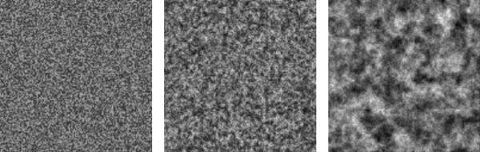

include::./header.adoc[tag=head-setting]
:TOP: <<atop, ⏫>>

== Game AI Pro

[.right]
[link=https://pan.baidu.com/s/1wmn8ylMK0XdteeNyZR7F1w?pwd=askw]
[link=https://www.gameaipro.com/]
image::https://www.gameaipro.com/images/books/gameaipro_large.jpg[width="100%"]

Edited By Steve Rabin

Collected Wisdom Of Game AI Professionals

Boca Raton  London  New York +
CRC Press is an imprint of the +
Taylor & Francis Group, an informa business +

CRC Press +
Taylor & Francis Group +
6000 Broken Sound Parkway NW, Suite 300 +
Boca Raton, FL 33487-2742 +

© 2014 by Taylor & Francis Group, LLC +
CRC Press is an imprint of Taylor & Francis Group, an Informa business +

No claim to original U.S. Government works +
Version Date: 20140311 +

International Standard Book Number-13: 978-1-4665-6597-5 (eBook - PDF)

[quote,"Steve Rabin, Series Editor"]
:quote: https://docs.asciidoctor.org/asciidoc/latest/blocks/blockquotes/
____
All book chapters are free to download.
Enjoy! 
____

****
NOTE: Game AI Pro 系列书籍是 Steven Rabin 发起组织的游戏领域专业参考材料，采用提案制编写，各个章节内容由专业人士编程编撰并提交编辑 (首版有七位编辑) 审稿通过后才被采用，这也就是本书副标题「专业游戏人工智能精选」“Collected Wisdom of Game AI Professionals”的内涵，这也就是为何这套书的作者众多，首版作者就有 52 人，他们成为贡献者之一 (Contributors)。最新版本写作计划也早已在 2017 年公布，参考官方页面 https://www.gameaipro.com/gameaipro4.html[Game AI Pro 4 Proposal]。
****

// image::http://www.gameaipro.com/images/books/gameaipro123.jpg[All Free]

This book contains information obtained from authentic and highly regarded sources. Reasonable efforts have been made to publish reliable data and information, but the author and publisher cannot assume responsibility for the validity of all materials or the consequences of their use. The authors and publishers have attempted to trace the copyright holders of all material reproduced in this publication and apologize to copyright holders if permission to publish in this form has not been obtained. If any copyright material has not been acknowledged please write and let us know so we may rectify in any future reprint.

Except as permitted under U.S. Copyright Law, no part of this book may be reprinted, reproduced, transmitted, or utilized in any form by any electronic, mechanical, or other means, now known or hereafter invented, including photocopying, microfilming, and recording, or in any information storage or retrieval system, without written permission from the publishers.

For permission to photocopy or use material electronically from this work, please access www.copyright.com (http://www.copyright.com/) or contact the Copyright Clearance Center, Inc. (CCC), 222 Rosewood Drive, Danvers, MA 01923, 978-750-8400. CCC is a not-for-profit organization that provides licenses and registration for a variety of users. For organizations that have been granted a photocopy license by the CCC, a separate system of payment has been arranged.

Trademark Notice: Product or corporate names may be trademarks or registered trademarks, and are used only for identification and explanation without intent to infringe.

Visit the Taylor & Francis Web site at http://www.taylorandfrancis.com and the CRC Press Web site at https://www.crcpress.com/

[[atop]]
=== Contents

[cols="2,<0",role="big"]
|===
| Preface                                                       |<<xi,xi>>
| Web Materials                                                 |<<xiii,xiii>>
| Acknowledgments                                               |<<xv,xv>>
| The Editors                                                   |<<xvii,xvii>>
| The Contributors                                              |<<xix,xix>>

| **Part I General Wisdom** |

| 1 What Is Game AI? +
  (Kevin Dill)                                   
  |<<p003, 3>>
| 2 Informing Game AI through the Study of Neurology +
  (Brett Laming) 
  |<<p011, 11>>
| 3 Advanced Randomness Techniques for Game AI: Gaussian Randomness, Filtered Randomness, and Perlin Noise +
  (Steve Rabin, Jay Goldblatt, and Fernando Silva) 
  |<<p029, 29>>

| **Part II Architecture** |

| 4 Behavior Selection Algorithms: An Overview +
  (Michael Dawe, Steve Gargolinski, Luke Dicken, Troy Humphreys, and Dave Mark) 
  | <<p047, 47>>
| 5 Structural Architecture—Common Tricks of the Trade +
  (Kevin Dill) 
  | <<p061, 61>>
| 6 The Behavior Tree Starter Kit +
  (Alex J. Champandard and Philip Dunstan) 
  | <<p073, 73>>
| 7 Real-World Behavior Trees in Script +
  (Michael Dawe) 
  | <<p093, 93>>
| 8 Simulating Behavior Trees: A Behavior Tree/Planner Hybrid Approach +
  (Daniel Hilburn) 
  | <<p099, 99>>
| 9 An Introduction to Utility Theory +
  (David “Rez” Graham) 
  | <<p113, 113>>
| 10 Building Utility Decisions into Your Existing Behavior Tree +
  (Bill Merrill) 
  | <<p127, 127>>
| 11 Reactivity and Deliberation in Decision-Making Systems +
  (Carle Côté) 
  | <<p137, 137>>
| 12 Exploring HTN Planners through Example +
  (Troy Humphreys) 
  | <<p149, 149>>
| 13 Hierarchical Plan-Space Planning for Multi-unit Combat Maneuvers +
  (William van der Sterren) 
  | <<p169, 169>>
| 14 Phenomenal AI Level-of-Detail Control with the LOD Trader +
  (Ben Sunshine-Hill) 
  | <<p185, 185>>
| 15 Runtime Compiled C++ for Rapid AI Development +
  (Doug Binks, Matthew Jack, and Will Wilson) 
  | <<p201, 201>>
| 16 Plumbing the Forbidden Depths: Scripting and AI +
  (Mike Lewis) 
  | <<p219, 219>>

| **Part III Movement and Pathfinding** |

| 17 Pathfinding Architecture Optimizations +
  (Steve Rabin and Nathan R. Sturtevant) 
  | <<p241, 241>>
| 18 Choosing a Search Space Representation +
  (Nathan R. Sturtevant) 
  | <<p253, 253>>
| 19 Creating High-Order Navigation Meshes through Iterative Wavefront Edge Expansions +
  (D. Hunter Hale and G. Michael Youngblood) 
  | <<p259, 259>>
| 20 Precomputed Pathfinding for Large and Detailed Worlds on MMO Servers +
  (Fabien Gravot, Takanori Yokoyama, and Youichiro Miyake) 
  | <<p269, 269>>
| 21 Techniques for Formation Movement Using Steering Circles +
  (Stephen Bjore) 
  | <<p289, 289>>
| 22 Collision Avoidance for Preplanned Locomotion +
  (Bobby Anguelov) 
  | <<p297, 297>>
| 23 Crowd Pathfinding and Steering Using Flow Field Tiles +
  (Elijah Emerson) 
  | <<p307, 307>>
| 24 Efficient Crowd Simulation for Mobile Games +
  (Graham Pentheny) 
  | <<p317, 317>>
| 25 Animation-Driven Locomotion with Locomotion Planning +
  (Jarosław Ciupiński) 
  | <<p325, 325>>

| **Part IV Strategy and Tactics** |

| 26 Tactical Position Selection: An Architecture and Query Language +
  (Matthew Jack) 
  | <<p337, 337>>
| 27 Tactical Pathfinding on a NavMesh +
  (Daniel Brewer) 
  | <<p361, 361>>
| 28 Beyond the Kung-Fu Circle: A Flexible System for Managing NPC Attacks +
  (Michael Dawe) 
  | <<p369, 369>>
| 29 Hierarchical AI for Multiplayer Bots in Killzone 3 +
  (Remco Straatman, Tim Verweij, Alex Champandard, Robert Morcus, and Hylke Kleve) 
  | <<p377, 377>>
| 30 Using Neural Networks to Control Agent Threat Response +
  (Michael Robbins) 
  | <<p391, 391>>

| **Part V Agent Awareness and Knowledge Representation** |

| 31 Crytek’s Target Tracks Perception System +
  (Rich Welsh) 
  | <<p403, 403>>
| 32 How to Catch a Ninja: NPC Awareness in a 2D Stealth Platformer +
  (Brook Miles) 
  | <<p413, 413>>
| 33 Asking the Environment Smart Questions +
  (Mieszko Zielinski) 
  | <<P423, 423>>
| 34 A Simple and Robust Knowledge Representation System +
  (Phil Carlisle) 
  | <<P433, 433>>
| 35 A Simple and Practical Social Dynamics System +
  (Phil Carlisle) 
  | <<P441, 441>>
| 36 Breathing Life into Your Background Characters +
  (David “Rez” Graham) 
  | <<P451, 451>>
| 37 Alibi Generation: Fooling All the Players All the Time +
  (Ben Sunshine-Hill) 
  | <<P459, 459>>

| **Part VI Racing** |
| 38 An Architecture Overview for AI in Racing Games +
  (Simon Tomlinson and Nic Melder) 
  | <<P471, 471>>
| 39 Representing and Driving a Race Track for AI Controlled Vehicles +
  (Simon Tomlinson and Nic Melder) 
  | <<p481, 481>>
| 40 Racing Vehicle Control Systems using PID Controllers +
  (Nic Melder and Simon Tomlinson) 
  | <<p491, 491>>
| 41 The Heat Vision System for Racing AI: A Novel Way to Determine Optimal Track Positioning +
  (Nic Melder) 
  | <<p501, 501>>
| 42 A Rubber-Banding System for Gameplay and Race Management +
  (Nic Melder) 
  | <<p507, 507>>

| **Part VII Odds and Ends** |
| 43 An Architecture for Character-Rich Social Simulation +
  (Michael Mateas and Josh McCoy)
  | <<p515, 515>>
| 44 A Control-Based Architecture for Animal Behavior +
  (Michael Ramsey)
  | <<p531, 531>>
| 45 Introduction to GPGPU for AI +
  (Conan Bourke and Tomasz Bednarz)
  | <<p539, 539>>
| 46 Creating Dynamic Soundscapes Using an Artificial Sound Designer +
  (Simon Franco)
  | <<p549, 549>>
| 47 Tips and Tricks for a Robust Third-Person Camera System +
  (Eric Martel)
  | <<p557, 557>>
| 48 Implementing N-Grams for Player Prediction, Procedural Generation, and Stylized AI +
  (Joseph Vasquez II)
  | <<p567, 567>>
|===

{TOP}
[[xi]]
=== 序

距离上一本同类书籍的出版已有五年之久，这本书实在是姗姗来迟。2008 年 AI Game Programming Wisdom《游戏人工智能编程精粹》系列完成后，曾参与该系列编写的许多同仁将精力转向构建游戏 AI 开发者社群——我们成立了游戏 AI 程序员协会 (www.gameai.com)，并在年度游戏开发者大会上组织人工智能峰会。虽然这些举措意义非凡，但我们逐渐意识到某些重要事物正遗失。

尽管网络信息呈指数级增长，技术类书籍似乎日渐式微，但相信你会认同：在游戏 AI 这样的细分领域，要获取高质量、系统性的专家知识依然困难重重。事实上，全球范围内的游戏 AI 专家本就稀缺——相较于其他领域，这个群体规模十分有限。过去五年间，游戏 AI 程序员协会汇聚了 350 余名专业开发者，而全球专业游戏 AI 开发者的总数或许仅为这个数字的两到三倍。正因这个圈子如此精粹，能够邀请其中 54 位专家在此书中倾囊相授，实属珍贵的馈赠，我对此深怀感激。

于我而言，编纂此类书籍的魅力在于其产生的"力量倍增"效应。通过将某项游戏开发中的技术与理念淬炼成文，来自单个项目的知识智慧得以传播至成千上万的开发者手中。那些可能湮没或需要重复探索的经验结晶，由此在其他工作室与创作者的思维沃土中生根发芽。我们不必重复发明轮子，而是能够站在同行构筑的智慧高台之上前行。

值得庆幸的是，这个领域正在走向成熟，逐步建立起坚实的行业知识体系。事必躬亲从头创造的时代已然逝去。如今我们可以基于行为树、效用理论等完备理论来构建架构，借鉴耗费数十年积累的路径规划知识与技术。然而前路依然广阔，许多创新方向亟待探索。愿本书中的智慧结晶能助力你稳步前进，亦能点燃你心中渴望的灵感火花。

[.right]
史蒂夫·拉宾

NOTE: 史蒂夫·拉宾 (Steve Rabin) 是美国游戏开发者、知名技术作家与教育家，在游戏人工智能领域具有重要影响力。他长期致力于游戏 AI 技术的推广与社区建设，曾主编 AI Game Programming Wisdom 系列丛书，并参与创立游戏 AI 程序员协会 (AI Game Programmers Guild)。此外，他还在游戏开发者大会上组织 AI 峰会，积极推动行业知识共享与技术交流。拉宾目前任美国任天堂 (Nintendo of America) 的首席软件工程师，并在迪吉彭理工学院 (DigiPen Institute of Technology) 担任教授，教授游戏 AI 相关课程。他以其在游戏 AI 架构、行为树、实用决策系统等方面的专业贡献而广受认可，是连接学术界与工业界的重要桥梁之一。

{TOP}

=== Preface

It has been 5 years since a book similar to this one has been released, and it is long overdue. After the end of the AI Game Programming Wisdom series in 2008, many of us who worked on these books refocused our effort toward building a community of game AI programmers by forming the AI Game Programmers Guild (www.gameai.com) and organizing the AI Summit at the annual Game Developers Conference. While these continue to be extremely worthwhile endeavors, it became obvious that something was just missing.

Although it appears that technical books might be on the decline with the exponential rise of information on the Internet, I think you’ll agree that it’s difficult to find high quality , detailed expert knowledge for a niche field such as game AI. The truth is that there are just not that many game AI experts in the world, relative to people in other fields. The AI Game Programmers Guild has a membership of over 350 professional game AI developers that it’s been building over the last 5 years, so perhaps the number of total professional game AI developers in the world is double or triple that number. The reality is that it’s a small world and to be able to get 54 of them to share their expertise with you within this one book is quite a gift that I’m extremely grateful for.

What I personally love about creating a book like this one is that it is a force multiplier. The knowledge and wisdom gained from one game can be shared with hundreds or thousands of other game developers by simply distilling the techniques and concepts onto the printed page. Knowledge and wisdom that might otherwise disappear or have to be reinvented is instead allowed to spread and pollinate within dozens or hundreds of other development studios and minds. We aren’t forced to reinvent techniques and instead can stand on the shoulders of our peers.

Fortunately, the field is finally maturing and building up some solid institutional knowledge. Gone are the days of inventing everything from scratch. Nowadays, we build architectures based on well documented ideas like behavior trees and utility  theory. We can leverage pathfinding knowledge and know-how that took dozens of years to figure  out. Yet, there is still much to invent and many directions to explore. Hopefully, the contributions in this book will give you the leg up you need and the inspiration you crave.

[.right]
**Steve Rabin**

''''''

{TOP}
[[xiii]]
=== Web Materials

Example programs and source code to accompany some of the chapters are available at 
http://www.gameaipro.com.

General System Requirements

The following is required to compile and execute the example programs:

• The DirectX August 2009 SDK
• DirectX 9.0 compatible or newer graphics card
• Windows 7 or newer
• Visual C++ .NET 2008 or newer

Updates

Updates of the example programs and source code will be updated as needed.
Comments and Suggestions
Please send any comments or suggestions to steve.rabin@gmail.com.

{TOP}
[[xv]]
=== Acknowledgments

The Game AI Pro: Collected Wisdom of Game AI Professionals book series covers practical techniques and wisdom that can be applied to commercial game development.

This first book in the series required a huge team effort to make happen. First, I would like to humbly thank the six section editors for the excellent job they did in selecting, guiding, and editing the contributions in this book. The section editors were

• Neil Kirby—General Wisdom
• Dave Mark—Architecture
• Nathan Sturtevant—Movement and Pathfinding
• Kevin Dill—Strategy and Tactics, Odds and Ends
• Damián Isla—Agent Awareness and Knowledge Representation
• Simon Tomlinson—Racing

Additionally, I’d like to thank the assistant section editors that helped review and edit the contributions. Specifically, I’m extremely thankful to Luke Dicken, Paul Elliot, John Manslow, Bill Merrill, Ian Millington, Fernando Silva, and Vicky Smalley, who helped ensure the quality and integrity of this new book series.

The wonderful cover artwork has been provided courtesy of Square Enix and Gas Powered Games from the game Supreme Commander 2. Two chapters covering techniques from this game appear in this book: Crowd Pathfinding and Steering Using Flow Field Tiles and Using Neural Networks to Control Agent Threat Response.

The team at CRC Press and A K Peters have done an excellent job making this whole project happen. I want to thank Rick Adams, Kari Budyk, and the entire production team who took the contributions and carefully turned them into this book.

Special thanks go out to our families and friends, who have supported us and endured the intense production cycle that required long hours, evenings, and weekends.

{TOP}
[[xvii]]
=== The Editors

**Kevin Dill** is a member of the Group Technical Staff at Lockheed Martin Global Training and Logistics, and chief architect of the Game AI Architecture. He is a veteran of the game industry, with seven published titles under his belt, including Red Dead Redemption, Iron Man, Zoo Tycoon 2: Marine Mania, Zoo Tycoon 2: Endangered Species, Axis & Allies, Kohan 2: Kings of War, and Master of Orion 3. Kevin was the technical editor for Introduction to Game AI and Behavioral Mathematics for Game AI, and a section editor for AI Game Programming Wisdom 4 and the book you hold in your hands. He is a frequent speaker at conferences such as I/ITSEC and GDC, and has taught classes on game development and game AI at Harvard University, Boston University, Worcester Polytechnic Institute, and Northeastern University.

**Damián Isla** has been working on and writing about game technology for over a decade. He is president and cofounder of Moonshot Games, a studio dedicated to the creation of downloadable and mobile games with triple-A production values and technology. Before Moonshot, Damián was AI and Gameplay engineering lead at Bungie Studios, where he was responsible for the AI for the mega-hit first-person shooters Halo 2 and Halo 3. A leading expert in the field of AI for Games, Damián has spoken on games, AI, and character technology at the International Joint Conference on Artificial Intelligence (IJCAI), at the AI and Interactive Digital Entertainment Conference (AIIDE), and at Siggraph, and is a frequent speaker at the Game Developers Conference (GDC). Before joining the industry, Damián earned a master’s degree at the Massachusetts Institute of Technology Media Lab, where he did research on learning and behavior for synthetic characters. He holds a BS in computer science, also from MIT.

**Neil Kirby** is a member of the technical staff at Bell Laboratories, the R&D arm of Alcatel-Lucent. He is the author of An Introduction to Game AI, and his other publications include articles in volumes I, II, and IV of AI Game Programming Wisdom. His 1991 paper “Artificial Intelligence Without AI: An Evolutionary Approach” may well show the first use of what is now known as “circle strafing” in a game. His other papers and presenta tions can be found in the proceedings of the Computer Game Developers Conference from 1991 to present as well as the 2003 Australian Game Developers Conference. Neil holds a master’s degree in computer science from Ohio State University. He was a driving force behind the creation of the IGDA Foundation and serves on its board.

**Dave Mark** is the president and lead designer of Intrinsic Algorithm, LLC, an  independent game development studio and AI consulting company in Omaha, Nebraska. He is the author of the book Behavioral Mathematics for Game AI and is a contributor to the AI Game Programming Wisdom and Game Programming Gems book series. Dave is also a founding member of the AI Game Programmers Guild and coadvisor of the annual GDC AI Summit. Dave continues to further his education by attending the University of Life. He has no plans to graduate any time soon.

**Steve Rabin** is a principal software engineer at Nintendo of America, where he researches new techniques for Nintendo’s current and future platforms, architects development tools such as the Wii U CPU Profiler, and supports Nintendo developers. Before Nintendo, Steve worked primarily as an AI engineer at several Seattle start-ups including Gas Powered Games, WizBang Software Productions, and Surreal Software. He organized and edited the AI Game Programming Wisdom series of books, the book Introduction to Game Development, and has over two dozen articles published in the Game Programming Gems series. He’s been an invited keynote speaker at several academic AI conferences, spoken at the Game Developers Conference, and spoken at numerous Nintendo development conferences in North America and Europe. He organizes the 2-day AI Summit at GDC and has moderated the AI roundtables. Steve founded and manages the professional group known as the AI Game Programmers Guild, with over 350 members worldwide. He has also taught game AI at the DigiPen Institute of Technology for the last 8 years and has earned a BS in computer engineering and an MS in computer science, both from the University of Washington.

**Nathan Sturtevant** is a professor of computer science at the University of Denver, working on AI and games. He began his games career working on shareware games as a college student, writing the popular Mac tank game Dome Wars in the mid-90s, and returned to the games industry to write the pathfinding engine for Dragon Age: Origins. Nathan continues to develop games in his free time, and is currently porting Dome Wars to iOS.

**Simon Tomlinson**, PhD, studied physics at Manchester University in England and went on to gain a PhD in electrical engineering and to work as a research fellow in electronic applications and computational physics. In 1997 he joined the games industry as an AI programmer . He has worked on a variety of platforms and projects including billiard games, flight and space combat, racing games, FPS combat, and card games, including Poker. He has also worked as project lead on mobile Java platforms and had occasional forays into production and R&D. He has retained his academic interests with several game related publications and presentations in the UK and has assisted local academia in starting and running game programming courses. In 2008 he formed his own consultancy company, S1m On Ltd, and has most recently contributed to the highly acclaimed Need for Speed Shift series under a contract for Slightly Mad Studios.

{TOP}
[[xix]]
=== The Contributors

**Bobby Anguelov** works as an AI/animation programmer at Io Interactive, where he focuses on low-level locomotion and behavior frameworks. He earned an MSc in computer science from the University of Pretoria, South Africa, and spent the first part of his career working in enterprise software. This was followed by a 2-year stint teaching graphics programming at a university before moving to Denmark to pursue his lifelong dream of working in games. He’s currently working on building a new behavior-authoring framework for the Glacier 2 game engine while trying to catch up on the latest animation techniques in his spare time. In his less busy past, he used to regularly update his tech blog at www.takinginitiative.net.

**Tomasz Bednarz** is a computational research scientist and project leader at CSIRO’s Division of Mathematics, Informatics, and Statistics (www.csiro.au/cmis). He is active in the computational simulation sciences where heterogeneous architectures play an essential role in speeding up computationally expensive scientific code. He coorganizes the Sydney GPU Meetup (http://www.meetup.com/Sydney-GPU-Users/) and also the OzViz workshops (https://sites.google.com/site/ozvizworkshop/).

**Doug Binks** makes games at Enkisoftware Limited, having recently left his position as technical lead of Games Architecture Initiative at Intel. Prior to joining Intel in 2008 he worked in the games industry in roles ranging from lead programmer, head of studio at Strangelite, and R&D development manager at Crytek. Despite an early interest in games development, Doug careered sideways into a doctorate in physics at Oxford University, and undertook two postdoctoral posts as an academic researcher in experimental non-linear pattern formation, specializing in fluid mechanics. His earliest memories are of programming games in assembly on the ZX81.

**Stephen Bjore** graduated from Washington State University with a bachelor’s degree in computer science, and later acquired a BS in real-time interactive simulation from DigiPen Institute of Technology. After graduating, he spent 2 years working at Wizards of the Coast, initially on various video game prototypes and later on the server side for Magic the Gathering Online. In 2008, he moved to Nintendo of America, where he became a part of its Software Development Support Group. After several years with SDSG, he switched over to an internal development group which has been working on 3DS and Wii-U projects.

**Conan Bourke** is a senior programming lecturer at the Academy of Interactive Entertainment’s Sydney campus in Australia. His main role is teaching software engineering for all aspects of interactive media with his passions lying in graphics and AI programming. Prior to teaching he worked for Blue Tongue Entertainment Pty Ltd, an in-house studio for THQ, as a gameplay programmer on multiple systems and numerous cross-platform titles.

**Daniel Brewer** graduated from the University of Natal–Durban, South Africa, in 2000 with a BScEng in electronic engineering focusing on artificial intelligence, control systems, and data communications. He worked at Cathexis Technologies for 6 years, as a software engineer writing software for digital surveillance systems, responsible for operating system drivers for PCI video capture cards, image capture scheduling, video compression, and image processing algorithms such as motion detection, people counting, and visual camera tamper detection. He moved to Digital Extremes in 2007 where he is the lead AI programmer and has worked on several titles including Dark Sector (March 2008), BioShock 2 multiplayer (February 2010), and The Darkness II (February 2012).

**Phil Carlisle** is an independent game developer at MindFlock Ltd and a senior lecturer in videogame design and development at the University of Bolton in England. Prior to setting up MindFlock, Phil was responsible for game programming duties on numerous titles in the “Worms” franchise for Team17 Ltd. Phil is a great believer in iterative prototype game development and a rabid observer of human behaviors.

**Alex Champandard** is the founder of AiGameDev.com, the largest online hub for artificial intelligence in games. He has worked in industry as a senior AI programmer for many years, most notably for Rockstar Games where he also worked on the animation technol ogy of Max Payne 3. He regularly consults with leading studios in Europe, most notably at Guerrilla Games on the multiplayer bots for KillZone 2 & 3. Alex is also the event director for the Game/AI Conference, the largest independent event dedicated to AI in games.

**Jarosław Ciupiński** knew what he wanted to do with his life when he turned 9 years old. While he was coding since then, he started to work professionally in game development in 2007 as an animation programmer. In 2012 he still sees many things that can be improved in the field of animation in game development.

**Carle Côté** has been a senior AI programmer at Eidos Montreal since 2009 and currently leads the AI development on the next Thief game. In 2012, he received his PhD in electrical engineering applied to AI and robotics from Sherbrooke University in Canada. His focus is mainly on decision-making systems and cognitive AI.

**Michael Dawe** has been programming AI in the games industry since 2007 and worked at Big Huge Games on NPC behavior for Kingdoms of Amalur: Reckoning. He has spoken numerous times at the AI Summit at the Game Developer’s Conference, is a founding member of the AI Game Programmer’s Guild, and has previously written for the Game Programming Gems series. Michael holds an MS in computer science from DigiPen Institute of Technology, as well as bachelor of science degrees in computer science and philosophy from Rensselaer Polytechnic Institute.

**Luke Dicken** is the founder of Robot Overlord Games, and a researcher with the Strathclyde Artificial Intelligence and Games group at the University of Strathclyde in the United Kingdom. He contributes to AltDevBlogADay and is a principal organizer for the AltDev Conference family. Luke has been passionate about artificial intelligence since playing Creatures as a teenager, and pursued it in college, first through several degrees in traditional AI before specializing in AI for games as part of a PhD he is still ( occasionally) pursuing. Luke is a member of the AI Game Programmers Guild, on the board of directors for IGDA Scotland, and recently took over as chair of the IGDA’s Special Interest Group on AI.

**Kevin Dill** is a member of the Group Technical Staff at Lockheed Martin Global Training and Logistics, and the chief architect of the Game AI Architecture. He is a veteran of the game industry, with seven published titles under his belt, including Red Dead Redemption, Iron Man, Zoo Tycoon 2: Marine Mania, Zoo Tycoon 2: Endangered Species, Axis & Allies, Kohan 2: Kings of War, and Master of Orion 3. Kevin was the technical editor for Introduction to Game AI and Behavioral Mathematics for Game AI, and a section editor for AI Game Programming Wisdom 4 and the book you hold in your hands. He is a frequent speaker at conferences such as I/ITSEC and GDC, and has taught classes on game development and game AI at Harvard University, Boston University, Worcester Polytechnic Institute, and Northeastern University.

**Philip Dunstan**, as a senior AI R&D engineer at AiGameDev.com, prototypes cutting edge solutions to the artificial intelligence challenges found in today’s games. In addition, Philip has 6 years of development experience within Electronic Arts’ EATech Central Technology Group. As a specialist in physics simulation, core technology, and console performance, he worked on several of EA’s biggest franchises including FIFA, Need for Speed, Battlefield, and Harry Potter.

**Elijah Emerson** started his lifelong dream of creating video games in his childhood, creating games on paper for friends and family to play. Since then, every step in his life was toward that singular goal of creating new and creative game experiences for others to enjoy. After obtaining a BS in real-time interactive simulation from Digipen Institute of Technology, he began work as a game programming teacher for Digipen. A year later he went to Amaze Entertainment to work on Harry Potter 2. After that he moved to Gas Powered Games to work on Dungeon Siege 2, Supreme Commander 1 and 2, Age of Empires Online, and other unannounced titles over the last 12 years. He currently works at Gas Powered Games as the lead engineer on an unannounced project.

**Simon Franco** started programming on the Commodore Amiga by writing a Pong clone in AMOS and has been coding ever since. He joined the games industry in 2000, after completing a degree in computer science. He started at The Creative Assembly in 2004, where he has been to this day. When he’s not keeping his daughter entertained, he’ll be playing the latest game or writing games in assembly code for the ZX Spectrum.

**Steve Gargolinski** has been working on games professionally since 2003, spending time at Blue Fang Games, Rockstar New England, and 38 Studios. Steve has a strong technical background, and enjoys thinking, writing, and speaking about game AI, programming, and the development process. He has presented at conferences such as the Game Devel opers Conference (GDC) and the AI and Interactive Digital Entertainment Conference (AIIDE), and has been interviewed by The Independent and Gamasutra for his work in gaming AI. While not programming computers Steve enjoys nonfiction, cooking, hockey, and walking in the woods.

**Jay Goldblatt** is a programmer at Nintendo Technology Development and contributed to the hardware launch of the Wii U. He earned an MS in computer science from the DigiPen Institute of Technology, where he helped TA the artificial intelligence class for over a year. Jay also earned a BS in computer science from Lawrence University.

**David “Rez” Graham** is an AI programmer at Electronic Arts, working at Maxis on The Sims team. His most recent game was The Sims Medieval and the Pirates & Nobles expansion. Rez is currently the lead AI programmer on an upcoming Sims title. He has worked in the games industry as an engineer since 2005 spending most of that time working on various kinds of AI, from platformer enemy AI to full simulation games. He is the coauthor of Game Coding Complete, 4th Edition, and regularly speaks at the Game Developers Conference, as well as various colleges and high schools. Rez spends his free time performing improv, running tabletop RPGs, and dyeing his hair shades of blue.

**Fabien Gravot** made his debut in the game industry in 2011 as AI researcher with SQUARE ENIX. Previously, he had been working on robot AI and autonomous driving. He thought that games were less risky than moving one ton of metal with his program. He received his PhD in computer science from the University Paul Sabatier in France in 2004.

**D. Hunter Hale**, PhD, completed his doctoral work at the University of North Carolina at Charlotte in 2011. He has been a research assistant in the Game Intelligence Group in the Games + Learning Lab for the last 4 years; prior to that he was a research assistant in the Visualization Lab at UNC–Charlotte while completing his master’s degree. He received his bachelor’s degree with honors from Western Carolina University in 2005.

**Daniel Hilburn** has been making video games since 2007. He has worked on several con sole games including Kinect Star Wars™, Ghostbusters: The Video Game™, and DefJam’s Rapstar™. He currently works in Irving, Texas, at Terminal Reality, Inc.

**Troy Humphreys** has been involved in game mechanics and AI since 2005. Since then, he has worked on the games The Bourne Conspiracy, Transformers: War for Cybertron, and Transformers: Fall of Cybertron. He currently works as a senior programmer at High Moon Studios, where he helps lead the studio’s AI development. Prior to working on games, he taught game development as an Associate Course Director at Full Sail, where he still serves as an adviser.

**Matthew Jack** founded Moon Collider (www.mooncollider.com) in 2010, where he consults on AI for companies in the US and Europe and builds bespoke AI systems. He specializes in CryEngine 3 and Recast/Detour. He developed AI at Crytek for many years in a senior R&D role, including work on Crysis and Crysis 2. He has since worked for Microsoft and AiGameDev.com, and consulted for games and serious games companies. Clients include Xaviant LLC and Enodo, with products delivered to companies such as BMW. He has written for Games Programming Gems and presented at the GDC, Paris Game AI Conference, Develop and at Google.

**Hylke Kleve** (hylke.kleve@guerrilla-games.com) is principal AI programmer at Guerrilla Games, where he has worked on Killzone 2 and Killzone 3. He developed planning and pathfinding technology. Hylke Kleve holds an MS in computer science (2003) from the University of Groningen, the Netherlands.

**Brett Laming** has now been in the industry for more years than anyone should care to remember. He currently finds himself in the enviable role of leading the full range of technical teams at Rockstar Leeds. Critical-thinking skills matured by years of AI, game play, and engine programming now drive much wider development, production, and management arenas—skills that see LA Noire join a portfolio of titles that span Rockstar Games, Criterion, Argonaut, and Particle Systems. His long-suffering partner Katherine continues to be exasperated by a heavy bias towards game development over that of DIY.

**Mike Lewis** broke into the game industry as an AI and gameplay programmer in early 2002. He has since shipped three successful titles with Egosoft GmbH in the “X Series,” and designed AI systems instrumental to a fourth, as-yet unreleased title. Today, he calls ArenaNet, Inc., home, where he plots incessantly to unleash bigger, better, and more entertaining AI upon the realm of massively multiplayer online gaming.

**Dave Mark** is the president and lead designer of Intrinsic Algorithm, LLC, an indepen dent game development studio and AI consulting company in Omaha, Nebraska. He is the author of the book Behavioral Mathematics for Game AI and is a contributor to the AI Game Programming Wisdom and Game Programming Gems book series. Dave is also a founding member of the AI Game Programmers Guild and coadvisor of the annual GDC AI Summit. Dave continues to further his education by attending the University of Life. He has no plans to graduate any time soon.

**Eric Martel** began his career in the games industry in 2001 when he joined Microids to work on the acclaimed adventure games series Syberia. In 2004 he joined Ubisoft Montreal where he had the opportunity to work on FarCry: Instincts and Assassin’s Creed. He then joined GRIP Entertainment (now Autodesk) in 2007 to shape the development of its Digital Extra System and finally moved to Eidos Montreal in 2008 to work on Thief 4. He also had the pleasure to be the technical reviewer for Mat Buckland’s book Game AI by Example and wrote an article for AI Game Programming Wisdom 3 on the anchor system in FarCry: Instinct.

**Michael Mateas** is the codirector of Expressive Intelligence Studio and director of the Center for Games and Playable Media at the University of California–Santa Cruz. His research in game AI focuses on enabling new forms of gameplay through innovative AI solutions. The Expressive Intelligence Studio has ongoing projects in autonomous characters, interactive storytelling, game design support systems, AI models of creativity, and automated game generation. With Andrew Stern, Michael created Façade, which uses AI techniques to combine rich autonomous characters with interactive plot control to create the world’s first, fully-produced, real-time, interactive drama. Michael received his PhD in computer science from Carnegie Mellon University.

**Josh McCoy** recently completed his PhD in Computer Science in the Expressive Intelligence Studio at the University of California–Santa Cruz. Coming to UC–Santa Cruz with a dual background in computer science and sociology, his PhD dissertation was on social simu lation. He was the lead developer of the CiF architecture, and a core team member in the creation of Prom Week. Josh is currently a postdoc at UC–Santa Cruz in the Center for Games and Playable Media, where he is working on extending CiF to support real-time first-person character performance.

**Dr. Nic Melder**, prior to attending university, worked for a global bank designing and implementing their payment and query systems. Upon graduating with a BSc in cyber netics and control engineering, instead of doing the sensible thing and getting a “real” job, he entered the games industry as an AI programmer. After working on some preda tor–prey simulations and a third-person action title, he returned to academia for 5 years to conduct research in multifingered haptics before taking up a position as an AI programmer at Codemasters. Over 6 years later, Nic has worked on the hugely successful DiRT, GRID, and F1 titles and is now lead AI programmer within the racing studio. However, even after spending over 6 years making racing games, Nic is still regarded as the worst driver in the studio!

**Bill Merrill** is the AI lead at Turtle Rock Studios working hard on an unannounced project, having previously worked as AI lead and senior generalist at Double Helix Games, shipping cross-platform game projects including Dirty Harry, Silent Hill: Homecoming, Front Mission: Evolved, and various tools and demos. He currently splits his time between technology and toddlers.

**Brook Miles** was inspired by games like SimCity 2000 and the King’s Quest series, and began teaching himself C++ while in high school. Shortly after graduating he was inter viewed and hired on an EFNet IRC channel to work remotely for a Silicon Valley startup during the rise of the dot-com bubble. After the bubble burst, he dabbled in enterprise software before finally getting his break into game development at EA Black Box in 2006 where he worked on Skate and Need For Speed: Undercover. Brook joined Klei Entertainment in early 2011 to work on Mark of the Ninja, because … you know … Ninjas.

**Youichiro Miyake** is the lead AI researcher at SQUARE ENIX, working as leader of the AI unit for the next-generation game engine, Luminous Studio. He is chairman of IGDA JAPAN SIG-AI and a member of the committee of DiGRA JAPAN. He has been developing and researching game AI since 2004. He developed the technical design of AI for the following game titles: CHROME HOUNDS (2006, Xbox360), Demon’s Souls (2009, PlayStation3), and Armored Core V (2012, Xbox360, PlayStation3) developed by FROM SOFTWARE. He has published several papers and books about game AI technologies as well as given many lectures at universities and conferences. He was a keynote speaker of GAMEON ASIA 2012.

**Robert Morcus** is a senior AI developer at Guerrilla Games. There, he has helped build the tools and technology for most titles released by Guerrilla Games: ShellShock:Nam’67, Killzone, Killzone 2, and Killzone 3. His field of interest before starting game development was in electronics and audio synthesis / signal processing. Graham Pentheny leads AI development at Subatomic Studios in Cambridge, Massachusetts, where he recently worked on the iOS games Fieldrunners and Fieldrunners 2. He received a BS in computer science and a BS in interactive media and game development from Worcester Polytechnic Institute. In his spare time he reads an unhealthy number of books on AI and programming language theory and is an avid musician.

**Steve Rabin** is a principal software engineer at Nintendo of America, where he researches new techniques for Nintendo’s current and future platforms, architects development tools such as the Wii U CPU Profiler, and supports Nintendo developers. Before Nintendo, Steve worked primarily as an AI engineer at several Seattle start-ups including Gas Powered Games, WizBang Software Productions, and Surreal Software. He organized and edited the AI Game Programming Wisdom series of books, the book Introduction to Game Development, and has over two dozen articles published in the Game Programming Gems series. He’s been an invited keynote speaker at several academic AI conferences, presented at the Game Developers Conference, and spoken at numerous Nintendo development conferences in North America and Europe. He organizes the 2-day AI Summit at GDC and has moderated the AI roundtables. Steve founded and manages the professional group known as the AI Game Programmers Guild, with over 350 members worldwide. He has also taught game AI at the DigiPen Institute of Technology for the last 8 years and has earned a BS in computer engineering and a MS in computer science, both from the University of Washington.

**Mike Ramsey** is the principle programmer on the Noumena AI Engine. Mike has developed core technologies for the Xbox 360, PC, and Wii at various companies, including a handful of shipped games: World of Zoo (PC and Wii), Men of Valor (Xbox and PC), Master of the Empire, Second Life, and several Zoo Tycoon 2 products. Mike has contrib uted multiple articles to the Game Programming Gems, AI Game Programming Wisdom, and the Game Engine Gems series, as well as presented at the AIIDE conference at Stanford on uniform spatial representations for dynamic environments. Mike has a BS in computer science from MSCD and his forthcoming book is titled A Practical Cognitive Engine for AI. When Mike isn’t working he enjoys long walks in the Massachusetts countryside with his wife, daughter, and their dog, Rose!

**Michael Robbins** is a gameplay engineer with Gas Powered Games working on every thing from UI to AI. He has been working in the industry since 2009, after being a long time member of the Gas Powered Games modeling community. His most notable work is featured in the AI of Supreme Commander 2, released in March 2010.

**Fernando Silva** is a software engineer at Nintendo of America, providing engineering support to licensed game developers and internal groups, specializing on the Nintendo Wii U platform. He completed an undergraduate degree in computer science in real-time interactive simulation at DigiPen Institute of Technology, where he minored in mathematics. He also develops tools for current and next-gen Nintendo platforms. In his free time, Fernando enjoys working on electronic projects with a focus on the Arduino platform, reverse engineering processes or devices, studying biological processes that can be applied to computer science, and most importantly, dining.

**Remco Straatman** for 10 years led the AI coding team at Guerrilla, and developed AI for ShellShock:Nam67, Killzone, Killzone:Liberation, Killzone 2, and Killzone 3. Currently, Remco is feature architect and leads a game code team at Guerrilla. Before joining Guerrilla, Remco worked as a researcher in the field of expert systems and machine learn ing, and as developer of multimedia software. He holds an MS in computer science (1991) from the University of Amsterdam.

**William van der Sterren** is an AI consultant for games and simulations at CGF-AI. He worked on the AI of Guerrilla Games’ Killzone and Shellshock Nam’67 games. William has spoken at the Game Developer Conference and AIGameDev conference, and has contributed chapters to both the Game Programming Gems and AI Game Programming Wisdom series. His interest is in creating tactical behaviors, from tactical path-finding and terrain analysis to squad behaviors and company level maneuver planning. William holds an MSc in computer science from University of Twente and a PDEng Software Technology from Eindhoven University of Technology.

**Nathan Sturtevant** is a professor of computer science at the University of Denver, working on AI and games. He began his games career working on shareware games as a college student, writing the popular Mac tank game Dome Wars in the mid-90s, and returned to the games industry to write the pathfinding engine for Dragon Age: Origins. Nathan continues to develop games in his free time, and is currently porting Dome Wars to iOS.

**Ben Sunshine-Hill** received a PhD in computer science from the University of Pennsylvania for his work in video game-focused computational techniques. Since then, he has been a software developer at Havok.

**Simon Tomlinson**, PhD, studied physics at Manchester University in the United Kingdom and went on to gain a PhD in electrical engineering and to work as a research fellow in electronic applications and computational physics. In 1997 he joined the games industry  as an AI programmer. He has worked on a variety of platforms and projects including  billiard games, flight and space combat, racing games, FPS combat, and card games, including poker. He has also worked as project lead on mobile Java platforms and had occasional forays into production and R&D. He has retained his academic interests with several game-related publications and presentations in the UK and has assisted local academia in starting and running game programming courses. In 2008 he formed his own consultancy company, S1m On Ltd., and has most recently contributed to the highly acclaimed Need for Speed Shift series under a contract for Slightly Mad Studios.

**Joseph Vasquez II** provides engineering support to third party developers and internal groups at Nintendo, specializing in the Nintendo 3DS platform. He completed an under graduate degree in real-time interactive simulation at DigiPen Institute of Technology, where he minored in computer engineering and codeveloped the Augger: a handheld game system with augmented reality features. He also wrote the AI for all of his game projects. He is currently finishing a master’s of computer science at DigiPen. When he is not doing homework or hiking with his wife and dog in the beautiful Northwest, he enjoys going to work.

**Tim Johan Verweij** is a senior AI programmer at Guerrilla, Amsterdam, The Netherlands. The past six years he has worked on AI technology and AI behaviors for Killzone 2 and Killzone 3, both first-person shooters for the Playstation 3. He studied AI at VU University, Amsterdam. For his master’s thesis he did a research project on multiplayer bot AI at Guerrilla.

**Rich Welsh**, after graduating from Durham University and moving abroad to teach games development in a Californian summer camp, returned back to his hometown of Newcastle to work on PC games at Virtual Playground. While the team there taught him a lot about both programming and the games industry, he eventually left in order to pursue the chance of working on AAA titles. Rich has been programming professionally for the games industry for over 5 years with a focus on AI, and has worked on the following titles to date: Crackdown 2, Crysis for Console, Crysis 2, Crysis 3, and Homefront 2.

**Will Wilson** recently founded Indefiant Ltd. in order to focus on developing software and consulting for improving the iteration times and reducing costs in game development and testing. His 10 years in the games industry includes being lead programmer at Firefly Studios and senior programmer at Crytek, where he worked on Crysis 2 and the Crysis console conversion. At Crytek he developed the SoftCoding implementation for the CryENGINE 3 for use in Ryse and Crysis 3.

**Takanori Yokoyama** has worked as a game programmer in the game industry since 2004. He has been especially interested in game AI and implemented it for many game titles: ENCHANT ARMS (2006, Xbox360), CHROME HOUNDS (2006, Xbox360), and Demon’s Souls (2009, PlayStation3) developed by FROM SOFTWARE. Now he is working as an AI engineer at SQUARE ENIX.

**G. Michael Youngblood**, PhD, is an associate professor of computer science at the University of North Carolina at Charlotte. He is codirector of the Games + Learning Lab and head of the Game Intelligence Group, which conducts research on and builds systems involving interactive artificial intelligence in the games and simulation domains, focusing on character behaviors, creation, and analysis. He has published over 60 scholarly papers on topics of interactive artificial intelligence and support technologies. More information about him can be seen on his website at gmichaelyoungblood.com.

**Mieszko Zielinski**, People Can Fly Senior AI programmer, has been developing games for nearly a decade. He found his game industry calling in 2003, when he joined a little known studio, Aidem Media, to get his foot in the door. Since then, Zielinski has worked at CD Projekt Red, Crytek, and People Can Fly, where he developed the AI system for Bulletstorm almost from scratch, with a team of great programmers. He is currently devel oping AI system elements for Epic Games’ Unreal Engine 4. Also, he’s a retired Polish national kickboxing champion, so don’t mess with him!

[[p001]]
== 🟡 Part I General Wisdom

[[p003]]
== 1. What Is Game AI?

Kevin Dill

*   <<s1_1, 1.1 Introduction>>
*   <<s1_2, 1.2 Creating an Experience>>
*   <<s1_3, 1.3 Conclusion>>

{TOP}
[[s1_1]]
=== 1.1  Introduction

Game AI should be about one thing and one thing only: enabling the developers to create a compelling experience for the player. Every technique we use, every trick we play, every algorithm we encode, all should be in support of that single goal.

Wikipedia gives the following as a definition for artificial intelligence (or AI): “the study and design of intelligent agents,” where an intelligent agent is “a system that perceives its environment and takes actions that maximize its chances of success” [Wikipedia 12-A]. 

This is certainly not the only definition for the term—“artificial intelligence” is a term that is notoriously difficult to define—but it does accurately describe much of AI as it is researched and taught in our universities. We will use the term academic AI to describe AI as it is commonly taught today.

Film animators often describe the artificial life which they create as the illusion of life—a phrase which is believed to have originated with Walt Disney. This is a very different goal. The characters in a cartoon don’t necessarily “take actions that maximize their chances of success”; Wile E. Coyote, for example, does just the opposite much of the time. Instead, they seek to engender in the viewer a gut-level belief in their reality (despite the fact that they are obviously artificial), and to create a compelling experience, which is what movies are all about.

Every game is different, and the AI needs for games vary widely. With that said, the goals for a game’s AI generally have much more in common with Disney’s view of artificial life than with a classic academic view of AI. Like cartoons, games are created for entertainment. Like cartoons, games are not about success maximization, cognitive modeling, or real intelligence, but rather about telling a story, creating an experience, creating the illusion of intelligence [Adams 99]. In some cases, the techniques that we need in order to create this illusion can be drawn from academic AI, but in many cases they differ. We use the term game AI to describe AI, which is focused on creating the appearance of intelligence, and on creating a particular experience for the viewer, rather than being focused on creating true intelligence as it exists in human beings.

游戏中的⼈⼯智能 (AI, Artificial Intelligence) 应该仅仅只做⼀件事：让开发者为玩家创造⾮凡的体验。我们⽤的每⼀项技术、花招和每⼀种算法都服务于这个唯⼀的⽬标。

维基百科对 AI 给出如下定义：“对智能体的研究和设计”，这⾥的智能体 (agent) 是⼀个系统，该系统能够感知环境并做出反应以最⼤化其⾏动成功的机会。当然，这并不是 AI 的唯⼀定义——这个术语出了名的难定义——但维基的定义精确描述了我们在⼤学⾥研究和教授的 AI 的⼤部分含义。既然这就是教授们在课堂上讲述的 AI 含义，那么我们也将采⽤这种学术界说法来解释AI。

电影动画师经常把他们在电影⾥创造的人造生命称为⽣命幻象 (Illusion of Life)，据说这是迪⼠尼创造的⼀个词。这完全是一个不同的目标追求。卡通⾥的⻆⾊不必“最⼤化他们⾏动成功的机会”。例如，歪⼼狼 Wile E.Coyote ⼤部分时间在做相反的事情。他们试图让观众从⼼底相信他们创造的现实（尽管这个现实显然是虚构的），带来令⼈信服的体验，这也是影⽚的全部意义。

每个游戏都一样，不同游戏对 AI 的需求也千差万别。必须说的是，相对于 AI 的经典学术观点，游戏 AI 的⽬标通常和迪⼠尼的虚拟⽣命有着更多的共同点。与卡通⼀样，开发游戏是为了娱乐。与卡通⼀样，游戏并不是讲成功最⼤化、认知模型或者说并不是真正智能的，⽽是要讲⼀个故事、创造⼀种体验、创造⼀种智能的幻觉 (illusion of intelligence)。在某些情况下，我们创造这种幻觉所需的技术和学术界对 AI 描述是类似的，但在⼤部分情况的重点是创造⼀种智能的表象，为玩家创造⼀种特殊的体验，⽽并不是专注于创造像⼈类那样真正的智慧。

[[p004]]
// Part I General Wisdom

{TOP}
[[s1_2]]
=== 1.2  Creating an Experience

It is often said that rather than maximizing the chances of success, the goal of game AI is to maximize the player’s fun. This certainly can be the goal of AI, but it probably isn’t the best definition. For one thing, much like the term AI, “fun” is a word that is notoriously hard to define. For another, not all games are about fun. Some games are about telling a story, or about the really cool characters that they contain. Others are about creating a sense of excitement, adventure, suspense, or even fear (like a horror movie). Still others are about giving the player a sense of empowerment, making him (or her) feel like “The Man.”

The one thing that is universally true is that games are about creating a particular experience for the player—whatever that experience may be. The purpose of Game AI (and every other part of a game, for that matter) is to support that experience. As a consequence, the techniques that are appropriate for use are simply those that best bring about the desired experience—nothing more, nothing less.

[[s1_2_1]]
==== 1.2.1  Suspension of Disbelief

Players are willing participants in the experience that we are creating for them. They want to buy in to our illusion, and so willingly suspend the natural disbelief they would normally feel for such obviously artificial characters and events. With that said, it is our responsibility to provide an illusion that is sufficiently compelling to enable them to do this—that is, to maintain the player’s suspension of disbelief. We succeed any time that the user thinks about and responds to the AI as if it were real, even if the underlying algorithm is actually quite simple. We fail any time that some action (or inaction) on the part of the AI reminds the user that the AI is only a machine program, not real. ELIZA—an AI psychologist developed by Joseph Weizenbaum in 1964 [Wikipedia 12-B]—exemplifies both how easy it can be to capture the player’s belief with a simple algorithm, and how quickly you can lose that belief when the algorithm misbehaves.

Because they are willing participants in the experience, and because of the way the human mind works, players are actually quite forgiving. As long as the AI produces behavior that is basically reasonable, the player’s mind will come up with explanations for the AI’s decisions, that are often quite complex—much more complex than what is really going on inside of the AI—but also fundamentally compelling and believable. In fact, to some extent it can be a mistake to build an AI that thinks too hard. Not only can it be a waste of precious developer hours to overengineer your AI, but it can also result in a character that will perform actions that, while sensible to the AI, don’t match the player’s mental model of what the AI is doing. In other words, the actions make sense if you know what the AI is thinking—but, of course, the player can’t know that. As a result, those carefully chosen decisions end up looking random or just plain wrong.

[[p005]]
// Part I. General Wisdom

The one thing that we absolutely must avoid at all costs is artificial stupidity—that is, selecting an action that looks obviously wrong or just doesn’t make any sense. Common examples are things like walking into walls, getting stuck in the geometry, or ignoring a player that is shooting at you. Even some behaviors that actual humans would display should be avoided, because those behaviors appear inhuman when performed by an AI-controlled character. For example, humans quite frequently change their minds—but when an AI does so, it often gives the impression of a faulty algorithm rather than a reeval uation of the situation.

One solution to the problem of artificial stupidity is simply to make the AI better—but player expectations can be so diverse that it is hard to meet all of them all of the time. As a result, a variety of other approaches have been used. In some games—zombie games are a good example of this—the characters are deliberately made to be a little bit stupid or wonky, so that their strangeness will be more acceptable. In others, the characters use short spoken lines, sometimes called “barks,” to clue the player in to what’s going on. For example, they might yell “Grenade!” or “I’m hit!” These aren’t really used to communicate with other AI characters (we do that by passing messages in the code), but rather to explain their actions to the player. Some games (such as The Sims or Zoo Tycoon) go so far as to put icons over the characters’ heads, signaling what’s going on internally. Creatures, a game still known 15 years after its release for its ground-breaking AI, even used a “puzzled” icon when a creature changed its mind, to show that the resulting change in behavior was deliberate.

[[s1_2_2]]
==== 1.2.2  Reactivity, Nondeterminism, and Authorial Control

Much discussion has been given to the various architectures and which is the best for game AI. Indeed, an entire section of this book is dedicated to that purpose. The first thought that one might draw from Academic AI is to build an AI with a heuristic definition of the desired experience, and then use machine learning to optimize for that experience. There are several problems with this approach, but the most obvious is that the experience is typically something defined by a game designer—who may or may not be a programmer—using squishy human language terms. How do you write a heuristic function to maximize “fun” or “excitement” or “cool attitude?”

That isn’t to say that heuristic functions are useless—in fact, utility-based approaches to AI are one of the more common approaches, particularly for games with more complex decision making (e.g., strategy games, and simulation games like The Sims or Zoo Tycoon). It is critical, however, to retain authorial control—which is, to say, to ensure that the AI’s author can tune and tweak the AI so as to ensure that the desired experience is achieved. If we relinquish that control to a machine learning algorithm, it becomes much more difficult to ensure that we get the results we want.

There is a competing need, however, which is that we want our characters to be reactive—that is, able to sense the environment and select actions that are appropriate to the subtle, moment-to-moment nuance of the in-game situation. Reactivity and authorial control are not mutually exclusive. You can build a system that is reactive, but because you control the way that it evaluates the situation when making its decisions it still provides authorial control. Controlling a reactive AI is more complex, however, because you as the developer have to think through how your changes will alter the AI’s decision making, rather than simply changing what the character does directly.

[[p006]]
// 1. What Is Game AI?

// --> Scripted AI 
//         --> Rule-Based AI 
//                 --> Finite-State Machines 
//                         --> Utility-Based AI 
//                                 --> Planning 
//                                         --> Machine Learning
// Authorial Control  ----------------------------------------------> Autonomy 

.Figure 1.1 The tradeoff between authorial control and reactivity for certain popular AI architectures.
++++
<svg xmlns="http://www.w3.org/2000/svg" viewBox="0 0 380 120">
  
  <polyline style="fill: rgb(216, 216, 216); stroke: rgb(0, 0, 0);" points="31 79 51 79 52 75 54 79 99 79 101 75 102 79 145 79 147 75 148 79 193 79 194 75 196 79 242 79 243 75 245 79 290 79 292 75 294 79 349 79 331 72 331 86 349 79"></polyline>
  <text style="fill: rgb(144, 181, 216);" transform="matrix(1, 0, 0, 1, -38.81, -121.05)"><tspan x="70" y="216">Authorial Control</tspan><tspan x="70" dy="1em">​</tspan></text>
  <text style="fill: rgb(144, 181, 216);" transform="matrix(1, 0, 0, 1, 167.38, -138.86)"><tspan x="113" y="234">Autonomy</tspan><tspan x="113" dy="1em">​</tspan></text>
  <text style="transform-box: fill-box; transform-origin: 50% 50%;" transform="matrix(0.77, -0.63, 0.63, 0.77, -31.51, -165.97)"><tspan x="70" y="216"> Scripted AI​ </tspan></text>
  <text style="transform-origin: 108.04px 213.513px;" transform="matrix(0.77, -0.63, 0.63, 0.77, 17.45, -168.77)"><tspan x="70" y="216"> Rule-Based AI​ </tspan></text>
  <text style="transform-origin: 108.04px 213.513px;" transform="matrix(0.77, -0.63, 0.63, 0.77, 62.47, -165.97)"><tspan x="70" y="216"> Finite-State Machines​ </tspan></text>
  <text style="transform-origin: 108.04px 213.513px;" transform="matrix(0.77, -0.63, 0.63, 0.77, 111.45, -168.77)"><tspan x="70" y="216"> Utility-Based AI​ </tspan></text>
  <text style="transform-origin: 108.04px 213.513px;" transform="matrix(0.77, -0.63, 0.63, 0.77, 160.42, -165.97)"><tspan x="70" y="216"> Planning​ </tspan></text>
  <text style="transform-origin: 108.04px 213.513px;" transform="matrix(0.77, -0.63, 0.63, 0.77, 209.40, -168.77)"><tspan x="70" y="216"> Machine Learnin​ </tspan></text>
  <ellipse style="fill: rgb(216, 216, 216); stroke: rgb(0, 0, 0);" cx="28.78" cy="79.19" rx="3.08" ry="2.6">
    <animateTransform type="translate" additive="sum" attributeName="transform" values="0 0;302 0" begin="0s" dur="12s" keyTimes="0; 1" fill="freeze" repeatCount="indefinite"></animateTransform>
  </ellipse>
</svg>
++++

There isn’t a single right answer here. Some games (such as strategy games or games like The Sims) require more reactivity, while other games (such as World of Warcraft) make a deliberate design decision to have a more heavily scripted AI that delivers a carefully crafted—but highly predictable—experience to the player. Neither is wrong—there are excellent games of each type—but the experience being delivered is different, and that’s something that you need to think about when choosing your approach to AI.

There are a variety of architectures that are popular for game AI, many of which are discussed later in this book. Some provide better reactivity, while others allow more direct authorial control. Figure 1.1 shows a rough graph that gives some indication of this tradeoff for several of the most popular game AI architectures. Bear in mind, however, that each architecture has its own advantages, disadvantages, and idiosyncrasies. This is intended as a rough guideline only.

Of note, machine learning is placed on the graph merely due to its popularity in academic circles. Very few games have used machine learning for their core AI. Also, behavior trees have been deliberately omitted from this graph. This is because the performance of a behavior tree depends greatly on the types of decision-making components that are used. If these components are all simple, such as those originally envisioned by Damian Isla [Isla 05], then behavior trees fall in much the same space as finite-state machines. One of the great strengths of a behavior tree, however, is that each node can contain whatever decision-making logic best fits, allowing you to use the most appropriate architecture for each individual decision.

Another complicating factor when selecting an AI architecture is nondeterminism. For many games, we want to add a certain amount of randomness to our characters, so that they won’t be predictable (and quite possible exploitable) by the player. At the same time, we don’t want the AI to pick an action that is obviously wrong, so we need to ensure that our random choices are all still reasonable. Some architectures are more conducive to adding a bit of randomness into the mix (in particular, behavior trees and utility-based architectures handle this well), so that is another factor that you may need to take into account when designing your game.

[[s1_2_3]]
==== 1.2.3  Simplicity and Scalability

Both the need for authorial control and the avoidance of artificial stupidity require that the configuration of game AI be an iterative process. Configuring an AI so that it will handle every possible situation—or at least every likely one—while delivering the author’s intent and compelling, believably realistic behavior is far too difficult to get right on the first try. Instead, it is necessary to repeatedly test the AI, find the worst problems, correct them, and then test again.

[[p007]]
// Part I. General Wisdom

Brian Kernighan, codeveloper of Unix and the C programming language, is believed to have said, “Debugging is twice as hard as writing the code in the first place. Therefore, if you write the code as cleverly as possible, you are, by definition, not smart enough to debug it” [Kernighan]. This goes double for game AI. Any change to the code could have unintended side effects. That is, you may fix a bug or a balance issue in one place, only to cause a more subtle issue somewhere else. A simpler underlying algorithm means that you can hold more of the AI in your head. As a result, you will be able to more fully envision all of the side effects of a change, your development will be safer and more rapid, and the final result will be more highly polished (and, for lack of a better term, more “fun” to play).

If you look at the sorts of decision-making algorithms commonly used in games—finite-state machines, scripting, behavior trees, weight-based random, even goal-oriented action planning—the algorithms themselves are quite simple. The configurations built on top of those frameworks may be complex indeed, but the underlying code is simple, easy to understand, and easy to trace through and debug.

There is a caveat, however. Many simple algorithms (finite-state machines being the archetypical example) scale poorly as the AI grows. In the case of finite-state machines, the number of transitions grows exponentially with the number of states. Clearly, this becomes unmanageable quickly. Thus, a truly elegant architecture is one that is not only simple to understand, but also simple to use—which, among other things, means that it must scale well.

[[s1_2_4]]
==== 1.2.4  Tricks and Cheats

Much has been said about cheating with respect to game AI, but it often seems that we can’t even agree on what “cheating” is. Is it cheating to make the AI character a little bit more powerful than the player? What if I give them an item to justify that bonus? Is it cheating to give the AI character in a strategy game an economic bonus, so that they can buy units more cheaply? What if I allow the player to pick the size of the bonus, and call it “difficulty level?”

There is a great story, which I recently confirmed in conversation with Bob Fitch, the AI lead for Blizzard’s strategy game titles [Fitch 11]. Apparently the scenario AI for the original Warcraft would simply wait a fixed amount of time, and then start spawning a wave of units to attack you. It would spawn these units at the edge of the gray fog—which is to say, just outside of the visibility range of your units. It would continue spawning units until your defenses were nearly overwhelmed—and then it would stop, leaving you to mop up those units that remained and allowing you to win the fight.

This approach seems to cross the line fairly cleanly into the realm of “cheating.” The AI doesn’t have to worry about building buildings, or saving money, or recruiting units—it just spawns whatever it needs. On the other hand, think about the experience that results. No matter how good or bad you are at the game, it will create an epic battle for you—one which pushes you to the absolute limit of your ability, but one in which you will ultimately, against all odds, be victorious.

Of course, there’s a dark side to that sort of cheating, which is that it only works if the player remains ignorant. If the player figures out what you’re up to, then the experience they have is entirely different—and nobody likes being patronized. Unfortunately, these days, particularly with the advent of the Internet, players are quite a bit harder to fool (and quite a bit less forgiving) than they were in 1994.

[[p008]]
// 1. What Is Game AI?

Another type of cheating is purely informational. That is, does the AI have to sense a unit in order to know that it exists and where it is located? The problem is that, while doing line-of-sight checks for visibility is fairly straightforward, remembering what you saw and using that to predict future events is quite a bit harder. In other words, if I see a unit but then it goes out of sight, how do I remember that it exists? How do I guess its location? If I see a unit of the same type later on, how do I know whether it is the same unit or a different one? Humans are fairly good at this sort of thing, but doing it well requires a combination of opponent modeling, intuition, and sheer guesswork. These are things that computers are notoriously bad at.

Unfortunately, for many types of games it is critically important that the AI have a reasonably good ability to predict things like the locations of resources, and enemy strengths and positions. If the player gets this wrong then they will lose—but that is an acceptable sort of a loss to most players. “I just never found anything I could work with,” or “You tricked me this time—but next time I’ll get you!” They start another game, or reload from a save, and if anything the challenge pulls them right back into the game. If the AI gets it wrong, on the other hand, then the player will win easily, never experiencing any significant  challenge at all. They won’t be thinking, “Well, the AI probably just had bad luck.” They’ll be thinking, “Man, that is one stupid AI.” Once they start thinking about the AI as “stupid,” the experience you were chasing is almost certainly lost. 

At the end of the day, the decision of whether or not to write an AI that cheats is a relatively simple one. You should make the AI cheat if and only if it will improve the player’s experience—but bear in mind that if you cheat and get caught, that in itself will change the player’s experience, and typically not for the best. In Kohan 2, an RTS that received accolades for its AI, we had two subtle cheats. First, when exploring, we gave the AI a random chance every 30 seconds or so to cheat and explore an area where we knew there was something good to find. This helped us to avoid games where the AI just didn’t happen to find any of the nearby resources early enough in the game. The second was to keep track of the approximate amount of enemy strength in an area (but not the specific locations of units). This allowed us to assign reasonable amounts of strength to our attack and defend goals, and to avoid sending units off on a wild goose chase. None of the reviewers caught on to either cheat, and in fact many of the intelligent behaviors they ascribed to the AI were, as suggested earlier, really just side effects of the ways in which we cheated.

{TOP}
[[s1_3]]
=== 1.3  Conclusion

Academic AI can be about a great many things. It can be about solving hard problems, recreating human intelligence, modeling human cognition in order to learn more about how our brain works, optimizing performance in complex operational environments (for instance, for an autonomous robot), or any of a host of other extremely challenging and worthwhile pursuits. All of these things are hard and worth doing—but the solutions that apply to them don’t necessarily apply to games.

Game AI should be about one thing and one thing only: enabling the developers to create  a compelling experience for the player—an experience that will make the player want to spend time with the game, and want to buy the expansion packs and sequels, that will inevitably result if you succeed.

[[p009]]
// Part I. General Wisdom

The rest of this book is packed with tips, tricks, techniques, and solutions that have been proven to work for our industry. Game schedules are tight, with little margin for error and few opportunities for extensions if the AI isn’t working right when it is time to ship. Furthermore, simply building a compelling AI for a game is challenge enough. We have neither the time nor the inclination to tackle the hard problems where we don’t need to, or to reinvent solutions that have already been found. With those challenges in mind, hopefully some of the approaches found within will work for you as well.

{TOP}
[[ref_01]]
=== References

•   [Adams 99] E. Adams. “Putting the Ghost in the Machine.” Lecture, 1999 American Association for Artificial Intelligence Symposium on Computer Games and AI, 1999.
•   [Fitch 11] B. Fitch. “Evolution of RTS AI.” Lecture, 2011 AI and Interactive Digital Entertainment Conference, 2011.
•   [Isla 05] D. Isla. “Handling complexity in the Halo 2 AI.” 2005 Game Developer’s Conference, 2005. Available online (http://www.gamasutra.com/view/feature/130663/gdc_2005_proceeding_handling_.php).
•   [Kernighan] B. Kernighan. Original source unknown. Available online (http://www.softwarequotes.com/printableshowquotes.aspx?id=575).
•   [Wikipedia 12-A] Wikipedia. “Artificial Intelligence.” Available online (http://en.wikipedia.org/wiki/Artificial_intelligence, 2012).
•   [Wikipedia 12-B] Wikipedia. “ELIZA.” Available online (http://en.wikipedia.org/wiki/ELIZA, 2012).

[[p010]]
// 1. What Is Game AI?

[[p011]]
== 2 Informing Game AI through the Study of Neurology

Brett Laming

*   <<s2_1, 2.1 Introduction>>
*   <<s2_2, 2.2 Critical Thinking>>
*   <<s2_3, 2.3 Neurology>>
*   <<s2_4, 2.4 Conclusion>>

{TOP}
[[s2_1]]
=== 2.1  Introduction

Human beings are fascinating machines, and the world of science is an amazing place. But as AI programmers we usually end up closeted in computer science and conditionals, rather than taking inspiration from the worlds we are trying to emulate. Math, psychology, biology, engineering, and the physical sciences all have a part to play in the inspiration and mechanisms we use in our daily jobs.

Focusing on neurology, this article aims to inspire you to think further afield, giving you a detailed understanding of the neuron while illustrating aspects that have contributed to the author’s programming tool kit and critical thinking. It is not intended as a full course in the field but aims to inspire further reading. With that and brevity in mind, much will be simple illustration at the potential cost of over-simplification.

{TOP}
[[s2_2]]
=== 2.2  Critical Thinking

AI often involves mimicking higher cognizant behavior. Faced with hypothetical situations most people correctly start with introspection, answering the question, “What would I do?”

As a programmer, this then becomes, “How do I code that?” followed by, “How do I code that efficiently?” But if we remove deadlines and programming from the equation for a minute and take some time to reflect on our thoughts, then maybe better questions are, “How would I do that?” and “Why?” Think a bit more and you realize that these questions are the primary drive of the psychological and biological sciences, a point that has not gone unnoticed before [Kirby 02].

[[p012]]

If we invest the time to answer those questions we might be more likely to arrive at physically grounded behavior. But in this high pressure world, is it really that necessary? After all, we as AI programmers have survived quite well already.

And herein lies the most dangerous assumption of all, because with advances in locomotion fidelity, emotional content, and facial expressiveness, even the slightest nuance may immeasurably affect immersion. Without trying, we will never know, and with the Internet at our ready disposal, is there really an excuse for not doing some research, even if we just take the low hanging fruit?

{TOP}
[[s2_3]]
=== 2.3  Neurology

We are in the business of writing AI, the predominant output of which is behavior. Whether this output is represented as animation, speech, or thought, it is none the less analogous to the role of the brain and wider nervous system. From robotics to cognitive science, disciplines have taken their cues from their biological counterparts.

As such, considering its involvement in everything from the senses, through higher thought, to motor output, the study of neurology is one of our best foundations in the AI world. While our understanding of this huge and complex subject is very incomplete, it has one key redeeming feature. Almost the entire nervous system, brain, or nerves, is made out of one very fundamental cell—the neuron—and this single building block arms us with more information than you would at first expect. As AI programmers, it is wise at first to understand as much as possible about the cognitive mechanisms and building blocks of the creatures we are trying to represent. Hopefully, this section will serve as both a primer and provide keyword hooks to help further understanding. Commonly misrepresented as a purely electrical process, this section will introduce the biophysical side that has been gaining popularity in the field of computational neuroscience. It will take you through the full signaling properties and mechanisms of the neuron in sections, interspersed with the inspiration and history of some useful AI techniques before culminating in derivation of the perceptron as the basic building block of the neural network and why it is still useful by itself. Should you wish to delve into a little more detail on the neuroscience side, The Computational Brain [Churchland 99] and From Neuron to Brain [Nicholls 92] are both excellent resources.

[[s2_3_1]]
==== 2.3.1  Primer: The Electrical Processing Myth

Before we begin, it is important to clarify a dangerous preconception. We often assume the nervous system communicates by electrical signals. It unfortunately does not; we have merely adopted this metaphor as a handy way of generalizing the actual process. For now, we need to temporarily forget the visualization of electrical signals running down wires from the brain because it comes with preconceptions.

In fact, our notion of this electrical signal is really just a view of the voltage (membrane potential) at a single point on the neuron’s cell membrane. Obtained by a pair of electrodes seated on either side of the membrane, it can give the impression of a spatial nature when really it is just a point voltage changing over time. The notion of voltage arises because the semipermeable cell membrane separates different concentrations of ions, and being thin, exhibits capacitance that eventually gives rise to membrane potential. Drawn in graph form then, over time, it would appear as a flat line situated around –70 mV or the resting potential.

[[p013]]
// Part I. General Wisdom

[[s2_3_2]]
==== 2.3.2  Takeaway: Don’t Neglect the Temporal Aspects

A different view of the same data immediately transforms our perception. What is traditionally considered an electric signal racing around the body, when clamped to one location, merely becomes a meter registering activity. But as we shall shortly see, drawn over time this once again provides the signal with a shape. Being reminded to think about problems in both time, as well as the current state, definitely has its merits, especially in utility theory [Mark et al. 10], and if you are ever overwhelmed by AI state—for example, AI steering signals given to vehicles—try graphing sections of it over time; the patterns and problems often become very much more obvious in the time domain.

NOTE: Takeaway 最常见的含义确实是“外卖”。但在学术、商务和知识性语境中，它拥有一个更古老、更核心的抽象含义。Takeaway 这个词在现代英文语境中，尤其是在知识分享、会议总结或学习材料里，其内涵远比中文的“要点”或“收获”要丰富和深刻。它不仅仅是一个“要点”的罗列，更是一个 “经过内化、可供带走并应用的核心洞察”。

[[s2_3_3]]
==== 2.3.3  Primer: The Neuron at Rest

For the neuron to remain balanced at rest, a number of conditions need to be met. Two of the most important are, first, that the net charge on either side of the cell membrane must be zero and, second, the concentrations of solute particles inside (intracellular) and outside (extracellular) must balance. A common misconception then is that if this were so, there would be no difference in charge (both sides zero) and the membrane potential would be 0 mV also. So where did that –70 mV come from? The key here is the difference in individual ion concentrations and the clue that the membrane is semipermeable.

Two primary forces act on charged ions. Diffusion seeks to push ions towards areas of lower concentration, and electrical attraction seeks to pull them towards areas of opposite charge. So looking at Figure 2.1, we can see that overall concentrations on either side are indeed balanced, and the overall charge on either side is zero. However, there are still vastly different concentrations of all relevant ions. At rest, the cell membrane is essentially closed to sodium ions (Na+), and proteins are too big to go through. So while diffusion might want to alter the balance, proteins and Na+ have nowhere to go. However, the cell membrane is permeable to chlorine ions (Cl–) and very permeable to potassium ions (K+). As such K+ tries to flow out of the cell by diffusion. In doing so, its exit causes a charge imbalance that sees the now more negative inside attracting the positive ions. Cl– similarly gets pulled back to the outside because traveling inside would make the outside even more positive. When the system eventually settles and overall ions are at rest, this more negative inside, with respect to the outside, gives us our resting potential.

Before we move on you might be wondering, what if K+ and Cl– were left long enough that ions on either side normalized, and concentrations became neutral across the membrane? Two things spoil the plan. First, the permeability to K+ is very much higher than to Cl–, so K+ is far more effective in creating an electrical pull that affects both types of ions. As such K+ is the dominant partner, and Cl– can be thought as just reshuffling to match. Second, a number of active transport mechanisms, including membrane pumps, work as necessary to return ions to their relevant sides.

[[s2_3_4]]
==== 2.3.4  Takeaway: Diffusion

[[p014]]
// 2. Informing Game AI through the Study of Neurology

// K+           Cl-            |      |
//     Na+                    +| ===> |-        A-      K+
//             Cl-             |      |             A-      A-
//                 Cl-        +|      |-
// Na+     Cl-                 |      |       Na+               K+
//     Na+          Na+       +|      |-                Cl-
//         Cl-                 |      |                         A-
// Cl-             Cl-        +| ===> |-          A-        A-
//     Na+                     |      |
// Na+         Cl-            +|      |-            K+      K+
//     Cl- Na+                 |      |                 K+     A-
//                            +| <=== |-          K+
// Extracellular               |      |                 Intracellular

.Figure 2.1 Diagrammatic representation of a neuron at rest. Four ions are represented, potassium (K+), sodium (Na+), chlorine (Cl–), and an electrically charged anion (A–) representing intra cellular proteins. Notice here that total charge on either side of the cell is net zero and that the number of counted ions is balanced at 16 on each side.
----
----
++++
<svg xmlns="http://www.w3.org/2000/svg" viewBox="0 0 500 300" xmlns:bx="https://boxy-svg.com">
  <defs>
    <pattern id="pattern-k" x="0" y="0" width="100%" height="100%" patternUnits="objectBoundingBox">
      <circle style="fill-opacity: 0.83; stroke-width: 1; fill-rule: evenodd; fill: url(#gradient-k-0);" cx="11" cy="10.87" r="10"></circle>
      <text style="fill-opacity: 0.91; font-size: 12px; white-space: pre;" x="4.09" y="14.96">K<tspan style="baseline-shift: super;">+</tspan></text>
    </pattern>
    <linearGradient id="gradient-k">
      <stop offset="0" style="stop-color: #91eae4;"></stop>
      <stop offset="0.5" style="stop-color: #86a8e7;"></stop>
      <stop offset="0.8" style="stop-color: #7f7fd5;"></stop>
    </linearGradient>
    <pattern id="pattern-cl" patternUnits="objectBoundingBox" preserveAspectRatio="none" width="100%" height="100%">
      <circle style="fill-opacity: 0.83; fill-rule: evenodd; stroke-width: 1; fill: url(#gradient-1-2);" cx="12.01" cy="11.12" r="10"></circle>
      <text style="fill-opacity: 0.91; font-size: 10px; white-space: pre;" y="0.66" x="2.3"><tspan x="5.01" y="14.58" style="font-size: 10px; word-spacing: 0px;">Cl</tspan><tspan style="baseline-shift: super;">_</tspan></text>
    </pattern>
    <pattern id="pattern-na" patternUnits="objectBoundingBox" preserveAspectRatio="none" width="100%" height="100%">
      <circle style="fill-opacity: 0.83; fill-rule: evenodd; stroke-width: 1; fill: url(#gradient-na-0);" cx="10.3" cy="13" r="10"></circle>
      <text style="fill-opacity: 0.91; font-size: 12px; letter-spacing: -1.5px;" x="-2.63" y="1.46"><tspan x="2.64" y="17" >Na</tspan><tspan style="baseline-shift: super;">+</tspan></text>
    </pattern>
    <pattern id="pattern-a" patternUnits="objectBoundingBox" preserveAspectRatio="none" width="100%" height="100%">
      <circle style="fill-opacity: 0.83; fill-rule: evenodd; fill: url(#gradient-a-0); stroke: rgb(186, 218, 85);" cx="13.17" cy="12" r="10"></circle>
      <text style="fill-opacity: 0.91; font-size: 12px; white-space: pre;" x="9.17" y="16">A<tspan style="baseline-shift: super;">-</tspan></text>
    </pattern>
    <linearGradient id="gradient-cl">
      <stop offset="0.4" style="stop-color: #38ef7d;"></stop>
      <stop offset="1" style="stop-color: #11998e;"></stop>
    </linearGradient>
    <linearGradient id="gradient-na">
      <stop offset="0.4" style="stop-color: rgb(219, 56, 239);"></stop>
      <stop offset="0.9" style="stop-color: rgb(17, 19, 153);"></stop>
    </linearGradient>
    <radialGradient gradientUnits="userSpaceOnUse" cx="9.71" cy="9.46" r="8.41" id="gradient-1-2" href="#gradient-cl" gradientTransform="matrix(1, 0, 0, 1, 2.3, 1.6)"></radialGradient>
    <linearGradient gradientUnits="userSpaceOnUse" x1="326.79" y1="376.4" x2="326.79" y2="406.46" id="gradient-0" gradientTransform="matrix(-0.2, -0.9, 1.9, -0.3, -360, 800)">
      <stop offset="0.5" style="stop-color: rgb(249, 249, 249);"></stop>
      <stop offset="1" style="stop-color: rgb(49, 49, 49);"></stop>
    </linearGradient>
    <radialGradient gradientUnits="userSpaceOnUse" cx="10.07" cy="10.07" r="8.41" id="gradient-na-0" href="#gradient-na" gradientTransform="matrix(1, 0, 0, 1, 0.2, 3.8)"></radialGradient>
    <linearGradient id="gradient-a">
      <stop offset="0.0" style="stop-color: rgb(211, 255, 244);"></stop>
      <stop offset="0.78" style="stop-color: rgb(211, 243, 255);"></stop>
    </linearGradient>
    <radialGradient id="gradient-a-0" href="#gradient-a" gradientUnits="userSpaceOnUse" cx="11.19" cy="11.32" r="8.41" gradientTransform="matrix(1, 0, 0, 1, 1.9, 1.4)"></radialGradient>
    <radialGradient id="gradient-k-0" href="#gradient-k" gradientUnits="userSpaceOnUse" cx="7.5" cy="7.5" r="7.5" gradientTransform="matrix(1, 0, 0, 1, 3.4, 3.3)"></radialGradient>
  </defs>
  <rect x="200.09" width="100" height="300" style="stroke: rgb(0, 0, 0); fill: rgb(201, 201, 201); stroke-dasharray: 30; stroke-width: 2;"></rect>
  <text style="font-size: 12px; white-space: pre; stroke-width: 1;" x="65.36" y="281.36">Extracellular</text>
  <text style="font-size: 12px; white-space: pre; stroke-width: 1;" x="365.36" y="281.36">Intracellular</text>
  <circle style="fill: url(#pattern-k);" cx="350" cy="197.47" r="11.49"></circle>
  <circle style="fill: url(#pattern-k)" cx="403.87" cy="197.47" r="11.49"></circle>
  <circle style="fill: url(#pattern-k)" cx="423.87" cy="237.47" r="11.49"></circle>
  <circle style="fill: url(#pattern-k)" cx="393.87" cy="227.47" r="11.49"></circle>
  <circle style="fill: url(#pattern-k)" cx="343.87" cy="247.47" r="11.49"></circle>
  <path d="M 489 375.85 L 494.05 405.87 L 367.8 405.87 L 489 375.85 Z" style="stroke: rgb(0, 0, 0); fill: rgb(35, 35, 35); stroke-width: 1; transform-box: fill-box; transform-origin: 50% 50%;" transform="matrix(0.9, 0.1, -0.1, 0.9, -179.5, -153.5)"></path>
  <path d="M 367.96 376.4 L 374.66 406.46 L 278.92 406.46 L 367.96 376.4 Z" style="stroke: rgb(0, 0, 0); fill: url(#gradient-0); paint-order: stroke; stroke-width: 1; transform-origin: 326.79px 391.43px;" transform="matrix(-0.9, -0.1, 0.2, -0.9, -107.1, -232.5)"></path>
  <path d="M 489 375.85 L 494.05 405.87 L 367.8 405.87 L 489 375.85 Z" style="stroke: rgb(0, 0, 0); stroke-width: 1; fill: rgb(251, 255, 240); transform-origin: 430.93px 390.86px;" transform="matrix(-0.9, -0.1, 0.1, -0.9, -196.3, -349.0)"></path>
  <circle style="fill: url(#pattern-k);" cx="443.87" cy="97.47" r="11.49"></circle>
  <circle style="fill: url(#pattern-k);" cx="403.87" cy="37.47" r="11.49"></circle>
  <circle style="fill: url(#pattern-na);" cx="343.87" cy="97.47" r="11.49"></circle>
  <circle style="fill: url(#pattern-na);" cx="73.87" cy="47.47" r="11.49"></circle>
  <circle style="fill: url(#pattern-na);" cx="43.87" cy="97.47" r="11.49"></circle>
  <circle style="fill: url(#pattern-na);" cx="23.87" cy="147.47" r="11.49"></circle>
  <circle style="fill: url(#pattern-na);" cx="153.87" cy="147.47" r="11.49"></circle>
  <circle style="fill: url(#pattern-na);" cx="83.87" cy="187.47" r="11.49"></circle>
  <circle style="fill: url(#pattern-na);" cx="33.87" cy="237.47" r="11.49"></circle>
  <circle style="fill: url(#pattern-na);" cx="143.87" cy="247.47" r="11.49"></circle>
  <circle style="fill: url(#pattern-cl);" cx="87.87" cy="241.47" r="11.49"></circle>
  <circle style="fill: url(#pattern-cl);" cx="127.87" cy="201.47" r="11.49"></circle>
  <circle style="fill: url(#pattern-cl);" cx="37.87" cy="181.47" r="11.49"></circle>
  <circle style="fill: url(#pattern-cl);" cx="97.87" cy="161.47" r="11.49"></circle>
  <circle style="fill: url(#pattern-cl);" cx="110.87" cy="104.47" r="11.49"></circle>
  <circle style="fill: url(#pattern-cl);" cx="140.87" cy="84.47" r="11.49"></circle>
  <circle style="fill: url(#pattern-cl);" cx="110.87" cy="64.47" r="11.49"></circle>
  <circle style="fill: url(#pattern-cl);" cx="140.87" cy="34.47" r="11.49"></circle>
  <circle style="fill: url(#pattern-k);" cx="37.87" cy="29.93" r="11.49"></circle>
  <text style="font-size: 12px; white-space: pre;" x="184.74" y="276.36" transform="matrix(1, 0, 0, 1, 0.0, -239.9)">+<tspan x="184.7" dy="4em">​</tspan>+<tspan x="184.7" dy="4em">​</tspan>+<tspan x="184.7" dy="4em">​</tspan>+<tspan x="184.7" dy="4em">​</tspan>+<tspan x="184.7" dy="4em">​</tspan>+<tspan x="184.7" dy="4em">​</tspan><tspan x="184.7" dy="4em">​</tspan></text>
  <text style="font-size: 12px; white-space: pre;" x="184.74" y="276.36" transform="matrix(1, 0, 0, 1, 125.0, -239.9)">-<tspan x="184.7" dy="4em">​</tspan>-<tspan x="184.7" dy="4em">​</tspan>-<tspan x="184.7" dy="4em">​</tspan>-<tspan x="184.7" dy="4em">​</tspan>-<tspan x="184.7" dy="4em">​</tspan>-<tspan x="184.7" dy="4em">​</tspan></text>
  <circle style="fill: url(#pattern-cl);" cx="390.87" cy="114.47" r="11.49"></circle>
  <circle style="fill: url(#pattern-a);" cx="453.87" cy="178.49" r="11.49"></circle>
  <circle style="fill: url(#pattern-a);" cx="383.87" cy="168.49" r="11.49"></circle>
  <circle style="fill: url(#pattern-a);" cx="423.87" cy="148.49" r="11.49"></circle>
  <circle style="fill: url(#pattern-a);" cx="453.87" cy="58.49" r="11.49"></circle>
  <circle style="fill: url(#pattern-a);" cx="393.87" cy="78.49" r="11.49"></circle>
  <circle style="fill: url(#pattern-a);" cx="353.87" cy="48.49" r="11.49"></circle>
</svg>
++++

Diffusion is a nice technique, and if you have used influence maps you will no doubt work out why. Most of the general tweaks for making influence maps work [Champandard 11] can be, in actual fact, worked into the diffusion equation. In textbooks, the equation has a tendency to look formidable:

\[  \frac{∂c(r,t)}{∂t} = ∇.[D(c,r)∇_c(r,t)]    \]

But ignoring the math for a minute, it really just states that rate of change stem:[\frac{∂c}{∂t}] of concentration c at a distance r and time t depends on neighboring concentrations stem:[∇_c(r,t)] and the ease of diffusion stem:[D(c,r)], as defined by the diffusion coefficient D. If the diffusion coefficient remains constant in space and time, then we obtain a simpler form, which is the heat equation:

\[  \frac{∂c(r,t)}{∂t} = ∇.[D(c,r)∇^2_c(r,t)]     \]

[[p015]]
// Part I. General Wisdom

stem:[∇^2] is known as the Laplacian operator, and it turns out that it can be computed by finite methods. If we create a grid of a variable α, for example ion concentration or influence, with constant grid cell width r, then the change in α after a time dt by diffusion is simply the sum of α for any connected neighbors minus any relatively scaled contribution before being averaged by grid cell area. If over time we then add on anything that might change this value of α, like a drip feed of ions or an increase of influence k, we obtain the following for a 2D grid of cell location i,j at time t:

\[ α(i,j,t + dt) = α(i,j,t) + dt \times \left( k + \frac{D(α(i_{-1},j,t)+α(i_{+1},j,t)+α(i,j_{-1},t)+α(i,j_{+1},t)-4α(i,j,t))}{a^2} \right) \] 

Here, k could model anything from a decay rate to suppression by a different influence map. The beauty of this system is that it is both compensated for in time and space, which means it allows us to work with rate of change. Imagine its use in a real-time strategy domain, where production rates could be factored in, in place of production spikes!

But the best news is that this technique has already been adopted by the graphics community for many similar things due to its easy visualization in texture space. This also means it would be quite possible to get AI based simulations to work by just following similar GPU diffusion or gas examples—where the code is significantly easier to visualize than the math [Pharr 05].

[[s2_3_5]]
==== 2.3.5  Primer: Perturbation from Equilibrium

We have stated that the cell must always remain in equilibrium. But if it did so then the resting membrane potential would stay at ~–70 mV, and nothing would happen. As such, much processing of the neuron comes about by either electrical charge or concentration changes. Consider what happens if we increase the concentration of K+ outside the cell. A decrease in K+ concentration gradient now means K+ has less inclination to leave the cell, and so less charge is required to pull it back. The relative membrane potential therefore becomes more positive, which also means less resistance to Cl– moving in. Post perturbation, extracellular diffusion, and an increase in active transport work hard to return the neuron to equilibrium and standard resting concentrations. This results in a decay of membrane potential to resting values as illustrated in Figure 2.2. This common response-decay curve is a characteristic of most changes in local concentration.

[[s2_3_6]]
==== 2.3.6  Primer: The Spike or Action Potential

While a small change in membrane potential like the above is at least a signal, its effects are local and will dissipate quickly. To facilitate neuronal transmission we are going to need something of a very different magnitude.

Recall that we said that K+ was permeable at rest and Na+ was not. This is made  possible because a number of K+ specific membrane channels situated in the cell wall are in the open state allowing K+ ions to be free to move if they want to. Similar Na+ specific  membrane channels in the cell membrane remain closed at the specified membrane potential. It turns out that there are many different ion channels found in neurons, sensitive to a wide range of factors, including membrane potential range.

[[p016]]
// 2. Informing Game AI through the Study of Neurology

// –55 Voltage (mV) –70 -80 –70 –80 01 Time (ms) 01 Time (ms)

.Figure 2.2 An illustrative representation of the membrane potential response curve due to a localized change in extracellular K+ concentration (top). Notice that after an initial sharp change from the delivery, a slow decay to rest represents active processes returning concentrations to normal resting levels. (bottom) Increasing intracellular K+ leads to a reverse effect.
++++
<svg xmlns="http://www.w3.org/2000/svg" viewBox="0 0 360 160" preserveAspectRatio="xMidYMax slice" xmlns:bx="https://boxy-svg.com">
  <polyline style="fill: rgb(216, 216, 216); stroke: rgb(0, 0, 0);" points="189.2 117.3 52.2 119.3 52.2 8.8 52.7 118.8"></polyline>
  <text style="font-size: 12px; transform-box: fill-box; transform-origin: 50% 50%;" transform="matrix(0, -1.0, 0.9, 0, -13.9, 72.0)">Voltage (mV)</text>
  <text style="font-size: 12px; transform-origin: 307.1px 378.9px;" x="165.0" y="196.4" transform="matrix(1, 0, 0, 1, -73.5, -56.9)">Time (ms)<tspan x="165.0" dy="1em">​</tspan></text>
  <text style="font-size: 8px; text-anchor: end; transform-origin: 190.7px 285.5px;" x="48.7" y="103.0">-70</text>
  <text style="font-size: 8px; text-anchor: end; transform-origin: 190.7px 206.3px;" x="48.7" y="23.8">-55</text>
  <text style="font-size: 9px; transform-origin: 192.4px 312.2px;" x="50.3" y="129.7">0</text>
  <text style="font-size: 9px; transform-origin: 322.4px 312.2px;" x="180.3" y="129.7">1</text>
  <polyline style="fill: rgb(216, 216, 216); stroke: rgb(0, 0, 0);" points="339.2 117.3 202.2 119.3 202.2 8.8 202.7 118.8"></polyline>
  <text style="font-size: 12px; transform-origin: 307.1px 378.9px;" x="165.0" y="196.4" transform="matrix(1, 0, 0, 1, 76.4, -56.9)">Time (ms)<tspan x="165.0" dy="1em">​</tspan></text>
  <text style="font-size: 8px; text-anchor: end; transform-origin: 340.7px 273.8px;" x="198.7" y="91.3">-80</text>
  <text style="font-size: 8px; text-anchor: end; transform-origin: 340.7px 243.9px;" x="198.7" y="61.4">-70</text>
  <text style="font-size: 9px; transform-origin: 342.4px 312.2px;" x="200.3" y="129.7">0</text>
  <text style="font-size: 9px; transform-origin: 472.4px 312.2px;" x="330.3" y="129.7">1</text>
  <path style="fill: rgb(216, 216, 216); stroke: rgb(0, 0, 0);" d="M 52.2 104.6 C 55.3 100.0 66.5 31.6 82.1 44.9 C 95.8 52.1 119.6 88.4 173.9 104.6"></path>
  <path style="fill: rgb(216, 216, 216); stroke: rgb(0, 0, 0);" d="M 202.2 57.7 C 210.7 63.7 221.3 119.3 235.8 100.9 C 257.4 82.0 303.5 58.1 339.2 58.2"></path>
  <polyline style="stroke: rgb(0, 0, 0); fill: none;" points="55.6 115.5 55.3 108.9 84.0 108.9 84.0 115.6"></polyline>
  <polyline style="stroke: rgb(0, 0, 0); fill: none;" points="205.6 115.5 205.3 108.9 234.0 108.9 234.0 115.6"></polyline>
</svg>
++++

Now consider the case where we temporarily push the membrane potential above the opening point of the Na+ channels as seen in Figure 2.3. This opens Na+ channels which, combined with a massive concentration gradient into the cell and the accelerant of nega tive charge inside as shown in Figure 2.1, cause a massive influx of Na+ ions. This pushes a huge swing in membrane potential towards the positive (depolarization). All things being equal, we might then expect the top response of Figure 2.2 albeit with much greater magnitude and duration. But as the voltage swings positive, high voltage potassium channels open and K+ flows out of the cell also at great speed, driven by both a concentration gradient and repulsion from a more positive inside. This causes a rapid swing back the other way (repolarization). Because channels represent a rearrangement of lipids in the cell membrane, there is both a delay in closing and a period before which they will reopen again. In the case of the rapid efflux of K+, this delay means the membrane potential dips below rest (hyperpolarization) before active processes, now working very hard in the form of a combined K+/Na+ pump, attempt to return the concentrations to rest. The resulting climb is called the refractory period, and at this stage it is performing as in the bottom case of Figure 2.2. Once channels are ready to reopen again, it will be possible for a second action potential to be generated. If the concentrations get the chance to return to rest, then this process is lossless and will result in a similar action potential if activated again. If ion concentrations haven’t returned to rest, it is still possible to activate further action potentials. However, the ion concentrations will become more and more imbalanced, with each action potential starting at a higher membrane potential, until the system will fail to respond, at which point it will have to decay to operating conditions again. This over excitation results in a burst of spike activity, followed by periods where the neuron simply cannot fire.

[[p017]]
// Part I. General Wisdom

// Depolarization Action potential +30 0Voltage (mV) Na Na Kreshold–55–70 Stimulus 1 Refractory period K2Repolarization Resting state 40 3 5 Time (ms)

.Figure 2.3 The action potential profile. Phases are marked alongside key ion changes that help produce the characteristic shape. Notice that failure to produce an action potential elicits a similar response to Figure 2.2.
++++
<svg xmlns="http://www.w3.org/2000/svg" viewBox="0 0 360 200">
  <defs></defs>
  <polyline style="fill: rgb(216, 216, 216); stroke: rgb(0, 0, 0);" points="349.2 167.3 52.2 169.3 52.2 18.8 52.7 168.8"></polyline>
  <path style="fill: rgb(216, 216, 216); stroke: rgb(0, 0, 0);" d="M 133.7 119.5 C 131.9 116.3 160.0 -8.6 168.8 24.3 C 168.6 24.4 210.1 182.5 248.0 158.4 C 296.2 119.7 330.0 115.9 349.2 116.6 L 53.5 120.2"></path>
  <path style="fill: rgb(216, 216, 216); stroke: rgb(0, 0, 0);" d="M 133.3 117.1 C 132.2 114.8 137.3 99.2 139.2 103.0 C 141.4 111.4 148.9 119.2 160.3 119.2"></path>
  <path style="fill: rgb(216, 216, 216); stroke: rgb(0, 0, 0);" d="M 133.3 118.3 C 132.2 117.3 135.1 110.1 137.0 111.6 C 141.8 116.9 145.0 120.0 153.1 119"></path>
  <text style="font-size: 12px; transform-box: fill-box; transform-origin: 50% 50%;" transform="matrix(0, -1.0, 0.9, 0, -13.9, 102.0)">Voltage (mV)</text>
  <text style="font-size: 12px; transform-origin: 307.1px 378.9px;" x="165.0" y="196.4" transform="matrix(1, 0, 0, 1, 16.4, 0.0)">Time (ms)<tspan x="165.0" dy="1em">​</tspan></text>
  <text style="font-size: 9px; transform-origin: 307.1px 378.9px;" transform="matrix(1, 0, 0, 1, 56.9, -63.3)"><tspan x="165.0" y="196.4">Refractory</tspan><tspan x="165.0" dy="1em">​</tspan><tspan>period</tspan><tspan x="165.0" dy="1em">​</tspan></text>
  <text style="font-size: 9px; transform-origin: 413.7px 290.4px;" x="271.7" y="107.9">Resting state</text>
  <text style="font-size: 8.9px; transform-box: fill-box; transform-origin: 39.9px 9.3px;" transform="matrix(0.3, 0.9, -0.9, 0.3, -10.8, 14.9)" x="169.2" y="67.6">Repolarization</text>
  <text style="font-size: 9px; transform-origin: 275.1px 197.8px;" x="133.1" y="15.3">Action potential</text>
  <text style="font-size: 7.9px; transform-box: fill-box; transform-origin: 43.0px 9.8px;" transform="matrix(0.2, -0.9, 0.9, 0.2, 11.9, -34.0)" x="90.1" y="75.5">Depolarization</text>
  <text style="font-size: 9px; transform-origin: 195.5px 282.4px;" x="53.5" y="99.9">Threshold</text>
  <text style="font-size: 9px; transform-origin: 242.3px 315.5px;" x="100.2" y="133.0">Stimulus</text>
  <ellipse style="fill: rgb(109, 109, 109);" cx="108.5" cy="89.9" rx="4.3" ry="4.5"></ellipse>
  <ellipse style="fill: rgb(109, 109, 109);" cx="204.2" cy="156.4" rx="4.3" ry="4.5"></ellipse>
  <ellipse style="fill: rgb(109, 109, 109);" cx="204.2" cy="31.1" rx="4.3" ry="4.5"></ellipse>
  <ellipse style="fill: rgb(109, 109, 109);" cx="124.2" cy="31.1" rx="4.3" ry="4.5"></ellipse>
  <text style="font-size: 9px; transform-origin: 248.5px 215.6px;" x="106.5" y="33.1">Na</text>
  <text style="font-size: 9px; transform-origin: 244.2px 264.4px;" x="102.2" y="81.9">Na</text>
  <text style="font-size: 9px; transform-origin: 334.1px 340.9px;" x="192.1" y="158.4">K</text>
  <text style="font-size: 9px; transform-origin: 353.6px 217.4px;" x="211.5" y="34.9">K</text>
  <line style="fill: rgb(216, 216, 216); stroke: rgb(144, 144, 144);" x1="52.3" y1="103.2" x2="137.2" y2="102.4"></line>
  <polyline style="fill: rgb(216, 216, 216); stroke: rgb(0, 0, 0);" points="113.4 90.2 132.9 90.6 126.2 92.6 126.2 88.5 132.9 90.5"></polyline>
  <polyline style="fill: rgb(216, 216, 216); stroke: rgb(0, 0, 0);" points="120.7 25.5 129.5 37.6 124.9 31.2 129.5 25.6 119.0 37.6 124.9 31.0"></polyline>
  <polyline style="fill: rgb(216, 216, 216); stroke: rgb(0, 0, 0);" points="200.6 150 209.3 162.0 204.7 155.7 209.3 150.0 198.9 162.0 204.7 155.5"></polyline>
  <path style="fill: rgb(216, 216, 216); stroke: rgb(0, 0, 0);" d="M 178.8 30.6 L 196.6 30.6 L 178.8 30.6 L 184.9 27.9 L 178.9 30.6 L 184.9 33.3"></path>
  <text style="font-size: 8px; text-anchor: end; transform-origin: 190.7px 305.5px;" x="48.7" y="123.0">-70</text>
  <text style="font-size: 8px; text-anchor: end; transform-origin: 190.7px 285.3px;" x="48.7" y="102.8">-55</text>
  <text style="font-size: 8px; text-anchor: end; transform-origin: 190.7px 236.8px;" x="48.7" y="54.3">0</text>
  <text style="font-size: 8px; text-anchor: end; transform-origin: 190.7px 212.6px;" x="48.7" y="30.1">+30</text>
  <text style="font-size: 9px; white-space: pre;transform-origin: 212.4px 362.2px;" x="70.3" y="179.7">1                       2                       3                       4                       5</text>
</svg>
++++

[[s2_3_7]]
==== 2.3.7  Primer: Signal Transmission

So if the change in membrane potential is local to a specific location, how do signals travel? Recall that we said that the imbalance of ions causes a charge on the membrane, the same charge that gives us the membrane potential. Just like lightning, if an area of higher charge is different from its surroundings, it spreads outwards. Likewise if a change in ion concentration occurs at a particular site, then inside or outside the cell, diffusion will try to normalize the overall concentration on either side of the membrane.

If these changes are enough to push the neighboring membrane potential above the threshold for Na+ channels to open, a similar action potential will be generated on a neighboring site on the cell membrane, causing a ripple effect as action potential generation spreads outwards. It is this “The Wave” style of propagation that gives us our notion of the electrical signals traveling around the nervous system. Because activated channels need time to recover and the refractory period helps keep the local membrane potential negative, neighboring sites cannot retrigger an action potential again in the same region so signal transmission carries lossless in an outwards direction as illustrated in Figure 2.4. This is true of both single signal and bursting neurons.

[[p018]]
// 2. Informing Game AI through the Study of Neurology

.Figure 2.4– An illustration of action potential propagation through nerve fibers over time. The resulting swing in repolarization and the delay in membrane channels reopening prevent previously excited sites from firing again.
----
      +               +             +               +             +         
      │                        Extracellular                                
┌─────┼───────┬──────────────┬───────────────┬──────────────┬──────────────┐
│     │       │              │               │              │              │
│     ▼ ─────►│              │               │              │              │
│     -       │       -      │      -        │      -       │      -       │
│             │              │ Intracellular │              │              │
└─────────────┴──────────────┴───────────────┴──────────────┴──────────────┘
      +               +             +               +             +         
┌─────┬───────┬──────────────┬───────────────┬──────────────┬──────────────┐
│     │       │              │               │              │              │
│     ▼ ─────►│              │               │              │              │
│     -       │       -      │      -        │      -       │      -       │
│             │              │               │              │              │
└─────────────┴──────────────┴───────────────┴──────────────┴──────────────┘
      +               +             +               +             +         
┌─────┬───────┬───────┬──────┬───────────────┬──────────────┬──────────────┐
│     │       │       │      │               │              │              │
│     ▼       │       ▼      │               │              │              │
│     -       │◄───── - ====►│      -        │      -       │      -       │
│             │              │               │              │              │
└─────────────┴──────────────┴───────────────┴──────────────┴──────────────┘
----

[[s2_3_8]]
==== 2.3.8  Takeaway: The Schmitt Trigger and Hysteresis

At a similar time that action potential and nerve fiber transmission was being discovered, Otto Schmitt was taking inspiration from its workings. In his 1937 dissertation he intro duced the thermionic trigger later to be known as the Schmitt trigger [Schmitt 38].

While it has many other uses in electronics, the Schmitt trigger has the interesting property that the switch between two states, say on or off, is based on an overlap of different activation conditions between them, in essence covering the dead zone from one to the other. Hence, in systems that might vary around a key trigger value, this system ensures that a period of change must occur before the state will switch. We call this dual  threshold approach hysteresis. It is often a key to keeping clean control in AI systems, especially where switches in animations are concerned as best illustrated by Listing 2.1.

A key point to remember about Schmitt triggers is that they rely on a physically changing property, such as voltage or concentration, incorporated in the system. The most common mistake is to believe you can add hysteresis with a timer. It is not hysteresis and it is not protecting you; it is just changing the frequency of oscillation. Proper hysteresis might not be as clean as a single variable either; it might be a complicated series of conditionals that separate logic space. Yet the principle will still hold, provided there is the relevant overlap.

[[p019]]
// Part I. General Wisdom

.Listing 2.1. An example of hysteresis. If we were just to base our approach distance around a single value (5m), then every slight move outside that radius would cause us to follow. With hysteresis, once we start to follow we will continue until we are inside 2.5 m, and won’t start again until we are further away than 5 m. This noise reduction means the player has some maneuvering room before we decide we need to be closer.
[source,cpp]
----
const float SEPARATION_DISTANCE = 2.5f;
const float APPROACH_DISTANCE = 5.0f;
if (approach_player = = false)
{
    if (distance > APPROACH_DISTANCE)
    {
        approach_player = true;
    }
}
else
{
    if (distance < SEPARATION_DISTANCE)
    {
        approach_player = false;
    }
}
----

[[s2_3_9]]
==== 2.3.9  Takeaway: Compartmentalize to Solve Hard Spatial Problems

Notice how a potentially hard problem, the transmission of action potentials, can be better conceptualized by compartmentalizing the space (Figure 2.4). At this stage, each compartment represents just a local area, and the comprehension is immediately simplified. Now consider a tactical warfare simulation with a realistic AI communication system. Rather than working out a route for each agent “A” to get a message to another agent “B,” it is easier to imagine all such agents on a compartmentalized grid, posting  messages to neighboring agents who then carry the transmission that way. In doing so, we get some nice extras for free: the potential for spies, utterance signaling, realistic transmission delays, and bigger signaling distances covered by nonverbal gestures or field phones. In either case, by thinking about the problem as a different representation, we have instantly simplified the procedure and got some realistic wins as well!

[[s2_3_10]]
==== 2.3.10  Primer: Morphology

If neurons were just a wire, comprising the same action potential generating membrane channels, then life would be a lot easier. Unfortunately, most neurons have a complex shape or morphology, and very different ion channels along the membrane. This means that the neuron itself is responsible for a lot of implicit processing.

The morphology of a typical neuron consists of four parts: the dendrites, the soma, the axon, and the axon terminals (as illustrated in Figure 2.5).

[[p020]]
// 2. Informing Game AI through the Study of Neurology

// Node of Ranvier    Soma   Dendrites   Axon   Myelin   Axon Terminal

.Figure 2.5 A diagrammatic representation of the key components forming the morphology of the neuron.
image::./pictures/CNN_Math_Model_Mimics_Neuron.drawio.svg[Mimics Neuron]

For the time being we can think of signals in the neuron starting as a change in membrane potential at dendritic sites that generates one of two different types of responses similar in nature to Figure 2.2. With a distinct absence of Na+ gated channels, the voltage profile of the first response is very similar, albeit reaching higher magnitudes and therefore a longer decay. The second response is inhibitory and inverted, with its changes actively making the membrane potential more negative, but otherwise following a similar path. The near lack of action potential generation in the dendrites means transmission is generally passive, spreading merely by change of charge in neighboring regions. While a single signal might die out, the frequency at which dendrites are activated means that there is generally constant stimulation, be that excitation or inhibition that sums in both distance and time. If this summation of charge reaches the soma and creates a high enough potential difference, then traditional spike generation channels at the axon head carry a new signal down the axon to the axon terminals. While the distance between dendrites and soma is usually small, axons are generally much longer. To facilitate quicker conduction velocity, the axon is usually insulated by a myelin sheath that focus charge build-up from strong action potentials at the nodes of Ranvier. This charge is strong enough to cause excitation in a neighboring node faster than it could be carried there normally.

[[s2_3_11]]
==== 2.3.11  Primer: Synaptic Transmission and Plasticity

The last section mentioned that when dendrites are excited or inhibited there is a strong change in membrane potential, the general cause of which is attributed to synaptic transmission. As illustrated in Figure 2.6, when a conducted signal reaches the axon terminals, a change in membrane potential triggers vesicles (think seed pods) in the presynaptic cell membrane that shoot a packet of complex chemicals (neurotransmitters) into the medium between cells. Pointedly projected at other neurons, neurotransmitters travel a short distance through this medium to be picked up by receptors on the dendrites of neighboring postsynaptic neurons. This in turn triggers the opening of a number of ion channels, resulting in either an excitatory (positive) or inhibitory (negative) change in membrane potential. These changes are called EPSP (excitatory postsynaptic membrane potential) and IPSP (inhibitory postsynaptic membrane potential), respectively, and can be thought of as high magnitude variants of Figure 2.2.

[[p021]]
// Part I. General Wisdom

// Vesicles        Postsynaptic receptors       Synaptic Cleft

.Figure 2.6 A diagrammatic representation of the synapse. In response to stimuli, vesicles in the pre synaptic neuron expel their contents into the synaptic cleft. These cross the cleft to the post synaptic neuron where receptors trigger changes in postsynaptic potential.
++++
<svg xmlns="http://www.w3.org/2000/svg" viewBox="0 0 360 200" xmlns:bx="https://boxy-svg.com">
  <defs>
    <linearGradient id="gradient-1" bx:pinned="true">
      <stop offset="0.3" style="stop-color: rgb(205, 116, 120);"></stop>
      <stop offset="0.9" style=""></stop>
    </linearGradient>
    <radialGradient id="gradient-1-0" href="#gradient-1" gradientUnits="objectBoundingBox" ></radialGradient>
  </defs>
  <text x="216" y="108">Synaptic Cleft</text>
  <text x="17" y="118">Postsynaptic receptors</text>
  <path style="fill: rgb(216, 216, 216); stroke: rgb(0, 0, 0);" d="M 147 -17 L 146 18 C 118 31 102 53 100 83 L 129 83 C 136 73 148 59 161 83 L 191 83 C 192.1 82 202.9 52 220 83 L 258 83 C 258 48 241 29 212 18 C 212 18 212 -18 210.9 -18 C 210.9 -18 167 -14 147 -17 Z"></path>
  <text x="192" y="57">Vesicles</text>
  <path style="fill: rgb(216, 216, 216); stroke: rgb(0, 0, 0);" d="M 147 211 L 146.7 181 C 118 171 102.5 154 100 129 L 119.7 129 C 129 138 136 139 146.3 129 L 163 129 C 167 144 188 140 188.8 129 L 210 129 C 211 130 222 147 237 129 L 258 129 C 258 157.9 241 173 212 182 C 212 182 212 212 210.9 212 C 210.9 212 167 209 147 211 Z"></path>
  <ellipse style="fill: url(#gradient-1-0);" cx="140" cy="78" rx="3" ry="3"></ellipse>
  <ellipse style="fill: url(#gradient-1-0);" cx="146" cy="74" rx="3" ry="3"></ellipse>
  <ellipse style="fill: url(#gradient-1-0);" cx="148" cy="81" rx="3" ry="3"></ellipse>
  <ellipse style="fill: url(#gradient-1-0);" cx="161" cy="91" rx="3" ry="3"></ellipse>
  <ellipse style="fill: url(#gradient-1-0);" cx="174" cy="95" rx="3" ry="3"></ellipse>
  <ellipse style="fill: url(#gradient-1-0);" cx="184" cy="115" rx="3" ry="3"></ellipse>
  <ellipse style="fill: url(#gradient-1-0);" cx="202" cy="105" rx="3" ry="3"></ellipse>
  <ellipse style="fill: url(#gradient-1-0);" cx="223" cy="128" rx="3" ry="3"></ellipse>
  <ellipse style="fill: white;" cx="177" cy="40" rx="14" ry="14"></ellipse>
  <ellipse style="fill: url(#gradient-1-0);" cx="182" cy="37" rx="3" ry="3"></ellipse>
  <ellipse style="fill: url(#gradient-1-0);" cx="172" cy="41" rx="3" ry="3"></ellipse>
  <ellipse style="fill: url(#gradient-1-0);" cx="178" cy="44" rx="3" ry="3"></ellipse>
  <rect x="221" y="130" width="4" height="15" style="fill: rgb(62, 37, 37);"></rect>
  <rect x="174" y="130" width="4" height="15" style="fill: rgb(62, 37, 37);"></rect>
  <rect x="130" y="130" width="4" height="15" style="fill: rgb(62, 37, 37);"></rect>
</svg>
++++

[[s2_3_12]]
==== 2.3.12  Primer: Plasticity and Learning

We know that the brain can learn and adapt. Dendritic excitation is generally a short term byproduct of postsynaptic potentials and action potential generation is for the most part fire-and-forget; so where is the mechanism for learning? Again the purely electrical viewpoint doesn’t suffice. Only by understanding the chemical processes are we able to hypothesize on the mechanisms that might do so.

Recall that in synaptic transmission, synapses expel neurotransmitters across to other neurons. If we were to change the sensitivity of these postsynaptic neurons or the amount of neurotransmitters expelled, then obviously the resulting effect will be an increase or reduction in the postsynaptic potential. Both mechanisms could therefore be used by pre- and postsynaptic neurons to control the strength of that connection. We call this synaptic plasticity, and it is here that the principles of learning and adaptation are believed to lie.

[[p022]]
// 2. Informing Game AI through the Study of Neurology

[[s2_3_13]]
==== 2.3.13  Primer: The Hebb Rule and Rosenblatt’s Perceptron

In 1949, Donald Hebb, in an effort to understand learning, made the assumption that if the axon terminals of one neuron regularly excited the dendrites of another, such that they regularly took part in firing it, then some growth or metabolic process would increase both their efficiencies in doing so [Hebb 49]. In other words, for each synapse i of a total number j contacting the neuron, the change in their strength stem:[w_i] would be a proportion of how much their contributory input x correlated with the output y. Here Hebb defined out put as the summation of all the input to synapses xi times their individual strength stem:[w_i]. In other words, he attempted to mimic primitive synaptic sensitivity and interaction in the dendritic tree. In line with real neurons, he hypothesized that this change would happen slowly over time (using a learning rate μ). Put into mathematics we say:

\[      ω_i = µ x_i y    \]

where 

\[      y = \sum^j_{i=0} ω_i x_i    \]

In 1957, Frank Rosenblatt took Hebb’s rule of learning and applied it in algorithmic form as the perceptron algorithm, making a number of improvements at the same time [Rosenblatt 57]. First, the synaptic strength in Hebb’s rule can quickly grow unstable if all inputs continue to contribute. So Rosenblatt favored learning only if the result was unexpected. He also constrained output, mimicking the firing of the axon only if a summation threshold is reached and applied a bias term to keep things moving if all other inputs were 0.

Hence the Rosenblatt perceptron can be specified as follows:

For a vector of potential inputs stem:[v_i = [ -1, i_1,\dots i_j \]] and a vector of weights stem:[v_w = ω_0, ω_1 \dots ω_j] where stem:[ω_0] represents the bias weight, but always for a constant input (stem:[i_0 = −1]):

\[     y = v_i, v_w > 0 \text{ then } 1 \text{ else } 0    \]

Rosenblatt’s perceptron has two phases, a learning pass and a prediction pass. In the learning pass, a definition of stem:[v_i] is passed in as well as a desired output, stem:[y_{ideal}] , normalized to a range of stem:[0 … 1]. On each presentation of stem:[v_i] and stem:[y_{ideal}] a learning rule is applied in a similar form to Hebb’s.

Here, each weight is affected by the difference in overall output and expected output stem:[y_{ideal}] multiplied up by contributory input and learning rate.

\[   ω_{i,t+1} = ω_i + µ (y_{ideal} - y) i_i    \]

So by presenting a series of these vectors and desired output, it is possible to train this artificial neuron to start trying to give new output in the absence of untrained conditions by just applying the output calculation without training.

[[p023]]
// 22 Part I. General Wisdom

[[s2_3_14]]
==== 2.3.14  Takeaway: The Hebb Rule and Rosenblatt’s Perceptron

There are a number of key points here. First, unlike neural networks that commonly consist of many of these units, at this simple level the meaning of the parameters is under standable. In AI terms, this gives us both the glamorous, a potential prediction of player behavior, and the less so, in the tuning of parameter unknowns.

The perceptron is essentially a Boolean classifier. For n changeable variables in an input vector, it tries to train the weights to correctly classify an nD point as being on one side (1) or another (0) of an imaginary separator through that space. Hence, if n = 1, the separator is a value that splits stem:[i_1] . At n = 2, it represents a line that divides dividing stem:[i_1, i_2]. At n = 3, it is a plane stem:[i_1,i_2,i_3] and so on.

Provided the inputs can be logically separated—the XOR function is an example that can’t be linearly (n = 2) separated—then with enough training, weights should settle and stem:[(y_{ideal} − y) → 0]. If this does not eventually happen, then this tells us that either the problem is not Boolean classifiable, or we have not used the correct input. However, with some common-sense guesses on dependent variables, results are generally obtainable.

Moreover, its synaptic strength stem:[w_i] is potentially understandable. Removing bias, which just seeks to modify the threshold as stem:[w_i → 0], then we know that particular input we are passing in doesn’t factor much on our decision. Just like at synapses, if it is less than 0 it inhibits the 1 result, and if greater than 0, it adds towards it. Now combine this with a notion of utility [Mark 09] essentially heuristic in form, and you can test what factors are critical in influencing a decision and whether you have got them right.

The key here is the training on input. For example, here is a utility equation from a recent talk [Mark 10]:

\[  \text{ cover chance } = 0.2 + \text{ reload need } × 1.0 + \text{ heal need } × 1.5 + \text{ threat rating } × 1.3  \]

Now, these values probably took some degree of trial and error to arrive at and probably had to be normalized into sensible ranges. But consider this:

\[  \text{ cover chance } = -1 × w_0 + \text{ reload need } × w_1 + \text{ heal need } × w_2 + \text{ threat rating } × w_3  \]

If we present the player with a number of scenarios and ask them whether they would take cover, we can easily get values that, after enough questions, are still easily accessible in meaning and therefore can make better initial guesses at the equation that might want to drive our AI.

A final nice property is that we don’t necessarily need to answer the false side of the equation if we don’t want to; we could just supply random values to represent false. Imagine each time the player goes into cover we measure these values and return true, following it by random values that return false. Even if we happen to get a lucky random true cover condition, over time it will just represent noise. If we then clamp all weights to sensible ranges, potentially found by training in test circumstances, we now have a quick to compute run-time predictor of what determines when the player may think of going into cover!

[[p024]]
// 2. Informing Game AI through the Study of Neurology

.Figure 2.7 Diagrammatic view of the reflex arc. Sensory input (1) gets carried by neuron (A) to an intermediate neuron (B) and onto the muscle (2) through neuron ( C ).
----
----
[pass]
++++
<svg xmlns="http://www.w3.org/2000/svg" viewBox="0 50 360 60" preserveAspectRatio="xMidYMax slice" xmlns:bx="https://boxy-svg.com">
  <text style="font-size: 9px; white-space: pre; stroke-width: 1; transform-origin: 426.7px 251.4px;" x="284.6" y="68.9">2</text>
  <text style="font-size: 9px; white-space: pre; stroke-width: 1; transform-origin: 225.7px 252.4px;" x="83.6" y="69.9">1</text>
  <rect x="52.6" y="75.9" width="7.8" height="7.8" style="fill: rgb(45, 45, 45); transform-box: fill-box; transform-origin: 50% 50%;" transform="matrix(0.7, 0.7, -0.7, 0.7, 30.0, 0.0)"></rect>
  <line style="fill: rgb(216, 216, 216); stroke: rgb(0, 0, 0);" x1="91" y1="80" x2="140" y2="80"></line>
  <line style="fill: rgb(216, 216, 216); stroke: rgb(0, 0, 0);" x1="161" y1="80" x2="216" y2="80"></line>
  <line style="fill: rgb(216, 216, 216); stroke: rgb(0, 0, 0);" x1="235" y1="80" x2="290" y2="80"></line>
  <ellipse style="fill: rgb(28, 28, 28);" cx="144.9" cy="80.0" rx="5" ry="5"></ellipse>
  <ellipse style="fill: rgb(38, 38, 38);" cx="220.9" cy="80.0" rx="5" ry="5"></ellipse>
  <rect x="52.6" y="75.9" width="7.8" height="7.8" style="stroke: rgb(0, 0, 0); stroke-width: 1; fill: rgb(234, 234, 234); transform-origin: 56.5px 79.8px;" transform="matrix(0.7, 0.7, -0.7, 0.7, 231.0, 0.0)"></rect>
  <path style="stroke: rgb(0, 0, 0); fill: none;" d="M 230.2 74.9 C 234.4 74.9 237.0 79.4 234.9 83.0 C 234.1 84.5 232.6 85.6 230.3 85.7"></path>
  <path style="stroke: rgb(0, 0, 0); fill: none;" d="M 156.2 74.9 C 160.4 74.9 163.0 79.4 160.9 83.0 C 160.1 84.5 158.6 85.6 156.3 85.7"></path>
</svg>
++++

.Table 2.1 The time for various stimuli to reach the brain
[align="center",opts="header,autowidth",]
|===
| Stimulus  | Time to brain (ms)
| Auditory  | 8–20 ms
| Visual    | 20–40 ms
| Touch     | 155 ms
|===

[[s2_3_15]]
==== 2.3.15  Primer: Pathways

Our final foray into the world of the nervous system involves what happens when neurons combine at synapses and networks are formed. When we talk about these series of identifiable connections we talk about pathways.

The shortest and least complicated pathway, the reflex arc in Figure 2.7, connects a sensory neuron through a synapse to an intermediate neuron, through another synapse to a motor neuron. Other pathways, on the other hand, pass through many more neurons. Considering what we know about the signal transmission process, it seems reasonable, then, that transmission times should scale based on neuron count and travel distance.

Recall that we said one of the key dangers with neurology was thinking of signaling as electrical impulses traveling through wires. Electrical current approaches the speed of light at 3 × 108 m/s. The fastest myelinated axons can only achieve speeds of 120 m/s. To put this in perspective, Table 2.1 shows the time taken for different sensory signals to reach the brain. This is before considering any further processing or motor output. It is hardly surprising then that the senses we rely on the most are the ones located closest to our brains.

Once you start bringing in motor control, however, even for simple tasks, the times just continue to rise. Ask a friend to hold a ruler, with your thumb and finger ready to grasp it at the bottom. Let them drop the ruler unannounced and as soon as you see it move, close your fingers to grasp the ruler.

Now because stem:[s = ut + \frac{1}{2} at^2], where a is gravity and u is 0, reaction time can be worked out from the equation

\[ t = \sqrt{\frac{2 * s}{9.8}}   \]

where s is the distance traveled on the ruler where you grasped it (in meters). Do the math and the value should come out around 0.2 seconds.

The point here is, even at 30 frames per second, your reaction time to a reasonably  simple coordination task is actually already 6 frames.

[[p025]]
// Part I. General Wisdom

Compare this with receiving a burn. Your natural reaction is to pretty instantaneously pull away. Yet by our calculations, assuming touch speed, if the signal was traveling from hand to brain to hand again, this travel time would be in the range of 300 ms. So here, the answer almost certainly lies in a reflex arc transferring pain signals, through a really small pathway, to a motor neuron and therefore producing an uncontrolled involuntary reflex.

In a lot of precise or fast-acting systems, any uncompensated latency is going to have a serious detrimental effect on accuracy. Imagine the hard task of trying to grasp a  moving feather in a drafty room. Here, our visual cues need to be processed into some spatial representation and transformed into motor commands to coordinate a large number of muscles that allow us to finally grasp it. Yet, remarkably, we can do this with some ease.

Trying to reduce this error in a traditional closed loop way, with the latency we have discussed, would mean we would consistently fail to react to the near-random changes in direction. Instead, the nervous system uses a different technique to cope. We call this open-loop ballistics.

As a simple example, saccades are the fast movement of the eyes that swing focus to different points in the visual field. Given that visual feedback to the brain takes between 20–40 ms to return and measured eye travel velocities can reach 900 deg/sec, any attempt at error correction by a closed loop is going to lead to overshoots of ~3 degrees and there fore be untenable. It turns out that in order to cope, saccades make use of a ballistic open loop. Put simply, the journey is preplanned prior to onset. Experiments show that eye muscles respond to bursts of spikes, the frequency of which roughly maps linearly to eye velocity. We also know that to move the eye, a series of spikes come in that force the eye to travel very fast to a new position, before the frequency scales down, so that it applies only enough velocity to counteract the elasticity of the muscles wanting to return.

Something then is controlling the output of these spikes. If the brain was only predicting a velocity with no feedback on error, then chances are the elastic forces trying to return muscles would mean we could not hold the position.

So it turns out that a number of things happen. First, there is a clear proof that we do not need to rely on visual stimulus to perform this operation. Just think about a point in space to the top left of your view, and you will find you can intentionally direct your gaze there by saccade. This ability to make voluntary saccades without the usual sensory input means we must maintain a mental image of the calculations involved. We call this mental image the efference copy. It means we can make an initial guess at velocity and start eye movement as soon as possible using the ballistic open loop. When we do receive visual information about our progress, it arrives late. However, because we know about our journey or where we should be at any time, the discrepancy between the two can be applied as a change in gain, strengthening or weakening a few synapses based on previous error. With a mostly linear velocity response, this change can scale the remaining journey sensibly helping tune mid-flight. With a 100 ms delay before onset and a total travel time of about 200 ms, this journey preplanning makes sense with respect to the timings.

It turns out that you get the same notion of a separate mental representation when you try to grasp something. Again, an internal representation is definitely at play. If you close your eyes and then go to pick something up, even blind and moving your head, you will still have reasonable success. You are once more running off a mental representation, open loop feedback only coming late from muscle sensors (proprioceptors) providing a notion of yourself in space.

[[p026]]
// 2. Informing Game AI through the Study of Neurology

[[s2_3_16]]
==== 2.3.16  Takeaway: Constrain to the Nervous System

We know that with the exception of reflexes, most response is comparatively slow. We should always bear in mind that some of the quickest processing at 200 ms or so is still 6 frames at 30 frames per second. This means that distributing AI planning over frames is not only viable, it may be more biologically plausible.

We know that neural latency almost always prohibits direct feedback and indeed various systems have worked around this with open loop feedback. This tells us a few things. First, the flow of information at a single frame level is one-way, because there is no natural system for returning information. Hence, sensory input passes to the brain and then onto motor control. This leads to the notion of one-way information flow in the frame, through sense, think, and act stages [Laming 09].

NOTE: 人类智能中的信息流遵循“感知、思考、行动”的单向流动概念。开环反馈 (open loop feedback) 是一种预测性控制机制。系统（或大脑）根据前馈模型和过往经验，在动作执行前就预测其结果，并据此进行调整，而非等待延迟的实际感觉信号返回。在生物学中，当你抓取一个物体时，大脑并非等待手部触觉返回才调整力度，而是基于视觉信息提前预测所需力道。在游戏 AI 控制中，AI 根据玩家的位置和速度预测其下一步位置，并提前瞄准该点（预判射击），而非瞄准其当前位置。这就是一种“开环”的智能响应。

By much the same reasoning, we should probably get out of the habit of requesting more information, such as a spatial query, midway through AI processing. If we need that info, it’s probably better precached with other sensory info for all to use. Considering our brain is comparatively sluggish anyway, we can easily spread this vast information gathering over separate frames and threads.

We also know that in the majority of control cases, such as animation, movement by the nervous system involves initial planning, setting off, and then refining mid process. Consider a long-jumper trying to hit a launch board. They may do their best to plan for hitting the board upfront, but they are constantly reacting to change and error on the way up, which is why it is never an exact launch position. Preplanning exact paths by animations then, while it might give excellent results, may not be the most realistic. Some plan ning is clearly good, but continuous adaptation by techniques such as steering and velocity avoidance has its part to play [Laming 09].

Finally, we know that, although some information is stored in memory, signals to muscles (essentially our animation cues) are just the output of neurons being fired each frame. Hence, it should be possible to model these signals in AI without necessarily storing them. It is this that lies behind the reasoning for stack-based control signals [Laming 09].

There are obviously plenty more gems out there hidden inside the recommended reading. For example, in the high definition, facially close-up world of our AI character’s eye gaze, pupillary response will not only sell emotion [Mark 12] but will provide a more subtle alternative to the traditional notion of head tracking. With the addition of accurate latency, this should start to give anticipation for free!

{TOP}
[[s2_4]]
=== 2.4  Conclusion

Ultimately this chapter is a primer in neurology. Its purpose is to introduce a world of neuroscience, neurons, and neural nets to those that may never have learned about them in detail before. By looking at the beauty encapsulated by the neuron, nervous system, and its signal processing potential by shape, make-up, and connections, it hopefully inspires you to think about the biophysical and psychological nature of other AI topics you may encounter.

In doing so it occasionally interrupted with a takeaway section, providing the history, background, and concepts behind some gems the author has used and written about before, illustrating the relevant reasoning and critical thinking that drove those decisions.

[[p027]]
// Part I. General Wisdom

In this article we discussed potential uses for diffusion and the importance and proper use of hysteresis. We also explored the perceptron, the base unit of neural networks, what it actually represents, and how we might make sensible use of it without going overboard. Finally, we looked at some AI architecture design considerations which can be extrapolated from the nervous system as a whole.

You should now have a simple overview that allows you to make sense of the various references and surrounding literature and realize the benefit of exploring outside the computer science box.

{TOP}
[[ref_02]]
=== References

•   [Champandard 11] Champandard, A. J. “The Mechanics of Influence Mapping: Representation, Algorithm & Parameters.” http://aigamedev.com/open/tutorial/influence-map-mechanics/
•   [Churchland et al. 99] Churchland, P. S. and Sejnowski, T. J. The Computational Brain. Cambridge, MA: MIT Press, 1999.
•   [Hebb 49] Hebb, D. O., The Organization of Behavior. New York: John Wiley & Sons, 1949.
•   [Kirby 02] Kirby, N. “Solving the right problem.” In A.I. Game Programming Wisdom, edited by Steve Rabin, pp. 21–28.Hingham, MA: Charles River Media, 2002.
•   [Laming 09] Laming, B., “AI Architecture and Design Patterns” Session, AI Summit, Game Developers Conference, 2009. Slides available online http://www.gdcvault.com/play/1460/(307)-from-the-ground-up.pdf.
•   [Mark 09] Mark, D. Behavioral Mathematics for Game AI. Course Technology PTR, 2009.
•   [Mark et al. 10] Mark, D. and Dill, K. “Improved AI Decision Modeling through Utility Theory” Session, AI Summit, Game Developers Conference, 2010.
•   [Mark et al. 12] Mark, D. and Schwab, B. “Less A More I: Using Psychology in Game AI.” Session, AI Summit, Game Developers Conference, 2012.
•   [Nicholls et al. 92] Nicholls, J. G., Martin, A. R., and Wallace, B. G. From Neuron to Brain. Sunderland, MA: Sinauer Associates, 1992.
•   [Pharr et al. 05] Pharr, M. and Fernando, R. Programming Techniques for High Performance Graphics and General Purpose Computation. Chapter 31. Reading, MA: Addison-Wesley, 2005. Available online (http://http.developer.nvidia.com/GPUGems2/ gpugems2_chapter31.html).
•   [Rosenblatt 57] Rosenblatt, F. “The Perceptron—A Perceiving and Recognizing Automaton.” Report 85-460-1, Cornell Aeronautical Laboratory, 1957.
•   [Schmitt 38] Scmitt, O. H. “A thermionic trigger.” J. Sci. Instrum. 15, 24, 1938.

[[p027]]
// 2. Informing Game AI through the Study of Neurology

[[p029]]
== 3 Advanced Randomness Techniques for Game AI Gaussian Randomness, Filtered Randomness, and Perlin Noise

Steve Rabin, Jay Goldblatt, and Fernando Silva

*   <<s3_1, 3.1 Introduction>>
*   <<s3_2, 3.2 Technique 1: Gaussian Randomness>>
*   <<s3_3, 3.3 Technique 2: Filtered Randomness>>
*   <<s3_4, 3.4 Technique 3: Perlin Noise for Game AI>>
*   <<s3_5, 3.5 Conclusion>>

NOTE: 概率论作为现代 AI 技术的底层逻辑奠基石，怎么强调其重要性都不为过，这也是本书在前第三章中安排了概率论相关知识的内涵所在。各种概率模型作为概率论的基础的知识，也是及其重要，它们本身就是自然原理的数理化模型，比如离散概率分布 (Bernoulli Distribution, Binomial Distribution, Poisson Distribution, Geometric Distribution, Hypergeometric Distribution)、连续概率分布（Uniform Distribution, Normal Distribution, Exponential Distribution, Gamma Distribution, Beta Distribution)，以及多变量与特殊分布等等。其中在 1809 年高斯发表正态分布应用最为广泛，是自然界普遍的规律，比如三个骰子点数、人体身高等分布。单颗骰子本身是均匀分布，三颗六面骰子点数之和服从正态分布，这体现了正态分布的叠加性质。普拉斯于 1810 年提出中心极限法则 (Central Limit Theorem) 的证明，进一步强调了正态分布的理论重要性，并推广了正态分布的应用。正态分布的概率密度函数 (Probability Density Function, PDF) 可表示为 stem:[f(x) = \frac{1}{σ \sqrt{2π}} e^{−\frac{1}{2}(\frac{x−μ}{σ})^2}]，其中 stem:[\mu] 是分布均值，也是曲线的峰值，而且曲线关于均值对称；stem:[\sigma] 是分布的标准差，标准差决定了曲线的宽度，准差与数据分布分散度、曲线越扁平度正相关。当分布均值、标准差分别为 0 和 1 时，就得到标准正态分布。正态分布的核心机制是“相加性”，它与“正态性”密切相关。比如在生物学中，当某个结果（比如树高）由大量独立（或弱相关）、微小、随机的“影响因素”相加而成时，无论这些因素本身服从何种分布，其总和的分布将趋近于正态分布。森林树木长高的影响因素包括其本身的基因，以及环境中的降水、土壤、阳光、温度、病虫害...等等 N 个因素。每个因素对最终高度的影响是一个随机变量 stem:[X_i​]。最终树高 stem:[H = X_1 + X_2 + \dots + X_n] 近似相加模型。由于 N 足够大，直观的结论就是 H 的分布近似正态分布。因此，正态分布可以说是自然界的“加法器”：树木的生长是无数生化反应、细胞分裂、光合作用事件的累积结果。这种“累积”（积分/求和）的数学操作，正是正态分布涌现的物理根源。参考 Professional C++ Sixth Edition - CHAPTER 23 Random Number Facilities 中对随机数工具的使用教学，以及 Artificial Intelligence For Games 2nd Edition 7.5 Naive Bayes Classifiers 一章节内容中关于朴素贝叶斯（Navie Bayes）分类公式的应用。link:https://www.bilibili.com/video/BV1gh4y1W7ag[3Blue1Brown 教学中心极限定理]。

{TOP}
[[s3_1]]
=== 3.1  Introduction

Game programmers have a special relationship with the rand() function. We depend on it for variation in our games, using it to keep our gameplay fresh and our NPCs from becoming predictable. Whether it’s decision making, gameplay events, or animation selection, the last thing we want are repetitive characters or predictable gameplay; therefore  randomness has become an essential tool.

However, randomness is a fickle beast, and humans are particularly bad at accessing or reasoning about it. This makes it easy to misuse or misunderstand what randomness actually provides. This chapter will introduce three advanced techniques that our trusty old friend rand() simply isn’t capable of delivering.

The first technique involves discarding uniform randomness and embracing Gaussian randomness for variation in agent characteristics and behavior. Whether it’s the speed of a unit, the reaction time of an enemy, or the aim of a gun, in real life these biological and physical phenomena display normal (Gaussian) distributions, not uniform distributions. Once the difference is understood, you will find dozens of uses for Gaussian randomness in the games you make.

[[p030]]

The second technique is to manipulate randomness to appear more random to players over short time frames. Randomness notoriously does not look random when looking at small isolated runs, so we will aim to fix this with filtered randomness.

The final technique is to use a special type of randomness that isn’t uniform or Gaussian, but rather generates a wandering characteristic, where consecutive random numbers are related to each other. Often used in graphics, Perlin noise can be leveraged for situations where behavior varies randomly over time in a smooth manner. Whether it is movement, accuracy, anger, attention, or just being in the groove, there are dozens of behavior characteristics that could be varied over time using one-dimensional Perlin noise.

With each of the three techniques, there are demos and C++ libraries available on the book’s website (http://www.gameaipro.com) that you can drop right into your game.

{TOP}
[[s3_2]]
=== 3.2  Technique 1: Gaussian Randomness

Normal distributions (also known as Gaussian distributions or bell curves) are all around us, hiding in the statistics of everyday life. We see these distributions in the height of trees, the height of buildings, and the height of people. We see these distributions in the speed of shoppers strolling in a mall, the speed of runners in a marathon, and the speed of cars on the highway. Anywhere we have a large population of creatures or things, we have characteristics about that population that display a normal distribution.

There is randomness in these distributions, but they are not uniformly random. For example, the chance of a man growing to be 6 feet tall is not the same as the chance of him growing to a final height of 5 feet tall or 7 feet tall. If the chance were the same, then the distribution would be uniformly random. Instead, we see a normal distribution with the height of men centered around 5 feet 10 inches and dropping off progressively in the shape of a bell curve in either direction. In fact, almost every physical and mental characteristic has some kind of average, with individuals varying from the average with a normal distribution. Whether it’s height, reaction time, visual acuity, or mental ability, these character istics will follow a normal distribution among a given population.

Some random things in life do show a uniform distribution, such as the chance of giving birth to a boy or a girl. However, the large majority of distributions in life are closer to a normal distribution than a uniform distribution. But why? The answer is quite simple and is explained by the central limit theorem. Basically, when many random variables are added together, the resulting sum will follow a normal distribution. This can be seen when you roll three 6-sided dice. While there is a uniform chance of a single die landing on any face, the chance of rolling three dice and their sum equaling the maximum of 18 is not uniform with regard to other outcomes. For example, the odds of three dice adding up to 18 is 0.5% while the odds of three dice adding up to 10 is 12.5%. Figure 3.1 shows that the sum of rolling three dice actually follows a normal distribution.

So now that we’ve shown that the addition of random variables results in a normal distribution, the question still exists: Why do most distributions in life follow a normal distribution? The answer is that almost everything in the universe has more than one contributing factor, and those contributing factors have random aspects to them.

[[p031]]
// Part I. General Wisdom

.Figure 3.1 The probability of the sum of rolling three six-sided dice will follow a normal distribution, even though the outcomes of any single die have a uniform distribution. This is due to the central limit theorem.
----
----
[pass]
++++
<svg xmlns="http://www.w3.org/2000/svg" viewBox="0 0 360 180">
  <text style="font-size: 10px;" x="126" y="160">Sum of ree 6-sided Dice </text>
  <text style="font-size: 10px; word-spacing: 8px; text-anchor: end;" x="31" y="66" transform="matrix(1, 0, 0, 1, 23, -37)">14.0%<tspan x="31.54" dy="1.45em">​</tspan>12.0%<tspan x="31.54" dy="1.45em">​</tspan>10.0%<tspan x="31.54" dy="1.45em">​</tspan>8.0%<tspan x="31.54" dy="1.45em">​</tspan>6.0%<tspan x="31.54" dy="1.45em">​</tspan>4.0%<tspan x="31.54" dy="1.45em">​</tspan>2.0%<tspan x="31.54" dy="1.45em">​</tspan>0.0%<tspan x="31.54" dy="1.45em">​</tspan></text>
  <text style="font-size: 10px; word-spacing: 7px;" x="70" y="141"> 3 4 5 6 7 8 9 10 11 12 13 14 15 16 17 18</text>
  <text style="font-size: 10px; transform-box: fill-box; transform-origin: 50% 50%;" x="67" y="72" transform="matrix(0, 1, -1, 0, -79, 21)">Probability <tspan x="67" dy="1em">​</tspan></text>
  <polygon style="fill: rgb(216, 216, 216); stroke: rgb(156, 156, 156);" points="63 14 63 128 350 128 350 16"></polygon>
  <line style="fill: rgb(216, 216, 216); stroke: rgb(148, 148, 148);" x1="58" y1="111" x2="350" y2="113"></line>
  <line style="fill: rgb(216, 216, 216); stroke: rgb(148, 148, 148);" x1="58" y1="97" x2="350" y2="99"></line>
  <line style="fill: rgb(216, 216, 216); stroke: rgb(148, 148, 148);" x1="58" y1="83" x2="350" y2="85"></line>
  <line style="fill: rgb(216, 216, 216); stroke: rgb(148, 148, 148);" x1="58" y1="68" x2="350" y2="70"></line>
  <line style="fill: rgb(216, 216, 216); stroke: rgb(148, 148, 148);" x1="58" y1="54" x2="350" y2="56"></line>
  <line style="fill: rgb(216, 216, 216); stroke: rgb(148, 148, 148);" x1="58" y1="40" x2="350" y2="42"></line>
  <line style="fill: rgb(216, 216, 216); stroke: rgb(148, 148, 148);" x1="58" y1="26" x2="350" y2="28"></line>
  <path style="stroke: rgb(0, 0, 0); fill: rgb(55, 216, 156); fill-opacity: 0.8;" d="M 71 128 C 155 128 152 35 206 35 C 261 35 262 128 340 128"></path>
</svg>
++++

For example, let’s take the distribution of mature tree heights in a forest. What determines how tall a tree will grow? Mature tree height is influenced by its genes, precipitation, soil quality, air quality, amount of sunlight, temperature, and exposure to insects or fungi. For an entire forest, each tree experiences varying aspects of each quality, depending on where the tree is located (on the side of a hill versus in a valley, for example). Even two trees right next to each other will experience subtle differences in contributing factors. The final height of the tree is, in essence, the sum of the effects of each individual factor. In other words, the effect of the qualities that influence the tree’s height are additive, so they result in a normal distribution of height among all trees. As you might imagine, it is possible to construct a similar argument for almost any other property of a biological system or physical system. Normal distributions are all around us.

[[s3_2_1]]
==== 3.2.1  Generating Gaussian Randomness

Now that we’ve shown how common normal distributions are in real life, it makes sense to include them in our games. With that in mind, you might be wondering how Gaussian randomness is generated. The previous dice example gives us a clue. If we take three uniform random numbers (generated from rand(), for example) and add them together, we can generate random numbers with a normal distribution.

To be more precise, the central limit theorem states that the addition of uniform random numbers in the range of [–1, 1] will approach a normal distribution with a mean of zero and a standard deviation of stem:[\sqrt{K/3}], where K is how many numbers are summed. If we choose K to be 3, then the standard deviation is equal to 1, and we will get nearly a standard normal distribution. The code in Listing 3.1 shows how easy it is to create Gaussian randomness.

The code in Listing 3.1 is sufficient for generating Gaussian randomness in games. However, there are some hidden nuances that need to be explained. A true normal distribution will produce values far into the tails, beyond the range of [  –3, 3] provided by Listing 3.1. While certain financial or medical simulations might want an accurate normal distribution (with a 1 in a million chance of a –4 value), games do not, so it is good to have a guarantee that the generated values will lie within the [–3, 3] range.

[[p032]]
// 3. Advanced Randomness Techniques for Game AI

.Listing 3.1 Gaussian randomness can be generated by adding three uniformly random numbers. In this example, the uniform random numbers are created with an XOR-shift pseudo-random number generator. The function returns numbers in the range of [-3.0, 3.0] with 66.7% of them falling within one standard deviation, 95.8% fall ing within two standard deviations, and 100% falling within three standard deviations.

[source,cpp]
----
unsigned long seed = 61829450;
double GaussianRand()
{
  double sum = 0;
  for (int i = 0; i < 3; i++)
  {
    unsigned long holdseed = seed;
    seed ^ = seed << 13;
    seed ^ = seed >> 17;
    seed ^ = seed << 5;
    long r = (Int64)(holdseed + seed);
    sum + = (double)r * (1.0/0x7FFFFFFFFFFFFFFF);
  }
  return sum; //returns [-3.0, 3.0] at (66.7%, 95.8%, 100%)
}
----

[[s3_2_2]]
==== 3.2.2  Applications of Gaussian Randomness

There are many uses for Gaussian randomness in AI [Mark 09], but one that is very visible within games is the aiming of projectiles [Rabin 08]. While many games probably don’t perturb projectiles at all or perturb them using uniform randomness, the correct method is to apply Gaussian randomness.

Figure 3.2 shows both uniform and Gaussian bullet spreads on a target (generated from the sample demo on the book’s website). It should be evident that the Gaussian one on the right looks much more realistic, but how is it generated? The trick is to use polar coordinates and a mix of both uniform and Gaussian randomness. First, a random uniform angle is generated from 0 to 360°. This value is used as a polar coordinate to determine an angle around the center of the target. It is important for this value to be uniform because there should be an equal chance of any angle. Second, a random Gaussian number is generated to determine the distance from the center of the target. By combining the random uniform angle and the random Gaussian distance from the center, you can recreate a very realistic bullet spread.

Other applications for Gaussian randomness in games include any aspect of an NPC that should vary within a population. These might include:

• Average or max speed
• Average or max acceleration
• Size, width, height, or mass
• Visual or physical reaction time
• Fire or reload rate for firing
• Refresh rate or cool-down rate for healing or special abilities
• Chance of missing or striking a critical hit

[[p033]]
// Part I. General Wisdom

One thing to think about is whether you want to vary a characteristic between members of a population, vary that characteristic each time it is used, or both. For example, an individual soldier might have a slower innate rate of fire than average for the population (determined at unit creation time using Gaussian randomness), but any one instance of that unit firing can then also vary within a normal distribution around the unit’s innate rate (sometimes the unit is a little faster at firing and sometimes a little slower).

Now imagine a group of 30 units all firing at the enemy. If each unit has an innate fire rate (normally distributed) and each unit varies around that rate (also normally distributed), then the emergent behavior of the group should be extremely natural, with no units firing in lock-step with each other.

// Uniform Distribution    Gaussian Distribution
// 50 Bullets
// 100 Bullets
// 200 Bullets
// 400 Bullets

.Figure 3.2 Uniform and Gaussian distributions for bullet spreads on a target. Note that each ring in the target represents a standard deviation, with 66.7% of the Gaussian bullets hitting within the innermost ring and 95.8% of the bullets hitting within the two innermost rings. This demo can be found on the book’s website.
----
----
[pass]
++++
<svg xmlns="http://www.w3.org/2000/svg" viewBox="0 0 360 180" xmlns:bx="https://boxy-svg.com">
  
  <defs>
    <pattern id="pattern-0" patternUnits="userSpaceOnUse" preserveAspectRatio="none" width="60" height="60" bx:pinned="true" viewBox="0 0 60 60">
      <defs></defs>
      <circle class="hole" cx="19" cy="51" ></circle>
      <circle class="hole" cx="30" cy="34" ></circle>
      <circle class="hole" cx="23" cy="11" ></circle>
      <circle class="hole" cx="36" cy="44" ></circle>
      <circle class="hole" cx="19" cy="16" ></circle>
      <circle class="hole" cx="7" cy="24" ></circle>
      <circle class="hole" cx="41" cy="39" ></circle>
      <circle class="hole" cx="20" cy="44" ></circle>
      <circle class="hole" cx="46" cy="12" ></circle>
      <circle class="hole" cx="12" cy="11" ></circle>
      <circle class="hole" cx="42" cy="44" ></circle>
      <circle class="hole" cx="22" cy="20" ></circle>
      <circle class="hole" cx="36" cy="16" ></circle>
      <circle class="hole" cx="32" cy="30" ></circle>
      <circle class="hole" cx="53" cy="40" ></circle>
      <circle class="hole" cx="35" cy="38" ></circle>
      <circle class="hole" cx="51" cy="16" ></circle>
      <circle class="hole" cx="36" cy="52" ></circle>
      <circle class="hole" cx="32" cy="24" ></circle>
      <circle class="hole" cx="31" cy="13" ></circle>
      <circle class="hole" cx="8" cy="21" ></circle>
      <circle class="hole" cx="42" cy="50" ></circle>
      <circle class="hole" cx="53" cy="26" ></circle>
      <circle class="hole" cx="19" cy="36" ></circle>
      <circle class="hole" cx="28" cy="45" ></circle>
      <circle class="hole" cx="8" cy="36" ></circle>
      <circle class="hole" cx="44" cy="32" ></circle>
      <circle class="hole" cx="13" cy="37" ></circle>
      <circle class="hole" cx="18" cy="30" ></circle>
      <circle class="hole" cx="15" cy="42" ></circle>
      <circle class="hole" cx="18" cy="51" ></circle>
      <circle class="hole" cx="47" cy="40" ></circle>
      <circle class="hole" cx="49" cy="32" ></circle>
      <circle class="hole" cx="31" cy="39" ></circle>
      <circle class="hole" cx="27" cy="27" ></circle>
      <circle class="hole" cx="24" cy="40" ></circle>
      <circle class="hole" cx="36" cy="32" ></circle>
      <circle class="hole" cx="24" cy="35" ></circle>
      <circle class="hole" cx="25" cy="52" ></circle>
      <circle class="hole" cx="46" cy="47" ></circle>
      <circle class="hole" cx="16" cy="23" ></circle>
      <circle class="hole" cx="38" cy="22" ></circle>
      <circle class="hole" cx="32" cy="11" ></circle>
      <circle class="hole" cx="27" cy="20" ></circle>
      <circle class="hole" cx="44" cy="18" ></circle>
      <circle class="hole" cx="12" cy="28" ></circle>
      <circle class="hole" cx="38" cy="13" ></circle>
      <circle class="hole" cx="44" cy="26" ></circle>
      <circle class="hole" cx="12" cy="48" ></circle>
      <circle class="hole" cx="27" cy="8" ></circle>
    </pattern>
    <pattern id="pattern-1" viewBox="0 0 60 60" patternUnits="userSpaceOnUse" preserveAspectRatio="none" width="60" height="60" bx:pinned="true">
      <circle class="hole" cx="28" cy="14" ></circle>
      <circle class="hole" cx="17" cy="24" ></circle>
      <circle class="hole" cx="28" cy="36" ></circle>
      <circle class="hole" cx="26" cy="34" ></circle>
      <circle class="hole" cx="37" cy="36" ></circle>
      <circle class="hole" cx="34" cy="24" ></circle>
      <circle class="hole" cx="31" cy="26" ></circle>
      <circle class="hole" cx="20" cy="29" ></circle>
      <circle class="hole" cx="30" cy="49" ></circle>
      <circle class="hole" cx="35" cy="31" ></circle>
      <circle class="hole" cx="28" cy="23" ></circle>
      <circle class="hole" cx="34" cy="13" ></circle>
      <circle class="hole" cx="26" cy="32" ></circle>
      <circle class="hole" cx="39" cy="38" ></circle>
      <circle class="hole" cx="31" cy="29" ></circle>
      <circle class="hole" cx="28" cy="38" ></circle>
      <circle class="hole" cx="27" cy="31" ></circle>
      <circle class="hole" cx="32" cy="36" ></circle>
      <circle class="hole" cx="39" cy="33" ></circle>
      <circle class="hole" cx="38" cy="22" ></circle>
      <circle class="hole" cx="14" cy="31" ></circle>
      <circle class="hole" cx="16" cy="36" ></circle>
      <circle class="hole" cx="30" cy="32" ></circle>
      <circle class="hole" cx="26" cy="45" ></circle>
      <circle class="hole" cx="22" cy="33" ></circle>
      <circle class="hole" cx="37" cy="18" ></circle>
      <circle class="hole" cx="31" cy="38" ></circle>
      <circle class="hole" cx="20" cy="41" ></circle>
      <circle class="hole" cx="25" cy="38" ></circle>
      <circle class="hole" cx="25" cy="29" ></circle>
      <circle class="hole" cx="16" cy="44" ></circle>
      <circle class="hole" cx="28" cy="38" ></circle>
      <circle class="hole" cx="42" cy="34" ></circle>
      <circle class="hole" cx="39" cy="44" ></circle>
      <circle class="hole" cx="34" cy="36" ></circle>
      <circle class="hole" cx="44" cy="39" ></circle>
      <circle class="hole" cx="33" cy="33" ></circle>
      <circle class="hole" cx="32" cy="44" ></circle>
      <circle class="hole" cx="44" cy="31" ></circle>
      <circle class="hole" cx="36" cy="29" ></circle>
      <circle class="hole" cx="26" cy="19" ></circle>
      <circle class="hole" cx="26" cy="24" ></circle>
      <circle class="hole" cx="33" cy="31" ></circle>
      <circle class="hole" cx="43" cy="22" ></circle>
      <circle class="hole" cx="32" cy="21" ></circle>
      <circle class="hole" cx="21" cy="36" ></circle>
      <circle class="hole" cx="40" cy="26" ></circle>
      <circle class="hole" cx="19" cy="17" ></circle>
      <circle class="hole" cx="32" cy="29" ></circle>
      <circle class="hole" cx="10" cy="16" ></circle>
    </pattern>
    <pattern id="pattern-0-0" href="#pattern-0" patternTransform="matrix(1, 0, 0, 1, 75.7, 36.5)"></pattern>
    <pattern id="pattern-1-0" href="#pattern-1" patternTransform="matrix(1, 0, 0, 1, 75.7, 106.5)"></pattern>
    <pattern id="pattern-2" href="#pattern-0" patternTransform="matrix(1, 0, 0, 1, 145.8, 36.5)"></pattern>
    <pattern id="pattern-3" href="#pattern-0" patternTransform="matrix(1, 0, 0, 1, 145.7, 36.5)"></pattern>
    <pattern id="pattern-4" href="#pattern-0" patternTransform="matrix(1, 0, 0, 1, 145.8, 36.5)"></pattern>
    <pattern id="pattern-5" href="#pattern-0" patternTransform="matrix(1, 0, 0, 1, 215.8, 36.5)"></pattern>
    <pattern id="pattern-6" href="#pattern-0" patternTransform="matrix(1, 0, 0, 1, 215.8, 36.5)"></pattern>
    <pattern id="pattern-7" href="#pattern-0" patternTransform="matrix(1, 0, 0, 1, 215.8, 36.5)"></pattern>
    <pattern id="pattern-8" href="#pattern-0" patternTransform="matrix(1, 0, 0, 1, 215.8, 36.5)"></pattern>
    <pattern id="pattern-9" href="#pattern-0" patternTransform="matrix(1, 0, 0, 1, 215.8, 36.5)"></pattern>
    <pattern id="pattern-10" href="#pattern-0" patternTransform="matrix(1.0, 0, 0, 1.0, 215.8, 36.5)"></pattern>
    <pattern id="pattern-11" href="#pattern-1" patternTransform="matrix(1, 0, 0, 1, 145.8, 106.5)"></pattern>
    <pattern id="pattern-12" href="#pattern-1" patternTransform="matrix(1, 0, 0, 1, 215.8, 106.5)"></pattern>
    <pattern id="pattern-13" href="#pattern-1" patternTransform="matrix(1, 0, 0, 1, 285.8, 106.5)"></pattern>
    <pattern id="pattern-14" href="#pattern-1" patternTransform="matrix(1, 0, 0, 1, 285.8, 106.5)"></pattern>
    <pattern id="pattern-15" href="#pattern-1" patternTransform="matrix(1, 0, 0, 1, 285.8, 106.5)"></pattern>
    <pattern id="pattern-16" href="#pattern-1" patternTransform="matrix(1, 0, 0, 1, 285.8, 106.5)"></pattern>
    <pattern id="pattern-17" href="#pattern-1" patternTransform="matrix(1, 0, 0, 1, 215.8, 106.5)"></pattern>
    <pattern id="pattern-18" href="#pattern-1" patternTransform="matrix(1, 0, 0, 1, 215.7, 106.5)"></pattern>
    <pattern id="pattern-19" href="#pattern-1" patternTransform="matrix(1, 0.0, -0.0, 1, 145.7, 106.5)"></pattern>
  </defs>
  <text style="font-size: 10px;" x="17.2" y="32.5" transform="matrix(1, 0, 0, 1, -0, 31)">Uniform <tspan x="17" dy="1em">​</tspan>Distribution</text>
  <text style="font-size: 10px;" x="20.7" y="149.1" transform="matrix(1, 0, 0, 1, -3, -17)">Normal <tspan x="20" dy="1em">​</tspan>Distribution</text>
  <text style="font-size: 10px;" x="17.2" y="32.5" transform="matrix(1, 0, 0, 1, 62, -4)">  50 Bullets</text>
  <text style="font-size: 10px;" x="17.2" y="32.5" transform="matrix(1, 0, 0, 1, 132, -4)">  100 Bullets</text>
  <text style="font-size: 10px;" x="17.2" y="32.5" transform="matrix(1, 0, 0, 1, 202, -4)">200 Bullets</text>
  <text style="font-size: 10px;" x="17.2" y="32.5" transform="matrix(1, 0, 0, 1, 272, -4)">  400 Bullets</text>
  <circle style="fill: rgb(216, 216, 216); stroke: rgb(153, 153, 153); stroke-width: 12px;" cx="105.6" cy="66.1" r="23.9"></circle>
  <circle style="fill: rgb(216, 216, 216); stroke: rgb(153, 153, 153); stroke-width: 12px;" cx="105.6" cy="136.1" r="23.9"></circle>
  <circle style="fill: rgb(216, 216, 216); stroke: rgb(153, 153, 153); stroke-width: 12px;" cx="175.6" cy="66.1" r="23.9"></circle>
  <circle style="fill: rgb(216, 216, 216); stroke: rgb(153, 153, 153); stroke-width: 12px;" cx="175.6" cy="136.1" r="23.9"></circle>
  <circle style="fill: rgb(216, 216, 216); stroke: rgb(153, 153, 153); stroke-width: 12px;" cx="245.6" cy="66.1" r="23.9"></circle>
  <circle style="fill: rgb(216, 216, 216); stroke: rgb(153, 153, 153); stroke-width: 12px;" cx="245.6" cy="136.1" r="23.9"></circle>
  <circle style="fill: rgb(216, 216, 216); stroke: rgb(153, 153, 153); stroke-width: 12px;" cx="315.6" cy="66.1" r="23.9"></circle>
  <circle style="fill: rgb(216, 216, 216); stroke: rgb(153, 153, 153); stroke-width: 12px;" cx="315.6" cy="136.1" r="23.9"></circle>
  <rect class="holp" x="75.8" y="36.5" style="fill: url(#pattern-0-0);"></rect>
  <rect class="holp" x="75.8" y="106.5" style="fill: url(#pattern-1-0);"></rect>
  <rect class="holp" x="145.8" y="36.5" style="fill: url(#pattern-2);"></rect>
  <rect class="holp" x="145.8" y="36.5" style="fill: url(#pattern-3); transform-box: fill-box; transform-origin: 50% 50%;" transform="matrix(0.8, -0.4, 0.4, 0.8, 0.0, -0.0)"></rect>
  <rect class="holp" x="145.8" y="36.5" style="fill: url(#pattern-4); transform-origin: 175.8px 66.5px;" transform="matrix(0.8, -0.4, 0.4, 0.8, 69.9, 0.0)"></rect>
  <rect class="holp" x="215.8" y="36.5" style="fill: url(#pattern-5); transform-origin: 245.8px 66.5px;"></rect>
  <rect class="holp" x="215.8" y="36.5" style="fill: url(#pattern-6); transform-origin: 245.8px 66.5px;" transform="matrix(0.8, 0.5, -0.5, 0.8, -0.0, -0.0)"></rect>
  <rect class="holp" x="215.8" y="36.5" style="fill: url(#pattern-7); transform-origin: 245.8px 66.5px;" transform="matrix(0.8, 0.5, -0.5, 0.8, 69.9, -0.0)"></rect>
  <rect class="holp" x="215.8" y="36.5" style="fill: url(#pattern-8); transform-origin: 245.8px 66.5px;" transform="matrix(0.2, 0.9, -0.9, 0.2, 69.9, -0.0)"></rect>
  <rect class="holp" x="215.8" y="36.5" style="fill: url(#pattern-9); transform-origin: 245.8px 66.5px;" transform="matrix(-0.5, 0.8, -0.8, -0.5, 69.9, -0.0)"></rect>
  <rect class="holp" x="215.8" y="36.5" style="fill: url(#pattern-10); transform-origin: 245.8px 66.5px;" transform="matrix(-0.7, 0.6, -0.6, -0.7, 72.2, -1.3)"></rect>
  <rect class="holp" x="145.8" y="106.5" style="fill: url(#pattern-11);"></rect>
  <rect class="holp" x="215.8" y="106.5" style="fill: url(#pattern-12);"></rect>
  <rect class="holp" x="285.8" y="106.5" style="fill: url(#pattern-13);"></rect>
  <rect class="holp" x="285.8" y="106.5" style="fill: url(#pattern-14); transform-box: fill-box; transform-origin: 50% 50%;" transform="matrix(0.8, 0.5, -0.5, 0.8, -0.0, -0.0)"></rect>
  <rect class="holp" x="285.8" y="106.5" style="fill: url(#pattern-15); transform-origin: 315.8px 136.5px;" transform="matrix(0.5, 0.8, -0.8, 0.5, -0.0, -0.0)"></rect>
  <rect class="holp" x="285.8" y="106.5" style="fill: url(#pattern-16); transform-origin: 315.8px 136.5px;" transform="matrix(-0.6, -0.7, 0.7, -0.6, -0.0, 0.0)"></rect>
  <rect class="holp" x="215.8" y="106.5" style="fill: url(#pattern-17); transform-box: fill-box; transform-origin: 50% 50%;" transform="matrix(-0.6, 0.7, -0.7, -0.6, 0.0, -0.0)"></rect>
  <rect class="holp" x="215.8" y="106.5" style="fill: url(#pattern-18); transform-origin: 245.8px 136.5px;" transform="matrix(-0.8, -0.5, 0.5, -0.8, -0.0, -0.0)"></rect>
  <rect class="holp" x="145.8" y="106.5" style="fill: url(#pattern-19); transform-box: fill-box; transform-origin: 50% 50%;" transform="matrix(-0.9, 0.1, -0.1, -0.9, 0.0, 2.0)"></rect>
</svg>
++++

[[p034]]
// 34 Part I. General Wisdom

{TOP}
[[s3_3]]
=== 3.3  Technique 2: Filtered Randomness

Let’s just say it: Randomness is too random (for many uses in games). At first, this seems like a ridiculous statement, but there is a mountain of evidence that humans don’t see small runs of randomness as being random [Diener et al. 85, Wagenaar et al. 91]. However, this brings up an interesting follow-up question: If humans don’t think small runs of randomness look random, then what do they actually think? Perhaps they think that the thing creating the sequence is either broken, rigged, or cheating—all of which are terrible qualities to attribute to a game or an AI.

[[s3_3_1]]
==== 3.3.1  Small Runs of Randomness Don’t Look Random

Now that we have the outrageous statement out there, let’s back it up. First, let’s establish that small runs of randomness don’t look random. Grab a piece of scrap paper and start writing down 0’s and 1’s in a random sequence with a 50% chance of each—do it until you have a list of 100 numbers. Go ahead and really try this. No really, it’ll make you a better person. We’ll wait ….

Now to make this truly fair, take out a coin and start flipping it, recording the sequence of heads and tails as 0s and 1s. Flip it 100 times to make a comparable list to the one you created with your mind. Again, we’ll wait. You must actually do this if you want the big payoff….

Now we can also compare the two lists you made to a list created by a pseudo-random number generator (PRNG) such as rand(), with the same 50% chance of either a 0 or a 1. The following is a random generated sequence of 100 coin flips.

  01101100001100001010000001001011110011100111000110
  10101011011111101001011110011111101011111101000011

Notice anything different between your hand-generated list, the coin flip list, and the PNRG generated one? It’s very likely that the coin flip and PRNG list are a lot more “clumpy” containing many more long runs of 0’s or 1’s compared to your hand-generated list. What most people don’t realize is that real randomness almost always contains these long runs and that these are very typical and to be expected. However, most people simply don’t believe a fair coin or real randomness will produce those long runs of heads or tails. In fact, until you’ve actually flipped a coin yourself and seen it happen, it is extremely difficult to internalize this lesson (which is why we wanted you to actually do it).

So how does this apply to games? Many games include situations where a uniformly distributed random number determines something that will affect the player, either positively or negatively. If the player has the expectation of certain odds and the game appears to negatively defy those odds in the short term (especially with an outcome that harms the player), then the player thinks the game is broken or cheating [Meier 10]. Remember that we’ve now entered the realm of psychology, and we have temporarily left mathematics [Mark 09]. If the player thinks the game is cheating, then the game effectively is cheating despite what is really happening; perception is far more important than reality when it comes to the player’s enjoyment of the game.

For example, imagine that the game designer determined that enemies should strike with a critical hit 10% of the time. Unfortunately, after many battles during the course of a 30 hour game, the player has a very high probability of being hit three times in a row with a critical hit! Did the game designer ever want this to happen? No! But this is the reality of random numbers. In many situations, randomness is too random for what the game designer actually wanted.

[[p035]]
// 3. Advanced Randomness Techniques for Game AI

[[s3_3_2]]
==== 3.3.2  Randomness Doesn’t Look Random: The Fix

How can random numbers be forced to look more random to humans? The truthful, but nonhelpful, answer is to make the numbers slightly less random in a very special way. What we will do is trade a very tiny bit of randomness integrity to achieve a sequence that looks more random to humans.

The strategy is very simple: When generating a random sequence of numbers, if the next number will hurt the appearance of randomness, pretend that you never saw it and generate a new number [Rabin 04]. It really is that simple. With that said, since we’re dealing with psychology here, the actual implementation of this strategy is subjective. Also, if the elimination of numbers is too overzealous, it can hurt the integrity of the randomness, so the actual implementation must be carefully considered.

[[s3_3_3]]
==== 3.3.3  Identifying Anomalies

Keeping the core strategy in mind, the first task is to identify the kinds of things that make a sequence look less random. As it turns out, there are really only two main causes:

1. The sequence has a pattern that stands out, like in the coin flip sequence 11001100 or 111000.
2. The sequence has a long run of the same number, as in the coin flip sequence 01011111110.

We can classify both of these causes as “anomalies” that look nonrandom (weird or unusual) to humans. The goal is then to write some kind of rules that will identify these anomalies. Once we have the rules, we can throw out the last number that triggers a rule (completes the offending pattern). As an implementation detail, our code will have to track the last 10 to 20 generated numbers, per decision, for our rules to examine. We will explore this more in a later section.

So what does a rule look like? That depends on the type of randomness being generated. Rules for a coin flip will be different from rules for a random range or Gaussian randomness. Unfortunately, there is no simple way around this since we are dealing with subjective human feelings.

==== 3.3.3.1  Filtering Binary Randomness

If a 50% chance is desired, like a coin flip, then the following rules will filter randomness in a way that will look more random to humans. Note that this is an ordered list of rules to check every time a new random number is generated. Additionally, only one rule should be allowed to trigger per new generated number.

[[p036]]
// 36 Part I. General Wisdom

1. If the newest value will produce a run of 4 or more, then there is a 75% chance to flip the newest value. This doesn’t make runs of 4 or more impossible, but progressively much less likely (the probability of a run of 4 occurring goes from 1/8 to 1/128). Runs of a particular length can be prohibited altogether, but this will more negatively affect the integrity of the randomness.
2. If the newest value causes a repeating pattern of four values, like 11001100, then flip the last value (so that the sequence becomes 11001101).
3. If the newest value causes a repeating pattern of 111000 or 000111, then flip the last value.

Taking the binary generated random sequence from earlier in the article, here it is before and after filtering:

Before filtering:

 01101100001100001010000001001011110011100111000110
 10101011011111101001011110011111101011111101000011

After filtering (underlined numbers were toggled from the original sequence):

 01101100011000101010001001001011110011100111001110
 10101110011101101001011100111001101011101101000110

==== 3.3.3.2  Filtering Integer Ranges

Similar to binary randomness, rules can be constructed to filter out anomalies that occur with ranges of numbers. The following is a list of fairly aggressive rules that could be implemented. For this set of rules, any violation of a rule results in rerolling the value and then validating against the rules again:

 1. Repeating numbers, like “7, 7” or “3, 3”
 2. Repeating numbers separated by one digit, like “8, 3, 8” or “6, 2, 6”
 3. A counting sequence of 4 that ascends or descends, like “3, 4, 5, 6”
 4. Too many values at the top or bottom of a range within the last N values, like “6, 8, 7, 9, 8, 6, 9”
 5. Patterns of two numbers that appear in the last 10 values, like “5, 7, 3, 1, 5, 7”
 6. Too many of a particular number in the last 10 values, like “9, 4, 5, 9, 7, 8, 9, 0, 2, 9”.

Before filtering:

 22312552222577750677564061448482102435500989388459
 59607889964957780753281574605482138446235103745368

After filtering (highlighted numbers are thrown out since they violated a rule):

 22312552222577750677564061448482102435500989388459
 59607889964957780753281574605482138446235103745368

==== 3.3.3.3  Filtering Floating-Point Ranges

To filter floating-point in the range of [0, 1], we’ll have to design rules that tend to avoid clumps of similar numbers and avoid increasing or decreasing runs. If any of these rules are violated, we’ll simply throw out the value and ask for a new random number that must pass all of the rules.

1. Reroll if two consecutive numbers differ by less than 0.02, like 0.875 and 0.856.
2. Reroll if three consecutive numbers differ by less than 0.1, like 0.345, 0.421, and 0.387.
3. Reroll if there is an increasing or decreasing run of 5 values, such as 0.342, 0.572, 0.619, 0.783, and 0.868.
4. Reroll if too many numbers at the top or bottom of the range within the last N values , such as 0.325, 0.198, 0.056, 0.432, and 0.216.

[[p037]]
// 3. Advanced Randomness Techniques for Game AI

==== 3.3.3.4  Filtering Gaussian Ranges

Since Gaussian numbers are very similar to floating-point numbers, the same rules would apply. However, you might introduce the following rules to avoid particular anomalies that are unique to Gaussian numbers.

[start=5]
1. Reroll if there are four consecutive numbers that are all above or below zero.
2. Reroll if there are four consecutive numbers that lie within the second or third deviations.
3. Reroll if there are two consecutive numbers that lie within the third deviation.

==== 3.3.3.5  Randomness Integrity

The rules outlined in the last four sections are arbitrary and can be changed to be more or less strict. However, the stricter the rules, the less random the resulting values become. In the extreme case, very strict rules will overconstrain the sequence to the point where it might be possible to predict the next number, which would defeat the purpose of using random numbers in the first place.

At this point you should be asking yourself if any number of rules for filtering random numbers might significantly hurt the mathematical integrity of the randomness. The only way to categorically answer this is to run benchmarks on the filtered random numbers to measure the quality of the randomness. The open source program ENT will run a variety of metrics to evaluate the randomness, so it would be advisable to run these benchmarks if you design your own rules [Walker 08]. In general, as long as the rules don’t overconstrain or predetermine the next number, as in the examples given, then the randomness will be suitable for almost all uses in game AI [Rabin 04].

[[s3_3_4]]
==== 3.3.4  Implementation Details for Filtered Randomness

When implementing filtered randomness, care must be taken to apply the algorithm to each particular use of randomness. Each unique random decision using filtered randomness needs to keep its own history from which to filter subsequent random numbers. Otherwise, since the sequence of numbers for a particular use is not consecutive in the overall sequence, pure randomness can creep back in despite your filtering. For example, if you need a random chance for a critical hit from the player, that sequence must be filtered separately from the random chance of a critical hit from an enemy. The two uses are independent, so a critical hit from one should not influence the subsequent chance of a critical hit from the other. One advantage of this is that you can (if you desire) alter your filter characteristics for different uses. For example, you might want to allow more sequences to appear when your character plays poker, or does some smithing, where the sensation of being “on a lucky streak” could benefit the player’s experience, but still strongly constrain sequences of critical hits.

[[p038]]
// 3. Advanced Randomness Techniques for Game AI

{TOP}
[[s3_4]]
=== 3.4  Technique 3: Perlin Noise for Game AI

If you are familiar with computer graphics, you have probably heard of Perlin noise [Perlin 85, Perlin 02]. This computer-generated visual effect was developed by Ken Perlin in 1983, who incidentally won an Academy Award for the technique due to its wide spread use in digital effects for movies. Perlin noise is typically used as a component to generate organic textures and geometry. Figure 3.3 shows typical examples of Perlin noise textures.

While Perlin noise can be used to help provide an organic feel to visual effects (for example, procedural generation of smoke, fire, or clouds), it’s not immediately obvious how you could use such a technique for game AI. The key realization is that Perlin noise generates a form of randomness that is not uniform or normal, but rather can be described as coherent randomness, where consecutive random numbers are related to each other. This “smooth” nature of randomness means that we don’t get wild jumps from one random number to another, which can be a very desirable trait. But how could this be useful for game AI?

The first step is to visualize Perlin noise in one-dimension, as shown in Figure 3.4. This can be thought of as a random wandering signal (a series of related random numbers). We can use this signal to control the movement or variation of particular behavior traits of our AI characters over time. The following is a list of possibilities for game AI.

• Movement (direction, speed, acceleration)
• Layered onto animation (adding noise to facial movement or gaze [Perlin 97])
• Accuracy (winning or losing streaks, being in the groove, luck, or success)
• Attention (guard alertness, response time)
• Play style (defensive, offensive)
• Mood (calm, angry, happy, sad, depressed, manic, bored, engaged)

So while uniform or Gaussian randomness can be used to vary an individual’s physical or behavioral characteristics within a population, Perlin noise can be used to vary those characteristics over time. When you have a large population of characters, this can make the simulation much more interesting, since each particular character can vary their behavior characteristics over durations spanning seconds, minutes, or hours.

.Figure 3.3 Three examples of Perlin noise generated textures with different levels of detail.

// image:{https://www.filterforge.com/filters/12437-v1.jpg}[width=220]
// image:https://www.filterforge.com/filters/12437-v6.jpg[width=220]

[[p039]]
// Part I. General Wisdom

.Figure 3.4 Perlin noise in one-dimension. This is a series of random numbers that smoothly wander over time (coherent randomness). We can control the look and feel by manipulating the algorithm that produces the numbers.
----
----
[pass]
++++
<svg xmlns="http://www.w3.org/2000/svg" viewBox="0 0 360 180" xmlns:bx="https://boxy-svg.com">
  <defs>
    <pattern id="pattern-scale" viewBox="0 0 20 20" patternUnits="userSpaceOnUse" preserveAspectRatio="none" width="20" height="20" bx:pinned="true">
      <line style="fill: rgb(216, 216, 216); stroke: rgb(0, 0, 0);" x1="-40.04" y1="9.47" x2="59.96" y2="9.93"></line>
      <line style="fill: rgb(216, 216, 216); stroke: rgb(0, 0, 0);" x1="10.01" y1="-40.38" x2="9.91" y2="59.77"></line>
    </pattern>
    <pattern id="pattern-0-scale" href="#pattern-scale" patternTransform="matrix(1, 0, 0, 1, 56.190003, 64.400002)"></pattern>
  </defs>
  <text style="font-family: Roboto; font-size: 12px; word-spacing: 30.3px; white-space: pre;" x="70.54" y="153.87">0 0.2 0.4 0.6 0.8 1</text>
  <text style="font-family: Roboto; font-size: 12px; word-spacing: 39.5px; white-space: pre; text-anchor: end;" x="18.57" y="69.73" transform="matrix(1, 0, 0, 1, 41.559743, -33.778748)">1<tspan x="18"\ dy="1.6em">​</tspan>0.8<tspan x="18"\ dy="1.6em">​</tspan>0.6<tspan x="18"\ dy="1.6em">​</tspan>0.4<tspan x="18"\ dy="1.6em">​</tspan>0.2<tspan x="18"\ dy="1.6em">​</tspan>0</text>
  <text style="font-family: Roboto; font-size: 12px; word-spacing: 30.3px; white-space: pre;" x="177.05" y="172.83">Time</text>
  <text style="font-family: Roboto; font-size: 12px; word-spacing: 30.3px; white-space: pre; transform-box: fill-box; transform-origin: 50% 50%;" x="16.55" y="79.74" transform="matrix(0, -1, 1, 0, -9.586103, 5.751667)">Output</text>
  <polyline style="fill: rgb(216, 216, 216); stroke: rgb(0, 0, 0);" points="66.19 134.21 66.19 11.3 66.19 133.98 325.96 134.81"></polyline>
  <path style="stroke: rgb(0, 0, 0); fill: none;" d="M 73.31 112.87 C 95.76 117.4 110.12 87.91 156.98 82.65 C 177.05 84.31 203.94 54.11 234.36 54.71 C 257.31 55.16 283.6 87.06 316.91 76.87"></path>
  <line style="fill: rgb(216, 216, 216); stroke-width: 6px; stroke: url(#pattern-0-scale);" x1="66.19" y1="138.63" x2="66.19" y2="10.17"></line>
</svg>
++++

Let’s explore some of the examples from the previous list of possible game AI uses in more depth. Simple wandering can be achieved by varying the steering direction and speed over time. For arbitrary wandering, Perlin noise is a better alternative to the ad hoc coherent randomness for steering behaviors proposed by Craig Reynolds, because Perlin noise is far more configurable than Reynold’s solution [Reynolds 99].

Hot and cold streaks can be purposely simulated, instead of accidentally occurring in retrospect. This is particularly useful since you can anticipate the streak and optionally make the player aware of it midway through, perhaps with an utterance such as, “Boys, I’m feeling lucky tonight!” While uniform randomness will have natural streaks, Perlin noise can be configured to control the behavior of the streaks and predict when you’ll be moving into one.

Another possible use is to vary a character’s mood in some way, for example, along the calm versus angry scale. While you could come up with an underlying simulation to generate any of these characteristics or mood shifts, it might be overkill and much simpler (development time-wise and computationally) to have them randomly generated using Perlin noise, especially in a large population when no one individual is being scrutinized by the player. However, the players might direct their focus on a character, in which case this apparent lack of rationale behind the deviations in behavior can pose a problem. One solution to this problem is to shift the simulation from Perlin noise to something more robust when it is determined that the character is being noticed. In this sense, Perlin noise can be an LOD level that can be supplanted when it is deemed that it might cause a break in reality [Sunshine-Hill 13a]. Additionally, if the character is now being watched by the player, it might be time to create an alibi, or backstory, for the AI, as described in another article in this book [Sunshine-Hill 13b].

[[p040]]
// 3. Advanced Randomness Techniques for Game AI

[[s3_4_1]]
==== 3.4.1  Generating One-Dimensional Perlin Noise

Now that we know why we need one-dimensional Perlin noise, let’s look at how we can generate it and craft the output to fit our needs. As we describe the algorithm, take note of the knobs and controls that will allow you to customize the randomness to your own preferences. These will be crucial to getting the most out of the algorithm. As you explore the generation part, you might want to get the demo on this book’s website to follow along and try different settings.

While Perlin noise generation is difficult to explain due to the nuances of the math, we’ll focus on giving you a more intuitive visual explanation through the use of figures. Note that the exact details can be seen in the example code within the demo.

In one-dimension, Perlin noise is constructed by first deciding how many octaves to use. Each octave contributes to the signal detail at a particular scale, with higher octaves adding more fine-grained detail. Each octave is computed individually and then they are added to each other to produce the final signal. Figure 3.5 shows one-dimensional Perlin noise, constructed with four octaves.

In order to explain how each octave signal is produced, let’s start with the first one. The first octave is computed by starting and ending the interval with two different uniform random numbers, in the range [0, 1]. The signal in the middle is computed by applying a mathematical function that interpolates between the two. The ideal function to use is the S-curve function stem:[ 6t^5 - 15t^4 + 10t^3 ], because it has many nice mathematical properties, such as being smooth in the first and second derivatives [Perlin 02]. This is desirable so that the signal contained within higher octaves is smooth.

For the second octave, we choose three uniform random numbers, place them equidistant from each other, and then interpolate between them using our sigmoid function. Similarly, for the third octave, we choose five uniform random numbers, place them equidistant from each other, and then interpolate between them. The number of uniform random numbers for a given octave is equal to stem:[2^{n−1}]. Figure 3.5 shows four octaves with randomly chosen numbers within each octave.

Once we have the octaves, the next step is to scale each octave with an amplitude. This will cause the higher octaves to progressively contribute to the fine-grained variance in the final signal. Starting with the first octave, we multiply the signal by an amplitude of 0.5, as shown in Figure 3.5. The second octave is multiplied by an amplitude of 0.25, and the third octave is multiplied by an amplitude of 0.125, and so on. The formula for the amplitude at a given octave is stem:[p^i] , where p is the persistence value and i is the octave (our example used a persistence value of 0.5). The persistence value will control how much influence higher octaves have, with high values of persistence giving more weight to higher octaves ( producing more high-frequency noise in the final signal).

Now that the octaves have been appropriately scaled, we can add them together to get our final one-dimensional Perlin noise signal, as shown at the bottom right of Figure 3.5. While this is all fine and good, it is important to realize that for the purposes of game AI, you are not going to compute and store the entire final signal, since there is no need to have the whole thing at once. Instead, given a particular time along the signal, in the range [0, 1] along the x-axis, you’ll just compute that particular point as needed for your simulation. So if you want the point in the middle of the final signal, you would compute the individual signal in each octave at time 0.5, scale each octave value with their correct amplitude, and add them together to get a single value. You can then run your simulation at any rate by requesting the next point at 0.500001, 0.51, or 0.6, for example.

[[p041]]
// Part I. General Wisdom

.Figure 3.5 Generation of one-dimensional Perlin noise with four octaves.
----
----
++++
<svg xmlns="http://www.w3.org/2000/svg" viewBox="0 0 640 860" xmlns:bx="https://boxy-svg.com">
  <defs>
    <pattern id="pattern-scale" viewBox="0 0 20 20" patternUnits="userSpaceOnUse" preserveAspectRatio="none" width="20" height="20" bx:pinned="true">
      <line style="fill: rgb(216, 216, 216); stroke: rgb(0, 0, 0);" x1="-40.04" y1="9.47" x2="59.96" y2="9.93"></line>
      <line style="fill: rgb(216, 216, 216); stroke: rgb(0, 0, 0);" x1="10.01" y1="-40.38" x2="9.91" y2="59.77"></line>
    </pattern>
    <bx:grid x="0" y="0" width="1" height="1" style="opacity: 0.179;"></bx:grid>
    <pattern id="axes" viewBox="0 0 300 160" patternUnits="userSpaceOnUse" preserveAspectRatio="none" width="300" height="160" bx:pinned="true">
      <text style="font-family: Roboto; font-size: 12px; word-spacing: 30.3px; white-space: pre; stroke-width: 1;" x="33.91" y="152.57">0 0.2 0.4 0.6 0.8 1</text>
      <text style="font-family: Roboto; font-size: 12px; word-spacing: 39.5px; white-space: pre; text-anchor: end;" x="18.57" y="69.73" transform="matrix(1, 0, 0, 1, 4.925364, -35.073845)">1<tspan x="18.56999969482422" dy="1.6em">​</tspan>0.8<tspan x="18.56999969482422" dy="1.6em">​</tspan>0.6<tspan x="18.56999969482422" dy="1.6em">​</tspan>0.4<tspan x="18.56999969482422" dy="1.6em">​</tspan>0.2<tspan x="18.56999969482422" dy="1.6em">​</tspan>0</text>
      <g>
        <g>
          <polyline style="fill: rgb(216, 216, 216); stroke: rgb(0, 0, 0); stroke-width: 1;" points="30.56 132.91 30.56 10 30.68 132.56 82.84 132.56 82.9 127.21 82.83 132.56 132.33 132.56 132.25 127.21 132.27 132.56 181.79 132.56 181.75 127.21 181.77 132.56 231.87 132.56 231.92 127.21 231.97 132.56 276.97 132.56 276.94 127.21 276.91 132.56 290.67 132.56"></polyline>
        </g>
      </g>
      <line style="stroke-width: 6; stroke: url(#pattern-scale-1-0); fill: none;" x1="30.56" y1="127.7" x2="30.56" y2="20.7"></line>
      <bx:guide x="108.5" y="132.56" angle="90"></bx:guide>
      <bx:guide x="108.72" y="127.21" angle="90"></bx:guide>
    </pattern>
    <pattern id="pattern-scale-1" href="#pattern-scale" patternTransform="matrix(1, 0, 0, 1, 20.56, 69.200006)"></pattern>
    <pattern id="pattern-scale-1-0" href="#pattern-scale-1" patternTransform="matrix(1, 0, 0, 1, 20.56, 64.200006)"></pattern>
    <pattern id="axes-0" href="#axes" patternTransform="matrix(1, 0, 0, 1, 16.5, 8)"></pattern>
    <pattern id="pattern-axes-1" href="#axes" patternTransform="matrix(1, 0, 0, 1, 336.500005, 8)"></pattern>
    <pattern id="pattern-axes-2" href="#axes" patternTransform="matrix(1, 0, 0, 1, 16.5, 167.750444)"></pattern>
    <pattern id="pattern-axes-4" href="#axes" patternTransform="matrix(1, 0, 0, 1, 336.500005, 168.000003)"></pattern>
    <pattern id="pattern-axes-3" href="#axes" patternTransform="matrix(1, 0, 0, 1, 16.5, 328.000005)"></pattern>
    <pattern id="pattern-axes-6" href="#axes" patternTransform="matrix(1, 0, 0, 1, 336.500005, 328.000005)"></pattern>
    <pattern id="pattern-axes-5" href="#axes" patternTransform="matrix(1, 0, 0, 1, 16.5, 488.000007)"></pattern>
    <pattern id="pattern-axes-8" href="#axes" patternTransform="matrix(1, 0, 0, 1, 336.500005, 488.000007)"></pattern>
    <pattern id="pattern-axes-7" href="#axes" patternTransform="matrix(1, 0, 0, 1, 336.500005, 678.00001)"></pattern>
  </defs>
  <rect x="12" width="309" height="174" style="paint-order: stroke; fill: url(#axes-0);" y="1"></rect>
  <text x="157.32" y="71.6">Octave 1</text>
  <rect x="332" width="309" height="174" style="paint-order: stroke; fill: url(#pattern-axes-1);" y="1"></rect>
  <path style="stroke: rgb(0, 0, 0); fill: none;" d="M 50 118.35 C 167 113 190 57 297 56"></path>
  <text x="280.26"><tspan x="281.26" y="71.53" style="font-size: 12px; word-spacing: 0px;">× 0.5</tspan><tspan style="baseline-shift: super; font-size: 12px; word-spacing: 0px;">1</tspan><tspan style="font-size: 12px; word-spacing: 0px;">  =</tspan></text>
  <rect x="12" width="309" height="174" style="paint-order: stroke; fill: url(#pattern-axes-2);" y="161"></rect>
  <text x="157.32" y="231.6">Octave 2</text>
  <rect x="332" width="309" height="174" style="paint-order: stroke; fill: url(#pattern-axes-4);" y="161"></rect>
  <path style="stroke: rgb(0, 0, 0); fill: none;" d="M 51 262 C 91 261 133 206 184 207 C 223.36 207.77 261 298 297 300"></path>
  <text x="10"><tspan x="280.26" y="231.53" style="font-size: 12px; word-spacing: 0px;">× 0.5</tspan><tspan style="baseline-shift: super; font-size: 12px; word-spacing: 0px;">2 </tspan><tspan style="font-size: 12px; word-spacing: 0px;">=</tspan></text>
  <rect x="12" width="309" height="174" style="paint-order: stroke; fill: url(#pattern-axes-3);" y="321"></rect>
  <text x="157.32" y="391.6">Octave 3</text>
  <rect x="332" width="309" height="174" style="paint-order: stroke; fill: url(#pattern-axes-6);" y="321"></rect>
  <path style="stroke: rgb(0, 0, 0); fill: none;" d="M 50 438.35 C 77 438 108 455 137 455 C 179.02 453.35 207.57 373 227 373 C 258 373 262 401 297 401.35"></path>
  <text x="10"><tspan x="280.26" y="391.53" style="font-size: 12px; word-spacing: 0px;">× 0.5</tspan><tspan style="baseline-shift: super; font-size: 12px; word-spacing: 0px;">3</tspan><tspan style="font-size: 12px; word-spacing: 0px;">=</tspan></text>
  <rect x="12" width="309" height="174" style="paint-order: stroke; fill: url(#pattern-axes-5);" y="481"></rect>
  <text x="157.32" y="551.6">Octave 4</text>
  <rect x="332" width="309" height="174" style="paint-order: stroke; fill: url(#pattern-axes-8);" y="481"></rect>
  <path style="stroke: rgb(0, 0, 0); fill: none;" d="M 50 610 C 67.46 609.4 79 520 101 521 C 123.07 522 147 598 167 598 C 187.02 598 218 544.59 239 544.59 C 258 544.59 280 607 297 609"></path>
  <text x="280.26"><tspan x="281.26" y="551.53" style="font-size: 12px; word-spacing: 0px;">× 0.5</tspan><tspan style="baseline-shift: super; font-size: 12px; word-spacing: 0px;">4</tspan><tspan style="font-size: 12px; word-spacing: 0px;"> =</tspan></text>
  <path style="stroke: rgb(0, 0, 0); fill: none;" d="M 370 130.35 C 487 125 510 97 617 96"></path>
  <path style="stroke: rgb(0, 0, 0); fill: none;" d="M 371 295 C 411 294 453 276 504 277 C 543.36 277.77 581 298 617 300"></path>
  <path style="stroke: rgb(0, 0, 0); fill: none;" d="M 370 456.35 C 397 456 428 460 457 460 C 499.02 458.35 527.57 447 547 447 C 578 447 582 451 617 451.35"></path>
  <path style="stroke: rgb(0, 0, 0); fill: none;" d="M 370 619 C 387.46 618.4 399 612 421 613 C 443.07 614 467 619 487 619 C 507.02 619 538 614.59 559 614.59 C 578 614.59 592 618 617 619"></path>
  <rect x="332" width="309" height="174" style="paint-order: stroke; fill: url(#pattern-axes-7);" y="671"></rect>
  <path style="stroke: rgb(0, 0, 0); fill: none;" d="M 370 800 C 400 798 408.04 789.19 439 783 C 484 774 498 747 528 746 C 566.03 744.73 587 774 617 772"></path>
  <text x="287.32" y="761.6">Result:</text>
</svg>
++++

NOTE: “Octaves” 倍频一词来自音乐理论，也是信号处理术语，八度音程关系就是倍频关系，指将同一噪声函数以频率加倍（波长减半）的方式进行叠加。低频（低倍频程）对应宏观、大尺度的变化（如地形中的山脉走向），高频（高倍频程）对应微观、细节的变化（如地表的碎石纹理）。这与 “树高正态分布” 的形成有内在联系。如果我们将多个不同尺度（倍频程）的随机影响叠加（并合理控制振幅），其结果自然会趋向于一个结构丰富的连续信号，而柏林噪声正是实现这种“多尺度随机叠加”的优雅算法。从柏林噪声纹理图也可以观察到对应的特征，噪点对应的就是高频分量，而低频分量对应的是更大尺寸上的缓慢变化，就是纹理图上看起来像是山脉绵延的部分。这些低频分量可以看作是高频噪点的基底，应为有这些低频成分的“粘合”作用，才使得高频噪声以一种比随机噪声更具有连续性的方式呈现。Figure 3.5 展示了使用四个“倍频”构建一个一维柏林噪声，这些不同频率的分量叠加在一起，既有低频的“脉络”，又有高频的随机性。频率按倍数增长，波长则二分取其一，同时振幅相应降低，波形产生的纹理也更为细密。一维柏林噪声生成一条有纹理的曲线，二维柏林噪声则生成一张有纹理的高度图或灰度图，其生成逻辑与一维完全同构，只是将“点”的插值扩展为“面”的插值。首先是定义网格与梯度：将二维平面划分为规则的网格，在每个网格顶点处，随机生成一个二维单位梯度向量（长度为 1 的随机方向），这些向量也称为 Influence Vector。这个梯度网格是柏林噪声优于早期值噪声的关键——它存储的是梯度变化最快的方向，而不是固定值。接下来对平面上任意一点 P(x, y) 使用向量点积运算做插值（核心计算）：计算 P 点到其所在格子四个顶点的偏移向量，将每个顶点的梯度向量与对应的偏移向量进行点积得到相应的“影响值”，再使用 stem:[6t^5 − 15t^4 + 10t^3] 这样的平滑插值函数对这四个影响值进行双线性插值，使得格子边缘部分渐变过渡，得到点 P 的最终噪声值。重复这个过程可以生成多个不同频率（网格密度）和振幅（贡献权重）的噪声层，将所有层的噪声值按权重相加，得到最终丰富的二维噪声图。每个点所对应的四个影响量也可以看作是四张纹理，相同方位的的 Influence Vector 所产生的影响值存放到同一张图 (Influence Map)，然后再插值混合成一张。

[[p042]]
// 3. Advanced Randomness Techniques for Game AI

==== 3.4.1.1  Controlling Perlin Noise

As alluded to in the previous section, there are several controls that will allow you to customize the randomness of the noise. The following list is a summary.

• Number of octaves: Lower octaves offer larger swings in the signal while higher octaves offer more fine-grained noise. This can be randomized within a population as well, so that some individuals have more octaves than others when generating a particular behavior trait.
• Range of octaves: You can have any range, for example octaves 4 through 8. You do not have to start with octave 1. Again, the ranges can be randomized within a population.
• Amplitude at each octave: The choice of amplitude at each octave can be used to control the final signal. The higher the amplitude, the more that octave will influence the final signal. Simply ensure that the sum of amplitudes across all octaves does not exceed 1.0 if you don’t want the final signal to exceed 1.0.
• Choice of interpolation: The S-curve function is commonly used in Perlin noise, with original Perlin noise using stem:[3t^2 - 2t^3] [Perlin 85] and improved Perlin noise using stem:[6t^5 − 15t^4 + 10t^3] (smooth in the second derivative) [Perlin 02]. However, you might be able to get other interesting effects by choosing a different formula [Komppa 10].

==== 3.4.1.2  Sampling Perlin Noise Beyond the Interval

When looking at Figure 3.5, it might have occurred to you that there is a problem once we get to the end of the interval (the very right edge of the signal). Once we have sampled at time 1.0, there is no place to go since the signal abruptly stops. One solution is to just start over again at time 0.0, but that would cause a huge discontinuity and repetitive behavior. Fortunately, there is a more elegant solution.

When we need to sample beyond time 1.0, we can generate a completely new Perlin noise signal that attaches to the end of our current signal. If we simply copy all of the uniform random numbers at the right edge of each octave into the far left edge of each new octave, then our signal will seamlessly migrate into a new Perlin noise signal (with the smoothness of the transition dependent on the particular interpolation function used). Of course, we’ll need newly generated uniform random numbers for the remaining slots within each new octave, but this is desirable so that we begin generating a completely new signal.

[[s3_4_2]]
==== 3.4.2  Game AI Perlin Noise Demo

On the book’s website (http://www.gameaipro.com), you’ll find the Perlin noise demo that accompanies this section. In the demo you can play with the various knobs to control the noise generation. Perlin noise is used to vary individual agent wandering, speed, and aggressiveness. In addition, look at the source code to discover the exact details of how Perlin noise is generated.

[[p043]]
// Part I. General Wisdom

{TOP}
[[s3_5]]
=== 3.5  Conclusion

This article presented three advanced randomness techniques that help augment our old friend the rand() function. While uniform randomness is the backbone of variation in games, techniques such as Gaussian randomness, filtered randomness, and Perlin noise can offer cool tricks that plain old rand() just can’t deliver on its own.

In the quest for realism, Gaussian randomness gives us normal distributions that help mimic the actual variation that surrounds us in real life, whether it’s natural variations in physical traits, cognitive ability, reaction time, or bullet spread. In order to keep the player content, we can leverage filtered randomness to ensure that influential random decisions that impact the player either positively or negatively appear fair and unbiased. Finally, Perlin noise isn’t just for graphics anymore. The one-dimensional coherent randomness of Perlin noise can be used to smoothly vary movement, animation, and dozens of other behavioral characteristics over time.

As a final note, all of the three techniques have accompanying code and demos that can be found on the book’s website (http://www.gameaipro.com).

{TOP}
[[ref_03]]
=== References

•   [Diener et al. 85] D. Diener and W. Burt Thompson. “Recognizing randomness.” American Journal of Psychology. 98: 433–447, 1985.
•   [Komppa 10] J. Komppa. “Interpolation Tricks.” http://sol.gfxile.net/interpolation/, 2010.
•   [Mark 09] D. Mark. Behavioral Mathematics for Game AI. Boston, MA: Course Technology, 2009.
•   [Meier 10] S. Meier. “GDC 2010 Keynote address: Sid Meier.” Game Developers Conference, 2010. Available online (http://www.gamespot.com/sid-meiers-civilization-v/videos/gdc-2010-keynote-address-sid-meier-6253529/).
•   [Perlin 85] K. Perlin. “An image synthesizer.” Computer Graphics 19(3). 1985.
•   [Perlin 97] K. Perlin. “Layered compositing of facial expression.” SIGGRAPH 97, Technical Sketch, 1997. Demo available at (http://mrl.nyu.edu/~perlin/experiments/facedemo/).
•   [Perlin 02] K. Perlin. “Improving noise.” Computer Graphics 35(3). 2002.
•   [Rabin 04] S. Rabin. “Filtered randomness for AI decisions and logic.” In AI Game Programming Wisdom 2, edited by Steve Rabin. Hingham, MA: Charles River Media, 2004, pp. 71–82.
•   [Rabin 08] S. Rabin. “Using Gaussian randomness to realistically vary projectile paths.” In Game Programming Gems 7, edited by Scott Jacobs. Hingham, MA: Charles River Media, 2008, pp. 199–204.
•   [Reynolds 99] C. Reynolds. “Steering behaviors for autonomous characters.” Game Developers Conference, 1999. Available online (http://www.red3d.com/cwr/steer/).
•   [Sunshine-Hill 13a] B. Sunshine-Hill. “Phenomenal AI level-of-detail control with the LOD trader.” In Game AI Pro, edited by Steve Rabin. Boca Raton, FL: CRC Press, 2013.
•   [Sunshine-Hill 13b] B. Sunshine-Hill. “Alibi generation: fooling all of the players all of the time.” In Game AI Pro, edited by Steve Rabin. Boca Raton, FL: CRC Press, 2013.
•   [Wagenaar et al. 91] W. A. Wagenaar and M. Bar-Hille. “The perception of randomness.” Advances in Applied Mathematics. 12: 428–454, 1991.
•   [Walker 08] J. Walker. ENT: A Pseudorandom Number Sequence Test Program. https://www.fourmilab.ch/random/, 2008.

[[p044]]
// 3. Advanced Randomness Techniques for Game AI

== 🟡 Part II Architecture

[[p047]]
== 4 Behavior Selection Algorithms: An Overview

Michael Dawe, Steve Gargolinski, Luke Dicken, 
Troy Humphreys, and Dave Mark

*   <<s4_1, 4.1 Introduction>>
*   <<s4_2, 4.2 Finite-State Machines>>
*   <<s4_3, 4.3 Hierarchical Finite-State Machines>>
*   <<s4_4, 4.4 Behavior Trees>>
*   <<s4_5, 4.5 Utility Systems>>
*   <<s4_6, 4.6 Goal-Oriented Action Planners>>
*   <<s4_7, 4.7 Hierarchical Task Networks>>
*   <<s4_8, 4.8 Conclusion>>

{TOP}
[[s4_1]]
=== 4.1  Introduction

Writing artificial intelligence systems for games has become increasingly complicated as console gamers demand more from their purchases. At the same time, smaller games for mobile platforms have burst onto the scene, making it important for an AI programmer to know how to get the best behavior out of a short frame time.

Even on complicated games running on powerful machines, NPCs can range from simple animals the player might run past or hunt to full-fledged companion characters that need to stand up to hours of player interaction. While each of these example AIs may follow the Sense–Think–Act cycle, the “think” part of that cycle is ill-defined. There are a variety of algorithms to choose from, and each is appropriate for different uses. What might be the best choice to implement a human character on the latest consoles might not be suitable for creating an adversarial player for a web-based board game.

This article will present some of the most popular and proven decision-making algorithms in the industry, providing an overview of these choices and showing when each might be the best selection to use. While it is not a comprehensive resource, hopefully it will prove a good introduction to the variety of algorithmic choices available to the AI programmer.

[[p048]]

{TOP}
[[s4_2]]
=== 4.2  Finite-State Machines

Finite-state machines (FSMs) are the most common behavioral modeling algorithm used in game AI programming today. FSMs are conceptually simple and quick to code, resulting in a powerful and flexible AI structure with little overhead. They are intuitive and easy to visualize, which facilitates communication with less-technical team members. Every game AI programmer should be comfortable working with FSMs and be aware of their strengths and weaknesses.

An FSM breaks down an NPC’s overall AI into smaller, discrete pieces known as states. Each state represents a specific behavior or internal configuration, and only one state is considered “active” at a time. States are connected by transitions, directed links responsible for switching to a new active state whenever certain conditions are met.

One compelling feature of FSMs is that they are easy to sketch out and visualize. A rounded box represents each state, and an arrow connecting two boxes signifies a transition between states. The labels on the transition arrows are the conditions necessary for that transition to fire. The solid circle indicates the initial state, the state to be entered when the FSM is first run. As an example, suppose we are designing an FSM for an NPC to guard a castle, as in Figure 4.1.

Our guard NPC starts out in the Patrol state, where he follows his route and keeps an eye on his part of the castle. If he hears a noise, then he leaves Patrol and moves to Investigate the noise for a bit before returning to Patrol. If at any point he sees an enemy, he will move into Attack to confront the threat. While attacking, if his health drops too low, he’ll Flee to hopefully live another day. If he defeats the enemy, he’ll return to Patrol.

While there are many possible FSM implementations, it is helpful to look at an example implementation of the algorithm. First is the FSMState class, which each of our concrete states (Attack, Patrol, etc.) will extend:

.Figure 4.1 This FSM diagram represents the behavior of a guard NPC.
----
----
++++
<svg xmlns="http://www.w3.org/2000/svg" viewBox="0 0 480 300" xmlns:bx="https://boxy-svg.com">
  <defs>
    <symbol id="start" viewBox="0 0 100 100" bx:pinned="true">
      <path style="fill: rgb(216, 216, 216); stroke-width: 2; paint-order: stroke; stroke: rgb(194, 190, 79); transform-origin: 47.21px 30.83px;" d="M 33.44 17.39 L 43.44 37.39 C 41.27 25 41.49 24.78 53.44 27.39 L 33.44 17.39 L 60.98 44.28" transform="matrix(-0.70, -0.70, 0.70, -0.70, 0.00, 0)"></path>
      <circle style="stroke: rgb(0, 0, 0); fill: rgb(50, 50, 50); stroke-width: 1;" cx="47.52" cy="12.27" r="4.68"></circle>
    </symbol>
    <symbol id="arrow" viewBox="0 0 100 100" bx:pinned="true">
      <path style="fill: rgb(216, 216, 216); stroke-width: 2; paint-order: stroke; stroke: rgb(194, 190, 79); transform-box: fill-box; transform-origin: 50% 50%;" d="M 23.55 -9.84 L 33.55 10.16 C 31.38 -2.23 31.6 -2.45 43.55 0.16 L 23.55 -9.84 L 135.87 103.29" transform="matrix(0.69, -0.71, 0.71, 0.69, -0.00, 0)"></path>
    </symbol>
  </defs>
  <use href="#arrow" width="100" height="100" transform="matrix(-0.70, -0.70, 0.70, -0.70, 62.70, 162.32)" style="transform-box: fill-box; transform-origin: 50% 50%;"></use>
  <rect x="321.67" y="167.55" width="96.22" height="37.45" style="stroke: rgb(0, 0, 0); fill: rgb(205, 205, 205); paint-order: stroke;"></rect>
  <text x="340.49" y="189.47">Investigate</text>
  <rect x="199.67" y="247.55" width="96.22" height="37.45" style="stroke: rgb(0, 0, 0); fill: rgb(205, 205, 205); paint-order: stroke;"></rect>
  <text x="234.49" y="269.47">Flee</text>
  <text x="220.45" y="175.02">See Enemy</text>
  <text style="transform-box: fill-box; transform-origin: 65.77% 65.71%;" transform="matrix(0.70, -0.70, 0.70, 0.70, -54.73, -7.23)" x="150.99" y="120.78">See Enemy</text>
  <rect x="199.67" y="50.55" width="96.22" height="37.45" style="stroke: rgb(0, 0, 0); fill: rgb(205, 205, 205); paint-order: stroke;"></rect>
  <text x="230.56" y="56.46" transform="matrix(1, 0, 0, 1, -2.07, 16.00)">Patrol<tspan x="230" dy="1em">​</tspan></text>
  <text style="transform-box: fill-box; transform-origin: 65.82% 65.71%;" transform="matrix(0.70, -0.70, 0.70, 0.70, -56.68, -7.81)" x="220.28" y="130.68">Enemy Dead</text>
  <rect x="61.67" y="167.55" width="96.22" height="37.45" style="stroke: rgb(0, 0, 0); fill: rgb(205, 205, 205); paint-order: stroke;"></rect>
  <text x="90.49" y="189.47">Attack</text>
  <text style="transform-box: fill-box; transform-origin: 41.43px 11.53px;" transform="matrix(0.70, 0.70, -0.70, 0.70, -9.41, -13.22)" x="121.29" y="259.38">Health Low</text>
  <text style="transform-box: fill-box; transform-origin: 65.81% 65.71%;" transform="matrix(0.70, 0.70, -0.70, 0.70, -31.34, 10.41)" x="294.97" y="128.27">Hear Nois</text>
  <text style="transform-box: fill-box; transform-origin: 49.09px 11.53px;" transform="matrix(0.70, 0.70, -0.70, 0.70, -38.80, 41.88)" x="358.88" y="81.19">Search Failed</text>
  <use href="#start" width="100" height="100" transform="matrix(1, 0, 0, 1, 197.92, -1.67)"></use>
  <use href="#arrow" width="100" height="100" transform="matrix(1.34, 0, 0, 1, 173.89, 137.55)" style=""></use>
  <use href="#arrow" width="100" height="100" transform="matrix(0.70, 0.70, -0.70, 0.70, 288.68, 97.25)" style="transform-box: fill-box; transform-origin: 50% 50%;"></use>
  <use href="#arrow" width="100" height="100" transform="matrix(-0.70, -0.70, 0.70, -0.70, 215.05, 57.21)" style="transform-box: fill-box; transform-origin: 50% 50%;"></use>
  <use href="#arrow" width="100" height="100" transform="matrix(0.70, -0.70, 0.70, 0.70, 123.75, 56.68)" style="transform-box: fill-box; transform-origin: 50% 50%;"></use>
  <use href="#arrow" width="100" height="100" transform="matrix(-0.70, 0.70, -0.70, -0.70, 47.39, 96.64)" style="transform-box: fill-box; transform-origin: 50% 50%;"></use>
</svg>
++++

[[p049]]
// Part II. Architecture

[source,cpp]
----
class FSMState
{
  virtual void onEnter();
  virtual void onUpdate();
  virtual void onExit();
  list<FSMTransition> transitions;
};
----

Each FSMState has the opportunity to execute logic at three different times: when the state is entered, when it is exited, and on each tick when the state is active and no transitions are firing. Each state is also responsible for storing a list of FSMTransition objects, which represent all potential transitions out of that state.

[source,cpp]
----
class FSMTransition
{
  virtual bool isValid();
  virtual FSMState* getNextState();
  virtual void onTransition();
}
----

Each transition in our graph extends from FSMTransition. The isValid() function evaluates to true when this transition’s conditions are met, and getNextState() returns which state to transition to when valid. The onTransition() function is an opportunity to execute any necessary behavioral logic when a transition fires, similar to onEnter() in FSMState.

Finally, the FiniteStateMachine class:

[source,cpp]
----
class FiniteStateMachine
{
  void update();
  list<FSMState> states;
  FSMState* initialState;
  FSMState* activeState;
}
----

The FiniteStateMachine class contains a list of all states in our FSM, as well as the initial state and the current active state. It also contains the central update() function, which is called each tick and is responsible for running our behavioral algorithm as follows:

• Call isValid() on each transition in activeState.transtitions until isValid() returns true or there are no more transitions.
• If a valid transition is found, then:
• Call activeState.onExit()
• Set activeState to validTransition.getNextState()
• Call activeState.onEnter()
• If a valid transition is not found, then call activeState.onUpdate()

With this structure in place, it’s a matter of setting up transitions and filling out the onEnter(), onUpdate(), onExit(), and onTransition() functions to produce the desired AI behavior. These specific implementations are entirely design dependent. For example, say our Attack state triggers some dialogue, “There he is, get him!” in onEnter() and uses onUpdate() to periodically choose tactical positions, move to cover, fire on the enemy, and so on. The transition between Attack and Patrol can trigger some additional dialogue: “Threat eliminated!” in onTransition().

[[p050]]
// 4. Behavior Selection Algorithms

Before starting to code your FSM, it can be helpful to sketch a few diagrams like the one in Figure 4.1 to help define the logic of the behaviors and how they interconnect. Start writing the code once the different states and transitions are understood. FSMs are flexible and powerful, but they only work as well as the thought that goes into developing the underlying logic.

{TOP}
[[s4_3]]
=== 4.3  Hierarchical Finite-State Machines

FSMs are a useful tool, but they do have weaknesses. Adding the second, third, or fourth state to an NPC’s FSM is usually structurally trivial, as all that’s needed is to hook up transitions to the few existing required states. However, if you’re nearing the end of development and your FSM is already complicated with 10, 20, or 30 existing states, then fitting your new state into the existing structure can be extremely difficult and error-prone.

There are also some common patterns that FSMs are not well-equipped to handle, such as situational behavior reuse. To show an example of this, Figure 4.2 shows a night watch man NPC responsible for guarding a safe in a building.

This NPC will simply patrol between the front door and the safe forever. Suppose a new state called Conversation is to be added that allows our night watchman to respond to a cell phone call, pause to have a brief conversation, and return to his patrol. If the watch man is in Patrol to Door when the call comes in, then we want him to resume patrolling to the door when the conversation is complete. Likewise, if he is in Patrol to Safe when the phone rings, he should return to Patrol to Safe when transitioning out of Conversation.

Since we need to know which state to transition back to after the call, we’re forced to create a new Conversation state each time we want to reuse the behavior, as shown in Figure 4.3.

In this simple example we require two Conversation behaviors to achieve the desired result, and in a more complicated FSM we might require many more. Adding additional states in this manner every time we want to reuse a behavior is not ideal or elegant. It leads to an explosion of states and graph complexity, making the existing FSM harder to understand and new states ever more difficult and error-prone to add.

Thankfully, there is a technique that will alleviate some of these structural issues: the Hierarchical Finite-State Machine (HFSM). In an HFSM, each individual state can be an entire state machine itself. This technique effectively separates one state machine into multiple state machines arranged in a hierarchy.

.Figure 4.2 This FSM diagram represents the behavior of a night watchman NPC.
----
----
++++
<svg xmlns="http://www.w3.org/2000/svg" viewBox="0 0 480 200" xmlns:bx="https://boxy-svg.com">
  <defs>
    <symbol id="start" viewBox="0 0 100 100" bx:pinned="true">
      <path style="fill: rgb(216, 216, 216); stroke-width: 2; paint-order: stroke; stroke: rgb(194, 190, 79); transform-origin: 47.21px 30.83px;" d="M 33.44 17.39 L 43.44 37.39 C 41.27 25 41.49 24.78 53.44 27.39 L 33.44 17.39 L 60.98 44.28" transform="matrix(-0.708438, -0.705773, 0.705773, -0.708438, 0.000001, 0)"></path>
      <circle style="stroke: rgb(0, 0, 0); fill: rgb(50, 50, 50); stroke-width: 1;" cx="47.52" cy="12.27" r="4.68"></circle>
    </symbol>
    <symbol id="arrow" viewBox="0 0 100 100" bx:pinned="true">
      <path style="fill: rgb(216, 216, 216); stroke-width: 2; paint-order: stroke; stroke: rgb(194, 190, 79); transform-box: fill-box; transform-origin: 50% 50%;" d="M 23.55 -9.84 L 33.55 10.16 C 31.38 -2.23 31.6 -2.45 43.55 0.16 L 23.55 -9.84 L 135.87 103.29" transform="matrix(0.698859, -0.715259, 0.715259, 0.698859, -0.000001, 0)"></path>
    </symbol>
  </defs>
  <rect x="347.55" y="78.7" width="96.22" height="37.45" style="stroke: rgb(0, 0, 0); fill: rgb(205, 205, 205); paint-order: stroke; stroke-linecap: round; stroke-miterlimit: 1; stroke-linejoin: round;"></rect>
  <text style="font-family: Roboto; font-size: 12px; white-space: pre;" x="342.56" y="186.46" transform="matrix(1, 0, 0, 1, 13.81, -85.84)">  Patrol to Door<tspan x="342.55" dy="1em">​</tspan></text>
  <text style="font-family: Roboto; font-size: 12px; white-space: pre;" x="211.49" y="161.44" transform="matrix(1, 0, 0, 1, 13.81, -97.55)">  Reached Safe<tspan x="211.49" dy="1em">​</tspan></text>
  <rect x="87.55" y="78.7" width="96.22" height="37.45" style="stroke: rgb(0, 0, 0); fill: rgb(205, 205, 205); paint-order: stroke; stroke-linecap: round; stroke-miterlimit: 1; stroke-linejoin: round;"></rect>
  <text style="font-family: Roboto; font-size: 12px; white-space: pre;" x="92.56" y="186.46" transform="matrix(1, 0, 0, 1, 3.81, -85.84)">  Patrol to Safe<tspan x="92.55" dy="1em">​</tspan></text>
  <use href="#arrow" width="100" height="100" transform="matrix(1.38, 0, 0, 1, 200.38, 61.19)" style=""></use>
  <use href="#arrow" width="100" height="100" transform="matrix(-1.38, 0, 0, -1, 148.82, 36.00)" style="transform-box: fill-box; transform-origin: 50% 50%;"></use>
  <text style="font-family: Roboto; font-size: 12px; white-space: pre;" x="211.49" y="161.44" transform="matrix(1, 0, 0, 1, 13.81, -20.61)">  Reached Door<tspan x="211.49" dy="1em">​</tspan></text>
  <use href="#start" width="100" height="100" transform="matrix(0, -1, 1, 0, 13.76, 67.88)" style="transform-box: fill-box; transform-origin: 50% 50%;"></use>
</svg>
++++

[[p051]]
// Part II. Architecture

.Figure 4.3 Our night watchman FSM requires multiple instances of the Conversation state.
----
----
++++
<svg xmlns="http://www.w3.org/2000/svg" viewBox="0 50 480 240" xmlns:bx="https://boxy-svg.com">
  <defs>
    <symbol id="start" viewBox="0 0 100 100" bx:pinned="true">
      <path style="fill: rgb(216, 216, 216); stroke-width: 2; paint-order: stroke; stroke: rgb(194, 190, 79); transform-origin: 47.21px 30.83px;" d="M 33.44 17.39 L 43.44 37.39 C 41.27 25 41.49 24.78 53.44 27.39 L 33.44 17.39 L 60.98 44.28" transform="matrix(-0.70, -0.70, 0.70, -0.70, 0.00, 0)"></path>
      <circle style="stroke: rgb(0, 0, 0); fill: rgb(50, 50, 50); stroke-width: 1;" cx="47.52" cy="12.27" r="4.68"></circle>
    </symbol>
    <symbol id="arrow" viewBox="0 0 100 100" bx:pinned="true">
      <path style="fill: rgb(216, 216, 216); stroke-width: 2; paint-order: stroke; stroke: rgb(194, 190, 79); transform-box: fill-box; transform-origin: 50% 50%;" d="M 23.55 -9.84 L 33.55 10.16 C 31.38 -2.23 31.6 -2.45 43.55 0.16 L 23.55 -9.84 L 135.87 103.29" transform="matrix(0.69, -0.71, 0.71, 0.69, -0.00, 0)"></path>
    </symbol>
  </defs>
  <rect x="339.85" y="96.08" width="96.22" height="37.45" style="stroke: rgb(0, 0, 0); fill: rgb(205, 205, 205); paint-order: stroke; stroke-linecap: round; stroke-miterlimit: 1; stroke-linejoin: round; stroke-width: 1;"></rect>
  <text x="342.56" y="186.46" transform="matrix(1, 0, 0, 1, 6.10, -68.46)">  Patrol to Door<tspan x="342.55" dy="1em">​</tspan></text>
  <text x="211.49" y="161.44" transform="matrix(1, 0, 0, 1, 7.24, -71.33)">  Reached Safe<tspan x="211.49" dy="1em">​</tspan></text>
  <rect x="79.85" y="96.08" width="96.22" height="37.45" style="stroke: rgb(0, 0, 0); fill: rgb(205, 205, 205); paint-order: stroke; stroke-linecap: round; stroke-miterlimit: 1; stroke-linejoin: round; stroke-width: 1;"></rect>
  <text x="92.56" y="186.46" transform="matrix(1, 0, 0, 1, -3.89, -68.46)">  Patrol to Safe<tspan x="92.55" dy="1em">​</tspan></text>
  <use href="#arrow" width="100" height="100" transform="matrix(1.38, 0, 0, 1, 192.67, 78.56)" style=""></use>
  <use href="#arrow" width="100" height="100" transform="matrix(-1.38, 0, 0, -1, 141.11, 53.37)" style="transform-box: fill-box; transform-origin: 50% 50%;"></use>
  <text x="211.49" y="161.44" transform="matrix(1, 0, 0, 1, 7.24, -43.44)">  Reached Door<tspan x="211.49" dy="1em">​</tspan></text>
  <use href="#start" width="100" height="100" transform="matrix(0, -1, 1, 0, 6.05, 85.25)" style="transform-box: fill-box; transform-origin: 50% 50%;"></use>
  <rect x="322.55" y="195.35" width="130.82" height="50.92" style="stroke: rgb(0, 0, 0); fill: rgb(205, 205, 205); paint-order: stroke; stroke-linecap: round; stroke-miterlimit: 1; stroke-linejoin: round; stroke-width: 1;"></rect>
  <text style=" text-anchor: middle;" x="342.56" y="186.46" transform="matrix(1, 0, 0, 1, 43.54, 32.06)">Conversation<tspan x="342.55" dy="1em">​</tspan>(from Patrol to Door)<tspan x="342.55" dy="1em">​</tspan></text>
  <rect x="62.55" y="195.35" width="130.82" height="50.92" style="stroke: rgb(0, 0, 0); fill: rgb(205, 205, 205); paint-order: stroke; stroke-linecap: round; stroke-miterlimit: 1; stroke-linejoin: round; stroke-width: 1;"></rect>
  <text style=" text-anchor: middle;" x="342.56" y="186.46" transform="matrix(1, 0, 0, 1, -216.45, 32.06)">Conversation<tspan x="342.55" dy="1em">​</tspan>(from Patrol to Safe)<tspan x="342.55" dy="1em">​</tspan></text>
  <text x="211.49" y="161.44" transform="matrix(1, 0, 0, 1, -172.11, 11.39)">Phone Ring<tspan x="211.49" dy="1em">​</tspan></text>
  <text x="167.03" y="172.84">Goodbye</text>
  <text x="211.49" y="161.44" transform="matrix(1, 0, 0, 1, 81.88, 11.39)">Phone Ring<tspan x="211.49" dy="1em">​</tspan></text>
  <text x="421.03" y="172.84">Goodbye</text>
  <use href="#arrow" width="100" height="100" transform="matrix(0.00, -0.57, 0.83, 0.00, 26.83, 99.02)" style="transform-box: fill-box; transform-origin: 50% 50%;"></use>
  <use href="#arrow" width="100" height="100" transform="matrix(0, 0.57, -0.83, 0, 102.19, 112.87)" style="transform-origin: 50px 50px;"></use>
  <use href="#arrow" width="100" height="100" transform="matrix(0.00, -0.57, 0.83, 0.00, 317.19, 112.87)" style="transform-origin: 50px 50px;"></use>
  <use href="#arrow" width="100" height="100" transform="matrix(0, 0.57, -0.83, 0, 360.19, 112.87)" style="transform-origin: 50px 50px;"></use>
</svg>
++++

.Figure 4.4 An HFSM solves the problem of duplicate Conversation states.
----
----
++++
<svg xmlns="http://www.w3.org/2000/svg" viewBox="0 0 480 300" xmlns:bx="https://boxy-svg.com">
  <defs>
    <symbol id="start" viewBox="0 0 100 100" bx:pinned="true">
      <path style="fill: rgb(216, 216, 216); stroke-width: 2; paint-order: stroke; stroke: rgb(194, 190, 79); transform-origin: 47.21px 30.83px;" d="M 33.44 17.39 L 43.44 37.39 C 41.27 25 41.49 24.78 53.44 27.39 L 33.44 17.39 L 60.98 44.28" transform="matrix(-0.70, -0.70, 0.70, -0.70, 0.00, 0)"></path>
      <circle style="stroke: rgb(0, 0, 0); fill: rgb(50, 50, 50); stroke-width: 1;" cx="47.52" cy="12.27" r="4.68"></circle>
    </symbol>
    <symbol id="arrow" viewBox="0 0 100 100" bx:pinned="true">
      <path style="fill: rgb(216, 216, 216); stroke-width: 2; paint-order: stroke; stroke: rgb(194, 190, 79); transform-box: fill-box; transform-origin: 50% 50%;" d="M 23.55 -9.84 L 33.55 10.16 C 31.38 -2.23 31.6 -2.45 43.55 0.16 L 23.55 -9.84 L 135.87 103.29" transform="matrix(0.69, -0.71, 0.71, 0.69, -0.00, 0)"></path>
    </symbol>
  </defs>
  <rect x="44.67" y="78.3" width="424.86" height="127.72" style="stroke: rgb(0, 0, 0); paint-order: stroke; stroke-linecap: round; stroke-miterlimit: 1; stroke-linejoin: round; stroke-width: 1; fill: rgb(227, 227, 227);" transform="matrix(0.99, -0.00, 0, 1.00, -8.93, -43.15)"></rect>
  <rect x="339.85" y="96.08" width="96.22" height="37.45" style="stroke: rgb(0, 0, 0); fill: rgb(205, 205, 205); paint-order: stroke; stroke-linecap: round; stroke-miterlimit: 1; stroke-linejoin: round; stroke-width: 1;"></rect>
  <text x="342.56" y="186.46" transform="matrix(1, 0, 0, 1, 6.10, -68.46)">  Patrol to Door<tspan x="342.55" dy="1em">​</tspan></text>
  <text x="211.49" y="161.44" transform="matrix(1, 0, 0, 1, 7.24, -71.33)">  Reached Safe<tspan x="211.49" dy="1em">​</tspan></text>
  <rect x="79.85" y="96.08" width="96.22" height="37.45" style="stroke: rgb(0, 0, 0); fill: rgb(205, 205, 205); paint-order: stroke; stroke-linecap: round; stroke-miterlimit: 1; stroke-linejoin: round; stroke-width: 1;"></rect>
  <text x="92.56" y="186.46" transform="matrix(1, 0, 0, 1, -3.89, -68.46)">  Patrol to Safe<tspan x="92.55" dy="1em">​</tspan></text>
  <use href="#arrow" width="100" height="100" transform="matrix(1.38, 0, 0, 1, 192.67, 78.56)" style=""></use>
  <use href="#arrow" width="100" height="100" transform="matrix(-1.38, 0, 0, -1, 141.11, 53.37)" style="transform-box: fill-box; transform-origin: 50% 50%;"></use>
  <text x="211.49" y="161.44" transform="matrix(1, 0, 0, 1, 7.24, -43.44)">  Reached Door<tspan x="211.49" dy="1em">​</tspan></text>
  <use href="#start" width="100" height="100" transform="matrix(0, -0.66, 0.66, 0, 17.03, 86.10)" style="transform-box: fill-box; transform-origin: 50% 50%;"></use>
  <rect x="192.55" y="225.35" width="130.82" height="42.28" style="stroke: rgb(0, 0, 0); fill: rgb(205, 205, 205); paint-order: stroke; stroke-linecap: round; stroke-miterlimit: 1; stroke-linejoin: round; stroke-width: 1;"></rect>
  <text style="text-anchor: middle;" x="342.56" y="186.46" transform="matrix(1, 0, 0, 1, -83.34, 62.09)">Conversation<tspan x="342.55" dy="1em">​</tspan></text>
  <text x="211.49" y="161.44" transform="matrix(1, 0, 0, 1, -62.11, 31.39)">Phone Ring<tspan x="211.49" dy="1em">​</tspan></text>
  <text x="305.23" y="192.84">Goodbye</text>
  <use href="#arrow" width="100" height="100" transform="matrix(0.00, -0.57, 0.83, 0.00, 136.83, 129.02)" style="transform-box: fill-box; transform-origin: 50% 50%;"></use>
  <use href="#arrow" width="100" height="100" transform="matrix(0, 0.57, -0.83, 0, 242.83, 143.05)" style="transform-origin: 50px 50px;"></use>
  <text x="211.49" y="161.44" transform="matrix(1, 0, 0, 1, -166.41, -103.22)">Watch Building<tspan x="211.49" dy="1em">​</tspan></text>
  <use href="#start" width="100" height="100" transform="matrix(0, -0.75, 0.75, 0, -17.76, 12.13)" style="transform-origin: 50px 50px;"></use>
  <circle style="stroke: rgb(200, 200, 200); fill: rgb(238, 238, 238);" cx="50.65" cy="114.71" r="8.8"></circle>
  <text x="47" y="119">H</text>
</svg>
++++

Returning to the night watchman example, if we nest our two Patrol states into a state machine called Watch Building, then we can get by with just one Conversation state, as shown in Figure 4.4.

The reason this works is that the HFSM structure adds additional hysteresis that isn’t present in an FSM. With a standard FSM, we can always assume that the state machine starts off in its initial state, but this is not the case with a nested state machine in an HFSM. Note the circled “H” in Figure 4.4, which points to the “history state.” The first time we enter the nested Watch Building state machine, the history state indicates the initial state, but from then on it indicates the most recent active state of that state machine.

Our example HFSM starts out in Watch Building (indicated by the solid circle and arrow as before), which chooses Patrol to Safe as the initial state. If our NPC reaches the safe and transitions into Patrol to Door, then the history state switches to Patrol to Door. If the NPC’s phone rings at this point, then our HFSM exits Patrol to Door and Watch Building, transitioning to the Conversation state. After Conversation ends, the HFSM will transition back to Watch Building which resumes in Patrol to Door (the history state), not Patrol to Safe (the initial state).

NOTE: 层级化有限状态机是用于简化复杂状态下的 FSM 结构的一种代码组织形式，将包含大量状态的单个状态机转换成层级化组织的多个有限状态机，以更有条理地呈现各种状态的逻辑结构。单个状态机在处理复杂的游戏角色状态时，其内部管理的「状态」和「转移」的数量呈指数级增长，更糟糕的是难以管理的代码冗余，相似的行为（如“移动”）在不同的状态（如“行走”、“奔跑”、“冲刺”）中需要重复实现。这使得状态机完全没有可维护性，任何一个微小修改都可能牵涉到大量状态的转移逻辑，容易出错。HFSM 通过引入“分层”和“嵌套”的概念来解决这些问题，将状态组织成树状结构，提高了抽象性和复用性。这种扩展性可以用简单的有限状态机来表达复杂的角色状态。将原本复杂的状态机结构转变成分层机构的设计上，通过模块化与封装将相关状态和逻辑打包到一个父状态中，隐藏内部细节。例如，一个简单的角色可能包含：空闲、巡逻、战斗等等基本状态。一个「战斗」状态内部可以封装：潜行、攻击、撤退等子状态。

[source,text]
----
          [Root Level]
                |
        /-------|--------\
      IDLE     PATROL     COMBAT (Superstate)
                           |
                  /--------|--------\
                GUARD     ATTACK    FLEE (from low health)
----

HFSM 可以看作一个 “状态中可以包含子状态机” 的模型。父状态（或复合状态）本身是一个状态，可以响应外部事件、执行进入/退出动作。它内部封装了一个完整的状态机，当父状态被激活时，它的子状态机中的某个子状态也会被激活（通过一个初始转移指定）。在分层结构的叶节点对应的是传统 FSM 中的基本状态，不再包含子状态机，执行具体的逻辑和行为。设计分层转移逻辑需要考虑多种转义方式：

*   内部转移：最常见的方式，在同一个父状态下的子状态之间转移。
*   外部转移：从一个状态（可以是叶状态或父状态）转移到另一个不同父状态下的状态。这会触发源状态路径上所有父状态的退出动作，以及目标状态路径上所有父状态的进入动作。
*   局部转移/穿透转移：一种特殊的外部转移，允许从子状态直接跳出到更高层级的另一个状态，简化了转移逻辑。

运行机制与生命周期
更新顺序（从顶向下，从叶开始）：
从根状态开始，逐层向下，直到找到当前激活的叶状态。
每帧先更新当前激活的叶状态的逻辑。
然后，更新路径上所有激活的父状态（通常用于处理更高层级的逻辑或监听跳出事件）。

事件传递：
事件通常先传递给当前激活的叶状态。
如果叶状态不处理该事件，事件会向上冒泡到其父状态，依此类推，直到根状态或被某个状态处理为止。这实现了事件的层级化处理。

进入与退出动作的执行顺序：

进入时（根 -> 叶）：当通过转移进入一个状态时，先执行目标状态路径上从根到叶的每个状态的进入动作。
退出时（叶 -> 根）：当离开一个状态时，先执行当前激活状态路径上从叶到根的每个状态的退出动作。

HFSM 和行为树 (Behavior Tree) 都是流行的游戏 AI 架构，常被一起讨论。分层状态机的本质是事件驱动架构，状态转移显式地由条件和事件触发，流程清晰直观，特别适合状态明确、转移逻辑相对固定的系统。行为树的本质是轮询驱动架构，通过每帧从根节点开始评估条件，选择执行的分支。它更擅长处理优先级选择、条件评估和动态规划，模块化和复用性可能更好，但有时不如 HFSM 直观。

[[p052]]
// 4. Behavior Selection Algorithms

As you can see, this setup achieves our design goal without requiring duplication of any states. Generally, HFSMs provide much more structural control over the layout of states, allowing larger, complex behaviors to be broken down into smaller, simpler pieces.

The algorithm for updating an HFSM is similar to updating an FSM, with added recursive complexity due to the nested state machines. Pseudocode implementation is fairly complicated, and beyond the scope of this overview article. For a solid detailed imple mentation, check out Section 5.3.9 in the book Artificial Intelligence for Games by Ian Millington and John Funge [Millington and Funge 09].

FSMs and HFSMs are incredibly useful algorithms for solving a wide variety of problems that game AI programmers typically face. As discussed there are many pros to using an FSM, but there are also some cons. One of the major potential downsides of FSMs is that your desired behavior might not fit into the structure elegantly. HFSMs can help alleviate this pressure in some cases, but not all. For example, if an FSM suffers from “ transition overload” and hooks up every state to every other state, and if an HFSM isn’t helping, other algorithms may be a better choice. Review the techniques in this article, think about your problem, and choose the best tool for the job.

{TOP}
[[s4_4]]
=== 4.4  Behavior Trees

A behavior tree describes a data structure starting from some root node and made up of behaviors, which are individual actions an NPC can perform. Each behavior can in turn have child behaviors, which gives the algorithm its tree-like qualities.

Every behavior defines a precondition, which specifies the conditions where the agent will execute this behavior, and an action, specifying the actual things the agent should do when performing the behavior. The algorithm starts at the root of the tree and examines the preconditions of the behaviors, deciding on each behavior in turn. At each level of the tree, only one behavior can be selected, so if a behavior executes, none of its siblings will be checked, though its children will still be examined. Conversely, if a behavior’s precondition does not return true, the algorithm skips checking any of that behavior’s children and instead moves onto the next sibling. Once the end of the tree is reached, the algorithm has decided on the highest-priority behaviors to run, and the actions of each are executed in turn.

The algorithm to execute a behavior tree is as follows:

• Make root node the current node
• While current node exists,
* Run current node’s precondition
* If precondition returns true,
** Add node to execute list
** Make node’s child current node
* Else,
** Make node’s sibling current node
• Run all behaviors on the execute list

[[p053]]
// Part II. Architecture

The real strength of a behavior tree comes from its simplicity. The base algorithm can be implemented quickly due to its straightforward nature. Since trees are stateless, the algorithm doesn’t need to remember what behaviors were previously running in order to determine what behaviors should execute on a given frame. Further, behaviors can (and should) be written to be completely unaware of each other, so adding or removing behaviors from a character’s behavior tree do not affect the running of the rest of the tree. This alleviates the problem common with FSMs, where every state must know the transition criteria for every other state.

Extensibility is also an advantage with behavior trees. It is easy to start from the base algorithm as described and start adding extra functionality. Common additions are behavior on_start/on_finish functions that are run the first time a behavior begins and when it completes. Different behavior selectors can be implemented as well. For example, a parent behavior could specify that instead of choosing one of its children to run, each of its children should be run once in turn, or that one of its children should be chosen randomly to run. Indeed, a child behavior could be run based on a utility system-type selector (see below) if desired. Preconditions can be written to fire in response to events as well, giving the tree flexibility to respond to agent stimuli. Another popular extension is to specify individual behaviors as nonexclusive, meaning that if their precondition is run, the behavior tree should keep checking siblings at that level.

A behavior tree, though simple and powerful, is not always the best choice for a selection algorithm. Since the tree must run from the root every time behaviors are selected, the running time is generally greater than that of a finite-state machine. Additionally, the naïve implementation can have a large number of conditional statements, which can be very slow, depending on your target platform. On the other hand, evaluating every possible behavior in the tree may be slow on others where processing power is the limiting factor. Either approach can be a valid implementation of the algorithm; so the program mer would have to decide what is best.

Since behaviors themselves are stateless, care must be taken when creating behaviors that appear to apply memory. For example, imagine a citizen running away from a battle. Once well away from the area, the “run away” behavior may stop executing, and the highest-priority behavior that takes over could take the citizen back into the combat area, making the citizen continually loop between two behaviors. While steps can be taken to prevent this sort of problem, traditional planners can tend to deal with the situation more easily.

{TOP}
[[s4_5]]
=== 4.5  Utility Systems

Much of AI logic—and, for that matter, computer logic—is based on simple Boolean questions. For example, an agent may ask “Can I see the enemy?” or “Am I out of  ammunition?” These are purely “yes or no” questions. The decisions that come out of Boolean  questions are often just as polarized. As we saw in the prior architectures, the results of these questions are often mapped directly to a single action. For instance,

[source,cpp]
----
if (CanSeeEnemy())
{
  AttackEnemy();
}
if (OutOfAmmo())
{
  Reload();
}
----

[[p054]]
// 4. Behavior Selection Algorithms

Even when multiple criteria are combined, Boolean equations tend to lead to a very  discrete result set.

[source,cpp]
----
if (OutOfAmmo() && CanSeeEnemy())
{
  Hide();
}
----

Many aspects of decision making aren’t quite as tidy, however. There are numerous questions that can be asked where a “yes or no” answer is not appropriate. For example, we may want to consider how far away the enemy is, how many bullets I have left, how hungry I am, how wounded I am, or any number of continuous values. Correspondingly, these continuous values can be mapped over into how much I want to take an action rather than simply whether to take the action or not. A utility-based system measures, weighs, combines, rates, ranks, and sorts out many considerations in order to decide the preferability of potential actions. Using the above example as a guide, we could assess how strongly we want (or need!) to attack, reload, hide, etc.

While utility techniques can be used to supplement the transition logic of other architectures, it is very possible to build an entire decision engine based on utility. In fact, there are times when building a utility-based AI is far preferable to other methods. These might include games where there are many possible actions, and either there isn’t a single “right” answer or the selection of a preferable action might be based on a large number of competing inputs. In these cases, we are going beyond simply using utility to measure or rate something. Instead, we are using it to drive the actual decision mechanism as well. Another way of stating it is that, rather than saying “This is the one action you will do,” the utility-based system suggests, “Here are some possible options that you might want to do.” 

One well-documented example of this is the use of utility in The Sims. In these games, the agents (i.e., the actual “Sims”) take information from their environment and combine it with their own internal state to arrive at a preferability score for each potential action. For example, the fact that I am “very hungry” combined with the availability of “poor food” would certainly be more attractive than if I was only “a little hungry.” Additionally, the proximity of “spectacular” food might still make for a high priority even if I was only “a little hungry.” Note that the descriptors “spectacular,” “rather,” “poor,” and “a little” would actually be numbers between some set minimum and a maximum. (A typical method to use is a floating point number between 0 and 1.)

When it is time to select a new action (either because the current one is finished or through some sort of interrupt system), some method is used to select from among the candidates. For example, the scores for the potential actions could be sorted so that we can simply select the “most appropriate” action—that is, the one with the highest score. An alternate way is to use the scores to seed a weighted random selection. By casting a random number against these weighted probabilities, the most preferable actions have a higher chance of being selected. As an action’s suitability goes up, its score goes up, as does its chance of being selected.

[[p055]]
// Part II. Architecture

Another example of where utility-based architectures might be preferable to other architectures is RPGs. Often in these games, the options that an agent has are varied and possibly only subtly better or worse, given the situation. For instance, selecting what weapon, spell, item, or action should be taken given the type of enemy, the agent’s status, the status of the player, etc., can be a complicated balancing act.

Another wheelhouse of utility architectures is any game system with an economic decision layer. The question of units or buildings to construct in a real-time strategy game, for example, is a juggling act of costs, times, and often many axes of priority (e.g., “offense” or “defense”). An architecture based on utility can often be more adaptable to changing game situations. As such, it can recover better from being disrupted than can more scripted models, which can suffer from either being hopelessly confused or can simply trundle along as if nothing ever happened.

The primary reason for this adaptability is that preferability scores are highly dynamic. As the game situation changes—either through a change in the environment or a change in state of the agent—the scores for most (if not all) of the actions will change. As the action scores change, so does their likelihood of being selected as a “reasonable” action. The resulting ebb and flow of action scores—especially when combined with a weighted random selection—often leads to very dynamic emergent behavior.

On the other hand, unlike the architectures that use Boolean-transitioned decision logic, utility systems are often somewhat unpredictable. Because the selections are based on how much the actions “make sense” in a given situation and context, however, the actions should tend to look reasonable. This unpredictability has benefits and drawbacks. It can improve believability because the variety of actions that could occur in a given situation can make for far more natural-looking agents rather than the predictably robotic if/then-based models. While this is desirable in many situations, if your design calls for specific behaviors at very certain moments, you must make a point to override the utility calculations with more scripted actions.

Another caveat to using utility-based architecture is that all the subtlety and responsiveness that you gain often comes at a price. While the core architecture is often relatively simple to set up, and new behaviors can be added simply, they can be somewhat challenging to tune. Rarely does a behavior sit in isolation in a utility-based system. Instead, it is added to the pile of all the other potential behaviors with the idea that the associated mathematical models will encourage the appropriate behaviors to “bubble to the top.” The trick is to juggle all the models to encourage the most reasonable behaviors to shine when it is most appropriate. This is often more art than science. As with art, however, the results that are produced are often far more engaging than those generated by using simple science alone.

For more on utility-based systems, see the article in this book, An Introduction to 
Utility Theory [Graham 13] and the book Behavioral Mathematics for Game AI [Mark 09].

{TOP}
[[s4_6]]
=== 4.6  Goal-Oriented Action Planners

[[p056]]
// 4. Behavior Selection Algorithms

Goal-Oriented Action Planning (GOAP) is a technique pioneered by Monolith’s Jeff Orkin for the game F.E.A.R. in 2005, and has been used in a number of games since, most recently for titles such as Just Cause 2 and Deus Ex: Human Revolution. GOAP is derived from the Stanford Research Institute Problem Solver (STRIPS) approach to AI which was first developed in the early 1970s. In general terms, STRIPS (and GOAP) allows an AI system to create its own approaches to solving problems by being provided with a description of how the game world works—that is, a list of the actions that are possible, the requirements before each action can be used (called “preconditions”), and the effects of the action. The system then takes a symbolic representation of the initial state of the world and some set of objective facts that need to be achieved. In GOAP these objectives are typically chosen from a predetermined set of goals that an NPC may want to achieve, chosen by some method such as priority or state transition. The planning system can then determine a sequence of actions that will allow the agent that it is controlling to change the world from the original state into a state that contains the facts that need to be true to satisfy its current goals. In classical planning this would ideally be the critical path to the target state, and that target  would be the most easily reachable state that contained all of the objective facts.

GOAP works by “backwards chaining search,” which is a fancy phrase which means starting with the goals you want to achieve, working out what actions are required for those to happen, then working out what needs to happen in order to achieve the preconditions of the actions you just identified and so on. You continue to work backwards in this fashion until you arrive at the state you started from. It’s a fairly traditional approach, which has fallen out of favor in the scientific world, replaced by “forwards chaining search” which relies on heuristic search, pruning, and other tricks. Backwards search is a solid workhorse, however, and although it’s less elegant, it’s far easier to understand and implement than more modern techniques.

Backwards chaining search works in the following manner:

• Add the goal to the outstanding facts list
• For each outstanding fact
* Remove this outstanding fact
* Find the actions that have the fact as an effect
* If the precondition of the action is satisfied,
** Add the action to the plan,
** Work backwards to add the now-supported action chain to the plan
* Otherwise,
** Add the preconditions of the action as outstanding facts

One final interesting aspect of GOAP is that it allows “context preconditions” that are ignored by the planning system, but must be satisfied at run-time in order for an action to be executed. This allows for reasoning to bypass certain aspects of the world that cannot be easily represented symbolically—such as ensuring line of sight to a target before beginning to fire—while ensuring that by accessing information not made available during planning (to ensure the search remains tractable), these constraints can be met. This allows the plan GOAP generates to be somewhat flexible, and the actions it calls for apply more at a tactical level than at the most basic level of execution. That is, the plan tells you what to do, but not necessarily how to do it. For example, detailed instructions such as how to establish a line of sight to begin shooting are omitted and can be handled more reactively.

[[p057]]
// Part II. Architecture

Let’s suppose we have a typical NPC soldier character, whose goal is to kill another character. We can represent this goal as Target.Dead. In order for the target to die, the character needs to shoot him (in a basic system). A precondition of shooting is having a weapon equipped. Assuming our character doesn’t have one, we now need an action that can give the character a weapon, perhaps by drawing one from a holster. This, of course, has its own precondition—that there is a weapon available in the character’s inventory. If this is the case, we have just created a simple plan of drawing the weapon and then shooting. What if the character doesn’t have a weapon? Then our search would have to find a way to get one. If that isn’t possible the search can backtrack and look for alternatives to the shoot action. Perhaps there is a mounted weapon nearby that could be used to provide the Target.Dead effect, or even a vehicle that we can use for running over the target. In either case, it’s clear that by providing a comprehensive set of action choices of what can be done in the world, we can leave it up to the character to decide what should be done,  letting dynamic and interesting behaviors emerge naturally, rather than having to envisage and create them during development.

Finally, consider a game in which weapons have a maximum range. As a context precondition, we can say that the target must be within that range. The planner won’t spend time in its search trying to make this true—it can’t, as it would involve reasoning about how the target might move and so on—but it either won’t fire its weapon until the condition is true, or it will instead use an alternative tactic such as a different weapon with a longer range.

There’s a lot to like about an approach to NPC control based on automated planning. It streamlines the development process by allowing designers to focus on creating simple components that will self-assemble into behaviors, and it also allows for “novel” solutions, which may never have been anticipated by the team, often making for excellent anecdotes that players will re-tell. GOAP itself remains the lowest hanging fruit of what automated planning can provide and, from a purely scientific point of view, the state of the art has progressed significantly since it was developed. With that said, it can still be a very powerful technique when used correctly, and provides a good, adaptable starting point for specific customization.

It is worth noting that these kinds of approaches that adopt a character-centric view of intelligence remove a lot of the authorial and directorial control from the development team. Characters that can “think” for themselves can become loose cannons within the game world, creating plans that, while valid for achieving the character’s goals, do not achieve the broader goals of creating immersive and engaging experiences, and this can then potentially disrupt cinematic set-pieces if, for example, a soldier’s plan doesn’t take him past the conveniently placed Big Red Barrel.

While it’s possible to avoid these kinds of issues by using knowledge engineering techniques and representational tricks, it isn’t as straightforward as with architectures such as behavior trees, which would allow the desired behavior to be injected directly into the character’s decision logic. At the same time, a GOAP approach is significantly easier to design than one based around hierarchical task networks, since in GOAP you just need to describe the mechanics of the objects within a world.

GOAP and similar techniques are not silver bullet solutions, but in the right circumstances they can prove to be very powerful in creating realistic behaviors and immersive-feeling characters that players can fully engage with.

{TOP}
[[s4_7]]
=== 4.7  Hierarchical Task Networks

Though GOAP is perhaps the best-known game planner, other types of planners have gained popularity as well. One such system, hierarchical task networks (HTN), has been used in titles such as Guerrilla Games’ KillZone 2 and High Moon Studios’ Transformers: Fall of Cybertron. Like other planners, HTN aims to find a plan for the NPC to execute. Where it differs is how it goes about finding that plan.

[[p058]]
// 4. Behavior Selection Algorithms

HTN works by starting with the initial world state and a root task representing the problem we are looking to solve. This high-level task is then decomposed into smaller and smaller tasks until we end up with a plan of tasks we can execute to solve our problem. Each high-level task can have multiple ways of being accomplished, so the current world state will be used to decide which set of smaller tasks the high-level task should be decom posed into. This allows for decision making at multiple levels of abstraction.

As opposed to backward planners like GOAP, which start with a desired world state and move backwards until it reaches the current state world state, HTN is a forward  planner, meaning that it will start with the current world state and work towards a desired solution. The planner works with several types of primitives, starting with the world state. The world state represents the state of the problem space. An example in game terms might be an NPC’s view of the world and him in it. This world state is broken up into multiple properties such as his health, his stamina, enemy’s health, enemy’s range, and the like. This knowledge representation would allow the planner to reason about what to do.

Next, we have two different types of tasks: primitive tasks and compound tasks. A primitive task is an actionable thing that can be done to solve a problem. In game terms, this could be FireWeapon, Reload, and MoveToCover. These tasks are able to affect the world state, such as how the FireWeapon task would use ammo and the Reload task would refill the weapon. Compound tasks are higher level tasks that can be accomplished in different ways, described as methods. A method is a set of tasks that can accomplish the compound task, along with preconditions determining when a method may be used. Compound tasks allow HTN to reason about the world and decide which course of action to take.

Using compound tasks, we can now build an HTN domain. The domain is a large hierarchy of tasks that represent all the ways of solving our problem, such as how to behave as an NPC of some type. The following pseudocode shows how a plan is built.

• Add the root compound task to our decomposing list
• For each task in our decomposing list
* Remove task
* If task is compound
** Find method in compound task that is satisfied by the current world state
** If a method is found, add method’s tasks to the decomposing list
** If not, restore planner to the state before the last decomposed task
* If task is primitive
** Apply task’s effects to the current world state
** Add task to the final plan list

As mentioned, HTN planners start with a very high-level root task and continuously decompose it into smaller and smaller tasks. This decomposition is steered with each compound task’s set of methods by comparing each method’s conditions with the current world state. When we finally come across a primitive task, we add it to our final plan. Since each primitive task is an actionable step, we can apply its effects to the world state, essentially moving forward in time. Once the decomposing list is empty we will either have a valid plan or have backed out entirely leaving us with no plan.

[[p059]]
// Part II. Architecture

To demonstrate how an HTN works, suppose a game has a Soldier NPC that needs its AI written. The root compound task might be named BeSoldierTask. Next, the soldier should behave differently if he had an enemy to attack or not. Therefore, two methods are needed to describe what to do in these cases. In the case where an enemy is present, the BeSoldierTask would decompose using the method that required that condition. The method’s task in this case would be AttackEnemyTask. This task’s methods define the different ways that the soldier could attack. For example, the soldier could shoot from a cover position if he has ammunition for his rifle. If he didn’t have ammo for his  firearm, he could charge the enemy and attack him with his combat knife. Writing these give AttackEnemyTask two methods to complete the task.

The more we drill down on a soldier’s behavior, the more the hierarchy forms and refines. The structure of the domain fits naturally in how one might describe the behavior to another person.

Since HTNs describe behavior using a hierarchical structure, building and reasoning about characters is done in a natural way, allowing designers to more easily read through HTN domains, assisting with collaboration between programming and design. Like other planners, the work that is actually done by the AI is kept in nice modular primitive tasks, allowing a lot of reuse across different AI characters.

Since HTN is a search through a graph, the size of your graph will affect search times, but there are two ways to control search size. First, the method’s conditions can be used to cull entire branches of the hierarchy. This happens naturally as behaviors are built. Second, having partial plans can defer complex calculations until plan execution. For example, consider the compound task AttackEnemy. One method might have the subtasks NavigateToEnemy followed by MeleeEnemy. NavigateToEnemy requires pathing calculations, which can not only be costly, but could be affected by the state of the world, which might change between planning and execution. To utilize partial plans, split these two tasks into two methods, rather than one method with subtasks: NavigateToEnemy, if the enemy is out of range, and MeleeEnemy when in range. This allows us to only form a partial plan of NavigateToEnemy when the enemy is out of range, shortening our search time.

One other note is that the user needs to build the network for HTN to work. This is a double-edged sword when comparing it to GOAP-style planners. While this allows the designer to be very expressive in the behavior they are trying to achieve, it removes the NPC’s ability to build plans that the designer might not have thought of. Depending on the game you are building, this can be considered either a strength or a weakness.

{TOP}
[[s4_8]]
=== 4.8  Conclusion

With such a wide variety of behavior selection algorithms available, it is imperative that the AI programmer have knowledge of each tool in the toolbox in order to best apply each to a given situation. Which algorithm is best for a given NPC can depend on the game, the knowledge state of the NPC, the target platform, or more. While this is not a comprehensive treatment on every available option, knowing a bit about where to start with the options can be invaluable. By taking time to think carefully about the needs of the game, an AI system can be crafted to give the best player experience while maintaining the balance between development time and ease of creation.

[[p060]]
// 4. Behavior Selection Algorithms

{TOP}
[[ref_04]]
=== References

•   [Graham 13] R. Graham. “An Introduction to Utility Systems.” In Game AI Pro, edited by Steve Rabin. Boca Raton, FL: CRC Press, 2013.
•   [Mark 09] D. Mark. Behavioral Mathematics for Game AI. Boston, MA: Cengage Learning, 2009.
•   [Millington and Funge 09] I. Millington and J. Funge. Artificial Intelligence for Games. Burlington, MA: Morgan Kaufmann, 2009, pp. 318–331.

[[p061]]
== 5 Structural Architecture—Common Tricks of the Trade

Kevin Dill

*   <<s5_1, 5.1 Introduction>>
*   <<s5_2, 5.2 Definitions>>
*   <<s5_3, 5.3 Common Architectures>>
*   <<s5_4, 5.4 Option Stacks>>
*   <<s5_5, 5.5 Knowledge Management>>
*   <<s5_6, 5.6 Hierarchical Reasoning>>
*   <<s5_7, 5.7 Modularity>>
*   <<s5_8, 5.8 Conclusion>>

{TOP}
[[s5_1]]
=== 5.1  Introduction

When discussing game AI, developers often get hyper-focused on advocating for a particular approach or a particular architecture, but many of the problems that make AI programming so hard appear regardless of the architecture you use, and many of the most common solutions have been reinvented time after time in architecture after architecture. For example, we can use hierarchy to divide up the AI logic, simplifying both configuration and execution. We can use option stacks to allow one option to temporarily suspend another, without changing the overall plan of attack. We can use a blackboard to share information and ideas between AI components or between characters. We can move the intelligence into the objects, the terrain, the abilities, or the events in order to more logically divide the code and data, and to improve our ability to extend the game. (Some games, such as The Sims franchise, have used this approach to ship downloadable content or even entire expansion packs without a change to the executable.) Finally, we can use modularity to extract reusable pieces of AI logic, thus simultaneously eliminating duplicate code and enabling the AI’s author to think at a coarser level of granularity.

In the remainder of this chapter we describe each of these ideas. The intent is to provide enough information to paint the big picture, to spark new ideas and solutions to problems that you, the reader, might face, but not to dig deeply into the technical details of any given solution. For that, we refer you to the bibliography and the references contained therein.

[[p062]]

{TOP}
[[s5_2]]
=== 5.2  Definitions

The ideas that we will address in this paper are fairly universal, but there aren’t necessarily universal terms to describe them—and in some cases, terms mean one thing to one person and something different to another. As a result, this section will define terms that might not be clear, so that we can have a common vocabulary to work with as we forge ahead.

The AI architecture is the underlying code—typically in C++—that controls the process by which the AI evaluates the situation and makes a decision. Several examples of architectures will be given below, and the other articles in this section describe many of them in detail.

A configuration is the behavioral specification that maps from specific sensory data (i.e., specific inputs) to specific decisions or actions (i.e., specific outputs). For example, the configuration for a First-Person Shooter (FPS) character would contain all of the logic necessary to decide what that character should do at each point in the game—e.g., should it attack, should it run away, should it reload its weapon, and so on. The configuration is built on top of the architecture and usually specified in data (i.e., XML or similar).

We will often refer to the thing that an AI controls as the character. Not all AIs control single characters—for example, you might be working on the AI for an opposing player in a strategy game (which controls many characters), or the AI for a missile in a flying game, or even an AI that controls some aspect of the user interface. You will also hear AI-controlled entities referred to as agents, enemies, or simply as AIs. The generic term character, however, is a convenient term, and most AI does apply to characters, so we will stick with it in this chapter.

It is often the case that a character will contain more than one decision-maker. For example, a character might have one algorithm that selects which weapon to use, another that selects the target to shoot at, and a third that decides what emotion he should display. We refer to these decision makers as reasoners. Reasoners may have clear cut responsibilities (such as those described above), or they may be organized in a more ad hoc fashion (such as the selectors in a behavior tree [Isla 05]).

Similarly, we will refer to the things that reasoners choose as options. A reasoner functions by first evaluating the situation, and then selecting one or more options to execute. When a reasoner picks a new option and starts executing it, we say that it has selected the option, and when it stops executing an option we say that the option is deselected. These options might be actions (that is, physical things that the AI does), but they might also be more abstract. For example, a character’s emotional reasoner might simply change the AI’s internal state (perhaps by setting an enumerated value to the appropriate state—eHappy, eSad, eAngry, etc.—or by assigning an intensity value to each emotion) so that other reasoners can then select appropriate actions (smiling, frowning, attacking the player, etc.) based on that state.

{TOP}
[[s5_3]]
=== 5.3  Common Architectures

Although the techniques described here are intended to be architecture-agnostic, it is often useful to discuss a specific architecture when describing them. All of these architectures are described in detail elsewhere, so we give just a very high level definition of each one.

[[p063]]
// Part II. Architecture

Scripting is perhaps the most basic architecture possible. In it, the designer or AI programmer specifies the sequence of options that the AI will select and when they will be selected (e.g., wait 48 seconds, and then spawn three units and attack the player). Scripts may include very simple sensory input, such as trigger zones, but in general the idea is that every decision is fully specified by the AI’s author [Berger et al. 02].

Finite-state machines (FSMs) were once the most popular game AI architecture, but have been largely replaced by behavior trees in recent years. An FSM is a collection of states and transitions. The states represent the options that the reasoner can select, whereas the transitions represent the conditions under which the AI will change from one state to another. For example, a very simple first-person shooter (FPS) character might have four states: Attack, Flee, Reload, and Search for Enemy. The Attack state would contain transitions to Flee (which fires if the character is nearly dead), Reload (which fires when the character is out of ammo), and Search for Enemy (which fires when the character loses sight of the enemy) [Buckland 05, Rabin 00].

A rule-based AI is one that consists of a sequence of predicate-option pairs. The AI evaluates the predicate for each rule in order. When it gets to a rule whose predicate is true, it executes the option for that rule and stops evaluating additional rules. Thus, a rule-based AI for our simple FPS character would have four rules. The first would make it flee if its health is low. The second would make it reload if it is out of ammo. The third would make it attack the player if the player is in sight. Finally, the fourth would search for the player [Millington et al. 09a, Nilson 94].

A utility-based AI uses a heuristic function to assign a floating-point value (typically called a weight, priority, or utility) to each option. It then selects the option to execute based on those values—for example, by taking the option with the highest utility, or by assigning a weight to each option and using that to guide the probability of random selection. Our simple FPS character would still have the same four possible options, but now it would decide which one to do by evaluating the heuristic function for each option and using the resulting values to guide its final selection [Mark 09, Dill 06, Dill et al. 12a, Dill 12c].

Planners such as goal-oriented action planners (GOAP) or hierarchical task-network (HTN) planners build a sequence of options that will get them to some goal state. For example, our FPS character might have the goal Enemy Dead. It would search through its possible options and the ways in which they can change the state of the world in order to find a sequence of options which will get it into the goal state. That plan might be some thing like Search for Enemy–Attack–Reload–Attack (if it expects two magazines of ammo to be enough to get the job done). Planners typically have the ability to replan if the situation changes. So if our character finds itself nearly dead then it might replan with a new goal, such as Don’t Die. This new plan might have only a single option: Flee [Orkin 04, Gorniak et al. 07].

The behavior tree (BT) architecture is a bit of a special case, because it is an architecture that can contain other architectures. A BT is a tree of selectors, each of which makes a single piece of the overall decision. In their original formulation [Isla 05], the selectors were all exceedingly simple and not really architectures in their own right. However, more recent work has discussed the ability to use nearly any architecture in a selector [Dill 11a], making the behavior tree more of a framework (or meta-architecture) than an architecture in its own right.

[[p064]]
// 5. Structural Architecture—Common Tricks of the Trade

{TOP}
[[s5_4]]
=== 5.4  Hierarchical Reasoning

The difficulty of building an AI configuration generally scales worse than linearly with the size of the configuration. In other words, the more situations your AI can handle, the more things it takes into account, the more options it contains, etc., the more complex it is to add yet another of one of those things. The reason for this should be fairly intuitive. Whenever you add something new to your AI you need to put at least some effort into considering how that new thing interacts with each thing already in existence. Thus, the cost of adding a new thing increases the more things you have.

The severity of that increase depends in large part on the architecture you are using. FSMs, for example, scale exponentially because the number of transitions that is exponential on the number of states. This becomes unmanageable very quickly. This is one of the principal reasons that FSMs have largely passed out of use for complex problems. Utility-based AI, on the other hand, only requires you to balance the heuristic functions appropriately, while rule-based AI typically just requires you to place your new rule at the proper place in the list. With that said, even a rule-based AI will become brittle when it contains hundreds or thousands of rules (which is not an unreasonable size for many games).

One common way to address this challenge—an approach that has been applied to nearly every architecture, both in games and in academia—is to break the decision making up hierarchically. That is, have a high-level reasoner that makes the big, overarching decisions, and then one or more lower-level reasoners that handle implementation of the higher-level reasoners’ decisions. For example, a high-level reasoner might decide whether to execute a daily schedule of ambient tasks (e.g., get up, get breakfast, go to work, etc.), start a conversation with the player, go into combat, and so forth. Each of those options would contain another reasoner, which decides how to go about accomplishing the goal.

The advantage here is that the complexity of AI configuration scales worse than linearly on the number of options in a particular reasoner. To give a sense of the relevance, imagine that the cost of configuring the AI is O(n2) on the number of options (as it is for FSMs). If we have 25 options, then the cost of configuring the AI is on the order of 252 = 625. On the other hand, if we have five reasoners, each with five options, then the cost of configuring the AI is only 5 × (52) = 125. Conceptually, this makes sense. When we add a new option, we only need to consider how it relates to other options within the same reasoner—which is much simpler than comparing it to every other option anywhere in the AI.

Examples of this approach abound, from hierarchical FSMs [Millington et al. 09b] to HTN planners [Gorniak et al. 07] and GOAP implementations [Cerpa et al. 08] to  strategy game AIs that break the opposing player AI into command hierarchies [Pittman 08]. Behavior trees are perhaps the archetypical example—a BT is really nothing more than a hierarchical infrastructure in which you can place whatever sorts of reasoning architectures best encapsulate the decisions to be made.

{TOP}
[[s5_5]]
=== 5.5  Option Stacks

Most reactive AIs function by evaluating the situation very frequently (often every frame), and deciding what is the best thing to do right at that particular moment. They may have a history of past decisions that guides their choices, they may even have some greater plan that they’re following, but decisions are made moment-to-moment. This is what allows the AI to respond if the situation changes.

[[p065]]
// Part II. Architecture

Of course, we do want options to be persistent. That is, we don’t want the AI to be constantly flip-flopping between different decisions—attacking on one frame, fleeing on the next, and then attacking again on the frame after. Or, for another example, attacking with a shotgun, and then a flamethrower, and then right back to the shotgun after only a frame or two, switching weapons too fast to even get a shot off. That sort of indecisiveness makes the AI look stupid, even if there is a good reason at that moment for the decision being made. As we discussed in an earlier chapter [Dill 13], looking stupid is the single worst thing that an AI can do. It breaks the player’s suspension of disbelief—that is, their immersion in the experience. As a result, most architectures have some form of inertia built in, which keeps the AI doing the same thing unless there is a good reason for the change.

When the AI does change options, one of two possible situations pertains. In most cases, the AI’s decision is lasting—that is, it has decided to stop the old option and start a new one, and it’s not expecting to go back to what it was doing before. For example, if the AI is in a fight and it kills one enemy, now it can pick a new enemy to attack (or pick something else to do if the fight is over). The decision can be lasting even if the AI wasn’t done with the previous option. For example, when an AI decides to flee, that’s a lasting decision, even though it typically happens before the AI finishes its attack. Regardless, the AI has made a deliberate decision to stop doing what it was doing and do something else instead. In this case, we should stop applying inertia to the deselected option, and in fact may even want to apply a cooldown which will prevent us from returning to it for a short period of time.

There are situations, however, when the AI needs to react to an immediate need or opportunity, but once that reaction is complete it should return to its previous option. For example, if an AI needs to reload, it should return to the same action (presumably firing a particular weapon) when it finishes reloading. It wouldn’t make sense to reload your  shotgun, only to then immediately switch weapons to a flamethrower (or decide to flee). That’s not to say that the AI can’t change its mind, but it should have to overcome the option’s inertia to do so, just as if that option were still executing. Thus, we might switch to the flamethrower immediately after reloading the shotgun—but only if we suddenly spotted some new enemy who is highly vulnerable to fire.

One common trick which has been applied to a great many architectures is to have a stack of currently executing options. This stack is sometimes referred to as a state stack [Tozour 04], or a goal stack [Cerpa 08], or subsumption [Heckel et al. 09], depending on the underlying architecture, but we will simply call it an option stack, since that is an architecture-agnostic term. Option stacks allow us to push a new, high priority option on top of the stack, suspending the currently executing option but retaining its internal state. When the high priority option completes execution, it will pop itself back off of the stack, and the previously executing option will resume as if nothing had ever happened.

There are a myriad of uses for option stacks, and they can often be several levels deep. For example, a high-level strategic reasoner might have decided to send a unit to attack a distant enemy outpost. Along the way, that unit could be ambushed—in which case, it might push a React to Ambush option on top of its option stack. While responding to the ambush, one of the characters in the unit might notice that a live grenade has just been thrown at its feet. That character might then push an Avoid Grenade option on top of React to Ambush. Once the grenade has gone off (assuming the character lives) it can pop Avoid Grenade off the stack, and React to Ambush will resume. Once the enemy ambush is over, it will be popped as well, and the original Attack option will resume.

[[p066]]
// 5. Structural Architecture—Common Tricks of the Trade

One handy trick is to use option stacks to handle your hit reaction. If a character is hit by an enemy attack (e.g., a bullet), we typically want them to play a visible reaction. We also want the character to stop whatever it was doing while it reacts. For instance, if an enemy is firing their weapon when we hit them, they should not fire any shots while the hit reaction plays. It just looks wrong if they do. Thus, we push an Is Hit option onto the option stack, which suspends all previously running options while the reaction plays, and then pop it back off when the reaction is done.

We mentioned this above, but it’s worth reemphasizing that the option stack is not meant to prevent the AI from changing what it’s doing, but simply to preserve its previous state so that can be figured into the decision appropriately. To extend the previous example, imagine that the character was hit in the arm and as a result lost the use of that arm—and therefore could no longer fire its weapon. In that case, it should certainly pick a different option. The option stack simply ensures that the AI has the context of the previous  actions available to it so that it can make an informed decision.

Option stacks are surprisingly simple to implement for most architectures. In the AI configuration, each option can specify whether it should suspend the previous option (i.e., push the new option on the stack) or deselect it (i.e., this is a lasting decision). When an option that suspended its predecessor finishes execution, it automatically pops the stack and resumes the previous option. There are a few edge cases to handle (e.g., What to do if another option is selected while there are options on the stack?), but they’re not difficult to manage. An example of the interfaces to support this can be found in our GAIA architecture [Dill 12c].

{TOP}
[[s5_6]]
=== 5.6  Knowledge Management

Knowledge is the key to good decision making. This is true in the real world, and it is doubly true in the realm of game AI, where most decisions boil down to relatively simple checks against the current situation. Of course, there are two different kinds of knowledge implied in that statement—knowledge of the situation itself, and knowledge of how to evaluate the situation in order to make a decision. Looked at that way, there isn’t much to an AI beyond knowledge.

Given knowledge’s central role in game AI, it’s worth putting effort into thinking about how to best store and access our knowledge.

[[s5_6_1]]
==== 5.6.1  Blackboards

In the academic AI community, blackboard architectures typically refer to a specific approach in which multiple reasoners propose potential solutions (or partial solutions) to a problem, and then share that information on a blackboard [Wikipedia 12, Isla et al. 02]. Within the game community, however, the term is often used simply to refer to a shared memory space which various AI components can use to store knowledge that may be of use to more than one of them, or may be needed multiple times. In our architecture, for example, every character has access to two blackboards. The character blackboard stores information specific to the character, and is only accessible by that character’s AI. The global blackboard is accessible by all characters, and is used to store general information.

[[p067]]
// Part II. Architecture

There are many types of information that can be stored on a blackboard. One common use is to store expensive checks on the blackboard, so as to avoid the cost of running them more than once. Line of sight (LOS) checks are a common example. Quite often, more than one component in the AI (or more than one character’s AI) will want to check for  visibility between the same two objects. These checks can be extremely expensive. To lessen the impact of this problem, we can run the check once and then cache it on the blackboard. Path-planning checks are similar.

Another common use is to store information used to coordinate AI components. This could include partial solutions such as those found in classic blackboard systems, but it could also simply be information used to coordinate between multiple characters or between different AI components within a character. For example, if you want your characters to focus their attacks on a single enemy or to ensure that every enemy is attacked, you can store target assignments on the blackboard. If you want to coordinate spatial motion—perhaps flanking, or placing the tanks in front and the DPS and healers in back, then you can store movement plans on the blackboard. If you want to ensure that two characters don’t try to use the same cover spot, then you can have them reserve it on the blackboard. If you have one reasoner whose output is the input for another—for example, the emotional reasoner that we discussed earlier in this paper—then that output can be placed on the blackboard.

There is an interview with Damián Isla on AIGameDev.com, which gives an excellent introduction to blackboard architectures as they are commonly used in games [Isla 10].

[[s5_6_2]]
==== 5.6.2  Intelligent Everything

When we think about the AI for a character, it seems intuitive to put all of the knowledge needed in the character. This can result in a monolithic, difficult to extend AI, however. It can also result in considerable duplication between similar (but not identical) characters. One trick is to put the intelligence in the world, rather than in the character. This tech nique was popularized by The Sims, though earlier examples exist. In The Sims (and its sequels), objects in the world not only advertise the benefits that they offer (for example, a TV might advertise that it’s entertaining, or a bed might advertise that you can rest there), they also contain information about how to go about performing the associated actions [Forbus et al. 01].

Another advantage of this approach is that it greatly decreases the cost of  expansion packs. In the Zoo Tycoon 2 franchise, for example, every other expansion pack was “ content only.” Because much of the intelligence was built into the objects, we could create new objects that would be used by existing animals, and even entirely new animals, without having to make any changes to the source code. This greatly reduced the cost of developing those expansions, allowing us to focus our efforts on the larger expansions and put out two expansions a year instead of just one.

[[p068]]
// 5. Structural Architecture—Common Tricks of the Trade

Intelligence can also be placed in the world itself. For example, in Red Dead Redemption the people who populate the towns have very little intelligence of their own—but the town has hundreds of hotspots. Each hotspot has information about who can use it, what time of day the hotspots is valid, and the behavior tree for characters who are on that hotspot. Some hotspots can even require multiple characters. So, for example, a chair in a tavern might have a hotspot for sitting and drinking and another hotspot for playing poker—but the latter is only valid if there are four people at the table (and includes a mechanism for coordinating their actions). The piano bench has a hotspot that only the piano player can use, and the bar has multiple hotspots for the bartender (some that require other characters to join him, some not). Even the conversation AI works by creating a dynamic hotspot for the two characters that are going to have a conversation.

Of course, intelligence can go anywhere, not just in physical objects or locations. For example, games that have a wide range of special abilities can put the intelligence into those abilities. Darkspore, a game that had hundreds of abilities—many of them quite unique—took this approach [McHugh et al. 11]. Similarly, events can carry information about appropriate responses. For example, a fire in a school could carry information about how different categories of people (e.g., teachers, children, firemen, parents, etc.) should react [Stocker et al. 10].

{TOP}
[[s5_7]]
=== 5.7  Modularity

Component systems for characters have become commonplace in the games community. For example, a character might have a Movement component, an Animation component, an AI component, a Weapon component, and so forth. Each component encapsulates one aspect of the character’s functionality behind a shared interface. This sort of modularity—breaking a large piece of code into small, reusable pieces with a consistent interface—can be tremendously powerful [Dill et al. 12b]. It can allow us to greatly reduce code duplication and to reuse more of our code both within a project and across projects. In addition, we can more rapidly implement our characters, because we simply have to plug in the appropriate module, rather than reimplement the functionality in code. It is tremendously liberating to be able to think at the level of broad concepts (i.e., entire modules), rather than having to concentrate on individual lines of code.

One extremely powerful use of modules is to create considerations, which are modules that can be combined to evaluate the validity of an option [Dill 11b, Dill 12c]. Hearkening back to our simple FPS character, the Reload option would have only a single consideration, which checks how much ammo is left in the current weapon. The Flee option, on the other hand, might have considerations to evaluate the current health, the number of allies left, how much health the enemy has left, what weapons are available, and so forth. The AI would combine the output of these considerations into a final evaluation of how important it is to flee, given the current situation. The output of these considerations sets might be Boolean (for example, to drive a rule-based reasoner or the transition in an FSM), or it might be continuous (for example, to drive a utility-based AI). The big advantage of considerations is that those exact same considerations can be used for other decisions—such as whether to attack aggressively, whether to use a health pack, etc. What’s more, the considerations themselves can be reused across projects. Even a very different game (say, a real-time strategy game or a role-playing game) might require health checks, counts of surviving allies, distance checks, and so forth. Furthermore, many meta-concepts such as option inertia and cooldowns (described in a previous section) can be expressed easily as  considerations.

[[p069]]
// Part II. Architecture

Once you embrace modularity, you will find that it can be applied throughout your code base. For example, we often have an action that needs a target. The target could be a particular character (perhaps the player), or the camera, or a specific (x, y, z) position . It could even be the output of another reasoner—perhaps one which evaluates all  enemies and selects the best one to attack. By having a modular target class, we can decouple the logic for specifying and updating the target from the actions that use it [Dill 12c]. Furthermore, targets can also be used elsewhere, such as in considerations—for example, a distance consideration might measure the distance between two targets without knowing or caring what types of targets they are. Targets can even be stored on the blackboard, allowing characters to communicate about them (as described in a previous section).

Another example of modularity is a weight function. When we are using considerations to drive utility-based AI, we have found that there are a great many considerations that need to map from a floating-point value (such as a distance, the amount of health remaining, the amount of ammo remaining, the number of enemies remaining, the time since some action was taken, the character’s current hunger, bathroom need, opinion of the player, etc.) to a utility value. Although there might be dozens or even hundreds of considerations like that, there are actually only a few ways to handle the mapping from input value (i.e., the value the consideration computes) to return value (i.e., the consideration’s output). For example, we might simply return the input value directly, apply a mathematical function to the input value and return the result, or divide the input value into ranges and return a specific output value for each range. Weight functions are modular components that use one of those three techniques to do the mapping for us [Dill et al. 12b]. They allow us to decouple the mapping from the consideration, ensure that we have a consistent data specification for each type of mapping, and enable us to move massive amounts of duplicate code, some of it quite complex, into a few relatively simple classes. In addition, they allow us to add advanced features, such as hysteresis, in a  consistent, well-tested way.

These are just a few of the many ways in which AI concepts can be abstracted into reusable modules. Other ideas for the widespread use of modularity can be found in our previous papers [Dill 11b, Dill et al. 12b, Dill 12c]. Our experience has been that finding ways to think about our AI in terms of reusable, pluggable modules (rather than in terms of C++ code) provides a tremendous boost in productivity, even on extremely fast-paced projects.

{TOP}
[[s5_8]]
=== 5.8  Conclusion

In this paper we have discussed a number of common techniques that have been used across many AI architectures, which can facilitate the creation of your game. Hierarchy can be used to divide up the decision making into reasonably-sized pieces, greatly easing the process of configuration. Option stacks can enable the AI to respond to a temporary situation or opportunity, and then return to what it was previously doing. Knowledge can be shared on a blackboard, or placed in an object, in the terrain, in an action, or in an event. Finally, modularity can be used when implementing your AI to eliminate massive amounts of duplicate code, and to allow you to think in terms of broad concepts, rather than individual lines of code, when performing configuration.

[[p070]]
// 5. Structural Architecture—Common Tricks of the Trade

{TOP}
[[ref_05]]
=== References

•   [Berger et al. 02] L. Berger, F. Poiker, J. Barnes, J. Hutchens, P. Tozour, M. Brockington, and M. Darrah. “Section 10: Scripting.” In AI Game Programming Wisdom, edited by Steve Rabin. Hingham, MA: Charles River Media, 2002, pp. 503–554.
•   [Buckland 05] M. Buckland. Programming Game AI by Example. Plano, TX: Wordware Publishing 2005, pp. 43–84.
•   [Cerpa 08] D. H. Cerpa. “A goal stack-based architecture for RTS AI.” In AI Game Programming Wisdom 4, edited by Steve Rabin. Boston, MA: Course Technology, 2008, pp. 457–466.
•   [Cerpa et al. 08] D. H. Cerpa and J. Obelleiro. “An advanced motivation-driven planning architecture.” In AI Game Programming Wisdom 4, edited by Steve Rabin. Boston, MA: Course Technology, 2008, pp. 373–382.
•   [Dill 06] K. Dill. “Prioritizing actions in a goal-based RTS AI.” In AI Game Programming Wisdom 3, edited by Steve Rabin. Boston, MA: Charles River Media, 2006, pp. 321–330.
•   [Dill 11a] K. Dill. “A game AI approach to autonomous control of virtual characters.” In Proceedings of the 2011 Intraservice/Industry Training, Simulation, and Education Conference. Available online (http://www.iitsec.org/about/PublicationsProceedings/Documents/11136_Paper.pdf).
•   [Dill 11b] K. Dill. “A pattern-based approach to modular AI for Games.” In Game Programming Gems 8, edited by Adam Lake. Boston, MA: Course Technology, 2011, pp. 232–243.
•   [Dill et al. 12a] K. Dill, E. R. Pursel, P. Garrity, and G. Fragomeni. “Design patterns for the configuration of utility-based AI.” In Proceedings of the 2012 Intraservice/Industry Training, Simulation, and Education Conference, 2012.
•   [Dill et al. 12b] K. Dill, E. R. Pursel, P. Garrity, and G. Fragomeni. “Achieving modular AI through conceptual abstractions.” In Proceedings of the 2012 Intraservice/Industry Training, Simulation, and Education Conference, 2012.
•   [Dill 12c] K. Dill. “Introducing GAIA: A Reusable, Extensible architecture for AI behavior.” In Proceedings of the 2012 Spring Simulation Interoperability Workshop. Available online (http://www.sisostds.org/conference/download.cfm?Phase_ID=2&FileName=12SSIW-046.docx).
•   [Dill 13] K. Dill. “What is game AI?” In Game AI Pro, edited by Steve Rabin. Boca Raton, FL: CRC Press, 2013.
•   [Forbus et al. 01] K. Forbus and W. Wright. “Some Notes on Programming Objects in the Sims.” Available online (http://www.qrg.northwestern.edu/papers/files/programming_objects_in_the_sims.pdf).
•   [Gorniak et al. 07] P. Gorniak and I. Davis. “SquadSmart: Hierarchical planning and coor dinated plan execution for squads of characters.” In Proceedings, The Third Artificial Intelligence and Interactive Digital Entertainment Conference, pp 14–19. Available online (http://petergorniak.org/papers/gorniak_aiide07.pdf).
•   [Heckel et al. 09] F. W. P. Heckel, G. M. Youngblood, and D. H. Hale. “BehaviorShop: An intuitive interface for interactive character design.” In Proceedings, The Fifth AAAI Artificial Intelligence and Interactive Digital Entertainment Conference, pp. 46–51. Available online (http://www.aaai.org/ocs/index.php/AIIDE/AIIDE09/paper/viewFile/811/1074).

[[p071]]
// Part II. Architecture

•   [Isla 05] D. Isla. “Handling complexity in the Halo 2 AI.” 2005 Game Developer’s Conference, 2005. Available online (http://www.gamasutra.com/view/feature/130663/gdc_2005_proceeding_handling_.php).
•   [Isla 10] D. Isla. “HALO Inspired Blackboard Architectures and Knowledge Representation.” On AIGameDev.com, interview with Alex Champandard, 2002. Available online (http://aigamedev.com/premium/masterclass/blackboard-architecture/).
•   [Isla et al. 02] D. Isla and B. Blumberg. “Blackboard architectures.” In AI Game Programming Wisdom, edited by Steve Rabin, pp. 333–342. Hingham, MA: Charles River Media, 2002.
•   [Mark 09] D. Mark. Behavioral Mathematics for Game AI. Boston, MA: Course Technology, 2009.
•   [McHugh et al. 11] L. McHugh, D. Kline, and R. Graham. “AI Development Postmortems: Inside Darkspore and The Sims: Medieval.” Lecture, Game Developer’s Conference 2011 AI Summit, 2011. Available online (http://twvideo01.ubm-us.net/o1/vault/gdc2011/slides/Lauren_McHugh_AI_Development_Postmortems.ppt).
•   [Millington et al. 09a] I. Millington and J. Funge. Artificial Intelligence for Games, Second Edition. Burlington, MA: Morgan Kaufmann, 2009, pp. 427–457.
•   [Millington et al. 09b] I. Millington and J. Funge. Artificial Intelligence for Games, Second Edition. Burlington, MA: Morgan Kaufmann, 2009, pp. 318–330.
•   [Nilson 94] N. Nilson. “Teleo-reactive programs for agent control.” In Journal of Artificial Intelligence Research 1: 139–158, 1994. Available online (http://www.jair.org/media/30/live-30-1374-jair.pdf).
•   [Orkin 04] J. Orkin. “Applying goal oriented action planning to games.” In AI Game Programming Wisdom 2, edited by Steve Rabin. Hingham, MA: Charles River Media, 2004, pp. 217–228.
•   [Pittman 08] D. Pittman. “Command hierarchies using goal-oriented action planning.” In AI Game Programming Wisdom 4, edited by Steve Rabin. Boston, MA: Course Technology, 2008, pp. 383–392.
•   [Rabin 00] S. Rabin. “Designing a general robust AI engine.” In Game Programming Gems 8, edited by Mark DeLoura. Rockland, MA: Charles River Media, 2000, pp. 221–236.
•   [Stocker et al. 10] C. Stocker, L. Sun, P. Huang, W. Qin, J. Allbeck, and N. Badler. “Smart events and primed agents.” In Proceedings of the 10th International Conference on Intelligent Virtual Agents, pp. 15–27, 2010.
•   [Tozour 04] P. Tozour. “Stack-based finite-state machines.” In AI Game Programming Wisdom 2, edited by Steve Rabin. Hingham, MA: Charles River Media, 2004, pp. 303–306.
•   [Wikipedia 12] Wikipedia. “Blackboard System.” http://en.wikipedia.org/wiki/Blackboard_ system, 2012.

[[p073]]
== 6 The Behavior Tree Starter Kit

Alex J. Champandard and Philip Dunstan

* <<s6_1, 6.1 Introduction>>
* <<s6_2, 6.2 The Big Picture>>
* <<s6_3, 6.3 Building Blocks>>
* <<s6_4, 6.4 Advanced Behavior Tree Implementations>>
* <<s6_5, 6.5 Conclusion>>

{TOP}
[[s6_1]]
=== 6.1  Introduction

You’ve done your homework and found that behavior trees (BTs) are a proven and established technique that game developers regularly use to build their AI [Isla 05, Champandard 07]. Not only does a BT give you a solid foundation to build upon, but it also gives you a lot of flexibility to include other techniques in a way that gives you full control over behavior and performance. Now you’re ready to start coding!

This article introduces the simplest piece of code that you can call a behavior tree, and builds it up incrementally. The associated source code is called the Behavior Tree Starter Kit [BTSK 12], and is intended to serve as an example of a working BT for you to learn from. Since it’s under an open-source license, you can use this as a starting point for your own projects. This is not a reusable middleware library, however, and it’s important that you understand the core concepts and take ownership of the code.

The first section of this article paints the big picture for behavior trees, introducing a simple example tree, and explaining how to build BTs and how to use them for  making AI decisions. The second section dives into the implementation of a first-generation BT, along with all its building blocks (e.g., sequences and selectors) and a discussion of the API. Finally, the third section explains the principles of second-generation BTs, and the improvements they offer. You’ll learn about memory optimizations and event-driven implementations that scale up significantly better on modern hardware.

Throughout this article, source code examples are provided to demonstrate the concepts. Note, that the code listings in this article are edited for print, in particular using C++11 syntax, and some shortcuts have been taken for the sake of brevity. For the original implementations see the source code at http://github.com/aigamedev.

[[p074]]

{TOP}
[[s6_2]]
=== 6.2  The Big Picture

To assist in the demonstration of the components that comprise a behavior tree it is first useful to see how such a tree might be structured. Following is an example of how a simple behavior tree might be designed for a robot guard that is hunting the Player.

[[s6_2_1]]
==== 6.2.1  A Simple Example

This AI is split into three main behaviors. First, if the robot guard can see the Player then it will either shoot three times at the Player if it is close enough, or move closer to the Player. Second, if the robot has recently seen the Player but can no longer see them then it will move to the Player’s last known position and look around. Third, in case the robot has not seen the Player for some time, the fallback behavior is to move to some random location and look around.

[source,cpp]
----
BehaviorTree* bt = BehaviorTreeBuilder()
  .activeSelector()
  .sequence()     //Attack the player if seen!
    .condition(IsPlayerVisible)
    .activeSelector()
      .sequence()
        .condition(IsPlayerInRange)
        .filter(Repeat, 3)
          .action(FireAtPlayer)
      .action(MoveTowardsPlayer)
  .sequence()     //Search near last known position.
    .condition(HaveWeGotASuspectedLocation)
    .action(MoveToPlayersLastKnownPosition)
    .action(LookAround)
  .sequence()     //Randomly scanning nearby.
    .action(MoveToRandomPosition)
    .action(LookAround)
  .end();
----

The example above demonstrates the use of the Tree Builder Pattern to separate the construction of the behavior tree from the behavior tree nodes. (This example has been edited for print.) The full source code for the tree builder and its examples can be found with the rest of the Behavior Tree Starter Kit source code as described in Section 6.1.

[[s6_2_2]]
==== 6.2.2  Updating the Behavior Tree

Given a behavior tree, how does the game logic update it? How often is this done and does it involve traversing the tree from the root every time? These are common questions about BTs. To assist in the updating of a behavior tree it is useful to introduce a BehaviorTree object, which will serve as the central point for storing and updating the tree. The BehaviorTree object is most often created by a BehaviorTreeBuilder as shown in the example in Section 6.2.1, or using another builder that loads a tree from a file.

[source,cpp]
----
class BehaviorTree {
protected:
  Behavior* m_pRoot;
public:
  void tick();
};
----

[[p075]]
// Part II. Architecture

This is a first-generation BT, and as such, the BehaviorTree class remains simple. It contains a single pointer to the root of the behavior tree, and a tick() function which performs the traversal of the tree. This is the entry point of the BT, and is called anytime an update is needed. It is often not necessary to update the behavior tree every game frame, with many games deciding to update each behavior tree every other frame or at 5Hz so that the load for updating the behavior trees of all characters can be spread across multiple game frames.

While this example seems straightforward and the implementation simply delegates the tick() to the root node, Section 6.4 of this article shows the advantages of such a centralized BehaviorTree class. It enables several advanced features such as improving runtime performance by controlling the memory allocation of BT nodes (Section 6.4.3), and an event-driven traversal that modifies the functionality of the tick() function to reduce node accesses.

{TOP}
[[s6_3]]
=== 6.3  Building Blocks

Moving on from the big picture, this section jumps to the lowest level of the implementa
tion, progressing bottom-up and building up complexity incrementally with new features.

[[s6_3_1]]
==== 6.3.1  Behaviors

The concept of a behavior is the most essential part of a BT. The easiest way to think of a 
behavior from a programming perspective is an abstract interface that can be activated, 
run, and deactivated. At the leaf nodes of the tree, actions (e.g., “open door,” “move to cover,” 
“reload weapon”) and conditions (e.g., “do I have ammunition?” “am I under attack?”) pro
vide specific implementations of this interface. Branches in the tree can be thought of as 
high-level behaviors, hierarchically combining smaller behaviors to provide more complex 
and interesting behaviors.
Here is how such an interface is implemented in the BTSK:
class Behavior {
public:
virtual void onInitialize()  
virtual Status update()   
{}
= 0;
virtual void onTerminate(Status) {}
/*... */
};
This API is the core of any BT, and it’s critical that you establish a clear specification for 
these operations. For example, the code expects the following contracts to be respected:
• The onInitialize() method is called once, immediately before the first call to 
the behavior’s update method.
• The update() method is called exactly once each time the behavior tree is 
updated, until it signals it has terminated thanks to its return status.
• The onTerminate() method is called once, immediately after the previous 
update signals it’s no longer running.

[[p076]]
// 6. The Behavior Tree Starter Kit

When building behaviors that rely on other behaviors (such as the sequence and selec
tor behaviors described later in this section), it’s important to keep these API contracts 
in mind. To help make sure you don’t break these assumptions, it can help to wrap these 
functions into a single entry point.
class Behavior {
protected:
/* API identical to previous code listing. */
private:
Status m_eStatus;
public:
Behavior() : m_eStatus(BH_INVALID) {}
virtual ~Behavior() {}
Status tick() {
if (m_eStatus != BH_RUNNING) onInitialize();
m_eStatus = update();
if (m_eStatus != BH_RUNNING) onTerminate(m_eStatus);
return m_eStatus;
}
};
This approach is a bit slower, since you must use conditional branches every tick(). Most 
composite behaviors could handle this more efficiently since they process the return sta
tuses anyway. However, having such a wrapper function avoids many beginner mistakes.

[[s6_3_2]]
==== 6.3.2  Return Statuses

Each behavior, when executed, passes back a return status. The return status is a critical 
part of any behavior tree, without which it simply wouldn’t work. In practice, return sta
tuses plays two roles:
• Completion Status—If the behavior has terminated, the return status indi
cates whether it achieved its purpose. There are two completion statuses most 
commonly used: SUCCESS (indicates that everything went as expected) and 
FAILURE (specifies that something apparently went wrong).
• Execution Hints—While the behavior is running, each update of the behavior 
also returns a status code. Most of the time, this is RUNNING, but modern BTs 
can leverage this status code to provide much more efficient implementations. For 
example, the SUSPENDED status code is an essential part of an event-driven BT, 
as you will see in Section 6.4.4.
In certain special cases, you might be tempted to add additional return statuses to the list. 
For example, there are some implementations that distinguish between expected issues 
(FAILURE) and unforeseen problems (ERROR). However, this quickly makes the code in 
the rest of the tree much more complex, and does not make the BT any more powerful. 
A more convenient approach to deal with failures is to let behaviors check for specific 
types of failure they expect, and deal with those cases outside of the tree’s return statuses.

[[p077]]
// Part II. Architecture

[[s6_3_3]]
==== 6.3.3  Actions

In a behavior tree, the leaf nodes have the responsibility of accessing information from 
the world and making changes to the world. Leaf behaviors that make such changes are 
called Actions.
When an action succeeds in making a change in the world it returns SUCCESS; other
wise it’s simply a FAILURE. A status code of RUNNING indicates processing is underway. 
Actions are little more than a Behavior, except for initialization and shutdown that 
require extra care.
• Initialization—All but the simplest of actions will need to interface with other 
systems and objects to do the work. For example, a particular action may need 
to fetch data from a blackboard, or make a request of the animation systems. In a 
well-defined modular architecture getting access to these other games systems 
can be problematic. Extra work is required during the setup of behavior tree 
actions to provide the systems that those actions will use. This is often solved 
by passing extra parameters during node instantiation or through the use of the 
Visitor software design pattern.
• Shutdown—Like initialization, the shutdown of actions can be problematic due 
to the dependencies on external systems. Special care must be taken when shut
ting down an action to ensure that freeing resources does not interfere with other 
behaviors. For example, you cannot simply reset the animation system once an 
action shuts down as another instance of that action may have recently been 
 
activated elsewhere.
Helper functions can be set up to facilitate initialization and shutdown of actions if needed. 
In most cases, actions will simply inherit the functionality from the base Behavior class.
An example action used in the robot guard example of Section 6.2.1 is the action to 
move to the Player’s last known location if the robot can no longer see the Player. This 
action will likely instruct the navigation system to move the robot to that location and 
return a SUCCESS status code. If for some reason the navigation system is unable to per
form the request—for instance, a door has closed and the navigation system is unable to 
find a path to the target location—the action will return a FAILURE status code.

[[s6_3_4]]
==== 6.3.4  Conditions

Conditions are also leaf nodes in the tree and are the tree’s primary way of checking for 
information in the world. For example, conditions would be used to check if there’s cover 
nearby, if an enemy is in range, or if an object is visible. All conditions are effectively 
Boolean, since they rely on the return statuses of behaviors (success and failure) to express 
True and False.
In practice, conditions are used in two particular cases:
• Instant Check Mode—See if the condition is true given the current state of the world 
at this point in time. The check is run once immediately and the condition terminates.
• Monitoring Mode—Keep checking a condition over time, and keep running every 
frame as long as it is True. If it becomes False, then exit with a FAILURE code.

[[p078]]
// 6. The Behavior Tree Starter Kit

As well as being able to specify the mode of execution of a Condition, it’s also useful to 
provide a negation parameter that effectively tells the code to do the exact opposite. This 
allows for the simpler reuse of existing code, such as checking to see if an enemy is in 
range, to create a condition to test for the opposite, i.e., that the enemy is not within range. 
In Check mode, this is Boolean negation, but in Monitoring mode the condition would 
keep running as long as it is False.

[[s6_3_5]]
==== 6.3.5  Decorators

The next step to building up an interesting BT is to wrap behaviors with other behav
iors, adding detail, subtlety, and nuance to its logic. Decorator behaviors, named after 
the object-oriented design pattern, allow you to do this. Think of them as a branch in 
the tree with only a single child, for example, a behavior that repeats its child behavior 
n times, a behavior that hides the failure of its child node, or a behavior that keeps going 
forever even if its child behavior exits. All of these are decorators, and are very useful for 
technically minded developers using BTs.
class Decorator : public Behavior {
protected:
Behavior* m_pChild;
public:
Decorator(Behavior* child) : m_pChild(child) {}
};
The base Decorator class provides all the common functionality for implementing 
a decorator efficiently, only storing a single child for instance. Specific types of decora
tors are implemented as derived classes; for instance the update method on the Repeat 
decorator  might be implemented as follows.
Status Repeat::update() {
while (true) {
m_pChild->tick();
if (m_pChild->getStatus() == BH_RUNNING) break;
if (m_pChild->getStatus() == BH_FAILURE) return BH_FAILURE;
if (++m_iCounter == m_iLimit) return BH_SUCCESS;
}
}
In this example, the repeating behavior keeps executing its child behavior until a limit 
is reached. If the child fails, the decorator also fails. When the child behavior succeeds, 
its next execution happens immediately in the same update once it has been reset.
The robot guard example introduced in Section 6.2.1 uses a Repeat condition to fire 
three times if the player is within firing range. Decorators like this provide a simple way 
to introduce subtle behavior patterns to the behavior tree without duplicating nodes in 
the tree.

[[s6_3_6]]
==== 6.3.6  Composites

Branches with multiple children in a behavior tree are called composite behaviors. This 
follows the composite pattern in software engineering, which specifies how objects can be 
assembled together into collections to build complexity. In this case, we’re making more 
interesting, intelligent behaviors by combining simpler behaviors together.

[[p079]]
// Part II. Architecture

It’s often a good idea to have a base class for composite behaviors to avoid redundant 
code in the subclasses. The helper functions to add, remove, and clear children can be 
implemented just once in this base class.
class Composite : public Behavior {
public:
void addChild(Behavior*);
void removeChild(Behavior*);
void clearChildren();
protected:
typedef vector<Behavior*> Behaviors;
Behaviors m_Children;
};
Common composite behaviors, like sequences and selectors, derive from this base class.

[[s6_3_7]]
==== 6.3.7  Sequences

Sequences are one of the two most common branch types. Sequences allow the BT to pur
posefully follow “plans” that are hand-specified by the designers. Sequences execute each 
of their child behaviors in sequence until all of the children have executed successfully or 
until one of the child behaviors fail.
The example behavior tree introduced in Section 6.2.1 for the robot guard uses 
sequences at several points to group together behaviors into larger behaviors. An example 
is the branch that the guard uses to search near the player’s last known position when the 
player is not visible. In this branch the first behavior node is a condition node to check 
whether the robot has a suspected location for the player. If this condition succeeds the 
action to move to the suspected location and search around that location will be run. 
Otherwise, if the condition fails the sequence node will fail and the behavior tree will con
tinue on to the next branch outside the sequence—searching a random location.
In the code shown below, a sequence is a composite behavior, which just happens to 
chain together its child behaviors one by one.
class Sequence : public Composite {
protected:
Behaviors::iterator m_CurrentChild;
virtual void onInitialize() override {
m_CurrentChild = m_Children.begin();
}
virtual Status update() override {
//Keep going until a child behavior says it’s running.
while (true) {
Status s = (*m_CurrentChild)->tick();
//If child fails or keeps running, do the same.
if (s != BH_SUCCESS) return s;
//Move on until we hit the end of the array!
if (++m_CurrentChild == m_Children.end())
return BH_SUCCESS;
}
return BH_INVALID;//Unexpected loop exit.
}
};

[[p080]]
// 6. The Behavior Tree Starter Kit

The initialization code for the sequence starts at the beginning of the array of children. 
The update processes each child behavior in the list one by one, bailing out if any of them 
fail. The sequence returns a SUCCESS status if all of the children execute successfully.
There’s one important thing to note about this implementation; the next child behavior 
is processed immediately after the previous one succeeds. This is critical to make sure the 
BT does not miss an entire frame before having found a low-level action to run.

[[s6_3_8]]
==== 6.3.8  Filters and Preconditions

A filter is a branch in the tree that will not execute its child behavior under specific con
ditions. For instance, if an attack has a cooldown timer to prevent it from executing 
too often, or a behavior that is only valid at a specific distance away from a target, etc. 
Designers can easily use filters to customize the execution of common behaviors—for 
instance,  customizing them for a specific character or situation.
Using the modular approach of the BTSK, it’s trivial to implement a filter as a type of 
sequence. Assuming the filter has a single condition, you can attach it to the start of the 
sequence—ensuring that it gets executed (and therefore, checked) first. If the filter has 
a single branch (or action), it comes next in the sequence. Of course, it’s equally easy to 
set up a sequence with multiple preconditions and multiple action branches afterwards.
class Filter : public Sequence {
public:
void addCondition(Behavior* condition) {
//Use insert() if you store children in std::vector
m_Children.push_front(condition);
}
void addAction(Behavior* action) {
m_Children.push_back(action);
}
};
You can also easily create Boolean combinations of conditions to add to the filter, as a 
testimony to the power of core BT nodes like sequences (AND) and selectors (OR).

[[s6_3_9]]
==== 6.3.9  Selectors

Selectors are the other most common branch type. Selectors let the BT react to impedi
ments in the world, and effectively trigger transitions between different fallback behav
iors. A selector executes each of its child behaviors in order until it finds a child that either 
succeeds or that returns a RUNNING status.
In the robot guard behavior tree example described in Section 6.2.1 a selector is 
used to decide which of the three main behavior branches should be picked. The first 
branch—attacking the player—is first executed. If this branch fails—if the player is not 
visible, for instance—the sequence node will execute the second branch, searching near 
the player’s last known position. If that behavior also fails the sequence will execute the 
final behavior—searching a random location.
From the code perspective, a selector is the counterpart of a sequence; the code not only 
derives from a composite, but looks very similar as well. Only the two lines dealing with 
the specific return statuses are different.

[[p081]]
// Part II. Architecture

virtual Status update() {
//Keep going until a child behavior says it’s running.
while (true) {
Status s = (*m_Current)->tick();
//If child succeeds or keeps running, do the same.
if (s != BH_FAILURE) return s;
//Continue search for fallback until the last child.
if (++m_Current == m_Children.end())
return BH_FAILURE;
}
return BH_INVALID;//”Unexpected loop exit.”
}
The rest of the selector is identical to the sequence implementation. Similarly, note that 
the selector keeps searching for fallback behaviors in the same update() until a suitable 
behavior is found or the selector fails. This allows the whole BT to deal with failures within 
a single frame without pausing.

[[s6_3_10]]
==== 6.3.10  Parallels

A parallel node is another type of composite branch in the tree that allows you to do 
more advanced control structures, such as monitoring if assumptions have been invali
dated while you are executing a behavior. Like other composites, it’s made up of multiple 
behaviors; however, these are all executed at the same time! This allows multiple behaviors 
(including conditions) to be executed in parallel and for those behaviors to be aborted if 
some or all of them fail.
A parallel node is not about multithreading or optimizations, though. Logically 
speaking, all child behaviors are run at the same time. If you trace the code, their update 
functions would be called sequentially one after another in the same frame.
class Parallel : public Composite {
public:
enum Policy {
RequireOne,
RequireAll,
};
Parallel(Policy success, Policy failure);
protected:
Policy m_eSuccessPolicy;
Policy m_eFailurePolicy;
virtual Status update() override;
};
It’s important for the parallel to be extremely precisely specified, so that it can be under
stood intuitively and relied upon without trying to second-guess the implementation. 
In this case, there are two parameters; one specifies the conditions under which the 
parallel succeeds and the other for failure. Does it require all child nodes to fail/succeed or 
just one before failing/succeeding? Instead of enumerations, you could also add  counters 
to allow a specific number of behaviors to terminate the parallel, but that complicates 
the everyday use of the parallel without any additional power. Most useful BT structures 
can be expressed with these parameters, using decorators on child nodes if necessary to 
modify their return statuses.

[[p082]]
// 6. The Behavior Tree Starter Kit

virtual Status update() {
size_t iSuccessCount = 0, iFailureCount = 0;
for (auto it: m_Children) {
Behavior& b = **it;
if (!b.isTerminated()) b.tick();
if (b.getStatus() == BH_SUCCESS) {
++iSuccessCount;
if (m_eSuccessPolicy == RequireOne)
return BH_SUCCESS;
}
if (b.getStatus() == BH_FAILURE) {
++iFailureCount;
if (m_eFailurePolicy == RequireOne)
return BH_FAILURE;
}
}
if (m_eFailurePolicy == RequireAll && iFailureCount == size)
return BH_FAILURE;
if (m_eSuccessPolicy == RequireAll && iSuccessCount == size)
return BH_SUCCESS;
return BH_RUNNING;
}
The implementation of the parallel iterates through each child behavior, and updates it. 
Counters are kept for all terminated behaviors, so the failure policy and success policy 
can be checked afterwards. Note that failure takes priority over success since the BT itself 
should assume the worst case and deal with it rather than proceed regardless. Also, in this 
implementation the parallel terminates as soon as any policy is satisfied, even if there are 
behaviors not yet run.
When a parallel terminates early because its termination criteria are fulfilled, all other 
running behaviors must be terminated. This is done during the onTerminate() func
tion that iterates through all the child nodes and handles their termination.
void Parallel::onTerminate(Status) {
for (auto it: m_Children) {
Behavior& b = **it;
if (b.isRunning()) b.abort();
}
}
Parallels are the foundation of more advanced BT control structures and therefore tend to 
uncover a wide variety of little issues, like how to cleanly shutdown (see Section 6.3.3) and 
how to handle interrupting behaviors. There are two schools of thought on how to handle 
behaviors that need to be interrupted before they terminate on their own, for example, 
when they are run together in a parallel node.
• All behaviors should have the option to keep running if they want to, effectively 
having a noninterruptible flag that will cause the parent behavior to wait for ter
mination. In this case, the a bort() function becomes a request that is taken into 
account during the next update() if appropriate. Low-level BTs, in particular 
those dealing with animation control directly, tend to benefit from this option.

[[p083]]
// Part II. Architecture

• All behaviors should support immediate termination, though they are given the 
option to clean-up after themselves using onTerminate(), which can option
ally be given a special ABORTED status code. High-level BTs work best this way, 
since they don’t want to micro-manage low-level states; the noninterruptible 
animation can be handled elsewhere in supporting systems.
The BTSK takes this second approach. When the behavior tree switches from a branch 
to another, this is done instantly, and any transitions (e.g., audio, animation) must be 
set up during the switch and managed by external systems. Then, in the next branch, if the 
same system is requested, it will simply delay the BTs request until the transition is over 
(e.g., play sound, play animation).

[[s6_3_11]]
==== 6.3.11  Monitors

Arguably, continuously checking if assumptions are valid (i.e., monitoring conditions) 
is the most useful pattern that involves running behaviors in parallel. Many behaviors 
tend to have assumptions that should be maintained while a behavior is active, and if 
those assumptions are found invalid the whole sub-tree should exit. Some examples of this 
include using an object (assumes the object exists) or melee attacks (assumes the enemy is 
in range), and many others.
The easiest way to set this up is to reuse the parallel node implementation, as a Monitor 
node can be thought of as a parallel behavior with two sub-trees; one containing condi
tions which express the assumptions to be monitored (read-only), and the other tree of 
behaviors (read–write). Separating the conditions in one branch from the behaviors in the 
other prevents synchronization and contention problems, since only one sub-tree will be 
running actions that make changes in the world.
struct Monitor : public Parallel {
//Implementation is identical to the Filter sequence.
void addCondition(Behavior* condition);
void addAction(Behavior* action);
};
In the exact same way as a Filter, the monitor provides simple helper functions to 
ensure the conditions are set up first in the parallel. These conditions will be checked first 
before the actions are executed, bailing out early if there are any problems. This API is 
useful only if you create your BTs in C++, but most likely you’ll impose these orderings in 
your BT editing tool.

[[s6_3_12]]
==== 6.3.12  Active Selectors

One final building block you’ll most likely need in a production BT is an “active”  selector, 
which actively rechecks its decisions on a regular basis after having made them. This dif
fers from the traditional “passive” selectors by using another form of parallelism to retry 
higher-priority behaviors than the one that was previously chosen. You can use this  feature 
to dynamically check for risks or opportunities in select parts of the tree, for  example, 
interrupting a patrol with a search behavior if a disturbance is reported.
Active selectors appear twice during the short behavior tree example in Section 6.2.1. 
At the top level of the behavior tree an active selector is used to allow the high priority 

[[p084]]
// 6. The Behavior Tree Starter Kit

behavior of attacking a visible enemy to interrupt lower-priority behaviors such as search
ing for the player or randomly patrolling. A second instance of an active selector is during 
the evaluation of behaviors when the player is visible to the guard robot. Here, an active 
selector is used so that the higher-priority behavior of shooting at the player if the player 
is within range preempts the lower-priority behavior of moving towards the player if they 
are not in range.
One simple way to implement this is to reuse a Monitoring node within a passive 
selector from Section 6.3.9 that terminates the low-priority node if the higher-priority 
behavior’s preconditions are met. This type of implementation can be easier for straight
forward cases with one condition, and works efficiently for event-driven implementations 
discussed in Section 6.4.4. However, you’ll most likely require a specialized implementa
tion to deal with more complex situations.
Status ActiveSelector::update() {
Behaviors::iterator prev = m_Current;
Selector::onInitialize();
Status result = Selector::update();
if (prev != m_Children.end() && m_Current != prev)
(*previous)->abort();
return result;
}
This active selector implementation reuses the bulk of the underlying Selector code, 
and forces it to run every tick by calling onInitialize(). Then, if a different child node is 
selected the previous one is shutdown afterwards. Separately, the m_Current iterator is 
initialized to the end of the children vector. Keep in mind that forcefully aborting lower-priority 
behaviors can have unwanted side effects if you’re not careful; see Section 6.3.3.

{TOP}
[[s6_4]]
=== 6.4  Advanced Behavior Tree Implementations

As BTs have grown in popularity in the games industry the forms of implementation 
have become increasingly diverse, from the original implementation in Halo 2 [Isla 05] 
to Bulletstorm’s event-driven version [PSS 11]. Despite the diversity there have been some 
common changes over the past couple of years in the ways that behavior trees have been 
implemented. These changes led to our coining of the terms first- and second-generation 
behavior trees at the Paris Shooter Symposium 2011 [PSS 11].

[[s6_4_1]]
==== 6.4.1  First- versus Second-Generation Trees

While there are no hard rules for classifying a behavior tree implementation, there are 
some common patterns behind original implementations and more modern ones. In 
general , first-generation BTs have the following characteristics:
• Small and shallow trees with relatively few nodes in them.
• Large behaviors written in C++ with “complex” responsibilities.
• No (or little) sharing of data between multiple behavior tree instances.
• Simple implementations with no worry about performance.
• Often written in one.h and .cpp file, not necessarily reusable outside of AI.
• The behavior tree concept is mostly used as a pattern for writing C++.

[[p085]]
// Part II. Architecture

In contrast, second-generation trees have had to deal with a console hardware transition 
and designs with additional complexity and scale. They are defined as follows:
• Larger and deeper trees with many more nodes.
• Smaller powerful nodes that better combine together.
• BT data that is shared between multiple instances wherever possible.
• A heavily optimized implementation to improve scalability.
• Written as a reusable library that can be applied to any game logic.
• The behavior tree becomes a DSL with efficient interpreter.
It’s important to point out that first-generation implementations are not necessarily worse 
than their successor, they just fulfill different requirements. If you can use a simpler 
implementation that avoids the complexity of the second-generation, then don’t hesitate 
to do so!

[[s6_4_2]]
==== 6.4.2  Sharing Behavior Trees Between Entities

A powerful extension to first-generation behavior trees is the ability to share data between 
multiple instances, in particular, the structure of the tree or common parameters. This 
can significantly reduce the memory requirements for BT-based systems, especially in 
scenes with large numbers of complex characters.
The most important requirement for sharing data is the separation of two concepts:
• Nodes—Express the static data of the BT nodes, for instance the pointers to 
children of a composite node, or common parameters.
• Tasks—The transient node data required to execute each BT node. For example, 
sequences need a current behavior pointer and actions often require context.
In practice, the Task is a base class for runtime instance data and managing execution.
class Task {
protected:
Node* m_pNode;
public:
Task(Node& node);
//onInitialize(), update() and onTerminate() as 3.3.1
};
The Task refers to a tree node which stores the shared data, including tree structure and 
parameters. Then, the Node implementation effectively becomes a factory for creating 
these tasks at runtime, when the node is executed by the tree.
class Node {
public:
virtual Task* create() = 0;
virtual void destroy(Task*) = 0;
};
To make these two classes compatible with the Behavior of Section 6.3.1, all that’s 
required is to keep a Node and a Task together as member variables, and track their 

[[p086]]
// 6. The Behavior Tree Starter Kit

Status. The node’s factory functions create() must be called before the behavior’s 
tick() function can be run the first time, and destroy() after the task has terminated.
While separating these two forms of BT data is relatively simple mechanically, it has a 
profound impact on the rest of the code. All composite nodes, for instance, must be able 
to “convert” nodes into tasks before execution. This can be done locally in all composites, 
or the Task instances can be managed centrally in a BehaviorTree class similar to 
Section 6.2.2. Then, the decision remains whether to allocate these instances on-the-fly or 
pre-allocate them—which will often depend on the size and complexity of the tree. The 
next section discusses similar memory issues relating to the allocation of Node objects 
forming the tree structure.

[[s6_4_3]]
==== 6.4.3  Improving Memory Access Performance

One of the significant drawbacks of first-generation behavior trees on modern hardware 
is the memory access patterns exhibited when executing the BTs. This is especially an 
issue on current generation console hardware with small cache sizes and limited hardware 
memory prefetching.
The primary cause of the poor memory access patterns is the dynamic memory alloca
tion of the behavior tree nodes. Without careful management, the BT node storage may 
be scattered throughout memory, resulting in frequent cache misses as the BT execution 
moves from one node to the next. By changing the layout of the BT nodes in memory, it is 
possible to significantly improve the memory performance of behavior trees.

==== 6.4.3.1  Node Allocation

The core mechanism for changing the memory layout of the behavior tree nodes is the 
introduction of centralized memory allocation API to the central BehaviorTree object 
that was introduced in Section 6.2.2. These additional allocate functions will be respon
sible for all node allocations.
When this object is constructed it allocates a block of memory into which all of the 
BT nodes will be allocated. To instantiate a BT node, the templated allocate function 
is used rather than the normal allocation functions. This function uses in-place new to 
allocate the new node within the block of memory owned by the BehaviorTree object.
class BehaviorTree {
public:
BehaviorTree()
: m_pBuffer(new uint8_t[k_MaxBehaviorTreeMemory])
, m_iOffset(0)
{}
~BehaviorTree() {
delete [] m_pBuffer;
}
void tick();
template <typename T>
T& allocate() {
T* node = new ((void*)((uintptr_t)m_pBuffer+m_iOffset)) T;
m_iOffset += sizeof(T);
return *node;
}

[[p087]]
// Part II. Architecture

protected:
uint8_t* m_pBuffer;
size_t m_iOffset;
};
By allocating all of the BT nodes via the custom allocate function it is possible to ensure that 
all of the nodes for a tree are allocated in the same localized area of memory. Furthermore, 
by controlling the order in which nodes are allocated (depth- or breadth-first), it is possible to 
optimize the layout so that it reduces cache misses during traversal. Improving the memory 
usage patterns as a BT is traversed can have significant impacts on the runtime performance.

==== 6.4.3.2  Composite Node Implementations

As this change only affects the node memory allocations, the internal implementations of 
many of the behavior tree nodes described in Section 6.3 are completely unaffected. There 
are, however, additional optimizations that can be made to some of these implementations 
to further improve the resultant memory layout.
The primary candidates for further optimizations are the Composite nodes: Sequences, 
Selectors, and Parallels. In the simple implementation described in Section 6.3.6 each of 
these node types stored their children in a vector<Behavior*> in the Composite base 
class, resulting in additional heap allocations by the vector class for the data storage. This 
can be prevented by replacing the vector storage by an internal static array as shown in 
the code below.
class Composite : public Behavior
{
public:
Composite() : m_ChildCount(0) {}
void addChild(Behavior& child) {
ptrdiff_t p = (uintptr_t)&child - (uintptr_t)this;
m_Children[m_ChildCount++] = static_cast<uint32_t>(p);
}
protected:
uint32_t m_Children[k_MaxChildrenPerComposite];
uint32_t m_ChildCount;
};
In this example, the child nodes store the child node address information as part of the 
primary node data. Each composite node contains static storage for n child nodes. In most 
trees, a limit of 7 on the maximum number of child nodes is more than sufficient. In cases 
where there are more children than this, then it is typically possible to use additional 
composite nodes to split apart the larger composite nodes (e.g., multiple nested sequences 
or selectors).
Rather than storing pointers to each of the child nodes, it is also possible to take advan
tage of the spatial locality of the nodes in memory and store only the offset of each child 
node from the composite node. As compiling software with support for 64-bit pointers 
becomes more common, this can result in significant memory savings. The Composite 
node example shown here requires 32 bytes of memory, whereas a naïve implementa
tion storing pointers would require 64 bytes, occupying half of a cache line on current 
generation consoles.

[[p088]]
// 6. The Behavior Tree Starter Kit

==== 6.4.3.3  Transient Data Allocation
The same transformations that were applied to the memory layout of the BT nodes in 
Section 6.4.3.2 can equally by applied to the transient data that is stored when each node 
is executed.
It is useful to think of this transient data as a stack. As a node is executed, its  transient 
data is pushed onto the top of the stack. When a node execution is terminated, the  transient 
data is popped back off the stack. This stack-like data structure is perfect for the depth-first 
iteration used in behavior trees. It allows for very simple management of transient data 
and results in very cache-friendly memory access patterns.

[[s6_4_4]]
==== 6.4.4  Event-Driven Behavior Trees

A final approach for optimizing BT traversal involves event-driven techniques. Instead of 
traversing the tree from the root every frame, simply to find previously active behaviors, 
why not maintain them in a list (of size one or more) for fast access? You can think of this 
list as a scheduler that keeps active behaviors and ticks the ones that need updating.
This is the essence of an event-based approach, and there are two ways to maintain it:
• Traverse the whole tree from scratch if the currently executing behaviors terminate, 
or there are changes in the world (or its blackboard). This effectively repopulates the 
task list from scratch when necessary, in a similar way than a planner would.
• Update the list of active behaviors incrementally as they succeed or fail. The 
parent of behaviors that terminate can be requested to decide what to do next, 
rather than traversing the whole tree for the root.
The first approach is a simple optimization to a traditional first-generation BT, but the 
second requires a much more careful implementation of the scheduler, which we’ll dig 
into in the following sections.

==== 6.4.4.1  Behavior Observers

The most important part of an event-driven BT is the concept of an observer. When a 
behavior terminates, the scheduler that was updating it also fires a notification to the 
parent , which can deal with the information as appropriate.
typedef Delegate<void (Status)> BehaviorObserver;
In the BTSK, the observer is implemented using a template-based fast delegate implemen
tation, but this could be replaced with any functor implementation.

==== 6.4.4.2  Behavior Scheduler

The central piece of code responsible for managing the execution of an event-driven 
BT is called a scheduler. This can be a stand-alone class, or left for the BehaviorTree 
class to implement such as in the BTSK. Essentially, the class is responsible for updating 
behaviors in one central place rather than letting each composite manage and run its own 
children. The example object below expands on the BehaviorTree class API that was 
first  introduced in Section 6.2.2 to provide the management of BT tasks.

[[p089]]
// Part II. Architecture

class BehaviorTree {
protected:
deque<Behavior*> m_Behaviors;
public:
void tick();
bool step();
void start(Behavior& bh, BehaviorObserver* observer);
void stop(Behavior& bh, Status result);
};
The scheduler stores a list of active behaviors, in this case in a deque that has behaviors 
taken from the front and pushed to the back as they are updated. The main entry point is 
the tick() function, which processes all behaviors until an end-of-update marker is found.
void tick() {
//Insert an end-of-update marker into the list of tasks.
m_Behaviors.push_back(NULL);
//Keep going updating tasks until we encounter the marker.
while (step()) {}
}
One of the many benefits of this type of implementation is support for single-stepping of 
behaviors. This can be done directly via the step() function if necessary.
bool step() {
Behavior* current = m_Behaviors.front();
m_Behaviors.pop_front();
//If this is the end-of-update marker, stop processing.
if (current == NULL) return false;
//Perform the update on this individual behavior.
current->tick();
//Process the observer if the task terminated.
if (current->isTerminated() && current->m_Observer)
current->m_Observer(current->m_eStatus);
else//Otherwise drop it into the queue for the next tick()
m_Behaviors.push_back(current);
return true;
}
As for managing the execution of behaviors, the implementations of start() simply 
pushes a behavior on the front of the queue, and stop() sets its status and fires the 
observer manually.

==== 6.4.4.3  Event-Driven Composites

The event-driven paradigm is most obvious in the composite nodes in the tree. Every 
composite has to make a request to the scheduler to update its child nodes rather than 
execute them directly.
For example, let’s take a look at how a Sequence would be implemented.
class Sequence : public Composite {
protected:
BehaviorTree* m_pBehaviorTree;
Behaviors::iterator m_Current;

[[p090]]
// 6. The Behavior Tree Starter Kit

public:
Sequence(BehaviorTree& bt);
virtual void onInitialize() override;
void onChildComplete(Status);
}
Since the composites rely on the scheduler to update the child nodes, there’s no need 
for an update() function. The setup of the first child in the sequence is done by the 
onInitialize() function.
void Sequence::onInitialize() {
m_Current = m_Children.begin();
auto observer = BehaviorObserver::    
FROM_METHOD(Sequence, onChildComplete, this);
m_pBehaviorTree->insert(**m_Current, &observer);
}
\
Every subsequent child in the sequence is set up in the onChildComplete() callback.
void onChildComplete() {
Behavior& child = **m_Current;
//The current child behavior failed, sequence must fail.
if (child.m_eStatus == BH_FAILURE) {
m_pBehaviorTree->terminate(*this, BH_FAILURE);
return;
}
//The current child succeeded, is this the end of array?
if (++m_Current == m_Children.end()) {
m_pBehaviorTree->terminate(*this, BH_SUCCESS);
}
//Move on and schedule the next child behavior in array.
else {
BehaviorObserver observer = BehaviorObserver:: 
FROM_METHOD(Sequence, onChildComplete, this);
m_pBehaviorTree->insert(**m_Current, &observer);
}
}
\
Event-driven code has a reputation for being more complex, but this composite code 
remains very easy to understand at a glance. However, it is a little harder to trace the tree 
of behaviors by simply looking at a callstack, unlike first-generation BT implementations.

==== 6.4.4.4  Event-Driven Leaf Behaviors

Many actions and conditions remain unaffected by an event-driven implementation, 
though some could be optimized to use an event-driven approach rather than polling. 
For instance, a monitoring condition that’s waiting for a callback from the navigation 
system to terminate does not need to be updated every frame. Instead, this condition can 
be rewritten to return the SUSPENDED status, in which case the scheduler would ignore 
the behavior during its tick.
Upon receiving an external notification (e.g., from the navigation system), an event-driven 
condition could then tell the scheduler to reactivate it and process it  during the next step 
of the update. This kind of logic requires special care and ordering of behaviors during the 
update, but can save a lot of unnecessary function calls.

[[p091]]
// Part II. Architecture

{TOP}
[[s6_5]]
=== 6.5  Conclusion

In this article, you saw multiple variations of BTs, including a simple first-generation 
implementation to learn from, as well as a second-generation version that you can use as a 
starting point in your own project. A few principles recur throughout the code:
• Modular behaviors with simple (unique) responsibilities, to be combined together 
to form more complex ones.
• Behaviors that are very well specified (even unit tested) and easy to understand, 
even by nontechnical designers.
While there are always exceptions to these rules in practice, this approach works reliably 
for creating in-game behaviors. If you’re having trouble with code duplication, explaining 
a bug to a designer, or not being able to understand interactions between your behaviors, 
then it’s best to break down the code into simpler behaviors.
The original un-edited source code for this article can be found online under an 
open-source license [BTSK 12]. If you’d like to see the details, especially the stuff that 
couldn’t be covered in this article, you’re highly encouraged to check out the code!

{TOP}
[[ref_06]]
=== References

•   [BTSK 12] A. Champandard and P. Dunstan. The Behavior Tree Starter Kit. http://github.com/
aigamedev, 2012.
•   [Champandard 07] A. Champandard. “Behavior trees for Next-Gen AI.” Game Developers 
Conference Europe, 2007.
•   [Isla 05] D. Isla. “Handling complexity in the Halo 2 AI.” Game Developers Conference, 2005.
•   [PSS 11] M. Martins, G. Robert, M. Vehkala, M. Zielinski, and A. Champandard (editor). 
“Part 3 on Behavior Trees.” Paris Shooter Symposium, 2011. http://gameaiconf.com/.

[[p093]]
== 7 Real-World Behavior Trees in Script

Michael Dawe

*   <<s7_1, 7.1 Introduction>>
*   <<s7_2, 7.2 Architecture Overview>>
*   <<s7_3, 7.3 Defining Script Behaviors>>
*   <<s7_4, 7.4 Code Example>>
*   <<s7_5, 7.5 Integration into a Game Engine>>
*   <<s7_6, 7.6 Script Concerns>>
*   <<s7_7, 7.7 Enhancements>>
*   <<s7_8, 7.8 Conclusion>>

{TOP}
[[s7_1]]
=== 7.1  Introduction

While there are many different architectures for an AI programmer to pick from, behavior 
trees are one of the most popular algorithms for implementing NPC action selection in 
games due to their simplicity to code and use. They are quick to implement from scratch 
and can be extended to add additional features or provide game-specific functionality as 
needed. While not as simple as a finite-state machine, they are still simple enough to be 
easily debugged and designed by other team members as well, making them appropriate 
to use on games with a large team implementing the behaviors.
On Kingdoms of Amalur: Reckoning, we wrote a behavior tree system that used behav
iors written in script, while the algorithm itself was processed within the C++ engine. 
This allowed the design team to have rapid iteration on the behaviors while the program
ming team retained control over the algorithm features and how the engine processed 
the behavior tree. Here, we present a functional implementation of a simplified version of 
the algorithm (available on the book’s website http://www.gameaipro.com). It can be used 
“as is” or extended for a more demanding application. Additionally, we discuss some of the 
pros and cons we found using such a system in the development of Reckoning.

{TOP}
[[s7_2]]
=== 7.2  Architecture Overview

The behavior tree algorithm implemented in the sample code is straightforward and 
assumes only the knowledge of a tree data structure. Each node in the tree is a behavior, 

[[p094]]

Listing 7.1. Pseudocode for running the behavior tree. Called with the root node to 
start, this recursively determines the correct branch behaviors to run.
process_behavior_node(node)
if (node.precondition returns true) {
node.action()
if (node.child exists)
process_behavior_node(node.child)
} else {
if (node.sibling exists)
process_behavior_node(node.sibling)
}
with some precondition defining when that behavior should run and an action defining 
what the agent should do to perform that behavior. A root behavior is defined to start at, 
with child behaviors listed in order. Starting from the root, the precondition of the behav
ior is examined, and if it determines that the behavior should run, the action is performed. 
The algorithm would continue with any children of that behavior. If a precondition deter
mines that a behavior should not be run, the next sibling at that behavior is examined in 
turn. In this manner, the algorithm recurses down the tree until the last leaf behavior is 
run. The pseudocode for the algorithm is shown in Listing 7.1. This process on the behav
ior tree can be run as often as needed to provide behavior fidelity, either every frame or 
considerably less often for lower level-of-detail.
In the code sample, we define classes for each Behavior, as well as a BehaviorMgr 
to keep track of each Behavior loaded. The BehaviorTree is its own class as well, so 
that we can define multiple trees that use the same behaviors and process them separately. 
Since each BehaviorTree is made up of a list of Behaviors, multiple characters 
running the same behavior tree can run separate instances of the BehaviorTree class.

{TOP}
[[s7_3]]
=== 7.3  Defining Script Behaviors

There are several compelling reasons to define behaviors in script. First, when develop
ing intelligent agents, quick iteration is often a key factor in determining final behavior 
quality. Having an environment where behaviors can be written, changed, and reloaded 
without restarting the game is highly desirable. Another reason to use a scripting language 
might be to take advantage of your team. On Reckoning, a large percentage of the design 
team had a programming background, making it feasible for them to implement behav
iors in script without much programming input or oversight. While some programming 
time was needed to support the creation of new ways to pass information back and forth 
between the C++ engine and script, overall the time spent by engineers on the behavior 
creation process was much less than it would have been otherwise.
In order to write our behavior tree to take advantage of behaviors written in script, we 
first need to integrate a scripting language to a C++ engine. For Reckoning, we chose Lua, 
a popular scripting language within the games industry. Since Lua is written in C, it can 

[[p095]]
// Part II. Architecture

easily be plugged into an existing engine, and since its source is distributed for free, it can 
even be modified as necessary and compiled into the game.
Lua defines a native data structure—a table—which is analogous to a dictionary or 
map in other languages. For each behavior, we defined a table with that behavior’s name 
(to avoid name collisions). The members of the table were functions named “precondition” 
and “behavior.” With known names, the C++ algorithm could look for and call the appro
priate functions at the correct times.

{TOP}
[[s7_4]]
=== 7.4  Code Example

Besides the behavior classes, the code sample used in this article also defines a LuaWrapper 
class to manage the Lua integration, and an NTreeNode class as a generic tree class. In 
main(), a LuaWrapper is created and used to load all *.lua files in the Scripts directory, where 
every *.lua file is a well-defined behavior. While the LuaWrapper::load_all_scripts() 
function is written for Windows systems, all operating-system specific calls are in that 
function, so porting to a different system should be confined to that function.
From there, a test behavior tree is created based on the script files loaded. Using the 
add_behavior_as_child_of() function, an entire behavior tree can be created 
from scratch. Finally, the tree is run using process(), which simply starts the recursive 
function at the root of the behavior tree and tests each behavior in turn.

{TOP}
[[s7_5]]
=== 7.5  Integration into a Game Engine

While functional, the sample provided holds more power if plugged into a full game 
engine. The Behavior and BehaviorTree classes can be taken “as is” and extended 
as needed. The LuaWrapper could also be taken as written, but ideally an engine would 
include functionality for reloading the Lua state at runtime, in order to take advantage of 
being able to rewrite behaviors and test them without restarting or recompiling the game.
Each agent can define its own BehaviorTree, either in code or as some sort of data 
file. For Reckoning, behavior trees were assets just as behaviors were, so trees had their own 
manager and data definition for ease of sharing among multiple different types of NPCs. 
If the behaviors are written generically enough, many different agents could share not only 
the behaviors, but even whole trees.

{TOP}
[[s7_6]]
=== 7.6  Script Concerns

While the benefits of having script-defined behaviors are manifest, there are particular 
concerns that should be kept in mind if using the approach.
Perhaps the first thing to come to mind for game programmers is performance. While 
written in C, Lua is still a garbage-collected language, and has a floating-point representa
tion for all numbers within the Lua environment. With this in mind, Reckoning took a few 
precautions to safeguard the framerate of the game from poor script performance.
First, since Lua can be compiled directly into the game engine, all Lua allocations can 
be routed through whatever allocation scheme the engine implements, which means it’s 
possible to take advantage of small-block allocators to avoid general fragmentation issues. 
By preemptively garbage collecting at known times, it’s possible to prevent the Lua garbage 

[[p096]]
// 7. Real-World Behavior Trees in Script

collector from running anytime it would be disadvantageous. In particular, Reckoning ran 
the garbage collector every frame at a predetermined time to avoid mid-frame collection 
that can occur when left up to Lua.
To further increase performance when in Lua, the source was changed to make Lua’s 
internal number system use traditional integers instead of floating-point numbers. This 
had a few consequences for scripters, the most obvious of which was dealing with integers 
for percentages, i.e., the number “56” instead of “0.56” for 56%. Once this was well com
municated, it was merely a matter of scripting style.
Trigonometry and geometry became impossible to complete within Lua, though, and 
while this is precisely the outcome planned for, it was a larger workflow change. Since the 
point was to avoid any complex math in script, it was planned that anytime a behavior or 
other script needed a trigonometric or geometric problem solved, it would ask the C++ 
engine for an answer. This meant that while most of the mathematical calculation was 
kept out of script, more programmer time was required to write and test the necessary 
functions for script any time a new result was needed.
In general, though it was still a positive time gain to have designers writing more script 
behaviors, programmers could not be entirely hands-off during behavior development. 
After Reckoning completed, both the designers and programmers agreed that more formal 
engineering oversight was needed in the scripting process; so while a majority of behav
iors in the game were written by designers, the team thought more collaboration would 
be warranted. A suggested workflow was to have members of the engineering team code 
review script check-ins, though periodic reviews would also work.

{TOP}
[[s7_7]]
=== 7.7  Enhancements

While the sample can be used “as is,” part of the appeal of a behavior tree is implementing 
extensions as needed for your own project. There are a wide variety of additional features 
that can be added to this base tree. Here are some examples used on Reckoning.

[[s7_7_1]]
==== 7.7.1  Behavior Asset Management

Although this example just loads files in a given directory, if the behavior tree system 
needs to interact with a large number of behaviors, it will become easier to have some 
sort of behavior asset manager to load and track each behavior. While initially this simply 
shifts the responsibility of loading the behaviors to the new asset manager, the manager 
can add new functionality by creating a unique ID for each behavior. Trees can refer
ence behaviors by this ID, while the manager can enforce uniqueness of names among 
behaviors. By having a centralized place to do error-checking on the scripts, finding and 
recovering from data errors can be handled more easily.
Having an asset manager for your behaviors has other advantages, as well. While this 
sample creates the trees as part of the program, ideally trees are defined by some data file 
that’s read in when the game starts. This allows the development of external tools to create 
trees or even define trees containing other trees.

[[s7_7_2]]
==== 7.7.2  Behavior Definition Extras

As noted, our behavior definitions are simply tables in Lua, which are analogous to 
dictionaries or maps. Tables can hold arbitrary data, a fact this implementation takes 

[[p097]]
// Part II. Architecture

advantage of by storing functions within our behavior table. Since there’s no limit on the 
data, though, we can also store any data with the behavior we want besides just the precon
dition and behavior functions themselves. For example, a behavior could store a separate 
table of parameterized data for use within the behavior, or data for use by the behavior 
tree. In Reckoning, behaviors specified a hint to the behavior-level-of-detail system based 
on how important it was that they run again soon. For example, creatures running combat 
behaviors had a higher probability of getting to process their tree than creatures merely 
walking to a destination.

[[s7_7_3]]
==== 7.7.3  Behavior Class Improvements

The Behavior class itself can be improved to allow for faster processing of the tree. In this 
example, behaviors must define a precondition function and a behavior function, or else 
the tree will fail to process correctly. It is possible to use the lua_isfunction() family 
of functions to determine if the behavior or precondition functions exist before calling 
them. While the behavior tree could push the known function location onto the Lua stack 
to determine its existence every frame, a better solution is one where the behavior  itself 
checks and tracks what functions are defined when it first loads. Then the behavior tree 
can call or skip a behavior function call based on a flag within the behavior itself without 
incurring a significant performance cost while processing the tree.

[[s7_7_4]]
==== 7.7.4  Previously Running Behaviors

Often it is useful when debugging a behavior tree to know which behaviors were running 
on a given frame. The behavior tree can keep track of which behaviors were running on 
the last frame or on an arbitrary number of frames prior. The smallest way to do this is by 
using a bit field. By taking advantage of the fact that a behavior tree is laid out in the same 
way every run, we can assign the first position in the bit field to the root, then the next its 
first child, followed by any children that child behavior has before moving on similarly. 
Algorithmically, we can then simply mark the behaviors to be run while checking behav
ior preconditions, then save that bit field off when we are finished processing.
In fact, a behavior tree can be compressed considerably using this technique. For 
example, instead of storing the behaviors in a tree, once the behaviors are loaded by 
an asset system and given a unique id, the BehaviorTree class can store an array of 
pointers to the behaviors, and the tree can store indices into that array, which simplifies 
the bit field approach.

[[s7_7_5]]
==== 7.7.5  on_enter/on_exit Behavior

Once a list of previously running behaviors is established, a behavior can define a func
tion for the first-time setup or a cleanup function for when it ceases running. As a part of 
Reckoning, we defined on_enter and on_exit functions for each behavior. To imple
ment these, the behavior tree class needs to track over subsequent process() calls which 
behaviors were running the previous time, as above. If a list of behaviors run the previ
ous tick is kept, then any behavior in the previous list but not in the current one can call 
its on _exit function before new behaviors are started. On_enter and behavior 
functions are then called in order.

[[p098]]
// 7. Real-World Behavior Trees in Script

[[s7_7_6]]
==== 7.7.6  Additional Selectors

The algorithm can also be extended by changing the way behaviors are selected. Some 
different selectors used on Reckoning included nonexclusive, sequential, and stimulus 
behaviors. Each of these slightly changed how behaviors could be selected to run or altered 
the logic of how the tree progressed after running a behavior.
Nonexclusive behaviors run as normal behaviors do, but the tree continues checking 
siblings at that tree level after doing so. For example, a nonexclusive behavior might play 
a sound or set up some knowledge tracking while leaving it to other sibling behaviors to 
determine an actual action.
Sequential behaviors run each of their children in order so long as their precondition 
returned true. An example might be a behavior to perform a melee attack, with children 
to approach the target, launch the attack, and then back away. So long as the parent melee 
behavior returns true, the tree will execute the child behaviors in order.
Stimulus behaviors are a way of hooking the behavior tree up to an in-game event 
system so that agents can define reaction behaviors to events happening around them. 
Each stimulus behavior defines a particular stimulus, such as spotting the player or hear
ing a sound, which it can react to. Stimulus behaviors are a way of specializing a com
monly used precondition. In Reckoning’s implementation, stimulus behaviors were treated 
exactly as normal behaviors with a separate precondition function that would check for 
a defined stimulus on the character running the tree. This specialized precondition also 
handled cleanup of the stimulus when finished.
Any kind of selection algorithm can work with a behavior tree, which is one of the 
major strengths of the system. For example, a utility-based selector could pick among its 
children based on their utility scores, or a goal system could be implemented that picks 
children based on their postconditions. While any selection algorithm can be made to 
work, often they will change how the behaviors must be defined, either through additional 
functions or data needed by the selector. The flexibility of using any kind of selector must 
be weighed carefully against the time and cost of implementing each  different algorithm.

{TOP}
[[s7_8]]
=== 7.8  Conclusion

Behavior trees are a flexible, powerful structure to base an agent’s decision-making 
process around, and utilizing script is one method to drive faster iteration and greater 
ease of behavior authoring. Being able to edit and reload behaviors at runtime is a huge 
advantage when refining and debugging behaviors, and having a data-driven approach to 
behavior creation opens up the process to a much wider group of people on the team, help
ing production speeds. Additionally, with the behavior tree algorithm being as flexible 
as it is, improvements and game-specific features can be implemented quickly, and with 
behaviors implemented in script, each can be updated to take advantage of the new fea
tures quickly. Changing their parameters can be done without recompiling or  restarting 
the game, so rapid testing of these features can be accomplished.
If a behavior tree is a fit for a game, having script support for implementing the behav
iors provides tremendous flexibility. Though careful analysis of the performance costs is 
necessary any time a scripting language is used, strategies can be employed to minimize 
the impact while maintaining the advantages of having a rapid iteration environment for 
behavior development.

[[p099]]
== 8 Simulating Behavior Trees: A Behavior Tree/Planner Hybrid Approach

Daniel Hilburn

*   <<s8_1, 8.1 Introduction>>
*   <<s8_2, 8.2 The Jedi AI in Kinect Star Wars™>>
*   <<s8_3, 8.3 Now Let’s Throw in a Few Monkey Wrenches …>>
*   <<s8_4, 8.4 Conclusion>>

{TOP}
[[s8_1]]
=== 8.1  Introduction

Game AI must handle a high degree of complexity. Designers often represent AI with 
complex state diagrams that must be implemented and thoroughly tested. AI agents exist 
in a complex game world and must efficiently query this world and construct models of 
what is known about it. Animation states must be managed correctly for the AI to interact 
with the world properly. AI must simultaneously provide a range of control from fully 
autonomous to fully designer-driven.
At the same time, game AI must be flexible. Designers change AI structure quickly and 
often. AI implementations depend heavily on other AI and game system implementations, 
which change often as well. Any assumptions made about these external systems can easily 
become invalid—often with little warning. Game AI must also interact appropriately with 
a range of player styles, allowing many players to have fun playing your game.
There are many techniques available to the AI programmer to help solve these issues. As 
with any technique, all have their strengths and weaknesses. In the next couple of sections, 
we’ll give a brief overview of two of these techniques: behavior trees and planners. We’ll briefly 
outline which problems they attempt to solve and the ones with which they struggle. Then, 
we’ll discuss a hybrid implementation which draws on the strengths of both approaches.

[[s8_1_1]]
==== 8.1.1  Behavior Trees

A behavior tree in game AI is used to model the behaviors that an agent can perform. 
The tree structure allows elemental actions (e.g., jump, kick) to be combined to create 

[[p100]]

    Attack
    Selector
    Is Enemy
    Close Enough
    Constraint
    Dragon Punch
    Sequence
    Crouch
    Jump
    Punch
    Is Enemy Far
    Enough Away
    Constraint
    Flying Kick
    Sequence
    Jump
    Kick

.Figure 8.1 Example of a behavior tree.

a higher level behavior (e.g., flying kick). This higher level behavior can then be treated 
as an  elemental behavior and used to compose even higher level behaviors (e.g., attack). 
Behavior trees also include the concept of constraints, which can be attached to behaviors 
at any level in the tree to keep that behavior from being selected when the state of the 
world does not match the state required by the constraint (Figure 8.1).
Behavior trees are great at modeling what an AI can do. They allow designers to take 
very low-level actions and combine them to create exactly the set of high-level actions that 
the designer wants available to the AI. The tree structure easily models any complex design 
that is thrown at it. Conveniently, this structure also closely resembles the diagrams that 
designers often use to describe the AI, which allows designers and programmers to speak 
the same language when discussing AI implementation. The tree structure is also easily 
configurable, especially if a graphical design tool is available. This allows the designer to 
rapidly iterate and refine the AI design.
Unfortunately, behavior trees are not so great at specifying what an AI should do. 
In order for the tree to know which action it should perform, it must have intimate knowl
edge about the world state, including how other AI or game systems are implemented. 
It must also know how each of its behaviors affects—and is affected by—changes in the 
world state. This results in a web of dependencies on other systems which are likely to 
change. If any of these systems change, you’ll have to update your behavior tree accord
ingly. This sort of design is far more brittle than we would like. It is much more preferable 
that the behavior tree works properly with no modifications even when other systems or 
its own internal structure changes. Later, we’ll discuss ways to solve these issues by taking 
some cues from AI planners.

[[p101]]
// Part II. Architecture

[[s8_1_2]]
==== 8.1.2  Planners

A planner in game AI is used to create a sequence of elemental actions to achieve some 
goal, given the current world state. This sequence of actions is called a plan. The planner 
maintains a model of the world state, a collection of all elemental actions available to an 
AI, and a goal heuristic. The world state model contains any information about the world 
that the heuristic needs. For example, a world state might include a list of available  enemies 
and their health values. The planner understands how each action affects the world state, 
and since a plan is simply a sequence of these actions, the planner also understands how 
any plan affects the world state. For example, a kick action deals some damage to an enemy 
if it is close by, while a jump action moves the AI closer to an enemy.
The goal heuristic scores a given plan by how much it achieves the heuristic’s goal. 
In our example, a combat heuristic would give a high score to a plan that results in  enemies 
being damaged. So, if the AI is close to an enemy, a high scoring plan might consist of just 
a kick action. However, if the AI is too far from an enemy for the kick to deal damage, the 
plan will receive a low score. But if we insert a jump action before the kick, now the AI can 
move in and attack an enemy, a plan which would receive a high score. With all of these 
pieces available, the planner can create plans that achieve high-level goals dynamically, 
regardless of the current world state (Figure 8.2).
As you can see, planners are great at managing what an AI should do. They allow 
designers to specify high-level goals for the AI by evaluating world states in the planner’s 
heuristic, rather than trying design specific behaviors for specific situations. Planners are 
able to do this by keeping a very strict separation between what an AI does (actions) and 
what the AI should do (heuristics). This also makes the AI more flexible and durable in the 
face of design changes. If the jump action gets cut because the team didn’t have time to 
Self state
Enemy states
Object states
reat states
Etc.
World State
Current
World
State
Crouch
Crouch
Punch
Jump
Actions
Jump
if (self.hp < = 0)
Kick
return 0.0f;
if (enemy.hp < = 0)
return 1.0f;
Goal Heuristic
Punch
Jump
Kick
Resultant
World
State
Resultant
World
State
Planning Algorithm
Figure 8.2
Example of a planner.
Current Goal
Heuristic
Plan

[[p102]]
// 8. Simulating Behavior Trees

polish the animations, just remove it. The AI will still create the best possible plan for its 
current world state. If the kick action suddenly also sends out a shockwave, you only need 
to add that to the kick action’s result description. You don’t need to change what the AI 
should do just because you changed what it does.
While the flexibility of planners is a great strength, it can also be a great weakness. 
Often, designers will want to have more control over the sequences of actions that an AI 
can perform. While it is cool that your AI can create a jump kick plan on its own, it could 
also create a sequence of 27 consecutive jumps. This breaks the illusion of intelligence our 
AI should produce, which is obviously not what we want to happen. There are techniques 
to prevent such undesirable plans, but it is difficult to predict all of the situations where a 
planner can break down. This, understandably, causes distaste for planners among many 
designers, as they often prefer more control over how their characters behave.
This is the classic tradeoff that AI designers and programmers have to deal with con
stantly: the choice between the fully designed (brittle) AI that behavior trees provide and 
the fully autonomous (unpredictable) AI that planners provide. While this battle has been 
raging for a while now, it is happily not a binary choice. The space between these two 
approaches is where the best solutions lie. There are numerous implementations of behav
ior trees and planners and many other techniques that attempt to solve this problem, one 
of which is our next topic. I’ll quickly describe how this approach works, and then we’ll 
dive into how I implemented it on a recent project.

[[s8_1_3]]
==== 8.1.3  A Behavior Tree/Planner Hybrid

The basic premise of the hybrid approach is simple: combine the strengths of behavior 
trees and planners to produce an AI system that is flexible and durable in the face of design 
changes while allowing the designers full control over the structure of the actions avail
able to the AI. It uses a world state model and heuristic, just like the planner. However, 
where a planner builds sequences of elemental actions dynamically and uses its heuristic 
to choose the best one, the hybrid approach uses its heuristic to choose between branches 
of a premade behavior tree.
Using the behavior tree allows the designers to have full control over what actions are 
available and to easily redesign the structure of these actions while iterating. However, as 
we mentioned previously, the behavior tree is usually pretty resistant to design changes, 
as changing the internal structure of an action must be reflected in parent selector nodes 
back up the tree. This is where our planner half swoops in to save the day.
Remember that our approach also includes a planner’s world state model and a heu
ristic. We incorporate these into the behavior tree by implementing a simulation step 
for each node type. For leaf nodes, this simulation step simply returns a resultant world 
state just like elemental actions in the planner system. However, the recursive structure of 
the behavior tree allows us to recursively simulate composite behaviors as well. Sequence 
nodes simulate each of their child behaviors in sequence and then return the accumulated 
result. Selector nodes simulate each of their child behaviors to determine what the resul
tant world state would be if that node was selected. These results are then fed through the 
heuristic function to generate a score for each child behavior. The selector node then uses 
these scores to determine which node to select and returns that node’s result as its own.
This design allows us to construct behavior trees that know nothing of their internal 
structure. We can make an Attack Selector node that is composed of any number of attack 

[[p103]]
// Part II. Architecture

behaviors, and it will choose the one most appropriate to the current world state with
out knowing about Dragon Punch or Flying Kick or when they are most appropriate. Any 
selector node just needs to simulate each of its children and select the one with the highest 
heuristic score. This allows us to change the internal structure of the tree without chang
ing any code further up the hierarchy. It also allows us to change how a leaf action affects 
the world without worrying about updating the entire tree to compensate for the changed 
design. This is what we are looking for. The behavior tree structure allows designers to 
have full control over what the AI can do, while the planner mechanism handles deter
mining what the AI should do.

{TOP}
[[s8_2]]
=== 8.2  The Jedi AI in Kinect Star Wars™

We developed this behavior tree/planner hybrid approach while working on the Jedi AI 
for Kinect Star Wars™ at Terminal Reality Inc.™, which has been gracious enough to pro
vide the source code for this article as example material. We only have space to go over a 
subset of the system in this article, but the entire system with sample code is provided on 
the book’s website (http://www.gameaipro.com). The proprietary engine stuff is stubbed 
out, but all of the Jedi AI bits are there if you are interested in looking them over. Without 
further ado, let’s make a Jedi!

[[s8_2_1]]
==== 8.2.1  Jedi Memory

The first thing our Jedi needs is an internal knowledge of the world. This is the world state 
model from our previous discussion, which we called the Jedi AI Memory (see Listing 8.1). 
It encapsulates everything that our actions can manipulate in the world, including the 
Jedi, the Jedi’s current victim, any nearby enemies, and any incoming threats. It also pro
vides a simulate() method, which allows any action to update the parts of memory that 
change over time (e.g., position), and a simulateDamage() method, which allows any 
behavior to easily simulate damage dealt to a given enemy.

[[s8_2_2]]
==== 8.2.2  Jedi Behavior Tree

Now that we have our world state representation, let’s look at the Jedi’s behavior tree 
implementation. All of our behavior tree nodes, which we called Actions, provide 
the standard begin/update/end behavior tree node interfaces. These nodes return an 
EJediAiActionResult value to their parent from their begin and update operations 
to let the parent know the Action’s current status (see Listing 8.2).
The Actions also provide a checkConstraints() method, which iterates over a list 
of attached Constraint objects (see Listing 8.3). This method may also be overridden to 
allow Action subclasses to check Constraints which are specific to those subclasses. The 
Constraint objects provide options to skip the constraint while the action is in progress or 
while the action is being simulated, which allow the constraint subclasses a bit of  stability. 
For example, let’s consider the Distance Constraint attached to the Dragon Punch sequence 
to prevent our AI from executing it when the enemy is too far away. If we start the sequence 
and the enemy moves far enough away to cause the constraint to fail, the AI will imme
diately bail out of the sequence, which may not be desirable. It may be more desirable for 
the AI to continue executing the sequence and simply miss the enemy. If we set up the 
constraint to be skipped while the action is in progress, this is exactly what will happen.

[[p104]]
// 8. Simulating Behavior Trees

104 Part II. Architecture
Finally, the Actions provide our simulation interface. Each Action contains a simu
lation summary object which encapsulates everything that our heuristic function cares 
about. This summary also contains an EJediAiActionSimResult value, which is 
computed by the heuristic and specifies the desirability of the action. Originally, we used 
a floating-point number between 0 and 1 to specify this value, but it was very difficult to 
get stable, predictable results from the heuristic that way. We simplified the result to the 
values in Listing 8.4.
Now that we have specified all of the pieces of an Action, we can bring them all together 
in the CJediAiAction class in Listing 8.5. It provides the standard begin/update/end 
interface, the simulation interface, and the Constraint interface.
Listing 8.1. The following is an example of the Jedi AI Memory (world state) that our AI 
uses to keep track of the world and simulate behaviors.
class CJediAiMemory {
public:
 //simulate this AI memory over a given timestep
 void simulate(float dt);
 //simulate damage to an actor
 void simulateDamage(float dmg, SJediAiActorState &actor);
 //data about my self’s current state
 struct SSelfState {
  float skillLevel, hitPoints;
  CVector pos, frontDir, rightDir;
 } selfState;
 //knowledge container for world entities
 struct SJediAiEntityState {
  CVector pos, velocity;
  CVector frontDir, rightDir, toSelfDir;
  float distanceToSelf, selfFacePct, faceSelfPct;
 };
 //knowledge container for other actors
 struct SJediAiActorState : SJediAiEntityState {
  EJediEnemyType type;
  float hitpoints;
 };
 //victim state
 SJediAiEntityState *victimState;
 //enemy state list
 enum {kEnemyStateListSize = 8};
 int enemyStateCount;
 SJediAiActorState enemyStates[kEnemyStateListSize];
 //knowledge container for threats
 struct SJediAiThreatState : SJediAiEntityState {
  EJediThreatType type;
  float damage;
 };
 //threat state list
 enum {kThreatStateListSize = 8};
 int threatStateCount;
 SJediAiThreatState threatStates[kThreatStateListSize];
};
105 8. Simulating Behavior Trees
Listing 8.2. The returned results of an Action’s begin and update operations:
//jedi ai action results
enum EJediAiActionResult {
 eJediAiActionResult_Success = 0,
 eJediAiActionResult_InProgress,
 eJediAiActionResult_Failure,
 eJediAiActionResult_Count
};
Listing 8.3. The behavior tree’s Constraint implementation.
//base class for all jedi ai constraints
class CJediAiActionConstraint {
public:
 //next constraint in the list
 CJediAiActionConstraint *nextConstraint;
 //don’t check this constraint while in progress
 bool skipWhileInProgress;
 //don’t check this constraint while simulating
 bool skipWhileSimulating;
 //check our constraint
 virtual EJediAiActionResult checkConstraint(
  const CJediAiMemory &memory,
  const CJediAiAction &action,
  bool simulating) const = 0;
};
Listing 8.4. The behavior tree’s simulation summary, which the heuristic uses to score 
an Action’s desirability.
//jedi ai action simulation result
enum EJediAiActionSimResult {
 eJediAiActionSimResult_Impossible,
 eJediAiActionSimResult_Hurtful,
 eJediAiActionSimResult_Irrelevant,
 eJediAiActionSimResult_Cosmetic,
 eJediAiActionSimResult_Beneficial,
 eJediAiActionSimResult_Urgent,
 eJediAiActionSimResult_Count
};
//jedi ai action simulation summary data
struct SJediAiActionSimSummary {
 EJediAiActionSimResult result;
 float selfHitPoints, victimHitPoints, threatLevel;
};
Listing 8.5. The behavior tree’s abstract base Action class.
class CJediAiAction {
public:
//standard begin/update/end interface
virtual EJediAiActionResult onBegin();
virtual EJediAiActionResult update(float dt) = 0;
virtual void onEnd();
//simulate this action on the specified memory object
virtual void simulate(
CJediAiMemory &simMemory,
SJediAiActionSimSummary &simSummary) = 0;
//check my constraints
virtual EJediAiActionResult checkConstraints(
const CJediAiMemory &memory, bool simulating) const;
};
Listing 8.6. The behavior tree’s abstract base Composite Action class.
class CJediAiActionComposite : public CJediAiAction {
public:
//child actions accessors
CJediAiAction *getAction(int index);
virtual CJediAiAction **getActionTable(int *count) = 0;
};
Next, we define a Composite Action, the base class of all nodes which are composed of 
subnodes (e.g., Sequence or Selector). It is pretty simple, providing a common interface for 
accessing the list of child nodes (see Listing 8.6).
Next, let’s look at the Sequence Action (see Listing 8.7). It simply runs all of its child 
Actions in sequence, using the method beginNextAction(). If any of the actions fail, 
the Sequence Action fails as well. Also, simulating a sequence simulates each of its  children, 
starting with the currently running child if the Sequence is currently executing. Each child 
is simulated using the resultant world state of the previous child’s simulation. After all 
children have been simulated, the Sequence computes its own simulation result from the 
resultant world state.
The Sequence class provides a few parameters to let you customize how it operates. 
One thing that you’ll notice is that we encapsulate the parameters into their own object. 
Encapsulating the parameters this way allows a simple memset() to initialize all of the 
parameter variables, preventing you from forgetting to initialize a new parameter.
Next up is the most important part of the behavior tree: the Selector (see Listing 8.8). 
This class is what decides what the AI will or won’t do. The Selector does this by  calling 
selectAction(CJediAiMemory *memory), which simulates each of its child behav
iors using the provided memory to generate simulation summaries for each. It then calls 
compareAndSelectAction(), which compares these Action summaries and selects 
the Action whose summary has the highest result.

[[p107]]
// Part II. Architecture

107 8. Simulating Behavior Trees

[[s8_2_3]]
==== 8.2.3  Jedi Simulation

Now that we’ve defined our behavior tree components, let’s have a look at the planner 
side of things: the simulation. When we begin simulating an Action, we create a sum
mary of the current world state. Then, we modify the world state in the same way that the 
simulating Action actually would if it were executed. For example, when simulating the 
Listing 8.7. The behavior tree Sequence class.
class CJediAiActionSequence : public CJediAiActionComposite {
public:
 //parameters
 struct {
  //specify a delay between each action in the Sequence
  float timeBetweenActions;
  //allows the Sequence to loop on completion
  bool loop;
  //allows the Sequence to skip over failed actions
  bool allowActionFailure;
  //specify what action result is considered a failure
  EJediAiActionSimResult minFailureResult;
 } sequenceParams;
 //get the next available action in the sequence,
 //starting with the specified index
 virtual CJediAiAction *getNextAction(int &nextActionIndex);
 //begin the next available action in the sequence
 virtual EJediAiActionResult beginNextAction();
};
Listing 8.8. The behavior tree Selector class.
class CJediAiActionSelector : public CJediAiActionComposite {
public:
 //parameters
 struct SSelectorParams {
  //specify how often we reselect an action
  float selectFrequency;
  //prevents the selected action from being reselected
  bool debounceActions;
  //allow hurtful actions to be selected
  bool allowNegativeActions;
  //if results are equal, reselect the selected action
  bool ifEqualUseCurrentAction;//default is true
 } selectorParams;
 //simulate each action and select which one is best
 virtual CJediAiAction *selectAction(CJediAiMemory *memory);
 //compare action simulation summaries and select one
 virtual int compareAndSelectAction(
  int actionCount, CJediAiAction *const actionTable[]);
};
Listing 8.9. This shows how we condense a Jedi Memory object into a Simulation 
Summary.
//condense the specified memory into a summary
void setSimSummaryMemoryData(
SJediAiActionSimSummary &summary,
const CJediAiMemory &memory);
//initialize a summary from the specified memory
void initSimSummary(
SJediAiActionSimSummary &summary,
const CJediAiMemory &memory)
{
summary.result = eJediAiActionSimResult_Impossible;
setSimSummaryMemoryData(summary, memory);
}
//compute the resultant world state summary
void setSimSummary(
SJediAiActionSimSummary &summary,
const CJediAiMemory &memory)
{
summary.result = computeSimResult(summary, memory);
setSimSummaryMemoryData(summary, memory);
}
SwingSaber Action, we apply damage to the victim and run the world state simulation for
ward by the same amount of time that it takes to swing our lightsaber. After the simulation 
is complete, we create a summary of the resultant world state and compute the desirability 
of this new state compared to the summary of the initial state (see Listing 8.9). This final 
summary is passed back to the parent Action and will be used by the behavior tree when 
selecting this Action from a set of other Actions.
The real meat of this system is the planner heuristic, where we compute the simula
tion result (see Listing 8.10). This function represents our AI’s current goal. In this case, 
the Jedi’s only goal was to avoid damage and threats while causing damage to his victim. 
The heuristic does this by classifying an Action’s post-simulation world state as one of the 
EJediAiActionSimResult values (impossible, hurtful, irrelevant, beneficial, etc.).
Now that we’ve defined how our AI’s simulation result is computed, let’s have a look at 
how it fits into an actual simulation step: the SwingSaber Action (see Listing 8.11).

{TOP}
[[s8_3]]
=== 8.3  Now Let’s Throw in a Few Monkey Wrenches …

Game development is an iterative process, and your system will change many times 
between conception and final product. Even when your system isn’t being redesigned, 
design changes in other systems can change how your implementation behaves. So, it is 
imperative that our system handles these changes well. As we discussed earlier, the whole 
point of our hybrid system is to provide flexibility to handle these changes with as few 
changes as possible. So let’s see how well it does by looking at some design changes from 
Kinect Star Wars™.

[[p109]]
// Part II. Architecture

109 8. Simulating Behavior Trees

[[s8_3_1]]
==== 8.3.1  Jedi Skill Level

Kinect Star Wars™ featured three different types of Jedi: Master Jedi, low-level Padawan Jedi, 
and the second player Jedi. Originally, these were all implemented using the same design. 
Later, the design team added the caveat that each Jedi should have a skill level to specify 
how competent he was at combat. This would allow us to make a Master Jedi, like Mavra 
Zane, more capable in a fight than your Jedi buddy or the other Padawan Jedi in the game.
We implemented this by having the skill level specify how quickly the Jedi could defeat 
each enemy type. This allowed Mavra to dispatch enemies quickly, while the Padawan Jedi 
took much longer. To make this work, we added a victimTimer member to our world 
state to track how much time had elapsed since we acquired our current victim. Then, we 
added a statement to the heuristic to discourage killing the victim before timer specified 
by the current skill level had expired (see Listing 8.10).
That was it. We didn’t have to change any behavior tree Actions or simulation code. 
The heuristic was already aware if a given action would kill the victim, because we were 
Listing 8.10. The planner heuristic, which computes the simulation result.
//determine the result of a simulation by comparing a summary
//of the initial state to the post-simulation state
EJediAiActionSimResult computeSimResult(
 SJediAiActionSimSummary &summary,
 const CJediAiMemory &memory)
{
 //if we are more hurt than before, the action is hurtful
 //if we are dead, the action is deadly
 if (memory.selfState.hitPoints < summary.selfHitPoints) {
  if (memory.selfState.hitPoints <= 0.0f) {
   return eJediAiActionSimResult_Deadly;
  } else {
   return eJediAiActionSimResult_Hurtful;
  }
 //if our threat level increased, the action is hurtful
 } else if (memory.threatLevel > summary.threatLevel) {
  return eJediAiActionSimResult_Hurtful;
 //if our threat level decreased, the action is helpful
 //if it decreased by a lot, the action is urgent
 } else if (memory.threatLevel < summary.threatLevel) {
  float d = (summary.threatLevel - memory.threatLevel);
  if (d < 0.05f) {
   return eJediAiActionSimResult_Safe;
  } else {
   return eJediAiActionSimResult_Urgent;
  }
 //if victim was hurt, the action is helpful
 } else if (memory.victimState->hitPoints < summary.victimHitPoints) {
  return eJediAiActionSimResult_Beneficial;
 }
 //otherwise, the sim was irrelevant
 return eJediAiActionSimResult_Irrelevant;
}
Listing 8.11. The SwingSaber Action’s simulation method.
void CJediAiActionSwingSaber::simulate(
CJediAiMemory &simMemory,
SJediAiActionSimSummary &simSummary)
{
initSimSummary(simSummary, simMemory);
EJediAiActionResult result;
for (int i = data.swingCount; i < params.numSwings; ++i)
{
//simulate a single swing’s duration
CJediAiMemory::SSimulateParams simParams;
simMemory.simulate(
kJediSwingSaberDuration, simParams);
//apply damage to my target
simMemory.simulateDamage(
simMemory.selfState.saberDamage,
*simMemory.victimState);
//if my target is dead, I’m done
if (simMemory.victimState->hitPoints <= 0.0f)
break;
}
setSimSummary(simSummary, simMemory);
}
simulating each action instead of hard-coding the selection logic into the selectors. So the 
planner held up its end of the bargain, allowing us to change goals without modifying 
any Actions.

[[s8_3_2]]
==== 8.3.2  Jedi Mistakes

Another wrinkle that arose was the idea of mistakes. It isn’t realistic for the Jedi to always 
defeat their enemies; they should sometimes fail. Also, the designers wanted the Jedi AI 
to demonstrate what not to do against various enemy types. However, our entire system 
is built on the idea that the Jedi will choose the best option. We could make a custom 
selector that chooses the worst option instead of the best option, but it would still return a 
negative simulation result to its parent, which would then not select it to run.
At first this seemed like a flaw in the system, until we thought about what defines a 
“mistake.” Obviously, the Jedi will always try to choose the best Action available. But what 
if they made a miscalculation and chose an Action which actually was hurtful? This would 
pass correctly back up the behavior tree and the hurtful Action would then be chosen. 
In order to create this miscalculation, we needed to insert incorrect information into the 
simulation step for any Action. Rather than add these special cases to each Action, we 
added a special Action called a FakeSim. The FakeSim Action is a special type of Composite 
Action called a decorator, which wraps another Action to add extra functionality to it. The 
FakeSim was responsible for adding incorrect information to the wrapped Action’s simu
lation step by modifying the world state directly. For example, there are some enemies 
that have a shield which makes them invulnerable to lightsaber attacks. If we want a Jedi 
to attack the enemy to demonstrate that the enemy is invulnerable while the shield is up, 

[[p111]]
// Part II. Architecture

we can wrap the SwingSaber Action with a FakeSim Decorator which lowers the victim’s 
shield during the simulation step. Then, the SwingSaber simulation will think that the Jedi 
can damage the enemy and give it a good simulation result. This would allow SwingSaber 
to be chosen, even though it won’t actually be beneficial.
This ended up being a great way to handle this design requirement. It allows us to insert 
specific mistakes anywhere in the system without modifying any of the Action classes. 
And it allows us to avoid writing special case code to handle inserting these mistakes. 
We simply insert a bit of incorrect domain knowledge into the system, which reflects how 
people make mistakes in real life. So the behavior tree held up its end of the bargain, allow
ing us to easily design very specific Action sequences that the planner couldn’t handle on 
its own.

{TOP}
[[s8_4]]
=== 8.4  Conclusion

We’ve discussed some of the strengths and weakness with both behavior trees and plan
ners. Behavior trees are great at allowing designers to define exactly what an AI can do, 
and planners are great at allowing designers to easily specify what an AI should do. And 
we’ve discussed how we can utilize a hybrid approach to realize the strengths of both 
approaches. Finally, we looked at how this system was used in Kinect Star Wars™ to  create 
the Jedi AI. This approach provides designers with all of the control of a behavior tree 
and all of the durability and flexibility of a planner, allowing it to handle design changes 
smoothly and with few changes to the code. And that is really the whole point.

[[p112]]
// 8. Simulating Behavior Trees

[[p113]]
== 9 An Introduction to Utility Theory

David “Rez” Graham

*   <<s9_1, 9.1 Introduction>>
*   <<s9_2, 9.2 Utility>>
*   <<s9_3, 9.3 Principle of Maximum Expected Utility>>
*   <<s9_4, 9.4 Calculating Utility>>
*   <<s9_5, 9.5 Picking an Action>>
*   <<s9_6, 9.6 Decision Factors>>
*   <<s9_7, 9.7 Inertia>>
*   <<s9_8, 9.8 Demo>>
*   <<s9_9, 9.9 Conclusion>>

{TOP}
[[s9_1]]
=== 9.1  Introduction

Decision making forms the core of any AI system. There are many different approaches 
to decision making, several of which are discussed in other chapters in this book. One of 
the most robust and powerful systems we’ve encountered is a utility-based system. The 
general concept of a utility-based system is that every possible action is scored at once and 
one of the top scoring actions is chosen. By itself, this is a very simple and straightforward 
approach. In this article, we’ll talk about common techniques, best practices, pitfalls to 
avoid, and how you can best apply utility theory to your AI.

{TOP}
[[s9_2]]
=== 9.2  Utility

Utility theory is a concept that’s been around long before games or even computers. It has 
been used in game theory, economics, and numerous other fields. The core idea behind 
utility theory is that every possible action or state within a given model can be described 
with a single, uniform value. This value, usually referred to as utility, describes the use
fulness of that action within the given context. For example, let’s say you need a new toy 
for your cat; so you go online and find the perfect one. One website has it for $4.99 while 
another website sells the exact same toy for $2.99. Assuming delivery times are the same, 
you will likely choose the toy for $2.99. That option typically has a higher utility than the 
toy for $4.99 because, in the end, you are left with more money.
This process gets more difficult when you need to compare the value of two things that 
aren’t directly comparable. For instance, in the previous example let’s assume that the two 

[[p114]]
// Part II. Architecture

websites have different delivery times. The toy for $4.99 will arrive at your house in two 
days while the toy for $2.99 will arrive in five days. In this case, the choice is no longer 
a simple matter of comparing the two price values. Some conversion between time and 
money has to be made in order to measure the overall worth of an action. We could say 
that each day is worth $1, which means that the total cost of the $4.99 toy is $6.99 while the 
total cost of the $2.99 toy is $7.99. The $4.99 toy is the winner in this case (because it costs 
you less in combined money + time). You can also weigh things such as website loyalty, 
recommendations from friends, history, customer reviews, and anything else that you 
might consider a relevant factor. All of these factors have utility scores of their own, which 
you can then combine to create the total expected utility of for the decision.
It’s important to note that utility is not the same as value. Value is a measurable quan
tity (such as the prices above). Utility measures how much we desire something. This can 
change based on personality or the context of the situation. If you were a billionaire, you 
would likely choose the cat toy for $4.99 because you might value time more than money. 
The $2.00 you save is a negligible amount. On the other hand, if you were very poor, you 
would likely choose the cheaper toy and wait the extra time because that extra $2 is really 
important to you. That money has the exactly the same value, but the utility of the money 
is variable, based on the context in which it is being considered. This can change from 
moment to moment. Right now, the utility of having a bandage with you might be pretty 
small. If you were to accidentally cut yourself, the utility of having a bandage would climb.

[[s9_2_1]]
==== 9.2.1  Consistent Utility Scores

When calculating utility scores, it’s important to be consistent. Because utility scores are 
compared to each other to come up with a final decision, they must all be on the same scale 
across the entire system. As you’ll see later in this article, scores are often combined in 
meaningful ways to produce other scores. Therefore, using normalized scores (values that 
go from 0–1) provide a reasonable starting point. Normalized scores combine very easily 
through averaging, can be easily calculated given any value within a set range of numbers, 
and are easily comparable since they are on the same scale. It’s important to note that any 
value range will work, as long as there is consistency across the different variables. If an AI 
agent scores an action with a value of 15, you should know immediately what that means 
in the context of the whole system. For instance, does that 15 mean 15 out of 25 or 15%?

{TOP}
[[s9_3]]
=== 9.3  Principle of Maximum Expected Utility

The key to decision making using utility-based AI is to calculate a utility score (sometimes 
called a weight) for every action the AI agent can take and then choose the action with the 
highest score. Of course, most game worlds are nondeterministic so calculating the exact 
utility is not usually possible. It’s hard to know if an action will be preferable if you can’t 
determine the results of performing that action. This is the heart of utility theory and 
where it is most useful. For example, if we had the processing power to compute the entire 
game tree for a chess game, scoring of moves wouldn’t be necessary—we would simply 
determine if sequences of moves resulted in a win, loss, or tie. We currently don’t have 
that ability, so we score each move based on how strong we think the move is. Provided a 
reasonable scoring system, utility-based AI is very good at making a “best guess” based on 
incomplete information.

[[p115]]
// Part II. Architecture

The most common technique is to multiply the utility score by the probability of each 
possible outcome and sum up these weighted scores. This will give you the expected utility 
of the action. This can be expressed mathematically with Equation 9.1.
nEU
=
∑
i=
1DP
i i
(9.1)
In this case, D is the desire for that outcome (i.e., the utility), and P is the probability that 
the outcome will occur. This probability is normalized so that the sum of all the probabili
ties is 1. This is applied to every possible action that can be chosen, and the action with the 
highest expected utility is chosen. This is called the principle of maximum expected utility 
•   [Russell et al. 09].
For example, an enemy AI in an RPG attacking the player has two possible outcomes—
either the AI hits the player or it misses. If the AI has an 85% chance to hit the player, 
and successfully hitting the player has a calculated utility score of 0.6, the adjusted utility 
would be 0.85 × 0.6 = 0.51. (Note that, in this case, missing the player has a utility of zero, 
so there’s no need to factor it in.) Taking this further, if this attack were to be compared to 
attacking with a different weapon, for example, with a 60% chance of hitting but a utility 
score of 0.9 if successful, the adjusted utility would be 0.60 × 0.9 = 0.54. Despite having a 
lesser chance of hitting, the second option provides a greater overall expected utility.

{TOP}
[[s9_4]]
=== 9.4  Decision Factors

It is rare that any given decision will only rely on a single piece of data. A decision factor can 
be thought of as a single point of consideration for a decision. For example, when deciding 
which website to purchase the cat toy from, we don’t usually just consider price, but also 
consider brand loyalty, shipping times, customer reviews, etc. Each of these data points 
are factors that we weigh into the calculation of the final utility score for whether or not to 
buy from that website. Factors can also be further modified by weights that determine how 
much the AI cares about that particular factor, which emulates personality.
One way to achieve this result is to apply the expected utility calculation in Equation 9.1 
to each decision factor to come up with the utility of that factor. Assuming those scores 
are all normalized, you can average them together to come up with a final utility score for 
that decision. This lets us define a decision as nothing more than some combination of 
decision factors.
This principle is best illustrated with an example. Let’s say we have an ant simulation 
game where the AI must determine whether to expand the colony or whether to breed. 
There are three different factors we want to consider for these decisions. The first is the 
overall crowdedness of the colony. If there are too many ants, we need to expand to make 
room for more. The second is the health of the colony, which we’ll say is based on how full 
the food stores are. Ant eggs need to be kept at a specific temperature; so there are spe
cially built nurseries that house the eggs where they are taken care of. The amount of room 
in these nurseries is the third decision factor. These decision factors are based on game 
statistics that determine the score for each factor. The population and max population 
determine how many ants are in the colony and how many can exist based on the current 

[[p116]]
// 9. An Introduction to Utility Theory

Population: 4500
Population
MaxPop
Max Pop: 5000
Food: 92
Nursery Space: 15
Figure 9.1
Food
100
Nursery Space
100
Crowdedness: 0.9
Health: 0.92
Nursery: 0.15
Average(Crowdedness, Health)
Average(Health, Nursery)
Action: Expand
Score: 0.91
Action: Breed
Score: 0.535
An example of combining utility scores from different decision factors to arrive at a final score.
colony size. The food stat represents how full the food stores are and is measured as a num
ber from 0 to 100. The nursery space stat is also measured from 0 to 100 and represents 
how much space there is in the nursery. You can think of the last stats as percentages.
The scores for the decision factors are then combined to form the final score for the two 
actions. In this case, crowdedness and health are averaged together to form the score for 
the expand action while nursery space and health are averaged together to get the score for 
the breed action. Figure 9.1 shows this combination.
By averaging the normalized scores together, we can build an endless chain of combi
nations. This is a really powerful concept. Each decision factor is effectively isolated from 
every other decision factor. The only thing we know or care about is that the output will 
be a normalized score. We can easily add more game stat inputs, like the distance to an 
enemy ant colony. This could feed into a decision factor for deciding what kind of ants to 
breed. You can easily move decision factors around as well, combining them in different 
ways. If you wanted crowdedness to factor negatively into the decision for breeding, you 
could subtract crowdedness from 1.0 and average that into the score for breeding.
One of the most powerful uses of this technique is to build a tool that allows you to 
manipulate decision factors and game state data directly. This tool would allow designers 
to drag and drop boxes around and connect them with arrows, much like the layout of 
Figure 9.1. Each arrow would combine the decision factors in different ways. For  example, 
you might average some decision factors together, multiply others, choose the max or 
min of another set, etc. Certain decision factors can also be given a weight, making those 
factors more or less important. There are almost endless possibilities.

{TOP}
[[s9_5]]
=== 9.5  Calculating Utility

So far, we’ve seen how to calculate the utility given a set of outcomes, and how to combine 
the utility of multiple decision factors to arrive at the final utility for a decision. The next 

[[p117]]
// Part II. Architecture

step is taking an arbitrary game value and converting it to a utility score. Calculating the 
initial utility for a decision factor is highly subjective; two different programmers will 
write two different utility functions that produce different outputs, even given the same 
inputs. In the ant example above, we chose to represent health as a linear ratio by dividing 
the current amount of food with the maximum amount of food. This probably isn’t a very 
realistic calculation since the colony shouldn’t care about food when the stores are mostly 
full. Some kind of quadratic curve is more of what we want.
The key to utility theory is to understand the relationship between the input and the 
output, and being able to describe that resulting curve [Mark 09]. This can be thought of 
as a conversion process, where you are converting one or more values from the game to 
utility. Coming up with the proper function is really more art than science and is usually 
where you’ll spend most of your time. There are a huge number of different formulas you 
could use to generate reasonable utility curves, but a few of them crop up often enough 
that they warrant some discussion.

[[s9_5_1]]
==== 9.5.1  Linear

A linear curve forms a straight line with a constant slope. The utility value is simply a 
multiplier of the input. Equation 9.2 shows the formula for calculating a normalized 
utility score for a given value and Figure 9.2 shows the resulting curve.
= 
U x
m(9.2)
In Equation 9.2, x is the input value and m is the maximum value for that input. This is 
really just a normalization function, which is all we need for a linear output.

[[s9_5_2]]
==== 9.5.2  Quadratic

A quadratic function is one that forms a parabolic curve, causing it to start slow and then 
curve upwards very quickly. The simplest way to achieve this is to add an exponent to 
Equation 9.2. Equation 9.3 shows an example of this.
Linear Curve 
10.9
0.8
0.7
0.6
0.5
0.4
0.3
0.2
0.1
00 20 40 60 80 100
Figure 9.2
A linear curve.
x/m

[[p118]]
// 9. An Introduction to Utility Theory

Quadratic Curves 
10.8
0.6
0.4
0.2
0–0.2
0 20 40 60 80 100
Figure 9.3
Several quadratic curves for various values of k.
10.9
0.8
0.7
0.6
0.5
0.4
0.3
0.2
0.1
0Rotated Quadratic Curve
k = 2
k = 3
k = 5
k = 0.333
0 20 40 60 80 100
Figure 9.4
A rotated quadratic curve.
= 
 
U x
m 
k

 
(9.3)
As the value of k rises, the steepness of the curve will also rise. Since the equation normal
izes the output, it will always converge on 0 and 1, so a large value of k will have very little 
impact for low values of x. Figure 9.3 shows curves for three different values of k.
It’s also possible to rotate the curve so that the effect is more urgent for low values of x 
rather than high values. If you use an exponent between 0 and 1, the curve is effectively 
rotated, as shown in Figure 9.4.

[[s9_5_3]]
==== 9.5.3  The Logistic Function

The logistic function is another common formula for creating utility curves. It’s one of 
several sigmoid functions that place the largest rate of change in the center of the input 

[[p119]]
// Part II. Architecture

Logistic Function 
10.9
0.8
0.7
0.6
0.5
0.4
0.3
0.2
0.1
0–10
Figure 9.5–5
The output of a logistic function.
0 5 10
e = 2.718 
range, trailing off at both ends as they approach 0 and 1. The input range for the logistic 
function can be just about anything, but it is effectively limited to [–10 … 10]. There really 
isn’t much point generating a curve larger than that and the range is often clamped down 
even further. For example, when x is 6, EU will be 0.9975.
Equation 9.4 shows the formula for the logistic function and Figure 9.5 shows the 
resulting curve. Note the use of the constant e. This is Euler’s number—the base of the 
natural logarithm—which is approximately 2.718281828. This value can be adjusted to 
affect the shape of the curve. As the number goes up, the curve will sharpen and begin to 
resemble a square wave. As the number goes down, it will soften.
U
[[s9_5_4]]
==== 9.5.4  Piecewise Linear Curves

    = + −
    11 
    e x
    (9.4)

The curves we’ve listed so far are by no means a complete list. There are many, many dif
ferent ways you can transform the input into something else. Sometimes, having a math
ematical formula isn’t good enough. Designers often need to fine-tune the specific outputs 
for various given inputs.
For example, consider a problem faced by all Sims games, which is making a Sim eat 
when they are hungry. All Sims have a Hunger stat which measures how full they are. The 
lower this Hunger stat, the more hungry a Sim is. A naïve scoring implementation might be 
to model hunger with a rotated quadratic curve like the one in Figure 9.4, or perhaps one 
with a smaller value for k. That would make Sims get really hungry when their Hunger stat 
got low. The problem is that there would still be a chance they would choose to eat, even 
when their hunger stat was mostly filled up. The chance would be small, but it would even
tually get chosen. Designers want a finer degree of control. They want the ability to have 
a Sim completely ignore hunger until it reaches a threshold, then get a little hungry, then 

[[p120]]
// 9. An Introduction to Utility Theory

Piecewise Linear Curve 
10.9
0.8
0.7
0.6
0.5
0.4
0.3
0.2
0.1
0Figure 9.6
0 20 40 60 80 100
A reasonable piecewise linear curve for Hunger.
Hunger
suddenly get very hungry. There’s no way to build and tune that specific curve with a simple 
mathematical formula, so the solution is to create a custom curve. One example of a custom 
curve is a piecewise linear curve.
A piecewise linear curve is just a custom-built curve. The idea is that you hand-tune a 
bunch of 2D points that represent the thresholds you want. When the curve is asked for 
the y value given an x value, it finds the two closest points to that x value and linearly inter
polates between them to arrive at the answer. This allows you to create any shaped curve 
you want and is exactly what The Sims uses. Figure 9.6 shows a simple response curve that 
might be used for hunger.
There are many other types of custom curves. For  example, the curve in Figure 9.6 
could be changed so that the values from 15 to 60 are calculated with a quadratic curve, 
while the rest are linear. There’s no limit to the number of combinations you can have.

{TOP}
[[s9_6]]
=== 9.6  Picking an Action

Once the utility has been calculated for each action, the next step is to choose one of those 
actions. There are a number of ways you can do this. The simplest is to just choose the 
highest scoring option. For some games, this may be exactly what you want. A chess AI 
should definitely choose the highest scoring move. A strategy game might do the same.
For some games (like The Sims), choosing the absolute best action can feel very robotic 
due to the likelihood that the action will always be selected in that situation. Another solu
tion is to use the utility scores as weight, and randomly choose one of the actions based on 
the weights. This can be accomplished by dividing each score with the sum of all scores 
to get the percentage chance that the action will be chosen. Then you generate a random 
number and select the action that number corresponds to. This tends to have the opposite 
problem, however. Your AI agents will behave reasonably well most of the time, but every 
now and then, they’ll choose something utterly stupid.

[[p121]]
// Part II. Architecture

You can get the best of both worlds by taking a subset of the highest scoring actions and 
choosing one of those with a weighted random. This can either be a tuned value, such as 
choosing from among the top five scoring actions, or it can be percentile based where you 
take the highest score and also consider things that scored within, say, 10% of it.
This will generally solve the problem at hand, but there could also be times when some 
set of actions are just completely inappropriate. You may not even want to score them. 
For example, say you’re making an FPS and have a guard AI. You might have some set of 
actions for him to consider, like getting some coffee, chatting with his fellow guard, check
ing for lint, etc. If the player shoots at him, he shouldn’t even consider any of those actions 
and only try to score actions that involve combat. In a similar example from The Sims, if a 
Sim is starving to death, she shouldn’t bother scoring actions that result in her satisfying 
her Fun motive.
The most straightforward way to solve this is with bucketing, also known as dual utility 
AI [Dill 11]. All actions are categorized into buckets and each bucket is given a weight. The 
higher priority buckets are always processed first. If there are any valid actions in those 
higher priority buckets, they are always selected before actions in lower priority buckets. 
In the FPS example above, all combat actions would be in a higher priority bucket than the 
idle actions. If there are any valid combat actions to take (i.e., they score higher than 0), 
the guard will always choose one of them and won’t consider any of the idle actions. Only 
when none of the combat actions are valid will the guard choose an idle action.
Buckets can also change priority based on the situation. On The Sims, motives are buck
eted based on their utility value. The highest scoring motives are grouped into a bucket, 
and none of the motives below are considered. Once the bucketing is complete, the Sim 
will score the individual actions on each object, but only the ones that solve for those 
bucketed motives. Thus, a starving Sim will never even consider watching TV unless they 
fail to find anything that can solve their hunger. This concept is illustrated in Figure 9.7.
In Figure 9.7, you can see that there are two buckets, one for Hunger and one for Fun. 
Hunger has scored 0.8 while Fun has scored 0.4. The Sim will walk through all possible 
actions in the Hunger bucket and, assuming any of those actions are valid, will choose one. 
The Sim will not consider anything in the Fun bucket, even though some of those actions 
Hunger Bucket
0.8
Eat at Table
Drink Juice
Make Sushi
20
50Fun Bucket
0.4
Watch TV
Play Video Games
Dance
Figure 9.7
Population: 4500
The Hunger and Fun buckets, each with three actions.
30
28
15
Population
9. An Introduction to Utility Theory
MaxPop
Max Pop: 5000
Crowdedness: 0.9
Average (Crowdedness, Health)
Action: Expand
Score: 0.91
[[p122]]
are scoring higher. This is because hunger is more urgent than fun. Of course, if none of 
the actions in the Hunger bucket were valid, the Sim would move on to the next highest 
scoring bucket. The buckets themselves are scored based on a response curve created by 
designers. This causes Sims to always attempt to solve the most urgent desire and to choose 
one of the best actions to solve for that desire.

{TOP}
[[s9_7]]
=== 9.7  Inertia

One issue that’s worth bringing up in any AI system is the concept of inertia. If your AI 
agent is attempting to decide something every frame, it’s possible to run into oscillation 
issues, especially if you have two things that are scored similarly. For example, say you 
have FPS where the AI realizes it’s in a bad spot. The enemy soldier starts scoring both 
“attack the player” and “run away” at 0.5. If the AI was making a new decision every frame, 
it is possible that they would start appearing very frantic. The AI might shoot the player 
a couple times, start to run away, then shoot again, then repeat. Oscillations in behavior 
such as this look very bad.
One solution is to add a weight to any action that you are already currently engaged in. 
This will cause the AI to tend to remain committed until something truly better comes 
along. Another solution is to use cooldowns. Once an AI agent makes a decision, they enter 
a cooldown stage where the weighting for remaining in that action is extremely high. This 
weight can revert at the end of the cooldown period, or it can gradually drop as well.
Another solution is to stall making another decision—either for a period of time 
or until such time as the current action is finished. This really depends on the type of 
game you’re making and how your decision/action process works, however. On The 
Sims Medieval, a Sim would only attempt to make a decision when their interaction 
queue was empty. Once they chose an action, they would commit to performing that 
action. Once the Sim completed (or failed to complete) their action, they would choose 
a new action.

{TOP}
[[s9_8]]
=== 9.8  Demo

The demo on the book website (gameaipro.com) demonstrates many of the concepts from 
this article. It’s a simple text-based combat program similar to the menu-based combat 
RPG’s from the ’80s, like Dragon Warrior (aka Dragon Quest) and Final Fantasy. You fight 
a single monster and each of you has the ability to attack the other, heal with a healing 
potion, or run away. Attacking will do a random amount of damage, healing will use up 
one of three healing potions to heal a random amount of hit points, and running away has 
a 50% chance of successfully running away. The relevant code is in AiActor.cpp, which 
has all of the scoring functions and is responsible for choosing the action when it’s the 
AI actor’s turn. The key function is ChooseNextAction(), which takes in the opponent 
actor and returns an action to perform. This function calls each of the scoring functions to 
calculate their scores and chooses one using a weighted random.

[[s9_8_1]]
==== 9.8.1  Decision Factors

When making decisions, the AI considers four basic factors. The first is a desire to attack, 
which is based on a tuned value that scales linearly as it becomes possible to kill the player 

[[p123]]
// Part II. Architecture

123 9. An Introduction to Utility Theory
in a single hit. This causes the actor to get more aggressive during the end-game and take 
more risks, as shown in Equation 9.5. This is a good example of a range-bound linear curve. 
The value of a in the equation is the tuned aggression of the actor, which is the default score.
 U max min = − −
−

 

 × − ( )+ 1 1 hp minDmg
maxDmg minDmg a a,, , 1 0 
 

 

 

  (9.5)
Figure 9.8 shows the resulting curve from Equation 9.5 where a is set to 0.6.
The second decision factor is the threat. This is a curve that measures what percentage 
of the actor’s current hit points will be taken away if the player hits for maximum damage. 
It has a shape similar to a quadratic curve and is generated with Equation 9.6.
 U min maxDmg
hp = 
 

  , 1 (9.6)
Figure 9.9 shows the resulting curve for Threat.
The third decision factor is the actor’s desire for health. This uses a variation of the 
logistics function in Equation 9.4. As the actor’s hit points are reduced, its desire to heal 
will rise. Equation 9.7 shows the formula for this decision factor.
 U
e hp
maxHp
= −
+ × ( )− × 
 

 +
 
 .
1 1
1 068 12 6
 (9.7)
The resulting curve is a nice, smooth, sigmoid curve, which is shown in Figure 9.10. Note 
the addition of +6 to the exponent. This is what pushes the curve over to the positive x-axis 
rather than centering around 0.
00.1
0.2
0.3
0.4
0.5
0.6
0.7
0.8
0.9
10 20 40 60 80 100
Attack Desire 
Utility
Figure 9.8
The Attack Desire curve.
124 Part II. Architecture
The final decision factor is the desire to run away. This is a quadratic curve with a 
steepness based on the number of potions the agent has. If the agent has several potions, 
the likelihood of running away is extremely small. If the agent has none, this desire grows 
much faster. Equation 9.8 shows the formula for the run desire.
 U hp
maxHp
p = − 
 

  + ( ) ×
111025 4
 
.
 (9.8)
The curve itself is dependent on the value of p, which is the number of potions the actor 
has left. Figure 9.11 shows various curves for various values of p.
00.1
0.2
0.3
0.4
0.5
0.6
0.7
0.8
0.9
10 20 40 60 80 100
reat 
Utility
Figure 9.9
The Threat curve.
00.1
0.2
0.3
0.4
0.5
0.6
0.7
0.8
0.9
10 20 40 60 80 100
Health Desire 
Utility
Figure 9.10
The Health Desire curve.
Run Desire
10.9
0.8
0.7
0.6
0.5
0.4
0.3
0.2
0.1
00 20 40 60 80 100
Figure 9.11
The Run Desire curve for several values of p.
p = 3
p = 2
p = 1
p = 0
These curves all represent the various decision factors the AI will use to choose one 
of the three options. The decision to attack is based entirely on the Attack Desire curve. 
The decision to heal is based on the Health Desire curve multiplied with the Threat 
curve. This mitigates the case where the actor may want to heal prematurely and changes 
behavior based on the maximum damage of the player. It’s worth noting that we origi
nally had this set to the average damage the player can do since that’s more in the spirit 
of expected utility, but this didn’t yield strict enough results. This is a good example of 
how tuning utility curves and formulas is more art than science. The decision to run 
away works the same way as the decision to heal; it multiplies in the desire to run with 
the threat.

[[s9_8_2]]
==== 9.8.2  Decision Making and Gameplay

The demo is a turn-based duel between you and a ferocious utility curve. You start first 
by choosing one of the available actions, and then your opponent decides how to respond. 
This continues until one of you is dead or has run away. The AI opponent starts by calcu
lating the score for each decision factor by running through the utility formulas above. 
The score for each action is calculated by combining the decision factors. The Attack 
action is just the outcome of the Attack Desire decision factor. The Run action is scored 
by multiplying the Run Desire decision factor with the Threat. The Heal action is scored 
by multiplying the Heal Desire decision factor with the Threat. The final decision is 
chosen with a weighted random.

{TOP}
[[s9_9]]
=== 9.9  Conclusion

Utility theory is a very powerful way to get rich, life-like behavior out of your AI and has 
been used in countless games of nearly every genre. It can be extremely fast, especially 
if you choose simple utility functions, and it scales very well. One of the great appeals of 
this system is the amount of emergent behavior you can get with just a few simple  values 
and a handful of weights to add some personality. By combining decision factors in 

[[p126]]
// 9. An Introduction to Utility Theory

meaningful ways, you can build up decisions from these atomic components to provide 
very deep AI.
In this article, we had a whirlwind tour of utility theory and how it can be applied 
to games. We showed you some basic principles of decision making and dug into the 
math behind it. With the tools in this article and a bit of work, you can build a powerful, 
emergent AI system.

{TOP}
[[ref_07]]
=== References

•   [Dill 11] K. Dill. “A game AI approach to autonomous control of virtual characters.” Interservice/
Industry Training, Simulation, and Education Conference, 2011, pp. 4–5. Available online 
(http://www.iitsec.org/about/PublicationsProceedings/Documents/11136_Paper.pdf).
•   [Mark 09] D. Mark. Behavioral Mathematics for Game AI. Reading, MA: Charles River 
Media, 2009, pp 229–240.
•   [Russell et al. 09] S. Russell and P. Norvig. Artificial Intelligence: A Modern Approach. 
Reading, MA: Prentice Hall, 2009, pp. 480–509.

[[p127]]
// Part II. Architecture

[[p127]]
== 10 Building Utility Decisions into Your Existing Behavior Tree

Bill Merrill

*   <<s10_1, 10.1 Introduction>>
*   <<s10_2, 10.2 Why Behavior Trees?>>
*   <<s10_3, 10.3 It’s Not All Candy Canes and Gum Drops>>
*   <<s10_4, 10.4 What Is Utility Theory?>>
*   <<s10_5, 10.5 Applying Utility in Decision Making>> 
*   <<s10_6, 10.6 The Utility Selector>>
*   <<s10_7, 10.7 Propagating Utility>>
*   <<s10_8, 10.8 A Twist on Behavior Trees: Evaluation versus Execution>>
*   <<s10_9, 10.9 Conclusion>>

{TOP}
[[s10_1]]
=== 10.1  Introduction

While there is no “silver bullet” approach to authoring AI behavior, behavior trees tend 
to strike a strong overall balance across ease of implementation, ease of visualization, and 
adoptability for new team members. Building supporting tools is straightforward, and 
a rapid workflow can be established in relatively short order. On the other hand, behav
ior trees have a fundamental limitation. They are poor at modeling analog concepts such 
as uncertainty over multiple valid options. Game characters are simply fun and engag
ing machines for players to interact with and even exploit, but requirements still often 
demand more than strictly Boolean selection logic. Because hand-coding analog selection 
logic everywhere that it is required gets messy quickly, a better solution is needed.
Utility-based decision-making addresses this problem head-on. Rather than  creating 
variation through randomness or forcing agents to arbitrarily take one valid option over 
another, we can apply existing, well-documented techniques to deal with “gray area” 
decisions in an elegant manner. Most satisfyingly, we can do all of this without uprooting 
an existing implementation by imposing structural changes and we don’t have to give up 
any of the most desirable traits of behavior trees.

[[p128]]
// Part II. Architecture

This article proposes a few simple components that enable the integration of utility 
considerations into a behavior tree’s normal selection process. The express goal of this 
integration is to overcome much of the behavior tree architecture’s biggest weaknesses 
without sacrificing its strengths.

{TOP}
[[s10_2]]
=== 10.2  Why Behavior Trees?

Behavior trees have been growing steadily in popularity, and for good reason. Put simply, 
they offer a very pragmatic approach to making decisions. It is their simplicity I find most 
valuable, and in a world of increasingly complex software, simplicity should not go under
valued. The aggregation of systems comprising AI in modern games is becoming vast, and 
isn’t shrinking anytime soon. It’s important to find what works for the team and try not to 
force new learning curves unnecessarily.
Behavior trees have become somewhat of a standard in the industry. Many AAA stu
dios make use of behavior tree technology, including Bungie with the Halo series [Bungie 
07], and Crytek with Crysis 2 [Crytek 11]. A wealth of information on behavior trees is 
available online and existing toolkits are available for developers looking to get started 
quickly [Champandard 08, Brainiac 09]. This implementation included with this chapter 
is basic, but also relatively complete and free for any use. To see more on how developers 
are constantly improving on the traditional behavior tree, Alex Champandard’s behavior 
tree toolkit provides tips on how to implement your behavior tree to optimize perfor
mance and memory access patterns on systems such as consoles that demand the extra 
attention [Champandard 12].
For my team in particular, the accessibility and scalability of behavior trees has us 
using them as our primary mechanism for decision making. Productivity depends largely 
on designers, scripters, and animators gaining a clear understanding of how a given char
acter intends to behave and react to change. We never fully attained this when using a 
STRIPS-based planner or our finite state machine (FSM) prior to that. In both cases, so 
much of what was occurring “under the hood” was largely opaque to anyone other than 
the AI programmer(s). In the case of the planner, it was too organic and mysterious for 
the designers’ comfort. Additionally, emergent behavior is still not a desirable feature 
most of the time. Planners also make it difficult to string together specific sequences of 
actions in a defined order when needed. As for FSMs, the lack of true modularity, complex 
state logic, and a tendency to get messy negatively affected both the designers and pro
grammers alike. This was especially true as NPC characters developed over time, requir
ing more complex transition logic. Special cases seemed to become the norm, generating 
many uninvited surprises along the way as we attempted to share functionality with past 
projects and other game teams.
With behavior trees, our designers can effectively visualize what’s happening, in 
real-time, and can intuitively apply changes or additions with a clear picture of what to 
expect. Programmers can also easily oversee the changes. Tree structures are a familiar 
and relatively easy concept to digest, with many designers industry-wide already using 
them in some form for major aspects of their workflow. This enables us to provide the 
designers with easily-adoptable debugging and authoring tools. This is invaluable during 
development when creating complex tools and chasing bugs can steal precious resources 
from iteration and content creation.

[[p129]]
// Part II. Architecture

{TOP}
[[s10_3]]
=== 10.3  It’s Not All Candy Canes and Gum Drops

The features required by a game change constantly, putting strain on nearly every system 
in your codebase. AI is particularly susceptible to this problem because it’s driven directly 
by design, and changes more rapidly over the course of a project than other systems of 
similar breadth and complexity. It’s our responsibility as programmers to question the 
fitness of our solutions in addressing the problems at hand. In terms of decision making , 
I found myself regularly questioning the fitness of behavior trees while implementing 
behaviors that didn’t have easily quantifiable static priority, or didn’t intuitively distill 
down to simple yes/no criteria.
In a standard behavior tree, priority is static. It is baked right into the tree. The simplicity 
is welcome, but in practice it can be frustratingly limiting. The same behavior may require 
different relative priorities, depending on the context. Ensuring our Monster Hunter’s 
primary weapon has a full clip should always be a consideration, even if we’re casually 
patrolling the jungle. But if we’re engaged with a savage monster, it’s absolutely necessary 
that we continue to deal damage. Behavior tree authors often deal with this conundrum 
by duplicating sections of the tree at different branches, with different conditions and/or 
priorities. Even with slick sub-tree instancing or referencing, this still becomes inefficient, 
verbose, and potentially fragile.
Even more troublesome cases surface when a simple yes versus no determination isn’t 
easily established. If our Combat selector is evaluating its options, should it choose to have 
us seek a rendezvous with our medic and his space-age healing tech, or should we put 
everything we have into quickly dropping the giant alien beast threatening to eat us all? 
This sort of decision is best made only after considering a potentially broad combination 
of inputs.
Decisions are rarely binary, and many behaviors simply do not have priorities we can 
comfortably establish offline. Let’s start with a simple example behavior tree (Figure 10.1). 
Having no ability to shoot is a precondition for the Seek Medic behavior, forcing us to dupli
cate the behavior, as seen in Figure 10.2. We could start by giving Seek Medic stricter condi
tions and prioritizing it over Shoot, but this will likely create the opposite problem where 
the Monster Hunter immediately takes the Seek Medic action the instant conditions pass. 
This is the sort of fundamental problem we want to address with the integration of utility.
Monster Hunter
Combat
Reload Shoot Seek Medic
Relaxed
Eat N
ap
Figure 10.1
Here is a simple, minimal behavior tree for the Monster Hunter.
Patrol

[[p130]]
// 10. Building Utility Decisions into Your Existing Behavior Tree

...
Health is very
low
Combat
Seek Medic
Figure 10.2
Shoot
Monster out of
sight; health
moderately low
Seek Medic
In order to implement Seek Medic with two different priorities depending on runtime condi
tions, we’re limited to duplication within the tree.

{TOP}
[[s10_4]]
=== 10.4  What Is Utility Theory?

As it applies to game AI behavior, utility theory is simply the process of measuring the 
relative suitability of a particular action [Mark 09]. To make good decisions, we need to 
quantify how worthwhile an option is, given all the relevant facts, rather than make a deter
mination on validity alone. Industry veterans who advocate the use of utility theory like 
to remind us that there is rarely just one correct decision to make. So the question is: why 
do we still favor decision-making architectures that fail to address this problem elegantly?
In reality, an agent of moderate complexity may have dozens of potential options on the 
table at once. There may even be several perfectly sensible options. Utility theory recognizes 
that decisions are seldom black and white, and attempts to formally address the complexi
ties of combining various pieces of analog information together to make a final determi
nation. Figuring out how to identify and compare the information in a logical manner is 
much of the challenge. The most important goal is to ensure that the overall computation is 
reliable given any combination of inputs, and always results in a reasonable choice.

{TOP}
[[s10_5]]
=== 10.5  Applying Utility in Decision Making

Game agents are approximations of autonomous entities within the limited scope of a 
game’s specific design. For this reason, it’s not worth the effort in most games to deeply 
analyze mountains of data for the purpose of AI decision making. Going too broad with 
the inputs effectively dilutes their meaning, resulting in muddy, or even illogical, formu
las. All that should concern us is building an experience that feels believable and engaging 
to the player within the context of the game.
It’s worth first making an effort to represent the input values in a manner that enables 
direct comparison. This helps avoid a confusing apples-to-oranges quagmire. One easy 
way to accomplish this is to identify a common unit of measurement. It can be a lot like 
solving a system of equations. We can substitute one variable with some combination of 
other, better understood variables. If we’re combining two inputs, it makes sense to repre
sent them both in terms of time, health, ammo, a rate of growth/consumption, or some
thing even more abstract. For example, if our Monster Hunter is low on health and wishes 

[[p131]]
// Part II. Architecture

to consider rendezvousing with the squad’s medic for a health boost, we can measure the 
benefits of receiving treatment in health points gained. However, running frantically to a 
safe position is likely to gain the attention of the alien beast, putting us at a risk. If we can 
measure the risk by predicting the health we’re likely to lose in transit, both inputs are now 
in terms of health points and can be combined and/or compared directly, as in Equation 
(10.1). We could simply take their sum, and if the net value is positive, taking this action 
has some benefit we can weigh against other actions.
RawUtility = HealthGained – HealthLost 
(10.1)
More desirably, by attaching more weight to the amount of health we’ll lose in transit, 
we can ensure that we only take this action if we expect to net a significant amount of 
health, as seen in Equation (10.2). After all, breaking even would be a waste of the time we 
could’ve otherwise spent slaying the creature. We also want a high degree of confidence 
that, even if our predictions were overly optimistic, we’re unlikely to end up with a net loss 
in health and looking rather boneheaded as a result. Naturally there’s more we could do, 
such as apply an exponential scale to HealthLost, which causes the utility to fall off more 
rapidly as the risk grows, as in Equation (10.3).
Value = HealthGained – (HealthLost × 2.0) 
Value = HealthGained – (pow(HealthLost,1.2)) 
(10.2)
(10.3)
What happens if we’re unable to represent our input values in such easily relatable units, 
and we wish to consider much more than just a net change in health? One way to com
bat this scenario is to combine the various influences into higher-level, more abstract 
values such as “Morale,” “Threat,” etc. The utility of running to visit our medic could also 
take into consideration the lost time we could’ve otherwise spent damaging the  monster. 
Specifically, we could take our formula above, normalize the result, and classify it as 
a “Heal” factor. Next, we could generate a second formula representing this time lost, 
normalize it, and classify it as “Delay.” We now have two normalized quantities represent
ing higher-level valuations, which we can combine into a final utility value.
Utility
=
 *
Heal HealPower D
−
*
elay DelayPower
( )
HealP
+ 
oower DelayPower
(10.4)
I have glossed over the concept of normalization in our example above. However, in 
order to logically compare apples to oranges, the normalization process is fundamentally 
important, as it essentially “bakes” more complex underlying computations into a sin
gle usable value. Typically this involves running a raw value (health, time, ammunition, 
damage, etc.) through a normalization function to generate a real number from 0 and 1. 
Normalization functions are most commonly linear, exponential, or sigmoidal, but can be 
of any form. Response curves are an elegant solution in cases where a single formula is not 
sufficient for representing the desired normalization, allowing the curve to be broken up 

[[p132]]
// 10. Building Utility Decisions into Your Existing Behavior Tree

into segments that can be further fine-tuned [Mark 10]. The curve you choose can dramat
ically impact the result, and thus are often the target of on-the-fly tuning. For this reason, 
I’d recommend building these formulas into components you can represent as reloadable 
data that you and your designers can tweak. Normalization is a deep subject, and much 
wisdom can be discovered in available  material. Papers available on GameAI.com, the 
GDC Vault, and the reading material referenced herein all provide excellent background 
on utility-based AI and behavioral modeling.

{TOP}
[[s10_6]]
=== 10.6  The Utility Selector

The behavior tree structure lends itself well to extensibility. After all, it’s nothing more 
than a tree traversal where the nodes themselves are responsible for and are able to cus
tomize the expansion of the tree. The tree already features a component for selecting 
which branches are taken during execution, namely the selector. To introduce utility-based 
selection, we’ll simply create a new specialized type of selector that considers not just the 
binary validity of its children, but their relative utility as well. We’ll cleverly dub the new 
node type the utility selector.
For simplicity’s sake, let’s consider a vanilla behavior tree implementation. Each 
execution pass will traverse the tree until a busy node is encountered, at which point 
execution will yield until the next update. When a utility selector executes, it first queries 
each child sub-tree for a utility value. If we gather these results first, we can apply any one of 
several selection methods. For one, we could simply take the child with the highest utility . 
Alternatively, we could sort the children into buckets and conduct a weighted random 
selection. Depending on the scenario, we could even apply an unweighted  random selec
tion among the children with utility values over some threshold beyond which options are 
considered desirable. All we’re essentially doing is adding utility-gathering to a standard 
selector, and using the data to determine priority dynamically. With minimal effort, we’ve 
busted wide open what is arguably the biggest drawback of behavior tree-based architec
tures—static priorities. In fact, we can address our problem with Seek Medic by switching 
Combat to a utility selector, as we’ve done in Figure 10.3.
...
Combat
Combat as a
utility selector 
Reload
Figure 10.3
Shoot
Seek Medic
The Shoot vs. Seek Medic conundrum has been solved by converting Combat to a utility 
selector in the original tree.

[[p133]]
// Part II. Architecture

133 10. Building Utility Decisions into Your Existing Behavior Tree
Listing 10.1. Pseudocode for a basic selector.
Status Execute()
{
 if(CurrChild == null) then CurrChild = FirstChild;
 //Execute all children until we encounter a valid one.
 while(CurrChild != null)
 {
  Status s = CurrChild.Execute();
  if(s == Busy || s == Done) return s;
  CurrChild = CurrChild.Next;
 }
 return Failed;
}
Listing 10.2. Pseudocode for a basic utility selector.
Status Execute()
{
 if(Utility.Size() == 0) then
 {
  //Query for child utility values.
  for(CurrChild = FirstChild; CurrChild != NULL; CurrChild = 
CurrChild.Next)
  {
   Utility[CurrChild] = CurrChild.CalculateUtility();
  }
  //Sort from highest utility to lowest.
  SortChildrenByUtility();
  CurrChild = FirstChild;
 }
 //Evaluate in utility order and select the first valid child.
 while(CurrChild != null)
 {
  Status s = CurrChild.Execute();
  if(s == Busy) then return Busy;
  else if(s == Done) then
  {
   Utility.Clear();
   return Done;
  }
  CurrChild = CurrChild.Next;
 }
 Utility.Clear();
 return Failed;
}

{TOP}
[[s10_7]]
=== 10.7  Propagating Utility

The utility selector simply queries its children for their utility values. Typically only leaf 
behaviors will conduct utility calculations, but the utility selector’s children may be of any 
node type, including composite nodes or even another utility selector. For utility informa
tion to intuitively propagate up the tree, we need to override CalculateUtility() for all 
composite node types.
For both selectors and sequencers, the simplest method is to return the highest utility 
value gathered from its own children. Consequently, in order to gather necessary utility data, 
a utility selector must expand all nodes in its child sub-trees, potentially conducting large 
quantities of utility calculations in a single pass. This may or may not be a problem depend
ing on the scale you’re working with, but with complex utility calculations in large behavior 
trees on platforms sensitive to random memory access patterns, it’s certainly not ideal.
Thankfully, there are ways to mitigate this problem. For one, we could limit utility 
calculations to some interval within our leaf behaviors’ implementations, and return 
cached values. Alternatively, we could compute utility values for all of our tree’s leaf nodes 
within a completely separate pass, with its own load balancing, leaving only cached values 
to be used during calls to CalculateUtility().
10.7.1. Transforming Utility During Propagation
For additional flexibility, nodes can choose to modify utility as it works its way up the tree. 
Decorators are a fundamental concept in behavior trees, referring to single-child nodes that 
can be used to introduce various useful behavior features. Some common examples include 
repeating the child node n times, monitoring a runtime condition, or limiting the child’s 
execution time, but they’re a general-purpose tool with infinite potential uses. In fact, 
there’s nothing stopping us from creating a utility decorator that applies some transforma
tion to the utility value of its child. Perhaps it could multiply its child’s utility by some factor 
for weighting purposes, or it could run the value through a custom function.
To provide a simple example, let’s say our Reload behavior is a black box that internally 
computes a normalized utility value. Under most circumstances, we may choose to com
pare Reload’s utility directly to that of its siblings. However, we may encounter a case in our 
game where we wish to limit Reload’s utility until we’re desperate for ammunition. We can 
accomplish this goal by adding a utility decorator above Reload that runs the utility value 
through a simple square() or cube() function, as illustrated in Figures 10.4 and 10.5.

{TOP}
[[s10_8]]
=== 10.8  A Twist on Behavior Trees: Evaluation versus Execution

The behavior tree coupled with this chapter differs from some traditional implementations in 
that it separates the idea of tree evaluation from actual execution, which I’ve also done in the 
version I use for professional work. Doing so provides opportunity for a few improvements 
over a typical behavior tree implementation. One of those opportunities is to more opti
mally integrate utility-based decisions. Most notably, the  utility selector is able to evaluate 
its children prior to calculating utility, meaning it must update utility only for valid children. 
This can be seen in the accompanying source code’s UtilitySelector implementation. 
Furthermore, leaf nodes with costly utility  calculations can do the work while verifying 
its conditions in Evaluate(), and return a cached value in CalculateUtility().

[[p135]]
// Part II. Architecture

...
Combat
Cube
Utility
Shoot
Reload
Figure 10.4
Seek Medic
We’ve added a decorator to modify Reload’s standard utility value at execution time.
Cubed Reload Utility
10.8
Output Utility
Figure 10.5
0.6
0.4
0.2
000.2
0.4
0.6
Input Utility
0.8
1Reload’s utility is now being cubed as it propagates up the tree, delaying the urgency to 
reload.
Another useful benefit is the ability to evaluate the tree independently of an agent’s 
behavior execution. While an agent is actively executing behaviors, we can freely evaluate 
the tree in parallel without interfering with the executing nodes, and only interject if the 
results vary from the presently executing plan.
Evaluating the tree in its entirety also means we can optionally perform a limited 
version of look-ahead planning, since we can ensure that an entire plan is valid to the end, 
at least at the time of evaluation, before committing any of it to the agent. In cases where 
this is not desirable, nodes can still defer validation until they are executed, enabling them 
to behave as they would in a typical behavior tree flow.

[[p136]]
// 10. Building Utility Decisions into Your Existing Behavior Tree

{TOP}
[[s10_9]]
=== 10.9  Conclusion

Behavior trees and utility are both powerful concepts, made practical by their ease of 
implementation and experimentation. If you haven’t done so already, I highly recommend 
tinkering with them as a potential solution in your professional endeavors. When combin
ing utility behavior trees, these two otherwise disjointed techniques can help tackle the 
wide variety of behavioral problems found across genres and scopes.
We started with a straightforward behavior tree implementation, and without making 
any fundamental changes, we’ve introduced the ability to blend in utility-based decisions 
only where desired, preserving the tree’s default behavior elsewhere. While the examples 
here are limited in scope for clarity, you’ve hopefully identified cases where this will help 
you solve real-world problems you’ve already encountered while applying behavior trees 
in practice. Beyond that, hopefully you can make use of utility-based decisions to improve 
your characters’ behaviors further.
I am continuing to develop the coexistence of behavior trees and utility for my own 
needs in a very demanding commercial project, featuring dozens of unique NPC char
acters spanning a wide range of classifications. I wanted to share my discoveries thus far, 
as the results have been pleasantly surprising in practice. We’ve been able to represent 
characters ranging from simple wildlife to autonomous beasts with a vast repertoire of 
special abilities to soldiers with unique and obscure capabilities that must effectively emu
late human players, all with the same behavioral foundation and toolset. For example, 
giant beasts can weigh different types of attacks against multiple targets dynamically, and 
human soldiers can evaluate and use their deep inventories to cooperatively take down 
targets, heal and revive teammates, and combine strategies. The integration of utility 
helped tremendously in mitigating complexity since characters can weigh multiple  factors 
during decision making in a manner that’s intuitive and “just makes sense.” Rather than 
fight against the limitations of a single textbook architecture, a simple-to-implement 
hybrid has provided a great deal of power without sacrificing usability.
If you have questions, suggestions, or simply want to discuss something nerdy, don’t 
hesitate to email bill.merrill at outlook.com.

{TOP}
[[ref_08]]
=== References

•   [Brainiac 09] “Brainiac Designer.” http://brainiac.codeplex.com/, 2009.
•   [Bungie 07] M. Dyckhoff. “Evolving Halo’s Behavior Tree AI.” http://www.bungie.net/images/
Inside/publications/presentations/publicationsdes/engineering/gdc07.pdf, 2007.
•   [Champandard 08] A. Champandard. “Behavior Trees for Next-Gen Game AI.” http://
aigame dev.com/insider/article/behavior-trees/, 2008.
•   [Champandard 12] A. Champandard. “Behavior Tree Starter Kit.” http://aigamedev.com/
ultimate/release/behavior-tree-starter-kit-source-release/, 2012.
•   [Crytek 11] R. Pillosu. “Coordinating Agents with Behavior Trees.” http://staff.science.uva.nl/ 
~aldersho/GameProgramming/Papers/Coordinating_Agents_with_Behaviour_Trees.
pdf, 2011.
•   [Mark 09] D. Mark. Behavioral Mathematics for Game AI. Boston, MA: Charles River Media, 2009.
•   [Mark 10] D. Mark and K. Dill. “Improving AI Decision Modeling Through Utility Theory.” 
http://www.intrinsicalgorithm.com/media/2010GDC-DaveMark-KevinDill-Utility
Theory.pdf, 2010.

[[p137]]
// Part II. Architecture

[[p137]]
== 11 Reactivity and Deliberation in Decision-Making Systems

Carle Côté

* <<s11_1, 11.1 Introduction>>
* <<s11_2, 11.2 Let’s Begin at the Beginning>>
* <<s11_3, 11.3 Common Pitfall #1 : One Decision Model to Rule Them All!>>
* <<s11_4, 11.4 Common Pitfall #2 : One Conceptual Model to Rule Them All!>>
* <<s11_5, 11.5 Conclusion>>

{TOP}
[[s11_1]]
=== 11.1  Introduction

Designing decision-making systems for video games can be quite complex and is  typically 
based on experience, intuition, and continuous refactoring. Over the years, successful 
games shipped using two main types of decision models: graphical  modeling language-based 
decision models such as finite-state machines (FSMs),  hierarchical finite-state machines 
(HFSMs), and behavior trees (BTs), and symbolic planning  language-based decision  models 
such as goal-oriented action planners (GOAP) and hierarchical task networks (HTNs). 
Unfortunately, little literature exists that explains how and when each approach should be 
used and for which family of architectural problems they are best suited.
This chapter will present a collection of considerations and thoughts about Reactivity 
and Deliberation, two key decision-making system mechanisms. Reactivity is about the 
ability of an agent to be responsive when stimuli are perceived in its environment, while 
deliberation is about the ability of an agent to make decisions and engage consequent 
actions. Typically, both are required to some extent in the design of every video game agent. 
By showing how to integrate these key concepts as core design principles, we’ll explain how 
to avoid common pitfalls and create more scalable and flexible decision-making systems.
[[p138]]

    Think
    Sense
    Act 

.Figure 11.1 Sense-Think-Act paradigm.

{TOP}
[[s11_2]]
=== 11.2  Let’s Begin at the Beginning

At its simplest expression, a typical decision-making system revolves around the 
Sense–Think–Act model, as shown in Figure 11.1. It describes that an agent needs to gather 
information from its environment (Sense), use the collected information in some  decision 
process to decide what to do next (Think), engage new actions accordingly (Act), and 
repeat these steps over and over to create autonomy.
While this model shows a very intuitive relationship between an agent’s “inner self” 
and its environment, it doesn’t describe anything about the nature of the decision-making 
mechanisms involved in creating adapted behaviors. In fact, most games require at least 
two main decision-making mechanisms: reactivity and deliberation. The next sections 
describe in more detail what they are and their specific roles in a decision-making system.

[[s11_2_1]]
==== 11.2.1  What Is Reactivity?

Reactivity is the ability of an agent to be responsive to stimuli perceived in its environ
ment. Most of the fun in video games comes from the fact that agents will react to the 
player’s presence—either from direct perceptions (e.g., seeing the player) or indirect per
ceptions (e.g., hearing broken objects crashing on the ground). In order to be responsive, 
an agent must engage certain actions in a very short time, otherwise it would create behav
ioral artifacts that could be perceived by the player as either not believable or not challeng
ing enough compared to their own abilities. These specific actions are called “reactions” 
and are, as we will see later, crucial when designing decision-making systems. Figure 11.2 
illustrates a behavioral timeline with typical examples of reactions.
Reactions can be classified in two categories: involuntary reactions and cognitive 
 
reactions. Involuntary reactions refer to a body’s uncontrolled reactions to some events 
Strange Sound
Stimulus
Patrol
Hit Received
Huh?
What’s that?
Investigate
Arhhhhhh!!!
Reaction
Figure 11.2
Behavioral timeline with reactions.
Reaction
Combat

[[p139]]
// Part II. Architecture

Strange Sound
Stimulus
Patrol
Huh?
What’s that?
Hit Received
Arhhhhhh!!!
Reaction #1
Figure 11.3
Reaction #2
Combat
Behavioral timeline showing a reaction within a reaction pattern.
like pain, suffocation, or sneezing. Cognitive reactions are reactions that require a mini
mum of contextual interpretations to be triggered. For example, a loud sound will prob
ably attract attention in a library but would probably be expected on a construction field.
According to our definition, a reaction can have a very short duration (e.g., split second 
necessary to reorient an agent toward the player) or it can last for a while (e.g., an agent 
in pain for 10 seconds). This means that during a reaction, other stimuli can be perceived 
which can potentially create other reactions as illustrated in the timeline in Figure 11.3.

[[s11_2_2]]
==== 11.2.2  What Is Deliberation?

Deliberation is the ability of an agent to take into consideration many elements of knowl
edge to decide what to do next. In video games, it’s mostly what defines agent  behavior 
in every situation, from high-paced action situations (e.g., combat) to more strate
gic situations (e.g., investigating an area). In fact, deliberation includes all the rational 
and  irrational introspection mechanisms necessary to execute any tasks. For example, 
it includes information analysis process, intuition, past experiences, emotions, thinking 
process, random evaluation, logic, etc. In this article, we’ll use the term “decision model” 
to refer to all these types of introspection mechanisms.
A decision model can take split second, seconds, minutes, days, or even years. For video 
games, most of the decisions are generally done in seconds or less.

{TOP}
[[s11_3]]
=== 11.3  Common Pitfall #1 : One Decision Model to Rule Them All!

A typical approach to support reactivity in decision-making systems is to use a decision 
model that can fulfill both reactivity and deliberation requirements. Although this approach 
seems tempting, it has many drawbacks that are discussed in the following sections.

[[s11_3_1]]
==== 11.3.1  Different by Nature

Based on reactivity and deliberation definitions, it is effectively possible to conclude that 
reactivity and deliberation can be merged together as long as the deliberation implementa
tion allows for taking decisions and engaging actions in a very short time. However, this 
conclusion only considers the responsiveness aspect of the decision model itself; it doesn’t 
consider what triggered the need for a decision and the dynamics of the engaged actions 
itself. So, let’s analyze this a bit.
The first distinction about deliberation and reactivity is the difference between what 
triggers the need for new actions in both mechanisms. For reactivity, triggering reactions 
is caused by interruptions that have a higher priority than what is currently ongoing. 

[[p140]]
// 11. Reactivity and Deliberation in Decision-Making Systems

For deliberation, the need for a decision comes from two different sources: (1) the current 
deliberate action (or reaction) is completed and a new action must be engaged, and (2) the 
current context is changed in a way that it is invalidating or canceling the current action 
or plan of actions. While some deliberation decisions must be taken rapidly, others can 
take awhile without causing any problems. This means that deliberation isn’t only about 
responsiveness. On the other hand, it is the main aspect of reactivity. In video games in 
general, deliberation tends to be fast because it isn’t fun to see inactive agents in a think
ing position for a long period of time before taking any action. It is mainly accepted that 
agents know instantly what to do and how to do it, without hesitation. Still, the very nature 
of what triggered the need for a decision in both cases is fundamentally different.
The second observation about reactivity and deliberation’s nature is related to the 
nature of their respective undertaken actions. While it is accepted that an agent knows 
instantly what to do and how to do it, it is also expected that agents will engage in delib
erate actions without changing their minds every second for unapparent reasons. Based 
on this, we can see a second important distinction between reactivity and deliberation: 
the goal of reactivity mechanisms is to create instantaneous changes in action to reflect 
body/environmental awareness, while the goal of deliberation mechanisms is to engage 
the best action possible that can be sustained for the longest time possible according to the 
context. While this difference seems pretty subtle, it has a big impact on the reactivity and 
deliberation decision models.
The example illustrated in Figure 11.4 represents a very simple FSM describing the 
deliberation decision models of an agent in a typical action game.
This FSM can evaluate and execute transitions instantly, that is, it can be used to sup
port reactivity decision models. The states are describing very high-level behaviors like 
chasing a threat, patrolling the environment, engaging combat, and fleeing a threat. These 
behaviors can be decomposed in many sub-actions, but they aren’t part of the deliberation 
Chase (Ch)
threat sighted &
not wounded &
far from threat
threat lost
Patrol (Pa)
close to threat &
not wounded  
far from threat &
not wounded 
wounded 
threat sighted &
not wounded &
close to threat   
Combat (Co)
wounded 
threat sighted &
wounded
Flee (Fl) 
Figure 11.4
Example of a simple FSM describing the deliberation decision model of an agent.

[[p141]]
// Part II. Architecture

Undesirable Behavioral Artifacts
Chase P
aCh
Pa
Ch
Pa
Vision System
reat Seen
Vision System
reat Lost
Far From reat
Close to reat
Wounded
Not Wounded
Chase
Pa
Ch
Patrol
Figure 11.5
Behavioral timeline showing undesirable behavioral artifacts.
decision model expressed into that FSM. The transitions are described using symbols that 
are also representing high-level concepts such as seeing a threat, being wounded, or being 
close or far from a threat. It’s important to note that no reactivity decision model is shown 
in this example.
To understand the proper dynamic of this FSM, we need to understand how the agent 
perceives and analyzes information from its sensors and what it means for this agent to 
be wounded. For this example, we’ll focus on the perception system and presume that the 
transitions’ threat sight symbol is directly hooked to the vision system. Figure 11.5 shows 
a timeline of a situation where the agent can momentarily lose sight of the threat during a 
chase because of objects preventing the agent to see the threat at all time.
By looking at the timeline, we can observe a lot of transitions in the behavior track. They 
represent the agent changing its stance from running at the threat to a slow-paced patrol 
stance multiple times within a couple of seconds because of the vision system losing direct 
line of sight with the threat. From the player’s perspective, the behavior transitions would 
seem off, and they would most likely be judged as undesirable behavioral artifacts caused 
for no apparent reason. This is without mentioning that the animation system might not 
even be responsive enough to execute these fast stance transitions without creating  anima
tion popping artifacts. This is a good example to show where responsiveness isn’t the only 
criterion that needs to be considered by deliberation decision models; sustaining actions 
for the proper amount of time is also crucial to delivering believable behaviors.
In this case, we can solve this issue by hooking the transition’s threat-sighted symbol 
to a logical representation of seeing/losing a threat in a chase that would include some 
form of filtering (using hysteresis algorithms or other similar methods) to avoid creating 
undesirable oscillations. Figure 11.6 shows an ideal version of the timeline resulting from 
that logical representation.

[[s11_3_2]]
==== 11.3.2  Hard to Unify

Considering the different natures of the reactivity and deliberation mechanisms, trying to 
unify them is very challenging: reactivity is mostly about interruptions while deliberation 

[[p142]]
// 11. Reactivity and Deliberation in Decision-Making Systems

Chase
Logical
reat Seen
Logical
reat Lost
Vision System
reat Seen
Vision System
reat Lost
Far From reat
Close to reat
Wounded
Not Wounded
Patrol
Figure 11.6
Behavior timeline showing the usage of a logical data representation to avoid behavioral artifacts.
is mostly about sustaining states. Any attempt to conciliate them using a unique model is 
trying to represent conceptual antipodes.
Figure 11.7 represents the same FSM example presented in Section 11.3.1 but including 
two reaction states: Hurt and Suffocate.
Because Chase, Patrol, Combat, and Flee are deliberation states that are designed to be 
active as long as possible, they are susceptible to be interrupted at any time. This explains 
why, in Figure 11.7, we can see that every deliberation state has transitions to every reac
tion state. Consequently, adding new reaction states to the model would require new tran
sitions from all of the existing deliberation states. The same applies when adding new 
deliberation states to the model. With increased complexity, it’s easy to see that the model 
will be hard to understand and maintain mostly because it tries to mix two very different 
kinds of transition dynamics within the same model. To solve this issue, it would be inter
esting to consider using multiple decision models that can interact together.

[[s11_3_3]]
==== 11.3.3  Using Multiple Decision Models

It is possible to avoid the limitation of using only one decision model. Figure 11.8 shows 
an architectural solution allowing multiple decision models. The design principle is pretty 
simple: create a module (Action Selector) responsible to act as a selector switch between 
Deliberation and Reactivity modules.
With this architectural solution, Deliberation and Reactivity modules can use their 
own decision models as long as they can both receive the same stimuli and output their 
respective set of actions. For example, the Deliberation module could use the FSM pre
sented in Figure 11.4, while the Reactivity module could use a very simple set of rules 
or a decision tree to evaluate which reaction should be requested according to perceived 
stimuli. As for the implementation of the Action Selector itself, it can also be done with its 
own decision model as long as it’s able to signal the Deliberation module when a new deci
sion must be taken or to cancel the current deliberate action in order to execute a reaction. 
Figure 11.9 shows the resulting timeline.

[[p143]]
// Part II. Architecture

Enters in suffocation
Hit Received
Su
Hu
Chase (Ch)
threat sighted &
not wounded &
far from threat
threat lost
Patrol (Pa)
close to threat &
not wounded
Hu
Su
far from threat &
not wounded
wounded
threat sighted &
not wounded &
close to threat
Combat (Co)
wounded
threat sighted &
wounded 
Flee (Fl)
Enters in suffocation
Hit Received
Ch
far from threat &
not wounded
Co
Hurt (Hu)
Figure 11.7
Example of an FSM including reaction states.
Stimuli 
Deliberation 
Action 
Control Signals 
Co
close to threat &
not wounded
Fl
wounded
close to threat &
not wounded
Fl
wounded
Suffocate (Su)
Reactivity
Action 
Action Selector
Figure 11.8
Action to Execute 
Using a selector switch between Deliberation and Reactivity modules.
Enters in suffocation
Hit Received
Hu Su
Su
Enters in suffocation
Hit Received
Hu
Ch
far from threat &
not wounded

[[p144]]
// 11. Reactivity and Deliberation in Decision-Making Systems

reat Seen
Stimulus 
Patrol
Hit Received 
Combat 
Hey you! 
Stop!!! 
Flee
Deliberation 
Ouch!!!
Patrol
Hey you! 
Stop!!! 
Reactivity
Combat 
Figure 11.9
Ouch!!!
Behavioral timeline showing the results of the Action Selector.
Flee
Action Selector

{TOP}
[[s11_4]]
=== 11.4  Common Pitfall #2 : One Conceptual Model to Rule Them All!

Another common pitfall is that reactivity and deliberation mechanisms are implemented 
using the same conceptual model to describe how an agent must behave in every situa
tion. A conceptual model comprises all of the required concepts’ definitions and their 
static/dynamic relationships to create a decision-making system. In fact, when looking 
closely at each mechanism, we can see many important distinctions that are discussed in 
the following sections.

[[s11_4_1]]
==== 11.4.1  Awareness versus Procedural Knowledge

Reactivity is concerned with “danger awareness,” whereas deliberation deals with pro
cedural knowledge. Reactions play an important role in a decision-making system that 
is trying to mimic the physiology associated with the body’s inner mechanisms towards 
self-protection. Two main categories of reaction are presented in Section 11.2.1: invol
untary reactions and cognitive reactions. Involuntary reactions are typically created by 
the body to motivate the individual to withdraw from a dangerous situation. Cognitive 
reaction is the proactive counterpart where an individual will react preemptively before 
something can threaten its physical integrity.
By looking closely at these physiological phenomena, we can extract interesting 
design requirements:
• Involuntary reactions have a higher priority level than cognitive reactions. Reactions 
due to taking physical damages like pain, suffocation, or burning have precedence 
over any preemptive reactions.
• Simultaneous involuntary reactions can be combined. Different physical damages can 
be received at the same time resulting in simultaneous involuntary reactions. For 
example, an individual suffocating can simultaneously be hurt by a ranged weapon.
• Some involuntary reactions have higher priority than others. Some critical physi
cal damages like being blown away by an explosion or being in heavy pain have 
precedence over less critical ones.

[[p145]]
// Part II. Architecture

• Cognitive reactions depend on the level of danger awareness. Depending on whether 
an individual expects danger or not, it might or might not be reacting to some stim
uli. For example, hearing a loud broken object sound in the middle of a brawl won’t 
surprise anyone, while it might create a huge surprise reaction in a quiet classroom.
Deliberation isn’t tied the same way to the notion of danger awareness. In fact, delibera
tion is taking this danger awareness notion into account along with many other notions 
to execute tasks that are important but not necessarily endangering an agent. This means 
that deliberation’s main focus is knowledge and, more precisely, procedural knowledge. 
Procedural knowledge is the knowledge required to perform any task. When program
ming an agent to do tasks in its environment, a programmer is actually encoding all of its 
required procedural knowledge using various decision mechanisms. Depending on what 
the agent is trying to achieve, different conceptual models can be used. For example, an 
agent will not use the same decision rules when he’s involved in a close-combat situation 
as when he’s involved in a ranged-combat situation. Typically, both situations use different 
concepts to represent what’s important in the environment and the best strategies to use.

[[s11_4_2]]
==== 11.4.2  Using Multiple Conceptual Models

Using different conceptual models generally allows breaking the complexity in simpler 
models. This means that, by using the right level of abstraction, it should be easier to 
write simpler rules and less complex code to maintain. The Action Selector presented in 
Section 11.3.3 is a good example of this approach. In addition to allowing Reactivity and 
Deliberation modules to use their own decision models, it also allows them to use their 
own conceptual models independently. Using the Action Selector as a sequencer between 
Reactivity and Deliberation modules also simplified the Reactivity module implementa
tion by removing most of the dependencies on Deliberation’s conceptual model to select 
which deliberate action should follow every reaction (as illustrated in Figure 11.7).
The same reasoning applies to the implementation of the Action Selector. It can be 
implemented with a few simple rules because it uses the right level of abstraction. In this 
case, the Action Selector only needs to share a minimum set of concepts with the Reactivity 
and Deliberation modules, that is, knowing if a specific action is a reaction or deliberate 
action. Figure 11.10 shows the expected timeline from the Action Selector according to its 
conceptual model.

[[s11_4_3]]
==== 11.4.3  Separating Decision from Execution

As described in Section 11.4.2, procedural knowledge is a key concept when program
ming an agent to perform some tasks (or actions). In fact, procedural knowledge gener
ally describes two aspects of what is required to perform a task: the decision model to 
execute the task (e.g., sequence of actions, various options, how to manage events, etc.) 
and the  decision model to manage the task (e.g., starting conditions, canceling conditions, 
Deliberate Action
Reaction
Deliberate Action
Reaction
Figure 11.10
Action Selector’s timeline.
Deliberate Action

[[p146]]
// 11. Reactivity and Deliberation in Decision-Making Systems

Stimuli 
Deliberation
Action
Description  
Reactivity
Control Signals 
Action
Description  
Deliberating
Layer  
Action Selector
Action to Execute 
Beha vior
Beha vior
Beha vior
Beha vior
Action
Fi gure 11.11
An example of a three-layer architecture.
Sequencing
Layer 
Controlling
Layer  
completing conditions, etc). Splitting these decision models can be very useful to reduce 
the complexity.
In the FSM in Figure 11.4, each state describes a task that an agent should perform if 
the conditions are met. In fact, it doesn’t describe what the agent will do precisely during 
the execution of this task; it only describes the decision model to manage the task. This 
means that details of the execution model can somehow be abstracted from the decision 
model itself without impacting the deliberation mechanisms. This idea has been used many 
times to create what is called “hybrid architecture” [Murphy 01]. Figure 11.11 illustrates an 
example of hybrid architecture based on the example presented in Section 11.3.3.
There are only three differences with the example presented in Section 11.3.3. The first 
one is that the Deliberating Layer explicitly uses decision models to manage actions, instead 
of the action itself. The second difference is that the role of the Action Selector must not 
only sequence actions but must also select which actions to execute from the Controlling 
Layer’s action pool. The last difference is the addition of the Controlling Layer, which con
tains a pool of actions containing the necessary implementations to be executed. Each of 
these actions can use different decision models and/or conceptual models. They must also 
be designed to be reactive if required by their respective execution model.
This kind of architecture can be very powerful to use as it offers many ways to break the 
complexity of a big decision-making system into simpler modules. For example, it can be 
really easy to change a specific algorithm used to implement an action without  impacting 
other actions or any component from the other layers. Adding a new concept into the 

[[p147]]
// Part II. Architecture

conceptual model of an existing action to enhance its implementation could also represent 
a very isolated modification to the system.

{TOP}
[[s11_5]]
=== 11.5  Conclusion

This article presented deliberation and reactivity mechanisms as two primary elements to 
consider when designing decision-making systems. And by understanding their funda
mental distinctions, it was discussed that it can be possible to reduce inherent complexity 
of decision-making systems. Consequently, choosing when to use an FSM, a BT, a Planner, 
or any other decision models can be a lot easier and based on more solid grounds than 
pure empirical methods.

{TOP}
[[ref_09]]
=== References

•   [Murphy 01] R. R. Murphy, Introduction to AI Robotics. MIT Press, Cambridge, MA, 2001, 
pp. 257–274.

[[p148]]
// 11. Reactivity and Deliberation in Decision-Making Systems

[[p149]]
== 12 Exploring HTN Planners through Example

Troy Humphreys

*   <<s12_1, 12.1 Introduction>>
*   <<s12_2, 12.2 Building Blocks of HTN>>
*   <<s12_3, 12.3 Putting Together an HTN Domain>>
*   <<s12_4, 12.4 Finding a Plan>>
*   <<s12_5, 12.5 Running the Plan>>
*   <<s12_6, 12.6 Using Recursion for Greater Expressiveness>>
*   <<s12_7, 12.7 Planning for World State Changes not Controlled by Tasks>>
*   <<s12_8, 12.8 How to Handle Higher Priority Plans>>
*   <<s12_9, 12.9 Managing Simultaneous Behaviors>>
*   <<s12_10, 12.10 Speeding up Planning with Partial Plans>>
*   <<s12_11, 12.11 Conclusion>>

{TOP}
[[s12_1]]
=== 12.1  Introduction

As programmers we may find ourselves perpetually looking for that “better solution” to 
whatever problems we’ve encountered—better performance, maintainability, or usability. 
It’s only after we implement those solutions that we understand some of the nuances that 
come with them. Often, these nuances might be the deciding factor in what solution we 
go with.
In AI development, a common problem to solve is behavior selection. There are many 
solutions to this problem, such as finite-state machines, behavior trees, utility-based selec
tion, neural networks, and planners. This article aims to explore the nuances of a type of 
planner called hierarchical task networks (HTN) by using real world examples that one 
can run into during development.
Planning architectures such as HTN take a problem as input and supply a series of steps 
that solves it. In HTN terms, the series of steps is called a plan. What makes hierarchical 
[[p150]]
task networks unique to other planners is that it allows us to represent the problem as a 
very high level task, and through its planning process, recursively breaks this task into 
smaller tasks. When this process is completed, we are left with a series of atomic tasks 
that represent a plan. Breaking up high level tasks into smaller ones is a very natural way 
of solving many sorts of problems. In our case, the problem is simply “figuring out what 
to do.” With a high degree of modularity and fast run time execution, HTNs make an 
attractive choice as a solution. For those of you that are familiar with behavior trees, these 
benefits might also seem familiar. Unlike behavior trees, however, HTN planners can rea
son about the effects of possible actions. This ability to reason about the future allows HTN 
planners to be incredibly expressive in how they describe behavior.
There have been many different systems used for HTN planning [Erol 95]. The  system we 
will be exploring is the system that we used on Transformers: Fall of Cybertron [HighMoon 12], 
which is based on a total-order forward decomposition planner. The following example will 
walk through some of the challenges we faced and the benefits we received during develop
ment by using a simplified, fictional example.
For our example, we will use a troll NPC called a “Trunk Thumper.” The designer’s 
initial description is that he’s a big, nasty, lumbering troll that patrols its numerous bridges 
and attacks passing enemies with a large tree trunk. And just like development in the real 
world, this design is bound to change.

{TOP}
[[s12_2]]
=== 12.2  Building Blocks of HTN

Before building the behavior for our Trunk Thumper, it’s important to go over the basic 
building blocks of hierarchical task networks so you can get an idea of how it all works. An 
NPC, in our case the Trunk Thumper, has a planner that uses a domain and world state to 
build a sequence of tasks called a plan. This plan will be run by the Trunk Thumper’s plan 
runner. The world state is updated by the NPC’s sensors and by the successfully completed 
tasks executed by the plan runner. A diagram of the system is Figure 12.1.

[[s12_2_1]]
==== 12.2.1  The World State

Like any type of behavior algorithm, hierarchical task networks need some type of knowl
edge representation that describes the current problem space. In the case of our Trunk 
Thumper, this would be a representation that describes what our troll knows about the 
world and himself in it. Other types of behavior algorithms might query the actual state of 
different objects in the world. For example, query an object’s location or their health. But 
with HTN, this information needs to be encoded into something it can understand, called 
the world state. The world state is essentially a vector of properties that describe what our 
HTN is going to reason about. Here is some simple pseudocode.
enum EHtnWorldStateProperties
{
WsEnemyRange,
WsHealth,
WsIsTired,
…
}

[[p151]]
// Part II. Architecture

enum EEnemyRange
{
MeleeRange,
ViewRange,
OutOfRange,
…
}
vector<byte> CurrentWorldState;
EEnemyRange currentRange = CurrentWorldState[WsEnemyRange];
CurrentWorldState[WsEnemyRange] = MeleeRange;
As you can see from the pseudocode, world state can simply be an array or vector indexed 
by an enum such as EhtnWorldStateProperties. Each entry in the world state can 
have its own set of values. In the case of WsIsTired, the byte can represent the Boolean 
values zero and one. With WsEnemyRange, the values in the enum EEnemyRange are 
used. It’s important to note that the world state only needs to represent what is needed for 
the HTN to make decisions. That’s why WsEnemyRange is represented by abstract  values, 
instead of the actual range. The goal of the world state isn’t to represent every  possible state 
of every possible object in the game. It only needs to represent the problem space that our 
planner needs to make decisions. What this means for our example, of course, is that it 
only needs to represent what the Trunk Thumper needs to make decisions.
Planner
Task
Task
Task
Task
Task
Task
HTN Domain
Task
Task
Task
Task
Task
Task
World State
Property
Task
Task
Task
Task
Task
Task
Task
Property
Property
Sensors
Sensor
Sensor
Property
Property
Property
Property
Property
Plan Runner
Task
Figure 12.1
Overview of the HTN system.
Task
Task
Task
Task
Current
Sensor
Sensor
Sensor
Task

[[p152]]
// 12. Exploring HTN Planners through Example

[[s12_2_2]]
==== 12.2.2  Sensors

If you recall, an HTN outputs a plan or sequence of tasks. These tasks will have an effect 
on the world state as it is executed. There are outside influences such as the player or other 
NPCs, however, that will affect the world state as well. For example, both the enemy and 
the troll can affect the world state property, WsEnemyRange. The tasks executed by the 
troll could update this property if they were to move the troll. There is nothing in the HTN 
planner to handle changes produced by the enemy moving, however.
There are many different ways these changes can be translated into the world state. One 
preferable way is a simple sensor system that manages a set of time-sliced sensors. Each 
sensor can manage different world state properties. Examples of some different sensors 
include vision, hearing, range, and health sensors. These sensors would work the same as 
in any other AI system, with an added step of encoding their information into the world 
state that our HTN can understand.

[[s12_2_3]]
==== 12.2.3  Primitive Tasks

As we mentioned already, a hierarchical task network is made up of tasks. There are two 
types of tasks that are used to build a HTN, called compound tasks and primitive tasks. 
Primitive tasks represent a single step that can be performed by our NPC. In our Trunk 
Thumper example, uprooting a tree or attacking with a trunk slam would be examples of 
primitive tasks. A set of primitive tasks is the plan that we are ultimately getting out of 
the HTN. Primitive tasks are comprised of an operator and sets of effects and conditions.
In order for a primitive task to execute, its set of conditions must be valid. This allows the 
task’s implementer to ensure the correct conditions are met for the task to run. It’s impor
tant to note that a primitive task’s conditions are not a requirement for the implementa
tion of HTN. They are, however, recommended to reduce the redundancy of checks that 
would be needed higher in the HTN hierarchy. In addition, doing so will avoid potential 
bugs that can arrive from having to do these checks in multiple places.
A primitive task’s effects describe how the success of the task will affect the NPC’s 
world state. For example, the task DoTrunkSlam executes the troll’s tree trunk melee 
attack and results in the troll becoming tired. The DoTrunkSlam’s effects are the manner 
in which we describe this result. This allows the HTN to reason about the “future” as was 
mentioned earlier. Since the effect of “being tired” is represented, our Trunk Thumper 
is able to make a better decision of what to do after DoTrunkSlam or if it’s even worth 
doing so at all.
The operator represents an atomic action that a NPC can do. This might sound exactly 
like the primitive task itself. The difference being that the primitive task along with its effects 
and conditions describe what the operator means in terms of the HTN we are building.
As an example, let’s take the two tasks SprintToEnemy and WalkToNextBridge. 
Both of these tasks use the MoveTo operator, but the two tasks change the state of our 
NPC in different ways. On the successful completion of SprintToEnemy, our NPC will 
be at the enemy and tired, specified by the task’s effects. WalkToNextBridge task’s 
effects would set the NPC’s location to the bridge and he’d be a little more bored. As you 
can see, we are able to use the same operator but describe two different uses for it in terms 
of our network. Here is the notation we will use to describe a primitive task going forward 
along with the SprintToEnemy and WalkToNextBridge tasks as an example.

[[p153]]
// Part II. Architecture

Primitive Task [TaskName(term1, term2,...)]
Preconditions [Condition1, Condition2, …]//optional
Operator [OperatorName(term1, term2,...)]
Effects [WorldState op value, WorldState = value, WorldState += value]//optional
Primitive Task [SprintToEnemy]
Preconditions [WsHasEnemy == true]
Operator [NavigateTo(EnemyLoc, Speed_Fast)]
Effects [WsLocation = EnemyLoc, WsIsTired = true]
Primitive Task [WalkToNextBridge]
Operator [NavigateTo(BridgeLoc, Speed_Slow)]
Effects [WsLocation = BridgeLoc, WsBored += 1]

[[s12_2_4]]
==== 12.2.4  Compound Tasks

Compound tasks are where HTN get their “hierarchical” nature. You can think of com
pound task as a high level task that has multiple ways of being accomplished. Using the 
Trunk Thumper as an example, he may have the task AttackEnemy. Our Thumper may 
have different ways of accomplishing this task. If he has access to a tree trunk, he may 
run to his target and use it as a melee weapon to “thump” his enemy. If no tree trunks are 
available, he can pull large boulders from the ground and toss them at our enemy. He may 
have a multitude of other approaches if the conditions are right.
In order to determine which approach we take to accomplish a compound task, we 
need to select the right method. Methods are comprised of a set of conditions and tasks. 
In order for the method to be the selected approach, the conditions are validated against 
the world state. The set of tasks, or subtasks, represent the method’s approach. This subtask 
set can be comprised of primitive tasks as well as compound. The ability to put compound 
tasks into the methods of other compound tasks is where hierarchical task networks get 
their hierarchical nature. Here is an example of the notation we will use to describe a 
compound task going forward.
Compound Task [TaskName(term1, term2,...)]
Method 0 [Condition1, Condition2,...]
Subtasks [task1(term1, term2,...). task2(term1, term2,...),...]
Method 1 [Condition1, Condition2,...]
Subtasks [task1(term1, term2,...). task2(term1, term2,...),...]
In our previous example, using the tree trunk as a melee weapon and throwing boulders 
are both methods to the AttackEnemy compound task. The conditions in which we 
decide which method to use depend on whether the troll has a tree trunk or not. Here is an 
example of the AttackEnemy task using the notation above.
Compound Task [AttackEnemy]
Method 0 [WsHasTreeTrunk == true]
Subtasks [NavigateTo(EnemyLoc). DoTrunkSlam()]
Method 1 [WsHasTreeTrunk == false]
Subtasks [LiftBoulderFromGround(). ThrowBoulderAt(EnemyLoc)]

[[p154]]
// 12. Exploring HTN Planners through Example

By understanding how compound tasks work, it’s easy to imagine how we could have a 
large hierarchy that may start with a BeTrunkThumper compound task that is broken 
down into sets of smaller tasks—each of which are then broken into smaller tasks, and so 
on. This is how HTN forms a hierarchy that describes how our troll NPC is going to behave.
It’s important to understand that compound tasks are really just containers for a set 
of methods that represent different ways to accomplish some high level task. There is no 
compound task code running during plan execution.

{TOP}
[[s12_3]]
=== 12.3  Putting Together an HTN Domain

Now that we have an overview of the main building blocks of HTN, we can build a simple 
domain for our Trunk Thumper to illustrate how it works. A domain is the term used 
to describe the entire task hierarchy. As we mentioned before, our troll has numerous 
bridges that he actively patrols and attacks enemies with a large tree trunk. We start with 
a compound task called BeTrunkThumper. This root task encapsulates the “main idea” 
of what it means to be a Trunk Thumper.
Compound Task [BeTrunkThumper]
Method [WsCanSeeEnemy == true]
Subtasks [NavigateToEnemy(), DoTrunkSlam()]
Method [true]
Subtasks [ChooseBridgeToCheck(), NavigateToBridge(), CheckBridge()]
As you can see with this root compound task, the first method defines the troll’s highest 
priority. If he can see the enemy, he will navigate using NavigateToEnemy task and 
attack his enemy with the DoTrunkSlam task. If not, he will fall to the next method. 
This next method will run three tasks; choose the next bridge to check, navigate to that 
bridge, and check the bridge for enemies. Let’s take a look at the primitive tasks that make 
up these methods and the rest of the domain.
Primitive Task [DoTrunkSlam]
Operator [AnimatedAttackOperator(TrunkSlamAnimName)]
Primitive Task [NavigateToEnemy]
Operator [NavigateToOperator(EnemyLocRef)]
Effects [WsLocation = EnemyLocRef]
Primitive Task [ChooseBridgeToCheck]
Operator [ChooseBridgeToCheckOperator]
Primitive Task [NavigateToBridge]
Operator [NavigateToOperator(NextBridgeLocRef)]
Effects [WsLocation = NextBridgeLocRef]
Primitive Task [CheckBridge]
Operator [CheckBridgeOperator(SearchAnimName)]
The first task DoTrunkSlam is an example of how a primitive task can describe an 
operator in terms of the HTN domain. Here, the task is really executing an animated 
attack operator and the animation name is being passed in as a term. The next task 

[[p155]]
// Part II. Architecture

NavigateToEnemy is also an example of this, but on the successful completion of this 
task, the world state WsLocation is set to EnemyLocRef via the primitive task’s effect.

{TOP}
[[s12_4]]
=== 12.4  Finding a Plan

With a domain made up of compound and primitive tasks, we are starting to form an image 
of how these are put together to represent an NPC. Combine that with the world state and 
we can talk about the work horse of our HTN, the planner. There are three conditions that 
will force the planner to find a new plan: the NPC finishes or fails the current plan, the NPC 
does not have a plan, or the NPC’s world state changes via a sensor. If any of these cases occur, 
the planner will attempt to generate a plan. To do this, the planner starts with a root compound 
task that represents the problem domain in which we are trying to plan for. Using our earlier 
example, this root task would be the BeTrunkThumper task. This root task is pushed onto 
the TasksToProcess stack. Next, the planner creates a copy of the world state. The planner 
will be modifying this working world state to “ simulate” what will happen as tasks are executed.
After these initialization steps are taken, the planner begins to iterate on the tasks to 
process. On each iteration, the planner pops the next task off the TasksToProcess 
stack. If it is a compound task, the planner tries to decompose it—first, by searching 
through its methods looking for the first set of conditions that are valid. If a method is 
found, that method’s subtasks are added on to the TaskToProcess stack. If a valid 
method is not found, the planner’s state is rolled back to the last compound task that was 
decomposed. We will go into more detail about restoring the planner’s state later.
If the next task is primitive, we need to check its preconditions against the working 
world state. If the conditions are met, the task is added to the final plan and its effects are 
applied to the working world state. The effects are applied because the planner assumes 
that task is going to succeed. This allows future methods to consider that new state. If the 
primitive task’s conditions are not met, the planner’s state is rolled back such as was done 
for the compound task. This iteration process is continued until the TasksToProcess 
stack is empty. Upon completion, the planner will either end up with a list of primitive 
tasks or the planner will have rolled back far enough that the result was no plan. Below is 
the example pseudocode that shows this process.
WorkingWS = CurrentWorldState
TasksToProcess.Push(RootTask)
while TasksToProcess.NotEmpty
{
CurrentTask = TasksToProcess.Pop()
if CurrentTask.Type == CompoundTask
{
SatisfiedMethod = CurrentTask.FindSatisfiedMethod(WorkingWS)
if SatisfiedMethod != null
{
RecordDecompositionOfTask(CurrentTask, FinalPlan, DecompHistory)
TasksToProcess.InsertTop(SatisfiedMethod.SubTasks)
}
else
{
RestoreToLastDecomposedTask()
}
}

[[p156]]
// 12. Exploring HTN Planners through Example

else//Primitive Task
{
if PrimitiveConditionMet(CurrentTask)
{
WorkingWS.ApplyEffects(CurrentTask.Effects)
FinalPlan.PushBack(CurrentTask)
}
else
{
RestoreToLastDecomposedTask()
}
}
}
There is a bit of magic going on in the RecordDepositionOfTask and RestoreTo
LastDecomposedTask functions that should be explained in more detail. The record 
function records the planner’s state onto the DecompHistory stack. This includes 
the TasksToProcess and FinalPlan containers as well as the method chosen for 
the decomposition and its owning compound task. By popping off this recorded state 
to the planner via the restore function, the planner can backtrack either when a com
pound task cannot be decomposed or when a primitive’s conditions aren’t satisfied.
As you might have realized, the planner uses a depth-first search to find a valid plan. This 
does mean that you may have to explore the whole domain to find a valid plan. However, 
it’s important to remember that you are traversing a hierarchy of tasks. This hierarchy 
allows the planner to cull large sections of the network via the compound task’s methods. 
Because we aren’t using a heuristic or cost—such as with A* and Dijkstra searches—we 
can skip any kind of sorting. These features allowed the HTN planner in Transformers: 
Fall of Cybertron to be considerably faster than our GOAP system used in Transformers: 
War for Cybertron [HighMoon 10].
Now that the planner has been explained, we can expand our example and see how 
a modified version of the Trunk Thumper domain might decompose (Figure 12.2). This 
domain’s root task is still BeTrunkThumper, but the DoTrunkSlam is now a com
pound task. DoTrunkSlam has two methods—each doing a different version of the 
trunk slam. The method’s conditions for both compound tasks have been omitted for 
simplicity. Underneath the domain you can see the planner’s iterations going from top to 
the bottom. For each iteration, you can see the left-most task in the TasksToProcess 
stack being processed.

{TOP}
[[s12_5]]
=== 12.5  Running the Plan

Running an HTN plan is pretty straightforward. The NPC’s plan runner will attempt to 
execute each primitive task’s operator in sequence. As it successfully completes each task, 
the planner applies the task’s effects to the world state. If the task fails for some reason that 
is specific to the operator it’s running, the plan also fails and forces a re-plan.
The plan can also fail if the current or any of the remaining task’s conditions become 
invalid. The plan runner monitors these tasks’ preconditions against a “working world 
state” much like the planner. As it confirms each task’s preconditions, its effects are applied 

[[p157]]
// Part II. Architecture

Trunk umper Domain
BeTrunk umper D
oTrunkSlam
Method 0 M
ethod 0
NavToEnemy
DoTrunkSlam
Recover
Taunt
Method 1 M
ChooseBridge
Planner Iterations
Final
Plan
NavToBridge C
heckBridge
BeTrunk umper
Final
Plan
Final
Plan
Final
Plan
Final
Plan
Final
Plan
NavToEnemy
NavToEnemy
NavToEnemy
Tasks
To Process
DoTrunkSlam
ethod 1
Tell
Recover
DoTrunkSlam
Tell
NavToEnemy
NavToEnemy
Final
Plan
Figure 12.2
NavToEnemy
Tell
Tell
Tell
Recover
Slam
Slam
Slam
Slam
Tasks
To Process
Tasks
To Process
SuperSlam
Slam
Recover
Recover
Recover
Recover
Tasks
To Process
Tasks
To Process
Tasks
To Process
Tasks
To Process
Decomposition of the Trunk Thumper domain, showing the resulting plan if BeTrunkThumper.
Method0 and DoTrunkSlam.Method.1 were chosen.
to the working world state. It’s important that it applies the effects because following  task’s 
preconditions might rely on these effects being applied in order to be valid. This plan vali
dation allows the HTN domain to be a bit more expressive and reactive to the changes of 
the world state.

{TOP}
[[s12_6]]
=== 12.6  Using Recursion for Greater Expressiveness

After seeing our troll in game, the designers think that the tree trunk attack is a little over
powered. They suggest that the trunk breaks after three attacks, forcing the troll to search 
for another one. First we can add the property WsTrunkHealth to the world state. 

[[p158]]
// 12. Exploring HTN Planners through Example

By wrapping up the attack method into its own compound task and adding a little recur
sion, we will be able to modify the troll’s attack behavior. The changed domain would 
now be:
Compound Task [BeTrunkThumper]
Method [ WsCanSeeEnemy == true]
Subtasks [AttackEnemy()]// using the new compound task
Method [true]
Subtasks [ChooseBridgeToCheck(), NavigateToBridge(), CheckBridge()]
Compound Task [AttackEnemy]//new compound task
Method [WsTrunkHealth > 0]
Subtasks [NavigateToEnemy(), DoTrunkSlam()]
Method [true]
Subtasks [FindTrunk(), NavigateToTrunk(), UprootTrunk(), AttackEnemy()]
Primitive Task [DoTrunkSlam]
Operator [DoTrunkSlamOperator]
Effects [WsTrunkHealth += -1]
Primitive Task [UprootTrunk]
Operator [UprootTrunkOperator]
Effects [WsTrunkHealth = 3]
Primitive Task [NavigateToTrunk]
Operator [NavigateToOperator(FoundTrunk)]
Effects [WsLocation = FoundTrunk]
When our troll can see the enemy, he will attack just as before—only now, the behavior 
is wrapped up in a new compound task called AttackEnemy. This task’s high priority 
method performs the navigate and slam like the original domain, but now has the condi
tion that the trunk has some health. The change to the DoTrunkSlam task will decre
ment the trunk’s health every successful attack. This allows the planner to drop to the 
lower priority method if it has to accommodate a broken tree trunk.
The second method of AttackEnemy handles getting a new tree trunk. It first 
chooses a new tree to use, navigates to that tree, and uproots it, after which it is able to 
AttackEnemy. Here is where the recursion comes in. When the planner goes to decom
pose the AttackEnemy task again it can now consider the methods again. If the tree 
trunk’s health was still zero, this would cause the planner to infinite loop. But the new 
task UprootTrunk’s effect sets WsTrunkHealth back to three, allowing us to have 
the plan FindTrunk → NavigateToTrunk → UprootTrunk → NavigateToEnemy 
→ DoTrunkSlam. This new domain allows us to reuse methods already in the domain to 
get the troll back to thumping.

{TOP}
[[s12_7]]
=== 12.7  Planning for World State Changes not Controlled by Tasks

So far all of the plans we have been building depend on the primitive task’s effects chang
ing the world state. What happens when the world state is changed outside the control 
of primitive tasks, however? To explore this, let’s modify our example once again. Let us 
assume that a designer notices that when the troll can’t see the enemy, he simply goes back 

[[p159]]
// Part II. Architecture

to patrolling the bridges. The designer asks you to implement a behavior that will chase 
after the enemy and react once he sees the enemy again. Let’s look at the changes we could 
make to the domain to handle this issue.
Compound Task [BeTrunkThumper]
Method [ WsCanSeeEnemy == true]
Subtasks [AttackEnemy()]
Method [ WsHasSeenEnemyRecently == true]//New method
Subtasks [NavToLastEnemyLoc(), RegainLOSRoar()]
Method [true]
Subtasks [ChooseBridgeToCheck(), NavigateToBridge(), CheckBridge()]
Primitive Task [NavToLastEnemyLoc]
Operator [NavigateToOperator(LastEnemyLocation)]
Effects [WsLocation = LastEnemyLocation]
Primitive Task [RegainLOSRoar]
Preconditions[WsCanSeeEnemy == true]
Operator [RegainLOSRoar()]
With this rework, if the Trunk Thumper can’t see the enemy, the planner will drop down to 
the new method that relies on WsHasSeenEnemyRecently world state property. This 
method’s tasks will navigate to the last place the enemy was seen and do a big animated 
“roar” if he once again sees the enemy. The problem here is that the RegainLOSRoar 
task has a precondition of WsCanSeeEnemy being true. That world state is handled by 
the troll’s vision sensor. When the planner goes to put the RegainLOSRoar task on the 
final task list it will fail its precondition check, because there is nothing in the domain that 
represents what the expected world state will be when the navigation completes.
To solve this, we are going to introduce the concept of expected effects. Expected effects 
are effects that get applied to the world state only during planning and plan validation. 
The idea here is that you can express changes in the world state that should happen based 
on tasks being executed. This allows the planner to keep planning farther into the future 
based on what it believes will be accomplished along the way. Remember that a key advan
tage planners have at decision making is that they can reason about the future, helping 
them make better decisions on what to do next. To accommodate this, we can change 
NavToLastEnemyLoc in the domain to:
Primitive Task [NavToLastEnemyLoc]
Operator [NavigateToOperator(LastEnemyLocation)]
Effects [WsLocation = LastEnemyLocation]
ExpectedEffects [WsCanSeeEnemy = true]
Now when this task gets popped off the decomposition list, the working world state will get 
updated with the expected effect and the RegainLOSRoar task will be allowed to pro
ceed with adding tasks to the chain. This simple behavior could have been implemented a 
couple of different ways, but expected effects came in handy more than a few times during 
the development of Transformers: Fall of Cybertron. They are a simple way to be just a little 
more expressive in a HTN domain.

[[p160]]
// 12. Exploring HTN Planners through Example

{TOP}
[[s12_8]]
=== 12.8  How to Handle Higher Priority Plans

To this point, we have been decomposing compound tasks based on the order of the task’s 
methods. This tends to be a natural way of going about our search, but consider these 
attack changes to our Trunk Thumper domain.
Compound Task [AttackEnemy]
Method [WsTrunkHealth > 0, AttackedRecently == false, 
CanNavigateToEnemy == true]
Subtasks [NavigateToEnemy(), DoTrunkSlam(), RecoveryRoar()]
Method [WsTrunkHealth == 0]
Subtasks [FindTrunk(), NavigateToTrunk(), UprootTrunk(), AttackEnemy()]
Method [true]
Subtasks [PickupBoulder(), ThrowBoulder()]
Primitive Task [DoTrunkSlam]
Operator [DoTrunkSlamOperator]
Effects [WsTrunkHealth += -1, AttackedRecently = true]
Primitive Task [RecoveryRoar]
Operator [PlayAnimation(TrunkSlamRecoverAnim)]
Primitive Task [PickupBoulder]
Operator [PickupBoulder()]
Primitive Task [ThrowBoulder]
Operator [ThrowBoulder()]
After some play testing, our designer commented that our troll is pretty punishing. 
It only lets up on its attack against the player when it goes to grab another tree trunk. The 
designer suggests putting in a recovery animation after the trunk slam and a new condi
tion not allowing the slam attack if the troll has attacked recently. Our designer has also 
noticed that our troll behaves strangely if he could not navigate to his enemy (due to an 
obstacle, for example). He decided to put in a low priority attack to throw a boulder if 
this happened.
Everything about these behavior changes seems fairly straightforward, but we need to 
take a closer look at what could happen while running the trunk slam plan. After the actual 
slam action, we start running the RecoveryRoar task. If, while executing this roar, the 
world state were to change and cause a re-plan, the RecoveryRoar task will be aborted. 
The reason for this is that, when the planner gets to the method that handles the slam, 
the AttackRecently world state will be set to true because the DoTrunkSlam com
pleted successfully. This will cause the planner to skip the “slam” method tasks and fall 
through to the new “throw boulder” method, resulting in a new plan. This will cause the 
RecoveryRoar task to be aborted mid-execution, even though the currently running 
plan is still valid.
In this case, we need a way to identify the “priority” of a running plan. There are a couple 
ways of solving this. Since HTN is a graph, we can use some form of a cost-based search such 
as A* or Dijkstra, for example. This would involve binding some sort of cost to our tasks or 
even methods. Unfortunately, tuning these costs can be pretty tricky in practice. Not only 
that, we would now have to add sorting to our planner, which will slow its execution.
Instead we would like to keep the simplicity and readability of “in-order priority” for 
our methods. The problem is a plan does not know the decomposition order of compound 
tasks that the planner took to arrive at the plan—it just executes primitive tasks’ operators. 

[[p161]]
// Part II. Architecture

Trunk umper Domain
BeTrunk umper D
oTrunkSlam
Method 0 M
ethod 0
DoTrunkSlam
NavToEnemy R
ecover
Taunt
Method 1 M
ChooseBridge
High Priority
NavToBridge
MTR:
0, 0
CheckBridge
ethod 1
Tell
NavToEnemy
MTR:
0, 1
Taunt S
uperSlam
NavToEnemy T
SuperSlam
Slam
Recover
ell S
lam R
ecover
Low Priority
Figure 12.3
MTR:
1ChooseBridge
NavToBridge
CheckBridge
All possible plans with the Trunk Thumper domain and the Method Traversal Record for 
each plan, sorted by priority.
The order of a compound task’s methods are what we want to use to define priority—yet 
the plan isn’t aware of what a compound task is. To get around this, we can encode our 
traversal through the HTN domain as we search for a plan. This method traversal record 
(MTR) simply stores the method index chosen for each compound task that was decom
posed to create the plan. Now that we have the MTR we can use it in two different ways to 
help us find the better plan. The simplest method would be to plan normally and compare 
the newly found plan’s MTR with the currently running plan’s MTR. If all of the method 
indexes chosen in the new plan are equal or higher priority, we found our new plan. An 
example is shown in Figure 12.3.
We can also choose to use the current plan’s MTR during the planning process, as we 
decompose compound tasks in the new search. We can use the MTR as we search for a 
valid method only allowing methods that are equal to or higher priority. This allows us 
to cull whole branches of our HTN based on the current plan’s MTR. Our first method is 
the easier of the two, but if you find you’re spending a lot of your processing time in your 
planner, the second method could help speed that up.
Now that we have the ability to abort currently running plans for higher priority plans, 
there is a subtle implementation detail that can cause unexpected behaviors in your NPCs. 
If you set up your planner to re-plan on world state changes, the planner will try to re-plan 
when tasks apply their effects on successful execution. Consider this altered subsection of 
the Trunk Thumper’s domain below.

[[p162]]
// 12. Exploring HTN Planners through Example

Compound Task [AttackEnemy]
Method [WsPowerUp = 3]
Subtasks [DoWhirlwindTrunkAttack(), DoRecovery()]
Method [WsEnemyRange > MeleeRange,]
Subtasks [DoTrunkSlam(), DoRecovery()]
Primitive Task [DoTrunkSlam]
Operator [AnimatedAttackOperator(TrunkSlamAnimName)]
Effects [WsPowerUp += 1]
Primitive Task [DoWhirlwindTrunkAttack]
Operator [DoWhirlwindTrunkAttack()]
Effects [WsPowerUp = 0]
Primitive Task [DoRecover]
Operator [PlayAnimation(TrunkSlamRecoveryAnim)]
This new behavior is designed to have the troll do the DoWhirlwindTrunkAttack 
task, after executing the DoTrunkSlam three times. This is accomplished by having 
the DoTrunkSlam task’s effect increase the WsPowerUp property by one each time it 
executes. This might seem fine at first glance, but you will have designers at your desk 
informing you that the troll now combos a trunk slam directly into a whirlwind attack 
every time. The problem arises on the third execution of DoTrunkSlam. The task’s effects 
are applied and the planner forces a re-plan. With WsPowerUp equal to three, the planner 
will pick the higher priority Whirlwind attack method. This cancels the DoRecovery 
task that is designed to break the attacks up, allowing the player some time to react.
Normally, the whirlwind method should be able to cancel plans of lower priority. But 
the currently running plan is still valid, and the only reason this bug is occurring is that 
the planner is replanning on all world state changes, including changes by successfully 
completed primitive task’s effects. Simply not replanning when the world state changes via 
effects being applied from a primitive tasks will solve this problem—which is fine, because 
the plan was found with those world state changes in mind anyway. While this is a good 
change to make, it won’t be the full solution. Any world state changes outside of the tasks 
the plan runner is executing will force a replan and cause the bug to resurface.
The real problem here is the domain and how it’s currently setup. There are a couple 
of different ways we can solve this, and it really matters how you view it. One could say 
that the recovery animation is part of the attack, so it might be worth incorporating that 
animation into the attack animation. That way the recovery always plays after the slam 
attack. This hurts the modularity of the domain. What if the designers want to chain three 
slams then do a recovery?
A better way would be to use world state to describe the reason that DoRecovery is 
needed. Consider the change below:
Compound Task [AttackEnemy]
Method [WsPowerUp = 3]
Subtasks [DoWhirlwindTrunkAttack(), DoRecovery()]
Method [WsEnemyRange > MeleeRange,]
Subtasks [DoTrunkSlam(), DoRecovery()]

[[p163]]
// Part II. Architecture

Primitive Task [DoTrunkSlam]
Operator [AnimatedAttackOperator(TrunkSlamAnimName)]
Effects [WsPowerUp += 1, WsIsTired = true]
Primitive Task [DoWhirlwindTrunkAttack]
Preconditions [WsIsTired == false]
Operator [DoWhirlwindTrunkAttack()]
Effects [WsPowerUp = 0]
Primitive Task [DoRecover]
Operator [PlayAnimation(TrunkSlamRecoveryAnim)]
Effects [WsIsTired = false]
Using the WsIsTired world state, we can properly describe the reason we need the 
DoRecovery task. The DoTrunkSlam task now makes the Trunk Thumper tired, and 
he can’t execute DoWhirlwindTrunkAttack until he gets a chance to recover. Now, 
when the world state changes, the DoRecovery task won’t be interrupted and yet we 
save the modularity of DoTrunkSlam and DoRecovery. When implementing prior
ity plan picking, these subtle details can really throw a wrench in your HTN behaviors. 
It’s important to ask yourself if you are properly representing the world when you run 
into these types of behavior issues. As we saw in this case, a simple world state is all that 
was needed.

{TOP}
[[s12_9]]
=== 12.9  Managing Simultaneous Behaviors

A lot of different behavior selection algorithms are very good at doing one thing at a time, 
but complications arise when it comes time to do two things at once. Luckily, there are a 
couple ways you can handle this problem with HTN.
One’s first reaction might be to roll multiple operators into one. This will work, but this 
has a couple pitfalls: it removes the ability to reuse operators we have already developed, 
the combining of multiple operators brings an added complexity that hurts maintain
ability, and any variation to this combined operator can force us to duplicate code if not 
handled correctly. Chances are you are going to run into behavior that will need to do 
multiple things at once, often enough that you are going to want to avoid this method.
A more intuitive way to handle this is to build a separate HTN domain to handle differ
ent components of your NPC. Using our troll example, we might have a behavior where we 
need him to navigate towards his enemy but guard himself from incoming range attacks. 
We can break this up into multiple operators that control different parts of the body—a 
navigation operator that would handle the lower body and a guard operator to handle the 
upper body. Knowing that, we can build two domains and use two planners to deal with 
the upper and lower bodies.
You may find early on that this can be tricky to implement. The issue that arises is that 
you need to sync up the tasks in each planner. You can accomplish this by making sure you 
have world state that describes what’s going on in each planner. In our troll example, we 
can have a world state called Navigating that will be set to true when any lower body navi
gation task is running. This will allow the upper body planner to make decisions based on 
this information. Below is an example of how these two domains might be set up.

[[p164]]
// 12. Exploring HTN Planners through Example

Compound Task [BeTrunkThumperUpper]//Upper domain
Method [WsHasEnemy == true, WsEnemyRange <= MeleeRange]
Subtasks [DoTrunkSlam()]
Method [Navigating == true, HitByRangedAttack == true]
Subtasks [GuardFaceWithArm()]
Method [true]
Subtasks [Idle()]
Compound Task [BeTrunkThumperLower]//Lower domain
Method [WsHasEnemy == true, WsEnemyRange > MeleeRange]
Subtasks [NavigateToEnemy(), BeTrunkThumperLower()]
Method [true]
Subtasks [Idle()]
Primitive Task [DoTrunkSlam]
Operator [DoTrunkSlamOperator]
Primitive Task [GuardFaceWithArm]
Operator [GuardFaceWithArmOperator]
Primitive Task [NavigateToEnemy]
Operator [NavigateToOperator(Enemy)]
Effects [WsLocation = Enemy]
Primitive Task [Idle]
Operator [IdleOperator]
Now this works great, but there are a couple minor problems with it. A second planner 
will add a bit of performance hit. Keeping these domains synchronized will hurt their 
maintainability. Lastly, you will not gain any friends when other programmers run into 
the debugging headache you just created with your multiple planners—trust me.
There is another alternative for our troll shielding example that does not involve two 
planners. Currently, navigation tasks complete after successfully arriving at the destination. 
Instead, we can have the navigation task start the path following and complete  immediately, 
since the path following is happening in the background and not as a task in the plan run
ner. This frees us to plan during navigation, which allows us to put an arm up to shield the 
troll from incoming fire. This works as long as we have a world state that describes that we 
are navigating and the current distance to the destination. With this we can detect when we 
arrive and plan accordingly. Below is an example of how the domain would look.
Compound Task [BeTrunkThumper]
Method [WsHasEnemy == true, WsEnemyRange <= MeleeRange]
Subtasks [DoTrunkSlam()]
Method [WsHasEnemy == true, WsEnemyRange > MeleeRange]
Subtasks [NavigateToEnemy()]
Method [Navigating == true, HitByRangedAttack == true]
Subtasks [GuardFaceWithArm()]
Method [true]
Subtasks [Idle()]
Primitive Task [DoTrunkSlam]
Operator [DoTrunkSlamOperator]

[[p165]]
// Part II. Architecture

Primitive Task [GuardFaceWithArm]
Operator [GuardFaceWithArmOperator]
Primitive Task [NavigateToEnemy]
Operator [NavigateToOperator(Enemy)]
Effects [Navigating = true]
Primitive Task [Idle]
Operator [IdleOperator]
As you can see, this domain is similar to our dual domain approach. Both approaches rely 
on world state to work correctly. With the dual domain, the Navigating world state was 
used to keep the planners in sync. In the later approach, world state was used to represent 
the path following happening in the background, but without the need of two domains 
and two planners running.

{TOP}
[[s12_10]]
=== 12.10  Speeding up Planning with Partial Plans

Let us assume that we have built the Trunk Thumper’s domain into a pretty large network. 
After optimizing the planner itself, you have found the need to knock a couple milli
seconds off your planning time. There are a couple of ways we can still eek more perfor
mance out of it. As we explained, HTN naturally culls out large portions of the search 
space via the methods in compound tasks. There may be instances, however, where we can 
add a few more methods to cull more search space. In order to do this, we need to have the 
right world state representation.
If those techniques don’t get you the speed you need, partial planning should. Partial 
planning is one of the most powerful features of HTN. In simplest terms, it allows the 
planner the ability to not fully decompose a complete plan. HTN is able to do this because 
it uses forward decomposition or forward search to find plans. That is, the planner starts 
with the current world state and plans forward in time from that. This allows the planner 
to only plan ahead a few steps.
GOAP and STRIPS planner variants, on the other hand, use a backward search [Jorkin 04]. 
This means the search makes its way from a desired goal state toward the current world 
state. Searching this way means the planner has to complete the entire search in order to 
know what first step to take. We will go back to a simple version of our Trunk Thumper 
domain to demonstrate how to break it up into a partial plan domain.
Compound Task [BeTrunkThumper]
Method [WsCanSeeEnemy == true]
Subtasks [NavigateToEnemy(), DoTrunkSlam()]
Primitive Task [DoTrunkSlam]
Operator [DoTrunkSlamOperator]
Compound Task [NavigateToEnemy]
Method […]
Subtasks […]
Here, we have a method that will expand both the NavigateToEnemy and 
DoTrunkSlam tasks if WsCanSeeEnemy is true. Since whatever tasks that make up 

[[p166]]
// 12. Exploring HTN Planners through Example

NavigateToEnemy might take a long time, it would make this a good option to split 
into a partial plan. There isn’t much point to planning too far into the future since there is 
a good chance the world state could change, forcing our troll to make a different decision. 
We can convert this particular plan into a partial plan:
Compound Task [BeTrunkThumper]
Method [WsCanSeeEnemy == true, WsEnemyRange > MeleeRange]
Subtasks [NavigateToEnemy()]
Method [WsCanSeeEnemy == true]
Subtasks [DoTrunkSlam()]
Primitive Task [DoTrunkSlam]
Operator [DoTrunkSlamOperator]
Compound Task [NavigateToEnemy]
Method […]
Subtasks […]
Here, we have broken the previous method into two methods. The new high priority 
method will navigate to the enemy only if the troll is currently out of range. If the troll 
is not outside of melee range, he will perform the trunk slam attack. Navigation tasks 
are also prime targets for partial plans, since they often take a long time to complete. 
It’s important to point out that splitting this plan is only doable if there is a world state 
available to differentiate the split.
This method of partial planning requires the author of the domain to create the split 
themselves. But there is a way to automate this process. By assigning the concept of “time” 
to primitive tasks, the planner can keep track of how far into the future it has already 
planned. There are a couple issues with this approach, however. Consider the domain.
Compound Task [BeTrunkThumper]
Method [WsCanSeeEnemy == true]
Subtasks [NavigateToEnemy(), DoTrunkSlam()]
Primitive Task [DoTrunkSlam]
Preconditions[WsStamina > 0]
Operator [DoTrunkSlamOperator]
Compound Task [NavigateToEnemy]
Method […]
Subtasks […]
With this domain, assume the primitive tasks that make up the navigation cross the time 
threshold that is set in the planner. This would cause the troll to start navigating to the 
enemy. But if the world state property WsStamina is zero, the troll can’t execute the 
DoTrunkSlam anyway because of its precondition. The automated partial plan split 
removed the ability to validate the plan properly. Of course the method can be written to 
include the stamina check to avoid this problem. But since both ways are valid, it is better to 
insure both will produce the same results. Not doing so will cause subtle bugs in your game.
Even if you feel that this isn’t a real concern, there is also the question of how to con
tinue where the partial plan left off. We could just replan from the root, but that would 

[[p167]]
// Part II. Architecture

require us to change the domain in some way to understand that it’s completed the first 
part of the full plan. In the case of our example, we would have to add a higher priority 
method that checks to see if we are in range to do the melee attack. But if we have to do 
this, what’s the point of the automated partial planning?
A better solution would be to record the state of the unprocessed list. With that we can 
modify the planner to start with a list of tasks, instead of the one root task. This would 
allow us to continue the search where we left off. Of course, we would not be able to roll 
back to before the start of the second part of the plan. Running into this case would mean 
that you’ve already run tasks that you should not have. So if the user runs into this case, 
they can’t use partial planning because there are tasks later in the plan that need to be 
validated in order to get the correct behavior.
With Transformers: Fall of Cybertron, we simply built the partial plans into the domains. 
For us, the chance of putting subtle bugs into the game was high and we found that we 
were naturally putting partial plans in our NPC domains anyway when full plan valida
tion wasn’t necessary. A lot of our NPCs were using the last example from Section 12.9 for 
navigation, which is also an example of partial planning.

{TOP}
[[s12_11]]
=== 12.11  Conclusion

Going through the process of creating a simple NPC can be a real eye-opener to the details 
involved with implementation of any behavior selection system. Hopefully we have explored 
enough of hierarchical task networks to show its natural approach to describing behaviors, 
the re-usability and modularity of its primitive tasks. HTN’s ability to reason about the 
future allows an expressiveness only found with planners. We have also attempted to point 
out potential problems a developer may come across when implementing it. Hierarchical 
task networks were a real benefit to the AI programmers on Transformers: Fall of Cybertron 
and we’re sure it will be the same for you.

{TOP}
[[ref_10]]
=== References

•   [Erol et al. 94] K. Erol, D. Nau, and J. Henler, “HTN planning: Complexity and expressivity.” 
AAAI-94 Proceedings, 1994.
•   [Erol et al. 95] K. Erol, J. Henler, and D. Nau. “Semantics for Hierarchical Task-Network 
Planning.” Technical report TR 95-9. The Institute for Systems Research, 1995.
•   [Ghallab et al. 04] M. Ghallab, D. Nau, and P. Traverso, Automated Planning. San Francisco, 
CA: Elsevier, 2004, pp. 229–259.
•   [HighMoon 10] Transformers: War for Cybertron, High Moon Studios/Activision Publishing, 
2010.
•   [HighMoon 12] Transformers: Fall of Cybertron, High Moon Studios/Activision Publishing, 
2012.
•   [Jorkin 04] Jeff Orkin. “Applying goal-oriented action planning to games.” In AI Game 
Programming Wisdom 2, edited by Steve Rabin. Hingham, MA: Charles River Media, 
2004, pp. 217–227.

[[p168]]
// 12. Exploring HTN Planners through Example

[[p169]]
== 13 Hierarchical Plan-Space Planning for Multi-unit Combat Maneuvers

William van der Sterren

*   <<s13_1, 13.1 Introduction>>
*   <<s13_2, 13.2 Planning for Multiple Units>>
*   <<s13_3, 13.3 Hierarchical Planning in Plan-Space: The Ingredients>>
*   <<s13_4, 13.4 Planner Main Loop: An A* Search through Plan-Space>>
*   <<s13_5, 13.5 A Plan of Tasks>>
*   <<s13_6, 13.6 Planner Methods>>
*   <<s13_7, 13.7 Plan-Space>>
*   <<s13_8, 13.8 Making Planning More Efficient>>
*   <<s13_9, 13.9 Conclusion>>
*   <<s13_10, 13.10 Future Work>>

{TOP}
[[s13_1]]
=== 13.1  Introduction

In combat simulators and war games, coming up with a good plan is half the battle. Good 
plans make the AI a more convincing opponent and a more reliable assistant commander. 
Good plans are essential for clear and effective coordination between combat units toward 
a joint objective.
This chapter describes the design of an AI planner capable of producing plans that 
coordinate multiple units into a joint maneuver on the battlefield. First, it looks at how 
planning for multiple units is different from planning for a single unit. Then it introduces 
the basic ideas of hierarchical plan-space planning. These ideas are made more concrete 
for the case of combat maneuvers. The article wraps up with an evaluation of the design 
and ideas for further application of hierarchical plan-space planning.

[[p170]]
// Part II. Architecture

ABCHWFigure 13.1
ZDAEJ“Our plan:
We’ll clear objective Z, with A, B, C,
D and E platoons forming up and
launching a two pronged simultaneous
attack. Afterwards, we’ll regroup at
objective Z.
B platoon will transport A and C to
their form up areas. A and C platoons
will attack across the northern
bridge, D and E platoons will attack
across the southern bridge.
Fire support is provided by batteries
H and J and gunships W. Batteries H
and J will fire smoke screens to
cover the bridge crossings. W flight
will be on call.”
A multi-unit planning problem (left) and the result (right) as briefed to the player.

{TOP}
[[s13_2]]
=== 13.2  Planning for Multiple Units

Creating a plan for multiple units is different from planning for a single unit. Obviously, 
the plan needs to cater to all the units instead of a single unit, and will involve more 
actions. In many cases, these units will perform their actions concurrently.
But there is more to it: in most cases, these units will have to interact with each other 
to accomplish the goal. To coordinate this interaction, the plan needs to tell who needs to 
interact with whom, where, and at what time.
Another difference is in communication of the plan: the actions making up a  single 
unit’s plan typically require no additional explanation. However, when multiple units work 
together towards an objective, additional explanation is often expected (for example, as 
part of the briefing in Figure 13.1). How is the work split across subgroups? Who is assisting 
whom? What is each group’s role? And for combat plans, what is the overall concept?
Given these differences, can we take a single-unit planner such as GOAP [Orkin 06] or 
an HTN planner [Ghallab et al. 04, Humphreys 13] and create plans for multiple units? 
For all practical purposes, we cannot. Both these kinds of planners construct their plan 
action for action, and traverse a search space consisting of world states (the state-space 
•   [StateSpaceSearch]). Our problem is the enormous state-space resulting from multiple 
units acting concurrently. For example, assume a single unit has four alternative actions 
to move about or manipulate its environment, and we are in need of a five-step plan. For 
this “single unit” case, the total state-space consists of 45 = 1024 states, and can easily be 
searched. If we attempt to tackle a similar problem involving six units acting concur
rently, the state-space size explodes to (46)5 ~ 1.15 1018 combinations. GOAP and, to a lesser 
extent, standard HTN planners struggle to search efficiently in such a large state-space.

[[p171]]
// Part II. Architecture

unit A
unit B
unit C
Action A A
ction B
?
?
Action J
Action R
Action K
Action S
?
?
?
?
initial state s
tate 1 s
tate 2
...         state n
...     goal state
searching in state-space
Goal Task
Sub Task 1
Sub Task 2
searching in plan-space
Sub Task 3
Task 1.2
unit A
unit B
unit C
Action A A
Task 1.2
Action J
Action R
?
?
?
ction B A
ction D
Action Q
?
Figure 13.2
Action V
State-space search (top) compared with plan-space search (bottom).
Instead of searching in state-space, we can attempt to search in plan-space (see Figure 13.2). 
Plan-space represents all incomplete and complete plans. This may sound vague, but it 
actually is quite similar to how human project planners tackle planning problems. Project 
planners break down the overall problem into smaller tasks that together accomplish the 
goal. They then repeatedly break down these smaller tasks until the resulting activities are 
small enough to be accomplished by a single unit’s action. See Figure 13.3 for an example 
of a fully detailed plan.
Working in plan-space offers three key advantages when tackling multiunit planning 
problems. First, we can make planning decisions at a higher level than individual actions 
by reasoning about tasks and subtasks. Second, we have the freedom to detail the plan in 
any order we like, which allows us to start focusing on the most critical tasks first. And, 
third, we can explicitly represent coordination (as tasks involving multiple units), and 
synchronization (as tasks not able to start before all actions of a preceding subtask have 
completed) in our plan. With these advantages, we are able to generate plans describing 
coordinated actions for multiple units even for a large search space.

[[p172]]
// 13. Hierarchical Plan-Space Planning for Multi-unit Combat Maneuvers

mission
objective
team
tactics
units
unit A
unit B
unit C
Figure 13.3
time
Mission [ABC]
Clear Objective [ABC]
Move [ABC]
Form Up [ABC] A
ttack [ABC] R
egroup [ABC]
Formation Attack [AC]
Transported Move [BC]
Move [A]
Move [A]
Mount [B-C] Ride [B] Dismount [B-C] Move [B] Attack [B]
Move [C] L
oad [C-B] Move [C] U
Attack [A]
nload [C-B] Hide [C] W
Move [A]
Move [B]
ait [C] M
ove [C]
A complete plan with higher level tasks (top) and resulting unit actions (bottom).
This article continues by detailing this approach of hierarchical plan-space planning 
for a combat maneuver problem as illustrated in Figure 13.1.

{TOP}
[[s13_3]]
=== 13.3  Hierarchical Planning in Plan-Space: The Ingredients

We need four ingredients to implement hierarchical planning in plan-space: a planner 
main loop, the tasks and actions to represent the plan, a set of planner methods which can 
refine a partial plan by detailing one task in that plan, and finally the plan-space that holds 
and ranks all partial plans. We will look into these ingredients in this order.

{TOP}
[[s13_4]]
=== 13.4  Planner Main Loop: An A* Search through Plan-Space

The planner main loop executes the search through plan-space. The search starts with a 
single plan consisting of a single top-level task (the “mission”). Next, the main loop repeat
edly picks the most promising plan from the open plans in plan-space and attempts to 
expand that plan by refining the plan’s tasks. The main loop exits successfully when a plan 
is found that is complete. The main loop exits with a failure when there is no open plan left 
to be expanded. Figure 13.4 shows the pseudocode for the planner main loop.
The main loop expands a selected plan as follows. It first picks a single task  requiring 
refinement from the plan. It then selects from the catalog of planner methods the  methods 
that can refine this selected task. Each of these methods is applied separately, resulting in 
zero or more alternative expanded plans (we will discuss this in more detail later). Every 
expanded alternative plan is assigned a cost and added to the open list.
The main loop is quite generic and similar to an A* path search. Here, we are expand
ing plans into one or more neighboring plans which are closer to a fully detailed plan, 
instead of expanding paths into one or more neighboring locations which are closer to the 
destination. We are expanding plans in a best-first approach, something that is explained 
in more detail when looking into the plan-space.

[[p173]]
// Part II. Architecture

Figure 13.4
Pseudocode for the planner main loop.

{TOP}
[[s13_5]]
=== 13.5  A Plan of Tasks

A plan consists of interdependent tasks. A task represents an activity for one or more units 
and consumes time. For our combat maneuver domain, we need tasks to represent basic 
unit actions, and we need tasks to represent higher level activity. Table 13.1 lists examples 
of both types of tasks, with unit level tasks in the bottom row. The scope reflects the vari
ous levels at which decisions are made and problems are broken down in the military: 
mission, objective, team, tactics, units, unit.
The basic unit tasks simply follow from the activity that a unit—such as an infantry 
squad, a tank platoon, or a gunship section—is capable of. We call these tasks “primitive ” 
since we cannot decompose them. The higher level tasks are intended to help us make 
higher level planning decisions and break down the plan (as shown in Figure 13.3). 
In general , these tasks are about assigning resources to subgoals and coordinating sub
tasks. Concrete examples for our combat maneuver domain include a complete team 
moving to a form-up position, preparatory strikes by artillery and aircraft, or a para drop. 
These tasks are called “compound” since we can break them down into smaller tasks.
Tasks have a start time and duration. A task’s duration is computed as the activity 
duration for primitive tasks, as the latest subtask’s end-time minus earliest subtask’s start
time for tasks already refined into subtasks, and as an estimated duration for a compound 
tasks not yet refined. We’ll look into these estimates later.
In the plan, the tasks are organized as a graph. Every task has a parent except for the 
root task. Compound tasks have children (subtasks implementing their parent). Tasks 
Table 13.1 Examples of tasks for combat maneuver domain, arranged by scope
Scope
Task examples
Mission
Objective
Team
Tactic
Units
Unit
Mission
Clear, occupy, defend
Move, form up, attack, air land, defend, counter-attack, para drop
Formation ground attack, planned fire support, smoke screen
Transported move, defend sector
Defend, guard, attack, hide, move, wait, air ingress, air egress, mount, dismount, load, unload, ride, 
para jump, fire artillery mission, close air support

[[p174]]
// 13. Hierarchical Plan-Space Planning for Multi-unit Combat Maneuvers

Figure 13.5
Two examples of tasks, with inputs and outputs.
may have preceding tasks which require completion before the task can start. For example, 
a team formation attack won’t be able to start until all the form-up tasks of all involved 
units have been completed. These precedence relations between two tasks also imply all 
of the first task’s subtasks precede the second task. Tasks may have successor tasks in the 
same way.
Tasks are parameterized with inputs and may provide outputs. In our combat  maneuver 
domain all tasks take the units involved as input, typically with the units in the planned 
state (position, ammo level) at the start of the task. Primitive tasks deal with one single unit; 
compound tasks typically take an array of units. Many tasks take additional inputs—for 
example, to denote cooperating units, assigned targets or zones, or target states (in unit 
positions at the end of the task).
Figure 13.5 shows an example of two kinds of tasks, each taking inputs. The LoadTask 
represents the loading activity by a transporter unit such as an APC platoon. The LoadTask 
takes three inputs. The start-state input identifies the transporter unit and its initial state 
consisting of its position, and identifiers for any passenger units already being mounted. 
The target-state input is similar to the start-state but with the indicated passenger unit 
mounted. The passenger input identifies the passenger unit.
The AttackAfterFormUpTeamTask represents a multi-unit ground attack from a form
up position. It takes three inputs. The start-state input takes an array of units that will 
execute the attack. The objective input and avenue-of-approach inputs provide additional 
guidance from “higher up” on how to refine this team level task.
The AttackAfterFormUpTeamTask also provides outputs, as do many other tasks. The 
purpose of an output is to provide values to other tasks’ inputs, enabling them to work 
from a resulting unit state, or from a tactical decision such as an avenue of approach.
A task input need not be set on task creation. It may be left open until the task is being 
refined. Or it can be connected to the input or output of another task and receive a value 
when the other side of the connection is set. Figure 13.6 illustrates this.

[[p175]]
// Part II. Architecture

0 1 2 3 4 5 6 7
01234567ACZACRefine the A and C Team Formation Attack task,
using the A and C Unit Attack task end states to
determine the Team Formation Attack’s end state.
Figure 13.6
Team Formation Attack - AC
inputs:
                                                            outputs:
   objective: Z                               end state: [???, ???]
   start state: [A@(5,1), C@(7,3)]
   target state: [A@(2,4), C@(3,6)]
inputs:
Team Formation Attack - AC
                                                            outputs:
   objective: Z            end state: [A@(1,5), C@(2,6)]
   start state: [A@(5,1), C@(7,3)]
   target state: [A@(2,4), C@(3,6)]
                         Unit 
inputs:
Attack - A
                                                 outputs:
   start state: A@(5,1)       end state: A@(1,5)
   target state: A@(2,4)
                         Unit 
inputs:
Attack - C
                                                 outputs:
   start state: C@(7,3)       end state: C@(2,6)
   target state: C@(3,6)
A parent’s task output being determined by child tasks.
In Figure 13.6, a TeamFormationAttack task has been created involving tank platoons 
A and C. The task is given a start-state consisting of the A and C units with their start posi
tions. The task’s target-state indicates the tank platoons should move into positions at the 
far end of objective Z. The TeamFormationAttack’s end-state output is left open intention
ally, leaving detailed positioning of the tank platoons to more specialized subtasks. When 
the planner refines the TeamFormationAttack—for example, by adding two UnitAttack 
tasks, it connects the UnitAttack’s end-state outputs to the TeamFormationAttack end-state 
output. When the planner refines the UnitAttacks, it will set the end-states with  values 
representing positions close to the desired target-state but outside the woods. As soon as 
these UnitAttack’s end-states are set, they will propagate to the TeamFormationAttack’s 
end-state (and propagate further, if other inputs have been connected to that end-state).
Task outputs thus serve to pass on planning decisions and states along and up the 
chain of tasks. Connections between outputs and inputs determine how tasks share 
values. Connections can link inputs and outputs as a whole, but also (for arrays) on a 
per-element basis. In Figure 13.6, each of the UnitAttack tasks sets an element in the 
TeamFormationAttack’s end-state.
We call task inputs that have all their values set “grounded” tasks. “Ungrounded” 
tasks lack one or more values in their inputs. We will revisit this distinction when dis
cussing the order in which tasks are being refined.

{TOP}
[[s13_6]]
=== 13.6  Planner Methods

When the planner wants to refine a task in a partial plan, it selects the planner methods 
that apply to this task. It then applies each of these planner methods separately on a clone 
of the partial plan, and has the planner method generating alternative and more refined 
versions of the partial plan.

[[p176]]
// 13. Hierarchical Plan-Space Planning for Multi-unit Combat Maneuvers

XBCAMove [A]
Move [B]
Mount [A,C]
e task is for truck platoon C to pick up
infantry squads A and B, and transport
them to form-up area X. ere A and B
are to dismount, and all are to move to
their target positions.
is requires decisions on:– where to pick up A, and where B– whether to pick up A before B– where to drop off A and B– exact final positions for A, B and C
Transported Move [BC]
Ride [A,C]
Mount [B,C]
Move [C]
Load [C,A]
Load [C,B]
Ride [B,C]
Dismount [A,C]
Dismount [B,C]
Move [C] M
ove [C]
Figure 13.7
Decisions and subtasks when refining a TransportedMove task.
Unload [C,A,B]
Move [A]
Move [B]
Move [C]
The role of the planner methods (we’ll refer to them simply as “methods” from now on) 
is to refine a specific task in the plan. Methods themselves indicate which task or tasks they 
are able to refine. If the task to be refined is a primitive task, the method should compute 
and set this task’s outputs. Figure 13.6 shows how the tank platoon’s UnitAttack is given 
an output (a destination position outside the woods at the far end of the objective) that 
matches the tank unit’s movement capabilities.
If the task to be refined is a compound task, then the method’s responsibility is to decide 
how to implement that task, create the necessary subtasks, and connect the inputs and 
outputs of the task and subtasks. The method should ensure the outputs of the task being 
refined are set or have connections into them. Figure 13.7 illustrates an example of the deci
sions to be made, and the tasks, relations, and input/output connections to be  created by a 
TransportedMove method in order to refine a nontrivial TransportedMove task.
To break down a TransportedMove task for a truck platoon C and two infantry squads 
A and B (in Figure 13.7), the TransportedMove method first makes a number of decisions. 
The method selects positions for the truck platoon to pick up squads A and B. Such a pick
up position needs to be accessible for the truck platoon and preferably close to the infantry 
squad. If the infantry squad had been in the open, the truck platoon might have picked 
it up at the squads’ initial position. In this example, however, the infantry is positioned 
in the woods and needs to move into the open in order to be picked up. The drop-off 
point near form-up area X is picked in a similar way. The third decision is about picking 
up A before B or the other way around. Based on a few path-finding queries, picking up 
A before B is chosen. The final decision involves picking final positions for A, B, and C 
if not already given.

[[p177]]
// Part II. Architecture

Table 13.2 Examples of planner methods and their responsibilities, arranged by scope
Scope
Planner method responsibility
Mission
Objective
Team
Tactic
Units
Unit
Arrange objectives, allocate units to objectives
Define team activities, assign combat units and support units to teams
Execute tasks as a team, distributing the work according to roles
Synchronize tactical activity between multiple units
Arrange cooperation between complementary units
Define end-state
Based on these decisions, the TransportedMove method can create the tasks for the two 
infantry squads and truck platoon. By making one task a predecessor of the other task, 
the method creates a sequence of tasks for each of the units. In addition, it synchronizes 
the load/mount actions and the unload/dismount actions by also making specific actions 
from other units a predecessor of these tasks. For example, the action for C to load A 
cannot start before both C and A have completed their moves to the pick-up position. 
Similarly, the infantry squads cannot disembark before the truck platoon has arrived at 
the drop-off position.
Since the TransportedMove method in this example already makes most of the deci
sions for all units and tasks involved, it can simply set output values and input values for 
most of the tasks.
To fully cover our combat maneuver domain, we need methods to set end-states for 
each of the primitive unit tasks, and we need methods to break down each of the com
pound tasks. For breaking down compound tasks into smaller tasks, we mirror the hier
archy chosen for tasks, from mission level methods down to unit level methods. As a rule 
of thumb, methods break down tasks into tasks of the next level, sometimes one level 
more. At each level, the methods have slightly different responsibility, as is illustrated in 
Table 13.2.
For most tasks, there will be a single corresponding method that is able to break the task 
down. For a few tasks it makes sense to have multiple methods for refining the task, each 
specialized in one type of tactical approach. To defend an objective, one method would 
create subtasks that make the available platoons each occupy a static position around the 
objective. Another method could create subtasks that have infantry platoons defending 
from static positions and keeping armor platoons in the rear for a counter-attack.
One benefit of using separate methods implementing different tactics is the ability 
to configure the planner’s tactical approach (doctrine) by enabling or disabling certain 
methods for planning.
In the example of Figure 13.7, the TransportedMove method was able to consider two 
combinations (picking up A before B, and B before A) and pick the optimal one, because 
it understood how the task would be implemented in terms of primitive tasks. Methods 
working with higher level tasks often lack the understanding of how the plan will work 
out in detail, and have troubles make an optimal (or even “good enough”) choice by 
themselves when facing multiple combinations. In these cases, the method will indi
cate to the planner main loop that it sees more than one alternative to refine the plan. 
The planner main loop then will iterate over these alternatives and create new plans by 
cloning  the parent plan and asking the method to refine the plan for the given alternative 

[[p178]]
// 13. Hierarchical Plan-Space Planning for Multi-unit Combat Maneuvers

(see Figure 13.4). Although this adds a little complexity to the planner main loop, the 
benefit is for us developers having to write and maintain just a single method to break 
down a specific compound task.
A method may fail to set a task output or break down a compound task and not gener
ate a more refined plan. For example, if an artillery unit has already spent all its rounds 
in two artillery missions early in the plan, it should not be planned to perform a third 
artillery mission. If a team of three mechanized platoons is tasked to attack in forma
tion but has to cross a narrow bridge doing so, it won’t be an attack in formation and the 
method should not refine the task.
When one method fails to refine a task, this is only a local dead end in planning if 
no other method is capable of refining the same task in the same plan. Remember that 
we’re searching through alternative plans with A*: a dead end here doesn’t mean there isn’t 
another, perhaps very different, variant of a plan that is feasible.

{TOP}
[[s13_7]]
=== 13.7  Plan-Space

The plan-space is the collection of all generated (partial) plans. We keep track of all 
plans that can be further refined in an open list. The open list is sorted for the lowest cost 
(Figure 13.8).
We can choose what to use for costs: plan duration works in most cases and is par
ticularly suited for combat maneuvers, where time plays a considerable role in the plan’s 
quality. The quicker we launch an attack, or the quicker our defending units occupy their 
positions, the better.
We compute a plan’s duration the way project planners do, using accurate data from 
primitive tasks when available and using estimates for compound tasks that have not been 
detailed yet. Starting at the root task, we repeatedly pick a child task that has no preced
ing tasks without a start-time and end-time. For this child task we set as the start-time 
the maximum end-time of its predecessors, and recursively compute its duration and 
end-time (start-time plus duration). After doing so for all children, we can set the task’s 
end-time. The root task’s end-time minus start-time gives us the plan’s duration.
We need to recompute a plan’s duration every time we update the plan. Newly added prim
itive tasks may have a duration different from what their compound parent task estimated. 
We can, however, cache a compound task’s estimate once computed for its specific inputs.
We leave the estimation of a compound task’s duration to the task itself. Each com
pound task should implement an “estimate duration” function. These functions use 
heuristics  to come up with a decent estimate. Since we are using A* to search through 
plan-space, the estimate should be a close estimate without overestimating the duration. 
Figure 13.9  illustrates how to come up with a good estimate.
Figure 13.9 shows the same situation and TransportedMove task as Figure 13.7. Now we 
are interested in estimating the duration without going into all the decisions and details 
that we considered when refining the task. A good estimate would be for C to move to A, 
then to B and finally to X at its top speed, with time for loading and unloading A and B 
added. In the estimate, we can decide to move to A before B based on a simple geometric 
comparison: A is closer to C than is B. Alternatively, we can evaluate path durations for 
both cases, and pick the lowest estimate. We are underestimating the real costs in most 
situations, since actual movement will be slower than C due to the terrain.

[[p179]]
// Part II. Architecture

refine
Clear Objective
into two
alternative plans
plan 1.1.1
plan 1.1
Mission [ABC]
Clear Objective [ABC]
Mission [ABC]
cost: 90.0
cost: 95.0
Clear Objective [ABC]
Move [ABC]
plan 1.1.1.1
Move [ABC]
Mission [ABC]
Clear Objective [ABC]
Form Up [ABC] A
Form Up [ABC] A
ttack [ABC] R
cost: 104.0
ttack [ABC] R
egroup [ABC]
Move [A]
Transported Move [BC]
        alternatives
egroup [ABC]
plan 1.1.2
plan 1.1.1.2
Move [ABC]
Move [A]
Move [B]
Move [C]
refinement
Figure 13.8
Mission [ABC]
Clear Objective [ABC]
Form Up [ABC] A
ttack [ABC] R
Plan-space, with incomplete plans as nodes and links representing refinement.
BCXMission [ABC]
Clear Objective [ABC]
Move [ABC]
cost: 125.0
Attack [ABC] R
egroup [ABC]
refine lowest-cost plan first:
two alternative plans to move
units A, B and C
cost: 119.0
egroup [ABC]
Cost (under) estimate for:
Transported Move (A,B,C) to X:
    Path duration (C, A) +
    Path duration (A, B) +
    Path duration (B, X) +
    2 × load time               
+
AFigure 13.9
    1 × unload time,
    while assuming transport C
    moves at maximum speed
Estimating the duration of a compound TransportedMove task.

[[p180]]
// 13. Hierarchical Plan-Space Planning for Multi-unit Combat Maneuvers

As with A* pathfinding, we make the planner avoid certain tasks and plans by arti
ficially inflating the duration of risky actions. For example, to make the attacker avoid 
using soft-skinned vehicles to transport infantry to the form-up location, we can raise the 
duration of the move task for soft-skinned trucks. When the planner also has available 
armored personnel carriers, he will be more likely to use these to transport infantry.
For tasks that are required for the plan, but not relevant for the quality of the plan, 
we may want to artificially deflate the duration. For example, for combat maneuvers, 
we  typically don’t have any use for transport helicopters after they have inserted their 
airborne infantry at a landing zone. We don’t want their return flight duration to mask any 
duration differences in the tasks for the infantry’s ground attack. To ignore the  irrelevant 
return flight, we can use a small and fixed duration for the return flight tasks.

{TOP}
[[s13_8]]
=== 13.8  Making Planning More Efficient

As mentioned earlier, the biggest risk we run when creating plans for multiple units is the 
combinatorics problem (better known as the combinatorial explosion). Our hierarchical 
plan-space planner gives us several ways to reduce the number of options we consider, 
making planning for multiple units feasible and efficient.
First, we are using an A* search through plan-space expanding the lowest-cost “best” 
plan first. This helps us considering fewer options than a depth-first backtracking approach 
used by standard HTN planners.
Second, we are able to control the way an individual plan is expanded, and turn this 
into a “high-level decisions first” approach. In most cases, a plan will have more than one 
task that requires refinements and is grounded (has all its inputs set). The planner main 
loop in Figure 13.3 needs to pick a single task to refine. For the combat maneuver domain, 
where each task is associated with a command scope, we can have the planner main loop 
always pick the task with the highest scope as the task to refine first.
In Figure 13.10, this highest scope first task selection is illustrated. The partial plan 
consists of many compound tasks requiring refinement. Some of these, such as the Attack 
and Regroup tasks, cannot be refined yet, since they need inputs from preceding tasks. 
mission
objective
team
units
unit
Mission [ABC]
task scope
Transported Move [BC]
Clear Objective [ABC]
Move [ABC]
Form Up [ABC]
Move [A]
Figure 13.10
compound task,
needs refining,
all inputs set,
scope = units
compound task,
needs refining,
all inputs set,
scope = team
Selecting the highest scope task with all inputs set: FormUp.
Attack [ABC] Regroup [ABC]
compound task,
needs refining,
some inputs not set

[[p181]]
// Part II. Architecture

Two tasks are grounded and ready to be refined: the TransportedMove, with “units” scope, 
and the FormUp, with “team” scope. Since “team” scope is higher, the planner will pick the 
FormUp task as the task to be refined first. Refining the FormUp task will set the inputs for 
the Regroup task, allowing that task to be refined next.
The benefit of refining higher level tasks first is that these tasks have larger impact on 
plan feasibility (do we have the maneuvering space for a combined attack by all our mech
anized platoons?) and the cost of the plan. The planner should not busy himself detailing 
seating arrangements for the move to the form-up position before the attack is fleshed out. 
By making high-level decisions first, the planner needs far fewer steps to find a good plan.
A third way to consider fewer plans is the hierarchical plan-space planner’s ability to 
plan from the “middle-out.” In the military, planning specialists mix forward planning and 
reverse planning, sometimes starting with the critical step in the middle. When starting in 
the middle (for example, with the air landing or a complex attack), they sub sequently plan 
forward to mission completion and backward to mission start. The military do so because 
starting with the critical step drastically reduces the number of planning options to consider.
We can mimic this by changing the input/output relations between tasks, and shifting 
some decisions from one method to another. Keep in mind that the only tasks that can be 
refined are the grounded tasks. Figure 13.11 shows an example of tasks connected to enable 
middle-out planning.
In Figure 13.11, a ClearObjective task is shown that has been broken down into a Move, 
a FormUp, an AttackAfterFormUp, and a Regroup. These tasks are to be executed in that 
order. However, refinement of these tasks should start with the AttackAfterFormUp. 
The input/output connections between the tasks are made in such a way that the 
AttackAfterFormUp is the first task having all its inputs set. The FormUp and Regroup task 
inputs depend on outputs from the AttackAfterFormUp task. The Move task depends on 
outputs from the FormUp task. The method refining the AttackAfterFormUp task has been 
             Clear Objective
i:  start_state          end_state  :o
i:  objective
i:  threat_intel
Attack After Form Up
i:  
i:  
start_state
objective
i:  approach
Form Up
i:  form_up_area     end_state  :o
i:  target_state   
end_state  :o
objective_area  :o
form_up_area  :o
formed_up_state  :o
 arrival_state  :o
Move
i:   
i:   
start_state           
target_state
Figure 13.11
end_state  :o
Middle-out planning from the AttackAfterFormUp by linking inputs.
Regroup
i:   
start_state
end_state  :o

[[p182]]
// 13. Hierarchical Plan-Space Planning for Multi-unit Combat Maneuvers

modified to work with initial unit positions and the objective, and defines the attack move 
from the form-up locations through the objective. The AttackAfterFormUp task outputs 
the chosen form-up location and the positions of the involved units after form-up. It also 
outputs the positions of the units after attacking through the objective. These outputs 
enable the FormUp and Regroup tasks to be refined. The method refining the FormUp task 
defines where the units should enter the form-up area and with that output enables the 
Move task to be refined.
Middle-out planning requires changes to tasks and methods but it can greatly reduce 
the number of plans to consider by making critical decisions first. For combat maneuvers, 
middle-out planning also resembles a military practice, which makes it easier to translate 
military doctrine into tasks and planner methods.

{TOP}
[[s13_9]]
=== 13.9  Conclusion

We are able to successfully plan combat maneuvers involving over a dozen mechanized 
platoons, armor troops, gunship sections, and artillery batteries, taking into account 
tactical preferences and time. By working in plan-space instead of state-space, by break
ing down the problem into high-level and low-level tasks and decisions, and by using a 
cost-based best-first search that expands high-level tasks first, we can avoid combinatorial 
explosion and deliver a good plan on short notice. The resulting plan includes not only 
the actions for each individual unit, but also the relations between these actions for coor
dination, and all higher level decisions. Turning such a plan into human understandable 
explanation or briefing is trivial.
The planner’s design described here has been in action since mid-2009, generat
ing tens of thousands of combat maneuvers from user input as downloadable missions 
•   [PlannedAssault 09]. The current implementation is in Ruby, running single-threaded on 
a Java VM (through JRuby) on an Intel Core2Quad Q8400, taking some 10s to 30s to 
generate a maneuver for 4 × 3 km terrain, with the majority of CPU time spent on terrain 
analysis and path-finding, not on plan expansion. The majority of plans are constructed 
in fewer than 200 planner main loop iterations.

{TOP}
[[s13_10]]
=== 13.10  Future Work

One nice side effect of planning in plan-space is the availability of all higher level tasks and 
decisions in the resulting plan, next to the actions for each of the units. Not only does this 
availability make it easier to turn the plan into a human readable briefing, it also makes 
the resulting plan great for use in monitoring the plan’s execution. The original plan con
tains all the information to decide who is impacted by a task running late, which part 
of the plan needs repairs, and what the maximum allowed duration is for an alternative 
implementation of a plan part.

{TOP}
[[ref_11]]
=== References

•   [Ghallab et al. 04] M. Ghallab, D. Nau, and P. Traverso. Automated Planning, Theory and 
Practice, pp. 229–259. San Francisco, CA: Morgan Kaufmann, 2004.

[[p183]]
// Part II. Architecture

•   [Humphreys 13] T. Humphreys. “Exploring HTN planners through example.” In Game AI 
Pro, edited by Steve Rabin. Boca Raton, FL: CRC Press, 2013.
•   [Orkin 06] J. Orkin. “Three states and a plan: The A.I. of F.E.A.R.” Game Developers 
Conference, 2006. Available online (http://web.media.mit.edu/~jorkin/goap.html).
•   [PlannedAssault 09] PlannedAssault on-line mission generator for ARMA/ARMA2 games, 
http://www.plannedassault.com, 2009.
•   [StateSpaceSearch] Wikipedia. http://en.wikipedia.org/wiki/State_space_search.

[[p184]]
// 13. Hierarchical Plan-Space Planning for Multi-unit Combat Maneuvers

[[p185]]
== 14 Phenomenal AI Level-of-Detail Control with the LOD Trader

Ben Sunshine-Hill

*   <<s14_1, 14.1 Introduction>>
*   <<s14_2, 14.2 Defining the Problem>>
*   <<s14_3, 14.3 Criticality and Probability>>
*   <<s14_4, 14.4 Modeling Criticality>>
*   <<s14_5, 14.5 LOD’s and BIR’s>>
*   <<s14_6, 14.6 The LOD Trader>>
*   <<s14_7, 14.7 The LOD Trader in Practice>>
*   <<s14_8, 14.8 Conclusions>>

{TOP}
[[s14_1]]
=== 14.1  Introduction

Of all the techniques which make modern video game graphics possible, level-of-detail 
(LOD) management may very well be the most important, the most groundbreaking, 
and the most game-changing. While LOD seems like a rather boring thing to think of 
as “groundbreaking,” in order to get the graphical quality we want in the world sizes we 
want, it’s crucial to not render everything as though the player was two centimeters away 
from it. With conservatively chosen LOD transition distances, immense speedups are pos
sible without compromising the realism of the scene in any way. Viewed broadly, even 
things like visibility culling can be considered part of LOD—after all, the lowest detail 
possible for an object is to not render it at all. Graphics programmers rely on LOD. It is, in 
a sense, “how graphics works.”
AI programmers use some form of LOD, too, of course, but we don’t really rely on it. 
We’ll use lower quality locomotion and collision avoidance systems for characters more 
than ten meters away, or simulate out-of-view characters at a lower update rate, or (similar 
to visibility culling above) delete characters entirely when they’re too far away. But while 
graphics programmers can use LOD without compromising realism, whenever we employ 
LOD, in the back of our mind, our conscience whispers, “That’s just a hack … someone’s 
going to notice.” We use LOD only when we absolutely must, because we know that it’s 
bringing down the quality of our AI.

[[p186]]
// Part II. Architecture

There’s another sense in which we don’t rely on AI LOD. In graphics, LOD acts as a 
natural limit on scene complexity. The player can only be next to so many objects at once, 
and everything that’s not near the player is cheaper to render, so framerate tends to even 
out. It’s far from a guarantee, of course, but LOD is the first line of defense for maintaining 
the framerate. For AI, however, the techniques we’d really like to use often aren’t feasible 
to run on more than a small handful of NPCs at once, and a cluster of them can easily blow 
our CPU time budget. There’s no “LOD threshold distance” we could pick which would 
respect our budget and give most visible characters the detail we want.
So we use LOD. But it’s not “how AI works.”
What if LOD was smarter? What if it didn’t even use distances, but instead could deter
mine, with uncanny precision, how “important” each character was? What if it could read 
the player’s mind, and tell the game exactly when to start using high-quality collision 
avoidance for a character, and when to stop? What if it knew which characters the players 
remembered, and which characters they had forgotten? And what if its LOD selections 
always respected the CPU time budget when NPCs decided to cluster around the player, 
but always made good use of the time available when they didn’t?
Well, then, we could trust LOD. We could use techniques as expensive as we wanted, 
because we could rely on LOD to keep them from blowing our budget. We could move 
away from the endless task of tuning LOD thresholds, and hardcoding hack after hack to 
compensate for the endless special cases where our LOD thresholds weren’t enough. LOD 
could become “how AI works.”
That, in a nutshell, is the LOD Trader. It can’t read the player’s mind, but its simple 
heuristics are light-years beyond distance thresholds in determining how important a char
acter is to the player. Rather than relying on fixed transition rules, it treats the entire space 
of detail levels—for all the AI features we’d like to control—as a puzzle to be solved each 
frame. It attempts to maximize the realism of the game simulation without going over the 
computation budget, and does it in a remarkably short period of time (tens of microseconds).
It’s not magical. Its heuristics are far from infallible, and the optimality of its LOD solu
tions is approximate. But it is worlds beyond distance-based LOD, and the first time it out
smarts you—its LOD reductions becoming subtle and then invisible—you’ll wonder a bit.

{TOP}
[[s14_2]]
=== 14.2  Defining the Problem

The first thing to do when attacking a problem like “optimal LOD selection” is to figure 
out what we mean by optimal. The graphics guys don’t need to do this, because their LOD 
selections can be made perfectly—they can transition far enough away that they’re not 
giving up any realism. But every detail reduction we make is going to potentially reduce 
realism, so we need to define, in a numeric sense, what we’re trying to maximize, and what 
our constraints are. We need to come up with a metric, a system of units for measurement 
of realism. Yikes.
Well, let’s grab the bull by the horns. I claim that what we’re trying to do is pick a detail 
level for each AI feature, for each character, to minimize the probability that the player will 
notice an issue, an unrealistic reduction in detail. This helps nail things down, because we 
all know all about probabilities and how to compare and do arithmetic with them. In this 
model, Choice A won’t be “a little less realistic” than Choice B, but will rather be “a little 
less likely to be noticed.” We’ll refer to the event of the player actually noticing an issue as a 

[[p187]]
// Part II. Architecture

32.5
x = –ln(1 – p)
Figure 14.1
21.5
10.5
000.2
0.4
0.6
p 
Logarithmic probability compared to linear probability.
0.8
1Break in Realism (BIR). A BIR only occurs when the player notices the issue; just reducing 
the detail of an entity isn’t a BIR if she doesn’t notice it as unrealistic.

[[s14_2_1]]
==== 14.2.1  Diving Into X-Space

Let’s make things a little cleverer, though. Suppose that the probability of the user notic
ing that some entity is unrealistic is p. Rather than work with that number directly, we’ll 
work with the number 
=− − ( )
x p
log1 . That’s the negative logarithm (base whatever, let’s 
use the traditional e) of the complement of the probability—the probability of getting away 
with it, of the user not noticing. A plot of p versus x is shown in Figure 14.1. As p goes 
up, x goes up. If p is zero, x is zero; as p approaches 1, x approaches infinity. (The inverse 
equation is 
1= − −
p e x
.)
Why this complication? Well, actually, it’s a simplification; x turns out to be much 
better-behaved than p. First, if we have two potential sources of unrealistic events, with 
(independent) probabilities of being noticed 
probability 
p1 and 
ptot of the user noticing either one, that’s 
nice. For three sources it gets even uglier: 
p2 , and we want to know the total 
tot = + −
p p p pp
1 2 1 2 , not especially 
tot = + + − − − +
p p p p pp pp pp ppp
1 2 3 1 2 1 3 2 3 1 2 3. 
In contrast, 
tot = + +
x x x x
1 2 3. Second, this transformation gives us a better interpreta
tion of phrases like “twice as unrealistic.” If some event has probability 
= . of being 
p1 , what is its probability? Clearly 
it can’t be 1.2—that’s not a valid probability. But in x-space things work out fine: 
noticed, and some other event is “twice as unrealistic” as 
which leads to 
x1 091
= . , 
x2 182
= . , 
p2 084
p1 06
=
2x x
, 
2 1
= . . What is 0.84? It’s the probability of noticing 
it either time, if the first event happened twice. It’s extremely useful to be able to describe 
probabilities relative to each other in that sort of an intuitive way, because it’s a lot easier 
to do that than to determine absolute probabilities. x-space gives us well-behaved addition 
and multiplication, which (as we’ll see later) are crucial to the LOD Trader. In practice, 
there’s actually very little reason to work with p at all.

[[p188]]
// 14. Phenomenal AI Level-of-Detail Control with the LOD Trader

{TOP}
[[s14_3]]
=== 14.3  Criticality and Probability

The next thing we have to look at is what we’ll call the criticality of a character. That rep
resents how “critical” the character’s realism is to the realism of the scene as a whole—or, 
if you like, how critical the player is likely to be about the character’s detail level. In a sense, 
that’s what distance stood for when we were using distance-based LOD: All else being 
equal, a closer character is more critical to the scene than a farther character.
But all else is not equal. There are other things to use in sussing out criticality. It would 
be great if we could hook up eye trackers and EEGs and Ouija boards to the player, but 
even without that, there’s plenty of metrics we can pull from the game to help estimate the 
criticality of a given entity to the player at a given time.
Before we go further, though, there’s a really key thing about BIRs, and about criticality, 
to realize: not all unrealism is alike. Consider two characters. One is a suspected  assassin 
who the player has been following at a distance for some time. The other is a random 
villager crossing the road a few feet ahead of the player. Both characters are important, in a 
sense. The first character is clearly the object of the player’s conscious attention; if we can 
only afford high-quality path planning for one character, it had better be that one, because 
the player is more likely to notice if he’s wandering randomly. But the second one occupies 
more screen space, and possibly more of the player’s visual attention—if we can only afford 
high-quality locomotion IK for one, it should probably be that one.

[[s14_3_1]]
==== 14.3.1  A Field Guide to BIR’s

It’s tempting to throw in the towel at this point, concluding that there are as many kinds 
of unrealism as there are AI features whose detail level we’d like to move up and down. 
But I think there’s a small set of categories that nearly all BIR’s fall into. Any given reduced 
detail level will create the potential for a BIR in at least one of these categories, and some
times more. The reason to categorize things like this is because each category of BIR can 
have its own criticality model.

==== 14.3.1.1  Unrealistic State

An unrealistic state (US) BIR is the most immediate and obvious type of BIR, where a 
character’s immediately observable simulation is wrong. A character eating from an 
empty plate, or running in place against a wall, or wearing a bucket on his head creates 
the potential for an unrealistic state BIR. (Not a certainty, mind you—the player might not 
be looking.) US’s don’t require any long period of observation, only momentary attention, 
and the attention need not be voluntary—the eye tends to be drawn to such things.

==== 14.3.1.2  Fundamental Discontinuity

A fundamental discontinuity (FD) BIR is a little more subtle, but not by much: it occurs when 
a character’s current state is incompatible with the player’s memory of his past state. A char
acter disappearing while momentarily around a corner, or having been frozen in place for 
hours while the player was away, or regaining the use of a limb that had been  broken creates 
the potential for a fundamental discontinuity BIR. These situations can cause US BIR’s too, 
of course. But even if the character is not observed while they happen, as long as the player 
remembers the old state and later returns, the potential for an FD BIR remains.

[[p189]]
// Part II. Architecture

==== 14.3.1.3  Unrealistic Long-Term Behavior
An unrealistic long-term behavior (ULTB) BIR is the subtlest: It occurs only when an 
extended period of observation reveals problems with a character’s behavior. A charac
ter wandering randomly instead of having goal-driven behaviors is the most common 
example of an unrealistic long-term behavior BIR, but so is a car that never runs out of gas. 
At any given time, only a small handful of characters are likely to be prone to ULTB BIR’s.

{TOP}
[[s14_4]]
=== 14.4  Modeling Criticality

Let’s see about coming up with criticality models for these different categories. Each 
model calculates a criticality score as the product of several factors, some of which are 
shared between multiple models.
For unrealistic state, the factors are observability and attention. Observability comes 
closest to graphical LOD: it measures how feasible it is for the player to see the character in 
question. Attention is self-evident: it estimates how much attention the player is paying to 
a particular character. As you might guess, it’s the most difficult factor to estimate.
For fundamental discontinuity, the two related factors are memory and return time. 
Memory estimates how effectively the player has memorized facts about a character, and 
how likely they are to notice changes to the character. Return time acts as a modifier to the 
memory factor: It estimates how attenuated the player’s memory for the character will be 
when she returns to the character, or even if she will ever return at all.
For unrealistic long-term behavior, the three factors are attention, memory, and dura
tion. Attention and memory have already been introduced (note that the return time 
factor is not acting on memory here); the last one, duration, simply refers to how much 
time and attention the player has devoted to that character.
There’s the cast of characters. Now let’s come up with actual equations for each one. 
Note that later factors will often use earlier factors in their input; the order we’ve listed 
them in is a good order to calculate them in.
Before we go into these, though, we need to introduce a tool which will be used in a lot 
of them: the exponential moving average (EMA). The EMA is a method for smoothing and 
averaging an ongoing sequence of measurements. Given an input function F(t) we produce 
the output function G(t). We initialize 
0 0
( )=F( ), and then at each time t we update G(t) 
as 
Gt
( )= −
( ) ( )+ −
F t Gt t
1 α α ( ∆), where Δt is the timestep since the last measurement. 
The α in that equation is calculated as 
α= − ⋅
e k t
∆ , where k is the convergence rate (higher 
values lead to faster changes in the average). You can tune k to change the smoothness of 
the EMA, and how closely it tracks the input function. We’re going to use the EMA a lot in 
these models, so it’s a good idea to familiarize yourself with it (Figure 14.2).

[[s14_4_1]]
==== 14.4.1  Observability

This is a straightforward one—an out-of-view character will have an observability of 0, a 
nearby and fully visible character will have an observability of 1, and visible but faraway char
acters will have an observability somewhere in the middle. For character i, you can calculate 
this factor as proportional to the amount of screen space (or number of pixels) 
the character, divided by some “saturation size” 
pi taken up by 
psat referring to how big a character needs 
to get before there’s no difficulty observing them, and limited to 1: 
=
O min p p
/ ,1 .
i i sat
( )

[[p190]]
// 14. Phenomenal AI Level-of-Detail Control with the LOD Trader

01 2 3 4 5 6 7 8 9 10 11 12 13 14
Time (seconds) 
Figure 14.2
Input data
k = 0.25
k = 1
k = 4
The exponential moving average of a data set, with various convergence rates.
We used the amount of screen space taken up by a fully visible character 4 meters away 
from the camera as 
psat . A smaller saturation value may be more appropriate for games 
intended for high-definition displays.

[[s14_4_2]]
==== 14.4.2  Attention

As mentioned earlier, attention is the most difficult factor to estimate. There are two steps in 
determining attention: estimating attempted attention, and applying the effect of interference.
As a first pass, attempted attention 
ˆ
Ai can be calculated as the EMA of  observability: 
ˆ ˆ ∆
( )= −
( )+ −
A t A t t O t
( ) ( )
i i i
α α 1 . For observability, you should tune k to have a rapid 
falloff; we used k = 2, which provides a 95% falloff in 1.5 seconds.
You can mix other things into the attempted attention model to improve its accuracy, 
though. One player behavior strongly associated with attention is focusing, where the 
player attempts to keep the character centered in the camera view. This can be calculated 
as the EMA of the dot product between the camera’s forward vector and the vector to 
the character, then multiplied by observability. The convergence rate k should be much 
lower for this term. Other, more game-specific sources can be drawn on for attempted 
attention as well, such as how much of a threat the character is, or how rapid his motions 
are. The weighted sum is then used as the attempted attention estimate. For the simple 
observability-and-focusing model, we found weights of 0.7 and 0.3, respectively, predicted 
attention well.
The player’s attention is not an unlimited resource; the more things they need to con
centrate on, the less well they concentrate on each one. Once attempted attention has 
been calculated for all characters, you should sum the factors up, producing the total 
attentional load L. To compensate for the nonlinearity of this interference effect (as well 
as interference from sources outside the game), you should also add a constant ambient 
attentional load to L. The actual attention estimate for each character is then the ratio of 
their attempted attention to the total attentional load: 
ˆ
The value 
ˆ
i=
A A
Lni, where 
ˆ
L A A
= +
amb
∑
j=
1j. 
Aamb is a difficult factor to tune; I would suggest setting it such that it represents 
about 1/3 of L during the most attention-intensive situations in your game. Increasing it 

[[p191]]
// Part II. Architecture

will tend to bias resources towards background characters; decreasing it will bias resources 
towards foreground characters.

[[s14_4_3]]
==== 14.4.3  Memory

Our model of memory is a simple one based on cognitive models for an experimen
tal memory task known as associative recognition, and on a phenomenon known as 
retroactive interference. In general, a player’s memory 
Mi of a character will tend toward 
their current attention 
Ai for that character over time. While memorizing (that is, while 
memory is increasing), the convergence rate will be a fixed 
k km
= . While forgetting (that 
is, while memory is decreasing), we’ll use a different convergence rate 
=
k kLf
the total attentional load. So it’s an EMA again, but with 
k km
= if 
M A
, where L is 
< , and 
i i
if 
M A
i i
> . We used 
km =06. and 
kf =0001
.
= 
k kLf
, which (for our highest observed attentional 
load) resulted in a 95% memorization rate in about 5 seconds, and a 50% forgetting rate 
in 10 seconds under a high attentional load. The latter tended to overestimate long-term 
retention of memory for characters; this wasn’t a problem for us, but you may need to tune 
that factor upward.

[[s14_4_4]]
==== 14.4.4  Return Time

Return time is much more objective, because it estimates a player’s actions rather than her 
thoughts. It’s somewhat misnamed: the output is not an expected number of seconds until 
the player’s return, but rather an expected attenuation factor to current memory at the 
moment the player does return, as well as to the probability of the player ever returning at 
all. It’s based on something known as the Weibull hazard function. The derivation is rather 
involved, but the resultant equation is 
−
ik Lt
0R kL e kLt
= ( ) ( )
0Γ , . L is the expected future 
attentional load (you can either use the current attentional load, or smooth it with an 
EMA), and 
t0 is the time since the character was last visible (that is, had an observability 
greater than 0). k is a tweakable parameter which you can experimentally determine by 
fitting observed return times to a Weibull distribution; the value we determined was 
approximately 0.8, and we think that’s unlikely to differ much in other games. 
( ) is 
the upper incomplete gamma function. Implementations of this function are included in 
many popular math libraries, including Boost.Math.

[[s14_4_5]]
==== 14.4.5  Duration

Γ sx,
To finish the criticality model factors on a nice, easy note, duration is the total amount of 
attentive observation: the integral of 
OAi i over time. That is, 

[[s14_4_6]]
==== 14.4.6  Modeling Costs

( )= −
D t D t t OA t
i i i i
( )+
∆ ∆ .
Compared to criticality scores, costs are much more straightforward and objective to 
model. Simply set up your game so that a hundred or so characters are simulating using 
a particular detail level, then compare the profiler output with a run using a different 
detail level.

{TOP}
[[s14_5]]
=== 14.5  LOD’s and BIR’s

Again, the reason to categorize BIR’s at all is because each category can have its own criti
cality score. Having a bit of foot skate is probably less noticeable than running in place 

[[p192]]
// 14. Phenomenal AI Level-of-Detail Control with the LOD Trader

against a wall: The latter behavior is more obvious. We will refer to it as having higher 
audacity—that is, a lower LOD will be more audaciously unrealistic. But given two char
acters, if one is twice as likely to be noticed foot skating as the other, it is also twice as 
likely to be noticed running in place as the other. We don’t need to have separate critical
ity  models for the two behaviors, because the same factors affect both. So for a particular 
category of BIR (in this case, unrealistic state) each character has a criticality score, and 
each detail level (in this case, a type of local steering which can lead to running into walls) 
will have an audacity score. To sum up, we have three categories of BIRs, three criticality 
scores per character, and three audacity scores per detail level. (Note that we’re only look
ing at one AI feature for now—in this example, local steering. We’ll move to multiple 
features later.)
By the way, that “twice as likely” mentioned above should remind you of Section 14.2.1, 
and not by accident. For a single BIR category, we can think of a detail level’s audacity score 
in that category as a base probability in x-space (for some “standard-ly critical  character”), 
and a character’s criticality score in that category as a multiplier to it, the product being the 
probability of that character using that detail level causing a BIR in that category.
But it gets better! Or, at least, more elegantly mathy! Since we’re assuming independence, 
the probability of that character/detail level combination causing a BIR in any category is 
the sum of the products over all three categories. If we stick the detail level’s audacity scores 
for all categories into a vector, call it the audacity vector A, and the character’s criticality 
scores for all categories into another vector, call it the criticality vector C, the total BIR prob
ability for the combination is given by the dot product A⋅C. Linear algebra—it’s not just for 
geometry anymore!

{TOP}
[[s14_6]]
=== 14.6  The LOD Trader

Now that we have our model, it’s time to introduce the LOD Trader algorithm itself. We’ll 
be adding more capabilities to it through the rest of the article; this initial version controls 
a single LOD feature (say, how pathfinding is performed) with multiple available detail 
levels, and limits a single resource (say, CPU time).
As you might guess from the name, the LOD Trader is based on a stock trader meta
phor. Its “portfolio” consists of all the current detail levels for all characters. The LOD 
Trader’s goal is to pick a portfolio that minimizes the total probability of a BIR. Of course, 
the best possible portfolio would be one where all characters had the highest detail level; 
but it must additionally limit the total cost of the portfolio to its available resources, 
so that’s (usually) not an option.
Each time the LOD Trader runs, it evaluates its current portfolio and decides on a set 
of trades, switching some characters to a higher detail level and other characters to a lower 
detail level, as their relative criticalities and the available resources change. Remember, 
the total BIR probability for a character being simulated at a particular detail level is the 
dot product of the character’s criticality vector and the detail level’s audacity vector. So the 
LOD Trader will try to pick detail levels that have low audacity scores corresponding to a 
character’s high criticality scores.
Note that for a given trade, we can find a relative cost, but also a relative audacity which 
is the difference in the two detail levels’ audacity vectors. Just as the absolute BIR probabil
ity for a particular detail level is the dot product of the character’s criticality vector and the 

[[p193]]
// Part II. Architecture

detail level’s audacity vector, the relative BIR probability for a particular trade is the dot 
product of the criticality vector with the change in audacity. We’ll refer to increases in BIR 
probabilities as upgrades, and to decreases in BIR probabilities as downgrades.
The heuristic the LOD Trader uses to guide its decisions is a simple value-based one: 
units of realism improvement divided by units of resource cost. If a character is simulated 
at a low detail level, the value of upgrading it to a high detail level is the relative reduc
tion in the total probability of a BIR divided by the relative increase in resource cost. 
Valuable upgrades will have a large reduction in BIR probability and a low increase in 
cost. Likewise, if a character is at a high detail level, the value of downgrading it to a lower 
detail level is the relative increase in the total probability of a BIR divided by the relative 
reduction in cost; valuable downgrades will increase BIR probability only slightly and 
decrease the cost by a lot. To keep the math simple, we’ll toss in a negative sign, so that 
upgrade values are positive, and more valuable upgrades have larger magnitude values. 
For downgrades, values are positive as well, but the most valuable downgrades will have 
smaller magnitudes. (The exception, which should be handled specially. Under some cir
cumstances, a detail upgrade will result in a reduction in cost, or a detail downgrade may 
result in an increase in cost. The former should always be chosen; the latter never should.)
During a single run, the LOD Trader runs one or more iterations. In each iteration, 
it hypothesizes making a set of trades (both upgrades and downgrades) that would respect 
the resource limits and that might result in an overall reduction in BIR probability. If the 
hypothetical set of trades does, in fact, reduce BIR probability, the trades are actually 
performed, and the trader continues to iterate, to try to find additional trades to make. 
Once it finds a hypothetical set of trades which does not reduce BIR probability, it stops 
(and does not make those trades).
The algorithm for choosing the hypothetical set of trades is simple. First it consid
ers upgrades. It repeatedly picks the most valuable available upgrade to add to its set of 
trades until it has overspent its resource budget. Then, it repeatedly picks the most valu
able available downgrade to add to its set of trades until it has not overspent its resource 
budget. Upgrades and downgrades are stored in priority queues to reduce the search cost. 
Pseudocode for the LOD Trader is in Listing 14.1; remember that this is the initial version, 
and we’ll add more features and improve performance later.

[[s14_6_1]]
==== 14.6.1  Multiple Features

One of the most useful effects of the multicategory criticality modeling is the ability to 
control different kinds of LOD at the same time. For instance, we can control pathfinding 
quality (the quality of which primarily affects the probability of a ULTB BIR) and hand 
IK (which affects the probability of a US BIR). Put differently, we’d like to control multiple 
features (AI systems whose detail is set on a per-character basis). Of course, we could do 
that by running multiple LOD Traders, one for each feature. But then we’d have to give 
each one a separate budget; there’d be no way to automatically shift resources between 
pathfinding and IK as one or the other became important, or to trade a downgrade in the 
pathfinding quality of one character for an upgrade in the IK quality of another.
Another problem with the multi-Trader approach is that certain features might 
depend on each other. For instance, we might control both a character’s basic behavior 
(goal-driven or just standing around) and his pathfinding (high quality, low quality, or 
disabled). Goal-driven behavior and disabled pathfinding, of course, aren’t compatible 

[[p194]]
// 14. Phenomenal AI Level-of-Detail Control with the LOD Trader

194 Part II. Architecture
as detail levels, but there would be no effective way to coordinate the two traders to avoid 
that result.
Instead, we let a single LOD Trader balance detail levels of all the features at the same 
time. A character’s current “state” as seen by the LOD Trader will not be a single detail 
level, but will be the combination of their current detail levels for all the features. We refer 
to a set of levels for all features, which respects all the inter-feature constraints, as a feature 
solution. Rather than picking individual feature transitions, we will pick feature solution 
transitions from one feature solution to another, each of which may result in several fea
ture transitions. For each feature solution, we’ll precompute and store a list of possible 
upgrade transitions and possible downgrade transitions, so that we know which ones to 
look at for a character currently at any particular feature solution.
If the set of features is small, this has little impact on the algorithm; the only major 
change is the need to check that we don’t pick multiple upgrade or downgrade transitions for 
a single character. However, the number of feature solutions increases exponentially with 
the number of features. Since we would have to evaluate every character/feature solution 
combination and insert it into our priority queues, this could result in a lot of computation, 
and a lot of memory usage. Most of this work would be wasted, because it would be spent 
on evaluating lots of expensive upgrades for lots of faraway, unimportant characters—ones 
we should know we won’t upgrade in any way, given their teeny criticality vectors.
Listing 14.1. Initial code for the LOD Trader, supporting only one LOD feature and one 
resource type.
def runLODTrader(characters, lodLevels, availableResource):
 acceptedTrades = []
 while True:
  upgrades, downgrades = calcAvailableTrades(characters, 
lodLevels) # returns p-queues, sorted by value
  hypTrades = []
  charactersWithTrades = []
  hypBenefit = 0
  hypAvailableResource = availableResource
  while not upgrades.empty() and availableResource > 0:
   upgrade = upgrades.pop()
   hypTrades.append(upgrade)
   charactersWithTrades.append(upgrade.character)
   hypAvailableResource -= upgrade.costIncrease
   hypBenefit += upgrade.probDecrease
  while not downgrades.empty() and availableResource < 0:
   downgrade = downgrades.pop()
   if downgrade.character in charactersWithTrades: continue
   hypTrades.append(downgrade)
   charactersWithTrades.append(downgrade.character)
   hypAvailableResource += downgrade.costDecrease
   hypBenefit -= downgrade.probIncrease
  if hypAvailableResource >= 0 and hypBenefit > 0:
   acceptedTrades += hypothesizedTrades
   availableResource = hypAvailableResource
  else
   return acceptedTrades
Listing 14.2. Expanding a character.
def expandCharacter(char, transType):
bestRatio = None; bestTrans = None
for trans in char.featureSolution.availableTransitions[transType]:
ratio = dotProduct(char.C, trans.A)/trans.cost
if isBetterRatio(ratio, bestRatio):
bestRatio = ratio; bestTrans = trans
return bestRatio, bestTrans

[[s14_6_2]]
==== 14.6.2  The Expansion Queue

Instead, we’ll use a new, lazier strategy. Instead of a priority queue of upgrade transitions, 
we’ll start with a priority queue of characters; we’ll refer to this as the expansion queue. 
The sort key we’ll use for the expansion queue will be the expansion heuristic, which esti
mates the best possible value that could possibly be attainable by any transition for that 
character. This value represents an upper limit on transition value for each character, and 
may be over-optimistic, but it will never be pessimistic; in this sense it is similar to an 
admissible heuristic for A* search. We’ll select upgrade transitions by “expanding” the 
character at the front of the queue (the one with the highest expansion heuristic) into all 
of its possible upgrade transitions, and selecting the most valuable one. The pseudocode 
for expanding a character is shown in Listing 14.2.
Because the heuristic may be over-optimistic, we can’t guarantee that the character 
at the front of the expansion queue actually has the most valuable upgrade transition 
among all characters. To compensate for this, we will continue expanding characters 
from the expansion queue, even after we’ve overspent our resource budget. Once we’re 
overspent, each time we expand a character and choose a new upgrade for our set of 
hypothetical trades, we’ll then repeatedly remove and discard the lowest-valued trade 
from the upgrades, until we’re only overspending by one trade (that is, removing another 
lowest-valued trade would make us underspend). To make this efficient, we’ll store the 
set of chosen  hypothesized upgrades itself as a priority queue, ordered so that the front 
element has the lowest value. Often, the just-expanded, just-inserted upgrade will itself be 
the lowest-value trade, and will be removed immediately after being added.
When can we stop doing this? When the worst-value transition already picked—the 
one at the front of the hypothesized upgrades queue—has a higher value than the heuris
tically predicted value at the front of the expansion queue. Because of the admissibility 
of the heuristic, we know at this point that we’ll never find a better upgrade than we’ve 
already picked, so we can stop without expanding any more characters, and the chosen set 
of upgrades is the ones remaining in the hypothesized upgrades queue. In practice, this 
happens quite quickly.
The downgrade phase works analogously: we keep an expansion queue sorted by 
smallest  possible value, and pick the lowest value downgrade for each expanded character , 
inserting it into our hypothesized downgrade queue. Once our resource constraint is 
no longer violated, after each pick, we continue to pop largest-value downgrades off the 
hypothesized downgrades queue until popping the next one would violate the resource 
constraint. Once the character at the front of the expansion queue has a larger heuristic 

[[p196]]
// 14. Phenomenal AI Level-of-Detail Control with the LOD Trader

196 Part II. Architecture
value than the downgrade at the front of the hypothesized downgrades queue, we stop 
expanding characters.

[[s14_6_3]]
==== 14.6.3  Pruning Transitions

Before we get to the best-possible-value heuristic, let’s look at a certain class of feature 
solution transitions. These transitions are what one might call “penny-wise and pound
careless.” Or perhaps one might technically refer to them as stupid. For instance, a feature 
transition that upgraded animation IK to the highest possible quality, but kept collision 
avoidance turned off, would be stupid. It’s allowed, yes, but it should never be chosen; 
well before you decide to spend CPU time on high-quality IK, you should first decide to 
keep the character from walking through walls. The possibility of stupid transitions isn’t 
a problem for the LOD Trader, because it won’t ever choose them, but it does spend time 
evaluating them. As it turns out, a lot of solution transitions—well over half of them, 
in our experience—are stupid.
What typifies a stupid transition? In a mathematical sense, it’s being “strictly  dominated” 
by other transitions; that is, regardless of circumstances, there’s always a more valuable 
transition. Let’s examine how we go about identifying those, so we can ignore them.
Remember, the value (for upgrades) is probability benefit—the dot product of criticality 
and audacity—divided by relative cost increase. To put this in equation form, for switch
ing character i from feature solution α to feature solution β, we’ll refer to the change in 
resource cost as r r r αβ β α , = − , the change in audacity as A A A αβ β α , = − , and the resultant 
value as V A C r i i , , , , / αβ αβ αβ =− ⋅ ( ) . (Remember the negative sign—we want positive values 
for upgrades, even though higher quality is lower audacity.) That depends on the criticality 
vector Ci . The transition from α to β is “stupid” if, for any possible criticality vector, there’s 
some other, better feature solution χ such that V V i i , , , , αβ αχ < .
For a given feature transition, figuring out whether it is strictly dominated can be formu
lated as a linear programming problem. Alternatively, you can just generate a large number 
of random criticality vectors, and find the best transition for each. Any transition which 
isn’t chosen at least once is assumed to be strictly dominated, and removed from the list 
of upgrades to evaluate at that starting feature solution. For stupid downgrades the same 
thing is done but the “best” transitions are the ones with the smallest-magnitude value.

[[s14_6_4]]
==== 14.6.4  The Expansion Heuristic

Returning to the heuristic, we’ll use it for the expansion queue—that is, estimating the best 
possible value for any transition for each character. Let’s look at that value formula again: 
V A C r i i , , , , / αβ αβ αβ = ⋅ ( ) . Rearranged, it’s V CW i i , , , αβ αβ = ⋅ , where W A r αβ αβ αβ , , , / = . For a par
ticular starting feature solution α, we can gather the W-vectors for all upgrade transitions 
into a matrix Wα αβ αγ =    W W , , , , . Then we can prune it, removing any column that does 
not have at least one entry greater than the corresponding entry in a different column. 
Once we have the W-matrix stored for each starting feature solution, we can  calculate 
the heuristic value quite quickly, as the maximum entry in the vector CiWα. We do the 
same thing for downgrade transitions, using a separate matrix for those. (Remember, for 
downgrades we want smaller values, so we prune columns that do not have at least one 
lower entry.) This value heuristic calculation is shown in the pseudocode of Listing 14.3.
Listing 14.3. Calculating the value heuristic for a character.
def calcValueHeuristic(char, transType):
elems = matrixMul(char.C, char.featureSolution.W)
if transType == ‘upgrade’: return max(elems)
else: return min(elems)

[[s14_6_5]]
==== 14.6.5  Multiple Resources

CPU time may not be our only resource constraint. For instance, suppose one of the fea
tures we’d like to control is whether a character remembers other characters who have 
been friendly or hostile towards him. That could easily become a large RAM sink, so we’d 
like to keep our memory usage under a particular budget as well. This is a situation where 
we might be able to use multiple LOD Traders, one for each resource type, but it’s possible 
that a single feature might have ramifications for more than one resource. As before, we’d 
like a single trader to do all the work of balancing things. The cost of a detail level will now 
be vector-valued, as will the total cost of a feature solution and the relative cost of a feature 
solution transition.
The first thing we have to do is adapt our value heuristic. “Dividing by cost” doesn’t 
work anymore because cost is a vector. We’ll use a resource multiplier vector M to generate a 
scalar metric for cost. During the upgrade phase, the resource multiplier for each resource 
type is the reciprocal of the amount of that resource, which is currently unused. If CPU 
time is at a premium but there’s plenty of free memory, the resource multiplier vector will 
have a larger entry for CPU than RAM. In case a resource is neither over- nor underspent, 
it should have a large but not infinite resource multiplier. During the downgrade phase, 
the resource multiplier is directly proportional to the amount of overspending; resources 
that are not overspent have a resource multiplier of 0. The resource multiplier vector is 
recalculated before each upgrade and each downgrade phase, but not during an upgrade 
or downgrade phase.
Next, we need to adapt our stopping criteria. Rather than picking upgrades such that 
the only resource is overspent by a single upgrade, we will pick upgrades until any resource 
is overspent. We will then pick downgrades until no resources are overspent.
We also need to adapt our definition of stupid feature solutions, and our expansion 
heuristic. When determining whether a feature solution will ever be chosen, we need to 
check it against not only a large number of random criticality vectors, but also resource 
multiplier vectors. And when generating 
resource multiplier vectors: 
W A Mr
αβ αβ
/min
, , ,
= ⋅
Mαβ
Wαβ, , we need to maximize it over all possible 
( ) . (
For both of these, you should con
sider only normalized resource multipliers.) In order to get the best performance results out 
of both feature solution pruning and the expansion heuristic, you should come up with 
expected limits on the ratios between resource multipliers, and clip actual resource multi
pliers to these limits.
Finally, note that some feature solution transitions will have both positive and negative 
resource costs: these should be allowed as upgrades, but not allowed as downgrades.

[[p198]]
// 14. Phenomenal AI Level-of-Detail Control with the LOD Trader

198 Part II. Architecture

[[s14_6_6]]
==== 14.6.6  Putting it All Together

Listing 14.5. shows the updated pseudocode for multiple features and resources.

[[s14_6_7]]
==== 14.6.7  Other Extensions to the LOD Trader

In addition to constraining which levels for different features can be used together, it’s possible 
to constrain which levels of a single feature can transition to which other features. For instance, 
Listing 14.4. Making the expansion queue over all characters.
def makeExpansionQueue(characters, M, transType):
 if transType == ‘upgrade’: expansionQueue = maxQueue()
 else: expansionQueue = minQueue()
 for char in characters:
  valueHeuristic = calcValueHeuristic(char, M, transType)
  expansionQueue.insert(char, valueHeuristic)
Listing 14.5. Final pseudocode for the LOD trader, supporting multiple features and 
resource types.
def runLODTrader(characters, availableResources):
 acceptedTrades = []
 while True:
  M = calcResourceMultiplier(availableResources)
  hypUpgrades, hypAvailableResources = 
selectTransitions(characters, M, ‘upgrade’, availableResources)
  M = calcResourceMultiplier(availableResources)
  hypDowngrades, hypAvailableResources = 
selectTransitions(characters, M, ‘downgrade’, hypAvailableResources)
  hypTrades = hypUpgrades + hypDowngrades
  if calcTotalBenefit(hypTrades) > 0:
   acceptedTrades += hypTrades
   availableResources = hypAvailableResources
  else:
   return acceptedTrades
def selectTransitions(characters, M, transType, availableResources):
 expansionQueue = makeExpansionQueue(characters, M, transType)
 if transType == ‘upgrade’: transitionHeap = minQueue()
 else: transitionHeap = maxQueue()
 while availableResources.allGreaterEqual(0) or 
isBetterRatio(expansionQueue.peekKey(), transitionHeap.peekKey()):
  char = expansionQueue.popValue()
  bestRatio, bestTrans = expandCharacter(char, M, transType)
  transitionHeap.insert(bestTrans, bestRatio)
  availableResources -= bestTrans.costs
  while (availableResources + transitionHeap.peekValue().costs)).
anyLess(0):
   discardedTrans = transitionHeap.popValue()
   availableResources += discardedTrans.costs
 return transitionHeap.values(), availableResources
you might transition a character from prerecorded animation to fully dynamic motion, but 
not be able to transition back from dynamic motion to prerecorded animation. This can be 
done simply by discarding feature solution transitions that include such a transition.
It’s also possible to attach costs and audacities to a feature transition itself, instead of 
just to feature levels. Attaching costs to transitions can be useful if the transitioning pro
cess itself requires nontrivial computation; attaching audacity can be useful if the transi
tion is liable to produce a visible “pop” or if it involves a loss of character information 
which could later lead to a FD or ULTB BIR.
In some situations it’s useful to introduce the concept of a “null” detail level for a par
ticular LOD feature. For instance, the “standing around” behavior detail level would only 
be compatible with the “null” locomotion detail level, and the “doing stuff” behavior 
detail level would be compatible with all locomotion detail levels except the null level.
An unusual but useful application of the LOD Trader is as an alternative to the 
“ simulation bubble” often used to delete faraway characters. This is done by means of an 
“existence” LOD feature, with “yes” and “no” levels, where the “no” level is compatible 
with all other LOD features being “null” and has zero audacity and zero cost, but where 
the transition from “yes” to “no” itself has US and FD audacity. When a character transi
tions to the “no” existence level, it is removed.
Another unusual but useful application is to consider “save space” as an additional 
resource. This can be constrained only when the game is about to be saved, and ensures 
that the most useful and memorable bits of game state are kept around when saving to a 
device with limited space.
The LOD Trader can also be leveraged in multiplayer games, simply by adding up the 
criticality for a given character based on all players currently observing that character. 
Because of the additive nature of the x-space probabilities, this will result in correct esti
mation and minimization of BIR probability. Additionally, the LOD Trader can be used 
to ration network bandwidth by controlling update rates and update detail for different 
characters; in this situation, a separate LOD Trader instance is run for each player.
Finally, not all characters controlled by the LOD Trader need to have the same LOD 
features; you need only maintain different transition sets for each “kind” of character, 
and then have the LOD Trader control, say, both pedestrians and stationary  shopkeepers. 
In fact, not all “characters” controlled by the LOD Trader need be characters at all: 
it can  heterogeneously manage humans, vehicles, destructible objects, and anything and 
everything which can benefit from criticality-driven LOD control.

{TOP}
[[s14_7]]
=== 14.7  The LOD Trader in Practice

We’ve had great results with the LOD Trader. We implemented it in a free-roaming game 
involving hundreds of characters, having it control eight separate features with hundreds 
of potential feature solutions. We also implemented conventional distance-based LOD 
picking, so that we could compare the two. The trickiest part of the LOD Trader imple
mentation process was tuning the criticality metrics and audacity vectors, due to their 
subjectivity. This is an area where playtester feedback could be extremely helpful.
As expected, distance-based LOD picking was only marginally acceptable. In order 
to guarantee a reasonable framerate, it was necessary to set the threshold distances so 
close that things like low-quality locomotion could be clearly seen, particularly in sparsely 

[[p200]]
// 14. Phenomenal AI Level-of-Detail Control with the LOD Trader

populated areas of the game world and where there were long, unobstructed lines of sight. 
The LOD Trader, in contrast, was very effective at maintaining framerate in the most 
crowded situations, and in sparse areas it simulated most characters at the highest LOD.
A controlled, blinded experimental study verified out this impression: Viewers shown 
videos of the game running with distance-based LOD picking were consistently more 
likely to experience BIRs, and to experience them more often, than viewers shown videos 
of the game running with the LOD Trader [Sunshine-Hill 11].
The LOD Trader itself had very good performance: its average execution time was 
57 microseconds per frame, or 0.17% of the target frame time. Its memory usage was 
500 kB for the transition data and 48 bytes per entity, both of which could easily be halved 
by picking narrower datatypes, with no reduction in functionality.

{TOP}
[[s14_8]]
=== 14.8  Conclusions

As mentioned in the introduction, the LOD Trader isn’t magical. It can’t read the player’s 
mind. Its criticality models are approximate, and often very inaccurate.
But that’s okay. The goal of the LOD Trader is not to make wildly audacious detail reduc
tions and get away with them. Rather, the goal is to be clever enough to do detail reduction 
in the right places in those moments when detail reduction has to happen  somewhere. 
In those moments, the question is not whether to reduce LOD but how to reduce LOD 
without causing glaring problems, and we just can’t depend on distance-based LOD pick
ing to do that.
And we need to be able to depend on our LOD picker. Because detail reduction is 
always, always going to be needed. We’ll never have enough computational resources to do 
all the things we want to do. And when we’re not doing detail reduction at runtime, that 
just means we’re doing it at development time, throwing away good techniques because we 
don’t know if we’ll always be able to afford them. That’s the real benefit of the LOD Trader: 
the power to implement AI techniques as lavishly detailed as we can imagine, and others 
as massively scalable as we can devise, with the confidence that our game will be able to 
leverage each one when it counts the most.

{TOP}
[[ref_12]]
=== References

•   [Sunshine-Hill 11] B. Sunshine-Hill. Perceptually Driven Simulation (Doctoral dissertation). 
Available online (http://repository.upenn.edu/edissertations/435), 2011.

[[p201]]
// Part II. Architecture

[[p201]]
== 15 Runtime Compiled C++ for Rapid AI Development

Doug Binks, Matthew Jack, and Will Wilson

*   <<s15_1, 15.1 Introduction>>
*   <<s15_2, 15.2 Alternative Approaches>>
*   <<s15_3, 15.3 Runtime Compiled C++>>
*   <<s15_4, 15.4 Runtime Compiled C++ Implementation>>
*   <<s15_5, 15.5 Runtime Compilation in Practice—a Step-by-Step Example>>
*   <<s15_6, 15.6 Runtime Error Recovery>>
*   <<s15_7, 15.7 More Complex Code-State Preservation and Header File Handling>>
*   <<s15_8, 15.8 Code Optimizations for Performance-Critical Code>>
*   <<s15_9, 15.9 Use Case: A Behavior Tree and Blackboard Architecture>>
*   <<s15_10, 15.10 Crytek Case Study>>
*   <<s15_11, 15.11 Future Work>>
*   <<s15_12, 15.12 Conclusion>>

{TOP}
[[s15_1]]
=== 15.1  Introduction

Scripting languages have always been a foundation of rapid AI development but with 
the increasing demands of AI, their performance drawbacks are becoming ever more 
problematic. On the other hand, traditional C++ development approaches generally 
lead to lengthy compile and link times, which limit the amount of iteration and test
ing that programmers can undertake. Though development tools are progressing in this 
area, developers still need to run the build and load content to see the end result, and 
edit-and-continue style approaches do not work for all codebases or changes.
In this article we demonstrate how the same fast iteration times and error-handling 
can be achieved using pure C++ through a novel approach, which we call Runtime 
[[p202]]
Compiled C++ (RCC++). RCC++ allows developers to change code while the game is run
ning, and have the code compiled and linked into the game rapidly with state preserved. 
Programmers can thus get feedback on their changes in seconds rather than minutes or 
more. The technique has been used in the development of AAA games at Crytek, and gives 
similar results to Hot Reload as seen in Epic’s Unreal Engine 4. The RCC++ code is avail
able as a permissively licensed open source project on GitHub and the accompanying disk 
[Jack, Binks, Rutkowski 11].

{TOP}
[[s15_2]]
=== 15.2  Alternative Approaches

A variety of alternative approaches can be used to achieve fast iteration times in games, 
each with their own pros and cons. Overall we believe that none offer the main  benefits 
of Runtime Compiled C++, and many techniques can be enhanced by using RCC++ 
 
alongside them.

[[s15_2_1]]
==== 15.2.1  Scripting Languages

Scripting languages provide perhaps the most common solution to achieving fast  iteration. 
A recent games engine survey showed Lua to be the foremost scripting language in game 
development [DeLoura 09], though UnrealScript [Epic 12a] likely represents a substantial 
proportion of the market, given the size of the Unreal Engine community. Despite the 
popularity of scripting languages, we feel that they have a number of issues when used 
for core features, namely integration overheads, performance, tools and debugging, and 
low level support such as vector operations and multithreading. In fact, many of the game 
engine implementations we have encountered do not permit runtime editing of game 
scripts, which reduces the benefit of using them considerably.
Games written in C++ need an interface to the scripting language in order to allow 
features to be implemented. A variety of techniques and methods are available to make 
this relatively simple, but a recompile and game reload will be forced when an interface 
change is required.
While script performance is improving, it is still well below that of compiled code such 
as C++ [Fulgham 12]. Indeed, Facebook moved their PHP script code to pre-compiled 
C++ using the open source cross compiler HipHop, which they developed to address per
formance issues. They found significant benefits in terms of reduced CPU overhead and 
thus expenditure and maintenance of systems [Zao 10]. Garbage  collection can also be an 
issue, with optimized systems even spending several  milliseconds per frame [Shaw 10]. 
On consoles , Data Execution Protection (DEP) prevents VMs from Just-In-Time (JIT) 
compiling, limiting an opportunity for performance optimizations offered by cutting-edge 
VMs running on PC.
Debugging a C++ application that enters a script VM can prove difficult to impossible, 
and many of the tools developers use on a day-to-day basis, such as performance and 
memory profilers, also may not have visibility of the internals of a VM in a way that can be 
traced back to the original source code.
C++ provides easy integration with native instruction sets via assembly language, 
as well as direct access to memory. This low level support permits developers to target 
enhanced, yet common, feature sets such as SIMD vector units, multithreading, and 
coprocessor units such as the Sony PS3’s SPUs.

[[p203]]
// Part II. Architecture

Havok Script (originally Kore Script) was developed out of the motivation of solving 
some of these issues [Havok 12], providing an optimized VM along with performance 
improvements, debugger support, and profiling tools.

[[s15_2_2]]
==== 15.2.2  Visual Studio Edit and Continue

Edit and Continue is a standard feature of Visual Studio for C++ introduced in Visual 
C++ 6.0, allowing small changes to code to be made while debugging through a technique 
known as “code patching” [Staheli 98]. However, there are some major limitations, the 
most critical of which are that you can’t make changes to a data type that affect the layout 
of an object (such as data members of a class), and you can’t make changes to optimized 
code [Microsoft 10].

[[s15_2_3]]
==== 15.2.3  Multiple Processes

Multiple processes can be used to separate code and state so as to speed compile and load 
times, with either shared memory, pipes, or more commonly TCP/IP used to communi
cate between them. This is the fundamental approach used by many console developers 
with the game running on a console and the editor on a PC, and as used by client/server 
style multiplayer games. Support for recompiling and reloading of one of the processes 
can be implemented reasonably simply if the majority of the state lies in the other process, 
and since there is a clean separation between processes, this can be a convenient approach 
to take. However, the communication overhead usually limits this to certain applications 
such as being able to modify the editor, while having the game and its game state still run
ning while the editor process is recompiled and reloaded. Turnaround times can still be 
relatively long since the executable needs to be compiled, linked, and run.

[[s15_2_4]]
==== 15.2.4  Data-Driven Approaches

Many game engines provide data-driven systems to enhance the flexibility of their engine, 
for example the CryENGINE 3 uses XML files to specify AI behavior selection trees 
•   [Crytek 2012]. Since the underlying functionality can be written in C++, this methodol
ogy can overcome many of the issues with scripting languages, while providing designers 
not fluent in programming languages a safe and relatively easy to use environment for 
developing gameplay. While frameworks such as data-driven behavior trees can allow 
a good balance to be struck, this approach can descend into implementing a scripting 
language in XML, with all the associated problems.

[[s15_2_5]]
==== 15.2.5  Visual Scripting

Visual Scripting systems such as Epic Games’ Unreal Kismet and Crytek’s CryENGINE 
Flow-Graph provide a graphical user interface to game logic [Epic 12b, Crytek 12]. 
Functionality blocks are typically written in C++ with inputs, outputs, and data members 
that can be graphically edited and linked to other functional blocks, thus providing the 
potential for complex systems to be created. This is fundamentally a data-driven system 
with an enhanced user interface.

[[s15_2_6]]
==== 15.2.6  Library Reloading

Dynamic link libraries (DLLs, called “shared objects” on Unix variants) can be loaded 
during runtime, providing an obvious means to allow fast iteration by recompiling and 

[[p204]]
// 15. Runtime Compiled C++ for Rapid AI Development

reloading the DLL. A key feature for game developers is that both the Xbox 360 and PS3 
consoles support dynamically loaded libraries, as do iOS (for development purposes 
only—not in released code) and Android. Function and object pointers need to be patched 
up, and the interfaces to the DLL can’t be changed. If the code for the DLL project is large, 
compile times can be significant limiting the iteration turnaround. Despite the attraction 
of this approach, in practice the difficulty of splitting up and maintaining a game with 
many small-sized DLLs, along with the infrastructure required for delay load linking and 
state preservation, means this approach is rarely used.

{TOP}
[[s15_3]]
=== 15.3  Runtime Compiled C++

Runtime Compiled C++ permits the alteration of compiled C++ code while your game is 
running. RCC++ uses DLLs, but rather than building an entire project, the runtime com
piler only rebuilds and links the minimal source files required. By using loose coupling 
techniques, dependencies are kept to a minimum. The resulting dynamic library is loaded, 
and game state is saved and then restored with the new code now being used. Changes to 
C++ code are thus possible during a gameplay or editor session with a turnaround time 
of several seconds. Developers do not need to manage multiple project configurations, as 
the DLLs are constructed automatically on the fly as required. Indeed, the codebase can be 
built as a single executable. RCC++ can be seen in action in Figure 15.1.
Figure 15.1
The demo game Pulse compiling files at runtime after a change, with Visual Studio on the right being used to 
make the changes. Compiler output goes to both demo event log and Visual Studio Output window to enable 
navigation to errors with double clicking. Time taken to compile and load changed code is 1.4s as shown by 
event log in this instance.

[[p205]]
// Part II. Architecture

Unlike Edit and Continue, RCC++ permits changes to object layout including the addi
tion of entirely new classes, and it works with optimized code as well as debug. Since we’re 
dealing with compiled C++, we enjoy the full feature set this gives along with the ability 
to use intrinsic functions which access instruction set features like SIMD and atomics, 
along with OS level functionality such as multithreading. By using one language for devel
opment we can use all the tools we have at our disposal, from seamless debugging to 
performance profilers. Intriguingly, both fixing bugs and optimizing code can now be 
done on the fly.
We believe that this approach is well suited to replacing scripting as used by pro
grammers for fast iteration, and that designer tools such as data-driven systems and 
visual scripting languages can be easily enhanced through the use of RCC++. Other 
developers appear to agree; for example, Epic has dropped UnrealScript entirely in 
Unreal Engine 4 by switching to an approach similar in results to RCC++ called Hot 
Reload. Flexibility for designers is preserved through improvements to the Kismet Visual 
Scripting system [EPIC 12c].

{TOP}
[[s15_4]]
=== 15.4  Runtime Compiled C++ Implementation

The Runtime Compiled C++ implementation consists of two main components: the 
Runtime Compiler and the Runtime Object System. The Runtime Compiler handles file 
change notification and compilation. The Runtime Object System handles tracking of 
source files and their dependencies. It also provides the IObject base class interface 
and IObjectFactorySystem for creating objects and swapping them when new code 
is loaded. This separation is intended to allow developers to create their own dynamic 
reloading code while keeping the compiler functionality. Additionally, for console and 
mobile games, the Runtime Compiler can more easily be moved to a separate process 
running on the host system.

[[s15_4_1]]
==== 15.4.1  The Runtime Compiler

The Runtime Compiler provides a simple C++ interface to a compiler. Currently Visual 
Studio 8.0, 9.0, and 10.0 compilers are supported (Visual Studio 2005, 2008, and 2010) in 
both the free Express and full versions, and both x86 and x64 targets can be built.
A primary goal of the compiler is to provide rapid turnaround. Compiles are run from a 
command line process which is instantiated on initialization of the compiler and preserved 
between compiles. We found that setting up the environment variables for compiles took 
a substantial amount of time, so by setting these only once and keeping the process active 
we cut down the time of small compiles significantly. A simple compiler logging interface 
is provided that can be implemented and passed to the compiler to get compilation output. 
A handy trick on Windows is to output this using the OutputDebugString() function 
in addition to any other logging; with Visual Studio any errors or warnings can then be 
doubled clicked to navigate to the offending source.
The Runtime Compiler monitors files that have been registered with the system by the 
Runtime Object System, and when changes are detected it compiles these files and any 
dependencies into a DLL module, which is then loaded by the Runtime Object System.

[[p206]]
// 15. Runtime Compiled C++ for Rapid AI Development

[[s15_4_2]]
==== 15.4.2  The Runtime Object System

The Runtime Object System provides the functionality needed to have code changes 
detected, compiled with the correct dependencies, and for the resulting module to be 
loaded and objects switched over to using the new code. To make compilation as fast as 
possible, the minimal number of dependencies is compiled.
The runtime object system relies on the C++ virtual function feature to be able to swap 
objects by simply swapping pointers from the old object to the new object. If the func
tions were non-virtual, the function pointer would be embedded in any code that calls the 
function, so the old code would always be run. A simple runtime-modifiable class could 
be comprised of a header declaring the class as follows:
Listing 15.1. An example runtime object, deriving from IObject.
class MyRuntimeModifiableObject : public IObject
{
public:
virtual void DoSomething();
};
In order to be able to make changes at runtime we need to expose this class via a factory 
style constructor. This is done by applying the macro REGISTERCLASS(MyRuntime
ModifiableObject) in the.cpp file, which adds the path of the source file to a list that 
the Runtime Compiler monitors. When this source file is changed, we compile the source 
file along with the common Runtime Object System interface code into a DLL and then 
load the resulting module. Even if the project contains many source files only two need 
to be compiled and linked into the module in the minimum case. After module load we 
now have two or more classes called MyRuntimeModifiableObject along with their 
respective constructors, which is possible as each is in a different module (for example, 
one is in the executable and another in a DLL). The Runtime Object System can be used to 
create a new set of objects to replace old ones using the new constructor, and their pointers 
swapped so that code now references the new class.
We considered several techniques for achieving the runtime swapping of pointers. The 
two main candidates were a smart pointer, which added one further level of indirection 
through a pointer table, allowing object pointer swapping to occur at extremely low cost, 
and serialization of all objects with pointer replacement occurring using an object ID 
that offered low runtime overhead but a higher cost to swap pointers. In order to preserve 
object state when changing code we need to have serialization in place anyway, and the 
reduced runtime overhead seemed a win for serialization. Since the state only needs to be 
written and read from memory, this serialization can be extremely fast. For non runtime 
modifiable code, an event system permits developers to use the Object ID to swap object 
pointers when new code is loaded.
Using virtual functions introduces one level of indirection, so developers of perfor
mance-critical areas of code should look at the Section 15.8 on Code Optimizations for 

[[p207]]
// Part II. Architecture

Listing 15.2. Accessing functionality via a system table.
//Interface to Runtime Object System
struct IRuntimeObjectSystem
{
public:
...
virtual void CompileAll(bool bForceRecompile) = 0;
...
}
//System table to access engine functionality
struct SystemTable
{
IRuntimeObjectSystem * pRuntimeObjectSystem;
//other interface pointers can be added here
};
//Example usuage in a GUI button event:
class OnClickCompile : public IGUIEventListener
{
public:
virtual void OnEvent(int event_id, const IGUIEvent& event_info)
{
SystemTable* pSystemTable = PerModuleInterface::GetInstance()-> 
GetSystemTable();
pSystemTable->pRuntimeObjectSystem->CompileAll(true);
}
};
suggestions. Note that the use of virtual functions does not imply that the developer needs 
to implement a complex polymorphic class system with deep inheritance trees.
In order for runtime code to access features of nonruntime modifiable code, we pro
vide a mechanism for passing a System Table object pointer to runtime modifiable code. 
This System Table can then be used to store pointers to interfaces of the game engine’s 
subsystems, such as rendering, audio, physics, etc. In Listing 15.2, we make accessible 
the Runtime Object System subsystem itself to allow the user to force a full recompile. 
This example is taken from the Pulse demo in the code sample included with this book 
(called SimpleTest in the code base).
The overall architecture of the Runtime Object System is best illustrated by looking at 
a full example of its application, which we’ll do in the next section.

{TOP}
[[s15_5]]
=== 15.5  Runtime Compilation in Practice—a Step-by-Step Example

In this example we’ll look at implementing a simple Win32 console application which runs 
a main loop every second, calling an update function on a runtime object. In the following 
listings we’ve removed some of the implementation so as to focus on the main elements. 
Once again see the included source code for full details, in the ConsoleExample project.
The main entry point of the project simply constructs a ConsoleGame object, calls its 
Init() function, and then calls the MainLoop() function in a loop until this returns 

[[p208]]
// 15. Runtime Compiled C++ for Rapid AI Development

208 Part II. Architecture
Listing 15.4. ConsoleGame initialization. The string “RuntimeObject01” refers to 
the class name of the object we wish to construct.
bool ConsoleGame::Init()
{
 //Initialize the RuntimeObjectSystem
 m_pRuntimeObjectSystem = new RuntimeObjectSystem;
 m_pCompilerLogger = new StudioLogSystem();
 m_pRuntimeObjectSystem->Initialize(m_pCompilerLogger, 0);
m_pRuntimeObjectSystem->GetObjectFactorySystem()->AddListener(this);
 //construct first object
 IObjectConstructor* pCtor =
m_pRuntimeObjectSystem->GetObjectFactorySystem()->
GetConstructor(“RuntimeObject01”);
 if(pCtor)
 {
  IObject* pObj = pCtor->Construct();
  pObj->GetInterface(&m_pUpdateable);
  if(0 == m_pUpdateable)
  {
   delete pObj;
   return false;
  }
  m_ObjectId = pObj->GetObjectId();
 }
 return true;
}
Listing 15.3. The ConsoleGame class declaration in ConsoleGame.h.
class ConsoleGame : public IObjectFactoryListener
{
public:
 ConsoleGame();
 virtual ~ConsoleGame();
 bool Init();
 bool MainLoop();
 virtual void OnConstructorsAdded();
private:
 //Runtime Systems
 ICompilerLogger*  m_pCompilerLogger;
 IRuntimeObjectSystem* m_pRuntimeObjectSystem;
 //Runtime object
 IUpdateable* m_pUpdateable;
 ObjectId  m_ObjectId;
};
false. The ConsoleGame class, which derives from IObjectFactoryListener, 
receives an event call when a new constructor has been added after a code change, 
allowing us to swap the runtime object pointers using an ID lookup. The data member 
m_pUpdateable is where we store the native pointer, while m_ObjectId stores the id 
of the runtime object.
ConsoleGame.cpp contains the fundamental aspects required for a RCC++ imple
mentation. The initialization requires creating a logging system (which simply writes 
the log output to stdout), and the Runtime Object System, followed by adding the 
ConsoleGame as a listener for events and then creating our runtime object—in this case, 
a class called simply RuntimeObject01.
When new code is loaded, the IObjectFactoryListener::OnConstructors
Added() method is called, and we use this to swap our object pointer to the new code as 
in the listing below.
Listing 15.5. Swapping runtime object pointers after new code is loaded.
void ConsoleGame::OnConstructorsAdded()
{
if(m_pUpdateable)
{
IObject* pObj =
m_pRuntimeObjectSystem->GetObjectFactorySystem()->GetObject(m_ObjectId);
pObj->GetInterface(&m_pUpdateable);
}
}
The main loop first checks for compilation completion, and loads a new module if a 
compile has just completed. We then update the file change notification system and our 
runtime object through the IUpdateable interface.
If we want to change the class declaration at runtime, a separate virtual interface is 
needed for nonruntime modifiable code. This interface shouldn’t be modified at runtime, 
though header tracking allows the interfaces between different runtime source files to be 
changed. In practice, the more code that is moved to being runtime compiled, the less 
restrictive this becomes. Our console example has a simple interface as in Listing 15.6; this 
defines the Update() function and also derives from IObject.
Listing 15.6. The update function is declared as an abstract interface.
struct IUpdateable : public IObject
{
virtual void Update(float deltaTime) = 0;
};

[[p210]]
// 15. Runtime Compiled C++ for Rapid AI Development

Listing 15.7. The runtime object. This code can be modified while the console exam
ple is running, with saving the file out causing compilation and reloading of the code.
class RuntimeObject01 : public TInterface<IID_IUPDATEABLE,IUpdateable>
{
public:
virtual void Update(float deltaTime)
{
std::cout << “Runtime Object 01 update called!\n”;
}
};
REGISTERCLASS(RuntimeObject01);
The runtime object code is correspondingly simple. The class, defined in Listing 15.7, 
derives from a template which implements the GetInterface() member function, 
which in this case allows us to get hold of a pointer to an IUpdateable* using the 
interface ID, IID_IUPDATEABLE.
Putting this together, and running the sample, we’re able to change the Update() 
function and save out, seeing our changes in action in the console. Listing 15.8 shows 
example output from a session where we’ve added “NEW!” to the output.

{TOP}
[[s15_6]]
=== 15.6  Runtime Error Recovery

We felt that for RCC++ to be really practical, it had to have a form of crash protection. 
After all, it would be a frustrating experience if you could avoid quitting, recompiling, 
reloading only until your first simple mistake, when a null pointer forces you to close it all 
down and start over. We looked at two main approaches to achieving this: using a separate 
process, and structured exception handling.
Google Chrome uses the process approach for each of its tabs, allowing one to crash 
without affecting any of the others. This is a very robust approach, but unless your engine’s 
architecture has this in mind, it may result in a very large number of interprocess function 
calls, which would have severe performance impact. We wanted an approach that would 
be easy to drop into existing projects.
Structured exception handling (SEH) is a Win32 API feature that allows handling of 
runtime errors such as access violations. It behaves much like standard exceptions but is 
in fact quite separate; there are various reasons why standard exceptions are not used on 
games consoles, but these don’t affect SEH. When a runtime error such as a null pointer 
dereference occurs, the OS checks a stack of possible handlers registered by the applica
tion to see how to proceed. The crash dialogs you see in Windows are, in fact, the default 
handler; when Visual Studio’s debugger is attached, that adds another.
Using SEH it is quite easy to catch an error and carry straight on. In our case, the key 
place for this is around the update calls on our game objects. When an update fails, we dis
able it until the code has been runtime-recompiled, then we try again. During this process 
the rest of the application—rendering, GUI, logging—all keep running.
But actually, you don’t want to handle a crash silently—you’d really like to find out 
what caused it first! You could add code to produce a stack trace. However, debuggers like 

[[p211]]
// Part II. Architecture

211 15. Runtime Compiled C++ for Rapid AI Development
that in Visual Studio already provide a really ideal interface when crashes occur, allowing 
you to inspect state easily. So really, we would like to crash, but then continue.
In fact, this is exactly what we do; we first allow the crash to proceed as normal so we 
can use Visual Studio to debug it, after which the user can hit the “continue” button in the 
IDE. Usually the “continue” option is quite useless but in our case we catch the crash on 
the second attempt—and proceed with execution. We get the best of both.
As an aid to productivity, we include a runtime assert macro that is compatible with the 
runtime exception handling process.

[[s15_6_1]]
==== 15.6.1  Handling Errors on Loading New Code

When new code is loaded (see the ObjectFactorySystem::AddConstructors 
function in the prototype), we need to construct the new objects, serialize state into them, 
Listing 15.8. The console example compiling files at runtime after a change. Note the 
added ‘NEW!’ to the output of the update function.
Main Loop - press q to quit. Updates every second.
Runtime Object 01 update called!
Main Loop - press q to quit. Updates every second.
Runtime Object 01 update called!
Main Loop - press q to quit. Updates every second.
FileChangeNotifier triggered recompile of files:
Compiling...
Created intermediate folder “Runtime”
cl /nologo /O2 /LD /Zi /MP /Fo”Runtime\\” /D WIN32 /EHa /FeC:\Temp\
BFCB.tmp “e:\aurora\examples\consoleexample\runtimeobject01.cpp” 
“e:\aurora\runtimeobjectsystem\objectinterfacepermodulesource.cpp”
echo _COMPLETION_TOKEN_
Runtime Object 01 update called!
Microsoft Windows [Version 6.1.7601]
Copyright (c) 2009 Microsoft Corporation.  All rights reserved.
E:\Aurora\Examples\ConsoleExample>
Setting environment for using Microsoft Visual Studio 2010 x64 tools.
runtimeobject01.cpp
objectinterfacepermodulesource.cpp
 Creating library C:\Temp\BFCB.lib and object C:\Temp\BFCB.exp
•   [RuntimeCompiler] Complete
‘ConsoleExample.exe’ (Win32): Loaded ‘C:\Temp\BFCB.tmp’. Symbols loaded.
Compilation Succeeded
Serializing out from 1 old constructors
Swapping in and creating objects for 1 new constructors
Serialising in...
Initialising and testing new serialisation...
Object swap completed
Main Loop - press q to quit. Updates every second.
NEW! Runtime Object 01 update called!
Main Loop - press q to quit. Updates every second.
NEW! Runtime Object 01 update called!
and initialize them (if required). Since the process is reliant on working serial ization, 
we also test serializing out from the newly constructed objects. Structured exceptions 
(crashes) could occur during this process, so we use the runtime exception filter to handle 
them, and revert to running the old code and state. This gives the developer an opportu
nity to fix the problem and reload the new code without restarting the application.
Should an error be caught, the new objects that were constructed are deleted. This intro
duces a new failure path in the destructor, so this also uses runtime exception  handling 
and simply leaks the objects when an error occurs.
Another issue which can commonly occur is that the new code pollutes the data during 
this process in such a way as to not crash, but to render the application instance  unusable. 
A trivial solution, which has not yet been implemented in our codebase, would be to 
maintain an undo list of code and data to allow developers to revert back to a previously 
working  state and make further changes from there.
Further stability could be added by unit testing new code prior to loading, and/or 
creating a save point on disk. If developers intend to use the Runtime Compiled C++ 
approach in an editing tool we would recommend adding these features, but for a pro
gramming productivity tool we believe these steps would be counterproductive due to the 
extra delay in turnaround.

{TOP}
[[s15_7]]
=== 15.7  More Complex Code-State Preservation 

and Header File Handling
When swapping new code for old, it is desirable to ensure that the state of the old object 
is propagated to the new one. The Runtime Object System includes a simple serialization 
system designed for the needs of runtime modification of code.
The SERIALIZE macro can be used for any type that implements the operator = 
method, which also permits types to be changed to compatible types, such as float 
to double or int etc. Non runtime pointers can be serialized by their value since the 
address doesn’t change, but runtime pointers are serialized through their ObjectId.
Listing 15.9. An example serialization function.
virtual void Serialize(ISimpleSerializer *pSerializer)
{
IBaseClass::Serialize(pSerializer);
//any type which implements operator = including pointers
SERIALIZE(m_SomeType);
//serialize a runtime object pointer
SERIALIZEIOBJPTR(m_pIObjectPointer);
if (pSerializer->IsLoading()) {
//do something only when loading values
}
//serialize something whose name has changed
pSerializer->Serialize(“m_Color”, m_Colour);
}

[[p213]]
// Part II. Architecture

To save developer time, the same serialization function is called on both load and save 
of state. For situations where different behavior is needed, the IsLoading() function 
can be used.
Values are serialized by name, so if the name of the object changes the developer should 
use the Serialize function directly rather than the macro, and replace with the macro 
once it’s been loaded.
A simple header file dependency tracking method has been implemented. To use 
this, add the RUNTIME_MODIFIABLE_INCLUDE to the header file (defined in 
RuntimeInclude.h), and when this file changes any code which includes it and has a 
runtime modifiable class will be recompiled. This macro expands to a recursive template 
specialization that, when such headers are included from a.cpp file, uses the _COUNTER_ 
macro to assign successive numbers to the filenames of each. This enables the system to 
iterate through all of the include files for a given class.

{TOP}
[[s15_8]]
=== 15.8  Code Optimizations for Performance-Critical Code

We use virtual functions to give runtime redirection of function calls when new code 
is loaded. This adds a small performance penalty to the function call. For many AI and 
scripting style use cases, this is still equal or better performance than alternatives such as 
running a script VM or using a data-driven approach. However, some simple approaches 
can reduce or eliminate this penalty.
For developers who only use the virtual functions for runtime compiling of code, 
it is possible to write a macro for final release builds which declares the appropriate 
functions to be nonvirtual, so long as polymorphic behavior is not required. This 
introduces a potentially substantial difference between builds, so a strong test regime 
is required.
Listing 15.10. Optimization for final release builds by removing virtual from 
performance-critical functions. Note that we don’t declare an abstract interface, 
so the developer must take care to ensure they only use virtual or RUNTIME_VIRTUAL 
functions in nonruntime code.
#ifdef RUNTIME_COMPILED
#define RUNTIME_VIRTUAL virtual
#else
#define RUNTIME_VIRTUAL
#endif
class SomeClass : public Tinterface<IID_ISOMECLASS,IObject>
{
public:
virtual void SomeVirtualFunction();
RUNTIME_VIRTUAL void OnlyVirtualForRuntimeCompile();
private:
//members which are not virtual or RUNTIME_VIRTUAL
};

[[p214]]
// 15. Runtime Compiled C++ for Rapid AI Development

A simpler alternative is to base the high performance areas of the code around aggre
gated calls, similar to the approaches taken in data oriented programming. For example, 
if we consider the following function performing operations on a game object:
Listing 15.11. Simple virtual function example declaration and definition.
virtual void Execute(IGameObject* pObject)
{
//perform actions on one game object
}
If we have many calls to execute in our game the virtual call overhead may become 
significant. So we could replace this by aggregating all calls as follows:
Listing 15.12. Redesigned function to reduce virtual function call overhead and 
improve cache coherency by processing multiple objects per call.
virtual void Execute(IGameObject* pObjects, size_t numObjects)
{
//perform actions on many game objects
}
Here, we’ve defined this based on a new interface that requires the developer to pass in 
an array of game objects to process, and so have reduced the cost of the virtual function 
call to 1/numObjects times the original cost. Additionally there are potential benefits 
from cache coherency, which could give even further performance benefits.

{TOP}
[[s15_9]]
=== 15.9  Use Case: A Behavior Tree and Blackboard Architecture

The ability to change code freely at runtime doesn’t just speed up iteration on existing 
workflow. It can also allow us to approach problems in an entirely different manner. Some 
of the first techniques we reevaluated this way were behavior trees and blackboards.
Bastions of modern game AI, behavior trees provide a framework for breaking down 
complex AI into modular pieces with structured reactive decision making, and have been 
described widely, including in this very book. Blackboards are a simple approach to shar
ing data between aspects of an AI while remaining loosely coupled. Often the two are used 
together, with conditionals within the behavior tree reading primarily from the black
board, while that data is updated regularly from sensory systems and written to by the 
operations of the behaviors themselves.

[[s15_9_1]]
==== 15.9.1  A “Soft-Coded” Behavior Tree

Here, we take as an example a “first-generation” behavior tree—essentially a decision tree 
with behavior states as its leaves, a very common design in modern games including Crysis 2.

[[p215]]
// Part II. Architecture

Implementations have included the use of snippets of Lua to form flexible conditions 
at each node, or in Crysis 2 a simple virtual machine executing a tree specified by XML 
•   [Martins 11]. However, in essence, the structure is a simple tree of if-else statements—the 
rest of the behavior tree architecture deriving from the requirement for rapid iteration, as 
a set of hardcoded C++ if-else clauses would bring AI development to a near halt.
We can now reevaluate that assumption. Under RCC++ such decision code can be 
thought of as “soft”-coded—we can change it at will while the game is running. So, assum
ing some nicely formatted code, let’s consider its properties: being raw C++, it is obviously 
extremely fast, it will handle errors without crashing, it has easy access to all the state in 
our AI system, it can share sub-trees as function calls, it can use all our C++ math and 
utility routines, we can make use of our existing debugger, we can apply our existing pro
filer if we need to, you can see useful diffs from source control … the list goes on. In a few 
lines of code you’ve implemented a behavior tree—in fact, an unusually fast and powerful 
behavior tree.
The main aspect for improvement is that of the interface for designers. Simple param
eters may, of course, be exposed through XML or a GUI. In this author’s experience more 
structural changes are best kept the responsibility of AI programmers, who often find a 
simple text specification better to work with than a graphical one. However, such if-else 
code may be very easily generated from a graphical representation should one be required, 
with the simple act of replacing the source file triggering runtime-compilation.

[[s15_9_2]]
==== 15.9.2  A Blackboard

Blackboards may be naturally represented in languages such as Lua or Python as a table 
of key-value pairs, comprising strings and dynamically typed values. While similar con
structions are possible in C++, they represent a possible performance bottleneck. In an 
analogous approach to our behavior tree, we can represent our blackboards under RCC++ 
as simple structs—each key-value pair becoming a named member variable of appropri
ate type.
Reading and writing from the blackboard becomes as simple as passing its pointer to 
our sensory systems and to our RCC++ behavior tree. The main difficulty we must resolve 
is that of dependencies, as all the code that uses it must include the struct definition as a 
header, and must be recompiled should it change.
The header-tracking feature of RCC++ makes this simple, with a change to the include 
file triggering recompilation of all the dependent code. We advise using a hierarchical 
form of blackboards with, for example, a particular agent’s full blackboard inheriting 
from one shared blackboard across all agents, and one shared by its species, and with 
separate access to any blackboard used solely by the current behavior. This approach helps 
ensure that only relevant AI code needs to be recompiled when the blackboard definition 
is changed, keeping recompiling as efficient as possible.

{TOP}
[[s15_10]]
=== 15.10  Crytek Case Study

Following a presentation at the Paris Game/AI conference in 2011, Crytek implemented a 
similar system internally which they call SoftCode. The system has been used on  several 
game projects currently active in Crytek and has been used for systems as diverse as  render 

[[p216]]
// 15. Runtime Compiled C++ for Rapid AI Development

effects, UI, and animation. It is most heavily employed currently on the AI system in use 
for Ryse for authoring behaviors and managing behavior selection.
SoftCode builds upon the approach of RCC++ in several interesting directions. The first 
is that it provides the compilation and change tracking functionality of the runtime com
piler as a Visual Studio 2010 add-in, which works for 32-bit and 64-bit Windows builds 
as well as Xbox 360. Additionally, it generalizes the concept of the runtime object system, 
allowing developers to expose their own system through a type library. Thus, rather than 
having to derive from a single IObject base class, each SoftCoded type can derive from 
their own base interface. Like RCC++, SoftCoding has an error-handling mechanism 
using structured exceptions, but its lambda functions allow call state capture so that indi
vidual methods can be retried after failure. To simplify development, SoftCode types use a 
SOFT() macro to expose class member variables rather than through an explicit Serialize 
function, and globals can be exposed through an SC_API macro.

{TOP}
[[s15_11]]
=== 15.11  Future Work

With Mac and even Linux becoming more popular targets for games, we feel support for 
these platforms is a natural next step for the project. Beyond this, moving to a client/server 
model for the Runtime Object System and Runtime Compiler would permit further  targets 
such as Consoles and mobile devices to be targeted.
An interesting further step would be to support a simpler interface to programming 
than C++ with an intermediate compiler that generates C++ code, using RCC++ to permit 
runtime usage. A basic graphical interface to construct object data members and function 
declarations with function bodies editable in a variant of C++, which limits operator arith
metic and what functions can be called, may be sufficient for many technically oriented 
designers. Alternatively, full blown graphical scripting methods like Unreal’s Kismet or 
Crytek’s Flow-Graph could output C++ rather than data, allowing the compiler to make 
optimizations where possible. A hybrid approach permitting existing building blocks to 
be connected together, and new ones constructed in code on the fly, seems a good solution 
for allowing designers freedom of expression in a safe and highly productive environment.
Meanwhile, we will continue to evolve the current codebase in our search for faster 
iteration times, easier development, and the potential for maximum performance. Check 
the author’s blog at RuntimeCompiledCPlusPlus.blogspot.com for updates.

{TOP}
[[s15_12]]
=== 15.12  Conclusion

Our initial goals with Runtime Compiled C++ were to demonstrate that compiled code 
could replace scripting for iterative and interactive development of game logic and behavior , 
particularly in performance-critical areas of code such as AI. We believe we have not only 
succeeded in this goal, but have also developed a technique (and  permissively licensed open 
source code base), which permits developers to go further and develop  substantial propor
tions of their game code this way.
Changing behavior, fixing bugs, adding new functionality, and even optimizing are 
now all possible without needing to restart the process, with turnaround times on the 
order of a few seconds.
With special thanks to Adam Rutkowski

[[p217]]
// Part II. Architecture

{TOP}
[[ref_13]]
=== References

•   [Crytek 12] Crytek. “CryENGINE 3 AI System.” http://mycryengine.com/index.php?conid 
= 48, 2012.
•   [DeLoura 09] M. DeLoura. “The Engine Survey: General Results.” http://www.satori.
org/2009/03/the-engine-survey-general-results/, 2009.
•   [Epic 12a] Epic Games. “UnrealScript.” http://www.unrealengine.com/features/unrealscript/, 
2012.
•   [Epic 12b] Epic Games. “Unreal Kismet.” http://www.unrealengine.com/features/kismet/, 2012.
•   [Epic 12c] Epic Games. “Unreal Engine 4.” http://www.unrealengine.com/unreal_engine_4, 
2012.
•   [Fulgham 12] B. Fulgham. “The Computer Language Benchmark Game” http://shootout.
alioth.debian.org/, 2012.
•   [Havok 12] Havok. “Havok Script.” http://www.havok.com/products/script, 2012.
[Jack, Binks, Rutkowski 11] M. Jack, D. Binks, and A. Rutkowski. “Runtime Compiled 
C++” https://github.com/RuntimeCompiledCPlusPlus/RuntimeCompiledCPlusPlus.
•   [Martins 11] M. Martins. Paris Shooter Symposium 2011. Available online (https://aigamedev.
com/store/recordings/paris-shooter-symposium-2011-content-access.html).
•   [Microsoft 10] Microsoft. “Supported Code Changes.” http://msdn.microsoft.com/en-us/
library/0dbey757%28v = VS.100%29.aspx, 2010.
•   [Shaw 10] J. Shaw. “Lua and Fable.” Presentation, Games Developer Conference (GDC), 2010. 
Available online (http://www.gdcvault.com/play/1012427/Lua-Scripting-in-Game).
•   [Staheli 98] D. G. Staheli. “Enhanced Debugging with Edit and Continue in Microsoft Visual 
C++ 6.0.” http://msdn.microsoft.com/en-us/library/aa260823%28v = vs.60%29.aspx, 
1998.
•   [Zao 10] H. Zao. “HipHop for PHP: Move Fast.” https://developers.facebook.com/blog/
post/2010/02/02/hiphop-for-php—move-fast/, 2010.

[[p218]]
// 15. Runtime Compiled C++ for Rapid AI Development

[[p219]]
== 16 Plumbing the Forbidden Depths Scripting and AI

Mike Lewis

*   <<s16_1, 16.1 Introduction>>
*   <<s16_2, 16.2 The Master and the Servant>>
*   <<s16_3, 16.3 Implementation Techniques>>
*   <<s16_4, 16.4 Writing the Actual Scripts>>
*   <<s16_5, 16.5 Conclusion>>

{TOP}
[[s16_1]]
=== 16.1  Introduction

Lurking deep in the mists of contemporary artificial intelligence work is a  controversial 
and hotly debated technique—a “black magic” that has been rumored to accomplish 
fantastical things, but at perilous cost. This forbidden ability has been responsible for some 
of the most cherished game AI in the industry’s history … and also for some of its worst 
embarrassments. I speak of scripted AI.
Scripting, however, need not be feared. Like any good black art, it must be understood 
and mastered to be wielded safely [Tozour 02]. Here, we will explore the good, bad, and 
dangerous aspects of scripting as it pertains to developing game AI—all with an eye 
towards delivering the kind of dynamic, adaptive, challenging-but-entertaining experi
ences that modern gamers demand.
There are, of course, a multitude of ways to integrate scripting techniques into a game’s 
architecture, but for the most part they comprise two basic philosophies. These rival 
points of view can be thought of as the “master” and “servant” ideologies. While both have 
their proper place, it can be tremendously useful to consider which role scripts will play in 
a given game’s implementation. It is also of paramount importance to maintain as much 
adherence to that role as possible, for reasons which will be considered later.
By the same token, there is a vast spectrum of complexity in scripting systems, ranging 
from simple tripwire/response mechanisms to full-blown programming languages. Once 
again, each possible approach has its merits and drawbacks. As with any technology or 
tool, the situation at hand must be carefully examined and considered in order to decide 
how best to deploy scripting systems and what their implementations should look like.

[[p220]]
// Part II. Architecture

{TOP}
[[s16_2]]
=== 16.2  The Master and the Servant

From the very beginning of working with an AI scripting mechanism, it is important 
to understand the system’s place in the overall architecture of the game—not just how 
it interacts with other AI features, but how it will function in terms of the totality of 
the game’s systems. Moreover, it is deeply beneficial to remain true to that decision for 
the duration of development. Without this discipline, scripts can quickly become unruly 
monsters that suck up huge amounts of debugging time, deliver subpar gameplay experi
ences, or even drag down development as a whole.
The most successful approaches to scripting will generally fall into one of two camps. 
First is the “scripts as master” perspective, wherein scripts control the high-level aspects 
of agent decision making and planning. The other method sees “scripts as servant,” where 
some other architecture controls the overall activity of agents, but selectively deploys 
scripts to attain specific design goals or create certain dramatic effects.
In general, master-style systems work best in one of two scenarios. In the optimal case, 
a library of ready-to-use tools already exists, and scripting can become the “glue” that 
combines these techniques into a coherent and powerful overarching model for agent 
behavior. Even in cases where such a library is not immediately available, master scripts 
are often the superior approach when it is known in advance that agents must be able to 
fluidly transition between a number of different decision-making or planning techniques.
By contrast, servant scripts are most effective when design requires a high degree of 
specificity in agent behavior. This is the typical sense in which interactions are thought of 
as “scripted”; a set of possible scenarios is envisioned by the designers, and special-case 
logic for reacting to each scenario is put in place by the AI implementation team. Servant 
scripts need not be entirely reactive, however; simple scripted loops and behavioral 
patterns can make for excellent ambient or “background” AI.
Most game designs will naturally lend themselves to one side or the other of the 
master/servant divide. Even when the game itself does not clearly lean towards a preferred 
approach, the human factor almost always will. Different teams will work more effectively 
in one style or another, depending on any number of circumstances: the ratio of program
mers to designers, relative experience of the engineers working on the AI, time and budget 
constraints, and so on.
One such factor worth considering is the investment required to implement either 
approach. A master system will tend to work best with developers who can draw upon 
a diverse bag of tricks to help flesh out the overall implementation of the AI. Servant 
systems are much easier to design and implement in terms of code, but require extra care 
from gameplay design to avoid falling into the classic trap of producing agents that feel 
like cardboard cutouts.
Alternative philosophies surely exist, but they can be difficult to tame. Interspersing 
“scripted” logic with other architectural approaches is often a recipe for creating exactly 
the kind of rigid, inflexible agents that have (rightfully) earned scripting a bad reputation. 
Without clear boundaries and responsibilities, different systems will begin competing for 

[[p221]]
// Part II. Architecture

dominance—either at an abstract level in the code’s design and details, or in the worst 
case, while the game is being played.

[[s16_2_1]]
==== 16.2.1  Scripts as Benevolent Overlords

The master-script philosophy derives its power from one fundamental principle: delega
tion. It is not the responsibility of the script to dictate every detail of how an agent behaves, 
or even to anticipate every possible scenario that might occur during the game experience. 
Instead, a good master script seeks to categorize and prioritize, and hand off responsibility 
for the mundane details to other systems.
Categorization is all about recognizing the nature of what is going on in the simulation 
at a given moment. Knowledge representation is often the key to doing this effectively; it is 
mandatory that agents have coherent and believable ideas about the world they inhabit so 
they can interpret events in a manner that is consistent with their worldview, and thereby 
take appropriate action. Note that it is not necessary for agents to have accurate or precise 
beliefs, so long as they do things which seem sensible from the perspective of the player. 
It can be tempting to build highly complex knowledge systems, but this often leads to 
inscrutable decision-making processes that wind up feeling arbitrary or mysterious to an 
outside observer.
Prioritization, on the other hand, boils down to choosing what to do with the gathered 
knowledge of an agent’s surroundings and situation. For the master script, this is not a 
matter of selecting behaviors or states per se. Rather, during prioritization, the master 
script examines a set of lower-level control mechanisms, decides which are most appropri
ate for the moment, and selects one or more of those mechanisms to contribute towards 
the final decision-making process.
For example, consider a typical open-world role-playing game in which a large number 
of agents populate a town. The master script shouldn’t concern itself too much with the 
minutiae of what an agent happens to be doing at any given moment. Instead, it acts like a 
sort of abstract state machine, governing which systems might control an individual agent 
at any point in time.
During peaceful spells, the master may choose between simple idle animation loops for 
a stationary blacksmith agent or perhaps it might assign a utility-based system to  monitor 
the desires and needs of that agent and select activities based on those demands. The script 
might gather a group of agents to take on the role of the town militia, patrolling for nearby 
threats and policing the streets; these agents might be controlled using group  tactical 
reasoning and movement systems, whereas a stray dog might simply wander around 
randomly and attempt to eat various things it encounters in the world.
All of this is simply prioritization. The master oversees the “peaceful” environment and 
delegates responsibility for agents to specific subsystems. This works elegantly alongside 
traditional subsumption architectures, where the details of an agent’s activities are divided 
into increasingly abstract layers. At the highest layer, the master script plays the role of 
benevolent overlord, coordinating the activities of the lower-level agents and  systems, and 
if necessary, dealing with situations that are otherwise problematic or insurmountable for 
the more specific layers.
Categorization enters the picture when the peaceful little hamlet becomes embroiled 
in a vicious battle with the local band of roving goblins. Suddenly, the master script must 
detect that the once-sensible actions it has been assigning to its minions are no longer 

[[p222]]
// 16. Plumbing the Forbidden Depths

appropriate. It is here that the abstract state machine makes a transition, and begins 
issuing a different set of prioritizations and orders.
The blacksmith, once happily pounding away on his anvil, might suddenly shift from 
making horseshoes to making swords. This might be accomplished by changing his idle 
animation, or simply adjusting the relative merits of sword-making in his utility inputs. 
The militia must cease worrying about pickpockets in the local market and begin estab
lishing a line of defense against the marauding goblins; they still act as a tactical unit, but 
now with a very different set of priorities and behaviors that may not fit well with their 
peacekeeping patterns. Even the poor, mangy, stray dog must not be forgotten: instead of 
rooting around in the trash for scraps, he might be found behind the barred gates of the 
town, bristling and growling at the shadowy enemy that lurks outside.
Note that the master script need not transition to the wartime state in any particular 
fashion; in fact, it is precisely the freedom to choose how this transition occurs that makes 
scripting a powerful tool for this type of scenario. If the game leans towards the sandbox 
style, the master might simply examine how many goblins are near the town and trip the 
transition when their “threat level” exceeds some threshold. In a more narrative-driven 
title, the master script might simply wait for twenty minutes after the player enters the area 
and then initiate the invasion.
In any case, the important flexibility of master-scripting lies in the general abstractness 
of the script’s activities. Throughout this example, the master script is rarely, if ever, in the 
position of actually controlling the blow-by-blow activities of any given agent. This is, of 
course, always an option, but should be used sparingly. The whole purpose of a master 
architecture is to enable more appropriate control schemes to come into play as necessary. 
It is through this philosophy that the master script evades the trap of brittle, predictable, 
boring behavior. Since the script is only guiding the broad strokes of the simulation, other 
systems retain the freedom to act in interesting and meaningful ways based on the details 
of that simulation.

[[s16_2_2]]
==== 16.2.2  Scripts as Humble Indentured Labor

It is, of course, hardly necessary for a scripting system to maintain the high-level “master” 
overview of how agents behave in a simulation. A perfectly viable alternative is to invert 
the priority hierarchy and place a traditional behavior control system in charge of the 
overarching flow of the simulation, while relegating scripts to handling certain particular 
details. This is the “servant” approach to scripting.
In this view, scripted logic is deployed only when other techniques cannot deliver 
the precise behavior desired in an easily configurable manner. Most commonly, servant 
scripts are used to plug the gaps where design requirements have asked for a very specific 
outcome. For instance, a standard behavior tree could be used to dictate an agent’s actions 
for the majority of a simulation, while a script is activated at a particular node (typically 
a leaf node) of the tree in order to realize a step in a story progression, or a highly crafted 
response to a particular stimulus, and so on.
Servant scripts derive the bulk of their power from their specificity. Unlike master 
scripts, which aim for the exact opposite, servant scripts are generally designed to han
dle a narrow range of scenarios in a simulation. The “triggers” for these scripts are, for 
the most part, looking for very precise combinations of events or inputs, and the scripts 

[[p223]]
// Part II. Architecture

themselves create agent reactions (or even proactive behaviors) that make sense only in 
that exact context.
As a tool for rounding out the suite of techniques used to create robust AI, servant 
scripts certainly have their place. The principal danger in using scripts in this manner lies 
in the fact that servant scripts are, by far, most effective when used sparingly as supple
ments to other behavior control systems.
From the perspective of a player, overuse of servant scripts produces brittle, predict
able, and—after the first few encounters with the script—stale interactions. One com
monly (and fairly) criticized use of scripting is the “tripwire” technique, where agents 
mindlessly repeat some particular pattern of action until the player crosses an invisible 
line in the sand, which switches the script to the next set of behavior.
Tripwires are of course not inherently bad; the issue is in using servant scripts in a 
vacuum. When there is no high-level system producing interesting behavior, scripted 
actions are no longer exceptional. Once scripted behavior becomes the norm in a simula
tion, players are likely to become frustrated or bored very quickly with the repetitive and 
overly patterned interactions they can have with the AI.
Heavy reliance on servant scripts requires an exacting attention to detail and an 
exhaustive capacity for predicting the sorts of situations players are likely to create. This 
is certainly possible, and a few noteworthy titles have created exceedingly memorable and 
believable experiences using extensive scripting. A serious risk, though, is the creation of 
an “uncanny valley” effect. Good scripting can produce very immersive results up until 
the point where a player does something the scripts could not have anticipated. At that 
point, the realism is shattered and the player often comes away feeling disappointed at the 
discontinuity of the illusion.
Much like in master scripting, it is imperative to maintain a selection of alternative tech
niques for producing interesting and compelling AI behaviors. The key difference between 
the two approaches is simply a matter of which extreme the scripts control—generalized, 
or specialized scenarios.

[[s16_2_3]]
==== 16.2.3  The Evils of Cross-Pollination

As mentioned earlier, wrangling a herd of AI scripts successfully requires consistent 
adherence to either of the servant or master models. Straying from these recipes can have 
disastrous consequences.
The reasons for this are primarily organizational. Without a clear set of guidelines 
about how scripts are to be deployed, it is virtually inevitable that a project will become 
inconsistent and variegated in its views on what exactly scripts are meant to do. As a 
result, different interactions with AI agents within the simulation will feel very different. 
Some might be highly scripted and controlled to exacting detail, while others are loose 
and rely on other AI techniques to be interesting.
In the best case, this haphazard use of scripts will produce a disjointed and inconsis
tent experience for the player. In the worst case, the confusion and wildly varying level of 
“quality” of interactions will render the experience painful and unpleasant.
The aforementioned uncanny valley effect is nearly certain to appear if agents have 
highly variable degrees of believability. Certainly, for practical reasons, we may not be 
able to craft every single agent’s entire life in crystal-clear detail for the duration of the 
player’s experience. Indeed, most large-scale simulations are forced to embrace the idea of 

[[p224]]
// 16. Plumbing the Forbidden Depths

“ambient” or “throw-away” agents who exist solely as background or filler and generally 
are low level-of-detail creatures.
However, there is a fine line between level of detail and level of fidelity. Players are, 
for the most part, willing to accept agents who forego excruciatingly detailed existences 
within the simulation. What causes problems, however, is lack of fidelity in the behaviors 
of those agents. A particularly egregious flaw is to intersperse carefully scripted behavior 
of a particular agent with other control techniques acting on the same agent, without 
regard to the player’s perception of the changes. This is a classic recipe for ruined immer
sion. Agents will feel inconsistent, arbitrary, or even random in their responses to simula
tion stimuli, and the net effect is almost universally negative.
This is not to say that all scripting must remain at one polar extreme or the other; to 
be sure, it is possible to inject scripted logic at various degrees of generalized or special
ized control over a simulation, which can even be done to great effect if planned carefully. 
The key is to remain mindful of the effect that this can have on the end-user experience. 
To that end, heavy design, oversight, and constant testing and iteration are essential.

[[s16_2_4]]
==== 16.2.4  Contrasting Case Studies: The X Series

In the “X Series” of space-simulation games by Egosoft, we used a range of scripting tech
nologies to implement the agent AI. Across the span of three titles, the overall philosophy 
of scripting shifted dramatically, although it never really landed on a clear footing with 
regards to the master/servant paradigm.
For X2: The Threat agents were controlled via a haphazard blend of servant scripts. Each 
individual “quest” or mini-story in the game was a separate scripted encounter. Moreover, 
content could be implemented in any of three layers: the C++ core engine, a bytecode-based 
language called KC, or a third layer known only as “the script engine” which was in turn 
implemented on top of KC.
This rapidly created the sort of uncanny valley experience described earlier; with no 
consistent quality or degree of fidelity to the agents and their behavior, the game offered a 
typically less-than-compelling patchwork of content. As a result, players tended to gravi
tate towards a tiny fraction of the in-game world that had been implemented with the most 
attention to detail.
The game’s sequel, X3: Reunion, saw the introduction of the so-called “God Module” 
which represented a shift towards master-style scripting, at least in part. The purpose of 
this module was to observe the state of the simulated game universe and arbitrarily intro
duce events which would change the world to some degree. At the most extreme, entire 
swaths of space stations could be built or destroyed by this master script throughout the 
course of gameplay.
Unfortunately, due to limitations on time, the master philosophy was not consistently 
applied to all AI development. Much of the old servant style remained, and a large part of the 
game’s content again suffered from a consistent lack of quality and detail. This was addressed 
post-ship via a number of downloadable patches. Even after extensive updates, however, the 
disjointed fidelity of agent behavior remained a common complaint among players.
Finally, in X3: Terran Conflict, we introduced a system known as the “Mission Director.” 
Interestingly, this represented far more of a shift back towards servant-style scripting than 
the name might suggest. Instead of attempting to control the experience from a high level, 

[[p225]]
// Part II. Architecture

the Mission Director allowed developers—and, eventually, enterprising players—to write 
highly concise and expressive scripts using a common framework and tool set.
The net result of the Mission Director was to allow the servant philosophy to flourish. 
With access to rapid development tools and a unified policy for how to create new game 
content, Terran Conflict shipped with substantially more hand-crafted AI behavior and 
quests than any of the game’s predecessors.
Ultimately, the most compelling conclusion to be drawn from this experience is that 
the actual selection of a design philosophy is not as important as consistent application of 
that decision. Once again, it is also extremely beneficial to select a design approach that fits 
nicely with the development resources available for a given project.

{TOP}
[[s16_3]]
=== 16.3  Implementation Techniques

Once a guiding philosophy for scripting’s role has been chosen for a given project, it’s time 
to begin considering implementation details. There are numerous mechanisms that could 
be considered degrees of “scripting” to some extent. These range from simple observa
tion and reaction systems all the way to full-fledged programming languages embedded 
within the larger simulation itself.
For the most part, implementation choices are orthogonal to the philosophical choices 
outlined previously. Generally speaking, any of the techniques detailed in the follow
ing sections can be applied equally well to master or servant script models. There are a 
few exceptions to this, which will be specifically called out, but the predominant factors 
involved in choosing a script implementation approach pertain to the team involved more 
than the master/servant distinction itself.
Before embarking on the journey of building a scripting system, it is worth taking some 
time to evaluate the situation’s particulars in order to ensure that the most appropriate 
techniques are selected. For example, observation/reaction systems have a distinct advan
tage when the majority of the simulation “script” logic needs to be emplaced by designers 
or nonprogrammer staff. At the other extreme, rolling a custom language is best reserved 
for engineers with prior language creation experience—although depending on the nature 
of the custom language, the audience may not necessarily need much technical program
ming experience, as we shall see later.
In the realm of implementation decisions, there are far more potentially profitable 
approaches than can be exhaustively enumerated here. Instead, we’ll look at both extremes 
of the implementation spectrum, and then examine a happy medium that can be deployed 
to balance out the strengths and weaknesses of other approaches.

[[s16_3_1]]
==== 16.3.1  Observation and Reaction Systems

The canonical observation/reaction system is the “tripwire.” This is a simple mechanism 
which observes the location of an agent within the simulation’s world space, and when the 
agent enters (or exits) a particular locale, a reaction is triggered [Orkin 02].
Tripwires are trivial to implement in the context of most engines, because they rely only 
on testing intersection of an agent’s bounding volume with some other (typically invisible) 
bounding volume within the simulation space. Such functionality is almost always neces
sary for other aspects of the simulation, such as generalized physics or collision detection 
and response, so very little new code needs to be written to accomplish a simple tripwire.

[[p226]]
// 16. Plumbing the Forbidden Depths

The simplest case of a tripwire resembles the ubiquitous automatic sliding doors found 
at the entrances to supermarkets; when something moves into the sensor volume, the door 
opens, and when nothing has moved there for a time, the door shuts again. This is fine for 
trivial interactions—where things get interesting with tripwires is in selective reaction.
Suppose we want to have a security system on the door, so that it only opens if someone 
carrying the appropriate keycard walks into the sensor volume. This can become an arbi
trarily complex task depending on the nature of the rest of the simulation. Is a “keycard” 
just a Boolean flag on an agent, or might agents have inventories which need to be enumer
ated in order to find a key? To selectively activate the tripwire, it is suddenly necessary to 
interface with a large part of the rest of the simulation logic.
The challenge here is in providing appropriately rich tools. Those responsible for creat
ing the AI technology must ensure that those actually using the technology have all the 
hooks, knobs, levers, and paraphernalia necessary for accomplishing the design goals of the 
project. While it can be tempting to throw in the kitchen sink, there is tremendous benefit 
in careful up-front design of both the game systems themselves and their interactions with 
the tripwire AI systems. Otherwise, the tools can become overwhelmingly complex and 
detailed, even to the point of obscuring the most commonly needed functionality.
Context is supremely important when making these decisions. What is appropriate for 
a team creating a general-purpose engine for licensing purposes will be dramatically dif
ferent from what makes the most sense for a small, nimble team producing mobile titles 
at the rate of several per year. While the two systems may bear a striking resemblance to 
one another in the broad strokes, it is generally straightforward to keep the feature set of a 
tripwire system minimalistic if the scope of the simulation is well defined up front.
Any number of considerations may be useful for an observation/reaction system. 
Again, context is extremely important in selecting them. However, there are a few patterns 
that are so broadly applicable that they are worth considering—even if only to mutate 
them into something more specifically useful for the project at hand.
The first and most common consideration is classification. Put simply, this consid
eration examines the “kind” of thing that has just tripped the sensor: perhaps it only 
examines player agents, or only AI agents, or only agents on the Blue Team, and so forth. 
An even more powerful option is to allow things besides agents to trip the sensors. If a 
sensor volume moves along with an agent, and the volume is “tuned” to trip a response 
when a grenade enters it, it becomes trivial to build grenade evasion logic into an agent 
using nothing but observation/reaction architecture.
A sister technique to classification is attribute checking. An attribute check might 
look for the presence (or absence) of a particular inventory item, or compare values based 
on some threshold, and so on. Attribute checking is also convenient when needing to 
make decisions that are not strictly binary. For example, an attribute check might look at 
a  player’s health and ammunition levels before triggering a reaction that sends out squads 
of enemies in response to the perceived threat.
Another useful consideration is sequencing. A sequence requires that one tripwire be 
activated before another can become active. Sequencing allows designers to create linear 
flows of connected events. Combined with configurable timings, sequencing can be used 
to unfold entire story arcs based simply on having one event follow logically after another.
Deduplication is yet another handy technique. This is a trivial state flag which simply 
ensures that a particular tripwire cannot be triggered more than once, or more often than 

[[p227]]
// Part II. Architecture

at some prescribed rate. This avoids the classic blunder of AI systems that repeatedly greet 
the hero as he steps back and forth across the threshold of the city gates.
It is worth noting that observation/reaction does not necessarily lead to strictly linear 
behavior, in contrast to the images that the term “scripted AI” typically conjures up. 
Branching logic can be accomplished easily with the use of attribute checks and sequences. 
Deduplication can be applied to ensure that logic does not become repetitively applied to 
the simulation. Last but not least, there is the potential for movable trigger zones to be 
employed, as suggested in the grenade evasion example from earlier.
If a single agent has a set of tripwires applied to itself, it can quickly become prepared to 
handle all kinds of contingencies in the simulation world. Indeed, the limitations are pre
dominantly found in the foresight and creativity of the designers rather than technical details.
Obviously, however, if everything in a complex simulation is handled by tripwires of 
various kinds—and especially if intricate, nonlinear storytelling becomes involved—the 
number of tripwires required can explode exponentially very easily. This is the primary 
weakness of simple observation/reaction systems; since they are essentially data driven 
mechanisms, they scale proportionally with the number of situations that the simula
tion must present and/or respond to. Even if the feature set of the tripwire technology is 
minimalistic and elegant, the number of actual triggers needed to realize a sophisticated 
project might be prohibitive.

[[s16_3_2]]
==== 16.3.2  Domain-Specific Languages

At the opposite extreme of implementation technique lies the domain-specific  language, 
or DSL. A DSL is simply some kind of tool for expressing specialized types of logic. 
Strictly speaking, DSLs can run the gamut from little more than textually defined 
observation/response systems, to intricate monstrosities that rival the complication of 
full-blown traditional programming languages.
As the name hopefully suggests, however, domain-specific languages should be  precisely 
that: constrained heavily to accomplish one particular task—or domain. The  further a lan
guage strays from this self-imposed limitation, the more likely it is to become a liability rather 
than an asset [Brockington et al. 02]. General-purpose languages require extra ordinary 
amounts of effort to develop to the point where they are suitable for general-purpose tasks; 
rolling a custom general-purpose language almost automatically entails giving up on exist
ing tools, programmer knowledge, and battle-tested code. As such, it pays to keep the 
“domain-specific” part in mind at all times.
In a nutshell, the goal of a good DSL is to allow implementers to talk (in code) about 
what they want to happen using the same vocabulary and mental patterns that they use to 
think about it. DSLs are by nature very heavily tied to their intended audience; a language 
for helping helicopter pilots navigate automatically is going to look very different from a 
language used to help physicists calibrate particle accelerator experiments.
A key realization in the creation of DSL-based AI is that it is not necessary to lump all 
functionality of the AI into a single language. In fact, it is almost universally detrimental 
to do so, given that such accumulation of features will by necessity cause the language to 
stop being specific and start being more general.
Another important thing to keep in mind is that DSLs are often most useful for 
people who are not primarily programmers [Poiker 02]. There is no need for a DSL to be 
littered with squiggly symbols and magical words; on the contrary, a good DSL will tend 

[[p228]]
// 16. Plumbing the Forbidden Depths

to resemble both the terminology and the overall structure of a design diagram of the 
intended logic. If the intended audience tends to use certain symbols or incantations to 
describe their goals, then those things should be considered perfectly at home in a DSL. 
However, a good language design will avoid bending over backwards to “look” or “feel” 
like a general-purpose programming language.
Put simply: a good DSL should not look like C++ code, nor should it require a com
plex parser, compiler, interpreter, virtual machine, or any other trappings of a typical 
general-purpose language. In fact, a simple whitespace-based tokenizer should be amply 
sufficient to power most DSLs. Another common option entails using existing file  formats 
such as XML or JSON to encode the logic, and providing thin user interfaces on top 
of these formats for creating the actual programs in the language. End users need not 
write XML by hand; they can use comfortable, visually intuitive tools to craft their logic 
•   [McNaughton et al. 06]. Meanwhile, there is no need to roll yet another parsing system just 
to load the generated scripts. Good DSLs are about leveraging existing technologies in new 
ways, not reinventing wheels.
For most DSL implementations, the real work is in specifying a compact yet usable 
language; actually parsing and executing the code is relatively straightforward. Simple 
techniques include large switch statements, or groups of “executable” classes derived 
from a simple abstract base class or interface, where virtual dispatch is used to trigger the 
corresponding code for each language “keyword” or operation.
Of course, from a theoretical standpoint, there exists the possibility of writing an entire 
virtual machine architecture just for executing game logic; this has in fact been explored 
in numerous successful titles, including the X Series described earlier. However, rolling 
a true, custom VM is almost always a serious crime of excess when a DSL is concerned.
An effective guideline for designing DSLs is to create a language that expresses the sort 
of things that might be useful in a more simplistic observation/reaction architecture. All 
the standard considerations apply: classification, attribute checking, sequencing, and so 
on are all fundamental control flow techniques for the language.
In sharp contrast to a general-purpose language, DSLs need not worry about han
dling every contingency under the sun in terms of writing agent behavior logic. Rather, 
the language designers craft the vocabulary and syntax with which the AI implementers 
assemble the final resulting scripts—the language is the bricks and mortar, and the actual 
building is up to the AI programmer or designer to accomplish.
The nature of those bricks can have profound consequences for the final constructed 
building. As such, just as with a tripwire architecture, DSLs require a large degree of 
context-specific decision making to be effective. It is exceedingly unlikely that a DSL 
from one genre of game could be readily reused in a totally different kind of simulation 
experience, for example.
It is worth mentioning again that confining a game to a single DSL is usually a mistake. 
Even within the AI system, it can be highly effective to deploy multiple DSLs in con
cert. Subsumption architectures are a perfect match for this approach, and master-script 
systems may see tremendous benefit from deploying DSLs for various subsets of the 
fine-detail control mechanisms.
The basic idea is to divide up agent behavior into discrete, well-defined, compact 
groupings, and write a language for each grouping. Describing the behavior of an agent 
wandering freely about the world might require a very different linguistic framework than 

[[p229]]
// Part II. Architecture

Listing 16.1. This fragment of a hypothetical DSL shows how a clearly readable, mini
malistic language can be used to dictate the behavior of a simple robot. The robot’s 
basic life goal is to collect widgets until he needs to recharge his batteries, at which 
point he will return to the charging station and wait until he has enough power to get 
more widgets.
; Robot.dsl
set energy = get energy of robot
set mypos = get position of robot
set chargepos = get position of charger
compute homedist = distance mypos to chargepos
trigger if energy <= homedist
path robot to chargepos
wait until energy equals 100
trigger if energy > homedist
set mywidget = get closest widget to robot
set targetpos = get position of mywidget
path robot to targetpos
wait until mypos equals targetpos
pickup mywidget
repeat
describing the exact same agent’s split-second reactions during intense combat. Moreover, 
DSLs can even be nested—a high-level enter combat command in one DSL might 
invoke a far more detailed script implemented in a different, lower-level language.
Listing 16.1 illustrates a simple DSL fragment used to control a widget-gathering robot. 
For sake of brevity, the robot isn’t terribly intelligent, but it should have enough basic logic 
to accomplish its mission and get lots of widgets. Unfortunately, it might eventually try for 
a widget that is too far from home, and run out of power before it can return to recharge; 
but extending the logic to safely avoid such widgets should be straightforward.
The key advantage of using a DSL for this logic is that any number of robot behaviors 
can be crafted without having to write any general-purpose control code in a more tradi
tional programming language. As alluded to earlier, this enables a far wider audience to 
create AI scripts for the simulation project—a very effective force multiplier.
Note that the DSL snippet can be parsed using a trivial tokenizer; it looks readable 
enough, but the vocabulary is carefully chosen so that the code can be parsed and broken 
down into a sequence of simple command objects in program memory at runtime. For 
example, consider the line, set mywidget = get closest widget to robot. We can 
split this into a series of whitespace-delimited tokens using the string parsing facilities of 
our implementation language of choice. In most modern languages, this is no more than a 
line of code or a single library function call.
Next, we traverse the list from left to right. The intention is always clear without having to 
peek ahead to additional tokens in the stream—we want to set a variable called widget. 
The equals sign can be thought of as decoration to help make the program more readable. 
It can simply be discarded by the parser.
Once we have ascertained that the statement is a variable assignment, we proceed—again, 
from left to right. We determine that we will perform a lookup of some kind (get). This 

[[p230]]
// 16. Plumbing the Forbidden Depths

lookup should specifically find the closest of two entities in the simulation. Lastly, we 
realize that the two entities we want to look for are of type widget and robot. Each 
section of the phrase can be converted directly into some kind of in-memory representa
tion for later execution without complicated parsing algorithms or nightmarish flashbacks 
to compiler architecture courses.
A typical approach to executing DSL code is to process the scripts once during load 
time and then store them in an in-memory format that is easy to handle for fast execution. 
If load time performance is an issue, most DSLs can be trivially preprocessed into binary 
formats that are faster to convert into the in-memory format.
There are many subtly different approaches to execution models, but for the most part, 
they boil down to a simple decision: should execution of a single instruction in the DSL code 
be accomplished by virtual function dispatch or by a switch statement? The particulars 
of making this decision will of course tend to vary widely between teams, levels of expe
rience, architectural preferences and policies, and platform performance considerations.
In the virtual dispatch model, individual instructions are implemented as classes 
which derive from a common interface or abstract base class. During loading, instructions 
from the raw source are converted into instances of these classes as appropriate. During 
execution, the scripting engine simply stores a container of these objects and sequentially 
invokes a virtual function such as Execute on each one.
Parameters to each instruction can be stored in a variety of formats, but typically a 
simple typeless DSL will only need to store strings (or enumeration “tokens” for built-in 
strings) that represent each parameter’s value. This allows each instruction to have a  simple 
interface that accepts a generic, untyped container of parameters which it interprets accord
ing to the semantics of the instruction itself. Implementation of a full type system is cer
tainly possible, but it is important to weigh the work of building a type  system against the 
(typically  marginal) gains that this offers for the sort of code likely to be  written in the DSL.
The switch-based model is slightly more involved. Instructions are simple constant 
numerical values, typically stored in the host language’s notion of an enumeration. Executing 
a stream of DSL code consists of reading an instruction value, performing the switch to 
invoke the correct functionality, and then parsing off parameters for the instruction.
This approach generally requires the notion of an explicit execution stack as well as 
other forms of storage. One powerful model is to have parameters to each DSL instruction 
passed via a stack, and other state accessible via a blackboard mechanism. The blackboard 
can be shared between different DSLs and even the core language of the engine, allowing 
seamless passing of knowledge between various AI layers. This can be especially useful 
if certain routines need to be implemented directly in low-level code for performance or 
storage reasons.
Flow control (conditions, loops, and so on) can also be more difficult in a switch-based 
implementation. It is generally advantageous to have assembly language experience when 
working with this model, as many of the same concepts are in play—explicit jumps to 
certain addresses for flow control, typeless storage, an execution stack, and so on.
By contrast, flow control in a virtual dispatch model is trivial: simply create an instruc
tion class such as loop (for example) that stores its own container of attached instruction 
objects, and executes them repeatedly based on the loop conditions.
In general, virtual dispatch-based execution models are simpler to implement and 
maintain—particularly to extend—but come at the obvious cost of requiring virtual 

[[p231]]
// Part II. Architecture

functions to operate. If the DSL is focused on high-level behavior rather than per-frame 
behavior, however, this may not be a significant loss; if an agent only needs to complete 
a “thought tick” every 3 seconds on average, the cost of virtual dispatch and storing the 
code as objects in memory is well worth it for the advantages in ease of use.

[[s16_3_3]]
==== 16.3.3  Integrated Architectures

Either way, though, rolling a DSL execution engine is a considerable undertaking, and 
should be carefully considered against other options. One particularly effective alterna
tive is to use existing scripting engines—or even the low-level implementation language 
itself—in concert with specially crafted code structures that look and feel like a DSL but 
require none of the implementation investment.
These “integrated architectures” are built by constructing a library of classes or func
tions (or both) which represent the sum total of functionality that should be available to 
the scripted system. The “scripts” are then simply modules in the program that access only 
that limited subset of functionality, and nothing else.
Listing 16.2 illustrates the same robot and widget logic, implemented entirely in C++. 
This is the high-level “script” only—the implementation of each of the invoked functions 
is left up to the imagination. Obviously, some elements such as the Wait(); function 
would require some thought to implement successfully, but for the most part, this is 
simply good code architecture put into practice. There is no reaching out to the renderer, 
or the physics model, or even much of the world state itself. Everything is implemented 
in terms of simple routines that have been deemed appropriate for use by the AI.
Listing 16.2. This is the robot from Listing 16.1, reimplemented in C++ as part of an 
integrated architecture. Note that the logic looks very similar aside from superficial 
syntax differences; the idea is that the script logic is implemented in terms of lower
level functionality provided by a library.
//Robot.cpp
while (robot.IsActive()) {
FloatValue energy = robot.GetEnergy();
Position mypos = robot.GetPosition();
Position chargepos = charger.GetPosition();
FloatValue homedist = mypos.DistanceTo(chargepos);
if(energy <= homedist) {
robot.PathTo(chargepos);
while(energy < 100.0f)
Wait();
}
else {
Widget mywidget = AllWidgets.GetClosest(mypos);
Position targetpos = mywidget.GetPosition();
robot.PathTo(targetpos);
while(robot.GetPosition() != targetpos)
Wait();
robot.PickUp(mywidget);
}
}

[[p232]]
// 16. Plumbing the Forbidden Depths

Clearly, this is predicated heavily on programmer discipline. There is little stopping a 
programmer from accessing functionality directly in the rendering system, or even the 
operating system itself, for example. Certain measures can be taken (limiting the use of 
#include in C and C++, or using in C# and import in Java, and so on) but ultimately 
it is up to the leadership of the team to ensure that all code complies with the restrictions 
on what functionality should be used from the “script” modules.
At first blush, integrated architecture may not sound like a scripting solution at 
all—there is no special language in use, no external tools, and only a minimum of spe
cially crafted logic to support the system. However, upon closer examination, integrated 
architectures still fit into the paradigms of master and servant architectures described 
earlier and can accomplish precisely the same things as a separate scripting language.
There are several major advantages to using an integrated architecture over a sepa
rate language implementation. First, it allows programmers to use their existing language 
knowledge and skills without much modification. Second, using an existing language 
opens up access to all of the existing tools for working in that language—IDEs, debuggers, 
compilers, profilers, and so on. Third, it removes a layer of execution abstraction between 
the logic and the underlying platform, which can be a substantial performance win on 
lower-end hardware or when the team lacks an experienced optimizations engineer to 
work on the scripting language implementation.
Last, but certainly not least, integrated architectures provide an illustrative method for 
writing almost any large-scale code. The layered approach has been heavily encouraged for 
decades, with notable proponents including Fred Brooks and the SICP course from MIT. 
Learning to structure code in this way can be a powerful force multiplier for creating clean, 
well separated modules for the rest of the project, even well outside the scope of AI systems.
Although the example in Listing 16.2 uses C++, it is not necessarily the most effective 
language for building an integrated architecture. Lua is an immensely popular option, 
and provides a powerful and high-performance framework on which to build scripted 
systems. An embedded Python implementation can use yield statements instead of the 
Wait() function to accomplish cooperative multitasking between agents with very little 
work. For programmers who happen to be familiar with JavaScript, an embedded imple
mentation of that language can easily use a callback-oriented event model for interleaving 
agent processing, as used in notable stacks such as N o d e.js .
The critical tradeoff here is giving up access to existing debugging and instrumentation 
tool support, in exchange for a bit of extra safety (the high-level scripting language can 
be trivially prevented from accessing unrelated functionality such as the renderer) and a 
potentially large productivity boost. This is yet another judgment call that must be made 
on a per-team and even per-project basis, taking into account the team’s skill levels, expe
rience levels, development preferences, and so on as well as the requirements of the target 
platform and the scope of the project itself.

{TOP}
[[s16_4]]
=== 16.4  Writing the Actual Scripts

With the dominating technical issues considered, it is time to move on to  actually 
building a complete and functional AI using the scripting technologies of choice. 
Although the selection of a master or servant architecture and the details of the script
ing  system’s  implementation can play a significant role in the outcome of a scripted AI, 

[[p233]]
// Part II. Architecture

the real artistry—and the real black magic—lies in building effective scripts on top of the 
technical foundation.
There are a number of challenges to creating a compelling gameplay experience via 
scripting. First and foremost, it is important to realize that scripting cannot and should 
not be used for everything. Whether in a master or servant role, scripting is most effective 
when used in concert with other techniques, as the project in question requires.
The chief problem with overusing scripting is combinatorial explosion. Trying to 
anticipate every possible circumstance that needs to be scripted for is a losing proposition. 
Inevitably, players will encounter some situation that the AI was not preprogrammed to 
handle, and the immersion will be lost entirely as the AI does something incredibly  stupid. 
Worse, the more robust the AI seems to be, the harder these failures hit when they do 
occur; perfection cannot be achieved, and for the most part, the closer a scripted system 
comes to appearing perfect, the more disappointing its shortcomings will seem.
This can be mitigated by relying on other technologies where scripting is liable to 
become too hard to manage manually. The selection of these supplemental techniques is 
highly sensitive to the demands of each individual and unique project, but the primary 
guideline to keep in mind is that general situations call for general solutions. Scripting 
is, for the most part, a highly specific and focused approach to creating agent behavior, 
particularly in the servant role. It is not generally all that effective at responding to an 
unpredictable diversity of situations. Even in the master configuration, scripting must be 
carefully planned to anticipate the categories of behavior to be selected, and deferring to 
alternative systems is advisable when the lines get fuzzy.

[[s16_4_1]]
==== 16.4.1  Iteration

When implementing an AI that involves heavy use of scripting, rapid iteration is vital. 
As the scripts take shape, there will inevitably be gaps in the range of scenarios that the 
scripts are prepared to handle. Moreover, there will also be discrepancies between what 
the player expects an agent to rationally or believably do, and what actually occurs.
Because of this, it is crucial to test and refine scripted logic as often and thoroughly as 
possible. Teams with work environments set up for rapid iteration will benefit greatly, as 
the tiny problems can be ironed out and turned into a cohesive result. Slow or nonexistent 
iteration is a recipe for disaster. Because of scripting’s inherent tendency to slide towards 
hard-coded and fixed solutions, neglecting iteration will almost inevitably result in brittle 
and boring behavior.
The flip side of this, of course, is that once a system passes a certain degree of flexibility 
and adaptability, it becomes increasingly difficult to test exhaustively. Substantial changes 
at this point run the serious risk of introducing more potential side effects than can be 
reliably checked and validated. So while iteration remains important, it is also key to limit 
the scope of changes made in each pass, so as to avoid constantly creating wildly different 
experiences that are virtually impossible to test to a satisfactory degree.

[[s16_4_2]]
==== 16.4.2  Transitions

There are any number of transitions that may occur during the course of a simulation 
unfolding: transitions between behavior control systems when scripting is used in the 
master role, transitions between scripts in the servant approach, transitions between levels 
of detail when using a subsumption architecture, and so on.

[[p234]]
// 16. Plumbing the Forbidden Depths

All of these transitions represent a significant challenge to creating seamless and 
believable scripted experiences. Any time the control of an agent undergoes such a 
change, it opens the possibility of a discontinuity in the perception of that agent on the 
part of the player.
To help alleviate this, it is important to know what transitions will occur up front dur
ing the design of the AI itself. Each transition must be carefully considered to ensure that 
the handoff is smooth and convincing. There are a few tricks for assisting with this, such 
as shared knowledge systems. If both the outgoing and incoming scripts have access to the 
exact same set of information, it becomes simpler to ensure that they behave consistently. 
Another useful variant on this technique is to explicitly communicate between the two 
scripts, such as handing off internal state data from one to the other.
Going a step further, it can be useful to inject special-case logic for certain transitions. 
For example, when moving between levels of detail, there can be great gains in believ
ability to be had by adding extra transitory levels. These exist specifically to smooth out 
the jump from one degree of fidelity to another; they should be designed to come and go 
quickly, and give way to more long-lasting levels. In general, the larger the potential dis
crepancy between the behavior generated by two systems, the more appropriate it can be 
to use interstitial logic.

[[s16_4_3]]
==== 16.4.3  Variety

One of the harshest but most applicable criticisms leveled against a typical scripted AI 
system concerns lack of variety. Overly simplistic use of tripwire systems, for example, can 
easily lead to this undesirable result: if the hero is hailed by another character—using the 
exact same dialogue—every time he walks back and forth over some invisible line, players 
will inevitably lose their immersion into the simulation and come away with a less than 
optimal impression of the AI. Larger scale examples tend to be even more disruptive to 
the experience.
For this reason, it is well worth spending some time up front in design to make sure 
that the scripted behavior can avoid feeling canned or stale. Deduplication of tripwire 
activations, as discussed previously, is one simple but effective technique for doing this. 
In general, making sure that events do not repeat (or do not repeat too often) is a good 
policy for improving the feel of a scripted AI system.
Of course, past a point, adding more variety to a game’s content becomes a practi
cal problem. Content is not free to produce, and the increase in required assets may be 
prohibitive. In this case, simple limitations on the frequency of scripted events repeating 
themselves can go a long way.
Another useful trick, especially with master-style control systems, is to stagger the 
scripts and their execution across time. In other words, rather than having all agents begin 
their scripts at the exact same moment, they are dropped into the action at various points 
midway through the script. This avoids the eerily robotic look of dozens of ambient AI 
agents performing the exact same routine in a sort of zombie lockstep. A great advantage 
of this approach is that it requires no additional content assets; just trigger behaviors on 
different timetables for each agent, and over time their routines will tend to spread out and 
form interesting emergent interactions.
Master systems tend to be a little easier to use when it comes to creating variety. Because 
the master script is delegating to one or more of a handful of actual control systems for 

[[p235]]
// Part II. Architecture

agents, a natural variegation will emerge from the fact that not every agent is executing 
in the same control scheme at a given time. Servant style scripting can be just as diverse 
and interesting, but at the expense of requiring much more special-case logic and design 
work up front.
Either way, scripts should generally be seen as a sort of “glue” that interconnects other 
techniques for creating convincing agent behavior. Some game implementations may be 
largely constructed out of scripts, but in the end, reliance on other mechanisms becomes 
paramount. Even if it is as simple as delegating to steering and navigation systems, hand
ing off control from a purely hard-wired script to another system goes a long way toward 
creating good variety and ensuring that different situations can be handled by the AI 
agents effectively.

[[s16_4_4]]
==== 16.4.4  Surprise

Next to variety, surprise is one of the most commonly lacking elements in a script-heavy 
AI. Unfortunately, it is also one of the most ethereal and subjective qualities to pursue in 
game creation. Creating experiences that can surprise and entertain players is a difficult 
design challenge, regardless of scripting’s role in the project itself.
Working closely with designers and testers (for iterative feedback) is, of course, central 
to accomplishing this goal. However, there are a few technical decisions that can heavily 
affect how practical it is to create surprising and engaging encounters with a game’s AI 
agents. For example, excessively complex scripting systems (such as entire full-blown 
programming languages) can cost far more in terms of implementation effort than they 
deliver in terms of final game quality. This is true not only of the core technology’s imple
mentation itself, but also of the scripts built using that technology.
Because of this, it is advisable to favor simple solutions that require a little bit of cre
ativity over excessively complex and deceptively “powerful” systems. Carefully designed 
tripwire systems, minimalistic DSLs, and well-crafted integrated architectures can all be 
set up in such a way as to provide tremendous amounts of flexibility for design purposes 
without becoming overly complicated.
The important factor here is giving designers and script implementers the ability to 
efficiently handle a diverse range of possible scenarios in which the player may find herself. 
However, it is just as important to resist the urge to anticipate every possible situation in 
advance. The specifics of this depend on whether a master or servant approach is taken.
For the master ideology, it is sufficient to categorize a broad range of situations and 
react to them appropriately via delegation. The servant perspective requires a little more 
care. Generally, the goal is to avoid creating scripts for all possible scenarios, and allowing 
generalized behavior control schemes to dominate as much of the time as possible. This 
enables the AI to provide a varied and interesting experience while retaining the potential 
for carefully crafted encounters created via scripts.

[[s16_4_5]]
==== 16.4.5  Narrative

Perhaps the most effective home for scripting is in the creation of rich narrative experi
ences. When specific sequences of events are meant to unfold in a particular way during 
gameplay, scripting is the logical choice for implementing such a design. As has hopefully 
become clear, this is not the only venue in which scripting can be an effective tool, but it is 
certainly one of the most natural.

[[p236]]
// 16. Plumbing the Forbidden Depths

Creating a compelling interactive narrative experience is no small task. For its part, AI 
must be designed to help further the experience, and not fight against it [Barnes et al. 02]. 
Everyone has stories of watching a hapless character stoically continue their idle ani
mations while chaos and battle rage all around them. Slightly less common but just as 
egregious are situations where the AI actively seems to refuse to do what it is meant to do.
A major component of creating good narrative AI is visibility. The developer must 
always be able to understand why the AI has done something particular. When using 
scripting, this often simply boils down to keeping a trace log of the steps that have been 
performed by the agent, and, where applicable, what branches have been selected and how 
often loops have been repeated. Being able to select an agent and view a debug listing of its 
complete script state is also an invaluable tool.
In the end, interactive narratives are most compelling when everything works together 
to create a harmonious gameplay experience. Careful iteration, attention to transitions, 
provision of variety, and the occasional surprise all play key roles in fulfilling this objective.

{TOP}
[[s16_5]]
=== 16.5  Conclusion

Scripting is all too often treated as a brittle, boring, and undesirable approach to creating 
game AI systems. Unfortunately, this stigma is largely justified by the negative experiences 
of players struggling to enjoy games with little depth or variety to their AI interactions. 
The good news is that this is not an inevitable outcome; with proper care and investment, 
scripting can be a very powerful tool.
To wield this tool effectively requires intimate coordination between the design and 
technical concerns of the project. Knowing the design plans and requirements is critical 
to success, as is forethought on how to accomplish those plans.
Moreover, scripting must be viewed as simply one tool in a diverse toolbox. Over-reliance 
on scripts is bound to wind up producing the exact brittle, boring results that we are try
ing to avoid. Scripts should be seen as a sort of glue that attaches various decision-making, 
planning, and knowledge representation systems into a cohesive and powerful whole.
By the same token, it is important to resist the urge to try to anticipate everything that 
a script might need to handle. Delegation to other technologies and techniques is crucial 
to upholding the quality of the final game experience. Whether this is done via a “master” 
or “servant” approach, consistency of application is also vital. Staying true to a design 
philosophy, chosen early on, will help guide the creation of all of the scripted logic and 
underlying technologies.
As is often the case in software engineering, simpler is better when it comes to script 
systems. Designers have a persistent knack for creatively using (some might say abusing) 
any tool set before them; this can be leveraged for great effect. Instead of creating overly 
complicated and intricate systems, focus on creating simple ones that are flexible and can 
be used in creative and interesting ways.
Last but not least, never ship blind. Play testing and iteration are critical to refining 
and drawing out the fun in a game, and this applies just as strongly to scripted AI as any
thing else. Always be prepared to rapidly tweak an interaction based on player feedback or 
design decisions, and stay nimble.

[[p237]]
// Part II. Architecture

Scripts are a sharp blade. They can accomplish amazing feats, but one false move can 
be hazardous. There is no need to fear, however; with proper care and control, scripting 
remains one of the most powerful techniques available to the AI creator. Whether it is a 
simple looping behavior or a complex, blossoming tree of intricate narrative possibilities, 
scripting is everywhere.
It takes only some imagination and some discipline to unleash.

{TOP}
[[ref_14]]
=== References

•   [Barnes et al. 02] J. Barnes and J. Hutchens. “Scripting for undefined circumstances.” In AI 
Game Programming Wisdom, edited by Steve Rabin. Hingham, MA: Charles River 
Media, 2002.
•   [Brockington et al. 02] M. Brockington and M. Darrah. “How not to implement a basic 
scripting language.” In AI Game Programming Wisdom, edited by Steve Rabin. 
Hingham, MA: Charles River Media, 2002.
•   [McNaughton et al. 06] M. McNaughton and T. Roy. “Creating a visual scripting system.” In 
AI Game Programming Wisdom 3, edited by Steve Rabin. Charles River Media, 2006.
•   [Orkin 02] J. Orkin. “A general purpose trigger system.” In AI Game Programming Wisdom, 
edited by Steve Rabin. Hingham, MA: Charles River Media, 2002.
•   [Poiker 02] F. Poiker. “Creating scripting languages for non-programmers.” In AI Game 
Programming Wisdom, edited by Steve Rabin. Hingham, MA: Charles River Media, 
2002.
•   [Tozour 02] P. Tozour. “The perils of AI scripting.” In AI Game Programming Wisdom, 
edited by Steve Rabin. Hingham, MA: Charles River Media, 2002.

[[p238]]
// 16. Plumbing the Forbidden Depths

== 🟡 Part III Movement and Pathfinding

[[p241]]
== 17 Pathfinding Architecture Optimizations

Steve Rabin and Nathan R. Sturtevant

*   <<s17_1, 17.1 Introduction>>
*   <<s17_2, 17.2 Orders of Magnitude Difference in Performance>>
*   <<s17_3, 17.3 Optimization #1: Build High-Quality Heuristics>>
*   <<s17_4, 17.4 Optimization #2: Using an Optimal Search Space Representation>>
*   <<s17_5, 17.5 Optimization #3: Preallocate All Necessary Memory>>
*   <<s17_6, 17.6 Optimization #4: Overestimating the Heuristic>>
*   <<s17_7, 17.7 Optimization #5: Better Heuristics>>
*   <<s17_8, 17.8 Optimization #6: Open List Sorting>>
*   <<s17_9, 17.9 Optimization #7: Don’t Backtrack during the Search>>
*   <<s17_10, 17.10 Optimization #8: Caching Successors>>
*   <<s17_11, 17.11 Bad Ideas for Pathfinding>>
*   <<s17_12, 17.12 Conclusion>>

{TOP}
[[s17_1]]
=== 17.1  Introduction

Agent path requests are notorious for devouring huge proportions of the AI’s CPU cycles 
in many genres of games, such as real-time strategy games and first-person shooters. 
Therefore, there is a large need for AI programmers to all be on the same page when it 
comes to optimizing pathfinding architectures. This chapter will cover in a priority order 
the most significant steps you can take to get the fastest pathfinding engine possible.
[[p242]]
All game developers understand that A* is the pathfinding search algorithm of choice, 
but surprisingly, or not so surprisingly, it is not a panacea. There is a huge realm of knowl
edge that is crucial to crafting the fastest engine. In fact, even if a large number of path
finding design choices have already been made, there is still much you can do.

{TOP}
[[s17_2]]
=== 17.2  Orders of Magnitude Difference in Performance

What is the difference between the fastest and slowest A* implementations?
At the DigiPen Institute of Technology video game university, the introductory AI 
course has students program a simple A* implementation on fixed regular grid as one of 
the first assignments. As extra credit for the assignment, there is a contest held to see who 
can write the fastest A* implementation. So if you were to guess the difference between 
the fastest and slowest solutions, what would you guess? Would you guess that the best 
solution  is several times faster than the slowest?
The true answer is quite surprising. Given hundreds of students who have taken 
the course over the years, the fastest implementations are 2 orders of magnitude faster 
than the slowest implementations (a 100× difference). The fastest implementations are 
also 1 order of magnitude faster than the average implementation (a 10× difference). To 
put concrete numbers behind this example, on a given map, the fastest implementation 
finds a path in ~200 us, the average takes ~2500 us, and the slowest implementations take 
upwards of 20,000 us. Given that these are junior, senior, and master’s students, how do 
you think you would rank if given the same task? It’s a strange question, since as a profes
sional game programmer you would never be put in such a position. Wherever you might 
rank, it is a scary thought that you might be 1 to 2 orders of magnitude slower than the 
best solution.
Although with fewer students, the second author has had similar experiences with his 
students in both regular assignments and competitions. The insights of both authors have 
been distilled here. Thus, you might want to scour this chapter for the nuggets of wisdom 
that will keep you within spitting distance of the best implementations.

{TOP}
[[s17_3]]
=== 17.3  Optimization #1: Build High-Quality Heuristics

This first optimization is the epitome of the classic programming trade-off between mem
ory and speed. There are many ways that heuristics can be built; we will go through several 
useful approaches here.

[[s17_3_1]]
==== 17.3.1  Precompute Every Single Path (Roy–Floyd–Warshall)

While at first glance it seems ridiculous, it is possible to precompute every single path in a 
search space and store it in a look-up table. The memory implications are severe, but there 
are ways to temper the memory requirements and make it work for games.
The algorithm is known in English-speaking circles as the Floyd–Warshall algorithm, 
while in Europe it is better known as Roy–Floyd. Since the algorithm was independently 
discovered by three different mathematicians, we’ll give credit to each and refer to it as the 
Roy–Floyd–Warshall algorithm [Millington 09].

[[p243]]
// Part III. Movement and Pathfinding

While we won’t explain the algorithm in enough detail to implement it, you should 
be aware of its basic advantages and properties so that you can make an informed choice 
whether to pursue implementing it for your game. Here are the facts:
• Roy–Floyd–Warshall is the absolute fastest way to generate a path at runtime. 
It should routinely be an order of magnitude faster than the best A* implementation.
• The look-up table is calculated offline before the game ships.
• The look-up table requires O(n2) entries, where n is the number of nodes. For 
example, for a 100 by 100 grid search space, there are 10,000 nodes. Therefore, the 
memory required for the look-up table would be 100,000,000 entries (with 2 bytes 
per entry, this would be ~200 MB).
• Path generation is as simple as looking up the answer. The time complexity is 
O(p), where p is the number of nodes in the final path.
Figure 17.1 shows a search space graph and the resulting tables generated by the Roy–Floyd
Warshall algorithm. A full path is found by consecutively looking up the next step in the 
path (left table in Figure 17.1). For example, if you want to find a final path from B to A, 
you would first look up the entry for (B, A), which is node D. You would travel to node D, 
then look up the next step of the path (D, A), which would be node E. By repeating this all 
the way to node A, you will travel the optimal path with an absolute minimum amount of 
CPU work. If there are dynamic obstacles in the map which must be avoided, this approach 
can be used as a very accurate heuristic estimate, provided that distances are stored in the 
look-up table instead of the next node to travel to (right table in Figure 17.1).
As we mentioned earlier, in games you can make the memory requirement more reason
able by creating minimum node networks that are connected to each other [Waveren 01, 
van der Sterren 04]. For example if you have 1000 total nodes in your level, this would 
normally require 10002 = 1,000,000 entries in a table. But if you can create 50 node zones 
of 20 nodes each, then the total number of entries required is 50 × 202 = 20,000 (which is 
50 times fewer entries).
A4 
2C10
5 
EFigure 17.1
Next Node Look-Up Table
BBCDCost to Goal Look-Up Table
EA A
3 
D4 
AAB D
AEE 
D 
CABA 0
B 
BD 
CCED 
BD 
B4 
CB 16
ADCCCCAEEC 4
D 13
E 9
12
3 
6 
0 
2B11
5 
9 
07 
9 
E13
0 
9 
3 
5D14
0 
4A search space with its corresponding Roy–Floyd–Warshall path look-up table on the left 
and a very accurate heuristic cost look-up table on the right.

[[p244]]
// 17. Pathfinding Architecture Optimizations

[[s17_3_2]]
==== 17.3.2  Lossless Compression of Roy–Floyd–Warshall

Another approach to reducing the memory requirement is to compress the Roy–Floyd
Warshall data. Published work [Botea 11] has shown the effectiveness of compressing the 
data, and this approach fared very well in the 2012 Grid-Based Path Planning competition 
(http://www.movingai.com/GPPC/), when sufficient memory was available.
An alternate way to compress the Roy–Floyd–Warshall data is to take advantage of the 
structure of the environment. In many maps, but not all maps, there are relatively few opti
mal paths of significant length through the state space, and most of these paths overlap. 
Thus, it is possible to find a sparse number of “transit nodes” through which optimal paths 
cross [Bast et al. 07]. If, for every state in the state space, we store the path to all transit nodes 
for that state, as well as the optimal paths between all transit nodes, we can easily recon
struct the shortest path information between any two states, using much less space than 
when storing the shortest path between all pairs of states. This is one of several methods 
which have been shown to be highly effective on highway road maps [Abraham et al. 10].

[[s17_3_3]]
==== 17.3.3  Lossy Compression of Roy–Floyd–Warshall

The full Roy–Floyd–Warshall data results in very fast pathfinding queries, at the cost of 
memory overhead. In many cases you might want to use less memory and more CPU, 
which suggests building strong, but not perfect heuristics.
Imagine if we store just a few rows/columns of the Roy–Floyd–Warshall data. This corre
sponds to keeping the shortest paths from a few select nodes. Fortunately, improved distance 
estimates between all nodes can be inferred from this data. If d(x, y) is the distance between 
node x and y, and we know d(p, z) for all z, then the estimated distance between x and y is 
h(x, y) = | d(p, x) – d(p, y) |, where p is a pivot node that corresponds to a single row/column in 
the Roy–Floyd–Warshall data. With multiple pivot nodes, we can perform multiple heuristic 
lookups and take the maximum. The improved estimates will reduce the cost of A* search.
This approach has been developed in many contexts and been given many different 
names [Ng and Zhang 01, Goldberg and Harrelson 05, Goldenberg et al. 11, Rayner et al. 11]. 
We prefer the name Euclidean embedding, which we will justify shortly. First, we summa
rize the facts about this approach:
• Euclidean embeddings can be far more accurate than the default heuristics for a 
map, and in some maps are nearly as fast as Roy-Floyd-Warshall.
• The look-up table can be calculated before the game ships or at runtime, depend
ing on the size and dynamic nature of the maps.
• The heuristic requires O(kn) entries, where n is the number of nodes and k is the 
number of pivots.
• Euclidean embeddings provide a heuristic for guiding A* search. Given multiple 
heuristics, A* should usually take the maximum of all available heuristics.
Why do we call this a Euclidean embedding? Consider a map that is wrapped into a 
spiral, such as in Figure 17.2. Points A and B are quite close in the coordinates of the 
map, but quite far when considering the minimal travel distance between A and B. If we 
could just unroll the map into a straight line, the distance estimates would be more accu
rate. Thus, the central problem is that the coordinates used for aesthetic and gameplay 

[[p245]]
// Part III. Movement and Pathfinding

BAFigure 17.2
A map where straight-line distances are inaccurate.
purposes are not the best for A* search purposes. That is, they do not provide accurate 
heuristic estimates. If we could provide a different set of coordinates optimized for A* 
search, we could use these coordinates to estimate distances between nodes and have a 
higher quality heuristic. This process of transforming a map into a new state space where 
distance estimates are (hopefully) more accurate is called an embedding. A single-source 
shortest-path search from a pivot node is equivalent to performing a one-dimensional 
embedding, as each node gets a single coordinate, and the heuristic in this embedding is 
the distance between the embedded points. Other types of embeddings are possible, just 
not yet well understood.
The key question of this approach is how the pivots should be selected. In general, 
a pivot should not be at the center of the map, but near the edges. The heuristic from 
pivot p between nodes x and y will be most accurate when the optimal path from p to 
x goes through y. In many games, there are locations where characters will commonly 
travel, which suggests good locations for pivots. In a RPG, for instance, entrance and exit 
points to an area are good locations. In a RTS, player bases would be most useful. In a 
capture-the-flag FPS, the location of the flag would probably work well.

{TOP}
[[s17_4]]
=== 17.4  Optimization #2: Using an Optimal 

Search Space Representation
If you have to search for a path at runtime, then the number one optimization you can 
make is to use an efficient search space representation. The reason is that the time spent 
looking for a path is directly proportional to the number of nodes that must be considered. 
Fewer nodes equates to less time searching. A more in-depth discussion on choosing a 
search space representation can be found within this book [Sturtevant 13].

[[p246]]
// 17. Pathfinding Architecture Optimizations

Grid Search Space
(65 nodes)  
Figure 17.3
Waypoint Graph
(5 nodes)  
Navigation Mesh
(7 nodes) 
Three search space representations. Note the number of nodes in each representation, 
which affects search speed.
Figure 17.3 shows the three primary search space representations available. As you can 
plainly see, the most nodes are used by a grid search space, with an order of magnitude 
fewer nodes in the waypoint graph and the navigation mesh (navmesh).
If you have a large world, none of the three search space representations will be suf
ficient to keep CPU load to a minimum. Instead, you need to resort to subdividing the 
search space with a hierarchical representation. Hierarchical pathfinding is the concept 
that the search space can be subdivided into at least two levels: a high-level zone-to-zone 
representation and a low-level step-by-step representation [Rabin 00]. In this scheme, a 
path is first found in the high-level representation from the starting zone to the goal zone 
(think of rooms in a castle, starting in the foyer and finding a room-to-room path to the 
balcony). Then, to begin moving, the low-level path is found from within the starting zone 
to the next zone on the path (for example, from the standing place in the foyer to the next 
room on the path). Once the second zone is entered, a step-by-step path is then found from 
the second zone to the third zone, and so on.
Two concrete examples of hierarchical pathfinding in shipped games include Dragon 
Age: Origins [Sturtevant 08] and Company of Heroes [Jurney et al. 07]. The final architec
ture in Dragon Age: Origins used two levels of grid-based abstraction above the low-level 
grid. In Company of Heroes, the high-level search space representation was a hex-grid and 
the low-level representation was a regular square grid. If there isn’t enough memory to 
store the Roy–Floyd–Warshall solution in memory for the low-level state space, there is 
usually enough memory to store this information in an abstract state space.

{TOP}
[[s17_5]]
=== 17.5  Optimization #3: Preallocate All Necessary Memory

Once you have optimized the search space, the next step is to ensure that absolutely no 
memory is allocated during the search. Although this knowledge should be ingrained 
among all game programmers, it can’t be stressed enough. Memory allocation during a 
search can increase search times by at least an order of magnitude.
How do you avoid memory allocations? Simply preallocate a pool of memory at start 
time and reuse it. Since nodes are all the same memory size, they can easily be pulled out 
of a pre-allocated buffer without any fragmentation issues.
The memory needed for A* can also be part of the map representation. This avoids 
the need to explicitly store a separate closed list, as each node in the map can have a flag 

[[p247]]
// Part III. Movement and Pathfinding

indicating whether it is on closed or not. If an id is used instead of a Boolean flag, the 
search can avoid having to reset the nodes in the closed list between most searches.

{TOP}
[[s17_6]]
=== 17.6  Optimization #4: Overestimating the Heuristic

In order for A* to guarantee an optimal path, the heuristic must be admissible, meaning 
that the heuristic guess of the cost from the current node to the goal node must never 
overestimate the true cost. However, by using an overestimating heuristic, you can get a 
tremendous speed-up at the possible expense of a slightly nonoptimal path. While this 
sounds like a terrible trade-off initially, it turns out that a small amount of overestimat
ing has large benefits with very little noticeable nonoptimality. In the world of search 
algorithms this once might have been seen as heresy, but in the video game industry it’s a 
shrewd and worthwhile optimization.
In order to understand how to overestimate the heuristic, let’s first look at Equation 17.1, 
which is the classic A* cost formula. As you can see, the final cost, f(x), is the sum of the 
given cost, g(x), and the heuristic cost, h(x). Each node added to the Open List gets this 
final cost assigned to it and this is how the Open List is sorted.
f(x) = g(x)+h(x) 
(17.1)
Equation 17.2 shows the addition of a weight on the heuristic portion of the formula.
( ) ( )
= + ( )×
f x g x hx weight
( ) (17.2)
By altering the weight, we can tune how A* behaves. If the weight is zero, then the  formula 
reduces down to just g(x), which is identical to the Dijkstra search algorithm. This approach 
is guaranteed to find an optimal path, but is not a “smart” search because it explores uni
formly outward in all directions. If the weight is 1.0, then the equation is the classic A* 
formula , guaranteed to expand the minimal number of nodes needed to find an optimal 
path given the current heuristic estimate, modulo tie-breaking. If the weight is larger 
than 1.0, then we are tilting the algorithm toward the behavior of Greedy Best-First search, 
which is not optimal but focuses the search on finding the goal as quickly as possible.
Thus, we can tune A* with the weight to lean it toward Dijkstra or Greedy Best-First. 
By using weights in the neighborhood of 1.1 to 1.5 or higher, we can progressively force 
the search to more aggressively push toward the goal node, at the increasing expense of a 
possible sub-optimal path. When the terrain is filled with random obstacles that resemble 
columns or trees, then a larger weight makes a lot of sense and the path is not noticeably 
suboptimal. However, if significant backtracking away from the goal is required for the 
final path, then a lower weight is advisable.
The correct weight for your game or parts of your game must be discovered experi
mentally. There is also the possibility of adaptively discovering the ideal weight for an area 
given a particular error tolerance on how suboptimal the path is allowed to be. See [Thayer 
and Ruml 08] for one such algorithm. At any rate, overestimating the heuristic is a tried 
and true optimization for games that you will want to explore.

[[p248]]
// 17. Pathfinding Architecture Optimizations

{TOP}
[[s17_7]]
=== 17.7  Optimization #5: Better Heuristics

There are two ways to use better heuristics. First, some heuristics are more suited to solve 
certain problems, and so selecting the correct heuristic can significantly reduce the work 
required to solve a problem. The second approach is to build and store improved heu
ristics, of which the Roy–Floyd–Warshall algorithm is just one example. Building a new 
heuristic is most useful when the map topology is relatively static, as changing the world 
can invalidate a heuristic.
As for heuristic selection, consider pathfinding on a grid, with 8-directional move
ment. Three possible heuristics are straight-line (Euclidean) distance, octile distance, 
which assumes that only 45° and 90° angles are allowed, and Manhattan (city-block) dis
tance. Manhattan distance is a poor heuristic, because it will overestimate distances, not 
taking diagonal movement into account. A straight-line heuristic is also poor, because it 
will underestimate distances, assuming that paths can take any angle. The octile heuristic , 
which corresponds exactly to movement in the world, is the most accurate and best 
heuristic to use on a grid. The octile heuristic between two points can be computed as 
max(Δx, Δy) + 0.41 · min(Δx, Δy), assuming that diagonal movement has cost 1.41.

{TOP}
[[s17_8]]
=== 17.8  Optimization #6: Open List Sorting

A textbook description of A* states that the node with the lowest f-cost should be expanded 
at each step. A more efficient implementation will break ties between nodes with equal 
f-costs towards those with largest g-cost, as these nodes are expected to be closer to the 
goal. This results in better tie-breaking, which can be quite significant in some maps. The 
sorting for the Open list can be done in a priority queue structure such as a heap, although 
researchers have spent significant effort improving these data structures, so if full sorting 
is required, a weak-heap [Edelkamp et al., 12] is just one option for speeding up A*. It is 
very often the case that the last node inserted into priority queue is immediately removed 
again for the next expansion. Caching an inserted node before inserting it into the Open 
List can reduce this overhead.
An even more efficient approach is to avoid explicitly sorting states. In state spaces 
where the number of unique f-costs will be small, a list can be maintained for each unique 
f-cost; finding the best node on the Open List is as simple as taking the first node off the 
list with the smallest f-cost. It would seem that this would preclude tie-breaking by higher 
g-costs, but treating each f-cost list as a LIFO stack will produce similar tie-breaking.
In some searches, the number of nodes considered is limited, such that the Open List 
typically has under 10 or so nodes with a max of 20 or 30. In such a case, an unordered 
Open List represented as an array might actually be the best choice, although this should 
always be verified experimentally. Inserting new nodes is essentially free, O(1), and find
ing the cheapest node is a matter of simply walking the short list. Without the overhead of 
even a trivial scheme, an unordered Open List can be extremely fast since it simply doesn’t 
execute that many instructions. To offer a little more detail, the unordered Open List is 
held as an array, with inserted nodes placed at the end of the array. When a node must be 
removed, it is replaced with the node at the end, in order to stay packed. With this data 
structure, the overhead in maintaining the data structure is almost nonexistent and its 

[[p249]]
// Part III. Movement and Pathfinding

minimalist size (one pointer per node) means that it is very cache-friendly, thus resulting 
in even more speed.

{TOP}
[[s17_9]]
=== 17.9  Optimization #7: Don’t Backtrack during the Search

It might seem obvious, but no path ever backtracks along the same nodes it’s already 
visited, so similarly an A* search should also not consider nodes that backtrack. In prac
tice, this is as simple as not considering a neighboring node if it is the same as the parent 
node. This simple optimization will speed up a search by roughly one over the branching 
factor. For a grid search space this is 1/8, but for a navmesh search space it’s about 1/3.
In grids there are many short cycles, meaning that there is overhead from redundantly 
looking up a given state from many different neighbors. An inexpensive scan through the 
state space can allow the search to skip many intermediate nodes to avoid these redundant 
lookups. The full details of this approach are part of the Jump-Point Search algorithm 
•   [Harabor and Grastien 11].

{TOP}
[[s17_10]]
=== 17.10  Optimization #8: Caching Successors

One of the most common operations in an A* search is to look up the neighbors of a node. 
Thus, it follows that this operation should be as cheap as possible. Storing the neighbors of 
each node explicitly, rather than traversing more expensive data structures, can result in 
significant improvements in speed, at the cost of additional memory.

{TOP}
[[s17_11]]
=== 17.11  Bad Ideas for Pathfinding

The following are a list of bad ideas that usually result in slower pathfinding searches.

[[s17_11_1]]
==== 17.11.1  Bad Idea #1: Simultaneous Searches

When many pathfinding search requests are required all at once, an architectural deci
sion must be made as to how many simultaneous search requests should be processed 
at the same time. For example, if 10 requests are all needed, it’s a tempting thought 
to time-slice between all of the requests so that one very slow search doesn’t hold the 
others up.
Unfortunately, supporting many simultaneous searches at the same time is fraught 
with disaster. The primary problem is that you’ll need to support separate Open Lists for 
each request. The implications are severe as to the amount of memory required, and the 
subsequent thrashing in the cache can be devastating.
But what is to be done about a single search that holds up all other searches? On one 
hand, this might be a false concern because your pathfinding engine should be blindingly 
fast for all searches. If it isn’t, then that’s an indication that you chose the wrong search 
space representation or should be using hierarchical pathfinding.
However, if we concede that a single search might take a very long time to calculate, 
then one solution is to learn from supermarkets. The way supermarkets deal with this 
problem is to create two types of check-out lanes. One is for customers with very few items 
(10 items or less) and one for the customers with their cart overflowing with groceries . 
We can do a similar thing with pathfinding by allowing up to two searches at a time. 

[[p250]]
// 17. Pathfinding Architecture Optimizations

One queue is for requests deemed to be relatively fast (based on distance between the start 
and goal) and one queue for requests deemed to take a long time (again based on distance 
between the start and goal).

[[s17_11_2]]
==== 17.11.2  Bad Idea #2: Bidirectional Pathfinding

One innovative approach for a search algorithm is to search the path from both directions 
and complete the path when the searches meet each other. This bidirectional pathfinding 
reduces the amount of nodes visited with breadth-first and depth-first searches [Pohl 71], 
but what about A*?
One brilliant reason to consider this approach is the continent and island problem. 
Consider a search that begins on the continent and the goal is on an island, but we are 
unable to cross water. With a traditional A* search starting on the continent, the entire 
continent must be explored before the search concludes that no path exists, which is very, 
very time consuming. With bidirectional pathfinding, the search starts at both ends, 
the island side quickly runs out of nodes, and the search concludes that there is no path 
(with a minimal amount of work).
The continent-island argument however is better solved using a hierarchical approach. 
At a minimum, the continent would be considered one zone and the island another zone. 
For a hierarchical architecture, the top-level search would almost instantly discover that 
no path connects the two zones and the search would fail quickly.
But even without considering the continent-island argument, the truth is that bidirec
tional pathfinding for A* often requires twice the amount of work. This can be seen when 
the two searches are separated by a barrier and both searches back up behind the barrier 
until one spills over and connects. Since we care more about the worst case than best case, 
this is an important case to avoid. For these reasons, bidirectional pathfinding for A* is 
usually a poor choice.

[[s17_11_2]]
==== 17.11.2  Bad Idea #3: Cache Successful or Failed Paths

While caching results for expensive operations is generally good optimization advice, 
it is not a good idea for paths. The reason is that there are simply too many unique paths. 
The memory requirements would be very large (similar to Roy–Floyd–Warshall), and the 
chance that you’ll request exactly the same path again is very small.

{TOP}
[[s17_12]]
=== 17.12  Conclusion

This article has covered the techniques for improving the speed of your A* implementa
tion. Using these ideas can ensure that your code is on par with the best possible imple
mentations, and several orders of magnitude faster than more naïve implementations.

{TOP}
[[ref_15]]
=== References

•   [Abraham et al. 10] I. Abraham, A. Fiat, A. V. Goldberg, and R. F. F. Werneck. “Highway 
Dimension, Shortest Paths, and Provably Efficient Algorithms.” ACM-SIAM Symposium 
on Discrete Algorithms, pp. 782–793, 2010. Available online (http://research.microsoft.
com/pubs/115272/soda10.pdf).

[[p251]]
// Part III. Movement and Pathfinding

•   [Bast et al. 07] H. Bast, S. Funke, P. Sanders, and D. Schultes. “In Transit to Constant Time 
Shortest-Path Queries in Road Networks.” Workshop on Algorithm Engineering and 
Experiments, 2007. Available online (http://www.siam.org/proceedings/alenex/2007/
alx07_transit.pdf).
•   [Botea 11] A. Botea. “Ultra-fast optimal pathfinding without runtime search.” AAAI Conference 
on Artificial Intelligence and Interactive Digital Entertainment, pp. 122–127, 2011. Available 
online (http://www.aaai.org/ocs/index.php/AIIDE/AIIDE11/paper/view/4050).
[Edelkamp et al., 12] S. Edelkamp, A. Elmasry, and J. Katajainen. “The weak-heap family of 
priority queues in theory and praxis.” Proceedings of the 18th Computing: The Austral
asian Theory Symposium, Conferences in Research and Practice in Information Technology, 
pp. 103–112, 2012. Available online (http://www.cphstl.dk/Paper/CATS12/cats12.pdf).
•   [Goldberg and Harrelson 05] A. V. Goldberg and C. Harrelson. “Computing the shortest 
path: A search meets graph theory.” ACM-SIAM Symposium on Discrete Algorithms, 
pp. 156–165, 2005.
•   [Goldenberg et al. 11] M. Goldenberg, N. R. Sturtevant, A. Felner, and J. Schaeffer. “The com
pressed differential heuristic.” AAAI Conference on Artificial Intelligence, pp. 24-29, 2011. 
Available online (http://www.aaai.org/ocs/index.php/AAAI/AAAI11/paper/view/3723).
•   [Harabor and Grastien 11] D. Harabor and A. Grastein. Online Graph Pruning for Path
finding On Grid Maps, Proceedings of the AAAI Conference on Artificial Intelligence 
(2011), pp. 1114–1119. Available online (http://www.aaai.org/ocs/index.php/AAAI/
AAAI11/paper/view/3761).
•   [Jurney et al. 07] C. Jurney and S. Hubick. “Dealing with destruction: AI from the 
trenches of company of heroes.” Game Developers Conference, 2007. Available 
online (https://store.cmpgame.com/product.php?cat=24&id=2089).
•   [Millington 09] I. Millington. “Constant Time Game Pathfinding with the Roy–Floyd
WarshallAlgorithm.” http://idm.me.uk/ai/wfi.pdf, 2009.
•   [Ng and Zhang 01] T. S. Eugene Ng and H. Zhang. “Predicting Internet network distance 
with coordinates-based approaches.” IEEE International Conference on Computer 
Communications (INFOCOM), pp. 170–179, 2001.
•   [Pohl 71] I. Pohl. “Bi-directional search.” In Machine Intelligence 6, edited by Meltzer and 
D. Michie. American Elsevier, 1971, pp. 127–140.
•   [Rabin 00] S. Rabin. “A* Speed optimizations.” In Game Programming Gems, edited by Mark 
DeLoura. Hingham, MA: Charles River Media, 2000, pp. 272–287.
•   [Rayner et al. 11] C. Rayner, M. Bowling, and N. Sturtevant. “Euclidean Heuristic 
Optimization.” AAAI Conference on Artificial Intelligence, pp. 81–86, 2011. Available 
online (http://www.aaai.org/ocs/index.php/AAAI/AAAI11/paper/view/3594).
•   [Sturtevant 08] N. Sturtevant. “Memory-efficient pathfinding abstractions.” In AI Game 
Programming Wisdom 4, edited by Steve Rabin. Hingham, MA: Charles River Media, 
2008, pp. 203–217.
•   [Sturtevant 13] N. Sturtevant. “Choosing a search space representation.” In Game AI Pro, 
edited by Steve Rabin. Boca Raton, FL: CRC Press, 2013.
•   [Thayer and Ruml 08] J. T. Thayer and W. Ruml. “Faster Than Weighted A*: An Optimistic 
Approach to Bounded Suboptimal Search,” Proceedings of the Eighteenth International 
Conference on Automated Planning and Scheduling (ICAPS-08), pp. 355–362, 2008. 
Available online (http://www.cs.unh.edu/~ruml/papers/optimistic-icaps-08.pdf).

[[p252]]
// 17. Pathfinding Architecture Optimizations

•   [van der Sterren 04] W. van der Sterren. “Path look-up tables—small is beautiful.” In 
AI Game Programming Wisdom 2, edited by Steve Rabin. Hingham, MA: Charles 
River Media, 2004, pp. 115–129.
•   [Waveren 01] J. P. van Waveren. “The Quake III Arena Bot,” pp. 40–45, 2001. Available online 
(http://www.kbs.twi.tudelft.nl/docs/MSc/2001/Waveren_Jean-Paul_van/thesis.pdf).

[[p253]]
// Part III. Movement and Pathfinding

[[p253]]
== 18 Choosing a Search Space Representation Nathan R. Sturtevant

*   <<s18_1,  18.1 Introduction>>
*   <<s18_2,  18.2 Tasks>>
*   <<s18_3,  18.3 Grids>>
*   <<s18_4,  18.4 Waypoint Graphs>>
*   <<s18_5,  18.5 Navigation Meshes>>
*   <<s18_6,  18.6 Conclusion>>

{TOP}
[[s18_1]]
=== 18.1  Introduction

The choice of a path planning architecture for a game will help determine what features 
the game can support easily, and what features will require significant effort to implement. 
There are good articles describing different types of path planning architectures [Tozour 
04], and there have been debates in different forums [Tozour 08, Champandard 10] about 
the correct choice for a path planning architecture. Each choice comes with its own set 
of benefits and drawbacks, the strength of which will depend on the type of game being 
developed and the time allotted to developing the architecture. The goal of this article is to 
summarize and extend some of the arguments made for different architectures.
It is important to know that, for most games, all feasible path planning architectures are 
abstractions of the space through which characters can walk in the game. This is because 
the physics that are used to simulate the world are not directly used as the path planning 
representation. So, in some sense, much of the debate here is related to what representation 
most closely matches the underlying physics of the game world.
This article focuses on the primary representations: grids, waypoint graphs, and navi
gation meshes. We assume that most readers are familiar with these representations, as 
they are probably the most common architectures used today. Furthermore, examples of 
several of these architectures can be found in this book. But, for reference, an example 
map is shown in Figure 18.1(a). Figure 18.1(b) shows the grid decomposition of the map, 
Figure 18.1(c) shows a waypoint graph on the map, and Figure 18.1(d) shows a triangle 
decomposition, which is a type of navigation mesh. This article is primarily directed 
towards independent or small developers, as they are more likely to have a choice in the architecture they use.

[[p254]]
// Part II. Architecture

    (a) 
    (c)
    (b)
    (d)

.Figure 18.1
Three common world representations. (a) Original map, (b) grid decomposition, (c) waypoint graph, (d) nav mesh.

{TOP}
[[s18_2]]
=== 18.2  Tasks

To begin, we briefly highlight the characteristics that we will consider when comparing 
path planning representations. These include memory usage, the ease of localization, 
planning, smoothing, path following, and dynamic modification of the representation. 
We also discuss the time required for implementation.
Memory usage is measured simply by the overhead of building and storing the repre
sentation of the map in memory. Localization is the process of moving from a spatial coor
dinate to a representation that is native to the path planning representation. When a user 
clicks the mouse, for instance, the coordinates of the click are recorded. This must then be 
converted into a grid cell or polygon in a navigation mesh. Planning is the cost of finding a 
valid path between two locations. Smoothing and path following is the process of taking a 
planned path and removing sharp turns or discontinuities to improve the overall quality. 
This can be done as part of planning, postplanning, or while the path is being followed by 
a character. Dynamic modification is the cost of performing changes to the representation 
on the fly, while the game is being played.

[[p255]]
// Part III. Movement and Pathfinding

Note that the exact combination of each of these tasks depends on the game being 
created, and so the weight of each argument below depends on the importance of each task 
in your game. Grids, for instance, are a suitable representation for tower-defense games, 
but large open worlds in a MMORPG are usually too large for grids.
In addition to representing space for path planning, the representation can often be 
used for more generic queries to facilitate AI behavior. These may include positioning in 
battle, the best location for new buildings to be constructed, or the most protected loca
tion during battle. These queries are game-dependent, and so we will not directly consider 
them here.

{TOP}
[[s18_3]]
=== 18.3  Grids

The simplest implementation of a grid represents the world via an array of blocked and 
unblocked cells. More sophisticated implementations can include information on slope, 
terrain type, or other meta-information which is useful for planning. Grids traditionally 
represent only two-dimensional worlds, but can be used to represent three-dimensional 
worlds as well [Sturtevant 11].
The pros are:
• Grids are one of the simplest possible representations and are easy to implement. 
A working implementation can be completed in a few hours.
• A grid representation can be easily edited externally with a text editor. This can 
save significant tool-building efforts [Van Dongen 10].
• Terrain costs in grids are easy to dynamically update. For example, player-detected 
traps in Dragon Age: Origins are easily marked with a few bits in the relevant grid 
cells. It is easy for A* to account for these costs when planning, although the cost 
of planning will be increased if too many cells are re-weighted.
• Passable cells can be quickly modified in a grid in a similar way to terrain costs 
being updated.
• Localization in a grid is easy, simply requiring the coordinates to be divided by 
the grid resolution to return the localized grid cell.
The cons are:
• Grids are memory-intensive in large worlds. Note that a sparse representation 
can be used when the world is large, but the walkable space is relatively small 
•   [Sturtevant 11].
• Path smoothing usually must be performed to remove the characteristic 45° and 
90° angles that are found in grid-based movement, although any-angle planning 
approaches can also be used [Nash et al. 07].
• Path planning in grids can be expensive due to the fine-grain representation 
of the world. This can be addressed using some form of abstraction [Rabin 00, 
Sturtevant 07].
• Grid worlds often contain many symmetric paths, which can increase the cost 
of path planning. Some techniques can be used to avoid this (e.g., [Harabor and 
Grastien 11]), but this can also be avoided with different state representations.

[[p256]]
// 18. Choosing a Search Space Representation

{TOP}
[[s18_4]]
=== 18.4  Waypoint Graphs

Waypoint graphs represent the world as an abstract graph. Importantly, waypoint graphs 
do not have an explicit mapping between nodes in the graph and walkable space. Waypoint 
graphs were widely used before the popularity of navigation meshes grew. While they have 
been criticized for their shortcomings [Tozour 08], they have also been praised for their 
strengths [Champandard 10].
The pros are:
• Waypoint graphs are relatively easy to implement.
• Waypoint graphs are easy to modify if the changes are known ahead of time. For 
instance, if a door in the world closes and is locked, it is easy for the developer to 
mark the edges in the graph that cross the opening of the door and block them 
when the door is shut.
• Waypoint graphs represent only a small fraction of the points found in a grid. 
This sparse representation of walkable space is both cheap to store and leads to 
inexpensive path planning requests.
The cons are:
• Path quality can suffer if there are not enough walkable edges in the graph, but too 
many walkable edges will impact storage and planning complexity.
• Waypoint graphs may require manual placement of nodes to get good path quality.
• Localization on waypoint graphs requires mapping between game space and the 
graph. If a character is knocked off of the graph, it may be unclear where the 
character should actually be within the waypoint graph.
• Because there is no explicit representation of the underlying state space, smooth
ing off the waypoint graph can result in characters getting stuck on physics or 
other objects.
• Dynamic changes are difficult when they aren’t known ahead of time. If a char
acter can create an unexpected hole in a wall, new connections on the waypoint 
graph are needed. However, it can be expensive to check all nearby connections to 
verify if they have become passable due to the changes in the map.

{TOP}
[[s18_5]]
=== 18.5  Navigation Meshes

Navigation meshes represent the world using convex polygons [Tozour 04]. A special case 
of navigation meshes are constrained Delaunay triangulations [Chen 09], for which the 
world is only represented by triangles. Note that grids can also be seen as a special case of 
navigation meshes, as both representations use convex polygons, but their usage is signifi
cantly different in practice.
The pros are:
• Polygons can represent worlds more accurately than grids, as they can represent 
non-grid-aligned worlds.

[[p257]]
// Part III. Movement and Pathfinding

• With the accurate representation of a polygon it is easier to correctly perform 
smoothing both before and during movement. This accuracy can also be used for 
tighter animation constraints.
• Path planning on navigation meshes is usually fast, as the representation of the 
world is fairly coarse. But, this does not impact path quality, as characters are free 
to walk at any angle.
• Navigation meshes are not as memory-intensive as grids as they can represent 
large spaces with just a few polygons.
The cons are:
• The time required to implement a navigation mesh is significant, although good 
open-source implementations are available [Mononen 11].
• Navigation meshes often require geometric algorithms, which may fail in special 
cases such as parallel lines, meaning that implementation is much more difficult 
•   [Chen 09].
• Changes to navigation meshes can be difficult or expensive to implement, espe
cially when contrasted with changes to grid worlds.
• Localization on navigation meshes can be expensive if poorly implemented. Good 
implementations will use additional data structures like grids to speed up the 
process [Demyen 06].

{TOP}
[[s18_6]]
=== 18.6  Conclusion

To conclude, each path planning architecture has its own strengths and weaknesses. 
The choice of an architecture should depend on the type of game being developed, the 
tools already available, and the time available for implementation and debugging. Many 
game engines ship with their own path planning representation, but for the cases where 
a new implementation must be performed, we summarize the pros and cons as follows:
Grids are most useful when the terrain is fundamentally 2D, when implementation 
time is limited, when the world is dynamic, and when sufficient memory is available. They 
are not well suited for very large open-world games, or for games where the exact bounds 
of walkable spaces are required for high-quality animation.
Waypoint graphs are most useful when implementation time is limited, when fast path 
planning is needed, and when an accurate representation of the world is not necessary.
Navigation meshes are best when there is adequate time for testing and implementa
tion. They are the most flexible of the possible implementations when implemented well, 
but can be overkill for smaller projects.
Ultimately, the best representation is the one that minimizes developer effort and helps 
make the game-playing experience as compelling as possible. This may be different in any 
game, but being aware of the trade-offs between each architecture will help you make the 
best decisions on any new project.

{TOP}
[[ref_16]]
=== References

•   [Champandard 10] A. Champandard. “Are Waypoint Graphs Outnumbered? Not in 
AlienSwarm.” http://aigamedev.com/open/review/alienswarm-node-graph/, 2010.

[[p258]]
// 18. Choosing a Search Space Representation

•   [Chen 09] K. Chen. “Robust Dynamic Constrained Delaunay Triangulation for Pathfinding.” 
Master Thesis, 2009.
•   [Demyen 06] D. Demyen. “Efficient Triangulation-Based Pathfinding.” Master Thesis, 2006. 
Available online (https://skatgame.net/mburo/ps/tra.pdf).
•   [Harabor and Grastien 11] D. Harabor and A. Grastein. Online graph pruning for pathfind
ing on grid maps, Proceedings of the AAAI Conference on Artificial Intelligence (2011), 
pp. 1114–1119. Available online (http://www.aaai.org/ocs/index.php/AAAI/AAAI11/
paper/view/3761).
•   [Mononen 11] Mikko Mononen. “Recast.” http://code.google.com/p/recastnavigation/, 2011.
•   [Nash et al. 07] A. Nash, K. Daniel, S. Koenig, and A. Felner “Theta*: Any-angle path plan
ning on grids.” Proceedings of the AAAI Conference on Artificial Intelligence (2007), 
pp. 1177–1183. Available online (http://idm-lab.org/bib/abstracts/papers/aaai07a.pdf).
•   [Rabin 00] S. Rabin. “A* Speed Optimizations.” In Game Programming Gems, edited by 
Mark DeLoura, Hingham, MA: Charles River Media, 2000, pp. 272–287.
•   [Sturtevant 07] N. R. Sturtevant, “Memory-efficient abstractions for pathfinding.” Artificial 
Intelligence and Interactive Digital Entertainment, pp. 31–36, 2007. Available online 
(http://web.cs.du.edu/~sturtevant/papers/mmabstraction.pdf).
•   [Sturtevant 11] N. R. Sturtevant. “A sparse grid representation for dynamic three-dimensional 
worlds.” Artificial Intelligence and Interactive Digital Entertainment, 2011. Available 
online (http://web.cs.du.edu/~sturtevant/papers/3dgrids.pdf).
•   [Tozour 04] P. Tozour. “Search space representations.” In AI Game Programming Wisdom 2, 
edited by Steve Rabin. Hingham, MA: Charles River Media, 2004, pp. 85–102.
•   [Tozour 08] P. Tozour. “Fixing Pathfinding Once and For All.” http://www.ai-blog.net/
archives/000152.html, 2008.
•   [Van Dongen 10] J. Van Dongen. “Designing Levels without Tools.” http://joostdevblog.
blogspot.com/2010/12/designing-levels-without-tools.html, 2010.

[[p259]]
// Part III. Movement and Pathfinding

[[p259]]
== 19 Creating High-Order Navigation Meshes through Iterative Wavefront Edge Expansions

by D. Hunter Hale and G. Michael Youngblood

*   <<s19_1, 19.1 Introduction>>
*   <<s19_2, 19.2 Wavefront Spatial Decomposition>>
*   <<s19_3, 19.3 Postdecomposition>>
*   <<s19_4, 19.4 Wavefront Runtime>>
*   <<s19_5, 19.5 Comparisons to Existing Techniques>>
*   <<s19_6, 19.6 Conclusion>>

{TOP}
[[s19_1]]
=== 19.1  Introduction

When placing AI-driven characters into your immersive game world, one large problem 
needs to be addressed, and that is the issue of a meaningful representation of the environ
ment. The only source for information about the layout of the environment available to 
these characters is that which is provided to them by the game designers usually in the 
form of the geometric models that are assembled spatially to create the world. In all but the 
simplest of games, the level of detail in those model files is often too complex, too detailed, 
and organized more for display than spatial reasoning. Instead, some form of spatial 
abstraction is needed to group similar areas in single regions of space for the  character 
to consider.
Historically, this representation was generally presented in the form of a waypoint map 
(i.e., valid points of known open points in a space with a collection of known good routes 
between them). Searching such a structure allowed AI characters to make paths through tra
versable space that appeared reasonable [Tozour 04]. The usage of waypoint graphs has been 
in decline as the navigation mesh spatial representation has risen in usage [McAnils 08]. 
A navigation mesh (often referred to as a navmesh) is composed of a listing of regions, which 
[[p260]]
are well-defined convex groupings of traversable space (usually defined by polygons or poly
hedrons) and an additional listing describing connectivity (as a topological graph). This 
collection of regions organized as a graph can be rapidly searched to generate a path and 
characters can walk from region to region knowing they will remain in traversable areas.
Traditionally, navigation meshes have been created either by hand or using some form 
of automated spatial decomposition algorithm that examines the obstructions present in 
the environment and then breaks down the area between them into as few regions as pos
sible. Reducing the number of regions present in a world yields a smaller search space and 
is generally considered to be highly important to a spatial decomposition. Unfortunately, 
creating a decomposition for a game environment with an optimal (absolute minimum) 
number of regions is NP-Hard [Lingas 82]. This means that there is no best technique. 
Instead there are many techniques that attempt to approach the optimal one. These 
approaches generally start with some form of triangulation of the environment [Delaunay 
34] and then attempt to minimize the number of regions present in the environment 
through combining these triangles [Hertel 83].
The problem with this approach is that the triangles that remain in the navigation mesh 
cause problems for character navigation in areas where many triangles come together at a 
single point. It is all but impossible for a character to say which region they are standing 
in at the confluence points. These confluence points unfortunately show up all too often in 
complex environments. This leads to localization and pathfinding issues (i.e., if the char
acter does not know where it is, then how can it find a path to its destination) [Hale 11].
The alternative to the triangular decomposition approaches, and one that will help 
minimize the character localization problem, is a growth-based approach. In our previ
ous work we have presented 2D (PASFV) and 3D (VASFV) growth-based spatial decom
position algorithms [Hale 08, Hale 09], which were inspired by the Space-Filling Volumes 
algorithm [Tozour 04]. While these approaches do generate quality navigation meshes 
they can be slow when executed on large environments (the runtime of the algorithm 
increases based on the area to be decomposed). This is due to the fact these algorithms 
perform many unnecessary collision tests since they have to verify that every growing 
region has not intruded into another region or obstruction on every growth step. The vast 
majority of the time this is not the case, and this test will return a negative result. This 
unnecessary testing is a consequence of the sequential iterative expansion in traditional 
growth-based algorithms.
We have developed the Iterative Wavefront Edge Expansion Cell Decomposition 
(referred to as Wavefront for brevity) algorithm to address the problems of previous tech
niques by reducing collision tests and iterative growth. This algorithm works by scanning 
the world geometry visible from each region we place in the world and determines where 
possible collisions might occur (i.e., interesting places to expand toward). By forcing our 
regions to expand directly to these locations, we eliminate all but a handful of collision 
tests. This alters the runtime of the growth-based algorithm such that it increases with 
the complexity of the world (number of obstructions) instead of the area of the world. 
Not only is this technique faster than existing growth-based techniques, but the resulting 
navigation meshes produced using the Wavefront algorithm retain the high mesh quality 
exhibited by the PASFV and VASFV algorithms by providing regions of higher-order 
polygonal/polyhedron geometry [Hale 11].

[[p261]]
// Part III. Movement and Pathfinding

{TOP}
[[s19_2]]
=== 19.2  Wavefront Spatial Decomposition

The Wavefront Edge Expansion Cell Decomposition (Wavefront) algorithm is derived 
from the PASFV and VASFV algorithms [Hale 08, Hale 09] and shares several implemen
tation steps with them. The algorithm generates decompositions via a four-step process. 
First, unit-sized potential regions (seeds) are placed into the world. Next, one of these 
regions is selected at random and obstructions present in the world are analyzed from this 
region’s perspective. In the third step of the algorithm the selected region enters a phase of 
accelerated expansion. This expansion is towards the obstructions found by the analysis 
in the second step of the algorithm. Steps two and three of the algorithm repeat for each 
region; this expands each region to their maximum possible size. Finally, in the fourth 
step of the algorithm new seeds are placed into any traversable space (a.k.a., empty space, 
unconfigured space, negative space) adjacent to the regions just created and the algorithm 
returns to step two, allowing these new regions to expand. If no new seeds are placed the 
algorithm terminates.

[[s19_2_1]]
==== 19.2.1  Initial Seeding

Traditionally, growth-based algorithms start using a grid-based pattern to place the initial 
unit-sized regions into the world. These approaches then iteratively give every region the 
chance to grow and expand outward in the direction of the normal of each edge (or face 
in 3D—we will use edge for simplicity here since they are both effectively boundaries for 
occupied space) of that region.
When using the Wavefront algorithm on our initial entry into the seeding phase we 
generate a list of potential seed points using a seeding algorithm that places a potential 
seed next to every exposed obstruction edge. This results in better overall coverage of the 
environment with fewer unit-sized quad (or cube in 3D) regions placed into the world 
over simple grid seeding [Hale 11]. Then one of these seed points is randomly selected to 
use as our initial region. The other potential seed points will be retained for later seeding 
passes, but will only be used if they are still in areas of traversable space that are as yet 
unclaimed by any regions. If on later passes through the seeding phase this list is empty, 
we will attempt to refill it by looking for areas of unclaimed traversable space adjacent to 
the regions we have placed. If this list remains empty after that point then the Wavefront 
algorithm will terminate.

[[s19_2_2]]
==== 19.2.2  Edge Classification

After a seed region has been generated, we proceed to the edge classification step of the 
Wavefront algorithm. These next two steps are the most computationally intensive steps of 
this algorithm, and we only wish to perform them on valid regions that we know are going 
to expand. Therefore, we only expand one region at a time and discard region seeds that 
are covered by earlier expansion. During this step, we iterate through each of the edges 
of obstructions present in the world as well as any edges present in regions that we have 
already placed into the environment. We then discard any edges whose normal faces away 
from the target seed point of the region as these edges are back facing and they cannot 
interact with the region. We then sort these edges into categories based on their relative 
spatial position when compared to the target seed location (+x, −x, +y, −y, +z, −z). Note 
that this technique creates axis-aligned edges between decomposed regions (obviously 

[[p262]]
// 19. Creating High-Order Navigation Meshes through Iterative Wavefront Edge Expansions

not guaranteed between regions to obstructions), which makes it easier for AI characters 
to reason and traverse regions. Edges that span multiple categories are placed in the first 
applicable one, depending on the evaluation order used in the implementation of the algo
rithm. Our reference implementation uses the following ordering +y, -y, +x,-x, +z, and -z. 
Any ordering will work as long as it is consistently followed.
Once the edges have been sorted, we locate all potential event points. Our region will 
have an edge that is perpendicular to each of the sorting classifications and whose normal 
matches the sorting classification (we will refer to this as the classification edge). By compar
ing the slope of each of our sorted obstruction edges to the appropriate classification edge, 
we can determine in advance how the expanding region would interact with the obstruc
tion. This can be visualized by thinking of a radial half-plane sweep drawn from the initial 
seed point and then rotated in 90 degree arcs along each edge as shown in Figures 19.1 
and 19.2. This sweep line will report the orientation of the edges it finds as well as the closest 
point on the edge to the initial seed point. The interactions between these edges of occupied 
space and the edge of the region we just placed can be reduced down to a series of cases.
Figure 19.1
Two simple cases for event-based spatial decompositions: the case on the left shows 
expansion towards a parallel element and the case on the right shows the discovery of an 
intruding vertex.
Collision Edge
Region Edge
Region Edge
growing
Event
Figure 19.2
Two complex cases for the Wavefront decomposition involving splitting events.

[[p263]]
// Part III. Movement and Pathfinding

The first of these cases occurs if the tested edge is found to be parallel to the classifica
tion edge as shown on the left side of Figure 19.1. In this case, we will wish to move the 
classification edge such that it is adjacent and co-planar to the target edge. We accomplish 
this by calculating the closest point on the edge to the initial seed point of the region we 
are evaluating. We then log this point and the distance from it to the region’s initial seed 
point as an event. Incidentally, since all of our placed regions only expose axis-aligned 
edges and our expanding regions also only expose axis-aligned edges, any events involv
ing other regions of traversable space will fall into this category.
A slightly more complicated case occurs when the edge is examined and found to 
be sloping inward towards the classification edge (i.e., region edge under evaluation) as 
shown in the right side of Figure 19.1. In this case, we will only be able to expand such that 
the closest vertex of that edge lies on the classification edge without changing the slope 
of the classification edge. We cannot change this slope as this would result in previously 
claimed areas of traversable space being relinquished, which would violate one of our 
invariants (claimed region space must always remain claimed by that region). This case 
is also resolved by storing the location of the closest vertex on the edge under evaluation 
along with the distance to that vertex from the initial seed point of the region.
Finally, we come to the most complicated case, which might result in the potential 
addition of new edges to the expanding region. In this case, as shown on the left side of 
Figure 19.2, the closest obstruction edge is sloping away from the midpoint of the classi
fication edge, and it would be possible to move the classification edge such that one of its 
vertices could intersect the edge under consideration. This is an edge splitting case, and 
in order to calculate where this split should occur, the closest point on the edge under 
evaluation to the initial seed point of the region is found. This point is then stored as 
an event point along with the distance between this point and initial seed point of the 
region. Additionally, we wish to store the two end points of the edge under consideration 
(assuming  the closest point was not an end point) so that we will be able to increase the 
order (order indicates the relative number of sides of a polygon/polyhedron, so a triangle 
has order three, an octagon order eight, and so forth) of this region such that it adds a new 
edge that is adjacent to the entire length of the edge under consideration. However, instead 
of calculating the distance between each of these end points and the initial seed point, we 
will treat them as a special case that looks at them as if they are only slightly further away 
from the initial point than the point we are using to split. This will prevent those points 
from interfering with other calculations in the process.
A more complex case with multiple splitting events can be seen on the right side of 
Figure 19.2. The events should be processed in order based on the distance from the initial 
seed point of the expanding region, and by altering the distance of these two end points 
we will ensure that the region tries to fully encompass all of the space that is adjacent to 
the edge it splits on as that point is processed.
At this point we have a collection of potential events for our new region to expand 
towards; however, we need to do two things before we can begin the expansion. First, if the 
edges of the world are defined as some boundary conditions rather than nontraversable 
space, events will need to be inserted to allow each region to expand outward to the edges 
of the world. Then this list will need to be sorted based on the distance between each event 
and the initial seed point of the region. This results in the processing of closer events first 

[[p264]]
// 19. Creating High-Order Navigation Meshes through Iterative Wavefront Edge Expansions

as we are more likely to reach them as further events are oftentimes unreachable due to the 
presence of more immediate obstructions.

[[s19_2_3]]
==== 19.2.3  Edge Expansion

With the completed event list for this region we are able to proceed to the expansion phase 
of the Wavefront algorithm. First, the expansion rates of all of the edges of the region are 
reset to zero. Then, the first (closest) unprocessed expansion event is selected and removed 
from the list of potential events. The distances that the edges of the region would have to 
move such that they reach this expansion event are then calculated. This is done by cal
culating the distance between the current location of the two (three in 3D) closest edges 
and the target expansion location. This result is then broken down into its principal com
ponents (x, y, z) and if these values are positive they are set as expansion rates for the 
edge or edges that have a normal that points toward the target event. The use of rates is 
a legacy from stepwise growth, but here the rates indicate jumps directly to event points. 
Expansion should then occur with each edge iteratively moving outward. Once all the 
edges have moved, then the check for any collisions or invalid expansion conditions can 
be executed. This happens because there are splitting events that may result in invalid con
figurations if only half of the event (i.e., one rather than two edges are allowed to expand) 
is executed.
Once the region has finished expanding, any collisions with other regions or obstruc
tions must be resolved. Any vertices of the expanded region that collided with an obstruc
tion must be split, and the region must be converted to a higher-order polygon/polyhedron 
by inserting a new edge. To construct this new edge take the opposite normal of the 
obstruction edge and constrain this new edge to the extents of the obstruction edge. Since 
expansion events are calculated in isolation with no consideration for other regions or 
potential obstructions, it is possible that a collision will occur and that the region will have 
to contract from a potential expansion event. If this happens, then the edge involved in the 
collision should cease further attempts to expand. The algorithm will then select another 
expansion event, repeating this process until there are no more events or all of its edges 
have ceased attempting to expand due to collisions.

[[s19_2_4]]
==== 19.2.4  Reseeding

After all regions have finished expanding, additional regions will be placed as per the 
seeding process discussion earlier. If the algorithm enters the seeding phase, and is unable 
to place any new regions, it terminates. This results in a collection of regions that is ready 
to serve as a navigation mesh. Additionally, if desired, this collection of regions can be 
cleaned up by combining adjacent regions such that the result would still be convex.

{TOP}
[[s19_3]]
=== 19.3  Postdecomposition

Existing growth-based spatial decomposition algorithms (e.g., PASFV, VASFV, and SFV) 
took advantage of a postprocessing step to improve the quality of the resulting navigation 
mesh. Occasionally, two or more region seeds will grow into an area of the environment 
that could be filled by a single convex region. This is a natural consequence of placing 
and growing multiple seeds at the same time, and is generally corrected by combining 
the regions. However, this combining takes time and effort, and it would be nice if it was 

[[p265]]
// Part III. Movement and Pathfinding

not required. A strength of the Wavefront algorithm is that it avoids most of this form 
of cleanup due to the fact it only grows one region at a time. Since two regions are never 
growing at the same time, they cannot both attempt to subdivide the same convex area of 
traversable space, thus yielding a cleaner decomposition.

{TOP}
[[s19_4]]
=== 19.4  Wavefront Runtime

The Wavefront algorithm enjoys a worst case runtime, bounded by the complexity of the 
environment it is executed on of O(n*m). In this case n is the number of obstructions pres
ent in the world, each of which will have to be evaluated by m regions that will be seeded 
by the algorithm. This runtime might seem to be worse than existing growth-based  spatial 
decomposition algorithms (they generally increase fractionally, O(n1/x) where n is the 
number of square units in the world, and x is the number of regions), but remember that 
the runtimes of these increase based on the size of the world (due to the additional growth 
steps that have to be performed to fill the world).
The runtime of the Wavefront algorithm only increases with the actual complexity 
of the environment and not due to the introduction of additional unoccupied space. In 
general, across a variety of game environments of different sizes and complexities, our 
reference implementations of these two algorithms average runtimes in the milliseconds 
to seconds range for Wavefront in comparison to a range of seconds to minutes for our 
growth-based implementations. The memory footprint of the Wavefront algorithm grows 
linearly as each newly generated region only needs to interact and know about existing 
regions and obstructions at any given point in time.

{TOP}
[[s19_5]]
=== 19.5  Comparisons to Existing Techniques

The Wavefront algorithm has been compared to existing methods of generating  spatial 
decompositions with particular focus on those currently in use in industry, namely 
Delaunay Triangulation, Hertel–Melhlorn Decompositions, and Trapezoidal Cellular 
Decompositions. We only targeted algorithms for comparison that also generate full cov
erage decompositions in order to ensure the comparisons were valid. Evaluations were 
conducted on 25 procedurally generated worlds composed of randomly generated and 
placed obstructions with no axis-aligned restrictions and a basic set of rules that generated 
test worlds similar in geometry to those found in many games (the generation rules were 
influenced from public Quake 3 levels, which were used in initial testing).
We generated decompositions for the worlds using each algorithm under consider
ation (one of these levels and the Wavefront Decomposition for it is shown in Figure 19.3). 
We then evaluated the decompositions based on the number of regions present, and the 
quality of the decomposition (using navigation mesh evaluation metrics [Hale 11] to 
determine the number and shape of any degenerate or low quality regions). We found 
that the decompositions generated with the Wavefront algorithm contained both fewer 
total regions and fewer near-degenerate regions than the Trapezoidal Decompositions or 
Delaunay Triangulation Decompositions. We define a near-degenerate region to be one 
that an AI character would have difficulty moving into or out of. Such regions are char
acterized as oddly or bizarrely shaped areas (e.g., fans of triangles all coming together at 
a single point, long thin slivers of quad-based regions spanning an environment, regions 

[[p266]]
// 19. Creating High-Order Navigation Meshes through Iterative Wavefront Edge Expansions

Figure 19.3
A decomposition produced by the Wavefront algorithm. Obstructions are shown in gray, while the decompo
sition regions are shown with black outlines.
with very narrow adjacencies to other regions, or disjoint/poorly connected regions), 
which we are able to test for and detect.
The number of regions was consistent between the Wavefront algorithm and the 
Hertel–Melhlorn decomposition; however, the Wavefront decompositions had fewer 
near-degenerate regions than the Hertel–Melhlorn decompositions [Hale 11]. It is not 
surprising that the Wavefront algorithm has fewer of these near-degenerate regions as it 
possesses a unique property not shared by the other decomposition techniques we tested 
against. Namely, there is an upper limit on the number of regions that come together at 
a single point of traversable space of five (10 in 3D); mathematical proof in [Hale 11]. The 
other commonly used techniques have no upper bound on how many regions can con
verge at a single point of traversable space. This convergence of many regions onto a single 
point is what often leads to the creation of near-degenerate regions and should be avoided 
if possible.
It is worth noting that the Wavefront algorithm generates decompositions that appear 
to be similar to those generated by the Trapezoidal cell decomposition algorithm. However, 
they are distinct decompositions, due to the fact the Wavefront algorithm will consistently 
produce decompositions with fewer regions. This is due to Trapezoidal Decomposition 
being restricted in only decomposing the world in a single direction ( vertical or horizontal) 
while the Wavefront algorithm is in effect a multi directional decomposition (both vertical 
and horizontal wavefronts originate from the initial region seeds).
For detailed information on the evaluation of the Wavefront technique, quantitative 
numbers, and navmesh quality metrics, please refer to Hale’s A Growth-Based Approach 
to the Automatic Generation of Navigation Meshes [Hale 11].

[[p267]]
// Part III. Movement and Pathfinding

{TOP}
[[s19_6]]
=== 19.6  Conclusion

Overall, the Wavefront algorithm generates fast, high-quality decompositions for use as 
navigation meshes via a quad-based expansion algorithm. Such decompositions have fewer 
small and degenerate regions (generally triangles) that can interfere with character naviga
tion. This algorithm improves on previous growth-based approaches by performing fewer 
expansion steps, which reduces the number of collision tests that must be performed. This 
yields an algorithm whose runtime scales with the complexity of the world rather than the 
size of the world as existing growth-based approaches do. Additionally, since this algo
rithm only grows one region at a time, there is less post processing that would normally 
be caused by multiple regions competing to fill the same convex area. The decompositions 
generated by this algorithm compare favorably with those produced by existing popular 
algorithms (e.g., Hertel–Melhlorn or Trapezoidal Cell Decomposition).

{TOP}
[[ref_17]]
=== References

•   [Delaunay 34] B. Delaunay. “Sur la sphere vide” Classe des Sciences Mathematiques et Naturelle 
7. 1934.
•   [Hale 08] D. Hunter Hale, G. Michael Youngblood, and P. Dixit. “Automatically-generated 
convex region decomposition for real-time spatial agent navigation in virtual worlds.” 
Artificial Intelligence and Interactive Digital Entertainment (AIIDE). 2008.
•   [Hale 09] D. Hunter Hale and G. Michael Youngblood. “Full 3D spatial decomposition 
for the generation of navigation meshes.” Artificial Intelligence and Interactive Digital 
Entertainment (AIIDE). 2009.
•   [Hale 11] D. Hunter Hale. A Growth-Based Approach to the Automatic Generation of 
Navigation Meshes. Doctoral Dissertation. University of North Carolina at Charlotte, 
December 2011.
•   [Hertel 83] S. Hertel and K. Mehlhorn. “ Fast triangulation of the plane with respect to  simple 
polygons.” International Conference on Foundations of Computation Theory. 1983.
•   [Lingas 82] A. Lingas. “The power of non-rectilinear holes.” Proceedings 9th International 
Colloquium on Automata, Language, and Programming. 1982.
•   [McAnils 08] C. McAnils and J. Stewart. “Intrinsic detail in navigation mesh generation.” 
In AI Game Programming Wisdom 4. Hingham, MA: Charles River Media, 2008, 
pp. 95–112.
•   [Tozour 04] P. Tozour. “Search space representations.” In AI Game Programming Wisdom 2. 
Hingham, MA: Charles River Media, 2004, pp. 85–102.

[[p268]]
// 19. Creating High-Order Navigation Meshes through Iterative Wavefront Edge Expansions

[[p269]]
== 20 Precomputed Pathfinding for Large and Detailed Worlds on MMO Servers

Fabien Gravot, Takanori Yokoyama, and Youichiro Miyake

*   <<s20_1,  20.1 Introduction>>
*   <<s20_2,  20.2 System Overview>>
*   <<s20_3,  20.3 Tool Chain>>
*   <<s20_4,  20.4 Mesh Generation>>
*   <<s20_5,  20.5 Table Generation Overview>>
*   <<s20_6,  20.6 Table Generation Algorithm>>
*   <<s20_7,  20.7 Table Inconsistencies>>
*   <<s20_8,  20.8 Table Use on Server>>
*   <<s20_9,  20.9 Results>>
*   <<s20_10,  20.10 Conclusion>>

{TOP}
[[s20_1]]
=== 20.1  Introduction

Precomputed solutions for pathfinding were common on old generation consoles, but 
have rarely been used on current hardware. These solutions give the best results in terms of 
computation cost, as all path request results are precomputed in a lookup table. However, 
they have two drawbacks: memory cost and loss of flexibility. Currently most games use 
dynamic algorithms like A* for navigation.
In the context of MMO games, however, precomputed solutions are still used. While 
the corresponding servers are typically equipped with ample memory, they have very few 
CPU cycles available for each request. This article will show how precomputed pathfind
ing has been implemented for FINAL FANTASY XIV: A Realm Reborn.
This game has very large and detailed maps (about 4 km2 each), with cliffs from which 
the agent can fall (unidirectional path). We will present an accurate navigation system 
with navigation mesh autogeneration and a component based hierarchical lookup table. 
We define a component to be a group of connected polygons (at the lowest layer) or con
nected sublayer components (at other layers). We will first give an overview of the whole 
[[p270]]
navigation system, followed by a brief explanation of the navigation mesh autogeneration, 
finally focusing on the precomputed data generation.

{TOP}
[[s20_2]]
=== 20.2  System Overview

The navigation system presented in this article has been developed for FINAL FANTASY 
XIV: A Realm Reborn, “a Massively Multiplayer Online Game,” developed by SQUARE 
ENIX. The choices made for this system are mostly driven by this game’s needs; however, 
the techniques presented here can also be used in other environments.
The game performs all the navigation path computations on the servers. One server can 
simulate several maps. One map can be as large as 4 square kilometers with several thou
sand NPCs and players. Figure 20.1 shows an in-game screenshot of part of the world to 
explore. Because the pathfinding system must be very fast, meaning A* was not an option, 
a precomputed path lookup table was chosen.
Another important requirement was to have the pathfinding system be mostly auto
matic. It has to be able to generate accurate navigation for hundreds of maps without 
expert or manual input, but if necessary, it must be possible to edit the data directly. As 
a game rule, any NPC can go where the player can go (except when specified by the level 
designer). The navigation system must be as close as possible to the collision system used 
by the player. Since players can jump or fall off (from almost anywhere) the navigation 
system must support those features. It also means that large NPCs can go through narrow 
passages if the player can use them. The NPC size is not used to find a path, but it is still 
used to smooth it at run-time. To fill the role of world navigation representation, a naviga
tion mesh was chosen.
The precomputed navigation data is generated from the navigation mesh, and this 
generation is the core concept of this article. The precomputed data is stored in a hier
archical lookup table. This approach was chosen to reduce the memory footprint while 
maintaining very fast computation time. These tables are used on the server to perform all 
the navigation system tasks.
Figure 20.1
FINAL FANTASY XIV: A Realm Reborn screenshot.

[[p271]]
// Part III. Movement and Pathfinding

271 20. Precomputed Pathfinding for Large and Detailed Worlds on MMO Servers

{TOP}
[[s20_3]]
=== 20.3  Tool Chain

The main tools used to generate the navigation table data are the Level Editor and the 
Table Builder (Figure 20.2). The Level Editor gathers all the collision data to generate the 
navigation mesh. The navigation mesh auto generation is done by Recast, an open source 
software library developed by Mikko Mononen [Mononen 12], released under the MIT 
license. The mesh is generated after a voxelization phase to identify the walkable areas 
[Miles 06, Axelrod 08]. The main modification made to Recast was the addition of the 
game-specific “falling mesh” into the generation process.
The level editor also allows editing the navigation mesh through various tools. For 
example, it is possible to remove the mesh generation inside a box or mark an area as only 
accessible by the player. Doors can also split and tag the mesh underneath, thus forbid
ding motion when closed. The most important feature is the navigation mesh seed point. 
It allows designers to remove all the polygons that are not connected to this point. Falling 
polygons are kept only if they allow the connection between two valid walkable polygons.
The navigation mesh by itself is simply a 3D polygon mesh model that can be edited or 
manipulated by other appropriate tools. For instance, it can be used by the 2D map auto
generation tool (Section 20.9.4).
Figure 20.3 shows a screenshot of a navigation mesh generated by this system, viewed 
in Maya. It is possible to edit it manually, but doing so invalidates further autogeneration. 
This option, if used, must be done in the final stages of the project.
The main purpose of the navigation mesh is to be used to compute table data through 
the Table Builder. This data is used in the server navigation system, which is checked by 
QA and other automatic tests (Figure 20.2). It is also possible to analyze the table data 
directly with the Table Checker tool. All of these quality checks expose problems in either 
the input data (collision data) or the algorithm. Quality checking is one of our main 
 concerns in creating a system as robust as possible for autogeneration of navigation data.

{TOP}
[[s20_4]]
=== 20.4  Mesh Generation

Early in the project, navigation meshes were chosen for the navigation system. They 
describe a free moving space usable for steering.
Level Editor
Collision data
Navigation 
meshes Optional: Manual editing
Optional: Tool editing
Table builder
Server: navigation
Table data Optional: Table checker
QA + automatic tests
2D map auto-generation
Figure 20.2
Tools flow chart from the collision data to the table data used by the server navigation system.
Figure 20.3
Navigation mesh of walkable areas generated for a town-like environment, viewed inside 
Autodesk® Maya®.
Since the world is very large, the navigation mesh generation splits it into a regular grid. 
Each tile generates a navigation mesh independently. We have chosen to keep this grid 
information in the precomputed data using small tiles of 32x32 meters.
Figure 20.4 shows a more detailed view of the navigation mesh. At its borders, the 
mesh is shrunk by the player radius, so that NPCs, or more precisely their centers, can 
move freely on the entire mesh surface. The generation process must try to minimize the 
number of polygons and match the collision data as much as possible.
Figure 20.4
Navigation mesh autogenerated around a tent.

[[p273]]
// Part III. Movement and Pathfinding

(a)
(b)
Figure 20.5
The falling mesh, in dark gray, and the desired output direction; (a) shows the unidirectional 
edges and how pathfinding is done; (b) shows how knock-back motion can cross falling 
polygon boundaries (dotted line).
As mentioned, we added falling meshes to the mesh generation algorithm. The genera
tion of these is outside the scope of this article but some details are useful as it strongly 
influenced the Table Builder algorithm. The player can fall from anywhere from any height 
without taking damage. NPCs must be able to follow the player and avoid long detours. 
Designers can add an invisible wall to prevent the player from falling.
Moreover we added support for NPC knock-back, giving the player the ability to knock 
an NPC off a cliff. Figures 20.5a,b show how the falling mesh is used to support knock-back 
functionality, covering all possible falling directions. Figure 20.6 shows a  falling mesh 
generated from a game map.
It is possible to use the mesh connectivity for the knock-back length (dotted line in 
Figure 20.5b). If the knock-back path stops in the middle of a falling mesh, a falling motion 
is appended to it.
The advantages of using falling meshes for knock-back in place of collision checks 
are computation speed and the guarantee that the NPC will always end up in a valid 
pathfinding position on the navigation mesh. The main drawback is the complexity of the 
autogeneration process.
Figure 20.6
Falling mesh generated for a game world. The falling polygons are darker. In those areas 
the slope of the collision data is too steep to allow walking.

[[p274]]
// 20. Precomputed Pathfinding for Large and Detailed Worlds on MMO Servers

3Lookup table:
Goal
mesh
ABCDEStart mesh
Ax2xxxB0xxxxCxxx11Dxx2x00A1Obstacles
32C0132D01Exx22x(a)
Figure 20.7
230B1 2
0(b)
E12(c)
Black shapes represent obstacles, while polygons within the same component have the same pattern. The 
gray stars show the polygons that are used as component centers. Figure (b) shows the detail of one tile of 
the whole navigation mesh (c). Figure (a) shows the lookup table of (b) with the polygon letter and the output 
edge number, or ‘x’ when there is no path.

{TOP}
[[s20_5]]
=== 20.5  Table Generation Overview

The precomputed navigation data is generated from the navigation mesh. For this purpose, 
lookup tables are built. Figure 20.7a shows such a lookup table. For instance, it indicates 
that traversing from C to E implies using Edge 1 of Polygon C. The lookup tables give the 
correct output edge to use when moving from one polygon to another. However, with the 
number of polygons generated (N) the table size will quickly become prohibitive (N × N). 
A hierarchical approach is used to avoid the memory explosion [Dickheiser 03, Sterren 03]. 
With a hierarchical approach, we can split the N polygons into K groups and have K tables 
of size (N/K) × (N/K) and one portal table of size P × P where P is the number of portals 
connecting the polygon groups.
Instead of using portals to divide the regions, a connected component approach is 
used. This method is derived from the work done on Dragon Age: Origins (Bioware, 2009) 
•   [Sturtevant et al. 10]. A component is defined as a set of fully connected polygons. This 
component will be a node for the upper hierarchical level table. Since we use a hierarchical 
approach, we will use the term “node” in place of polygon when the description can be 
generalized to an upper hierarchical layer.

[[s20_5_1]]
==== 20.5.1  Component Approach

Figure 20.7b shows how 5 nodes are gathered into two components inside one tile. Since 
there is connectivity between the nodes C, D, and E, it is possible to gather them as one 
component. The stars show the nodes that are used as component centers. The component 
centers represent the upper layer nodes. They replace portals in describing component 
connectivity in our implementation. In general, the component center is the node which 
minimizes the distance to the other nodes inside this component.
Due to the size of the world, the navigation mesh autogeneration splits it into a regular 
grid and generates the mesh for each tile. The lowest level of the lookup tables is based on 
these tiles (Figure 20.7c). We define the following elements:

[[p275]]
// Part III. Movement and Pathfinding

• Node: a polygon or a sublayer component.
• Component: a group of connected nodes. There is always a path between any two 
nodes in a component.
• Tile: a cell in the grid partitioned layer. It can have any number of components 
or nodes.

[[s20_5_2]]
==== 20.5.2  Table Connectivity

Each tile has a lookup table describing connectivity between all of its nodes. To avoid 
discontinuities at its borders, each tile also has a lookup table describing connectivity 
between its nodes to all its neighbor tiles’ nodes (Figure 20.8b, left table). This ensures 
that when moving from tile to tile, there is always a detailed table showing which edge 
to choose.
Each tile also has a lookup table that describes connectivity between each of its nodes 
and the component centers two tiles away (Figure 20.8b, right table). As we will see in the 
next subsection, having this last table increases the quality of the pathfinding  heuristic 
given by the upper layer. Figure 20.8a shows 25 tiles with the navigation mesh. The  central 
tile (vertical line pattern) has a lookup table describing connectivity between its two nodes 
with each other, with all the 15 nodes of its eight neighbor tiles (horizontal line pattern) 
and with the component centers (14 nodes with gray star) of its 12 next neighbor tiles 
(grid pattern). In summation, the central tile has a lookup table from its two nodes to 
31 (2 + 15 + 14) nodes.
α
β
γ
δ
ε
C D
Eµ
J K
MIA1 0 3 2
01Bφ
F2NGLHO P
η
π
Center tile 
lookup table:
λ
AB
α
β
δ
ε
φ
γ
η
ABCDEFGHIJKLMNOPσ
θ 
AB
x2000000122322230x00000001102220λ
µ
π
σ
ω
θ
0000000232322200000001010222ω
(a)
Figure 20.8
(b)
(c)
Figure (a) shows the local table connection levels. Latin letters represent polygons. Stars or Greek letters 
represent component center. The edge index of the polygons A and B is also shown. Figure (b) shows the 
center tile lookup table. It has a node-to-node table (left side) for the nine center tiles (line pattern) and 
node-to-component center table (right side) for the 12 border tiles (grid pattern). Figure (c) shows the top level 
node graph corresponding to Figure (a). Component centers of the lower layer, shown as gray stars, are the 
nodes of the top layer. The connections are shown with dashed lines.

[[p276]]
// 20. Precomputed Pathfinding for Large and Detailed Worlds on MMO Servers

276 Part III. Movement and Pathfinding

[[s20_5_3]]
==== 20.5.3  Falling Meshes Outside the Table

When falling, the player loses control. In the same way, moving through a falling mesh 
changes the NPC’s motion. We decided that for the purpose of simulating an agent fall
ing, the falling mesh’s polygons would each have only one output edge. The Table Builder 
uses this property to optimize the lookup table size. It first reorders the falling polygon 
edges so that the output edge is the first one. Thus, the output edge of any falling polygon 
will be Edge 0 for any goal in the lookup table (i.e., the lookup table column of a falling 
polygon is a null column). Moreover, we decided that any goal on the falling mesh will 
be changed to its ending fall point. This allows predictive motion and removes the need 
to have the falling polygon as a goal in the lookup table (i.e., the lookup table rows). This 
means that the falling mesh doesn’t need to be stored in the lookup table. This method 
reduces the size of the lookup table by up to 20%.

[[s20_5_4]]
==== 20.5.4  Pathfinding Requests

Figure 20.9 shows an example of the pathfinding process. The path subgoals are in fact 
the component centers. The choice of which component center to use is made by the 
upper layer. In this simple example, there is only one upper layer with one lookup table in 
which to find the next node link to use. If a solution cannot be found at the lowest level, 
Start
Goal
Start
Goal
Start
Goal
Start
Goal
Start
Goal
(a) (b)
(c) (d)
(e) (f)
t ta
a t S
Figure 20.9
Example of pathfinding using precomputed data. Figure (a) shows the query start and goal point. Figure (b) 
shows the top level with the top level path. Figures (c,d,e,f) show the path planning process for the current tile 
(vertical line pattern) in each pathfinding iteration, as well as the edges chosen (black arrow). The resulting 
mesh path is shown in gray.
it is searched for in the upper level (b). Figures 20.9c,d show how the subgoal is chosen. 
It is the furthest component center on the upper layer path that is still inside the local 
lookup table (patterned tiles). The current tile’s lookup table contains the next edge to 
use. The Figures 20.9e,f show that once the goal is inside the neighbor tiles, the direct 
node–node table is used. This example shows the complete pathfinding process, but if the 
goal is  sufficiently far, it is not necessary to compute the complete path for every hierarchi
cal layer. This allows for very fast path computation.

[[s20_5_5]]
==== 20.5.5  Hierarchy

In order to further reduce memory usage, we use not just two, but three hierarchical 
levels on the largest maps. For instance, with one of our tested maps, the table size is 
16.5 mega octets with 2 levels, 8.8 with 3 levels, 8.7 with 4 levels, and more than 400 
without any hierarchy.
We use the same process as previously described to create the upper level. Figure 20.10 
shows the second level added to the example of Figure 20.8. In Figure 20.10, the second 
level has a tile size of 2 by 2 sublevel tiles. For the upper level tiles, the nodes (dots or stars 
in Figure 20.10a) are the component centers of the lower layer (stars in Figure 20.8a). For 
each tile it is possible to compute its component centers (stars in Figure 20.10a), which 
become the nodes of the highest layer graph (Figure 20.10c).
In our test, the mean and maximum number of components for the lowest layer (mesh) 
are 1.5 and 15, respectively, and for the middle layer, 3.2 and 19, respectively. This approach 
gives a good compression, minimizing the table size.
β
ε
Figure 20.10
δ
BD E
φ 1
α
CH I
(a)
ABottom right
cell lookup table:
FG0α
β
δ
ε
φ
A10111ABCDEFGHIAx10100011(b)
(c)
Figure (a) shows the second layer tile (dashed line) with dots for nodes and stars for component centers. The 
edge index of Node A is also shown. Figure (b) shows the bottom right tile lookup table. It has a node-to-node 
table (left side) for the center tiles (line pattern) and node-to-component center table (right side) for the 
border tiles (grid pattern). Figure (c) shows the top level node graph corresponding to Figure (a). Component 
centers of the lower layer, shown as gray stars, are the nodes of the top layer. The  connections are shown with 
dashed lines.

[[p278]]
// 20. Precomputed Pathfinding for Large and Detailed Worlds on MMO Servers

Listing 20.1. Pseudocode of the table building process, showing the main steps of 
the algorithm.
ComputeConnectivity();
FallingMeshSetup();
BuildMeshTable();
for(int i = 0; i<max_level; ++i) {
ComponentComputation(i);
SplitProblematicComponents(i);
ComputeComponentCenter(i);
if (i+1 != max_level) {
AddHierarchy(i);
BuildHierarchicalTable(i);
}
}
for(int i = max_level-1; i>0; --i) {
RemoveInvalidSubLink(i);
}

{TOP}
[[s20_6]]
=== 20.6  Table Generation Algorithm

The previous section explained the main ideas behind the hierarchical table data used 
for navigation. In this section we will explain the algorithm computing this data in more 
detail and discuss some pitfalls that need to be avoided in order to obtain reliable data.
Listing 20.1 shows the table builder algorithm pseudocode. It iterates over the hierarchy 
of levels and applies specific functions to the lowest level (mesh data). In order to avoid 
several inconsistencies in the generated tables, some additional measures are taken. We 
will detail all those steps in this and the following sections.

[[s20_6_1]]
==== 20.6.1  Compute Connectivity

The ComputeConnectivity() function is probably the simplest one. Since the naviga
tion mesh generation algorithm produces a 3D mesh file, it is necessary to compute the 
connectivity between its polygons. Our code is based on the “building an edge list for an 
arbitrary mesh” algorithm [Lengyel 05]. The only modifications made were to add sup
port for falling polygons. Since these can overlap, additional rules were added based on 
the falling polygon’s material (i.e., falling output, falling portal between tiles, falling path 
from edge, etc.).

[[s20_6_2]]
==== 20.6.2  Falling Mesh Setup

To simplify manual editing of falling meshes, the only requirement imposed on them is 
that a special output marker is placed at the end of a fall (a special triangle denoting the 
output edge). Because it is possible to have an output edge connected to several walkable 
polygons, the table must split falling edges to match the underlying polygon boundaries. 
FallingMeshSetup() is also in charge of computing the falling path and setting up 
the falling output edge.

[[p279]]
// Part III. Movement and Pathfinding

(a)
(e)
A02B010C110D(b)
Bottom tile
lookup table:
Goal
mesh
Start
mesh
D1?
?
x?
ABCDEE?
?
?
?
x0Bottom tile
lookup table:
1Start
Goal
mesh
mesh
D110x0E0101xABCDEEABD(f)
Top tile
lookup table:
CEGoal
mesh
Start
mesh
ABCDEAx?
?
?
?
B?
x?
?
?
C?
?
x?
1AB C
DBAD(c)
Bottom tile
lookup table:
Start
Goal
mesh
mesh
ECEABCDED1?
?
x?
E1?
?
?
x(g)
Top tile
lookup table:
Goal
mesh
Start
mesh
ABCDEAx?
?
?
?
B?
x?
?
0C?
?
x?
1ABDABD(d)
Bottom tile
lookup table:
CEStart
Goal
mesh
mesh
ABCD1?
?
x?
E0?
?
?
xDECE(h)
Top tile
lookup table:
Goal
mesh
Start
mesh
ABCDEAx?
?
?
0B?
x?
?
0C?
?
x?
1Figure 20.11
AB C
DABEDCEFigure (a) shows the two tiles used with the dots at the polygon center and the edge number. Figures (b), 
(c), and (d) show the table building process for the goal A and the bottom tile. Figure (b) shows the edge 
selection of D. Figure (c) and (d) show the edge selection of E, respectively, for the additional and smoothed 
distances. Figure (e) shows the table update for the last goal: E. Figures (f), (g), and (h) show the table building 
process for the top tile with the goal E for the starting polygons C, B, and A, respectively.

[[s20_6_3]]
==== 20.6.3  Distances Between Polygons

To build the lookup table, we tried to minimize the distance between the polygons’ centers. 
We experimented with two ways of computing this distance: additional and smoothed.
The additional distance is the sum of the intermediate distances. Going from Polygon A 
to Polygon E through Polygon D, we have the distance AE equal to the sum of the dis
tances AD and DE (Figure 20.11c).
The smoothed distance uses the smoothed path between centers as distance. In that 
case the distance from Polygon A to Polygon E through Polygon C is smaller or equal to 
the sum of the distances AC and CE (Figure 20.11d). Note that we will discuss the pros and 
cons of both distances in Section 20.9.

[[s20_6_4]]
==== 20.6.4  Table Builder

To decrease the computation time and memory usage, we decided to build the complete 
map lookup table data only for the highest layer (which has only one tile). For lower layers, 
the lookup tables take only the 21 neighboring tiles into account. In Figure 20.8a, these 
neighbor tiles are shown with line or grid patterns. Because we have not yet determined the 
component centers, a node–node table is computed instead of the node–component table.
The algorithm builds a lookup table for each tile independently (in fact, this process 
is multithreaded). Note that the shortest path result may change with the neighborhood; 
it is not possible to reuse it from tile to tile. For instance, in Figure 20.8a the path between 

[[p280]]
// 20. Precomputed Pathfinding for Large and Detailed Worlds on MMO Servers

π and θ makes a long detour inside the center cell neighborhood. In the bottom right tile 
neighborhood, the path from π to θ is the shortest one.
To avoid conflicting paths to one fixed goal, we compute the table data for one goal to 
all other nodes (reversed search). The search is stopped when all the nodes in the current 
tile are updated (Figure 20.11e).
Figure 20.11 shows the table building process for the Dijkstra algorithm at the mesh 
level (function BuildMeshTable()). As shown in Figure 20.11c,d, the smoothed-path 
distance can give a better result than the additional distance. However, this approach does 
not necessarily yield the shortest path (as for example in Figure 20.11h). Since it has been 
decided that going from B to E is done through D (Figure 20.11g), the path from A to 
E must go through D. Note also that with smoothed distance, paths are not symmetric 
(Figure 20.11d,h).

[[s20_6_5]]
==== 20.6.5  Hierarchical Table Builder

The function BuildHierarchicalTable() is in charge of the upper hierarchical 
levels. It is similar to the function BuildMeshTable(), explained previously. For this 
algorithm we also tried the smoothed and additional distances. The smoothed distance 
uses the distance computed in the lower layer between nonadjacent nodes (Figure 20.12a). 
This is valid only if the lower layer is not using additional distance. The smoothed distance 
significantly increased the quality of long paths.
Note that with smoothed distance, paths are not required to go through the compo
nent center as shown in Figure 20.12a. The shortest path from B to J is B, A, F, G, I, J. The 
shortest upper layer path, α, γ, δ, traverses through Component γ: {F, G, H, I}, but not 
through its center, Node H.
The function BuildHierarchicalTable() includes an additional constraint we 
refer to as the “subnode path” constraint. Its purpose is to ensure the validity of the algo
rithm responsible for solving the table inconsistencies presented in Section 20.7.2.
This constraint applies when the subnode center and one other subnode have different 
next components for the same goal. The Figure 20.12b shows such a situation. Imagine 
that the start point is B and the next subgoal is H. For the upper layer node there is a direct 
ABα
CFDEGβ
Figure 20.12
(a)
IJCA B
α
Hδ
γ
Fδ
GHDβ
E1Aα
0BCD β
E0γ
I J
F1120δ
G1H0I J
Lookup table:
Goal
node
Start node
α β δ
γ
α
β
δ
x1000γ
0x01111x00212x0(b) (
c)
(d)
Problematic cases to take into account during the hierarchical table building process. The Greek letters rep
resent the upper layer nodes (i.e., the polygon components). Mesh layer tiles have different patterns. Figure 
(d) shows the lookup table generated for the upper layer tile, which is a group of 2-by-2 mesh layer tiles shown 
inside the white border rectangle of Figure (c).

[[p281]]
// Part III. Movement and Pathfinding

link β-φ, that is, the subnode path goes from D to H with only one change of component. 
However, for B, the shortest subnode path to H is B, A, F, G, H, which goes through α (A). 
Since the path β, φ can imply going through α, the upper layer path α, β, φ can yield a table 
inconsistency α, β, α (i.e., the subnode path A, B, A).
The algorithm detects all the cases where the component subnodes have a path not going 
directly to the adjacent components. These result in forbidden 3-node paths (e.g., α, β, φ) 
that are added as rule-based constraints. For instance, β cannot have α as previous node 
if its next node is φ. During the Dijkstra search process from goal to start, if one of these 
rules applies, the previous possible node is rejected. Figure 20.12c shows the table building 
process from the goal γ. The paths from β (β, φ, γ), δ (δ, φ, γ), and φ (φ, γ) have already been 
decided; α cannot be chosen as the previous node of β even if it is the shortest distance. 
Instead, the output of α must be δ (Figure 20.12d). Note, however, that in this example, the 
mesh tables have no inconsistencies between each other. The path from A to J will use the 
mesh table resulting in the shortest path A, B, C, D, E, I, J.

[[s20_6_6]]
==== 20.6.6  Add Hierarchy

The AddHierarchy() function is responsible for building a higher hierarchical level 
from the lower level component centers. The links between the upper layer nodes are 
defined as the paths between their subnode centers, as explained in Section 20.5.5.

[[s20_6_7]]
==== 20.6.7  Component Computation

Component computation is done in two phases. The first phase, performed by the function 
ComputeComponent(), calculates components using the node connectivity information 
see (Section 20.5.1). The only thing to keep in mind for the first phase is the use of unidirec
tional connections. For instance, with 3 nodes N1
, N2
, N3
, with the unidirectional connec
tions N1
 to N2
, N2
 to N3
, and N3
 to N1
, we have N1
, N2
, N3
 in the same component.
The second phase splits those components, and will be explained in the following section.

{TOP}
[[s20_7]]
=== 20.7  Table Inconsistencies

If used as described previously, the table generation will produce inconsistencies. These 
are defined as infinite loops within the node path that ultimately prevents reaching the 
goal. Without unidirectional links, inconsistencies always occur between two bordering 
nodes (i.e., linked nodes in different tiles). With unidirectional links, the loop can include 
an indefinite number of nodes but at least two border nodes. These inconsistencies are due 
to both the local nature of the lookup table generation and the hierarchical approach, and 
are solved during the table building process.

[[s20_7_1]]
==== 20.7.1  Split Problematic Components and Compute Component Center

SplitProblematicComponents() is responsible for solving two possible inconsis
tency scenarios within the tables: the opposite path inconsistency and another one we 
refer to as the convexity problem. The methods of solving each of these are similar. For 
each node in a component, determine whether it is compatible with the other compo
nent node(s). This implies computing paths within the tile neighborhood. These paths are 
based on the 21 neighbor tiles in the lookup table computed in Section 20.6.

[[p282]]
// 20. Precomputed Pathfinding for Large and Detailed Worlds on MMO Servers

282 Part III. Movement and Pathfinding

==== 20.7.1.1  Opposite Path Inconsistency

The opposite path inconsistency is shown in Figures 20.13a,b. Going from D to K using the 
node–node table yields a shortest path of D, A, B, C, F, G, K. However, going from A to K is 
done through the node–component center table. If the center of the component including 
K is H, I, or J, the shortest path is A, D, E, H, I, J. This creates an inconsistency. In the same 
way K, L, J cannot be the center of the component including H or I. This shows that the 
pairs H, I, and K, L cannot be in the same component, and therefore we must split them.
This problem occurs only on the edge border of neighbor tiles (nodes D and F).

==== 20.7.1.2  Convexity Problem

All paths inside a component are supposed to stay inside the component. An upper level 
node should not have a link to itself through another node. Figures 20.13c,d show such 
a case where the shortest path from C to D is C, F, G, H, E, D, and goes outside the com
ponent. This implies that C and D cannot be in the same component and should be split.

==== 20.7.1.3  Component Center

Once the splitting constraints have been found the component is computed again. This 
time there are several possible choices of components. For instance, in Figure 20.13b we 
can have the components {H, I, J} and {K, L} or the components {H, I} and {J, K, L}. The 
algorithm selects the components with the smallest surface area first.
Afterwards, the component centers can be calculated. However, due to problems such 
as the opposite path inconsistency, some component centers may be illegal. For instance 
“J” cannot be a component center in Figure 20.13b.
Currently, the component center is chosen from within the set of allowed centers to be 
the barycenter of the component. It is possible to optimize center selection by, for instance, 
decreasing the distances between linked centers.
A I
JG C
KHFE D
BLA I
JG C
KHFE D
BLAGCHFE D
BGHFDB(a)
(b)
(d)
(c)
ACEFigure 20.13
This figure shows how grid tile components are split. Areas with the same pattern corre
spond to the same component, while empty stars indicate potential component centers. 
Figures (a) and (b) show the opposite path inconsistency, while figures (c) and (d) show the 
convexity problem. Figures (a) and (c) show the components before and figures (b) and 
(d) show them after the split.
283 20. Precomputed Pathfinding for Large and Detailed Worlds on MMO Servers

[[s20_7_2]]
==== 20.7.2  Remove Invalid Sublink

The function RemoveInvalidSubLink() is responsible for removing table inconsis
tencies due to both the local nature of the table building process and the path heuristic, 
which chooses the farthest component center as a subgoal. Depending on the tile neigh
borhood, the subgoal selection may produce a path that doubles back on itself. This is 
solved by disallowing the selection of the farthest subgoal by removing its link in the 
lookup table. Figures 20.14e,h show how the subgoal is changed by removing the output 
edge in the lookup table for the path B to N.
Since the hierarchical building process ensures that the upper layer tables are consis
tent for adjacent nodes (constraints in Section 20.6.5), removing the farthest subgoals will 
still result in a valid path.
This type of inconsistency can only occur on tile borders when the subgoal is chang
ing, and is mainly a problem with long paths. In these cases, the upper layer data is more 
accurate than the lower layer and for this reason, the algorithm validates the layers from 
top to bottom.
Figure 20.14 shows a problem arising from the dynamic nature of the subgoal selection. 
In some cases, selecting the farthest possible subgoal can lead to doubling back. In the 
(a)
A B
CD E
FGH I
JK L
MNO P
Start
Goal
(c)
A B
CD E
FGH I
JK L
MNO P
Start
Goal
(b)
AC F
H I
JK L
NPStart
Goal
Ar t
(d)
A B
CD E
FGH I
JK L
MNO P
Start
Goal
Start
ASt t
AA
(f)
A B
CD E
FGH I
JK L
MNO P
Start
Goal LL
SSSt t Start
ASS
A(g)
A B
CD E
FGH I
JK L
MNO P
Start
Goal
CB D
CC
LL
Goal
mesh
Start
mesh
AB...
HNB0x.
10C00.
11D00.
11      Original
lookup table:
(e)
Goal
mesh
Start
mesh
AB...
HNB0x.
1xC00.
11D00.
11      Corrected
lookup table:
(h)
Figure 20.14
Invalid sublink. The pattern shows the table access method (line for node–node, grid for node-component). 
Dotted lines represent the shortest distances. Figure (a) shows the problem arising when the start point is within 
A, and the goal within P. Figure (b) shows the top layer nodes with links shown as a dashed line, the shortest 
path with black stars, and the smoothed distance is shown as a dotted line. Figure (c) shows how the subgoal 
F is used to go from A to B. Figure (d) shows that if the subgoal N is used from B, there is an inconsistency. Figure 
(f) shows that the inconsistency is solved if the subgoal H is used instead. Figure (g) shows that the path from 
C to N is valid. Figures (e) and (h) show the lookup table used in figures (d) and (e), respectively, before and 
after the sublink removal.
example shown in Figure 20.14d, the node-component table access from B to N is removed. 
The last valid subgoal to go to P will be H, removing the inconsistency in Figure 20.14f.

{TOP}
[[s20_8]]
=== 20.8  Table Use on Server

In Section 20.5.4, we saw how a path request is handled. As previously mentioned, it is not 
necessary to compute the polygons or the upper layer nodes path until the goal. Since no 
searching is required, the request is very fast.
However, this only yields a polygon sequence rather than the actual path to  follow. An 
optimized version of the Funnel algorithm [Douglas 06] is used to calculate a smoothed 
path. Even if the NPC radius is not taken into account when finding the mesh path, it is 
used by the Funnel algorithm to push the path away from the border polygons.
The use of the agent radius for path smoothing leads to better looking paths but does not 
prevent large NPCs from intersecting with a collision boundary. It is possible to create a new 
table (not necessarily a new mesh) to avoid narrow passages, but this can result in long detours.
To further improve the path quality for small distances, a straight path search is done 
to the goal. If obstacles are found, the pathfinding algorithm is used.

{TOP}
[[s20_9]]
=== 20.9  Results

The presented navigation system provides very fast query speed at the cost of a loss of flex
ibility. One query takes about 4 micro seconds. The main problem with precomputed data 
is that any dynamic change requires a new table; therefore, this approach is best suited to 
static worlds. However, some dynamic changes such as opening/closing doors are sup
ported by allowing/forbidding to cross the door polygons. This check is done at runtime.
This disadvantage is outweighed by the dramatic reduction in processing power needed 
at run-time by the navigation system. The most costly task is the relatively simple  query 
for the nearest polygon, which is also facilitated by the regular grid partitioning. Even the 
smoothed path computation is less expensive.

[[s20_9_1]]
==== 20.9.1  Smoothed Distances

Using smoothed rather than additive distances for computing the lookup table (Section 20.6.3) 
improved the path quality.
Benchmarking with random trajectories showed that the length of more than 70% of 
the paths was unchanged. Of the remaining paths there were both increases and decreases 
in length. However, the number of trajectories reduced by more than 5% was 10 times 
greater than those that had increased by the same proportion.
The smoothed distance technique came at a cost: asymmetric paths, increased complex
ity of the algorithm, and twice the table computation time. However, the computational 
time is still within an acceptable range with less than 80 seconds for the largest maps tested.

[[s20_9_2]]
==== 20.9.2  Table Builder Algorithm

We experimented with three algorithms to compute the lookup table: Floyd–Warshall, 
Dijkstra, and A*. The best result in terms of path quality was given by Dijkstra using the 
smoothed distance. The fastest algorithm was given by the combination of A* using the 
additional distance. The heuristic used by A* was the distance to the tile being processed.

[[p285]]
// Part III. Movement and Pathfinding

The Floyd–Warshall algorithm was slower, and it was difficult to add new constraints 
or to use the smoothed distance. It calculates all the shortest paths between all the nodes 
of all the 21 neighbor tiles. In the example in Figure 20.8a, this means that 42 × 42 paths 
were needed instead of 2 × 42 (Figure 20.8b).
The heuristic for A* with smoothed distance is the Euclidean distance to the near
est border of the currently processed tile. Even if this algorithm returned the shortest 
possible path for all the polygons in the processed tile, its global result would be worse 
than the Dijkstra version. The tiles tables’ inconsistencies increased and, to resolve them, 
longer paths were used.
It is worth noting that all three algorithms yielded similar results when used in con
junction with the additional distance metric.

[[s20_9_3]]
==== 20.9.3  Table Size

The biggest table size is about 4 mega octets (Mo) for a 1.5 km2 forest. Dungeon and town 
sizes are under 500 kilo octets. Note that this data is not based on the final maps, and that 
during the map design process, table sizes sometimes reached up to 10 Mo.

[[s20_9_4]]
==== 20.9.4  Alternative Uses

Other than navigation, the mesh was also used for checking the collision data, but its 
most interesting secondary application is the in-game 2D map autogeneration. The player 
has access to a 2D map of the world that must represent the areas accessible by the player. 
This map is basically a projection of the navigation mesh. Unfortunately, the details of 
its generation process are out of the scope of this article. However, it is worth showing in 
Figure 20.15 one of the maps that this cool feature enabled us to generate.

{TOP}
[[s20_10]]
=== 20.10  Conclusion

This article has described the steps taken for automatic generation of a precomputed 
navigation system. We have underlined ways to handle unidirectional paths and evalu
ated  different methods of performing distance measurements. The resulting system 
allows very fast navigation requests for large and detailed worlds. It is a good solution 
for all server-based applications where there are strong constraints on security or client 
hardware limitations.
The whole generation system is completely automatic, freeing up the rest of the team 
to concentrate on more creative work. We hope that this article will be useful to others 
creating a precomputed navigation system and help them avoid potential pitfalls.
Acknowledgments
We would like to thank all the FFXIV team, and especially Shinpei Sakata who worked 
on the 2D map autogeneration, allowing us to share this unexpected use of the navigation 
mesh.
DRAGON AGE is a trademark of EA International (Studio and Publishing) Ltd. 
SQUARE ENIX and FINAL FANTASY are registered trademarks or trademarks of Square 
Enix Holdings Co., Ltd. All figures and charts are copyrighted 2010–2013 SQUARE ENIX 
Co., Ltd. All Rights Reserved.

[[p286]]
// 20. Precomputed Pathfinding for Large and Detailed Worlds on MMO Servers

Figure 20.15
2D Game world map autogenerated from the navigation mesh.

{TOP}
[[ref_18]]
=== References

•   [Axelrod 08] R. Axelrod. “Navigation graph generation in highly dynamic worlds.” In 
AI Game Programming Wisdom 4, edited by Steve Rabin. Reading, MA: Charles River 
Media, 2008, pp. 124–141.
•   [Dickheiser 03] M. Dickheiser. “Inexpensive precomputed pathfinding using a navigation 
set hierarchy.” In AI Game Programming Wisdom 2, edited by Steve Rabin, Reading, 
MA: Charles River Media, 2003, pp. 103–113.
•   [Douglas 06] D. Jon Demyen. “Efficient Triangulation-Based Pathfinding.” Master Thesis, 
2006. Available online (https://skatgame.net/mburo/ps/tra.pdf).
•   [Lengyel 05] Eric Lengyel, “Building an Edge List for an Arbitrary Mesh.” Terathon Software 
3D Graphics Library, 2005. http://www.terathon.com/code/edges.html.
•   [Miles 06] D. Miles. “Crowds in a polygon soup: Next-Gen path planning.” Presentation on 
Game Developers Conference (GDC), 2006.
•   [Mononen 12] M. Mononen, “Recast.” http://code.google.com/p/recastnavigation/

[[p287]]
// Part III. Movement and Pathfinding

•   [Sterren 03] W. van der Sterren. “Path look-up tables—small is beautiful.” In AI Game 
Programming Wisdom 2, edited by Steve Rabin. Reading, MA: Charles River Media, 
2003, pp. 115–129.
•   [Sturtevant et al. 10] N. Sturtevant and R. Geisberger. “A comparison of high-level approaches 
for speeding up pathfinding.” In Artificial Intelligence and Interactive Digital Entertainment 
(AIIDE), 2010. Available online (http://web.cs.du.edu/~sturtevant/papers.html).

[[p288]]
// 20. Precomputed Pathfinding for Large and Detailed Worlds on MMO Servers

[[p289]]
== 21 Techniques for Formation Movement Using Steering Circles

Stephen Bjore

*   <<s21_1,  21.1 Introduction>>
*   <<s21_2,  21.2 Generate the Path>>
*   <<s21_3,  21.3 Navigate the Formation>>
*   <<s21_4,  21.4 The Demo>>
*   <<s21_5,  21.5 Conclusion>>

{TOP}
[[s21_1]]
=== 21.1  Introduction

Moving formations around open terrain is fairly easy. However, it becomes more dif
ficult to generate a path such that the formation ends at a specific point in a specified 
orientation, given the limitation that formations can only turn so quickly. A solution to 
this problem is presented in this chapter, and is an extension of the idea of using steer
ing circles from Chris Jurney’s GDC presentation [Jurney et al. 07]. The solution can be 
broken into two parts:
1. Generate the path to follow.
2. Navigate the formation along the path.
It’s worth noting here that the first part of generating the path isn’t limited to formations. 
It can be used for individual characters, vehicles, or any other moving object for which a 
steering circle can be defined. The second part is specific to formations and describes two 
different techniques for moving the formation along the path.

{TOP}
[[s21_2]]
=== 21.2  Generate the Path

Using two steering circles, one based on the current position of the formation and one 
based on the target position, we can calculate the path the formation needs to take. 

[[p290]]
// Part III. Movement and Pathfinding

    c1
    formation.pos
    r
    c1_exit
    formation.dir
    c2_enter
    c2
    r
    target.dir
    target.pos

.Figure 21.1
The final path starts at formation.pos, facing formation.dir, and ends at target.pos, facing target.dir. c1 and c2 show the centers of the steering circles. c1_exit is where the path breaks away from the starting circle and c2_enter is where the path joins the ending steering circle.

Figure 21.1 shows the most important information, as well as an example of what our final 
path could look like.
When we first begin generating the path, we start with five pieces of information: the 
current position of the formation (formation.pos), the current orientation (formation.dir), 
the target position (target.pos), the target orientation (target.dir), and the radius of the 
steering circles (or the turn radius of the formation, r). Based on this data, we need to 
calculate four additional values:
• c1, the center point of the starting steering circle.
• c1_exit, the point where the formation will break away from the starting circle.
• c2, the center point of the ending steering circle.
• c2_enter, the point where the formation will join the ending circle.

[[s21_2_1]]
==== 21.2.1  Calculating c1 and c2

The first step towards calculating the path is to generate the steering circles that will be used at 
the start and end points. To do this, we need to calculate the vector target.pos–formation.pos, 
which we will refer to as dirVec.
Next, we will calculate the center point of starting circle, c1. For this, we need the per
pendicular vector of formation.dir in the same direction as dirVec. We can calculate this 
by taking the dot product of both perpendiculars of formation.dir with dirVec. We will use 
the perpendicular with the positive result, labeling it formation.perp. Scale formation.perp 
to have length equal to r, and then add it to formation.pos to get c1. The center point for 

[[p291]]
// Part III. Movement and Pathfinding

the ending circle, c2, is calculated in the same way, using –dirVec (instead of dirVec) and 
the perpendicular vectors of target.dir. The vector with the positive dot product will be 
referred to as target.perp.
The only exception is when the distance between c1 and c2 is less than 2r (i.e., the steer
ing circles are overlapping). The solution in this case is to invert both formation.perp and 
target.perp. This will cause the formation to steer in the opposite direction, thereby giving 
it enough space to turn. For example, if we originally used the right-hand perpendicular 
of formation.dir, we will use the left-hand perpendicular instead, essentially flipping the 
steering circle to the other side of formation.dir.

[[s21_2_2]]
==== 21.2.2  Calculating c1_exit and c2_enter

The goal of this section, finding c1_exit and c2_enter, has two different cases that we need 
to consider. In order to determine which case we have, we first need to look at whether 
position.perp and target.perp are the left or right perpendiculars of position.dir and 
target.dir. For brevity, we will say formation.perp is equal to “Left” if it is the left-hand 
perpendicular of formation.dir; otherwise it is “Right.” Likewise, target.perp is equal to 
“Left” if it is the left-hand perpendicular of target.dir; otherwise it is “Right.”
The first case is for when formation.perp and target.perp fall on opposite sides (e.g., 
formation.perp equals Right and target.perp equals Left). In this instance, our goal is to 
calculate the angles where the points c1  _exit and c2_enter are on the circumference of the 
two circles, relative to the x-axis (these angles are a3 and b3 in Figure 21.2). Once we have 
those angles, we can then calculate the two points.
The second case is when formation.perp and target.perp are on the same side. This case 
doesn’t require us to calculate any angles, but instead relies on the  observation that the 
important angles involved are all 90 degrees.

==== 21.2.2.1  Calculation if Formation.Perp and Target.Perp Are on Opposite Sides

In the case where formation.perp is not on the same side as target.perp, our goal is to 
calculate the angles a3 and b3. We will get into the details momentarily, but it should be 
noted that the calculation for a3 and b3 will change slightly, depending on which sides 
formation.perp and target.perp are on, which is why there are two diagrams in Figure 21.2.
Before we start the calculations, we will make several observations. First, the line from 
c1 to c1_exit and the line from c2 to c2_enter are both perpendicular to the line between 
c1_exit and c2_enter. Second, the lines c1 to c2 and c1_exit to c2_enter intersect each other 
at the midpoint of both lines. Third, we know the radius of the steering circles, r. And 
fourth, we are able to calculate the distance between c1 and c2, which is labeled d. Looking 
at Figure 21.2, we can see that we now have two right-hand triangles, and that we know 
two sides of the triangles (one side is r, the other is ½*d). This means that we can calculate 
the angle a1: a1 = ac o s(r/(1/2 * d)). We can also calculate a2 by finding the angle of 
the vector c2-c1 relative to the x-axis.
For a3, the calculation we need to use will depend on the values of formation.perp and 
target.perp. If formation.perp is Right, then we can refer to Diagram A, and a3 is calcu
lated by adding a1 to a2. Else, if formation.perp is Left, we refer to Diagram B, and a3 can 
be calculated by subtracting a1 from a2.
The calculation for c2_enter is very similar to the calculation for c1_exit. The angle b1 is 
calculated using the exact same equation and values that we used to find a1. The angle b2 

[[p292]]
// 21. Techniques for Formation Movement Using Steering Circles

target.perp
b2
c1_exit
ra1
b3
a3
da2
formation.dir
c1
formation.perp
•   [A] formation.perp = “Right”
target.perp  = “Left” 
c2_enter
c2
b1
c2_enter
target.perp
b1
b3
b2
dc2
target.dir
target.dir
c1
formation.dir
formation.perp
Figure 21.2
a2
a1
a3
c1_exit
•   [B] formation.perp = “Left”
target.perp = “Right”
This diagram shows everything necessary to calculate the angles a3 and b3 when forma
tion.perp and target.perp are on opposite sides. [A] shows the angles to be calculated 
when formation.perp is Right and target.perp is Left. [B] shows the angles for when forma
tion.perp is Left and target.perp is Right.
is the angle of the vector c1-c2 relative to the x-axis (unlike a2, which is the angle of c2-c1 
relative to the x-axis). The calculation for b3 is also the same as the one we used for a3, 
and is simply b2-b1 or b2+b1, depending on the values of formation.perp and target.perp.
Finally, now that we’ve calculated a3 and b3, we can generate the points on the circles, 
c1_exit and c2_enter:
• c1_exit(x,y) = (c1.x + r * cos(a3), c1.y + r * sin(a3))
• c2_enter(x,y) = (c2.x + r * sin(b3), c2.y + r * sin(b3))

[[p293]]
// Part III. Movement and Pathfinding

c2_enter
c1_exit
formation.dir
d.perp
target.perp
formation.perp
Figure 21.3
dtarget.dir
This shows what needs to be calculated when formation.perp and target.perp fall on the 
same side; in this case, they are both “Right.”

==== 21.2.2.2  Calculation if Formation.Perp and Target.Perp Are on the Same Side

In the case where formation.perp and target.perp both fall on the same side (meaning 
that they are both Right or Left), the calculation is a bit simpler. Here, we start by cal
culating the vector c2-c1, which we called d. As seen in Figure 21.3, if formation.perp is 
equal to Right, then we will use the left-hand perpendicular of d, labeled d.perp. Similarly, 
if  formation.perp is equal to Left, then d.perp will be the right-hand perpendicular of d. 
In either case, once we have d.perp, add it to c1 and c2 to get c1_exit and c2_enter.

[[s21_2_3]]
==== 21.2.3  Generate the Points Along the Path

Finally, we can generate the points along the path for the formation to navigate by. The 
points will start at formation.pos, and move around the circle c1 to c1_exit, move on to 
c2_enter, and finally around the circle c2 until we arrive at target.pos.
The direction of travel around the circles is determined by formation.perp and target.perp. 
When they are equal to “Right,” then we will generate points on the  corresponding circle 
going around in the clockwise direction, and when they are “Left,” we will generate points 
going around in the counter-clockwise direction.

{TOP}
[[s21_3]]
=== 21.3  Navigate the Formation

Moving a formation around in a way that looks reasonable requires the positions within 
the formation to be fluid. The following examples will keep the first row of the formation 
static, and the rows behind will follow in a couple of different ways. Here, we will look at 
two styles: the first style involves moving each unit within the formation towards the unit 
ahead of it, and the second style requires each unit to preserve its row by staying next to 
the units to its left and right.
Note that the points within the formation described here are intended to be pathfind
ing targets, not necessarily the actual locations of the units within the formation. This 
flexibility could allow units to go off and do other things, such as dealing with attacking 

[[p294]]
// 21. Techniques for Formation Movement Using Steering Circles

enemies, gathering nearby resources, or navigate around smaller obstacles. Once the unit 
has completed whatever subtask it had, it can then resume pathfinding to its target posi
tion within the formation.

[[s21_3_1]]
==== 21.3.1  “Column” Formation

This technique involves moving each unit within the formation towards the unit in front 
of it, while maintaining a set distance. While this will result in a fairly fluid look, and 
maintain a connection between each unit in a column, it does not preserve the rows.
The first step is to update the position and direction of the formation, based on the 
velocity of the formation and the next point in the path. To keep the units of the first row in 
a straight line, their positions are calculated such that the line they form is perpendicular 
to the formation’s updated direction, and is centered at the formation’s position. Starting 
on the second row, calculate the direction between each target, and the target ahead of it 
in the same column. We then move the target in that direction until it’s touching the unit 
ahead of it, repeating this process for the units in all of remaining rows in the formation.

[[s21_3_2]]
==== 21.3.2  “Band” Formation

For this movement style, the formation preserves the rows as it steers around corners. The 
first row is calculated in the same manner that was used for the Column Formation style.
Next, we need to determine whether the second row is turning left or right, based on 
the direction that the first row moved in. To do this, first calculate the direction from any 
unit in the second row to the unit in the same column of the first row, and then take the 
right-hand perpendicular, which we will call rPerpendicular. Next, take the dot product of 
the direction that the first row moved in with rPerpendicular. If that result is positive, the 
second row will be turning right, or else it will be turning left.
For the moment, let’s assume that the second row is turning left. The next step will be to 
move the leftmost unit in the second row towards the unit ahead of it in the same column 
until they are touching. Next, starting with the second unit in the row, set each unit’s posi
tion to be touching the unit to its left, moving in the direction of rPerpendicular.
If the row is turning right, there are only two minor differences. The main one is that 
we will want to calculate the position of the rightmost unit first, moving it towards the 
unit in front of it until they are touching. The other difference is that you will start with 
the second unit from the right, and will set each unit’s position to be touching the unit to 
its right, moving in the direction of -1*rPerpendicular.
In either case, once we have the positions for all of the units in the second row, we can 
repeat this process for the remaining rows in the formation.

{TOP}
[[s21_4]]
=== 21.4  The Demo

A demo provided on the book’s website (http://www.gameaipro.com) was created to 
be used as a proof-of-concept for the ideas presented in this paper. It was written in 
HTML5 and Javascript, with the intention of being as portable as possible. Nearly all 
of the logic for generating the path can be found within “main.js,” while the logic for 
drawing, updating, and moving the formation and the units within the formation can be 
found in “formation.js.”

[[p295]]
// Part III. Movement and Pathfinding

{TOP}
[[s21_5]]
=== 21.5  Conclusion

This article has shown that steering a formation to end in a specific place and direction, 
with the use of some simple linear algebra, is not difficult. By calculating two steering 
circles based on the formation’s current position and the destination position, it’s possible 
to generate a path for the formation to follow that will ensure that the formation will never 
need to make turns sharper than it is capable of.
Further development of this concept could include the ability for the formation to take 
obstacles into account, on both a large and small scale. For smaller obstacles, the inten
tion is that the formation can largely ignore them. This is because it is intended that the 
pathfinding targets within the formation will deal with finding a way around anything 
small. Large-scale obstacles would need to be dealt with separately, but could potentially 
be handled by taking into account the size of the entire formation, and then perform 
pathfinding for the formation as a whole.

{TOP}
[[ref_19]]
=== References

•   [Jurney et al. 07] C. Jurney and S. Hubick. “Dealing with destruction: AI from the 
trenches of company of heroes.” Game Developers Conference, 2007. Available 
online (https://store.cmpgame.com/product.php?cat=24&id=2089).

[[p296]]
// 21. Techniques for Formation Movement Using Steering Circles

[[p297]]
== 22 Collision Avoidance for Preplanned Locomotion

Bobby Anguelov

*   <<s22_1,  22.1 Introduction>>
*   <<s22_2,  22.2 Collision Avoidance for Preplanned Locomotion>>
*   <<s22_3,  22.3 Collision Detection and Trivial Collision Resolution>>
*   <<s22_4,  22.4 Nontrivial Collision Resolution through Path Modification>>
*   <<s22_5,  22.5 Performance and Visual Quality>>
*   <<s22_6,  22.6 Conclusion>>

{TOP}
[[s22_1]]
=== 22.1  Introduction

Collision avoidance for NPCs is a critical component of any character locomotion system . 
To date, the majority of collision avoidance approaches are based either on Reynold’s 
seminal steering articles [Reynolds 99] or one of the many reciprocal velocity  obstacle 
techniques (RVO) [Guy et al. 10, v.d. Berg et al. 08]. In trying to increase the visual fidelity 
of our character locomotion by reducing artifacts such as foot sliding, some developers 
are moving away from traditional steering-based locomotion in favor of  animation-driven 
locomotion (ADL) systems in combination with preplanned motion. This article  discusses 
the implications of moving your locomotion system to a preplanned ADL system with 
regards to avoidance and why traditional collision avoidance systems may be overkill 
for preplanned motion. We present the collision avoidance approach used in Hitman: 
Absolution (HMA) and discuss how this system can be adapted for use with any  preplanned 
locomotion system.
In traditional steering systems, characters are usually simulated as moving spheres 
and character trajectories are calculated based on the current velocities of these spheres. 
Appropriate character animations are then layered on top of this simulation to give the 
illusion that the character is actually moving. Since there exists a disconnect between 
[[p298]]
the animation and the simulation, the animation is not guaranteed to exactly match the 
simulation and results in noticeable artifacts like foot sliding. ADL takes the opposite 
approach wherein a character’s trajectory updates are read directly from the animation, 
meaning that the character’s position updates and animations are in-sync, completely 
eliminating foot sliding. Unfortunately, in using ADL, we constrain character motion to 
the set of animations available, thereby potentially sacrificing the wide range of motion 
offered by steering systems. Furthermore, ADL systems have an inherent latency associ
ated with them resulting from the fact that we can only change our motion whenever 
a foot is planted on the ground, meaning that we often have to wait for a footstep to 
complete before we can adjust our movement. A detailed discussion of these systems is 
beyond the scope of this article and interested readers are referred to [Anguelov et al. 12] 
for more information.
Once we have our characters moving around, we would ideally like to have them navigate 
from one location to another in our game world. The key difference, at least with regards to 
collision avoidance, is due to the path-following behavior in the locomotion system. In most 
cases, path points are simply treated as rough goals, and the steering system is tasked with 
navigating between them. In steering-based systems, the path resulting from the steering 
actions can deviate significantly from the original path found. Unfortunately, depending 
on the ADL motion constraints as well as the ADL latency, we could end up in problematic 
situations where characters clip corners or potentially leave the navigation mesh (navmesh).
This can occur when the steering desires are too fine grained for the locomotion 
system to satisfy or the locomotion system doesn’t take the ADL latency into account, 
which is extremely problematic at high movement speeds. These problems can be ame
liorated through complex adjustments to the steering system taking the ADL constraints 
into account as well as other measures such as constraining characters to the navmesh. 
Unfortunately, the complexity of such adjustments rapidly increases to the point where 
our locomotion system is significantly complex, without even taking collision avoidance 
into account. Now this is not to say such an approach will not work, since many developers 
use exactly this approach with great success, but we feel there is a simpler solution.
We think the important thing is to not look at the ADL reduced motion set as a dis
advantage, but rather as a benefit, since the reduction in options makes it feasible for us to 
preplan our motion for the entire path. What we mean by preplanning is to plan the exact 
path, and potentially the set of animations needed, to reach our end goal prior to starting 
locomotion. This means that we can, for any given point in time, predict both the exact 
position and velocity of an agent. There are various ways to achieve this preplanning, and 
readers are referred to [Champandard 09] and [Anguelov 12] for more information.
It is with these preplanned systems that traditional avoidance techniques start to lose 
their applicability due to the exact precomputation of our locomotion. Standard RVO sys
tems resolve collision by trying to find a local, collision-free velocity for a character, rela
tive to other characters in the scene. The character’s velocity is then adjusted to match the 
collision-free velocity. This is all done within a local neighborhood and only returns the 
immediate collision-free velocity, not taking anything else into account; this can poten
tially result in anomalous behavior such as agent oscillation. Discussing the potential 
problems with RVO is beyond the scope of this article and we simply wish to point out 
that RVO is a local avoidance system, which, given our global knowledge of our agents’ 
locomotion, may not be the best approach to solving the avoidance problem.

[[p299]]
// Part III. Movement and Pathfinding

{TOP}
[[s22_2]]
=== 22.2  Collision Avoidance for Preplanned Locomotion

We built a very simple yet robust avoidance system that allows us to detect collision 
on a more global scale than what RVO would have allowed. Our solution also allows 
us to resolve collision in a high fidelity manner entirely within the constraints of our 
ADL system. Hitman: Absolution’s locomotion is a preplanned ADL-based system, with 
each character following a smoothed path precisely. These smoothed paths are created 
by postprocessing an existing navmesh path, and then converting this path into a set of 
continuous quadratic Bézier curves. Interested readers are referred to Anguelov [12] for 
information on the path postprocessing used in HMA.
Our characters will then follow these smoothed paths precisely, with the distance trav
eled per frame being read from the currently selected animation. Simply put, you could 
think of our characters as being on rails. These paths serve as the primary input to our 
avoidance system with the secondary input being the characters’ current state and motion 
data, which is populated by the locomotion system.
Our avoidance system consists of three distinct stages: collision detection, trivial col
lision resolution, and nontrivial collision resolution. Our avoidance system is run once 
per agent per frame, and each agent is checked for a collision with every other agent (now 
termed colliders) in the scene sequentially. The result of this collision check is either a 
speed modification/stop order or a request for path replanning.
The first stage and the core of our avoidance approach is the collision detection mecha
nism. Our characters (now termed agents) are modeled as collision spheres with a fixed 
collision radius, and the premise behind the collision detection system is to simply slide 
our spheres along our paths and check whether they make it to the end of their paths 
without colliding with any other spheres.
During the frame update of each agent’s animation/locomotion programs, the agent will 
query the avoidance system to see whether its current path is collision-free. The avoidance 
system will perform a collision detection pass as well as attempt to trivially resolve a detected 
collision. The details of this system are too complex to discuss here, since it is built around 
our locomotion system, so we will not attempt to do so but rather we will try to describe the 
higher level concepts the best we can to try to inspire you to build similar systems.

{TOP}
[[s22_3]]
=== 22.3  Collision Detection and Trivial Collision Resolution

Our collision detection works as follows: We first calculate a collision detection range 
for our agent. In our case, we know exactly how much time and distance is necessary for 
our agent to stop if we had to immediately issue a stop command. This stopping distance 
is then added to a specified time horizon length (in seconds) multiplied by our current 
velocity, the result being the collision detection range for our agent (refer to Figure 22.1a).
Stopping distance is important as we don’t want to trigger a “stop” command which 
will result in our agent stopping in the path of another agent or, even worse, end up stop
ping inside another agent. The time horizon window allows us to detect collisions much 
further in advance than an RVO system could. In our testing, we’ve found it  sufficient to 
only check two seconds ahead for a good balance of performance and fidelity.
Before we actually check the agent’s path, we perform two exclusion checks on the 
collider. We first run a simple dot product check to determine whether the collider is in 

[[p300]]
// 22. Collision Avoidance for Preplanned Locomotion

Collider
Collision
detection
range
Detected collision
Minimum stop
distance
Agent
Figure 22.1
(a)
Agent/collider
collision positions
Agent forward dir
Collider
Orthogonal vector
Agent
(b)
Head on collision
threshold
Overlap percentage
(a) Collision detection along an agent’s path. (b) The stored collision data for a given collision.
front of the agent relative to the movement direction. In ignoring any colliders behind the 
agent, we implicitly delegate the responsibility for any potential collisions that may occur 
to those colliders. If the collider is determined to be in the direction of our movement, 
we perform a simple sphere–sphere intersection test [Ericson 05a] using the agent and 
collider positions for the sphere origins and the agent and collider’s calculated collision 
detection ranges as the sphere radii. If both tests succeed, we then proceed to check the 
agent’s path for a collision with the collider.
The path checking is performed by moving the agent along its path by the agent’s 
 
collision radius (ACR). By moving the agent along its path in discrete intervals, we are 
discretizing our continuous path into ACR length pieces. The time needed for the agent to 
complete one ACR length movement (i.e., the time per movement or TPM) is determined 
by the agent’s current velocity and is used to calculate the average velocity vector for the 
move. We then proceed to move the collider along its path by calculating the collider’s 
position at the end of the TPM interval to ensure temporal consistency; this position and 
time is used to calculate a collider velocity vector.
In our case, our agents always move with a fixed velocity so this calculation is trivial, 
but it will be more complex if you have varying velocities per animation clip. This process 
of moving an agent’s collision sphere along the path is visualized for 4 TPM intervals in 
Figure 22.1a. Once we have the agent and collider final positions and the average velocity 
vectors, we perform a moving-sphere–moving-sphere check [Ericson 05b].
If we detected an intersection between the spheres, we need to record some data regard
ing the collision for later use. This data initially contains the positions of the agent and 
collider at the point of collision. We also store whether the collision was head-on by check
ing whether the angle between the agent’s forward direction and the vector to the center 
of the collider is within some threshold (in our case ~10 degrees). A rough estimate of the 
Time: 0,  1,   2,   3, 4

[[p301]]
// Part III. Movement and Pathfinding

potential overlap percentage between the two collision spheres for that collision is then 
calculated and stored. The overlap percentage is calculated as the actor collision sphere 
diameter minus the min distance between the two spheres (along their respective paths) 
divided by the actor collision diameter. The final bit of data we store is the orthogonal 
vector to the agent’s forward direction, away from the collider’s direction of movement. 
This orthogonal vector is used for the path modification later on. All the necessary data we 
store for a detected collision is visualized in Figure 22.1b.
If no collision is detected, we calculate the collision sphere motion for the next TPM 
interval and repeat the check until we reach the end of the agent’s collision detection 
range. If we have detected a collision then we immediately terminate the detection stage 
and move onto the trivial resolution stage. It is important to note that our system is only 
concerned with the first detected collision and so only tries to resolve that collision. The 
assumption is made that any further collisions along the agent’s path will be detected and 
resolved on subsequent frames.
The trivial resolution stage attempts to resolve the detected collision through simple 
speed modification. We attempt to do this by performing the path checking algorithm 
at a different agent speed. If this new agent speed results in a collision-free path, then we 
simply instruct the agent to change speed. This adjustment is immediate, and any sub
sequent calls into the avoidance system will make use of the updated agent speed. This 
means that any other agents running an avoidance check will make use of the updated 
agent speed.
The speed modification check is run for all available speeds, and if all the speeds still 
result in a collision, then we check whether our stopping distance is collision-free; if it is 
then we instruct the agent to stop and wait until he can continue on a collision-free path.
This simple system resolved the bulk of our existing in-game collisions, but we needed 
an additional system to handle collisions that couldn’t be avoided through simple speed 
modification (e.g., stationary agents or head-on collisions). This secondary system is used 
for what we termed nontrivial collision resolution, but before we carry on we need to dis
cuss some details regarding the collision detection stage.
First, we’ve made an assumption that all of our characters are moving but that is not 
always the case. In many situations characters are stationary, either performing some 
level-specific or idle act (e.g., using an ATM or leaning against a wall). These stationary 
characters have to be handled differently since they have no paths allocated. The collision 
checks are performed in the same way, except now the agent is stationary so we simply 
don’t need to calculate an update position for the collider.
Second, even though agents are moving, they might be in a transition animation for 
starting or stopping. In our case, our agents travel with a linear velocity, which greatly 
simplifies the math in the path collision check. When starting or stopping, we had a 
nonlinear velocity during the transition, so our prediction of agent velocity and position 
during those transitions was rather complex. We didn’t want to unnecessarily increase 
complexity by modeling the nonlinear transition velocity in our avoidance code, so we 
simply resorted to estimating the velocity within those transitions.
Agent velocities during transitions were estimated by dividing the remaining dis
tance of the transition by the time of the transition. We also tried to ensure that our 
start-and-stop animations were as short as possible, further reducing the error of this 
estimation. Something to keep in mind is that your transitions may have long periods 

[[p302]]
// 22. Collision Avoidance for Preplanned Locomotion

wherein the agent is not actually moving. For example, we had a turn-on-spot starting 
transition where the agent would be turning for more than half of the transition, but didn’t 
actually change position; this broke our estimation code and required us to have to pre
process all animations to determine the portion within the animations that actually move 
the character. Luckily, these nonmoving intervals are usually only at the start or end of an 
animation, which makes it easy to deal with by simply decreasing the transition time and 
treating the collider as stationary for that time.
Since our default avoidance query is for already moving agents, we also need to take into 
consideration agents that are stationary and wish to begin moving. We created a custom 
‘CheckForCollisionFreeStart’ avoidance query that takes into account our nonlinear start 
transition and determines when it is safe to start moving. This additional check allows 
us to wait for other agents to get out of the way before we start moving. We added two 
additional game-specific queries to the avoidance system dealing with combat sidesteps 
and shoot-from-cover acts. Since we don’t want an agent to step out into another agent’s 
path, we provided an interface for the combat programs to query whether a proposed new 
position was collision-free before issuing any move/act orders.

{TOP}
[[s22_4]]
=== 22.4  Nontrivial Collision Resolution through Path Modification

Our nontrivial collision resolution is a path modification system: we modify an agent’s 
path around an obstacle without any need for replanning on a pathfinder level. Making 
use of the collision data stored during the detection stage, we calculate an avoidance point 
(AP) that will resolve the collision and a reconnection point (RP) on the original path.
The entire path starting from the agent’s current position to the RP is replaced with a 
new path that is made up of two cubic Bézier curves and which goes through the AP. The AP 
is calculated as a point that lies at some distance along the orthogonal vector to the agent’s 
forward vector at the point of collision. We apply a relatively large distance of around 5× the 
agent collision radius along the orthogonal vector to calculate the avoidance point. It is 
important to note that the actual position of the avoidance point is not all that important; 
in simply altering the length of the path, we also affect the time at which we would reach the 
previous collision point, which in itself is often enough to resolve the collision.
After calculating the avoidance point, we perform a navmesh query to ensure that 
the avoidance point is both on the navmesh and straight-line-reachable from the agent’s 
collision position. If the point is off the navmesh, we simply truncate the point to the 
furthest on-navmesh point along the orthogonal vector that is further than some mini
mum avoidance threshold. We then set the tangent of the AP to be the same as the tangent 
on the original path at the point of collision. This means that the avoidance point simply 
acts as an offset to the path. If we have truncated the AP onto an exterior edge of the 
navmesh, we have to modify the tangent at the AP to be the same as the tangent to the 
exterior edge of the navmesh; doing this will help ensure that the cubic Bézier curves stay 
within the navmesh at the AP (refer to Figure 22.2b).
The next step is to find the furthest straight-line-reachable navmesh point along the 
path from the point of collision; this is the RP. It is important to ensure that the tan
gent at the AP and the vector to the reconnection point are dissimilar by some threshold 
(in our case 8 degrees) to ensure that reconnection curve doesn’t cross over the original 
path. Finally, we then cut the path segment from the agent’s current position to the RP 

[[p303]]
// Part III. Movement and Pathfinding

Avoidance point
Modified path
Orthgonal
vector 
Coll
ider
Navmesh trace line
Reconnection point
Truncated Alternate avoidance point
Alternate avoidance point
Agent
Agent
Figure 22.2
(a)
Tangent at avoidance point  
Agent
(b)
(a) Path modification. (b) Avoidance point tangents.
and replace it with the two cubic Bézier curves which pass through the avoidance point 
respecting the set avoidance point tangent.
Before we can accept this modified path, it is necessary to run some validation checks 
on it. The first check discretizes the path into short straight line segments, and we run 
navmesh straight-line-reachable queries for each segment to ensure that the path does not 
leave the navmesh. If the path leaves the navmesh, it is immediately discarded. The second 
check performed is a path collision detection check, exactly the same as in the detection 
stage, at the current agent speed on the newly modified path though. Unlike the detec
tion stage, this check is considered successful if the result is either collision-free or is a 
speed modification instruction. If we receive a speed modification instruction, then we 
can safely accept the path, knowing that on the next frame the speed modification instruc
tion will be received and executed.
Sometimes the modified path will result in an unavoidable collision; so what do we do 
in that case? We decided to try to find an alternate modified path by calculating a new AP 
using the negated orthogonal collision vector. We validate this alternate path and if it once 
again results in an unavoidable collision, then we simply pick between the two  modified 
paths by selecting the path which results in the lowest collision overlap percentage. 

[[p304]]
// 22. Collision Avoidance for Preplanned Locomotion

Agent
0 
Agent
1 
Agent
0 
Agent
1 
Path modification still results in collision
Agent
0 
Agent
1 
Path modification of second agent resolves collision
Figure 22.3
Collision resolution through multiple agent path modification.
In many cases, neither of the paths will resolve the collision, so we try to minimize the 
collision as much as possible. In many cases, upon running the avoidance query upon the 
collider and again trying to minimize the collision, you will potentially resolve it. This 
is exactly what we see happening when several agents try to navigate through a narrow 
corridor . The added benefit is that it results in flow channels forming. An example of colli
sion resolution through collision minimization is illustrated in Figure 22.3.

{TOP}
[[s22_5]]
=== 22.5  Performance and Visual Quality

Visual quality was extremely important to us, so we added a few things to the  avoidance 
system to help with the overall visual fidelity of our locomotion. We noticed that when 
sending groups of agents to investigate events, the agents would tend to bunch up and move 
together. Even though the agents were collision-free, the result looked poor. We decided 
to add a further check at the end of our collision detection stage (if we don’t detect any 
collisions) to ensure that we maintain a minimum distance from any agents walking in 
the same direction as ourselves. We simply checked that if an agent was walking in the 
same direction as a collider and the agent was less than the minimum distance from the 
collider, we simply slowed down until we satisfied the minimum distance requirement. 
This simple check had a huge impact on the visual quality of our agents. We also had a 
problem where bugs in our AI would sometimes send more than one agent to the same 
position, so we leveraged the path modification to allow us to modify the end point of our 
path, ensuring that agents did not end up right on top of one another.

[[p305]]
// Part III. Movement and Pathfinding

In general, the visual fidelity of our avoidance system is extremely high, having agents 
modify their speeds or simply stop and wait looks quite good (and in our opinion quite 
natural) especially within confined spaces. Furthermore, our system doesn’t exhibit any 
of the oscillation side effects that are quite prevalent in the RVO family. Since our collision 
detection is performed along the agent’s path, we have the added benefit over RVO that 
our detection works around corners allowing us to resolve collision well in advance of the 
agent reaching the corner.
It has been suggested that most of the problems with RVO can be ameliorated through 
tweaking of the parameters or the algorithm, but this only further increases the cost 
and complexity of such an approach, which is in stark contrast to the simplicity of our 
approach. Performance-wise, we found our system to be extremely cheap in that we are 
able to perform avoidance queries, in our production levels, for around 30 agents at a max 
total cost of around 1~1.5% (0.3~0.5 ms) of the frame time on Playstation 3.

{TOP}
[[s22_6]]
=== 22.6  Conclusion

We have presented a very simple alternative to RVO-based avoidance for use with 
preplanned locomotion. The system makes use of simple geometric intersection tests to 
perform collision detection and had two stages of collision resolution. The trivial stage 
made use of speed modification and stopping to resolve collisions, while the nontrivial 
stage calculated a new path in an attempt to avoid the detected collision. We discussed the 
high level concepts of such a system in Hitman: Absolution and the results thereof. This 
system is able to handle multiple agents in a complex environment and results in emergent 
flow fields developing in confined spaces. Furthermore, the premise behind the system 
is extremely simple and easy to extend, allowing developers a large degree of freedom in 
applying these concepts to their future games.

{TOP}
[[ref_20]]
=== References

•   [Anguelov et al. 12] B. Anguelov, S. Harris, and G. Le Blanc. “Animation driven locomotion 
for smoother navigation.” Game Developers Conference (GDC), 2012.
•   [Champandard 09] A. J. Champandard. “Dynamic Locomotion by Example with Alex 
Champandard.” http://aigamedev.com/premium/tutorial/dynamic-locomotion/, 2009.
•   [Ericson 05a] C. Ericson. Real Time Collision Detection. San Francisco, CA: Elsevier, 2005, 
pp. 88–89.
•   [Ericson 05b] C. Ericson. Real Time Collision Detection. San Francisco, CA: Elsevier, 2005, 
pp. 223–226.
•   [Guy et al. 10] S. J. Guy, M. C. Lin, and D. Manocha. “Modeling collision avoidance behavior 
for virtual humans.” Proc. of the 9th Int. Conf. on Autonomous Agents and Multi-agent 
Systems (AAMAS). 2010.
•   [Reynolds 99] C. W. Reynolds. “Steering behaviors for autonomous characters.” Game Developers 
Conference, 1999. Available Online (http://www.red3d.com/cwr/steer/gdc99/).
•   [v.d. Berg et al. 08] J. v.d. Berg, M. Lin, and D. Manocha. “Reciprocal velocity obstacles 
for real-time multi-agent navigation.” IEEE International Conference on Robotics and 
Automation (ICRA 08). 2008.

[[p306]]
// 22. Collision Avoidance for Preplanned Locomotion

[[p307]]
== 23 Crowd Pathfinding and Steering Using Flow Field Tiles

Elijah Emerson

*   <<s23_1,  23.1 Introduction>>
*   <<s23_2,  23.2 Motivation>>
*   <<s23_3,  23.3 World Layout>>
*   <<s23_4,  23.4 The Three Field Types>>
*   <<s23_5,  23.5 Path Requests>>
*   <<s23_6,  23.6 The Integrator>>
*   <<s23_7,  23.7 The Flow Field Cache>>
*   <<s23_8,  23.8 Supporting Dynamic Environments and Queries>>
*   <<s23_9,  23.9 Cost Stamp Support>>
*   <<s23_10,  23.10 Source Cost Data>>
*   <<s23_11,  23.11 Different Movement Types>>
*   <<s23_12,  23.12 Steering with Flow Fields>>
*   <<s23_13,  23.13 Walls and Physics>>
*   <<s23_14,  23.14 Island Fields>>
*   <<s23_15,  23.15 Minimizing CPU Footprint>>
*   <<s23_16,  23.16 Future Work>>
*   <<s23_17,  23.17 Conclusion>>

{TOP}
[[s23_1]]
=== 23.1  Introduction

Crowd pathfinding and steering using flow field tiles is a technique that solves the com
putational problem of moving hundreds to thousands of individual agents across massive 
maps. Through the use of dynamic flow field tiles, a more modern steering pipeline can be 
achieved with features such as obstacle avoidance, flocking, dynamic formations, crowd 
behavior, and support for arbitrary physics forces, all without the heavy CPU burden of 
repeatedly rebuilding individual paths for each agent. Furthermore, agents move instantly 
despite path complexity, giving AI and players immediate feedback.

{TOP}
[[s23_2]]
=== 23.2  Motivation

[[p308]]
// Part III. Movement and Pathfinding

While working on Supreme Commander 2, we were given the task of improving move
ment and pathfinding behavior. As in many games with pathfinding, each unit in Supreme 
Commander would move along a fixed, one-way A* path. Eventually, units would collide 
with other units, especially when they were moving in formation or moving into battle. 
When paths cross and units collide, the existing code would stop the units and wait for the 
conflict to resolve, rather than rebuilding a new path around the obstacle. This is because 
rebuilding a path every time there is a collision turns into a compounding problem, espe
cially in large battles, where the new path will likely lead to a second and third collision, 
causing the game to grind to a halt. This behavior repeats across a thousand units, whose 
controlling players are all frantically clicking at each other’s units, essentially begging for 
them to clash and collide with each other.
To overcome this path rebuilding problem, all movement was engineered to prefer to 
stay on the same path, resulting in limited physics, formations, AI, hit reaction, and so on. 
In this way, the pathfinding was limiting the entire user experience.
Because of Supreme Commander’s one-track pathfinding solution, players would baby
sit their units as they moved across the map. They would spend their time watching and 
clicking, watching and clicking, all to help their units cope with the game’s ever changing 
obstacles and environment.

{TOP}
[[s23_3]]
=== 23.3  World Layout

In the Supreme Commander 2 engine, the world is broken up into individual sectors con
taining grid squares, where each grid square is 1 × 1 meter and each sector holds 10 × 10 
grid squares. There are also portal windows, where each portal window crosses a sector 
boundary. Figure 23.1 shows an example.
In Figure 23.1, sectors are connected through pathable portal windows. Portal  windows 
begin and end at walls on either side of sector boundaries. There is one portal for each 
window side, and each portal center is a node in an N-way graph with edges that connect 
to pathable, same sector portals.

{TOP}
[[s23_4]]
=== 23.4  The Three Field Types

For each 10 × 10 m grid sector there are three different 10 × 10 m 2D arrays, or fields of 
data, used by this algorithm. These three field types are cost fields, integration fields, and 
flow fields. Cost fields store predetermined “path cost” values for each grid square and are 
used as input when building an integration field. Integration fields store integrated “cost to 
goal” values per grid location and are used as input when building a flow field. Finally, flow 
fields contain path goal directions. The following sections go over each field in more detail.

[[s23_4_1]]
==== 23.4.1  Cost Field

A cost field is an 8-bit field containing cost values in the range 0–255, where 255 is a special 
case that is used to represent walls, and 1-254 represent the path cost of traversing that 
grid location. Varying costs can be used to represent slopes or difficult to move through 
areas, such as swamps. Cost fields have at least a cost of one for each grid location; if there 
is extra cost associated with that location, then it’s added to one.
If a 10 × 10 m sector is clear of all cost, then a global static “clear” cost field filled with 
ones is referenced instead. In this way, you only spend memory on cost fields that contain 

[[p309]]
// Part III. Movement and Pathfinding

Figure 23.1
An example of the terrain representation used in Supreme Commander 2. Each sector is 
10 x 10 grid squares with portals connecting sectors.
unique data. In an RTS game, there are a surprising number of clear sectors. In Supreme 
Commander 2, we had roughly 50–70% of the pathable space marked as clear due to wide
spread areas of open and flat land, lakes, and oceans.
Cost field data was prebuilt by our editor, which converted walls and geometry slope 
into cost values. Our design team could also visualize this path cost information, as well 
as make changes to it.

[[s23_4_2]]
==== 23.4.2  Integration Field

The integration field is a 24-bit field where the first 16 bits is the total integrated cost 
amount and the second 8 bits are used for integration flags such as “active wave front” and 
“line of sight.” You can optionally spend more memory for better flow results by using a 
32-bit float for your integrated cost making it a 40-bit field.

[[s23_4_3]]
==== 23.4.3  Flow Field

Flow fields are 8-bit fields with the first four bits used as an index into a direction lookup 
table and the second four bits as flags, such as “pathable” and “has line of sight.” The flow 
field holds all the primary directions and flags used by the agent’s steering pipeline for 
steering around hills and walls to flow toward the path goal.

[[p310]]
// 23. Crowd Pathfinding and Steering Using Flow Field Tiles

{TOP}
[[s23_5]]
=== 23.5  Path Requests

Once you have a valid goal position and one or more source positions, you can create a path 
request. The path request will first run A* through the portal node graph. The A* walker 
starts at the source position, travels through portal nodes, and ends at the goal, thus produc
ing a linked list of “next” portal nodes. This process continues with the next path request 
source, but this time the portal walker runs “merging” A*, in which the walker prefers to 
stop and point to a previously traveled portal node to “merge” with previous A* results. With 
“merging” A* you are more likely to share flow field results and sources are more likely to 
path closer together, which is the desired behavior when selecting multiple sources to move 
toward a single goal.
If your A* path to goal is successful, the next step is to walk through your list of next 
portal nodes and submit a flow field request for each one. At this point you’re done with 
the path request and, because you’ve only traversed the portal node graph using merging 
A*, you’ve used very little CPU.

{TOP}
[[s23_6]]
=== 23.6  The Integrator

We define the integrator as the class responsible for taking a single flow field request and, 
over one or more ticks, building out a single flow field tile. This is achieved by taking the 
request’s cost field data as well as the request’s “initial wave front” as input. The initial 
wave front is a list of goal locations, each having a predetermined integrated cost value.
The integrator takes the initial wave front and integrates it outward using an Eikonal 
equation [Ki Jeong 08]. Visualize the effect of touching still water, creating a rippling wave 
moving across the water surface. The Integrator’s active wave front behaves similarly in 
how it moves across the pathable surface while setting larger and larger integrated cost 
values into the integration field. It repeats this process until the active wave front stops 
moving by hitting a wall or the sector’s boarders. To better understand the integration 
process, let’s go over the Integrator’s integration steps.

[[s23_6_1]]
==== 23.6.1  Integration Step 1: Reset the Integration Field

The integrator’s first step is to reset its integration field values and apply the initial goal 
wave front. If the requested flow field has the final 1 × 1 goal, then its initial goal wave front 
is a single 1 × 1 location with a zero integrated cost value. However, if the flow field request 
is from a 10 × 1 or 1 × 10 portal, then there will be ten goal locations with ten  different 
integrated cost goals.
For higher quality flow results you can integrate at least one flow field ahead in the 
portal path. Then you can carry over the previously integrated costs as your initial portal 
window costs instead of using zeros, effectively making the flow across borders seamless. 
This quality improvement comes at a cost of making flow tiles order dependent, and thus 
harder to reuse by other path requests.

[[s23_6_2]]
==== 23.6.2  Integration Step 2: Line Of Sight Pass

If we are integrating from the actual path goal, then we first run a line of sight (LOS) pass. 
We do this to have the highest quality flow directions near the path goal. When an agent is 
within the LOS it can ignore the Flow field results altogether and just steer toward the exact 

[[p311]]
// Part III. Movement and Pathfinding

goal position. Without the LOS pass, you can have diamond-shaped flow directions around 
your goal due to the integrator only looking at the four up, down, left, and right neighbors.
It’s possible to improve flows around your goal by looking at all eight neighbors during 
the cost integration pass, but we wouldn’t recommend it; marking LOS is cheap and when 
within the LOS, you get the highest quality path direction possible by ignoring the flow 
field altogether.
To integrate LOS you have the initial goal wave front integrate out as you normally 
would, but, instead of comparing the cost field neighbor costs to determine the integrated 
cost, just increment the wave front cost by one as you move the wave front while flagging 
the location as “Has Line of Sight.” Do this until the wave front hits something with any 
cost greater than one.
Once we hit something with a cost greater than one, we need to determine if the loca
tion is an LOS corner. We do this by looking at the location’s neighbors. If one side has a 
cost greater than one while the other side does not, we have an LOS corner.
For all LOS corners we build out a 2D line starting at the grid square’s outer edge posi
tion, in a direction away from the goal. Follow this line across the grid using Bresenham’s 
line algorithm, flagging each grid location as “Wave Front Blocked” and putting the loca
tion in a second active wave front list to be used later, by the cost integration pass. By 
marking each location as “Wave Front Blocked” the LOS integration wave front will stop 
along the line that marks the edge of what is visible by the goal.
You can bring LOS corner lines across sector borders by carrying over the “Has Line of 
Sight” and “Wave Front Blocked” flags at portal window locations. Then, when you build 
out the neighbor’s integration field, for each portal window location that has the “Wave 
Front Blocked” flag, consider it an LOS corner to the goal and build out the rest of the line 
accordingly. This will make the LOS seamless across sector borders.
Continue moving the LOS pass wave front outward until it stops moving by hitting a 
wall or a location that has the “Wave Front Blocked” flag. Other than the time spent using 
Bresenham’s line algorithm, the LOS first pass is very cheap because it does not look at 
neighboring cost values. The wave front just sets flags and occasionally detects corners and 
iterates over a line.
Figure 23.2 shows the results of a LOS pass. Each clear white grid square has been 
flagged as “Has Line Of Sight.” Each LOS corner has a line where each grid square that 
overlaps that line is flagged as “Wave Front Blocked.”

[[s23_6_3]]
==== 23.6.3  Integration Step 3: Cost Integration Pass

We are now ready for cost field integration. As with the LOS pass, we start with the active 
wave front list. This active wave front comes from the list of “Wave Front Blocked” loca
tions from the previous LOS pass. In this way we only integrate locations that are not 
visible from the goal.
We integrate this wave front out until it stops moving by hitting a wall or a sector 
border. At each grid location we compute the integrated cost by adding the cheapest cost 
field and integrated cost field’s up, down, left, or right neighbors together. Then repeat this 
Eikonal equation process again and again, moving the wave front outward toward each 
location’s un-integrated, non-walled neighbors.
During integration, look out for overlapping previously integrated results because of small 
cost differences. To fix this costly behavior, make sure your wave front stops when it hits 

[[p312]]
// 23. Crowd Pathfinding and Steering Using Flow Field Tiles

GFigure 23.2
The results of an LOS pass.
previously integrated results, unless you really have a significant difference in integrated 
costs. If you don’t do this, you risk having wave fronts bounce back and forth, eating up results 
when it’s not necessary. In other words, if a different path is slightly cheaper to take, then 
don’t bother backtracking across the field just to save that small pathfinding cost difference.
The following is an example of when it’s appropriate to overlap previously integrated 
cost results. Imagine a single path that splits into two paths, where each split path leads 
to the same goal location. However, one split has a long and costly sand trap, while the 
other does not. The integration wave front will move away from the goal, split into two, 
and converge on each other at the beginning of the path. When they meet, the cheaper 
wave front will overlap the more expensive wave front’s results and continue to integrate, 
backtracking down the expensive path until the cheaper integrated costs do not have a 
significant difference with the previously integrated costs. This backtracking behavior will 
have the effect of redirecting the flow field directions away from the sand trap and back 
toward the cheaper path. This is no different than backtracking in A*; it’s just good to point 
this behavior out as it’s more costly when integrating fields.

[[s23_6_4]]
==== 23.6.4  Integration Step 4: Flow Field Pass

We are now ready to build a flow field from our newly created integration field. This is 
done by iterating over each integrated cost location and either writing out the LOS flag or 
comparing all eight NW, N, NE, E, SE, S, SW, W neighbors to determine the “cheapest” 
direction we should take for that location.

[[p313]]
// Part III. Movement and Pathfinding

Clear Tile
Figure 23.3
The final flow field directions.
GFigure 23.3 shows what the final flow field directions look like. Notice that no work was 
done for locations that have goal LOS or locations within the clear tile. Once the flow field 
is built out we submit it to the flow field cache.

{TOP}
[[s23_7]]
=== 23.7  The Flow Field Cache

The flow field cache contains all of our built flow fields, each with their own unique ID 
based on the portal window they take you through. In this way, work can be shared across 
path requests despite having different goals.
If there is a two-way hallway in your map, the odds are pretty good that multiple paths 
will want the same hallway flow field results. A flow field can also be reference tracked so 
when there are no more references to it, it can be discarded or put on a timer to be dis
carded later. You can also prebuild all flow field permutations and store them on disk so 
that you only need to build the flow fields that have custom LOS goal information.

{TOP}
[[s23_8]]
=== 23.8  Supporting Dynamic Environments and Queries

The whole point of inventing this technique was to better handle the dynamic nature 
of our game environments in real-time. To that end, we built everything with dynamic 
change in mind.
We can easily support moving sources by running another “merging” A* across portal 
nodes if the agent’s position moves outside the sectors in the planned path.

[[p314]]
// 23. Crowd Pathfinding and Steering Using Flow Field Tiles

We support moving goals by rebuilding the goal’s flow field. If the goal crossed a sector 
boundary, the path’s portal nodes are rebuilt behind the scenes. Most of the flow fields 
requested by the new path will already have been built and will be in the cache, so very few 
flow fields need to be rebuilt. Once the new path is ready, the agent will seamlessly switch 
over to it from the old path.
We support changing walls and hills by marking the cost field of the sector that con
tains them and their associated portals as dirty. Then the portal graph is rebuilt for nodes 
that are on the borders of the dirty sectors as well as their neighbors. Finally, the paths that 
were affected by those changes are rebuilt.
All of this is done by marking things dirty and rebuilding them based on a priority 
queue, where each item in the queue is given a time slice of a fixed number of milliseconds. 
This allows us to control what, when, and how rebuilding happens over time.

{TOP}
[[s23_9]]
=== 23.9  Cost Stamp Support

Cost stamps represent a custom set of costs values you can “stamp” into the world. 
In Supreme Commander 2, we needed to place buildings down that had custom walls 
as well as custom pathable areas. The player can essentially paint whole new pathable 
landscapes by using varying sized structures, including 1 × 1 grid walls.
Cost stamps record the original cost field values before replacing them with a new set of 
costs. After placing a cost stamp down, the overlapping sectors would be flagged as dirty 
and the dynamic graph and path rebuilding process would take care of everything else.

{TOP}
[[s23_10]]
=== 23.10  Source Cost Data

The map editor would build the cost field data from looking at geometry, placing down 
walls and hills where appropriate. We would run a blur pass to add a cost gradient near 
walls to improve flow results when going down hallways and around jagged edges.
All cost data was also shown in the editor so that designers could manually add and 
remove path cost as they saw fit. This was a huge benefit to the design team as they could 
finally control where and how units moved in their maps.

{TOP}
[[s23_11]]
=== 23.11  Different Movement Types

Each agent in the Supreme Commander 2 engine has its own movement type. Each 
movement type has its own cost field data and hence produces its own portal graph. 
In this way, a land-only tank would have a different path than a hovercraft that can 
travel over lakes and swamps.
The editor would build out the different cost data for each movement type. To support 
large units, a special wall cushioning process was run over the map that moved the walls 
outward. This had the effect of closing off skinny gaps that are too small for large units 
as well as pushing out wall and mountain sides so large units can’t visually overlap them 
when near.
If the user selected units with different movement types, such as a squadron of jets, 
a few land-only tanks, some hovercraft, and a super large experimental robot, the game 

[[p315]]
// Part III. Movement and Pathfinding

would use the “most restrictive movement type” path for all compatible units before 
building more paths for the incompatible units.

{TOP}
[[s23_12]]
=== 23.12  Steering with Flow Fields

When agents steer with flow fields, there are some if-else conditions to look out for. For 
starters, if the agent doesn’t have a valid flow field, it should steer to the next portal posi
tion. Once the agent has a flow field, it should look for an LOS flag to steer to its goal; 
otherwise, it should use the specified flow field direction.
When an agent is receiving new flow field directions, we recommend storing off a path 
direction vector and blending in new flow directions as you cross grid squares. This has 
the effect of smoothing out the flow field directions as the agent traverses the field.

{TOP}
[[s23_13]]
=== 23.13  Walls and Physics

With flow fields, your pathfinding agents can move in any direction without the high 
expense of rebuilding their path. Once your agents move in any direction, they are bound 
to hit a wall or another agent. In the Supreme Commander 2 engine, agents could push 
each other around as well as slide along walls using physics.
Having physics in our game allowed for new game play scenarios such as explosions 
that push back units or super large robots that could push back a hundred tanks. We 
had a structure that could arbitrarily push or pull units across the map, as well as a large 
unit that could suck units into a whirlwind, spinning them around and around until they 
smashed together. These new game play scenarios would not have been possible without 
the cheaper movement cost associated with using flow field tiles.

{TOP}
[[s23_14]]
=== 23.14  Island Fields

An optional island field type can be implemented containing island IDs, where each island 
ID represents a single pathable island. Imagine the different islands of Hawaii: if you are 
on one island, you can only drive to locations within the same island.
For each sector you store its island ID. If there is more than one island ID in the  sector, 
then the sector has an island field breaking the IDs down to individual grid locations. 
With this information you can quickly determine if a path request is valid.
In the Supreme Commander 2 engine, you can move your mouse over any location on 
the map and see the mouse icon change from an arrow to a stop sign, indicating that you 
cannot reach that location. This feature was implemented by retrieving Island IDs at the 
source and destination locations to see if they match.

{TOP}
[[s23_15]]
=== 23.15  Minimizing CPU Footprint

You can enforce low CPU usage by capping the number of tiles or grid squares you com
mit to per tick. You can also easily spread out integration work across threads because the 
Integration Field memory is separate from everything else.

[[p316]]
// 23. Crowd Pathfinding and Steering Using Flow Field Tiles

{TOP}
[[s23_16]]
=== 23.16  Future Work

The following is a list of ideas to further improve this technique.
• Support 3D spaces by connecting portal graph nodes across overlapping sectors.
• Pre-process and compress all flow field permutations and stream them from disk.
• Add support for arbitrarily sized maps by using a hierarchy of sectors and 
N-way graphs.
• Build out the flow field using the GPU instead of the CPU [Ki Jeong 07].
• Support multiple goals. Multiple goal flow fields are perfect for zombies chasing heroes.

{TOP}
[[s23_17]]
=== 23.17  Conclusion

Our work on Supreme Commander 2 shows that it’s advantageous to move beyond single 
path-based solutions and start looking at field-based solutions to support dynamic crowd 
pathing and steering in RTS games with hundreds to thousands of agents. In this article, 
we demonstrated how to represent and analyze the pathable terrain to generate flow fields 
that can drive hundreds of units to a goal. Additionally, we showed that this method is 
computationally cheap, compared with individual unit pathfinding requests, even in the 
face of dynamic terrain and queries. Hopefully you can benefit from our experience with 
the Supreme Commander 2 engine and continue to expand and refine field-based path
finding in your next game.

{TOP}
[[ref_21]]
=== References

•   [Ki Jeong 07] W. Ki Jeong and R. Whitaker. “A fast Eikonal equation solver for parallel 
 
systems.” SIAM Conference on Computational Science and Engineering, 2007.
•   [Ki Jeong 08] W. Ki Jeong and R. Whitaker. “A fast iterative method for Eikonal equations.” 
SIAM Journal on Scientific Computing 30(5), 2008.

[[p317]]
// Part III. Movement and Pathfinding

[[p317]]
== 24 Efficient Crowd Simulation for Mobile Games

Graham Pentheny

*   <<s24_1,  24.1 Introduction>>
*   <<s24_2,  24.2 Grid>>
*   <<s24_3,  24.3 Flow Field>>
*   <<s24_4,  24.4 Generating the Flow Field>>
*   <<s24_5,  24.5 Units>>
*   <<s24_6,  24.6 Adjusting Unit Movement Values>>
*   <<s24_7,  24.7 Mobile Limitations and Performance Considerations>>
*   <<s24_8,  24.8 Benefits>>
*   <<s24_9,  24.9 Conclusion and Future Work>>

{TOP}
[[s24_1]]
=== 24.1  Introduction

Crowd simulation is a topic of ongoing exploration and experimentation in the game AI 
industry [Pelechano et al. 07, Sung et al. 04]. Modern games are filled with more and 
more AI-controlled agents. It is therefore imperative to create a movement system that is 
realistic , robust, and designer-friendly.
Traditional pathfinding approaches compute separate paths for individual agents, even 
though many paths may have similar sections. These redundant path calculations inhibit 
simulations of large numbers of units on mobile hardware.
The mobile tower defense game Fieldrunners 2 used a combination of vector flow fields 
and steering behaviors to efficiently simulate thousands of agents, referred to as units. This 
article will describe the systems of flow-field generation, flow sampling, and unit move
ment employed by Fieldrunners 2. The process of constructing and balancing a dynamic 
crowd simulation system will be described in detail from the ground up.

[[p318]]
// Part III. Movement and Pathfinding

{TOP}
[[s24_2]]
=== 24.2  Grid

The grid provides a discretization of the game world and defines the areas within which 
units may travel. For Fieldrunners 2, a grid cell was sized slightly wider than the widest unit, 
so that every computed path was traversable by every unit. Each grid cell can either be open, 
indicating that a unit may pass through it, or blocked indicating that the cell is impassible.

{TOP}
[[s24_3]]
=== 24.3  Flow Field

Units move through the grid following a static vector flow field. The flow field represents 
the optimal path direction at every cell in the grid, and is an approximation of a con
tinuous flow function. Given a set of destination points, the flow function defines a vector 
field of normalized vectors, indicating the direction of the optimal path to the nearest 
destination. The flow function is similar to common methods for describing flows in fluid 
dynamics [Cabral and Leedom 93], with the difference that all flow vectors are normalized. 
Given this definition, we can define a flow field to be a discretization of a flow function.
Flow fields guide units to the nearest destination in the same manner as a standard 
pathfinding system; however, the units’ pathing information is encoded in a flow field, 
removing the need for units to compute paths individually.
The vector flow field is specific to each set of potential destinations and thus can be used 
by all units sharing a set of destination points. Because the flow field expresses pathing 
information for the entire game world, it does not need to be updated unless the pathable 
areas of the grid or the set of destination points changes.
For example, if a bridge across a river is destroyed, the flow field only needs to be recom
puted once to account for the change to pathable areas. Units following that flow field will 
implicitly change their respective paths in response to the change in the game world.
The flow field is comprised of a single normalized vector for each grid cell, as shown in 
Figure 24.1. A flow field and a unique set of destination points together are called a path. 
For example, a path corresponding to an m by n grid is a set of m*n normalized vectors 
and a set of one or more destination points. Due to the number of vectors required to 
represent the flow function, this approach can potentially yield prohibitively high memory 
usage. Memory consumption is linearly dependent on the product of the number of grid 
cells and the number of independent paths. Maps in Fieldrunners 2 were restricted to three 
unique paths at most, and map grid sizes were small enough that flow-field memory usage 
did not prove to be a significant issue.
The grid size, and thus the resolution of the flow field, does not need to be high to 
yield believable movement characteristics. Using bilinear interpolation, a continuous flow 
function can be approximated from the four closest vectors in the low-resolution flow 
field [Alexander 06]. As the grid resolution increases, the flow field computes a higher and 
higher sampling of the same flow function. Bilinear interpolation of vectors in a flow field 
improves the continuity and organicity of unit paths.

{TOP}
[[s24_4]]
=== 24.4  Generating the Flow Field

The flow field is generated via a modified traditional point-to-point pathfinding 
function. The algorithm used in Fieldrunners 2 was based on Dijkstra’s algorithm 

[[p319]]
// Part III. Movement and Pathfinding

Figure 24.1
A flow field for a sample environment. The flow for a given cell is shown as a line starting 
at the center of the cell and pointing in the flow direction. Blocked cells are outlined with 
a thick black line. This particular flow field moves characters around the two rectangle 
obstacles and towards a destination along the bottom edge of the environment.
Dijkstra [59]; however, alternate pathfinding algorithms are aptly capable of generating 
a flow field.
The algorithm used in Fieldrunners 2 begins by adding the grid cells for each of the 
paths’ destinations to the open list. As the normal iterations of Dijkstra’s algorithm prog
ress, nodes are removed from the open list and linked to a nearby cell with the lowest 
computed path cost. As cells from the open list are expanded, the flow vector for the newly 
expanded cell is set to point in the direction of the cell it was linked to. Instead of termi
nating when a path is found, the algorithm expands all traversable cells added to the open 
list, assigning a flow vector to each, and terminating when the open list is empty. The demo 
code included with this article on the book’s website (http://www.gameaipro.com) con
tains a full implementation of flow-field generation within the GenerateFlowField() 
function.
This preceding algorithm is used to generate a flow field for each path every time a 
change is made to either the path’s destination set or the traversable area of the grid.

{TOP}
[[s24_5]]
=== 24.5  Units

Fieldrunners 2 required a crowd dynamics system capable of supporting dozens of differ
ent units, each with unique movement characteristics. Units in Fieldrunners 2 are simple 
autonomous agents based on Craig Reynolds’ Boid model [Reynolds 99]. Each unit has a 
set of both physical attributes and steering behaviors that together control its movement. 

[[p320]]
// 24. Efficient Crowd Simulation for Mobile Games

Velocity
Obstacle Avoidance
Cohesion
Separation
Figure 24.2
Alignment
Neighbor
This figure shows all the steering forces acting on the left unit, with the exception of flow-field 
following.
The set of steering behaviors and their implementations are consistent across all unit 
types. A unit’s physical attributes (e.g., total mass, size, agility) define its unique move
ment characteristics.
Units in Fieldrunners 2 are represented as point-masses with respective velocities. A unit’s 
steering behaviors control its point-mass by applying a set of forces to it. The prioritized com
bination of these steering forces imparts an acceleration on the unit, resulting in realistic, 
perceptively intelligent movement. Steering behaviors are widely used in games to  control 
unit movement, and are described in numerous publications [Reynolds 99, Millington and 
Funge 09]. In Fieldrunners 2, specific modifications were made to the standard implemen
tations of some steering behaviors to support more dynamic unit interactions.
Units in Fieldrunners 2 use a limited, greedy, prioritized summation of five steering 
behaviors (four of which are shown in Figure 24.2). The five behaviors listed in descending 
order of priority include flow-field following, obstacle avoidance, separation, alignment, 
and cohesion. In each simulation step, a unit is only influenced by a specified total magni
tude of steering forces. The forces resulting from steering behaviors are added to the run
ning total in priority order until the maximum magnitude has been reached. Any steering 
forces that have not been added to the total are ignored.
The separation, alignment, and cohesion steering forces together describe flocking 
behavior [Reynolds 99]. In Fieldrunners 2, flocking is used to encourage units to move 
cohesively as a group when near other units.
Obstacle avoidance helps faster units maneuver intelligently around slower units. The 
implementations of the obstacle avoidance and separation behaviors differ slightly from 
Reynolds’ original implementation [Reynolds 99]. The obstacle avoidance steering behav
ior generates a “side stepping” force perpendicular to the unit’s velocity, and proportional 
to the position and relative velocity of the neighbor. The force generated by the separa
tion steering behavior is scaled by the ratio of the kinetic energy of the neighbor to the 
kinetic energy of the unit the force is applied to. Units with smaller masses and velocities 
( presumably being more nimble) will more readily yield to larger, less maneuverable units.
Finally, flow-field following moves the unit in the direction specified by the flow field. 
The flow-field direction at the position of the unit is computed by linearly interpolating 
the four closest flow vectors.

[[p321]]
// Part III. Movement and Pathfinding

The mass, maximum force, maximum velocity, and neighbor radius attributes describe 
a unit’s unique behavior. The mass is used to calculate the unit’s kinetic energy in addition 
to the accelerations resulting from steering behaviors. The maximum force value dictates 
the maximum combined magnitude of steering forces that can influence the unit in a 
single simulation step. A unit’s agility value is defined as the ratio of a unit’s maximum 
force to its mass—the unit’s maximum acceleration. Finally, the maximum velocity attri
bute limits the magnitude of the unit’s velocity, and the neighbor radius attribute restricts 
the set of neighbors used in calculating flocking forces to those within a certain radius.

{TOP}
[[s24_6]]
=== 24.6  Adjusting Unit Movement Values

It is necessary to find the correct set of attribute values for a unit to yield a desired  behavior. 
In simulations based on steering behaviors, this is notoriously difficult and arduous. A 
systematic approach was developed and used by designers to balance unit attributes in 
Fieldrunners 2. For reasons of simplicity, all units used an identical set of weighted, priori
tized steering behaviors, relying on their physical attributes for unique behavior.
First, the maximum velocity attribute is set to a reasonable value, and the remaining 
attributes are given an arbitrary base value. Because the maximum velocity of a unit is 
most easily visualized, it provides a good starting point. The remaining values will each 
be adjusted individually.
Next, the maximum force value is adjusted to yield believable movement characteris
tics for a single unit of that type. Because the maximum force affects the agility of the unit, 
it will alter visual aspects such as turning speed and braking.
Given a group of homogeneous units, the result of changes to the unit’s neighbor radius 
attribute can easily be observed in isolation. Smaller neighbor radiuses will allow units to 
cluster more closely, while increasing the neighbor radius will spread units out.
Finally, all units’ masses are adjusted relative to each other. When adjusting the mass 
of a unit, its agility must remain constant, or the previously adjusted movement charac
teristics of the unit will change.

{TOP}
[[s24_7]]
=== 24.7  Mobile Limitations and Performance Considerations

The largest runtime performance issue in this approach is the generation and processing 
of neighboring unit lists used in computing the flocking steering forces. In Fieldrunners 2, 
performance issues were mitigated through use of a loose quad tree [Ulrich 00] to reduce 
the neighboring unit search space. Units with large neighbor radiuses will yield a large set 
of neighbors to consider, decreasing performance. Combining the calculations of flocking 
forces can provide measurable performance improvements, as intermediary values can be 
reused in subsequent computations.
Floating-point operations on mobile processors can be slow, and minimizing the  number 
of operations required in pathing and movement calculations can also yield improvements. 
Storing scalars that represent vector magnitudes as their respective squared values was a 
common optimization in Fieldrunners 2. This allowed vector length comparisons to use 
the squared vector magnitude, removing the need to compute many floating-point square 
root values.

[[p322]]
// 24. Efficient Crowd Simulation for Mobile Games

Flow-field-based systems provide the greatest benefits when large numbers of units 
need to navigate to a set of common goals. A separate flow field is required for each unique 
set of goal positions among units. As the number of unique sets of goals increases, the 
calculations and memory required to maintain the necessary flow fields can become 
prohibitively complex and large. The memory required to represent a flow field grows 
linearly  with the number of grid cells, while the pathfinding computational complexity is 
equivalent to the worst-case complexity of the pathfinding algorithm used. In the case of 
Fieldrunners 2, Dijkstra’s algorithm was used, which yielded quasi-linear time complexity 
dependent on the number of grid cells. One approach to minimizing flow-field memory 
consumption is to save flow vectors as a specific rotation of the “north” vector (usually 
<0,1>). When accessing the flow direction for a given cell, the known basis vector is recre
ated and rotated the amount specific to that cell. Alternatively, if flow vectors are restricted 
to specific directions (e.g., cardinal directions), they can be stored as a one byte integer 
where its value corresponds to the specific potential direction.
As mobile hardware moves towards multicore processors, correct utilization of multi
threaded algorithms becomes important. The problem of generating multiple flow fields 
can easily be modeled as a parallel process. The mutual independence of flow fields allows 
each to be computed in parallel with the rest, potentially in different threads or processes. 
The composition and independence of steering behaviors allows them to be computed 
in parallel as well, so long as they’re accumulated and applied to the unit collectively. 
Together, the intrinsic parallelizability of flow-field generation and steering behavior 
computation make multithreading optimizations trivial.

{TOP}
[[s24_8]]
=== 24.8  Benefits

This approach to unit movement was chosen for Fieldrunners 2 due to a specific set of 
unique benefits that it provided. Pathing information is precomputed and stored in the 
flow field; thus it is only ever calculated once for a given world configuration. This prop
erty of flow fields offered notable performance benefits in Fieldrunners 2, as the pathability 
of the world is modified infrequently.
Pathing information for all locations in the world is computed in a single pass, yielding 
a grid size-based complexity comparable to Dijkstra’s algorithm. Compared to  traditional 
pathfinding methods where the time complexity is linear with respect to the number 
of units, this approach is constant with respect to the number of units simulated. For 
Fieldrunners 2, this enabled complex scenarios with thousands of independent and diverse 
units to run on mobile devices at interactive frame rates.
Steering behavior-based approaches like this one provide great flexibility in defining 
unique unit behavior. Steering behaviors rely on composition to define complex behavior, 
making specializations and additions modular and encapsulated. The composition of a 
new steering behavior or the modification of an existing steering behavior can both easily 
be applied to a unit to define a unique movement style.

{TOP}
[[s24_9]]
=== 24.9  Conclusion and Future Work

The system used in Fieldrunners 2 used static vector flow fields and steering behaviors to 
simulate thousands of units on mobile devices. Unlike traditional pathfinding techniques, 

[[p323]]
// Part III. Movement and Pathfinding

the proposed navigation system minimizes redundant path calculations by encoding 
pathing information from all areas in a vector flow field.
Flow-field-based pathfinding techniques provide a unique way to reduce redundant 
pathfinding computations by computing the optimal path from every point. The flow-field 
generation technique used in Fieldrunners 2 was based on Dijkstra’s algorithm for  simplicity 
and design reasons. More advanced pathfinding algorithms, such as Theta* [Nash et al. 07], 
can generate smoother, more organic flow fields. Flow fields can be extended to incorpo
rate alternate motivations and concerns for units by blending static and dynamic flow 
fields [Alexander 06]. Despite this potential improvement, static flow fields and  steering 
behaviors provided a robust, realistic crowd simulation for Fieldrunners 2.

{TOP}
[[ref_22]]
=== References

•   [Alexander 06] B. Alexander. “Flow fields for movement and obstacle avoidance.” In AI 
Game Programming Wisdom 3, edited by Steve Rabin, pp. 159–172. Boston, MA: 
Charles River Media, 2006.
•   [Cabral and Leedom 93] B. Cabral and L. Leedom. “Imaging vector fields using line integral 
convolution.” SIGGRAPH ’93 Proceedings of the 20th Annual Conference on Computer 
Graphics and Interactive Techniques, pp. 263–270, 1993. Available online (http://www.
cg.inf.ethz.ch/teaching/scivis_common/Literature/CabralLeedom93.pdf).
•   [Dijkstra 59] E. Dijkstra. “A note on two problems in connexion with graphs.” Numerische 
Mathematik 1, pp. 261–271, 1959. Available online (http://www-m3.ma.tum.de/ 
foswiki/pub/MN0506/WebHome/dijkstra.pdf).
•   [Millington and Funge 09] I. Millington and J. Funge. Artificial Intelligence for Games, 
pp. 55–95. Burlington, MA: Morgan Kaufmann, 2009.
•   [Nash et al. 07] A. Nash, K. Daniel, S. Koenig, and A. Felner. “Theta*: Any-angle path planning on 
grids.” Proceedings of the AAAI Conference on Artificial Intelligence (2007), pp. 1177–1183, 
2007. Available online (http://idm-lab.org/bib/abstracts/papers/aaai07a.pdf).
•   [Pelechano et al. 07] N. Pelechano, J. M. Allbeck, and N. I. Badler. “Controlling individ
ual agents in high-density crowd simulation.” SCA ’07 Proceedings of the 2007 ACM 
SIGGRAPH/Eurographics Symposium on Computer Animation, pp. 99–108, 2007. 
Available online (http://www.computingscience.nl/docs/vakken/mpp/papers/12.pdf).
•   [Reynolds 99] C. W. Reynolds. “Steering behaviors for autonomous characters.” Proceed
ings of the Game Developers Conference (1999), pp. 763–782, 1999. Available online 
(http://www.red3d.com/cwr/papers/1999/gdc99steer.pdf).
•   [Sung et al. 04] M. Sung, M. Gleichar, and S. Chenney. “Scalable behaviors for crowd simula
tion.” Computer Graphics Forum, Volume 23, Issue 3, pp. 519–528. September 2004. 
Available online (http://www.computingscience.nl/docs/vakken/mpp/papers/21.pdf).
•   [Ulrich 00] T. Ulrich. “Loose octrees.” In Game Programming Gems, edited by Mark DeLoura, 
pp. 444–453. Hingham, MA: Charles River Media, 2000.

[[p324]]
// 24. Efficient Crowd Simulation for Mobile Games

[[p325]]
== 25 Animation-Driven Locomotion with Locomotion Planning

Jarosław Ciupi´nski

*   <<s25_1,  25.1 Introduction>>
*   <<s25_2,  25.2 Animation and Movement Architectures>>
*   <<s25_3,  25.3 Preparation>>
*   <<s25_4,  25.4 Locomotion Planning>>
*   <<s25_5,  25.5 Other Information about Locomotion Planning>>
*   <<s25_6,  25.6 Commercial Implementation>>
*   <<s25_7,  25.7 Conclusion>>

{TOP}
[[s25_1]]
=== 25.1  Introduction

In the race to increase immersion in video games, every aspect of a game has to be 
improved. Animation-driven locomotion is one way to increase the realism of character 
movement. This doesn’t just mean having lots of animations, as playing them in a random 
order will look unrealistic. The solution to this problem is to plan actions so that every 
animation is perfectly coordinated with future movement. To sum it up in few words: in 
animation-driven locomotion, a character’s movement comes directly from the animations.
However, due to the dynamic nature of games, just playing the animations is not 
enough. Some adjustments are required to move a character in the desired direction 
and to the desired spot. For that reason, the execution of a plan is important for making 
animation-driven locomotion work and using it to fulfill its aesthetic requirements.
This article approaches the task as follows: A high-level path is used to guide the incre
mental generation of an animation-driven path. An animation-driven path is comprised 
of actions, which are broken into three categories. Transfer actions are used to cover longer 
distances in roughly a straight line. Pretransfer and posttransfer actions are optionally 
used to move into and out of transfer actions. The entire system described here is a revised 
version of what shipped in the game Bulletstorm.

[[p326]]
// Part III. Movement and Pathfinding

{TOP}
[[s25_2]]
=== 25.2  Animation and Movement Architectures

In many cases, locomotion does not exist as a separate subsystem. Responsibility for a 
character’s movement is often divided between the AI, gameplay, physics, and animation 
systems. To have more control over “what is happening and why” in locomotion, it is 
better to move as many responsibilities related to movement (creation of the navigation 
path, taking care of actual movement, queuing, checking if the target is reached, etc.) 
together, providing a clean and easy-to-use interface. The best place to put locomotion 
code, if not in a separate layer between AI/gameplay/scripting and animation, is in an 
animation subsystem itself.
Animation-driven locomotion uses data from animation to move a character. What 
this means is that movement conforms to animation data and velocity data contained 
in the animations. Locomotion subsystems may make further changes to adjust veloci
ties to fulfill movement requests. To make animations easier to work with, they should 
follow some basic rules. For example, the root bone (if root motion in your animation 
code translates directly to the character’s velocity) should move as closely as possible to a 
straight line or curve.
While this is not a hard requirement and in some cases may not even be desired 
(e.g., for drunk characters), it will make locomotion planning more predictable (characters 
will be less likely to leave the planned path), and move execution will be easier.
If only simple looped animations are used, then there is no need for any planning and the 
locomotion can be fully reactive. This means that played animations are chosen to match 
movement which is already planned. The character’s AI then selects its own velocity and ani
mations to try and make everything look appropriate. Such approaches are simple to imple
ment, but in many cases do not look natural, especially when movement is starting or stopping.
To make movement look more natural, transition animations are used. These are 
animations for starting, stopping, changing directions, and other nonlooped actions. 
Note that these animations take time and require space to be played properly. Therefore, 
a  system that just responds to current requests will work, but only in some simple and 
straightforward situations. For example, such a system will have no problem with a char
acter running forward 10 meters and starting to stop 2 meters before the destination point. 
But, if the path is more complicated, a character may easily miss the point where it was 
requested to stop. There are often several variants for stopping animations, but checking 
against all possibilities for every frame is too expensive. As the AI knows what path to take 
to get to its final destination, preplanning animations is the natural solution.

{TOP}
[[s25_3]]
=== 25.3  Preparation

When starting work on animation-driven locomotion, it is strongly advised that you talk 
to animators and AI programmers as much as possible to decide what you want to achieve. 
For example, animators may desire really long, nice-looking animations to cover vari
ous situations in order to achieve nice aesthetics. However, these may be problematic to 
handle, as long animations will result in a less responsive system and will require more 
physical space to perform. This may mean that the system will need to plan ahead more 
than just a few steps.

[[p327]]
// Part III. Movement and Pathfinding

You should also decide the kinds of movement that you want to have. Running and 
walking, for example, might only be done in the forward direction, while other directions 
will be covered with short steps or in sequence (making turns and moving forward). Also, 
it is important to decide whether obstacles can be traversed before starting work on ani
mations and the planning system. If so, consider what kind of obstacles there will be, how 
they should be approached by the character, how they should be stored in the navmesh, 
and how they are processed. Animators, AI programmers, and/or designers may want to 
have other features  and rules present. An example might be a rule to have specific anima
tions for shooting when taking steps in any direction, instead of allowing shooting to be 
overlaid onto walking or running animations.

{TOP}
[[s25_4]]
=== 25.4  Locomotion Planning

It is best to divide planning for locomotion into separate modules, each having a distinct 
and clearly defined purpose:
1. A navigation path-processor
2. A planner that creates an action-stack
3. An animation system that executes the action-stack
It is strongly advised to add an additional module that works as an interface to other 
game subsystems. This module would accept new requests, prepare orders for animation 
modules (what they should do now), and work as a central hub for exchanging data. Such 
a module really helps with finding problems with locomotion; it makes it easier to find 
invalid requests and decide whether it was the animation/locomotion subsystem problem 
or another module that failed.

[[s25_4_1]]
==== 25.4.1  Navigation Path-Processor

The handling of movement requests starts with the creation of a navigation path. It is 
worthwhile to store the navigation path as both polygons and points. Due to unexpected 
events that may take place during movement (e.g., other objects moving in the way), 
the navigation path might require adjustment or complete recreation of the whole path. 
Storing polygon data will reduce the need to access the navmesh. It also gives more free
dom when adjusting point-based paths, which are the base representation of the planner 
(Figure 25.1).
The creation of point-based paths should start with a simple approach such as 
string-pulling or the funnel algorithm that will give the shortest path connecting the 
start and end points. Please refer to the following resources for more information on 
pathfinding , string-pulling, and the funnel algorithm [Demyen et al. 06, Cui et al. 11].
The first job for the path processor is to take care of points that are close to each other, 
as they don’t provide any extra information and may just complicate the subsequent steps 
in locomotion planning. It is easier to assume that every segment of the path is of mini
mum length, chosen arbitrarily, or based on the shortest stopping animation. This means 
that the three subsequent segments (starting at the current location of the character) will 
cover, for example, at least 2 or 3 meters.

[[p328]]
// 25. Animation-Driven Locomotion with Locomotion Planning

BString pulled path
Processed path
AFigure 25.1
Actual movement
A path from point A to point B is provided to the locomotion system as polygons and is 
further processed. Actual movement doesn’t exactly correlate to the processed path, as 
for locomotion planning it is more important where the animation should start and where 
it will end.
In some cases, when dealing with longer movement animations (that require more 
space), it is better to do further adjustments to the location of points. For example, after 
string-pulling a path, there might be two subsequent points that change the direction of 
movement by 90° in opposite directions and are very close to each other. If they are too 
close, it will be impossible to play two “sharp-turn-while-running animations” one after 
another and to (roughly) stay on path. If there is enough space around these points, they 
might be moved further away from each other to give enough space to play both anima
tions. If it isn’t possible to move the points further away, there should still be a fail-safe 
solution provided: stopping at the first turn point, taking a step towards the next point, 
and starting to run from there. In order to avoid affecting the fluidity of movement, such 
fail-safe solutions should be used rarely.
In some cases it might be useful to add extra points along the path that would make 
approaching some locations easier. For example, instead of running to an obstacle that 
should be jumped over, stopping next to it, and then jumping, an extra point could be 
used to run at the obstacle from a better angle. Due to memory limitations, there might 
be just two animations for “jumping from standing” and for “jumping while running 
straightforward” and both might look terrible when running toward an obstacle from a 
wide angle; therefore, approaching from a better angle is critical to making it look good.

[[s25_4_2]]
==== 25.4.2  Action-Stack

The action-stack is a list of actions required to follow the current segment of the path. It 
is more feasible to choose actions starting from the end (from the desired goal state). This 
means that the first actions to be chosen are last to be executed (Figure 25.2).
When the path has been processed, it should be in the form of points with some extra 
data describing how to behave at each given time (crouch, do not run, jump over). Only 

[[p329]]
// Part III. Movement and Pathfinding

d d d d
cb b b b c
ccrun
turn right
while running
aFigure 25.2
aturn right
while running
astart
running
run
turn right
while running
aIn this example we are creating an action-stack for segment “ab” of the path, starting at 
point “a”. It is essential to know how much space animations need (for animation-based 
actions this is marked as a thick line) so only animations that can fit in given segment are 
chosen. The space required to execute an animation-based action is also used to deter
mine when to first trigger the action (a dotted line represents a “run” action that at some 
point should be interrupted with the “turn right while running” action).
two or three segments of the path should be considered when creating an action-stack for 
the following reasons:
1. The creation of the action-stack is computationally intensive, and if done for 
whole path, would result in significant performance spikes.
2. We have no idea what will happen in the future, so there really is no need to plan 
everything ahead. A character may run into another character or may be ordered 
to do something else.
Ideally, just one segment of the path needs to be covered by the action-stack. When all 
actions from the stack are performed, the character should be at the best point to go on to 
the next segment, and a new action-stack can be created at that time. However, the two or 
three subsequent segments should still be considered when creating the first action-stack, 
in order to best enter subsequent segments. There is also another reason for considering 
subsequent segments: In some of the cases it might be possible to use one animation to 
cover several segments. One example might be entering cover behind a corner.
Even if planning actions are only performed for one segment, knowledge of what the 
character will be doing afterwards is valuable. Will the character run or slide? Does it need 
to stop there or should it proceed at full speed? This tells it what state (location, direction, 
gait, or pose) the character should be in at the end of the current segment. There is also, of 
course, the current state of the character. Other information might describe the current 
segment, such as distance, and what animations are allowed or disallowed (e.g., character 
can’t run here). Given this data we have two options to cover the segment:
1. Do one action that will directly transition the character from current state straight 
to the desired state.

[[p330]]
// 25. Animation-Driven Locomotion with Locomotion Planning

2. Do several actions:
A pretransfer action that will ready the character for a transfer action (e.g., start 
running in specific direction).
A transfer action that will move the character over longer distances (e.g., walk, run).
A posttransfer action that will bring the character into the desired state (e.g., stop 
at a point, perform sharp-turn while running).

==== 25.4.2.1  Direct Transition

A direct transition gives the best-looking results but requires lots of animations that cover 
many possibilities. In an actual game these should only be used to cover special cases. For 
example, walking extremely short distances can be accomplished by an animation taking 
a single step or two steps. For such short distances there is no need, and it might look 
strange to start running and then immediately stop.

==== 25.4.2.2  Transfer Action

Using a transfer action is more feasible for longer distances. It requires animations to be divided 
into three basic groups (as described previously: pretransfer, transfer, and posttransfer), which 
can be heavily reused in different combinations resulting in smooth character animation.
Each action (pretransfer, transfer, and posttransfer) is optional. Since a character may 
already be in a “transfer” state, there may be no need to do anything at the end of the seg
ment. Additionally, the transfer itself may be omitted as in some cases it might be practical 
to just play pretransfer and posttransfer animations back-to-back.
In games, it is not possible to have pretransfer or posttransfer animations for all pos
sible situations. This may happen because of memory limitations, budget limitations, or 
development time limitations. Therefore, we might remove or not create animations for 
rare situations. When dealing with cases for which there is no appropriate animation, the 
planner will have to solve the problem in a different way.
An example of such a case is starting to run when the character is crouching. Let’s 
assume that there is no animation for this case and follow what the planner does. The 
planner first tries to find one animation that will take the character from a crouched 
stance (current state) to running 20 meters away (desired state). There, of course, is no such 
animation. The planner then tries to find posttransfer, transfer, and pretransfer actions, 
but it can’t find an action to take the character from crouching to running. Suppose there 
are just animations for “character starting to run from standing” in eight directions, and 
there are animations that bring a character from a crouch to a standing stance. The plan
ner should then try to use the crouch to standing animation, execute one action-stack, and 
try to approach the problem again. After playing the animation of the character crouching 
to standing, it is possible to use one of eight “stand to run” animations.
In some cases it might be possible to use actions or animations that take a character 
from the current state to the desired state, but only with an extra action. For example, 
there could be an animation that is walking to the right while shooting, but in the begin
ning the character faces away from the target, so before the walking-shooting animation 
plays, the character should turn toward the enemy.
Similar extra actions may be required when a transfer action brings a character to a 
desired location, but it is not yet in the desired state (e.g., the character isn’t turned in the 
right direction or is not in the desired stance).

[[p331]]
// Part III. Movement and Pathfinding

==== 25.4.2.3  Implementation Suggestions
For implementation, we strongly suggest dividing data into three groups:
1. Transfer information (walk, run, walk crouched, jump over, slide under) that has:
A list of transfer animations.
A list of posttransfer animations with info about the final character state (e.g., rota
tion, stance, how much space does it take, or any other information needed). Note 
that some of the posttransfer animation entries may store that this is not the final 
animation to reach a desired state and the planner needs to do something more.
2. Stance information (standing, crouching, stealthy) that has
A list of stance idle animations.
A list of pretransfer animations with information about the state they take a 
character into (transfer state, in which direction the character will move, how 
much space is required, etc.).
A list of animations that change directly from one stance to another.
3. Direct transitions:
A list of animations that take a character from any state to any other state, although 
in most of the cases it might be enough to have such a list just for stances.
Pretransfer, posttransfer, and direct transition animations may also be described in a sep
arate place with details irrelevant to the decision taken by the planner, but having general 
information about the transfer which is useful during execution.
Some of this information can be collected algorithmically. For example, how does 
every animation connect to the transfer animation (to start a transfer animation, to match 
a pose, or to adjust movement in such a manner that the posttransfer animation will be 
triggered at the right moment).
Other information (mostly those required by the planner) may be collected automati
cally, although it is often useful to enter the data or at least tweak it by hand. An example is 
the space required for an animation. Some “starting to run” animations may need 2 meters 
of space. Some animations that are taking characters from one spot to another may only 
cover from 1 to 3 meters. While this can be computed automatically, entering data by hand 
gives much more cohesion and control over what each system will do in a given situation.
Note that it is important to have fail-safe solutions that would prevent the character 
from being stuck in one pose, even if it means turning towards the final destination and 
walking there step-by-step.

[[s25_4_3]]
==== 25.4.3  Executing Actions

During planning, actions are divided into a few different types, including pretransfer, 
transfer, posttransfer, whole segment animations, and extra actions. Conversely,  execution 
of actions can be divided into only two groups: transfer and nontransfer actions. The 
following sections describe the execution of each group.

==== 25.4.3.1  Nontransfer Actions

Nontransfer actions just play an assigned animation with small adjustments to velocity 
and rotation, if required.

[[p332]]
// 25. Animation-Driven Locomotion with Locomotion Planning

When changing stance (standing up or crouching), it is enough to play an animation 
without any adjustments. For pretransfer actions, a directional adjustment is required in 
order to get the character moving in the correct direction when the pretransfer animation 
reaches its end. Most of the posttransfer actions require characters to be at a precise spot 
facing the right direction, so there is a requirement to adjust these as well. Adjustments 
to both location and direction are needed for actions that take a character from one place 
to another.
Parameter adjustments should be determined by the planner, meaning that the execution 
of all such actions does not differ.

==== 25.4.3.2  Transfer Actions

Transfer actions are looped animations (although there can be random or in-order ani
mations following one another) that take a character from one point in space to another. 
Besides matching the correct direction and ending at the required location, a character 
might be required to end in a specific pose in order to make a seamless blend to a post
transfer action. For example, a stopping animation that starts with a character on the right 
foot requires a character to be on that same foot when the stopping animation begins.
This may require altering character velocity, such as slightly speeding up or slowing 
down movement. This works nicely for longer distances, but adjusting a pose over short 
distances can result in a velocity adjustment that is too big or results in the character 
switching to a posttransfer animation too far away from the target location. In such cases 
the pose either has to be ignored, or there should be posttransfer animations that differ 
in the starting pose (on the left foot or right foot). Although variants can be decided dur
ing planning, they can also be picked up during execution. This may come in handy if a 
character had to adjust its path slightly for other reasons.
An alternative to speeding up or slowing down the character’s velocity is modifying 
the playback rate of the animation. It is important to remember to maintain the playback 
rate when switching animations and to adjust the playback rate gradually. If the playback 
rate is not kept, animations may seem to speed up and slow down immediately, resulting 
in strange-looking character behavior.
Code for handling transfer actions should try to deal with any obstacles, keep charac
ters in formation, or perform any required path adjustments. With navigation corridors 
and information about the end-point of transfer actions, it is possible to do some adjust
ments to the movement of a character and still end at the point requested by subsequent 
actions. For example, if a character runs and notices a new obstacle in front of it, it may 
alter the direction of movement early enough to avoid hitting the obstacle, without risking 
that the character won’t be able to end at a point where the next action should start.
There are also situations in which a character will end up outside of a known navigation 
corridor or at some point of execution it might become obvious that it will miss the next 
action’s starting point or won’t get there at all. In such cases, either the action-stack should 
be rebuilt or the whole navigation path should be reconsidered.
Hitting an obstacle should be handled in a similar way. It may be impossible to avoid 
hitting an obstacle or it may be decided that a character may not even try to avoid running 
into one. The latter solution works well enough in practice. When a character hits an 
obstacle, it can play an evasive animation and, after it is finished, request a new navigation 
path (although in some cases rebuilding of action-stack may be enough).

[[p333]]
// Part III. Movement and Pathfinding

[[s25_4_4]]
==== 25.4.4  Inverse Kinematic (IK) Controllers

As the system makes lots of adjustments to movement, IK controllers for feet should be 
used to cover corrections by removing, hiding, or at least reducing the foot-sliding effect. 
A simple two-bone IK solver is enough for human limbs [Juckett 08]. A proper animation 
will have no foot-slide, which means that when a foot is put down on the ground, it doesn’t 
move until it is picked up.
During execution of the action-stack, the velocity of a movement animation is increased 
or decreased without speeding up or slowing down the animation playback rate (as the 
reason to speed up or slow down is to match a pose at a given point), which unfortunately 
results in foot sliding. For example, if the velocity is increased, the foot will slide forward; 
if there are additional rotations or other adjustments, the foot may also slide sideways. 
In these cases, an IK controller tries to keep the foot where it was originally placed.
Other IK controllers may be used to adjust the torso location in reference to the feet to 
help with situations in which the feet are kept behind or in front of the character. This may 
happen if the character stopped and antisliding controllers kept the feet in places other 
than originally expected.

{TOP}
[[s25_5]]
=== 25.5  Other Information about Locomotion Planning

The following is additional information about locomotion planning.

[[s25_5_1]]
==== 25.5.1  Performance

Locomotion does not require significant CPU resources during the execution stage. 
Everything is already planned, and it is just about keeping the character’s movement faith
ful to the plan. In contrast, reactive locomotion requires checking and possibly updating 
all possible actions during every frame.
However, while the execution stage causes no problems with performance, it is impor
tant to note that locomotion planning may cause significant CPU spikes. If there is a need, 
most of the spikes can be neutralized by delaying any of the following processes, trying to 
delay actions with lowest priority first:
1. Lowest priority: handling a new navigation path
2. Middle priority: action-stack creation for standing characters
3. Highest priority: action-stack creation for moving characters
In the worst-case scenario, some characters might get stopped. Please keep in mind that 
when a character is stopped (playing a stopping animation), the CPU situation may get 
much better. In-game, the resulting behavior may look like a bug, as the character has 
stopped and started running again, but remember that there is always the potential to play 
a new animation. In particular, an animation for looking around, scratching your head, or 
stumbling will all offset the user perception of poor AI behavior.

[[s25_5_2]]
==== 25.5.2  AI Requests for Movement

An AI that relies on animation-driven locomotion should be patient; that is, it should not 
send too many requests in too short of a time period. If the AI changes its mind too often, 

[[p334]]
// 25. Animation-Driven Locomotion with Locomotion Planning

a character may get stuck in repeating “start” and “stop” animations over and over. This 
can be partially prevented through locomotion systems that provide extensive feedback, 
so the AI does not have to “worry” that a character is not moving yet or is doing something 
else. Not every AI request can be handled immediately, as pre- and posttransfer actions 
are usually not interruptible and should be left until they’re finished.
The locomotion system should be careful not to treat every AI request as something 
completely new and unconnected, as this results in creating completely new paths. New 
paths often mean that the character will stop and start to move again in the same direc
tion. In many situations, the AI just needs to change the very end of a requested path, so 
the currently executed action-stack (with part of the navigation path already processed) 
is still sufficient for local movement.

{TOP}
[[s25_6]]
=== 25.6  Commercial Implementation

Planning, as described in this article, is a revised version of the planning implemented 
for Bulletstorm (developed by People Can Fly, part of Epic, published by Electronic Arts 
in 2011). The actual implementation relied on finite-state machines—generalized versions 
of transfer and stance descriptions mentioned in previous sections. This means that the 
whole system was data driven, although some cases required a separate approach, which 
was handled by special code. Mantling over and sliding under objects, for example, were 
added late in production.
The code for this implementation was part of the animation tree (distributed over a few 
animation nodes) with a separate structure (called AnimationProxy) used for communi
cation with other game systems. Source code is available for UE3 licensees.

{TOP}
[[s25_7]]
=== 25.7  Conclusion

Animation-driven locomotion with planning brings a believable look and feel to a game. 
Characters move in a more natural and fluid manner. The basic implementation of plan
ning is quite easy and, as it is data driven, adding more animations is simple. The same 
code can be used for characters that have different behaviors, although the fine-tuning of 
the system may require experience and time.

{TOP}
[[ref_23]]
=== References

•   [Cui et al. 11] X. Cui and H. Shi. “Direction oriented pathfinding in video games.” International 
Journal of Artificial Intelligence & Applications (IJAIA), Vol. 2, No. 4, October 2011. 
Available online (http://airccse.org/journal/ijaia/papers/1011ijaia01.pdf).
•   [Demyen et al. 06] D. Demyen and M. Buro. “Efficient Triangulation-Based Pathfinding.” 
Department of Computing Science, University of Alberta Edmonton, 2006. Available 
online (http://www.aaai.org/Papers/AAAI/2006/AAAI06-148.pdf).
•   [Juckett 08] R. Juckett. “Analytic Two-Bone IK in 2D.” http://www.ryanjuckett.com/ 
 
programming/animation/16-analytic-two-bone-ik-in-2d, 2008.

[[p335]]
// Part III. Movement and Pathfinding

== 🟡 Part IV Strategy and Tactics

[[p337]]
== 26 Tactical Position Selection: An Architecture and Query Language

Matthew Jack

*   <<s26_1,  26.1 Introduction>>
*   <<s26_2,  26.2 Motivation>>
*   <<s26_3,  26.3 Fundamentals>>
*   <<s26_4,  26.4 Architecture>>
*   <<s26_5,  26.5 Best Practices and Specific Criteria>>
*   <<s26_6,  26.6 Group Techniques>>
*   <<s26_7,  26.7 Performance>>
*   <<s26_8,  26.8 Tools>>
*   <<s26_9,  26.9 Future Work>>
*   <<s26_10,  26.10 Conclusion>>

{TOP}
[[s26_1]]
=== 26.1  Introduction

Agent movement is arguably the most visible aspect of AI in any game, and this is par
ticularly true of shooters. Choosing between positions—and generating those positions to 
consider in the first place—is critical to the success of these games. Not only is it key to an 
agent’s effectiveness in combat, but it also visibly communicates his role and status in that 
combat. More generally in games, an agent’s movement helps define his personality and 
often much of the core gameplay.
In this article, we describe a complete architecture for choosing movement positions as 
part of sophisticated AI behavior. We outline a query language for specifying those posi
tions, consider how position selection integrates with our behaviors, and give some specific 
building blocks and best practices that will allow us to develop queries quickly and to the 
best effect. Performance is given special attention, both to ensure our results reach the final 
game and to allow us to employ more powerful query criteria. We also discuss techniques 
for handling group movement behavior and the tools required for effective development.
Techniques developed for the Tactical Position Selection (TPS) system, a CryEngine 
component used in Crysis 2 and other upcoming titles, provide the core of this chapter 
•   [Crytek 11]. We supplement this with a number of approaches seen in other games, as well 
as promising directions for future work.

[[p338]]
// Part IV. Strategy and Tactics

{TOP}
[[s26_2]]
=== 26.2  Motivation

Any system used for choosing movement locations faces design pressures from many 
directions. It must be flexible and expressive, as it will define the movement possible for 
our agents. It must be capable of rapid, iterative development, and it must include power
ful tools, as these will limit the quality of our final behaviors. Finally, since it is used fre
quently and in reaction to the player, it must be a fast and efficient workhorse, delivering 
results within a few frames while always remaining within CPU budgets.
The core problem of tactical position selection comes down to the question that designers 
will ask you when they are working with your behaviors: “Why did he move here, when it’s 
just common sense that he should move there instead?” It’s a question you should be asking 
yourself as you test your AI, because it’s the question that players will ask themselves too.
Modeling that “common sense” is what makes this such a tough problem. Indeed, many 
shooters decide to use triggers and scripting to orchestrate the movements of their AI, leav
ing it to designers to provide that human judgment in each and every case—and this can be 
highly effective. However, this is a time-consuming process not suited to all development 
cycles, inherently limited to linear gameplay, and unsuitable for open sandbox games.
With the right abstractions and efficient processing, we can describe that human intuition 
for the range of contexts that our agent will encounter, and strike a powerful balance between 
specification and improvisation. In the process, we greatly speed up our behavior proto
typing and development and gain a versatile tool for a wide range of gameplay applications.

{TOP}
[[s26_3]]
=== 26.3  Fundamentals

At their core, systems of this kind typically take a utility-based approach [Mark 09, Graham 
13], evaluating the fitness of a set of points with respect to the requirements of a particular 
agent in order to identify the best candidate. Sources for these points are discussed in the 
Generation section, but they may be placed by designers, generated automatically, or some 
combination of the two. Usually we will collect or generate points within a specified radius 
of our agent’s current position before beginning evaluation.
Evaluation will first filter out unsuitable points based on criteria such as the minimum 
distance from a threat and the direction(s) from which they provide cover. It will then 
score the remaining points based on desirability criteria such as how close they are to a 
goal point or how exposed they are to a number of threats.
We then choose the highest-scoring valid point as the result and use this as a movement 
target for our agent. By combining various criteria in different ways and weighting their 
effect on the score, we can produce effective queries for different agent types, environments, 
and behaviors. We can also use the same system for other applications, such as  targets to 
shoot at or spawn locations. Good examples of tactical position selection have been given 
in previous work [Sterren 01, Straatman et al. 06] and in this book [Zielinski 13].

{TOP}
[[s26_4]]
=== 26.4  Architecture

Our tactical position selection system comprises a number of subsystems, and it must 
also integrate with the rest of the AI framework. Figure 26.1 shows the overall structure 
of the architecture.

[[p339]]
// Part IV. Strategy and Tactics

Query
Library
Behavior
Tree
Behavior
Query
Language
Parser
Tactical Position Selection
Scheduler
Behavior
Behavior
Generation
Evaluation
Point
Database– Filtering– Weights
Results
Figure 26.1
An architecture for tactical position selection.
The specification of individual queries can be thought of as the first step in the process 
of position selection, and a powerful specification language forms the first component in 
our architecture. We use this to build a library of context-specific queries to express each 
of our agent’s behaviors in each of the environments it will encounter.
We employ a high-level AI framework, such as a behavior tree or finite-state machine, 
to provide the current context, which is the combination of the agent’s current behavior 
and its current environment. We then use the context to select the appropriate query from 
the library. Should a query fail to find a valid location, this can serve as an input to the 
high-level framework, allowing it to respond should circumstances change.
We use a database of points, which may be manually placed or procedurally generated, 
to form the main input data for the evaluation process. A scheduler will often be required 
to help manage asynchronous queries and to amortize their cost.
Evaluation itself begins with generation, where points are collected from the database 
or generated on the fly, as required by the query specification, to form the set of candidate 
points for each query. We then filter those candidates with conditions, and apply weights 
to those that remain, as described above. In practice these two tasks may be interleaved 
for more efficient evaluation and spread over multiple frames by the scheduler. Finally, the 
full results of that evaluation may be displayed in the world graphically and summarized 
in the log for debugging before being reduced to the one or more points required by the 
query. In addition, each of these stages may be monitored by profiling systems.

[[p340]]
// 26. Tactical Position Selection

[[s26_4_1]]
==== 26.4.1  A Query Specification Language

Expressing common-sense spatial reasoning is not something C++ or any common script
ing language was designed for. The case for Domain-Specific Languages (DSLs) has been 
eloquently argued at the Game Developer’s Conference [Evans 11] and here a powerful 
means of expression allows us to focus on the intrinsic problem and achieve rapid itera
tion. The key attributes of a successful query language for position selection are:
• Abstraction—We gain a lot of power if we can reapply existing criteria (keywords) 
in new ways.
• Readability—The intent of a query should be understood as easily as possible 
by developers.
• Extensibility—It should be easy to add new criteria to the language.
• Efficiency—The language itself should not add overhead to the evaluation process.
Many DSLs are built on top of existing languages. When developing the query language 
for tactical position selection within Crytek, we exploited Lua tables to provide the basic 
structure, but then parsed the content into a bytecode-like format so that no Lua was used 
by the system at runtime. The following is a simple example in that syntax.
Listing 26.1 shows a query that is made up of two subqueries, called “options.” The first 
option is preferred but, should it fail, subsequent options will be tried in the order that 
they are specified before failure is reported. In this example, the first option will collect 
hidespots effective against the current attack target within a radius of 15 m around the 
agent, discarding any that are less than 5 m from the agent and discard any point closer to 
the attack target than the agent himself. Of the points that remain, it will prefer any hard 
cover that is available to any soft cover and prefer the closest point. The second option 
Listing 26.1. A simple example in the Crytek query language syntax.
Query_CoverCompromised_FindNearby =
{-- Chiefly for use when our current spot has been compromised
{ -- Option 1-- Find hidespot from our target a short distance from us
Generation = {hidespots_from_target_around_puppet = 15},
Conditions = {min_distance_from_puppet = 5, 
canReachBefore_the_target = true},
Weights = {softCover = -10, distance_from_puppet = -1.0},
},
{ -- Option 2 (fallback)-- Move away from target, taking a position in the open-- but preferring any that blocks line-of-sight
Generation = {grid_around_puppet = 10},
Conditions = {min_distance_from_puppet = 5,
max_directness_from_target = 0.1},
Weights = {visible_from_target = -10,
 distance_from_puppet = -1.0}
}
}

[[p341]]
// Part IV. Strategy and Tactics

(the fallback) generates a grid of points to move sideways or away from the target and 
prefers to block Line-of-Sight (LOS). Both options share the goal of moving to a new, safe 
location at least 5 m away. Thus, this query might be used in reaction to a grenade landing 
at the agent’s feet.
The Generation section of each option specifies the source of our candidate points. The 
Conditions section contains the filters that should be applied during evaluation, which 
must all pass if a point is to be valid. The Weights section tells the AI how to score the 
fitness  of those valid points.
Each line in those sections is a Lua table entry comprising a string and a value. The 
string, in the syntax of our DSL, is formed from a sequence of keywords joined by under
scores, which is trivially parsed back into the keywords themselves. Usually the most 
important keyword comes first—for example, hidespots or distance—and specifies 
the evaluation or generation method that we are going to apply. This can be referred to as 
the criterion.
Criteria often take an object, which allows the same method to be applied in different 
ways. For example, rather than having a distanceFromTarget keyword, we allow the 
same keyword to be used with many different objects, such as puppet (the requesting 
agent), referencePoint (general-purpose position), player (in single-player con
texts), leader etc., and in particular target (the agent we are attacking if any). Objects 
are key to turning a set of parameters into a versatile query language. Some criteria do not 
take any objects—e.g., softCover, which is simply a property of the point.
The min and max keywords may prefix a criterion string, such as distance, that 
represents a float value. This changes the way the criterion is applied and also where it is 
used. Without the min or max keyword, it would simply be applied as a weight, but with 
these keywords we instead produce a Boolean result, depending on whether the actual 
value is above or below the specified limit. This allows us to use the same criteria in either 
the Weights or the Conditions section, as needed. In the example above, for instance, 
min_distance_from_puppet = 5 is used to specify that points must be at least 5 m 
from the requesting agent.
There is also a set of “glue” keywords such as from, to, at, and the, which must be 
put between the criterion and its object, serving only to produce a more human-readable 
sentence—such as distance_from_puppet. The user is free to pick the word that forms 
the most natural expression in each case; the glue word is simply discarded  during parsing.
Each keyword is registered with type markers as to where it can be employed. This 
allows us to detect and reject invalid queries during the parsing process, and to provide 
useful debug output.
While Lua was the most natural choice in the Crytek codebase, JSON, XML, or a simple 
custom format would also be reasonable vehicles for this kind of language. Queries can, 
of course, be changed while the game is running, in this case by editing and reloading 
the appropriate script files. A similar language has been implemented with a Kismet-style 
graphical interface under Unreal 3 [Zielinski 13].
Documentation of the Crytek TPS system can be found online [Crytek 11] and it is 
available for use in the CryEngine Free SDK [Crytek 12]. Should you try any queries from 
the article, note that the common keyword target is shortened here; the correct  keyword 
is attentionTarget.

[[p342]]
// 26. Tactical Position Selection

[[s26_4_2]]
==== 26.4.2  Contexts and Query Library

As we discussed in the Motivation section, our agents face a complex and dynamic world, 
and players expect the agents to consistently make judgments similar to the ones that they 
themselves would make. One approach to achieving believable, reactive movement behav
ior across the range of environments in our game is to build a very complex “über-query.” 
However, the problem becomes much more tractable if we break it down into bite-size 
chunks, each consisting of a specific behavior (such as flanking, retreating, or providing 
covering fire) that we wish to perform in a specific environment (such as a dense forest or a 
postapocalyptic New York street). We refer to each combination of behavior and environ
ment as a context, and we can form a library of such queries.
It is much easier to describe exactly where to move if we make assumptions about our 
environment. For example, while we might be able to tweak a query until it allows us to 
advance effectively both between trees in a dense forest and from car to car in a city street, 
if we consider them separately, then our separate queries become much simpler. In fact, with 
the right criteria available, query construction becomes very predictable to the developer, 
and with some thought good results can be achieved without spending a lot of time tuning 
the queries. We discuss this further in the Best Practices and Specific Criteria section.

[[s26_4_3]]
==== 26.4.3  Integrating with Behavior Selection

To make use of a library of queries specific to context—the combination of behavior and 
environment—we must be able to choose the appropriate context at any given time. This 
can be achieved by viewing each behavior as having a core movement query and incor
porating the current environment type as part of our behavior selection framework. This 
maps well onto a “first-generation” behavior tree, such as that used at Crytek [Martins 11], 
consisting essentially of a decision tree with behaviors as the leaves; different environ
ments can form branches of the tree. Alternatively, the same behavior might use different 
queries in different environments; which is best will depend how much behavior is shared 
between environments. In Bulletstorm, a FPS game from People Can Fly, a similar system 
was used with a more sophisticated behavior tree [Zielinksi 13], and it could also be done 
with other architectures.
Basic knowledge of our current environment can be based on simple high-level cues, 
such as a per-level setting, or designer volumes or triggers. However, the behavior selec
tion framework can also receive feedback from the queries we run and use this both to 
guide the selection of behavior and to inform us reactively about our environment. This 
feedback takes the form of failed queries—queries that return no valid results—which can 
occur for a couple of different reasons.
One way failure could occur is that we have designed our query for a common case, 
and this is an unusual example. For instance, our behavior and thus our queries might 
be designed for a dense forest, but obstacles or a path could mean there are very few trees 
in the local area. This might be a level design problem, but we may choose to provide a 
fallback for such cases—a second “option” in the query.
The fallback might often relax the filters and/or extend the query radius, especially if 
we used that smaller radius simply for performance reasons. It might also use different 
generation criteria: perhaps generating some points without cover around us and looking 
for one that at least has blocked line-of-sight to our target. The fallback essentially hides 

[[p343]]
// Part IV. Strategy and Tactics

the failure from behavior selection and lowers our quality bar on this occasion, to get us 
smoothly past this tricky spot.
However, there is a more informative case: our context isn’t as we thought, and what we 
are trying to do is wrong for this situation. If we have designed our query correctly, it has 
not simply ranked all the points in order of preference, but also eliminated all the points 
that were not appropriate. If, for example, we are flanking left around a target in a forest, 
failure indicates that there is no suitable location to our left—we have run out of cover or 
our way is blocked. We can acknowledge this—for instance, by flagging this state in our 
blackboard—in order to choose a different behavior or indeed, in a squad context, to inform 
allies that a group action may have to be aborted. In the Crytek system, a query specifica
tion can include a specific signal to send or blackboard state to set in the event of failure.

[[s26_4_4]]
==== 26.4.4  Forming a Database of Input Points

Most games will form a static database of hidespots for consideration, and these form a 
mainstay of the candidate points for evaluation. These may have been placed by design
ers—for instance, the oriented “hide anchors” of Far Cry and Crysis, which indicated a 
position for the point as well as having a directional cone from which cover was provided. 
They may be automatically embedded in certain objects, such as trees; manually embed
ded in static or dynamic objects, such as vehicles; or generated automatically around com
plex objects. All of these have been combined in Crytek titles—with Crysis 2 introducing 
automatic generation based on designer hints [Martins 11]. Notably, Killzone 3 pregener
ated its hidespots with an automatic process [Mononen 11], while Brink had no such static 
database and relied entirely on dynamically generated points [Nelson 11].
In general, such a database allows more time to be put into offline processing or designer 
work and provides a cheap resource of reliable points as input to a TPS system. Of course, 
the database can contain other types of positions in addition to (or instead of) hiding 
locations. Locations representing choke points, doorways, sniper spots, vantage points, 
respawn points, etc. may also be used as candidates, using specific criteria to generate a 
particular type or to distinguish between them. This represents a rich source of designer 
hints about the environment.

[[s26_4_5]]
==== 26.4.5  Collection and Generation

The first part of evaluating any query is to form a set of candidate points, whether by 
collecting them from a database or generating them at runtime. Typically, our primary 
source is to collect them from the static database described above, using a criterion such 
as that in our example:
Generation = {hidespots_from_target_around_puppet = 15}
This finds hidespots from a target and illustrates three parameters that are key to this 
phase: the center of the query—here, the puppet object, the agent itself; a radius for 
collection/generation—15 m; and an object, which for this criterion represents the pri
mary target from which we wish to hide—in this case, the target object.
The best basis for an efficient query is to generate points in the specific location or loca
tions we’re actually interested in and within as small a distance as possible; the choice of 
center and radius should be made with this in mind. Centering on the requesting agent is 

[[p344]]
// 26. Tactical Position Selection

not always the best choice: for instance, when entering close combat we might center it on 
our target or the center of our squad (as we will discuss in the Group Techniques section). 
A common technique for designer control is to restrict agent movement to an area—for 
example, to defend, patrol, or advance upon. We can provide generation criteria for this 
based on an associated point or polygon, rather than relying upon conditions.
If we provide a primary hide-target (in this case target, the current attack target), this 
enables a range of powerful and efficient generation criteria. In Far Cry and Crysis, hide
spots around trees were neatly handled by generating a hidespot on the opposite side from 
the hide-target. These omnidirectional hidespots are also useful in that they were refreshed 
on each hide request, moving an agent around the obstacles as its hide-target moved. The 
hide-target also allows us to use directional hidespots effectively—immediately rejecting 
cover points that are not correctly oriented for this hide-target using a dot-product test.
As well as collecting from our database, we may generate points on demand—for example, 
as we do in our fallback option in the query above:
Generation = {grid_around_puppet = 10}
In this case, we generate the candidate positions in a 10 m square grid around the agent. 
These arbitrary points can then be analyzed for their potential as cover or other proper
ties. For example, if there is no explicit cover nearby, we may still try to block line-of-sight 
to our target; we may simply want to escape an overriding threat, such as a grenade, or 
specifically to move out into the open.
Brink generated points in concentric rings to find all of its cover dynamically [Nelson 
11]. We could simulate something similar with a query such as the following (which would 
find the nearest point to the agent which blocks LOS to the target):
Generation = {circles_around_puppet = 10},
Conditions = {visible_from_target = false},
Weights = 
{distance_from_puppet = -1.0},
Cover rails, as used in Crysis 2, are a relatively recent development that avoids repre
senting cover as discrete points and instead stores a path, anywhere along which an agent 
may take cover or move in cover. On demand, we generate locations on the rail for tacti
cal position selection. This allows us to, for instance, generate at least one location at the 
closest point on the rail to the agent or to generate locations at an optimal spacing from 
other agents using the rail.
Given the benefits of these different kinds of points, the role of this phase is to  collect or 
generate relevant candidates from all these possible sources and to present them in a uni
form manner to the rest of the process. While explicit hidespots may come with properties 
such as flags for high or low cover, cover quality or direction, grid points will have none of 
these, but ideally we will otherwise be able to treat them just the same in our conditions 
and weights.

[[s26_4_6]]
==== 26.4.6  Filters

Filters (or conditions) are criteria that will check the validity of a point and may then reject 
it. We can think of them as logically forming a second phase of the process, but in practice 

[[p345]]
// Part IV. Strategy and Tactics

it can make sense to interleave them with weights for performance reasons (as we will 
discuss in the Performance section).
Filters may simply be a property of a point, such as whether it provides high or low 
cover, soft cover, or hard. They may also involve some kind of evaluation against an object 
or position, such as raycasts to check whether, from relevant firing stances, we would be 
able to shoot our target. We can require these criteria to be either true or false—it can be 
useful, for instance, to find points that are visible from a target or to find those that are not.
When points have been generated from multiple sources, some filters may not make 
sense on some points. For instance, the condition providesHighCover simply looks 
up a Boolean flag in a collected hidespot, while a point generated in the open has no con
cept of direct cover at all. The Crytek system handles this by criteria returning the value 
that makes the most intuitive sense—for instance, a non-cover point returning false for 
providesHighCover—but a system might also be structured to skip over criteria that 
are irrelevant to a given point.

[[s26_4_7]]
==== 26.4.7  Weights

Weights are criteria that make a contribution to the score of a point. In most such systems 
the value returned by the evaluation itself is multiplied by a user-defined weight, allowing 
the contribution to be balanced against other weights. In the Crytek system, the values 
returned by all such criteria are first normalized to the 0–1 range, which makes balancing 
more intuitive. The user-specified weights we multiply those values by are over any range 
and can be either positive or negative. The results are summed and the best point is that 
with the highest, or least negative, score.
Most commonly, criteria that return a continuous value, for instance representing 
distance, will be used as weights but Boolean criteria may also be employed, returning 
simply 0 or 1. This allows us to give a fixed advantage or disadvantage to points in an easily 
balanced manner, for instance based on high or low cover.
Many weights are based on distances, and here clamping to known limits makes an 
enormous difference to the ease of specifying a query. If we simply return the raw distance, 
say, from a goal point or the closest enemy, then the maximum value is simply unknown, 
and while we may tweak for a common case of, say, 0–20 meters, when less common cases 
occur, our scores may be quite unbalanced. We can avoid this problem by choosing an 
appropriate maximum useful range for our game—say, 30 meters—and clamping to this, 
normalizing all distance criteria within that range. This means that we can then confi
dently predict the range of values when choosing our multiplier and  comparing those to 
the expected effect of other weights in the query.
To achieve this, each criterion that returns a continuous value has declared limits for its 
output, so that when used as weights all such criteria are normalized in output to the [0–1] 
range. This also facilitates some of the optimizations we will discuss in the Performance 
section. When min or max are applied to make it a condition, we do not apply these 
limits; instead, we use the original, unnormalized value.

[[s26_4_8]]
==== 26.4.8  Returning Results

We have considered our context and chosen the relevant query, generated the appropri
ate candidate points for that query, applied conditions to filter them down to those that 

[[p346]]
// 26. Tactical Position Selection

are acceptable, and evaluated their weights to score their fitness. We can now take the top 
points and return them as the result of the query.
In the ideal case, we are only interested in one point: the point that our agent will now 
move to. However, there can be good reasons to return multiple results, such as to help 
with hidespot contention, as we will discuss later. In general we should not need to return 
a set of points for a subsequent system to choose between; if our API or query language 
is flexible enough, we should be able to do this within our system. Further, each point 
returned forces us to fully evaluate its criteria and lose the potential optimizations that we 
will discuss in the Performance section.
We can widen the applicability of the system by returning more than just a position 
vector. For example, we might return the type of point (i.e., cover point, point generated in 
the open, etc.), and any type-specific metadata. If the point is a hidespot from a database, 
we can specify this and give its unique ID, useful when marking the hidespot as occupied. 
In the Crytek system, points can be generated at the position of all entities of a specific 
type, and with these we return the original entity ID. Regarding results as objects in the 
world, rather than just points, allows us to consider reusing the architecture for a host of 
other AI and gameplay applications: from choosing which of our squad mates to signal for 
assistance, to prioritizing between opponents in target selection, to finding nearby objects 
to interact with.

{TOP}
[[s26_5]]
=== 26.5  Best Practices and Specific Criteria

For great results from your tactical positioning system, you don’t just need a good archi
tecture, you also need powerful criteria that fit the task at hand, and you need to use those 
criteria effectively. Here, we discuss some criteria and approaches that have proven effec
tive in the development of games at Crytek or elsewhere.

[[s26_5_1]]
==== 26.5.1  Weights and Balancing

Queries can be built by using a large number of weights and tweaking and tuning them 
until your desired results are seen. However, more rapid and robust development can be 
achieved by preferring to use criteria as conditions rather than weights, by making use of 
fallbacks, and by further breaking down our queries to be more context-specific.
For example: when we want to flank left, rather than weighting all points according 
to “leftness,” just invalidate any point that is not left of your current position; rather than 
tweaking a tradeoff between hard/soft cover and distance, write an option that only con
siders hard cover, then a fallback that only considers soft.
Keeping the number of weights down—ideally to one or two—results in queries with 
predictable results for given contexts and saves a lot of tuning time.
Effective criteria will also help you keep your queries simple—we examine some 
 
examples now.

[[s26_5_2]]
==== 26.5.2  Directness

When approaching a goal, an obvious basis for our query would be a weight based on 
inverse distance to the goal:
Weights = {distance_from_referencePoint = -1.0}

[[p347]]
// Part IV. Strategy and Tactics

However, in many cases we do not wish to reach the goal directly, but to approach it in a 
series of hops—for example, ducking from cover to cover along the way. When this is the case, 
pure distance to the goal quickly becomes hard to work with and to balance other weights 
against. It is encouraging us to get as close to the goal as possible, when what we’re really 
looking for is a succession of carefully selected waypoints. In other words, what we really 
need is a measure of progress towards the goal, with distances to be  specified separately.
Directness is a measure of how much closer a point will get us to a goal for the dis
tance traveled.
=
directness distance from agenttogoal d
−
istance
from pointtogoal
distance from agenttopoin
t 
(26.1)
Using Equation 26.1, if we are 50 m from our goal, a point that is 10 m away from us and 
45 m from the goal will score 0.5 on directness. This measure is very predictable: the closer 
to a straight line to our goal, the higher the score, regardless of distance. We can ignore 
distance and simply request the point closest to a straight line to the goal:
Weights = {directness_to_referencePoint = 1.0}
Even simpler, rather than using it as a weight, we can make it a condition by specify
ing that it should just be positive, so we will always make progress towards our goal, 
however small, or that it should be at least 0.5, so that for every 10 m we move, we will get 
at least 5 m closer to our target. These are easy to reason about and orthogonal to other 
criteria we might introduce, so we can apply it to existing queries without long sessions 
of retweaking.
Conditions = {min_directness_to_referencePoint = 0.5}
Further, this simple measure of directness actually offers a lot of power beyond 
goal-seeking. We can, of course, retreat from a goal in the same way by using a negative 
weight or requiring a negative directness:
Conditions = {max_directness_to_referencePoint = -0.5}
However, we can also get quite different behavior from the same criterion. By making a 
condition that the weight must fall in a set range around zero—for instance [–0.1, 0.1]—we 
specify locations where, by moving to them, we will have made no real progress towards 
or away from the target. This is a great basis for flanking, which we might specify as the 
following (note that this query does not imply any particular direction—which we can 
easily add):
Generation = {hidespots_from_target_around_puppet = 15},
Conditions = {min_directness_to_target = -0.1,
 max_directness_to_target = 0.1},
Weights = 
{distance_from_puppet = -1.0}
Directness can also bring out zigzagging. In one case, core to gameplay on a Crytek 
project, designers desired agents to approach the player rapidly through forests, dashing 
from cover to cover, often without stopping. If they approached directly, their movements 

[[p348]]
// 26. Tactical Position Selection

would be very predictable and offer too easy a target. Here, we can specify directness both 
as conditions with a maximum value and as a negative weight:
Generation = {hidespots_from_target_around_puppet = 15},
Conditions = {min_directness_to_target = 0.5},
Weights = 
{directness_to_target = -1.0}
Thus we take a route that is as indirect as it can be, while always making minimum 
progress of 1 m towards the player for every 2 m traveled, with irregularly placed trees 
and player movement providing a “random” factor. The result is zigzagging movement 
converging rapidly on the player.

[[s26_5_3]]
==== 26.5.3  CanReachBefore

If an agent runs towards a hidespot only to have an opponent occupy it before him, it can 
hurt us twice: first by the agent appearing to lack any anticipation of his opponent, and 
second by leaving him stranded in the open and abruptly changing direction towards 
other cover.
This is easy to prevent with a couple of provisions. The simplest is to focus on our cur
rent primary opponent and discard any point closer to our enemy than to us, effectively 
assuming that both agents will move with the same speed. We can implement this as a 
simple condition, such as:
Conditions = {canReachBefore_the_target = true}
This rule of thumb is so pervasive to good behavior that in the Crysis 1 hiding system 
it was not optional; you might make it a default in all queries.
This focuses on just one opponent. Far Cry and Crysis also exploited perfect knowledge 
of which hidespots all agents are moving towards, never picking a hidespot that another 
agent had already claimed. Here prominent visual debugging is advised, since queries 
from one behavior or agent will have non-obvious interactions with others.

[[s26_5_4]]
==== 26.5.4  CurrentHidepoint

Often, it can be useful to generate just the point that we have already chosen, either to 
adjust it or to verify that it is still good enough.
Sometimes the exact position of a point will be determined on demand—for instance, 
the hidespots for trees in Crysis, mentioned earlier, that would always be generated on the 
opposite side from the hide-target. If we are using cover rails, we might just want to adjust 
our position on the rail, to reflect the movement of our target or to maintain separation 
from a nearby squadmate who is sharing the rail.
Once we have started to move towards a point, we usually want to show a certain 
amount of inertia behind that decision: changing direction if it becomes slightly less 
desirable, or, as a slightly better spot becomes available, will often look artificial to players. 
However, if circumstances change considerably—perhaps as a grenade lands or an enemy 
movement leaves a position clearly exposed—we do need to react.
Hence, once we have chosen a point, we can periodically check it with a simplified 
query that generates just that single point, where weights are irrelevant and just the critical 
conditions are employed—making it cheaper, simpler, and more tolerant than the original 

[[p349]]
// Part IV. Strategy and Tactics

query. This query is verifying that the point is still “good enough.” When this does fail, we 
may fall back to the full version of the query to pick a new point with the same criteria, 
or go back to our behavior tree to reevaluate our context. Should the situation change 
dramatically—for instance, due to the presence of a grenade—we rely upon the behavior 
tree to switch us to a different behavior and thus a different query.
Bulletstorm used a similar validation of chosen hidespots, but implemented it as a 
specific type of criteria within a single query, rather than separate versions [Zielinksi 13].

{TOP}
[[s26_6]]
=== 26.6  Group Techniques

So far we have discussed individual agents making the best decisions about their own 
movement. When we start to consider agents as members of groups or squads, or indeed 
companions, then new criteria can help us build their behaviors while coping with this 
added complexity.

[[s26_6_1]]
==== 26.6.1  Spatial Coherency—A Squad Center

In considering a squad, our most fundamental property is spatial coherency—that is, keep
ing the squad together. We can do this by defining a center for the squad—for instance, 
its current average position—so that each member’s queries can specify they should stay 
close to that point. We can implement this by reapplying our existing criteria with a new 
object, squadCenter.
Perhaps the most obvious approach is to weight our queries to prefer points inversely 
proportional to their distance from the center.
Weights = {distance_to_squadCenter = -1.0}
This is very useful when our squad needs to converge (perhaps reacting to being sur
rounded) or, conversely, to spread out (perhaps under threat of mortars). However, as a 
building block, it has the problem of being a weight that must be balanced against any 
others in our query. Coherency is not a behavior in itself, but a property of all the other 
behaviors we would like to show—hence, ideally we would specify this in a manner 
orthogonal to other criteria.
A simple way to achieve that is to simply limit the maximum distance. Our members 
are then entirely free to move within that radius of the squad center, which will travel with 
the squad as its members progress [Champandard et al. 11]. Note that we can achieve this 
very efficiently by centering our collection/generation on the squad center and setting the 
radius appropriately.
Generation = {hidespots_from_target_around_squadCenter = 10}
The results have some very nice properties. If some of our squad is trailing behind 
while moving towards a goal—for instance due to a scattered starting configuration or 
some members taking long paths around obstacles—then those at the front will find their 
queries return no new valid points, as the only ones that progress towards the goal are out
side of range of the squad center. In this case they should handle this “failure” by  waiting, 
until those at the rear catch up and the squad center moves forward. This gives rise to a 

[[p350]]
// 26. Tactical Position Selection

loose leapfrogging behavior without any explicit consideration of the relative position of 
squad members.
Here, we generally assume that the goal we are progressing towards is a common one 
across the squad—and by choosing that goal’s location appropriately we can present that 
as the squad advancing or retreating, or even give designers direct control of the goal, 
allowing them to direct the squad according to scripted events.
However, individuals can also choose a completely different behavior and move inde
pendently for a time without disrupting the group. If, for example, an individual is avoid
ing a grenade, or collecting nearby ammo, he may well ignore the group coherency criteria 
in that query. While he may appear to leave the group, he still contributes to the squad 
center and so they will not proceed too far without him, allowing him to catch back up.

[[s26_6_2]]
==== 26.6.2  Hidespot Contention

Whenever we operate within a group while maintaining spatial cohesion, there will be 
more contention for available hidespots. This can present both behavioral and architec
tural problems.
Whenever individuals are responsible for the choice of location, they can only optimize 
choices, given their own preference and the points currently available. Hence, the rifle
man who occupies the ideal location for a grenadier, or the agent who takes the nearest 
available cover for himself, leaving his squadmate to run awkwardly around him to reach 
any at all.
This can be resolved by performing queries at the squad level rather than the individual 
level, maintaining a central set of points that are assigned to squad members with the 
whole squad in mind. This approach was used effectively for the group behaviors in Crysis. 
However, this can lead to tightly coupled behaviors that are hard to extend.
There is also the problem that if we have queries in progress on multiple agents at the 
same time—for instance, running in parallel on multiple threads—they may both try to 
take the same point, which we must somehow resolve. One way to do this is to return 
multiple results for each query, so there are other points to fall back to. As we will note 
in the Performance section, returning the full list of results would mean we cannot take 
advantage of some important optimizations—but one or two extra results will usually be 
sufficient and can be generated with only an incremental increase to the cost of the query.

[[s26_6_3]]
==== 26.6.3  Companions and Squadmates

An NPC designed to interact closely with the player is one of the biggest challenges in 
game AI. When the NPC shares movement locations such as hidespots with the player, 
their movement choices must become like cogs in a machine, meshing closely with the 
unpredictable movements of the player if we are to avoid a painful clash of gears.
In first-person and third-person games, the problem is especially acute as we face the 
conflicting demands of remaining in the player’s field of view to keep her aware of our 
movements and activity, while trying to avoid getting in the way or stealing a location from 
the player; in shooters, we also have to keep out of the player’s Line-of-Fire (LOF) … the list 
goes on. There are some specific criteria that can help us in finding solutions:
cameraCenter returns a value indicating where this point is in the players’ view 
frustum. It interpolates from 1 for the dead center to 0 at the edges and negative values 

[[p351]]
// Part IV. Strategy and Tactics

off-screen, allowing us the control to specify positions towards the edge of our view or just 
off-screen. Variations on this can specifically prefer positions to the left or right.
crossesLineOfFire takes an object to specify whose LOF to consider, usually the 
local player. Our implementation uses a simple 2D line intersection test, comparing the 
line from the specified object to the candidate position against the forward vector of 
the player, although more complex implementations are certainly possible.
Using these two criteria we can form a simple squadmate query:
Generation = {hidespots_from_target_around_player = 15},
Conditions = {crossesLineOfFire_from_player = false
 min_cameraCenter = 0},
Weights = 
{distance_from_player = -1.0,
 cameraCenter = -1.0}
This query is for a context where we already have a target we are attacking and try to find 
a cover point from that target, insisting that it must not cross the player’s LOF to get there 
and that it must be on-screen, but as close to the edge of the player’s view as possible and 
balancing that against staying as close to the player as possible.
Of course, this is just a starting point in a long process of design and development. For 
instance, the player’s view changes constantly as he looks around and our companions 
should not run back and forth to remain in view; nor does the player’s forward vector at 
any given moment always represent his likely line-of-fire. We can begin to address these 
by averaging these vectors over time, by considering a “golden path” representing likely 
movement flow through the level and by considering the targets the player is likely to fire at.
As we try these new ideas, we can add them as new criteria, exploiting the rapid proto
typing capabilities of our query system to help us try out all their permutations quickly 
and effectively.

{TOP}
[[s26_7]]
=== 26.7  Performance

In developing a system of this kind, work on its performance must go hand-in-hand with 
the expansion of its capabilities and its use. The more efficient the system and the more 
sophisticated its handling of expensive criteria, the more freely we will be able to use 
the system and the more powerful criteria we will be able to add to our toolset. Tactical 
position selection is one of the most productive uses to which we may put our AI cycles, 
but unless we have performance under control, our ideas will not make it into a shipped 
product. Here, we discuss ways to reduce and manage the cost of our queries.

[[s26_7_1]]
==== 26.7.1  Collection and Generation Costs

When collecting points from your database, an efficient lookup structure designed for 
cache coherency is essential on consoles. Without this, it is quite possible for the cost of 
collecting the points to exceed the cost of their evaluation. Crytek games have used vari
ous schemes for storing points and hidespots, including storing them in the navigation 
graph, using spatial hashes, and separating them by type. We could also maintain only 
the set of points relevant to this section of the game, swapping them out as we might an 
unused part of the navigation graph.

[[p352]]
// 26. Tactical Position Selection

In generating points dynamically or verifying the cover of collected points, prefer to 
generate the candidates as cheaply as possible and defer any expensive tests—for instance, 
for occlusion from a target, for later in the evaluation process where we may be able to 
avoid their cost altogether.

[[s26_7_2]]
==== 26.7.2  Minimizing Raycasts

Raycasts are commonly used for a host of purposes, including establishing that you are 
hidden from a particular target, or establishing whether you could shoot at a particular 
target using a particular stance. In many games, they are the dominant cost of position 
selection or of the whole AI system, and as such deserve special consideration.
A physics raycast operation is always expensive and will generally traverse a large num
ber of memory locations. Should it be performed synchronously, this will be painful in 
terms of cache misses, cache trashing, and possibly synchronization costs with any physics 
thread; on consoles this is quite prohibitive. Asynchronous operations allow batching and 
smooth offloading of the work to other cores such as PS3’s SPUs. TPS systems thus should 
prefer an asynchronous API, even if only for the efficient handling of raycast-based criteria.
We may be able to form points in our database such that we can assume occlusion from 
some directions and avoid raycasts completely. In a static environment we can use a very 
simple approach of implied direction for every hidespot, such as the “hide anchors” in 
Crysis. We can then simply test if a target falls within a cone from the hidespot’s direction. 
In a dynamic environment we may also need to periodically check that the cover object 
is still valid. Taking this a step further, Crysis 2’s cover generation system actually maps 
the  silhouette of associated cover objects and is able to remap them upon destruction 
•   [Martins 11]. This allows us to test occlusion from a point against this nearby geometry 
without raycasts.
When minimizing an agent’s exposure from multiple targets we will need to be able 
to consider cover from a number of angles and also consider what other geometry might 
be blocking line-of-sight, which means that we are likely to require raycasts. However, in 
many games such attention to exposure is not required, and in many contexts, in terms 
of believability, digital acting, and gameplay, it can be more effective to focus on hiding 
well from the single opponent we are actively engaged with, rather than attempting to hide 
from several.
One source of raycasts that is very hard to avoid is those which verify we can shoot at 
the target effectively from a location, usually by aiming over or around our cover geom
etry. After all, when we request a place to hide, what we usually really mean is a firing 
position with cover; we must verify that we can shoot at, or near, our target if gameplay is 
going to be interesting.
We need our system to handle the raycasts that we must perform as efficiently as pos
sible. This means that we should leave raycast-based conditions until late in the position 
selection process, so that other conditions will screen out as many candidates as possible. 
We should also limit the number of raycasts that we initiate per frame, so as to avoid 
spikes, and allow the raycasts to run asynchronously. In many systems, raycast tests are 
treated specially for this reason—and this may be sufficient for your needs. In the Crytek 
system and in this discussion, we treat them as one example of a range of expensive and/or 
asynchronous operations we would like to support in our criteria.

[[p353]]
// Part IV. Strategy and Tactics

[[s26_7_3]]
==== 26.7.3  Evaluation Order

The simplest thing we can do that will make a big difference to performance in general 
is to pay attention to the order we evaluate our criteria. The rule of thumb for evaluation 
order is:
• Cheap filters first, to discard points early
• Weights, to allow us to sort into order
• Expensive filters, evaluating from highest scoring down, until a point passes
It is reasonable to class many criteria as simply “cheap,” because a great many criteria consist 
of simple Boolean or floating-point operations, with cache misses on data likely the domi
nant cost. These filters should be run first, as they can be used to quickly eliminate candi
dates, thus avoiding more expensive criteria. A few criteria, on the other hand, may be many 
orders of magnitude more costly (such as raycasts). We should defer these tests as long as 
possible, so as to minimize the number of candidates we have to run them for. By discard
ing points quickly with cheap filters, then evaluating weights, then performing expensive 
filters on the remainder in order from the highest-scoring to the lowest, as soon as a point 
passes we can stop evaluation, returning the correct result but often at much reduced cost.
We note that there is little we can do about expensive weights in this approach (such as 
a relative exposure calculation or an accurate pathfinding distance); also, that in the worst 
case we will fully evaluate all of our points before a valid one, or none, is found.

[[s26_7_4]]
==== 26.7.4  A Dynamic Evaluation Strategy

If we had the ability to skip expensive weights, as well as conditions, this would allow us 
a greater freedom in the development and use of such criteria. We might measure relative 
exposure to multiple targets, for example, or make use of accurate path lengths rather than 
straight-line distance. Of course, we would want to ensure that we return the same results 
as if full evaluation had been employed. Here, we present an approach that allows this.
We first note that in general we do not need to have the final score of a point to establish 
that it is better than any other may be. To illustrate this, consider two criteria that return 
floating-point values, normalized to the 0–1 range: A, assigned a weight of 2/3 in this 
query and B, assigned a weight of 1/3. If one point gains the full score on weight A, while 
the second scores less than half of that, then there is no reason to evaluate weight B on 
these two points; the highest score that B could provide would still not cause the second 
point to score more highly than the first.
Based on this observation, we should focus our evaluations on the point which cur
rently has the potential to score highest out of all those considered. In order to do this, 
we need to know how many criteria have been evaluated so far on each point, and the 
maximum score that each point might achieve. We can use a struct to hold this metadata 
and the point itself:
struct PointMetadata
{
TPSPoint point;
int evalStep;
float minScore, maxScore;
}

[[p354]]
// 26. Tactical Position Selection

We employ a binary heap [Cormen et al. 01] to maintain a partial sort of these struc
tures as we proceed, based on the maxScore value. Often used for priority queues, heaps 
ensure that the maximal element is kept at the top of the heap with a minimum of over
head. In a binary heap, removing the top element (pop_heap) is an O(log n) operation 
and, usually implemented in a single block of memory such as an STL vector, they are 
also relatively cache friendly.
Nonetheless, we noted earlier that many criteria are inexpensive to evaluate, and in 
these cases the overhead of heap maintenance would be comparable to the evaluations 
themselves. Hence, we deal with these “cheap” criteria before forming the heap in a 
straightforward manner similar to that discussed in the previous section: we evaluate all 
of the cheap conditions and discard any points that fail, then we score the remaining 
points based on the cheap weights—that is, summing the products of their normalized 
return values and the multipliers (weights) specified by the user.
This leaves us with a reduced set of points upon which to evaluate the more expensive 
conditions and weights. The next step is to establish the minimum and maximum possible 
score that each remaining point might achieve when all of the weights have been evalu
ated. Since all weights will be normalized to return values in the [0–1] range, we can do 
this just by reference to the user-defined multipliers. We sum the values of the negative 
user-defined multipliers (weights) in the query to find the greatest amount they could 
subtract from the overall score. We do the same for the positive user-defined multipliers 
to find the greatest amount they could add to the overall score. We then go through each 
point and add these amounts to the actual score that was computed when we evaluated 
the cheap weights, finding the lowest and highest potential scores for that point—the 
minScore and maxScore metadata described above.
Having dealt efficiently with the cheap criteria and established potential scores, we 
create the heap from these structs, populated as described above, and all further evalua
tion is based on that data structure. We now look at the core evaluation loop in detail. The 
blocks of code in this section can be combined to describe the whole loop, but we have split 
it into parts so that we can explain each step in the process.
Each iteration begins by checking if we have exhausted all candidates, in which case 
this query option has failed. Otherwise, we take the top point from the heap and check 
to see if it has been completely evaluated. If it has, we have a final result and either return 
immediately (as below) or remove that point from the heap and continue evaluation to 
find multiple results.
while (!empty_heap(pointHeap))
{
PointMetadata& best = pointHeap[0];
if (best.evalStep > finalEvaluationStep)
break;
We then check what the next evaluation step is for this point. There is a single defined 
evaluation order, further discussed in the coming text, which may alternate between con
ditions and weights. If the next criterion is a condition, we perform that evaluation and 
then either remove the point from the heap (should the condition fail) or advance to the 
next evaluation step (should it pass).

[[p355]]
// Part IV. Strategy and Tactics

if (isCondition(best.evalStep))
{
bool result = evaluateCondition(best);
if (!result)
pop_heap(pointHeap);
else
best.evalStep++;
continue;
}
When the criterion is instead a weight, we make use of the “heap property.” In a binary 
heap this dictates that the second and third elements, which are the two child nodes 
of the first element, will each be maximal elements of their subtrees within the heap. 
Hence, by comparing with these two elements, we can check if the minimum potential 
score of the top element, best, is greater than the maximum potential score of any 
other point. If this is the case, we can skip this and any other weight evaluations on this 
point—based on our observation at the start of this section—but we must still check any 
remaining conditions.
if (isWeight(best.evalStep))
{
if (best.minScore > pointHeap[1].maxScore
&& best.minScore > pointHeap[2].maxScore)
{
best.evalStep++;
continue;
}
If that is not yet the case, we must evaluate the weight criterion for the point, lookup and 
apply the defined range to normalize it to the [0, 1] range, and then fetch the user multi
plier that will determine its final contribution to the score.
float value = evaluateWeight(best.point);
float normalized = normalizeToRange(value, best.evalStep);
float multiplier = getUserMultiplier(best.evalStep);
We then need to adjust the minimum and maximum scores for this point. Performing 
a weight evaluation has narrowed the range of potential scores, in effect resolving some 
of the uncertainty about the score of this point. Where the user-defined multiplier for 
this criterion is positive, a weight that returns a high normalized value will raise the 
minimum score by a lot and lower the maximum score just a little; conversely, a weight 
returning a low normalized value will raise the minimum score by a little and lower the 
maximum score by a lot. Note that in both cases, minScore goes up and maxScore 
goes down.
if (multiplier > 0)
{
//A positive contribution to final score
best.minScore += normalized * multiplier;
best.maxScore -= (1 – normalized) * multiplier;
}

[[p356]]
// 26. Tactical Position Selection

else
{
//A negative contribution to final score
best.minScore -= (1 – normalized) * multiplier;
best.maxScore += normalized * multiplier;
}
With the effect of that weight evaluation applied, we now reposition this point in the heap 
since it may no longer have the maximum potential score. This operation is equivalent to a 
pop_heap operation immediately followed by a push_heap operation, removing and then 
replacing the top element. We advance to the next evaluation step and begin the next iteration:
best.evalStep++;
update_heap(pointVector);
}//Matches if (isWeight(best.evalStep))
}//Matches while (!empty_heap(pointHeap))
In deciding the evaluation order of criteria we are free to interleave weights and condi
tions. Ordering them by increasing expense is a reasonable strategy, but we might instead 
evaluate the largest weights earlier and likewise conditions that in practice usually fail. 
There is scope for considerable gains in performance based on profiling and feedback.
This approach improves over the simpler approach in cases where we have expensive 
weights that we hope to avoid evaluating. Where we have no such weights, the evaluations 
it performs will be the same as the approach described in the previous section. In the 
worst case, when none of the points are valid, it may be able to perform better since the 
evaluation order can be more freely adjusted, as above. However, if we are to be sure of 
returning any valid point that exists, this worst case will of course require us to check at 
least enough conditions to discard every point regardless of the approach we take to do so.
When a query takes significant time to evaluate, due to expensive criteria or a worst-case 
evaluation on a large number of points, we must be able to spread evaluation over a number 
of frames. It may also be useful to share evaluation time between multiple agents, to avoid 
all active agents waiting upon a single slow query. The heap structure described is suitable 
to pause evaluation at any stage to continue later—as we will exploit in the next section.

[[s26_7_5]]
==== 26.7.5  Asynchronous Evaluation and Timeslicing

A synchronous approach, returning results in a single function call, is the simplest execu
tion model and the most convenient for the developer, but as we place greater load on 
our system and provide more powerful criteria, synchronous queries can easily lead to 
unacceptable spikes in processing time. Further, certain criteria may depend on asynchro
nous operations—for instance, efficient raycasts, as discussed. As a result, we will almost 
certainly need to support the ability for queries to be handled asynchronously.
In order to better handle asynchronous queries, we employ a scheduler, which will keep 
track of which requests are pending and which are currently being processed. Crysis 2 
employed a simple first-come-first-served scheduler working on a single query at any 
time—however, a scheduler that shared time between agents would be a useful improve
ment. With a scheduler in place, we can timeslice our evaluation, checking evaluation 
time periodically during execution and relinquishing control when our allocated budget 
for the frame has expired.

[[p357]]
// Part IV. Strategy and Tactics

The Crytek system performs the entire generation phase and evaluates all of the cheap 
weights and conditions in one pass, before checking evaluation time. Since, by design, 
these stages are low cost, we do not expect to greatly overrun the budget by this point, 
and only synchronous operations are supported so we will not need to wait for any oper
ations to complete. Once this is complete, the system forms the heap, which is compatible 
with timeslicing.
When we continue evaluation of the heap, we evaluate a single criterion—either a 
weight or a condition—on the point with the highest potential score, and then check the 
elapsed time before continuing with the next or putting aside the heap until next frame. 
Since by definition all of the criteria evaluated in this heap stage are of significant expense, 
the overheads of checking the CPU clock and heap manipulation are acceptable.
The same infrastructure provides the basis to handle criteria that use asynchronous 
operations such as raycasts. Whenever we reach one of these we start that deferred opera
tion in motion before putting the heap aside much as if we had used up our timeslice. 
On the next frame we reevaluate the heap in much the same state as before—except this 
time we find our deferred operation is waiting for a result, which should now be available. 
We can then complete the results of that criterion on that point just the same as if it has 
been synchronous—and proceed to the next.
The latencies resulting from criteria that employ asynchronous operations are signifi
cant and could limit their use in our queries. There are a number of ways we can address 
this. First, we should evaluate asynchronous criteria last for each candidate point, so that 
we will avoid them if we can. Second, if we have remaining time available we could con
tinue evaluation on another query, increasing our throughput. Finally, we could specula
tively start deferred criteria on a number of other points near the top of the heap at the 
same time as the first.

{TOP}
[[s26_8]]
=== 26.8  Tools

As with all such systems, our TPS system is only as effective as the tools we build for it and 
the workflow we develop around it. The query language is one such tool, but we also need 
to be able to visualize the query results if we are to effectively develop and tune queries 
and track down problems.
The Crytek system allows us to render query results for a specific agent in the world in 
real time. A sphere is drawn for every candidate point, with color indicating their status: 
white for the highest-scoring point, green for a point that passed all conditions, red for 
a point that failed a condition, and blue for a point that would have been only partially 
evaluated. The final score is displayed above each sphere. At the same time, a representa
tion of the parsed query is output to the log, to confirm which query was used and also to 
allow us to double-check what criteria were used in the evaluation.
While we did experiment with grading the colors by their relative score, we found that the 
differences in score were often small—though significant—and so very hard to judge visually.
Some criteria have custom debug rendering. For instance, criteria that include raycasts 
draw the corresponding line in the game world, and more complex dynamic generation 
criteria could draw indications of where and how they considered generating points.
BulletStorm used a similar visual debugging approach, but also annotated every invalid 
point with a short text string indicating the specific condition that failed [Zielinksi 13].

[[p358]]
// 26. Tactical Position Selection

{TOP}
[[s26_9]]
=== 26.9  Future Work

There are some avenues for future work that are particularly promising.
As the industry standardizes on efficient navmesh solutions, a family of powerful new 
criteria become affordable in a TPS system. Accurate path distances for individual agents 
between locations would provide subtly improved movement choices across the board 
and a greater robustness to dividing obstacles such as walls and fences, compared to the 
Euclidean distances we take for granted. Generation of points could be done only in nav 
polys connected to our agent, ensuring that points generated in the open, such as the grid 
method described, are always reachable. Navigational raycasts could be very useful for 
maintaining line-of-sight within a group and might in some cases make a cheap approxi
mation for full physics raycasts.
Game environments continue to become richer, more dynamic, and increasingly they 
make use of procedural content generation. All these trends represent a scalability chal
lenge to conventional search methods. There is increasing interest in the use of stochastic 
sampling, seen in games such as Love [Steenberg 11], which could scale better. This comes 
at a risk of missing obvious locations, with a cost in believability and immersion that is 
often unacceptable in current AAA titles, but such games might be tuned to make this 
very rare, or such points might be used to supplement a conventional database of points.
Finally, when working on a squad-based game, there is currently a stark choice between 
individual position selection, offering decoupled interaction between members of a group 
in different roles; and centralized position selection that can coordinate the allocation 
of points to the advantage of the whole group, but at the cost of tightly coupled  behavior 
code. Work towards coordination between decentralized queries would be an area of  special 
interest to the author.

{TOP}
[[s26_10]]
=== 26.10  Conclusion

Tactical Position Selection is a keystone of shooter AI and a potential Swiss army knife of 
AI and gameplay programming. When we break out of rigid evaluation methods and pro
vide an expressive query language, we can drive a wide variety of behavior with only small 
data changes. By creating a library of queries specific to the environment and desired 
behavior, and by considering best practices and making use of specific building blocks, 
we can keep queries simple and create them quickly. Feedback from our query results to 
our behavior and query selection allows our AI to adapt when circumstances change.
We have discussed how we can architect such a system, from query specification to final 
result and how we can integrate it with our behaviors. We have considered performance 
and tools for debugging that help ensure we make the best use of the system in the final 
shipped product. In particular, we have referred to details of the system used in Crysis 2.
Acknowledgments
The author would like to thank Crytek for their assistance with this article and AiGameDev.
com for the valuable resources that they provide. Thanks also to the other developers 
involved, in particular, Kevin Kirst, Márcio Martins, Mario Silva, Jonas Johansson, Benito 
Rodriguez, and Francesco Roccucci.

[[p359]]
// Part IV. Strategy and Tactics

{TOP}
[[ref_24]]
=== References

•   [Champandard et al. 11] A. Champandard, M. Jack, and P. Dunstan. “Believable Tactics for 
Squad AI.” GDC, 2011. Available online (http://www.gdconf.com/).
•   [Cormen et al. 01] T. H. Cormen, C. E. Leiserson, R. L. Rivest, and C. Stein. Introduction to 
Algorithms. MIT Press, 2001, pp. 127–144.
•   [Crytek 11] Crytek. “The Tactical Point System.” http://freesdk.crydev.net/display/SDKDOC4/
Tactical+Point+System, Crytek, 2011.
•   [Crytek 12] Crytek. “Crydev.net.” http://www.crydev.net. 2012.
•   [Evans 11] R. Evans et al. “Turing Tantrums: AI Developers Rant.” GDC 2011. Available online 
(http://www.gdcvault.com/play/1014586/Turing-Tantrums-AI-Developers-Rant).
•   [Graham 13] David “Rez” Graham. “An introduction to utility theory.” In Game AI Pro, 
edited by Steve Rabin. Boca Raton, FL: CRC Press, 2013.
•   [Mark 09] D. Mark. Behavioral Mathematics for Game AI. Boston, MA: Course Technology 
PTR, 2009.
•   [Martins 11] M. Martins. Paris Shooter Symposium 2011. Available online (https://aigamedev.
com/store/recordings/paris-shooter-symposium-2011-content-access.html).
•   [Mononen 11] M. Mononen. “Automatic Annotations in Killzone 3 and Beyond.” Paris 
Game/AI Conference. 2011. Available online (http://aigamedev.com). Slides available 
online (http://www.guerrilla-games.com/publications).
•   [Nelson 11] J. Nelson. Paris Shooter Symposium 2011. Available online (https://aigamedev.
com/store/recordings/paris-shooter-symposium-2011-content-access.html).
•   [Steenberg 11] E. Steenberg. “Stochastic Sampling and the AI in LOVE.” Paris Game/AI 
Conference. 2011. Available online (http://aigamedev.com).
•   [Sterren 01] W. van der Sterren. “Terrain reasoning for 3D action games.” In Game 
Programming Gems 2, edited by Steven Rabin. Boston, MA: Charles River Media, 2002.
•   [Straatman et al. 06] R. Straatman, A. Beij, and William van der Sterren. “Dynamic tactical 
position evaluation.” In AI Game Programming Wisdom 3, edited by Steve Rabin. 
Boston, MA: Charles River Media, 2006.
•   [Zielinski 13] M. Zielinski. “Asking the environment smart questions.” In Game AI Pro, 
edited by Steve Rabin. Boca Raton, FL: CRC Press, 2013.

[[p360]]
// 26. Tactical Position Selection

[[p361]]
== 27 Tactical Pathfinding on a NavMesh

Daniel Brewer

*   <<s27_1, 27.1 Introduction>>
*   <<s27_2, 27.2 Other Methods>>
*   <<s27_3, 27.3 Tactical Pathfinding Method>>
*   <<s27_4, 27.4 Extending the Technique to 3D>>
*   <<s27_5, 27.5 Conclusion>>

{TOP}
[[s27_1]]
=== 27.1  Introduction

Traditional pathfinding has been focused on finding the shortest route from A to B. 
However, as gamers demand more realism, this is no longer sufficient. Agents should 
instead find the most appropriate route from A to B. In action-shooter or strategy games, 
this usually means the most tactically sound route—the route that provides the most con
cealment from the enemy and avoids friendly lines of fire, rather than the shortest, most 
direct path.
Many tactical pathfinding solutions require a regular waypoint grid and numerous 
line-of-sight raycast checks to determine the safer, more concealed route between two 
points. However, regular waypoint grids are known for poor memory efficiency and the 
large number of waypoints to check increases the run-time pathfinding load, especially 
with the numerous visibility checks required for tactical pathfinding.
Navigation meshes (NavMeshes) are an alternative approach to grids and have become 
a widely used, efficient representation of navigable space. This article will present a 
method of cover representation and modification to the A* algorithm to perform tactical 
pathfinding directly on a NavMesh.

[[p362]]
// Part IV. Strategy and Tactics

{TOP}
[[s27_2]]
=== 27.2  Other Methods

At its core, tactical A* pathfinding can be achieved by modifying the cost of nodes in 
your navigation graph [van der Sterren 02]. A node that is visible or exposed to the enemy 
should have a higher cost, while a node that is concealed from the enemy should have a 
lower cost. This way, the A* algorithm will favor the lower cost, more concealed nodes over 
the high cost, exposed nodes. An agent following such a path will seem more cautious, 
preferring to keep out of line-of-sight of his enemy as much as possible.
The common practice in tactical pathfinding is to use a grid or a regular waypoint graph. 
The high resolution and regular spacing of nodes allows the A* algorithm to better take into 
account the differing costs for exposed versus concealed nodes over the distance traveled. 
The accuracy of these techniques depends on the density of the grid; the tighter the grid 
spacing, the greater the number of nodes and the better the accuracy of the paths generated. 
A high grid density has significant costs, not only in memory for storing all the nodes, but 
also in processing at run-time when the A* algorithm has many more nodes to compute.
There are a number of possible methods to determine how exposed a particular node is 
to an enemy threat. The crucial question is “Can an enemy standing at position A see me at 
position B?” Performing visibility raycast checks at run-time during pathfinding can dras
tically hamper performance. Exhaustive visibility calculations can be performed offline 
and stored for use in game via look-up tables [Lidén 02]. As the environment increases 
in size and the number of nodes grows, this O(n2) approach requires exponentially larger 
amounts of memory.
An alternative to relying on exact line-of-sight raycast checks is to use approximations. 
A possible approximation is to store a radial distance field for each node [Straatman 05]. 
This approach can be extended to 3D with depth-buffer cube-maps [van der Leeuw 09]. 
This allows a quick look-up to approximate how far an agent can see in a particular direc
tion from a specified point in the world. By comparing the distances in each direction 
between two points, it is possible to determine if these points are visible to each other. 
Another form of approximation is to rasterize cover objects into a grid [Jurney 07]. The 
enemy’s view cone can then be rasterized into the grid to add a weighting factor against 
waypoints that are exposed to his line-of-sight. This rasterizing approach can be used to 
deal with dynamic, destructible cover, too. After an object is destroyed, simply perform 
the rasterization again with the remaining objects, and the navigation grid will reflect the 
current run-time changes.
These approximations actually enhance the robustness of the solution against small 
movements of the enemy threat. In an environment filled with complex geometry it is pos
sible for a raycast to pass through a tiny gap in an object and so report a clear line-of-sight, 
when in fact the location would be concealed. The opposite can also occur, reporting 
an obscured line-of-sight when the location would in fact be visible. Even with simple 
geometry, a small adjustment of the raycast origin could return different results. The low 
resolution of the distance fields, or rasterized cover grids, makes these approximations 
much less susceptible to these slight variations in position.
Navigation meshes are a popular, efficient method of representing navigable regions 
of a virtual environment [Tozour 04]; however, it is not as straightforward to perform 
tactical pathfinding on these navigation representations. The irregular spacing and large 
area covered by the navigation polygons results in poor overall visibility accuracy from 

[[p363]]
// Part IV. Strategy and Tactics

raycast tests. To overcome this drawback, it is possible to dynamically calculate a regular 
waypoint graph at run-time by sampling positions from a static NavMesh [Bamford 12]. 
This tactical graph need only be generated locally for the areas of the world where combat 
encounters take place. However, this does lead to a duplication of navigation information 
and at worst case may even require a separate, independent pathfinding code for the two 
different representations.
The following section presents an approach to tactical pathfinding that can work 
directly on a NavMesh without requiring the duplication of navigation information.

{TOP}
[[s27_3]]
=== 27.3  Tactical Pathfinding Method

The technique is split up into three parts. The first part will deal with ways to partition and 
annotate the NavMesh. The second part will deal with cover representation, and the final 
part will deal with calculating the cost of navigation polygon traversal in A* in order to 
calculate a more appropriate route.

[[s27_3_1]]
==== 27.3.1  Tessellating and Annotating the NavMesh

There has been a lot of work on creating an optimal NavMesh representation of a virtual 
environment [Tozour 02, Farnstrom 06], though this is not necessarily required for the 
purposes of tactical pathfinding. The NavMesh can be more finely tessellated to provide 
increased detail in areas of different movement properties or tactical significance.
Polygons in which it is more difficult, or more tactically unsafe, to move can be flagged 
with additional costs, just as in a regular grid representation. Areas of water could be 
flagged as “slow movement” or “only passable by amphibious units.” Regions of high grass 
could be flagged with “provides concealment.” Dense undergrowth could be flagged as 
“slow movement” and “provides concealment.” The center of a courtyard with overlooking 
balconies can be flagged as “vulnerable” or “unsafe” so that agents will move through the 
area while staying near the edges. These flags and costs modify the traversal costs for the 
pathfinding algorithm to get agents to follow more appropriate paths rather than simply 
the shortest route.
An optimal NavMesh will be made up of large, convex polygons in order to provide the 
most coverage of the navigable space with the least number of polygons. The aforemen
tioned courtyard could be represented by a single polygon as shown in Figure 27.1. This 
would prevent the differentiation between the exposed center and the covered edges under 
the balconies. Additional polygons are required in order to represent the tactical differ
ence between these areas.
A quick and easy way to achieve these benefits is to provide tools allowing level design
ers to mark-up areas of the NavMesh with this extra detail. The designers need to be able 
to specify the contour boundaries of the marked up areas, and then these boundaries 
need to be kept fixed in the polygonal tessellation of the map. It is possible to use terrain 
analysis  algorithms during NavMesh generation to automate some of the tedium of 
manual mark-ups, but this is beyond the scope of this article. In most cases, this manual 
mark-up may only be necessary in very specific game-play instances and the general cover 
approach below will suffice for most tactical pathing needs during combat.

[[p364]]
// 27. Tactical Pathfinding on a NavMesh

(a) 
Figure 27.1
Unsafe
(b)
Optimal NavMesh for a courtyard with an overhanging balcony (a). The same courtyard is 
shown with an exposed designer region flagged as “unsafe” (b).

[[s27_3_2]]
==== 27.3.2  Cover Representation

Cover spots in game levels can be represented as discrete points. This is often the case 
with waypoint graph navigation representations. Connected areas of cover are repre
sented by links between these cover waypoints. It can be beneficial to instead consider 
cover as connected, linear segments rather than discrete points. These line segments 
follow the contour of the cover-providing obstacle and a height property can differenti
ate between tall, standing cover and waist-high, crouching cover. This annotated line 
segment is called a “cover segment ” and provides a simple polygon approximation of the 
line-of-sight blocking obstacle.
It is important to quickly be able to look up which pieces of cover can provide con
cealment to an avatar at a given location in the world. Each polygon in the NavMesh can 
store a small table with the indices to the most significant cover segments affecting that 
polygon. This table of cover segments per polygon is called the Cover Map (CoverMap). 
This allows a quick look-up of the objects that could provide cover or block line-of-sight to 
a character on a particular polygon in the NavMesh (Figure 27.2).
This data is only an approximation of the line-of-sight blockers, since only the most 
relevant cover for each NavMesh polygon is stored. A heuristic for selecting cover seg
ments for a navigation polygon should take into account the direction of cover provided, 
the distance of the cover segment from the polygon, and whether that cover is already 
occluded by other cover segments. For the purposes of allowing agents to make better 
tactical choices during combat, this approximation is sufficient. It is possible to improve 
the accuracy by increasing the number of cover segments stored per polygon and by 
tweaking the selection criteria.

[[s27_3_3]]
==== 27.3.3  Pathfinding

When searching for the shortest path, the primary concern is distance or movement time. 
Tactical pathfinding, on the other hand, is concerned more with finding a safe path. This 
can be accomplished by taking a standard pathfinding algorithm and biasing the node 

[[p365]]
// Part IV. Strategy and Tactics

C 
D 
G 
B 
H 
A 
E 
F 
L 
Poly 1 
I 
P 
M O 
N 
CoverMap
Nav Polygon 
Cover Segments
Poly 1 A
, B, E, H, I, J, M, P 
Poly 2 F
, J, K, L, O, P
Figure 27.2
J 
K 
Poly 2 
Example NavMesh showing some cover segments and how they are stored in the CoverMap.
traversal cost by how exposed or concealed that node is to the enemy. By increasing the 
cost of exposed nodes, the pathfinding algorithm will return a route that avoids more 
of these exposed nodes and thus one that is more concealed. The method below will not 
cover how to perform A* on a NavMesh, which can be found elsewhere [Snook 00], but 
will focus on how to modify the A* costs to take cover into account in order to find a safer 
path. The core of the algorithm is first presented in a simpler, 2D form in order to clearly 
illustrate the concept. The next section will explain some extensions to the algorithm to 
operate in more complex environments.
To start finding a safe path from an enemy, the algorithm requires a list of cover seg
ments that can potentially shield the agent from his enemy. The navigation polygon con
taining the enemy’s position can be used to index into the CoverMap and obtain the list of 
cover segments. When considering a potential path segment, it is now possible to calculate 
how much of that path segment is concealed from the enemy.
The next step is to construct a 2D frustum from the cover segment (A–B in Figure 27.3) 
and the lines joining the enemy’s position to each end of the cover segment (C–A and C–B). 
The normals of all these planes should point inwards to the leeward area behind the cover. 
The path segment is then clipped by this frustum. The portion of the segment left in front 
of all three planes is the concealed portion of the path segment.
These steps are repeated for each cover segment in the enemy’s CoverMap. By compar
ing the total clipped length to the original segment length, the proportion of exposed to 

[[p366]]
// 27. Tactical Pathfinding on a NavMesh

P1
P1
P2
AA 
BC(a) 
Concealed
P1
P2
A 
B 
C 
(b) 
Concealed portions from multiple cover
P2
B 
C 
Figure 27.3
(c) 
(d) 
Calculating the proportion of the path segment that is concealed from an enemy (a) by first 
constructing a frustum from the cover segment (b) and then clipping the path segment by 
this frustum (c) and repeating for each cover segment in the CoverMap (d).
concealed is calculated. This is then multiplied by the cover-bias factor and added to the 
base cost of the segment, as shown in Listing 27.1. The A* search will thus be biased away 
from exposed segments. The greater the cover-bias factor, the more it will cost the agent to 
move along exposed segments and this will result in him going further out of his way to 
find a safer, more obscured path.
Listing 27.1 also shows how designer mark-ups and agent biases can affect the path
ing costs. When dealing with these, it is important to remember that biases above 1.0 
will increase the cost of traversing the polygon, while biases below 1.0 decrease it and 
may cause the cost of traversing the node to drop below the actual straight-line distance. 
In general, this should be avoided as it is preferable to keep the heuristic admissible and 
always modify the costs to make nodes more expensive. Care should also be taken not 
to increase the costs too much, as if the heuristic is drastically different to the cost, the 
A* algorithm will explore many more nodes than necessary.

{TOP}
[[s27_4]]
=== 27.4  Extending the Technique to 3D

The previously presented algorithm is good for 2D or slightly undulating terrain. This is to 
present the core algorithm in a simple, digestible manner. However, not all environ ments 
are this simple. A character on a tall hill will be able to draw a line-of-sight over some 
intervening cover. Vertical structures can prove problematic as a character may not be able 

[[p367]]
// Part IV. Strategy and Tactics

Listing 27.1. Pseudocode functions to calculate the exposed portion of a path  segment 
and the cost of traversing that segment for A* pathfinding.
Line ClipLineByPlane(Line, Plane)
returns the segment of the input Line in front of the Plane
float GetSegmentExposedLength(Line pathSegmentP1P2, Point C)
float ConcealedLength = 0
For each Line coverSegmentAB do
Plane planeAB = CalcPlaneFrom3Points(A, B, A + up_axis)
Plane planeAC = CalcPlaneFrom3Points(A, C, A + up_axis)
Plane planeCB = CalcPlaneFrom3Points(C, B, C + up_axis)
Line clippedLine = ClipLineByPlane(pathSegmentP1P2, planeAB)
clippedLine = ClipLineByPlane(clippedLine, planeAC)
clippedLine = ClipLineByPlane(clippedLine, planeCB)
ConcealedLength += Length(clippedLine)
ExposedLength = Length(pathSegmentP1P2) - ConcealedLength
return ExposedLength
float CostForSegment(Line pathSegmentP1P2, polyFlags)
float segmentLength = Length(pathSegmentP1P2)
float exposedLength =
GetSegmentExposedLength(pathSegmentP1P2, enemyPosition)
float cost = exposedLength * agentCoverBias +
(segmentLength – exposedLength)
cost += segmentLength * polyFlags.isUnsafe * agentSafetyBias
return cost
to draw a clear line-of-sight through the floor or ceiling, but if the visibility approxima
tion only considers cover segments, it will not take the floor or ceiling into account. For
tunately, the technique can be extended to work with these more complex environments.
If the terrain has large height variance, a more accurate result can be obtained by treat
ing the cover segment as a rectangular polygon representing the length and height of the 
cover. A frustum can be constructed from the enemy’s position and the edges of the cover 
polygon, as shown in Figure 27.4. This frustum can be used to clip the path segments to 
determine how much of the segment is obscured, just as in the planar example presented 
above. If the environment includes more vertical structures, it may be necessary to add 
extra cover planes for floors and ceilings into the CoverMap.

{TOP}
[[s27_5]]
=== 27.5  Conclusion

Agents that can navigate an environment in a tactically sound manner can greatly 
enhance a video game experience. A good approximation of cover is crucial for run-time 
tactical pathfinding. Using linear cover segments is an effective way of reasoning about 
cover and line-of-sight blocking obstacles. This representation makes it simple to calculate 
how much of a path segment is obscured by each cover segment. By combining this cover 
representation with a NavMesh, it is possible to perform fast tactical pathfinding without 
having to resort to high memory usage grids, regular waypoint graphs, or comprehensive 
visibility look-up tables.

[[p368]]
// 27. Tactical Pathfinding on a NavMesh

P1
C 
Height
A 
Figure 27.4
B 
P1
C 
P2
A 
Concealed
B 
P2
To extend the algorithm into 3D, a full frustum needs to be created from the edges of the 
cover segment polygon to clip the path segment.

{TOP}
[[ref_25]]
=== References

•   [Bamford 12] N. Bamford. “Situational Awareness: Terrain Reasoning for Tactical Shooter 
A.I.” AI Summit, GDC 2012. Available online (http://www.gdcvault.com/play/1015443/
Situational-Awareness-Terrain-Reasoning-for).
•   [Farnstrom 06] F. Farnstrom, “Improving on near-optimality: More techniques for build
ing navigation meshes.” In AI Game Programming Wisdom 3, edited by Steve Rabin. 
Charles River Media, 2006, pp. 113–128.
•   [Jurney 07] C. Jurney and S. Hubrick. “Dealing with Destruction: AI From the Trenches 
of Company of Heroes.” GDC 2007. Available online (http://www.chrisjurney.com/).
[Lidén 02] L. Lidén. “Strategic and tactical reasoning with waypoints.” In AI Game 
Programming Wisdom, edited by Steve Rabin. Hingham, MA: Charles River Media, 
2002, pp. 211–220.
•   [Snook 00] G. Snook. “Simplified 3D movement and pathfinding using navigation meshes.” 
In Game Programming Gems, edited by Mark DeLoura. Charles River Media, 2000, 
pp. 288–304.
•   [Straatman 05] R. Straatman, W. van der Sterren, and A. Beij. “Killzone’s AI: Dynamic 
Procedural Combat Tactics.” GDC 2005. Available online (http://www.cgf-ai.com/
docs/straatman_remco_killzone_ai.pdf).
•   [Tozour 02] P. Tozour, “Building a near-optimal navigation mesh.” In AI Game Programming 
Wisdom, edited by Steve Rabin. Hingham, MA: Charles River Media, 2002, pp 171–185.
•   [Tozour 04] P. Tozour, “Search space representations.” In AI Game Programming Wisdom 2, 
edited by Steve Rabin. Charles River Media, 2004, pp. 85–102.
•   [van der Leeuw 09] M. van der Leeuw. “The PlayStation 3’s SPU’s in the Real World—A 
KILLZONE 2 Case Study.” GDC 2009. Available online (http://www.gdcvault.com/
play/963/The-PlayStation-3-s-SPU).
•   [van der Sterren 02] W. van der Sterren. “Tactical path-finding with A*.” In Game Programming 
Gems 3, edited by Dante Treglia. Hingham, MA: Charles River Media, 2002, pp. 294–306.

[[p369]]
// Part IV. Strategy and Tactics

[[p369]]
== 28 Beyond the Kung-Fu Circle A Flexible System for Managing NPC Attacks

Michael Dawe

*   <<s28_1, 28.1 Introduction>>
*   <<s28_2, 28.2 The Kung-Fu Circle>>
*   <<s28_3, 28.3 Belgian AI>>
*   <<s28_4, 28.4 Behavior Integration>>
*   <<s28_5, 28.5 Scaling Difficulty>>
*   <<s28_6, 28.6 Additional Concerns>>
*   <<s28_7, 28.7 Conclusion>>

{TOP}
[[s28_1]]
=== 28.1  Introduction

Action games featuring real-time combat have an interesting balance to strike when 
approaching difficulty and player challenge. Frequently, such games may have encounters 
featuring several adversaries in a group attacking the player, often with differing types of 
attacks. This can be desirable from a game design standpoint, for reasons ranging from 
total combat duration to narrative requests. However, inexperienced players may become 
overwhelmed by the sheer number of enemies attacking simultaneously, and so these 
games typically restrict opponents to attacking one at a time.
For Kingdoms of Amalur: Reckoning, the game design called for an authentic action 
game inside a traditional RPG setting, complete with a large number of enemies taking 
on the player at once. After evaluating several approaches of restricting attackers within a 
combat encounter, we used a technique capable of changing the number of attackers and 
even the types of attacks allowed against the player dynamically based on the attackers 
themselves and the player’s chosen difficulty level.

[[p370]]
// Part IV. Strategy and Tactics

{TOP}
[[s28_2]]
=== 28.2  The Kung-Fu Circle

Requiring that opponents attack the player one at a time is a technique known as the 
Kung-Fu Circle, named after classic scenes from martial arts movies in which the pro
tagonist faces off against dozens of foes who launch their attacks one at a time. This is a 
simple algorithm to write and employ, and can make sense in games where focusing on a 
single opponent is desirable. However, this restriction may be too strict for a game with 
quick-flowing combat. To allow for a faster pace of combat and to give the player opportu
nities to use wider-affecting area attacks, it is advantageous to ease these restrictions and 
allow more than one enemy to attack at a time. A naïve approach might be to simply allow 
two or three enemies to attack simultaneously, but this will not account for different enemy 
types or the relative strength of their attacks. For Reckoning, we employed an approach 
known internally as the “Belgian AI” system (so-called for the iconic sketches of waffles 
used to describe the algorithm) to allow the combat team to design encounters  utilizing a 
variety of creatures while always employing the same underlying rules to determine  the 
number and types of creatures allowed to attack at the same time.

{TOP}
[[s28_3]]
=== 28.3  Belgian AI

At a high level, the Belgian AI algorithm is built around the idea of a grid carried around 
with every creature in the game. While every NPC had a grid for itself, in practice the 
player is the game entity we are most concerned about, so we will use the player as our 
example throughout this article. The grid is world-space aligned and centered on the 
player with eight empty slots for attacking creatures, much like a tic-tac-toe board with 
the player at the center. In addition to the physical location of those slots, the grid stores 
two variables: grid capacity and attack capacity. Grid capacity will work to place a limit on 
the number of creatures that can attack the player at once, while attack capacity will limit 
the number and types of attacks that they can use.
Every creature in the game is assigned a grid weight, which is the cost for that creature 
to be assigned a spot on someone’s grid. The total grid weight of the creatures attacking 
a character must be less than that character’s grid capacity. Similarly, every attack has an 
attack weight, and the total weight of all attacks being used against a character at any point 
in time must be less than that character’s attack capacity.
The easiest way to show the impact of these variables is to describe an example of them 
in action. Let’s look at a situation where an enemy soldier has become aware of the player 
and decides to launch an attack. Before doing so, the soldier needs to request a spot from 
which he can attack the player. For Reckoning, we kept all spatial reasoning out of the 
individual creatures and had a centralized AI responsible for handling the positioning of 
creatures in battle called the stage manager. Our soldier will therefore register a request 
to attack the player with the stage manager and wait to be assigned a spot. On its next 
update, the stage manager will process the request and compare the soldier’s grid weight 
against the player’s current grid capacity. For our example, we’ll say that the soldier’s grid 
weight is 4 and the player’s grid capacity is 12. Since the grid weight of the soldier is less 
than the available grid capacity, the stage manager will assign the soldier the closest avail
able grid position and reduce the player’s available grid capacity to 8. The soldier now has 

[[p371]]
// Part IV. Strategy and Tactics

Soldier
Weight = 4
Player
Available Grid Capacity = 12 – 4 = 8
Figure 28.1
A soldier is granted permission to attack the player and takes up position on the grid, 
reducing  the player’s available grid capacity.
permission to approach the player and launch an attack. Figure 28.1 shows an example of 
what the grid might look like at this point.
Next, suppose a troll notices the player. Similarly to the soldier, the troll must request 
of the stage manager a position on the grid, but since trolls are larger and more powerful 
than mere humans a troll’s grid weight is 8, double that of our ordinary soldier. Since that’s 
still within the player’s available grid capacity, the stage manager can assign a slot to the 
troll and reduce the player’s available grid capacity to 0. Now when another soldier comes 
along (Figure 28.2), he can request a spot to attack the player, but the stage manager will 
not assign him a slot, since his grid weight is larger than the player’s available grid capacity. 
This second soldier cannot approach the player and must wait outside the grid area.
Attack capacity and weight work similarly, but for individual attacks. So far in our 
example, both a troll and a soldier have been granted permission to attack the player, but 
they haven’t picked out an attack to use yet. Suppose the player’s attack capacity is 10. The 
troll may have two attacks to pick from: a strong charge attack with an attack weight of 
6, and a weaker club attack with a weight of 4. Since the player’s attack capacity is 10, the 
troll can pick the charge attack and inform the stage manager, which reduces the player’s 
attack capacity to 4. Now the soldier picks from his attacks: a lunge with cost 5 or a sword 
swing with cost 3. Since the player’s current attack capacity is 4, he’s unable to use the 
lunge attack, so he’ll have to settle for the sword swing this time.

[[s28_3_1]]
==== 28.3.1  Grid Sectors, Inner Circles, and Outer Circles

Though the algorithm often refers to grid positions, it is more natural to think of the 
grid slots as defining positions equidistant from the player, forming a circle some arbi
trary distance away. For Reckoning, we further subdivided the grid into inner and outer 
circles, which we called the “attack” and “approach” circles. The radius of the attack circle 

[[p372]]
// 28. Beyond the Kung-Fu Circle

Soldier Weight = 4
Troll Weight = 8
Player
Available Grid Capacity = 12 – 4 – 8 = 0
Figure 28.2
Soldier
off-grid
A troll is also granted permission to attack, bringing the grid capacity down to 0. The  second 
soldier is not allowed to approach the player to attack.
is defined by the minimum and maximum distances for melee attacks. When a creature 
first passes the grid capacity check and is granted permission to approach the player, it will 
move to stand inside the approach circle. When it is granted permission to perform a 
particular attack (such as the troll’s charge or the soldier’s sword swing), it will move into 
the attack circle to do so. Meanwhile, characters that have not yet passed the grid capacity 
check (such as the second soldier in our previous example) will stand outside the approach 
circle, awaiting their chance to step in. This helps the player to determine which creatures 
are immediate melee threats. Figure 28.3 shows what it might look like.

{TOP}
[[s28_4]]
=== 28.4  Behavior Integration

To fully take advantage of the grid system, creatures in Reckoning had a series of specific 
common behaviors to enforce positioning and attack rules. This also increased behavior 
reuse, as any creature that could use melee attacks would share these common behavior sets.
First, any creature that was within the distance defined by the outer circle but without 
permission to attack had to leave the circle as quickly as possible. This helped make it clear 
to the player which creatures were attacking. Additionally, it prevented monsters from 
getting in the way of each other when making their actual attacks.
Creatures waiting on the outside of the grid but not assigned grid slots were not given 
permission to approach, but would instead be given the location of a slot on the grid that 
was not currently occupied. The creatures would attempt to stand in front of their given 
slots, even if they did not have permission to attack, which made for natural flanking behav
ior without any creature explicitly needing to know about any other creature in combat.
Finally, creatures would relinquish control of their grid slot back to the stage manager 
immediately after launching an attack. Thus, the stage manager could queue requests for 

[[p373]]
// Part IV. Strategy and Tactics

Soldier
waiting to attack
Troll
charging
Player
Figure 28.3
Soldier
off-grid
The inner- and outer-circle approach. Creatures assigned a grid slot move to their assigned 
section on the outer circle, but only creatures launching attacks are allowed inside the 
innermost circle. Any creature not assigned a slot must wait outside the outer circle.
attack slots and rotate the creatures allowed to attack throughout a combat encounter. This 
kept creatures moving into and out of immediate melee range of the player and ensured 
no single creature could monopolize attack opportunities. In the case of encounters with 
a small number of creatures, any creature that gave up its position after making an attack 
could immediately be assigned a slot again.

{TOP}
[[s28_5]]
=== 28.5  Scaling Difficulty

Grid capacity and attack capacity work together to limit both the number and types of 
creatures and attacks that can be thrown at the player at any given time. One advantage of 
this system is the immediate difficulty scaling that can come out of changing the player’s 
grid capacity and attack capacity, all without changing the carefully balanced individ
ual grid and attack weight set for each creature. As the player increased the difficulty in 
Reckoning, we scaled up the grid and attack capacities accordingly. The change to grid 
capacity allowed more creatures to surround the player during combat, while the change 
to attack capacity allowed more of those creatures to attack simultaneously and to use 
more powerful attacks as well.

{TOP}
[[s28_6]]
=== 28.6  Additional Concerns

While the Belgian AI is straightforward enough, care needs to be taken to ensure that it 
works well with a fast-paced action combat game. Additionally, there may be other design 
goals concerning creatures and their attacks that the system can be adapted to.

[[p374]]
// 28. Beyond the Kung-Fu Circle

[[s28_6_1]]
==== 28.6.1  Maintaining Grid Assignments in the World

As mentioned previously the grid is world-oriented, so slots on the grid move around with 
the player. Sometimes, this would lend itself to situations where the slot that creatures had 
been assigned would no longer be the closest slot to them. This would frequently occur 
when the player rolled out of the way of an attack towards other creatures.
To solve this, we gave the stage manager full control over the assignment of the slots on 
the grid. On any given frame, it could decide which creatures to assign to slots in order to 
make the best use of the player’s grid capacity. In the case of an empty grid, creatures could 
be assigned the slot closest to their current position. If creatures were already on the grid, 
the stage manager could assign a slot that was not the closest, or perhaps shift assignments 
of creatures already granted slots to make room for the newcomers. Creatures would never 
remember their grid slot assignments and were responsible for checking with the stage 
manager to get their current slot assignments every frame.
Creatures that had previously been determined to be in the best position to attack could 
also suddenly not be the best choice to attack the player. For a concrete example, suppose 
the player had encountered the troll and soldier as before, with a second soldier  waiting to 
attack on the outside of the grid. If the player suddenly moves towards the second  soldier 
who is currently without permission to attack, it would be best if the stage manager could 
move permission from the first soldier to the second to take advantage of the second 
soldier’s new position.
To solve this, the stage manager could “steal” slot assignments from one creature to 
give to another or otherwise reassign creatures as it saw fit. In practice, this was tweaked 
such that it tended to leave creatures with permission to attack alone, unless the assigned 
creature was outside of the attack grid while some other creature was within the space of 
the grid, in which case the creature assignment would shift. Shifting could also occur in 
order to move attacking creatures to different positions on the grid. This shifting would 
attempt to reduce the total travel time for all creatures to their assigned places in combat. 
Further, creatures that were actively launching an attack would “lock” their assignment 
with the stage manager, so they wouldn’t lose their slot during an attack and accidentally 
overload the player’s attack capacity. Such an algorithm might look like the following:
Attacking list = all attacking creatures
For each creature in Attacking list
Find closest slot for creature
If closest slot is locked, continue
Assign closest slot to creature
Remove creature from Attacking list
If closest slot was already assigned,
Remove assignment from that creature

[[s28_6_2]]
==== 28.6.2  Further Restrictions on Enemy Attacks

While the attack capacity restricts the total number of attacks that can be launched 
at the same time, it doesn’t prevent many creatures from launching the same type of 
attack simultaneously, especially at higher difficulty levels where the attack capacity is 
increased, and especially in encounters with many of the same type of creature. In order 
to help ensure that a variety of attacks occur in a given combat encounter, Reckoning also 
imposed cooldowns on individual, creature-wide, and global bases to prevent creatures 

[[p375]]
// Part IV. Strategy and Tactics

from launching too many of the same attacks within a certain window of each other. This 
helped tremendously in preserving game balance at the most difficult setting, as even with 
an increased attack capacity, particular enemies could be prevented from using too many 
area-of-effect type attacks at once.

{TOP}
[[s28_7]]
=== 28.7  Conclusion

Managing game difficulty is an area worthy of serious consideration and research. While 
it’s important to not overwhelm a player learning the game, flexible systems are impera
tive in order to provide challenging gameplay for more experienced players. Simple 
approaches, like the grid-based one presented here, can help empower game designers to 
create different and interesting encounters that can scale for a multitude of difficulty levels 
simply by adjusting a small set of initial values.
While the implementation of this algorithm is simple enough, its real strength lies in 
how the positioning logic is centralized to the stage manager. Simply having behaviors to 
move characters out from slots they aren’t assigned to can work to get characters to flank 
and avoid each other, but it’s easy to see how this algorithm could easily be paired with 
an influence map technique to help characters avoid each other and move around the 
battlefield more naturally. Other techniques could similarly be combined with the idea of 
a battle grid to tailor the technique to the needs of an individual game while maintaining 
the flexibility of adaptive difficulty levels.

[[p376]]
// 28. Beyond the Kung-Fu Circle

[[p377]]
== 29 Hierarchical AI for Multiplayer Bots in Killzone 3

Remco Straatman, Tim Verweij, Alex Champandard, 
Robert Morcus, and Hylke Kleve

*   <<s29_1, 29.1 Introduction>>
*   <<s29_2, 29.2 Scope>>
*   <<s29_3, 29.3 Architecture>>
*   <<s29_4, 29.4 Individual Bot AI>>
*   <<s29_5, 29.5 Squad AI>>
*   <<s29_6, 29.6 Commander AI>>
*   <<s29_7, 29.7 The AI in Action>>
*   <<s29_8, 29.8 Future Work>>
*   <<s29_9, 29.9 Conclusion>>

{TOP}
[[s29_1]]
=== 29.1  Introduction

First-person shooter (FPS) games often consist of a single-player campaign and a large 
competitive multiplayer component. In multiplayer games, some players’ slots can be 
taken by bots, AI controlled players that mimic human players for training purposes. This 
section describes the AI techniques used to create the bots for Killzone®3, a tactical FPS 
released on the Playstation®3.
Killzone bots have been used both in an offline training mode with only one or two 
human players in the game and in multiplayer games with any number of human and bot 
players. Killzone’s main multiplayer mode, Warzone, has a number of features, such as multi
ple team-based game modes being played on the same map in succession and class-based 
player abilities, which lead to specific requirements for the AI. The chosen approach is 
inspired by AI techniques from strategy games (hierarchical chain-of-command AI, use of 
influence maps) and leans heavily on planning and position picking techniques developed 
for our single-player campaigns.
In this article we describe the scope of the system, the chosen architecture, and the 
three layers of the architecture. We provide details on the techniques that make up the 
various layers and describe how we model behaviors. We conclude by describing our 
experiences, experiments, and future directions.

[[p378]]
// Part IV. Strategy and Tactics

{TOP}
[[s29_2]]
=== 29.2  Scope

Warzone pits two teams (called ISA and Helghast) of up to 12 players against each other. 
During one round on a single map, seven different game modes play out in random order 
and the team that wins the most game modes wins the round. The game modes are:
• Capture and hold (teams gain points by controlling objects on the map)
• Body count (teams compete for the most kills)
• Search and retrieve (both teams try to return an object to their respective return point)
• Assassination (attacking team tries to eliminate one specific player on the other team)
• Search and destroy (attacking team tries to destroy an object of the defending team)
The last two game modes are played twice, with each team playing the defending role once.
Players and bots can pick one of five classes which give them access to specific weapons 
and abilities. For example, the engineer class can place automated turrets, while the medic 
class can heal teammates. Other abilities include calling in flying drones, disguising as an 
enemy, cloaking, placing mines, etc.
Each map contains a number of tactical spawn points (TSPs) that can be captured by 
the tactician class. Team members can spawn at captured TSPs. Mounted guns, ammo 
boxes, and vehicles (exoskeletons called Exos) are placed at fixed spots on the maps; these 
can be destroyed or repaired by engineers so that they are usable by the team. For a new 
player joining Warzone, there are many things to learn. To assist in the players’ learn
ing process, the bots should mimic experienced human players, master the maps, use the 
abilities, and work together to win each specific game mode. They should show high level 
strategies, tactics, and appropriate use of abilities.

{TOP}
[[s29_3]]
=== 29.3  Architecture

The multiplayer AI system is set up as a three-layered hierarchy, where each layer con
trols the layer below it and information flows back from the lower layers to the higher 
one. Figure 29.1 illustrates the architecture. Each team has a hierarchy responsible for 
its bot players. The strategy layer is responsible for playing the current game mode, and 
contains the commander AI. The commander monitors the state of the game mode, 
assigns bots to squads, and issues objectives. The squad layer contains the AI for each 
of the squads. The Squad AI is responsible for translating objectives into orders for its 
members, group movement, and monitoring objective progress. At the lowest level, the 
individual layer consists of the individual AI of the bots. The bot AI follows squad orders, 
but has freedom in how to execute those orders. Bot AI mainly deals with combat and 
using its class abilities.
The communication between the layers consists of orders moving downward and 
information moving up. The commander can order squads to Attack area, Defend area, 
Escort player, or Advance to regroup point. Squads will report to the commander on suc
cessful completion of orders or imminent failure—for instance, when the squad has 
been decimated during an attack. Squads will order their members to move to an area, 
attack a target , use a specific object, or restrict bots to specific areas. Bots will report back 
completion of orders and send information on observed threats.

[[p379]]
// Part IV. Strategy and Tactics

ISA commander
Squad
Individual
Individual
Helghast commander
Squad
Squad
Squad S
quad
Individual
Individual
Individual
Individual
Individual
Individual
Individual
Squad
Individual
Figure 29.1
Hierarchical layered AI for both teams.
Individual
The previous sections have shown the scope and overall architecture. The following 
sections describe the individual, squad, and commander AI layers in more detail.

{TOP}
[[s29_4]]
=== 29.4  Individual Bot AI

At the lowest level in the hierarchy we find the individual AI for each bot. Even though 
the bots get orders from their squad, they are still highly autonomous agents. The squad 
does not micromanage each bot; bots gather information and decide how to fulfill their 
role. For example, bots can select their own attack target, the position to attack from, the 
weapon to use, and so forth. They can also decide to temporarily ignore orders in order to 
survive. Bots have the same weapons and abilities as human players.

[[s29_4_1]]
==== 29.4.1  Individual Update Loop

The bot AI takes a typical agent-based approach, as shown in Figure 29.2. First, the NPC 
gathers information about the current world state, either through perception or by  messages 
from other team members. Agents perceive stimuli in the game world through various 
sensors . There are different sensors for seeing, hearing, and feeling, and different types of 
stimuli (visual, sounds, and contact). The sensors have limitations such as view cones and 
maximum distance. See [Puig08] for general information on perception systems. Abilities 
such as cloaking and disguise further influence perception and make the AI react  believably. 
The information on threats derived from perception is placed in each  individual’s world 
 
database. Because of the limitations in perception, the bot’s idea of the world may be believ
ably wrong. Besides perception and messages from other agents, a number of  daemons 
fill the agent’s database with other data. A daemon is a component that adds facts about a 
specific type of information such as the state of the bot’s weapons and health.
In the next step, the planner either generates a plan or continues execution of the cur
rent plan. A plan consists of a sequence of tasks. The set of tasks available to the bots is 
typical for a shooter (such as move to destination, select weapon, reload weapon, etc.).

[[p380]]
// 29. Hierarchical AI for Multiplayer Bots in Killzone 3

Orders
Messages
Daemons
reat
Info
Stimuli
Figure 29.2
Perception
Individual update loop.
World State
Planner
Plan
Task
Execution
Virtual
Controller
Each update, the current task of the plan gets executed. Completion of the task advances 
the plan to the next task, while failure will invalidate the whole plan. Executing a task updates 
the lower level skill planner that takes care of coordinating lower granularity actions such as 
looking, aiming, walking, crouching, etc. The skills finally update the bots’ virtual controller, 
the interface both bots and players share to control their humanoid game avatar. The  virtual 
controller enforces a strict separation between AI and the game engine, so that AI code 
does not directly control animations or guns, and thus ensures that the bots’ capabilities 
are identical to those of the player.

[[s29_4_2]]
==== 29.4.2  Individual Planner

We use a custom planner that is based on the Hierarchical Task Network (HTN) planner 
architecture [Nau 00]. This planner was chosen because it provides good control over what 
plans can be generated and a clear definition of priorities between plans.
The individuals’ behavior is defined in HTN by a domain, which consists of constants 
and methods. A method defines one or more ways to achieve a task by defining a list of 
branches. Each branch has a precondition and a decomposition consisting of a list of tasks. 
A task can be primitive, meaning it can be executed by the agent, or compound, meaning 
it needs to be further decomposed using a method.
Planning begins by instantiating a plan for a top-level task. The branches of the method 
for this task are attempted in listed order. When a branch’s precondition matches, the plan
ner recursively tries to create plans for all compound tasks in the branch’s plan. The planner 
will backtrack over branches, variable bindings of preconditions, and plan instantiations 
for compound tasks. The resulting plan is the first one fully consisting of primitive tasks.
The primitive tasks modify their agent’s memory, make the bot do things in the world, 
and add information for debugging. Table 29.1 shows some of the primitive tasks.
Listing 29.1 shows the method that turrets (which use the same planner as the bots) use 
for selecting a weapon to fire at some threat (represented by the variable ?threat). Variables 
are prefixed by a question mark, constants by an @ sign, and the keyword call precedes 
C++ function calls. Each of the weapons of the turret has its own branch, with precondi
tions matching against facts in the agent’s world database (e.g., distance_to_threat), 
resulting in the instantiation of local variables (e.g., ?dist). The plan of both branches 

[[p381]]
// Part IV. Strategy and Tactics

381 29. Hierarchical AI for Multiplayer Bots in Killzone 3
contains a number of primitive tasks and one compound task (select_weapon). To 
form an instantiated plan that compound method needs to be decomposed further by 
another method.
The example in Listing 29.1 also shows how a request for information (request_
line_of_attack) can be part of the precondition; the result will be placed in the data
base and is tested in the next condition (line_of_attack).
For bots, plan generation always starts with a root task (called behave). The methods 
in the domain determine the plans that can be generated and in which order they are tried. 
Listing 29.2 shows the final decomposition that led to a medic bot’s plan to use the revive 
Listing 29.1. Example methods for selecting a weapon to fire. The syntax is based 
on the SHOP HTN planner, which was written in Lisp. Our HTN compiler converts 
this domain description into C++ code.
(:method (attack ?threat)
 (:branch “use bullets”
  (and (distance_to_threat ?threat ?dist)
   (call le ?dist @bullet_rng)
   (call request_line_of_attack ?threat bullets)
   (line_of_attack ?threat bullets) )
  ( (!begin_plan attack_using_bullets)
   (select_weapon bullets)
   (!fire_weapon ?threat)
   (!end_plan) )
 )
 (:branch “use missiles”
  (and (distance_to_threat ?threat ?dist)
   (call ge ?dist @bullet_rng)
   (call le ?dist @missile_rng)
   (call request_line_of_attack ?threat missiles)
   (line_of_attack ?threat missiles) )
  ( (!begin_plan attack_using_missiles)
   (select_weapon missiles)
   (!fire_weapon ?threat)
   (!end_plan) )
 )
)
Table 29.1 Example of primitive tasks (prefixed with !) for individual 
bots
Primitive task Description
!remember Add a (temporary) fact to agent database.
!forget Remove fact(s) from agent database.
!fire_weapon_at_entity Fire current weapon at specified entity.
!reload_weapon Reload current weapon.
!use_item_on_entity Use current inventory item on other entity.
!broadcast Send a message to nearby bots.
!log_color Add text to the debug log of an agent.
Listing 29.2. An example decomposition tree for the HTN domain. “+” denotes a suc
cessful branch choice, “-” a branch that was considered but failed. Variable  bindings 
are in italics. Not all successful decompositions are shown expanded.
behave
+ branch_mp_behave- (do_behave_in_vehicle_mp)
+ (do_behave_on_foot_mp)- branch_self_preservation
+ branch_medic_revive
+ (do_medic_revive)- branch_medic_revive_abort- branch_medic_revive_continue
+ branch_medic_revive
(!begin_plan medic_revive [Soldier:TimV])
(!log_color magenta “Medic reviving nearby entity.”)
(!broadcast 30 10 medic_revives [Soldier:TimV])
(!select_target [Soldier:TimV])
+ (walk_to_attack 5416 crouching auto)
+ (wield_weapon wp_online_mp_bot_revive_gun)- branch_dont_switch_weapon
+ branch_switch_weapon
(?wp = wp_online_mp_bot_revive_gun)
+ (wield_weapon_internal wp_mp_bot_revive_gun)
(!use_item_on_entity [Soldier:TimV] crouching)
(!end_plan)
tool on a teammate. The decomposition illustrates the way the HTN planner solves a plan, 
but also illustrates the way the domain is structured.
The final plan consists of all the primitive tasks in the decomposition. Starting at 
behave, the first branches decide between behavior in a vehicle or on foot, followed by a 
choice between self-preservation behavior (such as fleeing a grenade) and doing one of its 
class abilities, revive.
As described above, planning starts at the root node, generating a plan for behave. 
It does this by going through behave’s branches in the order specified, so that branches 
pertaining to self-preservation are considered before those for healing friendlies for 
instance. If it selects a branch that contains composite tasks, the planner recursively gen
erates a plan for that branch.
Once the planner has finished, the agent can execute the plan. Each update the current 
task in the plan is executed. The current task can continue running for multiple updates 
before succeeding and moving to the next task in the plan, or fail. If the plan has reached 
the end or a task has failed the agent needs to generate a new plan.
In practice, making sure the agents’ plan is still the best one given the ever-changing sit
uation is more complicated. Because of this, the agent reruns the planner at a fixed rate and 
replaces the current plan if it finds one which is better (that is, one that traverses branches 
that are farther up the list than those in the current plan). For example, if the AI is in the 
process of healing a buddy when it replans, and it discovers that there is a grenade nearby, it 
will abort the heal in favor of a self-preservation branch (such as fleeing from the grenade).

[[p383]]
// Part IV. Strategy and Tactics

Plans will also be interrupted if they are no longer relevant. For example, if the AI is run
ning toward a buddy that it wants to heal, but that buddy has since died, then it is time to 
select a different plan. This is implemented by adding extra branches to the domain that con
tains the “continuation conditions.” These branches are selected when a plan is active and 
the plan’s continuation conditions are met. They contain a single continue task, which lets 
the planner know that further planning is unnecessary, and the current plan is still the best.
Within this general planning and reasoning framework the domains need specific 
information to make good tactical decisions. The next section briefly describes the types 
of information that are available, and how they are used.

[[s29_4_2]]
==== 29.4.2  Individual Tactical Reasoning—Waypoint Graph and Cover Data

The basis for the combat reasoning of our single and multiplayer bots is a combination 
of waypoints and cover data. The waypoint graph defines waypoints, positions for which 
tactical data is available, and links between them that allow the AI to plan paths and navi
gate. This waypoint graph is generated by our automated tools (described in [Mononen 11]). 
For each waypoint, cover data is stored that describes the cover available in each direction. 
The cover data is automatically created in an offline process.
This data, in combination with dynamic information on threats, is used for various tacti
cal decisions. For instance, selecting a suitable position to attack a threat is done by position 
picking, where the waypoint graph is used to generate nearby potential waypoints and score 
these candidates based on a number of properties. Properties can include cover from known 
threats, distance from threats or friendlies, line of fire to threats, travel distance to reach the 
position, etc. The properties that are used and how they influence the score can be specified 
differently for different behaviors. Another use of this data is threat prediction, where the most 
likely hiding waypoints for a hidden threat are calculated. Our agents’ tactical reasoning has 
been discussed in more details in our previous work [Straatman 06, Van der Leeuw 09].
These tactical services are available to the domains in a number of ways. Position picking 
or path planning queries can be used in preconditions of branches and will instantiate vari
ables with the best position or path (if any). Predicted positions of threats can be  queried 
in preconditions of branches and plans can use the resulting lists of hiding  waypoints in 
a variety of ways—for example, to search or scan for the threat. In this way we combine a 
more specific, optimized tactical problem solver with the general HTN planner to generat e 
tactical behavior.

{TOP}
[[s29_5]]
=== 29.5  Squad AI

The previous section described how our autonomous bots make decisions on combat and 
ability use. We now turn to squads, which will make these bots work together as a group 
to achieve a goal. A squad is an agent that controls a collection of bots. The squad AI struc
ture is similar to an individual’s: it collects information into a world state, generates and 
monitors a plan using the HTN planner, and executes the tasks in that plan. The  difference 
lies in the data collected, domains, and primitive actions.

[[s29_5_1]]
==== 29.5.1  The Squad Update Loop and Planning Domain

During data collection, the squad AI gathers information on the state of its members. 
Instead of using perception to collect this information, however the squad bases its world 

[[p384]]
// 29. Hierarchical AI for Multiplayer Bots in Killzone 3

Table 29.2 Primitive tasks (prefixed with !) for squads
Primitive task
Description
!start_command_sequence Start a sequence of commands to send to an agent
!order
Send command to agent’s queue
!end_command_sequence
!clear_order
End a command sequence
Pop current command from own command queue
state on messages received from its members. Based on this state and the orders given to it 
by the commander AI, the squad planner generates a plan. The squad does not act directly, 
but through its members. As a result, most of its primitive tasks simply send an order to a 
member’s  command queue. Table 29.2 shows some of these primitive tasks.
Each squad and individual has a command queue (similar to RTS units). Newly arriv
ing orders overwrite existing orders, unless they are part of a sequence, in which case they 
are queued. The individual’s domain will try to handle the current command and removes 
it from the queue when the order is completed.
Listing 29.3 shows a part of the squad method for making one member defend an area. 
The branch advance takes care of the case where the squad needs to move to the area 
that must be defended. The plan starts by resetting the squad’s bookkeeping on what the 
member is doing, and then commands the member to stay within the areas the squad 
pathfinder defines (discussed below), orders the member to move to defend, orders the 
member to send a message to the squad (so the squad knows it arrived), and on arrival 
orders the member to stay within the defending area.
Listing 29.3. Part of a squad method showing one branch for defending an area.
(:method (order_member_defend ?inp_mbr ?inp_id ?inp_level ?inp_marker 
?inp_context_hint)
…
(:branch “advance”
()//no preconditions
( (!forget member_status ?mbr **)
(!remember - member_status ?inp_mbr go_defend ?inp_id)
(!start_command_sequence ?inp_mbr ?inp_level 1)
(do_announce_destination_waypoint_to_member ?inp_mbr)
(!order ?inp_mbr clear_area_filter)
(!order ?inp_mbr set_area_restrictions
(call find_areas_to_wp ?inp_mbr
(call get_entity_wp ?inp_marker)))
(!order ?inp_mbr move_to_defend ?inp_marker)
(!order ?inp_mbr send_message completed_advance ?inp_id)
(set_defend_area_restriction ?inp_mbr
(call get_entity_area ?inp_marker))
(!order ?inp_mbr defend_marker ?inp_marker)
(!end_command_sequence ?inp_mbr)
)
)
)

[[p385]]
// Part IV. Strategy and Tactics

As stated before, when the individual bot AI has DefendMarker as its current order 
its planner can make different plans to achieve this. The branches of the method that deals 
with this order specify both character class specific plans and generally applicable plans. 
The engineer specific branch specifies: “move there, place a turret nearby,” the tactician 
specific branch specifies “move there, call in a sentry drone,” and the generic branch just 
specifies “move there, scan around.” The generic branch is always available, so after an 
engineer placed his turret he can generate a plan to scan around.
Similar to the individual bots, the squad planner needs information about static and 
dynamic aspects of the world to make tactical plans. The next section will describe the 
tactical reasoning available to squads.

[[s29_5_2]]
==== 29.5.2  Squad Tactical Reasoning—Strategic Graph and Influence Map

The squad AI reasons about the terrain using the strategic graph. This is a hierarchical 
summary of the waypoint graph and consists of areas (groups of waypoints) and connec
tions between areas. A connection between two areas exists when there is a link between 
the waypoints of the two areas in the waypoint graph. This ensures that when a path exists 
between areas in the strategic graph, it also exists in the waypoint graph, and vice versa. 
The abstraction of detail the strategic graph provides makes squad reasoning more efficient. 
This is necessary because the squad’s plans typically cover larger areas, and sometimes even 
the entire map, which would be prohibitively expensive if done on the  waypoint graph. 
Since we do not want to micromanage the individual bots, reasoning at the area level also 
leaves choices for individual bots, when doing their tactical reasoning at the waypoint level.
The strategic graph is automatically generated from the waypoint graph at export time. 
The clustering algorithm incrementally groups areas together, starting at one area per 
waypoint. Clustering is done based on connection properties, number of waypoints in an 
area, and area surface. This process leads to logical areas that have good pathfinding prop
erties. Similar clustering algorithms have been described elsewhere [van der Sterren 08].
An influence map provides dynamic information to complement the strategic graph. 
Each of the factions updates its own influence map. The map assigns an influence float value 
to each area expressing whether the area is under enemy or friendly control. Influence maps 
are a standard technique in strategy games and have been documented in detail [Tozour 01]. 
The influence map is calculated by counting the number of friendly and enemy bots and 
players in an area as well as automated turrets and drones. Recent enemy and friendly 
deaths also change the influence values. Next the values are smoothed based on distance 
and combined with the previous values in the influence map for temporal smoothing.
Each squad has a strategic pathfinder. Using the influence values in strategic pathfind
ing allows the squads to avoid enemy controlled areas. Another use is the selection of 
regroup markers, which are safe locations near the objective where squads will gather an 
attack. Choosing between regroup markers is done by  taking the influence map values 
of the area containing each marker into account. Additionally a penalty is given to areas 
chosen by any friendly squad as part of their paths, which provides variation for repeated 
attacks and spreads out simultaneous attacks.
The pathfinder is implemented as a single source pathfinder which calculates the cost 
towards all areas in the level using the position of the squad as source. Figure 29.3 illus
trates the results of this pathfinder.

[[p386]]
// 29. Hierarchical AI for Multiplayer Bots in Killzone 3

Figure 29.3
The spanning tree of the squad pathfinder in a section of the Salamun Market map. The 
ultimate destination of the squad is the double circle. The left section of the figure shows 
a spanning tree that follows the shortest Euclidean path. The shaded dotted zone in the 
middle right is marked as high cost for the squad, so the dotted nodes on the right avoid 
that area due to the pathfinder taking into account the costs from the influence map.
The approach allows the squad HTN planner to do many position and path queries as it 
plans. The squad pathfinder returns a strategic path (a sequence of areas) which is then used 
as a corridor for the squad members by restricting them to these areas. These restrictions 
constrain the portion of the waypoint graph available for individual path planning and 
position picking, which allows the individual bots to make their own decisions while still 
taking the more global tactical decisions of the squad into account. Furthermore the cor
ridor restricts the search space of individual path planning, thus improving performance.
The strategic path planners are updated incrementally using an anytime algorithm to 
minimize performance impact [Champandard 02]. The incremental nature is less of an 
issue at the squad level as updates are less frequently needed.

{TOP}
[[s29_6]]
=== 29.6  Commander AI

The highest layer in our AI system is the commander AI for each of the two factions 
(Helghast and ISA). The commander understands how to play the game modes, and will 
assign objectives and bots to squads as appropriate for the particular mode being played. 
Because of the varying number of bots in a faction, the multiple objectives in the game 
modes, and aspects such as tactical spawn points (TSPs) and vehicles, the commander 
must be able to create new variants of strategies; a fixed policy for a game mode will not do.

[[s29_6_1]]
==== 29.6.1  Commander Objectives and Assignment

The commander consists of three parts:
1. A game mode specific part that generates objectives
2. A system for assigning objectives and bots to squads
3. A system for monitoring the objectives assigned to squads
The commander can create squads, delete squads, reuse previous squads, assign a bot to 
a squad, reassign a bot, and assign objectives to squads and to individual bots. There are 

[[p387]]
// Part IV. Strategy and Tactics

four types of objectives: AdvanceToWaypoint, DefendMarker, AttackEntity, 
and EscortEntity. Each objective has a weight, which expresses its importance rela
tive to the other objectives, and an optimal number of bots.
The mission specific AI consists of C++ classes, one for each mission type. These 
classes use the current information from the game state to add and remove objectives. 
For  example, the class for the Capture and Hold mode needs objectives for attacking or 
defending the three conquerable areas. Initial objectives will be created to capture all 
three areas, but if a faction is ahead in score and owns two of the three areas, it can decide 
to only generate defend objectives for the areas it has already captured.
For Search and Destroy, objectives are added for each of the two destructible targets. 
The type of objective depends on whether the commander’s faction is the defending or 
attacking side.
In Search and Retrieve there is one object that both factions want to return to their 
base. When the object has not been claimed, an objective will be generated to advance on 
the location of the object. If it is claimed, the holding faction will create an escort objec
tive for the carrier, and the other faction will create an objective to attack the carrier to 
reclaim the object. Both factions may decide to add objectives to defend the enemy’s base 
to prevent returning the object, or to attack their own base to make it easier for the (future) 
carrier to return.
Some objectives are relevant for all game modes. The tactical spawn points are impor
tant because of the shorter travel distances to objectives for re-spawning team members, 
so capturing or defending them is also a lower priority objective. Furthermore, one level 
contains vehicles (called Exo’s), so there is a Harass with vehicle objective that will make a 
bot in a vehicle attack enemies near the most important objective.
The commanders are custom coded based on input from the multiplayer designers and 
QA testers. By specifying a list of current objectives, one can make the commanders for a 
game mode as simple or subtle as needed while the code for the commander stays small.
The algorithm for assigning bots and squads to objectives is as follows:
1. Calculate the ideal distribution of bots, then squads.
2. Create new squads if necessary.
3. If the previous assignments had too many squads assigned to any one objective 
then remove the excess squads.
4. Assign the best objective to each squad.
5. If too many bots are assigned to a particular squad or objective then unassign them.
6. Assign each free bot to the best squad.
In step 1, all active objectives’ weights and desired number of bots are used to calculate 
the desired number of squads and their sizes. Step 2 and 3 ensure that the actual number 
of squads matches the desired number as closely as possible. Step 4 prefers to keep squads 
assigned to previously assigned objectives and otherwise assigns them based on the dis
tance between the squad and the objective. Squads reassigned to new objectives may have 
too many bots, so step 5 makes these extra bots leave their squad. Step 6 takes care of 
assigning all bots without a squad to the closest squad in need of more bots. Bots can be 
assigned to a squad when they are about to re-spawn and then will select the spawn point 
with the best travel cost (including influence map cost) to their squad. Class selection on 

[[p388]]
// 29. Hierarchical AI for Multiplayer Bots in Killzone 3

spawning by bots is done by a fixed heuristic. This ensures that there are some tacticians 
and engineers because of their importance for achieving objectives, and randomly assigns 
a class to the rest of the bots.

[[s29_6_2]]
==== 29.6.2  Commander Strategic Data

The Commander AI uses a number of level annotations to make better map-specific stra
tegic decisions. We chose to manually place these, because they would require complex 
terrain reasoning to generate automatically but can be identified easily for each map by 
observing play tests. Some of the annotations are also used by the squad and individual AI 
at the lower layers when formulating their plans.
Generic level annotations include:
• Regroup locations, which are strategic locations that are good to control. Squads 
are sent here to form up before attacks.
• Sniping locations, which specify areas that have good visibility over key locations. 
Squads are sent here to help defend or attack objectives.
Mission specific annotations include:
• Assassination hiding locations. These are markers that specify good locations for 
the target bot to hide during Assassination missions. Good locations are typically 
inside defensible buildings. The commander for the defending team initially picks 
one of these locations, and may decide to move the target to another one based on 
distance and the influence map later.
• Defend locations. Missions with static objectives, such as Capture and Hold, use 
these locations to define where the defenders should stand or patrol.
Our previous work includes more details on the use of annotations [Straatman 09], as well 
as on the architecture itself [Verweij 06].

{TOP}
[[s29_7]]
=== 29.7  The AI in Action

As an example, in a Capture and Hold mission the ISA commander might send a squad 
to defend a capture point, another squad to take the nearby Tactical Spawn point (TSP), 
and a third squad (which consists of a bot manning an Exo vehicle) to harass any enemies 
in the areas near the capture point. The squad attacking the TSP plans a path from the 
base, avoiding another capture point that is owned by the Helghast. Once it has arrived, 
the tactician captures the TSP and the engineer places a turret on a defend marker near 
the TSP. After capturing the TSP, the tactician and engineer will patrol and scan the area 
to defend it. Meanwhile, the squad defending the capture location has come under attack. 
In response, the tactician calls in drones to help with the defense. Individual bots use the 
cover data to find cover and attack locations. ISA medics use their revive tool to revive 
wounded comrades. Engineers repair the supporting Exo when needed. ISA defenders 
that did not survive will spawn at the nearby TSP to get back to defending the capture 
point. The overall result is that, by using the architecture described in the sections above, 
the bots master all gameplay aspects of the Warzone mode.

[[p389]]
// Part IV. Strategy and Tactics

{TOP}
[[s29_8]]
=== 29.8  Future Work

The process of shipping a title always brings new lessons and ideas. Based on what we 
learned creating Killzone 3 we are considering the following improvements:
• The squad assignment component of the Commander AI was much harder to get 
working than it was for Killzone 2. This was probably because in Killzone 3 there 
are more objectives to consider, but fewer bots to accomplish them with. Therefore 
we created an agent-based Commander AI that uses the same HTN planner. We 
expressed our current capture and hold commander and squad assignment in an 
HTN-based commander and would consider using this approach in future titles.
• It is relatively easy to express different strategies for a game mode using either the 
objective system or the HTN commander described above. Interviews with our 
internal testers, game designers, and watching games in public beta will lead to 
many possible strategies. However, deciding between strategies is harder. We have 
used reinforcement learning to adapt branch ordering and preconditions in the 
commanders’ HTN domain based on the outcomes of bot versus bot games.
Both these changes are described in more detail in a paper by Folkert Huizinga [Huizinga 11].

{TOP}
[[s29_9]]
=== 29.9  Conclusion

This article described the AI systems we use for our multiplayer bots. We have shown 
the architecture, algorithms, the way we structure the planning domains, and the extra 
data (both static and dynamic) involved in making decisions. This approach divides the 
responsibility for decisions in a hierarchical manner that reduces complexity and maxi
mizes opportunities for adding interesting dynamic behavior.
The use of hierarchical layers is one way we reduce complexity and maximize reuse. 
Within one agent we often combine static terrain data, a generic problem solver, and 
dynamic game state data to achieve a nice combination of predictability and reactiveness. 
Between hierarchical layers the translation from commands to behavior introduces choice 
and character-specific ways of achieving a goal.
We use various existing techniques in a complementary way. In some places we auto
matically generate tactical data whereas in others we rely on designer-provided input. 
We use a generic domain-independent HTN planner to define most of our behavior, but 
use specific problem solvers for position picking, squad path planning, and lower level 
humanoid skill planning.
We believe this section shows a way in which various established techniques can be 
used for combined effect, and that the architecture described here can be applied to many 
AI engines.
Acknowledgments
The work described here is the result of development over a number of projects and 
collaboration with numerous other developers. We want to thank the  developers at 
Guerrilla, especially Arjen Beij and the multiplayer design team, for their contributions, 

[[p390]]
// 29. Hierarchical AI for Multiplayer Bots in Killzone 3

feedback, and support. Furthermore, we thank Guerrilla and Sony Computer Entertain
ment for providing us with the environment that led to the development of the techniques 
described above.

{TOP}
[[ref_26]]
=== References

•   [Champandard 02] A. J. Champandard. “Realistic Autonomous Navigation in Dynamic 
Environments.” Masters Research Thesis, University of Edinburgh, 2002.
•   [Huizinga 11] F. Huizinga. “Machine Learning Strategic Game Play for a First-Person Shooter 
Video Game.” Masters Research Thesis, Universiteit van Amsterdam, 2011. Available 
online: (http://www.guerrilla-games.com/publications/index.html#huizinga1106).
•   [Mononen 11] M. Mononen. “Automatic Annotations in Killzone 3 and Beyond.” Paris 
Game/AI Conference 2011, Paris, June 2011. Available online: (http://www.guerrilla
games.com/publications/index.html#mononen1106).
•   [Nau 00] D. S. Nau, Y. Cao, A. Lotem, and H. Muñoz-Avila. “SHOP and M-SHOP: Planning 
with Ordered Task Decomposition.” Tech. Report CS TR 4157, University of Maryland, 
College Park, MD, June, 2000.
•   [Puig 08] F. Puig Placeres. “Generic perception system.” In AI Game Programming Wisdom 
4, edited by Steve Rabin. Hingham, MA: Charles River Media, 2008, pp. 285–294.
•   [Straatman 06] R. Straatman, A. Beij, and W. van der Sterren. “Dynamic tactical position 
evaluation.” In AI Game Programming Wisdom 3, edited by Steve Rabin. Hingham, 
MA: Charles River Media, 2006, pp. 389–403.
•   [Straatman 09] R. Straatman, T. J. Verweij, and A. Champandard. “Killzone 2 multiplayer 
bots.” Paris Game/AI Conference 2011, Paris, June 2011. Available online (http://www.
guerrilla-games.com/publications/index.html#straatman0906).
•   [Tozour 01] P. Tozour. “Influence mapping.” In Game Programming Gems 2, edited by 
Mark Deloura. Hingham, MA: Charles River Media, 2001, pp. 287–297.
•   [Van der Leeuw 09] M. van der Leeuw. “The PlayStation®3’s SPUs in the Real World: A 
KILLZONE 2 Case Study” Presentation GDC 2009, San Francisco, March 2009. Available 
online (http://www.guerrilla-games.com/publications/index.html#vanderleeuw0903).
•   [van der Sterren 08] W. van der Sterren. “Automated Terrain Analysis and Area Generation 
Algorithms.” http://aigamedev.com/premium/masterclass/automated-terrain-analysis/
•   [Verweij 06] T. J. Verweij. “A Hierarchically-Layered Multiplayer Bot System for a First-Person 
Shooter.” Masters Research Thesis, Vrije Universiteit Amsterdam, 2006. Available 
online: (http://www.guerrilla-games.com/publications/index.html#verweij0708).

[[p391]]
// Part IV. Strategy and Tactics

[[p391]]
== 30 Using Neural Networks to Control Agent Threat Response

Michael Robbins

*   <<s30_1, 30.1 Introduction>>
*   <<s30_2, 30.2 What Is a Neural Network>>
*   <<s30_3, 30.3 Setting Up a Neural Network>>
*   <<s30_4, 30.4 Training a Neural Network>>
*   <<s30_5, 30.5 Adjusting Behavior>>
*   <<s30_6, 30.6 Neural Network Performance>>
*   <<s30_7, 30.7 Benefits of Using a Neural Network>>
*   <<s30_8, 30.8 Drawbacks of Using Neural Networks>>
*   <<s30_9, 30.9 Conclusion>>

{TOP}
[[s30_1]]
=== 30.1  Introduction

Neural networks are one of the oldest and most widely used machine learning techniques, 
with a lineage dating back to at least the 1950s. Although there has been some concern 
within the game AI community that they might not be the right fit for games, our experi
ence with using them in Supreme Commander 2 has been tremendously positive. Used 
properly, they can deliver compelling behaviors with significantly less effort than it would 
take to hand-code them. In Supreme Commander 2, neural networks were used to con
trol the fight or flight response of AI controlled platoons to great effect. Far from being 
useless, neural networks added a lot of value to the AI without an  exorbitant amount 
of effort.
There are numerous resources both in print and on the web that describe the basics 
of neural networks, and even provide sample code. The books Artificial Intelligence for 
Games [Millington 09] and AI Techniques for Game Programing [Buckland 02] are great 
resources for getting started, while Game Programming Gems 2 [Manslow 01] provides 
sample code and a wide range of practical hints and tips. This article will focus on the 
specifics of how neural networks were used in Supreme Commander 2.
[[p392]]

{TOP}
[[s30_2]]
=== 30.2  What Is a Neural Network

There are many different types of neural networks but this article will focus on multilayer 
perceptrons (MLPs), which were chosen for Supreme Commander 2 because they’re rela
tively easy to implement and simple to use.
MLPs typically consist of three layers of neurons or “nodes,” as they are often called 
in the neural network literature. These layers are the input layer, the hidden layer, and the 
output layer. Each node has a value associated with it that lies in the range zero to one 
and indicates its level of excitation. Nodes are connected to other nodes by unidirectional 
“weights,” which are the analog of biological synapses and allow the level of excitation of 
one node to affect the excitation of another. In an MLP, each node receives stimulation only 
from nodes in the preceding layer and provides stimulation only to nodes in the next layer.
Data is fed into an MLP by setting the levels of excitation of the nodes in the input 
layer. Each node in the hidden layer then receives an amount of stimulation that is equal 
to an internal bias plus the sum of the products of the levels of excitation of each node in 
the input layer and the weight by which it is connected to it. The excitation of each node 
in the hidden layer is then calculated by applying a nonlinear activation function to the 
value that represents its level of stimulation. The logistic function is the standard choice of 
activation function for MLPs and produces a level of excitation in the range zero to one.
This process is repeated with each layer in the network receiving stimulation from 
the preceding layer until the levels of excitation of the network’s output nodes have been 
updated; these levels constitute the network’s output and hence its response to the earlier 
input. The behavior of an MLP is determined entirely by the values of its weights and 
biases, and the process of training it consists of finding the values of the weights and biases 
that minimizes some measure of the difference between the network’s outputs and some 
ideal target values.

{TOP}
[[s30_3]]
=== 30.3  Setting Up a Neural Network

For Supreme Commander 2, it was decided to use an MLP to control a platoon’s reaction 
to encountering enemy units. We decided to use a total of four MLPs, one for each platoon 
type: land, naval, bomber, and fighter. We split the MLPs this way so that each platoon 
type could learn what it needed to without interfering with the other platoon types.
The bulk of the AI’s platoon logic would exist inside of a finite-state machine that would 
use the MLP to decide what to do when the platoon encountered enemy resistance and 
would continue to use the MLP to reevaluate the constantly changing situation. MLPs 
provide a great way to accomplish this because they can quickly size up a situation based 
on their training. In any situation, an MLP can give an AI the ability to determine which 
enemy targets it should attack first or to retreat if it found itself outmatched. To accom
plish this, the first thing that needs to be done is to decide what information the MLP 
needs to make these decisions and how it should be represented.

[[s30_3_1]]
==== 30.3.1  Choosing Inputs

Inputs are supplied to an MLP by setting the values that represent the levels of excitation of 
its input nodes. These values are typically bounded to lie in the range zero to one, though 
the range minus one to plus one also works well with MLPs. For Supreme Commander 2, 

[[p393]]
// Part IV. Strategy and Tactics

inputs were created by taking the ratio between the friendly and enemy values of cer
tain statistics which included number of units, unit health, overall damage per second 
(DPS), movement speed, resource value, shield health, short-range DPS, medium-range 
DPS, long-range DPS, and repair rate. All input values were clamped to lie in the range 
zero to one, so the reciprocals of the ratios were also included to provide the network with 
useful information about the relative sizes of the statistics even when the friendly statistic 
exceeded the enemy statistic. These statistics were gathered from friendly and enemy units 
in a radius around the AI’s platoon. Altogether, 17 ratios were calculated, and hence the 
network had 34 inputs.
This relatively large number of inputs worked well in Supreme Commander 2 but could 
be problematic in other applications, particularly if there were only a few thousand exam
ples that could be used in training. This can lead to what is called “overfitting,” which is 
where a network effectively learns certain specifics of the training data rather than the 
general patterns that lie within it. Overfitting is apparent when a network performs sig
nificantly better during training than it does when tested. Overfitting is most easily pre
vented by retraining with a simpler network (or by providing a larger set of training data, 
of course). Thus, in general, it’s a good idea when choosing inputs to find as small a set as 
possible. At the same time, the MLP will only be able to account for information that you 
provide to it, so the desire to have a small input set needs to be balanced against a desire to 
include as much of the relevant information as possible. At the end of the day, you’ll need 
to experiment to find what works for your project.

[[s30_3_2]]
==== 30.3.2  Choosing Outputs

When inputs are applied to an MLP, it computes outputs in the form of values between 
zero and one that represent the levels of excitation of its output nodes. For Supreme 
Commander 2, it was decided that each output node would represent the expected utility 
of one of the actions that the platoon could take. These actions included attack the weakest 
enemy, attack the closest enemy, attack the highest value enemy, attack a resource genera
tor, attack a shield generator, attack a defensive structure, attack a mobile unit, attack an 
engineering unit, and attack from range. Although the platoon could run away, the act of 
running away was not associated with any individual output. Instead, it was decided that 
the platoon would run away if none of the network’s outputs were above 0.5, because that 
indicated that no individual action was expected to have particularly high utility.

[[s30_3_3]]
==== 30.3.3  Choosing the Number of Hidden Nodes

It is the hidden nodes in an MLP that are responsible for its ability to learn complex non
linear relationships, and the more hidden nodes a network has, the more complex are the 
relationships that it can learn. Unfortunately, increasing the number of hidden nodes also 
comes at the cost of increased training time and, as with increasing numbers of inputs, an 
increased risk of overfitting. Unfortunately, the optimum number of hidden nodes is prob
lem dependent and must be determined by trial and error. One approach is to initially test 
your network with only two or three hidden nodes, and then add more until acceptable 
performance is achieved. For more complex decisions, it’s reasonable to start with a larger 
network, but you will want to ensure that the trained network is thoroughly tested to make 
sure that its performance under test is consistent with its performance during training.

[[p394]]
// 30. Using Neural Networks to Control Agent Threat Response

For Supreme Commander 2, we found that a network with 98 hidden nodes achieved 
good and consistent performance during both training and testing. Such a network would 
be too large for many other applications, particularly when the amount of training data is 
limited, but given our ability to generate arbitrarily large amounts of training data and the 
complexity of the decision being made, this worked well for us.

{TOP}
[[s30_4]]
=== 30.4  Training a Neural Network

Training an MLP usually involves repeatedly iterating through a set of training examples 
that each consist of a pairing of inputs and target outputs. For each pair, the input is pre
sented to the network, the network computes its output, and then the network’s weights 
and biases are modified to make its output slightly closer to the target output. This process 
is repeated for each example in the training set, with each example typically being pre
sented hundreds or thousands of times during the course of training.
In Supreme Commander 2, we decided not to create a fixed set of training examples but 
to generate examples dynamically by making the AI play against itself. This was achieved 
by putting two AI platoons on a map and having them battle against each other as they 
would in a regular game, except we would run the game as fast as possible to speed up 
iteration time. During the battle, the AI’s platoons would act the same as they would in a 
regular game. The AI’s neural networks would make a decision as to which action should 
be performed whenever opposing platoons met on the battlefield by gathering data about 
the friendly and enemy units in a radius around the platoon and feeding that data into 
the MLP. Instead of actually taking the action suggested by the network, however, each 
platoon was made to perform a random action and a measure of how good those actions 
were—a measure of their utility—was derived using a fitness function. The utility measure 
then formed the target output for the output node corresponding to the random action, 
and the target outputs for all other output nodes were set to each node’s current level of 
excitation; in this way, the network updated its weights and biases to improve its esti
mate of the utility of the random action but didn’t attempt to change any other outputs. 
Random actions were used instead of the actions suggested by the networks to ensure that 
a good mix of actions were tried in a wide range of circumstances. An untrained network 
will typically repeatedly perform the same action in a wide range of circumstances and 
hence will learn extremely slowly—if it learns at all.
This training process produced an MLP that responded to an input by estimating the 
utility of each of the different actions. Choosing the best action was then a simple matter of 
choosing the action associated with the output that had the highest level of excitation. The 
key to ensuring that these actions were appropriate was to make sure that the fitness func
tion—which assessed the utility of actions during training—assigned the highest utility to 
the action that was most appropriate in each situation.

[[s30_4_1]]
==== 30.4.1  Creating the Fitness Function

The fitness function’s job is to evaluate the results of the selected action to determine 
how much better or worse the situation became as a result of its execution. For Supreme 
Commander 2, this was achieved by gathering the same set of data (number of units, DPS 
values, health, etc.) that were used to make the initial decision, and then examining how 
those data values changed when the action was taken.

[[p395]]
// Part IV. Strategy and Tactics

Listing 30.1. Fitness function snippet from Supreme Commander 2.
float friendRatio = 0.0f;
int numData = 0;
for (int i = 0; i < mFriendData.size(); ++i)
{
if (mFriendData[i] > 0.0f)
{
++numData;
friendRatio += (newFriendData[i]/mFriendData[i]);
}
}
if (numData > 0)
friendRatio /= numData;
float enemyRatio = 0.0f;
numData = 0;
for (int i = 0; i < mEnemyData.size(); ++i)
{
if (mEnemyData[i] > 0.0f)
{
++numData;
enemyRatio += (newEnemyData[i]/mEnemyData[i]);
}
}
if (numData > 0)
enemyRatio /= numData;
DetermineNewOutputs(friendRatio, enemyRatio, mOutputs, mActionIndex);
network->FeedAndBackPropagate(mInputs, mOutputs);
Listing 30.1 gives a snippet of the fitness function we used on Supreme Commander 2. 
It first takes the ratio between the new and old values for each type of data. Note that since 
all of these values are likely to have stayed the same or gone down, all of these ratios should 
be between 0 and 1, which constrains the magnitude of the later calculations to something 
reasonable. Next, we take the average of the ratios for the friendly units and for the enemy 
units. This gives a sense of how much the overall tactical situation has changed for each side 
not only in terms of damage taken, but also in terms of every significant capability—shields, 
damage output, number of units remaining, and so forth. The resulting averages are passed 
into DetermineNewOutputs which determines what the correct output—called the 
desired output—value should have been using Equation 30.1.
desiredOutput o
1utput f
= × + −
riendRatio enemyRatio
( )
(( ) (30
.1)
This desired output value is then plugged into the corresponding output node of the MLP, 
and the MLP goes through a process of adjusting weights and biases, starting at the output 
layer and working its way back to the input layer in a process called back propagation. This 
is how an MLP learns.

[[s30_4_2]]
==== 30.4.2  Adjusting Learning Parameters

The training of an MLP is typically controlled by a learning rate parameter that controls 
the sizes of the changes the network makes when adjusting its weights and biases. A higher 

[[p396]]
// 30. Using Neural Networks to Control Agent Threat Response

learning rate allows for larger changes, which can lead to faster learning but increases 
the risk of numerical instability and oscillations as the network attempts to zero in on 
optimum values; a lower rate can make training impractically slow. One common trick is 
therefore to start training with a higher learning rate and decrease it over time—so you 
initially get fast learning but, as the weights and biases approach their optimum values, 
the adjustments become more and more conservative. For Supreme Commander 2, we 
initially started with a learning rate of 0.8 and gradually lowered it down to 0.2.
MLP training algorithms usually also have a parameter called momentum, which can 
be used to accelerate the learning process. Momentum does this by reapplying a propor
tion of the last change in the value of a weight or bias during a subsequent adjustment, 
thereby accelerating consistent changes and helping to prevent rapid oscillations. As with 
the learning rate, a higher value for the momentum parameter is good initially because 
it accelerates the early stages of learning. For Supreme Commander 2 we started with a 
momentum value of 0.9 and eventually turned momentum off entirely by setting it to zero.

[[s30_4_3]]
==== 30.4.3  Debugging Neural Networks

A neural network is essentially a black box, and that makes debugging them difficult. 
You can’t just go in, set a breakpoint, and figure out why it made the decision it did. You 
also can’t just go in and start adjusting weights. This is a large part of the reason why 
neural networks are not more popular. In general, if an MLP is not performing as desired, 
then it’s usually a problem with the data its receiving as input, the way its outputs are 
interpreted, the fitness function that was used during training, or the environment it was 
exposed to during training.
For example, if an MLP performs well during training but performs less well during 
testing, it could be because the environment the network was exposed to during training 
wasn’t representative of the environment it experienced during testing. Maybe the mix of 
units was different, or something changed in the design? It could also be due to overfitting, 
in which case a network with fewer inputs or fewer hidden nodes might perform better. 
If an MLP performed well during training but its behavior isn’t always sensible, then it 
might be that the fitness function that was used during training was flawed—perhaps it 
sometimes assigned high utility to actions that were inappropriate or low utility to actions 
that were appropriate—more on this point later. If an MLP fails to perform well even 
during training, then it’s usually because either its inputs provide too little relevant infor
mation or it has too few hidden nodes to learn the desired relationships.
If you are using neural networks in a game, these points need to be stressed. When 
debugging neural networks, the solution is usually not to find the point of failure by 
setting a breakpoint. You have to think about the network’s inputs, its outputs, and how 
your fitness function is training your neural network.

[[s30_4_4]]
==== 30.4.4  Case Study: Repairing a Bug in the Fitness Function

In Supreme Commander 2, each player starts with a unit called an ACU and whichever 
player destroys their opponent’s ACU first wins the game. However, when an ACU is 
destroyed, it blows up in a large nuclear explosion, taking out most of the smaller units 
and buildings in a wide area. For the neural network this posed a problem: since the net
work was trained on tactical engagements, it didn’t know about winning or losing. All it 
saw was that when it sent units up against an ACU, most of them were destroyed.

[[p397]]
// Part IV. Strategy and Tactics

This introduced a bug that made the AI unwilling to commit troops to attack an 
ACU. It would overwhelm players with massive groups of units but, as soon as it saw an 
ACU, it would turn tail and run. The problem wasn’t in the behavior code, and it wasn’t 
something that could be tracked down by setting a breakpoint; the problem was in the 
fitness function.
Once we realized what the problem was, the solution was simple: we needed to modify 
the fitness function to take into account the destruction of an enemy ACU. Basically, we 
needed to teach the neural network that it was worth taking out an ACU whatever the 
cost. This was done by modifying the fitness function to provide a very positive measure 
of utility whenever an enemy ACU was destroyed. Instead of relying on the results of 
Equation 30.1, the fitness function would return a desired output of double whatever the 
original MLP output was, clamped to a maximum of 1.0. After retraining the network with 
the new fitness function, we saw a huge improvement. The AI would run from the ACU 
if it only had a small number of units but, if it had a large enough group to take it down, 
it would engage, winning the game as the enemy’s ACU blew up in spectacular fashion.

{TOP}
[[s30_5]]
=== 30.5  Adjusting Behavior

Even though the behavior of an MLP is fixed once it’s been trained, it’s still possible to use 
it to generate AI that exhibits a variety of different behaviors. In Supreme Commander 2, 
for example, we added an aggression value to the AI personality. This value was used to 
modify the ratios that were input to the MLP to mimic the effect of the AI’s units being 
stronger than they actually were. This made the MLP overestimate the utility of more 
aggressive actions, producing an overall more aggressive AI.
Rather than always having the AI perform the action for which the MLP estimated 
highest utility, different action selection schemes could be considered. For example, the 
AI could select one of the N highest utility actions at random or select an action with 
probability proportional to its utility. Both of these schemes would produce behavior with 
greater variety though they both involve selecting actions that are probably suboptimal 
and hence would probably produce AI that is easier to beat.

{TOP}
[[s30_6]]
=== 30.6  Neural Network Performance

The run-time performance of an MLP is determined by how many nodes it has. In Supreme 
Commander 2, each MLP has 34 input nodes, 15 output nodes, and 98 hidden nodes and we 
never saw a network take longer than 0.03 ms to compute its output (during  an eight-player 
AI match). Since feeding a MLP forward is basically just a bunch of floating-point math, 
this is not surprising. Performance will, of course, vary depending on hardware and the 
details of your implementation, but it is unlikely that the time taken to query an MLP will 
be a problem.

{TOP}
[[s30_7]]
=== 30.7  Benefits of Using a Neural Network

Probably the most notable benefit of using a neural network over something like a  utility 
based approach is that you don’t have to come up with the weights yourself. You don’t have 

[[p398]]
// 30. Using Neural Networks to Control Agent Threat Response

to figure out whether health is more important than shields in any particular decision or 
how they compare to speed. This is all worked out for you during training. Each of Supreme 
Commander 2’s neural networks took about an hour of training to reach a  shippable level 
of performance. We did, however, have to complete the training process several times 
before we ended up with a set of neural networks that worked well, mostly due to snags 
such as the ACU problem that was mentioned earlier.
A major benefit of the input representation that was used in Supreme Commander 2 was 
that it provided an abstract representation of the composition of a platoon that remained 
valid even when the statistics of individual units changed; the neural network is not look
ing at specific units, only their statistics. As long as there weren’t any radical changes in 
the game’s mechanics, the networks were able to continue to make good decisions as the 
statistics of individual units were modified to produce a well-balanced game.

{TOP}
[[s30_8]]
=== 30.8  Drawbacks of Using Neural Networks

Like most things in life, using a neural network solution doesn’t come free. There are 
certainly some drawbacks to using them over more traditional methods, the foremost of 
those being their black box nature. With most solutions you can come up with a tool that 
designers can use to adjust the behavior of the AI; at the very least you can make small 
adjustments to alter its behavior to suit their needs. With neural networks this is difficult, 
if not altogether impossible. On Supreme Commander 2, we got lucky because we had a 
separate AI system for the campaign mode than we did for skirmish mode. The designers 
could make any changes they wanted for the campaign but they did not want to have 
control over skirmish mode. Unfortunately, most projects are not that lucky.
The other issue is the training time. Unlike with other techniques, where you can easily 
make small changes, if you change anything to do with a neural network—its inputs, the 
interpretation of its outputs, the fitness function, and the number of hidden nodes—you 
have to start training from scratch. Even though training is hands-off, the time it takes 
makes it difficult to quickly try things out.

{TOP}
[[s30_9]]
=== 30.9  Conclusion

Whenever the subject of neural networks in Supreme Commander 2 comes up, two 
questions are frequently asked: Was it worth using them, and would you use them 
again? The answer to both is yes. We firmly believe that the AI in Supreme Commander 2 
would not have had the same impact without the use of neural networks. Moreover, if 
someone proposed doing Supreme Commander 3, you can bet neural networks would 
play a part.
That being said, neural networks are not for every project, and they are certainly not 
the be-all and end-all of AI. Neural networks are a tool like any other in that they have 
specific strengths and weaknesses. They are very handy if you have a well-defined set of 
actions or responses and designers don’t require a lot of control. If your designers are 
going to want to fine-tune things or you have to work with multiple sets of responses to 
accommodate things like different AI personalities, however, you may want to look at 
other options.

[[p399]]
// Part IV. Strategy and Tactics

{TOP}
[[ref_27]]
=== References

•   [Buckland 02] M. Buckland. AI Techniques for Game Programming. Cincinnati, OH: 
Premier Press, 2002, pp. 233–274.
•   [Manslow 01] J. Manslow. Game Programming Gems 2: Using a Neural Network in a Game: 
A Concrete Example. Hingham, MA: Charles River Media, 2001, pp. 351–357.
•   [Millington 09] I. Millington and J. Funge. Artificial Intelligence for Games. Burlington, MA: 
Morgan Kaufmann, 2009, pp. 646–665.

[[p400]]
// 30. Using Neural Networks to Control Agent Threat Response

== 🟡 Part V Agent Awareness and Knowledge Representation

[[p403]]
== 31 Crytek’s Target Tracks Perception System

Rich Welsh

*   <<s31_1, 31.1 Introduction>>
*   <<s31_2, 31.2 System Overview>>
*   <<s31_3, 31.3 Stims>>
*   <<s31_4, 31.4 Perception Manager>>
*   <<s31_5, 31.5 Target Tracks>>
*   <<s31_6, 31.6 ADSR Envelopes>>
*   <<s31_7, 31.7 Data Driving Perception>>
*   <<s31_8, 31.8 Conclusion>>

{TOP}
[[s31_1]]
=== 31.1  Introduction

All our knowledge has its origins in our perceptions.
—Leonardo da Vinci
Perception is something that we all take for granted on a day-to-day basis. Without the 
ability to see, hear, smell, touch, and taste, we would know nothing of the world around 
us, nor would we have the means to communicate with one another.
One of the greatest challenges in writing good, believable AI is making “artificial 
intelligence” appear as “natural intelligence.” As developers we have omnipotence in the 
virtual world that we create—passing information to AI agents without the limitations of 
mimicking human perception is as easy as calling a function.
pAIAgent->ThePlayerIsHere(position);
A scene in the film The Matrix features the protagonist being guided out of an office to 
avoid capture by a disembodied voice over a phone. With our access to the state of the 
game world, we could easily pass knowledge about targets and/or threats to AI agents in 
this way; however, once players realize that the AI are cheating, then they naturally tend 
to feel cheated. In this sense, “natural intelligence” could also be considered “artificial 
stupidity.” The AI agents have access to any and all information about the state of the 

[[p404]]
// Part V. Agent Awareness and Knowledge Representation

System Overview
Stims
Perception Manager
Handle external stims
Target Tracks Manager
Agent Name
Potential Target 1
Agent Name
Potential Target 1
Visual Primary
Audio Movement
Potential Target 2
Audio Movement
Audio Weapon Fire
Generate visual stims
Figure 31.1
System overview. (The term stim is an abbreviation for “stimulus.”)
Visual Secondary
game world at any time, but in order to make them act more believably, more human, we 
intentionally withhold this knowledge from them.
So if allowing the AI agents to directly query information from the game gives them 
too much knowledge, what other options are available? Quite simply, the best way to keep 
agents from knowing too much is to give them limitations similar to those of a human 
player’s. Since the player determines the state of the game world through interpreting 
sights and sounds, the AI should attempt to simulate that as convincingly as possible.
While trying to simulate the perception of stimuli by AI, the primary focus of this 
system is target selection and prioritization. When faced with several potential targets 
(e.g., hostile agents, the player, etc.), which should an AI agent select to engage?
The system that Crytek implemented to both simulate limited perception and handle 
target selection is called the Target Tracks Perception System (TTPS). Originally written 
for Crysis 2 by Kevin Kirst, the TTPS has proven robust and adaptable enough to be used 
again for all of Crytek’s current projects, becoming an integral part of the CryENGINE 3’s 
AI system.

{TOP}
[[s31_2]]
=== 31.2  System Overview

The TTPS comprises three main sections:
• Stims: These are data representations of perceivable events (or stimuli) that occur 
in the world. (See Figure 31.1.)
• Perception manager: This is responsible for handling, processing, and, in some 
cases, generating stims.
• Target Track manager: This manager is responsible for storing and updating every 
agent’s perceptions over time, as well as containing logic for prioritizing targets.

{TOP}
[[s31_3]]
=== 31.3  Stims

Any in-game stimuli originating from a potential target (any current targets included) 
need to be handled in a consistent manner. By creating a simple structure that contains 

[[p405]]
// Part V. Agent Awareness and Knowledge Representation

data about perceivable events and a handler that can interpret them, we’re able to create 
an interface that allows AI agents to start making sense of the world around them. In the 
TTPS, this structure is referred to as a stim (an abbreviation of the word stimulus).
Stims need to contain the following information in order to describe an event: The type 
of stimulus being generated (discussed later in this section), the entity ID of the source, 
the position or direction from which the stimulus originated, and a radius within which 
that stimulus can be perceived. Additional information such as a second entity ID can be 
useful as more special case events are added to the game, though the majority of events 
can be described using the initial set of data outlined above. For example, a stim generated 
by footsteps would contain the type AUDIO_MOVEMENT, the position of the footstep, and 
the entity ID of the character that generated it. However, a stim generated for a box that 
was thrown will need the type AUDIO_COLLISION, the position in which the box col
lided with the world, the entity ID of the box, and the entity ID of the character that threw 
the box (in order to determine whether the action was performed by a friendly character 
or a hostile one).
Before stims even reach the perception handling logic, there must be a way to filter 
them to avoid unnecessary processing of unimportant stims. Not every agent is interested 
in every event, so ignoring those stims from the start is an immediate way of cutting down 
the amount of stim traffic that needs to be handled. Having agents subscribe to event types 
that they are interested in and comparing that to the event type of a stim makes this a very 
cheap test.
The second way that stims can be filtered is by looking at both the perception range of 
each agent and the perceivable radius that is part of the stim data. If the agent is too far 
away to perceive this stim, then it can be discarded.
Finally, in each agent’s perception configuration, event types can be registered with 
flags such as “hostile only,” allowing events of this type generated by friendly agents to be 
ignored. This can make quite a big difference in reducing the volume of stims that need 
handling, as in a lot of FPS games the only hostile target that AI agents will encounter is 
the player, meaning that any events generated by other AI agents will not be processed.

[[s31_3_1]]
==== 31.3.1  Types of Stims

With a well-defined stim structure and a simple interface to pass stims through to the 
perception manager, stims can be created from anywhere in your codebase. While the 
majority of stims that get generated tend to fall into the categories of sight and sound, 
there are some that don’t fit either category and as such are a more special case. The three 
types are discussed in the following sections.

==== 31.3.1.1  Sound

While initially it may seem like every sound would generate a perceivable event, gener
ally there are only a few sounds that the AI would be interested in. For example, most 
environmental sounds are of no interest to AI agents—ambient sounds such as birdsong 
or mechanical whirrs add ambience to the game for a player, but they don’t give the AI 
any useful information about potential threats and targets. On the other hand, aggres
sive sounds such as explosions and weapon fire are of high importance to the agents, as 
identify ing the source may keep them from harm or perhaps allow them to come to the 
aid of a colleague in combat.

[[p406]]
// 31. Crytek’s Target Tracks Perception System

In CryENGINE, the code that handles weapon firing generates these stims in parallel 
to firing the weapon. Since the “fire” event is triggered from the animation system, this 
means that the animation, audio cue, visuals (muzzle flash, tracer, etc.) are synced up with 
the gunshot audio stim. Although it might be too late for the agent to react and dodge, it 
lends itself to a more realistic perception model. Explosions are handled similarly, with 
the code that is responsible for generating the explosion generating the stim as well.
Collision sounds are a more complex type of event. While they are generated in the same 
way as regular stims, the notion of a collision having hostility is difficult to represent. In 
these cases, we “cheat” by having both the entity ID from the source of the sound (the item 
that caused the collision) and an additional entity ID of the character that was responsible 
for the collision stored in the stim. For example, an AI agent bumping into a barrel would 
send a stim with the barrel’s ID as the source, and the clumsy agent’s ID as extra data. 
By doing this, the perception manager is able to use the secondary ID to determine if a 
friendly agent caused the collision (and thus potentially ignore the stim). If a player caused 
the collision noise (by throwing a prop or knocking something over), then the collision 
would be treated as suspicious by the AI, since the collision was generated by a hostile.

==== 31.3.1.2  Sight

In order to tell whether an AI agent is able to see something, most games tend to use a 
raycast from the agent to the target. While this does test whether there’s a clear line of sight 
between the two, it can start to get expensive very quickly. For example, in our games we try 
to limit the number of active AI agents to 16. This means that every agent can potentially 
see 15 other AI characters. In the worst case scenario, this could mean 120 raycasts being 
requested to check visibility between all the AI agents, even before the player is considered!
In the AI system used for Crackdown 2, each agent could register how hostile a target 
needed to be before visibility checks should be done. These hostility levels were hostile, 
neutral, and friendly. By having AI agents register an interest in only hostile targets, this 
meant that any nonhostile targets became invisible to the agent, dramatically reducing 
the amount of raycasts required. Should a target change hostility (for example, going from 
being a neutral to a hostile target), the AI system will start or stop visibility tests as required.
When originally developing the AI for Crackdown 2, every agent tested against every 
other agent and the player. This would mean that in an environment with 16 active agents 
and the player, 136 raycasts would be required. After the optimization of having agents 
only register interest in hostile targets, only 16 raycasts would be required (assuming all of 
the AI agents were regarded as non-hostile to one another).
Further optimizations can be made to the generation of visual stims. In the CryAISystem, 
every agent has a view distance and a field of view. A lot of unnecessary raycasts can be 
avoided by doing these much cheaper tests to see if potential visual targets are even within 
an agent’s view cone before requesting a raycast.

==== 31.3.1.3  Special Case

The remaining few stims tend to be events that you want to make your AI aware of, but 
don’t fit under the normal categories of sight or sound. For some of these events, you can 
effectively treat them as a dog whistle—create a sound stim without playing any audio and 
send that to the perception manager. These stims are then just handled in whatever way 
you need them to be.

[[p407]]
// Part V. Agent Awareness and Knowledge Representation

Table 31.1 Examples of events that could generate stims
Stimulus type
Stimulus name
Description
Visual
Visual
Visual
Visual
Audio
Audio
Audio
Audio
Audio
Audio
Audio
Primary FOV
Secondary FOV
Thrown object
Dead body
Movement
Loud movement
Bullet rain
Collision
Loud collision
Weapon
Explosion
An agent is visible within the agent’s primary FOV
An agent is visible within the agent’s secondary FOV
An object that was thrown has been seen moving
A body has been seen
Target has made sound while moving, e.g., footsteps
Target has made a loud sound while moving, e.g., landing from a fall, 
footsteps while sprinting
Bullets are passing nearby
A physics collision has occurred
A “loud” physics collision has occurred
A weapon has been fired
An explosion has occurred
For stims that can’t be treated as a sound, extra data is usually required. An example 
from our games is bullet rain. When bullet rain is occurring, the AI don’t necessarily know 
the point of origin (or the hostility, though we pass the shooter’s ID with the stim so that 
we can add the bullet rain to the appropriate target track—as explained in Section 31.5 
Target Tracks); however the direction the bullet rain is coming from is known. As such, 
this type of stim needs to be handled slightly differently to a sound, having the agent react 
to being under fire without knowing the shooter’s position immediately (Table 31.1).

{TOP}
[[s31_4]]
=== 31.4  Perception Manager

The perception manager is the middle management of the TTPS. It provides a single point 
of entry for stims into the system while also doing some specific case handling and stim 
generation of its own. Since stims can come from anywhere in the codebase, having this 
single entry point means that only one interface needs to be opened up to the rest of the 
game. Stims all share the same basic structure, which means that further encapsulation is 
possible by having only a single function exposed within that interface. After this point, the 
TTPS can become a black box to the rest of the code base, with a minimal interface consist
ing of functions for registering stims and querying the best current target for a given agent.
As mentioned earlier in the article, the perception manager is responsible for not only 
receiving external stims, but also generating some internally. As it’s a centralized place 
to forward valid stims to the target tracks manager, it makes sense to put this logic here.
The stims that are generated from within the perception manager are all visual. Having 
a list of all active AI agents, the perception manager can iterate through each in turn, test
ing to see whether that particular agent can see any of the known observables (in the case 
of the CryAISystem, the list of known observables is a list containing all active characters, 
including players). If an observable is within the view distance and FOV for the active 
AI, an asynchronous raycast is performed. (As raycasts are expensive to perform and the 
visibility tests aren’t urgent enough to require the results within the same frame, request
ing deferred raycasts is perfectly acceptable.) On receiving the result of the raycast, a clear 
line of sight means generating a visual stim and passing that to the target tracks manager.

[[p408]]
// 31. Crytek’s Target Tracks Perception System

Having sight stims generated in such a way works fine for the majority of cases, but 
doesn’t allow agents to have a peripheral vision. In order to accomplish that, we use another 
set of values for a secondary view distance and FOV. If an observable is within this second
ary range of vision but not the primary (and still receives a clear raycast), then a secondary 
visual stim is sent to the target tracks manager. This stim has both a lower peak perception 
value (this value is used for stim prioritization when selecting a target, and is explained 
further in Section 31.6 ADSR Envelopes) than the primary stim and a longer attack time. 
By having a longer attack time, a target that is in the peripheral will take longer to identify 
than one that is in the primary FOV. Should the target move from the peripheral FOV into 
the agent’s primary FOV, the primary visual stim will take priority over the secondary. 
These values are explained in more detail in a later section.

{TOP}
[[s31_5]]
=== 31.5  Target Tracks

Each agent in the game world needs to keep track of any targets that they identify. This is 
important when developing the behavior of the agents, as it can be used to identify which 
target to prioritize in a situation where several are present.
Once a stim has been sent from an event and passed through to the target track man
ager, that target has been perceived by the agent and becomes tracked. When keeping 
track of a target, any and all stims received (and converted into envelopes, as explained 
in Section 31.6 ADSR Envelopes) from that target are then stored together in a single 
Target Track. This container of envelopes represents all the perception that a particular 
agent has of a single target. By storing the envelopes in this way, we can make Target Tracks 
responsible for the envelopes that they contain—updating the perception values over time 
and eventually removing them once they have expired.
Each Target Track will only remember a maximum of one envelope per event type. As 
each Track is associated with a specific target, new envelopes received with an event type 
equal to that of an existing envelope in that Track will simply update the outdated one.
By using the highest envelope value within a Track as the overall value of that Track 
(and therefore the value for that Track’s target), finding the best target for an agent is as 
simple as choosing the Track with the highest value.

{TOP}
[[s31_6]]
=== 31.6  ADSR Envelopes

Once the stims have been filtered by the perception manager, the data used to test their 
validity isn’t required by the target tracks manager. The only information that is needed 
at this point is the source of the stim. Rather than store stims directly, the target track 
manager creates ADSR envelopes (the terminology is based on the system used in music 
synthesizers; see Figure 31.2).
When a stim is initially received, an envelope is created and given a perception value, 
which will be used to compare the importance of this stim against others. This value is 
ticked over time, remaining constant as stims of the same event type from the same source 
continue to be received. Once stims stop being received, the event is no longer perceivable 
and as such the value starts to decrease.
Each event type can have a different peak value. This means that if a single target 
(e.g., the same agent or player) is the source of multiple different stimuli, some will have a 

[[p409]]
// Part V. Agent Awareness and Knowledge Representation

ADSR Envelope
Perception Value
Time
Figure 31.2
Aggressive
reatening
Interesting
Graph demonstrating how the perception value for an ADSR envelope changes over time.
heavier weighting towards target selection. This peak value is an arbitrary number defined 
in a configuration file, but should be balanced across all event types. For example, in our 
current stim configuration, footsteps peak at a perception value of 25, weapon sounds 
peak at 50, and primary FOV visual stimuli peak at 100. This means that if one target can 
be heard firing a weapon and also seen, then the visual stim would be considered the most 
important event that’s currently being perceived.

[[s31_6_1]]
==== 31.6.1  Envelope phases

ADSR envelopes are broken down into the following four phases.

==== 31.6.1.1  Attack

The attack phase has three parameters, ignore time, peak value, and time. When a new 
stim is received, an envelope is created and started in the attack phase. During this phase 
the value of the envelope will rise from 0 to that peak value over the specified amount of 
time. The ignore time is the delay from after a stim is generated to when the AI will per
ceive it. This is usually set to 0 as most stims want to be registered immediately; however, 
in some special cases (such as faking speed of sound delays) it can be useful.

==== 31.6.1.2  Decay

The decay phase only takes time as a parameter. After the peak of the attack phase has 
been reached, the envelope value can drop slightly over the time specified in the decay 
phase. The value that the envelope decays to is specified in the sustain parameters. This 
decay is so that new stims have a chance of being recognized as a higher priority over stims 
that have been sustained for a while.

==== 31.6.1.3  Sustain

The sustain phase takes a fraction of the peak value. Once the decay phase has finished, 
the envelope will be sustained at the perception value equal to the fraction specified of 
the peak. This phase remains active for as long as the stim is still valid, and as such the 
Attack Phase
Decay Phase
Sustain Phase

[[p410]]
// 31. Crytek’s Target Tracks Perception System

Release Phase
envelope value will remain constant throughout. By having a sustain fraction of 1, the 
envelope will remain at peak value until it enters the release phase.

==== 31.6.1.4  Release

The release phase takes a time as a parameter. Once the stim is no longer valid, the  envelope 
enters the release phase. For a sound this is immediately after the sound stops and for a 
visual it is when stims for that visual are no longer being received (usually because line of 
sight with the source has been lost). During the release phase, the envelope value slowly 
decreases until it either reaches 0 or the stim becomes valid once more.

[[s31_6_2]]
==== 31.6.2  Modifiers

While the base value of the envelope can be used to determine target prioritization, all 
stims of the same type (for different targets) that are in the sustain phase will have equal 
weighting. With this in mind, modification multipliers are applied to the base envelope 
values in order to help further weight them based on user specified criterion.
The TTPS supports a whole range of multipliers for different stims. The most beneficial 
of the multipliers that we use is one based on distance; targets that are close to the AI get a 
multiplier of 1, whereas targets 50 m or further away receive a multiplier of 0. This multi
plier scales linearly based on distance, that is, a target 25 m from the AI would have its 
envelope value multiplied by 0.5.

[[s31_6_3]]
==== 31.6.3  Pulses

Pulses are artificial boosts to an envelope’s value that are triggered through code. In the 
example configuration below (see Listing 31.1), there is a pulse set up to add an extra 12.5 
to the primary visual envelope’s threat value, that will decay down to 0 over 7.5 seconds. 
To trigger a pulse, a signal is sent to the perception manager with the name of the pulse 
and the agent to whom it’s being applied. The one in the example is used if the agent is 
chasing (“sticking to”) a target. By sending a pulse, it helps keep the target currently being 
chased the best target, even if a second target is spotted in the primary FOV.

[[s31_6_4]]
==== 31.6.4  Threat Levels

Threat levels are used more for the agent’s behavior than in choosing a target. Once a 
target has been designated as the best available option for an agent, the threat level of 
that “best target” can be obtained and the behavior responds accordingly. Threat levels 
are stored as a percentage of the peak envelope value, as seen in the example perception 
configuration file in Listing 31.1.

{TOP}
[[s31_7]]
=== 31.7  Data Driving Perception

Stims need to be converted to ADSR Envelopes for the perception manager, though differ
ent agents may want to weight stims differently when it comes to target prioritization. For 
example, should you have an agent that is blind, then visual stims wouldn’t register at all, 
but audio stims would have much higher weightings. The way that we’ve chosen to do this 
is by having a set of configuration files for stim/envelope setup written in XML. (In the 
case where all AI agents want to have the same perception, only a single configuration 
file would be needed.) Listing 31.1 is an example of how a stim is configured in the TTPS.

[[p411]]
// Part V. Agent Awareness and Knowledge Representation

Listing 31.1. A perception configuration file.
<Stimulus name = “VisualPrimary” attack = “2” hostileOnly = “1” 
peak = “100.0” sustain = “1.0” release = “40.0”>
<Modifiers>
<Distance value = “1”/>
</Modifiers>
<Pulses>
<Pulse name = “Stick” value = “12.5” duration = “7.5”/>
</Pulses>
<ThreatLevels>
<Aggressive fraction = “1”/>
<Threatening fraction = “0.625”/>
<Interesting fraction = “0.25”/>
</ThreatLevels>
</Stimulus>
Having such a flexible perception system has been very useful during development; 
it has allowed us to more easily tune the AI for various stealth and combat sections of the 
game by changing parameters in the perception configuration file. For example, increas
ing the time of attack on a visual stim gives the player more time to lean out of cover and 
look around, or dash to the next cover location without the AI spotting him immediately.
Exposing these values to the designers in data is incredibly important as well. It allows 
them to experiment and rapidly iterate on the AI’s perception model without needing a 
new build of the game every time or requiring a programmer to assist them.

{TOP}
[[s31_8]]
=== 31.8  Conclusion

While there are plenty of different ways to model perceptions and prioritize targets, the 
Target Tracks perception system has proven itself to be both robust and flexible over the 
course of several different AAA titles. Since it was originally written, there have been very 
few modifications to the system, the most notable being the recent addition of the Threat 
Levels in the configuration file. This addition was made almost exclusively to extract more 
information from the TTPS, rather than to change the underlying logic or flow of the system.
Having a perception management system that is well encapsulated with a clean, mini
mal interface helps you keep the generation of stimuli simple. When working in large 
teams, the single-function interface to the perception manager makes it very easy for the 
rest of your team to start adding stims as and when they need to.
A free copy of the CryENGINE 3 SDK for noncommercial use is available online 
•   [CryENGINE 12], which uses the TTPS for perception handling.

{TOP}
[[ref_28]]
=== References

•   [CryENGINE 12] CryENGINE 3 Free SDK, 2012. Available at http://mycryengine.com.

[[p412]]
// 31. Crytek’s Target Tracks Perception System

[[p413]]
== 32 How to Catch a Ninja NPC Awareness in a 2D Stealth Platformer

Brook Miles

*   <<s32_1, 32.1 Introduction>>
*   <<s32_2, 32.2 From Shank to Ninja— Noticing Things Other Than Your Target>>
*   <<s32_3, 32.3 Senses>>
*   <<s32_4, 32.4 Definition of Interest Sources>>
*   <<s32_5, 32.5 Driving Updates from Interest Sources and Lightweight Group Behavior>>
*   <<s32_6, 32.6 Prioritizing Interests>>
*   <<s32_7, 32.7 Investigation and Rediscoverability>>
*   <<s32_8, 32.8 Using Interests for Lightweight Agent Scripting>>
*   <<s32_9, 32.9 Limitations and Improvements>>
*   <<s32_10, 32.10 Conclusion>>

{TOP}
[[s32_1]]
=== 32.1  Introduction

Mark of the Ninja is a 2D stealth platformer game by Klei Entertainment. The player, as 
the Ninja, sneaks through levels keeping to the shadows, crawling through vents, and 
ambushing unsuspecting guards. The engine we used, however, was based on Klei’s previ
ous game Shank 2, and if Shank knows one thing … it sure isn’t how to be sneaky.
The AI enemies in Shank and Shank 2 only cared about attackable targets (the player, or 
multiple players in a coop game). They would spawn, choose an appropriate player to attack 
when one came within range, and do so until they killed, or were killed by, that player.
This worked well for the Shank games, which focus on constant, head-on combat. But 
for Mark of the Ninja we needed more subtle behavior. Guards needed to have multiple 
levels of alertness; the player needed to be able to distract them with sounds or movement, 
[[p414]]
or break line of sight to escape detection before circling back to strike from behind. Guards 
needed to display some awareness of their surroundings, notice when something is amiss, 
investigate whatever catches their attention, and respond to fallen comrades.
To address the need for AI characters to be aware of events and objects in the world 
around them, one of the changes we implemented was a data-driven interest system that 
allows designers or scripters to define interest sources in the world, and have agents detect 
and respond to them appropriately.
In Mark of the Ninja, targets and interests are similar concepts; they each represent 
an object with a position in the game world that an agent is aware of and should react to. 
However, there are a significant number of differences, both in the data used to represent 
each concept and in the associated behavior of the agents, which resulted in the decision 
to implement them as separate entities within the game.
Perhaps most importantly, all targets are basically created equal: if it’s an enemy, shoot 
it! Most of the processing going on while an agent has a target is dedicated to tracking its 
position and attacking it. An agent that has a target will always be on high alert, and will 
disregard most other stimuli until either it or its target is dead. Interests, on the other 
hand, represent things that are not targets; they are assumed to be stationary but are much 
more numerous and varied, as we will see later. When an agent has an interest, it will 
usually attempt to investigate the interest and search the surrounding area, all the while 
keeping an eye out for targets, or other potential interests of greater importance.

{TOP}
[[s32_2]]
=== 32.2  From Shank to Ninja—Noticing Things Other Than Your Target

As part of the Ninja branch from the Shank 2 source tree, agents initially gained the ability 
to notice points of interest. A point of interest consisted simply of a 2D point in the level, 
something to approach but not necessarily shoot at.
These points of interest were created in the update loops of each agent’s brain from 
sources such as sounds, dead bodies, and broken lights. The update loop would collect and 
iterate over each type of game object or, in the case of sounds, a simple list of 2D points. 
After the list of potential interests was collected, one would be chosen based on proxim
ity, or other hard-coded criteria, to be the current interest which the agent would then 
respond to. This setup worked in some cases, but there were significant problems that we 
wanted to overcome.
First, if the designer wanted an agent to take interest in any new and previously 
undefined object or event, they would need to request a programmer to add a new set 
of checks into the brain, and possibly new data structures to track whatever was being 
sensed. It was already apparent at the time that this process could be tedious and time 
consuming , but it ultimately would have proven to be a serious limitation. We ended up 
with around 60 different  types of interest sources in the game and development may have 
been seriously  hampered by this programmer-dependent process.
Second, there was no accounting for multiple agents reacting to the same point of 
interest. If you made a loud noise, everyone nearby would come running, which makes 
some sense, but what if you just broke a light? Does it make sense for a group of four 
guards all to walk over and stare dumbly up at the light, each remarking separately to 
themselves that somebody really ought to do something about that broken light?

[[p415]]
// Part V. Agent Awareness and Knowledge Representation

If a group of agents standing together detects an interest source, ideally one or two 
of that “group” (see Section 2.5 for more on how Ninja deals with groups) would be dis
patched to check it out, while the rest are simply put on alert and hang back waiting for 
the result of the search. Not only does this feel more natural, it provides more interesting 
gameplay opportunities to the player, allowing them to separate closely clustered guards 
and deal with them individually off in a dark corner, instead of running into a brightly lit 
room and getting shot by five guys with automatic weapons.

{TOP}
[[s32_3]]
=== 32.3  Senses

We determined that fundamentally there were two broad categories of interest sources our 
agents needed to detect in the world, things they could see, and things they could hear, 
which gave us our two senses: sight and sound.
Detection by the sight test involves a series of checks including these questions: Is the 
interest source within one of the agent’s vision cones? Is the game object associated with 
the interest source currently lit by a light source, or does the agent have the night vision 
flag, which removes this requirement? Is there any collision blocking line of sight between 
the agent’s eye position and that of the interest source?
A vision cone, as shown in Figure 32.1, is typically defined by an offset and direction 
from the agent’s eye position, an angle defining how wide it is, and a maximum distance. 
Other vision geometry is possible as well; we have some which are simply a single ray, an 
entire circle, or a square or trapezoid for specific purposes.
Sound
Radius
Player
ABFigure 32.1
CVision
Cone
The player has made a noise by running, represented by the Sound Radius circle. Guard A 
will hear the sound and turn around to investigate. Guard B is within the Sound Radius 
but can’t hear the sound because there is no path from the guard to the sound source. 
Guard C is outside the Sound Radius and can’t hear the sound; however, if the player enters 
Guard C’s vision cone, the player will be spotted.

[[p416]]
// 32. How to Catch a Ninja

Detection by sound is determined by pathfinding from the interest source’s position 
to the position of the agent’s head. When a designer exports a level from our level edi
tor, one of the steps is to generate a triangle mesh from all of the empty space within the 
level (we also generate the inverse mesh, of all of the solid collision in the level, for the 
purposes of rendering the map). We use this “sound mesh” at runtime to perform A* 
pathfinding [Millington 06] from the “sound” interest source to any agent who might 
potentially hear it.
This same pathfinding operation is performed by the audio system between the player 
character and the source of sound events within the world to determine the amount of 
filtering to apply. Both the sound and map meshes were generated using the program 
Triangle by Jonathan Shewchuck [Shewchuk 05], which generates very clean meshes and 
has a variety of useful options to control mesh quality, density, and other interesting prop
erties for those more mathematically inclined.
For both performance and gameplay reasons, sight and sound interest sources define a 
maximum radius, and only agents within that radius are tested to determine whether they 
can detect the interest source.

{TOP}
[[s32_4]]
=== 32.4  Definition of Interest Sources

From our two core senses, we can now allow the designers to create an interest source 
representing whatever object or event they want, so long as it can be detected via the sight 
or sound tests. Designers can specify a “gunshot” sound, or a “footstep” sound, a “corpse” 
sight, or a “suspect” sight. The agent’s behavioral scripts can use the specified interest 
source type to determine any special behavior, but the backend only needs to know how to 
determine whether the agent can see or hear the interest source.
You can also bend the definition of “sight” and “sound” somewhat. One special case of 
agent in Mark of the Ninja is guard dogs, who we want to be able to “smell” the player in 
the dark but, for gameplay reasons, only over a very short distance. In this case, instead of 
needing to create an entirely new smell test, we can simply define a sight interest source 
which is attached to the player game object, and require that any agent noticing it have the 
“dog” tag as shown in Listing 32.1. Voila, we have a “smell” interest.
Listing 32.1. Just a couple of the 60 or so different interest source declarations used 
in the final game.
CreateInterestSource {sense = “sound”, priority =
INTEREST_PRIORITY_NOISE_LOUD, radius = RUN_ON_LOUD_RADIUS,
ttl = 4*FRAMES, offset = {0, 1.5*TILES}, forgetlosttarget = true} 
CreateInterestSource{sense = “sight”, source = “suspect”, priority = 
INTEREST_PRIORITY_SUSPECT, radius = INTEREST_RADIUS_SUSPECT, ttl = 
INTEREST_TTL_FOREVER, canberediscovered = true, noduplicateradius = 0, 
removeduplicates = true, followowner = true, condition = 
HasAttributeTag(“dog”)}

[[p417]]
// Part V. Agent Awareness and Knowledge Representation

[[s32_4_1]]
==== 32.4.1  Interest Sources Live in the World, Interests Live in Your Brain

An interest is just the record in the agent’s brain of what he’s interested in right this 
moment. It may have a reference to the interest source that created it (if there was one), 
but even if it doesn’t, it still has a copy of all of the necessary information, the sense for the 
interest, the source type, its position, priority, and so on. When an agent is determined 
to have detected an interest source, an interest record is added to its brain, and this is the 
information that the agent uses from that point on.
While sight and sound are the only available sense types for interest sources in Mark 
of the Ninja, interests of any arbitrarily defined sense can be added directly to an agent’s 
brain by the designer through a script call, as no additional testing needs to be done 
against them; the designer or script writer has already determined that this agent should 
be interested in whatever it is.
For example a “touch” interest may be added to an agent’s brain when he is struck with 
a dart projectile, or a “missing partner” interest can be added if the agent’s partner goes off 
to investigate a sound and fails to return.

{TOP}
[[s32_5]]
=== 32.5  Driving Updates from Interest Sources 

and Lightweight Group Behavior
A question that arose early on was how groups of agents should respond when they all 
sense an interest simultaneously. At first it was every man for himself; each agent did its 
own test and upon sensing an interest would react, most likely by running to investigate 
it. This typically resulted in entire groups of agents running towards the slightest noise or 
converging on the player en masse. This wasn’t the kind of gameplay we were looking for. 
We want the player to be able to manipulate the agents, distract them, split them apart, 
and dispatch them on the player’s own terms.
We looked for ways in which we could have some level of apparent cooperation between 
the agents without going so far as to explicitly manage group behavior or coordinated 
movement. We really only needed guards reacting to the same thing, at the same time, to 
have a variety of responses. Some should go and investigate, one might play a line of audio 
dialog telling another nearby guard to go check it out, and others might just glance over 
and wait for the previously mentioned guards to deal with the situation. Instead of driving 
this scenario from the agent side and attempting to coordinate updates, or creating a sepa
rate concept of grouping, we chose to rely on the implicit group that already existed: the 
set of agents who detected an interest.
By driving the detection of interest sources from the interest source itself, instead of 
from each agent individually, we can easily collect all of the information we need in order 
to determine who should be reacting, and how they should react.
The sensory manager update loop tests each interest source against all possible 
“ detection candidates.” Given this list, it makes some decisions based mainly on group 
size, but possibly also by location or distance from the interest source. If only a single agent 
can detect the interest, our work is done, the agent is notified, and he goes to investi gate. 
If more than one agent can detect the interest, we can assign roles to each agent, which are 
stored along with the interest record in the agent’s brain. Roles only have  meaning within 

[[p418]]
// 32. How to Catch a Ninja

the context of a specific interest, and when that interest is forgotten or replaced, the role 
associated with it goes away too.
If multiple agents can detect the interest, one is chosen as the “sentry” or “group leader” 
and he plays audio dialog telling the other agents nearby to go check out the interest and 
then hangs back waiting. One or more agents are given the “investigate” role and will go 
and investigate, seemingly at the command of the “group leader.” Any remaining agents 
will get the “bystander” role, and may indicate they’ve seen or heard the interest but other
wise hold position and decrease the priority of the interest in their mind so they are more 
likely to notice new interests for which they might be chosen as leader or investigator.
The key is that once the roles are assigned, and the sensory update is complete, there is 
no “group” to manage. Each agent is acting independently, but due to the roles that were 
assigned, they behave differently from each other in a way that implies group coordination.

{TOP}
[[s32_6]]
=== 32.6  Prioritizing Interests

If you are investigating a broken light and come across a dead body, should you stop and 
investigate the body, or continue to look at the light? What if you hear your partner being 
stabbed by a Ninja, and then discover a broken light on your way to help him? Should you 
stop to investigate? Clearly, certain types of interest must be prioritized over others.
Interest sources, and by extension interest entries in agents’ brains, contain a simple integer 
value of priority, where higher priority interests can replace lower or equal priority interests, 
and the agent will change his focus accordingly. If the agent currently holds a high priority 
interest, lower priorities interests are discarded and never enter the agent’s awareness.
Balancing the priority of various interests turned out to be a challenging and ongoing 
task all throughout development. Listing 32.2 shows what the priorities for various types 
of interest sources were near the end of the project, but they had changed many times dur
ing development in response to unanticipated or blatantly unrealistic behavior, resulting 
from the current set of interest priorities. Making them easy to change and try out new 
combinations was a big help.
Initially, we assumed that finding corpses would be one of the highest priority interests 
in the game, superseded only by seeing a target (the player), but it turned out to be not so 
Listing 32.2. Mark of the Ninja’s priority definitions for interests.
INTEREST_PRIORITY_LOWEST = 0
INTEREST_PRIORITY_BROKEN = 1
INTEREST_PRIORITY_MISSING = 2
INTEREST_PRIORITY_SUSPECT = 4
INTEREST_PRIORITY_SMOKE = 4
INTEREST_PRIORITY_CORPSE = 4
INTEREST_PRIORITY_NOISE_QUIET = 4
INTEREST_PRIORITY_NOISE_LOUD = 4
INTEREST_PRIORITY_BOX = 5
INTEREST_PRIORITY_SPIKEMINE = 5
INTEREST_PRIORITY_DISTRACTIONFLARE = 10
INTEREST_PRIORITY_TERROR = 20

[[p419]]
// Part V. Agent Awareness and Knowledge Representation

simple. If you hear a sound, and while investigating the sound you discover a body, clearly it 
makes sense to pay attention to this new discovery. But what if the situation were reversed? 
If you’re investigating a body and you hear a sound, should you ignore it? This is potentially 
very unwise, especially if the noise is footsteps rapidly approaching you from behind.
It turns out that corpses, noises, and a variety of other specific interest types should all be 
treated on a newest-first basis. The last thing you notice is probably the most important thing. 
Our solution here was simply to make this set of interests all the same priority. However, new 
interests of equal priority (to your current interest) are treated as more important.
Other interests truly are more or less important than others, regardless of the order 
they are encountered. Seeing a broken pot is always less interesting than a shadowy figure 
or a gunshot. Seeing your partner impaled on a spike trap is always more important than 
the sound of glass breaking in the distance.

{TOP}
[[s32_7]]
=== 32.7  Investigation and Rediscoverability

Once an interest source has been noticed by an agent, the agent has an opportunity to 
“investigate” it, which might simply mean looking at a broken light and commenting that 
it should be fixed. Or it could involve seeing a fallen comrade, running over to check for a 
pulse, and then calling the alarm.
Once an agent determines that an interest source has been dealt with, particularly in 
the case of mundane things like broken lights, we really don’t want every guard that walks 
past to stop and take notice. This would be repetitive and doesn’t make for especially com
pelling gameplay. Even worse would be the same agent noticing the same interest source 
over and over. When an agent has completed whatever investigation is called for, the inter
est source associated with the agent’s interest record is marked as investigated, which then 
removes the interest source (but not the game object it was associated with) from the 
world, never to be seen or heard of again.
This still doesn’t completely solve our problem, though; in the case of corpses, for 
example, what happens if you draw the attention of a guard who is investigating a body 
before he has a chance to thoroughly investigate and sound the alarm? After losing his 
target, he may turn around and see the body again. It doesn’t make sense for him to be as 
surprised to see his fallen comrade as he was a moment ago. It would be natural for him to 
return to complete his initial investigation, but this ultimately felt like going a little bit too 
far down the rabbit hole. We made the decision that each agent would be aware of only one 
interest at a time and there would be no stack or queue of interests. Once the highest prior
ity interest was dealt with at any given time, we wanted the situation to naturally reset to 
a default state and not have the guard continuing on to revisit every past source of interest 
they may have come across during an encounter.
By default then, we only want each agent to detect or notice each interest source once. 
When that happens, we record that this discovery took place and that agent will be 
excluded from noticing the interest source again. Since we drive updates from the direc
tion of interest sources looking for agents to discover them, the interest source keeps a list 
of discoverers and doesn’t cause itself to be noticed by the same agent twice.
In rare cases, we do want an interest source to be noticeable multiple times by the same 
agent, the primary example being the “suspect” interest source attached to the player. This 
interest source is detectable from farther away than the agent’s ability to see the player as 

[[p420]]
// 32. How to Catch a Ninja

a target, and so draws them in to investigate without immediately seeing and shooting the 
player. We want this to happen every time the agent detects the player, and so this particu
lar interest source is marked as being rediscoverable, and it doesn’t bother keeping a list of 
who has seen it in the past.

{TOP}
[[s32_8]]
=== 32.8  Using Interests for Lightweight Agent Scripting

In addition to allowing agents to passively notice events or objects in the world, there are 
various situations in the course of designing the game levels where some level of scripted 
encounter is desired. In some cases that scripting is quite rigid; you want an agent to play 
specific animations at certain times and at specific places. For these cases, more specific 
level scripts are created.
Other times, however, it’s acceptable or desired to set up a more natural situation and 
let it play out, possibly with interference from the player. Instead of scripting an agent to 
follow a specific path to a specific point, play a specific line of dialog, and so on, an interest 
can be added directly to the agent’s brain. The agent will then pathfind normally to their 
destination interest point, opening doors and so on as he goes. On reaching his destina
tion, he will perform his normal search pattern. When he gets there, he may notice the 
object placed there for him to notice, in which case he can comment on it and continue 
investigating as usual or perform other contextual actions as a result.
The benefit of this simple approach is that no special handling needs to occur if the 
player alters the parameters of the situation. Perhaps the player distracts the agent before 
he reaches his goal. Or perhaps the player turns off the lights in the room the agent is 
headed towards, preventing him from noticing what he would have in the first case, caus
ing him to give up and return to his patrol. No special cases need to be scripted for these 
situations, as the agent’s behavior wasn’t a script to begin with.
Other objects that the agent encounters, as this situation plays out, can be handled 
locally by behavior scripts independently of (or in conjunction with) the agent’s current 
interests. Agents know how to open doors and turn on lights as they encounter them, and 
it’s not necessary for these actions to interfere with interest handling.
Creating an interest for every possible little thing in the world that the agent can inter
act with is unnecessary and unwieldy, partly because of the rule of having only a single 
interest at a time. When an agent comes across a door, he doesn’t need to be interested 
in it; his navigation and behavior scripts simply determine he needs to walk through a 
door and acts accordingly, after which he continues on his way investigating whatever his 
current interest is.

{TOP}
[[s32_9]]
=== 32.9  Limitations and Improvements

We found it difficult to achieve sensible behavior from agents who are receiving quickly 
repeating or alternating interests. It’s not always immediately obvious what an agent 
should do when his current interest changes or moves from moment to moment. While 
this is primarily a problem outside the scope of interest detection, there was some  special 
handling done in order to help address the issue. Specifically, when acquiring a new 
interest, the agent will compare the incoming interest to the current interest if any. If it’s 
the same sense, source type, priority, and is relatively close to the previous interest, then 

[[p421]]
// Part V. Agent Awareness and Knowledge Representation

it’s not handled as a new interest, but the timers and position of the current interest are 
updated to reflect the new information. A primary example of this is the player creating 
a series of footstep interests while running. It’s not desirable to treat each footstep as a 
new interest.
Similarly, there is no direct support for tracking the movement of a single source of 
interest, as the vast majority of interest sources in the game have a fixed position. This 
imposes some limitations on their use; for example, one of the player’s inventory items in 
Mark of the Ninja is a box made of cardboard that you can hide in. One implementation 
involved attaching an interest source to the box when the player (hiding inside) moved, 
as a way to draw the attention of nearby agents. However, this didn’t result in the desired 
behavior, as most of the interest source handling code and scripts relied on an interest’s 
position not changing after detection.
Section 32.4 touches on the idea of providing a “condition” that is evaluated against 
agents who may potentially detect an interest source. This functionality was added towards 
the end of the project and as a result didn’t end up being used extensively. When used with 
caution, it can provide an extra dose of flexibility for all of those special cases that will 
invariably crop up during a project, but attention must be paid to avoid embedding too 
much complicated logic in the condition that would be better placed elsewhere.

{TOP}
[[s32_10]]
=== 32.10  Conclusion

What was originally intended to deal with the issue of noticing dead bodies and broken 
lights soon expanded to an ever increasing variety of other purposes, as described in 
this chapter. While by no means a silver bullet, this system granted the designers more 
control over the behavior of game characters, while reducing the need for special case 
scripting or programmer intervention. Overall, the sense detection architecture which 
assigns agent rates during the update of an interest source, combined with the designers’ 
ability to data-drive interest source definitions and priorities, resulted in a simple but 
flexible system that created believable guard awareness and even provided light-weight 
group behavior with minimal additional complexity.
Acknowledgments
We would like to thank the entire team at Klei for making Mark of the Ninja a joy to work 
on, in particular Kevin Forbes whose work on Shank 2 provided the foundation for the 
AI and who provided much helpful direction in expanding on those systems; and fellow 
AI/gameplay engineer Tatham Johnson who also contributed to the work described in 
this article.

{TOP}
[[ref_29]]
=== References

•   [Millington 06] I. Millington. Artificial Intelligence for Games. San Francisco, CA: Morgan 
Kaufmann, 2006, pp. 233–246.
•   [Shewchuk 05] J. R. Shewchuk. “Triangle: A Two-Dimensional Quality Mesh Generator 
and Delaunay Triangulator.” http://www.cs.cmu.edu/~quake/triangle.html, 2005.

[[p422]]
// 32. How to Catch a Ninja

[[P423]]
== 33 Asking the Environment Smart Questions

Mieszko Zielinski

*   <<s33_1,  33.1 Introduction>>
*   <<s33_2,  33.2 Motivation>>
*   <<s33_3,  33.3 Goals>>
*   <<s33_4,  33.4 Our Philosophy>>
*   <<s33_5,  33.5 Anatomy>>
*   <<s33_6,  33.6 The Heart>>
*   <<s33_7,  33.7 Implementation Details>>
*   <<s33_8,  33.8 Editor>>
*   <<s33_9,  33.9 Pros and Cons>>
*   <<s33_10,  33.10 Things to Fix and Improve>>
*   <<s33_11,  33.11 Conclusion>>

{TOP}
[[s33_1]]
=== 33.1  Introduction

Finding your way in a complex and dynamic environment such as in a shooter game is 
a challenge, especially if you’re just an AI actor with very few CPU ticks to spare every 
frame. Life is tough. “How do I know where to go? If there are a number of places, how can 
I tell which one is better? Oh! There’s an enemy! Two! Three of them! Who do I shoot first?”
It’s a tricky task to create a service that will supply AI with all the data it needs, at low 
CPU time cost, while being flexible and easy to use. It needs to be able to look for different 
things, filter them, and score them. For Bulletstorm, we created a system that serves all of 
the spatial awareness needs of the AI while not taking much CPU time and is also intui
tive for designers. We concentrated on creating a system which takes input that is easily 
understandable by humans, rather than making humans produce counterintuitive data 
that the system will have an easy time consuming.

{TOP}
[[s33_2]]
=== 33.2  Motivation

Early in the development of Bulletstorm, two new systems were designed and imple
mented: one for AIs’ logic (our Behavior Tree implementation) and the other for 
centralized environment querying. This article will describe the latter system, which we 
called Environment Tactical Querying (ETQ for short).
Environmental queries in Bulletstorm can take two forms: object types and object 

[[p424]]
// Part V. Agent Awareness and Knowledge Representation

 
properties. Enemies, covers, and locations are examples of object types. On navmesh, not 
visible to enemy, and some distance away from leader are examples of object properties. 
These object properties could also take the form of preference: prefer ones not visible, 
prefer ones closer to me, and so on.

{TOP}
[[s33_3]]
=== 33.3  Goals

The following are goals that we pursued throughout the development of the system.
• Think of “What to ask” not “How to ask”: Creating and asking questions was to be 
made as simple as possible. We wanted nothing to stand in the way of our creativity.
• Let nonprogrammers do the job: We aimed from the start to create a dedicated 
editor for designers, so that whenever they wanted to change or tweak the way an 
AI picks cover or an enemy, they can do it themselves just by clicking.
• Code reusability: That was our main coding commandment, and it resulted in 
really clean and compact code.
• Performance: It was essential to have this system perform its duties without any 
other system noticing a hit on performance.
• Asynchronous: Even though the ETQ system itself was running on the game thread, 
we made it asynchronous so that questions asked would not block the game. Instead 
the system was scheduling query processing to be performed during system’s reg
ular update. It also allowed us to time slice the main query processing loop.

{TOP}
[[s33_4]]
=== 33.4  Our Philosophy

We wanted our idealized data creator to author queries just by asking him or herself 
 
simple questions:
• What to generate? Those could be covers, enemy locations, points—anything that 
has a location in the game world.
• Who’s asking? What is the context object of the query—which entity is asking the 
question. Most often that was an AI actor, but questions could also be asked about 
an enemy being tracked by an AI (“Where could he go?”), a cover or a spawn point 
for example.
• Where to look? What are the spatial restrictions for candidate items? We could 
generate items in a radius around a context object, for example, or in the object’s 
assigned combat zone, or so on.
• Which items are good enough? What are the minimal qualities of an acceptable 
item? We might require items visible from some reference object or items that are 
no closer than X to the context object, etc. These formed conditions.
• Which items are better? How can we tell one item is better than the other? We 
could prefer items that are closer or further from something, or prefer items 
having some property, or have some property’s value lower than a set limit, etc.

[[p425]]
// Part V. Agent Awareness and Knowledge Representation

{TOP}
[[s33_5]]
=== 33.5  Anatomy

The ETQ system is a data-driven solution, and most of its power lies in the design of data 
representation. Much care went into making it both flexible and efficient. It’s time to look 
a bit more into the details of our design.

[[s33_5_1]]
==== 33.5.1  Query

A Query has three main components:
• Context object: The game entity that is asking the question (or more precisely on 
behalf of whom the question is being asked). What is the spatial context for this 
query? This is crucial since this actor’s properties will be used to define a subjec
tive world view, like, “Is that spot visible from here?” and, “Is it within my view 
range?” Note that a context object need not be an AI actor
• QueryTemplate Id: Which one of the user-created questions are we asking? All 
query templates registered with the system have their unique id, and this is the 
place to indicate which one to use.
• Items: All items found are returned as a list. Later, we will remove all items that 
fail subsequent filtering tests.
To trigger query processing, one calls the ETQ system supplying information on what 
query template to run and what is the spatial and gameplay context of that query. One 
might also request a query to be processed instantly rather than in the background.

[[s33_5_2]]
==== 33.5.2  Query Template

Now that we know how a question is asked at runtime, how do we define one? We need to 
express what we’re looking for and what properties we’d like our “good items” to have. We 
might want to require some properties while using others just for item scoring.
A question is defined in the editor, with a special tool we created, and saved as a regular 
asset. This asset is referenced in code as a Query Template. A Query Template consists of 
one or more Options which in turn are made up of several Tests.
First, the Query Template defines an Option, which contains information on how to 
generate the item population that will be processed in later steps. This creates a collection 
of items representing entities in the game world. We implemented a number of generators, 
for example:
• Context Object’s Enemies: Gathers all enemies that a given AI is aware of.
• Covers: Results in a collection of cover points within a parameterized radius of a 
context object.
• Points on grid: Generates points on a configurable grid around a context object.
ETQ makes the authoring of new generators extremely easy, at times requiring only two 
or three lines of code.
Once the generator for a Query Template’s Option is set, the ways of filtering out and 
scoring those items is specified. Items are conditioned out and scored by tests. Take a look 
at Listing 33.1 for a pseudocode look at a Test structure. A Test structure designates a 

[[p426]]
// 33. Asking the Environment Smart Questions

Listing 33.1. Pseudocode of a Test structure.
struct Test
{
TestType;   
//Distance, Reachability,...
ConditionModifier; //None, Min, Max
Reference;   
//Self, Enemy, Leader, Item,...
TestedValue;  
SymbolicValue;  
Weight;    
/** flags */
bCondition;   
bValidityTest;  
bWeight;   
}
//float, int, bool,...
//Melee distance, Weapon range,...
//float in [-1,1]
//boolean flag indicating this test is
//used as a condition
//and/or as a validity test (see 33.5.3)
//or as a weight
property to test for (TestType), a list of references for the test (Reference), a comparison 
type (ConditionModifier), and a value to compare against (TestedValue). We can 
also assign tests a weight if they are to be used for scoring.
The order in which tests are set up is irrelevant. Tests will be reordered by the  system 
according to their computational cost. The cost is estimated by a programmer with a 
relative list of which tests are more expensive than others (Section 33.7), and whether it’s 
a condition or just a scoring test. Even the most expensive tests are performed first before 
any scoring takes place. This results in fewer items while scoring, which may or may not 
save time in the long run. We address this issue in Section 33.10 with final test.
In the case where tests are too restrictive and no item gets past the conditions, we might 
relax the constraints rather than simply fail on the whole query. The system supports this 
scenario. If a query template has more than one option, then all of them are processed in a 
sequence until one produces some items which become the result of a query.

[[s33_5_3]]
==== 33.5.3  Validity Test

A test declared in the query template’s option can be a condition, a weight, or both. 
However, ETQ also allows you to designate certain tests as validity tests. These tests will be 
used not at cover generation time, but later, when an AI is moving to that cover, or sitting 
in it, to check if the cover is still valid (not exposed to enemy fire for example). Of course, 
a test can be both a regular test and a validity test at the same time. This way all of the 
configuration information on how to pick a cover point and, later, how to tell if it is still 
good (oftentimes not the same thing) are nicely gathered in one place.
We could achieve the same functionality by rerunning a query on that one item in 
question, but that would result in a number of tests we don’t need while performing an 
ongoing validation. We could also create a separate lightweight query just for validity 
testing, but that on the other hand would require keeping both queries in sync whenever 
one of them is changed. Marking some tests as a validity test is the best of both worlds. 
During the ongoing testing, we only run the tests we need, while at the same time having 
all of the logic for picking items and for ongoing validation in one query asset.

[[p427]]
// Part V. Agent Awareness and Knowledge Representation

Table 33.1 Shows how different tests can be used as both conditions and weights
Test
Condition
Weight
Visibility
Distance
Configurable dot
Within action area
Reachable
Distance to wall
Current item
Is (not) visible
More/less/equal to X
More/less/equal to X
Is (not) in action area
Is (not) reachable with navigation
More/less/equal to X
Is (not) current item
Prefer (not) visible
Prefer closer/further away
Prefer more/less
Prefer (not) in action area
Prefer (not) reachable
Prefer more/less
Prefer (not) current item

[[s33_5_4]]
==== 33.5.4  A Test in Any Role

In order to have a nice unified interface to all tests, we decided we’d have every test make 
sense in both roles, as a condition as well as a weight. For example if we use “distance to 
enemy” as a condition, we can require it to be less or more than 2000 units. But if we use 
it as a weight, then we interpret it as preferring a smaller or greater distance to the enemy. 
We express how much we prefer a tested property by setting the test’s weight value. The 
higher the value, the more a given property is desired. Table 33.1 gives some more examples.

{TOP}
[[s33_6]]
=== 33.6  The Heart

The core ETQ algorithm is captured in the pseudocode in Listing 33.2.
Listing 33.2. The core ETQ query algorithm.
foreach Option in QueryTemplate.Options:
Query.Items = (generate items with QueryTemplate.Generator
using contextual data from Query);
if Query.Items is empty:
continue to next option;
foreach Test in Option.Tests:
Reference = (find world object Test refers to);
if Reference not empty or not required by Test:
//explained in Section 33.7 under “Fail Quickly”
if Test has a fixed result:
apply result to all Query.Item elements;
else:
perform Test on all Query.Item elements;
if Test.bCondition is true:
filter out Query.Item elements that failed Test;
if Test.bWeight is true:
foreach Item in Query.Item:
calculate weights from every test result
if Query.Items not empty:
foreach Item in Query.Items:
sum up all weights calculated by weighting tests;
sort Query.Items descending with computed weight;
return success;
return failure;

[[p428]]
// 33. Asking the Environment Smart Questions

{TOP}
[[s33_7]]
=== 33.7  Implementation Details

There are always some little tricks you can perform while implementing even the simplest 
algorithm. The following are some of the optimizations we implemented.
• Start with cheaper tests: We manually presorted test-types according to expected 
performance. For example, a Distance test is more expensive than checking if an 
actor has a tag, but is less expensive than finding out if a point is on the navmesh.
• Fail quickly: For some tests it’s possible to fail early, thus saving computation. For 
example, checking whether a point is on the navmesh will always fail if there’s no 
navmesh. Tests can fail even sooner if they require a reference that doesn’t exist in 
a given context, like the squad leader or an enemy for example.
• Normalize test results and weights: We quickly discovered that trying to weight a 
distance test against a “has a property” kind of test was an impossible undertaking. 
Even if it could be done with a known maximum distance, it would fall apart as 
soon as we change the maximum value and would require retweaking. So we decided 
to normalize all test results. While performing a test we store the maximum result 
value and once the test is finished, we normalize all the results with the stored maxi
mum. In some cases we would also use the item generation range of a processed 
option. We also made sure that weights are always within the range [-1, 1] (via the 
editor), which together with normalizing results gave us some good mathematical 
properties and allowed reliable query tweaking.
• Debug-draw whatever you can: It’s impossible to overvalue debug drawing. While 
developing a system like this it’s crucial to be able to trigger any query on any 
target of your choice, during runtime, and you need to see the results. Countless 
times we found bugs in a query just by debug-drawing its results, which proved a 
significant time saver.

{TOP}
[[s33_8]]
=== 33.8  Editor

Taking advantage of the ease of creating tools with Unreal Engine 3, we created a tool 
for ETQ. Using the tool made working with query assets a lot more pleasant. As a direct 
consequence, we were more willing to work with queries, tweak them, and instantly see 
if something was set up wrong. Figure 33.1 shows a Query Template in our editor with 
examples of option and test node properties.
The tool further provided the following features:
• Weights auto-scaling: Whenever a weight of a test has been changed to something 
outside of the range [–1, 1], the editor rescaled all weights in a given query option 
proportionally, so that they again fit in the range mentioned in the implementa
tion section.
• Auto-arranging visuals: A query was represented as a tree-like structure. All 
elements that were used to visualize tests were put in columns with an option 
node as a head, to achieve a unified look for every query, regardless of who created 
it. This made it a lot easier to find your way around in someone else’s queries.
• Descriptive labels: We made every test node in a query asset produce a 
non-programmer understandable description string for itself and displayed it on 

[[p429]]
// Part V. Agent Awareness and Knowledge Representation

Query
Option: AdjustCover
Covers available to context object
Distance to enemy
more than close distance
•   [item-enemy] dot [item rot]
more than 0.30
prefer greater
Ownable by querier
Reachable for querier
Distance to querier
prefer closer
Distance to enemy
prefer closer
QW 
C 
CQCCWWQWithin Action Area of querier
Prefer those with straight line path
from enemy
Figure 33.1
WA Query Template in our editor with examples of option and test node properties.
its visualization in the editor. For example, we had labels like “Leader has a straight 
line path to (condition)” or “Distance to context object, prefer less (weight).” The 
idea was that even an untrained person could more or less tell what a given query 
will generate just by looking at it.
• Coloring: This one’s pretty obvious, but we colored with yellow (as opposed to 
everything else being in dark colors) everything that was incorrectly set up or was 
missing some values. This way we instantly knew where a given query was broken 
at the very first glance.

[[p430]]
// 33. Asking the Environment Smart Questions

{TOP}
[[s33_9]]
=== 33.9  Pros and Cons

There are a number of good properties ETQ achieved. Some examples include:
• Intuitive query creation: With the tool we created, designers were able to con
struct a query with minimal tutoring. The idea itself was so close to the way people 
express these kinds of queries that even less technical designers had no trouble 
understanding it.
• Data driven: Having data control the way code behaves is the holy grail of game 
development. For example, programmers no longer need to be involved in every 
change to the way AIs pick enemies or cover.
• Efficient: By having our system time-sliced and our queries set up to not generate 
insane numbers of items, we were able to squeeze ETQ to under 0.02 ms per frame 
on average, while still having it look for game entities of specified properties with 
very sophisticated queries.
• Flexible: Adding new tests or generators was so easy that whenever someone needed 
to do something that the current tests or generators did not provide, adding a new 
one was simple—very easy to add and still efficient at runtime (due to time-slicing).
The main issue with ETQ is it can take some time or experience to tweak the queries to 
get the desired behavior. On the other hand, iterations while working with queries were 
very fast (we also had some runtime tools for it) and inexperienced users developed the 
required intuition quickly.
The ETQ system was also used in Gears of War: Judgment. On that project, it exhibited 
a number of issues. One major issue was that in some scenarios it generated huge CPU 
usage spikes of up to 15 ms. This was due to performing expensive tests on a large collec
tion of items, since we treat each test on a single collection of items atomically and don’t 
time-slice it. These spikes resulted from the query generator reading cover gathering range 
from level-placed entities (in this case “Goal Actors”), a value that was set up by level 
designers. This is in fact a problem inherent in data-driven systems and care needs to be 
taken to make sure data supplied by designers doesn’t kill the system’s performance. The 
quick fix was to limit the radius to some experience-based maximum value.

{TOP}
[[s33_10]]
=== 33.10  Things to Fix and Improve

There were a number of improvements that we were unable to get to in the final stages of 
shipping Bulletstorm. These include:
• Merging tests: Certain tests tend to show up as a group. For example, while query
ing for cover points, dot product to enemy more than X, distance to enemy more 
than Y, and not my current cover would routinely come up as group. Intuitively 
it would make sense to have one special test that does all three things instead of 
three individual tests executed one after the other.
• Final test: Often, even numerous filters were not able to reduce enough the total 
number of items to test. When the system reached the expensive tests, there were 
far too many items to process and performance was poor. The idea of the final test 

[[p431]]
// Part V. Agent Awareness and Knowledge Representation

is to pick the required first N items that pass that test and abort testing the rest. 
The final tests would be the very last ones to process, and this way we’d get good 
enough results without calculating expensive tests for all items.
• Reversed processing: [Robert 11] presented a scheme to quickly pick a cover better 
than the one our AI is currently using. The same could be added to ETQ. Thus 
instead of running regular processing of a query, we could take the AI’s current 
cover point, grade it first, and then accept the very first item that passes all of a 
query’s filters and has a higher score.
• Multigenerators: Allow a Query Template to use multiple generators to be able to 
run unified testing on a collection of different items (like regular points and cover 
points in one pass).
• Multithreaded implementation: There was neither a need nor CPU resources to 
run ETQ in a separate thread, but with the trend toward more CPU cores, this is 
a promising future direction.

{TOP}
[[s33_11]]
=== 33.11  Conclusion

Even though the described system was very simple in its design, it proved to be very 
powerful. We gained a lot of environment querying power without eating up a lot of CPU 
time. Having ETQ driven by data and queries, created with our dedicated authoring tool, 
allowed very rapid iteration over how AI picks enemies or covers, further enhanced with 
runtime debugging tools.
There’s also a higher level gain. From the very start we were thinking about ETQ in 
asynchronous service terms and it helped us make the rest of our AI system components 
asynchronous as well. Designing and implementing asynchronous AI takes a slightly 
different mindset, but it results in solutions that scale well on multiple cores, which is a 
requirement in coming years.
Acknowledgments
I’d like to thank my wife, Agata, for talking me into writing this article. I also would like to 
thank Łukasz Furman for helping me make all my crazy ideas for Bulletstorm AI happen.

{TOP}
[[ref_30]]
=== References

•   [Robert 11] G. Robert. “Cover Selection Optimizations in GHOST RECON.” Paris AI 
Conference Shooter Symposium, 2011.

[[p432]]
// 33. Asking the Environment Smart Questions

[[P433]]
== 34 A Simple and Robust Knowledge Representation System

Phil Carlisle

*   <<s34_1, 34.1 Introduction>>
*   <<s34_2, 34.2 Design Requirements>>
*   <<s34_3, 34.3 Implementation>>
*   <<s34_4, 34.4 Execution>>
*   <<s34_5, 34.5 Sensing>>
*   <<s34_6, 34.6 Handling Events>>
*   <<s34_7, 34.7 Accessing the Knowledge>>
*   <<s34_8, 34.8 Debugging, Scripts, and Serialization>>
*   <<s34_9, 34.9 Conclusion>>

{TOP}
[[s34_1]]
=== 34.1  Introduction

Knowledge comes in many forms, and how the knowledge is represented can have a sig
nificant impact on the efficiency and development time of any game AI. The representa
tion chosen is particularly important for any game that involves complex characters. This 
chapter describes a system that was created for the game EverSky, an indie first-person 
exploration game for the PC and tablet devices.
The goal of the game was to push the boundaries of companion style AI and allow for 
a cast of characters that would be constantly alongside the player. This required that each 
character have deep knowledge of the world and each be capable of portraying complex 
attitudes to events, other characters, and objects within it. The complexity of the knowl
edge required led to a number of iterations on the design of how the data was represented, 
leading to a system that favored flexibility and iteration speed over raw efficiency, both in 
terms of memory and CPU usage.

{TOP}
[[s34_2]]
=== 34.2  Design Requirements

Before we begin, we note that increasing the longevity of characters also increases the 
requirements on the knowledge supporting the characters’ behaviors. We focus on 
[[p434]]
long-lived companions that require a complex knowledge representation. It is often the 
case that nonplayer characters in a video game have a relatively short lifespan and thus do 
not require any form of complex knowledge representation.
That said, the guiding design principles for this system were:
• Minimize iteration time (sometimes at the expense of execution speed, we could 
always optimize later).
• Trade memory for efficiency (as a PC-based game, memory is not that restrictive).
• Easily integrate with scripts.
• Work flexibly with a component-oriented architecture (more on that later).
• Allow for varying types of knowledge and be flexible in structure.
If we think of logic as simple sets of if (condition) do action clauses, then we 
must consider what the condition part of that clause actually means. In order to obtain 
any form of complex behavior, the conditional part of any logical clause must contain any 
number of conditions, the complexity of the conditions being generally proportional to 
the complexity of the behavior. The key realization for anyone working on game artificial 
intelligence is that these conditions rely heavily on knowledge and that knowledge repre
sentation can form a large part of the requirements for any complex behaviors.
The knowledge representation for EverSky went through a number of iterations on the 
basic structure of knowledge. The first iteration involved a simple blackboard architecture 
that contained a number of get and set functions to add and retrieve information from the 
blackboard, which were also available to scripts. It soon became apparent that this was not 
a very well structured approach to the problem of knowledge representation for a charac
ter with complex behavior and high expected longevity. The problem was that having get 
and set methods for every single type of information was simply not possible. The amount 
of time required to add a new type of knowledge to the blackboard code was too great and 
added to the iteration time. It was time to go back and rethink the problem.
What should we consider as the basis for a knowledge representation system?
Knowledge generally consists of elements such as:
• entity attributes (position, velocity)
• existence
• classification or type
• set membership
• relationships/attitudes
• knowledge of others
• semantic knowledge
• knowledge of events
Let’s examine these types of knowledge in more detail:

[[s34_2_1]]
==== 34.2.1  Entity Attributes

Entity attributes are simply data associated with a particular entity. It could be things like 
position, velocity, name, facing direction, current animation, etc. Each entity that a par
ticular character senses (more on that later) needs to be stored along with useful attributes 

[[p435]]
// Part V. Agent Awareness and Knowledge Representation

of that entity. This information goes in an Entities array, which is a dynamic array of 
all entities a given character is aware of.

[[s34_2_2]]
==== 34.2.2  Existence

The notion of existence is very important as often we can gain efficiency by only consider
ing objects or sets of objects about which the character has knowledge. For instance, con
ditional logic required to select the appropriate enemy to target during combat requires 
the knowledge that an enemy exists, before it is useful to consider knowledge for which 
enemy is the most desirable. In many ways it is useful to use the existence of something 
as the primary condition and then to drill down into secondary conditions, only if that 
primary condition is true. So in a typical situation, you may see an is_enemy_seen() 
method that returns true if an enemy is seen by the NPC, which then feeds into other 
conditions such as selecting from a list of seen enemies. This concept of “existence” can be 
easily represented by the count of any specific set membership, a nonzero value represent
ing the existence of an enemy in the enemies set for instance.

[[s34_2_3]]
==== 34.2.3  Classification

The notion of “enemy” in this example is an interesting one. What we mean by “enemy” is 
that the particular entity belongs to a set of entities which elicit a specific reaction from our 
logic relating to that particular classification. But is it enough to simply classify entities as 
a single type? Imagine the case of Romeo and Juliet. Both could be classed as Montague or 
Capulet, but they could also be classed as male and female, they could be classed both as 
human, or they could both be classified as lovers. The problem is that any given entity may 
be part of a number of classifications depending on the context. Romeo can be classified 
as male, human, Montague, and lover all at the same time. If the number of classifications 
is relatively small, then it is possible to use a simple bit-flag representation and binary logic 
to represent them, but a more flexible approach is often preferable.

[[s34_2_4]]
==== 34.2.4  Set Membership

Sets can be represented as a simple dynamic array of member ID’s. If we allow for an 
arbitrary number of sets, each containing an arbitrary number of members, along with 
a way to name the sets and lookup the members, then we can cope with any number of 
different classifications.

[[s34_2_5]]
==== 34.2.5  Relationships

Relationships are a slightly more complex version of set membership. In relationships we 
have a membership, as well as a positive or negative value on each member in the set 
or on the set overall. Consider the relationship between Romeo and Juliet again. In this 
case there is the overall relationship between Montague and Capulet (which implies that 
Romeo and Juliet are members of those sets), but there is an overall negative relationship 
value between those two sets.
But in the specific case of Romeo and Juliet themselves, they also have a positive relationship, 
which implies another set membership, where the members are the two lovers. Ultimately, the 
representation chosen for relationships is a simple one. Each membership set is represented 
as a named dynamic array of members, where members are stored using their ID value. Each 
entity stores the names of each set it is a member of in a dynamic array that basically forms a 

[[p436]]
// 34. A Simple and Robust Knowledge Representation System

hierarchy of membership from most to least specific. So the first element might be member
ship of the “lover” set, the next might be “Montague,” and the final set might be “human.”
Each membership set also has a valence value that can be positive or negative to 
denote the positive or negative associations with that set. The reason for this flattened 
hierarchy is that when considering a behavior we will often want to consider more specific 
behavior first, followed by more generalized behavior. If we store the set membership in 
this fashion, we simply need to read the array from left to right and consider the behavior 
for each set membership as appropriate. So for example, if we find we are in the set “lover,” 
we might choose a display of affection. However, if we are not a member of this set, then we 
may be a member of “Montague” and subsequently select a display of dominance, with the 
final fallback of “human” allowing a default for when no other membership is available.

[[s34_2_6]]
==== 34.2.6  Attitudes

Attitudes are dealt with using the exact same structure as relationships (attitudes in this 
sense are just relationships to simple objects or events rather than characters).

[[s34_2_7]]
==== 34.2.7  Knowledge of Others

If we are creating behavior for companions, we need them to appear as though they also 
have a model of what those around them know. In this case, we can simply store a set of 
“companions” for each entity and then query their knowledge via lookup if required.

[[s34_2_8]]
==== 34.2.8  Semantic Knowledge

Perhaps the thorniest issue in knowledge representation is the concept of semantic knowl
edge. Suppose we have a character that likes fruit; as we are exploring, we come across an 
object we have not encountered before. It looks like a fruit that the character is familiar with, 
so the character decides to try and eat it. The question is, what made the character decide to 
try and eat it? It was the semantic knowledge that this new object was “like-a” fruit.
Terms such as “like-a” and “is-a” are interesting concepts. A potato is not a fruit and 
yet it is edible. It has an “is-a” relationship with the concept “food” in the same way that 
fruit has an “is-a” relationship with the food concept. In order to allow for inference of 
this kind, we need to consider representing semantic knowledge. We note that experience 
shows that the vast majority of game AI behavior does not require semantic knowledge 
like this; thus we will leave experimenting with this semantic knowledge as an exercise 
for the reader.

[[s34_2_9]]
==== 34.2.9  Events

These are records of any events relevant to the character; they might be events such as “just 
heard a grenade land” to “just seen Romeo kiss Juliet.” Event knowledge is useful for rapid 
reactions to things that require immediate attention, and they are also useful as aggregate 
statistics that affect things like mood. They can be used for example to change a value that 
represents battle fatigue or to alter a value that aggregates combat experience over time.
To sum up, what is needed is a system that allows storing of arbitrary information in 
arbitrary data structures that nonetheless allows efficient retrieval and querying, while 
also allowing automated access to knowledge representations from within scripts and 
conditional statements from the decision logic.

[[p437]]
// Part V. Agent Awareness and Knowledge Representation

{TOP}
[[s34_3]]
=== 34.3  Implementation

Each entity in EverSky is represented by a unique per-instance integer value, which allows 
for fast lookup of entities by using the entity ID as the hash in a hashtable. Entities them
selves are represented using the GameObject class, which is a simple container for a 
flat list of GameComponent derived classes. For more information on component-based 
architectures, it might be useful to refer to Jason Gregory’s excellent book Game Engine 
Architecture [Gregory 09], but in general you can think of components as classes which 
deal with specific functionality in a narrow scope.
The advantage of component-based architectures is that you can composite entities 
by simply adding or removing components and get quite different behavior. All entities 
in the game are composed at runtime from a named XML template that describes all the 
components of the entity. Levels are described in another XML file, which contains the 
entity template name, unique ID, and other relevant attributes for each entity in the game.
It might be useful to refer to the first AI Game Programming Wisdom’s chapter on 
blackboards [Isla and Blumberg 02]. In general, a blackboard is a simple repository of data 
with corresponding access methods. Initially, when designing the knowledge representa
tion for EverSky, a simple blackboard with a number of lists of named integers, floats, 
and ID values with member functions (used to retrieve information from each list) was 
used. In addition, it had a number of floating-point and integer values used to represent 
knowledge such as emotional state and counts of items owned, etc. The downside to this 
approach is that every new piece of information had to have some method of setting and 
getting that information added to the blackboard class, along with defining the interface 
for access by scripts, etc. This ended up being overly complicated and not particularly use
ful for the purpose of prototyping gameplay. Eventually, it was decided to use variant type 
data, which allowed arbitrary data to be stored, but also simplified the interface for both 
native code and script code. In reality there is always a trade-off between performance and 
accessibility and the use of variant data types was deemed to be a reasonable compromise.
In the knowledge representation system described in this chapter and available on the 
book’s website (http://www.gameaipro.com), you will find a system that is based around 
the blackboard concept. However, it has been modified to appear very similar to a prop
erty-based system, in that it stores arbitrary named data in a variant format that allows 
querying of the data by name, but also retrieval of the data in any suitable format with 
reasonable conversion. The data itself is stored in variants which have a name string and a 
notional “type” with methods to convert to other common types. In practice this means 
that most data is stored as native types with no conversion, but has the advantage that 
common conversion such as string access for passing to scripts is trivial.
While this system is not as efficient as a simple list of integers or floats, it is efficient 
in terms of ease of use and automation of access; this trade-off is one that is appropriate 
for a system which is meant to change as the design of the behaviors adapts to game
play requirements. The main caveat to this approach is that it is not always possible to 
convert from one type of data to another. For instance it is not possible to convert from 
any arbitrary string to a numerical format. The way EverSky deals with mismatched data 
type access is to use the POCO class libraries exception handling routines; however, in a 
nonprototype game context, or on a shipping title, it would make more sense to simply 
assert the data access and fix the code that is incorrectly accessing or storing data.

[[p438]]
// 34. A Simple and Robust Knowledge Representation System

Because this was an indie project and in general we are supporters of open source code, 
the implementation is built using an open source variant implementation provided by 
the POCO C++ class libraries [Applied Informatics 12]. In particular the variant type 
poco::dynamicany allows the storage of variant data without type in much the same 
way dynamically typed languages allow variable storage.
The variant system used in the example code was extended in three ways. First, we added 
hierarchies of variant types. This means that each variant can store either a single value or 
a dynamic array of other variants, which enables any single data access to be able to access 
anything between a single value and a complete hierarchy as part of that access. Second, we 
added a “name” property to the variant such that variants can be queried by name, which is 
useful for script access. Finally, we added a method to describe the expiry value for the vari
ant data. This expiry value is either zero to denote a nonexpiring piece of data, or any nonzero 
value, which is then counted down during the update of the blackboard. The variant system 
requires that any variant data access specifies the type of data that is returned through the 
use of a template parameter. The variant data is stored and accessed via the blackboard class.

{TOP}
[[s34_4]]
=== 34.4  Execution

In the case of EverSky, an AI component stores a blackboard instance within it, plus it 
allows for accessing other “named” blackboards. The AI component also stores a behavior 
tree instance, which has an Execute method called during update of the AI component. 
This execute method is passed a pointer to the AI component along with the elapsed time. 
As the behavior tree executes, it can access the blackboard via the AI component interface, 
as well as add actions for the AI component to execute. In this way, the decision logic of 
the behavior tree class is separated from the action execution logic of the AI component.
During the AI component update, the blackboard itself is updated with the elapsed 
time, which allows for the blackboard data to be cleaned up as expiring data can be pruned 
from the dataset. This expiry is simply a loop over the entities list. Values that are nonzero 
have the elapsed time subtracted from them and any that would lead to either a zero or 
negative value are considered to have expired and are removed from the list. Note that 
this expiry system allows for any individual piece of data to expire either at the aggregate 
level, as in the case of an individual entity and all its attributes, or at the attribute level 
for specific features of an entity such as position or velocity. During this update, another 
method allows for new event data to be aggregated using an appraisal class. This class 
is game specific and allows for aggregation of events and other knowledge generally useful 
for implementing features such as character emotions and moods.

{TOP}
[[s34_5]]
=== 34.5  Sensing

Data can be added to the blackboard during entity construction via an XML file reference 
or it may also be added in the game update loop via the sensory system. As each entity is 
sensed, it is added to the blackboard along with a number of common attributes such as 
position, direction, velocity, etc. If an entity is sensed and is already in the blackboard, the 
variant for that entity is updated with a new expiry time, if appropriate, along with any 
new attributes that may have changed.

[[p439]]
// Part V. Agent Awareness and Knowledge Representation

{TOP}
[[s34_6]]
=== 34.6  Handling Events

Events are added as they are received from the central event handling system called 
MessageManager and are parsed into variant structures for adding to the Events 
variant array in the blackboard class using the AddEventMemory member function.

{TOP}
[[s34_7]]
=== 34.7  Accessing the Knowledge

Accessing the various representations of knowledge can either be by named element or by 
index values if a variant array is stored. Typically, access takes the form:
<type> variable = blackboard<type>[elementname];
where <type> is any supported data type and elementname is the string name given 
to the element.
In place of elementname, an integer index can be used for variants which are known 
to store arrays of other variants. The Boolean member function IsArray() can be used 
to determine whether the variant storage has an array stored within it. The unsigned inte
ger member function Count() returns the number of elements in the array.
The reader is advised to consult the various condition nodes available in the source 
code for examples of accessing the various variant data types.

{TOP}
[[s34_8]]
=== 34.8  Debugging, Scripts, and Serialization

One of the primary benefits of the variant approach is that exposing the data to other 
systems becomes trivial. Each variant knows how to serialize itself to any given data 
stream, whether this be for debugging, logging, or entity serialization. So the process 
becomes a recursive one where you simply call a function on the topmost variant and 
allow it to serialize itself and its child hierarchies automatically. Because each variant has 
a name, it is relatively easy to understand what each value represents visually within the 
stream. For example, this feature is used within EverSky to serialize the blackboard to a 
JSON format for display in a web browser, which is accessed via an embedded web server. 
Script interfacing is similarly simplified, because a simple function can be written which 
exposes a given named variant to the script engine via a string conversion using the vari
ant name to allow access. Variant types that store arrays are usually exposed as tables in 
scripting languages that support them such as LUA.

{TOP}
[[s34_9]]
=== 34.9  Conclusion

While developing the behavior for a game, reducing the iteration time required to get any 
single behavior implemented is of paramount importance. The knowledge representation 
system described builds on the concept of blackboards and adds a more dynamic form 
of data representation that more easily deals with changing requirements. While this 
allows for a flexible data representation, it does have tradeoffs in terms of performance 
that may not be desirable in a final shipping product. It is useful to point out that this 
system derives many of the benefits and pitfalls of dynamically typed languages. A good 
solution to the pitfalls is to optimize the representation once it is known what the final 

[[p440]]
// 34. A Simple and Robust Knowledge Representation System

behavior implementation requires and to allow type specific data accesses once this has 
been finalized.
Although we have not explored the use of semantic knowledge, this is perhaps the last 
area of development for EverSky that is required to build fully adaptive and believable 
characters. It is left as an exercise for the reader to consider what use of semantic knowl
edge might add to their own games.

{TOP}
[[ref_31]]
=== References

•   [Applied Informatics 12] Applied Informatics. “Poco Project.” 2012. Available at (http://
pocoproject.org/)
•   [Gregory 09] J. Gregory. “Game Engine Architecture.” Boca Raton, FL: CRC Press, 2009.
•   [Isla and Blumberg. 02] D. Isla and B. Blumberg. “Blackboard architectures.” In AI Game 
Programming Wisdom, edited by Steve Rabin. Hingham, MA: Charles River Media, 
2002, pp. 333–345.

[[p441]]
// Part V. Agent Awareness and Knowledge Representation

[[P441]]
== 35 A Simple and Practical Social Dynamics System

Phil Carlisle

*   <<s35_1, 35.1 Introduction>>
*   <<s35_2, 35.2 The Importance of Observation>>
*   <<s35_3, 35.3 What Is a Social Dynamic?>>
*   <<s35_4, 35.4 Implementation>>
*   <<s35_5, 35.5 Execution>>
*   <<s35_6, 35.6 Conclusion>>

{TOP}
[[s35_1]]
=== 35.1  Introduction

One of the issues with current games that have large numbers of characters is that they 
often do not portray many of the coordinated interactions seen in any social group in the 
real world, for example, when friends cluster together at parties or when long-separated 
relatives hug each other after finally meeting each other again. Social interactions are an 
important part of how we understand the structure of social groups, and we would be wise 
to portray them in order to make the experience of the world more compelling.
This article will describe a social dynamics implementation based on modular com
ponents that together form a system that enables characters to take part in and  portray 
social inter actions. Building on a foundation of commonly used components such as 
behavior trees, blackboards, animation, and locomotion controllers, we will discuss 
aspects of nonverbal behavior commonly seen in social situations and will provide source 
code  examples and practical implementation details (source code available on the book’s 
 
website: http://www.gameaipro.com).

{TOP}
[[s35_2]]
=== 35.2  The Importance of Observation

When animators work on characters, they do so by implementing motions that they have 
observed, either through their own experience or from seeing other similar characters. 
[[p442]]
Similarly, many of the methods implemented here are intended to reproduce aspects 
of social interactions observed by both academics and animators. At the foundation 
of all of this work is the notion that observation of interactions is key to our being able 
to implement them. We must study life if we are to approximate the illusion of life in 
our characters.
AI programmers who are interested in working towards believable characters are 
strongly urged to become keen observers of human interaction. It is relatively easy to spot 
subtle interactions that can help sell any given relationship or social dynamic, especially if 
we film a number of such interactions and later analyze the footage. Small digital cameras 
that are suitable for capturing social interactions without being observed are relatively 
cheap and are a powerful tool to have available when working on any given scene.

{TOP}
[[s35_3]]
=== 35.3  What Is a Social Dynamic?

A social dynamic is any social interaction that has to happen in real-time between two or 
more characters. Typically, there is an element of spatial position, timing, and orientation 
involved in the interaction, hence the term “dynamic.” There are a number of different 
elements that could be classified as social dynamics, and each of them can contribute to a 
more believable set of social interactions for characters, which will ultimately add to the 
believability of the world.
Typical examples are:

[[s35_3_1]]
==== 35.3.1  Gaze Control

We learn a lot about characters by looking at their face. One of the key things we under
stand is that if a character is gazing (looking) at an object, then it is likely aware of that 
object. The other aspect of gaze is that it focuses our attention on what is important to the 
character. For example, we can understand if one character is interested in another if their 
gaze is held for any significant time. This is useful to signal to the player that a character 
is attracted to another. Similarly, if a character we see suddenly gazes in a given  direction, 
it is likely that we should pay attention in that direction, too, which can be useful for 
leading the players’ view towards a particular visual event.

[[s35_3_2]]
==== 35.3.2  Proxemic Control

When we interact with other humans, we tend to keep a specific distance from them, 
depending on how well we know them, whether we like them, etc. This field of study is 
known in social psychology as proxemics and is important because it gives us a model of 
how humans move around within any social group.
As humans, we have a preferred distance which we maintain during different social 
interactions. For instance, when chatting socially, we have a relatively relaxed distance, but 
when trying to be intimate with someone we generally get a lot closer, often within easy 
touching distance. We should pay attention to proxemics because it gives us a general guide 
for forming small social groups, especially in spatial terms. Readers are referred to a use
ful paper on the application of this proxemic distance for use in games by Claudio Pedica 
[Pedica and Vilhjálmsson 08].

[[p443]]
// Part V. Agent Awareness and Knowledge Representation

[[s35_3_3]]
==== 35.3.3  Posture

When interacting with another, we often adopt a given posture, depending on the nature 
of the interaction and the relationship we have with them. In a context where we are chat
ting with friends, we might adopt a relaxed posture where our arms are by our sides or 
gesturing. We might have a wider stance, too, and we will often lean towards people we are 
attracted to. Conversely, if we encounter someone in a position of authority over us, or in 
a role that puts social pressure on us to act with restraint, we might show this by having a 
more closed posture, with feet planted more firmly and closer together, our back straight 
or even leaning away slightly. These relatively subtle changes in posture can be used to sig
nal differences between characters during social interactions. In addition, our posture can 
also affect elements of our gait when walking. Animators often exaggerate certain motions 
to affect changes in posture that imitate good or bad moods, for instance.

[[s35_3_4]]
==== 35.3.4  Gesture

This is perhaps the most challenging aspect of social dynamics in that it appears simple. 
It is easy to simply play gesture animations on a character, but the underlying reasons for 
why we gesture and what gestures we make are quite complex. The biggest area where we 
have problems in games is in the area of coordinated character gestures. If we observe real 
world social interactions we see many examples of gestures where one character touches 
another. A simple greeting might result in a handshake for instance. Yet in games, coor
dinating animations is actually quite difficult, not least because of the cost of animating a 
wide enough range of gestures to allow coordination to occur.
Readers are advised to review literature in the area of embodied conversational agents 
for more information on a number of posture and gesture studies; a good reference is the 
book Embodied Conversational Agents [Cassell 00].
We also note that the stated social dynamic elements are not an absolute requirement 
for every situation. They should be considered as extra details that provide subtle but use
ful hints to the player, much in the same way that additional texture data is used to add 
detail to rendered objects. However, it is likely that future games will feature more depth of 
social interaction as we develop our understanding of how this affects player perception.

{TOP}
[[s35_4]]
=== 35.4  Implementation

Rather than attempt to create a single system that portrays all social dynamics, instead 
we construct a number of systems that deal with individual aspects of social behavior and 
rely on the composition of these systems to implement the whole. In the example code, you 
will notice that all entities are simply composites. Please refer to the companion chapter 
number 34 “A Simple and Robust Knowledge Representation System” for more detail on 
the component-based architecture used.
The component implementations for the social dynamics system fall roughly in line 
with the aspects of social dynamics discussed previously. Components for gaze, prox
emics, posture, and gesture control are simply added to characters at run time during 
instantiation of the character template. Where possible, a component performs a narrow 
subset of behaviors without requiring aspects of other components, but in the case of many 
of these social behaviors, other components are required. Frequently, social components 

[[p444]]
// 35. A Simple and Practical Social Dynamics System

delegate actions to other components. For instance the ProxemicComponent, which 
controls the social distances at which a character interacts, requires that there is a 
LocomotionComponent or other movement oriented component available in order to 
request the character to change position.
Before we describe the various components involved in the social dynamics system, we 
should describe how they are coordinated. Some aspects of social interactions are entirely 
based around the individual involved. For instance, an individual chooses the focus of 
their gaze and thus their attention. Yet most social interactions involve dynamically react
ing to another person. These interactions can often involve groups of characters that may 
change over time. A chat may start out with two or three characters, expanding to five or 
six as more join the group, eventually having the original characters leave the chat, leav
ing none of the original group members involved. The initial group members instigated 
a social interaction that outlasted the participation of the instigators. This leads to the 
realization that another entity must be instantiated to monitor and control participation 
in the group activity.

[[s35_4_1]]
==== 35.4.1  SocialObjectComponent

This component performs the task of coordinating much of the group formation aspect of 
the system. At its core, it is a component that handles set membership, allowing characters 
to request access to the group, removing characters that are no longer participating, and 
allocating resources and/or positions in the group structure. This system is also respon
sible for advertising the availability of the social interaction as well as organizing flow 
control for when resources are limited, which as an example is useful to control how many 
people are talking at once during a group discussion.
This SocialObjectComponent is usually either added to the world during instan
tiation of an object or it is added dynamically during the update of a character that is 
receptive to a social encounter. An example of the former is a hot dog stand, where the 
SocialObectComponent is instantiated to control the behavior of the characters 
as they use the stand to buy hot dogs. An example of the latter would be when a char
acter has true conditions for <idle>, <wants_social>, <sees_friend>, and 
<friend_also_wants_social>. When the conditions for social activity are met, 
the character spawns a GameObject, which has a SocialObjectComponent added. 
This becomes a proposal for social interaction and the SocialObjectComponent 
begins its role in coordinating the interaction.

[[s35_4_2]]
==== 35.4.2  SocialComponent

The intracharacter coordination of the various social dynamics components is controlled 
by the SocialComponent. This component is responsible for querying the world as to 
available potential interactions, forming requests to participate, controlling the focus of 
attention, etc. Much of the work of this component is involved in handling events prop
agated through the game and sending events to the different components of the social 
dynamics system to handle. For instance, the social component sends an event to its 
 
parent GameObject to indicate that the attention of the character has changed.

[[p445]]
// Part V. Agent Awareness and Knowledge Representation

[[s35_4_3]]
==== 35.4.3  GazeComponent

This is perhaps the easiest component to implement in that it functions as a simple 
modifier to the animation component. Adding a GazeComponent to a character’s 
xml template schema will mean that the component first initializes itself by request
ing access to the AnimationComponent of the character GameObject. If this 
access fails, the GazeComponent asserts the failure, alerting the programmer to the 
dependency. The next step is for the GazeComponent to add itself as a listener of the 
AnimationComponent, which allows it to alter the animation prior to the animation 
being submitted for rendering the final character. During the listener callback method, 
the GazeController simply changes the orientation of the head bone within specific 
limits, along with the spine bones as in Figure 35.1.
Please refer to the method UpdateGaze() for the actual math involved in  modifying 
the animation, but it is perhaps useful to note that for a character with more spine nodes, 
the rotation of each spine bone should be scaled the further away from the head bone 
they are in the hierarchy. This allows for some amount of torso twist, which is desirable 
to mimic the twist available in the human torso. Obviously the number of spine links 
in a typical game character is less than the number in a human so there will always be 
some visual discontinuity, but in general some torso twist is enough to sell the motion. 
It should be noted that the amount of rotation that both torso and head bones are allowed 
should be carefully selected so that they are in a range of motions that would be generally 
considered comfortable for any given character type, depending on age, build, etc.
Figure 35.1
The skeleton of a character is manipulated by rotating the bones of the head and spine in 
order to allow the head to “look at” a given position. Note the restricted range of the vertical 
and horizontal motion (horizontal restriction not shown) and the reduced proportion of the 
horizontal motion as we get further away from the head.

[[p446]]
// 35. A Simple and Practical Social Dynamics System

The GazeComponent reacts to events sent via the SocialComponent to “look at” 
another entity and/or position. The duration of the gaze is modified by the intensity of 
the interaction as noted in the “look at” event. Eventually the gaze controller resets the 
gaze direction, or may even modulate the current gaze direction to temporarily look away 
from the gaze target for a brief period. The character personality data specified in the 
AIComponent’s blackboard allow for the gaze to be modified such that a shy character 
looks away more often than an assertive one.

[[s35_4_4]]
==== 35.4.4  The Social Origin

A key aspect of coordinating movement for social interactions is having a shared social 
origin. It is useful to think of many social interactions as a spatially oriented set of timed 
actions; in order to have coherent animations, we must assume that the social interaction 
is performed with respect to a shared origin. This allows for each interaction to function 
anywhere in world space as coordination acts in a space relative to the social interaction 
which is propagated to all participants.
This role of coordinating the shared origin is part of the SocialObjectComponent 
class as part of its responsibility as arbiter of the interaction. Individual characters 
involved in the interaction must respect this shared origin as they calculate their own 
movements while also respecting the movements of other characters. This approach bears 
some resemblance to the moving origin techniques used for animating a character during 
parkour-like behavior. For more information see an interview with Laurent Ancessi of 
Naughty Dog on AIGameDev.com [Ancessi 10].

[[s35_4_5]]
==== 35.4.5  ProxemicComponent

Controlling the proximity to other characters during social interaction requires access 
to the LocomotionComponent of the character (or other functionality which serves 
to move the character and orient them in space). The ProxemicComponent request is 
constrained by the locomotion, navigation, and collision avoidance strategy of the char
acter movement. The ProxemicComponent is responsible for calculating the ideal 
position  of the character during any movement of agents in the social group.
This means that, for instance, if a character leaves the group, the other characters may 
change position in order to stay in reasonable proximity for the social interactions. In 
practice, this means that each character tries to maintain a comfortable proxemic distance 
from all other characters in the group, while still maintaining other constraints such as 
line of sight or being close enough to touch with gestures for characters that have positive 
affection. Acting in a very similar manner to steering behaviors, the proxemic  distance is 
maintained via a simple vector length calculation which relates character  distance away 
from a group circle. This behavior approximates what has been observed by social scientist 
Adam Kendon who referred to the phenomenon as an “O frame” [Kendon 90], although 
it must be noted that it is useful to dampen any movement force such that the character is 
not continually shifting position (Figure 35.2).

[[s35_4_6]]
==== 35.4.6  PostureComponent

Posture is one of the easier components to implement as it simply relies on animation 
selection and/or blending to achieve the desired effect. The implementation provided 
demonstrates the simplest form of this animation selection to simply affect a bias in the 

[[p447]]
// Part V. Agent Awareness and Knowledge Representation

Figure 35.2
Proxemic distance is controlled by the ProxemicComponent that calculates a position 
offset relative to a circle known as an “O frame” and attempts to maintain that position as 
members of the group change.
choice of available animations. A more complex implementation would be to add blend 
nodes into an animation blend tree that would blend different postural clips at different 
weights based on the overall mood of the character. This requires that a number of similar 
animation clips be prepared that correspond to the changes in mood that would normally 
affect posture.
Effects such as fatigue, happiness, sadness, and excitement can then be portrayed by 
simply selecting the appropriate clip from the available animation set. In the case of the 
Floyd character in the demonstration provided, there are a number of animation clips that 
are chosen based on a notional “mood” value held in the blackboard of the character. With 
this we are able to portray a number of moods through postural changes that can be quite 
subtle; elements such as slumping of the shoulders, making the eyelids droop, or in the 
case of Floyd, who is intended as a comedic sidekick worker robot, his “eye” glows slightly 
less to denote a more somber mood.

[[s35_4_7]]
==== 35.4.7  GestureComponent

Gestures play a large part in the portrayal of a character, in that they allow the player to 
quickly appraise the feelings of the character by observing the gestures made. Characters 
that gesture often, with wide arm movements and large shifts of body weight, are  generally 
considered more energetic and positive. Once again, the GestureComponent essen
tially modifies the animation of the character by selecting different animation clips. 
In this case, the clips are usually additively blended on top of basic motion clips. In the 
case of a humanoid character we must take care not to attempt a gesture while performing 
other animations that would look out of place. So, for instance, we only play gestures that 
require arm movements when no other animation is playing that would affect the arms 
too strongly. More specifically, it makes no sense to incorporate greeting gestures when 
the character is doing a forward roll.

[[p448]]
// 35. A Simple and Practical Social Dynamics System

One of the more challenging aspects of the GestureComponent functionality is in 
knowing when to initiate a gesture. Typically, we gesture more when we are trying to make 
a point or guide a conversation. Usually this gestural “language” underlies a  discussion by 
punctuating key words with gestures, known by social scientists as  nonverbal  communication. 
Fully describing the role of nonverbal communication is beyond the scope of this chapter, 
but it is very important for believable characters. The reader is recommended to seek out 
academic work in this area such as Bodily Communication by Michael Argyle [Argyle 88].
Given that gestures often accompany speech, it may be useful to allow audio engineers 
to trigger gestures by allowing them to send events at appropriate points in the audio 
clip. Another issue is when gestures are required to touch another character. This requires 
a great deal of precision in order to achieve the touch without problems of penetrating 
the mesh of the other character. Although it is not implemented in the example code, 
a simple  2 bone inverse kinematic controller is often used to control the exact position of 
the hand during gestures involving other characters.
While the class diagram in Figure 35.3 may seem complex, the beauty of this system of 
components is that each component is relatively simple to implement. Because each compo
nent deals with a single aspect of behavior, we can structure the code to be straightforward 
in dealing with only that single aspect. In practice, this means that we can implement each 
component optionally; components are tied together via events and generally do not know 
about one another or rely on each other to function. The exceptions to this case are that 
GameObject
contains
SocialComponent
GazeComponent
PostureComponent
GestureComponent
ProxemicComponent
LocomotionComponent
events
MessageManager
Figure 35.3
Behavior Tree
AIComponent
Blackboard
queries
AnimationComponent
Shows how the individual components communicate with one another and with the behavior tree and black
board implemented within the AIComponent.

[[p449]]
// Part V. Agent Awareness and Knowledge Representation

most of the components discussed require access to the AnimationComponent and 
that the functioning of many of the components requires that the SocialComponent 
be added to the character in order to coordinate the behavior. Even this is not a strict 
requirement, as it is possible to debug behavior by simply injecting the relevant events into 
the event stream to be read by the various components.

{TOP}
[[s35_5]]
=== 35.5  Execution

As is shown in Figure 35.3, the individual components are contained within a GameObject 
parent container. Each component can access data from the AIComponent via the 
blackboard. When a character becomes aware of available social interaction possibilities , 
either via the sensory system or via the event system, this information is placed into 
the blackboard. This in turn makes the behavior tree conditions become true, which 
cause an event to be sent to the SocialComponent of the parent GameObject. The 
SocialComponent in turn sends an event to the SocialObjectComponent of the 
sensed object to request participation in the interaction.
Once the SocialObjectComponent receives enough requests to fulfill its role, 
it sends an event to all participants notifying them of their role in the interaction. Prior 
to this notification, all agents are continuing with their previous behavior. It should be 
noted that the number of potential social interactions in which a given agent can request 
participation should be determined by the requirements of the game and can have an 
impact on overall performance. Too few requests mean agents appear to be unsociable, 
but too many requests create unnecessary processing to occur when agents have to remove 
their requests upon successfully starting an interaction. Events to set the origin for the 
interaction, as well as participant information, turn taking, and other coordination infor
mation, are sent periodically. Finally when the interaction is deemed completed, the 
SocialObjectComponent sends an event to release all remaining participants, allow
ing them to continue seeking other interactions or to pursue alternative behavior.
Each update of the AIComponent in the main game loop executes the character 
behavior tree, which in turn updates data in the blackboard. During the same update 
loop, the SocialComponent reads the updated data and sends events to the other com
ponents that respond with appropriate changes in position/orientation/posture/gaze/etc. 
The final effect of these changes is then either assimilated into the current animation or is 
output as forces which are then incorporated into the next locomotion update.

{TOP}
[[s35_6]]
=== 35.6  Conclusion

The requirement for social dynamic behavior for game characters is compelling. As we 
strive for ever increasing visual realism, we should also strive for behavioral realism. This 
is not to say that we need to restrict ourselves to “realistic” behavior so much as to propose 
that we pay attention to the facets of behavior that increase the believability of our char
acters. A component-based approach to these facets of behavior allows us to iteratively 
implement and refine our approaches to these aspects. We can start off with a simple “look 
at player” component and extend the system over time. The goal is to create characters 
that enable the player to believe they are alive and ensuring that they play their part in 
making the game a compelling experience. Incorporating the finer details of character 
social dynamics helps lead us to worlds in which the player believes in the illusion of life.

[[p450]]
// 35. A Simple and Practical Social Dynamics System

{TOP}
[[ref_32]]
=== References

•   [Ancessi 10] Laurent Ancessi interview with Alex Champandard (aiGameDev.com). Available 
online (http://aigamedev.com/premium/masterclass/interactive-parkour-animation/).
•   [Argyle 88] M. Argyle. Bodily Communication. Taylor & Francis, 1988, p. 363.
•   [Cassell 00] J. Cassell. Embodied Conversational Agents. MIT Press, 2000, p. 440.
•   [Kendon 90] A. Kendon. Conducting Interaction: Patterns of Behavior in Focused Encounters 
(Studies in Interactional Sociolinguistics). Cambridge University Press, 1990, p. 308.
[Pedica and Vilhjálmsson 08] C. Pedica and H. Vilhjálmsson. “Social perception and steering 
for online avatars.” Intelligent Virtual Agents, Springer, 2008, pp. 104–116.

[[p451]]
// Part V. Agent Awareness and Knowledge Representation

[[P451]]
== 36 Breathing Life into Your Background Characters

David “Rez” Graham

*   <<s36_1, 36.1 Introduction>>
*   <<s36_2, 36.2 Common Techniques>>
*   <<s36_3, 36.3 Description of the Schedule System>>
*   <<s36_4, 36.4 Schedule Architecture>>
*   <<s36_5, 36.5 Schedule Templates>>
*   <<s36_6, 36.6 Improvements>>
*   <<s36_7, 36.7 Conclusion>>

{TOP}
[[s36_1]]
=== 36.1  Introduction

Background AI is an important component of any game that contains nonplayer characters, 
critters, and other background elements, as it adds to the believability and immersion of 
your game. For the purposes of this article, NPCs are background characters, as opposed 
to enemy agents or major, story-driven characters, although there’s nothing  stopping you 
from applying these same principles to other characters as well.
It’s important to provide the illusion that these background NPCs have their own lives 
and personalities so that your game world comes to life. If you have static NPCs that 
don’t look like they’re busy with their lives, your world will feel stale. The catch is that 
since these are minor NPCs, they can’t cost very much in terms of memory, CPU time, or 
development time.
The chosen technique must also be able to scale in the number of NPCs processed, the 
complexity of their AI, and how often they’re processed since it’s likely that NPC behavior 
and content will get scaled back as cuts to the development schedule need to be made. 
There are performance and memory concerns as well. As the game comes to a close, CPU 
and  memory intensive systems will end up getting scaled back, and it’s important that the 
chosen  solution can easily be scaled in either direction.

[[p452]]
// Part V. Agent Awareness and Knowledge Representation

{TOP}
[[s36_2]]
=== 36.2  Common Techniques

There are a number of common techniques that many games use when adding background 
NPCs to their games. One approach is to use looping idles, where the NPC loops a single 
animation over and over. You might have a blacksmith who does nothing but hammer 
away at a sword for the entire duration of the game, or perhaps you have an innkeeper 
who is constantly wiping down the counter. This is often paired with other NPCs running 
random walk cycles where they simply choose a random location, walk there, idle for a 
minute, and then do it all over again. Unfortunately, neither of these techniques looks very 
good, which is not surprising when you consider that old RPGs from the NES and SNES 
era did the exact same thing.
Another common pitfall is to swing the pendulum in the other direction and attempt 
to implement a deep, rich AI system. If you already have a complex AI system you use for 
major NPCs or enemies, it might make sense to reuse that system for background char
acters, but this is often a mistake. By their very nature, background characters are not 
the focus of the player. They are just there for flavor. A much simpler system that is faster 
and uses less memory is usually the better choice here, because it allows you to have more 
background NPCs, which is important for creating the illusion of a large city. Only seeing 
four or five NPCs wandering around is not enough to convince the player that he’s in a 
city, but seeing 20 or 30 might be. The goal here is to get the best of both worlds and be able 
to scale your solution towards either direction.

{TOP}
[[s36_3]]
=== 36.3  Description of the Schedule System

Three important criteria for determining if a strategy for background AI is feasible are 
high performance, scalability, and ease of implementation. Performance is important 
because you will want to run dozens or even hundreds of NPCs at one time. Running 
complex scoring functions during updates is often too expensive to be a viable solution. 
Having a modular system that lets you swap out complex components for simple ones lets 
you throttle the performance of the system without having to rewrite anything. The final 
solution needs to be very low-risk from an implementation and maintenance point of view 
as well. It should be as data-driven as possible so that once it’s built, the designers and 
animators should be able to do 90% of the work necessary to create as many background 
NPCs as they desire.
One way to meet all three criteria and still get reasonable-looking behavior is to use a 
schedule system. A schedule can be thought of as a black box where the input is the current 
time and the output is an action. Under the covers, these actions are really nothing more 
than “go here and run this animation.” By itself, a single NPC will still be rather predict
able and stale, but if you have a dozen or more NPCs all running different schedules, you 
suddenly have a living, breathing world. At its heart, a schedule is really just a set of time 
blocks where each block defines the behavior for an NPC executing that schedule. The 
system is a lightweight, data-driven, hierarchical state machine, where the top-level state 
selection is based on time.
We used a system similar to this one on The Sims Medieval to give designers the flex
ibility they were after. It’s also been used successfully on a number of RPGs and simulation 
games, which is where this kind of system works well. It can be used on other types of 

[[p453]]
// Part V. Agent Awareness and Knowledge Representation

games, like first-person shooters, adventure games, etc., but you may have to make some 
modifications. We’ll discuss this further later in the chapter.

{TOP}
[[s36_4]]
=== 36.4  Schedule Architecture

There are three key components to this schedule system: schedules, schedule entries, and 
actions. Together, these concepts form the core of the background AI system.

[[s36_4_1]]
==== 36.4.1  Schedules

Schedules are linked to NPCs with a pointer, an ID, or anything else that’s appropriate 
to the system. The schedule is the top-level interface for accessing any schedule data on 
the NPC and manipulating the schedule during runtime. Schedules contain a number 
of schedule entries, each of which represents a slice of time (see the following). With this 
system , NPCs may only be in one schedule entry at a time, though it wouldn’t be too 
difficult to allow schedule layering as long as the rules were simple enough. One example 
would be to allow NPCs to consider all possible actions for all schedules they were in. 
Another idea is to allow an NPC to have multiple schedules but only one active schedule 
at a time. On The Sims Medieval, we chose the latter method.
Schedules are responsible for moving to the appropriate schedule entry based on the 
current time. They are also responsible for calling into the currently running entry and 
returning the appropriate action for the NPC to perform. Any functionality of a running 
schedule that needs to be accessed by the rest of the game should go here.
In the example code that accompanies this article (available on the book’s web
site, http://www.gameaipro.com), the schedule component is implemented with the 
ScheduleInstance and ScheduleDefinition classes. ScheduleInstance 
represents the runtime data for a schedule, such as which entry is currently active, while 
ScheduleDefinition represents the static data that never changes, such as the ID and 
which schedule entries are tied to that schedule.

[[s36_4_2]]
==== 36.4.2  Schedule Entries

A schedule entry is a single slice of time within the schedule. It manages the lifecycle of 
the schedule entry and determines when it’s time to move to the next entry. Schedule 
entries also encapsulate the decision-making an NPC performs when it is looking for 
something to do. For this reason, schedule entries are typically implemented with a strat
egy pattern, or other design pattern that enables you to easily swap one entry for another 
•   [Gamma et al. 01].
Whenever an NPC is idle within a schedule, it calls into the schedule to find a new 
action. The schedule calls into the currently active schedule entry, which in turn runs the 
actual decision-making logic to find a new action for the NPC to perform. This is returned 
up to the NPC, which then performs the appropriate action. The function in the schedule 
entry for choosing a new action is a pure virtual function whose implementation is depen
dent on the specific subclass that’s instantiated. Schedule entries are all interchangeable 
and conform to a single interface. The specific schedule entry that is instantiated is deter
mined by the type set in the data, which is passed to a factory.
Defining different schedule entry subclasses and overriding the action chooser  function 
gives you a lot of control over how complex you want your background NPC AI logic to be. 

[[p454]]
// 36. Breathing Life into Your Background Characters

You could return a single action, or a random action from a list, or you could run through 
a bunch of complex scoring algorithms that weigh NPC desires and goals based on the 
current world state. This is exactly what The Sims Medieval does. Each schedule entry 
had a set of desires for the Sim to fulfill above and beyond their standard desires. For 
example, the Blacksmith might attempt to satisfy his “Be a Blacksmith” desire by working 
at the forge.
Schedule entry types can also be mixed and matched. Some schedule entries could 
return a single action while others might use a more complex form of scoring. Changing 
the decision-making strategy is as simple as changing the schedule data. You can then 
build a library of various decision-making strategies and let your designers choose the one 
they want for each situation. This is the power of a data-driven scheduling system.
In the example code that accompanies this article, the schedule entry system starts 
with the ScheduleEntry base class, which declares the pure virtual function 
ChooseNewAction() as the action chooser. This class, along with the sample subclasses, 
is defined in the ScheduleEntry.cpp file.

[[s36_4_3]]
==== 36.4.3  Actions and Object Ownership

Actions are the output of schedules and represent things that NPCs do. They usually define 
a target object, the duration of the action, maybe an animation, and any other bits of data 
necessary to execute the action. Actions are very game-dependent; each game will likely 
have its own way of making NPCs interact with the world. This part of the system is 
the interface into your world. The actions returned by the action chooser in the schedule 
entry should be in whatever format works for your game. On The Sims Medieval, we called 
them interaction definitions. They were objects that contained the necessary information 
to instantiate an interaction on a Sim.
It’s usually not enough to have an NPC interact with a targeted object. It’s much more 
common to tell an NPC to sleep in its own bed or to work at its particular forge. We want 
the best of both worlds, so the action system needs to deal with the concept of object own
ership as well.
All game objects that can be interacted with should have a type ID, which defines the 
type of object it is. The object type is really just metadata for the designer to label groups of 
similar objects. For example, all beds could be grouped under the “bed” type. This allows 
NPCs to own an object of a particular type, which greatly simplifies the scheduling data. 
For example, a schedule could have an action that tells the NPC to go to bed. The NPC will 
look in its map of owned objects and check to see if it has a “bed” object. If it does, it will 
use that bed. If not, some default behavior can be defined. Perhaps the NPC will choose 
a random bed, or perhaps it will fail the action and choose a new one. This same action 
could be applied to multiple NPCs without modification and it would work just fine. Each 
NPC would go to its own appropriate bed.
Defining object ownership is also game-specific. One common approach is to set up 
object ownership in your NPC tool as a set of object type to object ID mappings. This way, 
it can be specified by designers. Another approach is to support larger, more encompass
ing tags. For example, on The Sims Medieval designers had a spreadsheet that allowed 
them to map NPCs to their home and work buildings. This gave them permission to use 
all of the objects in those buildings so when they were told to “go home,” they went to the 
appropriate place.

[[p455]]
// Part V. Agent Awareness and Knowledge Representation

As an example, consider the sample action XML definition in Listing 36.1.
Listing 36.1. This is an example of an XML definition for an action.
<Action name = “bake_in_oven” target = “baker_oven”
minDuration = “0.1” maxDuration = “0.2”
animation = “bake_bread.anm”/>
The target of the action is an object type ID. This is not a specific object in the world, but 
rather a type of object. This will cause the NPC to search its mapping of objects it owns and, 
if it owns the appropriate type of object, perform the action on that object. If it doesn’t, it will 
run some sort of default behavior, such as finding the closest object of that type.
This also allows you to target a group where multiple NPCs may own different objects. 
In the example above, there may be multiple oven objects with the “baker_oven” type, 
each owned by a different NPC. This cuts down on data duplication quite a bit.
The system as described only allows NPCs to own a single object of any given type. 
As long as you have reasonable rules for handling it, there’s nothing stopping you from 
allowing NPCs to own multiple objects of the same type. One example would be to always 
choose the closest object.
In the example code that accompanies this article, actions are split into instances 
and definitions, just like schedules. There’s the ActionInstance class and the 
ActionDefinition class. The ActionInstance class handles all the runtime data 
while the ActionDefinition handles the static data.

[[s36_4_4]]
==== 36.4.4  Putting It All Together

Putting all three of these systems together gives you a great framework for creating a 
simple scheduling system. To illustrate the point further, take a look at Listing 36.2.
Listing 36.2. An example of an NPC schedule with two entries. The first entry is a  simple 
sleep entry that causes the NPC to sleep in its bed. The second entry has two actions 
which are chosen from a weighted random distribution. The NPC has a 25% chance 
to work at the copier and a 75% chance to work at its desk.
<Schedule name = “Drone”>
<Entry name = “Sleep” type = “Simple” startTime = “22”>
<Action type = “sleep”/>
</Entry>
<Entry name = “work_at_desk” type = “WeightedRandom”
startTime = “8”>
<Action type = “work_at_desk” weight = “3”/>
<Action type = “work_at_copier” weight = “1”/>
</Entry>
</Schedule>

[[p456]]
// 36. Breathing Life into Your Background Characters

456 Part V. Agent Awareness and Knowledge Representation

{TOP}
[[s36_5]]
=== 36.5  Schedule Templates

One downside of schedules is that they tend to result in a lot of data duplication. For exam
ple, if your game has a day/night cycle, it’s likely every NPC will have a schedule entry for 
sleeping. In fact, many of the entries will be very similar with each other. You can mitigate 
this by allowing templates and data inheritance.
Let’s say that you have a guard schedule entry that determines where a guard should 
stand. If you build this entry in a template, you can apply that template to every guard’s 
schedule and override just the data that’s specific to that particular schedule. Adding this 
functionality is pretty straightforward. The template itself should have the exact same 
schema as the schedule entry, so all you need to do is create a schedule entry for each 
 template and store it in a table for easy lookup.
Take a look at Listing 36.3 for an example of what this template might look like in XML.
Listing 36.3. Two schedule entry templates, one for sleeping and one for guarding.
<ScheduleEntryTemplates>
 <Entry name = “SleepTemplate” type = “Simple”>
  <Action type = “sleep”/>
 </Entry>
 <Entry name = “GuardTemplate” type = “WeightedRandom”>
  <!-- prefer to guard the residential area -->
  <Action type = “guard_west” weight = “2”/>
  <Action type = “guard_east” weight = “1”/>
 </Entry>
</ScheduleEntryTemplates>
Defining the guard schedules is just a matter of pointing to the templates and over
riding the values you care about, as shown in Listing 36.4.
Listing 36.4. Two schedules using the same templates with overrides.
<Schedule name = “DayGuard”>
 <Entry name = “Sleep” template = “SleepTemplate”
  startTime = “16”/>
 <Entry name = “StandGuard” template = “GuardTemplate”
  startTime = “8”/>
</Schedule>
<Schedule name = “NightGuard”>
 <Entry name = “Sleep” template = “SleepTemplate”
  startTime = “8”/>
 <Entry name = “StandGuard” template = “GuardTemplate”
  startTime = “16”/>
</Schedule>

{TOP}
[[s36_6]]
=== 36.6  Improvements

There are a number of improvements that can be made to this system. First, only schedule 
entries use the template system, when in fact all of the schedule components could benefit 
from it. Every part of a schedule should be inheritable so that designers can build up a 
toolbox of different schedule parts to compose into final schedules for their NPCs.
Another improvement is in the handling of schedule caching. Currently, every sched
ule, template, action, and entry is stored in memory. This was done for simplicity and ease 
of explanation. A more appropriate implementation will depend on the design of your 
game. If your NPCs rarely switch schedules, you can flush out the schedules that are cur
rently not being used and load them dynamically when necessary. This could potentially 
even be done on the schedule entry layer, since moving from one entry to another doesn’t 
happen very often.
In the demo, IDs are handled as strings. This is how schedules are linked to actions 
and NPCs. This is another place where we chose this method due to its simplicity and 
ease of explanation. Every game uses something different for object IDs and has its own 
method of linking objects together. However, it’s worth noting that doing string compares 
to match IDs is not a good strategy. At the very least, you’ll want to hash those strings into 
unique IDs.
Another thing to consider is the rigid nature of schedules. If you have a schedule that 
sends NPCs to an inn for dinner and drinks at 6:00pm every day, you could easily have a 
pile of NPCs all stopping whatever they’re doing and immediately heading to the inn at the 
exact same time. A better solution is to randomize the schedule update time with a Gaussian 
distribution function centered on the end time for that schedule entry. This will cause NPCs 
to move to their next entry at a time reasonably close to the tuned time, as long as you don’t 
mind them being a little early sometimes. You can also rely on the action itself to inject 
some  randomization. This is what we did on The Sims Medieval. Sims who changed to a new 
schedule would finish their current interaction before going to their scheduled location.
Integrating a scheduling system into your existing AI system can be very powerful. 
The core AI system needs to be able to override the schedule system when necessary. 
For  example, if the player attacks the baker, the baker’s schedule should be thrown out 
the window and he should either fight back or run away. Once the threat is gone, he can 
resume his schedule. This can work for enemies as well. You could assign a schedule to all 
enemies that will get overridden as soon as they notice the player.
Right now, schedule entries are defined by time. They represent what an NPC should 
be doing at a particular time, but not all games have the concept of time. Fortunately, it’s 
easy to change this to anything else. For example, you could have schedules that choose 
schedule entries based on game events or player movements. You could have NPCs exist 
in a guarding schedule entry that changes when an alarm is raised.
You could even mix the two and have some schedule entries that are controlled by time 
and others that are controlled by events. This would allow you to have NPCs that run 
around on schedules but can also react to the world around them. For example, you could 
have a shopkeeper with a typical work schedule who can also respond when the town is 
attacked by orcs. Remember, the underlying structure behind this schedule system is a 
hierarchical finite-state machine. It’s relatively easy to bring it closer to its roots.

[[p458]]
// 36. Breathing Life into Your Background Characters

Another limitation of the current system is that NPCs can only own a single object of 
any given type. As long as you have reasonable rules, there’s nothing stopping you from 
allowing NPCs to own multiple objects of the same type.
Finally, all of the schedule data is in XML. Asking a designer to hand-edit this XML is 
not very realistic, so you will need to build a scheduling tool that can generate the necessary 
data and link it to game objects. A simple C# application with a grid control should suffice.
Note that this is a place where having a component-based object hierarchy [Rene 05] 
can really help. You can simply build a component that handles all the schedule data and 
attach it to any game object that needs to be controlled through a schedule. You could have 
another component that tracks the object type and allows objects with that component to 
be targets for schedules. This would allow you to easily slot in the schedule system.

{TOP}
[[s36_7]]
=== 36.7  Conclusion

NPCs can make or break the player’s suspension of disbelief in your game. If you have 
an NPC that spends the entire game nailing in a board on a wall or polishing a sword, 
the illusion of a living world starts to go out the window. Fortunately, building believ
able background characters can be achieved quickly and easily using a scheduling system. 
NPCs are locked into schedules and updated with very simple behavioral AI. With just 
a handful of schedules, the hustle and bustle of a town will begin to emerge. Players will 
see NPCs going about their regular day and begin to infer a story from them. With a very 
small amount of work, your game worlds can come alive.

{TOP}
[[ref_33]]
=== References

•   [Gamma et al. 01] E. Gamma, R. Helm, R. Johnson, and J. Vlissides. Design Patterns: 
Elements of Reusable Object-Oriented Software. Reading, MA: Addison-Wesley, 1995, 
pp. 315–323.
•   [Rene 05] B. Rene. “Component based object management.” In Game Programming Gems 5, 
edited by Kim Pallister. Reading, MA: Charles River Media, 2005, pp. 25–37.

[[p459]]
// Part V. Agent Awareness and Knowledge Representation

[[P459]]
== 37 Alibi Generation Fooling All the Players All the Time

Ben Sunshine-Hill

*   <<s37_1, 37.1 Introduction>>
*   <<s37_2, 37.2 Your Ideal World>>
*   <<s37_3, 37.3 Initial Generation>>
*   <<s37_4, 37.4 Identifying When an Alibi Is Necessary>>
*   <<s37_5, 37.5 Generating the Alibi>>
*   <<s37_6, 37.6 Options for Alibi Generation>>
*   <<s37_7, 37.7 Maintaining and Deleting Characters>>
*   <<s37_8, 37.8 Conclusion>>

{TOP}
[[s37_1]]
=== 37.1  Introduction

The sandbox just keeps growing. Recent open-world games let players roam freely over tens 
or hundreds of square miles. And it’s not just raw size: the bar for density and variety of 
content keeps being raised. Of course, the bar keeps being raised! We don’t just want to give 
players a space; we want to give them a world. A living, reacting, interacting world, where 
a player’s actions can have far-reaching consequences, and where a new plot lies in wait 
behind every doorway, behind the eyes of every individual character going about his virtual 
life. Where things are happening, and the player—if she dares—can become a part of them.
That’s the ideal, anyway. But while a combination of large content teams, efficient level 
building techniques, and careful use of procedural content generation have given us larger 
and more varied worlds, we’re still trying to figure out how to populate and simulate 
them. We tend to spawn randomly generated characters in the area around the player 
(the “ simulation bubble”), giving the impression of a fully populated world. But it’s tricky 
to keep up the illusion. If the player blocks a just-spawned NPC’s path, how will he replan? 
If the player picks his pockets, what will she find? If the player follows him, where will he 
turn out to be going? With a careless approach to character generation, the answers are 
likely to be “back the other way,” “rand(0,10) money,” and “endlessly wandering”… and 
that’s just not good enough anymore. The bar’s up here now.

[[p460]]
// Part V. Agent Awareness and Knowledge Representation

Alibi generation is a more considered, consistent kind of character generation. NPCs 
are still generated randomly to fill the simulation bubble, but as necessary, they are given 
alibis: filled-out backstories, goals, and states of being; everything necessary to play the 
part of a living, breathing character in a living, breathing world. Done properly, it is 
impossible for the player to determine whether an NPC has always been around or whether 
they were just given an alibi a couple of seconds ago.

[[s37_1_1]]
==== 37.1.1  Background

The underpinnings of alibi generation rely heavily on probability theory. To get the most 
out of this article, you should be familiar with terminology such as joint distribution, with 
notation such as 
PQ
E E E
[ ]− [ ] [ ] and 
P Q
P |
¬ =
( )
AB 1 , and with tools such as Bayesian 
networks. For an introduction to this field, I highly recommend the Khan Academy series 
of videos on probability.

{TOP}
[[s37_2]]
=== 37.2  Your Ideal World

Suppose your game was meant to execute on the ultimate hardware: An infinitely fast 
processor with unlimited memory. There would be no reason for the simulation bubble, of 
course; it is much more straightforward to simulate all the characters in the world, all the 
time. And no reason to start them in media res, either: Just start everyone at home and run 
them for a few in-game hours as part of the first frame of simulation.
That’s not to say that you’d have no need for procedural generation. Since your content 
team wouldn’t be infinite, you’d still need to use it to create your world’s populace in the 
first place. But rather than generating them as a current state, you’d have the system gener
ate the information about them: Where they live, where they work, how they dress, what 
sorts of activities they engage in; their AI rules would take care of the rest. As the content 
creator, you’d create the following items:
1. A list of immutable “fact” features about a character. This list might include 
“where the character lives” and “how tall the character is.” Some of these things 
might be immediately visible (“what color the character’s hair is”), but most will 
be only indirectly observable (“what food the character prefers”).
2. A list of possible values for each fact and how likely each of those values is. (In the 
case of features like “where the character lives,” this will probably be generated 
from information in the world.)
3. A list of mutable state features about a character. Most of these will be immedi
ately visible things like “what the character is currently doing,” but some may be 
less visible, like “how hungry the character is.”
4. Rules for how a character chooses actions, based on their immutable facts and 
their current state, and for how those actions affect the character’s state.
You’d probably spend much of your time on the second item, deciding which facts 
were correlated with which other facts, and how likely each value was. In contrast, you 
wouldn’t bother coming up with information like “How likely is it that the character is in 
a Mexican restaurant right now,” because there’d be no need for it. Each character would 

[[p461]]
// Part V. Agent Awareness and Knowledge Representation

go about his life, and the interaction between his immutable facts, his mutable state, and 
his rules of behavior would lead to a mutable state which either included “in a Mexican 
restaurant” or didn’t. Put differently, a character’s immutable facts would be the cause, 
and the character’s mutable state would be the effect. A character whose facts included 
“prefers Mexican food” would be more likely to be in a Mexican restaurant at any given 
moment than a character whose facts didn’t, without you needing to specifically hard
code that in.
Alibi generation turns this around. It starts by generating only the visible informa
tion about a character. Later, if necessary, it treats the visible information as the cause, 
and  generates the invisible information (the alibi) as an effect. For instance, if a character 
is generated with visible information including “in a Mexican restaurant,” and later the 
player gets into a conversation with the character and an alibi is needed, the alibi generated 
for the character would be more likely than average to include “prefers Mexican food.”
But—and here’s where it gets a bit tricky—how often should you generate people in 
Mexican restaurants, and exactly how much more likely is it that someone in a Mexican 
restaurant prefers Mexican food? The key feature that makes alibi generation useful is that 
you, as the content creator, are still responsible only for coming up with the four original 
items. All of the dependent information used to generate characters in media res, and to give 
them alibis later, is generated in a preprocessing step based on that original information.
Let’s go into this a little more. There are three parts to the runtime component of alibi 
generation: Generating initial, alibi-less characters, identifying when an alibi is necessary, 
and generating an alibi for a character. We’ll explore each of these in turn.

[[s37_2_1]]
==== 37.2.1  Heisenburgh

It’s difficult to go too far into this “ideal world” stuff without an example application, 
so we’ll present ours: Heisenburgh. Heisenburgh is a simple simulation of pedestrians 
in a city, about the size and population of Manhattan. (Its street layout is adapted from 
a region of Basra, Iraq.) There are thousands of potential points of interest in the city, 
such as homes, office buildings, restaurants, banks, and theaters. In the full simulation, 
a character has a home and a workplace. They pick a next goal (such as “go to work” or 
“eat at a nice restaurant”) based on their current location, walk there via the shortest path, 
then stay there for a random amount of time dependent on the type of goal. Goals can be 
round-trip errands or one-way journeys. For some types of goals (e.g., getting a hot dog), 
characters pick the closest destination of its type; for others (e.g., visiting a friend) they 
pick a particular one in the world. Afterward, they either return to their previous location, 
or pick a new goal, depending on the goal type.
Heisenburgh’s mechanics are simple, yet simulating millions of its characters in real 
time is beyond the capabilities of current-generation video game hardware.
We broke the world into sectors of about eight city blocks each and simulated only the 
sectors visible to the player, using alibi generation to manage characters. Each sector was 
connected to neighboring sectors by “portals,” which tended to be in the middle of blocks. 
We precomputed the shortest path through a sector from any portal to any other portal, 
from any building within the sector to any other building within the same sector, and 
between any portal and any building in the sector. These precomputed paths were known 
as “path segments,” and a character got from place to place by following a sequence of these 
path segments. A character’s initial information consisted of their current path segment 

[[p462]]
// 37. Alibi Generation

Figure 37.1
A single sector (rectangular outline) in Heisenburgh. This sector contains six buildings and 
five portals, and results in 110 path segments: 20 from portal to portal, 30 from portal to 
building, 30 from building to portal, and 30 from building to building.
(including direction); their alibi consisted of the building they had previously left and the 
building they were heading towards, as well as their reason for the trip (Figure 37.1).

{TOP}
[[s37_3]]
=== 37.3  Initial Generation

Initial generation of characters, of course, is something we already know how to do, because 
we’ve been doing it all along. It needs to be really quick to do, because we’ll be doing it for 
every character, including unimportant background characters. From the point of view of 
alibi generation, the most important aspect of initial generation is that it has to be consis
tent with the distribution of characters in the full simulation. If you generate a character 
walking down an alley toward a dead end and there aren’t any destinations at the end of 
the alley (or other AI reasons why a character would go there), it’ll be impossible to gener
ate an alibi for that character. More subtly, if there’s only one destination in that direction, 
every character walking down it will get an alibi which includes going to that destination, 
so the alley had better be exactly as populated as that destination is popular.

[[s37_3_1]]
==== 37.3.1  Population Size

The first part of initial generation we need to look at is deciding how many characters 
to generate in a particular place (say, in a bookstore when the player first walks in), and 
how often to generate new ones (new customers walking through the door). The most 
important aspect of this is that the two processes match up. If the entry rate is too high, 

[[p463]]
// Part V. Agent Awareness and Knowledge Representation

the bookstore will start out deserted and quickly fill up; if it’s too low, the bookstore will 
become deserted over time.
For Heisenburgh, after breaking the world into sectors, we identified all possible 
paths through each sector, each end of a path being either a sector boundary or a build
ing entrance. We calculated and stored the average population of each path. (Note that a 
“path” may be several blocks long and a single block of sidewalk will have many “paths” 
which go down it.)
To generate the initial population when a player moves into view of a new sector, we 
used the Poisson distribution. This is a random distribution over populations, which takes 
the average population as its only parameter and assumes that characters’ positions are 
independent of each other. Sampling from the Poisson distribution can be done using a 
simple iterative algorithm [Knuth 69].
To generate new characters entering a sector at the beginning of a sector path when the 
adjacent sector was not visible, we used the exponential distribution to generate the “time 
until next arrival.” This distribution takes the average entry rate as its only parameter. 
If the average population of a path segment is p and the time to travel all the way along 
this path segment is t, the average entry rate is p/t. After sampling a time until next arrival, 
a delayed event is set for that future time; when the event fires, a new character enters that 
path segment, and a new next-arrival-time is generated. A global priority queue man
ages all arrival times. When two adjacent sectors are both visible, we didn’t generate new 
entries from one into the other, as that would result in characters visibly popping into 
being. Instead, characters got into the sector the normal way: by previously being in the 
other sector.
The Poisson and exponential distributions are, mathematically, the “correct” distribu
tions to use for these tasks, assuming simple independence and homogeneity properties. 
There’s little reason to deviate from them. Moreover, since the distributions depend on 
only two numbers per path, this data can simply be precalculated and stored.

[[s37_3_2]]
==== 37.3.2  Position and Other Information

For each character starting on a path, it’s necessary to define where they are on that 
path. That’s done simply by sampling a random position on the path, then offsetting by a 
small random amount to bootstrap collision avoidance. A character’s appearance—face, 
clothing , etc.—is also randomly generated as a set of meshes, which are then merged.

{TOP}
[[s37_4]]
=== 37.4  Identifying When an Alibi Is Necessary

When deciding whether to generate an alibi for a given character, you need to strike a 
balance  between realism and performance. Simulating a character may become more 
expensive once they have an alibi, and the alibi generation process itself may also be expen
sive. However, waiting too long to generate an alibi may make it impossible to find one 
which is consistent with everything the player has already observed about the character.
Ideally, you want to generate an alibi at some point before the alibi-less and alibi-ful 
behavior of the character could diverge. If a character has just started walking down a 
block with no destinations on it, there’s little uncertainty about what their short-term 
behavior will be. It’s only once they get to the end of the block and need to decide which 

[[p464]]
// 37. Alibi Generation

way to turn that they would draw on their hidden, internal state. Interaction with the 
player can also necessitate an early alibi.
For Heisenburgh, splitting character-traveled regions into paths through sectors 
worked in our favor here. Since a character’s initial state usually included several blocks 
of walking, it wasn’t necessary to generate an alibi for them the first time they turned a 
corner. It was only once they approached a sector boundary—and the end of their path 
through the sector—that an alibi was needed. Moreover, if a character came into being 
almost at the end of their sector path, we did not immediately generate an alibi; instead, 
we picked a random path through the next sector for them, relying on the player’s inability 
to reason about their path given the tiny portion of it they were able to see.

{TOP}
[[s37_5]]
=== 37.5  Generating the Alibi

Successfully generating an alibi starts with the groundwork laid out by the initial genera
tion. Like initial generation, the goal is to come up with a set of data that is consistent with 
certain prior conditions. Storing the entire conditional probability table for alibi genera
tion, however, would be utterly infeasible—it’s much too large. The real trick, then, is find
ing a compact representation for the alibi distribution and a way to sample from it. There 
are a few options for this; we’ll present one here, and others in Section 37.6.
Enter the Metropolis–Hastings algorithm. This is a technique for generating random 
samples from a distribution which is difficult to sample—or even compute—directly. It is a 
random walk technique, which starts from some initial condition and then incrementally 
modifies that condition over many iterations. Although the initial condition is not random, 
over time the distribution of the current state converges to the desired probability distribution. 
In conventional Metropolis–Hastings, the goal is usually to generate a large number of sam
ples from the same distribution; the first few hundred iterations are known as the burn-in, and 
are discarded because they are likely to be correlated with the initial state. For alibi generation, 
however, we spend all of our iterations on burn-in; after that, we take the last state as the alibi.
The best part of Metropolis–Hastings is that we don’t actually need to compute con
ditional probabilities. Given initial data D, to sample an alibi A|D, we need to compare 
the relative probability of two alibis, 
P P
| / |
A D A D
1 2
( ) ( ). By Bayes’ Rule, this is the same 
as 
P P
, / ,
AD AD
1 2
( ) ( ). So we need to provide a function 
. We also 
need to provide a transition function which randomly chooses a “nearby” candidate alibi 
A2 given 
A1 as input, and a function 
qA A
( )
1 2
f AD AD
 P
( )∝ ( )
, ,
1→ which tells us the probability of that 
transition – the probability of choosing that candidate alibi 
A2 when moving from 
During each iteration, we perturb 
A1 into 
Then we compute the acceptance probability, 
a=
min ( , )



2A1.
A2 using our random transition function. 
f AD
f AD
2 1
( , )
1qA A
qA A
→
→
( )
( ) ,



1 . We accept 
1 2
A2 with probability a; if we do not accept it, our current alibi remains as 
A1 .
For Heisenburgh, we analytically generated a small set of tables that could be used 
to generate 
f AD,
( ) [Sunshine-Hill 11]; these consisted of conditional probability tables 
and tables of per-destination probability distributions (like entry rate). Remember that 
an alibi consisted of source and destination buildings; to perturb an alibi, we perturbed 
the source building, then the destination building. Each building in the world held a table 
of nearby buildings (including the building itself), and perturbed source and destination 

[[p465]]
// Part V. Agent Awareness and Knowledge Representation

were sampled uniformly from the current source and destination buildings’ tables. To 
avoid a division by zero, we removed unidirectional transitions from the tables, which 
often made them differently sized. That meant that 
qA A
( )
1 2
→ was the reciprocal of the 
product of the source and destination table sizes.
Alibi generation took place in two steps: First, determining where a character was going, 
and second, determining why. The “where” consisted of both their source and destination. 
The “why” consisted of whether their current destination is a one-way trip, going to a 
round-trip errand, or returning from a round-trip errand, and what their goal was. The 
second step was important because it helped determine what the character’s next action 
would be and because it determined whether the source or destination had any particular 
significance to them. If the player were to see a character going home to a particular build
ing, that character had better keep going home to that same building in the future.

{TOP}
[[s37_6]]
=== 37.6  Options for Alibi Generation

The most difficult part of alibi generation is designing and building the data which is used 
for the sampling. I’ve shown you the gold standard—the Metropolis–Hastings sampling 
from closed-form probability distributions—but there are a few options.

[[s37_6_1]]
==== 37.6.1  Exact Calculation

For Heisenburgh, we built a representation of the alibi distribution which was  provably 
identical to the stationary distribution of the “ideal world” (the full simulation). I won’t 
lie to you: Doing this is very, very difficult. Even for the simple character AI we used, solv
ing the full set of equations took weeks and invoked deeply obscure areas of stochastic 
process theory. Doing things this way is great if you can pull it off, since its results are 
dependably correct; but if your AI rules are significantly complicated, it’s just not feasible.
For more information on Metropolis–Hastings, I recommend [Chib and Greenberg 95].

[[s37_6_2]]
==== 37.6.2  Canned Alibis

A really, really simple approach to alibi generation is to store, for each unique set of  initial 
conditions, a list of prerecorded alibis. For instance, you might have a list of alibis  specifi
cally for men who are wearing suits, carrying paper bags, and walking east on a  particular 
block. A randomly (or sequentially) chosen alibi from the list is applied  whenever one 
is needed.
The benefit of this approach, of course, is simplicity. There’s no need for elaborate prob
ability calculations, and it’s by far the fastest way to “generate” an alibi. It’s a one-size-fits-all 
solution. The drawback is the need to strike a compromise between space requirements 
and variety: The more alibis per initial condition set, the larger the space requirement; but 
the fewer alibis, the less variety that alibi generation can create.
The space requirement is dependent on both the world size and the variety of initial 
conditions. The former affects both disk space and RAM space; the latter affects only RAM 
space, since alibis will only need to be generated for characters who were created near the 
player’s current position, so the lists can be paged in and out. It’s especially important, 
therefore, to limit the dimensionality of initial conditions, at least those which delineate 
alibi lists. For instance, in the above example you might choose not to have separate lists 
for carrying paper bags versus not carrying paper bags.

[[p466]]
// 37. Alibi Generation

The recording process is simple: Have an option to simulate the entire world fully 
populated, run it for a while, and take snapshots of people in different initial conditions. 
It’s useful to disable graphics, sound, and any other subsystems with no bearing on the 
simulation. If your characters all start at deterministic locations, remember to give them 
time to wander for a while before you start sampling. Additionally, don’t sample too fre
quently, or alibis for contiguous paths may end up overly correlated. This process can be 
informally parallelized; run it on several machines overnight and combine their alibi lists.

[[s37_6_3]]
==== 37.6.3  Hybrid Generation

There’s a potential middle path for people who want variety and a large space of initial 
conditions, but still want to use recording to generate alibi lists. The basic idea is to start 
with canned alibis, then add variety to some aspects of the alibi—but not others—using 
random perturbation.
The most likely way to employ this strategy is to perturb the character’s current des
tination, but only among destinations of the same type. As in the Metropolis–Hastings 
method, each building has a transition table of nearby buildings, but now it is only among 
buildings of the same type. And as in the canned alibis method, each set of initial data has 
a table of alibis to choose from. First, a canned alibi is chosen; then, that alibi’s destination’s 
transition table is used to move the alibi destination around. Only a few burn-in  iterations, 
or even just one, need to be run, and 
f AD f AD
( , )/ ( , )~
2 1 1 (as long as the current path 
is along the shortest path to 
A2 ; otherwise, it is 0), so the acceptance probability is only 
the ratio of the table sizes. It’s perhaps a stretch to even call this Metropolis–Hastings; it’s 
basically just a random walk over the space of possible destinations.

{TOP}
[[s37_7]]
=== 37.7  Maintaining and Deleting Characters

An important question to ask about alibi generation, particularly if we’re looking at it 
as an improvement to the “simulation bubble” approach, is when to remove characters. 
As a first approach, we can simply delete characters when their current sector becomes 
invisible. That’s akin to the simulation bubble, but it creates obvious potential problems. 
Even if the player hasn’t been watching a character for long, she still might notice if she 
goes around a corner, comes back, and he’s gone. We can make this a little less likely by 
depopulating invisible sectors only if the player is more than a specified distance away or 
only once they’ve been invisible for a certain period of time; this way, the player would 
not be assured of being able to find the same characters even in the full simulation. In the 
case of interior locations where characters may remain for some time, a longer invisibility 
cutoff time should be used.
It’s a good idea to extend the lifetimes of characters with alibis. A character with an alibi 
often has one because they were specifically important to the character in some way, so they 
may be memorable to the character for longer. This can create a situation where an invisible 
sector has a couple of characters with alibis in it, but it is otherwise unpopulated. When you 
initially populate a sector which already has characters in it—alibi-ful or otherwise—you 
should subtract this population from the “average population” parameter used for the 
Poisson distribution, but not from the parameter used for the exponential distribution.
As an alternative to these strategies, the LOD Trader (discussed in the chapter 
“Phenomenal AI Level-of-Detail Control with the LOD Trader”) is an ideal tool for 

[[p467]]
// Part V. Agent Awareness and Knowledge Representation

managing alibis. Whether a character has an alibi or not can be treated as an LOD  feature, 
with the no-alibi level given a ULTB penalty. Likewise, as discussed in the LOD Trader, 
rather than deleting characters based on thresholded distance or time, existence can 
be treated as a feature, with the transition to nonexistence given US and FD penalties. 
Creating initial characters is still done when a sector becomes visible, and as mentioned 
before, when generating the initial population, subtract any current population from the 
average population parameter.

{TOP}
[[s37_8]]
=== 37.8  Conclusion

Alibi generation, in its most fundamental form, is a simple idea: Generate details lazily. 
That’s “lazy” in the computer science sense: When first required, not before, and not after. 
There’s a variety of ways to do this, from the simple and informal (canned alibis) to the 
complex and theoretically precise (Metropolis–Hastings). The most important objective, 
regardless of approach, is to keep the concept of the “ideal game world” in mind and 
design your alibi generation system so as to seamlessly replicate the experience of that 
ideal game world.

{TOP}
[[ref_34]]
=== References

•   [Chib and Greenberg 95] S. Chib and E. Greenberg. “Understanding the Metropolis-Hastings 
algorithm.” The American Statistician, vol. 49, no. 4 (Nov. 1995). pp. 327–335, 1995. 
Available online (http://elsa.berkeley.edu/pub/reprints/misc/understanding.pdf).
•   [Sunshine-Hill 11] B. Sunshine-Hill. Perceptually Driven Simulation (Doctoral  dissertation), 
2011. Available online (http://repository.upenn.edu/edissertations/435).

[[p468]]
// 37. Alibi Generation

== 🟡 Part VI Racing

[[P471]]
== 38 An Architecture Overview for AI in Racing Games

Simon Tomlinson and Nic Melder

*   <<s38_1,  38.1 Introduction>>
*   <<s38_2,  38.2 Understanding the Physics>>
*   <<s38_3,  38.3 The Architecture>>
*   <<s38_4,  38.4 The AI Driver Persona>>
*   <<s38_5,  38.5 Racing Behaviors>>
*   <<s38_6,  38.6 The Race Choreographer>>
*   <<s38_7,  38.7 Interfaces>>
*   <<s38_8,  38.8 Balancing the AI>>
*   <<s38_9,  38.9 Conclusion>>

{TOP}
[[s38_1]]
=== 38.1  Introduction

This article describes the requirements, architecture, and best practices for high-speed 
vehicle racing AI. We mainly consider high production value simulation games, but arcade 
style games can also be built using simplified elements of the approach here. Subsequent 
articles in the Racing section of this book will then expand in greater detail some of the 
critical aspects of the racing AI system.
Many of these techniques have been known for some time [Biasillo 02a, 02b, 02c] but 
in racing, the difference between winning and losing can be small fractions of a meter or 
second. Because of this it is important to push for accuracy and detail with the objective of 
convincing the user that his AI opponents are as expert on the track as he is.

{TOP}
[[s38_2]]
=== 38.2  Understanding the Physics

Before designing the AI system, it is important that the developer fully understands 
the type of physics in play and how that will affect the implementation. In very simple 
games the AI will advance along a predefined spline, and all that is needed is emulation 
of  cornering speed, acceleration, and braking based on parametric formulas and basic 
collision detection—examining if the spline ahead is blocked within the braking distance. 

[[p472]]
// Part VI Racing

There is no physics required. But in a full simulation, the AI car will be similar to that 
experienced by the player, including an engine model, transmission, tire models, braking 
model, and all the vehicle quirks and characteristics this encompasses.
Vehicle physics is mainly about forces and tires. Any acceleration on the car, either a 
speed change or a change of direction, results in forces being applied through the tires. 
The magnitude of the forces is limited by the capability of the tire and, if that limit is 
exceeded, the tire will no longer grip the road surface and the car will slide. In corners this 
can result in oversteer (the car digs in towards the apex and the rear slides out) or under
steer (the car drifts to the outside of the bend). When accelerating or braking, the tires 
might spin or lock, reducing the effectiveness of the speed change, so a key action of the 
AI is to ensure that the available tire grip is not exceeded. This is done by ensuring corners 
are taken at the correct speed, braking is done in good time, and acceleration is managed 
with gradual pressure on the throttle. If the AI is too conservative it will be slow, so the 
best AI, like the best human drivers, will need to work very near “the limit of grip” at all 
times. This is what the whole AI design is geared towards.
The details of racing physics are beyond the scope of this article, but it is highly recom
mended that the AI developer gains a solid grounding in this area [Pacejka 06].

{TOP}
[[s38_3]]
=== 38.3  The Architecture

It is best to consider the AI in terms of four layers and one subsystem that extends through 
these layers. The top layer is the character layer or persona layer. This layer works on a 
fairly long timescale and is responsible for the individual driver’s skill levels which affect 
the performance of the AI. The next layer is the strategic layer, which works on short 
timescales between a single frame and a few seconds. The strategic layer houses the behav
ioral elements of the system and determines broad steering and speed goals based on an 
examination of the track representation in the near and medium distance. The next layer 
down is the tactical layer, which will normally be processed every frame and is responsible 
for refining the steering and speed goals into solid values. Typically, there will be a number 
of competing goals produced at the strategic and tactical level, and these will be analyzed 
and combined in the final control layer. This layer is responsible for calculating the control
ler inputs (steering, brake, and throttle) in order to achieve the previous layers’ strategy.
Alongside these layers is the vitally important collision avoidance subsystem. This can 
usually be split into two sections based on the immediacy of the analysis they perform. 
At a longer range, the AI will need to look at the track some distance ahead of the car and 
plan safe routes around any obstacles, such as debris or damaged vehicles. At a shorter 
range, the AI will need to make small but rapid adjustments due to static or dynamic 
obstacles. Examples include racing close to a solid wall, alongside another car when over
taking, or driving close behind an opponent to ‘slipstream’ in preparation for an overtake.

{TOP}
[[s38_4]]
=== 38.4  The AI Driver Persona

In real life no two drivers will be the same, they will have different abilities and approach 
racing with slightly different strategies. In a fixed formula race, such as Formula 1 or 
IndyCar, where the performance of the vehicles is quite similar, differences in driving 
skill will substantially contribute to the race result. At a minimal level, a spread of driver 

[[p473]]
// Part VI. Racing

skill will produce a spread of the physical positions of the cars on the track. This is not 
just more realistic, but also helps to ensure the player experiences a number of micro 
challenges as they progress through the field. Done well, driver personas can feed into the 
observed behaviors and add significant color to the game experience. However, such color 
is only really worthwhile if the actions of the AI driver are distinguishable in the game. 
It also helps to support these traits with driver profiles viewable pre-game or perhaps 
in-game signals like audio commentary.
The primary characteristic will be skill, a measure of their ability to drive at the limit; 
secondary characteristics may include aggression, vehicle control, and mistakes. Primarily, 
the skill characteristic would be applied where any speed related calculations are used, 
such as multiplying the actual available grip in calculations of cornering speed and 
braking distances. This will have the net effect of reducing the overall speed. While this 
characteristic might be exposed to the user and designer in the range [0, 100], the require
ment that we always drive close to the limit means that, within the AI strategic layers 
and below, this should be mapped onto a smaller range of say 98–99%. Although this 
may appear as a small range, a 1% variation accumulated over several laps can have a 
surprisingly large effect, especially when applied in several places in the code. It may be 
found that a much smaller range in the skill factor is necessary to avoid the AI spreading 
unrealistically. Similarly, by mapping to a lower range (e.g., 80%–82%) the overall race 
experience should become easier so the skill characteristic can also be used to modify the 
overall game difficulty.
Using a smaller range makes it more difficult for the user to discern the speed variance 
between the different drivers. To counter this, a biorhythm can be applied to the driver’s 
skill. The skill factor will vary slowly with time, for example using a sine wave with a period 
of 100 seconds. In this way, the driver’s average skill measured over a number of laps might 
be 99%, but for some short periods of time, the skill factor could be significantly lower. 
This will make the AI driver temporarily vulnerable to being overtaken without having an 
overly large long term effect. It is not necessary to use a sine wave as the biorhythm, and it 
is worth experimenting with different waveforms, for example, a square wave with a low 
duty cycle that produces a skill factor near the upper limit for 90% of the time but perhaps 
a skill as low as 90% or 95% for short periods. With a defined set of rules, this idea can be 
further extended to encompass a full race-pace system [Jimenez 09, Melder 13].
Secondary characteristics can be used to affect behavioral changes such as the prob
ability of entering overtaking mode, the rate that the throttle is applied, or the number of 
unforced mistakes that they make. A driver with a high aggression characteristic will drive 
closer to the cars in front and will require less space to overtake a vehicle, a driver with a 
low control characteristic may take twice as long to push the throttle in, and a driver with 
a high mistake characteristic might lead to random errors in corner speed calculation.

{TOP}
[[s38_5]]
=== 38.5  Racing Behaviors

The breadth of behaviors in a racing AI system is not large, so generally a finite-state 
machine (FSM) is sufficient to represent them. At any time most of the behaviors may 
become valid and so they usually all compete to be the active one, and should be reviewed 
on every update of the strategic layer. A good way to manage this is for each valid state 
(as defined by the current state exit transitions) to evaluate a ‘utility’ score. Provided that 

[[p474]]
// 38. An Architecture Overview for AI in Racing Games

this utility score is larger than the current state’s, a state transition would result. In order 
to avoid short-lived states and rapid transitioning, a small additional threshold should be 
added to the current state utility. This will produce hysteresis which will tend to retain the 
current behavior state unless a significantly stronger alternative arises. Some of the more 
common behaviors are described below.

[[s38_5_1]]
==== 38.5.1  Normal Driving

The objective of this behavior is to simply get around the main track as fast as possible. The 
AI should stay reasonably close to the optimum racing line, but remain conservative in 
terms of avoiding other cars: allow a reasonable amount of space between any car in front 
or that happens to be alongside. The utility for this behavior is a baseline constant for the 
whole system that other behaviors must beat. If using a utility range of [0, 1000] a value of 
500 is appropriate.

[[s38_5_2]]
==== 38.5.2  Overtake

In overtake mode, the AI is actively seeking a line which will allow it to pass one or more 
cars in front. The AI is still basically driving along the track, but this is modified in order 
to achieve an overtaking maneuver. Dealing with more than one overtaking target simul
taneously can be necessary in situations such as the race start, as otherwise the resultant 
behavior may look uncompetitive and mechanical. The analysis for the state is to look 
ahead down the track. If there are one or more opponents in range and the AI has a speed 
advantage, the analysis will determine a safe (wide enough) window across the track width 
for overtaking.
The deeper this analysis, the better overtaking events will be and anticipation is key. 
For example, the car ahead may not be slow enough now, but if it is approaching a corner 
it is likely to slow down and offer an opportunity. Another example is the car in front is 
under-steering and will shortly open up a viable gap on the inside.
Not every overtaking opportunity should be taken and randomness or a biorhythm 
trait should contribute to the utility calculation. Generally, overtaking is less likely on a 
straight where all cars are at full throttle, so the current and future track features should 
figure in the utility. If there is a significant speed advantage (such as an opponent slowing 
due to a mechanical failure), then overtaking should always be activated. Note that this 
behavior should not go into too fine a grain in terms of dimensional precision, since when 
the AI does overtake, the tactical layer and short range avoidance subsystems will deal 
with the detail of driving past the opponent(s) safely.
Once overtaking mode is activated, the driver should become a little more aggressive 
and even closer to the limit. Not withstanding any mechanical boost, such as using nitro, 
the AI skill levels should be increased close to saturation or indeed beyond. For example 
a driver might deliberately choose to accept the risk of exceeding their grip limits tem
porarily and skidding slightly (under-steering) by braking late to get past the opponent 
as they enter the bend on the inside, in the knowledge that once they have claimed the 
position and blocked the other car they can then regain composure and complete the 
turn. Avoidance tolerances should also be reduced; the AI will be prepared to get closer 
behind or alongside an opponent while overtaking. Indeed in some game types some light, 
controlled contact might be allowed.

[[p475]]
// Part VI. Racing

The strategic analysis of the overtaking opportunity should continue so that, for exam
ple, if the gap closes, the overtake is aborted and the AI returns to normal driving mode. 
To avoid erratic AI switching, it is also good to disallow re-activation of the overtaking 
state for a few seconds after an aborted attempt. A successful overtake is where the AI has 
passed the opponent and is some distance ahead, in which case it can return to normal 
driving. The AI should not switch too early, though, as a small reduction in speed due 
to the state change could mean the positional advantage is quickly lost as the opponent 
comes back past the AI.

[[s38_5_3]]
==== 38.5.3  Defend and Block

In some racing styles it is acceptable to try to defend an overtake by moving across into the 
path of the opponent. This state would be triggered using a utility where an opponent was 
approaching from behind, not directly on the same line and with some current or future 
potential speed advantage.
The defend and block state operates by making small steering moves to match the AI’s 
line on the track with the opposing vehicle behind. Depending on the racing rules in force, 
defending may be aborted once the opponent gets alongside or even after a set duration 
or lateral movement has been exceeded (Formula 1 rules for example allow a single lateral 
move, i.e. you cannot weave back and forth).
In all but the most aggressive racing genres, defending should be terminated if you are 
putting the opponent in danger—for example, pushing him off the track. A good way to 
manage this is to allow the opposing AI or human to post a complaint message if they feel 
they are in danger, so that the defending mode is aborted. Similar to overtaking, while 
the AI is performing a defend and block, the speed margins should be pushed to the limit.

[[s38_5_4]]
==== 38.5.4  Branch

Some racing genres use tracks with multiple routes and branches; even in classic simula
tion games, there may be a pit lane. The utility value to decide to take a branch could be 
based on all sorts of strategic considerations: tire wear, fuel levels, and position relative 
to other cars in a simulation genre, or an analysis of the value of a short cut against the 
risk in a more arcade style game. In either case, the key detail is to make the decision 
early enough so that the correct line into the branch can be followed. Also, the AI needs 
to be extra aware of nearby vehicles that might block access to the branch—if necessary, 
braking to fall behind the other vehicle in plenty of time. For that reason, this behavior 
should not end until well into the alternative track or, for example, the branch is aborted 
due to obstructive vehicles.

[[s38_5_5]]
==== 38.5.5  Recover

In the most realistic games, the AI can make occasional mistakes resulting in going off 
road or spinning within the track bounds. Thus, the objective of a recovery behavior is to 
get back racing. In practice, on- and off-track recovery may be separate behaviors trig
gered using metrics, such as pointing the wrong way along the track or being too far out of 
the main track bounds. In either case, the first task is to stabilize the car, stop sliding, and 
slow down or even stop if facing the wrong way or close to a barrier.
In off-track recovery, the goal is to drive towards the nearest edge of the track at a mod
est speed, giving way to any cars that are approaching from behind. For on-track recovery, 

[[p476]]
// 38. An Architecture Overview for AI in Racing Games

the AI can do a slow tight turn or may even try to spin up the back wheels for a donut. 
In either case, good driving manners mean that, until the upstream road is clear, the AI 
should just stay put to avoid causing a collision.
Because the recovery process is very disadvantageous in terms of competitiveness, the 
AI should be allowed every chance to carry on racing where possible, so it is best not to 
trigger recovery based on a single update of the utility value, but rather to integrate up the 
utility over a few seconds. For example, at a strategic update rate of 10 frames per second 
and a utility range of [0, 1000], one might add 10 points for every meter off the track and 
10 points for every wheel that has lost grip, but also subtract 20 points every frame even 
if off-track. Once the car is on-track, stable, and facing the correct way, the points are 
quickly subtracted, leading to the completion of this behavior.

{TOP}
[[s38_6]]
=== 38.6  The Race Choreographer

The race choreographer is essentially a scripting system that can be used by designers to 
affect storyline aspects within the course of a race. It is a separate AI object, receiving 
event triggers from the individual AI vehicles, the physics system, or the main game code. 
It then interacts with the AI at the persona or strategic level (although it could also imple
ment actions on the physics or other systems). Examples of events include changing a 
specific driver’s skill level halfway through the race, causing a tire blowout, or triggering 
an AI custom behavior (e.g., try to collide with the player).

{TOP}
[[s38_7]]
=== 38.7  Interfaces

The main interface between the AI and the vehicle should be the same as that between 
the human controller and the car, so that the AI and a human are interchangeable. The 
AI will also need an interface to extract metrics from the physics, such as available grip 
and whether each tire is currently sliding. And there is no harm in one AI vehicle asking 
another for detailed information such as, “Are you about to turn left?” This may seem 
like cheating, but a real life experienced driver will always be able to read the signs and 
interpret an opponent’s intentions. Of course, a real driver may not get it right all the 
time, so adding some fuzziness and randomization within the AI request interface might 
be appropriate.

{TOP}
[[s38_8]]
=== 38.8  Balancing the AI

The AI must always be balanced and tuned to make sure each car can drive as quickly as 
possible, but also to maintain a good distribution of vehicles through the track so that 
the player always feels “involved” with the other cars. Balancing the AI can often be the 
most difficult part of the game development process. It can be very time consuming and 
stressful, so it is always worth considering how this process will work and what tools can 
be built to ease the pain.
The objective is to maximize the experience for the player; we want them to have to 
work hard to compete and overtake, but ultimately we want players of varying abilities to 
still have a reasonable likelihood of winning the race. In a scenario with tightly restricted 
car specifications, like Formula 1, the problem is mainly to bring a group of quite similar 

[[p477]]
// Part VI. Racing

AI opponents’ performance into proximity with the player. In a game with a wider range 
of vehicle performance on the same track, the problem is even greater.
It is for this reason that many games employ a system called rubber-banding [Melder 13] 
which attempts to change the AI speed to best match the player’s over the course of the 
race. Normally, the objective is to be beating the player at the start of the race, but to be 
losing at the finish, ideally such that the player reaches a winning position in the last few 
hundred meters of the race. Note that the mechanics of balancing may not lie solely within 
the AI. If the AI is pushed past the 100% grip limit it will make mistakes, slide, and ulti
mately its performance will suffer, thus hindering the balancing process.
It is usually better to consider the AI balancing as a process of achieving the correct 
spread of performances over the group, while the overall balance against the player is better 
achieved using adjustments within the vehicle physics such as tire grip, engine power, and 
torque. Also bear in mind that in some implementations, the AI uses a “cut-down” version 
of the physics, which may not produce the same outcomes as the human’s vehicle, even 
where all the parameters are equal. This must also be accounted for with balancing adjust
ments in the physics.

[[s38_8_1]]
==== 38.8.1  Offline Automated Learning

Even where a dynamic in-game system is not used, there is substantial opportunity for 
optimizing the AI performance using offline automated learning. Initially during devel
opment, the definition of the racing line is usually specified by the designer placing splines 
directly on the track, but this can then be improved. One simple improvement is to use 
bisection to optimize each node on a racing line one by one [Biasillo 02c]. However, those 
who are familiar with multivariate optimization know that this sort of strategy can be 
prone to false solutions.
Broadly, the issue is that a racing line is a sum of its parts, or rather each part or node is 
not independent of those around it. Consider a single node on a curve containing 10 nodes 
which is smooth but not optimal. If a single node is moved 0.5m laterally, all this will do 
is produce a kink in the racing line that is likely to have the effect of slowing down the AI. 
In practice, what needs to happen is that several points should be moved coherently and in 
proportion. A good technique to achieve this is a modified genetic algorithm. This is based 
on the random Monte Carlo technique where a number of variables are randomly selected 
and randomly modified and, if the measured process metric (usually the average lap time) 
improves, the new solution is kept, otherwise it is discarded, and a new attempt is tried.
In a multivariate problem, Monte Carlo is generally of the order of √N faster than a linear 
search, where N is the number of variables. Where genetic algorithms improve efficiency 
is that they deal with groups of variables in the problem together, patching lines of several 
nodes together from two parents. If this is combined with coherent mutation (modifying a 
run of adjacent nodes), then this automated technique can be improved greatly. Moreover, 
it can be very advantageous to use knowledge of the track in the construction of the GA. 
For example, marking up groups of nodes that are known to form a curve and encouraging 
mutations that follow a pattern which is likely to be favorable will help the GA find a good 
solution. Note also that optimization of the racing line is not the only area for automated 
learning. Parameters used with the strategic layer, such as utility weights and the constants 
within the control layer or PID controller, are also ripe for this technique.

[[p478]]
// 38. An Architecture Overview for AI in Racing Games

There are a number of pitfalls and tips when using automated learning. As with any 
numerical optimization method, the difficulty increases geometrically with the number 
of parameters being optimized in the problem. Thus, if automated learning is to be used, 
the AI should be designed from the start in a way which minimizes the amount of data. 
For example, in defining the racing line, nodes should be placed wider apart to minimize 
their number around the track.
Another pitfall with automated learning is that it can be difficult to see how the solu
tion has arisen, and any changes to the underlying system that require a re-evaluation of 
the solution can be time consuming. For this reason, a manual editing method should 
always be provided as a fallback. However, other optimization methods can also suffer 
similar issues. For example, in a regime where the racing line is simply recorded using 
a human player, a substantial change in the track will still require the whole track to be 
re-learned, recorded, and tested.
Ultimately, though, the final arbiter of whether a balancing process has worked or not 
must be a human. In such a complex process as a race, even though AI lap times say they 
are optimized, it may be that the AI is not competitive in real terms. This is perhaps the 
case because the AI runs slower when other cars are on the track or perhaps because the 
AI are too easy/hard to overtake. Testing with a range of player abilities over varying 
scenarios will always remain an essential balancing tool.

{TOP}
[[s38_9]]
=== 38.9  Conclusion

This article has described in detail a broad architecture for the AI in a high-speed  racing 
game. The detail and depth of the implementation will depend on the style of racing 
game, but most games will require most, if not all, of the elements described. However, 
in real life, racing can often depend on small fractional details, and the same is true in a 
high-end racing simulation. In that respect we have only really provided a starting point; 
there is much more to learn and many areas to experiment with in the quest for realism, 
performance, and excellence.
A racing AI implementation is full of paradoxes. The principle paradox is that the AI 
must operate in real-time, making complex decisions in order to not only remain in con
trol of the car, but to drive it at the very edge of its capabilities. However, the success of the 
AI lies in long hard hours preparing prebaked data, tweaking parameters, and anticipat
ing solutions to potentially difficult scenarios. Thus, the paradox is that a successful racing 
AI is the careful balance of real-time control and carefully thought-out data. Moreover, 
you should not skimp on the design phase; in a highly connected AI system the discovery 
of a weakness in the latter stages of development can be very difficult to remedy.

{TOP}
[[ref_35]]
=== References

•   [Biasillo 02a] G. Biasillo. “Representing a race track for AI.” In AI Game Programming 
Wisdom, edited by Steve Rabin. Hingham, MA: Charles River Media, 2002, pp. 439–443.
•   [Biasillo 02b] G. Biasillo. “Racing AI logic.” In AI Game Programming Wisdom, edited by 
Steve Rabin. Hingham, MA: Charles River Media, 2002, pp. 444–454.
•   [Biasillo 02c] G. Biasillo. “Training an AI to race.” In AI Game Programming Wisdom, edited 
by Steve Rabin. Hingham, MA: Charles River Media, 2002. pp. 455–459.

[[p479]]
// Part VI. Racing

•   [Jimenez 09] E. Jimenez. “The Pure Advantage: Advanced Racing Game AI.” http://www.
gamasutra.com/view/feature/3920/the_pure_advantage_advanced_.php, 2009.
•   [Melder 13] N. Melder. “A rubber-banding system for gameplay race management.” In 
Game AI Pro, edited by Steve Rabin. Boca Raton, FL: CRC Press, 2013.
•   [Pacejka 06] H. B. Pacejka. Tyre and Vehicle Dynamics, 2nd edition. Oxford: Butterworth
Heinemann, 2006.

[[p480]]
// 38. An Architecture Overview for AI in Racing Games

[[p481]]
== 39 Representing and Driving a Race Track for AI Controlled Vehicles

Simon Tomlinson and Nic Melder

*   <<s39_1, 39.1 Introduction>>
*   <<s39_2, 39.2 Physical Track Representation>>
*   <<s39_3, 39.3 Calculating Track Data>>
*   <<s39_4, 39.4 Driving the Track>>
*   <<s39_5, 39.5 Racing Lines>>
*   <<s39_6, 39.6 Alternate Lines and Other Tactical Information>>
*   <<s39_7, 39.7 Using Splines>>
*   <<s39_8, 39.8 Conclusion>>

{TOP}
[[s39_1]]
=== 39.1  Introduction

One of the most important elements in an AI racing system is the representation of the 
track. The amount and diversity of data contained in this structure will depend on the 
genre, but there will always be a representation of the physical layout. There will also 
usually be some sort of racing line—a guide that is used by the AI as a primary (fastest) 
route along the track. However, the nature of the racing line and other data depend on the 
details of the genre.
An arcade style game may require detours to retrieve pickups and, in this case, the 
racing line may be less about the fastest route and more about choosing the best tactical 
route; that is, the track will be heavily branched with alternative routes. In a very tightly 
defined game, such as a Formula 1 simulation, there will be a single, highly optimized 
racing line that contains detailed tactical information all the AI vehicles can reference. 
Because all the vehicles have similar characteristics, the optimal speed for any corner can 
be “baked-in” to the track data during development. In a game where a wide range of vehi
cles can race on the same track, there may be too much data to bake-in and so techniques 
are required that allow parameters such as the optimal speed to be evaluated in real time. 
Indeed, real-time evaluation will account for variations in the current situation (such as 
a non-ideal corner entry) and is therefore preferred if computing resources allow. Ideally, 

[[p482]]
// Part VI Racing

any AI solution should use both approximate baked-in data at the strategic (behavioral) 
level and detailed real-time evaluation at the tactical (driving) level.

{TOP}
[[s39_2]]
=== 39.2  Physical Track Representation

As a minimum, the objective of the track representation is to define the boundaries of the 
racing area. A good standard representation is to mark up the track as a series of nodes 
along the nominal track center, with perpendicular and normal vectors defining the width 
of the track and its orientation. These nodes are then arranged in an array or bi-directional 
linked list to form a series of quadrilateral segments, as shown in Figure 39.1. This is quite 
similar to previously published representations [Biasillo 02a] but is strongly node-centric 
rather than focusing on the area of the segment. Note that the track is normally projected 
onto the 2D ground plane; height variations in the track are important, but are dealt with 
separately. However, this is not possible if the track is truly 3D and has loops or many 
over-/underpasses.
The track width need not be symmetric and rarely is in practice. It is more important 
to keep the path defined by the track nodes and links reasonably smooth. The definition of 
track width is also fluid. A good definition is the main area of tarmac on which the vehicles 
race. However, in real-world tracks, there are often rumble strips, runoff areas, road junc
tions in a street track, and so on, all of which might be drivable to some extent. Therefore, 
the edge of the track is best considered to be fuzzy and represented by three values on 
each side: the main track boundary (wt
), the extended runoff boundary (wr
), and the hard 
width, which defines solid walls or barriers (ww
) as shown in Figure 39.1. These widths are 
defined separately for each side of the track and can vary independently. However, on a 
track with close-in walls, these three widths will be the same. Also, the track width should 
be smooth, as sudden changes or kinks can prove troublesome in later processing.
Note that the node orientation as defined by the normal vector, n, is not the same as the 
link vector between nodes, l. Because the representation is node-centric, this should be 
ww
wr
Wall Boundary
wt
Runoff Boundary
pNi
nTrack boundary 
l - link
CFigure 39.1
Track segments making up the physical track representation.
Ni + 1 

[[p483]]
// Part VI. Racing

derived from the track tangent at the node which is the average of the forward and back
ward links, as shown in Equation 39.1.


= −
t N N N N
( )+ −
i i i i
( )

1 1 2/ (39.1)
+ −

[[s39_2_1]]
==== 39.2.1  Generating the Track


It is possible to generate the physical track representation of nodes and widths by pro
cessing the “polygon soup” that defines the track surface. However, this method is not 
recommended. It can become confused at street track junctions or tarmac runoff areas, for 
example, and will often require designer intervention to correct such issues.
It is much better to allow the track designers to mark up the track nodes, links, and dif
ferent widths, within a track editor tool. Using a tool has large advantages. Such a tool can 
provide a lot of programmatic assistance in placing the nodes—for example, by suggesting 
widths for a new node placement or supplying metrics, such as link and edge smoothness. 
Last minute edits to the track are easier to deal with, and the human eye is a much better 
arbiter of the fuzzy track edges than a simple algorithm. The designer will also have the 
option to adjust the track in order to affect the AI behavior—for example, by narrowing 
the main track and hard track widths as a last resort to reduce AI collision avoidance 
failures in difficult areas.

[[s39_2_2]]
==== 39.2.2  Branches and Open-Ended Tracks

Normally, a racing track will be a single list of nodes, where the last node connects back 
to the first node to form a closed loop. However, other configurations are also possible. 
A track may have one or more branches that will require multiple link references in the 
data. If the branches are high speed, it is a good idea to make the branch in the track rep
resentation some distance before the actual physical branch on the track, so that the most 
appropriate racing lines on the approach to the branch can be stored. Bear in mind that 
the two routes overlap physically, so code that considers the two vehicles to be immune 
to collision, based on the track frame of reference, should be avoided. Tracks can also be 
point-to-point rather than looped, in which case there will be null links at the first and 
last node on the track. This can be problematic for the AI if they drive beyond the first/last 
track node, but the physical track should always contain a run-out distance beyond the 
finish line for cars to slow down and stop or drive through. Once off-camera, they can 
then be removed, so the AI should never actually reach the final AI track node.

[[s39_2_3]]
==== 39.2.3  Track Node Spacing

There is a trade off with the track node spacing between accuracy and development time. 
Shorter spacing means that the angle change between any pair of nodes is smaller, that is, 
the track is more linear, so any calculations are more accurate. It also means variations 
in curvature or other data, such as track width, are better represented. However, longer 
segments mean less work for designers in laying out the AI data. Furthermore, any kind 
of automated learning relating to the track will be more tractable if there are fewer nodes.
A good compromise is variable spacing, concentrated in highly curved regions and 
more widely separated on long straights. If this method is used, there is some extra 

[[p484]]
// 39. Representing and Driving a Race Track for AI Controlled Vehicles

overhead in the AI since distances along the track must always be summed segment by 
segment; they can no longer be derived as a number of nodes multiplied by a constant 
separation. Also, sudden changes in length between adjacent segments will lead to dif
ficulties with the tangent/normal evaluations, which will become dominated by the longer 
link. These undesirable effects can be reduced by gradually transitioning the length over 
several segments (preferably only on straights) and by precalculating and caching the link 
lengths.

{TOP}
[[s39_3]]
=== 39.3  Calculating Track Data

There are two principle types of track data. First, the AI needs to know where it is on the 
track; essentially its position in the frame of reference of its nearest track nodes. This can 
be called the “track registration” and from this, other information such as the vehicle 
orientation relative to the track can be derived. This data will almost always be baked-in. 
The other type of information is driving hints, such as the maximum viable speed in 
an upcoming track section. This can also be baked-in but, since it potentially depends 
on vehicle specific parameters, it must often be calculated in real time. Instead, we can 
bake-in solid physical information on which the corner speed depends, such as the radius 
of curvature of the track, the racing line, or both.

[[s39_3_1]]
==== 39.3.1  Track Registration

Track registration involves calculating three things: the nearest consecutive pair of track 
nodes which define the link segment that the vehicle is on, the distance along that segment, 
and the perpendicular distance from a reference line, such as the link vector between nodes.
Finding the nearest node pair is a simple process of stepping through the nodes and 
seeking the smallest squared distance to the vehicle position. The second node in the pair 
depends on whether the vehicle is in front or behind the nearest node, as determined 
using a dot product with the node normal. Coherence may be used [Biasillo 02b] where the 
nodes are searched outwards from a previously known nearest node. If no previous node 
exists, a full search is necessary, but this can be sped up using a preliminary coarse search 
of every nth node. Once a node pair is identified, it is customary to store the lowest index 
node as the registered node, with the vehicle being in the segment between that node and 
the next node in the list.
The distance along the segment is then calculated using the vector between each node 
and the vehicle position, R. Because corner track segments are not simple rectangles, pro
jecting a position vector onto the link vector between the nodes will be inaccurate—indeed, 
it could show the vehicle as within a segment when in fact it is not. Similarly, projecting 
onto the ni
 normal alone may be inaccurate if the vehicle is at the far end of a segment. 
To resolve this issue a combination of projections can be used as a ratio, as shown in 
Equation 39.2.
d=
−
( )⋅
1 1
−
R N n
R N n R N n
( )⋅ − − ( )
⋅
1 1 2 2
(39.2)

[[p485]]
// Part VI. Racing

w1
Rp1
n1
N1
xzFigure 39.2
Track registration.
w2
p2
lN2
n2
This provides the longitudinal registration (d) as a normalized value between 0.0 and 1.0 
along l. To find the lateral position, simply calculate z, and hence the length of x, as shown 
in Figure 39.2.
Note that the registration should be considered undefined if a vehicle is beyond the 
inner intersection of the two perpendiculars (point C in either Figure 39.1 or Figure 39.3) 
as the logical forward direction of the track is no longer consistent. Furthermore, while 
the registration to the track center line is useful at a strategic level, the tactical driving 
calculations need registration to the racing line. This means that a track node will ideally 
need to store not only a position along the perpendicular where the racing line passes into 
the segment, but also the racing line normal (tangent) and perpendicular at this point. 
Using a fixed lateral offset from each node combined with the primary node orientation 
vectors is an alternative, but this can be inaccurate as the racing line angle will not be the 
same as the node normal angle around corners.
QtNθ
Rsd90 - θ 
r 
Mθ
Figure 39.3
Radius of curvature.
CP
[[p486]]
// 39. Representing and Driving a Race Track for AI Controlled Vehicles

[[s39_3_2]]
==== 39.3.2  Radius of Curvature

Calculating the radius of curvature requires an angle and a distance. Various construc
tions are possible, but the preferred one is based on the node using the tangent of the track 
curve rather than the middle of the segment, as the situation is better defined as shown in 
Figure 39.3. The tangent at N is assumed to extend to form a simple arc to P (the next track 
node) from which the length of d can be found. The angle is found from the dot product 
of the tangent and link vectors at the node. Then, using similar triangles, the radius of 
curvature, r, is shown in Equation 39.3.
r = d/sin(θ) 
(39.3)
The radius of curvature of the racing line is generally more useful than that of the center 
of the track, as this is used to calculate maximum cornering speed. However, where the 
AI driver is off the racing line, some other radius is apparent and the center track radius is 
then useful as an upper value in approximating a revised radius.

[[s39_3_3]]
==== 39.3.3  Curved Nature of the Track

Although the track representation is piecewise linear, being simple straight links between 
nodes, it should be understood that any segment of track is in fact curved to some degree. 
What this means is that any reference to position within the track frame of reference is 
approximate. We can still interpolate information along the linear link, such as the track 
width, but these calculations are only accurate close to the line across the track at a node 
formed by its perpendicular. For this reason you should also avoid using the track frame 
of reference for fine-grain collision avoidance, if possible. For vehicle-to-vehicle avoid
ance, always use physical world coordinates, but for strategic planning, the approximate 
track registration is sufficient. Similarly, the radius of curvature, defined in Equation 39.3, 
is strictly the instantaneous value at N. On a real track, the tangent at P will differ, so the 
radius of curvature will vary throughout the segment.

{TOP}
[[s39_4]]
=== 39.4  Driving the Track

In this section we discuss the frame-by-frame driving along the main racing line. However, 
the AI code should also account for situations where it is not on the ideal line and be pre
pared to make approximate adjustments to the calculations. Indeed, because the practice 
of a race will never match the ideal of the racing line, one should be aware that ultimate 
accuracy within the driving calculations may in fact be superfluous.

[[s39_4_1]]
==== 39.4.1  Steering the Line Using a Look-Ahead or Runner

Track steering is based on using a racing line as a guide. This is defined as a series of posi
tions associated with each track node, but can be interpolated between nodes using a lateral 
distance within the segment. If the steering is calculated, based on the racing line immedi
ately in front of the car’s track registration position, the AI will tend to make a lot of small 
corrections, which results in weaving left and right across the line. In the worst case, this 
can build up, become noticeable to the user, and ultimately cause the vehicle to spin out.
Instead, it is better to steer towards an aiming point some distance ahead of the vehicle, 
with steering based on the angle between the vehicle’s current direction and the vector 

[[p487]]
// Part VI. Racing

between the car center and the aiming point. This tends to smooth out the steering. 
However, it can lead to unusual behavior; on a sharp corner, a larger look-ahead will make 
the AI cut across the inside of the corner. To counter this, the look-ahead distance should 
be related to the track curvature and/or the current speed; the exact formulation tends to 
be a matter of trial and error.
This technique can be further improved by making the steering aim at an actual AI 
object called a runner or rabbit. On every frame, the runner is updated along the racing 
line by a distance equal to the current speed of the vehicle, with a correction for any 
re-evaluation of the look-ahead distance. Using a runner can have other advantages, as 
it is an object that can be operated upon to affect the steering. It is also possible to drive 
parallel to the racing line, but at a small offset distance, by using interpolation of the scaled 
node perpendicular vectors through the segment.

[[s39_4_2]]
==== 39.4.2  Corner Speed and Braking Distance

The maximum cornering speed at any node is based on a simple function of the local 
radius of curvature (r), the vehicle mass (m), and its velocity (v) compared to the limit of 
grip force available from the tires (Gmax
), as shown in Equation 39.4.
mv
r2≤ 
Gmax
(39.4)
However, there are other factors—the vehicle suspension, weight distribution, down force, 
and even steering lock can play a roll. For that reason a preferred method is to request 
the maximum speed from the vehicle physics interface, based on a value of radius. This 
request might use Equation 39.4 with modifications or it might use a lookup table.
In an ideal corner, the radius of curvature would change from infinity to a fixed value 
for the direction of the bend and all braking would happen in the preceding straight. 
However, real corners are not like that, and the best drivers can brake into the start of a 
bend before committing fully to steering.
A good solution is to predict the vehicle’s speed under braking and compare this to 
the maximum viable speed at each future track node on the racing line. If the predicted 
speed with full braking is greater than the maximum speed at a node, then the driver must 
brake. If the speed prediction reaches zero or less without exceeding a node speed, the car 
is safe to continue accelerating. Recalculate this every few frames in the tactical layer and, 
if possible, factor in the braking rate at each node (which will not be 100% if the vehicle 
also needs to steer). This can be expensive computationally, so alternative methods include 
baking in the maximum speeds at each node or having a designer define the speeds in an 
editing tool. A comparison of “distance to the speed hint” with “braking distance to that 
speed” can then be used as a braking initiator.

[[s39_4_3]]
==== 39.4.3  Wall Avoidance

Wall avoidance can be considered as either a medium or short-range problem. The 
medium range problem is to extrapolate the future vehicle position and take corrective 
action if that position is outside the track [Biasillo 02b]. However, there are some caveats. 
First, if a vehicle is successfully steering around a bend, then the extrapolation should 
account for the turn rate; otherwise, a vehicle on the outside of a bend may conflict with 

[[p488]]
// 39. Representing and Driving a Race Track for AI Controlled Vehicles

a wall without reason. Also, any turning should be “under control,” that is, within grip 
limits. Furthermore, the corrective action should be based on available spare grip; if extra 
steering would force the vehicle beyond the grip limit then braking might be preferred 
(even though this still may not help, it is more realistic as the inevitable wall impact should 
be at a lower speed). If the extrapolation is in conflict with a non-hard track boundary, the 
reaction might be less severe, thus allowing the car to run off and recover rather than risk 
a spin. If a runner object is used, this can also be validated to be within the track, and this 
can be used alongside extrapolation.
However, it is also a good idea to look directly sideways as well as ahead; that is, make 
small corrections based on the proximity to any wall alongside the car in order to main
tain a safe buffer distance. This can be more effective in tight tracks where the vehicle must 
travel close to walls, as extrapolation is an approximation and can be overly conservative. 
This kind of short-range adjustment works particularly well with a PID-based control layer 
•   [Melder and Tomlinson 13], when mixed into the main steering target as a correction.

{TOP}
[[s39_5]]
=== 39.5  Racing Lines

What is the optimal racing line? Strictly speaking, it is the resultant path driven by a 
vehicle that is optimized to complete the track in the minimum amount of time. This is 
not necessarily the same thing as the fastest line in any local region, as it may be more 
important to set up the entry for a future corner than pass through the current corner at 
top speed in complex sections.
Even where this line can be defined, the use of a runner usually means the actual path 
steered by a vehicle can be different from the racing line guide. This apparent disconnec
tion between the stored racing line and emergent path should be borne in mind when 
editing the data; the most important thing is the final resultant driving performance, not 
necessarily what the stored racing line data looks like. In code, the racing line should be 
stored as a width offset at each track node. This can easily be converted to a real-world 
position using the reference node position and the normalized perpendicular.
Generation of the racing line can be a complex process and space here is insufficient 
to explore all of the issues and techniques; however, here are some general points. Asking 
designers to include an initial estimate of the racing line in the track editing tool, manu
ally moving points and measuring the lap times, is a time consuming and tedious process. 
Another method is to record a racing line as driven in-game by an experienced user. This 
does work, but the recorded route can be prone to kinks and weaker areas. A human does 
not steer absolutely smoothly and almost always tends to include increments or correc
tions in the steering graph. Any kinks in the recorded line will lead to an overestimate 
of the radius of curvature in that track section and hence a lower speed than may actu
ally be possible. Furthermore, it is unlikely that any one lap will be “perfect”; even the 
best player will make one or more small mistakes, which will invalidate some sections. 
This is not to say the recording method is to be avoided, but it should be backed up with 
some post processing to average or patch over several laps and generally smooth out kinks. 
No matter  which of the above approaches is used, remember that the AI uses the racing 
line as a guide only and therefore even the most “perfect” stored racing line will not result 
in the most perfect driven line.

[[p489]]
// Part VI. Racing

By far the best approach is some form of automated learning [Tomlinson and Melder 
13]. Not only does this speed up the optimization process, but it can also nullify artifacts 
within the tactical driving calculations as the learning is based on the output results and 
not the input racing line format. However, bear in mind that the nodes in the line are 
correlated, that is, if one is moved, those around it should move in a coherent fashion. 
For example, if the learning algorithm moves a node 0.5m laterally (which is the only 
degree of freedom if the racing line is constrained to be on a track node perpendicular), 
then forward and backward nodes should be moved a smaller amount based upon a func
tion related to their distance from the primary perturbation node. Also, make sure the 
metric (lap time) is averaged over several laps; in particular, the AI should have half a lap 
run-up on a looping track, rather than a standing start that will not be representative. 
Randomization in the AI should be switched off, or rather set to fixed mid-values. Even 
where learning is used, the generated racing line only really applies to that particular 
car’s capability, as differences in braking or cornering grip will subtly affect the line. It is 
impractical to record a line for each and every vehicle, but some averaging with different 
car types or using two or three lines for different car groups should be considered.

{TOP}
[[s39_6]]
=== 39.6  Alternate Lines and Other Tactical Information

In a competitive race, the actual racing line may also account for strategic considerations, 
for example, making it more difficult for an opponent to overtake where small losses in time 
or speed are tolerable. This means there is conceptually a best defending line, which might 
be stored in the same way as the racing line. Similarly, one or more overtaking lines might 
be stored. Typically, there are multiple possible lines in a corner, including pushing up the 
inside of a slightly wide opponent or entering a corner wide in order to gain speed earlier on 
the exit (“the undercut”). Of course, all these lines can be a lot of additional work to optimize 
and additional data to store, so emergent solutions may be preferred that use lateral offsets 
from the single racing line. Markers at track nodes can still be useful though, for example, 
to indicate to the AI what overtaking entries might be available at a future corner.

{TOP}
[[s39_7]]
=== 39.7  Using Splines

In the discussion of track segments, it was noted that the piecewise linear approximation 
is only accurate near the nodes. This can be improved by using a spline between the nodes, 
so that the curve of the track center, edge, or racing line is fully defined throughout the 
segment. Various types of splines are available, such as Catmull–Rom or Bézier. However, 
splines are a mixed benefit. Registration is not direct and must generally be done using 
an iterative process such as bisection. Similarly, local tangents must be estimated using a 
finite difference.

{TOP}
[[s39_8]]
=== 39.8  Conclusion

We have discussed a highly detailed representation of a race track and how to use that 
track in real time to guide AI vehicles at their limit of speed and performance. The level of 
detail and complexity here is probably only appropriate for simulation type racing games, 
but the methods described can be simplified for more arcade style games. It has also been 

[[p490]]
// 39. Representing and Driving a Race Track for AI Controlled Vehicles

suggested that the piecewise linear representation can be improved upon by using splines. 
Further areas to explore include learning techniques to improve the racing line and more 
subtle driving considerations such as the effect of height variations, in particular crests, 
which can cause a vehicle to temporarily lose downward force and hence grip.

{TOP}
[[ref_36]]
=== References

•   [Biasillo 02a] G. Biasillo. “Representing a race track for AI.” In AI Game Programming 
Wisdom, edited by Steve Rabin. Hingham, MA: Charles River Media, 2002, pp. 439–443.
•   [Biasillo 02b] G. Biasillo. “Racing AI logic.” In AI Game Programming Wisdom, edited by 
Steve Rabin. Hingham, MA: Charles River Media, 2002, pp. 444–454.
•   [Melder and Tomlinson 13] N. Melder and S. Tomlinson. “Racing vehicle control systems using 
PID controllers.” In Game AI Pro, edited by Steve Rabin. Boca Raton, FL: CRC Press, 2013.
•   [Tomlinson and Melder 13] S. Tomlinson and N. Melder. “An architecture overview for AI in 
racing games.” In Game AI Pro, edited by Steve Rabin. Boca Raton, FL: CRC Press, 2013.

[[p491]]
// Part VI. Racing

[[p491]]
== 40 Racing Vehicle Control Systems using PID Controllers

Nic Melder and Simon Tomlinson

*   <<s40_1, 40.1 Introduction>>
*   <<s40_2, 40.2 Basic Control Theory>>
*   <<s40_3, 40.3 Introducing the PID Controller>>
*   <<s40_4, 40.4 Implementing the PID Controller>>
*   <<s40_5, 40.5 Designing and Tuning the PID Controller>>
*   <<s40_6, 40.6 Adaptive Control>>
*   <<s40_7, 40.7 Predictive Control>>
*   <<s40_8, 40.8 Other Controller Applications in Racing>>
*   <<s40_9, 40.9 Conclusion>>

{TOP}
[[s40_1]]
=== 40.1  Introduction

A control system is defined as the entirety of the mechanical, physical, or digital machinery, 
including the environment in which it operates (the plant), and the device used to man
age it (the controller). In a real-world control system, whenever we are trying to achieve a 
desired value (such as setting a temperature via a wall thermostat or a speed using a vehicle’s 
cruise control), a controller is used to modify the externally defined target input to achieve 
the desired output. Characteristics of the plant can be accounted for and designed into the 
controller, such that the time taken to reach the desired target can also be  optimized. The 
response of the plant at different rates of change of the desired target value can also be 
analyzed and controlled.
In order to design the controller, the control engineer will typically analyze the plant 
and represent it as a series of linear differential equations, using complex  mathematical 
techniques to obtain the required responses under all conceivable steady state and transient 
conditions. Thankfully, in computer simulations or games, the effect of a badly designed 
controller is never catastrophic as it might be in a chemical plant, for example, and so 
instead of a fully specified controller, the much simpler and easier to operate Proportional 

[[p492]]
// Part VI Racing

Integral Derivative (PID) controller can be used. This PID controller is “good enough” 
that it can be used in most situations where we are trying to control a single input target 
and output value system and absolute precision is not necessary. For the curious, a more 
complete introduction to control theory and plant analysis is available [Ogata 09] as is 
advanced instruction on bespoke controller design [Warwick 96].

{TOP}
[[s40_2]]
=== 40.2  Basic Control Theory

Any system that we are trying to control contains two parts, the plant and the controller. 
The plant is what is being controlled but is not necessarily a physical machine. In a home 
heating system the plant is the boiler, radiator, and the room environment; the controller 
is the thermostat. In racing games, the plant is typically the digitally simulated vehicle 
and track.
There are two types of control strategies: open-loop and closed-loop control as shown 
in Figure 40.1. The key difference between these is that closed-loop control feeds a mea
surement of the output of the plant back into the input to the controller. This type of 
system is also referred to as a feedback system. An open-loop controller does not measure 
the actual output as a reference and so cannot adjust for the effects of the environment. For 
example, consider a car driving along a flat surface with throttle held at 20%. The vehicle 
will accelerate slowly until it reaches a maximum speed. Now, if the car is driving up a 
constant incline or decline, the speed will decrease or increase to a new speed. Similarly, 
if a different car undertakes the same test, it will reach a different maximum speed. That 
is, an open-loop system is not able to compensate for any external changes or disturbances 
to the system.
In contrast, the closed-loop circuit takes the output value (Y) and feeds that back to 
the input where it is subtracted from the required target value (R). This error value (e) 
is then acted on by the controller. In the constant speed scenario above, a closed-loop 
controller will allow the vehicle to maintain the constant required speed even if there is a 
change in environment or plant (an incline or a different car) because the measured speed 
error will alter and the controller can react by adjusting the throttle. Furthermore, with a 
closed-loop controller, the car will accelerate more quickly to its desired speed by starting 
RuRController
e u
YPlant
+
Figure 40.1
Controller
Plant
YAn open-loop control system (top) and a closed-loop control system (bottom). Note the 
output feeding back into the input for the closed-loop system.

[[p493]]
// Part VI. Racing

with 100% throttle and then reducing the throttle input as it approaches the required 
speed, that is, the error decreases.
From this example it would seem that open-loop control systems have no practical 
use. However, if there is a direct relationship between the input and output value, then 
open-loop control is sufficient. Turning the wheels on a vehicle (for steering) can be done 
using open-loop control as the mechanics in a vehicle’s steering system are well defined so 
that an applied angle at the steering wheel results in a specific angle on the wheels.
While closed-loop control has many advantages over open-loop control, it can suffer 
from undesirable effects due to a badly designed controller. These include overshoot, where 
the actual value exceeds the target value, oscillations or ringing where the actual value 
oscillates around the target value, and positive feedback where an increase in error actually 
pushes up the plant input resulting in a continual runaway build-up around the feedback 
loop. Figure 40.2 shows the response of a plant to a step of the input target and the differ
ent types of responses that can occur.
There are four major characteristics of the closed-loop controller in response to a step 
change in the required target value, R:
1. Rise time: The time for the plant output to rise to 90% of R.
2. Overshoot: The peak value the plant output rises above R, if any.
3. Settling time: The time it takes for the system to settle to its steady state.
4. Steady-state error: The difference between R and the output Y once the system has 
settled to a constant state.
Even for the simple PID controller, these effects must be addressed when designing the solution.
21.6
Response
Figure 40.2
1.2
0.8
0.4
00 1 2 3 4 5
Time
A typical response to a step input. This is not the ideal desired response but shows an over
shoot, diminishing oscillations, and settling to a constant state.

[[p494]]
// 40. Racing Vehicle Control Systems using PID Controllers

Table 40.1 A summary of how the three parts of a PID controller affect 
various aspects of the output
Response Rise time Overshoot Settling time Steady-state error
Kp
Ki
Kd
Decrease
Decrease
Minor
Increase
Increase
Decrease
Minor
Increase
Decrease
Decrease
Removes
Minor

{TOP}
[[s40_3]]
=== 40.3  Introducing the PID Controller

The closed-loop PID controller is comprised of three parts. The first term (Kp
) is propor
tional to the error (e) between the required target value (R) and the plant output (Y). The 
second term (Ki
) is proportional to the integral of the error, and the last term (Kd
) is pro
portional to the derivative of the error. The output is the sum of these three components:
e t Yt Rt
( )= −
( ) ( ) 
( )
( )
= ⋅ + ⋅ ( ) + ⋅
ut K et K e t dt K d
dt et
p i d
∫ 
( )
(40.1)
(40.2)
Calculating the error, integral error, and differential of the error is straightforward; it is the 
selection of gain for Kp
, Ki
, and Kd
 that give the controller its characteristics. Note that the 
error can be either positive or negative, that is the measured speed could be above or below 
the required speed. Similarly Kp
, Ki
, and Kd
 can be negative. The effect of increasing the 
different parameters on the four main system characteristics is summarized in Table 40.1.

[[s40_3_1]]
==== 40.3.1  Proportional Control

Proportional control simply multiplies the error by a constant gain (Kp
). If Kp
 is too large, 
this can cause the system to start to oscillate due to too much input being applied to the 
plant. This causes the output to overshoot, which could then require a large correction in 
the opposite direction. Positive feedback can also occur where the average error continu
ously increases, resulting in an unstable and uncontrollable system.
For a vehicle driving around a circular track (the error is the distance from the  center 
of the vehicle to the center of the road), if Kp
 is too large, a small error will result in the 
vehicle turning too much, then overcorrecting and ultimately weaving across the line 
uncontrollably with larger and larger amplitude. When Kp
 is small, the vehicle will slowly 
turn in the correct direction to reduce the error. However, the smaller the error gets, the 
smaller the processed input to the vehicle will become. In this example, Y will never reach 
R so the error will never become minimized to 0. It can be seen that our vehicle will never 
reach the racing line as the steering corrections become minuscule. As the steering cor
rections are insufficient, the car will settle a fixed distance away from the racing line. This 
is known as the steady-state error.

[[s40_3_2]]
==== 40.3.2  Integral Control

In order to counter the steady-state error caused by the proportional term, an integral com
ponent can be added to the controller. This integrates the error over time, which is then 

[[p495]]
// Part VI. Racing

added back into the input. Therefore, as the steady-state error persists, the integral term 
builds up, pushing the input further in that direction, thus reducing the steady-state error.
One effect of using an integral component is that oscillations can be introduced into the 
output. Once the steady-state error has been reduced to zero, the integral error will still be 
nonzero and contribute to the controller output. It is this residual error (or  memory) that 
causes the overshoot. Furthermore, as the integral and proportional term try to correct for 
the overshoot, oscillation around the target value can develop. However, unlike positive 
feedback instability, this oscillation will diminish over time.

[[s40_3_3]]
==== 40.3.3  Derivative Control

Derivative control generates an input to the plant based upon the rate of change of the 
error. Because of this, it can be used to either dampen or exaggerate the effects of the 
proportional term. If the error is changing slowly, the derivative component will have little 
effect, but if the error suddenly increases, a positive derivative output will also increase 
giving the system a “kick start.” This effect can be used to reduce the rise time of the 
controller response. Conversely, if Ki
 is negative, the derivative component can be used 
to hold back sudden changes in the input, that is, it dampens sudden changes so that the 
system can focus on long-term changes in R.

{TOP}
[[s40_4]]
=== 40.4  Implementing the PID Controller

When implementing the PID controller, there are a number of additional factors that must 
be accounted for. This section discusses some of these more fine grain design points.
Limit and reset the integral error. Because the integral error builds over time, if the 
system has a constant error (such as waiting for the start lights to change) the integral 
error will be constantly increasing. To counter this, it is desirable to be able to reset the 
integral error based upon external events (such as the lights changing). Similarly, capping 
the integral error may also be desirable to limit the effects of the error memory.
Maximum history of the error (time constants). In a real-world system, the integral and 
derivative terms are governed not only by a constant multiplier (gain) but also by what is 
known as a time-constant. For the integral terms, this affects how long in the past the inte
gral is based upon. This effectively limits the amount of “history” stored in the integral, 
which would otherwise contain information going back as far as the initialization of the 
controller. This is best implemented by calculating the integral error as a rolling average, 
that is, on each frame the current integral is reduced by (1–T%) and T% of the current 
error is added back. This also has the effect of normalizing the integral error.
The choice of the time constant affects the length of the history. A small value will look 
back in time a significant number of frames while a large value will look only a few frames. 
Larger histories make the plant output smoother, while shorter histories make the plant 
output more responsive to changes in R. Using longer time constants does come with a 
cost, though; it takes longer for the integral error to build up after a step change resulting 
in a greater lag before the controller responds.
Similarly, the derivative error can be sampled at varying time constants; current and 
last frame, current and second to last frame, and so on. Using a longer time constant 
has the effect of making the derivative term less spiky. If you want to use a continuously 
variable time constant in the derivative, simply estimate interframe error values using 

[[p496]]
// 40. Racing Vehicle Control Systems using PID Controllers

interpolation. Optimizing time constants is a useful secondary tool in shaping the con
troller characteristics.
Filtering input data. If the input data (R) is noisy, the derivative term can fluctuate in 
an undesirable manner. Smoothing the error data with a low-pass filter (i.e., a rolling aver
age of the last few frames) can help to eliminate this. However, this is effectively adding 
another integrator. If a low-pass filter is placed either in the input stage or in the feedback 
loop, this can result in a further time lag in response to changes in R. Alternatively, a 
separate low pass filter can be added at the input of each individual PID term so that the 
filtering can be adjusted to suit each component.
Varying the K-coefficients. It may be the case that in different situations, different 
K  values work better. For example, at low speed the vehicle may require much larger 
K values  to get it to start to move, compared to when it is running at high speed. In this 
case, it would be useful to linearly vary the K values as a function of speed. Be careful with 
this, though, because if the coupling is too great, a hidden positive feedback loop can be set 
up, resulting in instability. Similarly, the values used when the vehicle is on tarmac may be 
unsuitable when driving on dirt. For this case, we would want to use a state-based system 
where the K values are determined by the surface the vehicle is on.
Record metrics for tuning and debugging. When tuning the K values it is desirable to 
use a fixed, easily repeatable scenario and record metrics every frame to see the effect that 
the parameter changes have made. For a steering controller, this would involve recording 
the vehicle position perpendicular to the racing line. Furthermore, there may be situations 
where the controller does not behave as expected and being able to record and visualize 
the controller internals can greatly aid in debugging instabilities.
Determining success. When tuning the controller it is important to be able to define 
what a good controller is. This “success” value could be time to hit target speed, time taken 
to do a lap around the track, minimum distance traveled around the track, or smooth
ness of controls, depending on the game requirements. Properly identifying the correct 
metric is important and, once such a metric has been found, it can be used as a basis for 
automated learning.
Using an error offset. Instead of trying to minimize the error, by having a nonzero 
target  error it is possible to give some variety to the systems being controlled. For example, 
a steering controller would normally try to minimize the distance of the vehicle to the 
racing  line, but by using an error offset, this would cause the vehicle to drive a short dis
tance to the left or right of the racing line. Similarly, if different vehicles use a different 
error offset when setting a desired speed, there will be some variation in the final speed, 
which may be appropriate in a traffic simulation. Such effects can also be achieved by 
offsetting the target value (R) directly, but in some cases, it is easier to work within the 
controller error domain.

{TOP}
[[s40_5]]
=== 40.5  Designing and Tuning the PID Controller

When designing a PID controller, it is important to properly associate parameters from the 
tactical AI layers with the input target value R, parameters in the vehicle physics simula
tion with the output, and also recognizing the significance of the closed-loop error value.
If using a controller designed to manage speed, the input is our desired speed, the out
put is a value fed into the pedal system, and the error is the speed difference. In this case, 

[[p497]]
// Part VI. Racing

the scaled controller output might vary from –1.0 (need to slow down) to +1.0 (need to 
accelerate). This value will need to be further distributed into actual brake and accelerator 
pedal inputs.
When used in a steering controller, the input may be the vehicle’s required position, 
the scaled output is fed into the vehicle’s steering wheel, and the error is the perpendicular 
distance of the vehicle to the racing line.
Understanding the input, output, and error allows the specific characteristics of the 
controller to be defined. For example, steering should be reasonably responsive, but 
smooth, for normal driving. Additionally, we should certainly avoid over-steering and 
zigzagging, so we should aim for an overshoot free characteristic. Speed control can also 
be smooth, but in collision avoidance situations, we might switch in a set of PID values 
tuned for fast response and accept some oscillations.
Tuning PID controllers is normally done through trial and error, but it is possible 
to analytically calculate what the gain values should be. However, this requires a good 
knowledge of the mechanics of the system and is beyond the scope of this article. It is 
important to only vary one parameter at a time so that the effects on the metric graph in 
the training scenario are not obscured.
Once the desired characteristics are determined, the following sequence is recom
mended for tuning the controllers:
1. Set all gains (K) to 0 and increase Kp
 until the system behaves in a desirable 
manner with no overshoot or oscillation. Tuning this value first is advisable, as it 
will generally have the biggest effect on the output.
2. Increase Ki
 to eliminate the steady-state error.
3. Adjust Kd
 to reduce any overshoot or reduce the settling time as required.
In practice, it is often found that Kd
 and Ki
 are approximately half of Kp
. As a general rule, 
if the system is unable to reach its desired value, increase Ki
. If it oscillates, reduce Kp
 and 
Ki
. If it is too slow to change, then increase Kd
. Remember that the properties of the plant 
also play a part, so if there is a lot of time lag in the plant, the controller may need to work 
harder to compensate.

{TOP}
[[s40_6]]
=== 40.6  Adaptive Control

In a system that is constantly changing (such as the weight of a vehicle as it burns off fuel 
or when traveling over different surface types), the initial K values chosen for our PID 
controller may cease to be appropriate and the controller must adapt. State switching or 
simple linear variation of the controller parameters has already been outlined, but more 
intricate methods are also available.
One adaptive control method is to use gain scheduling. This is where the controller 
parameters are directly adjusted by an external factor, such as the vehicle’s speed or the 
surface grip, through a simple linear relationship or a more complex polynomial equa
tion. Gain scheduling can work well when the system is largely dependent upon only one 
value, but can become particularly difficult to tune when the values are dependent upon 
multiple factors.

[[p498]]
// 40. Racing Vehicle Control Systems using PID Controllers

Model reference adaptive control (MRAC) is a form of adaptive control where a model 
of the system characteristics is predetermined (e.g. given an error of 20, we want to reduce 
the error at a rate of 5 per second). While the system is running, a comparison between the 
measured response and the reference model response is made, and the difference is used 
to adjust the controller parameters. Although MRAC is a more complex form of adaptive 
control, it is much easier to understand and to tune than other, simpler  methods. More 
information on how the described adaptive control schemes work and can be  implemented 
can be found elsewhere [Forrester 06].

{TOP}
[[s40_7]]
=== 40.7  Predictive Control

Predictive control looks ahead into the future to try to respond to changes in R ahead of 
time and hence compensate for time lags in the plant. A well known technique used in 
industrial controllers is model predictive control [Alba 02], but this type of system is prob
ably overkill in games.
In practice, we can use a simpler form of predictive control where we generate the input 
based upon what we are expecting to happen, by using knowledge of the problem. Using a 
steering system as an example, we can change the input from perpendicular line position 
to use a runner object that leads the vehicle [Tomlinson and Melder 13]. In this case, the 
input is now the angle between the forward direction of the vehicle and the line between 
the vehicle and the runner, and the controller error is the difference in angles. This is 
predictive because the runner will begin a turn before the vehicle needs to. Note that the 
lead distance of the runner is part of the “plant” and needs to be considered when tuning. 
Similarly, the speed controller can use a predicted speed by looking down the track.

{TOP}
[[s40_8]]
=== 40.8  Other Controller Applications in Racing

There are many more areas that the PID controller can be applied to beyond the speed and 
steering management discussed so far. Here are a few further applications.
Types of steering controller. When the driving simulation is high grip, requires smooth 
driving (e.g., Formula 1 or IndyCar), and the vehicles respond quickly, the controller will 
be tuned for smoothness (Kp
 is generally low with a small or even negative Kd
). In contrast 
to this, for off-road racing on low grip surfaces where sliding and drifting is expected, the 
K values are much larger. This is to compensate for the lag between the input and the effect 
on the vehicle due to the lower grip of the surfaces.
Speed controller—split channels. There are actually two methods of speed control: 
throttle only and exact tracking. Using the throttle only technique, if the vehicle is going 
too fast, then engine braking and tire friction is used to slow the vehicle down. Exact 
tracking also uses the brake to slow down. A real-world racing driver will use engine 
braking to deal with small reductions in speed and only use braking for larger  reductions. 
Also, because braking force is usually distributed to all tires and acceleration is only 
through one axle, the characteristics of the PID for acceleration and braking can be dif
ferent. So, for more realistic speed control, two subchannels of PID controllers should be 
implemented: an acceleration channel that responds only to positive errors whose output 
is the throttle and a braking channel responding only to negative errors. A dead band may 

[[p499]]
// Part VI. Racing

also be required so that for small negative errors both the throttle and brake are off and 
engine braking is used.
Stopping at a point. This can be implemented by using an error equal to the distance to the 
point minus the vehicle’s rolling distance. In order to stop at a point, it is necessary to know 
the vehicle’s braking and rolling distance over a range of speeds. The rolling distance is the 
stopping distance under engine braking and friction. By comparing the distance to the target 
and the rolling distance of the vehicle at that speed, the difference can be used to control the 
brake. When both the braking distance and rolling distance are shorter than the actual dis
tance, it is necessary to apply the throttle. Using this method, the author has been able to make 
the AI drive a distance of 10 m and stop within an average of 2 mm of its target in less than 
5 s. This controller was used for the staggered start mode in Codemasters’ DiRT2 and DiRT3.
Drifting. Drifting is where the car is deliberately slid sideways along the track so that 
the direction of movement is different from the orientation of the vehicle; the difference 
between the two is the drift angle. The controller is set up where the error is the difference 
between the desired and measured drift angles.
The usual way to instigate a drift is to sharply turn the vehicle and break the traction on 
the back wheels (either with the handbrake or by applying a huge burst of throttle power). 
Once the traction has been broken, the angular momentum of the car will continue to 
push out the rear against the friction of the tires which are sliding sideways. The drift can 
be controlled by applying more throttle for more angle and less throttle for less angle, to 
affect the balance between the friction and angular momentum. Although PID controllers 
can be used to manage drifting, it is very difficult to achieve, and in practice, it is easier 
to cheat a little and modify the power and grip on the back wheels directly! In normal 
circumstances, the drift management should be disabled and only enabled when specific 
drift situations can occur.
Grip loss prediction, recovery, and channel cross-over. In a race where the driver is at 
the very limit of grip, circumstances may force them to step over that limit on  occasion 
and slide the car a little. The driver must then take positive action to avoid the slide 
becoming more significant. It is therefore useful to design a PID controller where the 
error is a direct measurement of how much the tire is sliding, that is, in normal condi
tions the error is zero but it becomes nonzero when grip is lost. The response to sliding 
is to reduce the amount of steer, brake, or acceleration that is causing it, so ideally up to 
three channels of grip loss monitoring are implemented to feed into the brake, accelera
tor, and steering inputs of the plant. However, these should work alongside the normal 
PID driving controllers rather than instead of. This makes it necessary to either mix the 
different channels before input to the plant, or better still cascade the “slide controllers” 
into the main driving controllers in a sort of gain scheduling scheme. When active, each 
of the slide controllers should reduce the K values in each channel. This technique is 
stepping a bit beyond a simple PID controller, but it does allow the AI to realistically test 
the limits of the car.
Priority mixing. Although state changes can be used to switch the controller param
eters, some situations call for a more analog approach. Consider the situation where two 
cars are driving around a corner alongside each other. The steering can then have multiple 
possible required values (R), one for corner turning and one to avoid collision, both  acting 

[[p500]]
// 40. Racing Vehicle Control Systems using PID Controllers

simultaneously. This can still be dealt with using controllers by mixing the two inputs 
based on a nominal priority value, P:
=
R RP RP
1 1 2 2
+
+
P P
1 2
(40.3)
Mixing can be applied to the required values (R) before the single PID controller, but if 
the characteristics of the two inputs are different, it can be implemented as two sepa
rately tuned PID channels and mixed before input to the plant (u). If this latter arrange
ment is used, bear in mind that the feedback loop will be sampling the same steering 
output Y, so the two PID channels are not separate, but are in fact cross coupled. This 
can be used to advantage by careful tuning to balance the two channels, but it can also 
lead to instability.

{TOP}
[[s40_9]]
=== 40.9  Conclusion

The PID controller is one of the simplest, yet most versatile, tools that an AI programmer 
has in order to control specific aspects of a physically based system. It acts as a link between 
the tactical layer of the racing AI, which defines required steering and speed goals, and 
the vehicle simulation, which takes action toward the goals. PIDs can be used at a fairly 
simple level to achieve tailored responses to changes in tactical requirements or can be 
explored in more depth to deal with driving issues such as grip loss. The closed-loop PID 
also makes things easier for the programmer, in that it operates by controlling the actual 
actions of the vehicle on the track, and so the programmer is relieved of the onerous task 
of having to manually convert abstract tactical requirements into actual driving inputs.

{TOP}
[[ref_37]]
=== References

•   [Alba 02] C. B. Alba. Modern Predictive Control. London: Springer, 2002.
•   [Forrester 06] E. Forrester. “Intelligent Steering Using Adaptive PID Controllers.” In AI Game 
Programming Wisdom 3, edited by Steve Rabin. Hingham, MA: Charles River Media, 
2006, pp. 205–219.
•   [Ogata 09] K. Ogata. Modern Control Engineering. New Jersey: Prentice Hall, 2009.
•   [Tomlinson and Melder 13] S. Tomlinson and N. Melder. “Representing and driving a race 
track for AI controlled vehicles.” In Game AI Pro, edited by Steve Rabin. Boca Raton, FL: 
CRC Press, 2013.
•   [Warwick 96] K. Warwick. An Introduction to Control Systems. World Scientific, 1996.

[[p501]]
// Part VI. Racing

[[tioning]]
== 41 The Heat Vision System for Racing AI A Novel Way to Determine Optimal Track Positioning

Nic Melder

*   <<s41_1, 41.1 Introduction>>
*   <<s41_2, 41.2 The Heat Vision System>>
*   <<s41_3, 41.3 Writing into the Heat Line>>
*   <<s41_4, 41.4 Smoothing the Output>>
*   <<s41_5, 41.5 Determining the Desired Track Position>>
*   <<s41_6, 41.6 Implementation Notes>>
*   <<s41_7, 41.7 Conclusion>>

{TOP}
[[s41_1]]
=== 41.1  Introduction

Typically, track positioning in racing games is done by analyzing the vehicles surround
ing an AI, choosing the best vehicle to overtake, block, avoid, etc., and then moving the 
vehicle off the racing line to achieve this behavior. This system works well and has been 
used in many racing games to excellent effect, but it does have one flaw, namely that it is 
reacting to a single vehicle at a time. In most racing situations, this works fine but it can 
lead to some unusual behavior when driving in a pack. An example is when a vehicle pulls 
out to overtake a vehicle directly in front of it and returns to the racing line, only to then 
need to pull out again to overtake another vehicle that is a bit further down the track. An 
intelligent driver would overtake both vehicles in a single maneuver. The purpose of the 
heat vision system is to solve this problem.

[[p502]]
// Part VI Racing

{TOP}
[[s41_2]]
=== 41.2  The Heat Vision System

The heat vision system is based upon the heat map idea used in real-time strategy games. 
It consists of a one-dimensional “heat line” which spans the width of the track at the car’s 
position. “Heat” is then added to (or removed from) the heat line based upon the position 
of the racing line, the vehicle’s current position, other vehicles, etc. Once all the  vehicles 
have written into the heat line, the vehicle is then directed to move from its current 
position to a position with lower heat. In this way, the vehicle will find the optimal track 
position based upon its current circumstances in relation to the other vehicles on track. 
The heat line is stored in a one-dimensional fixed sized array of floats that is scaled to the 
width of the track at the vehicle’s position.

{TOP}
[[s41_3]]
=== 41.3  Writing into the Heat Line

From here on, the target vehicle will refer to the vehicle whose heat line is being written 
into and the observed vehicles are the other vehicles around the target.
Writing into the heat line for each target car is a three-stage process. First, the vehicles 
are culled to only include the vehicles that the target may be affected by. This would be all 
the cars within a short distance (e.g., 50 m) of the target, as well as some particular cases 
(e.g., for gameplay reasons we may always care about any cars approaching from behind 
the target).
The second stage is to run a series of simple tests that determine details of the observed 
vehicles. These simple tests will include whether the observed vehicle is on the track, 
alongside the target, in a good position to block/draft (i.e., not too far away and traveling 
at a minimum speed), should be overtaken (target is approaching quickly), etc. Note that 
multiple tests may be true for a given observed vehicle (e.g., a vehicle might be good to 
draft and also good to overtake).
The final stage is to write into the heat line based upon the results of these tests. This is 
done by running a number of passes, each writing a different heat signature (shape) into 
the heat line. It is also important that heat from the ideal racing line is written in at this 
stage as well. Some examples of these passes include the following:
• Position: It is not possible to drive in the same place as an observed vehicle, so 
write a large amount of heat at this position.
• Block: If the observed vehicle is behind the player, it may make a good target to 
block so remove heat at this position.
• Draft: If the observed vehicle is in a good position for drafting, remove heat based 
upon a drafting cone produced by this vehicle.
Although it is possible to combine the test and write stages into a single stage, keeping them 
separate has the advantage that they can be used by other systems as well. Furthermore, it 
is likely that the heat vision system will not be used at all times, so these simple tests can 
still be used with the more traditional behavior methods. To illustrate this, if the vehicle 
is off track or facing the wrong way after spinning, it does not make sense to use the heat 
vision system, but the tests “on track” and “is spun” are still required to aid in the vehicle’s 
recovery to track.

[[p503]]
// Part VI. Racing

Figure 41.1
An example heat signature used for drafting and for the vehicle’s position.
The amount of heat that gets added in or removed is determined by a number of factors. 
Figure 41.1 shows the heat signatures that a number of different behaviors may add in.

{TOP}
[[s41_4]]
=== 41.4  Smoothing the Output

Once all the observed vehicles have been processed, the resultant heat line may be quite 
rough with many discontinuities. Since the heat line is a simple array of floating-point 
values, graphical techniques can be used to smooth it. Smoothing the line is important as 
it will remove any small discontinuities that may cause “snagging” when determining the 
desired track position.

{TOP}
[[s41_5]]
=== 41.5  Determining the Desired Track Position

Once the heat line has been created and smoothed, it becomes necessary to determine the 
desired track position. This is ideally the point on the heat line with the minimal amount 
of heat. However, it may not be possible to actually move to this point, as there may be a 
large “heat hill” in the way. This “heat hill” could be caused by a vehicle traveling along
side the target where the large heat acts as a solid boundary to lateral movement. Similarly, 
the lowest point may be beyond a smaller hill, which would represent a crease between 
tactical minima that we would want to move past. See Figure 41.2.
In practice, in order to find the ideal track position, the target position should be moved 
from the vehicle’s position along the line with decreasing heat. In order to avoid local 
minima (i.e., where a small heat hill exists) momentum and friction should be applied to 
the target point’s movement. This is analogous to rolling a ball down the hill, in that the 
ball will roll downwards and will have enough momentum to overcome any small bumps. 
Where the ball settles is the target vehicle’s ideal track offset position. Once the ideal track 

[[p504]]
// 41. The Heat Vision System for Racing AI

Figure 41.2
The heat line (at the bottom) for the circled car. The heat added is proportional to the 
distance along the track from the car. Note how the area with lowest heat is closest to the 
vehicle that the car is alongside.
position has been found, this can be converted into a track offset that can then be passed 
to the steering controllers.

{TOP}
[[s41_6]]
=== 41.6  Implementation Notes

From the description of how the heat is written, it may appear that it is not necessary to 
actually retain information of whether an observed vehicle is alongside, good for drafting, 
etc., since we will write the heat signature for all these tests into the heat line irrespective 
of what the final behavior is. However, steering is only part of a behavior; it may also be 
necessary to modify our speed.
A simple example of this would be if the game mode requires the AI to follow another 
vehicle, such as when doing a parade lap during a Formula 1 race. In this case a modified 
drafting behavior would be used to add in the heat, but we’d also need to match speed with 
the vehicle we are drafting/following. Since there are many times when we may need to 
know which specific observed vehicles are affecting our position, it is useful to maintain 
an array which maps a point on the heat line to the observed vehicle that has provided the 

[[p505]]
// Part VI. Racing

most heat. In this way it is straightforward to quickly identify which vehicle has the most 
influence on the target vehicle at any one time. Maintaining this list also aids immensely 
in debugging.
The actual size of the different heat signatures that the vehicles can add is determined  by 
a number of factors that can include relative speed, driver characteristics, and difficulty . As 
an example, for a vehicle in front, an aggressive driver will add heat with a smaller lateral 
spread than a less aggressive driver. This will result in the aggressive driver requiring less 
space to overtake and so he will overtake while leaving a smaller separation between the 
vehicle, as compared with a less aggressive driver.
For these reasons, as well as game balancing, it is useful to be able to scale the heat 
signatures in multiple dimensions. For a square-based heat signature, the width across 
and the distance along the track should be independently scalable, whereas for a drafting 
cone the length, angle, and fall off should be controllable. By linking these scalable values 
to a driver characteristic, it becomes possible to give personality to the different drivers. 
For example, you could have one driver that rarely drafts (short length and small angle) 
and overtakes giving plenty of space (large width applied to observed vehicle’s position 
heat signature).

{TOP}
[[s41_7]]
=== 41.7  Conclusion

This article has introduced a novel method for determining the optimal track position for 
a vehicle. Instead of choosing a single vehicle to react to and defining the behavior based 
upon that vehicle’s position (i.e., best target vehicle should be drafted to activate the draft 
behavior), the heat vision system accounts for all the surrounding vehicles to build up 
a localized tactical view of the track. Because of this, the vehicle doesn’t need different 
driving behaviors such as alongside, block, or overtake, but instead these actions occur 
naturally. This system works well when driving on the track, especially when in a pack, 
but doesn’t work in other situations such as recovering back to the track. It is also only 
suitable for track-style racing games where there is a defined track, so is not suitable for 
free  roaming games like arena-based destruction derby games.

[[p506]]
// 41. The Heat Vision System for Racing AI

[[p507]]
== 42 A Rubber-Banding System for Gameplay and Race Management

Nic Melder

*   <<s42_1, 42.1 Introduction>>
*   <<s42_2, 42.2 Rubber-Banding Implementation>>
*   <<s42_3, 42.3 Power-Based and Difficulty-Based Rubber-Banding>>
*   <<s42_4, 42.4 Power-Based Rubber-Banding Issues>>
*   <<s42_5, 42.5 Disabling Rubber-Banding>>
*   <<s42_6, 42.6 Rubber-Banding in Split-Screen Multiplayer Modes>>
*   <<s42_7, 42.7 Improved Rubber-Banding to Reduce Bunching>>
*   <<s42_8, 42.8 Choosing the Parameters>>
*   <<s42_9, 42.9 Special Case—First Place Rubber-Banding>>
*   <<s42_10, 42.10 Rubber-Banding and Long Races—Race Pace System>>
*   <<s42_11, 42.11 Conclusion>>

{TOP}
[[s42_1]]
=== 42.1  Introduction

Rubber-banding is a technique used in racing games to keep the AI drivers near to the 
players in order to maintain the excitement in races. In simple terms, when an AI-controlled 
vehicle gets too far in front of the player, it will slow down to allow the player to catch up 
and, similarly, AI-controlled vehicles behind the player will gain a boost to their speed to 
help them catch up to the player. In this way, the AI-controlled vehicles will appear to be 
attached to the player via a rubber band, never getting too far from the player, hence the 
term rubber-banding.

[[p508]]
// Part VI Racing

    1.4
    Rubber-Banding Multiplier –200
    1.3
    1.2
    1.1
    1
    Region a
    0.9
    0.8
    Region b–150–100
    0.7
    Region c
    0.6–50
    Distance from Player
    Region d
    0
    50
    100
    Region e
    150
    200

.Figure 42.1 Rubber-banding effect versus distance from the player.

When done correctly, this effect can be unnoticeable to the player while keeping the 
racing feeling close and exciting. However, when done poorly, it can leave the player feel
ing cheated, especially if the AI, racing in the same car as they, obviously has more speed. 
This article describes methods to facilitate rubber-banding, discusses some of the special 
cases that will be encountered, and explains how it can be extended into a fully compre
hensive race pace system suitable for longer races.

{TOP}
[[s42_2]]
=== 42.2  Rubber-Banding Implementation

To implement rubber-banding, we want to reduce the speed of the vehicles in front of the 
player and speed up the vehicles behind the player; the further away from the player, the 
more we will want to speed up or slow down the vehicles. Figure 42.1 shows a typical graph 
of what we want to achieve.
Within region c, rubber-banding is disabled. In practice this means any vehicles around 
the player will behave normally so the player will not see any obvious differences between 
his vehicle and the AI’s vehicle when in close competition. Region d shows a linear nega
tive effect on the cars, causing them to slow down as they get further in front of the player 
until region e, where the level of negative effect is then maintained. This is referred to as 
forward banding. Similarly, region b shows a linear positive effect on the cars, causing 
them to speed up until region a is reached. This is referred to as reverse banding. It should 
be noted that a linear relationship is not the only option; the use of a sigmoid or other 
function would also work.

{TOP}
[[s42_3]]
=== 42.3  Power-Based and Difficulty-Based Rubber-Banding

There are two main methods that can be used for speeding up or slowing down the AI 
vehicles. Method one modifies the power that the cars have. Cars in front of the player will 

[[p509]]
// Part VI. Racing

    1.4
    Rubber-Banding Multiplier –300
    1.3
    1.2
    1.1
    1
    0.9
    0.8
    0.7
    0.6–200–100
    0
    Distance from Player 
    Difficulty multiplier
    100
    Power multiplier
    200
    300

.Figure 42.2
Power and difficulty multipliers versus distance from the player. Note how the power 
multiplier only starts changing once the difficulty multiplier has reached its minimum or 
 
maximum value.
have reduced amounts of power, reducing acceleration, and top speed. Similarly, vehicles 
behind the player will gain power, and so will have better acceleration and will possibly 
also have a higher top speed.
Method two modifies the driver’s skill level. In order to make cars in front of the player 
slow down, their driver skill is lowered. Depending upon how difficulty is implemented, 
this can cause the AI to brake earlier than normal, to slow down more for corners, and to 
accelerate out of corners less vigorously. The overall effect of this lower driver skill is that 
the AI car will be slower; conversely, increased driver skill will assist in catching up.
In practice, the best approach is to use a combination of the two methods, as they each 
have distinct advantages and disadvantages. As a rule, it is better to modify the driver skill 
to slow down or speed up the vehicles, as the drivers are still in the same cars and so no 
“cheating” is happening. However, the only way to increase the speed of the cars, when the 
driver skill is already at maximum, is to add extra power to the cars. A similar situation 
occurs at the lower end where the driver skill is already at a minimum; further slowdown 
can only be achieved by reducing their power. Figure 42.2 shows how the two methods 
should be combined to achieve the maximum effect.

{TOP}
[[s42_4]]
=== 42.4  Power-Based Rubber-Banding Issues

Depending on the depth of the underlying physics simulation, power-based application 
can lead to a number of issues. The severity of these problems is largely a factor of how 
large the power changes are and include:
1. The AI is unable to control the cars due to the additional power overwhelming 
the available tire grip, in particular spinning the car when exiting a corner. 

[[p510]]
// 42. A Rubber-Banding System for Gameplay and Race Management

This can be countered by setting up the cars to drive with the extra power 
enabled at all times. Alternatively, extra grip can be added to make it harder to 
break traction.
2. Underpowered cars are unable to accelerate up hills or change gears.
3. Audio issues if the audio is directly controlled by the car’s physics. With extra 
power, the car will accelerate quicker, which can sound abnormal. Similarly, there 
is a much greater likelihood that the car will be able to hit the limiter when in the 
top gear, causing audio to play the limiter effect constantly.

{TOP}
[[s42_5]]
=== 42.5  Disabling Rubber-Banding

There are a number of situations when you do not want power modifiers to be applied to 
a vehicle. If any of these are present, then all rubber-banding effects should be disabled. 
These include the following situations:
1. Race start. One of the biggest problem areas with racing AI is racing into the first 
corner, where multiple vehicles need to slow down and navigate the corner simul
taneously. Ideally, you want cars to be spread out and be in single file by the time 
they reach the first corner to avoid pileups, crashes, and blockages. Obviously, 
forward rubber-banding will cause them to bunch together more, which is the 
antithesis of what we want to happen. In fact, giving the vehicles in front of the 
player extra power to help spread them out is actually desirable (i.e., applying 
reverse banding to the cars in front).
2. Low speed. If a vehicle is far in front of the player and its power has been reduced, 
it will be unable to accelerate effectively. From a standing start (e.g., after a crash) 
the car may not actually have enough power to get the car to start moving.
3. Being lapped. On a circuit, it is possible that an AI may lap the player. In this case 
the AI will be so far in front of the player (in terms of track distance) that it will 
be racing with maximum negative rubber-banding being applied (i.e., on lowest 
driver skill and lowest power). This has the effect that the car will be driving very 
slowly around the track in a very uncompetitive manner. In this case, it is better 
to disable rubber-banding on that vehicle so that it is not obvious to the player that 
rubber-banding is occurring.

{TOP}
[[s42_6]]
=== 42.6  Rubber-Banding in Split-Screen Multiplayer Modes

If there is more than one human vehicle on the track, it is unclear which one should be 
used as the reference for rubber-banding. A good solution is to treat the rearmost player 
car as the reference for reverse banding, and the foremost player car as reference for the 
forward banding, with any AI between the player cars having no rubber-banding applied.

{TOP}
[[s42_7]]
=== 42.7  Improved Rubber-Banding to Reduce Bunching

A side effect of forward banding, especially when using large changes in driver skill/power 
over short distances, is that the AI vehicles can become bunched together. If the player 

[[p511]]
// Part VI. Racing

quickly catches up with them, they will still be in a bunch even though they will have 
minimal rubber-banding affecting them. This is undesirable as it can enable the player to 
overtake many vehicles at once. As a player, part of the fun with racing games is battling 
against the AI to gain position; being able to overtake many opponents at once is detri
mental to the player’s experience. Two antibunching methods are:
1. Use the front vehicle distance as the max distance. As previously described, any 
vehicle past the maximum distance will have the maximum rubber-banding effect 
applied. Instead, by using the greater of the maximum defined distance or the dis
tance of the furthest vehicle from the player, the effect of the rubber-banding can 
be implemented over a greater distance. This does not eliminate the bunching, but 
slows it down because of the greater distance that the effect is scaled over.
2. Average positions. By taking the average position of all the vehicles in front of 
the player, past a threshold distance, and then affecting all those vehicles the 
same amount (based upon their average position), the entire pack will reduce 
their speeds simultaneously. Because multiple vehicles are being affected in the 
same way simultaneously, they maintain the same spacing while being affected 
by the rubber-banding.

{TOP}
[[s42_8]]
=== 42.8  Choosing the Parameters

It is important that sensible parameters are chosen when setting up the rubber-banding 
system, as this can have a large effect on both the difficulty of the game and the perception 
that the player will have towards the AI. In general, you want to make sure that there is no 
rubber-banding being applied when close to the player, otherwise power advantages can 
become visible. It is therefore essential to choose the width of the dead zone in region c 
so that the AI has no undue, visible advantage, but also so that the AI can still catch up to 
within the player’s rear view.
The rubber-banding system can also be used as part of the difficulty balancing. By 
having a negative minimum distance for the forward banding, this will allow the player 
to more easily overtake the AI as, when side by side, the AI will always have less power 
than the player. Similarly, by adjusting the maximum distance that the rubber-banding 
operates over, the AI will become more spread out, reducing the number of overtaking 
opportunities compared with a smaller maximum distance.

{TOP}
[[s42_9]]
=== 42.9  Special Case—First Place Rubber-Banding

The fastest times will always be generated when there is only one vehicle on track, as it 
is possible to drive the perfect racing line without needing to overtake other vehicles. 
Essentially, this is the situation that the vehicle in first place is in and so a large gap will 
normally form between the first vehicle and the rest of the pack. This can be reduced by 
having additional rubber-banding that only applies to the vehicle in first place. This works 
in the same way as previously described, but the distance used is between the first and 
second place instead of the AI and the player.

[[p512]]
// 42. A Rubber-Banding System for Gameplay and Race Management

{TOP}
[[s42_10]]
=== 42.10  Rubber-Banding and Long Races—Race Pace System

The purpose of the rubber-banding system is to slow down or speed up the AI vehicles 
around the player. Essentially, it makes an AI faster or slower, based upon some prede
termined criteria. By adding to these criteria, we can expand the rubber-banding imple
mentation into a system that can adjust the race pace over long races. Across a 50-lap race, 
a racer will typically race hard for the first 10 laps, then relax (slow down) for the next 
30 laps before racing hard for the last 10 laps. If pit stops are involved, then it may be desir
able for the AI to race hard on the lap before the pit stop and the lap after, before going 
back to its relaxed state of driving. These additional rules can be added into the system 
already described in order to create a much richer AI management tool that can be used 
to control the pace across the length of an entire race. More ideas on implementing a race 
pace system can be found in other sources [Jimenez 09].

{TOP}
[[s42_11]]
=== 42.11  Conclusion

This article described a rubber-banding system that works by varying both the driver skill 
and the vehicle power to keep the AI competitors around the player. Only manipulating 
the driver skill will allow the AI to stay around the player without appearing to cheat. 
However, in the situations where the AI just can’t go fast or slow enough, power-based 
rubber-banding can be used. The problems of this approach (in particular, uncon
trollability and apparent cheating) have been described, as well as how to avoid them. 
Improvements to the basic rubber-banding system are also shown (avoiding bunching, the 
first place lead, working with multiple players) as well as how this system can be further 
extended into a fully functional race pace system.

{TOP}
[[ref_38]]
=== References

•   [Jimenez 09] E. Jimenez. “The Pure Advantage: Advanced Racing Game AI.” http://www.
gamasutra.com/view/feature/3920/the_pure_advantage_advanced_.php, 2009.

[[p513]]
// Part VI. Racing

== 🟡 Part VII Odds and Ends

[[p515]]
== 43 An Architecture for Character-Rich Social Simulation

Michael Mateas and Josh McCoy

*   <<s43_1,  43.1 Introduction>>
*   <<s43_2,  43.2 CiF and Prom Week>>
*   <<s43_3,  43.3 CiF Architecture>>
*   <<s43_4,  43.4 Interaction Approaches>>
*   <<s43_5,  43.5 Related Work>>
*   <<s43_6,  43.6 Conclusion>>

{TOP}
[[s43_1]]
=== 43.1  Introduction

More progress has been made creating NPCs that engage in purely autonomous  activity or 
small-group behavior organized around combat (e.g., squad behavior) than  creating NPCs 
that participate in ongoing social activity. Social activity often has no explicit functional 
goal, but rather involves social actors responding to, displaying, and changing social state. 
Social action strongly depends on the history of previous social acts. Complex social 
actions are often best done through dialog, making use of the full richness of  natural 
language to refer to feelings, relationship states, and history. Finally, social action is 
embedded in a rich social context—actions often have ramifications across multiple social 
actors. These features of social action are not easily satisfied by NPC architectures that 
emphasize individual decision making focused on moment-by-moment action selection 
to  accomplish primarily functional goals.
This chapter describes the Comme il Faut (CiF) social simulation architecture. CiF 
was used to create Prom Week,* a social puzzle and storytelling game that was a technical 
* The design and implementation of Prom Week, as well as significant development of CiF, was carried out by a 
dedicated core team consisting of Josh McCoy, Aaron A. Reed, Ben Samuel, Mike Treanor, Michael Mateas, 
and Noah Wardrip–Fruin, and by a larger team who provided additional programming, writing, art, music, 
sound, and animation work. A full credit list is available at http://promweek.soe.ucsc.edu/?page_id=25.

[[p516]]
// Part VII Odds and Ends

excellence nominee in the Independent Game Festival at GDC 2012 and a nominee for 
IndieCade 2012. Comme il Faut, which in French roughly translates as “as it should be,” 
satisfies the requirements outlined above. In CiF the concept of a multicharacter social 
interaction is a first-class AI construct. Characters use many details of the social state, 
including the history of prior interactions, to decide how to participate in these multichar
acter social exchanges. The system automatically retargets dialog within these exchanges 
to the particularities of specific characters with their detailed personalities and history in 
specific social situations. The goal of this architecture is to enable casts of characters to 
engage in rich social interaction, speaking the kind of concrete dialog typically associated 
with hand-authored dialog trees, but utilizing a level of emergent social simulation typi
cally associated with simulation games.
The rest of this chapter first introduces the released experimental game Prom Week, 
which uses CiF to support a form of interactive storytelling in which the gameplay revolves 
around solving social puzzles to accomplish story goals. The bulk of the chapter describes 
CiF’s major architectural elements. The chapter then concludes with a description of 
different interaction styles that a CiF-like architecture can support and a description of 
related work. The goal of this chapter is to provide enough detail to allow the reader to 
borrow elements of the CiF architecture in their own work, without drowning the reader 
in implementation details.

{TOP}
[[s43_2]]
=== 43.2  CiF and Prom Week

While an early version of CiF was developed as a stand-alone social simulation  system 
•   [McCoy and Mateas 09], the architecture and authoring approaches evolved considerably 
with the development of Prom Week [McCoy et al. 10a, McCoy et al. 10b]. Throughout 
the rest of this chapter, all the examples of different kinds of CiF authoring (knowledge 
representation) will be from Prom Week. Of course, if a CiF-like architecture was used in 
a  different game, different content would be authored, but  creating the CiF architecture in 
the context of creating a complete, playable experience forced us to scale the architecture to 
the full complexities of authoring and development.
The initial inspiration for developing CiF came from authoring limitations experi
enced during the creation of the interactive drama Façade [Mateas and Stern 02; Mateas 
and Stern 03]. Façade is an interactive drama in which the player, from a first-person 
perspective, has a short 20-minute interaction with a couple whose marriage is falling 
apart. Façade’s character behaviors are organized around dramatic beats, approximately 
1-minute interactions in which the characters work together to convey some aspect of the 
story or their personality. In Façade these behavior clusters were authored for specific 
characters expressing specific content [Mateas and Stern 07]. Variation in performance 
was implicitly encoded in behaviors and was not reusable between characters. Our work 
on CiF started with the goal of generalizing multicharacter exchanges into reusable units 
that support character-specific performance variation explicitly. Dynamically retarget
ing animations allows animation authoring effort to be reused across multiple characters. 
Similarly, we want to enable dynamically targeted NPC dialog, in which multicharacter 
dialog performances are authored more generally, and then targeted to specific characters 

[[p517]]
// Part VII. Odds and Ends

in specific situations. Starting with this initial goal, our final architecture provides the 
following major features:
• Multicharacter social exchanges are explicitly represented separately from any 
specific characters. Given a cast of characters, with traits and social state declara
tively represented, social exchanges are retargeted for specific characters.
• Characters decide what they want to do and who they want to do it with based on 
soft decision making (not Boolean flags or rigid preconditions) that can take into 
account hundreds of considerations.
• Social interactions don’t just cause a single change in social state, but have cascad
ing consequences across multiple characters.
• The performance details and outcomes of previous social interactions are stored 
in an episodic memory and used both during social exchange performances 
(social exchange dialog can refer to past performances) and to help determine 
which social exchanges characters want to engage in.
Together, these properties provide the foundation for simulating a social world, in which 
characters are embedded in a constantly evolving sea of social state. After first briefly 
describing Prom Week, we will then walk through the details of these different elements 
of the architecture.

[[s43_2_1]]
==== 43.2.1  Prom Week

In Prom Week, available for free at promweek.soe.ucsc.edu, the player controls the lives of 
18 high school students during the week leading up to the prom. The gameplay consists of 
the player selecting pairs of characters and choosing a social exchange that the first char
acter initiates with the second. Given a selected pair of characters, CiF determines what 
actions the first character most wants to initiate, which are presented in a menu to the player, 
and how the second character responds to a selected interaction. In Figure 43.1, the player 
is choosing among the five social exchanges CiF most wants to perform between the two 
selected characters, and is currently highlighting Pick-Up Line, an exchange with the goal of 
initiating a dating relationship. Once a social exchange is selected, CiF decides how the two 
characters will perform the social exchange. Figure 43.2 shows an in-progress performance 
of a Brutal Break-Up, a social exchange with the intention of terminating a dating relation
ship. The player is trying to accomplish story goals, such as having a character date a specific 
other character, make a certain number of friends, or have a certain number of good or 
bad things happen to them. The story goals for one of the Prom Week scenarios are shown 
in Figure 43.3. Because of the underlying social modeling performed by CiF, story goals 
have multiple emergent, nonprescripted solutions, and different combinations of story goals 
accomplished by the player open up different endings at the prom. In this way, Prom Week 
combines storytelling and character exploration with simulation-based gameplay.
To help the player master the underlying social system, the Prom Week interface 
allows the player to explore the reasons why characters were motivated to initiate a social 
exchange, why they responded to a social exchange the way they did, why social exchanges 
caused the effects they did, and the current social state. Figure 43.4 shows the interface the 
player can use to explore why a social exchange happened the way it did. The explanations 

[[p518]]
// 43. An Architecture for Character-Rich Social Simulation

Figure 43.1
Selecting a social exchange.
Figure 43.2
Social exchange performance.
are generated from an analysis of the most important rules that fired to influence the 
exchange. Figure 43.5 shows the interface the player can use to explore the current social 
state, guiding strategic selection of characters and social exchanges. Finding the right 
amount of complex simulation state to expose to the player in a usable fashion was one of 
the major design challenges for Prom Week.

[[p519]]
// Part VII. Odds and Ends

Figure 43.3
Story goals.
Figure 43.4
Outcome explorer interface.
Figure 43.5
Social state explorer interface.

[[p520]]
// 43. An Architecture for Character-Rich Social Simulation

As the player makes successful social exchanges happen, they earn social influence 
points. Social influence points can be spent to look ahead at the outcome of a social 
exchange, the factors influencing the social exchange, and/or to override the outcome. 
Strategic management of social influence points becomes another element of the gameplay.

{TOP}
[[s43_3]]
=== 43.3  CiF Architecture

The primary knowledge representation element in CiF is the social exchange, a  collection 
of patterns of (primarily dialog) interaction where the exact performance and social out
come varies based on the personality-specific attributes of the characters involved and 
the current social state. The idea of social exchanges was inspired by Erving Goffman’s 
work in sociology on dramaturgical analysis of social interaction [Goffman 59]. Goffman 
viewed social interaction in everyday life as dramatic performances designed to express 
properties of one’s personality or to change social state. He used the metaphor of theater to 
analyze how people draft others to perform roles in their performances, organize space and 
objects into a “stage” and “props” for a performance, and so forth. In CiF, social exchanges 
comprise a taxonomy of performances organized around what elements of social state 
they are designed to change or express. Before diving into the details of social exchanges, 
it is necessary to first understand how characters and social state are represented.

[[s43_3_1]]
==== 43.3.1  Characters

Characters consist of the elements described in Table 43.1.
Due to the emphasis being placed on social exchanges, the representation of each char
acter is relatively thin, consisting of a small amount of declarative information (that is, 
information that specifies to the underlying AI system the properties of the character, but 
leaves it to the system to figure out how and when to express these properties). What makes 
a character rich and unique is their situation in the social world and their history, rather 
than a bunch of character-specific AI behavior.
Traits and statuses describe the personality and character state of a character. Traits 
are permanent properties of a character which heavily impact social exchange play. 
Given a character x, examples include trait(brainy, x), trait(stubborn, x), 
trait(attention hog, x), and trait(sex magnet, x). Traits only have  meaning to 
the degree that they are referenced in preconditions and influence rules to determine which 
social exchanges a character wants to initiate and to select among different  instantiations 
of social exchanges.
Table 43.1 Character representation
Character
Name
Gender
Traits
Statuses
Prospective memory
Character-specific phrases
The character’s name.
The gender of the character.
A vector of the character’s traits.
A vector of the statuses held by the character.
The character’s desires to play social exchanges, represented as a vector of volitions.
Character-specific natural language generation template fill-ins (greetings, 
pejoratives, exclamations, etc.).

[[p521]]
// Part VII. Odds and Ends

Statuses are temporary, optionally directional, binary social effects that result 
from social exchange play. Statuses capture transitory states in an agent’s mood 
(e.g., status(cheerful, x)), sharp spikes of emotion between agents (e.g., 
status(hasACrushOn, x, y)), and social states (e.g., status(popular, x)). They 
are useful in capturing transitory but potent social situation and character states. When 
a status is posted by a social exchange, it includes a duration specification of how long the 
status lasts before it times out.
Prospective memory is a vector of numeric volitions (desires) for characters to engage 
in specific social exchanges with specific characters. These volitions are computed by 
initiator influence rules, as described in the Social Exchanges section below.
Character-specific phrases are filled into dialog templates in social exchanges. This is 
one way that the general social exchange dialog is retargeted to specific characters. The 
character-specific phrases defined in Prom Week include %greeting% (opening greet
ing phrase), %shocked% (expression of shock), %positiveAdj% (positive adjective), 
%pejorative% (a nasty thing to call someone), and %sweetie% (a term of endearment). 
Whenever any of these tags appear in social exchange dialog, they are replaced by the 
appropriate character-specific phrase. A character definition should include one or more 
phrases for each of the character-specific tags used in social exchanges.

[[s43_3_2]]
==== 43.3.2  Social State

The social state of the world is captured by four different representations: social networks, 
relationships, the cultural knowledge base, and the social facts knowledge base.
Social networks are bidirectional fully connected networks where the edge values mea
sure the feelings between characters. Prom Week has three networks: a romance network, 
which represents how interested characters are in pursuing intimate relationships with 
each other, a friendship network, which represents how much characters like each other, 
and a “coolness” network, which represents how much respect characters have for one 
another. If x has a romance network value of 80 towards y, but y only has a value of 20 
towards x, the agents see their situation differently. Social network values are the private 
feelings characters feel towards each other. Just because two characters have mutually high 
friendly feelings towards each other does not mean that they automatically have the pub
licly recognized social state of being friends. Characters with high mutual friendly feelings 
will be strongly inclined to engage in a social exchange that results in them becoming 
friends, but a social exchange is necessary to enact the process of turning mutual private 
friendly feelings into a publicly recognized friendship (and similarly for romance, etc.).
Relationships represent publicly recognized social relationships between characters. 
In Prom Week the three relationships are friends, dating, and enemies. Unlike social 
network values, which have a numeric range, relationships are binary: two characters either 
are or aren’t friends, are or aren’t dating, are or aren’t enemies. The distinction between 
social  networks and relationships enables the representation of dramatically interesting 
(and  lamentably true to life) states. For example, given three characters x, y, and z, CiF can 
represent states such as relationship(dating, x, y), network(romance, x, y, 20), 
network(romance, y, x, 95), and network(romance, x, z, 80), which translates 
into x and y are dating, y is head over heels in love with x, while x has fallen out of love 
with y but has eyes for a third character, z. Given the initiator and responder influence 
rules we developed for Prom Week (see Social Exchanges section, below), this state would 

[[p522]]
// 43. An Architecture for Character-Rich Social Simulation

give x higher volition to want to break up with y but make y more likely not to accept the 
breakup (to interpret it as a joke or a temporary fight), make x more likely to want to flirt 
with z to increase romance and possibly to start dating (which would have the consequence 
of making y angry and lowering y’s romance feelings towards x), and make y more likely 
to want to initiate positive exchanges with x to increase romance but also to initiate nega
tive exchanges with x out of jealousy or anger (e.g., if y sees x flirt with someone else). The 
relationship representation also allows such complex social relationships as being friends 
and enemies at the same time (frenemies) – our goal was to support rich and dramatically 
interesting social states.
The cultural knowledge base (CKB) is a way to further define the world that CiF-driven 
agents inhabit, providing them with a variety of topics to bond over and squabble about 
The design intent for creating the CKB is to have a representation of props that is socio
logically rich. As props are much more than simple physical objects in dramaturgical 
analysis, CiF needs a way to understand the cultural importance of items in relationship to 
the storyworld. The CKB used for Prom Week has many items, including zombie movies , 
chainsaws, and webcomics. Every agent has one or more connections to these items, linked 
through the uni-directional phrases likes, dislikes, wants, and has. Gunter dislikes bobble
heads. Oswald likes web comics. Phoebie likes zombie movies. Additionally, every object 
in the CKB can be associated with universally agreed-upon properties in the social world 
(e.g., chainsaws are bad ass, dodgeball is mean). This allows for agents to interact with each 
other based on their individual opinions of objects in the world. The CKB can be queried 
to search for patterns of attitudes characters hold for objects. Consider the example query:
CKB(item,(x, likes), (y, dislikes), lame)
There are four parts (only one has to be specified) to a CKB query: 1) the item to look for, 
item, 2) the first subjective label, e.g., (x, likes), 3) the second subjective label, e.g., 
(y, dislikes), and 4) the truth label, e.g., lame. This query will match an item that x 
likes, y dislikes, and is universally regarded as lame, which could perhaps contribute to 
y’s volition to poke fun at x.
Finally, the social facts knowledge base (SFKB) keeps track of the social history of 
the story world so that it can be queried for socially relevant information. The SFKB 
influences what social exchanges characters want to engage in and how they respond, 
and also affects performances of social exchanges, where the specifics of previous 
exchanges are brought up in conversation. Typically, games don’t record much of the 
interaction history and use it to make decisions or refer to it in character dialog. By 
making this history a part of the architecture, CiF provides history-dependence in the 
social simulation that goes far beyond what can be accomplished with ad hoc tech
niques such as flags.
The SFKB stores an entry for every social exchange played and for every trigger rule 
that causes social state change. This entry includes the details of who was involved, as 
well as any items from the cultural knowledge base mentioned, a natural language gen
eration template that can be used to turn the entry into text for use in performances, 
and an abstract social exchange label (such as mean, funny, nice to) that can be used for 
querying . For example, if Edward initiates the Bully social exchange with Chloe, engag

[[p523]]
// Part VII. Odds and Ends

ing in a  specific instantiation in which x makes fun of y’s SAT score, the following entry 
is stored in the SFKB.
(SocialGameContext exchangeName = “Bully” initiator = “Edward” responder = 
“Chloe” initiatorScore = “15” responderScore = “10” time = “5” effectID = 
“10” other = “”(SFKBLabel type = “mean”))
This entry records the name of the social exchange, the characters involved, the scores 
computed by the initiator and responder influence rules, a time stamp (for Prom Week 
this is discrete turns, but it could be continuous time as well), an effect ID that indicates 
which specific instantiation of Bully happened (in this case, making fun of SAT scores), 
and a label saying that this was a “mean” exchange. SFKB labels are used to support more 
abstract queries. Rather than querying for specific exchange names or instantiations, often 
a query only cares about the general tone, finding past events in which one character did 
something mean, or nice, or lame, etc., to another character. For example, if Chloe later 
initiates a Backstab exchange with Edward, an instantiation of backstab can query for past 
mean things Edward did to Chloe: [SFK BLabel(mean, responder, initiator,0) 
w indow(10)], in this case looking through the past 10 social exchanges. The matched 
entry is then turned into text, resulting in the performance “You know when you made 
fun of my SAT score?”, which the initiator (in this case Chloe) says just before reveal
ing what she’s done to get even. In this way, the SFKB supports a compounding effect of 
history, where the characters refer more and more to past events that have happened, with 
the past events affecting decision making.

[[s43_3_3]]
==== 43.3.3  Social Exchanges

Social exchanges are the heart of CiF. The rich social state described in the previous 
section exists to provide socially interesting reasons for characters to initiate social 
exchanges; the exchanges then change the social state. Table 43.2 describes the compo
nents of a social exchange.
The intent captures the initiator’s purpose for initiating the social exchange. These 
purposes involve changing social state, such as increasing another character’s friendship 
feelings towards the initiator (a social network value change) or initiating or terminating 
a relationship (such as a dating relationship). If one views social exchanges as complex 
plan operators, the intent is like the postcondition of the operator. The difference from a 
Table 43.2 Social exchange structure.
Social exchange
Name
Intent
Precondition
Initiator influence rules
Responder influence rules
Instantiations
The name of the social exchange (“Ask Out,” “Text Message Breakup,” etc.).
The intended social change associated with the social exchange.
A condition that must be true for the social exchange to be applicable in the current 
social environment.
The social considerations applicable to the initiator of this social exchange.
The social considerations applicable to the responder of this social exchange.
The details of a specific performance including the NLG dialog templates and 
character animations. Instantiations have a condition that must be true for it to be 
performed and a specification of how the performance changes the social world.

[[p524]]
// 43. An Architecture for Character-Rich Social Simulation

traditional plan operator is that the social game may be rejected by the responder, which 
usually has the consequence of causing an almost opposite state change. For example, 
character x who feels high romance towards y may initiate an “Ask Out” game towards 
y, with the intent of initiating the dating relationship with y. But just because x initi
ates “Ask Out”, doesn’t mean that it somehow magically forces y to start dating; y might 
have a status of being angry towards x, or have low romance towards x, or have a status 
of being jealous of x because x has been spending time (engaging in multiple positive 
social exchanges) with a good friend of y’s. There are many factors that may contribute 
to y rejecting the “Ask Out” exchange, with the reject performance perhaps resulting in 
y having  even lower romance towards x. Additionally, social exchanges can cause cascad
ing effects via trigger rules. In this example, x might gain the status of being embarrassed, 
and a third party character who wasn’t even part of the exchange might gain the status of 
pitying x. Even if a social exchange is accepted, and the desired intent occurs, there are 
still often multiple cascading effects of additional social state change, which is a further 
difference from traditional plan operators. For Prom Week there are 12 different intents, 
6 for the three social network values and 6 for the three relationships: increase/decrease 
friendship network, increase/decrease romance network, increase/decrease cool network, 
initiate/terminate dating relationship, initiate/terminate friendship relationship, and 
initiate/terminate enemy relationship.
Preconditions are standard predicate conditions that rule a social exchange in or out 
depending on whether the precondition is satisfied in the current context. One of the 
goals of CiF is to minimize such hard decision making, relying more on soft decisions that 
can take many factors into account and that aren’t liable to break in unexpected states. 
Therefore, by convention, preconditions are used very sparingly, only to encode the mini
mum conditions for a social exchange to make sense. For example, the social exchange 
“Text Message Breakup,” which has the intent of terminating a dating relationship, only 
makes sense if the initiator and responder are currently dating. Many social exchanges in 
Prom Week have no preconditions (meaning they are always available for consideration).
Initiator influence rules are used to determine the volition (desire) for a character 
to  initiate a social exchange with other characters. Responder influence rules are used 
to determine whether a responder accepts or rejects the social exchange. Every social 
exchange has two or three roles: an initiator I, a responder R, and an optional third agent 
referred to as the other, O. The influence rules refer to these roles in predicate arguments, 
with CiF appropriately filling in the roles depending on which character a volition is being 
computed for. Each social exchange has specific initiator and responder rules that combine 
with a much larger number of inherited general rules called microtheories, to  determine 
volition and accept/reject decisions. The general form of these rules is:
<condition> → <increment/decrement volition for an intent>
We will first consider examples of initiator influence rules. For the Annoy social exchange 
in Prom Week, whose intent is to decrease the responder’s friendship feelings for the 
initiator, two of the 18 influence rules are:
network(romance, I, R) > 66 && trait(I, inarticulate) → +3
[SFKBLabel(cool, R, I) window(10)] → -3

[[p525]]
// Part VII. Odds and Ends

The first rule says that if the initiator feels a lot of romance towards the responder (>66) 
and the initiator has the trait of being inarticulate, add 3 to their tendency to initiate the 
Annoy social exchange with the responder; characters who can’t express themselves well 
will have a tendency to express being romantically attracted to someone by  bothering 
them. The second rule, which uses a social facts knowledge base query, says that if the 
responder initiated an exchange with the initiator within the last 10 social exchanges, and 
the exchange was labeled as cool, subtract 3 from their tendency to initiate the Annoy 
social exchange; a character is less likely to annoy someone who initiated a cool social 
exchange with them in the recent past.
While every social exchange has a small number of specific rules, a much larger 
number of shared rules are stored in microtheories. The purpose of microtheories is to 
facilitate knowledge reuse; to support writing, just once, rules that might be used across 
many social exchanges. The microtheory library constitutes a large repository of rules, 
split between dozens of microtheories. A microtheory consists of a definition and a set 
of  influence rules. The definition of a microtheory is a condition, often times consist
ing solely of one predicate. For example, relationship(friends,x,y) is the defini
tion of the Friends microtheory. Only microtheories whose definitions evaluate to true 
in the current context are considered when calculating volitions. The microtheory’s rule 
set then provides a general representation of the social “common sense” associated with 
the condition, for example, in the Friends microtheory, that friends are more likely to 
get along, and less likely to become enemies, than strangers. So, given the example of 
the Annoy social exchange, if the initiator and responder happen to be friends, then the 
Friends micro theory definition will be satisfied, and all the rules in the Friends microthe
ory will be considered in addition to the Annoy-specific initiator influence rules. In this 
case, the Friends microtheory  contains rules that will subtract from the tendency to 
engage in behavior with the intent to decrease the buddy network, decreasing the voli
tion to engage in Annoy. Of course, more than one microtheory can be active during 
volition formation. For example , if in addition to being friends the initiator has the trait 
of being self-destructive, then the Self-Destructive microtheory will also be active. This 
microtheory captures general tendencies for a self-destructive character, which in the case 
of Annoy will actually add to the tendency to engage in friendship decreasing intents.
Forming volitions for a character involves summing the volitions on the right-hand 
sides of the satisfied initiator influence rules for every potential responder (and other) 
for every social exchange. At the end of this process is a vector of numbers correspond
ing to the character’s desire to engage in each of the social exchanges with each of the 
characters. A variety of policies can then be used to decide what action to take, such as 
weighted  random selection from the top N for autonomous action, or placing the top N in 
a menu for the player to select from as was done in Prom Week. The volition calculation 
process can be made efficient through a combination of rule-caching techniques such as 
Rete [Forgy 82] and by limiting the set of potential responders (for example to just nearby 
characters or characters present in a scene) for which volitions are calculated.
Influence rules seek to combine the advantages of utility methods and Boolean predi
cate representations. Utility methods have well-known advantages including converting 
disparate decisions into a single comparable basis (numbers), and improving robustness 
of decision  making by avoiding unaccounted-for corners of the state space for which the 

[[p526]]
// 43. An Architecture for Character-Rich Social Simulation

binary decision making mechanism doesn’t have a match [Mark 09]. The predicate calcu
lus, on the other hand, is great at representing complex conjunctions of states, such as “If 
x feels high romance towards y, and a third party z did something mean to x, followed 
by y doing something mean to z, then x will have a higher desire to initiate a  dating 
 
relationship with y.” Such complex conjunctive logic is unwieldy to express through 
combining algebraic functions, especially given the ease with which new conjunctive 
expressions can be incrementally added. By having predicate calculus expressions on the 
left-hand side of rules, but having them add weights to a sum on the right-hand side, 
the rules work together to compute a complex utility surface, combining the benefits of 
numeric and logic-based decision making.
Responder influence rules are similar to initiator influence rules, except that they are 
used to score how the responder feels about the exchange that she is included in. In a pro
cess very similar to desire formation, the responder gets to determine how they feel about 
the exchange. If the responder score is too low, the responder will reject the exchange, 
resulting in a different (and often opposite) social effect than the social exchange intent. 
In addition to the exchange-specific responder influence rules, microtheories are also used 
for computing the responder score. For Prom Week, the default accept/reject boundary 
is 0; responder scores higher than 0 result in accepting the social exchange. The responder 
accept/reject boundary is one of the parameters adjusted by the difficulty settings.
Finally, a social exchange has a set of instantiations, each consisting of effects and 
natural language generation templates. Instantiations are divided into accept and reject 
instantiations. Each instantiation is a different possible way a social exchange can play 
out. Associated with instantiations are conditions that are tested to see if the instantiation 
is valid in the current context. Every exchange has a generic accept and reject instantia
tion that places no conditions on the instantiation. More specialized instantiations have 
additional conditions, and play out the exchange in more specialized ways, in addition 
to having  more effects. For example, one accept instantiation on the Break Up social 
exchange has the condition trait(cold,i)—this instantiation not only leads to termi
nating the dating relationship, but has additional repercussions, such as terminating the 
friends’ relationship. If multiple instantiations have conditions which evaluate as true, the 
most salient is chosen, with saliency being computed as a weighted sum of the number of 
true predicates in each condition (the weight associated with a predicate type indicates 
how important that predicate is for determining the specificity of a social context).
The instantiation performance consists of lines of dialog, represented using natural 
language generation templates, to be spoken by the characters during the exchange. In the 
case of Prom Week, the dialog lines are tagged with animations to be performed by the 
characters. For example, one of the accept instantiations of Reminisce has the condition 
that the responder has done something recently to embarrass a third party, and the initia
tor is enemies with the same third party. In this instantiation, the initiator and responder 
bond (increasing friend feelings) by reminiscing about how the responder embarrassed 
this disliked third party. The template dialog for this instantiation is:
I: Hey%r%. Man, I can’t stand%o%...
R: Tell me about it. Hey, remember that time when%SFKB_(embarrassed,r,o)%?
I: Oh god, I totally do!%pronoun(o,he/she)% totally had that coming for 
being such a%pejorative%!

[[p527]]
// Part VII. Odds and Ends

The bolded elements of the dialog demonstrate some of the natural language generation 
tags supported by CiF, including an SFKB reference and a character-specific pejorative. 
In the case of Simon and Monica talking about Oswald, the dialog could turn into:
Simon: Hey Monica. Man, I can’t stand Oswald...
Monica: Tell me about it. Hey, remember that time when I broke up with Oswald in the 
middle of his tennis match just to make him lose?
Simon: Oh god, I totally do! He totally had that coming for being such a n00b!
The final element of CiF’s architecture is the trigger rules. These are effects (and associated 
conditions) that are shared across all social exchanges. In addition to the social state change 
caused by the social exchange itself, additional changes may be caused by trigger rules. 
The trigger rules capture the cascading consequences of social exchanges, as well as state 
changes crossing multiple social exchanges. Consider the following example trigger rule:
~relationship(enemies x, y) && trait(x, cat: nice) && 
[SFKBLabel(cat: negative, z, y) window(7)] &&
~[SFKBLabel(cat: negative, x, y) window(7)] →
status(pities, x, y)
This rule says that if x and y aren’t enemies, and x has one of the traits that falls into the 
more general category of “nice” traits, and a third party z has done something that falls 
into the more general category of negative interactions to y in the last 7 social exchanges, 
and x hasn’t themself done something mean to y in the last 7 exchanges, then x gains the 
status of pitying y. Or, more succinctly, nice people will pity those who have mean things 
happen to them as long as they haven’t done mean things themselves to the same person. 
This rule, like all trigger rules, can fire after any social exchange.

{TOP}
[[s43_4]]
=== 43.4  Interaction Approaches

Now that the architecture has been described, this section describes different ways a 
CiF-like architecture can be integrated into the player interaction loop. The current 
version of CiF treats social exchanges as discrete dialog units; thus CiF currently supports 
a discrete-choice model of social interaction.
Prom Week utilizes a god-game interface in which the player doesn’t play a specific char
acter, but tells characters what to do. When the player selects two characters, CiF computes 
the volition for the first character to initiate every social game with the second. The system 
then displays the top volition actions in a menu, with some intermixing to ensure variety of 
intentions appearing in the menu. Characters only occasionally take autonomous action. 
When a character develops an extremely high volition to initiate a social exchange, the 
player is informed that the action will take place in a small number of moves. This was 
added to Prom Week to create an additional challenge element. For example, the player 
may be trying to achieve the story goal of having a character date three other characters at 
the same time. But often, when the player has succeeded in having the character initiate a 
second dating relationship, the first romantic partner will develop a high volition to play 
a social exchange terminating the relationship. This autonomously initiated exchange puts 
a sharp limit on the number of turns the player has left to achieve the goal.

[[p528]]
// 43. An Architecture for Character-Rich Social Simulation

In Mismanor, an experimental RPG built using CiF [Sullivan et. al. 10; Sullivan 12], CiF was 
extended to include information and objects. This version of CiF, dubbed CiF-RPG, supports 
characters in forming volitions to perform actions related to gaining and sharing information, 
and gaining, losing, and using objects, in addition to network and relationship intents. Quests 
often have social, nonprescripted solutions enabled by the CiF model. In Mismanor the player 
plays a specific player character. The player character is  modeled like any CiF character , 
having a collection of traits, statuses, and so forth. Traits are assigned during the character 
creation process. When the player interacts with an NPC, the menu options presented are 
determined by the highest volition social exchanges the player character wants to perform 
with that NPC. In a sense, CiF takes an active, dynamic role in supporting role play. NPCs 
are also given opportunities to engage in autonomous actions with the player and each other.
Another use of CiF would be as a simulation to create a rich social background around 
the player. For example, in an RPG, the characters in a village could go about their daily 
lives engaging each other in social exchanges driven by CiF. The social exchanges could be 
used to dynamically reveal backstory and frequently reference actions of the player char
acter. In this more autonomous mode, action selection could be performed using any one 
of a number of well-known utility selection methods (e.g., weighted random based on the 
volitions, random among the top n, etc.).
Currently, we are working to extend CiF to support moment-by-moment interaction, 
moving away from the currently atomic social exchanges. In this interaction model, the 
player controls a real-time character employing individual gestures and limited natural 
language interaction. To accomplish this, instantiations are represented as collections of 
ABL behaviors [Mateas and Stern 02], with bottom-up recognition of player-initiated intents.

{TOP}
[[s43_5]]
=== 43.5  Related Work

Here, we briefly describe the most relevant related work. The Sims 3 employs a social 
model similar to CiF. Its characters have traits and desires that inform the social practices 
(social norms and clusters of expectations) they perform [Evans 08]. A Sim can be involved 
in more than one practice at a time, and a practice can involve more than one Sim at a time. 
Thus, the Sims 3 AI represents social practices as nonatomic interactions that can be inter
mixed, unlike the atomic interactions of CiF. However, the Sims engage in more abstract 
interactions, and do not use concrete dialog. Further the characters don’t have backstories 
or make complex use of history in decision making. Finally, CiF supports  reference to 
third parties outside of the immediate social exchange, supporting more  complex social 
decision making and cascading social effects.
More recently, Evans has developed EL, a deontic logic that “distinguishes between what 
is in fact the case and what should be the case” [Evans 11]. For example, an EL rule can 
capture inferences such as “if it is the case that x’s stomach is empty and that y is food, then 
it should be the case that x should eat y.” While CiF relies upon weight/intent pairs on the 
right-hand side of a rule to determine character desires, EL’s rules infer what a character 
should be doing as well as what the character thinks other characters should be doing. L is 
a deontic epistemic logic (it can represent what is the case, what should be the case, what 
has been seen to be communicated, and what is intended to be  communicated) [Evans 09] 
that has been implemented in EL. It’s a response to Evan’s critique of his own earlier work in 
which social practices are represented as activities that characters unproblematically know 

[[p529]]
// Part VII. Odds and Ends

how to participate in, versus being activities in which characters actively work to help each 
other maintain state in the activity (the ethnomethodological approach to human activity). 
The same critique applies to CiF.
Evans and Short have developed Praxis, a system with many similarities to CiF that lies 
behind the commercially released game Versu [Evans and Short 12; Evans and Short 13]. 
In Praxis, social practices are represented as collections of states that provide social affor
dances for character actions. Unlike CiF social exchanges, which are atomic performances, 
practices involve multiple state changes with opportunities for player choice. This also 
supports multiple practices intermixing. Character traits as well as judgements characters 
make about each other influence the performance of these practices.

{TOP}
[[s43_6]]
=== 43.6  Conclusion

The CiF architecture enables casts of characters to engage in rich social interaction, speak
ing the kind of concrete dialog typically associated with hand-authored dialog trees but 
utilizing a level of emergent social simulation typically associated with simulation games.
To accomplish this, multicharacter social exchanges are explicitly represented sepa
rately from any specific characters. Given a cast of characters, with traits and social state 
declaratively represented, social exchanges are retargeted for specific characters. Thus, 
social exchanges provide both an abstraction layer for reasoning about social exchanges 
and a mechanism for generalizing reusable dialog.
Characters decide what they want to do and who they want to do it with, based on 
soft decision making (not Boolean flags or rigid preconditions) that can take into account 
hundreds of considerations. This allows complex relationship states and history across the 
entire cast of characters to influence individual decisions.
Social interactions don’t just cause a single change in social state, but have cascading 
consequences across multiple characters. These cascading effects help create a sense of a 
living world, with the characters enmeshed in a constantly changing social context.
The performance details and outcomes of previous social interactions are stored in an 
episodic memory and used both during social exchange performances (social exchange dialog 
can refer to past performances) and to help determine which social exchanges characters want 
to engage in. This provides a strong sense of history dependency typically missing from NPCs.
Together, these properties provide the foundation for simulating a social world, in 
which characters are embedded in a constantly evolving sea of social state.
Acknowledgments
This material is based upon work supported by the National Science Foundation under 
Grant No. IIS-0747522.

{TOP}
[[ref_39]]
=== References

•   [Evans 08] R. Evans. “Re-expressing normative pragmatism in the medium of computation.” 
Proceedings of Collective Intentionality VI. 2008. Available online (http://philpapers.org/
rec/EVARNP).
•   [Evans 09] R. Evans. “The logical form of status-function declarations.” Etica and Politica/
Ethics and Politics, XI, 2009, 1, pp. 203–259. Available online (http://www2.units.it/
etica/2009_1/EVANS.pdf).

[[p530]]
// 43. An Architecture for Character-Rich Social Simulation

•   [Evans 11] R. Evans. 2011. “Using exclusion logic to model social practices.” In Agents for 
Games and Simulations II, pp. 163–178. Springer Lecture Notes in Computer Science, 
2011. Available online (http://www.springerlink.com/index/W2675776V4411H58.pdf).
•   [Evans and Short 12] R. Evans and E. Short. Talk during the AI summit session “Beyond Eliza: 
Constructing socially engaging AI.” Game Developers Conference, San Francisco CA. 2012.
•   [Evans and Short 13] R. Evans and E. Short. “Versu-A Simulationist Storytelling System.” 
IEEF Transactions on Computational Intelligence and Artificial Intelligence in Games, 
forthcoming 2013.
•   [Forgy 82] C. Forgy, “Rete: A fast algorithm for the many pattern/many object pattern 
match problem.” Artificial Intelligence, 19, pp. 17–37, 1982.
•   [Goffman 59] E. Goffman. The Presentation of Self in Everyday Life. Garden City, NY: 
Doubleday, 1959.
•   [Mark 09] D. Mark. Behavior Mathematics for Game AI. Boston, MA: Course Technology, 2009.
•   [Mateas and Stern 02] M. Mateas and A. Stern. “A behavior language for story-based believ
able agents.” IEEE Intelligent Systems, Vol. 17, Number 4, 2002, pages 39–47. Available 
online (http://users.soe.ucsc.edu/~michaelm/publications/mateas-is-2002.pdf).
•   [Mateas and Stern 03] M. Mateas and A. Stern. “Integrating plot, character and natural  language 
processing in the interactive drama Façade.” Technologies for Interactive Digital Story
telling and Entertainment (TIDSE), Darmstadt, Germany. March 24–26, 2003. Available 
online (http://users.soe.ucsc.edu/~michaelm/publications/mateas-tidse2003.pdf).
•   [Mateas and Stern 07] M. Mateas and A. Stern. “Procedural authorship: A case-study of 
the interactive drama Façade.” In Second Person: Role-Playing and Story in Games and 
Playable Media, edited by Patrick Harrigan and Noah Wardrip-Fruin, pp. 183–208, 
Boston, MA: MIT Press. 2007. Available online (http://users.soe.ucsc.edu/~michaelm/
publications/mateas-second-person-2007.pdf).
•   [McCoy and Mateas 09] J. McCoy and M. Mateas. “The Computation of Self in Everyday 
Life: A Dramaturgical Approach for Socially Competent Agents.” Intelligent Narrative 
Technologies II, Papers from the 2009 AAAI Spring Symposium. AAAI Technical 
Report, SS-09-06, AAAI Press, Menlo Park, CA, 75–82, 2009. Available online (http://
users.soe.ucsc.edu/~mccoyjo/publications/AAAI-INT2-09-McCoy.pdf).
•   [McCoy et al. 10a] J. McCoy, M. Treanor, B. Samuel, B. Tearse, M. Mateas, and N. Wardrip-Fruin. 
“Comme il Faut 2 : A fully realized model for socially-oriented gameplay.” In Proceedings 
of Foundations of Digital Games (FDG 2010) Intelligent Narrative Technologies III 
Workshop (INT3). Monterey, California, 2010. Available online (http://games.soe.ucsc.
edu/sites/default/files/CiF-FDG2010-IntelligentNarrativeTechnologies3.pdf).
•   [McCoy et al. 10b] J. McCoy, M. Treanor, B. Samuel, B. Tearse, M. Mateas, and N. Wardrip-Fruin. 
2010. “Authoring game-based interactive narrative using social games and Comme il 
Faut.” In Proceedings of the 4th International Conference and Festival of the Electronic 
Literature Organization: Archive and Innovate, 2010. Providence, Rhode Island, 2010. 
Available online (http://games.soe.ucsc.edu/sites/default/files/TheProm-ELOAI.pdf).
•   [Sullivan et al. 10] A. Sullivan, N. Wardrip-Fruin, and M. Mateas. “Rules of engagement: Moving 
beyond combat-based quests.” In Proceedings of Foundations of Digital Games, Intelligent 
Narrative Technologies III Workshop, Monterey, California, June 18, 2010. Available online 
(http://games.soe.ucsc.edu/sites/default/files/rulesofengagementcameraready.pdf).
•   [Sullivan 12] A. Sullivan. “The Grail Framework: Making Stories Playable on Three Levels 
in CRPGs.” Ph.D. Dissertation, University of California Santa Cruz, 2012. Available 
online (http://www.asdesigned.com/dissertation.pdf).

[[p531]]
// Part VII. Odds and Ends

[[p531]]
== 44 A Control-Based Architecture for Animal Behavior

Michael Ramsey

*   <<s44_1, 44.1 Introduction>>
*   <<s44_2, 44.2 A Control System>>
*   <<s44_3, 44.3 Perceptual Control Systems—Negative Feedback>>
*   <<s44_4, 44.4 Hierarchy of Control Systems>>
*   <<s44_5, 44.5 Control Systems for Animal Behavior>>
*   <<s44_6, 44.6 Customizing a Negative Feedback Controller— Game Extensions>>
*   <<s44_7, 44.7 Gosling Control System>>
*   <<s44_8, 44.8 Conclusion>>

{TOP}
[[s44_1]]
=== 44.1  Introduction

Many games include creatures or animals that exhibit the illusion of life while interacting 
with the game player and with the world around them. This illusion breaks when a crea
ture does something that seems out of character or unnatural—and these types of breaks 
in illusion are unfortunately, all too common. Thus, we need to provide the ability for our 
characters to exhibit believable behavior that is purposeful, while being robust enough to 
appear fully life-like.
For this article, we define behavior as the actions an agent performs. Purposeful behavior  
describes actions performed in the context of some objective (for example, going to a 
food bowl in order to eat, or climbing a tree to sleep in its branches). There are numerous 
well-known architectures that can generate sets of behaviors and chain them together to 
be purposeful (for example behavior trees (BTs), finite-state machines (FSMs), hierarchical 
task network planners (HTNs), and so forth), and many of these are discussed elsewhere 
in this book. However, if our behavior is going to be believable then it needs to be more 
than just the output from a BT or other AI architecture. It requires a system which can 
deliver the appropriate interactions regardless of the ever-changing situation in-game. 

[[p532]]
// Part VII Odds and Ends

If purposeful behavior is going to be believable, then it must produce consistent results 
regardless of varying environmental conditions. This is something that real-world crea
tures typically handle without much thought, but for an AI character it can be quite hard. 
Think about the sequence of motions associated with something as simple as walking 
across a room and hitting a light switch, for example. They vary greatly depending on your 
starting position and stance, the exact position of the light switch, the types and locations 
of obstacles between the two, the type of surface being traversed, etc.
Adaptive, purposeful behavior was perhaps best characterized in 1890 by the American 
psychologist William James [James 90]:
Romeo wants Juliet as the filings want the magnet; and if no obstacles intervene he moves 
towards her by as straight a line as they. But Romeo and Juliet, if a wall be built between them, 
do not remain idiotically pressing their faces against its opposite sides like the  magnet and 
the filings with the card. Romeo soon finds a circuitous way, by scaling the wall or  otherwise, 
of touching Juliet’s lips directly.
William James’ description of Romeo’s behavior provides an intuition of how purpose
ful behavior could inform our work on virtual characters. Just as Romeo with Juliet, our 
behavioral modeling solution needs to take into account and handle the variability of 
the world, and adapt accordingly—so when it is time to kiss, we can make that happen 
whether it requires crossing a dance floor, climbing a balcony, or simply bending over to 
pickup a dagger.
World of Zoo is an example of a game that could easily suffer from issues with the believ
ability of its behavior in just this manner. This game is an animal simulator that contains 
various types of zoo animals in a variety of environments. The player can alter the layout 
of the zoo, changing the environment around the animals. In the worst case, this can 
result in massive topological alterations to the animals’ game world that directly interferes 
with an animal’s current behavior! This is actually not at all uncommon, since the players 
rarely plan their changes around the animals’ actions, and in some cases will even actively 
try to “mess with them.” As a result, animals need to be able to react believably to shifts in 
their environment that cannot be predicted when their behavior is being crafted during 
development, or even when the behavior is being selected by their high-level AI.
The remainder of this chapter provides an introduction to aspects of controller theory 
that can be used to implement a behavioral system for life-like animals.

{TOP}
[[s44_2]]
=== 44.2  A Control System

Even the simplest observation of the physical world demonstrates that environments do 
not remain static. No fixed, predetermined behavior will allow an animal to cope with the 
world, so behavior must somehow take into account an ever-changing and unpredictable 
world. Clearly then, our animal AI must continually modify its behavior to adjust for 
disturbances that would cause a predetermined behavior to look incorrect—but how and 
where do we find the appropriate modifications to make?
One solution can be found in the work of electrical and mechanical engineers in the 
early 1930s in a discipline known as control theory. Where a behavior-centric approach 
sees the world as being under the control of the animal through its behavior, control theory 

[[p533]]
// Part VII. Odds and Ends

instead sees the animal as being at the mercy of the world, but able to vary its behavior 
to compensate for changes in the world through the use of control systems. Examples of 
these systems are found in a variety of electronic devices, such as the thermostat in your 
home which regulates the heating or cooling system, or even automated antiaircraft guns 
on naval vessels.
To help us come to grips with what a control system is, we begin with a high-level 
model of a control system. Fundamentally, there are four things that these systems do:
1. Signals are received.
2. Signals are analyzed.
3. Instructions are made to act on the analyzed signal.
4. These instructions are used to do something in the world or in another control system.
A great example of this kind of control system in practice is the way the cruise control of 
a vehicle maintains a steady driving speed in the absence of input from the driver. When 
the cruise control is engaged with a particular desired speed, this speed becomes the con
trol system’s reference signal (which is also the system’s desired goal). If the vehicle’s speed 
varies from the goal, then the control system will increase or decrease the amount of fuel 
that is delivered to the engine, thus adjusting the speed until it once again matches the 
goal. Because this system is designed to minimize the variance between the actual value 
and the goal value, it is referred to as a negative feedback system. We will focus on negative 
feedback systems throughout the remainder of the chapter.

{TOP}
[[s44_3]]
=== 44.3  Perceptual Control Systems—Negative Feedback

As shown in Figure 44.1, negative feedback can be visualized as a marble in a curved cup. 
The bottom of the cup represents our reference signal—that is, the value that we want to 
retain. Much like gravity, the control system constantly pulls the actual value down into 
the cup, until it matches the goal value that is at the lowest point. When external forces 
push the actual value away from our desired value (imagine moving the cup from side to 
side or knocking the marble upward with a finger), the negative feedback brings it back 
down again.
A more detailed view of how a negative feedback system can be implemented is shown 
in Figure 44.2. The input function converts some variable aspect of the world into a 
Figure 44.1
Negative feedback in action.

[[p534]]
// 44. A Control-Based Architecture for Animal Behavior

Reference Signal
Perceptual Signal
Input
Comparator
Error Signal
Output
Feedback
Figure 44.2
A sample negative feedback control system.
perceptual signal. The perceptual signal is then compared with a reference signal within 
the comparator function. The difference between these two, called the error signal, is then 
converted within the output function into a behavior. A gain factor can also be applied to 
the output. The gain adjusts the magnitude of our output behavior—so in the case of a 
cruise control, for example, it would change the rate at which we speed up or slow down.
The behavior, as altered by the gain, then acts on the world, changing it in the desired 
manner. The variable that the system is controlling is not only being influenced by the 
output from the system, however—it is still being impacted by the ever-changing state of 
the world. Thus, we continuously reexamine the state of the world, feed that into our con
trol system, and then modify our behavior based on the output of the control system in an 
attempt to keep the variable as close to the reference signal as possible.
Returning to the cruise control example, we see that a cruise control system has a 
number of components that allow for the exhibition of purposeful behavior—behavior 
that is perceived to compensate for disturbances, even when those disturbances are 
unknown. The control system has no understanding of whether the vehicle is proceeding 
up an incline or descending, if it is hauling a camper, if there is wind resistance, or if the 
engine is not fully functional. The only aspects of the world that this control system has 
knowledge of are the vehicle’s speed and the rate of fuel delivery to the engine. In this case, 
the vehicle’s speed is the controlled variable; however, a control system does not directly 
control its value, instead it controls how that value changes. The cruise control system 
senses the speed of the vehicle and the only control it has is by adjusting the flow of fuel. 
To maintain the goal (set as the reference signal) the control system must continue sensing 
the vehicle’s speed as disturbances attempt to vary the control system’s input. Any distur
bances are then compensated for and the exhibited behavior changes as the conditions 
change around the vehicle.

[[p535]]
// Part VII. Odds and Ends

Although we have discussed control systems in the context of automating a process 
for the user, such as the driver setting the cruise control’s desired speed, it’s important 
to highlight that the reference level does not have to be defined as the game is played; the 
initial value can be specified by a designer during development and then, if necessary, 
updated as the game progresses.

{TOP}
[[s44_4]]
=== 44.4  Hierarchy of Control Systems

In 1989, William Powers proposed a complex hierarchy with 11 ordered levels of con
trol systems as the foundation for human and animal perception [Powers 89]. The details 
of this approach are more complex than appropriate for our animal AI, but the general 
concept is quite useful. The key idea (see Figure 44.3) is that the higher order control 
systems adjust the lower-order systems’ reference signals, and the input that is sensed 
by the lower-order systems is also made available to the high-order systems. Perceptions 
in the higher level components of the system are typically composed of combinations of 
lower-order systems, which are then controlled by the way the high-level system alters 
their reference level. In this way, we don’t create a hierarchy of command; instead we have 
PIPICCEOEOControlling
System
Environment
Figure 44.3
Action Mode (s)
A sample hierarchical control system illustrating the input being propagated up to the 
higher order control system, while the output from the higher order system feeds back as 
the reference signal. P represents the incoming perceptual signals to a comparator, and E 
is the applied error amount.

[[p536]]
// 44. A Control-Based Architecture for Animal Behavior

high-level systems adjusting the reference values of the low-level systems, and then those 
low-level systems directly outputting the appropriate behavior.
Returning once again to the cruise control example, some newer cars have “intelligent 
cruise controls” that will automatically slow down when following another vehicle. This 
can be achieved by adding a higher order layer to the system. The new layer takes the input 
from the existing component (the current speed), but it also considers how closely the car 
that it’s controlling is following the vehicle in front of it. The output for this new compo
nent is the reference value for the lower level system—that is, it adjusts the desired speed 
of the cruise control automatically so as to slow down and avoid a collision.

{TOP}
[[s44_5]]
=== 44.5  Control Systems for Animal Behavior

While many animals appear to exhibit nothing more than a simple stimulus and response 
mechanic, research into animal psychology has discovered that much of animal behav
ior is far more complex and intricate than the execution of an if/then/else test. One of 
the first studies of defensive behavior in an animal’s natural environment was conducted 
by Heini Hediger [Hediger 55]. Hediger provided the initial description of a flight zone. 
The key idea is that an animal will not simply flee at the sight of a predator, but will wait 
until the predator has approached within a specific distance, at which time the threatened 
animal will move away in order to recreate the desired space. In Hediger’s work we see that 
defense is not simply a reflexive response to a stimulus, but is instead a constant process of 
spatial assessment and movement. These constantly executing and assessing systems are, 
in essence, control systems.

{TOP}
[[s44_6]]
=== 44.6  Customizing a Negative Feedback 

Controller—Game Extensions
The cruise control system outlined above focused on managing a single floating-point 
control variable (the speed of the vehicle) using one or at most two controllers. Animals 
need to be able to do more than travel a linear path at a fixed speed, so they will require 
more complex inputs, and a greater number of controllers. As a result, we need to provide 
a custom negative feedback controller implementation that operates on coarse data struc
tures/objects, [Ramsey 09, Ramsey 10]. Examples of controllers appropriate to animal 
control include the above mentioned flight zone controller, a personal space controller, 
a biological urge controller (e.g., food, water, or sleep [Toda 82]), and an environmental 
spatial orientation controller [Ramsey 11].
Perhaps the most important customization is to provide a representation for “spatial 
semantics.” In other words, we need to be able to represent concepts about locations to the 
control system’s input. Examples of these concepts include the location(s) of nearby food 
sources, nearby obstacles, other entities (friendly or hostile), and so forth. The comparator 
can then work in much the same way—examining the input signal (perhaps the animal’s 
current location), comparing that to a reference signal (perhaps a position adjacent to a 
nearby food source), and returning an appropriate action (such as going to the food source 
and eating it).
Another important modification to the controller model is the addition of a priority 
value. This is something that will be very dependent on the type of game you are making, 

[[p537]]
// Part VII. Odds and Ends

but generally speaking, if one control system has relatively low priority its output may be 
ignored in favor of the output from another control system with a higher priority. The 
details of this will become more apparent below.

{TOP}
[[s44_7]]
=== 44.7  Gosling Control System

At this point we have all of the building blocks required to create a realistic simulation of 
a young goose, or “gosling,” highlighting some of the interesting ways it can believably 
interact with a small world.
One approach to tackling the issue of engineering a behavioral system is to attribute 
a wide variety of drives, needs, or urges to our virtual animal [Toda 82]. These motiva
tions are modifiable by both the designer during development and the game at runtime, 
and this allows us to influence the current state of our higher order control system. In our 
example we’ll assign two drives to our gosling that are relevant in our example world: 
security and curiosity.
Konrad Lorenz [Lorenz 81] discovered that a gosling will imprint on the first large 
animate object that it sees, which is typically its mother. This imprint serves as the initial 
priming of a control system that requires the gosling to maintain close contact with its 
mother throughout gosling-hood, by monitoring this distance and moving to compensate 
for any disturbances that are detected. In nature, these disturbances may be caused by 
the mother’s actions, such as moving away, or by obstacles preventing the gosling from 
approaching the mother directly.
Of course, goslings do things other than simply stay near their mothers. They also seek 
out food, avoid predators, and explore the environment around themselves, among other 
things. Each of those things, taken in isolation, can be modeled fairly simply with a nega
tive feedback control system. So we have one control system responsible for maintaining 
the distance from the mother; another which tries to move toward (and eat) nearby food; 
a third that is trying to avoid predators; and a fourth that is trying to seek out things that 
the gosling hasn’t yet examined—trees, rocks, flowers, or areas that it hasn’t been to.
Each of those systems takes the gosling’s current position, and tries to adjust that posi
tion based on an input signal (the position of the nearest food, the position of nearby 
predators, and so forth). The trick, then, is to decide which of these four controllers should 
actually control the gosling at any given time—and that is where the priorities come in. 
Each controller is assigned a priority based on its current urgency. So the controller that 
seeks out the mother will be lower or higher priority, depending on how far away the 
mother is. The one that seeks out food will have a priority that depends on how hungry the 
gosling is. The one that seeks to flee from predators will be very high priority—but only 
when there is a predator within the flight zone. Finally, the controller that seeks to explore 
will be relatively low priority, but will always be active.

{TOP}
[[s44_8]]
=== 44.8  Conclusion

This chapter gives an introduction to the use of negative feedback controllers to produce 
animal behavior that takes into account the dynamic nature of a game world’s environ
ment. These control systems use the spatial semantics from the environment to inform 
its input and compare this with a designer specified reference signal. It is then able to 

[[p538]]
// 44. A Control-Based Architecture for Animal Behavior

generate an error signal that is used to drive the animal’s activity. It’s not enough to stitch 
independent predetermined behaviors together; we need an underlying mechanism that 
through their interaction with the environment is able to exhibit corrective measures to 
the animal’s desired (reference) state—which then can be viewed as a behavior.

{TOP}
[[ref_40]]
=== References

•   [Hediger 55] H. Hediger. Studies of the Psychology and Behavior of Animals. New York: 
Criterion Books, 1955.
•   [James 90] W. James. The Principles of Psychology. New York: Dover Publications, 1890.
•   [Lorenz 81] K. Lorenz. The Foundations of Ethology. New York: Simon and Schuster, 1981.
•   [Powers 89], W. Powers, Behavior: The Control of Perception. New Canaan: Benchmark 
Publications, 1989.
•   [Ramsey 09] M. Ramsey. “A unified spatial representation for navigation systems.” Proceedings 
of the Fifth AAAI Artificial Intelligence and Interactive Digital Conference, 2009.
•   [Ramsey 10] M. Ramsey. “A practical spatial architecture for animal and agent navigation.” In 
Game Programming Gems 8, edited by Adam Lake. Boston: Charles River Media, 2010.
•   [Ramsey 11] M. Ramsey, “An egocentric motion management system.” In Game Engine 
Gems 2, edited by Eric Lengyel. A K Peters, 2011.
•   [Toda 82] M. Toda, Man, Robot and Society: Models and Speculations. Dordrecht: Martinus 
Nijhoff Publishing, 1982.

[[p539]]
// Part VII. Odds and Ends

[[p539]]
== 45 Introduction to GPGPU for AI

Conan Bourke and Tomasz Bednarz

*   <<s45_1,  45.1 Introduction>>
*   <<s45_2,  45.2 A History of GPGPU>>
*   <<s45_3,  45.3 OpenCL>>
*   <<s45_4,  45.4 Simple Flocking and OpenCL>>
*   <<s45_5,  45.5 OpenCL Setup>>
*   <<s45_6,  45.6 Sharing GPU Processing Between Systems>>
*   <<s45_7,  45.7 Results>>
*   <<s45_8,  45.8 Conclusion>>

{TOP}
[[s45_1]]
=== 45.1  Introduction

Computer hardware has come a long way in the past decade. One core, two core, four core, 
and now hundreds and thousands of cores! The power in a computer has shifted from the 
CPU to the GPU, with new APIs allowing programmers to take control of these chips for 
more than just graphics processing.
With each advance in hardware, game systems have gained more and more processor 
power, allowing for far more intricate and detailed experiences than previously imagined. 
For AI this has meant more realistic agents capable of far more complex interactions with 
each other, the player, and the environment around them.
One of the most important advancements in hardware has been in the GPU and its 
transition from serving purely as a rendering processor into a general floating-point pro
cessor capable of any calculation we wish, within certain limits. The two major hardware 
vendors, AMD and NVIDIA, both make GPUs that commonly have 512+ processors, with 
the newest models providing around 3000 processors in consumer models, each able to 
process data in parallel. That is a lot of processing power, and we don’t have to dedicate all 
of it to high-end graphics. Even the Xbox 360 has a GPU capable of basic general process
ing techniques, and Sony’s PS3 has an architecture similar to the GPU that is capable of 
the same sort of processing.
One common downside to these processors is the latency and bandwidth between CPU 
and GPU, but inroads are being made, particularly by AMD, in combining the linear com
putation models of GPUs with the generic processing models of CPUs, called Accelerated 
Processing Units (APUs), that greatly reduce this latency and provide other advantages as 
will be discussed later in the chapter.

[[p540]]
// Part VII Odds and Ends

{TOP}
[[s45_2]]
=== 45.2  A History of GPGPU

General-purpose computation on the GPU (GPGPU) is the term given to using the GPU for 
calculations other than rendering [Harris 02]. With the introduction of early shader models, 
programmers were able to modify how and what the GPU processed, no  longer having to 
rely on the fixed-function pipelines of OpenGL or Direct3D and not being forced to render 
out an image for viewing. Instead textures could be used as buffers of data, accessed and 
processed within a pixel fragment, and the result could be drawn to an output texture. This 
method had the drawback that buffers were read-only or write-only. In addition, limitations 
with element independence and the need to represent problems in the context of graphics 
algorithms and the render pipeline made this technique cumbersome. Nevertheless shaders 
had evolved from simple assembly language programs into several new C-like languages, 
and hardware vendors began to acknowledge the growing GPGPU field.
Work was done on exposing the capabilities of the GPU outside of the rendering pipe
line, and thus APIs were created that gave programmers access to the power of the GPU 
without having to treat it as a purely graphics-based device, and with these APIs came 
buffers that had read-write-modify access and additional mathematical capabilities.
In February 2007 NVIDIA introduced the Compute Unified Device Architecture 
(CUDA) API with the G80 series of GPUs which heavily accelerated the GPGPU field, and 
with DirectX11 Microsoft released the DirectCompute API. It shares many similar ideas 
and methodologies to CUDA but with the advantage of using DirectX’s existing resources, 
allowing easy sharing of data between DirectCompute and Direct3D for visualizations. 
DirectCompute is also usable on DirectX10 hardware, but is still limited with the rest of 
DirectX in that it can only run on Windows-based systems.
A competing standard, OpenCL (Open Computing Language), was first released in 
2008. OpenCL gives developers easy access to write efficient cross-platform applications 
for heterogeneous architectures such as multicore CPUs and GPUs, even Sony’s PS3, with 
a single programming interface based on a modern contemporary of the C language. 
OpenCL’s specification is managed by the Khronos Group [Khronos] who also provide 
a set of C++ bindings we have used for the purpose of this article. These bindings greatly 
simplify the host API setup and speed of code development.

{TOP}
[[s45_3]]
=== 45.3  OpenCL

OpenCL programs are written as “kernels,” functions that execute on single processing 
units (compute units) in parallel to the other processing units, working independently 
from each other. Kernel code is very similar to C code, and supports many built-in 
math functions.
When a host program is running we need to execute the following steps to use OpenCL:
1. OpenCL enumerates the platforms and the compute devices available in the system, 
i.e., all CPUs and GPUs. Within each device there are one or more compute units, 
and within these one or more processing units that handle the actual computation. 

[[p541]]
// Part VII. Odds and Ends

The number of units corresponds to the number of independent instructions that a 
device (CPU or GPU) can execute at the same time. Therefore a CPU having 8 units 
is still considered as a single device, as would be a GPU with 448 units.
2. The most powerful device (usually the GPU) is picked, and its context is set up for 
further operations.
3. Sharing of data is configured between the host application and OpenCL.
4. An OpenCL program is built for your device using kernel code and an OpenCL 
context, and then kernel objects are extracted from compiled kernel code.
5. OpenCL makes use of command queues to control synchronization of kernel 
executions. Reading and writing data to and from the kernel and manipulation of 
memory objects are also carried out by the command queues.
6. The kernel is invoked and executes across all processing units. The parallel threads 
share memory and synchronize using barriers. At the end eventually, the output 
of the work-items is read back into host memory for further manipulation.

{TOP}
[[s45_4]]
=== 45.4  Simple Flocking and OpenCL

What we will cover briefly is the conversion of a classic AI algorithm to run on the GPU 
using OpenCL. Craig Reynolds [Reynolds 87] introduced the concept of steering  behaviors 
for controlling autonomous moving agents and with it the concept of flocking and boids 
to simulate crowds and flocks. Many RTS games make use of flocking with beautiful 
effect—Relic Entertainment’s Homeworld series being one such example—but these games 
are usually limited in the number of agents available. Converting this algorithm to run on 
the GPU, we can increase our agent counts into the thousands quite easily.
We will implement a brute-force approach to flocking, on both the CPU and GPU, to 
demonstrate the easy gains to be had by simply switching to the GPU without utilizing any 
partitioning, taking advantage of the GPUs massively parallel architecture. Similar work 
has been done using the PS3’s Cell Architecture [Reynolds 06] utilizing a simple spatial 
partitioning scheme. Listing 45.1 gives pseudocode for a basic flocking algorithm using 
a prioritized weighted sum of forces for separation, cohesion, and alignment, and also 
includes a wander behavior to help randomize the agents. The priority is wander, and then 
separation, cohesion, and finally alignment. All velocities must be updated before being 
applied to positions or initial agents will incorrectly influence later agents.
Listing 45.1 Flocking pseudocode.
for each agent
for each neighbor within radius
calculate agent separation force away from neighbor
calculate center of mass for agent cohesion force
calculate average heading for agent alignment force
calculate wander force
sum prioritized weighted forces and apply to agent velocity
for each agent
apply velocity to position

[[p542]]
// 45. Introduction to GPGPU for AI

On the CPU this algorithm is trivial to implement. Usually an agent will consist of an 
object containing the relevant agent information (i.e., position, velocity, wander target, 
and so on). An array of agents would then be looped over twice; first to update the forces 
and velocity for each agent, and second to apply the new velocity.
When converting this algorithm to the GPU there are a few items that must be consid
ered, but the conversion of CPU code to OpenCL code is straightforward. As seen in the 
pseudocode above, all neighbors are calculated for each agent, which has 
0 2
( )
n complex
ity. On the CPU this is achieved by double looping through all the agents. On the GPU we 
are able to parallelize the outer loop and execute sequentially the inner loop interaction for 
every work item (every agent), greatly reducing the processing time.
Spatial partitioning techniques could be implemented to increase performance, but it 
must be noted that the GPU works in a very linear fashion, ideal for processing arrays of 
data which it typically did in the case of vertex arrays for graphics processing. In the case 
of complex spatial partitioning schemes (such as an octree) the GPU would flail while try
ing to access nonlinear memory. Craig Reynolds’ solution for the PS3 was to use a simple 
three-dimensional grid of buckets storing neighboring agents [Reynolds 06]. This allows 
buckets to be processed linearly, with agents only having to have read access to the buckets 
directly neighboring their own. With this article, however, we are demonstrating a simple 
conversion from CPU to GPU without this kind of optimization to show the instant gains 
from converting to GPGPU processing.
One of the first steps when converting to GPGPU is to break up your data into contigu
ous arrays. GPUs can handle up to three-dimensional arrays, but in our example we will 
break up our agents into one-dimensional arrays for each element in an agent, that is, 
positions, velocities, etc.
It is also worth noting that in OpenCL terminology there are two types of memory: 
local and global. The distinction is that global memory can be accessed by any core, while 
local memory is unique to a process and is therefore accessed much faster. Think of it like 
RAM and a CPU’s Cache.

{TOP}
[[s45_5]]
=== 45.5  OpenCL Setup

Initializing the compute devices is straightforward using C++ host bindings. At first the 
host platforms have to be enumerated to access the underlying compute devices. Then a 
context is created from a platform (note that in this example we initialized the context to 
specifically use the GPU using CL_DEVICE_TYPE_GPU) along with a command queue 
in order to execute compute kernels and enqueue memory transfers via the context. Refer 
to Listing 45.2 for the details.
OpenCL has two types of memory objects: buffers and images. Buffers contain stan
dard 4D floating-point vectors using a Single-Instruction Multiple-Data (SIMD) process
ing model, while images are defined in terms of texels. For the purposes of this article 
buffers were chosen as being more appropriate for representing agents located contigu
ously beside each other.
The buffers can be initialized for read-only, write-only, or read–write, as Listing 45.3 
shows. The buffers were created to hold the maximum numbers of agents the simulation 
will make use of, though we are able to process fewer agents if we desire. In addition to 

[[p543]]
// Part VII. Odds and Ends

543 45. Introduction to GPGPU for AI
agent data we send to the kernel the parameters for the flocking algorithm, along with a 
time value specifying elapsed time since the last frame for consistent velocities.
In order to create a compute kernel we need to compile the kernel code into a CL 
 program, and then extract the compute kernel. In our example the kernel code is located 
in a separate file program.cl, loaded to create the program, as shown in Listing 45.4.
Listing 45.5 shows a portion of our example kernel, with the body omitted as it is nearly 
identical to a CPU implementation. Of note, however, is the last portion of the kernel per
taining to barriers. On the CPU we loop twice to apply the forces to all agents after they 
have been calculated. We can achieve this in the kernel by placing a barrier, which causes 
all executed threads to wait at this point until all threads have caught up. Within a kernel 
Listing 45.2. OpenCL host setup.
cl::Platform::get(&m_oclPlatforms);
cl_context_properties aoProperties[] = {
 CL_CONTEXT_PLATFORM,
 (cl_context_properties)(m_oclPlatforms[0])(),
 0};
m_oclContext = cl::Context(CL_DEVICE_TYPE_GPU, aoProperties);
m_oclDevices = m_oclContext.getInfo<CL_CONTEXT_DEVICES>();
std::cout << “OpenCL device count: “ << m_oclDevices.size();
m_oclQueue = cl::CommandQueue(m_oclContext, m_oclDevices[0]);
Listing 45.3 OpenCL buffer setup.
typedef struct Params
{
 float fNeighborRadiusSqr;
 float fMaxSteeringForce;
 float fMaxBoidSpeed;
 float fWanderRadius;
 float fWanderJitter;
 float fWanderDistance;
 float fSeparationWeight;
 float fCohesionWeight;
 float fAlignmentWeight;
 float fDeltaTime;
} Params;
cl::Buffer m_clVPosition;
cl::Buffer m_clVVelocity;
cl::Buffer m_clVParams;
...
m_clVPosition = cl::Buffer(m_oclContext, CL_MEM_READ_WRITE, 
uiMaxAgentCount * 4 * sizeof(float));
m_clVParams = cl::Buffer(m_oclContext, CL_MEM_READ_ONLY, 
sizeof(Params));
544 Part VII. Odds and Ends
we can access the current index of the input buffers with a call to get_global_id(0) 
using 0, 1, or 2 depending on the buffer dimensions.
Kernel arguments are passed to OpenCL explicitly once a kernel has been built, shown 
in listing 45.6. Rather than passing the arguments to the kernel when it is executed, the 
arguments must be pre-loaded into their corresponding argument index.
Once everything has been initialized and built, we can enqueue our kernel to be com
puted. Kernels do not execute immediately but are rather queued up to be processed. The 
kernel must be launched with global work-size equal to the number of elements to be pro
cessed. We can also specify an offset into our array range, but we can specify a NullRange 
to start at the front of the array. Refer to Listing 45.7.
Listing 45.5. The OpenCL kernel.
__kernel void Flocking(
  __global float4* vPosition,
  ...
  __constant struct Params* pp)
{
 //get_global_id(0) accesses the current element index
 unsigned int i = get_global_id(0);
 ...
 barrier(CLK_LOCAL_MEM_FENCE | CLK_GLOBAL_MEM_FENCE);
 vPosition[i] + = vVelocity[i] * pp->fDeltaTime;
 barrier(CLK_LOCAL_MEM_FENCE | CLK_GLOBAL_MEM_FENCE);
}
Listing 45.6. Specifying kernel arguments.
m_clKernel.setArg(0, sizeof(cl_mem), &m_clVPosition);
m_clKernel.setArg(1, sizeof(cl_mem), &m_clVVelocity);
Listing 45.4 Building the OpenCL program.
//read source file
std::ifstream sFile(“program.cl”);
std::string sCode(std::istreambuf_iterator<char>(sFile),
 (std::istreambuf_iterator<char>()));
cl::Program::Sources oSource(1,
 std::make_pair(sCode.c_str(), sCode.length() + 1));
//build the program for the specified devices
m_oclProgram = cl::Program(m_oclContext, oSource);
m_oclProgram.build(m_oclDevices);
m_clKernel = cl::Kernel(m_oclProgram, “Flocking”);
Listing 45.7. Executing the kernel program.
m_oclQueue.enqueueNDRangeKernel(
m_clKernel, cl::NullRange,
cl::NDRange(uiMaxAgentCount),
cl::NullRange,
nullptr, nullptr);

{TOP}
[[s45_6]]
=== 45.6  Sharing GPU Processing Between Systems

Initial concerns developers may have when making use of GPGPU, especially for game 
developers, is that processing time is taken away from graphics processing. Many of today’s 
high-end games make use of GPGPU for graphical pre-processing and post-processing, 
and also for physics simulations using APIs such as NVidia’s PhysX. Adding AI to the mix 
will reduce the processing time these other systems have available. This is a concern that 
cannot be avoided. However GPU processing power has increased with massive leaps and 
bounds, from the core counts in the hundreds for the NVidia 500 series, to thousands in 
their 600 series. With time more processing power will be available for more systems, and 
developers will start to find other interesting uses for that power besides graphics, physics, 
and AI.
In the meantime, at least for OpenCL, there exists interoperability APIs that allow 
sharing of OpenCL buffers between both OpenGL and Direct3D, reducing the need to 
constantly transfer information to the GPU and back to the CPU. Positional buffers for AI 
agents could be both used in flocking computations on the GPU—for instance, rendering 
buffers for hardware instancing of rendered agents, without the need to return the data to 
the CPU only for it to be transferred back to the GPU.

{TOP}
[[s45_7]]
=== 45.7  Results

Figure 45.1 displays performance measured in milliseconds to process agents with the 
brute-force implementation of our example flocking algorithm (lower is better). As clearly 
shown the GPU offers a massive performance increase with higher agent counts, with 
minimal work needed to convert the algorithm to OpenCL. However, at lower agent 
counts the GPU runs slower than the CPU, shown in Figure 45.2, due to the buffer trans
fers. Also tested is a GPU intended for computation and research, to show the optimized 
bandwidth and latency in such devices, resulting in faster computations than consumer 
level GPUs, but also giving an insight into future consumer level performance.

{TOP}
[[s45_8]]
=== 45.8  Conclusion

As our example shows we could easily use GPGPU computing for a game that makes use of 
extremely high agent counts, such as an RTS game using thousands of entities rather than 
just the standard dozens to hundreds in most current RTS games. We would still have dif
ficulty moving our agent’s decision making to the GPU, but elements such as locomotion 

[[p546]]
// 45. Introduction to GPGPU for AI

    4000
    3500
    3000
    2500
    2000
    1500
    1000
    500
    0
    512
    1024
    4096
    8192 1
    6384
    Intel i7-2670QM
    Nvidia GTX 560
    Nvidia Tesla C2050

.Figure 45.1
Performance in milliseconds to process agent counts of 512, 1024, 4096, 8192, and 16384 with various GPUs and CPUs.

    18
    16
    14
    12
    10
    0 
    2 
    4 
    6 
    8
    64
    128
    256
    512
    Intel i7-2670QM
    Nvidia GTX 560
    Nvidia Tesla C2050

.Figure 45.2
Performance in milliseconds with lower agent counts. The consumer GPU stays constant as the processing of the agents takes next to no time at all but buffer transfers to and from the GPU are not optimized. However, the C2050 has a much higher bandwidth and latency.

and even obstacle avoidance can be moved off the CPU. Taking processing time away from 
other systems, such as graphics, will be another concern, but can be alleviated somewhat 
with various interoperability APIs.
Other examples of GPGPU for AI exist, and work has been done by groups for 
neural networks and pathfinding, and the classic Conway’s Game of Life can easily be 

[[p547]]
// Part VII. Odds and Ends

implemented on the GPU [Rumpf 10]. The main limit to the types of AI processing avail
able in GPGPU is the branching nature of most AI decision making.
APUs could allow us to closely couple decision making techniques with GPGPU tech
niques, but the consumer take-up for such devices will dictate if this style of AI will show 
up more in games.
As it stands GPGPU is a viable option for mass simulations, with the current most 
common consumer GPU at the time of writing, according to Valve’s Hardware Survey, 
being the NVidia GTX 560 which packs 336 processors. Plenty for our AI needs.

{TOP}
[[ref_41]]
=== References

•   [Harris 02] M. Harris. GPGPU.org. http://www.gpgpu.org, 2002.
•   [Khronos] The Khronos Group. http://www.khronos.org.
•   [Reynolds 87] C. Reynolds. “Flocks, herds, and schools: A distributed behavioral model.” 
SIGGRAPH ’87 Conference Proceedings. Available online (http://www.red3d.com/
cwr/papers/1987/SIGGRAPH87.pdf).
•   [Reynolds 06] C. Reynolds. “Big fast crowds on PS3.” SIGGRAPH ’06 Sandbox Symposium. 
Available online (http://www.research.scea.com/pscrowd/PSCrowdSandbox2006.pdf).
•   [Rumpf 10] T. Rumpf. “Conway’s game of life accelerated with OpenCL.” CMC11 ’10 Conference 
Proceedings. Available online (http://cmc11.uni-jena.de/proceedings/rumpf.pdf).

[[p548]]
// 45. Introduction to GPGPU for AI

[[p549]]
== 46 Creating Dynamic Soundscapes Using an Artificial Sound Designer

Simon Franco

*   <<s46_1,  46.1 Introduction>>
*   <<s46_2,  46.2 The Artificial Sound Designer>>
*   <<s46_3,  46.3 Generating Events>>
*   <<s46_4,  46.4 Creating and Maintaining the Database>>
*   <<s46_5,  46.5 Defining the Artificial Sound Designer Rule Set>>
*   <<s46_6,  46.6 Updating the Artificial Sound Designer>>
*   <<s46_7,  46.7 Conclusion>>

{TOP}
[[s46_1]]
=== 46.1  Introduction

A game’s audio is the end result of the work done by the sound designer. A game’s sound 
designer will typically create audio content (sound effects and music) and then  create 
sound events to trigger that audio content. Sound events are often authored using middle
ware tools such as Wwise [Wwise 06] or FMOD [FMOD 02] and are triggered by the game.
Game audio is often triggered and managed via a fixed set of conditions—and often 
these conditions have no connection to each other. For example, sound effects and music 
can be triggered by a number of different systems, such as the level scripting system, the 
animation system, and game code reacting to events.
These disconnected methods for triggering audio present us with a number of prob
lems. The player will always have the same audio experience every time they play the 
game. This is the result of static correlations between in-game triggers and audio events. 
After playing the game for some time, the soundscape can come across as predictable 
and boring. You may also have systems competing to play audio cues that serve the same 

[[p550]]
// Part VII Odds and Ends

purpose, such as trying to set the game’s ambience. In addition, these isolated methods for 
triggering audio could accidentally inform the player of hidden information. For example, 
a piece of music starting may accidentally inform the player of a hostile character hidden 
around a corner. This can lead to scripted sequences of game play being ruined.
In addition to these limited methods for triggering audio, our techniques for mixing 
audio at runtime are typically very primitive. The sound designer will often create a pool 
of audio mix snapshots for use in the game [Bridgett 09]. Each audio snapshot will typi
cally hold information on volume settings, volume curves, and various filter settings for 
each sound category. Categories tend to be groups of similar sound types, such as foot
steps. Unfortunately, there are also problems when using audio mix snapshots:
• An appropriate snapshot which complements the game’s current state must be 
chosen and applied. This can be done in a number of ways—for example, having 
a level designer script when to apply an audio snapshot, or by having some game 
code monitor for a condition to be met.
• Each snapshot always contains a fixed collection of settings. Typically, these audio 
snapshots represent a game state, such as a calm moment, being in a safe area, or 
being in a combat situation. This requires the audio designer to decide ahead of 
time which game scenarios they would like to create a snapshot for, and author 
the appropriate snapshots.
This article discusses the idea of developing an Artificial Sound Designer to solve these 
issues. The Artificial Sound Designer avoids these problems and can make intelligent 
audio decisions by monitoring the game’s current state, as well as retaining knowledge of 
the game’s previous states.

{TOP}
[[s46_2]]
=== 46.2  The Artificial Sound Designer

The purpose of the Artificial Sound Designer (ASD) is to ensure that the player has the 
richest possible experience by ensuring that they have a varied soundscape and making 
that soundscape closely match the game’s state. The ASD is built around a rule set that 
represents the knowledge and experience of a human sound designer. At a high level, it is 
composed of the following pieces:
• An event system to pass information about the game’s state to the ASD.
• A database that holds state information on all relevant game objects.
• The rule set, which examines the events raised in this frame, the state of the data
base, and the audio state, in order to determine which audio actions to execute 
(if any).
These component pieces are to be used to facilitate the Artificial Sound Designer. Events 
are posted to the ASD from in-game. We then use those posted events to update the ASD 
database. Then the ASD examines the events raised plus its database to change the sound
scape and play appropriate sounds. Depending on the situation, the ASD may execute one 
or more of the following actions when a rule is satisfied:

[[p551]]
// Part VII. Odds and Ends

• Play a sound effect or piece of music, and associate that piece of audio with a game 
object if needed. For example, we may want a piece of audio to track an object in 
the world.
• Adjust the volume/DSP settings for categories of sounds. This can be used to 
“duck out” (i.e., reduce the volume of) sounds deemed unimportant to the cur
rent in-game situation, or to increase the volume of sounds we want the player to 
focus on (such as an imminent threat).
• Configure any underlying systems that generate events for the ASD. For example, 
if you have a system to count the number of hostile characters within proxim
ity to the player—then the ASD must be provided with a way to configure that 
system’s radius.

{TOP}
[[s46_3]]
=== 46.3  Generating Events

The Artificial Sound Designer uses events as a means of being notified of what is happen
ing in game. Events typically have a type in order to help categorize and describe the type 
of event, such as a footstep, an explosion, or a gun firing. As well as having a type, an event 
will also have a subject. The subject of the event would typically be a reference to the game 
object triggering the event. The event will also store any other associated information that 
was part of that event. For example, a footstep event would typically also store the material 
that the character stepped on.
We have two basic types of events that can be posted. Information-only events notify 
the ASD of changes in the game state, which may not be directly related to a sound emit
ting action. For example, if a game object has been spawned or despawned, or if the game 
is paused or resumed, then we can use an information-only event to pass this knowledge 
to the AI. These events may not cause sounds to be played directly, but they can affect the 
way in which we play other sounds.
The second type of event is the play-request event. These events are used when we want 
to play a specific type of sound, such as a gunshot. These events replace where previously 
we would have called directly into the sound system. For example, we now post an event 
at the point when an explosion occurs, or when the animation system causes feet to strike 
the ground (so that we can play footstep sounds). By using play-request events, we give the 
ASD the opportunity to make decisions about which sound sample to play and how loud 
to play it (e.g., should the volume of gunshot events be reduced so that we can hear enemy 
speech?). The ASD can evaluate the event and use the player’s current context, and the 
state of the game objects involved, to drive its decisions.
Listing 46.1 shows an example of a general event class that can be inherited from and 
extended for each type of event. Each event should have a process function which will 
update the subject game object’s database record appropriately for that event type. It can 
also return whether it is an information-only event or a play-request event.

{TOP}
[[s46_4]]
=== 46.4  Creating and Maintaining the Database

The database contains the Artificial Sound Designer’s knowledge. This section will discuss 
the elements making up that database.

[[p552]]
// 46. Creating Dynamic Soundscapes Using an Artificial Sound Designer

Listing 46.1. An example Event base class.
class Event
{
public:
Event(GameObject * obj) : m_object(obj) {}
virtual void process(GameObjectRecord &) = 0;
virtual const GameObject * get_subject_game_object() const
{return m_object;}
virtual EVENT_TYPE get_type() const = 0;
virtual bool is_play_request_event() const
{return false;}
protected:
GameObject * m_object;
}

[[s46_4_1]]
==== 46.4.1  The Database Structure

The database contains a number of tables. We will need a table for game objects, a table 
for sounds previously played, and a table for the ASD to store any additional data it 
wishes to keep. This last table is used to help the ASD keep track of nonaudio or game 
object state information. For example, we may want to store the time since the player was 
last under threat.
Each game object is registered with the ASD’s database and, along with a reference to 
the object, we store a set of flags describing the object’s state. This is so the system can 
query its database of knowledge in order to determine information on a game object, and 
on the world state.
As well as storing information within a game object’s record on the object’s actual 
state, the record should also contain data describing the object’s perceived state to the 
player. For instance, we may wish to store the last position where it was seen by the player. 
Although the majority of the information about each object is stored in the database, cer
tain information (such as the object’s current position) may be queried directly from the 
engine. This allows us to avoid storing redundant information.
The sound-history table stores a record of each type of sound, along with its category, 
when it was last played and how many times it was played. This is so the ASD can keep 
track of what it has previously played. This knowledge is used when selecting which sounds 
to play back. For example, we may want to avoid playing the same piece of music too often, 
or perhaps not play a tension piece of music if we had just played a piece of combat music.
This rich body of information allows the Artificial Sound Designer to make informed 
decisions when selecting audio relating to a particular game object. These decisions take 
into account not only the object’s characteristics, but also its history with the player. For 
example, if the player is currently engaging in combat with an enemy that had previously 
dealt damage to the player, or even killed the player, then we could use that information 
to select appropriate music and dialog (such as playing more intense music, or having the 
character taunt the player).
Depending on the multithreaded nature of your game and audio engine, it may also be 
advisable to create a database table to store a record of the audio state (i.e., the sounds that 

[[p553]]
// Part VII. Odds and Ends

are playing and their settings). By having a separate record of which sounds are playing, 
we avoid the problem of the sound state changing unexpectedly while we are deciding 
what audio to play next.

{TOP}
[[s46_5]]
=== 46.5  Defining the Artificial Sound Designer Rule Set

The Artificial Sound Designer has two separate rule sets, which can be thought of in a 
similar manner to a rule based system [Negnevitsky 11]. One rule set is consulted when 
making changes to the overall soundscape. Other rule sets can be assigned to the different 
types of play-request events. These rules are then consulted when processing play-request 
events in order to select the most appropriate sample to play. The human sound designer 
needs the facility to easily create and edit these conditional rules for the ASD to process. 
The rules must be listed in priority order, with the highest priority rules first. When a 
conditional rule is satisfied, it will perform one or more actions.
To form these rules, the sound designer must have access to typical logical operators 
such as AND, OR, and NOT. The sound designer will then use these to form the condi
tions within the rules which the system will process.
The simplest way to implement this is to use an embedded scripting language such as 
Lua [LUA 93]. This presents an easy way for the sound designer to formulate rules. It also 
provides easy methods to wrap access to events, the database, and perform sound actions 
in a Lua interface.
In addition, consideration should be given to adding extra logging functionality to 
record which rules were fired, and which sound actions were executed. This will help the 
sound designer and programmer understand how decisions about the game’s soundscape 
were reached.
In Listing 46.2 we show a sample pseudocode snippet to modify the in-game music.
Listing 46.2. A pseudocode sample rule set to control music selection.
if (EventRaisedThisFrame(PLAYER_DEATH)) then
PlayMusic(MUS_GAME_OVER)
elseif (EventRaisedThisFrame(SCRIPTED_MUSIC) and 
SoundSystem:PlayingMusic()) then
StopMusic();
elseif (Database:Objects:NumberOfObjectsInRangeOfPlayer
(GRENADE, NO_FLAGS, 5.0f) > 1) then
PlayMusic(MUS_WARNING)
elseif (Database:Objects:NumberOfObjectsInRangeOfPlayer
(ENEMIES,SEEN|HEARD,16.0f) > 15) then
PlayMusic(MUS_BATTLE)
elseif (Database:Objects:NumberOfObjectsInRangeOfPlayer
(ENEMIES,SEEN|HEARD,16.0f) >= 1) then
PlayMusic(MUS_DANGER)
elseif (not SoundSystem:PlayingMusicInCategory(MUS_CALM)) then
PlayMusic(Database:Sound:GetLeastPlayedSampleInCategory
(MUS_CALM))
endif

[[p554]]
// 46. Creating Dynamic Soundscapes Using an Artificial Sound Designer

{TOP}
[[s46_6]]
=== 46.6  Updating the Artificial Sound Designer

Once per frame, after the other game systems have had a chance to post events, the 
Artificial Sound Designer will perform its update. This update consists of three phases: 
updating the database, changing the soundscape, and playing requested audio.

[[s46_6_1]]
==== 46.6.1  Updating the Database

In the first phase, we process the events raised during the current frame and incorporate 
them into the database. A simple way to implement this is to give each type of event a 
Process() function, which will handle updating the corresponding database record. 
We can then simply loop over the events, calling process on each, in order to bring the 
database up to date.

[[s46_6_2]]
==== 46.6.2  Changing the Soundscape

Now that the database is up to date, we can perform the main update for the Artificial 
Sound Designer. During this phase the ASD will process its main rule set in order decide 
whether to play any new sounds, or change the playback of sounds already in progress 
(for instance by stopping all sounds of a particular type, or changing the volume of one 
or more categories).

[[s46_6_3]]
==== 46.6.3  Playing Requested Audio

In the final phase, we process the play-request events. As discussed in an earlier section, 
these events are sent from the game in order to request that specific sounds be played. 
Playing requested audio typically involves processing each event that has requested audio 
playback. The Artificial Sound Designer can examine the event parameters and use a 
rule set for that event type (if one has been set) to select the actual audio sample to play. 
For example, you may have an NPC shout “Who’s there?” when they spot an intruder. 
If the database has information stating that the NPC had seen the player before then we 
change the speech to “There he is again!” to reflect this. This persistence helps re-enforce 
the  player’s interactions with the game world.

{TOP}
[[s46_7]]
=== 46.7  Conclusion

Creating a dynamically changing soundscape that responds closely to the player’s 
actions helps to deliver a rich and varied audio experience. Using an Artificial Sound 
Designer empowers your sound designers to create a more immersive experience for 
the player.
Designing the rule set used by your game to shape the soundscape requires careful 
consideration. Where possible, work should be done to ensure that there is only a short 
turnaround between changing the rule set and testing it in game.

{TOP}
[[ref_42]]
=== References

•   [Bridgett 09] R. Bridgett. “The Future Of Game Audio—Is Interactive Mixing The Key?” http://
www.gamasutra.com/view/feature/4025/the_future_of_game_audio__is_.php, 2009.

[[p555]]
// Part VII. Odds and Ends

•   [FMOD 02] Firelight Technologies. “FMOD.” http://www.fmod.org, 2002.
•   [LUA 93] “Lua.” http://www.lua.org, 1993.
•   [Negnevitsky 11] M. Negnevitsky. Artificial Intelligence: A Guide to Intelligent Systems, 
Addison-Wesley, 2011, pp. 25–54.
•   [Wwise 06] Audiokinetic “Wwise.” http://www.audiokinetic.com, 2006.

[[p556]]
// 46. Creating Dynamic Soundscapes Using an Artificial Sound Designer

[[p557]]
== 47 Tips and Tricks for a Robust Third-Person Camera System

Eric Martel

*   <<s47_1,  47.1 Introduction>>
*   <<s47_2,  47.2 Understanding What’s Going On>>
*   <<s47_3,  47.3 Managing Multiple Cameras>>
*   <<s47_4,  47.4 Input Transform>>
*   <<s47_5,  47.5 Configuration>>
*   <<s47_6,  47.6 Camera Behaviors>>
*   <<s47_7,  47.7 Advanced Features>>
*   <<s47_8,  47.8 Collision System>>
*   <<s47_9,  47.9 Conclusion>>

{TOP}
[[s47_1]]
=== 47.1  Introduction

Working on the camera system for a third-person game is technically challenging, yet 
critically important to the success of the title. Not only are your teammates relying on 
you to show off their amazing artwork and level design, but a major part of the player’s 
experience is defined by the way he perceives the environment, which is mostly driven by 
the camera. At the same time, game development is highly dynamic. Everything from the 
game design to the art assets themselves can and will change during production. A robust 
camera system must be easily modifiable and adaptive. It should typically keep the player’s 
character on screen and do its best to make the player aware of dangers in the environ
ment. In this section we explore the tools and techniques that helped us build the camera 
system for one of the most successful action adventure games.

{TOP}
[[s47_2]]
=== 47.2  Understanding What’s Going On

It is often extremely difficult to understand what’s going on with the camera, particularly 
since it is our primary point of view into the game. As a result, effective debug and visu
alization tools are critical to a good camera system. These tools are going to enable you to 
investigate problematic situations, tune the system’s performance, and make your game’s 
visual artistry shine.

[[p558]]
// Part VII Odds and Ends

[[s47_2_1]]
==== 47.2.1  Debug Display

The first feature to implement is a debug display, which includes both 2D and 3D features. 
The 2D should simply write text to the screen that exposes information such as the active 
camera set and their state, the selected camera’s position, orientation, and FOV (field of 
view). You can extend the list of rendered information as you see fit with internal data to the 
system like environmental triggers used, the blending state of the cameras, and so forth. All 
of these should update in real time, so you can see when and how the information changes.
The 3D debug display draws its information graphically to the screen using a combina
tion of color codes and primitives to easily understand a situation. For example, you could 
use a pyramid to display the position and the orientation of each camera: blue when the 
camera is active, black when it is not. When using the debug camera, these will allow you 
to easily understand what is going on with your gameplay cameras. We will discuss later 
in this article the different ways you can test the environment surrounding the camera and 
the player. For each of these tests you should choose different primitive and color combi
nations to understand the scene at a glance. Collisions are another example of displayable 
information. Collision geometries are often different from the meshes visible on screen. 
These two representations for each object can get out of synch—for example, if an artist 
updates the look of an object but forgets to change the collision geometry to match. Since 
the collision geometry is not typically displayed, it is often quite difficult to recognize situ
ations where this is the problem—all you see is that the camera is behaving badly. If you 
display a red cylinder for every collision test that fails, it is much easier to spot situations 
where these are out of place, allowing you to quickly debug the problem and assign the 
issue to whoever is best fit to fix it.
You should also consider the lifetime of each piece of information in the debug display. 
While some text could remain permanently on screen (e.g., the position and orientation of 
the camera), it is often useful to provide hotkeys for turning on just the information that 
you need. Additionally, 3D displays tend to clobber the view after a while. Usually, the best 
options are to either give each debug display object a lifetime—so, for example, the red 
collision cylinders might stay on screen for 5 seconds—or use some sort of “Etch a Sketch” 
list of display items that only gets cleared when you send a command to do so. The latter 
is probably better when trying to find a solution to a problem, as you don’t have to think 
quickly before your display disappears. Implementing both doesn’t take much time, and 
the method can be selected from a command, hotkey, or cheat menu option.

[[s47_2_2]]
==== 47.2.2  Debug Camera

It is often useful to have the ability to “step outside” of the camera system when debug
ging, and to watch the behavior of the gameplay camera from an external point of view. 
In order to do this, you can implement a separate debug camera that is under explicit 
control of the user. When we implemented our debug camera, we placed the controls for 
our debug camera  on a second controller so as to keep the player and camera movement 
on the main controller as consistent as possible. We used the left stick to control for
ward, backward, and strafe left and right movement of the camera, and the right stick to 
change the orientation. We also used the triggers to pan up and down, the start button to 

[[p559]]
// Part VII. Odds and Ends

enable/disable the debug camera, and the back button to reset the camera to the gameplay 
camera’s parameters.
We quickly found many other uses for the debug camera. For example, animators 
would use it to see their animations from a different perspective, level artists would simply 
go inspect the mesh they wanted without actually having to play the game, and market
ing guys would create in-game trailers with one person playing the game and another 
controlling the camera. The marketing usage required some changes to the system, such 
as adding controls to roll the camera, modify the field of view, and control its movement 
speed, but in retrospect it was well worth the time invested.

{TOP}
[[s47_3]]
=== 47.3  Managing Multiple Cameras

If your gameplay changes during the game, you might want to have specific cameras that 
are built optimally for each situation. For example, when running, the player doesn’t care 
about the same things as when he’s using cover; therefore, it’s the camera’s responsibility 
to adjust automatically to reflect these changed priorities and provide an optimal view to 
guide him.

[[s47_3_1]]
==== 47.3.1  View Manager

The view manager is responsible for providing the renderer with the position, orienta
tion, and field of view to use when drawing the scene. If you decide to implement a debug 
camera, this would also be a good place to switch to and from it. Finally, this manager 
is responsible for updating all the active cameras and keeping track of the transitions 
between the cameras.

[[s47_3_2]]
==== 47.3.2  Competing Cameras

In addition to a list of available cameras, the camera system can store activation rules to 
prioritize and pick the most relevant of them. This approach will allow you to add more 
depth to your gameplay, or even to expose control to your designers. For example, you 
might give level designers the ability to add triggers in the environment that enable or 
disable specific cameras, such as cameras introducing the level to the player or a boss 
fight camera.

[[s47_3_3]]
==== 47.3.3  Transitions

When a camera change event occurs, there needs to be a transition from the previous 
camera to the new one. Cutting from one view to the other can feel abrupt, but can be 
necessary when the orientation between the two views is more than 90 degrees. It can also 
make sense in some level designs to have camera cuts when the view comes from differ
ent discrete point of views, such as another character’s point of view or security cameras. 
Otherwise, it is usually better to blend between the views by linearly interpolating the 
parameters such as position, orientation, and field of view. More complex interpolation 
methods can be used if you have specific needs.
It is worth putting some thought into the logic which will drive your transitions. You 
can begin by giving each camera default transition in and transition out parameters, which 
specify the transition type and blend time. We settled on using the minimum value of the 
in and out parameters pair for blend time as our gameplay indicated that when a camera 

[[p560]]
// 47. Tips and Tricks for a Robust Third-Person Camera System

required to blend in or out quickly, this should have precedence over the other camera’s 
slower reaction time. You will probably also want to have the ability to provide specific 
transition parameters for specific situations or between specific pairs of cameras. For 
example, you might want to use a very fast blend when switching from the walking camera 
to the running camera, even though these cameras would normally transition more slowly.
When activating a camera, it’s often useful to pass in the state of the previous camera, 
so that it can update its internal state to match as closely as possible its predecessor. For 
example, if you change from a standard camera to one farther away with a sharper field of 
view when a trigger is held, you will want to set the position and orientation of the trigger 
camera  so that the center of view matches that of the previous camera. You could keep them 
in synch at all times, but it is simpler to just match them up when the transition begins.

{TOP}
[[s47_4]]
=== 47.4  Input Transform

When controlling a character, the player’s input will usually be relative to the in-game char
acter he’s controlling or to the view. In this article we’ll only discuss the latter. Transforming 
the input into the camera’s reference is straightforward—the vector representing the input 
gets transformed using the view’s rotation, but maintaining that transform as the view 
changes can be quite a bit more challenging. There are two cases: continuous changes over 
time (such as when the camera is moving or rotating around the player, or when we’re 
blending between cameras) and discrete changes (such as a camera cut).
Our experience has been that when continuously changing the view reference, the player 
is typically able to adapt and gradually adjusts the input to the new view. In other words, 
when the player is given visual feedback that is not exactly what he wants, he will automati
cally move the stick slightly, often without even noticing, to adjust the view appropriately.
Discrete changes are harder to handle. The camera cut entirely changes the reference 
the player has to the virtual world. As a result, transforming the input using the view after 
the cut will often result in incorrect input for a short time while the player familiarizes 
himself with the new view. One solution is to retain the previous view’s matrix, and to 
use this matrix for the transformation as long as the input is held. As soon as the stick 
is released, the system can switch to using the matrix for the new view. This leaves the 
player in a comfortable situation where his input will not be drastically changed after a 
single frame. It also helps avoiding the “ping-pong” effect, when you have two triggers 
with cameras facing each other. For example, imagine that the player crosses the threshold 
between two cameras, which face in opposite directions, by pressing up on the stick. If we 
switched immediately to the matrix of the new camera, and the player did not let go of the 
stick as soon as the camera changed, then the direction that his character is moving would 
reverse, causing him to pop right back over the threshold, and back to the first camera. 
In this way, he could find himself bouncing between the two cameras very rapidly unless 
he approached the threshold slowly and carefully, with just delicate taps on the stick.

{TOP}
[[s47_5]]
=== 47.5  Configuration

Not specific to cameras, this tip is simply that anything that might change during the 
production of the game should be an exposed setting. You don’t want to waste your time 
recompiling just to test new configurations.

[[p561]]
// Part VII. Odds and Ends

[[s47_5_1]]
==== 47.5.1  Data Driven Approach

From the list of default cameras to their settings, everything should be controllable through 
data. Whether you use .ini files, XML files, objects in the editor, or even an exposed script
ing language such as Lua or Python, you need to provide the ability for anyone working 
with the cameras (including you) to be able to change them efficiently without requiring a 
new build. Using a factory design pattern, it should be relatively easy to have every part of 
the configuration settings constructed from a file or object.

[[s47_5_2]]
==== 47.5.2  Activation Rules

Since you might want to have multiple cameras of the same type with different configura
tions active at different times, it makes sense to expose the rules of activation in the data 
as well. Depending on the variety of gameplay you have and the flexibility you want to give 
to your system, you can create small objects that poll game states internally, like “player is 
riding a horse at full speed.” You can also create a more complex system that exposes 
the logic to the person configuring the cameras, where a particular camera is activated 
when the target character “is on a horse” and “is at full speed.” That’s what we did, and 
by allowing first level logic operators, it was really easy to test complex combinations of 
game states. It allowed us to save a lot of time when iterating on the various cameras in 
the game.

[[s47_5_3]]
==== 47.5.3  Priorities

Since the activation rules do nothing to prevent more than one camera being active at 
the same time, we need to find a way to select which one to use. There really is no reason 
to have something complex here, so having a simple number defining the priority for 
each camera should be good enough for most projects. To simplify the task of adding new 
cameras it is often better to bundle the priorities into ranges, giving a hint to new camera 
creators what sort of priority they should assign to their asset.

[[s47_5_4]]
==== 47.5.4  Object References

Adding an object wrapper can be a good way to enable you to specify a variety of differ
ent objects in data. You might find that you need to support a variety of different types of 
objects as reference points for your camera, including dynamic objects such as the player 
or another character, or even pieces of equipment that the player is carrying (such as a 
weapon), as well as fixed objects (such as security cameras) that can be placed directly in 
the level. You should provide a mechanism for specifying these objects in data, so with a 
unique name or by building a tool that lets you specify them from a drop-down. In-game, 
the cameras will then be able to look up the positions and orientation of their reference 
objects, and set their own position and orientation accordingly.

{TOP}
[[s47_6]]
=== 47.6  Camera Behaviors

In this section we will discuss various camera behaviors which are common in third-person 
games. Some of these behaviors are very simple but are really useful to prototype game
play. By exposing these behaviors in data, we can provide the game designers and level 
designers with the tools that they need to configure the cameras on their own. This allows 

[[p562]]
// 47. Tips and Tricks for a Robust Third-Person Camera System

us to spend our time developing new features and debugging existing code, and also 
maximizes their control over the player’s experience in the game.

[[s47_6_1]]
==== 47.6.1  Fixed Camera and Tracking Camera

The simplest camera possible is a fixed one. It’s defined by a position and an orientation. 
Even though it’s not doing much, it can still be used for menus or to present a challenge 
or objective to the player. By adding a target object to the camera, you can easily turn it 
into a tracking camera; its position remains the same but it reorients to frame the target. 
For example, a tracking camera with the player as a target might be used to simulate a 
security camera that has caught the player as he enters a restricted area.

[[s47_6_2]]
==== 47.6.2  Orbit Camera

Many action adventure games allow the default camera to orbit around the main char
acter, with the player controlling the camera’s azimuthal and polar angles using the right 
stick on the controller. The simplest way to represent this is to use spherical coordinates 
•   [Stone 04] relative to the target (i.e., the player), since the camera should always lie on the 
surrounding sphere.
In order to facilitate navigation, any time that the player is not actively rotating the 
camera and the character is in motion, it is better to blend the azimuthal angle back to 0 
(behind the character) and the polar angle to some default value. This allows the camera to 
smoothly reset to a position that will allow the player to see where they are going without 
requiring him to micromanage that control if, for example, he was examining the ceiling 
or floor when he came under attack and decided to flee.

[[s47_6_3]]
==== 47.6.3  Over-the-Shoulder Camera

Most third-person shooters will use a camera that is directly behind the main character’s 
shoulder and that always follows the character’s facing. This type of camera, even though 
it’s in third-person, mostly reacts like a first-person camera that had been moved behind 
the character by a couple of meters.
The complexity in this kind of camera is not related to the camera itself, but how you 
handle the targeting and firing of projectiles. If you’re using the center of the screen as 
the aiming target, you will see that depending on the distance between the character and 
the aimed position, the direction taken by the projectiles will differ. The closer the target 
position is, the more the position offset of the character will increase the angle difference 
between the camera’s facing and the character’s aiming, as seen in Figure 47.1. For very 
close targets, it will most likely look pretty stupid. A simple solution is to add a layer of 
inverse kinematics to dynamically adapt the aiming direction of your character depend
ing on which object is targeted at any moment.

[[s47_6_4]]
==== 47.6.4  First-Person Camera

Even though your game is in third-person, it is always useful to allow the player to go 
into first-person, as some players prefer this view to analyze their surroundings. This 
camera is quite simple to implement; its position can be fixed relative to the character, 
or attached to the head bone (or a specifically animated bone). The latter approach can 
provide a more realistic camera movement, including breathing and head bobbing as the 
character moves.

[[p563]]
// Part VII. Odds and Ends

Figure 47.1
Top view showing aiming differences based on distance from the camera.

[[s47_6_5]]
==== 47.6.5  Camera on Rails

In the movies, they will often mount the camera on a cart that travels on rails in order to 
create extremely smooth movement. We can take a similar approach procedurally, even 
using splines to describe the curve of the “rails.” This can provide very smooth perfor
mance when panning or zooming, and is particularly useful for cut scenes or for the cam
era in side-scrollers. The usual approach is to define the track that the camera will follow 
(whether this is a spline or a series of curves and line segments), and then provide a method 
which takes an input between 0 and 1 and maps that to the corresponding position (and, 
if appropriate, orientation) along the track. You can then move the camera along the track 
simply by interpolating the input value smoothly from 0 to 1. An easy way to obtain such a 
value is to add a box surrounding your play area and calculate the relative position of your 
target inside that box. Using a single axis, you can divide the relative position on that axis 
with its length to obtain the mapping you are looking for, giving you continuous values 
between 0 and 1 when the target moves, for example, from left to right in the level.

{TOP}
[[s47_7]]
=== 47.7  Advanced Features

This section will focus on a collection of features that can be added to your base classes, 
which can be toggled on or off through your camera settings in order to make your 
cameras more artistically pleasing. In our implementation, most of these were added late 
in the project at minimal cost but adding them sooner would allow the artists and level 
designers to make more widespread use of the advanced features.

[[s47_7_1]]
==== 47.7.1  Spline for the Vertical Axis

When dealing with high- or low-angle shots on an orbit camera, it is possible that your 
art director will ask you to tweak the distance of the camera depending on the angle. 
Usually, a closer shot for a low-angle and moving the camera away for a high-angle shot 
will give better results. When we introduced the orbit camera, we said the distance should 
be constant, and we talked about a polar angle. Let’s get rid of these concepts and imagine 
a spline that can rotate around the target on the vertical axis. This curve defines both the 

[[p564]]
// 47. Tips and Tricks for a Robust Third-Person Camera System

Figure 47.2
Comparison of a standard orbit camera to a camera using a spline as its vertical axis.
distance and the angle the camera should have. The right stick controls remain the same 
for the horizontal movement, but for the vertical axis we want to control a value between 
0 and 1 that maps the position of the camera along the spline (Figure 47.2).

[[s47_7_2]]
==== 47.7.2  Using Bones

Sometimes, specific actions require some very specific camera movement. For example, 
you might want the camera to go near the ground when the player performs a duck-and-roll 
action. Instead of having to program this behavior, you could allow the animators to take 
control of the position and heading of the camera by animating camera-specific bones. 
Other settings such as the field of view or the depth of field can be exposed for more 
 
cinematographic effects.
Another way to improve the system with bones is to expose a bone property in our 
object reference system. This way, whenever we’re using the object reference to get a posi
tion or orientation, it could instead fetch the values from the object’s skeleton, if available; 
otherwise, return a recognizable and valid value that will be helpful in case you need to 
debug it. You never want to feed the renderer invalid positions or orientations as it will 
break the view matrix, resulting in undefined behavior.

[[s47_7_3]]
==== 47.7.3  Sweet Spot

A “sweet spot” is an area on the screen where the target (typically the player character) 
should be. When enabled, the sweet spot system will only allow the camera to rotate on 
its own when the target exits this area. This technique helps to stabilize the camera when 
the target makes subtle movements. The size of the zone can be adjusted to absorb bigger 
movements, such as crouching or jumping, or focused down to make the camera feel more 
dynamic. When the player was actively rotating the camera, we would simply recenter the 
view on its target and disable the sweet spot.
Another use we made of this system is to smoothly frame the enemies around the player 
during fights, displaying as many as possible while ensuring that the closest enemies (and 

[[p565]]
// Part VII. Odds and Ends

the player’s character, of course!) were always visible. We did this by sorting the closest 
n enemies by distance and then readjust the camera’s heading on each of them, making the 
smallest change necessary to place each one in the sweet spot. The last heading adjustment 
was always for the player. As a result, the player would always be on screen, and we would 
get as many of the enemies as possible while giving preference to the closest ones. This also 
allowed enemies to join and leave without affecting the view too much.
The area used to define the sweet spot could be anything, but we used a rectangle. This 
was sufficient to get good-looking performance, and was easy to work with because we can 
simply convert the screen space rectangle into angles, which can then be used with two 
simple dot products to determine if the target is in or out of the sweet spot.

{TOP}
[[s47_8]]
=== 47.8  Collision System

The complexity of most camera systems lies in the way the camera interacts with the 
environ ment—which is to say, the way that we handle situations where the camera  collides 
with the level’s geometry or when objects get in between the camera and the player char
acter, causing occlusion. Games that place the cameras on rails may not need to deal with 
collisions at all, since the level designer is responsible for creating camera paths that aren’t 
obstructed by the geometry. In many cases over-the-shoulder cameras can simply move 
closer to the player as needed, but collisions can present a number of challenges for orbit 
cameras. The remainder of this section will focus on handling those problems.

[[s47_8_1]]
==== 47.8.1  Collision Flags

We tried to base our collision checks on the collision system that was already in the 
engine for the physics and AI needs. We found that in some cases the camera’s needs were 
unique, however. As a result, we added collision and occlusion flags that could be used by 
the  modelers to annotate objects appropriately. This made it possible to have the camera 
ignore small posts, for example, while considering foliage as occluding the view but not 
blocking camera movement.

[[s47_8_2]]
==== 47.8.2  Camera Size

Mathematically speaking, your camera is a one-dimensional point; it has no size. Without 
providing a size, however, graphical issues can arise if you use a very small near clip and 
the camera is too close to the world geometry. What you might see are large polygons 
taking  up a good portion of the screen. To remedy this problem, one option is to increase 
the near clip, which should cull the geometry that’s too close to the camera. Another 
approach is to ensure that every movement the camera makes is padded with a virtual 
size, so that it always keeps a minimum distance from collisions, which could be achieved 
by moving around a primitive in your physics system. On our project we used the latter 
but, in retrospect, considering the usage of our camera, it would have been far simpler just 
to adjust the near clip.

[[s47_8_3]]
==== 47.8.3  Collision Reaction

When handling collision reactions, we have two cases to worry about: the player  driving 
the camera into a collision and the camera colliding with the environment while 
autonomously following the player. We describe the approaches that we took for each 

[[p566]]
// 47. Tips and Tricks for a Robust Third-Person Camera System

case below, but you may need to experiment in order to find the solution that best suits 
your game.
When controlled by the player, our orbit camera would simply reduce its distance to the 
target in order to avoid colliding with obstacles. Our goal was to keep the player’s input 
intact by keeping the changes in azimuth and position along the spline, but when trans
forming the camera’s position, we would take the point of impact and the camera size to 
compute a new distance to the target. As the player would walk away from the collision, 
the camera would therefore keep the same point of view and start following at the original 
distance once the collision is cleared.
We handled collisions during navigation a bit differently. Since our camera tried to stay 
behind the player as best as possible, our most common source of collision was when the 
player was backing towards a wall. The method used was to smoothly modify the azimuth 
angle of the camera in the direction of the collision’s normal vector if it would allow the 
camera to be closer to its desired distance. This way, we avoided oscillation in corners 
while moving the camera horizontally along the walls until we were clear of collision.

[[s47_8_4]]
==== 47.8.4  Occlusion Reaction

For the occlusion reaction, we have the same two cases as for collision, except that when 
handling user input we decided not to do anything; if the player wanted to occlude his 
character, it was his choice and we allowed it.
In our case, we only used static geometry for occlusion; therefore, if an occlusion 
occurred, it had to be because the player moved in a way to insert geometry between his 
character and the camera’s position. We used what seemed to be the simplest way to solve 
this problem, by compensating to the player’s movement by moving the camera in the 
opposite direction. In the case of vertical movement, we simply moved the camera along 
the spline. Sometimes, the simplest solutions give the best results, and I believe this is a 
good example!

{TOP}
[[s47_9]]
=== 47.9  Conclusion

When writing your own camera system, give yourself the proper tools to facilitate your 
job. Visualization is a very important aspect to understand the interaction between the 
camera, its targets, and the environment. Make the system as configurable as possible and 
encourage your designers and animators to play with it. The more they work with it on 
their own, the more time you have to develop features and debug code, and the more they 
will feel like they have ownership of the player’s experience. When building the actual 
camera behaviors, try to think what you’d want as a player and make other people test 
them out before submitting your code. Remember that the camera is a central part of the 
game, everybody is affected by it, and as such it is critical to get as many people to try it 
and give you feedback as possible. Always think of the player first and build your cameras 
accordingly, because the cameras are a vital part of the gameplay!

{TOP}
[[ref_43]]
=== References

•   [Stone 04] J. Stone. “Third-person camera navigation.” In Game Programming Gems 4, 
edited by Andrew Kirmse. Boston, MA: Charles River Media, 2004, pp. 303–314.

[[p567]]
// Part VII. Odds and Ends

[[p567]]
== 48 Implementing N-Grams for Player Prediction, Procedural Generation, and Stylized AI

Joseph Vasquez II

*   <<s48_1, 48.1 Introduction>>
*   <<s48_2, 48.2 N-Grams Understood>>
*   <<s48_3, 48.3 N-Grams Implemented>>
*   <<s48_4, 48.4 N-Grams in Your Game>>
*   <<s48_5, 48.5 Future Research>>
*   <<s48_6, 48.6 Conclusion>>

NOTE: 本书最后这一“零散主题”部分展示了现代游戏 AI 的广度和深度，它远不止是让敌人寻找掩体。它涉及：高级角色模拟（社交、动物）。利用高性能计算（GPGPU）。增强沉浸感的多模态设计（动态声音、智能摄像机）。应用来自其他领域的算法（N-grams）来解决游戏中的预测、生成和风格化问题。最后这一章讲解一种自然语言处理领域中的简单统计模型 (N-gram) 在游戏开发中的多种创意用途：分析玩家短期的操作序列（如“跳跃-攻击-闪避”），预测其下一步可能动作，用于设计更具挑战性的敌人或辅助系统；基于样本（如地牢房间序列、音乐片段、文字风格）生成符合其统计规律的新内容；模仿特定风格的行为模式。例如，让一个 BOSS 的招式组合学习自某位高玩的操作录像，使其打法具有独特的“风格”。官方网站提供演示代码 http://www.gameaipro.com/code/GameAIPro_Ch48.zip[GameAIPro_Ch48.zip]。自然语言处理 (NLP, Natural Language Processing) 领域中 N-Gram 模型的核心是马尔可夫假设：一个序列中的下一个元素，只依赖于它前面有限的 N-1 个元素。N=1 (Unigram)：下一个状态独立于任何历史，这只是一个简单的频率分布。N=2 (Bigram)：下一个状态只依赖于前一个状态。stem:[P(w_t ∣ w_{t−1})]。N=3 (Trigram)：下一个状态依赖于前两个状态。stem:[P(w_t ∣ w_{t−2},w_{t−1})]，以此类推。N-gram 算法通过做出这种简化假设，将复杂的、长距离的序列依赖问题，转化为一个可计算、可统计的局部依赖问题。就像人类海马体那样只处理“短期记忆”问题。这是在资源有限的游戏中实时运行的关键，游戏 AI 算法的实时性是与其它 AI 算法的一大区别。这里 “gram” 一词所指的具体“基本单位”随应用领域变化，在语言学中的含义是一个最小或基本的、有意义的书写或符号单位。因此，N-Gram 的字面意思就是：由 N 个连续的此类基本单位构成的序列。在游戏中表示玩家输入流的基本单位，或者是“原子操作”，比如某个按键、摇杆的方向变化，一个 Tri-gram 可能代表“连招片段”。

.Difference between unigram, bigram, and trigram
[link=https://www.geeksforgeeks.org/nlp/n-gram-in-nlp/]
image::https://media.geeksforgeeks.org/wp-content/uploads/20250527122516835224/N-grams-by-NLP-.webp[]

{TOP}
[[s48_1]]
=== 48.1  Introduction

AI learning provides exciting possibilities for the next generation of games. As game systems increase in computational power, the fanciest online learning techniques become more feasible for the games of tomorrow. However, until we get there, the AI programmers of today need solid techniques that provide good results with minimal cost. N-grams are a powerful and computationally inexpensive learning technique that can provide adaptive AI in the game you are working on right now [Laramée 02].

N-grams store statistics on behavioral patterns, which simulates learning a style. By exposing an N-gram to a history of player actions, it can predict the player’s next move with surprising accuracy—in fact, for certain types of games (such as Mortal Kombat-style fighting games) they can work so well that they have to be toned down in order to give the player a chance to win [Millington 06]! This learning can allow your cooperative AI to become more helpful, and your enemy AI to offer a more personalized challenge. By exposing an N-gram to a designer’s creation patterns, it can procedurally generate content that mimics the designer’s style. The code provided on this book’s website (http://www.gameaipro.com) includes a well-optimized N-gram implementation, which you are free to use in your game. Hopefully, this will allow you to easily evaluate just how helpful N-grams can be for you.

[[p568]]
// Part VII Odds and Ends

This article focuses on getting an N-gram up and running in your game. First we’ll go over what N-grams are and how they make predictions. Next we’ll cover implementation specifics and optimizations, while aiming for the most accurate predictions  possible. 

Finally, we’ll discuss in-game usage of N-grams, and the issues that pop up during integration. At the end, you’ll have an N-gram library that you can drop in your game, and you’ll know how to use it effectively.

{TOP}
[[s48_2]]
=== 48.2  N-Grams Understood

Before we can use them, we need to know what N-grams are and how they make predictions.

[[s48_2_1]]
==== 48.2.1  Examining Probability: A Likely Story

Probability can be defined as the likelihood that a given event will occur. Mathematically, we define it as a ratio of the number of ways an event can occur divided by the number of possible outcomes. This ratio is strictly between 0 and 1, so we treat it as a percentage, as shown in Equation 48.1.

\[  P(\text{event e}) = \frac{
    \text{#   of ways ecan happen}
    }{
    \text{#   of all possibble outcomes}
    } \qquad (48.1)  \]

Let’s assume that a player has three move options: Jump, Attack, and Dodge. Without any other information, the probability of choosing Jump would be P(Jump) = 1/3 = 0.33 = 33%. Informally, we take this to mean that Jump occurs 33% of the time on average. In 100 moves, we expect Jump to occur on average 33 times. Working backwards from this understanding, if we’re given a sequence of 100 events in which Jump occurred 33 times, the probability of Jump occurring again is assumed to be 33%, as shown in Equation 48.2.

\[  P(\text{event e}) = \frac{
    \text{#    of times e occurred}
    }{
    \text{#    of times any e event occurred }
    } \qquad (48.2)  \]

This is useful for deriving probability from a sequence of past events. From this history, we can predict that the next event is most likely the event that has occurred most often.

In this sequence: “Jump, Jump, Dodge, Attack, Dodge, Attack, Jump, Jump, Dodge,” P(Jump) = 4/9 = 44%, P(Attack) = 2/9 = 22%, and P(Dodge) = 3/9 = 33%. Based on raw probability, the player will jump next. Do you agree with this prediction? Probably not, since you’ve likely picked up on a pattern. N-grams are used to find patterns in sequences of events. An N-gram could predict that a “Dodge, Attack” pattern was being executed. N-grams provide predictions more accurately than raw probability alone.

[[s48_2_2]]
==== 48.2.2  Enter N-grams

Each N-gram has an order, which is the N value. 1-grams, 2-grams, and 3-grams are called unigrams, bigrams, and trigrams. Above that, we use 4-gram, 5-gram, and so on. The N value is the length of patterns that the N-gram will recognize (the N-tuples). N-grams step through event sequences in order and count each pattern of N events they find. As new events are added to the sequence, N-grams update their internal pattern counts.

[[p569]]
// Part VII. Odds and Ends

Consider a game where we need to predict the player’s next move, Left or Right. So far, the player has moved in the following sequence: “R, R, L, R, R”. From this, we can compute the following N-grams:

• A unigram works the same as raw probability; it stores: R: 4, L: 1.
• A bigram finds patterns in twos, “RR, RL, LR, RR”, and stores: RR: 2, RL: 1, LR: 1.
• A trigram finds patterns by threes, “RRL, RLR, LRR”, and stores each pattern once.
• A 4-gram will store RRLR: 1 and RLRR: 1.
• A 5-gram will store the entire sequence once.
• There isn’t enough data yet for an N-gram with order greater than 5.

Notice that we store occurrence counts rather than probabilities, which requires less computation. We can perform the divisions later to calculate probabilities when we need them. With patterns learned, our N-grams can now predict the next event.

[[s48_2_3]]
==== 48.2.3  Predicting with N-grams

A quick note for your math teacher: Technically, N-grams only store statistics and cannot make predictions. In implementation, however, we usually wrap the storage and functionality together. With this in mind, we’ll treat our N-grams as the entire prediction system for convenience.

An N-gram predicts by picking out an observed pattern that it thinks is being executed again. To do so, it considers the most recent events in the sequence, and matches them against previously observed patterns. This set of recent events we’ll call the window. (See Figure 48.1.)

The length of the window is always N-1, so each pattern includes one more event than the window length. Patterns “match” the window if their first N-1 events are the same. All matching patterns will have a unique Nth event. The pattern with the most occurrences has the highest probability, so its Nth event becomes the prediction. No division is required.

Let’s see what our N-grams will predict next in the same sequence, “R, R, L, R, R.” (See Table 48.1.)

Using N-gram statistics, we can make the following predictions:

• The unigram predicts Right, since it uses raw probability. Its window size is N – 1 = 0.
• The bigram has observed two patterns that match its window, RR and RL. Since RR occurred once more than RL, the bigram chooses RR and predicts Right.

.Figure 48.1 The trigram window and observed patterns of the sequence “R, R, L, R, R.”
----
              Trigram analysis        ┌──────────┐                   
                                      │  Window  │                   
                       ┌───┐┌───┐┌───┐│┌───┐┌───┐│            ┌───┐  
              Sequence:│ R ││ R ││ L │││ R ││ R ││   Window:  │R R│  
                       └──┬┘└┬─┬┘└┬─┬┘│└─┬─┘└───┘│   ─────────┼───┼  
              Patterns:   └─┬┘ │  │ │ └──┼───────┘    Match √ │R R│L 
              RRL   ◄───────┘  └─┬┘ │    │            Match x │R L│R 
              RLR   ◄────────────┘  └─┬──┘            Match x │L R│R 
              LRR   ◄─────────────────┘                       └───┘  
----

[[p570]]
// 48. Implementing N-Grams for Player Prediction, Procedural Generation, and Stylized AI

.Table 48.1 Assorted N-gram statistics for the sequence, “R, R, L, R, R”
[opts="header,autowidth"]
|===
|                     | Unigram | Bigram  | Trigram | 4-gram
| Window              | None    | R       | RR      | LRR
| Patterns observed   | 5       | 4       | 3       | 2
| Window matches      | R, L    | RR, RL  | RRL     | None
| Most occurrences    | R: 4    | RR: 2   | RRL: 1  | N/A
| Prediction          | Right   | Right   | Left    | None
|===

 • The trigram finds that only RRL matches its window, so it uses RRL to predict Left.
 • The 4-gram has not observed any patterns that start with LRR, so it cannot make a prediction.

In order to make a prediction, N-grams must consider the occurrence counts for all patterns that match the current window. An efficient data structure will facilitate fast pattern lookups. We’ll explore good storage options in the implementation section.

[[s48_2_4]]
==== 48.2.4  Probability of Event Patterns

Equation 48.2 uses occurrence counts of events. N-grams above order 1 count patterns, not events. To calculate pattern probabilities, we need a new formula generalized for any N value.

You don’t need to calculate probabilities in order to find the most probable event, as seen previously. However, the probability can be useful in many ways. For example, you might want your AI to ignore a prediction if the probability is too low. As another example, you may want to check the probability of a very meaningful event. Even if the most probable event is Friendly_Handshake with 55%, you might find it useful to know that the probability of a Backstab event is 43%.

Since we are only considering patterns that match the current window, we are now calculating conditional probabilities. This makes the probability of an unmatched pattern equal to 0%. Each matching pattern has a unique Nth event. The probability that an event e will occur next is equal to the probability of the matching pattern containing e as its Nth event, as shown in Equation 48.3.

\[  P(\text{event e is next}) = P(\text{matching pattern ending in e is next}) \qquad (48.3)  \]

The probability of a matching pattern is its occurrence count divided by the total occurrences of all matching patterns (all patterns whose first N–1 events match the window), as shown in Equation 48.4.

\[ P(\text{matching pattern mp}) = \frac{
  \text{#     of mp occurrences}
  }{
  \text{Sum of all matching pattern occurrences}
  } \qquad    (48.4) \]

During prediction, you’ll likely check the occurrences for all matching patterns to find the max. You can sum them while you’re at it, and find the denominator in the same pass. If needed, you can calculate the probability that an event pattern will occur again any time in the future, as shown in Equation 48.5. This is a nonconditional probability, as it doesn’t use the current window.

[[p572]]
// Part VII. Odds and Ends

\[  P(\text{event pattern ep}) = \frac{
  \text{#   of ep occurrences}
  }{
  \text{Sum of all pattern occurrences so far }
  } \qquad (48.5)  \]

With the length L of the event sequence, you can calculate the denominator directly:

\[  \text{Total pattern occurrences } T = L−(N−1) \qquad (48.6)  \]

It is simply the sequence length minus the first window. Note that T will be negative when L is less than the window size. If T < 0, this means that |T|+1 more events are required for a single N length pattern to occur.

{TOP}
[[s48_3]]
=== 48.3  N-Grams Implemented

We now know how N-grams work. Let’s cover implementation details to get them ready for a game.

[[s48_3_1]]
==== 48.3.1  Making a Prediction: I Choose You

You can calculate probabilities for each possible event, but how do you choose one to predict? For example, if a particular N-gram calculated that Right occurred 70% of the time and Left occurred 30% of the time, do you predict Right or Left? You can naively choose the most probable event, in this example Right; however, this isn’t your only option. You can tweak your prediction accuracy by varying the selection. There are many ways to do this, such as occasionally choosing a less probable event or choosing an event based on a distribution of probabilities, known as a weighted random.

In a weighted random, the percentages calculated by the N-gram for each event give you the percentage chance that you will predict that event. Continuing with the example, to make a prediction, we would roll the dice and predict Right 70% of the time and Left 30% of the time. In this way, the AI prediction doesn’t always blindly choose the most probable prediction, and the AI itself becomes less predictable.

[[s48_3_2]]
==== 48.3.2  Issues with Large Numbers of Events: Show Me Your Moves

Rock-Paper-Scissors only has three possible events. Most games use a lot more than three. Increasing this number has a big effect on an N-gram’s storage needs and prediction accuracy.

From combinatorics, each pattern is a permutation of events without repetition. So, with E possible events, EN total patterns of length N are possible. An N-gram will need to keep counts for EN different patterns. If E = 10 and N = 6, EN = 1 million patterns. Some patterns may never occur, especially with large E values. You don’t need to store counts for unseen patterns.

Higher order N-grams count longer patterns, so they require longer event sequences to learn from. Larger E values create more pattern possibilities, which raises the sequence length required before an N-gram can make accurate predictions. N-grams learn a style from an event sequence. They need enough exposure to learn the style well. You can’t always decrease E, so use the smallest N value possible that still achieves good prediction accuracy.

[[p572]]
// 48. Implementing N-Grams for Player Prediction, Procedural Generation, and Stylized AI

[[s48_3_3]]
==== 48.3.3  Adding Robustness

Let’s cover a couple situations that will stump an N-gram’s predictions in a real game. First we’ll describe these two problems, and then we’ll offer a solution to address them both. This solution is used in the N-gram library provided with this book.

==== 48.3.3.1  Prediction Failures: Heads or Tails Never Fails

In a simple coin toss, will an N-gram predict heads or tails as the first move? There are no events in the sequence yet, so it will fail to predict anything.

Prediction failures occur when there is no pattern matching the current window. This is always the case when the sequence length L is smaller than N. An N-gram will have to  handle this somehow. One method is to report a failure, which nobody likes to check for. A better method is to design the implementation such that it never fails, which we will do below.

==== 48.3.3.2  Unseen Events: Expecting the Unexpected

In a game of Rock-Paper-Scissors, a player has made the following moves: “Rock, Paper, Rock, Paper, Rock, Paper.” Our N-grams would predict Rock next, and suggest you throw Paper. Assuming a tricky player, what do you think is coming next? Scissors, right?

So far, our N-grams only know of events they’ve seen. This lowers probability accuracy when the event sequence is too short or unvaried. For more accurate probabilities, you should factor in the possibility that unseen events can occur.

==== 48.3.3.3  Unseen Events: Free Occurrences to the Rescue

With a simple trick, we can provide probabilities for unknown events, and solve the failure problem mentioned previously; we give a single freebie occurrence to each possible pattern.

Let events be represented by an integer ranged [0, E), where E is the number of different event types. Enumerations work well. Give the constraint that E must be provided to our N-gram at initialization. If we need to predict an unseen event, we can simply pick any integer in this range, without caring which game event it even represents.

Actually storing the freebies would be a waste of memory. Instead, we can make them implicit. After looking up an occurrence count, we just add 1 to the count in any calculation. If the pattern is not stored, it’s unseen, and we treat the count as 0 + 1.

We need new probability formulas to account for the implicit freebies. There are always E patterns matching the window, so the probability of the next event becomes:

\[ P(\text{matching pattern mp}) = \frac{
    \text{#    of mp occurrences +1}
    }{
    \text{Sum of all matching pattern occurrences +E}
    } \qquad  (48.7) \]

For the probability of an event pattern occurring in the future, remember that there are EN total patterns possible, and each gets a freebie. Using Equation 48.6, the probability is now:

\[ P(\text{event pattern ep}) = \frac{
    \text{#    of ep occurrences +1}
    }{
    T + E^N
    } \qquad  (48.8)    \]

[[p573]]
// Part VII. Odds and Ends

If you really want the probability of an event e occurring in the future, you need the sum of all pattern occurrences that ended in e. However, don’t start traversing through all your patterns. Each time an event e occurred, it completed a pattern, right? Yes, aside from in the first N – 1 events. You can keep a separate list of single event occurrences (a unigram), and a copy of the first window. Don’t forget to add in a freebie for all patterns that end in e; there are stem:[E^{N-1}] of them. The future occurrence probability is now:

\[  N(\text{Pevent e}) = \frac{
    \text{ #     of e occurrences } -
    \text{ #    of e in first window } + E^{N-1}
    }{
    T + E^N
    } \qquad   (48.9)    \]

For the “Rock, Paper, Rock, Paper, Rock, Paper” sequence, our old trigram using Equation 48.4 would have predicted Rock 100%, Paper 0%, and Scissors 0%. Our new trigram using Equation 48.7 will predict Rock 60%, Paper 20%, and Scissors 20%. We’ve toyed with the probability values by stealing from the rich to give to the poor. This weakens the integrity of the values perhaps, but we can rest assured that they will not change in order from most probable to least. Also, we won’t fail if asked to predict the probability of Scissors, which is unseen.

[[s48_3_4]]
==== 48.3.4  Computation Time: A Need for Speed

At maximum, there will be E matching patterns for a given window. Each time we make a prediction, we need to access the stored occurrence counts for all of them. How expensive are all these searches? Naturally, it depends on your data structure.

The good news is that we can optimize until we only need a single search. If we organize our storage in such a way that all window matching patterns’ counts are stored  consecutively in sorted order, then we’ll only need to find the first pattern in a matching set. Afterwards, we can simply increment through the rest for free. A sorted array would perform the search at stem:[O(\log_2 T)], while a hash table would provide O(1) as usual. A structure such as a prefix tree could provide lookups at stem:[O(N \log_2 E)] complexity, (where N is the N value), which is pretty good, and is used in the code library provided with this book. Both predictions and Equation 48.7 calculations require the same search, so it is recommended to cache the search result. In practice, probabilities are usually requested with the same window as the prediction (if they are requested at all). If we get a probability request, we can cache the denominator to speed up subsequent requests.

Lookups will also need to be performed whenever a new event is added to the sequence. This will involve incrementing a stored count or inserting a new pattern altogether. As a further optimization, we can keep a max occurrences index and a total count value for each set of matching patterns. Any time we search to add a pattern or increment a pattern’s count, we can take the opportunity to update these values. This keeps us from having to walk through all the matching patterns in the set during our next prediction or probability  calculation. This has a maximum additional storage requirement of stem:[2E^{N-1}] values.

In typical usage, you can expect to perform two searches per update: one for updating your N-gram with the latest event, and another for predicting the next event. Any probability requests are free when using the optimizations above.

[[s48_3_5]]
==== 48.3.5  Ensuring Accurate Predictions: Self-Accountability

[[p574]]
// 48. Implementing N-Grams for Player Prediction, Procedural Generation, and Stylized AI

Listing 48.1. A pseudocode algorithm for finding which N value provides the highest prediction accuracy for pre-existing event sequences.
[source,presudocode]
----
Instantiate an N-gram for each candidate N value ranged [1,20]
Create accuracy result storage for each N-gram
For each event sequence,
  For each event e ∈[0,L-1] in the sequence,
    For each N-gram ng,
      store result of e compared to ng.Predict()
      ng.UpdateWithNewEvent(e)
output accuracy results
output N value of most accurate N-gram based on results
----

On each update, an N-gram is usually provided with an event that occurred since the previous update. This usage allows the N-gram to check if its last prediction was correct or not, and provide feedback on its running accuracy for the current sequence. If the accuracy is performing below expectations, your AI can find out about it and switch to plan B. Alternatively, you might ignore predictions until the accuracy reaches an acceptable level.

[[s48_3_6]]
==== 48.3.6  Which N-Value Provides the Best Prediction?

In practice, choosing the right order for an N-gram is often done by starting with a guess, experimenting, and then adjusting [Millington 06]. With the help of some trustworthy event sequences, we can automate the process of finding which N value is right for you. Listing 48.1 shows an example for how to algorithmically find the best N value to use based on observed data.

Remember that larger N values require increased processing time and memory storage. It’s probably best for a human to review the outcomes in order to pick the best compromise of lowest N value and good prediction accuracy. You could have each N-gram output its memory usage at the end of each sequence to aid your decision. Upon close inspection, you may find that the most accurate N value changed over certain stretches of the sequence. In this case, using multiple N-grams in parallel may offer the best prediction accuracy in your game.

The sequences used must be good representations of real gameplay, so you’ll want to write a method to record event sequences from a designer’s playthrough. If the new N-gram will alter the next playthrough, you have a feedback loop. Be sure to run through the process again until you’re sure your N value is well chosen.

The N-gram code provided with this book includes an implementation of the algorithm in Listing 48.1.

{TOP}
[[s48_4]]
=== 48.4  N-Grams in Your Game

Our N-gram is optimized and ready, but there are lots of considerations for integration in a game.

[[s48_4_1]]
==== 48.4.1  An Event by Any Other Name

N-grams work with events without caring what they really are. Only your game knows what each event actually stands for. They aren’t really going to be Rock, Paper, and Scissors.

[[p575]]
// Part VII. Odds and Ends

It’s up to you to decide which types of incidents should constitute a unique event in an N-gram. A well picked list will lend itself well to pattern forming, so this is an important task. You may need to play with different approaches to get good results. Consider the different ways you can view events in your game.

For traditional fighting games using complex button combinations, N-grams can use raw controller input to easily predict which combo the player is going to execute. For fighting games without complex button combos, raw controller input may not suffice. It may be better to tokenize these inputs into completed actions, which then become events. Don’t lose too much information while tokenizing. A sequence of “Jump, Kick, Land” allows the AI to intervene, while a sequence of only “Jumpkick” does not.

Players often interrupt their course of action in order to respond to the AI. A well-timed kick by the AI may cause the player to perform “Dash, Block” instead of “Dash, Attack.” Adding certain AI actions into the event sequence may provide more context to pattern learning. Consider how AI actions affected the sequence.

For RTS games, issued commands can work well as events. Consider grouping commands by type and using separate N-grams for each group. A sequence of “Tease_Oliphaunt, Release_Oliphaunt” should not be separated by several Redundantly_Keep_Miner_Busy commands. Even if the player was spam-clicking on miners, that doesn’t need to interrupt the important oliphaunt-angering pattern. You might decide to ignore mining actions altogether. Instead, you could fire an event whenever the player becomes rich enough to build a nontrivial unit. Think about which actions really make a difference.

For uses beyond player prediction, such as procedural generation, only you can know best. Look for branch points and designate events for choices that could define a style. For data using floating-point numbers, try to quantize the data into differentiable thresholds. Turning 2.2, 3.2, 4.2, 6.2 into “Increase1, Increase1, Increase2” creates a pattern you could use.

Your AI needs to determine when an event has occurred. Decide whether to observe state transitions, or rely on messages being received, or some other mechanism.

NOTE: Oliphaunt 并非现代标准英语词汇，而是一个古雅的、文学性的，或者说带有特定文化印记的词。在现代英语中，这个词几乎完全因 J.R.R. 托尔金 的《魔戒》而为人所知。在托尔金构建的中洲世界，Oliphaunt 是霍比特人和其他北方民族对南方猛犸（Mûmak） 的称呼。

[[s48_4_2]]
==== 48.4.2  Predicting the Impossible

In practice, there are event patterns that will never happen. “Sheath_Sword, Draw_Sword” is possible, but “Sheath_Sword, Sheath_Sword” is not. Based on your selection algorithm, your N-gram may predict an impossible pattern. Modifying your N-gram implementation to circumvent this is probably unnecessary. If absolutely needed, your AI can check the prediction returned from the N-gram against a list of invalid patterns before using it.

[[s48_4_3]]
==== 48.4.3  Dealing with Time Delays

In fighting games like Street Fighter II, some special moves require crouching for two seconds before attacking. If the player’s last move was crouch, your N-gram must decide between predicting a special move or a normal crouching move. If normal moves are more common, your AI will probably fall victim to the special move every time. Your players will pick up on this very quickly; a golden path is to low-kick twice, then special move once.

This situation might benefit from using time delays as an event. A player doing “Crouch, TimeSecond1, TimeSecond1” will help your N-gram predict that a special attack is  forthcoming. Use time events with care, as many time delays can occur unintentionally in normal gameplay. Irrelevant time events sprinkled throughout a sequence will break apart meaningful patterns and wreak havoc on prediction accuracy.

[[p576]]
// 48. Implementing N-Grams for Player Prediction, Procedural Generation, and Stylized AI

[[s48_4_4]]
==== 48.4.4  Let’s Take This Offline

N-gram learning can take place online or offline. Offline means an event sequence is created during development and the N-gram starts the game with patterns already observed. If you don’t allow the N-gram to learn at runtime, it will stick to the style you trained it with during development. The storage requirement will also be fixed, and no update searches are needed.

Online means new events are added to the sequence at runtime. This allows your N-gram to learn new patterns from gameplay. As with any runtime learning technique, this gives your AI the ability to adapt to situations that you haven’t anticipated, which should excite you. This includes situations that were never tested, which should scare the crap out of you. Worse still, as shown by the Street Fighter II example above, if your players figure out how the AI works then they may be able to find ways to exploit it.

Be sure to keep tight control over the extents of runtime learning. Players are accus tomed to outwitting AI; taking advantage of NPCs is a common game mechanic. We want players to do this within the limits we set, so that we can be sure their experience is entertaining. Unearthing a golden path or a crash bug is not the entertainment you want. Your testers should be informed about the learning so they can hammer on it with the appropriate variety. In addition, they should test the learning in very long sessions, to catch problems such as your statistics overflowing, your sequence growing too long, or your pattern storage using too much memory.

[[s48_4_5]]
==== 48.4.5  Mimicking Style and Procedural Generation

We’ve mentioned that N-grams can give style to AI, but what does that really mean? Until now, all our examples have been based on recognizing styles in order to predict events, and indeed, this seems to be the most common use in games. N-grams can be trained to control AI according to a consistent style. For example, N-grams can perform procedural generation. Predicting events and choosing actions from a style are functionally equivalent for an N-gram. The real differences are in how and when we use the predictions, event sequence, and window.

We’ve defined the window to be a set of the last events in the sequence, but this need not be the case. Once an N-gram learns from an event sequence, it can accept any set of N–1 events as a window and predict the next event. We can treat the prediction as a creative choice or action. Decoupling the event sequence from the window allows us to separate learning and predicting, like studying a role and then performing it.

We can think of the event sequence as a cookbook that our N-gram memorized, the window as a set of ingredients on hand, and the prediction as the N-gram’s completed dish. Present the N-gram with different sets of ingredients, and it will whip up dishes based on how it learned to cook from the event sequence. We could even feed a dish back as an ingredient in the next window, allowing the N-gram to feed off its own output and drive its own patterns.

[[p577]]
// Part VII. Odds and Ends

Say we are building trees for our game using a collection of building blocks, including Start, Trunk, Fork, Branch, Twig, Leaf, and Done. We pick an ordered sequence of: “Start, Trunk, Fork, Branch, Twig, Done, Branch, Twig, Done,” and a symmetrical tree appears with a split trunk and a branch and twig on either side. If we were to use this sequence to train a bigram, it would know how to create a tree identical to ours. We could give it the window, “Start,” and it would choose, “Trunk.” We could return, “Trunk,” and it would choose, “Fork.” By repeatedly returning its choice as the next window, the bigram would clone our tree. If we built a few different trees with these options, the bigram would  create one tree with the most common traits we used. If we added a bit of randomness to its pre diction accuracy, it would create a variety of trees in our style, which could  populate our game. Accurate and deterministic predictions can work against the N-gram’s  creativity. There is a time to be creative, and a time to be accurate.

If we restricted prediction of unseen events, the bigram would never create trees with leaves. If unrestricted, it would gently toy with our style by adding a few leaves. It might also try absurd variations such as trunks growing on twigs, so we’d need to watch its output for invalid choices.

Many types of procedural generation can be performed, such as playing music or  writing text. You can train an N-gram with the complete text of a book, such as Green Eggs and Ham. In this case the text is called the corpus. Afterwards, your N-gram can write text to mimic the unique style learned from the corpus. You can play with this in a demo provided on the book’s website. You can use N-grams in a game or in a development tool. You can use them here or there. You can use them anywhere.

It’s important to note that in the examples in this section, the N-gram is not predicting and learning at the same time. Once your N-gram has learned the style you want, it’s time to perform. It can improvise when needed, but it shouldn’t be changing its act. Train it up in the way it should behave, and then lock it down so that it won’t stray from its style.

[[s48_4_6]]
==== 48.4.6  Weighting Old versus Recent Events

Thus far our N-grams have remembered each event occurrence equally. For living beings, some actions are more memorable than others. Will it increase prediction accuracy to weight some event occurrences more than others? Applying weights to specific event types will require game-specific information. Weighting events based on time of occurrence could be useful in general.

Applying more weight to older data creates a prediction bias toward the earliest events seen. If an “Approach, Kick” pattern occurred at the beginning of the sequence, an N-gram would still be suspicious of another kick, even if multiple “Approach, Hug” patterns occurred later. This might be utilized as a technique for learning unique styles, such as a puppy whose first impression of someone may forever influence further interaction. If we want accurate predictions, however, then this won’t do it. Applying more weight to newer events sounds more promising.

==== 48.4.6.1  Changing with the Times

With longer event sequences, N-grams can better learn the patterns that identify a style. If that style changes, a well-trained N-gram will have difficulty catching up with the times. An N-gram won’t predict a new trend until the new patterns obtain higher occurrences than the past patterns. The longer the sequence, the more confident and less flexible an N-gram becomes. This situation arises often when performing player prediction, since players often change their play style. Their style might change upon obtaining a new item, gaining competency in a new ability, or upon simply learning to play the game better. We need a solution that can keep N-grams focused on recent events.

[[p578]]
// 48. Implementing N-Grams for Player Prediction, Procedural Generation, and Stylized AI

==== 48.4.6.2  Limiting Memory: You Must Unlearn What You Have Learned

If you give your N-gram a limited sequence memory, it will forget old events. This is an all-or-nothing form of weighting recent events, by discarding them once they become stale. You can do this by keeping the event sequence in a queue with a limited size. When the queue is full, each new event will push an old event out. When an old event leaves the queue, you decrement the occurrence counts of matching patterns, thereby forgetting that the event ever occurred. If the entire event sequence is already being stored by another system, your N-gram can keep pointers into it rather than storing its own deep copied queue. This limited memory technique is easy to implement, and can improve prediction accuracy for many games.

When using this technique, picking a good queue size is important. Patterns that occur less frequently than the queue size will not accumulate occurrence counts. This creates a weakness in which uncommon event patterns are never expected. For example, in an RTS, a player might always target the AI’s factory with a nuke. Nukes take a long time to build, during which many other events occur. By the time the player’s nuke is ready for launch, the N-gram will have forgotten the result of the last nuke, and it won’t have a clue where to expect the blast. 

You might solve this problem by keeping minimum occurrences for all patterns, which would also keep the N-gram from repeatedly adding and removing patterns to and from storage.

==== 48.4.6.3  Focusing on Recent Activity: What’s Trending Now

Instead of forgetting old events, another option is to focus on new trends. Your N-gram can keep a small queue of recently completed patterns. This hot-list can be referenced when making predictions, in order to favor the probability of recent activity. When  calculating a pattern’s probability, a bonus is given if that pattern is currently in the hot-list. This affects caching, since the pattern with the most occurrences may not be the most probable after hot-list bonuses are factored in.

Patterns leave the hot-list over time. If patterns occur when they are already on the hot-list, they are reinserted to remain longer and they get bigger probability bonuses. This helps avoid the problem of forgetting old data altogether, but the extra calculations and hot-list lookups increase processing time during predictions and learning. It’s a trade-off you’ll only want to explore if needed for your game.

[[s48_4_7]]
==== 48.4.7  With Great Power Comes Great Responsibility

Memorizing boss patterns and learning their reactions have been the key to victory in many games for over 20 years. N-grams give your AI the power to throw all that back in a player’s face. Imagine playing a version of Punch-Out!! in which the AI opponents could start predicting your counter-attacks and changing their combos in the middle of the bout. Exciting, yes, but talk about brutal!

N-grams can easily become too powerful [Millington 06]. If your game naturally lends itself well to N-gram prediction, you will probably run into this problem. Rather than trying to hinder the N-gram’s prediction prowess, you can have another AI layer intercept the predictions and decide how best to use them. The benefit of the interception layer is that you can still depend on accurate predictions. Rather than being unsure if the player is going to punch or dodge, you can be sure of the punch and have the AI opponent lower its defenses just in time. Accurate predictions are useful for balancing difficulty in either direction.

[[p579]]
// Part VII. Odds and Ends

{TOP}
[[s48_5]]
=== 48.5  Future Research

The following areas are ripe for future research.

[[s48_5_1]]
==== 48.5.1  Probabilities That Make Sense

We’ve taken some extreme liberties with probability calculations. Ours will correctly order patterns from least to most probable, but their actual values aren’t very meaningful. A good addition would be to factor in error estimation in order to provide meaningful probabilities. Error estimation will likely use the N and E values, sequence length L, and additional information.

[[s48_5_2]]
==== 48.5.2  Time Exploration

We mentioned the use of a time delay as an event, in order to differentiate patterns that rely on time. The big problem is that unintentional time events occur often, and  spamming the sequence with irrelevant time events wreaks havoc on learning. Further exploration on how to use time information would be helpful. A good starting point might be to take a parameter when a new event is added to the sequence, or whenever a prediction is requested. These timestamps might be used in conjunction with feedback to internally discover patterns that rely on a time delay.

[[s48_5_3]]
==== 48.5.3  What’s in an Event?

This article has focused on N-gram implementation and game integration. Event selection is an important consideration that is very game-specific. A survey of various games with real event lists would be a great complement, and would provide more insight on when N-grams are appropriate.

[[s48_5_4]]
==== 48.5.4  Player Imitation: Jockin’ My Style

In the Forza series, the Drivatar mode is able to mimic the player’s driving style with neural nets. However, for games that can use it, N-grams offer a simpler statistical method to mimic a player’s style.

After recording an adequate number of player events, the player’s style can be stored as an N-gram’s statistics. The N-gram can then be used to control the AI, by using predictions as move choices. This could provide many fun gameplay experiences.

Imagine a game that features cooperative AI. Rather than configure the AI with parameters, a player could perform a playthrough that teaches the AI how to act. If the game allowed sending N-gram statistics to other players, they could play the game with an AI that mimics the experience of playing alongside their friend.

Super Street Fighter IV: 3D Edition allows players to form teams of fighters in the game’s Figurine Mode. These teams are sent to other players via the Nintendo 3DS’s StreetPass function, after which each player is notified of a battle outcome decided by fighter selection. Such a mode could benefit from N-grams: battles could be decided by actually playing out AI fights using each player’s fighting style. In addition, players could then fight the opponent AI directly. Such a feature would allow players a glimpse of how they might fare against someone they’ll never get to challenge, such as a game designer, a  celebrity, a  tournament champion, etc. Of course, N-grams cannot fully copy the experience of playing against a real person, but they are capable of mimicking some of the most easily identifiable patterns. The trick is determining which aspects are most identifiable.

[[p580]]
// 48. Implementing N-Grams for Player Prediction, Procedural Generation, and Stylized AI

Games particularly suitable for this technique are those in which the move selection itself identifies a style. In Pokémon Ruby Version and Pokémon Sapphire Version, players can set up their own secret base and send it to their friends. Inside a friend’s secret base will be an AI-controlled version of that friend, whom the player can battle against. This AI clone already captures many identifying characteristics of the player, such as a unique avatar, salutation, and Pokémon team selection. The AI version will use the same moves as the player it is personifying, but it does so in unexpected patterns, such as charging up an attack and then not unleashing it. This scenario practically begs for the use of N-grams. By simply repeating the move patterns observed from the original player, the AI’s imitation would become drastically more accurate of the player’s battling style. In well-matched scenarios like this one, N-grams can provide a social experience that is largely untapped in today’s games.

{TOP}
[[s48_6]]
=== 48.6  Conclusion

N-grams find patterns in sequences of events. They are good at learning to predict a player’s actions at runtime, enabling your AI to compete or cooperate effectively, and balancing difficulty. Further, N-grams can be taught to act according to a style. They can perform procedural generation with consistency. They require little processing to choose their course of action. Lastly, N-grams are easy to implement. Using them in your game usually requires more work than implementing them alone. Properly designating events is of critical importance to an N-gram’s pattern recognition, while identifying new types of events in your game will provide new ways for you to leverage N-grams.

{TOP}
[[ref_44]]
=== References

•   [Laramée 02] F. D. Laramée. “Using N-gram statistical models to predict player behavior.” In AI Game Programming Wisdom, edited by Steve Rabin. Hingham, MA: Charles River Media, 2002.
•   [Millington 06] I. Millington. Artificial Intelligence for Games. San Francisco, CA: Morgan Kaufmann, 2006, pp. 580–591.

[[p581]]
// Part VII. Odds and Ends

''''''

[.big.text-center]
GAME AI PRO +
COLLECTED WISDOM OF GAME AI PROFESSIONALS +
EDITED BY +
STEVE RABIN

Successful games merge art and technology in truly unique ways. Fused under tight production deadlines and strict performance requirements, shaped by demanding player expectations, games are among the most complex software projects created today. Game AI Pro: Collected Wisdom of Game AI Professionals covers both the art and the technology of game AI. Nothing covered is theory or guesswork. The book brings together the accumulated wisdom, cutting-edge ideas, and clever tricks and techniques of 54 of today’s top game AI professionals. Some chapters present techniques that have been developed and passed down within the community for years while others discuss the most exciting new research and ideas from today’s most innovative games. 

The book includes core algorithms that you’ll need to succeed, such as behavior trees, utility theory, spatial representation, path planning, motion control, and tactical reasoning. It also describes tricks and techniques that will truly bring your game to life, including perception systems, social modeling, smart camera systems, player prediction, and even an AI sound designer. Throughout, the book discusses the optimizations and performance enhancements that enable your game to run while maintaining 60 frames per second.

Features 

• Contains 48 articles from 54 of the game industry’s top developers
• Presents many practical, cutting-edge techniques drawn from successful games
• Includes both the core algorithms that are widely used in the industry today as well as new ideas and research that are being shared for the first time 
• Provides example programs and source code at www.gameaipro.com

CRC Press K16125
Computer Game Development
